cola Report for Consensus Partitioning
==================

**Date**: 2019-12-04 15:19:03 CET, **cola version**: 1.3.2

----------------------------------------------------------------

<style type='text/css'>

body, td, th {
   font-family: Arial,Helvetica,sans-serif;
   background-color: white;
   font-size: 13px;
  max-width: 800px;
  margin: auto;
  margin-left:210px;
  padding: 0px 10px 0px 10px;
  border-left: 1px solid #EEEEEE;
  line-height: 150%;
}

tt, code, pre {
   font-family: 'DejaVu Sans Mono', 'Droid Sans Mono', 'Lucida Console', Consolas, Monaco, 

monospace;
}

h1 {
   font-size:2.2em;
}

h2 {
   font-size:1.8em;
}

h3 {
   font-size:1.4em;
}

h4 {
   font-size:1.0em;
}

h5 {
   font-size:0.9em;
}

h6 {
   font-size:0.8em;
}

a {
  text-decoration: none;
  color: #0366d6;
}

a:hover {
  text-decoration: underline;
}

a:visited {
   color: #0366d6;
}

pre, img {
  max-width: 100%;
}
pre {
  overflow-x: auto;
}
pre code {
   display: block; padding: 0.5em;
}

code {
  font-size: 92%;
  border: 1px solid #ccc;
}

code[class] {
  background-color: #F8F8F8;
}

table, td, th {
  border: 1px solid #ccc;
}

blockquote {
   color:#666666;
   margin:0;
   padding-left: 1em;
   border-left: 0.5em #EEE solid;
}

hr {
   height: 0px;
   border-bottom: none;
   border-top-width: thin;
   border-top-style: dotted;
   border-top-color: #999999;
}

@media print {
   * {
      background: transparent !important;
      color: black !important;
      filter:none !important;
      -ms-filter: none !important;
   }

   body {
      font-size:12pt;
      max-width:100%;
   }

   a, a:visited {
      text-decoration: underline;
   }

   hr {
      visibility: hidden;
      page-break-before: always;
   }

   pre, blockquote {
      padding-right: 1em;
      page-break-inside: avoid;
   }

   tr, img {
      page-break-inside: avoid;
   }

   img {
      max-width: 100% !important;
   }

   @page :left {
      margin: 15mm 20mm 15mm 10mm;
   }

   @page :right {
      margin: 15mm 10mm 15mm 20mm;
   }

   p, h2, h3 {
      orphans: 3; widows: 3;
   }

   h2, h3 {
      page-break-after: avoid;
   }
}
</style>


## Summary


All available functions which can be applied to this `res_list` object:


```r
res_list
```

```
#> A 'ConsensusPartitionList' object with 24 methods.
#>   On a matrix with 9613 rows and 254 columns.
#>   Top rows are extracted by 'SD, CV, MAD, ATC' methods.
#>   Subgroups are detected by 'hclust, kmeans, skmeans, pam, mclust, NMF' method.
#>   Number of partitions are tried for k = 2, 3, 4, 5, 6.
#>   Performed in total 30000 partitions by row resampling.
#> 
#> Following methods can be applied to this 'ConsensusPartitionList' object:
#>  [1] "cola_report"           "collect_classes"       "collect_plots"         "collect_stats"        
#>  [5] "colnames"              "functional_enrichment" "get_anno_col"          "get_anno"             
#>  [9] "get_classes"           "get_matrix"            "get_membership"        "get_stats"            
#> [13] "is_best_k"             "is_stable_k"           "ncol"                  "nrow"                 
#> [17] "rownames"              "show"                  "suggest_best_k"        "test_to_known_factors"
#> [21] "top_rows_heatmap"      "top_rows_overlap"     
#> 
#> You can get result for a single method by, e.g. object["SD", "hclust"] or object["SD:hclust"]
#> or a subset of methods by object[c("SD", "CV")], c("hclust", "kmeans")]
```

The call of `run_all_consensus_partition_methods()` was:


```
#> run_all_consensus_partition_methods(data = mat, mc.cores = 4)
```

Dimension of the input matrix:


```r
mat = get_matrix(res_list)
dim(mat)
```

```
#> [1] 9613  254
```

### Density distribution

The density distribution for each sample is visualized as in one column in the
following heatmap. The clustering is based on the distance which is the
Kolmogorov-Smirnov statistic between two distributions.


```r
library(ComplexHeatmap)
densityHeatmap(mat, ylab = "value", cluster_columns = TRUE, show_column_names = FALSE,
    mc.cores = 4)
```

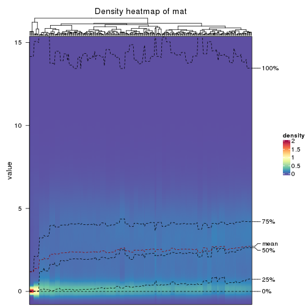


### Suggest the best k


Folowing table shows the best `k` (number of partitions) for each combination
of top-value methods and partition methods. Clicking on the method name in
the table goes to the section for a single combination of methods.

[The cola vignette](http://bioconductor.org/packages/devel/bioc/vignettes/cola/inst/doc/cola.html#toc_13)
explains the definition of the metrics used for determining the best
number of partitions.


```r
suggest_best_k(res_list)
```


|                            | The best k| 1-PAC| Mean silhouette| Concordance|   |Optional k |
|:---------------------------|----------:|-----:|---------------:|-----------:|:--|:----------|
|[SD:hclust](#SD-hclust)     |          2| 1.000|           1.000|       1.000|** |           |
|[ATC:hclust](#ATC-hclust)   |          2| 1.000|           0.980|       0.989|** |           |
|[MAD:hclust](#MAD-hclust)   |          3| 0.984|           0.966|       0.974|** |2          |
|[ATC:NMF](#ATC-NMF)         |          3| 0.902|           0.894|       0.957|*  |           |
|[CV:NMF](#CV-NMF)           |          2| 0.879|           0.934|       0.969|   |           |
|[SD:pam](#SD-pam)           |          3| 0.864|           0.899|       0.959|   |           |
|[MAD:pam](#MAD-pam)         |          3| 0.828|           0.872|       0.951|   |           |
|[MAD:NMF](#MAD-NMF)         |          4| 0.781|           0.845|       0.917|   |           |
|[CV:hclust](#CV-hclust)     |          3| 0.773|           0.815|       0.923|   |           |
|[MAD:skmeans](#MAD-skmeans) |          2| 0.721|           0.875|       0.941|   |           |
|[ATC:skmeans](#ATC-skmeans) |          2| 0.608|           0.747|       0.901|   |           |
|[SD:NMF](#SD-NMF)           |          2| 0.599|           0.924|       0.930|   |           |
|[SD:skmeans](#SD-skmeans)   |          2| 0.582|           0.827|       0.922|   |           |
|[ATC:mclust](#ATC-mclust)   |          5| 0.579|           0.660|       0.786|   |           |
|[SD:mclust](#SD-mclust)     |          3| 0.549|           0.901|       0.910|   |           |
|[ATC:pam](#ATC-pam)         |          3| 0.534|           0.829|       0.911|   |           |
|[CV:skmeans](#CV-skmeans)   |          2| 0.505|           0.815|       0.905|   |           |
|[MAD:mclust](#MAD-mclust)   |          3| 0.412|           0.754|       0.847|   |           |
|[ATC:kmeans](#ATC-kmeans)   |          2| 0.343|           0.748|       0.858|   |           |
|[CV:mclust](#CV-mclust)     |          3| 0.324|           0.672|       0.751|   |           |
|[CV:pam](#CV-pam)           |          2| 0.261|           0.562|       0.795|   |           |
|[SD:kmeans](#SD-kmeans)     |          5| 0.065|           0.471|       0.603|   |           |
|[MAD:kmeans](#MAD-kmeans)   |          3| 0.058|           0.602|       0.717|   |           |
|[CV:kmeans](#CV-kmeans)     |          2| 0.027|           0.398|       0.762|   |           |

\*\*: 1-PAC > 0.95, \*: 1-PAC > 0.9


### CDF of consensus matrices

Cumulative distribution function curves of consensus matrix for all methods.


```r
collect_plots(res_list, fun = plot_ecdf)
```

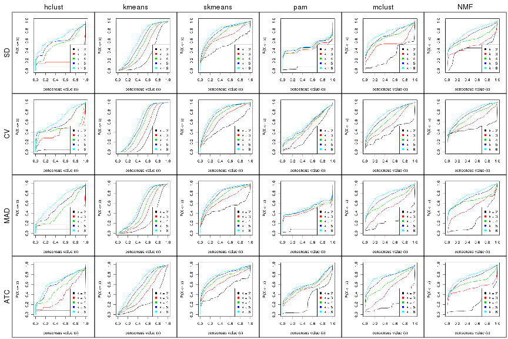


### Consensus heatmap

Consensus heatmaps for all methods. ([What is a consensus heatmap?](http://bioconductor.org/packages/devel/bioc/vignettes/cola/inst/doc/cola.html#toc_9))


<style type='text/css'>


.ui-helper-hidden {
	display: none;
}
.ui-helper-hidden-accessible {
	border: 0;
	clip: rect(0 0 0 0);
	height: 1px;
	margin: -1px;
	overflow: hidden;
	padding: 0;
	position: absolute;
	width: 1px;
}
.ui-helper-reset {
	margin: 0;
	padding: 0;
	border: 0;
	outline: 0;
	line-height: 1.3;
	text-decoration: none;
	font-size: 100%;
	list-style: none;
}
.ui-helper-clearfix:before,
.ui-helper-clearfix:after {
	content: "";
	display: table;
	border-collapse: collapse;
}
.ui-helper-clearfix:after {
	clear: both;
}
.ui-helper-zfix {
	width: 100%;
	height: 100%;
	top: 0;
	left: 0;
	position: absolute;
	opacity: 0;
	filter:Alpha(Opacity=0); 
}

.ui-front {
	z-index: 100;
}


.ui-state-disabled {
	cursor: default !important;
	pointer-events: none;
}


.ui-icon {
	display: inline-block;
	vertical-align: middle;
	margin-top: -.25em;
	position: relative;
	text-indent: -99999px;
	overflow: hidden;
	background-repeat: no-repeat;
}

.ui-widget-icon-block {
	left: 50%;
	margin-left: -8px;
	display: block;
}


.ui-widget-overlay {
	position: fixed;
	top: 0;
	left: 0;
	width: 100%;
	height: 100%;
}
.ui-accordion .ui-accordion-header {
	display: block;
	cursor: pointer;
	position: relative;
	margin: 2px 0 0 0;
	padding: .5em .5em .5em .7em;
	font-size: 100%;
}
.ui-accordion .ui-accordion-content {
	padding: 1em 2.2em;
	border-top: 0;
	overflow: auto;
}
.ui-autocomplete {
	position: absolute;
	top: 0;
	left: 0;
	cursor: default;
}
.ui-menu {
	list-style: none;
	padding: 0;
	margin: 0;
	display: block;
	outline: 0;
}
.ui-menu .ui-menu {
	position: absolute;
}
.ui-menu .ui-menu-item {
	margin: 0;
	cursor: pointer;
	
	list-style-image: url("data:image/gif;base64,R0lGODlhAQABAIAAAAAAAP///yH5BAEAAAAALAAAAAABAAEAAAIBRAA7");
}
.ui-menu .ui-menu-item-wrapper {
	position: relative;
	padding: 3px 1em 3px .4em;
}
.ui-menu .ui-menu-divider {
	margin: 5px 0;
	height: 0;
	font-size: 0;
	line-height: 0;
	border-width: 1px 0 0 0;
}
.ui-menu .ui-state-focus,
.ui-menu .ui-state-active {
	margin: -1px;
}


.ui-menu-icons {
	position: relative;
}
.ui-menu-icons .ui-menu-item-wrapper {
	padding-left: 2em;
}


.ui-menu .ui-icon {
	position: absolute;
	top: 0;
	bottom: 0;
	left: .2em;
	margin: auto 0;
}


.ui-menu .ui-menu-icon {
	left: auto;
	right: 0;
}
.ui-button {
	padding: .4em 1em;
	display: inline-block;
	position: relative;
	line-height: normal;
	margin-right: .1em;
	cursor: pointer;
	vertical-align: middle;
	text-align: center;
	-webkit-user-select: none;
	-moz-user-select: none;
	-ms-user-select: none;
	user-select: none;

	
	overflow: visible;
}

.ui-button,
.ui-button:link,
.ui-button:visited,
.ui-button:hover,
.ui-button:active {
	text-decoration: none;
}


.ui-button-icon-only {
	width: 2em;
	box-sizing: border-box;
	text-indent: -9999px;
	white-space: nowrap;
}


input.ui-button.ui-button-icon-only {
	text-indent: 0;
}


.ui-button-icon-only .ui-icon {
	position: absolute;
	top: 50%;
	left: 50%;
	margin-top: -8px;
	margin-left: -8px;
}

.ui-button.ui-icon-notext .ui-icon {
	padding: 0;
	width: 2.1em;
	height: 2.1em;
	text-indent: -9999px;
	white-space: nowrap;

}

input.ui-button.ui-icon-notext .ui-icon {
	width: auto;
	height: auto;
	text-indent: 0;
	white-space: normal;
	padding: .4em 1em;
}


input.ui-button::-moz-focus-inner,
button.ui-button::-moz-focus-inner {
	border: 0;
	padding: 0;
}
.ui-controlgroup {
	vertical-align: middle;
	display: inline-block;
}
.ui-controlgroup > .ui-controlgroup-item {
	float: left;
	margin-left: 0;
	margin-right: 0;
}
.ui-controlgroup > .ui-controlgroup-item:focus,
.ui-controlgroup > .ui-controlgroup-item.ui-visual-focus {
	z-index: 9999;
}
.ui-controlgroup-vertical > .ui-controlgroup-item {
	display: block;
	float: none;
	width: 100%;
	margin-top: 0;
	margin-bottom: 0;
	text-align: left;
}
.ui-controlgroup-vertical .ui-controlgroup-item {
	box-sizing: border-box;
}
.ui-controlgroup .ui-controlgroup-label {
	padding: .4em 1em;
}
.ui-controlgroup .ui-controlgroup-label span {
	font-size: 80%;
}
.ui-controlgroup-horizontal .ui-controlgroup-label + .ui-controlgroup-item {
	border-left: none;
}
.ui-controlgroup-vertical .ui-controlgroup-label + .ui-controlgroup-item {
	border-top: none;
}
.ui-controlgroup-horizontal .ui-controlgroup-label.ui-widget-content {
	border-right: none;
}
.ui-controlgroup-vertical .ui-controlgroup-label.ui-widget-content {
	border-bottom: none;
}


.ui-controlgroup-vertical .ui-spinner-input {

	
	width: 75%;
	width: calc( 100% - 2.4em );
}
.ui-controlgroup-vertical .ui-spinner .ui-spinner-up {
	border-top-style: solid;
}

.ui-checkboxradio-label .ui-icon-background {
	box-shadow: inset 1px 1px 1px #ccc;
	border-radius: .12em;
	border: none;
}
.ui-checkboxradio-radio-label .ui-icon-background {
	width: 16px;
	height: 16px;
	border-radius: 1em;
	overflow: visible;
	border: none;
}
.ui-checkboxradio-radio-label.ui-checkboxradio-checked .ui-icon,
.ui-checkboxradio-radio-label.ui-checkboxradio-checked:hover .ui-icon {
	background-image: none;
	width: 8px;
	height: 8px;
	border-width: 4px;
	border-style: solid;
}
.ui-checkboxradio-disabled {
	pointer-events: none;
}
.ui-datepicker {
	width: 17em;
	padding: .2em .2em 0;
	display: none;
}
.ui-datepicker .ui-datepicker-header {
	position: relative;
	padding: .2em 0;
}
.ui-datepicker .ui-datepicker-prev,
.ui-datepicker .ui-datepicker-next {
	position: absolute;
	top: 2px;
	width: 1.8em;
	height: 1.8em;
}
.ui-datepicker .ui-datepicker-prev-hover,
.ui-datepicker .ui-datepicker-next-hover {
	top: 1px;
}
.ui-datepicker .ui-datepicker-prev {
	left: 2px;
}
.ui-datepicker .ui-datepicker-next {
	right: 2px;
}
.ui-datepicker .ui-datepicker-prev-hover {
	left: 1px;
}
.ui-datepicker .ui-datepicker-next-hover {
	right: 1px;
}
.ui-datepicker .ui-datepicker-prev span,
.ui-datepicker .ui-datepicker-next span {
	display: block;
	position: absolute;
	left: 50%;
	margin-left: -8px;
	top: 50%;
	margin-top: -8px;
}
.ui-datepicker .ui-datepicker-title {
	margin: 0 2.3em;
	line-height: 1.8em;
	text-align: center;
}
.ui-datepicker .ui-datepicker-title select {
	font-size: 1em;
	margin: 1px 0;
}
.ui-datepicker select.ui-datepicker-month,
.ui-datepicker select.ui-datepicker-year {
	width: 45%;
}
.ui-datepicker table {
	width: 100%;
	font-size: .9em;
	border-collapse: collapse;
	margin: 0 0 .4em;
}
.ui-datepicker th {
	padding: .7em .3em;
	text-align: center;
	font-weight: bold;
	border: 0;
}
.ui-datepicker td {
	border: 0;
	padding: 1px;
}
.ui-datepicker td span,
.ui-datepicker td a {
	display: block;
	padding: .2em;
	text-align: right;
	text-decoration: none;
}
.ui-datepicker .ui-datepicker-buttonpane {
	background-image: none;
	margin: .7em 0 0 0;
	padding: 0 .2em;
	border-left: 0;
	border-right: 0;
	border-bottom: 0;
}
.ui-datepicker .ui-datepicker-buttonpane button {
	float: right;
	margin: .5em .2em .4em;
	cursor: pointer;
	padding: .2em .6em .3em .6em;
	width: auto;
	overflow: visible;
}
.ui-datepicker .ui-datepicker-buttonpane button.ui-datepicker-current {
	float: left;
}


.ui-datepicker.ui-datepicker-multi {
	width: auto;
}
.ui-datepicker-multi .ui-datepicker-group {
	float: left;
}
.ui-datepicker-multi .ui-datepicker-group table {
	width: 95%;
	margin: 0 auto .4em;
}
.ui-datepicker-multi-2 .ui-datepicker-group {
	width: 50%;
}
.ui-datepicker-multi-3 .ui-datepicker-group {
	width: 33.3%;
}
.ui-datepicker-multi-4 .ui-datepicker-group {
	width: 25%;
}
.ui-datepicker-multi .ui-datepicker-group-last .ui-datepicker-header,
.ui-datepicker-multi .ui-datepicker-group-middle .ui-datepicker-header {
	border-left-width: 0;
}
.ui-datepicker-multi .ui-datepicker-buttonpane {
	clear: left;
}
.ui-datepicker-row-break {
	clear: both;
	width: 100%;
	font-size: 0;
}


.ui-datepicker-rtl {
	direction: rtl;
}
.ui-datepicker-rtl .ui-datepicker-prev {
	right: 2px;
	left: auto;
}
.ui-datepicker-rtl .ui-datepicker-next {
	left: 2px;
	right: auto;
}
.ui-datepicker-rtl .ui-datepicker-prev:hover {
	right: 1px;
	left: auto;
}
.ui-datepicker-rtl .ui-datepicker-next:hover {
	left: 1px;
	right: auto;
}
.ui-datepicker-rtl .ui-datepicker-buttonpane {
	clear: right;
}
.ui-datepicker-rtl .ui-datepicker-buttonpane button {
	float: left;
}
.ui-datepicker-rtl .ui-datepicker-buttonpane button.ui-datepicker-current,
.ui-datepicker-rtl .ui-datepicker-group {
	float: right;
}
.ui-datepicker-rtl .ui-datepicker-group-last .ui-datepicker-header,
.ui-datepicker-rtl .ui-datepicker-group-middle .ui-datepicker-header {
	border-right-width: 0;
	border-left-width: 1px;
}


.ui-datepicker .ui-icon {
	display: block;
	text-indent: -99999px;
	overflow: hidden;
	background-repeat: no-repeat;
	left: .5em;
	top: .3em;
}
.ui-dialog {
	position: absolute;
	top: 0;
	left: 0;
	padding: .2em;
	outline: 0;
}
.ui-dialog .ui-dialog-titlebar {
	padding: .4em 1em;
	position: relative;
}
.ui-dialog .ui-dialog-title {
	float: left;
	margin: .1em 0;
	white-space: nowrap;
	width: 90%;
	overflow: hidden;
	text-overflow: ellipsis;
}
.ui-dialog .ui-dialog-titlebar-close {
	position: absolute;
	right: .3em;
	top: 50%;
	width: 20px;
	margin: -10px 0 0 0;
	padding: 1px;
	height: 20px;
}
.ui-dialog .ui-dialog-content {
	position: relative;
	border: 0;
	padding: .5em 1em;
	background: none;
	overflow: auto;
}
.ui-dialog .ui-dialog-buttonpane {
	text-align: left;
	border-width: 1px 0 0 0;
	background-image: none;
	margin-top: .5em;
	padding: .3em 1em .5em .4em;
}
.ui-dialog .ui-dialog-buttonpane .ui-dialog-buttonset {
	float: right;
}
.ui-dialog .ui-dialog-buttonpane button {
	margin: .5em .4em .5em 0;
	cursor: pointer;
}
.ui-dialog .ui-resizable-n {
	height: 2px;
	top: 0;
}
.ui-dialog .ui-resizable-e {
	width: 2px;
	right: 0;
}
.ui-dialog .ui-resizable-s {
	height: 2px;
	bottom: 0;
}
.ui-dialog .ui-resizable-w {
	width: 2px;
	left: 0;
}
.ui-dialog .ui-resizable-se,
.ui-dialog .ui-resizable-sw,
.ui-dialog .ui-resizable-ne,
.ui-dialog .ui-resizable-nw {
	width: 7px;
	height: 7px;
}
.ui-dialog .ui-resizable-se {
	right: 0;
	bottom: 0;
}
.ui-dialog .ui-resizable-sw {
	left: 0;
	bottom: 0;
}
.ui-dialog .ui-resizable-ne {
	right: 0;
	top: 0;
}
.ui-dialog .ui-resizable-nw {
	left: 0;
	top: 0;
}
.ui-draggable .ui-dialog-titlebar {
	cursor: move;
}
.ui-draggable-handle {
	-ms-touch-action: none;
	touch-action: none;
}
.ui-resizable {
	position: relative;
}
.ui-resizable-handle {
	position: absolute;
	font-size: 0.1px;
	display: block;
	-ms-touch-action: none;
	touch-action: none;
}
.ui-resizable-disabled .ui-resizable-handle,
.ui-resizable-autohide .ui-resizable-handle {
	display: none;
}
.ui-resizable-n {
	cursor: n-resize;
	height: 7px;
	width: 100%;
	top: -5px;
	left: 0;
}
.ui-resizable-s {
	cursor: s-resize;
	height: 7px;
	width: 100%;
	bottom: -5px;
	left: 0;
}
.ui-resizable-e {
	cursor: e-resize;
	width: 7px;
	right: -5px;
	top: 0;
	height: 100%;
}
.ui-resizable-w {
	cursor: w-resize;
	width: 7px;
	left: -5px;
	top: 0;
	height: 100%;
}
.ui-resizable-se {
	cursor: se-resize;
	width: 12px;
	height: 12px;
	right: 1px;
	bottom: 1px;
}
.ui-resizable-sw {
	cursor: sw-resize;
	width: 9px;
	height: 9px;
	left: -5px;
	bottom: -5px;
}
.ui-resizable-nw {
	cursor: nw-resize;
	width: 9px;
	height: 9px;
	left: -5px;
	top: -5px;
}
.ui-resizable-ne {
	cursor: ne-resize;
	width: 9px;
	height: 9px;
	right: -5px;
	top: -5px;
}
.ui-progressbar {
	height: 2em;
	text-align: left;
	overflow: hidden;
}
.ui-progressbar .ui-progressbar-value {
	margin: -1px;
	height: 100%;
}
.ui-progressbar .ui-progressbar-overlay {
	background: url("");
	height: 100%;
	filter: alpha(opacity=25); 
	opacity: 0.25;
}
.ui-progressbar-indeterminate .ui-progressbar-value {
	background-image: none;
}
.ui-selectable {
	-ms-touch-action: none;
	touch-action: none;
}
.ui-selectable-helper {
	position: absolute;
	z-index: 100;
	border: 1px dotted black;
}
.ui-selectmenu-menu {
	padding: 0;
	margin: 0;
	position: absolute;
	top: 0;
	left: 0;
	display: none;
}
.ui-selectmenu-menu .ui-menu {
	overflow: auto;
	overflow-x: hidden;
	padding-bottom: 1px;
}
.ui-selectmenu-menu .ui-menu .ui-selectmenu-optgroup {
	font-size: 1em;
	font-weight: bold;
	line-height: 1.5;
	padding: 2px 0.4em;
	margin: 0.5em 0 0 0;
	height: auto;
	border: 0;
}
.ui-selectmenu-open {
	display: block;
}
.ui-selectmenu-text {
	display: block;
	margin-right: 20px;
	overflow: hidden;
	text-overflow: ellipsis;
}
.ui-selectmenu-button.ui-button {
	text-align: left;
	white-space: nowrap;
	width: 14em;
}
.ui-selectmenu-icon.ui-icon {
	float: right;
	margin-top: 0;
}
.ui-slider {
	position: relative;
	text-align: left;
}
.ui-slider .ui-slider-handle {
	position: absolute;
	z-index: 2;
	width: 1.2em;
	height: 1.2em;
	cursor: default;
	-ms-touch-action: none;
	touch-action: none;
}
.ui-slider .ui-slider-range {
	position: absolute;
	z-index: 1;
	font-size: .7em;
	display: block;
	border: 0;
	background-position: 0 0;
}


.ui-slider.ui-state-disabled .ui-slider-handle,
.ui-slider.ui-state-disabled .ui-slider-range {
	filter: inherit;
}

.ui-slider-horizontal {
	height: .8em;
}
.ui-slider-horizontal .ui-slider-handle {
	top: -.3em;
	margin-left: -.6em;
}
.ui-slider-horizontal .ui-slider-range {
	top: 0;
	height: 100%;
}
.ui-slider-horizontal .ui-slider-range-min {
	left: 0;
}
.ui-slider-horizontal .ui-slider-range-max {
	right: 0;
}

.ui-slider-vertical {
	width: .8em;
	height: 100px;
}
.ui-slider-vertical .ui-slider-handle {
	left: -.3em;
	margin-left: 0;
	margin-bottom: -.6em;
}
.ui-slider-vertical .ui-slider-range {
	left: 0;
	width: 100%;
}
.ui-slider-vertical .ui-slider-range-min {
	bottom: 0;
}
.ui-slider-vertical .ui-slider-range-max {
	top: 0;
}
.ui-sortable-handle {
	-ms-touch-action: none;
	touch-action: none;
}
.ui-spinner {
	position: relative;
	display: inline-block;
	overflow: hidden;
	padding: 0;
	vertical-align: middle;
}
.ui-spinner-input {
	border: none;
	background: none;
	color: inherit;
	padding: .222em 0;
	margin: .2em 0;
	vertical-align: middle;
	margin-left: .4em;
	margin-right: 2em;
}
.ui-spinner-button {
	width: 1.6em;
	height: 50%;
	font-size: .5em;
	padding: 0;
	margin: 0;
	text-align: center;
	position: absolute;
	cursor: default;
	display: block;
	overflow: hidden;
	right: 0;
}

.ui-spinner a.ui-spinner-button {
	border-top-style: none;
	border-bottom-style: none;
	border-right-style: none;
}
.ui-spinner-up {
	top: 0;
}
.ui-spinner-down {
	bottom: 0;
}
.ui-tabs {
	position: relative;
	padding: .2em;
}
.ui-tabs .ui-tabs-nav {
	margin: 0;
	padding: .2em .2em 0;
}
.ui-tabs .ui-tabs-nav li {
	list-style: none;
	float: left;
	position: relative;
	top: 0;
	margin: 1px .2em 0 0;
	border-bottom-width: 0;
	padding: 0;
	white-space: nowrap;
}
.ui-tabs .ui-tabs-nav .ui-tabs-anchor {
	float: left;
	padding: .5em 1em;
	text-decoration: none;
}
.ui-tabs .ui-tabs-nav li.ui-tabs-active {
	margin-bottom: -1px;
	padding-bottom: 1px;
}
.ui-tabs .ui-tabs-nav li.ui-tabs-active .ui-tabs-anchor,
.ui-tabs .ui-tabs-nav li.ui-state-disabled .ui-tabs-anchor,
.ui-tabs .ui-tabs-nav li.ui-tabs-loading .ui-tabs-anchor {
	cursor: text;
}
.ui-tabs-collapsible .ui-tabs-nav li.ui-tabs-active .ui-tabs-anchor {
	cursor: pointer;
}
.ui-tabs .ui-tabs-panel {
	display: block;
	border-width: 0;
	padding: 1em 1.4em;
	background: none;
}
.ui-tooltip {
	padding: 8px;
	position: absolute;
	z-index: 9999;
	max-width: 300px;
}
body .ui-tooltip {
	border-width: 2px;
}

.ui-widget {
	font-family: Arial,Helvetica,sans-serif;
	font-size: 1em;
}
.ui-widget .ui-widget {
	font-size: 1em;
}
.ui-widget input,
.ui-widget select,
.ui-widget textarea,
.ui-widget button {
	font-family: Arial,Helvetica,sans-serif;
	font-size: 1em;
}
.ui-widget.ui-widget-content {
	border: 1px solid #c5c5c5;
}
.ui-widget-content {
	border: 1px solid #dddddd;
	background: #ffffff;
	color: #333333;
}
.ui-widget-content a {
	color: #333333;
}
.ui-widget-header {
	border: 1px solid #dddddd;
	background: #e9e9e9;
	color: #333333;
	font-weight: bold;
}
.ui-widget-header a {
	color: #333333;
}


.ui-state-default,
.ui-widget-content .ui-state-default,
.ui-widget-header .ui-state-default,
.ui-button,


html .ui-button.ui-state-disabled:hover,
html .ui-button.ui-state-disabled:active {
	border: 1px solid #c5c5c5;
	background: #f6f6f6;
	font-weight: normal;
	color: #454545;
}
.ui-state-default a,
.ui-state-default a:link,
.ui-state-default a:visited,
a.ui-button,
a:link.ui-button,
a:visited.ui-button,
.ui-button {
	color: #454545;
	text-decoration: none;
}
.ui-state-hover,
.ui-widget-content .ui-state-hover,
.ui-widget-header .ui-state-hover,
.ui-state-focus,
.ui-widget-content .ui-state-focus,
.ui-widget-header .ui-state-focus,
.ui-button:hover,
.ui-button:focus {
	border: 1px solid #cccccc;
	background: #ededed;
	font-weight: normal;
	color: #2b2b2b;
}
.ui-state-hover a,
.ui-state-hover a:hover,
.ui-state-hover a:link,
.ui-state-hover a:visited,
.ui-state-focus a,
.ui-state-focus a:hover,
.ui-state-focus a:link,
.ui-state-focus a:visited,
a.ui-button:hover,
a.ui-button:focus {
	color: #2b2b2b;
	text-decoration: none;
}

.ui-visual-focus {
	box-shadow: 0 0 3px 1px rgb(94, 158, 214);
}
.ui-state-active,
.ui-widget-content .ui-state-active,
.ui-widget-header .ui-state-active,
a.ui-button:active,
.ui-button:active,
.ui-button.ui-state-active:hover {
	border: 1px solid #003eff;
	background: #007fff;
	font-weight: normal;
	color: #ffffff;
}
.ui-icon-background,
.ui-state-active .ui-icon-background {
	border: #003eff;
	background-color: #ffffff;
}
.ui-state-active a,
.ui-state-active a:link,
.ui-state-active a:visited {
	color: #ffffff;
	text-decoration: none;
}


.ui-state-highlight,
.ui-widget-content .ui-state-highlight,
.ui-widget-header .ui-state-highlight {
	border: 1px solid #dad55e;
	background: #fffa90;
	color: #777620;
}
.ui-state-checked {
	border: 1px solid #dad55e;
	background: #fffa90;
}
.ui-state-highlight a,
.ui-widget-content .ui-state-highlight a,
.ui-widget-header .ui-state-highlight a {
	color: #777620;
}
.ui-state-error,
.ui-widget-content .ui-state-error,
.ui-widget-header .ui-state-error {
	border: 1px solid #f1a899;
	background: #fddfdf;
	color: #5f3f3f;
}
.ui-state-error a,
.ui-widget-content .ui-state-error a,
.ui-widget-header .ui-state-error a {
	color: #5f3f3f;
}
.ui-state-error-text,
.ui-widget-content .ui-state-error-text,
.ui-widget-header .ui-state-error-text {
	color: #5f3f3f;
}
.ui-priority-primary,
.ui-widget-content .ui-priority-primary,
.ui-widget-header .ui-priority-primary {
	font-weight: bold;
}
.ui-priority-secondary,
.ui-widget-content .ui-priority-secondary,
.ui-widget-header .ui-priority-secondary {
	opacity: .7;
	filter:Alpha(Opacity=70); 
	font-weight: normal;
}
.ui-state-disabled,
.ui-widget-content .ui-state-disabled,
.ui-widget-header .ui-state-disabled {
	opacity: .35;
	filter:Alpha(Opacity=35); 
	background-image: none;
}
.ui-state-disabled .ui-icon {
	filter:Alpha(Opacity=35); 
}


.ui-icon {
	width: 16px;
	height: 16px;
}
.ui-icon,
.ui-widget-content .ui-icon {
	background-image: url("images/ui-icons_444444_256x240.png");
}
.ui-widget-header .ui-icon {
	background-image: url("images/ui-icons_444444_256x240.png");
}
.ui-state-hover .ui-icon,
.ui-state-focus .ui-icon,
.ui-button:hover .ui-icon,
.ui-button:focus .ui-icon {
	background-image: url("images/ui-icons_555555_256x240.png");
}
.ui-state-active .ui-icon,
.ui-button:active .ui-icon {
	background-image: url("images/ui-icons_ffffff_256x240.png");
}
.ui-state-highlight .ui-icon,
.ui-button .ui-state-highlight.ui-icon {
	background-image: url("images/ui-icons_777620_256x240.png");
}
.ui-state-error .ui-icon,
.ui-state-error-text .ui-icon {
	background-image: url("images/ui-icons_cc0000_256x240.png");
}
.ui-button .ui-icon {
	background-image: url("images/ui-icons_777777_256x240.png");
}


.ui-icon-blank { background-position: 16px 16px; }
.ui-icon-caret-1-n { background-position: 0 0; }
.ui-icon-caret-1-ne { background-position: -16px 0; }
.ui-icon-caret-1-e { background-position: -32px 0; }
.ui-icon-caret-1-se { background-position: -48px 0; }
.ui-icon-caret-1-s { background-position: -65px 0; }
.ui-icon-caret-1-sw { background-position: -80px 0; }
.ui-icon-caret-1-w { background-position: -96px 0; }
.ui-icon-caret-1-nw { background-position: -112px 0; }
.ui-icon-caret-2-n-s { background-position: -128px 0; }
.ui-icon-caret-2-e-w { background-position: -144px 0; }
.ui-icon-triangle-1-n { background-position: 0 -16px; }
.ui-icon-triangle-1-ne { background-position: -16px -16px; }
.ui-icon-triangle-1-e { background-position: -32px -16px; }
.ui-icon-triangle-1-se { background-position: -48px -16px; }
.ui-icon-triangle-1-s { background-position: -65px -16px; }
.ui-icon-triangle-1-sw { background-position: -80px -16px; }
.ui-icon-triangle-1-w { background-position: -96px -16px; }
.ui-icon-triangle-1-nw { background-position: -112px -16px; }
.ui-icon-triangle-2-n-s { background-position: -128px -16px; }
.ui-icon-triangle-2-e-w { background-position: -144px -16px; }
.ui-icon-arrow-1-n { background-position: 0 -32px; }
.ui-icon-arrow-1-ne { background-position: -16px -32px; }
.ui-icon-arrow-1-e { background-position: -32px -32px; }
.ui-icon-arrow-1-se { background-position: -48px -32px; }
.ui-icon-arrow-1-s { background-position: -65px -32px; }
.ui-icon-arrow-1-sw { background-position: -80px -32px; }
.ui-icon-arrow-1-w { background-position: -96px -32px; }
.ui-icon-arrow-1-nw { background-position: -112px -32px; }
.ui-icon-arrow-2-n-s { background-position: -128px -32px; }
.ui-icon-arrow-2-ne-sw { background-position: -144px -32px; }
.ui-icon-arrow-2-e-w { background-position: -160px -32px; }
.ui-icon-arrow-2-se-nw { background-position: -176px -32px; }
.ui-icon-arrowstop-1-n { background-position: -192px -32px; }
.ui-icon-arrowstop-1-e { background-position: -208px -32px; }
.ui-icon-arrowstop-1-s { background-position: -224px -32px; }
.ui-icon-arrowstop-1-w { background-position: -240px -32px; }
.ui-icon-arrowthick-1-n { background-position: 1px -48px; }
.ui-icon-arrowthick-1-ne { background-position: -16px -48px; }
.ui-icon-arrowthick-1-e { background-position: -32px -48px; }
.ui-icon-arrowthick-1-se { background-position: -48px -48px; }
.ui-icon-arrowthick-1-s { background-position: -64px -48px; }
.ui-icon-arrowthick-1-sw { background-position: -80px -48px; }
.ui-icon-arrowthick-1-w { background-position: -96px -48px; }
.ui-icon-arrowthick-1-nw { background-position: -112px -48px; }
.ui-icon-arrowthick-2-n-s { background-position: -128px -48px; }
.ui-icon-arrowthick-2-ne-sw { background-position: -144px -48px; }
.ui-icon-arrowthick-2-e-w { background-position: -160px -48px; }
.ui-icon-arrowthick-2-se-nw { background-position: -176px -48px; }
.ui-icon-arrowthickstop-1-n { background-position: -192px -48px; }
.ui-icon-arrowthickstop-1-e { background-position: -208px -48px; }
.ui-icon-arrowthickstop-1-s { background-position: -224px -48px; }
.ui-icon-arrowthickstop-1-w { background-position: -240px -48px; }
.ui-icon-arrowreturnthick-1-w { background-position: 0 -64px; }
.ui-icon-arrowreturnthick-1-n { background-position: -16px -64px; }
.ui-icon-arrowreturnthick-1-e { background-position: -32px -64px; }
.ui-icon-arrowreturnthick-1-s { background-position: -48px -64px; }
.ui-icon-arrowreturn-1-w { background-position: -64px -64px; }
.ui-icon-arrowreturn-1-n { background-position: -80px -64px; }
.ui-icon-arrowreturn-1-e { background-position: -96px -64px; }
.ui-icon-arrowreturn-1-s { background-position: -112px -64px; }
.ui-icon-arrowrefresh-1-w { background-position: -128px -64px; }
.ui-icon-arrowrefresh-1-n { background-position: -144px -64px; }
.ui-icon-arrowrefresh-1-e { background-position: -160px -64px; }
.ui-icon-arrowrefresh-1-s { background-position: -176px -64px; }
.ui-icon-arrow-4 { background-position: 0 -80px; }
.ui-icon-arrow-4-diag { background-position: -16px -80px; }
.ui-icon-extlink { background-position: -32px -80px; }
.ui-icon-newwin { background-position: -48px -80px; }
.ui-icon-refresh { background-position: -64px -80px; }
.ui-icon-shuffle { background-position: -80px -80px; }
.ui-icon-transfer-e-w { background-position: -96px -80px; }
.ui-icon-transferthick-e-w { background-position: -112px -80px; }
.ui-icon-folder-collapsed { background-position: 0 -96px; }
.ui-icon-folder-open { background-position: -16px -96px; }
.ui-icon-document { background-position: -32px -96px; }
.ui-icon-document-b { background-position: -48px -96px; }
.ui-icon-note { background-position: -64px -96px; }
.ui-icon-mail-closed { background-position: -80px -96px; }
.ui-icon-mail-open { background-position: -96px -96px; }
.ui-icon-suitcase { background-position: -112px -96px; }
.ui-icon-comment { background-position: -128px -96px; }
.ui-icon-person { background-position: -144px -96px; }
.ui-icon-print { background-position: -160px -96px; }
.ui-icon-trash { background-position: -176px -96px; }
.ui-icon-locked { background-position: -192px -96px; }
.ui-icon-unlocked { background-position: -208px -96px; }
.ui-icon-bookmark { background-position: -224px -96px; }
.ui-icon-tag { background-position: -240px -96px; }
.ui-icon-home { background-position: 0 -112px; }
.ui-icon-flag { background-position: -16px -112px; }
.ui-icon-calendar { background-position: -32px -112px; }
.ui-icon-cart { background-position: -48px -112px; }
.ui-icon-pencil { background-position: -64px -112px; }
.ui-icon-clock { background-position: -80px -112px; }
.ui-icon-disk { background-position: -96px -112px; }
.ui-icon-calculator { background-position: -112px -112px; }
.ui-icon-zoomin { background-position: -128px -112px; }
.ui-icon-zoomout { background-position: -144px -112px; }
.ui-icon-search { background-position: -160px -112px; }
.ui-icon-wrench { background-position: -176px -112px; }
.ui-icon-gear { background-position: -192px -112px; }
.ui-icon-heart { background-position: -208px -112px; }
.ui-icon-star { background-position: -224px -112px; }
.ui-icon-link { background-position: -240px -112px; }
.ui-icon-cancel { background-position: 0 -128px; }
.ui-icon-plus { background-position: -16px -128px; }
.ui-icon-plusthick { background-position: -32px -128px; }
.ui-icon-minus { background-position: -48px -128px; }
.ui-icon-minusthick { background-position: -64px -128px; }
.ui-icon-close { background-position: -80px -128px; }
.ui-icon-closethick { background-position: -96px -128px; }
.ui-icon-key { background-position: -112px -128px; }
.ui-icon-lightbulb { background-position: -128px -128px; }
.ui-icon-scissors { background-position: -144px -128px; }
.ui-icon-clipboard { background-position: -160px -128px; }
.ui-icon-copy { background-position: -176px -128px; }
.ui-icon-contact { background-position: -192px -128px; }
.ui-icon-image { background-position: -208px -128px; }
.ui-icon-video { background-position: -224px -128px; }
.ui-icon-script { background-position: -240px -128px; }
.ui-icon-alert { background-position: 0 -144px; }
.ui-icon-info { background-position: -16px -144px; }
.ui-icon-notice { background-position: -32px -144px; }
.ui-icon-help { background-position: -48px -144px; }
.ui-icon-check { background-position: -64px -144px; }
.ui-icon-bullet { background-position: -80px -144px; }
.ui-icon-radio-on { background-position: -96px -144px; }
.ui-icon-radio-off { background-position: -112px -144px; }
.ui-icon-pin-w { background-position: -128px -144px; }
.ui-icon-pin-s { background-position: -144px -144px; }
.ui-icon-play { background-position: 0 -160px; }
.ui-icon-pause { background-position: -16px -160px; }
.ui-icon-seek-next { background-position: -32px -160px; }
.ui-icon-seek-prev { background-position: -48px -160px; }
.ui-icon-seek-end { background-position: -64px -160px; }
.ui-icon-seek-start { background-position: -80px -160px; }

.ui-icon-seek-first { background-position: -80px -160px; }
.ui-icon-stop { background-position: -96px -160px; }
.ui-icon-eject { background-position: -112px -160px; }
.ui-icon-volume-off { background-position: -128px -160px; }
.ui-icon-volume-on { background-position: -144px -160px; }
.ui-icon-power { background-position: 0 -176px; }
.ui-icon-signal-diag { background-position: -16px -176px; }
.ui-icon-signal { background-position: -32px -176px; }
.ui-icon-battery-0 { background-position: -48px -176px; }
.ui-icon-battery-1 { background-position: -64px -176px; }
.ui-icon-battery-2 { background-position: -80px -176px; }
.ui-icon-battery-3 { background-position: -96px -176px; }
.ui-icon-circle-plus { background-position: 0 -192px; }
.ui-icon-circle-minus { background-position: -16px -192px; }
.ui-icon-circle-close { background-position: -32px -192px; }
.ui-icon-circle-triangle-e { background-position: -48px -192px; }
.ui-icon-circle-triangle-s { background-position: -64px -192px; }
.ui-icon-circle-triangle-w { background-position: -80px -192px; }
.ui-icon-circle-triangle-n { background-position: -96px -192px; }
.ui-icon-circle-arrow-e { background-position: -112px -192px; }
.ui-icon-circle-arrow-s { background-position: -128px -192px; }
.ui-icon-circle-arrow-w { background-position: -144px -192px; }
.ui-icon-circle-arrow-n { background-position: -160px -192px; }
.ui-icon-circle-zoomin { background-position: -176px -192px; }
.ui-icon-circle-zoomout { background-position: -192px -192px; }
.ui-icon-circle-check { background-position: -208px -192px; }
.ui-icon-circlesmall-plus { background-position: 0 -208px; }
.ui-icon-circlesmall-minus { background-position: -16px -208px; }
.ui-icon-circlesmall-close { background-position: -32px -208px; }
.ui-icon-squaresmall-plus { background-position: -48px -208px; }
.ui-icon-squaresmall-minus { background-position: -64px -208px; }
.ui-icon-squaresmall-close { background-position: -80px -208px; }
.ui-icon-grip-dotted-vertical { background-position: 0 -224px; }
.ui-icon-grip-dotted-horizontal { background-position: -16px -224px; }
.ui-icon-grip-solid-vertical { background-position: -32px -224px; }
.ui-icon-grip-solid-horizontal { background-position: -48px -224px; }
.ui-icon-gripsmall-diagonal-se { background-position: -64px -224px; }
.ui-icon-grip-diagonal-se { background-position: -80px -224px; }


.ui-corner-all,
.ui-corner-top,
.ui-corner-left,
.ui-corner-tl {
	border-top-left-radius: 3px;
}
.ui-corner-all,
.ui-corner-top,
.ui-corner-right,
.ui-corner-tr {
	border-top-right-radius: 3px;
}
.ui-corner-all,
.ui-corner-bottom,
.ui-corner-left,
.ui-corner-bl {
	border-bottom-left-radius: 3px;
}
.ui-corner-all,
.ui-corner-bottom,
.ui-corner-right,
.ui-corner-br {
	border-bottom-right-radius: 3px;
}


.ui-widget-overlay {
	background: #aaaaaa;
	opacity: .3;
	filter: Alpha(Opacity=30); 
}
.ui-widget-shadow {
	-webkit-box-shadow: 0px 0px 5px #666666;
	box-shadow: 0px 0px 5px #666666;
} 
</style>
<script src='js/jquery-1.12.4.js'></script>
<script src='js/jquery-ui.js'></script>

<script>
$( function() {
	$( '#tabs-collect-consensus-heatmap' ).tabs();
} );
</script>
<div id='tabs-collect-consensus-heatmap'>
<ul>
<li><a href='#tab-collect-consensus-heatmap-1'>k = 2</a></li>
<li><a href='#tab-collect-consensus-heatmap-2'>k = 3</a></li>
<li><a href='#tab-collect-consensus-heatmap-3'>k = 4</a></li>
<li><a href='#tab-collect-consensus-heatmap-4'>k = 5</a></li>
<li><a href='#tab-collect-consensus-heatmap-5'>k = 6</a></li>
</ul>
<div id='tab-collect-consensus-heatmap-1'>
<pre><code class="r">collect_plots(res_list, k = 2, fun = consensus_heatmap, mc.cores = 4)
</code></pre>

<p>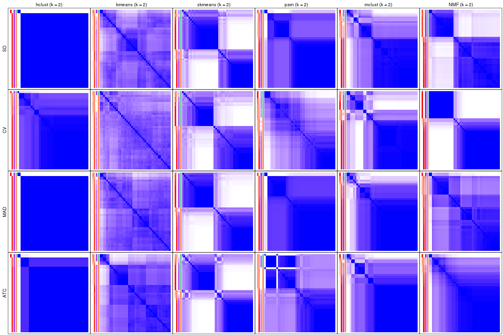</p>

</div>
<div id='tab-collect-consensus-heatmap-2'>
<pre><code class="r">collect_plots(res_list, k = 3, fun = consensus_heatmap, mc.cores = 4)
</code></pre>

<p>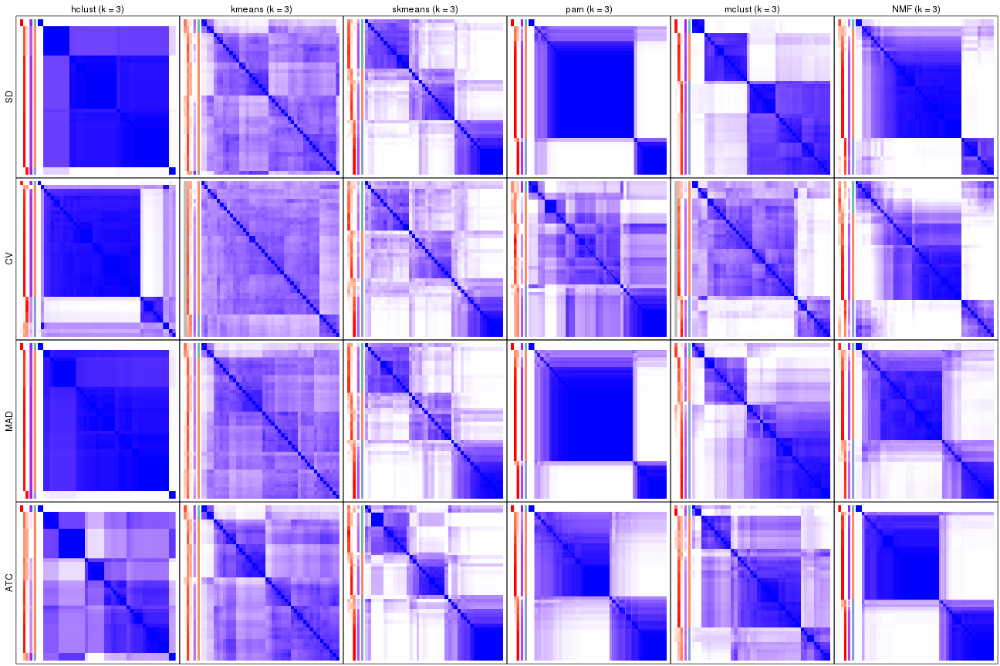</p>

</div>
<div id='tab-collect-consensus-heatmap-3'>
<pre><code class="r">collect_plots(res_list, k = 4, fun = consensus_heatmap, mc.cores = 4)
</code></pre>

<p>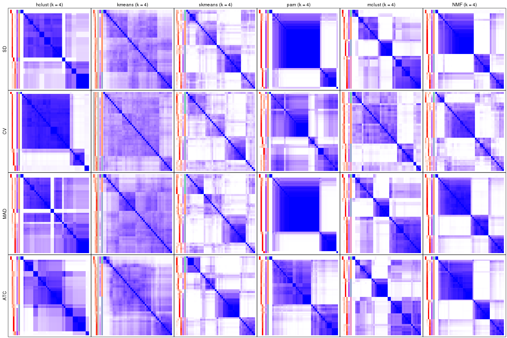</p>

</div>
<div id='tab-collect-consensus-heatmap-4'>
<pre><code class="r">collect_plots(res_list, k = 5, fun = consensus_heatmap, mc.cores = 4)
</code></pre>

<p>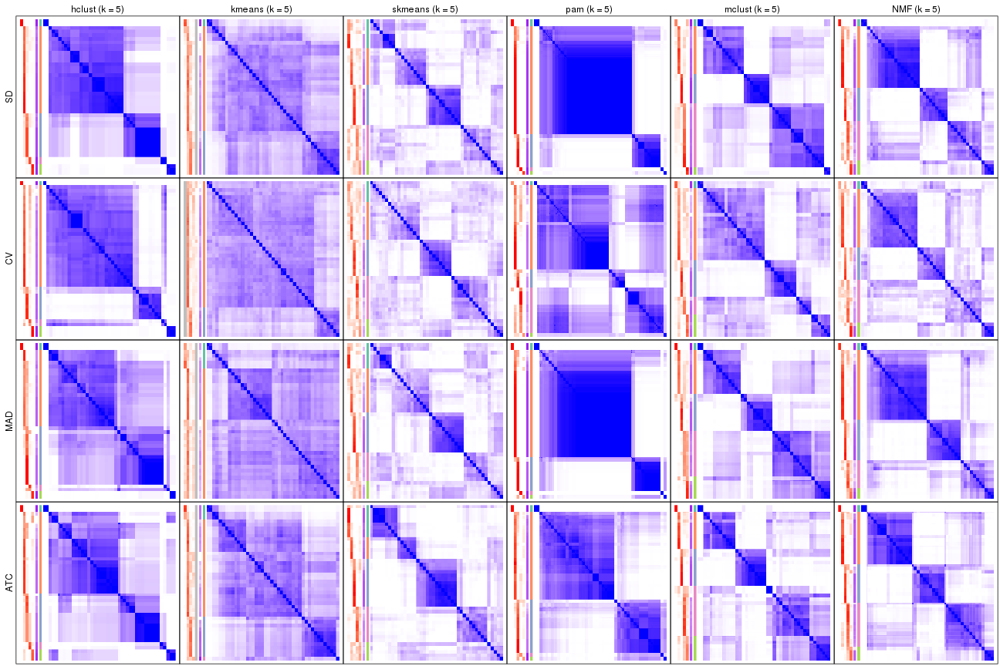</p>

</div>
<div id='tab-collect-consensus-heatmap-5'>
<pre><code class="r">collect_plots(res_list, k = 6, fun = consensus_heatmap, mc.cores = 4)
</code></pre>

<p>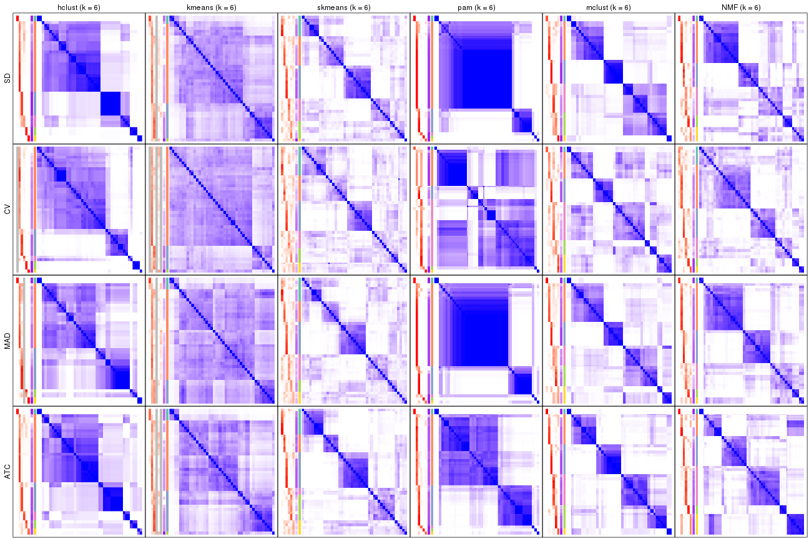</p>

</div>
</div>


### Membership heatmap

Membership heatmaps for all methods. ([What is a membership heatmap?](http://bioconductor.org/packages/devel/bioc/vignettes/cola/inst/doc/cola.html#toc_12))


<script>
$( function() {
	$( '#tabs-collect-membership-heatmap' ).tabs();
} );
</script>
<div id='tabs-collect-membership-heatmap'>
<ul>
<li><a href='#tab-collect-membership-heatmap-1'>k = 2</a></li>
<li><a href='#tab-collect-membership-heatmap-2'>k = 3</a></li>
<li><a href='#tab-collect-membership-heatmap-3'>k = 4</a></li>
<li><a href='#tab-collect-membership-heatmap-4'>k = 5</a></li>
<li><a href='#tab-collect-membership-heatmap-5'>k = 6</a></li>
</ul>
<div id='tab-collect-membership-heatmap-1'>
<pre><code class="r">collect_plots(res_list, k = 2, fun = membership_heatmap, mc.cores = 4)
</code></pre>

<p>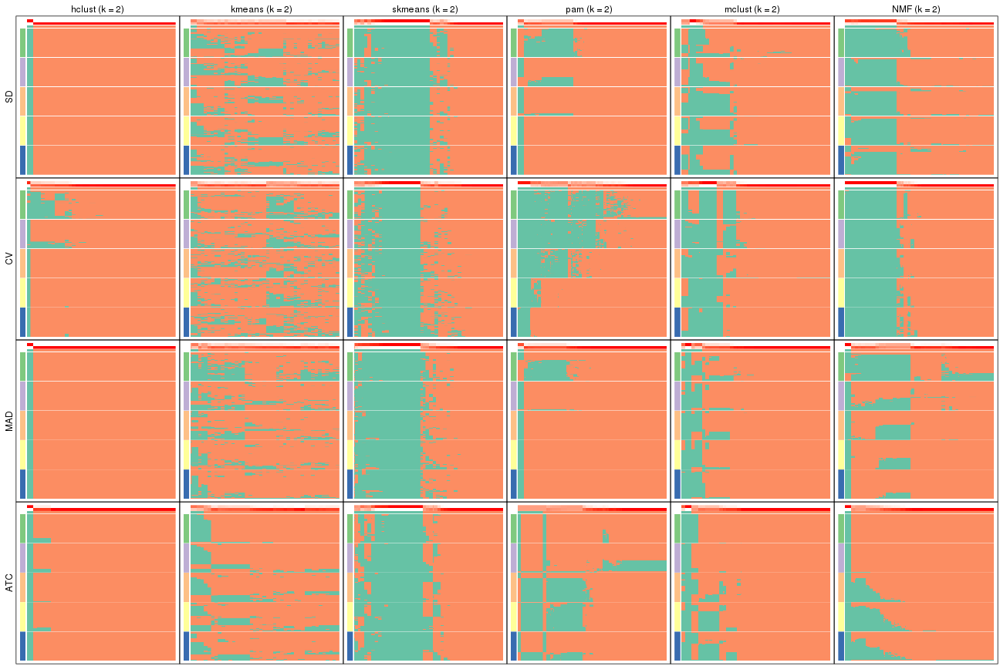</p>

</div>
<div id='tab-collect-membership-heatmap-2'>
<pre><code class="r">collect_plots(res_list, k = 3, fun = membership_heatmap, mc.cores = 4)
</code></pre>

<p>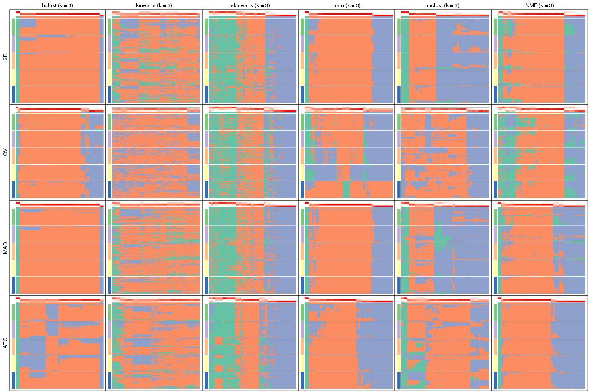</p>

</div>
<div id='tab-collect-membership-heatmap-3'>
<pre><code class="r">collect_plots(res_list, k = 4, fun = membership_heatmap, mc.cores = 4)
</code></pre>

<p>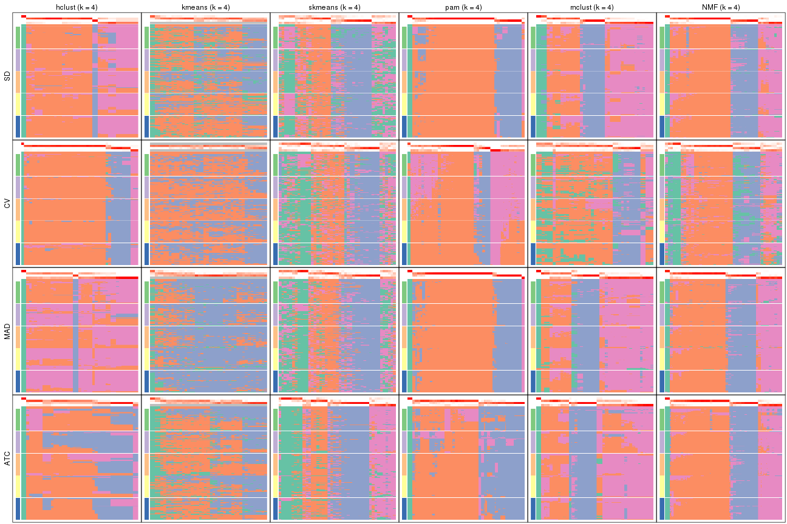</p>

</div>
<div id='tab-collect-membership-heatmap-4'>
<pre><code class="r">collect_plots(res_list, k = 5, fun = membership_heatmap, mc.cores = 4)
</code></pre>

<p>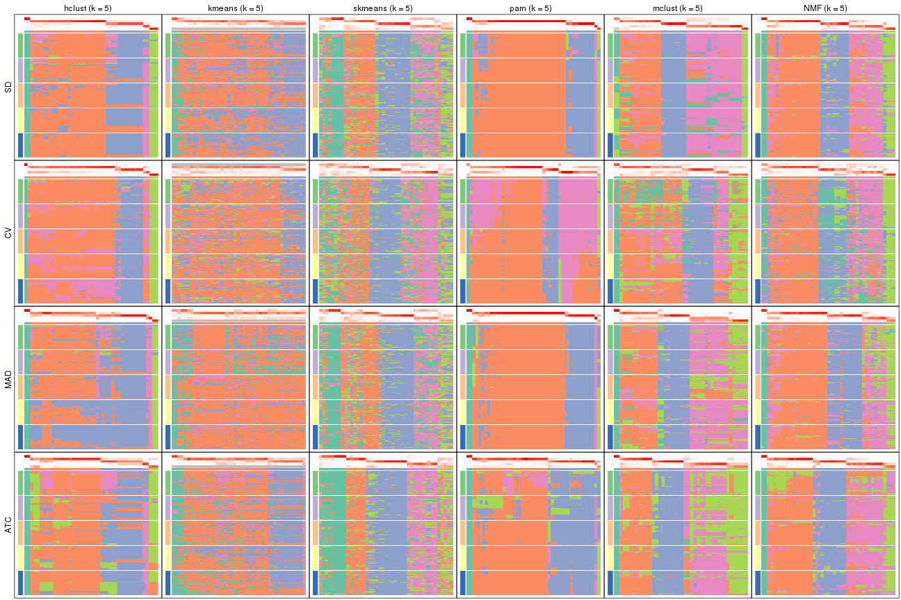</p>

</div>
<div id='tab-collect-membership-heatmap-5'>
<pre><code class="r">collect_plots(res_list, k = 6, fun = membership_heatmap, mc.cores = 4)
</code></pre>

<p>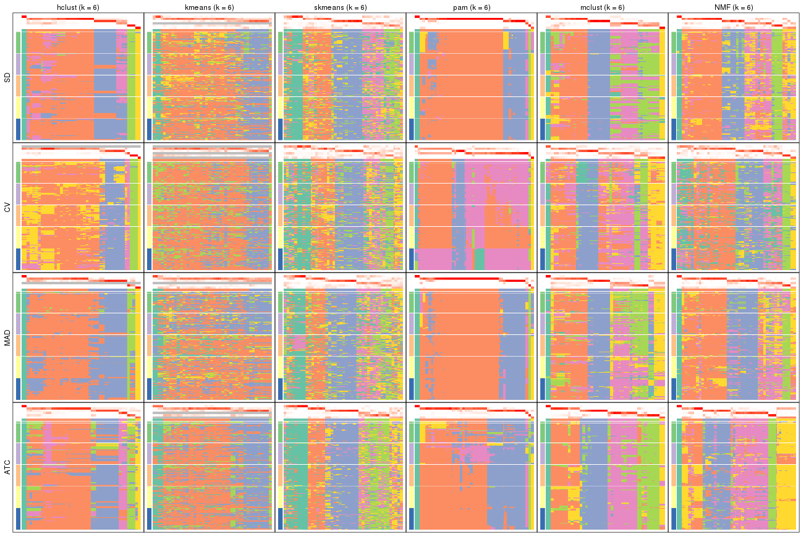</p>

</div>
</div>


### Signature heatmap

Signature heatmaps for all methods. ([What is a signature heatmap?](http://bioconductor.org/packages/devel/bioc/vignettes/cola/inst/doc/cola.html#toc_22))


Note in following heatmaps, rows are scaled.


<script>
$( function() {
	$( '#tabs-collect-get-signatures' ).tabs();
} );
</script>
<div id='tabs-collect-get-signatures'>
<ul>
<li><a href='#tab-collect-get-signatures-1'>k = 2</a></li>
<li><a href='#tab-collect-get-signatures-2'>k = 3</a></li>
<li><a href='#tab-collect-get-signatures-3'>k = 4</a></li>
<li><a href='#tab-collect-get-signatures-4'>k = 5</a></li>
<li><a href='#tab-collect-get-signatures-5'>k = 6</a></li>
</ul>
<div id='tab-collect-get-signatures-1'>
<pre><code class="r">collect_plots(res_list, k = 2, fun = get_signatures, mc.cores = 4)
</code></pre>

<p>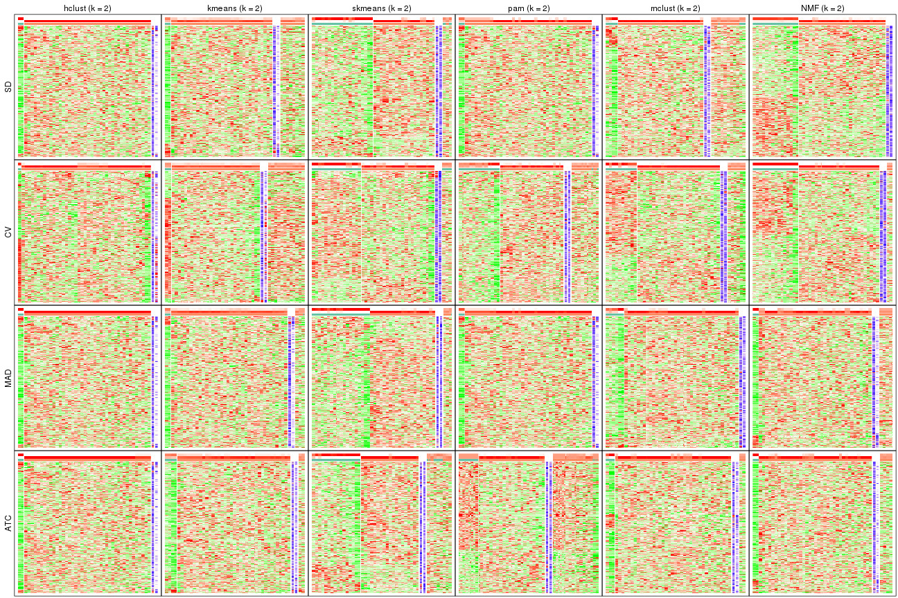</p>

</div>
<div id='tab-collect-get-signatures-2'>
<pre><code class="r">collect_plots(res_list, k = 3, fun = get_signatures, mc.cores = 4)
</code></pre>

<p>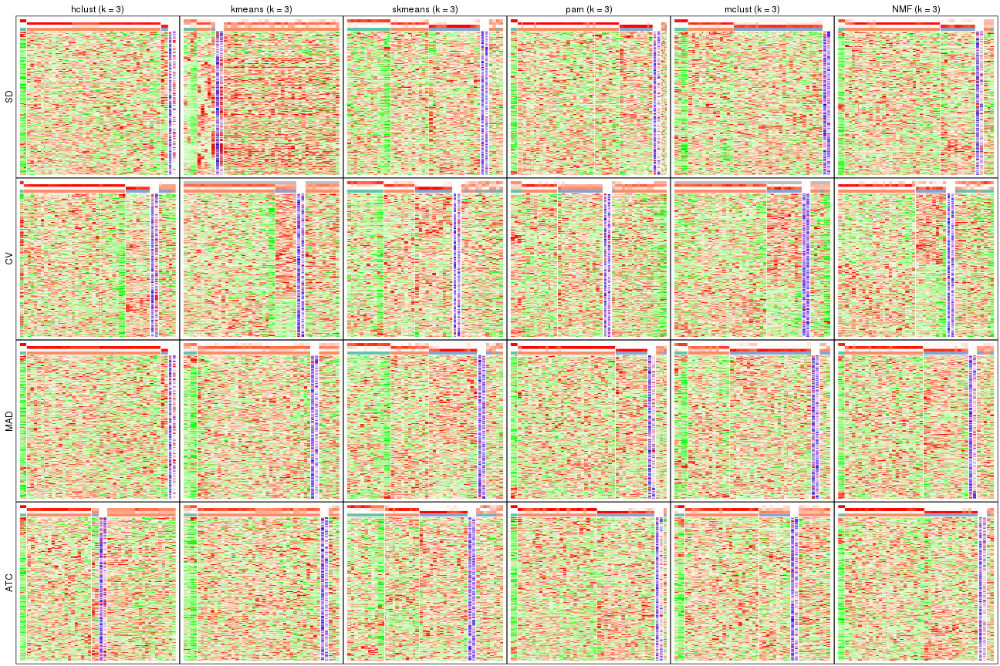</p>

</div>
<div id='tab-collect-get-signatures-3'>
<pre><code class="r">collect_plots(res_list, k = 4, fun = get_signatures, mc.cores = 4)
</code></pre>

<p>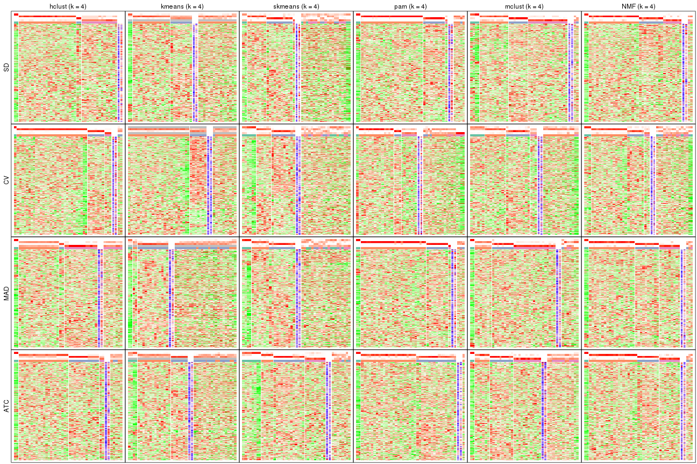</p>

</div>
<div id='tab-collect-get-signatures-4'>
<pre><code class="r">collect_plots(res_list, k = 5, fun = get_signatures, mc.cores = 4)
</code></pre>

<p>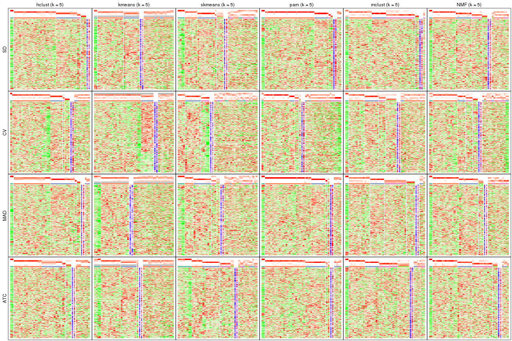</p>

</div>
<div id='tab-collect-get-signatures-5'>
<pre><code class="r">collect_plots(res_list, k = 6, fun = get_signatures, mc.cores = 4)
</code></pre>

<p>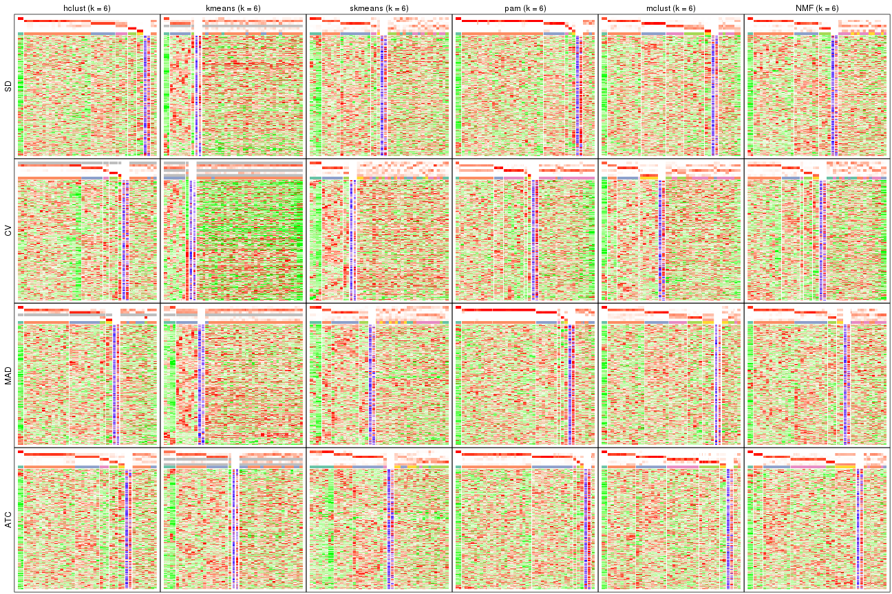</p>

</div>
</div>


### Statistics table

The statistics used for measuring the stability of consensus partitioning.
([How are they
defined?](http://bioconductor.org/packages/devel/bioc/vignettes/cola/inst/doc/cola.html#toc_13))


<script>
$( function() {
	$( '#tabs-get-stats-from-consensus-partition-list' ).tabs();
} );
</script>
<div id='tabs-get-stats-from-consensus-partition-list'>
<ul>
<li><a href='#tab-get-stats-from-consensus-partition-list-1'>k = 2</a></li>
<li><a href='#tab-get-stats-from-consensus-partition-list-2'>k = 3</a></li>
<li><a href='#tab-get-stats-from-consensus-partition-list-3'>k = 4</a></li>
<li><a href='#tab-get-stats-from-consensus-partition-list-4'>k = 5</a></li>
<li><a href='#tab-get-stats-from-consensus-partition-list-5'>k = 6</a></li>
</ul>
<div id='tab-get-stats-from-consensus-partition-list-1'>
<pre><code class="r">get_stats(res_list, k = 2)
</code></pre>

<pre><code>#&gt;             k  1-PAC mean_silhouette concordance area_increased  Rand Jaccard
#&gt; SD:NMF      2 0.5985           0.924       0.930         0.4346 0.545   0.545
#&gt; CV:NMF      2 0.8794           0.934       0.969         0.4711 0.545   0.545
#&gt; MAD:NMF     2 0.3835           0.748       0.820         0.2596 0.917   0.917
#&gt; ATC:NMF     2 0.6123           0.808       0.902         0.2157 0.917   0.917
#&gt; SD:skmeans  2 0.5821           0.827       0.922         0.4982 0.498   0.498
#&gt; CV:skmeans  2 0.5045           0.815       0.905         0.4909 0.504   0.504
#&gt; MAD:skmeans 2 0.7210           0.875       0.941         0.4992 0.504   0.504
#&gt; ATC:skmeans 2 0.6083           0.747       0.901         0.4951 0.501   0.501
#&gt; SD:mclust   2 0.5185           0.695       0.881         0.2979 0.750   0.750
#&gt; CV:mclust   2 0.6253           0.763       0.906         0.3911 0.638   0.638
#&gt; MAD:mclust  2 0.6082           0.888       0.938         0.2502 0.761   0.761
#&gt; ATC:mclust  2 0.6291           0.812       0.919         0.2327 0.875   0.875
#&gt; SD:kmeans   2 0.0751           0.592       0.792         0.3000 0.917   0.917
#&gt; CV:kmeans   2 0.0272           0.398       0.762         0.3233 0.910   0.910
#&gt; MAD:kmeans  2 0.1085           0.668       0.815         0.2627 0.902   0.902
#&gt; ATC:kmeans  2 0.3428           0.748       0.858         0.2579 0.835   0.835
#&gt; SD:pam      2 0.5065           0.842       0.902         0.1787 0.917   0.917
#&gt; CV:pam      2 0.2613           0.562       0.795         0.3594 0.550   0.550
#&gt; MAD:pam     2 0.5933           0.928       0.948         0.1348 0.917   0.917
#&gt; ATC:pam     2 0.4245           0.277       0.749         0.2889 0.718   0.718
#&gt; SD:hclust   2 1.0000           1.000       1.000         0.0841 0.917   0.917
#&gt; CV:hclust   2 0.5876           0.920       0.951         0.1171 0.954   0.954
#&gt; MAD:hclust  2 1.0000           1.000       1.000         0.0844 0.917   0.917
#&gt; ATC:hclust  2 1.0000           0.980       0.989         0.1010 0.917   0.917
</code></pre>

</div>
<div id='tab-get-stats-from-consensus-partition-list-2'>
<pre><code class="r">get_stats(res_list, k = 3)
</code></pre>

<pre><code>#&gt;             k  1-PAC mean_silhouette concordance area_increased  Rand Jaccard
#&gt; SD:NMF      3 0.6990           0.775       0.890          0.149 0.874   0.795
#&gt; CV:NMF      3 0.5167           0.636       0.805          0.282 0.821   0.683
#&gt; MAD:NMF     3 0.6093           0.754       0.875          1.028 0.562   0.523
#&gt; ATC:NMF     3 0.9022           0.894       0.957          1.422 0.555   0.515
#&gt; SD:skmeans  3 0.4885           0.758       0.852          0.333 0.725   0.503
#&gt; CV:skmeans  3 0.3549           0.590       0.775          0.353 0.751   0.541
#&gt; MAD:skmeans 3 0.4751           0.712       0.833          0.328 0.733   0.516
#&gt; ATC:skmeans 3 0.5534           0.679       0.841          0.333 0.741   0.531
#&gt; SD:mclust   3 0.5486           0.901       0.910          0.807 0.645   0.547
#&gt; CV:mclust   3 0.3244           0.672       0.751          0.440 0.954   0.929
#&gt; MAD:mclust  3 0.4116           0.754       0.847          1.051 0.650   0.560
#&gt; ATC:mclust  3 0.2908           0.587       0.765          1.141 0.692   0.648
#&gt; SD:kmeans   3 0.0472           0.190       0.667          0.472 0.868   0.856
#&gt; CV:kmeans   3 0.0213           0.525       0.701          0.321 0.828   0.813
#&gt; MAD:kmeans  3 0.0579           0.602       0.717          0.543 0.924   0.916
#&gt; ATC:kmeans  3 0.1246           0.625       0.731          0.656 1.000   1.000
#&gt; SD:pam      3 0.8641           0.899       0.959          1.491 0.658   0.627
#&gt; CV:pam      3 0.1951           0.504       0.702          0.327 0.570   0.406
#&gt; MAD:pam     3 0.8284           0.872       0.951          2.354 0.651   0.619
#&gt; ATC:pam     3 0.5343           0.829       0.911          0.794 0.588   0.483
#&gt; SD:hclust   3 0.7087           0.931       0.957          1.644 0.914   0.906
#&gt; CV:hclust   3 0.7731           0.815       0.923          2.314 0.630   0.612
#&gt; MAD:hclust  3 0.9835           0.966       0.974          1.365 0.914   0.906
#&gt; ATC:hclust  3 0.3045           0.336       0.730          2.808 0.914   0.906
</code></pre>

</div>
<div id='tab-get-stats-from-consensus-partition-list-3'>
<pre><code class="r">get_stats(res_list, k = 4)
</code></pre>

<pre><code>#&gt;             k  1-PAC mean_silhouette concordance area_increased  Rand Jaccard
#&gt; SD:NMF      4 0.6660           0.801       0.895         0.2740 0.797   0.638
#&gt; CV:NMF      4 0.4920           0.529       0.737         0.1602 0.863   0.676
#&gt; MAD:NMF     4 0.7808           0.845       0.917         0.2498 0.807   0.618
#&gt; ATC:NMF     4 0.7093           0.829       0.907         0.2355 0.832   0.663
#&gt; SD:skmeans  4 0.4968           0.526       0.654         0.1150 0.933   0.801
#&gt; CV:skmeans  4 0.3841           0.472       0.663         0.1173 0.884   0.674
#&gt; MAD:skmeans 4 0.5038           0.489       0.701         0.1156 0.899   0.714
#&gt; ATC:skmeans 4 0.6098           0.683       0.817         0.1171 0.852   0.607
#&gt; SD:mclust   4 0.5744           0.777       0.865         0.2543 0.802   0.588
#&gt; CV:mclust   4 0.3687           0.522       0.690         0.1549 0.725   0.556
#&gt; MAD:mclust  4 0.5291           0.708       0.836         0.2553 0.779   0.573
#&gt; ATC:mclust  4 0.4981           0.579       0.798         0.2891 0.628   0.421
#&gt; SD:kmeans   4 0.0618           0.463       0.608         0.1803 0.656   0.604
#&gt; CV:kmeans   4 0.0213           0.534       0.635         0.2448 0.910   0.883
#&gt; MAD:kmeans  4 0.0593           0.407       0.655         0.1843 0.769   0.728
#&gt; ATC:kmeans  4 0.1310           0.422       0.631         0.2252 0.587   0.505
#&gt; SD:pam      4 0.8069           0.852       0.941         0.0686 0.967   0.943
#&gt; CV:pam      4 0.3254           0.496       0.782         0.0998 0.610   0.379
#&gt; MAD:pam     4 0.8331           0.869       0.951         0.0698 0.960   0.930
#&gt; ATC:pam     4 0.4449           0.785       0.855         0.1103 0.963   0.924
#&gt; SD:hclust   4 0.3493           0.826       0.854         1.3728 0.608   0.528
#&gt; CV:hclust   4 0.8953           0.902       0.935         0.2082 0.946   0.908
#&gt; MAD:hclust  4 0.3151           0.575       0.653         1.2894 0.591   0.508
#&gt; ATC:hclust  4 0.3777           0.654       0.723         0.3899 0.608   0.528
</code></pre>

</div>
<div id='tab-get-stats-from-consensus-partition-list-4'>
<pre><code class="r">get_stats(res_list, k = 5)
</code></pre>

<pre><code>#&gt;             k  1-PAC mean_silhouette concordance area_increased  Rand Jaccard
#&gt; SD:NMF      5 0.6277           0.672       0.812         0.1351 0.841   0.602
#&gt; CV:NMF      5 0.5263           0.569       0.663         0.0848 0.878   0.649
#&gt; MAD:NMF     5 0.6273           0.676       0.795         0.0870 0.950   0.856
#&gt; ATC:NMF     5 0.6090           0.726       0.786         0.1357 0.823   0.554
#&gt; SD:skmeans  5 0.5462           0.537       0.689         0.0623 0.877   0.598
#&gt; CV:skmeans  5 0.4345           0.441       0.613         0.0630 0.905   0.671
#&gt; MAD:skmeans 5 0.5254           0.485       0.653         0.0631 0.875   0.593
#&gt; ATC:skmeans 5 0.6189           0.644       0.759         0.0627 0.922   0.722
#&gt; SD:mclust   5 0.5644           0.765       0.808         0.0587 0.937   0.810
#&gt; CV:mclust   5 0.4264           0.582       0.684         0.1106 0.944   0.841
#&gt; MAD:mclust  5 0.5257           0.673       0.727         0.1301 0.883   0.663
#&gt; ATC:mclust  5 0.5789           0.660       0.786         0.1582 0.892   0.690
#&gt; SD:kmeans   5 0.0651           0.471       0.603         0.1149 0.880   0.810
#&gt; CV:kmeans   5 0.0378           0.547       0.629         0.0827 1.000   1.000
#&gt; MAD:kmeans  5 0.0972           0.437       0.594         0.1578 0.870   0.825
#&gt; ATC:kmeans  5 0.1702           0.485       0.673         0.1220 0.698   0.492
#&gt; SD:pam      5 0.8367           0.870       0.941         0.0443 0.990   0.981
#&gt; CV:pam      5 0.3630           0.492       0.784         0.0423 0.994   0.986
#&gt; MAD:pam     5 0.7944           0.826       0.930         0.0406 0.982   0.967
#&gt; ATC:pam     5 0.4786           0.715       0.835         0.0466 0.966   0.928
#&gt; SD:hclust   5 0.4545           0.853       0.861         0.1333 0.962   0.914
#&gt; CV:hclust   5 0.4932           0.659       0.803         0.2663 0.943   0.894
#&gt; MAD:hclust  5 0.3454           0.672       0.769         0.2400 0.813   0.624
#&gt; ATC:hclust  5 0.3855           0.637       0.766         0.1922 0.879   0.742
</code></pre>

</div>
<div id='tab-get-stats-from-consensus-partition-list-5'>
<pre><code class="r">get_stats(res_list, k = 6)
</code></pre>

<pre><code>#&gt;             k  1-PAC mean_silhouette concordance area_increased  Rand Jaccard
#&gt; SD:NMF      6 0.5980           0.577       0.724         0.0714 0.897   0.657
#&gt; CV:NMF      6 0.5488           0.521       0.658         0.0520 0.893   0.645
#&gt; MAD:NMF     6 0.5723           0.612       0.725         0.0660 0.931   0.782
#&gt; ATC:NMF     6 0.6234           0.656       0.756         0.0608 0.910   0.683
#&gt; SD:skmeans  6 0.5847           0.500       0.666         0.0406 0.964   0.841
#&gt; CV:skmeans  6 0.5121           0.371       0.571         0.0402 0.944   0.756
#&gt; MAD:skmeans 6 0.5525           0.441       0.590         0.0400 0.929   0.700
#&gt; ATC:skmeans 6 0.6594           0.555       0.712         0.0395 0.966   0.850
#&gt; SD:mclust   6 0.6857           0.695       0.768         0.0773 0.916   0.721
#&gt; CV:mclust   6 0.5084           0.499       0.660         0.0661 0.838   0.515
#&gt; MAD:mclust  6 0.5751           0.630       0.697         0.0775 0.898   0.625
#&gt; ATC:mclust  6 0.7055           0.750       0.844         0.0546 0.951   0.806
#&gt; SD:kmeans   6 0.0980           0.346       0.597         0.0967 0.937   0.883
#&gt; CV:kmeans   6 0.0589           0.247       0.597         0.0719 0.963   0.946
#&gt; MAD:kmeans  6 0.1059           0.354       0.519         0.0703 0.648   0.571
#&gt; ATC:kmeans  6 0.2060           0.414       0.643         0.1122 0.896   0.791
#&gt; SD:pam      6 0.8001           0.846       0.926         0.0395 0.991   0.983
#&gt; CV:pam      6 0.4150           0.511       0.726         0.0456 0.690   0.428
#&gt; MAD:pam     6 0.7595           0.769       0.918         0.0418 0.961   0.927
#&gt; ATC:pam     6 0.5381           0.800       0.846         0.0291 0.985   0.965
#&gt; SD:hclust   6 0.5382           0.816       0.822         0.1231 0.966   0.914
#&gt; CV:hclust   6 0.4864           0.583       0.712         0.1497 1.000   1.000
#&gt; MAD:hclust  6 0.3858           0.618       0.751         0.1788 0.942   0.860
#&gt; ATC:hclust  6 0.4411           0.696       0.777         0.0538 0.943   0.856
</code></pre>

</div>
</div>

Following heatmap plots the partition for each combination of methods and the
lightness correspond to the silhouette scores for samples in each method. On
top the consensus subgroup is inferred from all methods by taking the mean
silhouette scores as weight.


<script>
$( function() {
	$( '#tabs-collect-stats-from-consensus-partition-list' ).tabs();
} );
</script>
<div id='tabs-collect-stats-from-consensus-partition-list'>
<ul>
<li><a href='#tab-collect-stats-from-consensus-partition-list-1'>k = 2</a></li>
<li><a href='#tab-collect-stats-from-consensus-partition-list-2'>k = 3</a></li>
<li><a href='#tab-collect-stats-from-consensus-partition-list-3'>k = 4</a></li>
<li><a href='#tab-collect-stats-from-consensus-partition-list-4'>k = 5</a></li>
<li><a href='#tab-collect-stats-from-consensus-partition-list-5'>k = 6</a></li>
</ul>
<div id='tab-collect-stats-from-consensus-partition-list-1'>
<pre><code class="r">collect_stats(res_list, k = 2)
</code></pre>

<p>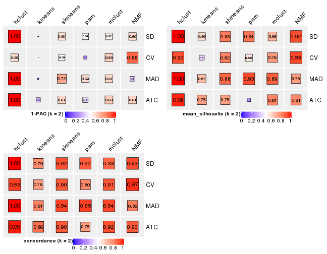</p>

</div>
<div id='tab-collect-stats-from-consensus-partition-list-2'>
<pre><code class="r">collect_stats(res_list, k = 3)
</code></pre>

<p>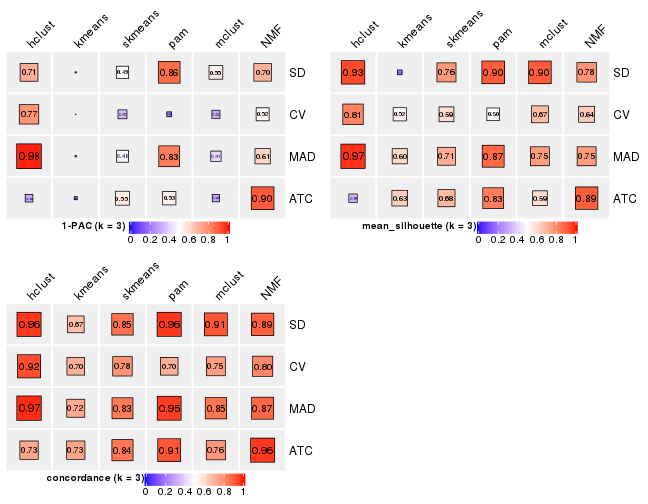</p>

</div>
<div id='tab-collect-stats-from-consensus-partition-list-3'>
<pre><code class="r">collect_stats(res_list, k = 4)
</code></pre>

<p>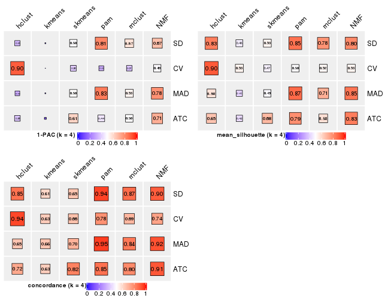</p>

</div>
<div id='tab-collect-stats-from-consensus-partition-list-4'>
<pre><code class="r">collect_stats(res_list, k = 5)
</code></pre>

<p>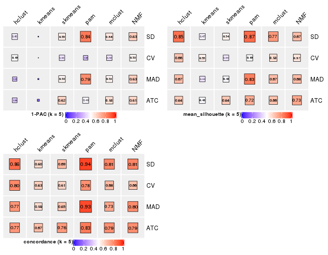</p>

</div>
<div id='tab-collect-stats-from-consensus-partition-list-5'>
<pre><code class="r">collect_stats(res_list, k = 6)
</code></pre>

<p>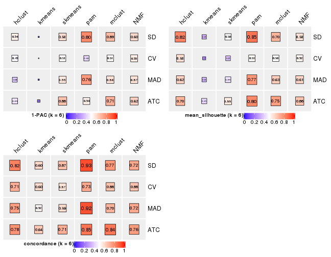</p>

</div>
</div>

### Partition from all methods


Collect partitions from all methods:


<script>
$( function() {
	$( '#tabs-collect-classes-from-consensus-partition-list' ).tabs();
} );
</script>
<div id='tabs-collect-classes-from-consensus-partition-list'>
<ul>
<li><a href='#tab-collect-classes-from-consensus-partition-list-1'>k = 2</a></li>
<li><a href='#tab-collect-classes-from-consensus-partition-list-2'>k = 3</a></li>
<li><a href='#tab-collect-classes-from-consensus-partition-list-3'>k = 4</a></li>
<li><a href='#tab-collect-classes-from-consensus-partition-list-4'>k = 5</a></li>
<li><a href='#tab-collect-classes-from-consensus-partition-list-5'>k = 6</a></li>
</ul>
<div id='tab-collect-classes-from-consensus-partition-list-1'>
<pre><code class="r">collect_classes(res_list, k = 2)
</code></pre>

<p>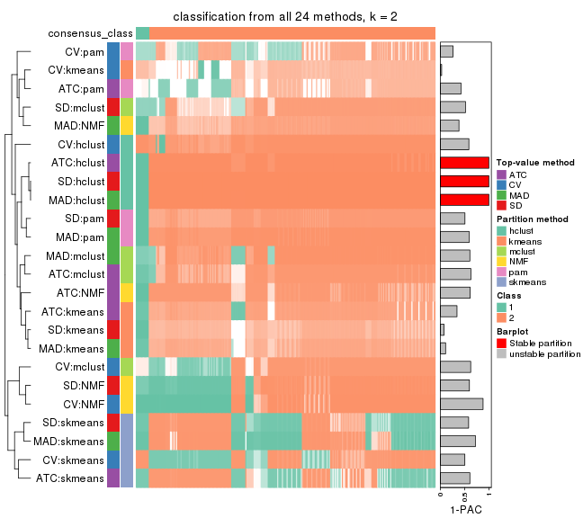</p>

</div>
<div id='tab-collect-classes-from-consensus-partition-list-2'>
<pre><code class="r">collect_classes(res_list, k = 3)
</code></pre>

<p>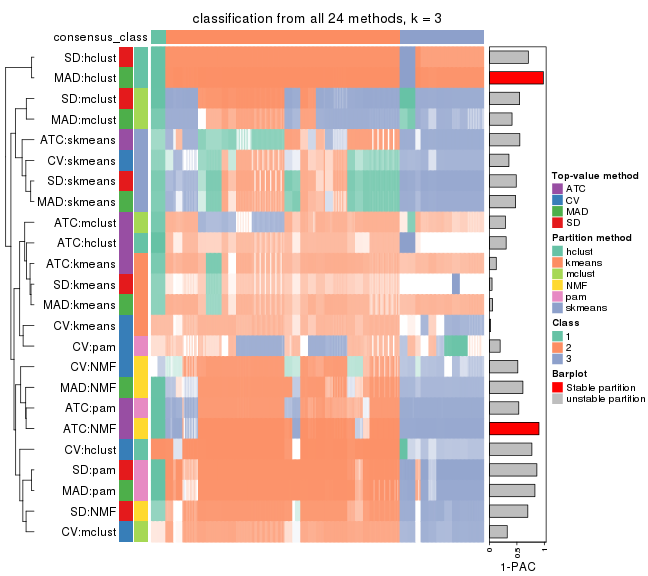</p>

</div>
<div id='tab-collect-classes-from-consensus-partition-list-3'>
<pre><code class="r">collect_classes(res_list, k = 4)
</code></pre>

<p>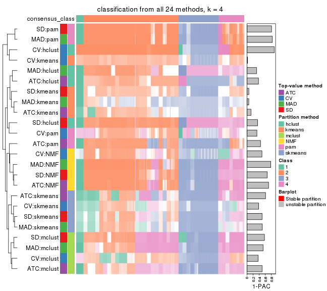</p>

</div>
<div id='tab-collect-classes-from-consensus-partition-list-4'>
<pre><code class="r">collect_classes(res_list, k = 5)
</code></pre>

<p>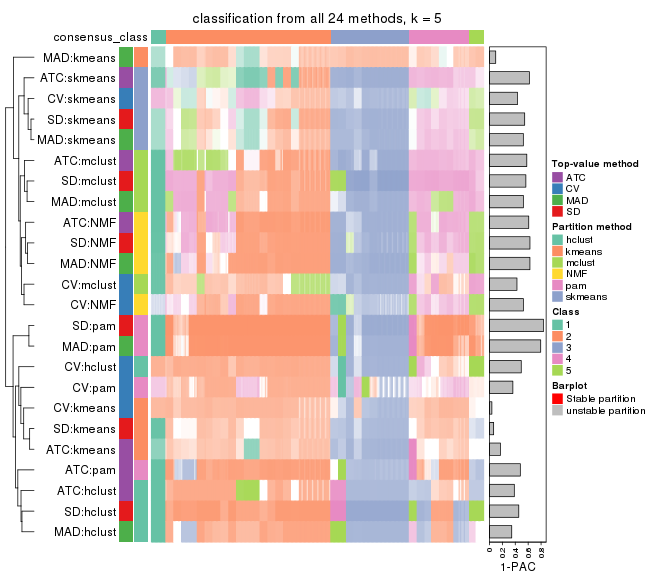</p>

</div>
<div id='tab-collect-classes-from-consensus-partition-list-5'>
<pre><code class="r">collect_classes(res_list, k = 6)
</code></pre>

<p>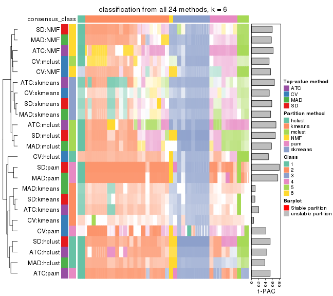</p>

</div>
</div>


### Top rows overlap


Overlap of top rows from different top-row methods:


<script>
$( function() {
	$( '#tabs-top-rows-overlap-by-euler' ).tabs();
} );
</script>
<div id='tabs-top-rows-overlap-by-euler'>
<ul>
<li><a href='#tab-top-rows-overlap-by-euler-1'>top_n = 961</a></li>
<li><a href='#tab-top-rows-overlap-by-euler-2'>top_n = 1922</a></li>
<li><a href='#tab-top-rows-overlap-by-euler-3'>top_n = 2884</a></li>
<li><a href='#tab-top-rows-overlap-by-euler-4'>top_n = 3845</a></li>
<li><a href='#tab-top-rows-overlap-by-euler-5'>top_n = 4806</a></li>
</ul>
<div id='tab-top-rows-overlap-by-euler-1'>
<pre><code class="r">top_rows_overlap(res_list, top_n = 961, method = &quot;euler&quot;)
</code></pre>

<p>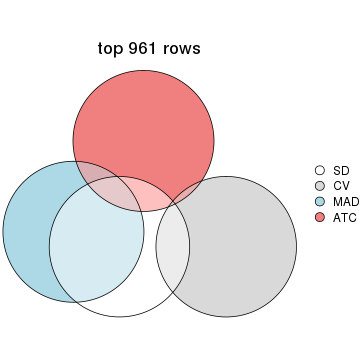</p>

</div>
<div id='tab-top-rows-overlap-by-euler-2'>
<pre><code class="r">top_rows_overlap(res_list, top_n = 1922, method = &quot;euler&quot;)
</code></pre>

<p>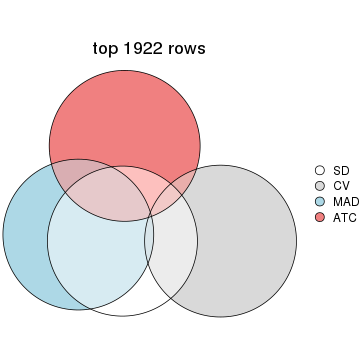</p>

</div>
<div id='tab-top-rows-overlap-by-euler-3'>
<pre><code class="r">top_rows_overlap(res_list, top_n = 2884, method = &quot;euler&quot;)
</code></pre>

<p>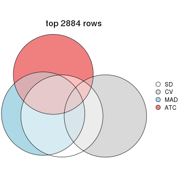</p>

</div>
<div id='tab-top-rows-overlap-by-euler-4'>
<pre><code class="r">top_rows_overlap(res_list, top_n = 3845, method = &quot;euler&quot;)
</code></pre>

<p>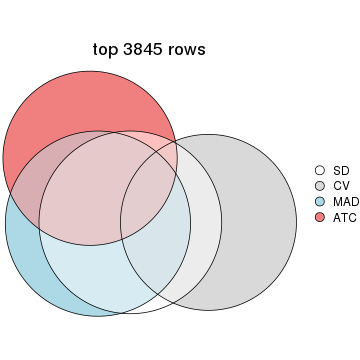</p>

</div>
<div id='tab-top-rows-overlap-by-euler-5'>
<pre><code class="r">top_rows_overlap(res_list, top_n = 4806, method = &quot;euler&quot;)
</code></pre>

<p>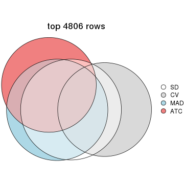</p>

</div>
</div>

Also visualize the correspondance of rankings between different top-row methods:


<script>
$( function() {
	$( '#tabs-top-rows-overlap-by-correspondance' ).tabs();
} );
</script>
<div id='tabs-top-rows-overlap-by-correspondance'>
<ul>
<li><a href='#tab-top-rows-overlap-by-correspondance-1'>top_n = 961</a></li>
<li><a href='#tab-top-rows-overlap-by-correspondance-2'>top_n = 1922</a></li>
<li><a href='#tab-top-rows-overlap-by-correspondance-3'>top_n = 2884</a></li>
<li><a href='#tab-top-rows-overlap-by-correspondance-4'>top_n = 3845</a></li>
<li><a href='#tab-top-rows-overlap-by-correspondance-5'>top_n = 4806</a></li>
</ul>
<div id='tab-top-rows-overlap-by-correspondance-1'>
<pre><code class="r">top_rows_overlap(res_list, top_n = 961, method = &quot;correspondance&quot;)
</code></pre>

<p>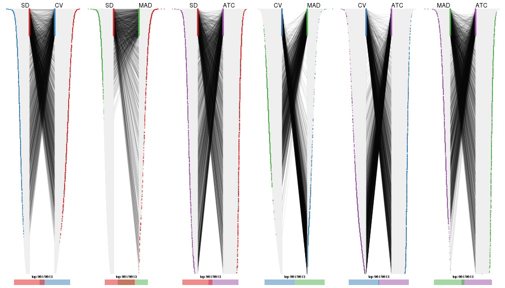</p>

</div>
<div id='tab-top-rows-overlap-by-correspondance-2'>
<pre><code class="r">top_rows_overlap(res_list, top_n = 1922, method = &quot;correspondance&quot;)
</code></pre>

<p>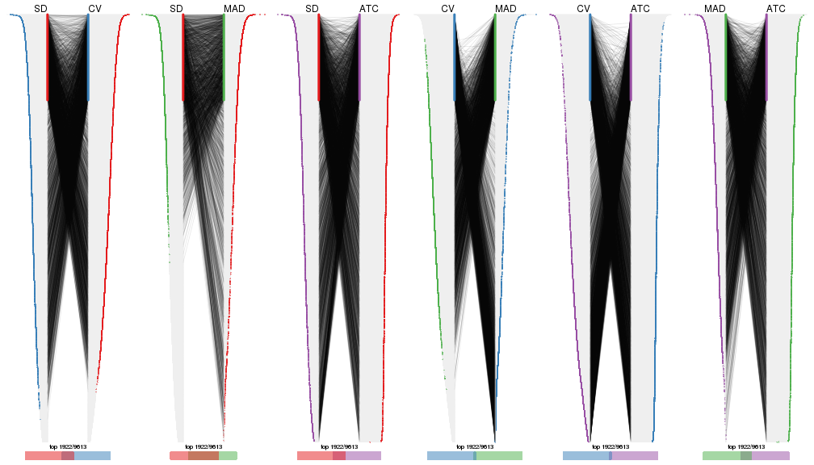</p>

</div>
<div id='tab-top-rows-overlap-by-correspondance-3'>
<pre><code class="r">top_rows_overlap(res_list, top_n = 2884, method = &quot;correspondance&quot;)
</code></pre>

<p>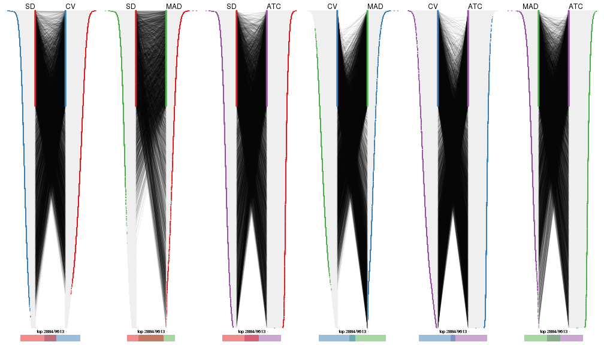</p>

</div>
<div id='tab-top-rows-overlap-by-correspondance-4'>
<pre><code class="r">top_rows_overlap(res_list, top_n = 3845, method = &quot;correspondance&quot;)
</code></pre>

<p>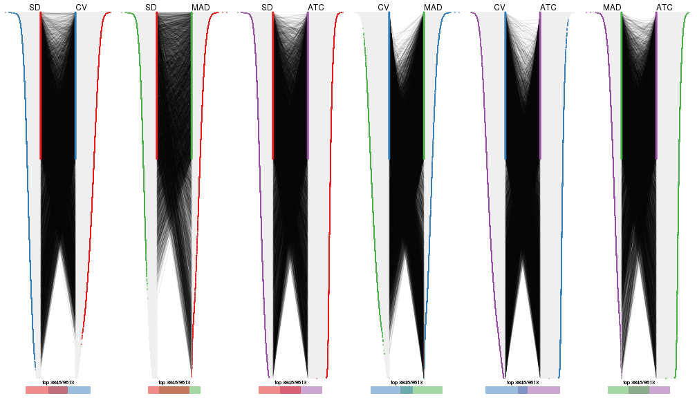</p>

</div>
<div id='tab-top-rows-overlap-by-correspondance-5'>
<pre><code class="r">top_rows_overlap(res_list, top_n = 4806, method = &quot;correspondance&quot;)
</code></pre>

<p>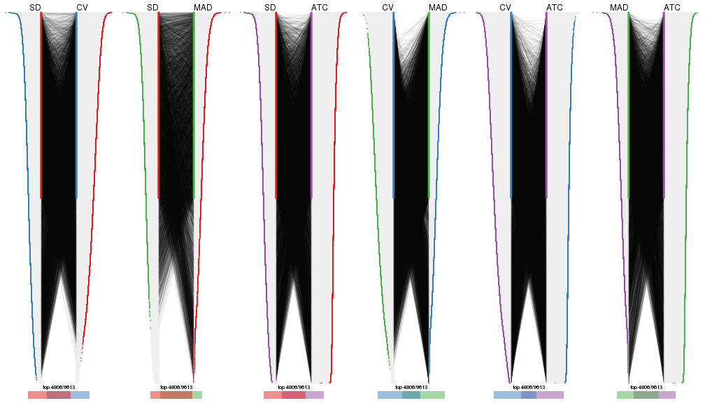</p>

</div>
</div>


Heatmaps of the top rows:


<script>
$( function() {
	$( '#tabs-top-rows-heatmap' ).tabs();
} );
</script>
<div id='tabs-top-rows-heatmap'>
<ul>
<li><a href='#tab-top-rows-heatmap-1'>top_n = 961</a></li>
<li><a href='#tab-top-rows-heatmap-2'>top_n = 1922</a></li>
<li><a href='#tab-top-rows-heatmap-3'>top_n = 2884</a></li>
<li><a href='#tab-top-rows-heatmap-4'>top_n = 3845</a></li>
<li><a href='#tab-top-rows-heatmap-5'>top_n = 4806</a></li>
</ul>
<div id='tab-top-rows-heatmap-1'>
<pre><code class="r">top_rows_heatmap(res_list, top_n = 961)
</code></pre>

<p>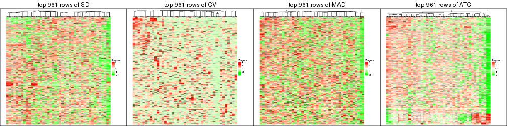</p>

</div>
<div id='tab-top-rows-heatmap-2'>
<pre><code class="r">top_rows_heatmap(res_list, top_n = 1922)
</code></pre>

<p>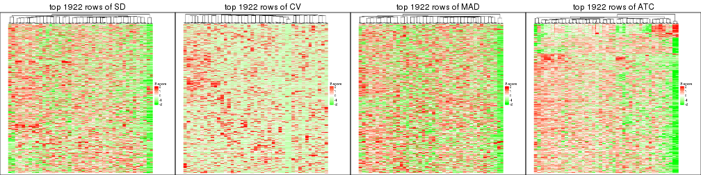</p>

</div>
<div id='tab-top-rows-heatmap-3'>
<pre><code class="r">top_rows_heatmap(res_list, top_n = 2884)
</code></pre>

<p>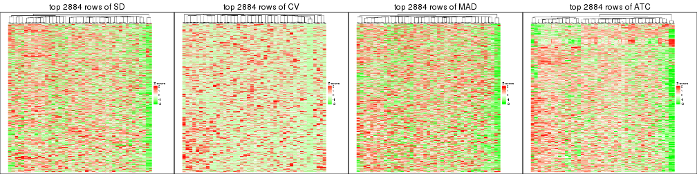</p>

</div>
<div id='tab-top-rows-heatmap-4'>
<pre><code class="r">top_rows_heatmap(res_list, top_n = 3845)
</code></pre>

<p>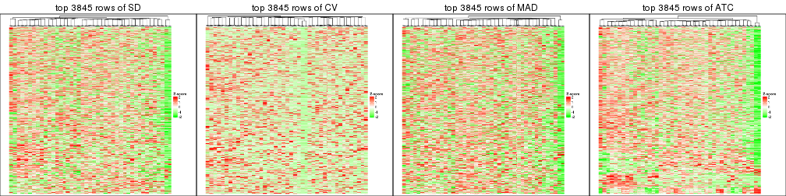</p>

</div>
<div id='tab-top-rows-heatmap-5'>
<pre><code class="r">top_rows_heatmap(res_list, top_n = 4806)
</code></pre>

<p>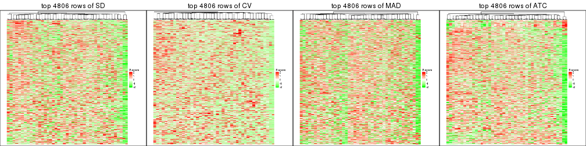</p>

</div>
</div>


 
## Results for each method


---------------------------------------------------


### SD:hclust**


The object with results only for a single top-value method and a single partition method 
can be extracted as:

```r
res = res_list["SD", "hclust"]
# you can also extract it by
# res = res_list["SD:hclust"]
```

A summary of `res` and all the functions that can be applied to it:

```r
res
```

```
#> A 'ConsensusPartition' object with k = 2, 3, 4, 5, 6.
#>   On a matrix with 9613 rows and 254 columns.
#>   Top rows (961, 1922, 2884, 3845, 4806) are extracted by 'SD' method.
#>   Subgroups are detected by 'hclust' method.
#>   Performed in total 1250 partitions by row resampling.
#>   Best k for subgroups seems to be 2.
#> 
#> Following methods can be applied to this 'ConsensusPartition' object:
#>  [1] "cola_report"             "collect_classes"         "collect_plots"          
#>  [4] "collect_stats"           "colnames"                "compare_signatures"     
#>  [7] "consensus_heatmap"       "dimension_reduction"     "functional_enrichment"  
#> [10] "get_anno_col"            "get_anno"                "get_classes"            
#> [13] "get_consensus"           "get_matrix"              "get_membership"         
#> [16] "get_param"               "get_signatures"          "get_stats"              
#> [19] "is_best_k"               "is_stable_k"             "membership_heatmap"     
#> [22] "ncol"                    "nrow"                    "plot_ecdf"              
#> [25] "rownames"                "select_partition_number" "show"                   
#> [28] "suggest_best_k"          "test_to_known_factors"
```

`collect_plots()` function collects all the plots made from `res` for all `k` (number of partitions)
into one single page to provide an easy and fast comparison between different `k`.

```r
collect_plots(res)
```

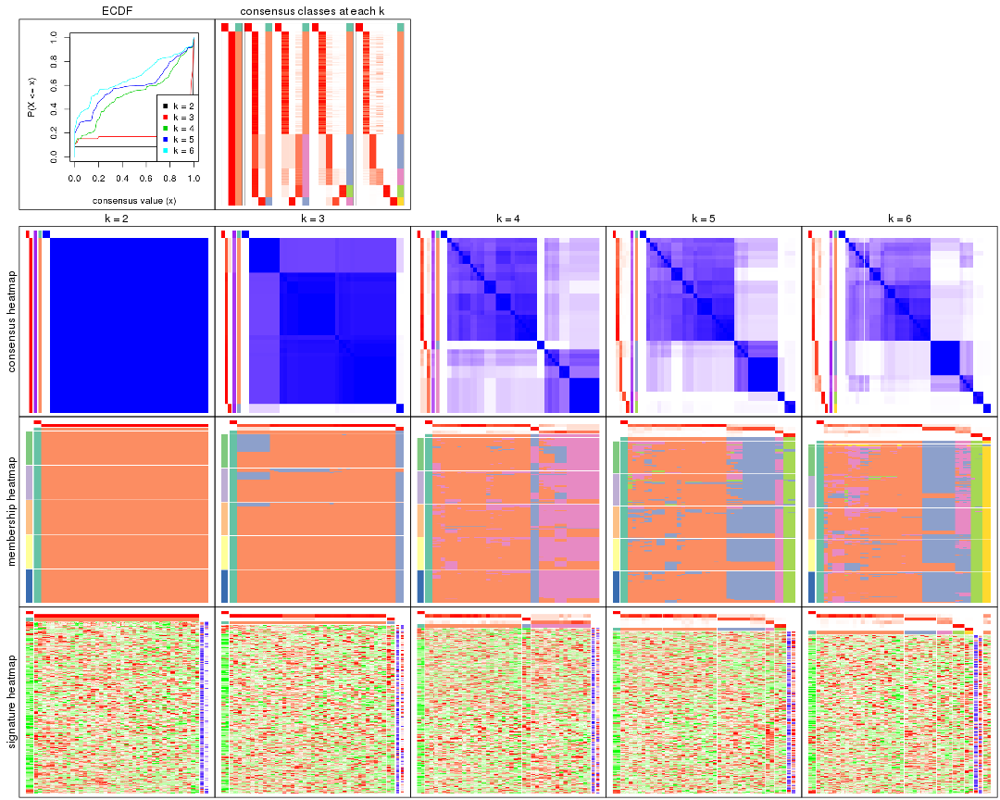

The plots are:

- The first row: a plot of the ECDF (Empirical cumulative distribution
  function) curves of the consensus matrix for each `k` and the heatmap of
  predicted classes for each `k`.
- The second row: heatmaps of the consensus matrix for each `k`.
- The third row: heatmaps of the membership matrix for each `k`.
- The fouth row: heatmaps of the signatures for each `k`.

All the plots in panels can be made by individual functions and they are
plotted later in this section.

`select_partition_number()` produces several plots showing different
statistics for choosing "optimized" `k`. There are following statistics:

- ECDF curves of the consensus matrix for each `k`;
- 1-PAC. [The PAC
  score](https://en.wikipedia.org/wiki/Consensus_clustering#Over-interpretation_potential_of_consensus_clustering)
  measures the proportion of the ambiguous subgrouping.
- Mean silhouette score.
- Concordance. The mean probability of fiting the consensus class ids in all
  partitions.
- Area increased. Denote $A_k$ as the area under the ECDF curve for current
  `k`, the area increased is defined as $A_k - A_{k-1}$.
- Rand index. The percent of pairs of samples that are both in a same cluster
  or both are not in a same cluster in the partition of k and k-1.
- Jaccard index. The ratio of pairs of samples are both in a same cluster in
  the partition of k and k-1 and the pairs of samples are both in a same
  cluster in the partition k or k-1.

The detailed explanations of these statistics can be found in [the cola
vignette](http://bioconductor.org/packages/devel/bioc/vignettes/cola/inst/doc/cola.html#toc_13).

Generally speaking, lower PAC score, higher mean silhouette score or higher
concordance corresponds to better partition. Rand index and Jaccard index
measure how similar the current partition is compared to partition with `k-1`.
If they are too similar, we won't accept `k` is better than `k-1`.

```r
select_partition_number(res)
```

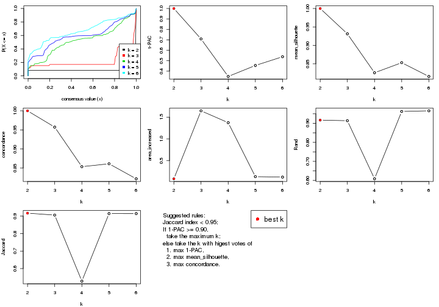

The numeric values for all these statistics can be obtained by `get_stats()`.

```r
get_stats(res)
```

```
#>   k 1-PAC mean_silhouette concordance area_increased  Rand Jaccard
#> 2 2 1.000           1.000       1.000         0.0841 0.917   0.917
#> 3 3 0.709           0.931       0.957         1.6444 0.914   0.906
#> 4 4 0.349           0.826       0.854         1.3728 0.608   0.528
#> 5 5 0.455           0.853       0.861         0.1333 0.962   0.914
#> 6 6 0.538           0.816       0.822         0.1231 0.966   0.914
```

`suggest_best_k()` suggests the best $k$ based on these statistics. The rules are as follows:

- All $k$ with Jaccard index larger than 0.95 are removed because the increase of
  the partition number does not provides enough extra information. If all $k$ are removed,
  the best $k$ is assigned by `NA`.
- For $k$ with 1-PAC larger than 0.9, the maximal $k$ is taken as the "best k". Other $k$ is called "optional k".
- If it does not fit the second rule. The $k$ with the highest vote of highest
  1-PAC, mean silhouette and concordance is taken as the "best k".

```r
suggest_best_k(res)
```

```
#> [1] 2
```


Following shows the table of the partitions (You need to click the **show/hide
code output** link to see it). The membership matrix (columns with name `p*`)
is inferred by
[`clue::cl_consensus()`](https://www.rdocumentation.org/link/cl_consensus?package=clue)
function with the `SE` method. Basically the value in the membership matrix
represents the probability to belong to a certain group. The finall class
label for an item is determined with the group with highest probability it
belongs to.

In `get_classes()` function, the entropy is calculated from the membership
matrix and the silhouette score is calculated from the consensus matrix.


<script>
$( function() {
	$( '#tabs-SD-hclust-get-classes' ).tabs();
} );
</script>
<div id='tabs-SD-hclust-get-classes'>
<ul>
<li><a href='#tab-SD-hclust-get-classes-1'>k = 2</a></li>
<li><a href='#tab-SD-hclust-get-classes-2'>k = 3</a></li>
<li><a href='#tab-SD-hclust-get-classes-3'>k = 4</a></li>
<li><a href='#tab-SD-hclust-get-classes-4'>k = 5</a></li>
<li><a href='#tab-SD-hclust-get-classes-5'>k = 6</a></li>
</ul>

<div id='tab-SD-hclust-get-classes-1'>
<p><a id='tab-SD-hclust-get-classes-1-a' style='color:#0366d6' href='#'>show/hide code output</a></p>
<pre><code class="r">cbind(get_classes(res, k = 2), get_membership(res, k = 2))
</code></pre>

<pre><code>#&gt;           class entropy silhouette p1 p2
#&gt; DRR024803     1       0          1  1  0
#&gt; DRR024804     2       0          1  0  1
#&gt; DRR024805     2       0          1  0  1
#&gt; DRR024806     2       0          1  0  1
#&gt; DRR024807     2       0          1  0  1
#&gt; DRR024808     2       0          1  0  1
#&gt; DRR024809     2       0          1  0  1
#&gt; DRR024810     2       0          1  0  1
#&gt; DRR024811     2       0          1  0  1
#&gt; DRR024812     2       0          1  0  1
#&gt; DRR024813     2       0          1  0  1
#&gt; DRR024814     2       0          1  0  1
#&gt; DRR024815     2       0          1  0  1
#&gt; DRR024816     2       0          1  0  1
#&gt; DRR024817     2       0          1  0  1
#&gt; DRR024818     2       0          1  0  1
#&gt; DRR024819     2       0          1  0  1
#&gt; DRR024820     2       0          1  0  1
#&gt; DRR024821     2       0          1  0  1
#&gt; DRR024822     2       0          1  0  1
#&gt; DRR024824     2       0          1  0  1
#&gt; DRR024825     2       0          1  0  1
#&gt; DRR024826     2       0          1  0  1
#&gt; DRR024827     2       0          1  0  1
#&gt; DRR024828     2       0          1  0  1
#&gt; DRR024829     2       0          1  0  1
#&gt; DRR024830     2       0          1  0  1
#&gt; DRR024831     2       0          1  0  1
#&gt; DRR024832     2       0          1  0  1
#&gt; DRR024833     2       0          1  0  1
#&gt; DRR024834     2       0          1  0  1
#&gt; DRR024835     2       0          1  0  1
#&gt; DRR024836     2       0          1  0  1
#&gt; DRR024837     2       0          1  0  1
#&gt; DRR024838     2       0          1  0  1
#&gt; DRR024839     2       0          1  0  1
#&gt; DRR024840     2       0          1  0  1
#&gt; DRR024841     2       0          1  0  1
#&gt; DRR024842     2       0          1  0  1
#&gt; DRR024843     1       0          1  1  0
#&gt; DRR024844     2       0          1  0  1
#&gt; DRR024845     2       0          1  0  1
#&gt; DRR024846     2       0          1  0  1
#&gt; DRR024847     2       0          1  0  1
#&gt; DRR024848     1       0          1  1  0
#&gt; DRR024849     2       0          1  0  1
#&gt; DRR024850     2       0          1  0  1
#&gt; DRR024851     2       0          1  0  1
#&gt; DRR024852     2       0          1  0  1
#&gt; DRR024853     2       0          1  0  1
#&gt; DRR024854     2       0          1  0  1
#&gt; DRR024855     2       0          1  0  1
#&gt; DRR024856     2       0          1  0  1
#&gt; DRR024857     2       0          1  0  1
#&gt; DRR024858     2       0          1  0  1
#&gt; DRR024859     2       0          1  0  1
#&gt; DRR024860     2       0          1  0  1
#&gt; DRR024861     2       0          1  0  1
#&gt; DRR024862     2       0          1  0  1
#&gt; DRR024863     2       0          1  0  1
#&gt; DRR024864     2       0          1  0  1
#&gt; DRR024865     2       0          1  0  1
#&gt; DRR024866     2       0          1  0  1
#&gt; DRR024867     2       0          1  0  1
#&gt; DRR024868     2       0          1  0  1
#&gt; DRR024869     2       0          1  0  1
#&gt; DRR024870     2       0          1  0  1
#&gt; DRR024871     2       0          1  0  1
#&gt; DRR024872     2       0          1  0  1
#&gt; DRR024873     2       0          1  0  1
#&gt; DRR024874     2       0          1  0  1
#&gt; DRR024875     2       0          1  0  1
#&gt; DRR024876     2       0          1  0  1
#&gt; DRR024877     2       0          1  0  1
#&gt; DRR024878     2       0          1  0  1
#&gt; DRR024879     2       0          1  0  1
#&gt; DRR024880     2       0          1  0  1
#&gt; DRR024881     2       0          1  0  1
#&gt; DRR024882     2       0          1  0  1
#&gt; DRR024883     2       0          1  0  1
#&gt; DRR024884     2       0          1  0  1
#&gt; DRR024885     2       0          1  0  1
#&gt; DRR024886     1       0          1  1  0
#&gt; DRR024887     2       0          1  0  1
#&gt; DRR024888     2       0          1  0  1
#&gt; DRR024889     2       0          1  0  1
#&gt; DRR024890     2       0          1  0  1
#&gt; DRR024891     1       0          1  1  0
#&gt; DRR024892     2       0          1  0  1
#&gt; DRR024893     2       0          1  0  1
#&gt; DRR024894     2       0          1  0  1
#&gt; DRR024895     2       0          1  0  1
#&gt; DRR024896     2       0          1  0  1
#&gt; DRR024897     2       0          1  0  1
#&gt; DRR024898     2       0          1  0  1
#&gt; DRR024899     2       0          1  0  1
#&gt; DRR024900     2       0          1  0  1
#&gt; DRR024901     2       0          1  0  1
#&gt; DRR024902     2       0          1  0  1
#&gt; DRR024903     2       0          1  0  1
#&gt; DRR024904     2       0          1  0  1
#&gt; DRR024905     2       0          1  0  1
#&gt; DRR024906     2       0          1  0  1
#&gt; DRR024907     2       0          1  0  1
#&gt; DRR024908     2       0          1  0  1
#&gt; DRR024909     2       0          1  0  1
#&gt; DRR024910     2       0          1  0  1
#&gt; DRR024911     2       0          1  0  1
#&gt; DRR024912     2       0          1  0  1
#&gt; DRR024913     2       0          1  0  1
#&gt; DRR024914     2       0          1  0  1
#&gt; DRR024915     2       0          1  0  1
#&gt; DRR024916     2       0          1  0  1
#&gt; DRR024917     2       0          1  0  1
#&gt; DRR024918     2       0          1  0  1
#&gt; DRR024919     2       0          1  0  1
#&gt; DRR024920     2       0          1  0  1
#&gt; DRR024921     2       0          1  0  1
#&gt; DRR024922     2       0          1  0  1
#&gt; DRR024923     2       0          1  0  1
#&gt; DRR024924     2       0          1  0  1
#&gt; DRR024925     2       0          1  0  1
#&gt; DRR024926     2       0          1  0  1
#&gt; DRR024927     2       0          1  0  1
#&gt; DRR024928     2       0          1  0  1
#&gt; DRR024929     1       0          1  1  0
#&gt; DRR024930     2       0          1  0  1
#&gt; DRR024931     2       0          1  0  1
#&gt; DRR024932     2       0          1  0  1
#&gt; DRR024933     2       0          1  0  1
#&gt; DRR024934     1       0          1  1  0
#&gt; DRR024935     2       0          1  0  1
#&gt; DRR024936     2       0          1  0  1
#&gt; DRR024937     2       0          1  0  1
#&gt; DRR024938     2       0          1  0  1
#&gt; DRR024939     2       0          1  0  1
#&gt; DRR024940     2       0          1  0  1
#&gt; DRR024941     2       0          1  0  1
#&gt; DRR024942     2       0          1  0  1
#&gt; DRR024943     2       0          1  0  1
#&gt; DRR024944     2       0          1  0  1
#&gt; DRR024945     2       0          1  0  1
#&gt; DRR024946     2       0          1  0  1
#&gt; DRR024947     2       0          1  0  1
#&gt; DRR024948     2       0          1  0  1
#&gt; DRR024949     2       0          1  0  1
#&gt; DRR024950     2       0          1  0  1
#&gt; DRR024951     2       0          1  0  1
#&gt; DRR024952     2       0          1  0  1
#&gt; DRR024953     2       0          1  0  1
#&gt; DRR024954     2       0          1  0  1
#&gt; DRR024955     2       0          1  0  1
#&gt; DRR024956     2       0          1  0  1
#&gt; DRR024957     2       0          1  0  1
#&gt; DRR024958     2       0          1  0  1
#&gt; DRR024959     2       0          1  0  1
#&gt; DRR024960     2       0          1  0  1
#&gt; DRR024961     2       0          1  0  1
#&gt; DRR024962     2       0          1  0  1
#&gt; DRR024963     2       0          1  0  1
#&gt; DRR024964     2       0          1  0  1
#&gt; DRR024965     2       0          1  0  1
#&gt; DRR024966     2       0          1  0  1
#&gt; DRR024967     2       0          1  0  1
#&gt; DRR024968     2       0          1  0  1
#&gt; DRR024969     2       0          1  0  1
#&gt; DRR024970     2       0          1  0  1
#&gt; DRR024971     2       0          1  0  1
#&gt; DRR024972     1       0          1  1  0
#&gt; DRR024973     2       0          1  0  1
#&gt; DRR024974     2       0          1  0  1
#&gt; DRR024975     2       0          1  0  1
#&gt; DRR024976     2       0          1  0  1
#&gt; DRR024977     1       0          1  1  0
#&gt; DRR024978     2       0          1  0  1
#&gt; DRR024979     2       0          1  0  1
#&gt; DRR024980     2       0          1  0  1
#&gt; DRR024981     2       0          1  0  1
#&gt; DRR024982     2       0          1  0  1
#&gt; DRR024983     2       0          1  0  1
#&gt; DRR024984     2       0          1  0  1
#&gt; DRR024985     2       0          1  0  1
#&gt; DRR024986     2       0          1  0  1
#&gt; DRR024987     2       0          1  0  1
#&gt; DRR024988     2       0          1  0  1
#&gt; DRR024989     2       0          1  0  1
#&gt; DRR024990     2       0          1  0  1
#&gt; DRR024991     2       0          1  0  1
#&gt; DRR024992     2       0          1  0  1
#&gt; DRR024993     2       0          1  0  1
#&gt; DRR024994     2       0          1  0  1
#&gt; DRR024995     2       0          1  0  1
#&gt; DRR024996     2       0          1  0  1
#&gt; DRR024997     2       0          1  0  1
#&gt; DRR024998     2       0          1  0  1
#&gt; DRR024999     2       0          1  0  1
#&gt; DRR025000     2       0          1  0  1
#&gt; DRR025001     2       0          1  0  1
#&gt; DRR025002     2       0          1  0  1
#&gt; DRR025003     2       0          1  0  1
#&gt; DRR025004     2       0          1  0  1
#&gt; DRR025005     2       0          1  0  1
#&gt; DRR025006     2       0          1  0  1
#&gt; DRR025007     2       0          1  0  1
#&gt; DRR025008     2       0          1  0  1
#&gt; DRR025009     2       0          1  0  1
#&gt; DRR025010     2       0          1  0  1
#&gt; DRR025011     2       0          1  0  1
#&gt; DRR025012     2       0          1  0  1
#&gt; DRR025013     2       0          1  0  1
#&gt; DRR025014     2       0          1  0  1
#&gt; DRR025015     1       0          1  1  0
#&gt; DRR025016     2       0          1  0  1
#&gt; DRR025017     2       0          1  0  1
#&gt; DRR025018     2       0          1  0  1
#&gt; DRR025019     2       0          1  0  1
#&gt; DRR025020     1       0          1  1  0
#&gt; DRR025021     2       0          1  0  1
#&gt; DRR025022     2       0          1  0  1
#&gt; DRR025023     2       0          1  0  1
#&gt; DRR025024     2       0          1  0  1
#&gt; DRR025025     2       0          1  0  1
#&gt; DRR025026     2       0          1  0  1
#&gt; DRR025027     2       0          1  0  1
#&gt; DRR025028     2       0          1  0  1
#&gt; DRR025029     2       0          1  0  1
#&gt; DRR025030     2       0          1  0  1
#&gt; DRR025031     2       0          1  0  1
#&gt; DRR025032     2       0          1  0  1
#&gt; DRR025033     2       0          1  0  1
#&gt; DRR025034     2       0          1  0  1
#&gt; DRR025035     2       0          1  0  1
#&gt; DRR025036     2       0          1  0  1
#&gt; DRR025037     2       0          1  0  1
#&gt; DRR025038     2       0          1  0  1
#&gt; DRR025039     2       0          1  0  1
#&gt; DRR025040     2       0          1  0  1
#&gt; DRR025041     2       0          1  0  1
#&gt; DRR025042     2       0          1  0  1
#&gt; DRR025043     2       0          1  0  1
#&gt; DRR025044     2       0          1  0  1
#&gt; DRR025045     2       0          1  0  1
#&gt; DRR025046     2       0          1  0  1
#&gt; DRR025047     2       0          1  0  1
#&gt; DRR025048     2       0          1  0  1
#&gt; DRR025049     2       0          1  0  1
#&gt; DRR025050     2       0          1  0  1
#&gt; DRR025051     2       0          1  0  1
#&gt; DRR025052     2       0          1  0  1
#&gt; DRR025053     2       0          1  0  1
#&gt; DRR025054     2       0          1  0  1
#&gt; DRR025055     2       0          1  0  1
#&gt; DRR025056     2       0          1  0  1
#&gt; DRR025057     2       0          1  0  1
</code></pre>

<script>
$('#tab-SD-hclust-get-classes-1-a').parent().next().next().hide();
$('#tab-SD-hclust-get-classes-1-a').click(function(){
  $('#tab-SD-hclust-get-classes-1-a').parent().next().next().toggle();
  return(false);
});
</script>
</div>

<div id='tab-SD-hclust-get-classes-2'>
<p><a id='tab-SD-hclust-get-classes-2-a' style='color:#0366d6' href='#'>show/hide code output</a></p>
<pre><code class="r">cbind(get_classes(res, k = 3), get_membership(res, k = 3))
</code></pre>

<pre><code>#&gt;           class entropy silhouette p1    p2    p3
#&gt; DRR024803     1  0.0000      1.000  1 0.000 0.000
#&gt; DRR024804     2  0.0237      0.951  0 0.996 0.004
#&gt; DRR024805     2  0.0000      0.951  0 1.000 0.000
#&gt; DRR024806     2  0.0000      0.951  0 1.000 0.000
#&gt; DRR024807     3  0.1031      1.000  0 0.024 0.976
#&gt; DRR024808     2  0.4178      0.829  0 0.828 0.172
#&gt; DRR024809     2  0.0000      0.951  0 1.000 0.000
#&gt; DRR024810     2  0.0747      0.950  0 0.984 0.016
#&gt; DRR024811     2  0.4178      0.829  0 0.828 0.172
#&gt; DRR024812     2  0.0000      0.951  0 1.000 0.000
#&gt; DRR024813     2  0.0237      0.950  0 0.996 0.004
#&gt; DRR024814     2  0.0000      0.951  0 1.000 0.000
#&gt; DRR024815     2  0.1031      0.949  0 0.976 0.024
#&gt; DRR024816     2  0.1031      0.949  0 0.976 0.024
#&gt; DRR024817     2  0.1031      0.949  0 0.976 0.024
#&gt; DRR024818     2  0.4178      0.829  0 0.828 0.172
#&gt; DRR024819     2  0.1163      0.948  0 0.972 0.028
#&gt; DRR024820     2  0.1031      0.949  0 0.976 0.024
#&gt; DRR024821     2  0.4178      0.829  0 0.828 0.172
#&gt; DRR024822     2  0.0000      0.951  0 1.000 0.000
#&gt; DRR024824     2  0.0747      0.945  0 0.984 0.016
#&gt; DRR024825     2  0.4178      0.829  0 0.828 0.172
#&gt; DRR024826     2  0.0000      0.951  0 1.000 0.000
#&gt; DRR024827     2  0.1163      0.948  0 0.972 0.028
#&gt; DRR024828     3  0.1031      1.000  0 0.024 0.976
#&gt; DRR024829     2  0.1031      0.949  0 0.976 0.024
#&gt; DRR024830     2  0.0237      0.951  0 0.996 0.004
#&gt; DRR024831     2  0.4178      0.829  0 0.828 0.172
#&gt; DRR024832     2  0.4178      0.829  0 0.828 0.172
#&gt; DRR024833     2  0.0000      0.951  0 1.000 0.000
#&gt; DRR024834     2  0.1031      0.949  0 0.976 0.024
#&gt; DRR024835     2  0.0892      0.949  0 0.980 0.020
#&gt; DRR024836     2  0.4178      0.829  0 0.828 0.172
#&gt; DRR024837     2  0.1031      0.949  0 0.976 0.024
#&gt; DRR024838     2  0.1031      0.949  0 0.976 0.024
#&gt; DRR024839     2  0.0000      0.951  0 1.000 0.000
#&gt; DRR024840     2  0.0000      0.951  0 1.000 0.000
#&gt; DRR024841     2  0.0424      0.951  0 0.992 0.008
#&gt; DRR024842     2  0.0000      0.951  0 1.000 0.000
#&gt; DRR024843     1  0.0000      1.000  1 0.000 0.000
#&gt; DRR024844     2  0.0237      0.951  0 0.996 0.004
#&gt; DRR024845     2  0.0000      0.951  0 1.000 0.000
#&gt; DRR024846     2  0.0000      0.951  0 1.000 0.000
#&gt; DRR024847     3  0.1031      1.000  0 0.024 0.976
#&gt; DRR024848     1  0.0000      1.000  1 0.000 0.000
#&gt; DRR024849     2  0.4178      0.829  0 0.828 0.172
#&gt; DRR024850     2  0.0000      0.951  0 1.000 0.000
#&gt; DRR024851     2  0.0000      0.951  0 1.000 0.000
#&gt; DRR024852     2  0.0747      0.950  0 0.984 0.016
#&gt; DRR024853     2  0.4178      0.829  0 0.828 0.172
#&gt; DRR024854     2  0.0000      0.951  0 1.000 0.000
#&gt; DRR024855     2  0.0237      0.950  0 0.996 0.004
#&gt; DRR024856     2  0.0000      0.951  0 1.000 0.000
#&gt; DRR024857     2  0.1031      0.949  0 0.976 0.024
#&gt; DRR024858     2  0.1031      0.949  0 0.976 0.024
#&gt; DRR024859     2  0.1031      0.949  0 0.976 0.024
#&gt; DRR024860     2  0.4178      0.829  0 0.828 0.172
#&gt; DRR024861     2  0.1163      0.948  0 0.972 0.028
#&gt; DRR024862     2  0.1031      0.949  0 0.976 0.024
#&gt; DRR024863     2  0.4178      0.829  0 0.828 0.172
#&gt; DRR024864     2  0.0000      0.951  0 1.000 0.000
#&gt; DRR024865     2  0.1031      0.949  0 0.976 0.024
#&gt; DRR024866     2  0.0747      0.945  0 0.984 0.016
#&gt; DRR024867     2  0.4178      0.829  0 0.828 0.172
#&gt; DRR024868     2  0.0000      0.951  0 1.000 0.000
#&gt; DRR024869     2  0.1163      0.948  0 0.972 0.028
#&gt; DRR024870     3  0.1031      1.000  0 0.024 0.976
#&gt; DRR024871     2  0.1031      0.949  0 0.976 0.024
#&gt; DRR024872     2  0.0237      0.951  0 0.996 0.004
#&gt; DRR024873     2  0.4178      0.829  0 0.828 0.172
#&gt; DRR024874     2  0.4178      0.829  0 0.828 0.172
#&gt; DRR024875     2  0.0000      0.951  0 1.000 0.000
#&gt; DRR024876     2  0.1031      0.949  0 0.976 0.024
#&gt; DRR024877     2  0.0892      0.949  0 0.980 0.020
#&gt; DRR024878     2  0.4178      0.829  0 0.828 0.172
#&gt; DRR024879     2  0.1031      0.949  0 0.976 0.024
#&gt; DRR024880     2  0.1031      0.949  0 0.976 0.024
#&gt; DRR024881     2  0.0000      0.951  0 1.000 0.000
#&gt; DRR024882     2  0.0000      0.951  0 1.000 0.000
#&gt; DRR024883     2  0.0424      0.951  0 0.992 0.008
#&gt; DRR024884     2  0.1031      0.949  0 0.976 0.024
#&gt; DRR024885     2  0.1163      0.948  0 0.972 0.028
#&gt; DRR024886     1  0.0000      1.000  1 0.000 0.000
#&gt; DRR024887     2  0.0237      0.951  0 0.996 0.004
#&gt; DRR024888     2  0.0000      0.951  0 1.000 0.000
#&gt; DRR024889     2  0.0000      0.951  0 1.000 0.000
#&gt; DRR024890     3  0.1031      1.000  0 0.024 0.976
#&gt; DRR024891     1  0.0000      1.000  1 0.000 0.000
#&gt; DRR024892     2  0.4178      0.829  0 0.828 0.172
#&gt; DRR024893     2  0.0000      0.951  0 1.000 0.000
#&gt; DRR024894     2  0.0000      0.951  0 1.000 0.000
#&gt; DRR024895     2  0.0747      0.950  0 0.984 0.016
#&gt; DRR024896     2  0.4178      0.829  0 0.828 0.172
#&gt; DRR024897     2  0.0000      0.951  0 1.000 0.000
#&gt; DRR024898     2  0.0237      0.950  0 0.996 0.004
#&gt; DRR024899     2  0.0000      0.951  0 1.000 0.000
#&gt; DRR024900     2  0.1031      0.949  0 0.976 0.024
#&gt; DRR024901     2  0.1031      0.949  0 0.976 0.024
#&gt; DRR024902     2  0.1031      0.949  0 0.976 0.024
#&gt; DRR024903     2  0.4178      0.829  0 0.828 0.172
#&gt; DRR024904     2  0.1163      0.948  0 0.972 0.028
#&gt; DRR024905     2  0.1031      0.949  0 0.976 0.024
#&gt; DRR024906     2  0.4178      0.829  0 0.828 0.172
#&gt; DRR024907     2  0.0000      0.951  0 1.000 0.000
#&gt; DRR024908     2  0.1031      0.949  0 0.976 0.024
#&gt; DRR024909     2  0.0747      0.945  0 0.984 0.016
#&gt; DRR024910     2  0.4178      0.829  0 0.828 0.172
#&gt; DRR024911     2  0.0000      0.951  0 1.000 0.000
#&gt; DRR024912     2  0.1163      0.948  0 0.972 0.028
#&gt; DRR024913     3  0.1031      1.000  0 0.024 0.976
#&gt; DRR024914     2  0.1031      0.949  0 0.976 0.024
#&gt; DRR024915     2  0.0237      0.951  0 0.996 0.004
#&gt; DRR024916     2  0.4178      0.829  0 0.828 0.172
#&gt; DRR024917     2  0.4178      0.829  0 0.828 0.172
#&gt; DRR024918     2  0.0000      0.951  0 1.000 0.000
#&gt; DRR024919     2  0.1031      0.949  0 0.976 0.024
#&gt; DRR024920     2  0.0892      0.949  0 0.980 0.020
#&gt; DRR024921     2  0.4178      0.829  0 0.828 0.172
#&gt; DRR024922     2  0.1031      0.949  0 0.976 0.024
#&gt; DRR024923     2  0.1031      0.949  0 0.976 0.024
#&gt; DRR024924     2  0.0000      0.951  0 1.000 0.000
#&gt; DRR024925     2  0.0000      0.951  0 1.000 0.000
#&gt; DRR024926     2  0.0424      0.951  0 0.992 0.008
#&gt; DRR024927     2  0.1031      0.949  0 0.976 0.024
#&gt; DRR024928     2  0.1163      0.948  0 0.972 0.028
#&gt; DRR024929     1  0.0000      1.000  1 0.000 0.000
#&gt; DRR024930     2  0.0237      0.951  0 0.996 0.004
#&gt; DRR024931     2  0.0000      0.951  0 1.000 0.000
#&gt; DRR024932     2  0.0000      0.951  0 1.000 0.000
#&gt; DRR024933     3  0.1031      1.000  0 0.024 0.976
#&gt; DRR024934     1  0.0000      1.000  1 0.000 0.000
#&gt; DRR024935     2  0.4178      0.829  0 0.828 0.172
#&gt; DRR024936     2  0.0000      0.951  0 1.000 0.000
#&gt; DRR024937     2  0.0000      0.951  0 1.000 0.000
#&gt; DRR024938     2  0.0747      0.950  0 0.984 0.016
#&gt; DRR024939     2  0.4178      0.829  0 0.828 0.172
#&gt; DRR024940     2  0.0000      0.951  0 1.000 0.000
#&gt; DRR024941     2  0.0237      0.950  0 0.996 0.004
#&gt; DRR024942     2  0.0000      0.951  0 1.000 0.000
#&gt; DRR024943     2  0.1031      0.949  0 0.976 0.024
#&gt; DRR024944     2  0.1031      0.949  0 0.976 0.024
#&gt; DRR024945     2  0.1031      0.949  0 0.976 0.024
#&gt; DRR024946     2  0.4178      0.829  0 0.828 0.172
#&gt; DRR024947     2  0.1163      0.948  0 0.972 0.028
#&gt; DRR024948     2  0.1031      0.949  0 0.976 0.024
#&gt; DRR024949     2  0.4178      0.829  0 0.828 0.172
#&gt; DRR024950     2  0.0000      0.951  0 1.000 0.000
#&gt; DRR024951     2  0.1031      0.949  0 0.976 0.024
#&gt; DRR024952     2  0.0747      0.945  0 0.984 0.016
#&gt; DRR024953     2  0.4178      0.829  0 0.828 0.172
#&gt; DRR024954     2  0.0000      0.951  0 1.000 0.000
#&gt; DRR024955     2  0.1163      0.948  0 0.972 0.028
#&gt; DRR024956     3  0.1031      1.000  0 0.024 0.976
#&gt; DRR024957     2  0.1031      0.949  0 0.976 0.024
#&gt; DRR024958     2  0.0237      0.951  0 0.996 0.004
#&gt; DRR024959     2  0.4178      0.829  0 0.828 0.172
#&gt; DRR024960     2  0.4178      0.829  0 0.828 0.172
#&gt; DRR024961     2  0.0000      0.951  0 1.000 0.000
#&gt; DRR024962     2  0.1031      0.949  0 0.976 0.024
#&gt; DRR024963     2  0.0892      0.949  0 0.980 0.020
#&gt; DRR024964     2  0.4178      0.829  0 0.828 0.172
#&gt; DRR024965     2  0.1031      0.949  0 0.976 0.024
#&gt; DRR024966     2  0.1031      0.949  0 0.976 0.024
#&gt; DRR024967     2  0.0000      0.951  0 1.000 0.000
#&gt; DRR024968     2  0.0000      0.951  0 1.000 0.000
#&gt; DRR024969     2  0.0424      0.951  0 0.992 0.008
#&gt; DRR024970     2  0.1031      0.949  0 0.976 0.024
#&gt; DRR024971     2  0.1163      0.948  0 0.972 0.028
#&gt; DRR024972     1  0.0000      1.000  1 0.000 0.000
#&gt; DRR024973     2  0.0237      0.951  0 0.996 0.004
#&gt; DRR024974     2  0.0000      0.951  0 1.000 0.000
#&gt; DRR024975     2  0.0000      0.951  0 1.000 0.000
#&gt; DRR024976     3  0.1031      1.000  0 0.024 0.976
#&gt; DRR024977     1  0.0000      1.000  1 0.000 0.000
#&gt; DRR024978     2  0.4178      0.829  0 0.828 0.172
#&gt; DRR024979     2  0.0000      0.951  0 1.000 0.000
#&gt; DRR024980     2  0.0000      0.951  0 1.000 0.000
#&gt; DRR024981     2  0.0747      0.950  0 0.984 0.016
#&gt; DRR024982     2  0.4178      0.829  0 0.828 0.172
#&gt; DRR024983     2  0.0000      0.951  0 1.000 0.000
#&gt; DRR024984     2  0.0237      0.950  0 0.996 0.004
#&gt; DRR024985     2  0.0000      0.951  0 1.000 0.000
#&gt; DRR024986     2  0.1031      0.949  0 0.976 0.024
#&gt; DRR024987     2  0.1031      0.949  0 0.976 0.024
#&gt; DRR024988     2  0.1031      0.949  0 0.976 0.024
#&gt; DRR024989     2  0.4178      0.829  0 0.828 0.172
#&gt; DRR024990     2  0.1163      0.948  0 0.972 0.028
#&gt; DRR024991     2  0.1031      0.949  0 0.976 0.024
#&gt; DRR024992     2  0.4178      0.829  0 0.828 0.172
#&gt; DRR024993     2  0.0000      0.951  0 1.000 0.000
#&gt; DRR024994     2  0.1031      0.949  0 0.976 0.024
#&gt; DRR024995     2  0.0747      0.945  0 0.984 0.016
#&gt; DRR024996     2  0.4178      0.829  0 0.828 0.172
#&gt; DRR024997     2  0.0000      0.951  0 1.000 0.000
#&gt; DRR024998     2  0.1163      0.948  0 0.972 0.028
#&gt; DRR024999     3  0.1031      1.000  0 0.024 0.976
#&gt; DRR025000     2  0.1031      0.949  0 0.976 0.024
#&gt; DRR025001     2  0.0237      0.951  0 0.996 0.004
#&gt; DRR025002     2  0.4178      0.829  0 0.828 0.172
#&gt; DRR025003     2  0.4178      0.829  0 0.828 0.172
#&gt; DRR025004     2  0.0000      0.951  0 1.000 0.000
#&gt; DRR025005     2  0.1031      0.949  0 0.976 0.024
#&gt; DRR025006     2  0.0892      0.949  0 0.980 0.020
#&gt; DRR025007     2  0.4178      0.829  0 0.828 0.172
#&gt; DRR025008     2  0.1031      0.949  0 0.976 0.024
#&gt; DRR025009     2  0.1031      0.949  0 0.976 0.024
#&gt; DRR025010     2  0.0000      0.951  0 1.000 0.000
#&gt; DRR025011     2  0.0000      0.951  0 1.000 0.000
#&gt; DRR025012     2  0.0424      0.951  0 0.992 0.008
#&gt; DRR025013     2  0.1031      0.949  0 0.976 0.024
#&gt; DRR025014     2  0.1163      0.948  0 0.972 0.028
#&gt; DRR025015     1  0.0000      1.000  1 0.000 0.000
#&gt; DRR025016     2  0.0237      0.951  0 0.996 0.004
#&gt; DRR025017     2  0.0000      0.951  0 1.000 0.000
#&gt; DRR025018     2  0.0000      0.951  0 1.000 0.000
#&gt; DRR025019     3  0.1031      1.000  0 0.024 0.976
#&gt; DRR025020     1  0.0000      1.000  1 0.000 0.000
#&gt; DRR025021     2  0.4178      0.829  0 0.828 0.172
#&gt; DRR025022     2  0.0000      0.951  0 1.000 0.000
#&gt; DRR025023     2  0.0000      0.951  0 1.000 0.000
#&gt; DRR025024     2  0.0747      0.950  0 0.984 0.016
#&gt; DRR025025     2  0.4178      0.829  0 0.828 0.172
#&gt; DRR025026     2  0.0000      0.951  0 1.000 0.000
#&gt; DRR025027     2  0.0237      0.950  0 0.996 0.004
#&gt; DRR025028     2  0.0000      0.951  0 1.000 0.000
#&gt; DRR025029     2  0.1031      0.949  0 0.976 0.024
#&gt; DRR025030     2  0.1031      0.949  0 0.976 0.024
#&gt; DRR025031     2  0.1031      0.949  0 0.976 0.024
#&gt; DRR025032     2  0.4178      0.829  0 0.828 0.172
#&gt; DRR025033     2  0.1163      0.948  0 0.972 0.028
#&gt; DRR025034     2  0.1031      0.949  0 0.976 0.024
#&gt; DRR025035     2  0.4178      0.829  0 0.828 0.172
#&gt; DRR025036     2  0.0000      0.951  0 1.000 0.000
#&gt; DRR025037     2  0.1031      0.949  0 0.976 0.024
#&gt; DRR025038     2  0.0747      0.945  0 0.984 0.016
#&gt; DRR025039     2  0.4178      0.829  0 0.828 0.172
#&gt; DRR025040     2  0.0000      0.951  0 1.000 0.000
#&gt; DRR025041     2  0.1163      0.948  0 0.972 0.028
#&gt; DRR025042     3  0.1031      1.000  0 0.024 0.976
#&gt; DRR025043     2  0.1031      0.949  0 0.976 0.024
#&gt; DRR025044     2  0.0237      0.951  0 0.996 0.004
#&gt; DRR025045     2  0.4178      0.829  0 0.828 0.172
#&gt; DRR025046     2  0.4178      0.829  0 0.828 0.172
#&gt; DRR025047     2  0.0000      0.951  0 1.000 0.000
#&gt; DRR025048     2  0.1031      0.949  0 0.976 0.024
#&gt; DRR025049     2  0.0892      0.949  0 0.980 0.020
#&gt; DRR025050     2  0.4178      0.829  0 0.828 0.172
#&gt; DRR025051     2  0.1031      0.949  0 0.976 0.024
#&gt; DRR025052     2  0.1031      0.949  0 0.976 0.024
#&gt; DRR025053     2  0.0000      0.951  0 1.000 0.000
#&gt; DRR025054     2  0.0000      0.951  0 1.000 0.000
#&gt; DRR025055     2  0.0424      0.951  0 0.992 0.008
#&gt; DRR025056     2  0.1031      0.949  0 0.976 0.024
#&gt; DRR025057     2  0.1163      0.948  0 0.972 0.028
</code></pre>

<script>
$('#tab-SD-hclust-get-classes-2-a').parent().next().next().hide();
$('#tab-SD-hclust-get-classes-2-a').click(function(){
  $('#tab-SD-hclust-get-classes-2-a').parent().next().next().toggle();
  return(false);
});
</script>
</div>

<div id='tab-SD-hclust-get-classes-3'>
<p><a id='tab-SD-hclust-get-classes-3-a' style='color:#0366d6' href='#'>show/hide code output</a></p>
<pre><code class="r">cbind(get_classes(res, k = 4), get_membership(res, k = 4))
</code></pre>

<pre><code>#&gt;           class entropy silhouette p1    p2    p3    p4
#&gt; DRR024803     1  0.0000      1.000  1 0.000 0.000 0.000
#&gt; DRR024804     2  0.3486      0.777  0 0.812 0.000 0.188
#&gt; DRR024805     2  0.0469      0.894  0 0.988 0.000 0.012
#&gt; DRR024806     2  0.0469      0.892  0 0.988 0.000 0.012
#&gt; DRR024807     3  0.0469      1.000  0 0.012 0.988 0.000
#&gt; DRR024808     4  0.6284      0.815  0 0.172 0.164 0.664
#&gt; DRR024809     2  0.0188      0.893  0 0.996 0.000 0.004
#&gt; DRR024810     2  0.1716      0.890  0 0.936 0.000 0.064
#&gt; DRR024811     4  0.6284      0.815  0 0.172 0.164 0.664
#&gt; DRR024812     2  0.1389      0.895  0 0.952 0.000 0.048
#&gt; DRR024813     2  0.2401      0.881  0 0.904 0.004 0.092
#&gt; DRR024814     2  0.1474      0.895  0 0.948 0.000 0.052
#&gt; DRR024815     4  0.4866      0.536  0 0.404 0.000 0.596
#&gt; DRR024816     2  0.2831      0.816  0 0.876 0.004 0.120
#&gt; DRR024817     4  0.4564      0.680  0 0.328 0.000 0.672
#&gt; DRR024818     4  0.6284      0.815  0 0.172 0.164 0.664
#&gt; DRR024819     2  0.3569      0.818  0 0.804 0.000 0.196
#&gt; DRR024820     4  0.2859      0.588  0 0.112 0.008 0.880
#&gt; DRR024821     4  0.6284      0.815  0 0.172 0.164 0.664
#&gt; DRR024822     2  0.0336      0.894  0 0.992 0.000 0.008
#&gt; DRR024824     2  0.3351      0.808  0 0.844 0.008 0.148
#&gt; DRR024825     4  0.6284      0.815  0 0.172 0.164 0.664
#&gt; DRR024826     2  0.2814      0.854  0 0.868 0.000 0.132
#&gt; DRR024827     4  0.2799      0.588  0 0.108 0.008 0.884
#&gt; DRR024828     3  0.0469      1.000  0 0.012 0.988 0.000
#&gt; DRR024829     2  0.2760      0.870  0 0.872 0.000 0.128
#&gt; DRR024830     2  0.0188      0.892  0 0.996 0.000 0.004
#&gt; DRR024831     4  0.6284      0.815  0 0.172 0.164 0.664
#&gt; DRR024832     4  0.6284      0.815  0 0.172 0.164 0.664
#&gt; DRR024833     2  0.2814      0.854  0 0.868 0.000 0.132
#&gt; DRR024834     2  0.2773      0.818  0 0.880 0.004 0.116
#&gt; DRR024835     4  0.4356      0.729  0 0.292 0.000 0.708
#&gt; DRR024836     4  0.6284      0.815  0 0.172 0.164 0.664
#&gt; DRR024837     2  0.2773      0.818  0 0.880 0.004 0.116
#&gt; DRR024838     2  0.2704      0.872  0 0.876 0.000 0.124
#&gt; DRR024839     2  0.1474      0.895  0 0.948 0.000 0.052
#&gt; DRR024840     2  0.0336      0.894  0 0.992 0.000 0.008
#&gt; DRR024841     2  0.3610      0.755  0 0.800 0.000 0.200
#&gt; DRR024842     2  0.1389      0.895  0 0.952 0.000 0.048
#&gt; DRR024843     1  0.0000      1.000  1 0.000 0.000 0.000
#&gt; DRR024844     2  0.3486      0.777  0 0.812 0.000 0.188
#&gt; DRR024845     2  0.0469      0.894  0 0.988 0.000 0.012
#&gt; DRR024846     2  0.0469      0.892  0 0.988 0.000 0.012
#&gt; DRR024847     3  0.0469      1.000  0 0.012 0.988 0.000
#&gt; DRR024848     1  0.0000      1.000  1 0.000 0.000 0.000
#&gt; DRR024849     4  0.6284      0.815  0 0.172 0.164 0.664
#&gt; DRR024850     2  0.1474      0.895  0 0.948 0.000 0.052
#&gt; DRR024851     2  0.0188      0.893  0 0.996 0.000 0.004
#&gt; DRR024852     2  0.1716      0.890  0 0.936 0.000 0.064
#&gt; DRR024853     4  0.6284      0.815  0 0.172 0.164 0.664
#&gt; DRR024854     2  0.1389      0.895  0 0.952 0.000 0.048
#&gt; DRR024855     2  0.2401      0.881  0 0.904 0.004 0.092
#&gt; DRR024856     2  0.1474      0.895  0 0.948 0.000 0.052
#&gt; DRR024857     4  0.4866      0.536  0 0.404 0.000 0.596
#&gt; DRR024858     2  0.2831      0.816  0 0.876 0.004 0.120
#&gt; DRR024859     4  0.4564      0.680  0 0.328 0.000 0.672
#&gt; DRR024860     4  0.6284      0.815  0 0.172 0.164 0.664
#&gt; DRR024861     2  0.3569      0.818  0 0.804 0.000 0.196
#&gt; DRR024862     4  0.2859      0.588  0 0.112 0.008 0.880
#&gt; DRR024863     4  0.6284      0.815  0 0.172 0.164 0.664
#&gt; DRR024864     2  0.0336      0.894  0 0.992 0.000 0.008
#&gt; DRR024865     2  0.3444      0.824  0 0.816 0.000 0.184
#&gt; DRR024866     2  0.3351      0.808  0 0.844 0.008 0.148
#&gt; DRR024867     4  0.6284      0.815  0 0.172 0.164 0.664
#&gt; DRR024868     2  0.2814      0.854  0 0.868 0.000 0.132
#&gt; DRR024869     4  0.2799      0.588  0 0.108 0.008 0.884
#&gt; DRR024870     3  0.0469      1.000  0 0.012 0.988 0.000
#&gt; DRR024871     2  0.2760      0.870  0 0.872 0.000 0.128
#&gt; DRR024872     2  0.0188      0.892  0 0.996 0.000 0.004
#&gt; DRR024873     4  0.6284      0.815  0 0.172 0.164 0.664
#&gt; DRR024874     4  0.6284      0.815  0 0.172 0.164 0.664
#&gt; DRR024875     2  0.2814      0.854  0 0.868 0.000 0.132
#&gt; DRR024876     2  0.2773      0.818  0 0.880 0.004 0.116
#&gt; DRR024877     4  0.4356      0.729  0 0.292 0.000 0.708
#&gt; DRR024878     4  0.6284      0.815  0 0.172 0.164 0.664
#&gt; DRR024879     2  0.2773      0.818  0 0.880 0.004 0.116
#&gt; DRR024880     2  0.2704      0.872  0 0.876 0.000 0.124
#&gt; DRR024881     2  0.1474      0.895  0 0.948 0.000 0.052
#&gt; DRR024882     2  0.0336      0.894  0 0.992 0.000 0.008
#&gt; DRR024883     2  0.3610      0.755  0 0.800 0.000 0.200
#&gt; DRR024884     4  0.4661      0.652  0 0.348 0.000 0.652
#&gt; DRR024885     4  0.2799      0.588  0 0.108 0.008 0.884
#&gt; DRR024886     1  0.0000      1.000  1 0.000 0.000 0.000
#&gt; DRR024887     2  0.3486      0.777  0 0.812 0.000 0.188
#&gt; DRR024888     2  0.0469      0.894  0 0.988 0.000 0.012
#&gt; DRR024889     2  0.0469      0.892  0 0.988 0.000 0.012
#&gt; DRR024890     3  0.0469      1.000  0 0.012 0.988 0.000
#&gt; DRR024891     1  0.0000      1.000  1 0.000 0.000 0.000
#&gt; DRR024892     4  0.6284      0.815  0 0.172 0.164 0.664
#&gt; DRR024893     2  0.1474      0.895  0 0.948 0.000 0.052
#&gt; DRR024894     2  0.0188      0.893  0 0.996 0.000 0.004
#&gt; DRR024895     2  0.1716      0.890  0 0.936 0.000 0.064
#&gt; DRR024896     4  0.6284      0.815  0 0.172 0.164 0.664
#&gt; DRR024897     2  0.1389      0.895  0 0.952 0.000 0.048
#&gt; DRR024898     2  0.2401      0.881  0 0.904 0.004 0.092
#&gt; DRR024899     2  0.1474      0.895  0 0.948 0.000 0.052
#&gt; DRR024900     4  0.4866      0.536  0 0.404 0.000 0.596
#&gt; DRR024901     2  0.2831      0.816  0 0.876 0.004 0.120
#&gt; DRR024902     4  0.4564      0.680  0 0.328 0.000 0.672
#&gt; DRR024903     4  0.6284      0.815  0 0.172 0.164 0.664
#&gt; DRR024904     2  0.3569      0.818  0 0.804 0.000 0.196
#&gt; DRR024905     4  0.2859      0.588  0 0.112 0.008 0.880
#&gt; DRR024906     4  0.6284      0.815  0 0.172 0.164 0.664
#&gt; DRR024907     2  0.0336      0.894  0 0.992 0.000 0.008
#&gt; DRR024908     2  0.3444      0.824  0 0.816 0.000 0.184
#&gt; DRR024909     2  0.3351      0.808  0 0.844 0.008 0.148
#&gt; DRR024910     4  0.6284      0.815  0 0.172 0.164 0.664
#&gt; DRR024911     2  0.2814      0.854  0 0.868 0.000 0.132
#&gt; DRR024912     4  0.2799      0.588  0 0.108 0.008 0.884
#&gt; DRR024913     3  0.0469      1.000  0 0.012 0.988 0.000
#&gt; DRR024914     2  0.2760      0.870  0 0.872 0.000 0.128
#&gt; DRR024915     2  0.0188      0.892  0 0.996 0.000 0.004
#&gt; DRR024916     4  0.6284      0.815  0 0.172 0.164 0.664
#&gt; DRR024917     4  0.6284      0.815  0 0.172 0.164 0.664
#&gt; DRR024918     2  0.2814      0.854  0 0.868 0.000 0.132
#&gt; DRR024919     2  0.2773      0.818  0 0.880 0.004 0.116
#&gt; DRR024920     4  0.4356      0.729  0 0.292 0.000 0.708
#&gt; DRR024921     4  0.6284      0.815  0 0.172 0.164 0.664
#&gt; DRR024922     2  0.2773      0.818  0 0.880 0.004 0.116
#&gt; DRR024923     2  0.2704      0.872  0 0.876 0.000 0.124
#&gt; DRR024924     2  0.1474      0.895  0 0.948 0.000 0.052
#&gt; DRR024925     2  0.0336      0.894  0 0.992 0.000 0.008
#&gt; DRR024926     2  0.3610      0.755  0 0.800 0.000 0.200
#&gt; DRR024927     4  0.4661      0.652  0 0.348 0.000 0.652
#&gt; DRR024928     4  0.2799      0.588  0 0.108 0.008 0.884
#&gt; DRR024929     1  0.0000      1.000  1 0.000 0.000 0.000
#&gt; DRR024930     2  0.3486      0.777  0 0.812 0.000 0.188
#&gt; DRR024931     2  0.0469      0.894  0 0.988 0.000 0.012
#&gt; DRR024932     2  0.0469      0.892  0 0.988 0.000 0.012
#&gt; DRR024933     3  0.0469      1.000  0 0.012 0.988 0.000
#&gt; DRR024934     1  0.0000      1.000  1 0.000 0.000 0.000
#&gt; DRR024935     4  0.6284      0.815  0 0.172 0.164 0.664
#&gt; DRR024936     2  0.1474      0.895  0 0.948 0.000 0.052
#&gt; DRR024937     2  0.0188      0.893  0 0.996 0.000 0.004
#&gt; DRR024938     2  0.1716      0.890  0 0.936 0.000 0.064
#&gt; DRR024939     4  0.6284      0.815  0 0.172 0.164 0.664
#&gt; DRR024940     2  0.1389      0.895  0 0.952 0.000 0.048
#&gt; DRR024941     2  0.2401      0.881  0 0.904 0.004 0.092
#&gt; DRR024942     2  0.1474      0.895  0 0.948 0.000 0.052
#&gt; DRR024943     4  0.4866      0.536  0 0.404 0.000 0.596
#&gt; DRR024944     2  0.2831      0.816  0 0.876 0.004 0.120
#&gt; DRR024945     4  0.4564      0.680  0 0.328 0.000 0.672
#&gt; DRR024946     4  0.6284      0.815  0 0.172 0.164 0.664
#&gt; DRR024947     2  0.3569      0.818  0 0.804 0.000 0.196
#&gt; DRR024948     4  0.2859      0.588  0 0.112 0.008 0.880
#&gt; DRR024949     4  0.6284      0.815  0 0.172 0.164 0.664
#&gt; DRR024950     2  0.0336      0.894  0 0.992 0.000 0.008
#&gt; DRR024951     2  0.3444      0.824  0 0.816 0.000 0.184
#&gt; DRR024952     2  0.3351      0.808  0 0.844 0.008 0.148
#&gt; DRR024953     4  0.6284      0.815  0 0.172 0.164 0.664
#&gt; DRR024954     2  0.2814      0.854  0 0.868 0.000 0.132
#&gt; DRR024955     4  0.2799      0.588  0 0.108 0.008 0.884
#&gt; DRR024956     3  0.0469      1.000  0 0.012 0.988 0.000
#&gt; DRR024957     2  0.2760      0.870  0 0.872 0.000 0.128
#&gt; DRR024958     2  0.0188      0.892  0 0.996 0.000 0.004
#&gt; DRR024959     4  0.6284      0.815  0 0.172 0.164 0.664
#&gt; DRR024960     4  0.6284      0.815  0 0.172 0.164 0.664
#&gt; DRR024961     2  0.2814      0.854  0 0.868 0.000 0.132
#&gt; DRR024962     2  0.2773      0.818  0 0.880 0.004 0.116
#&gt; DRR024963     4  0.4356      0.729  0 0.292 0.000 0.708
#&gt; DRR024964     4  0.6284      0.815  0 0.172 0.164 0.664
#&gt; DRR024965     2  0.2773      0.818  0 0.880 0.004 0.116
#&gt; DRR024966     2  0.2704      0.872  0 0.876 0.000 0.124
#&gt; DRR024967     2  0.1474      0.895  0 0.948 0.000 0.052
#&gt; DRR024968     2  0.0336      0.894  0 0.992 0.000 0.008
#&gt; DRR024969     2  0.3610      0.755  0 0.800 0.000 0.200
#&gt; DRR024970     4  0.4661      0.652  0 0.348 0.000 0.652
#&gt; DRR024971     4  0.2799      0.588  0 0.108 0.008 0.884
#&gt; DRR024972     1  0.0000      1.000  1 0.000 0.000 0.000
#&gt; DRR024973     2  0.3486      0.777  0 0.812 0.000 0.188
#&gt; DRR024974     2  0.0469      0.894  0 0.988 0.000 0.012
#&gt; DRR024975     2  0.0469      0.892  0 0.988 0.000 0.012
#&gt; DRR024976     3  0.0469      1.000  0 0.012 0.988 0.000
#&gt; DRR024977     1  0.0000      1.000  1 0.000 0.000 0.000
#&gt; DRR024978     4  0.6284      0.815  0 0.172 0.164 0.664
#&gt; DRR024979     2  0.1474      0.895  0 0.948 0.000 0.052
#&gt; DRR024980     2  0.0188      0.893  0 0.996 0.000 0.004
#&gt; DRR024981     2  0.1716      0.890  0 0.936 0.000 0.064
#&gt; DRR024982     4  0.6284      0.815  0 0.172 0.164 0.664
#&gt; DRR024983     2  0.1389      0.895  0 0.952 0.000 0.048
#&gt; DRR024984     2  0.2401      0.881  0 0.904 0.004 0.092
#&gt; DRR024985     2  0.1474      0.895  0 0.948 0.000 0.052
#&gt; DRR024986     4  0.4866      0.536  0 0.404 0.000 0.596
#&gt; DRR024987     2  0.2831      0.816  0 0.876 0.004 0.120
#&gt; DRR024988     4  0.4564      0.680  0 0.328 0.000 0.672
#&gt; DRR024989     4  0.6284      0.815  0 0.172 0.164 0.664
#&gt; DRR024990     2  0.3569      0.818  0 0.804 0.000 0.196
#&gt; DRR024991     4  0.2859      0.588  0 0.112 0.008 0.880
#&gt; DRR024992     4  0.6284      0.815  0 0.172 0.164 0.664
#&gt; DRR024993     2  0.0336      0.894  0 0.992 0.000 0.008
#&gt; DRR024994     2  0.3444      0.824  0 0.816 0.000 0.184
#&gt; DRR024995     2  0.3351      0.808  0 0.844 0.008 0.148
#&gt; DRR024996     4  0.6284      0.815  0 0.172 0.164 0.664
#&gt; DRR024997     2  0.2814      0.854  0 0.868 0.000 0.132
#&gt; DRR024998     4  0.2799      0.588  0 0.108 0.008 0.884
#&gt; DRR024999     3  0.0469      1.000  0 0.012 0.988 0.000
#&gt; DRR025000     2  0.2760      0.870  0 0.872 0.000 0.128
#&gt; DRR025001     2  0.0188      0.892  0 0.996 0.000 0.004
#&gt; DRR025002     4  0.6284      0.815  0 0.172 0.164 0.664
#&gt; DRR025003     4  0.6284      0.815  0 0.172 0.164 0.664
#&gt; DRR025004     2  0.2814      0.854  0 0.868 0.000 0.132
#&gt; DRR025005     2  0.2773      0.818  0 0.880 0.004 0.116
#&gt; DRR025006     4  0.4356      0.729  0 0.292 0.000 0.708
#&gt; DRR025007     4  0.6284      0.815  0 0.172 0.164 0.664
#&gt; DRR025008     2  0.2773      0.818  0 0.880 0.004 0.116
#&gt; DRR025009     2  0.2704      0.872  0 0.876 0.000 0.124
#&gt; DRR025010     2  0.1474      0.895  0 0.948 0.000 0.052
#&gt; DRR025011     2  0.0336      0.894  0 0.992 0.000 0.008
#&gt; DRR025012     2  0.3610      0.755  0 0.800 0.000 0.200
#&gt; DRR025013     4  0.4661      0.652  0 0.348 0.000 0.652
#&gt; DRR025014     4  0.2799      0.588  0 0.108 0.008 0.884
#&gt; DRR025015     1  0.0000      1.000  1 0.000 0.000 0.000
#&gt; DRR025016     2  0.3486      0.777  0 0.812 0.000 0.188
#&gt; DRR025017     2  0.0469      0.894  0 0.988 0.000 0.012
#&gt; DRR025018     2  0.0469      0.892  0 0.988 0.000 0.012
#&gt; DRR025019     3  0.0469      1.000  0 0.012 0.988 0.000
#&gt; DRR025020     1  0.0000      1.000  1 0.000 0.000 0.000
#&gt; DRR025021     4  0.6284      0.815  0 0.172 0.164 0.664
#&gt; DRR025022     2  0.1474      0.895  0 0.948 0.000 0.052
#&gt; DRR025023     2  0.0188      0.893  0 0.996 0.000 0.004
#&gt; DRR025024     2  0.1716      0.890  0 0.936 0.000 0.064
#&gt; DRR025025     4  0.6284      0.815  0 0.172 0.164 0.664
#&gt; DRR025026     2  0.1389      0.895  0 0.952 0.000 0.048
#&gt; DRR025027     2  0.2401      0.881  0 0.904 0.004 0.092
#&gt; DRR025028     2  0.1474      0.895  0 0.948 0.000 0.052
#&gt; DRR025029     4  0.4866      0.536  0 0.404 0.000 0.596
#&gt; DRR025030     2  0.2831      0.816  0 0.876 0.004 0.120
#&gt; DRR025031     4  0.4564      0.680  0 0.328 0.000 0.672
#&gt; DRR025032     4  0.6284      0.815  0 0.172 0.164 0.664
#&gt; DRR025033     2  0.3569      0.818  0 0.804 0.000 0.196
#&gt; DRR025034     4  0.2859      0.588  0 0.112 0.008 0.880
#&gt; DRR025035     4  0.6284      0.815  0 0.172 0.164 0.664
#&gt; DRR025036     2  0.0336      0.894  0 0.992 0.000 0.008
#&gt; DRR025037     2  0.3444      0.824  0 0.816 0.000 0.184
#&gt; DRR025038     2  0.3351      0.808  0 0.844 0.008 0.148
#&gt; DRR025039     4  0.6284      0.815  0 0.172 0.164 0.664
#&gt; DRR025040     2  0.2814      0.854  0 0.868 0.000 0.132
#&gt; DRR025041     4  0.2799      0.588  0 0.108 0.008 0.884
#&gt; DRR025042     3  0.0469      1.000  0 0.012 0.988 0.000
#&gt; DRR025043     2  0.2760      0.870  0 0.872 0.000 0.128
#&gt; DRR025044     2  0.0188      0.892  0 0.996 0.000 0.004
#&gt; DRR025045     4  0.6284      0.815  0 0.172 0.164 0.664
#&gt; DRR025046     4  0.6284      0.815  0 0.172 0.164 0.664
#&gt; DRR025047     2  0.2814      0.854  0 0.868 0.000 0.132
#&gt; DRR025048     2  0.2773      0.818  0 0.880 0.004 0.116
#&gt; DRR025049     4  0.4356      0.729  0 0.292 0.000 0.708
#&gt; DRR025050     4  0.6284      0.815  0 0.172 0.164 0.664
#&gt; DRR025051     2  0.2773      0.818  0 0.880 0.004 0.116
#&gt; DRR025052     2  0.2704      0.872  0 0.876 0.000 0.124
#&gt; DRR025053     2  0.1474      0.895  0 0.948 0.000 0.052
#&gt; DRR025054     2  0.0336      0.894  0 0.992 0.000 0.008
#&gt; DRR025055     2  0.3610      0.755  0 0.800 0.000 0.200
#&gt; DRR025056     4  0.4661      0.652  0 0.348 0.000 0.652
#&gt; DRR025057     4  0.2799      0.588  0 0.108 0.008 0.884
</code></pre>

<script>
$('#tab-SD-hclust-get-classes-3-a').parent().next().next().hide();
$('#tab-SD-hclust-get-classes-3-a').click(function(){
  $('#tab-SD-hclust-get-classes-3-a').parent().next().next().toggle();
  return(false);
});
</script>
</div>

<div id='tab-SD-hclust-get-classes-4'>
<p><a id='tab-SD-hclust-get-classes-4-a' style='color:#0366d6' href='#'>show/hide code output</a></p>
<pre><code class="r">cbind(get_classes(res, k = 5), get_membership(res, k = 5))
</code></pre>

<pre><code>#&gt;           class entropy silhouette p1    p2    p3    p4    p5
#&gt; DRR024803     1  0.0000      1.000  1 0.000 0.000 0.000 0.000
#&gt; DRR024804     2  0.4778      0.709  0 0.740 0.188 0.052 0.020
#&gt; DRR024805     2  0.0566      0.872  0 0.984 0.012 0.004 0.000
#&gt; DRR024806     2  0.0404      0.870  0 0.988 0.012 0.000 0.000
#&gt; DRR024807     4  0.2605      1.000  0 0.000 0.148 0.852 0.000
#&gt; DRR024808     3  0.2516      0.892  0 0.140 0.860 0.000 0.000
#&gt; DRR024809     2  0.0162      0.870  0 0.996 0.004 0.000 0.000
#&gt; DRR024810     2  0.2095      0.863  0 0.920 0.060 0.012 0.008
#&gt; DRR024811     3  0.2516      0.892  0 0.140 0.860 0.000 0.000
#&gt; DRR024812     2  0.1331      0.871  0 0.952 0.040 0.000 0.008
#&gt; DRR024813     2  0.2958      0.854  0 0.880 0.076 0.020 0.024
#&gt; DRR024814     2  0.1408      0.871  0 0.948 0.044 0.000 0.008
#&gt; DRR024815     3  0.6525      0.681  0 0.264 0.580 0.112 0.044
#&gt; DRR024816     2  0.3001      0.775  0 0.844 0.144 0.008 0.004
#&gt; DRR024817     3  0.6203      0.764  0 0.180 0.640 0.140 0.040
#&gt; DRR024818     3  0.2516      0.892  0 0.140 0.860 0.000 0.000
#&gt; DRR024819     2  0.5033      0.787  0 0.752 0.124 0.040 0.084
#&gt; DRR024820     5  0.0609      0.977  0 0.000 0.020 0.000 0.980
#&gt; DRR024821     3  0.2516      0.892  0 0.140 0.860 0.000 0.000
#&gt; DRR024822     2  0.0290      0.871  0 0.992 0.008 0.000 0.000
#&gt; DRR024824     2  0.3282      0.761  0 0.804 0.188 0.008 0.000
#&gt; DRR024825     3  0.2516      0.892  0 0.140 0.860 0.000 0.000
#&gt; DRR024826     2  0.3455      0.830  0 0.844 0.112 0.020 0.024
#&gt; DRR024827     5  0.1043      0.987  0 0.000 0.040 0.000 0.960
#&gt; DRR024828     4  0.2605      1.000  0 0.000 0.148 0.852 0.000
#&gt; DRR024829     2  0.4900      0.783  0 0.764 0.088 0.108 0.040
#&gt; DRR024830     2  0.0671      0.872  0 0.980 0.004 0.016 0.000
#&gt; DRR024831     3  0.2516      0.892  0 0.140 0.860 0.000 0.000
#&gt; DRR024832     3  0.2516      0.892  0 0.140 0.860 0.000 0.000
#&gt; DRR024833     2  0.3455      0.830  0 0.844 0.112 0.020 0.024
#&gt; DRR024834     2  0.3080      0.775  0 0.844 0.140 0.008 0.008
#&gt; DRR024835     3  0.5889      0.788  0 0.144 0.676 0.140 0.040
#&gt; DRR024836     3  0.2516      0.892  0 0.140 0.860 0.000 0.000
#&gt; DRR024837     2  0.3080      0.775  0 0.844 0.140 0.008 0.008
#&gt; DRR024838     2  0.4830      0.788  0 0.768 0.092 0.104 0.036
#&gt; DRR024839     2  0.1408      0.871  0 0.948 0.044 0.000 0.008
#&gt; DRR024840     2  0.0290      0.871  0 0.992 0.008 0.000 0.000
#&gt; DRR024841     2  0.4972      0.678  0 0.724 0.196 0.060 0.020
#&gt; DRR024842     2  0.1331      0.871  0 0.952 0.040 0.000 0.008
#&gt; DRR024843     1  0.0000      1.000  1 0.000 0.000 0.000 0.000
#&gt; DRR024844     2  0.4778      0.709  0 0.740 0.188 0.052 0.020
#&gt; DRR024845     2  0.0566      0.872  0 0.984 0.012 0.004 0.000
#&gt; DRR024846     2  0.0404      0.870  0 0.988 0.012 0.000 0.000
#&gt; DRR024847     4  0.2605      1.000  0 0.000 0.148 0.852 0.000
#&gt; DRR024848     1  0.0000      1.000  1 0.000 0.000 0.000 0.000
#&gt; DRR024849     3  0.2516      0.892  0 0.140 0.860 0.000 0.000
#&gt; DRR024850     2  0.1408      0.871  0 0.948 0.044 0.000 0.008
#&gt; DRR024851     2  0.0162      0.870  0 0.996 0.004 0.000 0.000
#&gt; DRR024852     2  0.2095      0.863  0 0.920 0.060 0.012 0.008
#&gt; DRR024853     3  0.2516      0.892  0 0.140 0.860 0.000 0.000
#&gt; DRR024854     2  0.1331      0.871  0 0.952 0.040 0.000 0.008
#&gt; DRR024855     2  0.2958      0.854  0 0.880 0.076 0.020 0.024
#&gt; DRR024856     2  0.1408      0.871  0 0.948 0.044 0.000 0.008
#&gt; DRR024857     3  0.6525      0.681  0 0.264 0.580 0.112 0.044
#&gt; DRR024858     2  0.3001      0.775  0 0.844 0.144 0.008 0.004
#&gt; DRR024859     3  0.6203      0.764  0 0.180 0.640 0.140 0.040
#&gt; DRR024860     3  0.2516      0.892  0 0.140 0.860 0.000 0.000
#&gt; DRR024861     2  0.5033      0.787  0 0.752 0.124 0.040 0.084
#&gt; DRR024862     5  0.0609      0.977  0 0.000 0.020 0.000 0.980
#&gt; DRR024863     3  0.2516      0.892  0 0.140 0.860 0.000 0.000
#&gt; DRR024864     2  0.0290      0.871  0 0.992 0.008 0.000 0.000
#&gt; DRR024865     2  0.5567      0.712  0 0.704 0.156 0.100 0.040
#&gt; DRR024866     2  0.3282      0.761  0 0.804 0.188 0.008 0.000
#&gt; DRR024867     3  0.2516      0.892  0 0.140 0.860 0.000 0.000
#&gt; DRR024868     2  0.3455      0.830  0 0.844 0.112 0.020 0.024
#&gt; DRR024869     5  0.1043      0.987  0 0.000 0.040 0.000 0.960
#&gt; DRR024870     4  0.2605      1.000  0 0.000 0.148 0.852 0.000
#&gt; DRR024871     2  0.4900      0.783  0 0.764 0.088 0.108 0.040
#&gt; DRR024872     2  0.0671      0.872  0 0.980 0.004 0.016 0.000
#&gt; DRR024873     3  0.2516      0.892  0 0.140 0.860 0.000 0.000
#&gt; DRR024874     3  0.2516      0.892  0 0.140 0.860 0.000 0.000
#&gt; DRR024875     2  0.3455      0.830  0 0.844 0.112 0.020 0.024
#&gt; DRR024876     2  0.3080      0.775  0 0.844 0.140 0.008 0.008
#&gt; DRR024877     3  0.5889      0.788  0 0.144 0.676 0.140 0.040
#&gt; DRR024878     3  0.2516      0.892  0 0.140 0.860 0.000 0.000
#&gt; DRR024879     2  0.3080      0.775  0 0.844 0.140 0.008 0.008
#&gt; DRR024880     2  0.4830      0.788  0 0.768 0.092 0.104 0.036
#&gt; DRR024881     2  0.1408      0.871  0 0.948 0.044 0.000 0.008
#&gt; DRR024882     2  0.0290      0.871  0 0.992 0.008 0.000 0.000
#&gt; DRR024883     2  0.4972      0.678  0 0.724 0.196 0.060 0.020
#&gt; DRR024884     3  0.6578      0.738  0 0.196 0.608 0.140 0.056
#&gt; DRR024885     5  0.1043      0.987  0 0.000 0.040 0.000 0.960
#&gt; DRR024886     1  0.0000      1.000  1 0.000 0.000 0.000 0.000
#&gt; DRR024887     2  0.4778      0.709  0 0.740 0.188 0.052 0.020
#&gt; DRR024888     2  0.0566      0.872  0 0.984 0.012 0.004 0.000
#&gt; DRR024889     2  0.0404      0.870  0 0.988 0.012 0.000 0.000
#&gt; DRR024890     4  0.2605      1.000  0 0.000 0.148 0.852 0.000
#&gt; DRR024891     1  0.0000      1.000  1 0.000 0.000 0.000 0.000
#&gt; DRR024892     3  0.2516      0.892  0 0.140 0.860 0.000 0.000
#&gt; DRR024893     2  0.1408      0.871  0 0.948 0.044 0.000 0.008
#&gt; DRR024894     2  0.0162      0.870  0 0.996 0.004 0.000 0.000
#&gt; DRR024895     2  0.2095      0.863  0 0.920 0.060 0.012 0.008
#&gt; DRR024896     3  0.2516      0.892  0 0.140 0.860 0.000 0.000
#&gt; DRR024897     2  0.1331      0.871  0 0.952 0.040 0.000 0.008
#&gt; DRR024898     2  0.2958      0.854  0 0.880 0.076 0.020 0.024
#&gt; DRR024899     2  0.1408      0.871  0 0.948 0.044 0.000 0.008
#&gt; DRR024900     3  0.6525      0.681  0 0.264 0.580 0.112 0.044
#&gt; DRR024901     2  0.3001      0.775  0 0.844 0.144 0.008 0.004
#&gt; DRR024902     3  0.6203      0.764  0 0.180 0.640 0.140 0.040
#&gt; DRR024903     3  0.2516      0.892  0 0.140 0.860 0.000 0.000
#&gt; DRR024904     2  0.5033      0.787  0 0.752 0.124 0.040 0.084
#&gt; DRR024905     5  0.0609      0.977  0 0.000 0.020 0.000 0.980
#&gt; DRR024906     3  0.2516      0.892  0 0.140 0.860 0.000 0.000
#&gt; DRR024907     2  0.0290      0.871  0 0.992 0.008 0.000 0.000
#&gt; DRR024908     2  0.5567      0.712  0 0.704 0.156 0.100 0.040
#&gt; DRR024909     2  0.3282      0.761  0 0.804 0.188 0.008 0.000
#&gt; DRR024910     3  0.2516      0.892  0 0.140 0.860 0.000 0.000
#&gt; DRR024911     2  0.3455      0.830  0 0.844 0.112 0.020 0.024
#&gt; DRR024912     5  0.1043      0.987  0 0.000 0.040 0.000 0.960
#&gt; DRR024913     4  0.2605      1.000  0 0.000 0.148 0.852 0.000
#&gt; DRR024914     2  0.4900      0.783  0 0.764 0.088 0.108 0.040
#&gt; DRR024915     2  0.0671      0.872  0 0.980 0.004 0.016 0.000
#&gt; DRR024916     3  0.2516      0.892  0 0.140 0.860 0.000 0.000
#&gt; DRR024917     3  0.2516      0.892  0 0.140 0.860 0.000 0.000
#&gt; DRR024918     2  0.3455      0.830  0 0.844 0.112 0.020 0.024
#&gt; DRR024919     2  0.3080      0.775  0 0.844 0.140 0.008 0.008
#&gt; DRR024920     3  0.5889      0.788  0 0.144 0.676 0.140 0.040
#&gt; DRR024921     3  0.2516      0.892  0 0.140 0.860 0.000 0.000
#&gt; DRR024922     2  0.3080      0.775  0 0.844 0.140 0.008 0.008
#&gt; DRR024923     2  0.4830      0.788  0 0.768 0.092 0.104 0.036
#&gt; DRR024924     2  0.1408      0.871  0 0.948 0.044 0.000 0.008
#&gt; DRR024925     2  0.0290      0.871  0 0.992 0.008 0.000 0.000
#&gt; DRR024926     2  0.4972      0.678  0 0.724 0.196 0.060 0.020
#&gt; DRR024927     3  0.6578      0.738  0 0.196 0.608 0.140 0.056
#&gt; DRR024928     5  0.1043      0.987  0 0.000 0.040 0.000 0.960
#&gt; DRR024929     1  0.0000      1.000  1 0.000 0.000 0.000 0.000
#&gt; DRR024930     2  0.4778      0.709  0 0.740 0.188 0.052 0.020
#&gt; DRR024931     2  0.0566      0.872  0 0.984 0.012 0.004 0.000
#&gt; DRR024932     2  0.0404      0.870  0 0.988 0.012 0.000 0.000
#&gt; DRR024933     4  0.2605      1.000  0 0.000 0.148 0.852 0.000
#&gt; DRR024934     1  0.0000      1.000  1 0.000 0.000 0.000 0.000
#&gt; DRR024935     3  0.2516      0.892  0 0.140 0.860 0.000 0.000
#&gt; DRR024936     2  0.1408      0.871  0 0.948 0.044 0.000 0.008
#&gt; DRR024937     2  0.0162      0.870  0 0.996 0.004 0.000 0.000
#&gt; DRR024938     2  0.2095      0.863  0 0.920 0.060 0.012 0.008
#&gt; DRR024939     3  0.2516      0.892  0 0.140 0.860 0.000 0.000
#&gt; DRR024940     2  0.1331      0.871  0 0.952 0.040 0.000 0.008
#&gt; DRR024941     2  0.2958      0.854  0 0.880 0.076 0.020 0.024
#&gt; DRR024942     2  0.1408      0.871  0 0.948 0.044 0.000 0.008
#&gt; DRR024943     3  0.6525      0.681  0 0.264 0.580 0.112 0.044
#&gt; DRR024944     2  0.3001      0.775  0 0.844 0.144 0.008 0.004
#&gt; DRR024945     3  0.6203      0.764  0 0.180 0.640 0.140 0.040
#&gt; DRR024946     3  0.2516      0.892  0 0.140 0.860 0.000 0.000
#&gt; DRR024947     2  0.5033      0.787  0 0.752 0.124 0.040 0.084
#&gt; DRR024948     5  0.0609      0.977  0 0.000 0.020 0.000 0.980
#&gt; DRR024949     3  0.2516      0.892  0 0.140 0.860 0.000 0.000
#&gt; DRR024950     2  0.0290      0.871  0 0.992 0.008 0.000 0.000
#&gt; DRR024951     2  0.5567      0.712  0 0.704 0.156 0.100 0.040
#&gt; DRR024952     2  0.3282      0.761  0 0.804 0.188 0.008 0.000
#&gt; DRR024953     3  0.2516      0.892  0 0.140 0.860 0.000 0.000
#&gt; DRR024954     2  0.3455      0.830  0 0.844 0.112 0.020 0.024
#&gt; DRR024955     5  0.1043      0.987  0 0.000 0.040 0.000 0.960
#&gt; DRR024956     4  0.2605      1.000  0 0.000 0.148 0.852 0.000
#&gt; DRR024957     2  0.4900      0.783  0 0.764 0.088 0.108 0.040
#&gt; DRR024958     2  0.0671      0.872  0 0.980 0.004 0.016 0.000
#&gt; DRR024959     3  0.2516      0.892  0 0.140 0.860 0.000 0.000
#&gt; DRR024960     3  0.2516      0.892  0 0.140 0.860 0.000 0.000
#&gt; DRR024961     2  0.3455      0.830  0 0.844 0.112 0.020 0.024
#&gt; DRR024962     2  0.3080      0.775  0 0.844 0.140 0.008 0.008
#&gt; DRR024963     3  0.5889      0.788  0 0.144 0.676 0.140 0.040
#&gt; DRR024964     3  0.2516      0.892  0 0.140 0.860 0.000 0.000
#&gt; DRR024965     2  0.3080      0.775  0 0.844 0.140 0.008 0.008
#&gt; DRR024966     2  0.4830      0.788  0 0.768 0.092 0.104 0.036
#&gt; DRR024967     2  0.1408      0.871  0 0.948 0.044 0.000 0.008
#&gt; DRR024968     2  0.0290      0.871  0 0.992 0.008 0.000 0.000
#&gt; DRR024969     2  0.4972      0.678  0 0.724 0.196 0.060 0.020
#&gt; DRR024970     3  0.6578      0.738  0 0.196 0.608 0.140 0.056
#&gt; DRR024971     5  0.1043      0.987  0 0.000 0.040 0.000 0.960
#&gt; DRR024972     1  0.0000      1.000  1 0.000 0.000 0.000 0.000
#&gt; DRR024973     2  0.4778      0.709  0 0.740 0.188 0.052 0.020
#&gt; DRR024974     2  0.0566      0.872  0 0.984 0.012 0.004 0.000
#&gt; DRR024975     2  0.0404      0.870  0 0.988 0.012 0.000 0.000
#&gt; DRR024976     4  0.2605      1.000  0 0.000 0.148 0.852 0.000
#&gt; DRR024977     1  0.0000      1.000  1 0.000 0.000 0.000 0.000
#&gt; DRR024978     3  0.2516      0.892  0 0.140 0.860 0.000 0.000
#&gt; DRR024979     2  0.1408      0.871  0 0.948 0.044 0.000 0.008
#&gt; DRR024980     2  0.0162      0.870  0 0.996 0.004 0.000 0.000
#&gt; DRR024981     2  0.2095      0.863  0 0.920 0.060 0.012 0.008
#&gt; DRR024982     3  0.2516      0.892  0 0.140 0.860 0.000 0.000
#&gt; DRR024983     2  0.1331      0.871  0 0.952 0.040 0.000 0.008
#&gt; DRR024984     2  0.2958      0.854  0 0.880 0.076 0.020 0.024
#&gt; DRR024985     2  0.1408      0.871  0 0.948 0.044 0.000 0.008
#&gt; DRR024986     3  0.6525      0.681  0 0.264 0.580 0.112 0.044
#&gt; DRR024987     2  0.3001      0.775  0 0.844 0.144 0.008 0.004
#&gt; DRR024988     3  0.6203      0.764  0 0.180 0.640 0.140 0.040
#&gt; DRR024989     3  0.2516      0.892  0 0.140 0.860 0.000 0.000
#&gt; DRR024990     2  0.5033      0.787  0 0.752 0.124 0.040 0.084
#&gt; DRR024991     5  0.0609      0.977  0 0.000 0.020 0.000 0.980
#&gt; DRR024992     3  0.2516      0.892  0 0.140 0.860 0.000 0.000
#&gt; DRR024993     2  0.0290      0.871  0 0.992 0.008 0.000 0.000
#&gt; DRR024994     2  0.5567      0.712  0 0.704 0.156 0.100 0.040
#&gt; DRR024995     2  0.3282      0.761  0 0.804 0.188 0.008 0.000
#&gt; DRR024996     3  0.2516      0.892  0 0.140 0.860 0.000 0.000
#&gt; DRR024997     2  0.3455      0.830  0 0.844 0.112 0.020 0.024
#&gt; DRR024998     5  0.1043      0.987  0 0.000 0.040 0.000 0.960
#&gt; DRR024999     4  0.2605      1.000  0 0.000 0.148 0.852 0.000
#&gt; DRR025000     2  0.4900      0.783  0 0.764 0.088 0.108 0.040
#&gt; DRR025001     2  0.0671      0.872  0 0.980 0.004 0.016 0.000
#&gt; DRR025002     3  0.2516      0.892  0 0.140 0.860 0.000 0.000
#&gt; DRR025003     3  0.2516      0.892  0 0.140 0.860 0.000 0.000
#&gt; DRR025004     2  0.3455      0.830  0 0.844 0.112 0.020 0.024
#&gt; DRR025005     2  0.3080      0.775  0 0.844 0.140 0.008 0.008
#&gt; DRR025006     3  0.5889      0.788  0 0.144 0.676 0.140 0.040
#&gt; DRR025007     3  0.2516      0.892  0 0.140 0.860 0.000 0.000
#&gt; DRR025008     2  0.3080      0.775  0 0.844 0.140 0.008 0.008
#&gt; DRR025009     2  0.4830      0.788  0 0.768 0.092 0.104 0.036
#&gt; DRR025010     2  0.1408      0.871  0 0.948 0.044 0.000 0.008
#&gt; DRR025011     2  0.0290      0.871  0 0.992 0.008 0.000 0.000
#&gt; DRR025012     2  0.4972      0.678  0 0.724 0.196 0.060 0.020
#&gt; DRR025013     3  0.6578      0.738  0 0.196 0.608 0.140 0.056
#&gt; DRR025014     5  0.1043      0.987  0 0.000 0.040 0.000 0.960
#&gt; DRR025015     1  0.0000      1.000  1 0.000 0.000 0.000 0.000
#&gt; DRR025016     2  0.4778      0.709  0 0.740 0.188 0.052 0.020
#&gt; DRR025017     2  0.0566      0.872  0 0.984 0.012 0.004 0.000
#&gt; DRR025018     2  0.0404      0.870  0 0.988 0.012 0.000 0.000
#&gt; DRR025019     4  0.2605      1.000  0 0.000 0.148 0.852 0.000
#&gt; DRR025020     1  0.0000      1.000  1 0.000 0.000 0.000 0.000
#&gt; DRR025021     3  0.2516      0.892  0 0.140 0.860 0.000 0.000
#&gt; DRR025022     2  0.1408      0.871  0 0.948 0.044 0.000 0.008
#&gt; DRR025023     2  0.0162      0.870  0 0.996 0.004 0.000 0.000
#&gt; DRR025024     2  0.2095      0.863  0 0.920 0.060 0.012 0.008
#&gt; DRR025025     3  0.2516      0.892  0 0.140 0.860 0.000 0.000
#&gt; DRR025026     2  0.1331      0.871  0 0.952 0.040 0.000 0.008
#&gt; DRR025027     2  0.2958      0.854  0 0.880 0.076 0.020 0.024
#&gt; DRR025028     2  0.1408      0.871  0 0.948 0.044 0.000 0.008
#&gt; DRR025029     3  0.6525      0.681  0 0.264 0.580 0.112 0.044
#&gt; DRR025030     2  0.3001      0.775  0 0.844 0.144 0.008 0.004
#&gt; DRR025031     3  0.6203      0.764  0 0.180 0.640 0.140 0.040
#&gt; DRR025032     3  0.2516      0.892  0 0.140 0.860 0.000 0.000
#&gt; DRR025033     2  0.5033      0.787  0 0.752 0.124 0.040 0.084
#&gt; DRR025034     5  0.0609      0.977  0 0.000 0.020 0.000 0.980
#&gt; DRR025035     3  0.2516      0.892  0 0.140 0.860 0.000 0.000
#&gt; DRR025036     2  0.0290      0.871  0 0.992 0.008 0.000 0.000
#&gt; DRR025037     2  0.5567      0.712  0 0.704 0.156 0.100 0.040
#&gt; DRR025038     2  0.3282      0.761  0 0.804 0.188 0.008 0.000
#&gt; DRR025039     3  0.2516      0.892  0 0.140 0.860 0.000 0.000
#&gt; DRR025040     2  0.3455      0.830  0 0.844 0.112 0.020 0.024
#&gt; DRR025041     5  0.1043      0.987  0 0.000 0.040 0.000 0.960
#&gt; DRR025042     4  0.2605      1.000  0 0.000 0.148 0.852 0.000
#&gt; DRR025043     2  0.4900      0.783  0 0.764 0.088 0.108 0.040
#&gt; DRR025044     2  0.0671      0.872  0 0.980 0.004 0.016 0.000
#&gt; DRR025045     3  0.2516      0.892  0 0.140 0.860 0.000 0.000
#&gt; DRR025046     3  0.2516      0.892  0 0.140 0.860 0.000 0.000
#&gt; DRR025047     2  0.3455      0.830  0 0.844 0.112 0.020 0.024
#&gt; DRR025048     2  0.3080      0.775  0 0.844 0.140 0.008 0.008
#&gt; DRR025049     3  0.5889      0.788  0 0.144 0.676 0.140 0.040
#&gt; DRR025050     3  0.2516      0.892  0 0.140 0.860 0.000 0.000
#&gt; DRR025051     2  0.3080      0.775  0 0.844 0.140 0.008 0.008
#&gt; DRR025052     2  0.4830      0.788  0 0.768 0.092 0.104 0.036
#&gt; DRR025053     2  0.1408      0.871  0 0.948 0.044 0.000 0.008
#&gt; DRR025054     2  0.0290      0.871  0 0.992 0.008 0.000 0.000
#&gt; DRR025055     2  0.4972      0.678  0 0.724 0.196 0.060 0.020
#&gt; DRR025056     3  0.6578      0.738  0 0.196 0.608 0.140 0.056
#&gt; DRR025057     5  0.1043      0.987  0 0.000 0.040 0.000 0.960
</code></pre>

<script>
$('#tab-SD-hclust-get-classes-4-a').parent().next().next().hide();
$('#tab-SD-hclust-get-classes-4-a').click(function(){
  $('#tab-SD-hclust-get-classes-4-a').parent().next().next().toggle();
  return(false);
});
</script>
</div>

<div id='tab-SD-hclust-get-classes-5'>
<p><a id='tab-SD-hclust-get-classes-5-a' style='color:#0366d6' href='#'>show/hide code output</a></p>
<pre><code class="r">cbind(get_classes(res, k = 6), get_membership(res, k = 6))
</code></pre>

<pre><code>#&gt;           class entropy silhouette p1    p2    p3    p4    p5    p6
#&gt; DRR024803     1  0.0000      1.000  1 0.000 0.000 0.000 0.000 0.000
#&gt; DRR024804     2  0.4762      0.621  0 0.684 0.120 0.192 0.000 0.004
#&gt; DRR024805     2  0.0717      0.800  0 0.976 0.016 0.008 0.000 0.000
#&gt; DRR024806     2  0.0717      0.799  0 0.976 0.016 0.008 0.000 0.000
#&gt; DRR024807     6  0.0363      1.000  0 0.000 0.012 0.000 0.000 0.988
#&gt; DRR024808     3  0.2003      1.000  0 0.116 0.884 0.000 0.000 0.000
#&gt; DRR024809     2  0.0520      0.800  0 0.984 0.008 0.008 0.000 0.000
#&gt; DRR024810     2  0.3003      0.747  0 0.812 0.016 0.172 0.000 0.000
#&gt; DRR024811     3  0.2003      1.000  0 0.116 0.884 0.000 0.000 0.000
#&gt; DRR024812     2  0.1390      0.801  0 0.948 0.016 0.032 0.004 0.000
#&gt; DRR024813     2  0.3039      0.783  0 0.868 0.048 0.052 0.028 0.004
#&gt; DRR024814     2  0.1672      0.799  0 0.932 0.016 0.048 0.004 0.000
#&gt; DRR024815     4  0.5498      0.833  0 0.116 0.376 0.504 0.000 0.004
#&gt; DRR024816     2  0.4503      0.644  0 0.696 0.100 0.204 0.000 0.000
#&gt; DRR024817     4  0.4957      0.895  0 0.044 0.400 0.544 0.000 0.012
#&gt; DRR024818     3  0.2003      1.000  0 0.116 0.884 0.000 0.000 0.000
#&gt; DRR024819     2  0.5249      0.619  0 0.636 0.036 0.260 0.068 0.000
#&gt; DRR024820     5  0.0260      0.978  0 0.000 0.000 0.008 0.992 0.000
#&gt; DRR024821     3  0.2003      1.000  0 0.116 0.884 0.000 0.000 0.000
#&gt; DRR024822     2  0.0622      0.800  0 0.980 0.012 0.008 0.000 0.000
#&gt; DRR024824     2  0.5548      0.346  0 0.548 0.184 0.268 0.000 0.000
#&gt; DRR024825     3  0.2003      1.000  0 0.116 0.884 0.000 0.000 0.000
#&gt; DRR024826     2  0.3629      0.762  0 0.828 0.076 0.064 0.028 0.004
#&gt; DRR024827     5  0.0603      0.985  0 0.000 0.016 0.004 0.980 0.000
#&gt; DRR024828     6  0.0363      1.000  0 0.000 0.012 0.000 0.000 0.988
#&gt; DRR024829     2  0.3899      0.523  0 0.592 0.004 0.404 0.000 0.000
#&gt; DRR024830     2  0.1036      0.802  0 0.964 0.008 0.024 0.000 0.004
#&gt; DRR024831     3  0.2003      1.000  0 0.116 0.884 0.000 0.000 0.000
#&gt; DRR024832     3  0.2003      1.000  0 0.116 0.884 0.000 0.000 0.000
#&gt; DRR024833     2  0.3629      0.762  0 0.828 0.076 0.064 0.028 0.004
#&gt; DRR024834     2  0.4447      0.656  0 0.704 0.100 0.196 0.000 0.000
#&gt; DRR024835     4  0.4751      0.855  0 0.032 0.448 0.512 0.000 0.008
#&gt; DRR024836     3  0.2003      1.000  0 0.116 0.884 0.000 0.000 0.000
#&gt; DRR024837     2  0.4447      0.656  0 0.704 0.100 0.196 0.000 0.000
#&gt; DRR024838     2  0.4109      0.539  0 0.596 0.008 0.392 0.000 0.004
#&gt; DRR024839     2  0.1536      0.799  0 0.940 0.016 0.040 0.004 0.000
#&gt; DRR024840     2  0.0508      0.799  0 0.984 0.012 0.004 0.000 0.000
#&gt; DRR024841     2  0.4908      0.578  0 0.664 0.124 0.208 0.000 0.004
#&gt; DRR024842     2  0.1605      0.801  0 0.936 0.016 0.044 0.004 0.000
#&gt; DRR024843     1  0.0000      1.000  1 0.000 0.000 0.000 0.000 0.000
#&gt; DRR024844     2  0.4762      0.621  0 0.684 0.120 0.192 0.000 0.004
#&gt; DRR024845     2  0.0717      0.800  0 0.976 0.016 0.008 0.000 0.000
#&gt; DRR024846     2  0.0717      0.799  0 0.976 0.016 0.008 0.000 0.000
#&gt; DRR024847     6  0.0363      1.000  0 0.000 0.012 0.000 0.000 0.988
#&gt; DRR024848     1  0.0000      1.000  1 0.000 0.000 0.000 0.000 0.000
#&gt; DRR024849     3  0.2003      1.000  0 0.116 0.884 0.000 0.000 0.000
#&gt; DRR024850     2  0.1605      0.799  0 0.936 0.016 0.044 0.004 0.000
#&gt; DRR024851     2  0.0520      0.800  0 0.984 0.008 0.008 0.000 0.000
#&gt; DRR024852     2  0.3003      0.747  0 0.812 0.016 0.172 0.000 0.000
#&gt; DRR024853     3  0.2003      1.000  0 0.116 0.884 0.000 0.000 0.000
#&gt; DRR024854     2  0.1390      0.801  0 0.948 0.016 0.032 0.004 0.000
#&gt; DRR024855     2  0.3039      0.783  0 0.868 0.048 0.052 0.028 0.004
#&gt; DRR024856     2  0.1672      0.799  0 0.932 0.016 0.048 0.004 0.000
#&gt; DRR024857     4  0.5498      0.833  0 0.116 0.376 0.504 0.000 0.004
#&gt; DRR024858     2  0.4503      0.644  0 0.696 0.100 0.204 0.000 0.000
#&gt; DRR024859     4  0.4957      0.895  0 0.044 0.400 0.544 0.000 0.012
#&gt; DRR024860     3  0.2003      1.000  0 0.116 0.884 0.000 0.000 0.000
#&gt; DRR024861     2  0.5249      0.619  0 0.636 0.036 0.260 0.068 0.000
#&gt; DRR024862     5  0.0260      0.978  0 0.000 0.000 0.008 0.992 0.000
#&gt; DRR024863     3  0.2003      1.000  0 0.116 0.884 0.000 0.000 0.000
#&gt; DRR024864     2  0.0622      0.800  0 0.980 0.012 0.008 0.000 0.000
#&gt; DRR024865     2  0.4735      0.441  0 0.540 0.040 0.416 0.000 0.004
#&gt; DRR024866     2  0.5548      0.346  0 0.548 0.184 0.268 0.000 0.000
#&gt; DRR024867     3  0.2003      1.000  0 0.116 0.884 0.000 0.000 0.000
#&gt; DRR024868     2  0.3629      0.762  0 0.828 0.076 0.064 0.028 0.004
#&gt; DRR024869     5  0.0603      0.985  0 0.000 0.016 0.004 0.980 0.000
#&gt; DRR024870     6  0.0363      1.000  0 0.000 0.012 0.000 0.000 0.988
#&gt; DRR024871     2  0.3899      0.523  0 0.592 0.004 0.404 0.000 0.000
#&gt; DRR024872     2  0.1036      0.802  0 0.964 0.008 0.024 0.000 0.004
#&gt; DRR024873     3  0.2003      1.000  0 0.116 0.884 0.000 0.000 0.000
#&gt; DRR024874     3  0.2003      1.000  0 0.116 0.884 0.000 0.000 0.000
#&gt; DRR024875     2  0.3629      0.762  0 0.828 0.076 0.064 0.028 0.004
#&gt; DRR024876     2  0.4447      0.656  0 0.704 0.100 0.196 0.000 0.000
#&gt; DRR024877     4  0.4751      0.855  0 0.032 0.448 0.512 0.000 0.008
#&gt; DRR024878     3  0.2003      1.000  0 0.116 0.884 0.000 0.000 0.000
#&gt; DRR024879     2  0.4447      0.656  0 0.704 0.100 0.196 0.000 0.000
#&gt; DRR024880     2  0.4109      0.539  0 0.596 0.008 0.392 0.000 0.004
#&gt; DRR024881     2  0.1536      0.799  0 0.940 0.016 0.040 0.004 0.000
#&gt; DRR024882     2  0.0508      0.799  0 0.984 0.012 0.004 0.000 0.000
#&gt; DRR024883     2  0.4908      0.578  0 0.664 0.124 0.208 0.000 0.004
#&gt; DRR024884     4  0.4812      0.881  0 0.048 0.352 0.592 0.000 0.008
#&gt; DRR024885     5  0.0508      0.986  0 0.000 0.012 0.004 0.984 0.000
#&gt; DRR024886     1  0.0000      1.000  1 0.000 0.000 0.000 0.000 0.000
#&gt; DRR024887     2  0.4762      0.621  0 0.684 0.120 0.192 0.000 0.004
#&gt; DRR024888     2  0.0717      0.800  0 0.976 0.016 0.008 0.000 0.000
#&gt; DRR024889     2  0.0717      0.799  0 0.976 0.016 0.008 0.000 0.000
#&gt; DRR024890     6  0.0363      1.000  0 0.000 0.012 0.000 0.000 0.988
#&gt; DRR024891     1  0.0000      1.000  1 0.000 0.000 0.000 0.000 0.000
#&gt; DRR024892     3  0.2003      1.000  0 0.116 0.884 0.000 0.000 0.000
#&gt; DRR024893     2  0.1605      0.799  0 0.936 0.016 0.044 0.004 0.000
#&gt; DRR024894     2  0.0520      0.800  0 0.984 0.008 0.008 0.000 0.000
#&gt; DRR024895     2  0.3003      0.747  0 0.812 0.016 0.172 0.000 0.000
#&gt; DRR024896     3  0.2003      1.000  0 0.116 0.884 0.000 0.000 0.000
#&gt; DRR024897     2  0.1390      0.801  0 0.948 0.016 0.032 0.004 0.000
#&gt; DRR024898     2  0.3039      0.783  0 0.868 0.048 0.052 0.028 0.004
#&gt; DRR024899     2  0.1672      0.799  0 0.932 0.016 0.048 0.004 0.000
#&gt; DRR024900     4  0.5498      0.833  0 0.116 0.376 0.504 0.000 0.004
#&gt; DRR024901     2  0.4503      0.644  0 0.696 0.100 0.204 0.000 0.000
#&gt; DRR024902     4  0.4957      0.895  0 0.044 0.400 0.544 0.000 0.012
#&gt; DRR024903     3  0.2003      1.000  0 0.116 0.884 0.000 0.000 0.000
#&gt; DRR024904     2  0.5249      0.619  0 0.636 0.036 0.260 0.068 0.000
#&gt; DRR024905     5  0.0260      0.978  0 0.000 0.000 0.008 0.992 0.000
#&gt; DRR024906     3  0.2003      1.000  0 0.116 0.884 0.000 0.000 0.000
#&gt; DRR024907     2  0.0622      0.800  0 0.980 0.012 0.008 0.000 0.000
#&gt; DRR024908     2  0.4735      0.441  0 0.540 0.040 0.416 0.000 0.004
#&gt; DRR024909     2  0.5548      0.346  0 0.548 0.184 0.268 0.000 0.000
#&gt; DRR024910     3  0.2003      1.000  0 0.116 0.884 0.000 0.000 0.000
#&gt; DRR024911     2  0.3629      0.762  0 0.828 0.076 0.064 0.028 0.004
#&gt; DRR024912     5  0.0603      0.985  0 0.000 0.016 0.004 0.980 0.000
#&gt; DRR024913     6  0.0363      1.000  0 0.000 0.012 0.000 0.000 0.988
#&gt; DRR024914     2  0.3899      0.523  0 0.592 0.004 0.404 0.000 0.000
#&gt; DRR024915     2  0.1036      0.802  0 0.964 0.008 0.024 0.000 0.004
#&gt; DRR024916     3  0.2003      1.000  0 0.116 0.884 0.000 0.000 0.000
#&gt; DRR024917     3  0.2003      1.000  0 0.116 0.884 0.000 0.000 0.000
#&gt; DRR024918     2  0.3629      0.762  0 0.828 0.076 0.064 0.028 0.004
#&gt; DRR024919     2  0.4447      0.656  0 0.704 0.100 0.196 0.000 0.000
#&gt; DRR024920     4  0.4751      0.855  0 0.032 0.448 0.512 0.000 0.008
#&gt; DRR024921     3  0.2003      1.000  0 0.116 0.884 0.000 0.000 0.000
#&gt; DRR024922     2  0.4447      0.656  0 0.704 0.100 0.196 0.000 0.000
#&gt; DRR024923     2  0.4109      0.539  0 0.596 0.008 0.392 0.000 0.004
#&gt; DRR024924     2  0.1536      0.799  0 0.940 0.016 0.040 0.004 0.000
#&gt; DRR024925     2  0.0508      0.799  0 0.984 0.012 0.004 0.000 0.000
#&gt; DRR024926     2  0.4908      0.578  0 0.664 0.124 0.208 0.000 0.004
#&gt; DRR024927     4  0.4812      0.881  0 0.048 0.352 0.592 0.000 0.008
#&gt; DRR024928     5  0.0508      0.986  0 0.000 0.012 0.004 0.984 0.000
#&gt; DRR024929     1  0.0000      1.000  1 0.000 0.000 0.000 0.000 0.000
#&gt; DRR024930     2  0.4762      0.621  0 0.684 0.120 0.192 0.000 0.004
#&gt; DRR024931     2  0.0717      0.800  0 0.976 0.016 0.008 0.000 0.000
#&gt; DRR024932     2  0.0717      0.799  0 0.976 0.016 0.008 0.000 0.000
#&gt; DRR024933     6  0.0363      1.000  0 0.000 0.012 0.000 0.000 0.988
#&gt; DRR024934     1  0.0000      1.000  1 0.000 0.000 0.000 0.000 0.000
#&gt; DRR024935     3  0.2003      1.000  0 0.116 0.884 0.000 0.000 0.000
#&gt; DRR024936     2  0.1605      0.799  0 0.936 0.016 0.044 0.004 0.000
#&gt; DRR024937     2  0.0520      0.800  0 0.984 0.008 0.008 0.000 0.000
#&gt; DRR024938     2  0.3003      0.747  0 0.812 0.016 0.172 0.000 0.000
#&gt; DRR024939     3  0.2003      1.000  0 0.116 0.884 0.000 0.000 0.000
#&gt; DRR024940     2  0.1390      0.801  0 0.948 0.016 0.032 0.004 0.000
#&gt; DRR024941     2  0.3039      0.783  0 0.868 0.048 0.052 0.028 0.004
#&gt; DRR024942     2  0.1672      0.799  0 0.932 0.016 0.048 0.004 0.000
#&gt; DRR024943     4  0.5498      0.833  0 0.116 0.376 0.504 0.000 0.004
#&gt; DRR024944     2  0.4503      0.644  0 0.696 0.100 0.204 0.000 0.000
#&gt; DRR024945     4  0.4957      0.895  0 0.044 0.400 0.544 0.000 0.012
#&gt; DRR024946     3  0.2003      1.000  0 0.116 0.884 0.000 0.000 0.000
#&gt; DRR024947     2  0.5249      0.619  0 0.636 0.036 0.260 0.068 0.000
#&gt; DRR024948     5  0.0260      0.978  0 0.000 0.000 0.008 0.992 0.000
#&gt; DRR024949     3  0.2003      1.000  0 0.116 0.884 0.000 0.000 0.000
#&gt; DRR024950     2  0.0622      0.800  0 0.980 0.012 0.008 0.000 0.000
#&gt; DRR024951     2  0.4735      0.441  0 0.540 0.040 0.416 0.000 0.004
#&gt; DRR024952     2  0.5548      0.346  0 0.548 0.184 0.268 0.000 0.000
#&gt; DRR024953     3  0.2003      1.000  0 0.116 0.884 0.000 0.000 0.000
#&gt; DRR024954     2  0.3629      0.762  0 0.828 0.076 0.064 0.028 0.004
#&gt; DRR024955     5  0.0603      0.985  0 0.000 0.016 0.004 0.980 0.000
#&gt; DRR024956     6  0.0363      1.000  0 0.000 0.012 0.000 0.000 0.988
#&gt; DRR024957     2  0.3899      0.523  0 0.592 0.004 0.404 0.000 0.000
#&gt; DRR024958     2  0.1036      0.802  0 0.964 0.008 0.024 0.000 0.004
#&gt; DRR024959     3  0.2003      1.000  0 0.116 0.884 0.000 0.000 0.000
#&gt; DRR024960     3  0.2003      1.000  0 0.116 0.884 0.000 0.000 0.000
#&gt; DRR024961     2  0.3629      0.762  0 0.828 0.076 0.064 0.028 0.004
#&gt; DRR024962     2  0.4447      0.656  0 0.704 0.100 0.196 0.000 0.000
#&gt; DRR024963     4  0.4751      0.855  0 0.032 0.448 0.512 0.000 0.008
#&gt; DRR024964     3  0.2003      1.000  0 0.116 0.884 0.000 0.000 0.000
#&gt; DRR024965     2  0.4447      0.656  0 0.704 0.100 0.196 0.000 0.000
#&gt; DRR024966     2  0.4109      0.539  0 0.596 0.008 0.392 0.000 0.004
#&gt; DRR024967     2  0.1536      0.799  0 0.940 0.016 0.040 0.004 0.000
#&gt; DRR024968     2  0.0508      0.799  0 0.984 0.012 0.004 0.000 0.000
#&gt; DRR024969     2  0.4908      0.578  0 0.664 0.124 0.208 0.000 0.004
#&gt; DRR024970     4  0.4812      0.881  0 0.048 0.352 0.592 0.000 0.008
#&gt; DRR024971     5  0.0508      0.986  0 0.000 0.012 0.004 0.984 0.000
#&gt; DRR024972     1  0.0000      1.000  1 0.000 0.000 0.000 0.000 0.000
#&gt; DRR024973     2  0.4762      0.621  0 0.684 0.120 0.192 0.000 0.004
#&gt; DRR024974     2  0.0717      0.800  0 0.976 0.016 0.008 0.000 0.000
#&gt; DRR024975     2  0.0717      0.799  0 0.976 0.016 0.008 0.000 0.000
#&gt; DRR024976     6  0.0363      1.000  0 0.000 0.012 0.000 0.000 0.988
#&gt; DRR024977     1  0.0000      1.000  1 0.000 0.000 0.000 0.000 0.000
#&gt; DRR024978     3  0.2003      1.000  0 0.116 0.884 0.000 0.000 0.000
#&gt; DRR024979     2  0.1605      0.799  0 0.936 0.016 0.044 0.004 0.000
#&gt; DRR024980     2  0.0520      0.800  0 0.984 0.008 0.008 0.000 0.000
#&gt; DRR024981     2  0.3003      0.747  0 0.812 0.016 0.172 0.000 0.000
#&gt; DRR024982     3  0.2003      1.000  0 0.116 0.884 0.000 0.000 0.000
#&gt; DRR024983     2  0.1390      0.801  0 0.948 0.016 0.032 0.004 0.000
#&gt; DRR024984     2  0.3039      0.783  0 0.868 0.048 0.052 0.028 0.004
#&gt; DRR024985     2  0.1672      0.799  0 0.932 0.016 0.048 0.004 0.000
#&gt; DRR024986     4  0.5498      0.833  0 0.116 0.376 0.504 0.000 0.004
#&gt; DRR024987     2  0.4503      0.644  0 0.696 0.100 0.204 0.000 0.000
#&gt; DRR024988     4  0.4957      0.895  0 0.044 0.400 0.544 0.000 0.012
#&gt; DRR024989     3  0.2003      1.000  0 0.116 0.884 0.000 0.000 0.000
#&gt; DRR024990     2  0.5249      0.619  0 0.636 0.036 0.260 0.068 0.000
#&gt; DRR024991     5  0.0260      0.978  0 0.000 0.000 0.008 0.992 0.000
#&gt; DRR024992     3  0.2003      1.000  0 0.116 0.884 0.000 0.000 0.000
#&gt; DRR024993     2  0.0622      0.800  0 0.980 0.012 0.008 0.000 0.000
#&gt; DRR024994     2  0.4735      0.441  0 0.540 0.040 0.416 0.000 0.004
#&gt; DRR024995     2  0.5548      0.346  0 0.548 0.184 0.268 0.000 0.000
#&gt; DRR024996     3  0.2003      1.000  0 0.116 0.884 0.000 0.000 0.000
#&gt; DRR024997     2  0.3629      0.762  0 0.828 0.076 0.064 0.028 0.004
#&gt; DRR024998     5  0.0603      0.985  0 0.000 0.016 0.004 0.980 0.000
#&gt; DRR024999     6  0.0363      1.000  0 0.000 0.012 0.000 0.000 0.988
#&gt; DRR025000     2  0.3899      0.523  0 0.592 0.004 0.404 0.000 0.000
#&gt; DRR025001     2  0.1036      0.802  0 0.964 0.008 0.024 0.000 0.004
#&gt; DRR025002     3  0.2003      1.000  0 0.116 0.884 0.000 0.000 0.000
#&gt; DRR025003     3  0.2003      1.000  0 0.116 0.884 0.000 0.000 0.000
#&gt; DRR025004     2  0.3629      0.762  0 0.828 0.076 0.064 0.028 0.004
#&gt; DRR025005     2  0.4447      0.656  0 0.704 0.100 0.196 0.000 0.000
#&gt; DRR025006     4  0.4751      0.855  0 0.032 0.448 0.512 0.000 0.008
#&gt; DRR025007     3  0.2003      1.000  0 0.116 0.884 0.000 0.000 0.000
#&gt; DRR025008     2  0.4447      0.656  0 0.704 0.100 0.196 0.000 0.000
#&gt; DRR025009     2  0.4109      0.539  0 0.596 0.008 0.392 0.000 0.004
#&gt; DRR025010     2  0.1536      0.799  0 0.940 0.016 0.040 0.004 0.000
#&gt; DRR025011     2  0.0508      0.799  0 0.984 0.012 0.004 0.000 0.000
#&gt; DRR025012     2  0.4908      0.578  0 0.664 0.124 0.208 0.000 0.004
#&gt; DRR025013     4  0.4812      0.881  0 0.048 0.352 0.592 0.000 0.008
#&gt; DRR025014     5  0.0508      0.986  0 0.000 0.012 0.004 0.984 0.000
#&gt; DRR025015     1  0.0000      1.000  1 0.000 0.000 0.000 0.000 0.000
#&gt; DRR025016     2  0.4762      0.621  0 0.684 0.120 0.192 0.000 0.004
#&gt; DRR025017     2  0.0717      0.800  0 0.976 0.016 0.008 0.000 0.000
#&gt; DRR025018     2  0.0717      0.799  0 0.976 0.016 0.008 0.000 0.000
#&gt; DRR025019     6  0.0363      1.000  0 0.000 0.012 0.000 0.000 0.988
#&gt; DRR025020     1  0.0000      1.000  1 0.000 0.000 0.000 0.000 0.000
#&gt; DRR025021     3  0.2003      1.000  0 0.116 0.884 0.000 0.000 0.000
#&gt; DRR025022     2  0.1605      0.799  0 0.936 0.016 0.044 0.004 0.000
#&gt; DRR025023     2  0.0520      0.800  0 0.984 0.008 0.008 0.000 0.000
#&gt; DRR025024     2  0.3003      0.747  0 0.812 0.016 0.172 0.000 0.000
#&gt; DRR025025     3  0.2003      1.000  0 0.116 0.884 0.000 0.000 0.000
#&gt; DRR025026     2  0.1390      0.801  0 0.948 0.016 0.032 0.004 0.000
#&gt; DRR025027     2  0.3039      0.783  0 0.868 0.048 0.052 0.028 0.004
#&gt; DRR025028     2  0.1672      0.799  0 0.932 0.016 0.048 0.004 0.000
#&gt; DRR025029     4  0.5498      0.833  0 0.116 0.376 0.504 0.000 0.004
#&gt; DRR025030     2  0.4503      0.644  0 0.696 0.100 0.204 0.000 0.000
#&gt; DRR025031     4  0.4957      0.895  0 0.044 0.400 0.544 0.000 0.012
#&gt; DRR025032     3  0.2003      1.000  0 0.116 0.884 0.000 0.000 0.000
#&gt; DRR025033     2  0.5249      0.619  0 0.636 0.036 0.260 0.068 0.000
#&gt; DRR025034     5  0.0260      0.978  0 0.000 0.000 0.008 0.992 0.000
#&gt; DRR025035     3  0.2003      1.000  0 0.116 0.884 0.000 0.000 0.000
#&gt; DRR025036     2  0.0622      0.800  0 0.980 0.012 0.008 0.000 0.000
#&gt; DRR025037     2  0.4735      0.441  0 0.540 0.040 0.416 0.000 0.004
#&gt; DRR025038     2  0.5548      0.346  0 0.548 0.184 0.268 0.000 0.000
#&gt; DRR025039     3  0.2003      1.000  0 0.116 0.884 0.000 0.000 0.000
#&gt; DRR025040     2  0.3629      0.762  0 0.828 0.076 0.064 0.028 0.004
#&gt; DRR025041     5  0.0603      0.985  0 0.000 0.016 0.004 0.980 0.000
#&gt; DRR025042     6  0.0363      1.000  0 0.000 0.012 0.000 0.000 0.988
#&gt; DRR025043     2  0.3899      0.523  0 0.592 0.004 0.404 0.000 0.000
#&gt; DRR025044     2  0.1036      0.802  0 0.964 0.008 0.024 0.000 0.004
#&gt; DRR025045     3  0.2003      1.000  0 0.116 0.884 0.000 0.000 0.000
#&gt; DRR025046     3  0.2003      1.000  0 0.116 0.884 0.000 0.000 0.000
#&gt; DRR025047     2  0.3629      0.762  0 0.828 0.076 0.064 0.028 0.004
#&gt; DRR025048     2  0.4447      0.656  0 0.704 0.100 0.196 0.000 0.000
#&gt; DRR025049     4  0.4751      0.855  0 0.032 0.448 0.512 0.000 0.008
#&gt; DRR025050     3  0.2003      1.000  0 0.116 0.884 0.000 0.000 0.000
#&gt; DRR025051     2  0.4447      0.656  0 0.704 0.100 0.196 0.000 0.000
#&gt; DRR025052     2  0.4109      0.539  0 0.596 0.008 0.392 0.000 0.004
#&gt; DRR025053     2  0.1536      0.799  0 0.940 0.016 0.040 0.004 0.000
#&gt; DRR025054     2  0.0508      0.799  0 0.984 0.012 0.004 0.000 0.000
#&gt; DRR025055     2  0.4908      0.578  0 0.664 0.124 0.208 0.000 0.004
#&gt; DRR025056     4  0.4812      0.881  0 0.048 0.352 0.592 0.000 0.008
#&gt; DRR025057     5  0.0508      0.986  0 0.000 0.012 0.004 0.984 0.000
</code></pre>

<script>
$('#tab-SD-hclust-get-classes-5-a').parent().next().next().hide();
$('#tab-SD-hclust-get-classes-5-a').click(function(){
  $('#tab-SD-hclust-get-classes-5-a').parent().next().next().toggle();
  return(false);
});
</script>
</div>
</div>

Heatmaps for the consensus matrix. It visualizes the probability of two
samples to be in a same group.


<script>
$( function() {
	$( '#tabs-SD-hclust-consensus-heatmap' ).tabs();
} );
</script>
<div id='tabs-SD-hclust-consensus-heatmap'>
<ul>
<li><a href='#tab-SD-hclust-consensus-heatmap-1'>k = 2</a></li>
<li><a href='#tab-SD-hclust-consensus-heatmap-2'>k = 3</a></li>
<li><a href='#tab-SD-hclust-consensus-heatmap-3'>k = 4</a></li>
<li><a href='#tab-SD-hclust-consensus-heatmap-4'>k = 5</a></li>
<li><a href='#tab-SD-hclust-consensus-heatmap-5'>k = 6</a></li>
</ul>
<div id='tab-SD-hclust-consensus-heatmap-1'>
<pre><code class="r">consensus_heatmap(res, k = 2)
</code></pre>

<p>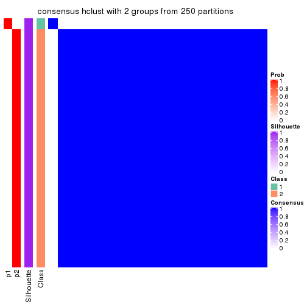</p>

</div>
<div id='tab-SD-hclust-consensus-heatmap-2'>
<pre><code class="r">consensus_heatmap(res, k = 3)
</code></pre>

<p>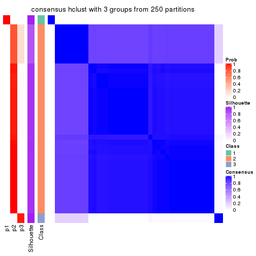</p>

</div>
<div id='tab-SD-hclust-consensus-heatmap-3'>
<pre><code class="r">consensus_heatmap(res, k = 4)
</code></pre>

<p>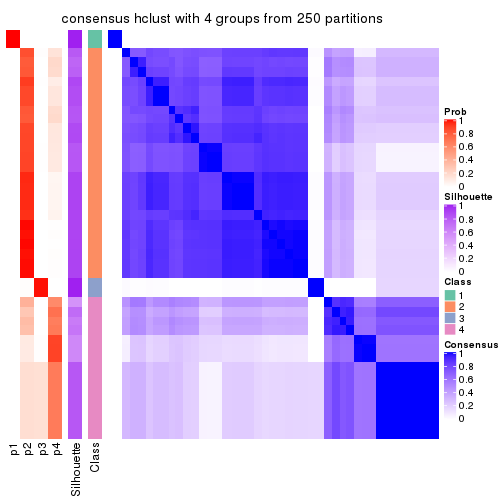</p>

</div>
<div id='tab-SD-hclust-consensus-heatmap-4'>
<pre><code class="r">consensus_heatmap(res, k = 5)
</code></pre>

<p>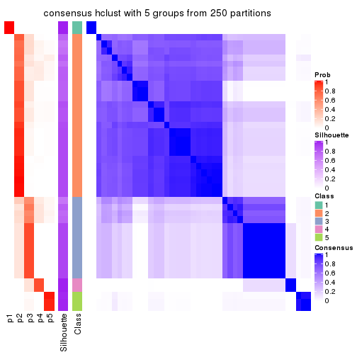</p>

</div>
<div id='tab-SD-hclust-consensus-heatmap-5'>
<pre><code class="r">consensus_heatmap(res, k = 6)
</code></pre>

<p>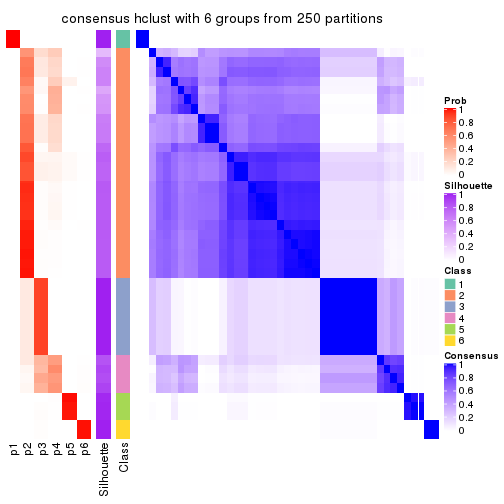</p>

</div>
</div>

Heatmaps for the membership of samples in all partitions to see how consistent they are:


<script>
$( function() {
	$( '#tabs-SD-hclust-membership-heatmap' ).tabs();
} );
</script>
<div id='tabs-SD-hclust-membership-heatmap'>
<ul>
<li><a href='#tab-SD-hclust-membership-heatmap-1'>k = 2</a></li>
<li><a href='#tab-SD-hclust-membership-heatmap-2'>k = 3</a></li>
<li><a href='#tab-SD-hclust-membership-heatmap-3'>k = 4</a></li>
<li><a href='#tab-SD-hclust-membership-heatmap-4'>k = 5</a></li>
<li><a href='#tab-SD-hclust-membership-heatmap-5'>k = 6</a></li>
</ul>
<div id='tab-SD-hclust-membership-heatmap-1'>
<pre><code class="r">membership_heatmap(res, k = 2)
</code></pre>

<p>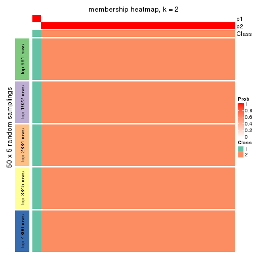</p>

</div>
<div id='tab-SD-hclust-membership-heatmap-2'>
<pre><code class="r">membership_heatmap(res, k = 3)
</code></pre>

<p>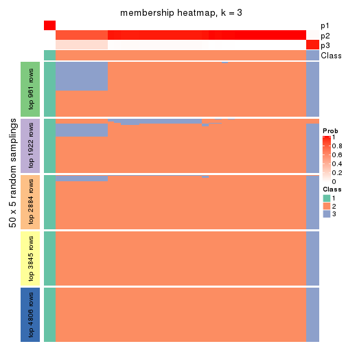</p>

</div>
<div id='tab-SD-hclust-membership-heatmap-3'>
<pre><code class="r">membership_heatmap(res, k = 4)
</code></pre>

<p>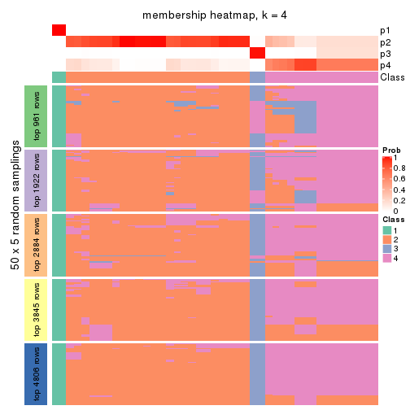</p>

</div>
<div id='tab-SD-hclust-membership-heatmap-4'>
<pre><code class="r">membership_heatmap(res, k = 5)
</code></pre>

<p>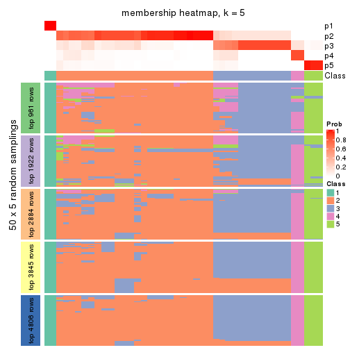</p>

</div>
<div id='tab-SD-hclust-membership-heatmap-5'>
<pre><code class="r">membership_heatmap(res, k = 6)
</code></pre>

<p>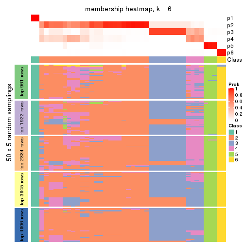</p>

</div>
</div>

As soon as we have had the classes for columns, we can look for signatures
which are significantly different between classes which can be candidate marks
for certain classes. Following are the heatmaps for signatures.


Signature heatmaps where rows are scaled:


<script>
$( function() {
	$( '#tabs-SD-hclust-get-signatures' ).tabs();
} );
</script>
<div id='tabs-SD-hclust-get-signatures'>
<ul>
<li><a href='#tab-SD-hclust-get-signatures-1'>k = 2</a></li>
<li><a href='#tab-SD-hclust-get-signatures-2'>k = 3</a></li>
<li><a href='#tab-SD-hclust-get-signatures-3'>k = 4</a></li>
<li><a href='#tab-SD-hclust-get-signatures-4'>k = 5</a></li>
<li><a href='#tab-SD-hclust-get-signatures-5'>k = 6</a></li>
</ul>
<div id='tab-SD-hclust-get-signatures-1'>
<pre><code class="r">get_signatures(res, k = 2)
</code></pre>

<p>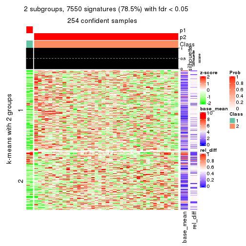</p>

</div>
<div id='tab-SD-hclust-get-signatures-2'>
<pre><code class="r">get_signatures(res, k = 3)
</code></pre>

<p>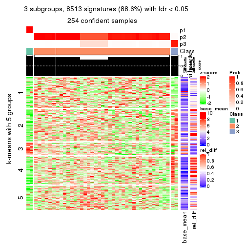</p>

</div>
<div id='tab-SD-hclust-get-signatures-3'>
<pre><code class="r">get_signatures(res, k = 4)
</code></pre>

<p>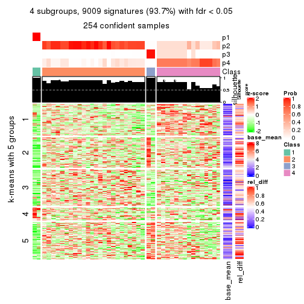</p>

</div>
<div id='tab-SD-hclust-get-signatures-4'>
<pre><code class="r">get_signatures(res, k = 5)
</code></pre>

<p>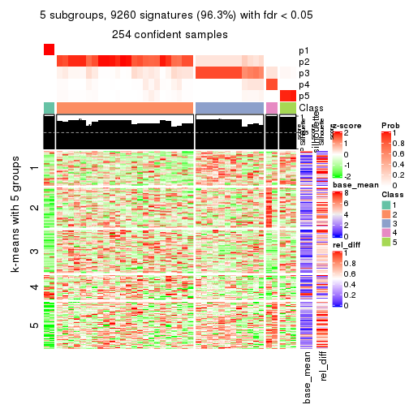</p>

</div>
<div id='tab-SD-hclust-get-signatures-5'>
<pre><code class="r">get_signatures(res, k = 6)
</code></pre>

<p>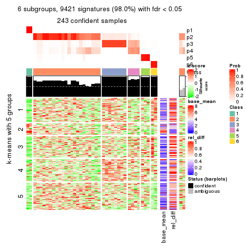</p>

</div>
</div>


Signature heatmaps where rows are not scaled:


<script>
$( function() {
	$( '#tabs-SD-hclust-get-signatures-no-scale' ).tabs();
} );
</script>
<div id='tabs-SD-hclust-get-signatures-no-scale'>
<ul>
<li><a href='#tab-SD-hclust-get-signatures-no-scale-1'>k = 2</a></li>
<li><a href='#tab-SD-hclust-get-signatures-no-scale-2'>k = 3</a></li>
<li><a href='#tab-SD-hclust-get-signatures-no-scale-3'>k = 4</a></li>
<li><a href='#tab-SD-hclust-get-signatures-no-scale-4'>k = 5</a></li>
<li><a href='#tab-SD-hclust-get-signatures-no-scale-5'>k = 6</a></li>
</ul>
<div id='tab-SD-hclust-get-signatures-no-scale-1'>
<pre><code class="r">get_signatures(res, k = 2, scale_rows = FALSE)
</code></pre>

<p>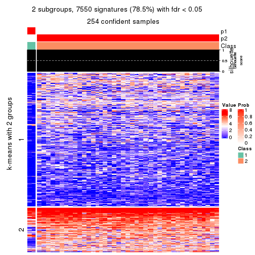</p>

</div>
<div id='tab-SD-hclust-get-signatures-no-scale-2'>
<pre><code class="r">get_signatures(res, k = 3, scale_rows = FALSE)
</code></pre>

<p>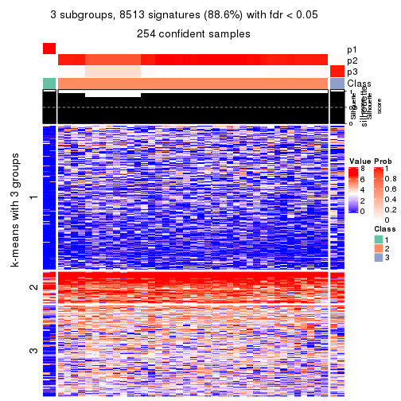</p>

</div>
<div id='tab-SD-hclust-get-signatures-no-scale-3'>
<pre><code class="r">get_signatures(res, k = 4, scale_rows = FALSE)
</code></pre>

<p>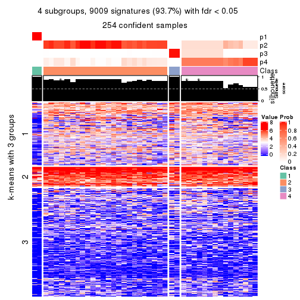</p>

</div>
<div id='tab-SD-hclust-get-signatures-no-scale-4'>
<pre><code class="r">get_signatures(res, k = 5, scale_rows = FALSE)
</code></pre>

<p>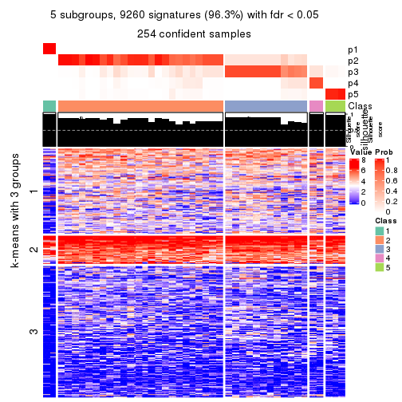</p>

</div>
<div id='tab-SD-hclust-get-signatures-no-scale-5'>
<pre><code class="r">get_signatures(res, k = 6, scale_rows = FALSE)
</code></pre>

<p>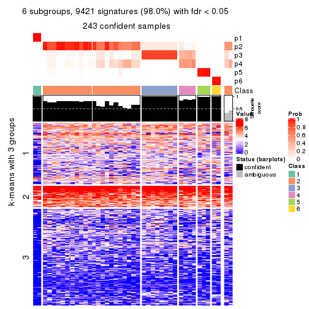</p>

</div>
</div>


Compare the overlap of signatures from different k:

```r
compare_signatures(res)
```

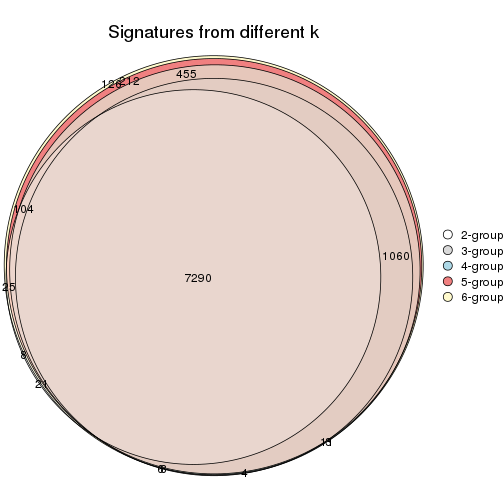

`get_signature()` returns a data frame invisibly. TO get the list of signatures, the function
call should be assigned to a variable explicitly. In following code, if `plot` argument is set
to `FALSE`, no heatmap is plotted while only the differential analysis is performed.

```r
# code only for demonstration
tb = get_signature(res, k = ..., plot = FALSE)
```

An example of the output of `tb` is:

```
#>   which_row         fdr    mean_1    mean_2 scaled_mean_1 scaled_mean_2 km
#> 1        38 0.042760348  8.373488  9.131774    -0.5533452     0.5164555  1
#> 2        40 0.018707592  7.106213  8.469186    -0.6173731     0.5762149  1
#> 3        55 0.019134737 10.221463 11.207825    -0.6159697     0.5749050  1
#> 4        59 0.006059896  5.921854  7.869574    -0.6899429     0.6439467  1
#> 5        60 0.018055526  8.928898 10.211722    -0.6204761     0.5791110  1
#> 6        98 0.009384629 15.714769 14.887706     0.6635654    -0.6193277  2
...
```

The columns in `tb` are:

1. `which_row`: row indices corresponding to the input matrix.
2. `fdr`: FDR for the differential test. 
3. `mean_x`: The mean value in group x.
4. `scaled_mean_x`: The mean value in group x after rows are scaled.
5. `km`: Row groups if k-means clustering is applied to rows.


UMAP plot which shows how samples are separated.


<script>
$( function() {
	$( '#tabs-SD-hclust-dimension-reduction' ).tabs();
} );
</script>
<div id='tabs-SD-hclust-dimension-reduction'>
<ul>
<li><a href='#tab-SD-hclust-dimension-reduction-1'>k = 2</a></li>
<li><a href='#tab-SD-hclust-dimension-reduction-2'>k = 3</a></li>
<li><a href='#tab-SD-hclust-dimension-reduction-3'>k = 4</a></li>
<li><a href='#tab-SD-hclust-dimension-reduction-4'>k = 5</a></li>
<li><a href='#tab-SD-hclust-dimension-reduction-5'>k = 6</a></li>
</ul>
<div id='tab-SD-hclust-dimension-reduction-1'>
<pre><code class="r">dimension_reduction(res, k = 2, method = &quot;UMAP&quot;)
</code></pre>

<p>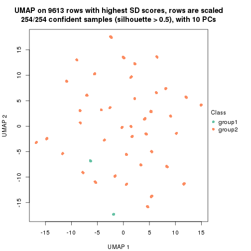</p>

</div>
<div id='tab-SD-hclust-dimension-reduction-2'>
<pre><code class="r">dimension_reduction(res, k = 3, method = &quot;UMAP&quot;)
</code></pre>

<p>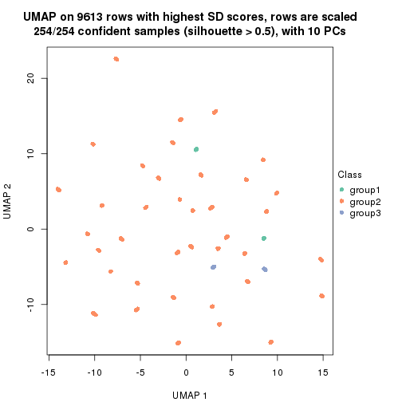</p>

</div>
<div id='tab-SD-hclust-dimension-reduction-3'>
<pre><code class="r">dimension_reduction(res, k = 4, method = &quot;UMAP&quot;)
</code></pre>

<p>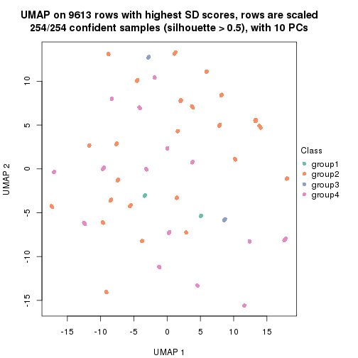</p>

</div>
<div id='tab-SD-hclust-dimension-reduction-4'>
<pre><code class="r">dimension_reduction(res, k = 5, method = &quot;UMAP&quot;)
</code></pre>

<p>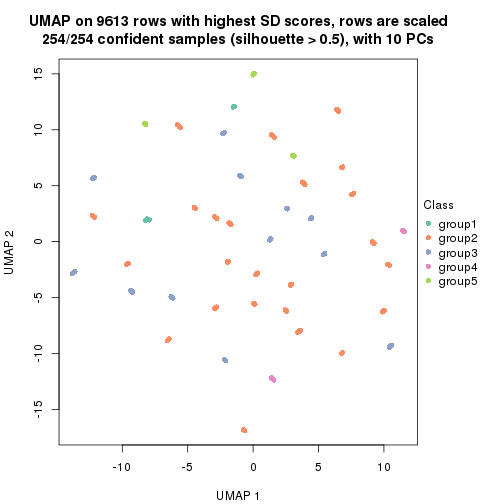</p>

</div>
<div id='tab-SD-hclust-dimension-reduction-5'>
<pre><code class="r">dimension_reduction(res, k = 6, method = &quot;UMAP&quot;)
</code></pre>

<p>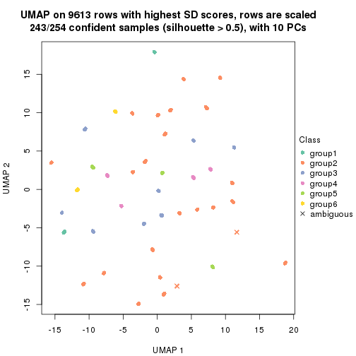</p>

</div>
</div>


Following heatmap shows how subgroups are split when increasing `k`:

```r
collect_classes(res)
```

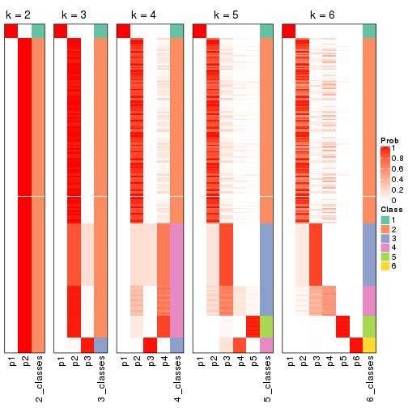


If matrix rows can be associated to genes, consider to use `GO_Enrichment(res,
...)` to perform function enrichment for the signature genes.


 

---------------------------------------------------


### SD:kmeans


The object with results only for a single top-value method and a single partition method 
can be extracted as:

```r
res = res_list["SD", "kmeans"]
# you can also extract it by
# res = res_list["SD:kmeans"]
```

A summary of `res` and all the functions that can be applied to it:

```r
res
```

```
#> A 'ConsensusPartition' object with k = 2, 3, 4, 5, 6.
#>   On a matrix with 9613 rows and 254 columns.
#>   Top rows (961, 1922, 2884, 3845, 4806) are extracted by 'SD' method.
#>   Subgroups are detected by 'kmeans' method.
#>   Performed in total 1250 partitions by row resampling.
#>   Best k for subgroups seems to be 5.
#> 
#> Following methods can be applied to this 'ConsensusPartition' object:
#>  [1] "cola_report"             "collect_classes"         "collect_plots"          
#>  [4] "collect_stats"           "colnames"                "compare_signatures"     
#>  [7] "consensus_heatmap"       "dimension_reduction"     "functional_enrichment"  
#> [10] "get_anno_col"            "get_anno"                "get_classes"            
#> [13] "get_consensus"           "get_matrix"              "get_membership"         
#> [16] "get_param"               "get_signatures"          "get_stats"              
#> [19] "is_best_k"               "is_stable_k"             "membership_heatmap"     
#> [22] "ncol"                    "nrow"                    "plot_ecdf"              
#> [25] "rownames"                "select_partition_number" "show"                   
#> [28] "suggest_best_k"          "test_to_known_factors"
```

`collect_plots()` function collects all the plots made from `res` for all `k` (number of partitions)
into one single page to provide an easy and fast comparison between different `k`.

```r
collect_plots(res)
```

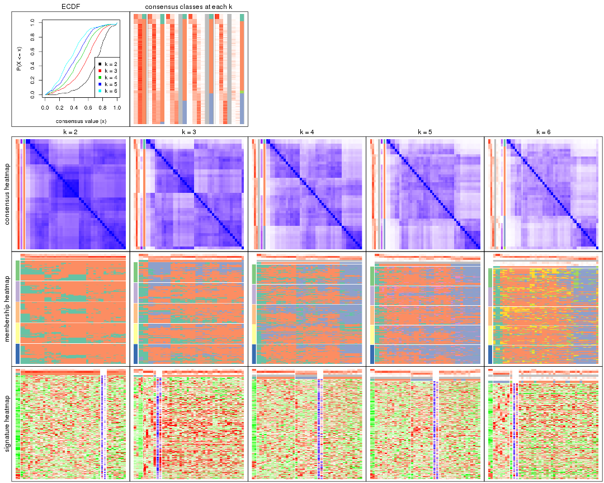

The plots are:

- The first row: a plot of the ECDF (Empirical cumulative distribution
  function) curves of the consensus matrix for each `k` and the heatmap of
  predicted classes for each `k`.
- The second row: heatmaps of the consensus matrix for each `k`.
- The third row: heatmaps of the membership matrix for each `k`.
- The fouth row: heatmaps of the signatures for each `k`.

All the plots in panels can be made by individual functions and they are
plotted later in this section.

`select_partition_number()` produces several plots showing different
statistics for choosing "optimized" `k`. There are following statistics:

- ECDF curves of the consensus matrix for each `k`;
- 1-PAC. [The PAC
  score](https://en.wikipedia.org/wiki/Consensus_clustering#Over-interpretation_potential_of_consensus_clustering)
  measures the proportion of the ambiguous subgrouping.
- Mean silhouette score.
- Concordance. The mean probability of fiting the consensus class ids in all
  partitions.
- Area increased. Denote $A_k$ as the area under the ECDF curve for current
  `k`, the area increased is defined as $A_k - A_{k-1}$.
- Rand index. The percent of pairs of samples that are both in a same cluster
  or both are not in a same cluster in the partition of k and k-1.
- Jaccard index. The ratio of pairs of samples are both in a same cluster in
  the partition of k and k-1 and the pairs of samples are both in a same
  cluster in the partition k or k-1.

The detailed explanations of these statistics can be found in [the cola
vignette](http://bioconductor.org/packages/devel/bioc/vignettes/cola/inst/doc/cola.html#toc_13).

Generally speaking, lower PAC score, higher mean silhouette score or higher
concordance corresponds to better partition. Rand index and Jaccard index
measure how similar the current partition is compared to partition with `k-1`.
If they are too similar, we won't accept `k` is better than `k-1`.

```r
select_partition_number(res)
```

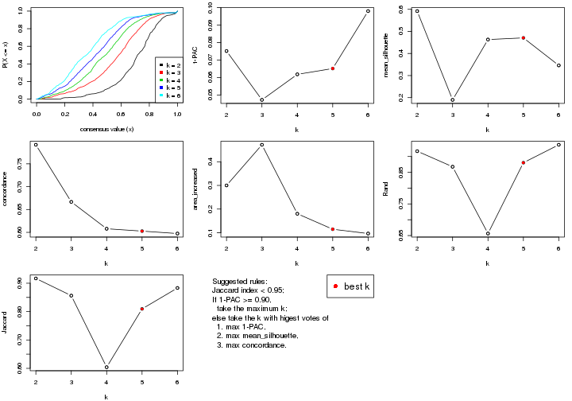

The numeric values for all these statistics can be obtained by `get_stats()`.

```r
get_stats(res)
```

```
#>   k  1-PAC mean_silhouette concordance area_increased  Rand Jaccard
#> 2 2 0.0751           0.592       0.792         0.3000 0.917   0.917
#> 3 3 0.0472           0.190       0.667         0.4717 0.868   0.856
#> 4 4 0.0618           0.463       0.608         0.1803 0.656   0.604
#> 5 5 0.0651           0.471       0.603         0.1149 0.880   0.810
#> 6 6 0.0980           0.346       0.597         0.0967 0.937   0.883
```

`suggest_best_k()` suggests the best $k$ based on these statistics. The rules are as follows:

- All $k$ with Jaccard index larger than 0.95 are removed because the increase of
  the partition number does not provides enough extra information. If all $k$ are removed,
  the best $k$ is assigned by `NA`.
- For $k$ with 1-PAC larger than 0.9, the maximal $k$ is taken as the "best k". Other $k$ is called "optional k".
- If it does not fit the second rule. The $k$ with the highest vote of highest
  1-PAC, mean silhouette and concordance is taken as the "best k".

```r
suggest_best_k(res)
```

```
#> [1] 5
```


Following shows the table of the partitions (You need to click the **show/hide
code output** link to see it). The membership matrix (columns with name `p*`)
is inferred by
[`clue::cl_consensus()`](https://www.rdocumentation.org/link/cl_consensus?package=clue)
function with the `SE` method. Basically the value in the membership matrix
represents the probability to belong to a certain group. The finall class
label for an item is determined with the group with highest probability it
belongs to.

In `get_classes()` function, the entropy is calculated from the membership
matrix and the silhouette score is calculated from the consensus matrix.


<script>
$( function() {
	$( '#tabs-SD-kmeans-get-classes' ).tabs();
} );
</script>
<div id='tabs-SD-kmeans-get-classes'>
<ul>
<li><a href='#tab-SD-kmeans-get-classes-1'>k = 2</a></li>
<li><a href='#tab-SD-kmeans-get-classes-2'>k = 3</a></li>
<li><a href='#tab-SD-kmeans-get-classes-3'>k = 4</a></li>
<li><a href='#tab-SD-kmeans-get-classes-4'>k = 5</a></li>
<li><a href='#tab-SD-kmeans-get-classes-5'>k = 6</a></li>
</ul>

<div id='tab-SD-kmeans-get-classes-1'>
<p><a id='tab-SD-kmeans-get-classes-1-a' style='color:#0366d6' href='#'>show/hide code output</a></p>
<pre><code class="r">cbind(get_classes(res, k = 2), get_membership(res, k = 2))
</code></pre>

<pre><code>#&gt;           class entropy silhouette    p1    p2
#&gt; DRR024803     1   0.943      0.995 0.640 0.360
#&gt; DRR024804     2   0.430      0.708 0.088 0.912
#&gt; DRR024805     2   0.430      0.690 0.088 0.912
#&gt; DRR024806     2   0.402      0.686 0.080 0.920
#&gt; DRR024807     2   0.839      0.587 0.268 0.732
#&gt; DRR024808     2   0.814      0.618 0.252 0.748
#&gt; DRR024809     2   0.518      0.654 0.116 0.884
#&gt; DRR024810     2   0.866      0.363 0.288 0.712
#&gt; DRR024811     2   0.788      0.627 0.236 0.764
#&gt; DRR024812     2   0.506      0.663 0.112 0.888
#&gt; DRR024813     2   0.506      0.696 0.112 0.888
#&gt; DRR024814     2   0.595      0.641 0.144 0.856
#&gt; DRR024815     2   0.662      0.632 0.172 0.828
#&gt; DRR024816     2   0.775      0.496 0.228 0.772
#&gt; DRR024817     2   0.814      0.571 0.252 0.748
#&gt; DRR024818     2   0.689      0.669 0.184 0.816
#&gt; DRR024819     2   0.781      0.612 0.232 0.768
#&gt; DRR024820     2   0.925      0.487 0.340 0.660
#&gt; DRR024821     2   0.802      0.623 0.244 0.756
#&gt; DRR024822     2   0.402      0.698 0.080 0.920
#&gt; DRR024824     2   0.615      0.662 0.152 0.848
#&gt; DRR024825     2   0.795      0.627 0.240 0.760
#&gt; DRR024826     2   0.430      0.705 0.088 0.912
#&gt; DRR024827     2   0.745      0.653 0.212 0.788
#&gt; DRR024828     2   0.844      0.605 0.272 0.728
#&gt; DRR024829     2   0.802      0.481 0.244 0.756
#&gt; DRR024830     2   0.634      0.638 0.160 0.840
#&gt; DRR024831     2   0.844      0.592 0.272 0.728
#&gt; DRR024832     2   0.802      0.622 0.244 0.756
#&gt; DRR024833     2   0.482      0.705 0.104 0.896
#&gt; DRR024834     2   0.978     -0.242 0.412 0.588
#&gt; DRR024835     2   0.775      0.636 0.228 0.772
#&gt; DRR024836     2   0.808      0.618 0.248 0.752
#&gt; DRR024837     2   0.981     -0.263 0.420 0.580
#&gt; DRR024838     2   0.802      0.479 0.244 0.756
#&gt; DRR024839     2   0.402      0.701 0.080 0.920
#&gt; DRR024840     2   0.388      0.704 0.076 0.924
#&gt; DRR024841     2   0.722      0.567 0.200 0.800
#&gt; DRR024842     2   0.402      0.677 0.080 0.920
#&gt; DRR024843     1   0.943      0.995 0.640 0.360
#&gt; DRR024844     2   0.430      0.708 0.088 0.912
#&gt; DRR024845     2   0.430      0.690 0.088 0.912
#&gt; DRR024846     2   0.402      0.686 0.080 0.920
#&gt; DRR024847     2   0.839      0.587 0.268 0.732
#&gt; DRR024848     1   0.946      0.994 0.636 0.364
#&gt; DRR024849     2   0.814      0.618 0.252 0.748
#&gt; DRR024850     2   0.430      0.695 0.088 0.912
#&gt; DRR024851     2   0.518      0.654 0.116 0.884
#&gt; DRR024852     2   0.866      0.363 0.288 0.712
#&gt; DRR024853     2   0.788      0.627 0.236 0.764
#&gt; DRR024854     2   0.506      0.663 0.112 0.888
#&gt; DRR024855     2   0.506      0.696 0.112 0.888
#&gt; DRR024856     2   0.595      0.641 0.144 0.856
#&gt; DRR024857     2   0.662      0.632 0.172 0.828
#&gt; DRR024858     2   0.775      0.496 0.228 0.772
#&gt; DRR024859     2   0.814      0.571 0.252 0.748
#&gt; DRR024860     2   0.689      0.669 0.184 0.816
#&gt; DRR024861     2   0.781      0.612 0.232 0.768
#&gt; DRR024862     2   0.925      0.487 0.340 0.660
#&gt; DRR024863     2   0.802      0.623 0.244 0.756
#&gt; DRR024864     2   0.402      0.698 0.080 0.920
#&gt; DRR024865     2   0.866      0.382 0.288 0.712
#&gt; DRR024866     2   0.615      0.662 0.152 0.848
#&gt; DRR024867     2   0.795      0.627 0.240 0.760
#&gt; DRR024868     2   0.430      0.705 0.088 0.912
#&gt; DRR024869     2   0.745      0.653 0.212 0.788
#&gt; DRR024870     2   0.844      0.605 0.272 0.728
#&gt; DRR024871     2   0.802      0.481 0.244 0.756
#&gt; DRR024872     2   0.634      0.638 0.160 0.840
#&gt; DRR024873     2   0.844      0.592 0.272 0.728
#&gt; DRR024874     2   0.802      0.622 0.244 0.756
#&gt; DRR024875     2   0.482      0.705 0.104 0.896
#&gt; DRR024876     2   0.978     -0.242 0.412 0.588
#&gt; DRR024877     2   0.775      0.636 0.228 0.772
#&gt; DRR024878     2   0.808      0.618 0.248 0.752
#&gt; DRR024879     2   0.981     -0.263 0.420 0.580
#&gt; DRR024880     2   0.802      0.479 0.244 0.756
#&gt; DRR024881     2   0.402      0.701 0.080 0.920
#&gt; DRR024882     2   0.388      0.704 0.076 0.924
#&gt; DRR024883     2   0.722      0.567 0.200 0.800
#&gt; DRR024884     2   0.781      0.565 0.232 0.768
#&gt; DRR024885     2   0.788      0.649 0.236 0.764
#&gt; DRR024886     1   0.943      0.995 0.640 0.360
#&gt; DRR024887     2   0.430      0.708 0.088 0.912
#&gt; DRR024888     2   0.430      0.690 0.088 0.912
#&gt; DRR024889     2   0.402      0.686 0.080 0.920
#&gt; DRR024890     2   0.839      0.587 0.268 0.732
#&gt; DRR024891     1   0.946      0.994 0.636 0.364
#&gt; DRR024892     2   0.814      0.618 0.252 0.748
#&gt; DRR024893     2   0.430      0.695 0.088 0.912
#&gt; DRR024894     2   0.518      0.654 0.116 0.884
#&gt; DRR024895     2   0.866      0.363 0.288 0.712
#&gt; DRR024896     2   0.788      0.627 0.236 0.764
#&gt; DRR024897     2   0.506      0.663 0.112 0.888
#&gt; DRR024898     2   0.506      0.696 0.112 0.888
#&gt; DRR024899     2   0.595      0.641 0.144 0.856
#&gt; DRR024900     2   0.662      0.632 0.172 0.828
#&gt; DRR024901     2   0.775      0.496 0.228 0.772
#&gt; DRR024902     2   0.814      0.571 0.252 0.748
#&gt; DRR024903     2   0.689      0.669 0.184 0.816
#&gt; DRR024904     2   0.781      0.612 0.232 0.768
#&gt; DRR024905     2   0.925      0.487 0.340 0.660
#&gt; DRR024906     2   0.802      0.623 0.244 0.756
#&gt; DRR024907     2   0.402      0.698 0.080 0.920
#&gt; DRR024908     2   0.866      0.382 0.288 0.712
#&gt; DRR024909     2   0.615      0.662 0.152 0.848
#&gt; DRR024910     2   0.795      0.627 0.240 0.760
#&gt; DRR024911     2   0.430      0.705 0.088 0.912
#&gt; DRR024912     2   0.745      0.653 0.212 0.788
#&gt; DRR024913     2   0.844      0.605 0.272 0.728
#&gt; DRR024914     2   0.802      0.481 0.244 0.756
#&gt; DRR024915     2   0.634      0.638 0.160 0.840
#&gt; DRR024916     2   0.844      0.592 0.272 0.728
#&gt; DRR024917     2   0.802      0.622 0.244 0.756
#&gt; DRR024918     2   0.482      0.705 0.104 0.896
#&gt; DRR024919     2   0.978     -0.242 0.412 0.588
#&gt; DRR024920     2   0.775      0.636 0.228 0.772
#&gt; DRR024921     2   0.808      0.618 0.248 0.752
#&gt; DRR024922     2   0.981     -0.263 0.420 0.580
#&gt; DRR024923     2   0.802      0.479 0.244 0.756
#&gt; DRR024924     2   0.402      0.701 0.080 0.920
#&gt; DRR024925     2   0.388      0.704 0.076 0.924
#&gt; DRR024926     2   0.722      0.567 0.200 0.800
#&gt; DRR024927     2   0.781      0.565 0.232 0.768
#&gt; DRR024928     2   0.788      0.649 0.236 0.764
#&gt; DRR024929     1   0.943      0.995 0.640 0.360
#&gt; DRR024930     2   0.430      0.708 0.088 0.912
#&gt; DRR024931     2   0.430      0.690 0.088 0.912
#&gt; DRR024932     2   0.402      0.686 0.080 0.920
#&gt; DRR024933     2   0.839      0.587 0.268 0.732
#&gt; DRR024934     1   0.946      0.994 0.636 0.364
#&gt; DRR024935     2   0.814      0.618 0.252 0.748
#&gt; DRR024936     2   0.430      0.695 0.088 0.912
#&gt; DRR024937     2   0.518      0.654 0.116 0.884
#&gt; DRR024938     2   0.866      0.363 0.288 0.712
#&gt; DRR024939     2   0.788      0.627 0.236 0.764
#&gt; DRR024940     2   0.506      0.663 0.112 0.888
#&gt; DRR024941     2   0.506      0.696 0.112 0.888
#&gt; DRR024942     2   0.595      0.641 0.144 0.856
#&gt; DRR024943     2   0.662      0.632 0.172 0.828
#&gt; DRR024944     2   0.775      0.496 0.228 0.772
#&gt; DRR024945     2   0.814      0.571 0.252 0.748
#&gt; DRR024946     2   0.689      0.669 0.184 0.816
#&gt; DRR024947     2   0.781      0.612 0.232 0.768
#&gt; DRR024948     2   0.925      0.487 0.340 0.660
#&gt; DRR024949     2   0.802      0.623 0.244 0.756
#&gt; DRR024950     2   0.402      0.698 0.080 0.920
#&gt; DRR024951     2   0.866      0.382 0.288 0.712
#&gt; DRR024952     2   0.615      0.662 0.152 0.848
#&gt; DRR024953     2   0.795      0.627 0.240 0.760
#&gt; DRR024954     2   0.430      0.705 0.088 0.912
#&gt; DRR024955     2   0.745      0.653 0.212 0.788
#&gt; DRR024956     2   0.844      0.605 0.272 0.728
#&gt; DRR024957     2   0.802      0.481 0.244 0.756
#&gt; DRR024958     2   0.634      0.638 0.160 0.840
#&gt; DRR024959     2   0.844      0.592 0.272 0.728
#&gt; DRR024960     2   0.802      0.622 0.244 0.756
#&gt; DRR024961     2   0.482      0.705 0.104 0.896
#&gt; DRR024962     2   0.978     -0.242 0.412 0.588
#&gt; DRR024963     2   0.775      0.636 0.228 0.772
#&gt; DRR024964     2   0.808      0.618 0.248 0.752
#&gt; DRR024965     2   0.981     -0.263 0.420 0.580
#&gt; DRR024966     2   0.802      0.479 0.244 0.756
#&gt; DRR024967     2   0.402      0.701 0.080 0.920
#&gt; DRR024968     2   0.388      0.704 0.076 0.924
#&gt; DRR024969     2   0.722      0.567 0.200 0.800
#&gt; DRR024970     2   0.781      0.565 0.232 0.768
#&gt; DRR024971     2   0.788      0.649 0.236 0.764
#&gt; DRR024972     1   0.943      0.995 0.640 0.360
#&gt; DRR024973     2   0.430      0.708 0.088 0.912
#&gt; DRR024974     2   0.430      0.690 0.088 0.912
#&gt; DRR024975     2   0.402      0.686 0.080 0.920
#&gt; DRR024976     2   0.839      0.587 0.268 0.732
#&gt; DRR024977     1   0.946      0.994 0.636 0.364
#&gt; DRR024978     2   0.814      0.618 0.252 0.748
#&gt; DRR024979     2   0.430      0.695 0.088 0.912
#&gt; DRR024980     2   0.518      0.654 0.116 0.884
#&gt; DRR024981     2   0.866      0.363 0.288 0.712
#&gt; DRR024982     2   0.788      0.627 0.236 0.764
#&gt; DRR024983     2   0.506      0.663 0.112 0.888
#&gt; DRR024984     2   0.506      0.696 0.112 0.888
#&gt; DRR024985     2   0.595      0.641 0.144 0.856
#&gt; DRR024986     2   0.662      0.632 0.172 0.828
#&gt; DRR024987     2   0.775      0.496 0.228 0.772
#&gt; DRR024988     2   0.814      0.571 0.252 0.748
#&gt; DRR024989     2   0.689      0.669 0.184 0.816
#&gt; DRR024990     2   0.781      0.612 0.232 0.768
#&gt; DRR024991     2   0.925      0.487 0.340 0.660
#&gt; DRR024992     2   0.802      0.623 0.244 0.756
#&gt; DRR024993     2   0.402      0.698 0.080 0.920
#&gt; DRR024994     2   0.866      0.382 0.288 0.712
#&gt; DRR024995     2   0.615      0.662 0.152 0.848
#&gt; DRR024996     2   0.795      0.627 0.240 0.760
#&gt; DRR024997     2   0.430      0.705 0.088 0.912
#&gt; DRR024998     2   0.745      0.653 0.212 0.788
#&gt; DRR024999     2   0.844      0.605 0.272 0.728
#&gt; DRR025000     2   0.802      0.481 0.244 0.756
#&gt; DRR025001     2   0.634      0.638 0.160 0.840
#&gt; DRR025002     2   0.844      0.592 0.272 0.728
#&gt; DRR025003     2   0.802      0.622 0.244 0.756
#&gt; DRR025004     2   0.482      0.705 0.104 0.896
#&gt; DRR025005     2   0.978     -0.242 0.412 0.588
#&gt; DRR025006     2   0.775      0.636 0.228 0.772
#&gt; DRR025007     2   0.808      0.618 0.248 0.752
#&gt; DRR025008     2   0.981     -0.263 0.420 0.580
#&gt; DRR025009     2   0.802      0.479 0.244 0.756
#&gt; DRR025010     2   0.402      0.701 0.080 0.920
#&gt; DRR025011     2   0.388      0.704 0.076 0.924
#&gt; DRR025012     2   0.722      0.567 0.200 0.800
#&gt; DRR025013     2   0.781      0.565 0.232 0.768
#&gt; DRR025014     2   0.788      0.649 0.236 0.764
#&gt; DRR025015     1   0.943      0.995 0.640 0.360
#&gt; DRR025016     2   0.430      0.708 0.088 0.912
#&gt; DRR025017     2   0.430      0.690 0.088 0.912
#&gt; DRR025018     2   0.402      0.686 0.080 0.920
#&gt; DRR025019     2   0.839      0.587 0.268 0.732
#&gt; DRR025020     1   0.946      0.994 0.636 0.364
#&gt; DRR025021     2   0.814      0.618 0.252 0.748
#&gt; DRR025022     2   0.430      0.695 0.088 0.912
#&gt; DRR025023     2   0.518      0.654 0.116 0.884
#&gt; DRR025024     2   0.866      0.363 0.288 0.712
#&gt; DRR025025     2   0.788      0.627 0.236 0.764
#&gt; DRR025026     2   0.506      0.663 0.112 0.888
#&gt; DRR025027     2   0.506      0.696 0.112 0.888
#&gt; DRR025028     2   0.595      0.641 0.144 0.856
#&gt; DRR025029     2   0.662      0.632 0.172 0.828
#&gt; DRR025030     2   0.775      0.496 0.228 0.772
#&gt; DRR025031     2   0.814      0.571 0.252 0.748
#&gt; DRR025032     2   0.689      0.669 0.184 0.816
#&gt; DRR025033     2   0.781      0.612 0.232 0.768
#&gt; DRR025034     2   0.925      0.487 0.340 0.660
#&gt; DRR025035     2   0.802      0.623 0.244 0.756
#&gt; DRR025036     2   0.402      0.698 0.080 0.920
#&gt; DRR025037     2   0.866      0.382 0.288 0.712
#&gt; DRR025038     2   0.615      0.662 0.152 0.848
#&gt; DRR025039     2   0.795      0.627 0.240 0.760
#&gt; DRR025040     2   0.430      0.705 0.088 0.912
#&gt; DRR025041     2   0.745      0.653 0.212 0.788
#&gt; DRR025042     2   0.844      0.605 0.272 0.728
#&gt; DRR025043     2   0.802      0.481 0.244 0.756
#&gt; DRR025044     2   0.634      0.638 0.160 0.840
#&gt; DRR025045     2   0.844      0.592 0.272 0.728
#&gt; DRR025046     2   0.802      0.622 0.244 0.756
#&gt; DRR025047     2   0.482      0.705 0.104 0.896
#&gt; DRR025048     2   0.978     -0.242 0.412 0.588
#&gt; DRR025049     2   0.775      0.636 0.228 0.772
#&gt; DRR025050     2   0.808      0.618 0.248 0.752
#&gt; DRR025051     2   0.981     -0.263 0.420 0.580
#&gt; DRR025052     2   0.802      0.479 0.244 0.756
#&gt; DRR025053     2   0.402      0.701 0.080 0.920
#&gt; DRR025054     2   0.388      0.704 0.076 0.924
#&gt; DRR025055     2   0.722      0.567 0.200 0.800
#&gt; DRR025056     2   0.781      0.565 0.232 0.768
#&gt; DRR025057     2   0.788      0.649 0.236 0.764
</code></pre>

<script>
$('#tab-SD-kmeans-get-classes-1-a').parent().next().next().hide();
$('#tab-SD-kmeans-get-classes-1-a').click(function(){
  $('#tab-SD-kmeans-get-classes-1-a').parent().next().next().toggle();
  return(false);
});
</script>
</div>

<div id='tab-SD-kmeans-get-classes-2'>
<p><a id='tab-SD-kmeans-get-classes-2-a' style='color:#0366d6' href='#'>show/hide code output</a></p>
<pre><code class="r">cbind(get_classes(res, k = 3), get_membership(res, k = 3))
</code></pre>

<pre><code>#&gt;           class entropy silhouette    p1    p2    p3
#&gt; DRR024803     1   0.741     0.7382 0.700 0.176 0.124
#&gt; DRR024804     2   0.541     0.3744 0.052 0.812 0.136
#&gt; DRR024805     2   0.379     0.4848 0.060 0.892 0.048
#&gt; DRR024806     2   0.401     0.4891 0.084 0.880 0.036
#&gt; DRR024807     2   0.781    -0.6801 0.052 0.516 0.432
#&gt; DRR024808     2   0.716    -0.6603 0.028 0.572 0.400
#&gt; DRR024809     2   0.459     0.5030 0.096 0.856 0.048
#&gt; DRR024810     2   0.725     0.1282 0.300 0.648 0.052
#&gt; DRR024811     2   0.633    -0.5906 0.004 0.600 0.396
#&gt; DRR024812     2   0.437     0.5056 0.108 0.860 0.032
#&gt; DRR024813     2   0.590     0.1568 0.040 0.768 0.192
#&gt; DRR024814     2   0.453     0.5105 0.104 0.856 0.040
#&gt; DRR024815     2   0.719     0.4630 0.164 0.716 0.120
#&gt; DRR024816     2   0.706     0.0779 0.332 0.632 0.036
#&gt; DRR024817     2   0.777     0.4040 0.148 0.676 0.176
#&gt; DRR024818     2   0.684    -0.3658 0.024 0.624 0.352
#&gt; DRR024819     2   0.756     0.4328 0.148 0.692 0.160
#&gt; DRR024820     2   0.892     0.1598 0.160 0.552 0.288
#&gt; DRR024821     2   0.709    -0.6661 0.024 0.560 0.416
#&gt; DRR024822     2   0.428     0.4675 0.056 0.872 0.072
#&gt; DRR024824     2   0.537     0.5033 0.128 0.816 0.056
#&gt; DRR024825     2   0.714    -0.6073 0.028 0.576 0.396
#&gt; DRR024826     2   0.601     0.2137 0.044 0.764 0.192
#&gt; DRR024827     2   0.740    -0.0804 0.060 0.644 0.296
#&gt; DRR024828     2   0.807    -0.6339 0.064 0.484 0.452
#&gt; DRR024829     2   0.718     0.3581 0.248 0.684 0.068
#&gt; DRR024830     2   0.601     0.4947 0.184 0.768 0.048
#&gt; DRR024831     3   0.695     1.0000 0.016 0.488 0.496
#&gt; DRR024832     2   0.654    -0.6318 0.008 0.584 0.408
#&gt; DRR024833     2   0.575     0.2734 0.040 0.780 0.180
#&gt; DRR024834     1   0.715     0.6285 0.532 0.444 0.024
#&gt; DRR024835     2   0.777     0.3509 0.132 0.672 0.196
#&gt; DRR024836     2   0.679    -0.7921 0.012 0.536 0.452
#&gt; DRR024837     1   0.672     0.6731 0.568 0.420 0.012
#&gt; DRR024838     2   0.725     0.3194 0.256 0.676 0.068
#&gt; DRR024839     2   0.414     0.4433 0.032 0.872 0.096
#&gt; DRR024840     2   0.473     0.3695 0.032 0.840 0.128
#&gt; DRR024841     2   0.671     0.4402 0.196 0.732 0.072
#&gt; DRR024842     2   0.309     0.5086 0.072 0.912 0.016
#&gt; DRR024843     1   0.741     0.7382 0.700 0.176 0.124
#&gt; DRR024844     2   0.541     0.3744 0.052 0.812 0.136
#&gt; DRR024845     2   0.379     0.4848 0.060 0.892 0.048
#&gt; DRR024846     2   0.401     0.4891 0.084 0.880 0.036
#&gt; DRR024847     2   0.781    -0.6801 0.052 0.516 0.432
#&gt; DRR024848     1   0.746     0.7407 0.696 0.180 0.124
#&gt; DRR024849     2   0.716    -0.6603 0.028 0.572 0.400
#&gt; DRR024850     2   0.367     0.4871 0.040 0.896 0.064
#&gt; DRR024851     2   0.459     0.5030 0.096 0.856 0.048
#&gt; DRR024852     2   0.725     0.1282 0.300 0.648 0.052
#&gt; DRR024853     2   0.633    -0.5906 0.004 0.600 0.396
#&gt; DRR024854     2   0.437     0.5056 0.108 0.860 0.032
#&gt; DRR024855     2   0.590     0.1568 0.040 0.768 0.192
#&gt; DRR024856     2   0.453     0.5105 0.104 0.856 0.040
#&gt; DRR024857     2   0.719     0.4630 0.164 0.716 0.120
#&gt; DRR024858     2   0.706     0.0779 0.332 0.632 0.036
#&gt; DRR024859     2   0.777     0.4040 0.148 0.676 0.176
#&gt; DRR024860     2   0.684    -0.3658 0.024 0.624 0.352
#&gt; DRR024861     2   0.756     0.4328 0.148 0.692 0.160
#&gt; DRR024862     2   0.892     0.1598 0.160 0.552 0.288
#&gt; DRR024863     2   0.709    -0.6661 0.024 0.560 0.416
#&gt; DRR024864     2   0.428     0.4675 0.056 0.872 0.072
#&gt; DRR024865     2   0.718     0.3000 0.240 0.688 0.072
#&gt; DRR024866     2   0.537     0.5033 0.128 0.816 0.056
#&gt; DRR024867     2   0.714    -0.6073 0.028 0.576 0.396
#&gt; DRR024868     2   0.601     0.2137 0.044 0.764 0.192
#&gt; DRR024869     2   0.740    -0.0804 0.060 0.644 0.296
#&gt; DRR024870     2   0.807    -0.6339 0.064 0.484 0.452
#&gt; DRR024871     2   0.718     0.3581 0.248 0.684 0.068
#&gt; DRR024872     2   0.601     0.4947 0.184 0.768 0.048
#&gt; DRR024873     3   0.695     1.0000 0.016 0.488 0.496
#&gt; DRR024874     2   0.654    -0.6318 0.008 0.584 0.408
#&gt; DRR024875     2   0.575     0.2734 0.040 0.780 0.180
#&gt; DRR024876     1   0.715     0.6285 0.532 0.444 0.024
#&gt; DRR024877     2   0.777     0.3509 0.132 0.672 0.196
#&gt; DRR024878     2   0.679    -0.7921 0.012 0.536 0.452
#&gt; DRR024879     1   0.672     0.6731 0.568 0.420 0.012
#&gt; DRR024880     2   0.725     0.3194 0.256 0.676 0.068
#&gt; DRR024881     2   0.414     0.4433 0.032 0.872 0.096
#&gt; DRR024882     2   0.473     0.3695 0.032 0.840 0.128
#&gt; DRR024883     2   0.671     0.4402 0.196 0.732 0.072
#&gt; DRR024884     2   0.726     0.4701 0.164 0.712 0.124
#&gt; DRR024885     2   0.767     0.0359 0.088 0.652 0.260
#&gt; DRR024886     1   0.741     0.7382 0.700 0.176 0.124
#&gt; DRR024887     2   0.541     0.3744 0.052 0.812 0.136
#&gt; DRR024888     2   0.379     0.4848 0.060 0.892 0.048
#&gt; DRR024889     2   0.401     0.4891 0.084 0.880 0.036
#&gt; DRR024890     2   0.781    -0.6801 0.052 0.516 0.432
#&gt; DRR024891     1   0.746     0.7407 0.696 0.180 0.124
#&gt; DRR024892     2   0.716    -0.6603 0.028 0.572 0.400
#&gt; DRR024893     2   0.367     0.4871 0.040 0.896 0.064
#&gt; DRR024894     2   0.459     0.5030 0.096 0.856 0.048
#&gt; DRR024895     2   0.725     0.1282 0.300 0.648 0.052
#&gt; DRR024896     2   0.633    -0.5906 0.004 0.600 0.396
#&gt; DRR024897     2   0.437     0.5056 0.108 0.860 0.032
#&gt; DRR024898     2   0.590     0.1568 0.040 0.768 0.192
#&gt; DRR024899     2   0.453     0.5105 0.104 0.856 0.040
#&gt; DRR024900     2   0.719     0.4630 0.164 0.716 0.120
#&gt; DRR024901     2   0.706     0.0779 0.332 0.632 0.036
#&gt; DRR024902     2   0.777     0.4040 0.148 0.676 0.176
#&gt; DRR024903     2   0.684    -0.3658 0.024 0.624 0.352
#&gt; DRR024904     2   0.756     0.4328 0.148 0.692 0.160
#&gt; DRR024905     2   0.892     0.1598 0.160 0.552 0.288
#&gt; DRR024906     2   0.709    -0.6661 0.024 0.560 0.416
#&gt; DRR024907     2   0.428     0.4675 0.056 0.872 0.072
#&gt; DRR024908     2   0.718     0.3000 0.240 0.688 0.072
#&gt; DRR024909     2   0.537     0.5033 0.128 0.816 0.056
#&gt; DRR024910     2   0.714    -0.6073 0.028 0.576 0.396
#&gt; DRR024911     2   0.601     0.2137 0.044 0.764 0.192
#&gt; DRR024912     2   0.740    -0.0804 0.060 0.644 0.296
#&gt; DRR024913     2   0.807    -0.6339 0.064 0.484 0.452
#&gt; DRR024914     2   0.718     0.3581 0.248 0.684 0.068
#&gt; DRR024915     2   0.601     0.4947 0.184 0.768 0.048
#&gt; DRR024916     3   0.695     1.0000 0.016 0.488 0.496
#&gt; DRR024917     2   0.654    -0.6318 0.008 0.584 0.408
#&gt; DRR024918     2   0.575     0.2734 0.040 0.780 0.180
#&gt; DRR024919     1   0.715     0.6285 0.532 0.444 0.024
#&gt; DRR024920     2   0.777     0.3509 0.132 0.672 0.196
#&gt; DRR024921     2   0.679    -0.7921 0.012 0.536 0.452
#&gt; DRR024922     1   0.672     0.6731 0.568 0.420 0.012
#&gt; DRR024923     2   0.725     0.3194 0.256 0.676 0.068
#&gt; DRR024924     2   0.414     0.4433 0.032 0.872 0.096
#&gt; DRR024925     2   0.473     0.3695 0.032 0.840 0.128
#&gt; DRR024926     2   0.671     0.4402 0.196 0.732 0.072
#&gt; DRR024927     2   0.726     0.4701 0.164 0.712 0.124
#&gt; DRR024928     2   0.767     0.0359 0.088 0.652 0.260
#&gt; DRR024929     1   0.741     0.7382 0.700 0.176 0.124
#&gt; DRR024930     2   0.541     0.3744 0.052 0.812 0.136
#&gt; DRR024931     2   0.379     0.4848 0.060 0.892 0.048
#&gt; DRR024932     2   0.401     0.4891 0.084 0.880 0.036
#&gt; DRR024933     2   0.781    -0.6801 0.052 0.516 0.432
#&gt; DRR024934     1   0.746     0.7407 0.696 0.180 0.124
#&gt; DRR024935     2   0.716    -0.6603 0.028 0.572 0.400
#&gt; DRR024936     2   0.367     0.4871 0.040 0.896 0.064
#&gt; DRR024937     2   0.459     0.5030 0.096 0.856 0.048
#&gt; DRR024938     2   0.725     0.1282 0.300 0.648 0.052
#&gt; DRR024939     2   0.633    -0.5906 0.004 0.600 0.396
#&gt; DRR024940     2   0.437     0.5056 0.108 0.860 0.032
#&gt; DRR024941     2   0.590     0.1568 0.040 0.768 0.192
#&gt; DRR024942     2   0.453     0.5105 0.104 0.856 0.040
#&gt; DRR024943     2   0.719     0.4630 0.164 0.716 0.120
#&gt; DRR024944     2   0.706     0.0779 0.332 0.632 0.036
#&gt; DRR024945     2   0.777     0.4040 0.148 0.676 0.176
#&gt; DRR024946     2   0.684    -0.3658 0.024 0.624 0.352
#&gt; DRR024947     2   0.756     0.4328 0.148 0.692 0.160
#&gt; DRR024948     2   0.892     0.1598 0.160 0.552 0.288
#&gt; DRR024949     2   0.709    -0.6661 0.024 0.560 0.416
#&gt; DRR024950     2   0.428     0.4675 0.056 0.872 0.072
#&gt; DRR024951     2   0.718     0.3000 0.240 0.688 0.072
#&gt; DRR024952     2   0.537     0.5033 0.128 0.816 0.056
#&gt; DRR024953     2   0.714    -0.6073 0.028 0.576 0.396
#&gt; DRR024954     2   0.601     0.2137 0.044 0.764 0.192
#&gt; DRR024955     2   0.740    -0.0804 0.060 0.644 0.296
#&gt; DRR024956     2   0.807    -0.6339 0.064 0.484 0.452
#&gt; DRR024957     2   0.718     0.3581 0.248 0.684 0.068
#&gt; DRR024958     2   0.601     0.4947 0.184 0.768 0.048
#&gt; DRR024959     3   0.695     1.0000 0.016 0.488 0.496
#&gt; DRR024960     2   0.654    -0.6318 0.008 0.584 0.408
#&gt; DRR024961     2   0.575     0.2734 0.040 0.780 0.180
#&gt; DRR024962     1   0.715     0.6285 0.532 0.444 0.024
#&gt; DRR024963     2   0.777     0.3509 0.132 0.672 0.196
#&gt; DRR024964     2   0.679    -0.7921 0.012 0.536 0.452
#&gt; DRR024965     1   0.672     0.6731 0.568 0.420 0.012
#&gt; DRR024966     2   0.725     0.3194 0.256 0.676 0.068
#&gt; DRR024967     2   0.414     0.4433 0.032 0.872 0.096
#&gt; DRR024968     2   0.473     0.3695 0.032 0.840 0.128
#&gt; DRR024969     2   0.671     0.4402 0.196 0.732 0.072
#&gt; DRR024970     2   0.726     0.4701 0.164 0.712 0.124
#&gt; DRR024971     2   0.767     0.0359 0.088 0.652 0.260
#&gt; DRR024972     1   0.741     0.7382 0.700 0.176 0.124
#&gt; DRR024973     2   0.541     0.3744 0.052 0.812 0.136
#&gt; DRR024974     2   0.379     0.4848 0.060 0.892 0.048
#&gt; DRR024975     2   0.401     0.4891 0.084 0.880 0.036
#&gt; DRR024976     2   0.781    -0.6801 0.052 0.516 0.432
#&gt; DRR024977     1   0.746     0.7407 0.696 0.180 0.124
#&gt; DRR024978     2   0.716    -0.6603 0.028 0.572 0.400
#&gt; DRR024979     2   0.367     0.4871 0.040 0.896 0.064
#&gt; DRR024980     2   0.459     0.5030 0.096 0.856 0.048
#&gt; DRR024981     2   0.725     0.1282 0.300 0.648 0.052
#&gt; DRR024982     2   0.633    -0.5906 0.004 0.600 0.396
#&gt; DRR024983     2   0.437     0.5056 0.108 0.860 0.032
#&gt; DRR024984     2   0.590     0.1568 0.040 0.768 0.192
#&gt; DRR024985     2   0.453     0.5105 0.104 0.856 0.040
#&gt; DRR024986     2   0.719     0.4630 0.164 0.716 0.120
#&gt; DRR024987     2   0.706     0.0779 0.332 0.632 0.036
#&gt; DRR024988     2   0.777     0.4040 0.148 0.676 0.176
#&gt; DRR024989     2   0.684    -0.3658 0.024 0.624 0.352
#&gt; DRR024990     2   0.756     0.4328 0.148 0.692 0.160
#&gt; DRR024991     2   0.892     0.1598 0.160 0.552 0.288
#&gt; DRR024992     2   0.709    -0.6661 0.024 0.560 0.416
#&gt; DRR024993     2   0.428     0.4675 0.056 0.872 0.072
#&gt; DRR024994     2   0.718     0.3000 0.240 0.688 0.072
#&gt; DRR024995     2   0.537     0.5033 0.128 0.816 0.056
#&gt; DRR024996     2   0.714    -0.6073 0.028 0.576 0.396
#&gt; DRR024997     2   0.601     0.2137 0.044 0.764 0.192
#&gt; DRR024998     2   0.740    -0.0804 0.060 0.644 0.296
#&gt; DRR024999     2   0.807    -0.6339 0.064 0.484 0.452
#&gt; DRR025000     2   0.718     0.3581 0.248 0.684 0.068
#&gt; DRR025001     2   0.601     0.4947 0.184 0.768 0.048
#&gt; DRR025002     3   0.695     1.0000 0.016 0.488 0.496
#&gt; DRR025003     2   0.654    -0.6318 0.008 0.584 0.408
#&gt; DRR025004     2   0.575     0.2734 0.040 0.780 0.180
#&gt; DRR025005     1   0.715     0.6285 0.532 0.444 0.024
#&gt; DRR025006     2   0.777     0.3509 0.132 0.672 0.196
#&gt; DRR025007     2   0.679    -0.7921 0.012 0.536 0.452
#&gt; DRR025008     1   0.672     0.6731 0.568 0.420 0.012
#&gt; DRR025009     2   0.725     0.3194 0.256 0.676 0.068
#&gt; DRR025010     2   0.414     0.4433 0.032 0.872 0.096
#&gt; DRR025011     2   0.473     0.3695 0.032 0.840 0.128
#&gt; DRR025012     2   0.671     0.4402 0.196 0.732 0.072
#&gt; DRR025013     2   0.726     0.4701 0.164 0.712 0.124
#&gt; DRR025014     2   0.767     0.0359 0.088 0.652 0.260
#&gt; DRR025015     1   0.741     0.7382 0.700 0.176 0.124
#&gt; DRR025016     2   0.541     0.3744 0.052 0.812 0.136
#&gt; DRR025017     2   0.379     0.4848 0.060 0.892 0.048
#&gt; DRR025018     2   0.401     0.4891 0.084 0.880 0.036
#&gt; DRR025019     2   0.781    -0.6801 0.052 0.516 0.432
#&gt; DRR025020     1   0.746     0.7407 0.696 0.180 0.124
#&gt; DRR025021     2   0.716    -0.6603 0.028 0.572 0.400
#&gt; DRR025022     2   0.367     0.4871 0.040 0.896 0.064
#&gt; DRR025023     2   0.459     0.5030 0.096 0.856 0.048
#&gt; DRR025024     2   0.725     0.1282 0.300 0.648 0.052
#&gt; DRR025025     2   0.633    -0.5906 0.004 0.600 0.396
#&gt; DRR025026     2   0.437     0.5056 0.108 0.860 0.032
#&gt; DRR025027     2   0.590     0.1568 0.040 0.768 0.192
#&gt; DRR025028     2   0.453     0.5105 0.104 0.856 0.040
#&gt; DRR025029     2   0.719     0.4630 0.164 0.716 0.120
#&gt; DRR025030     2   0.706     0.0779 0.332 0.632 0.036
#&gt; DRR025031     2   0.777     0.4040 0.148 0.676 0.176
#&gt; DRR025032     2   0.684    -0.3658 0.024 0.624 0.352
#&gt; DRR025033     2   0.756     0.4328 0.148 0.692 0.160
#&gt; DRR025034     2   0.892     0.1598 0.160 0.552 0.288
#&gt; DRR025035     2   0.709    -0.6661 0.024 0.560 0.416
#&gt; DRR025036     2   0.428     0.4675 0.056 0.872 0.072
#&gt; DRR025037     2   0.718     0.3000 0.240 0.688 0.072
#&gt; DRR025038     2   0.537     0.5033 0.128 0.816 0.056
#&gt; DRR025039     2   0.714    -0.6073 0.028 0.576 0.396
#&gt; DRR025040     2   0.601     0.2137 0.044 0.764 0.192
#&gt; DRR025041     2   0.740    -0.0804 0.060 0.644 0.296
#&gt; DRR025042     2   0.807    -0.6339 0.064 0.484 0.452
#&gt; DRR025043     2   0.718     0.3581 0.248 0.684 0.068
#&gt; DRR025044     2   0.601     0.4947 0.184 0.768 0.048
#&gt; DRR025045     3   0.695     1.0000 0.016 0.488 0.496
#&gt; DRR025046     2   0.654    -0.6318 0.008 0.584 0.408
#&gt; DRR025047     2   0.575     0.2734 0.040 0.780 0.180
#&gt; DRR025048     1   0.715     0.6285 0.532 0.444 0.024
#&gt; DRR025049     2   0.777     0.3509 0.132 0.672 0.196
#&gt; DRR025050     2   0.679    -0.7921 0.012 0.536 0.452
#&gt; DRR025051     1   0.672     0.6731 0.568 0.420 0.012
#&gt; DRR025052     2   0.725     0.3194 0.256 0.676 0.068
#&gt; DRR025053     2   0.414     0.4433 0.032 0.872 0.096
#&gt; DRR025054     2   0.473     0.3695 0.032 0.840 0.128
#&gt; DRR025055     2   0.671     0.4402 0.196 0.732 0.072
#&gt; DRR025056     2   0.726     0.4701 0.164 0.712 0.124
#&gt; DRR025057     2   0.767     0.0359 0.088 0.652 0.260
</code></pre>

<script>
$('#tab-SD-kmeans-get-classes-2-a').parent().next().next().hide();
$('#tab-SD-kmeans-get-classes-2-a').click(function(){
  $('#tab-SD-kmeans-get-classes-2-a').parent().next().next().toggle();
  return(false);
});
</script>
</div>

<div id='tab-SD-kmeans-get-classes-3'>
<p><a id='tab-SD-kmeans-get-classes-3-a' style='color:#0366d6' href='#'>show/hide code output</a></p>
<pre><code class="r">cbind(get_classes(res, k = 4), get_membership(res, k = 4))
</code></pre>

<pre><code>#&gt;           class entropy silhouette    p1    p2    p3 p4
#&gt; DRR024803     1   0.384     0.9883 0.816 0.168 0.016 NA
#&gt; DRR024804     2   0.573     0.4136 0.020 0.732 0.184 NA
#&gt; DRR024805     2   0.460     0.5415 0.028 0.824 0.096 NA
#&gt; DRR024806     2   0.552     0.5362 0.032 0.772 0.092 NA
#&gt; DRR024807     3   0.780     0.6151 0.028 0.328 0.508 NA
#&gt; DRR024808     3   0.581     0.8052 0.004 0.388 0.580 NA
#&gt; DRR024809     2   0.377     0.5762 0.020 0.864 0.032 NA
#&gt; DRR024810     2   0.663     0.4915 0.152 0.668 0.016 NA
#&gt; DRR024811     3   0.539     0.7800 0.008 0.424 0.564 NA
#&gt; DRR024812     2   0.394     0.5856 0.044 0.860 0.024 NA
#&gt; DRR024813     2   0.575     0.0419 0.004 0.656 0.296 NA
#&gt; DRR024814     2   0.393     0.5878 0.044 0.856 0.016 NA
#&gt; DRR024815     2   0.741     0.4748 0.100 0.652 0.128 NA
#&gt; DRR024816     2   0.602     0.5381 0.136 0.716 0.012 NA
#&gt; DRR024817     2   0.788     0.4388 0.148 0.612 0.120 NA
#&gt; DRR024818     2   0.741    -0.3814 0.052 0.508 0.384 NA
#&gt; DRR024819     2   0.702     0.4831 0.052 0.668 0.140 NA
#&gt; DRR024820     2   0.933     0.0180 0.116 0.392 0.304 NA
#&gt; DRR024821     3   0.639     0.7800 0.008 0.384 0.556 NA
#&gt; DRR024822     2   0.455     0.5183 0.016 0.820 0.108 NA
#&gt; DRR024824     2   0.622     0.5366 0.044 0.716 0.068 NA
#&gt; DRR024825     3   0.623     0.7683 0.000 0.416 0.528 NA
#&gt; DRR024826     2   0.668     0.0552 0.020 0.616 0.292 NA
#&gt; DRR024827     2   0.819    -0.2058 0.036 0.436 0.376 NA
#&gt; DRR024828     3   0.682     0.6457 0.012 0.344 0.564 NA
#&gt; DRR024829     2   0.671     0.5483 0.088 0.668 0.036 NA
#&gt; DRR024830     2   0.491     0.5823 0.052 0.800 0.024 NA
#&gt; DRR024831     3   0.529     0.7806 0.004 0.328 0.652 NA
#&gt; DRR024832     3   0.586     0.7989 0.000 0.408 0.556 NA
#&gt; DRR024833     2   0.707     0.0752 0.028 0.608 0.268 NA
#&gt; DRR024834     2   0.797    -0.0785 0.348 0.460 0.020 NA
#&gt; DRR024835     2   0.791     0.4001 0.120 0.608 0.156 NA
#&gt; DRR024836     3   0.586     0.8060 0.012 0.384 0.584 NA
#&gt; DRR024837     2   0.775    -0.1619 0.384 0.432 0.008 NA
#&gt; DRR024838     2   0.687     0.5539 0.104 0.680 0.056 NA
#&gt; DRR024839     2   0.450     0.5075 0.028 0.824 0.112 NA
#&gt; DRR024840     2   0.504     0.3799 0.012 0.768 0.176 NA
#&gt; DRR024841     2   0.592     0.5770 0.100 0.752 0.048 NA
#&gt; DRR024842     2   0.210     0.5778 0.008 0.936 0.012 NA
#&gt; DRR024843     1   0.384     0.9883 0.816 0.168 0.016 NA
#&gt; DRR024844     2   0.573     0.4136 0.020 0.732 0.184 NA
#&gt; DRR024845     2   0.460     0.5415 0.028 0.824 0.096 NA
#&gt; DRR024846     2   0.552     0.5362 0.032 0.772 0.092 NA
#&gt; DRR024847     3   0.780     0.6151 0.028 0.328 0.508 NA
#&gt; DRR024848     1   0.478     0.9860 0.788 0.164 0.020 NA
#&gt; DRR024849     3   0.581     0.8052 0.004 0.388 0.580 NA
#&gt; DRR024850     2   0.451     0.5715 0.032 0.832 0.052 NA
#&gt; DRR024851     2   0.377     0.5762 0.020 0.864 0.032 NA
#&gt; DRR024852     2   0.663     0.4915 0.152 0.668 0.016 NA
#&gt; DRR024853     3   0.539     0.7800 0.008 0.424 0.564 NA
#&gt; DRR024854     2   0.394     0.5856 0.044 0.860 0.024 NA
#&gt; DRR024855     2   0.575     0.0419 0.004 0.656 0.296 NA
#&gt; DRR024856     2   0.393     0.5878 0.044 0.856 0.016 NA
#&gt; DRR024857     2   0.741     0.4748 0.100 0.652 0.128 NA
#&gt; DRR024858     2   0.602     0.5381 0.136 0.716 0.012 NA
#&gt; DRR024859     2   0.788     0.4388 0.148 0.612 0.120 NA
#&gt; DRR024860     2   0.741    -0.3814 0.052 0.508 0.384 NA
#&gt; DRR024861     2   0.702     0.4831 0.052 0.668 0.140 NA
#&gt; DRR024862     2   0.933     0.0180 0.116 0.392 0.304 NA
#&gt; DRR024863     3   0.639     0.7800 0.008 0.384 0.556 NA
#&gt; DRR024864     2   0.455     0.5183 0.016 0.820 0.108 NA
#&gt; DRR024865     2   0.657     0.5416 0.108 0.676 0.024 NA
#&gt; DRR024866     2   0.622     0.5366 0.044 0.716 0.068 NA
#&gt; DRR024867     3   0.623     0.7683 0.000 0.416 0.528 NA
#&gt; DRR024868     2   0.668     0.0552 0.020 0.616 0.292 NA
#&gt; DRR024869     2   0.819    -0.2058 0.036 0.436 0.376 NA
#&gt; DRR024870     3   0.682     0.6457 0.012 0.344 0.564 NA
#&gt; DRR024871     2   0.671     0.5483 0.088 0.668 0.036 NA
#&gt; DRR024872     2   0.491     0.5823 0.052 0.800 0.024 NA
#&gt; DRR024873     3   0.529     0.7806 0.004 0.328 0.652 NA
#&gt; DRR024874     3   0.586     0.7989 0.000 0.408 0.556 NA
#&gt; DRR024875     2   0.707     0.0752 0.028 0.608 0.268 NA
#&gt; DRR024876     2   0.797    -0.0785 0.348 0.460 0.020 NA
#&gt; DRR024877     2   0.791     0.4001 0.120 0.608 0.156 NA
#&gt; DRR024878     3   0.586     0.8060 0.012 0.384 0.584 NA
#&gt; DRR024879     2   0.775    -0.1619 0.384 0.432 0.008 NA
#&gt; DRR024880     2   0.687     0.5539 0.104 0.680 0.056 NA
#&gt; DRR024881     2   0.450     0.5075 0.028 0.824 0.112 NA
#&gt; DRR024882     2   0.504     0.3799 0.012 0.768 0.176 NA
#&gt; DRR024883     2   0.592     0.5770 0.100 0.752 0.048 NA
#&gt; DRR024884     2   0.662     0.5377 0.128 0.700 0.048 NA
#&gt; DRR024885     2   0.810    -0.1085 0.032 0.456 0.360 NA
#&gt; DRR024886     1   0.384     0.9883 0.816 0.168 0.016 NA
#&gt; DRR024887     2   0.573     0.4136 0.020 0.732 0.184 NA
#&gt; DRR024888     2   0.457     0.5414 0.024 0.824 0.100 NA
#&gt; DRR024889     2   0.552     0.5362 0.032 0.772 0.092 NA
#&gt; DRR024890     3   0.780     0.6151 0.028 0.328 0.508 NA
#&gt; DRR024891     1   0.478     0.9860 0.788 0.164 0.020 NA
#&gt; DRR024892     3   0.581     0.8052 0.004 0.388 0.580 NA
#&gt; DRR024893     2   0.451     0.5715 0.032 0.832 0.052 NA
#&gt; DRR024894     2   0.377     0.5762 0.020 0.864 0.032 NA
#&gt; DRR024895     2   0.663     0.4915 0.152 0.668 0.016 NA
#&gt; DRR024896     3   0.539     0.7800 0.008 0.424 0.564 NA
#&gt; DRR024897     2   0.394     0.5856 0.044 0.860 0.024 NA
#&gt; DRR024898     2   0.575     0.0419 0.004 0.656 0.296 NA
#&gt; DRR024899     2   0.393     0.5878 0.044 0.856 0.016 NA
#&gt; DRR024900     2   0.741     0.4748 0.100 0.652 0.128 NA
#&gt; DRR024901     2   0.602     0.5381 0.136 0.716 0.012 NA
#&gt; DRR024902     2   0.788     0.4388 0.148 0.612 0.120 NA
#&gt; DRR024903     2   0.741    -0.3814 0.052 0.508 0.384 NA
#&gt; DRR024904     2   0.702     0.4831 0.052 0.668 0.140 NA
#&gt; DRR024905     2   0.933     0.0180 0.116 0.392 0.304 NA
#&gt; DRR024906     3   0.639     0.7800 0.008 0.384 0.556 NA
#&gt; DRR024907     2   0.455     0.5183 0.016 0.820 0.108 NA
#&gt; DRR024908     2   0.657     0.5416 0.108 0.676 0.024 NA
#&gt; DRR024909     2   0.622     0.5366 0.044 0.716 0.068 NA
#&gt; DRR024910     3   0.623     0.7683 0.000 0.416 0.528 NA
#&gt; DRR024911     2   0.668     0.0552 0.020 0.616 0.292 NA
#&gt; DRR024912     2   0.819    -0.2058 0.036 0.436 0.376 NA
#&gt; DRR024913     3   0.682     0.6457 0.012 0.344 0.564 NA
#&gt; DRR024914     2   0.671     0.5483 0.088 0.668 0.036 NA
#&gt; DRR024915     2   0.491     0.5823 0.052 0.800 0.024 NA
#&gt; DRR024916     3   0.529     0.7806 0.004 0.328 0.652 NA
#&gt; DRR024917     3   0.586     0.7989 0.000 0.408 0.556 NA
#&gt; DRR024918     2   0.707     0.0752 0.028 0.608 0.268 NA
#&gt; DRR024919     2   0.797    -0.0785 0.348 0.460 0.020 NA
#&gt; DRR024920     2   0.791     0.4001 0.120 0.608 0.156 NA
#&gt; DRR024921     3   0.586     0.8060 0.012 0.384 0.584 NA
#&gt; DRR024922     2   0.775    -0.1619 0.384 0.432 0.008 NA
#&gt; DRR024923     2   0.687     0.5539 0.104 0.680 0.056 NA
#&gt; DRR024924     2   0.450     0.5075 0.028 0.824 0.112 NA
#&gt; DRR024925     2   0.504     0.3799 0.012 0.768 0.176 NA
#&gt; DRR024926     2   0.592     0.5770 0.100 0.752 0.048 NA
#&gt; DRR024927     2   0.662     0.5377 0.128 0.700 0.048 NA
#&gt; DRR024928     2   0.810    -0.1085 0.032 0.456 0.360 NA
#&gt; DRR024929     1   0.384     0.9883 0.816 0.168 0.016 NA
#&gt; DRR024930     2   0.573     0.4136 0.020 0.732 0.184 NA
#&gt; DRR024931     2   0.457     0.5414 0.024 0.824 0.100 NA
#&gt; DRR024932     2   0.552     0.5362 0.032 0.772 0.092 NA
#&gt; DRR024933     3   0.780     0.6151 0.028 0.328 0.508 NA
#&gt; DRR024934     1   0.478     0.9860 0.788 0.164 0.020 NA
#&gt; DRR024935     3   0.581     0.8052 0.004 0.388 0.580 NA
#&gt; DRR024936     2   0.451     0.5715 0.032 0.832 0.052 NA
#&gt; DRR024937     2   0.377     0.5762 0.020 0.864 0.032 NA
#&gt; DRR024938     2   0.663     0.4915 0.152 0.668 0.016 NA
#&gt; DRR024939     3   0.539     0.7800 0.008 0.424 0.564 NA
#&gt; DRR024940     2   0.394     0.5856 0.044 0.860 0.024 NA
#&gt; DRR024941     2   0.575     0.0419 0.004 0.656 0.296 NA
#&gt; DRR024942     2   0.393     0.5878 0.044 0.856 0.016 NA
#&gt; DRR024943     2   0.741     0.4748 0.100 0.652 0.128 NA
#&gt; DRR024944     2   0.602     0.5381 0.136 0.716 0.012 NA
#&gt; DRR024945     2   0.788     0.4388 0.148 0.612 0.120 NA
#&gt; DRR024946     2   0.741    -0.3814 0.052 0.508 0.384 NA
#&gt; DRR024947     2   0.702     0.4831 0.052 0.668 0.140 NA
#&gt; DRR024948     2   0.933     0.0180 0.116 0.392 0.304 NA
#&gt; DRR024949     3   0.639     0.7800 0.008 0.384 0.556 NA
#&gt; DRR024950     2   0.455     0.5183 0.016 0.820 0.108 NA
#&gt; DRR024951     2   0.657     0.5416 0.108 0.676 0.024 NA
#&gt; DRR024952     2   0.622     0.5366 0.044 0.716 0.068 NA
#&gt; DRR024953     3   0.623     0.7683 0.000 0.416 0.528 NA
#&gt; DRR024954     2   0.668     0.0552 0.020 0.616 0.292 NA
#&gt; DRR024955     2   0.819    -0.2058 0.036 0.436 0.376 NA
#&gt; DRR024956     3   0.682     0.6457 0.012 0.344 0.564 NA
#&gt; DRR024957     2   0.671     0.5483 0.088 0.668 0.036 NA
#&gt; DRR024958     2   0.491     0.5823 0.052 0.800 0.024 NA
#&gt; DRR024959     3   0.529     0.7806 0.004 0.328 0.652 NA
#&gt; DRR024960     3   0.586     0.7989 0.000 0.408 0.556 NA
#&gt; DRR024961     2   0.707     0.0752 0.028 0.608 0.268 NA
#&gt; DRR024962     2   0.797    -0.0785 0.348 0.460 0.020 NA
#&gt; DRR024963     2   0.791     0.4001 0.120 0.608 0.156 NA
#&gt; DRR024964     3   0.586     0.8060 0.012 0.384 0.584 NA
#&gt; DRR024965     2   0.775    -0.1619 0.384 0.432 0.008 NA
#&gt; DRR024966     2   0.687     0.5539 0.104 0.680 0.056 NA
#&gt; DRR024967     2   0.450     0.5075 0.028 0.824 0.112 NA
#&gt; DRR024968     2   0.504     0.3799 0.012 0.768 0.176 NA
#&gt; DRR024969     2   0.592     0.5770 0.100 0.752 0.048 NA
#&gt; DRR024970     2   0.662     0.5377 0.128 0.700 0.048 NA
#&gt; DRR024971     2   0.810    -0.1085 0.032 0.456 0.360 NA
#&gt; DRR024972     1   0.384     0.9883 0.816 0.168 0.016 NA
#&gt; DRR024973     2   0.573     0.4136 0.020 0.732 0.184 NA
#&gt; DRR024974     2   0.457     0.5414 0.024 0.824 0.100 NA
#&gt; DRR024975     2   0.552     0.5362 0.032 0.772 0.092 NA
#&gt; DRR024976     3   0.780     0.6151 0.028 0.328 0.508 NA
#&gt; DRR024977     1   0.478     0.9860 0.788 0.164 0.020 NA
#&gt; DRR024978     3   0.581     0.8052 0.004 0.388 0.580 NA
#&gt; DRR024979     2   0.451     0.5715 0.032 0.832 0.052 NA
#&gt; DRR024980     2   0.377     0.5762 0.020 0.864 0.032 NA
#&gt; DRR024981     2   0.663     0.4915 0.152 0.668 0.016 NA
#&gt; DRR024982     3   0.539     0.7800 0.008 0.424 0.564 NA
#&gt; DRR024983     2   0.394     0.5856 0.044 0.860 0.024 NA
#&gt; DRR024984     2   0.575     0.0419 0.004 0.656 0.296 NA
#&gt; DRR024985     2   0.393     0.5878 0.044 0.856 0.016 NA
#&gt; DRR024986     2   0.741     0.4748 0.100 0.652 0.128 NA
#&gt; DRR024987     2   0.602     0.5381 0.136 0.716 0.012 NA
#&gt; DRR024988     2   0.788     0.4388 0.148 0.612 0.120 NA
#&gt; DRR024989     2   0.741    -0.3814 0.052 0.508 0.384 NA
#&gt; DRR024990     2   0.702     0.4831 0.052 0.668 0.140 NA
#&gt; DRR024991     2   0.933     0.0180 0.116 0.392 0.304 NA
#&gt; DRR024992     3   0.639     0.7800 0.008 0.384 0.556 NA
#&gt; DRR024993     2   0.455     0.5183 0.016 0.820 0.108 NA
#&gt; DRR024994     2   0.657     0.5416 0.108 0.676 0.024 NA
#&gt; DRR024995     2   0.622     0.5366 0.044 0.716 0.068 NA
#&gt; DRR024996     3   0.623     0.7683 0.000 0.416 0.528 NA
#&gt; DRR024997     2   0.668     0.0552 0.020 0.616 0.292 NA
#&gt; DRR024998     2   0.819    -0.2058 0.036 0.436 0.376 NA
#&gt; DRR024999     3   0.682     0.6457 0.012 0.344 0.564 NA
#&gt; DRR025000     2   0.671     0.5483 0.088 0.668 0.036 NA
#&gt; DRR025001     2   0.491     0.5823 0.052 0.800 0.024 NA
#&gt; DRR025002     3   0.529     0.7806 0.004 0.328 0.652 NA
#&gt; DRR025003     3   0.586     0.7989 0.000 0.408 0.556 NA
#&gt; DRR025004     2   0.707     0.0752 0.028 0.608 0.268 NA
#&gt; DRR025005     2   0.797    -0.0785 0.348 0.460 0.020 NA
#&gt; DRR025006     2   0.791     0.4001 0.120 0.608 0.156 NA
#&gt; DRR025007     3   0.586     0.8060 0.012 0.384 0.584 NA
#&gt; DRR025008     2   0.775    -0.1619 0.384 0.432 0.008 NA
#&gt; DRR025009     2   0.687     0.5539 0.104 0.680 0.056 NA
#&gt; DRR025010     2   0.450     0.5075 0.028 0.824 0.112 NA
#&gt; DRR025011     2   0.504     0.3799 0.012 0.768 0.176 NA
#&gt; DRR025012     2   0.592     0.5770 0.100 0.752 0.048 NA
#&gt; DRR025013     2   0.662     0.5377 0.128 0.700 0.048 NA
#&gt; DRR025014     2   0.810    -0.1085 0.032 0.456 0.360 NA
#&gt; DRR025015     1   0.384     0.9883 0.816 0.168 0.016 NA
#&gt; DRR025016     2   0.573     0.4136 0.020 0.732 0.184 NA
#&gt; DRR025017     2   0.457     0.5414 0.024 0.824 0.100 NA
#&gt; DRR025018     2   0.552     0.5362 0.032 0.772 0.092 NA
#&gt; DRR025019     3   0.780     0.6151 0.028 0.328 0.508 NA
#&gt; DRR025020     1   0.478     0.9860 0.788 0.164 0.020 NA
#&gt; DRR025021     3   0.581     0.8052 0.004 0.388 0.580 NA
#&gt; DRR025022     2   0.451     0.5715 0.032 0.832 0.052 NA
#&gt; DRR025023     2   0.377     0.5762 0.020 0.864 0.032 NA
#&gt; DRR025024     2   0.663     0.4915 0.152 0.668 0.016 NA
#&gt; DRR025025     3   0.539     0.7800 0.008 0.424 0.564 NA
#&gt; DRR025026     2   0.394     0.5856 0.044 0.860 0.024 NA
#&gt; DRR025027     2   0.575     0.0419 0.004 0.656 0.296 NA
#&gt; DRR025028     2   0.393     0.5878 0.044 0.856 0.016 NA
#&gt; DRR025029     2   0.741     0.4748 0.100 0.652 0.128 NA
#&gt; DRR025030     2   0.602     0.5381 0.136 0.716 0.012 NA
#&gt; DRR025031     2   0.788     0.4388 0.148 0.612 0.120 NA
#&gt; DRR025032     2   0.741    -0.3814 0.052 0.508 0.384 NA
#&gt; DRR025033     2   0.702     0.4831 0.052 0.668 0.140 NA
#&gt; DRR025034     2   0.933     0.0180 0.116 0.392 0.304 NA
#&gt; DRR025035     3   0.639     0.7800 0.008 0.384 0.556 NA
#&gt; DRR025036     2   0.455     0.5183 0.016 0.820 0.108 NA
#&gt; DRR025037     2   0.657     0.5416 0.108 0.676 0.024 NA
#&gt; DRR025038     2   0.622     0.5366 0.044 0.716 0.068 NA
#&gt; DRR025039     3   0.623     0.7683 0.000 0.416 0.528 NA
#&gt; DRR025040     2   0.668     0.0552 0.020 0.616 0.292 NA
#&gt; DRR025041     2   0.819    -0.2058 0.036 0.436 0.376 NA
#&gt; DRR025042     3   0.682     0.6457 0.012 0.344 0.564 NA
#&gt; DRR025043     2   0.671     0.5483 0.088 0.668 0.036 NA
#&gt; DRR025044     2   0.491     0.5823 0.052 0.800 0.024 NA
#&gt; DRR025045     3   0.529     0.7806 0.004 0.328 0.652 NA
#&gt; DRR025046     3   0.586     0.7989 0.000 0.408 0.556 NA
#&gt; DRR025047     2   0.707     0.0752 0.028 0.608 0.268 NA
#&gt; DRR025048     2   0.797    -0.0785 0.348 0.460 0.020 NA
#&gt; DRR025049     2   0.791     0.4001 0.120 0.608 0.156 NA
#&gt; DRR025050     3   0.586     0.8060 0.012 0.384 0.584 NA
#&gt; DRR025051     2   0.775    -0.1619 0.384 0.432 0.008 NA
#&gt; DRR025052     2   0.687     0.5539 0.104 0.680 0.056 NA
#&gt; DRR025053     2   0.450     0.5075 0.028 0.824 0.112 NA
#&gt; DRR025054     2   0.504     0.3799 0.012 0.768 0.176 NA
#&gt; DRR025055     2   0.592     0.5770 0.100 0.752 0.048 NA
#&gt; DRR025056     2   0.662     0.5377 0.128 0.700 0.048 NA
#&gt; DRR025057     2   0.810    -0.1085 0.032 0.456 0.360 NA
</code></pre>

<script>
$('#tab-SD-kmeans-get-classes-3-a').parent().next().next().hide();
$('#tab-SD-kmeans-get-classes-3-a').click(function(){
  $('#tab-SD-kmeans-get-classes-3-a').parent().next().next().toggle();
  return(false);
});
</script>
</div>

<div id='tab-SD-kmeans-get-classes-4'>
<p><a id='tab-SD-kmeans-get-classes-4-a' style='color:#0366d6' href='#'>show/hide code output</a></p>
<pre><code class="r">cbind(get_classes(res, k = 5), get_membership(res, k = 5))
</code></pre>

<pre><code>#&gt;           class entropy silhouette    p1    p2    p3    p4 p5
#&gt; DRR024803     1   0.276     0.9823 0.848 0.148 0.000 0.004 NA
#&gt; DRR024804     2   0.581     0.4301 0.032 0.660 0.240 0.008 NA
#&gt; DRR024805     2   0.500     0.5165 0.000 0.744 0.148 0.028 NA
#&gt; DRR024806     2   0.582     0.5460 0.004 0.676 0.120 0.024 NA
#&gt; DRR024807     3   0.682     0.6012 0.004 0.240 0.496 0.252 NA
#&gt; DRR024808     3   0.477     0.7323 0.004 0.224 0.724 0.032 NA
#&gt; DRR024809     2   0.423     0.5742 0.004 0.776 0.060 0.000 NA
#&gt; DRR024810     2   0.566     0.4719 0.104 0.648 0.012 0.000 NA
#&gt; DRR024811     3   0.514     0.7174 0.004 0.268 0.668 0.056 NA
#&gt; DRR024812     2   0.354     0.5830 0.008 0.848 0.056 0.004 NA
#&gt; DRR024813     2   0.584    -0.1488 0.004 0.500 0.436 0.024 NA
#&gt; DRR024814     2   0.366     0.5844 0.008 0.848 0.072 0.012 NA
#&gt; DRR024815     2   0.698     0.5298 0.092 0.648 0.124 0.060 NA
#&gt; DRR024816     2   0.695     0.3600 0.148 0.592 0.016 0.044 NA
#&gt; DRR024817     2   0.788     0.4121 0.080 0.548 0.204 0.100 NA
#&gt; DRR024818     3   0.717     0.3176 0.016 0.412 0.428 0.108 NA
#&gt; DRR024819     2   0.713     0.4884 0.052 0.592 0.184 0.024 NA
#&gt; DRR024820     2   0.889    -0.0113 0.060 0.384 0.292 0.132 NA
#&gt; DRR024821     3   0.563     0.7093 0.008 0.244 0.660 0.076 NA
#&gt; DRR024822     2   0.489     0.5380 0.000 0.720 0.140 0.000 NA
#&gt; DRR024824     2   0.586     0.5683 0.024 0.716 0.080 0.048 NA
#&gt; DRR024825     3   0.492     0.7189 0.000 0.244 0.700 0.036 NA
#&gt; DRR024826     2   0.630     0.0553 0.012 0.496 0.412 0.020 NA
#&gt; DRR024827     3   0.720     0.4026 0.004 0.368 0.456 0.056 NA
#&gt; DRR024828     3   0.726     0.5769 0.016 0.236 0.500 0.228 NA
#&gt; DRR024829     2   0.622     0.5303 0.036 0.648 0.056 0.028 NA
#&gt; DRR024830     2   0.617     0.5588 0.032 0.704 0.088 0.064 NA
#&gt; DRR024831     3   0.537     0.7268 0.004 0.208 0.688 0.092 NA
#&gt; DRR024832     3   0.479     0.7297 0.004 0.232 0.712 0.048 NA
#&gt; DRR024833     2   0.678     0.0529 0.012 0.488 0.380 0.028 NA
#&gt; DRR024834     2   0.750    -0.2447 0.344 0.404 0.012 0.024 NA
#&gt; DRR024835     2   0.717     0.3845 0.052 0.584 0.240 0.068 NA
#&gt; DRR024836     3   0.525     0.7330 0.000 0.248 0.676 0.060 NA
#&gt; DRR024837     2   0.729    -0.2442 0.380 0.420 0.020 0.016 NA
#&gt; DRR024838     2   0.630     0.5404 0.044 0.656 0.104 0.012 NA
#&gt; DRR024839     2   0.518     0.4651 0.008 0.688 0.224 0.000 NA
#&gt; DRR024840     2   0.541     0.3732 0.000 0.660 0.252 0.012 NA
#&gt; DRR024841     2   0.595     0.5716 0.064 0.712 0.080 0.020 NA
#&gt; DRR024842     2   0.257     0.5680 0.000 0.888 0.084 0.000 NA
#&gt; DRR024843     1   0.276     0.9823 0.848 0.148 0.000 0.004 NA
#&gt; DRR024844     2   0.581     0.4301 0.032 0.660 0.240 0.008 NA
#&gt; DRR024845     2   0.500     0.5165 0.000 0.744 0.148 0.028 NA
#&gt; DRR024846     2   0.582     0.5460 0.004 0.676 0.120 0.024 NA
#&gt; DRR024847     3   0.682     0.6012 0.004 0.240 0.496 0.252 NA
#&gt; DRR024848     1   0.435     0.9787 0.788 0.148 0.004 0.040 NA
#&gt; DRR024849     3   0.477     0.7323 0.004 0.224 0.724 0.032 NA
#&gt; DRR024850     2   0.450     0.5334 0.012 0.780 0.152 0.012 NA
#&gt; DRR024851     2   0.423     0.5742 0.004 0.776 0.060 0.000 NA
#&gt; DRR024852     2   0.566     0.4719 0.104 0.648 0.012 0.000 NA
#&gt; DRR024853     3   0.514     0.7174 0.004 0.268 0.668 0.056 NA
#&gt; DRR024854     2   0.354     0.5830 0.008 0.848 0.056 0.004 NA
#&gt; DRR024855     2   0.584    -0.1488 0.004 0.500 0.436 0.024 NA
#&gt; DRR024856     2   0.366     0.5844 0.008 0.848 0.072 0.012 NA
#&gt; DRR024857     2   0.698     0.5298 0.092 0.648 0.124 0.060 NA
#&gt; DRR024858     2   0.695     0.3600 0.148 0.592 0.016 0.044 NA
#&gt; DRR024859     2   0.788     0.4121 0.080 0.548 0.204 0.100 NA
#&gt; DRR024860     3   0.717     0.3176 0.016 0.412 0.428 0.108 NA
#&gt; DRR024861     2   0.713     0.4884 0.052 0.592 0.184 0.024 NA
#&gt; DRR024862     2   0.889    -0.0113 0.060 0.384 0.292 0.132 NA
#&gt; DRR024863     3   0.563     0.7093 0.008 0.244 0.660 0.076 NA
#&gt; DRR024864     2   0.489     0.5380 0.000 0.720 0.140 0.000 NA
#&gt; DRR024865     2   0.618     0.5567 0.056 0.664 0.048 0.024 NA
#&gt; DRR024866     2   0.586     0.5683 0.024 0.716 0.080 0.048 NA
#&gt; DRR024867     3   0.492     0.7189 0.000 0.244 0.700 0.036 NA
#&gt; DRR024868     2   0.630     0.0553 0.012 0.496 0.412 0.020 NA
#&gt; DRR024869     3   0.720     0.4026 0.004 0.368 0.456 0.056 NA
#&gt; DRR024870     3   0.726     0.5769 0.016 0.236 0.500 0.228 NA
#&gt; DRR024871     2   0.622     0.5303 0.036 0.648 0.056 0.028 NA
#&gt; DRR024872     2   0.617     0.5588 0.032 0.704 0.088 0.064 NA
#&gt; DRR024873     3   0.537     0.7268 0.004 0.208 0.688 0.092 NA
#&gt; DRR024874     3   0.479     0.7297 0.004 0.232 0.712 0.048 NA
#&gt; DRR024875     2   0.678     0.0529 0.012 0.488 0.380 0.028 NA
#&gt; DRR024876     2   0.750    -0.2447 0.344 0.404 0.012 0.024 NA
#&gt; DRR024877     2   0.720     0.3845 0.052 0.584 0.236 0.072 NA
#&gt; DRR024878     3   0.525     0.7330 0.000 0.248 0.676 0.060 NA
#&gt; DRR024879     2   0.729    -0.2442 0.380 0.420 0.020 0.016 NA
#&gt; DRR024880     2   0.630     0.5404 0.044 0.656 0.104 0.012 NA
#&gt; DRR024881     2   0.518     0.4651 0.008 0.688 0.224 0.000 NA
#&gt; DRR024882     2   0.541     0.3732 0.000 0.660 0.252 0.012 NA
#&gt; DRR024883     2   0.595     0.5716 0.064 0.712 0.080 0.020 NA
#&gt; DRR024884     2   0.620     0.5309 0.056 0.704 0.124 0.056 NA
#&gt; DRR024885     3   0.792     0.2745 0.024 0.380 0.396 0.068 NA
#&gt; DRR024886     1   0.276     0.9823 0.848 0.148 0.000 0.004 NA
#&gt; DRR024887     2   0.581     0.4301 0.032 0.660 0.240 0.008 NA
#&gt; DRR024888     2   0.500     0.5165 0.000 0.744 0.148 0.028 NA
#&gt; DRR024889     2   0.582     0.5460 0.004 0.676 0.120 0.024 NA
#&gt; DRR024890     3   0.682     0.6012 0.004 0.240 0.496 0.252 NA
#&gt; DRR024891     1   0.435     0.9787 0.788 0.148 0.004 0.040 NA
#&gt; DRR024892     3   0.477     0.7323 0.004 0.224 0.724 0.032 NA
#&gt; DRR024893     2   0.450     0.5334 0.012 0.780 0.152 0.012 NA
#&gt; DRR024894     2   0.423     0.5742 0.004 0.776 0.060 0.000 NA
#&gt; DRR024895     2   0.566     0.4719 0.104 0.648 0.012 0.000 NA
#&gt; DRR024896     3   0.514     0.7174 0.004 0.268 0.668 0.056 NA
#&gt; DRR024897     2   0.354     0.5830 0.008 0.848 0.056 0.004 NA
#&gt; DRR024898     2   0.584    -0.1488 0.004 0.500 0.436 0.024 NA
#&gt; DRR024899     2   0.366     0.5844 0.008 0.848 0.072 0.012 NA
#&gt; DRR024900     2   0.698     0.5298 0.092 0.648 0.124 0.060 NA
#&gt; DRR024901     2   0.695     0.3600 0.148 0.592 0.016 0.044 NA
#&gt; DRR024902     2   0.788     0.4121 0.080 0.548 0.204 0.100 NA
#&gt; DRR024903     3   0.717     0.3176 0.016 0.412 0.428 0.108 NA
#&gt; DRR024904     2   0.713     0.4884 0.052 0.592 0.184 0.024 NA
#&gt; DRR024905     2   0.889    -0.0113 0.060 0.384 0.292 0.132 NA
#&gt; DRR024906     3   0.563     0.7093 0.008 0.244 0.660 0.076 NA
#&gt; DRR024907     2   0.489     0.5380 0.000 0.720 0.140 0.000 NA
#&gt; DRR024908     2   0.618     0.5567 0.056 0.664 0.048 0.024 NA
#&gt; DRR024909     2   0.586     0.5683 0.024 0.716 0.080 0.048 NA
#&gt; DRR024910     3   0.492     0.7189 0.000 0.244 0.700 0.036 NA
#&gt; DRR024911     2   0.630     0.0553 0.012 0.496 0.412 0.020 NA
#&gt; DRR024912     3   0.720     0.4026 0.004 0.368 0.456 0.056 NA
#&gt; DRR024913     3   0.726     0.5769 0.016 0.236 0.500 0.228 NA
#&gt; DRR024914     2   0.622     0.5303 0.036 0.648 0.056 0.028 NA
#&gt; DRR024915     2   0.617     0.5588 0.032 0.704 0.088 0.064 NA
#&gt; DRR024916     3   0.537     0.7268 0.004 0.208 0.688 0.092 NA
#&gt; DRR024917     3   0.479     0.7297 0.004 0.232 0.712 0.048 NA
#&gt; DRR024918     2   0.678     0.0529 0.012 0.488 0.380 0.028 NA
#&gt; DRR024919     2   0.750    -0.2447 0.344 0.404 0.012 0.024 NA
#&gt; DRR024920     2   0.717     0.3845 0.052 0.584 0.240 0.068 NA
#&gt; DRR024921     3   0.525     0.7330 0.000 0.248 0.676 0.060 NA
#&gt; DRR024922     2   0.729    -0.2442 0.380 0.420 0.020 0.016 NA
#&gt; DRR024923     2   0.630     0.5404 0.044 0.656 0.104 0.012 NA
#&gt; DRR024924     2   0.518     0.4651 0.008 0.688 0.224 0.000 NA
#&gt; DRR024925     2   0.541     0.3732 0.000 0.660 0.252 0.012 NA
#&gt; DRR024926     2   0.595     0.5716 0.064 0.712 0.080 0.020 NA
#&gt; DRR024927     2   0.620     0.5309 0.056 0.704 0.124 0.056 NA
#&gt; DRR024928     3   0.792     0.2745 0.024 0.380 0.396 0.068 NA
#&gt; DRR024929     1   0.276     0.9823 0.848 0.148 0.000 0.004 NA
#&gt; DRR024930     2   0.581     0.4301 0.032 0.660 0.240 0.008 NA
#&gt; DRR024931     2   0.500     0.5165 0.000 0.744 0.148 0.028 NA
#&gt; DRR024932     2   0.582     0.5460 0.004 0.676 0.120 0.024 NA
#&gt; DRR024933     3   0.682     0.6012 0.004 0.240 0.496 0.252 NA
#&gt; DRR024934     1   0.435     0.9787 0.788 0.148 0.004 0.040 NA
#&gt; DRR024935     3   0.477     0.7323 0.004 0.224 0.724 0.032 NA
#&gt; DRR024936     2   0.450     0.5334 0.012 0.780 0.152 0.012 NA
#&gt; DRR024937     2   0.423     0.5742 0.004 0.776 0.060 0.000 NA
#&gt; DRR024938     2   0.566     0.4719 0.104 0.648 0.012 0.000 NA
#&gt; DRR024939     3   0.514     0.7174 0.004 0.268 0.668 0.056 NA
#&gt; DRR024940     2   0.354     0.5830 0.008 0.848 0.056 0.004 NA
#&gt; DRR024941     2   0.584    -0.1488 0.004 0.500 0.436 0.024 NA
#&gt; DRR024942     2   0.366     0.5844 0.008 0.848 0.072 0.012 NA
#&gt; DRR024943     2   0.698     0.5298 0.092 0.648 0.124 0.060 NA
#&gt; DRR024944     2   0.695     0.3600 0.148 0.592 0.016 0.044 NA
#&gt; DRR024945     2   0.788     0.4121 0.080 0.548 0.204 0.100 NA
#&gt; DRR024946     3   0.717     0.3176 0.016 0.412 0.428 0.108 NA
#&gt; DRR024947     2   0.713     0.4884 0.052 0.592 0.184 0.024 NA
#&gt; DRR024948     2   0.889    -0.0113 0.060 0.384 0.292 0.132 NA
#&gt; DRR024949     3   0.563     0.7093 0.008 0.244 0.660 0.076 NA
#&gt; DRR024950     2   0.489     0.5380 0.000 0.720 0.140 0.000 NA
#&gt; DRR024951     2   0.618     0.5567 0.056 0.664 0.048 0.024 NA
#&gt; DRR024952     2   0.586     0.5683 0.024 0.716 0.080 0.048 NA
#&gt; DRR024953     3   0.492     0.7189 0.000 0.244 0.700 0.036 NA
#&gt; DRR024954     2   0.630     0.0553 0.012 0.496 0.412 0.020 NA
#&gt; DRR024955     3   0.720     0.4026 0.004 0.368 0.456 0.056 NA
#&gt; DRR024956     3   0.726     0.5769 0.016 0.236 0.500 0.228 NA
#&gt; DRR024957     2   0.622     0.5303 0.036 0.648 0.056 0.028 NA
#&gt; DRR024958     2   0.617     0.5588 0.032 0.704 0.088 0.064 NA
#&gt; DRR024959     3   0.537     0.7268 0.004 0.208 0.688 0.092 NA
#&gt; DRR024960     3   0.479     0.7297 0.004 0.232 0.712 0.048 NA
#&gt; DRR024961     2   0.678     0.0529 0.012 0.488 0.380 0.028 NA
#&gt; DRR024962     2   0.750    -0.2447 0.344 0.404 0.012 0.024 NA
#&gt; DRR024963     2   0.717     0.3845 0.052 0.584 0.240 0.068 NA
#&gt; DRR024964     3   0.525     0.7330 0.000 0.248 0.676 0.060 NA
#&gt; DRR024965     2   0.729    -0.2442 0.380 0.420 0.020 0.016 NA
#&gt; DRR024966     2   0.630     0.5404 0.044 0.656 0.104 0.012 NA
#&gt; DRR024967     2   0.518     0.4651 0.008 0.688 0.224 0.000 NA
#&gt; DRR024968     2   0.541     0.3732 0.000 0.660 0.252 0.012 NA
#&gt; DRR024969     2   0.595     0.5716 0.064 0.712 0.080 0.020 NA
#&gt; DRR024970     2   0.620     0.5309 0.056 0.704 0.124 0.056 NA
#&gt; DRR024971     3   0.792     0.2745 0.024 0.380 0.396 0.068 NA
#&gt; DRR024972     1   0.276     0.9823 0.848 0.148 0.000 0.004 NA
#&gt; DRR024973     2   0.581     0.4301 0.032 0.660 0.240 0.008 NA
#&gt; DRR024974     2   0.500     0.5165 0.000 0.744 0.148 0.028 NA
#&gt; DRR024975     2   0.582     0.5460 0.004 0.676 0.120 0.024 NA
#&gt; DRR024976     3   0.682     0.6012 0.004 0.240 0.496 0.252 NA
#&gt; DRR024977     1   0.435     0.9787 0.788 0.148 0.004 0.040 NA
#&gt; DRR024978     3   0.477     0.7323 0.004 0.224 0.724 0.032 NA
#&gt; DRR024979     2   0.450     0.5334 0.012 0.780 0.152 0.012 NA
#&gt; DRR024980     2   0.423     0.5742 0.004 0.776 0.060 0.000 NA
#&gt; DRR024981     2   0.566     0.4719 0.104 0.648 0.012 0.000 NA
#&gt; DRR024982     3   0.514     0.7174 0.004 0.268 0.668 0.056 NA
#&gt; DRR024983     2   0.354     0.5830 0.008 0.848 0.056 0.004 NA
#&gt; DRR024984     2   0.584    -0.1488 0.004 0.500 0.436 0.024 NA
#&gt; DRR024985     2   0.366     0.5844 0.008 0.848 0.072 0.012 NA
#&gt; DRR024986     2   0.698     0.5298 0.092 0.648 0.124 0.060 NA
#&gt; DRR024987     2   0.695     0.3600 0.148 0.592 0.016 0.044 NA
#&gt; DRR024988     2   0.788     0.4121 0.080 0.548 0.204 0.100 NA
#&gt; DRR024989     3   0.717     0.3176 0.016 0.412 0.428 0.108 NA
#&gt; DRR024990     2   0.713     0.4884 0.052 0.592 0.184 0.024 NA
#&gt; DRR024991     2   0.889    -0.0113 0.060 0.384 0.292 0.132 NA
#&gt; DRR024992     3   0.563     0.7093 0.008 0.244 0.660 0.076 NA
#&gt; DRR024993     2   0.489     0.5380 0.000 0.720 0.140 0.000 NA
#&gt; DRR024994     2   0.618     0.5567 0.056 0.664 0.048 0.024 NA
#&gt; DRR024995     2   0.586     0.5683 0.024 0.716 0.080 0.048 NA
#&gt; DRR024996     3   0.492     0.7189 0.000 0.244 0.700 0.036 NA
#&gt; DRR024997     2   0.630     0.0553 0.012 0.496 0.412 0.020 NA
#&gt; DRR024998     3   0.720     0.4026 0.004 0.368 0.456 0.056 NA
#&gt; DRR024999     3   0.726     0.5769 0.016 0.236 0.500 0.228 NA
#&gt; DRR025000     2   0.622     0.5303 0.036 0.648 0.056 0.028 NA
#&gt; DRR025001     2   0.617     0.5588 0.032 0.704 0.088 0.064 NA
#&gt; DRR025002     3   0.537     0.7268 0.004 0.208 0.688 0.092 NA
#&gt; DRR025003     3   0.479     0.7297 0.004 0.232 0.712 0.048 NA
#&gt; DRR025004     2   0.678     0.0529 0.012 0.488 0.380 0.028 NA
#&gt; DRR025005     2   0.750    -0.2447 0.344 0.404 0.012 0.024 NA
#&gt; DRR025006     2   0.720     0.3845 0.052 0.584 0.236 0.072 NA
#&gt; DRR025007     3   0.525     0.7330 0.000 0.248 0.676 0.060 NA
#&gt; DRR025008     2   0.729    -0.2442 0.380 0.420 0.020 0.016 NA
#&gt; DRR025009     2   0.630     0.5404 0.044 0.656 0.104 0.012 NA
#&gt; DRR025010     2   0.518     0.4651 0.008 0.688 0.224 0.000 NA
#&gt; DRR025011     2   0.541     0.3732 0.000 0.660 0.252 0.012 NA
#&gt; DRR025012     2   0.595     0.5716 0.064 0.712 0.080 0.020 NA
#&gt; DRR025013     2   0.620     0.5309 0.056 0.704 0.124 0.056 NA
#&gt; DRR025014     3   0.792     0.2745 0.024 0.380 0.396 0.068 NA
#&gt; DRR025015     1   0.276     0.9823 0.848 0.148 0.000 0.004 NA
#&gt; DRR025016     2   0.581     0.4301 0.032 0.660 0.240 0.008 NA
#&gt; DRR025017     2   0.500     0.5165 0.000 0.744 0.148 0.028 NA
#&gt; DRR025018     2   0.582     0.5460 0.004 0.676 0.120 0.024 NA
#&gt; DRR025019     3   0.682     0.6012 0.004 0.240 0.496 0.252 NA
#&gt; DRR025020     1   0.435     0.9787 0.788 0.148 0.004 0.040 NA
#&gt; DRR025021     3   0.477     0.7323 0.004 0.224 0.724 0.032 NA
#&gt; DRR025022     2   0.450     0.5334 0.012 0.780 0.152 0.012 NA
#&gt; DRR025023     2   0.423     0.5742 0.004 0.776 0.060 0.000 NA
#&gt; DRR025024     2   0.566     0.4719 0.104 0.648 0.012 0.000 NA
#&gt; DRR025025     3   0.514     0.7174 0.004 0.268 0.668 0.056 NA
#&gt; DRR025026     2   0.354     0.5830 0.008 0.848 0.056 0.004 NA
#&gt; DRR025027     2   0.584    -0.1488 0.004 0.500 0.436 0.024 NA
#&gt; DRR025028     2   0.366     0.5844 0.008 0.848 0.072 0.012 NA
#&gt; DRR025029     2   0.698     0.5298 0.092 0.648 0.124 0.060 NA
#&gt; DRR025030     2   0.695     0.3600 0.148 0.592 0.016 0.044 NA
#&gt; DRR025031     2   0.788     0.4121 0.080 0.548 0.204 0.100 NA
#&gt; DRR025032     3   0.717     0.3176 0.016 0.412 0.428 0.108 NA
#&gt; DRR025033     2   0.713     0.4884 0.052 0.592 0.184 0.024 NA
#&gt; DRR025034     2   0.889    -0.0113 0.060 0.384 0.292 0.132 NA
#&gt; DRR025035     3   0.563     0.7093 0.008 0.244 0.660 0.076 NA
#&gt; DRR025036     2   0.489     0.5380 0.000 0.720 0.140 0.000 NA
#&gt; DRR025037     2   0.618     0.5567 0.056 0.664 0.048 0.024 NA
#&gt; DRR025038     2   0.586     0.5683 0.024 0.716 0.080 0.048 NA
#&gt; DRR025039     3   0.492     0.7189 0.000 0.244 0.700 0.036 NA
#&gt; DRR025040     2   0.630     0.0553 0.012 0.496 0.412 0.020 NA
#&gt; DRR025041     3   0.720     0.4026 0.004 0.368 0.456 0.056 NA
#&gt; DRR025042     3   0.726     0.5769 0.016 0.236 0.500 0.228 NA
#&gt; DRR025043     2   0.622     0.5303 0.036 0.648 0.056 0.028 NA
#&gt; DRR025044     2   0.617     0.5588 0.032 0.704 0.088 0.064 NA
#&gt; DRR025045     3   0.537     0.7268 0.004 0.208 0.688 0.092 NA
#&gt; DRR025046     3   0.479     0.7297 0.004 0.232 0.712 0.048 NA
#&gt; DRR025047     2   0.678     0.0529 0.012 0.488 0.380 0.028 NA
#&gt; DRR025048     2   0.750    -0.2447 0.344 0.404 0.012 0.024 NA
#&gt; DRR025049     2   0.720     0.3845 0.052 0.584 0.236 0.072 NA
#&gt; DRR025050     3   0.525     0.7330 0.000 0.248 0.676 0.060 NA
#&gt; DRR025051     2   0.729    -0.2442 0.380 0.420 0.020 0.016 NA
#&gt; DRR025052     2   0.630     0.5404 0.044 0.656 0.104 0.012 NA
#&gt; DRR025053     2   0.518     0.4651 0.008 0.688 0.224 0.000 NA
#&gt; DRR025054     2   0.541     0.3732 0.000 0.660 0.252 0.012 NA
#&gt; DRR025055     2   0.595     0.5716 0.064 0.712 0.080 0.020 NA
#&gt; DRR025056     2   0.620     0.5309 0.056 0.704 0.124 0.056 NA
#&gt; DRR025057     3   0.792     0.2745 0.024 0.380 0.396 0.068 NA
</code></pre>

<script>
$('#tab-SD-kmeans-get-classes-4-a').parent().next().next().hide();
$('#tab-SD-kmeans-get-classes-4-a').click(function(){
  $('#tab-SD-kmeans-get-classes-4-a').parent().next().next().toggle();
  return(false);
});
</script>
</div>

<div id='tab-SD-kmeans-get-classes-5'>
<p><a id='tab-SD-kmeans-get-classes-5-a' style='color:#0366d6' href='#'>show/hide code output</a></p>
<pre><code class="r">cbind(get_classes(res, k = 6), get_membership(res, k = 6))
</code></pre>

<pre><code>#&gt;           class entropy silhouette    p1    p2    p3 p4    p5    p6
#&gt; DRR024803     1   0.241    0.73242 0.884 0.096 0.004 NA 0.000 0.012
#&gt; DRR024804     2   0.653    0.36552 0.032 0.624 0.184 NA 0.076 0.024
#&gt; DRR024805     2   0.533    0.44051 0.016 0.724 0.124 NA 0.020 0.032
#&gt; DRR024806     2   0.550    0.44118 0.004 0.712 0.080 NA 0.048 0.036
#&gt; DRR024807     3   0.618    0.38565 0.008 0.168 0.512 NA 0.016 0.296
#&gt; DRR024808     3   0.362    0.63547 0.004 0.176 0.788 NA 0.024 0.004
#&gt; DRR024809     2   0.451    0.45474 0.020 0.760 0.072 NA 0.004 0.008
#&gt; DRR024810     2   0.576    0.33197 0.100 0.644 0.012 NA 0.048 0.000
#&gt; DRR024811     3   0.386    0.63755 0.000 0.216 0.748 NA 0.012 0.024
#&gt; DRR024812     2   0.410    0.46973 0.024 0.812 0.040 NA 0.024 0.008
#&gt; DRR024813     2   0.656    0.03744 0.004 0.464 0.380 NA 0.092 0.028
#&gt; DRR024814     2   0.468    0.43089 0.012 0.756 0.048 NA 0.124 0.000
#&gt; DRR024815     2   0.794    0.21124 0.076 0.532 0.092 NA 0.148 0.060
#&gt; DRR024816     2   0.659    0.30179 0.108 0.576 0.020 NA 0.016 0.044
#&gt; DRR024817     2   0.827   -0.00687 0.088 0.448 0.144 NA 0.220 0.036
#&gt; DRR024818     3   0.780   -0.00212 0.020 0.344 0.396 NA 0.072 0.124
#&gt; DRR024819     2   0.759    0.11728 0.076 0.532 0.132 NA 0.160 0.012
#&gt; DRR024820     5   0.785    0.99898 0.048 0.316 0.228 NA 0.348 0.052
#&gt; DRR024821     3   0.514    0.60850 0.000 0.196 0.692 NA 0.020 0.072
#&gt; DRR024822     2   0.465    0.44536 0.000 0.752 0.096 NA 0.016 0.020
#&gt; DRR024824     2   0.573    0.42149 0.012 0.704 0.048 NA 0.060 0.052
#&gt; DRR024825     3   0.479    0.60800 0.004 0.192 0.716 NA 0.060 0.024
#&gt; DRR024826     2   0.699    0.15054 0.008 0.492 0.288 NA 0.140 0.052
#&gt; DRR024827     3   0.709   -0.14822 0.008 0.268 0.404 NA 0.264 0.056
#&gt; DRR024828     3   0.654    0.42067 0.004 0.188 0.528 NA 0.016 0.240
#&gt; DRR024829     2   0.722    0.18409 0.020 0.528 0.052 NA 0.236 0.036
#&gt; DRR024830     2   0.682    0.37976 0.036 0.624 0.076 NA 0.036 0.096
#&gt; DRR024831     3   0.408    0.63739 0.000 0.164 0.764 NA 0.004 0.060
#&gt; DRR024832     3   0.440    0.63954 0.000 0.208 0.732 NA 0.020 0.024
#&gt; DRR024833     2   0.706    0.04312 0.004 0.456 0.300 NA 0.176 0.040
#&gt; DRR024834     1   0.717    0.45344 0.364 0.340 0.004 NA 0.060 0.004
#&gt; DRR024835     2   0.803    0.06988 0.056 0.476 0.156 NA 0.208 0.056
#&gt; DRR024836     3   0.508    0.62822 0.000 0.204 0.688 NA 0.056 0.048
#&gt; DRR024837     2   0.714   -0.43952 0.344 0.352 0.000 NA 0.032 0.024
#&gt; DRR024838     2   0.720    0.24806 0.044 0.552 0.052 NA 0.188 0.020
#&gt; DRR024839     2   0.563    0.40906 0.012 0.692 0.128 NA 0.116 0.020
#&gt; DRR024840     2   0.508    0.37302 0.004 0.692 0.208 NA 0.028 0.008
#&gt; DRR024841     2   0.695    0.37936 0.076 0.608 0.056 NA 0.076 0.028
#&gt; DRR024842     2   0.231    0.46674 0.000 0.904 0.044 NA 0.036 0.000
#&gt; DRR024843     1   0.241    0.73242 0.884 0.096 0.004 NA 0.000 0.012
#&gt; DRR024844     2   0.653    0.36552 0.032 0.624 0.184 NA 0.076 0.024
#&gt; DRR024845     2   0.533    0.44051 0.016 0.724 0.124 NA 0.020 0.032
#&gt; DRR024846     2   0.550    0.44118 0.004 0.712 0.080 NA 0.048 0.036
#&gt; DRR024847     3   0.618    0.38565 0.008 0.168 0.512 NA 0.016 0.296
#&gt; DRR024848     1   0.336    0.72979 0.844 0.096 0.004 NA 0.004 0.024
#&gt; DRR024849     3   0.362    0.63547 0.004 0.176 0.788 NA 0.024 0.004
#&gt; DRR024850     2   0.551    0.43218 0.024 0.720 0.084 NA 0.108 0.016
#&gt; DRR024851     2   0.451    0.45474 0.020 0.760 0.072 NA 0.004 0.008
#&gt; DRR024852     2   0.576    0.33197 0.100 0.644 0.012 NA 0.048 0.000
#&gt; DRR024853     3   0.386    0.63755 0.000 0.216 0.748 NA 0.012 0.024
#&gt; DRR024854     2   0.410    0.46973 0.024 0.812 0.040 NA 0.024 0.008
#&gt; DRR024855     2   0.656    0.03744 0.004 0.464 0.380 NA 0.092 0.028
#&gt; DRR024856     2   0.468    0.43089 0.012 0.756 0.048 NA 0.124 0.000
#&gt; DRR024857     2   0.794    0.21124 0.076 0.532 0.092 NA 0.148 0.060
#&gt; DRR024858     2   0.659    0.30179 0.108 0.576 0.020 NA 0.016 0.044
#&gt; DRR024859     2   0.827   -0.00687 0.088 0.448 0.144 NA 0.220 0.036
#&gt; DRR024860     3   0.780   -0.00212 0.020 0.344 0.396 NA 0.072 0.124
#&gt; DRR024861     2   0.759    0.11728 0.076 0.532 0.132 NA 0.160 0.012
#&gt; DRR024862     5   0.785    0.99898 0.048 0.316 0.228 NA 0.348 0.052
#&gt; DRR024863     3   0.514    0.60850 0.000 0.196 0.692 NA 0.020 0.072
#&gt; DRR024864     2   0.465    0.44536 0.000 0.752 0.096 NA 0.016 0.020
#&gt; DRR024865     2   0.678    0.25447 0.060 0.568 0.020 NA 0.112 0.016
#&gt; DRR024866     2   0.573    0.42149 0.012 0.704 0.048 NA 0.060 0.052
#&gt; DRR024867     3   0.479    0.60800 0.004 0.192 0.716 NA 0.060 0.024
#&gt; DRR024868     2   0.699    0.15054 0.008 0.492 0.288 NA 0.140 0.052
#&gt; DRR024869     3   0.709   -0.14822 0.008 0.268 0.404 NA 0.264 0.056
#&gt; DRR024870     3   0.654    0.42067 0.004 0.188 0.528 NA 0.016 0.240
#&gt; DRR024871     2   0.722    0.18409 0.020 0.528 0.052 NA 0.236 0.036
#&gt; DRR024872     2   0.682    0.37976 0.036 0.624 0.076 NA 0.036 0.096
#&gt; DRR024873     3   0.408    0.63739 0.000 0.164 0.764 NA 0.004 0.060
#&gt; DRR024874     3   0.440    0.63954 0.000 0.208 0.732 NA 0.020 0.024
#&gt; DRR024875     2   0.706    0.04312 0.004 0.456 0.300 NA 0.176 0.040
#&gt; DRR024876     1   0.717    0.45344 0.364 0.340 0.004 NA 0.060 0.004
#&gt; DRR024877     2   0.803    0.06988 0.056 0.476 0.156 NA 0.208 0.056
#&gt; DRR024878     3   0.508    0.62822 0.000 0.204 0.688 NA 0.056 0.048
#&gt; DRR024879     2   0.714   -0.43952 0.344 0.352 0.000 NA 0.032 0.024
#&gt; DRR024880     2   0.720    0.24806 0.044 0.552 0.052 NA 0.188 0.020
#&gt; DRR024881     2   0.563    0.40906 0.012 0.692 0.128 NA 0.116 0.020
#&gt; DRR024882     2   0.508    0.37302 0.004 0.692 0.208 NA 0.028 0.008
#&gt; DRR024883     2   0.695    0.37936 0.076 0.608 0.056 NA 0.076 0.028
#&gt; DRR024884     2   0.770    0.19988 0.048 0.528 0.104 NA 0.184 0.036
#&gt; DRR024885     3   0.744   -0.33098 0.004 0.312 0.332 NA 0.284 0.048
#&gt; DRR024886     1   0.241    0.73242 0.884 0.096 0.004 NA 0.000 0.012
#&gt; DRR024887     2   0.653    0.36552 0.032 0.624 0.184 NA 0.076 0.024
#&gt; DRR024888     2   0.533    0.44051 0.016 0.724 0.124 NA 0.020 0.032
#&gt; DRR024889     2   0.550    0.44118 0.004 0.712 0.080 NA 0.048 0.036
#&gt; DRR024890     3   0.618    0.38565 0.008 0.168 0.512 NA 0.016 0.296
#&gt; DRR024891     1   0.336    0.72979 0.844 0.096 0.004 NA 0.004 0.024
#&gt; DRR024892     3   0.362    0.63547 0.004 0.176 0.788 NA 0.024 0.004
#&gt; DRR024893     2   0.551    0.43218 0.024 0.720 0.084 NA 0.108 0.016
#&gt; DRR024894     2   0.451    0.45474 0.020 0.760 0.072 NA 0.004 0.008
#&gt; DRR024895     2   0.576    0.33197 0.100 0.644 0.012 NA 0.048 0.000
#&gt; DRR024896     3   0.386    0.63755 0.000 0.216 0.748 NA 0.012 0.024
#&gt; DRR024897     2   0.410    0.46973 0.024 0.812 0.040 NA 0.024 0.008
#&gt; DRR024898     2   0.656    0.03744 0.004 0.464 0.380 NA 0.092 0.028
#&gt; DRR024899     2   0.468    0.43089 0.012 0.756 0.048 NA 0.124 0.000
#&gt; DRR024900     2   0.794    0.21124 0.076 0.532 0.092 NA 0.148 0.060
#&gt; DRR024901     2   0.659    0.30179 0.108 0.576 0.020 NA 0.016 0.044
#&gt; DRR024902     2   0.827   -0.00687 0.088 0.448 0.144 NA 0.220 0.036
#&gt; DRR024903     3   0.780   -0.00212 0.020 0.344 0.396 NA 0.072 0.124
#&gt; DRR024904     2   0.759    0.11728 0.076 0.532 0.132 NA 0.160 0.012
#&gt; DRR024905     5   0.789    0.99796 0.048 0.316 0.228 NA 0.344 0.056
#&gt; DRR024906     3   0.514    0.60850 0.000 0.196 0.692 NA 0.020 0.072
#&gt; DRR024907     2   0.465    0.44536 0.000 0.752 0.096 NA 0.016 0.020
#&gt; DRR024908     2   0.678    0.25447 0.060 0.568 0.020 NA 0.112 0.016
#&gt; DRR024909     2   0.573    0.42149 0.012 0.704 0.048 NA 0.060 0.052
#&gt; DRR024910     3   0.479    0.60800 0.004 0.192 0.716 NA 0.060 0.024
#&gt; DRR024911     2   0.699    0.15054 0.008 0.492 0.288 NA 0.140 0.052
#&gt; DRR024912     3   0.709   -0.14822 0.008 0.268 0.404 NA 0.264 0.056
#&gt; DRR024913     3   0.654    0.42067 0.004 0.188 0.528 NA 0.016 0.240
#&gt; DRR024914     2   0.722    0.18409 0.020 0.528 0.052 NA 0.236 0.036
#&gt; DRR024915     2   0.682    0.37976 0.036 0.624 0.076 NA 0.036 0.096
#&gt; DRR024916     3   0.408    0.63739 0.000 0.164 0.764 NA 0.004 0.060
#&gt; DRR024917     3   0.440    0.63954 0.000 0.208 0.732 NA 0.020 0.024
#&gt; DRR024918     2   0.706    0.04312 0.004 0.456 0.300 NA 0.176 0.040
#&gt; DRR024919     1   0.717    0.45344 0.364 0.340 0.004 NA 0.060 0.004
#&gt; DRR024920     2   0.803    0.06988 0.056 0.476 0.156 NA 0.208 0.056
#&gt; DRR024921     3   0.508    0.62822 0.000 0.204 0.688 NA 0.056 0.048
#&gt; DRR024922     2   0.714   -0.43952 0.344 0.352 0.000 NA 0.032 0.024
#&gt; DRR024923     2   0.720    0.24806 0.044 0.552 0.052 NA 0.188 0.020
#&gt; DRR024924     2   0.563    0.40906 0.012 0.692 0.128 NA 0.116 0.020
#&gt; DRR024925     2   0.508    0.37302 0.004 0.692 0.208 NA 0.028 0.008
#&gt; DRR024926     2   0.695    0.37936 0.076 0.608 0.056 NA 0.076 0.028
#&gt; DRR024927     2   0.770    0.19988 0.048 0.528 0.104 NA 0.184 0.036
#&gt; DRR024928     3   0.744   -0.33098 0.004 0.312 0.332 NA 0.284 0.048
#&gt; DRR024929     1   0.241    0.73242 0.884 0.096 0.004 NA 0.000 0.012
#&gt; DRR024930     2   0.653    0.36552 0.032 0.624 0.184 NA 0.076 0.024
#&gt; DRR024931     2   0.533    0.44051 0.016 0.724 0.124 NA 0.020 0.032
#&gt; DRR024932     2   0.550    0.44118 0.004 0.712 0.080 NA 0.048 0.036
#&gt; DRR024933     3   0.618    0.38565 0.008 0.168 0.512 NA 0.016 0.296
#&gt; DRR024934     1   0.336    0.72979 0.844 0.096 0.004 NA 0.004 0.024
#&gt; DRR024935     3   0.362    0.63547 0.004 0.176 0.788 NA 0.024 0.004
#&gt; DRR024936     2   0.551    0.43218 0.024 0.720 0.084 NA 0.108 0.016
#&gt; DRR024937     2   0.451    0.45474 0.020 0.760 0.072 NA 0.004 0.008
#&gt; DRR024938     2   0.576    0.33197 0.100 0.644 0.012 NA 0.048 0.000
#&gt; DRR024939     3   0.386    0.63755 0.000 0.216 0.748 NA 0.012 0.024
#&gt; DRR024940     2   0.410    0.46973 0.024 0.812 0.040 NA 0.024 0.008
#&gt; DRR024941     2   0.656    0.03744 0.004 0.464 0.380 NA 0.092 0.028
#&gt; DRR024942     2   0.468    0.43089 0.012 0.756 0.048 NA 0.124 0.000
#&gt; DRR024943     2   0.794    0.21124 0.076 0.532 0.092 NA 0.148 0.060
#&gt; DRR024944     2   0.659    0.30179 0.108 0.576 0.020 NA 0.016 0.044
#&gt; DRR024945     2   0.827   -0.00687 0.088 0.448 0.144 NA 0.220 0.036
#&gt; DRR024946     3   0.780   -0.00212 0.020 0.344 0.396 NA 0.072 0.124
#&gt; DRR024947     2   0.759    0.11728 0.076 0.532 0.132 NA 0.160 0.012
#&gt; DRR024948     5   0.785    0.99898 0.048 0.316 0.228 NA 0.348 0.052
#&gt; DRR024949     3   0.514    0.60850 0.000 0.196 0.692 NA 0.020 0.072
#&gt; DRR024950     2   0.465    0.44536 0.000 0.752 0.096 NA 0.016 0.020
#&gt; DRR024951     2   0.678    0.25447 0.060 0.568 0.020 NA 0.112 0.016
#&gt; DRR024952     2   0.573    0.42149 0.012 0.704 0.048 NA 0.060 0.052
#&gt; DRR024953     3   0.479    0.60800 0.004 0.192 0.716 NA 0.060 0.024
#&gt; DRR024954     2   0.699    0.15054 0.008 0.492 0.288 NA 0.140 0.052
#&gt; DRR024955     3   0.709   -0.14822 0.008 0.268 0.404 NA 0.264 0.056
#&gt; DRR024956     3   0.654    0.42067 0.004 0.188 0.528 NA 0.016 0.240
#&gt; DRR024957     2   0.722    0.18409 0.020 0.528 0.052 NA 0.236 0.036
#&gt; DRR024958     2   0.682    0.37976 0.036 0.624 0.076 NA 0.036 0.096
#&gt; DRR024959     3   0.408    0.63739 0.000 0.164 0.764 NA 0.004 0.060
#&gt; DRR024960     3   0.440    0.63954 0.000 0.208 0.732 NA 0.020 0.024
#&gt; DRR024961     2   0.706    0.04312 0.004 0.456 0.300 NA 0.176 0.040
#&gt; DRR024962     1   0.717    0.45344 0.364 0.340 0.004 NA 0.060 0.004
#&gt; DRR024963     2   0.806    0.06988 0.056 0.476 0.156 NA 0.204 0.060
#&gt; DRR024964     3   0.508    0.62822 0.000 0.204 0.688 NA 0.056 0.048
#&gt; DRR024965     2   0.714   -0.43952 0.344 0.352 0.000 NA 0.032 0.024
#&gt; DRR024966     2   0.720    0.24806 0.044 0.552 0.052 NA 0.188 0.020
#&gt; DRR024967     2   0.563    0.40906 0.012 0.692 0.128 NA 0.116 0.020
#&gt; DRR024968     2   0.508    0.37302 0.004 0.692 0.208 NA 0.028 0.008
#&gt; DRR024969     2   0.695    0.37936 0.076 0.608 0.056 NA 0.076 0.028
#&gt; DRR024970     2   0.770    0.19988 0.048 0.528 0.104 NA 0.184 0.036
#&gt; DRR024971     3   0.744   -0.33098 0.004 0.312 0.332 NA 0.284 0.048
#&gt; DRR024972     1   0.241    0.73242 0.884 0.096 0.004 NA 0.000 0.012
#&gt; DRR024973     2   0.653    0.36552 0.032 0.624 0.184 NA 0.076 0.024
#&gt; DRR024974     2   0.533    0.44051 0.016 0.724 0.124 NA 0.020 0.032
#&gt; DRR024975     2   0.550    0.44118 0.004 0.712 0.080 NA 0.048 0.036
#&gt; DRR024976     3   0.618    0.38565 0.008 0.168 0.512 NA 0.016 0.296
#&gt; DRR024977     1   0.336    0.72979 0.844 0.096 0.004 NA 0.004 0.024
#&gt; DRR024978     3   0.362    0.63547 0.004 0.176 0.788 NA 0.024 0.004
#&gt; DRR024979     2   0.551    0.43218 0.024 0.720 0.084 NA 0.108 0.016
#&gt; DRR024980     2   0.451    0.45474 0.020 0.760 0.072 NA 0.004 0.008
#&gt; DRR024981     2   0.576    0.33197 0.100 0.644 0.012 NA 0.048 0.000
#&gt; DRR024982     3   0.386    0.63755 0.000 0.216 0.748 NA 0.012 0.024
#&gt; DRR024983     2   0.410    0.46973 0.024 0.812 0.040 NA 0.024 0.008
#&gt; DRR024984     2   0.656    0.03744 0.004 0.464 0.380 NA 0.092 0.028
#&gt; DRR024985     2   0.468    0.43089 0.012 0.756 0.048 NA 0.124 0.000
#&gt; DRR024986     2   0.794    0.21124 0.076 0.532 0.092 NA 0.148 0.060
#&gt; DRR024987     2   0.659    0.30179 0.108 0.576 0.020 NA 0.016 0.044
#&gt; DRR024988     2   0.827   -0.00687 0.088 0.448 0.144 NA 0.220 0.036
#&gt; DRR024989     3   0.780   -0.00212 0.020 0.344 0.396 NA 0.072 0.124
#&gt; DRR024990     2   0.759    0.11728 0.076 0.532 0.132 NA 0.160 0.012
#&gt; DRR024991     5   0.789    0.99796 0.048 0.316 0.228 NA 0.344 0.056
#&gt; DRR024992     3   0.514    0.60850 0.000 0.196 0.692 NA 0.020 0.072
#&gt; DRR024993     2   0.465    0.44536 0.000 0.752 0.096 NA 0.016 0.020
#&gt; DRR024994     2   0.678    0.25447 0.060 0.568 0.020 NA 0.112 0.016
#&gt; DRR024995     2   0.573    0.42149 0.012 0.704 0.048 NA 0.060 0.052
#&gt; DRR024996     3   0.479    0.60800 0.004 0.192 0.716 NA 0.060 0.024
#&gt; DRR024997     2   0.699    0.15054 0.008 0.492 0.288 NA 0.140 0.052
#&gt; DRR024998     3   0.709   -0.14822 0.008 0.268 0.404 NA 0.264 0.056
#&gt; DRR024999     3   0.654    0.42067 0.004 0.188 0.528 NA 0.016 0.240
#&gt; DRR025000     2   0.722    0.18409 0.020 0.528 0.052 NA 0.236 0.036
#&gt; DRR025001     2   0.682    0.37976 0.036 0.624 0.076 NA 0.036 0.096
#&gt; DRR025002     3   0.408    0.63739 0.000 0.164 0.764 NA 0.004 0.060
#&gt; DRR025003     3   0.440    0.63954 0.000 0.208 0.732 NA 0.020 0.024
#&gt; DRR025004     2   0.706    0.04312 0.004 0.456 0.300 NA 0.176 0.040
#&gt; DRR025005     1   0.717    0.45344 0.364 0.340 0.004 NA 0.060 0.004
#&gt; DRR025006     2   0.806    0.06988 0.056 0.476 0.156 NA 0.204 0.060
#&gt; DRR025007     3   0.508    0.62822 0.000 0.204 0.688 NA 0.056 0.048
#&gt; DRR025008     2   0.714   -0.43952 0.344 0.352 0.000 NA 0.032 0.024
#&gt; DRR025009     2   0.720    0.24806 0.044 0.552 0.052 NA 0.188 0.020
#&gt; DRR025010     2   0.563    0.40906 0.012 0.692 0.128 NA 0.116 0.020
#&gt; DRR025011     2   0.508    0.37302 0.004 0.692 0.208 NA 0.028 0.008
#&gt; DRR025012     2   0.695    0.37936 0.076 0.608 0.056 NA 0.076 0.028
#&gt; DRR025013     2   0.770    0.19988 0.048 0.528 0.104 NA 0.184 0.036
#&gt; DRR025014     3   0.744   -0.33098 0.004 0.312 0.332 NA 0.284 0.048
#&gt; DRR025015     1   0.241    0.73242 0.884 0.096 0.004 NA 0.000 0.012
#&gt; DRR025016     2   0.653    0.36552 0.032 0.624 0.184 NA 0.076 0.024
#&gt; DRR025017     2   0.533    0.44051 0.016 0.724 0.124 NA 0.020 0.032
#&gt; DRR025018     2   0.550    0.44118 0.004 0.712 0.080 NA 0.048 0.036
#&gt; DRR025019     3   0.618    0.38565 0.008 0.168 0.512 NA 0.016 0.296
#&gt; DRR025020     1   0.336    0.72979 0.844 0.096 0.004 NA 0.004 0.024
#&gt; DRR025021     3   0.362    0.63547 0.004 0.176 0.788 NA 0.024 0.004
#&gt; DRR025022     2   0.551    0.43218 0.024 0.720 0.084 NA 0.108 0.016
#&gt; DRR025023     2   0.451    0.45474 0.020 0.760 0.072 NA 0.004 0.008
#&gt; DRR025024     2   0.576    0.33197 0.100 0.644 0.012 NA 0.048 0.000
#&gt; DRR025025     3   0.386    0.63755 0.000 0.216 0.748 NA 0.012 0.024
#&gt; DRR025026     2   0.410    0.46973 0.024 0.812 0.040 NA 0.024 0.008
#&gt; DRR025027     2   0.656    0.03744 0.004 0.464 0.380 NA 0.092 0.028
#&gt; DRR025028     2   0.468    0.43089 0.012 0.756 0.048 NA 0.124 0.000
#&gt; DRR025029     2   0.794    0.21124 0.076 0.532 0.092 NA 0.148 0.060
#&gt; DRR025030     2   0.659    0.30179 0.108 0.576 0.020 NA 0.016 0.044
#&gt; DRR025031     2   0.827   -0.00687 0.088 0.448 0.144 NA 0.220 0.036
#&gt; DRR025032     3   0.780   -0.00212 0.020 0.344 0.396 NA 0.072 0.124
#&gt; DRR025033     2   0.759    0.11728 0.076 0.532 0.132 NA 0.160 0.012
#&gt; DRR025034     5   0.785    0.99898 0.048 0.316 0.228 NA 0.348 0.052
#&gt; DRR025035     3   0.514    0.60850 0.000 0.196 0.692 NA 0.020 0.072
#&gt; DRR025036     2   0.465    0.44536 0.000 0.752 0.096 NA 0.016 0.020
#&gt; DRR025037     2   0.678    0.25447 0.060 0.568 0.020 NA 0.112 0.016
#&gt; DRR025038     2   0.573    0.42149 0.012 0.704 0.048 NA 0.060 0.052
#&gt; DRR025039     3   0.479    0.60800 0.004 0.192 0.716 NA 0.060 0.024
#&gt; DRR025040     2   0.699    0.15054 0.008 0.492 0.288 NA 0.140 0.052
#&gt; DRR025041     3   0.709   -0.14822 0.008 0.268 0.404 NA 0.264 0.056
#&gt; DRR025042     3   0.654    0.42067 0.004 0.188 0.528 NA 0.016 0.240
#&gt; DRR025043     2   0.722    0.18409 0.020 0.528 0.052 NA 0.236 0.036
#&gt; DRR025044     2   0.682    0.37976 0.036 0.624 0.076 NA 0.036 0.096
#&gt; DRR025045     3   0.408    0.63739 0.000 0.164 0.764 NA 0.004 0.060
#&gt; DRR025046     3   0.440    0.63954 0.000 0.208 0.732 NA 0.020 0.024
#&gt; DRR025047     2   0.706    0.04312 0.004 0.456 0.300 NA 0.176 0.040
#&gt; DRR025048     1   0.717    0.45344 0.364 0.340 0.004 NA 0.060 0.004
#&gt; DRR025049     2   0.806    0.06988 0.056 0.476 0.156 NA 0.204 0.060
#&gt; DRR025050     3   0.508    0.62822 0.000 0.204 0.688 NA 0.056 0.048
#&gt; DRR025051     2   0.714   -0.43952 0.344 0.352 0.000 NA 0.032 0.024
#&gt; DRR025052     2   0.720    0.24806 0.044 0.552 0.052 NA 0.188 0.020
#&gt; DRR025053     2   0.563    0.40906 0.012 0.692 0.128 NA 0.116 0.020
#&gt; DRR025054     2   0.508    0.37302 0.004 0.692 0.208 NA 0.028 0.008
#&gt; DRR025055     2   0.695    0.37936 0.076 0.608 0.056 NA 0.076 0.028
#&gt; DRR025056     2   0.770    0.19988 0.048 0.528 0.104 NA 0.184 0.036
#&gt; DRR025057     3   0.744   -0.33098 0.004 0.312 0.332 NA 0.284 0.048
</code></pre>

<script>
$('#tab-SD-kmeans-get-classes-5-a').parent().next().next().hide();
$('#tab-SD-kmeans-get-classes-5-a').click(function(){
  $('#tab-SD-kmeans-get-classes-5-a').parent().next().next().toggle();
  return(false);
});
</script>
</div>
</div>

Heatmaps for the consensus matrix. It visualizes the probability of two
samples to be in a same group.


<script>
$( function() {
	$( '#tabs-SD-kmeans-consensus-heatmap' ).tabs();
} );
</script>
<div id='tabs-SD-kmeans-consensus-heatmap'>
<ul>
<li><a href='#tab-SD-kmeans-consensus-heatmap-1'>k = 2</a></li>
<li><a href='#tab-SD-kmeans-consensus-heatmap-2'>k = 3</a></li>
<li><a href='#tab-SD-kmeans-consensus-heatmap-3'>k = 4</a></li>
<li><a href='#tab-SD-kmeans-consensus-heatmap-4'>k = 5</a></li>
<li><a href='#tab-SD-kmeans-consensus-heatmap-5'>k = 6</a></li>
</ul>
<div id='tab-SD-kmeans-consensus-heatmap-1'>
<pre><code class="r">consensus_heatmap(res, k = 2)
</code></pre>

<p>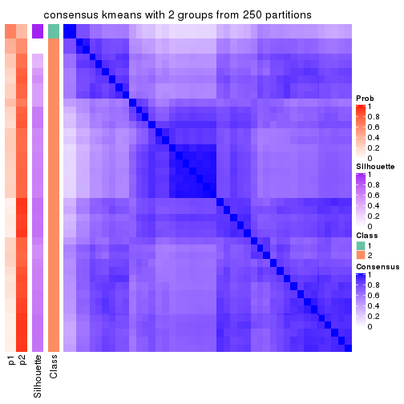</p>

</div>
<div id='tab-SD-kmeans-consensus-heatmap-2'>
<pre><code class="r">consensus_heatmap(res, k = 3)
</code></pre>

<p>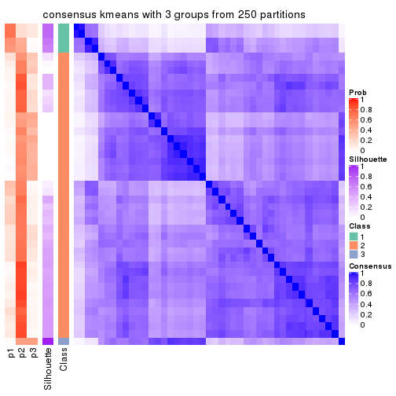</p>

</div>
<div id='tab-SD-kmeans-consensus-heatmap-3'>
<pre><code class="r">consensus_heatmap(res, k = 4)
</code></pre>

<p>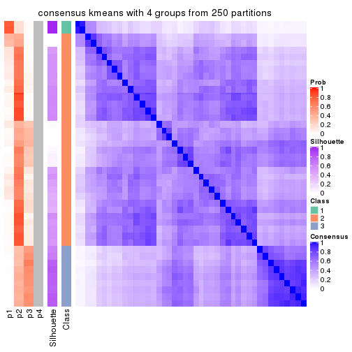</p>

</div>
<div id='tab-SD-kmeans-consensus-heatmap-4'>
<pre><code class="r">consensus_heatmap(res, k = 5)
</code></pre>

<p>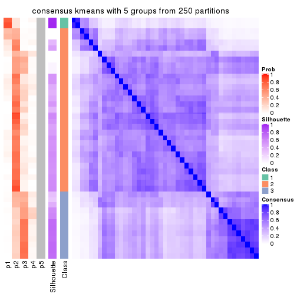</p>

</div>
<div id='tab-SD-kmeans-consensus-heatmap-5'>
<pre><code class="r">consensus_heatmap(res, k = 6)
</code></pre>

<p>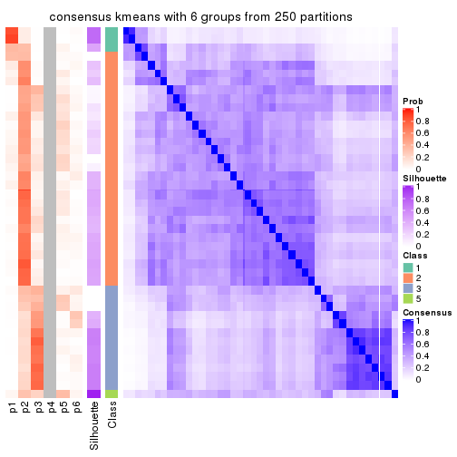</p>

</div>
</div>

Heatmaps for the membership of samples in all partitions to see how consistent they are:


<script>
$( function() {
	$( '#tabs-SD-kmeans-membership-heatmap' ).tabs();
} );
</script>
<div id='tabs-SD-kmeans-membership-heatmap'>
<ul>
<li><a href='#tab-SD-kmeans-membership-heatmap-1'>k = 2</a></li>
<li><a href='#tab-SD-kmeans-membership-heatmap-2'>k = 3</a></li>
<li><a href='#tab-SD-kmeans-membership-heatmap-3'>k = 4</a></li>
<li><a href='#tab-SD-kmeans-membership-heatmap-4'>k = 5</a></li>
<li><a href='#tab-SD-kmeans-membership-heatmap-5'>k = 6</a></li>
</ul>
<div id='tab-SD-kmeans-membership-heatmap-1'>
<pre><code class="r">membership_heatmap(res, k = 2)
</code></pre>

<p>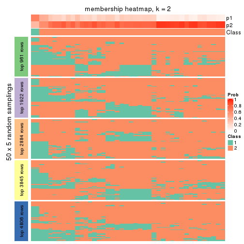</p>

</div>
<div id='tab-SD-kmeans-membership-heatmap-2'>
<pre><code class="r">membership_heatmap(res, k = 3)
</code></pre>

<p>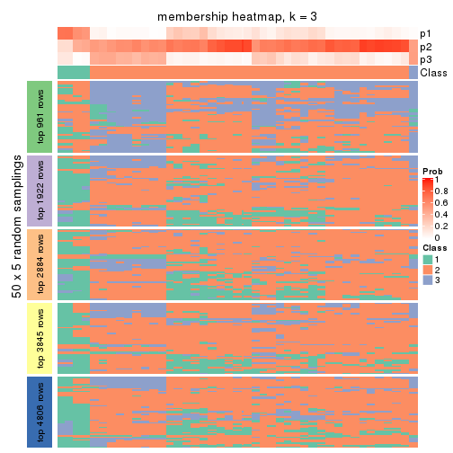</p>

</div>
<div id='tab-SD-kmeans-membership-heatmap-3'>
<pre><code class="r">membership_heatmap(res, k = 4)
</code></pre>

<p>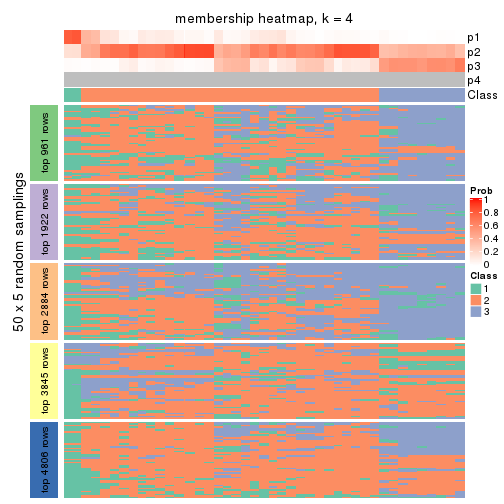</p>

</div>
<div id='tab-SD-kmeans-membership-heatmap-4'>
<pre><code class="r">membership_heatmap(res, k = 5)
</code></pre>

<p>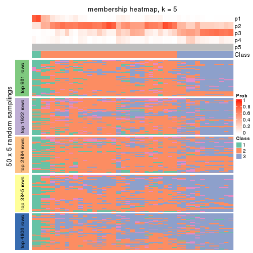</p>

</div>
<div id='tab-SD-kmeans-membership-heatmap-5'>
<pre><code class="r">membership_heatmap(res, k = 6)
</code></pre>

<p>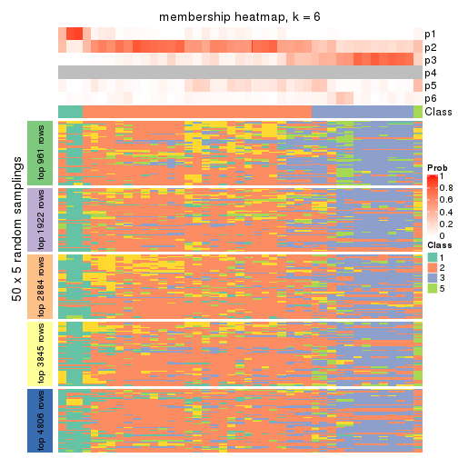</p>

</div>
</div>

As soon as we have had the classes for columns, we can look for signatures
which are significantly different between classes which can be candidate marks
for certain classes. Following are the heatmaps for signatures.


Signature heatmaps where rows are scaled:


<script>
$( function() {
	$( '#tabs-SD-kmeans-get-signatures' ).tabs();
} );
</script>
<div id='tabs-SD-kmeans-get-signatures'>
<ul>
<li><a href='#tab-SD-kmeans-get-signatures-1'>k = 2</a></li>
<li><a href='#tab-SD-kmeans-get-signatures-2'>k = 3</a></li>
<li><a href='#tab-SD-kmeans-get-signatures-3'>k = 4</a></li>
<li><a href='#tab-SD-kmeans-get-signatures-4'>k = 5</a></li>
<li><a href='#tab-SD-kmeans-get-signatures-5'>k = 6</a></li>
</ul>
<div id='tab-SD-kmeans-get-signatures-1'>
<pre><code class="r">get_signatures(res, k = 2)
</code></pre>

<p>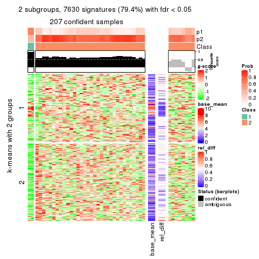</p>

</div>
<div id='tab-SD-kmeans-get-signatures-2'>
<pre><code class="r">get_signatures(res, k = 3)
</code></pre>

<p>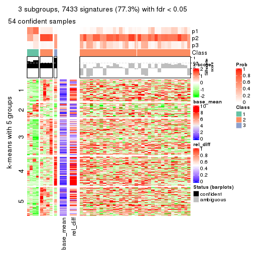</p>

</div>
<div id='tab-SD-kmeans-get-signatures-3'>
<pre><code class="r">get_signatures(res, k = 4)
</code></pre>

<p>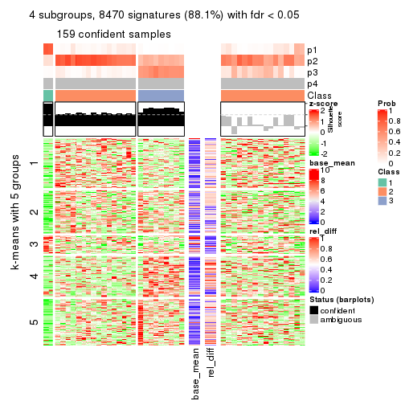</p>

</div>
<div id='tab-SD-kmeans-get-signatures-4'>
<pre><code class="r">get_signatures(res, k = 5)
</code></pre>

<p>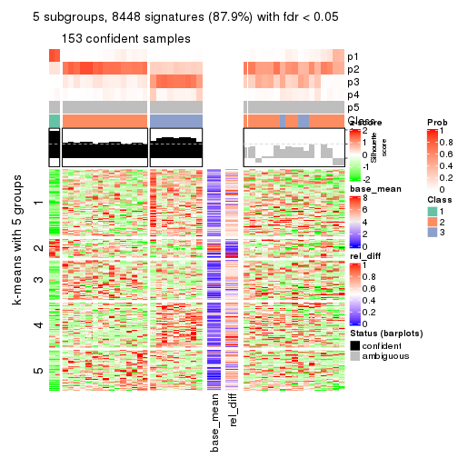</p>

</div>
<div id='tab-SD-kmeans-get-signatures-5'>
<pre><code class="r">get_signatures(res, k = 6)
</code></pre>

<p>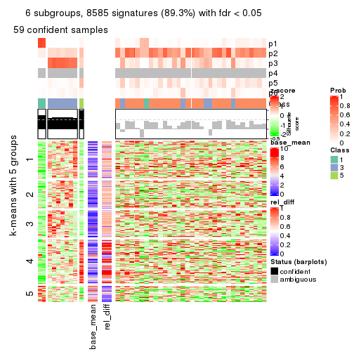</p>

</div>
</div>


Signature heatmaps where rows are not scaled:


<script>
$( function() {
	$( '#tabs-SD-kmeans-get-signatures-no-scale' ).tabs();
} );
</script>
<div id='tabs-SD-kmeans-get-signatures-no-scale'>
<ul>
<li><a href='#tab-SD-kmeans-get-signatures-no-scale-1'>k = 2</a></li>
<li><a href='#tab-SD-kmeans-get-signatures-no-scale-2'>k = 3</a></li>
<li><a href='#tab-SD-kmeans-get-signatures-no-scale-3'>k = 4</a></li>
<li><a href='#tab-SD-kmeans-get-signatures-no-scale-4'>k = 5</a></li>
<li><a href='#tab-SD-kmeans-get-signatures-no-scale-5'>k = 6</a></li>
</ul>
<div id='tab-SD-kmeans-get-signatures-no-scale-1'>
<pre><code class="r">get_signatures(res, k = 2, scale_rows = FALSE)
</code></pre>

<p>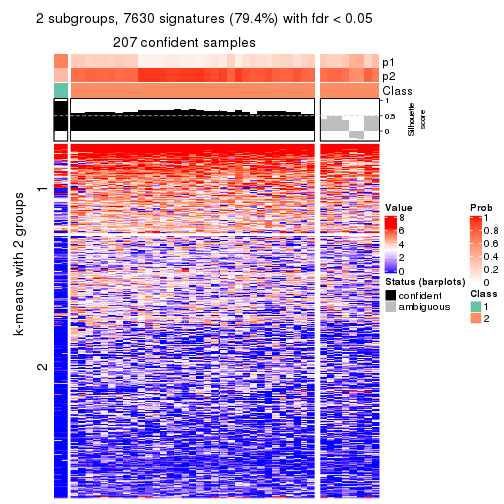</p>

</div>
<div id='tab-SD-kmeans-get-signatures-no-scale-2'>
<pre><code class="r">get_signatures(res, k = 3, scale_rows = FALSE)
</code></pre>

<p>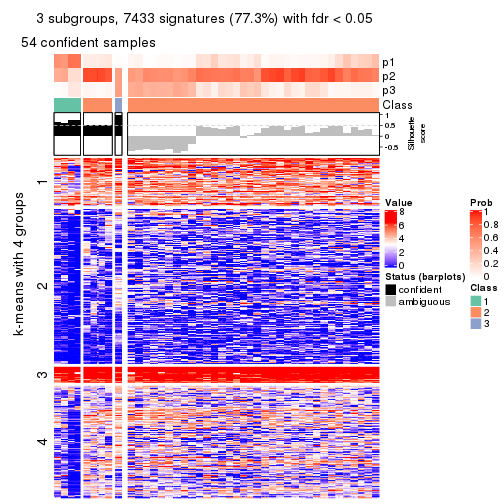</p>

</div>
<div id='tab-SD-kmeans-get-signatures-no-scale-3'>
<pre><code class="r">get_signatures(res, k = 4, scale_rows = FALSE)
</code></pre>

<p>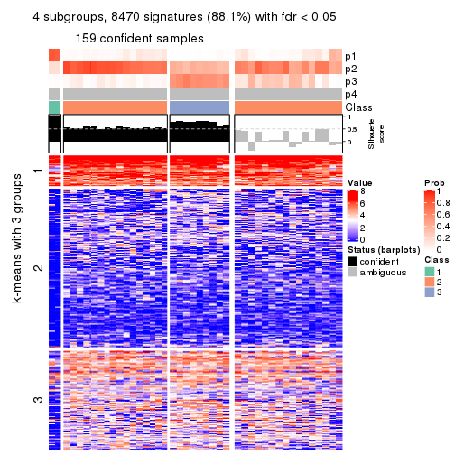</p>

</div>
<div id='tab-SD-kmeans-get-signatures-no-scale-4'>
<pre><code class="r">get_signatures(res, k = 5, scale_rows = FALSE)
</code></pre>

<p>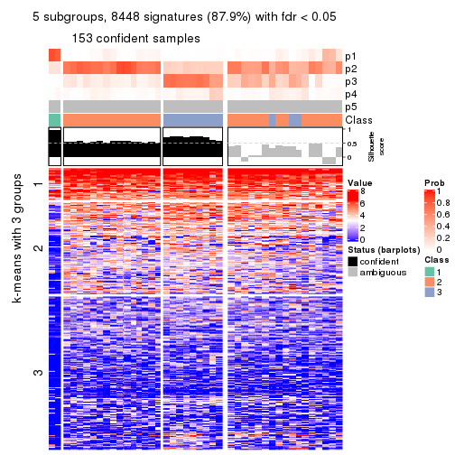</p>

</div>
<div id='tab-SD-kmeans-get-signatures-no-scale-5'>
<pre><code class="r">get_signatures(res, k = 6, scale_rows = FALSE)
</code></pre>

<p>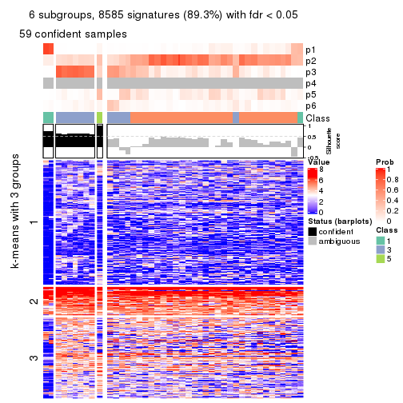</p>

</div>
</div>


Compare the overlap of signatures from different k:

```r
compare_signatures(res)
```

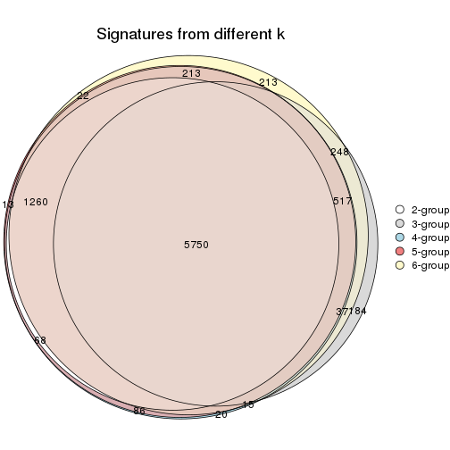

`get_signature()` returns a data frame invisibly. TO get the list of signatures, the function
call should be assigned to a variable explicitly. In following code, if `plot` argument is set
to `FALSE`, no heatmap is plotted while only the differential analysis is performed.

```r
# code only for demonstration
tb = get_signature(res, k = ..., plot = FALSE)
```

An example of the output of `tb` is:

```
#>   which_row         fdr    mean_1    mean_2 scaled_mean_1 scaled_mean_2 km
#> 1        38 0.042760348  8.373488  9.131774    -0.5533452     0.5164555  1
#> 2        40 0.018707592  7.106213  8.469186    -0.6173731     0.5762149  1
#> 3        55 0.019134737 10.221463 11.207825    -0.6159697     0.5749050  1
#> 4        59 0.006059896  5.921854  7.869574    -0.6899429     0.6439467  1
#> 5        60 0.018055526  8.928898 10.211722    -0.6204761     0.5791110  1
#> 6        98 0.009384629 15.714769 14.887706     0.6635654    -0.6193277  2
...
```

The columns in `tb` are:

1. `which_row`: row indices corresponding to the input matrix.
2. `fdr`: FDR for the differential test. 
3. `mean_x`: The mean value in group x.
4. `scaled_mean_x`: The mean value in group x after rows are scaled.
5. `km`: Row groups if k-means clustering is applied to rows.


UMAP plot which shows how samples are separated.


<script>
$( function() {
	$( '#tabs-SD-kmeans-dimension-reduction' ).tabs();
} );
</script>
<div id='tabs-SD-kmeans-dimension-reduction'>
<ul>
<li><a href='#tab-SD-kmeans-dimension-reduction-1'>k = 2</a></li>
<li><a href='#tab-SD-kmeans-dimension-reduction-2'>k = 3</a></li>
<li><a href='#tab-SD-kmeans-dimension-reduction-3'>k = 4</a></li>
<li><a href='#tab-SD-kmeans-dimension-reduction-4'>k = 5</a></li>
<li><a href='#tab-SD-kmeans-dimension-reduction-5'>k = 6</a></li>
</ul>
<div id='tab-SD-kmeans-dimension-reduction-1'>
<pre><code class="r">dimension_reduction(res, k = 2, method = &quot;UMAP&quot;)
</code></pre>

<p>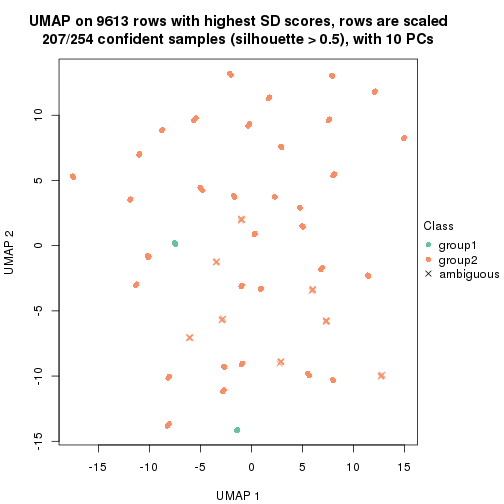</p>

</div>
<div id='tab-SD-kmeans-dimension-reduction-2'>
<pre><code class="r">dimension_reduction(res, k = 3, method = &quot;UMAP&quot;)
</code></pre>

<p>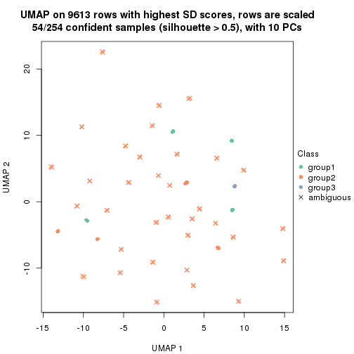</p>

</div>
<div id='tab-SD-kmeans-dimension-reduction-3'>
<pre><code class="r">dimension_reduction(res, k = 4, method = &quot;UMAP&quot;)
</code></pre>

<p>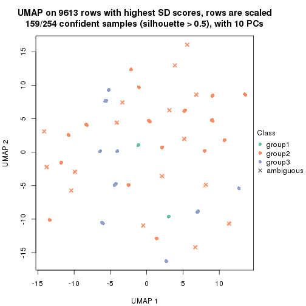</p>

</div>
<div id='tab-SD-kmeans-dimension-reduction-4'>
<pre><code class="r">dimension_reduction(res, k = 5, method = &quot;UMAP&quot;)
</code></pre>

<p>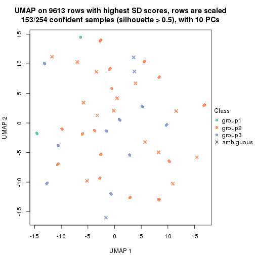</p>

</div>
<div id='tab-SD-kmeans-dimension-reduction-5'>
<pre><code class="r">dimension_reduction(res, k = 6, method = &quot;UMAP&quot;)
</code></pre>

<p>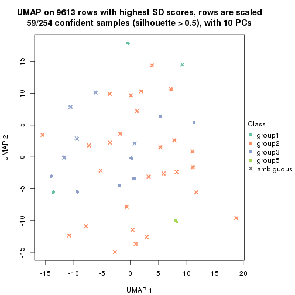</p>

</div>
</div>


Following heatmap shows how subgroups are split when increasing `k`:

```r
collect_classes(res)
```

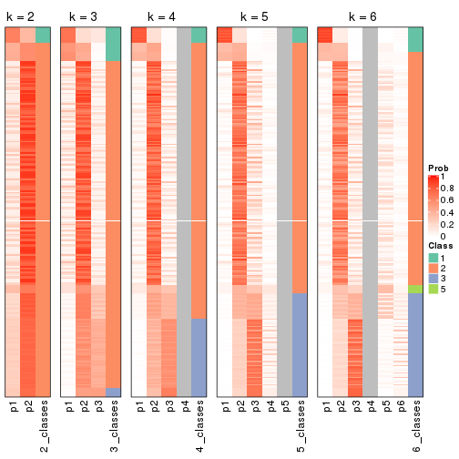


If matrix rows can be associated to genes, consider to use `GO_Enrichment(res,
...)` to perform function enrichment for the signature genes.


 

---------------------------------------------------


### SD:skmeans


The object with results only for a single top-value method and a single partition method 
can be extracted as:

```r
res = res_list["SD", "skmeans"]
# you can also extract it by
# res = res_list["SD:skmeans"]
```

A summary of `res` and all the functions that can be applied to it:

```r
res
```

```
#> A 'ConsensusPartition' object with k = 2, 3, 4, 5, 6.
#>   On a matrix with 9613 rows and 254 columns.
#>   Top rows (961, 1922, 2884, 3845, 4806) are extracted by 'SD' method.
#>   Subgroups are detected by 'skmeans' method.
#>   Performed in total 1250 partitions by row resampling.
#>   Best k for subgroups seems to be 2.
#> 
#> Following methods can be applied to this 'ConsensusPartition' object:
#>  [1] "cola_report"             "collect_classes"         "collect_plots"          
#>  [4] "collect_stats"           "colnames"                "compare_signatures"     
#>  [7] "consensus_heatmap"       "dimension_reduction"     "functional_enrichment"  
#> [10] "get_anno_col"            "get_anno"                "get_classes"            
#> [13] "get_consensus"           "get_matrix"              "get_membership"         
#> [16] "get_param"               "get_signatures"          "get_stats"              
#> [19] "is_best_k"               "is_stable_k"             "membership_heatmap"     
#> [22] "ncol"                    "nrow"                    "plot_ecdf"              
#> [25] "rownames"                "select_partition_number" "show"                   
#> [28] "suggest_best_k"          "test_to_known_factors"
```

`collect_plots()` function collects all the plots made from `res` for all `k` (number of partitions)
into one single page to provide an easy and fast comparison between different `k`.

```r
collect_plots(res)
```

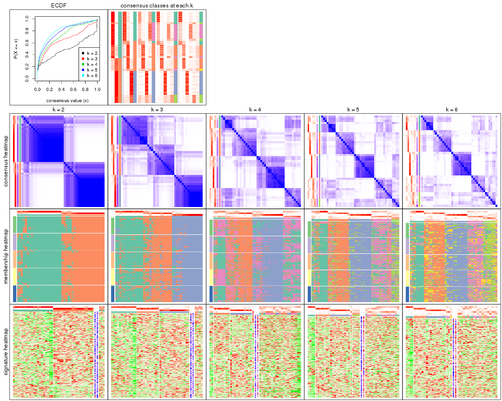

The plots are:

- The first row: a plot of the ECDF (Empirical cumulative distribution
  function) curves of the consensus matrix for each `k` and the heatmap of
  predicted classes for each `k`.
- The second row: heatmaps of the consensus matrix for each `k`.
- The third row: heatmaps of the membership matrix for each `k`.
- The fouth row: heatmaps of the signatures for each `k`.

All the plots in panels can be made by individual functions and they are
plotted later in this section.

`select_partition_number()` produces several plots showing different
statistics for choosing "optimized" `k`. There are following statistics:

- ECDF curves of the consensus matrix for each `k`;
- 1-PAC. [The PAC
  score](https://en.wikipedia.org/wiki/Consensus_clustering#Over-interpretation_potential_of_consensus_clustering)
  measures the proportion of the ambiguous subgrouping.
- Mean silhouette score.
- Concordance. The mean probability of fiting the consensus class ids in all
  partitions.
- Area increased. Denote $A_k$ as the area under the ECDF curve for current
  `k`, the area increased is defined as $A_k - A_{k-1}$.
- Rand index. The percent of pairs of samples that are both in a same cluster
  or both are not in a same cluster in the partition of k and k-1.
- Jaccard index. The ratio of pairs of samples are both in a same cluster in
  the partition of k and k-1 and the pairs of samples are both in a same
  cluster in the partition k or k-1.

The detailed explanations of these statistics can be found in [the cola
vignette](http://bioconductor.org/packages/devel/bioc/vignettes/cola/inst/doc/cola.html#toc_13).

Generally speaking, lower PAC score, higher mean silhouette score or higher
concordance corresponds to better partition. Rand index and Jaccard index
measure how similar the current partition is compared to partition with `k-1`.
If they are too similar, we won't accept `k` is better than `k-1`.

```r
select_partition_number(res)
```

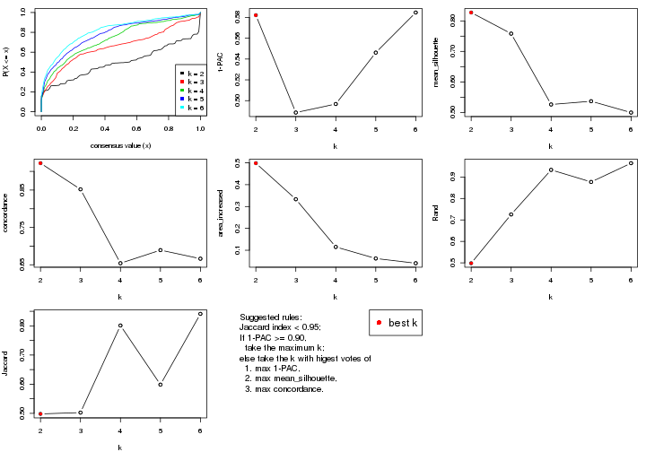

The numeric values for all these statistics can be obtained by `get_stats()`.

```r
get_stats(res)
```

```
#>   k 1-PAC mean_silhouette concordance area_increased  Rand Jaccard
#> 2 2 0.582           0.827       0.922         0.4982 0.498   0.498
#> 3 3 0.489           0.758       0.852         0.3333 0.725   0.503
#> 4 4 0.497           0.526       0.654         0.1150 0.933   0.801
#> 5 5 0.546           0.537       0.689         0.0623 0.877   0.598
#> 6 6 0.585           0.500       0.666         0.0406 0.964   0.841
```

`suggest_best_k()` suggests the best $k$ based on these statistics. The rules are as follows:

- All $k$ with Jaccard index larger than 0.95 are removed because the increase of
  the partition number does not provides enough extra information. If all $k$ are removed,
  the best $k$ is assigned by `NA`.
- For $k$ with 1-PAC larger than 0.9, the maximal $k$ is taken as the "best k". Other $k$ is called "optional k".
- If it does not fit the second rule. The $k$ with the highest vote of highest
  1-PAC, mean silhouette and concordance is taken as the "best k".

```r
suggest_best_k(res)
```

```
#> [1] 2
```


Following shows the table of the partitions (You need to click the **show/hide
code output** link to see it). The membership matrix (columns with name `p*`)
is inferred by
[`clue::cl_consensus()`](https://www.rdocumentation.org/link/cl_consensus?package=clue)
function with the `SE` method. Basically the value in the membership matrix
represents the probability to belong to a certain group. The finall class
label for an item is determined with the group with highest probability it
belongs to.

In `get_classes()` function, the entropy is calculated from the membership
matrix and the silhouette score is calculated from the consensus matrix.


<script>
$( function() {
	$( '#tabs-SD-skmeans-get-classes' ).tabs();
} );
</script>
<div id='tabs-SD-skmeans-get-classes'>
<ul>
<li><a href='#tab-SD-skmeans-get-classes-1'>k = 2</a></li>
<li><a href='#tab-SD-skmeans-get-classes-2'>k = 3</a></li>
<li><a href='#tab-SD-skmeans-get-classes-3'>k = 4</a></li>
<li><a href='#tab-SD-skmeans-get-classes-4'>k = 5</a></li>
<li><a href='#tab-SD-skmeans-get-classes-5'>k = 6</a></li>
</ul>

<div id='tab-SD-skmeans-get-classes-1'>
<p><a id='tab-SD-skmeans-get-classes-1-a' style='color:#0366d6' href='#'>show/hide code output</a></p>
<pre><code class="r">cbind(get_classes(res, k = 2), get_membership(res, k = 2))
</code></pre>

<pre><code>#&gt;           class entropy silhouette    p1    p2
#&gt; DRR024803     1  0.0000      0.913 1.000 0.000
#&gt; DRR024804     2  0.7883      0.710 0.236 0.764
#&gt; DRR024805     2  0.8861      0.604 0.304 0.696
#&gt; DRR024806     2  0.9881      0.295 0.436 0.564
#&gt; DRR024807     2  0.0000      0.909 0.000 1.000
#&gt; DRR024808     2  0.0000      0.909 0.000 1.000
#&gt; DRR024809     1  0.9732      0.298 0.596 0.404
#&gt; DRR024810     1  0.0000      0.913 1.000 0.000
#&gt; DRR024811     2  0.0000      0.909 0.000 1.000
#&gt; DRR024812     1  0.2603      0.891 0.956 0.044
#&gt; DRR024813     2  0.0000      0.909 0.000 1.000
#&gt; DRR024814     1  0.0376      0.912 0.996 0.004
#&gt; DRR024815     1  0.0000      0.913 1.000 0.000
#&gt; DRR024816     1  0.0000      0.913 1.000 0.000
#&gt; DRR024817     1  0.2948      0.885 0.948 0.052
#&gt; DRR024818     2  0.0000      0.909 0.000 1.000
#&gt; DRR024819     1  0.0672      0.910 0.992 0.008
#&gt; DRR024820     1  0.8955      0.558 0.688 0.312
#&gt; DRR024821     2  0.0000      0.909 0.000 1.000
#&gt; DRR024822     2  0.7299      0.752 0.204 0.796
#&gt; DRR024824     1  0.5059      0.838 0.888 0.112
#&gt; DRR024825     2  0.0000      0.909 0.000 1.000
#&gt; DRR024826     2  0.0000      0.909 0.000 1.000
#&gt; DRR024827     2  0.1184      0.900 0.016 0.984
#&gt; DRR024828     2  0.0000      0.909 0.000 1.000
#&gt; DRR024829     1  0.0000      0.913 1.000 0.000
#&gt; DRR024830     1  0.7745      0.692 0.772 0.228
#&gt; DRR024831     2  0.0000      0.909 0.000 1.000
#&gt; DRR024832     2  0.0000      0.909 0.000 1.000
#&gt; DRR024833     2  0.0000      0.909 0.000 1.000
#&gt; DRR024834     1  0.0000      0.913 1.000 0.000
#&gt; DRR024835     1  0.6148      0.797 0.848 0.152
#&gt; DRR024836     2  0.0000      0.909 0.000 1.000
#&gt; DRR024837     1  0.0000      0.913 1.000 0.000
#&gt; DRR024838     1  0.0000      0.913 1.000 0.000
#&gt; DRR024839     2  0.8813      0.612 0.300 0.700
#&gt; DRR024840     2  0.3114      0.878 0.056 0.944
#&gt; DRR024841     1  0.0000      0.913 1.000 0.000
#&gt; DRR024842     1  0.0376      0.911 0.996 0.004
#&gt; DRR024843     1  0.0000      0.913 1.000 0.000
#&gt; DRR024844     2  0.7883      0.710 0.236 0.764
#&gt; DRR024845     2  0.8861      0.604 0.304 0.696
#&gt; DRR024846     2  0.9881      0.295 0.436 0.564
#&gt; DRR024847     2  0.0000      0.909 0.000 1.000
#&gt; DRR024848     1  0.0000      0.913 1.000 0.000
#&gt; DRR024849     2  0.0000      0.909 0.000 1.000
#&gt; DRR024850     1  0.9393      0.449 0.644 0.356
#&gt; DRR024851     1  0.9732      0.298 0.596 0.404
#&gt; DRR024852     1  0.0000      0.913 1.000 0.000
#&gt; DRR024853     2  0.0000      0.909 0.000 1.000
#&gt; DRR024854     1  0.2603      0.891 0.956 0.044
#&gt; DRR024855     2  0.0000      0.909 0.000 1.000
#&gt; DRR024856     1  0.0376      0.912 0.996 0.004
#&gt; DRR024857     1  0.0000      0.913 1.000 0.000
#&gt; DRR024858     1  0.0000      0.913 1.000 0.000
#&gt; DRR024859     1  0.2948      0.885 0.948 0.052
#&gt; DRR024860     2  0.0000      0.909 0.000 1.000
#&gt; DRR024861     1  0.0672      0.910 0.992 0.008
#&gt; DRR024862     1  0.8955      0.558 0.688 0.312
#&gt; DRR024863     2  0.0000      0.909 0.000 1.000
#&gt; DRR024864     2  0.7299      0.752 0.204 0.796
#&gt; DRR024865     1  0.0000      0.913 1.000 0.000
#&gt; DRR024866     1  0.5059      0.838 0.888 0.112
#&gt; DRR024867     2  0.0000      0.909 0.000 1.000
#&gt; DRR024868     2  0.0000      0.909 0.000 1.000
#&gt; DRR024869     2  0.1184      0.900 0.016 0.984
#&gt; DRR024870     2  0.0000      0.909 0.000 1.000
#&gt; DRR024871     1  0.0000      0.913 1.000 0.000
#&gt; DRR024872     1  0.7745      0.692 0.772 0.228
#&gt; DRR024873     2  0.0000      0.909 0.000 1.000
#&gt; DRR024874     2  0.0000      0.909 0.000 1.000
#&gt; DRR024875     2  0.0000      0.909 0.000 1.000
#&gt; DRR024876     1  0.0000      0.913 1.000 0.000
#&gt; DRR024877     1  0.6148      0.797 0.848 0.152
#&gt; DRR024878     2  0.0000      0.909 0.000 1.000
#&gt; DRR024879     1  0.0000      0.913 1.000 0.000
#&gt; DRR024880     1  0.0000      0.913 1.000 0.000
#&gt; DRR024881     2  0.8813      0.612 0.300 0.700
#&gt; DRR024882     2  0.3114      0.878 0.056 0.944
#&gt; DRR024883     1  0.0000      0.913 1.000 0.000
#&gt; DRR024884     1  0.1184      0.906 0.984 0.016
#&gt; DRR024885     2  0.6148      0.784 0.152 0.848
#&gt; DRR024886     1  0.0000      0.913 1.000 0.000
#&gt; DRR024887     2  0.7883      0.710 0.236 0.764
#&gt; DRR024888     2  0.8861      0.604 0.304 0.696
#&gt; DRR024889     2  0.9881      0.295 0.436 0.564
#&gt; DRR024890     2  0.0000      0.909 0.000 1.000
#&gt; DRR024891     1  0.0000      0.913 1.000 0.000
#&gt; DRR024892     2  0.0000      0.909 0.000 1.000
#&gt; DRR024893     1  0.9393      0.449 0.644 0.356
#&gt; DRR024894     1  0.9732      0.298 0.596 0.404
#&gt; DRR024895     1  0.0000      0.913 1.000 0.000
#&gt; DRR024896     2  0.0000      0.909 0.000 1.000
#&gt; DRR024897     1  0.2603      0.891 0.956 0.044
#&gt; DRR024898     2  0.0000      0.909 0.000 1.000
#&gt; DRR024899     1  0.0376      0.912 0.996 0.004
#&gt; DRR024900     1  0.0000      0.913 1.000 0.000
#&gt; DRR024901     1  0.0000      0.913 1.000 0.000
#&gt; DRR024902     1  0.2948      0.885 0.948 0.052
#&gt; DRR024903     2  0.0000      0.909 0.000 1.000
#&gt; DRR024904     1  0.0672      0.910 0.992 0.008
#&gt; DRR024905     1  0.8955      0.558 0.688 0.312
#&gt; DRR024906     2  0.0000      0.909 0.000 1.000
#&gt; DRR024907     2  0.7299      0.752 0.204 0.796
#&gt; DRR024908     1  0.0000      0.913 1.000 0.000
#&gt; DRR024909     1  0.5059      0.838 0.888 0.112
#&gt; DRR024910     2  0.0000      0.909 0.000 1.000
#&gt; DRR024911     2  0.0000      0.909 0.000 1.000
#&gt; DRR024912     2  0.1184      0.900 0.016 0.984
#&gt; DRR024913     2  0.0000      0.909 0.000 1.000
#&gt; DRR024914     1  0.0000      0.913 1.000 0.000
#&gt; DRR024915     1  0.7745      0.692 0.772 0.228
#&gt; DRR024916     2  0.0000      0.909 0.000 1.000
#&gt; DRR024917     2  0.0000      0.909 0.000 1.000
#&gt; DRR024918     2  0.0000      0.909 0.000 1.000
#&gt; DRR024919     1  0.0000      0.913 1.000 0.000
#&gt; DRR024920     1  0.6148      0.797 0.848 0.152
#&gt; DRR024921     2  0.0000      0.909 0.000 1.000
#&gt; DRR024922     1  0.0000      0.913 1.000 0.000
#&gt; DRR024923     1  0.0000      0.913 1.000 0.000
#&gt; DRR024924     2  0.8813      0.612 0.300 0.700
#&gt; DRR024925     2  0.3114      0.878 0.056 0.944
#&gt; DRR024926     1  0.0000      0.913 1.000 0.000
#&gt; DRR024927     1  0.1184      0.906 0.984 0.016
#&gt; DRR024928     2  0.6148      0.784 0.152 0.848
#&gt; DRR024929     1  0.0000      0.913 1.000 0.000
#&gt; DRR024930     2  0.7883      0.710 0.236 0.764
#&gt; DRR024931     2  0.8861      0.604 0.304 0.696
#&gt; DRR024932     2  0.9881      0.295 0.436 0.564
#&gt; DRR024933     2  0.0000      0.909 0.000 1.000
#&gt; DRR024934     1  0.0000      0.913 1.000 0.000
#&gt; DRR024935     2  0.0000      0.909 0.000 1.000
#&gt; DRR024936     1  0.9393      0.449 0.644 0.356
#&gt; DRR024937     1  0.9732      0.298 0.596 0.404
#&gt; DRR024938     1  0.0000      0.913 1.000 0.000
#&gt; DRR024939     2  0.0000      0.909 0.000 1.000
#&gt; DRR024940     1  0.2603      0.891 0.956 0.044
#&gt; DRR024941     2  0.0000      0.909 0.000 1.000
#&gt; DRR024942     1  0.0376      0.912 0.996 0.004
#&gt; DRR024943     1  0.0000      0.913 1.000 0.000
#&gt; DRR024944     1  0.0000      0.913 1.000 0.000
#&gt; DRR024945     1  0.2948      0.885 0.948 0.052
#&gt; DRR024946     2  0.0000      0.909 0.000 1.000
#&gt; DRR024947     1  0.0672      0.910 0.992 0.008
#&gt; DRR024948     1  0.8955      0.558 0.688 0.312
#&gt; DRR024949     2  0.0000      0.909 0.000 1.000
#&gt; DRR024950     2  0.7299      0.752 0.204 0.796
#&gt; DRR024951     1  0.0000      0.913 1.000 0.000
#&gt; DRR024952     1  0.5059      0.838 0.888 0.112
#&gt; DRR024953     2  0.0000      0.909 0.000 1.000
#&gt; DRR024954     2  0.0000      0.909 0.000 1.000
#&gt; DRR024955     2  0.1184      0.900 0.016 0.984
#&gt; DRR024956     2  0.0000      0.909 0.000 1.000
#&gt; DRR024957     1  0.0000      0.913 1.000 0.000
#&gt; DRR024958     1  0.7745      0.692 0.772 0.228
#&gt; DRR024959     2  0.0000      0.909 0.000 1.000
#&gt; DRR024960     2  0.0000      0.909 0.000 1.000
#&gt; DRR024961     2  0.0000      0.909 0.000 1.000
#&gt; DRR024962     1  0.0000      0.913 1.000 0.000
#&gt; DRR024963     1  0.6148      0.797 0.848 0.152
#&gt; DRR024964     2  0.0000      0.909 0.000 1.000
#&gt; DRR024965     1  0.0000      0.913 1.000 0.000
#&gt; DRR024966     1  0.0000      0.913 1.000 0.000
#&gt; DRR024967     2  0.8813      0.612 0.300 0.700
#&gt; DRR024968     2  0.3114      0.878 0.056 0.944
#&gt; DRR024969     1  0.0000      0.913 1.000 0.000
#&gt; DRR024970     1  0.1184      0.906 0.984 0.016
#&gt; DRR024971     2  0.6148      0.784 0.152 0.848
#&gt; DRR024972     1  0.0000      0.913 1.000 0.000
#&gt; DRR024973     2  0.7883      0.710 0.236 0.764
#&gt; DRR024974     2  0.8861      0.604 0.304 0.696
#&gt; DRR024975     2  0.9881      0.295 0.436 0.564
#&gt; DRR024976     2  0.0000      0.909 0.000 1.000
#&gt; DRR024977     1  0.0000      0.913 1.000 0.000
#&gt; DRR024978     2  0.0000      0.909 0.000 1.000
#&gt; DRR024979     1  0.9393      0.449 0.644 0.356
#&gt; DRR024980     1  0.9732      0.298 0.596 0.404
#&gt; DRR024981     1  0.0000      0.913 1.000 0.000
#&gt; DRR024982     2  0.0000      0.909 0.000 1.000
#&gt; DRR024983     1  0.2603      0.891 0.956 0.044
#&gt; DRR024984     2  0.0000      0.909 0.000 1.000
#&gt; DRR024985     1  0.0376      0.912 0.996 0.004
#&gt; DRR024986     1  0.0000      0.913 1.000 0.000
#&gt; DRR024987     1  0.0000      0.913 1.000 0.000
#&gt; DRR024988     1  0.2948      0.885 0.948 0.052
#&gt; DRR024989     2  0.0000      0.909 0.000 1.000
#&gt; DRR024990     1  0.0672      0.910 0.992 0.008
#&gt; DRR024991     1  0.8955      0.558 0.688 0.312
#&gt; DRR024992     2  0.0000      0.909 0.000 1.000
#&gt; DRR024993     2  0.7299      0.752 0.204 0.796
#&gt; DRR024994     1  0.0000      0.913 1.000 0.000
#&gt; DRR024995     1  0.5059      0.838 0.888 0.112
#&gt; DRR024996     2  0.0000      0.909 0.000 1.000
#&gt; DRR024997     2  0.0000      0.909 0.000 1.000
#&gt; DRR024998     2  0.1184      0.900 0.016 0.984
#&gt; DRR024999     2  0.0000      0.909 0.000 1.000
#&gt; DRR025000     1  0.0000      0.913 1.000 0.000
#&gt; DRR025001     1  0.7745      0.692 0.772 0.228
#&gt; DRR025002     2  0.0000      0.909 0.000 1.000
#&gt; DRR025003     2  0.0000      0.909 0.000 1.000
#&gt; DRR025004     2  0.0000      0.909 0.000 1.000
#&gt; DRR025005     1  0.0000      0.913 1.000 0.000
#&gt; DRR025006     1  0.6148      0.797 0.848 0.152
#&gt; DRR025007     2  0.0000      0.909 0.000 1.000
#&gt; DRR025008     1  0.0000      0.913 1.000 0.000
#&gt; DRR025009     1  0.0000      0.913 1.000 0.000
#&gt; DRR025010     2  0.8813      0.612 0.300 0.700
#&gt; DRR025011     2  0.3114      0.878 0.056 0.944
#&gt; DRR025012     1  0.0000      0.913 1.000 0.000
#&gt; DRR025013     1  0.1184      0.906 0.984 0.016
#&gt; DRR025014     2  0.6148      0.784 0.152 0.848
#&gt; DRR025015     1  0.0000      0.913 1.000 0.000
#&gt; DRR025016     2  0.7883      0.710 0.236 0.764
#&gt; DRR025017     2  0.8861      0.604 0.304 0.696
#&gt; DRR025018     2  0.9881      0.295 0.436 0.564
#&gt; DRR025019     2  0.0000      0.909 0.000 1.000
#&gt; DRR025020     1  0.0000      0.913 1.000 0.000
#&gt; DRR025021     2  0.0000      0.909 0.000 1.000
#&gt; DRR025022     1  0.9393      0.449 0.644 0.356
#&gt; DRR025023     1  0.9732      0.298 0.596 0.404
#&gt; DRR025024     1  0.0000      0.913 1.000 0.000
#&gt; DRR025025     2  0.0000      0.909 0.000 1.000
#&gt; DRR025026     1  0.2603      0.891 0.956 0.044
#&gt; DRR025027     2  0.0000      0.909 0.000 1.000
#&gt; DRR025028     1  0.0376      0.912 0.996 0.004
#&gt; DRR025029     1  0.0000      0.913 1.000 0.000
#&gt; DRR025030     1  0.0000      0.913 1.000 0.000
#&gt; DRR025031     1  0.2948      0.885 0.948 0.052
#&gt; DRR025032     2  0.0000      0.909 0.000 1.000
#&gt; DRR025033     1  0.0672      0.910 0.992 0.008
#&gt; DRR025034     1  0.8955      0.558 0.688 0.312
#&gt; DRR025035     2  0.0000      0.909 0.000 1.000
#&gt; DRR025036     2  0.7299      0.752 0.204 0.796
#&gt; DRR025037     1  0.0000      0.913 1.000 0.000
#&gt; DRR025038     1  0.5059      0.838 0.888 0.112
#&gt; DRR025039     2  0.0000      0.909 0.000 1.000
#&gt; DRR025040     2  0.0000      0.909 0.000 1.000
#&gt; DRR025041     2  0.1184      0.900 0.016 0.984
#&gt; DRR025042     2  0.0000      0.909 0.000 1.000
#&gt; DRR025043     1  0.0000      0.913 1.000 0.000
#&gt; DRR025044     1  0.7745      0.692 0.772 0.228
#&gt; DRR025045     2  0.0000      0.909 0.000 1.000
#&gt; DRR025046     2  0.0000      0.909 0.000 1.000
#&gt; DRR025047     2  0.0000      0.909 0.000 1.000
#&gt; DRR025048     1  0.0000      0.913 1.000 0.000
#&gt; DRR025049     1  0.6148      0.797 0.848 0.152
#&gt; DRR025050     2  0.0000      0.909 0.000 1.000
#&gt; DRR025051     1  0.0000      0.913 1.000 0.000
#&gt; DRR025052     1  0.0000      0.913 1.000 0.000
#&gt; DRR025053     2  0.8813      0.612 0.300 0.700
#&gt; DRR025054     2  0.3114      0.878 0.056 0.944
#&gt; DRR025055     1  0.0000      0.913 1.000 0.000
#&gt; DRR025056     1  0.1184      0.906 0.984 0.016
#&gt; DRR025057     2  0.6148      0.784 0.152 0.848
</code></pre>

<script>
$('#tab-SD-skmeans-get-classes-1-a').parent().next().next().hide();
$('#tab-SD-skmeans-get-classes-1-a').click(function(){
  $('#tab-SD-skmeans-get-classes-1-a').parent().next().next().toggle();
  return(false);
});
</script>
</div>

<div id='tab-SD-skmeans-get-classes-2'>
<p><a id='tab-SD-skmeans-get-classes-2-a' style='color:#0366d6' href='#'>show/hide code output</a></p>
<pre><code class="r">cbind(get_classes(res, k = 3), get_membership(res, k = 3))
</code></pre>

<pre><code>#&gt;           class entropy silhouette    p1    p2    p3
#&gt; DRR024803     1   0.263      0.851 0.916 0.084 0.000
#&gt; DRR024804     2   0.947      0.319 0.192 0.464 0.344
#&gt; DRR024805     2   0.319      0.771 0.004 0.896 0.100
#&gt; DRR024806     2   0.274      0.776 0.020 0.928 0.052
#&gt; DRR024807     3   0.116      0.896 0.000 0.028 0.972
#&gt; DRR024808     3   0.000      0.905 0.000 0.000 1.000
#&gt; DRR024809     2   0.178      0.772 0.020 0.960 0.020
#&gt; DRR024810     2   0.628      0.154 0.460 0.540 0.000
#&gt; DRR024811     3   0.000      0.905 0.000 0.000 1.000
#&gt; DRR024812     2   0.216      0.765 0.064 0.936 0.000
#&gt; DRR024813     3   0.516      0.731 0.008 0.216 0.776
#&gt; DRR024814     2   0.613      0.329 0.400 0.600 0.000
#&gt; DRR024815     1   0.220      0.854 0.940 0.056 0.004
#&gt; DRR024816     2   0.571      0.538 0.320 0.680 0.000
#&gt; DRR024817     1   0.175      0.845 0.952 0.048 0.000
#&gt; DRR024818     3   0.257      0.883 0.032 0.032 0.936
#&gt; DRR024819     1   0.384      0.849 0.872 0.116 0.012
#&gt; DRR024820     1   0.485      0.757 0.836 0.036 0.128
#&gt; DRR024821     3   0.000      0.905 0.000 0.000 1.000
#&gt; DRR024822     2   0.311      0.772 0.004 0.900 0.096
#&gt; DRR024824     2   0.327      0.753 0.116 0.884 0.000
#&gt; DRR024825     3   0.000      0.905 0.000 0.000 1.000
#&gt; DRR024826     3   0.659      0.718 0.056 0.216 0.728
#&gt; DRR024827     3   0.487      0.807 0.136 0.032 0.832
#&gt; DRR024828     3   0.207      0.879 0.000 0.060 0.940
#&gt; DRR024829     1   0.394      0.828 0.844 0.156 0.000
#&gt; DRR024830     2   0.498      0.720 0.136 0.828 0.036
#&gt; DRR024831     3   0.000      0.905 0.000 0.000 1.000
#&gt; DRR024832     3   0.000      0.905 0.000 0.000 1.000
#&gt; DRR024833     3   0.546      0.764 0.020 0.204 0.776
#&gt; DRR024834     1   0.304      0.847 0.896 0.104 0.000
#&gt; DRR024835     1   0.602      0.741 0.788 0.120 0.092
#&gt; DRR024836     3   0.000      0.905 0.000 0.000 1.000
#&gt; DRR024837     1   0.312      0.845 0.892 0.108 0.000
#&gt; DRR024838     1   0.440      0.804 0.812 0.188 0.000
#&gt; DRR024839     2   0.691      0.678 0.092 0.728 0.180
#&gt; DRR024840     2   0.484      0.686 0.000 0.776 0.224
#&gt; DRR024841     1   0.603      0.487 0.624 0.376 0.000
#&gt; DRR024842     2   0.245      0.754 0.076 0.924 0.000
#&gt; DRR024843     1   0.263      0.851 0.916 0.084 0.000
#&gt; DRR024844     2   0.947      0.319 0.192 0.464 0.344
#&gt; DRR024845     2   0.319      0.771 0.004 0.896 0.100
#&gt; DRR024846     2   0.274      0.776 0.020 0.928 0.052
#&gt; DRR024847     3   0.116      0.896 0.000 0.028 0.972
#&gt; DRR024848     1   0.263      0.851 0.916 0.084 0.000
#&gt; DRR024849     3   0.000      0.905 0.000 0.000 1.000
#&gt; DRR024850     2   0.434      0.743 0.120 0.856 0.024
#&gt; DRR024851     2   0.178      0.772 0.020 0.960 0.020
#&gt; DRR024852     2   0.628      0.154 0.460 0.540 0.000
#&gt; DRR024853     3   0.000      0.905 0.000 0.000 1.000
#&gt; DRR024854     2   0.216      0.765 0.064 0.936 0.000
#&gt; DRR024855     3   0.516      0.731 0.008 0.216 0.776
#&gt; DRR024856     2   0.613      0.329 0.400 0.600 0.000
#&gt; DRR024857     1   0.220      0.854 0.940 0.056 0.004
#&gt; DRR024858     2   0.571      0.538 0.320 0.680 0.000
#&gt; DRR024859     1   0.175      0.845 0.952 0.048 0.000
#&gt; DRR024860     3   0.257      0.883 0.032 0.032 0.936
#&gt; DRR024861     1   0.384      0.849 0.872 0.116 0.012
#&gt; DRR024862     1   0.485      0.757 0.836 0.036 0.128
#&gt; DRR024863     3   0.000      0.905 0.000 0.000 1.000
#&gt; DRR024864     2   0.311      0.772 0.004 0.900 0.096
#&gt; DRR024865     1   0.418      0.827 0.828 0.172 0.000
#&gt; DRR024866     2   0.327      0.753 0.116 0.884 0.000
#&gt; DRR024867     3   0.000      0.905 0.000 0.000 1.000
#&gt; DRR024868     3   0.659      0.718 0.056 0.216 0.728
#&gt; DRR024869     3   0.487      0.807 0.136 0.032 0.832
#&gt; DRR024870     3   0.207      0.879 0.000 0.060 0.940
#&gt; DRR024871     1   0.394      0.828 0.844 0.156 0.000
#&gt; DRR024872     2   0.498      0.720 0.136 0.828 0.036
#&gt; DRR024873     3   0.000      0.905 0.000 0.000 1.000
#&gt; DRR024874     3   0.000      0.905 0.000 0.000 1.000
#&gt; DRR024875     3   0.546      0.764 0.020 0.204 0.776
#&gt; DRR024876     1   0.304      0.847 0.896 0.104 0.000
#&gt; DRR024877     1   0.602      0.741 0.788 0.120 0.092
#&gt; DRR024878     3   0.000      0.905 0.000 0.000 1.000
#&gt; DRR024879     1   0.312      0.845 0.892 0.108 0.000
#&gt; DRR024880     1   0.440      0.804 0.812 0.188 0.000
#&gt; DRR024881     2   0.691      0.678 0.092 0.728 0.180
#&gt; DRR024882     2   0.484      0.686 0.000 0.776 0.224
#&gt; DRR024883     1   0.603      0.487 0.624 0.376 0.000
#&gt; DRR024884     1   0.286      0.843 0.912 0.084 0.004
#&gt; DRR024885     3   0.754      0.600 0.272 0.076 0.652
#&gt; DRR024886     1   0.263      0.851 0.916 0.084 0.000
#&gt; DRR024887     2   0.947      0.319 0.192 0.464 0.344
#&gt; DRR024888     2   0.319      0.771 0.004 0.896 0.100
#&gt; DRR024889     2   0.274      0.776 0.020 0.928 0.052
#&gt; DRR024890     3   0.116      0.896 0.000 0.028 0.972
#&gt; DRR024891     1   0.263      0.851 0.916 0.084 0.000
#&gt; DRR024892     3   0.000      0.905 0.000 0.000 1.000
#&gt; DRR024893     2   0.434      0.743 0.120 0.856 0.024
#&gt; DRR024894     2   0.178      0.772 0.020 0.960 0.020
#&gt; DRR024895     2   0.628      0.154 0.460 0.540 0.000
#&gt; DRR024896     3   0.000      0.905 0.000 0.000 1.000
#&gt; DRR024897     2   0.216      0.765 0.064 0.936 0.000
#&gt; DRR024898     3   0.516      0.731 0.008 0.216 0.776
#&gt; DRR024899     2   0.613      0.329 0.400 0.600 0.000
#&gt; DRR024900     1   0.220      0.854 0.940 0.056 0.004
#&gt; DRR024901     2   0.571      0.538 0.320 0.680 0.000
#&gt; DRR024902     1   0.175      0.845 0.952 0.048 0.000
#&gt; DRR024903     3   0.257      0.883 0.032 0.032 0.936
#&gt; DRR024904     1   0.384      0.849 0.872 0.116 0.012
#&gt; DRR024905     1   0.485      0.757 0.836 0.036 0.128
#&gt; DRR024906     3   0.000      0.905 0.000 0.000 1.000
#&gt; DRR024907     2   0.311      0.772 0.004 0.900 0.096
#&gt; DRR024908     1   0.418      0.827 0.828 0.172 0.000
#&gt; DRR024909     2   0.327      0.753 0.116 0.884 0.000
#&gt; DRR024910     3   0.000      0.905 0.000 0.000 1.000
#&gt; DRR024911     3   0.659      0.718 0.056 0.216 0.728
#&gt; DRR024912     3   0.487      0.807 0.136 0.032 0.832
#&gt; DRR024913     3   0.207      0.879 0.000 0.060 0.940
#&gt; DRR024914     1   0.394      0.828 0.844 0.156 0.000
#&gt; DRR024915     2   0.498      0.720 0.136 0.828 0.036
#&gt; DRR024916     3   0.000      0.905 0.000 0.000 1.000
#&gt; DRR024917     3   0.000      0.905 0.000 0.000 1.000
#&gt; DRR024918     3   0.546      0.764 0.020 0.204 0.776
#&gt; DRR024919     1   0.304      0.847 0.896 0.104 0.000
#&gt; DRR024920     1   0.602      0.741 0.788 0.120 0.092
#&gt; DRR024921     3   0.000      0.905 0.000 0.000 1.000
#&gt; DRR024922     1   0.312      0.845 0.892 0.108 0.000
#&gt; DRR024923     1   0.440      0.804 0.812 0.188 0.000
#&gt; DRR024924     2   0.691      0.678 0.092 0.728 0.180
#&gt; DRR024925     2   0.484      0.686 0.000 0.776 0.224
#&gt; DRR024926     1   0.603      0.487 0.624 0.376 0.000
#&gt; DRR024927     1   0.286      0.843 0.912 0.084 0.004
#&gt; DRR024928     3   0.754      0.600 0.272 0.076 0.652
#&gt; DRR024929     1   0.263      0.851 0.916 0.084 0.000
#&gt; DRR024930     2   0.947      0.319 0.192 0.464 0.344
#&gt; DRR024931     2   0.319      0.771 0.004 0.896 0.100
#&gt; DRR024932     2   0.274      0.776 0.020 0.928 0.052
#&gt; DRR024933     3   0.116      0.896 0.000 0.028 0.972
#&gt; DRR024934     1   0.263      0.851 0.916 0.084 0.000
#&gt; DRR024935     3   0.000      0.905 0.000 0.000 1.000
#&gt; DRR024936     2   0.434      0.743 0.120 0.856 0.024
#&gt; DRR024937     2   0.178      0.772 0.020 0.960 0.020
#&gt; DRR024938     2   0.628      0.154 0.460 0.540 0.000
#&gt; DRR024939     3   0.000      0.905 0.000 0.000 1.000
#&gt; DRR024940     2   0.216      0.765 0.064 0.936 0.000
#&gt; DRR024941     3   0.516      0.731 0.008 0.216 0.776
#&gt; DRR024942     2   0.613      0.329 0.400 0.600 0.000
#&gt; DRR024943     1   0.220      0.854 0.940 0.056 0.004
#&gt; DRR024944     2   0.571      0.538 0.320 0.680 0.000
#&gt; DRR024945     1   0.175      0.845 0.952 0.048 0.000
#&gt; DRR024946     3   0.257      0.883 0.032 0.032 0.936
#&gt; DRR024947     1   0.384      0.849 0.872 0.116 0.012
#&gt; DRR024948     1   0.485      0.757 0.836 0.036 0.128
#&gt; DRR024949     3   0.000      0.905 0.000 0.000 1.000
#&gt; DRR024950     2   0.311      0.772 0.004 0.900 0.096
#&gt; DRR024951     1   0.418      0.827 0.828 0.172 0.000
#&gt; DRR024952     2   0.327      0.753 0.116 0.884 0.000
#&gt; DRR024953     3   0.000      0.905 0.000 0.000 1.000
#&gt; DRR024954     3   0.659      0.718 0.056 0.216 0.728
#&gt; DRR024955     3   0.487      0.807 0.136 0.032 0.832
#&gt; DRR024956     3   0.207      0.879 0.000 0.060 0.940
#&gt; DRR024957     1   0.394      0.828 0.844 0.156 0.000
#&gt; DRR024958     2   0.498      0.720 0.136 0.828 0.036
#&gt; DRR024959     3   0.000      0.905 0.000 0.000 1.000
#&gt; DRR024960     3   0.000      0.905 0.000 0.000 1.000
#&gt; DRR024961     3   0.546      0.764 0.020 0.204 0.776
#&gt; DRR024962     1   0.304      0.847 0.896 0.104 0.000
#&gt; DRR024963     1   0.602      0.741 0.788 0.120 0.092
#&gt; DRR024964     3   0.000      0.905 0.000 0.000 1.000
#&gt; DRR024965     1   0.312      0.845 0.892 0.108 0.000
#&gt; DRR024966     1   0.440      0.804 0.812 0.188 0.000
#&gt; DRR024967     2   0.691      0.678 0.092 0.728 0.180
#&gt; DRR024968     2   0.484      0.686 0.000 0.776 0.224
#&gt; DRR024969     1   0.603      0.487 0.624 0.376 0.000
#&gt; DRR024970     1   0.286      0.843 0.912 0.084 0.004
#&gt; DRR024971     3   0.754      0.600 0.272 0.076 0.652
#&gt; DRR024972     1   0.263      0.851 0.916 0.084 0.000
#&gt; DRR024973     2   0.947      0.319 0.192 0.464 0.344
#&gt; DRR024974     2   0.319      0.771 0.004 0.896 0.100
#&gt; DRR024975     2   0.274      0.776 0.020 0.928 0.052
#&gt; DRR024976     3   0.116      0.896 0.000 0.028 0.972
#&gt; DRR024977     1   0.263      0.851 0.916 0.084 0.000
#&gt; DRR024978     3   0.000      0.905 0.000 0.000 1.000
#&gt; DRR024979     2   0.434      0.743 0.120 0.856 0.024
#&gt; DRR024980     2   0.178      0.772 0.020 0.960 0.020
#&gt; DRR024981     2   0.628      0.154 0.460 0.540 0.000
#&gt; DRR024982     3   0.000      0.905 0.000 0.000 1.000
#&gt; DRR024983     2   0.216      0.765 0.064 0.936 0.000
#&gt; DRR024984     3   0.516      0.731 0.008 0.216 0.776
#&gt; DRR024985     2   0.613      0.329 0.400 0.600 0.000
#&gt; DRR024986     1   0.220      0.854 0.940 0.056 0.004
#&gt; DRR024987     2   0.571      0.538 0.320 0.680 0.000
#&gt; DRR024988     1   0.175      0.845 0.952 0.048 0.000
#&gt; DRR024989     3   0.257      0.883 0.032 0.032 0.936
#&gt; DRR024990     1   0.384      0.849 0.872 0.116 0.012
#&gt; DRR024991     1   0.485      0.757 0.836 0.036 0.128
#&gt; DRR024992     3   0.000      0.905 0.000 0.000 1.000
#&gt; DRR024993     2   0.311      0.772 0.004 0.900 0.096
#&gt; DRR024994     1   0.418      0.827 0.828 0.172 0.000
#&gt; DRR024995     2   0.327      0.753 0.116 0.884 0.000
#&gt; DRR024996     3   0.000      0.905 0.000 0.000 1.000
#&gt; DRR024997     3   0.659      0.718 0.056 0.216 0.728
#&gt; DRR024998     3   0.487      0.807 0.136 0.032 0.832
#&gt; DRR024999     3   0.207      0.879 0.000 0.060 0.940
#&gt; DRR025000     1   0.394      0.828 0.844 0.156 0.000
#&gt; DRR025001     2   0.498      0.720 0.136 0.828 0.036
#&gt; DRR025002     3   0.000      0.905 0.000 0.000 1.000
#&gt; DRR025003     3   0.000      0.905 0.000 0.000 1.000
#&gt; DRR025004     3   0.546      0.764 0.020 0.204 0.776
#&gt; DRR025005     1   0.304      0.847 0.896 0.104 0.000
#&gt; DRR025006     1   0.602      0.741 0.788 0.120 0.092
#&gt; DRR025007     3   0.000      0.905 0.000 0.000 1.000
#&gt; DRR025008     1   0.312      0.845 0.892 0.108 0.000
#&gt; DRR025009     1   0.440      0.804 0.812 0.188 0.000
#&gt; DRR025010     2   0.691      0.678 0.092 0.728 0.180
#&gt; DRR025011     2   0.484      0.686 0.000 0.776 0.224
#&gt; DRR025012     1   0.603      0.487 0.624 0.376 0.000
#&gt; DRR025013     1   0.286      0.843 0.912 0.084 0.004
#&gt; DRR025014     3   0.754      0.600 0.272 0.076 0.652
#&gt; DRR025015     1   0.263      0.851 0.916 0.084 0.000
#&gt; DRR025016     2   0.947      0.319 0.192 0.464 0.344
#&gt; DRR025017     2   0.319      0.771 0.004 0.896 0.100
#&gt; DRR025018     2   0.274      0.776 0.020 0.928 0.052
#&gt; DRR025019     3   0.116      0.896 0.000 0.028 0.972
#&gt; DRR025020     1   0.263      0.851 0.916 0.084 0.000
#&gt; DRR025021     3   0.000      0.905 0.000 0.000 1.000
#&gt; DRR025022     2   0.434      0.743 0.120 0.856 0.024
#&gt; DRR025023     2   0.178      0.772 0.020 0.960 0.020
#&gt; DRR025024     2   0.628      0.154 0.460 0.540 0.000
#&gt; DRR025025     3   0.000      0.905 0.000 0.000 1.000
#&gt; DRR025026     2   0.216      0.765 0.064 0.936 0.000
#&gt; DRR025027     3   0.516      0.731 0.008 0.216 0.776
#&gt; DRR025028     2   0.613      0.329 0.400 0.600 0.000
#&gt; DRR025029     1   0.220      0.854 0.940 0.056 0.004
#&gt; DRR025030     2   0.571      0.538 0.320 0.680 0.000
#&gt; DRR025031     1   0.175      0.845 0.952 0.048 0.000
#&gt; DRR025032     3   0.257      0.883 0.032 0.032 0.936
#&gt; DRR025033     1   0.384      0.849 0.872 0.116 0.012
#&gt; DRR025034     1   0.485      0.757 0.836 0.036 0.128
#&gt; DRR025035     3   0.000      0.905 0.000 0.000 1.000
#&gt; DRR025036     2   0.311      0.772 0.004 0.900 0.096
#&gt; DRR025037     1   0.418      0.827 0.828 0.172 0.000
#&gt; DRR025038     2   0.327      0.753 0.116 0.884 0.000
#&gt; DRR025039     3   0.000      0.905 0.000 0.000 1.000
#&gt; DRR025040     3   0.659      0.718 0.056 0.216 0.728
#&gt; DRR025041     3   0.487      0.807 0.136 0.032 0.832
#&gt; DRR025042     3   0.207      0.879 0.000 0.060 0.940
#&gt; DRR025043     1   0.394      0.828 0.844 0.156 0.000
#&gt; DRR025044     2   0.498      0.720 0.136 0.828 0.036
#&gt; DRR025045     3   0.000      0.905 0.000 0.000 1.000
#&gt; DRR025046     3   0.000      0.905 0.000 0.000 1.000
#&gt; DRR025047     3   0.546      0.764 0.020 0.204 0.776
#&gt; DRR025048     1   0.304      0.847 0.896 0.104 0.000
#&gt; DRR025049     1   0.602      0.741 0.788 0.120 0.092
#&gt; DRR025050     3   0.000      0.905 0.000 0.000 1.000
#&gt; DRR025051     1   0.312      0.845 0.892 0.108 0.000
#&gt; DRR025052     1   0.440      0.804 0.812 0.188 0.000
#&gt; DRR025053     2   0.691      0.678 0.092 0.728 0.180
#&gt; DRR025054     2   0.484      0.686 0.000 0.776 0.224
#&gt; DRR025055     1   0.603      0.487 0.624 0.376 0.000
#&gt; DRR025056     1   0.286      0.843 0.912 0.084 0.004
#&gt; DRR025057     3   0.754      0.600 0.272 0.076 0.652
</code></pre>

<script>
$('#tab-SD-skmeans-get-classes-2-a').parent().next().next().hide();
$('#tab-SD-skmeans-get-classes-2-a').click(function(){
  $('#tab-SD-skmeans-get-classes-2-a').parent().next().next().toggle();
  return(false);
});
</script>
</div>

<div id='tab-SD-skmeans-get-classes-3'>
<p><a id='tab-SD-skmeans-get-classes-3-a' style='color:#0366d6' href='#'>show/hide code output</a></p>
<pre><code class="r">cbind(get_classes(res, k = 4), get_membership(res, k = 4))
</code></pre>

<pre><code>#&gt;           class entropy silhouette    p1    p2    p3    p4
#&gt; DRR024803     1  0.5147     0.4897 0.536 0.004 0.000 0.460
#&gt; DRR024804     2  0.9654     0.2530 0.212 0.360 0.152 0.276
#&gt; DRR024805     2  0.3561     0.6971 0.068 0.876 0.040 0.016
#&gt; DRR024806     2  0.2099     0.7002 0.044 0.936 0.008 0.012
#&gt; DRR024807     3  0.2825     0.7730 0.048 0.036 0.908 0.008
#&gt; DRR024808     3  0.1635     0.7950 0.044 0.000 0.948 0.008
#&gt; DRR024809     2  0.1767     0.6979 0.044 0.944 0.000 0.012
#&gt; DRR024810     1  0.7416     0.2479 0.440 0.392 0.000 0.168
#&gt; DRR024811     3  0.0657     0.7946 0.012 0.000 0.984 0.004
#&gt; DRR024812     2  0.3205     0.6837 0.104 0.872 0.000 0.024
#&gt; DRR024813     3  0.7755     0.5056 0.168 0.252 0.552 0.028
#&gt; DRR024814     2  0.7398     0.1800 0.164 0.424 0.000 0.412
#&gt; DRR024815     4  0.5025     0.4494 0.252 0.032 0.000 0.716
#&gt; DRR024816     2  0.6967    -0.0627 0.432 0.456 0.000 0.112
#&gt; DRR024817     4  0.3680     0.4772 0.160 0.008 0.004 0.828
#&gt; DRR024818     3  0.4800     0.7382 0.128 0.024 0.804 0.044
#&gt; DRR024819     4  0.6715     0.2949 0.448 0.052 0.016 0.484
#&gt; DRR024820     4  0.6617     0.3098 0.372 0.008 0.068 0.552
#&gt; DRR024821     3  0.1822     0.7954 0.044 0.004 0.944 0.008
#&gt; DRR024822     2  0.2613     0.7021 0.052 0.916 0.024 0.008
#&gt; DRR024824     2  0.5478     0.6477 0.168 0.748 0.012 0.072
#&gt; DRR024825     3  0.2658     0.7857 0.080 0.004 0.904 0.012
#&gt; DRR024826     3  0.9573     0.3612 0.260 0.148 0.384 0.208
#&gt; DRR024827     3  0.8061     0.4938 0.212 0.028 0.512 0.248
#&gt; DRR024828     3  0.2685     0.7712 0.044 0.040 0.912 0.004
#&gt; DRR024829     4  0.5941     0.4386 0.276 0.072 0.000 0.652
#&gt; DRR024830     2  0.7379     0.4280 0.288 0.564 0.020 0.128
#&gt; DRR024831     3  0.0336     0.7954 0.008 0.000 0.992 0.000
#&gt; DRR024832     3  0.0657     0.7963 0.012 0.000 0.984 0.004
#&gt; DRR024833     3  0.9641     0.3079 0.256 0.188 0.380 0.176
#&gt; DRR024834     1  0.5602     0.5293 0.568 0.024 0.000 0.408
#&gt; DRR024835     4  0.5622     0.4575 0.204 0.048 0.020 0.728
#&gt; DRR024836     3  0.0927     0.7967 0.016 0.000 0.976 0.008
#&gt; DRR024837     1  0.5883     0.5299 0.572 0.040 0.000 0.388
#&gt; DRR024838     4  0.6501     0.4237 0.316 0.096 0.000 0.588
#&gt; DRR024839     2  0.8448     0.4711 0.172 0.516 0.068 0.244
#&gt; DRR024840     2  0.4561     0.6561 0.040 0.800 0.152 0.008
#&gt; DRR024841     1  0.7710     0.1257 0.408 0.224 0.000 0.368
#&gt; DRR024842     2  0.5092     0.6595 0.096 0.764 0.000 0.140
#&gt; DRR024843     1  0.5147     0.4897 0.536 0.004 0.000 0.460
#&gt; DRR024844     2  0.9654     0.2530 0.212 0.360 0.152 0.276
#&gt; DRR024845     2  0.3561     0.6971 0.068 0.876 0.040 0.016
#&gt; DRR024846     2  0.2099     0.7002 0.044 0.936 0.008 0.012
#&gt; DRR024847     3  0.2825     0.7730 0.048 0.036 0.908 0.008
#&gt; DRR024848     1  0.5147     0.4897 0.536 0.004 0.000 0.460
#&gt; DRR024849     3  0.1635     0.7950 0.044 0.000 0.948 0.008
#&gt; DRR024850     2  0.6600     0.5807 0.116 0.640 0.008 0.236
#&gt; DRR024851     2  0.1767     0.6979 0.044 0.944 0.000 0.012
#&gt; DRR024852     1  0.7416     0.2479 0.440 0.392 0.000 0.168
#&gt; DRR024853     3  0.0657     0.7946 0.012 0.000 0.984 0.004
#&gt; DRR024854     2  0.3205     0.6837 0.104 0.872 0.000 0.024
#&gt; DRR024855     3  0.7755     0.5056 0.168 0.252 0.552 0.028
#&gt; DRR024856     2  0.7398     0.1800 0.164 0.424 0.000 0.412
#&gt; DRR024857     4  0.5025     0.4494 0.252 0.032 0.000 0.716
#&gt; DRR024858     2  0.6967    -0.0627 0.432 0.456 0.000 0.112
#&gt; DRR024859     4  0.3680     0.4772 0.160 0.008 0.004 0.828
#&gt; DRR024860     3  0.4800     0.7382 0.128 0.024 0.804 0.044
#&gt; DRR024861     4  0.6715     0.2949 0.448 0.052 0.016 0.484
#&gt; DRR024862     4  0.6617     0.3098 0.372 0.008 0.068 0.552
#&gt; DRR024863     3  0.1822     0.7954 0.044 0.004 0.944 0.008
#&gt; DRR024864     2  0.2613     0.7021 0.052 0.916 0.024 0.008
#&gt; DRR024865     4  0.6725     0.2595 0.348 0.104 0.000 0.548
#&gt; DRR024866     2  0.5478     0.6477 0.168 0.748 0.012 0.072
#&gt; DRR024867     3  0.2658     0.7857 0.080 0.004 0.904 0.012
#&gt; DRR024868     3  0.9573     0.3612 0.260 0.148 0.384 0.208
#&gt; DRR024869     3  0.8061     0.4938 0.212 0.028 0.512 0.248
#&gt; DRR024870     3  0.2685     0.7712 0.044 0.040 0.912 0.004
#&gt; DRR024871     4  0.5941     0.4386 0.276 0.072 0.000 0.652
#&gt; DRR024872     2  0.7379     0.4280 0.288 0.564 0.020 0.128
#&gt; DRR024873     3  0.0336     0.7954 0.008 0.000 0.992 0.000
#&gt; DRR024874     3  0.0657     0.7963 0.012 0.000 0.984 0.004
#&gt; DRR024875     3  0.9641     0.3079 0.256 0.188 0.380 0.176
#&gt; DRR024876     1  0.5602     0.5293 0.568 0.024 0.000 0.408
#&gt; DRR024877     4  0.5622     0.4575 0.204 0.048 0.020 0.728
#&gt; DRR024878     3  0.0927     0.7967 0.016 0.000 0.976 0.008
#&gt; DRR024879     1  0.5883     0.5299 0.572 0.040 0.000 0.388
#&gt; DRR024880     4  0.6501     0.4237 0.316 0.096 0.000 0.588
#&gt; DRR024881     2  0.8448     0.4711 0.172 0.516 0.068 0.244
#&gt; DRR024882     2  0.4561     0.6561 0.040 0.800 0.152 0.008
#&gt; DRR024883     1  0.7710     0.1257 0.408 0.224 0.000 0.368
#&gt; DRR024884     4  0.2909     0.5293 0.092 0.020 0.000 0.888
#&gt; DRR024885     3  0.8892     0.3269 0.276 0.060 0.420 0.244
#&gt; DRR024886     1  0.5147     0.4897 0.536 0.004 0.000 0.460
#&gt; DRR024887     2  0.9654     0.2530 0.212 0.360 0.152 0.276
#&gt; DRR024888     2  0.3561     0.6971 0.068 0.876 0.040 0.016
#&gt; DRR024889     2  0.2099     0.7002 0.044 0.936 0.008 0.012
#&gt; DRR024890     3  0.2825     0.7730 0.048 0.036 0.908 0.008
#&gt; DRR024891     1  0.5147     0.4897 0.536 0.004 0.000 0.460
#&gt; DRR024892     3  0.1635     0.7950 0.044 0.000 0.948 0.008
#&gt; DRR024893     2  0.6600     0.5807 0.116 0.640 0.008 0.236
#&gt; DRR024894     2  0.1767     0.6979 0.044 0.944 0.000 0.012
#&gt; DRR024895     1  0.7416     0.2479 0.440 0.392 0.000 0.168
#&gt; DRR024896     3  0.0657     0.7946 0.012 0.000 0.984 0.004
#&gt; DRR024897     2  0.3205     0.6837 0.104 0.872 0.000 0.024
#&gt; DRR024898     3  0.7755     0.5056 0.168 0.252 0.552 0.028
#&gt; DRR024899     2  0.7398     0.1800 0.164 0.424 0.000 0.412
#&gt; DRR024900     4  0.5025     0.4494 0.252 0.032 0.000 0.716
#&gt; DRR024901     2  0.6967    -0.0627 0.432 0.456 0.000 0.112
#&gt; DRR024902     4  0.3680     0.4772 0.160 0.008 0.004 0.828
#&gt; DRR024903     3  0.4800     0.7382 0.128 0.024 0.804 0.044
#&gt; DRR024904     4  0.6715     0.2949 0.448 0.052 0.016 0.484
#&gt; DRR024905     4  0.6617     0.3098 0.372 0.008 0.068 0.552
#&gt; DRR024906     3  0.1822     0.7954 0.044 0.004 0.944 0.008
#&gt; DRR024907     2  0.2613     0.7021 0.052 0.916 0.024 0.008
#&gt; DRR024908     4  0.6725     0.2595 0.348 0.104 0.000 0.548
#&gt; DRR024909     2  0.5478     0.6477 0.168 0.748 0.012 0.072
#&gt; DRR024910     3  0.2658     0.7857 0.080 0.004 0.904 0.012
#&gt; DRR024911     3  0.9573     0.3612 0.260 0.148 0.384 0.208
#&gt; DRR024912     3  0.8061     0.4938 0.212 0.028 0.512 0.248
#&gt; DRR024913     3  0.2685     0.7712 0.044 0.040 0.912 0.004
#&gt; DRR024914     4  0.5941     0.4386 0.276 0.072 0.000 0.652
#&gt; DRR024915     2  0.7379     0.4280 0.288 0.564 0.020 0.128
#&gt; DRR024916     3  0.0336     0.7954 0.008 0.000 0.992 0.000
#&gt; DRR024917     3  0.0657     0.7963 0.012 0.000 0.984 0.004
#&gt; DRR024918     3  0.9641     0.3079 0.256 0.188 0.380 0.176
#&gt; DRR024919     1  0.5602     0.5293 0.568 0.024 0.000 0.408
#&gt; DRR024920     4  0.5622     0.4575 0.204 0.048 0.020 0.728
#&gt; DRR024921     3  0.0927     0.7967 0.016 0.000 0.976 0.008
#&gt; DRR024922     1  0.5883     0.5299 0.572 0.040 0.000 0.388
#&gt; DRR024923     4  0.6501     0.4237 0.316 0.096 0.000 0.588
#&gt; DRR024924     2  0.8448     0.4711 0.172 0.516 0.068 0.244
#&gt; DRR024925     2  0.4561     0.6561 0.040 0.800 0.152 0.008
#&gt; DRR024926     1  0.7710     0.1257 0.408 0.224 0.000 0.368
#&gt; DRR024927     4  0.2909     0.5293 0.092 0.020 0.000 0.888
#&gt; DRR024928     3  0.8892     0.3269 0.276 0.060 0.420 0.244
#&gt; DRR024929     1  0.5147     0.4897 0.536 0.004 0.000 0.460
#&gt; DRR024930     2  0.9654     0.2530 0.212 0.360 0.152 0.276
#&gt; DRR024931     2  0.3561     0.6971 0.068 0.876 0.040 0.016
#&gt; DRR024932     2  0.2099     0.7002 0.044 0.936 0.008 0.012
#&gt; DRR024933     3  0.2825     0.7730 0.048 0.036 0.908 0.008
#&gt; DRR024934     1  0.5147     0.4897 0.536 0.004 0.000 0.460
#&gt; DRR024935     3  0.1635     0.7950 0.044 0.000 0.948 0.008
#&gt; DRR024936     2  0.6600     0.5807 0.116 0.640 0.008 0.236
#&gt; DRR024937     2  0.1767     0.6979 0.044 0.944 0.000 0.012
#&gt; DRR024938     1  0.7416     0.2479 0.440 0.392 0.000 0.168
#&gt; DRR024939     3  0.0657     0.7946 0.012 0.000 0.984 0.004
#&gt; DRR024940     2  0.3205     0.6837 0.104 0.872 0.000 0.024
#&gt; DRR024941     3  0.7755     0.5056 0.168 0.252 0.552 0.028
#&gt; DRR024942     2  0.7398     0.1800 0.164 0.424 0.000 0.412
#&gt; DRR024943     4  0.5025     0.4494 0.252 0.032 0.000 0.716
#&gt; DRR024944     2  0.6967    -0.0627 0.432 0.456 0.000 0.112
#&gt; DRR024945     4  0.3680     0.4772 0.160 0.008 0.004 0.828
#&gt; DRR024946     3  0.4800     0.7382 0.128 0.024 0.804 0.044
#&gt; DRR024947     4  0.6715     0.2949 0.448 0.052 0.016 0.484
#&gt; DRR024948     4  0.6617     0.3098 0.372 0.008 0.068 0.552
#&gt; DRR024949     3  0.1822     0.7954 0.044 0.004 0.944 0.008
#&gt; DRR024950     2  0.2613     0.7021 0.052 0.916 0.024 0.008
#&gt; DRR024951     4  0.6725     0.2595 0.348 0.104 0.000 0.548
#&gt; DRR024952     2  0.5478     0.6477 0.168 0.748 0.012 0.072
#&gt; DRR024953     3  0.2658     0.7857 0.080 0.004 0.904 0.012
#&gt; DRR024954     3  0.9573     0.3612 0.260 0.148 0.384 0.208
#&gt; DRR024955     3  0.8061     0.4938 0.212 0.028 0.512 0.248
#&gt; DRR024956     3  0.2685     0.7712 0.044 0.040 0.912 0.004
#&gt; DRR024957     4  0.5941     0.4386 0.276 0.072 0.000 0.652
#&gt; DRR024958     2  0.7379     0.4280 0.288 0.564 0.020 0.128
#&gt; DRR024959     3  0.0336     0.7954 0.008 0.000 0.992 0.000
#&gt; DRR024960     3  0.0657     0.7963 0.012 0.000 0.984 0.004
#&gt; DRR024961     3  0.9641     0.3079 0.256 0.188 0.380 0.176
#&gt; DRR024962     1  0.5602     0.5293 0.568 0.024 0.000 0.408
#&gt; DRR024963     4  0.5622     0.4575 0.204 0.048 0.020 0.728
#&gt; DRR024964     3  0.0927     0.7967 0.016 0.000 0.976 0.008
#&gt; DRR024965     1  0.5883     0.5299 0.572 0.040 0.000 0.388
#&gt; DRR024966     4  0.6501     0.4237 0.316 0.096 0.000 0.588
#&gt; DRR024967     2  0.8448     0.4711 0.172 0.516 0.068 0.244
#&gt; DRR024968     2  0.4561     0.6561 0.040 0.800 0.152 0.008
#&gt; DRR024969     1  0.7710     0.1257 0.408 0.224 0.000 0.368
#&gt; DRR024970     4  0.2909     0.5293 0.092 0.020 0.000 0.888
#&gt; DRR024971     3  0.8892     0.3269 0.276 0.060 0.420 0.244
#&gt; DRR024972     1  0.5147     0.4897 0.536 0.004 0.000 0.460
#&gt; DRR024973     2  0.9654     0.2530 0.212 0.360 0.152 0.276
#&gt; DRR024974     2  0.3561     0.6971 0.068 0.876 0.040 0.016
#&gt; DRR024975     2  0.2099     0.7002 0.044 0.936 0.008 0.012
#&gt; DRR024976     3  0.2825     0.7730 0.048 0.036 0.908 0.008
#&gt; DRR024977     1  0.5147     0.4897 0.536 0.004 0.000 0.460
#&gt; DRR024978     3  0.1635     0.7950 0.044 0.000 0.948 0.008
#&gt; DRR024979     2  0.6600     0.5807 0.116 0.640 0.008 0.236
#&gt; DRR024980     2  0.1767     0.6979 0.044 0.944 0.000 0.012
#&gt; DRR024981     1  0.7416     0.2479 0.440 0.392 0.000 0.168
#&gt; DRR024982     3  0.0657     0.7946 0.012 0.000 0.984 0.004
#&gt; DRR024983     2  0.3205     0.6837 0.104 0.872 0.000 0.024
#&gt; DRR024984     3  0.7755     0.5056 0.168 0.252 0.552 0.028
#&gt; DRR024985     2  0.7398     0.1800 0.164 0.424 0.000 0.412
#&gt; DRR024986     4  0.5025     0.4494 0.252 0.032 0.000 0.716
#&gt; DRR024987     2  0.6967    -0.0627 0.432 0.456 0.000 0.112
#&gt; DRR024988     4  0.3680     0.4772 0.160 0.008 0.004 0.828
#&gt; DRR024989     3  0.4800     0.7382 0.128 0.024 0.804 0.044
#&gt; DRR024990     4  0.6715     0.2949 0.448 0.052 0.016 0.484
#&gt; DRR024991     4  0.6617     0.3098 0.372 0.008 0.068 0.552
#&gt; DRR024992     3  0.1822     0.7954 0.044 0.004 0.944 0.008
#&gt; DRR024993     2  0.2613     0.7021 0.052 0.916 0.024 0.008
#&gt; DRR024994     4  0.6725     0.2595 0.348 0.104 0.000 0.548
#&gt; DRR024995     2  0.5478     0.6477 0.168 0.748 0.012 0.072
#&gt; DRR024996     3  0.2658     0.7857 0.080 0.004 0.904 0.012
#&gt; DRR024997     3  0.9573     0.3612 0.260 0.148 0.384 0.208
#&gt; DRR024998     3  0.8061     0.4938 0.212 0.028 0.512 0.248
#&gt; DRR024999     3  0.2685     0.7712 0.044 0.040 0.912 0.004
#&gt; DRR025000     4  0.5941     0.4386 0.276 0.072 0.000 0.652
#&gt; DRR025001     2  0.7379     0.4280 0.288 0.564 0.020 0.128
#&gt; DRR025002     3  0.0336     0.7954 0.008 0.000 0.992 0.000
#&gt; DRR025003     3  0.0657     0.7963 0.012 0.000 0.984 0.004
#&gt; DRR025004     3  0.9641     0.3079 0.256 0.188 0.380 0.176
#&gt; DRR025005     1  0.5602     0.5293 0.568 0.024 0.000 0.408
#&gt; DRR025006     4  0.5622     0.4575 0.204 0.048 0.020 0.728
#&gt; DRR025007     3  0.0927     0.7967 0.016 0.000 0.976 0.008
#&gt; DRR025008     1  0.5883     0.5299 0.572 0.040 0.000 0.388
#&gt; DRR025009     4  0.6501     0.4237 0.316 0.096 0.000 0.588
#&gt; DRR025010     2  0.8448     0.4711 0.172 0.516 0.068 0.244
#&gt; DRR025011     2  0.4561     0.6561 0.040 0.800 0.152 0.008
#&gt; DRR025012     1  0.7710     0.1257 0.408 0.224 0.000 0.368
#&gt; DRR025013     4  0.2909     0.5293 0.092 0.020 0.000 0.888
#&gt; DRR025014     3  0.8892     0.3269 0.276 0.060 0.420 0.244
#&gt; DRR025015     1  0.5147     0.4897 0.536 0.004 0.000 0.460
#&gt; DRR025016     2  0.9654     0.2530 0.212 0.360 0.152 0.276
#&gt; DRR025017     2  0.3561     0.6971 0.068 0.876 0.040 0.016
#&gt; DRR025018     2  0.2099     0.7002 0.044 0.936 0.008 0.012
#&gt; DRR025019     3  0.2825     0.7730 0.048 0.036 0.908 0.008
#&gt; DRR025020     1  0.5147     0.4897 0.536 0.004 0.000 0.460
#&gt; DRR025021     3  0.1635     0.7950 0.044 0.000 0.948 0.008
#&gt; DRR025022     2  0.6600     0.5807 0.116 0.640 0.008 0.236
#&gt; DRR025023     2  0.1767     0.6979 0.044 0.944 0.000 0.012
#&gt; DRR025024     1  0.7416     0.2479 0.440 0.392 0.000 0.168
#&gt; DRR025025     3  0.0657     0.7946 0.012 0.000 0.984 0.004
#&gt; DRR025026     2  0.3205     0.6837 0.104 0.872 0.000 0.024
#&gt; DRR025027     3  0.7755     0.5056 0.168 0.252 0.552 0.028
#&gt; DRR025028     2  0.7398     0.1800 0.164 0.424 0.000 0.412
#&gt; DRR025029     4  0.5025     0.4494 0.252 0.032 0.000 0.716
#&gt; DRR025030     2  0.6967    -0.0627 0.432 0.456 0.000 0.112
#&gt; DRR025031     4  0.3680     0.4772 0.160 0.008 0.004 0.828
#&gt; DRR025032     3  0.4800     0.7382 0.128 0.024 0.804 0.044
#&gt; DRR025033     4  0.6715     0.2949 0.448 0.052 0.016 0.484
#&gt; DRR025034     4  0.6617     0.3098 0.372 0.008 0.068 0.552
#&gt; DRR025035     3  0.1822     0.7954 0.044 0.004 0.944 0.008
#&gt; DRR025036     2  0.2613     0.7021 0.052 0.916 0.024 0.008
#&gt; DRR025037     4  0.6725     0.2595 0.348 0.104 0.000 0.548
#&gt; DRR025038     2  0.5478     0.6477 0.168 0.748 0.012 0.072
#&gt; DRR025039     3  0.2658     0.7857 0.080 0.004 0.904 0.012
#&gt; DRR025040     3  0.9573     0.3612 0.260 0.148 0.384 0.208
#&gt; DRR025041     3  0.8061     0.4938 0.212 0.028 0.512 0.248
#&gt; DRR025042     3  0.2685     0.7712 0.044 0.040 0.912 0.004
#&gt; DRR025043     4  0.5941     0.4386 0.276 0.072 0.000 0.652
#&gt; DRR025044     2  0.7379     0.4280 0.288 0.564 0.020 0.128
#&gt; DRR025045     3  0.0336     0.7954 0.008 0.000 0.992 0.000
#&gt; DRR025046     3  0.0657     0.7963 0.012 0.000 0.984 0.004
#&gt; DRR025047     3  0.9641     0.3079 0.256 0.188 0.380 0.176
#&gt; DRR025048     1  0.5602     0.5293 0.568 0.024 0.000 0.408
#&gt; DRR025049     4  0.5622     0.4575 0.204 0.048 0.020 0.728
#&gt; DRR025050     3  0.0927     0.7967 0.016 0.000 0.976 0.008
#&gt; DRR025051     1  0.5883     0.5299 0.572 0.040 0.000 0.388
#&gt; DRR025052     4  0.6501     0.4237 0.316 0.096 0.000 0.588
#&gt; DRR025053     2  0.8448     0.4711 0.172 0.516 0.068 0.244
#&gt; DRR025054     2  0.4561     0.6561 0.040 0.800 0.152 0.008
#&gt; DRR025055     1  0.7710     0.1257 0.408 0.224 0.000 0.368
#&gt; DRR025056     4  0.2909     0.5293 0.092 0.020 0.000 0.888
#&gt; DRR025057     3  0.8892     0.3269 0.276 0.060 0.420 0.244
</code></pre>

<script>
$('#tab-SD-skmeans-get-classes-3-a').parent().next().next().hide();
$('#tab-SD-skmeans-get-classes-3-a').click(function(){
  $('#tab-SD-skmeans-get-classes-3-a').parent().next().next().toggle();
  return(false);
});
</script>
</div>

<div id='tab-SD-skmeans-get-classes-4'>
<p><a id='tab-SD-skmeans-get-classes-4-a' style='color:#0366d6' href='#'>show/hide code output</a></p>
<pre><code class="r">cbind(get_classes(res, k = 5), get_membership(res, k = 5))
</code></pre>

<pre><code>#&gt;           class entropy silhouette    p1    p2    p3    p4    p5
#&gt; DRR024803     1  0.1885     0.5631 0.932 0.004 0.000 0.044 0.020
#&gt; DRR024804     4  0.8739     0.0170 0.024 0.296 0.124 0.340 0.216
#&gt; DRR024805     2  0.4976     0.7128 0.024 0.748 0.020 0.032 0.176
#&gt; DRR024806     2  0.3401     0.7343 0.012 0.856 0.004 0.036 0.092
#&gt; DRR024807     3  0.3629     0.7510 0.016 0.028 0.848 0.012 0.096
#&gt; DRR024808     3  0.2179     0.7700 0.000 0.000 0.896 0.004 0.100
#&gt; DRR024809     2  0.2696     0.7343 0.024 0.892 0.000 0.012 0.072
#&gt; DRR024810     1  0.6900     0.3511 0.528 0.304 0.000 0.104 0.064
#&gt; DRR024811     3  0.0932     0.8115 0.000 0.004 0.972 0.004 0.020
#&gt; DRR024812     2  0.4336     0.7112 0.076 0.808 0.000 0.064 0.052
#&gt; DRR024813     3  0.7198    -0.2529 0.004 0.180 0.444 0.028 0.344
#&gt; DRR024814     4  0.6472     0.3812 0.080 0.220 0.000 0.616 0.084
#&gt; DRR024815     4  0.6122     0.4054 0.352 0.020 0.004 0.552 0.072
#&gt; DRR024816     1  0.5723     0.2592 0.536 0.400 0.000 0.032 0.032
#&gt; DRR024817     4  0.5363     0.4479 0.320 0.008 0.000 0.616 0.056
#&gt; DRR024818     3  0.4852     0.6512 0.008 0.036 0.776 0.064 0.116
#&gt; DRR024819     4  0.7638     0.2986 0.324 0.040 0.004 0.384 0.248
#&gt; DRR024820     1  0.7585     0.0221 0.440 0.004 0.048 0.220 0.288
#&gt; DRR024821     3  0.1701     0.8065 0.000 0.000 0.936 0.016 0.048
#&gt; DRR024822     2  0.2674     0.7399 0.016 0.904 0.012 0.016 0.052
#&gt; DRR024824     2  0.6487     0.6147 0.148 0.636 0.000 0.080 0.136
#&gt; DRR024825     3  0.3203     0.6820 0.000 0.000 0.820 0.012 0.168
#&gt; DRR024826     5  0.7516     0.6348 0.004 0.080 0.228 0.176 0.512
#&gt; DRR024827     5  0.7160     0.6375 0.028 0.004 0.324 0.180 0.464
#&gt; DRR024828     3  0.3288     0.7617 0.020 0.032 0.872 0.008 0.068
#&gt; DRR024829     4  0.5821     0.4767 0.344 0.008 0.000 0.564 0.084
#&gt; DRR024830     2  0.7866     0.4632 0.168 0.496 0.012 0.100 0.224
#&gt; DRR024831     3  0.1116     0.8108 0.000 0.004 0.964 0.004 0.028
#&gt; DRR024832     3  0.1444     0.8082 0.000 0.000 0.948 0.012 0.040
#&gt; DRR024833     5  0.7488     0.6605 0.004 0.096 0.216 0.156 0.528
#&gt; DRR024834     1  0.1153     0.5634 0.964 0.004 0.000 0.024 0.008
#&gt; DRR024835     4  0.6326     0.4448 0.204 0.008 0.012 0.608 0.168
#&gt; DRR024836     3  0.1408     0.8080 0.000 0.000 0.948 0.008 0.044
#&gt; DRR024837     1  0.1059     0.5624 0.968 0.008 0.000 0.020 0.004
#&gt; DRR024838     4  0.6628     0.4305 0.348 0.032 0.000 0.508 0.112
#&gt; DRR024839     2  0.8030     0.3741 0.020 0.420 0.052 0.248 0.260
#&gt; DRR024840     2  0.4194     0.6716 0.000 0.800 0.120 0.016 0.064
#&gt; DRR024841     1  0.7937     0.1988 0.448 0.180 0.004 0.264 0.104
#&gt; DRR024842     2  0.5631     0.5562 0.020 0.640 0.000 0.268 0.072
#&gt; DRR024843     1  0.1885     0.5631 0.932 0.004 0.000 0.044 0.020
#&gt; DRR024844     4  0.8739     0.0170 0.024 0.296 0.124 0.340 0.216
#&gt; DRR024845     2  0.4976     0.7128 0.024 0.748 0.020 0.032 0.176
#&gt; DRR024846     2  0.3401     0.7343 0.012 0.856 0.004 0.036 0.092
#&gt; DRR024847     3  0.3629     0.7510 0.016 0.028 0.848 0.012 0.096
#&gt; DRR024848     1  0.1885     0.5631 0.932 0.004 0.000 0.044 0.020
#&gt; DRR024849     3  0.2179     0.7700 0.000 0.000 0.896 0.004 0.100
#&gt; DRR024850     2  0.7516     0.4950 0.032 0.512 0.028 0.240 0.188
#&gt; DRR024851     2  0.2696     0.7343 0.024 0.892 0.000 0.012 0.072
#&gt; DRR024852     1  0.6900     0.3511 0.528 0.304 0.000 0.104 0.064
#&gt; DRR024853     3  0.0932     0.8115 0.000 0.004 0.972 0.004 0.020
#&gt; DRR024854     2  0.4336     0.7112 0.076 0.808 0.000 0.064 0.052
#&gt; DRR024855     3  0.7198    -0.2529 0.004 0.180 0.444 0.028 0.344
#&gt; DRR024856     4  0.6472     0.3812 0.080 0.220 0.000 0.616 0.084
#&gt; DRR024857     4  0.6122     0.4054 0.352 0.020 0.004 0.552 0.072
#&gt; DRR024858     1  0.5723     0.2592 0.536 0.400 0.000 0.032 0.032
#&gt; DRR024859     4  0.5363     0.4479 0.320 0.008 0.000 0.616 0.056
#&gt; DRR024860     3  0.4852     0.6512 0.008 0.036 0.776 0.064 0.116
#&gt; DRR024861     4  0.7638     0.2986 0.324 0.040 0.004 0.384 0.248
#&gt; DRR024862     1  0.7585     0.0221 0.440 0.004 0.048 0.220 0.288
#&gt; DRR024863     3  0.1701     0.8065 0.000 0.000 0.936 0.016 0.048
#&gt; DRR024864     2  0.2674     0.7399 0.016 0.904 0.012 0.016 0.052
#&gt; DRR024865     4  0.6267     0.3302 0.440 0.052 0.000 0.464 0.044
#&gt; DRR024866     2  0.6487     0.6147 0.148 0.636 0.000 0.080 0.136
#&gt; DRR024867     3  0.3203     0.6820 0.000 0.000 0.820 0.012 0.168
#&gt; DRR024868     5  0.7516     0.6348 0.004 0.080 0.228 0.176 0.512
#&gt; DRR024869     5  0.7160     0.6375 0.028 0.004 0.324 0.180 0.464
#&gt; DRR024870     3  0.3288     0.7617 0.020 0.032 0.872 0.008 0.068
#&gt; DRR024871     4  0.5821     0.4767 0.344 0.008 0.000 0.564 0.084
#&gt; DRR024872     2  0.7866     0.4632 0.168 0.496 0.012 0.100 0.224
#&gt; DRR024873     3  0.1116     0.8108 0.000 0.004 0.964 0.004 0.028
#&gt; DRR024874     3  0.1444     0.8082 0.000 0.000 0.948 0.012 0.040
#&gt; DRR024875     5  0.7488     0.6605 0.004 0.096 0.216 0.156 0.528
#&gt; DRR024876     1  0.1153     0.5634 0.964 0.004 0.000 0.024 0.008
#&gt; DRR024877     4  0.6326     0.4448 0.204 0.008 0.012 0.608 0.168
#&gt; DRR024878     3  0.1408     0.8080 0.000 0.000 0.948 0.008 0.044
#&gt; DRR024879     1  0.1059     0.5624 0.968 0.008 0.000 0.020 0.004
#&gt; DRR024880     4  0.6628     0.4305 0.348 0.032 0.000 0.508 0.112
#&gt; DRR024881     2  0.8030     0.3741 0.020 0.420 0.052 0.248 0.260
#&gt; DRR024882     2  0.4194     0.6716 0.000 0.800 0.120 0.016 0.064
#&gt; DRR024883     1  0.7937     0.1988 0.448 0.180 0.004 0.264 0.104
#&gt; DRR024884     4  0.5082     0.5073 0.260 0.000 0.000 0.664 0.076
#&gt; DRR024885     5  0.8189     0.6337 0.080 0.024 0.252 0.196 0.448
#&gt; DRR024886     1  0.1885     0.5631 0.932 0.004 0.000 0.044 0.020
#&gt; DRR024887     4  0.8739     0.0170 0.024 0.296 0.124 0.340 0.216
#&gt; DRR024888     2  0.4976     0.7128 0.024 0.748 0.020 0.032 0.176
#&gt; DRR024889     2  0.3401     0.7343 0.012 0.856 0.004 0.036 0.092
#&gt; DRR024890     3  0.3629     0.7510 0.016 0.028 0.848 0.012 0.096
#&gt; DRR024891     1  0.1885     0.5631 0.932 0.004 0.000 0.044 0.020
#&gt; DRR024892     3  0.2179     0.7700 0.000 0.000 0.896 0.004 0.100
#&gt; DRR024893     2  0.7516     0.4950 0.032 0.512 0.028 0.240 0.188
#&gt; DRR024894     2  0.2696     0.7343 0.024 0.892 0.000 0.012 0.072
#&gt; DRR024895     1  0.6900     0.3511 0.528 0.304 0.000 0.104 0.064
#&gt; DRR024896     3  0.0932     0.8115 0.000 0.004 0.972 0.004 0.020
#&gt; DRR024897     2  0.4336     0.7112 0.076 0.808 0.000 0.064 0.052
#&gt; DRR024898     3  0.7198    -0.2529 0.004 0.180 0.444 0.028 0.344
#&gt; DRR024899     4  0.6472     0.3812 0.080 0.220 0.000 0.616 0.084
#&gt; DRR024900     4  0.6122     0.4054 0.352 0.020 0.004 0.552 0.072
#&gt; DRR024901     1  0.5723     0.2592 0.536 0.400 0.000 0.032 0.032
#&gt; DRR024902     4  0.5363     0.4479 0.320 0.008 0.000 0.616 0.056
#&gt; DRR024903     3  0.4852     0.6512 0.008 0.036 0.776 0.064 0.116
#&gt; DRR024904     4  0.7638     0.2986 0.324 0.040 0.004 0.384 0.248
#&gt; DRR024905     1  0.7585     0.0221 0.440 0.004 0.048 0.220 0.288
#&gt; DRR024906     3  0.1701     0.8065 0.000 0.000 0.936 0.016 0.048
#&gt; DRR024907     2  0.2674     0.7399 0.016 0.904 0.012 0.016 0.052
#&gt; DRR024908     4  0.6267     0.3302 0.440 0.052 0.000 0.464 0.044
#&gt; DRR024909     2  0.6487     0.6147 0.148 0.636 0.000 0.080 0.136
#&gt; DRR024910     3  0.3203     0.6820 0.000 0.000 0.820 0.012 0.168
#&gt; DRR024911     5  0.7516     0.6348 0.004 0.080 0.228 0.176 0.512
#&gt; DRR024912     5  0.7160     0.6375 0.028 0.004 0.324 0.180 0.464
#&gt; DRR024913     3  0.3288     0.7617 0.020 0.032 0.872 0.008 0.068
#&gt; DRR024914     4  0.5821     0.4767 0.344 0.008 0.000 0.564 0.084
#&gt; DRR024915     2  0.7866     0.4632 0.168 0.496 0.012 0.100 0.224
#&gt; DRR024916     3  0.1116     0.8108 0.000 0.004 0.964 0.004 0.028
#&gt; DRR024917     3  0.1444     0.8082 0.000 0.000 0.948 0.012 0.040
#&gt; DRR024918     5  0.7488     0.6605 0.004 0.096 0.216 0.156 0.528
#&gt; DRR024919     1  0.1153     0.5634 0.964 0.004 0.000 0.024 0.008
#&gt; DRR024920     4  0.6326     0.4448 0.204 0.008 0.012 0.608 0.168
#&gt; DRR024921     3  0.1408     0.8080 0.000 0.000 0.948 0.008 0.044
#&gt; DRR024922     1  0.1059     0.5624 0.968 0.008 0.000 0.020 0.004
#&gt; DRR024923     4  0.6628     0.4305 0.348 0.032 0.000 0.508 0.112
#&gt; DRR024924     2  0.8030     0.3741 0.020 0.420 0.052 0.248 0.260
#&gt; DRR024925     2  0.4194     0.6716 0.000 0.800 0.120 0.016 0.064
#&gt; DRR024926     1  0.7937     0.1988 0.448 0.180 0.004 0.264 0.104
#&gt; DRR024927     4  0.5082     0.5073 0.260 0.000 0.000 0.664 0.076
#&gt; DRR024928     5  0.8189     0.6337 0.080 0.024 0.252 0.196 0.448
#&gt; DRR024929     1  0.1885     0.5631 0.932 0.004 0.000 0.044 0.020
#&gt; DRR024930     4  0.8739     0.0170 0.024 0.296 0.124 0.340 0.216
#&gt; DRR024931     2  0.4976     0.7128 0.024 0.748 0.020 0.032 0.176
#&gt; DRR024932     2  0.3401     0.7343 0.012 0.856 0.004 0.036 0.092
#&gt; DRR024933     3  0.3629     0.7510 0.016 0.028 0.848 0.012 0.096
#&gt; DRR024934     1  0.1885     0.5631 0.932 0.004 0.000 0.044 0.020
#&gt; DRR024935     3  0.2179     0.7700 0.000 0.000 0.896 0.004 0.100
#&gt; DRR024936     2  0.7516     0.4950 0.032 0.512 0.028 0.240 0.188
#&gt; DRR024937     2  0.2696     0.7343 0.024 0.892 0.000 0.012 0.072
#&gt; DRR024938     1  0.6900     0.3511 0.528 0.304 0.000 0.104 0.064
#&gt; DRR024939     3  0.0932     0.8115 0.000 0.004 0.972 0.004 0.020
#&gt; DRR024940     2  0.4336     0.7112 0.076 0.808 0.000 0.064 0.052
#&gt; DRR024941     3  0.7198    -0.2529 0.004 0.180 0.444 0.028 0.344
#&gt; DRR024942     4  0.6472     0.3812 0.080 0.220 0.000 0.616 0.084
#&gt; DRR024943     4  0.6122     0.4054 0.352 0.020 0.004 0.552 0.072
#&gt; DRR024944     1  0.5723     0.2592 0.536 0.400 0.000 0.032 0.032
#&gt; DRR024945     4  0.5363     0.4479 0.320 0.008 0.000 0.616 0.056
#&gt; DRR024946     3  0.4852     0.6512 0.008 0.036 0.776 0.064 0.116
#&gt; DRR024947     4  0.7638     0.2986 0.324 0.040 0.004 0.384 0.248
#&gt; DRR024948     1  0.7585     0.0221 0.440 0.004 0.048 0.220 0.288
#&gt; DRR024949     3  0.1701     0.8065 0.000 0.000 0.936 0.016 0.048
#&gt; DRR024950     2  0.2674     0.7399 0.016 0.904 0.012 0.016 0.052
#&gt; DRR024951     4  0.6267     0.3302 0.440 0.052 0.000 0.464 0.044
#&gt; DRR024952     2  0.6487     0.6147 0.148 0.636 0.000 0.080 0.136
#&gt; DRR024953     3  0.3203     0.6820 0.000 0.000 0.820 0.012 0.168
#&gt; DRR024954     5  0.7516     0.6348 0.004 0.080 0.228 0.176 0.512
#&gt; DRR024955     5  0.7160     0.6375 0.028 0.004 0.324 0.180 0.464
#&gt; DRR024956     3  0.3288     0.7617 0.020 0.032 0.872 0.008 0.068
#&gt; DRR024957     4  0.5821     0.4767 0.344 0.008 0.000 0.564 0.084
#&gt; DRR024958     2  0.7866     0.4632 0.168 0.496 0.012 0.100 0.224
#&gt; DRR024959     3  0.1116     0.8108 0.000 0.004 0.964 0.004 0.028
#&gt; DRR024960     3  0.1444     0.8082 0.000 0.000 0.948 0.012 0.040
#&gt; DRR024961     5  0.7488     0.6605 0.004 0.096 0.216 0.156 0.528
#&gt; DRR024962     1  0.1153     0.5634 0.964 0.004 0.000 0.024 0.008
#&gt; DRR024963     4  0.6326     0.4448 0.204 0.008 0.012 0.608 0.168
#&gt; DRR024964     3  0.1408     0.8080 0.000 0.000 0.948 0.008 0.044
#&gt; DRR024965     1  0.1059     0.5624 0.968 0.008 0.000 0.020 0.004
#&gt; DRR024966     4  0.6628     0.4305 0.348 0.032 0.000 0.508 0.112
#&gt; DRR024967     2  0.8030     0.3741 0.020 0.420 0.052 0.248 0.260
#&gt; DRR024968     2  0.4194     0.6716 0.000 0.800 0.120 0.016 0.064
#&gt; DRR024969     1  0.7937     0.1988 0.448 0.180 0.004 0.264 0.104
#&gt; DRR024970     4  0.5082     0.5073 0.260 0.000 0.000 0.664 0.076
#&gt; DRR024971     5  0.8189     0.6337 0.080 0.024 0.252 0.196 0.448
#&gt; DRR024972     1  0.1885     0.5631 0.932 0.004 0.000 0.044 0.020
#&gt; DRR024973     4  0.8739     0.0170 0.024 0.296 0.124 0.340 0.216
#&gt; DRR024974     2  0.4976     0.7128 0.024 0.748 0.020 0.032 0.176
#&gt; DRR024975     2  0.3401     0.7343 0.012 0.856 0.004 0.036 0.092
#&gt; DRR024976     3  0.3629     0.7510 0.016 0.028 0.848 0.012 0.096
#&gt; DRR024977     1  0.1885     0.5631 0.932 0.004 0.000 0.044 0.020
#&gt; DRR024978     3  0.2179     0.7700 0.000 0.000 0.896 0.004 0.100
#&gt; DRR024979     2  0.7516     0.4950 0.032 0.512 0.028 0.240 0.188
#&gt; DRR024980     2  0.2696     0.7343 0.024 0.892 0.000 0.012 0.072
#&gt; DRR024981     1  0.6900     0.3511 0.528 0.304 0.000 0.104 0.064
#&gt; DRR024982     3  0.0932     0.8115 0.000 0.004 0.972 0.004 0.020
#&gt; DRR024983     2  0.4336     0.7112 0.076 0.808 0.000 0.064 0.052
#&gt; DRR024984     3  0.7198    -0.2529 0.004 0.180 0.444 0.028 0.344
#&gt; DRR024985     4  0.6472     0.3812 0.080 0.220 0.000 0.616 0.084
#&gt; DRR024986     4  0.6122     0.4054 0.352 0.020 0.004 0.552 0.072
#&gt; DRR024987     1  0.5723     0.2592 0.536 0.400 0.000 0.032 0.032
#&gt; DRR024988     4  0.5363     0.4479 0.320 0.008 0.000 0.616 0.056
#&gt; DRR024989     3  0.4852     0.6512 0.008 0.036 0.776 0.064 0.116
#&gt; DRR024990     4  0.7638     0.2986 0.324 0.040 0.004 0.384 0.248
#&gt; DRR024991     1  0.7585     0.0221 0.440 0.004 0.048 0.220 0.288
#&gt; DRR024992     3  0.1701     0.8065 0.000 0.000 0.936 0.016 0.048
#&gt; DRR024993     2  0.2674     0.7399 0.016 0.904 0.012 0.016 0.052
#&gt; DRR024994     4  0.6267     0.3302 0.440 0.052 0.000 0.464 0.044
#&gt; DRR024995     2  0.6487     0.6147 0.148 0.636 0.000 0.080 0.136
#&gt; DRR024996     3  0.3203     0.6820 0.000 0.000 0.820 0.012 0.168
#&gt; DRR024997     5  0.7516     0.6348 0.004 0.080 0.228 0.176 0.512
#&gt; DRR024998     5  0.7160     0.6375 0.028 0.004 0.324 0.180 0.464
#&gt; DRR024999     3  0.3288     0.7617 0.020 0.032 0.872 0.008 0.068
#&gt; DRR025000     4  0.5821     0.4767 0.344 0.008 0.000 0.564 0.084
#&gt; DRR025001     2  0.7866     0.4632 0.168 0.496 0.012 0.100 0.224
#&gt; DRR025002     3  0.1116     0.8108 0.000 0.004 0.964 0.004 0.028
#&gt; DRR025003     3  0.1444     0.8082 0.000 0.000 0.948 0.012 0.040
#&gt; DRR025004     5  0.7488     0.6605 0.004 0.096 0.216 0.156 0.528
#&gt; DRR025005     1  0.1153     0.5634 0.964 0.004 0.000 0.024 0.008
#&gt; DRR025006     4  0.6326     0.4448 0.204 0.008 0.012 0.608 0.168
#&gt; DRR025007     3  0.1408     0.8080 0.000 0.000 0.948 0.008 0.044
#&gt; DRR025008     1  0.1059     0.5624 0.968 0.008 0.000 0.020 0.004
#&gt; DRR025009     4  0.6628     0.4305 0.348 0.032 0.000 0.508 0.112
#&gt; DRR025010     2  0.8030     0.3741 0.020 0.420 0.052 0.248 0.260
#&gt; DRR025011     2  0.4194     0.6716 0.000 0.800 0.120 0.016 0.064
#&gt; DRR025012     1  0.7937     0.1988 0.448 0.180 0.004 0.264 0.104
#&gt; DRR025013     4  0.5082     0.5073 0.260 0.000 0.000 0.664 0.076
#&gt; DRR025014     5  0.8189     0.6337 0.080 0.024 0.252 0.196 0.448
#&gt; DRR025015     1  0.1885     0.5631 0.932 0.004 0.000 0.044 0.020
#&gt; DRR025016     4  0.8739     0.0170 0.024 0.296 0.124 0.340 0.216
#&gt; DRR025017     2  0.4976     0.7128 0.024 0.748 0.020 0.032 0.176
#&gt; DRR025018     2  0.3401     0.7343 0.012 0.856 0.004 0.036 0.092
#&gt; DRR025019     3  0.3629     0.7510 0.016 0.028 0.848 0.012 0.096
#&gt; DRR025020     1  0.1885     0.5631 0.932 0.004 0.000 0.044 0.020
#&gt; DRR025021     3  0.2179     0.7700 0.000 0.000 0.896 0.004 0.100
#&gt; DRR025022     2  0.7516     0.4950 0.032 0.512 0.028 0.240 0.188
#&gt; DRR025023     2  0.2696     0.7343 0.024 0.892 0.000 0.012 0.072
#&gt; DRR025024     1  0.6900     0.3511 0.528 0.304 0.000 0.104 0.064
#&gt; DRR025025     3  0.0932     0.8115 0.000 0.004 0.972 0.004 0.020
#&gt; DRR025026     2  0.4336     0.7112 0.076 0.808 0.000 0.064 0.052
#&gt; DRR025027     3  0.7198    -0.2529 0.004 0.180 0.444 0.028 0.344
#&gt; DRR025028     4  0.6472     0.3812 0.080 0.220 0.000 0.616 0.084
#&gt; DRR025029     4  0.6122     0.4054 0.352 0.020 0.004 0.552 0.072
#&gt; DRR025030     1  0.5723     0.2592 0.536 0.400 0.000 0.032 0.032
#&gt; DRR025031     4  0.5363     0.4479 0.320 0.008 0.000 0.616 0.056
#&gt; DRR025032     3  0.4852     0.6512 0.008 0.036 0.776 0.064 0.116
#&gt; DRR025033     4  0.7638     0.2986 0.324 0.040 0.004 0.384 0.248
#&gt; DRR025034     1  0.7585     0.0221 0.440 0.004 0.048 0.220 0.288
#&gt; DRR025035     3  0.1701     0.8065 0.000 0.000 0.936 0.016 0.048
#&gt; DRR025036     2  0.2674     0.7399 0.016 0.904 0.012 0.016 0.052
#&gt; DRR025037     4  0.6267     0.3302 0.440 0.052 0.000 0.464 0.044
#&gt; DRR025038     2  0.6487     0.6147 0.148 0.636 0.000 0.080 0.136
#&gt; DRR025039     3  0.3203     0.6820 0.000 0.000 0.820 0.012 0.168
#&gt; DRR025040     5  0.7516     0.6348 0.004 0.080 0.228 0.176 0.512
#&gt; DRR025041     5  0.7160     0.6375 0.028 0.004 0.324 0.180 0.464
#&gt; DRR025042     3  0.3288     0.7617 0.020 0.032 0.872 0.008 0.068
#&gt; DRR025043     4  0.5821     0.4767 0.344 0.008 0.000 0.564 0.084
#&gt; DRR025044     2  0.7866     0.4632 0.168 0.496 0.012 0.100 0.224
#&gt; DRR025045     3  0.1116     0.8108 0.000 0.004 0.964 0.004 0.028
#&gt; DRR025046     3  0.1444     0.8082 0.000 0.000 0.948 0.012 0.040
#&gt; DRR025047     5  0.7488     0.6605 0.004 0.096 0.216 0.156 0.528
#&gt; DRR025048     1  0.1153     0.5634 0.964 0.004 0.000 0.024 0.008
#&gt; DRR025049     4  0.6326     0.4448 0.204 0.008 0.012 0.608 0.168
#&gt; DRR025050     3  0.1408     0.8080 0.000 0.000 0.948 0.008 0.044
#&gt; DRR025051     1  0.1059     0.5624 0.968 0.008 0.000 0.020 0.004
#&gt; DRR025052     4  0.6628     0.4305 0.348 0.032 0.000 0.508 0.112
#&gt; DRR025053     2  0.8030     0.3741 0.020 0.420 0.052 0.248 0.260
#&gt; DRR025054     2  0.4194     0.6716 0.000 0.800 0.120 0.016 0.064
#&gt; DRR025055     1  0.7937     0.1988 0.448 0.180 0.004 0.264 0.104
#&gt; DRR025056     4  0.5082     0.5073 0.260 0.000 0.000 0.664 0.076
#&gt; DRR025057     5  0.8189     0.6337 0.080 0.024 0.252 0.196 0.448
</code></pre>

<script>
$('#tab-SD-skmeans-get-classes-4-a').parent().next().next().hide();
$('#tab-SD-skmeans-get-classes-4-a').click(function(){
  $('#tab-SD-skmeans-get-classes-4-a').parent().next().next().toggle();
  return(false);
});
</script>
</div>

<div id='tab-SD-skmeans-get-classes-5'>
<p><a id='tab-SD-skmeans-get-classes-5-a' style='color:#0366d6' href='#'>show/hide code output</a></p>
<pre><code class="r">cbind(get_classes(res, k = 6), get_membership(res, k = 6))
</code></pre>

<pre><code>#&gt;           class entropy silhouette    p1    p2    p3    p4    p5    p6
#&gt; DRR024803     1  0.2351     0.6630 0.900 0.000 0.000 0.052 0.036 0.012
#&gt; DRR024804     6  0.9008     1.0000 0.040 0.172 0.124 0.228 0.092 0.344
#&gt; DRR024805     2  0.4145     0.5386 0.004 0.752 0.012 0.012 0.020 0.200
#&gt; DRR024806     2  0.4647     0.5722 0.032 0.776 0.004 0.036 0.052 0.100
#&gt; DRR024807     3  0.3581     0.7311 0.000 0.004 0.780 0.004 0.024 0.188
#&gt; DRR024808     3  0.2121     0.7810 0.000 0.000 0.892 0.000 0.096 0.012
#&gt; DRR024809     2  0.3875     0.5580 0.052 0.796 0.000 0.008 0.012 0.132
#&gt; DRR024810     1  0.6536     0.4563 0.552 0.248 0.000 0.088 0.012 0.100
#&gt; DRR024811     3  0.1375     0.8049 0.000 0.004 0.952 0.008 0.008 0.028
#&gt; DRR024812     2  0.5421     0.5416 0.088 0.684 0.000 0.040 0.016 0.172
#&gt; DRR024813     3  0.7739    -0.0637 0.000 0.140 0.372 0.020 0.292 0.176
#&gt; DRR024814     4  0.7475     0.2133 0.068 0.180 0.000 0.488 0.064 0.200
#&gt; DRR024815     4  0.6228     0.4324 0.204 0.004 0.004 0.596 0.064 0.128
#&gt; DRR024816     1  0.5426     0.4509 0.604 0.292 0.000 0.012 0.012 0.080
#&gt; DRR024817     4  0.5561     0.4819 0.164 0.008 0.004 0.680 0.060 0.084
#&gt; DRR024818     3  0.5287     0.6454 0.012 0.004 0.704 0.048 0.068 0.164
#&gt; DRR024819     5  0.8082    -0.0470 0.276 0.036 0.008 0.240 0.344 0.096
#&gt; DRR024820     5  0.6988     0.2771 0.280 0.000 0.040 0.184 0.468 0.028
#&gt; DRR024821     3  0.2128     0.7997 0.000 0.000 0.908 0.004 0.056 0.032
#&gt; DRR024822     2  0.3129     0.5952 0.008 0.872 0.008 0.028 0.032 0.052
#&gt; DRR024824     2  0.6778     0.4454 0.132 0.552 0.000 0.064 0.032 0.220
#&gt; DRR024825     3  0.3483     0.6567 0.000 0.000 0.748 0.000 0.236 0.016
#&gt; DRR024826     5  0.7676     0.2324 0.012 0.040 0.168 0.108 0.496 0.176
#&gt; DRR024827     5  0.5308     0.4723 0.016 0.004 0.196 0.064 0.688 0.032
#&gt; DRR024828     3  0.2955     0.7458 0.000 0.008 0.816 0.004 0.000 0.172
#&gt; DRR024829     4  0.6911     0.5230 0.248 0.044 0.000 0.536 0.076 0.096
#&gt; DRR024830     2  0.8004     0.1100 0.128 0.376 0.012 0.052 0.100 0.332
#&gt; DRR024831     3  0.0717     0.8094 0.000 0.000 0.976 0.000 0.008 0.016
#&gt; DRR024832     3  0.1401     0.8060 0.000 0.000 0.948 0.004 0.028 0.020
#&gt; DRR024833     5  0.7313     0.2526 0.004 0.084 0.132 0.052 0.528 0.200
#&gt; DRR024834     1  0.0964     0.6734 0.968 0.000 0.000 0.016 0.012 0.004
#&gt; DRR024835     4  0.6868     0.3070 0.072 0.008 0.032 0.576 0.184 0.128
#&gt; DRR024836     3  0.1606     0.8027 0.000 0.004 0.932 0.000 0.056 0.008
#&gt; DRR024837     1  0.0748     0.6712 0.976 0.004 0.000 0.016 0.000 0.004
#&gt; DRR024838     4  0.7458     0.4810 0.268 0.040 0.000 0.456 0.148 0.088
#&gt; DRR024839     2  0.8205     0.1189 0.012 0.316 0.020 0.216 0.152 0.284
#&gt; DRR024840     2  0.3861     0.5482 0.000 0.816 0.088 0.008 0.036 0.052
#&gt; DRR024841     1  0.7761     0.0947 0.372 0.112 0.000 0.268 0.024 0.224
#&gt; DRR024842     2  0.7046     0.2579 0.040 0.488 0.000 0.212 0.036 0.224
#&gt; DRR024843     1  0.2351     0.6630 0.900 0.000 0.000 0.052 0.036 0.012
#&gt; DRR024844     6  0.9008     1.0000 0.040 0.172 0.124 0.228 0.092 0.344
#&gt; DRR024845     2  0.4145     0.5386 0.004 0.752 0.012 0.012 0.020 0.200
#&gt; DRR024846     2  0.4647     0.5722 0.032 0.776 0.004 0.036 0.052 0.100
#&gt; DRR024847     3  0.3581     0.7311 0.000 0.004 0.780 0.004 0.024 0.188
#&gt; DRR024848     1  0.2351     0.6630 0.900 0.000 0.000 0.052 0.036 0.012
#&gt; DRR024849     3  0.2121     0.7810 0.000 0.000 0.892 0.000 0.096 0.012
#&gt; DRR024850     2  0.7383     0.2223 0.012 0.396 0.008 0.204 0.064 0.316
#&gt; DRR024851     2  0.3875     0.5580 0.052 0.796 0.000 0.008 0.012 0.132
#&gt; DRR024852     1  0.6536     0.4563 0.552 0.248 0.000 0.088 0.012 0.100
#&gt; DRR024853     3  0.1375     0.8049 0.000 0.004 0.952 0.008 0.008 0.028
#&gt; DRR024854     2  0.5421     0.5416 0.088 0.684 0.000 0.040 0.016 0.172
#&gt; DRR024855     3  0.7739    -0.0637 0.000 0.140 0.372 0.020 0.292 0.176
#&gt; DRR024856     4  0.7475     0.2133 0.068 0.180 0.000 0.488 0.064 0.200
#&gt; DRR024857     4  0.6228     0.4324 0.204 0.004 0.004 0.596 0.064 0.128
#&gt; DRR024858     1  0.5426     0.4509 0.604 0.292 0.000 0.012 0.012 0.080
#&gt; DRR024859     4  0.5561     0.4819 0.164 0.008 0.004 0.680 0.060 0.084
#&gt; DRR024860     3  0.5287     0.6454 0.012 0.004 0.704 0.048 0.068 0.164
#&gt; DRR024861     5  0.8082    -0.0470 0.276 0.036 0.008 0.240 0.344 0.096
#&gt; DRR024862     5  0.6988     0.2771 0.280 0.000 0.040 0.184 0.468 0.028
#&gt; DRR024863     3  0.2128     0.7997 0.000 0.000 0.908 0.004 0.056 0.032
#&gt; DRR024864     2  0.3129     0.5952 0.008 0.872 0.008 0.028 0.032 0.052
#&gt; DRR024865     4  0.6612     0.4065 0.368 0.044 0.000 0.468 0.032 0.088
#&gt; DRR024866     2  0.6778     0.4454 0.132 0.552 0.000 0.064 0.032 0.220
#&gt; DRR024867     3  0.3483     0.6567 0.000 0.000 0.748 0.000 0.236 0.016
#&gt; DRR024868     5  0.7676     0.2324 0.012 0.040 0.168 0.108 0.496 0.176
#&gt; DRR024869     5  0.5308     0.4723 0.016 0.004 0.196 0.064 0.688 0.032
#&gt; DRR024870     3  0.2955     0.7458 0.000 0.008 0.816 0.004 0.000 0.172
#&gt; DRR024871     4  0.6911     0.5230 0.248 0.044 0.000 0.536 0.076 0.096
#&gt; DRR024872     2  0.8004     0.1100 0.128 0.376 0.012 0.052 0.100 0.332
#&gt; DRR024873     3  0.0717     0.8094 0.000 0.000 0.976 0.000 0.008 0.016
#&gt; DRR024874     3  0.1401     0.8060 0.000 0.000 0.948 0.004 0.028 0.020
#&gt; DRR024875     5  0.7313     0.2526 0.004 0.084 0.132 0.052 0.528 0.200
#&gt; DRR024876     1  0.0964     0.6734 0.968 0.000 0.000 0.016 0.012 0.004
#&gt; DRR024877     4  0.6868     0.3070 0.072 0.008 0.032 0.576 0.184 0.128
#&gt; DRR024878     3  0.1606     0.8027 0.000 0.004 0.932 0.000 0.056 0.008
#&gt; DRR024879     1  0.0748     0.6712 0.976 0.004 0.000 0.016 0.000 0.004
#&gt; DRR024880     4  0.7458     0.4810 0.268 0.040 0.000 0.456 0.148 0.088
#&gt; DRR024881     2  0.8205     0.1189 0.012 0.316 0.020 0.216 0.152 0.284
#&gt; DRR024882     2  0.3861     0.5482 0.000 0.816 0.088 0.008 0.036 0.052
#&gt; DRR024883     1  0.7761     0.0947 0.372 0.112 0.000 0.268 0.024 0.224
#&gt; DRR024884     4  0.4268     0.5311 0.140 0.004 0.004 0.768 0.072 0.012
#&gt; DRR024885     5  0.4894     0.4836 0.024 0.008 0.152 0.056 0.740 0.020
#&gt; DRR024886     1  0.2351     0.6630 0.900 0.000 0.000 0.052 0.036 0.012
#&gt; DRR024887     6  0.9008     1.0000 0.040 0.172 0.124 0.228 0.092 0.344
#&gt; DRR024888     2  0.4145     0.5386 0.004 0.752 0.012 0.012 0.020 0.200
#&gt; DRR024889     2  0.4647     0.5722 0.032 0.776 0.004 0.036 0.052 0.100
#&gt; DRR024890     3  0.3581     0.7311 0.000 0.004 0.780 0.004 0.024 0.188
#&gt; DRR024891     1  0.2351     0.6630 0.900 0.000 0.000 0.052 0.036 0.012
#&gt; DRR024892     3  0.2121     0.7810 0.000 0.000 0.892 0.000 0.096 0.012
#&gt; DRR024893     2  0.7383     0.2223 0.012 0.396 0.008 0.204 0.064 0.316
#&gt; DRR024894     2  0.3875     0.5580 0.052 0.796 0.000 0.008 0.012 0.132
#&gt; DRR024895     1  0.6536     0.4563 0.552 0.248 0.000 0.088 0.012 0.100
#&gt; DRR024896     3  0.1375     0.8049 0.000 0.004 0.952 0.008 0.008 0.028
#&gt; DRR024897     2  0.5421     0.5416 0.088 0.684 0.000 0.040 0.016 0.172
#&gt; DRR024898     3  0.7739    -0.0637 0.000 0.140 0.372 0.020 0.292 0.176
#&gt; DRR024899     4  0.7475     0.2133 0.068 0.180 0.000 0.488 0.064 0.200
#&gt; DRR024900     4  0.6228     0.4324 0.204 0.004 0.004 0.596 0.064 0.128
#&gt; DRR024901     1  0.5426     0.4509 0.604 0.292 0.000 0.012 0.012 0.080
#&gt; DRR024902     4  0.5561     0.4819 0.164 0.008 0.004 0.680 0.060 0.084
#&gt; DRR024903     3  0.5287     0.6454 0.012 0.004 0.704 0.048 0.068 0.164
#&gt; DRR024904     5  0.8082    -0.0470 0.276 0.036 0.008 0.240 0.344 0.096
#&gt; DRR024905     5  0.6988     0.2771 0.280 0.000 0.040 0.184 0.468 0.028
#&gt; DRR024906     3  0.2128     0.7997 0.000 0.000 0.908 0.004 0.056 0.032
#&gt; DRR024907     2  0.3129     0.5952 0.008 0.872 0.008 0.028 0.032 0.052
#&gt; DRR024908     4  0.6612     0.4065 0.368 0.044 0.000 0.468 0.032 0.088
#&gt; DRR024909     2  0.6778     0.4454 0.132 0.552 0.000 0.064 0.032 0.220
#&gt; DRR024910     3  0.3483     0.6567 0.000 0.000 0.748 0.000 0.236 0.016
#&gt; DRR024911     5  0.7676     0.2324 0.012 0.040 0.168 0.108 0.496 0.176
#&gt; DRR024912     5  0.5308     0.4723 0.016 0.004 0.196 0.064 0.688 0.032
#&gt; DRR024913     3  0.2955     0.7458 0.000 0.008 0.816 0.004 0.000 0.172
#&gt; DRR024914     4  0.6911     0.5230 0.248 0.044 0.000 0.536 0.076 0.096
#&gt; DRR024915     2  0.8004     0.1100 0.128 0.376 0.012 0.052 0.100 0.332
#&gt; DRR024916     3  0.0717     0.8094 0.000 0.000 0.976 0.000 0.008 0.016
#&gt; DRR024917     3  0.1401     0.8060 0.000 0.000 0.948 0.004 0.028 0.020
#&gt; DRR024918     5  0.7313     0.2526 0.004 0.084 0.132 0.052 0.528 0.200
#&gt; DRR024919     1  0.0964     0.6734 0.968 0.000 0.000 0.016 0.012 0.004
#&gt; DRR024920     4  0.6868     0.3070 0.072 0.008 0.032 0.576 0.184 0.128
#&gt; DRR024921     3  0.1606     0.8027 0.000 0.004 0.932 0.000 0.056 0.008
#&gt; DRR024922     1  0.0748     0.6712 0.976 0.004 0.000 0.016 0.000 0.004
#&gt; DRR024923     4  0.7458     0.4810 0.268 0.040 0.000 0.456 0.148 0.088
#&gt; DRR024924     2  0.8205     0.1189 0.012 0.316 0.020 0.216 0.152 0.284
#&gt; DRR024925     2  0.3861     0.5482 0.000 0.816 0.088 0.008 0.036 0.052
#&gt; DRR024926     1  0.7761     0.0947 0.372 0.112 0.000 0.268 0.024 0.224
#&gt; DRR024927     4  0.4268     0.5311 0.140 0.004 0.004 0.768 0.072 0.012
#&gt; DRR024928     5  0.4894     0.4836 0.024 0.008 0.152 0.056 0.740 0.020
#&gt; DRR024929     1  0.2351     0.6630 0.900 0.000 0.000 0.052 0.036 0.012
#&gt; DRR024930     6  0.9008     1.0000 0.040 0.172 0.124 0.228 0.092 0.344
#&gt; DRR024931     2  0.4145     0.5386 0.004 0.752 0.012 0.012 0.020 0.200
#&gt; DRR024932     2  0.4647     0.5722 0.032 0.776 0.004 0.036 0.052 0.100
#&gt; DRR024933     3  0.3581     0.7311 0.000 0.004 0.780 0.004 0.024 0.188
#&gt; DRR024934     1  0.2351     0.6630 0.900 0.000 0.000 0.052 0.036 0.012
#&gt; DRR024935     3  0.2121     0.7810 0.000 0.000 0.892 0.000 0.096 0.012
#&gt; DRR024936     2  0.7383     0.2223 0.012 0.396 0.008 0.204 0.064 0.316
#&gt; DRR024937     2  0.3875     0.5580 0.052 0.796 0.000 0.008 0.012 0.132
#&gt; DRR024938     1  0.6536     0.4563 0.552 0.248 0.000 0.088 0.012 0.100
#&gt; DRR024939     3  0.1375     0.8049 0.000 0.004 0.952 0.008 0.008 0.028
#&gt; DRR024940     2  0.5421     0.5416 0.088 0.684 0.000 0.040 0.016 0.172
#&gt; DRR024941     3  0.7739    -0.0637 0.000 0.140 0.372 0.020 0.292 0.176
#&gt; DRR024942     4  0.7475     0.2133 0.068 0.180 0.000 0.488 0.064 0.200
#&gt; DRR024943     4  0.6228     0.4324 0.204 0.004 0.004 0.596 0.064 0.128
#&gt; DRR024944     1  0.5426     0.4509 0.604 0.292 0.000 0.012 0.012 0.080
#&gt; DRR024945     4  0.5561     0.4819 0.164 0.008 0.004 0.680 0.060 0.084
#&gt; DRR024946     3  0.5287     0.6454 0.012 0.004 0.704 0.048 0.068 0.164
#&gt; DRR024947     5  0.8082    -0.0470 0.276 0.036 0.008 0.240 0.344 0.096
#&gt; DRR024948     5  0.6988     0.2771 0.280 0.000 0.040 0.184 0.468 0.028
#&gt; DRR024949     3  0.2128     0.7997 0.000 0.000 0.908 0.004 0.056 0.032
#&gt; DRR024950     2  0.3129     0.5952 0.008 0.872 0.008 0.028 0.032 0.052
#&gt; DRR024951     4  0.6612     0.4065 0.368 0.044 0.000 0.468 0.032 0.088
#&gt; DRR024952     2  0.6778     0.4454 0.132 0.552 0.000 0.064 0.032 0.220
#&gt; DRR024953     3  0.3483     0.6567 0.000 0.000 0.748 0.000 0.236 0.016
#&gt; DRR024954     5  0.7676     0.2324 0.012 0.040 0.168 0.108 0.496 0.176
#&gt; DRR024955     5  0.5308     0.4723 0.016 0.004 0.196 0.064 0.688 0.032
#&gt; DRR024956     3  0.2955     0.7458 0.000 0.008 0.816 0.004 0.000 0.172
#&gt; DRR024957     4  0.6911     0.5230 0.248 0.044 0.000 0.536 0.076 0.096
#&gt; DRR024958     2  0.8004     0.1100 0.128 0.376 0.012 0.052 0.100 0.332
#&gt; DRR024959     3  0.0717     0.8094 0.000 0.000 0.976 0.000 0.008 0.016
#&gt; DRR024960     3  0.1401     0.8060 0.000 0.000 0.948 0.004 0.028 0.020
#&gt; DRR024961     5  0.7313     0.2526 0.004 0.084 0.132 0.052 0.528 0.200
#&gt; DRR024962     1  0.0964     0.6734 0.968 0.000 0.000 0.016 0.012 0.004
#&gt; DRR024963     4  0.6868     0.3070 0.072 0.008 0.032 0.576 0.184 0.128
#&gt; DRR024964     3  0.1606     0.8027 0.000 0.004 0.932 0.000 0.056 0.008
#&gt; DRR024965     1  0.0748     0.6712 0.976 0.004 0.000 0.016 0.000 0.004
#&gt; DRR024966     4  0.7458     0.4810 0.268 0.040 0.000 0.456 0.148 0.088
#&gt; DRR024967     2  0.8205     0.1189 0.012 0.316 0.020 0.216 0.152 0.284
#&gt; DRR024968     2  0.3861     0.5482 0.000 0.816 0.088 0.008 0.036 0.052
#&gt; DRR024969     1  0.7761     0.0947 0.372 0.112 0.000 0.268 0.024 0.224
#&gt; DRR024970     4  0.4268     0.5311 0.140 0.004 0.004 0.768 0.072 0.012
#&gt; DRR024971     5  0.4894     0.4836 0.024 0.008 0.152 0.056 0.740 0.020
#&gt; DRR024972     1  0.2351     0.6630 0.900 0.000 0.000 0.052 0.036 0.012
#&gt; DRR024973     6  0.9008     1.0000 0.040 0.172 0.124 0.228 0.092 0.344
#&gt; DRR024974     2  0.4145     0.5386 0.004 0.752 0.012 0.012 0.020 0.200
#&gt; DRR024975     2  0.4647     0.5722 0.032 0.776 0.004 0.036 0.052 0.100
#&gt; DRR024976     3  0.3581     0.7311 0.000 0.004 0.780 0.004 0.024 0.188
#&gt; DRR024977     1  0.2351     0.6630 0.900 0.000 0.000 0.052 0.036 0.012
#&gt; DRR024978     3  0.2121     0.7810 0.000 0.000 0.892 0.000 0.096 0.012
#&gt; DRR024979     2  0.7383     0.2223 0.012 0.396 0.008 0.204 0.064 0.316
#&gt; DRR024980     2  0.3875     0.5580 0.052 0.796 0.000 0.008 0.012 0.132
#&gt; DRR024981     1  0.6536     0.4563 0.552 0.248 0.000 0.088 0.012 0.100
#&gt; DRR024982     3  0.1375     0.8049 0.000 0.004 0.952 0.008 0.008 0.028
#&gt; DRR024983     2  0.5421     0.5416 0.088 0.684 0.000 0.040 0.016 0.172
#&gt; DRR024984     3  0.7739    -0.0637 0.000 0.140 0.372 0.020 0.292 0.176
#&gt; DRR024985     4  0.7475     0.2133 0.068 0.180 0.000 0.488 0.064 0.200
#&gt; DRR024986     4  0.6228     0.4324 0.204 0.004 0.004 0.596 0.064 0.128
#&gt; DRR024987     1  0.5426     0.4509 0.604 0.292 0.000 0.012 0.012 0.080
#&gt; DRR024988     4  0.5561     0.4819 0.164 0.008 0.004 0.680 0.060 0.084
#&gt; DRR024989     3  0.5287     0.6454 0.012 0.004 0.704 0.048 0.068 0.164
#&gt; DRR024990     5  0.8082    -0.0470 0.276 0.036 0.008 0.240 0.344 0.096
#&gt; DRR024991     5  0.6988     0.2771 0.280 0.000 0.040 0.184 0.468 0.028
#&gt; DRR024992     3  0.2128     0.7997 0.000 0.000 0.908 0.004 0.056 0.032
#&gt; DRR024993     2  0.3129     0.5952 0.008 0.872 0.008 0.028 0.032 0.052
#&gt; DRR024994     4  0.6612     0.4065 0.368 0.044 0.000 0.468 0.032 0.088
#&gt; DRR024995     2  0.6778     0.4454 0.132 0.552 0.000 0.064 0.032 0.220
#&gt; DRR024996     3  0.3483     0.6567 0.000 0.000 0.748 0.000 0.236 0.016
#&gt; DRR024997     5  0.7676     0.2324 0.012 0.040 0.168 0.108 0.496 0.176
#&gt; DRR024998     5  0.5308     0.4723 0.016 0.004 0.196 0.064 0.688 0.032
#&gt; DRR024999     3  0.2955     0.7458 0.000 0.008 0.816 0.004 0.000 0.172
#&gt; DRR025000     4  0.6911     0.5230 0.248 0.044 0.000 0.536 0.076 0.096
#&gt; DRR025001     2  0.8004     0.1100 0.128 0.376 0.012 0.052 0.100 0.332
#&gt; DRR025002     3  0.0717     0.8094 0.000 0.000 0.976 0.000 0.008 0.016
#&gt; DRR025003     3  0.1401     0.8060 0.000 0.000 0.948 0.004 0.028 0.020
#&gt; DRR025004     5  0.7313     0.2526 0.004 0.084 0.132 0.052 0.528 0.200
#&gt; DRR025005     1  0.0964     0.6734 0.968 0.000 0.000 0.016 0.012 0.004
#&gt; DRR025006     4  0.6868     0.3070 0.072 0.008 0.032 0.576 0.184 0.128
#&gt; DRR025007     3  0.1606     0.8027 0.000 0.004 0.932 0.000 0.056 0.008
#&gt; DRR025008     1  0.0748     0.6712 0.976 0.004 0.000 0.016 0.000 0.004
#&gt; DRR025009     4  0.7458     0.4810 0.268 0.040 0.000 0.456 0.148 0.088
#&gt; DRR025010     2  0.8205     0.1189 0.012 0.316 0.020 0.216 0.152 0.284
#&gt; DRR025011     2  0.3861     0.5482 0.000 0.816 0.088 0.008 0.036 0.052
#&gt; DRR025012     1  0.7761     0.0947 0.372 0.112 0.000 0.268 0.024 0.224
#&gt; DRR025013     4  0.4268     0.5311 0.140 0.004 0.004 0.768 0.072 0.012
#&gt; DRR025014     5  0.4894     0.4836 0.024 0.008 0.152 0.056 0.740 0.020
#&gt; DRR025015     1  0.2351     0.6630 0.900 0.000 0.000 0.052 0.036 0.012
#&gt; DRR025016     6  0.9008     1.0000 0.040 0.172 0.124 0.228 0.092 0.344
#&gt; DRR025017     2  0.4145     0.5386 0.004 0.752 0.012 0.012 0.020 0.200
#&gt; DRR025018     2  0.4647     0.5722 0.032 0.776 0.004 0.036 0.052 0.100
#&gt; DRR025019     3  0.3581     0.7311 0.000 0.004 0.780 0.004 0.024 0.188
#&gt; DRR025020     1  0.2351     0.6630 0.900 0.000 0.000 0.052 0.036 0.012
#&gt; DRR025021     3  0.2121     0.7810 0.000 0.000 0.892 0.000 0.096 0.012
#&gt; DRR025022     2  0.7383     0.2223 0.012 0.396 0.008 0.204 0.064 0.316
#&gt; DRR025023     2  0.3875     0.5580 0.052 0.796 0.000 0.008 0.012 0.132
#&gt; DRR025024     1  0.6536     0.4563 0.552 0.248 0.000 0.088 0.012 0.100
#&gt; DRR025025     3  0.1375     0.8049 0.000 0.004 0.952 0.008 0.008 0.028
#&gt; DRR025026     2  0.5421     0.5416 0.088 0.684 0.000 0.040 0.016 0.172
#&gt; DRR025027     3  0.7739    -0.0637 0.000 0.140 0.372 0.020 0.292 0.176
#&gt; DRR025028     4  0.7475     0.2133 0.068 0.180 0.000 0.488 0.064 0.200
#&gt; DRR025029     4  0.6228     0.4324 0.204 0.004 0.004 0.596 0.064 0.128
#&gt; DRR025030     1  0.5426     0.4509 0.604 0.292 0.000 0.012 0.012 0.080
#&gt; DRR025031     4  0.5561     0.4819 0.164 0.008 0.004 0.680 0.060 0.084
#&gt; DRR025032     3  0.5287     0.6454 0.012 0.004 0.704 0.048 0.068 0.164
#&gt; DRR025033     5  0.8082    -0.0470 0.276 0.036 0.008 0.240 0.344 0.096
#&gt; DRR025034     5  0.6988     0.2771 0.280 0.000 0.040 0.184 0.468 0.028
#&gt; DRR025035     3  0.2128     0.7997 0.000 0.000 0.908 0.004 0.056 0.032
#&gt; DRR025036     2  0.3129     0.5952 0.008 0.872 0.008 0.028 0.032 0.052
#&gt; DRR025037     4  0.6612     0.4065 0.368 0.044 0.000 0.468 0.032 0.088
#&gt; DRR025038     2  0.6778     0.4454 0.132 0.552 0.000 0.064 0.032 0.220
#&gt; DRR025039     3  0.3483     0.6567 0.000 0.000 0.748 0.000 0.236 0.016
#&gt; DRR025040     5  0.7676     0.2324 0.012 0.040 0.168 0.108 0.496 0.176
#&gt; DRR025041     5  0.5308     0.4723 0.016 0.004 0.196 0.064 0.688 0.032
#&gt; DRR025042     3  0.2955     0.7458 0.000 0.008 0.816 0.004 0.000 0.172
#&gt; DRR025043     4  0.6911     0.5230 0.248 0.044 0.000 0.536 0.076 0.096
#&gt; DRR025044     2  0.8004     0.1100 0.128 0.376 0.012 0.052 0.100 0.332
#&gt; DRR025045     3  0.0717     0.8094 0.000 0.000 0.976 0.000 0.008 0.016
#&gt; DRR025046     3  0.1401     0.8060 0.000 0.000 0.948 0.004 0.028 0.020
#&gt; DRR025047     5  0.7313     0.2526 0.004 0.084 0.132 0.052 0.528 0.200
#&gt; DRR025048     1  0.0964     0.6734 0.968 0.000 0.000 0.016 0.012 0.004
#&gt; DRR025049     4  0.6868     0.3070 0.072 0.008 0.032 0.576 0.184 0.128
#&gt; DRR025050     3  0.1606     0.8027 0.000 0.004 0.932 0.000 0.056 0.008
#&gt; DRR025051     1  0.0748     0.6712 0.976 0.004 0.000 0.016 0.000 0.004
#&gt; DRR025052     4  0.7458     0.4810 0.268 0.040 0.000 0.456 0.148 0.088
#&gt; DRR025053     2  0.8205     0.1189 0.012 0.316 0.020 0.216 0.152 0.284
#&gt; DRR025054     2  0.3861     0.5482 0.000 0.816 0.088 0.008 0.036 0.052
#&gt; DRR025055     1  0.7761     0.0947 0.372 0.112 0.000 0.268 0.024 0.224
#&gt; DRR025056     4  0.4268     0.5311 0.140 0.004 0.004 0.768 0.072 0.012
#&gt; DRR025057     5  0.4894     0.4836 0.024 0.008 0.152 0.056 0.740 0.020
</code></pre>

<script>
$('#tab-SD-skmeans-get-classes-5-a').parent().next().next().hide();
$('#tab-SD-skmeans-get-classes-5-a').click(function(){
  $('#tab-SD-skmeans-get-classes-5-a').parent().next().next().toggle();
  return(false);
});
</script>
</div>
</div>

Heatmaps for the consensus matrix. It visualizes the probability of two
samples to be in a same group.


<script>
$( function() {
	$( '#tabs-SD-skmeans-consensus-heatmap' ).tabs();
} );
</script>
<div id='tabs-SD-skmeans-consensus-heatmap'>
<ul>
<li><a href='#tab-SD-skmeans-consensus-heatmap-1'>k = 2</a></li>
<li><a href='#tab-SD-skmeans-consensus-heatmap-2'>k = 3</a></li>
<li><a href='#tab-SD-skmeans-consensus-heatmap-3'>k = 4</a></li>
<li><a href='#tab-SD-skmeans-consensus-heatmap-4'>k = 5</a></li>
<li><a href='#tab-SD-skmeans-consensus-heatmap-5'>k = 6</a></li>
</ul>
<div id='tab-SD-skmeans-consensus-heatmap-1'>
<pre><code class="r">consensus_heatmap(res, k = 2)
</code></pre>

<p>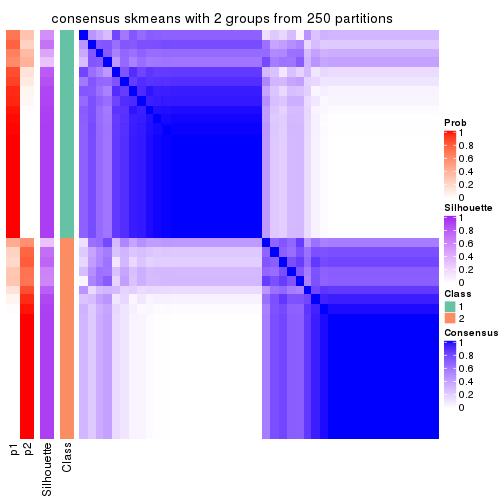</p>

</div>
<div id='tab-SD-skmeans-consensus-heatmap-2'>
<pre><code class="r">consensus_heatmap(res, k = 3)
</code></pre>

<p>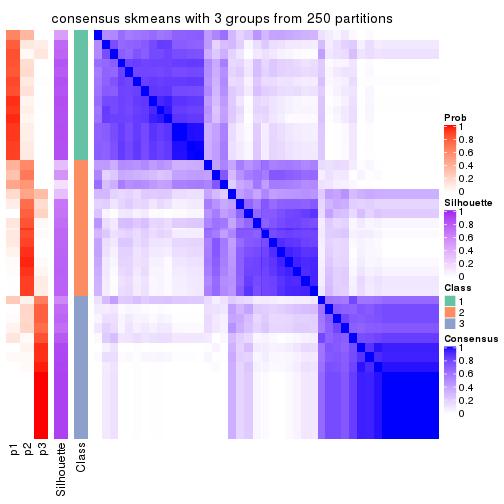</p>

</div>
<div id='tab-SD-skmeans-consensus-heatmap-3'>
<pre><code class="r">consensus_heatmap(res, k = 4)
</code></pre>

<p>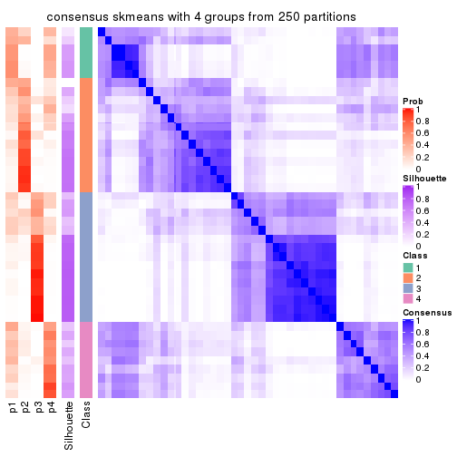</p>

</div>
<div id='tab-SD-skmeans-consensus-heatmap-4'>
<pre><code class="r">consensus_heatmap(res, k = 5)
</code></pre>

<p>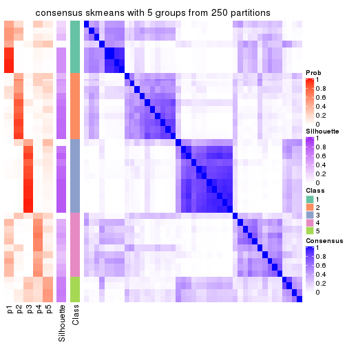</p>

</div>
<div id='tab-SD-skmeans-consensus-heatmap-5'>
<pre><code class="r">consensus_heatmap(res, k = 6)
</code></pre>

<p>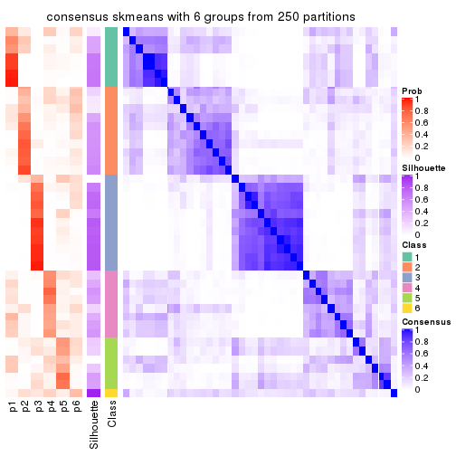</p>

</div>
</div>

Heatmaps for the membership of samples in all partitions to see how consistent they are:


<script>
$( function() {
	$( '#tabs-SD-skmeans-membership-heatmap' ).tabs();
} );
</script>
<div id='tabs-SD-skmeans-membership-heatmap'>
<ul>
<li><a href='#tab-SD-skmeans-membership-heatmap-1'>k = 2</a></li>
<li><a href='#tab-SD-skmeans-membership-heatmap-2'>k = 3</a></li>
<li><a href='#tab-SD-skmeans-membership-heatmap-3'>k = 4</a></li>
<li><a href='#tab-SD-skmeans-membership-heatmap-4'>k = 5</a></li>
<li><a href='#tab-SD-skmeans-membership-heatmap-5'>k = 6</a></li>
</ul>
<div id='tab-SD-skmeans-membership-heatmap-1'>
<pre><code class="r">membership_heatmap(res, k = 2)
</code></pre>

<p>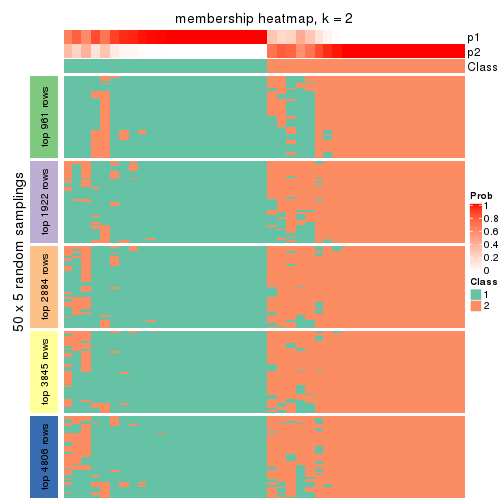</p>

</div>
<div id='tab-SD-skmeans-membership-heatmap-2'>
<pre><code class="r">membership_heatmap(res, k = 3)
</code></pre>

<p>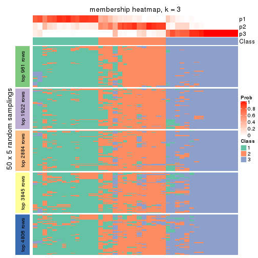</p>

</div>
<div id='tab-SD-skmeans-membership-heatmap-3'>
<pre><code class="r">membership_heatmap(res, k = 4)
</code></pre>

<p>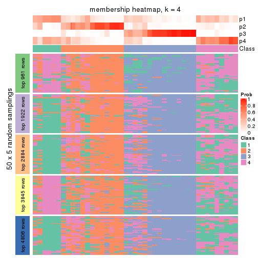</p>

</div>
<div id='tab-SD-skmeans-membership-heatmap-4'>
<pre><code class="r">membership_heatmap(res, k = 5)
</code></pre>

<p>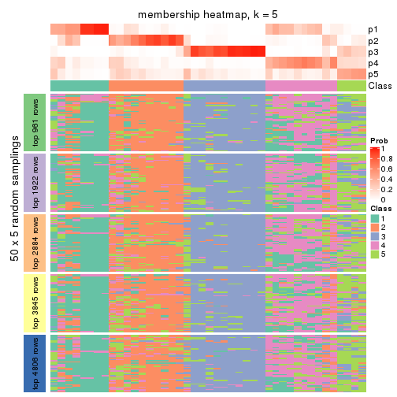</p>

</div>
<div id='tab-SD-skmeans-membership-heatmap-5'>
<pre><code class="r">membership_heatmap(res, k = 6)
</code></pre>

<p>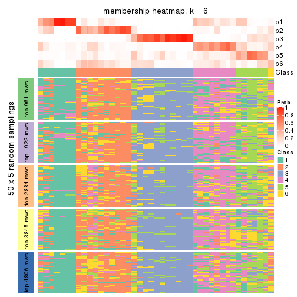</p>

</div>
</div>

As soon as we have had the classes for columns, we can look for signatures
which are significantly different between classes which can be candidate marks
for certain classes. Following are the heatmaps for signatures.


Signature heatmaps where rows are scaled:


<script>
$( function() {
	$( '#tabs-SD-skmeans-get-signatures' ).tabs();
} );
</script>
<div id='tabs-SD-skmeans-get-signatures'>
<ul>
<li><a href='#tab-SD-skmeans-get-signatures-1'>k = 2</a></li>
<li><a href='#tab-SD-skmeans-get-signatures-2'>k = 3</a></li>
<li><a href='#tab-SD-skmeans-get-signatures-3'>k = 4</a></li>
<li><a href='#tab-SD-skmeans-get-signatures-4'>k = 5</a></li>
<li><a href='#tab-SD-skmeans-get-signatures-5'>k = 6</a></li>
</ul>
<div id='tab-SD-skmeans-get-signatures-1'>
<pre><code class="r">get_signatures(res, k = 2)
</code></pre>

<p>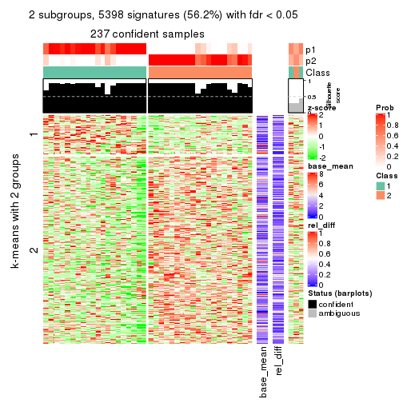</p>

</div>
<div id='tab-SD-skmeans-get-signatures-2'>
<pre><code class="r">get_signatures(res, k = 3)
</code></pre>

<p>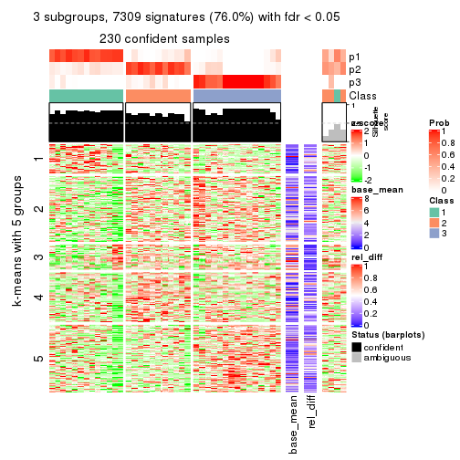</p>

</div>
<div id='tab-SD-skmeans-get-signatures-3'>
<pre><code class="r">get_signatures(res, k = 4)
</code></pre>

<p>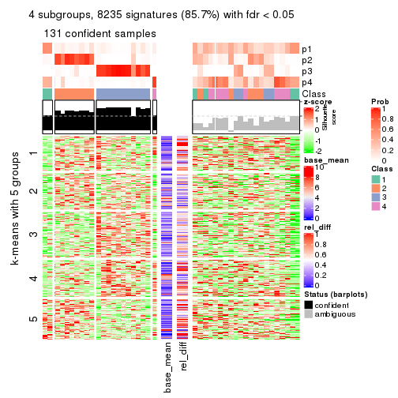</p>

</div>
<div id='tab-SD-skmeans-get-signatures-4'>
<pre><code class="r">get_signatures(res, k = 5)
</code></pre>

<p>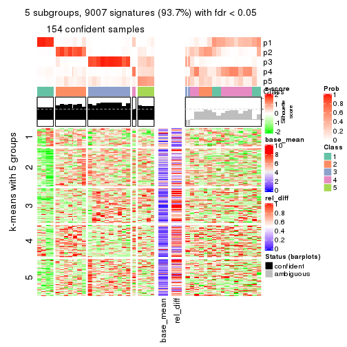</p>

</div>
<div id='tab-SD-skmeans-get-signatures-5'>
<pre><code class="r">get_signatures(res, k = 6)
</code></pre>

<p>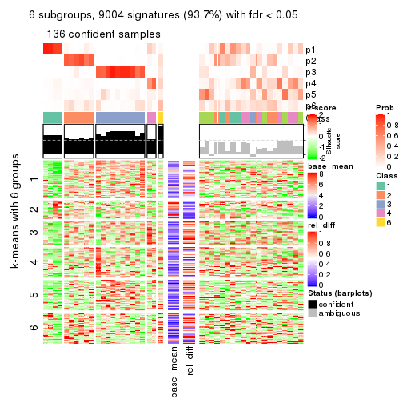</p>

</div>
</div>


Signature heatmaps where rows are not scaled:


<script>
$( function() {
	$( '#tabs-SD-skmeans-get-signatures-no-scale' ).tabs();
} );
</script>
<div id='tabs-SD-skmeans-get-signatures-no-scale'>
<ul>
<li><a href='#tab-SD-skmeans-get-signatures-no-scale-1'>k = 2</a></li>
<li><a href='#tab-SD-skmeans-get-signatures-no-scale-2'>k = 3</a></li>
<li><a href='#tab-SD-skmeans-get-signatures-no-scale-3'>k = 4</a></li>
<li><a href='#tab-SD-skmeans-get-signatures-no-scale-4'>k = 5</a></li>
<li><a href='#tab-SD-skmeans-get-signatures-no-scale-5'>k = 6</a></li>
</ul>
<div id='tab-SD-skmeans-get-signatures-no-scale-1'>
<pre><code class="r">get_signatures(res, k = 2, scale_rows = FALSE)
</code></pre>

<p>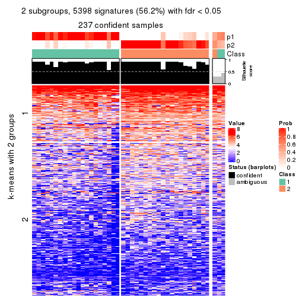</p>

</div>
<div id='tab-SD-skmeans-get-signatures-no-scale-2'>
<pre><code class="r">get_signatures(res, k = 3, scale_rows = FALSE)
</code></pre>

<p>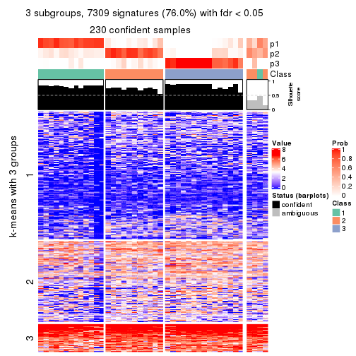</p>

</div>
<div id='tab-SD-skmeans-get-signatures-no-scale-3'>
<pre><code class="r">get_signatures(res, k = 4, scale_rows = FALSE)
</code></pre>

<p>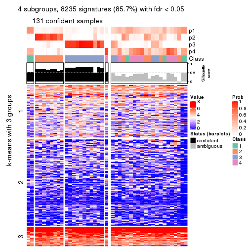</p>

</div>
<div id='tab-SD-skmeans-get-signatures-no-scale-4'>
<pre><code class="r">get_signatures(res, k = 5, scale_rows = FALSE)
</code></pre>

<p>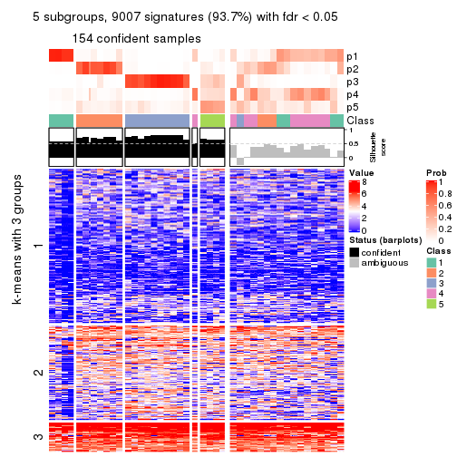</p>

</div>
<div id='tab-SD-skmeans-get-signatures-no-scale-5'>
<pre><code class="r">get_signatures(res, k = 6, scale_rows = FALSE)
</code></pre>

<p>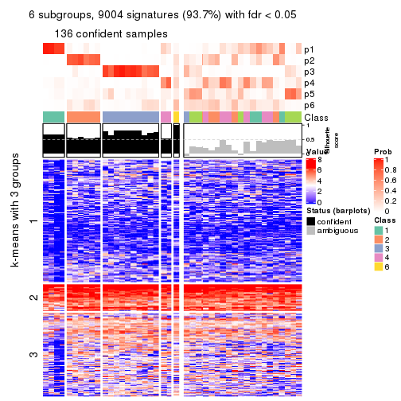</p>

</div>
</div>


Compare the overlap of signatures from different k:

```r
compare_signatures(res)
```

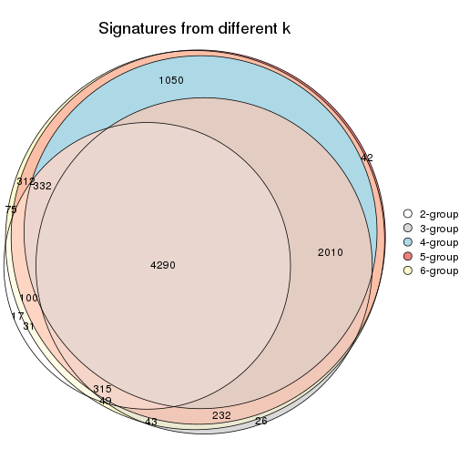

`get_signature()` returns a data frame invisibly. TO get the list of signatures, the function
call should be assigned to a variable explicitly. In following code, if `plot` argument is set
to `FALSE`, no heatmap is plotted while only the differential analysis is performed.

```r
# code only for demonstration
tb = get_signature(res, k = ..., plot = FALSE)
```

An example of the output of `tb` is:

```
#>   which_row         fdr    mean_1    mean_2 scaled_mean_1 scaled_mean_2 km
#> 1        38 0.042760348  8.373488  9.131774    -0.5533452     0.5164555  1
#> 2        40 0.018707592  7.106213  8.469186    -0.6173731     0.5762149  1
#> 3        55 0.019134737 10.221463 11.207825    -0.6159697     0.5749050  1
#> 4        59 0.006059896  5.921854  7.869574    -0.6899429     0.6439467  1
#> 5        60 0.018055526  8.928898 10.211722    -0.6204761     0.5791110  1
#> 6        98 0.009384629 15.714769 14.887706     0.6635654    -0.6193277  2
...
```

The columns in `tb` are:

1. `which_row`: row indices corresponding to the input matrix.
2. `fdr`: FDR for the differential test. 
3. `mean_x`: The mean value in group x.
4. `scaled_mean_x`: The mean value in group x after rows are scaled.
5. `km`: Row groups if k-means clustering is applied to rows.


UMAP plot which shows how samples are separated.


<script>
$( function() {
	$( '#tabs-SD-skmeans-dimension-reduction' ).tabs();
} );
</script>
<div id='tabs-SD-skmeans-dimension-reduction'>
<ul>
<li><a href='#tab-SD-skmeans-dimension-reduction-1'>k = 2</a></li>
<li><a href='#tab-SD-skmeans-dimension-reduction-2'>k = 3</a></li>
<li><a href='#tab-SD-skmeans-dimension-reduction-3'>k = 4</a></li>
<li><a href='#tab-SD-skmeans-dimension-reduction-4'>k = 5</a></li>
<li><a href='#tab-SD-skmeans-dimension-reduction-5'>k = 6</a></li>
</ul>
<div id='tab-SD-skmeans-dimension-reduction-1'>
<pre><code class="r">dimension_reduction(res, k = 2, method = &quot;UMAP&quot;)
</code></pre>

<p>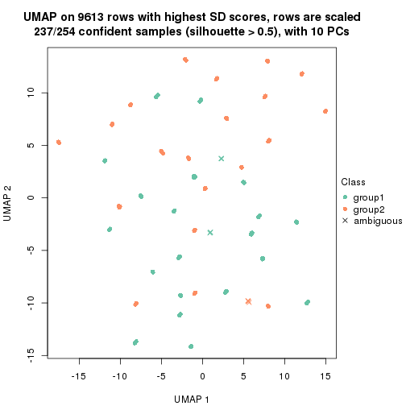</p>

</div>
<div id='tab-SD-skmeans-dimension-reduction-2'>
<pre><code class="r">dimension_reduction(res, k = 3, method = &quot;UMAP&quot;)
</code></pre>

<p>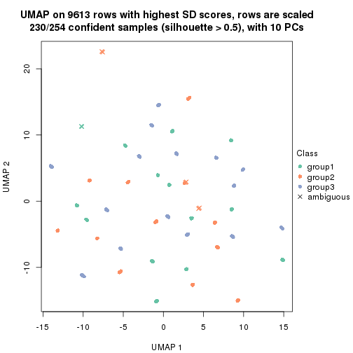</p>

</div>
<div id='tab-SD-skmeans-dimension-reduction-3'>
<pre><code class="r">dimension_reduction(res, k = 4, method = &quot;UMAP&quot;)
</code></pre>

<p>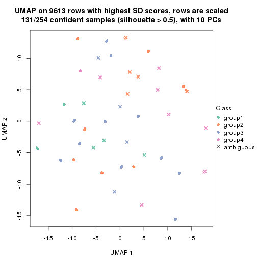</p>

</div>
<div id='tab-SD-skmeans-dimension-reduction-4'>
<pre><code class="r">dimension_reduction(res, k = 5, method = &quot;UMAP&quot;)
</code></pre>

<p>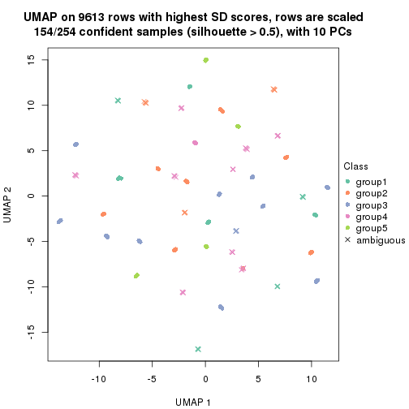</p>

</div>
<div id='tab-SD-skmeans-dimension-reduction-5'>
<pre><code class="r">dimension_reduction(res, k = 6, method = &quot;UMAP&quot;)
</code></pre>

<p>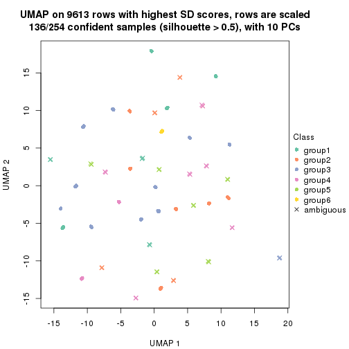</p>

</div>
</div>


Following heatmap shows how subgroups are split when increasing `k`:

```r
collect_classes(res)
```

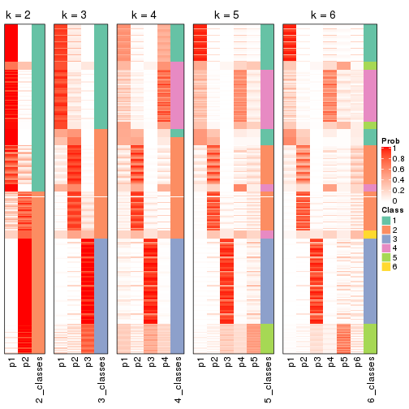


If matrix rows can be associated to genes, consider to use `GO_Enrichment(res,
...)` to perform function enrichment for the signature genes.


 

---------------------------------------------------


### SD:pam


The object with results only for a single top-value method and a single partition method 
can be extracted as:

```r
res = res_list["SD", "pam"]
# you can also extract it by
# res = res_list["SD:pam"]
```

A summary of `res` and all the functions that can be applied to it:

```r
res
```

```
#> A 'ConsensusPartition' object with k = 2, 3, 4, 5, 6.
#>   On a matrix with 9613 rows and 254 columns.
#>   Top rows (961, 1922, 2884, 3845, 4806) are extracted by 'SD' method.
#>   Subgroups are detected by 'pam' method.
#>   Performed in total 1250 partitions by row resampling.
#>   Best k for subgroups seems to be 3.
#> 
#> Following methods can be applied to this 'ConsensusPartition' object:
#>  [1] "cola_report"             "collect_classes"         "collect_plots"          
#>  [4] "collect_stats"           "colnames"                "compare_signatures"     
#>  [7] "consensus_heatmap"       "dimension_reduction"     "functional_enrichment"  
#> [10] "get_anno_col"            "get_anno"                "get_classes"            
#> [13] "get_consensus"           "get_matrix"              "get_membership"         
#> [16] "get_param"               "get_signatures"          "get_stats"              
#> [19] "is_best_k"               "is_stable_k"             "membership_heatmap"     
#> [22] "ncol"                    "nrow"                    "plot_ecdf"              
#> [25] "rownames"                "select_partition_number" "show"                   
#> [28] "suggest_best_k"          "test_to_known_factors"
```

`collect_plots()` function collects all the plots made from `res` for all `k` (number of partitions)
into one single page to provide an easy and fast comparison between different `k`.

```r
collect_plots(res)
```

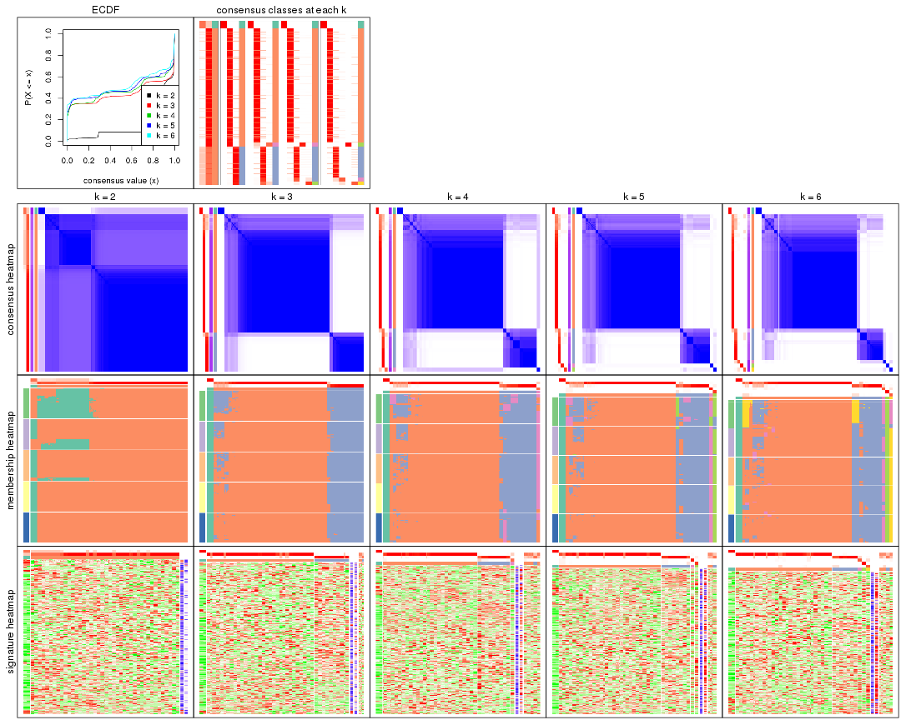

The plots are:

- The first row: a plot of the ECDF (Empirical cumulative distribution
  function) curves of the consensus matrix for each `k` and the heatmap of
  predicted classes for each `k`.
- The second row: heatmaps of the consensus matrix for each `k`.
- The third row: heatmaps of the membership matrix for each `k`.
- The fouth row: heatmaps of the signatures for each `k`.

All the plots in panels can be made by individual functions and they are
plotted later in this section.

`select_partition_number()` produces several plots showing different
statistics for choosing "optimized" `k`. There are following statistics:

- ECDF curves of the consensus matrix for each `k`;
- 1-PAC. [The PAC
  score](https://en.wikipedia.org/wiki/Consensus_clustering#Over-interpretation_potential_of_consensus_clustering)
  measures the proportion of the ambiguous subgrouping.
- Mean silhouette score.
- Concordance. The mean probability of fiting the consensus class ids in all
  partitions.
- Area increased. Denote $A_k$ as the area under the ECDF curve for current
  `k`, the area increased is defined as $A_k - A_{k-1}$.
- Rand index. The percent of pairs of samples that are both in a same cluster
  or both are not in a same cluster in the partition of k and k-1.
- Jaccard index. The ratio of pairs of samples are both in a same cluster in
  the partition of k and k-1 and the pairs of samples are both in a same
  cluster in the partition k or k-1.

The detailed explanations of these statistics can be found in [the cola
vignette](http://bioconductor.org/packages/devel/bioc/vignettes/cola/inst/doc/cola.html#toc_13).

Generally speaking, lower PAC score, higher mean silhouette score or higher
concordance corresponds to better partition. Rand index and Jaccard index
measure how similar the current partition is compared to partition with `k-1`.
If they are too similar, we won't accept `k` is better than `k-1`.

```r
select_partition_number(res)
```

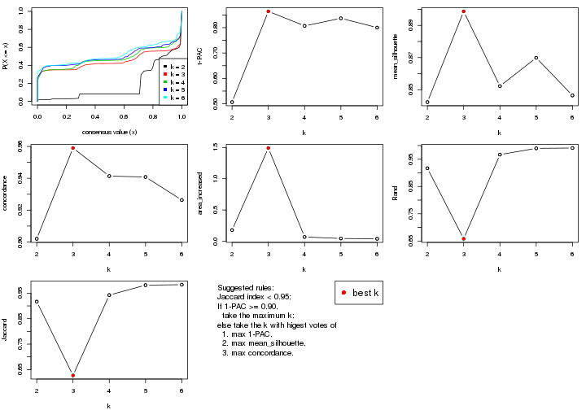

The numeric values for all these statistics can be obtained by `get_stats()`.

```r
get_stats(res)
```

```
#>   k 1-PAC mean_silhouette concordance area_increased  Rand Jaccard
#> 2 2 0.507           0.842       0.902         0.1787 0.917   0.917
#> 3 3 0.864           0.899       0.959         1.4912 0.658   0.627
#> 4 4 0.807           0.852       0.941         0.0686 0.967   0.943
#> 5 5 0.837           0.870       0.941         0.0443 0.990   0.981
#> 6 6 0.800           0.846       0.926         0.0395 0.991   0.983
```

`suggest_best_k()` suggests the best $k$ based on these statistics. The rules are as follows:

- All $k$ with Jaccard index larger than 0.95 are removed because the increase of
  the partition number does not provides enough extra information. If all $k$ are removed,
  the best $k$ is assigned by `NA`.
- For $k$ with 1-PAC larger than 0.9, the maximal $k$ is taken as the "best k". Other $k$ is called "optional k".
- If it does not fit the second rule. The $k$ with the highest vote of highest
  1-PAC, mean silhouette and concordance is taken as the "best k".

```r
suggest_best_k(res)
```

```
#> [1] 3
```


Following shows the table of the partitions (You need to click the **show/hide
code output** link to see it). The membership matrix (columns with name `p*`)
is inferred by
[`clue::cl_consensus()`](https://www.rdocumentation.org/link/cl_consensus?package=clue)
function with the `SE` method. Basically the value in the membership matrix
represents the probability to belong to a certain group. The finall class
label for an item is determined with the group with highest probability it
belongs to.

In `get_classes()` function, the entropy is calculated from the membership
matrix and the silhouette score is calculated from the consensus matrix.


<script>
$( function() {
	$( '#tabs-SD-pam-get-classes' ).tabs();
} );
</script>
<div id='tabs-SD-pam-get-classes'>
<ul>
<li><a href='#tab-SD-pam-get-classes-1'>k = 2</a></li>
<li><a href='#tab-SD-pam-get-classes-2'>k = 3</a></li>
<li><a href='#tab-SD-pam-get-classes-3'>k = 4</a></li>
<li><a href='#tab-SD-pam-get-classes-4'>k = 5</a></li>
<li><a href='#tab-SD-pam-get-classes-5'>k = 6</a></li>
</ul>

<div id='tab-SD-pam-get-classes-1'>
<p><a id='tab-SD-pam-get-classes-1-a' style='color:#0366d6' href='#'>show/hide code output</a></p>
<pre><code class="r">cbind(get_classes(res, k = 2), get_membership(res, k = 2))
</code></pre>

<pre><code>#&gt;           class entropy silhouette    p1    p2
#&gt; DRR024803     1  0.8661      1.000 0.712 0.288
#&gt; DRR024804     2  0.0000      0.882 0.000 1.000
#&gt; DRR024805     2  0.0000      0.882 0.000 1.000
#&gt; DRR024806     2  0.0000      0.882 0.000 1.000
#&gt; DRR024807     2  0.8555      0.729 0.280 0.720
#&gt; DRR024808     2  0.8661      0.722 0.288 0.712
#&gt; DRR024809     2  0.0000      0.882 0.000 1.000
#&gt; DRR024810     2  0.0000      0.882 0.000 1.000
#&gt; DRR024811     2  0.8661      0.722 0.288 0.712
#&gt; DRR024812     2  0.0000      0.882 0.000 1.000
#&gt; DRR024813     2  0.7219      0.789 0.200 0.800
#&gt; DRR024814     2  0.0000      0.882 0.000 1.000
#&gt; DRR024815     2  0.2603      0.866 0.044 0.956
#&gt; DRR024816     2  0.0000      0.882 0.000 1.000
#&gt; DRR024817     2  0.4815      0.839 0.104 0.896
#&gt; DRR024818     2  0.7056      0.795 0.192 0.808
#&gt; DRR024819     2  0.0000      0.882 0.000 1.000
#&gt; DRR024820     2  0.0376      0.880 0.004 0.996
#&gt; DRR024821     2  0.8661      0.722 0.288 0.712
#&gt; DRR024822     2  0.0000      0.882 0.000 1.000
#&gt; DRR024824     2  0.0000      0.882 0.000 1.000
#&gt; DRR024825     2  0.8661      0.722 0.288 0.712
#&gt; DRR024826     2  0.0000      0.882 0.000 1.000
#&gt; DRR024827     2  0.6247      0.815 0.156 0.844
#&gt; DRR024828     2  0.8608      0.726 0.284 0.716
#&gt; DRR024829     2  0.0000      0.882 0.000 1.000
#&gt; DRR024830     2  0.0000      0.882 0.000 1.000
#&gt; DRR024831     2  0.8661      0.722 0.288 0.712
#&gt; DRR024832     2  0.8661      0.722 0.288 0.712
#&gt; DRR024833     2  0.7299      0.786 0.204 0.796
#&gt; DRR024834     2  0.0000      0.882 0.000 1.000
#&gt; DRR024835     2  0.7056      0.795 0.192 0.808
#&gt; DRR024836     2  0.8661      0.722 0.288 0.712
#&gt; DRR024837     2  0.0000      0.882 0.000 1.000
#&gt; DRR024838     2  0.0000      0.882 0.000 1.000
#&gt; DRR024839     2  0.0000      0.882 0.000 1.000
#&gt; DRR024840     2  0.0000      0.882 0.000 1.000
#&gt; DRR024841     2  0.0000      0.882 0.000 1.000
#&gt; DRR024842     2  0.0000      0.882 0.000 1.000
#&gt; DRR024843     1  0.8661      1.000 0.712 0.288
#&gt; DRR024844     2  0.0000      0.882 0.000 1.000
#&gt; DRR024845     2  0.0376      0.881 0.004 0.996
#&gt; DRR024846     2  0.0000      0.882 0.000 1.000
#&gt; DRR024847     2  0.8499      0.732 0.276 0.724
#&gt; DRR024848     1  0.8661      1.000 0.712 0.288
#&gt; DRR024849     2  0.8661      0.722 0.288 0.712
#&gt; DRR024850     2  0.0000      0.882 0.000 1.000
#&gt; DRR024851     2  0.0000      0.882 0.000 1.000
#&gt; DRR024852     2  0.0000      0.882 0.000 1.000
#&gt; DRR024853     2  0.8661      0.722 0.288 0.712
#&gt; DRR024854     2  0.0000      0.882 0.000 1.000
#&gt; DRR024855     2  0.7376      0.784 0.208 0.792
#&gt; DRR024856     2  0.0000      0.882 0.000 1.000
#&gt; DRR024857     2  0.1184      0.877 0.016 0.984
#&gt; DRR024858     2  0.0000      0.882 0.000 1.000
#&gt; DRR024859     2  0.2423      0.867 0.040 0.960
#&gt; DRR024860     2  0.7056      0.795 0.192 0.808
#&gt; DRR024861     2  0.0000      0.882 0.000 1.000
#&gt; DRR024862     2  0.0000      0.882 0.000 1.000
#&gt; DRR024863     2  0.8661      0.722 0.288 0.712
#&gt; DRR024864     2  0.0000      0.882 0.000 1.000
#&gt; DRR024865     2  0.0000      0.882 0.000 1.000
#&gt; DRR024866     2  0.0000      0.882 0.000 1.000
#&gt; DRR024867     2  0.8661      0.722 0.288 0.712
#&gt; DRR024868     2  0.0000      0.882 0.000 1.000
#&gt; DRR024869     2  0.6343      0.813 0.160 0.840
#&gt; DRR024870     2  0.8608      0.726 0.284 0.716
#&gt; DRR024871     2  0.0000      0.882 0.000 1.000
#&gt; DRR024872     2  0.0000      0.882 0.000 1.000
#&gt; DRR024873     2  0.8661      0.722 0.288 0.712
#&gt; DRR024874     2  0.8661      0.722 0.288 0.712
#&gt; DRR024875     2  0.7376      0.784 0.208 0.792
#&gt; DRR024876     2  0.0000      0.882 0.000 1.000
#&gt; DRR024877     2  0.6887      0.799 0.184 0.816
#&gt; DRR024878     2  0.8661      0.722 0.288 0.712
#&gt; DRR024879     2  0.0000      0.882 0.000 1.000
#&gt; DRR024880     2  0.0000      0.882 0.000 1.000
#&gt; DRR024881     2  0.0000      0.882 0.000 1.000
#&gt; DRR024882     2  0.0000      0.882 0.000 1.000
#&gt; DRR024883     2  0.0000      0.882 0.000 1.000
#&gt; DRR024884     2  0.1414      0.875 0.020 0.980
#&gt; DRR024885     2  0.0376      0.880 0.004 0.996
#&gt; DRR024886     1  0.8661      1.000 0.712 0.288
#&gt; DRR024887     2  0.0000      0.882 0.000 1.000
#&gt; DRR024888     2  0.0000      0.882 0.000 1.000
#&gt; DRR024889     2  0.0000      0.882 0.000 1.000
#&gt; DRR024890     2  0.8499      0.732 0.276 0.724
#&gt; DRR024891     1  0.8661      1.000 0.712 0.288
#&gt; DRR024892     2  0.8661      0.722 0.288 0.712
#&gt; DRR024893     2  0.0000      0.882 0.000 1.000
#&gt; DRR024894     2  0.0000      0.882 0.000 1.000
#&gt; DRR024895     2  0.0000      0.882 0.000 1.000
#&gt; DRR024896     2  0.8661      0.722 0.288 0.712
#&gt; DRR024897     2  0.0000      0.882 0.000 1.000
#&gt; DRR024898     2  0.7219      0.789 0.200 0.800
#&gt; DRR024899     2  0.0000      0.882 0.000 1.000
#&gt; DRR024900     2  0.0672      0.879 0.008 0.992
#&gt; DRR024901     2  0.0000      0.882 0.000 1.000
#&gt; DRR024902     2  0.2948      0.862 0.052 0.948
#&gt; DRR024903     2  0.7056      0.795 0.192 0.808
#&gt; DRR024904     2  0.0000      0.882 0.000 1.000
#&gt; DRR024905     2  0.0000      0.882 0.000 1.000
#&gt; DRR024906     2  0.8661      0.722 0.288 0.712
#&gt; DRR024907     2  0.0000      0.882 0.000 1.000
#&gt; DRR024908     2  0.0000      0.882 0.000 1.000
#&gt; DRR024909     2  0.0000      0.882 0.000 1.000
#&gt; DRR024910     2  0.8661      0.722 0.288 0.712
#&gt; DRR024911     2  0.0000      0.882 0.000 1.000
#&gt; DRR024912     2  0.6247      0.815 0.156 0.844
#&gt; DRR024913     2  0.8608      0.726 0.284 0.716
#&gt; DRR024914     2  0.0000      0.882 0.000 1.000
#&gt; DRR024915     2  0.0000      0.882 0.000 1.000
#&gt; DRR024916     2  0.8661      0.722 0.288 0.712
#&gt; DRR024917     2  0.8661      0.722 0.288 0.712
#&gt; DRR024918     2  0.7056      0.795 0.192 0.808
#&gt; DRR024919     2  0.0000      0.882 0.000 1.000
#&gt; DRR024920     2  0.7299      0.786 0.204 0.796
#&gt; DRR024921     2  0.8661      0.722 0.288 0.712
#&gt; DRR024922     2  0.0000      0.882 0.000 1.000
#&gt; DRR024923     2  0.0000      0.882 0.000 1.000
#&gt; DRR024924     2  0.0000      0.882 0.000 1.000
#&gt; DRR024925     2  0.0000      0.882 0.000 1.000
#&gt; DRR024926     2  0.0000      0.882 0.000 1.000
#&gt; DRR024927     2  0.1184      0.877 0.016 0.984
#&gt; DRR024928     2  0.0376      0.880 0.004 0.996
#&gt; DRR024929     1  0.8661      1.000 0.712 0.288
#&gt; DRR024930     2  0.0000      0.882 0.000 1.000
#&gt; DRR024931     2  0.0000      0.882 0.000 1.000
#&gt; DRR024932     2  0.0000      0.882 0.000 1.000
#&gt; DRR024933     2  0.8443      0.735 0.272 0.728
#&gt; DRR024934     1  0.8661      1.000 0.712 0.288
#&gt; DRR024935     2  0.8661      0.722 0.288 0.712
#&gt; DRR024936     2  0.0000      0.882 0.000 1.000
#&gt; DRR024937     2  0.0000      0.882 0.000 1.000
#&gt; DRR024938     2  0.0000      0.882 0.000 1.000
#&gt; DRR024939     2  0.8661      0.722 0.288 0.712
#&gt; DRR024940     2  0.0000      0.882 0.000 1.000
#&gt; DRR024941     2  0.7376      0.784 0.208 0.792
#&gt; DRR024942     2  0.0000      0.882 0.000 1.000
#&gt; DRR024943     2  0.0938      0.878 0.012 0.988
#&gt; DRR024944     2  0.0000      0.882 0.000 1.000
#&gt; DRR024945     2  0.3733      0.854 0.072 0.928
#&gt; DRR024946     2  0.7056      0.795 0.192 0.808
#&gt; DRR024947     2  0.0000      0.882 0.000 1.000
#&gt; DRR024948     2  0.0000      0.882 0.000 1.000
#&gt; DRR024949     2  0.8661      0.722 0.288 0.712
#&gt; DRR024950     2  0.0000      0.882 0.000 1.000
#&gt; DRR024951     2  0.0000      0.882 0.000 1.000
#&gt; DRR024952     2  0.0000      0.882 0.000 1.000
#&gt; DRR024953     2  0.8661      0.722 0.288 0.712
#&gt; DRR024954     2  0.0000      0.882 0.000 1.000
#&gt; DRR024955     2  0.6343      0.813 0.160 0.840
#&gt; DRR024956     2  0.8608      0.726 0.284 0.716
#&gt; DRR024957     2  0.0000      0.882 0.000 1.000
#&gt; DRR024958     2  0.0000      0.882 0.000 1.000
#&gt; DRR024959     2  0.8661      0.722 0.288 0.712
#&gt; DRR024960     2  0.8661      0.722 0.288 0.712
#&gt; DRR024961     2  0.6973      0.797 0.188 0.812
#&gt; DRR024962     2  0.0000      0.882 0.000 1.000
#&gt; DRR024963     2  0.7219      0.789 0.200 0.800
#&gt; DRR024964     2  0.8661      0.722 0.288 0.712
#&gt; DRR024965     2  0.0000      0.882 0.000 1.000
#&gt; DRR024966     2  0.0000      0.882 0.000 1.000
#&gt; DRR024967     2  0.0000      0.882 0.000 1.000
#&gt; DRR024968     2  0.0000      0.882 0.000 1.000
#&gt; DRR024969     2  0.0000      0.882 0.000 1.000
#&gt; DRR024970     2  0.1414      0.875 0.020 0.980
#&gt; DRR024971     2  0.0376      0.880 0.004 0.996
#&gt; DRR024972     1  0.8661      1.000 0.712 0.288
#&gt; DRR024973     2  0.0000      0.882 0.000 1.000
#&gt; DRR024974     2  0.0000      0.882 0.000 1.000
#&gt; DRR024975     2  0.0000      0.882 0.000 1.000
#&gt; DRR024976     2  0.8443      0.735 0.272 0.728
#&gt; DRR024977     1  0.8661      1.000 0.712 0.288
#&gt; DRR024978     2  0.8661      0.722 0.288 0.712
#&gt; DRR024979     2  0.0000      0.882 0.000 1.000
#&gt; DRR024980     2  0.0000      0.882 0.000 1.000
#&gt; DRR024981     2  0.0000      0.882 0.000 1.000
#&gt; DRR024982     2  0.8661      0.722 0.288 0.712
#&gt; DRR024983     2  0.0000      0.882 0.000 1.000
#&gt; DRR024984     2  0.7219      0.789 0.200 0.800
#&gt; DRR024985     2  0.0000      0.882 0.000 1.000
#&gt; DRR024986     2  0.0376      0.881 0.004 0.996
#&gt; DRR024987     2  0.0000      0.882 0.000 1.000
#&gt; DRR024988     2  0.3584      0.855 0.068 0.932
#&gt; DRR024989     2  0.7056      0.795 0.192 0.808
#&gt; DRR024990     2  0.0000      0.882 0.000 1.000
#&gt; DRR024991     2  0.0000      0.882 0.000 1.000
#&gt; DRR024992     2  0.8661      0.722 0.288 0.712
#&gt; DRR024993     2  0.0000      0.882 0.000 1.000
#&gt; DRR024994     2  0.0000      0.882 0.000 1.000
#&gt; DRR024995     2  0.0000      0.882 0.000 1.000
#&gt; DRR024996     2  0.8661      0.722 0.288 0.712
#&gt; DRR024997     2  0.0000      0.882 0.000 1.000
#&gt; DRR024998     2  0.5946      0.821 0.144 0.856
#&gt; DRR024999     2  0.8608      0.726 0.284 0.716
#&gt; DRR025000     2  0.0000      0.882 0.000 1.000
#&gt; DRR025001     2  0.0000      0.882 0.000 1.000
#&gt; DRR025002     2  0.8661      0.722 0.288 0.712
#&gt; DRR025003     2  0.8661      0.722 0.288 0.712
#&gt; DRR025004     2  0.7056      0.795 0.192 0.808
#&gt; DRR025005     2  0.0000      0.882 0.000 1.000
#&gt; DRR025006     2  0.6973      0.797 0.188 0.812
#&gt; DRR025007     2  0.8661      0.722 0.288 0.712
#&gt; DRR025008     2  0.0000      0.882 0.000 1.000
#&gt; DRR025009     2  0.0000      0.882 0.000 1.000
#&gt; DRR025010     2  0.0000      0.882 0.000 1.000
#&gt; DRR025011     2  0.0000      0.882 0.000 1.000
#&gt; DRR025012     2  0.0000      0.882 0.000 1.000
#&gt; DRR025013     2  0.1633      0.874 0.024 0.976
#&gt; DRR025014     2  0.0376      0.880 0.004 0.996
#&gt; DRR025015     1  0.8661      1.000 0.712 0.288
#&gt; DRR025016     2  0.0000      0.882 0.000 1.000
#&gt; DRR025017     2  0.0000      0.882 0.000 1.000
#&gt; DRR025018     2  0.0000      0.882 0.000 1.000
#&gt; DRR025019     2  0.8443      0.735 0.272 0.728
#&gt; DRR025020     1  0.8661      1.000 0.712 0.288
#&gt; DRR025021     2  0.8661      0.722 0.288 0.712
#&gt; DRR025022     2  0.0000      0.882 0.000 1.000
#&gt; DRR025023     2  0.0000      0.882 0.000 1.000
#&gt; DRR025024     2  0.0000      0.882 0.000 1.000
#&gt; DRR025025     2  0.8661      0.722 0.288 0.712
#&gt; DRR025026     2  0.0000      0.882 0.000 1.000
#&gt; DRR025027     2  0.7219      0.789 0.200 0.800
#&gt; DRR025028     2  0.0000      0.882 0.000 1.000
#&gt; DRR025029     2  0.1184      0.877 0.016 0.984
#&gt; DRR025030     2  0.0000      0.882 0.000 1.000
#&gt; DRR025031     2  0.3879      0.852 0.076 0.924
#&gt; DRR025032     2  0.7056      0.795 0.192 0.808
#&gt; DRR025033     2  0.0000      0.882 0.000 1.000
#&gt; DRR025034     2  0.0000      0.882 0.000 1.000
#&gt; DRR025035     2  0.8661      0.722 0.288 0.712
#&gt; DRR025036     2  0.0000      0.882 0.000 1.000
#&gt; DRR025037     2  0.0000      0.882 0.000 1.000
#&gt; DRR025038     2  0.0000      0.882 0.000 1.000
#&gt; DRR025039     2  0.8661      0.722 0.288 0.712
#&gt; DRR025040     2  0.0000      0.882 0.000 1.000
#&gt; DRR025041     2  0.6247      0.815 0.156 0.844
#&gt; DRR025042     2  0.8608      0.726 0.284 0.716
#&gt; DRR025043     2  0.0000      0.882 0.000 1.000
#&gt; DRR025044     2  0.0000      0.882 0.000 1.000
#&gt; DRR025045     2  0.8661      0.722 0.288 0.712
#&gt; DRR025046     2  0.8661      0.722 0.288 0.712
#&gt; DRR025047     2  0.7219      0.789 0.200 0.800
#&gt; DRR025048     2  0.0000      0.882 0.000 1.000
#&gt; DRR025049     2  0.7056      0.795 0.192 0.808
#&gt; DRR025050     2  0.8661      0.722 0.288 0.712
#&gt; DRR025051     2  0.0000      0.882 0.000 1.000
#&gt; DRR025052     2  0.0000      0.882 0.000 1.000
#&gt; DRR025053     2  0.0000      0.882 0.000 1.000
#&gt; DRR025054     2  0.0000      0.882 0.000 1.000
#&gt; DRR025055     2  0.0000      0.882 0.000 1.000
#&gt; DRR025056     2  0.0376      0.881 0.004 0.996
#&gt; DRR025057     2  0.0376      0.880 0.004 0.996
</code></pre>

<script>
$('#tab-SD-pam-get-classes-1-a').parent().next().next().hide();
$('#tab-SD-pam-get-classes-1-a').click(function(){
  $('#tab-SD-pam-get-classes-1-a').parent().next().next().toggle();
  return(false);
});
</script>
</div>

<div id='tab-SD-pam-get-classes-2'>
<p><a id='tab-SD-pam-get-classes-2-a' style='color:#0366d6' href='#'>show/hide code output</a></p>
<pre><code class="r">cbind(get_classes(res, k = 3), get_membership(res, k = 3))
</code></pre>

<pre><code>#&gt;           class entropy silhouette p1    p2    p3
#&gt; DRR024803     1  0.0000      1.000  1 0.000 0.000
#&gt; DRR024804     2  0.0000      0.949  0 1.000 0.000
#&gt; DRR024805     2  0.0000      0.949  0 1.000 0.000
#&gt; DRR024806     2  0.0000      0.949  0 1.000 0.000
#&gt; DRR024807     3  0.0424      0.934  0 0.008 0.992
#&gt; DRR024808     3  0.0000      0.940  0 0.000 1.000
#&gt; DRR024809     2  0.0000      0.949  0 1.000 0.000
#&gt; DRR024810     2  0.0000      0.949  0 1.000 0.000
#&gt; DRR024811     3  0.0000      0.940  0 0.000 1.000
#&gt; DRR024812     2  0.0000      0.949  0 1.000 0.000
#&gt; DRR024813     2  0.5529      0.616  0 0.704 0.296
#&gt; DRR024814     2  0.0000      0.949  0 1.000 0.000
#&gt; DRR024815     2  0.1643      0.916  0 0.956 0.044
#&gt; DRR024816     2  0.0000      0.949  0 1.000 0.000
#&gt; DRR024817     2  0.3038      0.860  0 0.896 0.104
#&gt; DRR024818     3  0.5363      0.525  0 0.276 0.724
#&gt; DRR024819     2  0.0000      0.949  0 1.000 0.000
#&gt; DRR024820     2  0.0237      0.946  0 0.996 0.004
#&gt; DRR024821     3  0.0000      0.940  0 0.000 1.000
#&gt; DRR024822     2  0.0000      0.949  0 1.000 0.000
#&gt; DRR024824     2  0.0000      0.949  0 1.000 0.000
#&gt; DRR024825     3  0.0000      0.940  0 0.000 1.000
#&gt; DRR024826     2  0.0000      0.949  0 1.000 0.000
#&gt; DRR024827     2  0.5785      0.544  0 0.668 0.332
#&gt; DRR024828     3  0.0424      0.934  0 0.008 0.992
#&gt; DRR024829     2  0.0000      0.949  0 1.000 0.000
#&gt; DRR024830     2  0.0000      0.949  0 1.000 0.000
#&gt; DRR024831     3  0.0000      0.940  0 0.000 1.000
#&gt; DRR024832     3  0.0000      0.940  0 0.000 1.000
#&gt; DRR024833     2  0.6154      0.368  0 0.592 0.408
#&gt; DRR024834     2  0.0000      0.949  0 1.000 0.000
#&gt; DRR024835     2  0.5621      0.594  0 0.692 0.308
#&gt; DRR024836     3  0.0000      0.940  0 0.000 1.000
#&gt; DRR024837     2  0.0000      0.949  0 1.000 0.000
#&gt; DRR024838     2  0.0000      0.949  0 1.000 0.000
#&gt; DRR024839     2  0.0000      0.949  0 1.000 0.000
#&gt; DRR024840     2  0.0000      0.949  0 1.000 0.000
#&gt; DRR024841     2  0.0000      0.949  0 1.000 0.000
#&gt; DRR024842     2  0.0000      0.949  0 1.000 0.000
#&gt; DRR024843     1  0.0000      1.000  1 0.000 0.000
#&gt; DRR024844     2  0.0000      0.949  0 1.000 0.000
#&gt; DRR024845     2  0.0237      0.946  0 0.996 0.004
#&gt; DRR024846     2  0.0000      0.949  0 1.000 0.000
#&gt; DRR024847     3  0.1163      0.911  0 0.028 0.972
#&gt; DRR024848     1  0.0000      1.000  1 0.000 0.000
#&gt; DRR024849     3  0.0000      0.940  0 0.000 1.000
#&gt; DRR024850     2  0.0000      0.949  0 1.000 0.000
#&gt; DRR024851     2  0.0000      0.949  0 1.000 0.000
#&gt; DRR024852     2  0.0000      0.949  0 1.000 0.000
#&gt; DRR024853     3  0.0000      0.940  0 0.000 1.000
#&gt; DRR024854     2  0.0000      0.949  0 1.000 0.000
#&gt; DRR024855     2  0.6008      0.462  0 0.628 0.372
#&gt; DRR024856     2  0.0000      0.949  0 1.000 0.000
#&gt; DRR024857     2  0.0747      0.938  0 0.984 0.016
#&gt; DRR024858     2  0.0000      0.949  0 1.000 0.000
#&gt; DRR024859     2  0.1529      0.919  0 0.960 0.040
#&gt; DRR024860     3  0.5529      0.494  0 0.296 0.704
#&gt; DRR024861     2  0.0000      0.949  0 1.000 0.000
#&gt; DRR024862     2  0.0000      0.949  0 1.000 0.000
#&gt; DRR024863     3  0.0000      0.940  0 0.000 1.000
#&gt; DRR024864     2  0.0000      0.949  0 1.000 0.000
#&gt; DRR024865     2  0.0000      0.949  0 1.000 0.000
#&gt; DRR024866     2  0.0000      0.949  0 1.000 0.000
#&gt; DRR024867     3  0.0000      0.940  0 0.000 1.000
#&gt; DRR024868     2  0.0000      0.949  0 1.000 0.000
#&gt; DRR024869     2  0.5560      0.608  0 0.700 0.300
#&gt; DRR024870     3  0.0592      0.930  0 0.012 0.988
#&gt; DRR024871     2  0.0000      0.949  0 1.000 0.000
#&gt; DRR024872     2  0.0000      0.949  0 1.000 0.000
#&gt; DRR024873     3  0.0000      0.940  0 0.000 1.000
#&gt; DRR024874     3  0.0000      0.940  0 0.000 1.000
#&gt; DRR024875     2  0.6095      0.411  0 0.608 0.392
#&gt; DRR024876     2  0.0000      0.949  0 1.000 0.000
#&gt; DRR024877     2  0.5363      0.649  0 0.724 0.276
#&gt; DRR024878     3  0.0000      0.940  0 0.000 1.000
#&gt; DRR024879     2  0.0000      0.949  0 1.000 0.000
#&gt; DRR024880     2  0.0000      0.949  0 1.000 0.000
#&gt; DRR024881     2  0.0000      0.949  0 1.000 0.000
#&gt; DRR024882     2  0.0000      0.949  0 1.000 0.000
#&gt; DRR024883     2  0.0000      0.949  0 1.000 0.000
#&gt; DRR024884     2  0.1163      0.929  0 0.972 0.028
#&gt; DRR024885     2  0.0237      0.946  0 0.996 0.004
#&gt; DRR024886     1  0.0000      1.000  1 0.000 0.000
#&gt; DRR024887     2  0.0000      0.949  0 1.000 0.000
#&gt; DRR024888     2  0.0000      0.949  0 1.000 0.000
#&gt; DRR024889     2  0.0000      0.949  0 1.000 0.000
#&gt; DRR024890     3  0.1031      0.916  0 0.024 0.976
#&gt; DRR024891     1  0.0000      1.000  1 0.000 0.000
#&gt; DRR024892     3  0.0000      0.940  0 0.000 1.000
#&gt; DRR024893     2  0.0000      0.949  0 1.000 0.000
#&gt; DRR024894     2  0.0000      0.949  0 1.000 0.000
#&gt; DRR024895     2  0.0000      0.949  0 1.000 0.000
#&gt; DRR024896     3  0.0000      0.940  0 0.000 1.000
#&gt; DRR024897     2  0.0000      0.949  0 1.000 0.000
#&gt; DRR024898     2  0.5760      0.556  0 0.672 0.328
#&gt; DRR024899     2  0.0000      0.949  0 1.000 0.000
#&gt; DRR024900     2  0.0424      0.944  0 0.992 0.008
#&gt; DRR024901     2  0.0000      0.949  0 1.000 0.000
#&gt; DRR024902     2  0.1860      0.908  0 0.948 0.052
#&gt; DRR024903     3  0.5397      0.519  0 0.280 0.720
#&gt; DRR024904     2  0.0000      0.949  0 1.000 0.000
#&gt; DRR024905     2  0.0000      0.949  0 1.000 0.000
#&gt; DRR024906     3  0.0000      0.940  0 0.000 1.000
#&gt; DRR024907     2  0.0000      0.949  0 1.000 0.000
#&gt; DRR024908     2  0.0000      0.949  0 1.000 0.000
#&gt; DRR024909     2  0.0000      0.949  0 1.000 0.000
#&gt; DRR024910     3  0.0000      0.940  0 0.000 1.000
#&gt; DRR024911     2  0.0000      0.949  0 1.000 0.000
#&gt; DRR024912     2  0.5291      0.661  0 0.732 0.268
#&gt; DRR024913     3  0.0424      0.934  0 0.008 0.992
#&gt; DRR024914     2  0.0000      0.949  0 1.000 0.000
#&gt; DRR024915     2  0.0000      0.949  0 1.000 0.000
#&gt; DRR024916     3  0.0000      0.940  0 0.000 1.000
#&gt; DRR024917     3  0.0000      0.940  0 0.000 1.000
#&gt; DRR024918     2  0.5560      0.607  0 0.700 0.300
#&gt; DRR024919     2  0.0000      0.949  0 1.000 0.000
#&gt; DRR024920     2  0.6126      0.389  0 0.600 0.400
#&gt; DRR024921     3  0.0000      0.940  0 0.000 1.000
#&gt; DRR024922     2  0.0000      0.949  0 1.000 0.000
#&gt; DRR024923     2  0.0000      0.949  0 1.000 0.000
#&gt; DRR024924     2  0.0000      0.949  0 1.000 0.000
#&gt; DRR024925     2  0.0000      0.949  0 1.000 0.000
#&gt; DRR024926     2  0.0000      0.949  0 1.000 0.000
#&gt; DRR024927     2  0.1163      0.929  0 0.972 0.028
#&gt; DRR024928     2  0.0237      0.946  0 0.996 0.004
#&gt; DRR024929     1  0.0000      1.000  1 0.000 0.000
#&gt; DRR024930     2  0.0000      0.949  0 1.000 0.000
#&gt; DRR024931     2  0.0000      0.949  0 1.000 0.000
#&gt; DRR024932     2  0.0000      0.949  0 1.000 0.000
#&gt; DRR024933     3  0.1289      0.906  0 0.032 0.968
#&gt; DRR024934     1  0.0000      1.000  1 0.000 0.000
#&gt; DRR024935     3  0.0000      0.940  0 0.000 1.000
#&gt; DRR024936     2  0.0000      0.949  0 1.000 0.000
#&gt; DRR024937     2  0.0000      0.949  0 1.000 0.000
#&gt; DRR024938     2  0.0000      0.949  0 1.000 0.000
#&gt; DRR024939     3  0.0000      0.940  0 0.000 1.000
#&gt; DRR024940     2  0.0000      0.949  0 1.000 0.000
#&gt; DRR024941     2  0.6111      0.403  0 0.604 0.396
#&gt; DRR024942     2  0.0000      0.949  0 1.000 0.000
#&gt; DRR024943     2  0.0592      0.941  0 0.988 0.012
#&gt; DRR024944     2  0.0000      0.949  0 1.000 0.000
#&gt; DRR024945     2  0.2356      0.891  0 0.928 0.072
#&gt; DRR024946     3  0.5678      0.462  0 0.316 0.684
#&gt; DRR024947     2  0.0000      0.949  0 1.000 0.000
#&gt; DRR024948     2  0.0000      0.949  0 1.000 0.000
#&gt; DRR024949     3  0.0000      0.940  0 0.000 1.000
#&gt; DRR024950     2  0.0000      0.949  0 1.000 0.000
#&gt; DRR024951     2  0.0000      0.949  0 1.000 0.000
#&gt; DRR024952     2  0.0000      0.949  0 1.000 0.000
#&gt; DRR024953     3  0.0000      0.940  0 0.000 1.000
#&gt; DRR024954     2  0.0000      0.949  0 1.000 0.000
#&gt; DRR024955     2  0.5327      0.656  0 0.728 0.272
#&gt; DRR024956     3  0.0592      0.930  0 0.012 0.988
#&gt; DRR024957     2  0.0000      0.949  0 1.000 0.000
#&gt; DRR024958     2  0.0000      0.949  0 1.000 0.000
#&gt; DRR024959     3  0.0000      0.940  0 0.000 1.000
#&gt; DRR024960     3  0.0000      0.940  0 0.000 1.000
#&gt; DRR024961     2  0.5465      0.628  0 0.712 0.288
#&gt; DRR024962     2  0.0000      0.949  0 1.000 0.000
#&gt; DRR024963     2  0.5859      0.523  0 0.656 0.344
#&gt; DRR024964     3  0.0000      0.940  0 0.000 1.000
#&gt; DRR024965     2  0.0000      0.949  0 1.000 0.000
#&gt; DRR024966     2  0.0000      0.949  0 1.000 0.000
#&gt; DRR024967     2  0.0000      0.949  0 1.000 0.000
#&gt; DRR024968     2  0.0000      0.949  0 1.000 0.000
#&gt; DRR024969     2  0.0000      0.949  0 1.000 0.000
#&gt; DRR024970     2  0.1411      0.923  0 0.964 0.036
#&gt; DRR024971     2  0.0237      0.946  0 0.996 0.004
#&gt; DRR024972     1  0.0000      1.000  1 0.000 0.000
#&gt; DRR024973     2  0.0000      0.949  0 1.000 0.000
#&gt; DRR024974     2  0.0000      0.949  0 1.000 0.000
#&gt; DRR024975     2  0.0000      0.949  0 1.000 0.000
#&gt; DRR024976     3  0.1163      0.911  0 0.028 0.972
#&gt; DRR024977     1  0.0000      1.000  1 0.000 0.000
#&gt; DRR024978     3  0.0000      0.940  0 0.000 1.000
#&gt; DRR024979     2  0.0000      0.949  0 1.000 0.000
#&gt; DRR024980     2  0.0000      0.949  0 1.000 0.000
#&gt; DRR024981     2  0.0000      0.949  0 1.000 0.000
#&gt; DRR024982     3  0.0000      0.940  0 0.000 1.000
#&gt; DRR024983     2  0.0000      0.949  0 1.000 0.000
#&gt; DRR024984     2  0.5968      0.480  0 0.636 0.364
#&gt; DRR024985     2  0.0000      0.949  0 1.000 0.000
#&gt; DRR024986     2  0.0237      0.946  0 0.996 0.004
#&gt; DRR024987     2  0.0000      0.949  0 1.000 0.000
#&gt; DRR024988     2  0.2261      0.894  0 0.932 0.068
#&gt; DRR024989     3  0.5397      0.519  0 0.280 0.720
#&gt; DRR024990     2  0.0000      0.949  0 1.000 0.000
#&gt; DRR024991     2  0.0000      0.949  0 1.000 0.000
#&gt; DRR024992     3  0.0000      0.940  0 0.000 1.000
#&gt; DRR024993     2  0.0000      0.949  0 1.000 0.000
#&gt; DRR024994     2  0.0000      0.949  0 1.000 0.000
#&gt; DRR024995     2  0.0000      0.949  0 1.000 0.000
#&gt; DRR024996     3  0.0000      0.940  0 0.000 1.000
#&gt; DRR024997     2  0.0000      0.949  0 1.000 0.000
#&gt; DRR024998     2  0.4974      0.709  0 0.764 0.236
#&gt; DRR024999     3  0.0892      0.920  0 0.020 0.980
#&gt; DRR025000     2  0.0000      0.949  0 1.000 0.000
#&gt; DRR025001     2  0.0000      0.949  0 1.000 0.000
#&gt; DRR025002     3  0.0000      0.940  0 0.000 1.000
#&gt; DRR025003     3  0.0000      0.940  0 0.000 1.000
#&gt; DRR025004     2  0.5706      0.571  0 0.680 0.320
#&gt; DRR025005     2  0.0000      0.949  0 1.000 0.000
#&gt; DRR025006     2  0.5591      0.601  0 0.696 0.304
#&gt; DRR025007     3  0.0000      0.940  0 0.000 1.000
#&gt; DRR025008     2  0.0000      0.949  0 1.000 0.000
#&gt; DRR025009     2  0.0000      0.949  0 1.000 0.000
#&gt; DRR025010     2  0.0000      0.949  0 1.000 0.000
#&gt; DRR025011     2  0.0000      0.949  0 1.000 0.000
#&gt; DRR025012     2  0.0000      0.949  0 1.000 0.000
#&gt; DRR025013     2  0.1529      0.920  0 0.960 0.040
#&gt; DRR025014     2  0.0237      0.946  0 0.996 0.004
#&gt; DRR025015     1  0.0000      1.000  1 0.000 0.000
#&gt; DRR025016     2  0.0000      0.949  0 1.000 0.000
#&gt; DRR025017     2  0.0000      0.949  0 1.000 0.000
#&gt; DRR025018     2  0.0000      0.949  0 1.000 0.000
#&gt; DRR025019     3  0.1163      0.911  0 0.028 0.972
#&gt; DRR025020     1  0.0000      1.000  1 0.000 0.000
#&gt; DRR025021     3  0.0000      0.940  0 0.000 1.000
#&gt; DRR025022     2  0.0000      0.949  0 1.000 0.000
#&gt; DRR025023     2  0.0000      0.949  0 1.000 0.000
#&gt; DRR025024     2  0.0000      0.949  0 1.000 0.000
#&gt; DRR025025     3  0.0000      0.940  0 0.000 1.000
#&gt; DRR025026     2  0.0000      0.949  0 1.000 0.000
#&gt; DRR025027     2  0.5733      0.564  0 0.676 0.324
#&gt; DRR025028     2  0.0000      0.949  0 1.000 0.000
#&gt; DRR025029     2  0.0747      0.938  0 0.984 0.016
#&gt; DRR025030     2  0.0000      0.949  0 1.000 0.000
#&gt; DRR025031     2  0.2448      0.887  0 0.924 0.076
#&gt; DRR025032     3  0.5529      0.494  0 0.296 0.704
#&gt; DRR025033     2  0.0000      0.949  0 1.000 0.000
#&gt; DRR025034     2  0.0000      0.949  0 1.000 0.000
#&gt; DRR025035     3  0.0000      0.940  0 0.000 1.000
#&gt; DRR025036     2  0.0000      0.949  0 1.000 0.000
#&gt; DRR025037     2  0.0000      0.949  0 1.000 0.000
#&gt; DRR025038     2  0.0000      0.949  0 1.000 0.000
#&gt; DRR025039     3  0.0000      0.940  0 0.000 1.000
#&gt; DRR025040     2  0.0000      0.949  0 1.000 0.000
#&gt; DRR025041     2  0.5465      0.629  0 0.712 0.288
#&gt; DRR025042     3  0.0424      0.934  0 0.008 0.992
#&gt; DRR025043     2  0.0000      0.949  0 1.000 0.000
#&gt; DRR025044     2  0.0000      0.949  0 1.000 0.000
#&gt; DRR025045     3  0.0000      0.940  0 0.000 1.000
#&gt; DRR025046     3  0.0000      0.940  0 0.000 1.000
#&gt; DRR025047     2  0.5835      0.531  0 0.660 0.340
#&gt; DRR025048     2  0.0000      0.949  0 1.000 0.000
#&gt; DRR025049     2  0.5621      0.594  0 0.692 0.308
#&gt; DRR025050     3  0.0000      0.940  0 0.000 1.000
#&gt; DRR025051     2  0.0000      0.949  0 1.000 0.000
#&gt; DRR025052     2  0.0000      0.949  0 1.000 0.000
#&gt; DRR025053     2  0.0000      0.949  0 1.000 0.000
#&gt; DRR025054     2  0.0000      0.949  0 1.000 0.000
#&gt; DRR025055     2  0.0000      0.949  0 1.000 0.000
#&gt; DRR025056     2  0.0892      0.935  0 0.980 0.020
#&gt; DRR025057     2  0.0237      0.946  0 0.996 0.004
</code></pre>

<script>
$('#tab-SD-pam-get-classes-2-a').parent().next().next().hide();
$('#tab-SD-pam-get-classes-2-a').click(function(){
  $('#tab-SD-pam-get-classes-2-a').parent().next().next().toggle();
  return(false);
});
</script>
</div>

<div id='tab-SD-pam-get-classes-3'>
<p><a id='tab-SD-pam-get-classes-3-a' style='color:#0366d6' href='#'>show/hide code output</a></p>
<pre><code class="r">cbind(get_classes(res, k = 4), get_membership(res, k = 4))
</code></pre>

<pre><code>#&gt;           class entropy silhouette p1    p2    p3    p4
#&gt; DRR024803     1  0.0000      1.000  1 0.000 0.000 0.000
#&gt; DRR024804     2  0.0000      0.926  0 1.000 0.000 0.000
#&gt; DRR024805     2  0.0000      0.926  0 1.000 0.000 0.000
#&gt; DRR024806     2  0.0000      0.926  0 1.000 0.000 0.000
#&gt; DRR024807     3  0.4053      0.740  0 0.004 0.768 0.228
#&gt; DRR024808     3  0.1474      0.880  0 0.000 0.948 0.052
#&gt; DRR024809     2  0.0000      0.926  0 1.000 0.000 0.000
#&gt; DRR024810     2  0.0000      0.926  0 1.000 0.000 0.000
#&gt; DRR024811     3  0.0188      0.899  0 0.004 0.996 0.000
#&gt; DRR024812     2  0.0000      0.926  0 1.000 0.000 0.000
#&gt; DRR024813     2  0.4509      0.487  0 0.708 0.288 0.004
#&gt; DRR024814     2  0.0000      0.926  0 1.000 0.000 0.000
#&gt; DRR024815     2  0.1211      0.890  0 0.960 0.040 0.000
#&gt; DRR024816     2  0.0000      0.926  0 1.000 0.000 0.000
#&gt; DRR024817     2  0.2345      0.815  0 0.900 0.100 0.000
#&gt; DRR024818     3  0.4331      0.376  0 0.288 0.712 0.000
#&gt; DRR024819     2  0.0592      0.914  0 0.984 0.000 0.016
#&gt; DRR024820     4  0.4360      0.969  0 0.248 0.008 0.744
#&gt; DRR024821     3  0.0000      0.901  0 0.000 1.000 0.000
#&gt; DRR024822     2  0.0000      0.926  0 1.000 0.000 0.000
#&gt; DRR024824     2  0.0000      0.926  0 1.000 0.000 0.000
#&gt; DRR024825     3  0.1474      0.880  0 0.000 0.948 0.052
#&gt; DRR024826     2  0.0000      0.926  0 1.000 0.000 0.000
#&gt; DRR024827     2  0.5949      0.314  0 0.644 0.288 0.068
#&gt; DRR024828     3  0.2089      0.873  0 0.020 0.932 0.048
#&gt; DRR024829     2  0.0000      0.926  0 1.000 0.000 0.000
#&gt; DRR024830     2  0.0000      0.926  0 1.000 0.000 0.000
#&gt; DRR024831     3  0.0000      0.901  0 0.000 1.000 0.000
#&gt; DRR024832     3  0.0000      0.901  0 0.000 1.000 0.000
#&gt; DRR024833     2  0.4843      0.230  0 0.604 0.396 0.000
#&gt; DRR024834     2  0.0000      0.926  0 1.000 0.000 0.000
#&gt; DRR024835     2  0.4431      0.460  0 0.696 0.304 0.000
#&gt; DRR024836     3  0.0000      0.901  0 0.000 1.000 0.000
#&gt; DRR024837     2  0.0000      0.926  0 1.000 0.000 0.000
#&gt; DRR024838     2  0.0000      0.926  0 1.000 0.000 0.000
#&gt; DRR024839     2  0.0000      0.926  0 1.000 0.000 0.000
#&gt; DRR024840     2  0.0000      0.926  0 1.000 0.000 0.000
#&gt; DRR024841     2  0.0000      0.926  0 1.000 0.000 0.000
#&gt; DRR024842     2  0.0000      0.926  0 1.000 0.000 0.000
#&gt; DRR024843     1  0.0000      1.000  1 0.000 0.000 0.000
#&gt; DRR024844     2  0.0000      0.926  0 1.000 0.000 0.000
#&gt; DRR024845     2  0.0188      0.923  0 0.996 0.004 0.000
#&gt; DRR024846     2  0.0000      0.926  0 1.000 0.000 0.000
#&gt; DRR024847     3  0.4644      0.727  0 0.024 0.748 0.228
#&gt; DRR024848     1  0.0000      1.000  1 0.000 0.000 0.000
#&gt; DRR024849     3  0.1474      0.880  0 0.000 0.948 0.052
#&gt; DRR024850     2  0.0000      0.926  0 1.000 0.000 0.000
#&gt; DRR024851     2  0.0000      0.926  0 1.000 0.000 0.000
#&gt; DRR024852     2  0.0000      0.926  0 1.000 0.000 0.000
#&gt; DRR024853     3  0.0188      0.899  0 0.004 0.996 0.000
#&gt; DRR024854     2  0.0000      0.926  0 1.000 0.000 0.000
#&gt; DRR024855     2  0.4889      0.316  0 0.636 0.360 0.004
#&gt; DRR024856     2  0.0000      0.926  0 1.000 0.000 0.000
#&gt; DRR024857     2  0.0469      0.917  0 0.988 0.012 0.000
#&gt; DRR024858     2  0.0000      0.926  0 1.000 0.000 0.000
#&gt; DRR024859     2  0.1211      0.888  0 0.960 0.040 0.000
#&gt; DRR024860     3  0.4431      0.336  0 0.304 0.696 0.000
#&gt; DRR024861     2  0.0469      0.917  0 0.988 0.000 0.012
#&gt; DRR024862     4  0.4313      0.994  0 0.260 0.004 0.736
#&gt; DRR024863     3  0.0000      0.901  0 0.000 1.000 0.000
#&gt; DRR024864     2  0.0000      0.926  0 1.000 0.000 0.000
#&gt; DRR024865     2  0.0000      0.926  0 1.000 0.000 0.000
#&gt; DRR024866     2  0.0000      0.926  0 1.000 0.000 0.000
#&gt; DRR024867     3  0.1474      0.880  0 0.000 0.948 0.052
#&gt; DRR024868     2  0.0000      0.926  0 1.000 0.000 0.000
#&gt; DRR024869     2  0.5744      0.406  0 0.676 0.256 0.068
#&gt; DRR024870     3  0.2197      0.870  0 0.024 0.928 0.048
#&gt; DRR024871     2  0.0000      0.926  0 1.000 0.000 0.000
#&gt; DRR024872     2  0.0000      0.926  0 1.000 0.000 0.000
#&gt; DRR024873     3  0.0000      0.901  0 0.000 1.000 0.000
#&gt; DRR024874     3  0.0000      0.901  0 0.000 1.000 0.000
#&gt; DRR024875     2  0.4804      0.263  0 0.616 0.384 0.000
#&gt; DRR024876     2  0.0000      0.926  0 1.000 0.000 0.000
#&gt; DRR024877     2  0.4222      0.528  0 0.728 0.272 0.000
#&gt; DRR024878     3  0.0000      0.901  0 0.000 1.000 0.000
#&gt; DRR024879     2  0.0000      0.926  0 1.000 0.000 0.000
#&gt; DRR024880     2  0.0000      0.926  0 1.000 0.000 0.000
#&gt; DRR024881     2  0.0000      0.926  0 1.000 0.000 0.000
#&gt; DRR024882     2  0.0000      0.926  0 1.000 0.000 0.000
#&gt; DRR024883     2  0.0000      0.926  0 1.000 0.000 0.000
#&gt; DRR024884     2  0.0921      0.901  0 0.972 0.028 0.000
#&gt; DRR024885     2  0.2376      0.842  0 0.916 0.016 0.068
#&gt; DRR024886     1  0.0000      1.000  1 0.000 0.000 0.000
#&gt; DRR024887     2  0.0000      0.926  0 1.000 0.000 0.000
#&gt; DRR024888     2  0.0000      0.926  0 1.000 0.000 0.000
#&gt; DRR024889     2  0.0000      0.926  0 1.000 0.000 0.000
#&gt; DRR024890     3  0.4542      0.730  0 0.020 0.752 0.228
#&gt; DRR024891     1  0.0000      1.000  1 0.000 0.000 0.000
#&gt; DRR024892     3  0.1474      0.880  0 0.000 0.948 0.052
#&gt; DRR024893     2  0.0000      0.926  0 1.000 0.000 0.000
#&gt; DRR024894     2  0.0000      0.926  0 1.000 0.000 0.000
#&gt; DRR024895     2  0.0000      0.926  0 1.000 0.000 0.000
#&gt; DRR024896     3  0.0188      0.899  0 0.004 0.996 0.000
#&gt; DRR024897     2  0.0000      0.926  0 1.000 0.000 0.000
#&gt; DRR024898     2  0.4720      0.406  0 0.672 0.324 0.004
#&gt; DRR024899     2  0.0000      0.926  0 1.000 0.000 0.000
#&gt; DRR024900     2  0.0336      0.920  0 0.992 0.008 0.000
#&gt; DRR024901     2  0.0000      0.926  0 1.000 0.000 0.000
#&gt; DRR024902     2  0.1474      0.875  0 0.948 0.052 0.000
#&gt; DRR024903     3  0.4331      0.376  0 0.288 0.712 0.000
#&gt; DRR024904     2  0.0469      0.917  0 0.988 0.000 0.012
#&gt; DRR024905     4  0.4313      0.994  0 0.260 0.004 0.736
#&gt; DRR024906     3  0.0000      0.901  0 0.000 1.000 0.000
#&gt; DRR024907     2  0.0000      0.926  0 1.000 0.000 0.000
#&gt; DRR024908     2  0.0000      0.926  0 1.000 0.000 0.000
#&gt; DRR024909     2  0.0000      0.926  0 1.000 0.000 0.000
#&gt; DRR024910     3  0.1474      0.880  0 0.000 0.948 0.052
#&gt; DRR024911     2  0.0000      0.926  0 1.000 0.000 0.000
#&gt; DRR024912     2  0.5500      0.484  0 0.708 0.224 0.068
#&gt; DRR024913     3  0.2089      0.873  0 0.020 0.932 0.048
#&gt; DRR024914     2  0.0000      0.926  0 1.000 0.000 0.000
#&gt; DRR024915     2  0.0000      0.926  0 1.000 0.000 0.000
#&gt; DRR024916     3  0.0000      0.901  0 0.000 1.000 0.000
#&gt; DRR024917     3  0.0000      0.901  0 0.000 1.000 0.000
#&gt; DRR024918     2  0.4382      0.477  0 0.704 0.296 0.000
#&gt; DRR024919     2  0.0000      0.926  0 1.000 0.000 0.000
#&gt; DRR024920     2  0.4817      0.248  0 0.612 0.388 0.000
#&gt; DRR024921     3  0.0000      0.901  0 0.000 1.000 0.000
#&gt; DRR024922     2  0.0000      0.926  0 1.000 0.000 0.000
#&gt; DRR024923     2  0.0000      0.926  0 1.000 0.000 0.000
#&gt; DRR024924     2  0.0000      0.926  0 1.000 0.000 0.000
#&gt; DRR024925     2  0.0000      0.926  0 1.000 0.000 0.000
#&gt; DRR024926     2  0.0000      0.926  0 1.000 0.000 0.000
#&gt; DRR024927     2  0.0921      0.902  0 0.972 0.028 0.000
#&gt; DRR024928     2  0.2376      0.842  0 0.916 0.016 0.068
#&gt; DRR024929     1  0.0000      1.000  1 0.000 0.000 0.000
#&gt; DRR024930     2  0.0000      0.926  0 1.000 0.000 0.000
#&gt; DRR024931     2  0.0000      0.926  0 1.000 0.000 0.000
#&gt; DRR024932     2  0.0000      0.926  0 1.000 0.000 0.000
#&gt; DRR024933     3  0.4741      0.721  0 0.028 0.744 0.228
#&gt; DRR024934     1  0.0000      1.000  1 0.000 0.000 0.000
#&gt; DRR024935     3  0.1474      0.880  0 0.000 0.948 0.052
#&gt; DRR024936     2  0.0000      0.926  0 1.000 0.000 0.000
#&gt; DRR024937     2  0.0000      0.926  0 1.000 0.000 0.000
#&gt; DRR024938     2  0.0000      0.926  0 1.000 0.000 0.000
#&gt; DRR024939     3  0.0188      0.899  0 0.004 0.996 0.000
#&gt; DRR024940     2  0.0000      0.926  0 1.000 0.000 0.000
#&gt; DRR024941     2  0.4978      0.252  0 0.612 0.384 0.004
#&gt; DRR024942     2  0.0000      0.926  0 1.000 0.000 0.000
#&gt; DRR024943     2  0.0336      0.920  0 0.992 0.008 0.000
#&gt; DRR024944     2  0.0000      0.926  0 1.000 0.000 0.000
#&gt; DRR024945     2  0.1792      0.856  0 0.932 0.068 0.000
#&gt; DRR024946     3  0.4543      0.282  0 0.324 0.676 0.000
#&gt; DRR024947     2  0.0592      0.914  0 0.984 0.000 0.016
#&gt; DRR024948     4  0.4313      0.994  0 0.260 0.004 0.736
#&gt; DRR024949     3  0.0000      0.901  0 0.000 1.000 0.000
#&gt; DRR024950     2  0.0000      0.926  0 1.000 0.000 0.000
#&gt; DRR024951     2  0.0000      0.926  0 1.000 0.000 0.000
#&gt; DRR024952     2  0.0000      0.926  0 1.000 0.000 0.000
#&gt; DRR024953     3  0.1474      0.880  0 0.000 0.948 0.052
#&gt; DRR024954     2  0.0000      0.926  0 1.000 0.000 0.000
#&gt; DRR024955     2  0.5532      0.477  0 0.704 0.228 0.068
#&gt; DRR024956     3  0.2089      0.873  0 0.020 0.932 0.048
#&gt; DRR024957     2  0.0000      0.926  0 1.000 0.000 0.000
#&gt; DRR024958     2  0.0000      0.926  0 1.000 0.000 0.000
#&gt; DRR024959     3  0.0000      0.901  0 0.000 1.000 0.000
#&gt; DRR024960     3  0.0000      0.901  0 0.000 1.000 0.000
#&gt; DRR024961     2  0.4304      0.503  0 0.716 0.284 0.000
#&gt; DRR024962     2  0.0000      0.926  0 1.000 0.000 0.000
#&gt; DRR024963     2  0.4624      0.375  0 0.660 0.340 0.000
#&gt; DRR024964     3  0.0000      0.901  0 0.000 1.000 0.000
#&gt; DRR024965     2  0.0000      0.926  0 1.000 0.000 0.000
#&gt; DRR024966     2  0.0000      0.926  0 1.000 0.000 0.000
#&gt; DRR024967     2  0.0000      0.926  0 1.000 0.000 0.000
#&gt; DRR024968     2  0.0000      0.926  0 1.000 0.000 0.000
#&gt; DRR024969     2  0.0000      0.926  0 1.000 0.000 0.000
#&gt; DRR024970     2  0.1118      0.894  0 0.964 0.036 0.000
#&gt; DRR024971     2  0.2376      0.842  0 0.916 0.016 0.068
#&gt; DRR024972     1  0.0000      1.000  1 0.000 0.000 0.000
#&gt; DRR024973     2  0.0000      0.926  0 1.000 0.000 0.000
#&gt; DRR024974     2  0.0000      0.926  0 1.000 0.000 0.000
#&gt; DRR024975     2  0.0000      0.926  0 1.000 0.000 0.000
#&gt; DRR024976     3  0.4644      0.726  0 0.024 0.748 0.228
#&gt; DRR024977     1  0.0000      1.000  1 0.000 0.000 0.000
#&gt; DRR024978     3  0.1474      0.880  0 0.000 0.948 0.052
#&gt; DRR024979     2  0.0000      0.926  0 1.000 0.000 0.000
#&gt; DRR024980     2  0.0000      0.926  0 1.000 0.000 0.000
#&gt; DRR024981     2  0.0000      0.926  0 1.000 0.000 0.000
#&gt; DRR024982     3  0.0188      0.899  0 0.004 0.996 0.000
#&gt; DRR024983     2  0.0000      0.926  0 1.000 0.000 0.000
#&gt; DRR024984     2  0.4872      0.326  0 0.640 0.356 0.004
#&gt; DRR024985     2  0.0000      0.926  0 1.000 0.000 0.000
#&gt; DRR024986     2  0.0188      0.923  0 0.996 0.004 0.000
#&gt; DRR024987     2  0.0000      0.926  0 1.000 0.000 0.000
#&gt; DRR024988     2  0.1792      0.856  0 0.932 0.068 0.000
#&gt; DRR024989     3  0.4331      0.376  0 0.288 0.712 0.000
#&gt; DRR024990     2  0.0469      0.917  0 0.988 0.000 0.012
#&gt; DRR024991     4  0.4313      0.994  0 0.260 0.004 0.736
#&gt; DRR024992     3  0.0000      0.901  0 0.000 1.000 0.000
#&gt; DRR024993     2  0.0000      0.926  0 1.000 0.000 0.000
#&gt; DRR024994     2  0.0000      0.926  0 1.000 0.000 0.000
#&gt; DRR024995     2  0.0000      0.926  0 1.000 0.000 0.000
#&gt; DRR024996     3  0.1474      0.880  0 0.000 0.948 0.052
#&gt; DRR024997     2  0.0000      0.926  0 1.000 0.000 0.000
#&gt; DRR024998     2  0.5212      0.555  0 0.740 0.192 0.068
#&gt; DRR024999     3  0.2300      0.866  0 0.028 0.924 0.048
#&gt; DRR025000     2  0.0000      0.926  0 1.000 0.000 0.000
#&gt; DRR025001     2  0.0000      0.926  0 1.000 0.000 0.000
#&gt; DRR025002     3  0.0000      0.901  0 0.000 1.000 0.000
#&gt; DRR025003     3  0.0000      0.901  0 0.000 1.000 0.000
#&gt; DRR025004     2  0.4500      0.432  0 0.684 0.316 0.000
#&gt; DRR025005     2  0.0000      0.926  0 1.000 0.000 0.000
#&gt; DRR025006     2  0.4406      0.468  0 0.700 0.300 0.000
#&gt; DRR025007     3  0.0000      0.901  0 0.000 1.000 0.000
#&gt; DRR025008     2  0.0000      0.926  0 1.000 0.000 0.000
#&gt; DRR025009     2  0.0000      0.926  0 1.000 0.000 0.000
#&gt; DRR025010     2  0.0000      0.926  0 1.000 0.000 0.000
#&gt; DRR025011     2  0.0000      0.926  0 1.000 0.000 0.000
#&gt; DRR025012     2  0.0000      0.926  0 1.000 0.000 0.000
#&gt; DRR025013     2  0.1211      0.889  0 0.960 0.040 0.000
#&gt; DRR025014     2  0.2376      0.842  0 0.916 0.016 0.068
#&gt; DRR025015     1  0.0000      1.000  1 0.000 0.000 0.000
#&gt; DRR025016     2  0.0000      0.926  0 1.000 0.000 0.000
#&gt; DRR025017     2  0.0000      0.926  0 1.000 0.000 0.000
#&gt; DRR025018     2  0.0000      0.926  0 1.000 0.000 0.000
#&gt; DRR025019     3  0.4644      0.726  0 0.024 0.748 0.228
#&gt; DRR025020     1  0.0000      1.000  1 0.000 0.000 0.000
#&gt; DRR025021     3  0.1474      0.880  0 0.000 0.948 0.052
#&gt; DRR025022     2  0.0000      0.926  0 1.000 0.000 0.000
#&gt; DRR025023     2  0.0000      0.926  0 1.000 0.000 0.000
#&gt; DRR025024     2  0.0000      0.926  0 1.000 0.000 0.000
#&gt; DRR025025     3  0.0188      0.899  0 0.004 0.996 0.000
#&gt; DRR025026     2  0.0000      0.926  0 1.000 0.000 0.000
#&gt; DRR025027     2  0.4891      0.427  0 0.680 0.308 0.012
#&gt; DRR025028     2  0.0000      0.926  0 1.000 0.000 0.000
#&gt; DRR025029     2  0.0469      0.917  0 0.988 0.012 0.000
#&gt; DRR025030     2  0.0000      0.926  0 1.000 0.000 0.000
#&gt; DRR025031     2  0.1867      0.851  0 0.928 0.072 0.000
#&gt; DRR025032     3  0.4431      0.336  0 0.304 0.696 0.000
#&gt; DRR025033     2  0.0592      0.914  0 0.984 0.000 0.016
#&gt; DRR025034     4  0.4313      0.994  0 0.260 0.004 0.736
#&gt; DRR025035     3  0.0000      0.901  0 0.000 1.000 0.000
#&gt; DRR025036     2  0.0000      0.926  0 1.000 0.000 0.000
#&gt; DRR025037     2  0.0000      0.926  0 1.000 0.000 0.000
#&gt; DRR025038     2  0.0000      0.926  0 1.000 0.000 0.000
#&gt; DRR025039     3  0.1474      0.880  0 0.000 0.948 0.052
#&gt; DRR025040     2  0.0000      0.926  0 1.000 0.000 0.000
#&gt; DRR025041     2  0.5657      0.436  0 0.688 0.244 0.068
#&gt; DRR025042     3  0.2089      0.873  0 0.020 0.932 0.048
#&gt; DRR025043     2  0.0000      0.926  0 1.000 0.000 0.000
#&gt; DRR025044     2  0.0000      0.926  0 1.000 0.000 0.000
#&gt; DRR025045     3  0.0000      0.901  0 0.000 1.000 0.000
#&gt; DRR025046     3  0.0000      0.901  0 0.000 1.000 0.000
#&gt; DRR025047     2  0.4605      0.386  0 0.664 0.336 0.000
#&gt; DRR025048     2  0.0000      0.926  0 1.000 0.000 0.000
#&gt; DRR025049     2  0.4431      0.460  0 0.696 0.304 0.000
#&gt; DRR025050     3  0.0000      0.901  0 0.000 1.000 0.000
#&gt; DRR025051     2  0.0000      0.926  0 1.000 0.000 0.000
#&gt; DRR025052     2  0.0000      0.926  0 1.000 0.000 0.000
#&gt; DRR025053     2  0.0000      0.926  0 1.000 0.000 0.000
#&gt; DRR025054     2  0.0000      0.926  0 1.000 0.000 0.000
#&gt; DRR025055     2  0.0000      0.926  0 1.000 0.000 0.000
#&gt; DRR025056     2  0.0707      0.909  0 0.980 0.020 0.000
#&gt; DRR025057     2  0.2376      0.842  0 0.916 0.016 0.068
</code></pre>

<script>
$('#tab-SD-pam-get-classes-3-a').parent().next().next().hide();
$('#tab-SD-pam-get-classes-3-a').click(function(){
  $('#tab-SD-pam-get-classes-3-a').parent().next().next().toggle();
  return(false);
});
</script>
</div>

<div id='tab-SD-pam-get-classes-4'>
<p><a id='tab-SD-pam-get-classes-4-a' style='color:#0366d6' href='#'>show/hide code output</a></p>
<pre><code class="r">cbind(get_classes(res, k = 5), get_membership(res, k = 5))
</code></pre>

<pre><code>#&gt;           class entropy silhouette p1    p2    p3    p4    p5
#&gt; DRR024803     1  0.0000      1.000  1 0.000 0.000 0.000 0.000
#&gt; DRR024804     2  0.0000      0.938  0 1.000 0.000 0.000 0.000
#&gt; DRR024805     2  0.0000      0.938  0 1.000 0.000 0.000 0.000
#&gt; DRR024806     2  0.0000      0.938  0 1.000 0.000 0.000 0.000
#&gt; DRR024807     5  0.1851      1.000  0 0.000 0.088 0.000 0.912
#&gt; DRR024808     3  0.1997      0.842  0 0.000 0.924 0.040 0.036
#&gt; DRR024809     2  0.0000      0.938  0 1.000 0.000 0.000 0.000
#&gt; DRR024810     2  0.0000      0.938  0 1.000 0.000 0.000 0.000
#&gt; DRR024811     3  0.0404      0.867  0 0.012 0.988 0.000 0.000
#&gt; DRR024812     2  0.0000      0.938  0 1.000 0.000 0.000 0.000
#&gt; DRR024813     2  0.3990      0.596  0 0.688 0.308 0.004 0.000
#&gt; DRR024814     2  0.0000      0.938  0 1.000 0.000 0.000 0.000
#&gt; DRR024815     2  0.1121      0.910  0 0.956 0.044 0.000 0.000
#&gt; DRR024816     2  0.0000      0.938  0 1.000 0.000 0.000 0.000
#&gt; DRR024817     2  0.2230      0.846  0 0.884 0.116 0.000 0.000
#&gt; DRR024818     3  0.3774      0.432  0 0.296 0.704 0.000 0.000
#&gt; DRR024819     2  0.0898      0.922  0 0.972 0.000 0.008 0.020
#&gt; DRR024820     4  0.0510      0.970  0 0.016 0.000 0.984 0.000
#&gt; DRR024821     3  0.0000      0.875  0 0.000 1.000 0.000 0.000
#&gt; DRR024822     2  0.0000      0.938  0 1.000 0.000 0.000 0.000
#&gt; DRR024824     2  0.0000      0.938  0 1.000 0.000 0.000 0.000
#&gt; DRR024825     3  0.1997      0.842  0 0.000 0.924 0.040 0.036
#&gt; DRR024826     2  0.0000      0.938  0 1.000 0.000 0.000 0.000
#&gt; DRR024827     2  0.6215      0.444  0 0.600 0.280 0.056 0.064
#&gt; DRR024828     3  0.3536      0.722  0 0.032 0.812 0.000 0.156
#&gt; DRR024829     2  0.0000      0.938  0 1.000 0.000 0.000 0.000
#&gt; DRR024830     2  0.0000      0.938  0 1.000 0.000 0.000 0.000
#&gt; DRR024831     3  0.0000      0.875  0 0.000 1.000 0.000 0.000
#&gt; DRR024832     3  0.0000      0.875  0 0.000 1.000 0.000 0.000
#&gt; DRR024833     2  0.4227      0.348  0 0.580 0.420 0.000 0.000
#&gt; DRR024834     2  0.0000      0.938  0 1.000 0.000 0.000 0.000
#&gt; DRR024835     2  0.4066      0.566  0 0.672 0.324 0.000 0.004
#&gt; DRR024836     3  0.0290      0.874  0 0.000 0.992 0.000 0.008
#&gt; DRR024837     2  0.0000      0.938  0 1.000 0.000 0.000 0.000
#&gt; DRR024838     2  0.0000      0.938  0 1.000 0.000 0.000 0.000
#&gt; DRR024839     2  0.0000      0.938  0 1.000 0.000 0.000 0.000
#&gt; DRR024840     2  0.0000      0.938  0 1.000 0.000 0.000 0.000
#&gt; DRR024841     2  0.0000      0.938  0 1.000 0.000 0.000 0.000
#&gt; DRR024842     2  0.0000      0.938  0 1.000 0.000 0.000 0.000
#&gt; DRR024843     1  0.0000      1.000  1 0.000 0.000 0.000 0.000
#&gt; DRR024844     2  0.0000      0.938  0 1.000 0.000 0.000 0.000
#&gt; DRR024845     2  0.0162      0.936  0 0.996 0.004 0.000 0.000
#&gt; DRR024846     2  0.0000      0.938  0 1.000 0.000 0.000 0.000
#&gt; DRR024847     5  0.1851      1.000  0 0.000 0.088 0.000 0.912
#&gt; DRR024848     1  0.0000      1.000  1 0.000 0.000 0.000 0.000
#&gt; DRR024849     3  0.1997      0.842  0 0.000 0.924 0.040 0.036
#&gt; DRR024850     2  0.0000      0.938  0 1.000 0.000 0.000 0.000
#&gt; DRR024851     2  0.0000      0.938  0 1.000 0.000 0.000 0.000
#&gt; DRR024852     2  0.0000      0.938  0 1.000 0.000 0.000 0.000
#&gt; DRR024853     3  0.0404      0.867  0 0.012 0.988 0.000 0.000
#&gt; DRR024854     2  0.0000      0.938  0 1.000 0.000 0.000 0.000
#&gt; DRR024855     2  0.4264      0.456  0 0.620 0.376 0.004 0.000
#&gt; DRR024856     2  0.0000      0.938  0 1.000 0.000 0.000 0.000
#&gt; DRR024857     2  0.0510      0.929  0 0.984 0.016 0.000 0.000
#&gt; DRR024858     2  0.0000      0.938  0 1.000 0.000 0.000 0.000
#&gt; DRR024859     2  0.1197      0.905  0 0.952 0.048 0.000 0.000
#&gt; DRR024860     3  0.3857      0.408  0 0.312 0.688 0.000 0.000
#&gt; DRR024861     2  0.0566      0.929  0 0.984 0.000 0.004 0.012
#&gt; DRR024862     4  0.0703      0.994  0 0.024 0.000 0.976 0.000
#&gt; DRR024863     3  0.0000      0.875  0 0.000 1.000 0.000 0.000
#&gt; DRR024864     2  0.0000      0.938  0 1.000 0.000 0.000 0.000
#&gt; DRR024865     2  0.0000      0.938  0 1.000 0.000 0.000 0.000
#&gt; DRR024866     2  0.0000      0.938  0 1.000 0.000 0.000 0.000
#&gt; DRR024867     3  0.1997      0.842  0 0.000 0.924 0.040 0.036
#&gt; DRR024868     2  0.0000      0.938  0 1.000 0.000 0.000 0.000
#&gt; DRR024869     2  0.6069      0.509  0 0.628 0.252 0.056 0.064
#&gt; DRR024870     3  0.3615      0.718  0 0.036 0.808 0.000 0.156
#&gt; DRR024871     2  0.0000      0.938  0 1.000 0.000 0.000 0.000
#&gt; DRR024872     2  0.0000      0.938  0 1.000 0.000 0.000 0.000
#&gt; DRR024873     3  0.0000      0.875  0 0.000 1.000 0.000 0.000
#&gt; DRR024874     3  0.0000      0.875  0 0.000 1.000 0.000 0.000
#&gt; DRR024875     2  0.4210      0.371  0 0.588 0.412 0.000 0.000
#&gt; DRR024876     2  0.0000      0.938  0 1.000 0.000 0.000 0.000
#&gt; DRR024877     2  0.3906      0.623  0 0.704 0.292 0.000 0.004
#&gt; DRR024878     3  0.0162      0.875  0 0.000 0.996 0.000 0.004
#&gt; DRR024879     2  0.0000      0.938  0 1.000 0.000 0.000 0.000
#&gt; DRR024880     2  0.0000      0.938  0 1.000 0.000 0.000 0.000
#&gt; DRR024881     2  0.0000      0.938  0 1.000 0.000 0.000 0.000
#&gt; DRR024882     2  0.0000      0.938  0 1.000 0.000 0.000 0.000
#&gt; DRR024883     2  0.0000      0.938  0 1.000 0.000 0.000 0.000
#&gt; DRR024884     2  0.0880      0.918  0 0.968 0.032 0.000 0.000
#&gt; DRR024885     2  0.3292      0.831  0 0.864 0.016 0.056 0.064
#&gt; DRR024886     1  0.0000      1.000  1 0.000 0.000 0.000 0.000
#&gt; DRR024887     2  0.0000      0.938  0 1.000 0.000 0.000 0.000
#&gt; DRR024888     2  0.0000      0.938  0 1.000 0.000 0.000 0.000
#&gt; DRR024889     2  0.0000      0.938  0 1.000 0.000 0.000 0.000
#&gt; DRR024890     5  0.1851      1.000  0 0.000 0.088 0.000 0.912
#&gt; DRR024891     1  0.0000      1.000  1 0.000 0.000 0.000 0.000
#&gt; DRR024892     3  0.1997      0.842  0 0.000 0.924 0.040 0.036
#&gt; DRR024893     2  0.0000      0.938  0 1.000 0.000 0.000 0.000
#&gt; DRR024894     2  0.0000      0.938  0 1.000 0.000 0.000 0.000
#&gt; DRR024895     2  0.0000      0.938  0 1.000 0.000 0.000 0.000
#&gt; DRR024896     3  0.0290      0.871  0 0.008 0.992 0.000 0.000
#&gt; DRR024897     2  0.0000      0.938  0 1.000 0.000 0.000 0.000
#&gt; DRR024898     2  0.4135      0.533  0 0.656 0.340 0.004 0.000
#&gt; DRR024899     2  0.0000      0.938  0 1.000 0.000 0.000 0.000
#&gt; DRR024900     2  0.0290      0.934  0 0.992 0.008 0.000 0.000
#&gt; DRR024901     2  0.0000      0.938  0 1.000 0.000 0.000 0.000
#&gt; DRR024902     2  0.1410      0.895  0 0.940 0.060 0.000 0.000
#&gt; DRR024903     3  0.3774      0.432  0 0.296 0.704 0.000 0.000
#&gt; DRR024904     2  0.0566      0.929  0 0.984 0.000 0.004 0.012
#&gt; DRR024905     4  0.0703      0.994  0 0.024 0.000 0.976 0.000
#&gt; DRR024906     3  0.0000      0.875  0 0.000 1.000 0.000 0.000
#&gt; DRR024907     2  0.0000      0.938  0 1.000 0.000 0.000 0.000
#&gt; DRR024908     2  0.0000      0.938  0 1.000 0.000 0.000 0.000
#&gt; DRR024909     2  0.0000      0.938  0 1.000 0.000 0.000 0.000
#&gt; DRR024910     3  0.1997      0.842  0 0.000 0.924 0.040 0.036
#&gt; DRR024911     2  0.0000      0.938  0 1.000 0.000 0.000 0.000
#&gt; DRR024912     2  0.5870      0.567  0 0.660 0.220 0.056 0.064
#&gt; DRR024913     3  0.3536      0.722  0 0.032 0.812 0.000 0.156
#&gt; DRR024914     2  0.0000      0.938  0 1.000 0.000 0.000 0.000
#&gt; DRR024915     2  0.0000      0.938  0 1.000 0.000 0.000 0.000
#&gt; DRR024916     3  0.0000      0.875  0 0.000 1.000 0.000 0.000
#&gt; DRR024917     3  0.0000      0.875  0 0.000 1.000 0.000 0.000
#&gt; DRR024918     2  0.3895      0.579  0 0.680 0.320 0.000 0.000
#&gt; DRR024919     2  0.0000      0.938  0 1.000 0.000 0.000 0.000
#&gt; DRR024920     2  0.4321      0.403  0 0.600 0.396 0.000 0.004
#&gt; DRR024921     3  0.0290      0.874  0 0.000 0.992 0.000 0.008
#&gt; DRR024922     2  0.0000      0.938  0 1.000 0.000 0.000 0.000
#&gt; DRR024923     2  0.0000      0.938  0 1.000 0.000 0.000 0.000
#&gt; DRR024924     2  0.0000      0.938  0 1.000 0.000 0.000 0.000
#&gt; DRR024925     2  0.0000      0.938  0 1.000 0.000 0.000 0.000
#&gt; DRR024926     2  0.0000      0.938  0 1.000 0.000 0.000 0.000
#&gt; DRR024927     2  0.0794      0.921  0 0.972 0.028 0.000 0.000
#&gt; DRR024928     2  0.3292      0.831  0 0.864 0.016 0.056 0.064
#&gt; DRR024929     1  0.0000      1.000  1 0.000 0.000 0.000 0.000
#&gt; DRR024930     2  0.0000      0.938  0 1.000 0.000 0.000 0.000
#&gt; DRR024931     2  0.0000      0.938  0 1.000 0.000 0.000 0.000
#&gt; DRR024932     2  0.0000      0.938  0 1.000 0.000 0.000 0.000
#&gt; DRR024933     5  0.1851      1.000  0 0.000 0.088 0.000 0.912
#&gt; DRR024934     1  0.0000      1.000  1 0.000 0.000 0.000 0.000
#&gt; DRR024935     3  0.1997      0.842  0 0.000 0.924 0.040 0.036
#&gt; DRR024936     2  0.0000      0.938  0 1.000 0.000 0.000 0.000
#&gt; DRR024937     2  0.0000      0.938  0 1.000 0.000 0.000 0.000
#&gt; DRR024938     2  0.0000      0.938  0 1.000 0.000 0.000 0.000
#&gt; DRR024939     3  0.0290      0.871  0 0.008 0.992 0.000 0.000
#&gt; DRR024940     2  0.0000      0.938  0 1.000 0.000 0.000 0.000
#&gt; DRR024941     2  0.4331      0.396  0 0.596 0.400 0.004 0.000
#&gt; DRR024942     2  0.0000      0.938  0 1.000 0.000 0.000 0.000
#&gt; DRR024943     2  0.0404      0.932  0 0.988 0.012 0.000 0.000
#&gt; DRR024944     2  0.0000      0.938  0 1.000 0.000 0.000 0.000
#&gt; DRR024945     2  0.1732      0.879  0 0.920 0.080 0.000 0.000
#&gt; DRR024946     3  0.3949      0.376  0 0.332 0.668 0.000 0.000
#&gt; DRR024947     2  0.0992      0.919  0 0.968 0.000 0.008 0.024
#&gt; DRR024948     4  0.0703      0.994  0 0.024 0.000 0.976 0.000
#&gt; DRR024949     3  0.0000      0.875  0 0.000 1.000 0.000 0.000
#&gt; DRR024950     2  0.0000      0.938  0 1.000 0.000 0.000 0.000
#&gt; DRR024951     2  0.0000      0.938  0 1.000 0.000 0.000 0.000
#&gt; DRR024952     2  0.0000      0.938  0 1.000 0.000 0.000 0.000
#&gt; DRR024953     3  0.1997      0.842  0 0.000 0.924 0.040 0.036
#&gt; DRR024954     2  0.0000      0.938  0 1.000 0.000 0.000 0.000
#&gt; DRR024955     2  0.5897      0.561  0 0.656 0.224 0.056 0.064
#&gt; DRR024956     3  0.3536      0.722  0 0.032 0.812 0.000 0.156
#&gt; DRR024957     2  0.0000      0.938  0 1.000 0.000 0.000 0.000
#&gt; DRR024958     2  0.0000      0.938  0 1.000 0.000 0.000 0.000
#&gt; DRR024959     3  0.0000      0.875  0 0.000 1.000 0.000 0.000
#&gt; DRR024960     3  0.0000      0.875  0 0.000 1.000 0.000 0.000
#&gt; DRR024961     2  0.3816      0.607  0 0.696 0.304 0.000 0.000
#&gt; DRR024962     2  0.0000      0.938  0 1.000 0.000 0.000 0.000
#&gt; DRR024963     2  0.4182      0.509  0 0.644 0.352 0.000 0.004
#&gt; DRR024964     3  0.0162      0.875  0 0.000 0.996 0.000 0.004
#&gt; DRR024965     2  0.0000      0.938  0 1.000 0.000 0.000 0.000
#&gt; DRR024966     2  0.0000      0.938  0 1.000 0.000 0.000 0.000
#&gt; DRR024967     2  0.0000      0.938  0 1.000 0.000 0.000 0.000
#&gt; DRR024968     2  0.0000      0.938  0 1.000 0.000 0.000 0.000
#&gt; DRR024969     2  0.0000      0.938  0 1.000 0.000 0.000 0.000
#&gt; DRR024970     2  0.0963      0.915  0 0.964 0.036 0.000 0.000
#&gt; DRR024971     2  0.3292      0.831  0 0.864 0.016 0.056 0.064
#&gt; DRR024972     1  0.0000      1.000  1 0.000 0.000 0.000 0.000
#&gt; DRR024973     2  0.0000      0.938  0 1.000 0.000 0.000 0.000
#&gt; DRR024974     2  0.0000      0.938  0 1.000 0.000 0.000 0.000
#&gt; DRR024975     2  0.0000      0.938  0 1.000 0.000 0.000 0.000
#&gt; DRR024976     5  0.1851      1.000  0 0.000 0.088 0.000 0.912
#&gt; DRR024977     1  0.0000      1.000  1 0.000 0.000 0.000 0.000
#&gt; DRR024978     3  0.1997      0.842  0 0.000 0.924 0.040 0.036
#&gt; DRR024979     2  0.0000      0.938  0 1.000 0.000 0.000 0.000
#&gt; DRR024980     2  0.0000      0.938  0 1.000 0.000 0.000 0.000
#&gt; DRR024981     2  0.0000      0.938  0 1.000 0.000 0.000 0.000
#&gt; DRR024982     3  0.0162      0.874  0 0.004 0.996 0.000 0.000
#&gt; DRR024983     2  0.0000      0.938  0 1.000 0.000 0.000 0.000
#&gt; DRR024984     2  0.4225      0.483  0 0.632 0.364 0.004 0.000
#&gt; DRR024985     2  0.0000      0.938  0 1.000 0.000 0.000 0.000
#&gt; DRR024986     2  0.0162      0.936  0 0.996 0.004 0.000 0.000
#&gt; DRR024987     2  0.0000      0.938  0 1.000 0.000 0.000 0.000
#&gt; DRR024988     2  0.1671      0.882  0 0.924 0.076 0.000 0.000
#&gt; DRR024989     3  0.3774      0.432  0 0.296 0.704 0.000 0.000
#&gt; DRR024990     2  0.0671      0.927  0 0.980 0.000 0.004 0.016
#&gt; DRR024991     4  0.0703      0.994  0 0.024 0.000 0.976 0.000
#&gt; DRR024992     3  0.0000      0.875  0 0.000 1.000 0.000 0.000
#&gt; DRR024993     2  0.0000      0.938  0 1.000 0.000 0.000 0.000
#&gt; DRR024994     2  0.0000      0.938  0 1.000 0.000 0.000 0.000
#&gt; DRR024995     2  0.0000      0.938  0 1.000 0.000 0.000 0.000
#&gt; DRR024996     3  0.1997      0.842  0 0.000 0.924 0.040 0.036
#&gt; DRR024997     2  0.0000      0.938  0 1.000 0.000 0.000 0.000
#&gt; DRR024998     2  0.5631      0.619  0 0.692 0.188 0.056 0.064
#&gt; DRR024999     3  0.3691      0.713  0 0.040 0.804 0.000 0.156
#&gt; DRR025000     2  0.0000      0.938  0 1.000 0.000 0.000 0.000
#&gt; DRR025001     2  0.0000      0.938  0 1.000 0.000 0.000 0.000
#&gt; DRR025002     3  0.0000      0.875  0 0.000 1.000 0.000 0.000
#&gt; DRR025003     3  0.0000      0.875  0 0.000 1.000 0.000 0.000
#&gt; DRR025004     2  0.3999      0.532  0 0.656 0.344 0.000 0.000
#&gt; DRR025005     2  0.0000      0.938  0 1.000 0.000 0.000 0.000
#&gt; DRR025006     2  0.4047      0.573  0 0.676 0.320 0.000 0.004
#&gt; DRR025007     3  0.0162      0.875  0 0.000 0.996 0.000 0.004
#&gt; DRR025008     2  0.0000      0.938  0 1.000 0.000 0.000 0.000
#&gt; DRR025009     2  0.0000      0.938  0 1.000 0.000 0.000 0.000
#&gt; DRR025010     2  0.0000      0.938  0 1.000 0.000 0.000 0.000
#&gt; DRR025011     2  0.0000      0.938  0 1.000 0.000 0.000 0.000
#&gt; DRR025012     2  0.0000      0.938  0 1.000 0.000 0.000 0.000
#&gt; DRR025013     2  0.1043      0.912  0 0.960 0.040 0.000 0.000
#&gt; DRR025014     2  0.3292      0.831  0 0.864 0.016 0.056 0.064
#&gt; DRR025015     1  0.0000      1.000  1 0.000 0.000 0.000 0.000
#&gt; DRR025016     2  0.0000      0.938  0 1.000 0.000 0.000 0.000
#&gt; DRR025017     2  0.0000      0.938  0 1.000 0.000 0.000 0.000
#&gt; DRR025018     2  0.0000      0.938  0 1.000 0.000 0.000 0.000
#&gt; DRR025019     5  0.1851      1.000  0 0.000 0.088 0.000 0.912
#&gt; DRR025020     1  0.0000      1.000  1 0.000 0.000 0.000 0.000
#&gt; DRR025021     3  0.1997      0.842  0 0.000 0.924 0.040 0.036
#&gt; DRR025022     2  0.0000      0.938  0 1.000 0.000 0.000 0.000
#&gt; DRR025023     2  0.0000      0.938  0 1.000 0.000 0.000 0.000
#&gt; DRR025024     2  0.0000      0.938  0 1.000 0.000 0.000 0.000
#&gt; DRR025025     3  0.0290      0.871  0 0.008 0.992 0.000 0.000
#&gt; DRR025026     2  0.0000      0.938  0 1.000 0.000 0.000 0.000
#&gt; DRR025027     2  0.4335      0.552  0 0.664 0.324 0.008 0.004
#&gt; DRR025028     2  0.0000      0.938  0 1.000 0.000 0.000 0.000
#&gt; DRR025029     2  0.0510      0.929  0 0.984 0.016 0.000 0.000
#&gt; DRR025030     2  0.0000      0.938  0 1.000 0.000 0.000 0.000
#&gt; DRR025031     2  0.1792      0.875  0 0.916 0.084 0.000 0.000
#&gt; DRR025032     3  0.3857      0.408  0 0.312 0.688 0.000 0.000
#&gt; DRR025033     2  0.0798      0.924  0 0.976 0.000 0.008 0.016
#&gt; DRR025034     4  0.0703      0.994  0 0.024 0.000 0.976 0.000
#&gt; DRR025035     3  0.0000      0.875  0 0.000 1.000 0.000 0.000
#&gt; DRR025036     2  0.0000      0.938  0 1.000 0.000 0.000 0.000
#&gt; DRR025037     2  0.0000      0.938  0 1.000 0.000 0.000 0.000
#&gt; DRR025038     2  0.0000      0.938  0 1.000 0.000 0.000 0.000
#&gt; DRR025039     3  0.1997      0.842  0 0.000 0.924 0.040 0.036
#&gt; DRR025040     2  0.0000      0.938  0 1.000 0.000 0.000 0.000
#&gt; DRR025041     2  0.5999      0.531  0 0.640 0.240 0.056 0.064
#&gt; DRR025042     3  0.3536      0.722  0 0.032 0.812 0.000 0.156
#&gt; DRR025043     2  0.0000      0.938  0 1.000 0.000 0.000 0.000
#&gt; DRR025044     2  0.0000      0.938  0 1.000 0.000 0.000 0.000
#&gt; DRR025045     3  0.0000      0.875  0 0.000 1.000 0.000 0.000
#&gt; DRR025046     3  0.0000      0.875  0 0.000 1.000 0.000 0.000
#&gt; DRR025047     2  0.4074      0.489  0 0.636 0.364 0.000 0.000
#&gt; DRR025048     2  0.0000      0.938  0 1.000 0.000 0.000 0.000
#&gt; DRR025049     2  0.4066      0.566  0 0.672 0.324 0.000 0.004
#&gt; DRR025050     3  0.0290      0.874  0 0.000 0.992 0.000 0.008
#&gt; DRR025051     2  0.0000      0.938  0 1.000 0.000 0.000 0.000
#&gt; DRR025052     2  0.0000      0.938  0 1.000 0.000 0.000 0.000
#&gt; DRR025053     2  0.0000      0.938  0 1.000 0.000 0.000 0.000
#&gt; DRR025054     2  0.0000      0.938  0 1.000 0.000 0.000 0.000
#&gt; DRR025055     2  0.0000      0.938  0 1.000 0.000 0.000 0.000
#&gt; DRR025056     2  0.0609      0.926  0 0.980 0.020 0.000 0.000
#&gt; DRR025057     2  0.3292      0.831  0 0.864 0.016 0.056 0.064
</code></pre>

<script>
$('#tab-SD-pam-get-classes-4-a').parent().next().next().hide();
$('#tab-SD-pam-get-classes-4-a').click(function(){
  $('#tab-SD-pam-get-classes-4-a').parent().next().next().toggle();
  return(false);
});
</script>
</div>

<div id='tab-SD-pam-get-classes-5'>
<p><a id='tab-SD-pam-get-classes-5-a' style='color:#0366d6' href='#'>show/hide code output</a></p>
<pre><code class="r">cbind(get_classes(res, k = 6), get_membership(res, k = 6))
</code></pre>

<pre><code>#&gt;           class entropy silhouette p1    p2    p3    p4 p5    p6
#&gt; DRR024803     1  0.0000      1.000  1 0.000 0.000 0.000  0 0.000
#&gt; DRR024804     2  0.0000      0.929  0 1.000 0.000 0.000  0 0.000
#&gt; DRR024805     2  0.0000      0.929  0 1.000 0.000 0.000  0 0.000
#&gt; DRR024806     2  0.0000      0.929  0 1.000 0.000 0.000  0 0.000
#&gt; DRR024807     6  0.3202      1.000  0 0.000 0.024 0.176  0 0.800
#&gt; DRR024808     3  0.2491      0.700  0 0.000 0.836 0.000  0 0.164
#&gt; DRR024809     2  0.0000      0.929  0 1.000 0.000 0.000  0 0.000
#&gt; DRR024810     2  0.0000      0.929  0 1.000 0.000 0.000  0 0.000
#&gt; DRR024811     3  0.1204      0.749  0 0.056 0.944 0.000  0 0.000
#&gt; DRR024812     2  0.0000      0.929  0 1.000 0.000 0.000  0 0.000
#&gt; DRR024813     2  0.3601      0.585  0 0.684 0.312 0.000  0 0.004
#&gt; DRR024814     2  0.0000      0.929  0 1.000 0.000 0.000  0 0.000
#&gt; DRR024815     2  0.1777      0.888  0 0.928 0.044 0.024  0 0.004
#&gt; DRR024816     2  0.0000      0.929  0 1.000 0.000 0.000  0 0.000
#&gt; DRR024817     2  0.3396      0.787  0 0.812 0.116 0.072  0 0.000
#&gt; DRR024818     3  0.3499      0.369  0 0.320 0.680 0.000  0 0.000
#&gt; DRR024819     2  0.1204      0.897  0 0.944 0.000 0.000  0 0.056
#&gt; DRR024820     5  0.0000      1.000  0 0.000 0.000 0.000  1 0.000
#&gt; DRR024821     3  0.0000      0.817  0 0.000 1.000 0.000  0 0.000
#&gt; DRR024822     2  0.0000      0.929  0 1.000 0.000 0.000  0 0.000
#&gt; DRR024824     2  0.0000      0.929  0 1.000 0.000 0.000  0 0.000
#&gt; DRR024825     3  0.2491      0.700  0 0.000 0.836 0.000  0 0.164
#&gt; DRR024826     2  0.0000      0.929  0 1.000 0.000 0.000  0 0.000
#&gt; DRR024827     2  0.5961      0.328  0 0.548 0.236 0.020  0 0.196
#&gt; DRR024828     4  0.2823      1.000  0 0.000 0.204 0.796  0 0.000
#&gt; DRR024829     2  0.0790      0.911  0 0.968 0.000 0.032  0 0.000
#&gt; DRR024830     2  0.0000      0.929  0 1.000 0.000 0.000  0 0.000
#&gt; DRR024831     3  0.0000      0.817  0 0.000 1.000 0.000  0 0.000
#&gt; DRR024832     3  0.0000      0.817  0 0.000 1.000 0.000  0 0.000
#&gt; DRR024833     2  0.3804      0.335  0 0.576 0.424 0.000  0 0.000
#&gt; DRR024834     2  0.0000      0.929  0 1.000 0.000 0.000  0 0.000
#&gt; DRR024835     2  0.4593      0.477  0 0.620 0.324 0.056  0 0.000
#&gt; DRR024836     3  0.0363      0.813  0 0.000 0.988 0.000  0 0.012
#&gt; DRR024837     2  0.0000      0.929  0 1.000 0.000 0.000  0 0.000
#&gt; DRR024838     2  0.0000      0.929  0 1.000 0.000 0.000  0 0.000
#&gt; DRR024839     2  0.0000      0.929  0 1.000 0.000 0.000  0 0.000
#&gt; DRR024840     2  0.0000      0.929  0 1.000 0.000 0.000  0 0.000
#&gt; DRR024841     2  0.0000      0.929  0 1.000 0.000 0.000  0 0.000
#&gt; DRR024842     2  0.0000      0.929  0 1.000 0.000 0.000  0 0.000
#&gt; DRR024843     1  0.0000      1.000  1 0.000 0.000 0.000  0 0.000
#&gt; DRR024844     2  0.0000      0.929  0 1.000 0.000 0.000  0 0.000
#&gt; DRR024845     2  0.0146      0.927  0 0.996 0.004 0.000  0 0.000
#&gt; DRR024846     2  0.0000      0.929  0 1.000 0.000 0.000  0 0.000
#&gt; DRR024847     6  0.3202      1.000  0 0.000 0.024 0.176  0 0.800
#&gt; DRR024848     1  0.0000      1.000  1 0.000 0.000 0.000  0 0.000
#&gt; DRR024849     3  0.2491      0.700  0 0.000 0.836 0.000  0 0.164
#&gt; DRR024850     2  0.0000      0.929  0 1.000 0.000 0.000  0 0.000
#&gt; DRR024851     2  0.0000      0.929  0 1.000 0.000 0.000  0 0.000
#&gt; DRR024852     2  0.0000      0.929  0 1.000 0.000 0.000  0 0.000
#&gt; DRR024853     3  0.1007      0.768  0 0.044 0.956 0.000  0 0.000
#&gt; DRR024854     2  0.0000      0.929  0 1.000 0.000 0.000  0 0.000
#&gt; DRR024855     2  0.3830      0.454  0 0.620 0.376 0.000  0 0.004
#&gt; DRR024856     2  0.0000      0.929  0 1.000 0.000 0.000  0 0.000
#&gt; DRR024857     2  0.1232      0.906  0 0.956 0.016 0.024  0 0.004
#&gt; DRR024858     2  0.0000      0.929  0 1.000 0.000 0.000  0 0.000
#&gt; DRR024859     2  0.2499      0.848  0 0.880 0.048 0.072  0 0.000
#&gt; DRR024860     3  0.3563      0.348  0 0.336 0.664 0.000  0 0.000
#&gt; DRR024861     2  0.0547      0.919  0 0.980 0.000 0.000  0 0.020
#&gt; DRR024862     5  0.0000      1.000  0 0.000 0.000 0.000  1 0.000
#&gt; DRR024863     3  0.0000      0.817  0 0.000 1.000 0.000  0 0.000
#&gt; DRR024864     2  0.0000      0.929  0 1.000 0.000 0.000  0 0.000
#&gt; DRR024865     2  0.0000      0.929  0 1.000 0.000 0.000  0 0.000
#&gt; DRR024866     2  0.0000      0.929  0 1.000 0.000 0.000  0 0.000
#&gt; DRR024867     3  0.2491      0.700  0 0.000 0.836 0.000  0 0.164
#&gt; DRR024868     2  0.0000      0.929  0 1.000 0.000 0.000  0 0.000
#&gt; DRR024869     2  0.5793      0.412  0 0.580 0.204 0.020  0 0.196
#&gt; DRR024870     4  0.2823      1.000  0 0.000 0.204 0.796  0 0.000
#&gt; DRR024871     2  0.0790      0.911  0 0.968 0.000 0.032  0 0.000
#&gt; DRR024872     2  0.0000      0.929  0 1.000 0.000 0.000  0 0.000
#&gt; DRR024873     3  0.0000      0.817  0 0.000 1.000 0.000  0 0.000
#&gt; DRR024874     3  0.0000      0.817  0 0.000 1.000 0.000  0 0.000
#&gt; DRR024875     2  0.3782      0.370  0 0.588 0.412 0.000  0 0.000
#&gt; DRR024876     2  0.0000      0.929  0 1.000 0.000 0.000  0 0.000
#&gt; DRR024877     2  0.4463      0.544  0 0.652 0.292 0.056  0 0.000
#&gt; DRR024878     3  0.0146      0.816  0 0.000 0.996 0.000  0 0.004
#&gt; DRR024879     2  0.0000      0.929  0 1.000 0.000 0.000  0 0.000
#&gt; DRR024880     2  0.0000      0.929  0 1.000 0.000 0.000  0 0.000
#&gt; DRR024881     2  0.0000      0.929  0 1.000 0.000 0.000  0 0.000
#&gt; DRR024882     2  0.0000      0.929  0 1.000 0.000 0.000  0 0.000
#&gt; DRR024883     2  0.0000      0.929  0 1.000 0.000 0.000  0 0.000
#&gt; DRR024884     2  0.0790      0.911  0 0.968 0.032 0.000  0 0.000
#&gt; DRR024885     2  0.3714      0.721  0 0.760 0.044 0.000  0 0.196
#&gt; DRR024886     1  0.0000      1.000  1 0.000 0.000 0.000  0 0.000
#&gt; DRR024887     2  0.0000      0.929  0 1.000 0.000 0.000  0 0.000
#&gt; DRR024888     2  0.0000      0.929  0 1.000 0.000 0.000  0 0.000
#&gt; DRR024889     2  0.0000      0.929  0 1.000 0.000 0.000  0 0.000
#&gt; DRR024890     6  0.3202      1.000  0 0.000 0.024 0.176  0 0.800
#&gt; DRR024891     1  0.0000      1.000  1 0.000 0.000 0.000  0 0.000
#&gt; DRR024892     3  0.2491      0.700  0 0.000 0.836 0.000  0 0.164
#&gt; DRR024893     2  0.0000      0.929  0 1.000 0.000 0.000  0 0.000
#&gt; DRR024894     2  0.0000      0.929  0 1.000 0.000 0.000  0 0.000
#&gt; DRR024895     2  0.0000      0.929  0 1.000 0.000 0.000  0 0.000
#&gt; DRR024896     3  0.0713      0.791  0 0.028 0.972 0.000  0 0.000
#&gt; DRR024897     2  0.0000      0.929  0 1.000 0.000 0.000  0 0.000
#&gt; DRR024898     2  0.3699      0.538  0 0.660 0.336 0.000  0 0.004
#&gt; DRR024899     2  0.0000      0.929  0 1.000 0.000 0.000  0 0.000
#&gt; DRR024900     2  0.1036      0.910  0 0.964 0.008 0.024  0 0.004
#&gt; DRR024901     2  0.0000      0.929  0 1.000 0.000 0.000  0 0.000
#&gt; DRR024902     2  0.2685      0.839  0 0.868 0.060 0.072  0 0.000
#&gt; DRR024903     3  0.3499      0.369  0 0.320 0.680 0.000  0 0.000
#&gt; DRR024904     2  0.0713      0.915  0 0.972 0.000 0.000  0 0.028
#&gt; DRR024905     5  0.0000      1.000  0 0.000 0.000 0.000  1 0.000
#&gt; DRR024906     3  0.0000      0.817  0 0.000 1.000 0.000  0 0.000
#&gt; DRR024907     2  0.0000      0.929  0 1.000 0.000 0.000  0 0.000
#&gt; DRR024908     2  0.0000      0.929  0 1.000 0.000 0.000  0 0.000
#&gt; DRR024909     2  0.0000      0.929  0 1.000 0.000 0.000  0 0.000
#&gt; DRR024910     3  0.2491      0.700  0 0.000 0.836 0.000  0 0.164
#&gt; DRR024911     2  0.0000      0.929  0 1.000 0.000 0.000  0 0.000
#&gt; DRR024912     2  0.5668      0.458  0 0.600 0.184 0.020  0 0.196
#&gt; DRR024913     4  0.2823      1.000  0 0.000 0.204 0.796  0 0.000
#&gt; DRR024914     2  0.0790      0.911  0 0.968 0.000 0.032  0 0.000
#&gt; DRR024915     2  0.0000      0.929  0 1.000 0.000 0.000  0 0.000
#&gt; DRR024916     3  0.0000      0.817  0 0.000 1.000 0.000  0 0.000
#&gt; DRR024917     3  0.0000      0.817  0 0.000 1.000 0.000  0 0.000
#&gt; DRR024918     2  0.3515      0.567  0 0.676 0.324 0.000  0 0.000
#&gt; DRR024919     2  0.0000      0.929  0 1.000 0.000 0.000  0 0.000
#&gt; DRR024920     2  0.4773      0.309  0 0.556 0.388 0.056  0 0.000
#&gt; DRR024921     3  0.0363      0.813  0 0.000 0.988 0.000  0 0.012
#&gt; DRR024922     2  0.0000      0.929  0 1.000 0.000 0.000  0 0.000
#&gt; DRR024923     2  0.0000      0.929  0 1.000 0.000 0.000  0 0.000
#&gt; DRR024924     2  0.0000      0.929  0 1.000 0.000 0.000  0 0.000
#&gt; DRR024925     2  0.0000      0.929  0 1.000 0.000 0.000  0 0.000
#&gt; DRR024926     2  0.0000      0.929  0 1.000 0.000 0.000  0 0.000
#&gt; DRR024927     2  0.0713      0.914  0 0.972 0.028 0.000  0 0.000
#&gt; DRR024928     2  0.3714      0.721  0 0.760 0.044 0.000  0 0.196
#&gt; DRR024929     1  0.0000      1.000  1 0.000 0.000 0.000  0 0.000
#&gt; DRR024930     2  0.0000      0.929  0 1.000 0.000 0.000  0 0.000
#&gt; DRR024931     2  0.0000      0.929  0 1.000 0.000 0.000  0 0.000
#&gt; DRR024932     2  0.0000      0.929  0 1.000 0.000 0.000  0 0.000
#&gt; DRR024933     6  0.3202      1.000  0 0.000 0.024 0.176  0 0.800
#&gt; DRR024934     1  0.0000      1.000  1 0.000 0.000 0.000  0 0.000
#&gt; DRR024935     3  0.2491      0.700  0 0.000 0.836 0.000  0 0.164
#&gt; DRR024936     2  0.0000      0.929  0 1.000 0.000 0.000  0 0.000
#&gt; DRR024937     2  0.0000      0.929  0 1.000 0.000 0.000  0 0.000
#&gt; DRR024938     2  0.0000      0.929  0 1.000 0.000 0.000  0 0.000
#&gt; DRR024939     3  0.0865      0.780  0 0.036 0.964 0.000  0 0.000
#&gt; DRR024940     2  0.0000      0.929  0 1.000 0.000 0.000  0 0.000
#&gt; DRR024941     2  0.3890      0.394  0 0.596 0.400 0.000  0 0.004
#&gt; DRR024942     2  0.0000      0.929  0 1.000 0.000 0.000  0 0.000
#&gt; DRR024943     2  0.1138      0.908  0 0.960 0.012 0.024  0 0.004
#&gt; DRR024944     2  0.0000      0.929  0 1.000 0.000 0.000  0 0.000
#&gt; DRR024945     2  0.2965      0.822  0 0.848 0.080 0.072  0 0.000
#&gt; DRR024946     3  0.3634      0.319  0 0.356 0.644 0.000  0 0.000
#&gt; DRR024947     2  0.1204      0.897  0 0.944 0.000 0.000  0 0.056
#&gt; DRR024948     5  0.0000      1.000  0 0.000 0.000 0.000  1 0.000
#&gt; DRR024949     3  0.0000      0.817  0 0.000 1.000 0.000  0 0.000
#&gt; DRR024950     2  0.0000      0.929  0 1.000 0.000 0.000  0 0.000
#&gt; DRR024951     2  0.0000      0.929  0 1.000 0.000 0.000  0 0.000
#&gt; DRR024952     2  0.0000      0.929  0 1.000 0.000 0.000  0 0.000
#&gt; DRR024953     3  0.2491      0.700  0 0.000 0.836 0.000  0 0.164
#&gt; DRR024954     2  0.0000      0.929  0 1.000 0.000 0.000  0 0.000
#&gt; DRR024955     2  0.5694      0.450  0 0.596 0.188 0.020  0 0.196
#&gt; DRR024956     4  0.2823      1.000  0 0.000 0.204 0.796  0 0.000
#&gt; DRR024957     2  0.0790      0.911  0 0.968 0.000 0.032  0 0.000
#&gt; DRR024958     2  0.0000      0.929  0 1.000 0.000 0.000  0 0.000
#&gt; DRR024959     3  0.0000      0.817  0 0.000 1.000 0.000  0 0.000
#&gt; DRR024960     3  0.0000      0.817  0 0.000 1.000 0.000  0 0.000
#&gt; DRR024961     2  0.3446      0.595  0 0.692 0.308 0.000  0 0.000
#&gt; DRR024962     2  0.0000      0.929  0 1.000 0.000 0.000  0 0.000
#&gt; DRR024963     2  0.4660      0.430  0 0.600 0.344 0.056  0 0.000
#&gt; DRR024964     3  0.0146      0.816  0 0.000 0.996 0.000  0 0.004
#&gt; DRR024965     2  0.0000      0.929  0 1.000 0.000 0.000  0 0.000
#&gt; DRR024966     2  0.0000      0.929  0 1.000 0.000 0.000  0 0.000
#&gt; DRR024967     2  0.0000      0.929  0 1.000 0.000 0.000  0 0.000
#&gt; DRR024968     2  0.0000      0.929  0 1.000 0.000 0.000  0 0.000
#&gt; DRR024969     2  0.0000      0.929  0 1.000 0.000 0.000  0 0.000
#&gt; DRR024970     2  0.0865      0.909  0 0.964 0.036 0.000  0 0.000
#&gt; DRR024971     2  0.3714      0.721  0 0.760 0.044 0.000  0 0.196
#&gt; DRR024972     1  0.0000      1.000  1 0.000 0.000 0.000  0 0.000
#&gt; DRR024973     2  0.0000      0.929  0 1.000 0.000 0.000  0 0.000
#&gt; DRR024974     2  0.0000      0.929  0 1.000 0.000 0.000  0 0.000
#&gt; DRR024975     2  0.0000      0.929  0 1.000 0.000 0.000  0 0.000
#&gt; DRR024976     6  0.3202      1.000  0 0.000 0.024 0.176  0 0.800
#&gt; DRR024977     1  0.0000      1.000  1 0.000 0.000 0.000  0 0.000
#&gt; DRR024978     3  0.2491      0.700  0 0.000 0.836 0.000  0 0.164
#&gt; DRR024979     2  0.0000      0.929  0 1.000 0.000 0.000  0 0.000
#&gt; DRR024980     2  0.0000      0.929  0 1.000 0.000 0.000  0 0.000
#&gt; DRR024981     2  0.0000      0.929  0 1.000 0.000 0.000  0 0.000
#&gt; DRR024982     3  0.0632      0.795  0 0.024 0.976 0.000  0 0.000
#&gt; DRR024983     2  0.0000      0.929  0 1.000 0.000 0.000  0 0.000
#&gt; DRR024984     2  0.3819      0.462  0 0.624 0.372 0.000  0 0.004
#&gt; DRR024985     2  0.0000      0.929  0 1.000 0.000 0.000  0 0.000
#&gt; DRR024986     2  0.0922      0.912  0 0.968 0.004 0.024  0 0.004
#&gt; DRR024987     2  0.0000      0.929  0 1.000 0.000 0.000  0 0.000
#&gt; DRR024988     2  0.2912      0.825  0 0.852 0.076 0.072  0 0.000
#&gt; DRR024989     3  0.3499      0.369  0 0.320 0.680 0.000  0 0.000
#&gt; DRR024990     2  0.0790      0.912  0 0.968 0.000 0.000  0 0.032
#&gt; DRR024991     5  0.0000      1.000  0 0.000 0.000 0.000  1 0.000
#&gt; DRR024992     3  0.0000      0.817  0 0.000 1.000 0.000  0 0.000
#&gt; DRR024993     2  0.0000      0.929  0 1.000 0.000 0.000  0 0.000
#&gt; DRR024994     2  0.0000      0.929  0 1.000 0.000 0.000  0 0.000
#&gt; DRR024995     2  0.0000      0.929  0 1.000 0.000 0.000  0 0.000
#&gt; DRR024996     3  0.2491      0.700  0 0.000 0.836 0.000  0 0.164
#&gt; DRR024997     2  0.0000      0.929  0 1.000 0.000 0.000  0 0.000
#&gt; DRR024998     2  0.5498      0.509  0 0.624 0.160 0.020  0 0.196
#&gt; DRR024999     4  0.2823      1.000  0 0.000 0.204 0.796  0 0.000
#&gt; DRR025000     2  0.0790      0.911  0 0.968 0.000 0.032  0 0.000
#&gt; DRR025001     2  0.0000      0.929  0 1.000 0.000 0.000  0 0.000
#&gt; DRR025002     3  0.0000      0.817  0 0.000 1.000 0.000  0 0.000
#&gt; DRR025003     3  0.0000      0.817  0 0.000 1.000 0.000  0 0.000
#&gt; DRR025004     2  0.3592      0.529  0 0.656 0.344 0.000  0 0.000
#&gt; DRR025005     2  0.0000      0.929  0 1.000 0.000 0.000  0 0.000
#&gt; DRR025006     2  0.4578      0.485  0 0.624 0.320 0.056  0 0.000
#&gt; DRR025007     3  0.0146      0.816  0 0.000 0.996 0.000  0 0.004
#&gt; DRR025008     2  0.0000      0.929  0 1.000 0.000 0.000  0 0.000
#&gt; DRR025009     2  0.0000      0.929  0 1.000 0.000 0.000  0 0.000
#&gt; DRR025010     2  0.0000      0.929  0 1.000 0.000 0.000  0 0.000
#&gt; DRR025011     2  0.0000      0.929  0 1.000 0.000 0.000  0 0.000
#&gt; DRR025012     2  0.0000      0.929  0 1.000 0.000 0.000  0 0.000
#&gt; DRR025013     2  0.0937      0.907  0 0.960 0.040 0.000  0 0.000
#&gt; DRR025014     2  0.3714      0.721  0 0.760 0.044 0.000  0 0.196
#&gt; DRR025015     1  0.0000      1.000  1 0.000 0.000 0.000  0 0.000
#&gt; DRR025016     2  0.0000      0.929  0 1.000 0.000 0.000  0 0.000
#&gt; DRR025017     2  0.0000      0.929  0 1.000 0.000 0.000  0 0.000
#&gt; DRR025018     2  0.0000      0.929  0 1.000 0.000 0.000  0 0.000
#&gt; DRR025019     6  0.3202      1.000  0 0.000 0.024 0.176  0 0.800
#&gt; DRR025020     1  0.0000      1.000  1 0.000 0.000 0.000  0 0.000
#&gt; DRR025021     3  0.2491      0.700  0 0.000 0.836 0.000  0 0.164
#&gt; DRR025022     2  0.0000      0.929  0 1.000 0.000 0.000  0 0.000
#&gt; DRR025023     2  0.0000      0.929  0 1.000 0.000 0.000  0 0.000
#&gt; DRR025024     2  0.0000      0.929  0 1.000 0.000 0.000  0 0.000
#&gt; DRR025025     3  0.0790      0.785  0 0.032 0.968 0.000  0 0.000
#&gt; DRR025026     2  0.0000      0.929  0 1.000 0.000 0.000  0 0.000
#&gt; DRR025027     2  0.3852      0.549  0 0.664 0.324 0.000  0 0.012
#&gt; DRR025028     2  0.0000      0.929  0 1.000 0.000 0.000  0 0.000
#&gt; DRR025029     2  0.1232      0.906  0 0.956 0.016 0.024  0 0.004
#&gt; DRR025030     2  0.0000      0.929  0 1.000 0.000 0.000  0 0.000
#&gt; DRR025031     2  0.3017      0.818  0 0.844 0.084 0.072  0 0.000
#&gt; DRR025032     3  0.3563      0.348  0 0.336 0.664 0.000  0 0.000
#&gt; DRR025033     2  0.0865      0.910  0 0.964 0.000 0.000  0 0.036
#&gt; DRR025034     5  0.0000      1.000  0 0.000 0.000 0.000  1 0.000
#&gt; DRR025035     3  0.0000      0.817  0 0.000 1.000 0.000  0 0.000
#&gt; DRR025036     2  0.0000      0.929  0 1.000 0.000 0.000  0 0.000
#&gt; DRR025037     2  0.0000      0.929  0 1.000 0.000 0.000  0 0.000
#&gt; DRR025038     2  0.0000      0.929  0 1.000 0.000 0.000  0 0.000
#&gt; DRR025039     3  0.2491      0.700  0 0.000 0.836 0.000  0 0.164
#&gt; DRR025040     2  0.0000      0.929  0 1.000 0.000 0.000  0 0.000
#&gt; DRR025041     2  0.5793      0.412  0 0.580 0.204 0.020  0 0.196
#&gt; DRR025042     4  0.2823      1.000  0 0.000 0.204 0.796  0 0.000
#&gt; DRR025043     2  0.0790      0.911  0 0.968 0.000 0.032  0 0.000
#&gt; DRR025044     2  0.0000      0.929  0 1.000 0.000 0.000  0 0.000
#&gt; DRR025045     3  0.0000      0.817  0 0.000 1.000 0.000  0 0.000
#&gt; DRR025046     3  0.0000      0.817  0 0.000 1.000 0.000  0 0.000
#&gt; DRR025047     2  0.3659      0.486  0 0.636 0.364 0.000  0 0.000
#&gt; DRR025048     2  0.0000      0.929  0 1.000 0.000 0.000  0 0.000
#&gt; DRR025049     2  0.4563      0.494  0 0.628 0.316 0.056  0 0.000
#&gt; DRR025050     3  0.0260      0.815  0 0.000 0.992 0.000  0 0.008
#&gt; DRR025051     2  0.0000      0.929  0 1.000 0.000 0.000  0 0.000
#&gt; DRR025052     2  0.0000      0.929  0 1.000 0.000 0.000  0 0.000
#&gt; DRR025053     2  0.0000      0.929  0 1.000 0.000 0.000  0 0.000
#&gt; DRR025054     2  0.0000      0.929  0 1.000 0.000 0.000  0 0.000
#&gt; DRR025055     2  0.0000      0.929  0 1.000 0.000 0.000  0 0.000
#&gt; DRR025056     2  0.0547      0.919  0 0.980 0.020 0.000  0 0.000
#&gt; DRR025057     2  0.3714      0.721  0 0.760 0.044 0.000  0 0.196
</code></pre>

<script>
$('#tab-SD-pam-get-classes-5-a').parent().next().next().hide();
$('#tab-SD-pam-get-classes-5-a').click(function(){
  $('#tab-SD-pam-get-classes-5-a').parent().next().next().toggle();
  return(false);
});
</script>
</div>
</div>

Heatmaps for the consensus matrix. It visualizes the probability of two
samples to be in a same group.


<script>
$( function() {
	$( '#tabs-SD-pam-consensus-heatmap' ).tabs();
} );
</script>
<div id='tabs-SD-pam-consensus-heatmap'>
<ul>
<li><a href='#tab-SD-pam-consensus-heatmap-1'>k = 2</a></li>
<li><a href='#tab-SD-pam-consensus-heatmap-2'>k = 3</a></li>
<li><a href='#tab-SD-pam-consensus-heatmap-3'>k = 4</a></li>
<li><a href='#tab-SD-pam-consensus-heatmap-4'>k = 5</a></li>
<li><a href='#tab-SD-pam-consensus-heatmap-5'>k = 6</a></li>
</ul>
<div id='tab-SD-pam-consensus-heatmap-1'>
<pre><code class="r">consensus_heatmap(res, k = 2)
</code></pre>

<p>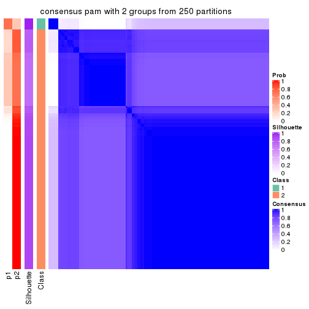</p>

</div>
<div id='tab-SD-pam-consensus-heatmap-2'>
<pre><code class="r">consensus_heatmap(res, k = 3)
</code></pre>

<p>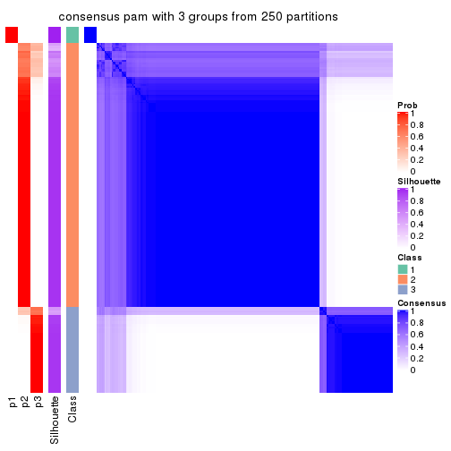</p>

</div>
<div id='tab-SD-pam-consensus-heatmap-3'>
<pre><code class="r">consensus_heatmap(res, k = 4)
</code></pre>

<p>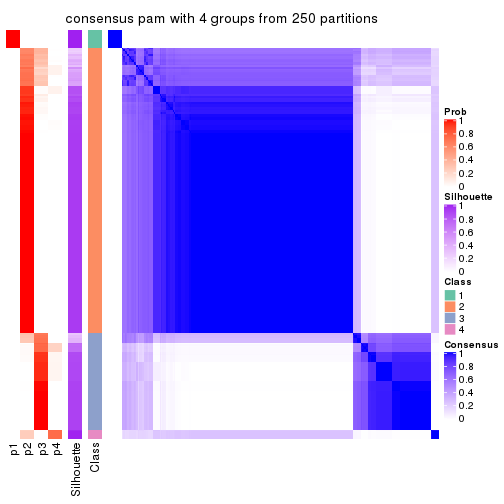</p>

</div>
<div id='tab-SD-pam-consensus-heatmap-4'>
<pre><code class="r">consensus_heatmap(res, k = 5)
</code></pre>

<p>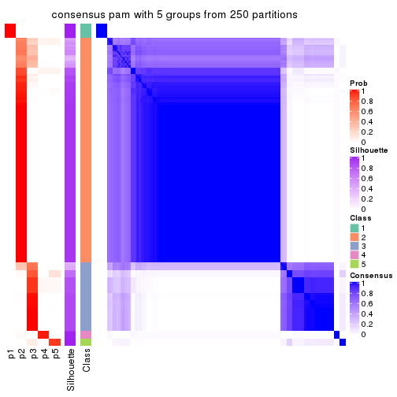</p>

</div>
<div id='tab-SD-pam-consensus-heatmap-5'>
<pre><code class="r">consensus_heatmap(res, k = 6)
</code></pre>

<p>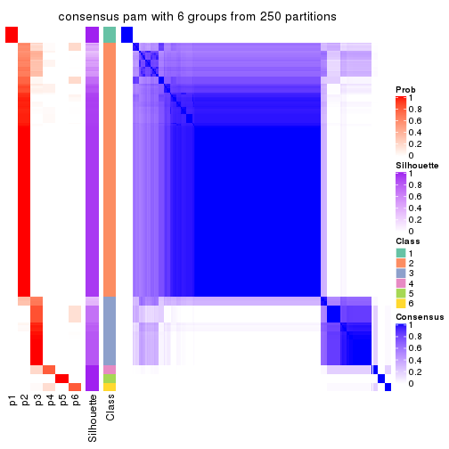</p>

</div>
</div>

Heatmaps for the membership of samples in all partitions to see how consistent they are:


<script>
$( function() {
	$( '#tabs-SD-pam-membership-heatmap' ).tabs();
} );
</script>
<div id='tabs-SD-pam-membership-heatmap'>
<ul>
<li><a href='#tab-SD-pam-membership-heatmap-1'>k = 2</a></li>
<li><a href='#tab-SD-pam-membership-heatmap-2'>k = 3</a></li>
<li><a href='#tab-SD-pam-membership-heatmap-3'>k = 4</a></li>
<li><a href='#tab-SD-pam-membership-heatmap-4'>k = 5</a></li>
<li><a href='#tab-SD-pam-membership-heatmap-5'>k = 6</a></li>
</ul>
<div id='tab-SD-pam-membership-heatmap-1'>
<pre><code class="r">membership_heatmap(res, k = 2)
</code></pre>

<p>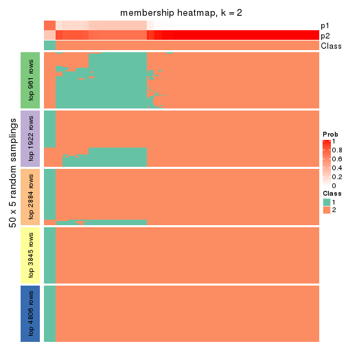</p>

</div>
<div id='tab-SD-pam-membership-heatmap-2'>
<pre><code class="r">membership_heatmap(res, k = 3)
</code></pre>

<p>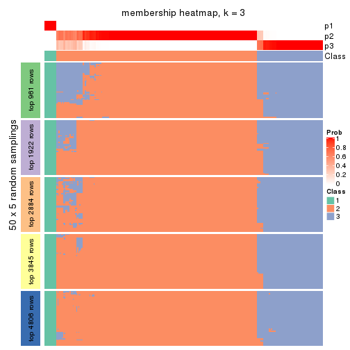</p>

</div>
<div id='tab-SD-pam-membership-heatmap-3'>
<pre><code class="r">membership_heatmap(res, k = 4)
</code></pre>

<p>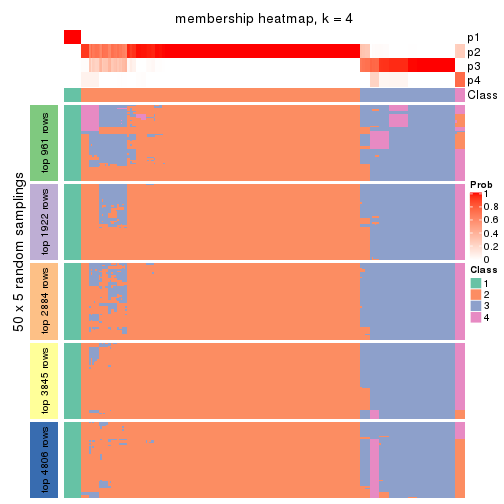</p>

</div>
<div id='tab-SD-pam-membership-heatmap-4'>
<pre><code class="r">membership_heatmap(res, k = 5)
</code></pre>

<p>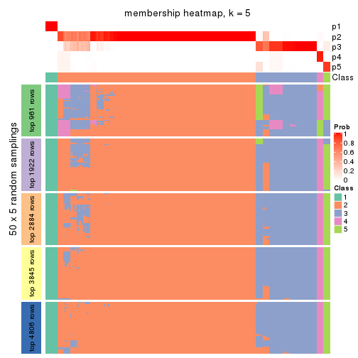</p>

</div>
<div id='tab-SD-pam-membership-heatmap-5'>
<pre><code class="r">membership_heatmap(res, k = 6)
</code></pre>

<p>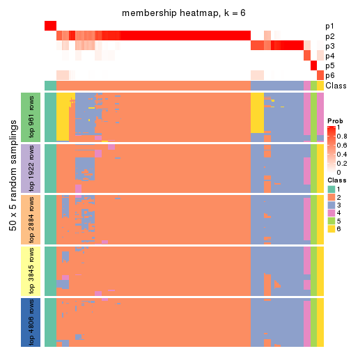</p>

</div>
</div>

As soon as we have had the classes for columns, we can look for signatures
which are significantly different between classes which can be candidate marks
for certain classes. Following are the heatmaps for signatures.


Signature heatmaps where rows are scaled:


<script>
$( function() {
	$( '#tabs-SD-pam-get-signatures' ).tabs();
} );
</script>
<div id='tabs-SD-pam-get-signatures'>
<ul>
<li><a href='#tab-SD-pam-get-signatures-1'>k = 2</a></li>
<li><a href='#tab-SD-pam-get-signatures-2'>k = 3</a></li>
<li><a href='#tab-SD-pam-get-signatures-3'>k = 4</a></li>
<li><a href='#tab-SD-pam-get-signatures-4'>k = 5</a></li>
<li><a href='#tab-SD-pam-get-signatures-5'>k = 6</a></li>
</ul>
<div id='tab-SD-pam-get-signatures-1'>
<pre><code class="r">get_signatures(res, k = 2)
</code></pre>

<p>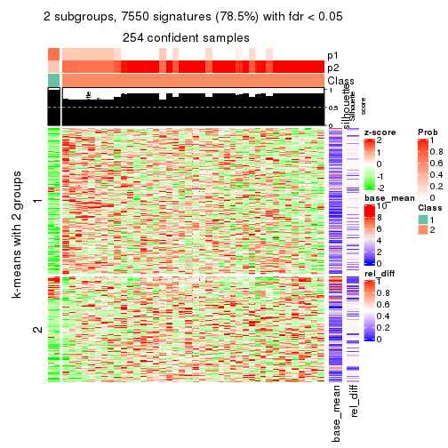</p>

</div>
<div id='tab-SD-pam-get-signatures-2'>
<pre><code class="r">get_signatures(res, k = 3)
</code></pre>

<p>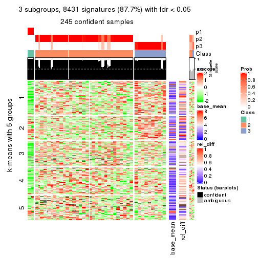</p>

</div>
<div id='tab-SD-pam-get-signatures-3'>
<pre><code class="r">get_signatures(res, k = 4)
</code></pre>

<p>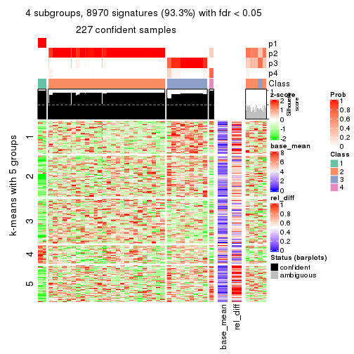</p>

</div>
<div id='tab-SD-pam-get-signatures-4'>
<pre><code class="r">get_signatures(res, k = 5)
</code></pre>

<p></p>

</div>
<div id='tab-SD-pam-get-signatures-5'>
<pre><code class="r">get_signatures(res, k = 6)
</code></pre>

<p>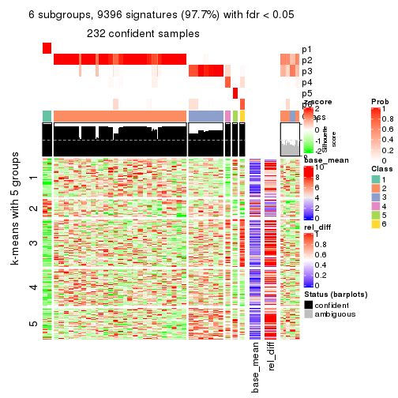</p>

</div>
</div>


Signature heatmaps where rows are not scaled:


<script>
$( function() {
	$( '#tabs-SD-pam-get-signatures-no-scale' ).tabs();
} );
</script>
<div id='tabs-SD-pam-get-signatures-no-scale'>
<ul>
<li><a href='#tab-SD-pam-get-signatures-no-scale-1'>k = 2</a></li>
<li><a href='#tab-SD-pam-get-signatures-no-scale-2'>k = 3</a></li>
<li><a href='#tab-SD-pam-get-signatures-no-scale-3'>k = 4</a></li>
<li><a href='#tab-SD-pam-get-signatures-no-scale-4'>k = 5</a></li>
<li><a href='#tab-SD-pam-get-signatures-no-scale-5'>k = 6</a></li>
</ul>
<div id='tab-SD-pam-get-signatures-no-scale-1'>
<pre><code class="r">get_signatures(res, k = 2, scale_rows = FALSE)
</code></pre>

<p>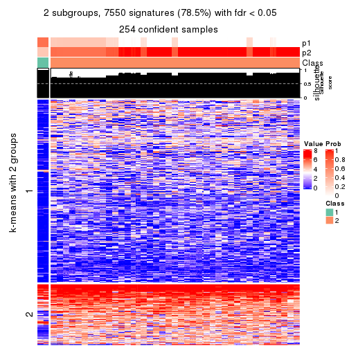</p>

</div>
<div id='tab-SD-pam-get-signatures-no-scale-2'>
<pre><code class="r">get_signatures(res, k = 3, scale_rows = FALSE)
</code></pre>

<p>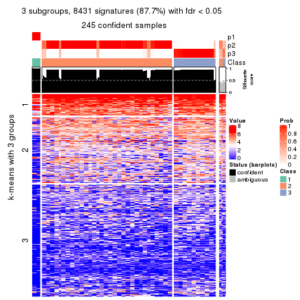</p>

</div>
<div id='tab-SD-pam-get-signatures-no-scale-3'>
<pre><code class="r">get_signatures(res, k = 4, scale_rows = FALSE)
</code></pre>

<p>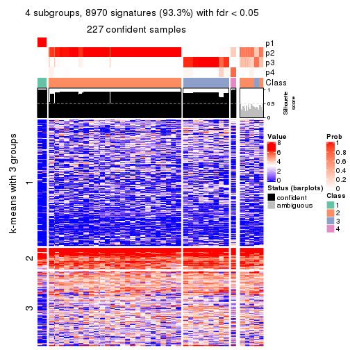</p>

</div>
<div id='tab-SD-pam-get-signatures-no-scale-4'>
<pre><code class="r">get_signatures(res, k = 5, scale_rows = FALSE)
</code></pre>

<p>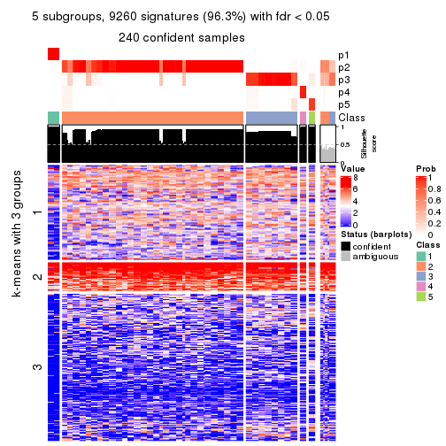</p>

</div>
<div id='tab-SD-pam-get-signatures-no-scale-5'>
<pre><code class="r">get_signatures(res, k = 6, scale_rows = FALSE)
</code></pre>

<p>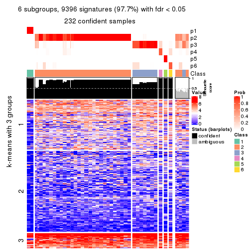</p>

</div>
</div>


Compare the overlap of signatures from different k:

```r
compare_signatures(res)
```

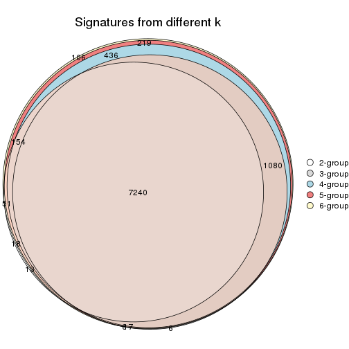

`get_signature()` returns a data frame invisibly. TO get the list of signatures, the function
call should be assigned to a variable explicitly. In following code, if `plot` argument is set
to `FALSE`, no heatmap is plotted while only the differential analysis is performed.

```r
# code only for demonstration
tb = get_signature(res, k = ..., plot = FALSE)
```

An example of the output of `tb` is:

```
#>   which_row         fdr    mean_1    mean_2 scaled_mean_1 scaled_mean_2 km
#> 1        38 0.042760348  8.373488  9.131774    -0.5533452     0.5164555  1
#> 2        40 0.018707592  7.106213  8.469186    -0.6173731     0.5762149  1
#> 3        55 0.019134737 10.221463 11.207825    -0.6159697     0.5749050  1
#> 4        59 0.006059896  5.921854  7.869574    -0.6899429     0.6439467  1
#> 5        60 0.018055526  8.928898 10.211722    -0.6204761     0.5791110  1
#> 6        98 0.009384629 15.714769 14.887706     0.6635654    -0.6193277  2
...
```

The columns in `tb` are:

1. `which_row`: row indices corresponding to the input matrix.
2. `fdr`: FDR for the differential test. 
3. `mean_x`: The mean value in group x.
4. `scaled_mean_x`: The mean value in group x after rows are scaled.
5. `km`: Row groups if k-means clustering is applied to rows.


UMAP plot which shows how samples are separated.


<script>
$( function() {
	$( '#tabs-SD-pam-dimension-reduction' ).tabs();
} );
</script>
<div id='tabs-SD-pam-dimension-reduction'>
<ul>
<li><a href='#tab-SD-pam-dimension-reduction-1'>k = 2</a></li>
<li><a href='#tab-SD-pam-dimension-reduction-2'>k = 3</a></li>
<li><a href='#tab-SD-pam-dimension-reduction-3'>k = 4</a></li>
<li><a href='#tab-SD-pam-dimension-reduction-4'>k = 5</a></li>
<li><a href='#tab-SD-pam-dimension-reduction-5'>k = 6</a></li>
</ul>
<div id='tab-SD-pam-dimension-reduction-1'>
<pre><code class="r">dimension_reduction(res, k = 2, method = &quot;UMAP&quot;)
</code></pre>

<p>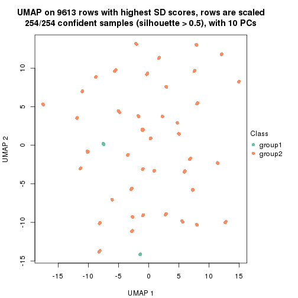</p>

</div>
<div id='tab-SD-pam-dimension-reduction-2'>
<pre><code class="r">dimension_reduction(res, k = 3, method = &quot;UMAP&quot;)
</code></pre>

<p>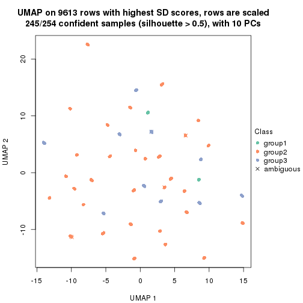</p>

</div>
<div id='tab-SD-pam-dimension-reduction-3'>
<pre><code class="r">dimension_reduction(res, k = 4, method = &quot;UMAP&quot;)
</code></pre>

<p>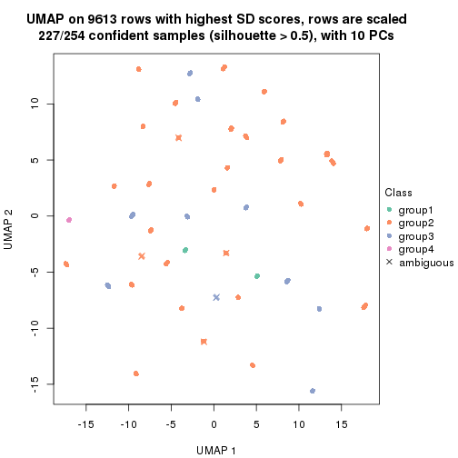</p>

</div>
<div id='tab-SD-pam-dimension-reduction-4'>
<pre><code class="r">dimension_reduction(res, k = 5, method = &quot;UMAP&quot;)
</code></pre>

<p>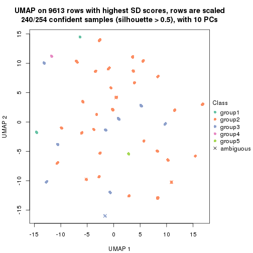</p>

</div>
<div id='tab-SD-pam-dimension-reduction-5'>
<pre><code class="r">dimension_reduction(res, k = 6, method = &quot;UMAP&quot;)
</code></pre>

<p>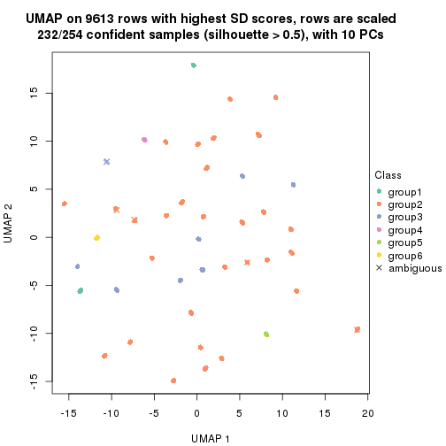</p>

</div>
</div>


Following heatmap shows how subgroups are split when increasing `k`:

```r
collect_classes(res)
```

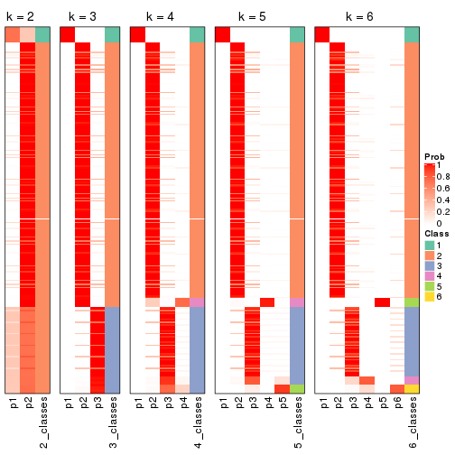


If matrix rows can be associated to genes, consider to use `GO_Enrichment(res,
...)` to perform function enrichment for the signature genes.


 

---------------------------------------------------


### SD:mclust


The object with results only for a single top-value method and a single partition method 
can be extracted as:

```r
res = res_list["SD", "mclust"]
# you can also extract it by
# res = res_list["SD:mclust"]
```

A summary of `res` and all the functions that can be applied to it:

```r
res
```

```
#> A 'ConsensusPartition' object with k = 2, 3, 4, 5, 6.
#>   On a matrix with 9613 rows and 254 columns.
#>   Top rows (961, 1922, 2884, 3845, 4806) are extracted by 'SD' method.
#>   Subgroups are detected by 'mclust' method.
#>   Performed in total 1250 partitions by row resampling.
#>   Best k for subgroups seems to be 3.
#> 
#> Following methods can be applied to this 'ConsensusPartition' object:
#>  [1] "cola_report"             "collect_classes"         "collect_plots"          
#>  [4] "collect_stats"           "colnames"                "compare_signatures"     
#>  [7] "consensus_heatmap"       "dimension_reduction"     "functional_enrichment"  
#> [10] "get_anno_col"            "get_anno"                "get_classes"            
#> [13] "get_consensus"           "get_matrix"              "get_membership"         
#> [16] "get_param"               "get_signatures"          "get_stats"              
#> [19] "is_best_k"               "is_stable_k"             "membership_heatmap"     
#> [22] "ncol"                    "nrow"                    "plot_ecdf"              
#> [25] "rownames"                "select_partition_number" "show"                   
#> [28] "suggest_best_k"          "test_to_known_factors"
```

`collect_plots()` function collects all the plots made from `res` for all `k` (number of partitions)
into one single page to provide an easy and fast comparison between different `k`.

```r
collect_plots(res)
```

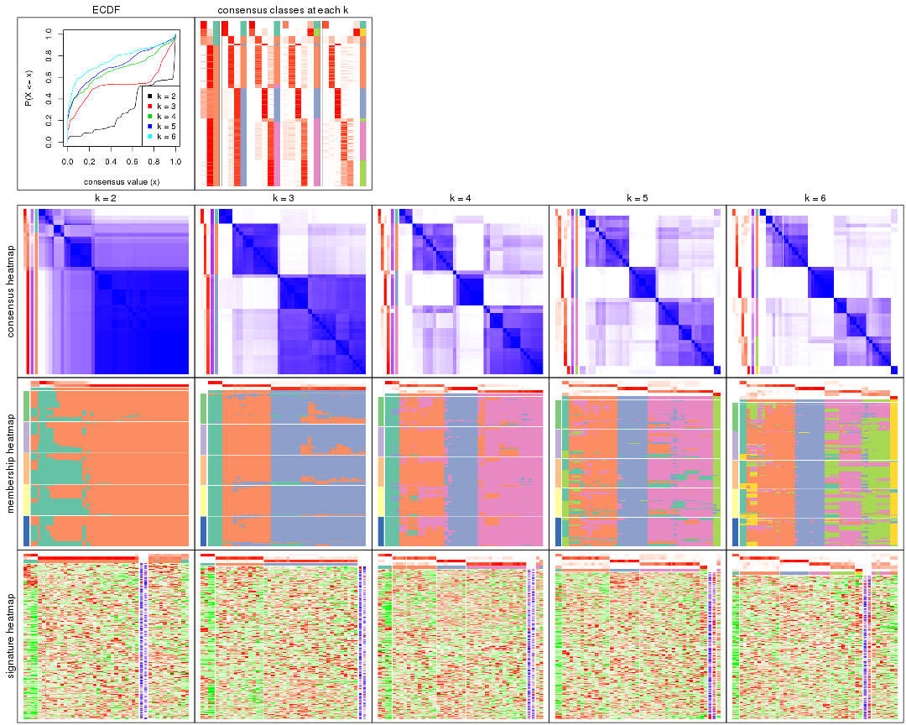

The plots are:

- The first row: a plot of the ECDF (Empirical cumulative distribution
  function) curves of the consensus matrix for each `k` and the heatmap of
  predicted classes for each `k`.
- The second row: heatmaps of the consensus matrix for each `k`.
- The third row: heatmaps of the membership matrix for each `k`.
- The fouth row: heatmaps of the signatures for each `k`.

All the plots in panels can be made by individual functions and they are
plotted later in this section.

`select_partition_number()` produces several plots showing different
statistics for choosing "optimized" `k`. There are following statistics:

- ECDF curves of the consensus matrix for each `k`;
- 1-PAC. [The PAC
  score](https://en.wikipedia.org/wiki/Consensus_clustering#Over-interpretation_potential_of_consensus_clustering)
  measures the proportion of the ambiguous subgrouping.
- Mean silhouette score.
- Concordance. The mean probability of fiting the consensus class ids in all
  partitions.
- Area increased. Denote $A_k$ as the area under the ECDF curve for current
  `k`, the area increased is defined as $A_k - A_{k-1}$.
- Rand index. The percent of pairs of samples that are both in a same cluster
  or both are not in a same cluster in the partition of k and k-1.
- Jaccard index. The ratio of pairs of samples are both in a same cluster in
  the partition of k and k-1 and the pairs of samples are both in a same
  cluster in the partition k or k-1.

The detailed explanations of these statistics can be found in [the cola
vignette](http://bioconductor.org/packages/devel/bioc/vignettes/cola/inst/doc/cola.html#toc_13).

Generally speaking, lower PAC score, higher mean silhouette score or higher
concordance corresponds to better partition. Rand index and Jaccard index
measure how similar the current partition is compared to partition with `k-1`.
If they are too similar, we won't accept `k` is better than `k-1`.

```r
select_partition_number(res)
```

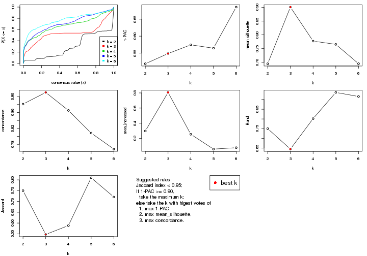

The numeric values for all these statistics can be obtained by `get_stats()`.

```r
get_stats(res)
```

```
#>   k 1-PAC mean_silhouette concordance area_increased  Rand Jaccard
#> 2 2 0.519           0.695       0.881         0.2979 0.750   0.750
#> 3 3 0.549           0.901       0.910         0.8066 0.645   0.547
#> 4 4 0.574           0.777       0.865         0.2543 0.802   0.588
#> 5 5 0.564           0.765       0.808         0.0587 0.937   0.810
#> 6 6 0.686           0.695       0.768         0.0773 0.916   0.721
```

`suggest_best_k()` suggests the best $k$ based on these statistics. The rules are as follows:

- All $k$ with Jaccard index larger than 0.95 are removed because the increase of
  the partition number does not provides enough extra information. If all $k$ are removed,
  the best $k$ is assigned by `NA`.
- For $k$ with 1-PAC larger than 0.9, the maximal $k$ is taken as the "best k". Other $k$ is called "optional k".
- If it does not fit the second rule. The $k$ with the highest vote of highest
  1-PAC, mean silhouette and concordance is taken as the "best k".

```r
suggest_best_k(res)
```

```
#> [1] 3
```


Following shows the table of the partitions (You need to click the **show/hide
code output** link to see it). The membership matrix (columns with name `p*`)
is inferred by
[`clue::cl_consensus()`](https://www.rdocumentation.org/link/cl_consensus?package=clue)
function with the `SE` method. Basically the value in the membership matrix
represents the probability to belong to a certain group. The finall class
label for an item is determined with the group with highest probability it
belongs to.

In `get_classes()` function, the entropy is calculated from the membership
matrix and the silhouette score is calculated from the consensus matrix.


<script>
$( function() {
	$( '#tabs-SD-mclust-get-classes' ).tabs();
} );
</script>
<div id='tabs-SD-mclust-get-classes'>
<ul>
<li><a href='#tab-SD-mclust-get-classes-1'>k = 2</a></li>
<li><a href='#tab-SD-mclust-get-classes-2'>k = 3</a></li>
<li><a href='#tab-SD-mclust-get-classes-3'>k = 4</a></li>
<li><a href='#tab-SD-mclust-get-classes-4'>k = 5</a></li>
<li><a href='#tab-SD-mclust-get-classes-5'>k = 6</a></li>
</ul>

<div id='tab-SD-mclust-get-classes-1'>
<p><a id='tab-SD-mclust-get-classes-1-a' style='color:#0366d6' href='#'>show/hide code output</a></p>
<pre><code class="r">cbind(get_classes(res, k = 2), get_membership(res, k = 2))
</code></pre>

<pre><code>#&gt;           class entropy silhouette    p1    p2
#&gt; DRR024803     1  0.0000     0.7147 1.000 0.000
#&gt; DRR024804     2  0.0000     0.8565 0.000 1.000
#&gt; DRR024805     2  0.0376     0.8555 0.004 0.996
#&gt; DRR024806     2  0.0938     0.8509 0.012 0.988
#&gt; DRR024807     1  0.7950     0.6569 0.760 0.240
#&gt; DRR024808     2  0.9491     0.3498 0.368 0.632
#&gt; DRR024809     2  0.0938     0.8509 0.012 0.988
#&gt; DRR024810     2  0.0000     0.8565 0.000 1.000
#&gt; DRR024811     2  0.9427     0.3682 0.360 0.640
#&gt; DRR024812     2  0.0376     0.8555 0.004 0.996
#&gt; DRR024813     2  0.0000     0.8565 0.000 1.000
#&gt; DRR024814     2  0.0938     0.8524 0.012 0.988
#&gt; DRR024815     2  0.0000     0.8565 0.000 1.000
#&gt; DRR024816     2  0.9170     0.2811 0.332 0.668
#&gt; DRR024817     2  0.0376     0.8557 0.004 0.996
#&gt; DRR024818     2  0.9393     0.3767 0.356 0.644
#&gt; DRR024819     2  0.0000     0.8565 0.000 1.000
#&gt; DRR024820     2  0.6623     0.6878 0.172 0.828
#&gt; DRR024821     2  0.9460     0.3591 0.364 0.636
#&gt; DRR024822     2  0.0672     0.8537 0.008 0.992
#&gt; DRR024824     2  0.0672     0.8543 0.008 0.992
#&gt; DRR024825     2  0.9393     0.3767 0.356 0.644
#&gt; DRR024826     2  0.0000     0.8565 0.000 1.000
#&gt; DRR024827     2  0.0672     0.8544 0.008 0.992
#&gt; DRR024828     1  0.5737     0.7206 0.864 0.136
#&gt; DRR024829     2  0.0938     0.8524 0.012 0.988
#&gt; DRR024830     2  0.1184     0.8468 0.016 0.984
#&gt; DRR024831     2  1.0000    -0.1103 0.500 0.500
#&gt; DRR024832     2  0.9491     0.3498 0.368 0.632
#&gt; DRR024833     2  0.0000     0.8565 0.000 1.000
#&gt; DRR024834     1  0.9896     0.4449 0.560 0.440
#&gt; DRR024835     2  0.0000     0.8565 0.000 1.000
#&gt; DRR024836     2  0.9850     0.1684 0.428 0.572
#&gt; DRR024837     1  0.9896     0.4449 0.560 0.440
#&gt; DRR024838     2  0.0938     0.8524 0.012 0.988
#&gt; DRR024839     2  0.0000     0.8565 0.000 1.000
#&gt; DRR024840     2  0.0672     0.8537 0.008 0.992
#&gt; DRR024841     2  0.0000     0.8565 0.000 1.000
#&gt; DRR024842     2  0.0000     0.8565 0.000 1.000
#&gt; DRR024843     1  0.0000     0.7147 1.000 0.000
#&gt; DRR024844     2  0.0000     0.8565 0.000 1.000
#&gt; DRR024845     2  0.0376     0.8555 0.004 0.996
#&gt; DRR024846     2  0.0938     0.8509 0.012 0.988
#&gt; DRR024847     1  0.7950     0.6569 0.760 0.240
#&gt; DRR024848     1  0.0000     0.7147 1.000 0.000
#&gt; DRR024849     2  0.9491     0.3498 0.368 0.632
#&gt; DRR024850     2  0.0000     0.8565 0.000 1.000
#&gt; DRR024851     2  0.0938     0.8509 0.012 0.988
#&gt; DRR024852     2  0.0672     0.8538 0.008 0.992
#&gt; DRR024853     2  0.9427     0.3682 0.360 0.640
#&gt; DRR024854     2  0.0376     0.8555 0.004 0.996
#&gt; DRR024855     2  0.0000     0.8565 0.000 1.000
#&gt; DRR024856     2  0.0938     0.8524 0.012 0.988
#&gt; DRR024857     2  0.0000     0.8565 0.000 1.000
#&gt; DRR024858     2  0.9286     0.2407 0.344 0.656
#&gt; DRR024859     2  0.0672     0.8552 0.008 0.992
#&gt; DRR024860     2  0.9393     0.3767 0.356 0.644
#&gt; DRR024861     2  0.0000     0.8565 0.000 1.000
#&gt; DRR024862     2  0.7139     0.6543 0.196 0.804
#&gt; DRR024863     2  0.9491     0.3498 0.368 0.632
#&gt; DRR024864     2  0.0672     0.8537 0.008 0.992
#&gt; DRR024865     2  0.0938     0.8524 0.012 0.988
#&gt; DRR024866     2  0.0672     0.8543 0.008 0.992
#&gt; DRR024867     2  0.9393     0.3767 0.356 0.644
#&gt; DRR024868     2  0.0000     0.8565 0.000 1.000
#&gt; DRR024869     2  0.0672     0.8544 0.008 0.992
#&gt; DRR024870     1  0.5737     0.7206 0.864 0.136
#&gt; DRR024871     2  0.0938     0.8524 0.012 0.988
#&gt; DRR024872     2  0.1184     0.8468 0.016 0.984
#&gt; DRR024873     2  1.0000    -0.1103 0.500 0.500
#&gt; DRR024874     2  0.9491     0.3498 0.368 0.632
#&gt; DRR024875     2  0.0000     0.8565 0.000 1.000
#&gt; DRR024876     1  0.9896     0.4449 0.560 0.440
#&gt; DRR024877     2  0.0000     0.8565 0.000 1.000
#&gt; DRR024878     2  0.9881     0.1405 0.436 0.564
#&gt; DRR024879     1  0.9896     0.4449 0.560 0.440
#&gt; DRR024880     2  0.0938     0.8524 0.012 0.988
#&gt; DRR024881     2  0.0000     0.8565 0.000 1.000
#&gt; DRR024882     2  0.0938     0.8509 0.012 0.988
#&gt; DRR024883     2  0.0000     0.8565 0.000 1.000
#&gt; DRR024884     2  0.0000     0.8565 0.000 1.000
#&gt; DRR024885     2  0.0376     0.8557 0.004 0.996
#&gt; DRR024886     1  0.0000     0.7147 1.000 0.000
#&gt; DRR024887     2  0.0000     0.8565 0.000 1.000
#&gt; DRR024888     2  0.0376     0.8555 0.004 0.996
#&gt; DRR024889     2  0.0672     0.8537 0.008 0.992
#&gt; DRR024890     1  0.7950     0.6569 0.760 0.240
#&gt; DRR024891     1  0.0000     0.7147 1.000 0.000
#&gt; DRR024892     2  0.9491     0.3498 0.368 0.632
#&gt; DRR024893     2  0.0000     0.8565 0.000 1.000
#&gt; DRR024894     2  0.0938     0.8509 0.012 0.988
#&gt; DRR024895     2  0.0376     0.8557 0.004 0.996
#&gt; DRR024896     2  0.9427     0.3682 0.360 0.640
#&gt; DRR024897     2  0.0376     0.8555 0.004 0.996
#&gt; DRR024898     2  0.0000     0.8565 0.000 1.000
#&gt; DRR024899     2  0.0938     0.8524 0.012 0.988
#&gt; DRR024900     2  0.0000     0.8565 0.000 1.000
#&gt; DRR024901     2  0.9286     0.2407 0.344 0.656
#&gt; DRR024902     2  0.0938     0.8529 0.012 0.988
#&gt; DRR024903     2  0.9393     0.3767 0.356 0.644
#&gt; DRR024904     2  0.0000     0.8565 0.000 1.000
#&gt; DRR024905     2  0.6973     0.6660 0.188 0.812
#&gt; DRR024906     2  0.9491     0.3498 0.368 0.632
#&gt; DRR024907     2  0.0672     0.8537 0.008 0.992
#&gt; DRR024908     2  0.0938     0.8524 0.012 0.988
#&gt; DRR024909     2  0.0672     0.8543 0.008 0.992
#&gt; DRR024910     2  0.9393     0.3767 0.356 0.644
#&gt; DRR024911     2  0.0000     0.8565 0.000 1.000
#&gt; DRR024912     2  0.0672     0.8544 0.008 0.992
#&gt; DRR024913     1  0.5737     0.7206 0.864 0.136
#&gt; DRR024914     2  0.0938     0.8524 0.012 0.988
#&gt; DRR024915     2  0.1184     0.8468 0.016 0.984
#&gt; DRR024916     2  1.0000    -0.1103 0.500 0.500
#&gt; DRR024917     2  0.9491     0.3498 0.368 0.632
#&gt; DRR024918     2  0.0000     0.8565 0.000 1.000
#&gt; DRR024919     1  0.9896     0.4449 0.560 0.440
#&gt; DRR024920     2  0.0000     0.8565 0.000 1.000
#&gt; DRR024921     2  0.9881     0.1405 0.436 0.564
#&gt; DRR024922     1  0.9896     0.4449 0.560 0.440
#&gt; DRR024923     2  0.0938     0.8524 0.012 0.988
#&gt; DRR024924     2  0.0000     0.8565 0.000 1.000
#&gt; DRR024925     2  0.0938     0.8509 0.012 0.988
#&gt; DRR024926     2  0.0000     0.8565 0.000 1.000
#&gt; DRR024927     2  0.0000     0.8565 0.000 1.000
#&gt; DRR024928     2  0.0376     0.8557 0.004 0.996
#&gt; DRR024929     1  0.0000     0.7147 1.000 0.000
#&gt; DRR024930     2  0.0000     0.8565 0.000 1.000
#&gt; DRR024931     2  0.0376     0.8555 0.004 0.996
#&gt; DRR024932     2  0.0672     0.8537 0.008 0.992
#&gt; DRR024933     1  0.7950     0.6569 0.760 0.240
#&gt; DRR024934     1  0.0000     0.7147 1.000 0.000
#&gt; DRR024935     2  0.9491     0.3498 0.368 0.632
#&gt; DRR024936     2  0.0000     0.8565 0.000 1.000
#&gt; DRR024937     2  0.0938     0.8509 0.012 0.988
#&gt; DRR024938     2  0.0672     0.8538 0.008 0.992
#&gt; DRR024939     2  0.9427     0.3682 0.360 0.640
#&gt; DRR024940     2  0.0376     0.8555 0.004 0.996
#&gt; DRR024941     2  0.0000     0.8565 0.000 1.000
#&gt; DRR024942     2  0.0938     0.8524 0.012 0.988
#&gt; DRR024943     2  0.0000     0.8565 0.000 1.000
#&gt; DRR024944     2  0.9286     0.2407 0.344 0.656
#&gt; DRR024945     2  0.0672     0.8535 0.008 0.992
#&gt; DRR024946     2  0.9393     0.3767 0.356 0.644
#&gt; DRR024947     2  0.0000     0.8565 0.000 1.000
#&gt; DRR024948     2  0.7056     0.6602 0.192 0.808
#&gt; DRR024949     2  0.9491     0.3498 0.368 0.632
#&gt; DRR024950     2  0.0672     0.8537 0.008 0.992
#&gt; DRR024951     2  0.0938     0.8524 0.012 0.988
#&gt; DRR024952     2  0.0672     0.8543 0.008 0.992
#&gt; DRR024953     2  0.9393     0.3767 0.356 0.644
#&gt; DRR024954     2  0.0000     0.8565 0.000 1.000
#&gt; DRR024955     2  0.0672     0.8544 0.008 0.992
#&gt; DRR024956     1  0.5737     0.7206 0.864 0.136
#&gt; DRR024957     2  0.0938     0.8524 0.012 0.988
#&gt; DRR024958     2  0.1184     0.8468 0.016 0.984
#&gt; DRR024959     2  1.0000    -0.1103 0.500 0.500
#&gt; DRR024960     2  0.9491     0.3498 0.368 0.632
#&gt; DRR024961     2  0.0000     0.8565 0.000 1.000
#&gt; DRR024962     1  0.9896     0.4449 0.560 0.440
#&gt; DRR024963     2  0.0000     0.8565 0.000 1.000
#&gt; DRR024964     2  0.9881     0.1404 0.436 0.564
#&gt; DRR024965     1  0.9896     0.4449 0.560 0.440
#&gt; DRR024966     2  0.0938     0.8524 0.012 0.988
#&gt; DRR024967     2  0.0000     0.8565 0.000 1.000
#&gt; DRR024968     2  0.0938     0.8509 0.012 0.988
#&gt; DRR024969     2  0.0000     0.8565 0.000 1.000
#&gt; DRR024970     2  0.0000     0.8565 0.000 1.000
#&gt; DRR024971     2  0.0376     0.8557 0.004 0.996
#&gt; DRR024972     1  0.0000     0.7147 1.000 0.000
#&gt; DRR024973     2  0.0000     0.8565 0.000 1.000
#&gt; DRR024974     2  0.0376     0.8555 0.004 0.996
#&gt; DRR024975     2  0.0672     0.8537 0.008 0.992
#&gt; DRR024976     1  0.7950     0.6569 0.760 0.240
#&gt; DRR024977     1  0.0000     0.7147 1.000 0.000
#&gt; DRR024978     2  0.9491     0.3498 0.368 0.632
#&gt; DRR024979     2  0.0000     0.8565 0.000 1.000
#&gt; DRR024980     2  0.0938     0.8509 0.012 0.988
#&gt; DRR024981     2  0.0376     0.8557 0.004 0.996
#&gt; DRR024982     2  0.9427     0.3682 0.360 0.640
#&gt; DRR024983     2  0.0376     0.8555 0.004 0.996
#&gt; DRR024984     2  0.0000     0.8565 0.000 1.000
#&gt; DRR024985     2  0.0938     0.8524 0.012 0.988
#&gt; DRR024986     2  0.0000     0.8565 0.000 1.000
#&gt; DRR024987     2  0.9209     0.2677 0.336 0.664
#&gt; DRR024988     2  0.0376     0.8557 0.004 0.996
#&gt; DRR024989     2  0.9393     0.3767 0.356 0.644
#&gt; DRR024990     2  0.0000     0.8565 0.000 1.000
#&gt; DRR024991     2  0.7056     0.6602 0.192 0.808
#&gt; DRR024992     2  0.9491     0.3498 0.368 0.632
#&gt; DRR024993     2  0.0672     0.8537 0.008 0.992
#&gt; DRR024994     2  0.0938     0.8524 0.012 0.988
#&gt; DRR024995     2  0.0672     0.8543 0.008 0.992
#&gt; DRR024996     2  0.9393     0.3767 0.356 0.644
#&gt; DRR024997     2  0.0000     0.8565 0.000 1.000
#&gt; DRR024998     2  0.0672     0.8544 0.008 0.992
#&gt; DRR024999     1  0.5737     0.7206 0.864 0.136
#&gt; DRR025000     2  0.0938     0.8524 0.012 0.988
#&gt; DRR025001     2  0.1184     0.8468 0.016 0.984
#&gt; DRR025002     1  1.0000     0.0813 0.500 0.500
#&gt; DRR025003     2  0.9491     0.3498 0.368 0.632
#&gt; DRR025004     2  0.0000     0.8565 0.000 1.000
#&gt; DRR025005     1  0.9896     0.4449 0.560 0.440
#&gt; DRR025006     2  0.0000     0.8565 0.000 1.000
#&gt; DRR025007     2  0.9881     0.1405 0.436 0.564
#&gt; DRR025008     1  0.9896     0.4449 0.560 0.440
#&gt; DRR025009     2  0.0938     0.8524 0.012 0.988
#&gt; DRR025010     2  0.0000     0.8565 0.000 1.000
#&gt; DRR025011     2  0.0938     0.8509 0.012 0.988
#&gt; DRR025012     2  0.0000     0.8565 0.000 1.000
#&gt; DRR025013     2  0.0000     0.8565 0.000 1.000
#&gt; DRR025014     2  0.0376     0.8557 0.004 0.996
#&gt; DRR025015     1  0.0000     0.7147 1.000 0.000
#&gt; DRR025016     2  0.0000     0.8565 0.000 1.000
#&gt; DRR025017     2  0.0376     0.8555 0.004 0.996
#&gt; DRR025018     2  0.0672     0.8537 0.008 0.992
#&gt; DRR025019     1  0.7950     0.6569 0.760 0.240
#&gt; DRR025020     1  0.0000     0.7147 1.000 0.000
#&gt; DRR025021     2  0.9491     0.3498 0.368 0.632
#&gt; DRR025022     2  0.0000     0.8565 0.000 1.000
#&gt; DRR025023     2  0.0938     0.8509 0.012 0.988
#&gt; DRR025024     2  0.0376     0.8557 0.004 0.996
#&gt; DRR025025     2  0.9427     0.3682 0.360 0.640
#&gt; DRR025026     2  0.0376     0.8555 0.004 0.996
#&gt; DRR025027     2  0.0000     0.8565 0.000 1.000
#&gt; DRR025028     2  0.0938     0.8524 0.012 0.988
#&gt; DRR025029     2  0.0000     0.8565 0.000 1.000
#&gt; DRR025030     2  0.9248     0.2539 0.340 0.660
#&gt; DRR025031     2  0.0376     0.8557 0.004 0.996
#&gt; DRR025032     2  0.9393     0.3767 0.356 0.644
#&gt; DRR025033     2  0.0000     0.8565 0.000 1.000
#&gt; DRR025034     2  0.6973     0.6660 0.188 0.812
#&gt; DRR025035     2  0.9491     0.3498 0.368 0.632
#&gt; DRR025036     2  0.0672     0.8537 0.008 0.992
#&gt; DRR025037     2  0.0938     0.8524 0.012 0.988
#&gt; DRR025038     2  0.0672     0.8543 0.008 0.992
#&gt; DRR025039     2  0.9393     0.3767 0.356 0.644
#&gt; DRR025040     2  0.0000     0.8565 0.000 1.000
#&gt; DRR025041     2  0.0672     0.8544 0.008 0.992
#&gt; DRR025042     1  0.5737     0.7206 0.864 0.136
#&gt; DRR025043     2  0.0938     0.8524 0.012 0.988
#&gt; DRR025044     2  0.1184     0.8468 0.016 0.984
#&gt; DRR025045     1  1.0000     0.0813 0.500 0.500
#&gt; DRR025046     2  0.9491     0.3498 0.368 0.632
#&gt; DRR025047     2  0.0000     0.8565 0.000 1.000
#&gt; DRR025048     1  0.9896     0.4449 0.560 0.440
#&gt; DRR025049     2  0.0000     0.8565 0.000 1.000
#&gt; DRR025050     2  0.9850     0.1684 0.428 0.572
#&gt; DRR025051     1  0.9896     0.4449 0.560 0.440
#&gt; DRR025052     2  0.0938     0.8524 0.012 0.988
#&gt; DRR025053     2  0.0000     0.8565 0.000 1.000
#&gt; DRR025054     2  0.0938     0.8509 0.012 0.988
#&gt; DRR025055     2  0.0000     0.8565 0.000 1.000
#&gt; DRR025056     2  0.0000     0.8565 0.000 1.000
#&gt; DRR025057     2  0.0376     0.8557 0.004 0.996
</code></pre>

<script>
$('#tab-SD-mclust-get-classes-1-a').parent().next().next().hide();
$('#tab-SD-mclust-get-classes-1-a').click(function(){
  $('#tab-SD-mclust-get-classes-1-a').parent().next().next().toggle();
  return(false);
});
</script>
</div>

<div id='tab-SD-mclust-get-classes-2'>
<p><a id='tab-SD-mclust-get-classes-2-a' style='color:#0366d6' href='#'>show/hide code output</a></p>
<pre><code class="r">cbind(get_classes(res, k = 3), get_membership(res, k = 3))
</code></pre>

<pre><code>#&gt;           class entropy silhouette    p1    p2    p3
#&gt; DRR024803     1  0.0424      0.992 0.992 0.008 0.000
#&gt; DRR024804     3  0.3879      0.878 0.000 0.152 0.848
#&gt; DRR024805     2  0.2356      0.941 0.000 0.928 0.072
#&gt; DRR024806     2  0.1753      0.943 0.000 0.952 0.048
#&gt; DRR024807     1  0.0829      0.993 0.984 0.004 0.012
#&gt; DRR024808     3  0.2261      0.866 0.068 0.000 0.932
#&gt; DRR024809     2  0.2625      0.936 0.000 0.916 0.084
#&gt; DRR024810     2  0.2878      0.919 0.000 0.904 0.096
#&gt; DRR024811     3  0.1989      0.874 0.048 0.004 0.948
#&gt; DRR024812     2  0.1860      0.945 0.000 0.948 0.052
#&gt; DRR024813     3  0.2537      0.906 0.000 0.080 0.920
#&gt; DRR024814     3  0.3267      0.897 0.000 0.116 0.884
#&gt; DRR024815     3  0.3340      0.895 0.000 0.120 0.880
#&gt; DRR024816     2  0.0592      0.918 0.012 0.988 0.000
#&gt; DRR024817     3  0.4062      0.870 0.000 0.164 0.836
#&gt; DRR024818     3  0.2356      0.862 0.072 0.000 0.928
#&gt; DRR024819     3  0.2356      0.905 0.000 0.072 0.928
#&gt; DRR024820     3  0.5777      0.867 0.052 0.160 0.788
#&gt; DRR024821     3  0.2066      0.867 0.060 0.000 0.940
#&gt; DRR024822     2  0.2165      0.945 0.000 0.936 0.064
#&gt; DRR024824     2  0.1860      0.945 0.000 0.948 0.052
#&gt; DRR024825     3  0.2165      0.869 0.064 0.000 0.936
#&gt; DRR024826     3  0.2796      0.905 0.000 0.092 0.908
#&gt; DRR024827     3  0.5053      0.866 0.024 0.164 0.812
#&gt; DRR024828     1  0.0829      0.993 0.984 0.004 0.012
#&gt; DRR024829     3  0.2796      0.900 0.000 0.092 0.908
#&gt; DRR024830     2  0.1289      0.937 0.000 0.968 0.032
#&gt; DRR024831     3  0.2165      0.865 0.064 0.000 0.936
#&gt; DRR024832     3  0.1964      0.869 0.056 0.000 0.944
#&gt; DRR024833     3  0.3192      0.899 0.000 0.112 0.888
#&gt; DRR024834     2  0.1636      0.916 0.020 0.964 0.016
#&gt; DRR024835     3  0.3752      0.884 0.000 0.144 0.856
#&gt; DRR024836     3  0.2165      0.865 0.064 0.000 0.936
#&gt; DRR024837     2  0.1636      0.916 0.020 0.964 0.016
#&gt; DRR024838     3  0.2959      0.900 0.000 0.100 0.900
#&gt; DRR024839     3  0.4702      0.818 0.000 0.212 0.788
#&gt; DRR024840     2  0.3551      0.890 0.000 0.868 0.132
#&gt; DRR024841     2  0.3816      0.880 0.000 0.852 0.148
#&gt; DRR024842     3  0.4399      0.838 0.000 0.188 0.812
#&gt; DRR024843     1  0.0424      0.992 0.992 0.008 0.000
#&gt; DRR024844     3  0.3816      0.882 0.000 0.148 0.852
#&gt; DRR024845     2  0.2356      0.941 0.000 0.928 0.072
#&gt; DRR024846     2  0.1753      0.943 0.000 0.952 0.048
#&gt; DRR024847     1  0.0829      0.993 0.984 0.004 0.012
#&gt; DRR024848     1  0.0424      0.992 0.992 0.008 0.000
#&gt; DRR024849     3  0.2261      0.866 0.068 0.000 0.932
#&gt; DRR024850     3  0.5465      0.711 0.000 0.288 0.712
#&gt; DRR024851     2  0.2625      0.936 0.000 0.916 0.084
#&gt; DRR024852     2  0.2796      0.918 0.000 0.908 0.092
#&gt; DRR024853     3  0.1989      0.874 0.048 0.004 0.948
#&gt; DRR024854     2  0.2165      0.946 0.000 0.936 0.064
#&gt; DRR024855     3  0.2537      0.906 0.000 0.080 0.920
#&gt; DRR024856     3  0.3267      0.897 0.000 0.116 0.884
#&gt; DRR024857     3  0.3412      0.893 0.000 0.124 0.876
#&gt; DRR024858     2  0.0592      0.918 0.012 0.988 0.000
#&gt; DRR024859     3  0.4062      0.870 0.000 0.164 0.836
#&gt; DRR024860     3  0.2356      0.862 0.072 0.000 0.928
#&gt; DRR024861     3  0.2356      0.905 0.000 0.072 0.928
#&gt; DRR024862     3  0.5777      0.867 0.052 0.160 0.788
#&gt; DRR024863     3  0.2066      0.867 0.060 0.000 0.940
#&gt; DRR024864     2  0.2066      0.945 0.000 0.940 0.060
#&gt; DRR024865     3  0.3412      0.894 0.000 0.124 0.876
#&gt; DRR024866     2  0.1753      0.944 0.000 0.952 0.048
#&gt; DRR024867     3  0.2165      0.869 0.064 0.000 0.936
#&gt; DRR024868     3  0.2537      0.905 0.000 0.080 0.920
#&gt; DRR024869     3  0.4994      0.869 0.024 0.160 0.816
#&gt; DRR024870     1  0.0829      0.993 0.984 0.004 0.012
#&gt; DRR024871     3  0.2796      0.900 0.000 0.092 0.908
#&gt; DRR024872     2  0.1289      0.937 0.000 0.968 0.032
#&gt; DRR024873     3  0.2165      0.865 0.064 0.000 0.936
#&gt; DRR024874     3  0.1964      0.869 0.056 0.000 0.944
#&gt; DRR024875     3  0.2959      0.902 0.000 0.100 0.900
#&gt; DRR024876     2  0.1636      0.916 0.020 0.964 0.016
#&gt; DRR024877     3  0.3752      0.884 0.000 0.144 0.856
#&gt; DRR024878     3  0.2165      0.865 0.064 0.000 0.936
#&gt; DRR024879     2  0.1636      0.916 0.020 0.964 0.016
#&gt; DRR024880     3  0.2959      0.900 0.000 0.100 0.900
#&gt; DRR024881     3  0.4654      0.823 0.000 0.208 0.792
#&gt; DRR024882     2  0.3816      0.870 0.000 0.852 0.148
#&gt; DRR024883     2  0.3551      0.896 0.000 0.868 0.132
#&gt; DRR024884     3  0.2625      0.905 0.000 0.084 0.916
#&gt; DRR024885     3  0.3965      0.890 0.008 0.132 0.860
#&gt; DRR024886     1  0.0424      0.992 0.992 0.008 0.000
#&gt; DRR024887     3  0.3752      0.884 0.000 0.144 0.856
#&gt; DRR024888     2  0.2356      0.941 0.000 0.928 0.072
#&gt; DRR024889     2  0.1753      0.943 0.000 0.952 0.048
#&gt; DRR024890     1  0.0829      0.993 0.984 0.004 0.012
#&gt; DRR024891     1  0.0424      0.992 0.992 0.008 0.000
#&gt; DRR024892     3  0.2261      0.866 0.068 0.000 0.932
#&gt; DRR024893     3  0.5497      0.705 0.000 0.292 0.708
#&gt; DRR024894     2  0.2625      0.936 0.000 0.916 0.084
#&gt; DRR024895     2  0.2796      0.918 0.000 0.908 0.092
#&gt; DRR024896     3  0.1989      0.874 0.048 0.004 0.948
#&gt; DRR024897     2  0.2066      0.946 0.000 0.940 0.060
#&gt; DRR024898     3  0.2537      0.906 0.000 0.080 0.920
#&gt; DRR024899     3  0.3267      0.897 0.000 0.116 0.884
#&gt; DRR024900     3  0.3412      0.893 0.000 0.124 0.876
#&gt; DRR024901     2  0.0592      0.918 0.012 0.988 0.000
#&gt; DRR024902     3  0.4062      0.870 0.000 0.164 0.836
#&gt; DRR024903     3  0.2356      0.862 0.072 0.000 0.928
#&gt; DRR024904     3  0.2356      0.905 0.000 0.072 0.928
#&gt; DRR024905     3  0.5777      0.867 0.052 0.160 0.788
#&gt; DRR024906     3  0.2066      0.867 0.060 0.000 0.940
#&gt; DRR024907     2  0.2066      0.945 0.000 0.940 0.060
#&gt; DRR024908     3  0.3412      0.894 0.000 0.124 0.876
#&gt; DRR024909     2  0.1753      0.944 0.000 0.952 0.048
#&gt; DRR024910     3  0.2165      0.869 0.064 0.000 0.936
#&gt; DRR024911     3  0.2537      0.905 0.000 0.080 0.920
#&gt; DRR024912     3  0.4994      0.869 0.024 0.160 0.816
#&gt; DRR024913     1  0.0829      0.993 0.984 0.004 0.012
#&gt; DRR024914     3  0.2796      0.900 0.000 0.092 0.908
#&gt; DRR024915     2  0.1289      0.937 0.000 0.968 0.032
#&gt; DRR024916     3  0.2165      0.865 0.064 0.000 0.936
#&gt; DRR024917     3  0.1964      0.869 0.056 0.000 0.944
#&gt; DRR024918     3  0.3038      0.901 0.000 0.104 0.896
#&gt; DRR024919     2  0.1636      0.916 0.020 0.964 0.016
#&gt; DRR024920     3  0.3752      0.884 0.000 0.144 0.856
#&gt; DRR024921     3  0.2165      0.865 0.064 0.000 0.936
#&gt; DRR024922     2  0.1636      0.916 0.020 0.964 0.016
#&gt; DRR024923     3  0.2959      0.900 0.000 0.100 0.900
#&gt; DRR024924     3  0.4555      0.833 0.000 0.200 0.800
#&gt; DRR024925     2  0.3816      0.870 0.000 0.852 0.148
#&gt; DRR024926     2  0.3482      0.901 0.000 0.872 0.128
#&gt; DRR024927     3  0.2625      0.905 0.000 0.084 0.916
#&gt; DRR024928     3  0.3965      0.890 0.008 0.132 0.860
#&gt; DRR024929     1  0.0424      0.992 0.992 0.008 0.000
#&gt; DRR024930     3  0.3752      0.884 0.000 0.144 0.856
#&gt; DRR024931     2  0.2356      0.941 0.000 0.928 0.072
#&gt; DRR024932     2  0.1753      0.943 0.000 0.952 0.048
#&gt; DRR024933     1  0.0829      0.993 0.984 0.004 0.012
#&gt; DRR024934     1  0.0424      0.992 0.992 0.008 0.000
#&gt; DRR024935     3  0.2261      0.866 0.068 0.000 0.932
#&gt; DRR024936     3  0.5591      0.685 0.000 0.304 0.696
#&gt; DRR024937     2  0.2625      0.936 0.000 0.916 0.084
#&gt; DRR024938     2  0.2796      0.918 0.000 0.908 0.092
#&gt; DRR024939     3  0.1989      0.874 0.048 0.004 0.948
#&gt; DRR024940     2  0.2165      0.945 0.000 0.936 0.064
#&gt; DRR024941     3  0.2448      0.906 0.000 0.076 0.924
#&gt; DRR024942     3  0.3267      0.897 0.000 0.116 0.884
#&gt; DRR024943     3  0.3482      0.891 0.000 0.128 0.872
#&gt; DRR024944     2  0.0592      0.918 0.012 0.988 0.000
#&gt; DRR024945     3  0.4062      0.870 0.000 0.164 0.836
#&gt; DRR024946     3  0.2356      0.862 0.072 0.000 0.928
#&gt; DRR024947     3  0.2448      0.905 0.000 0.076 0.924
#&gt; DRR024948     3  0.5777      0.867 0.052 0.160 0.788
#&gt; DRR024949     3  0.2066      0.867 0.060 0.000 0.940
#&gt; DRR024950     2  0.2066      0.945 0.000 0.940 0.060
#&gt; DRR024951     3  0.3412      0.894 0.000 0.124 0.876
#&gt; DRR024952     2  0.1643      0.943 0.000 0.956 0.044
#&gt; DRR024953     3  0.2165      0.869 0.064 0.000 0.936
#&gt; DRR024954     3  0.2537      0.905 0.000 0.080 0.920
#&gt; DRR024955     3  0.4994      0.869 0.024 0.160 0.816
#&gt; DRR024956     1  0.0829      0.993 0.984 0.004 0.012
#&gt; DRR024957     3  0.2796      0.900 0.000 0.092 0.908
#&gt; DRR024958     2  0.1289      0.937 0.000 0.968 0.032
#&gt; DRR024959     3  0.2165      0.865 0.064 0.000 0.936
#&gt; DRR024960     3  0.1964      0.869 0.056 0.000 0.944
#&gt; DRR024961     3  0.3116      0.900 0.000 0.108 0.892
#&gt; DRR024962     2  0.1636      0.916 0.020 0.964 0.016
#&gt; DRR024963     3  0.3752      0.884 0.000 0.144 0.856
#&gt; DRR024964     3  0.2165      0.865 0.064 0.000 0.936
#&gt; DRR024965     2  0.1636      0.916 0.020 0.964 0.016
#&gt; DRR024966     3  0.2959      0.900 0.000 0.100 0.900
#&gt; DRR024967     3  0.4399      0.845 0.000 0.188 0.812
#&gt; DRR024968     2  0.3752      0.875 0.000 0.856 0.144
#&gt; DRR024969     2  0.3686      0.887 0.000 0.860 0.140
#&gt; DRR024970     3  0.2625      0.905 0.000 0.084 0.916
#&gt; DRR024971     3  0.3965      0.890 0.008 0.132 0.860
#&gt; DRR024972     1  0.0424      0.992 0.992 0.008 0.000
#&gt; DRR024973     3  0.3752      0.884 0.000 0.144 0.856
#&gt; DRR024974     2  0.2356      0.941 0.000 0.928 0.072
#&gt; DRR024975     2  0.1753      0.943 0.000 0.952 0.048
#&gt; DRR024976     1  0.0829      0.993 0.984 0.004 0.012
#&gt; DRR024977     1  0.0424      0.992 0.992 0.008 0.000
#&gt; DRR024978     3  0.2261      0.866 0.068 0.000 0.932
#&gt; DRR024979     3  0.5560      0.690 0.000 0.300 0.700
#&gt; DRR024980     2  0.2625      0.936 0.000 0.916 0.084
#&gt; DRR024981     2  0.2796      0.918 0.000 0.908 0.092
#&gt; DRR024982     3  0.1989      0.874 0.048 0.004 0.948
#&gt; DRR024983     2  0.2066      0.946 0.000 0.940 0.060
#&gt; DRR024984     3  0.2448      0.906 0.000 0.076 0.924
#&gt; DRR024985     3  0.3267      0.897 0.000 0.116 0.884
#&gt; DRR024986     3  0.3482      0.891 0.000 0.128 0.872
#&gt; DRR024987     2  0.0592      0.918 0.012 0.988 0.000
#&gt; DRR024988     3  0.4062      0.870 0.000 0.164 0.836
#&gt; DRR024989     3  0.2356      0.862 0.072 0.000 0.928
#&gt; DRR024990     3  0.2448      0.905 0.000 0.076 0.924
#&gt; DRR024991     3  0.5777      0.867 0.052 0.160 0.788
#&gt; DRR024992     3  0.2066      0.867 0.060 0.000 0.940
#&gt; DRR024993     2  0.2066      0.945 0.000 0.940 0.060
#&gt; DRR024994     3  0.3412      0.894 0.000 0.124 0.876
#&gt; DRR024995     2  0.1753      0.944 0.000 0.952 0.048
#&gt; DRR024996     3  0.2165      0.869 0.064 0.000 0.936
#&gt; DRR024997     3  0.2448      0.905 0.000 0.076 0.924
#&gt; DRR024998     3  0.4994      0.869 0.024 0.160 0.816
#&gt; DRR024999     1  0.0829      0.993 0.984 0.004 0.012
#&gt; DRR025000     3  0.2796      0.900 0.000 0.092 0.908
#&gt; DRR025001     2  0.1289      0.937 0.000 0.968 0.032
#&gt; DRR025002     3  0.2165      0.865 0.064 0.000 0.936
#&gt; DRR025003     3  0.1964      0.869 0.056 0.000 0.944
#&gt; DRR025004     3  0.2878      0.903 0.000 0.096 0.904
#&gt; DRR025005     2  0.1636      0.916 0.020 0.964 0.016
#&gt; DRR025006     3  0.3752      0.884 0.000 0.144 0.856
#&gt; DRR025007     3  0.2165      0.865 0.064 0.000 0.936
#&gt; DRR025008     2  0.1636      0.916 0.020 0.964 0.016
#&gt; DRR025009     3  0.2959      0.900 0.000 0.100 0.900
#&gt; DRR025010     3  0.4555      0.833 0.000 0.200 0.800
#&gt; DRR025011     2  0.3752      0.875 0.000 0.856 0.144
#&gt; DRR025012     2  0.3619      0.892 0.000 0.864 0.136
#&gt; DRR025013     3  0.2625      0.905 0.000 0.084 0.916
#&gt; DRR025014     3  0.3965      0.890 0.008 0.132 0.860
#&gt; DRR025015     1  0.0424      0.992 0.992 0.008 0.000
#&gt; DRR025016     3  0.3752      0.884 0.000 0.144 0.856
#&gt; DRR025017     2  0.2356      0.941 0.000 0.928 0.072
#&gt; DRR025018     2  0.1753      0.943 0.000 0.952 0.048
#&gt; DRR025019     1  0.0829      0.993 0.984 0.004 0.012
#&gt; DRR025020     1  0.0424      0.992 0.992 0.008 0.000
#&gt; DRR025021     3  0.2261      0.866 0.068 0.000 0.932
#&gt; DRR025022     3  0.5497      0.704 0.000 0.292 0.708
#&gt; DRR025023     2  0.2625      0.936 0.000 0.916 0.084
#&gt; DRR025024     2  0.2796      0.918 0.000 0.908 0.092
#&gt; DRR025025     3  0.1989      0.874 0.048 0.004 0.948
#&gt; DRR025026     2  0.2165      0.946 0.000 0.936 0.064
#&gt; DRR025027     3  0.2448      0.906 0.000 0.076 0.924
#&gt; DRR025028     3  0.3267      0.897 0.000 0.116 0.884
#&gt; DRR025029     3  0.3482      0.891 0.000 0.128 0.872
#&gt; DRR025030     2  0.0592      0.918 0.012 0.988 0.000
#&gt; DRR025031     3  0.4062      0.870 0.000 0.164 0.836
#&gt; DRR025032     3  0.2356      0.862 0.072 0.000 0.928
#&gt; DRR025033     3  0.2448      0.905 0.000 0.076 0.924
#&gt; DRR025034     3  0.5777      0.867 0.052 0.160 0.788
#&gt; DRR025035     3  0.2066      0.867 0.060 0.000 0.940
#&gt; DRR025036     2  0.2066      0.945 0.000 0.940 0.060
#&gt; DRR025037     3  0.3412      0.894 0.000 0.124 0.876
#&gt; DRR025038     2  0.1753      0.944 0.000 0.952 0.048
#&gt; DRR025039     3  0.2165      0.869 0.064 0.000 0.936
#&gt; DRR025040     3  0.2537      0.905 0.000 0.080 0.920
#&gt; DRR025041     3  0.4994      0.869 0.024 0.160 0.816
#&gt; DRR025042     1  0.0829      0.993 0.984 0.004 0.012
#&gt; DRR025043     3  0.2796      0.900 0.000 0.092 0.908
#&gt; DRR025044     2  0.1289      0.937 0.000 0.968 0.032
#&gt; DRR025045     3  0.2165      0.865 0.064 0.000 0.936
#&gt; DRR025046     3  0.1964      0.869 0.056 0.000 0.944
#&gt; DRR025047     3  0.3116      0.900 0.000 0.108 0.892
#&gt; DRR025048     2  0.1636      0.916 0.020 0.964 0.016
#&gt; DRR025049     3  0.3752      0.884 0.000 0.144 0.856
#&gt; DRR025050     3  0.2165      0.865 0.064 0.000 0.936
#&gt; DRR025051     2  0.1636      0.916 0.020 0.964 0.016
#&gt; DRR025052     3  0.2959      0.900 0.000 0.100 0.900
#&gt; DRR025053     3  0.4654      0.823 0.000 0.208 0.792
#&gt; DRR025054     2  0.3816      0.870 0.000 0.852 0.148
#&gt; DRR025055     2  0.3686      0.887 0.000 0.860 0.140
#&gt; DRR025056     3  0.2625      0.905 0.000 0.084 0.916
#&gt; DRR025057     3  0.3965      0.890 0.008 0.132 0.860
</code></pre>

<script>
$('#tab-SD-mclust-get-classes-2-a').parent().next().next().hide();
$('#tab-SD-mclust-get-classes-2-a').click(function(){
  $('#tab-SD-mclust-get-classes-2-a').parent().next().next().toggle();
  return(false);
});
</script>
</div>

<div id='tab-SD-mclust-get-classes-3'>
<p><a id='tab-SD-mclust-get-classes-3-a' style='color:#0366d6' href='#'>show/hide code output</a></p>
<pre><code class="r">cbind(get_classes(res, k = 4), get_membership(res, k = 4))
</code></pre>

<pre><code>#&gt;           class entropy silhouette    p1    p2    p3    p4
#&gt; DRR024803     1  0.0000     0.8956 1.000 0.000 0.000 0.000
#&gt; DRR024804     4  0.3335     0.7966 0.000 0.120 0.020 0.860
#&gt; DRR024805     2  0.3649     0.8275 0.000 0.796 0.000 0.204
#&gt; DRR024806     2  0.3942     0.8184 0.000 0.764 0.000 0.236
#&gt; DRR024807     1  0.3610     0.8655 0.800 0.000 0.200 0.000
#&gt; DRR024808     3  0.0188     0.8808 0.000 0.000 0.996 0.004
#&gt; DRR024809     2  0.4761     0.6631 0.000 0.628 0.000 0.372
#&gt; DRR024810     2  0.4579     0.7542 0.020 0.764 0.004 0.212
#&gt; DRR024811     3  0.3306     0.7254 0.000 0.004 0.840 0.156
#&gt; DRR024812     2  0.3801     0.8277 0.000 0.780 0.000 0.220
#&gt; DRR024813     4  0.3149     0.8198 0.000 0.088 0.032 0.880
#&gt; DRR024814     4  0.3760     0.7609 0.004 0.156 0.012 0.828
#&gt; DRR024815     4  0.0188     0.8437 0.000 0.004 0.000 0.996
#&gt; DRR024816     2  0.2002     0.7313 0.044 0.936 0.000 0.020
#&gt; DRR024817     4  0.0524     0.8448 0.000 0.008 0.004 0.988
#&gt; DRR024818     3  0.0469     0.8788 0.000 0.000 0.988 0.012
#&gt; DRR024819     4  0.0000     0.8441 0.000 0.000 0.000 1.000
#&gt; DRR024820     4  0.1492     0.8381 0.004 0.004 0.036 0.956
#&gt; DRR024821     3  0.0469     0.8794 0.000 0.000 0.988 0.012
#&gt; DRR024822     2  0.4585     0.7293 0.000 0.668 0.000 0.332
#&gt; DRR024824     2  0.3569     0.8319 0.000 0.804 0.000 0.196
#&gt; DRR024825     3  0.0469     0.8784 0.000 0.000 0.988 0.012
#&gt; DRR024826     4  0.3051     0.8213 0.000 0.088 0.028 0.884
#&gt; DRR024827     3  0.5801     0.1238 0.008 0.016 0.508 0.468
#&gt; DRR024828     1  0.3219     0.8891 0.836 0.000 0.164 0.000
#&gt; DRR024829     4  0.3306     0.7628 0.000 0.156 0.004 0.840
#&gt; DRR024830     2  0.2921     0.8215 0.000 0.860 0.000 0.140
#&gt; DRR024831     3  0.0188     0.8808 0.000 0.000 0.996 0.004
#&gt; DRR024832     3  0.0188     0.8808 0.000 0.000 0.996 0.004
#&gt; DRR024833     4  0.3051     0.8213 0.000 0.088 0.028 0.884
#&gt; DRR024834     2  0.3453     0.7077 0.080 0.868 0.000 0.052
#&gt; DRR024835     4  0.1489     0.8363 0.000 0.004 0.044 0.952
#&gt; DRR024836     3  0.0188     0.8808 0.000 0.000 0.996 0.004
#&gt; DRR024837     2  0.3453     0.7042 0.080 0.868 0.000 0.052
#&gt; DRR024838     4  0.3123     0.7621 0.000 0.156 0.000 0.844
#&gt; DRR024839     4  0.2859     0.8084 0.000 0.112 0.008 0.880
#&gt; DRR024840     4  0.4967     0.0126 0.000 0.452 0.000 0.548
#&gt; DRR024841     2  0.4632     0.7532 0.000 0.688 0.004 0.308
#&gt; DRR024842     4  0.2805     0.8189 0.000 0.100 0.012 0.888
#&gt; DRR024843     1  0.0000     0.8956 1.000 0.000 0.000 0.000
#&gt; DRR024844     4  0.3335     0.7966 0.000 0.120 0.020 0.860
#&gt; DRR024845     2  0.3610     0.8280 0.000 0.800 0.000 0.200
#&gt; DRR024846     2  0.3942     0.8184 0.000 0.764 0.000 0.236
#&gt; DRR024847     1  0.3610     0.8655 0.800 0.000 0.200 0.000
#&gt; DRR024848     1  0.0000     0.8956 1.000 0.000 0.000 0.000
#&gt; DRR024849     3  0.0188     0.8808 0.000 0.000 0.996 0.004
#&gt; DRR024850     4  0.4453     0.6083 0.000 0.244 0.012 0.744
#&gt; DRR024851     2  0.4661     0.7074 0.000 0.652 0.000 0.348
#&gt; DRR024852     2  0.4361     0.7544 0.020 0.772 0.000 0.208
#&gt; DRR024853     3  0.3257     0.7302 0.000 0.004 0.844 0.152
#&gt; DRR024854     2  0.3942     0.8217 0.000 0.764 0.000 0.236
#&gt; DRR024855     4  0.3149     0.8198 0.000 0.088 0.032 0.880
#&gt; DRR024856     4  0.3577     0.7627 0.000 0.156 0.012 0.832
#&gt; DRR024857     4  0.0336     0.8446 0.000 0.008 0.000 0.992
#&gt; DRR024858     2  0.2002     0.7313 0.044 0.936 0.000 0.020
#&gt; DRR024859     4  0.0859     0.8450 0.004 0.008 0.008 0.980
#&gt; DRR024860     3  0.0469     0.8788 0.000 0.000 0.988 0.012
#&gt; DRR024861     4  0.0000     0.8441 0.000 0.000 0.000 1.000
#&gt; DRR024862     4  0.1492     0.8381 0.004 0.004 0.036 0.956
#&gt; DRR024863     3  0.0469     0.8794 0.000 0.000 0.988 0.012
#&gt; DRR024864     2  0.4564     0.7338 0.000 0.672 0.000 0.328
#&gt; DRR024865     4  0.3172     0.7616 0.000 0.160 0.000 0.840
#&gt; DRR024866     2  0.3486     0.8313 0.000 0.812 0.000 0.188
#&gt; DRR024867     3  0.0469     0.8784 0.000 0.000 0.988 0.012
#&gt; DRR024868     4  0.3051     0.8213 0.000 0.088 0.028 0.884
#&gt; DRR024869     3  0.5803     0.1101 0.008 0.016 0.504 0.472
#&gt; DRR024870     1  0.3219     0.8891 0.836 0.000 0.164 0.000
#&gt; DRR024871     4  0.3306     0.7628 0.000 0.156 0.004 0.840
#&gt; DRR024872     2  0.2921     0.8215 0.000 0.860 0.000 0.140
#&gt; DRR024873     3  0.0188     0.8808 0.000 0.000 0.996 0.004
#&gt; DRR024874     3  0.0188     0.8808 0.000 0.000 0.996 0.004
#&gt; DRR024875     4  0.3051     0.8213 0.000 0.088 0.028 0.884
#&gt; DRR024876     2  0.3521     0.7054 0.084 0.864 0.000 0.052
#&gt; DRR024877     4  0.1489     0.8363 0.000 0.004 0.044 0.952
#&gt; DRR024878     3  0.0188     0.8808 0.000 0.000 0.996 0.004
#&gt; DRR024879     2  0.3521     0.7017 0.084 0.864 0.000 0.052
#&gt; DRR024880     4  0.3123     0.7621 0.000 0.156 0.000 0.844
#&gt; DRR024881     4  0.2859     0.8084 0.000 0.112 0.008 0.880
#&gt; DRR024882     4  0.4948     0.0668 0.000 0.440 0.000 0.560
#&gt; DRR024883     2  0.4535     0.7750 0.000 0.704 0.004 0.292
#&gt; DRR024884     4  0.0000     0.8441 0.000 0.000 0.000 1.000
#&gt; DRR024885     4  0.2473     0.8173 0.000 0.012 0.080 0.908
#&gt; DRR024886     1  0.0000     0.8956 1.000 0.000 0.000 0.000
#&gt; DRR024887     4  0.3335     0.7966 0.000 0.120 0.020 0.860
#&gt; DRR024888     2  0.3649     0.8276 0.000 0.796 0.000 0.204
#&gt; DRR024889     2  0.3907     0.8202 0.000 0.768 0.000 0.232
#&gt; DRR024890     1  0.3610     0.8655 0.800 0.000 0.200 0.000
#&gt; DRR024891     1  0.0000     0.8956 1.000 0.000 0.000 0.000
#&gt; DRR024892     3  0.0188     0.8808 0.000 0.000 0.996 0.004
#&gt; DRR024893     4  0.4453     0.6083 0.000 0.244 0.012 0.744
#&gt; DRR024894     2  0.4661     0.7074 0.000 0.652 0.000 0.348
#&gt; DRR024895     2  0.4504     0.7553 0.020 0.772 0.004 0.204
#&gt; DRR024896     3  0.3257     0.7302 0.000 0.004 0.844 0.152
#&gt; DRR024897     2  0.3942     0.8217 0.000 0.764 0.000 0.236
#&gt; DRR024898     4  0.3149     0.8198 0.000 0.088 0.032 0.880
#&gt; DRR024899     4  0.3577     0.7627 0.000 0.156 0.012 0.832
#&gt; DRR024900     4  0.0336     0.8446 0.000 0.008 0.000 0.992
#&gt; DRR024901     2  0.2002     0.7313 0.044 0.936 0.000 0.020
#&gt; DRR024902     4  0.0859     0.8450 0.004 0.008 0.008 0.980
#&gt; DRR024903     3  0.0469     0.8788 0.000 0.000 0.988 0.012
#&gt; DRR024904     4  0.0000     0.8441 0.000 0.000 0.000 1.000
#&gt; DRR024905     4  0.1492     0.8381 0.004 0.004 0.036 0.956
#&gt; DRR024906     3  0.0469     0.8794 0.000 0.000 0.988 0.012
#&gt; DRR024907     2  0.4564     0.7338 0.000 0.672 0.000 0.328
#&gt; DRR024908     4  0.3172     0.7616 0.000 0.160 0.000 0.840
#&gt; DRR024909     2  0.3486     0.8313 0.000 0.812 0.000 0.188
#&gt; DRR024910     3  0.0469     0.8784 0.000 0.000 0.988 0.012
#&gt; DRR024911     4  0.3051     0.8213 0.000 0.088 0.028 0.884
#&gt; DRR024912     3  0.5803     0.1101 0.008 0.016 0.504 0.472
#&gt; DRR024913     1  0.3219     0.8891 0.836 0.000 0.164 0.000
#&gt; DRR024914     4  0.3306     0.7628 0.000 0.156 0.004 0.840
#&gt; DRR024915     2  0.2921     0.8215 0.000 0.860 0.000 0.140
#&gt; DRR024916     3  0.0188     0.8808 0.000 0.000 0.996 0.004
#&gt; DRR024917     3  0.0188     0.8808 0.000 0.000 0.996 0.004
#&gt; DRR024918     4  0.3051     0.8213 0.000 0.088 0.028 0.884
#&gt; DRR024919     2  0.3521     0.7054 0.084 0.864 0.000 0.052
#&gt; DRR024920     4  0.1489     0.8363 0.000 0.004 0.044 0.952
#&gt; DRR024921     3  0.0188     0.8808 0.000 0.000 0.996 0.004
#&gt; DRR024922     2  0.3521     0.7017 0.084 0.864 0.000 0.052
#&gt; DRR024923     4  0.3123     0.7621 0.000 0.156 0.000 0.844
#&gt; DRR024924     4  0.2799     0.8115 0.000 0.108 0.008 0.884
#&gt; DRR024925     4  0.4948     0.0668 0.000 0.440 0.000 0.560
#&gt; DRR024926     2  0.4539     0.7797 0.000 0.720 0.008 0.272
#&gt; DRR024927     4  0.0000     0.8441 0.000 0.000 0.000 1.000
#&gt; DRR024928     4  0.2473     0.8173 0.000 0.012 0.080 0.908
#&gt; DRR024929     1  0.0000     0.8956 1.000 0.000 0.000 0.000
#&gt; DRR024930     4  0.3335     0.7966 0.000 0.120 0.020 0.860
#&gt; DRR024931     2  0.3688     0.8267 0.000 0.792 0.000 0.208
#&gt; DRR024932     2  0.3873     0.8222 0.000 0.772 0.000 0.228
#&gt; DRR024933     1  0.3610     0.8655 0.800 0.000 0.200 0.000
#&gt; DRR024934     1  0.0000     0.8956 1.000 0.000 0.000 0.000
#&gt; DRR024935     3  0.0188     0.8808 0.000 0.000 0.996 0.004
#&gt; DRR024936     4  0.4516     0.5938 0.000 0.252 0.012 0.736
#&gt; DRR024937     2  0.4713     0.6863 0.000 0.640 0.000 0.360
#&gt; DRR024938     2  0.4504     0.7553 0.020 0.772 0.004 0.204
#&gt; DRR024939     3  0.3306     0.7254 0.000 0.004 0.840 0.156
#&gt; DRR024940     2  0.3942     0.8217 0.000 0.764 0.000 0.236
#&gt; DRR024941     4  0.3149     0.8198 0.000 0.088 0.032 0.880
#&gt; DRR024942     4  0.3760     0.7609 0.004 0.156 0.012 0.828
#&gt; DRR024943     4  0.0336     0.8446 0.000 0.008 0.000 0.992
#&gt; DRR024944     2  0.2002     0.7313 0.044 0.936 0.000 0.020
#&gt; DRR024945     4  0.0992     0.8448 0.004 0.008 0.012 0.976
#&gt; DRR024946     3  0.0469     0.8788 0.000 0.000 0.988 0.012
#&gt; DRR024947     4  0.0000     0.8441 0.000 0.000 0.000 1.000
#&gt; DRR024948     4  0.1492     0.8381 0.004 0.004 0.036 0.956
#&gt; DRR024949     3  0.0469     0.8794 0.000 0.000 0.988 0.012
#&gt; DRR024950     2  0.4564     0.7338 0.000 0.672 0.000 0.328
#&gt; DRR024951     4  0.3172     0.7616 0.000 0.160 0.000 0.840
#&gt; DRR024952     2  0.3486     0.8313 0.000 0.812 0.000 0.188
#&gt; DRR024953     3  0.0469     0.8784 0.000 0.000 0.988 0.012
#&gt; DRR024954     4  0.3051     0.8213 0.000 0.088 0.028 0.884
#&gt; DRR024955     3  0.5803     0.1101 0.008 0.016 0.504 0.472
#&gt; DRR024956     1  0.3219     0.8891 0.836 0.000 0.164 0.000
#&gt; DRR024957     4  0.3306     0.7628 0.000 0.156 0.004 0.840
#&gt; DRR024958     2  0.2921     0.8215 0.000 0.860 0.000 0.140
#&gt; DRR024959     3  0.0188     0.8808 0.000 0.000 0.996 0.004
#&gt; DRR024960     3  0.0188     0.8808 0.000 0.000 0.996 0.004
#&gt; DRR024961     4  0.3051     0.8213 0.000 0.088 0.028 0.884
#&gt; DRR024962     2  0.3521     0.7054 0.084 0.864 0.000 0.052
#&gt; DRR024963     4  0.1489     0.8363 0.000 0.004 0.044 0.952
#&gt; DRR024964     3  0.0188     0.8808 0.000 0.000 0.996 0.004
#&gt; DRR024965     2  0.3521     0.7017 0.084 0.864 0.000 0.052
#&gt; DRR024966     4  0.3123     0.7621 0.000 0.156 0.000 0.844
#&gt; DRR024967     4  0.2799     0.8115 0.000 0.108 0.008 0.884
#&gt; DRR024968     4  0.4948     0.0679 0.000 0.440 0.000 0.560
#&gt; DRR024969     2  0.4483     0.7754 0.000 0.712 0.004 0.284
#&gt; DRR024970     4  0.0000     0.8441 0.000 0.000 0.000 1.000
#&gt; DRR024971     4  0.2342     0.8172 0.000 0.008 0.080 0.912
#&gt; DRR024972     1  0.0000     0.8956 1.000 0.000 0.000 0.000
#&gt; DRR024973     4  0.3335     0.7966 0.000 0.120 0.020 0.860
#&gt; DRR024974     2  0.3610     0.8280 0.000 0.800 0.000 0.200
#&gt; DRR024975     2  0.3907     0.8208 0.000 0.768 0.000 0.232
#&gt; DRR024976     1  0.3610     0.8655 0.800 0.000 0.200 0.000
#&gt; DRR024977     1  0.0000     0.8956 1.000 0.000 0.000 0.000
#&gt; DRR024978     3  0.0188     0.8808 0.000 0.000 0.996 0.004
#&gt; DRR024979     4  0.4516     0.5938 0.000 0.252 0.012 0.736
#&gt; DRR024980     2  0.4713     0.6863 0.000 0.640 0.000 0.360
#&gt; DRR024981     2  0.4361     0.7544 0.020 0.772 0.000 0.208
#&gt; DRR024982     3  0.3306     0.7254 0.000 0.004 0.840 0.156
#&gt; DRR024983     2  0.3975     0.8196 0.000 0.760 0.000 0.240
#&gt; DRR024984     4  0.3149     0.8198 0.000 0.088 0.032 0.880
#&gt; DRR024985     4  0.3760     0.7609 0.004 0.156 0.012 0.828
#&gt; DRR024986     4  0.0336     0.8446 0.000 0.008 0.000 0.992
#&gt; DRR024987     2  0.2002     0.7313 0.044 0.936 0.000 0.020
#&gt; DRR024988     4  0.0859     0.8450 0.004 0.008 0.008 0.980
#&gt; DRR024989     3  0.0469     0.8788 0.000 0.000 0.988 0.012
#&gt; DRR024990     4  0.0000     0.8441 0.000 0.000 0.000 1.000
#&gt; DRR024991     4  0.1492     0.8381 0.004 0.004 0.036 0.956
#&gt; DRR024992     3  0.0469     0.8794 0.000 0.000 0.988 0.012
#&gt; DRR024993     2  0.4585     0.7294 0.000 0.668 0.000 0.332
#&gt; DRR024994     4  0.3172     0.7616 0.000 0.160 0.000 0.840
#&gt; DRR024995     2  0.3528     0.8317 0.000 0.808 0.000 0.192
#&gt; DRR024996     3  0.0469     0.8784 0.000 0.000 0.988 0.012
#&gt; DRR024997     4  0.3051     0.8213 0.000 0.088 0.028 0.884
#&gt; DRR024998     3  0.5803     0.1101 0.008 0.016 0.504 0.472
#&gt; DRR024999     1  0.3219     0.8891 0.836 0.000 0.164 0.000
#&gt; DRR025000     4  0.3306     0.7628 0.000 0.156 0.004 0.840
#&gt; DRR025001     2  0.2921     0.8215 0.000 0.860 0.000 0.140
#&gt; DRR025002     3  0.0188     0.8808 0.000 0.000 0.996 0.004
#&gt; DRR025003     3  0.0188     0.8808 0.000 0.000 0.996 0.004
#&gt; DRR025004     4  0.3051     0.8213 0.000 0.088 0.028 0.884
#&gt; DRR025005     2  0.3521     0.7054 0.084 0.864 0.000 0.052
#&gt; DRR025006     4  0.1489     0.8363 0.000 0.004 0.044 0.952
#&gt; DRR025007     3  0.0188     0.8808 0.000 0.000 0.996 0.004
#&gt; DRR025008     2  0.3521     0.7017 0.084 0.864 0.000 0.052
#&gt; DRR025009     4  0.3123     0.7621 0.000 0.156 0.000 0.844
#&gt; DRR025010     4  0.2799     0.8115 0.000 0.108 0.008 0.884
#&gt; DRR025011     4  0.4948     0.0668 0.000 0.440 0.000 0.560
#&gt; DRR025012     2  0.4483     0.7754 0.000 0.712 0.004 0.284
#&gt; DRR025013     4  0.0000     0.8441 0.000 0.000 0.000 1.000
#&gt; DRR025014     4  0.2271     0.8202 0.000 0.008 0.076 0.916
#&gt; DRR025015     1  0.0000     0.8956 1.000 0.000 0.000 0.000
#&gt; DRR025016     4  0.3335     0.7966 0.000 0.120 0.020 0.860
#&gt; DRR025017     2  0.3649     0.8276 0.000 0.796 0.000 0.204
#&gt; DRR025018     2  0.3907     0.8202 0.000 0.768 0.000 0.232
#&gt; DRR025019     1  0.3610     0.8655 0.800 0.000 0.200 0.000
#&gt; DRR025020     1  0.0000     0.8956 1.000 0.000 0.000 0.000
#&gt; DRR025021     3  0.0188     0.8808 0.000 0.000 0.996 0.004
#&gt; DRR025022     4  0.4453     0.6083 0.000 0.244 0.012 0.744
#&gt; DRR025023     2  0.4679     0.7008 0.000 0.648 0.000 0.352
#&gt; DRR025024     2  0.4542     0.7549 0.020 0.768 0.004 0.208
#&gt; DRR025025     3  0.3257     0.7302 0.000 0.004 0.844 0.152
#&gt; DRR025026     2  0.3907     0.8234 0.000 0.768 0.000 0.232
#&gt; DRR025027     4  0.3149     0.8198 0.000 0.088 0.032 0.880
#&gt; DRR025028     4  0.3760     0.7609 0.004 0.156 0.012 0.828
#&gt; DRR025029     4  0.0336     0.8446 0.000 0.008 0.000 0.992
#&gt; DRR025030     2  0.2002     0.7313 0.044 0.936 0.000 0.020
#&gt; DRR025031     4  0.0859     0.8450 0.004 0.008 0.008 0.980
#&gt; DRR025032     3  0.0469     0.8788 0.000 0.000 0.988 0.012
#&gt; DRR025033     4  0.0000     0.8441 0.000 0.000 0.000 1.000
#&gt; DRR025034     4  0.1492     0.8381 0.004 0.004 0.036 0.956
#&gt; DRR025035     3  0.0469     0.8794 0.000 0.000 0.988 0.012
#&gt; DRR025036     2  0.4605     0.7245 0.000 0.664 0.000 0.336
#&gt; DRR025037     4  0.3172     0.7616 0.000 0.160 0.000 0.840
#&gt; DRR025038     2  0.3486     0.8313 0.000 0.812 0.000 0.188
#&gt; DRR025039     3  0.0469     0.8784 0.000 0.000 0.988 0.012
#&gt; DRR025040     4  0.3051     0.8213 0.000 0.088 0.028 0.884
#&gt; DRR025041     3  0.5803     0.1101 0.008 0.016 0.504 0.472
#&gt; DRR025042     1  0.3219     0.8891 0.836 0.000 0.164 0.000
#&gt; DRR025043     4  0.3306     0.7628 0.000 0.156 0.004 0.840
#&gt; DRR025044     2  0.2921     0.8215 0.000 0.860 0.000 0.140
#&gt; DRR025045     3  0.0188     0.8808 0.000 0.000 0.996 0.004
#&gt; DRR025046     3  0.0188     0.8808 0.000 0.000 0.996 0.004
#&gt; DRR025047     4  0.3051     0.8213 0.000 0.088 0.028 0.884
#&gt; DRR025048     2  0.3521     0.7054 0.084 0.864 0.000 0.052
#&gt; DRR025049     4  0.1489     0.8363 0.000 0.004 0.044 0.952
#&gt; DRR025050     3  0.0188     0.8808 0.000 0.000 0.996 0.004
#&gt; DRR025051     2  0.3521     0.7017 0.084 0.864 0.000 0.052
#&gt; DRR025052     4  0.3123     0.7621 0.000 0.156 0.000 0.844
#&gt; DRR025053     4  0.2859     0.8084 0.000 0.112 0.008 0.880
#&gt; DRR025054     4  0.4916     0.1398 0.000 0.424 0.000 0.576
#&gt; DRR025055     2  0.4456     0.7790 0.000 0.716 0.004 0.280
#&gt; DRR025056     4  0.0000     0.8441 0.000 0.000 0.000 1.000
#&gt; DRR025057     4  0.2342     0.8172 0.000 0.008 0.080 0.912
</code></pre>

<script>
$('#tab-SD-mclust-get-classes-3-a').parent().next().next().hide();
$('#tab-SD-mclust-get-classes-3-a').click(function(){
  $('#tab-SD-mclust-get-classes-3-a').parent().next().next().toggle();
  return(false);
});
</script>
</div>

<div id='tab-SD-mclust-get-classes-4'>
<p><a id='tab-SD-mclust-get-classes-4-a' style='color:#0366d6' href='#'>show/hide code output</a></p>
<pre><code class="r">cbind(get_classes(res, k = 5), get_membership(res, k = 5))
</code></pre>

<pre><code>#&gt;           class entropy silhouette    p1    p2    p3    p4    p5
#&gt; DRR024803     1  0.4074      1.000 0.636 0.000 0.000 0.000 0.364
#&gt; DRR024804     4  0.6246      0.665 0.156 0.176 0.036 0.632 0.000
#&gt; DRR024805     2  0.2069      0.794 0.012 0.912 0.000 0.076 0.000
#&gt; DRR024806     2  0.2284      0.798 0.004 0.896 0.000 0.096 0.004
#&gt; DRR024807     5  0.1410      0.940 0.000 0.000 0.060 0.000 0.940
#&gt; DRR024808     3  0.0324      0.952 0.004 0.000 0.992 0.000 0.004
#&gt; DRR024809     2  0.4078      0.771 0.040 0.776 0.000 0.180 0.004
#&gt; DRR024810     2  0.6132      0.643 0.132 0.644 0.008 0.196 0.020
#&gt; DRR024811     3  0.3736      0.798 0.100 0.000 0.824 0.072 0.004
#&gt; DRR024812     2  0.4002      0.795 0.056 0.796 0.000 0.144 0.004
#&gt; DRR024813     4  0.6419      0.668 0.164 0.172 0.044 0.620 0.000
#&gt; DRR024814     4  0.4482      0.719 0.100 0.088 0.024 0.788 0.000
#&gt; DRR024815     4  0.1012      0.758 0.012 0.020 0.000 0.968 0.000
#&gt; DRR024816     2  0.4499      0.681 0.120 0.784 0.000 0.024 0.072
#&gt; DRR024817     4  0.0854      0.756 0.008 0.012 0.004 0.976 0.000
#&gt; DRR024818     3  0.0854      0.950 0.004 0.000 0.976 0.012 0.008
#&gt; DRR024819     4  0.1582      0.760 0.028 0.028 0.000 0.944 0.000
#&gt; DRR024820     4  0.3150      0.718 0.072 0.004 0.044 0.872 0.008
#&gt; DRR024821     3  0.0613      0.952 0.004 0.000 0.984 0.008 0.004
#&gt; DRR024822     2  0.3264      0.794 0.020 0.836 0.000 0.140 0.004
#&gt; DRR024824     2  0.2677      0.801 0.016 0.872 0.000 0.112 0.000
#&gt; DRR024825     3  0.1857      0.915 0.060 0.000 0.928 0.008 0.004
#&gt; DRR024826     4  0.6250      0.674 0.152 0.164 0.044 0.640 0.000
#&gt; DRR024827     4  0.7081      0.442 0.068 0.084 0.332 0.508 0.008
#&gt; DRR024828     5  0.0510      0.938 0.000 0.000 0.016 0.000 0.984
#&gt; DRR024829     4  0.4013      0.719 0.108 0.084 0.004 0.804 0.000
#&gt; DRR024830     2  0.1701      0.781 0.016 0.936 0.000 0.048 0.000
#&gt; DRR024831     3  0.0162      0.953 0.004 0.000 0.996 0.000 0.000
#&gt; DRR024832     3  0.0324      0.952 0.004 0.000 0.992 0.000 0.004
#&gt; DRR024833     4  0.6147      0.673 0.156 0.164 0.036 0.644 0.000
#&gt; DRR024834     2  0.6836      0.571 0.152 0.604 0.000 0.100 0.144
#&gt; DRR024835     4  0.3808      0.725 0.076 0.024 0.048 0.844 0.008
#&gt; DRR024836     3  0.0324      0.952 0.004 0.000 0.992 0.000 0.004
#&gt; DRR024837     2  0.6836      0.571 0.152 0.604 0.000 0.100 0.144
#&gt; DRR024838     4  0.4135      0.719 0.108 0.084 0.008 0.800 0.000
#&gt; DRR024839     4  0.6026      0.672 0.148 0.176 0.028 0.648 0.000
#&gt; DRR024840     2  0.3890      0.632 0.012 0.736 0.000 0.252 0.000
#&gt; DRR024841     2  0.5700      0.588 0.072 0.624 0.012 0.288 0.004
#&gt; DRR024842     4  0.5802      0.675 0.116 0.188 0.028 0.668 0.000
#&gt; DRR024843     1  0.4074      1.000 0.636 0.000 0.000 0.000 0.364
#&gt; DRR024844     4  0.6246      0.665 0.156 0.176 0.036 0.632 0.000
#&gt; DRR024845     2  0.2069      0.794 0.012 0.912 0.000 0.076 0.000
#&gt; DRR024846     2  0.2284      0.798 0.004 0.896 0.000 0.096 0.004
#&gt; DRR024847     5  0.1410      0.940 0.000 0.000 0.060 0.000 0.940
#&gt; DRR024848     1  0.4074      1.000 0.636 0.000 0.000 0.000 0.364
#&gt; DRR024849     3  0.0324      0.952 0.004 0.000 0.992 0.000 0.004
#&gt; DRR024850     4  0.6355      0.551 0.140 0.264 0.020 0.576 0.000
#&gt; DRR024851     2  0.4078      0.771 0.040 0.776 0.000 0.180 0.004
#&gt; DRR024852     2  0.5923      0.642 0.132 0.644 0.000 0.204 0.020
#&gt; DRR024853     3  0.3736      0.798 0.100 0.000 0.824 0.072 0.004
#&gt; DRR024854     2  0.3764      0.785 0.040 0.808 0.000 0.148 0.004
#&gt; DRR024855     4  0.6419      0.668 0.164 0.172 0.044 0.620 0.000
#&gt; DRR024856     4  0.4482      0.719 0.100 0.088 0.024 0.788 0.000
#&gt; DRR024857     4  0.0898      0.757 0.008 0.020 0.000 0.972 0.000
#&gt; DRR024858     2  0.4499      0.681 0.120 0.784 0.000 0.024 0.072
#&gt; DRR024859     4  0.0854      0.755 0.012 0.008 0.004 0.976 0.000
#&gt; DRR024860     3  0.0854      0.950 0.004 0.000 0.976 0.012 0.008
#&gt; DRR024861     4  0.1403      0.758 0.024 0.024 0.000 0.952 0.000
#&gt; DRR024862     4  0.3150      0.718 0.072 0.004 0.044 0.872 0.008
#&gt; DRR024863     3  0.0613      0.952 0.004 0.000 0.984 0.008 0.004
#&gt; DRR024864     2  0.3219      0.796 0.020 0.840 0.000 0.136 0.004
#&gt; DRR024865     4  0.4191      0.718 0.108 0.088 0.008 0.796 0.000
#&gt; DRR024866     2  0.2722      0.802 0.020 0.872 0.000 0.108 0.000
#&gt; DRR024867     3  0.1857      0.915 0.060 0.000 0.928 0.008 0.004
#&gt; DRR024868     4  0.6250      0.674 0.152 0.164 0.044 0.640 0.000
#&gt; DRR024869     4  0.7081      0.442 0.068 0.084 0.332 0.508 0.008
#&gt; DRR024870     5  0.0510      0.938 0.000 0.000 0.016 0.000 0.984
#&gt; DRR024871     4  0.4013      0.719 0.108 0.084 0.004 0.804 0.000
#&gt; DRR024872     2  0.1597      0.781 0.012 0.940 0.000 0.048 0.000
#&gt; DRR024873     3  0.0162      0.953 0.004 0.000 0.996 0.000 0.000
#&gt; DRR024874     3  0.0324      0.952 0.004 0.000 0.992 0.000 0.004
#&gt; DRR024875     4  0.6147      0.673 0.156 0.164 0.036 0.644 0.000
#&gt; DRR024876     2  0.6836      0.571 0.152 0.604 0.000 0.100 0.144
#&gt; DRR024877     4  0.3808      0.725 0.076 0.024 0.048 0.844 0.008
#&gt; DRR024878     3  0.0324      0.952 0.004 0.000 0.992 0.000 0.004
#&gt; DRR024879     2  0.6836      0.571 0.152 0.604 0.000 0.100 0.144
#&gt; DRR024880     4  0.4135      0.719 0.108 0.084 0.008 0.800 0.000
#&gt; DRR024881     4  0.6094      0.672 0.152 0.180 0.028 0.640 0.000
#&gt; DRR024882     2  0.3942      0.620 0.012 0.728 0.000 0.260 0.000
#&gt; DRR024883     2  0.5549      0.623 0.064 0.640 0.012 0.280 0.004
#&gt; DRR024884     4  0.0912      0.755 0.016 0.012 0.000 0.972 0.000
#&gt; DRR024885     4  0.5022      0.687 0.032 0.048 0.164 0.748 0.008
#&gt; DRR024886     1  0.4074      1.000 0.636 0.000 0.000 0.000 0.364
#&gt; DRR024887     4  0.6277      0.661 0.156 0.180 0.036 0.628 0.000
#&gt; DRR024888     2  0.2130      0.795 0.012 0.908 0.000 0.080 0.000
#&gt; DRR024889     2  0.2228      0.797 0.004 0.900 0.000 0.092 0.004
#&gt; DRR024890     5  0.1410      0.940 0.000 0.000 0.060 0.000 0.940
#&gt; DRR024891     1  0.4074      1.000 0.636 0.000 0.000 0.000 0.364
#&gt; DRR024892     3  0.0324      0.952 0.004 0.000 0.992 0.000 0.004
#&gt; DRR024893     4  0.6355      0.551 0.140 0.264 0.020 0.576 0.000
#&gt; DRR024894     2  0.4041      0.774 0.040 0.780 0.000 0.176 0.004
#&gt; DRR024895     2  0.6045      0.643 0.132 0.644 0.004 0.200 0.020
#&gt; DRR024896     3  0.3736      0.798 0.100 0.000 0.824 0.072 0.004
#&gt; DRR024897     2  0.3764      0.785 0.040 0.808 0.000 0.148 0.004
#&gt; DRR024898     4  0.6419      0.668 0.164 0.172 0.044 0.620 0.000
#&gt; DRR024899     4  0.4482      0.719 0.100 0.088 0.024 0.788 0.000
#&gt; DRR024900     4  0.0898      0.757 0.008 0.020 0.000 0.972 0.000
#&gt; DRR024901     2  0.4499      0.681 0.120 0.784 0.000 0.024 0.072
#&gt; DRR024902     4  0.0854      0.755 0.012 0.008 0.004 0.976 0.000
#&gt; DRR024903     3  0.0854      0.950 0.004 0.000 0.976 0.012 0.008
#&gt; DRR024904     4  0.1493      0.758 0.024 0.028 0.000 0.948 0.000
#&gt; DRR024905     4  0.3150      0.718 0.072 0.004 0.044 0.872 0.008
#&gt; DRR024906     3  0.0613      0.952 0.004 0.000 0.984 0.008 0.004
#&gt; DRR024907     2  0.3174      0.796 0.020 0.844 0.000 0.132 0.004
#&gt; DRR024908     4  0.4191      0.718 0.108 0.088 0.008 0.796 0.000
#&gt; DRR024909     2  0.2722      0.802 0.020 0.872 0.000 0.108 0.000
#&gt; DRR024910     3  0.1788      0.918 0.056 0.000 0.932 0.008 0.004
#&gt; DRR024911     4  0.6250      0.674 0.152 0.164 0.044 0.640 0.000
#&gt; DRR024912     4  0.7081      0.442 0.068 0.084 0.332 0.508 0.008
#&gt; DRR024913     5  0.0510      0.938 0.000 0.000 0.016 0.000 0.984
#&gt; DRR024914     4  0.4013      0.719 0.108 0.084 0.004 0.804 0.000
#&gt; DRR024915     2  0.1597      0.781 0.012 0.940 0.000 0.048 0.000
#&gt; DRR024916     3  0.0162      0.953 0.004 0.000 0.996 0.000 0.000
#&gt; DRR024917     3  0.0324      0.952 0.004 0.000 0.992 0.000 0.004
#&gt; DRR024918     4  0.6182      0.674 0.152 0.164 0.040 0.644 0.000
#&gt; DRR024919     2  0.6836      0.571 0.152 0.604 0.000 0.100 0.144
#&gt; DRR024920     4  0.3808      0.725 0.076 0.024 0.048 0.844 0.008
#&gt; DRR024921     3  0.0324      0.952 0.004 0.000 0.992 0.000 0.004
#&gt; DRR024922     2  0.6836      0.571 0.152 0.604 0.000 0.100 0.144
#&gt; DRR024923     4  0.4135      0.719 0.108 0.084 0.008 0.800 0.000
#&gt; DRR024924     4  0.6062      0.673 0.152 0.176 0.028 0.644 0.000
#&gt; DRR024925     2  0.3916      0.626 0.012 0.732 0.000 0.256 0.000
#&gt; DRR024926     2  0.5529      0.624 0.064 0.644 0.012 0.276 0.004
#&gt; DRR024927     4  0.0912      0.755 0.016 0.012 0.000 0.972 0.000
#&gt; DRR024928     4  0.5022      0.687 0.032 0.048 0.164 0.748 0.008
#&gt; DRR024929     1  0.4074      1.000 0.636 0.000 0.000 0.000 0.364
#&gt; DRR024930     4  0.6246      0.665 0.156 0.176 0.036 0.632 0.000
#&gt; DRR024931     2  0.2130      0.795 0.012 0.908 0.000 0.080 0.000
#&gt; DRR024932     2  0.2228      0.797 0.004 0.900 0.000 0.092 0.004
#&gt; DRR024933     5  0.1410      0.940 0.000 0.000 0.060 0.000 0.940
#&gt; DRR024934     1  0.4074      1.000 0.636 0.000 0.000 0.000 0.364
#&gt; DRR024935     3  0.0324      0.952 0.004 0.000 0.992 0.000 0.004
#&gt; DRR024936     4  0.6411      0.529 0.140 0.276 0.020 0.564 0.000
#&gt; DRR024937     2  0.4078      0.771 0.040 0.776 0.000 0.180 0.004
#&gt; DRR024938     2  0.6045      0.643 0.132 0.644 0.004 0.200 0.020
#&gt; DRR024939     3  0.3736      0.798 0.100 0.000 0.824 0.072 0.004
#&gt; DRR024940     2  0.3764      0.785 0.040 0.808 0.000 0.148 0.004
#&gt; DRR024941     4  0.6419      0.668 0.164 0.172 0.044 0.620 0.000
#&gt; DRR024942     4  0.4482      0.719 0.100 0.088 0.024 0.788 0.000
#&gt; DRR024943     4  0.0898      0.757 0.008 0.020 0.000 0.972 0.000
#&gt; DRR024944     2  0.4499      0.681 0.120 0.784 0.000 0.024 0.072
#&gt; DRR024945     4  0.0854      0.755 0.012 0.008 0.004 0.976 0.000
#&gt; DRR024946     3  0.0854      0.950 0.004 0.000 0.976 0.012 0.008
#&gt; DRR024947     4  0.1579      0.759 0.024 0.032 0.000 0.944 0.000
#&gt; DRR024948     4  0.3150      0.718 0.072 0.004 0.044 0.872 0.008
#&gt; DRR024949     3  0.0613      0.952 0.004 0.000 0.984 0.008 0.004
#&gt; DRR024950     2  0.3078      0.795 0.016 0.848 0.000 0.132 0.004
#&gt; DRR024951     4  0.4191      0.718 0.108 0.088 0.008 0.796 0.000
#&gt; DRR024952     2  0.2722      0.802 0.020 0.872 0.000 0.108 0.000
#&gt; DRR024953     3  0.1857      0.915 0.060 0.000 0.928 0.008 0.004
#&gt; DRR024954     4  0.6216      0.677 0.152 0.160 0.044 0.644 0.000
#&gt; DRR024955     4  0.7081      0.442 0.068 0.084 0.332 0.508 0.008
#&gt; DRR024956     5  0.0510      0.938 0.000 0.000 0.016 0.000 0.984
#&gt; DRR024957     4  0.4013      0.719 0.108 0.084 0.004 0.804 0.000
#&gt; DRR024958     2  0.1597      0.781 0.012 0.940 0.000 0.048 0.000
#&gt; DRR024959     3  0.0162      0.953 0.004 0.000 0.996 0.000 0.000
#&gt; DRR024960     3  0.0324      0.952 0.004 0.000 0.992 0.000 0.004
#&gt; DRR024961     4  0.6182      0.674 0.152 0.164 0.040 0.644 0.000
#&gt; DRR024962     2  0.6836      0.571 0.152 0.604 0.000 0.100 0.144
#&gt; DRR024963     4  0.3808      0.725 0.076 0.024 0.048 0.844 0.008
#&gt; DRR024964     3  0.0324      0.952 0.004 0.000 0.992 0.000 0.004
#&gt; DRR024965     2  0.6836      0.571 0.152 0.604 0.000 0.100 0.144
#&gt; DRR024966     4  0.4135      0.719 0.108 0.084 0.008 0.800 0.000
#&gt; DRR024967     4  0.6094      0.672 0.152 0.180 0.028 0.640 0.000
#&gt; DRR024968     2  0.3916      0.626 0.012 0.732 0.000 0.256 0.000
#&gt; DRR024969     2  0.5549      0.623 0.064 0.640 0.012 0.280 0.004
#&gt; DRR024970     4  0.0912      0.755 0.016 0.012 0.000 0.972 0.000
#&gt; DRR024971     4  0.5022      0.687 0.032 0.048 0.164 0.748 0.008
#&gt; DRR024972     1  0.4074      1.000 0.636 0.000 0.000 0.000 0.364
#&gt; DRR024973     4  0.6246      0.665 0.156 0.176 0.036 0.632 0.000
#&gt; DRR024974     2  0.2069      0.794 0.012 0.912 0.000 0.076 0.000
#&gt; DRR024975     2  0.2284      0.798 0.004 0.896 0.000 0.096 0.004
#&gt; DRR024976     5  0.1410      0.940 0.000 0.000 0.060 0.000 0.940
#&gt; DRR024977     1  0.4074      1.000 0.636 0.000 0.000 0.000 0.364
#&gt; DRR024978     3  0.0324      0.952 0.004 0.000 0.992 0.000 0.004
#&gt; DRR024979     4  0.6411      0.529 0.140 0.276 0.020 0.564 0.000
#&gt; DRR024980     2  0.4078      0.771 0.040 0.776 0.000 0.180 0.004
#&gt; DRR024981     2  0.5923      0.642 0.132 0.644 0.000 0.204 0.020
#&gt; DRR024982     3  0.3736      0.798 0.100 0.000 0.824 0.072 0.004
#&gt; DRR024983     2  0.3764      0.785 0.040 0.808 0.000 0.148 0.004
#&gt; DRR024984     4  0.6419      0.668 0.164 0.172 0.044 0.620 0.000
#&gt; DRR024985     4  0.4482      0.719 0.100 0.088 0.024 0.788 0.000
#&gt; DRR024986     4  0.0898      0.757 0.008 0.020 0.000 0.972 0.000
#&gt; DRR024987     2  0.4499      0.681 0.120 0.784 0.000 0.024 0.072
#&gt; DRR024988     4  0.0854      0.755 0.012 0.008 0.004 0.976 0.000
#&gt; DRR024989     3  0.0854      0.950 0.004 0.000 0.976 0.012 0.008
#&gt; DRR024990     4  0.1493      0.758 0.024 0.028 0.000 0.948 0.000
#&gt; DRR024991     4  0.3150      0.718 0.072 0.004 0.044 0.872 0.008
#&gt; DRR024992     3  0.0613      0.952 0.004 0.000 0.984 0.008 0.004
#&gt; DRR024993     2  0.3174      0.796 0.020 0.844 0.000 0.132 0.004
#&gt; DRR024994     4  0.4191      0.718 0.108 0.088 0.008 0.796 0.000
#&gt; DRR024995     2  0.2722      0.802 0.020 0.872 0.000 0.108 0.000
#&gt; DRR024996     3  0.1857      0.915 0.060 0.000 0.928 0.008 0.004
#&gt; DRR024997     4  0.6216      0.677 0.152 0.160 0.044 0.644 0.000
#&gt; DRR024998     4  0.7081      0.442 0.068 0.084 0.332 0.508 0.008
#&gt; DRR024999     5  0.0510      0.938 0.000 0.000 0.016 0.000 0.984
#&gt; DRR025000     4  0.4013      0.719 0.108 0.084 0.004 0.804 0.000
#&gt; DRR025001     2  0.1597      0.781 0.012 0.940 0.000 0.048 0.000
#&gt; DRR025002     3  0.0162      0.953 0.004 0.000 0.996 0.000 0.000
#&gt; DRR025003     3  0.0324      0.952 0.004 0.000 0.992 0.000 0.004
#&gt; DRR025004     4  0.6182      0.674 0.152 0.164 0.040 0.644 0.000
#&gt; DRR025005     2  0.6836      0.571 0.152 0.604 0.000 0.100 0.144
#&gt; DRR025006     4  0.3808      0.725 0.076 0.024 0.048 0.844 0.008
#&gt; DRR025007     3  0.0324      0.952 0.004 0.000 0.992 0.000 0.004
#&gt; DRR025008     2  0.6836      0.571 0.152 0.604 0.000 0.100 0.144
#&gt; DRR025009     4  0.4135      0.719 0.108 0.084 0.008 0.800 0.000
#&gt; DRR025010     4  0.6026      0.672 0.148 0.176 0.028 0.648 0.000
#&gt; DRR025011     2  0.3942      0.620 0.012 0.728 0.000 0.260 0.000
#&gt; DRR025012     2  0.5529      0.627 0.064 0.644 0.012 0.276 0.004
#&gt; DRR025013     4  0.0807      0.755 0.012 0.012 0.000 0.976 0.000
#&gt; DRR025014     4  0.5022      0.687 0.032 0.048 0.164 0.748 0.008
#&gt; DRR025015     1  0.4074      1.000 0.636 0.000 0.000 0.000 0.364
#&gt; DRR025016     4  0.6246      0.665 0.156 0.176 0.036 0.632 0.000
#&gt; DRR025017     2  0.2130      0.795 0.012 0.908 0.000 0.080 0.000
#&gt; DRR025018     2  0.2228      0.797 0.004 0.900 0.000 0.092 0.004
#&gt; DRR025019     5  0.1410      0.940 0.000 0.000 0.060 0.000 0.940
#&gt; DRR025020     1  0.4074      1.000 0.636 0.000 0.000 0.000 0.364
#&gt; DRR025021     3  0.0324      0.952 0.004 0.000 0.992 0.000 0.004
#&gt; DRR025022     4  0.6355      0.551 0.140 0.264 0.020 0.576 0.000
#&gt; DRR025023     2  0.4078      0.771 0.040 0.776 0.000 0.180 0.004
#&gt; DRR025024     2  0.6045      0.643 0.132 0.644 0.004 0.200 0.020
#&gt; DRR025025     3  0.3736      0.798 0.100 0.000 0.824 0.072 0.004
#&gt; DRR025026     2  0.3722      0.787 0.040 0.812 0.000 0.144 0.004
#&gt; DRR025027     4  0.6419      0.668 0.164 0.172 0.044 0.620 0.000
#&gt; DRR025028     4  0.4482      0.719 0.100 0.088 0.024 0.788 0.000
#&gt; DRR025029     4  0.0898      0.757 0.008 0.020 0.000 0.972 0.000
#&gt; DRR025030     2  0.4499      0.681 0.120 0.784 0.000 0.024 0.072
#&gt; DRR025031     4  0.0854      0.755 0.012 0.008 0.004 0.976 0.000
#&gt; DRR025032     3  0.0854      0.950 0.004 0.000 0.976 0.012 0.008
#&gt; DRR025033     4  0.1493      0.758 0.024 0.028 0.000 0.948 0.000
#&gt; DRR025034     4  0.3150      0.718 0.072 0.004 0.044 0.872 0.008
#&gt; DRR025035     3  0.0613      0.952 0.004 0.000 0.984 0.008 0.004
#&gt; DRR025036     2  0.3219      0.795 0.020 0.840 0.000 0.136 0.004
#&gt; DRR025037     4  0.4191      0.718 0.108 0.088 0.008 0.796 0.000
#&gt; DRR025038     2  0.2722      0.802 0.020 0.872 0.000 0.108 0.000
#&gt; DRR025039     3  0.1788      0.918 0.056 0.000 0.932 0.008 0.004
#&gt; DRR025040     4  0.6250      0.674 0.152 0.164 0.044 0.640 0.000
#&gt; DRR025041     4  0.7070      0.450 0.068 0.084 0.328 0.512 0.008
#&gt; DRR025042     5  0.0510      0.938 0.000 0.000 0.016 0.000 0.984
#&gt; DRR025043     4  0.4013      0.719 0.108 0.084 0.004 0.804 0.000
#&gt; DRR025044     2  0.1597      0.781 0.012 0.940 0.000 0.048 0.000
#&gt; DRR025045     3  0.0162      0.953 0.004 0.000 0.996 0.000 0.000
#&gt; DRR025046     3  0.0324      0.952 0.004 0.000 0.992 0.000 0.004
#&gt; DRR025047     4  0.6147      0.673 0.156 0.164 0.036 0.644 0.000
#&gt; DRR025048     2  0.6836      0.571 0.152 0.604 0.000 0.100 0.144
#&gt; DRR025049     4  0.3808      0.725 0.076 0.024 0.048 0.844 0.008
#&gt; DRR025050     3  0.0324      0.952 0.004 0.000 0.992 0.000 0.004
#&gt; DRR025051     2  0.6836      0.571 0.152 0.604 0.000 0.100 0.144
#&gt; DRR025052     4  0.4135      0.719 0.108 0.084 0.008 0.800 0.000
#&gt; DRR025053     4  0.6026      0.672 0.148 0.176 0.028 0.648 0.000
#&gt; DRR025054     2  0.3967      0.612 0.012 0.724 0.000 0.264 0.000
#&gt; DRR025055     2  0.5549      0.623 0.064 0.640 0.012 0.280 0.004
#&gt; DRR025056     4  0.0912      0.755 0.016 0.012 0.000 0.972 0.000
#&gt; DRR025057     4  0.5022      0.687 0.032 0.048 0.164 0.748 0.008
</code></pre>

<script>
$('#tab-SD-mclust-get-classes-4-a').parent().next().next().hide();
$('#tab-SD-mclust-get-classes-4-a').click(function(){
  $('#tab-SD-mclust-get-classes-4-a').parent().next().next().toggle();
  return(false);
});
</script>
</div>

<div id='tab-SD-mclust-get-classes-5'>
<p><a id='tab-SD-mclust-get-classes-5-a' style='color:#0366d6' href='#'>show/hide code output</a></p>
<pre><code class="r">cbind(get_classes(res, k = 6), get_membership(res, k = 6))
</code></pre>

<pre><code>#&gt;           class entropy silhouette    p1    p2    p3    p4    p5    p6
#&gt; DRR024803     1  0.2416      1.000 0.844 0.000 0.000 0.000 0.000 0.156
#&gt; DRR024804     4  0.2058      0.605 0.000 0.056 0.016 0.916 0.008 0.004
#&gt; DRR024805     2  0.1049      0.781 0.000 0.960 0.000 0.032 0.008 0.000
#&gt; DRR024806     2  0.0837      0.779 0.004 0.972 0.000 0.020 0.004 0.000
#&gt; DRR024807     6  0.0458      0.986 0.000 0.000 0.016 0.000 0.000 0.984
#&gt; DRR024808     3  0.0000      0.967 0.000 0.000 1.000 0.000 0.000 0.000
#&gt; DRR024809     2  0.1442      0.781 0.000 0.944 0.000 0.040 0.012 0.004
#&gt; DRR024810     2  0.5926      0.675 0.028 0.616 0.000 0.140 0.200 0.016
#&gt; DRR024811     3  0.2692      0.815 0.000 0.000 0.840 0.148 0.000 0.012
#&gt; DRR024812     2  0.3330      0.769 0.012 0.828 0.000 0.116 0.044 0.000
#&gt; DRR024813     4  0.1700      0.605 0.000 0.048 0.024 0.928 0.000 0.000
#&gt; DRR024814     4  0.6371      0.181 0.112 0.032 0.008 0.456 0.388 0.004
#&gt; DRR024815     5  0.4089      0.655 0.000 0.008 0.000 0.468 0.524 0.000
#&gt; DRR024816     2  0.5984      0.644 0.044 0.640 0.000 0.028 0.180 0.108
#&gt; DRR024817     5  0.4228      0.695 0.000 0.020 0.000 0.392 0.588 0.000
#&gt; DRR024818     3  0.0508      0.962 0.000 0.000 0.984 0.012 0.000 0.004
#&gt; DRR024819     5  0.4095      0.630 0.000 0.008 0.000 0.480 0.512 0.000
#&gt; DRR024820     5  0.4958      0.688 0.012 0.020 0.032 0.268 0.664 0.004
#&gt; DRR024821     3  0.0291      0.966 0.000 0.000 0.992 0.004 0.000 0.004
#&gt; DRR024822     2  0.1265      0.781 0.000 0.948 0.000 0.044 0.008 0.000
#&gt; DRR024824     2  0.2553      0.783 0.012 0.888 0.000 0.056 0.044 0.000
#&gt; DRR024825     3  0.0632      0.954 0.000 0.000 0.976 0.024 0.000 0.000
#&gt; DRR024826     4  0.2554      0.583 0.000 0.040 0.024 0.892 0.044 0.000
#&gt; DRR024827     5  0.6727      0.445 0.012 0.020 0.300 0.216 0.448 0.004
#&gt; DRR024828     6  0.0508      0.986 0.012 0.000 0.004 0.000 0.000 0.984
#&gt; DRR024829     4  0.6125      0.272 0.116 0.032 0.000 0.496 0.352 0.004
#&gt; DRR024830     2  0.1697      0.782 0.004 0.936 0.000 0.020 0.036 0.004
#&gt; DRR024831     3  0.0000      0.967 0.000 0.000 1.000 0.000 0.000 0.000
#&gt; DRR024832     3  0.0000      0.967 0.000 0.000 1.000 0.000 0.000 0.000
#&gt; DRR024833     4  0.2415      0.588 0.000 0.040 0.024 0.900 0.036 0.000
#&gt; DRR024834     2  0.7788      0.331 0.064 0.344 0.000 0.060 0.340 0.192
#&gt; DRR024835     5  0.4786      0.700 0.012 0.012 0.028 0.312 0.636 0.000
#&gt; DRR024836     3  0.0146      0.966 0.000 0.000 0.996 0.000 0.000 0.004
#&gt; DRR024837     2  0.7788      0.331 0.064 0.344 0.000 0.060 0.340 0.192
#&gt; DRR024838     4  0.6107      0.266 0.112 0.032 0.000 0.492 0.360 0.004
#&gt; DRR024839     4  0.1965      0.595 0.000 0.040 0.008 0.924 0.024 0.004
#&gt; DRR024840     2  0.2237      0.759 0.000 0.896 0.000 0.080 0.020 0.004
#&gt; DRR024841     2  0.5231      0.592 0.020 0.628 0.004 0.276 0.072 0.000
#&gt; DRR024842     4  0.4765      0.424 0.012 0.136 0.008 0.732 0.108 0.004
#&gt; DRR024843     1  0.2416      1.000 0.844 0.000 0.000 0.000 0.000 0.156
#&gt; DRR024844     4  0.2058      0.605 0.000 0.056 0.016 0.916 0.008 0.004
#&gt; DRR024845     2  0.1049      0.781 0.000 0.960 0.000 0.032 0.008 0.000
#&gt; DRR024846     2  0.0837      0.779 0.004 0.972 0.000 0.020 0.004 0.000
#&gt; DRR024847     6  0.0458      0.986 0.000 0.000 0.016 0.000 0.000 0.984
#&gt; DRR024848     1  0.2416      1.000 0.844 0.000 0.000 0.000 0.000 0.156
#&gt; DRR024849     3  0.0000      0.967 0.000 0.000 1.000 0.000 0.000 0.000
#&gt; DRR024850     4  0.3380      0.527 0.000 0.152 0.008 0.812 0.024 0.004
#&gt; DRR024851     2  0.1442      0.781 0.000 0.944 0.000 0.040 0.012 0.004
#&gt; DRR024852     2  0.5926      0.675 0.028 0.616 0.000 0.140 0.200 0.016
#&gt; DRR024853     3  0.2692      0.815 0.000 0.000 0.840 0.148 0.000 0.012
#&gt; DRR024854     2  0.3416      0.767 0.012 0.820 0.000 0.124 0.044 0.000
#&gt; DRR024855     4  0.1700      0.605 0.000 0.048 0.024 0.928 0.000 0.000
#&gt; DRR024856     4  0.6371      0.181 0.112 0.032 0.008 0.456 0.388 0.004
#&gt; DRR024857     5  0.4169      0.657 0.000 0.012 0.000 0.456 0.532 0.000
#&gt; DRR024858     2  0.5984      0.644 0.044 0.640 0.000 0.028 0.180 0.108
#&gt; DRR024859     5  0.4131      0.697 0.000 0.016 0.000 0.384 0.600 0.000
#&gt; DRR024860     3  0.0508      0.962 0.000 0.000 0.984 0.012 0.000 0.004
#&gt; DRR024861     5  0.4093      0.636 0.000 0.008 0.000 0.476 0.516 0.000
#&gt; DRR024862     5  0.4958      0.688 0.012 0.020 0.032 0.268 0.664 0.004
#&gt; DRR024863     3  0.0291      0.966 0.000 0.000 0.992 0.004 0.000 0.004
#&gt; DRR024864     2  0.1124      0.781 0.000 0.956 0.000 0.036 0.008 0.000
#&gt; DRR024865     4  0.6205      0.261 0.116 0.036 0.000 0.480 0.364 0.004
#&gt; DRR024866     2  0.2553      0.783 0.012 0.888 0.000 0.056 0.044 0.000
#&gt; DRR024867     3  0.0632      0.954 0.000 0.000 0.976 0.024 0.000 0.000
#&gt; DRR024868     4  0.2554      0.583 0.000 0.040 0.024 0.892 0.044 0.000
#&gt; DRR024869     5  0.6727      0.445 0.012 0.020 0.300 0.216 0.448 0.004
#&gt; DRR024870     6  0.0508      0.986 0.012 0.000 0.004 0.000 0.000 0.984
#&gt; DRR024871     4  0.6125      0.272 0.116 0.032 0.000 0.496 0.352 0.004
#&gt; DRR024872     2  0.1697      0.782 0.004 0.936 0.000 0.020 0.036 0.004
#&gt; DRR024873     3  0.0000      0.967 0.000 0.000 1.000 0.000 0.000 0.000
#&gt; DRR024874     3  0.0000      0.967 0.000 0.000 1.000 0.000 0.000 0.000
#&gt; DRR024875     4  0.2415      0.588 0.000 0.040 0.024 0.900 0.036 0.000
#&gt; DRR024876     2  0.7788      0.331 0.064 0.344 0.000 0.060 0.340 0.192
#&gt; DRR024877     5  0.4786      0.700 0.012 0.012 0.028 0.312 0.636 0.000
#&gt; DRR024878     3  0.0146      0.966 0.000 0.000 0.996 0.000 0.000 0.004
#&gt; DRR024879     2  0.7788      0.331 0.064 0.344 0.000 0.060 0.340 0.192
#&gt; DRR024880     4  0.6107      0.266 0.112 0.032 0.000 0.492 0.360 0.004
#&gt; DRR024881     4  0.1965      0.595 0.000 0.040 0.008 0.924 0.024 0.004
#&gt; DRR024882     2  0.2237      0.759 0.000 0.896 0.000 0.080 0.020 0.004
#&gt; DRR024883     2  0.5231      0.592 0.020 0.628 0.004 0.276 0.072 0.000
#&gt; DRR024884     5  0.4217      0.654 0.004 0.008 0.000 0.464 0.524 0.000
#&gt; DRR024885     5  0.6288      0.587 0.000 0.028 0.188 0.300 0.484 0.000
#&gt; DRR024886     1  0.2416      1.000 0.844 0.000 0.000 0.000 0.000 0.156
#&gt; DRR024887     4  0.2067      0.604 0.000 0.064 0.016 0.912 0.004 0.004
#&gt; DRR024888     2  0.1116      0.780 0.000 0.960 0.000 0.028 0.008 0.004
#&gt; DRR024889     2  0.0837      0.779 0.004 0.972 0.000 0.020 0.004 0.000
#&gt; DRR024890     6  0.0458      0.986 0.000 0.000 0.016 0.000 0.000 0.984
#&gt; DRR024891     1  0.2416      1.000 0.844 0.000 0.000 0.000 0.000 0.156
#&gt; DRR024892     3  0.0000      0.967 0.000 0.000 1.000 0.000 0.000 0.000
#&gt; DRR024893     4  0.3380      0.527 0.000 0.152 0.008 0.812 0.024 0.004
#&gt; DRR024894     2  0.1442      0.781 0.000 0.944 0.000 0.040 0.012 0.004
#&gt; DRR024895     2  0.5926      0.675 0.028 0.616 0.000 0.140 0.200 0.016
#&gt; DRR024896     3  0.2692      0.815 0.000 0.000 0.840 0.148 0.000 0.012
#&gt; DRR024897     2  0.3350      0.766 0.012 0.824 0.000 0.124 0.040 0.000
#&gt; DRR024898     4  0.1700      0.605 0.000 0.048 0.024 0.928 0.000 0.000
#&gt; DRR024899     4  0.6371      0.181 0.112 0.032 0.008 0.456 0.388 0.004
#&gt; DRR024900     5  0.4169      0.657 0.000 0.012 0.000 0.456 0.532 0.000
#&gt; DRR024901     2  0.5984      0.644 0.044 0.640 0.000 0.028 0.180 0.108
#&gt; DRR024902     5  0.4131      0.697 0.000 0.016 0.000 0.384 0.600 0.000
#&gt; DRR024903     3  0.0508      0.962 0.000 0.000 0.984 0.012 0.000 0.004
#&gt; DRR024904     5  0.4093      0.636 0.000 0.008 0.000 0.476 0.516 0.000
#&gt; DRR024905     5  0.4958      0.688 0.012 0.020 0.032 0.268 0.664 0.004
#&gt; DRR024906     3  0.0291      0.966 0.000 0.000 0.992 0.004 0.000 0.004
#&gt; DRR024907     2  0.1196      0.781 0.000 0.952 0.000 0.040 0.008 0.000
#&gt; DRR024908     4  0.6205      0.261 0.116 0.036 0.000 0.480 0.364 0.004
#&gt; DRR024909     2  0.2553      0.783 0.012 0.888 0.000 0.056 0.044 0.000
#&gt; DRR024910     3  0.0632      0.954 0.000 0.000 0.976 0.024 0.000 0.000
#&gt; DRR024911     4  0.2554      0.583 0.000 0.040 0.024 0.892 0.044 0.000
#&gt; DRR024912     5  0.6727      0.445 0.012 0.020 0.300 0.216 0.448 0.004
#&gt; DRR024913     6  0.0508      0.986 0.012 0.000 0.004 0.000 0.000 0.984
#&gt; DRR024914     4  0.6125      0.272 0.116 0.032 0.000 0.496 0.352 0.004
#&gt; DRR024915     2  0.1697      0.782 0.004 0.936 0.000 0.020 0.036 0.004
#&gt; DRR024916     3  0.0000      0.967 0.000 0.000 1.000 0.000 0.000 0.000
#&gt; DRR024917     3  0.0000      0.967 0.000 0.000 1.000 0.000 0.000 0.000
#&gt; DRR024918     4  0.2415      0.588 0.000 0.040 0.024 0.900 0.036 0.000
#&gt; DRR024919     2  0.7788      0.331 0.064 0.344 0.000 0.060 0.340 0.192
#&gt; DRR024920     5  0.4786      0.700 0.012 0.012 0.028 0.312 0.636 0.000
#&gt; DRR024921     3  0.0146      0.966 0.000 0.000 0.996 0.000 0.000 0.004
#&gt; DRR024922     2  0.7788      0.331 0.064 0.344 0.000 0.060 0.340 0.192
#&gt; DRR024923     4  0.6107      0.266 0.112 0.032 0.000 0.492 0.360 0.004
#&gt; DRR024924     4  0.1965      0.595 0.000 0.040 0.008 0.924 0.024 0.004
#&gt; DRR024925     2  0.2237      0.759 0.000 0.896 0.000 0.080 0.020 0.004
#&gt; DRR024926     2  0.5231      0.592 0.020 0.628 0.004 0.276 0.072 0.000
#&gt; DRR024927     5  0.4217      0.654 0.004 0.008 0.000 0.464 0.524 0.000
#&gt; DRR024928     5  0.6288      0.587 0.000 0.028 0.188 0.300 0.484 0.000
#&gt; DRR024929     1  0.2416      1.000 0.844 0.000 0.000 0.000 0.000 0.156
#&gt; DRR024930     4  0.1945      0.605 0.000 0.056 0.016 0.920 0.004 0.004
#&gt; DRR024931     2  0.1116      0.780 0.000 0.960 0.000 0.028 0.008 0.004
#&gt; DRR024932     2  0.0837      0.779 0.004 0.972 0.000 0.020 0.004 0.000
#&gt; DRR024933     6  0.0458      0.986 0.000 0.000 0.016 0.000 0.000 0.984
#&gt; DRR024934     1  0.2416      1.000 0.844 0.000 0.000 0.000 0.000 0.156
#&gt; DRR024935     3  0.0000      0.967 0.000 0.000 1.000 0.000 0.000 0.000
#&gt; DRR024936     4  0.3380      0.527 0.000 0.152 0.008 0.812 0.024 0.004
#&gt; DRR024937     2  0.1442      0.781 0.000 0.944 0.000 0.040 0.012 0.004
#&gt; DRR024938     2  0.5926      0.675 0.028 0.616 0.000 0.140 0.200 0.016
#&gt; DRR024939     3  0.2692      0.815 0.000 0.000 0.840 0.148 0.000 0.012
#&gt; DRR024940     2  0.3392      0.765 0.012 0.820 0.000 0.128 0.040 0.000
#&gt; DRR024941     4  0.1700      0.605 0.000 0.048 0.024 0.928 0.000 0.000
#&gt; DRR024942     4  0.6371      0.181 0.112 0.032 0.008 0.456 0.388 0.004
#&gt; DRR024943     5  0.4169      0.657 0.000 0.012 0.000 0.456 0.532 0.000
#&gt; DRR024944     2  0.5984      0.644 0.044 0.640 0.000 0.028 0.180 0.108
#&gt; DRR024945     5  0.4131      0.697 0.000 0.016 0.000 0.384 0.600 0.000
#&gt; DRR024946     3  0.0508      0.962 0.000 0.000 0.984 0.012 0.000 0.004
#&gt; DRR024947     5  0.4093      0.636 0.000 0.008 0.000 0.476 0.516 0.000
#&gt; DRR024948     5  0.4958      0.688 0.012 0.020 0.032 0.268 0.664 0.004
#&gt; DRR024949     3  0.0291      0.966 0.000 0.000 0.992 0.004 0.000 0.004
#&gt; DRR024950     2  0.1124      0.781 0.000 0.956 0.000 0.036 0.008 0.000
#&gt; DRR024951     4  0.6205      0.261 0.116 0.036 0.000 0.480 0.364 0.004
#&gt; DRR024952     2  0.2553      0.783 0.012 0.888 0.000 0.056 0.044 0.000
#&gt; DRR024953     3  0.0632      0.954 0.000 0.000 0.976 0.024 0.000 0.000
#&gt; DRR024954     4  0.2554      0.583 0.000 0.040 0.024 0.892 0.044 0.000
#&gt; DRR024955     5  0.6727      0.445 0.012 0.020 0.300 0.216 0.448 0.004
#&gt; DRR024956     6  0.0508      0.986 0.012 0.000 0.004 0.000 0.000 0.984
#&gt; DRR024957     4  0.6149      0.271 0.120 0.032 0.000 0.496 0.348 0.004
#&gt; DRR024958     2  0.1697      0.782 0.004 0.936 0.000 0.020 0.036 0.004
#&gt; DRR024959     3  0.0000      0.967 0.000 0.000 1.000 0.000 0.000 0.000
#&gt; DRR024960     3  0.0000      0.967 0.000 0.000 1.000 0.000 0.000 0.000
#&gt; DRR024961     4  0.2415      0.588 0.000 0.040 0.024 0.900 0.036 0.000
#&gt; DRR024962     2  0.7788      0.331 0.064 0.344 0.000 0.060 0.340 0.192
#&gt; DRR024963     5  0.4786      0.700 0.012 0.012 0.028 0.312 0.636 0.000
#&gt; DRR024964     3  0.0146      0.966 0.000 0.000 0.996 0.000 0.000 0.004
#&gt; DRR024965     2  0.7788      0.331 0.064 0.344 0.000 0.060 0.340 0.192
#&gt; DRR024966     4  0.6107      0.266 0.112 0.032 0.000 0.492 0.360 0.004
#&gt; DRR024967     4  0.1965      0.595 0.000 0.040 0.008 0.924 0.024 0.004
#&gt; DRR024968     2  0.2237      0.759 0.000 0.896 0.000 0.080 0.020 0.004
#&gt; DRR024969     2  0.5231      0.592 0.020 0.628 0.004 0.276 0.072 0.000
#&gt; DRR024970     5  0.4217      0.654 0.004 0.008 0.000 0.464 0.524 0.000
#&gt; DRR024971     5  0.6288      0.587 0.000 0.028 0.188 0.300 0.484 0.000
#&gt; DRR024972     1  0.2416      1.000 0.844 0.000 0.000 0.000 0.000 0.156
#&gt; DRR024973     4  0.2119      0.603 0.000 0.060 0.016 0.912 0.008 0.004
#&gt; DRR024974     2  0.1049      0.781 0.000 0.960 0.000 0.032 0.008 0.000
#&gt; DRR024975     2  0.0837      0.779 0.004 0.972 0.000 0.020 0.004 0.000
#&gt; DRR024976     6  0.0458      0.986 0.000 0.000 0.016 0.000 0.000 0.984
#&gt; DRR024977     1  0.2416      1.000 0.844 0.000 0.000 0.000 0.000 0.156
#&gt; DRR024978     3  0.0000      0.967 0.000 0.000 1.000 0.000 0.000 0.000
#&gt; DRR024979     4  0.3380      0.527 0.000 0.152 0.008 0.812 0.024 0.004
#&gt; DRR024980     2  0.1442      0.781 0.000 0.944 0.000 0.040 0.012 0.004
#&gt; DRR024981     2  0.5926      0.675 0.028 0.616 0.000 0.140 0.200 0.016
#&gt; DRR024982     3  0.2692      0.815 0.000 0.000 0.840 0.148 0.000 0.012
#&gt; DRR024983     2  0.3392      0.765 0.012 0.820 0.000 0.128 0.040 0.000
#&gt; DRR024984     4  0.1700      0.605 0.000 0.048 0.024 0.928 0.000 0.000
#&gt; DRR024985     4  0.6371      0.181 0.112 0.032 0.008 0.456 0.388 0.004
#&gt; DRR024986     5  0.4169      0.657 0.000 0.012 0.000 0.456 0.532 0.000
#&gt; DRR024987     2  0.5984      0.644 0.044 0.640 0.000 0.028 0.180 0.108
#&gt; DRR024988     5  0.4131      0.697 0.000 0.016 0.000 0.384 0.600 0.000
#&gt; DRR024989     3  0.0508      0.962 0.000 0.000 0.984 0.012 0.000 0.004
#&gt; DRR024990     5  0.4093      0.636 0.000 0.008 0.000 0.476 0.516 0.000
#&gt; DRR024991     5  0.4958      0.688 0.012 0.020 0.032 0.268 0.664 0.004
#&gt; DRR024992     3  0.0291      0.966 0.000 0.000 0.992 0.004 0.000 0.004
#&gt; DRR024993     2  0.1124      0.781 0.000 0.956 0.000 0.036 0.008 0.000
#&gt; DRR024994     4  0.6205      0.261 0.116 0.036 0.000 0.480 0.364 0.004
#&gt; DRR024995     2  0.2553      0.783 0.012 0.888 0.000 0.056 0.044 0.000
#&gt; DRR024996     3  0.0632      0.954 0.000 0.000 0.976 0.024 0.000 0.000
#&gt; DRR024997     4  0.2415      0.587 0.000 0.040 0.024 0.900 0.036 0.000
#&gt; DRR024998     5  0.6727      0.445 0.012 0.020 0.300 0.216 0.448 0.004
#&gt; DRR024999     6  0.0508      0.986 0.012 0.000 0.004 0.000 0.000 0.984
#&gt; DRR025000     4  0.6125      0.272 0.116 0.032 0.000 0.496 0.352 0.004
#&gt; DRR025001     2  0.1697      0.782 0.004 0.936 0.000 0.020 0.036 0.004
#&gt; DRR025002     3  0.0000      0.967 0.000 0.000 1.000 0.000 0.000 0.000
#&gt; DRR025003     3  0.0000      0.967 0.000 0.000 1.000 0.000 0.000 0.000
#&gt; DRR025004     4  0.2415      0.588 0.000 0.040 0.024 0.900 0.036 0.000
#&gt; DRR025005     2  0.7788      0.331 0.064 0.344 0.000 0.060 0.340 0.192
#&gt; DRR025006     5  0.4786      0.700 0.012 0.012 0.028 0.312 0.636 0.000
#&gt; DRR025007     3  0.0146      0.966 0.000 0.000 0.996 0.000 0.000 0.004
#&gt; DRR025008     2  0.7788      0.331 0.064 0.344 0.000 0.060 0.340 0.192
#&gt; DRR025009     4  0.6107      0.266 0.112 0.032 0.000 0.492 0.360 0.004
#&gt; DRR025010     4  0.1965      0.595 0.000 0.040 0.008 0.924 0.024 0.004
#&gt; DRR025011     2  0.2237      0.759 0.000 0.896 0.000 0.080 0.020 0.004
#&gt; DRR025012     2  0.5231      0.592 0.020 0.628 0.004 0.276 0.072 0.000
#&gt; DRR025013     5  0.4217      0.654 0.004 0.008 0.000 0.464 0.524 0.000
#&gt; DRR025014     5  0.6288      0.587 0.000 0.028 0.188 0.300 0.484 0.000
#&gt; DRR025015     1  0.2416      1.000 0.844 0.000 0.000 0.000 0.000 0.156
#&gt; DRR025016     4  0.2058      0.605 0.000 0.056 0.016 0.916 0.008 0.004
#&gt; DRR025017     2  0.1049      0.781 0.000 0.960 0.000 0.032 0.008 0.000
#&gt; DRR025018     2  0.0837      0.779 0.004 0.972 0.000 0.020 0.004 0.000
#&gt; DRR025019     6  0.0458      0.986 0.000 0.000 0.016 0.000 0.000 0.984
#&gt; DRR025020     1  0.2416      1.000 0.844 0.000 0.000 0.000 0.000 0.156
#&gt; DRR025021     3  0.0000      0.967 0.000 0.000 1.000 0.000 0.000 0.000
#&gt; DRR025022     4  0.3380      0.527 0.000 0.152 0.008 0.812 0.024 0.004
#&gt; DRR025023     2  0.1442      0.781 0.000 0.944 0.000 0.040 0.012 0.004
#&gt; DRR025024     2  0.5926      0.675 0.028 0.616 0.000 0.140 0.200 0.016
#&gt; DRR025025     3  0.2692      0.815 0.000 0.000 0.840 0.148 0.000 0.012
#&gt; DRR025026     2  0.3350      0.766 0.012 0.824 0.000 0.124 0.040 0.000
#&gt; DRR025027     4  0.1700      0.605 0.000 0.048 0.024 0.928 0.000 0.000
#&gt; DRR025028     4  0.6371      0.181 0.112 0.032 0.008 0.456 0.388 0.004
#&gt; DRR025029     5  0.4169      0.657 0.000 0.012 0.000 0.456 0.532 0.000
#&gt; DRR025030     2  0.5984      0.644 0.044 0.640 0.000 0.028 0.180 0.108
#&gt; DRR025031     5  0.4131      0.697 0.000 0.016 0.000 0.384 0.600 0.000
#&gt; DRR025032     3  0.0508      0.962 0.000 0.000 0.984 0.012 0.000 0.004
#&gt; DRR025033     5  0.4093      0.636 0.000 0.008 0.000 0.476 0.516 0.000
#&gt; DRR025034     5  0.4958      0.688 0.012 0.020 0.032 0.268 0.664 0.004
#&gt; DRR025035     3  0.0291      0.966 0.000 0.000 0.992 0.004 0.000 0.004
#&gt; DRR025036     2  0.1124      0.781 0.000 0.956 0.000 0.036 0.008 0.000
#&gt; DRR025037     4  0.6205      0.261 0.116 0.036 0.000 0.480 0.364 0.004
#&gt; DRR025038     2  0.2553      0.783 0.012 0.888 0.000 0.056 0.044 0.000
#&gt; DRR025039     3  0.0632      0.954 0.000 0.000 0.976 0.024 0.000 0.000
#&gt; DRR025040     4  0.2554      0.583 0.000 0.040 0.024 0.892 0.044 0.000
#&gt; DRR025041     5  0.6727      0.445 0.012 0.020 0.300 0.216 0.448 0.004
#&gt; DRR025042     6  0.0508      0.986 0.012 0.000 0.004 0.000 0.000 0.984
#&gt; DRR025043     4  0.6125      0.272 0.116 0.032 0.000 0.496 0.352 0.004
#&gt; DRR025044     2  0.1697      0.782 0.004 0.936 0.000 0.020 0.036 0.004
#&gt; DRR025045     3  0.0000      0.967 0.000 0.000 1.000 0.000 0.000 0.000
#&gt; DRR025046     3  0.0000      0.967 0.000 0.000 1.000 0.000 0.000 0.000
#&gt; DRR025047     4  0.2415      0.588 0.000 0.040 0.024 0.900 0.036 0.000
#&gt; DRR025048     2  0.7788      0.331 0.064 0.344 0.000 0.060 0.340 0.192
#&gt; DRR025049     5  0.4786      0.700 0.012 0.012 0.028 0.312 0.636 0.000
#&gt; DRR025050     3  0.0146      0.966 0.000 0.000 0.996 0.000 0.000 0.004
#&gt; DRR025051     2  0.7788      0.331 0.064 0.344 0.000 0.060 0.340 0.192
#&gt; DRR025052     4  0.6107      0.266 0.112 0.032 0.000 0.492 0.360 0.004
#&gt; DRR025053     4  0.1965      0.595 0.000 0.040 0.008 0.924 0.024 0.004
#&gt; DRR025054     2  0.2237      0.759 0.000 0.896 0.000 0.080 0.020 0.004
#&gt; DRR025055     2  0.5231      0.592 0.020 0.628 0.004 0.276 0.072 0.000
#&gt; DRR025056     5  0.4217      0.654 0.004 0.008 0.000 0.464 0.524 0.000
#&gt; DRR025057     5  0.6288      0.587 0.000 0.028 0.188 0.300 0.484 0.000
</code></pre>

<script>
$('#tab-SD-mclust-get-classes-5-a').parent().next().next().hide();
$('#tab-SD-mclust-get-classes-5-a').click(function(){
  $('#tab-SD-mclust-get-classes-5-a').parent().next().next().toggle();
  return(false);
});
</script>
</div>
</div>

Heatmaps for the consensus matrix. It visualizes the probability of two
samples to be in a same group.


<script>
$( function() {
	$( '#tabs-SD-mclust-consensus-heatmap' ).tabs();
} );
</script>
<div id='tabs-SD-mclust-consensus-heatmap'>
<ul>
<li><a href='#tab-SD-mclust-consensus-heatmap-1'>k = 2</a></li>
<li><a href='#tab-SD-mclust-consensus-heatmap-2'>k = 3</a></li>
<li><a href='#tab-SD-mclust-consensus-heatmap-3'>k = 4</a></li>
<li><a href='#tab-SD-mclust-consensus-heatmap-4'>k = 5</a></li>
<li><a href='#tab-SD-mclust-consensus-heatmap-5'>k = 6</a></li>
</ul>
<div id='tab-SD-mclust-consensus-heatmap-1'>
<pre><code class="r">consensus_heatmap(res, k = 2)
</code></pre>

<p>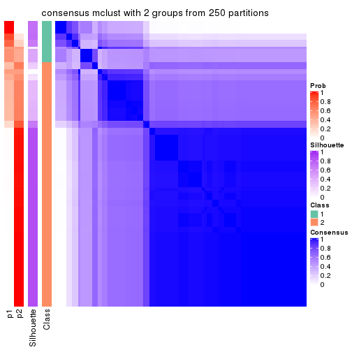</p>

</div>
<div id='tab-SD-mclust-consensus-heatmap-2'>
<pre><code class="r">consensus_heatmap(res, k = 3)
</code></pre>

<p>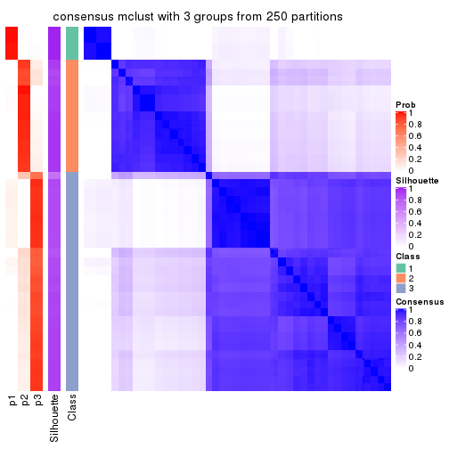</p>

</div>
<div id='tab-SD-mclust-consensus-heatmap-3'>
<pre><code class="r">consensus_heatmap(res, k = 4)
</code></pre>

<p>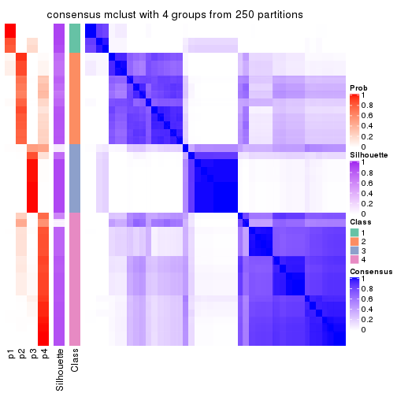</p>

</div>
<div id='tab-SD-mclust-consensus-heatmap-4'>
<pre><code class="r">consensus_heatmap(res, k = 5)
</code></pre>

<p>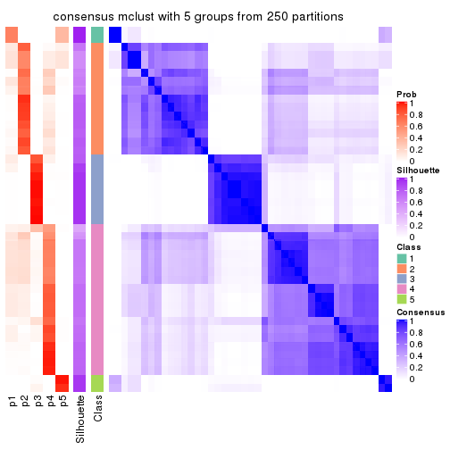</p>

</div>
<div id='tab-SD-mclust-consensus-heatmap-5'>
<pre><code class="r">consensus_heatmap(res, k = 6)
</code></pre>

<p>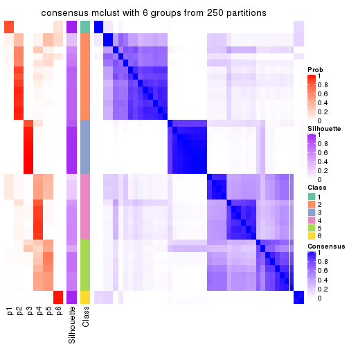</p>

</div>
</div>

Heatmaps for the membership of samples in all partitions to see how consistent they are:


<script>
$( function() {
	$( '#tabs-SD-mclust-membership-heatmap' ).tabs();
} );
</script>
<div id='tabs-SD-mclust-membership-heatmap'>
<ul>
<li><a href='#tab-SD-mclust-membership-heatmap-1'>k = 2</a></li>
<li><a href='#tab-SD-mclust-membership-heatmap-2'>k = 3</a></li>
<li><a href='#tab-SD-mclust-membership-heatmap-3'>k = 4</a></li>
<li><a href='#tab-SD-mclust-membership-heatmap-4'>k = 5</a></li>
<li><a href='#tab-SD-mclust-membership-heatmap-5'>k = 6</a></li>
</ul>
<div id='tab-SD-mclust-membership-heatmap-1'>
<pre><code class="r">membership_heatmap(res, k = 2)
</code></pre>

<p>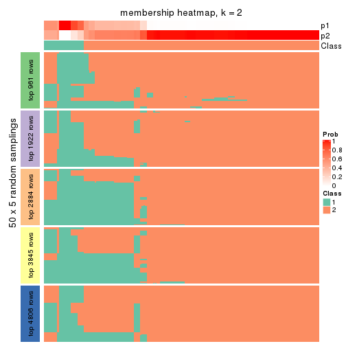</p>

</div>
<div id='tab-SD-mclust-membership-heatmap-2'>
<pre><code class="r">membership_heatmap(res, k = 3)
</code></pre>

<p>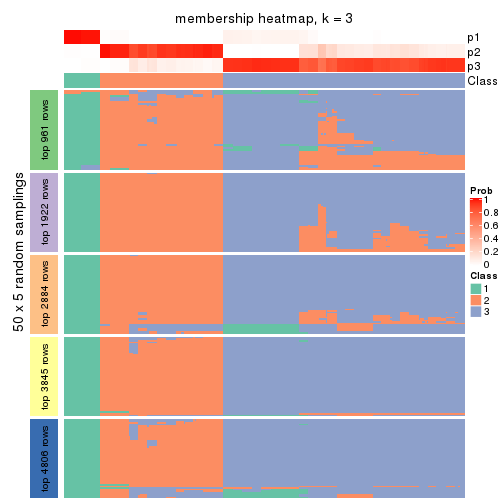</p>

</div>
<div id='tab-SD-mclust-membership-heatmap-3'>
<pre><code class="r">membership_heatmap(res, k = 4)
</code></pre>

<p>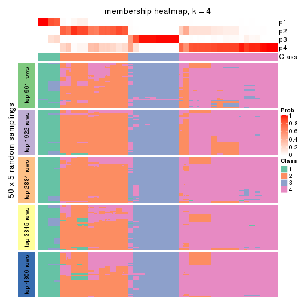</p>

</div>
<div id='tab-SD-mclust-membership-heatmap-4'>
<pre><code class="r">membership_heatmap(res, k = 5)
</code></pre>

<p>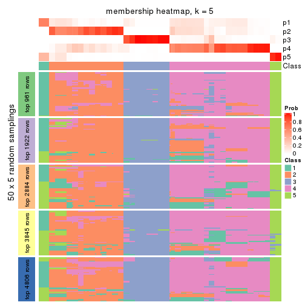</p>

</div>
<div id='tab-SD-mclust-membership-heatmap-5'>
<pre><code class="r">membership_heatmap(res, k = 6)
</code></pre>

<p>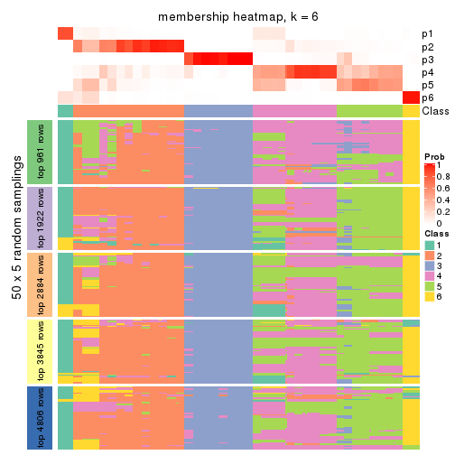</p>

</div>
</div>

As soon as we have had the classes for columns, we can look for signatures
which are significantly different between classes which can be candidate marks
for certain classes. Following are the heatmaps for signatures.


Signature heatmaps where rows are scaled:


<script>
$( function() {
	$( '#tabs-SD-mclust-get-signatures' ).tabs();
} );
</script>
<div id='tabs-SD-mclust-get-signatures'>
<ul>
<li><a href='#tab-SD-mclust-get-signatures-1'>k = 2</a></li>
<li><a href='#tab-SD-mclust-get-signatures-2'>k = 3</a></li>
<li><a href='#tab-SD-mclust-get-signatures-3'>k = 4</a></li>
<li><a href='#tab-SD-mclust-get-signatures-4'>k = 5</a></li>
<li><a href='#tab-SD-mclust-get-signatures-5'>k = 6</a></li>
</ul>
<div id='tab-SD-mclust-get-signatures-1'>
<pre><code class="r">get_signatures(res, k = 2)
</code></pre>

<p>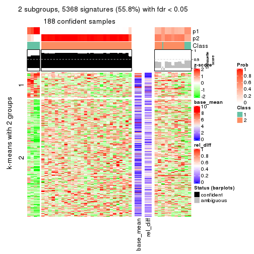</p>

</div>
<div id='tab-SD-mclust-get-signatures-2'>
<pre><code class="r">get_signatures(res, k = 3)
</code></pre>

<p>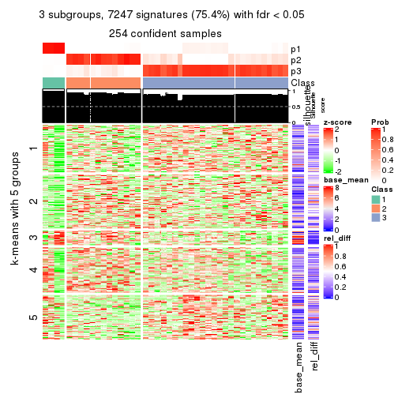</p>

</div>
<div id='tab-SD-mclust-get-signatures-3'>
<pre><code class="r">get_signatures(res, k = 4)
</code></pre>

<p>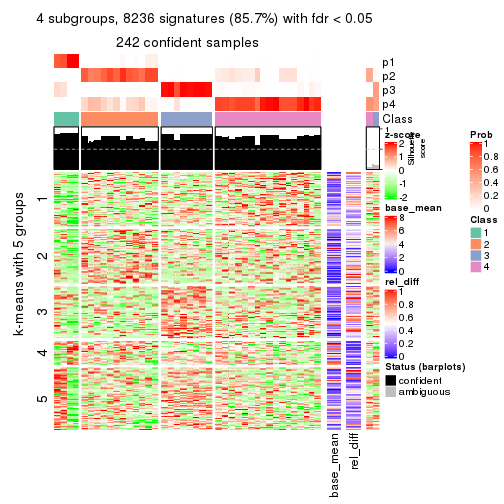</p>

</div>
<div id='tab-SD-mclust-get-signatures-4'>
<pre><code class="r">get_signatures(res, k = 5)
</code></pre>

<p>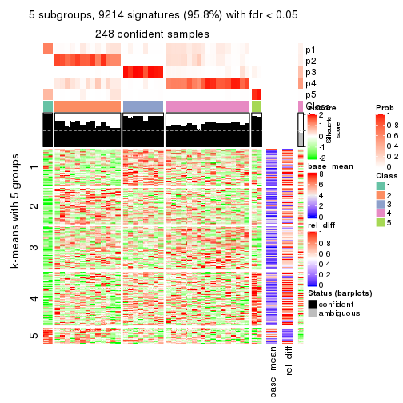</p>

</div>
<div id='tab-SD-mclust-get-signatures-5'>
<pre><code class="r">get_signatures(res, k = 6)
</code></pre>

<p>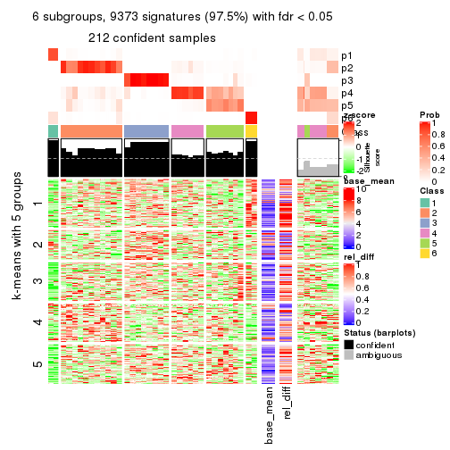</p>

</div>
</div>


Signature heatmaps where rows are not scaled:


<script>
$( function() {
	$( '#tabs-SD-mclust-get-signatures-no-scale' ).tabs();
} );
</script>
<div id='tabs-SD-mclust-get-signatures-no-scale'>
<ul>
<li><a href='#tab-SD-mclust-get-signatures-no-scale-1'>k = 2</a></li>
<li><a href='#tab-SD-mclust-get-signatures-no-scale-2'>k = 3</a></li>
<li><a href='#tab-SD-mclust-get-signatures-no-scale-3'>k = 4</a></li>
<li><a href='#tab-SD-mclust-get-signatures-no-scale-4'>k = 5</a></li>
<li><a href='#tab-SD-mclust-get-signatures-no-scale-5'>k = 6</a></li>
</ul>
<div id='tab-SD-mclust-get-signatures-no-scale-1'>
<pre><code class="r">get_signatures(res, k = 2, scale_rows = FALSE)
</code></pre>

<p>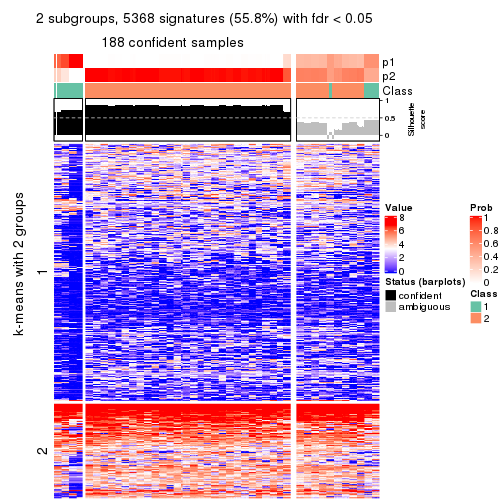</p>

</div>
<div id='tab-SD-mclust-get-signatures-no-scale-2'>
<pre><code class="r">get_signatures(res, k = 3, scale_rows = FALSE)
</code></pre>

<p>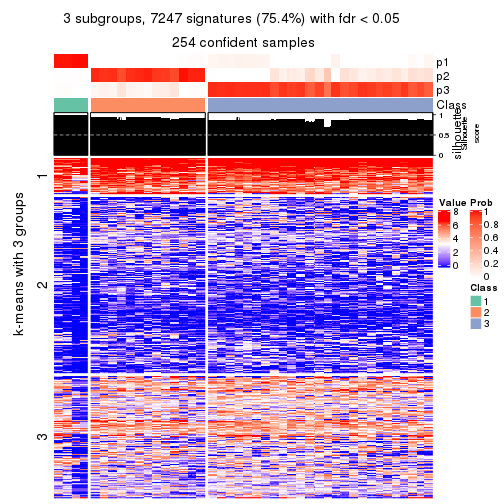</p>

</div>
<div id='tab-SD-mclust-get-signatures-no-scale-3'>
<pre><code class="r">get_signatures(res, k = 4, scale_rows = FALSE)
</code></pre>

<p>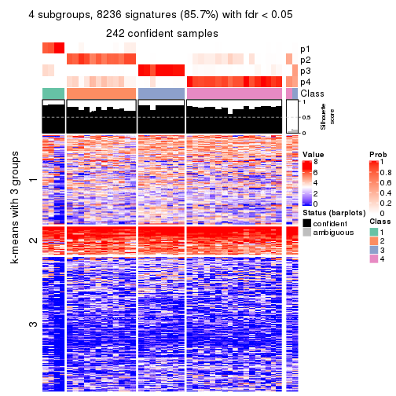</p>

</div>
<div id='tab-SD-mclust-get-signatures-no-scale-4'>
<pre><code class="r">get_signatures(res, k = 5, scale_rows = FALSE)
</code></pre>

<p>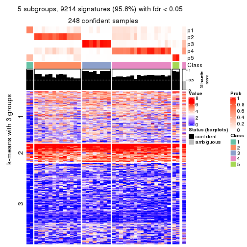</p>

</div>
<div id='tab-SD-mclust-get-signatures-no-scale-5'>
<pre><code class="r">get_signatures(res, k = 6, scale_rows = FALSE)
</code></pre>

<p>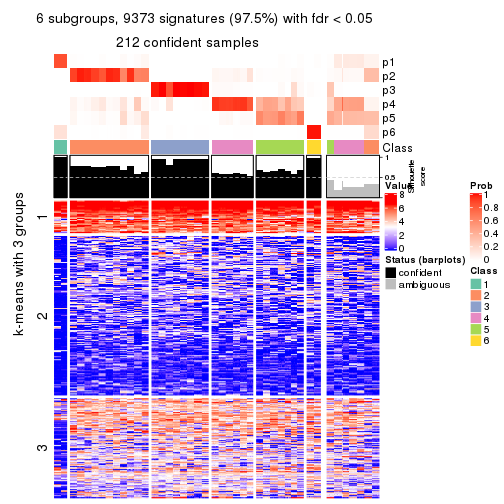</p>

</div>
</div>


Compare the overlap of signatures from different k:

```r
compare_signatures(res)
```

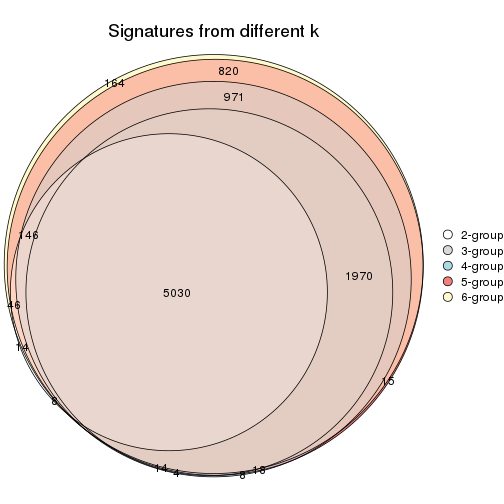

`get_signature()` returns a data frame invisibly. TO get the list of signatures, the function
call should be assigned to a variable explicitly. In following code, if `plot` argument is set
to `FALSE`, no heatmap is plotted while only the differential analysis is performed.

```r
# code only for demonstration
tb = get_signature(res, k = ..., plot = FALSE)
```

An example of the output of `tb` is:

```
#>   which_row         fdr    mean_1    mean_2 scaled_mean_1 scaled_mean_2 km
#> 1        38 0.042760348  8.373488  9.131774    -0.5533452     0.5164555  1
#> 2        40 0.018707592  7.106213  8.469186    -0.6173731     0.5762149  1
#> 3        55 0.019134737 10.221463 11.207825    -0.6159697     0.5749050  1
#> 4        59 0.006059896  5.921854  7.869574    -0.6899429     0.6439467  1
#> 5        60 0.018055526  8.928898 10.211722    -0.6204761     0.5791110  1
#> 6        98 0.009384629 15.714769 14.887706     0.6635654    -0.6193277  2
...
```

The columns in `tb` are:

1. `which_row`: row indices corresponding to the input matrix.
2. `fdr`: FDR for the differential test. 
3. `mean_x`: The mean value in group x.
4. `scaled_mean_x`: The mean value in group x after rows are scaled.
5. `km`: Row groups if k-means clustering is applied to rows.


UMAP plot which shows how samples are separated.


<script>
$( function() {
	$( '#tabs-SD-mclust-dimension-reduction' ).tabs();
} );
</script>
<div id='tabs-SD-mclust-dimension-reduction'>
<ul>
<li><a href='#tab-SD-mclust-dimension-reduction-1'>k = 2</a></li>
<li><a href='#tab-SD-mclust-dimension-reduction-2'>k = 3</a></li>
<li><a href='#tab-SD-mclust-dimension-reduction-3'>k = 4</a></li>
<li><a href='#tab-SD-mclust-dimension-reduction-4'>k = 5</a></li>
<li><a href='#tab-SD-mclust-dimension-reduction-5'>k = 6</a></li>
</ul>
<div id='tab-SD-mclust-dimension-reduction-1'>
<pre><code class="r">dimension_reduction(res, k = 2, method = &quot;UMAP&quot;)
</code></pre>

<p>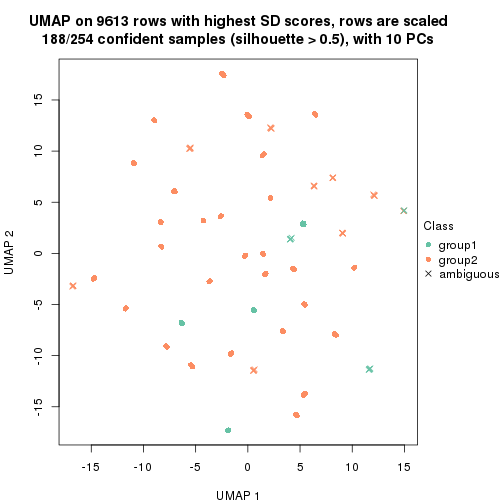</p>

</div>
<div id='tab-SD-mclust-dimension-reduction-2'>
<pre><code class="r">dimension_reduction(res, k = 3, method = &quot;UMAP&quot;)
</code></pre>

<p>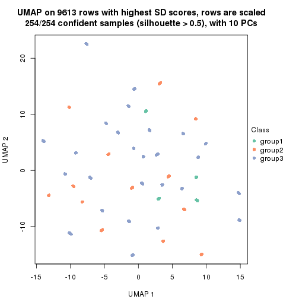</p>

</div>
<div id='tab-SD-mclust-dimension-reduction-3'>
<pre><code class="r">dimension_reduction(res, k = 4, method = &quot;UMAP&quot;)
</code></pre>

<p>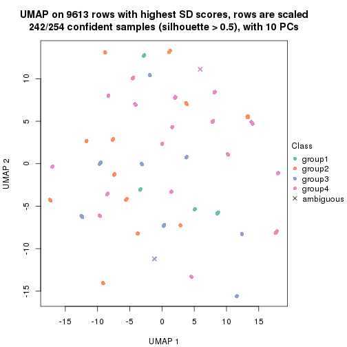</p>

</div>
<div id='tab-SD-mclust-dimension-reduction-4'>
<pre><code class="r">dimension_reduction(res, k = 5, method = &quot;UMAP&quot;)
</code></pre>

<p>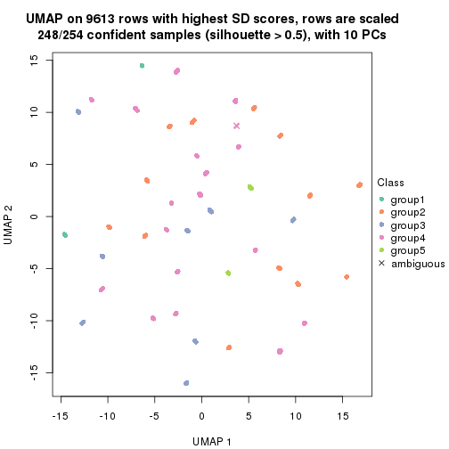</p>

</div>
<div id='tab-SD-mclust-dimension-reduction-5'>
<pre><code class="r">dimension_reduction(res, k = 6, method = &quot;UMAP&quot;)
</code></pre>

<p>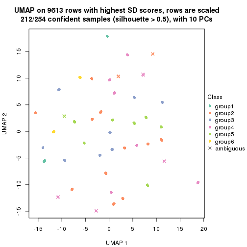</p>

</div>
</div>


Following heatmap shows how subgroups are split when increasing `k`:

```r
collect_classes(res)
```

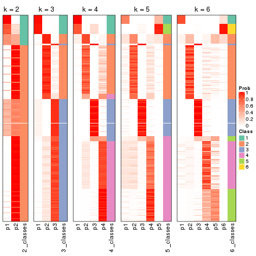


If matrix rows can be associated to genes, consider to use `GO_Enrichment(res,
...)` to perform function enrichment for the signature genes.


 

---------------------------------------------------


### SD:NMF


The object with results only for a single top-value method and a single partition method 
can be extracted as:

```r
res = res_list["SD", "NMF"]
# you can also extract it by
# res = res_list["SD:NMF"]
```

A summary of `res` and all the functions that can be applied to it:

```r
res
```

```
#> A 'ConsensusPartition' object with k = 2, 3, 4, 5, 6.
#>   On a matrix with 9613 rows and 254 columns.
#>   Top rows (961, 1922, 2884, 3845, 4806) are extracted by 'SD' method.
#>   Subgroups are detected by 'NMF' method.
#>   Performed in total 1250 partitions by row resampling.
#>   Best k for subgroups seems to be 2.
#> 
#> Following methods can be applied to this 'ConsensusPartition' object:
#>  [1] "cola_report"             "collect_classes"         "collect_plots"          
#>  [4] "collect_stats"           "colnames"                "compare_signatures"     
#>  [7] "consensus_heatmap"       "dimension_reduction"     "functional_enrichment"  
#> [10] "get_anno_col"            "get_anno"                "get_classes"            
#> [13] "get_consensus"           "get_matrix"              "get_membership"         
#> [16] "get_param"               "get_signatures"          "get_stats"              
#> [19] "is_best_k"               "is_stable_k"             "membership_heatmap"     
#> [22] "ncol"                    "nrow"                    "plot_ecdf"              
#> [25] "rownames"                "select_partition_number" "show"                   
#> [28] "suggest_best_k"          "test_to_known_factors"
```

`collect_plots()` function collects all the plots made from `res` for all `k` (number of partitions)
into one single page to provide an easy and fast comparison between different `k`.

```r
collect_plots(res)
```

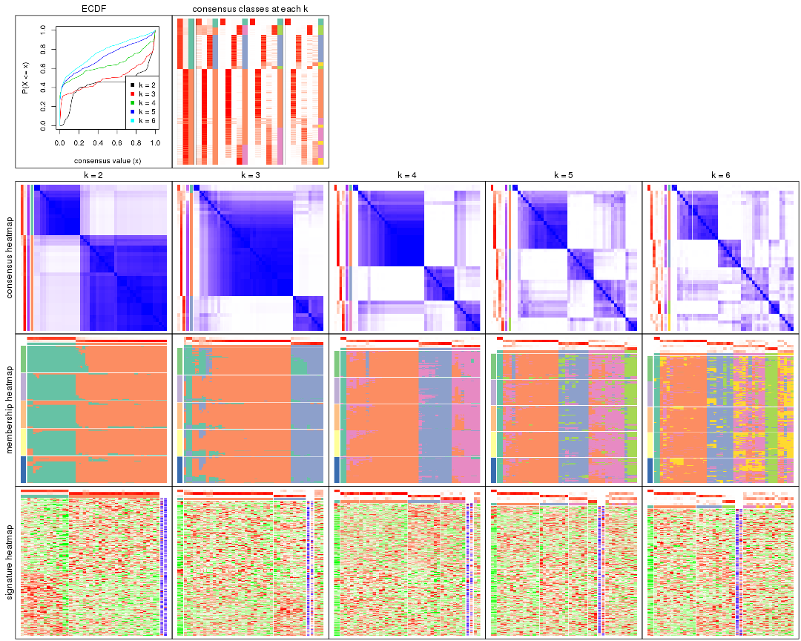

The plots are:

- The first row: a plot of the ECDF (Empirical cumulative distribution
  function) curves of the consensus matrix for each `k` and the heatmap of
  predicted classes for each `k`.
- The second row: heatmaps of the consensus matrix for each `k`.
- The third row: heatmaps of the membership matrix for each `k`.
- The fouth row: heatmaps of the signatures for each `k`.

All the plots in panels can be made by individual functions and they are
plotted later in this section.

`select_partition_number()` produces several plots showing different
statistics for choosing "optimized" `k`. There are following statistics:

- ECDF curves of the consensus matrix for each `k`;
- 1-PAC. [The PAC
  score](https://en.wikipedia.org/wiki/Consensus_clustering#Over-interpretation_potential_of_consensus_clustering)
  measures the proportion of the ambiguous subgrouping.
- Mean silhouette score.
- Concordance. The mean probability of fiting the consensus class ids in all
  partitions.
- Area increased. Denote $A_k$ as the area under the ECDF curve for current
  `k`, the area increased is defined as $A_k - A_{k-1}$.
- Rand index. The percent of pairs of samples that are both in a same cluster
  or both are not in a same cluster in the partition of k and k-1.
- Jaccard index. The ratio of pairs of samples are both in a same cluster in
  the partition of k and k-1 and the pairs of samples are both in a same
  cluster in the partition k or k-1.

The detailed explanations of these statistics can be found in [the cola
vignette](http://bioconductor.org/packages/devel/bioc/vignettes/cola/inst/doc/cola.html#toc_13).

Generally speaking, lower PAC score, higher mean silhouette score or higher
concordance corresponds to better partition. Rand index and Jaccard index
measure how similar the current partition is compared to partition with `k-1`.
If they are too similar, we won't accept `k` is better than `k-1`.

```r
select_partition_number(res)
```

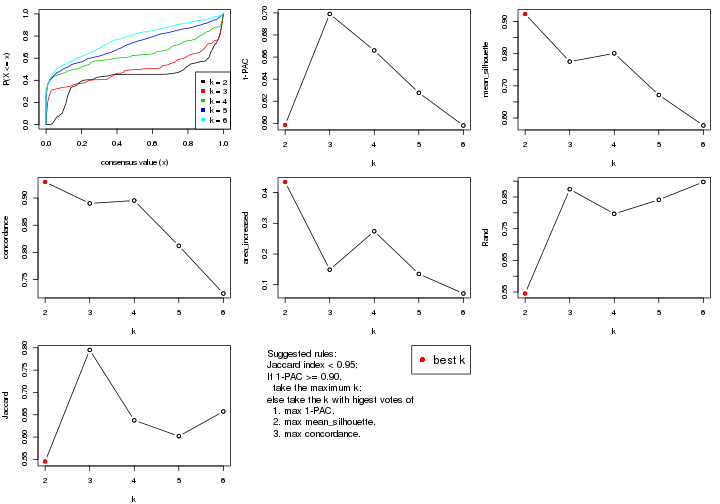

The numeric values for all these statistics can be obtained by `get_stats()`.

```r
get_stats(res)
```

```
#>   k 1-PAC mean_silhouette concordance area_increased  Rand Jaccard
#> 2 2 0.599           0.924       0.930         0.4346 0.545   0.545
#> 3 3 0.699           0.775       0.890         0.1490 0.874   0.795
#> 4 4 0.666           0.801       0.895         0.2740 0.797   0.638
#> 5 5 0.628           0.672       0.812         0.1351 0.841   0.602
#> 6 6 0.598           0.577       0.724         0.0714 0.897   0.657
```

`suggest_best_k()` suggests the best $k$ based on these statistics. The rules are as follows:

- All $k$ with Jaccard index larger than 0.95 are removed because the increase of
  the partition number does not provides enough extra information. If all $k$ are removed,
  the best $k$ is assigned by `NA`.
- For $k$ with 1-PAC larger than 0.9, the maximal $k$ is taken as the "best k". Other $k$ is called "optional k".
- If it does not fit the second rule. The $k$ with the highest vote of highest
  1-PAC, mean silhouette and concordance is taken as the "best k".

```r
suggest_best_k(res)
```

```
#> [1] 2
```


Following shows the table of the partitions (You need to click the **show/hide
code output** link to see it). The membership matrix (columns with name `p*`)
is inferred by
[`clue::cl_consensus()`](https://www.rdocumentation.org/link/cl_consensus?package=clue)
function with the `SE` method. Basically the value in the membership matrix
represents the probability to belong to a certain group. The finall class
label for an item is determined with the group with highest probability it
belongs to.

In `get_classes()` function, the entropy is calculated from the membership
matrix and the silhouette score is calculated from the consensus matrix.


<script>
$( function() {
	$( '#tabs-SD-NMF-get-classes' ).tabs();
} );
</script>
<div id='tabs-SD-NMF-get-classes'>
<ul>
<li><a href='#tab-SD-NMF-get-classes-1'>k = 2</a></li>
<li><a href='#tab-SD-NMF-get-classes-2'>k = 3</a></li>
<li><a href='#tab-SD-NMF-get-classes-3'>k = 4</a></li>
<li><a href='#tab-SD-NMF-get-classes-4'>k = 5</a></li>
<li><a href='#tab-SD-NMF-get-classes-5'>k = 6</a></li>
</ul>

<div id='tab-SD-NMF-get-classes-1'>
<p><a id='tab-SD-NMF-get-classes-1-a' style='color:#0366d6' href='#'>show/hide code output</a></p>
<pre><code class="r">cbind(get_classes(res, k = 2), get_membership(res, k = 2))
</code></pre>

<pre><code>#&gt;           class entropy silhouette    p1    p2
#&gt; DRR024803     1  0.5408      0.843 0.876 0.124
#&gt; DRR024804     2  0.2043      0.944 0.032 0.968
#&gt; DRR024805     2  0.1843      0.945 0.028 0.972
#&gt; DRR024806     2  0.1184      0.947 0.016 0.984
#&gt; DRR024807     1  0.4690      0.962 0.900 0.100
#&gt; DRR024808     1  0.4298      0.961 0.912 0.088
#&gt; DRR024809     2  0.0938      0.947 0.012 0.988
#&gt; DRR024810     2  0.2778      0.922 0.048 0.952
#&gt; DRR024811     1  0.4562      0.964 0.904 0.096
#&gt; DRR024812     2  0.1184      0.947 0.016 0.984
#&gt; DRR024813     2  0.7883      0.701 0.236 0.764
#&gt; DRR024814     2  0.1414      0.937 0.020 0.980
#&gt; DRR024815     2  0.0376      0.946 0.004 0.996
#&gt; DRR024816     2  0.0938      0.941 0.012 0.988
#&gt; DRR024817     2  0.4298      0.902 0.088 0.912
#&gt; DRR024818     1  0.4562      0.964 0.904 0.096
#&gt; DRR024819     2  0.0938      0.946 0.012 0.988
#&gt; DRR024820     1  0.5059      0.952 0.888 0.112
#&gt; DRR024821     1  0.4431      0.963 0.908 0.092
#&gt; DRR024822     2  0.1633      0.946 0.024 0.976
#&gt; DRR024824     2  0.1843      0.945 0.028 0.972
#&gt; DRR024825     1  0.4431      0.963 0.908 0.092
#&gt; DRR024826     2  0.6623      0.805 0.172 0.828
#&gt; DRR024827     1  0.6531      0.904 0.832 0.168
#&gt; DRR024828     1  0.4562      0.964 0.904 0.096
#&gt; DRR024829     2  0.2236      0.929 0.036 0.964
#&gt; DRR024830     2  0.2236      0.942 0.036 0.964
#&gt; DRR024831     1  0.4562      0.964 0.904 0.096
#&gt; DRR024832     1  0.4562      0.964 0.904 0.096
#&gt; DRR024833     2  0.2423      0.940 0.040 0.960
#&gt; DRR024834     2  0.2603      0.924 0.044 0.956
#&gt; DRR024835     2  0.6801      0.775 0.180 0.820
#&gt; DRR024836     1  0.4298      0.961 0.912 0.088
#&gt; DRR024837     2  0.3431      0.908 0.064 0.936
#&gt; DRR024838     2  0.2778      0.921 0.048 0.952
#&gt; DRR024839     2  0.1184      0.947 0.016 0.984
#&gt; DRR024840     2  0.2423      0.940 0.040 0.960
#&gt; DRR024841     2  0.0938      0.947 0.012 0.988
#&gt; DRR024842     2  0.0938      0.947 0.012 0.988
#&gt; DRR024843     1  0.5408      0.843 0.876 0.124
#&gt; DRR024844     2  0.2043      0.944 0.032 0.968
#&gt; DRR024845     2  0.1843      0.945 0.028 0.972
#&gt; DRR024846     2  0.1184      0.947 0.016 0.984
#&gt; DRR024847     1  0.4690      0.962 0.900 0.100
#&gt; DRR024848     1  0.5408      0.843 0.876 0.124
#&gt; DRR024849     1  0.4298      0.961 0.912 0.088
#&gt; DRR024850     2  0.1843      0.945 0.028 0.972
#&gt; DRR024851     2  0.1184      0.947 0.016 0.984
#&gt; DRR024852     2  0.2778      0.922 0.048 0.952
#&gt; DRR024853     1  0.4562      0.964 0.904 0.096
#&gt; DRR024854     2  0.1184      0.947 0.016 0.984
#&gt; DRR024855     2  0.8267      0.656 0.260 0.740
#&gt; DRR024856     2  0.1414      0.937 0.020 0.980
#&gt; DRR024857     2  0.0376      0.946 0.004 0.996
#&gt; DRR024858     2  0.1184      0.940 0.016 0.984
#&gt; DRR024859     2  0.4298      0.902 0.088 0.912
#&gt; DRR024860     1  0.4562      0.964 0.904 0.096
#&gt; DRR024861     2  0.0938      0.946 0.012 0.988
#&gt; DRR024862     1  0.4939      0.955 0.892 0.108
#&gt; DRR024863     1  0.4431      0.963 0.908 0.092
#&gt; DRR024864     2  0.1633      0.946 0.024 0.976
#&gt; DRR024865     2  0.2423      0.927 0.040 0.960
#&gt; DRR024866     2  0.1843      0.945 0.028 0.972
#&gt; DRR024867     1  0.4431      0.963 0.908 0.092
#&gt; DRR024868     2  0.6623      0.805 0.172 0.828
#&gt; DRR024869     1  0.6438      0.908 0.836 0.164
#&gt; DRR024870     1  0.4562      0.964 0.904 0.096
#&gt; DRR024871     2  0.2236      0.929 0.036 0.964
#&gt; DRR024872     2  0.2236      0.942 0.036 0.964
#&gt; DRR024873     1  0.4562      0.964 0.904 0.096
#&gt; DRR024874     1  0.4562      0.964 0.904 0.096
#&gt; DRR024875     2  0.2423      0.940 0.040 0.960
#&gt; DRR024876     2  0.2948      0.918 0.052 0.948
#&gt; DRR024877     2  0.6973      0.769 0.188 0.812
#&gt; DRR024878     1  0.4298      0.961 0.912 0.088
#&gt; DRR024879     2  0.3431      0.908 0.064 0.936
#&gt; DRR024880     2  0.2778      0.921 0.048 0.952
#&gt; DRR024881     2  0.1414      0.947 0.020 0.980
#&gt; DRR024882     2  0.2423      0.940 0.040 0.960
#&gt; DRR024883     2  0.1184      0.947 0.016 0.984
#&gt; DRR024884     2  0.0938      0.947 0.012 0.988
#&gt; DRR024885     1  0.6887      0.887 0.816 0.184
#&gt; DRR024886     1  0.5408      0.843 0.876 0.124
#&gt; DRR024887     2  0.2043      0.944 0.032 0.968
#&gt; DRR024888     2  0.1843      0.945 0.028 0.972
#&gt; DRR024889     2  0.1184      0.947 0.016 0.984
#&gt; DRR024890     1  0.4690      0.962 0.900 0.100
#&gt; DRR024891     1  0.5408      0.843 0.876 0.124
#&gt; DRR024892     1  0.4298      0.961 0.912 0.088
#&gt; DRR024893     2  0.1633      0.946 0.024 0.976
#&gt; DRR024894     2  0.0938      0.947 0.012 0.988
#&gt; DRR024895     2  0.2778      0.922 0.048 0.952
#&gt; DRR024896     1  0.4562      0.964 0.904 0.096
#&gt; DRR024897     2  0.1184      0.947 0.016 0.984
#&gt; DRR024898     2  0.8327      0.648 0.264 0.736
#&gt; DRR024899     2  0.1414      0.937 0.020 0.980
#&gt; DRR024900     2  0.0376      0.946 0.004 0.996
#&gt; DRR024901     2  0.1184      0.940 0.016 0.984
#&gt; DRR024902     2  0.4562      0.895 0.096 0.904
#&gt; DRR024903     1  0.4562      0.964 0.904 0.096
#&gt; DRR024904     2  0.0938      0.946 0.012 0.988
#&gt; DRR024905     1  0.4939      0.955 0.892 0.108
#&gt; DRR024906     1  0.4431      0.963 0.908 0.092
#&gt; DRR024907     2  0.1633      0.946 0.024 0.976
#&gt; DRR024908     2  0.2423      0.927 0.040 0.960
#&gt; DRR024909     2  0.1843      0.945 0.028 0.972
#&gt; DRR024910     1  0.4431      0.963 0.908 0.092
#&gt; DRR024911     2  0.6973      0.783 0.188 0.812
#&gt; DRR024912     1  0.6048      0.924 0.852 0.148
#&gt; DRR024913     1  0.4562      0.964 0.904 0.096
#&gt; DRR024914     2  0.2236      0.929 0.036 0.964
#&gt; DRR024915     2  0.2236      0.942 0.036 0.964
#&gt; DRR024916     1  0.4562      0.964 0.904 0.096
#&gt; DRR024917     1  0.4562      0.964 0.904 0.096
#&gt; DRR024918     2  0.2423      0.940 0.040 0.960
#&gt; DRR024919     2  0.2948      0.918 0.052 0.948
#&gt; DRR024920     2  0.6973      0.769 0.188 0.812
#&gt; DRR024921     1  0.4298      0.961 0.912 0.088
#&gt; DRR024922     2  0.3431      0.908 0.064 0.936
#&gt; DRR024923     2  0.2778      0.921 0.048 0.952
#&gt; DRR024924     2  0.1184      0.947 0.016 0.984
#&gt; DRR024925     2  0.2423      0.940 0.040 0.960
#&gt; DRR024926     2  0.0938      0.947 0.012 0.988
#&gt; DRR024927     2  0.0938      0.947 0.012 0.988
#&gt; DRR024928     1  0.6712      0.896 0.824 0.176
#&gt; DRR024929     1  0.5408      0.843 0.876 0.124
#&gt; DRR024930     2  0.2043      0.944 0.032 0.968
#&gt; DRR024931     2  0.1843      0.945 0.028 0.972
#&gt; DRR024932     2  0.1184      0.947 0.016 0.984
#&gt; DRR024933     1  0.4690      0.962 0.900 0.100
#&gt; DRR024934     1  0.5408      0.843 0.876 0.124
#&gt; DRR024935     1  0.4298      0.961 0.912 0.088
#&gt; DRR024936     2  0.1843      0.945 0.028 0.972
#&gt; DRR024937     2  0.0938      0.947 0.012 0.988
#&gt; DRR024938     2  0.2778      0.922 0.048 0.952
#&gt; DRR024939     1  0.4562      0.964 0.904 0.096
#&gt; DRR024940     2  0.1184      0.947 0.016 0.984
#&gt; DRR024941     2  0.8443      0.632 0.272 0.728
#&gt; DRR024942     2  0.1414      0.937 0.020 0.980
#&gt; DRR024943     2  0.0376      0.946 0.004 0.996
#&gt; DRR024944     2  0.1184      0.940 0.016 0.984
#&gt; DRR024945     2  0.4298      0.902 0.088 0.912
#&gt; DRR024946     1  0.4562      0.964 0.904 0.096
#&gt; DRR024947     2  0.0938      0.946 0.012 0.988
#&gt; DRR024948     1  0.4939      0.955 0.892 0.108
#&gt; DRR024949     1  0.4431      0.963 0.908 0.092
#&gt; DRR024950     2  0.1633      0.946 0.024 0.976
#&gt; DRR024951     2  0.2423      0.927 0.040 0.960
#&gt; DRR024952     2  0.1843      0.945 0.028 0.972
#&gt; DRR024953     1  0.4431      0.963 0.908 0.092
#&gt; DRR024954     2  0.7376      0.753 0.208 0.792
#&gt; DRR024955     1  0.6438      0.908 0.836 0.164
#&gt; DRR024956     1  0.4562      0.964 0.904 0.096
#&gt; DRR024957     2  0.2236      0.929 0.036 0.964
#&gt; DRR024958     2  0.2236      0.942 0.036 0.964
#&gt; DRR024959     1  0.4562      0.964 0.904 0.096
#&gt; DRR024960     1  0.4562      0.964 0.904 0.096
#&gt; DRR024961     2  0.2423      0.940 0.040 0.960
#&gt; DRR024962     2  0.2948      0.918 0.052 0.948
#&gt; DRR024963     2  0.6887      0.774 0.184 0.816
#&gt; DRR024964     1  0.4298      0.961 0.912 0.088
#&gt; DRR024965     2  0.3431      0.908 0.064 0.936
#&gt; DRR024966     2  0.2778      0.921 0.048 0.952
#&gt; DRR024967     2  0.1184      0.947 0.016 0.984
#&gt; DRR024968     2  0.2423      0.940 0.040 0.960
#&gt; DRR024969     2  0.0938      0.947 0.012 0.988
#&gt; DRR024970     2  0.0938      0.947 0.012 0.988
#&gt; DRR024971     1  0.6887      0.887 0.816 0.184
#&gt; DRR024972     1  0.5408      0.843 0.876 0.124
#&gt; DRR024973     2  0.2043      0.944 0.032 0.968
#&gt; DRR024974     2  0.1843      0.945 0.028 0.972
#&gt; DRR024975     2  0.1184      0.947 0.016 0.984
#&gt; DRR024976     1  0.4690      0.962 0.900 0.100
#&gt; DRR024977     1  0.5408      0.843 0.876 0.124
#&gt; DRR024978     1  0.4298      0.961 0.912 0.088
#&gt; DRR024979     2  0.1843      0.945 0.028 0.972
#&gt; DRR024980     2  0.0938      0.947 0.012 0.988
#&gt; DRR024981     2  0.2778      0.922 0.048 0.952
#&gt; DRR024982     1  0.4562      0.964 0.904 0.096
#&gt; DRR024983     2  0.1184      0.947 0.016 0.984
#&gt; DRR024984     2  0.8207      0.663 0.256 0.744
#&gt; DRR024985     2  0.1414      0.937 0.020 0.980
#&gt; DRR024986     2  0.0376      0.946 0.004 0.996
#&gt; DRR024987     2  0.1184      0.940 0.016 0.984
#&gt; DRR024988     2  0.4298      0.902 0.088 0.912
#&gt; DRR024989     1  0.4562      0.964 0.904 0.096
#&gt; DRR024990     2  0.0938      0.946 0.012 0.988
#&gt; DRR024991     1  0.4939      0.955 0.892 0.108
#&gt; DRR024992     1  0.4431      0.963 0.908 0.092
#&gt; DRR024993     2  0.1633      0.946 0.024 0.976
#&gt; DRR024994     2  0.2423      0.927 0.040 0.960
#&gt; DRR024995     2  0.1843      0.945 0.028 0.972
#&gt; DRR024996     1  0.4431      0.963 0.908 0.092
#&gt; DRR024997     2  0.7528      0.741 0.216 0.784
#&gt; DRR024998     1  0.6148      0.920 0.848 0.152
#&gt; DRR024999     1  0.4562      0.964 0.904 0.096
#&gt; DRR025000     2  0.2236      0.929 0.036 0.964
#&gt; DRR025001     2  0.2236      0.942 0.036 0.964
#&gt; DRR025002     1  0.4562      0.964 0.904 0.096
#&gt; DRR025003     1  0.4562      0.964 0.904 0.096
#&gt; DRR025004     2  0.2423      0.940 0.040 0.960
#&gt; DRR025005     2  0.2948      0.918 0.052 0.948
#&gt; DRR025006     2  0.6973      0.769 0.188 0.812
#&gt; DRR025007     1  0.4298      0.961 0.912 0.088
#&gt; DRR025008     2  0.3431      0.908 0.064 0.936
#&gt; DRR025009     2  0.2778      0.921 0.048 0.952
#&gt; DRR025010     2  0.1184      0.947 0.016 0.984
#&gt; DRR025011     2  0.2423      0.940 0.040 0.960
#&gt; DRR025012     2  0.1184      0.947 0.016 0.984
#&gt; DRR025013     2  0.0938      0.947 0.012 0.988
#&gt; DRR025014     1  0.6887      0.887 0.816 0.184
#&gt; DRR025015     1  0.5408      0.843 0.876 0.124
#&gt; DRR025016     2  0.2043      0.944 0.032 0.968
#&gt; DRR025017     2  0.1843      0.945 0.028 0.972
#&gt; DRR025018     2  0.1184      0.947 0.016 0.984
#&gt; DRR025019     1  0.4690      0.962 0.900 0.100
#&gt; DRR025020     1  0.5408      0.843 0.876 0.124
#&gt; DRR025021     1  0.4298      0.961 0.912 0.088
#&gt; DRR025022     2  0.1843      0.945 0.028 0.972
#&gt; DRR025023     2  0.0938      0.947 0.012 0.988
#&gt; DRR025024     2  0.2778      0.922 0.048 0.952
#&gt; DRR025025     1  0.4562      0.964 0.904 0.096
#&gt; DRR025026     2  0.1184      0.947 0.016 0.984
#&gt; DRR025027     2  0.8443      0.632 0.272 0.728
#&gt; DRR025028     2  0.1414      0.937 0.020 0.980
#&gt; DRR025029     2  0.0000      0.945 0.000 1.000
#&gt; DRR025030     2  0.0938      0.941 0.012 0.988
#&gt; DRR025031     2  0.4431      0.899 0.092 0.908
#&gt; DRR025032     1  0.4562      0.964 0.904 0.096
#&gt; DRR025033     2  0.0938      0.946 0.012 0.988
#&gt; DRR025034     1  0.4939      0.955 0.892 0.108
#&gt; DRR025035     1  0.4431      0.963 0.908 0.092
#&gt; DRR025036     2  0.1414      0.947 0.020 0.980
#&gt; DRR025037     2  0.2423      0.927 0.040 0.960
#&gt; DRR025038     2  0.1843      0.945 0.028 0.972
#&gt; DRR025039     1  0.4431      0.963 0.908 0.092
#&gt; DRR025040     2  0.7139      0.771 0.196 0.804
#&gt; DRR025041     1  0.6531      0.904 0.832 0.168
#&gt; DRR025042     1  0.4562      0.964 0.904 0.096
#&gt; DRR025043     2  0.2236      0.929 0.036 0.964
#&gt; DRR025044     2  0.2236      0.942 0.036 0.964
#&gt; DRR025045     1  0.4562      0.964 0.904 0.096
#&gt; DRR025046     1  0.4562      0.964 0.904 0.096
#&gt; DRR025047     2  0.2423      0.940 0.040 0.960
#&gt; DRR025048     2  0.2948      0.918 0.052 0.948
#&gt; DRR025049     2  0.6973      0.769 0.188 0.812
#&gt; DRR025050     1  0.4298      0.961 0.912 0.088
#&gt; DRR025051     2  0.3431      0.908 0.064 0.936
#&gt; DRR025052     2  0.2778      0.921 0.048 0.952
#&gt; DRR025053     2  0.1184      0.947 0.016 0.984
#&gt; DRR025054     2  0.2423      0.940 0.040 0.960
#&gt; DRR025055     2  0.0938      0.947 0.012 0.988
#&gt; DRR025056     2  0.0938      0.947 0.012 0.988
#&gt; DRR025057     1  0.6887      0.887 0.816 0.184
</code></pre>

<script>
$('#tab-SD-NMF-get-classes-1-a').parent().next().next().hide();
$('#tab-SD-NMF-get-classes-1-a').click(function(){
  $('#tab-SD-NMF-get-classes-1-a').parent().next().next().toggle();
  return(false);
});
</script>
</div>

<div id='tab-SD-NMF-get-classes-2'>
<p><a id='tab-SD-NMF-get-classes-2-a' style='color:#0366d6' href='#'>show/hide code output</a></p>
<pre><code class="r">cbind(get_classes(res, k = 3), get_membership(res, k = 3))
</code></pre>

<pre><code>#&gt;           class entropy silhouette    p1    p2    p3
#&gt; DRR024803     1  0.3715     0.6995 0.868 0.004 0.128
#&gt; DRR024804     2  0.0424     0.8902 0.008 0.992 0.000
#&gt; DRR024805     2  0.0424     0.8904 0.008 0.992 0.000
#&gt; DRR024806     2  0.0237     0.8907 0.004 0.996 0.000
#&gt; DRR024807     3  0.1781     0.8520 0.020 0.020 0.960
#&gt; DRR024808     3  0.4233     0.8389 0.160 0.004 0.836
#&gt; DRR024809     2  0.0237     0.8907 0.004 0.996 0.000
#&gt; DRR024810     2  0.0747     0.8883 0.016 0.984 0.000
#&gt; DRR024811     3  0.1482     0.8551 0.012 0.020 0.968
#&gt; DRR024812     2  0.0237     0.8907 0.004 0.996 0.000
#&gt; DRR024813     2  0.4521     0.7330 0.004 0.816 0.180
#&gt; DRR024814     2  0.0237     0.8902 0.000 0.996 0.004
#&gt; DRR024815     2  0.3141     0.8493 0.068 0.912 0.020
#&gt; DRR024816     2  0.0237     0.8907 0.004 0.996 0.000
#&gt; DRR024817     2  0.6400     0.6716 0.208 0.740 0.052
#&gt; DRR024818     3  0.3043     0.8288 0.084 0.008 0.908
#&gt; DRR024819     2  0.2269     0.8706 0.040 0.944 0.016
#&gt; DRR024820     2  0.9949    -0.3280 0.356 0.360 0.284
#&gt; DRR024821     3  0.4233     0.8414 0.160 0.004 0.836
#&gt; DRR024822     2  0.0424     0.8904 0.008 0.992 0.000
#&gt; DRR024824     2  0.0661     0.8899 0.008 0.988 0.004
#&gt; DRR024825     3  0.5517     0.7333 0.268 0.004 0.728
#&gt; DRR024826     2  0.6981     0.6646 0.136 0.732 0.132
#&gt; DRR024827     2  0.9913    -0.2447 0.336 0.388 0.276
#&gt; DRR024828     3  0.1919     0.8494 0.024 0.020 0.956
#&gt; DRR024829     2  0.1129     0.8859 0.020 0.976 0.004
#&gt; DRR024830     2  0.0475     0.8902 0.004 0.992 0.004
#&gt; DRR024831     3  0.0983     0.8603 0.016 0.004 0.980
#&gt; DRR024832     3  0.3272     0.8649 0.104 0.004 0.892
#&gt; DRR024833     2  0.2955     0.8479 0.080 0.912 0.008
#&gt; DRR024834     2  0.0892     0.8870 0.020 0.980 0.000
#&gt; DRR024835     2  0.7497     0.5259 0.276 0.652 0.072
#&gt; DRR024836     3  0.3784     0.8545 0.132 0.004 0.864
#&gt; DRR024837     2  0.0747     0.8883 0.016 0.984 0.000
#&gt; DRR024838     2  0.0829     0.8877 0.012 0.984 0.004
#&gt; DRR024839     2  0.0237     0.8903 0.004 0.996 0.000
#&gt; DRR024840     2  0.0475     0.8902 0.004 0.992 0.004
#&gt; DRR024841     2  0.0237     0.8907 0.004 0.996 0.000
#&gt; DRR024842     2  0.0000     0.8907 0.000 1.000 0.000
#&gt; DRR024843     1  0.3715     0.6995 0.868 0.004 0.128
#&gt; DRR024844     2  0.0592     0.8896 0.012 0.988 0.000
#&gt; DRR024845     2  0.0424     0.8904 0.008 0.992 0.000
#&gt; DRR024846     2  0.0237     0.8907 0.004 0.996 0.000
#&gt; DRR024847     3  0.1781     0.8520 0.020 0.020 0.960
#&gt; DRR024848     1  0.3715     0.6985 0.868 0.004 0.128
#&gt; DRR024849     3  0.4233     0.8389 0.160 0.004 0.836
#&gt; DRR024850     2  0.0237     0.8903 0.004 0.996 0.000
#&gt; DRR024851     2  0.0237     0.8907 0.004 0.996 0.000
#&gt; DRR024852     2  0.0747     0.8883 0.016 0.984 0.000
#&gt; DRR024853     3  0.1315     0.8577 0.008 0.020 0.972
#&gt; DRR024854     2  0.0237     0.8907 0.004 0.996 0.000
#&gt; DRR024855     2  0.4784     0.7078 0.004 0.796 0.200
#&gt; DRR024856     2  0.0237     0.8902 0.000 0.996 0.004
#&gt; DRR024857     2  0.3234     0.8464 0.072 0.908 0.020
#&gt; DRR024858     2  0.0237     0.8907 0.004 0.996 0.000
#&gt; DRR024859     2  0.6400     0.6717 0.208 0.740 0.052
#&gt; DRR024860     3  0.2774     0.8413 0.072 0.008 0.920
#&gt; DRR024861     2  0.2414     0.8673 0.040 0.940 0.020
#&gt; DRR024862     1  0.9949     0.2580 0.360 0.356 0.284
#&gt; DRR024863     3  0.4293     0.8380 0.164 0.004 0.832
#&gt; DRR024864     2  0.0424     0.8904 0.008 0.992 0.000
#&gt; DRR024865     2  0.0661     0.8890 0.008 0.988 0.004
#&gt; DRR024866     2  0.0661     0.8899 0.008 0.988 0.004
#&gt; DRR024867     3  0.5517     0.7333 0.268 0.004 0.728
#&gt; DRR024868     2  0.7337     0.6309 0.140 0.708 0.152
#&gt; DRR024869     2  0.9913    -0.2447 0.336 0.388 0.276
#&gt; DRR024870     3  0.1919     0.8494 0.024 0.020 0.956
#&gt; DRR024871     2  0.1129     0.8859 0.020 0.976 0.004
#&gt; DRR024872     2  0.0475     0.8902 0.004 0.992 0.004
#&gt; DRR024873     3  0.0983     0.8603 0.016 0.004 0.980
#&gt; DRR024874     3  0.3193     0.8650 0.100 0.004 0.896
#&gt; DRR024875     2  0.3293     0.8390 0.088 0.900 0.012
#&gt; DRR024876     2  0.0892     0.8870 0.020 0.980 0.000
#&gt; DRR024877     2  0.7497     0.5259 0.276 0.652 0.072
#&gt; DRR024878     3  0.3784     0.8545 0.132 0.004 0.864
#&gt; DRR024879     2  0.0747     0.8883 0.016 0.984 0.000
#&gt; DRR024880     2  0.0829     0.8877 0.012 0.984 0.004
#&gt; DRR024881     2  0.0237     0.8903 0.004 0.996 0.000
#&gt; DRR024882     2  0.0661     0.8889 0.004 0.988 0.008
#&gt; DRR024883     2  0.0237     0.8907 0.004 0.996 0.000
#&gt; DRR024884     2  0.4015     0.8212 0.096 0.876 0.028
#&gt; DRR024885     2  0.9587    -0.0806 0.356 0.440 0.204
#&gt; DRR024886     1  0.3715     0.6995 0.868 0.004 0.128
#&gt; DRR024887     2  0.0592     0.8896 0.012 0.988 0.000
#&gt; DRR024888     2  0.0424     0.8904 0.008 0.992 0.000
#&gt; DRR024889     2  0.0237     0.8907 0.004 0.996 0.000
#&gt; DRR024890     3  0.1781     0.8520 0.020 0.020 0.960
#&gt; DRR024891     1  0.3715     0.6985 0.868 0.004 0.128
#&gt; DRR024892     3  0.4233     0.8389 0.160 0.004 0.836
#&gt; DRR024893     2  0.0237     0.8903 0.004 0.996 0.000
#&gt; DRR024894     2  0.0237     0.8907 0.004 0.996 0.000
#&gt; DRR024895     2  0.0747     0.8883 0.016 0.984 0.000
#&gt; DRR024896     3  0.1315     0.8577 0.008 0.020 0.972
#&gt; DRR024897     2  0.0237     0.8907 0.004 0.996 0.000
#&gt; DRR024898     2  0.4883     0.6966 0.004 0.788 0.208
#&gt; DRR024899     2  0.0237     0.8902 0.000 0.996 0.004
#&gt; DRR024900     2  0.3461     0.8406 0.076 0.900 0.024
#&gt; DRR024901     2  0.0237     0.8907 0.004 0.996 0.000
#&gt; DRR024902     2  0.6491     0.6601 0.216 0.732 0.052
#&gt; DRR024903     3  0.2866     0.8425 0.076 0.008 0.916
#&gt; DRR024904     2  0.2152     0.8727 0.036 0.948 0.016
#&gt; DRR024905     2  0.9930    -0.3181 0.360 0.364 0.276
#&gt; DRR024906     3  0.4233     0.8414 0.160 0.004 0.836
#&gt; DRR024907     2  0.0424     0.8904 0.008 0.992 0.000
#&gt; DRR024908     2  0.0661     0.8890 0.008 0.988 0.004
#&gt; DRR024909     2  0.0661     0.8899 0.008 0.988 0.004
#&gt; DRR024910     3  0.5517     0.7333 0.268 0.004 0.728
#&gt; DRR024911     2  0.7562     0.6084 0.148 0.692 0.160
#&gt; DRR024912     2  0.9925    -0.2555 0.336 0.384 0.280
#&gt; DRR024913     3  0.1919     0.8494 0.024 0.020 0.956
#&gt; DRR024914     2  0.1129     0.8859 0.020 0.976 0.004
#&gt; DRR024915     2  0.0475     0.8902 0.004 0.992 0.004
#&gt; DRR024916     3  0.0983     0.8603 0.016 0.004 0.980
#&gt; DRR024917     3  0.3272     0.8649 0.104 0.004 0.892
#&gt; DRR024918     2  0.3459     0.8325 0.096 0.892 0.012
#&gt; DRR024919     2  0.0892     0.8870 0.020 0.980 0.000
#&gt; DRR024920     2  0.7497     0.5259 0.276 0.652 0.072
#&gt; DRR024921     3  0.3784     0.8545 0.132 0.004 0.864
#&gt; DRR024922     2  0.0747     0.8883 0.016 0.984 0.000
#&gt; DRR024923     2  0.0829     0.8877 0.012 0.984 0.004
#&gt; DRR024924     2  0.0237     0.8903 0.004 0.996 0.000
#&gt; DRR024925     2  0.0661     0.8889 0.004 0.988 0.008
#&gt; DRR024926     2  0.0237     0.8907 0.004 0.996 0.000
#&gt; DRR024927     2  0.4015     0.8212 0.096 0.876 0.028
#&gt; DRR024928     2  0.9587    -0.0806 0.356 0.440 0.204
#&gt; DRR024929     1  0.3715     0.6995 0.868 0.004 0.128
#&gt; DRR024930     2  0.0592     0.8896 0.012 0.988 0.000
#&gt; DRR024931     2  0.0424     0.8904 0.008 0.992 0.000
#&gt; DRR024932     2  0.0237     0.8907 0.004 0.996 0.000
#&gt; DRR024933     3  0.1781     0.8520 0.020 0.020 0.960
#&gt; DRR024934     1  0.3715     0.6985 0.868 0.004 0.128
#&gt; DRR024935     3  0.4172     0.8400 0.156 0.004 0.840
#&gt; DRR024936     2  0.0237     0.8903 0.004 0.996 0.000
#&gt; DRR024937     2  0.0237     0.8907 0.004 0.996 0.000
#&gt; DRR024938     2  0.0747     0.8883 0.016 0.984 0.000
#&gt; DRR024939     3  0.1315     0.8577 0.008 0.020 0.972
#&gt; DRR024940     2  0.0237     0.8907 0.004 0.996 0.000
#&gt; DRR024941     2  0.4784     0.7070 0.004 0.796 0.200
#&gt; DRR024942     2  0.0237     0.8902 0.000 0.996 0.004
#&gt; DRR024943     2  0.3234     0.8464 0.072 0.908 0.020
#&gt; DRR024944     2  0.0237     0.8907 0.004 0.996 0.000
#&gt; DRR024945     2  0.6208     0.6932 0.192 0.756 0.052
#&gt; DRR024946     3  0.2774     0.8413 0.072 0.008 0.920
#&gt; DRR024947     2  0.2414     0.8673 0.040 0.940 0.020
#&gt; DRR024948     1  0.9940     0.2589 0.360 0.360 0.280
#&gt; DRR024949     3  0.4233     0.8414 0.160 0.004 0.836
#&gt; DRR024950     2  0.0424     0.8904 0.008 0.992 0.000
#&gt; DRR024951     2  0.0661     0.8890 0.008 0.988 0.004
#&gt; DRR024952     2  0.0661     0.8899 0.008 0.988 0.004
#&gt; DRR024953     3  0.5517     0.7333 0.268 0.004 0.728
#&gt; DRR024954     2  0.7564     0.6081 0.152 0.692 0.156
#&gt; DRR024955     2  0.9925    -0.2555 0.336 0.384 0.280
#&gt; DRR024956     3  0.1919     0.8494 0.024 0.020 0.956
#&gt; DRR024957     2  0.1129     0.8859 0.020 0.976 0.004
#&gt; DRR024958     2  0.0475     0.8902 0.004 0.992 0.004
#&gt; DRR024959     3  0.0983     0.8603 0.016 0.004 0.980
#&gt; DRR024960     3  0.3272     0.8649 0.104 0.004 0.892
#&gt; DRR024961     2  0.3293     0.8390 0.088 0.900 0.012
#&gt; DRR024962     2  0.0892     0.8870 0.020 0.980 0.000
#&gt; DRR024963     2  0.7497     0.5259 0.276 0.652 0.072
#&gt; DRR024964     3  0.3573     0.8583 0.120 0.004 0.876
#&gt; DRR024965     2  0.0747     0.8883 0.016 0.984 0.000
#&gt; DRR024966     2  0.0829     0.8877 0.012 0.984 0.004
#&gt; DRR024967     2  0.0237     0.8903 0.004 0.996 0.000
#&gt; DRR024968     2  0.0661     0.8889 0.004 0.988 0.008
#&gt; DRR024969     2  0.0237     0.8907 0.004 0.996 0.000
#&gt; DRR024970     2  0.4172     0.8139 0.104 0.868 0.028
#&gt; DRR024971     2  0.9587    -0.0806 0.356 0.440 0.204
#&gt; DRR024972     1  0.3715     0.6995 0.868 0.004 0.128
#&gt; DRR024973     2  0.0592     0.8896 0.012 0.988 0.000
#&gt; DRR024974     2  0.0424     0.8904 0.008 0.992 0.000
#&gt; DRR024975     2  0.0237     0.8907 0.004 0.996 0.000
#&gt; DRR024976     3  0.1781     0.8520 0.020 0.020 0.960
#&gt; DRR024977     1  0.3715     0.6985 0.868 0.004 0.128
#&gt; DRR024978     3  0.4233     0.8389 0.160 0.004 0.836
#&gt; DRR024979     2  0.0237     0.8903 0.004 0.996 0.000
#&gt; DRR024980     2  0.0237     0.8907 0.004 0.996 0.000
#&gt; DRR024981     2  0.0747     0.8883 0.016 0.984 0.000
#&gt; DRR024982     3  0.1315     0.8577 0.008 0.020 0.972
#&gt; DRR024983     2  0.0237     0.8907 0.004 0.996 0.000
#&gt; DRR024984     2  0.4733     0.7135 0.004 0.800 0.196
#&gt; DRR024985     2  0.0237     0.8902 0.000 0.996 0.004
#&gt; DRR024986     2  0.3234     0.8464 0.072 0.908 0.020
#&gt; DRR024987     2  0.0237     0.8907 0.004 0.996 0.000
#&gt; DRR024988     2  0.6400     0.6716 0.208 0.740 0.052
#&gt; DRR024989     3  0.2955     0.8394 0.080 0.008 0.912
#&gt; DRR024990     2  0.2152     0.8727 0.036 0.948 0.016
#&gt; DRR024991     1  0.9949     0.2580 0.360 0.356 0.284
#&gt; DRR024992     3  0.4233     0.8414 0.160 0.004 0.836
#&gt; DRR024993     2  0.0424     0.8904 0.008 0.992 0.000
#&gt; DRR024994     2  0.0661     0.8890 0.008 0.988 0.004
#&gt; DRR024995     2  0.0661     0.8899 0.008 0.988 0.004
#&gt; DRR024996     3  0.5517     0.7333 0.268 0.004 0.728
#&gt; DRR024997     2  0.7766     0.5821 0.148 0.676 0.176
#&gt; DRR024998     2  0.9925    -0.2555 0.336 0.384 0.280
#&gt; DRR024999     3  0.1919     0.8494 0.024 0.020 0.956
#&gt; DRR025000     2  0.1129     0.8859 0.020 0.976 0.004
#&gt; DRR025001     2  0.0475     0.8902 0.004 0.992 0.004
#&gt; DRR025002     3  0.0983     0.8603 0.016 0.004 0.980
#&gt; DRR025003     3  0.3272     0.8649 0.104 0.004 0.892
#&gt; DRR025004     2  0.3377     0.8358 0.092 0.896 0.012
#&gt; DRR025005     2  0.0892     0.8870 0.020 0.980 0.000
#&gt; DRR025006     2  0.7497     0.5259 0.276 0.652 0.072
#&gt; DRR025007     3  0.3500     0.8606 0.116 0.004 0.880
#&gt; DRR025008     2  0.0747     0.8883 0.016 0.984 0.000
#&gt; DRR025009     2  0.0829     0.8877 0.012 0.984 0.004
#&gt; DRR025010     2  0.0237     0.8903 0.004 0.996 0.000
#&gt; DRR025011     2  0.0661     0.8889 0.004 0.988 0.008
#&gt; DRR025012     2  0.0237     0.8907 0.004 0.996 0.000
#&gt; DRR025013     2  0.4015     0.8212 0.096 0.876 0.028
#&gt; DRR025014     2  0.9587    -0.0806 0.356 0.440 0.204
#&gt; DRR025015     1  0.3715     0.6995 0.868 0.004 0.128
#&gt; DRR025016     2  0.0592     0.8896 0.012 0.988 0.000
#&gt; DRR025017     2  0.0424     0.8904 0.008 0.992 0.000
#&gt; DRR025018     2  0.0237     0.8907 0.004 0.996 0.000
#&gt; DRR025019     3  0.1781     0.8520 0.020 0.020 0.960
#&gt; DRR025020     1  0.3715     0.6985 0.868 0.004 0.128
#&gt; DRR025021     3  0.4233     0.8389 0.160 0.004 0.836
#&gt; DRR025022     2  0.0237     0.8903 0.004 0.996 0.000
#&gt; DRR025023     2  0.0237     0.8907 0.004 0.996 0.000
#&gt; DRR025024     2  0.0747     0.8883 0.016 0.984 0.000
#&gt; DRR025025     3  0.1315     0.8577 0.008 0.020 0.972
#&gt; DRR025026     2  0.0237     0.8907 0.004 0.996 0.000
#&gt; DRR025027     2  0.4883     0.6966 0.004 0.788 0.208
#&gt; DRR025028     2  0.0237     0.8902 0.000 0.996 0.004
#&gt; DRR025029     2  0.3234     0.8464 0.072 0.908 0.020
#&gt; DRR025030     2  0.0237     0.8907 0.004 0.996 0.000
#&gt; DRR025031     2  0.6446     0.6659 0.212 0.736 0.052
#&gt; DRR025032     3  0.3129     0.8327 0.088 0.008 0.904
#&gt; DRR025033     2  0.2414     0.8673 0.040 0.940 0.020
#&gt; DRR025034     1  0.9949     0.2580 0.360 0.356 0.284
#&gt; DRR025035     3  0.4233     0.8414 0.160 0.004 0.836
#&gt; DRR025036     2  0.0424     0.8904 0.008 0.992 0.000
#&gt; DRR025037     2  0.0661     0.8890 0.008 0.988 0.004
#&gt; DRR025038     2  0.0661     0.8899 0.008 0.988 0.004
#&gt; DRR025039     3  0.5517     0.7333 0.268 0.004 0.728
#&gt; DRR025040     2  0.7273     0.6367 0.132 0.712 0.156
#&gt; DRR025041     2  0.9913    -0.2447 0.336 0.388 0.276
#&gt; DRR025042     3  0.1919     0.8494 0.024 0.020 0.956
#&gt; DRR025043     2  0.1129     0.8859 0.020 0.976 0.004
#&gt; DRR025044     2  0.0475     0.8902 0.004 0.992 0.004
#&gt; DRR025045     3  0.0983     0.8603 0.016 0.004 0.980
#&gt; DRR025046     3  0.3272     0.8649 0.104 0.004 0.892
#&gt; DRR025047     2  0.3120     0.8447 0.080 0.908 0.012
#&gt; DRR025048     2  0.0892     0.8870 0.020 0.980 0.000
#&gt; DRR025049     2  0.7497     0.5259 0.276 0.652 0.072
#&gt; DRR025050     3  0.3715     0.8543 0.128 0.004 0.868
#&gt; DRR025051     2  0.0747     0.8883 0.016 0.984 0.000
#&gt; DRR025052     2  0.0829     0.8877 0.012 0.984 0.004
#&gt; DRR025053     2  0.0237     0.8903 0.004 0.996 0.000
#&gt; DRR025054     2  0.0661     0.8889 0.004 0.988 0.008
#&gt; DRR025055     2  0.0237     0.8907 0.004 0.996 0.000
#&gt; DRR025056     2  0.4015     0.8212 0.096 0.876 0.028
#&gt; DRR025057     2  0.9594    -0.0942 0.360 0.436 0.204
</code></pre>

<script>
$('#tab-SD-NMF-get-classes-2-a').parent().next().next().hide();
$('#tab-SD-NMF-get-classes-2-a').click(function(){
  $('#tab-SD-NMF-get-classes-2-a').parent().next().next().toggle();
  return(false);
});
</script>
</div>

<div id='tab-SD-NMF-get-classes-3'>
<p><a id='tab-SD-NMF-get-classes-3-a' style='color:#0366d6' href='#'>show/hide code output</a></p>
<pre><code class="r">cbind(get_classes(res, k = 4), get_membership(res, k = 4))
</code></pre>

<pre><code>#&gt;           class entropy silhouette    p1    p2    p3    p4
#&gt; DRR024803     1  0.1059      0.989 0.972 0.000 0.016 0.012
#&gt; DRR024804     2  0.3907      0.714 0.000 0.768 0.000 0.232
#&gt; DRR024805     2  0.0000      0.906 0.000 1.000 0.000 0.000
#&gt; DRR024806     2  0.0000      0.906 0.000 1.000 0.000 0.000
#&gt; DRR024807     3  0.0469      0.875 0.012 0.000 0.988 0.000
#&gt; DRR024808     3  0.3647      0.856 0.016 0.000 0.832 0.152
#&gt; DRR024809     2  0.0000      0.906 0.000 1.000 0.000 0.000
#&gt; DRR024810     2  0.0000      0.906 0.000 1.000 0.000 0.000
#&gt; DRR024811     3  0.0672      0.878 0.008 0.000 0.984 0.008
#&gt; DRR024812     2  0.0188      0.906 0.000 0.996 0.000 0.004
#&gt; DRR024813     2  0.4919      0.677 0.000 0.752 0.200 0.048
#&gt; DRR024814     2  0.2760      0.835 0.000 0.872 0.000 0.128
#&gt; DRR024815     4  0.4252      0.657 0.000 0.252 0.004 0.744
#&gt; DRR024816     2  0.0000      0.906 0.000 1.000 0.000 0.000
#&gt; DRR024817     4  0.1124      0.726 0.012 0.012 0.004 0.972
#&gt; DRR024818     3  0.2909      0.872 0.020 0.000 0.888 0.092
#&gt; DRR024819     2  0.4776      0.384 0.000 0.624 0.000 0.376
#&gt; DRR024820     4  0.1610      0.711 0.032 0.000 0.016 0.952
#&gt; DRR024821     3  0.4123      0.819 0.008 0.000 0.772 0.220
#&gt; DRR024822     2  0.0000      0.906 0.000 1.000 0.000 0.000
#&gt; DRR024824     2  0.0188      0.906 0.000 0.996 0.000 0.004
#&gt; DRR024825     3  0.5659      0.615 0.032 0.000 0.600 0.368
#&gt; DRR024826     4  0.5893      0.632 0.004 0.252 0.068 0.676
#&gt; DRR024827     4  0.1488      0.713 0.032 0.000 0.012 0.956
#&gt; DRR024828     3  0.0336      0.875 0.008 0.000 0.992 0.000
#&gt; DRR024829     2  0.4356      0.613 0.000 0.708 0.000 0.292
#&gt; DRR024830     2  0.0469      0.904 0.000 0.988 0.000 0.012
#&gt; DRR024831     3  0.0188      0.876 0.004 0.000 0.996 0.000
#&gt; DRR024832     3  0.2867      0.881 0.012 0.000 0.884 0.104
#&gt; DRR024833     4  0.5330      0.155 0.004 0.476 0.004 0.516
#&gt; DRR024834     2  0.0000      0.906 0.000 1.000 0.000 0.000
#&gt; DRR024835     4  0.1229      0.721 0.020 0.004 0.008 0.968
#&gt; DRR024836     3  0.2401      0.883 0.004 0.000 0.904 0.092
#&gt; DRR024837     2  0.0000      0.906 0.000 1.000 0.000 0.000
#&gt; DRR024838     2  0.2921      0.827 0.000 0.860 0.000 0.140
#&gt; DRR024839     2  0.1792      0.881 0.000 0.932 0.000 0.068
#&gt; DRR024840     2  0.0000      0.906 0.000 1.000 0.000 0.000
#&gt; DRR024841     2  0.0469      0.904 0.000 0.988 0.000 0.012
#&gt; DRR024842     2  0.0188      0.906 0.000 0.996 0.000 0.004
#&gt; DRR024843     1  0.1059      0.989 0.972 0.000 0.016 0.012
#&gt; DRR024844     2  0.3873      0.720 0.000 0.772 0.000 0.228
#&gt; DRR024845     2  0.0000      0.906 0.000 1.000 0.000 0.000
#&gt; DRR024846     2  0.0000      0.906 0.000 1.000 0.000 0.000
#&gt; DRR024847     3  0.0469      0.875 0.012 0.000 0.988 0.000
#&gt; DRR024848     1  0.1624      0.986 0.952 0.000 0.020 0.028
#&gt; DRR024849     3  0.3597      0.859 0.016 0.000 0.836 0.148
#&gt; DRR024850     2  0.2530      0.849 0.000 0.888 0.000 0.112
#&gt; DRR024851     2  0.0000      0.906 0.000 1.000 0.000 0.000
#&gt; DRR024852     2  0.0000      0.906 0.000 1.000 0.000 0.000
#&gt; DRR024853     3  0.0804      0.877 0.008 0.000 0.980 0.012
#&gt; DRR024854     2  0.0188      0.906 0.000 0.996 0.000 0.004
#&gt; DRR024855     2  0.5358      0.594 0.000 0.700 0.252 0.048
#&gt; DRR024856     2  0.3024      0.817 0.000 0.852 0.000 0.148
#&gt; DRR024857     4  0.4252      0.655 0.000 0.252 0.004 0.744
#&gt; DRR024858     2  0.0000      0.906 0.000 1.000 0.000 0.000
#&gt; DRR024859     4  0.1247      0.727 0.012 0.016 0.004 0.968
#&gt; DRR024860     3  0.2775      0.873 0.020 0.000 0.896 0.084
#&gt; DRR024861     2  0.4804      0.361 0.000 0.616 0.000 0.384
#&gt; DRR024862     4  0.1610      0.711 0.032 0.000 0.016 0.952
#&gt; DRR024863     3  0.3831      0.834 0.004 0.000 0.792 0.204
#&gt; DRR024864     2  0.0000      0.906 0.000 1.000 0.000 0.000
#&gt; DRR024865     2  0.1637      0.883 0.000 0.940 0.000 0.060
#&gt; DRR024866     2  0.0188      0.906 0.000 0.996 0.000 0.004
#&gt; DRR024867     3  0.5420      0.646 0.024 0.000 0.624 0.352
#&gt; DRR024868     4  0.6056      0.653 0.008 0.208 0.092 0.692
#&gt; DRR024869     4  0.1488      0.713 0.032 0.000 0.012 0.956
#&gt; DRR024870     3  0.0336      0.875 0.008 0.000 0.992 0.000
#&gt; DRR024871     2  0.4382      0.605 0.000 0.704 0.000 0.296
#&gt; DRR024872     2  0.0469      0.904 0.000 0.988 0.000 0.012
#&gt; DRR024873     3  0.0188      0.876 0.004 0.000 0.996 0.000
#&gt; DRR024874     3  0.2867      0.881 0.012 0.000 0.884 0.104
#&gt; DRR024875     4  0.5332      0.141 0.004 0.480 0.004 0.512
#&gt; DRR024876     2  0.0000      0.906 0.000 1.000 0.000 0.000
#&gt; DRR024877     4  0.1229      0.721 0.020 0.004 0.008 0.968
#&gt; DRR024878     3  0.2401      0.883 0.004 0.000 0.904 0.092
#&gt; DRR024879     2  0.0000      0.906 0.000 1.000 0.000 0.000
#&gt; DRR024880     2  0.3024      0.819 0.000 0.852 0.000 0.148
#&gt; DRR024881     2  0.2011      0.874 0.000 0.920 0.000 0.080
#&gt; DRR024882     2  0.0000      0.906 0.000 1.000 0.000 0.000
#&gt; DRR024883     2  0.0592      0.903 0.000 0.984 0.000 0.016
#&gt; DRR024884     4  0.4072      0.662 0.000 0.252 0.000 0.748
#&gt; DRR024885     4  0.2489      0.683 0.068 0.000 0.020 0.912
#&gt; DRR024886     1  0.1059      0.989 0.972 0.000 0.016 0.012
#&gt; DRR024887     2  0.4072      0.682 0.000 0.748 0.000 0.252
#&gt; DRR024888     2  0.0000      0.906 0.000 1.000 0.000 0.000
#&gt; DRR024889     2  0.0000      0.906 0.000 1.000 0.000 0.000
#&gt; DRR024890     3  0.0469      0.875 0.012 0.000 0.988 0.000
#&gt; DRR024891     1  0.1624      0.986 0.952 0.000 0.020 0.028
#&gt; DRR024892     3  0.3597      0.859 0.016 0.000 0.836 0.148
#&gt; DRR024893     2  0.2345      0.858 0.000 0.900 0.000 0.100
#&gt; DRR024894     2  0.0000      0.906 0.000 1.000 0.000 0.000
#&gt; DRR024895     2  0.0000      0.906 0.000 1.000 0.000 0.000
#&gt; DRR024896     3  0.1042      0.879 0.008 0.000 0.972 0.020
#&gt; DRR024897     2  0.0188      0.906 0.000 0.996 0.000 0.004
#&gt; DRR024898     2  0.5491      0.575 0.000 0.688 0.260 0.052
#&gt; DRR024899     2  0.2921      0.824 0.000 0.860 0.000 0.140
#&gt; DRR024900     4  0.4155      0.664 0.000 0.240 0.004 0.756
#&gt; DRR024901     2  0.0000      0.906 0.000 1.000 0.000 0.000
#&gt; DRR024902     4  0.1247      0.727 0.012 0.016 0.004 0.968
#&gt; DRR024903     3  0.2843      0.873 0.020 0.000 0.892 0.088
#&gt; DRR024904     2  0.4761      0.399 0.000 0.628 0.000 0.372
#&gt; DRR024905     4  0.1610      0.711 0.032 0.000 0.016 0.952
#&gt; DRR024906     3  0.3945      0.825 0.004 0.000 0.780 0.216
#&gt; DRR024907     2  0.0000      0.906 0.000 1.000 0.000 0.000
#&gt; DRR024908     2  0.1637      0.883 0.000 0.940 0.000 0.060
#&gt; DRR024909     2  0.0188      0.906 0.000 0.996 0.000 0.004
#&gt; DRR024910     3  0.5496      0.618 0.024 0.000 0.604 0.372
#&gt; DRR024911     4  0.6099      0.652 0.008 0.200 0.100 0.692
#&gt; DRR024912     4  0.1488      0.713 0.032 0.000 0.012 0.956
#&gt; DRR024913     3  0.0336      0.875 0.008 0.000 0.992 0.000
#&gt; DRR024914     2  0.4431      0.589 0.000 0.696 0.000 0.304
#&gt; DRR024915     2  0.0469      0.904 0.000 0.988 0.000 0.012
#&gt; DRR024916     3  0.0188      0.876 0.004 0.000 0.996 0.000
#&gt; DRR024917     3  0.2805      0.882 0.012 0.000 0.888 0.100
#&gt; DRR024918     4  0.5321      0.199 0.004 0.464 0.004 0.528
#&gt; DRR024919     2  0.0000      0.906 0.000 1.000 0.000 0.000
#&gt; DRR024920     4  0.1229      0.721 0.020 0.004 0.008 0.968
#&gt; DRR024921     3  0.2334      0.884 0.004 0.000 0.908 0.088
#&gt; DRR024922     2  0.0000      0.906 0.000 1.000 0.000 0.000
#&gt; DRR024923     2  0.3123      0.810 0.000 0.844 0.000 0.156
#&gt; DRR024924     2  0.2011      0.874 0.000 0.920 0.000 0.080
#&gt; DRR024925     2  0.0000      0.906 0.000 1.000 0.000 0.000
#&gt; DRR024926     2  0.0592      0.903 0.000 0.984 0.000 0.016
#&gt; DRR024927     4  0.4164      0.653 0.000 0.264 0.000 0.736
#&gt; DRR024928     4  0.2489      0.683 0.068 0.000 0.020 0.912
#&gt; DRR024929     1  0.1059      0.989 0.972 0.000 0.016 0.012
#&gt; DRR024930     2  0.3975      0.702 0.000 0.760 0.000 0.240
#&gt; DRR024931     2  0.0000      0.906 0.000 1.000 0.000 0.000
#&gt; DRR024932     2  0.0000      0.906 0.000 1.000 0.000 0.000
#&gt; DRR024933     3  0.0469      0.875 0.012 0.000 0.988 0.000
#&gt; DRR024934     1  0.1624      0.986 0.952 0.000 0.020 0.028
#&gt; DRR024935     3  0.3597      0.859 0.016 0.000 0.836 0.148
#&gt; DRR024936     2  0.2345      0.858 0.000 0.900 0.000 0.100
#&gt; DRR024937     2  0.0000      0.906 0.000 1.000 0.000 0.000
#&gt; DRR024938     2  0.0000      0.906 0.000 1.000 0.000 0.000
#&gt; DRR024939     3  0.0804      0.877 0.008 0.000 0.980 0.012
#&gt; DRR024940     2  0.0188      0.906 0.000 0.996 0.000 0.004
#&gt; DRR024941     2  0.5328      0.601 0.000 0.704 0.248 0.048
#&gt; DRR024942     2  0.2814      0.831 0.000 0.868 0.000 0.132
#&gt; DRR024943     4  0.4220      0.659 0.000 0.248 0.004 0.748
#&gt; DRR024944     2  0.0000      0.906 0.000 1.000 0.000 0.000
#&gt; DRR024945     4  0.1362      0.727 0.012 0.020 0.004 0.964
#&gt; DRR024946     3  0.2775      0.873 0.020 0.000 0.896 0.084
#&gt; DRR024947     2  0.4776      0.384 0.000 0.624 0.000 0.376
#&gt; DRR024948     4  0.1610      0.711 0.032 0.000 0.016 0.952
#&gt; DRR024949     3  0.3982      0.821 0.004 0.000 0.776 0.220
#&gt; DRR024950     2  0.0000      0.906 0.000 1.000 0.000 0.000
#&gt; DRR024951     2  0.1637      0.883 0.000 0.940 0.000 0.060
#&gt; DRR024952     2  0.0188      0.906 0.000 0.996 0.000 0.004
#&gt; DRR024953     3  0.5403      0.651 0.024 0.000 0.628 0.348
#&gt; DRR024954     4  0.5766      0.665 0.008 0.196 0.080 0.716
#&gt; DRR024955     4  0.1488      0.713 0.032 0.000 0.012 0.956
#&gt; DRR024956     3  0.0336      0.875 0.008 0.000 0.992 0.000
#&gt; DRR024957     2  0.4406      0.598 0.000 0.700 0.000 0.300
#&gt; DRR024958     2  0.0469      0.904 0.000 0.988 0.000 0.012
#&gt; DRR024959     3  0.0188      0.876 0.004 0.000 0.996 0.000
#&gt; DRR024960     3  0.2867      0.881 0.012 0.000 0.884 0.104
#&gt; DRR024961     4  0.5334      0.125 0.004 0.484 0.004 0.508
#&gt; DRR024962     2  0.0000      0.906 0.000 1.000 0.000 0.000
#&gt; DRR024963     4  0.1229      0.721 0.020 0.004 0.008 0.968
#&gt; DRR024964     3  0.2401      0.884 0.004 0.000 0.904 0.092
#&gt; DRR024965     2  0.0000      0.906 0.000 1.000 0.000 0.000
#&gt; DRR024966     2  0.3024      0.819 0.000 0.852 0.000 0.148
#&gt; DRR024967     2  0.1792      0.881 0.000 0.932 0.000 0.068
#&gt; DRR024968     2  0.0000      0.906 0.000 1.000 0.000 0.000
#&gt; DRR024969     2  0.0592      0.903 0.000 0.984 0.000 0.016
#&gt; DRR024970     4  0.3942      0.672 0.000 0.236 0.000 0.764
#&gt; DRR024971     4  0.2489      0.683 0.068 0.000 0.020 0.912
#&gt; DRR024972     1  0.1059      0.989 0.972 0.000 0.016 0.012
#&gt; DRR024973     2  0.4072      0.682 0.000 0.748 0.000 0.252
#&gt; DRR024974     2  0.0000      0.906 0.000 1.000 0.000 0.000
#&gt; DRR024975     2  0.0000      0.906 0.000 1.000 0.000 0.000
#&gt; DRR024976     3  0.0469      0.875 0.012 0.000 0.988 0.000
#&gt; DRR024977     1  0.1624      0.986 0.952 0.000 0.020 0.028
#&gt; DRR024978     3  0.3695      0.854 0.016 0.000 0.828 0.156
#&gt; DRR024979     2  0.2469      0.853 0.000 0.892 0.000 0.108
#&gt; DRR024980     2  0.0000      0.906 0.000 1.000 0.000 0.000
#&gt; DRR024981     2  0.0000      0.906 0.000 1.000 0.000 0.000
#&gt; DRR024982     3  0.0804      0.877 0.008 0.000 0.980 0.012
#&gt; DRR024983     2  0.0188      0.906 0.000 0.996 0.000 0.004
#&gt; DRR024984     2  0.5532      0.610 0.000 0.704 0.228 0.068
#&gt; DRR024985     2  0.2973      0.820 0.000 0.856 0.000 0.144
#&gt; DRR024986     4  0.4088      0.668 0.000 0.232 0.004 0.764
#&gt; DRR024987     2  0.0000      0.906 0.000 1.000 0.000 0.000
#&gt; DRR024988     4  0.1247      0.727 0.012 0.016 0.004 0.968
#&gt; DRR024989     3  0.2909      0.872 0.020 0.000 0.888 0.092
#&gt; DRR024990     2  0.4804      0.364 0.000 0.616 0.000 0.384
#&gt; DRR024991     4  0.1610      0.711 0.032 0.000 0.016 0.952
#&gt; DRR024992     3  0.4011      0.829 0.008 0.000 0.784 0.208
#&gt; DRR024993     2  0.0000      0.906 0.000 1.000 0.000 0.000
#&gt; DRR024994     2  0.1637      0.883 0.000 0.940 0.000 0.060
#&gt; DRR024995     2  0.0188      0.906 0.000 0.996 0.000 0.004
#&gt; DRR024996     3  0.5452      0.635 0.024 0.000 0.616 0.360
#&gt; DRR024997     4  0.5853      0.663 0.008 0.180 0.096 0.716
#&gt; DRR024998     4  0.1488      0.713 0.032 0.000 0.012 0.956
#&gt; DRR024999     3  0.0336      0.875 0.008 0.000 0.992 0.000
#&gt; DRR025000     2  0.4382      0.605 0.000 0.704 0.000 0.296
#&gt; DRR025001     2  0.0469      0.904 0.000 0.988 0.000 0.012
#&gt; DRR025002     3  0.0188      0.876 0.004 0.000 0.996 0.000
#&gt; DRR025003     3  0.2867      0.881 0.012 0.000 0.884 0.104
#&gt; DRR025004     4  0.5313      0.225 0.004 0.456 0.004 0.536
#&gt; DRR025005     2  0.0000      0.906 0.000 1.000 0.000 0.000
#&gt; DRR025006     4  0.1229      0.721 0.020 0.004 0.008 0.968
#&gt; DRR025007     3  0.2334      0.884 0.004 0.000 0.908 0.088
#&gt; DRR025008     2  0.0000      0.906 0.000 1.000 0.000 0.000
#&gt; DRR025009     2  0.3024      0.819 0.000 0.852 0.000 0.148
#&gt; DRR025010     2  0.2081      0.872 0.000 0.916 0.000 0.084
#&gt; DRR025011     2  0.0000      0.906 0.000 1.000 0.000 0.000
#&gt; DRR025012     2  0.0592      0.903 0.000 0.984 0.000 0.016
#&gt; DRR025013     4  0.4072      0.662 0.000 0.252 0.000 0.748
#&gt; DRR025014     4  0.2489      0.683 0.068 0.000 0.020 0.912
#&gt; DRR025015     1  0.1059      0.989 0.972 0.000 0.016 0.012
#&gt; DRR025016     2  0.3873      0.720 0.000 0.772 0.000 0.228
#&gt; DRR025017     2  0.0000      0.906 0.000 1.000 0.000 0.000
#&gt; DRR025018     2  0.0000      0.906 0.000 1.000 0.000 0.000
#&gt; DRR025019     3  0.0469      0.875 0.012 0.000 0.988 0.000
#&gt; DRR025020     1  0.1624      0.986 0.952 0.000 0.020 0.028
#&gt; DRR025021     3  0.3695      0.854 0.016 0.000 0.828 0.156
#&gt; DRR025022     2  0.2408      0.855 0.000 0.896 0.000 0.104
#&gt; DRR025023     2  0.0000      0.906 0.000 1.000 0.000 0.000
#&gt; DRR025024     2  0.0000      0.906 0.000 1.000 0.000 0.000
#&gt; DRR025025     3  0.0804      0.877 0.008 0.000 0.980 0.012
#&gt; DRR025026     2  0.0188      0.906 0.000 0.996 0.000 0.004
#&gt; DRR025027     2  0.5565      0.571 0.000 0.684 0.260 0.056
#&gt; DRR025028     2  0.2921      0.824 0.000 0.860 0.000 0.140
#&gt; DRR025029     4  0.4188      0.662 0.000 0.244 0.004 0.752
#&gt; DRR025030     2  0.0000      0.906 0.000 1.000 0.000 0.000
#&gt; DRR025031     4  0.1362      0.727 0.012 0.020 0.004 0.964
#&gt; DRR025032     3  0.2973      0.871 0.020 0.000 0.884 0.096
#&gt; DRR025033     2  0.4830      0.339 0.000 0.608 0.000 0.392
#&gt; DRR025034     4  0.1610      0.711 0.032 0.000 0.016 0.952
#&gt; DRR025035     3  0.3945      0.825 0.004 0.000 0.780 0.216
#&gt; DRR025036     2  0.0000      0.906 0.000 1.000 0.000 0.000
#&gt; DRR025037     2  0.1637      0.883 0.000 0.940 0.000 0.060
#&gt; DRR025038     2  0.0188      0.906 0.000 0.996 0.000 0.004
#&gt; DRR025039     3  0.5645      0.621 0.032 0.000 0.604 0.364
#&gt; DRR025040     4  0.6038      0.650 0.008 0.220 0.084 0.688
#&gt; DRR025041     4  0.1488      0.713 0.032 0.000 0.012 0.956
#&gt; DRR025042     3  0.0336      0.875 0.008 0.000 0.992 0.000
#&gt; DRR025043     2  0.4382      0.605 0.000 0.704 0.000 0.296
#&gt; DRR025044     2  0.0469      0.904 0.000 0.988 0.000 0.012
#&gt; DRR025045     3  0.0188      0.876 0.004 0.000 0.996 0.000
#&gt; DRR025046     3  0.2805      0.882 0.012 0.000 0.888 0.100
#&gt; DRR025047     4  0.5332      0.141 0.004 0.480 0.004 0.512
#&gt; DRR025048     2  0.0000      0.906 0.000 1.000 0.000 0.000
#&gt; DRR025049     4  0.1229      0.721 0.020 0.004 0.008 0.968
#&gt; DRR025050     3  0.2593      0.881 0.004 0.000 0.892 0.104
#&gt; DRR025051     2  0.0000      0.906 0.000 1.000 0.000 0.000
#&gt; DRR025052     2  0.3123      0.810 0.000 0.844 0.000 0.156
#&gt; DRR025053     2  0.2011      0.874 0.000 0.920 0.000 0.080
#&gt; DRR025054     2  0.0000      0.906 0.000 1.000 0.000 0.000
#&gt; DRR025055     2  0.0592      0.903 0.000 0.984 0.000 0.016
#&gt; DRR025056     4  0.4103      0.659 0.000 0.256 0.000 0.744
#&gt; DRR025057     4  0.2489      0.683 0.068 0.000 0.020 0.912
</code></pre>

<script>
$('#tab-SD-NMF-get-classes-3-a').parent().next().next().hide();
$('#tab-SD-NMF-get-classes-3-a').click(function(){
  $('#tab-SD-NMF-get-classes-3-a').parent().next().next().toggle();
  return(false);
});
</script>
</div>

<div id='tab-SD-NMF-get-classes-4'>
<p><a id='tab-SD-NMF-get-classes-4-a' style='color:#0366d6' href='#'>show/hide code output</a></p>
<pre><code class="r">cbind(get_classes(res, k = 5), get_membership(res, k = 5))
</code></pre>

<pre><code>#&gt;           class entropy silhouette    p1    p2    p3    p4    p5
#&gt; DRR024803     1  0.0566     0.9902 0.984 0.000 0.004 0.000 0.012
#&gt; DRR024804     4  0.4972     0.3488 0.008 0.440 0.000 0.536 0.016
#&gt; DRR024805     2  0.0613     0.8301 0.000 0.984 0.004 0.008 0.004
#&gt; DRR024806     2  0.0798     0.8318 0.000 0.976 0.000 0.016 0.008
#&gt; DRR024807     3  0.1461     0.8223 0.004 0.000 0.952 0.028 0.016
#&gt; DRR024808     3  0.4197     0.6767 0.000 0.000 0.728 0.028 0.244
#&gt; DRR024809     2  0.0771     0.8314 0.000 0.976 0.000 0.020 0.004
#&gt; DRR024810     2  0.1205     0.8271 0.000 0.956 0.000 0.040 0.004
#&gt; DRR024811     3  0.2936     0.8214 0.008 0.000 0.872 0.096 0.024
#&gt; DRR024812     2  0.0807     0.8280 0.000 0.976 0.000 0.012 0.012
#&gt; DRR024813     2  0.7293     0.1415 0.000 0.472 0.276 0.208 0.044
#&gt; DRR024814     4  0.4968     0.2753 0.000 0.456 0.000 0.516 0.028
#&gt; DRR024815     4  0.4111     0.6587 0.004 0.084 0.000 0.796 0.116
#&gt; DRR024816     2  0.0451     0.8283 0.000 0.988 0.004 0.000 0.008
#&gt; DRR024817     4  0.3209     0.5743 0.008 0.000 0.000 0.812 0.180
#&gt; DRR024818     3  0.6042     0.5803 0.012 0.004 0.596 0.288 0.100
#&gt; DRR024819     4  0.6486     0.4406 0.000 0.324 0.000 0.472 0.204
#&gt; DRR024820     5  0.1704     0.8050 0.000 0.000 0.004 0.068 0.928
#&gt; DRR024821     3  0.5359     0.7490 0.008 0.000 0.692 0.152 0.148
#&gt; DRR024822     2  0.0290     0.8308 0.000 0.992 0.000 0.008 0.000
#&gt; DRR024824     2  0.2353     0.8047 0.004 0.908 0.000 0.060 0.028
#&gt; DRR024825     5  0.4620     0.3890 0.000 0.000 0.392 0.016 0.592
#&gt; DRR024826     4  0.4993     0.6241 0.000 0.076 0.044 0.756 0.124
#&gt; DRR024827     5  0.1764     0.8110 0.000 0.000 0.008 0.064 0.928
#&gt; DRR024828     3  0.0404     0.8179 0.000 0.000 0.988 0.000 0.012
#&gt; DRR024829     4  0.4766     0.6470 0.000 0.220 0.000 0.708 0.072
#&gt; DRR024830     2  0.2389     0.7804 0.000 0.880 0.004 0.116 0.000
#&gt; DRR024831     3  0.0671     0.8239 0.000 0.000 0.980 0.004 0.016
#&gt; DRR024832     3  0.3861     0.8187 0.004 0.000 0.816 0.088 0.092
#&gt; DRR024833     4  0.4360     0.6727 0.000 0.132 0.008 0.780 0.080
#&gt; DRR024834     2  0.1928     0.8162 0.004 0.920 0.000 0.072 0.004
#&gt; DRR024835     4  0.3957     0.4815 0.008 0.000 0.000 0.712 0.280
#&gt; DRR024836     3  0.2771     0.7933 0.000 0.000 0.860 0.012 0.128
#&gt; DRR024837     2  0.1662     0.8203 0.004 0.936 0.000 0.056 0.004
#&gt; DRR024838     4  0.5123     0.4041 0.000 0.384 0.000 0.572 0.044
#&gt; DRR024839     2  0.4511     0.3854 0.000 0.628 0.000 0.356 0.016
#&gt; DRR024840     2  0.0579     0.8301 0.000 0.984 0.008 0.008 0.000
#&gt; DRR024841     2  0.2806     0.7169 0.000 0.844 0.004 0.152 0.000
#&gt; DRR024842     2  0.1892     0.8076 0.000 0.916 0.000 0.080 0.004
#&gt; DRR024843     1  0.0566     0.9902 0.984 0.000 0.004 0.000 0.012
#&gt; DRR024844     4  0.5006     0.4172 0.008 0.408 0.000 0.564 0.020
#&gt; DRR024845     2  0.0613     0.8301 0.000 0.984 0.004 0.008 0.004
#&gt; DRR024846     2  0.0693     0.8312 0.000 0.980 0.000 0.012 0.008
#&gt; DRR024847     3  0.1461     0.8223 0.004 0.000 0.952 0.028 0.016
#&gt; DRR024848     1  0.0671     0.9882 0.980 0.004 0.000 0.000 0.016
#&gt; DRR024849     3  0.4169     0.6822 0.000 0.000 0.732 0.028 0.240
#&gt; DRR024850     2  0.5234    -0.0315 0.004 0.524 0.000 0.436 0.036
#&gt; DRR024851     2  0.0771     0.8314 0.000 0.976 0.000 0.020 0.004
#&gt; DRR024852     2  0.1205     0.8271 0.000 0.956 0.000 0.040 0.004
#&gt; DRR024853     3  0.3161     0.8192 0.008 0.000 0.860 0.100 0.032
#&gt; DRR024854     2  0.0807     0.8280 0.000 0.976 0.000 0.012 0.012
#&gt; DRR024855     2  0.7397     0.0836 0.000 0.444 0.292 0.220 0.044
#&gt; DRR024856     4  0.4917     0.3827 0.000 0.416 0.000 0.556 0.028
#&gt; DRR024857     4  0.4111     0.6587 0.004 0.084 0.000 0.796 0.116
#&gt; DRR024858     2  0.0451     0.8283 0.000 0.988 0.004 0.000 0.008
#&gt; DRR024859     4  0.3280     0.5777 0.012 0.000 0.000 0.812 0.176
#&gt; DRR024860     3  0.5940     0.6038 0.012 0.004 0.612 0.276 0.096
#&gt; DRR024861     4  0.6536     0.4506 0.000 0.312 0.000 0.468 0.220
#&gt; DRR024862     5  0.1704     0.8050 0.000 0.000 0.004 0.068 0.928
#&gt; DRR024863     3  0.5242     0.7594 0.008 0.000 0.704 0.148 0.140
#&gt; DRR024864     2  0.0290     0.8308 0.000 0.992 0.000 0.008 0.000
#&gt; DRR024865     2  0.4590     0.2138 0.000 0.568 0.000 0.420 0.012
#&gt; DRR024866     2  0.2353     0.8047 0.004 0.908 0.000 0.060 0.028
#&gt; DRR024867     5  0.4682     0.3123 0.000 0.000 0.420 0.016 0.564
#&gt; DRR024868     4  0.4571     0.5879 0.000 0.040 0.048 0.780 0.132
#&gt; DRR024869     5  0.1764     0.8110 0.000 0.000 0.008 0.064 0.928
#&gt; DRR024870     3  0.0404     0.8179 0.000 0.000 0.988 0.000 0.012
#&gt; DRR024871     4  0.4766     0.6470 0.000 0.220 0.000 0.708 0.072
#&gt; DRR024872     2  0.2389     0.7804 0.000 0.880 0.004 0.116 0.000
#&gt; DRR024873     3  0.0671     0.8239 0.000 0.000 0.980 0.004 0.016
#&gt; DRR024874     3  0.3861     0.8186 0.004 0.000 0.816 0.092 0.088
#&gt; DRR024875     4  0.4316     0.6711 0.000 0.128 0.008 0.784 0.080
#&gt; DRR024876     2  0.1928     0.8162 0.004 0.920 0.000 0.072 0.004
#&gt; DRR024877     4  0.3934     0.4851 0.008 0.000 0.000 0.716 0.276
#&gt; DRR024878     3  0.2771     0.7969 0.000 0.000 0.860 0.012 0.128
#&gt; DRR024879     2  0.1731     0.8190 0.004 0.932 0.000 0.060 0.004
#&gt; DRR024880     4  0.5131     0.4484 0.000 0.364 0.000 0.588 0.048
#&gt; DRR024881     2  0.4551     0.3480 0.000 0.616 0.000 0.368 0.016
#&gt; DRR024882     2  0.0579     0.8301 0.000 0.984 0.008 0.008 0.000
#&gt; DRR024883     2  0.2890     0.7069 0.000 0.836 0.004 0.160 0.000
#&gt; DRR024884     4  0.3193     0.6404 0.000 0.028 0.000 0.840 0.132
#&gt; DRR024885     5  0.2689     0.7943 0.036 0.000 0.024 0.040 0.900
#&gt; DRR024886     1  0.0566     0.9902 0.984 0.000 0.004 0.000 0.012
#&gt; DRR024887     4  0.4989     0.4297 0.008 0.400 0.000 0.572 0.020
#&gt; DRR024888     2  0.0613     0.8301 0.000 0.984 0.004 0.008 0.004
#&gt; DRR024889     2  0.0798     0.8318 0.000 0.976 0.000 0.016 0.008
#&gt; DRR024890     3  0.1461     0.8223 0.004 0.000 0.952 0.028 0.016
#&gt; DRR024891     1  0.0671     0.9882 0.980 0.004 0.000 0.000 0.016
#&gt; DRR024892     3  0.4169     0.6829 0.000 0.000 0.732 0.028 0.240
#&gt; DRR024893     2  0.5249    -0.0782 0.004 0.508 0.000 0.452 0.036
#&gt; DRR024894     2  0.0771     0.8314 0.000 0.976 0.000 0.020 0.004
#&gt; DRR024895     2  0.1124     0.8280 0.000 0.960 0.000 0.036 0.004
#&gt; DRR024896     3  0.3294     0.8190 0.008 0.000 0.852 0.104 0.036
#&gt; DRR024897     2  0.0807     0.8280 0.000 0.976 0.000 0.012 0.012
#&gt; DRR024898     2  0.7391     0.0530 0.000 0.432 0.300 0.228 0.040
#&gt; DRR024899     4  0.4861     0.3587 0.000 0.428 0.000 0.548 0.024
#&gt; DRR024900     4  0.4111     0.6587 0.004 0.084 0.000 0.796 0.116
#&gt; DRR024901     2  0.0451     0.8283 0.000 0.988 0.004 0.000 0.008
#&gt; DRR024902     4  0.3280     0.5777 0.012 0.000 0.000 0.812 0.176
#&gt; DRR024903     3  0.5986     0.5832 0.012 0.004 0.596 0.296 0.092
#&gt; DRR024904     4  0.6406     0.4464 0.000 0.328 0.000 0.484 0.188
#&gt; DRR024905     5  0.1704     0.8050 0.000 0.000 0.004 0.068 0.928
#&gt; DRR024906     3  0.5320     0.7516 0.008 0.000 0.696 0.152 0.144
#&gt; DRR024907     2  0.0290     0.8308 0.000 0.992 0.000 0.008 0.000
#&gt; DRR024908     2  0.4565     0.2554 0.000 0.580 0.000 0.408 0.012
#&gt; DRR024909     2  0.2353     0.8047 0.004 0.908 0.000 0.060 0.028
#&gt; DRR024910     5  0.4620     0.3876 0.000 0.000 0.392 0.016 0.592
#&gt; DRR024911     4  0.4797     0.5838 0.000 0.044 0.052 0.764 0.140
#&gt; DRR024912     5  0.1764     0.8110 0.000 0.000 0.008 0.064 0.928
#&gt; DRR024913     3  0.0404     0.8179 0.000 0.000 0.988 0.000 0.012
#&gt; DRR024914     4  0.4763     0.6525 0.000 0.212 0.000 0.712 0.076
#&gt; DRR024915     2  0.2597     0.7745 0.000 0.872 0.004 0.120 0.004
#&gt; DRR024916     3  0.0671     0.8239 0.000 0.000 0.980 0.004 0.016
#&gt; DRR024917     3  0.3916     0.8182 0.004 0.000 0.812 0.092 0.092
#&gt; DRR024918     4  0.4404     0.6735 0.000 0.136 0.008 0.776 0.080
#&gt; DRR024919     2  0.1928     0.8162 0.004 0.920 0.000 0.072 0.004
#&gt; DRR024920     4  0.3957     0.4815 0.008 0.000 0.000 0.712 0.280
#&gt; DRR024921     3  0.2574     0.8025 0.000 0.000 0.876 0.012 0.112
#&gt; DRR024922     2  0.1731     0.8190 0.004 0.932 0.000 0.060 0.004
#&gt; DRR024923     4  0.5228     0.4609 0.000 0.356 0.000 0.588 0.056
#&gt; DRR024924     2  0.4599     0.3115 0.000 0.600 0.000 0.384 0.016
#&gt; DRR024925     2  0.0579     0.8301 0.000 0.984 0.008 0.008 0.000
#&gt; DRR024926     2  0.2890     0.7066 0.000 0.836 0.004 0.160 0.000
#&gt; DRR024927     4  0.3193     0.6404 0.000 0.028 0.000 0.840 0.132
#&gt; DRR024928     5  0.2689     0.7914 0.040 0.000 0.024 0.036 0.900
#&gt; DRR024929     1  0.0566     0.9902 0.984 0.000 0.004 0.000 0.012
#&gt; DRR024930     4  0.4997     0.4258 0.008 0.404 0.000 0.568 0.020
#&gt; DRR024931     2  0.0613     0.8301 0.000 0.984 0.004 0.008 0.004
#&gt; DRR024932     2  0.0693     0.8312 0.000 0.980 0.000 0.012 0.008
#&gt; DRR024933     3  0.1461     0.8223 0.004 0.000 0.952 0.028 0.016
#&gt; DRR024934     1  0.0671     0.9882 0.980 0.004 0.000 0.000 0.016
#&gt; DRR024935     3  0.4169     0.6819 0.000 0.000 0.732 0.028 0.240
#&gt; DRR024936     2  0.5155     0.0153 0.004 0.536 0.000 0.428 0.032
#&gt; DRR024937     2  0.0771     0.8314 0.000 0.976 0.000 0.020 0.004
#&gt; DRR024938     2  0.1205     0.8271 0.000 0.956 0.000 0.040 0.004
#&gt; DRR024939     3  0.3161     0.8211 0.008 0.000 0.860 0.100 0.032
#&gt; DRR024940     2  0.0807     0.8280 0.000 0.976 0.000 0.012 0.012
#&gt; DRR024941     2  0.7314     0.0986 0.000 0.448 0.304 0.208 0.040
#&gt; DRR024942     4  0.4961     0.3009 0.000 0.448 0.000 0.524 0.028
#&gt; DRR024943     4  0.4111     0.6587 0.004 0.084 0.000 0.796 0.116
#&gt; DRR024944     2  0.0451     0.8283 0.000 0.988 0.004 0.000 0.008
#&gt; DRR024945     4  0.3242     0.5779 0.012 0.000 0.000 0.816 0.172
#&gt; DRR024946     3  0.5978     0.5948 0.012 0.004 0.604 0.284 0.096
#&gt; DRR024947     4  0.6466     0.4582 0.000 0.316 0.000 0.480 0.204
#&gt; DRR024948     5  0.1830     0.8068 0.000 0.000 0.008 0.068 0.924
#&gt; DRR024949     3  0.5281     0.7539 0.008 0.000 0.700 0.152 0.140
#&gt; DRR024950     2  0.0290     0.8308 0.000 0.992 0.000 0.008 0.000
#&gt; DRR024951     2  0.4604     0.1877 0.000 0.560 0.000 0.428 0.012
#&gt; DRR024952     2  0.2353     0.8047 0.004 0.908 0.000 0.060 0.028
#&gt; DRR024953     5  0.4702     0.2729 0.000 0.000 0.432 0.016 0.552
#&gt; DRR024954     4  0.4587     0.5848 0.000 0.040 0.044 0.776 0.140
#&gt; DRR024955     5  0.1764     0.8110 0.000 0.000 0.008 0.064 0.928
#&gt; DRR024956     3  0.0404     0.8179 0.000 0.000 0.988 0.000 0.012
#&gt; DRR024957     4  0.4763     0.6525 0.000 0.212 0.000 0.712 0.076
#&gt; DRR024958     2  0.2389     0.7804 0.000 0.880 0.004 0.116 0.000
#&gt; DRR024959     3  0.0671     0.8239 0.000 0.000 0.980 0.004 0.016
#&gt; DRR024960     3  0.3969     0.8170 0.004 0.000 0.808 0.092 0.096
#&gt; DRR024961     4  0.4303     0.6726 0.000 0.132 0.008 0.784 0.076
#&gt; DRR024962     2  0.1928     0.8162 0.004 0.920 0.000 0.072 0.004
#&gt; DRR024963     4  0.3957     0.4815 0.008 0.000 0.000 0.712 0.280
#&gt; DRR024964     3  0.2674     0.8013 0.000 0.000 0.868 0.012 0.120
#&gt; DRR024965     2  0.1731     0.8190 0.004 0.932 0.000 0.060 0.004
#&gt; DRR024966     4  0.5193     0.4484 0.000 0.364 0.000 0.584 0.052
#&gt; DRR024967     2  0.4525     0.3770 0.000 0.624 0.000 0.360 0.016
#&gt; DRR024968     2  0.0579     0.8301 0.000 0.984 0.008 0.008 0.000
#&gt; DRR024969     2  0.2848     0.7097 0.000 0.840 0.004 0.156 0.000
#&gt; DRR024970     4  0.3193     0.6404 0.000 0.028 0.000 0.840 0.132
#&gt; DRR024971     5  0.2689     0.7914 0.040 0.000 0.024 0.036 0.900
#&gt; DRR024972     1  0.0566     0.9902 0.984 0.000 0.004 0.000 0.012
#&gt; DRR024973     4  0.4980     0.4360 0.008 0.396 0.000 0.576 0.020
#&gt; DRR024974     2  0.0613     0.8301 0.000 0.984 0.004 0.008 0.004
#&gt; DRR024975     2  0.0798     0.8318 0.000 0.976 0.000 0.016 0.008
#&gt; DRR024976     3  0.1461     0.8223 0.004 0.000 0.952 0.028 0.016
#&gt; DRR024977     1  0.0671     0.9882 0.980 0.004 0.000 0.000 0.016
#&gt; DRR024978     3  0.4301     0.6505 0.000 0.000 0.712 0.028 0.260
#&gt; DRR024979     2  0.5310    -0.0877 0.004 0.508 0.000 0.448 0.040
#&gt; DRR024980     2  0.0771     0.8314 0.000 0.976 0.000 0.020 0.004
#&gt; DRR024981     2  0.1124     0.8280 0.000 0.960 0.000 0.036 0.004
#&gt; DRR024982     3  0.3161     0.8203 0.008 0.000 0.860 0.100 0.032
#&gt; DRR024983     2  0.0807     0.8280 0.000 0.976 0.000 0.012 0.012
#&gt; DRR024984     2  0.7376     0.0373 0.000 0.428 0.288 0.248 0.036
#&gt; DRR024985     4  0.4917     0.3885 0.000 0.416 0.000 0.556 0.028
#&gt; DRR024986     4  0.4111     0.6587 0.004 0.084 0.000 0.796 0.116
#&gt; DRR024987     2  0.0451     0.8283 0.000 0.988 0.004 0.000 0.008
#&gt; DRR024988     4  0.3171     0.5768 0.008 0.000 0.000 0.816 0.176
#&gt; DRR024989     3  0.6023     0.5869 0.012 0.004 0.600 0.284 0.100
#&gt; DRR024990     4  0.6506     0.4364 0.000 0.324 0.000 0.468 0.208
#&gt; DRR024991     5  0.1704     0.8050 0.000 0.000 0.004 0.068 0.928
#&gt; DRR024992     3  0.5203     0.7624 0.008 0.000 0.708 0.144 0.140
#&gt; DRR024993     2  0.0290     0.8308 0.000 0.992 0.000 0.008 0.000
#&gt; DRR024994     2  0.4597     0.2023 0.000 0.564 0.000 0.424 0.012
#&gt; DRR024995     2  0.2353     0.8047 0.004 0.908 0.000 0.060 0.028
#&gt; DRR024996     5  0.4658     0.3456 0.000 0.000 0.408 0.016 0.576
#&gt; DRR024997     4  0.4681     0.5686 0.000 0.032 0.056 0.768 0.144
#&gt; DRR024998     5  0.1764     0.8110 0.000 0.000 0.008 0.064 0.928
#&gt; DRR024999     3  0.0404     0.8179 0.000 0.000 0.988 0.000 0.012
#&gt; DRR025000     4  0.4736     0.6492 0.000 0.216 0.000 0.712 0.072
#&gt; DRR025001     2  0.2548     0.7783 0.000 0.876 0.004 0.116 0.004
#&gt; DRR025002     3  0.0671     0.8239 0.000 0.000 0.980 0.004 0.016
#&gt; DRR025003     3  0.3916     0.8182 0.004 0.000 0.812 0.092 0.092
#&gt; DRR025004     4  0.4435     0.6702 0.000 0.124 0.008 0.776 0.092
#&gt; DRR025005     2  0.1928     0.8162 0.004 0.920 0.000 0.072 0.004
#&gt; DRR025006     4  0.3980     0.4837 0.008 0.000 0.000 0.708 0.284
#&gt; DRR025007     3  0.2574     0.8025 0.000 0.000 0.876 0.012 0.112
#&gt; DRR025008     2  0.1731     0.8190 0.004 0.932 0.000 0.060 0.004
#&gt; DRR025009     4  0.5193     0.4484 0.000 0.364 0.000 0.584 0.052
#&gt; DRR025010     2  0.4576     0.3244 0.000 0.608 0.000 0.376 0.016
#&gt; DRR025011     2  0.0579     0.8301 0.000 0.984 0.008 0.008 0.000
#&gt; DRR025012     2  0.2806     0.7169 0.000 0.844 0.004 0.152 0.000
#&gt; DRR025013     4  0.3193     0.6404 0.000 0.028 0.000 0.840 0.132
#&gt; DRR025014     5  0.2689     0.7943 0.036 0.000 0.024 0.040 0.900
#&gt; DRR025015     1  0.0566     0.9902 0.984 0.000 0.004 0.000 0.012
#&gt; DRR025016     4  0.4936     0.4008 0.008 0.416 0.000 0.560 0.016
#&gt; DRR025017     2  0.0613     0.8301 0.000 0.984 0.004 0.008 0.004
#&gt; DRR025018     2  0.0798     0.8318 0.000 0.976 0.000 0.016 0.008
#&gt; DRR025019     3  0.1461     0.8223 0.004 0.000 0.952 0.028 0.016
#&gt; DRR025020     1  0.0671     0.9882 0.980 0.004 0.000 0.000 0.016
#&gt; DRR025021     3  0.4250     0.6644 0.000 0.000 0.720 0.028 0.252
#&gt; DRR025022     2  0.5299    -0.0457 0.004 0.520 0.000 0.436 0.040
#&gt; DRR025023     2  0.0771     0.8314 0.000 0.976 0.000 0.020 0.004
#&gt; DRR025024     2  0.1205     0.8271 0.000 0.956 0.000 0.040 0.004
#&gt; DRR025025     3  0.3161     0.8203 0.008 0.000 0.860 0.100 0.032
#&gt; DRR025026     2  0.0807     0.8280 0.000 0.976 0.000 0.012 0.012
#&gt; DRR025027     2  0.7433     0.0558 0.000 0.432 0.300 0.224 0.044
#&gt; DRR025028     4  0.4948     0.3422 0.000 0.436 0.000 0.536 0.028
#&gt; DRR025029     4  0.4111     0.6587 0.004 0.084 0.000 0.796 0.116
#&gt; DRR025030     2  0.0451     0.8283 0.000 0.988 0.004 0.000 0.008
#&gt; DRR025031     4  0.3280     0.5777 0.012 0.000 0.000 0.812 0.176
#&gt; DRR025032     3  0.6059     0.5757 0.012 0.004 0.592 0.292 0.100
#&gt; DRR025033     4  0.6486     0.4650 0.000 0.308 0.000 0.480 0.212
#&gt; DRR025034     5  0.1830     0.8068 0.000 0.000 0.008 0.068 0.924
#&gt; DRR025035     3  0.5160     0.7640 0.008 0.000 0.712 0.148 0.132
#&gt; DRR025036     2  0.0290     0.8308 0.000 0.992 0.000 0.008 0.000
#&gt; DRR025037     2  0.4574     0.2416 0.000 0.576 0.000 0.412 0.012
#&gt; DRR025038     2  0.2353     0.8047 0.004 0.908 0.000 0.060 0.028
#&gt; DRR025039     5  0.4620     0.3890 0.000 0.000 0.392 0.016 0.592
#&gt; DRR025040     4  0.4507     0.6001 0.000 0.044 0.048 0.788 0.120
#&gt; DRR025041     5  0.1764     0.8110 0.000 0.000 0.008 0.064 0.928
#&gt; DRR025042     3  0.0404     0.8179 0.000 0.000 0.988 0.000 0.012
#&gt; DRR025043     4  0.4766     0.6470 0.000 0.220 0.000 0.708 0.072
#&gt; DRR025044     2  0.2548     0.7783 0.000 0.876 0.004 0.116 0.004
#&gt; DRR025045     3  0.0671     0.8239 0.000 0.000 0.980 0.004 0.016
#&gt; DRR025046     3  0.3861     0.8186 0.004 0.000 0.816 0.092 0.088
#&gt; DRR025047     4  0.4316     0.6718 0.000 0.128 0.008 0.784 0.080
#&gt; DRR025048     2  0.1928     0.8162 0.004 0.920 0.000 0.072 0.004
#&gt; DRR025049     4  0.3957     0.4838 0.008 0.000 0.000 0.712 0.280
#&gt; DRR025050     3  0.2909     0.7911 0.000 0.000 0.848 0.012 0.140
#&gt; DRR025051     2  0.1731     0.8190 0.004 0.932 0.000 0.060 0.004
#&gt; DRR025052     4  0.5193     0.4484 0.000 0.364 0.000 0.584 0.052
#&gt; DRR025053     2  0.4588     0.3153 0.000 0.604 0.000 0.380 0.016
#&gt; DRR025054     2  0.0579     0.8301 0.000 0.984 0.008 0.008 0.000
#&gt; DRR025055     2  0.3010     0.6905 0.000 0.824 0.004 0.172 0.000
#&gt; DRR025056     4  0.3193     0.6404 0.000 0.028 0.000 0.840 0.132
#&gt; DRR025057     5  0.2689     0.7943 0.036 0.000 0.024 0.040 0.900
</code></pre>

<script>
$('#tab-SD-NMF-get-classes-4-a').parent().next().next().hide();
$('#tab-SD-NMF-get-classes-4-a').click(function(){
  $('#tab-SD-NMF-get-classes-4-a').parent().next().next().toggle();
  return(false);
});
</script>
</div>

<div id='tab-SD-NMF-get-classes-5'>
<p><a id='tab-SD-NMF-get-classes-5-a' style='color:#0366d6' href='#'>show/hide code output</a></p>
<pre><code class="r">cbind(get_classes(res, k = 6), get_membership(res, k = 6))
</code></pre>

<pre><code>#&gt;           class entropy silhouette    p1    p2    p3    p4    p5    p6
#&gt; DRR024803     1  0.0508    0.98209 0.984 0.000 0.004 0.000 0.012 0.000
#&gt; DRR024804     6  0.6174    0.20477 0.000 0.324 0.004 0.268 0.000 0.404
#&gt; DRR024805     2  0.1418    0.83545 0.000 0.944 0.000 0.024 0.000 0.032
#&gt; DRR024806     2  0.0909    0.83239 0.000 0.968 0.000 0.020 0.000 0.012
#&gt; DRR024807     3  0.2930    0.73937 0.000 0.000 0.856 0.020 0.020 0.104
#&gt; DRR024808     3  0.4213    0.52009 0.000 0.000 0.636 0.004 0.340 0.020
#&gt; DRR024809     2  0.0891    0.83634 0.000 0.968 0.000 0.024 0.000 0.008
#&gt; DRR024810     2  0.2563    0.81294 0.000 0.880 0.000 0.076 0.004 0.040
#&gt; DRR024811     3  0.2595    0.77121 0.000 0.000 0.836 0.000 0.004 0.160
#&gt; DRR024812     2  0.1296    0.82560 0.004 0.952 0.000 0.012 0.000 0.032
#&gt; DRR024813     4  0.7638    0.24756 0.000 0.300 0.256 0.348 0.052 0.044
#&gt; DRR024814     4  0.5262    0.31563 0.000 0.376 0.000 0.536 0.008 0.080
#&gt; DRR024815     4  0.5534   -0.09725 0.000 0.024 0.024 0.484 0.028 0.440
#&gt; DRR024816     2  0.1065    0.82865 0.008 0.964 0.000 0.008 0.000 0.020
#&gt; DRR024817     6  0.5118    0.31724 0.004 0.004 0.008 0.392 0.044 0.548
#&gt; DRR024818     6  0.5250    0.10915 0.000 0.012 0.360 0.028 0.028 0.572
#&gt; DRR024819     4  0.6820    0.37655 0.000 0.176 0.028 0.540 0.200 0.056
#&gt; DRR024820     5  0.1552    0.85157 0.000 0.000 0.004 0.020 0.940 0.036
#&gt; DRR024821     3  0.5009    0.66321 0.004 0.000 0.632 0.004 0.084 0.276
#&gt; DRR024822     2  0.0520    0.83495 0.000 0.984 0.000 0.008 0.000 0.008
#&gt; DRR024824     2  0.4364    0.67735 0.004 0.744 0.000 0.084 0.008 0.160
#&gt; DRR024825     5  0.3767    0.63870 0.004 0.000 0.268 0.004 0.716 0.008
#&gt; DRR024826     4  0.6239    0.19784 0.000 0.044 0.068 0.556 0.032 0.300
#&gt; DRR024827     5  0.1245    0.86959 0.000 0.000 0.016 0.032 0.952 0.000
#&gt; DRR024828     3  0.1921    0.76309 0.000 0.000 0.920 0.012 0.012 0.056
#&gt; DRR024829     4  0.3820    0.42849 0.000 0.100 0.000 0.796 0.012 0.092
#&gt; DRR024830     2  0.4997    0.59878 0.000 0.672 0.020 0.240 0.008 0.060
#&gt; DRR024831     3  0.0692    0.78780 0.000 0.000 0.976 0.000 0.020 0.004
#&gt; DRR024832     3  0.4085    0.75677 0.000 0.000 0.736 0.000 0.072 0.192
#&gt; DRR024833     4  0.6212    0.11657 0.004 0.040 0.056 0.536 0.028 0.336
#&gt; DRR024834     2  0.3481    0.78777 0.004 0.820 0.000 0.120 0.008 0.048
#&gt; DRR024835     6  0.5451    0.37856 0.004 0.000 0.004 0.296 0.120 0.576
#&gt; DRR024836     3  0.3053    0.73167 0.000 0.000 0.812 0.004 0.172 0.012
#&gt; DRR024837     2  0.3328    0.79228 0.004 0.832 0.000 0.112 0.008 0.044
#&gt; DRR024838     4  0.3214    0.46369 0.004 0.152 0.000 0.820 0.008 0.016
#&gt; DRR024839     2  0.5852    0.09676 0.000 0.496 0.004 0.340 0.004 0.156
#&gt; DRR024840     2  0.1152    0.83337 0.000 0.952 0.000 0.044 0.000 0.004
#&gt; DRR024841     2  0.4621    0.61736 0.004 0.728 0.012 0.104 0.000 0.152
#&gt; DRR024842     2  0.3002    0.80278 0.000 0.848 0.000 0.100 0.004 0.048
#&gt; DRR024843     1  0.0508    0.98209 0.984 0.000 0.004 0.000 0.012 0.000
#&gt; DRR024844     6  0.6110    0.23774 0.000 0.304 0.004 0.256 0.000 0.436
#&gt; DRR024845     2  0.1498    0.83553 0.000 0.940 0.000 0.028 0.000 0.032
#&gt; DRR024846     2  0.1003    0.83204 0.000 0.964 0.000 0.020 0.000 0.016
#&gt; DRR024847     3  0.2930    0.73937 0.000 0.000 0.856 0.020 0.020 0.104
#&gt; DRR024848     1  0.1010    0.97853 0.960 0.000 0.000 0.004 0.000 0.036
#&gt; DRR024849     3  0.4154    0.54930 0.000 0.000 0.652 0.004 0.324 0.020
#&gt; DRR024850     6  0.6323    0.16446 0.000 0.372 0.004 0.228 0.008 0.388
#&gt; DRR024851     2  0.0692    0.83557 0.000 0.976 0.000 0.020 0.000 0.004
#&gt; DRR024852     2  0.2617    0.81193 0.000 0.876 0.000 0.080 0.004 0.040
#&gt; DRR024853     3  0.2632    0.76933 0.000 0.000 0.832 0.000 0.004 0.164
#&gt; DRR024854     2  0.1749    0.81656 0.004 0.932 0.000 0.016 0.004 0.044
#&gt; DRR024855     4  0.7386    0.24983 0.000 0.256 0.288 0.380 0.040 0.036
#&gt; DRR024856     4  0.5367    0.33816 0.000 0.332 0.000 0.564 0.012 0.092
#&gt; DRR024857     4  0.5532   -0.09186 0.000 0.024 0.024 0.488 0.028 0.436
#&gt; DRR024858     2  0.1065    0.82865 0.008 0.964 0.000 0.008 0.000 0.020
#&gt; DRR024859     6  0.5118    0.31724 0.004 0.004 0.008 0.392 0.044 0.548
#&gt; DRR024860     6  0.5170    0.11462 0.000 0.012 0.356 0.024 0.028 0.580
#&gt; DRR024861     4  0.6887    0.37035 0.000 0.180 0.028 0.528 0.208 0.056
#&gt; DRR024862     5  0.1608    0.85127 0.004 0.000 0.004 0.016 0.940 0.036
#&gt; DRR024863     3  0.4945    0.66906 0.004 0.000 0.640 0.004 0.080 0.272
#&gt; DRR024864     2  0.0520    0.83495 0.000 0.984 0.000 0.008 0.000 0.008
#&gt; DRR024865     4  0.4744    0.37992 0.004 0.344 0.000 0.608 0.008 0.036
#&gt; DRR024866     2  0.4330    0.67813 0.004 0.748 0.000 0.084 0.008 0.156
#&gt; DRR024867     5  0.3753    0.59594 0.000 0.000 0.292 0.004 0.696 0.008
#&gt; DRR024868     4  0.5834    0.15926 0.000 0.020 0.056 0.568 0.036 0.320
#&gt; DRR024869     5  0.1245    0.86959 0.000 0.000 0.016 0.032 0.952 0.000
#&gt; DRR024870     3  0.1921    0.76309 0.000 0.000 0.920 0.012 0.012 0.056
#&gt; DRR024871     4  0.3817    0.43029 0.000 0.104 0.000 0.796 0.012 0.088
#&gt; DRR024872     2  0.4967    0.58841 0.000 0.668 0.020 0.244 0.004 0.064
#&gt; DRR024873     3  0.0692    0.78780 0.000 0.000 0.976 0.000 0.020 0.004
#&gt; DRR024874     3  0.4002    0.75962 0.000 0.000 0.744 0.000 0.068 0.188
#&gt; DRR024875     4  0.6233    0.09391 0.004 0.040 0.060 0.520 0.024 0.352
#&gt; DRR024876     2  0.3481    0.78777 0.004 0.820 0.000 0.120 0.008 0.048
#&gt; DRR024877     6  0.5451    0.37856 0.004 0.000 0.004 0.296 0.120 0.576
#&gt; DRR024878     3  0.3121    0.72683 0.000 0.000 0.804 0.004 0.180 0.012
#&gt; DRR024879     2  0.3328    0.79228 0.004 0.832 0.000 0.112 0.008 0.044
#&gt; DRR024880     4  0.3062    0.46395 0.004 0.156 0.000 0.824 0.008 0.008
#&gt; DRR024881     2  0.5919    0.00349 0.000 0.468 0.004 0.364 0.004 0.160
#&gt; DRR024882     2  0.1152    0.83337 0.000 0.952 0.000 0.044 0.000 0.004
#&gt; DRR024883     2  0.4699    0.60414 0.004 0.720 0.012 0.108 0.000 0.156
#&gt; DRR024884     4  0.4776    0.08100 0.000 0.008 0.000 0.604 0.048 0.340
#&gt; DRR024885     5  0.1036    0.87074 0.004 0.000 0.024 0.008 0.964 0.000
#&gt; DRR024886     1  0.0508    0.98209 0.984 0.000 0.004 0.000 0.012 0.000
#&gt; DRR024887     6  0.6028    0.26830 0.000 0.276 0.004 0.252 0.000 0.468
#&gt; DRR024888     2  0.1498    0.83518 0.000 0.940 0.000 0.028 0.000 0.032
#&gt; DRR024889     2  0.1003    0.83214 0.000 0.964 0.000 0.020 0.000 0.016
#&gt; DRR024890     3  0.2930    0.73937 0.000 0.000 0.856 0.020 0.020 0.104
#&gt; DRR024891     1  0.1010    0.97853 0.960 0.000 0.000 0.004 0.000 0.036
#&gt; DRR024892     3  0.4185    0.53366 0.000 0.000 0.644 0.004 0.332 0.020
#&gt; DRR024893     6  0.6208    0.16740 0.000 0.364 0.000 0.232 0.008 0.396
#&gt; DRR024894     2  0.0692    0.83557 0.000 0.976 0.000 0.020 0.000 0.004
#&gt; DRR024895     2  0.2617    0.81290 0.000 0.876 0.000 0.080 0.004 0.040
#&gt; DRR024896     3  0.2668    0.76722 0.000 0.000 0.828 0.000 0.004 0.168
#&gt; DRR024897     2  0.1655    0.81862 0.004 0.936 0.000 0.012 0.004 0.044
#&gt; DRR024898     4  0.7254    0.25076 0.000 0.236 0.304 0.392 0.032 0.036
#&gt; DRR024899     4  0.5351    0.32863 0.000 0.344 0.000 0.552 0.008 0.096
#&gt; DRR024900     4  0.5465   -0.10024 0.000 0.020 0.024 0.488 0.028 0.440
#&gt; DRR024901     2  0.1065    0.82865 0.008 0.964 0.000 0.008 0.000 0.020
#&gt; DRR024902     6  0.5118    0.31724 0.004 0.004 0.008 0.392 0.044 0.548
#&gt; DRR024903     6  0.5228    0.13003 0.000 0.012 0.352 0.028 0.028 0.580
#&gt; DRR024904     4  0.6776    0.38281 0.000 0.188 0.028 0.548 0.180 0.056
#&gt; DRR024905     5  0.1608    0.85127 0.004 0.000 0.004 0.016 0.940 0.036
#&gt; DRR024906     3  0.4906    0.67832 0.004 0.000 0.648 0.004 0.080 0.264
#&gt; DRR024907     2  0.0520    0.83495 0.000 0.984 0.000 0.008 0.000 0.008
#&gt; DRR024908     4  0.4874    0.32765 0.004 0.368 0.000 0.580 0.008 0.040
#&gt; DRR024909     2  0.4330    0.67813 0.004 0.748 0.000 0.084 0.008 0.156
#&gt; DRR024910     5  0.3628    0.63953 0.000 0.000 0.268 0.004 0.720 0.008
#&gt; DRR024911     4  0.5750    0.13046 0.000 0.016 0.060 0.552 0.028 0.344
#&gt; DRR024912     5  0.1245    0.86959 0.000 0.000 0.016 0.032 0.952 0.000
#&gt; DRR024913     3  0.1921    0.76309 0.000 0.000 0.920 0.012 0.012 0.056
#&gt; DRR024914     4  0.3773    0.42636 0.000 0.096 0.000 0.800 0.012 0.092
#&gt; DRR024915     2  0.4989    0.58094 0.000 0.664 0.020 0.248 0.004 0.064
#&gt; DRR024916     3  0.0692    0.78780 0.000 0.000 0.976 0.000 0.020 0.004
#&gt; DRR024917     3  0.4002    0.75962 0.000 0.000 0.744 0.000 0.068 0.188
#&gt; DRR024918     4  0.6281    0.09349 0.004 0.040 0.060 0.524 0.028 0.344
#&gt; DRR024919     2  0.3481    0.78777 0.004 0.820 0.000 0.120 0.008 0.048
#&gt; DRR024920     6  0.5451    0.37856 0.004 0.000 0.004 0.296 0.120 0.576
#&gt; DRR024921     3  0.3087    0.72882 0.000 0.000 0.808 0.004 0.176 0.012
#&gt; DRR024922     2  0.3328    0.79228 0.004 0.832 0.000 0.112 0.008 0.044
#&gt; DRR024923     4  0.2948    0.46310 0.004 0.144 0.000 0.836 0.008 0.008
#&gt; DRR024924     2  0.5966   -0.02191 0.000 0.460 0.004 0.364 0.004 0.168
#&gt; DRR024925     2  0.1152    0.83337 0.000 0.952 0.000 0.044 0.000 0.004
#&gt; DRR024926     2  0.4677    0.59203 0.000 0.712 0.012 0.116 0.000 0.160
#&gt; DRR024927     4  0.4788    0.07412 0.000 0.008 0.000 0.600 0.048 0.344
#&gt; DRR024928     5  0.1036    0.87074 0.004 0.000 0.024 0.008 0.964 0.000
#&gt; DRR024929     1  0.0508    0.98209 0.984 0.000 0.004 0.000 0.012 0.000
#&gt; DRR024930     6  0.6121    0.23985 0.000 0.276 0.004 0.284 0.000 0.436
#&gt; DRR024931     2  0.1572    0.83486 0.000 0.936 0.000 0.028 0.000 0.036
#&gt; DRR024932     2  0.0909    0.83239 0.000 0.968 0.000 0.020 0.000 0.012
#&gt; DRR024933     3  0.2930    0.73937 0.000 0.000 0.856 0.020 0.020 0.104
#&gt; DRR024934     1  0.1010    0.97853 0.960 0.000 0.000 0.004 0.000 0.036
#&gt; DRR024935     3  0.4138    0.55711 0.000 0.000 0.656 0.004 0.320 0.020
#&gt; DRR024936     6  0.6163    0.15974 0.000 0.388 0.000 0.216 0.008 0.388
#&gt; DRR024937     2  0.0692    0.83557 0.000 0.976 0.000 0.020 0.000 0.004
#&gt; DRR024938     2  0.2563    0.81294 0.000 0.880 0.000 0.076 0.004 0.040
#&gt; DRR024939     3  0.2558    0.77341 0.000 0.000 0.840 0.000 0.004 0.156
#&gt; DRR024940     2  0.1816    0.81508 0.004 0.928 0.000 0.016 0.004 0.048
#&gt; DRR024941     4  0.7207    0.24893 0.000 0.240 0.304 0.392 0.028 0.036
#&gt; DRR024942     4  0.5344    0.31164 0.000 0.376 0.000 0.528 0.008 0.088
#&gt; DRR024943     4  0.5594   -0.09603 0.000 0.024 0.024 0.484 0.032 0.436
#&gt; DRR024944     2  0.1065    0.82865 0.008 0.964 0.000 0.008 0.000 0.020
#&gt; DRR024945     6  0.5118    0.31724 0.004 0.004 0.008 0.392 0.044 0.548
#&gt; DRR024946     6  0.5228    0.13003 0.000 0.012 0.352 0.028 0.028 0.580
#&gt; DRR024947     4  0.6838    0.37170 0.000 0.172 0.028 0.536 0.208 0.056
#&gt; DRR024948     5  0.1552    0.85157 0.000 0.000 0.004 0.020 0.940 0.036
#&gt; DRR024949     3  0.4917    0.66729 0.004 0.000 0.640 0.004 0.076 0.276
#&gt; DRR024950     2  0.0520    0.83495 0.000 0.984 0.000 0.008 0.000 0.008
#&gt; DRR024951     4  0.4718    0.39072 0.004 0.336 0.000 0.616 0.008 0.036
#&gt; DRR024952     2  0.4330    0.67813 0.004 0.748 0.000 0.084 0.008 0.156
#&gt; DRR024953     5  0.3809    0.57197 0.000 0.000 0.304 0.004 0.684 0.008
#&gt; DRR024954     4  0.6012    0.15888 0.000 0.024 0.072 0.560 0.032 0.312
#&gt; DRR024955     5  0.1245    0.86959 0.000 0.000 0.016 0.032 0.952 0.000
#&gt; DRR024956     3  0.1921    0.76309 0.000 0.000 0.920 0.012 0.012 0.056
#&gt; DRR024957     4  0.3773    0.42636 0.000 0.096 0.000 0.800 0.012 0.092
#&gt; DRR024958     2  0.5050    0.59050 0.000 0.668 0.020 0.240 0.008 0.064
#&gt; DRR024959     3  0.0692    0.78780 0.000 0.000 0.976 0.000 0.020 0.004
#&gt; DRR024960     3  0.4091    0.75391 0.000 0.000 0.732 0.000 0.068 0.200
#&gt; DRR024961     4  0.6287    0.11074 0.004 0.040 0.056 0.528 0.032 0.340
#&gt; DRR024962     2  0.3481    0.78777 0.004 0.820 0.000 0.120 0.008 0.048
#&gt; DRR024963     6  0.5451    0.37856 0.004 0.000 0.004 0.296 0.120 0.576
#&gt; DRR024964     3  0.3053    0.73167 0.000 0.000 0.812 0.004 0.172 0.012
#&gt; DRR024965     2  0.3328    0.79228 0.004 0.832 0.000 0.112 0.008 0.044
#&gt; DRR024966     4  0.3047    0.46284 0.004 0.144 0.000 0.832 0.008 0.012
#&gt; DRR024967     2  0.5907    0.03570 0.000 0.476 0.004 0.356 0.004 0.160
#&gt; DRR024968     2  0.1152    0.83337 0.000 0.952 0.000 0.044 0.000 0.004
#&gt; DRR024969     2  0.4560    0.60878 0.000 0.724 0.012 0.108 0.000 0.156
#&gt; DRR024970     4  0.4807    0.07366 0.000 0.004 0.004 0.604 0.048 0.340
#&gt; DRR024971     5  0.1036    0.87074 0.004 0.000 0.024 0.008 0.964 0.000
#&gt; DRR024972     1  0.0508    0.98209 0.984 0.000 0.004 0.000 0.012 0.000
#&gt; DRR024973     6  0.6011    0.26355 0.000 0.244 0.004 0.280 0.000 0.472
#&gt; DRR024974     2  0.1341    0.83569 0.000 0.948 0.000 0.024 0.000 0.028
#&gt; DRR024975     2  0.1003    0.83214 0.000 0.964 0.000 0.020 0.000 0.016
#&gt; DRR024976     3  0.2930    0.73937 0.000 0.000 0.856 0.020 0.020 0.104
#&gt; DRR024977     1  0.1010    0.97853 0.960 0.000 0.000 0.004 0.000 0.036
#&gt; DRR024978     3  0.4213    0.51989 0.000 0.000 0.636 0.004 0.340 0.020
#&gt; DRR024979     6  0.6318    0.17380 0.000 0.360 0.004 0.228 0.008 0.400
#&gt; DRR024980     2  0.0692    0.83557 0.000 0.976 0.000 0.020 0.000 0.004
#&gt; DRR024981     2  0.2617    0.81290 0.000 0.876 0.000 0.080 0.004 0.040
#&gt; DRR024982     3  0.2668    0.76722 0.000 0.000 0.828 0.000 0.004 0.168
#&gt; DRR024983     2  0.1816    0.81508 0.004 0.928 0.000 0.016 0.004 0.048
#&gt; DRR024984     4  0.7226    0.26995 0.000 0.244 0.276 0.412 0.032 0.036
#&gt; DRR024985     4  0.5395    0.33361 0.000 0.328 0.000 0.564 0.012 0.096
#&gt; DRR024986     4  0.5534   -0.09725 0.000 0.024 0.024 0.484 0.028 0.440
#&gt; DRR024987     2  0.1065    0.82865 0.008 0.964 0.000 0.008 0.000 0.020
#&gt; DRR024988     6  0.5118    0.31724 0.004 0.004 0.008 0.392 0.044 0.548
#&gt; DRR024989     6  0.5228    0.13003 0.000 0.012 0.352 0.028 0.028 0.580
#&gt; DRR024990     4  0.6887    0.37133 0.000 0.180 0.028 0.528 0.208 0.056
#&gt; DRR024991     5  0.1552    0.85157 0.000 0.000 0.004 0.020 0.940 0.036
#&gt; DRR024992     3  0.4925    0.67679 0.004 0.000 0.644 0.004 0.080 0.268
#&gt; DRR024993     2  0.0520    0.83495 0.000 0.984 0.000 0.008 0.000 0.008
#&gt; DRR024994     4  0.4780    0.38931 0.004 0.336 0.000 0.612 0.008 0.040
#&gt; DRR024995     2  0.4330    0.67813 0.004 0.748 0.000 0.084 0.008 0.156
#&gt; DRR024996     5  0.3713    0.61638 0.000 0.000 0.284 0.004 0.704 0.008
#&gt; DRR024997     4  0.6066    0.11579 0.000 0.016 0.072 0.532 0.040 0.340
#&gt; DRR024998     5  0.1313    0.86919 0.004 0.000 0.016 0.028 0.952 0.000
#&gt; DRR024999     3  0.1921    0.76309 0.000 0.000 0.920 0.012 0.012 0.056
#&gt; DRR025000     4  0.3773    0.42636 0.000 0.096 0.000 0.800 0.012 0.092
#&gt; DRR025001     2  0.5126    0.58479 0.000 0.664 0.024 0.240 0.008 0.064
#&gt; DRR025002     3  0.0547    0.78805 0.000 0.000 0.980 0.000 0.020 0.000
#&gt; DRR025003     3  0.4091    0.75416 0.000 0.000 0.732 0.000 0.068 0.200
#&gt; DRR025004     4  0.6266    0.11477 0.004 0.040 0.056 0.536 0.032 0.332
#&gt; DRR025005     2  0.3481    0.78777 0.004 0.820 0.000 0.120 0.008 0.048
#&gt; DRR025006     6  0.5451    0.37856 0.004 0.000 0.004 0.296 0.120 0.576
#&gt; DRR025007     3  0.3053    0.73167 0.000 0.000 0.812 0.004 0.172 0.012
#&gt; DRR025008     2  0.3328    0.79228 0.004 0.832 0.000 0.112 0.008 0.044
#&gt; DRR025009     4  0.3062    0.46395 0.004 0.156 0.000 0.824 0.008 0.008
#&gt; DRR025010     2  0.5948   -0.02999 0.000 0.460 0.004 0.368 0.004 0.164
#&gt; DRR025011     2  0.1152    0.83337 0.000 0.952 0.000 0.044 0.000 0.004
#&gt; DRR025012     2  0.4699    0.60414 0.004 0.720 0.012 0.108 0.000 0.156
#&gt; DRR025013     4  0.4731    0.07646 0.000 0.008 0.000 0.604 0.044 0.344
#&gt; DRR025014     5  0.1036    0.87074 0.004 0.000 0.024 0.008 0.964 0.000
#&gt; DRR025015     1  0.0508    0.98209 0.984 0.000 0.004 0.000 0.012 0.000
#&gt; DRR025016     6  0.6125    0.24043 0.000 0.300 0.004 0.264 0.000 0.432
#&gt; DRR025017     2  0.1341    0.83569 0.000 0.948 0.000 0.024 0.000 0.028
#&gt; DRR025018     2  0.1003    0.83204 0.000 0.964 0.000 0.020 0.000 0.016
#&gt; DRR025019     3  0.2930    0.73937 0.000 0.000 0.856 0.020 0.020 0.104
#&gt; DRR025020     1  0.1010    0.97853 0.960 0.000 0.000 0.004 0.000 0.036
#&gt; DRR025021     3  0.4227    0.51339 0.000 0.000 0.632 0.004 0.344 0.020
#&gt; DRR025022     6  0.6297    0.17338 0.000 0.368 0.004 0.220 0.008 0.400
#&gt; DRR025023     2  0.0692    0.83557 0.000 0.976 0.000 0.020 0.000 0.004
#&gt; DRR025024     2  0.2617    0.81193 0.000 0.876 0.000 0.080 0.004 0.040
#&gt; DRR025025     3  0.2668    0.76722 0.000 0.000 0.828 0.000 0.004 0.168
#&gt; DRR025026     2  0.1816    0.81508 0.004 0.928 0.000 0.016 0.004 0.048
#&gt; DRR025027     4  0.7370    0.24338 0.000 0.240 0.304 0.380 0.040 0.036
#&gt; DRR025028     4  0.5400    0.32125 0.000 0.360 0.000 0.540 0.012 0.088
#&gt; DRR025029     4  0.5595   -0.08733 0.000 0.028 0.024 0.488 0.028 0.432
#&gt; DRR025030     2  0.1065    0.82865 0.008 0.964 0.000 0.008 0.000 0.020
#&gt; DRR025031     6  0.5118    0.31724 0.004 0.004 0.008 0.392 0.044 0.548
#&gt; DRR025032     6  0.5228    0.13003 0.000 0.012 0.352 0.028 0.028 0.580
#&gt; DRR025033     4  0.6807    0.36942 0.000 0.164 0.028 0.540 0.212 0.056
#&gt; DRR025034     5  0.1552    0.85157 0.000 0.000 0.004 0.020 0.940 0.036
#&gt; DRR025035     3  0.4898    0.67127 0.004 0.000 0.644 0.004 0.076 0.272
#&gt; DRR025036     2  0.0520    0.83495 0.000 0.984 0.000 0.008 0.000 0.008
#&gt; DRR025037     4  0.4818    0.37156 0.004 0.348 0.000 0.600 0.008 0.040
#&gt; DRR025038     2  0.4330    0.67813 0.004 0.748 0.000 0.084 0.008 0.156
#&gt; DRR025039     5  0.3606    0.64581 0.000 0.000 0.264 0.004 0.724 0.008
#&gt; DRR025040     4  0.5803    0.15599 0.000 0.024 0.056 0.564 0.028 0.328
#&gt; DRR025041     5  0.1245    0.86959 0.000 0.000 0.016 0.032 0.952 0.000
#&gt; DRR025042     3  0.1921    0.76309 0.000 0.000 0.920 0.012 0.012 0.056
#&gt; DRR025043     4  0.3773    0.42636 0.000 0.096 0.000 0.800 0.012 0.092
#&gt; DRR025044     2  0.4997    0.59757 0.000 0.672 0.024 0.236 0.004 0.064
#&gt; DRR025045     3  0.0692    0.78780 0.000 0.000 0.976 0.000 0.020 0.004
#&gt; DRR025046     3  0.4002    0.75995 0.000 0.000 0.744 0.000 0.068 0.188
#&gt; DRR025047     4  0.6262    0.10821 0.004 0.040 0.060 0.532 0.028 0.336
#&gt; DRR025048     2  0.3481    0.78777 0.004 0.820 0.000 0.120 0.008 0.048
#&gt; DRR025049     6  0.5451    0.37856 0.004 0.000 0.004 0.296 0.120 0.576
#&gt; DRR025050     3  0.3187    0.72102 0.000 0.000 0.796 0.004 0.188 0.012
#&gt; DRR025051     2  0.3328    0.79228 0.004 0.832 0.000 0.112 0.008 0.044
#&gt; DRR025052     4  0.2987    0.46361 0.004 0.148 0.000 0.832 0.008 0.008
#&gt; DRR025053     2  0.5993   -0.05650 0.000 0.452 0.004 0.368 0.004 0.172
#&gt; DRR025054     2  0.1152    0.83337 0.000 0.952 0.000 0.044 0.000 0.004
#&gt; DRR025055     2  0.4742    0.57460 0.000 0.704 0.012 0.116 0.000 0.168
#&gt; DRR025056     4  0.4718    0.08626 0.000 0.008 0.000 0.608 0.044 0.340
#&gt; DRR025057     5  0.1036    0.87074 0.004 0.000 0.024 0.008 0.964 0.000
</code></pre>

<script>
$('#tab-SD-NMF-get-classes-5-a').parent().next().next().hide();
$('#tab-SD-NMF-get-classes-5-a').click(function(){
  $('#tab-SD-NMF-get-classes-5-a').parent().next().next().toggle();
  return(false);
});
</script>
</div>
</div>

Heatmaps for the consensus matrix. It visualizes the probability of two
samples to be in a same group.


<script>
$( function() {
	$( '#tabs-SD-NMF-consensus-heatmap' ).tabs();
} );
</script>
<div id='tabs-SD-NMF-consensus-heatmap'>
<ul>
<li><a href='#tab-SD-NMF-consensus-heatmap-1'>k = 2</a></li>
<li><a href='#tab-SD-NMF-consensus-heatmap-2'>k = 3</a></li>
<li><a href='#tab-SD-NMF-consensus-heatmap-3'>k = 4</a></li>
<li><a href='#tab-SD-NMF-consensus-heatmap-4'>k = 5</a></li>
<li><a href='#tab-SD-NMF-consensus-heatmap-5'>k = 6</a></li>
</ul>
<div id='tab-SD-NMF-consensus-heatmap-1'>
<pre><code class="r">consensus_heatmap(res, k = 2)
</code></pre>

<p>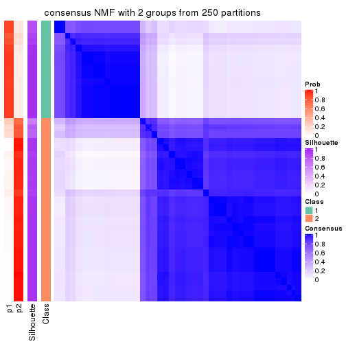</p>

</div>
<div id='tab-SD-NMF-consensus-heatmap-2'>
<pre><code class="r">consensus_heatmap(res, k = 3)
</code></pre>

<p>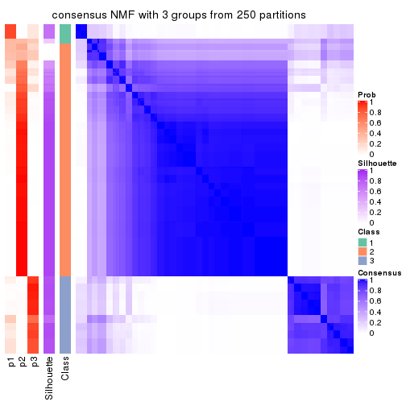</p>

</div>
<div id='tab-SD-NMF-consensus-heatmap-3'>
<pre><code class="r">consensus_heatmap(res, k = 4)
</code></pre>

<p>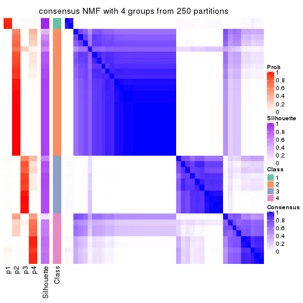</p>

</div>
<div id='tab-SD-NMF-consensus-heatmap-4'>
<pre><code class="r">consensus_heatmap(res, k = 5)
</code></pre>

<p>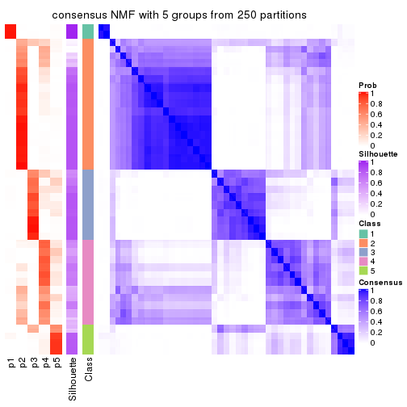</p>

</div>
<div id='tab-SD-NMF-consensus-heatmap-5'>
<pre><code class="r">consensus_heatmap(res, k = 6)
</code></pre>

<p>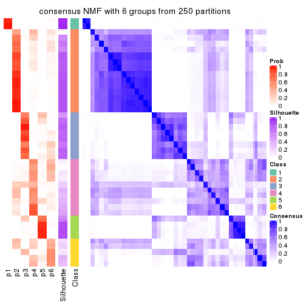</p>

</div>
</div>

Heatmaps for the membership of samples in all partitions to see how consistent they are:


<script>
$( function() {
	$( '#tabs-SD-NMF-membership-heatmap' ).tabs();
} );
</script>
<div id='tabs-SD-NMF-membership-heatmap'>
<ul>
<li><a href='#tab-SD-NMF-membership-heatmap-1'>k = 2</a></li>
<li><a href='#tab-SD-NMF-membership-heatmap-2'>k = 3</a></li>
<li><a href='#tab-SD-NMF-membership-heatmap-3'>k = 4</a></li>
<li><a href='#tab-SD-NMF-membership-heatmap-4'>k = 5</a></li>
<li><a href='#tab-SD-NMF-membership-heatmap-5'>k = 6</a></li>
</ul>
<div id='tab-SD-NMF-membership-heatmap-1'>
<pre><code class="r">membership_heatmap(res, k = 2)
</code></pre>

<p>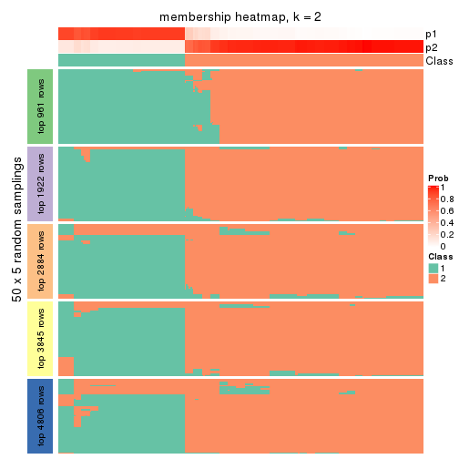</p>

</div>
<div id='tab-SD-NMF-membership-heatmap-2'>
<pre><code class="r">membership_heatmap(res, k = 3)
</code></pre>

<p>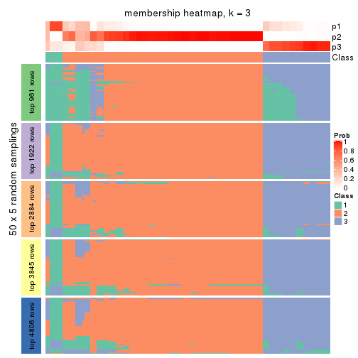</p>

</div>
<div id='tab-SD-NMF-membership-heatmap-3'>
<pre><code class="r">membership_heatmap(res, k = 4)
</code></pre>

<p>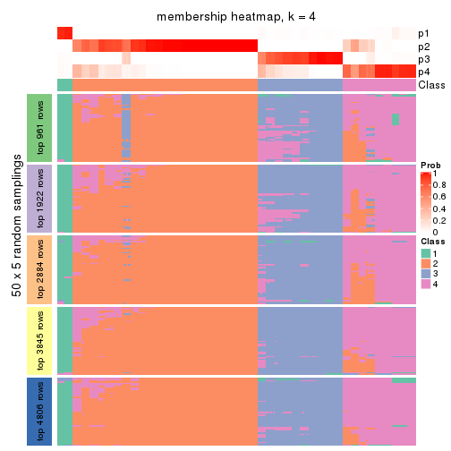</p>

</div>
<div id='tab-SD-NMF-membership-heatmap-4'>
<pre><code class="r">membership_heatmap(res, k = 5)
</code></pre>

<p>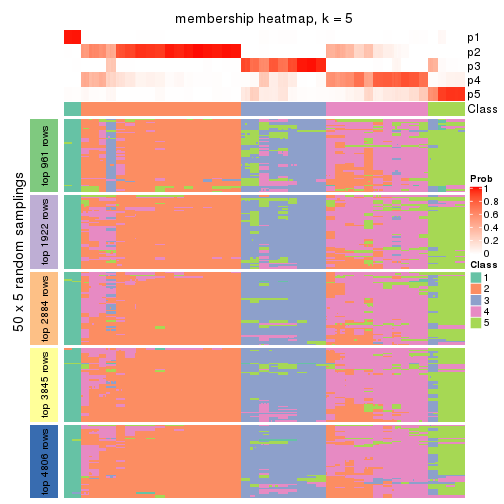</p>

</div>
<div id='tab-SD-NMF-membership-heatmap-5'>
<pre><code class="r">membership_heatmap(res, k = 6)
</code></pre>

<p>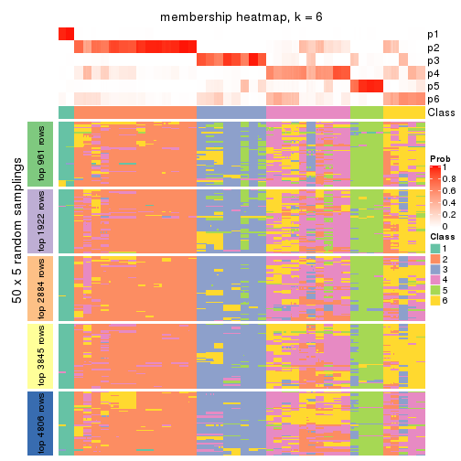</p>

</div>
</div>

As soon as we have had the classes for columns, we can look for signatures
which are significantly different between classes which can be candidate marks
for certain classes. Following are the heatmaps for signatures.


Signature heatmaps where rows are scaled:


<script>
$( function() {
	$( '#tabs-SD-NMF-get-signatures' ).tabs();
} );
</script>
<div id='tabs-SD-NMF-get-signatures'>
<ul>
<li><a href='#tab-SD-NMF-get-signatures-1'>k = 2</a></li>
<li><a href='#tab-SD-NMF-get-signatures-2'>k = 3</a></li>
<li><a href='#tab-SD-NMF-get-signatures-3'>k = 4</a></li>
<li><a href='#tab-SD-NMF-get-signatures-4'>k = 5</a></li>
<li><a href='#tab-SD-NMF-get-signatures-5'>k = 6</a></li>
</ul>
<div id='tab-SD-NMF-get-signatures-1'>
<pre><code class="r">get_signatures(res, k = 2)
</code></pre>

<p>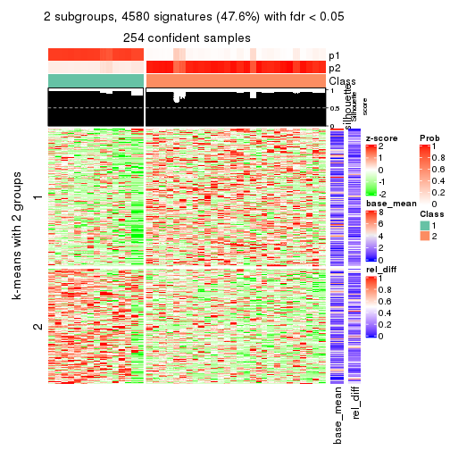</p>

</div>
<div id='tab-SD-NMF-get-signatures-2'>
<pre><code class="r">get_signatures(res, k = 3)
</code></pre>

<p>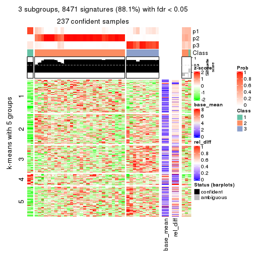</p>

</div>
<div id='tab-SD-NMF-get-signatures-3'>
<pre><code class="r">get_signatures(res, k = 4)
</code></pre>

<p>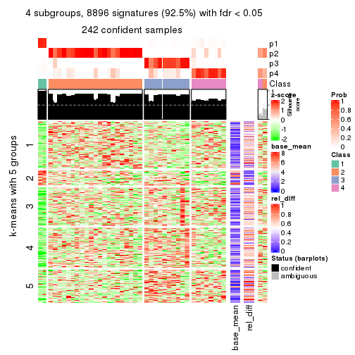</p>

</div>
<div id='tab-SD-NMF-get-signatures-4'>
<pre><code class="r">get_signatures(res, k = 5)
</code></pre>

<p>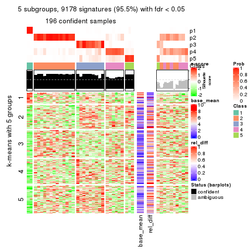</p>

</div>
<div id='tab-SD-NMF-get-signatures-5'>
<pre><code class="r">get_signatures(res, k = 6)
</code></pre>

<p>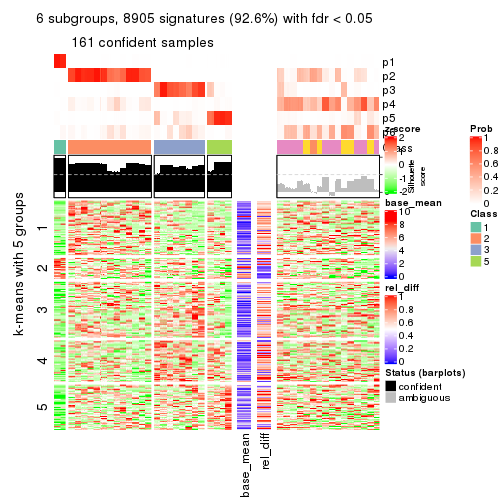</p>

</div>
</div>


Signature heatmaps where rows are not scaled:


<script>
$( function() {
	$( '#tabs-SD-NMF-get-signatures-no-scale' ).tabs();
} );
</script>
<div id='tabs-SD-NMF-get-signatures-no-scale'>
<ul>
<li><a href='#tab-SD-NMF-get-signatures-no-scale-1'>k = 2</a></li>
<li><a href='#tab-SD-NMF-get-signatures-no-scale-2'>k = 3</a></li>
<li><a href='#tab-SD-NMF-get-signatures-no-scale-3'>k = 4</a></li>
<li><a href='#tab-SD-NMF-get-signatures-no-scale-4'>k = 5</a></li>
<li><a href='#tab-SD-NMF-get-signatures-no-scale-5'>k = 6</a></li>
</ul>
<div id='tab-SD-NMF-get-signatures-no-scale-1'>
<pre><code class="r">get_signatures(res, k = 2, scale_rows = FALSE)
</code></pre>

<p>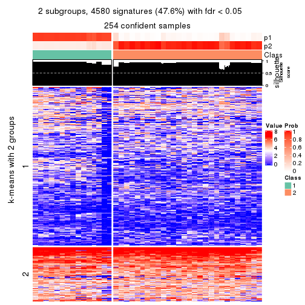</p>

</div>
<div id='tab-SD-NMF-get-signatures-no-scale-2'>
<pre><code class="r">get_signatures(res, k = 3, scale_rows = FALSE)
</code></pre>

<p>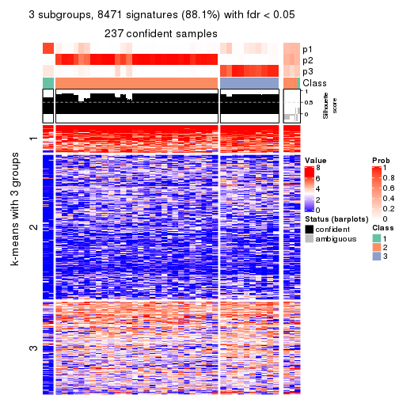</p>

</div>
<div id='tab-SD-NMF-get-signatures-no-scale-3'>
<pre><code class="r">get_signatures(res, k = 4, scale_rows = FALSE)
</code></pre>

<p>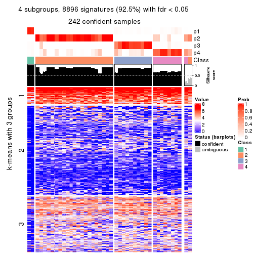</p>

</div>
<div id='tab-SD-NMF-get-signatures-no-scale-4'>
<pre><code class="r">get_signatures(res, k = 5, scale_rows = FALSE)
</code></pre>

<p>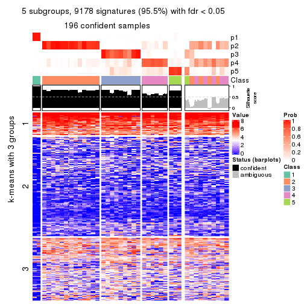</p>

</div>
<div id='tab-SD-NMF-get-signatures-no-scale-5'>
<pre><code class="r">get_signatures(res, k = 6, scale_rows = FALSE)
</code></pre>

<p>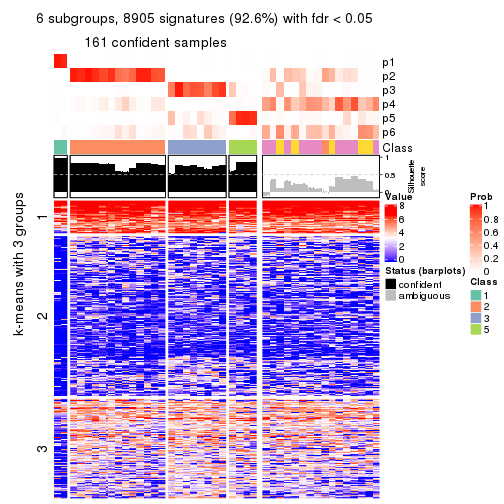</p>

</div>
</div>


Compare the overlap of signatures from different k:

```r
compare_signatures(res)
```

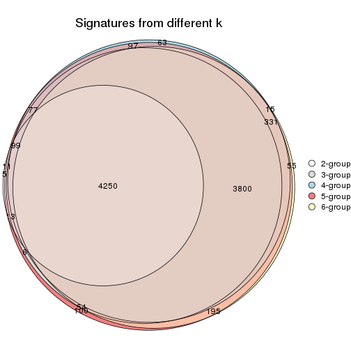

`get_signature()` returns a data frame invisibly. TO get the list of signatures, the function
call should be assigned to a variable explicitly. In following code, if `plot` argument is set
to `FALSE`, no heatmap is plotted while only the differential analysis is performed.

```r
# code only for demonstration
tb = get_signature(res, k = ..., plot = FALSE)
```

An example of the output of `tb` is:

```
#>   which_row         fdr    mean_1    mean_2 scaled_mean_1 scaled_mean_2 km
#> 1        38 0.042760348  8.373488  9.131774    -0.5533452     0.5164555  1
#> 2        40 0.018707592  7.106213  8.469186    -0.6173731     0.5762149  1
#> 3        55 0.019134737 10.221463 11.207825    -0.6159697     0.5749050  1
#> 4        59 0.006059896  5.921854  7.869574    -0.6899429     0.6439467  1
#> 5        60 0.018055526  8.928898 10.211722    -0.6204761     0.5791110  1
#> 6        98 0.009384629 15.714769 14.887706     0.6635654    -0.6193277  2
...
```

The columns in `tb` are:

1. `which_row`: row indices corresponding to the input matrix.
2. `fdr`: FDR for the differential test. 
3. `mean_x`: The mean value in group x.
4. `scaled_mean_x`: The mean value in group x after rows are scaled.
5. `km`: Row groups if k-means clustering is applied to rows.


UMAP plot which shows how samples are separated.


<script>
$( function() {
	$( '#tabs-SD-NMF-dimension-reduction' ).tabs();
} );
</script>
<div id='tabs-SD-NMF-dimension-reduction'>
<ul>
<li><a href='#tab-SD-NMF-dimension-reduction-1'>k = 2</a></li>
<li><a href='#tab-SD-NMF-dimension-reduction-2'>k = 3</a></li>
<li><a href='#tab-SD-NMF-dimension-reduction-3'>k = 4</a></li>
<li><a href='#tab-SD-NMF-dimension-reduction-4'>k = 5</a></li>
<li><a href='#tab-SD-NMF-dimension-reduction-5'>k = 6</a></li>
</ul>
<div id='tab-SD-NMF-dimension-reduction-1'>
<pre><code class="r">dimension_reduction(res, k = 2, method = &quot;UMAP&quot;)
</code></pre>

<p>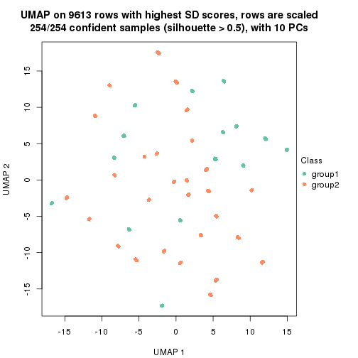</p>

</div>
<div id='tab-SD-NMF-dimension-reduction-2'>
<pre><code class="r">dimension_reduction(res, k = 3, method = &quot;UMAP&quot;)
</code></pre>

<p>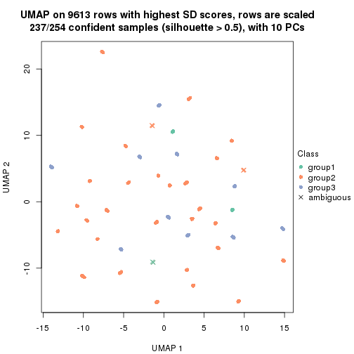</p>

</div>
<div id='tab-SD-NMF-dimension-reduction-3'>
<pre><code class="r">dimension_reduction(res, k = 4, method = &quot;UMAP&quot;)
</code></pre>

<p>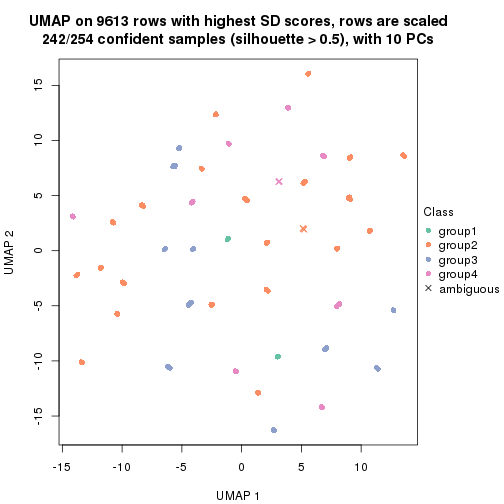</p>

</div>
<div id='tab-SD-NMF-dimension-reduction-4'>
<pre><code class="r">dimension_reduction(res, k = 5, method = &quot;UMAP&quot;)
</code></pre>

<p>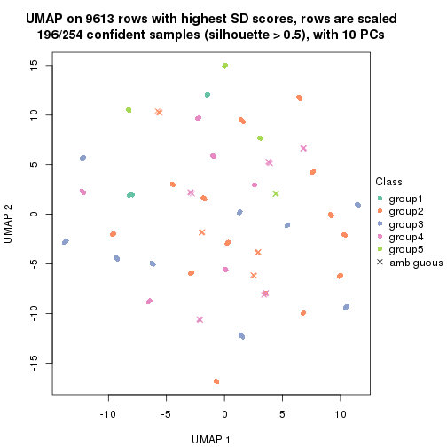</p>

</div>
<div id='tab-SD-NMF-dimension-reduction-5'>
<pre><code class="r">dimension_reduction(res, k = 6, method = &quot;UMAP&quot;)
</code></pre>

<p>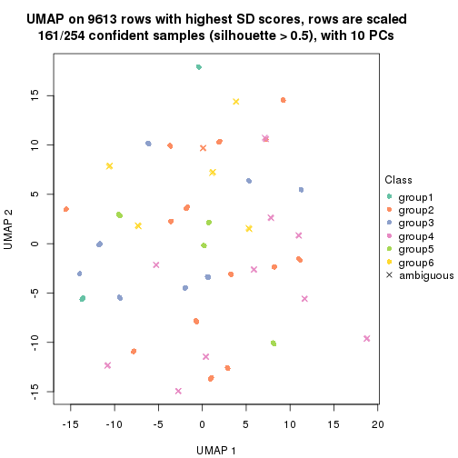</p>

</div>
</div>


Following heatmap shows how subgroups are split when increasing `k`:

```r
collect_classes(res)
```

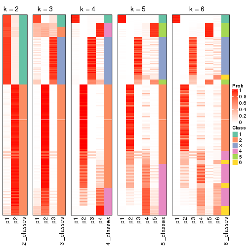


If matrix rows can be associated to genes, consider to use `GO_Enrichment(res,
...)` to perform function enrichment for the signature genes.


 

---------------------------------------------------


### CV:hclust


The object with results only for a single top-value method and a single partition method 
can be extracted as:

```r
res = res_list["CV", "hclust"]
# you can also extract it by
# res = res_list["CV:hclust"]
```

A summary of `res` and all the functions that can be applied to it:

```r
res
```

```
#> A 'ConsensusPartition' object with k = 2, 3, 4, 5, 6.
#>   On a matrix with 9613 rows and 254 columns.
#>   Top rows (961, 1922, 2884, 3845, 4806) are extracted by 'CV' method.
#>   Subgroups are detected by 'hclust' method.
#>   Performed in total 1250 partitions by row resampling.
#>   Best k for subgroups seems to be 3.
#> 
#> Following methods can be applied to this 'ConsensusPartition' object:
#>  [1] "cola_report"             "collect_classes"         "collect_plots"          
#>  [4] "collect_stats"           "colnames"                "compare_signatures"     
#>  [7] "consensus_heatmap"       "dimension_reduction"     "functional_enrichment"  
#> [10] "get_anno_col"            "get_anno"                "get_classes"            
#> [13] "get_consensus"           "get_matrix"              "get_membership"         
#> [16] "get_param"               "get_signatures"          "get_stats"              
#> [19] "is_best_k"               "is_stable_k"             "membership_heatmap"     
#> [22] "ncol"                    "nrow"                    "plot_ecdf"              
#> [25] "rownames"                "select_partition_number" "show"                   
#> [28] "suggest_best_k"          "test_to_known_factors"
```

`collect_plots()` function collects all the plots made from `res` for all `k` (number of partitions)
into one single page to provide an easy and fast comparison between different `k`.

```r
collect_plots(res)
```

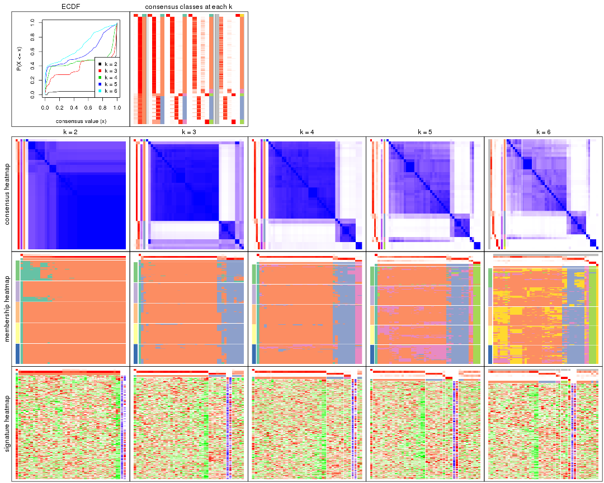

The plots are:

- The first row: a plot of the ECDF (Empirical cumulative distribution
  function) curves of the consensus matrix for each `k` and the heatmap of
  predicted classes for each `k`.
- The second row: heatmaps of the consensus matrix for each `k`.
- The third row: heatmaps of the membership matrix for each `k`.
- The fouth row: heatmaps of the signatures for each `k`.

All the plots in panels can be made by individual functions and they are
plotted later in this section.

`select_partition_number()` produces several plots showing different
statistics for choosing "optimized" `k`. There are following statistics:

- ECDF curves of the consensus matrix for each `k`;
- 1-PAC. [The PAC
  score](https://en.wikipedia.org/wiki/Consensus_clustering#Over-interpretation_potential_of_consensus_clustering)
  measures the proportion of the ambiguous subgrouping.
- Mean silhouette score.
- Concordance. The mean probability of fiting the consensus class ids in all
  partitions.
- Area increased. Denote $A_k$ as the area under the ECDF curve for current
  `k`, the area increased is defined as $A_k - A_{k-1}$.
- Rand index. The percent of pairs of samples that are both in a same cluster
  or both are not in a same cluster in the partition of k and k-1.
- Jaccard index. The ratio of pairs of samples are both in a same cluster in
  the partition of k and k-1 and the pairs of samples are both in a same
  cluster in the partition k or k-1.

The detailed explanations of these statistics can be found in [the cola
vignette](http://bioconductor.org/packages/devel/bioc/vignettes/cola/inst/doc/cola.html#toc_13).

Generally speaking, lower PAC score, higher mean silhouette score or higher
concordance corresponds to better partition. Rand index and Jaccard index
measure how similar the current partition is compared to partition with `k-1`.
If they are too similar, we won't accept `k` is better than `k-1`.

```r
select_partition_number(res)
```

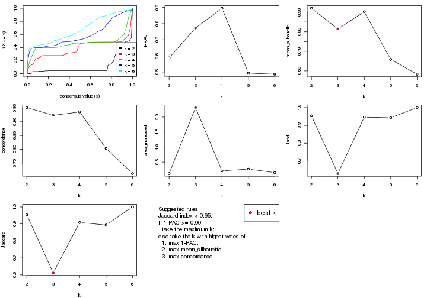

The numeric values for all these statistics can be obtained by `get_stats()`.

```r
get_stats(res)
```

```
#>   k 1-PAC mean_silhouette concordance area_increased  Rand Jaccard
#> 2 2 0.588           0.920       0.951          0.117 0.954   0.954
#> 3 3 0.773           0.815       0.923          2.314 0.630   0.612
#> 4 4 0.895           0.902       0.935          0.208 0.946   0.908
#> 5 5 0.493           0.659       0.803          0.266 0.943   0.894
#> 6 6 0.486           0.583       0.712          0.150 1.000   1.000
```

`suggest_best_k()` suggests the best $k$ based on these statistics. The rules are as follows:

- All $k$ with Jaccard index larger than 0.95 are removed because the increase of
  the partition number does not provides enough extra information. If all $k$ are removed,
  the best $k$ is assigned by `NA`.
- For $k$ with 1-PAC larger than 0.9, the maximal $k$ is taken as the "best k". Other $k$ is called "optional k".
- If it does not fit the second rule. The $k$ with the highest vote of highest
  1-PAC, mean silhouette and concordance is taken as the "best k".

```r
suggest_best_k(res)
```

```
#> [1] 3
```


Following shows the table of the partitions (You need to click the **show/hide
code output** link to see it). The membership matrix (columns with name `p*`)
is inferred by
[`clue::cl_consensus()`](https://www.rdocumentation.org/link/cl_consensus?package=clue)
function with the `SE` method. Basically the value in the membership matrix
represents the probability to belong to a certain group. The finall class
label for an item is determined with the group with highest probability it
belongs to.

In `get_classes()` function, the entropy is calculated from the membership
matrix and the silhouette score is calculated from the consensus matrix.


<script>
$( function() {
	$( '#tabs-CV-hclust-get-classes' ).tabs();
} );
</script>
<div id='tabs-CV-hclust-get-classes'>
<ul>
<li><a href='#tab-CV-hclust-get-classes-1'>k = 2</a></li>
<li><a href='#tab-CV-hclust-get-classes-2'>k = 3</a></li>
<li><a href='#tab-CV-hclust-get-classes-3'>k = 4</a></li>
<li><a href='#tab-CV-hclust-get-classes-4'>k = 5</a></li>
<li><a href='#tab-CV-hclust-get-classes-5'>k = 6</a></li>
</ul>

<div id='tab-CV-hclust-get-classes-1'>
<p><a id='tab-CV-hclust-get-classes-1-a' style='color:#0366d6' href='#'>show/hide code output</a></p>
<pre><code class="r">cbind(get_classes(res, k = 2), get_membership(res, k = 2))
</code></pre>

<pre><code>#&gt;           class entropy silhouette    p1    p2
#&gt; DRR024803     2  0.0000      0.950 0.000 1.000
#&gt; DRR024804     2  0.0376      0.949 0.004 0.996
#&gt; DRR024805     2  0.0000      0.950 0.000 1.000
#&gt; DRR024806     2  0.0000      0.950 0.000 1.000
#&gt; DRR024807     1  0.2423      1.000 0.960 0.040
#&gt; DRR024808     2  0.7950      0.768 0.240 0.760
#&gt; DRR024809     2  0.0000      0.950 0.000 1.000
#&gt; DRR024810     2  0.0000      0.950 0.000 1.000
#&gt; DRR024811     2  0.6531      0.841 0.168 0.832
#&gt; DRR024812     2  0.0000      0.950 0.000 1.000
#&gt; DRR024813     2  0.0000      0.950 0.000 1.000
#&gt; DRR024814     2  0.0000      0.950 0.000 1.000
#&gt; DRR024815     2  0.0672      0.948 0.008 0.992
#&gt; DRR024816     2  0.0000      0.950 0.000 1.000
#&gt; DRR024817     2  0.0672      0.948 0.008 0.992
#&gt; DRR024818     2  0.3733      0.914 0.072 0.928
#&gt; DRR024819     2  0.1843      0.940 0.028 0.972
#&gt; DRR024820     2  0.5059      0.889 0.112 0.888
#&gt; DRR024821     2  0.6712      0.834 0.176 0.824
#&gt; DRR024822     2  0.0000      0.950 0.000 1.000
#&gt; DRR024824     2  0.0000      0.950 0.000 1.000
#&gt; DRR024825     2  0.7950      0.768 0.240 0.760
#&gt; DRR024826     2  0.0000      0.950 0.000 1.000
#&gt; DRR024827     2  0.5178      0.886 0.116 0.884
#&gt; DRR024828     2  0.5294      0.883 0.120 0.880
#&gt; DRR024829     2  0.0000      0.950 0.000 1.000
#&gt; DRR024830     2  0.0000      0.950 0.000 1.000
#&gt; DRR024831     2  0.7950      0.768 0.240 0.760
#&gt; DRR024832     2  0.6712      0.834 0.176 0.824
#&gt; DRR024833     2  0.0000      0.950 0.000 1.000
#&gt; DRR024834     2  0.0000      0.950 0.000 1.000
#&gt; DRR024835     2  0.0672      0.948 0.008 0.992
#&gt; DRR024836     2  0.7056      0.820 0.192 0.808
#&gt; DRR024837     2  0.0000      0.950 0.000 1.000
#&gt; DRR024838     2  0.0376      0.949 0.004 0.996
#&gt; DRR024839     2  0.0000      0.950 0.000 1.000
#&gt; DRR024840     2  0.0376      0.949 0.004 0.996
#&gt; DRR024841     2  0.0376      0.949 0.004 0.996
#&gt; DRR024842     2  0.0000      0.950 0.000 1.000
#&gt; DRR024843     2  0.0000      0.950 0.000 1.000
#&gt; DRR024844     2  0.0376      0.949 0.004 0.996
#&gt; DRR024845     2  0.0000      0.950 0.000 1.000
#&gt; DRR024846     2  0.0000      0.950 0.000 1.000
#&gt; DRR024847     1  0.2423      1.000 0.960 0.040
#&gt; DRR024848     2  0.0000      0.950 0.000 1.000
#&gt; DRR024849     2  0.7950      0.768 0.240 0.760
#&gt; DRR024850     2  0.0000      0.950 0.000 1.000
#&gt; DRR024851     2  0.0000      0.950 0.000 1.000
#&gt; DRR024852     2  0.0000      0.950 0.000 1.000
#&gt; DRR024853     2  0.6531      0.841 0.168 0.832
#&gt; DRR024854     2  0.0000      0.950 0.000 1.000
#&gt; DRR024855     2  0.0000      0.950 0.000 1.000
#&gt; DRR024856     2  0.0000      0.950 0.000 1.000
#&gt; DRR024857     2  0.0672      0.948 0.008 0.992
#&gt; DRR024858     2  0.0000      0.950 0.000 1.000
#&gt; DRR024859     2  0.0672      0.948 0.008 0.992
#&gt; DRR024860     2  0.3733      0.914 0.072 0.928
#&gt; DRR024861     2  0.1843      0.940 0.028 0.972
#&gt; DRR024862     2  0.5059      0.889 0.112 0.888
#&gt; DRR024863     2  0.6712      0.834 0.176 0.824
#&gt; DRR024864     2  0.0000      0.950 0.000 1.000
#&gt; DRR024865     2  0.0000      0.950 0.000 1.000
#&gt; DRR024866     2  0.0000      0.950 0.000 1.000
#&gt; DRR024867     2  0.7950      0.768 0.240 0.760
#&gt; DRR024868     2  0.0000      0.950 0.000 1.000
#&gt; DRR024869     2  0.5178      0.886 0.116 0.884
#&gt; DRR024870     2  0.5294      0.883 0.120 0.880
#&gt; DRR024871     2  0.0000      0.950 0.000 1.000
#&gt; DRR024872     2  0.0000      0.950 0.000 1.000
#&gt; DRR024873     2  0.7950      0.768 0.240 0.760
#&gt; DRR024874     2  0.6712      0.834 0.176 0.824
#&gt; DRR024875     2  0.0000      0.950 0.000 1.000
#&gt; DRR024876     2  0.0000      0.950 0.000 1.000
#&gt; DRR024877     2  0.0672      0.948 0.008 0.992
#&gt; DRR024878     2  0.7056      0.820 0.192 0.808
#&gt; DRR024879     2  0.0000      0.950 0.000 1.000
#&gt; DRR024880     2  0.0376      0.949 0.004 0.996
#&gt; DRR024881     2  0.0000      0.950 0.000 1.000
#&gt; DRR024882     2  0.0376      0.949 0.004 0.996
#&gt; DRR024883     2  0.0376      0.949 0.004 0.996
#&gt; DRR024884     2  0.0672      0.948 0.008 0.992
#&gt; DRR024885     2  0.5178      0.886 0.116 0.884
#&gt; DRR024886     2  0.0000      0.950 0.000 1.000
#&gt; DRR024887     2  0.0376      0.949 0.004 0.996
#&gt; DRR024888     2  0.0000      0.950 0.000 1.000
#&gt; DRR024889     2  0.0000      0.950 0.000 1.000
#&gt; DRR024890     1  0.2423      1.000 0.960 0.040
#&gt; DRR024891     2  0.0000      0.950 0.000 1.000
#&gt; DRR024892     2  0.7950      0.768 0.240 0.760
#&gt; DRR024893     2  0.0000      0.950 0.000 1.000
#&gt; DRR024894     2  0.0000      0.950 0.000 1.000
#&gt; DRR024895     2  0.0000      0.950 0.000 1.000
#&gt; DRR024896     2  0.6531      0.841 0.168 0.832
#&gt; DRR024897     2  0.0000      0.950 0.000 1.000
#&gt; DRR024898     2  0.0000      0.950 0.000 1.000
#&gt; DRR024899     2  0.0000      0.950 0.000 1.000
#&gt; DRR024900     2  0.0672      0.948 0.008 0.992
#&gt; DRR024901     2  0.0000      0.950 0.000 1.000
#&gt; DRR024902     2  0.0672      0.948 0.008 0.992
#&gt; DRR024903     2  0.3733      0.914 0.072 0.928
#&gt; DRR024904     2  0.1843      0.940 0.028 0.972
#&gt; DRR024905     2  0.5059      0.889 0.112 0.888
#&gt; DRR024906     2  0.6712      0.834 0.176 0.824
#&gt; DRR024907     2  0.0000      0.950 0.000 1.000
#&gt; DRR024908     2  0.0000      0.950 0.000 1.000
#&gt; DRR024909     2  0.0000      0.950 0.000 1.000
#&gt; DRR024910     2  0.7950      0.768 0.240 0.760
#&gt; DRR024911     2  0.0000      0.950 0.000 1.000
#&gt; DRR024912     2  0.5178      0.886 0.116 0.884
#&gt; DRR024913     2  0.5294      0.883 0.120 0.880
#&gt; DRR024914     2  0.0000      0.950 0.000 1.000
#&gt; DRR024915     2  0.0000      0.950 0.000 1.000
#&gt; DRR024916     2  0.7950      0.768 0.240 0.760
#&gt; DRR024917     2  0.6712      0.834 0.176 0.824
#&gt; DRR024918     2  0.0000      0.950 0.000 1.000
#&gt; DRR024919     2  0.0000      0.950 0.000 1.000
#&gt; DRR024920     2  0.0672      0.948 0.008 0.992
#&gt; DRR024921     2  0.7056      0.820 0.192 0.808
#&gt; DRR024922     2  0.0000      0.950 0.000 1.000
#&gt; DRR024923     2  0.0376      0.949 0.004 0.996
#&gt; DRR024924     2  0.0000      0.950 0.000 1.000
#&gt; DRR024925     2  0.0376      0.949 0.004 0.996
#&gt; DRR024926     2  0.0376      0.949 0.004 0.996
#&gt; DRR024927     2  0.0672      0.948 0.008 0.992
#&gt; DRR024928     2  0.5178      0.886 0.116 0.884
#&gt; DRR024929     2  0.0000      0.950 0.000 1.000
#&gt; DRR024930     2  0.0376      0.949 0.004 0.996
#&gt; DRR024931     2  0.0000      0.950 0.000 1.000
#&gt; DRR024932     2  0.0000      0.950 0.000 1.000
#&gt; DRR024933     1  0.2423      1.000 0.960 0.040
#&gt; DRR024934     2  0.0000      0.950 0.000 1.000
#&gt; DRR024935     2  0.7950      0.768 0.240 0.760
#&gt; DRR024936     2  0.0000      0.950 0.000 1.000
#&gt; DRR024937     2  0.0000      0.950 0.000 1.000
#&gt; DRR024938     2  0.0000      0.950 0.000 1.000
#&gt; DRR024939     2  0.6531      0.841 0.168 0.832
#&gt; DRR024940     2  0.0000      0.950 0.000 1.000
#&gt; DRR024941     2  0.0000      0.950 0.000 1.000
#&gt; DRR024942     2  0.0000      0.950 0.000 1.000
#&gt; DRR024943     2  0.0672      0.948 0.008 0.992
#&gt; DRR024944     2  0.0000      0.950 0.000 1.000
#&gt; DRR024945     2  0.0672      0.948 0.008 0.992
#&gt; DRR024946     2  0.3733      0.914 0.072 0.928
#&gt; DRR024947     2  0.1843      0.940 0.028 0.972
#&gt; DRR024948     2  0.5059      0.889 0.112 0.888
#&gt; DRR024949     2  0.6712      0.834 0.176 0.824
#&gt; DRR024950     2  0.0000      0.950 0.000 1.000
#&gt; DRR024951     2  0.0000      0.950 0.000 1.000
#&gt; DRR024952     2  0.0000      0.950 0.000 1.000
#&gt; DRR024953     2  0.7950      0.768 0.240 0.760
#&gt; DRR024954     2  0.0000      0.950 0.000 1.000
#&gt; DRR024955     2  0.5178      0.886 0.116 0.884
#&gt; DRR024956     2  0.5294      0.883 0.120 0.880
#&gt; DRR024957     2  0.0000      0.950 0.000 1.000
#&gt; DRR024958     2  0.0000      0.950 0.000 1.000
#&gt; DRR024959     2  0.7950      0.768 0.240 0.760
#&gt; DRR024960     2  0.6712      0.834 0.176 0.824
#&gt; DRR024961     2  0.0000      0.950 0.000 1.000
#&gt; DRR024962     2  0.0000      0.950 0.000 1.000
#&gt; DRR024963     2  0.0672      0.948 0.008 0.992
#&gt; DRR024964     2  0.7056      0.820 0.192 0.808
#&gt; DRR024965     2  0.0000      0.950 0.000 1.000
#&gt; DRR024966     2  0.0376      0.949 0.004 0.996
#&gt; DRR024967     2  0.0000      0.950 0.000 1.000
#&gt; DRR024968     2  0.0376      0.949 0.004 0.996
#&gt; DRR024969     2  0.0376      0.949 0.004 0.996
#&gt; DRR024970     2  0.0672      0.948 0.008 0.992
#&gt; DRR024971     2  0.5178      0.886 0.116 0.884
#&gt; DRR024972     2  0.0000      0.950 0.000 1.000
#&gt; DRR024973     2  0.0376      0.949 0.004 0.996
#&gt; DRR024974     2  0.0000      0.950 0.000 1.000
#&gt; DRR024975     2  0.0000      0.950 0.000 1.000
#&gt; DRR024976     1  0.2423      1.000 0.960 0.040
#&gt; DRR024977     2  0.0000      0.950 0.000 1.000
#&gt; DRR024978     2  0.7950      0.768 0.240 0.760
#&gt; DRR024979     2  0.0000      0.950 0.000 1.000
#&gt; DRR024980     2  0.0000      0.950 0.000 1.000
#&gt; DRR024981     2  0.0000      0.950 0.000 1.000
#&gt; DRR024982     2  0.6531      0.841 0.168 0.832
#&gt; DRR024983     2  0.0000      0.950 0.000 1.000
#&gt; DRR024984     2  0.0000      0.950 0.000 1.000
#&gt; DRR024985     2  0.0000      0.950 0.000 1.000
#&gt; DRR024986     2  0.0672      0.948 0.008 0.992
#&gt; DRR024987     2  0.0000      0.950 0.000 1.000
#&gt; DRR024988     2  0.0672      0.948 0.008 0.992
#&gt; DRR024989     2  0.3733      0.914 0.072 0.928
#&gt; DRR024990     2  0.1843      0.940 0.028 0.972
#&gt; DRR024991     2  0.5059      0.889 0.112 0.888
#&gt; DRR024992     2  0.6712      0.834 0.176 0.824
#&gt; DRR024993     2  0.0000      0.950 0.000 1.000
#&gt; DRR024994     2  0.0000      0.950 0.000 1.000
#&gt; DRR024995     2  0.0000      0.950 0.000 1.000
#&gt; DRR024996     2  0.7950      0.768 0.240 0.760
#&gt; DRR024997     2  0.0000      0.950 0.000 1.000
#&gt; DRR024998     2  0.5178      0.886 0.116 0.884
#&gt; DRR024999     2  0.5294      0.883 0.120 0.880
#&gt; DRR025000     2  0.0000      0.950 0.000 1.000
#&gt; DRR025001     2  0.0000      0.950 0.000 1.000
#&gt; DRR025002     2  0.7950      0.768 0.240 0.760
#&gt; DRR025003     2  0.6712      0.834 0.176 0.824
#&gt; DRR025004     2  0.0000      0.950 0.000 1.000
#&gt; DRR025005     2  0.0000      0.950 0.000 1.000
#&gt; DRR025006     2  0.0672      0.948 0.008 0.992
#&gt; DRR025007     2  0.7056      0.820 0.192 0.808
#&gt; DRR025008     2  0.0000      0.950 0.000 1.000
#&gt; DRR025009     2  0.0376      0.949 0.004 0.996
#&gt; DRR025010     2  0.0000      0.950 0.000 1.000
#&gt; DRR025011     2  0.0376      0.949 0.004 0.996
#&gt; DRR025012     2  0.0376      0.949 0.004 0.996
#&gt; DRR025013     2  0.0672      0.948 0.008 0.992
#&gt; DRR025014     2  0.5178      0.886 0.116 0.884
#&gt; DRR025015     2  0.0000      0.950 0.000 1.000
#&gt; DRR025016     2  0.0376      0.949 0.004 0.996
#&gt; DRR025017     2  0.0000      0.950 0.000 1.000
#&gt; DRR025018     2  0.0000      0.950 0.000 1.000
#&gt; DRR025019     1  0.2423      1.000 0.960 0.040
#&gt; DRR025020     2  0.0000      0.950 0.000 1.000
#&gt; DRR025021     2  0.7950      0.768 0.240 0.760
#&gt; DRR025022     2  0.0000      0.950 0.000 1.000
#&gt; DRR025023     2  0.0000      0.950 0.000 1.000
#&gt; DRR025024     2  0.0000      0.950 0.000 1.000
#&gt; DRR025025     2  0.6531      0.841 0.168 0.832
#&gt; DRR025026     2  0.0000      0.950 0.000 1.000
#&gt; DRR025027     2  0.0000      0.950 0.000 1.000
#&gt; DRR025028     2  0.0000      0.950 0.000 1.000
#&gt; DRR025029     2  0.0672      0.948 0.008 0.992
#&gt; DRR025030     2  0.0000      0.950 0.000 1.000
#&gt; DRR025031     2  0.0672      0.948 0.008 0.992
#&gt; DRR025032     2  0.3733      0.914 0.072 0.928
#&gt; DRR025033     2  0.1843      0.940 0.028 0.972
#&gt; DRR025034     2  0.5059      0.889 0.112 0.888
#&gt; DRR025035     2  0.6712      0.834 0.176 0.824
#&gt; DRR025036     2  0.0000      0.950 0.000 1.000
#&gt; DRR025037     2  0.0000      0.950 0.000 1.000
#&gt; DRR025038     2  0.0000      0.950 0.000 1.000
#&gt; DRR025039     2  0.7950      0.768 0.240 0.760
#&gt; DRR025040     2  0.0000      0.950 0.000 1.000
#&gt; DRR025041     2  0.5178      0.886 0.116 0.884
#&gt; DRR025042     2  0.5294      0.883 0.120 0.880
#&gt; DRR025043     2  0.0000      0.950 0.000 1.000
#&gt; DRR025044     2  0.0000      0.950 0.000 1.000
#&gt; DRR025045     2  0.7950      0.768 0.240 0.760
#&gt; DRR025046     2  0.6712      0.834 0.176 0.824
#&gt; DRR025047     2  0.0000      0.950 0.000 1.000
#&gt; DRR025048     2  0.0000      0.950 0.000 1.000
#&gt; DRR025049     2  0.0672      0.948 0.008 0.992
#&gt; DRR025050     2  0.7056      0.820 0.192 0.808
#&gt; DRR025051     2  0.0000      0.950 0.000 1.000
#&gt; DRR025052     2  0.0376      0.949 0.004 0.996
#&gt; DRR025053     2  0.0000      0.950 0.000 1.000
#&gt; DRR025054     2  0.0376      0.949 0.004 0.996
#&gt; DRR025055     2  0.0376      0.949 0.004 0.996
#&gt; DRR025056     2  0.0672      0.948 0.008 0.992
#&gt; DRR025057     2  0.5178      0.886 0.116 0.884
</code></pre>

<script>
$('#tab-CV-hclust-get-classes-1-a').parent().next().next().hide();
$('#tab-CV-hclust-get-classes-1-a').click(function(){
  $('#tab-CV-hclust-get-classes-1-a').parent().next().next().toggle();
  return(false);
});
</script>
</div>

<div id='tab-CV-hclust-get-classes-2'>
<p><a id='tab-CV-hclust-get-classes-2-a' style='color:#0366d6' href='#'>show/hide code output</a></p>
<pre><code class="r">cbind(get_classes(res, k = 3), get_membership(res, k = 3))
</code></pre>

<pre><code>#&gt;           class entropy silhouette    p1    p2    p3
#&gt; DRR024803     2  0.0424      0.962 0.000 0.992 0.008
#&gt; DRR024804     2  0.1399      0.954 0.004 0.968 0.028
#&gt; DRR024805     2  0.0237      0.963 0.000 0.996 0.004
#&gt; DRR024806     2  0.0237      0.963 0.000 0.996 0.004
#&gt; DRR024807     1  0.1585      1.000 0.964 0.008 0.028
#&gt; DRR024808     3  0.0237      0.589 0.004 0.000 0.996
#&gt; DRR024809     2  0.0237      0.963 0.000 0.996 0.004
#&gt; DRR024810     2  0.0000      0.962 0.000 1.000 0.000
#&gt; DRR024811     3  0.3995      0.611 0.016 0.116 0.868
#&gt; DRR024812     2  0.0747      0.961 0.000 0.984 0.016
#&gt; DRR024813     2  0.0892      0.959 0.000 0.980 0.020
#&gt; DRR024814     2  0.0237      0.962 0.000 0.996 0.004
#&gt; DRR024815     2  0.0661      0.961 0.004 0.988 0.008
#&gt; DRR024816     2  0.0000      0.962 0.000 1.000 0.000
#&gt; DRR024817     2  0.2165      0.914 0.000 0.936 0.064
#&gt; DRR024818     3  0.7074      0.321 0.020 0.480 0.500
#&gt; DRR024819     2  0.2772      0.888 0.004 0.916 0.080
#&gt; DRR024820     2  0.7188     -0.265 0.024 0.492 0.484
#&gt; DRR024821     3  0.2902      0.633 0.016 0.064 0.920
#&gt; DRR024822     2  0.0237      0.963 0.000 0.996 0.004
#&gt; DRR024824     2  0.0000      0.962 0.000 1.000 0.000
#&gt; DRR024825     3  0.0237      0.589 0.004 0.000 0.996
#&gt; DRR024826     2  0.1411      0.948 0.000 0.964 0.036
#&gt; DRR024827     3  0.7187      0.284 0.024 0.480 0.496
#&gt; DRR024828     3  0.8248      0.436 0.088 0.352 0.560
#&gt; DRR024829     2  0.0237      0.962 0.000 0.996 0.004
#&gt; DRR024830     2  0.0237      0.963 0.000 0.996 0.004
#&gt; DRR024831     3  0.0661      0.598 0.004 0.008 0.988
#&gt; DRR024832     3  0.2804      0.631 0.016 0.060 0.924
#&gt; DRR024833     2  0.1529      0.944 0.000 0.960 0.040
#&gt; DRR024834     2  0.0424      0.962 0.000 0.992 0.008
#&gt; DRR024835     2  0.1337      0.951 0.016 0.972 0.012
#&gt; DRR024836     3  0.2339      0.630 0.012 0.048 0.940
#&gt; DRR024837     2  0.0424      0.962 0.000 0.992 0.008
#&gt; DRR024838     2  0.0424      0.962 0.000 0.992 0.008
#&gt; DRR024839     2  0.0747      0.961 0.000 0.984 0.016
#&gt; DRR024840     2  0.0747      0.960 0.000 0.984 0.016
#&gt; DRR024841     2  0.0829      0.959 0.004 0.984 0.012
#&gt; DRR024842     2  0.0237      0.962 0.000 0.996 0.004
#&gt; DRR024843     2  0.0424      0.962 0.000 0.992 0.008
#&gt; DRR024844     2  0.1399      0.954 0.004 0.968 0.028
#&gt; DRR024845     2  0.0237      0.963 0.000 0.996 0.004
#&gt; DRR024846     2  0.0237      0.963 0.000 0.996 0.004
#&gt; DRR024847     1  0.1585      1.000 0.964 0.008 0.028
#&gt; DRR024848     2  0.0424      0.962 0.000 0.992 0.008
#&gt; DRR024849     3  0.0237      0.589 0.004 0.000 0.996
#&gt; DRR024850     2  0.0424      0.963 0.000 0.992 0.008
#&gt; DRR024851     2  0.0237      0.963 0.000 0.996 0.004
#&gt; DRR024852     2  0.0000      0.962 0.000 1.000 0.000
#&gt; DRR024853     3  0.3995      0.611 0.016 0.116 0.868
#&gt; DRR024854     2  0.0747      0.961 0.000 0.984 0.016
#&gt; DRR024855     2  0.0892      0.959 0.000 0.980 0.020
#&gt; DRR024856     2  0.0237      0.962 0.000 0.996 0.004
#&gt; DRR024857     2  0.0661      0.961 0.004 0.988 0.008
#&gt; DRR024858     2  0.0000      0.962 0.000 1.000 0.000
#&gt; DRR024859     2  0.2165      0.914 0.000 0.936 0.064
#&gt; DRR024860     3  0.7074      0.321 0.020 0.480 0.500
#&gt; DRR024861     2  0.2772      0.888 0.004 0.916 0.080
#&gt; DRR024862     2  0.7188     -0.265 0.024 0.492 0.484
#&gt; DRR024863     3  0.2902      0.633 0.016 0.064 0.920
#&gt; DRR024864     2  0.0237      0.963 0.000 0.996 0.004
#&gt; DRR024865     2  0.0237      0.962 0.000 0.996 0.004
#&gt; DRR024866     2  0.0000      0.962 0.000 1.000 0.000
#&gt; DRR024867     3  0.0237      0.589 0.004 0.000 0.996
#&gt; DRR024868     2  0.1411      0.948 0.000 0.964 0.036
#&gt; DRR024869     3  0.7187      0.284 0.024 0.480 0.496
#&gt; DRR024870     3  0.8248      0.436 0.088 0.352 0.560
#&gt; DRR024871     2  0.0237      0.962 0.000 0.996 0.004
#&gt; DRR024872     2  0.0237      0.963 0.000 0.996 0.004
#&gt; DRR024873     3  0.0661      0.598 0.004 0.008 0.988
#&gt; DRR024874     3  0.2804      0.631 0.016 0.060 0.924
#&gt; DRR024875     2  0.1529      0.944 0.000 0.960 0.040
#&gt; DRR024876     2  0.0424      0.962 0.000 0.992 0.008
#&gt; DRR024877     2  0.1337      0.951 0.016 0.972 0.012
#&gt; DRR024878     3  0.2339      0.630 0.012 0.048 0.940
#&gt; DRR024879     2  0.0424      0.962 0.000 0.992 0.008
#&gt; DRR024880     2  0.0424      0.962 0.000 0.992 0.008
#&gt; DRR024881     2  0.0747      0.961 0.000 0.984 0.016
#&gt; DRR024882     2  0.0747      0.960 0.000 0.984 0.016
#&gt; DRR024883     2  0.0829      0.959 0.004 0.984 0.012
#&gt; DRR024884     2  0.0848      0.959 0.008 0.984 0.008
#&gt; DRR024885     3  0.7187      0.284 0.024 0.480 0.496
#&gt; DRR024886     2  0.0424      0.962 0.000 0.992 0.008
#&gt; DRR024887     2  0.1399      0.954 0.004 0.968 0.028
#&gt; DRR024888     2  0.0237      0.963 0.000 0.996 0.004
#&gt; DRR024889     2  0.0237      0.963 0.000 0.996 0.004
#&gt; DRR024890     1  0.1585      1.000 0.964 0.008 0.028
#&gt; DRR024891     2  0.0424      0.962 0.000 0.992 0.008
#&gt; DRR024892     3  0.0237      0.589 0.004 0.000 0.996
#&gt; DRR024893     2  0.0424      0.963 0.000 0.992 0.008
#&gt; DRR024894     2  0.0237      0.963 0.000 0.996 0.004
#&gt; DRR024895     2  0.0000      0.962 0.000 1.000 0.000
#&gt; DRR024896     3  0.3995      0.611 0.016 0.116 0.868
#&gt; DRR024897     2  0.0747      0.961 0.000 0.984 0.016
#&gt; DRR024898     2  0.0892      0.959 0.000 0.980 0.020
#&gt; DRR024899     2  0.0237      0.962 0.000 0.996 0.004
#&gt; DRR024900     2  0.0661      0.961 0.004 0.988 0.008
#&gt; DRR024901     2  0.0000      0.962 0.000 1.000 0.000
#&gt; DRR024902     2  0.2165      0.914 0.000 0.936 0.064
#&gt; DRR024903     3  0.7074      0.321 0.020 0.480 0.500
#&gt; DRR024904     2  0.2772      0.888 0.004 0.916 0.080
#&gt; DRR024905     2  0.7188     -0.265 0.024 0.492 0.484
#&gt; DRR024906     3  0.2902      0.633 0.016 0.064 0.920
#&gt; DRR024907     2  0.0237      0.963 0.000 0.996 0.004
#&gt; DRR024908     2  0.0237      0.962 0.000 0.996 0.004
#&gt; DRR024909     2  0.0000      0.962 0.000 1.000 0.000
#&gt; DRR024910     3  0.0237      0.589 0.004 0.000 0.996
#&gt; DRR024911     2  0.1411      0.948 0.000 0.964 0.036
#&gt; DRR024912     3  0.7187      0.284 0.024 0.480 0.496
#&gt; DRR024913     3  0.8248      0.436 0.088 0.352 0.560
#&gt; DRR024914     2  0.0237      0.962 0.000 0.996 0.004
#&gt; DRR024915     2  0.0237      0.963 0.000 0.996 0.004
#&gt; DRR024916     3  0.0661      0.598 0.004 0.008 0.988
#&gt; DRR024917     3  0.2804      0.631 0.016 0.060 0.924
#&gt; DRR024918     2  0.1529      0.944 0.000 0.960 0.040
#&gt; DRR024919     2  0.0424      0.962 0.000 0.992 0.008
#&gt; DRR024920     2  0.1337      0.951 0.016 0.972 0.012
#&gt; DRR024921     3  0.2339      0.630 0.012 0.048 0.940
#&gt; DRR024922     2  0.0424      0.962 0.000 0.992 0.008
#&gt; DRR024923     2  0.0424      0.962 0.000 0.992 0.008
#&gt; DRR024924     2  0.0747      0.961 0.000 0.984 0.016
#&gt; DRR024925     2  0.0747      0.960 0.000 0.984 0.016
#&gt; DRR024926     2  0.0829      0.959 0.004 0.984 0.012
#&gt; DRR024927     2  0.0848      0.959 0.008 0.984 0.008
#&gt; DRR024928     3  0.7187      0.284 0.024 0.480 0.496
#&gt; DRR024929     2  0.0424      0.962 0.000 0.992 0.008
#&gt; DRR024930     2  0.1399      0.954 0.004 0.968 0.028
#&gt; DRR024931     2  0.0237      0.963 0.000 0.996 0.004
#&gt; DRR024932     2  0.0237      0.963 0.000 0.996 0.004
#&gt; DRR024933     1  0.1585      1.000 0.964 0.008 0.028
#&gt; DRR024934     2  0.0424      0.962 0.000 0.992 0.008
#&gt; DRR024935     3  0.0237      0.589 0.004 0.000 0.996
#&gt; DRR024936     2  0.0424      0.963 0.000 0.992 0.008
#&gt; DRR024937     2  0.0237      0.963 0.000 0.996 0.004
#&gt; DRR024938     2  0.0000      0.962 0.000 1.000 0.000
#&gt; DRR024939     3  0.3995      0.611 0.016 0.116 0.868
#&gt; DRR024940     2  0.0747      0.961 0.000 0.984 0.016
#&gt; DRR024941     2  0.0892      0.959 0.000 0.980 0.020
#&gt; DRR024942     2  0.0237      0.962 0.000 0.996 0.004
#&gt; DRR024943     2  0.0661      0.961 0.004 0.988 0.008
#&gt; DRR024944     2  0.0000      0.962 0.000 1.000 0.000
#&gt; DRR024945     2  0.2165      0.914 0.000 0.936 0.064
#&gt; DRR024946     3  0.7074      0.321 0.020 0.480 0.500
#&gt; DRR024947     2  0.2772      0.888 0.004 0.916 0.080
#&gt; DRR024948     2  0.7188     -0.265 0.024 0.492 0.484
#&gt; DRR024949     3  0.2902      0.633 0.016 0.064 0.920
#&gt; DRR024950     2  0.0237      0.963 0.000 0.996 0.004
#&gt; DRR024951     2  0.0237      0.962 0.000 0.996 0.004
#&gt; DRR024952     2  0.0000      0.962 0.000 1.000 0.000
#&gt; DRR024953     3  0.0237      0.589 0.004 0.000 0.996
#&gt; DRR024954     2  0.1411      0.948 0.000 0.964 0.036
#&gt; DRR024955     3  0.7187      0.284 0.024 0.480 0.496
#&gt; DRR024956     3  0.8248      0.436 0.088 0.352 0.560
#&gt; DRR024957     2  0.0237      0.962 0.000 0.996 0.004
#&gt; DRR024958     2  0.0237      0.963 0.000 0.996 0.004
#&gt; DRR024959     3  0.0661      0.598 0.004 0.008 0.988
#&gt; DRR024960     3  0.2804      0.631 0.016 0.060 0.924
#&gt; DRR024961     2  0.1529      0.944 0.000 0.960 0.040
#&gt; DRR024962     2  0.0424      0.962 0.000 0.992 0.008
#&gt; DRR024963     2  0.1337      0.951 0.016 0.972 0.012
#&gt; DRR024964     3  0.2339      0.630 0.012 0.048 0.940
#&gt; DRR024965     2  0.0424      0.962 0.000 0.992 0.008
#&gt; DRR024966     2  0.0424      0.962 0.000 0.992 0.008
#&gt; DRR024967     2  0.0747      0.961 0.000 0.984 0.016
#&gt; DRR024968     2  0.0747      0.960 0.000 0.984 0.016
#&gt; DRR024969     2  0.0829      0.959 0.004 0.984 0.012
#&gt; DRR024970     2  0.0848      0.959 0.008 0.984 0.008
#&gt; DRR024971     3  0.7187      0.284 0.024 0.480 0.496
#&gt; DRR024972     2  0.0424      0.962 0.000 0.992 0.008
#&gt; DRR024973     2  0.1399      0.954 0.004 0.968 0.028
#&gt; DRR024974     2  0.0237      0.963 0.000 0.996 0.004
#&gt; DRR024975     2  0.0237      0.963 0.000 0.996 0.004
#&gt; DRR024976     1  0.1585      1.000 0.964 0.008 0.028
#&gt; DRR024977     2  0.0424      0.962 0.000 0.992 0.008
#&gt; DRR024978     3  0.0237      0.589 0.004 0.000 0.996
#&gt; DRR024979     2  0.0424      0.963 0.000 0.992 0.008
#&gt; DRR024980     2  0.0237      0.963 0.000 0.996 0.004
#&gt; DRR024981     2  0.0000      0.962 0.000 1.000 0.000
#&gt; DRR024982     3  0.3995      0.611 0.016 0.116 0.868
#&gt; DRR024983     2  0.0747      0.961 0.000 0.984 0.016
#&gt; DRR024984     2  0.0892      0.959 0.000 0.980 0.020
#&gt; DRR024985     2  0.0237      0.962 0.000 0.996 0.004
#&gt; DRR024986     2  0.0661      0.961 0.004 0.988 0.008
#&gt; DRR024987     2  0.0000      0.962 0.000 1.000 0.000
#&gt; DRR024988     2  0.2165      0.914 0.000 0.936 0.064
#&gt; DRR024989     3  0.7074      0.321 0.020 0.480 0.500
#&gt; DRR024990     2  0.2772      0.888 0.004 0.916 0.080
#&gt; DRR024991     2  0.7188     -0.265 0.024 0.492 0.484
#&gt; DRR024992     3  0.2902      0.633 0.016 0.064 0.920
#&gt; DRR024993     2  0.0237      0.963 0.000 0.996 0.004
#&gt; DRR024994     2  0.0237      0.962 0.000 0.996 0.004
#&gt; DRR024995     2  0.0000      0.962 0.000 1.000 0.000
#&gt; DRR024996     3  0.0237      0.589 0.004 0.000 0.996
#&gt; DRR024997     2  0.1411      0.948 0.000 0.964 0.036
#&gt; DRR024998     3  0.7187      0.284 0.024 0.480 0.496
#&gt; DRR024999     3  0.8248      0.436 0.088 0.352 0.560
#&gt; DRR025000     2  0.0237      0.962 0.000 0.996 0.004
#&gt; DRR025001     2  0.0237      0.963 0.000 0.996 0.004
#&gt; DRR025002     3  0.0661      0.598 0.004 0.008 0.988
#&gt; DRR025003     3  0.2804      0.631 0.016 0.060 0.924
#&gt; DRR025004     2  0.1529      0.944 0.000 0.960 0.040
#&gt; DRR025005     2  0.0424      0.962 0.000 0.992 0.008
#&gt; DRR025006     2  0.1337      0.951 0.016 0.972 0.012
#&gt; DRR025007     3  0.2339      0.630 0.012 0.048 0.940
#&gt; DRR025008     2  0.0424      0.962 0.000 0.992 0.008
#&gt; DRR025009     2  0.0424      0.962 0.000 0.992 0.008
#&gt; DRR025010     2  0.0747      0.961 0.000 0.984 0.016
#&gt; DRR025011     2  0.0747      0.960 0.000 0.984 0.016
#&gt; DRR025012     2  0.0829      0.959 0.004 0.984 0.012
#&gt; DRR025013     2  0.0848      0.959 0.008 0.984 0.008
#&gt; DRR025014     3  0.7187      0.284 0.024 0.480 0.496
#&gt; DRR025015     2  0.0424      0.962 0.000 0.992 0.008
#&gt; DRR025016     2  0.1399      0.954 0.004 0.968 0.028
#&gt; DRR025017     2  0.0237      0.963 0.000 0.996 0.004
#&gt; DRR025018     2  0.0237      0.963 0.000 0.996 0.004
#&gt; DRR025019     1  0.1585      1.000 0.964 0.008 0.028
#&gt; DRR025020     2  0.0424      0.962 0.000 0.992 0.008
#&gt; DRR025021     3  0.0237      0.589 0.004 0.000 0.996
#&gt; DRR025022     2  0.0424      0.963 0.000 0.992 0.008
#&gt; DRR025023     2  0.0237      0.963 0.000 0.996 0.004
#&gt; DRR025024     2  0.0000      0.962 0.000 1.000 0.000
#&gt; DRR025025     3  0.3995      0.611 0.016 0.116 0.868
#&gt; DRR025026     2  0.0747      0.961 0.000 0.984 0.016
#&gt; DRR025027     2  0.0892      0.959 0.000 0.980 0.020
#&gt; DRR025028     2  0.0237      0.962 0.000 0.996 0.004
#&gt; DRR025029     2  0.0661      0.961 0.004 0.988 0.008
#&gt; DRR025030     2  0.0000      0.962 0.000 1.000 0.000
#&gt; DRR025031     2  0.2165      0.914 0.000 0.936 0.064
#&gt; DRR025032     3  0.7074      0.321 0.020 0.480 0.500
#&gt; DRR025033     2  0.2772      0.888 0.004 0.916 0.080
#&gt; DRR025034     2  0.7188     -0.265 0.024 0.492 0.484
#&gt; DRR025035     3  0.2902      0.633 0.016 0.064 0.920
#&gt; DRR025036     2  0.0237      0.963 0.000 0.996 0.004
#&gt; DRR025037     2  0.0237      0.962 0.000 0.996 0.004
#&gt; DRR025038     2  0.0000      0.962 0.000 1.000 0.000
#&gt; DRR025039     3  0.0237      0.589 0.004 0.000 0.996
#&gt; DRR025040     2  0.1411      0.948 0.000 0.964 0.036
#&gt; DRR025041     3  0.7187      0.284 0.024 0.480 0.496
#&gt; DRR025042     3  0.8248      0.436 0.088 0.352 0.560
#&gt; DRR025043     2  0.0237      0.962 0.000 0.996 0.004
#&gt; DRR025044     2  0.0237      0.963 0.000 0.996 0.004
#&gt; DRR025045     3  0.0661      0.598 0.004 0.008 0.988
#&gt; DRR025046     3  0.2804      0.631 0.016 0.060 0.924
#&gt; DRR025047     2  0.1529      0.944 0.000 0.960 0.040
#&gt; DRR025048     2  0.0424      0.962 0.000 0.992 0.008
#&gt; DRR025049     2  0.1337      0.951 0.016 0.972 0.012
#&gt; DRR025050     3  0.2339      0.630 0.012 0.048 0.940
#&gt; DRR025051     2  0.0424      0.962 0.000 0.992 0.008
#&gt; DRR025052     2  0.0424      0.962 0.000 0.992 0.008
#&gt; DRR025053     2  0.0747      0.961 0.000 0.984 0.016
#&gt; DRR025054     2  0.0747      0.960 0.000 0.984 0.016
#&gt; DRR025055     2  0.0829      0.959 0.004 0.984 0.012
#&gt; DRR025056     2  0.0848      0.959 0.008 0.984 0.008
#&gt; DRR025057     3  0.7187      0.284 0.024 0.480 0.496
</code></pre>

<script>
$('#tab-CV-hclust-get-classes-2-a').parent().next().next().hide();
$('#tab-CV-hclust-get-classes-2-a').click(function(){
  $('#tab-CV-hclust-get-classes-2-a').parent().next().next().toggle();
  return(false);
});
</script>
</div>

<div id='tab-CV-hclust-get-classes-3'>
<p><a id='tab-CV-hclust-get-classes-3-a' style='color:#0366d6' href='#'>show/hide code output</a></p>
<pre><code class="r">cbind(get_classes(res, k = 4), get_membership(res, k = 4))
</code></pre>

<pre><code>#&gt;           class entropy silhouette    p1    p2    p3    p4
#&gt; DRR024803     2  0.1256      0.964 0.000 0.964 0.008 0.028
#&gt; DRR024804     2  0.1471      0.965 0.004 0.960 0.024 0.012
#&gt; DRR024805     2  0.1042      0.965 0.000 0.972 0.008 0.020
#&gt; DRR024806     2  0.0937      0.966 0.000 0.976 0.012 0.012
#&gt; DRR024807     1  0.0000      1.000 1.000 0.000 0.000 0.000
#&gt; DRR024808     3  0.1867      0.769 0.000 0.000 0.928 0.072
#&gt; DRR024809     2  0.0804      0.966 0.000 0.980 0.008 0.012
#&gt; DRR024810     2  0.0469      0.967 0.000 0.988 0.000 0.012
#&gt; DRR024811     3  0.2048      0.750 0.000 0.064 0.928 0.008
#&gt; DRR024812     2  0.1174      0.968 0.000 0.968 0.012 0.020
#&gt; DRR024813     2  0.1297      0.966 0.000 0.964 0.020 0.016
#&gt; DRR024814     2  0.0895      0.964 0.000 0.976 0.004 0.020
#&gt; DRR024815     2  0.1576      0.955 0.000 0.948 0.004 0.048
#&gt; DRR024816     2  0.1022      0.965 0.000 0.968 0.000 0.032
#&gt; DRR024817     2  0.3081      0.915 0.000 0.888 0.064 0.048
#&gt; DRR024818     3  0.5853      0.351 0.004 0.404 0.564 0.028
#&gt; DRR024819     2  0.3497      0.879 0.000 0.860 0.036 0.104
#&gt; DRR024820     4  0.2174      0.986 0.000 0.052 0.020 0.928
#&gt; DRR024821     3  0.0779      0.778 0.000 0.016 0.980 0.004
#&gt; DRR024822     2  0.0927      0.966 0.000 0.976 0.008 0.016
#&gt; DRR024824     2  0.1004      0.964 0.000 0.972 0.004 0.024
#&gt; DRR024825     3  0.1867      0.769 0.000 0.000 0.928 0.072
#&gt; DRR024826     2  0.1820      0.957 0.000 0.944 0.036 0.020
#&gt; DRR024827     4  0.2300      0.993 0.000 0.048 0.028 0.924
#&gt; DRR024828     3  0.7224      0.406 0.096 0.316 0.564 0.024
#&gt; DRR024829     2  0.1022      0.963 0.000 0.968 0.000 0.032
#&gt; DRR024830     2  0.1109      0.967 0.000 0.968 0.004 0.028
#&gt; DRR024831     3  0.1978      0.772 0.000 0.004 0.928 0.068
#&gt; DRR024832     3  0.0657      0.776 0.000 0.012 0.984 0.004
#&gt; DRR024833     2  0.1913      0.954 0.000 0.940 0.040 0.020
#&gt; DRR024834     2  0.1256      0.964 0.000 0.964 0.008 0.028
#&gt; DRR024835     2  0.3128      0.910 0.000 0.884 0.040 0.076
#&gt; DRR024836     3  0.1520      0.782 0.000 0.020 0.956 0.024
#&gt; DRR024837     2  0.1256      0.964 0.000 0.964 0.008 0.028
#&gt; DRR024838     2  0.1302      0.957 0.000 0.956 0.000 0.044
#&gt; DRR024839     2  0.1297      0.965 0.000 0.964 0.020 0.016
#&gt; DRR024840     2  0.1174      0.965 0.000 0.968 0.020 0.012
#&gt; DRR024841     2  0.0992      0.968 0.004 0.976 0.012 0.008
#&gt; DRR024842     2  0.0707      0.966 0.000 0.980 0.000 0.020
#&gt; DRR024843     2  0.1256      0.964 0.000 0.964 0.008 0.028
#&gt; DRR024844     2  0.1471      0.965 0.004 0.960 0.024 0.012
#&gt; DRR024845     2  0.1042      0.965 0.000 0.972 0.008 0.020
#&gt; DRR024846     2  0.0937      0.966 0.000 0.976 0.012 0.012
#&gt; DRR024847     1  0.0000      1.000 1.000 0.000 0.000 0.000
#&gt; DRR024848     2  0.1256      0.964 0.000 0.964 0.008 0.028
#&gt; DRR024849     3  0.1867      0.769 0.000 0.000 0.928 0.072
#&gt; DRR024850     2  0.0927      0.966 0.000 0.976 0.008 0.016
#&gt; DRR024851     2  0.0804      0.966 0.000 0.980 0.008 0.012
#&gt; DRR024852     2  0.0469      0.967 0.000 0.988 0.000 0.012
#&gt; DRR024853     3  0.2048      0.750 0.000 0.064 0.928 0.008
#&gt; DRR024854     2  0.1174      0.968 0.000 0.968 0.012 0.020
#&gt; DRR024855     2  0.1297      0.966 0.000 0.964 0.020 0.016
#&gt; DRR024856     2  0.0895      0.964 0.000 0.976 0.004 0.020
#&gt; DRR024857     2  0.1576      0.955 0.000 0.948 0.004 0.048
#&gt; DRR024858     2  0.1022      0.965 0.000 0.968 0.000 0.032
#&gt; DRR024859     2  0.3081      0.915 0.000 0.888 0.064 0.048
#&gt; DRR024860     3  0.5853      0.351 0.004 0.404 0.564 0.028
#&gt; DRR024861     2  0.3497      0.879 0.000 0.860 0.036 0.104
#&gt; DRR024862     4  0.2174      0.986 0.000 0.052 0.020 0.928
#&gt; DRR024863     3  0.0779      0.778 0.000 0.016 0.980 0.004
#&gt; DRR024864     2  0.0927      0.966 0.000 0.976 0.008 0.016
#&gt; DRR024865     2  0.0921      0.963 0.000 0.972 0.000 0.028
#&gt; DRR024866     2  0.1004      0.964 0.000 0.972 0.004 0.024
#&gt; DRR024867     3  0.1867      0.769 0.000 0.000 0.928 0.072
#&gt; DRR024868     2  0.1820      0.957 0.000 0.944 0.036 0.020
#&gt; DRR024869     4  0.2300      0.993 0.000 0.048 0.028 0.924
#&gt; DRR024870     3  0.7224      0.406 0.096 0.316 0.564 0.024
#&gt; DRR024871     2  0.1022      0.963 0.000 0.968 0.000 0.032
#&gt; DRR024872     2  0.1109      0.967 0.000 0.968 0.004 0.028
#&gt; DRR024873     3  0.1978      0.772 0.000 0.004 0.928 0.068
#&gt; DRR024874     3  0.0657      0.776 0.000 0.012 0.984 0.004
#&gt; DRR024875     2  0.1913      0.954 0.000 0.940 0.040 0.020
#&gt; DRR024876     2  0.1256      0.964 0.000 0.964 0.008 0.028
#&gt; DRR024877     2  0.3128      0.910 0.000 0.884 0.040 0.076
#&gt; DRR024878     3  0.1520      0.782 0.000 0.020 0.956 0.024
#&gt; DRR024879     2  0.1256      0.964 0.000 0.964 0.008 0.028
#&gt; DRR024880     2  0.1302      0.957 0.000 0.956 0.000 0.044
#&gt; DRR024881     2  0.1297      0.965 0.000 0.964 0.020 0.016
#&gt; DRR024882     2  0.1174      0.965 0.000 0.968 0.020 0.012
#&gt; DRR024883     2  0.0992      0.968 0.004 0.976 0.012 0.008
#&gt; DRR024884     2  0.1938      0.950 0.000 0.936 0.012 0.052
#&gt; DRR024885     4  0.2300      0.993 0.000 0.048 0.028 0.924
#&gt; DRR024886     2  0.1256      0.964 0.000 0.964 0.008 0.028
#&gt; DRR024887     2  0.1471      0.965 0.004 0.960 0.024 0.012
#&gt; DRR024888     2  0.1042      0.965 0.000 0.972 0.008 0.020
#&gt; DRR024889     2  0.0937      0.966 0.000 0.976 0.012 0.012
#&gt; DRR024890     1  0.0000      1.000 1.000 0.000 0.000 0.000
#&gt; DRR024891     2  0.1256      0.964 0.000 0.964 0.008 0.028
#&gt; DRR024892     3  0.1867      0.769 0.000 0.000 0.928 0.072
#&gt; DRR024893     2  0.0927      0.966 0.000 0.976 0.008 0.016
#&gt; DRR024894     2  0.0804      0.966 0.000 0.980 0.008 0.012
#&gt; DRR024895     2  0.0469      0.967 0.000 0.988 0.000 0.012
#&gt; DRR024896     3  0.2048      0.750 0.000 0.064 0.928 0.008
#&gt; DRR024897     2  0.1174      0.968 0.000 0.968 0.012 0.020
#&gt; DRR024898     2  0.1297      0.966 0.000 0.964 0.020 0.016
#&gt; DRR024899     2  0.0895      0.964 0.000 0.976 0.004 0.020
#&gt; DRR024900     2  0.1576      0.955 0.000 0.948 0.004 0.048
#&gt; DRR024901     2  0.1022      0.965 0.000 0.968 0.000 0.032
#&gt; DRR024902     2  0.3081      0.915 0.000 0.888 0.064 0.048
#&gt; DRR024903     3  0.5853      0.351 0.004 0.404 0.564 0.028
#&gt; DRR024904     2  0.3497      0.879 0.000 0.860 0.036 0.104
#&gt; DRR024905     4  0.2174      0.986 0.000 0.052 0.020 0.928
#&gt; DRR024906     3  0.0779      0.778 0.000 0.016 0.980 0.004
#&gt; DRR024907     2  0.0927      0.966 0.000 0.976 0.008 0.016
#&gt; DRR024908     2  0.0921      0.963 0.000 0.972 0.000 0.028
#&gt; DRR024909     2  0.1004      0.964 0.000 0.972 0.004 0.024
#&gt; DRR024910     3  0.1867      0.769 0.000 0.000 0.928 0.072
#&gt; DRR024911     2  0.1820      0.957 0.000 0.944 0.036 0.020
#&gt; DRR024912     4  0.2300      0.993 0.000 0.048 0.028 0.924
#&gt; DRR024913     3  0.7224      0.406 0.096 0.316 0.564 0.024
#&gt; DRR024914     2  0.1022      0.963 0.000 0.968 0.000 0.032
#&gt; DRR024915     2  0.1109      0.967 0.000 0.968 0.004 0.028
#&gt; DRR024916     3  0.1978      0.772 0.000 0.004 0.928 0.068
#&gt; DRR024917     3  0.0657      0.776 0.000 0.012 0.984 0.004
#&gt; DRR024918     2  0.1913      0.954 0.000 0.940 0.040 0.020
#&gt; DRR024919     2  0.1256      0.964 0.000 0.964 0.008 0.028
#&gt; DRR024920     2  0.3128      0.910 0.000 0.884 0.040 0.076
#&gt; DRR024921     3  0.1520      0.782 0.000 0.020 0.956 0.024
#&gt; DRR024922     2  0.1256      0.964 0.000 0.964 0.008 0.028
#&gt; DRR024923     2  0.1302      0.957 0.000 0.956 0.000 0.044
#&gt; DRR024924     2  0.1297      0.965 0.000 0.964 0.020 0.016
#&gt; DRR024925     2  0.1174      0.965 0.000 0.968 0.020 0.012
#&gt; DRR024926     2  0.0992      0.968 0.004 0.976 0.012 0.008
#&gt; DRR024927     2  0.1938      0.950 0.000 0.936 0.012 0.052
#&gt; DRR024928     4  0.2300      0.993 0.000 0.048 0.028 0.924
#&gt; DRR024929     2  0.1256      0.964 0.000 0.964 0.008 0.028
#&gt; DRR024930     2  0.1471      0.965 0.004 0.960 0.024 0.012
#&gt; DRR024931     2  0.1042      0.965 0.000 0.972 0.008 0.020
#&gt; DRR024932     2  0.0937      0.966 0.000 0.976 0.012 0.012
#&gt; DRR024933     1  0.0000      1.000 1.000 0.000 0.000 0.000
#&gt; DRR024934     2  0.1256      0.964 0.000 0.964 0.008 0.028
#&gt; DRR024935     3  0.1867      0.769 0.000 0.000 0.928 0.072
#&gt; DRR024936     2  0.0927      0.966 0.000 0.976 0.008 0.016
#&gt; DRR024937     2  0.0804      0.966 0.000 0.980 0.008 0.012
#&gt; DRR024938     2  0.0469      0.967 0.000 0.988 0.000 0.012
#&gt; DRR024939     3  0.2048      0.750 0.000 0.064 0.928 0.008
#&gt; DRR024940     2  0.1174      0.968 0.000 0.968 0.012 0.020
#&gt; DRR024941     2  0.1297      0.966 0.000 0.964 0.020 0.016
#&gt; DRR024942     2  0.0895      0.964 0.000 0.976 0.004 0.020
#&gt; DRR024943     2  0.1576      0.955 0.000 0.948 0.004 0.048
#&gt; DRR024944     2  0.1022      0.965 0.000 0.968 0.000 0.032
#&gt; DRR024945     2  0.3081      0.915 0.000 0.888 0.064 0.048
#&gt; DRR024946     3  0.5853      0.351 0.004 0.404 0.564 0.028
#&gt; DRR024947     2  0.3497      0.879 0.000 0.860 0.036 0.104
#&gt; DRR024948     4  0.2174      0.986 0.000 0.052 0.020 0.928
#&gt; DRR024949     3  0.0779      0.778 0.000 0.016 0.980 0.004
#&gt; DRR024950     2  0.0927      0.966 0.000 0.976 0.008 0.016
#&gt; DRR024951     2  0.0921      0.963 0.000 0.972 0.000 0.028
#&gt; DRR024952     2  0.1004      0.964 0.000 0.972 0.004 0.024
#&gt; DRR024953     3  0.1867      0.769 0.000 0.000 0.928 0.072
#&gt; DRR024954     2  0.1820      0.957 0.000 0.944 0.036 0.020
#&gt; DRR024955     4  0.2300      0.993 0.000 0.048 0.028 0.924
#&gt; DRR024956     3  0.7224      0.406 0.096 0.316 0.564 0.024
#&gt; DRR024957     2  0.1022      0.963 0.000 0.968 0.000 0.032
#&gt; DRR024958     2  0.1109      0.967 0.000 0.968 0.004 0.028
#&gt; DRR024959     3  0.1978      0.772 0.000 0.004 0.928 0.068
#&gt; DRR024960     3  0.0657      0.776 0.000 0.012 0.984 0.004
#&gt; DRR024961     2  0.1913      0.954 0.000 0.940 0.040 0.020
#&gt; DRR024962     2  0.1256      0.964 0.000 0.964 0.008 0.028
#&gt; DRR024963     2  0.3128      0.910 0.000 0.884 0.040 0.076
#&gt; DRR024964     3  0.1520      0.782 0.000 0.020 0.956 0.024
#&gt; DRR024965     2  0.1256      0.964 0.000 0.964 0.008 0.028
#&gt; DRR024966     2  0.1302      0.957 0.000 0.956 0.000 0.044
#&gt; DRR024967     2  0.1297      0.965 0.000 0.964 0.020 0.016
#&gt; DRR024968     2  0.1174      0.965 0.000 0.968 0.020 0.012
#&gt; DRR024969     2  0.0992      0.968 0.004 0.976 0.012 0.008
#&gt; DRR024970     2  0.1938      0.950 0.000 0.936 0.012 0.052
#&gt; DRR024971     4  0.2300      0.993 0.000 0.048 0.028 0.924
#&gt; DRR024972     2  0.1256      0.964 0.000 0.964 0.008 0.028
#&gt; DRR024973     2  0.1471      0.965 0.004 0.960 0.024 0.012
#&gt; DRR024974     2  0.1042      0.965 0.000 0.972 0.008 0.020
#&gt; DRR024975     2  0.0937      0.966 0.000 0.976 0.012 0.012
#&gt; DRR024976     1  0.0000      1.000 1.000 0.000 0.000 0.000
#&gt; DRR024977     2  0.1256      0.964 0.000 0.964 0.008 0.028
#&gt; DRR024978     3  0.1867      0.769 0.000 0.000 0.928 0.072
#&gt; DRR024979     2  0.0927      0.966 0.000 0.976 0.008 0.016
#&gt; DRR024980     2  0.0804      0.966 0.000 0.980 0.008 0.012
#&gt; DRR024981     2  0.0469      0.967 0.000 0.988 0.000 0.012
#&gt; DRR024982     3  0.2048      0.750 0.000 0.064 0.928 0.008
#&gt; DRR024983     2  0.1174      0.968 0.000 0.968 0.012 0.020
#&gt; DRR024984     2  0.1297      0.966 0.000 0.964 0.020 0.016
#&gt; DRR024985     2  0.0895      0.964 0.000 0.976 0.004 0.020
#&gt; DRR024986     2  0.1576      0.955 0.000 0.948 0.004 0.048
#&gt; DRR024987     2  0.1022      0.965 0.000 0.968 0.000 0.032
#&gt; DRR024988     2  0.3081      0.915 0.000 0.888 0.064 0.048
#&gt; DRR024989     3  0.5853      0.351 0.004 0.404 0.564 0.028
#&gt; DRR024990     2  0.3497      0.879 0.000 0.860 0.036 0.104
#&gt; DRR024991     4  0.2174      0.986 0.000 0.052 0.020 0.928
#&gt; DRR024992     3  0.0779      0.778 0.000 0.016 0.980 0.004
#&gt; DRR024993     2  0.0927      0.966 0.000 0.976 0.008 0.016
#&gt; DRR024994     2  0.0921      0.963 0.000 0.972 0.000 0.028
#&gt; DRR024995     2  0.1004      0.964 0.000 0.972 0.004 0.024
#&gt; DRR024996     3  0.1867      0.769 0.000 0.000 0.928 0.072
#&gt; DRR024997     2  0.1820      0.957 0.000 0.944 0.036 0.020
#&gt; DRR024998     4  0.2300      0.993 0.000 0.048 0.028 0.924
#&gt; DRR024999     3  0.7224      0.406 0.096 0.316 0.564 0.024
#&gt; DRR025000     2  0.1022      0.963 0.000 0.968 0.000 0.032
#&gt; DRR025001     2  0.1109      0.967 0.000 0.968 0.004 0.028
#&gt; DRR025002     3  0.1978      0.772 0.000 0.004 0.928 0.068
#&gt; DRR025003     3  0.0657      0.776 0.000 0.012 0.984 0.004
#&gt; DRR025004     2  0.1913      0.954 0.000 0.940 0.040 0.020
#&gt; DRR025005     2  0.1256      0.964 0.000 0.964 0.008 0.028
#&gt; DRR025006     2  0.3128      0.910 0.000 0.884 0.040 0.076
#&gt; DRR025007     3  0.1520      0.782 0.000 0.020 0.956 0.024
#&gt; DRR025008     2  0.1256      0.964 0.000 0.964 0.008 0.028
#&gt; DRR025009     2  0.1302      0.957 0.000 0.956 0.000 0.044
#&gt; DRR025010     2  0.1297      0.965 0.000 0.964 0.020 0.016
#&gt; DRR025011     2  0.1174      0.965 0.000 0.968 0.020 0.012
#&gt; DRR025012     2  0.0992      0.968 0.004 0.976 0.012 0.008
#&gt; DRR025013     2  0.1938      0.950 0.000 0.936 0.012 0.052
#&gt; DRR025014     4  0.2300      0.993 0.000 0.048 0.028 0.924
#&gt; DRR025015     2  0.1256      0.964 0.000 0.964 0.008 0.028
#&gt; DRR025016     2  0.1471      0.965 0.004 0.960 0.024 0.012
#&gt; DRR025017     2  0.1042      0.965 0.000 0.972 0.008 0.020
#&gt; DRR025018     2  0.0937      0.966 0.000 0.976 0.012 0.012
#&gt; DRR025019     1  0.0000      1.000 1.000 0.000 0.000 0.000
#&gt; DRR025020     2  0.1256      0.964 0.000 0.964 0.008 0.028
#&gt; DRR025021     3  0.1867      0.769 0.000 0.000 0.928 0.072
#&gt; DRR025022     2  0.0927      0.966 0.000 0.976 0.008 0.016
#&gt; DRR025023     2  0.0804      0.966 0.000 0.980 0.008 0.012
#&gt; DRR025024     2  0.0469      0.967 0.000 0.988 0.000 0.012
#&gt; DRR025025     3  0.2048      0.750 0.000 0.064 0.928 0.008
#&gt; DRR025026     2  0.1174      0.968 0.000 0.968 0.012 0.020
#&gt; DRR025027     2  0.1297      0.966 0.000 0.964 0.020 0.016
#&gt; DRR025028     2  0.0895      0.964 0.000 0.976 0.004 0.020
#&gt; DRR025029     2  0.1576      0.955 0.000 0.948 0.004 0.048
#&gt; DRR025030     2  0.1022      0.965 0.000 0.968 0.000 0.032
#&gt; DRR025031     2  0.3081      0.915 0.000 0.888 0.064 0.048
#&gt; DRR025032     3  0.5853      0.351 0.004 0.404 0.564 0.028
#&gt; DRR025033     2  0.3497      0.879 0.000 0.860 0.036 0.104
#&gt; DRR025034     4  0.2174      0.986 0.000 0.052 0.020 0.928
#&gt; DRR025035     3  0.0779      0.778 0.000 0.016 0.980 0.004
#&gt; DRR025036     2  0.0927      0.966 0.000 0.976 0.008 0.016
#&gt; DRR025037     2  0.0921      0.963 0.000 0.972 0.000 0.028
#&gt; DRR025038     2  0.1004      0.964 0.000 0.972 0.004 0.024
#&gt; DRR025039     3  0.1867      0.769 0.000 0.000 0.928 0.072
#&gt; DRR025040     2  0.1820      0.957 0.000 0.944 0.036 0.020
#&gt; DRR025041     4  0.2300      0.993 0.000 0.048 0.028 0.924
#&gt; DRR025042     3  0.7224      0.406 0.096 0.316 0.564 0.024
#&gt; DRR025043     2  0.1022      0.963 0.000 0.968 0.000 0.032
#&gt; DRR025044     2  0.1109      0.967 0.000 0.968 0.004 0.028
#&gt; DRR025045     3  0.1978      0.772 0.000 0.004 0.928 0.068
#&gt; DRR025046     3  0.0657      0.776 0.000 0.012 0.984 0.004
#&gt; DRR025047     2  0.1913      0.954 0.000 0.940 0.040 0.020
#&gt; DRR025048     2  0.1256      0.964 0.000 0.964 0.008 0.028
#&gt; DRR025049     2  0.3128      0.910 0.000 0.884 0.040 0.076
#&gt; DRR025050     3  0.1520      0.782 0.000 0.020 0.956 0.024
#&gt; DRR025051     2  0.1256      0.964 0.000 0.964 0.008 0.028
#&gt; DRR025052     2  0.1302      0.957 0.000 0.956 0.000 0.044
#&gt; DRR025053     2  0.1297      0.965 0.000 0.964 0.020 0.016
#&gt; DRR025054     2  0.1174      0.965 0.000 0.968 0.020 0.012
#&gt; DRR025055     2  0.0992      0.968 0.004 0.976 0.012 0.008
#&gt; DRR025056     2  0.1938      0.950 0.000 0.936 0.012 0.052
#&gt; DRR025057     4  0.2300      0.993 0.000 0.048 0.028 0.924
</code></pre>

<script>
$('#tab-CV-hclust-get-classes-3-a').parent().next().next().hide();
$('#tab-CV-hclust-get-classes-3-a').click(function(){
  $('#tab-CV-hclust-get-classes-3-a').parent().next().next().toggle();
  return(false);
});
</script>
</div>

<div id='tab-CV-hclust-get-classes-4'>
<p><a id='tab-CV-hclust-get-classes-4-a' style='color:#0366d6' href='#'>show/hide code output</a></p>
<pre><code class="r">cbind(get_classes(res, k = 5), get_membership(res, k = 5))
</code></pre>

<pre><code>#&gt;           class entropy silhouette    p1    p2    p3    p4    p5
#&gt; DRR024803     2  0.3582     0.6783 0.000 0.768 0.000 0.224 0.008
#&gt; DRR024804     2  0.2407     0.7242 0.004 0.896 0.012 0.088 0.000
#&gt; DRR024805     2  0.1124     0.7150 0.000 0.960 0.004 0.036 0.000
#&gt; DRR024806     2  0.1502     0.7254 0.000 0.940 0.004 0.056 0.000
#&gt; DRR024807     1  0.0000     1.0000 1.000 0.000 0.000 0.000 0.000
#&gt; DRR024808     3  0.1568     0.7883 0.000 0.000 0.944 0.036 0.020
#&gt; DRR024809     2  0.1365     0.7232 0.000 0.952 0.004 0.040 0.004
#&gt; DRR024810     2  0.1831     0.7357 0.000 0.920 0.000 0.076 0.004
#&gt; DRR024811     3  0.2482     0.7752 0.000 0.024 0.892 0.084 0.000
#&gt; DRR024812     2  0.2877     0.7320 0.000 0.848 0.004 0.144 0.004
#&gt; DRR024813     2  0.2833     0.7241 0.000 0.864 0.012 0.120 0.004
#&gt; DRR024814     2  0.4101     0.4824 0.000 0.664 0.000 0.332 0.004
#&gt; DRR024815     2  0.4727     0.0656 0.000 0.532 0.000 0.452 0.016
#&gt; DRR024816     2  0.3048     0.7146 0.000 0.820 0.000 0.176 0.004
#&gt; DRR024817     2  0.5346     0.2825 0.000 0.584 0.028 0.368 0.020
#&gt; DRR024818     3  0.6653     0.3004 0.004 0.312 0.492 0.188 0.004
#&gt; DRR024819     2  0.6347    -0.1246 0.000 0.480 0.024 0.408 0.088
#&gt; DRR024820     5  0.0566     0.9907 0.000 0.004 0.000 0.012 0.984
#&gt; DRR024821     3  0.1270     0.7934 0.000 0.000 0.948 0.052 0.000
#&gt; DRR024822     2  0.1365     0.7167 0.000 0.952 0.004 0.040 0.004
#&gt; DRR024824     2  0.2074     0.7142 0.000 0.896 0.000 0.104 0.000
#&gt; DRR024825     3  0.1568     0.7883 0.000 0.000 0.944 0.036 0.020
#&gt; DRR024826     2  0.3651     0.7097 0.000 0.808 0.028 0.160 0.004
#&gt; DRR024827     5  0.0162     0.9949 0.000 0.004 0.000 0.000 0.996
#&gt; DRR024828     3  0.7034     0.3810 0.096 0.296 0.524 0.084 0.000
#&gt; DRR024829     2  0.4367     0.4188 0.000 0.620 0.000 0.372 0.008
#&gt; DRR024830     2  0.2054     0.7228 0.000 0.916 0.004 0.072 0.008
#&gt; DRR024831     3  0.2144     0.7874 0.000 0.000 0.912 0.068 0.020
#&gt; DRR024832     3  0.1270     0.7909 0.000 0.000 0.948 0.052 0.000
#&gt; DRR024833     2  0.3693     0.7059 0.000 0.808 0.032 0.156 0.004
#&gt; DRR024834     2  0.3582     0.6783 0.000 0.768 0.000 0.224 0.008
#&gt; DRR024835     4  0.3170     0.6619 0.000 0.160 0.004 0.828 0.008
#&gt; DRR024836     3  0.1455     0.7976 0.000 0.008 0.952 0.032 0.008
#&gt; DRR024837     2  0.3582     0.6783 0.000 0.768 0.000 0.224 0.008
#&gt; DRR024838     2  0.4384     0.4941 0.000 0.660 0.000 0.324 0.016
#&gt; DRR024839     2  0.3475     0.6880 0.000 0.804 0.012 0.180 0.004
#&gt; DRR024840     2  0.1549     0.7091 0.000 0.944 0.016 0.040 0.000
#&gt; DRR024841     2  0.3088     0.7222 0.004 0.828 0.004 0.164 0.000
#&gt; DRR024842     2  0.3123     0.7253 0.000 0.812 0.000 0.184 0.004
#&gt; DRR024843     2  0.3582     0.6783 0.000 0.768 0.000 0.224 0.008
#&gt; DRR024844     2  0.2407     0.7242 0.004 0.896 0.012 0.088 0.000
#&gt; DRR024845     2  0.1124     0.7150 0.000 0.960 0.004 0.036 0.000
#&gt; DRR024846     2  0.1502     0.7254 0.000 0.940 0.004 0.056 0.000
#&gt; DRR024847     1  0.0000     1.0000 1.000 0.000 0.000 0.000 0.000
#&gt; DRR024848     2  0.3582     0.6783 0.000 0.768 0.000 0.224 0.008
#&gt; DRR024849     3  0.1568     0.7883 0.000 0.000 0.944 0.036 0.020
#&gt; DRR024850     2  0.3167     0.7028 0.000 0.820 0.004 0.172 0.004
#&gt; DRR024851     2  0.1365     0.7232 0.000 0.952 0.004 0.040 0.004
#&gt; DRR024852     2  0.1831     0.7357 0.000 0.920 0.000 0.076 0.004
#&gt; DRR024853     3  0.2482     0.7752 0.000 0.024 0.892 0.084 0.000
#&gt; DRR024854     2  0.2877     0.7320 0.000 0.848 0.004 0.144 0.004
#&gt; DRR024855     2  0.2833     0.7241 0.000 0.864 0.012 0.120 0.004
#&gt; DRR024856     2  0.4101     0.4824 0.000 0.664 0.000 0.332 0.004
#&gt; DRR024857     2  0.4727     0.0656 0.000 0.532 0.000 0.452 0.016
#&gt; DRR024858     2  0.3048     0.7146 0.000 0.820 0.000 0.176 0.004
#&gt; DRR024859     2  0.5346     0.2825 0.000 0.584 0.028 0.368 0.020
#&gt; DRR024860     3  0.6653     0.3004 0.004 0.312 0.492 0.188 0.004
#&gt; DRR024861     2  0.6347    -0.1246 0.000 0.480 0.024 0.408 0.088
#&gt; DRR024862     5  0.0566     0.9907 0.000 0.004 0.000 0.012 0.984
#&gt; DRR024863     3  0.1270     0.7934 0.000 0.000 0.948 0.052 0.000
#&gt; DRR024864     2  0.1365     0.7167 0.000 0.952 0.004 0.040 0.004
#&gt; DRR024865     2  0.3884     0.5753 0.000 0.708 0.000 0.288 0.004
#&gt; DRR024866     2  0.2074     0.7142 0.000 0.896 0.000 0.104 0.000
#&gt; DRR024867     3  0.1568     0.7883 0.000 0.000 0.944 0.036 0.020
#&gt; DRR024868     2  0.3651     0.7097 0.000 0.808 0.028 0.160 0.004
#&gt; DRR024869     5  0.0162     0.9949 0.000 0.004 0.000 0.000 0.996
#&gt; DRR024870     3  0.7034     0.3810 0.096 0.296 0.524 0.084 0.000
#&gt; DRR024871     2  0.4367     0.4188 0.000 0.620 0.000 0.372 0.008
#&gt; DRR024872     2  0.2054     0.7228 0.000 0.916 0.004 0.072 0.008
#&gt; DRR024873     3  0.2144     0.7874 0.000 0.000 0.912 0.068 0.020
#&gt; DRR024874     3  0.1270     0.7909 0.000 0.000 0.948 0.052 0.000
#&gt; DRR024875     2  0.3693     0.7059 0.000 0.808 0.032 0.156 0.004
#&gt; DRR024876     2  0.3582     0.6783 0.000 0.768 0.000 0.224 0.008
#&gt; DRR024877     4  0.3170     0.6619 0.000 0.160 0.004 0.828 0.008
#&gt; DRR024878     3  0.1455     0.7976 0.000 0.008 0.952 0.032 0.008
#&gt; DRR024879     2  0.3582     0.6783 0.000 0.768 0.000 0.224 0.008
#&gt; DRR024880     2  0.4384     0.4941 0.000 0.660 0.000 0.324 0.016
#&gt; DRR024881     2  0.3475     0.6880 0.000 0.804 0.012 0.180 0.004
#&gt; DRR024882     2  0.1549     0.7091 0.000 0.944 0.016 0.040 0.000
#&gt; DRR024883     2  0.3088     0.7222 0.004 0.828 0.004 0.164 0.000
#&gt; DRR024884     4  0.4798     0.3883 0.000 0.440 0.000 0.540 0.020
#&gt; DRR024885     5  0.0162     0.9949 0.000 0.004 0.000 0.000 0.996
#&gt; DRR024886     2  0.3582     0.6783 0.000 0.768 0.000 0.224 0.008
#&gt; DRR024887     2  0.2407     0.7242 0.004 0.896 0.012 0.088 0.000
#&gt; DRR024888     2  0.1124     0.7150 0.000 0.960 0.004 0.036 0.000
#&gt; DRR024889     2  0.1502     0.7254 0.000 0.940 0.004 0.056 0.000
#&gt; DRR024890     1  0.0000     1.0000 1.000 0.000 0.000 0.000 0.000
#&gt; DRR024891     2  0.3582     0.6783 0.000 0.768 0.000 0.224 0.008
#&gt; DRR024892     3  0.1568     0.7883 0.000 0.000 0.944 0.036 0.020
#&gt; DRR024893     2  0.3167     0.7028 0.000 0.820 0.004 0.172 0.004
#&gt; DRR024894     2  0.1365     0.7232 0.000 0.952 0.004 0.040 0.004
#&gt; DRR024895     2  0.1831     0.7357 0.000 0.920 0.000 0.076 0.004
#&gt; DRR024896     3  0.2482     0.7752 0.000 0.024 0.892 0.084 0.000
#&gt; DRR024897     2  0.2877     0.7320 0.000 0.848 0.004 0.144 0.004
#&gt; DRR024898     2  0.2833     0.7241 0.000 0.864 0.012 0.120 0.004
#&gt; DRR024899     2  0.4101     0.4824 0.000 0.664 0.000 0.332 0.004
#&gt; DRR024900     2  0.4727     0.0656 0.000 0.532 0.000 0.452 0.016
#&gt; DRR024901     2  0.3048     0.7146 0.000 0.820 0.000 0.176 0.004
#&gt; DRR024902     2  0.5346     0.2825 0.000 0.584 0.028 0.368 0.020
#&gt; DRR024903     3  0.6653     0.3004 0.004 0.312 0.492 0.188 0.004
#&gt; DRR024904     2  0.6347    -0.1246 0.000 0.480 0.024 0.408 0.088
#&gt; DRR024905     5  0.0566     0.9907 0.000 0.004 0.000 0.012 0.984
#&gt; DRR024906     3  0.1270     0.7934 0.000 0.000 0.948 0.052 0.000
#&gt; DRR024907     2  0.1365     0.7167 0.000 0.952 0.004 0.040 0.004
#&gt; DRR024908     2  0.3884     0.5753 0.000 0.708 0.000 0.288 0.004
#&gt; DRR024909     2  0.2074     0.7142 0.000 0.896 0.000 0.104 0.000
#&gt; DRR024910     3  0.1568     0.7883 0.000 0.000 0.944 0.036 0.020
#&gt; DRR024911     2  0.3651     0.7097 0.000 0.808 0.028 0.160 0.004
#&gt; DRR024912     5  0.0162     0.9949 0.000 0.004 0.000 0.000 0.996
#&gt; DRR024913     3  0.7034     0.3810 0.096 0.296 0.524 0.084 0.000
#&gt; DRR024914     2  0.4367     0.4188 0.000 0.620 0.000 0.372 0.008
#&gt; DRR024915     2  0.2054     0.7228 0.000 0.916 0.004 0.072 0.008
#&gt; DRR024916     3  0.2144     0.7874 0.000 0.000 0.912 0.068 0.020
#&gt; DRR024917     3  0.1270     0.7909 0.000 0.000 0.948 0.052 0.000
#&gt; DRR024918     2  0.3693     0.7059 0.000 0.808 0.032 0.156 0.004
#&gt; DRR024919     2  0.3582     0.6783 0.000 0.768 0.000 0.224 0.008
#&gt; DRR024920     4  0.3170     0.6619 0.000 0.160 0.004 0.828 0.008
#&gt; DRR024921     3  0.1455     0.7976 0.000 0.008 0.952 0.032 0.008
#&gt; DRR024922     2  0.3582     0.6783 0.000 0.768 0.000 0.224 0.008
#&gt; DRR024923     2  0.4384     0.4941 0.000 0.660 0.000 0.324 0.016
#&gt; DRR024924     2  0.3475     0.6880 0.000 0.804 0.012 0.180 0.004
#&gt; DRR024925     2  0.1549     0.7091 0.000 0.944 0.016 0.040 0.000
#&gt; DRR024926     2  0.3088     0.7222 0.004 0.828 0.004 0.164 0.000
#&gt; DRR024927     4  0.4798     0.3883 0.000 0.440 0.000 0.540 0.020
#&gt; DRR024928     5  0.0162     0.9949 0.000 0.004 0.000 0.000 0.996
#&gt; DRR024929     2  0.3582     0.6783 0.000 0.768 0.000 0.224 0.008
#&gt; DRR024930     2  0.2407     0.7242 0.004 0.896 0.012 0.088 0.000
#&gt; DRR024931     2  0.1124     0.7150 0.000 0.960 0.004 0.036 0.000
#&gt; DRR024932     2  0.1502     0.7254 0.000 0.940 0.004 0.056 0.000
#&gt; DRR024933     1  0.0000     1.0000 1.000 0.000 0.000 0.000 0.000
#&gt; DRR024934     2  0.3582     0.6783 0.000 0.768 0.000 0.224 0.008
#&gt; DRR024935     3  0.1568     0.7883 0.000 0.000 0.944 0.036 0.020
#&gt; DRR024936     2  0.3167     0.7028 0.000 0.820 0.004 0.172 0.004
#&gt; DRR024937     2  0.1365     0.7232 0.000 0.952 0.004 0.040 0.004
#&gt; DRR024938     2  0.1831     0.7357 0.000 0.920 0.000 0.076 0.004
#&gt; DRR024939     3  0.2482     0.7752 0.000 0.024 0.892 0.084 0.000
#&gt; DRR024940     2  0.2877     0.7320 0.000 0.848 0.004 0.144 0.004
#&gt; DRR024941     2  0.2833     0.7241 0.000 0.864 0.012 0.120 0.004
#&gt; DRR024942     2  0.4101     0.4824 0.000 0.664 0.000 0.332 0.004
#&gt; DRR024943     2  0.4727     0.0656 0.000 0.532 0.000 0.452 0.016
#&gt; DRR024944     2  0.3048     0.7146 0.000 0.820 0.000 0.176 0.004
#&gt; DRR024945     2  0.5346     0.2825 0.000 0.584 0.028 0.368 0.020
#&gt; DRR024946     3  0.6653     0.3004 0.004 0.312 0.492 0.188 0.004
#&gt; DRR024947     2  0.6347    -0.1246 0.000 0.480 0.024 0.408 0.088
#&gt; DRR024948     5  0.0566     0.9907 0.000 0.004 0.000 0.012 0.984
#&gt; DRR024949     3  0.1270     0.7934 0.000 0.000 0.948 0.052 0.000
#&gt; DRR024950     2  0.1365     0.7167 0.000 0.952 0.004 0.040 0.004
#&gt; DRR024951     2  0.3884     0.5753 0.000 0.708 0.000 0.288 0.004
#&gt; DRR024952     2  0.2074     0.7142 0.000 0.896 0.000 0.104 0.000
#&gt; DRR024953     3  0.1568     0.7883 0.000 0.000 0.944 0.036 0.020
#&gt; DRR024954     2  0.3651     0.7097 0.000 0.808 0.028 0.160 0.004
#&gt; DRR024955     5  0.0162     0.9949 0.000 0.004 0.000 0.000 0.996
#&gt; DRR024956     3  0.7034     0.3810 0.096 0.296 0.524 0.084 0.000
#&gt; DRR024957     2  0.4367     0.4188 0.000 0.620 0.000 0.372 0.008
#&gt; DRR024958     2  0.2054     0.7228 0.000 0.916 0.004 0.072 0.008
#&gt; DRR024959     3  0.2144     0.7874 0.000 0.000 0.912 0.068 0.020
#&gt; DRR024960     3  0.1270     0.7909 0.000 0.000 0.948 0.052 0.000
#&gt; DRR024961     2  0.3693     0.7059 0.000 0.808 0.032 0.156 0.004
#&gt; DRR024962     2  0.3582     0.6783 0.000 0.768 0.000 0.224 0.008
#&gt; DRR024963     4  0.3170     0.6619 0.000 0.160 0.004 0.828 0.008
#&gt; DRR024964     3  0.1455     0.7976 0.000 0.008 0.952 0.032 0.008
#&gt; DRR024965     2  0.3582     0.6783 0.000 0.768 0.000 0.224 0.008
#&gt; DRR024966     2  0.4384     0.4941 0.000 0.660 0.000 0.324 0.016
#&gt; DRR024967     2  0.3475     0.6880 0.000 0.804 0.012 0.180 0.004
#&gt; DRR024968     2  0.1549     0.7091 0.000 0.944 0.016 0.040 0.000
#&gt; DRR024969     2  0.3088     0.7222 0.004 0.828 0.004 0.164 0.000
#&gt; DRR024970     4  0.4798     0.3883 0.000 0.440 0.000 0.540 0.020
#&gt; DRR024971     5  0.0162     0.9949 0.000 0.004 0.000 0.000 0.996
#&gt; DRR024972     2  0.3582     0.6783 0.000 0.768 0.000 0.224 0.008
#&gt; DRR024973     2  0.2407     0.7242 0.004 0.896 0.012 0.088 0.000
#&gt; DRR024974     2  0.1124     0.7150 0.000 0.960 0.004 0.036 0.000
#&gt; DRR024975     2  0.1502     0.7254 0.000 0.940 0.004 0.056 0.000
#&gt; DRR024976     1  0.0000     1.0000 1.000 0.000 0.000 0.000 0.000
#&gt; DRR024977     2  0.3582     0.6783 0.000 0.768 0.000 0.224 0.008
#&gt; DRR024978     3  0.1568     0.7883 0.000 0.000 0.944 0.036 0.020
#&gt; DRR024979     2  0.3167     0.7028 0.000 0.820 0.004 0.172 0.004
#&gt; DRR024980     2  0.1365     0.7232 0.000 0.952 0.004 0.040 0.004
#&gt; DRR024981     2  0.1831     0.7357 0.000 0.920 0.000 0.076 0.004
#&gt; DRR024982     3  0.2482     0.7752 0.000 0.024 0.892 0.084 0.000
#&gt; DRR024983     2  0.2877     0.7320 0.000 0.848 0.004 0.144 0.004
#&gt; DRR024984     2  0.2833     0.7241 0.000 0.864 0.012 0.120 0.004
#&gt; DRR024985     2  0.4101     0.4824 0.000 0.664 0.000 0.332 0.004
#&gt; DRR024986     2  0.4727     0.0656 0.000 0.532 0.000 0.452 0.016
#&gt; DRR024987     2  0.3048     0.7146 0.000 0.820 0.000 0.176 0.004
#&gt; DRR024988     2  0.5346     0.2825 0.000 0.584 0.028 0.368 0.020
#&gt; DRR024989     3  0.6653     0.3004 0.004 0.312 0.492 0.188 0.004
#&gt; DRR024990     2  0.6347    -0.1246 0.000 0.480 0.024 0.408 0.088
#&gt; DRR024991     5  0.0566     0.9907 0.000 0.004 0.000 0.012 0.984
#&gt; DRR024992     3  0.1270     0.7934 0.000 0.000 0.948 0.052 0.000
#&gt; DRR024993     2  0.1365     0.7167 0.000 0.952 0.004 0.040 0.004
#&gt; DRR024994     2  0.3884     0.5753 0.000 0.708 0.000 0.288 0.004
#&gt; DRR024995     2  0.2074     0.7142 0.000 0.896 0.000 0.104 0.000
#&gt; DRR024996     3  0.1568     0.7883 0.000 0.000 0.944 0.036 0.020
#&gt; DRR024997     2  0.3651     0.7097 0.000 0.808 0.028 0.160 0.004
#&gt; DRR024998     5  0.0162     0.9949 0.000 0.004 0.000 0.000 0.996
#&gt; DRR024999     3  0.7034     0.3810 0.096 0.296 0.524 0.084 0.000
#&gt; DRR025000     2  0.4367     0.4188 0.000 0.620 0.000 0.372 0.008
#&gt; DRR025001     2  0.2054     0.7228 0.000 0.916 0.004 0.072 0.008
#&gt; DRR025002     3  0.2144     0.7874 0.000 0.000 0.912 0.068 0.020
#&gt; DRR025003     3  0.1270     0.7909 0.000 0.000 0.948 0.052 0.000
#&gt; DRR025004     2  0.3693     0.7059 0.000 0.808 0.032 0.156 0.004
#&gt; DRR025005     2  0.3582     0.6783 0.000 0.768 0.000 0.224 0.008
#&gt; DRR025006     4  0.3170     0.6619 0.000 0.160 0.004 0.828 0.008
#&gt; DRR025007     3  0.1455     0.7976 0.000 0.008 0.952 0.032 0.008
#&gt; DRR025008     2  0.3582     0.6783 0.000 0.768 0.000 0.224 0.008
#&gt; DRR025009     2  0.4384     0.4941 0.000 0.660 0.000 0.324 0.016
#&gt; DRR025010     2  0.3475     0.6880 0.000 0.804 0.012 0.180 0.004
#&gt; DRR025011     2  0.1549     0.7091 0.000 0.944 0.016 0.040 0.000
#&gt; DRR025012     2  0.3088     0.7222 0.004 0.828 0.004 0.164 0.000
#&gt; DRR025013     4  0.4798     0.3883 0.000 0.440 0.000 0.540 0.020
#&gt; DRR025014     5  0.0162     0.9949 0.000 0.004 0.000 0.000 0.996
#&gt; DRR025015     2  0.3582     0.6783 0.000 0.768 0.000 0.224 0.008
#&gt; DRR025016     2  0.2407     0.7242 0.004 0.896 0.012 0.088 0.000
#&gt; DRR025017     2  0.1124     0.7150 0.000 0.960 0.004 0.036 0.000
#&gt; DRR025018     2  0.1502     0.7254 0.000 0.940 0.004 0.056 0.000
#&gt; DRR025019     1  0.0000     1.0000 1.000 0.000 0.000 0.000 0.000
#&gt; DRR025020     2  0.3582     0.6783 0.000 0.768 0.000 0.224 0.008
#&gt; DRR025021     3  0.1568     0.7883 0.000 0.000 0.944 0.036 0.020
#&gt; DRR025022     2  0.3167     0.7028 0.000 0.820 0.004 0.172 0.004
#&gt; DRR025023     2  0.1365     0.7232 0.000 0.952 0.004 0.040 0.004
#&gt; DRR025024     2  0.1831     0.7357 0.000 0.920 0.000 0.076 0.004
#&gt; DRR025025     3  0.2482     0.7752 0.000 0.024 0.892 0.084 0.000
#&gt; DRR025026     2  0.2877     0.7320 0.000 0.848 0.004 0.144 0.004
#&gt; DRR025027     2  0.2833     0.7241 0.000 0.864 0.012 0.120 0.004
#&gt; DRR025028     2  0.4101     0.4824 0.000 0.664 0.000 0.332 0.004
#&gt; DRR025029     2  0.4727     0.0656 0.000 0.532 0.000 0.452 0.016
#&gt; DRR025030     2  0.3048     0.7146 0.000 0.820 0.000 0.176 0.004
#&gt; DRR025031     2  0.5346     0.2825 0.000 0.584 0.028 0.368 0.020
#&gt; DRR025032     3  0.6653     0.3004 0.004 0.312 0.492 0.188 0.004
#&gt; DRR025033     2  0.6347    -0.1246 0.000 0.480 0.024 0.408 0.088
#&gt; DRR025034     5  0.0566     0.9907 0.000 0.004 0.000 0.012 0.984
#&gt; DRR025035     3  0.1270     0.7934 0.000 0.000 0.948 0.052 0.000
#&gt; DRR025036     2  0.1365     0.7167 0.000 0.952 0.004 0.040 0.004
#&gt; DRR025037     2  0.3884     0.5753 0.000 0.708 0.000 0.288 0.004
#&gt; DRR025038     2  0.2074     0.7142 0.000 0.896 0.000 0.104 0.000
#&gt; DRR025039     3  0.1568     0.7883 0.000 0.000 0.944 0.036 0.020
#&gt; DRR025040     2  0.3651     0.7097 0.000 0.808 0.028 0.160 0.004
#&gt; DRR025041     5  0.0162     0.9949 0.000 0.004 0.000 0.000 0.996
#&gt; DRR025042     3  0.7034     0.3810 0.096 0.296 0.524 0.084 0.000
#&gt; DRR025043     2  0.4367     0.4188 0.000 0.620 0.000 0.372 0.008
#&gt; DRR025044     2  0.2054     0.7228 0.000 0.916 0.004 0.072 0.008
#&gt; DRR025045     3  0.2144     0.7874 0.000 0.000 0.912 0.068 0.020
#&gt; DRR025046     3  0.1270     0.7909 0.000 0.000 0.948 0.052 0.000
#&gt; DRR025047     2  0.3693     0.7059 0.000 0.808 0.032 0.156 0.004
#&gt; DRR025048     2  0.3582     0.6783 0.000 0.768 0.000 0.224 0.008
#&gt; DRR025049     4  0.3170     0.6619 0.000 0.160 0.004 0.828 0.008
#&gt; DRR025050     3  0.1455     0.7976 0.000 0.008 0.952 0.032 0.008
#&gt; DRR025051     2  0.3582     0.6783 0.000 0.768 0.000 0.224 0.008
#&gt; DRR025052     2  0.4384     0.4941 0.000 0.660 0.000 0.324 0.016
#&gt; DRR025053     2  0.3475     0.6880 0.000 0.804 0.012 0.180 0.004
#&gt; DRR025054     2  0.1549     0.7091 0.000 0.944 0.016 0.040 0.000
#&gt; DRR025055     2  0.3088     0.7222 0.004 0.828 0.004 0.164 0.000
#&gt; DRR025056     4  0.4798     0.3883 0.000 0.440 0.000 0.540 0.020
#&gt; DRR025057     5  0.0162     0.9949 0.000 0.004 0.000 0.000 0.996
</code></pre>

<script>
$('#tab-CV-hclust-get-classes-4-a').parent().next().next().hide();
$('#tab-CV-hclust-get-classes-4-a').click(function(){
  $('#tab-CV-hclust-get-classes-4-a').parent().next().next().toggle();
  return(false);
});
</script>
</div>

<div id='tab-CV-hclust-get-classes-5'>
<p><a id='tab-CV-hclust-get-classes-5-a' style='color:#0366d6' href='#'>show/hide code output</a></p>
<pre><code class="r">cbind(get_classes(res, k = 6), get_membership(res, k = 6))
</code></pre>

<pre><code>#&gt;           class entropy silhouette p1    p2    p3    p4    p5    p6
#&gt; DRR024803     2  0.1152     0.5601 NA 0.952 0.000 0.044 0.000 0.000
#&gt; DRR024804     2  0.4322     0.6385 NA 0.620 0.004 0.016 0.000 0.004
#&gt; DRR024805     2  0.3937     0.6218 NA 0.572 0.000 0.004 0.000 0.000
#&gt; DRR024806     2  0.3955     0.6307 NA 0.560 0.000 0.004 0.000 0.000
#&gt; DRR024807     6  0.0000     1.0000 NA 0.000 0.000 0.000 0.000 1.000
#&gt; DRR024808     3  0.2849     0.7521 NA 0.000 0.864 0.044 0.008 0.000
#&gt; DRR024809     2  0.3823     0.6371 NA 0.564 0.000 0.000 0.000 0.000
#&gt; DRR024810     2  0.4463     0.6452 NA 0.588 0.000 0.036 0.000 0.000
#&gt; DRR024811     3  0.2573     0.7597 NA 0.008 0.884 0.044 0.000 0.000
#&gt; DRR024812     2  0.4085     0.6395 NA 0.716 0.000 0.052 0.000 0.000
#&gt; DRR024813     2  0.4427     0.6339 NA 0.564 0.008 0.016 0.000 0.000
#&gt; DRR024814     2  0.5608     0.2953 NA 0.472 0.000 0.148 0.000 0.000
#&gt; DRR024815     2  0.5578    -0.0995 NA 0.492 0.000 0.148 0.000 0.000
#&gt; DRR024816     2  0.2094     0.6035 NA 0.900 0.000 0.020 0.000 0.000
#&gt; DRR024817     2  0.6054     0.1946 NA 0.500 0.012 0.216 0.000 0.000
#&gt; DRR024818     3  0.7173     0.3506 NA 0.216 0.456 0.112 0.000 0.004
#&gt; DRR024819     2  0.6487    -0.1823 NA 0.448 0.008 0.088 0.068 0.000
#&gt; DRR024820     5  0.0363     0.9907 NA 0.000 0.000 0.012 0.988 0.000
#&gt; DRR024821     3  0.1829     0.7744 NA 0.000 0.920 0.024 0.000 0.000
#&gt; DRR024822     2  0.3966     0.6229 NA 0.552 0.000 0.004 0.000 0.000
#&gt; DRR024824     2  0.4139     0.6170 NA 0.640 0.000 0.024 0.000 0.000
#&gt; DRR024825     3  0.2849     0.7521 NA 0.000 0.864 0.044 0.008 0.000
#&gt; DRR024826     2  0.4687     0.6143 NA 0.604 0.020 0.024 0.000 0.000
#&gt; DRR024827     5  0.0000     0.9949 NA 0.000 0.000 0.000 1.000 0.000
#&gt; DRR024828     3  0.7446     0.4012 NA 0.224 0.492 0.052 0.000 0.096
#&gt; DRR024829     2  0.4842     0.2226 NA 0.600 0.000 0.076 0.000 0.000
#&gt; DRR024830     2  0.3971     0.6420 NA 0.548 0.000 0.004 0.000 0.000
#&gt; DRR024831     3  0.3252     0.7628 NA 0.008 0.848 0.068 0.008 0.000
#&gt; DRR024832     3  0.1563     0.7723 NA 0.000 0.932 0.012 0.000 0.000
#&gt; DRR024833     2  0.4825     0.6036 NA 0.576 0.024 0.024 0.000 0.000
#&gt; DRR024834     2  0.1152     0.5601 NA 0.952 0.000 0.044 0.000 0.000
#&gt; DRR024835     4  0.2442     0.5294 NA 0.068 0.000 0.884 0.000 0.000
#&gt; DRR024836     3  0.1957     0.7774 NA 0.012 0.928 0.024 0.008 0.000
#&gt; DRR024837     2  0.1152     0.5601 NA 0.952 0.000 0.044 0.000 0.000
#&gt; DRR024838     2  0.4631     0.2834 NA 0.596 0.000 0.052 0.000 0.000
#&gt; DRR024839     2  0.5160     0.5882 NA 0.520 0.004 0.076 0.000 0.000
#&gt; DRR024840     2  0.3971     0.6165 NA 0.548 0.004 0.000 0.000 0.000
#&gt; DRR024841     2  0.4643     0.6170 NA 0.656 0.004 0.052 0.000 0.004
#&gt; DRR024842     2  0.4913     0.6295 NA 0.588 0.000 0.080 0.000 0.000
#&gt; DRR024843     2  0.1152     0.5601 NA 0.952 0.000 0.044 0.000 0.000
#&gt; DRR024844     2  0.4322     0.6385 NA 0.620 0.004 0.016 0.000 0.004
#&gt; DRR024845     2  0.3937     0.6218 NA 0.572 0.000 0.004 0.000 0.000
#&gt; DRR024846     2  0.3955     0.6307 NA 0.560 0.000 0.004 0.000 0.000
#&gt; DRR024847     6  0.0000     1.0000 NA 0.000 0.000 0.000 0.000 1.000
#&gt; DRR024848     2  0.1152     0.5601 NA 0.952 0.000 0.044 0.000 0.000
#&gt; DRR024849     3  0.2849     0.7521 NA 0.000 0.864 0.044 0.008 0.000
#&gt; DRR024850     2  0.5071     0.5972 NA 0.520 0.000 0.080 0.000 0.000
#&gt; DRR024851     2  0.3823     0.6371 NA 0.564 0.000 0.000 0.000 0.000
#&gt; DRR024852     2  0.4463     0.6452 NA 0.588 0.000 0.036 0.000 0.000
#&gt; DRR024853     3  0.2573     0.7597 NA 0.008 0.884 0.044 0.000 0.000
#&gt; DRR024854     2  0.4085     0.6395 NA 0.716 0.000 0.052 0.000 0.000
#&gt; DRR024855     2  0.4427     0.6339 NA 0.564 0.008 0.016 0.000 0.000
#&gt; DRR024856     2  0.5608     0.2953 NA 0.472 0.000 0.148 0.000 0.000
#&gt; DRR024857     2  0.5578    -0.0995 NA 0.492 0.000 0.148 0.000 0.000
#&gt; DRR024858     2  0.2094     0.6035 NA 0.900 0.000 0.020 0.000 0.000
#&gt; DRR024859     2  0.6054     0.1946 NA 0.500 0.012 0.216 0.000 0.000
#&gt; DRR024860     3  0.7173     0.3506 NA 0.216 0.456 0.112 0.000 0.004
#&gt; DRR024861     2  0.6487    -0.1823 NA 0.448 0.008 0.088 0.068 0.000
#&gt; DRR024862     5  0.0363     0.9907 NA 0.000 0.000 0.012 0.988 0.000
#&gt; DRR024863     3  0.1829     0.7744 NA 0.000 0.920 0.024 0.000 0.000
#&gt; DRR024864     2  0.3966     0.6229 NA 0.552 0.000 0.004 0.000 0.000
#&gt; DRR024865     2  0.4165     0.4161 NA 0.672 0.000 0.036 0.000 0.000
#&gt; DRR024866     2  0.4139     0.6170 NA 0.640 0.000 0.024 0.000 0.000
#&gt; DRR024867     3  0.2849     0.7521 NA 0.000 0.864 0.044 0.008 0.000
#&gt; DRR024868     2  0.4687     0.6143 NA 0.604 0.020 0.024 0.000 0.000
#&gt; DRR024869     5  0.0000     0.9949 NA 0.000 0.000 0.000 1.000 0.000
#&gt; DRR024870     3  0.7446     0.4012 NA 0.224 0.492 0.052 0.000 0.096
#&gt; DRR024871     2  0.4842     0.2226 NA 0.600 0.000 0.076 0.000 0.000
#&gt; DRR024872     2  0.3971     0.6420 NA 0.548 0.000 0.004 0.000 0.000
#&gt; DRR024873     3  0.3252     0.7628 NA 0.008 0.848 0.068 0.008 0.000
#&gt; DRR024874     3  0.1563     0.7723 NA 0.000 0.932 0.012 0.000 0.000
#&gt; DRR024875     2  0.4825     0.6036 NA 0.576 0.024 0.024 0.000 0.000
#&gt; DRR024876     2  0.1152     0.5601 NA 0.952 0.000 0.044 0.000 0.000
#&gt; DRR024877     4  0.2442     0.5294 NA 0.068 0.000 0.884 0.000 0.000
#&gt; DRR024878     3  0.1957     0.7774 NA 0.012 0.928 0.024 0.008 0.000
#&gt; DRR024879     2  0.1152     0.5601 NA 0.952 0.000 0.044 0.000 0.000
#&gt; DRR024880     2  0.4631     0.2834 NA 0.596 0.000 0.052 0.000 0.000
#&gt; DRR024881     2  0.5160     0.5882 NA 0.520 0.004 0.076 0.000 0.000
#&gt; DRR024882     2  0.3971     0.6165 NA 0.548 0.004 0.000 0.000 0.000
#&gt; DRR024883     2  0.4643     0.6170 NA 0.656 0.004 0.052 0.000 0.004
#&gt; DRR024884     4  0.6018     0.5438 NA 0.324 0.000 0.420 0.000 0.000
#&gt; DRR024885     5  0.0000     0.9949 NA 0.000 0.000 0.000 1.000 0.000
#&gt; DRR024886     2  0.1152     0.5601 NA 0.952 0.000 0.044 0.000 0.000
#&gt; DRR024887     2  0.4322     0.6385 NA 0.620 0.004 0.016 0.000 0.004
#&gt; DRR024888     2  0.3937     0.6218 NA 0.572 0.000 0.004 0.000 0.000
#&gt; DRR024889     2  0.3955     0.6307 NA 0.560 0.000 0.004 0.000 0.000
#&gt; DRR024890     6  0.0000     1.0000 NA 0.000 0.000 0.000 0.000 1.000
#&gt; DRR024891     2  0.1152     0.5601 NA 0.952 0.000 0.044 0.000 0.000
#&gt; DRR024892     3  0.2849     0.7521 NA 0.000 0.864 0.044 0.008 0.000
#&gt; DRR024893     2  0.5071     0.5972 NA 0.520 0.000 0.080 0.000 0.000
#&gt; DRR024894     2  0.3823     0.6371 NA 0.564 0.000 0.000 0.000 0.000
#&gt; DRR024895     2  0.4463     0.6452 NA 0.588 0.000 0.036 0.000 0.000
#&gt; DRR024896     3  0.2573     0.7597 NA 0.008 0.884 0.044 0.000 0.000
#&gt; DRR024897     2  0.4085     0.6395 NA 0.716 0.000 0.052 0.000 0.000
#&gt; DRR024898     2  0.4427     0.6339 NA 0.564 0.008 0.016 0.000 0.000
#&gt; DRR024899     2  0.5608     0.2953 NA 0.472 0.000 0.148 0.000 0.000
#&gt; DRR024900     2  0.5578    -0.0995 NA 0.492 0.000 0.148 0.000 0.000
#&gt; DRR024901     2  0.2094     0.6035 NA 0.900 0.000 0.020 0.000 0.000
#&gt; DRR024902     2  0.6054     0.1946 NA 0.500 0.012 0.216 0.000 0.000
#&gt; DRR024903     3  0.7173     0.3506 NA 0.216 0.456 0.112 0.000 0.004
#&gt; DRR024904     2  0.6487    -0.1823 NA 0.448 0.008 0.088 0.068 0.000
#&gt; DRR024905     5  0.0363     0.9907 NA 0.000 0.000 0.012 0.988 0.000
#&gt; DRR024906     3  0.1829     0.7744 NA 0.000 0.920 0.024 0.000 0.000
#&gt; DRR024907     2  0.3966     0.6229 NA 0.552 0.000 0.004 0.000 0.000
#&gt; DRR024908     2  0.4165     0.4161 NA 0.672 0.000 0.036 0.000 0.000
#&gt; DRR024909     2  0.4139     0.6170 NA 0.640 0.000 0.024 0.000 0.000
#&gt; DRR024910     3  0.2849     0.7521 NA 0.000 0.864 0.044 0.008 0.000
#&gt; DRR024911     2  0.4687     0.6143 NA 0.604 0.020 0.024 0.000 0.000
#&gt; DRR024912     5  0.0000     0.9949 NA 0.000 0.000 0.000 1.000 0.000
#&gt; DRR024913     3  0.7446     0.4012 NA 0.224 0.492 0.052 0.000 0.096
#&gt; DRR024914     2  0.4842     0.2226 NA 0.600 0.000 0.076 0.000 0.000
#&gt; DRR024915     2  0.3971     0.6420 NA 0.548 0.000 0.004 0.000 0.000
#&gt; DRR024916     3  0.3252     0.7628 NA 0.008 0.848 0.068 0.008 0.000
#&gt; DRR024917     3  0.1563     0.7723 NA 0.000 0.932 0.012 0.000 0.000
#&gt; DRR024918     2  0.4825     0.6036 NA 0.576 0.024 0.024 0.000 0.000
#&gt; DRR024919     2  0.1152     0.5601 NA 0.952 0.000 0.044 0.000 0.000
#&gt; DRR024920     4  0.2442     0.5294 NA 0.068 0.000 0.884 0.000 0.000
#&gt; DRR024921     3  0.1957     0.7774 NA 0.012 0.928 0.024 0.008 0.000
#&gt; DRR024922     2  0.1152     0.5601 NA 0.952 0.000 0.044 0.000 0.000
#&gt; DRR024923     2  0.4631     0.2834 NA 0.596 0.000 0.052 0.000 0.000
#&gt; DRR024924     2  0.5160     0.5882 NA 0.520 0.004 0.076 0.000 0.000
#&gt; DRR024925     2  0.3971     0.6165 NA 0.548 0.004 0.000 0.000 0.000
#&gt; DRR024926     2  0.4643     0.6170 NA 0.656 0.004 0.052 0.000 0.004
#&gt; DRR024927     4  0.6018     0.5438 NA 0.324 0.000 0.420 0.000 0.000
#&gt; DRR024928     5  0.0000     0.9949 NA 0.000 0.000 0.000 1.000 0.000
#&gt; DRR024929     2  0.1152     0.5601 NA 0.952 0.000 0.044 0.000 0.000
#&gt; DRR024930     2  0.4322     0.6385 NA 0.620 0.004 0.016 0.000 0.004
#&gt; DRR024931     2  0.3937     0.6218 NA 0.572 0.000 0.004 0.000 0.000
#&gt; DRR024932     2  0.3955     0.6307 NA 0.560 0.000 0.004 0.000 0.000
#&gt; DRR024933     6  0.0000     1.0000 NA 0.000 0.000 0.000 0.000 1.000
#&gt; DRR024934     2  0.1152     0.5601 NA 0.952 0.000 0.044 0.000 0.000
#&gt; DRR024935     3  0.2849     0.7521 NA 0.000 0.864 0.044 0.008 0.000
#&gt; DRR024936     2  0.5071     0.5972 NA 0.520 0.000 0.080 0.000 0.000
#&gt; DRR024937     2  0.3823     0.6371 NA 0.564 0.000 0.000 0.000 0.000
#&gt; DRR024938     2  0.4463     0.6452 NA 0.588 0.000 0.036 0.000 0.000
#&gt; DRR024939     3  0.2573     0.7597 NA 0.008 0.884 0.044 0.000 0.000
#&gt; DRR024940     2  0.4085     0.6395 NA 0.716 0.000 0.052 0.000 0.000
#&gt; DRR024941     2  0.4427     0.6339 NA 0.564 0.008 0.016 0.000 0.000
#&gt; DRR024942     2  0.5608     0.2953 NA 0.472 0.000 0.148 0.000 0.000
#&gt; DRR024943     2  0.5578    -0.0995 NA 0.492 0.000 0.148 0.000 0.000
#&gt; DRR024944     2  0.2094     0.6035 NA 0.900 0.000 0.020 0.000 0.000
#&gt; DRR024945     2  0.6054     0.1946 NA 0.500 0.012 0.216 0.000 0.000
#&gt; DRR024946     3  0.7173     0.3506 NA 0.216 0.456 0.112 0.000 0.004
#&gt; DRR024947     2  0.6487    -0.1823 NA 0.448 0.008 0.088 0.068 0.000
#&gt; DRR024948     5  0.0363     0.9907 NA 0.000 0.000 0.012 0.988 0.000
#&gt; DRR024949     3  0.1829     0.7744 NA 0.000 0.920 0.024 0.000 0.000
#&gt; DRR024950     2  0.3966     0.6229 NA 0.552 0.000 0.004 0.000 0.000
#&gt; DRR024951     2  0.4165     0.4161 NA 0.672 0.000 0.036 0.000 0.000
#&gt; DRR024952     2  0.4139     0.6170 NA 0.640 0.000 0.024 0.000 0.000
#&gt; DRR024953     3  0.2849     0.7521 NA 0.000 0.864 0.044 0.008 0.000
#&gt; DRR024954     2  0.4687     0.6143 NA 0.604 0.020 0.024 0.000 0.000
#&gt; DRR024955     5  0.0000     0.9949 NA 0.000 0.000 0.000 1.000 0.000
#&gt; DRR024956     3  0.7446     0.4012 NA 0.224 0.492 0.052 0.000 0.096
#&gt; DRR024957     2  0.4842     0.2226 NA 0.600 0.000 0.076 0.000 0.000
#&gt; DRR024958     2  0.3971     0.6420 NA 0.548 0.000 0.004 0.000 0.000
#&gt; DRR024959     3  0.3252     0.7628 NA 0.008 0.848 0.068 0.008 0.000
#&gt; DRR024960     3  0.1563     0.7723 NA 0.000 0.932 0.012 0.000 0.000
#&gt; DRR024961     2  0.4825     0.6036 NA 0.576 0.024 0.024 0.000 0.000
#&gt; DRR024962     2  0.1152     0.5601 NA 0.952 0.000 0.044 0.000 0.000
#&gt; DRR024963     4  0.2442     0.5294 NA 0.068 0.000 0.884 0.000 0.000
#&gt; DRR024964     3  0.1957     0.7774 NA 0.012 0.928 0.024 0.008 0.000
#&gt; DRR024965     2  0.1152     0.5601 NA 0.952 0.000 0.044 0.000 0.000
#&gt; DRR024966     2  0.4631     0.2834 NA 0.596 0.000 0.052 0.000 0.000
#&gt; DRR024967     2  0.5160     0.5882 NA 0.520 0.004 0.076 0.000 0.000
#&gt; DRR024968     2  0.3971     0.6165 NA 0.548 0.004 0.000 0.000 0.000
#&gt; DRR024969     2  0.4643     0.6170 NA 0.656 0.004 0.052 0.000 0.004
#&gt; DRR024970     4  0.6018     0.5438 NA 0.324 0.000 0.420 0.000 0.000
#&gt; DRR024971     5  0.0000     0.9949 NA 0.000 0.000 0.000 1.000 0.000
#&gt; DRR024972     2  0.1152     0.5601 NA 0.952 0.000 0.044 0.000 0.000
#&gt; DRR024973     2  0.4322     0.6385 NA 0.620 0.004 0.016 0.000 0.004
#&gt; DRR024974     2  0.3937     0.6218 NA 0.572 0.000 0.004 0.000 0.000
#&gt; DRR024975     2  0.3955     0.6307 NA 0.560 0.000 0.004 0.000 0.000
#&gt; DRR024976     6  0.0000     1.0000 NA 0.000 0.000 0.000 0.000 1.000
#&gt; DRR024977     2  0.1152     0.5601 NA 0.952 0.000 0.044 0.000 0.000
#&gt; DRR024978     3  0.2849     0.7521 NA 0.000 0.864 0.044 0.008 0.000
#&gt; DRR024979     2  0.5071     0.5972 NA 0.520 0.000 0.080 0.000 0.000
#&gt; DRR024980     2  0.3823     0.6371 NA 0.564 0.000 0.000 0.000 0.000
#&gt; DRR024981     2  0.4463     0.6452 NA 0.588 0.000 0.036 0.000 0.000
#&gt; DRR024982     3  0.2573     0.7597 NA 0.008 0.884 0.044 0.000 0.000
#&gt; DRR024983     2  0.4085     0.6395 NA 0.716 0.000 0.052 0.000 0.000
#&gt; DRR024984     2  0.4427     0.6339 NA 0.564 0.008 0.016 0.000 0.000
#&gt; DRR024985     2  0.5608     0.2953 NA 0.472 0.000 0.148 0.000 0.000
#&gt; DRR024986     2  0.5578    -0.0995 NA 0.492 0.000 0.148 0.000 0.000
#&gt; DRR024987     2  0.2094     0.6035 NA 0.900 0.000 0.020 0.000 0.000
#&gt; DRR024988     2  0.6054     0.1946 NA 0.500 0.012 0.216 0.000 0.000
#&gt; DRR024989     3  0.7173     0.3506 NA 0.216 0.456 0.112 0.000 0.004
#&gt; DRR024990     2  0.6487    -0.1823 NA 0.448 0.008 0.088 0.068 0.000
#&gt; DRR024991     5  0.0363     0.9907 NA 0.000 0.000 0.012 0.988 0.000
#&gt; DRR024992     3  0.1829     0.7744 NA 0.000 0.920 0.024 0.000 0.000
#&gt; DRR024993     2  0.3966     0.6229 NA 0.552 0.000 0.004 0.000 0.000
#&gt; DRR024994     2  0.4165     0.4161 NA 0.672 0.000 0.036 0.000 0.000
#&gt; DRR024995     2  0.4139     0.6170 NA 0.640 0.000 0.024 0.000 0.000
#&gt; DRR024996     3  0.2849     0.7521 NA 0.000 0.864 0.044 0.008 0.000
#&gt; DRR024997     2  0.4687     0.6143 NA 0.604 0.020 0.024 0.000 0.000
#&gt; DRR024998     5  0.0000     0.9949 NA 0.000 0.000 0.000 1.000 0.000
#&gt; DRR024999     3  0.7446     0.4012 NA 0.224 0.492 0.052 0.000 0.096
#&gt; DRR025000     2  0.4842     0.2226 NA 0.600 0.000 0.076 0.000 0.000
#&gt; DRR025001     2  0.3971     0.6420 NA 0.548 0.000 0.004 0.000 0.000
#&gt; DRR025002     3  0.3252     0.7628 NA 0.008 0.848 0.068 0.008 0.000
#&gt; DRR025003     3  0.1563     0.7723 NA 0.000 0.932 0.012 0.000 0.000
#&gt; DRR025004     2  0.4825     0.6036 NA 0.576 0.024 0.024 0.000 0.000
#&gt; DRR025005     2  0.1152     0.5601 NA 0.952 0.000 0.044 0.000 0.000
#&gt; DRR025006     4  0.2442     0.5294 NA 0.068 0.000 0.884 0.000 0.000
#&gt; DRR025007     3  0.1957     0.7774 NA 0.012 0.928 0.024 0.008 0.000
#&gt; DRR025008     2  0.1152     0.5601 NA 0.952 0.000 0.044 0.000 0.000
#&gt; DRR025009     2  0.4631     0.2834 NA 0.596 0.000 0.052 0.000 0.000
#&gt; DRR025010     2  0.5160     0.5882 NA 0.520 0.004 0.076 0.000 0.000
#&gt; DRR025011     2  0.3971     0.6165 NA 0.548 0.004 0.000 0.000 0.000
#&gt; DRR025012     2  0.4643     0.6170 NA 0.656 0.004 0.052 0.000 0.004
#&gt; DRR025013     4  0.6018     0.5438 NA 0.324 0.000 0.420 0.000 0.000
#&gt; DRR025014     5  0.0000     0.9949 NA 0.000 0.000 0.000 1.000 0.000
#&gt; DRR025015     2  0.1152     0.5601 NA 0.952 0.000 0.044 0.000 0.000
#&gt; DRR025016     2  0.4322     0.6385 NA 0.620 0.004 0.016 0.000 0.004
#&gt; DRR025017     2  0.3937     0.6218 NA 0.572 0.000 0.004 0.000 0.000
#&gt; DRR025018     2  0.3955     0.6307 NA 0.560 0.000 0.004 0.000 0.000
#&gt; DRR025019     6  0.0000     1.0000 NA 0.000 0.000 0.000 0.000 1.000
#&gt; DRR025020     2  0.1152     0.5601 NA 0.952 0.000 0.044 0.000 0.000
#&gt; DRR025021     3  0.2849     0.7521 NA 0.000 0.864 0.044 0.008 0.000
#&gt; DRR025022     2  0.5071     0.5972 NA 0.520 0.000 0.080 0.000 0.000
#&gt; DRR025023     2  0.3823     0.6371 NA 0.564 0.000 0.000 0.000 0.000
#&gt; DRR025024     2  0.4463     0.6452 NA 0.588 0.000 0.036 0.000 0.000
#&gt; DRR025025     3  0.2573     0.7597 NA 0.008 0.884 0.044 0.000 0.000
#&gt; DRR025026     2  0.4085     0.6395 NA 0.716 0.000 0.052 0.000 0.000
#&gt; DRR025027     2  0.4427     0.6339 NA 0.564 0.008 0.016 0.000 0.000
#&gt; DRR025028     2  0.5608     0.2953 NA 0.472 0.000 0.148 0.000 0.000
#&gt; DRR025029     2  0.5578    -0.0995 NA 0.492 0.000 0.148 0.000 0.000
#&gt; DRR025030     2  0.2094     0.6035 NA 0.900 0.000 0.020 0.000 0.000
#&gt; DRR025031     2  0.6054     0.1946 NA 0.500 0.012 0.216 0.000 0.000
#&gt; DRR025032     3  0.7173     0.3506 NA 0.216 0.456 0.112 0.000 0.004
#&gt; DRR025033     2  0.6487    -0.1823 NA 0.448 0.008 0.088 0.068 0.000
#&gt; DRR025034     5  0.0363     0.9907 NA 0.000 0.000 0.012 0.988 0.000
#&gt; DRR025035     3  0.1829     0.7744 NA 0.000 0.920 0.024 0.000 0.000
#&gt; DRR025036     2  0.3966     0.6229 NA 0.552 0.000 0.004 0.000 0.000
#&gt; DRR025037     2  0.4165     0.4161 NA 0.672 0.000 0.036 0.000 0.000
#&gt; DRR025038     2  0.4139     0.6170 NA 0.640 0.000 0.024 0.000 0.000
#&gt; DRR025039     3  0.2849     0.7521 NA 0.000 0.864 0.044 0.008 0.000
#&gt; DRR025040     2  0.4687     0.6143 NA 0.604 0.020 0.024 0.000 0.000
#&gt; DRR025041     5  0.0000     0.9949 NA 0.000 0.000 0.000 1.000 0.000
#&gt; DRR025042     3  0.7446     0.4012 NA 0.224 0.492 0.052 0.000 0.096
#&gt; DRR025043     2  0.4842     0.2226 NA 0.600 0.000 0.076 0.000 0.000
#&gt; DRR025044     2  0.3971     0.6420 NA 0.548 0.000 0.004 0.000 0.000
#&gt; DRR025045     3  0.3252     0.7628 NA 0.008 0.848 0.068 0.008 0.000
#&gt; DRR025046     3  0.1563     0.7723 NA 0.000 0.932 0.012 0.000 0.000
#&gt; DRR025047     2  0.4825     0.6036 NA 0.576 0.024 0.024 0.000 0.000
#&gt; DRR025048     2  0.1152     0.5601 NA 0.952 0.000 0.044 0.000 0.000
#&gt; DRR025049     4  0.2442     0.5294 NA 0.068 0.000 0.884 0.000 0.000
#&gt; DRR025050     3  0.1957     0.7774 NA 0.012 0.928 0.024 0.008 0.000
#&gt; DRR025051     2  0.1152     0.5601 NA 0.952 0.000 0.044 0.000 0.000
#&gt; DRR025052     2  0.4631     0.2834 NA 0.596 0.000 0.052 0.000 0.000
#&gt; DRR025053     2  0.5160     0.5882 NA 0.520 0.004 0.076 0.000 0.000
#&gt; DRR025054     2  0.3971     0.6165 NA 0.548 0.004 0.000 0.000 0.000
#&gt; DRR025055     2  0.4643     0.6170 NA 0.656 0.004 0.052 0.000 0.004
#&gt; DRR025056     4  0.6018     0.5438 NA 0.324 0.000 0.420 0.000 0.000
#&gt; DRR025057     5  0.0000     0.9949 NA 0.000 0.000 0.000 1.000 0.000
</code></pre>

<script>
$('#tab-CV-hclust-get-classes-5-a').parent().next().next().hide();
$('#tab-CV-hclust-get-classes-5-a').click(function(){
  $('#tab-CV-hclust-get-classes-5-a').parent().next().next().toggle();
  return(false);
});
</script>
</div>
</div>

Heatmaps for the consensus matrix. It visualizes the probability of two
samples to be in a same group.


<script>
$( function() {
	$( '#tabs-CV-hclust-consensus-heatmap' ).tabs();
} );
</script>
<div id='tabs-CV-hclust-consensus-heatmap'>
<ul>
<li><a href='#tab-CV-hclust-consensus-heatmap-1'>k = 2</a></li>
<li><a href='#tab-CV-hclust-consensus-heatmap-2'>k = 3</a></li>
<li><a href='#tab-CV-hclust-consensus-heatmap-3'>k = 4</a></li>
<li><a href='#tab-CV-hclust-consensus-heatmap-4'>k = 5</a></li>
<li><a href='#tab-CV-hclust-consensus-heatmap-5'>k = 6</a></li>
</ul>
<div id='tab-CV-hclust-consensus-heatmap-1'>
<pre><code class="r">consensus_heatmap(res, k = 2)
</code></pre>

<p>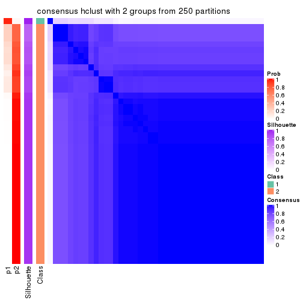</p>

</div>
<div id='tab-CV-hclust-consensus-heatmap-2'>
<pre><code class="r">consensus_heatmap(res, k = 3)
</code></pre>

<p>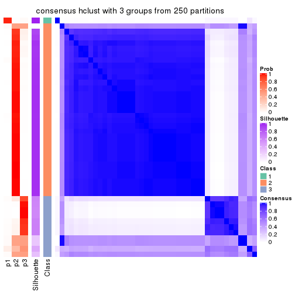</p>

</div>
<div id='tab-CV-hclust-consensus-heatmap-3'>
<pre><code class="r">consensus_heatmap(res, k = 4)
</code></pre>

<p>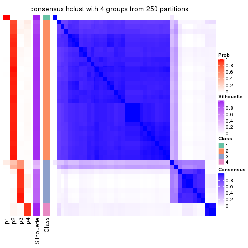</p>

</div>
<div id='tab-CV-hclust-consensus-heatmap-4'>
<pre><code class="r">consensus_heatmap(res, k = 5)
</code></pre>

<p>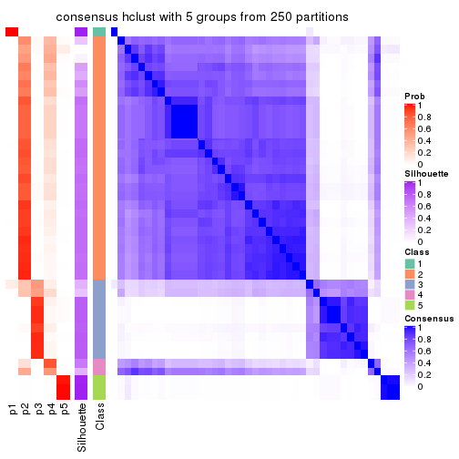</p>

</div>
<div id='tab-CV-hclust-consensus-heatmap-5'>
<pre><code class="r">consensus_heatmap(res, k = 6)
</code></pre>

<p>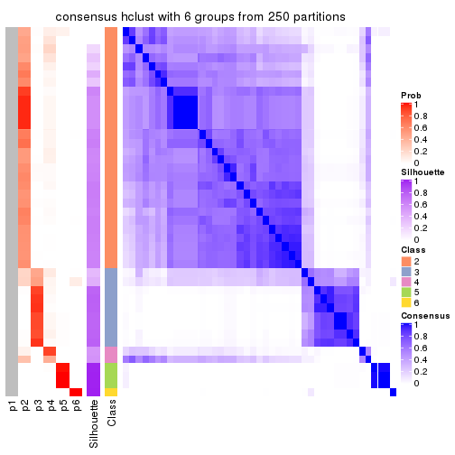</p>

</div>
</div>

Heatmaps for the membership of samples in all partitions to see how consistent they are:


<script>
$( function() {
	$( '#tabs-CV-hclust-membership-heatmap' ).tabs();
} );
</script>
<div id='tabs-CV-hclust-membership-heatmap'>
<ul>
<li><a href='#tab-CV-hclust-membership-heatmap-1'>k = 2</a></li>
<li><a href='#tab-CV-hclust-membership-heatmap-2'>k = 3</a></li>
<li><a href='#tab-CV-hclust-membership-heatmap-3'>k = 4</a></li>
<li><a href='#tab-CV-hclust-membership-heatmap-4'>k = 5</a></li>
<li><a href='#tab-CV-hclust-membership-heatmap-5'>k = 6</a></li>
</ul>
<div id='tab-CV-hclust-membership-heatmap-1'>
<pre><code class="r">membership_heatmap(res, k = 2)
</code></pre>

<p>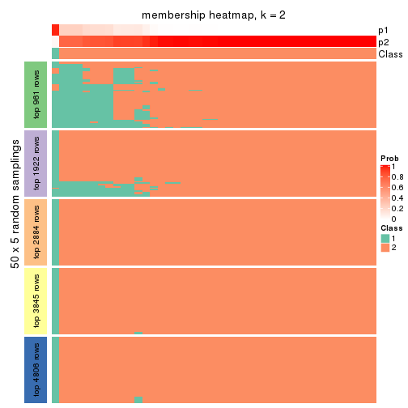</p>

</div>
<div id='tab-CV-hclust-membership-heatmap-2'>
<pre><code class="r">membership_heatmap(res, k = 3)
</code></pre>

<p>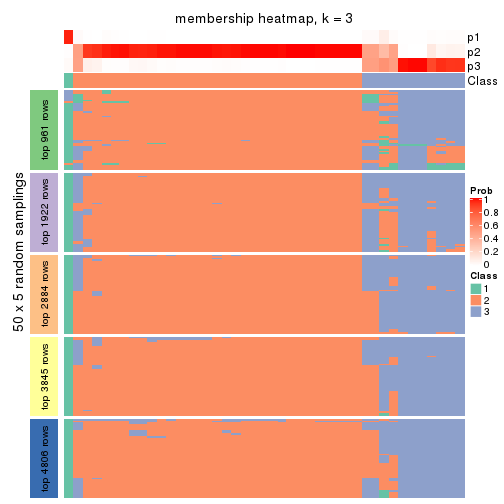</p>

</div>
<div id='tab-CV-hclust-membership-heatmap-3'>
<pre><code class="r">membership_heatmap(res, k = 4)
</code></pre>

<p>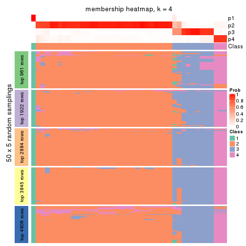</p>

</div>
<div id='tab-CV-hclust-membership-heatmap-4'>
<pre><code class="r">membership_heatmap(res, k = 5)
</code></pre>

<p>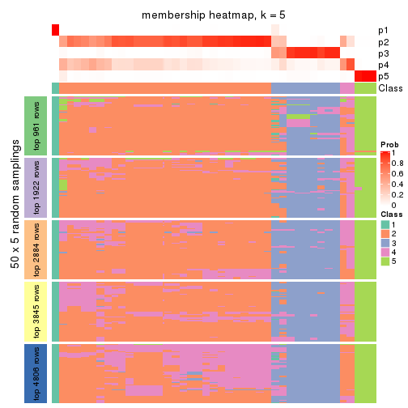</p>

</div>
<div id='tab-CV-hclust-membership-heatmap-5'>
<pre><code class="r">membership_heatmap(res, k = 6)
</code></pre>

<p>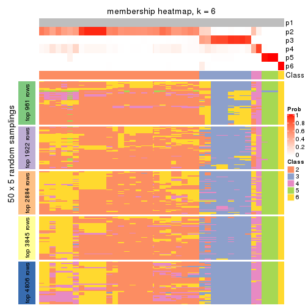</p>

</div>
</div>

As soon as we have had the classes for columns, we can look for signatures
which are significantly different between classes which can be candidate marks
for certain classes. Following are the heatmaps for signatures.


Signature heatmaps where rows are scaled:


<script>
$( function() {
	$( '#tabs-CV-hclust-get-signatures' ).tabs();
} );
</script>
<div id='tabs-CV-hclust-get-signatures'>
<ul>
<li><a href='#tab-CV-hclust-get-signatures-1'>k = 2</a></li>
<li><a href='#tab-CV-hclust-get-signatures-2'>k = 3</a></li>
<li><a href='#tab-CV-hclust-get-signatures-3'>k = 4</a></li>
<li><a href='#tab-CV-hclust-get-signatures-4'>k = 5</a></li>
<li><a href='#tab-CV-hclust-get-signatures-5'>k = 6</a></li>
</ul>
<div id='tab-CV-hclust-get-signatures-1'>
<pre><code class="r">get_signatures(res, k = 2)
</code></pre>

<p>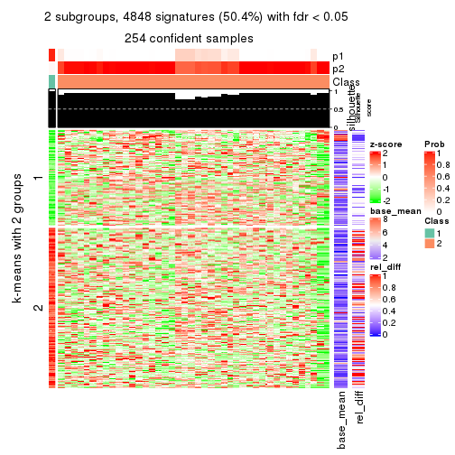</p>

</div>
<div id='tab-CV-hclust-get-signatures-2'>
<pre><code class="r">get_signatures(res, k = 3)
</code></pre>

<p>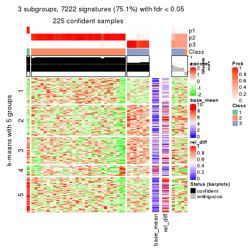</p>

</div>
<div id='tab-CV-hclust-get-signatures-3'>
<pre><code class="r">get_signatures(res, k = 4)
</code></pre>

<p>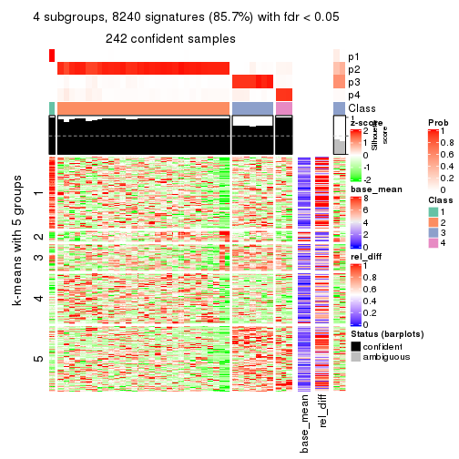</p>

</div>
<div id='tab-CV-hclust-get-signatures-4'>
<pre><code class="r">get_signatures(res, k = 5)
</code></pre>

<p>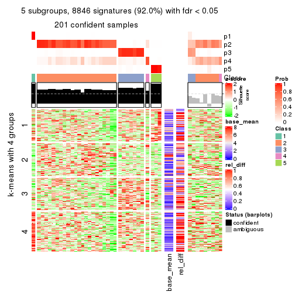</p>

</div>
<div id='tab-CV-hclust-get-signatures-5'>
<pre><code class="r">get_signatures(res, k = 6)
</code></pre>

<p>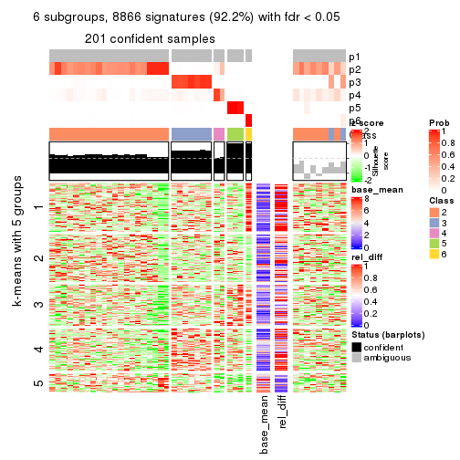</p>

</div>
</div>


Signature heatmaps where rows are not scaled:


<script>
$( function() {
	$( '#tabs-CV-hclust-get-signatures-no-scale' ).tabs();
} );
</script>
<div id='tabs-CV-hclust-get-signatures-no-scale'>
<ul>
<li><a href='#tab-CV-hclust-get-signatures-no-scale-1'>k = 2</a></li>
<li><a href='#tab-CV-hclust-get-signatures-no-scale-2'>k = 3</a></li>
<li><a href='#tab-CV-hclust-get-signatures-no-scale-3'>k = 4</a></li>
<li><a href='#tab-CV-hclust-get-signatures-no-scale-4'>k = 5</a></li>
<li><a href='#tab-CV-hclust-get-signatures-no-scale-5'>k = 6</a></li>
</ul>
<div id='tab-CV-hclust-get-signatures-no-scale-1'>
<pre><code class="r">get_signatures(res, k = 2, scale_rows = FALSE)
</code></pre>

<p>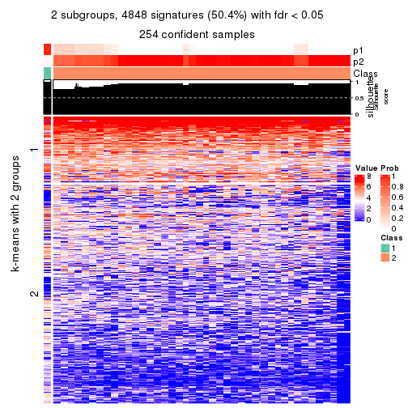</p>

</div>
<div id='tab-CV-hclust-get-signatures-no-scale-2'>
<pre><code class="r">get_signatures(res, k = 3, scale_rows = FALSE)
</code></pre>

<p>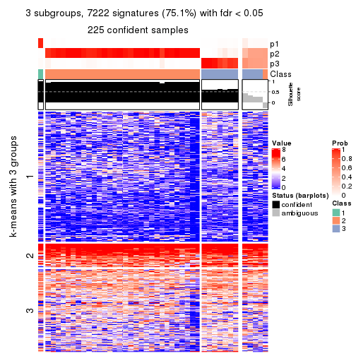</p>

</div>
<div id='tab-CV-hclust-get-signatures-no-scale-3'>
<pre><code class="r">get_signatures(res, k = 4, scale_rows = FALSE)
</code></pre>

<p>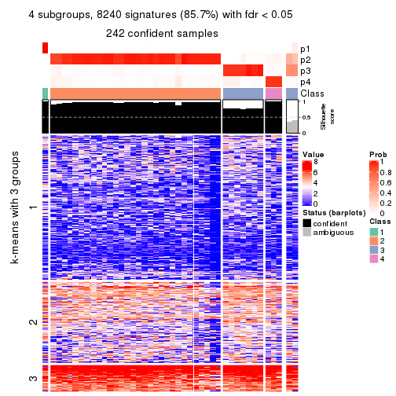</p>

</div>
<div id='tab-CV-hclust-get-signatures-no-scale-4'>
<pre><code class="r">get_signatures(res, k = 5, scale_rows = FALSE)
</code></pre>

<p>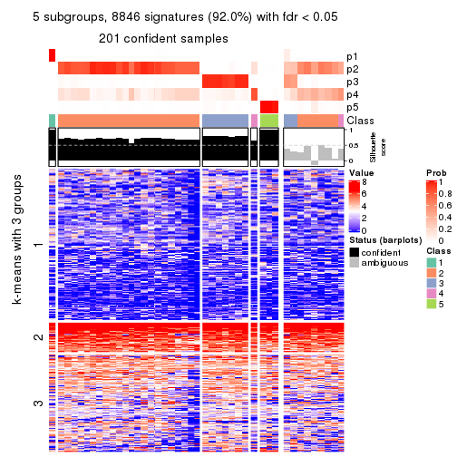</p>

</div>
<div id='tab-CV-hclust-get-signatures-no-scale-5'>
<pre><code class="r">get_signatures(res, k = 6, scale_rows = FALSE)
</code></pre>

<p>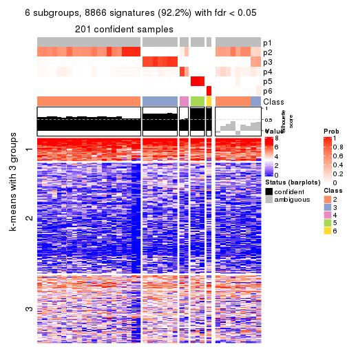</p>

</div>
</div>


Compare the overlap of signatures from different k:

```r
compare_signatures(res)
```

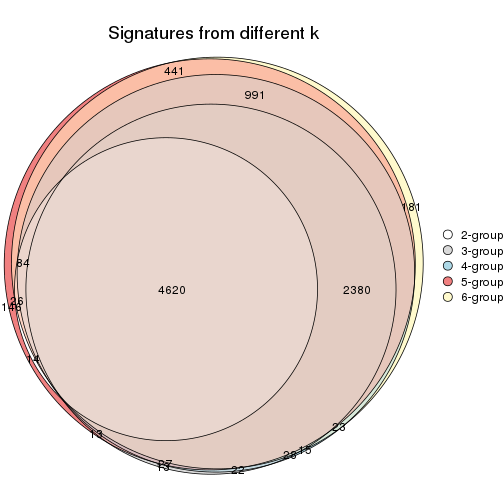

`get_signature()` returns a data frame invisibly. TO get the list of signatures, the function
call should be assigned to a variable explicitly. In following code, if `plot` argument is set
to `FALSE`, no heatmap is plotted while only the differential analysis is performed.

```r
# code only for demonstration
tb = get_signature(res, k = ..., plot = FALSE)
```

An example of the output of `tb` is:

```
#>   which_row         fdr    mean_1    mean_2 scaled_mean_1 scaled_mean_2 km
#> 1        38 0.042760348  8.373488  9.131774    -0.5533452     0.5164555  1
#> 2        40 0.018707592  7.106213  8.469186    -0.6173731     0.5762149  1
#> 3        55 0.019134737 10.221463 11.207825    -0.6159697     0.5749050  1
#> 4        59 0.006059896  5.921854  7.869574    -0.6899429     0.6439467  1
#> 5        60 0.018055526  8.928898 10.211722    -0.6204761     0.5791110  1
#> 6        98 0.009384629 15.714769 14.887706     0.6635654    -0.6193277  2
...
```

The columns in `tb` are:

1. `which_row`: row indices corresponding to the input matrix.
2. `fdr`: FDR for the differential test. 
3. `mean_x`: The mean value in group x.
4. `scaled_mean_x`: The mean value in group x after rows are scaled.
5. `km`: Row groups if k-means clustering is applied to rows.


UMAP plot which shows how samples are separated.


<script>
$( function() {
	$( '#tabs-CV-hclust-dimension-reduction' ).tabs();
} );
</script>
<div id='tabs-CV-hclust-dimension-reduction'>
<ul>
<li><a href='#tab-CV-hclust-dimension-reduction-1'>k = 2</a></li>
<li><a href='#tab-CV-hclust-dimension-reduction-2'>k = 3</a></li>
<li><a href='#tab-CV-hclust-dimension-reduction-3'>k = 4</a></li>
<li><a href='#tab-CV-hclust-dimension-reduction-4'>k = 5</a></li>
<li><a href='#tab-CV-hclust-dimension-reduction-5'>k = 6</a></li>
</ul>
<div id='tab-CV-hclust-dimension-reduction-1'>
<pre><code class="r">dimension_reduction(res, k = 2, method = &quot;UMAP&quot;)
</code></pre>

<p>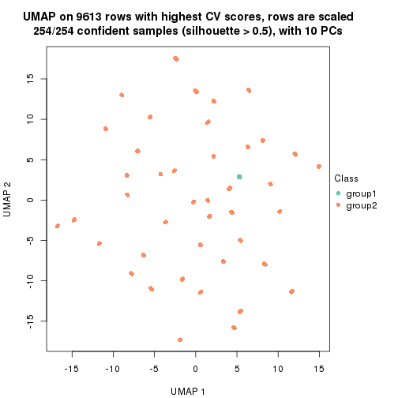</p>

</div>
<div id='tab-CV-hclust-dimension-reduction-2'>
<pre><code class="r">dimension_reduction(res, k = 3, method = &quot;UMAP&quot;)
</code></pre>

<p>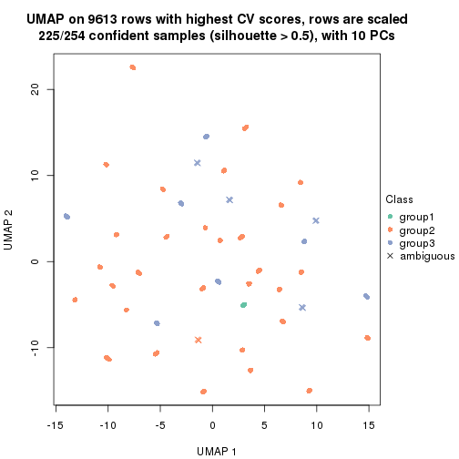</p>

</div>
<div id='tab-CV-hclust-dimension-reduction-3'>
<pre><code class="r">dimension_reduction(res, k = 4, method = &quot;UMAP&quot;)
</code></pre>

<p>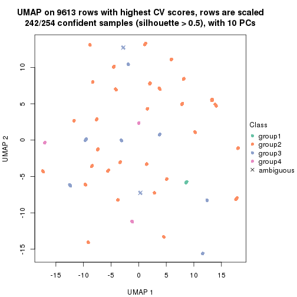</p>

</div>
<div id='tab-CV-hclust-dimension-reduction-4'>
<pre><code class="r">dimension_reduction(res, k = 5, method = &quot;UMAP&quot;)
</code></pre>

<p>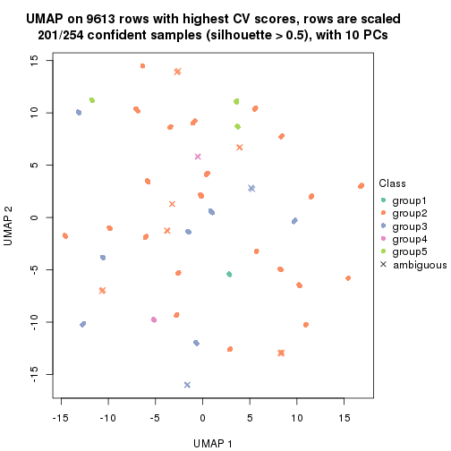</p>

</div>
<div id='tab-CV-hclust-dimension-reduction-5'>
<pre><code class="r">dimension_reduction(res, k = 6, method = &quot;UMAP&quot;)
</code></pre>

<p>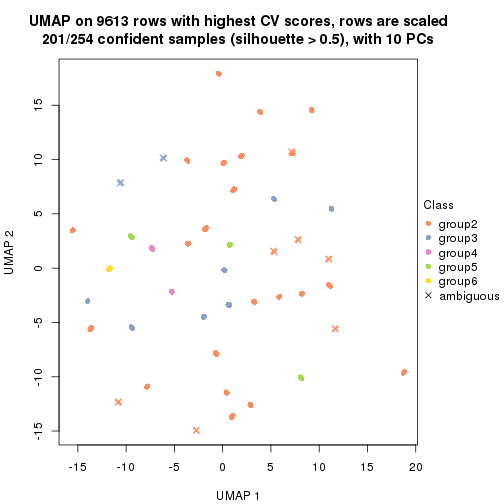</p>

</div>
</div>


Following heatmap shows how subgroups are split when increasing `k`:

```r
collect_classes(res)
```

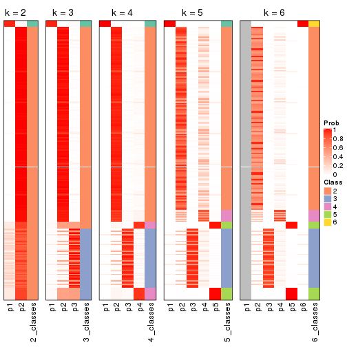


If matrix rows can be associated to genes, consider to use `GO_Enrichment(res,
...)` to perform function enrichment for the signature genes.


 

---------------------------------------------------


### CV:kmeans


The object with results only for a single top-value method and a single partition method 
can be extracted as:

```r
res = res_list["CV", "kmeans"]
# you can also extract it by
# res = res_list["CV:kmeans"]
```

A summary of `res` and all the functions that can be applied to it:

```r
res
```

```
#> A 'ConsensusPartition' object with k = 2, 3, 4, 5, 6.
#>   On a matrix with 9613 rows and 254 columns.
#>   Top rows (961, 1922, 2884, 3845, 4806) are extracted by 'CV' method.
#>   Subgroups are detected by 'kmeans' method.
#>   Performed in total 1250 partitions by row resampling.
#>   Best k for subgroups seems to be 2.
#> 
#> Following methods can be applied to this 'ConsensusPartition' object:
#>  [1] "cola_report"             "collect_classes"         "collect_plots"          
#>  [4] "collect_stats"           "colnames"                "compare_signatures"     
#>  [7] "consensus_heatmap"       "dimension_reduction"     "functional_enrichment"  
#> [10] "get_anno_col"            "get_anno"                "get_classes"            
#> [13] "get_consensus"           "get_matrix"              "get_membership"         
#> [16] "get_param"               "get_signatures"          "get_stats"              
#> [19] "is_best_k"               "is_stable_k"             "membership_heatmap"     
#> [22] "ncol"                    "nrow"                    "plot_ecdf"              
#> [25] "rownames"                "select_partition_number" "show"                   
#> [28] "suggest_best_k"          "test_to_known_factors"
```

`collect_plots()` function collects all the plots made from `res` for all `k` (number of partitions)
into one single page to provide an easy and fast comparison between different `k`.

```r
collect_plots(res)
```

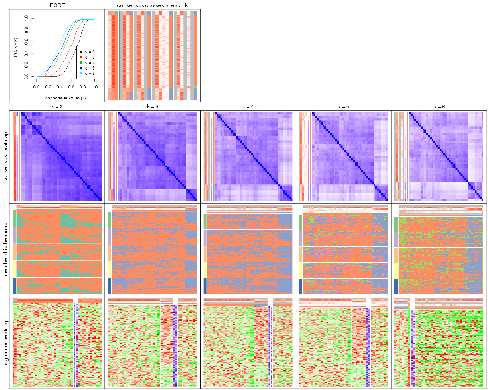

The plots are:

- The first row: a plot of the ECDF (Empirical cumulative distribution
  function) curves of the consensus matrix for each `k` and the heatmap of
  predicted classes for each `k`.
- The second row: heatmaps of the consensus matrix for each `k`.
- The third row: heatmaps of the membership matrix for each `k`.
- The fouth row: heatmaps of the signatures for each `k`.

All the plots in panels can be made by individual functions and they are
plotted later in this section.

`select_partition_number()` produces several plots showing different
statistics for choosing "optimized" `k`. There are following statistics:

- ECDF curves of the consensus matrix for each `k`;
- 1-PAC. [The PAC
  score](https://en.wikipedia.org/wiki/Consensus_clustering#Over-interpretation_potential_of_consensus_clustering)
  measures the proportion of the ambiguous subgrouping.
- Mean silhouette score.
- Concordance. The mean probability of fiting the consensus class ids in all
  partitions.
- Area increased. Denote $A_k$ as the area under the ECDF curve for current
  `k`, the area increased is defined as $A_k - A_{k-1}$.
- Rand index. The percent of pairs of samples that are both in a same cluster
  or both are not in a same cluster in the partition of k and k-1.
- Jaccard index. The ratio of pairs of samples are both in a same cluster in
  the partition of k and k-1 and the pairs of samples are both in a same
  cluster in the partition k or k-1.

The detailed explanations of these statistics can be found in [the cola
vignette](http://bioconductor.org/packages/devel/bioc/vignettes/cola/inst/doc/cola.html#toc_13).

Generally speaking, lower PAC score, higher mean silhouette score or higher
concordance corresponds to better partition. Rand index and Jaccard index
measure how similar the current partition is compared to partition with `k-1`.
If they are too similar, we won't accept `k` is better than `k-1`.

```r
select_partition_number(res)
```

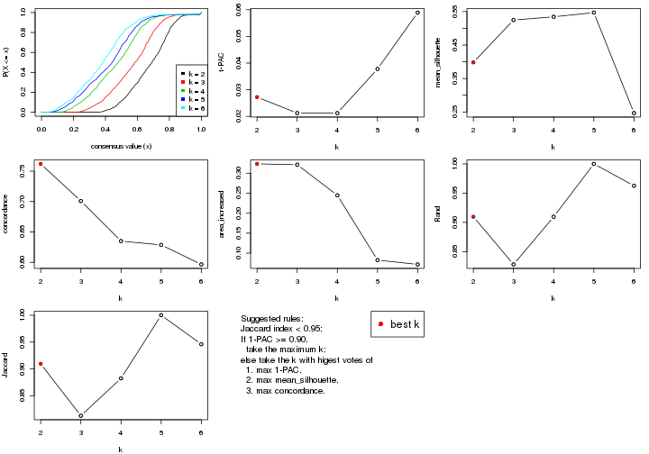

The numeric values for all these statistics can be obtained by `get_stats()`.

```r
get_stats(res)
```

```
#>   k  1-PAC mean_silhouette concordance area_increased  Rand Jaccard
#> 2 2 0.0272           0.398       0.762         0.3233 0.910   0.910
#> 3 3 0.0213           0.525       0.701         0.3214 0.828   0.813
#> 4 4 0.0213           0.534       0.635         0.2448 0.910   0.883
#> 5 5 0.0378           0.547       0.629         0.0827 1.000   1.000
#> 6 6 0.0589           0.247       0.597         0.0719 0.963   0.946
```

`suggest_best_k()` suggests the best $k$ based on these statistics. The rules are as follows:

- All $k$ with Jaccard index larger than 0.95 are removed because the increase of
  the partition number does not provides enough extra information. If all $k$ are removed,
  the best $k$ is assigned by `NA`.
- For $k$ with 1-PAC larger than 0.9, the maximal $k$ is taken as the "best k". Other $k$ is called "optional k".
- If it does not fit the second rule. The $k$ with the highest vote of highest
  1-PAC, mean silhouette and concordance is taken as the "best k".

```r
suggest_best_k(res)
```

```
#> [1] 2
```


Following shows the table of the partitions (You need to click the **show/hide
code output** link to see it). The membership matrix (columns with name `p*`)
is inferred by
[`clue::cl_consensus()`](https://www.rdocumentation.org/link/cl_consensus?package=clue)
function with the `SE` method. Basically the value in the membership matrix
represents the probability to belong to a certain group. The finall class
label for an item is determined with the group with highest probability it
belongs to.

In `get_classes()` function, the entropy is calculated from the membership
matrix and the silhouette score is calculated from the consensus matrix.


<script>
$( function() {
	$( '#tabs-CV-kmeans-get-classes' ).tabs();
} );
</script>
<div id='tabs-CV-kmeans-get-classes'>
<ul>
<li><a href='#tab-CV-kmeans-get-classes-1'>k = 2</a></li>
<li><a href='#tab-CV-kmeans-get-classes-2'>k = 3</a></li>
<li><a href='#tab-CV-kmeans-get-classes-3'>k = 4</a></li>
<li><a href='#tab-CV-kmeans-get-classes-4'>k = 5</a></li>
<li><a href='#tab-CV-kmeans-get-classes-5'>k = 6</a></li>
</ul>

<div id='tab-CV-kmeans-get-classes-1'>
<p><a id='tab-CV-kmeans-get-classes-1-a' style='color:#0366d6' href='#'>show/hide code output</a></p>
<pre><code class="r">cbind(get_classes(res, k = 2), get_membership(res, k = 2))
</code></pre>

<pre><code>#&gt;           class entropy silhouette    p1    p2
#&gt; DRR024803     2   0.706     0.5689 0.192 0.808
#&gt; DRR024804     2   0.689     0.5951 0.184 0.816
#&gt; DRR024805     2   0.662     0.5912 0.172 0.828
#&gt; DRR024806     2   0.584     0.6328 0.140 0.860
#&gt; DRR024807     2   0.958     0.0081 0.380 0.620
#&gt; DRR024808     1   0.996     0.9458 0.536 0.464
#&gt; DRR024809     2   0.714     0.6051 0.196 0.804
#&gt; DRR024810     2   0.662     0.6242 0.172 0.828
#&gt; DRR024811     2   0.990    -0.5490 0.440 0.560
#&gt; DRR024812     2   0.443     0.6450 0.092 0.908
#&gt; DRR024813     2   0.730     0.5169 0.204 0.796
#&gt; DRR024814     2   0.714     0.6185 0.196 0.804
#&gt; DRR024815     2   0.584     0.6198 0.140 0.860
#&gt; DRR024816     2   0.506     0.6385 0.112 0.888
#&gt; DRR024817     2   0.625     0.6134 0.156 0.844
#&gt; DRR024818     2   0.722     0.5251 0.200 0.800
#&gt; DRR024819     2   0.895     0.3678 0.312 0.688
#&gt; DRR024820     2   0.958     0.1390 0.380 0.620
#&gt; DRR024821     2   0.981    -0.4930 0.420 0.580
#&gt; DRR024822     2   0.680     0.5945 0.180 0.820
#&gt; DRR024824     2   0.563     0.6394 0.132 0.868
#&gt; DRR024825     1   0.998     0.9441 0.528 0.472
#&gt; DRR024826     2   0.644     0.5894 0.164 0.836
#&gt; DRR024827     2   0.987    -0.3744 0.432 0.568
#&gt; DRR024828     2   0.839     0.4084 0.268 0.732
#&gt; DRR024829     2   0.605     0.6304 0.148 0.852
#&gt; DRR024830     2   0.625     0.6281 0.156 0.844
#&gt; DRR024831     2   1.000    -0.8349 0.496 0.504
#&gt; DRR024832     2   0.983    -0.6320 0.424 0.576
#&gt; DRR024833     2   0.634     0.5909 0.160 0.840
#&gt; DRR024834     2   0.506     0.6313 0.112 0.888
#&gt; DRR024835     2   0.821     0.4666 0.256 0.744
#&gt; DRR024836     2   0.994    -0.7497 0.456 0.544
#&gt; DRR024837     2   0.506     0.6238 0.112 0.888
#&gt; DRR024838     2   0.605     0.6223 0.148 0.852
#&gt; DRR024839     2   0.653     0.6226 0.168 0.832
#&gt; DRR024840     2   0.802     0.5097 0.244 0.756
#&gt; DRR024841     2   0.456     0.6407 0.096 0.904
#&gt; DRR024842     2   0.388     0.6408 0.076 0.924
#&gt; DRR024843     2   0.706     0.5689 0.192 0.808
#&gt; DRR024844     2   0.689     0.5951 0.184 0.816
#&gt; DRR024845     2   0.662     0.5912 0.172 0.828
#&gt; DRR024846     2   0.584     0.6328 0.140 0.860
#&gt; DRR024847     2   0.958     0.0081 0.380 0.620
#&gt; DRR024848     2   0.714     0.5677 0.196 0.804
#&gt; DRR024849     1   0.996     0.9458 0.536 0.464
#&gt; DRR024850     2   0.625     0.6321 0.156 0.844
#&gt; DRR024851     2   0.714     0.6051 0.196 0.804
#&gt; DRR024852     2   0.662     0.6242 0.172 0.828
#&gt; DRR024853     2   0.990    -0.5490 0.440 0.560
#&gt; DRR024854     2   0.443     0.6450 0.092 0.908
#&gt; DRR024855     2   0.730     0.5169 0.204 0.796
#&gt; DRR024856     2   0.714     0.6185 0.196 0.804
#&gt; DRR024857     2   0.584     0.6198 0.140 0.860
#&gt; DRR024858     2   0.506     0.6385 0.112 0.888
#&gt; DRR024859     2   0.625     0.6134 0.156 0.844
#&gt; DRR024860     2   0.722     0.5251 0.200 0.800
#&gt; DRR024861     2   0.895     0.3678 0.312 0.688
#&gt; DRR024862     2   0.958     0.1390 0.380 0.620
#&gt; DRR024863     2   0.981    -0.4930 0.420 0.580
#&gt; DRR024864     2   0.680     0.5945 0.180 0.820
#&gt; DRR024865     2   0.574     0.6239 0.136 0.864
#&gt; DRR024866     2   0.563     0.6394 0.132 0.868
#&gt; DRR024867     1   0.998     0.9441 0.528 0.472
#&gt; DRR024868     2   0.644     0.5894 0.164 0.836
#&gt; DRR024869     2   0.987    -0.3744 0.432 0.568
#&gt; DRR024870     2   0.839     0.4084 0.268 0.732
#&gt; DRR024871     2   0.605     0.6304 0.148 0.852
#&gt; DRR024872     2   0.625     0.6281 0.156 0.844
#&gt; DRR024873     2   1.000    -0.8349 0.496 0.504
#&gt; DRR024874     2   0.983    -0.6320 0.424 0.576
#&gt; DRR024875     2   0.634     0.5909 0.160 0.840
#&gt; DRR024876     2   0.506     0.6313 0.112 0.888
#&gt; DRR024877     2   0.821     0.4666 0.256 0.744
#&gt; DRR024878     2   0.994    -0.7497 0.456 0.544
#&gt; DRR024879     2   0.506     0.6238 0.112 0.888
#&gt; DRR024880     2   0.605     0.6223 0.148 0.852
#&gt; DRR024881     2   0.653     0.6226 0.168 0.832
#&gt; DRR024882     2   0.802     0.5097 0.244 0.756
#&gt; DRR024883     2   0.456     0.6407 0.096 0.904
#&gt; DRR024884     2   0.697     0.5922 0.188 0.812
#&gt; DRR024885     2   0.949    -0.0319 0.368 0.632
#&gt; DRR024886     2   0.706     0.5689 0.192 0.808
#&gt; DRR024887     2   0.689     0.5951 0.184 0.816
#&gt; DRR024888     2   0.662     0.5912 0.172 0.828
#&gt; DRR024889     2   0.584     0.6328 0.140 0.860
#&gt; DRR024890     2   0.958     0.0081 0.380 0.620
#&gt; DRR024891     2   0.714     0.5677 0.196 0.804
#&gt; DRR024892     1   0.996     0.9458 0.536 0.464
#&gt; DRR024893     2   0.625     0.6321 0.156 0.844
#&gt; DRR024894     2   0.714     0.6051 0.196 0.804
#&gt; DRR024895     2   0.662     0.6242 0.172 0.828
#&gt; DRR024896     2   0.990    -0.5490 0.440 0.560
#&gt; DRR024897     2   0.443     0.6450 0.092 0.908
#&gt; DRR024898     2   0.730     0.5169 0.204 0.796
#&gt; DRR024899     2   0.714     0.6185 0.196 0.804
#&gt; DRR024900     2   0.584     0.6198 0.140 0.860
#&gt; DRR024901     2   0.506     0.6385 0.112 0.888
#&gt; DRR024902     2   0.625     0.6134 0.156 0.844
#&gt; DRR024903     2   0.722     0.5251 0.200 0.800
#&gt; DRR024904     2   0.895     0.3678 0.312 0.688
#&gt; DRR024905     2   0.958     0.1390 0.380 0.620
#&gt; DRR024906     2   0.981    -0.4930 0.420 0.580
#&gt; DRR024907     2   0.680     0.5945 0.180 0.820
#&gt; DRR024908     2   0.574     0.6239 0.136 0.864
#&gt; DRR024909     2   0.563     0.6394 0.132 0.868
#&gt; DRR024910     1   0.998     0.9441 0.528 0.472
#&gt; DRR024911     2   0.644     0.5894 0.164 0.836
#&gt; DRR024912     2   0.987    -0.3744 0.432 0.568
#&gt; DRR024913     2   0.839     0.4084 0.268 0.732
#&gt; DRR024914     2   0.605     0.6304 0.148 0.852
#&gt; DRR024915     2   0.625     0.6281 0.156 0.844
#&gt; DRR024916     2   1.000    -0.8349 0.496 0.504
#&gt; DRR024917     2   0.983    -0.6320 0.424 0.576
#&gt; DRR024918     2   0.634     0.5909 0.160 0.840
#&gt; DRR024919     2   0.506     0.6313 0.112 0.888
#&gt; DRR024920     2   0.821     0.4666 0.256 0.744
#&gt; DRR024921     2   0.994    -0.7497 0.456 0.544
#&gt; DRR024922     2   0.506     0.6238 0.112 0.888
#&gt; DRR024923     2   0.605     0.6223 0.148 0.852
#&gt; DRR024924     2   0.653     0.6226 0.168 0.832
#&gt; DRR024925     2   0.802     0.5097 0.244 0.756
#&gt; DRR024926     2   0.456     0.6407 0.096 0.904
#&gt; DRR024927     2   0.697     0.5922 0.188 0.812
#&gt; DRR024928     2   0.949    -0.0319 0.368 0.632
#&gt; DRR024929     2   0.706     0.5689 0.192 0.808
#&gt; DRR024930     2   0.689     0.5951 0.184 0.816
#&gt; DRR024931     2   0.662     0.5912 0.172 0.828
#&gt; DRR024932     2   0.584     0.6328 0.140 0.860
#&gt; DRR024933     2   0.958     0.0081 0.380 0.620
#&gt; DRR024934     2   0.714     0.5677 0.196 0.804
#&gt; DRR024935     1   0.996     0.9458 0.536 0.464
#&gt; DRR024936     2   0.625     0.6321 0.156 0.844
#&gt; DRR024937     2   0.714     0.6051 0.196 0.804
#&gt; DRR024938     2   0.662     0.6242 0.172 0.828
#&gt; DRR024939     2   0.990    -0.5490 0.440 0.560
#&gt; DRR024940     2   0.443     0.6450 0.092 0.908
#&gt; DRR024941     2   0.730     0.5169 0.204 0.796
#&gt; DRR024942     2   0.714     0.6185 0.196 0.804
#&gt; DRR024943     2   0.584     0.6198 0.140 0.860
#&gt; DRR024944     2   0.506     0.6385 0.112 0.888
#&gt; DRR024945     2   0.625     0.6134 0.156 0.844
#&gt; DRR024946     2   0.722     0.5251 0.200 0.800
#&gt; DRR024947     2   0.895     0.3678 0.312 0.688
#&gt; DRR024948     2   0.958     0.1390 0.380 0.620
#&gt; DRR024949     2   0.981    -0.4930 0.420 0.580
#&gt; DRR024950     2   0.680     0.5945 0.180 0.820
#&gt; DRR024951     2   0.574     0.6239 0.136 0.864
#&gt; DRR024952     2   0.563     0.6394 0.132 0.868
#&gt; DRR024953     1   0.998     0.9441 0.528 0.472
#&gt; DRR024954     2   0.644     0.5894 0.164 0.836
#&gt; DRR024955     2   0.987    -0.3744 0.432 0.568
#&gt; DRR024956     2   0.839     0.4084 0.268 0.732
#&gt; DRR024957     2   0.605     0.6304 0.148 0.852
#&gt; DRR024958     2   0.625     0.6281 0.156 0.844
#&gt; DRR024959     2   1.000    -0.8349 0.496 0.504
#&gt; DRR024960     2   0.983    -0.6320 0.424 0.576
#&gt; DRR024961     2   0.634     0.5909 0.160 0.840
#&gt; DRR024962     2   0.506     0.6313 0.112 0.888
#&gt; DRR024963     2   0.821     0.4666 0.256 0.744
#&gt; DRR024964     2   0.994    -0.7497 0.456 0.544
#&gt; DRR024965     2   0.506     0.6238 0.112 0.888
#&gt; DRR024966     2   0.605     0.6223 0.148 0.852
#&gt; DRR024967     2   0.653     0.6226 0.168 0.832
#&gt; DRR024968     2   0.802     0.5097 0.244 0.756
#&gt; DRR024969     2   0.456     0.6407 0.096 0.904
#&gt; DRR024970     2   0.697     0.5922 0.188 0.812
#&gt; DRR024971     2   0.949    -0.0319 0.368 0.632
#&gt; DRR024972     2   0.706     0.5689 0.192 0.808
#&gt; DRR024973     2   0.689     0.5951 0.184 0.816
#&gt; DRR024974     2   0.662     0.5912 0.172 0.828
#&gt; DRR024975     2   0.584     0.6328 0.140 0.860
#&gt; DRR024976     2   0.958     0.0081 0.380 0.620
#&gt; DRR024977     2   0.714     0.5677 0.196 0.804
#&gt; DRR024978     1   0.996     0.9458 0.536 0.464
#&gt; DRR024979     2   0.625     0.6321 0.156 0.844
#&gt; DRR024980     2   0.714     0.6051 0.196 0.804
#&gt; DRR024981     2   0.662     0.6242 0.172 0.828
#&gt; DRR024982     2   0.990    -0.5490 0.440 0.560
#&gt; DRR024983     2   0.443     0.6450 0.092 0.908
#&gt; DRR024984     2   0.730     0.5169 0.204 0.796
#&gt; DRR024985     2   0.714     0.6185 0.196 0.804
#&gt; DRR024986     2   0.584     0.6198 0.140 0.860
#&gt; DRR024987     2   0.506     0.6385 0.112 0.888
#&gt; DRR024988     2   0.625     0.6134 0.156 0.844
#&gt; DRR024989     2   0.722     0.5251 0.200 0.800
#&gt; DRR024990     2   0.895     0.3678 0.312 0.688
#&gt; DRR024991     2   0.958     0.1390 0.380 0.620
#&gt; DRR024992     2   0.981    -0.4930 0.420 0.580
#&gt; DRR024993     2   0.680     0.5945 0.180 0.820
#&gt; DRR024994     2   0.574     0.6239 0.136 0.864
#&gt; DRR024995     2   0.563     0.6394 0.132 0.868
#&gt; DRR024996     1   0.998     0.9441 0.528 0.472
#&gt; DRR024997     2   0.644     0.5894 0.164 0.836
#&gt; DRR024998     2   0.987    -0.3744 0.432 0.568
#&gt; DRR024999     2   0.839     0.4084 0.268 0.732
#&gt; DRR025000     2   0.605     0.6304 0.148 0.852
#&gt; DRR025001     2   0.625     0.6281 0.156 0.844
#&gt; DRR025002     2   1.000    -0.8349 0.496 0.504
#&gt; DRR025003     2   0.983    -0.6320 0.424 0.576
#&gt; DRR025004     2   0.634     0.5909 0.160 0.840
#&gt; DRR025005     2   0.506     0.6313 0.112 0.888
#&gt; DRR025006     2   0.821     0.4666 0.256 0.744
#&gt; DRR025007     2   0.994    -0.7497 0.456 0.544
#&gt; DRR025008     2   0.506     0.6238 0.112 0.888
#&gt; DRR025009     2   0.605     0.6223 0.148 0.852
#&gt; DRR025010     2   0.653     0.6226 0.168 0.832
#&gt; DRR025011     2   0.802     0.5097 0.244 0.756
#&gt; DRR025012     2   0.456     0.6407 0.096 0.904
#&gt; DRR025013     2   0.697     0.5922 0.188 0.812
#&gt; DRR025014     2   0.949    -0.0319 0.368 0.632
#&gt; DRR025015     2   0.706     0.5689 0.192 0.808
#&gt; DRR025016     2   0.689     0.5951 0.184 0.816
#&gt; DRR025017     2   0.662     0.5912 0.172 0.828
#&gt; DRR025018     2   0.584     0.6328 0.140 0.860
#&gt; DRR025019     2   0.958     0.0081 0.380 0.620
#&gt; DRR025020     2   0.714     0.5677 0.196 0.804
#&gt; DRR025021     1   0.996     0.9458 0.536 0.464
#&gt; DRR025022     2   0.625     0.6321 0.156 0.844
#&gt; DRR025023     2   0.714     0.6051 0.196 0.804
#&gt; DRR025024     2   0.662     0.6242 0.172 0.828
#&gt; DRR025025     2   0.990    -0.5490 0.440 0.560
#&gt; DRR025026     2   0.443     0.6450 0.092 0.908
#&gt; DRR025027     2   0.730     0.5169 0.204 0.796
#&gt; DRR025028     2   0.714     0.6185 0.196 0.804
#&gt; DRR025029     2   0.584     0.6198 0.140 0.860
#&gt; DRR025030     2   0.506     0.6385 0.112 0.888
#&gt; DRR025031     2   0.625     0.6134 0.156 0.844
#&gt; DRR025032     2   0.722     0.5251 0.200 0.800
#&gt; DRR025033     2   0.895     0.3678 0.312 0.688
#&gt; DRR025034     2   0.958     0.1390 0.380 0.620
#&gt; DRR025035     2   0.981    -0.4930 0.420 0.580
#&gt; DRR025036     2   0.680     0.5945 0.180 0.820
#&gt; DRR025037     2   0.574     0.6239 0.136 0.864
#&gt; DRR025038     2   0.563     0.6394 0.132 0.868
#&gt; DRR025039     1   0.998     0.9441 0.528 0.472
#&gt; DRR025040     2   0.644     0.5894 0.164 0.836
#&gt; DRR025041     2   0.987    -0.3744 0.432 0.568
#&gt; DRR025042     2   0.839     0.4084 0.268 0.732
#&gt; DRR025043     2   0.605     0.6304 0.148 0.852
#&gt; DRR025044     2   0.625     0.6281 0.156 0.844
#&gt; DRR025045     2   1.000    -0.8349 0.496 0.504
#&gt; DRR025046     2   0.983    -0.6320 0.424 0.576
#&gt; DRR025047     2   0.634     0.5909 0.160 0.840
#&gt; DRR025048     2   0.506     0.6313 0.112 0.888
#&gt; DRR025049     2   0.821     0.4666 0.256 0.744
#&gt; DRR025050     2   0.994    -0.7497 0.456 0.544
#&gt; DRR025051     2   0.506     0.6238 0.112 0.888
#&gt; DRR025052     2   0.605     0.6223 0.148 0.852
#&gt; DRR025053     2   0.653     0.6226 0.168 0.832
#&gt; DRR025054     2   0.802     0.5097 0.244 0.756
#&gt; DRR025055     2   0.456     0.6407 0.096 0.904
#&gt; DRR025056     2   0.697     0.5922 0.188 0.812
#&gt; DRR025057     2   0.949    -0.0319 0.368 0.632
</code></pre>

<script>
$('#tab-CV-kmeans-get-classes-1-a').parent().next().next().hide();
$('#tab-CV-kmeans-get-classes-1-a').click(function(){
  $('#tab-CV-kmeans-get-classes-1-a').parent().next().next().toggle();
  return(false);
});
</script>
</div>

<div id='tab-CV-kmeans-get-classes-2'>
<p><a id='tab-CV-kmeans-get-classes-2-a' style='color:#0366d6' href='#'>show/hide code output</a></p>
<pre><code class="r">cbind(get_classes(res, k = 3), get_membership(res, k = 3))
</code></pre>

<pre><code>#&gt;           class entropy silhouette p1    p2    p3
#&gt; DRR024803     2   0.680     0.5814 NA 0.724 0.072
#&gt; DRR024804     2   0.690     0.6261 NA 0.732 0.168
#&gt; DRR024805     2   0.704     0.5836 NA 0.728 0.140
#&gt; DRR024806     2   0.600     0.6504 NA 0.788 0.128
#&gt; DRR024807     2   0.911    -0.3031 NA 0.444 0.416
#&gt; DRR024808     3   0.716     0.7605 NA 0.288 0.660
#&gt; DRR024809     2   0.722     0.5827 NA 0.716 0.144
#&gt; DRR024810     2   0.646     0.6045 NA 0.764 0.120
#&gt; DRR024811     2   0.821    -0.4340 NA 0.472 0.456
#&gt; DRR024812     2   0.453     0.6588 NA 0.860 0.052
#&gt; DRR024813     2   0.656     0.5036 NA 0.720 0.232
#&gt; DRR024814     2   0.643     0.6320 NA 0.764 0.096
#&gt; DRR024815     2   0.683     0.6199 NA 0.740 0.112
#&gt; DRR024816     2   0.417     0.6573 NA 0.868 0.028
#&gt; DRR024817     2   0.672     0.6174 NA 0.748 0.116
#&gt; DRR024818     2   0.725     0.3879 NA 0.676 0.256
#&gt; DRR024819     2   0.782     0.4926 NA 0.668 0.200
#&gt; DRR024820     2   0.908     0.1997 NA 0.552 0.216
#&gt; DRR024821     3   0.775     0.6821 NA 0.452 0.500
#&gt; DRR024822     2   0.714     0.5716 NA 0.720 0.160
#&gt; DRR024824     2   0.554     0.6573 NA 0.808 0.060
#&gt; DRR024825     3   0.788     0.7812 NA 0.336 0.592
#&gt; DRR024826     2   0.664     0.5824 NA 0.748 0.160
#&gt; DRR024827     2   0.914    -0.2029 NA 0.512 0.324
#&gt; DRR024828     2   0.815     0.1129 NA 0.580 0.332
#&gt; DRR024829     2   0.462     0.6541 NA 0.840 0.024
#&gt; DRR024830     2   0.665     0.6131 NA 0.752 0.112
#&gt; DRR024831     3   0.663     0.8072 NA 0.336 0.644
#&gt; DRR024832     3   0.659     0.7584 NA 0.424 0.568
#&gt; DRR024833     2   0.632     0.5827 NA 0.764 0.160
#&gt; DRR024834     2   0.454     0.6532 NA 0.848 0.028
#&gt; DRR024835     2   0.792     0.4957 NA 0.664 0.184
#&gt; DRR024836     3   0.739     0.7705 NA 0.408 0.556
#&gt; DRR024837     2   0.494     0.6503 NA 0.824 0.028
#&gt; DRR024838     2   0.524     0.6540 NA 0.820 0.048
#&gt; DRR024839     2   0.666     0.5888 NA 0.748 0.156
#&gt; DRR024840     2   0.814     0.4523 NA 0.620 0.268
#&gt; DRR024841     2   0.534     0.6576 NA 0.824 0.080
#&gt; DRR024842     2   0.315     0.6409 NA 0.916 0.044
#&gt; DRR024843     2   0.680     0.5814 NA 0.724 0.072
#&gt; DRR024844     2   0.690     0.6261 NA 0.732 0.168
#&gt; DRR024845     2   0.704     0.5836 NA 0.728 0.140
#&gt; DRR024846     2   0.600     0.6504 NA 0.788 0.128
#&gt; DRR024847     2   0.911    -0.3031 NA 0.444 0.416
#&gt; DRR024848     2   0.663     0.5855 NA 0.728 0.060
#&gt; DRR024849     3   0.716     0.7605 NA 0.288 0.660
#&gt; DRR024850     2   0.632     0.6369 NA 0.772 0.104
#&gt; DRR024851     2   0.722     0.5827 NA 0.716 0.144
#&gt; DRR024852     2   0.646     0.6045 NA 0.764 0.120
#&gt; DRR024853     2   0.821    -0.4340 NA 0.472 0.456
#&gt; DRR024854     2   0.453     0.6588 NA 0.860 0.052
#&gt; DRR024855     2   0.656     0.5036 NA 0.720 0.232
#&gt; DRR024856     2   0.643     0.6320 NA 0.764 0.096
#&gt; DRR024857     2   0.683     0.6199 NA 0.740 0.112
#&gt; DRR024858     2   0.417     0.6573 NA 0.868 0.028
#&gt; DRR024859     2   0.672     0.6174 NA 0.748 0.116
#&gt; DRR024860     2   0.725     0.3879 NA 0.676 0.256
#&gt; DRR024861     2   0.782     0.4926 NA 0.668 0.200
#&gt; DRR024862     2   0.908     0.1997 NA 0.552 0.216
#&gt; DRR024863     3   0.775     0.6821 NA 0.452 0.500
#&gt; DRR024864     2   0.714     0.5716 NA 0.720 0.160
#&gt; DRR024865     2   0.506     0.6487 NA 0.816 0.028
#&gt; DRR024866     2   0.554     0.6573 NA 0.808 0.060
#&gt; DRR024867     3   0.788     0.7812 NA 0.336 0.592
#&gt; DRR024868     2   0.664     0.5824 NA 0.748 0.160
#&gt; DRR024869     2   0.914    -0.2029 NA 0.512 0.324
#&gt; DRR024870     2   0.815     0.1129 NA 0.580 0.332
#&gt; DRR024871     2   0.462     0.6541 NA 0.840 0.024
#&gt; DRR024872     2   0.665     0.6131 NA 0.752 0.112
#&gt; DRR024873     3   0.663     0.8072 NA 0.336 0.644
#&gt; DRR024874     3   0.659     0.7584 NA 0.424 0.568
#&gt; DRR024875     2   0.632     0.5827 NA 0.764 0.160
#&gt; DRR024876     2   0.454     0.6532 NA 0.848 0.028
#&gt; DRR024877     2   0.792     0.4957 NA 0.664 0.184
#&gt; DRR024878     3   0.739     0.7705 NA 0.408 0.556
#&gt; DRR024879     2   0.494     0.6503 NA 0.824 0.028
#&gt; DRR024880     2   0.524     0.6540 NA 0.820 0.048
#&gt; DRR024881     2   0.666     0.5888 NA 0.748 0.156
#&gt; DRR024882     2   0.814     0.4523 NA 0.620 0.268
#&gt; DRR024883     2   0.534     0.6576 NA 0.824 0.080
#&gt; DRR024884     2   0.657     0.6240 NA 0.756 0.104
#&gt; DRR024885     2   0.882     0.0957 NA 0.572 0.260
#&gt; DRR024886     2   0.680     0.5814 NA 0.724 0.072
#&gt; DRR024887     2   0.690     0.6261 NA 0.732 0.168
#&gt; DRR024888     2   0.704     0.5836 NA 0.728 0.140
#&gt; DRR024889     2   0.600     0.6504 NA 0.788 0.128
#&gt; DRR024890     2   0.911    -0.3031 NA 0.444 0.416
#&gt; DRR024891     2   0.663     0.5855 NA 0.728 0.060
#&gt; DRR024892     3   0.716     0.7605 NA 0.288 0.660
#&gt; DRR024893     2   0.632     0.6369 NA 0.772 0.104
#&gt; DRR024894     2   0.722     0.5827 NA 0.716 0.144
#&gt; DRR024895     2   0.646     0.6045 NA 0.764 0.120
#&gt; DRR024896     2   0.821    -0.4340 NA 0.472 0.456
#&gt; DRR024897     2   0.453     0.6588 NA 0.860 0.052
#&gt; DRR024898     2   0.656     0.5036 NA 0.720 0.232
#&gt; DRR024899     2   0.643     0.6320 NA 0.764 0.096
#&gt; DRR024900     2   0.683     0.6199 NA 0.740 0.112
#&gt; DRR024901     2   0.417     0.6573 NA 0.868 0.028
#&gt; DRR024902     2   0.672     0.6174 NA 0.748 0.116
#&gt; DRR024903     2   0.725     0.3879 NA 0.676 0.256
#&gt; DRR024904     2   0.782     0.4926 NA 0.668 0.200
#&gt; DRR024905     2   0.908     0.1997 NA 0.552 0.216
#&gt; DRR024906     3   0.775     0.6821 NA 0.452 0.500
#&gt; DRR024907     2   0.714     0.5716 NA 0.720 0.160
#&gt; DRR024908     2   0.506     0.6487 NA 0.816 0.028
#&gt; DRR024909     2   0.554     0.6573 NA 0.808 0.060
#&gt; DRR024910     3   0.788     0.7812 NA 0.336 0.592
#&gt; DRR024911     2   0.664     0.5824 NA 0.748 0.160
#&gt; DRR024912     2   0.914    -0.2029 NA 0.512 0.324
#&gt; DRR024913     2   0.815     0.1129 NA 0.580 0.332
#&gt; DRR024914     2   0.462     0.6541 NA 0.840 0.024
#&gt; DRR024915     2   0.665     0.6131 NA 0.752 0.112
#&gt; DRR024916     3   0.663     0.8072 NA 0.336 0.644
#&gt; DRR024917     3   0.659     0.7584 NA 0.424 0.568
#&gt; DRR024918     2   0.632     0.5827 NA 0.764 0.160
#&gt; DRR024919     2   0.454     0.6532 NA 0.848 0.028
#&gt; DRR024920     2   0.792     0.4957 NA 0.664 0.184
#&gt; DRR024921     3   0.739     0.7705 NA 0.408 0.556
#&gt; DRR024922     2   0.494     0.6503 NA 0.824 0.028
#&gt; DRR024923     2   0.524     0.6540 NA 0.820 0.048
#&gt; DRR024924     2   0.666     0.5888 NA 0.748 0.156
#&gt; DRR024925     2   0.814     0.4523 NA 0.620 0.268
#&gt; DRR024926     2   0.534     0.6576 NA 0.824 0.080
#&gt; DRR024927     2   0.657     0.6240 NA 0.756 0.104
#&gt; DRR024928     2   0.882     0.0957 NA 0.572 0.260
#&gt; DRR024929     2   0.680     0.5814 NA 0.724 0.072
#&gt; DRR024930     2   0.690     0.6261 NA 0.732 0.168
#&gt; DRR024931     2   0.704     0.5836 NA 0.728 0.140
#&gt; DRR024932     2   0.600     0.6504 NA 0.788 0.128
#&gt; DRR024933     2   0.911    -0.3031 NA 0.444 0.416
#&gt; DRR024934     2   0.663     0.5855 NA 0.728 0.060
#&gt; DRR024935     3   0.716     0.7605 NA 0.288 0.660
#&gt; DRR024936     2   0.632     0.6369 NA 0.772 0.104
#&gt; DRR024937     2   0.722     0.5827 NA 0.716 0.144
#&gt; DRR024938     2   0.646     0.6045 NA 0.764 0.120
#&gt; DRR024939     2   0.821    -0.4340 NA 0.472 0.456
#&gt; DRR024940     2   0.453     0.6588 NA 0.860 0.052
#&gt; DRR024941     2   0.656     0.5036 NA 0.720 0.232
#&gt; DRR024942     2   0.643     0.6320 NA 0.764 0.096
#&gt; DRR024943     2   0.683     0.6199 NA 0.740 0.112
#&gt; DRR024944     2   0.417     0.6573 NA 0.868 0.028
#&gt; DRR024945     2   0.672     0.6174 NA 0.748 0.116
#&gt; DRR024946     2   0.725     0.3879 NA 0.676 0.256
#&gt; DRR024947     2   0.782     0.4926 NA 0.668 0.200
#&gt; DRR024948     2   0.908     0.1997 NA 0.552 0.216
#&gt; DRR024949     3   0.775     0.6821 NA 0.452 0.500
#&gt; DRR024950     2   0.714     0.5716 NA 0.720 0.160
#&gt; DRR024951     2   0.506     0.6487 NA 0.816 0.028
#&gt; DRR024952     2   0.554     0.6573 NA 0.808 0.060
#&gt; DRR024953     3   0.788     0.7812 NA 0.336 0.592
#&gt; DRR024954     2   0.664     0.5824 NA 0.748 0.160
#&gt; DRR024955     2   0.914    -0.2029 NA 0.512 0.324
#&gt; DRR024956     2   0.815     0.1129 NA 0.580 0.332
#&gt; DRR024957     2   0.462     0.6541 NA 0.840 0.024
#&gt; DRR024958     2   0.665     0.6131 NA 0.752 0.112
#&gt; DRR024959     3   0.663     0.8072 NA 0.336 0.644
#&gt; DRR024960     3   0.659     0.7584 NA 0.424 0.568
#&gt; DRR024961     2   0.632     0.5827 NA 0.764 0.160
#&gt; DRR024962     2   0.454     0.6532 NA 0.848 0.028
#&gt; DRR024963     2   0.792     0.4957 NA 0.664 0.184
#&gt; DRR024964     3   0.739     0.7705 NA 0.408 0.556
#&gt; DRR024965     2   0.494     0.6503 NA 0.824 0.028
#&gt; DRR024966     2   0.524     0.6540 NA 0.820 0.048
#&gt; DRR024967     2   0.666     0.5888 NA 0.748 0.156
#&gt; DRR024968     2   0.814     0.4523 NA 0.620 0.268
#&gt; DRR024969     2   0.534     0.6576 NA 0.824 0.080
#&gt; DRR024970     2   0.657     0.6240 NA 0.756 0.104
#&gt; DRR024971     2   0.882     0.0957 NA 0.572 0.260
#&gt; DRR024972     2   0.680     0.5814 NA 0.724 0.072
#&gt; DRR024973     2   0.690     0.6261 NA 0.732 0.168
#&gt; DRR024974     2   0.704     0.5836 NA 0.728 0.140
#&gt; DRR024975     2   0.600     0.6504 NA 0.788 0.128
#&gt; DRR024976     2   0.911    -0.3031 NA 0.444 0.416
#&gt; DRR024977     2   0.663     0.5855 NA 0.728 0.060
#&gt; DRR024978     3   0.716     0.7605 NA 0.288 0.660
#&gt; DRR024979     2   0.632     0.6369 NA 0.772 0.104
#&gt; DRR024980     2   0.722     0.5827 NA 0.716 0.144
#&gt; DRR024981     2   0.646     0.6045 NA 0.764 0.120
#&gt; DRR024982     2   0.821    -0.4340 NA 0.472 0.456
#&gt; DRR024983     2   0.453     0.6588 NA 0.860 0.052
#&gt; DRR024984     2   0.656     0.5036 NA 0.720 0.232
#&gt; DRR024985     2   0.643     0.6320 NA 0.764 0.096
#&gt; DRR024986     2   0.683     0.6199 NA 0.740 0.112
#&gt; DRR024987     2   0.417     0.6573 NA 0.868 0.028
#&gt; DRR024988     2   0.672     0.6174 NA 0.748 0.116
#&gt; DRR024989     2   0.725     0.3879 NA 0.676 0.256
#&gt; DRR024990     2   0.782     0.4926 NA 0.668 0.200
#&gt; DRR024991     2   0.908     0.1997 NA 0.552 0.216
#&gt; DRR024992     3   0.775     0.6821 NA 0.452 0.500
#&gt; DRR024993     2   0.714     0.5716 NA 0.720 0.160
#&gt; DRR024994     2   0.506     0.6487 NA 0.816 0.028
#&gt; DRR024995     2   0.554     0.6573 NA 0.808 0.060
#&gt; DRR024996     3   0.788     0.7812 NA 0.336 0.592
#&gt; DRR024997     2   0.664     0.5824 NA 0.748 0.160
#&gt; DRR024998     2   0.914    -0.2029 NA 0.512 0.324
#&gt; DRR024999     2   0.815     0.1129 NA 0.580 0.332
#&gt; DRR025000     2   0.462     0.6541 NA 0.840 0.024
#&gt; DRR025001     2   0.665     0.6131 NA 0.752 0.112
#&gt; DRR025002     3   0.663     0.8072 NA 0.336 0.644
#&gt; DRR025003     3   0.659     0.7584 NA 0.424 0.568
#&gt; DRR025004     2   0.632     0.5827 NA 0.764 0.160
#&gt; DRR025005     2   0.454     0.6532 NA 0.848 0.028
#&gt; DRR025006     2   0.792     0.4957 NA 0.664 0.184
#&gt; DRR025007     3   0.739     0.7705 NA 0.408 0.556
#&gt; DRR025008     2   0.494     0.6503 NA 0.824 0.028
#&gt; DRR025009     2   0.524     0.6540 NA 0.820 0.048
#&gt; DRR025010     2   0.666     0.5888 NA 0.748 0.156
#&gt; DRR025011     2   0.814     0.4523 NA 0.620 0.268
#&gt; DRR025012     2   0.534     0.6576 NA 0.824 0.080
#&gt; DRR025013     2   0.657     0.6240 NA 0.756 0.104
#&gt; DRR025014     2   0.882     0.0957 NA 0.572 0.260
#&gt; DRR025015     2   0.680     0.5814 NA 0.724 0.072
#&gt; DRR025016     2   0.690     0.6261 NA 0.732 0.168
#&gt; DRR025017     2   0.704     0.5836 NA 0.728 0.140
#&gt; DRR025018     2   0.600     0.6504 NA 0.788 0.128
#&gt; DRR025019     2   0.911    -0.3031 NA 0.444 0.416
#&gt; DRR025020     2   0.663     0.5855 NA 0.728 0.060
#&gt; DRR025021     3   0.716     0.7605 NA 0.288 0.660
#&gt; DRR025022     2   0.632     0.6369 NA 0.772 0.104
#&gt; DRR025023     2   0.722     0.5827 NA 0.716 0.144
#&gt; DRR025024     2   0.646     0.6045 NA 0.764 0.120
#&gt; DRR025025     2   0.821    -0.4340 NA 0.472 0.456
#&gt; DRR025026     2   0.453     0.6588 NA 0.860 0.052
#&gt; DRR025027     2   0.656     0.5036 NA 0.720 0.232
#&gt; DRR025028     2   0.643     0.6320 NA 0.764 0.096
#&gt; DRR025029     2   0.683     0.6199 NA 0.740 0.112
#&gt; DRR025030     2   0.417     0.6573 NA 0.868 0.028
#&gt; DRR025031     2   0.672     0.6174 NA 0.748 0.116
#&gt; DRR025032     2   0.725     0.3879 NA 0.676 0.256
#&gt; DRR025033     2   0.782     0.4926 NA 0.668 0.200
#&gt; DRR025034     2   0.908     0.1997 NA 0.552 0.216
#&gt; DRR025035     3   0.775     0.6821 NA 0.452 0.500
#&gt; DRR025036     2   0.714     0.5716 NA 0.720 0.160
#&gt; DRR025037     2   0.506     0.6487 NA 0.816 0.028
#&gt; DRR025038     2   0.554     0.6573 NA 0.808 0.060
#&gt; DRR025039     3   0.788     0.7812 NA 0.336 0.592
#&gt; DRR025040     2   0.664     0.5824 NA 0.748 0.160
#&gt; DRR025041     2   0.914    -0.2029 NA 0.512 0.324
#&gt; DRR025042     2   0.815     0.1129 NA 0.580 0.332
#&gt; DRR025043     2   0.462     0.6541 NA 0.840 0.024
#&gt; DRR025044     2   0.665     0.6131 NA 0.752 0.112
#&gt; DRR025045     3   0.663     0.8072 NA 0.336 0.644
#&gt; DRR025046     3   0.659     0.7584 NA 0.424 0.568
#&gt; DRR025047     2   0.632     0.5827 NA 0.764 0.160
#&gt; DRR025048     2   0.454     0.6532 NA 0.848 0.028
#&gt; DRR025049     2   0.792     0.4957 NA 0.664 0.184
#&gt; DRR025050     3   0.739     0.7705 NA 0.408 0.556
#&gt; DRR025051     2   0.494     0.6503 NA 0.824 0.028
#&gt; DRR025052     2   0.524     0.6540 NA 0.820 0.048
#&gt; DRR025053     2   0.666     0.5888 NA 0.748 0.156
#&gt; DRR025054     2   0.814     0.4523 NA 0.620 0.268
#&gt; DRR025055     2   0.534     0.6576 NA 0.824 0.080
#&gt; DRR025056     2   0.657     0.6240 NA 0.756 0.104
#&gt; DRR025057     2   0.882     0.0957 NA 0.572 0.260
</code></pre>

<script>
$('#tab-CV-kmeans-get-classes-2-a').parent().next().next().hide();
$('#tab-CV-kmeans-get-classes-2-a').click(function(){
  $('#tab-CV-kmeans-get-classes-2-a').parent().next().next().toggle();
  return(false);
});
</script>
</div>

<div id='tab-CV-kmeans-get-classes-3'>
<p><a id='tab-CV-kmeans-get-classes-3-a' style='color:#0366d6' href='#'>show/hide code output</a></p>
<pre><code class="r">cbind(get_classes(res, k = 4), get_membership(res, k = 4))
</code></pre>

<pre><code>#&gt;           class entropy silhouette p1    p2    p3 p4
#&gt; DRR024803     2   0.724     0.5427 NA 0.604 0.060 NA
#&gt; DRR024804     2   0.726     0.5857 NA 0.632 0.136 NA
#&gt; DRR024805     2   0.707     0.5483 NA 0.652 0.084 NA
#&gt; DRR024806     2   0.537     0.6261 NA 0.772 0.048 NA
#&gt; DRR024807     3   0.900     0.3331 NA 0.372 0.384 NA
#&gt; DRR024808     3   0.563     0.7094 NA 0.188 0.728 NA
#&gt; DRR024809     2   0.751     0.5041 NA 0.568 0.072 NA
#&gt; DRR024810     2   0.681     0.5762 NA 0.664 0.040 NA
#&gt; DRR024811     3   0.752     0.6687 NA 0.324 0.548 NA
#&gt; DRR024812     2   0.502     0.6403 NA 0.780 0.036 NA
#&gt; DRR024813     2   0.710     0.4618 NA 0.644 0.200 NA
#&gt; DRR024814     2   0.669     0.5950 NA 0.700 0.060 NA
#&gt; DRR024815     2   0.698     0.5801 NA 0.668 0.048 NA
#&gt; DRR024816     2   0.560     0.6389 NA 0.744 0.032 NA
#&gt; DRR024817     2   0.704     0.5535 NA 0.648 0.100 NA
#&gt; DRR024818     2   0.819     0.2613 NA 0.544 0.256 NA
#&gt; DRR024819     2   0.808     0.4844 NA 0.592 0.136 NA
#&gt; DRR024820     2   0.854     0.4000 NA 0.548 0.168 NA
#&gt; DRR024821     3   0.808     0.5945 NA 0.344 0.492 NA
#&gt; DRR024822     2   0.704     0.5384 NA 0.640 0.068 NA
#&gt; DRR024824     2   0.612     0.6212 NA 0.712 0.032 NA
#&gt; DRR024825     3   0.622     0.7250 NA 0.228 0.676 NA
#&gt; DRR024826     2   0.669     0.5709 NA 0.680 0.124 NA
#&gt; DRR024827     2   0.852    -0.1352 NA 0.416 0.364 NA
#&gt; DRR024828     2   0.830    -0.1024 NA 0.460 0.360 NA
#&gt; DRR024829     2   0.593     0.6306 NA 0.712 0.028 NA
#&gt; DRR024830     2   0.675     0.5874 NA 0.664 0.056 NA
#&gt; DRR024831     3   0.540     0.7462 NA 0.232 0.720 NA
#&gt; DRR024832     3   0.667     0.7284 NA 0.280 0.628 NA
#&gt; DRR024833     2   0.661     0.5460 NA 0.696 0.160 NA
#&gt; DRR024834     2   0.458     0.6359 NA 0.776 0.016 NA
#&gt; DRR024835     2   0.812     0.4194 NA 0.584 0.156 NA
#&gt; DRR024836     3   0.585     0.7068 NA 0.328 0.632 NA
#&gt; DRR024837     2   0.474     0.6346 NA 0.760 0.016 NA
#&gt; DRR024838     2   0.559     0.6302 NA 0.744 0.016 NA
#&gt; DRR024839     2   0.647     0.5872 NA 0.704 0.084 NA
#&gt; DRR024840     2   0.756     0.4669 NA 0.608 0.184 NA
#&gt; DRR024841     2   0.510     0.6398 NA 0.756 0.032 NA
#&gt; DRR024842     2   0.289     0.6261 NA 0.900 0.020 NA
#&gt; DRR024843     2   0.724     0.5427 NA 0.604 0.060 NA
#&gt; DRR024844     2   0.726     0.5857 NA 0.632 0.136 NA
#&gt; DRR024845     2   0.707     0.5483 NA 0.652 0.084 NA
#&gt; DRR024846     2   0.537     0.6261 NA 0.772 0.048 NA
#&gt; DRR024847     3   0.900     0.3331 NA 0.372 0.384 NA
#&gt; DRR024848     2   0.664     0.5557 NA 0.632 0.052 NA
#&gt; DRR024849     3   0.563     0.7094 NA 0.188 0.728 NA
#&gt; DRR024850     2   0.600     0.6309 NA 0.740 0.064 NA
#&gt; DRR024851     2   0.751     0.5041 NA 0.568 0.072 NA
#&gt; DRR024852     2   0.681     0.5762 NA 0.664 0.040 NA
#&gt; DRR024853     3   0.752     0.6687 NA 0.324 0.548 NA
#&gt; DRR024854     2   0.502     0.6403 NA 0.780 0.036 NA
#&gt; DRR024855     2   0.710     0.4618 NA 0.644 0.200 NA
#&gt; DRR024856     2   0.669     0.5950 NA 0.700 0.060 NA
#&gt; DRR024857     2   0.698     0.5801 NA 0.668 0.048 NA
#&gt; DRR024858     2   0.560     0.6389 NA 0.744 0.032 NA
#&gt; DRR024859     2   0.704     0.5535 NA 0.648 0.100 NA
#&gt; DRR024860     2   0.819     0.2613 NA 0.544 0.256 NA
#&gt; DRR024861     2   0.808     0.4844 NA 0.592 0.136 NA
#&gt; DRR024862     2   0.854     0.4000 NA 0.548 0.168 NA
#&gt; DRR024863     3   0.808     0.5945 NA 0.344 0.492 NA
#&gt; DRR024864     2   0.704     0.5384 NA 0.640 0.068 NA
#&gt; DRR024865     2   0.563     0.6281 NA 0.704 0.008 NA
#&gt; DRR024866     2   0.612     0.6212 NA 0.712 0.032 NA
#&gt; DRR024867     3   0.622     0.7250 NA 0.228 0.676 NA
#&gt; DRR024868     2   0.669     0.5709 NA 0.680 0.124 NA
#&gt; DRR024869     2   0.852    -0.1352 NA 0.416 0.364 NA
#&gt; DRR024870     2   0.830    -0.1024 NA 0.460 0.360 NA
#&gt; DRR024871     2   0.593     0.6306 NA 0.712 0.028 NA
#&gt; DRR024872     2   0.675     0.5874 NA 0.664 0.056 NA
#&gt; DRR024873     3   0.540     0.7462 NA 0.232 0.720 NA
#&gt; DRR024874     3   0.667     0.7284 NA 0.280 0.628 NA
#&gt; DRR024875     2   0.661     0.5460 NA 0.696 0.160 NA
#&gt; DRR024876     2   0.458     0.6359 NA 0.776 0.016 NA
#&gt; DRR024877     2   0.812     0.4194 NA 0.584 0.156 NA
#&gt; DRR024878     3   0.585     0.7068 NA 0.328 0.632 NA
#&gt; DRR024879     2   0.474     0.6346 NA 0.760 0.016 NA
#&gt; DRR024880     2   0.559     0.6302 NA 0.744 0.016 NA
#&gt; DRR024881     2   0.647     0.5872 NA 0.704 0.084 NA
#&gt; DRR024882     2   0.756     0.4669 NA 0.608 0.184 NA
#&gt; DRR024883     2   0.510     0.6398 NA 0.756 0.032 NA
#&gt; DRR024884     2   0.700     0.5690 NA 0.680 0.076 NA
#&gt; DRR024885     2   0.878     0.0608 NA 0.456 0.296 NA
#&gt; DRR024886     2   0.724     0.5427 NA 0.604 0.060 NA
#&gt; DRR024887     2   0.726     0.5857 NA 0.632 0.136 NA
#&gt; DRR024888     2   0.707     0.5483 NA 0.652 0.084 NA
#&gt; DRR024889     2   0.537     0.6261 NA 0.772 0.048 NA
#&gt; DRR024890     3   0.900     0.3331 NA 0.372 0.384 NA
#&gt; DRR024891     2   0.664     0.5557 NA 0.632 0.052 NA
#&gt; DRR024892     3   0.563     0.7094 NA 0.188 0.728 NA
#&gt; DRR024893     2   0.600     0.6309 NA 0.740 0.064 NA
#&gt; DRR024894     2   0.751     0.5041 NA 0.568 0.072 NA
#&gt; DRR024895     2   0.681     0.5762 NA 0.664 0.040 NA
#&gt; DRR024896     3   0.752     0.6687 NA 0.324 0.548 NA
#&gt; DRR024897     2   0.502     0.6403 NA 0.780 0.036 NA
#&gt; DRR024898     2   0.710     0.4618 NA 0.644 0.200 NA
#&gt; DRR024899     2   0.669     0.5950 NA 0.700 0.060 NA
#&gt; DRR024900     2   0.698     0.5801 NA 0.668 0.048 NA
#&gt; DRR024901     2   0.560     0.6389 NA 0.744 0.032 NA
#&gt; DRR024902     2   0.704     0.5535 NA 0.648 0.100 NA
#&gt; DRR024903     2   0.819     0.2613 NA 0.544 0.256 NA
#&gt; DRR024904     2   0.808     0.4844 NA 0.592 0.136 NA
#&gt; DRR024905     2   0.854     0.4000 NA 0.548 0.168 NA
#&gt; DRR024906     3   0.808     0.5945 NA 0.344 0.492 NA
#&gt; DRR024907     2   0.704     0.5384 NA 0.640 0.068 NA
#&gt; DRR024908     2   0.563     0.6281 NA 0.704 0.008 NA
#&gt; DRR024909     2   0.612     0.6212 NA 0.712 0.032 NA
#&gt; DRR024910     3   0.622     0.7250 NA 0.228 0.676 NA
#&gt; DRR024911     2   0.669     0.5709 NA 0.680 0.124 NA
#&gt; DRR024912     2   0.852    -0.1352 NA 0.416 0.364 NA
#&gt; DRR024913     2   0.830    -0.1024 NA 0.460 0.360 NA
#&gt; DRR024914     2   0.593     0.6306 NA 0.712 0.028 NA
#&gt; DRR024915     2   0.675     0.5874 NA 0.664 0.056 NA
#&gt; DRR024916     3   0.540     0.7462 NA 0.232 0.720 NA
#&gt; DRR024917     3   0.667     0.7284 NA 0.280 0.628 NA
#&gt; DRR024918     2   0.661     0.5460 NA 0.696 0.160 NA
#&gt; DRR024919     2   0.458     0.6359 NA 0.776 0.016 NA
#&gt; DRR024920     2   0.812     0.4194 NA 0.584 0.156 NA
#&gt; DRR024921     3   0.585     0.7068 NA 0.328 0.632 NA
#&gt; DRR024922     2   0.474     0.6346 NA 0.760 0.016 NA
#&gt; DRR024923     2   0.559     0.6302 NA 0.744 0.016 NA
#&gt; DRR024924     2   0.647     0.5872 NA 0.704 0.084 NA
#&gt; DRR024925     2   0.756     0.4669 NA 0.608 0.184 NA
#&gt; DRR024926     2   0.510     0.6398 NA 0.756 0.032 NA
#&gt; DRR024927     2   0.700     0.5690 NA 0.680 0.076 NA
#&gt; DRR024928     2   0.878     0.0608 NA 0.456 0.296 NA
#&gt; DRR024929     2   0.724     0.5427 NA 0.604 0.060 NA
#&gt; DRR024930     2   0.726     0.5857 NA 0.632 0.136 NA
#&gt; DRR024931     2   0.707     0.5483 NA 0.652 0.084 NA
#&gt; DRR024932     2   0.537     0.6261 NA 0.772 0.048 NA
#&gt; DRR024933     3   0.900     0.3331 NA 0.372 0.384 NA
#&gt; DRR024934     2   0.664     0.5557 NA 0.632 0.052 NA
#&gt; DRR024935     3   0.563     0.7094 NA 0.188 0.728 NA
#&gt; DRR024936     2   0.600     0.6309 NA 0.740 0.064 NA
#&gt; DRR024937     2   0.751     0.5041 NA 0.568 0.072 NA
#&gt; DRR024938     2   0.681     0.5762 NA 0.664 0.040 NA
#&gt; DRR024939     3   0.752     0.6687 NA 0.324 0.548 NA
#&gt; DRR024940     2   0.502     0.6403 NA 0.780 0.036 NA
#&gt; DRR024941     2   0.710     0.4618 NA 0.644 0.200 NA
#&gt; DRR024942     2   0.669     0.5950 NA 0.700 0.060 NA
#&gt; DRR024943     2   0.698     0.5801 NA 0.668 0.048 NA
#&gt; DRR024944     2   0.560     0.6389 NA 0.744 0.032 NA
#&gt; DRR024945     2   0.704     0.5535 NA 0.648 0.100 NA
#&gt; DRR024946     2   0.819     0.2613 NA 0.544 0.256 NA
#&gt; DRR024947     2   0.808     0.4844 NA 0.592 0.136 NA
#&gt; DRR024948     2   0.854     0.4000 NA 0.548 0.168 NA
#&gt; DRR024949     3   0.808     0.5945 NA 0.344 0.492 NA
#&gt; DRR024950     2   0.704     0.5384 NA 0.640 0.068 NA
#&gt; DRR024951     2   0.563     0.6281 NA 0.704 0.008 NA
#&gt; DRR024952     2   0.612     0.6212 NA 0.712 0.032 NA
#&gt; DRR024953     3   0.622     0.7250 NA 0.228 0.676 NA
#&gt; DRR024954     2   0.669     0.5709 NA 0.680 0.124 NA
#&gt; DRR024955     2   0.852    -0.1352 NA 0.416 0.364 NA
#&gt; DRR024956     2   0.830    -0.1024 NA 0.460 0.360 NA
#&gt; DRR024957     2   0.593     0.6306 NA 0.712 0.028 NA
#&gt; DRR024958     2   0.675     0.5874 NA 0.664 0.056 NA
#&gt; DRR024959     3   0.540     0.7462 NA 0.232 0.720 NA
#&gt; DRR024960     3   0.667     0.7284 NA 0.280 0.628 NA
#&gt; DRR024961     2   0.661     0.5460 NA 0.696 0.160 NA
#&gt; DRR024962     2   0.458     0.6359 NA 0.776 0.016 NA
#&gt; DRR024963     2   0.812     0.4194 NA 0.584 0.156 NA
#&gt; DRR024964     3   0.585     0.7068 NA 0.328 0.632 NA
#&gt; DRR024965     2   0.474     0.6346 NA 0.760 0.016 NA
#&gt; DRR024966     2   0.559     0.6302 NA 0.744 0.016 NA
#&gt; DRR024967     2   0.647     0.5872 NA 0.704 0.084 NA
#&gt; DRR024968     2   0.756     0.4669 NA 0.608 0.184 NA
#&gt; DRR024969     2   0.510     0.6398 NA 0.756 0.032 NA
#&gt; DRR024970     2   0.700     0.5690 NA 0.680 0.076 NA
#&gt; DRR024971     2   0.878     0.0608 NA 0.456 0.296 NA
#&gt; DRR024972     2   0.724     0.5427 NA 0.604 0.060 NA
#&gt; DRR024973     2   0.726     0.5857 NA 0.632 0.136 NA
#&gt; DRR024974     2   0.707     0.5483 NA 0.652 0.084 NA
#&gt; DRR024975     2   0.537     0.6261 NA 0.772 0.048 NA
#&gt; DRR024976     3   0.900     0.3331 NA 0.372 0.384 NA
#&gt; DRR024977     2   0.664     0.5557 NA 0.632 0.052 NA
#&gt; DRR024978     3   0.563     0.7094 NA 0.188 0.728 NA
#&gt; DRR024979     2   0.600     0.6309 NA 0.740 0.064 NA
#&gt; DRR024980     2   0.751     0.5041 NA 0.568 0.072 NA
#&gt; DRR024981     2   0.681     0.5762 NA 0.664 0.040 NA
#&gt; DRR024982     3   0.752     0.6687 NA 0.324 0.548 NA
#&gt; DRR024983     2   0.502     0.6403 NA 0.780 0.036 NA
#&gt; DRR024984     2   0.710     0.4618 NA 0.644 0.200 NA
#&gt; DRR024985     2   0.669     0.5950 NA 0.700 0.060 NA
#&gt; DRR024986     2   0.698     0.5801 NA 0.668 0.048 NA
#&gt; DRR024987     2   0.560     0.6389 NA 0.744 0.032 NA
#&gt; DRR024988     2   0.704     0.5535 NA 0.648 0.100 NA
#&gt; DRR024989     2   0.819     0.2613 NA 0.544 0.256 NA
#&gt; DRR024990     2   0.808     0.4844 NA 0.592 0.136 NA
#&gt; DRR024991     2   0.854     0.4000 NA 0.548 0.168 NA
#&gt; DRR024992     3   0.808     0.5945 NA 0.344 0.492 NA
#&gt; DRR024993     2   0.704     0.5384 NA 0.640 0.068 NA
#&gt; DRR024994     2   0.563     0.6281 NA 0.704 0.008 NA
#&gt; DRR024995     2   0.612     0.6212 NA 0.712 0.032 NA
#&gt; DRR024996     3   0.622     0.7250 NA 0.228 0.676 NA
#&gt; DRR024997     2   0.669     0.5709 NA 0.680 0.124 NA
#&gt; DRR024998     2   0.852    -0.1352 NA 0.416 0.364 NA
#&gt; DRR024999     2   0.830    -0.1024 NA 0.460 0.360 NA
#&gt; DRR025000     2   0.593     0.6306 NA 0.712 0.028 NA
#&gt; DRR025001     2   0.675     0.5874 NA 0.664 0.056 NA
#&gt; DRR025002     3   0.540     0.7462 NA 0.232 0.720 NA
#&gt; DRR025003     3   0.667     0.7284 NA 0.280 0.628 NA
#&gt; DRR025004     2   0.661     0.5460 NA 0.696 0.160 NA
#&gt; DRR025005     2   0.458     0.6359 NA 0.776 0.016 NA
#&gt; DRR025006     2   0.812     0.4194 NA 0.584 0.156 NA
#&gt; DRR025007     3   0.585     0.7068 NA 0.328 0.632 NA
#&gt; DRR025008     2   0.474     0.6346 NA 0.760 0.016 NA
#&gt; DRR025009     2   0.559     0.6302 NA 0.744 0.016 NA
#&gt; DRR025010     2   0.647     0.5872 NA 0.704 0.084 NA
#&gt; DRR025011     2   0.756     0.4669 NA 0.608 0.184 NA
#&gt; DRR025012     2   0.510     0.6398 NA 0.756 0.032 NA
#&gt; DRR025013     2   0.700     0.5690 NA 0.680 0.076 NA
#&gt; DRR025014     2   0.878     0.0608 NA 0.456 0.296 NA
#&gt; DRR025015     2   0.724     0.5427 NA 0.604 0.060 NA
#&gt; DRR025016     2   0.726     0.5857 NA 0.632 0.136 NA
#&gt; DRR025017     2   0.707     0.5483 NA 0.652 0.084 NA
#&gt; DRR025018     2   0.537     0.6261 NA 0.772 0.048 NA
#&gt; DRR025019     3   0.900     0.3331 NA 0.372 0.384 NA
#&gt; DRR025020     2   0.664     0.5557 NA 0.632 0.052 NA
#&gt; DRR025021     3   0.563     0.7094 NA 0.188 0.728 NA
#&gt; DRR025022     2   0.600     0.6309 NA 0.740 0.064 NA
#&gt; DRR025023     2   0.751     0.5041 NA 0.568 0.072 NA
#&gt; DRR025024     2   0.681     0.5762 NA 0.664 0.040 NA
#&gt; DRR025025     3   0.752     0.6687 NA 0.324 0.548 NA
#&gt; DRR025026     2   0.502     0.6403 NA 0.780 0.036 NA
#&gt; DRR025027     2   0.710     0.4618 NA 0.644 0.200 NA
#&gt; DRR025028     2   0.669     0.5950 NA 0.700 0.060 NA
#&gt; DRR025029     2   0.698     0.5801 NA 0.668 0.048 NA
#&gt; DRR025030     2   0.560     0.6389 NA 0.744 0.032 NA
#&gt; DRR025031     2   0.704     0.5535 NA 0.648 0.100 NA
#&gt; DRR025032     2   0.819     0.2613 NA 0.544 0.256 NA
#&gt; DRR025033     2   0.808     0.4844 NA 0.592 0.136 NA
#&gt; DRR025034     2   0.854     0.4000 NA 0.548 0.168 NA
#&gt; DRR025035     3   0.808     0.5945 NA 0.344 0.492 NA
#&gt; DRR025036     2   0.704     0.5384 NA 0.640 0.068 NA
#&gt; DRR025037     2   0.563     0.6281 NA 0.704 0.008 NA
#&gt; DRR025038     2   0.612     0.6212 NA 0.712 0.032 NA
#&gt; DRR025039     3   0.622     0.7250 NA 0.228 0.676 NA
#&gt; DRR025040     2   0.669     0.5709 NA 0.680 0.124 NA
#&gt; DRR025041     2   0.852    -0.1352 NA 0.416 0.364 NA
#&gt; DRR025042     2   0.830    -0.1024 NA 0.460 0.360 NA
#&gt; DRR025043     2   0.593     0.6306 NA 0.712 0.028 NA
#&gt; DRR025044     2   0.675     0.5874 NA 0.664 0.056 NA
#&gt; DRR025045     3   0.540     0.7462 NA 0.232 0.720 NA
#&gt; DRR025046     3   0.667     0.7284 NA 0.280 0.628 NA
#&gt; DRR025047     2   0.661     0.5460 NA 0.696 0.160 NA
#&gt; DRR025048     2   0.458     0.6359 NA 0.776 0.016 NA
#&gt; DRR025049     2   0.812     0.4194 NA 0.584 0.156 NA
#&gt; DRR025050     3   0.585     0.7068 NA 0.328 0.632 NA
#&gt; DRR025051     2   0.474     0.6346 NA 0.760 0.016 NA
#&gt; DRR025052     2   0.559     0.6302 NA 0.744 0.016 NA
#&gt; DRR025053     2   0.647     0.5872 NA 0.704 0.084 NA
#&gt; DRR025054     2   0.756     0.4669 NA 0.608 0.184 NA
#&gt; DRR025055     2   0.510     0.6398 NA 0.756 0.032 NA
#&gt; DRR025056     2   0.700     0.5690 NA 0.680 0.076 NA
#&gt; DRR025057     2   0.878     0.0608 NA 0.456 0.296 NA
</code></pre>

<script>
$('#tab-CV-kmeans-get-classes-3-a').parent().next().next().hide();
$('#tab-CV-kmeans-get-classes-3-a').click(function(){
  $('#tab-CV-kmeans-get-classes-3-a').parent().next().next().toggle();
  return(false);
});
</script>
</div>

<div id='tab-CV-kmeans-get-classes-4'>
<p><a id='tab-CV-kmeans-get-classes-4-a' style='color:#0366d6' href='#'>show/hide code output</a></p>
<pre><code class="r">cbind(get_classes(res, k = 5), get_membership(res, k = 5))
</code></pre>

<pre><code>#&gt;           class entropy silhouette p1    p2    p3    p4    p5
#&gt; DRR024803     2   0.612     0.6026 NA 0.712 0.036 0.080 0.088
#&gt; DRR024804     2   0.681     0.5902 NA 0.624 0.064 0.204 0.028
#&gt; DRR024805     2   0.637     0.5211 NA 0.536 0.040 0.368 0.016
#&gt; DRR024806     2   0.602     0.6056 NA 0.684 0.056 0.176 0.012
#&gt; DRR024807     3   0.831     0.4134 NA 0.276 0.308 0.104 0.004
#&gt; DRR024808     3   0.460     0.6961 NA 0.116 0.780 0.004 0.084
#&gt; DRR024809     2   0.642     0.5504 NA 0.584 0.028 0.308 0.032
#&gt; DRR024810     2   0.551     0.5956 NA 0.632 0.016 0.308 0.024
#&gt; DRR024811     3   0.760     0.6471 NA 0.244 0.528 0.108 0.016
#&gt; DRR024812     2   0.512     0.6464 NA 0.748 0.032 0.164 0.024
#&gt; DRR024813     2   0.718     0.4338 NA 0.560 0.204 0.180 0.020
#&gt; DRR024814     2   0.716     0.5885 NA 0.608 0.036 0.188 0.084
#&gt; DRR024815     2   0.688     0.5998 NA 0.652 0.052 0.084 0.136
#&gt; DRR024816     2   0.450     0.6491 NA 0.796 0.004 0.112 0.044
#&gt; DRR024817     2   0.637     0.6016 NA 0.692 0.064 0.044 0.120
#&gt; DRR024818     2   0.729     0.4678 NA 0.604 0.180 0.064 0.052
#&gt; DRR024819     2   0.798     0.5286 NA 0.556 0.108 0.148 0.124
#&gt; DRR024820     2   0.714     0.3844 NA 0.512 0.156 0.020 0.292
#&gt; DRR024821     3   0.732     0.6020 NA 0.312 0.516 0.028 0.092
#&gt; DRR024822     2   0.604     0.5219 NA 0.540 0.056 0.372 0.000
#&gt; DRR024824     2   0.538     0.6394 NA 0.736 0.024 0.160 0.044
#&gt; DRR024825     3   0.572     0.7023 NA 0.160 0.704 0.024 0.096
#&gt; DRR024826     2   0.626     0.5851 NA 0.692 0.132 0.088 0.032
#&gt; DRR024827     2   0.805    -0.1452 NA 0.348 0.332 0.056 0.252
#&gt; DRR024828     2   0.728     0.1096 NA 0.504 0.320 0.072 0.012
#&gt; DRR024829     2   0.583     0.6293 NA 0.708 0.008 0.084 0.064
#&gt; DRR024830     2   0.623     0.6054 NA 0.660 0.036 0.176 0.012
#&gt; DRR024831     3   0.575     0.7366 NA 0.176 0.708 0.044 0.028
#&gt; DRR024832     3   0.602     0.7283 NA 0.220 0.664 0.020 0.032
#&gt; DRR024833     2   0.665     0.5880 NA 0.660 0.136 0.116 0.040
#&gt; DRR024834     2   0.405     0.6370 NA 0.824 0.020 0.100 0.048
#&gt; DRR024835     2   0.854     0.4046 NA 0.496 0.092 0.112 0.116
#&gt; DRR024836     3   0.646     0.6890 NA 0.272 0.608 0.028 0.052
#&gt; DRR024837     2   0.390     0.6401 NA 0.828 0.004 0.108 0.036
#&gt; DRR024838     2   0.604     0.6285 NA 0.692 0.020 0.144 0.108
#&gt; DRR024839     2   0.639     0.5833 NA 0.620 0.076 0.252 0.028
#&gt; DRR024840     2   0.786     0.2844 NA 0.448 0.172 0.296 0.012
#&gt; DRR024841     2   0.563     0.6374 NA 0.728 0.020 0.140 0.048
#&gt; DRR024842     2   0.354     0.6353 NA 0.832 0.008 0.136 0.012
#&gt; DRR024843     2   0.612     0.6026 NA 0.712 0.036 0.080 0.088
#&gt; DRR024844     2   0.681     0.5902 NA 0.624 0.064 0.204 0.028
#&gt; DRR024845     2   0.637     0.5211 NA 0.536 0.040 0.368 0.016
#&gt; DRR024846     2   0.602     0.6056 NA 0.684 0.056 0.176 0.012
#&gt; DRR024847     3   0.831     0.4133 NA 0.276 0.312 0.104 0.004
#&gt; DRR024848     2   0.612     0.6027 NA 0.712 0.036 0.076 0.088
#&gt; DRR024849     3   0.460     0.6961 NA 0.116 0.780 0.004 0.084
#&gt; DRR024850     2   0.590     0.6400 NA 0.692 0.024 0.180 0.028
#&gt; DRR024851     2   0.642     0.5504 NA 0.584 0.028 0.308 0.032
#&gt; DRR024852     2   0.551     0.5956 NA 0.632 0.016 0.308 0.024
#&gt; DRR024853     3   0.760     0.6471 NA 0.244 0.528 0.108 0.016
#&gt; DRR024854     2   0.512     0.6464 NA 0.748 0.032 0.164 0.024
#&gt; DRR024855     2   0.718     0.4338 NA 0.560 0.204 0.180 0.020
#&gt; DRR024856     2   0.716     0.5885 NA 0.608 0.036 0.188 0.084
#&gt; DRR024857     2   0.688     0.5998 NA 0.652 0.052 0.084 0.136
#&gt; DRR024858     2   0.450     0.6491 NA 0.796 0.004 0.112 0.044
#&gt; DRR024859     2   0.637     0.6016 NA 0.692 0.064 0.044 0.120
#&gt; DRR024860     2   0.729     0.4678 NA 0.604 0.180 0.064 0.052
#&gt; DRR024861     2   0.798     0.5286 NA 0.556 0.108 0.148 0.124
#&gt; DRR024862     2   0.714     0.3844 NA 0.512 0.156 0.020 0.292
#&gt; DRR024863     3   0.732     0.6020 NA 0.312 0.516 0.028 0.092
#&gt; DRR024864     2   0.604     0.5219 NA 0.540 0.056 0.372 0.000
#&gt; DRR024865     2   0.512     0.6367 NA 0.748 0.000 0.112 0.096
#&gt; DRR024866     2   0.538     0.6394 NA 0.736 0.024 0.160 0.044
#&gt; DRR024867     3   0.572     0.7023 NA 0.160 0.704 0.024 0.096
#&gt; DRR024868     2   0.626     0.5851 NA 0.692 0.132 0.088 0.032
#&gt; DRR024869     2   0.805    -0.1452 NA 0.348 0.332 0.056 0.252
#&gt; DRR024870     2   0.728     0.1096 NA 0.504 0.320 0.072 0.012
#&gt; DRR024871     2   0.583     0.6293 NA 0.708 0.008 0.084 0.064
#&gt; DRR024872     2   0.623     0.6054 NA 0.660 0.036 0.176 0.012
#&gt; DRR024873     3   0.575     0.7366 NA 0.176 0.708 0.044 0.028
#&gt; DRR024874     3   0.602     0.7283 NA 0.220 0.664 0.020 0.032
#&gt; DRR024875     2   0.665     0.5880 NA 0.660 0.136 0.116 0.040
#&gt; DRR024876     2   0.405     0.6370 NA 0.824 0.020 0.100 0.048
#&gt; DRR024877     2   0.854     0.4046 NA 0.496 0.092 0.112 0.116
#&gt; DRR024878     3   0.646     0.6890 NA 0.272 0.608 0.028 0.052
#&gt; DRR024879     2   0.390     0.6401 NA 0.828 0.004 0.108 0.036
#&gt; DRR024880     2   0.604     0.6285 NA 0.692 0.020 0.144 0.108
#&gt; DRR024881     2   0.639     0.5833 NA 0.620 0.076 0.252 0.028
#&gt; DRR024882     2   0.786     0.2844 NA 0.448 0.172 0.296 0.012
#&gt; DRR024883     2   0.563     0.6374 NA 0.728 0.020 0.140 0.048
#&gt; DRR024884     2   0.755     0.5693 NA 0.592 0.044 0.132 0.120
#&gt; DRR024885     2   0.817     0.0959 NA 0.388 0.236 0.076 0.288
#&gt; DRR024886     2   0.612     0.6026 NA 0.712 0.036 0.080 0.088
#&gt; DRR024887     2   0.681     0.5902 NA 0.624 0.064 0.204 0.028
#&gt; DRR024888     2   0.637     0.5211 NA 0.536 0.040 0.368 0.016
#&gt; DRR024889     2   0.602     0.6056 NA 0.684 0.056 0.176 0.012
#&gt; DRR024890     3   0.831     0.4133 NA 0.276 0.312 0.104 0.004
#&gt; DRR024891     2   0.612     0.6027 NA 0.712 0.036 0.076 0.088
#&gt; DRR024892     3   0.460     0.6961 NA 0.116 0.780 0.004 0.084
#&gt; DRR024893     2   0.590     0.6400 NA 0.692 0.024 0.180 0.028
#&gt; DRR024894     2   0.642     0.5504 NA 0.584 0.028 0.308 0.032
#&gt; DRR024895     2   0.551     0.5956 NA 0.632 0.016 0.308 0.024
#&gt; DRR024896     3   0.760     0.6471 NA 0.244 0.528 0.108 0.016
#&gt; DRR024897     2   0.512     0.6464 NA 0.748 0.032 0.164 0.024
#&gt; DRR024898     2   0.718     0.4338 NA 0.560 0.204 0.180 0.020
#&gt; DRR024899     2   0.716     0.5885 NA 0.608 0.036 0.188 0.084
#&gt; DRR024900     2   0.688     0.5998 NA 0.652 0.052 0.084 0.136
#&gt; DRR024901     2   0.450     0.6491 NA 0.796 0.004 0.112 0.044
#&gt; DRR024902     2   0.637     0.6016 NA 0.692 0.064 0.044 0.120
#&gt; DRR024903     2   0.729     0.4678 NA 0.604 0.180 0.064 0.052
#&gt; DRR024904     2   0.798     0.5286 NA 0.556 0.108 0.148 0.124
#&gt; DRR024905     2   0.714     0.3844 NA 0.512 0.156 0.020 0.292
#&gt; DRR024906     3   0.732     0.6020 NA 0.312 0.516 0.028 0.092
#&gt; DRR024907     2   0.604     0.5219 NA 0.540 0.056 0.372 0.000
#&gt; DRR024908     2   0.512     0.6367 NA 0.748 0.000 0.112 0.096
#&gt; DRR024909     2   0.538     0.6394 NA 0.736 0.024 0.160 0.044
#&gt; DRR024910     3   0.572     0.7023 NA 0.160 0.704 0.024 0.096
#&gt; DRR024911     2   0.626     0.5851 NA 0.692 0.132 0.088 0.032
#&gt; DRR024912     2   0.805    -0.1452 NA 0.348 0.332 0.056 0.252
#&gt; DRR024913     2   0.728     0.1096 NA 0.504 0.320 0.072 0.012
#&gt; DRR024914     2   0.583     0.6293 NA 0.708 0.008 0.084 0.064
#&gt; DRR024915     2   0.623     0.6054 NA 0.660 0.036 0.176 0.012
#&gt; DRR024916     3   0.575     0.7366 NA 0.176 0.708 0.044 0.028
#&gt; DRR024917     3   0.602     0.7283 NA 0.220 0.664 0.020 0.032
#&gt; DRR024918     2   0.665     0.5880 NA 0.660 0.136 0.116 0.040
#&gt; DRR024919     2   0.405     0.6370 NA 0.824 0.020 0.100 0.048
#&gt; DRR024920     2   0.854     0.4046 NA 0.496 0.092 0.112 0.116
#&gt; DRR024921     3   0.646     0.6890 NA 0.272 0.608 0.028 0.052
#&gt; DRR024922     2   0.390     0.6401 NA 0.828 0.004 0.108 0.036
#&gt; DRR024923     2   0.604     0.6285 NA 0.692 0.020 0.144 0.108
#&gt; DRR024924     2   0.639     0.5833 NA 0.620 0.076 0.252 0.028
#&gt; DRR024925     2   0.786     0.2844 NA 0.448 0.172 0.296 0.012
#&gt; DRR024926     2   0.563     0.6374 NA 0.728 0.020 0.140 0.048
#&gt; DRR024927     2   0.755     0.5693 NA 0.592 0.044 0.132 0.120
#&gt; DRR024928     2   0.817     0.0959 NA 0.388 0.236 0.076 0.288
#&gt; DRR024929     2   0.612     0.6026 NA 0.712 0.036 0.080 0.088
#&gt; DRR024930     2   0.681     0.5902 NA 0.624 0.064 0.204 0.028
#&gt; DRR024931     2   0.637     0.5211 NA 0.536 0.040 0.368 0.016
#&gt; DRR024932     2   0.602     0.6056 NA 0.684 0.056 0.176 0.012
#&gt; DRR024933     3   0.831     0.4133 NA 0.276 0.312 0.104 0.004
#&gt; DRR024934     2   0.612     0.6027 NA 0.712 0.036 0.076 0.088
#&gt; DRR024935     3   0.460     0.6961 NA 0.116 0.780 0.004 0.084
#&gt; DRR024936     2   0.590     0.6400 NA 0.692 0.024 0.180 0.028
#&gt; DRR024937     2   0.642     0.5504 NA 0.584 0.028 0.308 0.032
#&gt; DRR024938     2   0.551     0.5956 NA 0.632 0.016 0.308 0.024
#&gt; DRR024939     3   0.760     0.6471 NA 0.244 0.528 0.108 0.016
#&gt; DRR024940     2   0.512     0.6464 NA 0.748 0.032 0.164 0.024
#&gt; DRR024941     2   0.718     0.4338 NA 0.560 0.204 0.180 0.020
#&gt; DRR024942     2   0.716     0.5885 NA 0.608 0.036 0.188 0.084
#&gt; DRR024943     2   0.688     0.5998 NA 0.652 0.052 0.084 0.136
#&gt; DRR024944     2   0.450     0.6491 NA 0.796 0.004 0.112 0.044
#&gt; DRR024945     2   0.637     0.6016 NA 0.692 0.064 0.044 0.120
#&gt; DRR024946     2   0.729     0.4678 NA 0.604 0.180 0.064 0.052
#&gt; DRR024947     2   0.798     0.5286 NA 0.556 0.108 0.148 0.124
#&gt; DRR024948     2   0.714     0.3844 NA 0.512 0.156 0.020 0.292
#&gt; DRR024949     3   0.732     0.6020 NA 0.312 0.516 0.028 0.092
#&gt; DRR024950     2   0.604     0.5219 NA 0.540 0.056 0.372 0.000
#&gt; DRR024951     2   0.512     0.6367 NA 0.748 0.000 0.112 0.096
#&gt; DRR024952     2   0.538     0.6394 NA 0.736 0.024 0.160 0.044
#&gt; DRR024953     3   0.572     0.7023 NA 0.160 0.704 0.024 0.096
#&gt; DRR024954     2   0.626     0.5851 NA 0.692 0.132 0.088 0.032
#&gt; DRR024955     2   0.805    -0.1452 NA 0.348 0.332 0.056 0.252
#&gt; DRR024956     2   0.728     0.1096 NA 0.504 0.320 0.072 0.012
#&gt; DRR024957     2   0.583     0.6293 NA 0.708 0.008 0.084 0.064
#&gt; DRR024958     2   0.623     0.6054 NA 0.660 0.036 0.176 0.012
#&gt; DRR024959     3   0.575     0.7366 NA 0.176 0.708 0.044 0.028
#&gt; DRR024960     3   0.602     0.7283 NA 0.220 0.664 0.020 0.032
#&gt; DRR024961     2   0.665     0.5880 NA 0.660 0.136 0.116 0.040
#&gt; DRR024962     2   0.405     0.6370 NA 0.824 0.020 0.100 0.048
#&gt; DRR024963     2   0.854     0.4046 NA 0.496 0.092 0.112 0.116
#&gt; DRR024964     3   0.646     0.6890 NA 0.272 0.608 0.028 0.052
#&gt; DRR024965     2   0.390     0.6401 NA 0.828 0.004 0.108 0.036
#&gt; DRR024966     2   0.604     0.6285 NA 0.692 0.020 0.144 0.108
#&gt; DRR024967     2   0.639     0.5833 NA 0.620 0.076 0.252 0.028
#&gt; DRR024968     2   0.786     0.2844 NA 0.448 0.172 0.296 0.012
#&gt; DRR024969     2   0.563     0.6374 NA 0.728 0.020 0.140 0.048
#&gt; DRR024970     2   0.755     0.5693 NA 0.592 0.044 0.132 0.120
#&gt; DRR024971     2   0.817     0.0959 NA 0.388 0.236 0.076 0.288
#&gt; DRR024972     2   0.612     0.6026 NA 0.712 0.036 0.080 0.088
#&gt; DRR024973     2   0.681     0.5902 NA 0.624 0.064 0.204 0.028
#&gt; DRR024974     2   0.637     0.5211 NA 0.536 0.040 0.368 0.016
#&gt; DRR024975     2   0.602     0.6056 NA 0.684 0.056 0.176 0.012
#&gt; DRR024976     3   0.831     0.4133 NA 0.276 0.312 0.104 0.004
#&gt; DRR024977     2   0.612     0.6027 NA 0.712 0.036 0.076 0.088
#&gt; DRR024978     3   0.460     0.6961 NA 0.116 0.780 0.004 0.084
#&gt; DRR024979     2   0.590     0.6400 NA 0.692 0.024 0.180 0.028
#&gt; DRR024980     2   0.642     0.5504 NA 0.584 0.028 0.308 0.032
#&gt; DRR024981     2   0.551     0.5956 NA 0.632 0.016 0.308 0.024
#&gt; DRR024982     3   0.760     0.6471 NA 0.244 0.528 0.108 0.016
#&gt; DRR024983     2   0.512     0.6464 NA 0.748 0.032 0.164 0.024
#&gt; DRR024984     2   0.718     0.4338 NA 0.560 0.204 0.180 0.020
#&gt; DRR024985     2   0.716     0.5885 NA 0.608 0.036 0.188 0.084
#&gt; DRR024986     2   0.688     0.5998 NA 0.652 0.052 0.084 0.136
#&gt; DRR024987     2   0.450     0.6491 NA 0.796 0.004 0.112 0.044
#&gt; DRR024988     2   0.637     0.6016 NA 0.692 0.064 0.044 0.120
#&gt; DRR024989     2   0.729     0.4678 NA 0.604 0.180 0.064 0.052
#&gt; DRR024990     2   0.798     0.5286 NA 0.556 0.108 0.148 0.124
#&gt; DRR024991     2   0.714     0.3844 NA 0.512 0.156 0.020 0.292
#&gt; DRR024992     3   0.732     0.6020 NA 0.312 0.516 0.028 0.092
#&gt; DRR024993     2   0.604     0.5219 NA 0.540 0.056 0.372 0.000
#&gt; DRR024994     2   0.512     0.6367 NA 0.748 0.000 0.112 0.096
#&gt; DRR024995     2   0.538     0.6394 NA 0.736 0.024 0.160 0.044
#&gt; DRR024996     3   0.572     0.7023 NA 0.160 0.704 0.024 0.096
#&gt; DRR024997     2   0.626     0.5851 NA 0.692 0.132 0.088 0.032
#&gt; DRR024998     2   0.805    -0.1452 NA 0.348 0.332 0.056 0.252
#&gt; DRR024999     2   0.728     0.1096 NA 0.504 0.320 0.072 0.012
#&gt; DRR025000     2   0.583     0.6293 NA 0.708 0.008 0.084 0.064
#&gt; DRR025001     2   0.623     0.6054 NA 0.660 0.036 0.176 0.012
#&gt; DRR025002     3   0.575     0.7366 NA 0.176 0.708 0.044 0.028
#&gt; DRR025003     3   0.602     0.7283 NA 0.220 0.664 0.020 0.032
#&gt; DRR025004     2   0.665     0.5880 NA 0.660 0.136 0.116 0.040
#&gt; DRR025005     2   0.405     0.6370 NA 0.824 0.020 0.100 0.048
#&gt; DRR025006     2   0.854     0.4046 NA 0.496 0.092 0.112 0.116
#&gt; DRR025007     3   0.646     0.6890 NA 0.272 0.608 0.028 0.052
#&gt; DRR025008     2   0.390     0.6401 NA 0.828 0.004 0.108 0.036
#&gt; DRR025009     2   0.604     0.6285 NA 0.692 0.020 0.144 0.108
#&gt; DRR025010     2   0.639     0.5833 NA 0.620 0.076 0.252 0.028
#&gt; DRR025011     2   0.786     0.2844 NA 0.448 0.172 0.296 0.012
#&gt; DRR025012     2   0.563     0.6374 NA 0.728 0.020 0.140 0.048
#&gt; DRR025013     2   0.755     0.5693 NA 0.592 0.044 0.132 0.120
#&gt; DRR025014     2   0.817     0.0959 NA 0.388 0.236 0.076 0.288
#&gt; DRR025015     2   0.612     0.6026 NA 0.712 0.036 0.080 0.088
#&gt; DRR025016     2   0.681     0.5902 NA 0.624 0.064 0.204 0.028
#&gt; DRR025017     2   0.637     0.5211 NA 0.536 0.040 0.368 0.016
#&gt; DRR025018     2   0.602     0.6056 NA 0.684 0.056 0.176 0.012
#&gt; DRR025019     3   0.831     0.4133 NA 0.276 0.312 0.104 0.004
#&gt; DRR025020     2   0.612     0.6027 NA 0.712 0.036 0.076 0.088
#&gt; DRR025021     3   0.460     0.6961 NA 0.116 0.780 0.004 0.084
#&gt; DRR025022     2   0.590     0.6400 NA 0.692 0.024 0.180 0.028
#&gt; DRR025023     2   0.642     0.5504 NA 0.584 0.028 0.308 0.032
#&gt; DRR025024     2   0.551     0.5956 NA 0.632 0.016 0.308 0.024
#&gt; DRR025025     3   0.760     0.6471 NA 0.244 0.528 0.108 0.016
#&gt; DRR025026     2   0.512     0.6464 NA 0.748 0.032 0.164 0.024
#&gt; DRR025027     2   0.718     0.4338 NA 0.560 0.204 0.180 0.020
#&gt; DRR025028     2   0.716     0.5885 NA 0.608 0.036 0.188 0.084
#&gt; DRR025029     2   0.688     0.5998 NA 0.652 0.052 0.084 0.136
#&gt; DRR025030     2   0.450     0.6491 NA 0.796 0.004 0.112 0.044
#&gt; DRR025031     2   0.637     0.6016 NA 0.692 0.064 0.044 0.120
#&gt; DRR025032     2   0.729     0.4678 NA 0.604 0.180 0.064 0.052
#&gt; DRR025033     2   0.798     0.5286 NA 0.556 0.108 0.148 0.124
#&gt; DRR025034     2   0.714     0.3844 NA 0.512 0.156 0.020 0.292
#&gt; DRR025035     3   0.732     0.6020 NA 0.312 0.516 0.028 0.092
#&gt; DRR025036     2   0.604     0.5219 NA 0.540 0.056 0.372 0.000
#&gt; DRR025037     2   0.512     0.6367 NA 0.748 0.000 0.112 0.096
#&gt; DRR025038     2   0.538     0.6394 NA 0.736 0.024 0.160 0.044
#&gt; DRR025039     3   0.572     0.7023 NA 0.160 0.704 0.024 0.096
#&gt; DRR025040     2   0.626     0.5851 NA 0.692 0.132 0.088 0.032
#&gt; DRR025041     2   0.805    -0.1452 NA 0.348 0.332 0.056 0.252
#&gt; DRR025042     2   0.728     0.1096 NA 0.504 0.320 0.072 0.012
#&gt; DRR025043     2   0.583     0.6293 NA 0.708 0.008 0.084 0.064
#&gt; DRR025044     2   0.623     0.6054 NA 0.660 0.036 0.176 0.012
#&gt; DRR025045     3   0.575     0.7366 NA 0.176 0.708 0.044 0.028
#&gt; DRR025046     3   0.602     0.7283 NA 0.220 0.664 0.020 0.032
#&gt; DRR025047     2   0.665     0.5880 NA 0.660 0.136 0.116 0.040
#&gt; DRR025048     2   0.405     0.6370 NA 0.824 0.020 0.100 0.048
#&gt; DRR025049     2   0.854     0.4046 NA 0.496 0.092 0.112 0.116
#&gt; DRR025050     3   0.646     0.6890 NA 0.272 0.608 0.028 0.052
#&gt; DRR025051     2   0.390     0.6401 NA 0.828 0.004 0.108 0.036
#&gt; DRR025052     2   0.604     0.6285 NA 0.692 0.020 0.144 0.108
#&gt; DRR025053     2   0.639     0.5833 NA 0.620 0.076 0.252 0.028
#&gt; DRR025054     2   0.786     0.2844 NA 0.448 0.172 0.296 0.012
#&gt; DRR025055     2   0.563     0.6374 NA 0.728 0.020 0.140 0.048
#&gt; DRR025056     2   0.755     0.5693 NA 0.592 0.044 0.132 0.120
#&gt; DRR025057     2   0.817     0.0959 NA 0.388 0.236 0.076 0.288
</code></pre>

<script>
$('#tab-CV-kmeans-get-classes-4-a').parent().next().next().hide();
$('#tab-CV-kmeans-get-classes-4-a').click(function(){
  $('#tab-CV-kmeans-get-classes-4-a').parent().next().next().toggle();
  return(false);
});
</script>
</div>

<div id='tab-CV-kmeans-get-classes-5'>
<p><a id='tab-CV-kmeans-get-classes-5-a' style='color:#0366d6' href='#'>show/hide code output</a></p>
<pre><code class="r">cbind(get_classes(res, k = 6), get_membership(res, k = 6))
</code></pre>

<pre><code>#&gt;           class entropy silhouette p1    p2    p3 p4    p5 p6
#&gt; DRR024803     2   0.502     0.3587 NA 0.716 0.040 NA 0.028 NA
#&gt; DRR024804     2   0.687     0.2171 NA 0.624 0.088 NA 0.132 NA
#&gt; DRR024805     2   0.654    -0.4272 NA 0.436 0.048 NA 0.416 NA
#&gt; DRR024806     2   0.648     0.0662 NA 0.640 0.052 NA 0.168 NA
#&gt; DRR024807     3   0.880     0.3138 NA 0.260 0.344 NA 0.132 NA
#&gt; DRR024808     3   0.537     0.6653 NA 0.076 0.724 NA 0.036 NA
#&gt; DRR024809     2   0.674    -0.4509 NA 0.472 0.040 NA 0.380 NA
#&gt; DRR024810     2   0.533    -0.1559 NA 0.660 0.016 NA 0.248 NA
#&gt; DRR024811     3   0.751     0.6044 NA 0.212 0.528 NA 0.076 NA
#&gt; DRR024812     2   0.526     0.1527 NA 0.696 0.012 NA 0.200 NA
#&gt; DRR024813     2   0.779     0.1863 NA 0.484 0.228 NA 0.120 NA
#&gt; DRR024814     2   0.663     0.0864 NA 0.532 0.044 NA 0.156 NA
#&gt; DRR024815     2   0.597     0.3429 NA 0.664 0.048 NA 0.036 NA
#&gt; DRR024816     2   0.460     0.2269 NA 0.764 0.008 NA 0.132 NA
#&gt; DRR024817     2   0.639     0.3696 NA 0.664 0.080 NA 0.024 NA
#&gt; DRR024818     2   0.685     0.3029 NA 0.556 0.232 NA 0.044 NA
#&gt; DRR024819     2   0.800     0.1385 NA 0.528 0.096 NA 0.120 NA
#&gt; DRR024820     2   0.717     0.2370 NA 0.484 0.128 NA 0.020 NA
#&gt; DRR024821     3   0.737     0.5670 NA 0.264 0.516 NA 0.040 NA
#&gt; DRR024822     5   0.525     1.0000 NA 0.448 0.024 NA 0.496 NA
#&gt; DRR024824     2   0.621     0.1497 NA 0.652 0.024 NA 0.136 NA
#&gt; DRR024825     3   0.601     0.6681 NA 0.092 0.668 NA 0.056 NA
#&gt; DRR024826     2   0.663     0.3146 NA 0.628 0.144 NA 0.084 NA
#&gt; DRR024827     2   0.718    -0.0356 NA 0.356 0.288 NA 0.032 NA
#&gt; DRR024828     2   0.737    -0.0466 NA 0.412 0.368 NA 0.100 NA
#&gt; DRR024829     2   0.531     0.2654 NA 0.696 0.008 NA 0.096 NA
#&gt; DRR024830     2   0.701     0.0100 NA 0.536 0.056 NA 0.228 NA
#&gt; DRR024831     3   0.444     0.7053 NA 0.128 0.780 NA 0.032 NA
#&gt; DRR024832     3   0.578     0.6906 NA 0.148 0.688 NA 0.008 NA
#&gt; DRR024833     2   0.696     0.2711 NA 0.604 0.120 NA 0.124 NA
#&gt; DRR024834     2   0.400     0.3117 NA 0.812 0.012 NA 0.088 NA
#&gt; DRR024835     2   0.819     0.2375 NA 0.472 0.112 NA 0.044 NA
#&gt; DRR024836     3   0.547     0.6041 NA 0.260 0.632 NA 0.008 NA
#&gt; DRR024837     2   0.404     0.3114 NA 0.820 0.004 NA 0.052 NA
#&gt; DRR024838     2   0.520     0.3183 NA 0.732 0.016 NA 0.032 NA
#&gt; DRR024839     2   0.783    -0.0699 NA 0.476 0.096 NA 0.240 NA
#&gt; DRR024840     2   0.761    -0.4376 NA 0.388 0.128 NA 0.368 NA
#&gt; DRR024841     2   0.551     0.3342 NA 0.732 0.036 NA 0.088 NA
#&gt; DRR024842     2   0.345     0.2006 NA 0.812 0.016 NA 0.148 NA
#&gt; DRR024843     2   0.502     0.3587 NA 0.716 0.040 NA 0.028 NA
#&gt; DRR024844     2   0.687     0.2171 NA 0.624 0.088 NA 0.132 NA
#&gt; DRR024845     2   0.654    -0.4272 NA 0.436 0.048 NA 0.416 NA
#&gt; DRR024846     2   0.648     0.0662 NA 0.640 0.052 NA 0.168 NA
#&gt; DRR024847     3   0.875     0.3137 NA 0.260 0.344 NA 0.132 NA
#&gt; DRR024848     2   0.488     0.3619 NA 0.728 0.040 NA 0.028 NA
#&gt; DRR024849     3   0.537     0.6653 NA 0.076 0.724 NA 0.036 NA
#&gt; DRR024850     2   0.688     0.1168 NA 0.588 0.056 NA 0.184 NA
#&gt; DRR024851     2   0.674    -0.4509 NA 0.472 0.040 NA 0.380 NA
#&gt; DRR024852     2   0.533    -0.1559 NA 0.660 0.016 NA 0.248 NA
#&gt; DRR024853     3   0.751     0.6044 NA 0.212 0.528 NA 0.076 NA
#&gt; DRR024854     2   0.526     0.1527 NA 0.696 0.012 NA 0.200 NA
#&gt; DRR024855     2   0.779     0.1863 NA 0.484 0.228 NA 0.120 NA
#&gt; DRR024856     2   0.663     0.0864 NA 0.532 0.044 NA 0.156 NA
#&gt; DRR024857     2   0.597     0.3429 NA 0.664 0.048 NA 0.036 NA
#&gt; DRR024858     2   0.460     0.2269 NA 0.764 0.008 NA 0.132 NA
#&gt; DRR024859     2   0.639     0.3696 NA 0.664 0.080 NA 0.024 NA
#&gt; DRR024860     2   0.685     0.3029 NA 0.556 0.232 NA 0.044 NA
#&gt; DRR024861     2   0.800     0.1385 NA 0.528 0.096 NA 0.120 NA
#&gt; DRR024862     2   0.717     0.2370 NA 0.484 0.128 NA 0.020 NA
#&gt; DRR024863     3   0.737     0.5670 NA 0.264 0.516 NA 0.040 NA
#&gt; DRR024864     5   0.525     1.0000 NA 0.448 0.024 NA 0.496 NA
#&gt; DRR024865     2   0.574     0.2423 NA 0.680 0.004 NA 0.088 NA
#&gt; DRR024866     2   0.621     0.1497 NA 0.652 0.024 NA 0.136 NA
#&gt; DRR024867     3   0.601     0.6681 NA 0.092 0.668 NA 0.056 NA
#&gt; DRR024868     2   0.663     0.3146 NA 0.628 0.144 NA 0.084 NA
#&gt; DRR024869     2   0.718    -0.0356 NA 0.356 0.288 NA 0.032 NA
#&gt; DRR024870     2   0.737    -0.0466 NA 0.412 0.368 NA 0.100 NA
#&gt; DRR024871     2   0.531     0.2654 NA 0.696 0.008 NA 0.096 NA
#&gt; DRR024872     2   0.701     0.0100 NA 0.536 0.056 NA 0.228 NA
#&gt; DRR024873     3   0.444     0.7053 NA 0.128 0.780 NA 0.032 NA
#&gt; DRR024874     3   0.578     0.6906 NA 0.148 0.688 NA 0.008 NA
#&gt; DRR024875     2   0.696     0.2711 NA 0.604 0.120 NA 0.124 NA
#&gt; DRR024876     2   0.400     0.3117 NA 0.812 0.012 NA 0.088 NA
#&gt; DRR024877     2   0.819     0.2375 NA 0.472 0.112 NA 0.044 NA
#&gt; DRR024878     3   0.547     0.6041 NA 0.260 0.632 NA 0.008 NA
#&gt; DRR024879     2   0.404     0.3114 NA 0.820 0.004 NA 0.052 NA
#&gt; DRR024880     2   0.520     0.3183 NA 0.732 0.016 NA 0.032 NA
#&gt; DRR024881     2   0.783    -0.0699 NA 0.476 0.096 NA 0.240 NA
#&gt; DRR024882     2   0.761    -0.4376 NA 0.388 0.128 NA 0.368 NA
#&gt; DRR024883     2   0.551     0.3342 NA 0.732 0.036 NA 0.088 NA
#&gt; DRR024884     2   0.619     0.3127 NA 0.624 0.052 NA 0.052 NA
#&gt; DRR024885     2   0.736     0.1766 NA 0.424 0.212 NA 0.032 NA
#&gt; DRR024886     2   0.502     0.3587 NA 0.716 0.040 NA 0.028 NA
#&gt; DRR024887     2   0.687     0.2171 NA 0.624 0.088 NA 0.132 NA
#&gt; DRR024888     2   0.654    -0.4272 NA 0.436 0.048 NA 0.416 NA
#&gt; DRR024889     2   0.648     0.0662 NA 0.640 0.052 NA 0.168 NA
#&gt; DRR024890     3   0.875     0.3137 NA 0.260 0.344 NA 0.132 NA
#&gt; DRR024891     2   0.488     0.3619 NA 0.728 0.040 NA 0.028 NA
#&gt; DRR024892     3   0.537     0.6653 NA 0.076 0.724 NA 0.036 NA
#&gt; DRR024893     2   0.688     0.1168 NA 0.588 0.056 NA 0.184 NA
#&gt; DRR024894     2   0.674    -0.4509 NA 0.472 0.040 NA 0.380 NA
#&gt; DRR024895     2   0.533    -0.1559 NA 0.660 0.016 NA 0.248 NA
#&gt; DRR024896     3   0.751     0.6044 NA 0.212 0.528 NA 0.076 NA
#&gt; DRR024897     2   0.526     0.1527 NA 0.696 0.012 NA 0.200 NA
#&gt; DRR024898     2   0.779     0.1863 NA 0.484 0.228 NA 0.120 NA
#&gt; DRR024899     2   0.663     0.0864 NA 0.532 0.044 NA 0.156 NA
#&gt; DRR024900     2   0.597     0.3429 NA 0.664 0.048 NA 0.036 NA
#&gt; DRR024901     2   0.460     0.2269 NA 0.764 0.008 NA 0.132 NA
#&gt; DRR024902     2   0.639     0.3696 NA 0.664 0.080 NA 0.024 NA
#&gt; DRR024903     2   0.685     0.3029 NA 0.556 0.232 NA 0.044 NA
#&gt; DRR024904     2   0.800     0.1385 NA 0.528 0.096 NA 0.120 NA
#&gt; DRR024905     2   0.717     0.2370 NA 0.484 0.128 NA 0.020 NA
#&gt; DRR024906     3   0.737     0.5670 NA 0.264 0.516 NA 0.040 NA
#&gt; DRR024907     5   0.525     1.0000 NA 0.448 0.024 NA 0.496 NA
#&gt; DRR024908     2   0.574     0.2423 NA 0.680 0.004 NA 0.088 NA
#&gt; DRR024909     2   0.621     0.1497 NA 0.652 0.024 NA 0.136 NA
#&gt; DRR024910     3   0.601     0.6681 NA 0.092 0.668 NA 0.056 NA
#&gt; DRR024911     2   0.663     0.3146 NA 0.628 0.144 NA 0.084 NA
#&gt; DRR024912     2   0.718    -0.0356 NA 0.356 0.288 NA 0.032 NA
#&gt; DRR024913     2   0.737    -0.0466 NA 0.412 0.368 NA 0.100 NA
#&gt; DRR024914     2   0.531     0.2654 NA 0.696 0.008 NA 0.096 NA
#&gt; DRR024915     2   0.701     0.0100 NA 0.536 0.056 NA 0.228 NA
#&gt; DRR024916     3   0.444     0.7053 NA 0.128 0.780 NA 0.032 NA
#&gt; DRR024917     3   0.578     0.6906 NA 0.148 0.688 NA 0.008 NA
#&gt; DRR024918     2   0.696     0.2711 NA 0.604 0.120 NA 0.124 NA
#&gt; DRR024919     2   0.400     0.3117 NA 0.812 0.012 NA 0.088 NA
#&gt; DRR024920     2   0.819     0.2375 NA 0.472 0.112 NA 0.044 NA
#&gt; DRR024921     3   0.547     0.6041 NA 0.260 0.632 NA 0.008 NA
#&gt; DRR024922     2   0.404     0.3114 NA 0.820 0.004 NA 0.052 NA
#&gt; DRR024923     2   0.520     0.3183 NA 0.732 0.016 NA 0.032 NA
#&gt; DRR024924     2   0.783    -0.0699 NA 0.476 0.096 NA 0.240 NA
#&gt; DRR024925     2   0.761    -0.4376 NA 0.388 0.128 NA 0.368 NA
#&gt; DRR024926     2   0.551     0.3342 NA 0.732 0.036 NA 0.088 NA
#&gt; DRR024927     2   0.619     0.3127 NA 0.624 0.052 NA 0.052 NA
#&gt; DRR024928     2   0.736     0.1766 NA 0.424 0.212 NA 0.032 NA
#&gt; DRR024929     2   0.502     0.3587 NA 0.716 0.040 NA 0.028 NA
#&gt; DRR024930     2   0.687     0.2171 NA 0.624 0.088 NA 0.132 NA
#&gt; DRR024931     2   0.654    -0.4272 NA 0.436 0.048 NA 0.416 NA
#&gt; DRR024932     2   0.648     0.0662 NA 0.640 0.052 NA 0.168 NA
#&gt; DRR024933     3   0.875     0.3137 NA 0.260 0.344 NA 0.132 NA
#&gt; DRR024934     2   0.488     0.3619 NA 0.728 0.040 NA 0.028 NA
#&gt; DRR024935     3   0.537     0.6653 NA 0.076 0.724 NA 0.036 NA
#&gt; DRR024936     2   0.688     0.1168 NA 0.588 0.056 NA 0.184 NA
#&gt; DRR024937     2   0.674    -0.4509 NA 0.472 0.040 NA 0.380 NA
#&gt; DRR024938     2   0.533    -0.1559 NA 0.660 0.016 NA 0.248 NA
#&gt; DRR024939     3   0.751     0.6044 NA 0.212 0.528 NA 0.076 NA
#&gt; DRR024940     2   0.526     0.1527 NA 0.696 0.012 NA 0.200 NA
#&gt; DRR024941     2   0.779     0.1863 NA 0.484 0.228 NA 0.120 NA
#&gt; DRR024942     2   0.663     0.0864 NA 0.532 0.044 NA 0.156 NA
#&gt; DRR024943     2   0.597     0.3429 NA 0.664 0.048 NA 0.036 NA
#&gt; DRR024944     2   0.460     0.2269 NA 0.764 0.008 NA 0.132 NA
#&gt; DRR024945     2   0.639     0.3696 NA 0.664 0.080 NA 0.024 NA
#&gt; DRR024946     2   0.685     0.3029 NA 0.556 0.232 NA 0.044 NA
#&gt; DRR024947     2   0.800     0.1385 NA 0.528 0.096 NA 0.120 NA
#&gt; DRR024948     2   0.717     0.2370 NA 0.484 0.128 NA 0.020 NA
#&gt; DRR024949     3   0.737     0.5670 NA 0.264 0.516 NA 0.040 NA
#&gt; DRR024950     5   0.525     1.0000 NA 0.448 0.024 NA 0.496 NA
#&gt; DRR024951     2   0.574     0.2423 NA 0.680 0.004 NA 0.088 NA
#&gt; DRR024952     2   0.621     0.1497 NA 0.652 0.024 NA 0.136 NA
#&gt; DRR024953     3   0.601     0.6681 NA 0.092 0.668 NA 0.056 NA
#&gt; DRR024954     2   0.663     0.3146 NA 0.628 0.144 NA 0.084 NA
#&gt; DRR024955     2   0.718    -0.0356 NA 0.356 0.288 NA 0.032 NA
#&gt; DRR024956     2   0.737    -0.0466 NA 0.412 0.368 NA 0.100 NA
#&gt; DRR024957     2   0.531     0.2654 NA 0.696 0.008 NA 0.096 NA
#&gt; DRR024958     2   0.701     0.0100 NA 0.536 0.056 NA 0.228 NA
#&gt; DRR024959     3   0.444     0.7053 NA 0.128 0.780 NA 0.032 NA
#&gt; DRR024960     3   0.578     0.6906 NA 0.148 0.688 NA 0.008 NA
#&gt; DRR024961     2   0.696     0.2711 NA 0.604 0.120 NA 0.124 NA
#&gt; DRR024962     2   0.400     0.3117 NA 0.812 0.012 NA 0.088 NA
#&gt; DRR024963     2   0.819     0.2375 NA 0.472 0.112 NA 0.044 NA
#&gt; DRR024964     3   0.547     0.6041 NA 0.260 0.632 NA 0.008 NA
#&gt; DRR024965     2   0.404     0.3114 NA 0.820 0.004 NA 0.052 NA
#&gt; DRR024966     2   0.520     0.3183 NA 0.732 0.016 NA 0.032 NA
#&gt; DRR024967     2   0.783    -0.0699 NA 0.476 0.096 NA 0.240 NA
#&gt; DRR024968     2   0.761    -0.4376 NA 0.388 0.128 NA 0.368 NA
#&gt; DRR024969     2   0.551     0.3342 NA 0.732 0.036 NA 0.088 NA
#&gt; DRR024970     2   0.619     0.3127 NA 0.624 0.052 NA 0.052 NA
#&gt; DRR024971     2   0.736     0.1766 NA 0.424 0.212 NA 0.032 NA
#&gt; DRR024972     2   0.502     0.3587 NA 0.716 0.040 NA 0.028 NA
#&gt; DRR024973     2   0.687     0.2171 NA 0.624 0.088 NA 0.132 NA
#&gt; DRR024974     2   0.654    -0.4272 NA 0.436 0.048 NA 0.416 NA
#&gt; DRR024975     2   0.648     0.0662 NA 0.640 0.052 NA 0.168 NA
#&gt; DRR024976     3   0.875     0.3137 NA 0.260 0.344 NA 0.132 NA
#&gt; DRR024977     2   0.488     0.3619 NA 0.728 0.040 NA 0.028 NA
#&gt; DRR024978     3   0.537     0.6653 NA 0.076 0.724 NA 0.036 NA
#&gt; DRR024979     2   0.688     0.1168 NA 0.588 0.056 NA 0.184 NA
#&gt; DRR024980     2   0.674    -0.4509 NA 0.472 0.040 NA 0.380 NA
#&gt; DRR024981     2   0.533    -0.1559 NA 0.660 0.016 NA 0.248 NA
#&gt; DRR024982     3   0.751     0.6044 NA 0.212 0.528 NA 0.076 NA
#&gt; DRR024983     2   0.526     0.1527 NA 0.696 0.012 NA 0.200 NA
#&gt; DRR024984     2   0.779     0.1863 NA 0.484 0.228 NA 0.120 NA
#&gt; DRR024985     2   0.663     0.0864 NA 0.532 0.044 NA 0.156 NA
#&gt; DRR024986     2   0.597     0.3429 NA 0.664 0.048 NA 0.036 NA
#&gt; DRR024987     2   0.460     0.2269 NA 0.764 0.008 NA 0.132 NA
#&gt; DRR024988     2   0.639     0.3696 NA 0.664 0.080 NA 0.024 NA
#&gt; DRR024989     2   0.685     0.3029 NA 0.556 0.232 NA 0.044 NA
#&gt; DRR024990     2   0.800     0.1385 NA 0.528 0.096 NA 0.120 NA
#&gt; DRR024991     2   0.717     0.2370 NA 0.484 0.128 NA 0.020 NA
#&gt; DRR024992     3   0.737     0.5670 NA 0.264 0.516 NA 0.040 NA
#&gt; DRR024993     5   0.525     1.0000 NA 0.448 0.024 NA 0.496 NA
#&gt; DRR024994     2   0.574     0.2423 NA 0.680 0.004 NA 0.088 NA
#&gt; DRR024995     2   0.621     0.1497 NA 0.652 0.024 NA 0.136 NA
#&gt; DRR024996     3   0.601     0.6681 NA 0.092 0.668 NA 0.056 NA
#&gt; DRR024997     2   0.663     0.3146 NA 0.628 0.144 NA 0.084 NA
#&gt; DRR024998     2   0.718    -0.0356 NA 0.356 0.288 NA 0.032 NA
#&gt; DRR024999     2   0.737    -0.0466 NA 0.412 0.368 NA 0.100 NA
#&gt; DRR025000     2   0.531     0.2654 NA 0.696 0.008 NA 0.096 NA
#&gt; DRR025001     2   0.701     0.0100 NA 0.536 0.056 NA 0.228 NA
#&gt; DRR025002     3   0.444     0.7053 NA 0.128 0.780 NA 0.032 NA
#&gt; DRR025003     3   0.578     0.6906 NA 0.148 0.688 NA 0.008 NA
#&gt; DRR025004     2   0.696     0.2711 NA 0.604 0.120 NA 0.124 NA
#&gt; DRR025005     2   0.400     0.3117 NA 0.812 0.012 NA 0.088 NA
#&gt; DRR025006     2   0.819     0.2375 NA 0.472 0.112 NA 0.044 NA
#&gt; DRR025007     3   0.547     0.6041 NA 0.260 0.632 NA 0.008 NA
#&gt; DRR025008     2   0.404     0.3114 NA 0.820 0.004 NA 0.052 NA
#&gt; DRR025009     2   0.520     0.3183 NA 0.732 0.016 NA 0.032 NA
#&gt; DRR025010     2   0.783    -0.0699 NA 0.476 0.096 NA 0.240 NA
#&gt; DRR025011     2   0.761    -0.4376 NA 0.388 0.128 NA 0.368 NA
#&gt; DRR025012     2   0.551     0.3342 NA 0.732 0.036 NA 0.088 NA
#&gt; DRR025013     2   0.619     0.3127 NA 0.624 0.052 NA 0.052 NA
#&gt; DRR025014     2   0.736     0.1766 NA 0.424 0.212 NA 0.032 NA
#&gt; DRR025015     2   0.502     0.3587 NA 0.716 0.040 NA 0.028 NA
#&gt; DRR025016     2   0.687     0.2171 NA 0.624 0.088 NA 0.132 NA
#&gt; DRR025017     2   0.654    -0.4272 NA 0.436 0.048 NA 0.416 NA
#&gt; DRR025018     2   0.648     0.0662 NA 0.640 0.052 NA 0.168 NA
#&gt; DRR025019     3   0.875     0.3137 NA 0.260 0.344 NA 0.132 NA
#&gt; DRR025020     2   0.488     0.3619 NA 0.728 0.040 NA 0.028 NA
#&gt; DRR025021     3   0.537     0.6653 NA 0.076 0.724 NA 0.036 NA
#&gt; DRR025022     2   0.688     0.1168 NA 0.588 0.056 NA 0.184 NA
#&gt; DRR025023     2   0.674    -0.4509 NA 0.472 0.040 NA 0.380 NA
#&gt; DRR025024     2   0.533    -0.1559 NA 0.660 0.016 NA 0.248 NA
#&gt; DRR025025     3   0.751     0.6044 NA 0.212 0.528 NA 0.076 NA
#&gt; DRR025026     2   0.526     0.1527 NA 0.696 0.012 NA 0.200 NA
#&gt; DRR025027     2   0.779     0.1863 NA 0.484 0.228 NA 0.120 NA
#&gt; DRR025028     2   0.663     0.0864 NA 0.532 0.044 NA 0.156 NA
#&gt; DRR025029     2   0.597     0.3429 NA 0.664 0.048 NA 0.036 NA
#&gt; DRR025030     2   0.460     0.2269 NA 0.764 0.008 NA 0.132 NA
#&gt; DRR025031     2   0.639     0.3696 NA 0.664 0.080 NA 0.024 NA
#&gt; DRR025032     2   0.685     0.3029 NA 0.556 0.232 NA 0.044 NA
#&gt; DRR025033     2   0.800     0.1385 NA 0.528 0.096 NA 0.120 NA
#&gt; DRR025034     2   0.717     0.2370 NA 0.484 0.128 NA 0.020 NA
#&gt; DRR025035     3   0.737     0.5670 NA 0.264 0.516 NA 0.040 NA
#&gt; DRR025036     5   0.525     1.0000 NA 0.448 0.024 NA 0.496 NA
#&gt; DRR025037     2   0.574     0.2423 NA 0.680 0.004 NA 0.088 NA
#&gt; DRR025038     2   0.621     0.1497 NA 0.652 0.024 NA 0.136 NA
#&gt; DRR025039     3   0.601     0.6681 NA 0.092 0.668 NA 0.056 NA
#&gt; DRR025040     2   0.663     0.3146 NA 0.628 0.144 NA 0.084 NA
#&gt; DRR025041     2   0.718    -0.0356 NA 0.356 0.288 NA 0.032 NA
#&gt; DRR025042     2   0.737    -0.0466 NA 0.412 0.368 NA 0.100 NA
#&gt; DRR025043     2   0.531     0.2654 NA 0.696 0.008 NA 0.096 NA
#&gt; DRR025044     2   0.701     0.0100 NA 0.536 0.056 NA 0.228 NA
#&gt; DRR025045     3   0.444     0.7053 NA 0.128 0.780 NA 0.032 NA
#&gt; DRR025046     3   0.578     0.6906 NA 0.148 0.688 NA 0.008 NA
#&gt; DRR025047     2   0.696     0.2711 NA 0.604 0.120 NA 0.124 NA
#&gt; DRR025048     2   0.400     0.3117 NA 0.812 0.012 NA 0.088 NA
#&gt; DRR025049     2   0.819     0.2375 NA 0.472 0.112 NA 0.044 NA
#&gt; DRR025050     3   0.547     0.6041 NA 0.260 0.632 NA 0.008 NA
#&gt; DRR025051     2   0.404     0.3114 NA 0.820 0.004 NA 0.052 NA
#&gt; DRR025052     2   0.520     0.3183 NA 0.732 0.016 NA 0.032 NA
#&gt; DRR025053     2   0.783    -0.0699 NA 0.476 0.096 NA 0.240 NA
#&gt; DRR025054     2   0.761    -0.4376 NA 0.388 0.128 NA 0.368 NA
#&gt; DRR025055     2   0.551     0.3342 NA 0.732 0.036 NA 0.088 NA
#&gt; DRR025056     2   0.619     0.3127 NA 0.624 0.052 NA 0.052 NA
#&gt; DRR025057     2   0.736     0.1766 NA 0.424 0.212 NA 0.032 NA
</code></pre>

<script>
$('#tab-CV-kmeans-get-classes-5-a').parent().next().next().hide();
$('#tab-CV-kmeans-get-classes-5-a').click(function(){
  $('#tab-CV-kmeans-get-classes-5-a').parent().next().next().toggle();
  return(false);
});
</script>
</div>
</div>

Heatmaps for the consensus matrix. It visualizes the probability of two
samples to be in a same group.


<script>
$( function() {
	$( '#tabs-CV-kmeans-consensus-heatmap' ).tabs();
} );
</script>
<div id='tabs-CV-kmeans-consensus-heatmap'>
<ul>
<li><a href='#tab-CV-kmeans-consensus-heatmap-1'>k = 2</a></li>
<li><a href='#tab-CV-kmeans-consensus-heatmap-2'>k = 3</a></li>
<li><a href='#tab-CV-kmeans-consensus-heatmap-3'>k = 4</a></li>
<li><a href='#tab-CV-kmeans-consensus-heatmap-4'>k = 5</a></li>
<li><a href='#tab-CV-kmeans-consensus-heatmap-5'>k = 6</a></li>
</ul>
<div id='tab-CV-kmeans-consensus-heatmap-1'>
<pre><code class="r">consensus_heatmap(res, k = 2)
</code></pre>

<p>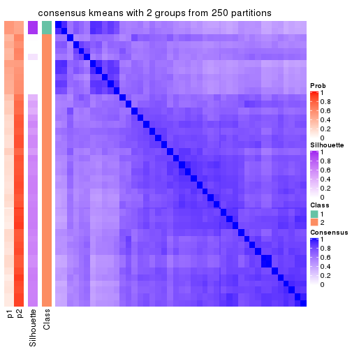</p>

</div>
<div id='tab-CV-kmeans-consensus-heatmap-2'>
<pre><code class="r">consensus_heatmap(res, k = 3)
</code></pre>

<p>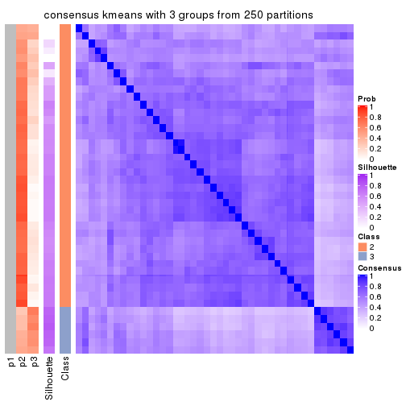</p>

</div>
<div id='tab-CV-kmeans-consensus-heatmap-3'>
<pre><code class="r">consensus_heatmap(res, k = 4)
</code></pre>

<p>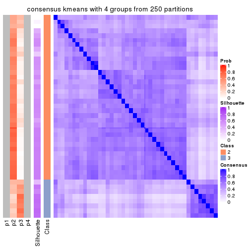</p>

</div>
<div id='tab-CV-kmeans-consensus-heatmap-4'>
<pre><code class="r">consensus_heatmap(res, k = 5)
</code></pre>

<p>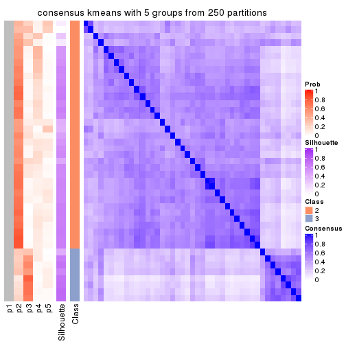</p>

</div>
<div id='tab-CV-kmeans-consensus-heatmap-5'>
<pre><code class="r">consensus_heatmap(res, k = 6)
</code></pre>

<p>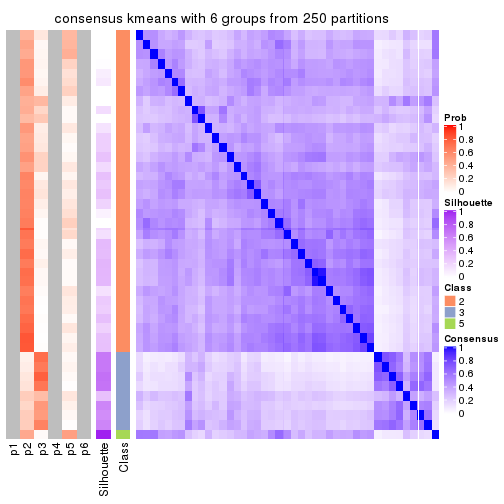</p>

</div>
</div>

Heatmaps for the membership of samples in all partitions to see how consistent they are:


<script>
$( function() {
	$( '#tabs-CV-kmeans-membership-heatmap' ).tabs();
} );
</script>
<div id='tabs-CV-kmeans-membership-heatmap'>
<ul>
<li><a href='#tab-CV-kmeans-membership-heatmap-1'>k = 2</a></li>
<li><a href='#tab-CV-kmeans-membership-heatmap-2'>k = 3</a></li>
<li><a href='#tab-CV-kmeans-membership-heatmap-3'>k = 4</a></li>
<li><a href='#tab-CV-kmeans-membership-heatmap-4'>k = 5</a></li>
<li><a href='#tab-CV-kmeans-membership-heatmap-5'>k = 6</a></li>
</ul>
<div id='tab-CV-kmeans-membership-heatmap-1'>
<pre><code class="r">membership_heatmap(res, k = 2)
</code></pre>

<p>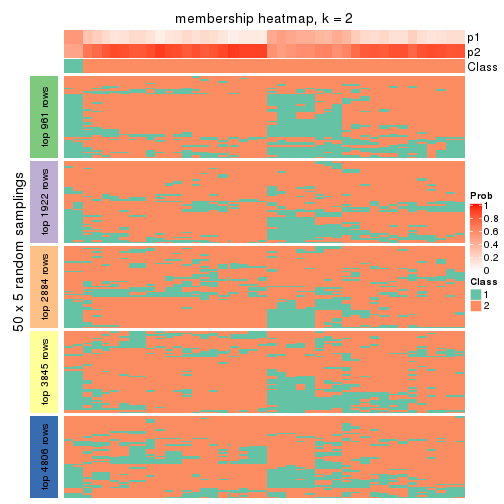</p>

</div>
<div id='tab-CV-kmeans-membership-heatmap-2'>
<pre><code class="r">membership_heatmap(res, k = 3)
</code></pre>

<p>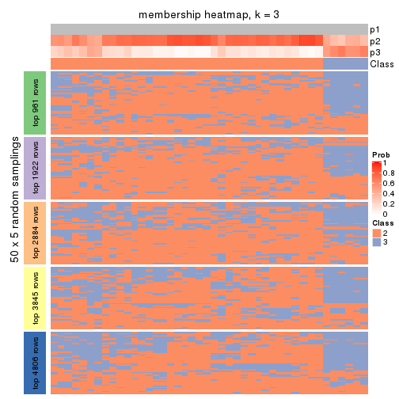</p>

</div>
<div id='tab-CV-kmeans-membership-heatmap-3'>
<pre><code class="r">membership_heatmap(res, k = 4)
</code></pre>

<p>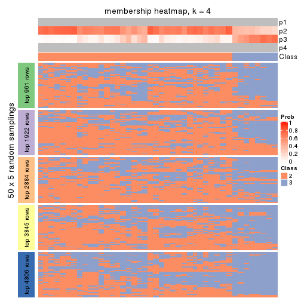</p>

</div>
<div id='tab-CV-kmeans-membership-heatmap-4'>
<pre><code class="r">membership_heatmap(res, k = 5)
</code></pre>

<p>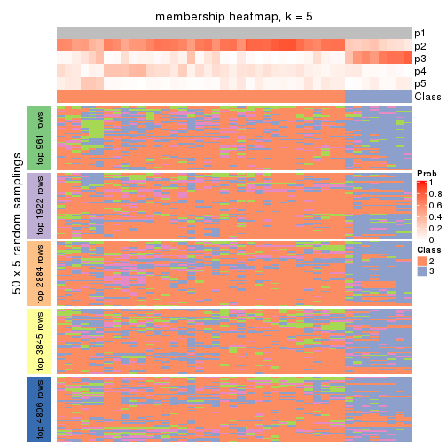</p>

</div>
<div id='tab-CV-kmeans-membership-heatmap-5'>
<pre><code class="r">membership_heatmap(res, k = 6)
</code></pre>

<p>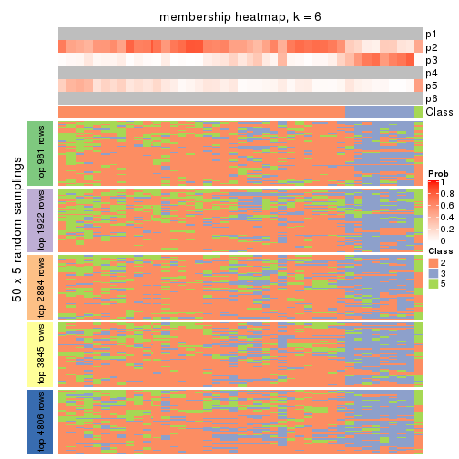</p>

</div>
</div>

As soon as we have had the classes for columns, we can look for signatures
which are significantly different between classes which can be candidate marks
for certain classes. Following are the heatmaps for signatures.


Signature heatmaps where rows are scaled:


<script>
$( function() {
	$( '#tabs-CV-kmeans-get-signatures' ).tabs();
} );
</script>
<div id='tabs-CV-kmeans-get-signatures'>
<ul>
<li><a href='#tab-CV-kmeans-get-signatures-1'>k = 2</a></li>
<li><a href='#tab-CV-kmeans-get-signatures-2'>k = 3</a></li>
<li><a href='#tab-CV-kmeans-get-signatures-3'>k = 4</a></li>
<li><a href='#tab-CV-kmeans-get-signatures-4'>k = 5</a></li>
<li><a href='#tab-CV-kmeans-get-signatures-5'>k = 6</a></li>
</ul>
<div id='tab-CV-kmeans-get-signatures-1'>
<pre><code class="r">get_signatures(res, k = 2)
</code></pre>

<p>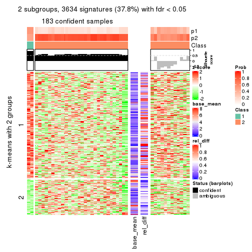</p>

</div>
<div id='tab-CV-kmeans-get-signatures-2'>
<pre><code class="r">get_signatures(res, k = 3)
</code></pre>

<p>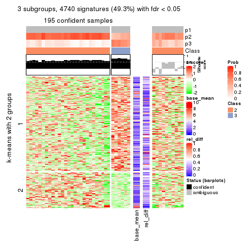</p>

</div>
<div id='tab-CV-kmeans-get-signatures-3'>
<pre><code class="r">get_signatures(res, k = 4)
</code></pre>

<p>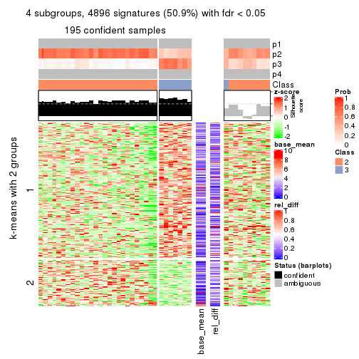</p>

</div>
<div id='tab-CV-kmeans-get-signatures-4'>
<pre><code class="r">get_signatures(res, k = 5)
</code></pre>

<p>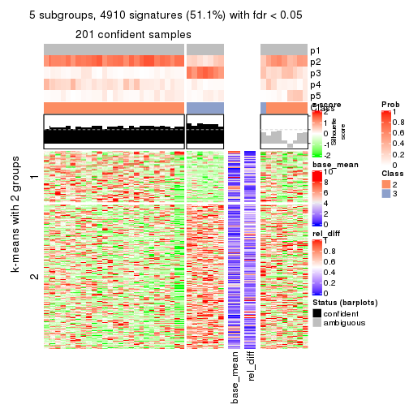</p>

</div>
<div id='tab-CV-kmeans-get-signatures-5'>
<pre><code class="r">get_signatures(res, k = 6)
</code></pre>

<p>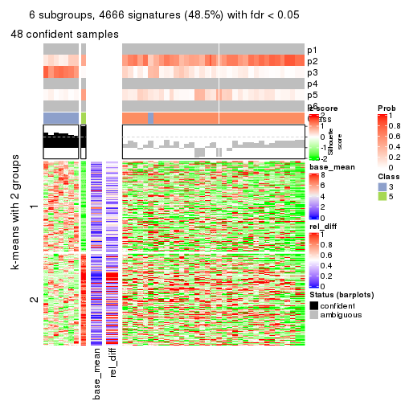</p>

</div>
</div>


Signature heatmaps where rows are not scaled:


<script>
$( function() {
	$( '#tabs-CV-kmeans-get-signatures-no-scale' ).tabs();
} );
</script>
<div id='tabs-CV-kmeans-get-signatures-no-scale'>
<ul>
<li><a href='#tab-CV-kmeans-get-signatures-no-scale-1'>k = 2</a></li>
<li><a href='#tab-CV-kmeans-get-signatures-no-scale-2'>k = 3</a></li>
<li><a href='#tab-CV-kmeans-get-signatures-no-scale-3'>k = 4</a></li>
<li><a href='#tab-CV-kmeans-get-signatures-no-scale-4'>k = 5</a></li>
<li><a href='#tab-CV-kmeans-get-signatures-no-scale-5'>k = 6</a></li>
</ul>
<div id='tab-CV-kmeans-get-signatures-no-scale-1'>
<pre><code class="r">get_signatures(res, k = 2, scale_rows = FALSE)
</code></pre>

<p>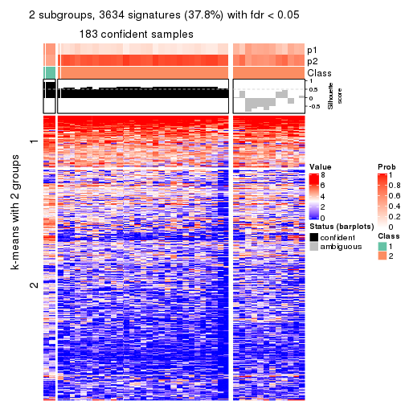</p>

</div>
<div id='tab-CV-kmeans-get-signatures-no-scale-2'>
<pre><code class="r">get_signatures(res, k = 3, scale_rows = FALSE)
</code></pre>

<p>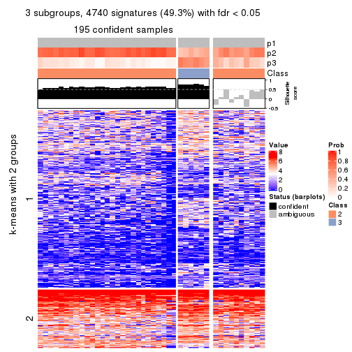</p>

</div>
<div id='tab-CV-kmeans-get-signatures-no-scale-3'>
<pre><code class="r">get_signatures(res, k = 4, scale_rows = FALSE)
</code></pre>

<p>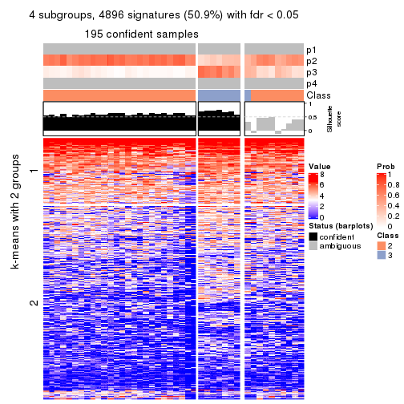</p>

</div>
<div id='tab-CV-kmeans-get-signatures-no-scale-4'>
<pre><code class="r">get_signatures(res, k = 5, scale_rows = FALSE)
</code></pre>

<p>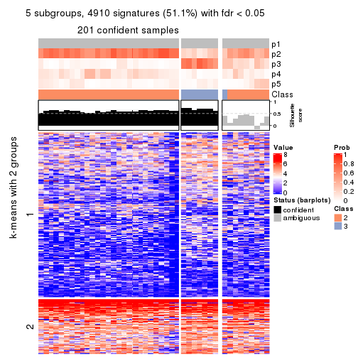</p>

</div>
<div id='tab-CV-kmeans-get-signatures-no-scale-5'>
<pre><code class="r">get_signatures(res, k = 6, scale_rows = FALSE)
</code></pre>

<p>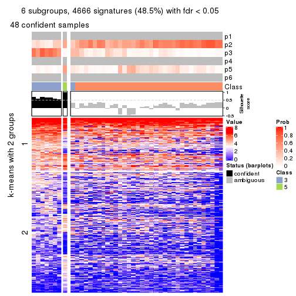</p>

</div>
</div>


Compare the overlap of signatures from different k:

```r
compare_signatures(res)
```

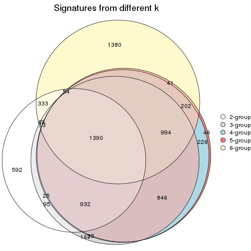

`get_signature()` returns a data frame invisibly. TO get the list of signatures, the function
call should be assigned to a variable explicitly. In following code, if `plot` argument is set
to `FALSE`, no heatmap is plotted while only the differential analysis is performed.

```r
# code only for demonstration
tb = get_signature(res, k = ..., plot = FALSE)
```

An example of the output of `tb` is:

```
#>   which_row         fdr    mean_1    mean_2 scaled_mean_1 scaled_mean_2 km
#> 1        38 0.042760348  8.373488  9.131774    -0.5533452     0.5164555  1
#> 2        40 0.018707592  7.106213  8.469186    -0.6173731     0.5762149  1
#> 3        55 0.019134737 10.221463 11.207825    -0.6159697     0.5749050  1
#> 4        59 0.006059896  5.921854  7.869574    -0.6899429     0.6439467  1
#> 5        60 0.018055526  8.928898 10.211722    -0.6204761     0.5791110  1
#> 6        98 0.009384629 15.714769 14.887706     0.6635654    -0.6193277  2
...
```

The columns in `tb` are:

1. `which_row`: row indices corresponding to the input matrix.
2. `fdr`: FDR for the differential test. 
3. `mean_x`: The mean value in group x.
4. `scaled_mean_x`: The mean value in group x after rows are scaled.
5. `km`: Row groups if k-means clustering is applied to rows.


UMAP plot which shows how samples are separated.


<script>
$( function() {
	$( '#tabs-CV-kmeans-dimension-reduction' ).tabs();
} );
</script>
<div id='tabs-CV-kmeans-dimension-reduction'>
<ul>
<li><a href='#tab-CV-kmeans-dimension-reduction-1'>k = 2</a></li>
<li><a href='#tab-CV-kmeans-dimension-reduction-2'>k = 3</a></li>
<li><a href='#tab-CV-kmeans-dimension-reduction-3'>k = 4</a></li>
<li><a href='#tab-CV-kmeans-dimension-reduction-4'>k = 5</a></li>
<li><a href='#tab-CV-kmeans-dimension-reduction-5'>k = 6</a></li>
</ul>
<div id='tab-CV-kmeans-dimension-reduction-1'>
<pre><code class="r">dimension_reduction(res, k = 2, method = &quot;UMAP&quot;)
</code></pre>

<p>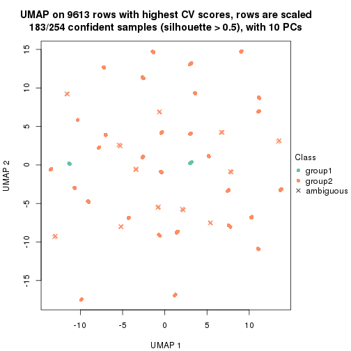</p>

</div>
<div id='tab-CV-kmeans-dimension-reduction-2'>
<pre><code class="r">dimension_reduction(res, k = 3, method = &quot;UMAP&quot;)
</code></pre>

<p>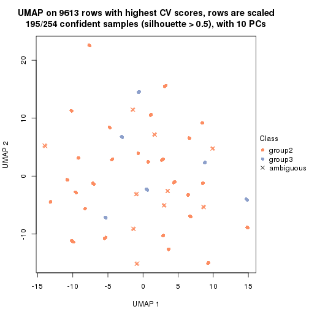</p>

</div>
<div id='tab-CV-kmeans-dimension-reduction-3'>
<pre><code class="r">dimension_reduction(res, k = 4, method = &quot;UMAP&quot;)
</code></pre>

<p>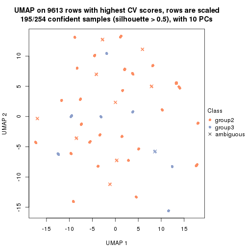</p>

</div>
<div id='tab-CV-kmeans-dimension-reduction-4'>
<pre><code class="r">dimension_reduction(res, k = 5, method = &quot;UMAP&quot;)
</code></pre>

<p>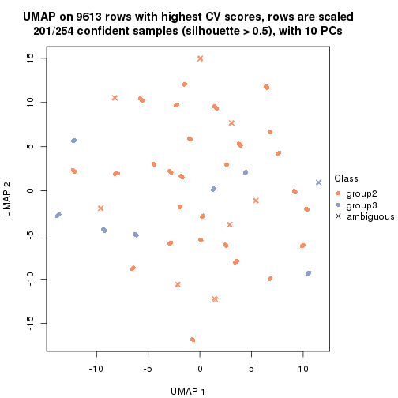</p>

</div>
<div id='tab-CV-kmeans-dimension-reduction-5'>
<pre><code class="r">dimension_reduction(res, k = 6, method = &quot;UMAP&quot;)
</code></pre>

<p>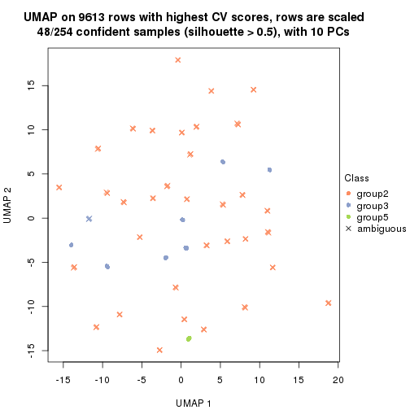</p>

</div>
</div>


Following heatmap shows how subgroups are split when increasing `k`:

```r
collect_classes(res)
```

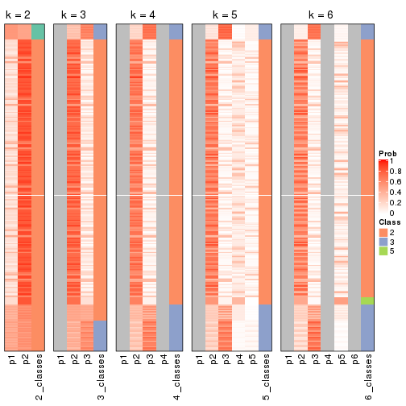


If matrix rows can be associated to genes, consider to use `GO_Enrichment(res,
...)` to perform function enrichment for the signature genes.


 

---------------------------------------------------


### CV:skmeans


The object with results only for a single top-value method and a single partition method 
can be extracted as:

```r
res = res_list["CV", "skmeans"]
# you can also extract it by
# res = res_list["CV:skmeans"]
```

A summary of `res` and all the functions that can be applied to it:

```r
res
```

```
#> A 'ConsensusPartition' object with k = 2, 3, 4, 5, 6.
#>   On a matrix with 9613 rows and 254 columns.
#>   Top rows (961, 1922, 2884, 3845, 4806) are extracted by 'CV' method.
#>   Subgroups are detected by 'skmeans' method.
#>   Performed in total 1250 partitions by row resampling.
#>   Best k for subgroups seems to be 2.
#> 
#> Following methods can be applied to this 'ConsensusPartition' object:
#>  [1] "cola_report"             "collect_classes"         "collect_plots"          
#>  [4] "collect_stats"           "colnames"                "compare_signatures"     
#>  [7] "consensus_heatmap"       "dimension_reduction"     "functional_enrichment"  
#> [10] "get_anno_col"            "get_anno"                "get_classes"            
#> [13] "get_consensus"           "get_matrix"              "get_membership"         
#> [16] "get_param"               "get_signatures"          "get_stats"              
#> [19] "is_best_k"               "is_stable_k"             "membership_heatmap"     
#> [22] "ncol"                    "nrow"                    "plot_ecdf"              
#> [25] "rownames"                "select_partition_number" "show"                   
#> [28] "suggest_best_k"          "test_to_known_factors"
```

`collect_plots()` function collects all the plots made from `res` for all `k` (number of partitions)
into one single page to provide an easy and fast comparison between different `k`.

```r
collect_plots(res)
```

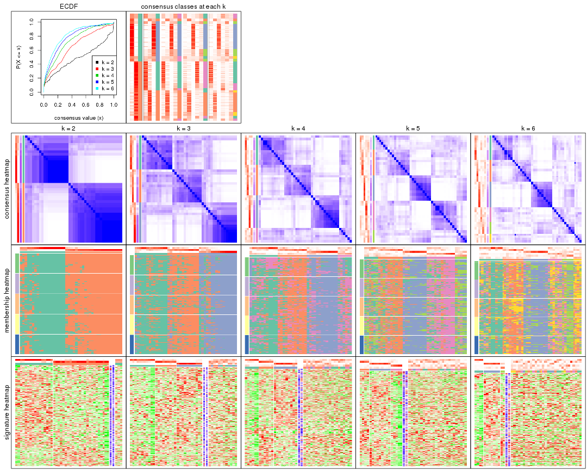

The plots are:

- The first row: a plot of the ECDF (Empirical cumulative distribution
  function) curves of the consensus matrix for each `k` and the heatmap of
  predicted classes for each `k`.
- The second row: heatmaps of the consensus matrix for each `k`.
- The third row: heatmaps of the membership matrix for each `k`.
- The fouth row: heatmaps of the signatures for each `k`.

All the plots in panels can be made by individual functions and they are
plotted later in this section.

`select_partition_number()` produces several plots showing different
statistics for choosing "optimized" `k`. There are following statistics:

- ECDF curves of the consensus matrix for each `k`;
- 1-PAC. [The PAC
  score](https://en.wikipedia.org/wiki/Consensus_clustering#Over-interpretation_potential_of_consensus_clustering)
  measures the proportion of the ambiguous subgrouping.
- Mean silhouette score.
- Concordance. The mean probability of fiting the consensus class ids in all
  partitions.
- Area increased. Denote $A_k$ as the area under the ECDF curve for current
  `k`, the area increased is defined as $A_k - A_{k-1}$.
- Rand index. The percent of pairs of samples that are both in a same cluster
  or both are not in a same cluster in the partition of k and k-1.
- Jaccard index. The ratio of pairs of samples are both in a same cluster in
  the partition of k and k-1 and the pairs of samples are both in a same
  cluster in the partition k or k-1.

The detailed explanations of these statistics can be found in [the cola
vignette](http://bioconductor.org/packages/devel/bioc/vignettes/cola/inst/doc/cola.html#toc_13).

Generally speaking, lower PAC score, higher mean silhouette score or higher
concordance corresponds to better partition. Rand index and Jaccard index
measure how similar the current partition is compared to partition with `k-1`.
If they are too similar, we won't accept `k` is better than `k-1`.

```r
select_partition_number(res)
```

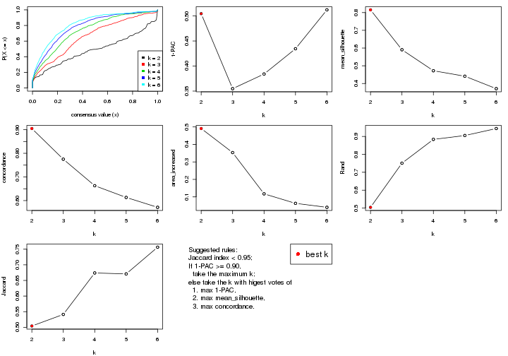

The numeric values for all these statistics can be obtained by `get_stats()`.

```r
get_stats(res)
```

```
#>   k 1-PAC mean_silhouette concordance area_increased  Rand Jaccard
#> 2 2 0.505           0.815       0.905         0.4909 0.504   0.504
#> 3 3 0.355           0.590       0.775         0.3534 0.751   0.541
#> 4 4 0.384           0.472       0.663         0.1173 0.884   0.674
#> 5 5 0.435           0.441       0.613         0.0630 0.905   0.671
#> 6 6 0.512           0.371       0.571         0.0402 0.944   0.756
```

`suggest_best_k()` suggests the best $k$ based on these statistics. The rules are as follows:

- All $k$ with Jaccard index larger than 0.95 are removed because the increase of
  the partition number does not provides enough extra information. If all $k$ are removed,
  the best $k$ is assigned by `NA`.
- For $k$ with 1-PAC larger than 0.9, the maximal $k$ is taken as the "best k". Other $k$ is called "optional k".
- If it does not fit the second rule. The $k$ with the highest vote of highest
  1-PAC, mean silhouette and concordance is taken as the "best k".

```r
suggest_best_k(res)
```

```
#> [1] 2
```


Following shows the table of the partitions (You need to click the **show/hide
code output** link to see it). The membership matrix (columns with name `p*`)
is inferred by
[`clue::cl_consensus()`](https://www.rdocumentation.org/link/cl_consensus?package=clue)
function with the `SE` method. Basically the value in the membership matrix
represents the probability to belong to a certain group. The finall class
label for an item is determined with the group with highest probability it
belongs to.

In `get_classes()` function, the entropy is calculated from the membership
matrix and the silhouette score is calculated from the consensus matrix.


<script>
$( function() {
	$( '#tabs-CV-skmeans-get-classes' ).tabs();
} );
</script>
<div id='tabs-CV-skmeans-get-classes'>
<ul>
<li><a href='#tab-CV-skmeans-get-classes-1'>k = 2</a></li>
<li><a href='#tab-CV-skmeans-get-classes-2'>k = 3</a></li>
<li><a href='#tab-CV-skmeans-get-classes-3'>k = 4</a></li>
<li><a href='#tab-CV-skmeans-get-classes-4'>k = 5</a></li>
<li><a href='#tab-CV-skmeans-get-classes-5'>k = 6</a></li>
</ul>

<div id='tab-CV-skmeans-get-classes-1'>
<p><a id='tab-CV-skmeans-get-classes-1-a' style='color:#0366d6' href='#'>show/hide code output</a></p>
<pre><code class="r">cbind(get_classes(res, k = 2), get_membership(res, k = 2))
</code></pre>

<pre><code>#&gt;           class entropy silhouette    p1    p2
#&gt; DRR024803     2  0.0672      0.913 0.008 0.992
#&gt; DRR024804     2  0.9087      0.564 0.324 0.676
#&gt; DRR024805     2  0.6973      0.797 0.188 0.812
#&gt; DRR024806     2  0.3274      0.901 0.060 0.940
#&gt; DRR024807     1  0.0000      0.869 1.000 0.000
#&gt; DRR024808     1  0.0000      0.869 1.000 0.000
#&gt; DRR024809     2  0.3274      0.900 0.060 0.940
#&gt; DRR024810     2  0.0672      0.914 0.008 0.992
#&gt; DRR024811     1  0.0000      0.869 1.000 0.000
#&gt; DRR024812     2  0.0000      0.914 0.000 1.000
#&gt; DRR024813     1  0.4298      0.834 0.912 0.088
#&gt; DRR024814     2  0.4431      0.886 0.092 0.908
#&gt; DRR024815     2  0.4161      0.878 0.084 0.916
#&gt; DRR024816     2  0.0000      0.914 0.000 1.000
#&gt; DRR024817     2  0.5059      0.854 0.112 0.888
#&gt; DRR024818     1  0.7815      0.723 0.768 0.232
#&gt; DRR024819     1  0.8499      0.680 0.724 0.276
#&gt; DRR024820     1  0.7883      0.725 0.764 0.236
#&gt; DRR024821     1  0.0000      0.869 1.000 0.000
#&gt; DRR024822     2  0.7883      0.733 0.236 0.764
#&gt; DRR024824     2  0.0000      0.914 0.000 1.000
#&gt; DRR024825     1  0.0000      0.869 1.000 0.000
#&gt; DRR024826     1  0.9635      0.444 0.612 0.388
#&gt; DRR024827     1  0.1184      0.864 0.984 0.016
#&gt; DRR024828     1  0.0000      0.869 1.000 0.000
#&gt; DRR024829     2  0.0000      0.914 0.000 1.000
#&gt; DRR024830     2  0.5408      0.861 0.124 0.876
#&gt; DRR024831     1  0.0000      0.869 1.000 0.000
#&gt; DRR024832     1  0.0000      0.869 1.000 0.000
#&gt; DRR024833     1  0.9795      0.360 0.584 0.416
#&gt; DRR024834     2  0.0000      0.914 0.000 1.000
#&gt; DRR024835     1  0.9881      0.343 0.564 0.436
#&gt; DRR024836     1  0.0000      0.869 1.000 0.000
#&gt; DRR024837     2  0.0000      0.914 0.000 1.000
#&gt; DRR024838     2  0.0000      0.914 0.000 1.000
#&gt; DRR024839     2  0.9129      0.546 0.328 0.672
#&gt; DRR024840     1  0.5946      0.793 0.856 0.144
#&gt; DRR024841     2  0.0000      0.914 0.000 1.000
#&gt; DRR024842     2  0.1184      0.912 0.016 0.984
#&gt; DRR024843     2  0.0672      0.913 0.008 0.992
#&gt; DRR024844     2  0.9087      0.564 0.324 0.676
#&gt; DRR024845     2  0.6973      0.797 0.188 0.812
#&gt; DRR024846     2  0.3274      0.901 0.060 0.940
#&gt; DRR024847     1  0.0000      0.869 1.000 0.000
#&gt; DRR024848     2  0.0672      0.913 0.008 0.992
#&gt; DRR024849     1  0.0000      0.869 1.000 0.000
#&gt; DRR024850     2  0.4298      0.888 0.088 0.912
#&gt; DRR024851     2  0.3274      0.900 0.060 0.940
#&gt; DRR024852     2  0.0672      0.914 0.008 0.992
#&gt; DRR024853     1  0.0000      0.869 1.000 0.000
#&gt; DRR024854     2  0.0000      0.914 0.000 1.000
#&gt; DRR024855     1  0.4298      0.834 0.912 0.088
#&gt; DRR024856     2  0.4431      0.886 0.092 0.908
#&gt; DRR024857     2  0.4161      0.878 0.084 0.916
#&gt; DRR024858     2  0.0000      0.914 0.000 1.000
#&gt; DRR024859     2  0.5059      0.854 0.112 0.888
#&gt; DRR024860     1  0.7815      0.723 0.768 0.232
#&gt; DRR024861     1  0.8499      0.680 0.724 0.276
#&gt; DRR024862     1  0.7883      0.725 0.764 0.236
#&gt; DRR024863     1  0.0000      0.869 1.000 0.000
#&gt; DRR024864     2  0.7883      0.733 0.236 0.764
#&gt; DRR024865     2  0.0000      0.914 0.000 1.000
#&gt; DRR024866     2  0.0000      0.914 0.000 1.000
#&gt; DRR024867     1  0.0000      0.869 1.000 0.000
#&gt; DRR024868     1  0.9635      0.444 0.612 0.388
#&gt; DRR024869     1  0.1184      0.864 0.984 0.016
#&gt; DRR024870     1  0.0000      0.869 1.000 0.000
#&gt; DRR024871     2  0.0000      0.914 0.000 1.000
#&gt; DRR024872     2  0.5408      0.861 0.124 0.876
#&gt; DRR024873     1  0.0000      0.869 1.000 0.000
#&gt; DRR024874     1  0.0000      0.869 1.000 0.000
#&gt; DRR024875     1  0.9795      0.360 0.584 0.416
#&gt; DRR024876     2  0.0000      0.914 0.000 1.000
#&gt; DRR024877     1  0.9881      0.343 0.564 0.436
#&gt; DRR024878     1  0.0000      0.869 1.000 0.000
#&gt; DRR024879     2  0.0000      0.914 0.000 1.000
#&gt; DRR024880     2  0.0000      0.914 0.000 1.000
#&gt; DRR024881     2  0.9129      0.546 0.328 0.672
#&gt; DRR024882     1  0.5946      0.793 0.856 0.144
#&gt; DRR024883     2  0.0000      0.914 0.000 1.000
#&gt; DRR024884     2  0.4298      0.877 0.088 0.912
#&gt; DRR024885     1  0.1633      0.862 0.976 0.024
#&gt; DRR024886     2  0.0672      0.913 0.008 0.992
#&gt; DRR024887     2  0.9087      0.564 0.324 0.676
#&gt; DRR024888     2  0.6973      0.797 0.188 0.812
#&gt; DRR024889     2  0.3274      0.901 0.060 0.940
#&gt; DRR024890     1  0.0000      0.869 1.000 0.000
#&gt; DRR024891     2  0.0672      0.913 0.008 0.992
#&gt; DRR024892     1  0.0000      0.869 1.000 0.000
#&gt; DRR024893     2  0.4298      0.888 0.088 0.912
#&gt; DRR024894     2  0.3274      0.900 0.060 0.940
#&gt; DRR024895     2  0.0672      0.914 0.008 0.992
#&gt; DRR024896     1  0.0000      0.869 1.000 0.000
#&gt; DRR024897     2  0.0000      0.914 0.000 1.000
#&gt; DRR024898     1  0.4298      0.834 0.912 0.088
#&gt; DRR024899     2  0.4431      0.886 0.092 0.908
#&gt; DRR024900     2  0.4161      0.878 0.084 0.916
#&gt; DRR024901     2  0.0000      0.914 0.000 1.000
#&gt; DRR024902     2  0.5059      0.854 0.112 0.888
#&gt; DRR024903     1  0.7815      0.723 0.768 0.232
#&gt; DRR024904     1  0.8499      0.680 0.724 0.276
#&gt; DRR024905     1  0.7883      0.725 0.764 0.236
#&gt; DRR024906     1  0.0000      0.869 1.000 0.000
#&gt; DRR024907     2  0.7883      0.733 0.236 0.764
#&gt; DRR024908     2  0.0000      0.914 0.000 1.000
#&gt; DRR024909     2  0.0000      0.914 0.000 1.000
#&gt; DRR024910     1  0.0000      0.869 1.000 0.000
#&gt; DRR024911     1  0.9635      0.444 0.612 0.388
#&gt; DRR024912     1  0.1184      0.864 0.984 0.016
#&gt; DRR024913     1  0.0000      0.869 1.000 0.000
#&gt; DRR024914     2  0.0000      0.914 0.000 1.000
#&gt; DRR024915     2  0.5408      0.861 0.124 0.876
#&gt; DRR024916     1  0.0000      0.869 1.000 0.000
#&gt; DRR024917     1  0.0000      0.869 1.000 0.000
#&gt; DRR024918     1  0.9795      0.360 0.584 0.416
#&gt; DRR024919     2  0.0000      0.914 0.000 1.000
#&gt; DRR024920     1  0.9881      0.343 0.564 0.436
#&gt; DRR024921     1  0.0000      0.869 1.000 0.000
#&gt; DRR024922     2  0.0000      0.914 0.000 1.000
#&gt; DRR024923     2  0.0000      0.914 0.000 1.000
#&gt; DRR024924     2  0.9129      0.546 0.328 0.672
#&gt; DRR024925     1  0.5946      0.793 0.856 0.144
#&gt; DRR024926     2  0.0000      0.914 0.000 1.000
#&gt; DRR024927     2  0.4298      0.877 0.088 0.912
#&gt; DRR024928     1  0.1633      0.862 0.976 0.024
#&gt; DRR024929     2  0.0672      0.913 0.008 0.992
#&gt; DRR024930     2  0.9087      0.564 0.324 0.676
#&gt; DRR024931     2  0.6973      0.797 0.188 0.812
#&gt; DRR024932     2  0.3274      0.901 0.060 0.940
#&gt; DRR024933     1  0.0000      0.869 1.000 0.000
#&gt; DRR024934     2  0.0672      0.913 0.008 0.992
#&gt; DRR024935     1  0.0000      0.869 1.000 0.000
#&gt; DRR024936     2  0.4298      0.888 0.088 0.912
#&gt; DRR024937     2  0.3274      0.900 0.060 0.940
#&gt; DRR024938     2  0.0672      0.914 0.008 0.992
#&gt; DRR024939     1  0.0000      0.869 1.000 0.000
#&gt; DRR024940     2  0.0000      0.914 0.000 1.000
#&gt; DRR024941     1  0.4298      0.834 0.912 0.088
#&gt; DRR024942     2  0.4431      0.886 0.092 0.908
#&gt; DRR024943     2  0.4161      0.878 0.084 0.916
#&gt; DRR024944     2  0.0000      0.914 0.000 1.000
#&gt; DRR024945     2  0.5059      0.854 0.112 0.888
#&gt; DRR024946     1  0.7815      0.723 0.768 0.232
#&gt; DRR024947     1  0.8499      0.680 0.724 0.276
#&gt; DRR024948     1  0.7883      0.725 0.764 0.236
#&gt; DRR024949     1  0.0000      0.869 1.000 0.000
#&gt; DRR024950     2  0.7883      0.733 0.236 0.764
#&gt; DRR024951     2  0.0000      0.914 0.000 1.000
#&gt; DRR024952     2  0.0000      0.914 0.000 1.000
#&gt; DRR024953     1  0.0000      0.869 1.000 0.000
#&gt; DRR024954     1  0.9635      0.444 0.612 0.388
#&gt; DRR024955     1  0.1184      0.864 0.984 0.016
#&gt; DRR024956     1  0.0000      0.869 1.000 0.000
#&gt; DRR024957     2  0.0000      0.914 0.000 1.000
#&gt; DRR024958     2  0.5408      0.861 0.124 0.876
#&gt; DRR024959     1  0.0000      0.869 1.000 0.000
#&gt; DRR024960     1  0.0000      0.869 1.000 0.000
#&gt; DRR024961     1  0.9795      0.360 0.584 0.416
#&gt; DRR024962     2  0.0000      0.914 0.000 1.000
#&gt; DRR024963     1  0.9881      0.343 0.564 0.436
#&gt; DRR024964     1  0.0000      0.869 1.000 0.000
#&gt; DRR024965     2  0.0000      0.914 0.000 1.000
#&gt; DRR024966     2  0.0000      0.914 0.000 1.000
#&gt; DRR024967     2  0.9129      0.546 0.328 0.672
#&gt; DRR024968     1  0.5946      0.793 0.856 0.144
#&gt; DRR024969     2  0.0000      0.914 0.000 1.000
#&gt; DRR024970     2  0.4298      0.877 0.088 0.912
#&gt; DRR024971     1  0.1633      0.862 0.976 0.024
#&gt; DRR024972     2  0.0672      0.913 0.008 0.992
#&gt; DRR024973     2  0.9087      0.564 0.324 0.676
#&gt; DRR024974     2  0.6973      0.797 0.188 0.812
#&gt; DRR024975     2  0.3274      0.901 0.060 0.940
#&gt; DRR024976     1  0.0000      0.869 1.000 0.000
#&gt; DRR024977     2  0.0672      0.913 0.008 0.992
#&gt; DRR024978     1  0.0000      0.869 1.000 0.000
#&gt; DRR024979     2  0.4298      0.888 0.088 0.912
#&gt; DRR024980     2  0.3274      0.900 0.060 0.940
#&gt; DRR024981     2  0.0672      0.914 0.008 0.992
#&gt; DRR024982     1  0.0000      0.869 1.000 0.000
#&gt; DRR024983     2  0.0000      0.914 0.000 1.000
#&gt; DRR024984     1  0.4298      0.834 0.912 0.088
#&gt; DRR024985     2  0.4431      0.886 0.092 0.908
#&gt; DRR024986     2  0.4161      0.878 0.084 0.916
#&gt; DRR024987     2  0.0000      0.914 0.000 1.000
#&gt; DRR024988     2  0.5059      0.854 0.112 0.888
#&gt; DRR024989     1  0.7815      0.723 0.768 0.232
#&gt; DRR024990     1  0.8499      0.680 0.724 0.276
#&gt; DRR024991     1  0.7883      0.725 0.764 0.236
#&gt; DRR024992     1  0.0000      0.869 1.000 0.000
#&gt; DRR024993     2  0.7883      0.733 0.236 0.764
#&gt; DRR024994     2  0.0000      0.914 0.000 1.000
#&gt; DRR024995     2  0.0000      0.914 0.000 1.000
#&gt; DRR024996     1  0.0000      0.869 1.000 0.000
#&gt; DRR024997     1  0.9635      0.444 0.612 0.388
#&gt; DRR024998     1  0.1184      0.864 0.984 0.016
#&gt; DRR024999     1  0.0000      0.869 1.000 0.000
#&gt; DRR025000     2  0.0000      0.914 0.000 1.000
#&gt; DRR025001     2  0.5408      0.861 0.124 0.876
#&gt; DRR025002     1  0.0000      0.869 1.000 0.000
#&gt; DRR025003     1  0.0000      0.869 1.000 0.000
#&gt; DRR025004     1  0.9795      0.360 0.584 0.416
#&gt; DRR025005     2  0.0000      0.914 0.000 1.000
#&gt; DRR025006     1  0.9881      0.343 0.564 0.436
#&gt; DRR025007     1  0.0000      0.869 1.000 0.000
#&gt; DRR025008     2  0.0000      0.914 0.000 1.000
#&gt; DRR025009     2  0.0000      0.914 0.000 1.000
#&gt; DRR025010     2  0.9129      0.546 0.328 0.672
#&gt; DRR025011     1  0.5946      0.793 0.856 0.144
#&gt; DRR025012     2  0.0000      0.914 0.000 1.000
#&gt; DRR025013     2  0.4298      0.877 0.088 0.912
#&gt; DRR025014     1  0.1633      0.862 0.976 0.024
#&gt; DRR025015     2  0.0672      0.913 0.008 0.992
#&gt; DRR025016     2  0.9087      0.564 0.324 0.676
#&gt; DRR025017     2  0.6973      0.797 0.188 0.812
#&gt; DRR025018     2  0.3274      0.901 0.060 0.940
#&gt; DRR025019     1  0.0000      0.869 1.000 0.000
#&gt; DRR025020     2  0.0672      0.913 0.008 0.992
#&gt; DRR025021     1  0.0000      0.869 1.000 0.000
#&gt; DRR025022     2  0.4298      0.888 0.088 0.912
#&gt; DRR025023     2  0.3274      0.900 0.060 0.940
#&gt; DRR025024     2  0.0672      0.914 0.008 0.992
#&gt; DRR025025     1  0.0000      0.869 1.000 0.000
#&gt; DRR025026     2  0.0000      0.914 0.000 1.000
#&gt; DRR025027     1  0.4298      0.834 0.912 0.088
#&gt; DRR025028     2  0.4431      0.886 0.092 0.908
#&gt; DRR025029     2  0.4161      0.878 0.084 0.916
#&gt; DRR025030     2  0.0000      0.914 0.000 1.000
#&gt; DRR025031     2  0.5059      0.854 0.112 0.888
#&gt; DRR025032     1  0.7815      0.723 0.768 0.232
#&gt; DRR025033     1  0.8499      0.680 0.724 0.276
#&gt; DRR025034     1  0.7883      0.725 0.764 0.236
#&gt; DRR025035     1  0.0000      0.869 1.000 0.000
#&gt; DRR025036     2  0.7883      0.733 0.236 0.764
#&gt; DRR025037     2  0.0000      0.914 0.000 1.000
#&gt; DRR025038     2  0.0000      0.914 0.000 1.000
#&gt; DRR025039     1  0.0000      0.869 1.000 0.000
#&gt; DRR025040     1  0.9635      0.444 0.612 0.388
#&gt; DRR025041     1  0.1184      0.864 0.984 0.016
#&gt; DRR025042     1  0.0000      0.869 1.000 0.000
#&gt; DRR025043     2  0.0000      0.914 0.000 1.000
#&gt; DRR025044     2  0.5408      0.861 0.124 0.876
#&gt; DRR025045     1  0.0000      0.869 1.000 0.000
#&gt; DRR025046     1  0.0000      0.869 1.000 0.000
#&gt; DRR025047     1  0.9795      0.360 0.584 0.416
#&gt; DRR025048     2  0.0000      0.914 0.000 1.000
#&gt; DRR025049     1  0.9881      0.343 0.564 0.436
#&gt; DRR025050     1  0.0000      0.869 1.000 0.000
#&gt; DRR025051     2  0.0000      0.914 0.000 1.000
#&gt; DRR025052     2  0.0000      0.914 0.000 1.000
#&gt; DRR025053     2  0.9129      0.546 0.328 0.672
#&gt; DRR025054     1  0.5946      0.793 0.856 0.144
#&gt; DRR025055     2  0.0000      0.914 0.000 1.000
#&gt; DRR025056     2  0.4298      0.877 0.088 0.912
#&gt; DRR025057     1  0.1633      0.862 0.976 0.024
</code></pre>

<script>
$('#tab-CV-skmeans-get-classes-1-a').parent().next().next().hide();
$('#tab-CV-skmeans-get-classes-1-a').click(function(){
  $('#tab-CV-skmeans-get-classes-1-a').parent().next().next().toggle();
  return(false);
});
</script>
</div>

<div id='tab-CV-skmeans-get-classes-2'>
<p><a id='tab-CV-skmeans-get-classes-2-a' style='color:#0366d6' href='#'>show/hide code output</a></p>
<pre><code class="r">cbind(get_classes(res, k = 3), get_membership(res, k = 3))
</code></pre>

<pre><code>#&gt;           class entropy silhouette    p1    p2    p3
#&gt; DRR024803     1  0.2165    0.72083 0.936 0.064 0.000
#&gt; DRR024804     2  0.9286    0.34455 0.312 0.504 0.184
#&gt; DRR024805     2  0.2414    0.71759 0.040 0.940 0.020
#&gt; DRR024806     2  0.5480    0.59352 0.264 0.732 0.004
#&gt; DRR024807     3  0.3933    0.75081 0.028 0.092 0.880
#&gt; DRR024808     3  0.0000    0.78637 0.000 0.000 1.000
#&gt; DRR024809     2  0.2400    0.71770 0.064 0.932 0.004
#&gt; DRR024810     2  0.3619    0.70358 0.136 0.864 0.000
#&gt; DRR024811     3  0.1774    0.78188 0.016 0.024 0.960
#&gt; DRR024812     2  0.5098    0.59382 0.248 0.752 0.000
#&gt; DRR024813     3  0.8373    0.28213 0.088 0.388 0.524
#&gt; DRR024814     2  0.6579    0.46290 0.328 0.652 0.020
#&gt; DRR024815     1  0.2845    0.71498 0.920 0.068 0.012
#&gt; DRR024816     1  0.6180    0.36396 0.584 0.416 0.000
#&gt; DRR024817     1  0.3434    0.71247 0.904 0.064 0.032
#&gt; DRR024818     3  0.8718    0.31024 0.364 0.116 0.520
#&gt; DRR024819     3  0.9287    0.32503 0.304 0.188 0.508
#&gt; DRR024820     3  0.7493    0.15724 0.480 0.036 0.484
#&gt; DRR024821     3  0.1015    0.78601 0.012 0.008 0.980
#&gt; DRR024822     2  0.1905    0.71841 0.028 0.956 0.016
#&gt; DRR024824     2  0.6359    0.27118 0.404 0.592 0.004
#&gt; DRR024825     3  0.0000    0.78637 0.000 0.000 1.000
#&gt; DRR024826     1  0.9553    0.25774 0.484 0.244 0.272
#&gt; DRR024827     3  0.4914    0.74352 0.088 0.068 0.844
#&gt; DRR024828     3  0.4966    0.73061 0.060 0.100 0.840
#&gt; DRR024829     1  0.5327    0.60965 0.728 0.272 0.000
#&gt; DRR024830     2  0.4802    0.69866 0.156 0.824 0.020
#&gt; DRR024831     3  0.0000    0.78637 0.000 0.000 1.000
#&gt; DRR024832     3  0.0237    0.78604 0.004 0.000 0.996
#&gt; DRR024833     3  0.9866   -0.00547 0.256 0.356 0.388
#&gt; DRR024834     1  0.3752    0.71286 0.856 0.144 0.000
#&gt; DRR024835     1  0.8442    0.44663 0.620 0.188 0.192
#&gt; DRR024836     3  0.0000    0.78637 0.000 0.000 1.000
#&gt; DRR024837     1  0.4750    0.67412 0.784 0.216 0.000
#&gt; DRR024838     1  0.4887    0.67178 0.772 0.228 0.000
#&gt; DRR024839     2  0.6974    0.61429 0.168 0.728 0.104
#&gt; DRR024840     2  0.6839    0.38446 0.024 0.624 0.352
#&gt; DRR024841     1  0.5216    0.63199 0.740 0.260 0.000
#&gt; DRR024842     2  0.2796    0.71801 0.092 0.908 0.000
#&gt; DRR024843     1  0.2165    0.72083 0.936 0.064 0.000
#&gt; DRR024844     2  0.9286    0.34455 0.312 0.504 0.184
#&gt; DRR024845     2  0.2414    0.71759 0.040 0.940 0.020
#&gt; DRR024846     2  0.5480    0.59352 0.264 0.732 0.004
#&gt; DRR024847     3  0.3933    0.75081 0.028 0.092 0.880
#&gt; DRR024848     1  0.2165    0.72083 0.936 0.064 0.000
#&gt; DRR024849     3  0.0000    0.78637 0.000 0.000 1.000
#&gt; DRR024850     2  0.4897    0.68478 0.172 0.812 0.016
#&gt; DRR024851     2  0.2400    0.71770 0.064 0.932 0.004
#&gt; DRR024852     2  0.3619    0.70358 0.136 0.864 0.000
#&gt; DRR024853     3  0.1774    0.78188 0.016 0.024 0.960
#&gt; DRR024854     2  0.5098    0.59382 0.248 0.752 0.000
#&gt; DRR024855     3  0.8373    0.28213 0.088 0.388 0.524
#&gt; DRR024856     2  0.6579    0.46290 0.328 0.652 0.020
#&gt; DRR024857     1  0.2845    0.71498 0.920 0.068 0.012
#&gt; DRR024858     1  0.6180    0.36396 0.584 0.416 0.000
#&gt; DRR024859     1  0.3434    0.71247 0.904 0.064 0.032
#&gt; DRR024860     3  0.8718    0.31024 0.364 0.116 0.520
#&gt; DRR024861     3  0.9287    0.32503 0.304 0.188 0.508
#&gt; DRR024862     3  0.7493    0.15724 0.480 0.036 0.484
#&gt; DRR024863     3  0.1015    0.78601 0.012 0.008 0.980
#&gt; DRR024864     2  0.1905    0.71841 0.028 0.956 0.016
#&gt; DRR024865     1  0.5810    0.55432 0.664 0.336 0.000
#&gt; DRR024866     2  0.6359    0.27118 0.404 0.592 0.004
#&gt; DRR024867     3  0.0000    0.78637 0.000 0.000 1.000
#&gt; DRR024868     1  0.9553    0.25774 0.484 0.244 0.272
#&gt; DRR024869     3  0.4914    0.74352 0.088 0.068 0.844
#&gt; DRR024870     3  0.4966    0.73061 0.060 0.100 0.840
#&gt; DRR024871     1  0.5327    0.60965 0.728 0.272 0.000
#&gt; DRR024872     2  0.4802    0.69866 0.156 0.824 0.020
#&gt; DRR024873     3  0.0000    0.78637 0.000 0.000 1.000
#&gt; DRR024874     3  0.0237    0.78604 0.004 0.000 0.996
#&gt; DRR024875     3  0.9866   -0.00547 0.256 0.356 0.388
#&gt; DRR024876     1  0.3752    0.71286 0.856 0.144 0.000
#&gt; DRR024877     1  0.8442    0.44663 0.620 0.188 0.192
#&gt; DRR024878     3  0.0000    0.78637 0.000 0.000 1.000
#&gt; DRR024879     1  0.4750    0.67412 0.784 0.216 0.000
#&gt; DRR024880     1  0.4887    0.67178 0.772 0.228 0.000
#&gt; DRR024881     2  0.6974    0.61429 0.168 0.728 0.104
#&gt; DRR024882     2  0.6839    0.38446 0.024 0.624 0.352
#&gt; DRR024883     1  0.5216    0.63199 0.740 0.260 0.000
#&gt; DRR024884     1  0.6012    0.60083 0.748 0.220 0.032
#&gt; DRR024885     3  0.5467    0.73101 0.112 0.072 0.816
#&gt; DRR024886     1  0.2165    0.72083 0.936 0.064 0.000
#&gt; DRR024887     2  0.9286    0.34455 0.312 0.504 0.184
#&gt; DRR024888     2  0.2414    0.71759 0.040 0.940 0.020
#&gt; DRR024889     2  0.5480    0.59352 0.264 0.732 0.004
#&gt; DRR024890     3  0.3933    0.75081 0.028 0.092 0.880
#&gt; DRR024891     1  0.2165    0.72083 0.936 0.064 0.000
#&gt; DRR024892     3  0.0000    0.78637 0.000 0.000 1.000
#&gt; DRR024893     2  0.4897    0.68478 0.172 0.812 0.016
#&gt; DRR024894     2  0.2400    0.71770 0.064 0.932 0.004
#&gt; DRR024895     2  0.3619    0.70358 0.136 0.864 0.000
#&gt; DRR024896     3  0.1774    0.78188 0.016 0.024 0.960
#&gt; DRR024897     2  0.5098    0.59382 0.248 0.752 0.000
#&gt; DRR024898     3  0.8373    0.28213 0.088 0.388 0.524
#&gt; DRR024899     2  0.6579    0.46290 0.328 0.652 0.020
#&gt; DRR024900     1  0.2845    0.71498 0.920 0.068 0.012
#&gt; DRR024901     1  0.6180    0.36396 0.584 0.416 0.000
#&gt; DRR024902     1  0.3434    0.71247 0.904 0.064 0.032
#&gt; DRR024903     3  0.8718    0.31024 0.364 0.116 0.520
#&gt; DRR024904     3  0.9287    0.32503 0.304 0.188 0.508
#&gt; DRR024905     3  0.7493    0.15724 0.480 0.036 0.484
#&gt; DRR024906     3  0.1015    0.78601 0.012 0.008 0.980
#&gt; DRR024907     2  0.1905    0.71841 0.028 0.956 0.016
#&gt; DRR024908     1  0.5810    0.55432 0.664 0.336 0.000
#&gt; DRR024909     2  0.6359    0.27118 0.404 0.592 0.004
#&gt; DRR024910     3  0.0000    0.78637 0.000 0.000 1.000
#&gt; DRR024911     1  0.9553    0.25774 0.484 0.244 0.272
#&gt; DRR024912     3  0.4914    0.74352 0.088 0.068 0.844
#&gt; DRR024913     3  0.4966    0.73061 0.060 0.100 0.840
#&gt; DRR024914     1  0.5327    0.60965 0.728 0.272 0.000
#&gt; DRR024915     2  0.4802    0.69866 0.156 0.824 0.020
#&gt; DRR024916     3  0.0000    0.78637 0.000 0.000 1.000
#&gt; DRR024917     3  0.0237    0.78604 0.004 0.000 0.996
#&gt; DRR024918     3  0.9866   -0.00547 0.256 0.356 0.388
#&gt; DRR024919     1  0.3752    0.71286 0.856 0.144 0.000
#&gt; DRR024920     1  0.8442    0.44663 0.620 0.188 0.192
#&gt; DRR024921     3  0.0000    0.78637 0.000 0.000 1.000
#&gt; DRR024922     1  0.4750    0.67412 0.784 0.216 0.000
#&gt; DRR024923     1  0.4887    0.67178 0.772 0.228 0.000
#&gt; DRR024924     2  0.6974    0.61429 0.168 0.728 0.104
#&gt; DRR024925     2  0.6839    0.38446 0.024 0.624 0.352
#&gt; DRR024926     1  0.5216    0.63199 0.740 0.260 0.000
#&gt; DRR024927     1  0.6012    0.60083 0.748 0.220 0.032
#&gt; DRR024928     3  0.5467    0.73101 0.112 0.072 0.816
#&gt; DRR024929     1  0.2165    0.72083 0.936 0.064 0.000
#&gt; DRR024930     2  0.9286    0.34455 0.312 0.504 0.184
#&gt; DRR024931     2  0.2414    0.71759 0.040 0.940 0.020
#&gt; DRR024932     2  0.5480    0.59352 0.264 0.732 0.004
#&gt; DRR024933     3  0.3933    0.75081 0.028 0.092 0.880
#&gt; DRR024934     1  0.2165    0.72083 0.936 0.064 0.000
#&gt; DRR024935     3  0.0000    0.78637 0.000 0.000 1.000
#&gt; DRR024936     2  0.4897    0.68478 0.172 0.812 0.016
#&gt; DRR024937     2  0.2400    0.71770 0.064 0.932 0.004
#&gt; DRR024938     2  0.3619    0.70358 0.136 0.864 0.000
#&gt; DRR024939     3  0.1774    0.78188 0.016 0.024 0.960
#&gt; DRR024940     2  0.5098    0.59382 0.248 0.752 0.000
#&gt; DRR024941     3  0.8373    0.28213 0.088 0.388 0.524
#&gt; DRR024942     2  0.6579    0.46290 0.328 0.652 0.020
#&gt; DRR024943     1  0.2845    0.71498 0.920 0.068 0.012
#&gt; DRR024944     1  0.6180    0.36396 0.584 0.416 0.000
#&gt; DRR024945     1  0.3434    0.71247 0.904 0.064 0.032
#&gt; DRR024946     3  0.8718    0.31024 0.364 0.116 0.520
#&gt; DRR024947     3  0.9287    0.32503 0.304 0.188 0.508
#&gt; DRR024948     3  0.7493    0.15724 0.480 0.036 0.484
#&gt; DRR024949     3  0.1015    0.78601 0.012 0.008 0.980
#&gt; DRR024950     2  0.1905    0.71841 0.028 0.956 0.016
#&gt; DRR024951     1  0.5810    0.55432 0.664 0.336 0.000
#&gt; DRR024952     2  0.6359    0.27118 0.404 0.592 0.004
#&gt; DRR024953     3  0.0000    0.78637 0.000 0.000 1.000
#&gt; DRR024954     1  0.9553    0.25774 0.484 0.244 0.272
#&gt; DRR024955     3  0.4914    0.74352 0.088 0.068 0.844
#&gt; DRR024956     3  0.4966    0.73061 0.060 0.100 0.840
#&gt; DRR024957     1  0.5327    0.60965 0.728 0.272 0.000
#&gt; DRR024958     2  0.4802    0.69866 0.156 0.824 0.020
#&gt; DRR024959     3  0.0000    0.78637 0.000 0.000 1.000
#&gt; DRR024960     3  0.0237    0.78604 0.004 0.000 0.996
#&gt; DRR024961     3  0.9866   -0.00547 0.256 0.356 0.388
#&gt; DRR024962     1  0.3752    0.71286 0.856 0.144 0.000
#&gt; DRR024963     1  0.8442    0.44663 0.620 0.188 0.192
#&gt; DRR024964     3  0.0000    0.78637 0.000 0.000 1.000
#&gt; DRR024965     1  0.4750    0.67412 0.784 0.216 0.000
#&gt; DRR024966     1  0.4887    0.67178 0.772 0.228 0.000
#&gt; DRR024967     2  0.6974    0.61429 0.168 0.728 0.104
#&gt; DRR024968     2  0.6839    0.38446 0.024 0.624 0.352
#&gt; DRR024969     1  0.5216    0.63199 0.740 0.260 0.000
#&gt; DRR024970     1  0.6012    0.60083 0.748 0.220 0.032
#&gt; DRR024971     3  0.5467    0.73101 0.112 0.072 0.816
#&gt; DRR024972     1  0.2165    0.72083 0.936 0.064 0.000
#&gt; DRR024973     2  0.9286    0.34455 0.312 0.504 0.184
#&gt; DRR024974     2  0.2414    0.71759 0.040 0.940 0.020
#&gt; DRR024975     2  0.5480    0.59352 0.264 0.732 0.004
#&gt; DRR024976     3  0.3933    0.75081 0.028 0.092 0.880
#&gt; DRR024977     1  0.2165    0.72083 0.936 0.064 0.000
#&gt; DRR024978     3  0.0000    0.78637 0.000 0.000 1.000
#&gt; DRR024979     2  0.4897    0.68478 0.172 0.812 0.016
#&gt; DRR024980     2  0.2400    0.71770 0.064 0.932 0.004
#&gt; DRR024981     2  0.3619    0.70358 0.136 0.864 0.000
#&gt; DRR024982     3  0.1774    0.78188 0.016 0.024 0.960
#&gt; DRR024983     2  0.5098    0.59382 0.248 0.752 0.000
#&gt; DRR024984     3  0.8373    0.28213 0.088 0.388 0.524
#&gt; DRR024985     2  0.6579    0.46290 0.328 0.652 0.020
#&gt; DRR024986     1  0.2845    0.71498 0.920 0.068 0.012
#&gt; DRR024987     1  0.6180    0.36396 0.584 0.416 0.000
#&gt; DRR024988     1  0.3434    0.71247 0.904 0.064 0.032
#&gt; DRR024989     3  0.8718    0.31024 0.364 0.116 0.520
#&gt; DRR024990     3  0.9287    0.32503 0.304 0.188 0.508
#&gt; DRR024991     3  0.7493    0.15724 0.480 0.036 0.484
#&gt; DRR024992     3  0.1015    0.78601 0.012 0.008 0.980
#&gt; DRR024993     2  0.1905    0.71841 0.028 0.956 0.016
#&gt; DRR024994     1  0.5810    0.55432 0.664 0.336 0.000
#&gt; DRR024995     2  0.6359    0.27118 0.404 0.592 0.004
#&gt; DRR024996     3  0.0000    0.78637 0.000 0.000 1.000
#&gt; DRR024997     1  0.9553    0.25774 0.484 0.244 0.272
#&gt; DRR024998     3  0.4914    0.74352 0.088 0.068 0.844
#&gt; DRR024999     3  0.4966    0.73061 0.060 0.100 0.840
#&gt; DRR025000     1  0.5327    0.60965 0.728 0.272 0.000
#&gt; DRR025001     2  0.4802    0.69866 0.156 0.824 0.020
#&gt; DRR025002     3  0.0000    0.78637 0.000 0.000 1.000
#&gt; DRR025003     3  0.0237    0.78604 0.004 0.000 0.996
#&gt; DRR025004     3  0.9866   -0.00547 0.256 0.356 0.388
#&gt; DRR025005     1  0.3752    0.71286 0.856 0.144 0.000
#&gt; DRR025006     1  0.8442    0.44663 0.620 0.188 0.192
#&gt; DRR025007     3  0.0000    0.78637 0.000 0.000 1.000
#&gt; DRR025008     1  0.4750    0.67412 0.784 0.216 0.000
#&gt; DRR025009     1  0.4887    0.67178 0.772 0.228 0.000
#&gt; DRR025010     2  0.6974    0.61429 0.168 0.728 0.104
#&gt; DRR025011     2  0.6839    0.38446 0.024 0.624 0.352
#&gt; DRR025012     1  0.5216    0.63199 0.740 0.260 0.000
#&gt; DRR025013     1  0.6012    0.60083 0.748 0.220 0.032
#&gt; DRR025014     3  0.5467    0.73101 0.112 0.072 0.816
#&gt; DRR025015     1  0.2165    0.72083 0.936 0.064 0.000
#&gt; DRR025016     2  0.9286    0.34455 0.312 0.504 0.184
#&gt; DRR025017     2  0.2414    0.71759 0.040 0.940 0.020
#&gt; DRR025018     2  0.5480    0.59352 0.264 0.732 0.004
#&gt; DRR025019     3  0.3933    0.75081 0.028 0.092 0.880
#&gt; DRR025020     1  0.2165    0.72083 0.936 0.064 0.000
#&gt; DRR025021     3  0.0000    0.78637 0.000 0.000 1.000
#&gt; DRR025022     2  0.4897    0.68478 0.172 0.812 0.016
#&gt; DRR025023     2  0.2400    0.71770 0.064 0.932 0.004
#&gt; DRR025024     2  0.3619    0.70358 0.136 0.864 0.000
#&gt; DRR025025     3  0.1774    0.78188 0.016 0.024 0.960
#&gt; DRR025026     2  0.5098    0.59382 0.248 0.752 0.000
#&gt; DRR025027     3  0.8373    0.28213 0.088 0.388 0.524
#&gt; DRR025028     2  0.6579    0.46290 0.328 0.652 0.020
#&gt; DRR025029     1  0.2845    0.71498 0.920 0.068 0.012
#&gt; DRR025030     1  0.6180    0.36396 0.584 0.416 0.000
#&gt; DRR025031     1  0.3434    0.71247 0.904 0.064 0.032
#&gt; DRR025032     3  0.8718    0.31024 0.364 0.116 0.520
#&gt; DRR025033     3  0.9287    0.32503 0.304 0.188 0.508
#&gt; DRR025034     3  0.7493    0.15724 0.480 0.036 0.484
#&gt; DRR025035     3  0.1015    0.78601 0.012 0.008 0.980
#&gt; DRR025036     2  0.1905    0.71841 0.028 0.956 0.016
#&gt; DRR025037     1  0.5810    0.55432 0.664 0.336 0.000
#&gt; DRR025038     2  0.6359    0.27118 0.404 0.592 0.004
#&gt; DRR025039     3  0.0000    0.78637 0.000 0.000 1.000
#&gt; DRR025040     1  0.9553    0.25774 0.484 0.244 0.272
#&gt; DRR025041     3  0.4914    0.74352 0.088 0.068 0.844
#&gt; DRR025042     3  0.4966    0.73061 0.060 0.100 0.840
#&gt; DRR025043     1  0.5327    0.60965 0.728 0.272 0.000
#&gt; DRR025044     2  0.4802    0.69866 0.156 0.824 0.020
#&gt; DRR025045     3  0.0000    0.78637 0.000 0.000 1.000
#&gt; DRR025046     3  0.0237    0.78604 0.004 0.000 0.996
#&gt; DRR025047     3  0.9866   -0.00547 0.256 0.356 0.388
#&gt; DRR025048     1  0.3752    0.71286 0.856 0.144 0.000
#&gt; DRR025049     1  0.8442    0.44663 0.620 0.188 0.192
#&gt; DRR025050     3  0.0000    0.78637 0.000 0.000 1.000
#&gt; DRR025051     1  0.4750    0.67412 0.784 0.216 0.000
#&gt; DRR025052     1  0.4887    0.67178 0.772 0.228 0.000
#&gt; DRR025053     2  0.6974    0.61429 0.168 0.728 0.104
#&gt; DRR025054     2  0.6839    0.38446 0.024 0.624 0.352
#&gt; DRR025055     1  0.5216    0.63199 0.740 0.260 0.000
#&gt; DRR025056     1  0.6012    0.60083 0.748 0.220 0.032
#&gt; DRR025057     3  0.5467    0.73101 0.112 0.072 0.816
</code></pre>

<script>
$('#tab-CV-skmeans-get-classes-2-a').parent().next().next().hide();
$('#tab-CV-skmeans-get-classes-2-a').click(function(){
  $('#tab-CV-skmeans-get-classes-2-a').parent().next().next().toggle();
  return(false);
});
</script>
</div>

<div id='tab-CV-skmeans-get-classes-3'>
<p><a id='tab-CV-skmeans-get-classes-3-a' style='color:#0366d6' href='#'>show/hide code output</a></p>
<pre><code class="r">cbind(get_classes(res, k = 4), get_membership(res, k = 4))
</code></pre>

<pre><code>#&gt;           class entropy silhouette    p1    p2    p3    p4
#&gt; DRR024803     1  0.1854     0.6003 0.940 0.012 0.000 0.048
#&gt; DRR024804     2  0.8900     0.2104 0.176 0.432 0.080 0.312
#&gt; DRR024805     2  0.4460     0.6009 0.032 0.808 0.012 0.148
#&gt; DRR024806     2  0.7195     0.4723 0.232 0.572 0.004 0.192
#&gt; DRR024807     3  0.5851     0.6577 0.016 0.100 0.732 0.152
#&gt; DRR024808     3  0.1302     0.7523 0.000 0.000 0.956 0.044
#&gt; DRR024809     2  0.4094     0.6102 0.056 0.828 0.000 0.116
#&gt; DRR024810     2  0.5051     0.5845 0.100 0.768 0.000 0.132
#&gt; DRR024811     3  0.3099     0.7347 0.000 0.020 0.876 0.104
#&gt; DRR024812     2  0.6139     0.5213 0.244 0.656 0.000 0.100
#&gt; DRR024813     3  0.8582     0.0406 0.040 0.220 0.424 0.316
#&gt; DRR024814     4  0.7192     0.0833 0.144 0.368 0.000 0.488
#&gt; DRR024815     1  0.6076     0.4057 0.608 0.036 0.012 0.344
#&gt; DRR024816     1  0.5498     0.4622 0.680 0.272 0.000 0.048
#&gt; DRR024817     1  0.5706     0.5023 0.684 0.028 0.020 0.268
#&gt; DRR024818     3  0.8586     0.1572 0.288 0.060 0.472 0.180
#&gt; DRR024819     4  0.9559     0.3330 0.188 0.144 0.320 0.348
#&gt; DRR024820     1  0.8294    -0.1915 0.340 0.012 0.312 0.336
#&gt; DRR024821     3  0.2197     0.7468 0.000 0.004 0.916 0.080
#&gt; DRR024822     2  0.2365     0.6127 0.012 0.920 0.004 0.064
#&gt; DRR024824     2  0.6607     0.1609 0.444 0.476 0.000 0.080
#&gt; DRR024825     3  0.1792     0.7478 0.000 0.000 0.932 0.068
#&gt; DRR024826     4  0.8964     0.3380 0.328 0.092 0.160 0.420
#&gt; DRR024827     3  0.5989     0.5205 0.028 0.020 0.636 0.316
#&gt; DRR024828     3  0.6365     0.6256 0.080 0.104 0.728 0.088
#&gt; DRR024829     1  0.7410     0.3236 0.540 0.208 0.004 0.248
#&gt; DRR024830     2  0.6104     0.5161 0.104 0.664 0.000 0.232
#&gt; DRR024831     3  0.0817     0.7554 0.000 0.000 0.976 0.024
#&gt; DRR024832     3  0.1743     0.7506 0.000 0.004 0.940 0.056
#&gt; DRR024833     4  0.9707     0.3307 0.188 0.208 0.228 0.376
#&gt; DRR024834     1  0.2706     0.6093 0.900 0.080 0.000 0.020
#&gt; DRR024835     4  0.8132     0.3924 0.260 0.068 0.128 0.544
#&gt; DRR024836     3  0.1389     0.7520 0.000 0.000 0.952 0.048
#&gt; DRR024837     1  0.3552     0.5959 0.848 0.128 0.000 0.024
#&gt; DRR024838     1  0.6167     0.4764 0.648 0.096 0.000 0.256
#&gt; DRR024839     2  0.6977     0.4280 0.060 0.608 0.044 0.288
#&gt; DRR024840     2  0.6502     0.3908 0.004 0.644 0.228 0.124
#&gt; DRR024841     1  0.6782     0.5004 0.632 0.148 0.008 0.212
#&gt; DRR024842     2  0.4378     0.5998 0.040 0.796 0.000 0.164
#&gt; DRR024843     1  0.1854     0.6003 0.940 0.012 0.000 0.048
#&gt; DRR024844     2  0.8900     0.2104 0.176 0.432 0.080 0.312
#&gt; DRR024845     2  0.4460     0.6009 0.032 0.808 0.012 0.148
#&gt; DRR024846     2  0.7195     0.4723 0.232 0.572 0.004 0.192
#&gt; DRR024847     3  0.5851     0.6577 0.016 0.100 0.732 0.152
#&gt; DRR024848     1  0.1854     0.6003 0.940 0.012 0.000 0.048
#&gt; DRR024849     3  0.1302     0.7523 0.000 0.000 0.956 0.044
#&gt; DRR024850     2  0.6904     0.3970 0.112 0.560 0.004 0.324
#&gt; DRR024851     2  0.4094     0.6102 0.056 0.828 0.000 0.116
#&gt; DRR024852     2  0.5051     0.5845 0.100 0.768 0.000 0.132
#&gt; DRR024853     3  0.3099     0.7347 0.000 0.020 0.876 0.104
#&gt; DRR024854     2  0.6139     0.5213 0.244 0.656 0.000 0.100
#&gt; DRR024855     3  0.8582     0.0406 0.040 0.220 0.424 0.316
#&gt; DRR024856     4  0.7192     0.0833 0.144 0.368 0.000 0.488
#&gt; DRR024857     1  0.6076     0.4057 0.608 0.036 0.012 0.344
#&gt; DRR024858     1  0.5498     0.4622 0.680 0.272 0.000 0.048
#&gt; DRR024859     1  0.5706     0.5023 0.684 0.028 0.020 0.268
#&gt; DRR024860     3  0.8586     0.1572 0.288 0.060 0.472 0.180
#&gt; DRR024861     4  0.9559     0.3330 0.188 0.144 0.320 0.348
#&gt; DRR024862     1  0.8294    -0.1915 0.340 0.012 0.312 0.336
#&gt; DRR024863     3  0.2197     0.7468 0.000 0.004 0.916 0.080
#&gt; DRR024864     2  0.2365     0.6127 0.012 0.920 0.004 0.064
#&gt; DRR024865     1  0.6709     0.4487 0.616 0.172 0.000 0.212
#&gt; DRR024866     2  0.6607     0.1609 0.444 0.476 0.000 0.080
#&gt; DRR024867     3  0.1792     0.7478 0.000 0.000 0.932 0.068
#&gt; DRR024868     4  0.8964     0.3380 0.328 0.092 0.160 0.420
#&gt; DRR024869     3  0.5989     0.5205 0.028 0.020 0.636 0.316
#&gt; DRR024870     3  0.6365     0.6256 0.080 0.104 0.728 0.088
#&gt; DRR024871     1  0.7410     0.3236 0.540 0.208 0.004 0.248
#&gt; DRR024872     2  0.6104     0.5161 0.104 0.664 0.000 0.232
#&gt; DRR024873     3  0.0817     0.7554 0.000 0.000 0.976 0.024
#&gt; DRR024874     3  0.1743     0.7506 0.000 0.004 0.940 0.056
#&gt; DRR024875     4  0.9707     0.3307 0.188 0.208 0.228 0.376
#&gt; DRR024876     1  0.2706     0.6093 0.900 0.080 0.000 0.020
#&gt; DRR024877     4  0.8132     0.3924 0.260 0.068 0.128 0.544
#&gt; DRR024878     3  0.1389     0.7520 0.000 0.000 0.952 0.048
#&gt; DRR024879     1  0.3552     0.5959 0.848 0.128 0.000 0.024
#&gt; DRR024880     1  0.6167     0.4764 0.648 0.096 0.000 0.256
#&gt; DRR024881     2  0.6977     0.4280 0.060 0.608 0.044 0.288
#&gt; DRR024882     2  0.6502     0.3908 0.004 0.644 0.228 0.124
#&gt; DRR024883     1  0.6782     0.5004 0.632 0.148 0.008 0.212
#&gt; DRR024884     4  0.7427     0.2367 0.348 0.096 0.028 0.528
#&gt; DRR024885     3  0.7187     0.4422 0.048 0.060 0.576 0.316
#&gt; DRR024886     1  0.1854     0.6003 0.940 0.012 0.000 0.048
#&gt; DRR024887     2  0.8900     0.2104 0.176 0.432 0.080 0.312
#&gt; DRR024888     2  0.4460     0.6009 0.032 0.808 0.012 0.148
#&gt; DRR024889     2  0.7195     0.4723 0.232 0.572 0.004 0.192
#&gt; DRR024890     3  0.5851     0.6577 0.016 0.100 0.732 0.152
#&gt; DRR024891     1  0.1854     0.6003 0.940 0.012 0.000 0.048
#&gt; DRR024892     3  0.1302     0.7523 0.000 0.000 0.956 0.044
#&gt; DRR024893     2  0.6904     0.3970 0.112 0.560 0.004 0.324
#&gt; DRR024894     2  0.4094     0.6102 0.056 0.828 0.000 0.116
#&gt; DRR024895     2  0.5051     0.5845 0.100 0.768 0.000 0.132
#&gt; DRR024896     3  0.3099     0.7347 0.000 0.020 0.876 0.104
#&gt; DRR024897     2  0.6139     0.5213 0.244 0.656 0.000 0.100
#&gt; DRR024898     3  0.8582     0.0406 0.040 0.220 0.424 0.316
#&gt; DRR024899     4  0.7192     0.0833 0.144 0.368 0.000 0.488
#&gt; DRR024900     1  0.6076     0.4057 0.608 0.036 0.012 0.344
#&gt; DRR024901     1  0.5498     0.4622 0.680 0.272 0.000 0.048
#&gt; DRR024902     1  0.5706     0.5023 0.684 0.028 0.020 0.268
#&gt; DRR024903     3  0.8586     0.1572 0.288 0.060 0.472 0.180
#&gt; DRR024904     4  0.9559     0.3330 0.188 0.144 0.320 0.348
#&gt; DRR024905     1  0.8294    -0.1915 0.340 0.012 0.312 0.336
#&gt; DRR024906     3  0.2197     0.7468 0.000 0.004 0.916 0.080
#&gt; DRR024907     2  0.2365     0.6127 0.012 0.920 0.004 0.064
#&gt; DRR024908     1  0.6709     0.4487 0.616 0.172 0.000 0.212
#&gt; DRR024909     2  0.6607     0.1609 0.444 0.476 0.000 0.080
#&gt; DRR024910     3  0.1792     0.7478 0.000 0.000 0.932 0.068
#&gt; DRR024911     4  0.8964     0.3380 0.328 0.092 0.160 0.420
#&gt; DRR024912     3  0.5989     0.5205 0.028 0.020 0.636 0.316
#&gt; DRR024913     3  0.6365     0.6256 0.080 0.104 0.728 0.088
#&gt; DRR024914     1  0.7410     0.3236 0.540 0.208 0.004 0.248
#&gt; DRR024915     2  0.6104     0.5161 0.104 0.664 0.000 0.232
#&gt; DRR024916     3  0.0817     0.7554 0.000 0.000 0.976 0.024
#&gt; DRR024917     3  0.1743     0.7506 0.000 0.004 0.940 0.056
#&gt; DRR024918     4  0.9707     0.3307 0.188 0.208 0.228 0.376
#&gt; DRR024919     1  0.2706     0.6093 0.900 0.080 0.000 0.020
#&gt; DRR024920     4  0.8132     0.3924 0.260 0.068 0.128 0.544
#&gt; DRR024921     3  0.1389     0.7520 0.000 0.000 0.952 0.048
#&gt; DRR024922     1  0.3552     0.5959 0.848 0.128 0.000 0.024
#&gt; DRR024923     1  0.6167     0.4764 0.648 0.096 0.000 0.256
#&gt; DRR024924     2  0.6977     0.4280 0.060 0.608 0.044 0.288
#&gt; DRR024925     2  0.6502     0.3908 0.004 0.644 0.228 0.124
#&gt; DRR024926     1  0.6782     0.5004 0.632 0.148 0.008 0.212
#&gt; DRR024927     4  0.7427     0.2367 0.348 0.096 0.028 0.528
#&gt; DRR024928     3  0.7187     0.4422 0.048 0.060 0.576 0.316
#&gt; DRR024929     1  0.1854     0.6003 0.940 0.012 0.000 0.048
#&gt; DRR024930     2  0.8900     0.2104 0.176 0.432 0.080 0.312
#&gt; DRR024931     2  0.4460     0.6009 0.032 0.808 0.012 0.148
#&gt; DRR024932     2  0.7195     0.4723 0.232 0.572 0.004 0.192
#&gt; DRR024933     3  0.5851     0.6577 0.016 0.100 0.732 0.152
#&gt; DRR024934     1  0.1854     0.6003 0.940 0.012 0.000 0.048
#&gt; DRR024935     3  0.1302     0.7523 0.000 0.000 0.956 0.044
#&gt; DRR024936     2  0.6904     0.3970 0.112 0.560 0.004 0.324
#&gt; DRR024937     2  0.4094     0.6102 0.056 0.828 0.000 0.116
#&gt; DRR024938     2  0.5051     0.5845 0.100 0.768 0.000 0.132
#&gt; DRR024939     3  0.3099     0.7347 0.000 0.020 0.876 0.104
#&gt; DRR024940     2  0.6139     0.5213 0.244 0.656 0.000 0.100
#&gt; DRR024941     3  0.8582     0.0406 0.040 0.220 0.424 0.316
#&gt; DRR024942     4  0.7192     0.0833 0.144 0.368 0.000 0.488
#&gt; DRR024943     1  0.6076     0.4057 0.608 0.036 0.012 0.344
#&gt; DRR024944     1  0.5498     0.4622 0.680 0.272 0.000 0.048
#&gt; DRR024945     1  0.5706     0.5023 0.684 0.028 0.020 0.268
#&gt; DRR024946     3  0.8586     0.1572 0.288 0.060 0.472 0.180
#&gt; DRR024947     4  0.9559     0.3330 0.188 0.144 0.320 0.348
#&gt; DRR024948     1  0.8294    -0.1915 0.340 0.012 0.312 0.336
#&gt; DRR024949     3  0.2197     0.7468 0.000 0.004 0.916 0.080
#&gt; DRR024950     2  0.2365     0.6127 0.012 0.920 0.004 0.064
#&gt; DRR024951     1  0.6709     0.4487 0.616 0.172 0.000 0.212
#&gt; DRR024952     2  0.6607     0.1609 0.444 0.476 0.000 0.080
#&gt; DRR024953     3  0.1792     0.7478 0.000 0.000 0.932 0.068
#&gt; DRR024954     4  0.8964     0.3380 0.328 0.092 0.160 0.420
#&gt; DRR024955     3  0.5989     0.5205 0.028 0.020 0.636 0.316
#&gt; DRR024956     3  0.6365     0.6256 0.080 0.104 0.728 0.088
#&gt; DRR024957     1  0.7410     0.3236 0.540 0.208 0.004 0.248
#&gt; DRR024958     2  0.6104     0.5161 0.104 0.664 0.000 0.232
#&gt; DRR024959     3  0.0817     0.7554 0.000 0.000 0.976 0.024
#&gt; DRR024960     3  0.1743     0.7506 0.000 0.004 0.940 0.056
#&gt; DRR024961     4  0.9707     0.3307 0.188 0.208 0.228 0.376
#&gt; DRR024962     1  0.2706     0.6093 0.900 0.080 0.000 0.020
#&gt; DRR024963     4  0.8132     0.3924 0.260 0.068 0.128 0.544
#&gt; DRR024964     3  0.1389     0.7520 0.000 0.000 0.952 0.048
#&gt; DRR024965     1  0.3552     0.5959 0.848 0.128 0.000 0.024
#&gt; DRR024966     1  0.6167     0.4764 0.648 0.096 0.000 0.256
#&gt; DRR024967     2  0.6977     0.4280 0.060 0.608 0.044 0.288
#&gt; DRR024968     2  0.6502     0.3908 0.004 0.644 0.228 0.124
#&gt; DRR024969     1  0.6782     0.5004 0.632 0.148 0.008 0.212
#&gt; DRR024970     4  0.7427     0.2367 0.348 0.096 0.028 0.528
#&gt; DRR024971     3  0.7187     0.4422 0.048 0.060 0.576 0.316
#&gt; DRR024972     1  0.1854     0.6003 0.940 0.012 0.000 0.048
#&gt; DRR024973     2  0.8900     0.2104 0.176 0.432 0.080 0.312
#&gt; DRR024974     2  0.4460     0.6009 0.032 0.808 0.012 0.148
#&gt; DRR024975     2  0.7195     0.4723 0.232 0.572 0.004 0.192
#&gt; DRR024976     3  0.5851     0.6577 0.016 0.100 0.732 0.152
#&gt; DRR024977     1  0.1854     0.6003 0.940 0.012 0.000 0.048
#&gt; DRR024978     3  0.1302     0.7523 0.000 0.000 0.956 0.044
#&gt; DRR024979     2  0.6904     0.3970 0.112 0.560 0.004 0.324
#&gt; DRR024980     2  0.4094     0.6102 0.056 0.828 0.000 0.116
#&gt; DRR024981     2  0.5051     0.5845 0.100 0.768 0.000 0.132
#&gt; DRR024982     3  0.3099     0.7347 0.000 0.020 0.876 0.104
#&gt; DRR024983     2  0.6139     0.5213 0.244 0.656 0.000 0.100
#&gt; DRR024984     3  0.8582     0.0406 0.040 0.220 0.424 0.316
#&gt; DRR024985     4  0.7192     0.0833 0.144 0.368 0.000 0.488
#&gt; DRR024986     1  0.6076     0.4057 0.608 0.036 0.012 0.344
#&gt; DRR024987     1  0.5498     0.4622 0.680 0.272 0.000 0.048
#&gt; DRR024988     1  0.5706     0.5023 0.684 0.028 0.020 0.268
#&gt; DRR024989     3  0.8586     0.1572 0.288 0.060 0.472 0.180
#&gt; DRR024990     4  0.9559     0.3330 0.188 0.144 0.320 0.348
#&gt; DRR024991     1  0.8294    -0.1915 0.340 0.012 0.312 0.336
#&gt; DRR024992     3  0.2197     0.7468 0.000 0.004 0.916 0.080
#&gt; DRR024993     2  0.2365     0.6127 0.012 0.920 0.004 0.064
#&gt; DRR024994     1  0.6709     0.4487 0.616 0.172 0.000 0.212
#&gt; DRR024995     2  0.6607     0.1609 0.444 0.476 0.000 0.080
#&gt; DRR024996     3  0.1792     0.7478 0.000 0.000 0.932 0.068
#&gt; DRR024997     4  0.8964     0.3380 0.328 0.092 0.160 0.420
#&gt; DRR024998     3  0.5989     0.5205 0.028 0.020 0.636 0.316
#&gt; DRR024999     3  0.6365     0.6256 0.080 0.104 0.728 0.088
#&gt; DRR025000     1  0.7410     0.3236 0.540 0.208 0.004 0.248
#&gt; DRR025001     2  0.6104     0.5161 0.104 0.664 0.000 0.232
#&gt; DRR025002     3  0.0817     0.7554 0.000 0.000 0.976 0.024
#&gt; DRR025003     3  0.1743     0.7506 0.000 0.004 0.940 0.056
#&gt; DRR025004     4  0.9707     0.3307 0.188 0.208 0.228 0.376
#&gt; DRR025005     1  0.2706     0.6093 0.900 0.080 0.000 0.020
#&gt; DRR025006     4  0.8132     0.3924 0.260 0.068 0.128 0.544
#&gt; DRR025007     3  0.1389     0.7520 0.000 0.000 0.952 0.048
#&gt; DRR025008     1  0.3552     0.5959 0.848 0.128 0.000 0.024
#&gt; DRR025009     1  0.6167     0.4764 0.648 0.096 0.000 0.256
#&gt; DRR025010     2  0.6977     0.4280 0.060 0.608 0.044 0.288
#&gt; DRR025011     2  0.6502     0.3908 0.004 0.644 0.228 0.124
#&gt; DRR025012     1  0.6782     0.5004 0.632 0.148 0.008 0.212
#&gt; DRR025013     4  0.7427     0.2367 0.348 0.096 0.028 0.528
#&gt; DRR025014     3  0.7187     0.4422 0.048 0.060 0.576 0.316
#&gt; DRR025015     1  0.1854     0.6003 0.940 0.012 0.000 0.048
#&gt; DRR025016     2  0.8900     0.2104 0.176 0.432 0.080 0.312
#&gt; DRR025017     2  0.4460     0.6009 0.032 0.808 0.012 0.148
#&gt; DRR025018     2  0.7195     0.4723 0.232 0.572 0.004 0.192
#&gt; DRR025019     3  0.5851     0.6577 0.016 0.100 0.732 0.152
#&gt; DRR025020     1  0.1854     0.6003 0.940 0.012 0.000 0.048
#&gt; DRR025021     3  0.1302     0.7523 0.000 0.000 0.956 0.044
#&gt; DRR025022     2  0.6904     0.3970 0.112 0.560 0.004 0.324
#&gt; DRR025023     2  0.4094     0.6102 0.056 0.828 0.000 0.116
#&gt; DRR025024     2  0.5051     0.5845 0.100 0.768 0.000 0.132
#&gt; DRR025025     3  0.3099     0.7347 0.000 0.020 0.876 0.104
#&gt; DRR025026     2  0.6139     0.5213 0.244 0.656 0.000 0.100
#&gt; DRR025027     3  0.8582     0.0406 0.040 0.220 0.424 0.316
#&gt; DRR025028     4  0.7192     0.0833 0.144 0.368 0.000 0.488
#&gt; DRR025029     1  0.6076     0.4057 0.608 0.036 0.012 0.344
#&gt; DRR025030     1  0.5498     0.4622 0.680 0.272 0.000 0.048
#&gt; DRR025031     1  0.5706     0.5023 0.684 0.028 0.020 0.268
#&gt; DRR025032     3  0.8586     0.1572 0.288 0.060 0.472 0.180
#&gt; DRR025033     4  0.9559     0.3330 0.188 0.144 0.320 0.348
#&gt; DRR025034     1  0.8294    -0.1915 0.340 0.012 0.312 0.336
#&gt; DRR025035     3  0.2197     0.7468 0.000 0.004 0.916 0.080
#&gt; DRR025036     2  0.2365     0.6127 0.012 0.920 0.004 0.064
#&gt; DRR025037     1  0.6709     0.4487 0.616 0.172 0.000 0.212
#&gt; DRR025038     2  0.6607     0.1609 0.444 0.476 0.000 0.080
#&gt; DRR025039     3  0.1792     0.7478 0.000 0.000 0.932 0.068
#&gt; DRR025040     4  0.8964     0.3380 0.328 0.092 0.160 0.420
#&gt; DRR025041     3  0.5989     0.5205 0.028 0.020 0.636 0.316
#&gt; DRR025042     3  0.6365     0.6256 0.080 0.104 0.728 0.088
#&gt; DRR025043     1  0.7410     0.3236 0.540 0.208 0.004 0.248
#&gt; DRR025044     2  0.6104     0.5161 0.104 0.664 0.000 0.232
#&gt; DRR025045     3  0.0817     0.7554 0.000 0.000 0.976 0.024
#&gt; DRR025046     3  0.1743     0.7506 0.000 0.004 0.940 0.056
#&gt; DRR025047     4  0.9707     0.3307 0.188 0.208 0.228 0.376
#&gt; DRR025048     1  0.2706     0.6093 0.900 0.080 0.000 0.020
#&gt; DRR025049     4  0.8132     0.3924 0.260 0.068 0.128 0.544
#&gt; DRR025050     3  0.1389     0.7520 0.000 0.000 0.952 0.048
#&gt; DRR025051     1  0.3552     0.5959 0.848 0.128 0.000 0.024
#&gt; DRR025052     1  0.6167     0.4764 0.648 0.096 0.000 0.256
#&gt; DRR025053     2  0.6977     0.4280 0.060 0.608 0.044 0.288
#&gt; DRR025054     2  0.6502     0.3908 0.004 0.644 0.228 0.124
#&gt; DRR025055     1  0.6782     0.5004 0.632 0.148 0.008 0.212
#&gt; DRR025056     4  0.7427     0.2367 0.348 0.096 0.028 0.528
#&gt; DRR025057     3  0.7187     0.4422 0.048 0.060 0.576 0.316
</code></pre>

<script>
$('#tab-CV-skmeans-get-classes-3-a').parent().next().next().hide();
$('#tab-CV-skmeans-get-classes-3-a').click(function(){
  $('#tab-CV-skmeans-get-classes-3-a').parent().next().next().toggle();
  return(false);
});
</script>
</div>

<div id='tab-CV-skmeans-get-classes-4'>
<p><a id='tab-CV-skmeans-get-classes-4-a' style='color:#0366d6' href='#'>show/hide code output</a></p>
<pre><code class="r">cbind(get_classes(res, k = 5), get_membership(res, k = 5))
</code></pre>

<pre><code>#&gt;           class entropy silhouette    p1    p2    p3    p4    p5
#&gt; DRR024803     4   0.139     0.5914 0.016 0.000 0.000 0.952 0.032
#&gt; DRR024804     2   0.894     0.1622 0.264 0.328 0.024 0.172 0.212
#&gt; DRR024805     2   0.367     0.5515 0.060 0.852 0.004 0.032 0.052
#&gt; DRR024806     2   0.804     0.3493 0.164 0.484 0.016 0.224 0.112
#&gt; DRR024807     3   0.636     0.5166 0.060 0.088 0.664 0.016 0.172
#&gt; DRR024808     3   0.256     0.6619 0.000 0.000 0.856 0.000 0.144
#&gt; DRR024809     2   0.509     0.5356 0.120 0.744 0.000 0.032 0.104
#&gt; DRR024810     2   0.573     0.5096 0.144 0.700 0.000 0.096 0.060
#&gt; DRR024811     3   0.259     0.7033 0.048 0.000 0.892 0.000 0.060
#&gt; DRR024812     2   0.716     0.3663 0.144 0.532 0.000 0.252 0.072
#&gt; DRR024813     5   0.855     0.2142 0.196 0.208 0.236 0.004 0.356
#&gt; DRR024814     1   0.656     0.2969 0.572 0.284 0.000 0.072 0.072
#&gt; DRR024815     4   0.736     0.2700 0.344 0.044 0.008 0.456 0.148
#&gt; DRR024816     4   0.576     0.5106 0.088 0.216 0.000 0.664 0.032
#&gt; DRR024817     4   0.672     0.3731 0.256 0.012 0.036 0.584 0.112
#&gt; DRR024818     3   0.811     0.2221 0.120 0.040 0.492 0.252 0.096
#&gt; DRR024819     5   0.927     0.3077 0.164 0.128 0.172 0.128 0.408
#&gt; DRR024820     5   0.772     0.4269 0.084 0.004 0.196 0.236 0.480
#&gt; DRR024821     3   0.197     0.7239 0.012 0.004 0.924 0.000 0.060
#&gt; DRR024822     2   0.279     0.5588 0.056 0.892 0.000 0.016 0.036
#&gt; DRR024824     4   0.729     0.2008 0.108 0.328 0.000 0.476 0.088
#&gt; DRR024825     3   0.304     0.6079 0.000 0.000 0.808 0.000 0.192
#&gt; DRR024826     1   0.879     0.3517 0.344 0.068 0.072 0.180 0.336
#&gt; DRR024827     5   0.585     0.4452 0.028 0.016 0.388 0.020 0.548
#&gt; DRR024828     3   0.623     0.5551 0.044 0.100 0.704 0.060 0.092
#&gt; DRR024829     4   0.804     0.2321 0.280 0.152 0.000 0.416 0.152
#&gt; DRR024830     2   0.702     0.3783 0.232 0.576 0.012 0.056 0.124
#&gt; DRR024831     3   0.154     0.7215 0.000 0.000 0.932 0.000 0.068
#&gt; DRR024832     3   0.117     0.7272 0.008 0.000 0.960 0.000 0.032
#&gt; DRR024833     1   0.916     0.3526 0.372 0.112 0.124 0.112 0.280
#&gt; DRR024834     4   0.299     0.6032 0.040 0.052 0.000 0.884 0.024
#&gt; DRR024835     1   0.846     0.3509 0.360 0.024 0.092 0.196 0.328
#&gt; DRR024836     3   0.252     0.6871 0.000 0.000 0.860 0.000 0.140
#&gt; DRR024837     4   0.368     0.6006 0.100 0.048 0.000 0.836 0.016
#&gt; DRR024838     4   0.678     0.4042 0.336 0.060 0.004 0.524 0.076
#&gt; DRR024839     2   0.772     0.0834 0.368 0.420 0.024 0.048 0.140
#&gt; DRR024840     2   0.657     0.4405 0.100 0.644 0.124 0.004 0.128
#&gt; DRR024841     4   0.760     0.3086 0.344 0.116 0.008 0.448 0.084
#&gt; DRR024842     2   0.522     0.4831 0.248 0.680 0.000 0.020 0.052
#&gt; DRR024843     4   0.139     0.5914 0.016 0.000 0.000 0.952 0.032
#&gt; DRR024844     2   0.894     0.1622 0.264 0.328 0.024 0.172 0.212
#&gt; DRR024845     2   0.367     0.5515 0.060 0.852 0.004 0.032 0.052
#&gt; DRR024846     2   0.804     0.3493 0.164 0.484 0.016 0.224 0.112
#&gt; DRR024847     3   0.636     0.5166 0.060 0.088 0.664 0.016 0.172
#&gt; DRR024848     4   0.139     0.5914 0.016 0.000 0.000 0.952 0.032
#&gt; DRR024849     3   0.256     0.6619 0.000 0.000 0.856 0.000 0.144
#&gt; DRR024850     1   0.743     0.0588 0.416 0.392 0.004 0.112 0.076
#&gt; DRR024851     2   0.509     0.5356 0.120 0.744 0.000 0.032 0.104
#&gt; DRR024852     2   0.573     0.5096 0.144 0.700 0.000 0.096 0.060
#&gt; DRR024853     3   0.259     0.7033 0.048 0.000 0.892 0.000 0.060
#&gt; DRR024854     2   0.716     0.3663 0.144 0.532 0.000 0.252 0.072
#&gt; DRR024855     5   0.855     0.2142 0.196 0.208 0.236 0.004 0.356
#&gt; DRR024856     1   0.656     0.2969 0.572 0.284 0.000 0.072 0.072
#&gt; DRR024857     4   0.736     0.2700 0.344 0.044 0.008 0.456 0.148
#&gt; DRR024858     4   0.576     0.5106 0.088 0.216 0.000 0.664 0.032
#&gt; DRR024859     4   0.672     0.3731 0.256 0.012 0.036 0.584 0.112
#&gt; DRR024860     3   0.811     0.2221 0.120 0.040 0.492 0.252 0.096
#&gt; DRR024861     5   0.927     0.3077 0.164 0.128 0.172 0.128 0.408
#&gt; DRR024862     5   0.772     0.4269 0.084 0.004 0.196 0.236 0.480
#&gt; DRR024863     3   0.197     0.7239 0.012 0.004 0.924 0.000 0.060
#&gt; DRR024864     2   0.279     0.5588 0.056 0.892 0.000 0.016 0.036
#&gt; DRR024865     4   0.620     0.4982 0.268 0.072 0.000 0.608 0.052
#&gt; DRR024866     4   0.729     0.2008 0.108 0.328 0.000 0.476 0.088
#&gt; DRR024867     3   0.304     0.6079 0.000 0.000 0.808 0.000 0.192
#&gt; DRR024868     1   0.879     0.3517 0.344 0.068 0.072 0.180 0.336
#&gt; DRR024869     5   0.585     0.4452 0.028 0.016 0.388 0.020 0.548
#&gt; DRR024870     3   0.623     0.5551 0.044 0.100 0.704 0.060 0.092
#&gt; DRR024871     4   0.804     0.2321 0.280 0.152 0.000 0.416 0.152
#&gt; DRR024872     2   0.702     0.3783 0.232 0.576 0.012 0.056 0.124
#&gt; DRR024873     3   0.154     0.7215 0.000 0.000 0.932 0.000 0.068
#&gt; DRR024874     3   0.117     0.7272 0.008 0.000 0.960 0.000 0.032
#&gt; DRR024875     1   0.916     0.3526 0.372 0.112 0.124 0.112 0.280
#&gt; DRR024876     4   0.299     0.6032 0.040 0.052 0.000 0.884 0.024
#&gt; DRR024877     1   0.846     0.3509 0.360 0.024 0.092 0.196 0.328
#&gt; DRR024878     3   0.252     0.6871 0.000 0.000 0.860 0.000 0.140
#&gt; DRR024879     4   0.368     0.6006 0.100 0.048 0.000 0.836 0.016
#&gt; DRR024880     4   0.678     0.4042 0.336 0.060 0.004 0.524 0.076
#&gt; DRR024881     2   0.772     0.0834 0.368 0.420 0.024 0.048 0.140
#&gt; DRR024882     2   0.657     0.4405 0.100 0.644 0.124 0.004 0.128
#&gt; DRR024883     4   0.760     0.3086 0.344 0.116 0.008 0.448 0.084
#&gt; DRR024884     1   0.721     0.3930 0.564 0.056 0.012 0.196 0.172
#&gt; DRR024885     5   0.639     0.4905 0.036 0.024 0.360 0.036 0.544
#&gt; DRR024886     4   0.139     0.5914 0.016 0.000 0.000 0.952 0.032
#&gt; DRR024887     2   0.894     0.1622 0.264 0.328 0.024 0.172 0.212
#&gt; DRR024888     2   0.367     0.5515 0.060 0.852 0.004 0.032 0.052
#&gt; DRR024889     2   0.804     0.3493 0.164 0.484 0.016 0.224 0.112
#&gt; DRR024890     3   0.636     0.5166 0.060 0.088 0.664 0.016 0.172
#&gt; DRR024891     4   0.139     0.5914 0.016 0.000 0.000 0.952 0.032
#&gt; DRR024892     3   0.256     0.6619 0.000 0.000 0.856 0.000 0.144
#&gt; DRR024893     1   0.743     0.0588 0.416 0.392 0.004 0.112 0.076
#&gt; DRR024894     2   0.509     0.5356 0.120 0.744 0.000 0.032 0.104
#&gt; DRR024895     2   0.573     0.5096 0.144 0.700 0.000 0.096 0.060
#&gt; DRR024896     3   0.259     0.7033 0.048 0.000 0.892 0.000 0.060
#&gt; DRR024897     2   0.716     0.3663 0.144 0.532 0.000 0.252 0.072
#&gt; DRR024898     5   0.855     0.2142 0.196 0.208 0.236 0.004 0.356
#&gt; DRR024899     1   0.656     0.2969 0.572 0.284 0.000 0.072 0.072
#&gt; DRR024900     4   0.736     0.2700 0.344 0.044 0.008 0.456 0.148
#&gt; DRR024901     4   0.576     0.5106 0.088 0.216 0.000 0.664 0.032
#&gt; DRR024902     4   0.672     0.3731 0.256 0.012 0.036 0.584 0.112
#&gt; DRR024903     3   0.811     0.2221 0.120 0.040 0.492 0.252 0.096
#&gt; DRR024904     5   0.927     0.3077 0.164 0.128 0.172 0.128 0.408
#&gt; DRR024905     5   0.772     0.4269 0.084 0.004 0.196 0.236 0.480
#&gt; DRR024906     3   0.197     0.7239 0.012 0.004 0.924 0.000 0.060
#&gt; DRR024907     2   0.279     0.5588 0.056 0.892 0.000 0.016 0.036
#&gt; DRR024908     4   0.620     0.4982 0.268 0.072 0.000 0.608 0.052
#&gt; DRR024909     4   0.729     0.2008 0.108 0.328 0.000 0.476 0.088
#&gt; DRR024910     3   0.304     0.6079 0.000 0.000 0.808 0.000 0.192
#&gt; DRR024911     1   0.879     0.3517 0.344 0.068 0.072 0.180 0.336
#&gt; DRR024912     5   0.585     0.4452 0.028 0.016 0.388 0.020 0.548
#&gt; DRR024913     3   0.623     0.5551 0.044 0.100 0.704 0.060 0.092
#&gt; DRR024914     4   0.804     0.2321 0.280 0.152 0.000 0.416 0.152
#&gt; DRR024915     2   0.702     0.3783 0.232 0.576 0.012 0.056 0.124
#&gt; DRR024916     3   0.154     0.7215 0.000 0.000 0.932 0.000 0.068
#&gt; DRR024917     3   0.117     0.7272 0.008 0.000 0.960 0.000 0.032
#&gt; DRR024918     1   0.916     0.3526 0.372 0.112 0.124 0.112 0.280
#&gt; DRR024919     4   0.299     0.6032 0.040 0.052 0.000 0.884 0.024
#&gt; DRR024920     1   0.846     0.3509 0.360 0.024 0.092 0.196 0.328
#&gt; DRR024921     3   0.252     0.6871 0.000 0.000 0.860 0.000 0.140
#&gt; DRR024922     4   0.368     0.6006 0.100 0.048 0.000 0.836 0.016
#&gt; DRR024923     4   0.678     0.4042 0.336 0.060 0.004 0.524 0.076
#&gt; DRR024924     2   0.772     0.0834 0.368 0.420 0.024 0.048 0.140
#&gt; DRR024925     2   0.657     0.4405 0.100 0.644 0.124 0.004 0.128
#&gt; DRR024926     4   0.760     0.3086 0.344 0.116 0.008 0.448 0.084
#&gt; DRR024927     1   0.721     0.3930 0.564 0.056 0.012 0.196 0.172
#&gt; DRR024928     5   0.639     0.4905 0.036 0.024 0.360 0.036 0.544
#&gt; DRR024929     4   0.139     0.5914 0.016 0.000 0.000 0.952 0.032
#&gt; DRR024930     2   0.894     0.1622 0.264 0.328 0.024 0.172 0.212
#&gt; DRR024931     2   0.367     0.5515 0.060 0.852 0.004 0.032 0.052
#&gt; DRR024932     2   0.804     0.3493 0.164 0.484 0.016 0.224 0.112
#&gt; DRR024933     3   0.636     0.5166 0.060 0.088 0.664 0.016 0.172
#&gt; DRR024934     4   0.139     0.5914 0.016 0.000 0.000 0.952 0.032
#&gt; DRR024935     3   0.256     0.6619 0.000 0.000 0.856 0.000 0.144
#&gt; DRR024936     1   0.743     0.0588 0.416 0.392 0.004 0.112 0.076
#&gt; DRR024937     2   0.509     0.5356 0.120 0.744 0.000 0.032 0.104
#&gt; DRR024938     2   0.573     0.5096 0.144 0.700 0.000 0.096 0.060
#&gt; DRR024939     3   0.259     0.7033 0.048 0.000 0.892 0.000 0.060
#&gt; DRR024940     2   0.716     0.3663 0.144 0.532 0.000 0.252 0.072
#&gt; DRR024941     5   0.855     0.2142 0.196 0.208 0.236 0.004 0.356
#&gt; DRR024942     1   0.656     0.2969 0.572 0.284 0.000 0.072 0.072
#&gt; DRR024943     4   0.736     0.2700 0.344 0.044 0.008 0.456 0.148
#&gt; DRR024944     4   0.576     0.5106 0.088 0.216 0.000 0.664 0.032
#&gt; DRR024945     4   0.672     0.3731 0.256 0.012 0.036 0.584 0.112
#&gt; DRR024946     3   0.811     0.2221 0.120 0.040 0.492 0.252 0.096
#&gt; DRR024947     5   0.927     0.3077 0.164 0.128 0.172 0.128 0.408
#&gt; DRR024948     5   0.772     0.4269 0.084 0.004 0.196 0.236 0.480
#&gt; DRR024949     3   0.197     0.7239 0.012 0.004 0.924 0.000 0.060
#&gt; DRR024950     2   0.279     0.5588 0.056 0.892 0.000 0.016 0.036
#&gt; DRR024951     4   0.620     0.4982 0.268 0.072 0.000 0.608 0.052
#&gt; DRR024952     4   0.729     0.2008 0.108 0.328 0.000 0.476 0.088
#&gt; DRR024953     3   0.304     0.6079 0.000 0.000 0.808 0.000 0.192
#&gt; DRR024954     1   0.879     0.3517 0.344 0.068 0.072 0.180 0.336
#&gt; DRR024955     5   0.585     0.4452 0.028 0.016 0.388 0.020 0.548
#&gt; DRR024956     3   0.623     0.5551 0.044 0.100 0.704 0.060 0.092
#&gt; DRR024957     4   0.804     0.2321 0.280 0.152 0.000 0.416 0.152
#&gt; DRR024958     2   0.702     0.3783 0.232 0.576 0.012 0.056 0.124
#&gt; DRR024959     3   0.154     0.7215 0.000 0.000 0.932 0.000 0.068
#&gt; DRR024960     3   0.117     0.7272 0.008 0.000 0.960 0.000 0.032
#&gt; DRR024961     1   0.916     0.3526 0.372 0.112 0.124 0.112 0.280
#&gt; DRR024962     4   0.299     0.6032 0.040 0.052 0.000 0.884 0.024
#&gt; DRR024963     1   0.846     0.3509 0.360 0.024 0.092 0.196 0.328
#&gt; DRR024964     3   0.252     0.6871 0.000 0.000 0.860 0.000 0.140
#&gt; DRR024965     4   0.368     0.6006 0.100 0.048 0.000 0.836 0.016
#&gt; DRR024966     4   0.678     0.4042 0.336 0.060 0.004 0.524 0.076
#&gt; DRR024967     2   0.772     0.0834 0.368 0.420 0.024 0.048 0.140
#&gt; DRR024968     2   0.657     0.4405 0.100 0.644 0.124 0.004 0.128
#&gt; DRR024969     4   0.760     0.3086 0.344 0.116 0.008 0.448 0.084
#&gt; DRR024970     1   0.721     0.3930 0.564 0.056 0.012 0.196 0.172
#&gt; DRR024971     5   0.639     0.4905 0.036 0.024 0.360 0.036 0.544
#&gt; DRR024972     4   0.139     0.5914 0.016 0.000 0.000 0.952 0.032
#&gt; DRR024973     2   0.894     0.1622 0.264 0.328 0.024 0.172 0.212
#&gt; DRR024974     2   0.367     0.5515 0.060 0.852 0.004 0.032 0.052
#&gt; DRR024975     2   0.804     0.3493 0.164 0.484 0.016 0.224 0.112
#&gt; DRR024976     3   0.636     0.5166 0.060 0.088 0.664 0.016 0.172
#&gt; DRR024977     4   0.139     0.5914 0.016 0.000 0.000 0.952 0.032
#&gt; DRR024978     3   0.256     0.6619 0.000 0.000 0.856 0.000 0.144
#&gt; DRR024979     1   0.743     0.0588 0.416 0.392 0.004 0.112 0.076
#&gt; DRR024980     2   0.509     0.5356 0.120 0.744 0.000 0.032 0.104
#&gt; DRR024981     2   0.573     0.5096 0.144 0.700 0.000 0.096 0.060
#&gt; DRR024982     3   0.259     0.7033 0.048 0.000 0.892 0.000 0.060
#&gt; DRR024983     2   0.716     0.3663 0.144 0.532 0.000 0.252 0.072
#&gt; DRR024984     5   0.855     0.2142 0.196 0.208 0.236 0.004 0.356
#&gt; DRR024985     1   0.656     0.2969 0.572 0.284 0.000 0.072 0.072
#&gt; DRR024986     4   0.736     0.2700 0.344 0.044 0.008 0.456 0.148
#&gt; DRR024987     4   0.576     0.5106 0.088 0.216 0.000 0.664 0.032
#&gt; DRR024988     4   0.672     0.3731 0.256 0.012 0.036 0.584 0.112
#&gt; DRR024989     3   0.811     0.2221 0.120 0.040 0.492 0.252 0.096
#&gt; DRR024990     5   0.927     0.3077 0.164 0.128 0.172 0.128 0.408
#&gt; DRR024991     5   0.772     0.4269 0.084 0.004 0.196 0.236 0.480
#&gt; DRR024992     3   0.197     0.7239 0.012 0.004 0.924 0.000 0.060
#&gt; DRR024993     2   0.279     0.5588 0.056 0.892 0.000 0.016 0.036
#&gt; DRR024994     4   0.620     0.4982 0.268 0.072 0.000 0.608 0.052
#&gt; DRR024995     4   0.729     0.2008 0.108 0.328 0.000 0.476 0.088
#&gt; DRR024996     3   0.304     0.6079 0.000 0.000 0.808 0.000 0.192
#&gt; DRR024997     1   0.879     0.3517 0.344 0.068 0.072 0.180 0.336
#&gt; DRR024998     5   0.585     0.4452 0.028 0.016 0.388 0.020 0.548
#&gt; DRR024999     3   0.623     0.5551 0.044 0.100 0.704 0.060 0.092
#&gt; DRR025000     4   0.804     0.2321 0.280 0.152 0.000 0.416 0.152
#&gt; DRR025001     2   0.702     0.3783 0.232 0.576 0.012 0.056 0.124
#&gt; DRR025002     3   0.154     0.7215 0.000 0.000 0.932 0.000 0.068
#&gt; DRR025003     3   0.117     0.7272 0.008 0.000 0.960 0.000 0.032
#&gt; DRR025004     1   0.916     0.3526 0.372 0.112 0.124 0.112 0.280
#&gt; DRR025005     4   0.299     0.6032 0.040 0.052 0.000 0.884 0.024
#&gt; DRR025006     1   0.846     0.3509 0.360 0.024 0.092 0.196 0.328
#&gt; DRR025007     3   0.252     0.6871 0.000 0.000 0.860 0.000 0.140
#&gt; DRR025008     4   0.368     0.6006 0.100 0.048 0.000 0.836 0.016
#&gt; DRR025009     4   0.678     0.4042 0.336 0.060 0.004 0.524 0.076
#&gt; DRR025010     2   0.772     0.0834 0.368 0.420 0.024 0.048 0.140
#&gt; DRR025011     2   0.657     0.4405 0.100 0.644 0.124 0.004 0.128
#&gt; DRR025012     4   0.760     0.3086 0.344 0.116 0.008 0.448 0.084
#&gt; DRR025013     1   0.721     0.3930 0.564 0.056 0.012 0.196 0.172
#&gt; DRR025014     5   0.639     0.4905 0.036 0.024 0.360 0.036 0.544
#&gt; DRR025015     4   0.139     0.5914 0.016 0.000 0.000 0.952 0.032
#&gt; DRR025016     2   0.894     0.1622 0.264 0.328 0.024 0.172 0.212
#&gt; DRR025017     2   0.367     0.5515 0.060 0.852 0.004 0.032 0.052
#&gt; DRR025018     2   0.804     0.3493 0.164 0.484 0.016 0.224 0.112
#&gt; DRR025019     3   0.636     0.5166 0.060 0.088 0.664 0.016 0.172
#&gt; DRR025020     4   0.139     0.5914 0.016 0.000 0.000 0.952 0.032
#&gt; DRR025021     3   0.256     0.6619 0.000 0.000 0.856 0.000 0.144
#&gt; DRR025022     1   0.743     0.0588 0.416 0.392 0.004 0.112 0.076
#&gt; DRR025023     2   0.509     0.5356 0.120 0.744 0.000 0.032 0.104
#&gt; DRR025024     2   0.573     0.5096 0.144 0.700 0.000 0.096 0.060
#&gt; DRR025025     3   0.259     0.7033 0.048 0.000 0.892 0.000 0.060
#&gt; DRR025026     2   0.716     0.3663 0.144 0.532 0.000 0.252 0.072
#&gt; DRR025027     5   0.855     0.2142 0.196 0.208 0.236 0.004 0.356
#&gt; DRR025028     1   0.656     0.2969 0.572 0.284 0.000 0.072 0.072
#&gt; DRR025029     4   0.736     0.2700 0.344 0.044 0.008 0.456 0.148
#&gt; DRR025030     4   0.576     0.5106 0.088 0.216 0.000 0.664 0.032
#&gt; DRR025031     4   0.672     0.3731 0.256 0.012 0.036 0.584 0.112
#&gt; DRR025032     3   0.811     0.2221 0.120 0.040 0.492 0.252 0.096
#&gt; DRR025033     5   0.927     0.3077 0.164 0.128 0.172 0.128 0.408
#&gt; DRR025034     5   0.772     0.4269 0.084 0.004 0.196 0.236 0.480
#&gt; DRR025035     3   0.197     0.7239 0.012 0.004 0.924 0.000 0.060
#&gt; DRR025036     2   0.279     0.5588 0.056 0.892 0.000 0.016 0.036
#&gt; DRR025037     4   0.620     0.4982 0.268 0.072 0.000 0.608 0.052
#&gt; DRR025038     4   0.729     0.2008 0.108 0.328 0.000 0.476 0.088
#&gt; DRR025039     3   0.304     0.6079 0.000 0.000 0.808 0.000 0.192
#&gt; DRR025040     1   0.879     0.3517 0.344 0.068 0.072 0.180 0.336
#&gt; DRR025041     5   0.585     0.4452 0.028 0.016 0.388 0.020 0.548
#&gt; DRR025042     3   0.623     0.5551 0.044 0.100 0.704 0.060 0.092
#&gt; DRR025043     4   0.804     0.2321 0.280 0.152 0.000 0.416 0.152
#&gt; DRR025044     2   0.702     0.3783 0.232 0.576 0.012 0.056 0.124
#&gt; DRR025045     3   0.154     0.7215 0.000 0.000 0.932 0.000 0.068
#&gt; DRR025046     3   0.117     0.7272 0.008 0.000 0.960 0.000 0.032
#&gt; DRR025047     1   0.916     0.3526 0.372 0.112 0.124 0.112 0.280
#&gt; DRR025048     4   0.299     0.6032 0.040 0.052 0.000 0.884 0.024
#&gt; DRR025049     1   0.846     0.3509 0.360 0.024 0.092 0.196 0.328
#&gt; DRR025050     3   0.252     0.6871 0.000 0.000 0.860 0.000 0.140
#&gt; DRR025051     4   0.368     0.6006 0.100 0.048 0.000 0.836 0.016
#&gt; DRR025052     4   0.678     0.4042 0.336 0.060 0.004 0.524 0.076
#&gt; DRR025053     2   0.772     0.0834 0.368 0.420 0.024 0.048 0.140
#&gt; DRR025054     2   0.657     0.4405 0.100 0.644 0.124 0.004 0.128
#&gt; DRR025055     4   0.760     0.3086 0.344 0.116 0.008 0.448 0.084
#&gt; DRR025056     1   0.721     0.3930 0.564 0.056 0.012 0.196 0.172
#&gt; DRR025057     5   0.639     0.4905 0.036 0.024 0.360 0.036 0.544
</code></pre>

<script>
$('#tab-CV-skmeans-get-classes-4-a').parent().next().next().hide();
$('#tab-CV-skmeans-get-classes-4-a').click(function(){
  $('#tab-CV-skmeans-get-classes-4-a').parent().next().next().toggle();
  return(false);
});
</script>
</div>

<div id='tab-CV-skmeans-get-classes-5'>
<p><a id='tab-CV-skmeans-get-classes-5-a' style='color:#0366d6' href='#'>show/hide code output</a></p>
<pre><code class="r">cbind(get_classes(res, k = 6), get_membership(res, k = 6))
</code></pre>

<pre><code>#&gt;           class entropy silhouette    p1    p2    p3    p4    p5    p6
#&gt; DRR024803     1   0.200    0.52961 0.920 0.000 0.000 0.040 0.028 0.012
#&gt; DRR024804     2   0.935    0.16834 0.124 0.256 0.032 0.200 0.184 0.204
#&gt; DRR024805     2   0.457    0.35343 0.020 0.724 0.004 0.020 0.020 0.212
#&gt; DRR024806     2   0.772   -0.06129 0.180 0.356 0.012 0.064 0.032 0.356
#&gt; DRR024807     3   0.726    0.37637 0.012 0.052 0.504 0.048 0.268 0.116
#&gt; DRR024808     3   0.244    0.64954 0.000 0.000 0.852 0.000 0.144 0.004
#&gt; DRR024809     2   0.604    0.37943 0.044 0.644 0.000 0.100 0.040 0.172
#&gt; DRR024810     2   0.583    0.37120 0.092 0.680 0.000 0.084 0.032 0.112
#&gt; DRR024811     3   0.376    0.66444 0.004 0.004 0.828 0.060 0.064 0.040
#&gt; DRR024812     2   0.683    0.23266 0.212 0.448 0.000 0.032 0.016 0.292
#&gt; DRR024813     5   0.912    0.25863 0.012 0.144 0.224 0.208 0.252 0.160
#&gt; DRR024814     4   0.752    0.02819 0.048 0.184 0.004 0.428 0.048 0.288
#&gt; DRR024815     4   0.658    0.10714 0.400 0.024 0.008 0.452 0.076 0.040
#&gt; DRR024816     1   0.608    0.41928 0.592 0.256 0.000 0.032 0.028 0.092
#&gt; DRR024817     1   0.604    0.17389 0.532 0.004 0.028 0.356 0.048 0.032
#&gt; DRR024818     3   0.817    0.22409 0.212 0.016 0.452 0.112 0.080 0.128
#&gt; DRR024819     5   0.899    0.30514 0.048 0.104 0.164 0.204 0.372 0.108
#&gt; DRR024820     5   0.635    0.49871 0.156 0.004 0.160 0.092 0.588 0.000
#&gt; DRR024821     3   0.177    0.68796 0.000 0.000 0.932 0.016 0.036 0.016
#&gt; DRR024822     2   0.204    0.40679 0.016 0.924 0.000 0.012 0.012 0.036
#&gt; DRR024824     1   0.709    0.15011 0.404 0.304 0.000 0.044 0.016 0.232
#&gt; DRR024825     3   0.337    0.58715 0.000 0.000 0.772 0.004 0.212 0.012
#&gt; DRR024826     4   0.842    0.20828 0.116 0.016 0.052 0.360 0.256 0.200
#&gt; DRR024827     5   0.486    0.52953 0.016 0.008 0.292 0.024 0.652 0.008
#&gt; DRR024828     3   0.710    0.48838 0.060 0.036 0.572 0.028 0.188 0.116
#&gt; DRR024829     4   0.839    0.21227 0.288 0.104 0.004 0.320 0.076 0.208
#&gt; DRR024830     2   0.739    0.14655 0.048 0.448 0.000 0.132 0.072 0.300
#&gt; DRR024831     3   0.241    0.69234 0.000 0.004 0.892 0.004 0.076 0.024
#&gt; DRR024832     3   0.179    0.69164 0.000 0.000 0.928 0.008 0.048 0.016
#&gt; DRR024833     6   0.906    0.32467 0.076 0.080 0.100 0.216 0.164 0.364
#&gt; DRR024834     1   0.382    0.55313 0.832 0.040 0.000 0.048 0.044 0.036
#&gt; DRR024835     4   0.793    0.32344 0.104 0.016 0.104 0.496 0.184 0.096
#&gt; DRR024836     3   0.291    0.63663 0.000 0.000 0.812 0.004 0.180 0.004
#&gt; DRR024837     1   0.406    0.55500 0.808 0.076 0.000 0.032 0.016 0.068
#&gt; DRR024838     1   0.774    0.15862 0.388 0.060 0.000 0.308 0.068 0.176
#&gt; DRR024839     6   0.757    0.38812 0.028 0.356 0.020 0.176 0.044 0.376
#&gt; DRR024840     2   0.722    0.23523 0.008 0.536 0.180 0.028 0.096 0.152
#&gt; DRR024841     1   0.765    0.14073 0.428 0.072 0.000 0.260 0.052 0.188
#&gt; DRR024842     2   0.623    0.25028 0.036 0.576 0.000 0.136 0.016 0.236
#&gt; DRR024843     1   0.200    0.52961 0.920 0.000 0.000 0.040 0.028 0.012
#&gt; DRR024844     2   0.935    0.16834 0.124 0.256 0.032 0.200 0.184 0.204
#&gt; DRR024845     2   0.457    0.35343 0.020 0.724 0.004 0.020 0.020 0.212
#&gt; DRR024846     6   0.772   -0.00743 0.180 0.356 0.012 0.064 0.032 0.356
#&gt; DRR024847     3   0.726    0.37637 0.012 0.052 0.504 0.048 0.268 0.116
#&gt; DRR024848     1   0.186    0.53118 0.928 0.000 0.000 0.032 0.028 0.012
#&gt; DRR024849     3   0.244    0.64954 0.000 0.000 0.852 0.000 0.144 0.004
#&gt; DRR024850     6   0.767    0.41501 0.060 0.244 0.008 0.204 0.044 0.440
#&gt; DRR024851     2   0.604    0.37943 0.044 0.644 0.000 0.100 0.040 0.172
#&gt; DRR024852     2   0.583    0.37120 0.092 0.680 0.000 0.084 0.032 0.112
#&gt; DRR024853     3   0.376    0.66444 0.004 0.004 0.828 0.060 0.064 0.040
#&gt; DRR024854     2   0.683    0.23266 0.212 0.448 0.000 0.032 0.016 0.292
#&gt; DRR024855     5   0.912    0.25863 0.012 0.144 0.224 0.208 0.252 0.160
#&gt; DRR024856     4   0.752    0.02819 0.048 0.184 0.004 0.428 0.048 0.288
#&gt; DRR024857     4   0.658    0.10714 0.400 0.024 0.008 0.452 0.076 0.040
#&gt; DRR024858     1   0.608    0.41928 0.592 0.256 0.000 0.032 0.028 0.092
#&gt; DRR024859     1   0.604    0.17389 0.532 0.004 0.028 0.356 0.048 0.032
#&gt; DRR024860     3   0.817    0.22409 0.212 0.016 0.452 0.112 0.080 0.128
#&gt; DRR024861     5   0.899    0.30514 0.048 0.104 0.164 0.204 0.372 0.108
#&gt; DRR024862     5   0.635    0.49871 0.156 0.004 0.160 0.092 0.588 0.000
#&gt; DRR024863     3   0.177    0.68796 0.000 0.000 0.932 0.016 0.036 0.016
#&gt; DRR024864     2   0.204    0.40679 0.016 0.924 0.000 0.012 0.012 0.036
#&gt; DRR024865     1   0.750    0.36164 0.476 0.116 0.000 0.156 0.036 0.216
#&gt; DRR024866     1   0.709    0.15011 0.404 0.304 0.000 0.044 0.016 0.232
#&gt; DRR024867     3   0.337    0.58715 0.000 0.000 0.772 0.004 0.212 0.012
#&gt; DRR024868     4   0.842    0.20828 0.116 0.016 0.052 0.360 0.256 0.200
#&gt; DRR024869     5   0.486    0.52953 0.016 0.008 0.292 0.024 0.652 0.008
#&gt; DRR024870     3   0.710    0.48838 0.060 0.036 0.572 0.028 0.188 0.116
#&gt; DRR024871     4   0.839    0.21227 0.288 0.104 0.004 0.320 0.076 0.208
#&gt; DRR024872     2   0.739    0.14655 0.048 0.448 0.000 0.132 0.072 0.300
#&gt; DRR024873     3   0.241    0.69234 0.000 0.004 0.892 0.004 0.076 0.024
#&gt; DRR024874     3   0.179    0.69164 0.000 0.000 0.928 0.008 0.048 0.016
#&gt; DRR024875     6   0.906    0.32467 0.076 0.080 0.100 0.216 0.164 0.364
#&gt; DRR024876     1   0.382    0.55313 0.832 0.040 0.000 0.048 0.044 0.036
#&gt; DRR024877     4   0.793    0.32344 0.104 0.016 0.104 0.496 0.184 0.096
#&gt; DRR024878     3   0.291    0.63663 0.000 0.000 0.812 0.004 0.180 0.004
#&gt; DRR024879     1   0.406    0.55500 0.808 0.076 0.000 0.032 0.016 0.068
#&gt; DRR024880     1   0.774    0.15862 0.388 0.060 0.000 0.308 0.068 0.176
#&gt; DRR024881     6   0.757    0.38812 0.028 0.356 0.020 0.176 0.044 0.376
#&gt; DRR024882     2   0.722    0.23523 0.008 0.536 0.180 0.028 0.096 0.152
#&gt; DRR024883     1   0.765    0.14073 0.428 0.072 0.000 0.260 0.052 0.188
#&gt; DRR024884     4   0.593    0.34424 0.092 0.052 0.008 0.692 0.088 0.068
#&gt; DRR024885     5   0.514    0.56003 0.020 0.024 0.260 0.012 0.664 0.020
#&gt; DRR024886     1   0.200    0.52961 0.920 0.000 0.000 0.040 0.028 0.012
#&gt; DRR024887     2   0.935    0.16834 0.124 0.256 0.032 0.200 0.184 0.204
#&gt; DRR024888     2   0.457    0.35343 0.020 0.724 0.004 0.020 0.020 0.212
#&gt; DRR024889     6   0.772   -0.00743 0.180 0.356 0.012 0.064 0.032 0.356
#&gt; DRR024890     3   0.726    0.37637 0.012 0.052 0.504 0.048 0.268 0.116
#&gt; DRR024891     1   0.186    0.53118 0.928 0.000 0.000 0.032 0.028 0.012
#&gt; DRR024892     3   0.244    0.64954 0.000 0.000 0.852 0.000 0.144 0.004
#&gt; DRR024893     6   0.767    0.41501 0.060 0.244 0.008 0.204 0.044 0.440
#&gt; DRR024894     2   0.604    0.37943 0.044 0.644 0.000 0.100 0.040 0.172
#&gt; DRR024895     2   0.583    0.37120 0.092 0.680 0.000 0.084 0.032 0.112
#&gt; DRR024896     3   0.376    0.66444 0.004 0.004 0.828 0.060 0.064 0.040
#&gt; DRR024897     2   0.683    0.23266 0.212 0.448 0.000 0.032 0.016 0.292
#&gt; DRR024898     5   0.912    0.25863 0.012 0.144 0.224 0.208 0.252 0.160
#&gt; DRR024899     4   0.752    0.02819 0.048 0.184 0.004 0.428 0.048 0.288
#&gt; DRR024900     4   0.658    0.10714 0.400 0.024 0.008 0.452 0.076 0.040
#&gt; DRR024901     1   0.608    0.41928 0.592 0.256 0.000 0.032 0.028 0.092
#&gt; DRR024902     1   0.604    0.17389 0.532 0.004 0.028 0.356 0.048 0.032
#&gt; DRR024903     3   0.817    0.22409 0.212 0.016 0.452 0.112 0.080 0.128
#&gt; DRR024904     5   0.899    0.30514 0.048 0.104 0.164 0.204 0.372 0.108
#&gt; DRR024905     5   0.635    0.49871 0.156 0.004 0.160 0.092 0.588 0.000
#&gt; DRR024906     3   0.177    0.68796 0.000 0.000 0.932 0.016 0.036 0.016
#&gt; DRR024907     2   0.204    0.40679 0.016 0.924 0.000 0.012 0.012 0.036
#&gt; DRR024908     1   0.750    0.36164 0.476 0.116 0.000 0.156 0.036 0.216
#&gt; DRR024909     1   0.709    0.15011 0.404 0.304 0.000 0.044 0.016 0.232
#&gt; DRR024910     3   0.337    0.58715 0.000 0.000 0.772 0.004 0.212 0.012
#&gt; DRR024911     4   0.842    0.20828 0.116 0.016 0.052 0.360 0.256 0.200
#&gt; DRR024912     5   0.486    0.52953 0.016 0.008 0.292 0.024 0.652 0.008
#&gt; DRR024913     3   0.710    0.48838 0.060 0.036 0.572 0.028 0.188 0.116
#&gt; DRR024914     4   0.839    0.21227 0.288 0.104 0.004 0.320 0.076 0.208
#&gt; DRR024915     2   0.739    0.14655 0.048 0.448 0.000 0.132 0.072 0.300
#&gt; DRR024916     3   0.241    0.69234 0.000 0.004 0.892 0.004 0.076 0.024
#&gt; DRR024917     3   0.179    0.69164 0.000 0.000 0.928 0.008 0.048 0.016
#&gt; DRR024918     6   0.906    0.32467 0.076 0.080 0.100 0.216 0.164 0.364
#&gt; DRR024919     1   0.382    0.55313 0.832 0.040 0.000 0.048 0.044 0.036
#&gt; DRR024920     4   0.793    0.32344 0.104 0.016 0.104 0.496 0.184 0.096
#&gt; DRR024921     3   0.291    0.63663 0.000 0.000 0.812 0.004 0.180 0.004
#&gt; DRR024922     1   0.406    0.55500 0.808 0.076 0.000 0.032 0.016 0.068
#&gt; DRR024923     1   0.774    0.15862 0.388 0.060 0.000 0.308 0.068 0.176
#&gt; DRR024924     6   0.757    0.38812 0.028 0.356 0.020 0.176 0.044 0.376
#&gt; DRR024925     2   0.722    0.23523 0.008 0.536 0.180 0.028 0.096 0.152
#&gt; DRR024926     1   0.765    0.14073 0.428 0.072 0.000 0.260 0.052 0.188
#&gt; DRR024927     4   0.593    0.34424 0.092 0.052 0.008 0.692 0.088 0.068
#&gt; DRR024928     5   0.514    0.56003 0.020 0.024 0.260 0.012 0.664 0.020
#&gt; DRR024929     1   0.200    0.52961 0.920 0.000 0.000 0.040 0.028 0.012
#&gt; DRR024930     2   0.935    0.16834 0.124 0.256 0.032 0.200 0.184 0.204
#&gt; DRR024931     2   0.457    0.35343 0.020 0.724 0.004 0.020 0.020 0.212
#&gt; DRR024932     2   0.772   -0.06129 0.180 0.356 0.012 0.064 0.032 0.356
#&gt; DRR024933     3   0.726    0.37637 0.012 0.052 0.504 0.048 0.268 0.116
#&gt; DRR024934     1   0.186    0.53118 0.928 0.000 0.000 0.032 0.028 0.012
#&gt; DRR024935     3   0.244    0.64954 0.000 0.000 0.852 0.000 0.144 0.004
#&gt; DRR024936     6   0.767    0.41501 0.060 0.244 0.008 0.204 0.044 0.440
#&gt; DRR024937     2   0.604    0.37943 0.044 0.644 0.000 0.100 0.040 0.172
#&gt; DRR024938     2   0.583    0.37120 0.092 0.680 0.000 0.084 0.032 0.112
#&gt; DRR024939     3   0.376    0.66444 0.004 0.004 0.828 0.060 0.064 0.040
#&gt; DRR024940     2   0.683    0.23266 0.212 0.448 0.000 0.032 0.016 0.292
#&gt; DRR024941     5   0.912    0.25863 0.012 0.144 0.224 0.208 0.252 0.160
#&gt; DRR024942     4   0.752    0.02819 0.048 0.184 0.004 0.428 0.048 0.288
#&gt; DRR024943     4   0.658    0.10714 0.400 0.024 0.008 0.452 0.076 0.040
#&gt; DRR024944     1   0.608    0.41928 0.592 0.256 0.000 0.032 0.028 0.092
#&gt; DRR024945     1   0.604    0.17389 0.532 0.004 0.028 0.356 0.048 0.032
#&gt; DRR024946     3   0.817    0.22409 0.212 0.016 0.452 0.112 0.080 0.128
#&gt; DRR024947     5   0.899    0.30514 0.048 0.104 0.164 0.204 0.372 0.108
#&gt; DRR024948     5   0.635    0.49871 0.156 0.004 0.160 0.092 0.588 0.000
#&gt; DRR024949     3   0.177    0.68796 0.000 0.000 0.932 0.016 0.036 0.016
#&gt; DRR024950     2   0.204    0.40679 0.016 0.924 0.000 0.012 0.012 0.036
#&gt; DRR024951     1   0.750    0.36164 0.476 0.116 0.000 0.156 0.036 0.216
#&gt; DRR024952     1   0.709    0.15011 0.404 0.304 0.000 0.044 0.016 0.232
#&gt; DRR024953     3   0.337    0.58715 0.000 0.000 0.772 0.004 0.212 0.012
#&gt; DRR024954     4   0.842    0.20828 0.116 0.016 0.052 0.360 0.256 0.200
#&gt; DRR024955     5   0.486    0.52953 0.016 0.008 0.292 0.024 0.652 0.008
#&gt; DRR024956     3   0.710    0.48838 0.060 0.036 0.572 0.028 0.188 0.116
#&gt; DRR024957     4   0.839    0.21227 0.288 0.104 0.004 0.320 0.076 0.208
#&gt; DRR024958     2   0.739    0.14655 0.048 0.448 0.000 0.132 0.072 0.300
#&gt; DRR024959     3   0.241    0.69234 0.000 0.004 0.892 0.004 0.076 0.024
#&gt; DRR024960     3   0.179    0.69164 0.000 0.000 0.928 0.008 0.048 0.016
#&gt; DRR024961     6   0.906    0.32467 0.076 0.080 0.100 0.216 0.164 0.364
#&gt; DRR024962     1   0.382    0.55313 0.832 0.040 0.000 0.048 0.044 0.036
#&gt; DRR024963     4   0.793    0.32344 0.104 0.016 0.104 0.496 0.184 0.096
#&gt; DRR024964     3   0.291    0.63663 0.000 0.000 0.812 0.004 0.180 0.004
#&gt; DRR024965     1   0.406    0.55500 0.808 0.076 0.000 0.032 0.016 0.068
#&gt; DRR024966     1   0.774    0.15862 0.388 0.060 0.000 0.308 0.068 0.176
#&gt; DRR024967     6   0.757    0.38812 0.028 0.356 0.020 0.176 0.044 0.376
#&gt; DRR024968     2   0.722    0.23523 0.008 0.536 0.180 0.028 0.096 0.152
#&gt; DRR024969     1   0.765    0.14073 0.428 0.072 0.000 0.260 0.052 0.188
#&gt; DRR024970     4   0.593    0.34424 0.092 0.052 0.008 0.692 0.088 0.068
#&gt; DRR024971     5   0.514    0.56003 0.020 0.024 0.260 0.012 0.664 0.020
#&gt; DRR024972     1   0.200    0.52961 0.920 0.000 0.000 0.040 0.028 0.012
#&gt; DRR024973     2   0.935    0.16834 0.124 0.256 0.032 0.200 0.184 0.204
#&gt; DRR024974     2   0.457    0.35343 0.020 0.724 0.004 0.020 0.020 0.212
#&gt; DRR024975     6   0.772   -0.00743 0.180 0.356 0.012 0.064 0.032 0.356
#&gt; DRR024976     3   0.726    0.37637 0.012 0.052 0.504 0.048 0.268 0.116
#&gt; DRR024977     1   0.186    0.53118 0.928 0.000 0.000 0.032 0.028 0.012
#&gt; DRR024978     3   0.244    0.64954 0.000 0.000 0.852 0.000 0.144 0.004
#&gt; DRR024979     6   0.767    0.41501 0.060 0.244 0.008 0.204 0.044 0.440
#&gt; DRR024980     2   0.604    0.37943 0.044 0.644 0.000 0.100 0.040 0.172
#&gt; DRR024981     2   0.583    0.37120 0.092 0.680 0.000 0.084 0.032 0.112
#&gt; DRR024982     3   0.376    0.66444 0.004 0.004 0.828 0.060 0.064 0.040
#&gt; DRR024983     2   0.683    0.23266 0.212 0.448 0.000 0.032 0.016 0.292
#&gt; DRR024984     5   0.912    0.25863 0.012 0.144 0.224 0.208 0.252 0.160
#&gt; DRR024985     4   0.752    0.02819 0.048 0.184 0.004 0.428 0.048 0.288
#&gt; DRR024986     4   0.658    0.10714 0.400 0.024 0.008 0.452 0.076 0.040
#&gt; DRR024987     1   0.608    0.41928 0.592 0.256 0.000 0.032 0.028 0.092
#&gt; DRR024988     1   0.604    0.17389 0.532 0.004 0.028 0.356 0.048 0.032
#&gt; DRR024989     3   0.817    0.22409 0.212 0.016 0.452 0.112 0.080 0.128
#&gt; DRR024990     5   0.899    0.30514 0.048 0.104 0.164 0.204 0.372 0.108
#&gt; DRR024991     5   0.635    0.49871 0.156 0.004 0.160 0.092 0.588 0.000
#&gt; DRR024992     3   0.177    0.68796 0.000 0.000 0.932 0.016 0.036 0.016
#&gt; DRR024993     2   0.204    0.40679 0.016 0.924 0.000 0.012 0.012 0.036
#&gt; DRR024994     1   0.750    0.36164 0.476 0.116 0.000 0.156 0.036 0.216
#&gt; DRR024995     1   0.709    0.15011 0.404 0.304 0.000 0.044 0.016 0.232
#&gt; DRR024996     3   0.337    0.58715 0.000 0.000 0.772 0.004 0.212 0.012
#&gt; DRR024997     4   0.842    0.20828 0.116 0.016 0.052 0.360 0.256 0.200
#&gt; DRR024998     5   0.486    0.52953 0.016 0.008 0.292 0.024 0.652 0.008
#&gt; DRR024999     3   0.710    0.48838 0.060 0.036 0.572 0.028 0.188 0.116
#&gt; DRR025000     4   0.839    0.21227 0.288 0.104 0.004 0.320 0.076 0.208
#&gt; DRR025001     2   0.739    0.14655 0.048 0.448 0.000 0.132 0.072 0.300
#&gt; DRR025002     3   0.241    0.69234 0.000 0.004 0.892 0.004 0.076 0.024
#&gt; DRR025003     3   0.179    0.69164 0.000 0.000 0.928 0.008 0.048 0.016
#&gt; DRR025004     6   0.906    0.32467 0.076 0.080 0.100 0.216 0.164 0.364
#&gt; DRR025005     1   0.382    0.55313 0.832 0.040 0.000 0.048 0.044 0.036
#&gt; DRR025006     4   0.793    0.32344 0.104 0.016 0.104 0.496 0.184 0.096
#&gt; DRR025007     3   0.291    0.63663 0.000 0.000 0.812 0.004 0.180 0.004
#&gt; DRR025008     1   0.406    0.55500 0.808 0.076 0.000 0.032 0.016 0.068
#&gt; DRR025009     1   0.774    0.15862 0.388 0.060 0.000 0.308 0.068 0.176
#&gt; DRR025010     6   0.757    0.38812 0.028 0.356 0.020 0.176 0.044 0.376
#&gt; DRR025011     2   0.722    0.23523 0.008 0.536 0.180 0.028 0.096 0.152
#&gt; DRR025012     1   0.765    0.14073 0.428 0.072 0.000 0.260 0.052 0.188
#&gt; DRR025013     4   0.593    0.34424 0.092 0.052 0.008 0.692 0.088 0.068
#&gt; DRR025014     5   0.514    0.56003 0.020 0.024 0.260 0.012 0.664 0.020
#&gt; DRR025015     1   0.200    0.52961 0.920 0.000 0.000 0.040 0.028 0.012
#&gt; DRR025016     2   0.935    0.16834 0.124 0.256 0.032 0.200 0.184 0.204
#&gt; DRR025017     2   0.457    0.35343 0.020 0.724 0.004 0.020 0.020 0.212
#&gt; DRR025018     2   0.772   -0.06129 0.180 0.356 0.012 0.064 0.032 0.356
#&gt; DRR025019     3   0.726    0.37637 0.012 0.052 0.504 0.048 0.268 0.116
#&gt; DRR025020     1   0.186    0.53118 0.928 0.000 0.000 0.032 0.028 0.012
#&gt; DRR025021     3   0.244    0.64954 0.000 0.000 0.852 0.000 0.144 0.004
#&gt; DRR025022     6   0.767    0.41501 0.060 0.244 0.008 0.204 0.044 0.440
#&gt; DRR025023     2   0.604    0.37943 0.044 0.644 0.000 0.100 0.040 0.172
#&gt; DRR025024     2   0.583    0.37120 0.092 0.680 0.000 0.084 0.032 0.112
#&gt; DRR025025     3   0.376    0.66444 0.004 0.004 0.828 0.060 0.064 0.040
#&gt; DRR025026     2   0.683    0.23266 0.212 0.448 0.000 0.032 0.016 0.292
#&gt; DRR025027     5   0.912    0.25863 0.012 0.144 0.224 0.208 0.252 0.160
#&gt; DRR025028     4   0.752    0.02819 0.048 0.184 0.004 0.428 0.048 0.288
#&gt; DRR025029     4   0.658    0.10714 0.400 0.024 0.008 0.452 0.076 0.040
#&gt; DRR025030     1   0.608    0.41928 0.592 0.256 0.000 0.032 0.028 0.092
#&gt; DRR025031     1   0.604    0.17389 0.532 0.004 0.028 0.356 0.048 0.032
#&gt; DRR025032     3   0.817    0.22409 0.212 0.016 0.452 0.112 0.080 0.128
#&gt; DRR025033     5   0.899    0.30514 0.048 0.104 0.164 0.204 0.372 0.108
#&gt; DRR025034     5   0.635    0.49871 0.156 0.004 0.160 0.092 0.588 0.000
#&gt; DRR025035     3   0.177    0.68796 0.000 0.000 0.932 0.016 0.036 0.016
#&gt; DRR025036     2   0.204    0.40679 0.016 0.924 0.000 0.012 0.012 0.036
#&gt; DRR025037     1   0.750    0.36164 0.476 0.116 0.000 0.156 0.036 0.216
#&gt; DRR025038     1   0.709    0.15011 0.404 0.304 0.000 0.044 0.016 0.232
#&gt; DRR025039     3   0.337    0.58715 0.000 0.000 0.772 0.004 0.212 0.012
#&gt; DRR025040     4   0.842    0.20828 0.116 0.016 0.052 0.360 0.256 0.200
#&gt; DRR025041     5   0.486    0.52953 0.016 0.008 0.292 0.024 0.652 0.008
#&gt; DRR025042     3   0.710    0.48838 0.060 0.036 0.572 0.028 0.188 0.116
#&gt; DRR025043     4   0.839    0.21227 0.288 0.104 0.004 0.320 0.076 0.208
#&gt; DRR025044     2   0.739    0.14655 0.048 0.448 0.000 0.132 0.072 0.300
#&gt; DRR025045     3   0.241    0.69234 0.000 0.004 0.892 0.004 0.076 0.024
#&gt; DRR025046     3   0.179    0.69164 0.000 0.000 0.928 0.008 0.048 0.016
#&gt; DRR025047     6   0.906    0.32467 0.076 0.080 0.100 0.216 0.164 0.364
#&gt; DRR025048     1   0.382    0.55313 0.832 0.040 0.000 0.048 0.044 0.036
#&gt; DRR025049     4   0.793    0.32344 0.104 0.016 0.104 0.496 0.184 0.096
#&gt; DRR025050     3   0.291    0.63663 0.000 0.000 0.812 0.004 0.180 0.004
#&gt; DRR025051     1   0.406    0.55500 0.808 0.076 0.000 0.032 0.016 0.068
#&gt; DRR025052     1   0.774    0.15862 0.388 0.060 0.000 0.308 0.068 0.176
#&gt; DRR025053     6   0.757    0.38812 0.028 0.356 0.020 0.176 0.044 0.376
#&gt; DRR025054     2   0.722    0.23523 0.008 0.536 0.180 0.028 0.096 0.152
#&gt; DRR025055     1   0.765    0.14073 0.428 0.072 0.000 0.260 0.052 0.188
#&gt; DRR025056     4   0.593    0.34424 0.092 0.052 0.008 0.692 0.088 0.068
#&gt; DRR025057     5   0.514    0.56003 0.020 0.024 0.260 0.012 0.664 0.020
</code></pre>

<script>
$('#tab-CV-skmeans-get-classes-5-a').parent().next().next().hide();
$('#tab-CV-skmeans-get-classes-5-a').click(function(){
  $('#tab-CV-skmeans-get-classes-5-a').parent().next().next().toggle();
  return(false);
});
</script>
</div>
</div>

Heatmaps for the consensus matrix. It visualizes the probability of two
samples to be in a same group.


<script>
$( function() {
	$( '#tabs-CV-skmeans-consensus-heatmap' ).tabs();
} );
</script>
<div id='tabs-CV-skmeans-consensus-heatmap'>
<ul>
<li><a href='#tab-CV-skmeans-consensus-heatmap-1'>k = 2</a></li>
<li><a href='#tab-CV-skmeans-consensus-heatmap-2'>k = 3</a></li>
<li><a href='#tab-CV-skmeans-consensus-heatmap-3'>k = 4</a></li>
<li><a href='#tab-CV-skmeans-consensus-heatmap-4'>k = 5</a></li>
<li><a href='#tab-CV-skmeans-consensus-heatmap-5'>k = 6</a></li>
</ul>
<div id='tab-CV-skmeans-consensus-heatmap-1'>
<pre><code class="r">consensus_heatmap(res, k = 2)
</code></pre>

<p>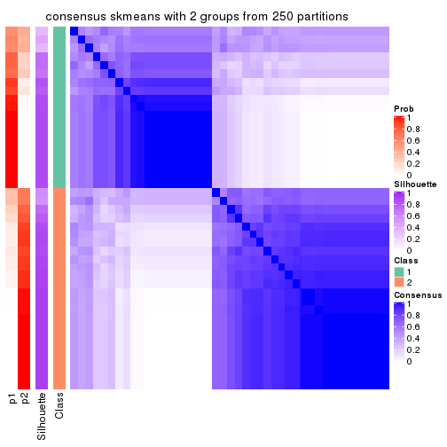</p>

</div>
<div id='tab-CV-skmeans-consensus-heatmap-2'>
<pre><code class="r">consensus_heatmap(res, k = 3)
</code></pre>

<p>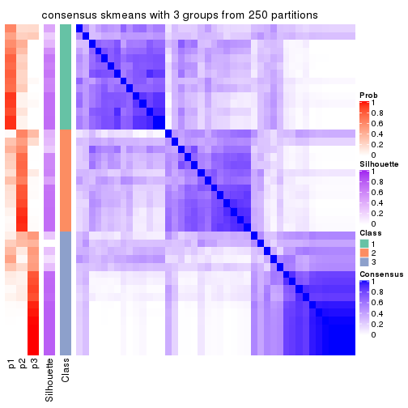</p>

</div>
<div id='tab-CV-skmeans-consensus-heatmap-3'>
<pre><code class="r">consensus_heatmap(res, k = 4)
</code></pre>

<p>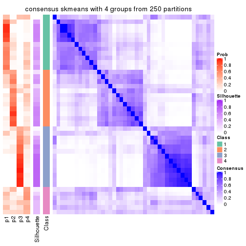</p>

</div>
<div id='tab-CV-skmeans-consensus-heatmap-4'>
<pre><code class="r">consensus_heatmap(res, k = 5)
</code></pre>

<p>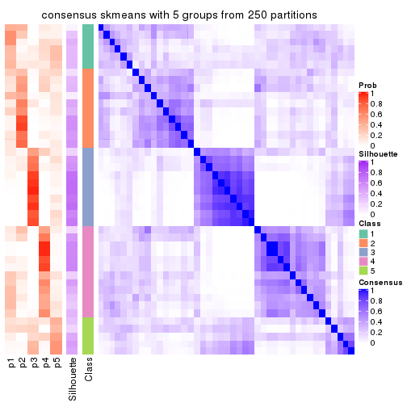</p>

</div>
<div id='tab-CV-skmeans-consensus-heatmap-5'>
<pre><code class="r">consensus_heatmap(res, k = 6)
</code></pre>

<p>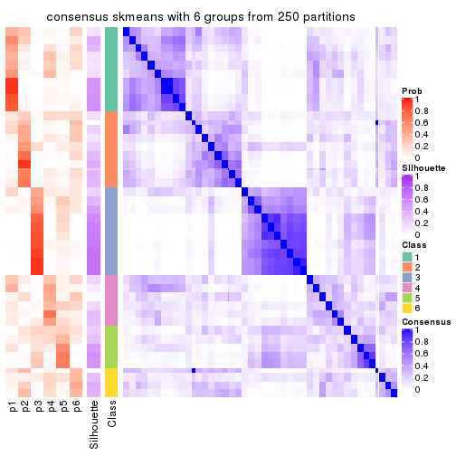</p>

</div>
</div>

Heatmaps for the membership of samples in all partitions to see how consistent they are:


<script>
$( function() {
	$( '#tabs-CV-skmeans-membership-heatmap' ).tabs();
} );
</script>
<div id='tabs-CV-skmeans-membership-heatmap'>
<ul>
<li><a href='#tab-CV-skmeans-membership-heatmap-1'>k = 2</a></li>
<li><a href='#tab-CV-skmeans-membership-heatmap-2'>k = 3</a></li>
<li><a href='#tab-CV-skmeans-membership-heatmap-3'>k = 4</a></li>
<li><a href='#tab-CV-skmeans-membership-heatmap-4'>k = 5</a></li>
<li><a href='#tab-CV-skmeans-membership-heatmap-5'>k = 6</a></li>
</ul>
<div id='tab-CV-skmeans-membership-heatmap-1'>
<pre><code class="r">membership_heatmap(res, k = 2)
</code></pre>

<p>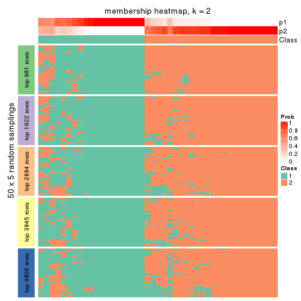</p>

</div>
<div id='tab-CV-skmeans-membership-heatmap-2'>
<pre><code class="r">membership_heatmap(res, k = 3)
</code></pre>

<p>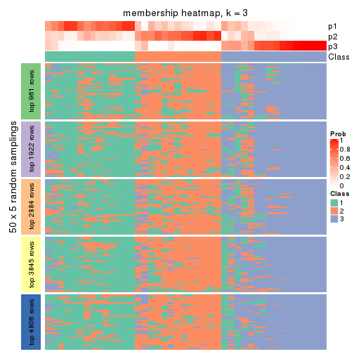</p>

</div>
<div id='tab-CV-skmeans-membership-heatmap-3'>
<pre><code class="r">membership_heatmap(res, k = 4)
</code></pre>

<p>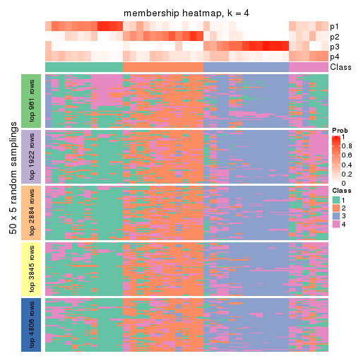</p>

</div>
<div id='tab-CV-skmeans-membership-heatmap-4'>
<pre><code class="r">membership_heatmap(res, k = 5)
</code></pre>

<p>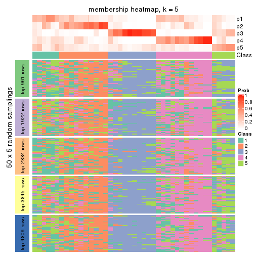</p>

</div>
<div id='tab-CV-skmeans-membership-heatmap-5'>
<pre><code class="r">membership_heatmap(res, k = 6)
</code></pre>

<p>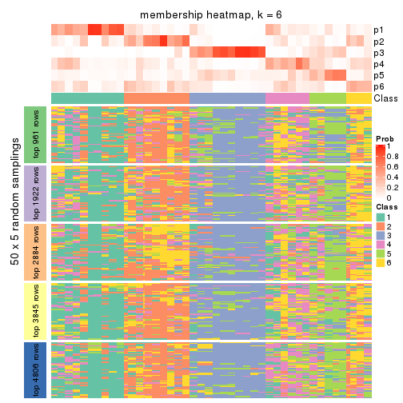</p>

</div>
</div>

As soon as we have had the classes for columns, we can look for signatures
which are significantly different between classes which can be candidate marks
for certain classes. Following are the heatmaps for signatures.


Signature heatmaps where rows are scaled:


<script>
$( function() {
	$( '#tabs-CV-skmeans-get-signatures' ).tabs();
} );
</script>
<div id='tabs-CV-skmeans-get-signatures'>
<ul>
<li><a href='#tab-CV-skmeans-get-signatures-1'>k = 2</a></li>
<li><a href='#tab-CV-skmeans-get-signatures-2'>k = 3</a></li>
<li><a href='#tab-CV-skmeans-get-signatures-3'>k = 4</a></li>
<li><a href='#tab-CV-skmeans-get-signatures-4'>k = 5</a></li>
<li><a href='#tab-CV-skmeans-get-signatures-5'>k = 6</a></li>
</ul>
<div id='tab-CV-skmeans-get-signatures-1'>
<pre><code class="r">get_signatures(res, k = 2)
</code></pre>

<p>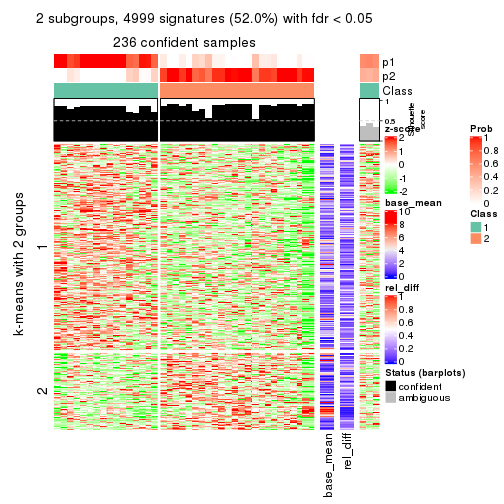</p>

</div>
<div id='tab-CV-skmeans-get-signatures-2'>
<pre><code class="r">get_signatures(res, k = 3)
</code></pre>

<p>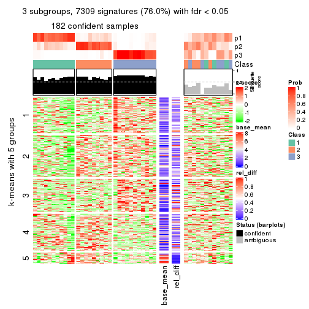</p>

</div>
<div id='tab-CV-skmeans-get-signatures-3'>
<pre><code class="r">get_signatures(res, k = 4)
</code></pre>

<p>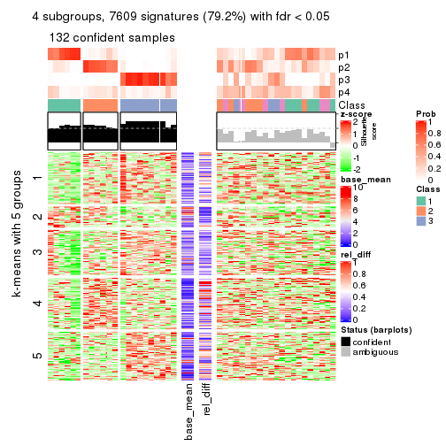</p>

</div>
<div id='tab-CV-skmeans-get-signatures-4'>
<pre><code class="r">get_signatures(res, k = 5)
</code></pre>

<p>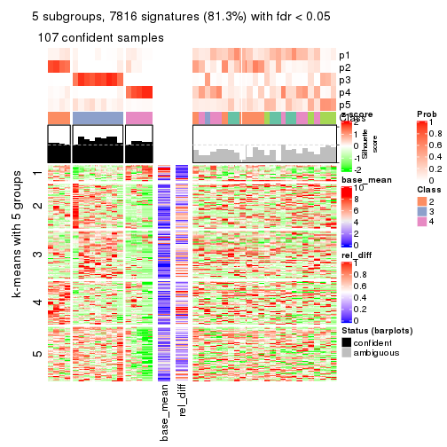</p>

</div>
<div id='tab-CV-skmeans-get-signatures-5'>
<pre><code class="r">get_signatures(res, k = 6)
</code></pre>

<p>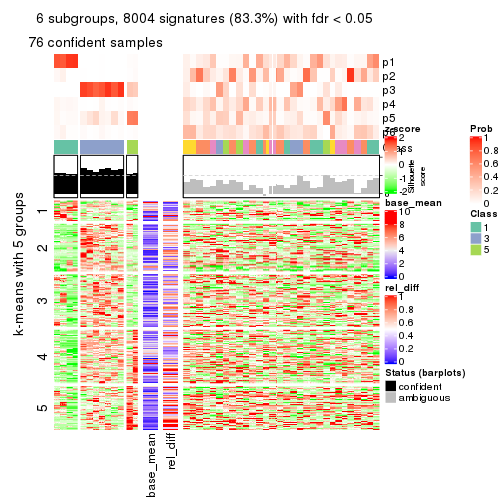</p>

</div>
</div>


Signature heatmaps where rows are not scaled:


<script>
$( function() {
	$( '#tabs-CV-skmeans-get-signatures-no-scale' ).tabs();
} );
</script>
<div id='tabs-CV-skmeans-get-signatures-no-scale'>
<ul>
<li><a href='#tab-CV-skmeans-get-signatures-no-scale-1'>k = 2</a></li>
<li><a href='#tab-CV-skmeans-get-signatures-no-scale-2'>k = 3</a></li>
<li><a href='#tab-CV-skmeans-get-signatures-no-scale-3'>k = 4</a></li>
<li><a href='#tab-CV-skmeans-get-signatures-no-scale-4'>k = 5</a></li>
<li><a href='#tab-CV-skmeans-get-signatures-no-scale-5'>k = 6</a></li>
</ul>
<div id='tab-CV-skmeans-get-signatures-no-scale-1'>
<pre><code class="r">get_signatures(res, k = 2, scale_rows = FALSE)
</code></pre>

<p>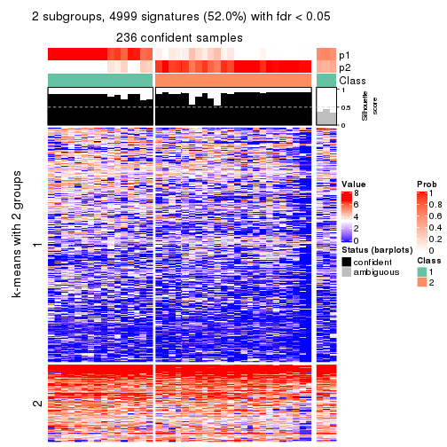</p>

</div>
<div id='tab-CV-skmeans-get-signatures-no-scale-2'>
<pre><code class="r">get_signatures(res, k = 3, scale_rows = FALSE)
</code></pre>

<p>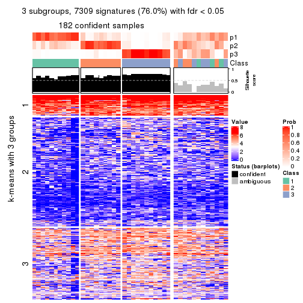</p>

</div>
<div id='tab-CV-skmeans-get-signatures-no-scale-3'>
<pre><code class="r">get_signatures(res, k = 4, scale_rows = FALSE)
</code></pre>

<p>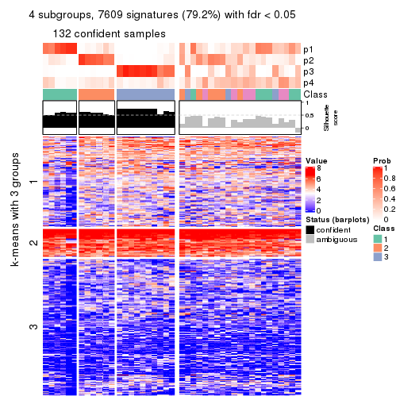</p>

</div>
<div id='tab-CV-skmeans-get-signatures-no-scale-4'>
<pre><code class="r">get_signatures(res, k = 5, scale_rows = FALSE)
</code></pre>

<p>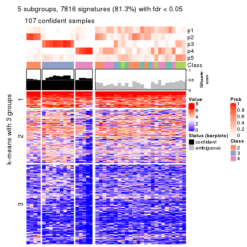</p>

</div>
<div id='tab-CV-skmeans-get-signatures-no-scale-5'>
<pre><code class="r">get_signatures(res, k = 6, scale_rows = FALSE)
</code></pre>

<p>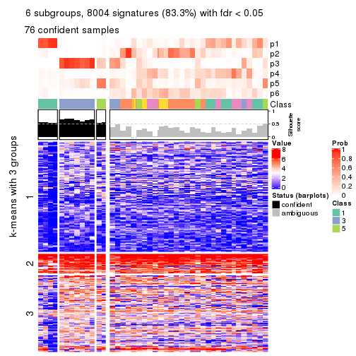</p>

</div>
</div>


Compare the overlap of signatures from different k:

```r
compare_signatures(res)
```

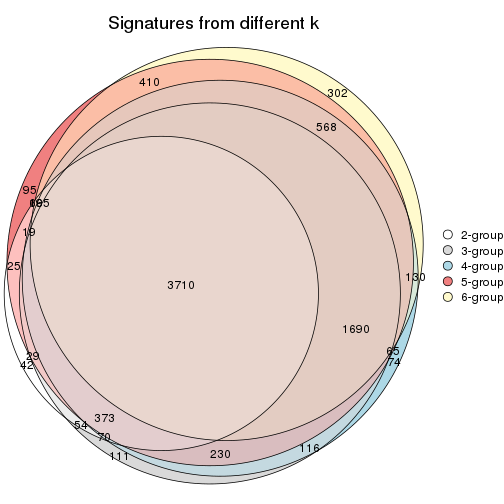

`get_signature()` returns a data frame invisibly. TO get the list of signatures, the function
call should be assigned to a variable explicitly. In following code, if `plot` argument is set
to `FALSE`, no heatmap is plotted while only the differential analysis is performed.

```r
# code only for demonstration
tb = get_signature(res, k = ..., plot = FALSE)
```

An example of the output of `tb` is:

```
#>   which_row         fdr    mean_1    mean_2 scaled_mean_1 scaled_mean_2 km
#> 1        38 0.042760348  8.373488  9.131774    -0.5533452     0.5164555  1
#> 2        40 0.018707592  7.106213  8.469186    -0.6173731     0.5762149  1
#> 3        55 0.019134737 10.221463 11.207825    -0.6159697     0.5749050  1
#> 4        59 0.006059896  5.921854  7.869574    -0.6899429     0.6439467  1
#> 5        60 0.018055526  8.928898 10.211722    -0.6204761     0.5791110  1
#> 6        98 0.009384629 15.714769 14.887706     0.6635654    -0.6193277  2
...
```

The columns in `tb` are:

1. `which_row`: row indices corresponding to the input matrix.
2. `fdr`: FDR for the differential test. 
3. `mean_x`: The mean value in group x.
4. `scaled_mean_x`: The mean value in group x after rows are scaled.
5. `km`: Row groups if k-means clustering is applied to rows.


UMAP plot which shows how samples are separated.


<script>
$( function() {
	$( '#tabs-CV-skmeans-dimension-reduction' ).tabs();
} );
</script>
<div id='tabs-CV-skmeans-dimension-reduction'>
<ul>
<li><a href='#tab-CV-skmeans-dimension-reduction-1'>k = 2</a></li>
<li><a href='#tab-CV-skmeans-dimension-reduction-2'>k = 3</a></li>
<li><a href='#tab-CV-skmeans-dimension-reduction-3'>k = 4</a></li>
<li><a href='#tab-CV-skmeans-dimension-reduction-4'>k = 5</a></li>
<li><a href='#tab-CV-skmeans-dimension-reduction-5'>k = 6</a></li>
</ul>
<div id='tab-CV-skmeans-dimension-reduction-1'>
<pre><code class="r">dimension_reduction(res, k = 2, method = &quot;UMAP&quot;)
</code></pre>

<p>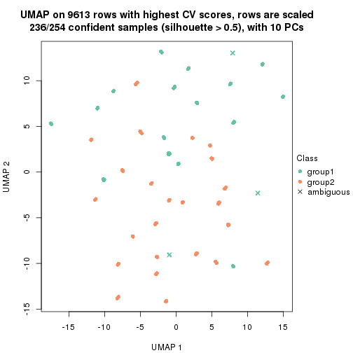</p>

</div>
<div id='tab-CV-skmeans-dimension-reduction-2'>
<pre><code class="r">dimension_reduction(res, k = 3, method = &quot;UMAP&quot;)
</code></pre>

<p>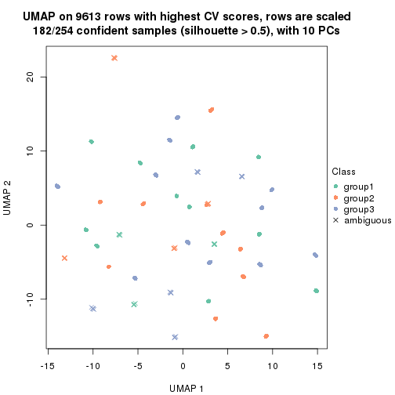</p>

</div>
<div id='tab-CV-skmeans-dimension-reduction-3'>
<pre><code class="r">dimension_reduction(res, k = 4, method = &quot;UMAP&quot;)
</code></pre>

<p>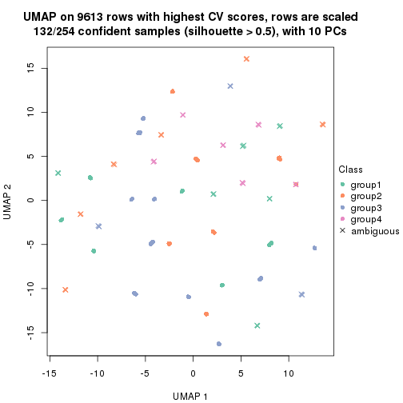</p>

</div>
<div id='tab-CV-skmeans-dimension-reduction-4'>
<pre><code class="r">dimension_reduction(res, k = 5, method = &quot;UMAP&quot;)
</code></pre>

<p>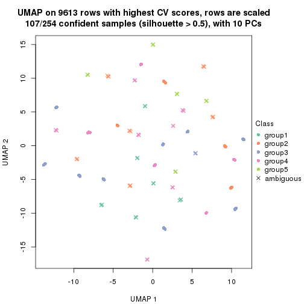</p>

</div>
<div id='tab-CV-skmeans-dimension-reduction-5'>
<pre><code class="r">dimension_reduction(res, k = 6, method = &quot;UMAP&quot;)
</code></pre>

<p>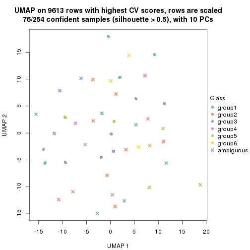</p>

</div>
</div>


Following heatmap shows how subgroups are split when increasing `k`:

```r
collect_classes(res)
```

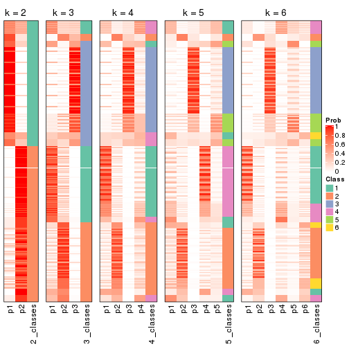


If matrix rows can be associated to genes, consider to use `GO_Enrichment(res,
...)` to perform function enrichment for the signature genes.


 

---------------------------------------------------


### CV:pam


The object with results only for a single top-value method and a single partition method 
can be extracted as:

```r
res = res_list["CV", "pam"]
# you can also extract it by
# res = res_list["CV:pam"]
```

A summary of `res` and all the functions that can be applied to it:

```r
res
```

```
#> A 'ConsensusPartition' object with k = 2, 3, 4, 5, 6.
#>   On a matrix with 9613 rows and 254 columns.
#>   Top rows (961, 1922, 2884, 3845, 4806) are extracted by 'CV' method.
#>   Subgroups are detected by 'pam' method.
#>   Performed in total 1250 partitions by row resampling.
#>   Best k for subgroups seems to be 2.
#> 
#> Following methods can be applied to this 'ConsensusPartition' object:
#>  [1] "cola_report"             "collect_classes"         "collect_plots"          
#>  [4] "collect_stats"           "colnames"                "compare_signatures"     
#>  [7] "consensus_heatmap"       "dimension_reduction"     "functional_enrichment"  
#> [10] "get_anno_col"            "get_anno"                "get_classes"            
#> [13] "get_consensus"           "get_matrix"              "get_membership"         
#> [16] "get_param"               "get_signatures"          "get_stats"              
#> [19] "is_best_k"               "is_stable_k"             "membership_heatmap"     
#> [22] "ncol"                    "nrow"                    "plot_ecdf"              
#> [25] "rownames"                "select_partition_number" "show"                   
#> [28] "suggest_best_k"          "test_to_known_factors"
```

`collect_plots()` function collects all the plots made from `res` for all `k` (number of partitions)
into one single page to provide an easy and fast comparison between different `k`.

```r
collect_plots(res)
```

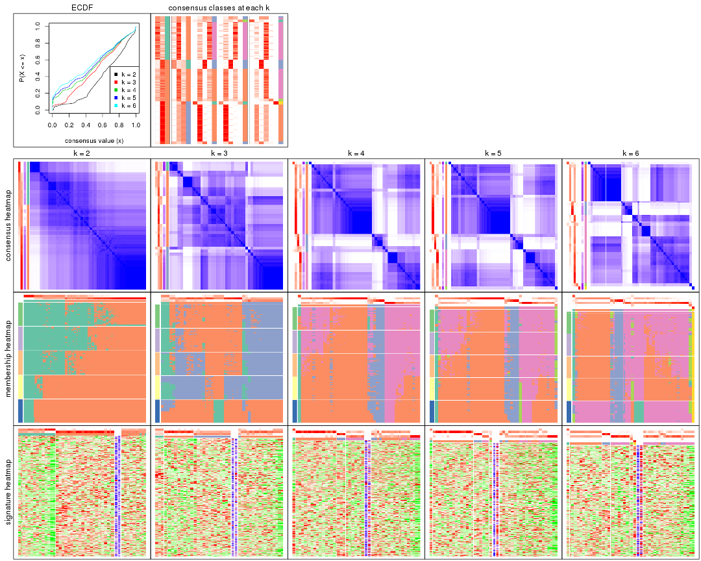

The plots are:

- The first row: a plot of the ECDF (Empirical cumulative distribution
  function) curves of the consensus matrix for each `k` and the heatmap of
  predicted classes for each `k`.
- The second row: heatmaps of the consensus matrix for each `k`.
- The third row: heatmaps of the membership matrix for each `k`.
- The fouth row: heatmaps of the signatures for each `k`.

All the plots in panels can be made by individual functions and they are
plotted later in this section.

`select_partition_number()` produces several plots showing different
statistics for choosing "optimized" `k`. There are following statistics:

- ECDF curves of the consensus matrix for each `k`;
- 1-PAC. [The PAC
  score](https://en.wikipedia.org/wiki/Consensus_clustering#Over-interpretation_potential_of_consensus_clustering)
  measures the proportion of the ambiguous subgrouping.
- Mean silhouette score.
- Concordance. The mean probability of fiting the consensus class ids in all
  partitions.
- Area increased. Denote $A_k$ as the area under the ECDF curve for current
  `k`, the area increased is defined as $A_k - A_{k-1}$.
- Rand index. The percent of pairs of samples that are both in a same cluster
  or both are not in a same cluster in the partition of k and k-1.
- Jaccard index. The ratio of pairs of samples are both in a same cluster in
  the partition of k and k-1 and the pairs of samples are both in a same
  cluster in the partition k or k-1.

The detailed explanations of these statistics can be found in [the cola
vignette](http://bioconductor.org/packages/devel/bioc/vignettes/cola/inst/doc/cola.html#toc_13).

Generally speaking, lower PAC score, higher mean silhouette score or higher
concordance corresponds to better partition. Rand index and Jaccard index
measure how similar the current partition is compared to partition with `k-1`.
If they are too similar, we won't accept `k` is better than `k-1`.

```r
select_partition_number(res)
```

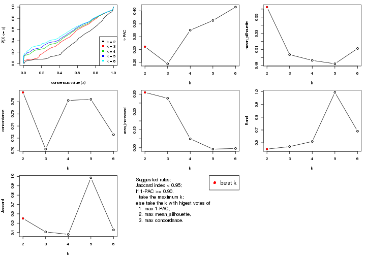

The numeric values for all these statistics can be obtained by `get_stats()`.

```r
get_stats(res)
```

```
#>   k 1-PAC mean_silhouette concordance area_increased  Rand Jaccard
#> 2 2 0.261           0.562       0.795         0.3594 0.550   0.550
#> 3 3 0.195           0.504       0.702         0.3268 0.570   0.406
#> 4 4 0.325           0.496       0.782         0.0998 0.610   0.379
#> 5 5 0.363           0.492       0.784         0.0423 0.994   0.986
#> 6 6 0.415           0.511       0.726         0.0456 0.690   0.428
```

`suggest_best_k()` suggests the best $k$ based on these statistics. The rules are as follows:

- All $k$ with Jaccard index larger than 0.95 are removed because the increase of
  the partition number does not provides enough extra information. If all $k$ are removed,
  the best $k$ is assigned by `NA`.
- For $k$ with 1-PAC larger than 0.9, the maximal $k$ is taken as the "best k". Other $k$ is called "optional k".
- If it does not fit the second rule. The $k$ with the highest vote of highest
  1-PAC, mean silhouette and concordance is taken as the "best k".

```r
suggest_best_k(res)
```

```
#> [1] 2
```


Following shows the table of the partitions (You need to click the **show/hide
code output** link to see it). The membership matrix (columns with name `p*`)
is inferred by
[`clue::cl_consensus()`](https://www.rdocumentation.org/link/cl_consensus?package=clue)
function with the `SE` method. Basically the value in the membership matrix
represents the probability to belong to a certain group. The finall class
label for an item is determined with the group with highest probability it
belongs to.

In `get_classes()` function, the entropy is calculated from the membership
matrix and the silhouette score is calculated from the consensus matrix.


<script>
$( function() {
	$( '#tabs-CV-pam-get-classes' ).tabs();
} );
</script>
<div id='tabs-CV-pam-get-classes'>
<ul>
<li><a href='#tab-CV-pam-get-classes-1'>k = 2</a></li>
<li><a href='#tab-CV-pam-get-classes-2'>k = 3</a></li>
<li><a href='#tab-CV-pam-get-classes-3'>k = 4</a></li>
<li><a href='#tab-CV-pam-get-classes-4'>k = 5</a></li>
<li><a href='#tab-CV-pam-get-classes-5'>k = 6</a></li>
</ul>

<div id='tab-CV-pam-get-classes-1'>
<p><a id='tab-CV-pam-get-classes-1-a' style='color:#0366d6' href='#'>show/hide code output</a></p>
<pre><code class="r">cbind(get_classes(res, k = 2), get_membership(res, k = 2))
</code></pre>

<pre><code>#&gt;           class entropy silhouette    p1    p2
#&gt; DRR024803     1  0.1184    0.56023 0.984 0.016
#&gt; DRR024804     2  0.1414    0.76067 0.020 0.980
#&gt; DRR024805     2  0.0376    0.75997 0.004 0.996
#&gt; DRR024806     2  0.3733    0.74802 0.072 0.928
#&gt; DRR024807     2  0.0000    0.75942 0.000 1.000
#&gt; DRR024808     2  0.5178    0.73206 0.116 0.884
#&gt; DRR024809     2  0.0000    0.75942 0.000 1.000
#&gt; DRR024810     2  0.0000    0.75942 0.000 1.000
#&gt; DRR024811     2  0.0376    0.75633 0.004 0.996
#&gt; DRR024812     2  0.0000    0.75942 0.000 1.000
#&gt; DRR024813     2  0.9393    0.27834 0.356 0.644
#&gt; DRR024814     2  0.0000    0.75942 0.000 1.000
#&gt; DRR024815     1  0.9933    0.55479 0.548 0.452
#&gt; DRR024816     1  0.9970    0.51391 0.532 0.468
#&gt; DRR024817     1  0.9686    0.62752 0.604 0.396
#&gt; DRR024818     1  0.9170    0.64167 0.668 0.332
#&gt; DRR024819     2  0.9129    0.35961 0.328 0.672
#&gt; DRR024820     1  0.9635    0.62612 0.612 0.388
#&gt; DRR024821     1  0.9998    0.40377 0.508 0.492
#&gt; DRR024822     2  0.0000    0.75942 0.000 1.000
#&gt; DRR024824     2  0.0000    0.75942 0.000 1.000
#&gt; DRR024825     2  0.4022    0.75059 0.080 0.920
#&gt; DRR024826     2  0.9286    0.30331 0.344 0.656
#&gt; DRR024827     2  0.9608    0.17819 0.384 0.616
#&gt; DRR024828     1  0.9896    0.58134 0.560 0.440
#&gt; DRR024829     2  0.9983   -0.36099 0.476 0.524
#&gt; DRR024830     2  0.6623    0.66071 0.172 0.828
#&gt; DRR024831     2  0.5294    0.73022 0.120 0.880
#&gt; DRR024832     2  0.4022    0.74618 0.080 0.920
#&gt; DRR024833     2  0.6973    0.64510 0.188 0.812
#&gt; DRR024834     1  0.6531    0.61369 0.832 0.168
#&gt; DRR024835     2  0.9993   -0.38044 0.484 0.516
#&gt; DRR024836     1  0.9795    0.61603 0.584 0.416
#&gt; DRR024837     1  0.7528    0.63389 0.784 0.216
#&gt; DRR024838     1  0.9977    0.51087 0.528 0.472
#&gt; DRR024839     2  0.0938    0.76102 0.012 0.988
#&gt; DRR024840     2  0.0000    0.75942 0.000 1.000
#&gt; DRR024841     2  0.8861    0.43134 0.304 0.696
#&gt; DRR024842     2  0.0000    0.75942 0.000 1.000
#&gt; DRR024843     1  0.1184    0.56023 0.984 0.016
#&gt; DRR024844     2  0.2948    0.75645 0.052 0.948
#&gt; DRR024845     2  0.0938    0.76086 0.012 0.988
#&gt; DRR024846     2  0.4815    0.72808 0.104 0.896
#&gt; DRR024847     2  0.0376    0.76035 0.004 0.996
#&gt; DRR024848     1  0.1184    0.56023 0.984 0.016
#&gt; DRR024849     2  0.5294    0.72931 0.120 0.880
#&gt; DRR024850     2  0.3584    0.75138 0.068 0.932
#&gt; DRR024851     2  0.0000    0.75942 0.000 1.000
#&gt; DRR024852     2  0.0000    0.75942 0.000 1.000
#&gt; DRR024853     2  0.0376    0.75633 0.004 0.996
#&gt; DRR024854     2  0.0000    0.75942 0.000 1.000
#&gt; DRR024855     2  0.9248    0.32505 0.340 0.660
#&gt; DRR024856     2  0.0000    0.75942 0.000 1.000
#&gt; DRR024857     1  0.9815    0.61138 0.580 0.420
#&gt; DRR024858     1  0.9815    0.61309 0.580 0.420
#&gt; DRR024859     1  0.8813    0.65506 0.700 0.300
#&gt; DRR024860     1  0.8499    0.64766 0.724 0.276
#&gt; DRR024861     2  0.9710    0.10491 0.400 0.600
#&gt; DRR024862     1  0.8813    0.65356 0.700 0.300
#&gt; DRR024863     1  0.9944    0.52492 0.544 0.456
#&gt; DRR024864     2  0.0000    0.75942 0.000 1.000
#&gt; DRR024865     2  0.8081    0.51859 0.248 0.752
#&gt; DRR024866     2  0.0000    0.75942 0.000 1.000
#&gt; DRR024867     2  0.4562    0.74488 0.096 0.904
#&gt; DRR024868     2  0.9686    0.08428 0.396 0.604
#&gt; DRR024869     2  0.9608    0.17819 0.384 0.616
#&gt; DRR024870     1  0.9944    0.54583 0.544 0.456
#&gt; DRR024871     1  0.9993    0.49947 0.516 0.484
#&gt; DRR024872     2  0.8267    0.52098 0.260 0.740
#&gt; DRR024873     2  0.4562    0.74285 0.096 0.904
#&gt; DRR024874     2  0.4690    0.73472 0.100 0.900
#&gt; DRR024875     2  0.8016    0.56171 0.244 0.756
#&gt; DRR024876     1  0.1184    0.56023 0.984 0.016
#&gt; DRR024877     2  0.9983   -0.34287 0.476 0.524
#&gt; DRR024878     1  0.9795    0.61603 0.584 0.416
#&gt; DRR024879     1  0.1414    0.56197 0.980 0.020
#&gt; DRR024880     1  0.9909    0.57889 0.556 0.444
#&gt; DRR024881     2  0.1843    0.76080 0.028 0.972
#&gt; DRR024882     2  0.0000    0.75942 0.000 1.000
#&gt; DRR024883     2  0.9754    0.05365 0.408 0.592
#&gt; DRR024884     2  0.9977   -0.29372 0.472 0.528
#&gt; DRR024885     2  0.9732    0.08811 0.404 0.596
#&gt; DRR024886     1  0.1184    0.56023 0.984 0.016
#&gt; DRR024887     2  0.2236    0.75910 0.036 0.964
#&gt; DRR024888     2  0.1184    0.76118 0.016 0.984
#&gt; DRR024889     2  0.5059    0.72208 0.112 0.888
#&gt; DRR024890     2  0.0376    0.76035 0.004 0.996
#&gt; DRR024891     1  0.1184    0.56023 0.984 0.016
#&gt; DRR024892     2  0.5178    0.73300 0.116 0.884
#&gt; DRR024893     2  0.3274    0.75427 0.060 0.940
#&gt; DRR024894     2  0.0000    0.75942 0.000 1.000
#&gt; DRR024895     2  0.0000    0.75942 0.000 1.000
#&gt; DRR024896     2  0.0376    0.75633 0.004 0.996
#&gt; DRR024897     2  0.0000    0.75942 0.000 1.000
#&gt; DRR024898     2  0.9358    0.29020 0.352 0.648
#&gt; DRR024899     2  0.0000    0.75942 0.000 1.000
#&gt; DRR024900     1  0.9795    0.61612 0.584 0.416
#&gt; DRR024901     1  0.9833    0.60845 0.576 0.424
#&gt; DRR024902     1  0.8661    0.65620 0.712 0.288
#&gt; DRR024903     1  0.8499    0.64972 0.724 0.276
#&gt; DRR024904     2  0.9775    0.03650 0.412 0.588
#&gt; DRR024905     1  0.8608    0.65134 0.716 0.284
#&gt; DRR024906     1  0.9909    0.55765 0.556 0.444
#&gt; DRR024907     2  0.0000    0.75942 0.000 1.000
#&gt; DRR024908     2  0.8267    0.49894 0.260 0.740
#&gt; DRR024909     2  0.0000    0.75942 0.000 1.000
#&gt; DRR024910     2  0.4690    0.74261 0.100 0.900
#&gt; DRR024911     2  0.9933   -0.21942 0.452 0.548
#&gt; DRR024912     2  0.9608    0.17819 0.384 0.616
#&gt; DRR024913     1  0.9909    0.57329 0.556 0.444
#&gt; DRR024914     1  0.9977    0.52542 0.528 0.472
#&gt; DRR024915     2  0.7815    0.57238 0.232 0.768
#&gt; DRR024916     2  0.4298    0.74614 0.088 0.912
#&gt; DRR024917     2  0.3274    0.75410 0.060 0.940
#&gt; DRR024918     2  0.7815    0.58153 0.232 0.768
#&gt; DRR024919     1  0.1184    0.56023 0.984 0.016
#&gt; DRR024920     1  0.9996    0.47388 0.512 0.488
#&gt; DRR024921     1  0.9795    0.61603 0.584 0.416
#&gt; DRR024922     1  0.1414    0.56197 0.980 0.020
#&gt; DRR024923     1  0.9909    0.57889 0.556 0.444
#&gt; DRR024924     2  0.0938    0.76102 0.012 0.988
#&gt; DRR024925     2  0.0000    0.75942 0.000 1.000
#&gt; DRR024926     2  0.9909   -0.13617 0.444 0.556
#&gt; DRR024927     2  0.9896   -0.15692 0.440 0.560
#&gt; DRR024928     2  0.9754    0.06783 0.408 0.592
#&gt; DRR024929     1  0.1184    0.56023 0.984 0.016
#&gt; DRR024930     2  0.2603    0.75774 0.044 0.956
#&gt; DRR024931     2  0.0672    0.76056 0.008 0.992
#&gt; DRR024932     2  0.5059    0.72239 0.112 0.888
#&gt; DRR024933     2  0.0376    0.76035 0.004 0.996
#&gt; DRR024934     1  0.1184    0.56023 0.984 0.016
#&gt; DRR024935     2  0.5519    0.72409 0.128 0.872
#&gt; DRR024936     2  0.3733    0.74959 0.072 0.928
#&gt; DRR024937     2  0.0000    0.75942 0.000 1.000
#&gt; DRR024938     2  0.0000    0.75942 0.000 1.000
#&gt; DRR024939     2  0.0376    0.75633 0.004 0.996
#&gt; DRR024940     2  0.0000    0.75942 0.000 1.000
#&gt; DRR024941     2  0.9393    0.27650 0.356 0.644
#&gt; DRR024942     2  0.0000    0.75942 0.000 1.000
#&gt; DRR024943     1  0.9815    0.61138 0.580 0.420
#&gt; DRR024944     1  0.9815    0.61309 0.580 0.420
#&gt; DRR024945     1  0.8608    0.65613 0.716 0.284
#&gt; DRR024946     1  0.8267    0.64692 0.740 0.260
#&gt; DRR024947     2  0.9795    0.02177 0.416 0.584
#&gt; DRR024948     1  0.8661    0.65393 0.712 0.288
#&gt; DRR024949     1  0.9881    0.57579 0.564 0.436
#&gt; DRR024950     2  0.0000    0.75942 0.000 1.000
#&gt; DRR024951     2  0.8608    0.44971 0.284 0.716
#&gt; DRR024952     2  0.0000    0.75942 0.000 1.000
#&gt; DRR024953     2  0.3879    0.75173 0.076 0.924
#&gt; DRR024954     2  0.9833   -0.06630 0.424 0.576
#&gt; DRR024955     2  0.9608    0.17819 0.384 0.616
#&gt; DRR024956     1  0.9909    0.57329 0.556 0.444
#&gt; DRR024957     1  0.9963    0.54632 0.536 0.464
#&gt; DRR024958     2  0.8144    0.53587 0.252 0.748
#&gt; DRR024959     2  0.5059    0.73477 0.112 0.888
#&gt; DRR024960     2  0.4939    0.72979 0.108 0.892
#&gt; DRR024961     2  0.7602    0.60027 0.220 0.780
#&gt; DRR024962     1  0.1184    0.56023 0.984 0.016
#&gt; DRR024963     1  0.9954    0.54864 0.540 0.460
#&gt; DRR024964     1  0.9795    0.61603 0.584 0.416
#&gt; DRR024965     1  0.1414    0.56197 0.980 0.020
#&gt; DRR024966     1  0.9922    0.57085 0.552 0.448
#&gt; DRR024967     2  0.0938    0.76102 0.012 0.988
#&gt; DRR024968     2  0.0000    0.75942 0.000 1.000
#&gt; DRR024969     2  0.9850   -0.04938 0.428 0.572
#&gt; DRR024970     2  0.9775    0.00662 0.412 0.588
#&gt; DRR024971     2  0.9710    0.10761 0.400 0.600
#&gt; DRR024972     1  0.1184    0.56023 0.984 0.016
#&gt; DRR024973     2  0.2778    0.75709 0.048 0.952
#&gt; DRR024974     2  0.0938    0.76102 0.012 0.988
#&gt; DRR024975     2  0.4690    0.73113 0.100 0.900
#&gt; DRR024976     2  0.0000    0.75942 0.000 1.000
#&gt; DRR024977     1  0.1184    0.56023 0.984 0.016
#&gt; DRR024978     2  0.4431    0.74533 0.092 0.908
#&gt; DRR024979     2  0.3431    0.75291 0.064 0.936
#&gt; DRR024980     2  0.0000    0.75942 0.000 1.000
#&gt; DRR024981     2  0.0000    0.75942 0.000 1.000
#&gt; DRR024982     2  0.0376    0.75633 0.004 0.996
#&gt; DRR024983     2  0.0000    0.75942 0.000 1.000
#&gt; DRR024984     2  0.9323    0.30330 0.348 0.652
#&gt; DRR024985     2  0.0000    0.75942 0.000 1.000
#&gt; DRR024986     1  0.9815    0.61138 0.580 0.420
#&gt; DRR024987     1  0.9815    0.61309 0.580 0.420
#&gt; DRR024988     1  0.8713    0.65601 0.708 0.292
#&gt; DRR024989     1  0.8207    0.64788 0.744 0.256
#&gt; DRR024990     2  0.9795    0.02177 0.416 0.584
#&gt; DRR024991     1  0.8661    0.65393 0.712 0.288
#&gt; DRR024992     1  0.9933    0.53680 0.548 0.452
#&gt; DRR024993     2  0.0000    0.75942 0.000 1.000
#&gt; DRR024994     2  0.8267    0.50058 0.260 0.740
#&gt; DRR024995     2  0.0000    0.75942 0.000 1.000
#&gt; DRR024996     2  0.3274    0.75406 0.060 0.940
#&gt; DRR024997     2  0.9970   -0.29886 0.468 0.532
#&gt; DRR024998     2  0.9608    0.17819 0.384 0.616
#&gt; DRR024999     1  0.9922    0.56505 0.552 0.448
#&gt; DRR025000     1  0.9996    0.48386 0.512 0.488
#&gt; DRR025001     2  0.7883    0.56683 0.236 0.764
#&gt; DRR025002     2  0.4690    0.74126 0.100 0.900
#&gt; DRR025003     2  0.5408    0.71909 0.124 0.876
#&gt; DRR025004     2  0.7528    0.60639 0.216 0.784
#&gt; DRR025005     1  0.1184    0.56023 0.984 0.016
#&gt; DRR025006     1  1.0000    0.43979 0.500 0.500
#&gt; DRR025007     1  0.9795    0.61603 0.584 0.416
#&gt; DRR025008     1  0.1843    0.56457 0.972 0.028
#&gt; DRR025009     1  0.9944    0.55497 0.544 0.456
#&gt; DRR025010     2  0.0938    0.76102 0.012 0.988
#&gt; DRR025011     2  0.0000    0.75942 0.000 1.000
#&gt; DRR025012     2  0.9775    0.03795 0.412 0.588
#&gt; DRR025013     2  0.9795   -0.01786 0.416 0.584
#&gt; DRR025014     2  0.9710    0.10761 0.400 0.600
#&gt; DRR025015     1  0.1184    0.56023 0.984 0.016
#&gt; DRR025016     2  0.1843    0.76030 0.028 0.972
#&gt; DRR025017     2  0.0376    0.75997 0.004 0.996
#&gt; DRR025018     2  0.4690    0.73113 0.100 0.900
#&gt; DRR025019     2  0.0376    0.76035 0.004 0.996
#&gt; DRR025020     1  0.1184    0.56023 0.984 0.016
#&gt; DRR025021     2  0.5408    0.72709 0.124 0.876
#&gt; DRR025022     2  0.3114    0.75535 0.056 0.944
#&gt; DRR025023     2  0.0000    0.75942 0.000 1.000
#&gt; DRR025024     2  0.0000    0.75942 0.000 1.000
#&gt; DRR025025     2  0.0376    0.75633 0.004 0.996
#&gt; DRR025026     2  0.0000    0.75942 0.000 1.000
#&gt; DRR025027     2  0.9393    0.27650 0.356 0.644
#&gt; DRR025028     2  0.0000    0.75942 0.000 1.000
#&gt; DRR025029     1  0.9795    0.61612 0.584 0.416
#&gt; DRR025030     1  0.9815    0.61309 0.580 0.420
#&gt; DRR025031     1  0.8499    0.65520 0.724 0.276
#&gt; DRR025032     1  0.8386    0.64560 0.732 0.268
#&gt; DRR025033     2  0.9775    0.03650 0.412 0.588
#&gt; DRR025034     1  0.8499    0.65222 0.724 0.276
#&gt; DRR025035     1  0.9922    0.54786 0.552 0.448
#&gt; DRR025036     2  0.0000    0.75942 0.000 1.000
#&gt; DRR025037     2  0.8016    0.52499 0.244 0.756
#&gt; DRR025038     2  0.0000    0.75942 0.000 1.000
#&gt; DRR025039     2  0.5294    0.73178 0.120 0.880
#&gt; DRR025040     2  0.9732    0.04573 0.404 0.596
#&gt; DRR025041     2  0.9608    0.17819 0.384 0.616
#&gt; DRR025042     1  0.9896    0.58134 0.560 0.440
#&gt; DRR025043     1  1.0000    0.44982 0.500 0.500
#&gt; DRR025044     2  0.7528    0.59728 0.216 0.784
#&gt; DRR025045     2  0.5737    0.71779 0.136 0.864
#&gt; DRR025046     2  0.5178    0.72375 0.116 0.884
#&gt; DRR025047     2  0.7602    0.60070 0.220 0.780
#&gt; DRR025048     1  0.1184    0.56023 0.984 0.016
#&gt; DRR025049     1  0.9993    0.48616 0.516 0.484
#&gt; DRR025050     1  0.9795    0.61603 0.584 0.416
#&gt; DRR025051     1  0.1633    0.56333 0.976 0.024
#&gt; DRR025052     1  0.9896    0.58466 0.560 0.440
#&gt; DRR025053     2  0.1184    0.76119 0.016 0.984
#&gt; DRR025054     2  0.0000    0.75942 0.000 1.000
#&gt; DRR025055     2  0.9970   -0.26149 0.468 0.532
#&gt; DRR025056     2  0.9933   -0.20616 0.452 0.548
#&gt; DRR025057     2  0.9710    0.10761 0.400 0.600
</code></pre>

<script>
$('#tab-CV-pam-get-classes-1-a').parent().next().next().hide();
$('#tab-CV-pam-get-classes-1-a').click(function(){
  $('#tab-CV-pam-get-classes-1-a').parent().next().next().toggle();
  return(false);
});
</script>
</div>

<div id='tab-CV-pam-get-classes-2'>
<p><a id='tab-CV-pam-get-classes-2-a' style='color:#0366d6' href='#'>show/hide code output</a></p>
<pre><code class="r">cbind(get_classes(res, k = 3), get_membership(res, k = 3))
</code></pre>

<pre><code>#&gt;           class entropy silhouette    p1    p2    p3
#&gt; DRR024803     2  0.6140    0.28136 0.404 0.596 0.000
#&gt; DRR024804     3  0.6235    0.80760 0.000 0.436 0.564
#&gt; DRR024805     3  0.6154    0.84272 0.000 0.408 0.592
#&gt; DRR024806     3  0.6307    0.70223 0.000 0.488 0.512
#&gt; DRR024807     3  0.5763    0.60542 0.016 0.244 0.740
#&gt; DRR024808     1  0.8714    0.96712 0.580 0.156 0.264
#&gt; DRR024809     3  0.6140    0.84633 0.000 0.404 0.596
#&gt; DRR024810     3  0.6140    0.84633 0.000 0.404 0.596
#&gt; DRR024811     3  0.8850    0.63028 0.128 0.356 0.516
#&gt; DRR024812     3  0.6140    0.84633 0.000 0.404 0.596
#&gt; DRR024813     2  0.4842    0.36118 0.000 0.776 0.224
#&gt; DRR024814     3  0.6140    0.84633 0.000 0.404 0.596
#&gt; DRR024815     2  0.1289    0.59870 0.000 0.968 0.032
#&gt; DRR024816     2  0.1753    0.59133 0.000 0.952 0.048
#&gt; DRR024817     2  0.1031    0.60452 0.024 0.976 0.000
#&gt; DRR024818     2  0.4196    0.58926 0.112 0.864 0.024
#&gt; DRR024819     2  0.5138    0.28722 0.000 0.748 0.252
#&gt; DRR024820     2  0.2982    0.60321 0.056 0.920 0.024
#&gt; DRR024821     2  0.8823    0.08022 0.248 0.576 0.176
#&gt; DRR024822     3  0.6140    0.84633 0.000 0.404 0.596
#&gt; DRR024824     3  0.6140    0.84633 0.000 0.404 0.596
#&gt; DRR024825     1  0.8977    0.93230 0.560 0.188 0.252
#&gt; DRR024826     2  0.4974    0.33515 0.000 0.764 0.236
#&gt; DRR024827     2  0.7816    0.33374 0.132 0.668 0.200
#&gt; DRR024828     2  0.3045    0.59889 0.020 0.916 0.064
#&gt; DRR024829     2  0.3116    0.55185 0.000 0.892 0.108
#&gt; DRR024830     2  0.6154   -0.38063 0.000 0.592 0.408
#&gt; DRR024831     1  0.8714    0.96712 0.580 0.156 0.264
#&gt; DRR024832     3  0.9584   -0.66809 0.372 0.200 0.428
#&gt; DRR024833     2  0.6095   -0.32466 0.000 0.608 0.392
#&gt; DRR024834     2  0.5138    0.46039 0.252 0.748 0.000
#&gt; DRR024835     2  0.2878    0.56104 0.000 0.904 0.096
#&gt; DRR024836     2  0.8729    0.01113 0.204 0.592 0.204
#&gt; DRR024837     2  0.4605    0.51752 0.204 0.796 0.000
#&gt; DRR024838     2  0.1860    0.59092 0.000 0.948 0.052
#&gt; DRR024839     3  0.6204    0.82573 0.000 0.424 0.576
#&gt; DRR024840     3  0.6140    0.84633 0.000 0.404 0.596
#&gt; DRR024841     2  0.5363    0.19779 0.000 0.724 0.276
#&gt; DRR024842     3  0.6140    0.84633 0.000 0.404 0.596
#&gt; DRR024843     2  0.6140    0.28136 0.404 0.596 0.000
#&gt; DRR024844     3  0.6291    0.75371 0.000 0.468 0.532
#&gt; DRR024845     3  0.6180    0.83515 0.000 0.416 0.584
#&gt; DRR024846     2  0.6299   -0.60751 0.000 0.524 0.476
#&gt; DRR024847     3  0.5803    0.60477 0.016 0.248 0.736
#&gt; DRR024848     2  0.6140    0.28136 0.404 0.596 0.000
#&gt; DRR024849     1  0.8714    0.96712 0.580 0.156 0.264
#&gt; DRR024850     3  0.6305    0.71480 0.000 0.484 0.516
#&gt; DRR024851     3  0.6140    0.84633 0.000 0.404 0.596
#&gt; DRR024852     3  0.6140    0.84633 0.000 0.404 0.596
#&gt; DRR024853     3  0.9001    0.56997 0.148 0.332 0.520
#&gt; DRR024854     3  0.6140    0.84633 0.000 0.404 0.596
#&gt; DRR024855     2  0.5016    0.32239 0.000 0.760 0.240
#&gt; DRR024856     3  0.6140    0.84633 0.000 0.404 0.596
#&gt; DRR024857     2  0.0000    0.60332 0.000 1.000 0.000
#&gt; DRR024858     2  0.0475    0.60375 0.004 0.992 0.004
#&gt; DRR024859     2  0.3340    0.58695 0.120 0.880 0.000
#&gt; DRR024860     2  0.4723    0.57197 0.160 0.824 0.016
#&gt; DRR024861     2  0.4291    0.45334 0.000 0.820 0.180
#&gt; DRR024862     2  0.3896    0.58455 0.128 0.864 0.008
#&gt; DRR024863     2  0.8067    0.27532 0.188 0.652 0.160
#&gt; DRR024864     3  0.6140    0.84633 0.000 0.404 0.596
#&gt; DRR024865     2  0.5785   -0.02991 0.000 0.668 0.332
#&gt; DRR024866     3  0.6140    0.84633 0.000 0.404 0.596
#&gt; DRR024867     1  0.8925    0.94304 0.564 0.180 0.256
#&gt; DRR024868     2  0.4346    0.45065 0.000 0.816 0.184
#&gt; DRR024869     2  0.7843    0.33027 0.140 0.668 0.192
#&gt; DRR024870     2  0.3499    0.59401 0.028 0.900 0.072
#&gt; DRR024871     2  0.2165    0.58392 0.000 0.936 0.064
#&gt; DRR024872     2  0.5733    0.00472 0.000 0.676 0.324
#&gt; DRR024873     1  0.8714    0.96712 0.580 0.156 0.264
#&gt; DRR024874     3  0.9638   -0.66130 0.372 0.208 0.420
#&gt; DRR024875     2  0.5810   -0.06736 0.000 0.664 0.336
#&gt; DRR024876     2  0.6140    0.28136 0.404 0.596 0.000
#&gt; DRR024877     2  0.3038    0.55488 0.000 0.896 0.104
#&gt; DRR024878     2  0.8729    0.01001 0.204 0.592 0.204
#&gt; DRR024879     2  0.6126    0.28584 0.400 0.600 0.000
#&gt; DRR024880     2  0.1031    0.60050 0.000 0.976 0.024
#&gt; DRR024881     3  0.6244    0.80386 0.000 0.440 0.560
#&gt; DRR024882     3  0.6140    0.84633 0.000 0.404 0.596
#&gt; DRR024883     2  0.4178    0.46794 0.000 0.828 0.172
#&gt; DRR024884     2  0.3116    0.55038 0.000 0.892 0.108
#&gt; DRR024885     2  0.4235    0.45997 0.000 0.824 0.176
#&gt; DRR024886     2  0.6140    0.28136 0.404 0.596 0.000
#&gt; DRR024887     3  0.6267    0.78187 0.000 0.452 0.548
#&gt; DRR024888     3  0.6192    0.83097 0.000 0.420 0.580
#&gt; DRR024889     2  0.6286   -0.57028 0.000 0.536 0.464
#&gt; DRR024890     3  0.5803    0.60477 0.016 0.248 0.736
#&gt; DRR024891     2  0.6140    0.28136 0.404 0.596 0.000
#&gt; DRR024892     1  0.8714    0.96712 0.580 0.156 0.264
#&gt; DRR024893     3  0.6299    0.73391 0.000 0.476 0.524
#&gt; DRR024894     3  0.6140    0.84633 0.000 0.404 0.596
#&gt; DRR024895     3  0.6140    0.84633 0.000 0.404 0.596
#&gt; DRR024896     3  0.8737    0.61440 0.124 0.340 0.536
#&gt; DRR024897     3  0.6140    0.84633 0.000 0.404 0.596
#&gt; DRR024898     2  0.4887    0.35276 0.000 0.772 0.228
#&gt; DRR024899     3  0.6140    0.84633 0.000 0.404 0.596
#&gt; DRR024900     2  0.0237    0.60408 0.004 0.996 0.000
#&gt; DRR024901     2  0.0661    0.60371 0.004 0.988 0.008
#&gt; DRR024902     2  0.3551    0.58326 0.132 0.868 0.000
#&gt; DRR024903     2  0.4514    0.57331 0.156 0.832 0.012
#&gt; DRR024904     2  0.4121    0.47605 0.000 0.832 0.168
#&gt; DRR024905     2  0.4390    0.57682 0.148 0.840 0.012
#&gt; DRR024906     2  0.8361    0.19178 0.216 0.624 0.160
#&gt; DRR024907     3  0.6140    0.84633 0.000 0.404 0.596
#&gt; DRR024908     2  0.5706    0.03158 0.000 0.680 0.320
#&gt; DRR024909     3  0.6140    0.84633 0.000 0.404 0.596
#&gt; DRR024910     1  0.8977    0.93230 0.560 0.188 0.252
#&gt; DRR024911     2  0.3482    0.53090 0.000 0.872 0.128
#&gt; DRR024912     2  0.7960    0.33585 0.136 0.656 0.208
#&gt; DRR024913     2  0.3091    0.59875 0.016 0.912 0.072
#&gt; DRR024914     2  0.1860    0.59088 0.000 0.948 0.052
#&gt; DRR024915     2  0.5882   -0.11465 0.000 0.652 0.348
#&gt; DRR024916     1  0.8743    0.96629 0.576 0.156 0.268
#&gt; DRR024917     3  0.9556   -0.66781 0.372 0.196 0.432
#&gt; DRR024918     2  0.5882   -0.12270 0.000 0.652 0.348
#&gt; DRR024919     2  0.6140    0.28136 0.404 0.596 0.000
#&gt; DRR024920     2  0.2165    0.58415 0.000 0.936 0.064
#&gt; DRR024921     2  0.8804   -0.01650 0.212 0.584 0.204
#&gt; DRR024922     2  0.6126    0.28584 0.400 0.600 0.000
#&gt; DRR024923     2  0.1031    0.60050 0.000 0.976 0.024
#&gt; DRR024924     3  0.6204    0.82573 0.000 0.424 0.576
#&gt; DRR024925     3  0.6140    0.84633 0.000 0.404 0.596
#&gt; DRR024926     2  0.3619    0.51821 0.000 0.864 0.136
#&gt; DRR024927     2  0.3686    0.51793 0.000 0.860 0.140
#&gt; DRR024928     2  0.4178    0.46713 0.000 0.828 0.172
#&gt; DRR024929     2  0.6140    0.28136 0.404 0.596 0.000
#&gt; DRR024930     3  0.6280    0.76779 0.000 0.460 0.540
#&gt; DRR024931     3  0.6168    0.83920 0.000 0.412 0.588
#&gt; DRR024932     2  0.6286   -0.57254 0.000 0.536 0.464
#&gt; DRR024933     3  0.5803    0.60477 0.016 0.248 0.736
#&gt; DRR024934     2  0.6140    0.28136 0.404 0.596 0.000
#&gt; DRR024935     1  0.8714    0.96712 0.580 0.156 0.264
#&gt; DRR024936     3  0.6307    0.70511 0.000 0.488 0.512
#&gt; DRR024937     3  0.6140    0.84633 0.000 0.404 0.596
#&gt; DRR024938     3  0.6140    0.84633 0.000 0.404 0.596
#&gt; DRR024939     3  0.9074    0.55137 0.156 0.328 0.516
#&gt; DRR024940     3  0.6140    0.84633 0.000 0.404 0.596
#&gt; DRR024941     2  0.4842    0.36259 0.000 0.776 0.224
#&gt; DRR024942     3  0.6140    0.84633 0.000 0.404 0.596
#&gt; DRR024943     2  0.0000    0.60332 0.000 1.000 0.000
#&gt; DRR024944     2  0.0475    0.60375 0.004 0.992 0.004
#&gt; DRR024945     2  0.3619    0.58189 0.136 0.864 0.000
#&gt; DRR024946     2  0.4531    0.55834 0.168 0.824 0.008
#&gt; DRR024947     2  0.4062    0.48023 0.000 0.836 0.164
#&gt; DRR024948     2  0.4099    0.58051 0.140 0.852 0.008
#&gt; DRR024949     2  0.8052    0.22660 0.196 0.652 0.152
#&gt; DRR024950     3  0.6140    0.84633 0.000 0.404 0.596
#&gt; DRR024951     2  0.5785    0.12867 0.004 0.696 0.300
#&gt; DRR024952     3  0.6140    0.84633 0.000 0.404 0.596
#&gt; DRR024953     1  0.9003    0.91224 0.560 0.200 0.240
#&gt; DRR024954     2  0.3941    0.49531 0.000 0.844 0.156
#&gt; DRR024955     2  0.7785    0.33656 0.136 0.672 0.192
#&gt; DRR024956     2  0.3141    0.59835 0.020 0.912 0.068
#&gt; DRR024957     2  0.1643    0.59411 0.000 0.956 0.044
#&gt; DRR024958     2  0.5785   -0.03440 0.000 0.668 0.332
#&gt; DRR024959     1  0.8797    0.96245 0.568 0.156 0.276
#&gt; DRR024960     3  0.9638   -0.66130 0.372 0.208 0.420
#&gt; DRR024961     2  0.5948   -0.18078 0.000 0.640 0.360
#&gt; DRR024962     2  0.6140    0.28136 0.404 0.596 0.000
#&gt; DRR024963     2  0.1529    0.59566 0.000 0.960 0.040
#&gt; DRR024964     2  0.8689    0.02607 0.204 0.596 0.200
#&gt; DRR024965     2  0.6126    0.28584 0.400 0.600 0.000
#&gt; DRR024966     2  0.1031    0.60050 0.000 0.976 0.024
#&gt; DRR024967     3  0.6204    0.82573 0.000 0.424 0.576
#&gt; DRR024968     3  0.6140    0.84633 0.000 0.404 0.596
#&gt; DRR024969     2  0.3879    0.49796 0.000 0.848 0.152
#&gt; DRR024970     2  0.4121    0.47780 0.000 0.832 0.168
#&gt; DRR024971     2  0.4291    0.45239 0.000 0.820 0.180
#&gt; DRR024972     2  0.6140    0.28136 0.404 0.596 0.000
#&gt; DRR024973     3  0.6286    0.75934 0.000 0.464 0.536
#&gt; DRR024974     3  0.6180    0.83539 0.000 0.416 0.584
#&gt; DRR024975     2  0.6302   -0.61991 0.000 0.520 0.480
#&gt; DRR024976     3  0.5803    0.60890 0.016 0.248 0.736
#&gt; DRR024977     2  0.6140    0.28136 0.404 0.596 0.000
#&gt; DRR024978     1  0.8714    0.96712 0.580 0.156 0.264
#&gt; DRR024979     3  0.6302    0.72455 0.000 0.480 0.520
#&gt; DRR024980     3  0.6140    0.84633 0.000 0.404 0.596
#&gt; DRR024981     3  0.6140    0.84633 0.000 0.404 0.596
#&gt; DRR024982     3  0.9046    0.50165 0.160 0.312 0.528
#&gt; DRR024983     3  0.6140    0.84633 0.000 0.404 0.596
#&gt; DRR024984     2  0.4931    0.34228 0.000 0.768 0.232
#&gt; DRR024985     3  0.6140    0.84633 0.000 0.404 0.596
#&gt; DRR024986     2  0.0000    0.60332 0.000 1.000 0.000
#&gt; DRR024987     2  0.0475    0.60375 0.004 0.992 0.004
#&gt; DRR024988     2  0.3482    0.58465 0.128 0.872 0.000
#&gt; DRR024989     2  0.4351    0.55755 0.168 0.828 0.004
#&gt; DRR024990     2  0.4062    0.48023 0.000 0.836 0.164
#&gt; DRR024991     2  0.4099    0.58051 0.140 0.852 0.008
#&gt; DRR024992     2  0.8485    0.16490 0.224 0.612 0.164
#&gt; DRR024993     3  0.6140    0.84633 0.000 0.404 0.596
#&gt; DRR024994     2  0.5678    0.05487 0.000 0.684 0.316
#&gt; DRR024995     3  0.6140    0.84633 0.000 0.404 0.596
#&gt; DRR024996     1  0.8977    0.93230 0.560 0.188 0.252
#&gt; DRR024997     2  0.3192    0.54788 0.000 0.888 0.112
#&gt; DRR024998     2  0.7772    0.33413 0.132 0.672 0.196
#&gt; DRR024999     2  0.3461    0.59546 0.024 0.900 0.076
#&gt; DRR025000     2  0.2261    0.58293 0.000 0.932 0.068
#&gt; DRR025001     2  0.5859   -0.09409 0.000 0.656 0.344
#&gt; DRR025002     1  0.8743    0.96629 0.576 0.156 0.268
#&gt; DRR025003     3  0.9663   -0.67518 0.372 0.212 0.416
#&gt; DRR025004     2  0.5968   -0.19938 0.000 0.636 0.364
#&gt; DRR025005     2  0.6140    0.28136 0.404 0.596 0.000
#&gt; DRR025006     2  0.2537    0.57397 0.000 0.920 0.080
#&gt; DRR025007     2  0.8689    0.02607 0.204 0.596 0.200
#&gt; DRR025008     2  0.6095    0.29413 0.392 0.608 0.000
#&gt; DRR025009     2  0.1411    0.59715 0.000 0.964 0.036
#&gt; DRR025010     3  0.6192    0.83072 0.000 0.420 0.580
#&gt; DRR025011     3  0.6140    0.84633 0.000 0.404 0.596
#&gt; DRR025012     2  0.4121    0.47417 0.000 0.832 0.168
#&gt; DRR025013     2  0.4062    0.48513 0.000 0.836 0.164
#&gt; DRR025014     2  0.4291    0.45239 0.000 0.820 0.180
#&gt; DRR025015     2  0.6140    0.28136 0.404 0.596 0.000
#&gt; DRR025016     3  0.6252    0.79568 0.000 0.444 0.556
#&gt; DRR025017     3  0.6154    0.84272 0.000 0.408 0.592
#&gt; DRR025018     2  0.6305   -0.63149 0.000 0.516 0.484
#&gt; DRR025019     3  0.5803    0.60477 0.016 0.248 0.736
#&gt; DRR025020     2  0.6140    0.28136 0.404 0.596 0.000
#&gt; DRR025021     1  0.8714    0.96712 0.580 0.156 0.264
#&gt; DRR025022     3  0.6295    0.74152 0.000 0.472 0.528
#&gt; DRR025023     3  0.6140    0.84633 0.000 0.404 0.596
#&gt; DRR025024     3  0.6140    0.84633 0.000 0.404 0.596
#&gt; DRR025025     3  0.8858    0.58626 0.136 0.332 0.532
#&gt; DRR025026     3  0.6140    0.84633 0.000 0.404 0.596
#&gt; DRR025027     2  0.4842    0.36259 0.000 0.776 0.224
#&gt; DRR025028     3  0.6140    0.84633 0.000 0.404 0.596
#&gt; DRR025029     2  0.0237    0.60408 0.004 0.996 0.000
#&gt; DRR025030     2  0.0475    0.60375 0.004 0.992 0.004
#&gt; DRR025031     2  0.3752    0.57888 0.144 0.856 0.000
#&gt; DRR025032     2  0.4840    0.56360 0.168 0.816 0.016
#&gt; DRR025033     2  0.4121    0.47605 0.000 0.832 0.168
#&gt; DRR025034     2  0.4291    0.57584 0.152 0.840 0.008
#&gt; DRR025035     2  0.8190    0.23558 0.204 0.640 0.156
#&gt; DRR025036     3  0.6140    0.84633 0.000 0.404 0.596
#&gt; DRR025037     2  0.5810   -0.04582 0.000 0.664 0.336
#&gt; DRR025038     3  0.6140    0.84633 0.000 0.404 0.596
#&gt; DRR025039     1  0.9003    0.91224 0.560 0.200 0.240
#&gt; DRR025040     2  0.4235    0.46542 0.000 0.824 0.176
#&gt; DRR025041     2  0.7875    0.33695 0.136 0.664 0.200
#&gt; DRR025042     2  0.2998    0.59907 0.016 0.916 0.068
#&gt; DRR025043     2  0.2537    0.57315 0.000 0.920 0.080
#&gt; DRR025044     2  0.5968   -0.18765 0.000 0.636 0.364
#&gt; DRR025045     1  0.8714    0.96712 0.580 0.156 0.264
#&gt; DRR025046     3  0.9616   -0.68077 0.376 0.204 0.420
#&gt; DRR025047     2  0.5948   -0.18120 0.000 0.640 0.360
#&gt; DRR025048     2  0.6140    0.28136 0.404 0.596 0.000
#&gt; DRR025049     2  0.2165    0.58440 0.000 0.936 0.064
#&gt; DRR025050     2  0.8650    0.04202 0.200 0.600 0.200
#&gt; DRR025051     2  0.6111    0.29003 0.396 0.604 0.000
#&gt; DRR025052     2  0.0892    0.60112 0.000 0.980 0.020
#&gt; DRR025053     3  0.6215    0.82040 0.000 0.428 0.572
#&gt; DRR025054     3  0.6140    0.84633 0.000 0.404 0.596
#&gt; DRR025055     2  0.3192    0.54490 0.000 0.888 0.112
#&gt; DRR025056     2  0.3412    0.53438 0.000 0.876 0.124
#&gt; DRR025057     2  0.4291    0.45239 0.000 0.820 0.180
</code></pre>

<script>
$('#tab-CV-pam-get-classes-2-a').parent().next().next().hide();
$('#tab-CV-pam-get-classes-2-a').click(function(){
  $('#tab-CV-pam-get-classes-2-a').parent().next().next().toggle();
  return(false);
});
</script>
</div>

<div id='tab-CV-pam-get-classes-3'>
<p><a id='tab-CV-pam-get-classes-3-a' style='color:#0366d6' href='#'>show/hide code output</a></p>
<pre><code class="r">cbind(get_classes(res, k = 4), get_membership(res, k = 4))
</code></pre>

<pre><code>#&gt;           class entropy silhouette    p1    p2    p3    p4
#&gt; DRR024803     4  0.0000    0.48158 0.000 0.000 0.000 1.000
#&gt; DRR024804     2  0.1022    0.70671 0.000 0.968 0.000 0.032
#&gt; DRR024805     2  0.0188    0.70880 0.000 0.996 0.000 0.004
#&gt; DRR024806     2  0.2081    0.68919 0.000 0.916 0.000 0.084
#&gt; DRR024807     1  0.2589    1.00000 0.884 0.116 0.000 0.000
#&gt; DRR024808     3  0.0188    0.51156 0.000 0.004 0.996 0.000
#&gt; DRR024809     2  0.0000    0.70886 0.000 1.000 0.000 0.000
#&gt; DRR024810     2  0.0000    0.70886 0.000 1.000 0.000 0.000
#&gt; DRR024811     2  0.3626    0.55178 0.004 0.812 0.184 0.000
#&gt; DRR024812     2  0.0000    0.70886 0.000 1.000 0.000 0.000
#&gt; DRR024813     2  0.4761    0.29052 0.000 0.628 0.000 0.372
#&gt; DRR024814     2  0.0000    0.70886 0.000 1.000 0.000 0.000
#&gt; DRR024815     4  0.4941    0.47627 0.000 0.436 0.000 0.564
#&gt; DRR024816     4  0.4967    0.43188 0.000 0.452 0.000 0.548
#&gt; DRR024817     4  0.4790    0.57393 0.000 0.380 0.000 0.620
#&gt; DRR024818     4  0.4500    0.62641 0.000 0.316 0.000 0.684
#&gt; DRR024819     2  0.4643    0.36324 0.000 0.656 0.000 0.344
#&gt; DRR024820     4  0.4920    0.58625 0.000 0.368 0.004 0.628
#&gt; DRR024821     3  0.9312    0.28147 0.112 0.264 0.412 0.212
#&gt; DRR024822     2  0.0000    0.70886 0.000 1.000 0.000 0.000
#&gt; DRR024824     2  0.0000    0.70886 0.000 1.000 0.000 0.000
#&gt; DRR024825     3  0.2149    0.52065 0.000 0.088 0.912 0.000
#&gt; DRR024826     2  0.4713    0.31734 0.000 0.640 0.000 0.360
#&gt; DRR024827     2  0.7404    0.18673 0.004 0.528 0.180 0.288
#&gt; DRR024828     4  0.6421    0.53946 0.000 0.368 0.076 0.556
#&gt; DRR024829     2  0.4998   -0.25624 0.000 0.512 0.000 0.488
#&gt; DRR024830     2  0.3486    0.61479 0.000 0.812 0.000 0.188
#&gt; DRR024831     3  0.0188    0.51156 0.000 0.004 0.996 0.000
#&gt; DRR024832     3  0.5051    0.45476 0.004 0.244 0.724 0.028
#&gt; DRR024833     2  0.3649    0.59843 0.000 0.796 0.000 0.204
#&gt; DRR024834     4  0.3074    0.62937 0.000 0.152 0.000 0.848
#&gt; DRR024835     2  0.5000   -0.29791 0.000 0.500 0.000 0.500
#&gt; DRR024836     3  0.6952    0.26538 0.004 0.100 0.508 0.388
#&gt; DRR024837     4  0.3610    0.64308 0.000 0.200 0.000 0.800
#&gt; DRR024838     4  0.4972    0.43333 0.000 0.456 0.000 0.544
#&gt; DRR024839     2  0.0707    0.70894 0.000 0.980 0.000 0.020
#&gt; DRR024840     2  0.0000    0.70886 0.000 1.000 0.000 0.000
#&gt; DRR024841     2  0.4522    0.42088 0.000 0.680 0.000 0.320
#&gt; DRR024842     2  0.0000    0.70886 0.000 1.000 0.000 0.000
#&gt; DRR024843     4  0.0000    0.48158 0.000 0.000 0.000 1.000
#&gt; DRR024844     2  0.1716    0.69865 0.000 0.936 0.000 0.064
#&gt; DRR024845     2  0.0469    0.70911 0.000 0.988 0.000 0.012
#&gt; DRR024846     2  0.2647    0.66852 0.000 0.880 0.000 0.120
#&gt; DRR024847     1  0.2589    1.00000 0.884 0.116 0.000 0.000
#&gt; DRR024848     4  0.0000    0.48158 0.000 0.000 0.000 1.000
#&gt; DRR024849     3  0.0188    0.51156 0.000 0.004 0.996 0.000
#&gt; DRR024850     2  0.2011    0.69208 0.000 0.920 0.000 0.080
#&gt; DRR024851     2  0.0000    0.70886 0.000 1.000 0.000 0.000
#&gt; DRR024852     2  0.0000    0.70886 0.000 1.000 0.000 0.000
#&gt; DRR024853     2  0.4155    0.45462 0.004 0.756 0.240 0.000
#&gt; DRR024854     2  0.0000    0.70886 0.000 1.000 0.000 0.000
#&gt; DRR024855     2  0.4697    0.33229 0.000 0.644 0.000 0.356
#&gt; DRR024856     2  0.0000    0.70886 0.000 1.000 0.000 0.000
#&gt; DRR024857     4  0.4866    0.54363 0.000 0.404 0.000 0.596
#&gt; DRR024858     4  0.4866    0.54556 0.000 0.404 0.000 0.596
#&gt; DRR024859     4  0.4304    0.64498 0.000 0.284 0.000 0.716
#&gt; DRR024860     4  0.4134    0.64795 0.000 0.260 0.000 0.740
#&gt; DRR024861     2  0.4898    0.14596 0.000 0.584 0.000 0.416
#&gt; DRR024862     4  0.4456    0.64654 0.000 0.280 0.004 0.716
#&gt; DRR024863     3  0.9518    0.11628 0.112 0.264 0.348 0.276
#&gt; DRR024864     2  0.0000    0.70886 0.000 1.000 0.000 0.000
#&gt; DRR024865     2  0.4164    0.50753 0.000 0.736 0.000 0.264
#&gt; DRR024866     2  0.0000    0.70886 0.000 1.000 0.000 0.000
#&gt; DRR024867     3  0.1867    0.52139 0.000 0.072 0.928 0.000
#&gt; DRR024868     2  0.4888    0.13511 0.000 0.588 0.000 0.412
#&gt; DRR024869     2  0.7417    0.18780 0.004 0.528 0.184 0.284
#&gt; DRR024870     4  0.6435    0.48813 0.000 0.396 0.072 0.532
#&gt; DRR024871     4  0.4985    0.41548 0.000 0.468 0.000 0.532
#&gt; DRR024872     2  0.4193    0.51410 0.000 0.732 0.000 0.268
#&gt; DRR024873     3  0.0188    0.51156 0.000 0.004 0.996 0.000
#&gt; DRR024874     3  0.5111    0.46130 0.004 0.240 0.724 0.032
#&gt; DRR024875     2  0.4134    0.52887 0.000 0.740 0.000 0.260
#&gt; DRR024876     4  0.0000    0.48158 0.000 0.000 0.000 1.000
#&gt; DRR024877     2  0.4999   -0.26135 0.000 0.508 0.000 0.492
#&gt; DRR024878     3  0.6952    0.26602 0.004 0.100 0.508 0.388
#&gt; DRR024879     4  0.0188    0.48614 0.000 0.004 0.000 0.996
#&gt; DRR024880     4  0.4925    0.50539 0.000 0.428 0.000 0.572
#&gt; DRR024881     2  0.1118    0.70664 0.000 0.964 0.000 0.036
#&gt; DRR024882     2  0.0000    0.70886 0.000 1.000 0.000 0.000
#&gt; DRR024883     2  0.4916    0.10197 0.000 0.576 0.000 0.424
#&gt; DRR024884     2  0.4998   -0.21712 0.000 0.512 0.000 0.488
#&gt; DRR024885     2  0.4907    0.12974 0.000 0.580 0.000 0.420
#&gt; DRR024886     4  0.0000    0.48158 0.000 0.000 0.000 1.000
#&gt; DRR024887     2  0.1389    0.70343 0.000 0.952 0.000 0.048
#&gt; DRR024888     2  0.0592    0.70920 0.000 0.984 0.000 0.016
#&gt; DRR024889     2  0.2868    0.65743 0.000 0.864 0.000 0.136
#&gt; DRR024890     1  0.2589    1.00000 0.884 0.116 0.000 0.000
#&gt; DRR024891     4  0.0000    0.48158 0.000 0.000 0.000 1.000
#&gt; DRR024892     3  0.0188    0.51156 0.000 0.004 0.996 0.000
#&gt; DRR024893     2  0.1867    0.69563 0.000 0.928 0.000 0.072
#&gt; DRR024894     2  0.0000    0.70886 0.000 1.000 0.000 0.000
#&gt; DRR024895     2  0.0000    0.70886 0.000 1.000 0.000 0.000
#&gt; DRR024896     2  0.3831    0.51382 0.004 0.792 0.204 0.000
#&gt; DRR024897     2  0.0000    0.70886 0.000 1.000 0.000 0.000
#&gt; DRR024898     2  0.4746    0.30083 0.000 0.632 0.000 0.368
#&gt; DRR024899     2  0.0000    0.70886 0.000 1.000 0.000 0.000
#&gt; DRR024900     4  0.4855    0.55014 0.000 0.400 0.000 0.600
#&gt; DRR024901     4  0.4877    0.53929 0.000 0.408 0.000 0.592
#&gt; DRR024902     4  0.4222    0.64986 0.000 0.272 0.000 0.728
#&gt; DRR024903     4  0.4134    0.64933 0.000 0.260 0.000 0.740
#&gt; DRR024904     2  0.4925    0.08929 0.000 0.572 0.000 0.428
#&gt; DRR024905     4  0.4343    0.64928 0.000 0.264 0.004 0.732
#&gt; DRR024906     3  0.9442    0.19694 0.112 0.248 0.380 0.260
#&gt; DRR024907     2  0.0000    0.70886 0.000 1.000 0.000 0.000
#&gt; DRR024908     2  0.4250    0.49053 0.000 0.724 0.000 0.276
#&gt; DRR024909     2  0.0000    0.70886 0.000 1.000 0.000 0.000
#&gt; DRR024910     3  0.2149    0.52065 0.000 0.088 0.912 0.000
#&gt; DRR024911     2  0.4985   -0.13993 0.000 0.532 0.000 0.468
#&gt; DRR024912     2  0.7549    0.14507 0.004 0.508 0.200 0.288
#&gt; DRR024913     4  0.6421    0.53775 0.000 0.368 0.076 0.556
#&gt; DRR024914     4  0.4972    0.44360 0.000 0.456 0.000 0.544
#&gt; DRR024915     2  0.4040    0.54486 0.000 0.752 0.000 0.248
#&gt; DRR024916     3  0.0336    0.51208 0.000 0.008 0.992 0.000
#&gt; DRR024917     3  0.4986    0.45161 0.004 0.248 0.724 0.024
#&gt; DRR024918     2  0.4040    0.54579 0.000 0.752 0.000 0.248
#&gt; DRR024919     4  0.0000    0.48158 0.000 0.000 0.000 1.000
#&gt; DRR024920     4  0.4985    0.40538 0.000 0.468 0.000 0.532
#&gt; DRR024921     3  0.6982    0.27525 0.004 0.104 0.512 0.380
#&gt; DRR024922     4  0.0188    0.48614 0.000 0.004 0.000 0.996
#&gt; DRR024923     4  0.4925    0.50539 0.000 0.428 0.000 0.572
#&gt; DRR024924     2  0.0707    0.70894 0.000 0.980 0.000 0.020
#&gt; DRR024925     2  0.0000    0.70886 0.000 1.000 0.000 0.000
#&gt; DRR024926     2  0.4977   -0.06612 0.000 0.540 0.000 0.460
#&gt; DRR024927     2  0.4972   -0.08182 0.000 0.544 0.000 0.456
#&gt; DRR024928     2  0.4916    0.11289 0.000 0.576 0.000 0.424
#&gt; DRR024929     4  0.0000    0.48158 0.000 0.000 0.000 1.000
#&gt; DRR024930     2  0.1557    0.70145 0.000 0.944 0.000 0.056
#&gt; DRR024931     2  0.0336    0.70908 0.000 0.992 0.000 0.008
#&gt; DRR024932     2  0.2868    0.65769 0.000 0.864 0.000 0.136
#&gt; DRR024933     1  0.2589    1.00000 0.884 0.116 0.000 0.000
#&gt; DRR024934     4  0.0000    0.48158 0.000 0.000 0.000 1.000
#&gt; DRR024935     3  0.0188    0.51156 0.000 0.004 0.996 0.000
#&gt; DRR024936     2  0.2081    0.69011 0.000 0.916 0.000 0.084
#&gt; DRR024937     2  0.0000    0.70886 0.000 1.000 0.000 0.000
#&gt; DRR024938     2  0.0000    0.70886 0.000 1.000 0.000 0.000
#&gt; DRR024939     2  0.4252    0.42721 0.004 0.744 0.252 0.000
#&gt; DRR024940     2  0.0000    0.70886 0.000 1.000 0.000 0.000
#&gt; DRR024941     2  0.4761    0.28950 0.000 0.628 0.000 0.372
#&gt; DRR024942     2  0.0000    0.70886 0.000 1.000 0.000 0.000
#&gt; DRR024943     4  0.4866    0.54363 0.000 0.404 0.000 0.596
#&gt; DRR024944     4  0.4866    0.54556 0.000 0.404 0.000 0.596
#&gt; DRR024945     4  0.4193    0.65098 0.000 0.268 0.000 0.732
#&gt; DRR024946     4  0.4008    0.64986 0.000 0.244 0.000 0.756
#&gt; DRR024947     2  0.4933    0.07591 0.000 0.568 0.000 0.432
#&gt; DRR024948     4  0.4372    0.65003 0.000 0.268 0.004 0.728
#&gt; DRR024949     3  0.9466    0.15197 0.112 0.236 0.364 0.288
#&gt; DRR024950     2  0.0000    0.70886 0.000 1.000 0.000 0.000
#&gt; DRR024951     2  0.4406    0.44878 0.000 0.700 0.000 0.300
#&gt; DRR024952     2  0.0000    0.70886 0.000 1.000 0.000 0.000
#&gt; DRR024953     3  0.2408    0.51352 0.000 0.104 0.896 0.000
#&gt; DRR024954     2  0.4948    0.00998 0.000 0.560 0.000 0.440
#&gt; DRR024955     2  0.7404    0.18455 0.004 0.528 0.180 0.288
#&gt; DRR024956     4  0.6386    0.52870 0.000 0.376 0.072 0.552
#&gt; DRR024957     4  0.4961    0.46586 0.000 0.448 0.000 0.552
#&gt; DRR024958     2  0.4164    0.52045 0.000 0.736 0.000 0.264
#&gt; DRR024959     3  0.0592    0.51053 0.000 0.016 0.984 0.000
#&gt; DRR024960     3  0.5079    0.46177 0.004 0.236 0.728 0.032
#&gt; DRR024961     2  0.3942    0.56208 0.000 0.764 0.000 0.236
#&gt; DRR024962     4  0.0000    0.48158 0.000 0.000 0.000 1.000
#&gt; DRR024963     4  0.4955    0.47035 0.000 0.444 0.000 0.556
#&gt; DRR024964     3  0.7129    0.22676 0.004 0.116 0.492 0.388
#&gt; DRR024965     4  0.0188    0.48614 0.000 0.004 0.000 0.996
#&gt; DRR024966     4  0.4925    0.50539 0.000 0.428 0.000 0.572
#&gt; DRR024967     2  0.0707    0.70894 0.000 0.980 0.000 0.020
#&gt; DRR024968     2  0.0000    0.70886 0.000 1.000 0.000 0.000
#&gt; DRR024969     2  0.4955    0.01475 0.000 0.556 0.000 0.444
#&gt; DRR024970     2  0.4925    0.07103 0.000 0.572 0.000 0.428
#&gt; DRR024971     2  0.4898    0.14618 0.000 0.584 0.000 0.416
#&gt; DRR024972     4  0.0000    0.48158 0.000 0.000 0.000 1.000
#&gt; DRR024973     2  0.1637    0.69983 0.000 0.940 0.000 0.060
#&gt; DRR024974     2  0.0469    0.70931 0.000 0.988 0.000 0.012
#&gt; DRR024975     2  0.2589    0.67127 0.000 0.884 0.000 0.116
#&gt; DRR024976     1  0.2589    1.00000 0.884 0.116 0.000 0.000
#&gt; DRR024977     4  0.0000    0.48158 0.000 0.000 0.000 1.000
#&gt; DRR024978     3  0.0188    0.51156 0.000 0.004 0.996 0.000
#&gt; DRR024979     2  0.1940    0.69390 0.000 0.924 0.000 0.076
#&gt; DRR024980     2  0.0000    0.70886 0.000 1.000 0.000 0.000
#&gt; DRR024981     2  0.0000    0.70886 0.000 1.000 0.000 0.000
#&gt; DRR024982     2  0.4483    0.34574 0.004 0.712 0.284 0.000
#&gt; DRR024983     2  0.0000    0.70886 0.000 1.000 0.000 0.000
#&gt; DRR024984     2  0.4730    0.31214 0.000 0.636 0.000 0.364
#&gt; DRR024985     2  0.0000    0.70886 0.000 1.000 0.000 0.000
#&gt; DRR024986     4  0.4866    0.54363 0.000 0.404 0.000 0.596
#&gt; DRR024987     4  0.4866    0.54556 0.000 0.404 0.000 0.596
#&gt; DRR024988     4  0.4250    0.64846 0.000 0.276 0.000 0.724
#&gt; DRR024989     4  0.4008    0.64986 0.000 0.244 0.000 0.756
#&gt; DRR024990     2  0.4933    0.07591 0.000 0.568 0.000 0.432
#&gt; DRR024991     4  0.4372    0.65003 0.000 0.268 0.004 0.728
#&gt; DRR024992     3  0.9405    0.23141 0.112 0.252 0.392 0.244
#&gt; DRR024993     2  0.0000    0.70886 0.000 1.000 0.000 0.000
#&gt; DRR024994     2  0.4277    0.48337 0.000 0.720 0.000 0.280
#&gt; DRR024995     2  0.0000    0.70886 0.000 1.000 0.000 0.000
#&gt; DRR024996     3  0.2216    0.51960 0.000 0.092 0.908 0.000
#&gt; DRR024997     2  0.4996   -0.21971 0.000 0.516 0.000 0.484
#&gt; DRR024998     2  0.7373    0.19338 0.004 0.532 0.176 0.288
#&gt; DRR024999     4  0.6543    0.52099 0.000 0.372 0.084 0.544
#&gt; DRR025000     4  0.4989    0.39971 0.000 0.472 0.000 0.528
#&gt; DRR025001     2  0.4072    0.53908 0.000 0.748 0.000 0.252
#&gt; DRR025002     3  0.0336    0.51208 0.000 0.008 0.992 0.000
#&gt; DRR025003     3  0.5153    0.47150 0.004 0.224 0.732 0.040
#&gt; DRR025004     2  0.3907    0.56706 0.000 0.768 0.000 0.232
#&gt; DRR025005     4  0.0000    0.48158 0.000 0.000 0.000 1.000
#&gt; DRR025006     4  0.4996    0.35439 0.000 0.484 0.000 0.516
#&gt; DRR025007     3  0.6968    0.21511 0.000 0.116 0.492 0.392
#&gt; DRR025008     4  0.0469    0.49387 0.000 0.012 0.000 0.988
#&gt; DRR025009     4  0.4948    0.48026 0.000 0.440 0.000 0.560
#&gt; DRR025010     2  0.0592    0.70913 0.000 0.984 0.000 0.016
#&gt; DRR025011     2  0.0000    0.70886 0.000 1.000 0.000 0.000
#&gt; DRR025012     2  0.4925    0.08940 0.000 0.572 0.000 0.428
#&gt; DRR025013     2  0.4933    0.04711 0.000 0.568 0.000 0.432
#&gt; DRR025014     2  0.4898    0.14618 0.000 0.584 0.000 0.416
#&gt; DRR025015     4  0.0000    0.48158 0.000 0.000 0.000 1.000
#&gt; DRR025016     2  0.1211    0.70540 0.000 0.960 0.000 0.040
#&gt; DRR025017     2  0.0188    0.70880 0.000 0.996 0.000 0.004
#&gt; DRR025018     2  0.2530    0.67375 0.000 0.888 0.000 0.112
#&gt; DRR025019     1  0.2589    1.00000 0.884 0.116 0.000 0.000
#&gt; DRR025020     4  0.0000    0.48158 0.000 0.000 0.000 1.000
#&gt; DRR025021     3  0.0188    0.51156 0.000 0.004 0.996 0.000
#&gt; DRR025022     2  0.1792    0.69704 0.000 0.932 0.000 0.068
#&gt; DRR025023     2  0.0000    0.70886 0.000 1.000 0.000 0.000
#&gt; DRR025024     2  0.0000    0.70886 0.000 1.000 0.000 0.000
#&gt; DRR025025     2  0.4122    0.45046 0.004 0.760 0.236 0.000
#&gt; DRR025026     2  0.0000    0.70886 0.000 1.000 0.000 0.000
#&gt; DRR025027     2  0.4761    0.28950 0.000 0.628 0.000 0.372
#&gt; DRR025028     2  0.0000    0.70886 0.000 1.000 0.000 0.000
#&gt; DRR025029     4  0.4855    0.55014 0.000 0.400 0.000 0.600
#&gt; DRR025030     4  0.4866    0.54556 0.000 0.404 0.000 0.596
#&gt; DRR025031     4  0.4134    0.65231 0.000 0.260 0.000 0.740
#&gt; DRR025032     4  0.4072    0.64789 0.000 0.252 0.000 0.748
#&gt; DRR025033     2  0.4925    0.08929 0.000 0.572 0.000 0.428
#&gt; DRR025034     4  0.4283    0.65111 0.000 0.256 0.004 0.740
#&gt; DRR025035     3  0.9474    0.16346 0.112 0.252 0.368 0.268
#&gt; DRR025036     2  0.0000    0.70886 0.000 1.000 0.000 0.000
#&gt; DRR025037     2  0.4134    0.51270 0.000 0.740 0.000 0.260
#&gt; DRR025038     2  0.0000    0.70886 0.000 1.000 0.000 0.000
#&gt; DRR025039     3  0.2408    0.51352 0.000 0.104 0.896 0.000
#&gt; DRR025040     2  0.4907    0.10305 0.000 0.580 0.000 0.420
#&gt; DRR025041     2  0.7494    0.16067 0.004 0.516 0.192 0.288
#&gt; DRR025042     4  0.6362    0.54266 0.000 0.368 0.072 0.560
#&gt; DRR025043     4  0.4996    0.36282 0.000 0.484 0.000 0.516
#&gt; DRR025044     2  0.3942    0.56082 0.000 0.764 0.000 0.236
#&gt; DRR025045     3  0.0188    0.51156 0.000 0.004 0.996 0.000
#&gt; DRR025046     3  0.5046    0.46524 0.004 0.232 0.732 0.032
#&gt; DRR025047     2  0.3942    0.56221 0.000 0.764 0.000 0.236
#&gt; DRR025048     4  0.0000    0.48158 0.000 0.000 0.000 1.000
#&gt; DRR025049     4  0.4985    0.40335 0.000 0.468 0.000 0.532
#&gt; DRR025050     3  0.6932    0.21258 0.000 0.112 0.492 0.396
#&gt; DRR025051     4  0.0336    0.49021 0.000 0.008 0.000 0.992
#&gt; DRR025052     4  0.4916    0.51131 0.000 0.424 0.000 0.576
#&gt; DRR025053     2  0.0817    0.70842 0.000 0.976 0.000 0.024
#&gt; DRR025054     2  0.0000    0.70886 0.000 1.000 0.000 0.000
#&gt; DRR025055     2  0.4996   -0.18798 0.000 0.516 0.000 0.484
#&gt; DRR025056     2  0.4989   -0.14417 0.000 0.528 0.000 0.472
#&gt; DRR025057     2  0.4898    0.14618 0.000 0.584 0.000 0.416
</code></pre>

<script>
$('#tab-CV-pam-get-classes-3-a').parent().next().next().hide();
$('#tab-CV-pam-get-classes-3-a').click(function(){
  $('#tab-CV-pam-get-classes-3-a').parent().next().next().toggle();
  return(false);
});
</script>
</div>

<div id='tab-CV-pam-get-classes-4'>
<p><a id='tab-CV-pam-get-classes-4-a' style='color:#0366d6' href='#'>show/hide code output</a></p>
<pre><code class="r">cbind(get_classes(res, k = 5), get_membership(res, k = 5))
</code></pre>

<pre><code>#&gt;           class entropy silhouette    p1    p2    p3    p4    p5
#&gt; DRR024803     4  0.0000    0.45686 0.000 0.000 0.000 1.000 0.000
#&gt; DRR024804     2  0.0880    0.70404 0.000 0.968 0.000 0.032 0.000
#&gt; DRR024805     2  0.0162    0.69725 0.000 0.996 0.000 0.004 0.000
#&gt; DRR024806     2  0.1792    0.69535 0.000 0.916 0.000 0.084 0.000
#&gt; DRR024807     1  0.4874    1.00000 0.600 0.032 0.000 0.000 0.368
#&gt; DRR024808     3  0.0000    0.61138 0.000 0.000 1.000 0.000 0.000
#&gt; DRR024809     2  0.0000    0.69629 0.000 1.000 0.000 0.000 0.000
#&gt; DRR024810     2  0.0000    0.69629 0.000 1.000 0.000 0.000 0.000
#&gt; DRR024811     2  0.3488    0.44934 0.008 0.804 0.180 0.000 0.008
#&gt; DRR024812     2  0.0000    0.69629 0.000 1.000 0.000 0.000 0.000
#&gt; DRR024813     2  0.4101    0.32390 0.000 0.628 0.000 0.372 0.000
#&gt; DRR024814     2  0.0000    0.69629 0.000 1.000 0.000 0.000 0.000
#&gt; DRR024815     4  0.4256    0.41303 0.000 0.436 0.000 0.564 0.000
#&gt; DRR024816     4  0.4278    0.36866 0.000 0.452 0.000 0.548 0.000
#&gt; DRR024817     4  0.4126    0.51542 0.000 0.380 0.000 0.620 0.000
#&gt; DRR024818     4  0.3876    0.57429 0.000 0.316 0.000 0.684 0.000
#&gt; DRR024819     2  0.4015    0.38173 0.000 0.652 0.000 0.348 0.000
#&gt; DRR024820     4  0.5068    0.27893 0.388 0.040 0.000 0.572 0.000
#&gt; DRR024821     5  0.6826    0.98689 0.000 0.204 0.208 0.036 0.552
#&gt; DRR024822     2  0.0000    0.69629 0.000 1.000 0.000 0.000 0.000
#&gt; DRR024824     2  0.0000    0.69629 0.000 1.000 0.000 0.000 0.000
#&gt; DRR024825     3  0.1792    0.56979 0.000 0.084 0.916 0.000 0.000
#&gt; DRR024826     2  0.4060    0.35018 0.000 0.640 0.000 0.360 0.000
#&gt; DRR024827     2  0.7583    0.14923 0.004 0.488 0.160 0.268 0.080
#&gt; DRR024828     4  0.5579    0.48179 0.000 0.368 0.080 0.552 0.000
#&gt; DRR024829     2  0.4304   -0.17720 0.000 0.516 0.000 0.484 0.000
#&gt; DRR024830     2  0.3039    0.62129 0.000 0.808 0.000 0.192 0.000
#&gt; DRR024831     3  0.0000    0.61138 0.000 0.000 1.000 0.000 0.000
#&gt; DRR024832     3  0.4904    0.33626 0.008 0.224 0.720 0.024 0.024
#&gt; DRR024833     2  0.3143    0.60994 0.000 0.796 0.000 0.204 0.000
#&gt; DRR024834     4  0.2648    0.57216 0.000 0.152 0.000 0.848 0.000
#&gt; DRR024835     2  0.4307   -0.23007 0.000 0.500 0.000 0.500 0.000
#&gt; DRR024836     3  0.5954   -0.00962 0.000 0.096 0.508 0.392 0.004
#&gt; DRR024837     4  0.3109    0.60782 0.000 0.200 0.000 0.800 0.000
#&gt; DRR024838     4  0.4283    0.36931 0.000 0.456 0.000 0.544 0.000
#&gt; DRR024839     2  0.0609    0.70230 0.000 0.980 0.000 0.020 0.000
#&gt; DRR024840     2  0.0000    0.69629 0.000 1.000 0.000 0.000 0.000
#&gt; DRR024841     2  0.3895    0.44423 0.000 0.680 0.000 0.320 0.000
#&gt; DRR024842     2  0.0000    0.69629 0.000 1.000 0.000 0.000 0.000
#&gt; DRR024843     4  0.0000    0.45686 0.000 0.000 0.000 1.000 0.000
#&gt; DRR024844     2  0.1478    0.70388 0.000 0.936 0.000 0.064 0.000
#&gt; DRR024845     2  0.0404    0.69985 0.000 0.988 0.000 0.012 0.000
#&gt; DRR024846     2  0.2280    0.67567 0.000 0.880 0.000 0.120 0.000
#&gt; DRR024847     1  0.4874    1.00000 0.600 0.032 0.000 0.000 0.368
#&gt; DRR024848     4  0.0000    0.45686 0.000 0.000 0.000 1.000 0.000
#&gt; DRR024849     3  0.0000    0.61138 0.000 0.000 1.000 0.000 0.000
#&gt; DRR024850     2  0.1732    0.69786 0.000 0.920 0.000 0.080 0.000
#&gt; DRR024851     2  0.0000    0.69629 0.000 1.000 0.000 0.000 0.000
#&gt; DRR024852     2  0.0000    0.69629 0.000 1.000 0.000 0.000 0.000
#&gt; DRR024853     2  0.3947    0.32785 0.008 0.748 0.236 0.000 0.008
#&gt; DRR024854     2  0.0000    0.69629 0.000 1.000 0.000 0.000 0.000
#&gt; DRR024855     2  0.4045    0.36191 0.000 0.644 0.000 0.356 0.000
#&gt; DRR024856     2  0.0000    0.69629 0.000 1.000 0.000 0.000 0.000
#&gt; DRR024857     4  0.4192    0.48395 0.000 0.404 0.000 0.596 0.000
#&gt; DRR024858     4  0.4192    0.48573 0.000 0.404 0.000 0.596 0.000
#&gt; DRR024859     4  0.3707    0.59650 0.000 0.284 0.000 0.716 0.000
#&gt; DRR024860     4  0.3561    0.60589 0.000 0.260 0.000 0.740 0.000
#&gt; DRR024861     2  0.4219    0.19343 0.000 0.584 0.000 0.416 0.000
#&gt; DRR024862     4  0.4517    0.27496 0.388 0.012 0.000 0.600 0.000
#&gt; DRR024863     5  0.6866    0.97021 0.000 0.212 0.196 0.040 0.552
#&gt; DRR024864     2  0.0000    0.69629 0.000 1.000 0.000 0.000 0.000
#&gt; DRR024865     2  0.3586    0.52408 0.000 0.736 0.000 0.264 0.000
#&gt; DRR024866     2  0.0000    0.69629 0.000 1.000 0.000 0.000 0.000
#&gt; DRR024867     3  0.1544    0.58220 0.000 0.068 0.932 0.000 0.000
#&gt; DRR024868     2  0.4210    0.18671 0.000 0.588 0.000 0.412 0.000
#&gt; DRR024869     2  0.7595    0.15207 0.004 0.488 0.164 0.264 0.080
#&gt; DRR024870     4  0.5591    0.42705 0.000 0.396 0.076 0.528 0.000
#&gt; DRR024871     4  0.4297    0.34202 0.000 0.472 0.000 0.528 0.000
#&gt; DRR024872     2  0.3612    0.53024 0.000 0.732 0.000 0.268 0.000
#&gt; DRR024873     3  0.0000    0.61138 0.000 0.000 1.000 0.000 0.000
#&gt; DRR024874     3  0.4987    0.32751 0.008 0.224 0.716 0.028 0.024
#&gt; DRR024875     2  0.3561    0.54445 0.000 0.740 0.000 0.260 0.000
#&gt; DRR024876     4  0.0000    0.45686 0.000 0.000 0.000 1.000 0.000
#&gt; DRR024877     2  0.4306   -0.19183 0.000 0.508 0.000 0.492 0.000
#&gt; DRR024878     3  0.5960   -0.01261 0.000 0.096 0.504 0.396 0.004
#&gt; DRR024879     4  0.0162    0.46090 0.000 0.004 0.000 0.996 0.000
#&gt; DRR024880     4  0.4242    0.44345 0.000 0.428 0.000 0.572 0.000
#&gt; DRR024881     2  0.0963    0.70465 0.000 0.964 0.000 0.036 0.000
#&gt; DRR024882     2  0.0000    0.69629 0.000 1.000 0.000 0.000 0.000
#&gt; DRR024883     2  0.4235    0.15470 0.000 0.576 0.000 0.424 0.000
#&gt; DRR024884     2  0.4305   -0.14806 0.000 0.512 0.000 0.488 0.000
#&gt; DRR024885     2  0.4760    0.15005 0.000 0.564 0.000 0.416 0.020
#&gt; DRR024886     4  0.0000    0.45686 0.000 0.000 0.000 1.000 0.000
#&gt; DRR024887     2  0.1197    0.70559 0.000 0.952 0.000 0.048 0.000
#&gt; DRR024888     2  0.0510    0.70128 0.000 0.984 0.000 0.016 0.000
#&gt; DRR024889     2  0.2471    0.66525 0.000 0.864 0.000 0.136 0.000
#&gt; DRR024890     1  0.4874    1.00000 0.600 0.032 0.000 0.000 0.368
#&gt; DRR024891     4  0.0000    0.45686 0.000 0.000 0.000 1.000 0.000
#&gt; DRR024892     3  0.0000    0.61138 0.000 0.000 1.000 0.000 0.000
#&gt; DRR024893     2  0.1608    0.70112 0.000 0.928 0.000 0.072 0.000
#&gt; DRR024894     2  0.0000    0.69629 0.000 1.000 0.000 0.000 0.000
#&gt; DRR024895     2  0.0000    0.69629 0.000 1.000 0.000 0.000 0.000
#&gt; DRR024896     2  0.3732    0.38411 0.008 0.776 0.208 0.000 0.008
#&gt; DRR024897     2  0.0000    0.69629 0.000 1.000 0.000 0.000 0.000
#&gt; DRR024898     2  0.4088    0.33301 0.000 0.632 0.000 0.368 0.000
#&gt; DRR024899     2  0.0000    0.69629 0.000 1.000 0.000 0.000 0.000
#&gt; DRR024900     4  0.4182    0.49057 0.000 0.400 0.000 0.600 0.000
#&gt; DRR024901     4  0.4201    0.47924 0.000 0.408 0.000 0.592 0.000
#&gt; DRR024902     4  0.3636    0.60324 0.000 0.272 0.000 0.728 0.000
#&gt; DRR024903     4  0.3561    0.60677 0.000 0.260 0.000 0.740 0.000
#&gt; DRR024904     2  0.4242    0.14376 0.000 0.572 0.000 0.428 0.000
#&gt; DRR024905     4  0.4415    0.27032 0.388 0.008 0.000 0.604 0.000
#&gt; DRR024906     5  0.6826    0.98588 0.000 0.204 0.208 0.036 0.552
#&gt; DRR024907     2  0.0000    0.69629 0.000 1.000 0.000 0.000 0.000
#&gt; DRR024908     2  0.3661    0.50822 0.000 0.724 0.000 0.276 0.000
#&gt; DRR024909     2  0.0000    0.69629 0.000 1.000 0.000 0.000 0.000
#&gt; DRR024910     3  0.1792    0.56979 0.000 0.084 0.916 0.000 0.000
#&gt; DRR024911     2  0.4294   -0.06918 0.000 0.532 0.000 0.468 0.000
#&gt; DRR024912     2  0.7662    0.12452 0.004 0.476 0.172 0.268 0.080
#&gt; DRR024913     4  0.5579    0.48047 0.000 0.368 0.080 0.552 0.000
#&gt; DRR024914     4  0.4287    0.36936 0.000 0.460 0.000 0.540 0.000
#&gt; DRR024915     2  0.3480    0.55932 0.000 0.752 0.000 0.248 0.000
#&gt; DRR024916     3  0.0162    0.61104 0.000 0.004 0.996 0.000 0.000
#&gt; DRR024917     3  0.4875    0.32343 0.008 0.232 0.716 0.020 0.024
#&gt; DRR024918     2  0.3480    0.56039 0.000 0.752 0.000 0.248 0.000
#&gt; DRR024919     4  0.0000    0.45686 0.000 0.000 0.000 1.000 0.000
#&gt; DRR024920     4  0.4294    0.33945 0.000 0.468 0.000 0.532 0.000
#&gt; DRR024921     3  0.5988   -0.00865 0.000 0.100 0.508 0.388 0.004
#&gt; DRR024922     4  0.0162    0.46090 0.000 0.004 0.000 0.996 0.000
#&gt; DRR024923     4  0.4242    0.44345 0.000 0.428 0.000 0.572 0.000
#&gt; DRR024924     2  0.0609    0.70230 0.000 0.980 0.000 0.020 0.000
#&gt; DRR024925     2  0.0000    0.69629 0.000 1.000 0.000 0.000 0.000
#&gt; DRR024926     2  0.4291   -0.01628 0.000 0.536 0.000 0.464 0.000
#&gt; DRR024927     2  0.4283   -0.00925 0.000 0.544 0.000 0.456 0.000
#&gt; DRR024928     2  0.4767    0.13443 0.000 0.560 0.000 0.420 0.020
#&gt; DRR024929     4  0.0000    0.45686 0.000 0.000 0.000 1.000 0.000
#&gt; DRR024930     2  0.1341    0.70613 0.000 0.944 0.000 0.056 0.000
#&gt; DRR024931     2  0.0290    0.69867 0.000 0.992 0.000 0.008 0.000
#&gt; DRR024932     2  0.2471    0.66547 0.000 0.864 0.000 0.136 0.000
#&gt; DRR024933     1  0.4874    1.00000 0.600 0.032 0.000 0.000 0.368
#&gt; DRR024934     4  0.0000    0.45686 0.000 0.000 0.000 1.000 0.000
#&gt; DRR024935     3  0.0000    0.61138 0.000 0.000 1.000 0.000 0.000
#&gt; DRR024936     2  0.1792    0.69607 0.000 0.916 0.000 0.084 0.000
#&gt; DRR024937     2  0.0000    0.69629 0.000 1.000 0.000 0.000 0.000
#&gt; DRR024938     2  0.0000    0.69629 0.000 1.000 0.000 0.000 0.000
#&gt; DRR024939     2  0.4083    0.27375 0.008 0.728 0.256 0.000 0.008
#&gt; DRR024940     2  0.0000    0.69629 0.000 1.000 0.000 0.000 0.000
#&gt; DRR024941     2  0.4101    0.32267 0.000 0.628 0.000 0.372 0.000
#&gt; DRR024942     2  0.0000    0.69629 0.000 1.000 0.000 0.000 0.000
#&gt; DRR024943     4  0.4192    0.48395 0.000 0.404 0.000 0.596 0.000
#&gt; DRR024944     4  0.4192    0.48573 0.000 0.404 0.000 0.596 0.000
#&gt; DRR024945     4  0.3612    0.60505 0.000 0.268 0.000 0.732 0.000
#&gt; DRR024946     4  0.3452    0.61191 0.000 0.244 0.000 0.756 0.000
#&gt; DRR024947     2  0.4249    0.13179 0.000 0.568 0.000 0.432 0.000
#&gt; DRR024948     4  0.4517    0.27496 0.388 0.012 0.000 0.600 0.000
#&gt; DRR024949     5  0.6867    0.97977 0.000 0.200 0.208 0.040 0.552
#&gt; DRR024950     2  0.0000    0.69629 0.000 1.000 0.000 0.000 0.000
#&gt; DRR024951     2  0.3796    0.46999 0.000 0.700 0.000 0.300 0.000
#&gt; DRR024952     2  0.0000    0.69629 0.000 1.000 0.000 0.000 0.000
#&gt; DRR024953     3  0.2020    0.54547 0.000 0.100 0.900 0.000 0.000
#&gt; DRR024954     2  0.4262    0.07565 0.000 0.560 0.000 0.440 0.000
#&gt; DRR024955     2  0.7583    0.14923 0.004 0.488 0.160 0.268 0.080
#&gt; DRR024956     4  0.5550    0.47037 0.000 0.376 0.076 0.548 0.000
#&gt; DRR024957     4  0.4273    0.40256 0.000 0.448 0.000 0.552 0.000
#&gt; DRR024958     2  0.3586    0.53619 0.000 0.736 0.000 0.264 0.000
#&gt; DRR024959     3  0.0290    0.60959 0.000 0.008 0.992 0.000 0.000
#&gt; DRR024960     3  0.4958    0.33930 0.008 0.220 0.720 0.028 0.024
#&gt; DRR024961     2  0.3395    0.57569 0.000 0.764 0.000 0.236 0.000
#&gt; DRR024962     4  0.0000    0.45686 0.000 0.000 0.000 1.000 0.000
#&gt; DRR024963     4  0.4268    0.40656 0.000 0.444 0.000 0.556 0.000
#&gt; DRR024964     3  0.6110   -0.02929 0.000 0.112 0.492 0.392 0.004
#&gt; DRR024965     4  0.0162    0.46090 0.000 0.004 0.000 0.996 0.000
#&gt; DRR024966     4  0.4242    0.44345 0.000 0.428 0.000 0.572 0.000
#&gt; DRR024967     2  0.0609    0.70230 0.000 0.980 0.000 0.020 0.000
#&gt; DRR024968     2  0.0000    0.69629 0.000 1.000 0.000 0.000 0.000
#&gt; DRR024969     2  0.4268    0.07680 0.000 0.556 0.000 0.444 0.000
#&gt; DRR024970     2  0.4242    0.13036 0.000 0.572 0.000 0.428 0.000
#&gt; DRR024971     2  0.4752    0.16568 0.000 0.568 0.000 0.412 0.020
#&gt; DRR024972     4  0.0000    0.45686 0.000 0.000 0.000 1.000 0.000
#&gt; DRR024973     2  0.1410    0.70495 0.000 0.940 0.000 0.060 0.000
#&gt; DRR024974     2  0.0404    0.70023 0.000 0.988 0.000 0.012 0.000
#&gt; DRR024975     2  0.2230    0.67824 0.000 0.884 0.000 0.116 0.000
#&gt; DRR024976     1  0.4874    1.00000 0.600 0.032 0.000 0.000 0.368
#&gt; DRR024977     4  0.0000    0.45686 0.000 0.000 0.000 1.000 0.000
#&gt; DRR024978     3  0.0000    0.61138 0.000 0.000 1.000 0.000 0.000
#&gt; DRR024979     2  0.1732    0.69786 0.000 0.920 0.000 0.080 0.000
#&gt; DRR024980     2  0.0000    0.69629 0.000 1.000 0.000 0.000 0.000
#&gt; DRR024981     2  0.0000    0.69629 0.000 1.000 0.000 0.000 0.000
#&gt; DRR024982     2  0.4275    0.16606 0.008 0.696 0.288 0.000 0.008
#&gt; DRR024983     2  0.0000    0.69629 0.000 1.000 0.000 0.000 0.000
#&gt; DRR024984     2  0.4074    0.34335 0.000 0.636 0.000 0.364 0.000
#&gt; DRR024985     2  0.0000    0.69629 0.000 1.000 0.000 0.000 0.000
#&gt; DRR024986     4  0.4192    0.48395 0.000 0.404 0.000 0.596 0.000
#&gt; DRR024987     4  0.4192    0.48573 0.000 0.404 0.000 0.596 0.000
#&gt; DRR024988     4  0.3661    0.60113 0.000 0.276 0.000 0.724 0.000
#&gt; DRR024989     4  0.3452    0.61191 0.000 0.244 0.000 0.756 0.000
#&gt; DRR024990     2  0.4249    0.13179 0.000 0.568 0.000 0.432 0.000
#&gt; DRR024991     4  0.4517    0.27496 0.388 0.012 0.000 0.600 0.000
#&gt; DRR024992     5  0.6826    0.98689 0.000 0.204 0.208 0.036 0.552
#&gt; DRR024993     2  0.0000    0.69629 0.000 1.000 0.000 0.000 0.000
#&gt; DRR024994     2  0.3684    0.50153 0.000 0.720 0.000 0.280 0.000
#&gt; DRR024995     2  0.0000    0.69629 0.000 1.000 0.000 0.000 0.000
#&gt; DRR024996     3  0.1851    0.56462 0.000 0.088 0.912 0.000 0.000
#&gt; DRR024997     2  0.4304   -0.15113 0.000 0.516 0.000 0.484 0.000
#&gt; DRR024998     2  0.7583    0.14923 0.004 0.488 0.160 0.268 0.080
#&gt; DRR024999     4  0.5682    0.46347 0.000 0.372 0.088 0.540 0.000
#&gt; DRR025000     4  0.4297    0.33496 0.000 0.472 0.000 0.528 0.000
#&gt; DRR025001     2  0.3508    0.55394 0.000 0.748 0.000 0.252 0.000
#&gt; DRR025002     3  0.0162    0.61104 0.000 0.004 0.996 0.000 0.000
#&gt; DRR025003     3  0.4977    0.35076 0.008 0.212 0.724 0.032 0.024
#&gt; DRR025004     2  0.3366    0.58039 0.000 0.768 0.000 0.232 0.000
#&gt; DRR025005     4  0.0000    0.45686 0.000 0.000 0.000 1.000 0.000
#&gt; DRR025006     4  0.4304    0.28650 0.000 0.484 0.000 0.516 0.000
#&gt; DRR025007     3  0.5976   -0.03420 0.000 0.112 0.488 0.400 0.000
#&gt; DRR025008     4  0.0404    0.46698 0.000 0.012 0.000 0.988 0.000
#&gt; DRR025009     4  0.4262    0.41736 0.000 0.440 0.000 0.560 0.000
#&gt; DRR025010     2  0.0510    0.70117 0.000 0.984 0.000 0.016 0.000
#&gt; DRR025011     2  0.0000    0.69629 0.000 1.000 0.000 0.000 0.000
#&gt; DRR025012     2  0.4242    0.14317 0.000 0.572 0.000 0.428 0.000
#&gt; DRR025013     2  0.4249    0.10969 0.000 0.568 0.000 0.432 0.000
#&gt; DRR025014     2  0.4752    0.16568 0.000 0.568 0.000 0.412 0.020
#&gt; DRR025015     4  0.0000    0.45686 0.000 0.000 0.000 1.000 0.000
#&gt; DRR025016     2  0.1043    0.70502 0.000 0.960 0.000 0.040 0.000
#&gt; DRR025017     2  0.0162    0.69725 0.000 0.996 0.000 0.004 0.000
#&gt; DRR025018     2  0.2179    0.68055 0.000 0.888 0.000 0.112 0.000
#&gt; DRR025019     1  0.4874    1.00000 0.600 0.032 0.000 0.000 0.368
#&gt; DRR025020     4  0.0000    0.45686 0.000 0.000 0.000 1.000 0.000
#&gt; DRR025021     3  0.0000    0.61138 0.000 0.000 1.000 0.000 0.000
#&gt; DRR025022     2  0.1544    0.70243 0.000 0.932 0.000 0.068 0.000
#&gt; DRR025023     2  0.0000    0.69629 0.000 1.000 0.000 0.000 0.000
#&gt; DRR025024     2  0.0000    0.69629 0.000 1.000 0.000 0.000 0.000
#&gt; DRR025025     2  0.3918    0.32210 0.008 0.752 0.232 0.000 0.008
#&gt; DRR025026     2  0.0000    0.69629 0.000 1.000 0.000 0.000 0.000
#&gt; DRR025027     2  0.4101    0.32267 0.000 0.628 0.000 0.372 0.000
#&gt; DRR025028     2  0.0000    0.69629 0.000 1.000 0.000 0.000 0.000
#&gt; DRR025029     4  0.4182    0.49057 0.000 0.400 0.000 0.600 0.000
#&gt; DRR025030     4  0.4192    0.48573 0.000 0.404 0.000 0.596 0.000
#&gt; DRR025031     4  0.3561    0.60808 0.000 0.260 0.000 0.740 0.000
#&gt; DRR025032     4  0.3508    0.60832 0.000 0.252 0.000 0.748 0.000
#&gt; DRR025033     2  0.4242    0.14376 0.000 0.572 0.000 0.428 0.000
#&gt; DRR025034     4  0.4415    0.27032 0.388 0.008 0.000 0.604 0.000
#&gt; DRR025035     5  0.6826    0.98370 0.000 0.208 0.204 0.036 0.552
#&gt; DRR025036     2  0.0000    0.69629 0.000 1.000 0.000 0.000 0.000
#&gt; DRR025037     2  0.3561    0.52877 0.000 0.740 0.000 0.260 0.000
#&gt; DRR025038     2  0.0000    0.69629 0.000 1.000 0.000 0.000 0.000
#&gt; DRR025039     3  0.2020    0.54547 0.000 0.100 0.900 0.000 0.000
#&gt; DRR025040     2  0.4227    0.15785 0.000 0.580 0.000 0.420 0.000
#&gt; DRR025041     2  0.7624    0.13055 0.004 0.480 0.164 0.272 0.080
#&gt; DRR025042     4  0.5530    0.48531 0.000 0.368 0.076 0.556 0.000
#&gt; DRR025043     4  0.4304    0.29713 0.000 0.484 0.000 0.516 0.000
#&gt; DRR025044     2  0.3395    0.57428 0.000 0.764 0.000 0.236 0.000
#&gt; DRR025045     3  0.0000    0.61138 0.000 0.000 1.000 0.000 0.000
#&gt; DRR025046     3  0.4897    0.35385 0.008 0.212 0.728 0.028 0.024
#&gt; DRR025047     2  0.3395    0.57581 0.000 0.764 0.000 0.236 0.000
#&gt; DRR025048     4  0.0000    0.45686 0.000 0.000 0.000 1.000 0.000
#&gt; DRR025049     4  0.4294    0.33745 0.000 0.468 0.000 0.532 0.000
#&gt; DRR025050     3  0.5939   -0.02651 0.000 0.108 0.492 0.400 0.000
#&gt; DRR025051     4  0.0290    0.46412 0.000 0.008 0.000 0.992 0.000
#&gt; DRR025052     4  0.4235    0.44977 0.000 0.424 0.000 0.576 0.000
#&gt; DRR025053     2  0.0703    0.70299 0.000 0.976 0.000 0.024 0.000
#&gt; DRR025054     2  0.0000    0.69629 0.000 1.000 0.000 0.000 0.000
#&gt; DRR025055     2  0.4304   -0.12184 0.000 0.516 0.000 0.484 0.000
#&gt; DRR025056     2  0.4297   -0.07409 0.000 0.528 0.000 0.472 0.000
#&gt; DRR025057     2  0.4674    0.16002 0.000 0.568 0.000 0.416 0.016
</code></pre>

<script>
$('#tab-CV-pam-get-classes-4-a').parent().next().next().hide();
$('#tab-CV-pam-get-classes-4-a').click(function(){
  $('#tab-CV-pam-get-classes-4-a').parent().next().next().toggle();
  return(false);
});
</script>
</div>

<div id='tab-CV-pam-get-classes-5'>
<p><a id='tab-CV-pam-get-classes-5-a' style='color:#0366d6' href='#'>show/hide code output</a></p>
<pre><code class="r">cbind(get_classes(res, k = 6), get_membership(res, k = 6))
</code></pre>

<pre><code>#&gt;           class entropy silhouette    p1    p2    p3    p4    p5    p6
#&gt; DRR024803     4  0.3765     0.1098 0.000 0.404 0.000 0.596 0.000 0.000
#&gt; DRR024804     2  0.3823     0.8993 0.000 0.564 0.000 0.436 0.000 0.000
#&gt; DRR024805     2  0.3774     0.9312 0.000 0.592 0.000 0.408 0.000 0.000
#&gt; DRR024806     2  0.3867     0.7969 0.000 0.512 0.000 0.488 0.000 0.000
#&gt; DRR024807     6  0.0260     1.0000 0.000 0.008 0.000 0.000 0.000 0.992
#&gt; DRR024808     3  0.0000     0.6773 0.000 0.000 1.000 0.000 0.000 0.000
#&gt; DRR024809     2  0.3765     0.9347 0.000 0.596 0.000 0.404 0.000 0.000
#&gt; DRR024810     2  0.3765     0.9347 0.000 0.596 0.000 0.404 0.000 0.000
#&gt; DRR024811     2  0.6915     0.6104 0.008 0.424 0.160 0.352 0.052 0.004
#&gt; DRR024812     2  0.3765     0.9347 0.000 0.596 0.000 0.404 0.000 0.000
#&gt; DRR024813     4  0.2969     0.2908 0.000 0.224 0.000 0.776 0.000 0.000
#&gt; DRR024814     2  0.3765     0.9347 0.000 0.596 0.000 0.404 0.000 0.000
#&gt; DRR024815     4  0.0790     0.5728 0.000 0.032 0.000 0.968 0.000 0.000
#&gt; DRR024816     4  0.1075     0.5647 0.000 0.048 0.000 0.952 0.000 0.000
#&gt; DRR024817     4  0.0632     0.5677 0.000 0.024 0.000 0.976 0.000 0.000
#&gt; DRR024818     4  0.2219     0.4987 0.000 0.136 0.000 0.864 0.000 0.000
#&gt; DRR024819     4  0.3126     0.2185 0.000 0.248 0.000 0.752 0.000 0.000
#&gt; DRR024820     4  0.6373    -0.2336 0.188 0.024 0.000 0.476 0.308 0.004
#&gt; DRR024821     1  0.3268     1.0000 0.812 0.000 0.144 0.044 0.000 0.000
#&gt; DRR024822     2  0.3765     0.9347 0.000 0.596 0.000 0.404 0.000 0.000
#&gt; DRR024824     2  0.3765     0.9347 0.000 0.596 0.000 0.404 0.000 0.000
#&gt; DRR024825     3  0.1682     0.6632 0.000 0.020 0.928 0.052 0.000 0.000
#&gt; DRR024826     4  0.3050     0.2617 0.000 0.236 0.000 0.764 0.000 0.000
#&gt; DRR024827     5  0.4910     0.9929 0.000 0.004 0.084 0.284 0.628 0.000
#&gt; DRR024828     4  0.2147     0.5407 0.000 0.020 0.084 0.896 0.000 0.000
#&gt; DRR024829     4  0.1957     0.5142 0.000 0.112 0.000 0.888 0.000 0.000
#&gt; DRR024830     4  0.3765    -0.4714 0.000 0.404 0.000 0.596 0.000 0.000
#&gt; DRR024831     3  0.0000     0.6773 0.000 0.000 1.000 0.000 0.000 0.000
#&gt; DRR024832     3  0.5743     0.4758 0.036 0.156 0.684 0.060 0.060 0.004
#&gt; DRR024833     4  0.3737    -0.4370 0.000 0.392 0.000 0.608 0.000 0.000
#&gt; DRR024834     4  0.3151     0.3103 0.000 0.252 0.000 0.748 0.000 0.000
#&gt; DRR024835     4  0.1908     0.5271 0.000 0.096 0.000 0.900 0.004 0.000
#&gt; DRR024836     3  0.4315    -0.0821 0.004 0.000 0.496 0.488 0.012 0.000
#&gt; DRR024837     4  0.2823     0.3796 0.000 0.204 0.000 0.796 0.000 0.000
#&gt; DRR024838     4  0.1141     0.5637 0.000 0.052 0.000 0.948 0.000 0.000
#&gt; DRR024839     2  0.3804     0.9162 0.000 0.576 0.000 0.424 0.000 0.000
#&gt; DRR024840     2  0.3765     0.9347 0.000 0.596 0.000 0.404 0.000 0.000
#&gt; DRR024841     4  0.3288     0.0955 0.000 0.276 0.000 0.724 0.000 0.000
#&gt; DRR024842     2  0.3765     0.9347 0.000 0.596 0.000 0.404 0.000 0.000
#&gt; DRR024843     4  0.3765     0.1098 0.000 0.404 0.000 0.596 0.000 0.000
#&gt; DRR024844     2  0.3857     0.8482 0.000 0.532 0.000 0.468 0.000 0.000
#&gt; DRR024845     2  0.3789     0.9242 0.000 0.584 0.000 0.416 0.000 0.000
#&gt; DRR024846     4  0.3862    -0.7048 0.000 0.476 0.000 0.524 0.000 0.000
#&gt; DRR024847     6  0.0260     1.0000 0.000 0.008 0.000 0.000 0.000 0.992
#&gt; DRR024848     4  0.3765     0.1098 0.000 0.404 0.000 0.596 0.000 0.000
#&gt; DRR024849     3  0.0000     0.6773 0.000 0.000 1.000 0.000 0.000 0.000
#&gt; DRR024850     2  0.3866     0.8103 0.000 0.516 0.000 0.484 0.000 0.000
#&gt; DRR024851     2  0.3765     0.9347 0.000 0.596 0.000 0.404 0.000 0.000
#&gt; DRR024852     2  0.3765     0.9347 0.000 0.596 0.000 0.404 0.000 0.000
#&gt; DRR024853     2  0.7125     0.4788 0.008 0.400 0.216 0.320 0.052 0.004
#&gt; DRR024854     2  0.3765     0.9347 0.000 0.596 0.000 0.404 0.000 0.000
#&gt; DRR024855     4  0.3076     0.2456 0.000 0.240 0.000 0.760 0.000 0.000
#&gt; DRR024856     2  0.3765     0.9347 0.000 0.596 0.000 0.404 0.000 0.000
#&gt; DRR024857     4  0.0000     0.5806 0.000 0.000 0.000 1.000 0.000 0.000
#&gt; DRR024858     4  0.0260     0.5810 0.000 0.008 0.000 0.992 0.000 0.000
#&gt; DRR024859     4  0.2048     0.4830 0.000 0.120 0.000 0.880 0.000 0.000
#&gt; DRR024860     4  0.2597     0.4432 0.000 0.176 0.000 0.824 0.000 0.000
#&gt; DRR024861     4  0.2631     0.3992 0.000 0.180 0.000 0.820 0.000 0.000
#&gt; DRR024862     4  0.6304    -0.2267 0.188 0.020 0.000 0.480 0.308 0.004
#&gt; DRR024863     1  0.3268     1.0000 0.812 0.000 0.144 0.044 0.000 0.000
#&gt; DRR024864     2  0.3765     0.9347 0.000 0.596 0.000 0.404 0.000 0.000
#&gt; DRR024865     4  0.3547    -0.1429 0.000 0.332 0.000 0.668 0.000 0.000
#&gt; DRR024866     2  0.3765     0.9347 0.000 0.596 0.000 0.404 0.000 0.000
#&gt; DRR024867     3  0.1549     0.6671 0.000 0.020 0.936 0.044 0.000 0.000
#&gt; DRR024868     4  0.2664     0.3978 0.000 0.184 0.000 0.816 0.000 0.000
#&gt; DRR024869     5  0.4937     0.9869 0.000 0.004 0.088 0.280 0.628 0.000
#&gt; DRR024870     4  0.2404     0.5541 0.000 0.036 0.080 0.884 0.000 0.000
#&gt; DRR024871     4  0.1387     0.5538 0.000 0.068 0.000 0.932 0.000 0.000
#&gt; DRR024872     4  0.3531    -0.1378 0.000 0.328 0.000 0.672 0.000 0.000
#&gt; DRR024873     3  0.0000     0.6773 0.000 0.000 1.000 0.000 0.000 0.000
#&gt; DRR024874     3  0.5815     0.4731 0.036 0.152 0.680 0.068 0.060 0.004
#&gt; DRR024875     4  0.3563    -0.1933 0.000 0.336 0.000 0.664 0.000 0.000
#&gt; DRR024876     4  0.3765     0.1098 0.000 0.404 0.000 0.596 0.000 0.000
#&gt; DRR024877     4  0.2006     0.5192 0.000 0.104 0.000 0.892 0.004 0.000
#&gt; DRR024878     3  0.4315    -0.0842 0.004 0.000 0.492 0.492 0.012 0.000
#&gt; DRR024879     4  0.3756     0.1151 0.000 0.400 0.000 0.600 0.000 0.000
#&gt; DRR024880     4  0.0632     0.5760 0.000 0.024 0.000 0.976 0.000 0.000
#&gt; DRR024881     2  0.3828     0.8959 0.000 0.560 0.000 0.440 0.000 0.000
#&gt; DRR024882     2  0.3765     0.9347 0.000 0.596 0.000 0.404 0.000 0.000
#&gt; DRR024883     4  0.2527     0.4246 0.000 0.168 0.000 0.832 0.000 0.000
#&gt; DRR024884     4  0.1910     0.5155 0.000 0.108 0.000 0.892 0.000 0.000
#&gt; DRR024885     4  0.3775     0.4391 0.000 0.128 0.000 0.780 0.092 0.000
#&gt; DRR024886     4  0.3765     0.1098 0.000 0.404 0.000 0.596 0.000 0.000
#&gt; DRR024887     2  0.3843     0.8749 0.000 0.548 0.000 0.452 0.000 0.000
#&gt; DRR024888     2  0.3797     0.9205 0.000 0.580 0.000 0.420 0.000 0.000
#&gt; DRR024889     4  0.3851    -0.6582 0.000 0.460 0.000 0.540 0.000 0.000
#&gt; DRR024890     6  0.0260     1.0000 0.000 0.008 0.000 0.000 0.000 0.992
#&gt; DRR024891     4  0.3765     0.1098 0.000 0.404 0.000 0.596 0.000 0.000
#&gt; DRR024892     3  0.0000     0.6773 0.000 0.000 1.000 0.000 0.000 0.000
#&gt; DRR024893     2  0.3862     0.8286 0.000 0.524 0.000 0.476 0.000 0.000
#&gt; DRR024894     2  0.3765     0.9347 0.000 0.596 0.000 0.404 0.000 0.000
#&gt; DRR024895     2  0.3765     0.9347 0.000 0.596 0.000 0.404 0.000 0.000
#&gt; DRR024896     2  0.7030     0.5436 0.008 0.416 0.188 0.332 0.052 0.004
#&gt; DRR024897     2  0.3765     0.9347 0.000 0.596 0.000 0.404 0.000 0.000
#&gt; DRR024898     4  0.2996     0.2813 0.000 0.228 0.000 0.772 0.000 0.000
#&gt; DRR024899     2  0.3765     0.9347 0.000 0.596 0.000 0.404 0.000 0.000
#&gt; DRR024900     4  0.0146     0.5802 0.000 0.004 0.000 0.996 0.000 0.000
#&gt; DRR024901     4  0.0363     0.5807 0.000 0.012 0.000 0.988 0.000 0.000
#&gt; DRR024902     4  0.2178     0.4706 0.000 0.132 0.000 0.868 0.000 0.000
#&gt; DRR024903     4  0.2527     0.4459 0.000 0.168 0.000 0.832 0.000 0.000
#&gt; DRR024904     4  0.2527     0.4264 0.000 0.168 0.000 0.832 0.000 0.000
#&gt; DRR024905     4  0.6373    -0.2298 0.188 0.024 0.000 0.476 0.308 0.004
#&gt; DRR024906     1  0.3268     1.0000 0.812 0.000 0.144 0.044 0.000 0.000
#&gt; DRR024907     2  0.3765     0.9347 0.000 0.596 0.000 0.404 0.000 0.000
#&gt; DRR024908     4  0.3499    -0.0868 0.000 0.320 0.000 0.680 0.000 0.000
#&gt; DRR024909     2  0.3765     0.9347 0.000 0.596 0.000 0.404 0.000 0.000
#&gt; DRR024910     3  0.1682     0.6632 0.000 0.020 0.928 0.052 0.000 0.000
#&gt; DRR024911     4  0.2135     0.4929 0.000 0.128 0.000 0.872 0.000 0.000
#&gt; DRR024912     5  0.4937     0.9855 0.000 0.004 0.088 0.280 0.628 0.000
#&gt; DRR024913     4  0.2230     0.5397 0.000 0.024 0.084 0.892 0.000 0.000
#&gt; DRR024914     4  0.1204     0.5618 0.000 0.056 0.000 0.944 0.000 0.000
#&gt; DRR024915     4  0.3607    -0.2332 0.000 0.348 0.000 0.652 0.000 0.000
#&gt; DRR024916     3  0.0146     0.6778 0.000 0.004 0.996 0.000 0.000 0.000
#&gt; DRR024917     3  0.5848     0.4623 0.036 0.156 0.676 0.068 0.060 0.004
#&gt; DRR024918     4  0.3607    -0.2455 0.000 0.348 0.000 0.652 0.000 0.000
#&gt; DRR024919     4  0.3765     0.1098 0.000 0.404 0.000 0.596 0.000 0.000
#&gt; DRR024920     4  0.1471     0.5551 0.000 0.064 0.000 0.932 0.004 0.000
#&gt; DRR024921     3  0.4227    -0.0858 0.004 0.000 0.496 0.492 0.008 0.000
#&gt; DRR024922     4  0.3756     0.1151 0.000 0.400 0.000 0.600 0.000 0.000
#&gt; DRR024923     4  0.0632     0.5760 0.000 0.024 0.000 0.976 0.000 0.000
#&gt; DRR024924     2  0.3804     0.9162 0.000 0.576 0.000 0.424 0.000 0.000
#&gt; DRR024925     2  0.3765     0.9347 0.000 0.596 0.000 0.404 0.000 0.000
#&gt; DRR024926     4  0.2178     0.4821 0.000 0.132 0.000 0.868 0.000 0.000
#&gt; DRR024927     4  0.2260     0.4778 0.000 0.140 0.000 0.860 0.000 0.000
#&gt; DRR024928     4  0.3914     0.4452 0.000 0.104 0.000 0.768 0.128 0.000
#&gt; DRR024929     4  0.3765     0.1098 0.000 0.404 0.000 0.596 0.000 0.000
#&gt; DRR024930     2  0.3851     0.8613 0.000 0.540 0.000 0.460 0.000 0.000
#&gt; DRR024931     2  0.3782     0.9280 0.000 0.588 0.000 0.412 0.000 0.000
#&gt; DRR024932     4  0.3851    -0.6583 0.000 0.460 0.000 0.540 0.000 0.000
#&gt; DRR024933     6  0.0260     1.0000 0.000 0.008 0.000 0.000 0.000 0.992
#&gt; DRR024934     4  0.3765     0.1098 0.000 0.404 0.000 0.596 0.000 0.000
#&gt; DRR024935     3  0.0000     0.6773 0.000 0.000 1.000 0.000 0.000 0.000
#&gt; DRR024936     2  0.3867     0.8007 0.000 0.512 0.000 0.488 0.000 0.000
#&gt; DRR024937     2  0.3765     0.9347 0.000 0.596 0.000 0.404 0.000 0.000
#&gt; DRR024938     2  0.3765     0.9347 0.000 0.596 0.000 0.404 0.000 0.000
#&gt; DRR024939     2  0.7192     0.4117 0.008 0.380 0.240 0.316 0.052 0.004
#&gt; DRR024940     2  0.3765     0.9347 0.000 0.596 0.000 0.404 0.000 0.000
#&gt; DRR024941     4  0.2969     0.2929 0.000 0.224 0.000 0.776 0.000 0.000
#&gt; DRR024942     2  0.3765     0.9347 0.000 0.596 0.000 0.404 0.000 0.000
#&gt; DRR024943     4  0.0000     0.5806 0.000 0.000 0.000 1.000 0.000 0.000
#&gt; DRR024944     4  0.0260     0.5810 0.000 0.008 0.000 0.992 0.000 0.000
#&gt; DRR024945     4  0.2219     0.4664 0.000 0.136 0.000 0.864 0.000 0.000
#&gt; DRR024946     4  0.2597     0.4286 0.000 0.176 0.000 0.824 0.000 0.000
#&gt; DRR024947     4  0.2491     0.4316 0.000 0.164 0.000 0.836 0.000 0.000
#&gt; DRR024948     4  0.6304    -0.2267 0.188 0.020 0.000 0.480 0.308 0.004
#&gt; DRR024949     1  0.3268     1.0000 0.812 0.000 0.144 0.044 0.000 0.000
#&gt; DRR024950     2  0.3765     0.9347 0.000 0.596 0.000 0.404 0.000 0.000
#&gt; DRR024951     4  0.3428     0.0216 0.000 0.304 0.000 0.696 0.000 0.000
#&gt; DRR024952     2  0.3765     0.9347 0.000 0.596 0.000 0.404 0.000 0.000
#&gt; DRR024953     3  0.1926     0.6443 0.000 0.020 0.912 0.068 0.000 0.000
#&gt; DRR024954     4  0.2416     0.4508 0.000 0.156 0.000 0.844 0.000 0.000
#&gt; DRR024955     5  0.4910     0.9929 0.000 0.004 0.084 0.284 0.628 0.000
#&gt; DRR024956     4  0.2176     0.5464 0.000 0.024 0.080 0.896 0.000 0.000
#&gt; DRR024957     4  0.1007     0.5682 0.000 0.044 0.000 0.956 0.000 0.000
#&gt; DRR024958     4  0.3563    -0.1751 0.000 0.336 0.000 0.664 0.000 0.000
#&gt; DRR024959     3  0.0260     0.6770 0.000 0.008 0.992 0.000 0.000 0.000
#&gt; DRR024960     3  0.5763     0.4795 0.036 0.152 0.684 0.064 0.060 0.004
#&gt; DRR024961     4  0.3647    -0.3002 0.000 0.360 0.000 0.640 0.000 0.000
#&gt; DRR024962     4  0.3765     0.1098 0.000 0.404 0.000 0.596 0.000 0.000
#&gt; DRR024963     4  0.1082     0.5692 0.000 0.040 0.000 0.956 0.004 0.000
#&gt; DRR024964     4  0.4225    -0.2251 0.004 0.000 0.480 0.508 0.008 0.000
#&gt; DRR024965     4  0.3756     0.1151 0.000 0.400 0.000 0.600 0.000 0.000
#&gt; DRR024966     4  0.0632     0.5760 0.000 0.024 0.000 0.976 0.000 0.000
#&gt; DRR024967     2  0.3804     0.9162 0.000 0.576 0.000 0.424 0.000 0.000
#&gt; DRR024968     2  0.3765     0.9347 0.000 0.596 0.000 0.404 0.000 0.000
#&gt; DRR024969     4  0.2378     0.4527 0.000 0.152 0.000 0.848 0.000 0.000
#&gt; DRR024970     4  0.2527     0.4298 0.000 0.168 0.000 0.832 0.000 0.000
#&gt; DRR024971     4  0.3707     0.4265 0.000 0.136 0.000 0.784 0.080 0.000
#&gt; DRR024972     4  0.3765     0.1098 0.000 0.404 0.000 0.596 0.000 0.000
#&gt; DRR024973     2  0.3854     0.8532 0.000 0.536 0.000 0.464 0.000 0.000
#&gt; DRR024974     2  0.3789     0.9247 0.000 0.584 0.000 0.416 0.000 0.000
#&gt; DRR024975     4  0.3864    -0.7166 0.000 0.480 0.000 0.520 0.000 0.000
#&gt; DRR024976     6  0.0260     1.0000 0.000 0.008 0.000 0.000 0.000 0.992
#&gt; DRR024977     4  0.3765     0.1098 0.000 0.404 0.000 0.596 0.000 0.000
#&gt; DRR024978     3  0.0000     0.6773 0.000 0.000 1.000 0.000 0.000 0.000
#&gt; DRR024979     2  0.3866     0.8103 0.000 0.516 0.000 0.484 0.000 0.000
#&gt; DRR024980     2  0.3765     0.9347 0.000 0.596 0.000 0.404 0.000 0.000
#&gt; DRR024981     2  0.3765     0.9347 0.000 0.596 0.000 0.404 0.000 0.000
#&gt; DRR024982     2  0.7233     0.3096 0.008 0.372 0.272 0.292 0.052 0.004
#&gt; DRR024983     2  0.3765     0.9347 0.000 0.596 0.000 0.404 0.000 0.000
#&gt; DRR024984     4  0.3023     0.2692 0.000 0.232 0.000 0.768 0.000 0.000
#&gt; DRR024985     2  0.3765     0.9347 0.000 0.596 0.000 0.404 0.000 0.000
#&gt; DRR024986     4  0.0000     0.5806 0.000 0.000 0.000 1.000 0.000 0.000
#&gt; DRR024987     4  0.0260     0.5810 0.000 0.008 0.000 0.992 0.000 0.000
#&gt; DRR024988     4  0.2135     0.4748 0.000 0.128 0.000 0.872 0.000 0.000
#&gt; DRR024989     4  0.2597     0.4286 0.000 0.176 0.000 0.824 0.000 0.000
#&gt; DRR024990     4  0.2491     0.4316 0.000 0.164 0.000 0.836 0.000 0.000
#&gt; DRR024991     4  0.6304    -0.2267 0.188 0.020 0.000 0.480 0.308 0.004
#&gt; DRR024992     1  0.3268     1.0000 0.812 0.000 0.144 0.044 0.000 0.000
#&gt; DRR024993     2  0.3765     0.9347 0.000 0.596 0.000 0.404 0.000 0.000
#&gt; DRR024994     4  0.3482    -0.0620 0.000 0.316 0.000 0.684 0.000 0.000
#&gt; DRR024995     2  0.3765     0.9347 0.000 0.596 0.000 0.404 0.000 0.000
#&gt; DRR024996     3  0.1745     0.6594 0.000 0.020 0.924 0.056 0.000 0.000
#&gt; DRR024997     4  0.1957     0.5133 0.000 0.112 0.000 0.888 0.000 0.000
#&gt; DRR024998     5  0.4910     0.9929 0.000 0.004 0.084 0.284 0.628 0.000
#&gt; DRR024999     4  0.2412     0.5363 0.000 0.028 0.092 0.880 0.000 0.000
#&gt; DRR025000     4  0.1387     0.5547 0.000 0.068 0.000 0.932 0.000 0.000
#&gt; DRR025001     4  0.3592    -0.2146 0.000 0.344 0.000 0.656 0.000 0.000
#&gt; DRR025002     3  0.0146     0.6778 0.000 0.004 0.996 0.000 0.000 0.000
#&gt; DRR025003     3  0.5729     0.4853 0.036 0.148 0.688 0.064 0.060 0.004
#&gt; DRR025004     4  0.3659    -0.3177 0.000 0.364 0.000 0.636 0.000 0.000
#&gt; DRR025005     4  0.3765     0.1098 0.000 0.404 0.000 0.596 0.000 0.000
#&gt; DRR025006     4  0.1700     0.5427 0.000 0.080 0.000 0.916 0.004 0.000
#&gt; DRR025007     4  0.4124    -0.2135 0.004 0.000 0.476 0.516 0.004 0.000
#&gt; DRR025008     4  0.3737     0.1245 0.000 0.392 0.000 0.608 0.000 0.000
#&gt; DRR025009     4  0.0865     0.5716 0.000 0.036 0.000 0.964 0.000 0.000
#&gt; DRR025010     2  0.3797     0.9208 0.000 0.580 0.000 0.420 0.000 0.000
#&gt; DRR025011     2  0.3765     0.9347 0.000 0.596 0.000 0.404 0.000 0.000
#&gt; DRR025012     4  0.2527     0.4242 0.000 0.168 0.000 0.832 0.000 0.000
#&gt; DRR025013     4  0.2491     0.4386 0.000 0.164 0.000 0.836 0.000 0.000
#&gt; DRR025014     4  0.3757     0.4281 0.000 0.136 0.000 0.780 0.084 0.000
#&gt; DRR025015     4  0.3765     0.1098 0.000 0.404 0.000 0.596 0.000 0.000
#&gt; DRR025016     2  0.3833     0.8880 0.000 0.556 0.000 0.444 0.000 0.000
#&gt; DRR025017     2  0.3774     0.9312 0.000 0.592 0.000 0.408 0.000 0.000
#&gt; DRR025018     4  0.3866    -0.7276 0.000 0.484 0.000 0.516 0.000 0.000
#&gt; DRR025019     6  0.0260     1.0000 0.000 0.008 0.000 0.000 0.000 0.992
#&gt; DRR025020     4  0.3765     0.1098 0.000 0.404 0.000 0.596 0.000 0.000
#&gt; DRR025021     3  0.0000     0.6773 0.000 0.000 1.000 0.000 0.000 0.000
#&gt; DRR025022     2  0.3860     0.8360 0.000 0.528 0.000 0.472 0.000 0.000
#&gt; DRR025023     2  0.3765     0.9347 0.000 0.596 0.000 0.404 0.000 0.000
#&gt; DRR025024     2  0.3765     0.9347 0.000 0.596 0.000 0.404 0.000 0.000
#&gt; DRR025025     2  0.7114     0.4704 0.008 0.408 0.216 0.312 0.052 0.004
#&gt; DRR025026     2  0.3765     0.9347 0.000 0.596 0.000 0.404 0.000 0.000
#&gt; DRR025027     4  0.2969     0.2929 0.000 0.224 0.000 0.776 0.000 0.000
#&gt; DRR025028     2  0.3765     0.9347 0.000 0.596 0.000 0.404 0.000 0.000
#&gt; DRR025029     4  0.0146     0.5802 0.000 0.004 0.000 0.996 0.000 0.000
#&gt; DRR025030     4  0.0260     0.5810 0.000 0.008 0.000 0.992 0.000 0.000
#&gt; DRR025031     4  0.2300     0.4570 0.000 0.144 0.000 0.856 0.000 0.000
#&gt; DRR025032     4  0.2664     0.4332 0.000 0.184 0.000 0.816 0.000 0.000
#&gt; DRR025033     4  0.2527     0.4264 0.000 0.168 0.000 0.832 0.000 0.000
#&gt; DRR025034     4  0.6373    -0.2298 0.188 0.024 0.000 0.476 0.308 0.004
#&gt; DRR025035     1  0.3268     1.0000 0.812 0.000 0.144 0.044 0.000 0.000
#&gt; DRR025036     2  0.3765     0.9347 0.000 0.596 0.000 0.404 0.000 0.000
#&gt; DRR025037     4  0.3563    -0.1575 0.000 0.336 0.000 0.664 0.000 0.000
#&gt; DRR025038     2  0.3765     0.9347 0.000 0.596 0.000 0.404 0.000 0.000
#&gt; DRR025039     3  0.1926     0.6443 0.000 0.020 0.912 0.068 0.000 0.000
#&gt; DRR025040     4  0.2597     0.4156 0.000 0.176 0.000 0.824 0.000 0.000
#&gt; DRR025041     5  0.4882     0.9843 0.000 0.004 0.080 0.288 0.628 0.000
#&gt; DRR025042     4  0.2094     0.5423 0.000 0.020 0.080 0.900 0.000 0.000
#&gt; DRR025043     4  0.1556     0.5440 0.000 0.080 0.000 0.920 0.000 0.000
#&gt; DRR025044     4  0.3647    -0.2853 0.000 0.360 0.000 0.640 0.000 0.000
#&gt; DRR025045     3  0.0000     0.6773 0.000 0.000 1.000 0.000 0.000 0.000
#&gt; DRR025046     3  0.5695     0.4878 0.036 0.144 0.692 0.064 0.060 0.004
#&gt; DRR025047     4  0.3647    -0.3006 0.000 0.360 0.000 0.640 0.000 0.000
#&gt; DRR025048     4  0.3765     0.1098 0.000 0.404 0.000 0.596 0.000 0.000
#&gt; DRR025049     4  0.1471     0.5553 0.000 0.064 0.000 0.932 0.004 0.000
#&gt; DRR025050     4  0.4126    -0.2184 0.004 0.000 0.480 0.512 0.004 0.000
#&gt; DRR025051     4  0.3747     0.1201 0.000 0.396 0.000 0.604 0.000 0.000
#&gt; DRR025052     4  0.0547     0.5769 0.000 0.020 0.000 0.980 0.000 0.000
#&gt; DRR025053     2  0.3810     0.9111 0.000 0.572 0.000 0.428 0.000 0.000
#&gt; DRR025054     2  0.3765     0.9347 0.000 0.596 0.000 0.404 0.000 0.000
#&gt; DRR025055     4  0.1957     0.5090 0.000 0.112 0.000 0.888 0.000 0.000
#&gt; DRR025056     4  0.2048     0.5018 0.000 0.120 0.000 0.880 0.000 0.000
#&gt; DRR025057     4  0.3667     0.4341 0.000 0.132 0.000 0.788 0.080 0.000
</code></pre>

<script>
$('#tab-CV-pam-get-classes-5-a').parent().next().next().hide();
$('#tab-CV-pam-get-classes-5-a').click(function(){
  $('#tab-CV-pam-get-classes-5-a').parent().next().next().toggle();
  return(false);
});
</script>
</div>
</div>

Heatmaps for the consensus matrix. It visualizes the probability of two
samples to be in a same group.


<script>
$( function() {
	$( '#tabs-CV-pam-consensus-heatmap' ).tabs();
} );
</script>
<div id='tabs-CV-pam-consensus-heatmap'>
<ul>
<li><a href='#tab-CV-pam-consensus-heatmap-1'>k = 2</a></li>
<li><a href='#tab-CV-pam-consensus-heatmap-2'>k = 3</a></li>
<li><a href='#tab-CV-pam-consensus-heatmap-3'>k = 4</a></li>
<li><a href='#tab-CV-pam-consensus-heatmap-4'>k = 5</a></li>
<li><a href='#tab-CV-pam-consensus-heatmap-5'>k = 6</a></li>
</ul>
<div id='tab-CV-pam-consensus-heatmap-1'>
<pre><code class="r">consensus_heatmap(res, k = 2)
</code></pre>

<p>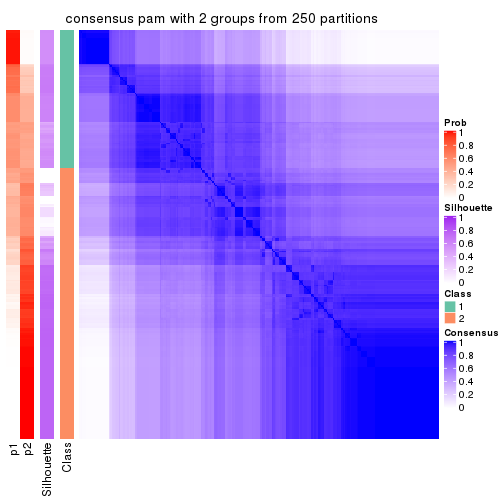</p>

</div>
<div id='tab-CV-pam-consensus-heatmap-2'>
<pre><code class="r">consensus_heatmap(res, k = 3)
</code></pre>

<p>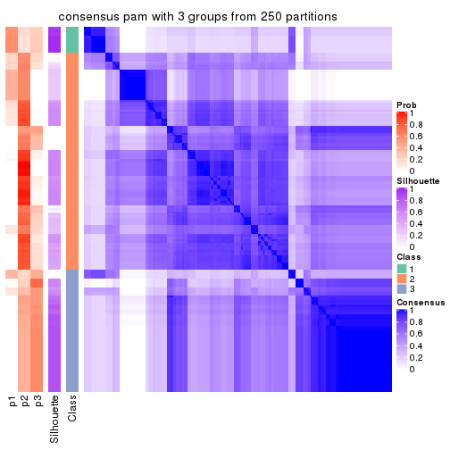</p>

</div>
<div id='tab-CV-pam-consensus-heatmap-3'>
<pre><code class="r">consensus_heatmap(res, k = 4)
</code></pre>

<p>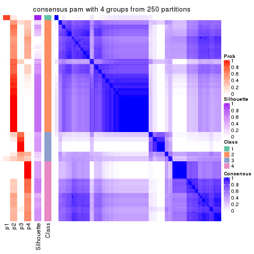</p>

</div>
<div id='tab-CV-pam-consensus-heatmap-4'>
<pre><code class="r">consensus_heatmap(res, k = 5)
</code></pre>

<p>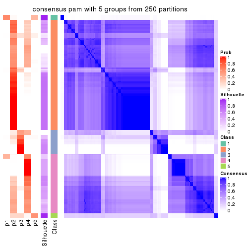</p>

</div>
<div id='tab-CV-pam-consensus-heatmap-5'>
<pre><code class="r">consensus_heatmap(res, k = 6)
</code></pre>

<p>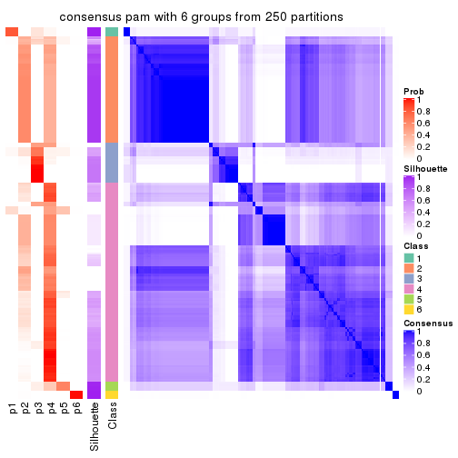</p>

</div>
</div>

Heatmaps for the membership of samples in all partitions to see how consistent they are:


<script>
$( function() {
	$( '#tabs-CV-pam-membership-heatmap' ).tabs();
} );
</script>
<div id='tabs-CV-pam-membership-heatmap'>
<ul>
<li><a href='#tab-CV-pam-membership-heatmap-1'>k = 2</a></li>
<li><a href='#tab-CV-pam-membership-heatmap-2'>k = 3</a></li>
<li><a href='#tab-CV-pam-membership-heatmap-3'>k = 4</a></li>
<li><a href='#tab-CV-pam-membership-heatmap-4'>k = 5</a></li>
<li><a href='#tab-CV-pam-membership-heatmap-5'>k = 6</a></li>
</ul>
<div id='tab-CV-pam-membership-heatmap-1'>
<pre><code class="r">membership_heatmap(res, k = 2)
</code></pre>

<p>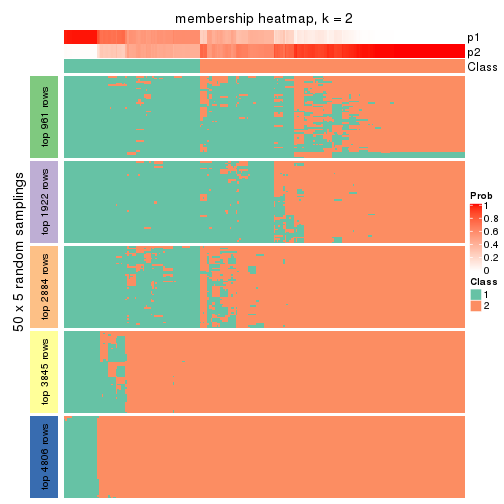</p>

</div>
<div id='tab-CV-pam-membership-heatmap-2'>
<pre><code class="r">membership_heatmap(res, k = 3)
</code></pre>

<p>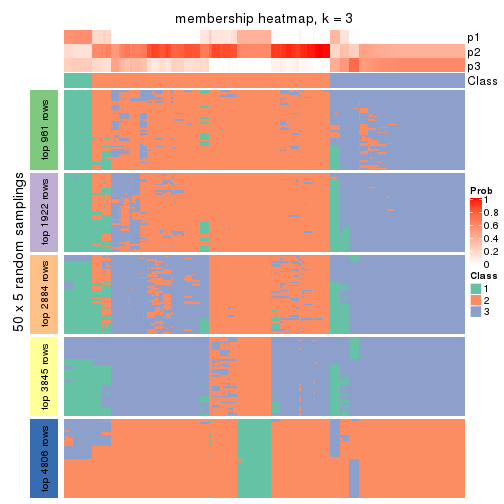</p>

</div>
<div id='tab-CV-pam-membership-heatmap-3'>
<pre><code class="r">membership_heatmap(res, k = 4)
</code></pre>

<p>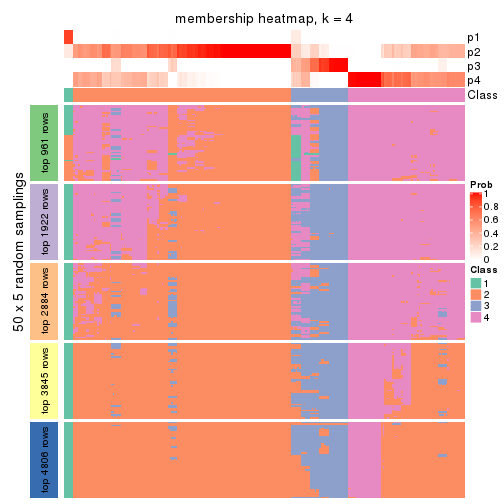</p>

</div>
<div id='tab-CV-pam-membership-heatmap-4'>
<pre><code class="r">membership_heatmap(res, k = 5)
</code></pre>

<p>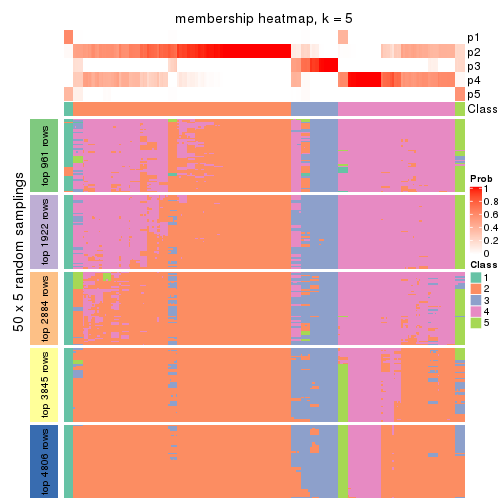</p>

</div>
<div id='tab-CV-pam-membership-heatmap-5'>
<pre><code class="r">membership_heatmap(res, k = 6)
</code></pre>

<p>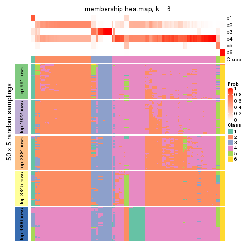</p>

</div>
</div>

As soon as we have had the classes for columns, we can look for signatures
which are significantly different between classes which can be candidate marks
for certain classes. Following are the heatmaps for signatures.


Signature heatmaps where rows are scaled:


<script>
$( function() {
	$( '#tabs-CV-pam-get-signatures' ).tabs();
} );
</script>
<div id='tabs-CV-pam-get-signatures'>
<ul>
<li><a href='#tab-CV-pam-get-signatures-1'>k = 2</a></li>
<li><a href='#tab-CV-pam-get-signatures-2'>k = 3</a></li>
<li><a href='#tab-CV-pam-get-signatures-3'>k = 4</a></li>
<li><a href='#tab-CV-pam-get-signatures-4'>k = 5</a></li>
<li><a href='#tab-CV-pam-get-signatures-5'>k = 6</a></li>
</ul>
<div id='tab-CV-pam-get-signatures-1'>
<pre><code class="r">get_signatures(res, k = 2)
</code></pre>

<p>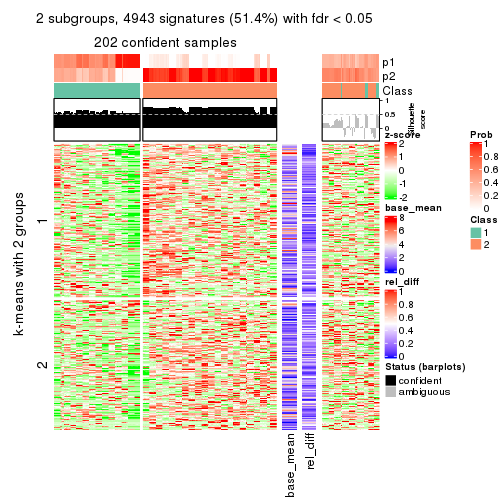</p>

</div>
<div id='tab-CV-pam-get-signatures-2'>
<pre><code class="r">get_signatures(res, k = 3)
</code></pre>

<p>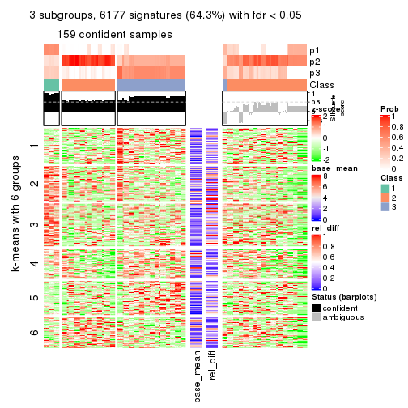</p>

</div>
<div id='tab-CV-pam-get-signatures-3'>
<pre><code class="r">get_signatures(res, k = 4)
</code></pre>

<p>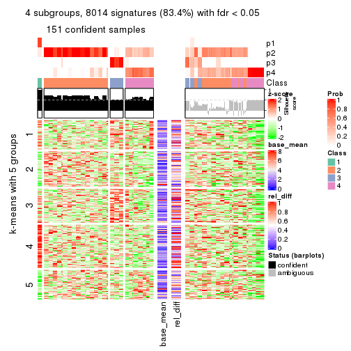</p>

</div>
<div id='tab-CV-pam-get-signatures-4'>
<pre><code class="r">get_signatures(res, k = 5)
</code></pre>

<p>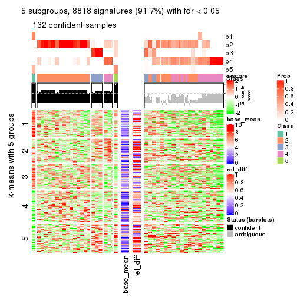</p>

</div>
<div id='tab-CV-pam-get-signatures-5'>
<pre><code class="r">get_signatures(res, k = 6)
</code></pre>

<p>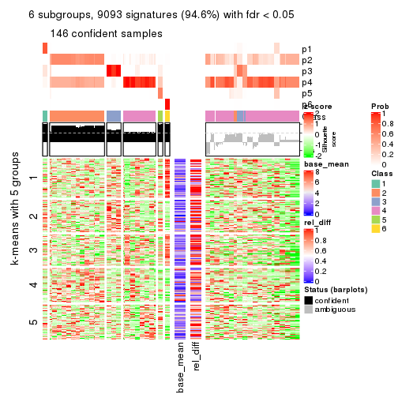</p>

</div>
</div>


Signature heatmaps where rows are not scaled:


<script>
$( function() {
	$( '#tabs-CV-pam-get-signatures-no-scale' ).tabs();
} );
</script>
<div id='tabs-CV-pam-get-signatures-no-scale'>
<ul>
<li><a href='#tab-CV-pam-get-signatures-no-scale-1'>k = 2</a></li>
<li><a href='#tab-CV-pam-get-signatures-no-scale-2'>k = 3</a></li>
<li><a href='#tab-CV-pam-get-signatures-no-scale-3'>k = 4</a></li>
<li><a href='#tab-CV-pam-get-signatures-no-scale-4'>k = 5</a></li>
<li><a href='#tab-CV-pam-get-signatures-no-scale-5'>k = 6</a></li>
</ul>
<div id='tab-CV-pam-get-signatures-no-scale-1'>
<pre><code class="r">get_signatures(res, k = 2, scale_rows = FALSE)
</code></pre>

<p>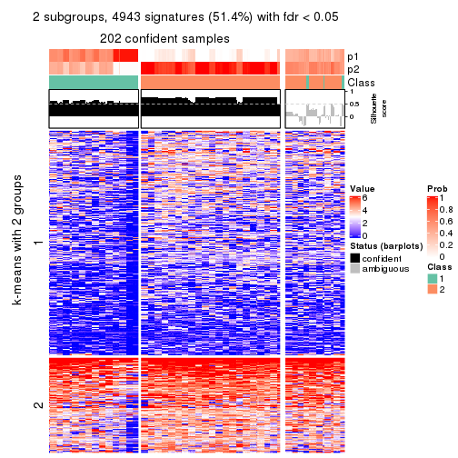</p>

</div>
<div id='tab-CV-pam-get-signatures-no-scale-2'>
<pre><code class="r">get_signatures(res, k = 3, scale_rows = FALSE)
</code></pre>

<p>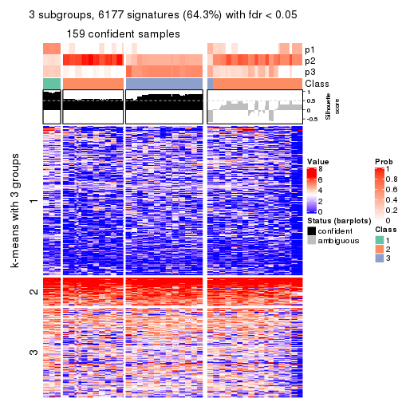</p>

</div>
<div id='tab-CV-pam-get-signatures-no-scale-3'>
<pre><code class="r">get_signatures(res, k = 4, scale_rows = FALSE)
</code></pre>

<p>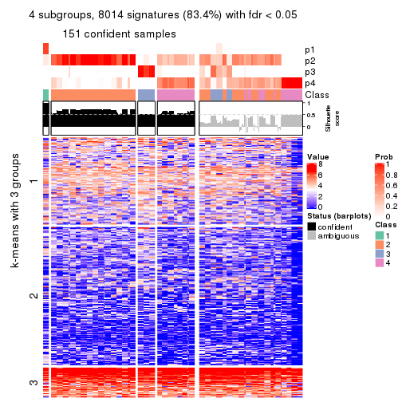</p>

</div>
<div id='tab-CV-pam-get-signatures-no-scale-4'>
<pre><code class="r">get_signatures(res, k = 5, scale_rows = FALSE)
</code></pre>

<p>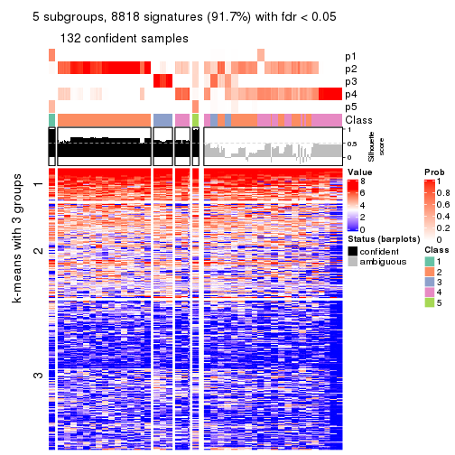</p>

</div>
<div id='tab-CV-pam-get-signatures-no-scale-5'>
<pre><code class="r">get_signatures(res, k = 6, scale_rows = FALSE)
</code></pre>

<p>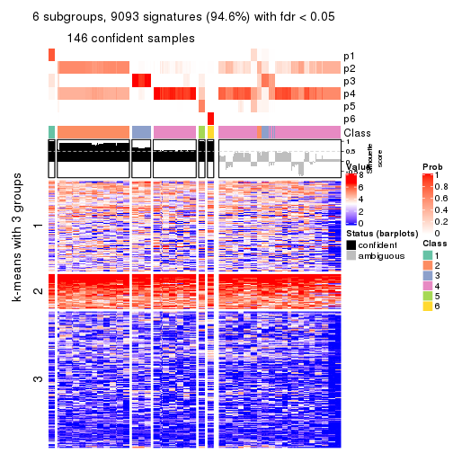</p>

</div>
</div>


Compare the overlap of signatures from different k:

```r
compare_signatures(res)
```

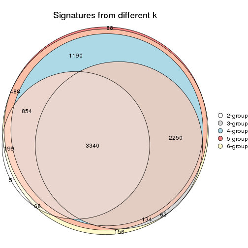

`get_signature()` returns a data frame invisibly. TO get the list of signatures, the function
call should be assigned to a variable explicitly. In following code, if `plot` argument is set
to `FALSE`, no heatmap is plotted while only the differential analysis is performed.

```r
# code only for demonstration
tb = get_signature(res, k = ..., plot = FALSE)
```

An example of the output of `tb` is:

```
#>   which_row         fdr    mean_1    mean_2 scaled_mean_1 scaled_mean_2 km
#> 1        38 0.042760348  8.373488  9.131774    -0.5533452     0.5164555  1
#> 2        40 0.018707592  7.106213  8.469186    -0.6173731     0.5762149  1
#> 3        55 0.019134737 10.221463 11.207825    -0.6159697     0.5749050  1
#> 4        59 0.006059896  5.921854  7.869574    -0.6899429     0.6439467  1
#> 5        60 0.018055526  8.928898 10.211722    -0.6204761     0.5791110  1
#> 6        98 0.009384629 15.714769 14.887706     0.6635654    -0.6193277  2
...
```

The columns in `tb` are:

1. `which_row`: row indices corresponding to the input matrix.
2. `fdr`: FDR for the differential test. 
3. `mean_x`: The mean value in group x.
4. `scaled_mean_x`: The mean value in group x after rows are scaled.
5. `km`: Row groups if k-means clustering is applied to rows.


UMAP plot which shows how samples are separated.


<script>
$( function() {
	$( '#tabs-CV-pam-dimension-reduction' ).tabs();
} );
</script>
<div id='tabs-CV-pam-dimension-reduction'>
<ul>
<li><a href='#tab-CV-pam-dimension-reduction-1'>k = 2</a></li>
<li><a href='#tab-CV-pam-dimension-reduction-2'>k = 3</a></li>
<li><a href='#tab-CV-pam-dimension-reduction-3'>k = 4</a></li>
<li><a href='#tab-CV-pam-dimension-reduction-4'>k = 5</a></li>
<li><a href='#tab-CV-pam-dimension-reduction-5'>k = 6</a></li>
</ul>
<div id='tab-CV-pam-dimension-reduction-1'>
<pre><code class="r">dimension_reduction(res, k = 2, method = &quot;UMAP&quot;)
</code></pre>

<p>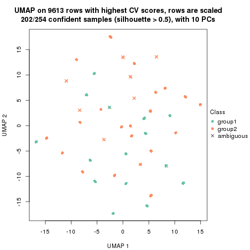</p>

</div>
<div id='tab-CV-pam-dimension-reduction-2'>
<pre><code class="r">dimension_reduction(res, k = 3, method = &quot;UMAP&quot;)
</code></pre>

<p>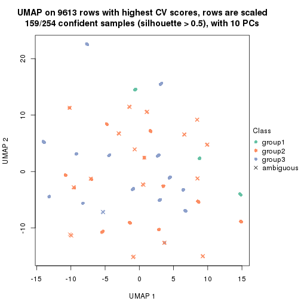</p>

</div>
<div id='tab-CV-pam-dimension-reduction-3'>
<pre><code class="r">dimension_reduction(res, k = 4, method = &quot;UMAP&quot;)
</code></pre>

<p>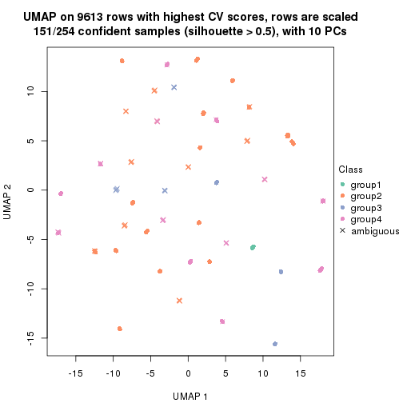</p>

</div>
<div id='tab-CV-pam-dimension-reduction-4'>
<pre><code class="r">dimension_reduction(res, k = 5, method = &quot;UMAP&quot;)
</code></pre>

<p>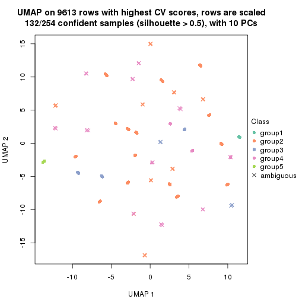</p>

</div>
<div id='tab-CV-pam-dimension-reduction-5'>
<pre><code class="r">dimension_reduction(res, k = 6, method = &quot;UMAP&quot;)
</code></pre>

<p>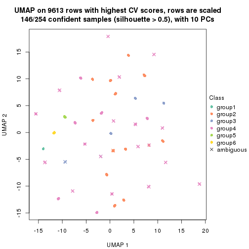</p>

</div>
</div>


Following heatmap shows how subgroups are split when increasing `k`:

```r
collect_classes(res)
```

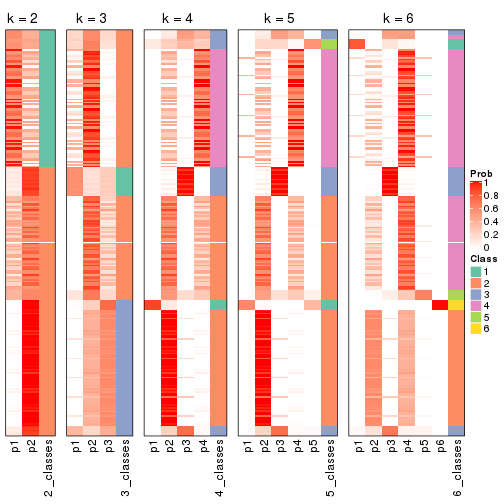


If matrix rows can be associated to genes, consider to use `GO_Enrichment(res,
...)` to perform function enrichment for the signature genes.


 

---------------------------------------------------


### CV:mclust


The object with results only for a single top-value method and a single partition method 
can be extracted as:

```r
res = res_list["CV", "mclust"]
# you can also extract it by
# res = res_list["CV:mclust"]
```

A summary of `res` and all the functions that can be applied to it:

```r
res
```

```
#> A 'ConsensusPartition' object with k = 2, 3, 4, 5, 6.
#>   On a matrix with 9613 rows and 254 columns.
#>   Top rows (961, 1922, 2884, 3845, 4806) are extracted by 'CV' method.
#>   Subgroups are detected by 'mclust' method.
#>   Performed in total 1250 partitions by row resampling.
#>   Best k for subgroups seems to be 3.
#> 
#> Following methods can be applied to this 'ConsensusPartition' object:
#>  [1] "cola_report"             "collect_classes"         "collect_plots"          
#>  [4] "collect_stats"           "colnames"                "compare_signatures"     
#>  [7] "consensus_heatmap"       "dimension_reduction"     "functional_enrichment"  
#> [10] "get_anno_col"            "get_anno"                "get_classes"            
#> [13] "get_consensus"           "get_matrix"              "get_membership"         
#> [16] "get_param"               "get_signatures"          "get_stats"              
#> [19] "is_best_k"               "is_stable_k"             "membership_heatmap"     
#> [22] "ncol"                    "nrow"                    "plot_ecdf"              
#> [25] "rownames"                "select_partition_number" "show"                   
#> [28] "suggest_best_k"          "test_to_known_factors"
```

`collect_plots()` function collects all the plots made from `res` for all `k` (number of partitions)
into one single page to provide an easy and fast comparison between different `k`.

```r
collect_plots(res)
```

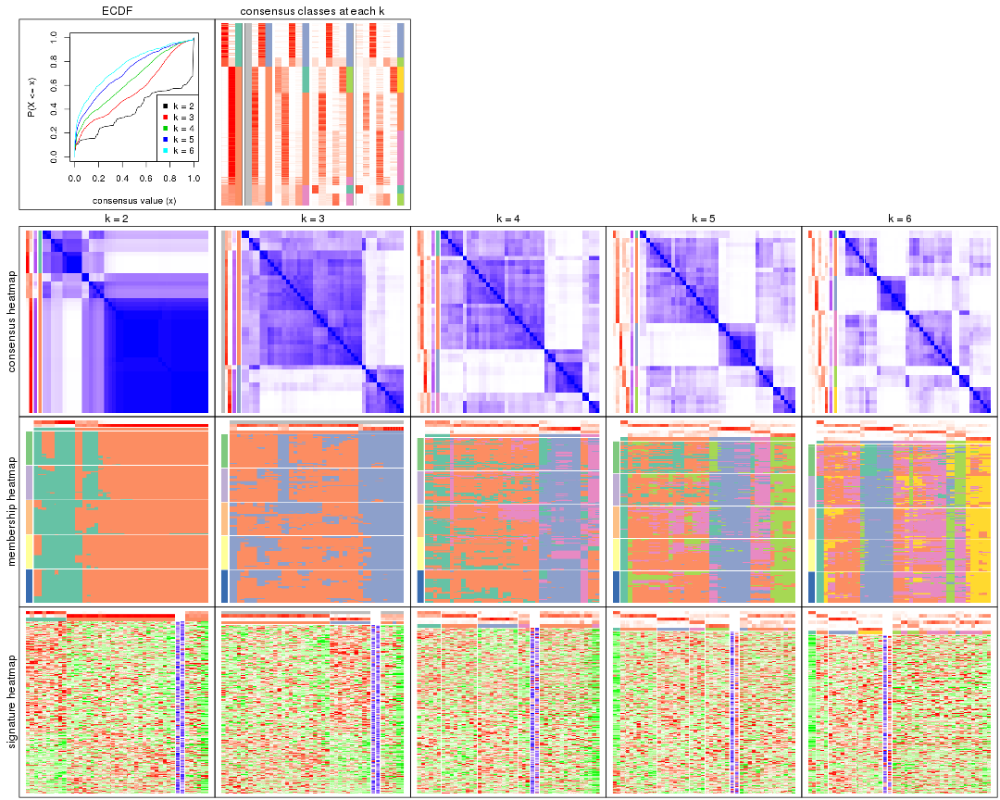

The plots are:

- The first row: a plot of the ECDF (Empirical cumulative distribution
  function) curves of the consensus matrix for each `k` and the heatmap of
  predicted classes for each `k`.
- The second row: heatmaps of the consensus matrix for each `k`.
- The third row: heatmaps of the membership matrix for each `k`.
- The fouth row: heatmaps of the signatures for each `k`.

All the plots in panels can be made by individual functions and they are
plotted later in this section.

`select_partition_number()` produces several plots showing different
statistics for choosing "optimized" `k`. There are following statistics:

- ECDF curves of the consensus matrix for each `k`;
- 1-PAC. [The PAC
  score](https://en.wikipedia.org/wiki/Consensus_clustering#Over-interpretation_potential_of_consensus_clustering)
  measures the proportion of the ambiguous subgrouping.
- Mean silhouette score.
- Concordance. The mean probability of fiting the consensus class ids in all
  partitions.
- Area increased. Denote $A_k$ as the area under the ECDF curve for current
  `k`, the area increased is defined as $A_k - A_{k-1}$.
- Rand index. The percent of pairs of samples that are both in a same cluster
  or both are not in a same cluster in the partition of k and k-1.
- Jaccard index. The ratio of pairs of samples are both in a same cluster in
  the partition of k and k-1 and the pairs of samples are both in a same
  cluster in the partition k or k-1.

The detailed explanations of these statistics can be found in [the cola
vignette](http://bioconductor.org/packages/devel/bioc/vignettes/cola/inst/doc/cola.html#toc_13).

Generally speaking, lower PAC score, higher mean silhouette score or higher
concordance corresponds to better partition. Rand index and Jaccard index
measure how similar the current partition is compared to partition with `k-1`.
If they are too similar, we won't accept `k` is better than `k-1`.

```r
select_partition_number(res)
```

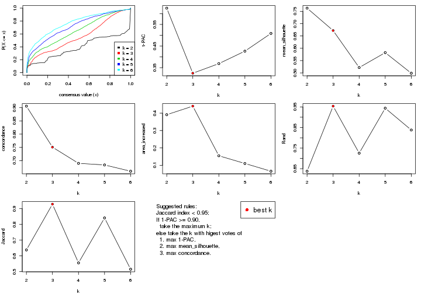

The numeric values for all these statistics can be obtained by `get_stats()`.

```r
get_stats(res)
```

```
#>   k 1-PAC mean_silhouette concordance area_increased  Rand Jaccard
#> 2 2 0.625           0.763       0.906         0.3911 0.638   0.638
#> 3 3 0.324           0.672       0.751         0.4404 0.954   0.929
#> 4 4 0.369           0.522       0.690         0.1549 0.725   0.556
#> 5 5 0.426           0.582       0.684         0.1106 0.944   0.841
#> 6 6 0.508           0.499       0.660         0.0661 0.838   0.515
```

`suggest_best_k()` suggests the best $k$ based on these statistics. The rules are as follows:

- All $k$ with Jaccard index larger than 0.95 are removed because the increase of
  the partition number does not provides enough extra information. If all $k$ are removed,
  the best $k$ is assigned by `NA`.
- For $k$ with 1-PAC larger than 0.9, the maximal $k$ is taken as the "best k". Other $k$ is called "optional k".
- If it does not fit the second rule. The $k$ with the highest vote of highest
  1-PAC, mean silhouette and concordance is taken as the "best k".

```r
suggest_best_k(res)
```

```
#> [1] 3
```


Following shows the table of the partitions (You need to click the **show/hide
code output** link to see it). The membership matrix (columns with name `p*`)
is inferred by
[`clue::cl_consensus()`](https://www.rdocumentation.org/link/cl_consensus?package=clue)
function with the `SE` method. Basically the value in the membership matrix
represents the probability to belong to a certain group. The finall class
label for an item is determined with the group with highest probability it
belongs to.

In `get_classes()` function, the entropy is calculated from the membership
matrix and the silhouette score is calculated from the consensus matrix.


<script>
$( function() {
	$( '#tabs-CV-mclust-get-classes' ).tabs();
} );
</script>
<div id='tabs-CV-mclust-get-classes'>
<ul>
<li><a href='#tab-CV-mclust-get-classes-1'>k = 2</a></li>
<li><a href='#tab-CV-mclust-get-classes-2'>k = 3</a></li>
<li><a href='#tab-CV-mclust-get-classes-3'>k = 4</a></li>
<li><a href='#tab-CV-mclust-get-classes-4'>k = 5</a></li>
<li><a href='#tab-CV-mclust-get-classes-5'>k = 6</a></li>
</ul>

<div id='tab-CV-mclust-get-classes-1'>
<p><a id='tab-CV-mclust-get-classes-1-a' style='color:#0366d6' href='#'>show/hide code output</a></p>
<pre><code class="r">cbind(get_classes(res, k = 2), get_membership(res, k = 2))
</code></pre>

<pre><code>#&gt;           class entropy silhouette    p1    p2
#&gt; DRR024803     2  0.9815     0.1621 0.420 0.580
#&gt; DRR024804     2  0.0376     0.8981 0.004 0.996
#&gt; DRR024805     2  0.0000     0.8974 0.000 1.000
#&gt; DRR024806     2  0.0000     0.8974 0.000 1.000
#&gt; DRR024807     1  0.7219     0.7595 0.800 0.200
#&gt; DRR024808     1  0.0000     0.8432 1.000 0.000
#&gt; DRR024809     2  0.0376     0.8970 0.004 0.996
#&gt; DRR024810     2  0.0376     0.8970 0.004 0.996
#&gt; DRR024811     1  0.9286     0.5191 0.656 0.344
#&gt; DRR024812     2  0.0000     0.8974 0.000 1.000
#&gt; DRR024813     2  0.4562     0.8186 0.096 0.904
#&gt; DRR024814     2  0.0376     0.8981 0.004 0.996
#&gt; DRR024815     2  0.0376     0.8981 0.004 0.996
#&gt; DRR024816     2  0.0376     0.8981 0.004 0.996
#&gt; DRR024817     2  0.0672     0.8966 0.008 0.992
#&gt; DRR024818     1  0.6712     0.7830 0.824 0.176
#&gt; DRR024819     2  0.9460     0.3907 0.364 0.636
#&gt; DRR024820     2  0.9988     0.0601 0.480 0.520
#&gt; DRR024821     1  0.2423     0.8353 0.960 0.040
#&gt; DRR024822     2  0.0000     0.8974 0.000 1.000
#&gt; DRR024824     2  0.0376     0.8981 0.004 0.996
#&gt; DRR024825     1  0.9087     0.5487 0.676 0.324
#&gt; DRR024826     2  0.2236     0.8762 0.036 0.964
#&gt; DRR024827     2  0.9988     0.0520 0.480 0.520
#&gt; DRR024828     1  0.7056     0.7676 0.808 0.192
#&gt; DRR024829     2  0.0376     0.8981 0.004 0.996
#&gt; DRR024830     2  0.0000     0.8974 0.000 1.000
#&gt; DRR024831     1  0.0000     0.8432 1.000 0.000
#&gt; DRR024832     1  0.0000     0.8432 1.000 0.000
#&gt; DRR024833     2  0.0376     0.8981 0.004 0.996
#&gt; DRR024834     2  0.0000     0.8974 0.000 1.000
#&gt; DRR024835     2  0.3114     0.8590 0.056 0.944
#&gt; DRR024836     1  0.0000     0.8432 1.000 0.000
#&gt; DRR024837     2  0.0000     0.8974 0.000 1.000
#&gt; DRR024838     2  0.0672     0.8966 0.008 0.992
#&gt; DRR024839     2  0.0376     0.8981 0.004 0.996
#&gt; DRR024840     2  0.0672     0.8966 0.008 0.992
#&gt; DRR024841     2  0.0000     0.8974 0.000 1.000
#&gt; DRR024842     2  0.0376     0.8981 0.004 0.996
#&gt; DRR024843     2  0.9815     0.1621 0.420 0.580
#&gt; DRR024844     2  0.0376     0.8981 0.004 0.996
#&gt; DRR024845     2  0.0000     0.8974 0.000 1.000
#&gt; DRR024846     2  0.0000     0.8974 0.000 1.000
#&gt; DRR024847     1  0.7219     0.7595 0.800 0.200
#&gt; DRR024848     2  0.9815     0.1621 0.420 0.580
#&gt; DRR024849     1  0.0000     0.8432 1.000 0.000
#&gt; DRR024850     2  0.0376     0.8981 0.004 0.996
#&gt; DRR024851     2  0.0376     0.8970 0.004 0.996
#&gt; DRR024852     2  0.0376     0.8970 0.004 0.996
#&gt; DRR024853     1  0.9286     0.5191 0.656 0.344
#&gt; DRR024854     2  0.0000     0.8974 0.000 1.000
#&gt; DRR024855     2  0.4562     0.8186 0.096 0.904
#&gt; DRR024856     2  0.0376     0.8981 0.004 0.996
#&gt; DRR024857     2  0.0376     0.8981 0.004 0.996
#&gt; DRR024858     2  0.0376     0.8981 0.004 0.996
#&gt; DRR024859     2  0.0672     0.8966 0.008 0.992
#&gt; DRR024860     1  0.6712     0.7830 0.824 0.176
#&gt; DRR024861     2  0.9460     0.3907 0.364 0.636
#&gt; DRR024862     2  0.9998     0.0150 0.492 0.508
#&gt; DRR024863     1  0.2236     0.8368 0.964 0.036
#&gt; DRR024864     2  0.0000     0.8974 0.000 1.000
#&gt; DRR024865     2  0.0000     0.8974 0.000 1.000
#&gt; DRR024866     2  0.0376     0.8981 0.004 0.996
#&gt; DRR024867     1  0.9087     0.5487 0.676 0.324
#&gt; DRR024868     2  0.2043     0.8793 0.032 0.968
#&gt; DRR024869     2  0.9988     0.0520 0.480 0.520
#&gt; DRR024870     1  0.7056     0.7676 0.808 0.192
#&gt; DRR024871     2  0.0376     0.8981 0.004 0.996
#&gt; DRR024872     2  0.0000     0.8974 0.000 1.000
#&gt; DRR024873     1  0.0000     0.8432 1.000 0.000
#&gt; DRR024874     1  0.0000     0.8432 1.000 0.000
#&gt; DRR024875     2  0.0376     0.8981 0.004 0.996
#&gt; DRR024876     2  0.0000     0.8974 0.000 1.000
#&gt; DRR024877     2  0.2948     0.8622 0.052 0.948
#&gt; DRR024878     1  0.0000     0.8432 1.000 0.000
#&gt; DRR024879     2  0.0000     0.8974 0.000 1.000
#&gt; DRR024880     2  0.0672     0.8966 0.008 0.992
#&gt; DRR024881     2  0.0376     0.8981 0.004 0.996
#&gt; DRR024882     2  0.0672     0.8966 0.008 0.992
#&gt; DRR024883     2  0.0000     0.8974 0.000 1.000
#&gt; DRR024884     2  0.0376     0.8981 0.004 0.996
#&gt; DRR024885     2  0.9909     0.1751 0.444 0.556
#&gt; DRR024886     2  0.9815     0.1621 0.420 0.580
#&gt; DRR024887     2  0.0672     0.8966 0.008 0.992
#&gt; DRR024888     2  0.0000     0.8974 0.000 1.000
#&gt; DRR024889     2  0.0000     0.8974 0.000 1.000
#&gt; DRR024890     1  0.7219     0.7595 0.800 0.200
#&gt; DRR024891     2  0.9815     0.1621 0.420 0.580
#&gt; DRR024892     1  0.0000     0.8432 1.000 0.000
#&gt; DRR024893     2  0.0376     0.8981 0.004 0.996
#&gt; DRR024894     2  0.0376     0.8970 0.004 0.996
#&gt; DRR024895     2  0.0376     0.8970 0.004 0.996
#&gt; DRR024896     1  0.9286     0.5191 0.656 0.344
#&gt; DRR024897     2  0.0000     0.8974 0.000 1.000
#&gt; DRR024898     2  0.4562     0.8186 0.096 0.904
#&gt; DRR024899     2  0.0376     0.8981 0.004 0.996
#&gt; DRR024900     2  0.0376     0.8981 0.004 0.996
#&gt; DRR024901     2  0.0376     0.8981 0.004 0.996
#&gt; DRR024902     2  0.0672     0.8966 0.008 0.992
#&gt; DRR024903     1  0.6712     0.7830 0.824 0.176
#&gt; DRR024904     2  0.9460     0.3907 0.364 0.636
#&gt; DRR024905     2  0.9998     0.0150 0.492 0.508
#&gt; DRR024906     1  0.1843     0.8390 0.972 0.028
#&gt; DRR024907     2  0.0000     0.8974 0.000 1.000
#&gt; DRR024908     2  0.0000     0.8974 0.000 1.000
#&gt; DRR024909     2  0.0376     0.8981 0.004 0.996
#&gt; DRR024910     1  0.9087     0.5487 0.676 0.324
#&gt; DRR024911     2  0.2043     0.8793 0.032 0.968
#&gt; DRR024912     2  0.9988     0.0520 0.480 0.520
#&gt; DRR024913     1  0.7056     0.7676 0.808 0.192
#&gt; DRR024914     2  0.0376     0.8981 0.004 0.996
#&gt; DRR024915     2  0.0000     0.8974 0.000 1.000
#&gt; DRR024916     1  0.0000     0.8432 1.000 0.000
#&gt; DRR024917     1  0.0000     0.8432 1.000 0.000
#&gt; DRR024918     2  0.0376     0.8981 0.004 0.996
#&gt; DRR024919     2  0.0000     0.8974 0.000 1.000
#&gt; DRR024920     2  0.2948     0.8622 0.052 0.948
#&gt; DRR024921     1  0.0000     0.8432 1.000 0.000
#&gt; DRR024922     2  0.0000     0.8974 0.000 1.000
#&gt; DRR024923     2  0.0672     0.8966 0.008 0.992
#&gt; DRR024924     2  0.0376     0.8981 0.004 0.996
#&gt; DRR024925     2  0.0672     0.8966 0.008 0.992
#&gt; DRR024926     2  0.0000     0.8974 0.000 1.000
#&gt; DRR024927     2  0.0376     0.8981 0.004 0.996
#&gt; DRR024928     2  0.9909     0.1751 0.444 0.556
#&gt; DRR024929     2  0.9815     0.1621 0.420 0.580
#&gt; DRR024930     2  0.0376     0.8981 0.004 0.996
#&gt; DRR024931     2  0.0000     0.8974 0.000 1.000
#&gt; DRR024932     2  0.0000     0.8974 0.000 1.000
#&gt; DRR024933     1  0.7219     0.7595 0.800 0.200
#&gt; DRR024934     2  0.9815     0.1621 0.420 0.580
#&gt; DRR024935     1  0.0000     0.8432 1.000 0.000
#&gt; DRR024936     2  0.0376     0.8981 0.004 0.996
#&gt; DRR024937     2  0.0376     0.8970 0.004 0.996
#&gt; DRR024938     2  0.0376     0.8970 0.004 0.996
#&gt; DRR024939     1  0.9286     0.5191 0.656 0.344
#&gt; DRR024940     2  0.0000     0.8974 0.000 1.000
#&gt; DRR024941     2  0.4431     0.8228 0.092 0.908
#&gt; DRR024942     2  0.0376     0.8981 0.004 0.996
#&gt; DRR024943     2  0.0376     0.8981 0.004 0.996
#&gt; DRR024944     2  0.0376     0.8981 0.004 0.996
#&gt; DRR024945     2  0.0672     0.8966 0.008 0.992
#&gt; DRR024946     1  0.6712     0.7830 0.824 0.176
#&gt; DRR024947     2  0.9460     0.3907 0.364 0.636
#&gt; DRR024948     2  0.9998     0.0150 0.492 0.508
#&gt; DRR024949     1  0.2043     0.8380 0.968 0.032
#&gt; DRR024950     2  0.0000     0.8974 0.000 1.000
#&gt; DRR024951     2  0.0000     0.8974 0.000 1.000
#&gt; DRR024952     2  0.0376     0.8981 0.004 0.996
#&gt; DRR024953     1  0.9087     0.5487 0.676 0.324
#&gt; DRR024954     2  0.2043     0.8793 0.032 0.968
#&gt; DRR024955     2  0.9988     0.0520 0.480 0.520
#&gt; DRR024956     1  0.7056     0.7676 0.808 0.192
#&gt; DRR024957     2  0.0376     0.8981 0.004 0.996
#&gt; DRR024958     2  0.0000     0.8974 0.000 1.000
#&gt; DRR024959     1  0.0000     0.8432 1.000 0.000
#&gt; DRR024960     1  0.0000     0.8432 1.000 0.000
#&gt; DRR024961     2  0.0376     0.8981 0.004 0.996
#&gt; DRR024962     2  0.0000     0.8974 0.000 1.000
#&gt; DRR024963     2  0.2948     0.8622 0.052 0.948
#&gt; DRR024964     1  0.0000     0.8432 1.000 0.000
#&gt; DRR024965     2  0.0000     0.8974 0.000 1.000
#&gt; DRR024966     2  0.0672     0.8966 0.008 0.992
#&gt; DRR024967     2  0.0376     0.8981 0.004 0.996
#&gt; DRR024968     2  0.0672     0.8966 0.008 0.992
#&gt; DRR024969     2  0.0000     0.8974 0.000 1.000
#&gt; DRR024970     2  0.0376     0.8981 0.004 0.996
#&gt; DRR024971     2  0.9909     0.1751 0.444 0.556
#&gt; DRR024972     2  0.9815     0.1621 0.420 0.580
#&gt; DRR024973     2  0.0672     0.8966 0.008 0.992
#&gt; DRR024974     2  0.0000     0.8974 0.000 1.000
#&gt; DRR024975     2  0.0000     0.8974 0.000 1.000
#&gt; DRR024976     1  0.7219     0.7595 0.800 0.200
#&gt; DRR024977     2  0.9815     0.1621 0.420 0.580
#&gt; DRR024978     1  0.0000     0.8432 1.000 0.000
#&gt; DRR024979     2  0.0376     0.8981 0.004 0.996
#&gt; DRR024980     2  0.0376     0.8970 0.004 0.996
#&gt; DRR024981     2  0.0376     0.8970 0.004 0.996
#&gt; DRR024982     1  0.9286     0.5191 0.656 0.344
#&gt; DRR024983     2  0.0000     0.8974 0.000 1.000
#&gt; DRR024984     2  0.4431     0.8228 0.092 0.908
#&gt; DRR024985     2  0.0376     0.8981 0.004 0.996
#&gt; DRR024986     2  0.0376     0.8981 0.004 0.996
#&gt; DRR024987     2  0.0376     0.8981 0.004 0.996
#&gt; DRR024988     2  0.0672     0.8966 0.008 0.992
#&gt; DRR024989     1  0.6712     0.7830 0.824 0.176
#&gt; DRR024990     2  0.9460     0.3907 0.364 0.636
#&gt; DRR024991     2  0.9998     0.0150 0.492 0.508
#&gt; DRR024992     1  0.2043     0.8380 0.968 0.032
#&gt; DRR024993     2  0.0000     0.8974 0.000 1.000
#&gt; DRR024994     2  0.0000     0.8974 0.000 1.000
#&gt; DRR024995     2  0.0376     0.8981 0.004 0.996
#&gt; DRR024996     1  0.9087     0.5487 0.676 0.324
#&gt; DRR024997     2  0.2043     0.8793 0.032 0.968
#&gt; DRR024998     2  0.9988     0.0520 0.480 0.520
#&gt; DRR024999     1  0.7056     0.7676 0.808 0.192
#&gt; DRR025000     2  0.0376     0.8981 0.004 0.996
#&gt; DRR025001     2  0.0000     0.8974 0.000 1.000
#&gt; DRR025002     1  0.0000     0.8432 1.000 0.000
#&gt; DRR025003     1  0.0000     0.8432 1.000 0.000
#&gt; DRR025004     2  0.0376     0.8981 0.004 0.996
#&gt; DRR025005     2  0.0000     0.8974 0.000 1.000
#&gt; DRR025006     2  0.3114     0.8590 0.056 0.944
#&gt; DRR025007     1  0.0000     0.8432 1.000 0.000
#&gt; DRR025008     2  0.0000     0.8974 0.000 1.000
#&gt; DRR025009     2  0.0672     0.8966 0.008 0.992
#&gt; DRR025010     2  0.0376     0.8981 0.004 0.996
#&gt; DRR025011     2  0.0672     0.8966 0.008 0.992
#&gt; DRR025012     2  0.0000     0.8974 0.000 1.000
#&gt; DRR025013     2  0.0376     0.8981 0.004 0.996
#&gt; DRR025014     2  0.9909     0.1751 0.444 0.556
#&gt; DRR025015     2  0.9815     0.1621 0.420 0.580
#&gt; DRR025016     2  0.0376     0.8981 0.004 0.996
#&gt; DRR025017     2  0.0000     0.8974 0.000 1.000
#&gt; DRR025018     2  0.0000     0.8974 0.000 1.000
#&gt; DRR025019     1  0.7219     0.7595 0.800 0.200
#&gt; DRR025020     2  0.9815     0.1621 0.420 0.580
#&gt; DRR025021     1  0.0000     0.8432 1.000 0.000
#&gt; DRR025022     2  0.0376     0.8981 0.004 0.996
#&gt; DRR025023     2  0.0376     0.8970 0.004 0.996
#&gt; DRR025024     2  0.0376     0.8970 0.004 0.996
#&gt; DRR025025     1  0.9286     0.5191 0.656 0.344
#&gt; DRR025026     2  0.0000     0.8974 0.000 1.000
#&gt; DRR025027     2  0.4690     0.8141 0.100 0.900
#&gt; DRR025028     2  0.0376     0.8981 0.004 0.996
#&gt; DRR025029     2  0.0376     0.8981 0.004 0.996
#&gt; DRR025030     2  0.0376     0.8981 0.004 0.996
#&gt; DRR025031     2  0.0672     0.8966 0.008 0.992
#&gt; DRR025032     1  0.6712     0.7830 0.824 0.176
#&gt; DRR025033     2  0.9460     0.3907 0.364 0.636
#&gt; DRR025034     2  0.9998     0.0150 0.492 0.508
#&gt; DRR025035     1  0.1843     0.8390 0.972 0.028
#&gt; DRR025036     2  0.0000     0.8974 0.000 1.000
#&gt; DRR025037     2  0.0000     0.8974 0.000 1.000
#&gt; DRR025038     2  0.0376     0.8981 0.004 0.996
#&gt; DRR025039     1  0.9087     0.5487 0.676 0.324
#&gt; DRR025040     2  0.1843     0.8824 0.028 0.972
#&gt; DRR025041     2  0.9988     0.0520 0.480 0.520
#&gt; DRR025042     1  0.7056     0.7676 0.808 0.192
#&gt; DRR025043     2  0.0376     0.8981 0.004 0.996
#&gt; DRR025044     2  0.0000     0.8974 0.000 1.000
#&gt; DRR025045     1  0.0000     0.8432 1.000 0.000
#&gt; DRR025046     1  0.0000     0.8432 1.000 0.000
#&gt; DRR025047     2  0.0376     0.8981 0.004 0.996
#&gt; DRR025048     2  0.0000     0.8974 0.000 1.000
#&gt; DRR025049     2  0.2948     0.8622 0.052 0.948
#&gt; DRR025050     1  0.0000     0.8432 1.000 0.000
#&gt; DRR025051     2  0.0000     0.8974 0.000 1.000
#&gt; DRR025052     2  0.0672     0.8966 0.008 0.992
#&gt; DRR025053     2  0.0376     0.8981 0.004 0.996
#&gt; DRR025054     2  0.0672     0.8966 0.008 0.992
#&gt; DRR025055     2  0.0000     0.8974 0.000 1.000
#&gt; DRR025056     2  0.0376     0.8981 0.004 0.996
#&gt; DRR025057     2  0.9909     0.1751 0.444 0.556
</code></pre>

<script>
$('#tab-CV-mclust-get-classes-1-a').parent().next().next().hide();
$('#tab-CV-mclust-get-classes-1-a').click(function(){
  $('#tab-CV-mclust-get-classes-1-a').parent().next().next().toggle();
  return(false);
});
</script>
</div>

<div id='tab-CV-mclust-get-classes-2'>
<p><a id='tab-CV-mclust-get-classes-2-a' style='color:#0366d6' href='#'>show/hide code output</a></p>
<pre><code class="r">cbind(get_classes(res, k = 3), get_membership(res, k = 3))
</code></pre>

<pre><code>#&gt;           class entropy silhouette p1    p2    p3
#&gt; DRR024803     2  0.9912     0.2069 NA 0.400 0.300
#&gt; DRR024804     2  0.1753     0.7738 NA 0.952 0.000
#&gt; DRR024805     2  0.5201     0.7129 NA 0.760 0.004
#&gt; DRR024806     2  0.3267     0.7592 NA 0.884 0.000
#&gt; DRR024807     3  0.6805     0.7319 NA 0.044 0.688
#&gt; DRR024808     3  0.3816     0.8118 NA 0.000 0.852
#&gt; DRR024809     2  0.6062     0.6689 NA 0.616 0.000
#&gt; DRR024810     2  0.6062     0.6694 NA 0.616 0.000
#&gt; DRR024811     3  0.7273     0.7165 NA 0.132 0.712
#&gt; DRR024812     2  0.1411     0.7727 NA 0.964 0.000
#&gt; DRR024813     2  0.6438     0.6970 NA 0.748 0.064
#&gt; DRR024814     2  0.5929     0.7331 NA 0.676 0.004
#&gt; DRR024815     2  0.4164     0.7680 NA 0.848 0.008
#&gt; DRR024816     2  0.3619     0.7695 NA 0.864 0.000
#&gt; DRR024817     2  0.5757     0.7496 NA 0.792 0.056
#&gt; DRR024818     3  0.5180     0.7866 NA 0.032 0.812
#&gt; DRR024819     2  0.9599     0.2734 NA 0.412 0.200
#&gt; DRR024820     3  0.9993     0.0748 NA 0.336 0.348
#&gt; DRR024821     3  0.1337     0.8250 NA 0.016 0.972
#&gt; DRR024822     2  0.5517     0.6966 NA 0.728 0.004
#&gt; DRR024824     2  0.2878     0.7664 NA 0.904 0.000
#&gt; DRR024825     3  0.7651     0.7136 NA 0.108 0.672
#&gt; DRR024826     2  0.4937     0.7491 NA 0.824 0.028
#&gt; DRR024827     2  0.9927     0.0102 NA 0.392 0.316
#&gt; DRR024828     3  0.6546     0.7433 NA 0.044 0.716
#&gt; DRR024829     2  0.4842     0.7605 NA 0.776 0.000
#&gt; DRR024830     2  0.4504     0.7353 NA 0.804 0.000
#&gt; DRR024831     3  0.2066     0.8242 NA 0.000 0.940
#&gt; DRR024832     3  0.0237     0.8228 NA 0.000 0.996
#&gt; DRR024833     2  0.3851     0.7676 NA 0.860 0.004
#&gt; DRR024834     2  0.4931     0.7571 NA 0.784 0.004
#&gt; DRR024835     2  0.6402     0.7278 NA 0.724 0.040
#&gt; DRR024836     3  0.2448     0.8195 NA 0.000 0.924
#&gt; DRR024837     2  0.4605     0.7560 NA 0.796 0.000
#&gt; DRR024838     2  0.5728     0.7498 NA 0.720 0.008
#&gt; DRR024839     2  0.3272     0.7748 NA 0.892 0.004
#&gt; DRR024840     2  0.5443     0.6935 NA 0.736 0.004
#&gt; DRR024841     2  0.2959     0.7806 NA 0.900 0.000
#&gt; DRR024842     2  0.2959     0.7758 NA 0.900 0.000
#&gt; DRR024843     2  0.9912     0.2069 NA 0.400 0.300
#&gt; DRR024844     2  0.1753     0.7738 NA 0.952 0.000
#&gt; DRR024845     2  0.5201     0.7129 NA 0.760 0.004
#&gt; DRR024846     2  0.3267     0.7592 NA 0.884 0.000
#&gt; DRR024847     3  0.6805     0.7319 NA 0.044 0.688
#&gt; DRR024848     2  0.9910     0.2055 NA 0.400 0.292
#&gt; DRR024849     3  0.3816     0.8118 NA 0.000 0.852
#&gt; DRR024850     2  0.1964     0.7773 NA 0.944 0.000
#&gt; DRR024851     2  0.6062     0.6688 NA 0.616 0.000
#&gt; DRR024852     2  0.6062     0.6703 NA 0.616 0.000
#&gt; DRR024853     3  0.7273     0.7165 NA 0.132 0.712
#&gt; DRR024854     2  0.1529     0.7720 NA 0.960 0.000
#&gt; DRR024855     2  0.6254     0.7042 NA 0.756 0.056
#&gt; DRR024856     2  0.5929     0.7338 NA 0.676 0.004
#&gt; DRR024857     2  0.4164     0.7674 NA 0.848 0.008
#&gt; DRR024858     2  0.3619     0.7686 NA 0.864 0.000
#&gt; DRR024859     2  0.5988     0.7469 NA 0.776 0.056
#&gt; DRR024860     3  0.5180     0.7866 NA 0.032 0.812
#&gt; DRR024861     2  0.9572     0.2844 NA 0.416 0.196
#&gt; DRR024862     3  0.9995     0.0778 NA 0.332 0.348
#&gt; DRR024863     3  0.1337     0.8250 NA 0.016 0.972
#&gt; DRR024864     2  0.5443     0.7012 NA 0.736 0.004
#&gt; DRR024865     2  0.4235     0.7627 NA 0.824 0.000
#&gt; DRR024866     2  0.2959     0.7670 NA 0.900 0.000
#&gt; DRR024867     3  0.7651     0.7136 NA 0.108 0.672
#&gt; DRR024868     2  0.5058     0.7475 NA 0.820 0.032
#&gt; DRR024869     2  0.9927     0.0102 NA 0.392 0.316
#&gt; DRR024870     3  0.6546     0.7433 NA 0.044 0.716
#&gt; DRR024871     2  0.4842     0.7605 NA 0.776 0.000
#&gt; DRR024872     2  0.4504     0.7353 NA 0.804 0.000
#&gt; DRR024873     3  0.2066     0.8242 NA 0.000 0.940
#&gt; DRR024874     3  0.0424     0.8226 NA 0.000 0.992
#&gt; DRR024875     2  0.3851     0.7683 NA 0.860 0.004
#&gt; DRR024876     2  0.5109     0.7564 NA 0.780 0.008
#&gt; DRR024877     2  0.6361     0.7302 NA 0.728 0.040
#&gt; DRR024878     3  0.2448     0.8195 NA 0.000 0.924
#&gt; DRR024879     2  0.4555     0.7569 NA 0.800 0.000
#&gt; DRR024880     2  0.5728     0.7498 NA 0.720 0.008
#&gt; DRR024881     2  0.3038     0.7756 NA 0.896 0.000
#&gt; DRR024882     2  0.5443     0.6935 NA 0.736 0.004
#&gt; DRR024883     2  0.3038     0.7795 NA 0.896 0.000
#&gt; DRR024884     2  0.4531     0.7691 NA 0.824 0.008
#&gt; DRR024885     2  0.9877     0.0730 NA 0.412 0.292
#&gt; DRR024886     2  0.9912     0.2069 NA 0.400 0.300
#&gt; DRR024887     2  0.1753     0.7738 NA 0.952 0.000
#&gt; DRR024888     2  0.5201     0.7129 NA 0.760 0.004
#&gt; DRR024889     2  0.3267     0.7592 NA 0.884 0.000
#&gt; DRR024890     3  0.6805     0.7319 NA 0.044 0.688
#&gt; DRR024891     2  0.9910     0.2055 NA 0.400 0.292
#&gt; DRR024892     3  0.3816     0.8118 NA 0.000 0.852
#&gt; DRR024893     2  0.1964     0.7773 NA 0.944 0.000
#&gt; DRR024894     2  0.6062     0.6688 NA 0.616 0.000
#&gt; DRR024895     2  0.6079     0.6671 NA 0.612 0.000
#&gt; DRR024896     3  0.7273     0.7165 NA 0.132 0.712
#&gt; DRR024897     2  0.1529     0.7720 NA 0.960 0.000
#&gt; DRR024898     2  0.6254     0.7042 NA 0.756 0.056
#&gt; DRR024899     2  0.5956     0.7316 NA 0.672 0.004
#&gt; DRR024900     2  0.4164     0.7674 NA 0.848 0.008
#&gt; DRR024901     2  0.3619     0.7686 NA 0.864 0.000
#&gt; DRR024902     2  0.5988     0.7469 NA 0.776 0.056
#&gt; DRR024903     3  0.5180     0.7866 NA 0.032 0.812
#&gt; DRR024904     2  0.9572     0.2844 NA 0.416 0.196
#&gt; DRR024905     3  0.9995     0.0778 NA 0.332 0.348
#&gt; DRR024906     3  0.1337     0.8250 NA 0.016 0.972
#&gt; DRR024907     2  0.5480     0.6996 NA 0.732 0.004
#&gt; DRR024908     2  0.4235     0.7627 NA 0.824 0.000
#&gt; DRR024909     2  0.2959     0.7670 NA 0.900 0.000
#&gt; DRR024910     3  0.7651     0.7136 NA 0.108 0.672
#&gt; DRR024911     2  0.5295     0.7436 NA 0.808 0.036
#&gt; DRR024912     2  0.9927     0.0102 NA 0.392 0.316
#&gt; DRR024913     3  0.6546     0.7433 NA 0.044 0.716
#&gt; DRR024914     2  0.4796     0.7605 NA 0.780 0.000
#&gt; DRR024915     2  0.4504     0.7353 NA 0.804 0.000
#&gt; DRR024916     3  0.2066     0.8242 NA 0.000 0.940
#&gt; DRR024917     3  0.0424     0.8226 NA 0.000 0.992
#&gt; DRR024918     2  0.3851     0.7683 NA 0.860 0.004
#&gt; DRR024919     2  0.5156     0.7557 NA 0.776 0.008
#&gt; DRR024920     2  0.6361     0.7302 NA 0.728 0.040
#&gt; DRR024921     3  0.2448     0.8195 NA 0.000 0.924
#&gt; DRR024922     2  0.4605     0.7560 NA 0.796 0.000
#&gt; DRR024923     2  0.5728     0.7498 NA 0.720 0.008
#&gt; DRR024924     2  0.3192     0.7760 NA 0.888 0.000
#&gt; DRR024925     2  0.5443     0.6935 NA 0.736 0.004
#&gt; DRR024926     2  0.3192     0.7792 NA 0.888 0.000
#&gt; DRR024927     2  0.4531     0.7691 NA 0.824 0.008
#&gt; DRR024928     2  0.9877     0.0730 NA 0.412 0.292
#&gt; DRR024929     2  0.9912     0.2069 NA 0.400 0.300
#&gt; DRR024930     2  0.1753     0.7738 NA 0.952 0.000
#&gt; DRR024931     2  0.5201     0.7129 NA 0.760 0.004
#&gt; DRR024932     2  0.3340     0.7590 NA 0.880 0.000
#&gt; DRR024933     3  0.6805     0.7319 NA 0.044 0.688
#&gt; DRR024934     2  0.9910     0.2055 NA 0.400 0.292
#&gt; DRR024935     3  0.3816     0.8118 NA 0.000 0.852
#&gt; DRR024936     2  0.2066     0.7782 NA 0.940 0.000
#&gt; DRR024937     2  0.6045     0.6721 NA 0.620 0.000
#&gt; DRR024938     2  0.6079     0.6671 NA 0.612 0.000
#&gt; DRR024939     3  0.7273     0.7165 NA 0.132 0.712
#&gt; DRR024940     2  0.1529     0.7720 NA 0.960 0.000
#&gt; DRR024941     2  0.6254     0.7042 NA 0.756 0.056
#&gt; DRR024942     2  0.5929     0.7338 NA 0.676 0.004
#&gt; DRR024943     2  0.4164     0.7674 NA 0.848 0.008
#&gt; DRR024944     2  0.3619     0.7686 NA 0.864 0.000
#&gt; DRR024945     2  0.5988     0.7469 NA 0.776 0.056
#&gt; DRR024946     3  0.5180     0.7866 NA 0.032 0.812
#&gt; DRR024947     2  0.9572     0.2844 NA 0.416 0.196
#&gt; DRR024948     3  0.9995     0.0778 NA 0.332 0.348
#&gt; DRR024949     3  0.1337     0.8250 NA 0.016 0.972
#&gt; DRR024950     2  0.5480     0.6996 NA 0.732 0.004
#&gt; DRR024951     2  0.4235     0.7627 NA 0.824 0.000
#&gt; DRR024952     2  0.2959     0.7670 NA 0.900 0.000
#&gt; DRR024953     3  0.7651     0.7136 NA 0.108 0.672
#&gt; DRR024954     2  0.5119     0.7457 NA 0.816 0.032
#&gt; DRR024955     2  0.9927     0.0102 NA 0.392 0.316
#&gt; DRR024956     3  0.6546     0.7433 NA 0.044 0.716
#&gt; DRR024957     2  0.4842     0.7605 NA 0.776 0.000
#&gt; DRR024958     2  0.4504     0.7353 NA 0.804 0.000
#&gt; DRR024959     3  0.2066     0.8242 NA 0.000 0.940
#&gt; DRR024960     3  0.0424     0.8226 NA 0.000 0.992
#&gt; DRR024961     2  0.3851     0.7683 NA 0.860 0.004
#&gt; DRR024962     2  0.5156     0.7557 NA 0.776 0.008
#&gt; DRR024963     2  0.6361     0.7302 NA 0.728 0.040
#&gt; DRR024964     3  0.2448     0.8195 NA 0.000 0.924
#&gt; DRR024965     2  0.4555     0.7569 NA 0.800 0.000
#&gt; DRR024966     2  0.5728     0.7498 NA 0.720 0.008
#&gt; DRR024967     2  0.3116     0.7756 NA 0.892 0.000
#&gt; DRR024968     2  0.5443     0.6935 NA 0.736 0.004
#&gt; DRR024969     2  0.3038     0.7795 NA 0.896 0.000
#&gt; DRR024970     2  0.4531     0.7691 NA 0.824 0.008
#&gt; DRR024971     2  0.9877     0.0730 NA 0.412 0.292
#&gt; DRR024972     2  0.9912     0.2069 NA 0.400 0.300
#&gt; DRR024973     2  0.1753     0.7738 NA 0.952 0.000
#&gt; DRR024974     2  0.5201     0.7129 NA 0.760 0.004
#&gt; DRR024975     2  0.3340     0.7590 NA 0.880 0.000
#&gt; DRR024976     3  0.6805     0.7319 NA 0.044 0.688
#&gt; DRR024977     2  0.9910     0.2055 NA 0.400 0.292
#&gt; DRR024978     3  0.3816     0.8118 NA 0.000 0.852
#&gt; DRR024979     2  0.1964     0.7773 NA 0.944 0.000
#&gt; DRR024980     2  0.6045     0.6721 NA 0.620 0.000
#&gt; DRR024981     2  0.6079     0.6671 NA 0.612 0.000
#&gt; DRR024982     3  0.7273     0.7165 NA 0.132 0.712
#&gt; DRR024983     2  0.1529     0.7720 NA 0.960 0.000
#&gt; DRR024984     2  0.6203     0.7078 NA 0.760 0.056
#&gt; DRR024985     2  0.5956     0.7324 NA 0.672 0.004
#&gt; DRR024986     2  0.4228     0.7665 NA 0.844 0.008
#&gt; DRR024987     2  0.3619     0.7686 NA 0.864 0.000
#&gt; DRR024988     2  0.5988     0.7469 NA 0.776 0.056
#&gt; DRR024989     3  0.5180     0.7866 NA 0.032 0.812
#&gt; DRR024990     2  0.9572     0.2844 NA 0.416 0.196
#&gt; DRR024991     3  0.9995     0.0778 NA 0.332 0.348
#&gt; DRR024992     3  0.1337     0.8250 NA 0.016 0.972
#&gt; DRR024993     2  0.5480     0.6996 NA 0.732 0.004
#&gt; DRR024994     2  0.4235     0.7627 NA 0.824 0.000
#&gt; DRR024995     2  0.2959     0.7670 NA 0.900 0.000
#&gt; DRR024996     3  0.7651     0.7136 NA 0.108 0.672
#&gt; DRR024997     2  0.5173     0.7459 NA 0.816 0.036
#&gt; DRR024998     2  0.9927     0.0102 NA 0.392 0.316
#&gt; DRR024999     3  0.6546     0.7433 NA 0.044 0.716
#&gt; DRR025000     2  0.4842     0.7605 NA 0.776 0.000
#&gt; DRR025001     2  0.4504     0.7353 NA 0.804 0.000
#&gt; DRR025002     3  0.2066     0.8242 NA 0.000 0.940
#&gt; DRR025003     3  0.0424     0.8226 NA 0.000 0.992
#&gt; DRR025004     2  0.3784     0.7695 NA 0.864 0.004
#&gt; DRR025005     2  0.5156     0.7557 NA 0.776 0.008
#&gt; DRR025006     2  0.6402     0.7278 NA 0.724 0.040
#&gt; DRR025007     3  0.2448     0.8195 NA 0.000 0.924
#&gt; DRR025008     2  0.4654     0.7558 NA 0.792 0.000
#&gt; DRR025009     2  0.5728     0.7498 NA 0.720 0.008
#&gt; DRR025010     2  0.3116     0.7756 NA 0.892 0.000
#&gt; DRR025011     2  0.5443     0.6935 NA 0.736 0.004
#&gt; DRR025012     2  0.3038     0.7795 NA 0.896 0.000
#&gt; DRR025013     2  0.4531     0.7691 NA 0.824 0.008
#&gt; DRR025014     2  0.9877     0.0730 NA 0.412 0.292
#&gt; DRR025015     2  0.9912     0.2069 NA 0.400 0.300
#&gt; DRR025016     2  0.1753     0.7738 NA 0.952 0.000
#&gt; DRR025017     2  0.5201     0.7129 NA 0.760 0.004
#&gt; DRR025018     2  0.3267     0.7592 NA 0.884 0.000
#&gt; DRR025019     3  0.6805     0.7319 NA 0.044 0.688
#&gt; DRR025020     2  0.9910     0.2055 NA 0.400 0.292
#&gt; DRR025021     3  0.3816     0.8118 NA 0.000 0.852
#&gt; DRR025022     2  0.1964     0.7773 NA 0.944 0.000
#&gt; DRR025023     2  0.6062     0.6688 NA 0.616 0.000
#&gt; DRR025024     2  0.6079     0.6671 NA 0.612 0.000
#&gt; DRR025025     3  0.7273     0.7165 NA 0.132 0.712
#&gt; DRR025026     2  0.1529     0.7720 NA 0.960 0.000
#&gt; DRR025027     2  0.6254     0.7042 NA 0.756 0.056
#&gt; DRR025028     2  0.5956     0.7324 NA 0.672 0.004
#&gt; DRR025029     2  0.4164     0.7674 NA 0.848 0.008
#&gt; DRR025030     2  0.3686     0.7685 NA 0.860 0.000
#&gt; DRR025031     2  0.5988     0.7469 NA 0.776 0.056
#&gt; DRR025032     3  0.5180     0.7866 NA 0.032 0.812
#&gt; DRR025033     2  0.9572     0.2844 NA 0.416 0.196
#&gt; DRR025034     3  0.9995     0.0778 NA 0.332 0.348
#&gt; DRR025035     3  0.1337     0.8250 NA 0.016 0.972
#&gt; DRR025036     2  0.5480     0.6996 NA 0.732 0.004
#&gt; DRR025037     2  0.4235     0.7627 NA 0.824 0.000
#&gt; DRR025038     2  0.2959     0.7670 NA 0.900 0.000
#&gt; DRR025039     3  0.7651     0.7136 NA 0.108 0.672
#&gt; DRR025040     2  0.5173     0.7459 NA 0.816 0.036
#&gt; DRR025041     2  0.9927     0.0102 NA 0.392 0.316
#&gt; DRR025042     3  0.6546     0.7433 NA 0.044 0.716
#&gt; DRR025043     2  0.4796     0.7605 NA 0.780 0.000
#&gt; DRR025044     2  0.4504     0.7353 NA 0.804 0.000
#&gt; DRR025045     3  0.2066     0.8242 NA 0.000 0.940
#&gt; DRR025046     3  0.0424     0.8226 NA 0.000 0.992
#&gt; DRR025047     2  0.3784     0.7695 NA 0.864 0.004
#&gt; DRR025048     2  0.5156     0.7557 NA 0.776 0.008
#&gt; DRR025049     2  0.6402     0.7278 NA 0.724 0.040
#&gt; DRR025050     3  0.2448     0.8195 NA 0.000 0.924
#&gt; DRR025051     2  0.4555     0.7569 NA 0.800 0.000
#&gt; DRR025052     2  0.5728     0.7498 NA 0.720 0.008
#&gt; DRR025053     2  0.3038     0.7757 NA 0.896 0.000
#&gt; DRR025054     2  0.5443     0.6935 NA 0.736 0.004
#&gt; DRR025055     2  0.3038     0.7795 NA 0.896 0.000
#&gt; DRR025056     2  0.4531     0.7691 NA 0.824 0.008
#&gt; DRR025057     2  0.9877     0.0730 NA 0.412 0.292
</code></pre>

<script>
$('#tab-CV-mclust-get-classes-2-a').parent().next().next().hide();
$('#tab-CV-mclust-get-classes-2-a').click(function(){
  $('#tab-CV-mclust-get-classes-2-a').parent().next().next().toggle();
  return(false);
});
</script>
</div>

<div id='tab-CV-mclust-get-classes-3'>
<p><a id='tab-CV-mclust-get-classes-3-a' style='color:#0366d6' href='#'>show/hide code output</a></p>
<pre><code class="r">cbind(get_classes(res, k = 4), get_membership(res, k = 4))
</code></pre>

<pre><code>#&gt;           class entropy silhouette    p1    p2    p3    p4
#&gt; DRR024803     4  0.8743      0.370 0.116 0.280 0.120 0.484
#&gt; DRR024804     2  0.4553      0.416 0.180 0.780 0.000 0.040
#&gt; DRR024805     1  0.4973      0.717 0.644 0.348 0.000 0.008
#&gt; DRR024806     2  0.5865     -0.306 0.412 0.552 0.000 0.036
#&gt; DRR024807     3  0.7452      0.545 0.292 0.004 0.520 0.184
#&gt; DRR024808     3  0.3326      0.792 0.008 0.004 0.856 0.132
#&gt; DRR024809     1  0.5821      0.640 0.592 0.368 0.000 0.040
#&gt; DRR024810     1  0.5905      0.600 0.564 0.396 0.000 0.040
#&gt; DRR024811     3  0.3122      0.793 0.024 0.036 0.900 0.040
#&gt; DRR024812     2  0.5078      0.335 0.272 0.700 0.000 0.028
#&gt; DRR024813     2  0.6243      0.468 0.132 0.716 0.028 0.124
#&gt; DRR024814     2  0.6066      0.408 0.248 0.672 0.008 0.072
#&gt; DRR024815     2  0.3705      0.567 0.040 0.868 0.016 0.076
#&gt; DRR024816     2  0.4690      0.399 0.260 0.724 0.000 0.016
#&gt; DRR024817     2  0.5454      0.514 0.056 0.784 0.076 0.084
#&gt; DRR024818     3  0.5771      0.710 0.076 0.048 0.760 0.116
#&gt; DRR024819     2  0.7825     -0.424 0.048 0.436 0.088 0.428
#&gt; DRR024820     4  0.7744      0.563 0.020 0.360 0.140 0.480
#&gt; DRR024821     3  0.0524      0.818 0.004 0.000 0.988 0.008
#&gt; DRR024822     1  0.5284      0.736 0.616 0.368 0.000 0.016
#&gt; DRR024824     2  0.5517      0.250 0.316 0.648 0.000 0.036
#&gt; DRR024825     3  0.4427      0.754 0.008 0.028 0.800 0.164
#&gt; DRR024826     2  0.4810      0.543 0.064 0.808 0.020 0.108
#&gt; DRR024827     4  0.8100      0.569 0.028 0.328 0.172 0.472
#&gt; DRR024828     3  0.7174      0.588 0.244 0.004 0.572 0.180
#&gt; DRR024829     2  0.5072      0.495 0.208 0.740 0.000 0.052
#&gt; DRR024830     1  0.4907      0.687 0.580 0.420 0.000 0.000
#&gt; DRR024831     3  0.1557      0.819 0.000 0.000 0.944 0.056
#&gt; DRR024832     3  0.0336      0.818 0.000 0.000 0.992 0.008
#&gt; DRR024833     2  0.3840      0.563 0.052 0.860 0.012 0.076
#&gt; DRR024834     2  0.4716      0.495 0.196 0.764 0.000 0.040
#&gt; DRR024835     2  0.6412      0.378 0.064 0.708 0.060 0.168
#&gt; DRR024836     3  0.2546      0.811 0.008 0.000 0.900 0.092
#&gt; DRR024837     2  0.5282      0.396 0.276 0.688 0.000 0.036
#&gt; DRR024838     2  0.5610      0.507 0.216 0.716 0.008 0.060
#&gt; DRR024839     2  0.3557      0.531 0.108 0.856 0.000 0.036
#&gt; DRR024840     1  0.5933      0.617 0.516 0.452 0.004 0.028
#&gt; DRR024841     2  0.3547      0.518 0.144 0.840 0.000 0.016
#&gt; DRR024842     2  0.2988      0.539 0.112 0.876 0.000 0.012
#&gt; DRR024843     4  0.8743      0.370 0.116 0.280 0.120 0.484
#&gt; DRR024844     2  0.4553      0.416 0.180 0.780 0.000 0.040
#&gt; DRR024845     1  0.4973      0.717 0.644 0.348 0.000 0.008
#&gt; DRR024846     2  0.5865     -0.306 0.412 0.552 0.000 0.036
#&gt; DRR024847     3  0.7452      0.545 0.292 0.004 0.520 0.184
#&gt; DRR024848     4  0.8798      0.365 0.120 0.284 0.120 0.476
#&gt; DRR024849     3  0.3326      0.792 0.008 0.004 0.856 0.132
#&gt; DRR024850     2  0.4524      0.416 0.204 0.768 0.000 0.028
#&gt; DRR024851     1  0.5897      0.638 0.588 0.368 0.000 0.044
#&gt; DRR024852     1  0.5969      0.610 0.564 0.392 0.000 0.044
#&gt; DRR024853     3  0.3122      0.793 0.024 0.036 0.900 0.040
#&gt; DRR024854     2  0.5088      0.306 0.288 0.688 0.000 0.024
#&gt; DRR024855     2  0.6197      0.470 0.132 0.716 0.024 0.128
#&gt; DRR024856     2  0.6066      0.408 0.248 0.672 0.008 0.072
#&gt; DRR024857     2  0.3705      0.567 0.040 0.868 0.016 0.076
#&gt; DRR024858     2  0.4690      0.402 0.260 0.724 0.000 0.016
#&gt; DRR024859     2  0.5454      0.514 0.056 0.784 0.076 0.084
#&gt; DRR024860     3  0.5771      0.710 0.076 0.048 0.760 0.116
#&gt; DRR024861     2  0.7825     -0.424 0.048 0.436 0.088 0.428
#&gt; DRR024862     4  0.7744      0.563 0.020 0.360 0.140 0.480
#&gt; DRR024863     3  0.0376      0.818 0.004 0.000 0.992 0.004
#&gt; DRR024864     1  0.5284      0.736 0.616 0.368 0.000 0.016
#&gt; DRR024865     2  0.4798      0.513 0.204 0.760 0.004 0.032
#&gt; DRR024866     2  0.5496      0.259 0.312 0.652 0.000 0.036
#&gt; DRR024867     3  0.4427      0.754 0.008 0.028 0.800 0.164
#&gt; DRR024868     2  0.4810      0.543 0.064 0.808 0.020 0.108
#&gt; DRR024869     4  0.8100      0.569 0.028 0.328 0.172 0.472
#&gt; DRR024870     3  0.7174      0.588 0.244 0.004 0.572 0.180
#&gt; DRR024871     2  0.5072      0.495 0.208 0.740 0.000 0.052
#&gt; DRR024872     1  0.4907      0.682 0.580 0.420 0.000 0.000
#&gt; DRR024873     3  0.1557      0.819 0.000 0.000 0.944 0.056
#&gt; DRR024874     3  0.0336      0.818 0.000 0.000 0.992 0.008
#&gt; DRR024875     2  0.3840      0.563 0.052 0.860 0.012 0.076
#&gt; DRR024876     2  0.4839      0.494 0.200 0.756 0.000 0.044
#&gt; DRR024877     2  0.6412      0.378 0.064 0.708 0.060 0.168
#&gt; DRR024878     3  0.2546      0.811 0.008 0.000 0.900 0.092
#&gt; DRR024879     2  0.5256      0.403 0.272 0.692 0.000 0.036
#&gt; DRR024880     2  0.5644      0.505 0.220 0.712 0.008 0.060
#&gt; DRR024881     2  0.3616      0.533 0.112 0.852 0.000 0.036
#&gt; DRR024882     1  0.5933      0.617 0.516 0.452 0.004 0.028
#&gt; DRR024883     2  0.3790      0.508 0.164 0.820 0.000 0.016
#&gt; DRR024884     2  0.2975      0.578 0.032 0.900 0.008 0.060
#&gt; DRR024885     4  0.7805      0.540 0.028 0.380 0.124 0.468
#&gt; DRR024886     4  0.8743      0.370 0.116 0.280 0.120 0.484
#&gt; DRR024887     2  0.4467      0.428 0.172 0.788 0.000 0.040
#&gt; DRR024888     1  0.4973      0.717 0.644 0.348 0.000 0.008
#&gt; DRR024889     2  0.5865     -0.306 0.412 0.552 0.000 0.036
#&gt; DRR024890     3  0.7452      0.545 0.292 0.004 0.520 0.184
#&gt; DRR024891     4  0.8798      0.365 0.120 0.284 0.120 0.476
#&gt; DRR024892     3  0.3326      0.792 0.008 0.004 0.856 0.132
#&gt; DRR024893     2  0.4485      0.419 0.200 0.772 0.000 0.028
#&gt; DRR024894     1  0.5835      0.636 0.588 0.372 0.000 0.040
#&gt; DRR024895     1  0.5969      0.610 0.564 0.392 0.000 0.044
#&gt; DRR024896     3  0.3122      0.793 0.024 0.036 0.900 0.040
#&gt; DRR024897     2  0.5088      0.306 0.288 0.688 0.000 0.024
#&gt; DRR024898     2  0.6197      0.470 0.132 0.716 0.024 0.128
#&gt; DRR024899     2  0.6066      0.408 0.248 0.672 0.008 0.072
#&gt; DRR024900     2  0.3705      0.567 0.040 0.868 0.016 0.076
#&gt; DRR024901     2  0.4690      0.402 0.260 0.724 0.000 0.016
#&gt; DRR024902     2  0.5454      0.514 0.056 0.784 0.076 0.084
#&gt; DRR024903     3  0.5771      0.710 0.076 0.048 0.760 0.116
#&gt; DRR024904     2  0.7825     -0.424 0.048 0.436 0.088 0.428
#&gt; DRR024905     4  0.7744      0.563 0.020 0.360 0.140 0.480
#&gt; DRR024906     3  0.0376      0.818 0.004 0.000 0.992 0.004
#&gt; DRR024907     1  0.5284      0.736 0.616 0.368 0.000 0.016
#&gt; DRR024908     2  0.4798      0.513 0.204 0.760 0.004 0.032
#&gt; DRR024909     2  0.5496      0.259 0.312 0.652 0.000 0.036
#&gt; DRR024910     3  0.4427      0.754 0.008 0.028 0.800 0.164
#&gt; DRR024911     2  0.4867      0.540 0.064 0.804 0.020 0.112
#&gt; DRR024912     4  0.8100      0.569 0.028 0.328 0.172 0.472
#&gt; DRR024913     3  0.7174      0.588 0.244 0.004 0.572 0.180
#&gt; DRR024914     2  0.5072      0.495 0.208 0.740 0.000 0.052
#&gt; DRR024915     1  0.4907      0.682 0.580 0.420 0.000 0.000
#&gt; DRR024916     3  0.1557      0.819 0.000 0.000 0.944 0.056
#&gt; DRR024917     3  0.0336      0.818 0.000 0.000 0.992 0.008
#&gt; DRR024918     2  0.3840      0.563 0.052 0.860 0.012 0.076
#&gt; DRR024919     2  0.4839      0.494 0.200 0.756 0.000 0.044
#&gt; DRR024920     2  0.6412      0.378 0.064 0.708 0.060 0.168
#&gt; DRR024921     3  0.2546      0.811 0.008 0.000 0.900 0.092
#&gt; DRR024922     2  0.5256      0.403 0.272 0.692 0.000 0.036
#&gt; DRR024923     2  0.5677      0.504 0.224 0.708 0.008 0.060
#&gt; DRR024924     2  0.3616      0.535 0.112 0.852 0.000 0.036
#&gt; DRR024925     1  0.5933      0.617 0.516 0.452 0.004 0.028
#&gt; DRR024926     2  0.3853      0.516 0.160 0.820 0.000 0.020
#&gt; DRR024927     2  0.2896      0.578 0.032 0.904 0.008 0.056
#&gt; DRR024928     4  0.7837      0.545 0.028 0.376 0.128 0.468
#&gt; DRR024929     4  0.8743      0.370 0.116 0.280 0.120 0.484
#&gt; DRR024930     2  0.4511      0.424 0.176 0.784 0.000 0.040
#&gt; DRR024931     1  0.4973      0.717 0.644 0.348 0.000 0.008
#&gt; DRR024932     2  0.5873     -0.314 0.416 0.548 0.000 0.036
#&gt; DRR024933     3  0.7452      0.545 0.292 0.004 0.520 0.184
#&gt; DRR024934     4  0.8798      0.365 0.120 0.284 0.120 0.476
#&gt; DRR024935     3  0.3326      0.792 0.008 0.004 0.856 0.132
#&gt; DRR024936     2  0.4446      0.421 0.196 0.776 0.000 0.028
#&gt; DRR024937     1  0.5897      0.638 0.588 0.368 0.000 0.044
#&gt; DRR024938     1  0.5980      0.603 0.560 0.396 0.000 0.044
#&gt; DRR024939     3  0.3122      0.793 0.024 0.036 0.900 0.040
#&gt; DRR024940     2  0.5113      0.298 0.292 0.684 0.000 0.024
#&gt; DRR024941     2  0.6197      0.470 0.132 0.716 0.024 0.128
#&gt; DRR024942     2  0.6066      0.408 0.248 0.672 0.008 0.072
#&gt; DRR024943     2  0.3705      0.567 0.040 0.868 0.016 0.076
#&gt; DRR024944     2  0.4661      0.405 0.256 0.728 0.000 0.016
#&gt; DRR024945     2  0.5454      0.514 0.056 0.784 0.076 0.084
#&gt; DRR024946     3  0.5771      0.710 0.076 0.048 0.760 0.116
#&gt; DRR024947     2  0.7825     -0.424 0.048 0.436 0.088 0.428
#&gt; DRR024948     4  0.7744      0.563 0.020 0.360 0.140 0.480
#&gt; DRR024949     3  0.0524      0.818 0.004 0.000 0.988 0.008
#&gt; DRR024950     1  0.5284      0.736 0.616 0.368 0.000 0.016
#&gt; DRR024951     2  0.4835      0.514 0.208 0.756 0.004 0.032
#&gt; DRR024952     2  0.5496      0.259 0.312 0.652 0.000 0.036
#&gt; DRR024953     3  0.4427      0.754 0.008 0.028 0.800 0.164
#&gt; DRR024954     2  0.4751      0.545 0.064 0.812 0.020 0.104
#&gt; DRR024955     4  0.8100      0.569 0.028 0.328 0.172 0.472
#&gt; DRR024956     3  0.7174      0.588 0.244 0.004 0.572 0.180
#&gt; DRR024957     2  0.5072      0.495 0.208 0.740 0.000 0.052
#&gt; DRR024958     1  0.4916      0.675 0.576 0.424 0.000 0.000
#&gt; DRR024959     3  0.1557      0.819 0.000 0.000 0.944 0.056
#&gt; DRR024960     3  0.0336      0.818 0.000 0.000 0.992 0.008
#&gt; DRR024961     2  0.3840      0.563 0.052 0.860 0.012 0.076
#&gt; DRR024962     2  0.4839      0.494 0.200 0.756 0.000 0.044
#&gt; DRR024963     2  0.6482      0.368 0.064 0.704 0.064 0.168
#&gt; DRR024964     3  0.2546      0.811 0.008 0.000 0.900 0.092
#&gt; DRR024965     2  0.5256      0.403 0.272 0.692 0.000 0.036
#&gt; DRR024966     2  0.5677      0.504 0.224 0.708 0.008 0.060
#&gt; DRR024967     2  0.3616      0.533 0.112 0.852 0.000 0.036
#&gt; DRR024968     1  0.5933      0.617 0.516 0.452 0.004 0.028
#&gt; DRR024969     2  0.3743      0.508 0.160 0.824 0.000 0.016
#&gt; DRR024970     2  0.2896      0.578 0.032 0.904 0.008 0.056
#&gt; DRR024971     4  0.7805      0.540 0.028 0.380 0.124 0.468
#&gt; DRR024972     4  0.8743      0.370 0.116 0.280 0.120 0.484
#&gt; DRR024973     2  0.4553      0.416 0.180 0.780 0.000 0.040
#&gt; DRR024974     1  0.4973      0.717 0.644 0.348 0.000 0.008
#&gt; DRR024975     2  0.5873     -0.314 0.416 0.548 0.000 0.036
#&gt; DRR024976     3  0.7452      0.545 0.292 0.004 0.520 0.184
#&gt; DRR024977     4  0.8798      0.365 0.120 0.284 0.120 0.476
#&gt; DRR024978     3  0.3326      0.792 0.008 0.004 0.856 0.132
#&gt; DRR024979     2  0.4485      0.419 0.200 0.772 0.000 0.028
#&gt; DRR024980     1  0.5897      0.638 0.588 0.368 0.000 0.044
#&gt; DRR024981     1  0.5980      0.603 0.560 0.396 0.000 0.044
#&gt; DRR024982     3  0.3122      0.793 0.024 0.036 0.900 0.040
#&gt; DRR024983     2  0.5088      0.306 0.288 0.688 0.000 0.024
#&gt; DRR024984     2  0.6197      0.470 0.132 0.716 0.024 0.128
#&gt; DRR024985     2  0.6066      0.408 0.248 0.672 0.008 0.072
#&gt; DRR024986     2  0.3705      0.567 0.040 0.868 0.016 0.076
#&gt; DRR024987     2  0.4661      0.405 0.256 0.728 0.000 0.016
#&gt; DRR024988     2  0.5454      0.514 0.056 0.784 0.076 0.084
#&gt; DRR024989     3  0.5771      0.710 0.076 0.048 0.760 0.116
#&gt; DRR024990     2  0.7825     -0.424 0.048 0.436 0.088 0.428
#&gt; DRR024991     4  0.7744      0.563 0.020 0.360 0.140 0.480
#&gt; DRR024992     3  0.0524      0.818 0.004 0.000 0.988 0.008
#&gt; DRR024993     1  0.5284      0.736 0.616 0.368 0.000 0.016
#&gt; DRR024994     2  0.4720      0.516 0.196 0.768 0.004 0.032
#&gt; DRR024995     2  0.5496      0.259 0.312 0.652 0.000 0.036
#&gt; DRR024996     3  0.4427      0.754 0.008 0.028 0.800 0.164
#&gt; DRR024997     2  0.4751      0.545 0.064 0.812 0.020 0.104
#&gt; DRR024998     4  0.8100      0.569 0.028 0.328 0.172 0.472
#&gt; DRR024999     3  0.7174      0.588 0.244 0.004 0.572 0.180
#&gt; DRR025000     2  0.5072      0.495 0.208 0.740 0.000 0.052
#&gt; DRR025001     1  0.4898      0.686 0.584 0.416 0.000 0.000
#&gt; DRR025002     3  0.1557      0.819 0.000 0.000 0.944 0.056
#&gt; DRR025003     3  0.0336      0.818 0.000 0.000 0.992 0.008
#&gt; DRR025004     2  0.3840      0.563 0.052 0.860 0.012 0.076
#&gt; DRR025005     2  0.4839      0.494 0.200 0.756 0.000 0.044
#&gt; DRR025006     2  0.6482      0.368 0.064 0.704 0.064 0.168
#&gt; DRR025007     3  0.2546      0.811 0.008 0.000 0.900 0.092
#&gt; DRR025008     2  0.5256      0.403 0.272 0.692 0.000 0.036
#&gt; DRR025009     2  0.5677      0.504 0.224 0.708 0.008 0.060
#&gt; DRR025010     2  0.3674      0.532 0.116 0.848 0.000 0.036
#&gt; DRR025011     1  0.5929      0.619 0.520 0.448 0.004 0.028
#&gt; DRR025012     2  0.3597      0.516 0.148 0.836 0.000 0.016
#&gt; DRR025013     2  0.2975      0.578 0.032 0.900 0.008 0.060
#&gt; DRR025014     4  0.7837      0.545 0.028 0.376 0.128 0.468
#&gt; DRR025015     4  0.8743      0.370 0.116 0.280 0.120 0.484
#&gt; DRR025016     2  0.4553      0.416 0.180 0.780 0.000 0.040
#&gt; DRR025017     1  0.4973      0.717 0.644 0.348 0.000 0.008
#&gt; DRR025018     2  0.5873     -0.314 0.416 0.548 0.000 0.036
#&gt; DRR025019     3  0.7452      0.545 0.292 0.004 0.520 0.184
#&gt; DRR025020     4  0.8798      0.365 0.120 0.284 0.120 0.476
#&gt; DRR025021     3  0.3326      0.792 0.008 0.004 0.856 0.132
#&gt; DRR025022     2  0.4446      0.423 0.196 0.776 0.000 0.028
#&gt; DRR025023     1  0.5897      0.638 0.588 0.368 0.000 0.044
#&gt; DRR025024     1  0.5969      0.610 0.564 0.392 0.000 0.044
#&gt; DRR025025     3  0.3122      0.793 0.024 0.036 0.900 0.040
#&gt; DRR025026     2  0.5113      0.297 0.292 0.684 0.000 0.024
#&gt; DRR025027     2  0.6197      0.470 0.132 0.716 0.024 0.128
#&gt; DRR025028     2  0.6066      0.408 0.248 0.672 0.008 0.072
#&gt; DRR025029     2  0.3705      0.567 0.040 0.868 0.016 0.076
#&gt; DRR025030     2  0.4661      0.405 0.256 0.728 0.000 0.016
#&gt; DRR025031     2  0.5454      0.514 0.056 0.784 0.076 0.084
#&gt; DRR025032     3  0.5771      0.710 0.076 0.048 0.760 0.116
#&gt; DRR025033     2  0.7825     -0.424 0.048 0.436 0.088 0.428
#&gt; DRR025034     4  0.7744      0.563 0.020 0.360 0.140 0.480
#&gt; DRR025035     3  0.0524      0.818 0.004 0.000 0.988 0.008
#&gt; DRR025036     1  0.5284      0.736 0.616 0.368 0.000 0.016
#&gt; DRR025037     2  0.4720      0.516 0.196 0.768 0.004 0.032
#&gt; DRR025038     2  0.5496      0.259 0.312 0.652 0.000 0.036
#&gt; DRR025039     3  0.4427      0.754 0.008 0.028 0.800 0.164
#&gt; DRR025040     2  0.4751      0.547 0.064 0.812 0.020 0.104
#&gt; DRR025041     4  0.8100      0.569 0.028 0.328 0.172 0.472
#&gt; DRR025042     3  0.7174      0.588 0.244 0.004 0.572 0.180
#&gt; DRR025043     2  0.5072      0.495 0.208 0.740 0.000 0.052
#&gt; DRR025044     1  0.4907      0.682 0.580 0.420 0.000 0.000
#&gt; DRR025045     3  0.1557      0.819 0.000 0.000 0.944 0.056
#&gt; DRR025046     3  0.0336      0.818 0.000 0.000 0.992 0.008
#&gt; DRR025047     2  0.3840      0.563 0.052 0.860 0.012 0.076
#&gt; DRR025048     2  0.4839      0.494 0.200 0.756 0.000 0.044
#&gt; DRR025049     2  0.6412      0.378 0.064 0.708 0.060 0.168
#&gt; DRR025050     3  0.2546      0.811 0.008 0.000 0.900 0.092
#&gt; DRR025051     2  0.5256      0.403 0.272 0.692 0.000 0.036
#&gt; DRR025052     2  0.5644      0.506 0.220 0.712 0.008 0.060
#&gt; DRR025053     2  0.3557      0.531 0.108 0.856 0.000 0.036
#&gt; DRR025054     1  0.5933      0.617 0.516 0.452 0.004 0.028
#&gt; DRR025055     2  0.3853      0.514 0.160 0.820 0.000 0.020
#&gt; DRR025056     2  0.2896      0.578 0.032 0.904 0.008 0.056
#&gt; DRR025057     4  0.7805      0.540 0.028 0.380 0.124 0.468
</code></pre>

<script>
$('#tab-CV-mclust-get-classes-3-a').parent().next().next().hide();
$('#tab-CV-mclust-get-classes-3-a').click(function(){
  $('#tab-CV-mclust-get-classes-3-a').parent().next().next().toggle();
  return(false);
});
</script>
</div>

<div id='tab-CV-mclust-get-classes-4'>
<p><a id='tab-CV-mclust-get-classes-4-a' style='color:#0366d6' href='#'>show/hide code output</a></p>
<pre><code class="r">cbind(get_classes(res, k = 5), get_membership(res, k = 5))
</code></pre>

<pre><code>#&gt;           class entropy silhouette    p1    p2    p3    p4    p5
#&gt; DRR024803     1  0.3503     0.9615 0.828 0.140 0.016 0.016 0.000
#&gt; DRR024804     2  0.6285     0.5101 0.056 0.636 0.000 0.108 0.200
#&gt; DRR024805     5  0.4033     0.7719 0.016 0.236 0.000 0.004 0.744
#&gt; DRR024806     2  0.5996    -0.0984 0.072 0.548 0.000 0.020 0.360
#&gt; DRR024807     3  0.8143     0.3804 0.180 0.000 0.428 0.192 0.200
#&gt; DRR024808     3  0.2439     0.7921 0.000 0.000 0.876 0.120 0.004
#&gt; DRR024809     5  0.4478     0.7352 0.040 0.168 0.000 0.024 0.768
#&gt; DRR024810     5  0.4590     0.7237 0.028 0.188 0.000 0.032 0.752
#&gt; DRR024811     3  0.1903     0.7909 0.020 0.008 0.940 0.012 0.020
#&gt; DRR024812     2  0.4580     0.5058 0.060 0.776 0.000 0.028 0.136
#&gt; DRR024813     2  0.7523     0.3682 0.076 0.460 0.000 0.300 0.164
#&gt; DRR024814     2  0.7869     0.3142 0.056 0.436 0.012 0.228 0.268
#&gt; DRR024815     2  0.6725     0.3480 0.112 0.552 0.008 0.296 0.032
#&gt; DRR024816     2  0.3653     0.5269 0.036 0.828 0.000 0.012 0.124
#&gt; DRR024817     2  0.7817     0.0810 0.156 0.456 0.076 0.300 0.012
#&gt; DRR024818     3  0.5677     0.6550 0.164 0.024 0.716 0.060 0.036
#&gt; DRR024819     4  0.6134     0.7250 0.028 0.168 0.056 0.688 0.060
#&gt; DRR024820     4  0.5569     0.7749 0.028 0.140 0.120 0.708 0.004
#&gt; DRR024821     3  0.1095     0.7998 0.012 0.000 0.968 0.008 0.012
#&gt; DRR024822     5  0.3421     0.7685 0.016 0.152 0.000 0.008 0.824
#&gt; DRR024824     2  0.4403     0.4726 0.064 0.776 0.000 0.012 0.148
#&gt; DRR024825     3  0.2899     0.7834 0.004 0.004 0.856 0.132 0.004
#&gt; DRR024826     2  0.7208     0.4004 0.084 0.556 0.020 0.264 0.076
#&gt; DRR024827     4  0.6129     0.7444 0.008 0.116 0.168 0.668 0.040
#&gt; DRR024828     3  0.8246     0.4098 0.180 0.008 0.448 0.184 0.180
#&gt; DRR024829     2  0.5146     0.5700 0.040 0.744 0.000 0.120 0.096
#&gt; DRR024830     5  0.4518     0.7028 0.016 0.320 0.000 0.004 0.660
#&gt; DRR024831     3  0.1831     0.8045 0.004 0.000 0.920 0.076 0.000
#&gt; DRR024832     3  0.0981     0.7996 0.012 0.000 0.972 0.008 0.008
#&gt; DRR024833     2  0.7331     0.4034 0.092 0.516 0.004 0.280 0.108
#&gt; DRR024834     2  0.3239     0.5810 0.048 0.876 0.004 0.028 0.044
#&gt; DRR024835     4  0.7872     0.2675 0.120 0.360 0.080 0.420 0.020
#&gt; DRR024836     3  0.2681     0.7988 0.004 0.000 0.876 0.108 0.012
#&gt; DRR024837     2  0.3497     0.5425 0.044 0.840 0.000 0.008 0.108
#&gt; DRR024838     2  0.5856     0.5224 0.036 0.672 0.000 0.176 0.116
#&gt; DRR024839     2  0.7413     0.4807 0.076 0.508 0.000 0.204 0.212
#&gt; DRR024840     5  0.6148     0.5793 0.048 0.280 0.000 0.068 0.604
#&gt; DRR024841     2  0.2758     0.6019 0.048 0.896 0.000 0.032 0.024
#&gt; DRR024842     2  0.6431     0.5468 0.040 0.612 0.000 0.196 0.152
#&gt; DRR024843     1  0.3503     0.9615 0.828 0.140 0.016 0.016 0.000
#&gt; DRR024844     2  0.6223     0.5092 0.052 0.640 0.000 0.108 0.200
#&gt; DRR024845     5  0.4033     0.7719 0.016 0.236 0.000 0.004 0.744
#&gt; DRR024846     2  0.5951    -0.0522 0.072 0.564 0.000 0.020 0.344
#&gt; DRR024847     3  0.8143     0.3804 0.180 0.000 0.428 0.192 0.200
#&gt; DRR024848     1  0.3907     0.9531 0.788 0.180 0.016 0.016 0.000
#&gt; DRR024849     3  0.2439     0.7921 0.000 0.000 0.876 0.120 0.004
#&gt; DRR024850     2  0.6152     0.5164 0.068 0.660 0.000 0.100 0.172
#&gt; DRR024851     5  0.4478     0.7352 0.040 0.168 0.000 0.024 0.768
#&gt; DRR024852     5  0.4510     0.7253 0.028 0.188 0.000 0.028 0.756
#&gt; DRR024853     3  0.1903     0.7909 0.020 0.008 0.940 0.012 0.020
#&gt; DRR024854     2  0.4538     0.4954 0.060 0.776 0.000 0.024 0.140
#&gt; DRR024855     2  0.7523     0.3682 0.076 0.460 0.000 0.300 0.164
#&gt; DRR024856     2  0.7869     0.3142 0.056 0.436 0.012 0.228 0.268
#&gt; DRR024857     2  0.6725     0.3480 0.112 0.552 0.008 0.296 0.032
#&gt; DRR024858     2  0.3292     0.5197 0.032 0.844 0.000 0.004 0.120
#&gt; DRR024859     2  0.7860     0.0671 0.156 0.452 0.080 0.300 0.012
#&gt; DRR024860     3  0.5677     0.6550 0.164 0.024 0.716 0.060 0.036
#&gt; DRR024861     4  0.6134     0.7250 0.028 0.168 0.056 0.688 0.060
#&gt; DRR024862     4  0.5569     0.7749 0.028 0.140 0.120 0.708 0.004
#&gt; DRR024863     3  0.1095     0.7998 0.012 0.000 0.968 0.008 0.012
#&gt; DRR024864     5  0.3421     0.7685 0.016 0.152 0.000 0.008 0.824
#&gt; DRR024865     2  0.4992     0.5791 0.052 0.760 0.000 0.112 0.076
#&gt; DRR024866     2  0.4403     0.4726 0.064 0.776 0.000 0.012 0.148
#&gt; DRR024867     3  0.2899     0.7834 0.004 0.004 0.856 0.132 0.004
#&gt; DRR024868     2  0.7208     0.4004 0.084 0.556 0.020 0.264 0.076
#&gt; DRR024869     4  0.6129     0.7444 0.008 0.116 0.168 0.668 0.040
#&gt; DRR024870     3  0.8246     0.4098 0.180 0.008 0.448 0.184 0.180
#&gt; DRR024871     2  0.5146     0.5700 0.040 0.744 0.000 0.120 0.096
#&gt; DRR024872     5  0.4518     0.7028 0.016 0.320 0.000 0.004 0.660
#&gt; DRR024873     3  0.1831     0.8045 0.004 0.000 0.920 0.076 0.000
#&gt; DRR024874     3  0.0981     0.7996 0.012 0.000 0.972 0.008 0.008
#&gt; DRR024875     2  0.7331     0.4034 0.092 0.516 0.004 0.280 0.108
#&gt; DRR024876     2  0.3364     0.5819 0.044 0.872 0.008 0.028 0.048
#&gt; DRR024877     4  0.7908     0.2820 0.120 0.356 0.084 0.420 0.020
#&gt; DRR024878     3  0.2681     0.7988 0.004 0.000 0.876 0.108 0.012
#&gt; DRR024879     2  0.3680     0.5436 0.048 0.832 0.000 0.012 0.108
#&gt; DRR024880     2  0.5856     0.5224 0.036 0.672 0.000 0.176 0.116
#&gt; DRR024881     2  0.7460     0.4793 0.080 0.504 0.000 0.208 0.208
#&gt; DRR024882     5  0.6148     0.5793 0.048 0.280 0.000 0.068 0.604
#&gt; DRR024883     2  0.2673     0.5973 0.048 0.900 0.000 0.028 0.024
#&gt; DRR024884     2  0.6569     0.3446 0.104 0.548 0.008 0.316 0.024
#&gt; DRR024885     4  0.6066     0.7814 0.020 0.144 0.104 0.692 0.040
#&gt; DRR024886     1  0.3503     0.9615 0.828 0.140 0.016 0.016 0.000
#&gt; DRR024887     2  0.6344     0.5102 0.060 0.632 0.000 0.108 0.200
#&gt; DRR024888     5  0.4033     0.7719 0.016 0.236 0.000 0.004 0.744
#&gt; DRR024889     2  0.5986    -0.0886 0.072 0.552 0.000 0.020 0.356
#&gt; DRR024890     3  0.8143     0.3804 0.180 0.000 0.428 0.192 0.200
#&gt; DRR024891     1  0.3907     0.9531 0.788 0.180 0.016 0.016 0.000
#&gt; DRR024892     3  0.2439     0.7921 0.000 0.000 0.876 0.120 0.004
#&gt; DRR024893     2  0.6170     0.5120 0.068 0.656 0.000 0.096 0.180
#&gt; DRR024894     5  0.4478     0.7352 0.040 0.168 0.000 0.024 0.768
#&gt; DRR024895     5  0.4510     0.7253 0.028 0.188 0.000 0.028 0.756
#&gt; DRR024896     3  0.1903     0.7909 0.020 0.008 0.940 0.012 0.020
#&gt; DRR024897     2  0.4538     0.4964 0.060 0.776 0.000 0.024 0.140
#&gt; DRR024898     2  0.7507     0.3681 0.076 0.460 0.000 0.304 0.160
#&gt; DRR024899     2  0.7869     0.3142 0.056 0.436 0.012 0.228 0.268
#&gt; DRR024900     2  0.6725     0.3480 0.112 0.552 0.008 0.296 0.032
#&gt; DRR024901     2  0.3292     0.5197 0.032 0.844 0.000 0.004 0.120
#&gt; DRR024902     2  0.7860     0.0671 0.156 0.452 0.080 0.300 0.012
#&gt; DRR024903     3  0.5677     0.6550 0.164 0.024 0.716 0.060 0.036
#&gt; DRR024904     4  0.6134     0.7250 0.028 0.168 0.056 0.688 0.060
#&gt; DRR024905     4  0.5569     0.7749 0.028 0.140 0.120 0.708 0.004
#&gt; DRR024906     3  0.1095     0.7998 0.012 0.000 0.968 0.008 0.012
#&gt; DRR024907     5  0.3421     0.7685 0.016 0.152 0.000 0.008 0.824
#&gt; DRR024908     2  0.4992     0.5791 0.052 0.760 0.000 0.112 0.076
#&gt; DRR024909     2  0.4403     0.4726 0.064 0.776 0.000 0.012 0.148
#&gt; DRR024910     3  0.2899     0.7834 0.004 0.004 0.856 0.132 0.004
#&gt; DRR024911     2  0.7189     0.4039 0.084 0.560 0.020 0.260 0.076
#&gt; DRR024912     4  0.6129     0.7444 0.008 0.116 0.168 0.668 0.040
#&gt; DRR024913     3  0.8246     0.4098 0.180 0.008 0.448 0.184 0.180
#&gt; DRR024914     2  0.5146     0.5700 0.040 0.744 0.000 0.120 0.096
#&gt; DRR024915     5  0.4518     0.7028 0.016 0.320 0.000 0.004 0.660
#&gt; DRR024916     3  0.1831     0.8045 0.004 0.000 0.920 0.076 0.000
#&gt; DRR024917     3  0.0981     0.7996 0.012 0.000 0.972 0.008 0.008
#&gt; DRR024918     2  0.7331     0.4034 0.092 0.516 0.004 0.280 0.108
#&gt; DRR024919     2  0.3291     0.5814 0.044 0.876 0.008 0.028 0.044
#&gt; DRR024920     4  0.7908     0.2820 0.120 0.356 0.084 0.420 0.020
#&gt; DRR024921     3  0.2681     0.7988 0.004 0.000 0.876 0.108 0.012
#&gt; DRR024922     2  0.3680     0.5436 0.048 0.832 0.000 0.012 0.108
#&gt; DRR024923     2  0.5856     0.5224 0.036 0.672 0.000 0.176 0.116
#&gt; DRR024924     2  0.7437     0.4812 0.080 0.508 0.000 0.204 0.208
#&gt; DRR024925     5  0.6148     0.5793 0.048 0.280 0.000 0.068 0.604
#&gt; DRR024926     2  0.2758     0.5984 0.048 0.896 0.000 0.032 0.024
#&gt; DRR024927     2  0.6489     0.3409 0.104 0.552 0.008 0.316 0.020
#&gt; DRR024928     4  0.6066     0.7814 0.020 0.144 0.104 0.692 0.040
#&gt; DRR024929     1  0.3503     0.9615 0.828 0.140 0.016 0.016 0.000
#&gt; DRR024930     2  0.6285     0.5101 0.056 0.636 0.000 0.108 0.200
#&gt; DRR024931     5  0.4033     0.7719 0.016 0.236 0.000 0.004 0.744
#&gt; DRR024932     2  0.5951    -0.0522 0.072 0.564 0.000 0.020 0.344
#&gt; DRR024933     3  0.8143     0.3804 0.180 0.000 0.428 0.192 0.200
#&gt; DRR024934     1  0.3907     0.9531 0.788 0.180 0.016 0.016 0.000
#&gt; DRR024935     3  0.2439     0.7921 0.000 0.000 0.876 0.120 0.004
#&gt; DRR024936     2  0.6031     0.5129 0.064 0.668 0.000 0.092 0.176
#&gt; DRR024937     5  0.4478     0.7352 0.040 0.168 0.000 0.024 0.768
#&gt; DRR024938     5  0.4510     0.7253 0.028 0.188 0.000 0.028 0.756
#&gt; DRR024939     3  0.1903     0.7909 0.020 0.008 0.940 0.012 0.020
#&gt; DRR024940     2  0.4580     0.4937 0.060 0.772 0.000 0.024 0.144
#&gt; DRR024941     2  0.7507     0.3681 0.076 0.460 0.000 0.304 0.160
#&gt; DRR024942     2  0.7869     0.3142 0.056 0.436 0.012 0.228 0.268
#&gt; DRR024943     2  0.6725     0.3480 0.112 0.552 0.008 0.296 0.032
#&gt; DRR024944     2  0.3292     0.5197 0.032 0.844 0.000 0.004 0.120
#&gt; DRR024945     2  0.7860     0.0671 0.156 0.452 0.080 0.300 0.012
#&gt; DRR024946     3  0.5677     0.6550 0.164 0.024 0.716 0.060 0.036
#&gt; DRR024947     4  0.6134     0.7250 0.028 0.168 0.056 0.688 0.060
#&gt; DRR024948     4  0.5569     0.7749 0.028 0.140 0.120 0.708 0.004
#&gt; DRR024949     3  0.1095     0.7998 0.012 0.000 0.968 0.008 0.012
#&gt; DRR024950     5  0.3421     0.7685 0.016 0.152 0.000 0.008 0.824
#&gt; DRR024951     2  0.4992     0.5791 0.052 0.760 0.000 0.112 0.076
#&gt; DRR024952     2  0.4403     0.4726 0.064 0.776 0.000 0.012 0.148
#&gt; DRR024953     3  0.2899     0.7834 0.004 0.004 0.856 0.132 0.004
#&gt; DRR024954     2  0.7238     0.3998 0.084 0.556 0.020 0.260 0.080
#&gt; DRR024955     4  0.6095     0.7490 0.008 0.116 0.164 0.672 0.040
#&gt; DRR024956     3  0.8246     0.4098 0.180 0.008 0.448 0.184 0.180
#&gt; DRR024957     2  0.5146     0.5700 0.040 0.744 0.000 0.120 0.096
#&gt; DRR024958     5  0.4553     0.6908 0.016 0.328 0.000 0.004 0.652
#&gt; DRR024959     3  0.1831     0.8045 0.004 0.000 0.920 0.076 0.000
#&gt; DRR024960     3  0.0981     0.7996 0.012 0.000 0.972 0.008 0.008
#&gt; DRR024961     2  0.7331     0.4034 0.092 0.516 0.004 0.280 0.108
#&gt; DRR024962     2  0.3291     0.5814 0.044 0.876 0.008 0.028 0.044
#&gt; DRR024963     4  0.7908     0.2820 0.120 0.356 0.084 0.420 0.020
#&gt; DRR024964     3  0.2681     0.7988 0.004 0.000 0.876 0.108 0.012
#&gt; DRR024965     2  0.3680     0.5436 0.048 0.832 0.000 0.012 0.108
#&gt; DRR024966     2  0.5856     0.5224 0.036 0.672 0.000 0.176 0.116
#&gt; DRR024967     2  0.7460     0.4793 0.080 0.504 0.000 0.208 0.208
#&gt; DRR024968     5  0.6148     0.5793 0.048 0.280 0.000 0.068 0.604
#&gt; DRR024969     2  0.2673     0.5975 0.048 0.900 0.000 0.028 0.024
#&gt; DRR024970     2  0.6569     0.3446 0.104 0.548 0.008 0.316 0.024
#&gt; DRR024971     4  0.6066     0.7814 0.020 0.144 0.104 0.692 0.040
#&gt; DRR024972     1  0.3503     0.9615 0.828 0.140 0.016 0.016 0.000
#&gt; DRR024973     2  0.6344     0.5102 0.060 0.632 0.000 0.108 0.200
#&gt; DRR024974     5  0.4033     0.7719 0.016 0.236 0.000 0.004 0.744
#&gt; DRR024975     2  0.5951    -0.0522 0.072 0.564 0.000 0.020 0.344
#&gt; DRR024976     3  0.8143     0.3804 0.180 0.000 0.428 0.192 0.200
#&gt; DRR024977     1  0.3907     0.9531 0.788 0.180 0.016 0.016 0.000
#&gt; DRR024978     3  0.2439     0.7921 0.000 0.000 0.876 0.120 0.004
#&gt; DRR024979     2  0.6080     0.5142 0.064 0.664 0.000 0.096 0.176
#&gt; DRR024980     5  0.4478     0.7352 0.040 0.168 0.000 0.024 0.768
#&gt; DRR024981     5  0.4510     0.7253 0.028 0.188 0.000 0.028 0.756
#&gt; DRR024982     3  0.1903     0.7909 0.020 0.008 0.940 0.012 0.020
#&gt; DRR024983     2  0.4580     0.4937 0.060 0.772 0.000 0.024 0.144
#&gt; DRR024984     2  0.7523     0.3721 0.076 0.460 0.000 0.300 0.164
#&gt; DRR024985     2  0.7869     0.3142 0.056 0.436 0.012 0.228 0.268
#&gt; DRR024986     2  0.6725     0.3480 0.112 0.552 0.008 0.296 0.032
#&gt; DRR024987     2  0.3243     0.5222 0.032 0.848 0.000 0.004 0.116
#&gt; DRR024988     2  0.7860     0.0671 0.156 0.452 0.080 0.300 0.012
#&gt; DRR024989     3  0.5677     0.6550 0.164 0.024 0.716 0.060 0.036
#&gt; DRR024990     4  0.6134     0.7250 0.028 0.168 0.056 0.688 0.060
#&gt; DRR024991     4  0.5569     0.7749 0.028 0.140 0.120 0.708 0.004
#&gt; DRR024992     3  0.1095     0.7998 0.012 0.000 0.968 0.008 0.012
#&gt; DRR024993     5  0.3421     0.7685 0.016 0.152 0.000 0.008 0.824
#&gt; DRR024994     2  0.4934     0.5779 0.052 0.764 0.000 0.112 0.072
#&gt; DRR024995     2  0.4403     0.4726 0.064 0.776 0.000 0.012 0.148
#&gt; DRR024996     3  0.2899     0.7834 0.004 0.004 0.856 0.132 0.004
#&gt; DRR024997     2  0.7238     0.3998 0.084 0.556 0.020 0.260 0.080
#&gt; DRR024998     4  0.6095     0.7490 0.008 0.116 0.164 0.672 0.040
#&gt; DRR024999     3  0.8246     0.4098 0.180 0.008 0.448 0.184 0.180
#&gt; DRR025000     2  0.5146     0.5700 0.040 0.744 0.000 0.120 0.096
#&gt; DRR025001     5  0.4500     0.7048 0.016 0.316 0.000 0.004 0.664
#&gt; DRR025002     3  0.1831     0.8045 0.004 0.000 0.920 0.076 0.000
#&gt; DRR025003     3  0.0981     0.7996 0.012 0.000 0.972 0.008 0.008
#&gt; DRR025004     2  0.7331     0.4034 0.092 0.516 0.004 0.280 0.108
#&gt; DRR025005     2  0.3239     0.5820 0.044 0.876 0.004 0.028 0.048
#&gt; DRR025006     4  0.7908     0.2820 0.120 0.356 0.084 0.420 0.020
#&gt; DRR025007     3  0.2681     0.7988 0.004 0.000 0.876 0.108 0.012
#&gt; DRR025008     2  0.3680     0.5436 0.048 0.832 0.000 0.012 0.108
#&gt; DRR025009     2  0.5856     0.5224 0.036 0.672 0.000 0.176 0.116
#&gt; DRR025010     2  0.7437     0.4812 0.080 0.508 0.000 0.204 0.208
#&gt; DRR025011     5  0.6148     0.5793 0.048 0.280 0.000 0.068 0.604
#&gt; DRR025012     2  0.2581     0.5978 0.048 0.904 0.000 0.028 0.020
#&gt; DRR025013     2  0.6644     0.3452 0.104 0.544 0.008 0.316 0.028
#&gt; DRR025014     4  0.6066     0.7814 0.020 0.144 0.104 0.692 0.040
#&gt; DRR025015     1  0.3503     0.9615 0.828 0.140 0.016 0.016 0.000
#&gt; DRR025016     2  0.6285     0.5101 0.056 0.636 0.000 0.108 0.200
#&gt; DRR025017     5  0.4033     0.7719 0.016 0.236 0.000 0.004 0.744
#&gt; DRR025018     2  0.5951    -0.0522 0.072 0.564 0.000 0.020 0.344
#&gt; DRR025019     3  0.8143     0.3804 0.180 0.000 0.428 0.192 0.200
#&gt; DRR025020     1  0.3907     0.9531 0.788 0.180 0.016 0.016 0.000
#&gt; DRR025021     3  0.2439     0.7921 0.000 0.000 0.876 0.120 0.004
#&gt; DRR025022     2  0.6152     0.5164 0.068 0.660 0.000 0.100 0.172
#&gt; DRR025023     5  0.4478     0.7352 0.040 0.168 0.000 0.024 0.768
#&gt; DRR025024     5  0.4510     0.7253 0.028 0.188 0.000 0.028 0.756
#&gt; DRR025025     3  0.1903     0.7909 0.020 0.008 0.940 0.012 0.020
#&gt; DRR025026     2  0.4580     0.4937 0.060 0.772 0.000 0.024 0.144
#&gt; DRR025027     2  0.7507     0.3681 0.076 0.460 0.000 0.304 0.160
#&gt; DRR025028     2  0.7869     0.3142 0.056 0.436 0.012 0.228 0.268
#&gt; DRR025029     2  0.6725     0.3480 0.112 0.552 0.008 0.296 0.032
#&gt; DRR025030     2  0.3292     0.5197 0.032 0.844 0.000 0.004 0.120
#&gt; DRR025031     2  0.7860     0.0671 0.156 0.452 0.080 0.300 0.012
#&gt; DRR025032     3  0.5677     0.6550 0.164 0.024 0.716 0.060 0.036
#&gt; DRR025033     4  0.6134     0.7250 0.028 0.168 0.056 0.688 0.060
#&gt; DRR025034     4  0.5569     0.7749 0.028 0.140 0.120 0.708 0.004
#&gt; DRR025035     3  0.1095     0.7998 0.012 0.000 0.968 0.008 0.012
#&gt; DRR025036     5  0.3421     0.7685 0.016 0.152 0.000 0.008 0.824
#&gt; DRR025037     2  0.4992     0.5791 0.052 0.760 0.000 0.112 0.076
#&gt; DRR025038     2  0.4361     0.4749 0.064 0.780 0.000 0.012 0.144
#&gt; DRR025039     3  0.2899     0.7834 0.004 0.004 0.856 0.132 0.004
#&gt; DRR025040     2  0.7208     0.4004 0.084 0.556 0.020 0.264 0.076
#&gt; DRR025041     4  0.6095     0.7490 0.008 0.116 0.164 0.672 0.040
#&gt; DRR025042     3  0.8246     0.4098 0.180 0.008 0.448 0.184 0.180
#&gt; DRR025043     2  0.5146     0.5700 0.040 0.744 0.000 0.120 0.096
#&gt; DRR025044     5  0.4500     0.7048 0.016 0.316 0.000 0.004 0.664
#&gt; DRR025045     3  0.1831     0.8045 0.004 0.000 0.920 0.076 0.000
#&gt; DRR025046     3  0.0981     0.7996 0.012 0.000 0.972 0.008 0.008
#&gt; DRR025047     2  0.7331     0.4034 0.092 0.516 0.004 0.280 0.108
#&gt; DRR025048     2  0.3291     0.5814 0.044 0.876 0.008 0.028 0.044
#&gt; DRR025049     4  0.7908     0.2820 0.120 0.356 0.084 0.420 0.020
#&gt; DRR025050     3  0.2681     0.7988 0.004 0.000 0.876 0.108 0.012
#&gt; DRR025051     2  0.3680     0.5436 0.048 0.832 0.000 0.012 0.108
#&gt; DRR025052     2  0.5856     0.5224 0.036 0.672 0.000 0.176 0.116
#&gt; DRR025053     2  0.7414     0.4852 0.080 0.512 0.000 0.200 0.208
#&gt; DRR025054     5  0.6148     0.5793 0.048 0.280 0.000 0.068 0.604
#&gt; DRR025055     2  0.2673     0.5973 0.048 0.900 0.000 0.028 0.024
#&gt; DRR025056     2  0.6447     0.3453 0.100 0.556 0.008 0.316 0.020
#&gt; DRR025057     4  0.6066     0.7814 0.020 0.144 0.104 0.692 0.040
</code></pre>

<script>
$('#tab-CV-mclust-get-classes-4-a').parent().next().next().hide();
$('#tab-CV-mclust-get-classes-4-a').click(function(){
  $('#tab-CV-mclust-get-classes-4-a').parent().next().next().toggle();
  return(false);
});
</script>
</div>

<div id='tab-CV-mclust-get-classes-5'>
<p><a id='tab-CV-mclust-get-classes-5-a' style='color:#0366d6' href='#'>show/hide code output</a></p>
<pre><code class="r">cbind(get_classes(res, k = 6), get_membership(res, k = 6))
</code></pre>

<pre><code>#&gt;           class entropy silhouette    p1    p2    p3    p4    p5    p6
#&gt; DRR024803     1   0.352     0.9655 0.804 0.040 0.000 0.148 0.004 0.004
#&gt; DRR024804     2   0.606     0.3151 0.000 0.436 0.000 0.380 0.012 0.172
#&gt; DRR024805     6   0.271     0.7949 0.000 0.132 0.000 0.020 0.000 0.848
#&gt; DRR024806     2   0.538     0.0639 0.000 0.508 0.000 0.100 0.004 0.388
#&gt; DRR024807     5   0.773     0.2342 0.048 0.112 0.204 0.000 0.452 0.184
#&gt; DRR024808     3   0.164     0.8319 0.012 0.004 0.932 0.000 0.052 0.000
#&gt; DRR024809     6   0.365     0.7849 0.012 0.100 0.000 0.068 0.004 0.816
#&gt; DRR024810     6   0.405     0.7665 0.012 0.112 0.000 0.088 0.004 0.784
#&gt; DRR024811     3   0.354     0.8178 0.140 0.016 0.816 0.008 0.004 0.016
#&gt; DRR024812     2   0.497     0.5664 0.004 0.676 0.000 0.204 0.008 0.108
#&gt; DRR024813     4   0.586     0.4180 0.004 0.140 0.012 0.648 0.040 0.156
#&gt; DRR024814     4   0.627     0.3519 0.004 0.180 0.004 0.548 0.028 0.236
#&gt; DRR024815     4   0.317     0.5012 0.024 0.084 0.004 0.860 0.012 0.016
#&gt; DRR024816     2   0.502     0.5554 0.012 0.632 0.000 0.288 0.004 0.064
#&gt; DRR024817     4   0.451     0.4858 0.104 0.060 0.020 0.776 0.040 0.000
#&gt; DRR024818     3   0.820     0.3393 0.148 0.108 0.436 0.060 0.228 0.020
#&gt; DRR024819     4   0.578    -0.1453 0.000 0.024 0.040 0.460 0.448 0.028
#&gt; DRR024820     5   0.535     0.3920 0.004 0.012 0.068 0.376 0.540 0.000
#&gt; DRR024821     3   0.286     0.8283 0.132 0.004 0.848 0.004 0.008 0.004
#&gt; DRR024822     6   0.163     0.7992 0.000 0.044 0.000 0.024 0.000 0.932
#&gt; DRR024824     2   0.423     0.5821 0.000 0.736 0.000 0.152 0.000 0.112
#&gt; DRR024825     3   0.196     0.8270 0.012 0.008 0.920 0.004 0.056 0.000
#&gt; DRR024826     4   0.350     0.4768 0.004 0.132 0.004 0.820 0.012 0.028
#&gt; DRR024827     5   0.572     0.4186 0.000 0.016 0.124 0.324 0.536 0.000
#&gt; DRR024828     5   0.770     0.2052 0.052 0.116 0.232 0.000 0.456 0.144
#&gt; DRR024829     4   0.555    -0.1229 0.016 0.432 0.000 0.484 0.012 0.056
#&gt; DRR024830     6   0.384     0.7490 0.000 0.196 0.000 0.052 0.000 0.752
#&gt; DRR024831     3   0.108     0.8398 0.016 0.008 0.964 0.000 0.012 0.000
#&gt; DRR024832     3   0.280     0.8276 0.140 0.000 0.844 0.004 0.008 0.004
#&gt; DRR024833     4   0.479     0.4363 0.004 0.184 0.004 0.712 0.012 0.084
#&gt; DRR024834     2   0.471     0.4138 0.004 0.548 0.004 0.420 0.012 0.012
#&gt; DRR024835     4   0.516     0.4086 0.072 0.028 0.028 0.732 0.132 0.008
#&gt; DRR024836     3   0.163     0.8373 0.008 0.004 0.940 0.012 0.036 0.000
#&gt; DRR024837     2   0.511     0.4975 0.008 0.584 0.000 0.352 0.016 0.040
#&gt; DRR024838     4   0.545     0.1259 0.016 0.344 0.000 0.568 0.012 0.060
#&gt; DRR024839     4   0.613     0.2264 0.000 0.248 0.000 0.524 0.024 0.204
#&gt; DRR024840     6   0.485     0.5665 0.004 0.124 0.004 0.180 0.000 0.688
#&gt; DRR024841     2   0.498     0.3948 0.012 0.488 0.000 0.464 0.004 0.032
#&gt; DRR024842     4   0.552     0.1427 0.000 0.280 0.000 0.548 0.000 0.172
#&gt; DRR024843     1   0.348     0.9692 0.808 0.040 0.000 0.144 0.004 0.004
#&gt; DRR024844     2   0.604     0.3121 0.000 0.436 0.000 0.384 0.012 0.168
#&gt; DRR024845     6   0.271     0.7949 0.000 0.132 0.000 0.020 0.000 0.848
#&gt; DRR024846     2   0.536     0.1088 0.000 0.520 0.000 0.100 0.004 0.376
#&gt; DRR024847     5   0.773     0.2342 0.048 0.112 0.204 0.000 0.452 0.184
#&gt; DRR024848     1   0.360     0.9642 0.804 0.052 0.000 0.136 0.004 0.004
#&gt; DRR024849     3   0.164     0.8319 0.012 0.004 0.932 0.000 0.052 0.000
#&gt; DRR024850     2   0.615     0.3348 0.004 0.448 0.000 0.352 0.008 0.188
#&gt; DRR024851     6   0.365     0.7849 0.012 0.100 0.000 0.068 0.004 0.816
#&gt; DRR024852     6   0.400     0.7693 0.012 0.112 0.000 0.084 0.004 0.788
#&gt; DRR024853     3   0.354     0.8178 0.140 0.016 0.816 0.008 0.004 0.016
#&gt; DRR024854     2   0.482     0.5697 0.000 0.684 0.000 0.196 0.008 0.112
#&gt; DRR024855     4   0.586     0.4180 0.004 0.140 0.012 0.648 0.040 0.156
#&gt; DRR024856     4   0.627     0.3519 0.004 0.180 0.004 0.548 0.028 0.236
#&gt; DRR024857     4   0.328     0.4997 0.024 0.092 0.004 0.852 0.012 0.016
#&gt; DRR024858     2   0.504     0.5569 0.012 0.636 0.000 0.280 0.004 0.068
#&gt; DRR024859     4   0.457     0.4836 0.104 0.064 0.020 0.772 0.040 0.000
#&gt; DRR024860     3   0.820     0.3393 0.148 0.108 0.436 0.060 0.228 0.020
#&gt; DRR024861     4   0.578    -0.1453 0.000 0.024 0.040 0.460 0.448 0.028
#&gt; DRR024862     5   0.535     0.3920 0.004 0.012 0.068 0.376 0.540 0.000
#&gt; DRR024863     3   0.286     0.8283 0.132 0.004 0.848 0.004 0.008 0.004
#&gt; DRR024864     6   0.155     0.7981 0.000 0.044 0.000 0.020 0.000 0.936
#&gt; DRR024865     4   0.453    -0.2012 0.000 0.456 0.000 0.516 0.004 0.024
#&gt; DRR024866     2   0.423     0.5821 0.000 0.736 0.000 0.152 0.000 0.112
#&gt; DRR024867     3   0.196     0.8270 0.012 0.008 0.920 0.004 0.056 0.000
#&gt; DRR024868     4   0.350     0.4768 0.004 0.132 0.004 0.820 0.012 0.028
#&gt; DRR024869     5   0.572     0.4186 0.000 0.016 0.124 0.324 0.536 0.000
#&gt; DRR024870     5   0.768     0.2083 0.048 0.116 0.232 0.000 0.456 0.148
#&gt; DRR024871     4   0.555    -0.1229 0.016 0.432 0.000 0.484 0.012 0.056
#&gt; DRR024872     6   0.384     0.7490 0.000 0.196 0.000 0.052 0.000 0.752
#&gt; DRR024873     3   0.108     0.8398 0.016 0.008 0.964 0.000 0.012 0.000
#&gt; DRR024874     3   0.280     0.8276 0.140 0.000 0.844 0.004 0.008 0.004
#&gt; DRR024875     4   0.479     0.4363 0.004 0.184 0.004 0.712 0.012 0.084
#&gt; DRR024876     2   0.459     0.4515 0.004 0.584 0.000 0.384 0.016 0.012
#&gt; DRR024877     4   0.516     0.4086 0.072 0.028 0.028 0.732 0.132 0.008
#&gt; DRR024878     3   0.163     0.8373 0.008 0.004 0.940 0.012 0.036 0.000
#&gt; DRR024879     2   0.508     0.4960 0.008 0.592 0.000 0.344 0.016 0.040
#&gt; DRR024880     4   0.549     0.1225 0.016 0.340 0.000 0.568 0.012 0.064
#&gt; DRR024881     4   0.611     0.2317 0.000 0.248 0.000 0.528 0.024 0.200
#&gt; DRR024882     6   0.485     0.5665 0.004 0.124 0.004 0.180 0.000 0.688
#&gt; DRR024883     2   0.492     0.3818 0.012 0.480 0.000 0.476 0.004 0.028
#&gt; DRR024884     4   0.327     0.4979 0.024 0.096 0.000 0.848 0.016 0.016
#&gt; DRR024885     5   0.536     0.3778 0.004 0.012 0.068 0.380 0.536 0.000
#&gt; DRR024886     1   0.348     0.9692 0.808 0.040 0.000 0.144 0.004 0.004
#&gt; DRR024887     2   0.604     0.3009 0.000 0.432 0.000 0.388 0.012 0.168
#&gt; DRR024888     6   0.271     0.7949 0.000 0.132 0.000 0.020 0.000 0.848
#&gt; DRR024889     2   0.532     0.1038 0.000 0.524 0.000 0.096 0.004 0.376
#&gt; DRR024890     5   0.773     0.2342 0.048 0.112 0.204 0.000 0.452 0.184
#&gt; DRR024891     1   0.360     0.9642 0.804 0.052 0.000 0.136 0.004 0.004
#&gt; DRR024892     3   0.164     0.8319 0.012 0.004 0.932 0.000 0.052 0.000
#&gt; DRR024893     2   0.615     0.3596 0.004 0.456 0.000 0.340 0.008 0.192
#&gt; DRR024894     6   0.365     0.7849 0.012 0.100 0.000 0.068 0.004 0.816
#&gt; DRR024895     6   0.400     0.7693 0.012 0.112 0.000 0.084 0.004 0.788
#&gt; DRR024896     3   0.354     0.8178 0.140 0.016 0.816 0.008 0.004 0.016
#&gt; DRR024897     2   0.482     0.5697 0.000 0.684 0.000 0.196 0.008 0.112
#&gt; DRR024898     4   0.586     0.4180 0.004 0.140 0.012 0.648 0.040 0.156
#&gt; DRR024899     4   0.629     0.3457 0.004 0.184 0.004 0.544 0.028 0.236
#&gt; DRR024900     4   0.328     0.4997 0.024 0.092 0.004 0.852 0.012 0.016
#&gt; DRR024901     2   0.502     0.5593 0.012 0.640 0.000 0.276 0.004 0.068
#&gt; DRR024902     4   0.457     0.4836 0.104 0.064 0.020 0.772 0.040 0.000
#&gt; DRR024903     3   0.820     0.3393 0.148 0.108 0.436 0.060 0.228 0.020
#&gt; DRR024904     4   0.578    -0.1453 0.000 0.024 0.040 0.460 0.448 0.028
#&gt; DRR024905     5   0.535     0.3920 0.004 0.012 0.068 0.376 0.540 0.000
#&gt; DRR024906     3   0.286     0.8283 0.132 0.004 0.848 0.004 0.008 0.004
#&gt; DRR024907     6   0.155     0.7981 0.000 0.044 0.000 0.020 0.000 0.936
#&gt; DRR024908     4   0.453    -0.2012 0.000 0.456 0.000 0.516 0.004 0.024
#&gt; DRR024909     2   0.423     0.5821 0.000 0.736 0.000 0.152 0.000 0.112
#&gt; DRR024910     3   0.196     0.8270 0.012 0.008 0.920 0.004 0.056 0.000
#&gt; DRR024911     4   0.361     0.4771 0.004 0.132 0.008 0.816 0.012 0.028
#&gt; DRR024912     5   0.572     0.4186 0.000 0.016 0.124 0.324 0.536 0.000
#&gt; DRR024913     5   0.768     0.2083 0.048 0.116 0.232 0.000 0.456 0.148
#&gt; DRR024914     4   0.555    -0.1229 0.016 0.432 0.000 0.484 0.012 0.056
#&gt; DRR024915     6   0.384     0.7490 0.000 0.196 0.000 0.052 0.000 0.752
#&gt; DRR024916     3   0.108     0.8398 0.016 0.008 0.964 0.000 0.012 0.000
#&gt; DRR024917     3   0.280     0.8276 0.140 0.000 0.844 0.004 0.008 0.004
#&gt; DRR024918     4   0.479     0.4363 0.004 0.184 0.004 0.712 0.012 0.084
#&gt; DRR024919     2   0.459     0.4491 0.004 0.584 0.000 0.384 0.016 0.012
#&gt; DRR024920     4   0.516     0.4086 0.072 0.028 0.028 0.732 0.132 0.008
#&gt; DRR024921     3   0.163     0.8373 0.008 0.004 0.940 0.012 0.036 0.000
#&gt; DRR024922     2   0.508     0.4960 0.008 0.592 0.000 0.344 0.016 0.040
#&gt; DRR024923     4   0.549     0.1225 0.016 0.340 0.000 0.568 0.012 0.064
#&gt; DRR024924     4   0.612     0.2237 0.000 0.252 0.000 0.524 0.024 0.200
#&gt; DRR024925     6   0.485     0.5665 0.004 0.124 0.004 0.180 0.000 0.688
#&gt; DRR024926     2   0.492     0.3818 0.012 0.480 0.000 0.476 0.004 0.028
#&gt; DRR024927     4   0.327     0.4979 0.024 0.096 0.000 0.848 0.016 0.016
#&gt; DRR024928     5   0.543     0.3755 0.004 0.016 0.068 0.376 0.536 0.000
#&gt; DRR024929     1   0.348     0.9692 0.808 0.040 0.000 0.144 0.004 0.004
#&gt; DRR024930     2   0.604     0.3121 0.000 0.436 0.000 0.384 0.012 0.168
#&gt; DRR024931     6   0.271     0.7949 0.000 0.132 0.000 0.020 0.000 0.848
#&gt; DRR024932     2   0.535     0.1208 0.000 0.524 0.000 0.100 0.004 0.372
#&gt; DRR024933     5   0.773     0.2342 0.048 0.112 0.204 0.000 0.452 0.184
#&gt; DRR024934     1   0.360     0.9642 0.804 0.052 0.000 0.136 0.004 0.004
#&gt; DRR024935     3   0.164     0.8319 0.012 0.004 0.932 0.000 0.052 0.000
#&gt; DRR024936     2   0.612     0.3631 0.004 0.460 0.000 0.344 0.008 0.184
#&gt; DRR024937     6   0.365     0.7849 0.012 0.100 0.000 0.068 0.004 0.816
#&gt; DRR024938     6   0.400     0.7693 0.012 0.112 0.000 0.084 0.004 0.788
#&gt; DRR024939     3   0.354     0.8178 0.140 0.016 0.816 0.008 0.004 0.016
#&gt; DRR024940     2   0.482     0.5697 0.000 0.684 0.000 0.196 0.008 0.112
#&gt; DRR024941     4   0.586     0.4180 0.004 0.140 0.012 0.648 0.040 0.156
#&gt; DRR024942     4   0.627     0.3519 0.004 0.180 0.004 0.548 0.028 0.236
#&gt; DRR024943     4   0.328     0.4997 0.024 0.092 0.004 0.852 0.012 0.016
#&gt; DRR024944     2   0.497     0.5587 0.012 0.644 0.000 0.276 0.004 0.064
#&gt; DRR024945     4   0.457     0.4836 0.104 0.064 0.020 0.772 0.040 0.000
#&gt; DRR024946     3   0.820     0.3393 0.148 0.108 0.436 0.060 0.228 0.020
#&gt; DRR024947     4   0.578    -0.1453 0.000 0.024 0.040 0.460 0.448 0.028
#&gt; DRR024948     5   0.535     0.3920 0.004 0.012 0.068 0.376 0.540 0.000
#&gt; DRR024949     3   0.286     0.8283 0.132 0.004 0.848 0.004 0.008 0.004
#&gt; DRR024950     6   0.155     0.7981 0.000 0.044 0.000 0.020 0.000 0.936
#&gt; DRR024951     4   0.453    -0.2012 0.000 0.456 0.000 0.516 0.004 0.024
#&gt; DRR024952     2   0.423     0.5821 0.000 0.736 0.000 0.152 0.000 0.112
#&gt; DRR024953     3   0.196     0.8270 0.012 0.008 0.920 0.004 0.056 0.000
#&gt; DRR024954     4   0.350     0.4768 0.004 0.132 0.004 0.820 0.012 0.028
#&gt; DRR024955     5   0.570     0.4181 0.000 0.016 0.120 0.328 0.536 0.000
#&gt; DRR024956     5   0.768     0.2083 0.048 0.116 0.232 0.000 0.456 0.148
#&gt; DRR024957     4   0.555    -0.1229 0.016 0.432 0.000 0.484 0.012 0.056
#&gt; DRR024958     6   0.390     0.7442 0.000 0.204 0.000 0.052 0.000 0.744
#&gt; DRR024959     3   0.108     0.8398 0.016 0.008 0.964 0.000 0.012 0.000
#&gt; DRR024960     3   0.280     0.8276 0.140 0.000 0.844 0.004 0.008 0.004
#&gt; DRR024961     4   0.479     0.4363 0.004 0.184 0.004 0.712 0.012 0.084
#&gt; DRR024962     2   0.459     0.4491 0.004 0.584 0.000 0.384 0.016 0.012
#&gt; DRR024963     4   0.516     0.4086 0.072 0.028 0.028 0.732 0.132 0.008
#&gt; DRR024964     3   0.163     0.8373 0.008 0.004 0.940 0.012 0.036 0.000
#&gt; DRR024965     2   0.508     0.4960 0.008 0.592 0.000 0.344 0.016 0.040
#&gt; DRR024966     4   0.549     0.1225 0.016 0.340 0.000 0.568 0.012 0.064
#&gt; DRR024967     4   0.611     0.2317 0.000 0.248 0.000 0.528 0.024 0.200
#&gt; DRR024968     6   0.485     0.5665 0.004 0.124 0.004 0.180 0.000 0.688
#&gt; DRR024969     2   0.501     0.3873 0.012 0.484 0.000 0.468 0.008 0.028
#&gt; DRR024970     4   0.327     0.4979 0.024 0.096 0.000 0.848 0.016 0.016
#&gt; DRR024971     5   0.536     0.3778 0.004 0.012 0.068 0.380 0.536 0.000
#&gt; DRR024972     1   0.348     0.9692 0.808 0.040 0.000 0.144 0.004 0.004
#&gt; DRR024973     2   0.606     0.3151 0.000 0.436 0.000 0.380 0.012 0.172
#&gt; DRR024974     6   0.271     0.7949 0.000 0.132 0.000 0.020 0.000 0.848
#&gt; DRR024975     2   0.535     0.1208 0.000 0.524 0.000 0.100 0.004 0.372
#&gt; DRR024976     5   0.773     0.2342 0.048 0.112 0.204 0.000 0.452 0.184
#&gt; DRR024977     1   0.360     0.9642 0.804 0.052 0.000 0.136 0.004 0.004
#&gt; DRR024978     3   0.164     0.8319 0.012 0.004 0.932 0.000 0.052 0.000
#&gt; DRR024979     2   0.613     0.3440 0.004 0.452 0.000 0.352 0.008 0.184
#&gt; DRR024980     6   0.365     0.7849 0.012 0.100 0.000 0.068 0.004 0.816
#&gt; DRR024981     6   0.400     0.7693 0.012 0.112 0.000 0.084 0.004 0.788
#&gt; DRR024982     3   0.354     0.8178 0.140 0.016 0.816 0.008 0.004 0.016
#&gt; DRR024983     2   0.482     0.5697 0.000 0.684 0.000 0.196 0.008 0.112
#&gt; DRR024984     4   0.586     0.4180 0.004 0.140 0.012 0.648 0.040 0.156
#&gt; DRR024985     4   0.627     0.3519 0.004 0.180 0.004 0.548 0.028 0.236
#&gt; DRR024986     4   0.328     0.4997 0.024 0.092 0.004 0.852 0.012 0.016
#&gt; DRR024987     2   0.502     0.5593 0.012 0.640 0.000 0.276 0.004 0.068
#&gt; DRR024988     4   0.457     0.4836 0.104 0.064 0.020 0.772 0.040 0.000
#&gt; DRR024989     3   0.820     0.3393 0.148 0.108 0.436 0.060 0.228 0.020
#&gt; DRR024990     4   0.578    -0.1453 0.000 0.024 0.040 0.460 0.448 0.028
#&gt; DRR024991     5   0.535     0.3920 0.004 0.012 0.068 0.376 0.540 0.000
#&gt; DRR024992     3   0.286     0.8283 0.132 0.004 0.848 0.004 0.008 0.004
#&gt; DRR024993     6   0.155     0.7981 0.000 0.044 0.000 0.020 0.000 0.936
#&gt; DRR024994     4   0.453    -0.2012 0.000 0.456 0.000 0.516 0.004 0.024
#&gt; DRR024995     2   0.423     0.5821 0.000 0.736 0.000 0.152 0.000 0.112
#&gt; DRR024996     3   0.196     0.8270 0.012 0.008 0.920 0.004 0.056 0.000
#&gt; DRR024997     4   0.350     0.4768 0.004 0.132 0.004 0.820 0.012 0.028
#&gt; DRR024998     5   0.570     0.4181 0.000 0.016 0.120 0.328 0.536 0.000
#&gt; DRR024999     5   0.768     0.2083 0.048 0.116 0.232 0.000 0.456 0.148
#&gt; DRR025000     4   0.555    -0.1229 0.016 0.432 0.000 0.484 0.012 0.056
#&gt; DRR025001     6   0.387     0.7494 0.000 0.200 0.000 0.052 0.000 0.748
#&gt; DRR025002     3   0.108     0.8398 0.016 0.008 0.964 0.000 0.012 0.000
#&gt; DRR025003     3   0.280     0.8276 0.140 0.000 0.844 0.004 0.008 0.004
#&gt; DRR025004     4   0.482     0.4338 0.004 0.188 0.004 0.708 0.012 0.084
#&gt; DRR025005     2   0.460     0.4474 0.004 0.580 0.000 0.388 0.016 0.012
#&gt; DRR025006     4   0.516     0.4086 0.072 0.028 0.028 0.732 0.132 0.008
#&gt; DRR025007     3   0.163     0.8373 0.008 0.004 0.940 0.012 0.036 0.000
#&gt; DRR025008     2   0.508     0.4960 0.008 0.592 0.000 0.344 0.016 0.040
#&gt; DRR025009     4   0.549     0.1225 0.016 0.340 0.000 0.568 0.012 0.064
#&gt; DRR025010     4   0.612     0.2237 0.000 0.252 0.000 0.524 0.024 0.200
#&gt; DRR025011     6   0.485     0.5665 0.004 0.124 0.004 0.180 0.000 0.688
#&gt; DRR025012     2   0.485     0.3810 0.012 0.484 0.000 0.476 0.004 0.024
#&gt; DRR025013     4   0.331     0.5002 0.024 0.092 0.000 0.848 0.016 0.020
#&gt; DRR025014     5   0.543     0.3755 0.004 0.016 0.068 0.376 0.536 0.000
#&gt; DRR025015     1   0.348     0.9692 0.808 0.040 0.000 0.144 0.004 0.004
#&gt; DRR025016     2   0.606     0.3151 0.000 0.436 0.000 0.380 0.012 0.172
#&gt; DRR025017     6   0.271     0.7949 0.000 0.132 0.000 0.020 0.000 0.848
#&gt; DRR025018     2   0.535     0.1208 0.000 0.524 0.000 0.100 0.004 0.372
#&gt; DRR025019     5   0.773     0.2342 0.048 0.112 0.204 0.000 0.452 0.184
#&gt; DRR025020     1   0.360     0.9642 0.804 0.052 0.000 0.136 0.004 0.004
#&gt; DRR025021     3   0.164     0.8319 0.012 0.004 0.932 0.000 0.052 0.000
#&gt; DRR025022     2   0.615     0.3348 0.004 0.448 0.000 0.352 0.008 0.188
#&gt; DRR025023     6   0.365     0.7849 0.012 0.100 0.000 0.068 0.004 0.816
#&gt; DRR025024     6   0.400     0.7693 0.012 0.112 0.000 0.084 0.004 0.788
#&gt; DRR025025     3   0.354     0.8178 0.140 0.016 0.816 0.008 0.004 0.016
#&gt; DRR025026     2   0.486     0.5687 0.000 0.680 0.000 0.196 0.008 0.116
#&gt; DRR025027     4   0.592     0.4170 0.004 0.140 0.012 0.644 0.044 0.156
#&gt; DRR025028     4   0.627     0.3519 0.004 0.180 0.004 0.548 0.028 0.236
#&gt; DRR025029     4   0.328     0.4997 0.024 0.092 0.004 0.852 0.012 0.016
#&gt; DRR025030     2   0.502     0.5593 0.012 0.640 0.000 0.276 0.004 0.068
#&gt; DRR025031     4   0.457     0.4836 0.104 0.064 0.020 0.772 0.040 0.000
#&gt; DRR025032     3   0.820     0.3393 0.148 0.108 0.436 0.060 0.228 0.020
#&gt; DRR025033     4   0.578    -0.1453 0.000 0.024 0.040 0.460 0.448 0.028
#&gt; DRR025034     5   0.535     0.3920 0.004 0.012 0.068 0.376 0.540 0.000
#&gt; DRR025035     3   0.286     0.8283 0.132 0.004 0.848 0.004 0.008 0.004
#&gt; DRR025036     6   0.155     0.7981 0.000 0.044 0.000 0.020 0.000 0.936
#&gt; DRR025037     4   0.453    -0.2012 0.000 0.456 0.000 0.516 0.004 0.024
#&gt; DRR025038     2   0.423     0.5821 0.000 0.736 0.000 0.152 0.000 0.112
#&gt; DRR025039     3   0.196     0.8270 0.012 0.008 0.920 0.004 0.056 0.000
#&gt; DRR025040     4   0.350     0.4768 0.004 0.132 0.004 0.820 0.012 0.028
#&gt; DRR025041     5   0.570     0.4181 0.000 0.016 0.120 0.328 0.536 0.000
#&gt; DRR025042     5   0.768     0.2083 0.048 0.116 0.232 0.000 0.456 0.148
#&gt; DRR025043     4   0.555    -0.1229 0.016 0.432 0.000 0.484 0.012 0.056
#&gt; DRR025044     6   0.381     0.7506 0.000 0.192 0.000 0.052 0.000 0.756
#&gt; DRR025045     3   0.108     0.8398 0.016 0.008 0.964 0.000 0.012 0.000
#&gt; DRR025046     3   0.280     0.8276 0.140 0.000 0.844 0.004 0.008 0.004
#&gt; DRR025047     4   0.482     0.4338 0.004 0.188 0.004 0.708 0.012 0.084
#&gt; DRR025048     2   0.459     0.4491 0.004 0.584 0.000 0.384 0.016 0.012
#&gt; DRR025049     4   0.516     0.4086 0.072 0.028 0.028 0.732 0.132 0.008
#&gt; DRR025050     3   0.163     0.8373 0.008 0.004 0.940 0.012 0.036 0.000
#&gt; DRR025051     2   0.508     0.4960 0.008 0.592 0.000 0.344 0.016 0.040
#&gt; DRR025052     4   0.549     0.1225 0.016 0.340 0.000 0.568 0.012 0.064
#&gt; DRR025053     4   0.612     0.2237 0.000 0.252 0.000 0.524 0.024 0.200
#&gt; DRR025054     6   0.485     0.5665 0.004 0.124 0.004 0.180 0.000 0.688
#&gt; DRR025055     2   0.501     0.3776 0.012 0.476 0.000 0.476 0.008 0.028
#&gt; DRR025056     4   0.327     0.4979 0.024 0.096 0.000 0.848 0.016 0.016
#&gt; DRR025057     5   0.536     0.3778 0.004 0.012 0.068 0.380 0.536 0.000
</code></pre>

<script>
$('#tab-CV-mclust-get-classes-5-a').parent().next().next().hide();
$('#tab-CV-mclust-get-classes-5-a').click(function(){
  $('#tab-CV-mclust-get-classes-5-a').parent().next().next().toggle();
  return(false);
});
</script>
</div>
</div>

Heatmaps for the consensus matrix. It visualizes the probability of two
samples to be in a same group.


<script>
$( function() {
	$( '#tabs-CV-mclust-consensus-heatmap' ).tabs();
} );
</script>
<div id='tabs-CV-mclust-consensus-heatmap'>
<ul>
<li><a href='#tab-CV-mclust-consensus-heatmap-1'>k = 2</a></li>
<li><a href='#tab-CV-mclust-consensus-heatmap-2'>k = 3</a></li>
<li><a href='#tab-CV-mclust-consensus-heatmap-3'>k = 4</a></li>
<li><a href='#tab-CV-mclust-consensus-heatmap-4'>k = 5</a></li>
<li><a href='#tab-CV-mclust-consensus-heatmap-5'>k = 6</a></li>
</ul>
<div id='tab-CV-mclust-consensus-heatmap-1'>
<pre><code class="r">consensus_heatmap(res, k = 2)
</code></pre>

<p>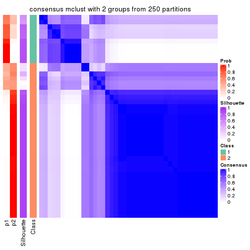</p>

</div>
<div id='tab-CV-mclust-consensus-heatmap-2'>
<pre><code class="r">consensus_heatmap(res, k = 3)
</code></pre>

<p>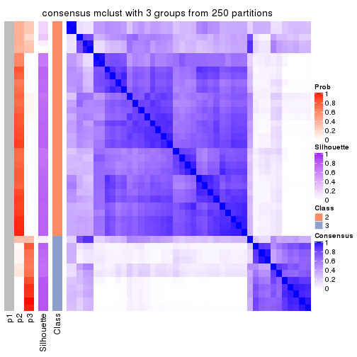</p>

</div>
<div id='tab-CV-mclust-consensus-heatmap-3'>
<pre><code class="r">consensus_heatmap(res, k = 4)
</code></pre>

<p>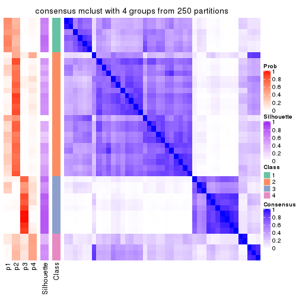</p>

</div>
<div id='tab-CV-mclust-consensus-heatmap-4'>
<pre><code class="r">consensus_heatmap(res, k = 5)
</code></pre>

<p>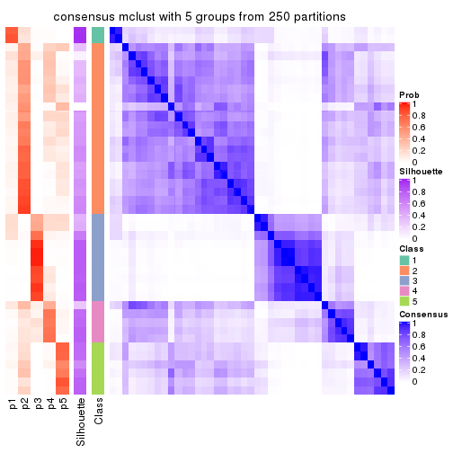</p>

</div>
<div id='tab-CV-mclust-consensus-heatmap-5'>
<pre><code class="r">consensus_heatmap(res, k = 6)
</code></pre>

<p>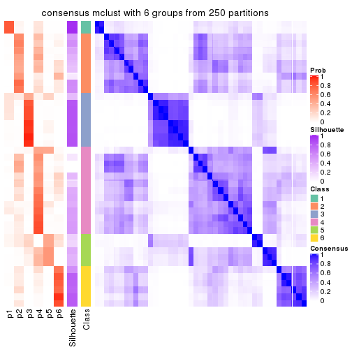</p>

</div>
</div>

Heatmaps for the membership of samples in all partitions to see how consistent they are:


<script>
$( function() {
	$( '#tabs-CV-mclust-membership-heatmap' ).tabs();
} );
</script>
<div id='tabs-CV-mclust-membership-heatmap'>
<ul>
<li><a href='#tab-CV-mclust-membership-heatmap-1'>k = 2</a></li>
<li><a href='#tab-CV-mclust-membership-heatmap-2'>k = 3</a></li>
<li><a href='#tab-CV-mclust-membership-heatmap-3'>k = 4</a></li>
<li><a href='#tab-CV-mclust-membership-heatmap-4'>k = 5</a></li>
<li><a href='#tab-CV-mclust-membership-heatmap-5'>k = 6</a></li>
</ul>
<div id='tab-CV-mclust-membership-heatmap-1'>
<pre><code class="r">membership_heatmap(res, k = 2)
</code></pre>

<p>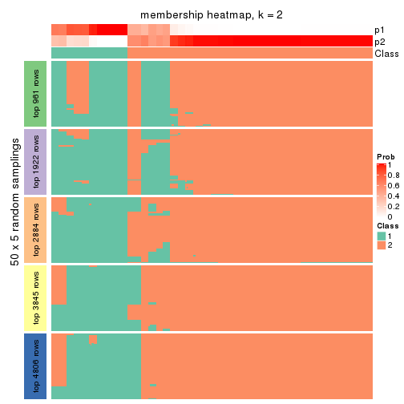</p>

</div>
<div id='tab-CV-mclust-membership-heatmap-2'>
<pre><code class="r">membership_heatmap(res, k = 3)
</code></pre>

<p>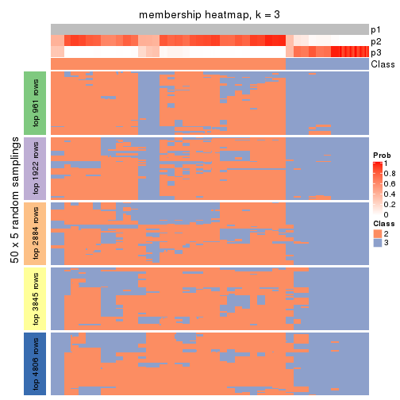</p>

</div>
<div id='tab-CV-mclust-membership-heatmap-3'>
<pre><code class="r">membership_heatmap(res, k = 4)
</code></pre>

<p>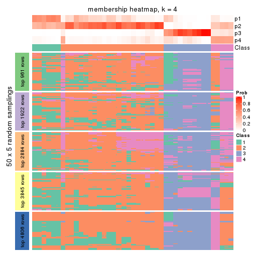</p>

</div>
<div id='tab-CV-mclust-membership-heatmap-4'>
<pre><code class="r">membership_heatmap(res, k = 5)
</code></pre>

<p>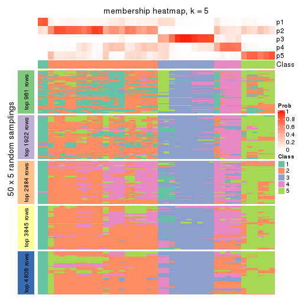</p>

</div>
<div id='tab-CV-mclust-membership-heatmap-5'>
<pre><code class="r">membership_heatmap(res, k = 6)
</code></pre>

<p>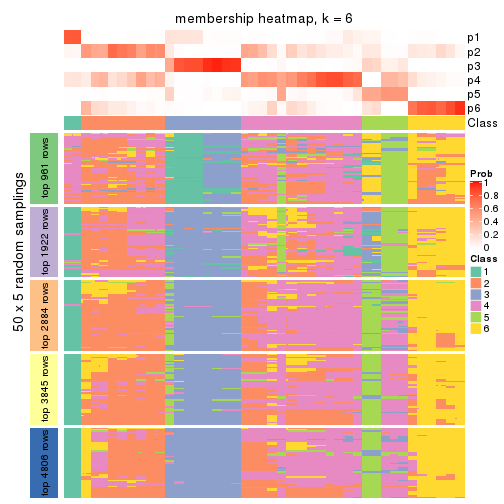</p>

</div>
</div>

As soon as we have had the classes for columns, we can look for signatures
which are significantly different between classes which can be candidate marks
for certain classes. Following are the heatmaps for signatures.


Signature heatmaps where rows are scaled:


<script>
$( function() {
	$( '#tabs-CV-mclust-get-signatures' ).tabs();
} );
</script>
<div id='tabs-CV-mclust-get-signatures'>
<ul>
<li><a href='#tab-CV-mclust-get-signatures-1'>k = 2</a></li>
<li><a href='#tab-CV-mclust-get-signatures-2'>k = 3</a></li>
<li><a href='#tab-CV-mclust-get-signatures-3'>k = 4</a></li>
<li><a href='#tab-CV-mclust-get-signatures-4'>k = 5</a></li>
<li><a href='#tab-CV-mclust-get-signatures-5'>k = 6</a></li>
</ul>
<div id='tab-CV-mclust-get-signatures-1'>
<pre><code class="r">get_signatures(res, k = 2)
</code></pre>

<p>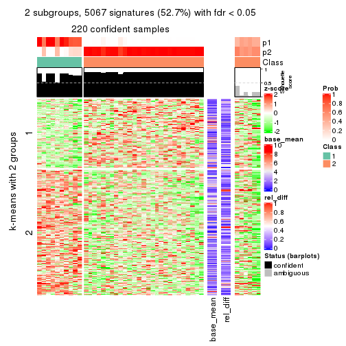</p>

</div>
<div id='tab-CV-mclust-get-signatures-2'>
<pre><code class="r">get_signatures(res, k = 3)
</code></pre>

<p>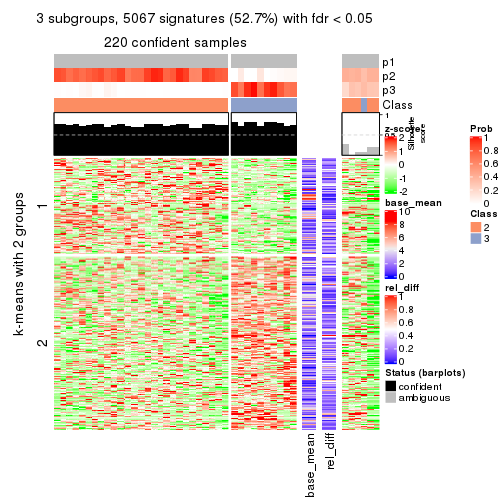</p>

</div>
<div id='tab-CV-mclust-get-signatures-3'>
<pre><code class="r">get_signatures(res, k = 4)
</code></pre>

<p>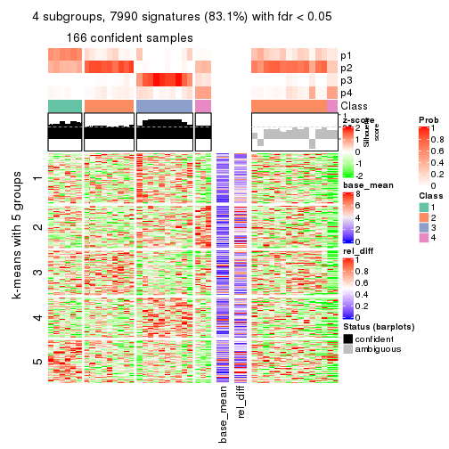</p>

</div>
<div id='tab-CV-mclust-get-signatures-4'>
<pre><code class="r">get_signatures(res, k = 5)
</code></pre>

<p>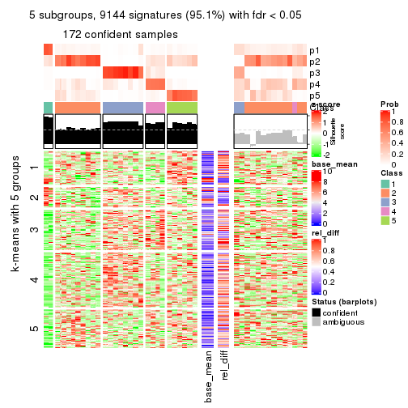</p>

</div>
<div id='tab-CV-mclust-get-signatures-5'>
<pre><code class="r">get_signatures(res, k = 6)
</code></pre>

<p>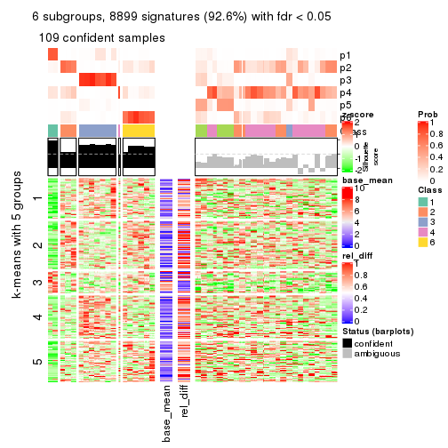</p>

</div>
</div>


Signature heatmaps where rows are not scaled:


<script>
$( function() {
	$( '#tabs-CV-mclust-get-signatures-no-scale' ).tabs();
} );
</script>
<div id='tabs-CV-mclust-get-signatures-no-scale'>
<ul>
<li><a href='#tab-CV-mclust-get-signatures-no-scale-1'>k = 2</a></li>
<li><a href='#tab-CV-mclust-get-signatures-no-scale-2'>k = 3</a></li>
<li><a href='#tab-CV-mclust-get-signatures-no-scale-3'>k = 4</a></li>
<li><a href='#tab-CV-mclust-get-signatures-no-scale-4'>k = 5</a></li>
<li><a href='#tab-CV-mclust-get-signatures-no-scale-5'>k = 6</a></li>
</ul>
<div id='tab-CV-mclust-get-signatures-no-scale-1'>
<pre><code class="r">get_signatures(res, k = 2, scale_rows = FALSE)
</code></pre>

<p>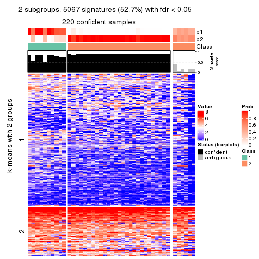</p>

</div>
<div id='tab-CV-mclust-get-signatures-no-scale-2'>
<pre><code class="r">get_signatures(res, k = 3, scale_rows = FALSE)
</code></pre>

<p>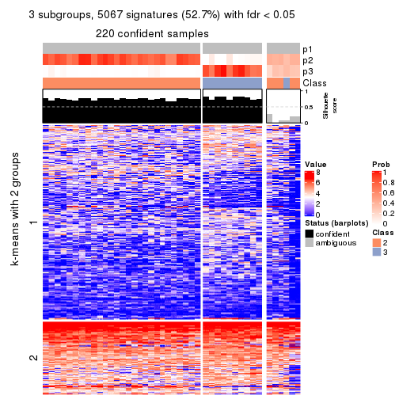</p>

</div>
<div id='tab-CV-mclust-get-signatures-no-scale-3'>
<pre><code class="r">get_signatures(res, k = 4, scale_rows = FALSE)
</code></pre>

<p>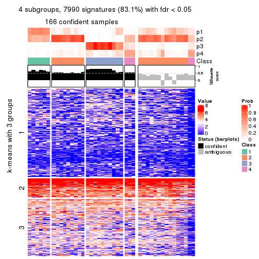</p>

</div>
<div id='tab-CV-mclust-get-signatures-no-scale-4'>
<pre><code class="r">get_signatures(res, k = 5, scale_rows = FALSE)
</code></pre>

<p>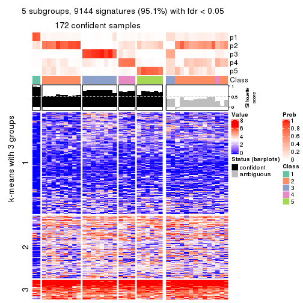</p>

</div>
<div id='tab-CV-mclust-get-signatures-no-scale-5'>
<pre><code class="r">get_signatures(res, k = 6, scale_rows = FALSE)
</code></pre>

<p>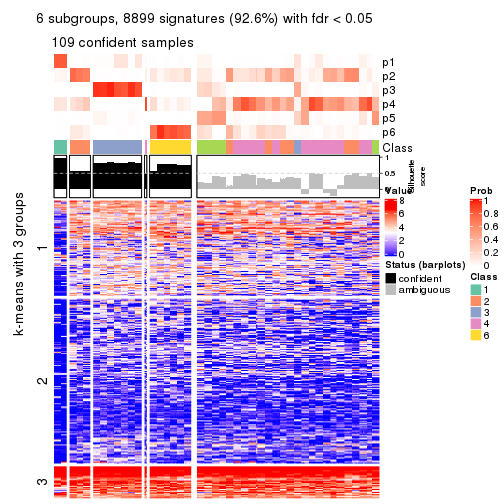</p>

</div>
</div>


Compare the overlap of signatures from different k:

```r
compare_signatures(res)
```

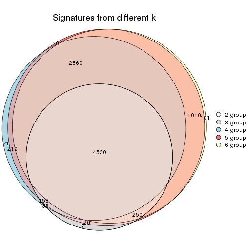

`get_signature()` returns a data frame invisibly. TO get the list of signatures, the function
call should be assigned to a variable explicitly. In following code, if `plot` argument is set
to `FALSE`, no heatmap is plotted while only the differential analysis is performed.

```r
# code only for demonstration
tb = get_signature(res, k = ..., plot = FALSE)
```

An example of the output of `tb` is:

```
#>   which_row         fdr    mean_1    mean_2 scaled_mean_1 scaled_mean_2 km
#> 1        38 0.042760348  8.373488  9.131774    -0.5533452     0.5164555  1
#> 2        40 0.018707592  7.106213  8.469186    -0.6173731     0.5762149  1
#> 3        55 0.019134737 10.221463 11.207825    -0.6159697     0.5749050  1
#> 4        59 0.006059896  5.921854  7.869574    -0.6899429     0.6439467  1
#> 5        60 0.018055526  8.928898 10.211722    -0.6204761     0.5791110  1
#> 6        98 0.009384629 15.714769 14.887706     0.6635654    -0.6193277  2
...
```

The columns in `tb` are:

1. `which_row`: row indices corresponding to the input matrix.
2. `fdr`: FDR for the differential test. 
3. `mean_x`: The mean value in group x.
4. `scaled_mean_x`: The mean value in group x after rows are scaled.
5. `km`: Row groups if k-means clustering is applied to rows.


UMAP plot which shows how samples are separated.


<script>
$( function() {
	$( '#tabs-CV-mclust-dimension-reduction' ).tabs();
} );
</script>
<div id='tabs-CV-mclust-dimension-reduction'>
<ul>
<li><a href='#tab-CV-mclust-dimension-reduction-1'>k = 2</a></li>
<li><a href='#tab-CV-mclust-dimension-reduction-2'>k = 3</a></li>
<li><a href='#tab-CV-mclust-dimension-reduction-3'>k = 4</a></li>
<li><a href='#tab-CV-mclust-dimension-reduction-4'>k = 5</a></li>
<li><a href='#tab-CV-mclust-dimension-reduction-5'>k = 6</a></li>
</ul>
<div id='tab-CV-mclust-dimension-reduction-1'>
<pre><code class="r">dimension_reduction(res, k = 2, method = &quot;UMAP&quot;)
</code></pre>

<p>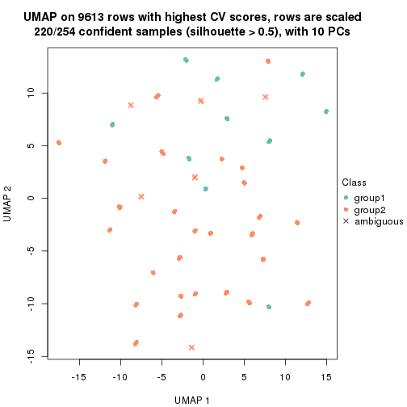</p>

</div>
<div id='tab-CV-mclust-dimension-reduction-2'>
<pre><code class="r">dimension_reduction(res, k = 3, method = &quot;UMAP&quot;)
</code></pre>

<p>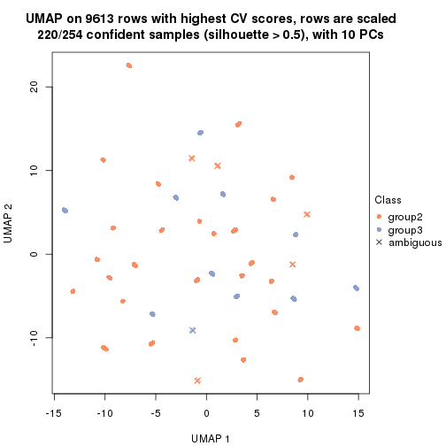</p>

</div>
<div id='tab-CV-mclust-dimension-reduction-3'>
<pre><code class="r">dimension_reduction(res, k = 4, method = &quot;UMAP&quot;)
</code></pre>

<p>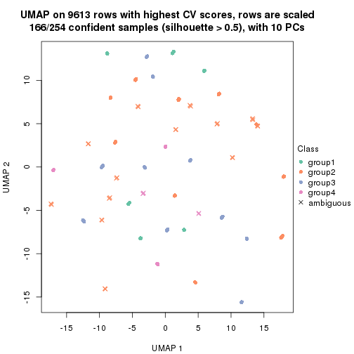</p>

</div>
<div id='tab-CV-mclust-dimension-reduction-4'>
<pre><code class="r">dimension_reduction(res, k = 5, method = &quot;UMAP&quot;)
</code></pre>

<p>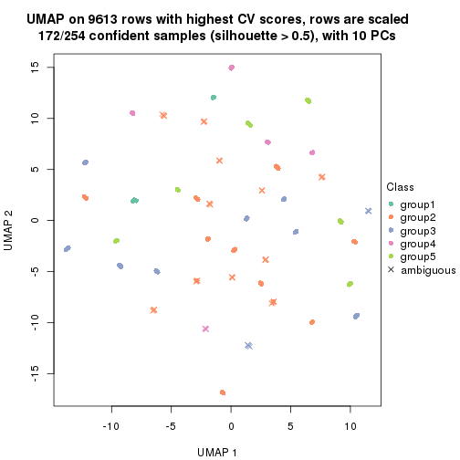</p>

</div>
<div id='tab-CV-mclust-dimension-reduction-5'>
<pre><code class="r">dimension_reduction(res, k = 6, method = &quot;UMAP&quot;)
</code></pre>

<p>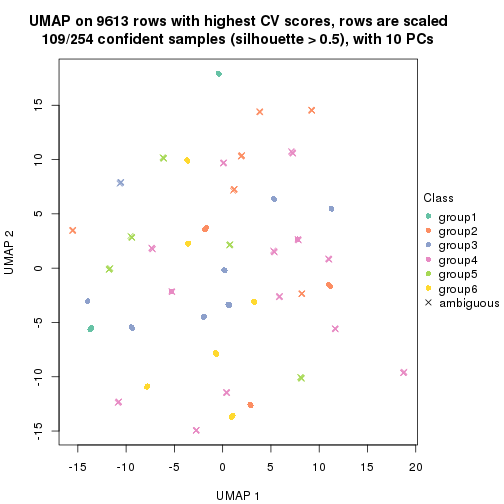</p>

</div>
</div>


Following heatmap shows how subgroups are split when increasing `k`:

```r
collect_classes(res)
```

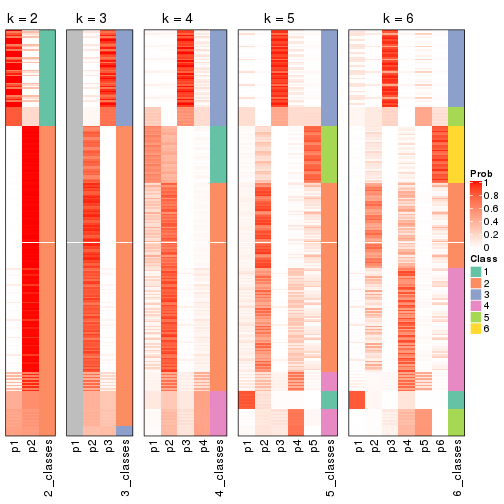


If matrix rows can be associated to genes, consider to use `GO_Enrichment(res,
...)` to perform function enrichment for the signature genes.


 

---------------------------------------------------


### CV:NMF


The object with results only for a single top-value method and a single partition method 
can be extracted as:

```r
res = res_list["CV", "NMF"]
# you can also extract it by
# res = res_list["CV:NMF"]
```

A summary of `res` and all the functions that can be applied to it:

```r
res
```

```
#> A 'ConsensusPartition' object with k = 2, 3, 4, 5, 6.
#>   On a matrix with 9613 rows and 254 columns.
#>   Top rows (961, 1922, 2884, 3845, 4806) are extracted by 'CV' method.
#>   Subgroups are detected by 'NMF' method.
#>   Performed in total 1250 partitions by row resampling.
#>   Best k for subgroups seems to be 2.
#> 
#> Following methods can be applied to this 'ConsensusPartition' object:
#>  [1] "cola_report"             "collect_classes"         "collect_plots"          
#>  [4] "collect_stats"           "colnames"                "compare_signatures"     
#>  [7] "consensus_heatmap"       "dimension_reduction"     "functional_enrichment"  
#> [10] "get_anno_col"            "get_anno"                "get_classes"            
#> [13] "get_consensus"           "get_matrix"              "get_membership"         
#> [16] "get_param"               "get_signatures"          "get_stats"              
#> [19] "is_best_k"               "is_stable_k"             "membership_heatmap"     
#> [22] "ncol"                    "nrow"                    "plot_ecdf"              
#> [25] "rownames"                "select_partition_number" "show"                   
#> [28] "suggest_best_k"          "test_to_known_factors"
```

`collect_plots()` function collects all the plots made from `res` for all `k` (number of partitions)
into one single page to provide an easy and fast comparison between different `k`.

```r
collect_plots(res)
```

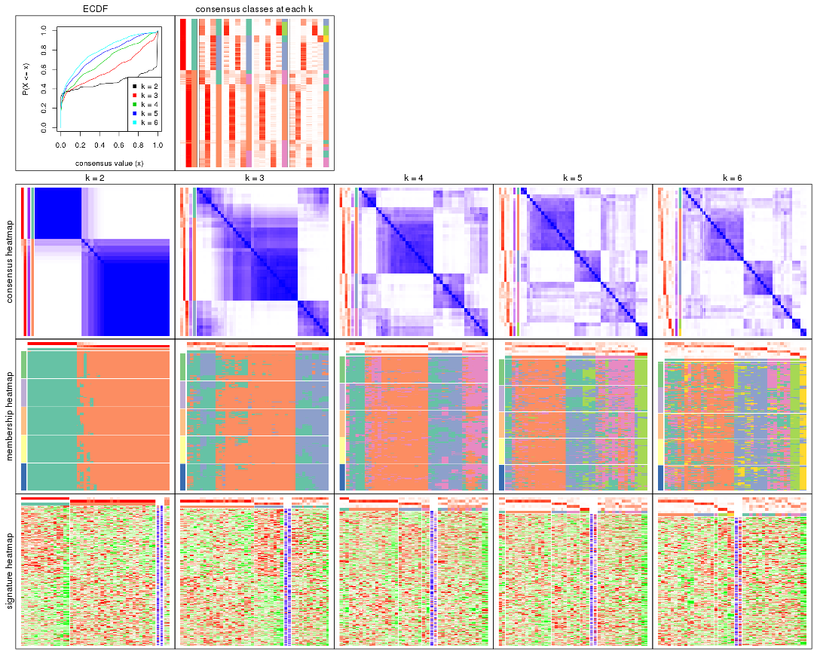

The plots are:

- The first row: a plot of the ECDF (Empirical cumulative distribution
  function) curves of the consensus matrix for each `k` and the heatmap of
  predicted classes for each `k`.
- The second row: heatmaps of the consensus matrix for each `k`.
- The third row: heatmaps of the membership matrix for each `k`.
- The fouth row: heatmaps of the signatures for each `k`.

All the plots in panels can be made by individual functions and they are
plotted later in this section.

`select_partition_number()` produces several plots showing different
statistics for choosing "optimized" `k`. There are following statistics:

- ECDF curves of the consensus matrix for each `k`;
- 1-PAC. [The PAC
  score](https://en.wikipedia.org/wiki/Consensus_clustering#Over-interpretation_potential_of_consensus_clustering)
  measures the proportion of the ambiguous subgrouping.
- Mean silhouette score.
- Concordance. The mean probability of fiting the consensus class ids in all
  partitions.
- Area increased. Denote $A_k$ as the area under the ECDF curve for current
  `k`, the area increased is defined as $A_k - A_{k-1}$.
- Rand index. The percent of pairs of samples that are both in a same cluster
  or both are not in a same cluster in the partition of k and k-1.
- Jaccard index. The ratio of pairs of samples are both in a same cluster in
  the partition of k and k-1 and the pairs of samples are both in a same
  cluster in the partition k or k-1.

The detailed explanations of these statistics can be found in [the cola
vignette](http://bioconductor.org/packages/devel/bioc/vignettes/cola/inst/doc/cola.html#toc_13).

Generally speaking, lower PAC score, higher mean silhouette score or higher
concordance corresponds to better partition. Rand index and Jaccard index
measure how similar the current partition is compared to partition with `k-1`.
If they are too similar, we won't accept `k` is better than `k-1`.

```r
select_partition_number(res)
```

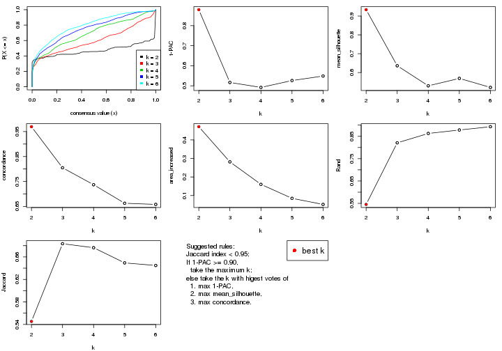

The numeric values for all these statistics can be obtained by `get_stats()`.

```r
get_stats(res)
```

```
#>   k 1-PAC mean_silhouette concordance area_increased  Rand Jaccard
#> 2 2 0.879           0.934       0.969         0.4711 0.545   0.545
#> 3 3 0.517           0.636       0.805         0.2815 0.821   0.683
#> 4 4 0.492           0.529       0.737         0.1602 0.863   0.676
#> 5 5 0.526           0.569       0.663         0.0848 0.878   0.649
#> 6 6 0.549           0.521       0.658         0.0520 0.893   0.645
```

`suggest_best_k()` suggests the best $k$ based on these statistics. The rules are as follows:

- All $k$ with Jaccard index larger than 0.95 are removed because the increase of
  the partition number does not provides enough extra information. If all $k$ are removed,
  the best $k$ is assigned by `NA`.
- For $k$ with 1-PAC larger than 0.9, the maximal $k$ is taken as the "best k". Other $k$ is called "optional k".
- If it does not fit the second rule. The $k$ with the highest vote of highest
  1-PAC, mean silhouette and concordance is taken as the "best k".

```r
suggest_best_k(res)
```

```
#> [1] 2
```


Following shows the table of the partitions (You need to click the **show/hide
code output** link to see it). The membership matrix (columns with name `p*`)
is inferred by
[`clue::cl_consensus()`](https://www.rdocumentation.org/link/cl_consensus?package=clue)
function with the `SE` method. Basically the value in the membership matrix
represents the probability to belong to a certain group. The finall class
label for an item is determined with the group with highest probability it
belongs to.

In `get_classes()` function, the entropy is calculated from the membership
matrix and the silhouette score is calculated from the consensus matrix.


<script>
$( function() {
	$( '#tabs-CV-NMF-get-classes' ).tabs();
} );
</script>
<div id='tabs-CV-NMF-get-classes'>
<ul>
<li><a href='#tab-CV-NMF-get-classes-1'>k = 2</a></li>
<li><a href='#tab-CV-NMF-get-classes-2'>k = 3</a></li>
<li><a href='#tab-CV-NMF-get-classes-3'>k = 4</a></li>
<li><a href='#tab-CV-NMF-get-classes-4'>k = 5</a></li>
<li><a href='#tab-CV-NMF-get-classes-5'>k = 6</a></li>
</ul>

<div id='tab-CV-NMF-get-classes-1'>
<p><a id='tab-CV-NMF-get-classes-1-a' style='color:#0366d6' href='#'>show/hide code output</a></p>
<pre><code class="r">cbind(get_classes(res, k = 2), get_membership(res, k = 2))
</code></pre>

<pre><code>#&gt;           class entropy silhouette    p1    p2
#&gt; DRR024803     1  0.0000      1.000 1.000 0.000
#&gt; DRR024804     2  0.0000      0.952 0.000 1.000
#&gt; DRR024805     2  0.0000      0.952 0.000 1.000
#&gt; DRR024806     2  0.0000      0.952 0.000 1.000
#&gt; DRR024807     1  0.0376      0.996 0.996 0.004
#&gt; DRR024808     1  0.0000      1.000 1.000 0.000
#&gt; DRR024809     2  0.0000      0.952 0.000 1.000
#&gt; DRR024810     2  0.0000      0.952 0.000 1.000
#&gt; DRR024811     1  0.0000      1.000 1.000 0.000
#&gt; DRR024812     2  0.0000      0.952 0.000 1.000
#&gt; DRR024813     2  0.5629      0.846 0.132 0.868
#&gt; DRR024814     2  0.0000      0.952 0.000 1.000
#&gt; DRR024815     2  0.0672      0.947 0.008 0.992
#&gt; DRR024816     2  0.0000      0.952 0.000 1.000
#&gt; DRR024817     2  0.4815      0.873 0.104 0.896
#&gt; DRR024818     1  0.0000      1.000 1.000 0.000
#&gt; DRR024819     2  0.7056      0.771 0.192 0.808
#&gt; DRR024820     1  0.0000      1.000 1.000 0.000
#&gt; DRR024821     1  0.0000      1.000 1.000 0.000
#&gt; DRR024822     2  0.0000      0.952 0.000 1.000
#&gt; DRR024824     2  0.0000      0.952 0.000 1.000
#&gt; DRR024825     1  0.0000      1.000 1.000 0.000
#&gt; DRR024826     2  0.9248      0.536 0.340 0.660
#&gt; DRR024827     1  0.0000      1.000 1.000 0.000
#&gt; DRR024828     1  0.0000      1.000 1.000 0.000
#&gt; DRR024829     2  0.0000      0.952 0.000 1.000
#&gt; DRR024830     2  0.0000      0.952 0.000 1.000
#&gt; DRR024831     1  0.0000      1.000 1.000 0.000
#&gt; DRR024832     1  0.0000      1.000 1.000 0.000
#&gt; DRR024833     2  0.2236      0.930 0.036 0.964
#&gt; DRR024834     2  0.0000      0.952 0.000 1.000
#&gt; DRR024835     2  0.9460      0.482 0.364 0.636
#&gt; DRR024836     1  0.0000      1.000 1.000 0.000
#&gt; DRR024837     2  0.0000      0.952 0.000 1.000
#&gt; DRR024838     2  0.0000      0.952 0.000 1.000
#&gt; DRR024839     2  0.0000      0.952 0.000 1.000
#&gt; DRR024840     2  0.0000      0.952 0.000 1.000
#&gt; DRR024841     2  0.0000      0.952 0.000 1.000
#&gt; DRR024842     2  0.0000      0.952 0.000 1.000
#&gt; DRR024843     1  0.0000      1.000 1.000 0.000
#&gt; DRR024844     2  0.0000      0.952 0.000 1.000
#&gt; DRR024845     2  0.0000      0.952 0.000 1.000
#&gt; DRR024846     2  0.0000      0.952 0.000 1.000
#&gt; DRR024847     1  0.0376      0.996 0.996 0.004
#&gt; DRR024848     1  0.0000      1.000 1.000 0.000
#&gt; DRR024849     1  0.0000      1.000 1.000 0.000
#&gt; DRR024850     2  0.0000      0.952 0.000 1.000
#&gt; DRR024851     2  0.0000      0.952 0.000 1.000
#&gt; DRR024852     2  0.0000      0.952 0.000 1.000
#&gt; DRR024853     1  0.0000      1.000 1.000 0.000
#&gt; DRR024854     2  0.0000      0.952 0.000 1.000
#&gt; DRR024855     2  0.7056      0.777 0.192 0.808
#&gt; DRR024856     2  0.0000      0.952 0.000 1.000
#&gt; DRR024857     2  0.0938      0.945 0.012 0.988
#&gt; DRR024858     2  0.0000      0.952 0.000 1.000
#&gt; DRR024859     2  0.4690      0.876 0.100 0.900
#&gt; DRR024860     1  0.0000      1.000 1.000 0.000
#&gt; DRR024861     2  0.6973      0.776 0.188 0.812
#&gt; DRR024862     1  0.0000      1.000 1.000 0.000
#&gt; DRR024863     1  0.0000      1.000 1.000 0.000
#&gt; DRR024864     2  0.0000      0.952 0.000 1.000
#&gt; DRR024865     2  0.0000      0.952 0.000 1.000
#&gt; DRR024866     2  0.0000      0.952 0.000 1.000
#&gt; DRR024867     1  0.0000      1.000 1.000 0.000
#&gt; DRR024868     2  0.9248      0.537 0.340 0.660
#&gt; DRR024869     1  0.0000      1.000 1.000 0.000
#&gt; DRR024870     1  0.0000      1.000 1.000 0.000
#&gt; DRR024871     2  0.0000      0.952 0.000 1.000
#&gt; DRR024872     2  0.0000      0.952 0.000 1.000
#&gt; DRR024873     1  0.0000      1.000 1.000 0.000
#&gt; DRR024874     1  0.0000      1.000 1.000 0.000
#&gt; DRR024875     2  0.2603      0.924 0.044 0.956
#&gt; DRR024876     2  0.0000      0.952 0.000 1.000
#&gt; DRR024877     2  0.9775      0.367 0.412 0.588
#&gt; DRR024878     1  0.0000      1.000 1.000 0.000
#&gt; DRR024879     2  0.0000      0.952 0.000 1.000
#&gt; DRR024880     2  0.0000      0.952 0.000 1.000
#&gt; DRR024881     2  0.0000      0.952 0.000 1.000
#&gt; DRR024882     2  0.0000      0.952 0.000 1.000
#&gt; DRR024883     2  0.0000      0.952 0.000 1.000
#&gt; DRR024884     2  0.0000      0.952 0.000 1.000
#&gt; DRR024885     1  0.0000      1.000 1.000 0.000
#&gt; DRR024886     1  0.0000      1.000 1.000 0.000
#&gt; DRR024887     2  0.0000      0.952 0.000 1.000
#&gt; DRR024888     2  0.0000      0.952 0.000 1.000
#&gt; DRR024889     2  0.0000      0.952 0.000 1.000
#&gt; DRR024890     1  0.0376      0.996 0.996 0.004
#&gt; DRR024891     1  0.0000      1.000 1.000 0.000
#&gt; DRR024892     1  0.0000      1.000 1.000 0.000
#&gt; DRR024893     2  0.0000      0.952 0.000 1.000
#&gt; DRR024894     2  0.0000      0.952 0.000 1.000
#&gt; DRR024895     2  0.0000      0.952 0.000 1.000
#&gt; DRR024896     1  0.0000      1.000 1.000 0.000
#&gt; DRR024897     2  0.0000      0.952 0.000 1.000
#&gt; DRR024898     2  0.6801      0.792 0.180 0.820
#&gt; DRR024899     2  0.0000      0.952 0.000 1.000
#&gt; DRR024900     2  0.0938      0.945 0.012 0.988
#&gt; DRR024901     2  0.0000      0.952 0.000 1.000
#&gt; DRR024902     2  0.4562      0.880 0.096 0.904
#&gt; DRR024903     1  0.0000      1.000 1.000 0.000
#&gt; DRR024904     2  0.6887      0.780 0.184 0.816
#&gt; DRR024905     1  0.0000      1.000 1.000 0.000
#&gt; DRR024906     1  0.0000      1.000 1.000 0.000
#&gt; DRR024907     2  0.0000      0.952 0.000 1.000
#&gt; DRR024908     2  0.0000      0.952 0.000 1.000
#&gt; DRR024909     2  0.0000      0.952 0.000 1.000
#&gt; DRR024910     1  0.0000      1.000 1.000 0.000
#&gt; DRR024911     2  0.9963      0.216 0.464 0.536
#&gt; DRR024912     1  0.0000      1.000 1.000 0.000
#&gt; DRR024913     1  0.0000      1.000 1.000 0.000
#&gt; DRR024914     2  0.0000      0.952 0.000 1.000
#&gt; DRR024915     2  0.0000      0.952 0.000 1.000
#&gt; DRR024916     1  0.0000      1.000 1.000 0.000
#&gt; DRR024917     1  0.0000      1.000 1.000 0.000
#&gt; DRR024918     2  0.2603      0.924 0.044 0.956
#&gt; DRR024919     2  0.0000      0.952 0.000 1.000
#&gt; DRR024920     2  0.9732      0.388 0.404 0.596
#&gt; DRR024921     1  0.0000      1.000 1.000 0.000
#&gt; DRR024922     2  0.0000      0.952 0.000 1.000
#&gt; DRR024923     2  0.0000      0.952 0.000 1.000
#&gt; DRR024924     2  0.0000      0.952 0.000 1.000
#&gt; DRR024925     2  0.0000      0.952 0.000 1.000
#&gt; DRR024926     2  0.0000      0.952 0.000 1.000
#&gt; DRR024927     2  0.0000      0.952 0.000 1.000
#&gt; DRR024928     1  0.0000      1.000 1.000 0.000
#&gt; DRR024929     1  0.0000      1.000 1.000 0.000
#&gt; DRR024930     2  0.0000      0.952 0.000 1.000
#&gt; DRR024931     2  0.0000      0.952 0.000 1.000
#&gt; DRR024932     2  0.0000      0.952 0.000 1.000
#&gt; DRR024933     1  0.0376      0.996 0.996 0.004
#&gt; DRR024934     1  0.0000      1.000 1.000 0.000
#&gt; DRR024935     1  0.0000      1.000 1.000 0.000
#&gt; DRR024936     2  0.0000      0.952 0.000 1.000
#&gt; DRR024937     2  0.0000      0.952 0.000 1.000
#&gt; DRR024938     2  0.0000      0.952 0.000 1.000
#&gt; DRR024939     1  0.0000      1.000 1.000 0.000
#&gt; DRR024940     2  0.0000      0.952 0.000 1.000
#&gt; DRR024941     2  0.7139      0.773 0.196 0.804
#&gt; DRR024942     2  0.0000      0.952 0.000 1.000
#&gt; DRR024943     2  0.0938      0.945 0.012 0.988
#&gt; DRR024944     2  0.0000      0.952 0.000 1.000
#&gt; DRR024945     2  0.4431      0.884 0.092 0.908
#&gt; DRR024946     1  0.0000      1.000 1.000 0.000
#&gt; DRR024947     2  0.7139      0.765 0.196 0.804
#&gt; DRR024948     1  0.0000      1.000 1.000 0.000
#&gt; DRR024949     1  0.0000      1.000 1.000 0.000
#&gt; DRR024950     2  0.0000      0.952 0.000 1.000
#&gt; DRR024951     2  0.0000      0.952 0.000 1.000
#&gt; DRR024952     2  0.0000      0.952 0.000 1.000
#&gt; DRR024953     1  0.0000      1.000 1.000 0.000
#&gt; DRR024954     2  0.9608      0.440 0.384 0.616
#&gt; DRR024955     1  0.0000      1.000 1.000 0.000
#&gt; DRR024956     1  0.0000      1.000 1.000 0.000
#&gt; DRR024957     2  0.0000      0.952 0.000 1.000
#&gt; DRR024958     2  0.0000      0.952 0.000 1.000
#&gt; DRR024959     1  0.0000      1.000 1.000 0.000
#&gt; DRR024960     1  0.0000      1.000 1.000 0.000
#&gt; DRR024961     2  0.2603      0.924 0.044 0.956
#&gt; DRR024962     2  0.0000      0.952 0.000 1.000
#&gt; DRR024963     2  0.9635      0.427 0.388 0.612
#&gt; DRR024964     1  0.0000      1.000 1.000 0.000
#&gt; DRR024965     2  0.0000      0.952 0.000 1.000
#&gt; DRR024966     2  0.0000      0.952 0.000 1.000
#&gt; DRR024967     2  0.0000      0.952 0.000 1.000
#&gt; DRR024968     2  0.0000      0.952 0.000 1.000
#&gt; DRR024969     2  0.0000      0.952 0.000 1.000
#&gt; DRR024970     2  0.0000      0.952 0.000 1.000
#&gt; DRR024971     1  0.0000      1.000 1.000 0.000
#&gt; DRR024972     1  0.0000      1.000 1.000 0.000
#&gt; DRR024973     2  0.0000      0.952 0.000 1.000
#&gt; DRR024974     2  0.0000      0.952 0.000 1.000
#&gt; DRR024975     2  0.0000      0.952 0.000 1.000
#&gt; DRR024976     1  0.0672      0.992 0.992 0.008
#&gt; DRR024977     1  0.0000      1.000 1.000 0.000
#&gt; DRR024978     1  0.0000      1.000 1.000 0.000
#&gt; DRR024979     2  0.0000      0.952 0.000 1.000
#&gt; DRR024980     2  0.0000      0.952 0.000 1.000
#&gt; DRR024981     2  0.0000      0.952 0.000 1.000
#&gt; DRR024982     1  0.0000      1.000 1.000 0.000
#&gt; DRR024983     2  0.0000      0.952 0.000 1.000
#&gt; DRR024984     2  0.5946      0.832 0.144 0.856
#&gt; DRR024985     2  0.0000      0.952 0.000 1.000
#&gt; DRR024986     2  0.1184      0.942 0.016 0.984
#&gt; DRR024987     2  0.0000      0.952 0.000 1.000
#&gt; DRR024988     2  0.4690      0.876 0.100 0.900
#&gt; DRR024989     1  0.0000      1.000 1.000 0.000
#&gt; DRR024990     2  0.7056      0.771 0.192 0.808
#&gt; DRR024991     1  0.0000      1.000 1.000 0.000
#&gt; DRR024992     1  0.0000      1.000 1.000 0.000
#&gt; DRR024993     2  0.0000      0.952 0.000 1.000
#&gt; DRR024994     2  0.0000      0.952 0.000 1.000
#&gt; DRR024995     2  0.0000      0.952 0.000 1.000
#&gt; DRR024996     1  0.0000      1.000 1.000 0.000
#&gt; DRR024997     2  0.9635      0.431 0.388 0.612
#&gt; DRR024998     1  0.0000      1.000 1.000 0.000
#&gt; DRR024999     1  0.0000      1.000 1.000 0.000
#&gt; DRR025000     2  0.0000      0.952 0.000 1.000
#&gt; DRR025001     2  0.0000      0.952 0.000 1.000
#&gt; DRR025002     1  0.0000      1.000 1.000 0.000
#&gt; DRR025003     1  0.0000      1.000 1.000 0.000
#&gt; DRR025004     2  0.2603      0.924 0.044 0.956
#&gt; DRR025005     2  0.0000      0.952 0.000 1.000
#&gt; DRR025006     2  0.9661      0.417 0.392 0.608
#&gt; DRR025007     1  0.0000      1.000 1.000 0.000
#&gt; DRR025008     2  0.0000      0.952 0.000 1.000
#&gt; DRR025009     2  0.0000      0.952 0.000 1.000
#&gt; DRR025010     2  0.0000      0.952 0.000 1.000
#&gt; DRR025011     2  0.0000      0.952 0.000 1.000
#&gt; DRR025012     2  0.0000      0.952 0.000 1.000
#&gt; DRR025013     2  0.0000      0.952 0.000 1.000
#&gt; DRR025014     1  0.0000      1.000 1.000 0.000
#&gt; DRR025015     1  0.0000      1.000 1.000 0.000
#&gt; DRR025016     2  0.0000      0.952 0.000 1.000
#&gt; DRR025017     2  0.0000      0.952 0.000 1.000
#&gt; DRR025018     2  0.0000      0.952 0.000 1.000
#&gt; DRR025019     1  0.0376      0.996 0.996 0.004
#&gt; DRR025020     1  0.0000      1.000 1.000 0.000
#&gt; DRR025021     1  0.0000      1.000 1.000 0.000
#&gt; DRR025022     2  0.0000      0.952 0.000 1.000
#&gt; DRR025023     2  0.0000      0.952 0.000 1.000
#&gt; DRR025024     2  0.0000      0.952 0.000 1.000
#&gt; DRR025025     1  0.0000      1.000 1.000 0.000
#&gt; DRR025026     2  0.0000      0.952 0.000 1.000
#&gt; DRR025027     2  0.7745      0.730 0.228 0.772
#&gt; DRR025028     2  0.0000      0.952 0.000 1.000
#&gt; DRR025029     2  0.0938      0.945 0.012 0.988
#&gt; DRR025030     2  0.0000      0.952 0.000 1.000
#&gt; DRR025031     2  0.5059      0.865 0.112 0.888
#&gt; DRR025032     1  0.0000      1.000 1.000 0.000
#&gt; DRR025033     2  0.6801      0.785 0.180 0.820
#&gt; DRR025034     1  0.0000      1.000 1.000 0.000
#&gt; DRR025035     1  0.0000      1.000 1.000 0.000
#&gt; DRR025036     2  0.0000      0.952 0.000 1.000
#&gt; DRR025037     2  0.0000      0.952 0.000 1.000
#&gt; DRR025038     2  0.0000      0.952 0.000 1.000
#&gt; DRR025039     1  0.0000      1.000 1.000 0.000
#&gt; DRR025040     2  0.9491      0.477 0.368 0.632
#&gt; DRR025041     1  0.0000      1.000 1.000 0.000
#&gt; DRR025042     1  0.0000      1.000 1.000 0.000
#&gt; DRR025043     2  0.0000      0.952 0.000 1.000
#&gt; DRR025044     2  0.0000      0.952 0.000 1.000
#&gt; DRR025045     1  0.0000      1.000 1.000 0.000
#&gt; DRR025046     1  0.0000      1.000 1.000 0.000
#&gt; DRR025047     2  0.2603      0.924 0.044 0.956
#&gt; DRR025048     2  0.0000      0.952 0.000 1.000
#&gt; DRR025049     2  0.9427      0.490 0.360 0.640
#&gt; DRR025050     1  0.0000      1.000 1.000 0.000
#&gt; DRR025051     2  0.0000      0.952 0.000 1.000
#&gt; DRR025052     2  0.0000      0.952 0.000 1.000
#&gt; DRR025053     2  0.0000      0.952 0.000 1.000
#&gt; DRR025054     2  0.0000      0.952 0.000 1.000
#&gt; DRR025055     2  0.0000      0.952 0.000 1.000
#&gt; DRR025056     2  0.0000      0.952 0.000 1.000
#&gt; DRR025057     1  0.0000      1.000 1.000 0.000
</code></pre>

<script>
$('#tab-CV-NMF-get-classes-1-a').parent().next().next().hide();
$('#tab-CV-NMF-get-classes-1-a').click(function(){
  $('#tab-CV-NMF-get-classes-1-a').parent().next().next().toggle();
  return(false);
});
</script>
</div>

<div id='tab-CV-NMF-get-classes-2'>
<p><a id='tab-CV-NMF-get-classes-2-a' style='color:#0366d6' href='#'>show/hide code output</a></p>
<pre><code class="r">cbind(get_classes(res, k = 3), get_membership(res, k = 3))
</code></pre>

<pre><code>#&gt;           class entropy silhouette    p1    p2    p3
#&gt; DRR024803     3  0.6204     0.5098 0.424 0.000 0.576
#&gt; DRR024804     2  0.3091     0.8635 0.072 0.912 0.016
#&gt; DRR024805     2  0.1647     0.8608 0.004 0.960 0.036
#&gt; DRR024806     2  0.0848     0.8743 0.008 0.984 0.008
#&gt; DRR024807     3  0.3780     0.5938 0.044 0.064 0.892
#&gt; DRR024808     3  0.6260     0.3339 0.448 0.000 0.552
#&gt; DRR024809     2  0.0747     0.8771 0.016 0.984 0.000
#&gt; DRR024810     2  0.0747     0.8768 0.016 0.984 0.000
#&gt; DRR024811     3  0.3686     0.6739 0.140 0.000 0.860
#&gt; DRR024812     2  0.0000     0.8751 0.000 1.000 0.000
#&gt; DRR024813     2  0.8263     0.5717 0.268 0.612 0.120
#&gt; DRR024814     2  0.5291     0.7454 0.268 0.732 0.000
#&gt; DRR024815     2  0.6267     0.4660 0.452 0.548 0.000
#&gt; DRR024816     2  0.0237     0.8748 0.004 0.996 0.000
#&gt; DRR024817     1  0.6622     0.4337 0.748 0.164 0.088
#&gt; DRR024818     3  0.5267     0.6470 0.140 0.044 0.816
#&gt; DRR024819     1  0.7351     0.4334 0.664 0.268 0.068
#&gt; DRR024820     1  0.5178     0.3663 0.744 0.000 0.256
#&gt; DRR024821     3  0.5968     0.5879 0.364 0.000 0.636
#&gt; DRR024822     2  0.0237     0.8748 0.004 0.996 0.000
#&gt; DRR024824     2  0.0475     0.8755 0.004 0.992 0.004
#&gt; DRR024825     1  0.6280    -0.1028 0.540 0.000 0.460
#&gt; DRR024826     1  0.7784     0.0916 0.556 0.388 0.056
#&gt; DRR024827     1  0.5760     0.2774 0.672 0.000 0.328
#&gt; DRR024828     3  0.2681     0.6287 0.040 0.028 0.932
#&gt; DRR024829     2  0.4974     0.7768 0.236 0.764 0.000
#&gt; DRR024830     2  0.1015     0.8720 0.008 0.980 0.012
#&gt; DRR024831     3  0.1753     0.6764 0.048 0.000 0.952
#&gt; DRR024832     3  0.5621     0.6247 0.308 0.000 0.692
#&gt; DRR024833     2  0.4261     0.8318 0.140 0.848 0.012
#&gt; DRR024834     2  0.0592     0.8773 0.012 0.988 0.000
#&gt; DRR024835     1  0.3337     0.4500 0.908 0.032 0.060
#&gt; DRR024836     3  0.6045     0.5050 0.380 0.000 0.620
#&gt; DRR024837     2  0.0424     0.8769 0.008 0.992 0.000
#&gt; DRR024838     2  0.5291     0.7483 0.268 0.732 0.000
#&gt; DRR024839     2  0.1860     0.8735 0.052 0.948 0.000
#&gt; DRR024840     2  0.2945     0.8236 0.004 0.908 0.088
#&gt; DRR024841     2  0.4351     0.8249 0.168 0.828 0.004
#&gt; DRR024842     2  0.1031     0.8773 0.024 0.976 0.000
#&gt; DRR024843     3  0.6204     0.5098 0.424 0.000 0.576
#&gt; DRR024844     2  0.3272     0.8609 0.080 0.904 0.016
#&gt; DRR024845     2  0.1765     0.8589 0.004 0.956 0.040
#&gt; DRR024846     2  0.0848     0.8743 0.008 0.984 0.008
#&gt; DRR024847     3  0.3780     0.5938 0.044 0.064 0.892
#&gt; DRR024848     1  0.6295    -0.2153 0.528 0.000 0.472
#&gt; DRR024849     3  0.6260     0.3449 0.448 0.000 0.552
#&gt; DRR024850     2  0.0237     0.8759 0.004 0.996 0.000
#&gt; DRR024851     2  0.1031     0.8764 0.024 0.976 0.000
#&gt; DRR024852     2  0.0747     0.8768 0.016 0.984 0.000
#&gt; DRR024853     3  0.3686     0.6739 0.140 0.000 0.860
#&gt; DRR024854     2  0.0237     0.8748 0.000 0.996 0.004
#&gt; DRR024855     2  0.8703     0.5179 0.256 0.584 0.160
#&gt; DRR024856     2  0.5291     0.7454 0.268 0.732 0.000
#&gt; DRR024857     2  0.6676     0.3925 0.476 0.516 0.008
#&gt; DRR024858     2  0.0237     0.8748 0.004 0.996 0.000
#&gt; DRR024859     1  0.6510     0.4364 0.756 0.156 0.088
#&gt; DRR024860     3  0.5307     0.6420 0.136 0.048 0.816
#&gt; DRR024861     1  0.7384     0.4310 0.660 0.272 0.068
#&gt; DRR024862     1  0.5178     0.3663 0.744 0.000 0.256
#&gt; DRR024863     3  0.5968     0.5879 0.364 0.000 0.636
#&gt; DRR024864     2  0.0237     0.8748 0.004 0.996 0.000
#&gt; DRR024865     2  0.3879     0.8321 0.152 0.848 0.000
#&gt; DRR024866     2  0.0475     0.8755 0.004 0.992 0.004
#&gt; DRR024867     1  0.6280    -0.1028 0.540 0.000 0.460
#&gt; DRR024868     1  0.7693     0.1748 0.580 0.364 0.056
#&gt; DRR024869     1  0.5760     0.2774 0.672 0.000 0.328
#&gt; DRR024870     3  0.2681     0.6287 0.040 0.028 0.932
#&gt; DRR024871     2  0.4974     0.7768 0.236 0.764 0.000
#&gt; DRR024872     2  0.0848     0.8735 0.008 0.984 0.008
#&gt; DRR024873     3  0.1753     0.6764 0.048 0.000 0.952
#&gt; DRR024874     3  0.5560     0.6301 0.300 0.000 0.700
#&gt; DRR024875     2  0.4615     0.8245 0.144 0.836 0.020
#&gt; DRR024876     2  0.0592     0.8773 0.012 0.988 0.000
#&gt; DRR024877     1  0.3356     0.4523 0.908 0.036 0.056
#&gt; DRR024878     3  0.6008     0.5153 0.372 0.000 0.628
#&gt; DRR024879     2  0.0424     0.8769 0.008 0.992 0.000
#&gt; DRR024880     2  0.5291     0.7483 0.268 0.732 0.000
#&gt; DRR024881     2  0.1643     0.8745 0.044 0.956 0.000
#&gt; DRR024882     2  0.3573     0.7940 0.004 0.876 0.120
#&gt; DRR024883     2  0.4409     0.8226 0.172 0.824 0.004
#&gt; DRR024884     2  0.6204     0.5355 0.424 0.576 0.000
#&gt; DRR024885     1  0.5760     0.2783 0.672 0.000 0.328
#&gt; DRR024886     3  0.6204     0.5098 0.424 0.000 0.576
#&gt; DRR024887     2  0.3325     0.8614 0.076 0.904 0.020
#&gt; DRR024888     2  0.1647     0.8608 0.004 0.960 0.036
#&gt; DRR024889     2  0.0848     0.8743 0.008 0.984 0.008
#&gt; DRR024890     3  0.3683     0.5979 0.044 0.060 0.896
#&gt; DRR024891     1  0.6295    -0.2153 0.528 0.000 0.472
#&gt; DRR024892     3  0.6260     0.3339 0.448 0.000 0.552
#&gt; DRR024893     2  0.0424     0.8766 0.008 0.992 0.000
#&gt; DRR024894     2  0.1031     0.8764 0.024 0.976 0.000
#&gt; DRR024895     2  0.0747     0.8768 0.016 0.984 0.000
#&gt; DRR024896     3  0.3686     0.6739 0.140 0.000 0.860
#&gt; DRR024897     2  0.0237     0.8748 0.000 0.996 0.004
#&gt; DRR024898     2  0.8743     0.5044 0.268 0.576 0.156
#&gt; DRR024899     2  0.5291     0.7454 0.268 0.732 0.000
#&gt; DRR024900     2  0.6676     0.3925 0.476 0.516 0.008
#&gt; DRR024901     2  0.0237     0.8748 0.004 0.996 0.000
#&gt; DRR024902     1  0.6393     0.4378 0.764 0.148 0.088
#&gt; DRR024903     3  0.5202     0.6459 0.136 0.044 0.820
#&gt; DRR024904     1  0.7233     0.4359 0.672 0.264 0.064
#&gt; DRR024905     1  0.5178     0.3663 0.744 0.000 0.256
#&gt; DRR024906     3  0.5968     0.5879 0.364 0.000 0.636
#&gt; DRR024907     2  0.0237     0.8748 0.004 0.996 0.000
#&gt; DRR024908     2  0.3879     0.8321 0.152 0.848 0.000
#&gt; DRR024909     2  0.0475     0.8755 0.004 0.992 0.004
#&gt; DRR024910     1  0.6280    -0.1028 0.540 0.000 0.460
#&gt; DRR024911     1  0.8137     0.3412 0.592 0.316 0.092
#&gt; DRR024912     1  0.5760     0.2774 0.672 0.000 0.328
#&gt; DRR024913     3  0.2681     0.6287 0.040 0.028 0.932
#&gt; DRR024914     2  0.4974     0.7768 0.236 0.764 0.000
#&gt; DRR024915     2  0.1015     0.8720 0.008 0.980 0.012
#&gt; DRR024916     3  0.1753     0.6764 0.048 0.000 0.952
#&gt; DRR024917     3  0.5591     0.6277 0.304 0.000 0.696
#&gt; DRR024918     2  0.4999     0.8143 0.152 0.820 0.028
#&gt; DRR024919     2  0.0592     0.8773 0.012 0.988 0.000
#&gt; DRR024920     1  0.3337     0.4500 0.908 0.032 0.060
#&gt; DRR024921     3  0.6026     0.5032 0.376 0.000 0.624
#&gt; DRR024922     2  0.0424     0.8769 0.008 0.992 0.000
#&gt; DRR024923     2  0.5291     0.7483 0.268 0.732 0.000
#&gt; DRR024924     2  0.1643     0.8745 0.044 0.956 0.000
#&gt; DRR024925     2  0.3272     0.8091 0.004 0.892 0.104
#&gt; DRR024926     2  0.4465     0.8204 0.176 0.820 0.004
#&gt; DRR024927     2  0.6204     0.5353 0.424 0.576 0.000
#&gt; DRR024928     1  0.5810     0.2599 0.664 0.000 0.336
#&gt; DRR024929     3  0.6204     0.5098 0.424 0.000 0.576
#&gt; DRR024930     2  0.3091     0.8635 0.072 0.912 0.016
#&gt; DRR024931     2  0.1765     0.8589 0.004 0.956 0.040
#&gt; DRR024932     2  0.0848     0.8743 0.008 0.984 0.008
#&gt; DRR024933     3  0.3683     0.5979 0.044 0.060 0.896
#&gt; DRR024934     1  0.6295    -0.2153 0.528 0.000 0.472
#&gt; DRR024935     3  0.6252     0.3432 0.444 0.000 0.556
#&gt; DRR024936     2  0.0424     0.8766 0.008 0.992 0.000
#&gt; DRR024937     2  0.1031     0.8764 0.024 0.976 0.000
#&gt; DRR024938     2  0.0892     0.8769 0.020 0.980 0.000
#&gt; DRR024939     3  0.3686     0.6739 0.140 0.000 0.860
#&gt; DRR024940     2  0.0237     0.8748 0.000 0.996 0.004
#&gt; DRR024941     2  0.8808     0.4982 0.264 0.572 0.164
#&gt; DRR024942     2  0.5291     0.7454 0.268 0.732 0.000
#&gt; DRR024943     2  0.6678     0.3831 0.480 0.512 0.008
#&gt; DRR024944     2  0.0237     0.8748 0.004 0.996 0.000
#&gt; DRR024945     1  0.6599     0.4340 0.748 0.168 0.084
#&gt; DRR024946     3  0.5202     0.6459 0.136 0.044 0.820
#&gt; DRR024947     1  0.7259     0.4422 0.680 0.248 0.072
#&gt; DRR024948     1  0.5178     0.3663 0.744 0.000 0.256
#&gt; DRR024949     3  0.5968     0.5879 0.364 0.000 0.636
#&gt; DRR024950     2  0.0237     0.8748 0.004 0.996 0.000
#&gt; DRR024951     2  0.3879     0.8321 0.152 0.848 0.000
#&gt; DRR024952     2  0.0475     0.8755 0.004 0.992 0.004
#&gt; DRR024953     1  0.6280    -0.1028 0.540 0.000 0.460
#&gt; DRR024954     1  0.7705     0.2361 0.592 0.348 0.060
#&gt; DRR024955     1  0.5760     0.2774 0.672 0.000 0.328
#&gt; DRR024956     3  0.2806     0.6258 0.040 0.032 0.928
#&gt; DRR024957     2  0.4974     0.7768 0.236 0.764 0.000
#&gt; DRR024958     2  0.0848     0.8735 0.008 0.984 0.008
#&gt; DRR024959     3  0.1753     0.6764 0.048 0.000 0.952
#&gt; DRR024960     3  0.5560     0.6301 0.300 0.000 0.700
#&gt; DRR024961     2  0.4811     0.8203 0.148 0.828 0.024
#&gt; DRR024962     2  0.0592     0.8773 0.012 0.988 0.000
#&gt; DRR024963     1  0.3337     0.4500 0.908 0.032 0.060
#&gt; DRR024964     3  0.6062     0.5073 0.384 0.000 0.616
#&gt; DRR024965     2  0.0424     0.8769 0.008 0.992 0.000
#&gt; DRR024966     2  0.5291     0.7483 0.268 0.732 0.000
#&gt; DRR024967     2  0.1643     0.8745 0.044 0.956 0.000
#&gt; DRR024968     2  0.3425     0.8019 0.004 0.884 0.112
#&gt; DRR024969     2  0.4409     0.8226 0.172 0.824 0.004
#&gt; DRR024970     2  0.6192     0.5430 0.420 0.580 0.000
#&gt; DRR024971     1  0.5760     0.2783 0.672 0.000 0.328
#&gt; DRR024972     3  0.6204     0.5098 0.424 0.000 0.576
#&gt; DRR024973     2  0.3325     0.8614 0.076 0.904 0.020
#&gt; DRR024974     2  0.1765     0.8589 0.004 0.956 0.040
#&gt; DRR024975     2  0.0848     0.8743 0.008 0.984 0.008
#&gt; DRR024976     3  0.3780     0.5938 0.044 0.064 0.892
#&gt; DRR024977     1  0.6295    -0.2153 0.528 0.000 0.472
#&gt; DRR024978     3  0.6267     0.3359 0.452 0.000 0.548
#&gt; DRR024979     2  0.0592     0.8774 0.012 0.988 0.000
#&gt; DRR024980     2  0.1163     0.8759 0.028 0.972 0.000
#&gt; DRR024981     2  0.0747     0.8768 0.016 0.984 0.000
#&gt; DRR024982     3  0.3619     0.6730 0.136 0.000 0.864
#&gt; DRR024983     2  0.0237     0.8748 0.000 0.996 0.004
#&gt; DRR024984     2  0.8292     0.5762 0.264 0.612 0.124
#&gt; DRR024985     2  0.5291     0.7454 0.268 0.732 0.000
#&gt; DRR024986     2  0.6825     0.3516 0.488 0.500 0.012
#&gt; DRR024987     2  0.0237     0.8748 0.004 0.996 0.000
#&gt; DRR024988     1  0.6470     0.4360 0.760 0.148 0.092
#&gt; DRR024989     3  0.5267     0.6470 0.140 0.044 0.816
#&gt; DRR024990     1  0.7318     0.4358 0.668 0.264 0.068
#&gt; DRR024991     1  0.5178     0.3663 0.744 0.000 0.256
#&gt; DRR024992     3  0.5968     0.5879 0.364 0.000 0.636
#&gt; DRR024993     2  0.0237     0.8748 0.004 0.996 0.000
#&gt; DRR024994     2  0.3879     0.8321 0.152 0.848 0.000
#&gt; DRR024995     2  0.0475     0.8755 0.004 0.992 0.004
#&gt; DRR024996     1  0.6280    -0.1028 0.540 0.000 0.460
#&gt; DRR024997     1  0.7842     0.2858 0.600 0.328 0.072
#&gt; DRR024998     1  0.5760     0.2774 0.672 0.000 0.328
#&gt; DRR024999     3  0.2681     0.6287 0.040 0.028 0.932
#&gt; DRR025000     2  0.4974     0.7768 0.236 0.764 0.000
#&gt; DRR025001     2  0.1015     0.8720 0.008 0.980 0.012
#&gt; DRR025002     3  0.1753     0.6764 0.048 0.000 0.952
#&gt; DRR025003     3  0.5591     0.6277 0.304 0.000 0.696
#&gt; DRR025004     2  0.4485     0.8286 0.136 0.844 0.020
#&gt; DRR025005     2  0.0592     0.8773 0.012 0.988 0.000
#&gt; DRR025006     1  0.3337     0.4500 0.908 0.032 0.060
#&gt; DRR025007     3  0.6026     0.5069 0.376 0.000 0.624
#&gt; DRR025008     2  0.0424     0.8769 0.008 0.992 0.000
#&gt; DRR025009     2  0.5291     0.7483 0.268 0.732 0.000
#&gt; DRR025010     2  0.1753     0.8742 0.048 0.952 0.000
#&gt; DRR025011     2  0.3272     0.8096 0.004 0.892 0.104
#&gt; DRR025012     2  0.4521     0.8178 0.180 0.816 0.004
#&gt; DRR025013     2  0.6225     0.5194 0.432 0.568 0.000
#&gt; DRR025014     1  0.5810     0.2599 0.664 0.000 0.336
#&gt; DRR025015     3  0.6204     0.5098 0.424 0.000 0.576
#&gt; DRR025016     2  0.2998     0.8649 0.068 0.916 0.016
#&gt; DRR025017     2  0.1765     0.8589 0.004 0.956 0.040
#&gt; DRR025018     2  0.0848     0.8743 0.008 0.984 0.008
#&gt; DRR025019     3  0.3780     0.5938 0.044 0.064 0.892
#&gt; DRR025020     1  0.6295    -0.2153 0.528 0.000 0.472
#&gt; DRR025021     3  0.6252     0.3432 0.444 0.000 0.556
#&gt; DRR025022     2  0.0237     0.8759 0.004 0.996 0.000
#&gt; DRR025023     2  0.1031     0.8764 0.024 0.976 0.000
#&gt; DRR025024     2  0.0747     0.8768 0.016 0.984 0.000
#&gt; DRR025025     3  0.3686     0.6739 0.140 0.000 0.860
#&gt; DRR025026     2  0.0237     0.8748 0.000 0.996 0.004
#&gt; DRR025027     2  0.8982     0.4346 0.284 0.548 0.168
#&gt; DRR025028     2  0.5291     0.7454 0.268 0.732 0.000
#&gt; DRR025029     2  0.6680     0.3712 0.484 0.508 0.008
#&gt; DRR025030     2  0.0237     0.8748 0.004 0.996 0.000
#&gt; DRR025031     1  0.6410     0.4364 0.764 0.144 0.092
#&gt; DRR025032     3  0.5330     0.6479 0.144 0.044 0.812
#&gt; DRR025033     1  0.7128     0.4415 0.684 0.252 0.064
#&gt; DRR025034     1  0.5178     0.3663 0.744 0.000 0.256
#&gt; DRR025035     3  0.5968     0.5879 0.364 0.000 0.636
#&gt; DRR025036     2  0.0237     0.8748 0.004 0.996 0.000
#&gt; DRR025037     2  0.3879     0.8321 0.152 0.848 0.000
#&gt; DRR025038     2  0.0475     0.8755 0.004 0.992 0.004
#&gt; DRR025039     1  0.6274    -0.0929 0.544 0.000 0.456
#&gt; DRR025040     1  0.8126     0.2083 0.564 0.356 0.080
#&gt; DRR025041     1  0.5760     0.2774 0.672 0.000 0.328
#&gt; DRR025042     3  0.2681     0.6287 0.040 0.028 0.932
#&gt; DRR025043     2  0.4974     0.7768 0.236 0.764 0.000
#&gt; DRR025044     2  0.1015     0.8720 0.008 0.980 0.012
#&gt; DRR025045     3  0.1753     0.6764 0.048 0.000 0.952
#&gt; DRR025046     3  0.5560     0.6301 0.300 0.000 0.700
#&gt; DRR025047     2  0.4551     0.8285 0.132 0.844 0.024
#&gt; DRR025048     2  0.0592     0.8773 0.012 0.988 0.000
#&gt; DRR025049     1  0.3356     0.4523 0.908 0.036 0.056
#&gt; DRR025050     3  0.6062     0.4977 0.384 0.000 0.616
#&gt; DRR025051     2  0.0424     0.8769 0.008 0.992 0.000
#&gt; DRR025052     2  0.5291     0.7483 0.268 0.732 0.000
#&gt; DRR025053     2  0.1753     0.8742 0.048 0.952 0.000
#&gt; DRR025054     2  0.3500     0.7979 0.004 0.880 0.116
#&gt; DRR025055     2  0.4465     0.8204 0.176 0.820 0.004
#&gt; DRR025056     2  0.6192     0.5430 0.420 0.580 0.000
#&gt; DRR025057     1  0.5785     0.2700 0.668 0.000 0.332
</code></pre>

<script>
$('#tab-CV-NMF-get-classes-2-a').parent().next().next().hide();
$('#tab-CV-NMF-get-classes-2-a').click(function(){
  $('#tab-CV-NMF-get-classes-2-a').parent().next().next().toggle();
  return(false);
});
</script>
</div>

<div id='tab-CV-NMF-get-classes-3'>
<p><a id='tab-CV-NMF-get-classes-3-a' style='color:#0366d6' href='#'>show/hide code output</a></p>
<pre><code class="r">cbind(get_classes(res, k = 4), get_membership(res, k = 4))
</code></pre>

<pre><code>#&gt;           class entropy silhouette    p1    p2    p3    p4
#&gt; DRR024803     3   0.650     0.2721 0.400 0.008 0.536 0.056
#&gt; DRR024804     2   0.568     0.5423 0.020 0.696 0.032 0.252
#&gt; DRR024805     2   0.264     0.7702 0.000 0.904 0.020 0.076
#&gt; DRR024806     2   0.204     0.7819 0.004 0.936 0.012 0.048
#&gt; DRR024807     3   0.737     0.5149 0.156 0.032 0.612 0.200
#&gt; DRR024808     3   0.499     0.2600 0.468 0.000 0.532 0.000
#&gt; DRR024809     2   0.158     0.7890 0.004 0.948 0.000 0.048
#&gt; DRR024810     2   0.213     0.7873 0.004 0.920 0.000 0.076
#&gt; DRR024811     3   0.214     0.6593 0.016 0.000 0.928 0.056
#&gt; DRR024812     2   0.173     0.7905 0.004 0.948 0.008 0.040
#&gt; DRR024813     2   0.914    -0.2708 0.140 0.400 0.124 0.336
#&gt; DRR024814     4   0.531     0.4703 0.020 0.348 0.000 0.632
#&gt; DRR024815     4   0.693     0.6197 0.080 0.180 0.068 0.672
#&gt; DRR024816     2   0.182     0.7903 0.008 0.944 0.004 0.044
#&gt; DRR024817     4   0.763     0.3206 0.148 0.020 0.300 0.532
#&gt; DRR024818     3   0.264     0.6501 0.020 0.012 0.916 0.052
#&gt; DRR024819     1   0.783    -0.1819 0.436 0.144 0.020 0.400
#&gt; DRR024820     1   0.211     0.6598 0.932 0.000 0.024 0.044
#&gt; DRR024821     3   0.402     0.6394 0.116 0.000 0.832 0.052
#&gt; DRR024822     2   0.159     0.7882 0.008 0.956 0.008 0.028
#&gt; DRR024824     2   0.243     0.7871 0.008 0.920 0.012 0.060
#&gt; DRR024825     1   0.428     0.4100 0.720 0.000 0.280 0.000
#&gt; DRR024826     4   0.948     0.4553 0.224 0.184 0.172 0.420
#&gt; DRR024827     1   0.152     0.6650 0.956 0.000 0.024 0.020
#&gt; DRR024828     3   0.681     0.5490 0.152 0.012 0.640 0.196
#&gt; DRR024829     2   0.683    -0.2725 0.084 0.456 0.004 0.456
#&gt; DRR024830     2   0.342     0.7681 0.020 0.876 0.016 0.088
#&gt; DRR024831     3   0.484     0.6389 0.184 0.000 0.764 0.052
#&gt; DRR024832     3   0.300     0.6640 0.132 0.000 0.864 0.004
#&gt; DRR024833     2   0.748     0.1713 0.016 0.544 0.144 0.296
#&gt; DRR024834     2   0.174     0.7867 0.004 0.940 0.000 0.056
#&gt; DRR024835     4   0.702     0.3528 0.264 0.000 0.168 0.568
#&gt; DRR024836     3   0.549     0.4522 0.400 0.000 0.580 0.020
#&gt; DRR024837     2   0.227     0.7813 0.008 0.916 0.000 0.076
#&gt; DRR024838     4   0.560     0.4382 0.028 0.376 0.000 0.596
#&gt; DRR024839     2   0.333     0.7399 0.004 0.856 0.008 0.132
#&gt; DRR024840     2   0.401     0.7227 0.016 0.852 0.048 0.084
#&gt; DRR024841     2   0.610    -0.0126 0.020 0.512 0.016 0.452
#&gt; DRR024842     2   0.220     0.7889 0.008 0.920 0.000 0.072
#&gt; DRR024843     3   0.650     0.2721 0.400 0.008 0.536 0.056
#&gt; DRR024844     2   0.565     0.5379 0.020 0.692 0.028 0.260
#&gt; DRR024845     2   0.271     0.7682 0.000 0.900 0.020 0.080
#&gt; DRR024846     2   0.204     0.7819 0.004 0.936 0.012 0.048
#&gt; DRR024847     3   0.737     0.5149 0.156 0.032 0.612 0.200
#&gt; DRR024848     1   0.605     0.1337 0.540 0.004 0.420 0.036
#&gt; DRR024849     3   0.499     0.2592 0.468 0.000 0.532 0.000
#&gt; DRR024850     2   0.291     0.7656 0.004 0.892 0.016 0.088
#&gt; DRR024851     2   0.166     0.7875 0.004 0.944 0.000 0.052
#&gt; DRR024852     2   0.220     0.7867 0.004 0.916 0.000 0.080
#&gt; DRR024853     3   0.217     0.6608 0.020 0.000 0.928 0.052
#&gt; DRR024854     2   0.164     0.7903 0.004 0.952 0.008 0.036
#&gt; DRR024855     2   0.908    -0.2620 0.096 0.396 0.168 0.340
#&gt; DRR024856     4   0.560     0.5006 0.028 0.332 0.004 0.636
#&gt; DRR024857     4   0.698     0.6118 0.080 0.160 0.084 0.676
#&gt; DRR024858     2   0.182     0.7903 0.008 0.944 0.004 0.044
#&gt; DRR024859     4   0.761     0.3181 0.144 0.020 0.304 0.532
#&gt; DRR024860     3   0.240     0.6511 0.012 0.012 0.924 0.052
#&gt; DRR024861     1   0.783    -0.1610 0.444 0.144 0.020 0.392
#&gt; DRR024862     1   0.202     0.6620 0.936 0.000 0.024 0.040
#&gt; DRR024863     3   0.402     0.6394 0.116 0.000 0.832 0.052
#&gt; DRR024864     2   0.159     0.7882 0.008 0.956 0.008 0.028
#&gt; DRR024865     2   0.528     0.2782 0.012 0.588 0.000 0.400
#&gt; DRR024866     2   0.243     0.7871 0.008 0.920 0.012 0.060
#&gt; DRR024867     1   0.428     0.4064 0.720 0.000 0.280 0.000
#&gt; DRR024868     4   0.941     0.4649 0.220 0.180 0.168 0.432
#&gt; DRR024869     1   0.151     0.6651 0.956 0.000 0.028 0.016
#&gt; DRR024870     3   0.681     0.5490 0.152 0.012 0.640 0.196
#&gt; DRR024871     4   0.683     0.2753 0.084 0.448 0.004 0.464
#&gt; DRR024872     2   0.335     0.7686 0.020 0.880 0.016 0.084
#&gt; DRR024873     3   0.488     0.6373 0.188 0.000 0.760 0.052
#&gt; DRR024874     3   0.294     0.6654 0.128 0.000 0.868 0.004
#&gt; DRR024875     2   0.772     0.1212 0.020 0.524 0.160 0.296
#&gt; DRR024876     2   0.174     0.7867 0.004 0.940 0.000 0.056
#&gt; DRR024877     4   0.705     0.3461 0.264 0.000 0.172 0.564
#&gt; DRR024878     3   0.548     0.4581 0.396 0.000 0.584 0.020
#&gt; DRR024879     2   0.227     0.7813 0.008 0.916 0.000 0.076
#&gt; DRR024880     4   0.560     0.4382 0.028 0.376 0.000 0.596
#&gt; DRR024881     2   0.333     0.7399 0.004 0.856 0.008 0.132
#&gt; DRR024882     2   0.421     0.7151 0.016 0.840 0.048 0.096
#&gt; DRR024883     2   0.611    -0.0616 0.020 0.500 0.016 0.464
#&gt; DRR024884     4   0.633     0.6366 0.080 0.180 0.036 0.704
#&gt; DRR024885     1   0.185     0.6579 0.940 0.000 0.048 0.012
#&gt; DRR024886     3   0.650     0.2721 0.400 0.008 0.536 0.056
#&gt; DRR024887     2   0.582     0.5190 0.020 0.676 0.032 0.272
#&gt; DRR024888     2   0.264     0.7702 0.000 0.904 0.020 0.076
#&gt; DRR024889     2   0.204     0.7819 0.004 0.936 0.012 0.048
#&gt; DRR024890     3   0.741     0.5114 0.160 0.032 0.608 0.200
#&gt; DRR024891     1   0.605     0.1337 0.540 0.004 0.420 0.036
#&gt; DRR024892     3   0.499     0.2375 0.476 0.000 0.524 0.000
#&gt; DRR024893     2   0.285     0.7654 0.004 0.896 0.016 0.084
#&gt; DRR024894     2   0.166     0.7888 0.004 0.944 0.000 0.052
#&gt; DRR024895     2   0.220     0.7867 0.004 0.916 0.000 0.080
#&gt; DRR024896     3   0.230     0.6562 0.016 0.000 0.920 0.064
#&gt; DRR024897     2   0.164     0.7903 0.004 0.952 0.008 0.036
#&gt; DRR024898     2   0.898    -0.2915 0.092 0.392 0.156 0.360
#&gt; DRR024899     4   0.577     0.5197 0.040 0.316 0.004 0.640
#&gt; DRR024900     4   0.698     0.6118 0.080 0.160 0.084 0.676
#&gt; DRR024901     2   0.182     0.7903 0.008 0.944 0.004 0.044
#&gt; DRR024902     4   0.774     0.3191 0.152 0.024 0.296 0.528
#&gt; DRR024903     3   0.252     0.6512 0.016 0.012 0.920 0.052
#&gt; DRR024904     1   0.783    -0.1837 0.436 0.144 0.020 0.400
#&gt; DRR024905     1   0.202     0.6620 0.936 0.000 0.024 0.040
#&gt; DRR024906     3   0.409     0.6373 0.116 0.000 0.828 0.056
#&gt; DRR024907     2   0.169     0.7886 0.008 0.952 0.008 0.032
#&gt; DRR024908     2   0.528     0.2782 0.012 0.588 0.000 0.400
#&gt; DRR024909     2   0.243     0.7871 0.008 0.920 0.012 0.060
#&gt; DRR024910     1   0.430     0.4038 0.716 0.000 0.284 0.000
#&gt; DRR024911     4   0.938     0.4546 0.216 0.164 0.184 0.436
#&gt; DRR024912     1   0.152     0.6650 0.956 0.000 0.024 0.020
#&gt; DRR024913     3   0.677     0.5519 0.148 0.012 0.644 0.196
#&gt; DRR024914     4   0.683     0.2630 0.084 0.452 0.004 0.460
#&gt; DRR024915     2   0.342     0.7681 0.020 0.876 0.016 0.088
#&gt; DRR024916     3   0.488     0.6392 0.188 0.000 0.760 0.052
#&gt; DRR024917     3   0.294     0.6654 0.128 0.000 0.868 0.004
#&gt; DRR024918     2   0.774     0.1068 0.020 0.520 0.160 0.300
#&gt; DRR024919     2   0.174     0.7867 0.004 0.940 0.000 0.056
#&gt; DRR024920     4   0.705     0.3461 0.264 0.000 0.172 0.564
#&gt; DRR024921     3   0.549     0.4539 0.400 0.000 0.580 0.020
#&gt; DRR024922     2   0.227     0.7813 0.008 0.916 0.000 0.076
#&gt; DRR024923     4   0.560     0.4382 0.028 0.376 0.000 0.596
#&gt; DRR024924     2   0.318     0.7428 0.004 0.860 0.004 0.132
#&gt; DRR024925     2   0.414     0.7145 0.016 0.844 0.048 0.092
#&gt; DRR024926     2   0.611    -0.0616 0.020 0.500 0.016 0.464
#&gt; DRR024927     4   0.631     0.6379 0.076 0.184 0.036 0.704
#&gt; DRR024928     1   0.198     0.6596 0.936 0.000 0.048 0.016
#&gt; DRR024929     3   0.650     0.2721 0.400 0.008 0.536 0.056
#&gt; DRR024930     2   0.572     0.5523 0.024 0.700 0.032 0.244
#&gt; DRR024931     2   0.271     0.7682 0.000 0.900 0.020 0.080
#&gt; DRR024932     2   0.212     0.7819 0.004 0.932 0.012 0.052
#&gt; DRR024933     3   0.737     0.5149 0.156 0.032 0.612 0.200
#&gt; DRR024934     1   0.605     0.1337 0.540 0.004 0.420 0.036
#&gt; DRR024935     3   0.498     0.2701 0.464 0.000 0.536 0.000
#&gt; DRR024936     2   0.279     0.7644 0.004 0.896 0.012 0.088
#&gt; DRR024937     2   0.158     0.7884 0.004 0.948 0.000 0.048
#&gt; DRR024938     2   0.220     0.7867 0.004 0.916 0.000 0.080
#&gt; DRR024939     3   0.230     0.6562 0.016 0.000 0.920 0.064
#&gt; DRR024940     2   0.164     0.7903 0.004 0.952 0.008 0.036
#&gt; DRR024941     2   0.890    -0.3084 0.076 0.380 0.172 0.372
#&gt; DRR024942     4   0.565     0.4792 0.028 0.344 0.004 0.624
#&gt; DRR024943     4   0.698     0.6118 0.080 0.160 0.084 0.676
#&gt; DRR024944     2   0.182     0.7903 0.008 0.944 0.004 0.044
#&gt; DRR024945     4   0.769     0.3210 0.144 0.024 0.300 0.532
#&gt; DRR024946     3   0.240     0.6511 0.012 0.012 0.924 0.052
#&gt; DRR024947     1   0.786    -0.1720 0.440 0.148 0.020 0.392
#&gt; DRR024948     1   0.193     0.6626 0.940 0.000 0.024 0.036
#&gt; DRR024949     3   0.417     0.6351 0.116 0.000 0.824 0.060
#&gt; DRR024950     2   0.149     0.7879 0.008 0.960 0.008 0.024
#&gt; DRR024951     2   0.533     0.2144 0.012 0.568 0.000 0.420
#&gt; DRR024952     2   0.243     0.7871 0.008 0.920 0.012 0.060
#&gt; DRR024953     1   0.428     0.4100 0.720 0.000 0.280 0.000
#&gt; DRR024954     4   0.945     0.4522 0.224 0.176 0.176 0.424
#&gt; DRR024955     1   0.162     0.6647 0.952 0.000 0.028 0.020
#&gt; DRR024956     3   0.681     0.5490 0.152 0.012 0.640 0.196
#&gt; DRR024957     4   0.683     0.2753 0.084 0.448 0.004 0.464
#&gt; DRR024958     2   0.329     0.7696 0.020 0.884 0.016 0.080
#&gt; DRR024959     3   0.488     0.6373 0.188 0.000 0.760 0.052
#&gt; DRR024960     3   0.300     0.6640 0.132 0.000 0.864 0.004
#&gt; DRR024961     2   0.772     0.1054 0.020 0.520 0.156 0.304
#&gt; DRR024962     2   0.174     0.7867 0.004 0.940 0.000 0.056
#&gt; DRR024963     4   0.705     0.3461 0.264 0.000 0.172 0.564
#&gt; DRR024964     3   0.548     0.4596 0.396 0.000 0.584 0.020
#&gt; DRR024965     2   0.227     0.7813 0.008 0.916 0.000 0.076
#&gt; DRR024966     4   0.560     0.4382 0.028 0.376 0.000 0.596
#&gt; DRR024967     2   0.313     0.7454 0.004 0.864 0.004 0.128
#&gt; DRR024968     2   0.421     0.7151 0.016 0.840 0.048 0.096
#&gt; DRR024969     2   0.610    -0.0126 0.020 0.512 0.016 0.452
#&gt; DRR024970     4   0.631     0.6389 0.076 0.184 0.036 0.704
#&gt; DRR024971     1   0.198     0.6596 0.936 0.000 0.048 0.016
#&gt; DRR024972     3   0.650     0.2721 0.400 0.008 0.536 0.056
#&gt; DRR024973     2   0.584     0.5378 0.024 0.684 0.032 0.260
#&gt; DRR024974     2   0.284     0.7633 0.000 0.892 0.020 0.088
#&gt; DRR024975     2   0.212     0.7819 0.004 0.932 0.012 0.052
#&gt; DRR024976     3   0.741     0.5114 0.160 0.032 0.608 0.200
#&gt; DRR024977     1   0.605     0.1337 0.540 0.004 0.420 0.036
#&gt; DRR024978     3   0.498     0.2693 0.464 0.000 0.536 0.000
#&gt; DRR024979     2   0.305     0.7603 0.004 0.884 0.016 0.096
#&gt; DRR024980     2   0.166     0.7875 0.004 0.944 0.000 0.052
#&gt; DRR024981     2   0.220     0.7867 0.004 0.916 0.000 0.080
#&gt; DRR024982     3   0.209     0.6618 0.020 0.000 0.932 0.048
#&gt; DRR024983     2   0.164     0.7903 0.004 0.952 0.008 0.036
#&gt; DRR024984     2   0.887    -0.2817 0.092 0.400 0.140 0.368
#&gt; DRR024985     4   0.535     0.4940 0.024 0.336 0.000 0.640
#&gt; DRR024986     4   0.698     0.6118 0.080 0.160 0.084 0.676
#&gt; DRR024987     2   0.182     0.7903 0.008 0.944 0.004 0.044
#&gt; DRR024988     4   0.769     0.3210 0.144 0.024 0.300 0.532
#&gt; DRR024989     3   0.252     0.6512 0.016 0.012 0.920 0.052
#&gt; DRR024990     1   0.785    -0.1615 0.444 0.148 0.020 0.388
#&gt; DRR024991     1   0.193     0.6626 0.940 0.000 0.024 0.036
#&gt; DRR024992     3   0.417     0.6351 0.116 0.000 0.824 0.060
#&gt; DRR024993     2   0.159     0.7882 0.008 0.956 0.008 0.028
#&gt; DRR024994     2   0.529     0.2664 0.012 0.584 0.000 0.404
#&gt; DRR024995     2   0.243     0.7871 0.008 0.920 0.012 0.060
#&gt; DRR024996     1   0.428     0.4119 0.720 0.000 0.280 0.000
#&gt; DRR024997     4   0.943     0.4537 0.220 0.172 0.180 0.428
#&gt; DRR024998     1   0.141     0.6647 0.960 0.000 0.020 0.020
#&gt; DRR024999     3   0.677     0.5519 0.148 0.012 0.644 0.196
#&gt; DRR025000     4   0.683     0.2630 0.084 0.452 0.004 0.460
#&gt; DRR025001     2   0.342     0.7681 0.020 0.876 0.016 0.088
#&gt; DRR025002     3   0.484     0.6389 0.184 0.000 0.764 0.052
#&gt; DRR025003     3   0.309     0.6648 0.128 0.000 0.864 0.008
#&gt; DRR025004     2   0.765     0.1454 0.020 0.532 0.152 0.296
#&gt; DRR025005     2   0.174     0.7867 0.004 0.940 0.000 0.056
#&gt; DRR025006     4   0.702     0.3528 0.264 0.000 0.168 0.568
#&gt; DRR025007     3   0.548     0.4561 0.396 0.000 0.584 0.020
#&gt; DRR025008     2   0.227     0.7813 0.008 0.916 0.000 0.076
#&gt; DRR025009     4   0.560     0.4382 0.028 0.376 0.000 0.596
#&gt; DRR025010     2   0.338     0.7363 0.004 0.852 0.008 0.136
#&gt; DRR025011     2   0.421     0.7151 0.016 0.840 0.048 0.096
#&gt; DRR025012     2   0.611    -0.0279 0.020 0.508 0.016 0.456
#&gt; DRR025013     4   0.633     0.6366 0.080 0.180 0.036 0.704
#&gt; DRR025014     1   0.185     0.6579 0.940 0.000 0.048 0.012
#&gt; DRR025015     3   0.650     0.2721 0.400 0.008 0.536 0.056
#&gt; DRR025016     2   0.565     0.5496 0.020 0.700 0.032 0.248
#&gt; DRR025017     2   0.271     0.7682 0.000 0.900 0.020 0.080
#&gt; DRR025018     2   0.204     0.7819 0.004 0.936 0.012 0.048
#&gt; DRR025019     3   0.737     0.5149 0.156 0.032 0.612 0.200
#&gt; DRR025020     1   0.605     0.1337 0.540 0.004 0.420 0.036
#&gt; DRR025021     3   0.498     0.2694 0.464 0.000 0.536 0.000
#&gt; DRR025022     2   0.303     0.7646 0.004 0.888 0.020 0.088
#&gt; DRR025023     2   0.166     0.7888 0.004 0.944 0.000 0.052
#&gt; DRR025024     2   0.220     0.7867 0.004 0.916 0.000 0.080
#&gt; DRR025025     3   0.222     0.6581 0.016 0.000 0.924 0.060
#&gt; DRR025026     2   0.164     0.7903 0.004 0.952 0.008 0.036
#&gt; DRR025027     4   0.942     0.3416 0.128 0.344 0.180 0.348
#&gt; DRR025028     4   0.556     0.5054 0.028 0.324 0.004 0.644
#&gt; DRR025029     4   0.698     0.6118 0.080 0.160 0.084 0.676
#&gt; DRR025030     2   0.182     0.7903 0.008 0.944 0.004 0.044
#&gt; DRR025031     4   0.765     0.3140 0.148 0.020 0.304 0.528
#&gt; DRR025032     3   0.252     0.6512 0.016 0.012 0.920 0.052
#&gt; DRR025033     1   0.783    -0.1731 0.440 0.144 0.020 0.396
#&gt; DRR025034     1   0.202     0.6620 0.936 0.000 0.024 0.040
#&gt; DRR025035     3   0.402     0.6394 0.116 0.000 0.832 0.052
#&gt; DRR025036     2   0.159     0.7882 0.008 0.956 0.008 0.028
#&gt; DRR025037     2   0.528     0.2782 0.012 0.588 0.000 0.400
#&gt; DRR025038     2   0.243     0.7871 0.008 0.920 0.012 0.060
#&gt; DRR025039     1   0.422     0.4187 0.728 0.000 0.272 0.000
#&gt; DRR025040     4   0.947     0.4514 0.212 0.176 0.188 0.424
#&gt; DRR025041     1   0.151     0.6651 0.956 0.000 0.028 0.016
#&gt; DRR025042     3   0.681     0.5490 0.152 0.012 0.640 0.196
#&gt; DRR025043     4   0.683     0.2501 0.084 0.456 0.004 0.456
#&gt; DRR025044     2   0.342     0.7681 0.020 0.876 0.016 0.088
#&gt; DRR025045     3   0.488     0.6373 0.188 0.000 0.760 0.052
#&gt; DRR025046     3   0.294     0.6654 0.128 0.000 0.868 0.004
#&gt; DRR025047     2   0.770     0.1190 0.020 0.524 0.156 0.300
#&gt; DRR025048     2   0.174     0.7867 0.004 0.940 0.000 0.056
#&gt; DRR025049     4   0.704     0.3463 0.268 0.000 0.168 0.564
#&gt; DRR025050     3   0.548     0.4577 0.396 0.000 0.584 0.020
#&gt; DRR025051     2   0.227     0.7813 0.008 0.916 0.000 0.076
#&gt; DRR025052     4   0.560     0.4382 0.028 0.376 0.000 0.596
#&gt; DRR025053     2   0.338     0.7363 0.004 0.852 0.008 0.136
#&gt; DRR025054     2   0.421     0.7151 0.016 0.840 0.048 0.096
#&gt; DRR025055     2   0.611    -0.0616 0.020 0.500 0.016 0.464
#&gt; DRR025056     4   0.620     0.6368 0.080 0.176 0.032 0.712
#&gt; DRR025057     1   0.185     0.6579 0.940 0.000 0.048 0.012
</code></pre>

<script>
$('#tab-CV-NMF-get-classes-3-a').parent().next().next().hide();
$('#tab-CV-NMF-get-classes-3-a').click(function(){
  $('#tab-CV-NMF-get-classes-3-a').parent().next().next().toggle();
  return(false);
});
</script>
</div>

<div id='tab-CV-NMF-get-classes-4'>
<p><a id='tab-CV-NMF-get-classes-4-a' style='color:#0366d6' href='#'>show/hide code output</a></p>
<pre><code class="r">cbind(get_classes(res, k = 5), get_membership(res, k = 5))
</code></pre>

<pre><code>#&gt;           class entropy silhouette    p1    p2    p3    p4    p5
#&gt; DRR024803     3  0.6741     0.3651 0.116 0.000 0.496 0.036 0.352
#&gt; DRR024804     2  0.6377     0.4599 0.176 0.588 0.004 0.220 0.012
#&gt; DRR024805     2  0.2871     0.7684 0.088 0.876 0.004 0.032 0.000
#&gt; DRR024806     2  0.3565     0.7653 0.144 0.816 0.000 0.040 0.000
#&gt; DRR024807     1  0.6484     0.8888 0.520 0.020 0.336 0.000 0.124
#&gt; DRR024808     3  0.4269     0.5700 0.016 0.000 0.684 0.000 0.300
#&gt; DRR024809     2  0.2679     0.7783 0.048 0.892 0.000 0.056 0.004
#&gt; DRR024810     2  0.2835     0.7712 0.036 0.880 0.000 0.080 0.004
#&gt; DRR024811     3  0.2732     0.5814 0.088 0.000 0.884 0.020 0.008
#&gt; DRR024812     2  0.2642     0.7771 0.084 0.888 0.004 0.024 0.000
#&gt; DRR024813     4  0.9473     0.3462 0.188 0.268 0.180 0.292 0.072
#&gt; DRR024814     4  0.4238     0.5690 0.052 0.192 0.000 0.756 0.000
#&gt; DRR024815     4  0.5233     0.5492 0.060 0.032 0.080 0.772 0.056
#&gt; DRR024816     2  0.2922     0.7803 0.072 0.872 0.000 0.056 0.000
#&gt; DRR024817     4  0.7436     0.3900 0.152 0.028 0.248 0.532 0.040
#&gt; DRR024818     3  0.4507     0.4968 0.124 0.008 0.792 0.052 0.024
#&gt; DRR024819     4  0.7488     0.2252 0.076 0.036 0.060 0.476 0.352
#&gt; DRR024820     5  0.1525     0.8160 0.012 0.000 0.004 0.036 0.948
#&gt; DRR024821     3  0.2844     0.6125 0.040 0.000 0.892 0.024 0.044
#&gt; DRR024822     2  0.1364     0.7794 0.036 0.952 0.000 0.012 0.000
#&gt; DRR024824     2  0.4218     0.7409 0.136 0.800 0.004 0.040 0.020
#&gt; DRR024825     5  0.4599     0.3440 0.020 0.000 0.356 0.000 0.624
#&gt; DRR024826     4  0.9412     0.3834 0.232 0.100 0.212 0.340 0.116
#&gt; DRR024827     5  0.1106     0.8364 0.000 0.000 0.024 0.012 0.964
#&gt; DRR024828     1  0.5695     0.8747 0.484 0.004 0.444 0.000 0.068
#&gt; DRR024829     4  0.7420     0.4813 0.228 0.208 0.000 0.496 0.068
#&gt; DRR024830     2  0.4918     0.6385 0.192 0.708 0.000 0.100 0.000
#&gt; DRR024831     3  0.4277     0.3406 0.156 0.000 0.768 0.000 0.076
#&gt; DRR024832     3  0.1410     0.6216 0.000 0.000 0.940 0.000 0.060
#&gt; DRR024833     2  0.8834    -0.2353 0.184 0.320 0.204 0.276 0.016
#&gt; DRR024834     2  0.3449     0.7604 0.064 0.844 0.000 0.088 0.004
#&gt; DRR024835     4  0.6856     0.4685 0.172 0.000 0.104 0.600 0.124
#&gt; DRR024836     3  0.5535     0.5019 0.108 0.000 0.620 0.000 0.272
#&gt; DRR024837     2  0.3455     0.7558 0.068 0.844 0.000 0.084 0.004
#&gt; DRR024838     4  0.5343     0.5620 0.132 0.156 0.000 0.700 0.012
#&gt; DRR024839     2  0.5355     0.6674 0.128 0.716 0.016 0.136 0.004
#&gt; DRR024840     2  0.2957     0.7613 0.120 0.860 0.012 0.008 0.000
#&gt; DRR024841     4  0.6036     0.0569 0.080 0.436 0.000 0.472 0.012
#&gt; DRR024842     2  0.3209     0.7788 0.060 0.860 0.000 0.076 0.004
#&gt; DRR024843     3  0.6741     0.3651 0.116 0.000 0.496 0.036 0.352
#&gt; DRR024844     2  0.6358     0.4356 0.156 0.584 0.004 0.244 0.012
#&gt; DRR024845     2  0.2871     0.7684 0.088 0.876 0.004 0.032 0.000
#&gt; DRR024846     2  0.3723     0.7608 0.152 0.804 0.000 0.044 0.000
#&gt; DRR024847     1  0.6484     0.8888 0.520 0.020 0.336 0.000 0.124
#&gt; DRR024848     3  0.6370     0.2922 0.068 0.000 0.500 0.040 0.392
#&gt; DRR024849     3  0.4249     0.5750 0.016 0.000 0.688 0.000 0.296
#&gt; DRR024850     2  0.5103     0.6599 0.128 0.724 0.012 0.136 0.000
#&gt; DRR024851     2  0.2819     0.7765 0.052 0.884 0.000 0.060 0.004
#&gt; DRR024852     2  0.2913     0.7705 0.040 0.876 0.000 0.080 0.004
#&gt; DRR024853     3  0.2577     0.5776 0.084 0.000 0.892 0.016 0.008
#&gt; DRR024854     2  0.2756     0.7768 0.092 0.880 0.004 0.024 0.000
#&gt; DRR024855     4  0.9326     0.3263 0.224 0.260 0.208 0.264 0.044
#&gt; DRR024856     4  0.4288     0.5774 0.052 0.180 0.004 0.764 0.000
#&gt; DRR024857     4  0.5233     0.5492 0.060 0.032 0.080 0.772 0.056
#&gt; DRR024858     2  0.2853     0.7809 0.072 0.876 0.000 0.052 0.000
#&gt; DRR024859     4  0.7370     0.3919 0.152 0.028 0.248 0.536 0.036
#&gt; DRR024860     3  0.4662     0.4871 0.128 0.012 0.784 0.052 0.024
#&gt; DRR024861     4  0.7457     0.2307 0.076 0.032 0.064 0.484 0.344
#&gt; DRR024862     5  0.1525     0.8160 0.012 0.000 0.004 0.036 0.948
#&gt; DRR024863     3  0.2768     0.6121 0.040 0.000 0.896 0.024 0.040
#&gt; DRR024864     2  0.1364     0.7794 0.036 0.952 0.000 0.012 0.000
#&gt; DRR024865     4  0.5992     0.1888 0.088 0.400 0.000 0.504 0.008
#&gt; DRR024866     2  0.4218     0.7409 0.136 0.800 0.004 0.040 0.020
#&gt; DRR024867     5  0.4555     0.3741 0.020 0.000 0.344 0.000 0.636
#&gt; DRR024868     4  0.9380     0.3820 0.224 0.092 0.212 0.348 0.124
#&gt; DRR024869     5  0.1106     0.8364 0.000 0.000 0.024 0.012 0.964
#&gt; DRR024870     1  0.5695     0.8747 0.484 0.004 0.444 0.000 0.068
#&gt; DRR024871     4  0.7420     0.4813 0.228 0.208 0.000 0.496 0.068
#&gt; DRR024872     2  0.4967     0.6330 0.192 0.704 0.000 0.104 0.000
#&gt; DRR024873     3  0.4355     0.3195 0.164 0.000 0.760 0.000 0.076
#&gt; DRR024874     3  0.1341     0.6209 0.000 0.000 0.944 0.000 0.056
#&gt; DRR024875     2  0.8960    -0.2686 0.188 0.296 0.224 0.272 0.020
#&gt; DRR024876     2  0.3449     0.7604 0.064 0.844 0.000 0.088 0.004
#&gt; DRR024877     4  0.6856     0.4685 0.172 0.000 0.104 0.600 0.124
#&gt; DRR024878     3  0.5537     0.4978 0.112 0.000 0.624 0.000 0.264
#&gt; DRR024879     2  0.3512     0.7543 0.068 0.840 0.000 0.088 0.004
#&gt; DRR024880     4  0.5301     0.5630 0.128 0.156 0.000 0.704 0.012
#&gt; DRR024881     2  0.5172     0.6770 0.124 0.728 0.012 0.132 0.004
#&gt; DRR024882     2  0.2984     0.7582 0.124 0.856 0.016 0.004 0.000
#&gt; DRR024883     4  0.6028     0.0965 0.080 0.424 0.000 0.484 0.012
#&gt; DRR024884     4  0.4221     0.5765 0.120 0.028 0.016 0.812 0.024
#&gt; DRR024885     5  0.0955     0.8326 0.004 0.000 0.028 0.000 0.968
#&gt; DRR024886     3  0.6741     0.3651 0.116 0.000 0.496 0.036 0.352
#&gt; DRR024887     2  0.6645     0.4312 0.180 0.572 0.012 0.224 0.012
#&gt; DRR024888     2  0.2871     0.7684 0.088 0.876 0.004 0.032 0.000
#&gt; DRR024889     2  0.3681     0.7624 0.148 0.808 0.000 0.044 0.000
#&gt; DRR024890     1  0.6484     0.8888 0.520 0.020 0.336 0.000 0.124
#&gt; DRR024891     3  0.6376     0.2820 0.068 0.000 0.496 0.040 0.396
#&gt; DRR024892     3  0.4309     0.5605 0.016 0.000 0.676 0.000 0.308
#&gt; DRR024893     2  0.5142     0.6560 0.124 0.720 0.012 0.144 0.000
#&gt; DRR024894     2  0.2751     0.7778 0.052 0.888 0.000 0.056 0.004
#&gt; DRR024895     2  0.2913     0.7705 0.040 0.876 0.000 0.080 0.004
#&gt; DRR024896     3  0.2674     0.5814 0.084 0.000 0.888 0.020 0.008
#&gt; DRR024897     2  0.2642     0.7779 0.084 0.888 0.004 0.024 0.000
#&gt; DRR024898     4  0.9382     0.3407 0.212 0.260 0.200 0.276 0.052
#&gt; DRR024899     4  0.4252     0.5823 0.052 0.176 0.004 0.768 0.000
#&gt; DRR024900     4  0.5233     0.5492 0.060 0.032 0.080 0.772 0.056
#&gt; DRR024901     2  0.2914     0.7811 0.076 0.872 0.000 0.052 0.000
#&gt; DRR024902     4  0.7417     0.3954 0.152 0.028 0.244 0.536 0.040
#&gt; DRR024903     3  0.4507     0.4968 0.124 0.008 0.792 0.052 0.024
#&gt; DRR024904     4  0.7506     0.2495 0.076 0.036 0.064 0.488 0.336
#&gt; DRR024905     5  0.1525     0.8160 0.012 0.000 0.004 0.036 0.948
#&gt; DRR024906     3  0.2768     0.6121 0.040 0.000 0.896 0.024 0.040
#&gt; DRR024907     2  0.1251     0.7785 0.036 0.956 0.000 0.008 0.000
#&gt; DRR024908     4  0.6002     0.1656 0.088 0.408 0.000 0.496 0.008
#&gt; DRR024909     2  0.4218     0.7409 0.136 0.800 0.004 0.040 0.020
#&gt; DRR024910     5  0.4626     0.3234 0.020 0.000 0.364 0.000 0.616
#&gt; DRR024911     4  0.9277     0.3620 0.220 0.080 0.236 0.348 0.116
#&gt; DRR024912     5  0.1106     0.8364 0.000 0.000 0.024 0.012 0.964
#&gt; DRR024913     1  0.5695     0.8747 0.484 0.004 0.444 0.000 0.068
#&gt; DRR024914     4  0.7420     0.4813 0.228 0.208 0.000 0.496 0.068
#&gt; DRR024915     2  0.4967     0.6330 0.192 0.704 0.000 0.104 0.000
#&gt; DRR024916     3  0.4237     0.3480 0.152 0.000 0.772 0.000 0.076
#&gt; DRR024917     3  0.1410     0.6216 0.000 0.000 0.940 0.000 0.060
#&gt; DRR024918     2  0.8911    -0.2496 0.192 0.300 0.248 0.244 0.016
#&gt; DRR024919     2  0.3449     0.7604 0.064 0.844 0.000 0.088 0.004
#&gt; DRR024920     4  0.6856     0.4685 0.172 0.000 0.104 0.600 0.124
#&gt; DRR024921     3  0.5491     0.5011 0.104 0.000 0.624 0.000 0.272
#&gt; DRR024922     2  0.3512     0.7543 0.068 0.840 0.000 0.088 0.004
#&gt; DRR024923     4  0.5301     0.5630 0.128 0.156 0.000 0.704 0.012
#&gt; DRR024924     2  0.5139     0.6863 0.120 0.736 0.016 0.124 0.004
#&gt; DRR024925     2  0.3059     0.7593 0.120 0.856 0.016 0.008 0.000
#&gt; DRR024926     4  0.6072     0.0945 0.084 0.424 0.000 0.480 0.012
#&gt; DRR024927     4  0.4249     0.5783 0.124 0.032 0.012 0.808 0.024
#&gt; DRR024928     5  0.0955     0.8326 0.004 0.000 0.028 0.000 0.968
#&gt; DRR024929     3  0.6741     0.3651 0.116 0.000 0.496 0.036 0.352
#&gt; DRR024930     2  0.6355     0.4486 0.164 0.588 0.004 0.232 0.012
#&gt; DRR024931     2  0.2871     0.7664 0.088 0.876 0.004 0.032 0.000
#&gt; DRR024932     2  0.3752     0.7608 0.148 0.804 0.000 0.048 0.000
#&gt; DRR024933     1  0.6484     0.8888 0.520 0.020 0.336 0.000 0.124
#&gt; DRR024934     3  0.6376     0.2820 0.068 0.000 0.496 0.040 0.396
#&gt; DRR024935     3  0.4269     0.5700 0.016 0.000 0.684 0.000 0.300
#&gt; DRR024936     2  0.5061     0.6665 0.128 0.728 0.012 0.132 0.000
#&gt; DRR024937     2  0.2888     0.7769 0.056 0.880 0.000 0.060 0.004
#&gt; DRR024938     2  0.3030     0.7683 0.040 0.868 0.000 0.088 0.004
#&gt; DRR024939     3  0.2674     0.5814 0.084 0.000 0.888 0.020 0.008
#&gt; DRR024940     2  0.2756     0.7768 0.092 0.880 0.004 0.024 0.000
#&gt; DRR024941     4  0.9327     0.3256 0.220 0.244 0.216 0.276 0.044
#&gt; DRR024942     4  0.4359     0.5732 0.052 0.188 0.004 0.756 0.000
#&gt; DRR024943     4  0.5233     0.5492 0.060 0.032 0.080 0.772 0.056
#&gt; DRR024944     2  0.2922     0.7803 0.072 0.872 0.000 0.056 0.000
#&gt; DRR024945     4  0.7370     0.3919 0.152 0.028 0.248 0.536 0.036
#&gt; DRR024946     3  0.4662     0.4871 0.128 0.012 0.784 0.052 0.024
#&gt; DRR024947     4  0.7381     0.2092 0.076 0.024 0.068 0.480 0.352
#&gt; DRR024948     5  0.1630     0.8120 0.016 0.000 0.004 0.036 0.944
#&gt; DRR024949     3  0.2855     0.6115 0.040 0.000 0.892 0.028 0.040
#&gt; DRR024950     2  0.1364     0.7794 0.036 0.952 0.000 0.012 0.000
#&gt; DRR024951     4  0.5973     0.2205 0.088 0.388 0.000 0.516 0.008
#&gt; DRR024952     2  0.4218     0.7409 0.136 0.800 0.004 0.040 0.020
#&gt; DRR024953     5  0.4585     0.3546 0.020 0.000 0.352 0.000 0.628
#&gt; DRR024954     4  0.9380     0.3820 0.224 0.092 0.212 0.348 0.124
#&gt; DRR024955     5  0.1106     0.8364 0.000 0.000 0.024 0.012 0.964
#&gt; DRR024956     1  0.5695     0.8747 0.484 0.004 0.444 0.000 0.068
#&gt; DRR024957     4  0.7420     0.4813 0.228 0.208 0.000 0.496 0.068
#&gt; DRR024958     2  0.4998     0.6288 0.196 0.700 0.000 0.104 0.000
#&gt; DRR024959     3  0.4355     0.3230 0.164 0.000 0.760 0.000 0.076
#&gt; DRR024960     3  0.1341     0.6209 0.000 0.000 0.944 0.000 0.056
#&gt; DRR024961     2  0.8919    -0.2670 0.192 0.292 0.244 0.256 0.016
#&gt; DRR024962     2  0.3449     0.7604 0.064 0.844 0.000 0.088 0.004
#&gt; DRR024963     4  0.6856     0.4685 0.172 0.000 0.104 0.600 0.124
#&gt; DRR024964     3  0.5491     0.5037 0.104 0.000 0.624 0.000 0.272
#&gt; DRR024965     2  0.3512     0.7543 0.068 0.840 0.000 0.088 0.004
#&gt; DRR024966     4  0.5301     0.5630 0.128 0.156 0.000 0.704 0.012
#&gt; DRR024967     2  0.5183     0.6790 0.128 0.732 0.016 0.120 0.004
#&gt; DRR024968     2  0.3031     0.7570 0.128 0.852 0.016 0.004 0.000
#&gt; DRR024969     4  0.6031     0.0825 0.080 0.428 0.000 0.480 0.012
#&gt; DRR024970     4  0.4202     0.5788 0.120 0.032 0.012 0.812 0.024
#&gt; DRR024971     5  0.0955     0.8326 0.004 0.000 0.028 0.000 0.968
#&gt; DRR024972     3  0.6741     0.3651 0.116 0.000 0.496 0.036 0.352
#&gt; DRR024973     2  0.6508     0.4424 0.172 0.580 0.008 0.228 0.012
#&gt; DRR024974     2  0.2871     0.7684 0.088 0.876 0.004 0.032 0.000
#&gt; DRR024975     2  0.3723     0.7608 0.152 0.804 0.000 0.044 0.000
#&gt; DRR024976     1  0.6484     0.8888 0.520 0.020 0.336 0.000 0.124
#&gt; DRR024977     3  0.6376     0.2820 0.068 0.000 0.496 0.040 0.396
#&gt; DRR024978     3  0.4227     0.5787 0.016 0.000 0.692 0.000 0.292
#&gt; DRR024979     2  0.5263     0.6430 0.128 0.708 0.012 0.152 0.000
#&gt; DRR024980     2  0.2819     0.7765 0.052 0.884 0.000 0.060 0.004
#&gt; DRR024981     2  0.2972     0.7702 0.040 0.872 0.000 0.084 0.004
#&gt; DRR024982     3  0.2577     0.5776 0.084 0.000 0.892 0.016 0.008
#&gt; DRR024983     2  0.2756     0.7778 0.092 0.880 0.004 0.024 0.000
#&gt; DRR024984     4  0.9322     0.3519 0.212 0.264 0.176 0.296 0.052
#&gt; DRR024985     4  0.4256     0.5764 0.048 0.184 0.004 0.764 0.000
#&gt; DRR024986     4  0.5233     0.5492 0.060 0.032 0.080 0.772 0.056
#&gt; DRR024987     2  0.2922     0.7803 0.072 0.872 0.000 0.056 0.000
#&gt; DRR024988     4  0.7389     0.3859 0.152 0.028 0.252 0.532 0.036
#&gt; DRR024989     3  0.4701     0.4953 0.124 0.012 0.784 0.052 0.028
#&gt; DRR024990     4  0.7539     0.2146 0.076 0.036 0.064 0.472 0.352
#&gt; DRR024991     5  0.1525     0.8160 0.012 0.000 0.004 0.036 0.948
#&gt; DRR024992     3  0.2844     0.6133 0.040 0.000 0.892 0.024 0.044
#&gt; DRR024993     2  0.1364     0.7794 0.036 0.952 0.000 0.012 0.000
#&gt; DRR024994     4  0.5992     0.1888 0.088 0.400 0.000 0.504 0.008
#&gt; DRR024995     2  0.4218     0.7409 0.136 0.800 0.004 0.040 0.020
#&gt; DRR024996     5  0.4570     0.3695 0.020 0.000 0.348 0.000 0.632
#&gt; DRR024997     4  0.9317     0.3794 0.224 0.088 0.220 0.352 0.116
#&gt; DRR024998     5  0.1106     0.8364 0.000 0.000 0.024 0.012 0.964
#&gt; DRR024999     1  0.5695     0.8747 0.484 0.004 0.444 0.000 0.068
#&gt; DRR025000     4  0.7420     0.4813 0.228 0.208 0.000 0.496 0.068
#&gt; DRR025001     2  0.4998     0.6295 0.196 0.700 0.000 0.104 0.000
#&gt; DRR025002     3  0.4277     0.3406 0.156 0.000 0.768 0.000 0.076
#&gt; DRR025003     3  0.1341     0.6209 0.000 0.000 0.944 0.000 0.056
#&gt; DRR025004     2  0.8873    -0.2267 0.192 0.320 0.220 0.252 0.016
#&gt; DRR025005     2  0.3449     0.7604 0.064 0.844 0.000 0.088 0.004
#&gt; DRR025006     4  0.6856     0.4685 0.172 0.000 0.104 0.600 0.124
#&gt; DRR025007     3  0.5558     0.4925 0.112 0.000 0.620 0.000 0.268
#&gt; DRR025008     2  0.3512     0.7543 0.068 0.840 0.000 0.088 0.004
#&gt; DRR025009     4  0.5301     0.5630 0.128 0.156 0.000 0.704 0.012
#&gt; DRR025010     2  0.5271     0.6715 0.128 0.724 0.016 0.128 0.004
#&gt; DRR025011     2  0.2984     0.7582 0.124 0.856 0.016 0.004 0.000
#&gt; DRR025012     4  0.6036     0.0569 0.080 0.436 0.000 0.472 0.012
#&gt; DRR025013     4  0.4268     0.5771 0.124 0.028 0.016 0.808 0.024
#&gt; DRR025014     5  0.0955     0.8326 0.004 0.000 0.028 0.000 0.968
#&gt; DRR025015     3  0.6741     0.3651 0.116 0.000 0.496 0.036 0.352
#&gt; DRR025016     2  0.6371     0.4572 0.172 0.588 0.004 0.224 0.012
#&gt; DRR025017     2  0.2871     0.7684 0.088 0.876 0.004 0.032 0.000
#&gt; DRR025018     2  0.3723     0.7608 0.152 0.804 0.000 0.044 0.000
#&gt; DRR025019     1  0.6484     0.8888 0.520 0.020 0.336 0.000 0.124
#&gt; DRR025020     3  0.6370     0.2922 0.068 0.000 0.500 0.040 0.392
#&gt; DRR025021     3  0.4309     0.5596 0.016 0.000 0.676 0.000 0.308
#&gt; DRR025022     2  0.5145     0.6508 0.128 0.720 0.012 0.140 0.000
#&gt; DRR025023     2  0.2751     0.7778 0.052 0.888 0.000 0.056 0.004
#&gt; DRR025024     2  0.2913     0.7705 0.040 0.876 0.000 0.080 0.004
#&gt; DRR025025     3  0.2615     0.5812 0.080 0.000 0.892 0.020 0.008
#&gt; DRR025026     2  0.2756     0.7766 0.092 0.880 0.004 0.024 0.000
#&gt; DRR025027     4  0.9514     0.3231 0.212 0.240 0.216 0.268 0.064
#&gt; DRR025028     4  0.4184     0.5804 0.048 0.176 0.004 0.772 0.000
#&gt; DRR025029     4  0.5233     0.5492 0.060 0.032 0.080 0.772 0.056
#&gt; DRR025030     2  0.2983     0.7806 0.076 0.868 0.000 0.056 0.000
#&gt; DRR025031     4  0.7370     0.3919 0.152 0.028 0.248 0.536 0.036
#&gt; DRR025032     3  0.4507     0.4968 0.124 0.008 0.792 0.052 0.024
#&gt; DRR025033     4  0.7332     0.2174 0.076 0.024 0.064 0.484 0.352
#&gt; DRR025034     5  0.1525     0.8160 0.012 0.000 0.004 0.036 0.948
#&gt; DRR025035     3  0.2844     0.6133 0.040 0.000 0.892 0.024 0.044
#&gt; DRR025036     2  0.1364     0.7794 0.036 0.952 0.000 0.012 0.000
#&gt; DRR025037     4  0.5986     0.2010 0.088 0.396 0.000 0.508 0.008
#&gt; DRR025038     2  0.4218     0.7409 0.136 0.800 0.004 0.040 0.020
#&gt; DRR025039     5  0.4491     0.4126 0.020 0.000 0.328 0.000 0.652
#&gt; DRR025040     4  0.9372     0.3707 0.228 0.092 0.224 0.340 0.116
#&gt; DRR025041     5  0.1106     0.8364 0.000 0.000 0.024 0.012 0.964
#&gt; DRR025042     1  0.5695     0.8747 0.484 0.004 0.444 0.000 0.068
#&gt; DRR025043     4  0.7420     0.4813 0.228 0.208 0.000 0.496 0.068
#&gt; DRR025044     2  0.4967     0.6330 0.192 0.704 0.000 0.104 0.000
#&gt; DRR025045     3  0.4334     0.3404 0.156 0.000 0.764 0.000 0.080
#&gt; DRR025046     3  0.1410     0.6216 0.000 0.000 0.940 0.000 0.060
#&gt; DRR025047     2  0.8906    -0.2460 0.192 0.304 0.240 0.248 0.016
#&gt; DRR025048     2  0.3449     0.7604 0.064 0.844 0.000 0.088 0.004
#&gt; DRR025049     4  0.6895     0.4652 0.172 0.000 0.104 0.596 0.128
#&gt; DRR025050     3  0.5535     0.5004 0.108 0.000 0.620 0.000 0.272
#&gt; DRR025051     2  0.3512     0.7543 0.068 0.840 0.000 0.088 0.004
#&gt; DRR025052     4  0.5301     0.5630 0.128 0.156 0.000 0.704 0.012
#&gt; DRR025053     2  0.5270     0.6707 0.124 0.724 0.016 0.132 0.004
#&gt; DRR025054     2  0.2984     0.7582 0.124 0.856 0.016 0.004 0.000
#&gt; DRR025055     4  0.6028     0.0940 0.080 0.424 0.000 0.484 0.012
#&gt; DRR025056     4  0.4202     0.5778 0.120 0.032 0.012 0.812 0.024
#&gt; DRR025057     5  0.0955     0.8326 0.004 0.000 0.028 0.000 0.968
</code></pre>

<script>
$('#tab-CV-NMF-get-classes-4-a').parent().next().next().hide();
$('#tab-CV-NMF-get-classes-4-a').click(function(){
  $('#tab-CV-NMF-get-classes-4-a').parent().next().next().toggle();
  return(false);
});
</script>
</div>

<div id='tab-CV-NMF-get-classes-5'>
<p><a id='tab-CV-NMF-get-classes-5-a' style='color:#0366d6' href='#'>show/hide code output</a></p>
<pre><code class="r">cbind(get_classes(res, k = 6), get_membership(res, k = 6))
</code></pre>

<pre><code>#&gt;           class entropy silhouette    p1    p2    p3    p4    p5    p6
#&gt; DRR024803     3   0.760     0.4338 0.052 0.004 0.488 0.108 0.220 0.128
#&gt; DRR024804     2   0.671     0.2746 0.108 0.484 0.000 0.316 0.008 0.084
#&gt; DRR024805     2   0.400     0.5871 0.228 0.724 0.000 0.000 0.000 0.048
#&gt; DRR024806     2   0.502     0.6290 0.140 0.720 0.000 0.040 0.008 0.092
#&gt; DRR024807     6   0.378     0.9336 0.008 0.004 0.172 0.000 0.036 0.780
#&gt; DRR024808     3   0.295     0.6799 0.000 0.000 0.824 0.004 0.160 0.012
#&gt; DRR024809     2   0.387     0.6504 0.124 0.804 0.000 0.036 0.008 0.028
#&gt; DRR024810     2   0.283     0.6679 0.044 0.880 0.000 0.048 0.004 0.024
#&gt; DRR024811     3   0.254     0.6540 0.016 0.000 0.888 0.028 0.000 0.068
#&gt; DRR024812     2   0.454     0.6490 0.116 0.772 0.004 0.036 0.012 0.060
#&gt; DRR024813     1   0.739     0.4437 0.560 0.132 0.148 0.076 0.064 0.020
#&gt; DRR024814     4   0.584     0.2902 0.388 0.112 0.004 0.484 0.008 0.004
#&gt; DRR024815     4   0.519     0.5044 0.088 0.068 0.040 0.752 0.024 0.028
#&gt; DRR024816     2   0.436     0.6474 0.112 0.776 0.000 0.076 0.012 0.024
#&gt; DRR024817     4   0.666     0.4745 0.096 0.012 0.144 0.624 0.048 0.076
#&gt; DRR024818     3   0.577     0.4661 0.064 0.004 0.672 0.108 0.012 0.140
#&gt; DRR024819     4   0.848     0.2387 0.148 0.108 0.068 0.376 0.276 0.024
#&gt; DRR024820     5   0.241     0.9386 0.020 0.000 0.032 0.024 0.908 0.016
#&gt; DRR024821     3   0.198     0.6781 0.004 0.000 0.924 0.040 0.012 0.020
#&gt; DRR024822     2   0.278     0.6612 0.112 0.860 0.000 0.004 0.004 0.020
#&gt; DRR024824     2   0.610     0.5742 0.184 0.652 0.012 0.048 0.040 0.064
#&gt; DRR024825     3   0.412     0.2803 0.000 0.000 0.520 0.004 0.472 0.004
#&gt; DRR024826     1   0.657     0.3873 0.632 0.032 0.148 0.092 0.076 0.020
#&gt; DRR024827     5   0.160     0.9555 0.008 0.000 0.040 0.008 0.940 0.004
#&gt; DRR024828     6   0.345     0.9224 0.004 0.000 0.256 0.000 0.004 0.736
#&gt; DRR024829     1   0.593     0.3440 0.660 0.080 0.000 0.164 0.040 0.056
#&gt; DRR024830     1   0.468    -0.0696 0.524 0.440 0.000 0.008 0.000 0.028
#&gt; DRR024831     3   0.322     0.5666 0.000 0.000 0.792 0.000 0.020 0.188
#&gt; DRR024832     3   0.148     0.6821 0.000 0.000 0.944 0.004 0.032 0.020
#&gt; DRR024833     1   0.765     0.3990 0.464 0.148 0.268 0.060 0.028 0.032
#&gt; DRR024834     2   0.333     0.6621 0.072 0.844 0.000 0.052 0.000 0.032
#&gt; DRR024835     4   0.652     0.4709 0.200 0.000 0.044 0.592 0.112 0.052
#&gt; DRR024836     3   0.449     0.6297 0.004 0.000 0.728 0.004 0.160 0.104
#&gt; DRR024837     2   0.400     0.6423 0.080 0.800 0.000 0.088 0.004 0.028
#&gt; DRR024838     1   0.698     0.0509 0.424 0.160 0.000 0.348 0.024 0.044
#&gt; DRR024839     2   0.582     0.4295 0.320 0.576 0.032 0.040 0.004 0.028
#&gt; DRR024840     2   0.425     0.6386 0.072 0.764 0.008 0.004 0.004 0.148
#&gt; DRR024841     4   0.606     0.3117 0.116 0.260 0.008 0.576 0.000 0.040
#&gt; DRR024842     2   0.384     0.6694 0.140 0.792 0.000 0.052 0.004 0.012
#&gt; DRR024843     3   0.760     0.4338 0.052 0.004 0.488 0.108 0.220 0.128
#&gt; DRR024844     2   0.669     0.2369 0.116 0.472 0.000 0.332 0.008 0.072
#&gt; DRR024845     2   0.414     0.5788 0.232 0.712 0.000 0.000 0.000 0.056
#&gt; DRR024846     2   0.505     0.6277 0.144 0.716 0.000 0.040 0.008 0.092
#&gt; DRR024847     6   0.378     0.9336 0.008 0.004 0.172 0.000 0.036 0.780
#&gt; DRR024848     3   0.676     0.4145 0.028 0.004 0.504 0.104 0.312 0.048
#&gt; DRR024849     3   0.295     0.6799 0.000 0.000 0.824 0.004 0.160 0.012
#&gt; DRR024850     2   0.624     0.2246 0.400 0.456 0.004 0.076 0.000 0.064
#&gt; DRR024851     2   0.405     0.6414 0.140 0.788 0.000 0.036 0.012 0.024
#&gt; DRR024852     2   0.290     0.6674 0.044 0.876 0.000 0.052 0.004 0.024
#&gt; DRR024853     3   0.257     0.6505 0.016 0.000 0.884 0.024 0.000 0.076
#&gt; DRR024854     2   0.495     0.6396 0.128 0.744 0.008 0.040 0.012 0.068
#&gt; DRR024855     1   0.741     0.4415 0.568 0.124 0.144 0.076 0.052 0.036
#&gt; DRR024856     4   0.578     0.2951 0.392 0.104 0.004 0.488 0.008 0.004
#&gt; DRR024857     4   0.519     0.5044 0.088 0.068 0.040 0.752 0.024 0.028
#&gt; DRR024858     2   0.436     0.6474 0.112 0.776 0.000 0.076 0.012 0.024
#&gt; DRR024859     4   0.663     0.4707 0.096 0.008 0.152 0.620 0.048 0.076
#&gt; DRR024860     3   0.581     0.4613 0.064 0.004 0.668 0.112 0.012 0.140
#&gt; DRR024861     4   0.848     0.2326 0.144 0.104 0.080 0.372 0.280 0.020
#&gt; DRR024862     5   0.241     0.9386 0.020 0.000 0.032 0.024 0.908 0.016
#&gt; DRR024863     3   0.198     0.6781 0.004 0.000 0.924 0.040 0.012 0.020
#&gt; DRR024864     2   0.278     0.6592 0.120 0.856 0.000 0.004 0.004 0.016
#&gt; DRR024865     2   0.706    -0.0781 0.288 0.356 0.000 0.308 0.016 0.032
#&gt; DRR024866     2   0.610     0.5742 0.184 0.652 0.012 0.048 0.040 0.064
#&gt; DRR024867     3   0.412     0.2890 0.000 0.000 0.524 0.004 0.468 0.004
#&gt; DRR024868     1   0.669     0.3876 0.620 0.036 0.156 0.096 0.072 0.020
#&gt; DRR024869     5   0.160     0.9555 0.008 0.000 0.040 0.008 0.940 0.004
#&gt; DRR024870     6   0.343     0.9269 0.004 0.000 0.252 0.000 0.004 0.740
#&gt; DRR024871     1   0.593     0.3440 0.660 0.080 0.000 0.164 0.040 0.056
#&gt; DRR024872     1   0.468    -0.0555 0.528 0.436 0.000 0.008 0.000 0.028
#&gt; DRR024873     3   0.322     0.5666 0.000 0.000 0.792 0.000 0.020 0.188
#&gt; DRR024874     3   0.140     0.6808 0.000 0.000 0.948 0.004 0.028 0.020
#&gt; DRR024875     1   0.767     0.3988 0.468 0.132 0.272 0.060 0.028 0.040
#&gt; DRR024876     2   0.314     0.6650 0.064 0.856 0.000 0.052 0.000 0.028
#&gt; DRR024877     4   0.650     0.4720 0.196 0.000 0.044 0.596 0.112 0.052
#&gt; DRR024878     3   0.441     0.6356 0.004 0.000 0.736 0.004 0.156 0.100
#&gt; DRR024879     2   0.400     0.6423 0.080 0.800 0.000 0.088 0.004 0.028
#&gt; DRR024880     1   0.698     0.0509 0.424 0.160 0.000 0.348 0.024 0.044
#&gt; DRR024881     2   0.573     0.4205 0.332 0.572 0.028 0.040 0.004 0.024
#&gt; DRR024882     2   0.440     0.6318 0.076 0.748 0.008 0.004 0.004 0.160
#&gt; DRR024883     4   0.606     0.3117 0.116 0.260 0.008 0.576 0.000 0.040
#&gt; DRR024884     4   0.559     0.4357 0.332 0.020 0.012 0.584 0.028 0.024
#&gt; DRR024885     5   0.144     0.9541 0.004 0.000 0.044 0.004 0.944 0.004
#&gt; DRR024886     3   0.760     0.4338 0.052 0.004 0.488 0.108 0.220 0.128
#&gt; DRR024887     2   0.682     0.2376 0.104 0.472 0.000 0.324 0.012 0.088
#&gt; DRR024888     2   0.406     0.5848 0.228 0.720 0.000 0.000 0.000 0.052
#&gt; DRR024889     2   0.505     0.6263 0.144 0.716 0.000 0.040 0.008 0.092
#&gt; DRR024890     6   0.378     0.9336 0.008 0.004 0.172 0.000 0.036 0.780
#&gt; DRR024891     3   0.676     0.4145 0.028 0.004 0.504 0.104 0.312 0.048
#&gt; DRR024892     3   0.298     0.6786 0.000 0.000 0.820 0.004 0.164 0.012
#&gt; DRR024893     2   0.646     0.2030 0.396 0.444 0.008 0.084 0.000 0.068
#&gt; DRR024894     2   0.390     0.6466 0.132 0.800 0.000 0.032 0.012 0.024
#&gt; DRR024895     2   0.276     0.6678 0.040 0.884 0.000 0.048 0.004 0.024
#&gt; DRR024896     3   0.251     0.6525 0.016 0.000 0.888 0.024 0.000 0.072
#&gt; DRR024897     2   0.489     0.6402 0.128 0.748 0.008 0.040 0.012 0.064
#&gt; DRR024898     1   0.730     0.4419 0.576 0.120 0.148 0.072 0.052 0.032
#&gt; DRR024899     4   0.569     0.3185 0.380 0.096 0.004 0.508 0.008 0.004
#&gt; DRR024900     4   0.519     0.5044 0.088 0.068 0.040 0.752 0.024 0.028
#&gt; DRR024901     2   0.436     0.6474 0.112 0.776 0.000 0.076 0.012 0.024
#&gt; DRR024902     4   0.663     0.4707 0.096 0.008 0.152 0.620 0.048 0.076
#&gt; DRR024903     3   0.581     0.4613 0.064 0.004 0.668 0.112 0.012 0.140
#&gt; DRR024904     4   0.844     0.2396 0.148 0.104 0.068 0.384 0.272 0.024
#&gt; DRR024905     5   0.241     0.9386 0.020 0.000 0.032 0.024 0.908 0.016
#&gt; DRR024906     3   0.198     0.6781 0.004 0.000 0.924 0.040 0.012 0.020
#&gt; DRR024907     2   0.269     0.6607 0.112 0.864 0.000 0.004 0.004 0.016
#&gt; DRR024908     2   0.701    -0.0762 0.288 0.360 0.000 0.308 0.016 0.028
#&gt; DRR024909     2   0.610     0.5742 0.184 0.652 0.012 0.048 0.040 0.064
#&gt; DRR024910     3   0.412     0.2697 0.000 0.000 0.516 0.004 0.476 0.004
#&gt; DRR024911     1   0.666     0.3814 0.616 0.028 0.164 0.100 0.072 0.020
#&gt; DRR024912     5   0.160     0.9555 0.008 0.000 0.040 0.008 0.940 0.004
#&gt; DRR024913     6   0.345     0.9224 0.004 0.000 0.256 0.000 0.004 0.736
#&gt; DRR024914     1   0.593     0.3440 0.660 0.080 0.000 0.164 0.040 0.056
#&gt; DRR024915     1   0.468    -0.0555 0.528 0.436 0.000 0.008 0.000 0.028
#&gt; DRR024916     3   0.322     0.5666 0.000 0.000 0.792 0.000 0.020 0.188
#&gt; DRR024917     3   0.140     0.6808 0.000 0.000 0.948 0.004 0.028 0.020
#&gt; DRR024918     1   0.762     0.3884 0.460 0.128 0.288 0.060 0.024 0.040
#&gt; DRR024919     2   0.320     0.6640 0.068 0.852 0.000 0.052 0.000 0.028
#&gt; DRR024920     4   0.655     0.4722 0.196 0.000 0.044 0.592 0.112 0.056
#&gt; DRR024921     3   0.444     0.6326 0.004 0.000 0.732 0.004 0.160 0.100
#&gt; DRR024922     2   0.400     0.6423 0.080 0.800 0.000 0.088 0.004 0.028
#&gt; DRR024923     1   0.698     0.0509 0.424 0.160 0.000 0.348 0.024 0.044
#&gt; DRR024924     2   0.569     0.4409 0.320 0.584 0.028 0.040 0.004 0.024
#&gt; DRR024925     2   0.428     0.6366 0.072 0.760 0.008 0.004 0.004 0.152
#&gt; DRR024926     4   0.604     0.3157 0.116 0.256 0.008 0.580 0.000 0.040
#&gt; DRR024927     4   0.559     0.4357 0.332 0.020 0.012 0.584 0.028 0.024
#&gt; DRR024928     5   0.144     0.9541 0.004 0.000 0.044 0.004 0.944 0.004
#&gt; DRR024929     3   0.760     0.4338 0.052 0.004 0.488 0.108 0.220 0.128
#&gt; DRR024930     2   0.663     0.2777 0.112 0.488 0.000 0.320 0.008 0.072
#&gt; DRR024931     2   0.420     0.5760 0.232 0.708 0.000 0.000 0.000 0.060
#&gt; DRR024932     2   0.510     0.6256 0.144 0.712 0.000 0.040 0.008 0.096
#&gt; DRR024933     6   0.378     0.9336 0.008 0.004 0.172 0.000 0.036 0.780
#&gt; DRR024934     3   0.676     0.4145 0.028 0.004 0.504 0.104 0.312 0.048
#&gt; DRR024935     3   0.295     0.6799 0.000 0.000 0.824 0.004 0.160 0.012
#&gt; DRR024936     2   0.632     0.2108 0.400 0.448 0.004 0.080 0.000 0.068
#&gt; DRR024937     2   0.390     0.6442 0.132 0.800 0.000 0.032 0.012 0.024
#&gt; DRR024938     2   0.283     0.6675 0.040 0.880 0.000 0.052 0.004 0.024
#&gt; DRR024939     3   0.259     0.6511 0.016 0.000 0.884 0.028 0.000 0.072
#&gt; DRR024940     2   0.497     0.6367 0.136 0.740 0.008 0.040 0.012 0.064
#&gt; DRR024941     1   0.722     0.4389 0.576 0.116 0.160 0.076 0.044 0.028
#&gt; DRR024942     4   0.594     0.2758 0.392 0.112 0.004 0.476 0.008 0.008
#&gt; DRR024943     4   0.519     0.5044 0.088 0.068 0.040 0.752 0.024 0.028
#&gt; DRR024944     2   0.443     0.6477 0.112 0.772 0.000 0.076 0.012 0.028
#&gt; DRR024945     4   0.663     0.4707 0.096 0.008 0.152 0.620 0.048 0.076
#&gt; DRR024946     3   0.581     0.4613 0.064 0.004 0.668 0.112 0.012 0.140
#&gt; DRR024947     4   0.847     0.2364 0.152 0.100 0.080 0.380 0.268 0.020
#&gt; DRR024948     5   0.241     0.9386 0.020 0.000 0.032 0.024 0.908 0.016
#&gt; DRR024949     3   0.198     0.6781 0.004 0.000 0.924 0.040 0.012 0.020
#&gt; DRR024950     2   0.269     0.6607 0.112 0.864 0.000 0.004 0.004 0.016
#&gt; DRR024951     2   0.701    -0.0853 0.288 0.356 0.000 0.312 0.016 0.028
#&gt; DRR024952     2   0.610     0.5742 0.184 0.652 0.012 0.048 0.040 0.064
#&gt; DRR024953     3   0.412     0.2803 0.000 0.000 0.520 0.004 0.472 0.004
#&gt; DRR024954     1   0.663     0.3854 0.624 0.032 0.152 0.100 0.072 0.020
#&gt; DRR024955     5   0.160     0.9555 0.008 0.000 0.040 0.008 0.940 0.004
#&gt; DRR024956     6   0.354     0.9272 0.004 0.004 0.248 0.000 0.004 0.740
#&gt; DRR024957     1   0.593     0.3440 0.660 0.080 0.000 0.164 0.040 0.056
#&gt; DRR024958     1   0.468    -0.0555 0.528 0.436 0.000 0.008 0.000 0.028
#&gt; DRR024959     3   0.325     0.5629 0.000 0.000 0.788 0.000 0.020 0.192
#&gt; DRR024960     3   0.140     0.6808 0.000 0.000 0.948 0.004 0.028 0.020
#&gt; DRR024961     1   0.769     0.3838 0.452 0.136 0.288 0.060 0.028 0.036
#&gt; DRR024962     2   0.325     0.6626 0.072 0.848 0.000 0.052 0.000 0.028
#&gt; DRR024963     4   0.652     0.4709 0.200 0.000 0.044 0.592 0.112 0.052
#&gt; DRR024964     3   0.439     0.6370 0.004 0.000 0.736 0.004 0.164 0.092
#&gt; DRR024965     2   0.400     0.6423 0.080 0.800 0.000 0.088 0.004 0.028
#&gt; DRR024966     1   0.698     0.0509 0.424 0.160 0.000 0.348 0.024 0.044
#&gt; DRR024967     2   0.570     0.4363 0.324 0.580 0.028 0.040 0.004 0.024
#&gt; DRR024968     2   0.437     0.6329 0.076 0.752 0.008 0.004 0.004 0.156
#&gt; DRR024969     4   0.606     0.3117 0.116 0.260 0.008 0.576 0.000 0.040
#&gt; DRR024970     4   0.559     0.4357 0.332 0.020 0.012 0.584 0.028 0.024
#&gt; DRR024971     5   0.144     0.9541 0.004 0.000 0.044 0.004 0.944 0.004
#&gt; DRR024972     3   0.760     0.4338 0.052 0.004 0.488 0.108 0.220 0.128
#&gt; DRR024973     2   0.677     0.2499 0.112 0.476 0.000 0.324 0.012 0.076
#&gt; DRR024974     2   0.420     0.5805 0.224 0.712 0.000 0.000 0.000 0.064
#&gt; DRR024975     2   0.510     0.6246 0.144 0.712 0.000 0.040 0.008 0.096
#&gt; DRR024976     6   0.378     0.9336 0.008 0.004 0.172 0.000 0.036 0.780
#&gt; DRR024977     3   0.680     0.4094 0.028 0.004 0.500 0.108 0.312 0.048
#&gt; DRR024978     3   0.291     0.6802 0.000 0.000 0.828 0.004 0.156 0.012
#&gt; DRR024979     2   0.647     0.1914 0.396 0.436 0.004 0.096 0.000 0.068
#&gt; DRR024980     2   0.394     0.6443 0.136 0.796 0.000 0.032 0.012 0.024
#&gt; DRR024981     2   0.283     0.6679 0.044 0.880 0.000 0.048 0.004 0.024
#&gt; DRR024982     3   0.257     0.6505 0.016 0.000 0.884 0.024 0.000 0.076
#&gt; DRR024983     2   0.487     0.6402 0.132 0.748 0.008 0.036 0.012 0.064
#&gt; DRR024984     1   0.730     0.4428 0.580 0.124 0.136 0.076 0.048 0.036
#&gt; DRR024985     4   0.591     0.2886 0.388 0.108 0.004 0.484 0.008 0.008
#&gt; DRR024986     4   0.519     0.5044 0.088 0.068 0.040 0.752 0.024 0.028
#&gt; DRR024987     2   0.436     0.6474 0.112 0.776 0.000 0.076 0.012 0.024
#&gt; DRR024988     4   0.663     0.4707 0.096 0.008 0.152 0.620 0.048 0.076
#&gt; DRR024989     3   0.577     0.4661 0.064 0.004 0.672 0.108 0.012 0.140
#&gt; DRR024990     4   0.852     0.2384 0.144 0.104 0.080 0.380 0.268 0.024
#&gt; DRR024991     5   0.241     0.9386 0.020 0.000 0.032 0.024 0.908 0.016
#&gt; DRR024992     3   0.198     0.6781 0.004 0.000 0.924 0.040 0.012 0.020
#&gt; DRR024993     2   0.273     0.6600 0.116 0.860 0.000 0.004 0.004 0.016
#&gt; DRR024994     2   0.701    -0.0762 0.288 0.360 0.000 0.308 0.016 0.028
#&gt; DRR024995     2   0.610     0.5742 0.184 0.652 0.012 0.048 0.040 0.064
#&gt; DRR024996     3   0.412     0.2697 0.000 0.000 0.516 0.004 0.476 0.004
#&gt; DRR024997     1   0.670     0.3783 0.612 0.028 0.164 0.104 0.072 0.020
#&gt; DRR024998     5   0.160     0.9555 0.008 0.000 0.040 0.008 0.940 0.004
#&gt; DRR024999     6   0.343     0.9269 0.004 0.000 0.252 0.000 0.004 0.740
#&gt; DRR025000     1   0.593     0.3440 0.660 0.080 0.000 0.164 0.040 0.056
#&gt; DRR025001     1   0.468    -0.0555 0.528 0.436 0.000 0.008 0.000 0.028
#&gt; DRR025002     3   0.325     0.5629 0.000 0.000 0.788 0.000 0.020 0.192
#&gt; DRR025003     3   0.140     0.6808 0.000 0.000 0.948 0.004 0.028 0.020
#&gt; DRR025004     1   0.761     0.4043 0.476 0.136 0.264 0.060 0.024 0.040
#&gt; DRR025005     2   0.325     0.6626 0.072 0.848 0.000 0.052 0.000 0.028
#&gt; DRR025006     4   0.655     0.4722 0.196 0.000 0.044 0.592 0.112 0.056
#&gt; DRR025007     3   0.460     0.6254 0.004 0.000 0.716 0.004 0.168 0.108
#&gt; DRR025008     2   0.400     0.6423 0.080 0.800 0.000 0.088 0.004 0.028
#&gt; DRR025009     1   0.698     0.0509 0.424 0.160 0.000 0.348 0.024 0.044
#&gt; DRR025010     2   0.585     0.4011 0.332 0.564 0.032 0.044 0.004 0.024
#&gt; DRR025011     2   0.428     0.6366 0.072 0.760 0.008 0.004 0.004 0.152
#&gt; DRR025012     4   0.604     0.3104 0.112 0.264 0.008 0.576 0.000 0.040
#&gt; DRR025013     4   0.557     0.4377 0.328 0.020 0.012 0.588 0.028 0.024
#&gt; DRR025014     5   0.151     0.9530 0.004 0.000 0.048 0.004 0.940 0.004
#&gt; DRR025015     3   0.760     0.4338 0.052 0.004 0.488 0.108 0.220 0.128
#&gt; DRR025016     2   0.669     0.2821 0.116 0.488 0.000 0.312 0.008 0.076
#&gt; DRR025017     2   0.406     0.5848 0.228 0.720 0.000 0.000 0.000 0.052
#&gt; DRR025018     2   0.506     0.6282 0.140 0.716 0.000 0.040 0.008 0.096
#&gt; DRR025019     6   0.378     0.9336 0.008 0.004 0.172 0.000 0.036 0.780
#&gt; DRR025020     3   0.680     0.4094 0.028 0.004 0.500 0.108 0.312 0.048
#&gt; DRR025021     3   0.295     0.6799 0.000 0.000 0.824 0.004 0.160 0.012
#&gt; DRR025022     2   0.632     0.2110 0.400 0.448 0.004 0.080 0.000 0.068
#&gt; DRR025023     2   0.386     0.6466 0.128 0.804 0.000 0.032 0.012 0.024
#&gt; DRR025024     2   0.283     0.6679 0.044 0.880 0.000 0.048 0.004 0.024
#&gt; DRR025025     3   0.248     0.6552 0.016 0.000 0.892 0.028 0.000 0.064
#&gt; DRR025026     2   0.491     0.6414 0.124 0.748 0.008 0.040 0.012 0.068
#&gt; DRR025027     1   0.743     0.4370 0.564 0.116 0.156 0.072 0.060 0.032
#&gt; DRR025028     4   0.582     0.3175 0.376 0.100 0.004 0.504 0.008 0.008
#&gt; DRR025029     4   0.519     0.5044 0.088 0.068 0.040 0.752 0.024 0.028
#&gt; DRR025030     2   0.436     0.6474 0.112 0.776 0.000 0.076 0.012 0.024
#&gt; DRR025031     4   0.666     0.4681 0.096 0.008 0.156 0.616 0.048 0.076
#&gt; DRR025032     3   0.577     0.4661 0.064 0.004 0.672 0.108 0.012 0.140
#&gt; DRR025033     4   0.848     0.2327 0.152 0.100 0.080 0.372 0.276 0.020
#&gt; DRR025034     5   0.241     0.9386 0.020 0.000 0.032 0.024 0.908 0.016
#&gt; DRR025035     3   0.207     0.6783 0.004 0.000 0.920 0.040 0.012 0.024
#&gt; DRR025036     2   0.278     0.6592 0.120 0.856 0.000 0.004 0.004 0.016
#&gt; DRR025037     2   0.701    -0.0762 0.288 0.360 0.000 0.308 0.016 0.028
#&gt; DRR025038     2   0.610     0.5742 0.184 0.652 0.012 0.048 0.040 0.064
#&gt; DRR025039     3   0.413     0.2372 0.000 0.000 0.504 0.004 0.488 0.004
#&gt; DRR025040     1   0.668     0.3892 0.620 0.036 0.160 0.092 0.072 0.020
#&gt; DRR025041     5   0.160     0.9555 0.008 0.000 0.040 0.008 0.940 0.004
#&gt; DRR025042     6   0.343     0.9269 0.004 0.000 0.252 0.000 0.004 0.740
#&gt; DRR025043     1   0.593     0.3440 0.660 0.080 0.000 0.164 0.040 0.056
#&gt; DRR025044     1   0.467    -0.0447 0.532 0.432 0.000 0.008 0.000 0.028
#&gt; DRR025045     3   0.325     0.5629 0.000 0.000 0.788 0.000 0.020 0.192
#&gt; DRR025046     3   0.140     0.6808 0.000 0.000 0.948 0.004 0.028 0.020
#&gt; DRR025047     1   0.766     0.3844 0.452 0.132 0.292 0.060 0.024 0.040
#&gt; DRR025048     2   0.325     0.6626 0.072 0.848 0.000 0.052 0.000 0.028
#&gt; DRR025049     4   0.655     0.4722 0.196 0.000 0.044 0.592 0.112 0.056
#&gt; DRR025050     3   0.441     0.6350 0.004 0.000 0.736 0.004 0.156 0.100
#&gt; DRR025051     2   0.400     0.6423 0.080 0.800 0.000 0.088 0.004 0.028
#&gt; DRR025052     1   0.698     0.0509 0.424 0.160 0.000 0.348 0.024 0.044
#&gt; DRR025053     2   0.570     0.4328 0.324 0.580 0.028 0.040 0.004 0.024
#&gt; DRR025054     2   0.444     0.6294 0.076 0.744 0.008 0.004 0.004 0.164
#&gt; DRR025055     4   0.607     0.3166 0.120 0.256 0.008 0.576 0.000 0.040
#&gt; DRR025056     4   0.559     0.4357 0.332 0.020 0.012 0.584 0.028 0.024
#&gt; DRR025057     5   0.151     0.9530 0.004 0.000 0.048 0.004 0.940 0.004
</code></pre>

<script>
$('#tab-CV-NMF-get-classes-5-a').parent().next().next().hide();
$('#tab-CV-NMF-get-classes-5-a').click(function(){
  $('#tab-CV-NMF-get-classes-5-a').parent().next().next().toggle();
  return(false);
});
</script>
</div>
</div>

Heatmaps for the consensus matrix. It visualizes the probability of two
samples to be in a same group.


<script>
$( function() {
	$( '#tabs-CV-NMF-consensus-heatmap' ).tabs();
} );
</script>
<div id='tabs-CV-NMF-consensus-heatmap'>
<ul>
<li><a href='#tab-CV-NMF-consensus-heatmap-1'>k = 2</a></li>
<li><a href='#tab-CV-NMF-consensus-heatmap-2'>k = 3</a></li>
<li><a href='#tab-CV-NMF-consensus-heatmap-3'>k = 4</a></li>
<li><a href='#tab-CV-NMF-consensus-heatmap-4'>k = 5</a></li>
<li><a href='#tab-CV-NMF-consensus-heatmap-5'>k = 6</a></li>
</ul>
<div id='tab-CV-NMF-consensus-heatmap-1'>
<pre><code class="r">consensus_heatmap(res, k = 2)
</code></pre>

<p>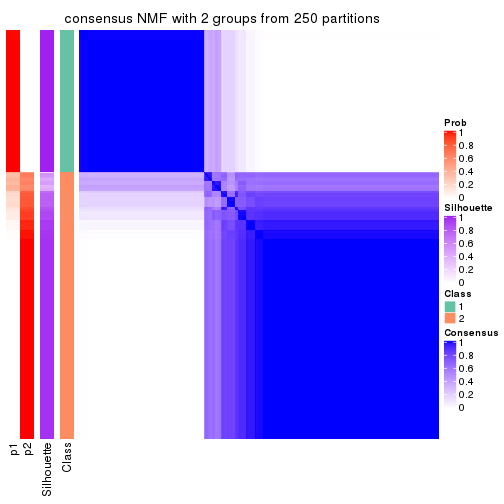</p>

</div>
<div id='tab-CV-NMF-consensus-heatmap-2'>
<pre><code class="r">consensus_heatmap(res, k = 3)
</code></pre>

<p>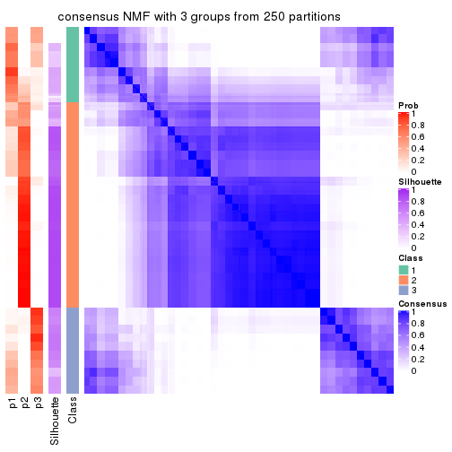</p>

</div>
<div id='tab-CV-NMF-consensus-heatmap-3'>
<pre><code class="r">consensus_heatmap(res, k = 4)
</code></pre>

<p>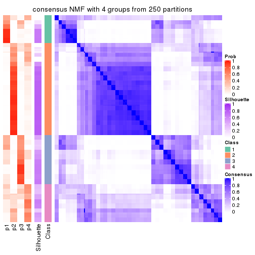</p>

</div>
<div id='tab-CV-NMF-consensus-heatmap-4'>
<pre><code class="r">consensus_heatmap(res, k = 5)
</code></pre>

<p>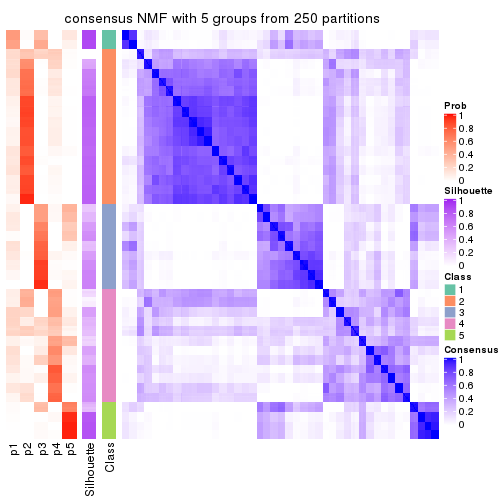</p>

</div>
<div id='tab-CV-NMF-consensus-heatmap-5'>
<pre><code class="r">consensus_heatmap(res, k = 6)
</code></pre>

<p>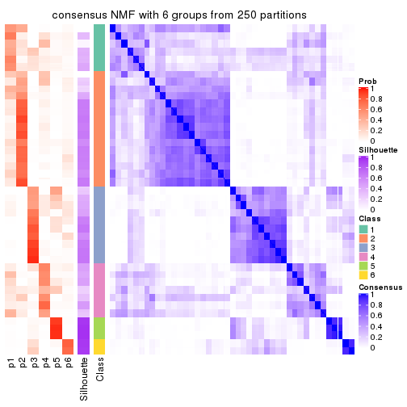</p>

</div>
</div>

Heatmaps for the membership of samples in all partitions to see how consistent they are:


<script>
$( function() {
	$( '#tabs-CV-NMF-membership-heatmap' ).tabs();
} );
</script>
<div id='tabs-CV-NMF-membership-heatmap'>
<ul>
<li><a href='#tab-CV-NMF-membership-heatmap-1'>k = 2</a></li>
<li><a href='#tab-CV-NMF-membership-heatmap-2'>k = 3</a></li>
<li><a href='#tab-CV-NMF-membership-heatmap-3'>k = 4</a></li>
<li><a href='#tab-CV-NMF-membership-heatmap-4'>k = 5</a></li>
<li><a href='#tab-CV-NMF-membership-heatmap-5'>k = 6</a></li>
</ul>
<div id='tab-CV-NMF-membership-heatmap-1'>
<pre><code class="r">membership_heatmap(res, k = 2)
</code></pre>

<p>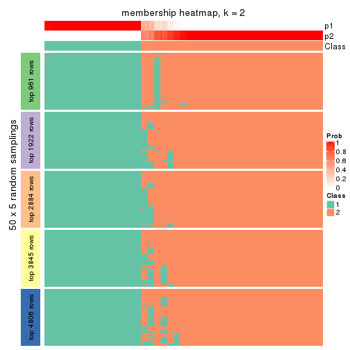</p>

</div>
<div id='tab-CV-NMF-membership-heatmap-2'>
<pre><code class="r">membership_heatmap(res, k = 3)
</code></pre>

<p>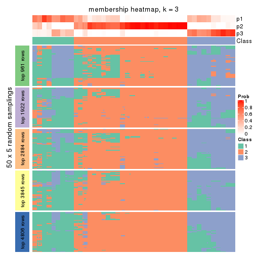</p>

</div>
<div id='tab-CV-NMF-membership-heatmap-3'>
<pre><code class="r">membership_heatmap(res, k = 4)
</code></pre>

<p>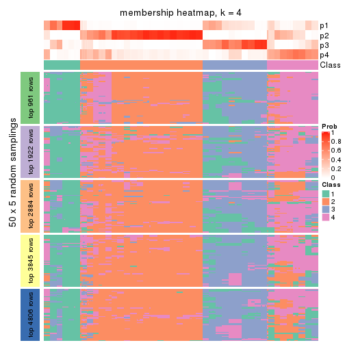</p>

</div>
<div id='tab-CV-NMF-membership-heatmap-4'>
<pre><code class="r">membership_heatmap(res, k = 5)
</code></pre>

<p>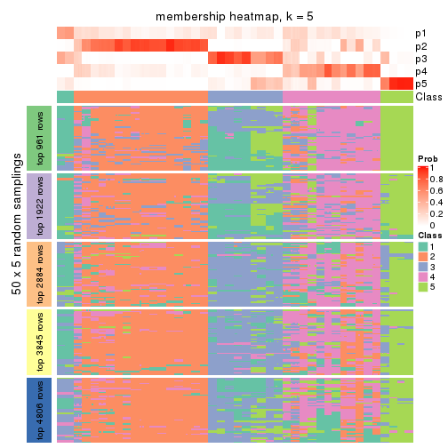</p>

</div>
<div id='tab-CV-NMF-membership-heatmap-5'>
<pre><code class="r">membership_heatmap(res, k = 6)
</code></pre>

<p>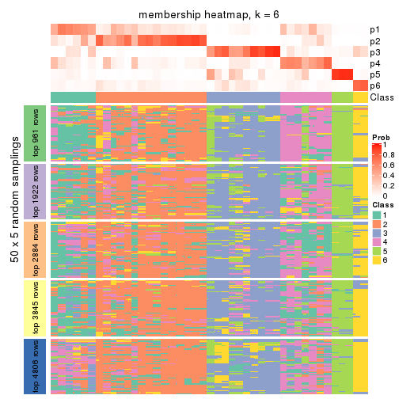</p>

</div>
</div>

As soon as we have had the classes for columns, we can look for signatures
which are significantly different between classes which can be candidate marks
for certain classes. Following are the heatmaps for signatures.


Signature heatmaps where rows are scaled:


<script>
$( function() {
	$( '#tabs-CV-NMF-get-signatures' ).tabs();
} );
</script>
<div id='tabs-CV-NMF-get-signatures'>
<ul>
<li><a href='#tab-CV-NMF-get-signatures-1'>k = 2</a></li>
<li><a href='#tab-CV-NMF-get-signatures-2'>k = 3</a></li>
<li><a href='#tab-CV-NMF-get-signatures-3'>k = 4</a></li>
<li><a href='#tab-CV-NMF-get-signatures-4'>k = 5</a></li>
<li><a href='#tab-CV-NMF-get-signatures-5'>k = 6</a></li>
</ul>
<div id='tab-CV-NMF-get-signatures-1'>
<pre><code class="r">get_signatures(res, k = 2)
</code></pre>

<p>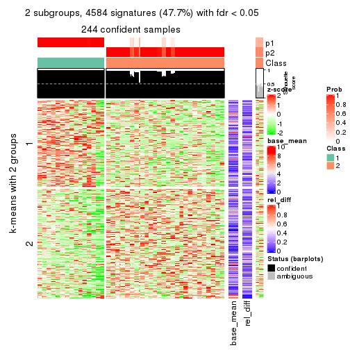</p>

</div>
<div id='tab-CV-NMF-get-signatures-2'>
<pre><code class="r">get_signatures(res, k = 3)
</code></pre>

<p>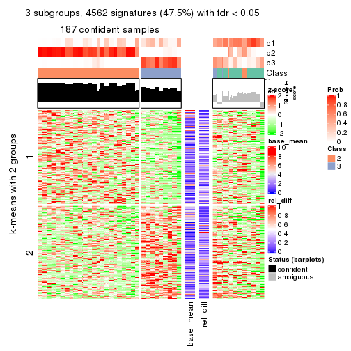</p>

</div>
<div id='tab-CV-NMF-get-signatures-3'>
<pre><code class="r">get_signatures(res, k = 4)
</code></pre>

<p>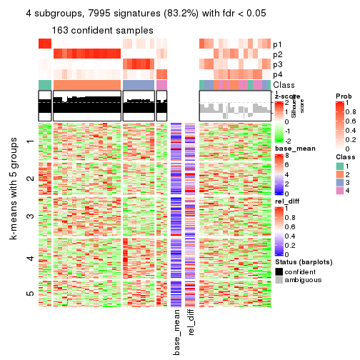</p>

</div>
<div id='tab-CV-NMF-get-signatures-4'>
<pre><code class="r">get_signatures(res, k = 5)
</code></pre>

<p>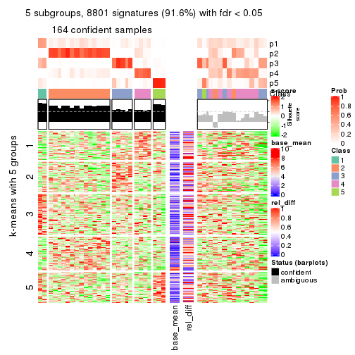</p>

</div>
<div id='tab-CV-NMF-get-signatures-5'>
<pre><code class="r">get_signatures(res, k = 6)
</code></pre>

<p>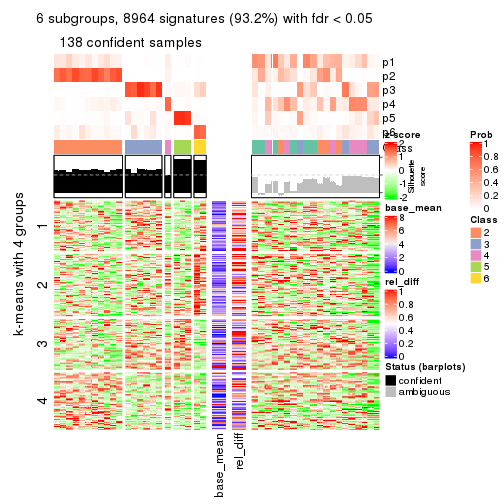</p>

</div>
</div>


Signature heatmaps where rows are not scaled:


<script>
$( function() {
	$( '#tabs-CV-NMF-get-signatures-no-scale' ).tabs();
} );
</script>
<div id='tabs-CV-NMF-get-signatures-no-scale'>
<ul>
<li><a href='#tab-CV-NMF-get-signatures-no-scale-1'>k = 2</a></li>
<li><a href='#tab-CV-NMF-get-signatures-no-scale-2'>k = 3</a></li>
<li><a href='#tab-CV-NMF-get-signatures-no-scale-3'>k = 4</a></li>
<li><a href='#tab-CV-NMF-get-signatures-no-scale-4'>k = 5</a></li>
<li><a href='#tab-CV-NMF-get-signatures-no-scale-5'>k = 6</a></li>
</ul>
<div id='tab-CV-NMF-get-signatures-no-scale-1'>
<pre><code class="r">get_signatures(res, k = 2, scale_rows = FALSE)
</code></pre>

<p>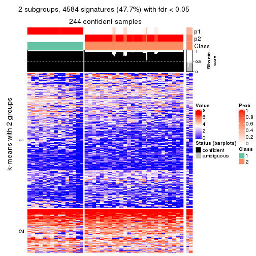</p>

</div>
<div id='tab-CV-NMF-get-signatures-no-scale-2'>
<pre><code class="r">get_signatures(res, k = 3, scale_rows = FALSE)
</code></pre>

<p>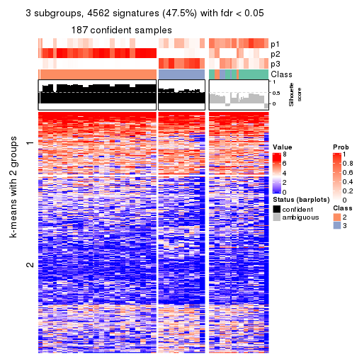</p>

</div>
<div id='tab-CV-NMF-get-signatures-no-scale-3'>
<pre><code class="r">get_signatures(res, k = 4, scale_rows = FALSE)
</code></pre>

<p>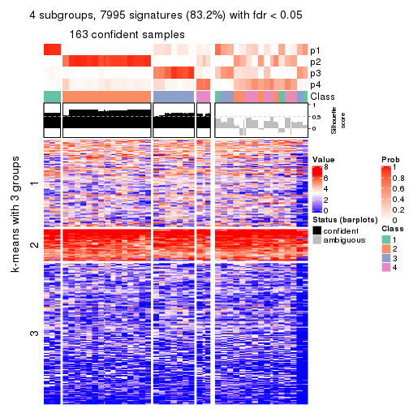</p>

</div>
<div id='tab-CV-NMF-get-signatures-no-scale-4'>
<pre><code class="r">get_signatures(res, k = 5, scale_rows = FALSE)
</code></pre>

<p>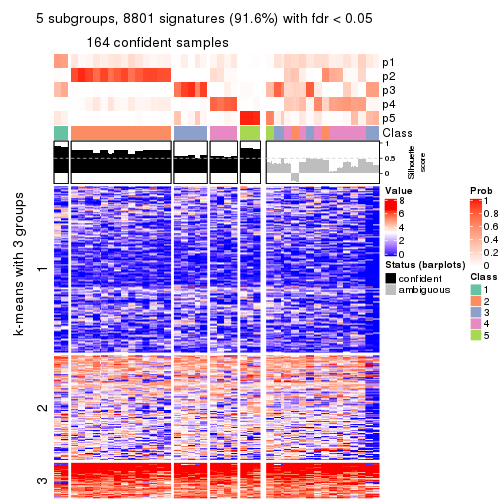</p>

</div>
<div id='tab-CV-NMF-get-signatures-no-scale-5'>
<pre><code class="r">get_signatures(res, k = 6, scale_rows = FALSE)
</code></pre>

<p>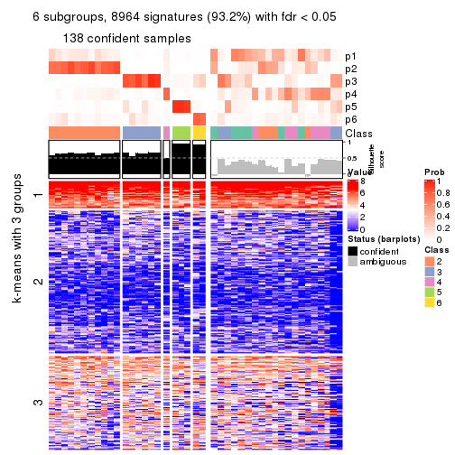</p>

</div>
</div>


Compare the overlap of signatures from different k:

```r
compare_signatures(res)
```

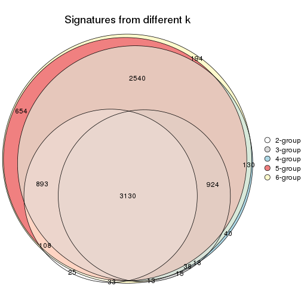

`get_signature()` returns a data frame invisibly. TO get the list of signatures, the function
call should be assigned to a variable explicitly. In following code, if `plot` argument is set
to `FALSE`, no heatmap is plotted while only the differential analysis is performed.

```r
# code only for demonstration
tb = get_signature(res, k = ..., plot = FALSE)
```

An example of the output of `tb` is:

```
#>   which_row         fdr    mean_1    mean_2 scaled_mean_1 scaled_mean_2 km
#> 1        38 0.042760348  8.373488  9.131774    -0.5533452     0.5164555  1
#> 2        40 0.018707592  7.106213  8.469186    -0.6173731     0.5762149  1
#> 3        55 0.019134737 10.221463 11.207825    -0.6159697     0.5749050  1
#> 4        59 0.006059896  5.921854  7.869574    -0.6899429     0.6439467  1
#> 5        60 0.018055526  8.928898 10.211722    -0.6204761     0.5791110  1
#> 6        98 0.009384629 15.714769 14.887706     0.6635654    -0.6193277  2
...
```

The columns in `tb` are:

1. `which_row`: row indices corresponding to the input matrix.
2. `fdr`: FDR for the differential test. 
3. `mean_x`: The mean value in group x.
4. `scaled_mean_x`: The mean value in group x after rows are scaled.
5. `km`: Row groups if k-means clustering is applied to rows.


UMAP plot which shows how samples are separated.


<script>
$( function() {
	$( '#tabs-CV-NMF-dimension-reduction' ).tabs();
} );
</script>
<div id='tabs-CV-NMF-dimension-reduction'>
<ul>
<li><a href='#tab-CV-NMF-dimension-reduction-1'>k = 2</a></li>
<li><a href='#tab-CV-NMF-dimension-reduction-2'>k = 3</a></li>
<li><a href='#tab-CV-NMF-dimension-reduction-3'>k = 4</a></li>
<li><a href='#tab-CV-NMF-dimension-reduction-4'>k = 5</a></li>
<li><a href='#tab-CV-NMF-dimension-reduction-5'>k = 6</a></li>
</ul>
<div id='tab-CV-NMF-dimension-reduction-1'>
<pre><code class="r">dimension_reduction(res, k = 2, method = &quot;UMAP&quot;)
</code></pre>

<p>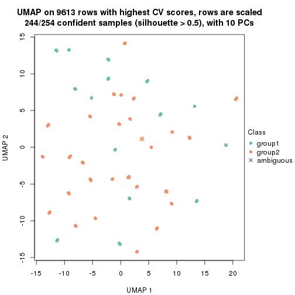</p>

</div>
<div id='tab-CV-NMF-dimension-reduction-2'>
<pre><code class="r">dimension_reduction(res, k = 3, method = &quot;UMAP&quot;)
</code></pre>

<p>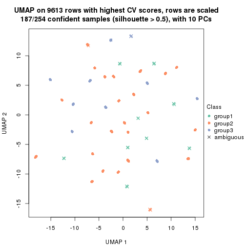</p>

</div>
<div id='tab-CV-NMF-dimension-reduction-3'>
<pre><code class="r">dimension_reduction(res, k = 4, method = &quot;UMAP&quot;)
</code></pre>

<p>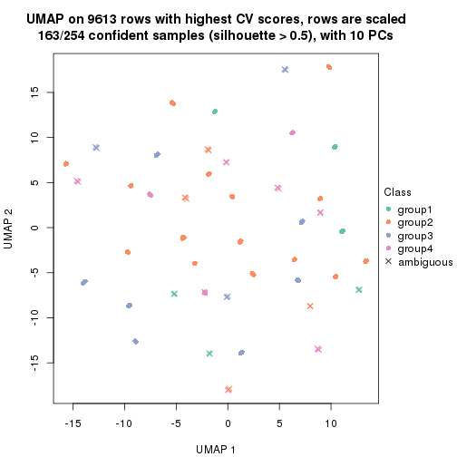</p>

</div>
<div id='tab-CV-NMF-dimension-reduction-4'>
<pre><code class="r">dimension_reduction(res, k = 5, method = &quot;UMAP&quot;)
</code></pre>

<p>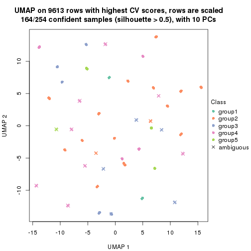</p>

</div>
<div id='tab-CV-NMF-dimension-reduction-5'>
<pre><code class="r">dimension_reduction(res, k = 6, method = &quot;UMAP&quot;)
</code></pre>

<p>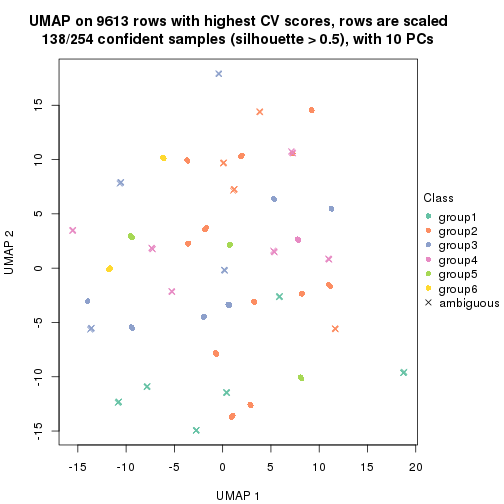</p>

</div>
</div>


Following heatmap shows how subgroups are split when increasing `k`:

```r
collect_classes(res)
```

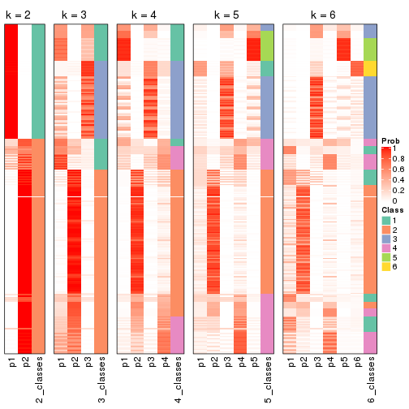


If matrix rows can be associated to genes, consider to use `GO_Enrichment(res,
...)` to perform function enrichment for the signature genes.


 

---------------------------------------------------


### MAD:hclust**


The object with results only for a single top-value method and a single partition method 
can be extracted as:

```r
res = res_list["MAD", "hclust"]
# you can also extract it by
# res = res_list["MAD:hclust"]
```

A summary of `res` and all the functions that can be applied to it:

```r
res
```

```
#> A 'ConsensusPartition' object with k = 2, 3, 4, 5, 6.
#>   On a matrix with 9613 rows and 254 columns.
#>   Top rows (961, 1922, 2884, 3845, 4806) are extracted by 'MAD' method.
#>   Subgroups are detected by 'hclust' method.
#>   Performed in total 1250 partitions by row resampling.
#>   Best k for subgroups seems to be 3.
#> 
#> Following methods can be applied to this 'ConsensusPartition' object:
#>  [1] "cola_report"             "collect_classes"         "collect_plots"          
#>  [4] "collect_stats"           "colnames"                "compare_signatures"     
#>  [7] "consensus_heatmap"       "dimension_reduction"     "functional_enrichment"  
#> [10] "get_anno_col"            "get_anno"                "get_classes"            
#> [13] "get_consensus"           "get_matrix"              "get_membership"         
#> [16] "get_param"               "get_signatures"          "get_stats"              
#> [19] "is_best_k"               "is_stable_k"             "membership_heatmap"     
#> [22] "ncol"                    "nrow"                    "plot_ecdf"              
#> [25] "rownames"                "select_partition_number" "show"                   
#> [28] "suggest_best_k"          "test_to_known_factors"
```

`collect_plots()` function collects all the plots made from `res` for all `k` (number of partitions)
into one single page to provide an easy and fast comparison between different `k`.

```r
collect_plots(res)
```

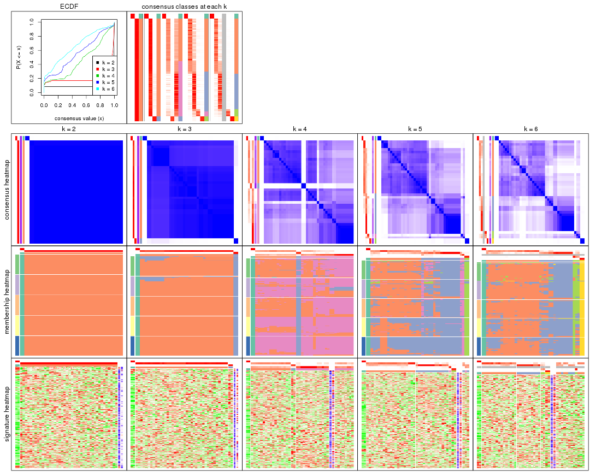

The plots are:

- The first row: a plot of the ECDF (Empirical cumulative distribution
  function) curves of the consensus matrix for each `k` and the heatmap of
  predicted classes for each `k`.
- The second row: heatmaps of the consensus matrix for each `k`.
- The third row: heatmaps of the membership matrix for each `k`.
- The fouth row: heatmaps of the signatures for each `k`.

All the plots in panels can be made by individual functions and they are
plotted later in this section.

`select_partition_number()` produces several plots showing different
statistics for choosing "optimized" `k`. There are following statistics:

- ECDF curves of the consensus matrix for each `k`;
- 1-PAC. [The PAC
  score](https://en.wikipedia.org/wiki/Consensus_clustering#Over-interpretation_potential_of_consensus_clustering)
  measures the proportion of the ambiguous subgrouping.
- Mean silhouette score.
- Concordance. The mean probability of fiting the consensus class ids in all
  partitions.
- Area increased. Denote $A_k$ as the area under the ECDF curve for current
  `k`, the area increased is defined as $A_k - A_{k-1}$.
- Rand index. The percent of pairs of samples that are both in a same cluster
  or both are not in a same cluster in the partition of k and k-1.
- Jaccard index. The ratio of pairs of samples are both in a same cluster in
  the partition of k and k-1 and the pairs of samples are both in a same
  cluster in the partition k or k-1.

The detailed explanations of these statistics can be found in [the cola
vignette](http://bioconductor.org/packages/devel/bioc/vignettes/cola/inst/doc/cola.html#toc_13).

Generally speaking, lower PAC score, higher mean silhouette score or higher
concordance corresponds to better partition. Rand index and Jaccard index
measure how similar the current partition is compared to partition with `k-1`.
If they are too similar, we won't accept `k` is better than `k-1`.

```r
select_partition_number(res)
```

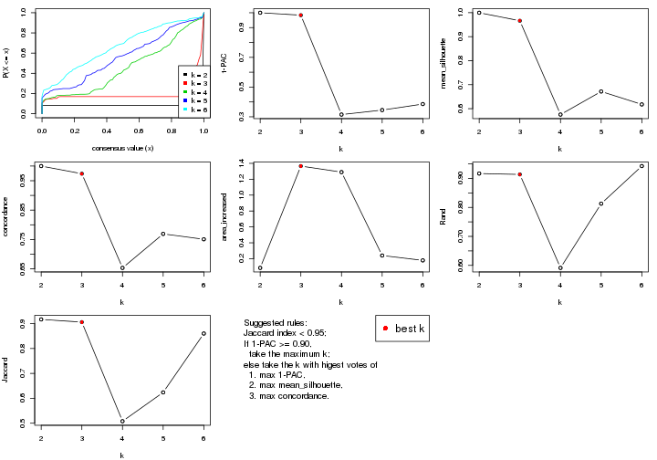

The numeric values for all these statistics can be obtained by `get_stats()`.

```r
get_stats(res)
```

```
#>   k 1-PAC mean_silhouette concordance area_increased  Rand Jaccard
#> 2 2 1.000           1.000       1.000         0.0844 0.917   0.917
#> 3 3 0.984           0.966       0.974         1.3653 0.914   0.906
#> 4 4 0.315           0.575       0.653         1.2894 0.591   0.508
#> 5 5 0.345           0.672       0.769         0.2400 0.813   0.624
#> 6 6 0.386           0.618       0.751         0.1788 0.942   0.860
```

`suggest_best_k()` suggests the best $k$ based on these statistics. The rules are as follows:

- All $k$ with Jaccard index larger than 0.95 are removed because the increase of
  the partition number does not provides enough extra information. If all $k$ are removed,
  the best $k$ is assigned by `NA`.
- For $k$ with 1-PAC larger than 0.9, the maximal $k$ is taken as the "best k". Other $k$ is called "optional k".
- If it does not fit the second rule. The $k$ with the highest vote of highest
  1-PAC, mean silhouette and concordance is taken as the "best k".

```r
suggest_best_k(res)
```

```
#> [1] 3
#> attr(,"optional")
#> [1] 2
```

There is also optional best $k$ = 2 that is worth to check.

Following shows the table of the partitions (You need to click the **show/hide
code output** link to see it). The membership matrix (columns with name `p*`)
is inferred by
[`clue::cl_consensus()`](https://www.rdocumentation.org/link/cl_consensus?package=clue)
function with the `SE` method. Basically the value in the membership matrix
represents the probability to belong to a certain group. The finall class
label for an item is determined with the group with highest probability it
belongs to.

In `get_classes()` function, the entropy is calculated from the membership
matrix and the silhouette score is calculated from the consensus matrix.


<script>
$( function() {
	$( '#tabs-MAD-hclust-get-classes' ).tabs();
} );
</script>
<div id='tabs-MAD-hclust-get-classes'>
<ul>
<li><a href='#tab-MAD-hclust-get-classes-1'>k = 2</a></li>
<li><a href='#tab-MAD-hclust-get-classes-2'>k = 3</a></li>
<li><a href='#tab-MAD-hclust-get-classes-3'>k = 4</a></li>
<li><a href='#tab-MAD-hclust-get-classes-4'>k = 5</a></li>
<li><a href='#tab-MAD-hclust-get-classes-5'>k = 6</a></li>
</ul>

<div id='tab-MAD-hclust-get-classes-1'>
<p><a id='tab-MAD-hclust-get-classes-1-a' style='color:#0366d6' href='#'>show/hide code output</a></p>
<pre><code class="r">cbind(get_classes(res, k = 2), get_membership(res, k = 2))
</code></pre>

<pre><code>#&gt;           class entropy silhouette    p1    p2
#&gt; DRR024803     1  0.0000      1.000 1.000 0.000
#&gt; DRR024804     2  0.0000      1.000 0.000 1.000
#&gt; DRR024805     2  0.0000      1.000 0.000 1.000
#&gt; DRR024806     2  0.0000      1.000 0.000 1.000
#&gt; DRR024807     2  0.0000      1.000 0.000 1.000
#&gt; DRR024808     2  0.0000      1.000 0.000 1.000
#&gt; DRR024809     2  0.0000      1.000 0.000 1.000
#&gt; DRR024810     2  0.0000      1.000 0.000 1.000
#&gt; DRR024811     2  0.0000      1.000 0.000 1.000
#&gt; DRR024812     2  0.0000      1.000 0.000 1.000
#&gt; DRR024813     2  0.0000      1.000 0.000 1.000
#&gt; DRR024814     2  0.0000      1.000 0.000 1.000
#&gt; DRR024815     2  0.0000      1.000 0.000 1.000
#&gt; DRR024816     2  0.0000      1.000 0.000 1.000
#&gt; DRR024817     2  0.0000      1.000 0.000 1.000
#&gt; DRR024818     2  0.0000      1.000 0.000 1.000
#&gt; DRR024819     2  0.0000      1.000 0.000 1.000
#&gt; DRR024820     2  0.0000      1.000 0.000 1.000
#&gt; DRR024821     2  0.0000      1.000 0.000 1.000
#&gt; DRR024822     2  0.0000      1.000 0.000 1.000
#&gt; DRR024824     2  0.0000      1.000 0.000 1.000
#&gt; DRR024825     2  0.0000      1.000 0.000 1.000
#&gt; DRR024826     2  0.0000      1.000 0.000 1.000
#&gt; DRR024827     2  0.0000      1.000 0.000 1.000
#&gt; DRR024828     2  0.0000      1.000 0.000 1.000
#&gt; DRR024829     2  0.0000      1.000 0.000 1.000
#&gt; DRR024830     2  0.0000      1.000 0.000 1.000
#&gt; DRR024831     2  0.0000      1.000 0.000 1.000
#&gt; DRR024832     2  0.0000      1.000 0.000 1.000
#&gt; DRR024833     2  0.0000      1.000 0.000 1.000
#&gt; DRR024834     2  0.0376      0.996 0.004 0.996
#&gt; DRR024835     2  0.0000      1.000 0.000 1.000
#&gt; DRR024836     2  0.0000      1.000 0.000 1.000
#&gt; DRR024837     2  0.0376      0.996 0.004 0.996
#&gt; DRR024838     2  0.0000      1.000 0.000 1.000
#&gt; DRR024839     2  0.0000      1.000 0.000 1.000
#&gt; DRR024840     2  0.0000      1.000 0.000 1.000
#&gt; DRR024841     2  0.0000      1.000 0.000 1.000
#&gt; DRR024842     2  0.0000      1.000 0.000 1.000
#&gt; DRR024843     1  0.0000      1.000 1.000 0.000
#&gt; DRR024844     2  0.0000      1.000 0.000 1.000
#&gt; DRR024845     2  0.0000      1.000 0.000 1.000
#&gt; DRR024846     2  0.0000      1.000 0.000 1.000
#&gt; DRR024847     2  0.0000      1.000 0.000 1.000
#&gt; DRR024848     1  0.0000      1.000 1.000 0.000
#&gt; DRR024849     2  0.0000      1.000 0.000 1.000
#&gt; DRR024850     2  0.0000      1.000 0.000 1.000
#&gt; DRR024851     2  0.0000      1.000 0.000 1.000
#&gt; DRR024852     2  0.0000      1.000 0.000 1.000
#&gt; DRR024853     2  0.0000      1.000 0.000 1.000
#&gt; DRR024854     2  0.0000      1.000 0.000 1.000
#&gt; DRR024855     2  0.0000      1.000 0.000 1.000
#&gt; DRR024856     2  0.0000      1.000 0.000 1.000
#&gt; DRR024857     2  0.0000      1.000 0.000 1.000
#&gt; DRR024858     2  0.0000      1.000 0.000 1.000
#&gt; DRR024859     2  0.0000      1.000 0.000 1.000
#&gt; DRR024860     2  0.0000      1.000 0.000 1.000
#&gt; DRR024861     2  0.0000      1.000 0.000 1.000
#&gt; DRR024862     2  0.0000      1.000 0.000 1.000
#&gt; DRR024863     2  0.0000      1.000 0.000 1.000
#&gt; DRR024864     2  0.0000      1.000 0.000 1.000
#&gt; DRR024865     2  0.0000      1.000 0.000 1.000
#&gt; DRR024866     2  0.0000      1.000 0.000 1.000
#&gt; DRR024867     2  0.0000      1.000 0.000 1.000
#&gt; DRR024868     2  0.0000      1.000 0.000 1.000
#&gt; DRR024869     2  0.0000      1.000 0.000 1.000
#&gt; DRR024870     2  0.0000      1.000 0.000 1.000
#&gt; DRR024871     2  0.0000      1.000 0.000 1.000
#&gt; DRR024872     2  0.0000      1.000 0.000 1.000
#&gt; DRR024873     2  0.0000      1.000 0.000 1.000
#&gt; DRR024874     2  0.0000      1.000 0.000 1.000
#&gt; DRR024875     2  0.0000      1.000 0.000 1.000
#&gt; DRR024876     2  0.0376      0.996 0.004 0.996
#&gt; DRR024877     2  0.0000      1.000 0.000 1.000
#&gt; DRR024878     2  0.0000      1.000 0.000 1.000
#&gt; DRR024879     2  0.0376      0.996 0.004 0.996
#&gt; DRR024880     2  0.0000      1.000 0.000 1.000
#&gt; DRR024881     2  0.0000      1.000 0.000 1.000
#&gt; DRR024882     2  0.0000      1.000 0.000 1.000
#&gt; DRR024883     2  0.0000      1.000 0.000 1.000
#&gt; DRR024884     2  0.0000      1.000 0.000 1.000
#&gt; DRR024885     2  0.0000      1.000 0.000 1.000
#&gt; DRR024886     1  0.0000      1.000 1.000 0.000
#&gt; DRR024887     2  0.0000      1.000 0.000 1.000
#&gt; DRR024888     2  0.0000      1.000 0.000 1.000
#&gt; DRR024889     2  0.0000      1.000 0.000 1.000
#&gt; DRR024890     2  0.0000      1.000 0.000 1.000
#&gt; DRR024891     1  0.0000      1.000 1.000 0.000
#&gt; DRR024892     2  0.0000      1.000 0.000 1.000
#&gt; DRR024893     2  0.0000      1.000 0.000 1.000
#&gt; DRR024894     2  0.0000      1.000 0.000 1.000
#&gt; DRR024895     2  0.0000      1.000 0.000 1.000
#&gt; DRR024896     2  0.0000      1.000 0.000 1.000
#&gt; DRR024897     2  0.0000      1.000 0.000 1.000
#&gt; DRR024898     2  0.0000      1.000 0.000 1.000
#&gt; DRR024899     2  0.0000      1.000 0.000 1.000
#&gt; DRR024900     2  0.0000      1.000 0.000 1.000
#&gt; DRR024901     2  0.0000      1.000 0.000 1.000
#&gt; DRR024902     2  0.0000      1.000 0.000 1.000
#&gt; DRR024903     2  0.0000      1.000 0.000 1.000
#&gt; DRR024904     2  0.0000      1.000 0.000 1.000
#&gt; DRR024905     2  0.0000      1.000 0.000 1.000
#&gt; DRR024906     2  0.0000      1.000 0.000 1.000
#&gt; DRR024907     2  0.0000      1.000 0.000 1.000
#&gt; DRR024908     2  0.0000      1.000 0.000 1.000
#&gt; DRR024909     2  0.0000      1.000 0.000 1.000
#&gt; DRR024910     2  0.0000      1.000 0.000 1.000
#&gt; DRR024911     2  0.0000      1.000 0.000 1.000
#&gt; DRR024912     2  0.0000      1.000 0.000 1.000
#&gt; DRR024913     2  0.0000      1.000 0.000 1.000
#&gt; DRR024914     2  0.0000      1.000 0.000 1.000
#&gt; DRR024915     2  0.0000      1.000 0.000 1.000
#&gt; DRR024916     2  0.0000      1.000 0.000 1.000
#&gt; DRR024917     2  0.0000      1.000 0.000 1.000
#&gt; DRR024918     2  0.0000      1.000 0.000 1.000
#&gt; DRR024919     2  0.0376      0.996 0.004 0.996
#&gt; DRR024920     2  0.0000      1.000 0.000 1.000
#&gt; DRR024921     2  0.0000      1.000 0.000 1.000
#&gt; DRR024922     2  0.0376      0.996 0.004 0.996
#&gt; DRR024923     2  0.0000      1.000 0.000 1.000
#&gt; DRR024924     2  0.0000      1.000 0.000 1.000
#&gt; DRR024925     2  0.0000      1.000 0.000 1.000
#&gt; DRR024926     2  0.0000      1.000 0.000 1.000
#&gt; DRR024927     2  0.0000      1.000 0.000 1.000
#&gt; DRR024928     2  0.0000      1.000 0.000 1.000
#&gt; DRR024929     1  0.0000      1.000 1.000 0.000
#&gt; DRR024930     2  0.0000      1.000 0.000 1.000
#&gt; DRR024931     2  0.0000      1.000 0.000 1.000
#&gt; DRR024932     2  0.0000      1.000 0.000 1.000
#&gt; DRR024933     2  0.0000      1.000 0.000 1.000
#&gt; DRR024934     1  0.0000      1.000 1.000 0.000
#&gt; DRR024935     2  0.0000      1.000 0.000 1.000
#&gt; DRR024936     2  0.0000      1.000 0.000 1.000
#&gt; DRR024937     2  0.0000      1.000 0.000 1.000
#&gt; DRR024938     2  0.0000      1.000 0.000 1.000
#&gt; DRR024939     2  0.0000      1.000 0.000 1.000
#&gt; DRR024940     2  0.0000      1.000 0.000 1.000
#&gt; DRR024941     2  0.0000      1.000 0.000 1.000
#&gt; DRR024942     2  0.0000      1.000 0.000 1.000
#&gt; DRR024943     2  0.0000      1.000 0.000 1.000
#&gt; DRR024944     2  0.0000      1.000 0.000 1.000
#&gt; DRR024945     2  0.0000      1.000 0.000 1.000
#&gt; DRR024946     2  0.0000      1.000 0.000 1.000
#&gt; DRR024947     2  0.0000      1.000 0.000 1.000
#&gt; DRR024948     2  0.0000      1.000 0.000 1.000
#&gt; DRR024949     2  0.0000      1.000 0.000 1.000
#&gt; DRR024950     2  0.0000      1.000 0.000 1.000
#&gt; DRR024951     2  0.0000      1.000 0.000 1.000
#&gt; DRR024952     2  0.0000      1.000 0.000 1.000
#&gt; DRR024953     2  0.0000      1.000 0.000 1.000
#&gt; DRR024954     2  0.0000      1.000 0.000 1.000
#&gt; DRR024955     2  0.0000      1.000 0.000 1.000
#&gt; DRR024956     2  0.0000      1.000 0.000 1.000
#&gt; DRR024957     2  0.0000      1.000 0.000 1.000
#&gt; DRR024958     2  0.0000      1.000 0.000 1.000
#&gt; DRR024959     2  0.0000      1.000 0.000 1.000
#&gt; DRR024960     2  0.0000      1.000 0.000 1.000
#&gt; DRR024961     2  0.0000      1.000 0.000 1.000
#&gt; DRR024962     2  0.0376      0.996 0.004 0.996
#&gt; DRR024963     2  0.0000      1.000 0.000 1.000
#&gt; DRR024964     2  0.0000      1.000 0.000 1.000
#&gt; DRR024965     2  0.0376      0.996 0.004 0.996
#&gt; DRR024966     2  0.0000      1.000 0.000 1.000
#&gt; DRR024967     2  0.0000      1.000 0.000 1.000
#&gt; DRR024968     2  0.0000      1.000 0.000 1.000
#&gt; DRR024969     2  0.0000      1.000 0.000 1.000
#&gt; DRR024970     2  0.0000      1.000 0.000 1.000
#&gt; DRR024971     2  0.0000      1.000 0.000 1.000
#&gt; DRR024972     1  0.0000      1.000 1.000 0.000
#&gt; DRR024973     2  0.0000      1.000 0.000 1.000
#&gt; DRR024974     2  0.0000      1.000 0.000 1.000
#&gt; DRR024975     2  0.0000      1.000 0.000 1.000
#&gt; DRR024976     2  0.0000      1.000 0.000 1.000
#&gt; DRR024977     1  0.0000      1.000 1.000 0.000
#&gt; DRR024978     2  0.0000      1.000 0.000 1.000
#&gt; DRR024979     2  0.0000      1.000 0.000 1.000
#&gt; DRR024980     2  0.0000      1.000 0.000 1.000
#&gt; DRR024981     2  0.0000      1.000 0.000 1.000
#&gt; DRR024982     2  0.0000      1.000 0.000 1.000
#&gt; DRR024983     2  0.0000      1.000 0.000 1.000
#&gt; DRR024984     2  0.0000      1.000 0.000 1.000
#&gt; DRR024985     2  0.0000      1.000 0.000 1.000
#&gt; DRR024986     2  0.0000      1.000 0.000 1.000
#&gt; DRR024987     2  0.0000      1.000 0.000 1.000
#&gt; DRR024988     2  0.0000      1.000 0.000 1.000
#&gt; DRR024989     2  0.0000      1.000 0.000 1.000
#&gt; DRR024990     2  0.0000      1.000 0.000 1.000
#&gt; DRR024991     2  0.0000      1.000 0.000 1.000
#&gt; DRR024992     2  0.0000      1.000 0.000 1.000
#&gt; DRR024993     2  0.0000      1.000 0.000 1.000
#&gt; DRR024994     2  0.0000      1.000 0.000 1.000
#&gt; DRR024995     2  0.0000      1.000 0.000 1.000
#&gt; DRR024996     2  0.0000      1.000 0.000 1.000
#&gt; DRR024997     2  0.0000      1.000 0.000 1.000
#&gt; DRR024998     2  0.0000      1.000 0.000 1.000
#&gt; DRR024999     2  0.0000      1.000 0.000 1.000
#&gt; DRR025000     2  0.0000      1.000 0.000 1.000
#&gt; DRR025001     2  0.0000      1.000 0.000 1.000
#&gt; DRR025002     2  0.0000      1.000 0.000 1.000
#&gt; DRR025003     2  0.0000      1.000 0.000 1.000
#&gt; DRR025004     2  0.0000      1.000 0.000 1.000
#&gt; DRR025005     2  0.0376      0.996 0.004 0.996
#&gt; DRR025006     2  0.0000      1.000 0.000 1.000
#&gt; DRR025007     2  0.0000      1.000 0.000 1.000
#&gt; DRR025008     2  0.0376      0.996 0.004 0.996
#&gt; DRR025009     2  0.0000      1.000 0.000 1.000
#&gt; DRR025010     2  0.0000      1.000 0.000 1.000
#&gt; DRR025011     2  0.0000      1.000 0.000 1.000
#&gt; DRR025012     2  0.0000      1.000 0.000 1.000
#&gt; DRR025013     2  0.0000      1.000 0.000 1.000
#&gt; DRR025014     2  0.0000      1.000 0.000 1.000
#&gt; DRR025015     1  0.0000      1.000 1.000 0.000
#&gt; DRR025016     2  0.0000      1.000 0.000 1.000
#&gt; DRR025017     2  0.0000      1.000 0.000 1.000
#&gt; DRR025018     2  0.0000      1.000 0.000 1.000
#&gt; DRR025019     2  0.0000      1.000 0.000 1.000
#&gt; DRR025020     1  0.0000      1.000 1.000 0.000
#&gt; DRR025021     2  0.0000      1.000 0.000 1.000
#&gt; DRR025022     2  0.0000      1.000 0.000 1.000
#&gt; DRR025023     2  0.0000      1.000 0.000 1.000
#&gt; DRR025024     2  0.0000      1.000 0.000 1.000
#&gt; DRR025025     2  0.0000      1.000 0.000 1.000
#&gt; DRR025026     2  0.0000      1.000 0.000 1.000
#&gt; DRR025027     2  0.0000      1.000 0.000 1.000
#&gt; DRR025028     2  0.0000      1.000 0.000 1.000
#&gt; DRR025029     2  0.0000      1.000 0.000 1.000
#&gt; DRR025030     2  0.0000      1.000 0.000 1.000
#&gt; DRR025031     2  0.0000      1.000 0.000 1.000
#&gt; DRR025032     2  0.0000      1.000 0.000 1.000
#&gt; DRR025033     2  0.0000      1.000 0.000 1.000
#&gt; DRR025034     2  0.0000      1.000 0.000 1.000
#&gt; DRR025035     2  0.0000      1.000 0.000 1.000
#&gt; DRR025036     2  0.0000      1.000 0.000 1.000
#&gt; DRR025037     2  0.0000      1.000 0.000 1.000
#&gt; DRR025038     2  0.0000      1.000 0.000 1.000
#&gt; DRR025039     2  0.0000      1.000 0.000 1.000
#&gt; DRR025040     2  0.0000      1.000 0.000 1.000
#&gt; DRR025041     2  0.0000      1.000 0.000 1.000
#&gt; DRR025042     2  0.0000      1.000 0.000 1.000
#&gt; DRR025043     2  0.0000      1.000 0.000 1.000
#&gt; DRR025044     2  0.0000      1.000 0.000 1.000
#&gt; DRR025045     2  0.0000      1.000 0.000 1.000
#&gt; DRR025046     2  0.0000      1.000 0.000 1.000
#&gt; DRR025047     2  0.0000      1.000 0.000 1.000
#&gt; DRR025048     2  0.0376      0.996 0.004 0.996
#&gt; DRR025049     2  0.0000      1.000 0.000 1.000
#&gt; DRR025050     2  0.0000      1.000 0.000 1.000
#&gt; DRR025051     2  0.0376      0.996 0.004 0.996
#&gt; DRR025052     2  0.0000      1.000 0.000 1.000
#&gt; DRR025053     2  0.0000      1.000 0.000 1.000
#&gt; DRR025054     2  0.0000      1.000 0.000 1.000
#&gt; DRR025055     2  0.0000      1.000 0.000 1.000
#&gt; DRR025056     2  0.0000      1.000 0.000 1.000
#&gt; DRR025057     2  0.0000      1.000 0.000 1.000
</code></pre>

<script>
$('#tab-MAD-hclust-get-classes-1-a').parent().next().next().hide();
$('#tab-MAD-hclust-get-classes-1-a').click(function(){
  $('#tab-MAD-hclust-get-classes-1-a').parent().next().next().toggle();
  return(false);
});
</script>
</div>

<div id='tab-MAD-hclust-get-classes-2'>
<p><a id='tab-MAD-hclust-get-classes-2-a' style='color:#0366d6' href='#'>show/hide code output</a></p>
<pre><code class="r">cbind(get_classes(res, k = 3), get_membership(res, k = 3))
</code></pre>

<pre><code>#&gt;           class entropy silhouette    p1    p2    p3
#&gt; DRR024803     1  0.0000      1.000 1.000 0.000 0.000
#&gt; DRR024804     2  0.0592      0.972 0.000 0.988 0.012
#&gt; DRR024805     2  0.0424      0.972 0.000 0.992 0.008
#&gt; DRR024806     2  0.0237      0.973 0.000 0.996 0.004
#&gt; DRR024807     3  0.0592      1.000 0.000 0.012 0.988
#&gt; DRR024808     2  0.2625      0.935 0.000 0.916 0.084
#&gt; DRR024809     2  0.0237      0.973 0.000 0.996 0.004
#&gt; DRR024810     2  0.0237      0.973 0.000 0.996 0.004
#&gt; DRR024811     2  0.2625      0.935 0.000 0.916 0.084
#&gt; DRR024812     2  0.0424      0.973 0.000 0.992 0.008
#&gt; DRR024813     2  0.1031      0.968 0.000 0.976 0.024
#&gt; DRR024814     2  0.0237      0.973 0.000 0.996 0.004
#&gt; DRR024815     2  0.0592      0.972 0.000 0.988 0.012
#&gt; DRR024816     2  0.0592      0.972 0.000 0.988 0.012
#&gt; DRR024817     2  0.0592      0.972 0.000 0.988 0.012
#&gt; DRR024818     2  0.2878      0.925 0.000 0.904 0.096
#&gt; DRR024819     2  0.0424      0.972 0.000 0.992 0.008
#&gt; DRR024820     2  0.0592      0.972 0.000 0.988 0.012
#&gt; DRR024821     2  0.2625      0.935 0.000 0.916 0.084
#&gt; DRR024822     2  0.0237      0.973 0.000 0.996 0.004
#&gt; DRR024824     2  0.0000      0.973 0.000 1.000 0.000
#&gt; DRR024825     2  0.2625      0.935 0.000 0.916 0.084
#&gt; DRR024826     2  0.1860      0.954 0.000 0.948 0.052
#&gt; DRR024827     2  0.1031      0.971 0.000 0.976 0.024
#&gt; DRR024828     3  0.0592      1.000 0.000 0.012 0.988
#&gt; DRR024829     2  0.0592      0.972 0.000 0.988 0.012
#&gt; DRR024830     2  0.0237      0.973 0.000 0.996 0.004
#&gt; DRR024831     2  0.2625      0.935 0.000 0.916 0.084
#&gt; DRR024832     2  0.2625      0.935 0.000 0.916 0.084
#&gt; DRR024833     2  0.1860      0.954 0.000 0.948 0.052
#&gt; DRR024834     2  0.0829      0.970 0.004 0.984 0.012
#&gt; DRR024835     2  0.0592      0.972 0.000 0.988 0.012
#&gt; DRR024836     2  0.2625      0.935 0.000 0.916 0.084
#&gt; DRR024837     2  0.0829      0.970 0.004 0.984 0.012
#&gt; DRR024838     2  0.0592      0.972 0.000 0.988 0.012
#&gt; DRR024839     2  0.0892      0.969 0.000 0.980 0.020
#&gt; DRR024840     2  0.0237      0.973 0.000 0.996 0.004
#&gt; DRR024841     2  0.0424      0.972 0.000 0.992 0.008
#&gt; DRR024842     2  0.0747      0.970 0.000 0.984 0.016
#&gt; DRR024843     1  0.0000      1.000 1.000 0.000 0.000
#&gt; DRR024844     2  0.0592      0.972 0.000 0.988 0.012
#&gt; DRR024845     2  0.0424      0.972 0.000 0.992 0.008
#&gt; DRR024846     2  0.0237      0.973 0.000 0.996 0.004
#&gt; DRR024847     3  0.0592      1.000 0.000 0.012 0.988
#&gt; DRR024848     1  0.0000      1.000 1.000 0.000 0.000
#&gt; DRR024849     2  0.2625      0.935 0.000 0.916 0.084
#&gt; DRR024850     2  0.0424      0.972 0.000 0.992 0.008
#&gt; DRR024851     2  0.0237      0.973 0.000 0.996 0.004
#&gt; DRR024852     2  0.0237      0.973 0.000 0.996 0.004
#&gt; DRR024853     2  0.2625      0.935 0.000 0.916 0.084
#&gt; DRR024854     2  0.0424      0.973 0.000 0.992 0.008
#&gt; DRR024855     2  0.1031      0.968 0.000 0.976 0.024
#&gt; DRR024856     2  0.0237      0.973 0.000 0.996 0.004
#&gt; DRR024857     2  0.0592      0.972 0.000 0.988 0.012
#&gt; DRR024858     2  0.0592      0.972 0.000 0.988 0.012
#&gt; DRR024859     2  0.0592      0.972 0.000 0.988 0.012
#&gt; DRR024860     2  0.2878      0.925 0.000 0.904 0.096
#&gt; DRR024861     2  0.0424      0.972 0.000 0.992 0.008
#&gt; DRR024862     2  0.0592      0.972 0.000 0.988 0.012
#&gt; DRR024863     2  0.2625      0.935 0.000 0.916 0.084
#&gt; DRR024864     2  0.0237      0.973 0.000 0.996 0.004
#&gt; DRR024865     2  0.0592      0.972 0.000 0.988 0.012
#&gt; DRR024866     2  0.0000      0.973 0.000 1.000 0.000
#&gt; DRR024867     2  0.2625      0.935 0.000 0.916 0.084
#&gt; DRR024868     2  0.1860      0.954 0.000 0.948 0.052
#&gt; DRR024869     2  0.1031      0.971 0.000 0.976 0.024
#&gt; DRR024870     3  0.0592      1.000 0.000 0.012 0.988
#&gt; DRR024871     2  0.0592      0.972 0.000 0.988 0.012
#&gt; DRR024872     2  0.0237      0.973 0.000 0.996 0.004
#&gt; DRR024873     2  0.2625      0.935 0.000 0.916 0.084
#&gt; DRR024874     2  0.2625      0.935 0.000 0.916 0.084
#&gt; DRR024875     2  0.1860      0.954 0.000 0.948 0.052
#&gt; DRR024876     2  0.0829      0.970 0.004 0.984 0.012
#&gt; DRR024877     2  0.0592      0.972 0.000 0.988 0.012
#&gt; DRR024878     2  0.2625      0.935 0.000 0.916 0.084
#&gt; DRR024879     2  0.0829      0.970 0.004 0.984 0.012
#&gt; DRR024880     2  0.0592      0.972 0.000 0.988 0.012
#&gt; DRR024881     2  0.0892      0.969 0.000 0.980 0.020
#&gt; DRR024882     2  0.0237      0.973 0.000 0.996 0.004
#&gt; DRR024883     2  0.0424      0.972 0.000 0.992 0.008
#&gt; DRR024884     2  0.0592      0.972 0.000 0.988 0.012
#&gt; DRR024885     2  0.0592      0.972 0.000 0.988 0.012
#&gt; DRR024886     1  0.0000      1.000 1.000 0.000 0.000
#&gt; DRR024887     2  0.0592      0.972 0.000 0.988 0.012
#&gt; DRR024888     2  0.0424      0.972 0.000 0.992 0.008
#&gt; DRR024889     2  0.0237      0.973 0.000 0.996 0.004
#&gt; DRR024890     3  0.0592      1.000 0.000 0.012 0.988
#&gt; DRR024891     1  0.0000      1.000 1.000 0.000 0.000
#&gt; DRR024892     2  0.2625      0.935 0.000 0.916 0.084
#&gt; DRR024893     2  0.0424      0.972 0.000 0.992 0.008
#&gt; DRR024894     2  0.0237      0.973 0.000 0.996 0.004
#&gt; DRR024895     2  0.0237      0.973 0.000 0.996 0.004
#&gt; DRR024896     2  0.2625      0.935 0.000 0.916 0.084
#&gt; DRR024897     2  0.0424      0.973 0.000 0.992 0.008
#&gt; DRR024898     2  0.1031      0.968 0.000 0.976 0.024
#&gt; DRR024899     2  0.0237      0.973 0.000 0.996 0.004
#&gt; DRR024900     2  0.0592      0.972 0.000 0.988 0.012
#&gt; DRR024901     2  0.0592      0.972 0.000 0.988 0.012
#&gt; DRR024902     2  0.0592      0.972 0.000 0.988 0.012
#&gt; DRR024903     2  0.2878      0.925 0.000 0.904 0.096
#&gt; DRR024904     2  0.0424      0.972 0.000 0.992 0.008
#&gt; DRR024905     2  0.0592      0.972 0.000 0.988 0.012
#&gt; DRR024906     2  0.2625      0.935 0.000 0.916 0.084
#&gt; DRR024907     2  0.0237      0.973 0.000 0.996 0.004
#&gt; DRR024908     2  0.0592      0.972 0.000 0.988 0.012
#&gt; DRR024909     2  0.0000      0.973 0.000 1.000 0.000
#&gt; DRR024910     2  0.2625      0.935 0.000 0.916 0.084
#&gt; DRR024911     2  0.1860      0.954 0.000 0.948 0.052
#&gt; DRR024912     2  0.1031      0.971 0.000 0.976 0.024
#&gt; DRR024913     3  0.0592      1.000 0.000 0.012 0.988
#&gt; DRR024914     2  0.0592      0.972 0.000 0.988 0.012
#&gt; DRR024915     2  0.0237      0.973 0.000 0.996 0.004
#&gt; DRR024916     2  0.2625      0.935 0.000 0.916 0.084
#&gt; DRR024917     2  0.2625      0.935 0.000 0.916 0.084
#&gt; DRR024918     2  0.1860      0.954 0.000 0.948 0.052
#&gt; DRR024919     2  0.0829      0.970 0.004 0.984 0.012
#&gt; DRR024920     2  0.0592      0.972 0.000 0.988 0.012
#&gt; DRR024921     2  0.2625      0.935 0.000 0.916 0.084
#&gt; DRR024922     2  0.0829      0.970 0.004 0.984 0.012
#&gt; DRR024923     2  0.0592      0.972 0.000 0.988 0.012
#&gt; DRR024924     2  0.0892      0.969 0.000 0.980 0.020
#&gt; DRR024925     2  0.0237      0.973 0.000 0.996 0.004
#&gt; DRR024926     2  0.0424      0.972 0.000 0.992 0.008
#&gt; DRR024927     2  0.0592      0.972 0.000 0.988 0.012
#&gt; DRR024928     2  0.0592      0.972 0.000 0.988 0.012
#&gt; DRR024929     1  0.0000      1.000 1.000 0.000 0.000
#&gt; DRR024930     2  0.0592      0.972 0.000 0.988 0.012
#&gt; DRR024931     2  0.0424      0.972 0.000 0.992 0.008
#&gt; DRR024932     2  0.0237      0.973 0.000 0.996 0.004
#&gt; DRR024933     3  0.0592      1.000 0.000 0.012 0.988
#&gt; DRR024934     1  0.0000      1.000 1.000 0.000 0.000
#&gt; DRR024935     2  0.2625      0.935 0.000 0.916 0.084
#&gt; DRR024936     2  0.0424      0.972 0.000 0.992 0.008
#&gt; DRR024937     2  0.0237      0.973 0.000 0.996 0.004
#&gt; DRR024938     2  0.0237      0.973 0.000 0.996 0.004
#&gt; DRR024939     2  0.2625      0.935 0.000 0.916 0.084
#&gt; DRR024940     2  0.0424      0.973 0.000 0.992 0.008
#&gt; DRR024941     2  0.1031      0.968 0.000 0.976 0.024
#&gt; DRR024942     2  0.0237      0.973 0.000 0.996 0.004
#&gt; DRR024943     2  0.0592      0.972 0.000 0.988 0.012
#&gt; DRR024944     2  0.0592      0.972 0.000 0.988 0.012
#&gt; DRR024945     2  0.0592      0.972 0.000 0.988 0.012
#&gt; DRR024946     2  0.2878      0.925 0.000 0.904 0.096
#&gt; DRR024947     2  0.0424      0.972 0.000 0.992 0.008
#&gt; DRR024948     2  0.0592      0.972 0.000 0.988 0.012
#&gt; DRR024949     2  0.2625      0.935 0.000 0.916 0.084
#&gt; DRR024950     2  0.0237      0.973 0.000 0.996 0.004
#&gt; DRR024951     2  0.0592      0.972 0.000 0.988 0.012
#&gt; DRR024952     2  0.0000      0.973 0.000 1.000 0.000
#&gt; DRR024953     2  0.2625      0.935 0.000 0.916 0.084
#&gt; DRR024954     2  0.1860      0.954 0.000 0.948 0.052
#&gt; DRR024955     2  0.1031      0.971 0.000 0.976 0.024
#&gt; DRR024956     3  0.0592      1.000 0.000 0.012 0.988
#&gt; DRR024957     2  0.0592      0.972 0.000 0.988 0.012
#&gt; DRR024958     2  0.0237      0.973 0.000 0.996 0.004
#&gt; DRR024959     2  0.2625      0.935 0.000 0.916 0.084
#&gt; DRR024960     2  0.2625      0.935 0.000 0.916 0.084
#&gt; DRR024961     2  0.1860      0.954 0.000 0.948 0.052
#&gt; DRR024962     2  0.0829      0.970 0.004 0.984 0.012
#&gt; DRR024963     2  0.0592      0.972 0.000 0.988 0.012
#&gt; DRR024964     2  0.2625      0.935 0.000 0.916 0.084
#&gt; DRR024965     2  0.0829      0.970 0.004 0.984 0.012
#&gt; DRR024966     2  0.0592      0.972 0.000 0.988 0.012
#&gt; DRR024967     2  0.0892      0.969 0.000 0.980 0.020
#&gt; DRR024968     2  0.0237      0.973 0.000 0.996 0.004
#&gt; DRR024969     2  0.0424      0.972 0.000 0.992 0.008
#&gt; DRR024970     2  0.0592      0.972 0.000 0.988 0.012
#&gt; DRR024971     2  0.0592      0.972 0.000 0.988 0.012
#&gt; DRR024972     1  0.0000      1.000 1.000 0.000 0.000
#&gt; DRR024973     2  0.0592      0.972 0.000 0.988 0.012
#&gt; DRR024974     2  0.0424      0.972 0.000 0.992 0.008
#&gt; DRR024975     2  0.0237      0.973 0.000 0.996 0.004
#&gt; DRR024976     3  0.0592      1.000 0.000 0.012 0.988
#&gt; DRR024977     1  0.0000      1.000 1.000 0.000 0.000
#&gt; DRR024978     2  0.2625      0.935 0.000 0.916 0.084
#&gt; DRR024979     2  0.0424      0.972 0.000 0.992 0.008
#&gt; DRR024980     2  0.0237      0.973 0.000 0.996 0.004
#&gt; DRR024981     2  0.0237      0.973 0.000 0.996 0.004
#&gt; DRR024982     2  0.2625      0.935 0.000 0.916 0.084
#&gt; DRR024983     2  0.0424      0.973 0.000 0.992 0.008
#&gt; DRR024984     2  0.1031      0.968 0.000 0.976 0.024
#&gt; DRR024985     2  0.0237      0.973 0.000 0.996 0.004
#&gt; DRR024986     2  0.0592      0.972 0.000 0.988 0.012
#&gt; DRR024987     2  0.0592      0.972 0.000 0.988 0.012
#&gt; DRR024988     2  0.0592      0.972 0.000 0.988 0.012
#&gt; DRR024989     2  0.2878      0.925 0.000 0.904 0.096
#&gt; DRR024990     2  0.0424      0.972 0.000 0.992 0.008
#&gt; DRR024991     2  0.0592      0.972 0.000 0.988 0.012
#&gt; DRR024992     2  0.2625      0.935 0.000 0.916 0.084
#&gt; DRR024993     2  0.0237      0.973 0.000 0.996 0.004
#&gt; DRR024994     2  0.0592      0.972 0.000 0.988 0.012
#&gt; DRR024995     2  0.0000      0.973 0.000 1.000 0.000
#&gt; DRR024996     2  0.2625      0.935 0.000 0.916 0.084
#&gt; DRR024997     2  0.1860      0.954 0.000 0.948 0.052
#&gt; DRR024998     2  0.1031      0.971 0.000 0.976 0.024
#&gt; DRR024999     3  0.0592      1.000 0.000 0.012 0.988
#&gt; DRR025000     2  0.0592      0.972 0.000 0.988 0.012
#&gt; DRR025001     2  0.0237      0.973 0.000 0.996 0.004
#&gt; DRR025002     2  0.2625      0.935 0.000 0.916 0.084
#&gt; DRR025003     2  0.2625      0.935 0.000 0.916 0.084
#&gt; DRR025004     2  0.1860      0.954 0.000 0.948 0.052
#&gt; DRR025005     2  0.0829      0.970 0.004 0.984 0.012
#&gt; DRR025006     2  0.0592      0.972 0.000 0.988 0.012
#&gt; DRR025007     2  0.2625      0.935 0.000 0.916 0.084
#&gt; DRR025008     2  0.0829      0.970 0.004 0.984 0.012
#&gt; DRR025009     2  0.0592      0.972 0.000 0.988 0.012
#&gt; DRR025010     2  0.0892      0.969 0.000 0.980 0.020
#&gt; DRR025011     2  0.0237      0.973 0.000 0.996 0.004
#&gt; DRR025012     2  0.0424      0.972 0.000 0.992 0.008
#&gt; DRR025013     2  0.0592      0.972 0.000 0.988 0.012
#&gt; DRR025014     2  0.0592      0.972 0.000 0.988 0.012
#&gt; DRR025015     1  0.0000      1.000 1.000 0.000 0.000
#&gt; DRR025016     2  0.0592      0.972 0.000 0.988 0.012
#&gt; DRR025017     2  0.0424      0.972 0.000 0.992 0.008
#&gt; DRR025018     2  0.0237      0.973 0.000 0.996 0.004
#&gt; DRR025019     3  0.0592      1.000 0.000 0.012 0.988
#&gt; DRR025020     1  0.0000      1.000 1.000 0.000 0.000
#&gt; DRR025021     2  0.2625      0.935 0.000 0.916 0.084
#&gt; DRR025022     2  0.0424      0.972 0.000 0.992 0.008
#&gt; DRR025023     2  0.0237      0.973 0.000 0.996 0.004
#&gt; DRR025024     2  0.0237      0.973 0.000 0.996 0.004
#&gt; DRR025025     2  0.2625      0.935 0.000 0.916 0.084
#&gt; DRR025026     2  0.0424      0.973 0.000 0.992 0.008
#&gt; DRR025027     2  0.1031      0.968 0.000 0.976 0.024
#&gt; DRR025028     2  0.0237      0.973 0.000 0.996 0.004
#&gt; DRR025029     2  0.0592      0.972 0.000 0.988 0.012
#&gt; DRR025030     2  0.0592      0.972 0.000 0.988 0.012
#&gt; DRR025031     2  0.0592      0.972 0.000 0.988 0.012
#&gt; DRR025032     2  0.2878      0.925 0.000 0.904 0.096
#&gt; DRR025033     2  0.0424      0.972 0.000 0.992 0.008
#&gt; DRR025034     2  0.0592      0.972 0.000 0.988 0.012
#&gt; DRR025035     2  0.2625      0.935 0.000 0.916 0.084
#&gt; DRR025036     2  0.0237      0.973 0.000 0.996 0.004
#&gt; DRR025037     2  0.0592      0.972 0.000 0.988 0.012
#&gt; DRR025038     2  0.0000      0.973 0.000 1.000 0.000
#&gt; DRR025039     2  0.2625      0.935 0.000 0.916 0.084
#&gt; DRR025040     2  0.1860      0.954 0.000 0.948 0.052
#&gt; DRR025041     2  0.1031      0.971 0.000 0.976 0.024
#&gt; DRR025042     3  0.0592      1.000 0.000 0.012 0.988
#&gt; DRR025043     2  0.0592      0.972 0.000 0.988 0.012
#&gt; DRR025044     2  0.0237      0.973 0.000 0.996 0.004
#&gt; DRR025045     2  0.2625      0.935 0.000 0.916 0.084
#&gt; DRR025046     2  0.2625      0.935 0.000 0.916 0.084
#&gt; DRR025047     2  0.1860      0.954 0.000 0.948 0.052
#&gt; DRR025048     2  0.0829      0.970 0.004 0.984 0.012
#&gt; DRR025049     2  0.0592      0.972 0.000 0.988 0.012
#&gt; DRR025050     2  0.2625      0.935 0.000 0.916 0.084
#&gt; DRR025051     2  0.0829      0.970 0.004 0.984 0.012
#&gt; DRR025052     2  0.0592      0.972 0.000 0.988 0.012
#&gt; DRR025053     2  0.0892      0.969 0.000 0.980 0.020
#&gt; DRR025054     2  0.0237      0.973 0.000 0.996 0.004
#&gt; DRR025055     2  0.0424      0.972 0.000 0.992 0.008
#&gt; DRR025056     2  0.0592      0.972 0.000 0.988 0.012
#&gt; DRR025057     2  0.0592      0.972 0.000 0.988 0.012
</code></pre>

<script>
$('#tab-MAD-hclust-get-classes-2-a').parent().next().next().hide();
$('#tab-MAD-hclust-get-classes-2-a').click(function(){
  $('#tab-MAD-hclust-get-classes-2-a').parent().next().next().toggle();
  return(false);
});
</script>
</div>

<div id='tab-MAD-hclust-get-classes-3'>
<p><a id='tab-MAD-hclust-get-classes-3-a' style='color:#0366d6' href='#'>show/hide code output</a></p>
<pre><code class="r">cbind(get_classes(res, k = 4), get_membership(res, k = 4))
</code></pre>

<pre><code>#&gt;           class entropy silhouette    p1    p2    p3    p4
#&gt; DRR024803     1  0.0000      1.000 1.000 0.000 0.000 0.000
#&gt; DRR024804     4  0.4972     -0.560 0.000 0.456 0.000 0.544
#&gt; DRR024805     2  0.5039      0.855 0.000 0.592 0.004 0.404
#&gt; DRR024806     2  0.4978      0.863 0.000 0.612 0.004 0.384
#&gt; DRR024807     3  0.2149      1.000 0.000 0.000 0.912 0.088
#&gt; DRR024808     4  0.0000      0.666 0.000 0.000 0.000 1.000
#&gt; DRR024809     2  0.4964      0.863 0.000 0.616 0.004 0.380
#&gt; DRR024810     2  0.5039      0.853 0.000 0.592 0.004 0.404
#&gt; DRR024811     4  0.0000      0.666 0.000 0.000 0.000 1.000
#&gt; DRR024812     4  0.5168     -0.667 0.000 0.492 0.004 0.504
#&gt; DRR024813     4  0.4889     -0.186 0.000 0.360 0.004 0.636
#&gt; DRR024814     2  0.5132      0.782 0.000 0.548 0.004 0.448
#&gt; DRR024815     4  0.4775      0.444 0.000 0.232 0.028 0.740
#&gt; DRR024816     2  0.4677      0.817 0.000 0.680 0.004 0.316
#&gt; DRR024817     4  0.3695      0.563 0.000 0.156 0.016 0.828
#&gt; DRR024818     4  0.0804      0.661 0.000 0.008 0.012 0.980
#&gt; DRR024819     2  0.5409      0.657 0.000 0.496 0.012 0.492
#&gt; DRR024820     4  0.6439      0.150 0.000 0.340 0.084 0.576
#&gt; DRR024821     4  0.0188      0.665 0.000 0.004 0.000 0.996
#&gt; DRR024822     2  0.5004      0.864 0.000 0.604 0.004 0.392
#&gt; DRR024824     2  0.5050      0.852 0.000 0.588 0.004 0.408
#&gt; DRR024825     4  0.0000      0.666 0.000 0.000 0.000 1.000
#&gt; DRR024826     4  0.3402      0.535 0.000 0.164 0.004 0.832
#&gt; DRR024827     4  0.4428      0.581 0.000 0.124 0.068 0.808
#&gt; DRR024828     3  0.2149      1.000 0.000 0.000 0.912 0.088
#&gt; DRR024829     2  0.5774      0.657 0.000 0.508 0.028 0.464
#&gt; DRR024830     2  0.4950      0.862 0.000 0.620 0.004 0.376
#&gt; DRR024831     4  0.0000      0.666 0.000 0.000 0.000 1.000
#&gt; DRR024832     4  0.0000      0.666 0.000 0.000 0.000 1.000
#&gt; DRR024833     4  0.3402      0.535 0.000 0.164 0.004 0.832
#&gt; DRR024834     2  0.4762      0.807 0.004 0.692 0.004 0.300
#&gt; DRR024835     4  0.3925      0.547 0.000 0.176 0.016 0.808
#&gt; DRR024836     4  0.0000      0.666 0.000 0.000 0.000 1.000
#&gt; DRR024837     2  0.4762      0.807 0.004 0.692 0.004 0.300
#&gt; DRR024838     2  0.5119      0.773 0.000 0.556 0.004 0.440
#&gt; DRR024839     4  0.5137     -0.545 0.000 0.452 0.004 0.544
#&gt; DRR024840     2  0.5016      0.863 0.000 0.600 0.004 0.396
#&gt; DRR024841     2  0.5070      0.848 0.000 0.580 0.004 0.416
#&gt; DRR024842     4  0.5158     -0.616 0.000 0.472 0.004 0.524
#&gt; DRR024843     1  0.0000      1.000 1.000 0.000 0.000 0.000
#&gt; DRR024844     4  0.4972     -0.560 0.000 0.456 0.000 0.544
#&gt; DRR024845     2  0.5039      0.855 0.000 0.592 0.004 0.404
#&gt; DRR024846     2  0.4978      0.863 0.000 0.612 0.004 0.384
#&gt; DRR024847     3  0.2149      1.000 0.000 0.000 0.912 0.088
#&gt; DRR024848     1  0.0000      1.000 1.000 0.000 0.000 0.000
#&gt; DRR024849     4  0.0000      0.666 0.000 0.000 0.000 1.000
#&gt; DRR024850     4  0.5000     -0.655 0.000 0.496 0.000 0.504
#&gt; DRR024851     2  0.4964      0.863 0.000 0.616 0.004 0.380
#&gt; DRR024852     2  0.5039      0.853 0.000 0.592 0.004 0.404
#&gt; DRR024853     4  0.0000      0.666 0.000 0.000 0.000 1.000
#&gt; DRR024854     4  0.5168     -0.667 0.000 0.492 0.004 0.504
#&gt; DRR024855     4  0.4889     -0.186 0.000 0.360 0.004 0.636
#&gt; DRR024856     2  0.5132      0.782 0.000 0.548 0.004 0.448
#&gt; DRR024857     4  0.4775      0.444 0.000 0.232 0.028 0.740
#&gt; DRR024858     2  0.4677      0.817 0.000 0.680 0.004 0.316
#&gt; DRR024859     4  0.3695      0.563 0.000 0.156 0.016 0.828
#&gt; DRR024860     4  0.0804      0.661 0.000 0.008 0.012 0.980
#&gt; DRR024861     2  0.5409      0.657 0.000 0.496 0.012 0.492
#&gt; DRR024862     4  0.6439      0.150 0.000 0.340 0.084 0.576
#&gt; DRR024863     4  0.0188      0.665 0.000 0.004 0.000 0.996
#&gt; DRR024864     2  0.5004      0.864 0.000 0.604 0.004 0.392
#&gt; DRR024865     2  0.5257      0.764 0.000 0.548 0.008 0.444
#&gt; DRR024866     2  0.5050      0.852 0.000 0.588 0.004 0.408
#&gt; DRR024867     4  0.0000      0.666 0.000 0.000 0.000 1.000
#&gt; DRR024868     4  0.3402      0.535 0.000 0.164 0.004 0.832
#&gt; DRR024869     4  0.4428      0.581 0.000 0.124 0.068 0.808
#&gt; DRR024870     3  0.2149      1.000 0.000 0.000 0.912 0.088
#&gt; DRR024871     2  0.5774      0.657 0.000 0.508 0.028 0.464
#&gt; DRR024872     2  0.4950      0.862 0.000 0.620 0.004 0.376
#&gt; DRR024873     4  0.0000      0.666 0.000 0.000 0.000 1.000
#&gt; DRR024874     4  0.0000      0.666 0.000 0.000 0.000 1.000
#&gt; DRR024875     4  0.3402      0.535 0.000 0.164 0.004 0.832
#&gt; DRR024876     2  0.4762      0.807 0.004 0.692 0.004 0.300
#&gt; DRR024877     4  0.3925      0.547 0.000 0.176 0.016 0.808
#&gt; DRR024878     4  0.0000      0.666 0.000 0.000 0.000 1.000
#&gt; DRR024879     2  0.4762      0.807 0.004 0.692 0.004 0.300
#&gt; DRR024880     2  0.5119      0.773 0.000 0.556 0.004 0.440
#&gt; DRR024881     4  0.5137     -0.545 0.000 0.452 0.004 0.544
#&gt; DRR024882     2  0.5016      0.863 0.000 0.600 0.004 0.396
#&gt; DRR024883     2  0.5070      0.848 0.000 0.580 0.004 0.416
#&gt; DRR024884     4  0.4452      0.394 0.000 0.260 0.008 0.732
#&gt; DRR024885     4  0.4740      0.568 0.000 0.132 0.080 0.788
#&gt; DRR024886     1  0.0000      1.000 1.000 0.000 0.000 0.000
#&gt; DRR024887     4  0.4972     -0.560 0.000 0.456 0.000 0.544
#&gt; DRR024888     2  0.5039      0.855 0.000 0.592 0.004 0.404
#&gt; DRR024889     2  0.4978      0.863 0.000 0.612 0.004 0.384
#&gt; DRR024890     3  0.2149      1.000 0.000 0.000 0.912 0.088
#&gt; DRR024891     1  0.0000      1.000 1.000 0.000 0.000 0.000
#&gt; DRR024892     4  0.0000      0.666 0.000 0.000 0.000 1.000
#&gt; DRR024893     4  0.5000     -0.655 0.000 0.496 0.000 0.504
#&gt; DRR024894     2  0.4964      0.863 0.000 0.616 0.004 0.380
#&gt; DRR024895     2  0.5039      0.853 0.000 0.592 0.004 0.404
#&gt; DRR024896     4  0.0000      0.666 0.000 0.000 0.000 1.000
#&gt; DRR024897     4  0.5168     -0.667 0.000 0.492 0.004 0.504
#&gt; DRR024898     4  0.4889     -0.186 0.000 0.360 0.004 0.636
#&gt; DRR024899     2  0.5132      0.782 0.000 0.548 0.004 0.448
#&gt; DRR024900     4  0.4775      0.444 0.000 0.232 0.028 0.740
#&gt; DRR024901     2  0.4677      0.817 0.000 0.680 0.004 0.316
#&gt; DRR024902     4  0.3695      0.563 0.000 0.156 0.016 0.828
#&gt; DRR024903     4  0.0804      0.661 0.000 0.008 0.012 0.980
#&gt; DRR024904     2  0.5409      0.657 0.000 0.496 0.012 0.492
#&gt; DRR024905     4  0.6439      0.150 0.000 0.340 0.084 0.576
#&gt; DRR024906     4  0.0188      0.665 0.000 0.004 0.000 0.996
#&gt; DRR024907     2  0.5004      0.864 0.000 0.604 0.004 0.392
#&gt; DRR024908     2  0.5257      0.764 0.000 0.548 0.008 0.444
#&gt; DRR024909     2  0.5050      0.852 0.000 0.588 0.004 0.408
#&gt; DRR024910     4  0.0000      0.666 0.000 0.000 0.000 1.000
#&gt; DRR024911     4  0.3402      0.535 0.000 0.164 0.004 0.832
#&gt; DRR024912     4  0.4428      0.581 0.000 0.124 0.068 0.808
#&gt; DRR024913     3  0.2149      1.000 0.000 0.000 0.912 0.088
#&gt; DRR024914     2  0.5774      0.657 0.000 0.508 0.028 0.464
#&gt; DRR024915     2  0.4950      0.862 0.000 0.620 0.004 0.376
#&gt; DRR024916     4  0.0000      0.666 0.000 0.000 0.000 1.000
#&gt; DRR024917     4  0.0000      0.666 0.000 0.000 0.000 1.000
#&gt; DRR024918     4  0.3402      0.535 0.000 0.164 0.004 0.832
#&gt; DRR024919     2  0.4762      0.807 0.004 0.692 0.004 0.300
#&gt; DRR024920     4  0.3925      0.547 0.000 0.176 0.016 0.808
#&gt; DRR024921     4  0.0000      0.666 0.000 0.000 0.000 1.000
#&gt; DRR024922     2  0.4762      0.807 0.004 0.692 0.004 0.300
#&gt; DRR024923     2  0.5119      0.773 0.000 0.556 0.004 0.440
#&gt; DRR024924     4  0.5137     -0.545 0.000 0.452 0.004 0.544
#&gt; DRR024925     2  0.5016      0.863 0.000 0.600 0.004 0.396
#&gt; DRR024926     2  0.5070      0.848 0.000 0.580 0.004 0.416
#&gt; DRR024927     4  0.4452      0.394 0.000 0.260 0.008 0.732
#&gt; DRR024928     4  0.4740      0.568 0.000 0.132 0.080 0.788
#&gt; DRR024929     1  0.0000      1.000 1.000 0.000 0.000 0.000
#&gt; DRR024930     4  0.4972     -0.560 0.000 0.456 0.000 0.544
#&gt; DRR024931     2  0.5039      0.855 0.000 0.592 0.004 0.404
#&gt; DRR024932     2  0.4978      0.863 0.000 0.612 0.004 0.384
#&gt; DRR024933     3  0.2149      1.000 0.000 0.000 0.912 0.088
#&gt; DRR024934     1  0.0000      1.000 1.000 0.000 0.000 0.000
#&gt; DRR024935     4  0.0000      0.666 0.000 0.000 0.000 1.000
#&gt; DRR024936     4  0.5000     -0.655 0.000 0.496 0.000 0.504
#&gt; DRR024937     2  0.4964      0.863 0.000 0.616 0.004 0.380
#&gt; DRR024938     2  0.5039      0.853 0.000 0.592 0.004 0.404
#&gt; DRR024939     4  0.0000      0.666 0.000 0.000 0.000 1.000
#&gt; DRR024940     4  0.5168     -0.667 0.000 0.492 0.004 0.504
#&gt; DRR024941     4  0.4889     -0.186 0.000 0.360 0.004 0.636
#&gt; DRR024942     2  0.5132      0.782 0.000 0.548 0.004 0.448
#&gt; DRR024943     4  0.4775      0.444 0.000 0.232 0.028 0.740
#&gt; DRR024944     2  0.4677      0.817 0.000 0.680 0.004 0.316
#&gt; DRR024945     4  0.3695      0.563 0.000 0.156 0.016 0.828
#&gt; DRR024946     4  0.0804      0.661 0.000 0.008 0.012 0.980
#&gt; DRR024947     2  0.5409      0.657 0.000 0.496 0.012 0.492
#&gt; DRR024948     4  0.6439      0.150 0.000 0.340 0.084 0.576
#&gt; DRR024949     4  0.0188      0.665 0.000 0.004 0.000 0.996
#&gt; DRR024950     2  0.5004      0.864 0.000 0.604 0.004 0.392
#&gt; DRR024951     2  0.5257      0.764 0.000 0.548 0.008 0.444
#&gt; DRR024952     2  0.5050      0.852 0.000 0.588 0.004 0.408
#&gt; DRR024953     4  0.0000      0.666 0.000 0.000 0.000 1.000
#&gt; DRR024954     4  0.3402      0.535 0.000 0.164 0.004 0.832
#&gt; DRR024955     4  0.4428      0.581 0.000 0.124 0.068 0.808
#&gt; DRR024956     3  0.2149      1.000 0.000 0.000 0.912 0.088
#&gt; DRR024957     2  0.5774      0.657 0.000 0.508 0.028 0.464
#&gt; DRR024958     2  0.4950      0.862 0.000 0.620 0.004 0.376
#&gt; DRR024959     4  0.0000      0.666 0.000 0.000 0.000 1.000
#&gt; DRR024960     4  0.0000      0.666 0.000 0.000 0.000 1.000
#&gt; DRR024961     4  0.3402      0.535 0.000 0.164 0.004 0.832
#&gt; DRR024962     2  0.4762      0.807 0.004 0.692 0.004 0.300
#&gt; DRR024963     4  0.3925      0.547 0.000 0.176 0.016 0.808
#&gt; DRR024964     4  0.0000      0.666 0.000 0.000 0.000 1.000
#&gt; DRR024965     2  0.4762      0.807 0.004 0.692 0.004 0.300
#&gt; DRR024966     2  0.5119      0.773 0.000 0.556 0.004 0.440
#&gt; DRR024967     4  0.5137     -0.545 0.000 0.452 0.004 0.544
#&gt; DRR024968     2  0.5016      0.863 0.000 0.600 0.004 0.396
#&gt; DRR024969     2  0.5070      0.848 0.000 0.580 0.004 0.416
#&gt; DRR024970     4  0.4452      0.394 0.000 0.260 0.008 0.732
#&gt; DRR024971     4  0.4740      0.568 0.000 0.132 0.080 0.788
#&gt; DRR024972     1  0.0000      1.000 1.000 0.000 0.000 0.000
#&gt; DRR024973     4  0.4972     -0.560 0.000 0.456 0.000 0.544
#&gt; DRR024974     2  0.5039      0.855 0.000 0.592 0.004 0.404
#&gt; DRR024975     2  0.4978      0.863 0.000 0.612 0.004 0.384
#&gt; DRR024976     3  0.2149      1.000 0.000 0.000 0.912 0.088
#&gt; DRR024977     1  0.0000      1.000 1.000 0.000 0.000 0.000
#&gt; DRR024978     4  0.0000      0.666 0.000 0.000 0.000 1.000
#&gt; DRR024979     4  0.5000     -0.655 0.000 0.496 0.000 0.504
#&gt; DRR024980     2  0.4964      0.863 0.000 0.616 0.004 0.380
#&gt; DRR024981     2  0.5039      0.853 0.000 0.592 0.004 0.404
#&gt; DRR024982     4  0.0000      0.666 0.000 0.000 0.000 1.000
#&gt; DRR024983     4  0.5168     -0.667 0.000 0.492 0.004 0.504
#&gt; DRR024984     4  0.4889     -0.186 0.000 0.360 0.004 0.636
#&gt; DRR024985     2  0.5132      0.782 0.000 0.548 0.004 0.448
#&gt; DRR024986     4  0.4775      0.444 0.000 0.232 0.028 0.740
#&gt; DRR024987     2  0.4677      0.817 0.000 0.680 0.004 0.316
#&gt; DRR024988     4  0.3695      0.563 0.000 0.156 0.016 0.828
#&gt; DRR024989     4  0.0804      0.661 0.000 0.008 0.012 0.980
#&gt; DRR024990     2  0.5409      0.657 0.000 0.496 0.012 0.492
#&gt; DRR024991     4  0.6439      0.150 0.000 0.340 0.084 0.576
#&gt; DRR024992     4  0.0188      0.665 0.000 0.004 0.000 0.996
#&gt; DRR024993     2  0.5004      0.864 0.000 0.604 0.004 0.392
#&gt; DRR024994     2  0.5257      0.764 0.000 0.548 0.008 0.444
#&gt; DRR024995     2  0.5050      0.852 0.000 0.588 0.004 0.408
#&gt; DRR024996     4  0.0000      0.666 0.000 0.000 0.000 1.000
#&gt; DRR024997     4  0.3402      0.535 0.000 0.164 0.004 0.832
#&gt; DRR024998     4  0.4428      0.581 0.000 0.124 0.068 0.808
#&gt; DRR024999     3  0.2149      1.000 0.000 0.000 0.912 0.088
#&gt; DRR025000     2  0.5774      0.657 0.000 0.508 0.028 0.464
#&gt; DRR025001     2  0.4950      0.862 0.000 0.620 0.004 0.376
#&gt; DRR025002     4  0.0000      0.666 0.000 0.000 0.000 1.000
#&gt; DRR025003     4  0.0000      0.666 0.000 0.000 0.000 1.000
#&gt; DRR025004     4  0.3402      0.535 0.000 0.164 0.004 0.832
#&gt; DRR025005     2  0.4762      0.807 0.004 0.692 0.004 0.300
#&gt; DRR025006     4  0.3925      0.547 0.000 0.176 0.016 0.808
#&gt; DRR025007     4  0.0000      0.666 0.000 0.000 0.000 1.000
#&gt; DRR025008     2  0.4762      0.807 0.004 0.692 0.004 0.300
#&gt; DRR025009     2  0.5119      0.773 0.000 0.556 0.004 0.440
#&gt; DRR025010     4  0.5137     -0.545 0.000 0.452 0.004 0.544
#&gt; DRR025011     2  0.5016      0.863 0.000 0.600 0.004 0.396
#&gt; DRR025012     2  0.5070      0.848 0.000 0.580 0.004 0.416
#&gt; DRR025013     4  0.4452      0.394 0.000 0.260 0.008 0.732
#&gt; DRR025014     4  0.4740      0.568 0.000 0.132 0.080 0.788
#&gt; DRR025015     1  0.0000      1.000 1.000 0.000 0.000 0.000
#&gt; DRR025016     4  0.4972     -0.560 0.000 0.456 0.000 0.544
#&gt; DRR025017     2  0.5039      0.855 0.000 0.592 0.004 0.404
#&gt; DRR025018     2  0.4978      0.863 0.000 0.612 0.004 0.384
#&gt; DRR025019     3  0.2149      1.000 0.000 0.000 0.912 0.088
#&gt; DRR025020     1  0.0000      1.000 1.000 0.000 0.000 0.000
#&gt; DRR025021     4  0.0000      0.666 0.000 0.000 0.000 1.000
#&gt; DRR025022     4  0.5000     -0.655 0.000 0.496 0.000 0.504
#&gt; DRR025023     2  0.4964      0.863 0.000 0.616 0.004 0.380
#&gt; DRR025024     2  0.5039      0.853 0.000 0.592 0.004 0.404
#&gt; DRR025025     4  0.0000      0.666 0.000 0.000 0.000 1.000
#&gt; DRR025026     4  0.5168     -0.667 0.000 0.492 0.004 0.504
#&gt; DRR025027     4  0.4889     -0.186 0.000 0.360 0.004 0.636
#&gt; DRR025028     2  0.5132      0.782 0.000 0.548 0.004 0.448
#&gt; DRR025029     4  0.4775      0.444 0.000 0.232 0.028 0.740
#&gt; DRR025030     2  0.4677      0.817 0.000 0.680 0.004 0.316
#&gt; DRR025031     4  0.3695      0.563 0.000 0.156 0.016 0.828
#&gt; DRR025032     4  0.0804      0.661 0.000 0.008 0.012 0.980
#&gt; DRR025033     2  0.5409      0.657 0.000 0.496 0.012 0.492
#&gt; DRR025034     4  0.6439      0.150 0.000 0.340 0.084 0.576
#&gt; DRR025035     4  0.0188      0.665 0.000 0.004 0.000 0.996
#&gt; DRR025036     2  0.5004      0.864 0.000 0.604 0.004 0.392
#&gt; DRR025037     2  0.5257      0.764 0.000 0.548 0.008 0.444
#&gt; DRR025038     2  0.5050      0.852 0.000 0.588 0.004 0.408
#&gt; DRR025039     4  0.0000      0.666 0.000 0.000 0.000 1.000
#&gt; DRR025040     4  0.3402      0.535 0.000 0.164 0.004 0.832
#&gt; DRR025041     4  0.4428      0.581 0.000 0.124 0.068 0.808
#&gt; DRR025042     3  0.2149      1.000 0.000 0.000 0.912 0.088
#&gt; DRR025043     2  0.5774      0.657 0.000 0.508 0.028 0.464
#&gt; DRR025044     2  0.4950      0.862 0.000 0.620 0.004 0.376
#&gt; DRR025045     4  0.0000      0.666 0.000 0.000 0.000 1.000
#&gt; DRR025046     4  0.0000      0.666 0.000 0.000 0.000 1.000
#&gt; DRR025047     4  0.3402      0.535 0.000 0.164 0.004 0.832
#&gt; DRR025048     2  0.4762      0.807 0.004 0.692 0.004 0.300
#&gt; DRR025049     4  0.3925      0.547 0.000 0.176 0.016 0.808
#&gt; DRR025050     4  0.0000      0.666 0.000 0.000 0.000 1.000
#&gt; DRR025051     2  0.4762      0.807 0.004 0.692 0.004 0.300
#&gt; DRR025052     2  0.5119      0.773 0.000 0.556 0.004 0.440
#&gt; DRR025053     4  0.5137     -0.545 0.000 0.452 0.004 0.544
#&gt; DRR025054     2  0.5016      0.863 0.000 0.600 0.004 0.396
#&gt; DRR025055     2  0.5070      0.848 0.000 0.580 0.004 0.416
#&gt; DRR025056     4  0.4452      0.394 0.000 0.260 0.008 0.732
#&gt; DRR025057     4  0.4740      0.568 0.000 0.132 0.080 0.788
</code></pre>

<script>
$('#tab-MAD-hclust-get-classes-3-a').parent().next().next().hide();
$('#tab-MAD-hclust-get-classes-3-a').click(function(){
  $('#tab-MAD-hclust-get-classes-3-a').parent().next().next().toggle();
  return(false);
});
</script>
</div>

<div id='tab-MAD-hclust-get-classes-4'>
<p><a id='tab-MAD-hclust-get-classes-4-a' style='color:#0366d6' href='#'>show/hide code output</a></p>
<pre><code class="r">cbind(get_classes(res, k = 5), get_membership(res, k = 5))
</code></pre>

<pre><code>#&gt;           class entropy silhouette    p1    p2    p3    p4    p5
#&gt; DRR024803     1  0.0000      1.000 1.000 0.000 0.000 0.000 0.000
#&gt; DRR024804     2  0.4538      0.580 0.000 0.540 0.452 0.008 0.000
#&gt; DRR024805     2  0.3910      0.784 0.000 0.720 0.272 0.000 0.008
#&gt; DRR024806     2  0.3883      0.785 0.000 0.744 0.244 0.004 0.008
#&gt; DRR024807     5  0.1197      1.000 0.000 0.000 0.048 0.000 0.952
#&gt; DRR024808     3  0.0162      0.762 0.000 0.000 0.996 0.004 0.000
#&gt; DRR024809     2  0.3728      0.785 0.000 0.748 0.244 0.000 0.008
#&gt; DRR024810     2  0.4083      0.783 0.000 0.728 0.256 0.008 0.008
#&gt; DRR024811     3  0.0162      0.762 0.000 0.000 0.996 0.004 0.000
#&gt; DRR024812     2  0.4585      0.682 0.000 0.592 0.396 0.004 0.008
#&gt; DRR024813     3  0.4610     -0.212 0.000 0.432 0.556 0.012 0.000
#&gt; DRR024814     2  0.4470      0.747 0.000 0.656 0.328 0.008 0.008
#&gt; DRR024815     3  0.6033      0.503 0.000 0.220 0.636 0.116 0.028
#&gt; DRR024816     2  0.1306      0.587 0.000 0.960 0.016 0.016 0.008
#&gt; DRR024817     3  0.4874      0.659 0.000 0.112 0.764 0.088 0.036
#&gt; DRR024818     3  0.0960      0.751 0.000 0.004 0.972 0.008 0.016
#&gt; DRR024819     2  0.5633      0.644 0.000 0.564 0.372 0.044 0.020
#&gt; DRR024820     4  0.1571      0.500 0.000 0.004 0.060 0.936 0.000
#&gt; DRR024821     3  0.0000      0.761 0.000 0.000 1.000 0.000 0.000
#&gt; DRR024822     2  0.3835      0.786 0.000 0.732 0.260 0.000 0.008
#&gt; DRR024824     2  0.4608      0.699 0.000 0.644 0.336 0.012 0.008
#&gt; DRR024825     3  0.0162      0.762 0.000 0.000 0.996 0.004 0.000
#&gt; DRR024826     3  0.3805      0.612 0.000 0.184 0.784 0.032 0.000
#&gt; DRR024827     3  0.4872     -0.134 0.000 0.024 0.540 0.436 0.000
#&gt; DRR024828     5  0.1197      1.000 0.000 0.000 0.048 0.000 0.952
#&gt; DRR024829     2  0.6381      0.640 0.000 0.584 0.268 0.116 0.032
#&gt; DRR024830     2  0.3783      0.778 0.000 0.768 0.216 0.004 0.012
#&gt; DRR024831     3  0.0162      0.762 0.000 0.000 0.996 0.004 0.000
#&gt; DRR024832     3  0.0162      0.762 0.000 0.000 0.996 0.004 0.000
#&gt; DRR024833     3  0.3805      0.612 0.000 0.184 0.784 0.032 0.000
#&gt; DRR024834     2  0.1059      0.584 0.004 0.968 0.000 0.020 0.008
#&gt; DRR024835     3  0.5094      0.646 0.000 0.120 0.748 0.092 0.040
#&gt; DRR024836     3  0.0162      0.762 0.000 0.000 0.996 0.004 0.000
#&gt; DRR024837     2  0.1059      0.584 0.004 0.968 0.000 0.020 0.008
#&gt; DRR024838     2  0.5780      0.704 0.000 0.632 0.272 0.064 0.032
#&gt; DRR024839     2  0.4562      0.596 0.000 0.548 0.444 0.004 0.004
#&gt; DRR024840     2  0.3885      0.786 0.000 0.724 0.268 0.000 0.008
#&gt; DRR024841     2  0.4727      0.779 0.000 0.692 0.268 0.028 0.012
#&gt; DRR024842     2  0.4621      0.657 0.000 0.576 0.412 0.008 0.004
#&gt; DRR024843     1  0.0000      1.000 1.000 0.000 0.000 0.000 0.000
#&gt; DRR024844     2  0.4538      0.580 0.000 0.540 0.452 0.008 0.000
#&gt; DRR024845     2  0.3910      0.784 0.000 0.720 0.272 0.000 0.008
#&gt; DRR024846     2  0.3883      0.785 0.000 0.744 0.244 0.004 0.008
#&gt; DRR024847     5  0.1197      1.000 0.000 0.000 0.048 0.000 0.952
#&gt; DRR024848     1  0.0000      1.000 1.000 0.000 0.000 0.000 0.000
#&gt; DRR024849     3  0.0162      0.762 0.000 0.000 0.996 0.004 0.000
#&gt; DRR024850     2  0.4192      0.668 0.000 0.596 0.404 0.000 0.000
#&gt; DRR024851     2  0.3728      0.785 0.000 0.748 0.244 0.000 0.008
#&gt; DRR024852     2  0.4083      0.783 0.000 0.728 0.256 0.008 0.008
#&gt; DRR024853     3  0.0162      0.762 0.000 0.000 0.996 0.004 0.000
#&gt; DRR024854     2  0.4585      0.682 0.000 0.592 0.396 0.004 0.008
#&gt; DRR024855     3  0.4610     -0.212 0.000 0.432 0.556 0.012 0.000
#&gt; DRR024856     2  0.4470      0.747 0.000 0.656 0.328 0.008 0.008
#&gt; DRR024857     3  0.6033      0.503 0.000 0.220 0.636 0.116 0.028
#&gt; DRR024858     2  0.1306      0.587 0.000 0.960 0.016 0.016 0.008
#&gt; DRR024859     3  0.4874      0.659 0.000 0.112 0.764 0.088 0.036
#&gt; DRR024860     3  0.0960      0.751 0.000 0.004 0.972 0.008 0.016
#&gt; DRR024861     2  0.5633      0.644 0.000 0.564 0.372 0.044 0.020
#&gt; DRR024862     4  0.1571      0.500 0.000 0.004 0.060 0.936 0.000
#&gt; DRR024863     3  0.0000      0.761 0.000 0.000 1.000 0.000 0.000
#&gt; DRR024864     2  0.3835      0.786 0.000 0.732 0.260 0.000 0.008
#&gt; DRR024865     2  0.5452      0.702 0.000 0.624 0.312 0.036 0.028
#&gt; DRR024866     2  0.4608      0.699 0.000 0.644 0.336 0.012 0.008
#&gt; DRR024867     3  0.0162      0.762 0.000 0.000 0.996 0.004 0.000
#&gt; DRR024868     3  0.3805      0.612 0.000 0.184 0.784 0.032 0.000
#&gt; DRR024869     3  0.4872     -0.134 0.000 0.024 0.540 0.436 0.000
#&gt; DRR024870     5  0.1197      1.000 0.000 0.000 0.048 0.000 0.952
#&gt; DRR024871     2  0.6381      0.640 0.000 0.584 0.268 0.116 0.032
#&gt; DRR024872     2  0.3783      0.778 0.000 0.768 0.216 0.004 0.012
#&gt; DRR024873     3  0.0162      0.762 0.000 0.000 0.996 0.004 0.000
#&gt; DRR024874     3  0.0162      0.762 0.000 0.000 0.996 0.004 0.000
#&gt; DRR024875     3  0.3805      0.612 0.000 0.184 0.784 0.032 0.000
#&gt; DRR024876     2  0.1059      0.584 0.004 0.968 0.000 0.020 0.008
#&gt; DRR024877     3  0.5094      0.646 0.000 0.120 0.748 0.092 0.040
#&gt; DRR024878     3  0.0162      0.762 0.000 0.000 0.996 0.004 0.000
#&gt; DRR024879     2  0.1059      0.584 0.004 0.968 0.000 0.020 0.008
#&gt; DRR024880     2  0.5780      0.704 0.000 0.632 0.272 0.064 0.032
#&gt; DRR024881     2  0.4562      0.596 0.000 0.548 0.444 0.004 0.004
#&gt; DRR024882     2  0.3885      0.786 0.000 0.724 0.268 0.000 0.008
#&gt; DRR024883     2  0.4727      0.779 0.000 0.692 0.268 0.028 0.012
#&gt; DRR024884     3  0.5603      0.533 0.000 0.224 0.672 0.072 0.032
#&gt; DRR024885     4  0.4723      0.385 0.000 0.016 0.448 0.536 0.000
#&gt; DRR024886     1  0.0000      1.000 1.000 0.000 0.000 0.000 0.000
#&gt; DRR024887     2  0.4538      0.580 0.000 0.540 0.452 0.008 0.000
#&gt; DRR024888     2  0.3910      0.784 0.000 0.720 0.272 0.000 0.008
#&gt; DRR024889     2  0.3883      0.785 0.000 0.744 0.244 0.004 0.008
#&gt; DRR024890     5  0.1197      1.000 0.000 0.000 0.048 0.000 0.952
#&gt; DRR024891     1  0.0000      1.000 1.000 0.000 0.000 0.000 0.000
#&gt; DRR024892     3  0.0162      0.762 0.000 0.000 0.996 0.004 0.000
#&gt; DRR024893     2  0.4192      0.668 0.000 0.596 0.404 0.000 0.000
#&gt; DRR024894     2  0.3728      0.785 0.000 0.748 0.244 0.000 0.008
#&gt; DRR024895     2  0.4083      0.783 0.000 0.728 0.256 0.008 0.008
#&gt; DRR024896     3  0.0162      0.762 0.000 0.000 0.996 0.004 0.000
#&gt; DRR024897     2  0.4585      0.682 0.000 0.592 0.396 0.004 0.008
#&gt; DRR024898     3  0.4610     -0.212 0.000 0.432 0.556 0.012 0.000
#&gt; DRR024899     2  0.4470      0.747 0.000 0.656 0.328 0.008 0.008
#&gt; DRR024900     3  0.6033      0.503 0.000 0.220 0.636 0.116 0.028
#&gt; DRR024901     2  0.1306      0.587 0.000 0.960 0.016 0.016 0.008
#&gt; DRR024902     3  0.4874      0.659 0.000 0.112 0.764 0.088 0.036
#&gt; DRR024903     3  0.0960      0.751 0.000 0.004 0.972 0.008 0.016
#&gt; DRR024904     2  0.5633      0.644 0.000 0.564 0.372 0.044 0.020
#&gt; DRR024905     4  0.1571      0.500 0.000 0.004 0.060 0.936 0.000
#&gt; DRR024906     3  0.0000      0.761 0.000 0.000 1.000 0.000 0.000
#&gt; DRR024907     2  0.3835      0.786 0.000 0.732 0.260 0.000 0.008
#&gt; DRR024908     2  0.5452      0.702 0.000 0.624 0.312 0.036 0.028
#&gt; DRR024909     2  0.4608      0.699 0.000 0.644 0.336 0.012 0.008
#&gt; DRR024910     3  0.0162      0.762 0.000 0.000 0.996 0.004 0.000
#&gt; DRR024911     3  0.3805      0.612 0.000 0.184 0.784 0.032 0.000
#&gt; DRR024912     3  0.4872     -0.134 0.000 0.024 0.540 0.436 0.000
#&gt; DRR024913     5  0.1197      1.000 0.000 0.000 0.048 0.000 0.952
#&gt; DRR024914     2  0.6381      0.640 0.000 0.584 0.268 0.116 0.032
#&gt; DRR024915     2  0.3783      0.778 0.000 0.768 0.216 0.004 0.012
#&gt; DRR024916     3  0.0162      0.762 0.000 0.000 0.996 0.004 0.000
#&gt; DRR024917     3  0.0162      0.762 0.000 0.000 0.996 0.004 0.000
#&gt; DRR024918     3  0.3805      0.612 0.000 0.184 0.784 0.032 0.000
#&gt; DRR024919     2  0.1059      0.584 0.004 0.968 0.000 0.020 0.008
#&gt; DRR024920     3  0.5094      0.646 0.000 0.120 0.748 0.092 0.040
#&gt; DRR024921     3  0.0162      0.762 0.000 0.000 0.996 0.004 0.000
#&gt; DRR024922     2  0.1059      0.584 0.004 0.968 0.000 0.020 0.008
#&gt; DRR024923     2  0.5780      0.704 0.000 0.632 0.272 0.064 0.032
#&gt; DRR024924     2  0.4562      0.596 0.000 0.548 0.444 0.004 0.004
#&gt; DRR024925     2  0.3885      0.786 0.000 0.724 0.268 0.000 0.008
#&gt; DRR024926     2  0.4727      0.779 0.000 0.692 0.268 0.028 0.012
#&gt; DRR024927     3  0.5603      0.533 0.000 0.224 0.672 0.072 0.032
#&gt; DRR024928     4  0.4723      0.385 0.000 0.016 0.448 0.536 0.000
#&gt; DRR024929     1  0.0000      1.000 1.000 0.000 0.000 0.000 0.000
#&gt; DRR024930     2  0.4538      0.580 0.000 0.540 0.452 0.008 0.000
#&gt; DRR024931     2  0.3910      0.784 0.000 0.720 0.272 0.000 0.008
#&gt; DRR024932     2  0.3883      0.785 0.000 0.744 0.244 0.004 0.008
#&gt; DRR024933     5  0.1197      1.000 0.000 0.000 0.048 0.000 0.952
#&gt; DRR024934     1  0.0000      1.000 1.000 0.000 0.000 0.000 0.000
#&gt; DRR024935     3  0.0162      0.762 0.000 0.000 0.996 0.004 0.000
#&gt; DRR024936     2  0.4192      0.668 0.000 0.596 0.404 0.000 0.000
#&gt; DRR024937     2  0.3728      0.785 0.000 0.748 0.244 0.000 0.008
#&gt; DRR024938     2  0.4083      0.783 0.000 0.728 0.256 0.008 0.008
#&gt; DRR024939     3  0.0162      0.762 0.000 0.000 0.996 0.004 0.000
#&gt; DRR024940     2  0.4585      0.682 0.000 0.592 0.396 0.004 0.008
#&gt; DRR024941     3  0.4610     -0.212 0.000 0.432 0.556 0.012 0.000
#&gt; DRR024942     2  0.4470      0.747 0.000 0.656 0.328 0.008 0.008
#&gt; DRR024943     3  0.6033      0.503 0.000 0.220 0.636 0.116 0.028
#&gt; DRR024944     2  0.1306      0.587 0.000 0.960 0.016 0.016 0.008
#&gt; DRR024945     3  0.4874      0.659 0.000 0.112 0.764 0.088 0.036
#&gt; DRR024946     3  0.0960      0.751 0.000 0.004 0.972 0.008 0.016
#&gt; DRR024947     2  0.5633      0.644 0.000 0.564 0.372 0.044 0.020
#&gt; DRR024948     4  0.1571      0.500 0.000 0.004 0.060 0.936 0.000
#&gt; DRR024949     3  0.0000      0.761 0.000 0.000 1.000 0.000 0.000
#&gt; DRR024950     2  0.3835      0.786 0.000 0.732 0.260 0.000 0.008
#&gt; DRR024951     2  0.5452      0.702 0.000 0.624 0.312 0.036 0.028
#&gt; DRR024952     2  0.4608      0.699 0.000 0.644 0.336 0.012 0.008
#&gt; DRR024953     3  0.0162      0.762 0.000 0.000 0.996 0.004 0.000
#&gt; DRR024954     3  0.3805      0.612 0.000 0.184 0.784 0.032 0.000
#&gt; DRR024955     3  0.4872     -0.134 0.000 0.024 0.540 0.436 0.000
#&gt; DRR024956     5  0.1197      1.000 0.000 0.000 0.048 0.000 0.952
#&gt; DRR024957     2  0.6381      0.640 0.000 0.584 0.268 0.116 0.032
#&gt; DRR024958     2  0.3783      0.778 0.000 0.768 0.216 0.004 0.012
#&gt; DRR024959     3  0.0162      0.762 0.000 0.000 0.996 0.004 0.000
#&gt; DRR024960     3  0.0162      0.762 0.000 0.000 0.996 0.004 0.000
#&gt; DRR024961     3  0.3805      0.612 0.000 0.184 0.784 0.032 0.000
#&gt; DRR024962     2  0.1059      0.584 0.004 0.968 0.000 0.020 0.008
#&gt; DRR024963     3  0.5094      0.646 0.000 0.120 0.748 0.092 0.040
#&gt; DRR024964     3  0.0162      0.762 0.000 0.000 0.996 0.004 0.000
#&gt; DRR024965     2  0.1059      0.584 0.004 0.968 0.000 0.020 0.008
#&gt; DRR024966     2  0.5780      0.704 0.000 0.632 0.272 0.064 0.032
#&gt; DRR024967     2  0.4562      0.596 0.000 0.548 0.444 0.004 0.004
#&gt; DRR024968     2  0.3885      0.786 0.000 0.724 0.268 0.000 0.008
#&gt; DRR024969     2  0.4727      0.779 0.000 0.692 0.268 0.028 0.012
#&gt; DRR024970     3  0.5603      0.533 0.000 0.224 0.672 0.072 0.032
#&gt; DRR024971     4  0.4723      0.385 0.000 0.016 0.448 0.536 0.000
#&gt; DRR024972     1  0.0000      1.000 1.000 0.000 0.000 0.000 0.000
#&gt; DRR024973     2  0.4538      0.580 0.000 0.540 0.452 0.008 0.000
#&gt; DRR024974     2  0.3910      0.784 0.000 0.720 0.272 0.000 0.008
#&gt; DRR024975     2  0.3883      0.785 0.000 0.744 0.244 0.004 0.008
#&gt; DRR024976     5  0.1197      1.000 0.000 0.000 0.048 0.000 0.952
#&gt; DRR024977     1  0.0000      1.000 1.000 0.000 0.000 0.000 0.000
#&gt; DRR024978     3  0.0162      0.762 0.000 0.000 0.996 0.004 0.000
#&gt; DRR024979     2  0.4192      0.668 0.000 0.596 0.404 0.000 0.000
#&gt; DRR024980     2  0.3728      0.785 0.000 0.748 0.244 0.000 0.008
#&gt; DRR024981     2  0.4083      0.783 0.000 0.728 0.256 0.008 0.008
#&gt; DRR024982     3  0.0162      0.762 0.000 0.000 0.996 0.004 0.000
#&gt; DRR024983     2  0.4585      0.682 0.000 0.592 0.396 0.004 0.008
#&gt; DRR024984     3  0.4610     -0.212 0.000 0.432 0.556 0.012 0.000
#&gt; DRR024985     2  0.4470      0.747 0.000 0.656 0.328 0.008 0.008
#&gt; DRR024986     3  0.6033      0.503 0.000 0.220 0.636 0.116 0.028
#&gt; DRR024987     2  0.1306      0.587 0.000 0.960 0.016 0.016 0.008
#&gt; DRR024988     3  0.4874      0.659 0.000 0.112 0.764 0.088 0.036
#&gt; DRR024989     3  0.0960      0.751 0.000 0.004 0.972 0.008 0.016
#&gt; DRR024990     2  0.5633      0.644 0.000 0.564 0.372 0.044 0.020
#&gt; DRR024991     4  0.1571      0.500 0.000 0.004 0.060 0.936 0.000
#&gt; DRR024992     3  0.0000      0.761 0.000 0.000 1.000 0.000 0.000
#&gt; DRR024993     2  0.3835      0.786 0.000 0.732 0.260 0.000 0.008
#&gt; DRR024994     2  0.5452      0.702 0.000 0.624 0.312 0.036 0.028
#&gt; DRR024995     2  0.4608      0.699 0.000 0.644 0.336 0.012 0.008
#&gt; DRR024996     3  0.0162      0.762 0.000 0.000 0.996 0.004 0.000
#&gt; DRR024997     3  0.3805      0.612 0.000 0.184 0.784 0.032 0.000
#&gt; DRR024998     3  0.4872     -0.134 0.000 0.024 0.540 0.436 0.000
#&gt; DRR024999     5  0.1197      1.000 0.000 0.000 0.048 0.000 0.952
#&gt; DRR025000     2  0.6381      0.640 0.000 0.584 0.268 0.116 0.032
#&gt; DRR025001     2  0.3783      0.778 0.000 0.768 0.216 0.004 0.012
#&gt; DRR025002     3  0.0162      0.762 0.000 0.000 0.996 0.004 0.000
#&gt; DRR025003     3  0.0162      0.762 0.000 0.000 0.996 0.004 0.000
#&gt; DRR025004     3  0.3805      0.612 0.000 0.184 0.784 0.032 0.000
#&gt; DRR025005     2  0.1059      0.584 0.004 0.968 0.000 0.020 0.008
#&gt; DRR025006     3  0.5094      0.646 0.000 0.120 0.748 0.092 0.040
#&gt; DRR025007     3  0.0162      0.762 0.000 0.000 0.996 0.004 0.000
#&gt; DRR025008     2  0.1059      0.584 0.004 0.968 0.000 0.020 0.008
#&gt; DRR025009     2  0.5780      0.704 0.000 0.632 0.272 0.064 0.032
#&gt; DRR025010     2  0.4562      0.596 0.000 0.548 0.444 0.004 0.004
#&gt; DRR025011     2  0.3885      0.786 0.000 0.724 0.268 0.000 0.008
#&gt; DRR025012     2  0.4727      0.779 0.000 0.692 0.268 0.028 0.012
#&gt; DRR025013     3  0.5603      0.533 0.000 0.224 0.672 0.072 0.032
#&gt; DRR025014     4  0.4723      0.385 0.000 0.016 0.448 0.536 0.000
#&gt; DRR025015     1  0.0000      1.000 1.000 0.000 0.000 0.000 0.000
#&gt; DRR025016     2  0.4538      0.580 0.000 0.540 0.452 0.008 0.000
#&gt; DRR025017     2  0.3910      0.784 0.000 0.720 0.272 0.000 0.008
#&gt; DRR025018     2  0.3883      0.785 0.000 0.744 0.244 0.004 0.008
#&gt; DRR025019     5  0.1197      1.000 0.000 0.000 0.048 0.000 0.952
#&gt; DRR025020     1  0.0000      1.000 1.000 0.000 0.000 0.000 0.000
#&gt; DRR025021     3  0.0162      0.762 0.000 0.000 0.996 0.004 0.000
#&gt; DRR025022     2  0.4192      0.668 0.000 0.596 0.404 0.000 0.000
#&gt; DRR025023     2  0.3728      0.785 0.000 0.748 0.244 0.000 0.008
#&gt; DRR025024     2  0.4083      0.783 0.000 0.728 0.256 0.008 0.008
#&gt; DRR025025     3  0.0162      0.762 0.000 0.000 0.996 0.004 0.000
#&gt; DRR025026     2  0.4585      0.682 0.000 0.592 0.396 0.004 0.008
#&gt; DRR025027     3  0.4610     -0.212 0.000 0.432 0.556 0.012 0.000
#&gt; DRR025028     2  0.4470      0.747 0.000 0.656 0.328 0.008 0.008
#&gt; DRR025029     3  0.6033      0.503 0.000 0.220 0.636 0.116 0.028
#&gt; DRR025030     2  0.1306      0.587 0.000 0.960 0.016 0.016 0.008
#&gt; DRR025031     3  0.4874      0.659 0.000 0.112 0.764 0.088 0.036
#&gt; DRR025032     3  0.0960      0.751 0.000 0.004 0.972 0.008 0.016
#&gt; DRR025033     2  0.5633      0.644 0.000 0.564 0.372 0.044 0.020
#&gt; DRR025034     4  0.1571      0.500 0.000 0.004 0.060 0.936 0.000
#&gt; DRR025035     3  0.0000      0.761 0.000 0.000 1.000 0.000 0.000
#&gt; DRR025036     2  0.3835      0.786 0.000 0.732 0.260 0.000 0.008
#&gt; DRR025037     2  0.5452      0.702 0.000 0.624 0.312 0.036 0.028
#&gt; DRR025038     2  0.4608      0.699 0.000 0.644 0.336 0.012 0.008
#&gt; DRR025039     3  0.0162      0.762 0.000 0.000 0.996 0.004 0.000
#&gt; DRR025040     3  0.3805      0.612 0.000 0.184 0.784 0.032 0.000
#&gt; DRR025041     3  0.4872     -0.134 0.000 0.024 0.540 0.436 0.000
#&gt; DRR025042     5  0.1197      1.000 0.000 0.000 0.048 0.000 0.952
#&gt; DRR025043     2  0.6381      0.640 0.000 0.584 0.268 0.116 0.032
#&gt; DRR025044     2  0.3783      0.778 0.000 0.768 0.216 0.004 0.012
#&gt; DRR025045     3  0.0162      0.762 0.000 0.000 0.996 0.004 0.000
#&gt; DRR025046     3  0.0162      0.762 0.000 0.000 0.996 0.004 0.000
#&gt; DRR025047     3  0.3805      0.612 0.000 0.184 0.784 0.032 0.000
#&gt; DRR025048     2  0.1059      0.584 0.004 0.968 0.000 0.020 0.008
#&gt; DRR025049     3  0.5094      0.646 0.000 0.120 0.748 0.092 0.040
#&gt; DRR025050     3  0.0162      0.762 0.000 0.000 0.996 0.004 0.000
#&gt; DRR025051     2  0.1059      0.584 0.004 0.968 0.000 0.020 0.008
#&gt; DRR025052     2  0.5780      0.704 0.000 0.632 0.272 0.064 0.032
#&gt; DRR025053     2  0.4562      0.596 0.000 0.548 0.444 0.004 0.004
#&gt; DRR025054     2  0.3885      0.786 0.000 0.724 0.268 0.000 0.008
#&gt; DRR025055     2  0.4727      0.779 0.000 0.692 0.268 0.028 0.012
#&gt; DRR025056     3  0.5603      0.533 0.000 0.224 0.672 0.072 0.032
#&gt; DRR025057     4  0.4723      0.385 0.000 0.016 0.448 0.536 0.000
</code></pre>

<script>
$('#tab-MAD-hclust-get-classes-4-a').parent().next().next().hide();
$('#tab-MAD-hclust-get-classes-4-a').click(function(){
  $('#tab-MAD-hclust-get-classes-4-a').parent().next().next().toggle();
  return(false);
});
</script>
</div>

<div id='tab-MAD-hclust-get-classes-5'>
<p><a id='tab-MAD-hclust-get-classes-5-a' style='color:#0366d6' href='#'>show/hide code output</a></p>
<pre><code class="r">cbind(get_classes(res, k = 6), get_membership(res, k = 6))
</code></pre>

<pre><code>#&gt;           class entropy silhouette    p1    p2    p3 p4    p5    p6
#&gt; DRR024803     1  0.0000      1.000 1.000 0.000 0.000 NA 0.000 0.000
#&gt; DRR024804     2  0.4676      0.488 0.000 0.572 0.384 NA 0.004 0.000
#&gt; DRR024805     2  0.2730      0.704 0.000 0.836 0.152 NA 0.000 0.000
#&gt; DRR024806     2  0.2668      0.697 0.000 0.872 0.096 NA 0.004 0.004
#&gt; DRR024807     6  0.0260      1.000 0.000 0.000 0.008 NA 0.000 0.992
#&gt; DRR024808     3  0.1082      0.743 0.000 0.040 0.956 NA 0.004 0.000
#&gt; DRR024809     2  0.1858      0.700 0.000 0.904 0.092 NA 0.000 0.000
#&gt; DRR024810     2  0.3552      0.683 0.000 0.800 0.084 NA 0.000 0.000
#&gt; DRR024811     3  0.1082      0.743 0.000 0.040 0.956 NA 0.004 0.000
#&gt; DRR024812     2  0.4504      0.611 0.000 0.652 0.296 NA 0.004 0.000
#&gt; DRR024813     2  0.4865      0.227 0.000 0.488 0.468 NA 0.016 0.000
#&gt; DRR024814     2  0.4662      0.659 0.000 0.668 0.236 NA 0.000 0.000
#&gt; DRR024815     3  0.6377      0.250 0.000 0.148 0.424 NA 0.040 0.000
#&gt; DRR024816     2  0.3892      0.470 0.000 0.672 0.004 NA 0.004 0.004
#&gt; DRR024817     3  0.4961      0.403 0.000 0.044 0.564 NA 0.008 0.004
#&gt; DRR024818     3  0.1528      0.685 0.000 0.012 0.944 NA 0.000 0.016
#&gt; DRR024819     2  0.5862      0.539 0.000 0.564 0.184 NA 0.012 0.004
#&gt; DRR024820     5  0.0858      0.435 0.000 0.000 0.004 NA 0.968 0.000
#&gt; DRR024821     3  0.0547      0.731 0.000 0.020 0.980 NA 0.000 0.000
#&gt; DRR024822     2  0.2118      0.702 0.000 0.888 0.104 NA 0.000 0.000
#&gt; DRR024824     2  0.5445      0.521 0.000 0.600 0.144 NA 0.004 0.004
#&gt; DRR024825     3  0.1082      0.743 0.000 0.040 0.956 NA 0.004 0.000
#&gt; DRR024826     3  0.4538      0.537 0.000 0.228 0.704 NA 0.040 0.000
#&gt; DRR024827     5  0.6620      0.638 0.000 0.116 0.332 NA 0.464 0.000
#&gt; DRR024828     6  0.0260      1.000 0.000 0.000 0.008 NA 0.000 0.992
#&gt; DRR024829     2  0.5033      0.368 0.000 0.520 0.020 NA 0.036 0.000
#&gt; DRR024830     2  0.2069      0.698 0.000 0.908 0.068 NA 0.000 0.004
#&gt; DRR024831     3  0.1082      0.743 0.000 0.040 0.956 NA 0.004 0.000
#&gt; DRR024832     3  0.1082      0.743 0.000 0.040 0.956 NA 0.004 0.000
#&gt; DRR024833     3  0.4538      0.537 0.000 0.228 0.704 NA 0.040 0.000
#&gt; DRR024834     2  0.3976      0.478 0.004 0.612 0.000 NA 0.004 0.000
#&gt; DRR024835     3  0.5032      0.382 0.000 0.040 0.544 NA 0.012 0.004
#&gt; DRR024836     3  0.1082      0.743 0.000 0.040 0.956 NA 0.004 0.000
#&gt; DRR024837     2  0.3976      0.478 0.004 0.612 0.000 NA 0.004 0.000
#&gt; DRR024838     2  0.4813      0.489 0.000 0.600 0.028 NA 0.016 0.004
#&gt; DRR024839     2  0.4658      0.501 0.000 0.580 0.376 NA 0.004 0.000
#&gt; DRR024840     2  0.2389      0.704 0.000 0.864 0.128 NA 0.000 0.000
#&gt; DRR024841     2  0.3973      0.686 0.000 0.780 0.092 NA 0.004 0.004
#&gt; DRR024842     2  0.4763      0.583 0.000 0.620 0.320 NA 0.008 0.000
#&gt; DRR024843     1  0.0000      1.000 1.000 0.000 0.000 NA 0.000 0.000
#&gt; DRR024844     2  0.4676      0.488 0.000 0.572 0.384 NA 0.004 0.000
#&gt; DRR024845     2  0.2730      0.704 0.000 0.836 0.152 NA 0.000 0.000
#&gt; DRR024846     2  0.2668      0.697 0.000 0.872 0.096 NA 0.004 0.004
#&gt; DRR024847     6  0.0260      1.000 0.000 0.000 0.008 NA 0.000 0.992
#&gt; DRR024848     1  0.0000      1.000 1.000 0.000 0.000 NA 0.000 0.000
#&gt; DRR024849     3  0.1082      0.743 0.000 0.040 0.956 NA 0.004 0.000
#&gt; DRR024850     2  0.4420      0.563 0.000 0.620 0.340 NA 0.000 0.000
#&gt; DRR024851     2  0.1858      0.700 0.000 0.904 0.092 NA 0.000 0.000
#&gt; DRR024852     2  0.3552      0.683 0.000 0.800 0.084 NA 0.000 0.000
#&gt; DRR024853     3  0.1082      0.743 0.000 0.040 0.956 NA 0.004 0.000
#&gt; DRR024854     2  0.4504      0.611 0.000 0.652 0.296 NA 0.004 0.000
#&gt; DRR024855     2  0.4865      0.227 0.000 0.488 0.468 NA 0.016 0.000
#&gt; DRR024856     2  0.4662      0.659 0.000 0.668 0.236 NA 0.000 0.000
#&gt; DRR024857     3  0.6377      0.250 0.000 0.148 0.424 NA 0.040 0.000
#&gt; DRR024858     2  0.3892      0.470 0.000 0.672 0.004 NA 0.004 0.004
#&gt; DRR024859     3  0.4961      0.403 0.000 0.044 0.564 NA 0.008 0.004
#&gt; DRR024860     3  0.1528      0.685 0.000 0.012 0.944 NA 0.000 0.016
#&gt; DRR024861     2  0.5862      0.539 0.000 0.564 0.184 NA 0.012 0.004
#&gt; DRR024862     5  0.0858      0.435 0.000 0.000 0.004 NA 0.968 0.000
#&gt; DRR024863     3  0.0547      0.731 0.000 0.020 0.980 NA 0.000 0.000
#&gt; DRR024864     2  0.2118      0.702 0.000 0.888 0.104 NA 0.000 0.000
#&gt; DRR024865     2  0.4712      0.521 0.000 0.596 0.060 NA 0.000 0.000
#&gt; DRR024866     2  0.5445      0.521 0.000 0.600 0.144 NA 0.004 0.004
#&gt; DRR024867     3  0.1082      0.743 0.000 0.040 0.956 NA 0.004 0.000
#&gt; DRR024868     3  0.4538      0.537 0.000 0.228 0.704 NA 0.040 0.000
#&gt; DRR024869     5  0.6620      0.638 0.000 0.116 0.332 NA 0.464 0.000
#&gt; DRR024870     6  0.0260      1.000 0.000 0.000 0.008 NA 0.000 0.992
#&gt; DRR024871     2  0.5033      0.368 0.000 0.520 0.020 NA 0.036 0.000
#&gt; DRR024872     2  0.2069      0.698 0.000 0.908 0.068 NA 0.000 0.004
#&gt; DRR024873     3  0.1082      0.743 0.000 0.040 0.956 NA 0.004 0.000
#&gt; DRR024874     3  0.1082      0.743 0.000 0.040 0.956 NA 0.004 0.000
#&gt; DRR024875     3  0.4538      0.537 0.000 0.228 0.704 NA 0.040 0.000
#&gt; DRR024876     2  0.3976      0.478 0.004 0.612 0.000 NA 0.004 0.000
#&gt; DRR024877     3  0.5032      0.382 0.000 0.040 0.544 NA 0.012 0.004
#&gt; DRR024878     3  0.1082      0.743 0.000 0.040 0.956 NA 0.004 0.000
#&gt; DRR024879     2  0.3976      0.478 0.004 0.612 0.000 NA 0.004 0.000
#&gt; DRR024880     2  0.4813      0.489 0.000 0.600 0.028 NA 0.016 0.004
#&gt; DRR024881     2  0.4658      0.501 0.000 0.580 0.376 NA 0.004 0.000
#&gt; DRR024882     2  0.2389      0.704 0.000 0.864 0.128 NA 0.000 0.000
#&gt; DRR024883     2  0.3973      0.686 0.000 0.780 0.092 NA 0.004 0.004
#&gt; DRR024884     3  0.5867      0.320 0.000 0.136 0.484 NA 0.008 0.004
#&gt; DRR024885     5  0.6184      0.710 0.000 0.112 0.228 NA 0.576 0.000
#&gt; DRR024886     1  0.0000      1.000 1.000 0.000 0.000 NA 0.000 0.000
#&gt; DRR024887     2  0.4676      0.488 0.000 0.572 0.384 NA 0.004 0.000
#&gt; DRR024888     2  0.2730      0.704 0.000 0.836 0.152 NA 0.000 0.000
#&gt; DRR024889     2  0.2668      0.697 0.000 0.872 0.096 NA 0.004 0.004
#&gt; DRR024890     6  0.0260      1.000 0.000 0.000 0.008 NA 0.000 0.992
#&gt; DRR024891     1  0.0000      1.000 1.000 0.000 0.000 NA 0.000 0.000
#&gt; DRR024892     3  0.1082      0.743 0.000 0.040 0.956 NA 0.004 0.000
#&gt; DRR024893     2  0.4420      0.563 0.000 0.620 0.340 NA 0.000 0.000
#&gt; DRR024894     2  0.1858      0.700 0.000 0.904 0.092 NA 0.000 0.000
#&gt; DRR024895     2  0.3552      0.683 0.000 0.800 0.084 NA 0.000 0.000
#&gt; DRR024896     3  0.1082      0.743 0.000 0.040 0.956 NA 0.004 0.000
#&gt; DRR024897     2  0.4504      0.611 0.000 0.652 0.296 NA 0.004 0.000
#&gt; DRR024898     2  0.4865      0.227 0.000 0.488 0.468 NA 0.016 0.000
#&gt; DRR024899     2  0.4662      0.659 0.000 0.668 0.236 NA 0.000 0.000
#&gt; DRR024900     3  0.6377      0.250 0.000 0.148 0.424 NA 0.040 0.000
#&gt; DRR024901     2  0.3892      0.470 0.000 0.672 0.004 NA 0.004 0.004
#&gt; DRR024902     3  0.4961      0.403 0.000 0.044 0.564 NA 0.008 0.004
#&gt; DRR024903     3  0.1528      0.685 0.000 0.012 0.944 NA 0.000 0.016
#&gt; DRR024904     2  0.5862      0.539 0.000 0.564 0.184 NA 0.012 0.004
#&gt; DRR024905     5  0.0858      0.435 0.000 0.000 0.004 NA 0.968 0.000
#&gt; DRR024906     3  0.0547      0.731 0.000 0.020 0.980 NA 0.000 0.000
#&gt; DRR024907     2  0.2118      0.702 0.000 0.888 0.104 NA 0.000 0.000
#&gt; DRR024908     2  0.4712      0.521 0.000 0.596 0.060 NA 0.000 0.000
#&gt; DRR024909     2  0.5445      0.521 0.000 0.600 0.144 NA 0.004 0.004
#&gt; DRR024910     3  0.1082      0.743 0.000 0.040 0.956 NA 0.004 0.000
#&gt; DRR024911     3  0.4538      0.537 0.000 0.228 0.704 NA 0.040 0.000
#&gt; DRR024912     5  0.6620      0.638 0.000 0.116 0.332 NA 0.464 0.000
#&gt; DRR024913     6  0.0260      1.000 0.000 0.000 0.008 NA 0.000 0.992
#&gt; DRR024914     2  0.5033      0.368 0.000 0.520 0.020 NA 0.036 0.000
#&gt; DRR024915     2  0.2069      0.698 0.000 0.908 0.068 NA 0.000 0.004
#&gt; DRR024916     3  0.1082      0.743 0.000 0.040 0.956 NA 0.004 0.000
#&gt; DRR024917     3  0.1082      0.743 0.000 0.040 0.956 NA 0.004 0.000
#&gt; DRR024918     3  0.4538      0.537 0.000 0.228 0.704 NA 0.040 0.000
#&gt; DRR024919     2  0.3976      0.478 0.004 0.612 0.000 NA 0.004 0.000
#&gt; DRR024920     3  0.5032      0.382 0.000 0.040 0.544 NA 0.012 0.004
#&gt; DRR024921     3  0.1082      0.743 0.000 0.040 0.956 NA 0.004 0.000
#&gt; DRR024922     2  0.3976      0.478 0.004 0.612 0.000 NA 0.004 0.000
#&gt; DRR024923     2  0.4813      0.489 0.000 0.600 0.028 NA 0.016 0.004
#&gt; DRR024924     2  0.4658      0.501 0.000 0.580 0.376 NA 0.004 0.000
#&gt; DRR024925     2  0.2389      0.704 0.000 0.864 0.128 NA 0.000 0.000
#&gt; DRR024926     2  0.3973      0.686 0.000 0.780 0.092 NA 0.004 0.004
#&gt; DRR024927     3  0.5867      0.320 0.000 0.136 0.484 NA 0.008 0.004
#&gt; DRR024928     5  0.6184      0.710 0.000 0.112 0.228 NA 0.576 0.000
#&gt; DRR024929     1  0.0000      1.000 1.000 0.000 0.000 NA 0.000 0.000
#&gt; DRR024930     2  0.4676      0.488 0.000 0.572 0.384 NA 0.004 0.000
#&gt; DRR024931     2  0.2730      0.704 0.000 0.836 0.152 NA 0.000 0.000
#&gt; DRR024932     2  0.2668      0.697 0.000 0.872 0.096 NA 0.004 0.004
#&gt; DRR024933     6  0.0260      1.000 0.000 0.000 0.008 NA 0.000 0.992
#&gt; DRR024934     1  0.0000      1.000 1.000 0.000 0.000 NA 0.000 0.000
#&gt; DRR024935     3  0.1082      0.743 0.000 0.040 0.956 NA 0.004 0.000
#&gt; DRR024936     2  0.4420      0.563 0.000 0.620 0.340 NA 0.000 0.000
#&gt; DRR024937     2  0.1858      0.700 0.000 0.904 0.092 NA 0.000 0.000
#&gt; DRR024938     2  0.3552      0.683 0.000 0.800 0.084 NA 0.000 0.000
#&gt; DRR024939     3  0.1082      0.743 0.000 0.040 0.956 NA 0.004 0.000
#&gt; DRR024940     2  0.4504      0.611 0.000 0.652 0.296 NA 0.004 0.000
#&gt; DRR024941     2  0.4865      0.227 0.000 0.488 0.468 NA 0.016 0.000
#&gt; DRR024942     2  0.4662      0.659 0.000 0.668 0.236 NA 0.000 0.000
#&gt; DRR024943     3  0.6377      0.250 0.000 0.148 0.424 NA 0.040 0.000
#&gt; DRR024944     2  0.3892      0.470 0.000 0.672 0.004 NA 0.004 0.004
#&gt; DRR024945     3  0.4961      0.403 0.000 0.044 0.564 NA 0.008 0.004
#&gt; DRR024946     3  0.1528      0.685 0.000 0.012 0.944 NA 0.000 0.016
#&gt; DRR024947     2  0.5862      0.539 0.000 0.564 0.184 NA 0.012 0.004
#&gt; DRR024948     5  0.0858      0.435 0.000 0.000 0.004 NA 0.968 0.000
#&gt; DRR024949     3  0.0547      0.731 0.000 0.020 0.980 NA 0.000 0.000
#&gt; DRR024950     2  0.2118      0.702 0.000 0.888 0.104 NA 0.000 0.000
#&gt; DRR024951     2  0.4712      0.521 0.000 0.596 0.060 NA 0.000 0.000
#&gt; DRR024952     2  0.5445      0.521 0.000 0.600 0.144 NA 0.004 0.004
#&gt; DRR024953     3  0.1082      0.743 0.000 0.040 0.956 NA 0.004 0.000
#&gt; DRR024954     3  0.4538      0.537 0.000 0.228 0.704 NA 0.040 0.000
#&gt; DRR024955     5  0.6620      0.638 0.000 0.116 0.332 NA 0.464 0.000
#&gt; DRR024956     6  0.0260      1.000 0.000 0.000 0.008 NA 0.000 0.992
#&gt; DRR024957     2  0.5033      0.368 0.000 0.520 0.020 NA 0.036 0.000
#&gt; DRR024958     2  0.2069      0.698 0.000 0.908 0.068 NA 0.000 0.004
#&gt; DRR024959     3  0.1082      0.743 0.000 0.040 0.956 NA 0.004 0.000
#&gt; DRR024960     3  0.1082      0.743 0.000 0.040 0.956 NA 0.004 0.000
#&gt; DRR024961     3  0.4538      0.537 0.000 0.228 0.704 NA 0.040 0.000
#&gt; DRR024962     2  0.3976      0.478 0.004 0.612 0.000 NA 0.004 0.000
#&gt; DRR024963     3  0.5032      0.382 0.000 0.040 0.544 NA 0.012 0.004
#&gt; DRR024964     3  0.1082      0.743 0.000 0.040 0.956 NA 0.004 0.000
#&gt; DRR024965     2  0.3976      0.478 0.004 0.612 0.000 NA 0.004 0.000
#&gt; DRR024966     2  0.4813      0.489 0.000 0.600 0.028 NA 0.016 0.004
#&gt; DRR024967     2  0.4658      0.501 0.000 0.580 0.376 NA 0.004 0.000
#&gt; DRR024968     2  0.2389      0.704 0.000 0.864 0.128 NA 0.000 0.000
#&gt; DRR024969     2  0.3973      0.686 0.000 0.780 0.092 NA 0.004 0.004
#&gt; DRR024970     3  0.5867      0.320 0.000 0.136 0.484 NA 0.008 0.004
#&gt; DRR024971     5  0.6184      0.710 0.000 0.112 0.228 NA 0.576 0.000
#&gt; DRR024972     1  0.0000      1.000 1.000 0.000 0.000 NA 0.000 0.000
#&gt; DRR024973     2  0.4676      0.488 0.000 0.572 0.384 NA 0.004 0.000
#&gt; DRR024974     2  0.2730      0.704 0.000 0.836 0.152 NA 0.000 0.000
#&gt; DRR024975     2  0.2668      0.697 0.000 0.872 0.096 NA 0.004 0.004
#&gt; DRR024976     6  0.0260      1.000 0.000 0.000 0.008 NA 0.000 0.992
#&gt; DRR024977     1  0.0000      1.000 1.000 0.000 0.000 NA 0.000 0.000
#&gt; DRR024978     3  0.1082      0.743 0.000 0.040 0.956 NA 0.004 0.000
#&gt; DRR024979     2  0.4420      0.563 0.000 0.620 0.340 NA 0.000 0.000
#&gt; DRR024980     2  0.1858      0.700 0.000 0.904 0.092 NA 0.000 0.000
#&gt; DRR024981     2  0.3552      0.683 0.000 0.800 0.084 NA 0.000 0.000
#&gt; DRR024982     3  0.1082      0.743 0.000 0.040 0.956 NA 0.004 0.000
#&gt; DRR024983     2  0.4504      0.611 0.000 0.652 0.296 NA 0.004 0.000
#&gt; DRR024984     2  0.4865      0.227 0.000 0.488 0.468 NA 0.016 0.000
#&gt; DRR024985     2  0.4662      0.659 0.000 0.668 0.236 NA 0.000 0.000
#&gt; DRR024986     3  0.6377      0.250 0.000 0.148 0.424 NA 0.040 0.000
#&gt; DRR024987     2  0.3892      0.470 0.000 0.672 0.004 NA 0.004 0.004
#&gt; DRR024988     3  0.4961      0.403 0.000 0.044 0.564 NA 0.008 0.004
#&gt; DRR024989     3  0.1528      0.685 0.000 0.012 0.944 NA 0.000 0.016
#&gt; DRR024990     2  0.5862      0.539 0.000 0.564 0.184 NA 0.012 0.004
#&gt; DRR024991     5  0.0858      0.435 0.000 0.000 0.004 NA 0.968 0.000
#&gt; DRR024992     3  0.0547      0.731 0.000 0.020 0.980 NA 0.000 0.000
#&gt; DRR024993     2  0.2118      0.702 0.000 0.888 0.104 NA 0.000 0.000
#&gt; DRR024994     2  0.4712      0.521 0.000 0.596 0.060 NA 0.000 0.000
#&gt; DRR024995     2  0.5445      0.521 0.000 0.600 0.144 NA 0.004 0.004
#&gt; DRR024996     3  0.1082      0.743 0.000 0.040 0.956 NA 0.004 0.000
#&gt; DRR024997     3  0.4538      0.537 0.000 0.228 0.704 NA 0.040 0.000
#&gt; DRR024998     5  0.6620      0.638 0.000 0.116 0.332 NA 0.464 0.000
#&gt; DRR024999     6  0.0260      1.000 0.000 0.000 0.008 NA 0.000 0.992
#&gt; DRR025000     2  0.5033      0.368 0.000 0.520 0.020 NA 0.036 0.000
#&gt; DRR025001     2  0.2069      0.698 0.000 0.908 0.068 NA 0.000 0.004
#&gt; DRR025002     3  0.1082      0.743 0.000 0.040 0.956 NA 0.004 0.000
#&gt; DRR025003     3  0.1082      0.743 0.000 0.040 0.956 NA 0.004 0.000
#&gt; DRR025004     3  0.4538      0.537 0.000 0.228 0.704 NA 0.040 0.000
#&gt; DRR025005     2  0.3976      0.478 0.004 0.612 0.000 NA 0.004 0.000
#&gt; DRR025006     3  0.5032      0.382 0.000 0.040 0.544 NA 0.012 0.004
#&gt; DRR025007     3  0.1082      0.743 0.000 0.040 0.956 NA 0.004 0.000
#&gt; DRR025008     2  0.3976      0.478 0.004 0.612 0.000 NA 0.004 0.000
#&gt; DRR025009     2  0.4813      0.489 0.000 0.600 0.028 NA 0.016 0.004
#&gt; DRR025010     2  0.4658      0.501 0.000 0.580 0.376 NA 0.004 0.000
#&gt; DRR025011     2  0.2389      0.704 0.000 0.864 0.128 NA 0.000 0.000
#&gt; DRR025012     2  0.3973      0.686 0.000 0.780 0.092 NA 0.004 0.004
#&gt; DRR025013     3  0.5867      0.320 0.000 0.136 0.484 NA 0.008 0.004
#&gt; DRR025014     5  0.6184      0.710 0.000 0.112 0.228 NA 0.576 0.000
#&gt; DRR025015     1  0.0000      1.000 1.000 0.000 0.000 NA 0.000 0.000
#&gt; DRR025016     2  0.4676      0.488 0.000 0.572 0.384 NA 0.004 0.000
#&gt; DRR025017     2  0.2730      0.704 0.000 0.836 0.152 NA 0.000 0.000
#&gt; DRR025018     2  0.2668      0.697 0.000 0.872 0.096 NA 0.004 0.004
#&gt; DRR025019     6  0.0260      1.000 0.000 0.000 0.008 NA 0.000 0.992
#&gt; DRR025020     1  0.0000      1.000 1.000 0.000 0.000 NA 0.000 0.000
#&gt; DRR025021     3  0.1082      0.743 0.000 0.040 0.956 NA 0.004 0.000
#&gt; DRR025022     2  0.4420      0.563 0.000 0.620 0.340 NA 0.000 0.000
#&gt; DRR025023     2  0.1858      0.700 0.000 0.904 0.092 NA 0.000 0.000
#&gt; DRR025024     2  0.3552      0.683 0.000 0.800 0.084 NA 0.000 0.000
#&gt; DRR025025     3  0.1082      0.743 0.000 0.040 0.956 NA 0.004 0.000
#&gt; DRR025026     2  0.4504      0.611 0.000 0.652 0.296 NA 0.004 0.000
#&gt; DRR025027     2  0.4865      0.227 0.000 0.488 0.468 NA 0.016 0.000
#&gt; DRR025028     2  0.4662      0.659 0.000 0.668 0.236 NA 0.000 0.000
#&gt; DRR025029     3  0.6377      0.250 0.000 0.148 0.424 NA 0.040 0.000
#&gt; DRR025030     2  0.3892      0.470 0.000 0.672 0.004 NA 0.004 0.004
#&gt; DRR025031     3  0.4961      0.403 0.000 0.044 0.564 NA 0.008 0.004
#&gt; DRR025032     3  0.1528      0.685 0.000 0.012 0.944 NA 0.000 0.016
#&gt; DRR025033     2  0.5862      0.539 0.000 0.564 0.184 NA 0.012 0.004
#&gt; DRR025034     5  0.0858      0.435 0.000 0.000 0.004 NA 0.968 0.000
#&gt; DRR025035     3  0.0547      0.731 0.000 0.020 0.980 NA 0.000 0.000
#&gt; DRR025036     2  0.2118      0.702 0.000 0.888 0.104 NA 0.000 0.000
#&gt; DRR025037     2  0.4712      0.521 0.000 0.596 0.060 NA 0.000 0.000
#&gt; DRR025038     2  0.5445      0.521 0.000 0.600 0.144 NA 0.004 0.004
#&gt; DRR025039     3  0.1082      0.743 0.000 0.040 0.956 NA 0.004 0.000
#&gt; DRR025040     3  0.4538      0.537 0.000 0.228 0.704 NA 0.040 0.000
#&gt; DRR025041     5  0.6620      0.638 0.000 0.116 0.332 NA 0.464 0.000
#&gt; DRR025042     6  0.0260      1.000 0.000 0.000 0.008 NA 0.000 0.992
#&gt; DRR025043     2  0.5033      0.368 0.000 0.520 0.020 NA 0.036 0.000
#&gt; DRR025044     2  0.2069      0.698 0.000 0.908 0.068 NA 0.000 0.004
#&gt; DRR025045     3  0.1082      0.743 0.000 0.040 0.956 NA 0.004 0.000
#&gt; DRR025046     3  0.1082      0.743 0.000 0.040 0.956 NA 0.004 0.000
#&gt; DRR025047     3  0.4538      0.537 0.000 0.228 0.704 NA 0.040 0.000
#&gt; DRR025048     2  0.3976      0.478 0.004 0.612 0.000 NA 0.004 0.000
#&gt; DRR025049     3  0.5032      0.382 0.000 0.040 0.544 NA 0.012 0.004
#&gt; DRR025050     3  0.1082      0.743 0.000 0.040 0.956 NA 0.004 0.000
#&gt; DRR025051     2  0.3976      0.478 0.004 0.612 0.000 NA 0.004 0.000
#&gt; DRR025052     2  0.4813      0.489 0.000 0.600 0.028 NA 0.016 0.004
#&gt; DRR025053     2  0.4658      0.501 0.000 0.580 0.376 NA 0.004 0.000
#&gt; DRR025054     2  0.2389      0.704 0.000 0.864 0.128 NA 0.000 0.000
#&gt; DRR025055     2  0.3973      0.686 0.000 0.780 0.092 NA 0.004 0.004
#&gt; DRR025056     3  0.5867      0.320 0.000 0.136 0.484 NA 0.008 0.004
#&gt; DRR025057     5  0.6184      0.710 0.000 0.112 0.228 NA 0.576 0.000
</code></pre>

<script>
$('#tab-MAD-hclust-get-classes-5-a').parent().next().next().hide();
$('#tab-MAD-hclust-get-classes-5-a').click(function(){
  $('#tab-MAD-hclust-get-classes-5-a').parent().next().next().toggle();
  return(false);
});
</script>
</div>
</div>

Heatmaps for the consensus matrix. It visualizes the probability of two
samples to be in a same group.


<script>
$( function() {
	$( '#tabs-MAD-hclust-consensus-heatmap' ).tabs();
} );
</script>
<div id='tabs-MAD-hclust-consensus-heatmap'>
<ul>
<li><a href='#tab-MAD-hclust-consensus-heatmap-1'>k = 2</a></li>
<li><a href='#tab-MAD-hclust-consensus-heatmap-2'>k = 3</a></li>
<li><a href='#tab-MAD-hclust-consensus-heatmap-3'>k = 4</a></li>
<li><a href='#tab-MAD-hclust-consensus-heatmap-4'>k = 5</a></li>
<li><a href='#tab-MAD-hclust-consensus-heatmap-5'>k = 6</a></li>
</ul>
<div id='tab-MAD-hclust-consensus-heatmap-1'>
<pre><code class="r">consensus_heatmap(res, k = 2)
</code></pre>

<p>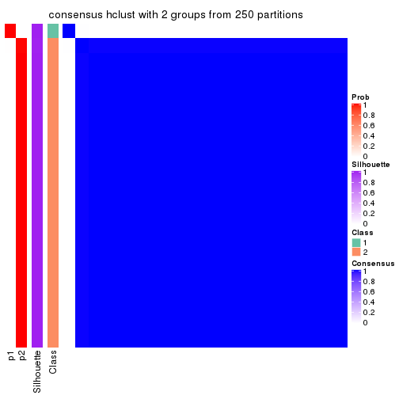</p>

</div>
<div id='tab-MAD-hclust-consensus-heatmap-2'>
<pre><code class="r">consensus_heatmap(res, k = 3)
</code></pre>

<p>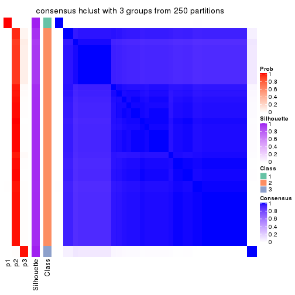</p>

</div>
<div id='tab-MAD-hclust-consensus-heatmap-3'>
<pre><code class="r">consensus_heatmap(res, k = 4)
</code></pre>

<p>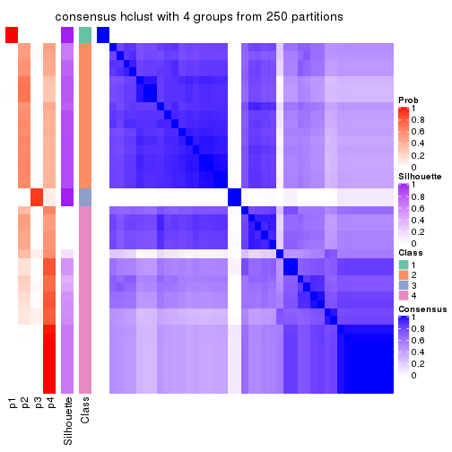</p>

</div>
<div id='tab-MAD-hclust-consensus-heatmap-4'>
<pre><code class="r">consensus_heatmap(res, k = 5)
</code></pre>

<p>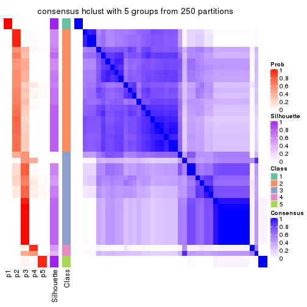</p>

</div>
<div id='tab-MAD-hclust-consensus-heatmap-5'>
<pre><code class="r">consensus_heatmap(res, k = 6)
</code></pre>

<p>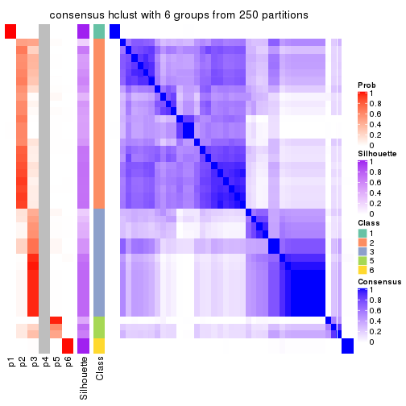</p>

</div>
</div>

Heatmaps for the membership of samples in all partitions to see how consistent they are:


<script>
$( function() {
	$( '#tabs-MAD-hclust-membership-heatmap' ).tabs();
} );
</script>
<div id='tabs-MAD-hclust-membership-heatmap'>
<ul>
<li><a href='#tab-MAD-hclust-membership-heatmap-1'>k = 2</a></li>
<li><a href='#tab-MAD-hclust-membership-heatmap-2'>k = 3</a></li>
<li><a href='#tab-MAD-hclust-membership-heatmap-3'>k = 4</a></li>
<li><a href='#tab-MAD-hclust-membership-heatmap-4'>k = 5</a></li>
<li><a href='#tab-MAD-hclust-membership-heatmap-5'>k = 6</a></li>
</ul>
<div id='tab-MAD-hclust-membership-heatmap-1'>
<pre><code class="r">membership_heatmap(res, k = 2)
</code></pre>

<p>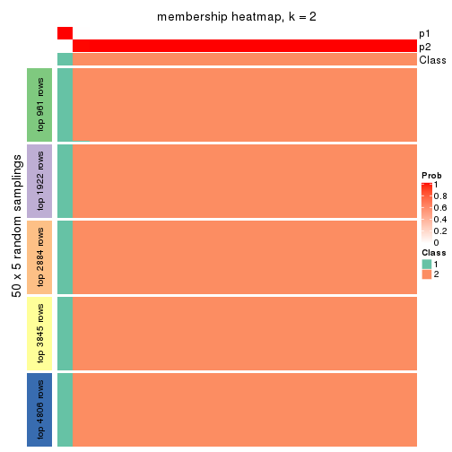</p>

</div>
<div id='tab-MAD-hclust-membership-heatmap-2'>
<pre><code class="r">membership_heatmap(res, k = 3)
</code></pre>

<p>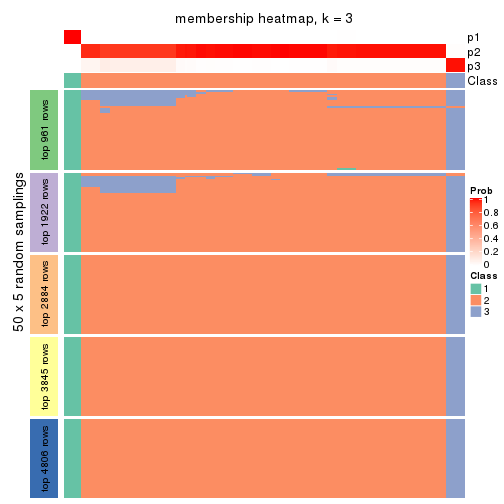</p>

</div>
<div id='tab-MAD-hclust-membership-heatmap-3'>
<pre><code class="r">membership_heatmap(res, k = 4)
</code></pre>

<p>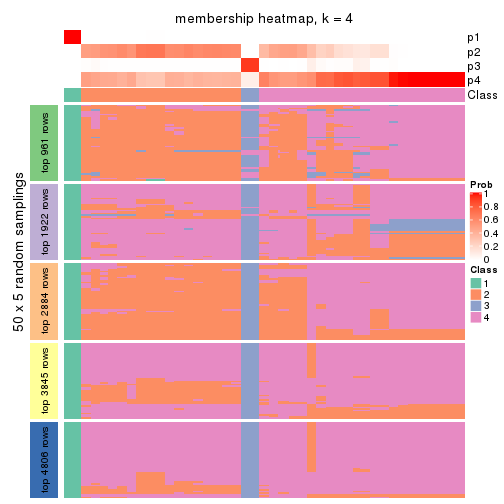</p>

</div>
<div id='tab-MAD-hclust-membership-heatmap-4'>
<pre><code class="r">membership_heatmap(res, k = 5)
</code></pre>

<p>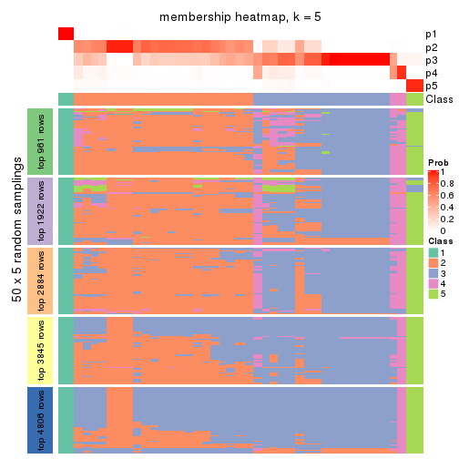</p>

</div>
<div id='tab-MAD-hclust-membership-heatmap-5'>
<pre><code class="r">membership_heatmap(res, k = 6)
</code></pre>

<p>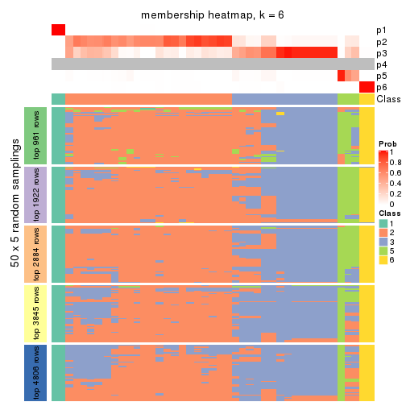</p>

</div>
</div>

As soon as we have had the classes for columns, we can look for signatures
which are significantly different between classes which can be candidate marks
for certain classes. Following are the heatmaps for signatures.


Signature heatmaps where rows are scaled:


<script>
$( function() {
	$( '#tabs-MAD-hclust-get-signatures' ).tabs();
} );
</script>
<div id='tabs-MAD-hclust-get-signatures'>
<ul>
<li><a href='#tab-MAD-hclust-get-signatures-1'>k = 2</a></li>
<li><a href='#tab-MAD-hclust-get-signatures-2'>k = 3</a></li>
<li><a href='#tab-MAD-hclust-get-signatures-3'>k = 4</a></li>
<li><a href='#tab-MAD-hclust-get-signatures-4'>k = 5</a></li>
<li><a href='#tab-MAD-hclust-get-signatures-5'>k = 6</a></li>
</ul>
<div id='tab-MAD-hclust-get-signatures-1'>
<pre><code class="r">get_signatures(res, k = 2)
</code></pre>

<p>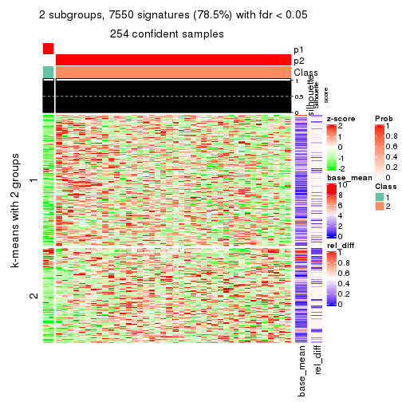</p>

</div>
<div id='tab-MAD-hclust-get-signatures-2'>
<pre><code class="r">get_signatures(res, k = 3)
</code></pre>

<p>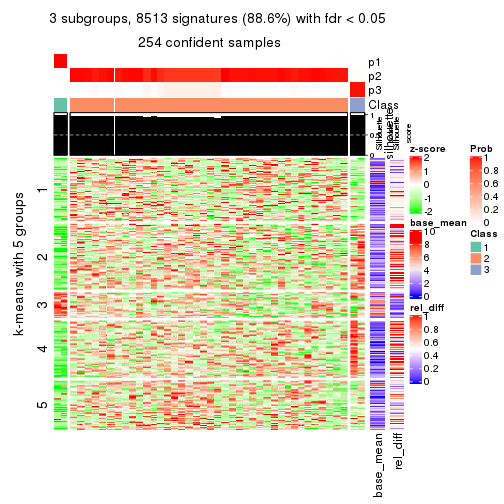</p>

</div>
<div id='tab-MAD-hclust-get-signatures-3'>
<pre><code class="r">get_signatures(res, k = 4)
</code></pre>

<p>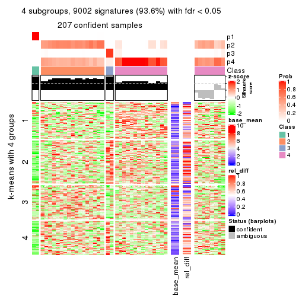</p>

</div>
<div id='tab-MAD-hclust-get-signatures-4'>
<pre><code class="r">get_signatures(res, k = 5)
</code></pre>

<p>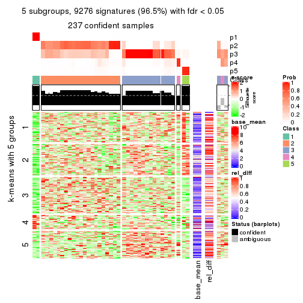</p>

</div>
<div id='tab-MAD-hclust-get-signatures-5'>
<pre><code class="r">get_signatures(res, k = 6)
</code></pre>

<p>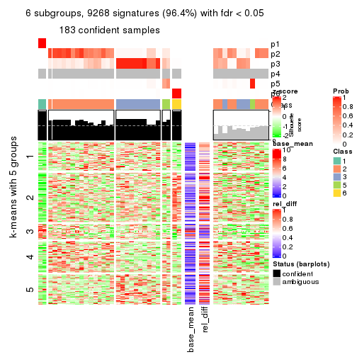</p>

</div>
</div>


Signature heatmaps where rows are not scaled:


<script>
$( function() {
	$( '#tabs-MAD-hclust-get-signatures-no-scale' ).tabs();
} );
</script>
<div id='tabs-MAD-hclust-get-signatures-no-scale'>
<ul>
<li><a href='#tab-MAD-hclust-get-signatures-no-scale-1'>k = 2</a></li>
<li><a href='#tab-MAD-hclust-get-signatures-no-scale-2'>k = 3</a></li>
<li><a href='#tab-MAD-hclust-get-signatures-no-scale-3'>k = 4</a></li>
<li><a href='#tab-MAD-hclust-get-signatures-no-scale-4'>k = 5</a></li>
<li><a href='#tab-MAD-hclust-get-signatures-no-scale-5'>k = 6</a></li>
</ul>
<div id='tab-MAD-hclust-get-signatures-no-scale-1'>
<pre><code class="r">get_signatures(res, k = 2, scale_rows = FALSE)
</code></pre>

<p>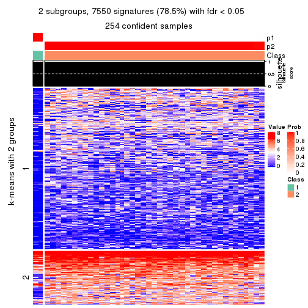</p>

</div>
<div id='tab-MAD-hclust-get-signatures-no-scale-2'>
<pre><code class="r">get_signatures(res, k = 3, scale_rows = FALSE)
</code></pre>

<p>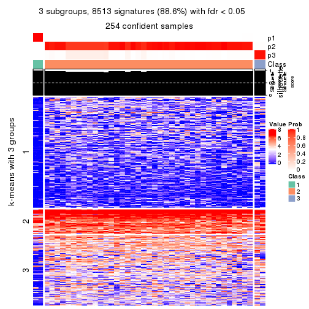</p>

</div>
<div id='tab-MAD-hclust-get-signatures-no-scale-3'>
<pre><code class="r">get_signatures(res, k = 4, scale_rows = FALSE)
</code></pre>

<p>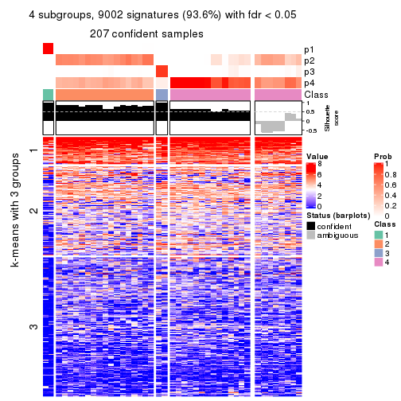</p>

</div>
<div id='tab-MAD-hclust-get-signatures-no-scale-4'>
<pre><code class="r">get_signatures(res, k = 5, scale_rows = FALSE)
</code></pre>

<p>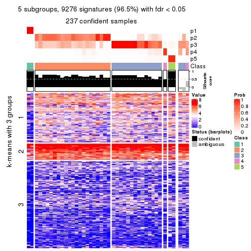</p>

</div>
<div id='tab-MAD-hclust-get-signatures-no-scale-5'>
<pre><code class="r">get_signatures(res, k = 6, scale_rows = FALSE)
</code></pre>

<p>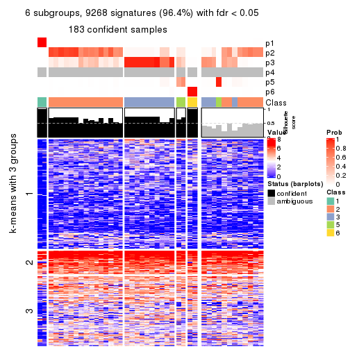</p>

</div>
</div>


Compare the overlap of signatures from different k:

```r
compare_signatures(res)
```

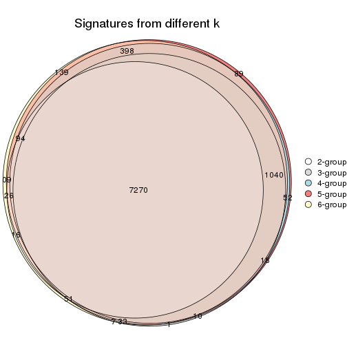

`get_signature()` returns a data frame invisibly. TO get the list of signatures, the function
call should be assigned to a variable explicitly. In following code, if `plot` argument is set
to `FALSE`, no heatmap is plotted while only the differential analysis is performed.

```r
# code only for demonstration
tb = get_signature(res, k = ..., plot = FALSE)
```

An example of the output of `tb` is:

```
#>   which_row         fdr    mean_1    mean_2 scaled_mean_1 scaled_mean_2 km
#> 1        38 0.042760348  8.373488  9.131774    -0.5533452     0.5164555  1
#> 2        40 0.018707592  7.106213  8.469186    -0.6173731     0.5762149  1
#> 3        55 0.019134737 10.221463 11.207825    -0.6159697     0.5749050  1
#> 4        59 0.006059896  5.921854  7.869574    -0.6899429     0.6439467  1
#> 5        60 0.018055526  8.928898 10.211722    -0.6204761     0.5791110  1
#> 6        98 0.009384629 15.714769 14.887706     0.6635654    -0.6193277  2
...
```

The columns in `tb` are:

1. `which_row`: row indices corresponding to the input matrix.
2. `fdr`: FDR for the differential test. 
3. `mean_x`: The mean value in group x.
4. `scaled_mean_x`: The mean value in group x after rows are scaled.
5. `km`: Row groups if k-means clustering is applied to rows.


UMAP plot which shows how samples are separated.


<script>
$( function() {
	$( '#tabs-MAD-hclust-dimension-reduction' ).tabs();
} );
</script>
<div id='tabs-MAD-hclust-dimension-reduction'>
<ul>
<li><a href='#tab-MAD-hclust-dimension-reduction-1'>k = 2</a></li>
<li><a href='#tab-MAD-hclust-dimension-reduction-2'>k = 3</a></li>
<li><a href='#tab-MAD-hclust-dimension-reduction-3'>k = 4</a></li>
<li><a href='#tab-MAD-hclust-dimension-reduction-4'>k = 5</a></li>
<li><a href='#tab-MAD-hclust-dimension-reduction-5'>k = 6</a></li>
</ul>
<div id='tab-MAD-hclust-dimension-reduction-1'>
<pre><code class="r">dimension_reduction(res, k = 2, method = &quot;UMAP&quot;)
</code></pre>

<p>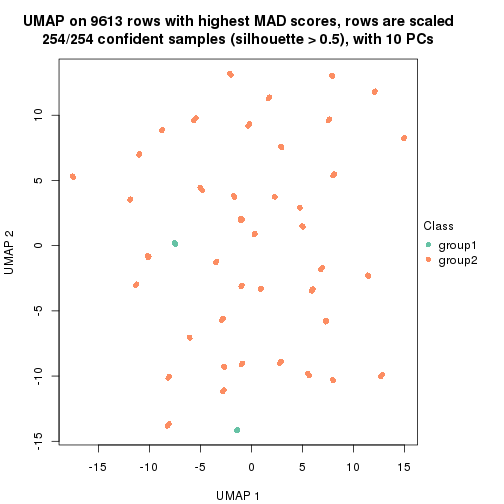</p>

</div>
<div id='tab-MAD-hclust-dimension-reduction-2'>
<pre><code class="r">dimension_reduction(res, k = 3, method = &quot;UMAP&quot;)
</code></pre>

<p>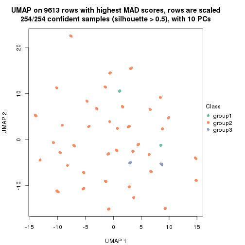</p>

</div>
<div id='tab-MAD-hclust-dimension-reduction-3'>
<pre><code class="r">dimension_reduction(res, k = 4, method = &quot;UMAP&quot;)
</code></pre>

<p>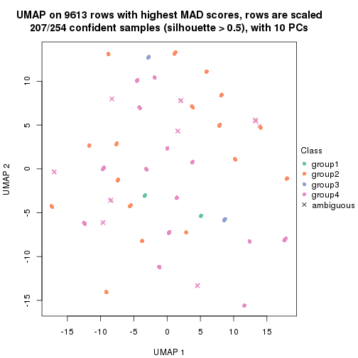</p>

</div>
<div id='tab-MAD-hclust-dimension-reduction-4'>
<pre><code class="r">dimension_reduction(res, k = 5, method = &quot;UMAP&quot;)
</code></pre>

<p>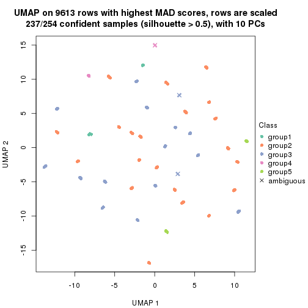</p>

</div>
<div id='tab-MAD-hclust-dimension-reduction-5'>
<pre><code class="r">dimension_reduction(res, k = 6, method = &quot;UMAP&quot;)
</code></pre>

<p>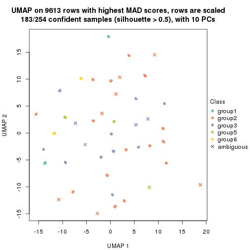</p>

</div>
</div>


Following heatmap shows how subgroups are split when increasing `k`:

```r
collect_classes(res)
```

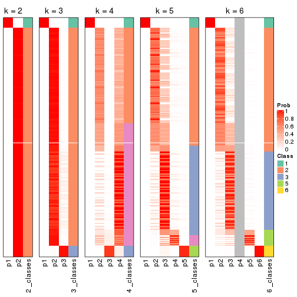


If matrix rows can be associated to genes, consider to use `GO_Enrichment(res,
...)` to perform function enrichment for the signature genes.


 

---------------------------------------------------


### MAD:kmeans


The object with results only for a single top-value method and a single partition method 
can be extracted as:

```r
res = res_list["MAD", "kmeans"]
# you can also extract it by
# res = res_list["MAD:kmeans"]
```

A summary of `res` and all the functions that can be applied to it:

```r
res
```

```
#> A 'ConsensusPartition' object with k = 2, 3, 4, 5, 6.
#>   On a matrix with 9613 rows and 254 columns.
#>   Top rows (961, 1922, 2884, 3845, 4806) are extracted by 'MAD' method.
#>   Subgroups are detected by 'kmeans' method.
#>   Performed in total 1250 partitions by row resampling.
#>   Best k for subgroups seems to be 3.
#> 
#> Following methods can be applied to this 'ConsensusPartition' object:
#>  [1] "cola_report"             "collect_classes"         "collect_plots"          
#>  [4] "collect_stats"           "colnames"                "compare_signatures"     
#>  [7] "consensus_heatmap"       "dimension_reduction"     "functional_enrichment"  
#> [10] "get_anno_col"            "get_anno"                "get_classes"            
#> [13] "get_consensus"           "get_matrix"              "get_membership"         
#> [16] "get_param"               "get_signatures"          "get_stats"              
#> [19] "is_best_k"               "is_stable_k"             "membership_heatmap"     
#> [22] "ncol"                    "nrow"                    "plot_ecdf"              
#> [25] "rownames"                "select_partition_number" "show"                   
#> [28] "suggest_best_k"          "test_to_known_factors"
```

`collect_plots()` function collects all the plots made from `res` for all `k` (number of partitions)
into one single page to provide an easy and fast comparison between different `k`.

```r
collect_plots(res)
```

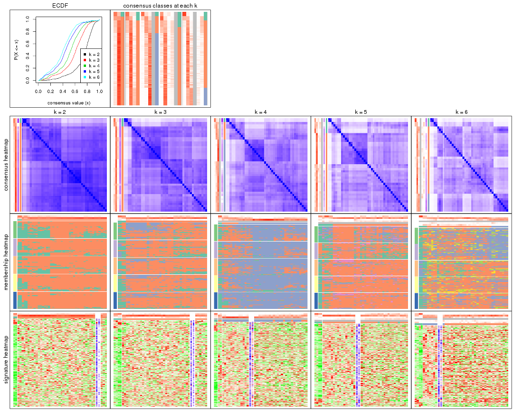

The plots are:

- The first row: a plot of the ECDF (Empirical cumulative distribution
  function) curves of the consensus matrix for each `k` and the heatmap of
  predicted classes for each `k`.
- The second row: heatmaps of the consensus matrix for each `k`.
- The third row: heatmaps of the membership matrix for each `k`.
- The fouth row: heatmaps of the signatures for each `k`.

All the plots in panels can be made by individual functions and they are
plotted later in this section.

`select_partition_number()` produces several plots showing different
statistics for choosing "optimized" `k`. There are following statistics:

- ECDF curves of the consensus matrix for each `k`;
- 1-PAC. [The PAC
  score](https://en.wikipedia.org/wiki/Consensus_clustering#Over-interpretation_potential_of_consensus_clustering)
  measures the proportion of the ambiguous subgrouping.
- Mean silhouette score.
- Concordance. The mean probability of fiting the consensus class ids in all
  partitions.
- Area increased. Denote $A_k$ as the area under the ECDF curve for current
  `k`, the area increased is defined as $A_k - A_{k-1}$.
- Rand index. The percent of pairs of samples that are both in a same cluster
  or both are not in a same cluster in the partition of k and k-1.
- Jaccard index. The ratio of pairs of samples are both in a same cluster in
  the partition of k and k-1 and the pairs of samples are both in a same
  cluster in the partition k or k-1.

The detailed explanations of these statistics can be found in [the cola
vignette](http://bioconductor.org/packages/devel/bioc/vignettes/cola/inst/doc/cola.html#toc_13).

Generally speaking, lower PAC score, higher mean silhouette score or higher
concordance corresponds to better partition. Rand index and Jaccard index
measure how similar the current partition is compared to partition with `k-1`.
If they are too similar, we won't accept `k` is better than `k-1`.

```r
select_partition_number(res)
```

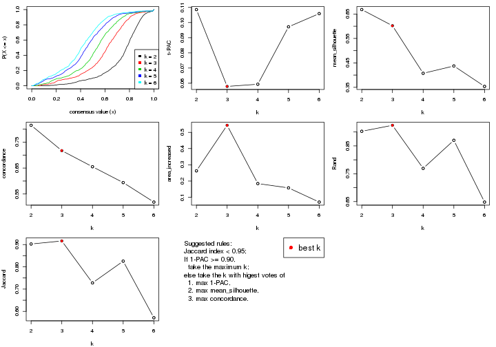

The numeric values for all these statistics can be obtained by `get_stats()`.

```r
get_stats(res)
```

```
#>   k  1-PAC mean_silhouette concordance area_increased  Rand Jaccard
#> 2 2 0.1085           0.668       0.815         0.2627 0.902   0.902
#> 3 3 0.0579           0.602       0.717         0.5435 0.924   0.916
#> 4 4 0.0593           0.407       0.655         0.1843 0.769   0.728
#> 5 5 0.0972           0.437       0.594         0.1578 0.870   0.825
#> 6 6 0.1059           0.354       0.519         0.0703 0.648   0.571
```

`suggest_best_k()` suggests the best $k$ based on these statistics. The rules are as follows:

- All $k$ with Jaccard index larger than 0.95 are removed because the increase of
  the partition number does not provides enough extra information. If all $k$ are removed,
  the best $k$ is assigned by `NA`.
- For $k$ with 1-PAC larger than 0.9, the maximal $k$ is taken as the "best k". Other $k$ is called "optional k".
- If it does not fit the second rule. The $k$ with the highest vote of highest
  1-PAC, mean silhouette and concordance is taken as the "best k".

```r
suggest_best_k(res)
```

```
#> [1] 3
```


Following shows the table of the partitions (You need to click the **show/hide
code output** link to see it). The membership matrix (columns with name `p*`)
is inferred by
[`clue::cl_consensus()`](https://www.rdocumentation.org/link/cl_consensus?package=clue)
function with the `SE` method. Basically the value in the membership matrix
represents the probability to belong to a certain group. The finall class
label for an item is determined with the group with highest probability it
belongs to.

In `get_classes()` function, the entropy is calculated from the membership
matrix and the silhouette score is calculated from the consensus matrix.


<script>
$( function() {
	$( '#tabs-MAD-kmeans-get-classes' ).tabs();
} );
</script>
<div id='tabs-MAD-kmeans-get-classes'>
<ul>
<li><a href='#tab-MAD-kmeans-get-classes-1'>k = 2</a></li>
<li><a href='#tab-MAD-kmeans-get-classes-2'>k = 3</a></li>
<li><a href='#tab-MAD-kmeans-get-classes-3'>k = 4</a></li>
<li><a href='#tab-MAD-kmeans-get-classes-4'>k = 5</a></li>
<li><a href='#tab-MAD-kmeans-get-classes-5'>k = 6</a></li>
</ul>

<div id='tab-MAD-kmeans-get-classes-1'>
<p><a id='tab-MAD-kmeans-get-classes-1-a' style='color:#0366d6' href='#'>show/hide code output</a></p>
<pre><code class="r">cbind(get_classes(res, k = 2), get_membership(res, k = 2))
</code></pre>

<pre><code>#&gt;           class entropy silhouette    p1    p2
#&gt; DRR024803     1   0.909      0.936 0.676 0.324
#&gt; DRR024804     2   0.295      0.778 0.052 0.948
#&gt; DRR024805     2   0.482      0.777 0.104 0.896
#&gt; DRR024806     2   0.506      0.770 0.112 0.888
#&gt; DRR024807     2   0.722      0.655 0.200 0.800
#&gt; DRR024808     2   0.541      0.734 0.124 0.876
#&gt; DRR024809     2   0.518      0.765 0.116 0.884
#&gt; DRR024810     2   0.827      0.584 0.260 0.740
#&gt; DRR024811     2   0.605      0.720 0.148 0.852
#&gt; DRR024812     2   0.518      0.746 0.116 0.884
#&gt; DRR024813     2   0.373      0.767 0.072 0.928
#&gt; DRR024814     2   0.625      0.722 0.156 0.844
#&gt; DRR024815     2   0.634      0.726 0.160 0.840
#&gt; DRR024816     2   0.909      0.388 0.324 0.676
#&gt; DRR024817     2   0.697      0.712 0.188 0.812
#&gt; DRR024818     2   0.469      0.759 0.100 0.900
#&gt; DRR024819     2   0.722      0.680 0.200 0.800
#&gt; DRR024820     2   0.855      0.529 0.280 0.720
#&gt; DRR024821     2   0.494      0.746 0.108 0.892
#&gt; DRR024822     2   0.343      0.778 0.064 0.936
#&gt; DRR024824     2   0.595      0.754 0.144 0.856
#&gt; DRR024825     2   0.506      0.740 0.112 0.888
#&gt; DRR024826     2   0.311      0.774 0.056 0.944
#&gt; DRR024827     2   0.563      0.759 0.132 0.868
#&gt; DRR024828     2   0.714      0.658 0.196 0.804
#&gt; DRR024829     2   0.861      0.504 0.284 0.716
#&gt; DRR024830     2   0.595      0.744 0.144 0.856
#&gt; DRR024831     2   0.671      0.683 0.176 0.824
#&gt; DRR024832     2   0.529      0.737 0.120 0.880
#&gt; DRR024833     2   0.295      0.777 0.052 0.948
#&gt; DRR024834     2   1.000     -0.528 0.500 0.500
#&gt; DRR024835     2   0.722      0.701 0.200 0.800
#&gt; DRR024836     2   0.584      0.721 0.140 0.860
#&gt; DRR024837     2   0.999     -0.436 0.480 0.520
#&gt; DRR024838     2   0.788      0.596 0.236 0.764
#&gt; DRR024839     2   0.373      0.775 0.072 0.928
#&gt; DRR024840     2   0.388      0.774 0.076 0.924
#&gt; DRR024841     2   0.730      0.672 0.204 0.796
#&gt; DRR024842     2   0.388      0.763 0.076 0.924
#&gt; DRR024843     1   0.909      0.936 0.676 0.324
#&gt; DRR024844     2   0.295      0.778 0.052 0.948
#&gt; DRR024845     2   0.482      0.777 0.104 0.896
#&gt; DRR024846     2   0.506      0.770 0.112 0.888
#&gt; DRR024847     2   0.722      0.655 0.200 0.800
#&gt; DRR024848     1   0.909      0.936 0.676 0.324
#&gt; DRR024849     2   0.541      0.734 0.124 0.876
#&gt; DRR024850     2   0.343      0.776 0.064 0.936
#&gt; DRR024851     2   0.518      0.765 0.116 0.884
#&gt; DRR024852     2   0.827      0.584 0.260 0.740
#&gt; DRR024853     2   0.605      0.720 0.148 0.852
#&gt; DRR024854     2   0.518      0.746 0.116 0.884
#&gt; DRR024855     2   0.373      0.767 0.072 0.928
#&gt; DRR024856     2   0.625      0.722 0.156 0.844
#&gt; DRR024857     2   0.634      0.726 0.160 0.840
#&gt; DRR024858     2   0.909      0.388 0.324 0.676
#&gt; DRR024859     2   0.697      0.712 0.188 0.812
#&gt; DRR024860     2   0.469      0.759 0.100 0.900
#&gt; DRR024861     2   0.722      0.680 0.200 0.800
#&gt; DRR024862     2   0.855      0.529 0.280 0.720
#&gt; DRR024863     2   0.494      0.746 0.108 0.892
#&gt; DRR024864     2   0.343      0.778 0.064 0.936
#&gt; DRR024865     2   0.814      0.572 0.252 0.748
#&gt; DRR024866     2   0.595      0.754 0.144 0.856
#&gt; DRR024867     2   0.506      0.740 0.112 0.888
#&gt; DRR024868     2   0.311      0.774 0.056 0.944
#&gt; DRR024869     2   0.563      0.759 0.132 0.868
#&gt; DRR024870     2   0.714      0.658 0.196 0.804
#&gt; DRR024871     2   0.861      0.504 0.284 0.716
#&gt; DRR024872     2   0.595      0.744 0.144 0.856
#&gt; DRR024873     2   0.671      0.683 0.176 0.824
#&gt; DRR024874     2   0.529      0.737 0.120 0.880
#&gt; DRR024875     2   0.295      0.777 0.052 0.948
#&gt; DRR024876     2   1.000     -0.528 0.500 0.500
#&gt; DRR024877     2   0.722      0.701 0.200 0.800
#&gt; DRR024878     2   0.584      0.721 0.140 0.860
#&gt; DRR024879     2   0.999     -0.436 0.480 0.520
#&gt; DRR024880     2   0.788      0.596 0.236 0.764
#&gt; DRR024881     2   0.373      0.775 0.072 0.928
#&gt; DRR024882     2   0.388      0.774 0.076 0.924
#&gt; DRR024883     2   0.730      0.672 0.204 0.796
#&gt; DRR024884     2   0.714      0.709 0.196 0.804
#&gt; DRR024885     2   0.506      0.773 0.112 0.888
#&gt; DRR024886     1   0.909      0.936 0.676 0.324
#&gt; DRR024887     2   0.295      0.778 0.052 0.948
#&gt; DRR024888     2   0.482      0.777 0.104 0.896
#&gt; DRR024889     2   0.506      0.770 0.112 0.888
#&gt; DRR024890     2   0.722      0.655 0.200 0.800
#&gt; DRR024891     1   0.909      0.936 0.676 0.324
#&gt; DRR024892     2   0.541      0.734 0.124 0.876
#&gt; DRR024893     2   0.343      0.776 0.064 0.936
#&gt; DRR024894     2   0.518      0.765 0.116 0.884
#&gt; DRR024895     2   0.827      0.584 0.260 0.740
#&gt; DRR024896     2   0.605      0.720 0.148 0.852
#&gt; DRR024897     2   0.518      0.746 0.116 0.884
#&gt; DRR024898     2   0.373      0.767 0.072 0.928
#&gt; DRR024899     2   0.625      0.722 0.156 0.844
#&gt; DRR024900     2   0.634      0.726 0.160 0.840
#&gt; DRR024901     2   0.909      0.388 0.324 0.676
#&gt; DRR024902     2   0.697      0.712 0.188 0.812
#&gt; DRR024903     2   0.469      0.759 0.100 0.900
#&gt; DRR024904     2   0.722      0.680 0.200 0.800
#&gt; DRR024905     2   0.855      0.529 0.280 0.720
#&gt; DRR024906     2   0.494      0.746 0.108 0.892
#&gt; DRR024907     2   0.343      0.778 0.064 0.936
#&gt; DRR024908     2   0.814      0.572 0.252 0.748
#&gt; DRR024909     2   0.595      0.754 0.144 0.856
#&gt; DRR024910     2   0.506      0.740 0.112 0.888
#&gt; DRR024911     2   0.311      0.774 0.056 0.944
#&gt; DRR024912     2   0.563      0.759 0.132 0.868
#&gt; DRR024913     2   0.714      0.658 0.196 0.804
#&gt; DRR024914     2   0.861      0.504 0.284 0.716
#&gt; DRR024915     2   0.595      0.744 0.144 0.856
#&gt; DRR024916     2   0.671      0.683 0.176 0.824
#&gt; DRR024917     2   0.529      0.737 0.120 0.880
#&gt; DRR024918     2   0.295      0.777 0.052 0.948
#&gt; DRR024919     1   1.000      0.486 0.500 0.500
#&gt; DRR024920     2   0.722      0.701 0.200 0.800
#&gt; DRR024921     2   0.584      0.721 0.140 0.860
#&gt; DRR024922     2   0.999     -0.436 0.480 0.520
#&gt; DRR024923     2   0.788      0.596 0.236 0.764
#&gt; DRR024924     2   0.373      0.775 0.072 0.928
#&gt; DRR024925     2   0.388      0.774 0.076 0.924
#&gt; DRR024926     2   0.730      0.672 0.204 0.796
#&gt; DRR024927     2   0.714      0.709 0.196 0.804
#&gt; DRR024928     2   0.506      0.773 0.112 0.888
#&gt; DRR024929     1   0.909      0.936 0.676 0.324
#&gt; DRR024930     2   0.295      0.778 0.052 0.948
#&gt; DRR024931     2   0.482      0.777 0.104 0.896
#&gt; DRR024932     2   0.506      0.770 0.112 0.888
#&gt; DRR024933     2   0.722      0.655 0.200 0.800
#&gt; DRR024934     1   0.909      0.936 0.676 0.324
#&gt; DRR024935     2   0.541      0.734 0.124 0.876
#&gt; DRR024936     2   0.343      0.776 0.064 0.936
#&gt; DRR024937     2   0.518      0.765 0.116 0.884
#&gt; DRR024938     2   0.827      0.584 0.260 0.740
#&gt; DRR024939     2   0.605      0.720 0.148 0.852
#&gt; DRR024940     2   0.518      0.746 0.116 0.884
#&gt; DRR024941     2   0.373      0.767 0.072 0.928
#&gt; DRR024942     2   0.625      0.722 0.156 0.844
#&gt; DRR024943     2   0.634      0.726 0.160 0.840
#&gt; DRR024944     2   0.909      0.388 0.324 0.676
#&gt; DRR024945     2   0.697      0.712 0.188 0.812
#&gt; DRR024946     2   0.469      0.759 0.100 0.900
#&gt; DRR024947     2   0.722      0.680 0.200 0.800
#&gt; DRR024948     2   0.855      0.529 0.280 0.720
#&gt; DRR024949     2   0.494      0.746 0.108 0.892
#&gt; DRR024950     2   0.343      0.778 0.064 0.936
#&gt; DRR024951     2   0.814      0.572 0.252 0.748
#&gt; DRR024952     2   0.595      0.754 0.144 0.856
#&gt; DRR024953     2   0.506      0.740 0.112 0.888
#&gt; DRR024954     2   0.311      0.774 0.056 0.944
#&gt; DRR024955     2   0.563      0.759 0.132 0.868
#&gt; DRR024956     2   0.714      0.658 0.196 0.804
#&gt; DRR024957     2   0.861      0.504 0.284 0.716
#&gt; DRR024958     2   0.595      0.744 0.144 0.856
#&gt; DRR024959     2   0.671      0.683 0.176 0.824
#&gt; DRR024960     2   0.529      0.737 0.120 0.880
#&gt; DRR024961     2   0.295      0.777 0.052 0.948
#&gt; DRR024962     1   1.000      0.486 0.500 0.500
#&gt; DRR024963     2   0.722      0.701 0.200 0.800
#&gt; DRR024964     2   0.584      0.721 0.140 0.860
#&gt; DRR024965     2   0.999     -0.436 0.480 0.520
#&gt; DRR024966     2   0.788      0.596 0.236 0.764
#&gt; DRR024967     2   0.373      0.775 0.072 0.928
#&gt; DRR024968     2   0.388      0.774 0.076 0.924
#&gt; DRR024969     2   0.730      0.672 0.204 0.796
#&gt; DRR024970     2   0.714      0.709 0.196 0.804
#&gt; DRR024971     2   0.506      0.773 0.112 0.888
#&gt; DRR024972     1   0.909      0.936 0.676 0.324
#&gt; DRR024973     2   0.295      0.778 0.052 0.948
#&gt; DRR024974     2   0.482      0.777 0.104 0.896
#&gt; DRR024975     2   0.506      0.770 0.112 0.888
#&gt; DRR024976     2   0.722      0.655 0.200 0.800
#&gt; DRR024977     1   0.909      0.936 0.676 0.324
#&gt; DRR024978     2   0.541      0.734 0.124 0.876
#&gt; DRR024979     2   0.343      0.776 0.064 0.936
#&gt; DRR024980     2   0.518      0.765 0.116 0.884
#&gt; DRR024981     2   0.827      0.584 0.260 0.740
#&gt; DRR024982     2   0.605      0.720 0.148 0.852
#&gt; DRR024983     2   0.518      0.746 0.116 0.884
#&gt; DRR024984     2   0.373      0.767 0.072 0.928
#&gt; DRR024985     2   0.625      0.722 0.156 0.844
#&gt; DRR024986     2   0.634      0.726 0.160 0.840
#&gt; DRR024987     2   0.909      0.388 0.324 0.676
#&gt; DRR024988     2   0.697      0.712 0.188 0.812
#&gt; DRR024989     2   0.469      0.759 0.100 0.900
#&gt; DRR024990     2   0.722      0.680 0.200 0.800
#&gt; DRR024991     2   0.855      0.529 0.280 0.720
#&gt; DRR024992     2   0.494      0.746 0.108 0.892
#&gt; DRR024993     2   0.343      0.778 0.064 0.936
#&gt; DRR024994     2   0.814      0.572 0.252 0.748
#&gt; DRR024995     2   0.595      0.754 0.144 0.856
#&gt; DRR024996     2   0.506      0.740 0.112 0.888
#&gt; DRR024997     2   0.311      0.774 0.056 0.944
#&gt; DRR024998     2   0.563      0.759 0.132 0.868
#&gt; DRR024999     2   0.714      0.658 0.196 0.804
#&gt; DRR025000     2   0.861      0.504 0.284 0.716
#&gt; DRR025001     2   0.595      0.744 0.144 0.856
#&gt; DRR025002     2   0.671      0.683 0.176 0.824
#&gt; DRR025003     2   0.529      0.737 0.120 0.880
#&gt; DRR025004     2   0.295      0.777 0.052 0.948
#&gt; DRR025005     2   1.000     -0.528 0.500 0.500
#&gt; DRR025006     2   0.722      0.701 0.200 0.800
#&gt; DRR025007     2   0.584      0.721 0.140 0.860
#&gt; DRR025008     2   0.999     -0.436 0.480 0.520
#&gt; DRR025009     2   0.788      0.596 0.236 0.764
#&gt; DRR025010     2   0.373      0.775 0.072 0.928
#&gt; DRR025011     2   0.388      0.774 0.076 0.924
#&gt; DRR025012     2   0.730      0.672 0.204 0.796
#&gt; DRR025013     2   0.714      0.709 0.196 0.804
#&gt; DRR025014     2   0.506      0.773 0.112 0.888
#&gt; DRR025015     1   0.909      0.936 0.676 0.324
#&gt; DRR025016     2   0.295      0.778 0.052 0.948
#&gt; DRR025017     2   0.482      0.777 0.104 0.896
#&gt; DRR025018     2   0.506      0.770 0.112 0.888
#&gt; DRR025019     2   0.722      0.655 0.200 0.800
#&gt; DRR025020     1   0.909      0.936 0.676 0.324
#&gt; DRR025021     2   0.541      0.734 0.124 0.876
#&gt; DRR025022     2   0.343      0.776 0.064 0.936
#&gt; DRR025023     2   0.518      0.765 0.116 0.884
#&gt; DRR025024     2   0.827      0.584 0.260 0.740
#&gt; DRR025025     2   0.605      0.720 0.148 0.852
#&gt; DRR025026     2   0.518      0.746 0.116 0.884
#&gt; DRR025027     2   0.373      0.767 0.072 0.928
#&gt; DRR025028     2   0.625      0.722 0.156 0.844
#&gt; DRR025029     2   0.634      0.726 0.160 0.840
#&gt; DRR025030     2   0.909      0.388 0.324 0.676
#&gt; DRR025031     2   0.697      0.712 0.188 0.812
#&gt; DRR025032     2   0.469      0.759 0.100 0.900
#&gt; DRR025033     2   0.722      0.680 0.200 0.800
#&gt; DRR025034     2   0.855      0.529 0.280 0.720
#&gt; DRR025035     2   0.494      0.746 0.108 0.892
#&gt; DRR025036     2   0.343      0.778 0.064 0.936
#&gt; DRR025037     2   0.814      0.572 0.252 0.748
#&gt; DRR025038     2   0.595      0.754 0.144 0.856
#&gt; DRR025039     2   0.506      0.740 0.112 0.888
#&gt; DRR025040     2   0.311      0.774 0.056 0.944
#&gt; DRR025041     2   0.563      0.759 0.132 0.868
#&gt; DRR025042     2   0.714      0.658 0.196 0.804
#&gt; DRR025043     2   0.861      0.504 0.284 0.716
#&gt; DRR025044     2   0.595      0.744 0.144 0.856
#&gt; DRR025045     2   0.671      0.683 0.176 0.824
#&gt; DRR025046     2   0.529      0.737 0.120 0.880
#&gt; DRR025047     2   0.295      0.777 0.052 0.948
#&gt; DRR025048     2   1.000     -0.528 0.500 0.500
#&gt; DRR025049     2   0.722      0.701 0.200 0.800
#&gt; DRR025050     2   0.584      0.721 0.140 0.860
#&gt; DRR025051     2   0.999     -0.436 0.480 0.520
#&gt; DRR025052     2   0.788      0.596 0.236 0.764
#&gt; DRR025053     2   0.373      0.775 0.072 0.928
#&gt; DRR025054     2   0.388      0.774 0.076 0.924
#&gt; DRR025055     2   0.730      0.672 0.204 0.796
#&gt; DRR025056     2   0.714      0.709 0.196 0.804
#&gt; DRR025057     2   0.506      0.773 0.112 0.888
</code></pre>

<script>
$('#tab-MAD-kmeans-get-classes-1-a').parent().next().next().hide();
$('#tab-MAD-kmeans-get-classes-1-a').click(function(){
  $('#tab-MAD-kmeans-get-classes-1-a').parent().next().next().toggle();
  return(false);
});
</script>
</div>

<div id='tab-MAD-kmeans-get-classes-2'>
<p><a id='tab-MAD-kmeans-get-classes-2-a' style='color:#0366d6' href='#'>show/hide code output</a></p>
<pre><code class="r">cbind(get_classes(res, k = 3), get_membership(res, k = 3))
</code></pre>

<pre><code>#&gt;           class entropy silhouette    p1    p2    p3
#&gt; DRR024803     1   0.739      0.742 0.704 0.160 0.136
#&gt; DRR024804     2   0.408      0.702 0.048 0.880 0.072
#&gt; DRR024805     2   0.574      0.658 0.100 0.804 0.096
#&gt; DRR024806     2   0.600      0.639 0.144 0.784 0.072
#&gt; DRR024807     2   0.714      0.540 0.040 0.632 0.328
#&gt; DRR024808     2   0.536      0.634 0.000 0.724 0.276
#&gt; DRR024809     2   0.551      0.636 0.136 0.808 0.056
#&gt; DRR024810     2   0.706      0.432 0.264 0.680 0.056
#&gt; DRR024811     2   0.540      0.640 0.004 0.740 0.256
#&gt; DRR024812     2   0.547      0.606 0.168 0.796 0.036
#&gt; DRR024813     2   0.500      0.692 0.028 0.820 0.152
#&gt; DRR024814     2   0.575      0.596 0.180 0.780 0.040
#&gt; DRR024815     2   0.659      0.640 0.128 0.756 0.116
#&gt; DRR024816     2   0.790      0.215 0.324 0.600 0.076
#&gt; DRR024817     2   0.684      0.636 0.116 0.740 0.144
#&gt; DRR024818     2   0.576      0.658 0.016 0.740 0.244
#&gt; DRR024819     2   0.694      0.539 0.216 0.712 0.072
#&gt; DRR024820     2   0.903      0.361 0.248 0.556 0.196
#&gt; DRR024821     2   0.603      0.661 0.024 0.732 0.244
#&gt; DRR024822     2   0.514      0.666 0.104 0.832 0.064
#&gt; DRR024824     2   0.591      0.645 0.144 0.788 0.068
#&gt; DRR024825     2   0.554      0.654 0.012 0.752 0.236
#&gt; DRR024826     2   0.547      0.696 0.060 0.812 0.128
#&gt; DRR024827     2   0.616      0.665 0.048 0.756 0.196
#&gt; DRR024828     2   0.680      0.549 0.024 0.632 0.344
#&gt; DRR024829     2   0.847      0.294 0.252 0.604 0.144
#&gt; DRR024830     2   0.723      0.589 0.172 0.712 0.116
#&gt; DRR024831     2   0.581      0.608 0.004 0.692 0.304
#&gt; DRR024832     2   0.562      0.643 0.008 0.732 0.260
#&gt; DRR024833     2   0.594      0.692 0.064 0.784 0.152
#&gt; DRR024834     1   0.713      0.650 0.580 0.392 0.028
#&gt; DRR024835     2   0.713      0.628 0.116 0.720 0.164
#&gt; DRR024836     2   0.573      0.633 0.008 0.720 0.272
#&gt; DRR024837     1   0.766      0.626 0.548 0.404 0.048
#&gt; DRR024838     2   0.807      0.362 0.284 0.616 0.100
#&gt; DRR024839     2   0.380      0.693 0.056 0.892 0.052
#&gt; DRR024840     2   0.448      0.686 0.064 0.864 0.072
#&gt; DRR024841     2   0.719      0.528 0.224 0.696 0.080
#&gt; DRR024842     2   0.375      0.662 0.096 0.884 0.020
#&gt; DRR024843     1   0.739      0.742 0.704 0.160 0.136
#&gt; DRR024844     2   0.408      0.702 0.048 0.880 0.072
#&gt; DRR024845     2   0.574      0.658 0.100 0.804 0.096
#&gt; DRR024846     2   0.600      0.639 0.144 0.784 0.072
#&gt; DRR024847     2   0.714      0.540 0.040 0.632 0.328
#&gt; DRR024848     1   0.739      0.741 0.704 0.160 0.136
#&gt; DRR024849     2   0.536      0.634 0.000 0.724 0.276
#&gt; DRR024850     2   0.442      0.692 0.088 0.864 0.048
#&gt; DRR024851     2   0.551      0.636 0.136 0.808 0.056
#&gt; DRR024852     2   0.706      0.432 0.264 0.680 0.056
#&gt; DRR024853     2   0.540      0.640 0.004 0.740 0.256
#&gt; DRR024854     2   0.547      0.606 0.168 0.796 0.036
#&gt; DRR024855     2   0.500      0.692 0.028 0.820 0.152
#&gt; DRR024856     2   0.575      0.596 0.180 0.780 0.040
#&gt; DRR024857     2   0.659      0.640 0.128 0.756 0.116
#&gt; DRR024858     2   0.790      0.215 0.324 0.600 0.076
#&gt; DRR024859     2   0.684      0.636 0.116 0.740 0.144
#&gt; DRR024860     2   0.576      0.658 0.016 0.740 0.244
#&gt; DRR024861     2   0.694      0.539 0.216 0.712 0.072
#&gt; DRR024862     2   0.903      0.361 0.248 0.556 0.196
#&gt; DRR024863     2   0.603      0.661 0.024 0.732 0.244
#&gt; DRR024864     2   0.514      0.666 0.104 0.832 0.064
#&gt; DRR024865     2   0.737      0.429 0.292 0.648 0.060
#&gt; DRR024866     2   0.591      0.645 0.144 0.788 0.068
#&gt; DRR024867     2   0.554      0.654 0.012 0.752 0.236
#&gt; DRR024868     2   0.547      0.696 0.060 0.812 0.128
#&gt; DRR024869     2   0.616      0.665 0.048 0.756 0.196
#&gt; DRR024870     2   0.680      0.549 0.024 0.632 0.344
#&gt; DRR024871     2   0.847      0.294 0.252 0.604 0.144
#&gt; DRR024872     2   0.723      0.589 0.172 0.712 0.116
#&gt; DRR024873     2   0.581      0.608 0.004 0.692 0.304
#&gt; DRR024874     2   0.562      0.643 0.008 0.732 0.260
#&gt; DRR024875     2   0.594      0.692 0.064 0.784 0.152
#&gt; DRR024876     1   0.713      0.650 0.580 0.392 0.028
#&gt; DRR024877     2   0.713      0.628 0.116 0.720 0.164
#&gt; DRR024878     2   0.573      0.633 0.008 0.720 0.272
#&gt; DRR024879     1   0.766      0.626 0.548 0.404 0.048
#&gt; DRR024880     2   0.807      0.362 0.284 0.616 0.100
#&gt; DRR024881     2   0.380      0.693 0.056 0.892 0.052
#&gt; DRR024882     2   0.448      0.686 0.064 0.864 0.072
#&gt; DRR024883     2   0.719      0.528 0.224 0.696 0.080
#&gt; DRR024884     2   0.617      0.636 0.144 0.776 0.080
#&gt; DRR024885     2   0.664      0.674 0.092 0.748 0.160
#&gt; DRR024886     1   0.739      0.742 0.704 0.160 0.136
#&gt; DRR024887     2   0.408      0.702 0.048 0.880 0.072
#&gt; DRR024888     2   0.574      0.658 0.100 0.804 0.096
#&gt; DRR024889     2   0.600      0.639 0.144 0.784 0.072
#&gt; DRR024890     2   0.714      0.540 0.040 0.632 0.328
#&gt; DRR024891     1   0.739      0.741 0.704 0.160 0.136
#&gt; DRR024892     2   0.536      0.634 0.000 0.724 0.276
#&gt; DRR024893     2   0.442      0.692 0.088 0.864 0.048
#&gt; DRR024894     2   0.551      0.636 0.136 0.808 0.056
#&gt; DRR024895     2   0.706      0.432 0.264 0.680 0.056
#&gt; DRR024896     2   0.540      0.640 0.004 0.740 0.256
#&gt; DRR024897     2   0.547      0.606 0.168 0.796 0.036
#&gt; DRR024898     2   0.500      0.692 0.028 0.820 0.152
#&gt; DRR024899     2   0.575      0.596 0.180 0.780 0.040
#&gt; DRR024900     2   0.659      0.640 0.128 0.756 0.116
#&gt; DRR024901     2   0.790      0.215 0.324 0.600 0.076
#&gt; DRR024902     2   0.684      0.636 0.116 0.740 0.144
#&gt; DRR024903     2   0.576      0.658 0.016 0.740 0.244
#&gt; DRR024904     2   0.694      0.539 0.216 0.712 0.072
#&gt; DRR024905     2   0.903      0.361 0.248 0.556 0.196
#&gt; DRR024906     2   0.603      0.661 0.024 0.732 0.244
#&gt; DRR024907     2   0.514      0.666 0.104 0.832 0.064
#&gt; DRR024908     2   0.737      0.429 0.292 0.648 0.060
#&gt; DRR024909     2   0.591      0.645 0.144 0.788 0.068
#&gt; DRR024910     2   0.554      0.654 0.012 0.752 0.236
#&gt; DRR024911     2   0.547      0.696 0.060 0.812 0.128
#&gt; DRR024912     2   0.616      0.665 0.048 0.756 0.196
#&gt; DRR024913     2   0.680      0.549 0.024 0.632 0.344
#&gt; DRR024914     2   0.847      0.294 0.252 0.604 0.144
#&gt; DRR024915     2   0.723      0.589 0.172 0.712 0.116
#&gt; DRR024916     2   0.581      0.608 0.004 0.692 0.304
#&gt; DRR024917     2   0.562      0.643 0.008 0.732 0.260
#&gt; DRR024918     2   0.594      0.692 0.064 0.784 0.152
#&gt; DRR024919     1   0.713      0.650 0.580 0.392 0.028
#&gt; DRR024920     2   0.713      0.628 0.116 0.720 0.164
#&gt; DRR024921     2   0.573      0.633 0.008 0.720 0.272
#&gt; DRR024922     1   0.766      0.626 0.548 0.404 0.048
#&gt; DRR024923     2   0.807      0.362 0.284 0.616 0.100
#&gt; DRR024924     2   0.380      0.693 0.056 0.892 0.052
#&gt; DRR024925     2   0.448      0.686 0.064 0.864 0.072
#&gt; DRR024926     2   0.719      0.528 0.224 0.696 0.080
#&gt; DRR024927     2   0.617      0.636 0.144 0.776 0.080
#&gt; DRR024928     2   0.664      0.674 0.092 0.748 0.160
#&gt; DRR024929     1   0.739      0.742 0.704 0.160 0.136
#&gt; DRR024930     2   0.408      0.702 0.048 0.880 0.072
#&gt; DRR024931     2   0.574      0.658 0.100 0.804 0.096
#&gt; DRR024932     2   0.600      0.639 0.144 0.784 0.072
#&gt; DRR024933     2   0.714      0.540 0.040 0.632 0.328
#&gt; DRR024934     1   0.739      0.741 0.704 0.160 0.136
#&gt; DRR024935     2   0.536      0.634 0.000 0.724 0.276
#&gt; DRR024936     2   0.442      0.692 0.088 0.864 0.048
#&gt; DRR024937     2   0.551      0.636 0.136 0.808 0.056
#&gt; DRR024938     2   0.706      0.432 0.264 0.680 0.056
#&gt; DRR024939     2   0.540      0.640 0.004 0.740 0.256
#&gt; DRR024940     2   0.547      0.606 0.168 0.796 0.036
#&gt; DRR024941     2   0.500      0.692 0.028 0.820 0.152
#&gt; DRR024942     2   0.575      0.596 0.180 0.780 0.040
#&gt; DRR024943     2   0.659      0.640 0.128 0.756 0.116
#&gt; DRR024944     2   0.790      0.215 0.324 0.600 0.076
#&gt; DRR024945     2   0.684      0.636 0.116 0.740 0.144
#&gt; DRR024946     2   0.576      0.658 0.016 0.740 0.244
#&gt; DRR024947     2   0.694      0.539 0.216 0.712 0.072
#&gt; DRR024948     2   0.903      0.361 0.248 0.556 0.196
#&gt; DRR024949     2   0.603      0.661 0.024 0.732 0.244
#&gt; DRR024950     2   0.514      0.666 0.104 0.832 0.064
#&gt; DRR024951     2   0.737      0.429 0.292 0.648 0.060
#&gt; DRR024952     2   0.591      0.645 0.144 0.788 0.068
#&gt; DRR024953     2   0.554      0.654 0.012 0.752 0.236
#&gt; DRR024954     2   0.547      0.696 0.060 0.812 0.128
#&gt; DRR024955     2   0.616      0.665 0.048 0.756 0.196
#&gt; DRR024956     2   0.680      0.549 0.024 0.632 0.344
#&gt; DRR024957     2   0.847      0.294 0.252 0.604 0.144
#&gt; DRR024958     2   0.723      0.589 0.172 0.712 0.116
#&gt; DRR024959     2   0.581      0.608 0.004 0.692 0.304
#&gt; DRR024960     2   0.562      0.643 0.008 0.732 0.260
#&gt; DRR024961     2   0.594      0.692 0.064 0.784 0.152
#&gt; DRR024962     1   0.713      0.650 0.580 0.392 0.028
#&gt; DRR024963     2   0.713      0.628 0.116 0.720 0.164
#&gt; DRR024964     2   0.573      0.633 0.008 0.720 0.272
#&gt; DRR024965     1   0.766      0.626 0.548 0.404 0.048
#&gt; DRR024966     2   0.807      0.362 0.284 0.616 0.100
#&gt; DRR024967     2   0.380      0.693 0.056 0.892 0.052
#&gt; DRR024968     2   0.448      0.686 0.064 0.864 0.072
#&gt; DRR024969     2   0.719      0.528 0.224 0.696 0.080
#&gt; DRR024970     2   0.617      0.636 0.144 0.776 0.080
#&gt; DRR024971     2   0.664      0.674 0.092 0.748 0.160
#&gt; DRR024972     1   0.739      0.742 0.704 0.160 0.136
#&gt; DRR024973     2   0.408      0.702 0.048 0.880 0.072
#&gt; DRR024974     2   0.574      0.658 0.100 0.804 0.096
#&gt; DRR024975     2   0.600      0.639 0.144 0.784 0.072
#&gt; DRR024976     2   0.714      0.540 0.040 0.632 0.328
#&gt; DRR024977     1   0.739      0.741 0.704 0.160 0.136
#&gt; DRR024978     2   0.536      0.634 0.000 0.724 0.276
#&gt; DRR024979     2   0.442      0.692 0.088 0.864 0.048
#&gt; DRR024980     2   0.551      0.636 0.136 0.808 0.056
#&gt; DRR024981     2   0.706      0.432 0.264 0.680 0.056
#&gt; DRR024982     2   0.540      0.640 0.004 0.740 0.256
#&gt; DRR024983     2   0.547      0.606 0.168 0.796 0.036
#&gt; DRR024984     2   0.500      0.692 0.028 0.820 0.152
#&gt; DRR024985     2   0.575      0.596 0.180 0.780 0.040
#&gt; DRR024986     2   0.659      0.640 0.128 0.756 0.116
#&gt; DRR024987     2   0.790      0.215 0.324 0.600 0.076
#&gt; DRR024988     2   0.684      0.636 0.116 0.740 0.144
#&gt; DRR024989     2   0.576      0.658 0.016 0.740 0.244
#&gt; DRR024990     2   0.694      0.539 0.216 0.712 0.072
#&gt; DRR024991     2   0.903      0.361 0.248 0.556 0.196
#&gt; DRR024992     2   0.603      0.661 0.024 0.732 0.244
#&gt; DRR024993     2   0.514      0.666 0.104 0.832 0.064
#&gt; DRR024994     2   0.737      0.429 0.292 0.648 0.060
#&gt; DRR024995     2   0.591      0.645 0.144 0.788 0.068
#&gt; DRR024996     2   0.554      0.654 0.012 0.752 0.236
#&gt; DRR024997     2   0.547      0.696 0.060 0.812 0.128
#&gt; DRR024998     2   0.616      0.665 0.048 0.756 0.196
#&gt; DRR024999     2   0.680      0.549 0.024 0.632 0.344
#&gt; DRR025000     2   0.847      0.294 0.252 0.604 0.144
#&gt; DRR025001     2   0.723      0.589 0.172 0.712 0.116
#&gt; DRR025002     2   0.581      0.608 0.004 0.692 0.304
#&gt; DRR025003     2   0.562      0.643 0.008 0.732 0.260
#&gt; DRR025004     2   0.594      0.692 0.064 0.784 0.152
#&gt; DRR025005     1   0.713      0.650 0.580 0.392 0.028
#&gt; DRR025006     2   0.713      0.628 0.116 0.720 0.164
#&gt; DRR025007     2   0.573      0.633 0.008 0.720 0.272
#&gt; DRR025008     1   0.766      0.626 0.548 0.404 0.048
#&gt; DRR025009     2   0.807      0.362 0.284 0.616 0.100
#&gt; DRR025010     2   0.380      0.693 0.056 0.892 0.052
#&gt; DRR025011     2   0.448      0.686 0.064 0.864 0.072
#&gt; DRR025012     2   0.719      0.528 0.224 0.696 0.080
#&gt; DRR025013     2   0.617      0.636 0.144 0.776 0.080
#&gt; DRR025014     2   0.664      0.674 0.092 0.748 0.160
#&gt; DRR025015     1   0.739      0.742 0.704 0.160 0.136
#&gt; DRR025016     2   0.408      0.702 0.048 0.880 0.072
#&gt; DRR025017     2   0.574      0.658 0.100 0.804 0.096
#&gt; DRR025018     2   0.600      0.639 0.144 0.784 0.072
#&gt; DRR025019     2   0.714      0.540 0.040 0.632 0.328
#&gt; DRR025020     1   0.739      0.741 0.704 0.160 0.136
#&gt; DRR025021     2   0.536      0.634 0.000 0.724 0.276
#&gt; DRR025022     2   0.442      0.692 0.088 0.864 0.048
#&gt; DRR025023     2   0.551      0.636 0.136 0.808 0.056
#&gt; DRR025024     2   0.706      0.432 0.264 0.680 0.056
#&gt; DRR025025     2   0.540      0.640 0.004 0.740 0.256
#&gt; DRR025026     2   0.547      0.606 0.168 0.796 0.036
#&gt; DRR025027     2   0.500      0.692 0.028 0.820 0.152
#&gt; DRR025028     2   0.575      0.596 0.180 0.780 0.040
#&gt; DRR025029     2   0.659      0.640 0.128 0.756 0.116
#&gt; DRR025030     2   0.790      0.215 0.324 0.600 0.076
#&gt; DRR025031     2   0.684      0.636 0.116 0.740 0.144
#&gt; DRR025032     2   0.576      0.658 0.016 0.740 0.244
#&gt; DRR025033     2   0.694      0.539 0.216 0.712 0.072
#&gt; DRR025034     2   0.903      0.361 0.248 0.556 0.196
#&gt; DRR025035     2   0.603      0.661 0.024 0.732 0.244
#&gt; DRR025036     2   0.514      0.666 0.104 0.832 0.064
#&gt; DRR025037     2   0.737      0.429 0.292 0.648 0.060
#&gt; DRR025038     2   0.591      0.645 0.144 0.788 0.068
#&gt; DRR025039     2   0.554      0.654 0.012 0.752 0.236
#&gt; DRR025040     2   0.547      0.696 0.060 0.812 0.128
#&gt; DRR025041     2   0.616      0.665 0.048 0.756 0.196
#&gt; DRR025042     2   0.680      0.549 0.024 0.632 0.344
#&gt; DRR025043     2   0.847      0.294 0.252 0.604 0.144
#&gt; DRR025044     2   0.723      0.589 0.172 0.712 0.116
#&gt; DRR025045     2   0.581      0.608 0.004 0.692 0.304
#&gt; DRR025046     2   0.562      0.643 0.008 0.732 0.260
#&gt; DRR025047     2   0.594      0.692 0.064 0.784 0.152
#&gt; DRR025048     1   0.713      0.650 0.580 0.392 0.028
#&gt; DRR025049     2   0.713      0.628 0.116 0.720 0.164
#&gt; DRR025050     2   0.573      0.633 0.008 0.720 0.272
#&gt; DRR025051     1   0.766      0.626 0.548 0.404 0.048
#&gt; DRR025052     2   0.807      0.362 0.284 0.616 0.100
#&gt; DRR025053     2   0.380      0.693 0.056 0.892 0.052
#&gt; DRR025054     2   0.448      0.686 0.064 0.864 0.072
#&gt; DRR025055     2   0.719      0.528 0.224 0.696 0.080
#&gt; DRR025056     2   0.617      0.636 0.144 0.776 0.080
#&gt; DRR025057     2   0.664      0.674 0.092 0.748 0.160
</code></pre>

<script>
$('#tab-MAD-kmeans-get-classes-2-a').parent().next().next().hide();
$('#tab-MAD-kmeans-get-classes-2-a').click(function(){
  $('#tab-MAD-kmeans-get-classes-2-a').parent().next().next().toggle();
  return(false);
});
</script>
</div>

<div id='tab-MAD-kmeans-get-classes-3'>
<p><a id='tab-MAD-kmeans-get-classes-3-a' style='color:#0366d6' href='#'>show/hide code output</a></p>
<pre><code class="r">cbind(get_classes(res, k = 4), get_membership(res, k = 4))
</code></pre>

<pre><code>#&gt;           class entropy silhouette    p1    p2    p3 p4
#&gt; DRR024803     1   0.514     0.9868 0.744 0.192 0.064 NA
#&gt; DRR024804     3   0.543     0.5305 0.020 0.176 0.752 NA
#&gt; DRR024805     3   0.700     0.2764 0.012 0.300 0.580 NA
#&gt; DRR024806     3   0.694     0.3211 0.012 0.288 0.592 NA
#&gt; DRR024807     3   0.499     0.4413 0.012 0.020 0.740 NA
#&gt; DRR024808     3   0.235     0.5585 0.008 0.012 0.924 NA
#&gt; DRR024809     3   0.646     0.3212 0.016 0.308 0.616 NA
#&gt; DRR024810     2   0.698     0.4426 0.020 0.520 0.392 NA
#&gt; DRR024811     3   0.185     0.5597 0.012 0.000 0.940 NA
#&gt; DRR024812     3   0.570     0.1621 0.004 0.416 0.560 NA
#&gt; DRR024813     3   0.422     0.5534 0.016 0.128 0.828 NA
#&gt; DRR024814     3   0.575     0.0462 0.004 0.444 0.532 NA
#&gt; DRR024815     3   0.760     0.0900 0.048 0.348 0.524 NA
#&gt; DRR024816     2   0.906     0.5259 0.160 0.424 0.312 NA
#&gt; DRR024817     3   0.729     0.2975 0.028 0.288 0.580 NA
#&gt; DRR024818     3   0.461     0.5284 0.016 0.084 0.820 NA
#&gt; DRR024819     3   0.693    -0.0907 0.016 0.420 0.496 NA
#&gt; DRR024820     3   0.811     0.1169 0.104 0.332 0.500 NA
#&gt; DRR024821     3   0.390     0.5357 0.016 0.024 0.848 NA
#&gt; DRR024822     3   0.642     0.3517 0.012 0.296 0.624 NA
#&gt; DRR024824     3   0.728     0.2324 0.032 0.340 0.548 NA
#&gt; DRR024825     3   0.236     0.5592 0.008 0.028 0.928 NA
#&gt; DRR024826     3   0.517     0.5558 0.024 0.132 0.784 NA
#&gt; DRR024827     3   0.552     0.5281 0.032 0.172 0.752 NA
#&gt; DRR024828     3   0.527     0.4178 0.000 0.048 0.712 NA
#&gt; DRR024829     2   0.787     0.4776 0.052 0.516 0.332 NA
#&gt; DRR024830     3   0.766    -0.0496 0.020 0.376 0.476 NA
#&gt; DRR024831     3   0.245     0.5503 0.004 0.004 0.908 NA
#&gt; DRR024832     3   0.278     0.5541 0.008 0.016 0.904 NA
#&gt; DRR024833     3   0.529     0.5478 0.024 0.148 0.772 NA
#&gt; DRR024834     2   0.810     0.3365 0.260 0.524 0.176 NA
#&gt; DRR024835     3   0.780     0.2470 0.048 0.316 0.532 NA
#&gt; DRR024836     3   0.265     0.5511 0.004 0.004 0.896 NA
#&gt; DRR024837     2   0.763     0.3892 0.244 0.556 0.180 NA
#&gt; DRR024838     2   0.788     0.4454 0.064 0.500 0.356 NA
#&gt; DRR024839     3   0.532     0.4714 0.004 0.256 0.704 NA
#&gt; DRR024840     3   0.602     0.4883 0.016 0.212 0.700 NA
#&gt; DRR024841     2   0.693     0.2696 0.032 0.468 0.456 NA
#&gt; DRR024842     3   0.504     0.3074 0.000 0.364 0.628 NA
#&gt; DRR024843     1   0.514     0.9868 0.744 0.192 0.064 NA
#&gt; DRR024844     3   0.543     0.5305 0.020 0.176 0.752 NA
#&gt; DRR024845     3   0.700     0.2764 0.012 0.300 0.580 NA
#&gt; DRR024846     3   0.694     0.3211 0.012 0.288 0.592 NA
#&gt; DRR024847     3   0.499     0.4413 0.012 0.020 0.740 NA
#&gt; DRR024848     1   0.611     0.9842 0.704 0.204 0.064 NA
#&gt; DRR024849     3   0.235     0.5585 0.008 0.012 0.924 NA
#&gt; DRR024850     3   0.648     0.3992 0.020 0.292 0.628 NA
#&gt; DRR024851     3   0.646     0.3212 0.016 0.308 0.616 NA
#&gt; DRR024852     2   0.698     0.4426 0.020 0.520 0.392 NA
#&gt; DRR024853     3   0.185     0.5597 0.012 0.000 0.940 NA
#&gt; DRR024854     3   0.570     0.1621 0.004 0.416 0.560 NA
#&gt; DRR024855     3   0.422     0.5534 0.016 0.128 0.828 NA
#&gt; DRR024856     3   0.575     0.0462 0.004 0.444 0.532 NA
#&gt; DRR024857     3   0.760     0.0900 0.048 0.348 0.524 NA
#&gt; DRR024858     2   0.906     0.5259 0.160 0.424 0.312 NA
#&gt; DRR024859     3   0.729     0.2975 0.028 0.288 0.580 NA
#&gt; DRR024860     3   0.461     0.5284 0.016 0.084 0.820 NA
#&gt; DRR024861     3   0.693    -0.0907 0.016 0.420 0.496 NA
#&gt; DRR024862     3   0.811     0.1169 0.104 0.332 0.500 NA
#&gt; DRR024863     3   0.390     0.5357 0.016 0.024 0.848 NA
#&gt; DRR024864     3   0.642     0.3517 0.012 0.296 0.624 NA
#&gt; DRR024865     2   0.634     0.5116 0.024 0.588 0.356 NA
#&gt; DRR024866     3   0.728     0.2324 0.032 0.340 0.548 NA
#&gt; DRR024867     3   0.236     0.5592 0.008 0.028 0.928 NA
#&gt; DRR024868     3   0.517     0.5558 0.024 0.132 0.784 NA
#&gt; DRR024869     3   0.552     0.5281 0.032 0.172 0.752 NA
#&gt; DRR024870     3   0.527     0.4178 0.000 0.048 0.712 NA
#&gt; DRR024871     2   0.787     0.4776 0.052 0.516 0.332 NA
#&gt; DRR024872     3   0.766    -0.0496 0.020 0.376 0.476 NA
#&gt; DRR024873     3   0.245     0.5503 0.004 0.004 0.908 NA
#&gt; DRR024874     3   0.278     0.5541 0.008 0.016 0.904 NA
#&gt; DRR024875     3   0.529     0.5478 0.024 0.148 0.772 NA
#&gt; DRR024876     2   0.810     0.3365 0.260 0.524 0.176 NA
#&gt; DRR024877     3   0.782     0.2470 0.052 0.316 0.532 NA
#&gt; DRR024878     3   0.265     0.5511 0.004 0.004 0.896 NA
#&gt; DRR024879     2   0.763     0.3892 0.244 0.556 0.180 NA
#&gt; DRR024880     2   0.788     0.4454 0.064 0.500 0.356 NA
#&gt; DRR024881     3   0.532     0.4714 0.004 0.256 0.704 NA
#&gt; DRR024882     3   0.602     0.4883 0.016 0.212 0.700 NA
#&gt; DRR024883     2   0.693     0.2696 0.032 0.468 0.456 NA
#&gt; DRR024884     3   0.699     0.1461 0.044 0.384 0.532 NA
#&gt; DRR024885     3   0.718     0.4372 0.068 0.224 0.636 NA
#&gt; DRR024886     1   0.514     0.9868 0.744 0.192 0.064 NA
#&gt; DRR024887     3   0.543     0.5305 0.020 0.176 0.752 NA
#&gt; DRR024888     3   0.700     0.2764 0.012 0.300 0.580 NA
#&gt; DRR024889     3   0.694     0.3211 0.012 0.288 0.592 NA
#&gt; DRR024890     3   0.499     0.4413 0.012 0.020 0.740 NA
#&gt; DRR024891     1   0.611     0.9842 0.704 0.204 0.064 NA
#&gt; DRR024892     3   0.235     0.5585 0.008 0.012 0.924 NA
#&gt; DRR024893     3   0.648     0.3992 0.020 0.292 0.628 NA
#&gt; DRR024894     3   0.646     0.3212 0.016 0.308 0.616 NA
#&gt; DRR024895     2   0.698     0.4426 0.020 0.520 0.392 NA
#&gt; DRR024896     3   0.185     0.5597 0.012 0.000 0.940 NA
#&gt; DRR024897     3   0.570     0.1621 0.004 0.416 0.560 NA
#&gt; DRR024898     3   0.422     0.5534 0.016 0.128 0.828 NA
#&gt; DRR024899     3   0.575     0.0462 0.004 0.444 0.532 NA
#&gt; DRR024900     3   0.760     0.0900 0.048 0.348 0.524 NA
#&gt; DRR024901     2   0.906     0.5259 0.160 0.424 0.312 NA
#&gt; DRR024902     3   0.729     0.2975 0.028 0.288 0.580 NA
#&gt; DRR024903     3   0.461     0.5284 0.016 0.084 0.820 NA
#&gt; DRR024904     3   0.693    -0.0907 0.016 0.420 0.496 NA
#&gt; DRR024905     3   0.811     0.1169 0.104 0.332 0.500 NA
#&gt; DRR024906     3   0.390     0.5357 0.016 0.024 0.848 NA
#&gt; DRR024907     3   0.642     0.3517 0.012 0.296 0.624 NA
#&gt; DRR024908     2   0.634     0.5116 0.024 0.588 0.356 NA
#&gt; DRR024909     3   0.728     0.2324 0.032 0.340 0.548 NA
#&gt; DRR024910     3   0.236     0.5592 0.008 0.028 0.928 NA
#&gt; DRR024911     3   0.517     0.5558 0.024 0.132 0.784 NA
#&gt; DRR024912     3   0.552     0.5281 0.032 0.172 0.752 NA
#&gt; DRR024913     3   0.527     0.4178 0.000 0.048 0.712 NA
#&gt; DRR024914     2   0.787     0.4776 0.052 0.516 0.332 NA
#&gt; DRR024915     3   0.766    -0.0496 0.020 0.376 0.476 NA
#&gt; DRR024916     3   0.245     0.5503 0.004 0.004 0.908 NA
#&gt; DRR024917     3   0.278     0.5541 0.008 0.016 0.904 NA
#&gt; DRR024918     3   0.529     0.5478 0.024 0.148 0.772 NA
#&gt; DRR024919     2   0.810     0.3365 0.260 0.524 0.176 NA
#&gt; DRR024920     3   0.780     0.2470 0.048 0.316 0.532 NA
#&gt; DRR024921     3   0.265     0.5511 0.004 0.004 0.896 NA
#&gt; DRR024922     2   0.763     0.3892 0.244 0.556 0.180 NA
#&gt; DRR024923     2   0.788     0.4454 0.064 0.500 0.356 NA
#&gt; DRR024924     3   0.532     0.4714 0.004 0.256 0.704 NA
#&gt; DRR024925     3   0.602     0.4883 0.016 0.212 0.700 NA
#&gt; DRR024926     2   0.693     0.2696 0.032 0.468 0.456 NA
#&gt; DRR024927     3   0.699     0.1461 0.044 0.384 0.532 NA
#&gt; DRR024928     3   0.718     0.4372 0.068 0.224 0.636 NA
#&gt; DRR024929     1   0.514     0.9868 0.744 0.192 0.064 NA
#&gt; DRR024930     3   0.543     0.5305 0.020 0.176 0.752 NA
#&gt; DRR024931     3   0.700     0.2764 0.012 0.300 0.580 NA
#&gt; DRR024932     3   0.694     0.3211 0.012 0.288 0.592 NA
#&gt; DRR024933     3   0.499     0.4413 0.012 0.020 0.740 NA
#&gt; DRR024934     1   0.611     0.9842 0.704 0.204 0.064 NA
#&gt; DRR024935     3   0.235     0.5585 0.008 0.012 0.924 NA
#&gt; DRR024936     3   0.648     0.3992 0.020 0.292 0.628 NA
#&gt; DRR024937     3   0.646     0.3212 0.016 0.308 0.616 NA
#&gt; DRR024938     2   0.698     0.4426 0.020 0.520 0.392 NA
#&gt; DRR024939     3   0.185     0.5597 0.012 0.000 0.940 NA
#&gt; DRR024940     3   0.570     0.1621 0.004 0.416 0.560 NA
#&gt; DRR024941     3   0.422     0.5534 0.016 0.128 0.828 NA
#&gt; DRR024942     3   0.575     0.0462 0.004 0.444 0.532 NA
#&gt; DRR024943     3   0.760     0.0900 0.048 0.348 0.524 NA
#&gt; DRR024944     2   0.906     0.5259 0.160 0.424 0.312 NA
#&gt; DRR024945     3   0.729     0.2975 0.028 0.288 0.580 NA
#&gt; DRR024946     3   0.461     0.5284 0.016 0.084 0.820 NA
#&gt; DRR024947     3   0.693    -0.0907 0.016 0.420 0.496 NA
#&gt; DRR024948     3   0.811     0.1169 0.104 0.332 0.500 NA
#&gt; DRR024949     3   0.390     0.5357 0.016 0.024 0.848 NA
#&gt; DRR024950     3   0.642     0.3517 0.012 0.296 0.624 NA
#&gt; DRR024951     2   0.634     0.5116 0.024 0.588 0.356 NA
#&gt; DRR024952     3   0.728     0.2324 0.032 0.340 0.548 NA
#&gt; DRR024953     3   0.236     0.5592 0.008 0.028 0.928 NA
#&gt; DRR024954     3   0.517     0.5558 0.024 0.132 0.784 NA
#&gt; DRR024955     3   0.552     0.5281 0.032 0.172 0.752 NA
#&gt; DRR024956     3   0.527     0.4178 0.000 0.048 0.712 NA
#&gt; DRR024957     2   0.787     0.4776 0.052 0.516 0.332 NA
#&gt; DRR024958     3   0.766    -0.0496 0.020 0.376 0.476 NA
#&gt; DRR024959     3   0.245     0.5503 0.004 0.004 0.908 NA
#&gt; DRR024960     3   0.278     0.5541 0.008 0.016 0.904 NA
#&gt; DRR024961     3   0.529     0.5478 0.024 0.148 0.772 NA
#&gt; DRR024962     2   0.810     0.3365 0.260 0.524 0.176 NA
#&gt; DRR024963     3   0.780     0.2470 0.048 0.316 0.532 NA
#&gt; DRR024964     3   0.265     0.5511 0.004 0.004 0.896 NA
#&gt; DRR024965     2   0.763     0.3892 0.244 0.556 0.180 NA
#&gt; DRR024966     2   0.788     0.4454 0.064 0.500 0.356 NA
#&gt; DRR024967     3   0.532     0.4714 0.004 0.256 0.704 NA
#&gt; DRR024968     3   0.602     0.4883 0.016 0.212 0.700 NA
#&gt; DRR024969     2   0.693     0.2696 0.032 0.468 0.456 NA
#&gt; DRR024970     3   0.699     0.1461 0.044 0.384 0.532 NA
#&gt; DRR024971     3   0.718     0.4372 0.068 0.224 0.636 NA
#&gt; DRR024972     1   0.514     0.9868 0.744 0.192 0.064 NA
#&gt; DRR024973     3   0.543     0.5305 0.020 0.176 0.752 NA
#&gt; DRR024974     3   0.700     0.2764 0.012 0.300 0.580 NA
#&gt; DRR024975     3   0.694     0.3211 0.012 0.288 0.592 NA
#&gt; DRR024976     3   0.499     0.4413 0.012 0.020 0.740 NA
#&gt; DRR024977     1   0.611     0.9842 0.704 0.204 0.064 NA
#&gt; DRR024978     3   0.235     0.5585 0.008 0.012 0.924 NA
#&gt; DRR024979     3   0.648     0.3992 0.020 0.292 0.628 NA
#&gt; DRR024980     3   0.646     0.3212 0.016 0.308 0.616 NA
#&gt; DRR024981     2   0.698     0.4426 0.020 0.520 0.392 NA
#&gt; DRR024982     3   0.185     0.5597 0.012 0.000 0.940 NA
#&gt; DRR024983     3   0.570     0.1621 0.004 0.416 0.560 NA
#&gt; DRR024984     3   0.422     0.5534 0.016 0.128 0.828 NA
#&gt; DRR024985     3   0.575     0.0462 0.004 0.444 0.532 NA
#&gt; DRR024986     3   0.760     0.0900 0.048 0.348 0.524 NA
#&gt; DRR024987     2   0.906     0.5259 0.160 0.424 0.312 NA
#&gt; DRR024988     3   0.729     0.2975 0.028 0.288 0.580 NA
#&gt; DRR024989     3   0.461     0.5284 0.016 0.084 0.820 NA
#&gt; DRR024990     3   0.693    -0.0907 0.016 0.420 0.496 NA
#&gt; DRR024991     3   0.811     0.1169 0.104 0.332 0.500 NA
#&gt; DRR024992     3   0.390     0.5357 0.016 0.024 0.848 NA
#&gt; DRR024993     3   0.642     0.3517 0.012 0.296 0.624 NA
#&gt; DRR024994     2   0.634     0.5116 0.024 0.588 0.356 NA
#&gt; DRR024995     3   0.728     0.2324 0.032 0.340 0.548 NA
#&gt; DRR024996     3   0.236     0.5592 0.008 0.028 0.928 NA
#&gt; DRR024997     3   0.517     0.5558 0.024 0.132 0.784 NA
#&gt; DRR024998     3   0.552     0.5281 0.032 0.172 0.752 NA
#&gt; DRR024999     3   0.527     0.4178 0.000 0.048 0.712 NA
#&gt; DRR025000     2   0.787     0.4776 0.052 0.516 0.332 NA
#&gt; DRR025001     3   0.766    -0.0496 0.020 0.376 0.476 NA
#&gt; DRR025002     3   0.245     0.5503 0.004 0.004 0.908 NA
#&gt; DRR025003     3   0.278     0.5541 0.008 0.016 0.904 NA
#&gt; DRR025004     3   0.529     0.5478 0.024 0.148 0.772 NA
#&gt; DRR025005     2   0.810     0.3365 0.260 0.524 0.176 NA
#&gt; DRR025006     3   0.782     0.2470 0.052 0.316 0.532 NA
#&gt; DRR025007     3   0.265     0.5511 0.004 0.004 0.896 NA
#&gt; DRR025008     2   0.763     0.3892 0.244 0.556 0.180 NA
#&gt; DRR025009     2   0.788     0.4454 0.064 0.500 0.356 NA
#&gt; DRR025010     3   0.532     0.4714 0.004 0.256 0.704 NA
#&gt; DRR025011     3   0.602     0.4883 0.016 0.212 0.700 NA
#&gt; DRR025012     2   0.693     0.2696 0.032 0.468 0.456 NA
#&gt; DRR025013     3   0.699     0.1461 0.044 0.384 0.532 NA
#&gt; DRR025014     3   0.718     0.4373 0.064 0.224 0.636 NA
#&gt; DRR025015     1   0.514     0.9868 0.744 0.192 0.064 NA
#&gt; DRR025016     3   0.543     0.5305 0.020 0.176 0.752 NA
#&gt; DRR025017     3   0.700     0.2764 0.012 0.300 0.580 NA
#&gt; DRR025018     3   0.694     0.3211 0.012 0.288 0.592 NA
#&gt; DRR025019     3   0.499     0.4413 0.012 0.020 0.740 NA
#&gt; DRR025020     1   0.611     0.9842 0.704 0.204 0.064 NA
#&gt; DRR025021     3   0.235     0.5585 0.008 0.012 0.924 NA
#&gt; DRR025022     3   0.648     0.3992 0.020 0.292 0.628 NA
#&gt; DRR025023     3   0.646     0.3212 0.016 0.308 0.616 NA
#&gt; DRR025024     2   0.698     0.4426 0.020 0.520 0.392 NA
#&gt; DRR025025     3   0.185     0.5597 0.012 0.000 0.940 NA
#&gt; DRR025026     3   0.570     0.1621 0.004 0.416 0.560 NA
#&gt; DRR025027     3   0.422     0.5534 0.016 0.128 0.828 NA
#&gt; DRR025028     3   0.575     0.0462 0.004 0.444 0.532 NA
#&gt; DRR025029     3   0.760     0.0900 0.048 0.348 0.524 NA
#&gt; DRR025030     2   0.906     0.5259 0.160 0.424 0.312 NA
#&gt; DRR025031     3   0.729     0.2975 0.028 0.288 0.580 NA
#&gt; DRR025032     3   0.461     0.5284 0.016 0.084 0.820 NA
#&gt; DRR025033     3   0.693    -0.0907 0.016 0.420 0.496 NA
#&gt; DRR025034     3   0.811     0.1169 0.104 0.332 0.500 NA
#&gt; DRR025035     3   0.390     0.5357 0.016 0.024 0.848 NA
#&gt; DRR025036     3   0.642     0.3517 0.012 0.296 0.624 NA
#&gt; DRR025037     2   0.634     0.5116 0.024 0.588 0.356 NA
#&gt; DRR025038     3   0.728     0.2324 0.032 0.340 0.548 NA
#&gt; DRR025039     3   0.236     0.5592 0.008 0.028 0.928 NA
#&gt; DRR025040     3   0.517     0.5558 0.024 0.132 0.784 NA
#&gt; DRR025041     3   0.552     0.5281 0.032 0.172 0.752 NA
#&gt; DRR025042     3   0.527     0.4178 0.000 0.048 0.712 NA
#&gt; DRR025043     2   0.787     0.4776 0.052 0.516 0.332 NA
#&gt; DRR025044     3   0.766    -0.0496 0.020 0.376 0.476 NA
#&gt; DRR025045     3   0.245     0.5503 0.004 0.004 0.908 NA
#&gt; DRR025046     3   0.278     0.5541 0.008 0.016 0.904 NA
#&gt; DRR025047     3   0.529     0.5478 0.024 0.148 0.772 NA
#&gt; DRR025048     2   0.810     0.3365 0.260 0.524 0.176 NA
#&gt; DRR025049     3   0.782     0.2470 0.052 0.316 0.532 NA
#&gt; DRR025050     3   0.265     0.5511 0.004 0.004 0.896 NA
#&gt; DRR025051     2   0.763     0.3892 0.244 0.556 0.180 NA
#&gt; DRR025052     2   0.788     0.4454 0.064 0.500 0.356 NA
#&gt; DRR025053     3   0.532     0.4714 0.004 0.256 0.704 NA
#&gt; DRR025054     3   0.602     0.4883 0.016 0.212 0.700 NA
#&gt; DRR025055     2   0.693     0.2696 0.032 0.468 0.456 NA
#&gt; DRR025056     3   0.699     0.1461 0.044 0.384 0.532 NA
#&gt; DRR025057     3   0.718     0.4373 0.064 0.224 0.636 NA
</code></pre>

<script>
$('#tab-MAD-kmeans-get-classes-3-a').parent().next().next().hide();
$('#tab-MAD-kmeans-get-classes-3-a').click(function(){
  $('#tab-MAD-kmeans-get-classes-3-a').parent().next().next().toggle();
  return(false);
});
</script>
</div>

<div id='tab-MAD-kmeans-get-classes-4'>
<p><a id='tab-MAD-kmeans-get-classes-4-a' style='color:#0366d6' href='#'>show/hide code output</a></p>
<pre><code class="r">cbind(get_classes(res, k = 5), get_membership(res, k = 5))
</code></pre>

<pre><code>#&gt;           class entropy silhouette    p1    p2    p3    p4 p5
#&gt; DRR024803     1   0.710     0.5078 0.524 0.052 0.116 0.008 NA
#&gt; DRR024804     2   0.551     0.5649 0.092 0.740 0.024 0.112 NA
#&gt; DRR024805     2   0.694     0.4768 0.120 0.612 0.048 0.192 NA
#&gt; DRR024806     2   0.714     0.3875 0.148 0.544 0.016 0.256 NA
#&gt; DRR024807     2   0.615     0.4877 0.008 0.644 0.040 0.080 NA
#&gt; DRR024808     2   0.396     0.5654 0.008 0.792 0.004 0.024 NA
#&gt; DRR024809     2   0.679     0.4244 0.192 0.572 0.016 0.204 NA
#&gt; DRR024810     1   0.736     0.0693 0.408 0.380 0.032 0.172 NA
#&gt; DRR024811     2   0.380     0.5714 0.008 0.804 0.004 0.020 NA
#&gt; DRR024812     2   0.647     0.3794 0.244 0.560 0.008 0.184 NA
#&gt; DRR024813     2   0.383     0.5988 0.024 0.848 0.016 0.064 NA
#&gt; DRR024814     2   0.700     0.3014 0.280 0.500 0.016 0.196 NA
#&gt; DRR024815     2   0.765     0.3790 0.208 0.556 0.048 0.128 NA
#&gt; DRR024816     1   0.785     0.3724 0.468 0.284 0.032 0.172 NA
#&gt; DRR024817     2   0.740     0.4605 0.096 0.600 0.076 0.172 NA
#&gt; DRR024818     2   0.589     0.5383 0.016 0.700 0.040 0.088 NA
#&gt; DRR024819     2   0.764     0.3151 0.224 0.500 0.036 0.212 NA
#&gt; DRR024820     2   0.840     0.1124 0.144 0.404 0.300 0.132 NA
#&gt; DRR024821     2   0.529     0.5585 0.012 0.736 0.032 0.060 NA
#&gt; DRR024822     2   0.636     0.4923 0.148 0.632 0.028 0.184 NA
#&gt; DRR024824     2   0.755     0.3743 0.148 0.532 0.052 0.240 NA
#&gt; DRR024825     2   0.372     0.5742 0.000 0.816 0.012 0.028 NA
#&gt; DRR024826     2   0.542     0.5785 0.024 0.732 0.028 0.160 NA
#&gt; DRR024827     2   0.590     0.5477 0.024 0.716 0.108 0.104 NA
#&gt; DRR024828     2   0.627     0.4664 0.016 0.608 0.024 0.076 NA
#&gt; DRR024829     1   0.825     0.1364 0.344 0.340 0.052 0.236 NA
#&gt; DRR024830     2   0.739     0.3948 0.140 0.548 0.052 0.236 NA
#&gt; DRR024831     2   0.369     0.5553 0.000 0.764 0.000 0.012 NA
#&gt; DRR024832     2   0.428     0.5643 0.004 0.772 0.008 0.036 NA
#&gt; DRR024833     2   0.566     0.5712 0.036 0.712 0.020 0.172 NA
#&gt; DRR024834     1   0.480     0.5635 0.756 0.172 0.008 0.032 NA
#&gt; DRR024835     2   0.760     0.4512 0.092 0.560 0.124 0.196 NA
#&gt; DRR024836     2   0.459     0.5657 0.008 0.768 0.020 0.036 NA
#&gt; DRR024837     1   0.433     0.5655 0.780 0.164 0.008 0.040 NA
#&gt; DRR024838     2   0.870    -0.0210 0.276 0.388 0.072 0.208 NA
#&gt; DRR024839     2   0.468     0.5726 0.104 0.772 0.008 0.108 NA
#&gt; DRR024840     2   0.466     0.5614 0.100 0.776 0.004 0.104 NA
#&gt; DRR024841     2   0.756     0.2448 0.276 0.476 0.012 0.192 NA
#&gt; DRR024842     2   0.561     0.4700 0.196 0.652 0.004 0.148 NA
#&gt; DRR024843     1   0.710     0.5078 0.524 0.052 0.116 0.008 NA
#&gt; DRR024844     2   0.551     0.5649 0.092 0.740 0.024 0.112 NA
#&gt; DRR024845     2   0.694     0.4768 0.120 0.612 0.048 0.192 NA
#&gt; DRR024846     2   0.714     0.3875 0.148 0.544 0.016 0.256 NA
#&gt; DRR024847     2   0.615     0.4877 0.008 0.644 0.040 0.080 NA
#&gt; DRR024848     1   0.727     0.5060 0.532 0.052 0.140 0.012 NA
#&gt; DRR024849     2   0.396     0.5654 0.008 0.792 0.004 0.024 NA
#&gt; DRR024850     2   0.548     0.5369 0.128 0.716 0.008 0.128 NA
#&gt; DRR024851     2   0.679     0.4244 0.192 0.572 0.016 0.204 NA
#&gt; DRR024852     1   0.736     0.0693 0.408 0.380 0.032 0.172 NA
#&gt; DRR024853     2   0.380     0.5714 0.008 0.804 0.004 0.020 NA
#&gt; DRR024854     2   0.647     0.3794 0.244 0.560 0.008 0.184 NA
#&gt; DRR024855     2   0.383     0.5988 0.024 0.848 0.016 0.064 NA
#&gt; DRR024856     2   0.700     0.3014 0.280 0.500 0.016 0.196 NA
#&gt; DRR024857     2   0.765     0.3790 0.208 0.556 0.048 0.128 NA
#&gt; DRR024858     1   0.785     0.3724 0.468 0.284 0.032 0.172 NA
#&gt; DRR024859     2   0.740     0.4605 0.096 0.600 0.076 0.172 NA
#&gt; DRR024860     2   0.586     0.5383 0.016 0.700 0.036 0.088 NA
#&gt; DRR024861     2   0.764     0.3151 0.224 0.500 0.036 0.212 NA
#&gt; DRR024862     2   0.840     0.1124 0.144 0.404 0.300 0.132 NA
#&gt; DRR024863     2   0.529     0.5585 0.012 0.736 0.032 0.060 NA
#&gt; DRR024864     2   0.636     0.4923 0.148 0.632 0.028 0.184 NA
#&gt; DRR024865     2   0.772    -0.0330 0.356 0.380 0.032 0.216 NA
#&gt; DRR024866     2   0.755     0.3743 0.148 0.532 0.052 0.240 NA
#&gt; DRR024867     2   0.372     0.5742 0.000 0.816 0.012 0.028 NA
#&gt; DRR024868     2   0.542     0.5785 0.024 0.732 0.028 0.160 NA
#&gt; DRR024869     2   0.590     0.5477 0.024 0.716 0.108 0.104 NA
#&gt; DRR024870     2   0.627     0.4664 0.016 0.608 0.024 0.076 NA
#&gt; DRR024871     1   0.825     0.1364 0.344 0.340 0.052 0.236 NA
#&gt; DRR024872     2   0.739     0.3948 0.140 0.548 0.052 0.236 NA
#&gt; DRR024873     2   0.369     0.5553 0.000 0.764 0.000 0.012 NA
#&gt; DRR024874     2   0.428     0.5643 0.004 0.772 0.008 0.036 NA
#&gt; DRR024875     2   0.566     0.5712 0.036 0.712 0.020 0.172 NA
#&gt; DRR024876     1   0.480     0.5635 0.756 0.172 0.008 0.032 NA
#&gt; DRR024877     2   0.760     0.4512 0.092 0.560 0.124 0.196 NA
#&gt; DRR024878     2   0.459     0.5657 0.008 0.768 0.020 0.036 NA
#&gt; DRR024879     1   0.433     0.5655 0.780 0.164 0.008 0.040 NA
#&gt; DRR024880     2   0.870    -0.0210 0.276 0.388 0.072 0.208 NA
#&gt; DRR024881     2   0.468     0.5726 0.104 0.772 0.008 0.108 NA
#&gt; DRR024882     2   0.466     0.5614 0.100 0.776 0.004 0.104 NA
#&gt; DRR024883     2   0.756     0.2448 0.276 0.476 0.012 0.192 NA
#&gt; DRR024884     2   0.753     0.4205 0.196 0.564 0.052 0.144 NA
#&gt; DRR024885     2   0.686     0.4965 0.064 0.616 0.160 0.148 NA
#&gt; DRR024886     1   0.710     0.5078 0.524 0.052 0.116 0.008 NA
#&gt; DRR024887     2   0.551     0.5649 0.092 0.740 0.024 0.112 NA
#&gt; DRR024888     2   0.694     0.4768 0.120 0.612 0.048 0.192 NA
#&gt; DRR024889     2   0.714     0.3875 0.148 0.544 0.016 0.256 NA
#&gt; DRR024890     2   0.615     0.4877 0.008 0.644 0.040 0.080 NA
#&gt; DRR024891     1   0.727     0.5060 0.532 0.052 0.140 0.012 NA
#&gt; DRR024892     2   0.396     0.5654 0.008 0.792 0.004 0.024 NA
#&gt; DRR024893     2   0.548     0.5369 0.128 0.716 0.008 0.128 NA
#&gt; DRR024894     2   0.679     0.4244 0.192 0.572 0.016 0.204 NA
#&gt; DRR024895     1   0.736     0.0693 0.408 0.380 0.032 0.172 NA
#&gt; DRR024896     2   0.380     0.5714 0.008 0.804 0.004 0.020 NA
#&gt; DRR024897     2   0.647     0.3794 0.244 0.560 0.008 0.184 NA
#&gt; DRR024898     2   0.383     0.5988 0.024 0.848 0.016 0.064 NA
#&gt; DRR024899     2   0.700     0.3014 0.280 0.500 0.016 0.196 NA
#&gt; DRR024900     2   0.765     0.3790 0.208 0.556 0.048 0.128 NA
#&gt; DRR024901     1   0.785     0.3724 0.468 0.284 0.032 0.172 NA
#&gt; DRR024902     2   0.740     0.4605 0.096 0.600 0.076 0.172 NA
#&gt; DRR024903     2   0.589     0.5383 0.016 0.700 0.040 0.088 NA
#&gt; DRR024904     2   0.764     0.3151 0.224 0.500 0.036 0.212 NA
#&gt; DRR024905     2   0.846     0.1124 0.144 0.404 0.296 0.132 NA
#&gt; DRR024906     2   0.529     0.5585 0.012 0.736 0.032 0.060 NA
#&gt; DRR024907     2   0.636     0.4923 0.148 0.632 0.028 0.184 NA
#&gt; DRR024908     2   0.772    -0.0330 0.356 0.380 0.032 0.216 NA
#&gt; DRR024909     2   0.755     0.3743 0.148 0.532 0.052 0.240 NA
#&gt; DRR024910     2   0.372     0.5742 0.000 0.816 0.012 0.028 NA
#&gt; DRR024911     2   0.542     0.5785 0.024 0.732 0.028 0.160 NA
#&gt; DRR024912     2   0.590     0.5477 0.024 0.716 0.108 0.104 NA
#&gt; DRR024913     2   0.627     0.4664 0.016 0.608 0.024 0.076 NA
#&gt; DRR024914     1   0.825     0.1364 0.344 0.340 0.052 0.236 NA
#&gt; DRR024915     2   0.739     0.3948 0.140 0.548 0.052 0.236 NA
#&gt; DRR024916     2   0.369     0.5553 0.000 0.764 0.000 0.012 NA
#&gt; DRR024917     2   0.428     0.5643 0.004 0.772 0.008 0.036 NA
#&gt; DRR024918     2   0.566     0.5712 0.036 0.712 0.020 0.172 NA
#&gt; DRR024919     1   0.480     0.5635 0.756 0.172 0.008 0.032 NA
#&gt; DRR024920     2   0.760     0.4512 0.092 0.560 0.124 0.196 NA
#&gt; DRR024921     2   0.459     0.5657 0.008 0.768 0.020 0.036 NA
#&gt; DRR024922     1   0.433     0.5655 0.780 0.164 0.008 0.040 NA
#&gt; DRR024923     2   0.870    -0.0210 0.276 0.388 0.072 0.208 NA
#&gt; DRR024924     2   0.468     0.5726 0.104 0.772 0.008 0.108 NA
#&gt; DRR024925     2   0.466     0.5614 0.100 0.776 0.004 0.104 NA
#&gt; DRR024926     2   0.756     0.2448 0.276 0.476 0.012 0.192 NA
#&gt; DRR024927     2   0.753     0.4205 0.196 0.564 0.052 0.144 NA
#&gt; DRR024928     2   0.686     0.4965 0.064 0.616 0.160 0.148 NA
#&gt; DRR024929     1   0.710     0.5078 0.524 0.052 0.116 0.008 NA
#&gt; DRR024930     2   0.551     0.5649 0.092 0.740 0.024 0.112 NA
#&gt; DRR024931     2   0.694     0.4768 0.120 0.612 0.048 0.192 NA
#&gt; DRR024932     2   0.714     0.3875 0.148 0.544 0.016 0.256 NA
#&gt; DRR024933     2   0.615     0.4877 0.008 0.644 0.040 0.080 NA
#&gt; DRR024934     1   0.727     0.5060 0.532 0.052 0.140 0.012 NA
#&gt; DRR024935     2   0.396     0.5654 0.008 0.792 0.004 0.024 NA
#&gt; DRR024936     2   0.548     0.5369 0.128 0.716 0.008 0.128 NA
#&gt; DRR024937     2   0.679     0.4244 0.192 0.572 0.016 0.204 NA
#&gt; DRR024938     1   0.736     0.0693 0.408 0.380 0.032 0.172 NA
#&gt; DRR024939     2   0.380     0.5714 0.008 0.804 0.004 0.020 NA
#&gt; DRR024940     2   0.647     0.3794 0.244 0.560 0.008 0.184 NA
#&gt; DRR024941     2   0.383     0.5988 0.024 0.848 0.016 0.064 NA
#&gt; DRR024942     2   0.700     0.3014 0.280 0.500 0.016 0.196 NA
#&gt; DRR024943     2   0.765     0.3790 0.208 0.556 0.048 0.128 NA
#&gt; DRR024944     1   0.785     0.3724 0.468 0.284 0.032 0.172 NA
#&gt; DRR024945     2   0.740     0.4605 0.096 0.600 0.076 0.172 NA
#&gt; DRR024946     2   0.586     0.5383 0.016 0.700 0.036 0.088 NA
#&gt; DRR024947     2   0.764     0.3151 0.224 0.500 0.036 0.212 NA
#&gt; DRR024948     2   0.840     0.1124 0.144 0.404 0.300 0.132 NA
#&gt; DRR024949     2   0.529     0.5585 0.012 0.736 0.032 0.060 NA
#&gt; DRR024950     2   0.636     0.4923 0.148 0.632 0.028 0.184 NA
#&gt; DRR024951     2   0.772    -0.0330 0.356 0.380 0.032 0.216 NA
#&gt; DRR024952     2   0.755     0.3743 0.148 0.532 0.052 0.240 NA
#&gt; DRR024953     2   0.372     0.5742 0.000 0.816 0.012 0.028 NA
#&gt; DRR024954     2   0.542     0.5785 0.024 0.732 0.028 0.160 NA
#&gt; DRR024955     2   0.590     0.5477 0.024 0.716 0.108 0.104 NA
#&gt; DRR024956     2   0.627     0.4664 0.016 0.608 0.024 0.076 NA
#&gt; DRR024957     1   0.825     0.1364 0.344 0.340 0.052 0.236 NA
#&gt; DRR024958     2   0.739     0.3948 0.140 0.548 0.052 0.236 NA
#&gt; DRR024959     2   0.369     0.5553 0.000 0.764 0.000 0.012 NA
#&gt; DRR024960     2   0.428     0.5643 0.004 0.772 0.008 0.036 NA
#&gt; DRR024961     2   0.566     0.5712 0.036 0.712 0.020 0.172 NA
#&gt; DRR024962     1   0.480     0.5635 0.756 0.172 0.008 0.032 NA
#&gt; DRR024963     2   0.760     0.4512 0.092 0.560 0.124 0.196 NA
#&gt; DRR024964     2   0.459     0.5657 0.008 0.768 0.020 0.036 NA
#&gt; DRR024965     1   0.433     0.5655 0.780 0.164 0.008 0.040 NA
#&gt; DRR024966     2   0.870    -0.0210 0.276 0.388 0.072 0.208 NA
#&gt; DRR024967     2   0.468     0.5726 0.104 0.772 0.008 0.108 NA
#&gt; DRR024968     2   0.466     0.5614 0.100 0.776 0.004 0.104 NA
#&gt; DRR024969     2   0.756     0.2448 0.276 0.476 0.012 0.192 NA
#&gt; DRR024970     2   0.753     0.4205 0.196 0.564 0.052 0.144 NA
#&gt; DRR024971     2   0.686     0.4965 0.064 0.616 0.160 0.148 NA
#&gt; DRR024972     1   0.710     0.5078 0.524 0.052 0.116 0.008 NA
#&gt; DRR024973     2   0.551     0.5649 0.092 0.740 0.024 0.112 NA
#&gt; DRR024974     2   0.694     0.4768 0.120 0.612 0.048 0.192 NA
#&gt; DRR024975     2   0.714     0.3875 0.148 0.544 0.016 0.256 NA
#&gt; DRR024976     2   0.615     0.4877 0.008 0.644 0.040 0.080 NA
#&gt; DRR024977     1   0.727     0.5060 0.532 0.052 0.140 0.012 NA
#&gt; DRR024978     2   0.396     0.5654 0.008 0.792 0.004 0.024 NA
#&gt; DRR024979     2   0.548     0.5369 0.128 0.716 0.008 0.128 NA
#&gt; DRR024980     2   0.679     0.4244 0.192 0.572 0.016 0.204 NA
#&gt; DRR024981     1   0.736     0.0693 0.408 0.380 0.032 0.172 NA
#&gt; DRR024982     2   0.380     0.5714 0.008 0.804 0.004 0.020 NA
#&gt; DRR024983     2   0.647     0.3794 0.244 0.560 0.008 0.184 NA
#&gt; DRR024984     2   0.383     0.5988 0.024 0.848 0.016 0.064 NA
#&gt; DRR024985     2   0.700     0.3014 0.280 0.500 0.016 0.196 NA
#&gt; DRR024986     2   0.765     0.3790 0.208 0.556 0.048 0.128 NA
#&gt; DRR024987     1   0.785     0.3724 0.468 0.284 0.032 0.172 NA
#&gt; DRR024988     2   0.740     0.4605 0.096 0.600 0.076 0.172 NA
#&gt; DRR024989     2   0.586     0.5383 0.016 0.700 0.036 0.088 NA
#&gt; DRR024990     2   0.764     0.3151 0.224 0.500 0.036 0.212 NA
#&gt; DRR024991     2   0.846     0.1124 0.144 0.404 0.296 0.132 NA
#&gt; DRR024992     2   0.529     0.5585 0.012 0.736 0.032 0.060 NA
#&gt; DRR024993     2   0.636     0.4923 0.148 0.632 0.028 0.184 NA
#&gt; DRR024994     2   0.772    -0.0330 0.356 0.380 0.032 0.216 NA
#&gt; DRR024995     2   0.755     0.3743 0.148 0.532 0.052 0.240 NA
#&gt; DRR024996     2   0.372     0.5742 0.000 0.816 0.012 0.028 NA
#&gt; DRR024997     2   0.542     0.5785 0.024 0.732 0.028 0.160 NA
#&gt; DRR024998     2   0.590     0.5477 0.024 0.716 0.108 0.104 NA
#&gt; DRR024999     2   0.627     0.4664 0.016 0.608 0.024 0.076 NA
#&gt; DRR025000     1   0.825     0.1364 0.344 0.340 0.052 0.236 NA
#&gt; DRR025001     2   0.739     0.3948 0.140 0.548 0.052 0.236 NA
#&gt; DRR025002     2   0.369     0.5553 0.000 0.764 0.000 0.012 NA
#&gt; DRR025003     2   0.428     0.5643 0.004 0.772 0.008 0.036 NA
#&gt; DRR025004     2   0.566     0.5712 0.036 0.712 0.020 0.172 NA
#&gt; DRR025005     1   0.480     0.5635 0.756 0.172 0.008 0.032 NA
#&gt; DRR025006     2   0.760     0.4512 0.092 0.560 0.124 0.196 NA
#&gt; DRR025007     2   0.459     0.5657 0.008 0.768 0.020 0.036 NA
#&gt; DRR025008     1   0.433     0.5655 0.780 0.164 0.008 0.040 NA
#&gt; DRR025009     2   0.870    -0.0210 0.276 0.388 0.072 0.208 NA
#&gt; DRR025010     2   0.468     0.5726 0.104 0.772 0.008 0.108 NA
#&gt; DRR025011     2   0.466     0.5614 0.100 0.776 0.004 0.104 NA
#&gt; DRR025012     2   0.756     0.2448 0.276 0.476 0.012 0.192 NA
#&gt; DRR025013     2   0.753     0.4205 0.196 0.564 0.052 0.144 NA
#&gt; DRR025014     2   0.686     0.4965 0.064 0.616 0.160 0.148 NA
#&gt; DRR025015     1   0.710     0.5078 0.524 0.052 0.116 0.008 NA
#&gt; DRR025016     2   0.551     0.5649 0.092 0.740 0.024 0.112 NA
#&gt; DRR025017     2   0.694     0.4768 0.120 0.612 0.048 0.192 NA
#&gt; DRR025018     2   0.714     0.3875 0.148 0.544 0.016 0.256 NA
#&gt; DRR025019     2   0.615     0.4877 0.008 0.644 0.040 0.080 NA
#&gt; DRR025020     1   0.727     0.5060 0.532 0.052 0.140 0.012 NA
#&gt; DRR025021     2   0.396     0.5654 0.008 0.792 0.004 0.024 NA
#&gt; DRR025022     2   0.548     0.5369 0.128 0.716 0.008 0.128 NA
#&gt; DRR025023     2   0.679     0.4244 0.192 0.572 0.016 0.204 NA
#&gt; DRR025024     1   0.736     0.0693 0.408 0.380 0.032 0.172 NA
#&gt; DRR025025     2   0.380     0.5714 0.008 0.804 0.004 0.020 NA
#&gt; DRR025026     2   0.647     0.3794 0.244 0.560 0.008 0.184 NA
#&gt; DRR025027     2   0.383     0.5988 0.024 0.848 0.016 0.064 NA
#&gt; DRR025028     2   0.700     0.3014 0.280 0.500 0.016 0.196 NA
#&gt; DRR025029     2   0.765     0.3790 0.208 0.556 0.048 0.128 NA
#&gt; DRR025030     1   0.785     0.3724 0.468 0.284 0.032 0.172 NA
#&gt; DRR025031     2   0.740     0.4605 0.096 0.600 0.076 0.172 NA
#&gt; DRR025032     2   0.589     0.5383 0.016 0.700 0.040 0.088 NA
#&gt; DRR025033     2   0.764     0.3151 0.224 0.500 0.036 0.212 NA
#&gt; DRR025034     2   0.840     0.1124 0.144 0.404 0.300 0.132 NA
#&gt; DRR025035     2   0.529     0.5585 0.012 0.736 0.032 0.060 NA
#&gt; DRR025036     2   0.636     0.4923 0.148 0.632 0.028 0.184 NA
#&gt; DRR025037     2   0.772    -0.0330 0.356 0.380 0.032 0.216 NA
#&gt; DRR025038     2   0.755     0.3743 0.148 0.532 0.052 0.240 NA
#&gt; DRR025039     2   0.372     0.5742 0.000 0.816 0.012 0.028 NA
#&gt; DRR025040     2   0.542     0.5785 0.024 0.732 0.028 0.160 NA
#&gt; DRR025041     2   0.590     0.5477 0.024 0.716 0.108 0.104 NA
#&gt; DRR025042     2   0.627     0.4664 0.016 0.608 0.024 0.076 NA
#&gt; DRR025043     1   0.825     0.1364 0.344 0.340 0.052 0.236 NA
#&gt; DRR025044     2   0.739     0.3948 0.140 0.548 0.052 0.236 NA
#&gt; DRR025045     2   0.369     0.5553 0.000 0.764 0.000 0.012 NA
#&gt; DRR025046     2   0.428     0.5643 0.004 0.772 0.008 0.036 NA
#&gt; DRR025047     2   0.566     0.5712 0.036 0.712 0.020 0.172 NA
#&gt; DRR025048     1   0.480     0.5635 0.756 0.172 0.008 0.032 NA
#&gt; DRR025049     2   0.760     0.4512 0.092 0.560 0.124 0.196 NA
#&gt; DRR025050     2   0.459     0.5657 0.008 0.768 0.020 0.036 NA
#&gt; DRR025051     1   0.433     0.5655 0.780 0.164 0.008 0.040 NA
#&gt; DRR025052     2   0.870    -0.0210 0.276 0.388 0.072 0.208 NA
#&gt; DRR025053     2   0.468     0.5726 0.104 0.772 0.008 0.108 NA
#&gt; DRR025054     2   0.466     0.5614 0.100 0.776 0.004 0.104 NA
#&gt; DRR025055     2   0.756     0.2448 0.276 0.476 0.012 0.192 NA
#&gt; DRR025056     2   0.753     0.4205 0.196 0.564 0.052 0.144 NA
#&gt; DRR025057     2   0.686     0.4965 0.064 0.616 0.160 0.148 NA
</code></pre>

<script>
$('#tab-MAD-kmeans-get-classes-4-a').parent().next().next().hide();
$('#tab-MAD-kmeans-get-classes-4-a').click(function(){
  $('#tab-MAD-kmeans-get-classes-4-a').parent().next().next().toggle();
  return(false);
});
</script>
</div>

<div id='tab-MAD-kmeans-get-classes-5'>
<p><a id='tab-MAD-kmeans-get-classes-5-a' style='color:#0366d6' href='#'>show/hide code output</a></p>
<pre><code class="r">cbind(get_classes(res, k = 6), get_membership(res, k = 6))
</code></pre>

<pre><code>#&gt;           class entropy silhouette    p1    p2    p3 p4    p5    p6
#&gt; DRR024803     1   0.187     0.6943 0.908 0.084 0.008 NA 0.000 0.000
#&gt; DRR024804     2   0.540     0.3086 0.008 0.704 0.160 NA 0.016 0.056
#&gt; DRR024805     2   0.659     0.3909 0.016 0.620 0.140 NA 0.024 0.128
#&gt; DRR024806     2   0.655     0.4012 0.012 0.600 0.124 NA 0.044 0.192
#&gt; DRR024807     3   0.622     0.4984 0.000 0.316 0.424 NA 0.252 0.008
#&gt; DRR024808     3   0.467     0.6876 0.012 0.416 0.548 NA 0.024 0.000
#&gt; DRR024809     2   0.540     0.4392 0.008 0.700 0.084 NA 0.020 0.160
#&gt; DRR024810     2   0.599     0.2552 0.072 0.548 0.028 NA 0.004 0.332
#&gt; DRR024811     3   0.504     0.6675 0.004 0.472 0.476 NA 0.036 0.000
#&gt; DRR024812     2   0.408     0.4869 0.024 0.796 0.036 NA 0.008 0.128
#&gt; DRR024813     2   0.547    -0.2075 0.000 0.572 0.340 NA 0.032 0.048
#&gt; DRR024814     2   0.410     0.4948 0.028 0.776 0.012 NA 0.016 0.164
#&gt; DRR024815     2   0.711     0.3837 0.040 0.580 0.120 NA 0.016 0.100
#&gt; DRR024816     2   0.727    -0.1246 0.148 0.388 0.040 NA 0.020 0.384
#&gt; DRR024817     2   0.676     0.3437 0.008 0.588 0.180 NA 0.028 0.080
#&gt; DRR024818     2   0.680    -0.3732 0.016 0.444 0.376 NA 0.092 0.004
#&gt; DRR024819     2   0.649     0.4643 0.068 0.620 0.104 NA 0.008 0.168
#&gt; DRR024820     2   0.764     0.3305 0.072 0.520 0.124 NA 0.204 0.044
#&gt; DRR024821     3   0.595     0.5956 0.004 0.392 0.496 NA 0.056 0.004
#&gt; DRR024822     2   0.506     0.4242 0.008 0.728 0.096 NA 0.016 0.132
#&gt; DRR024824     2   0.602     0.4464 0.020 0.680 0.060 NA 0.028 0.080
#&gt; DRR024825     2   0.524    -0.5847 0.008 0.480 0.464 NA 0.028 0.008
#&gt; DRR024826     2   0.606     0.0695 0.000 0.568 0.304 NA 0.044 0.048
#&gt; DRR024827     2   0.625    -0.1602 0.016 0.548 0.304 NA 0.100 0.020
#&gt; DRR024828     3   0.651     0.5060 0.004 0.280 0.516 NA 0.160 0.012
#&gt; DRR024829     2   0.802     0.2375 0.076 0.484 0.072 NA 0.028 0.192
#&gt; DRR024830     2   0.635     0.4518 0.016 0.660 0.092 NA 0.052 0.120
#&gt; DRR024831     3   0.507     0.7157 0.004 0.408 0.532 NA 0.048 0.000
#&gt; DRR024832     3   0.503     0.6592 0.008 0.456 0.496 NA 0.020 0.000
#&gt; DRR024833     2   0.599     0.0096 0.008 0.580 0.300 NA 0.044 0.052
#&gt; DRR024834     1   0.714     0.5821 0.340 0.332 0.004 NA 0.020 0.280
#&gt; DRR024835     2   0.647     0.3558 0.012 0.604 0.128 NA 0.020 0.048
#&gt; DRR024836     3   0.512     0.7081 0.008 0.408 0.528 NA 0.052 0.000
#&gt; DRR024837     1   0.673     0.5799 0.352 0.336 0.004 NA 0.012 0.288
#&gt; DRR024838     2   0.751     0.3017 0.048 0.520 0.092 NA 0.072 0.236
#&gt; DRR024839     2   0.493     0.3328 0.004 0.724 0.176 NA 0.016 0.048
#&gt; DRR024840     2   0.526     0.3054 0.000 0.680 0.192 NA 0.020 0.092
#&gt; DRR024841     2   0.584     0.4746 0.020 0.652 0.044 NA 0.008 0.204
#&gt; DRR024842     2   0.101     0.4582 0.000 0.960 0.000 NA 0.000 0.036
#&gt; DRR024843     1   0.187     0.6943 0.908 0.084 0.008 NA 0.000 0.000
#&gt; DRR024844     2   0.540     0.3086 0.008 0.704 0.160 NA 0.016 0.056
#&gt; DRR024845     2   0.659     0.3909 0.016 0.620 0.140 NA 0.024 0.128
#&gt; DRR024846     2   0.655     0.4012 0.012 0.600 0.124 NA 0.044 0.192
#&gt; DRR024847     3   0.622     0.4984 0.000 0.316 0.424 NA 0.252 0.008
#&gt; DRR024848     1   0.356     0.6922 0.844 0.084 0.012 NA 0.020 0.016
#&gt; DRR024849     3   0.467     0.6876 0.012 0.416 0.548 NA 0.024 0.000
#&gt; DRR024850     2   0.383     0.4507 0.008 0.832 0.076 NA 0.024 0.024
#&gt; DRR024851     2   0.540     0.4392 0.008 0.700 0.084 NA 0.020 0.160
#&gt; DRR024852     2   0.599     0.2552 0.072 0.548 0.028 NA 0.004 0.332
#&gt; DRR024853     3   0.504     0.6675 0.004 0.472 0.476 NA 0.036 0.000
#&gt; DRR024854     2   0.408     0.4869 0.024 0.796 0.036 NA 0.008 0.128
#&gt; DRR024855     2   0.547    -0.2075 0.000 0.572 0.340 NA 0.032 0.048
#&gt; DRR024856     2   0.410     0.4948 0.028 0.776 0.012 NA 0.016 0.164
#&gt; DRR024857     2   0.711     0.3837 0.040 0.580 0.120 NA 0.016 0.100
#&gt; DRR024858     2   0.727    -0.1246 0.148 0.388 0.040 NA 0.020 0.384
#&gt; DRR024859     2   0.676     0.3437 0.008 0.588 0.180 NA 0.028 0.080
#&gt; DRR024860     2   0.680    -0.3732 0.016 0.444 0.376 NA 0.092 0.004
#&gt; DRR024861     2   0.651     0.4644 0.064 0.620 0.104 NA 0.008 0.168
#&gt; DRR024862     2   0.764     0.3305 0.072 0.520 0.124 NA 0.204 0.044
#&gt; DRR024863     3   0.595     0.5956 0.004 0.392 0.496 NA 0.056 0.004
#&gt; DRR024864     2   0.506     0.4242 0.008 0.728 0.096 NA 0.016 0.132
#&gt; DRR024865     2   0.646     0.3272 0.072 0.572 0.028 NA 0.016 0.272
#&gt; DRR024866     2   0.602     0.4464 0.020 0.680 0.060 NA 0.028 0.080
#&gt; DRR024867     2   0.524    -0.5847 0.008 0.480 0.464 NA 0.028 0.008
#&gt; DRR024868     2   0.606     0.0695 0.000 0.568 0.304 NA 0.044 0.048
#&gt; DRR024869     2   0.625    -0.1602 0.016 0.548 0.304 NA 0.100 0.020
#&gt; DRR024870     3   0.651     0.5060 0.004 0.280 0.516 NA 0.160 0.012
#&gt; DRR024871     2   0.802     0.2375 0.076 0.484 0.072 NA 0.028 0.192
#&gt; DRR024872     2   0.635     0.4518 0.016 0.660 0.092 NA 0.052 0.120
#&gt; DRR024873     3   0.507     0.7157 0.004 0.408 0.532 NA 0.048 0.000
#&gt; DRR024874     3   0.503     0.6592 0.008 0.456 0.496 NA 0.020 0.000
#&gt; DRR024875     2   0.599     0.0096 0.008 0.580 0.300 NA 0.044 0.052
#&gt; DRR024876     1   0.714     0.5821 0.340 0.332 0.004 NA 0.020 0.280
#&gt; DRR024877     2   0.647     0.3558 0.012 0.604 0.128 NA 0.020 0.048
#&gt; DRR024878     3   0.512     0.7081 0.008 0.408 0.528 NA 0.052 0.000
#&gt; DRR024879     1   0.673     0.5799 0.352 0.336 0.004 NA 0.012 0.288
#&gt; DRR024880     2   0.751     0.3017 0.048 0.520 0.092 NA 0.072 0.236
#&gt; DRR024881     2   0.493     0.3328 0.004 0.724 0.176 NA 0.016 0.048
#&gt; DRR024882     2   0.526     0.3054 0.000 0.680 0.192 NA 0.020 0.092
#&gt; DRR024883     2   0.584     0.4746 0.020 0.652 0.044 NA 0.008 0.204
#&gt; DRR024884     2   0.637     0.4127 0.024 0.668 0.100 NA 0.060 0.084
#&gt; DRR024885     2   0.664     0.2081 0.004 0.576 0.196 NA 0.148 0.040
#&gt; DRR024886     1   0.187     0.6943 0.908 0.084 0.008 NA 0.000 0.000
#&gt; DRR024887     2   0.540     0.3086 0.008 0.704 0.160 NA 0.016 0.056
#&gt; DRR024888     2   0.659     0.3909 0.016 0.620 0.140 NA 0.024 0.128
#&gt; DRR024889     2   0.655     0.4012 0.012 0.600 0.124 NA 0.044 0.192
#&gt; DRR024890     3   0.622     0.4984 0.000 0.316 0.424 NA 0.252 0.008
#&gt; DRR024891     1   0.356     0.6922 0.844 0.084 0.012 NA 0.020 0.016
#&gt; DRR024892     3   0.467     0.6876 0.012 0.416 0.548 NA 0.024 0.000
#&gt; DRR024893     2   0.383     0.4507 0.008 0.832 0.076 NA 0.024 0.024
#&gt; DRR024894     2   0.540     0.4392 0.008 0.700 0.084 NA 0.020 0.160
#&gt; DRR024895     2   0.599     0.2552 0.072 0.548 0.028 NA 0.004 0.332
#&gt; DRR024896     3   0.504     0.6675 0.004 0.472 0.476 NA 0.036 0.000
#&gt; DRR024897     2   0.408     0.4869 0.024 0.796 0.036 NA 0.008 0.128
#&gt; DRR024898     2   0.547    -0.2075 0.000 0.572 0.340 NA 0.032 0.048
#&gt; DRR024899     2   0.410     0.4948 0.028 0.776 0.012 NA 0.016 0.164
#&gt; DRR024900     2   0.711     0.3837 0.040 0.580 0.120 NA 0.016 0.100
#&gt; DRR024901     2   0.727    -0.1246 0.148 0.388 0.040 NA 0.020 0.384
#&gt; DRR024902     2   0.676     0.3437 0.008 0.588 0.180 NA 0.028 0.080
#&gt; DRR024903     2   0.680    -0.3732 0.016 0.444 0.376 NA 0.092 0.004
#&gt; DRR024904     2   0.649     0.4643 0.068 0.620 0.104 NA 0.008 0.168
#&gt; DRR024905     2   0.764     0.3305 0.072 0.520 0.124 NA 0.204 0.044
#&gt; DRR024906     3   0.595     0.5956 0.004 0.392 0.496 NA 0.056 0.004
#&gt; DRR024907     2   0.506     0.4242 0.008 0.728 0.096 NA 0.016 0.132
#&gt; DRR024908     2   0.646     0.3272 0.072 0.572 0.028 NA 0.016 0.272
#&gt; DRR024909     2   0.602     0.4464 0.020 0.680 0.060 NA 0.028 0.080
#&gt; DRR024910     2   0.524    -0.5847 0.008 0.480 0.464 NA 0.028 0.008
#&gt; DRR024911     2   0.606     0.0695 0.000 0.568 0.304 NA 0.044 0.048
#&gt; DRR024912     2   0.625    -0.1602 0.016 0.548 0.304 NA 0.100 0.020
#&gt; DRR024913     3   0.651     0.5060 0.004 0.280 0.516 NA 0.160 0.012
#&gt; DRR024914     2   0.802     0.2375 0.076 0.484 0.072 NA 0.028 0.192
#&gt; DRR024915     2   0.635     0.4518 0.016 0.660 0.092 NA 0.052 0.120
#&gt; DRR024916     3   0.507     0.7157 0.004 0.408 0.532 NA 0.048 0.000
#&gt; DRR024917     3   0.503     0.6592 0.008 0.456 0.496 NA 0.020 0.000
#&gt; DRR024918     2   0.599     0.0096 0.008 0.580 0.300 NA 0.044 0.052
#&gt; DRR024919     1   0.714     0.5821 0.340 0.332 0.004 NA 0.020 0.280
#&gt; DRR024920     2   0.647     0.3558 0.012 0.604 0.128 NA 0.020 0.048
#&gt; DRR024921     3   0.512     0.7081 0.008 0.408 0.528 NA 0.052 0.000
#&gt; DRR024922     1   0.673     0.5799 0.352 0.336 0.004 NA 0.012 0.288
#&gt; DRR024923     2   0.751     0.3017 0.048 0.520 0.092 NA 0.072 0.236
#&gt; DRR024924     2   0.493     0.3328 0.004 0.724 0.176 NA 0.016 0.048
#&gt; DRR024925     2   0.526     0.3054 0.000 0.680 0.192 NA 0.020 0.092
#&gt; DRR024926     2   0.584     0.4746 0.020 0.652 0.044 NA 0.008 0.204
#&gt; DRR024927     2   0.638     0.4128 0.024 0.668 0.100 NA 0.064 0.080
#&gt; DRR024928     2   0.664     0.2081 0.004 0.576 0.196 NA 0.148 0.040
#&gt; DRR024929     1   0.187     0.6943 0.908 0.084 0.008 NA 0.000 0.000
#&gt; DRR024930     2   0.540     0.3086 0.008 0.704 0.160 NA 0.016 0.056
#&gt; DRR024931     2   0.659     0.3909 0.016 0.620 0.140 NA 0.024 0.128
#&gt; DRR024932     2   0.655     0.4012 0.012 0.600 0.124 NA 0.044 0.192
#&gt; DRR024933     3   0.622     0.4984 0.000 0.316 0.424 NA 0.252 0.008
#&gt; DRR024934     1   0.356     0.6922 0.844 0.084 0.012 NA 0.020 0.016
#&gt; DRR024935     3   0.467     0.6876 0.012 0.416 0.548 NA 0.024 0.000
#&gt; DRR024936     2   0.383     0.4507 0.008 0.832 0.076 NA 0.024 0.024
#&gt; DRR024937     2   0.540     0.4392 0.008 0.700 0.084 NA 0.020 0.160
#&gt; DRR024938     2   0.599     0.2552 0.072 0.548 0.028 NA 0.004 0.332
#&gt; DRR024939     3   0.504     0.6675 0.004 0.472 0.476 NA 0.036 0.000
#&gt; DRR024940     2   0.408     0.4869 0.024 0.796 0.036 NA 0.008 0.128
#&gt; DRR024941     2   0.547    -0.2075 0.000 0.572 0.340 NA 0.032 0.048
#&gt; DRR024942     2   0.410     0.4948 0.028 0.776 0.012 NA 0.016 0.164
#&gt; DRR024943     2   0.711     0.3837 0.040 0.580 0.120 NA 0.016 0.100
#&gt; DRR024944     2   0.727    -0.1246 0.148 0.388 0.040 NA 0.020 0.384
#&gt; DRR024945     2   0.676     0.3437 0.008 0.588 0.180 NA 0.028 0.080
#&gt; DRR024946     2   0.680    -0.3732 0.016 0.444 0.376 NA 0.092 0.004
#&gt; DRR024947     2   0.651     0.4644 0.064 0.620 0.104 NA 0.008 0.168
#&gt; DRR024948     2   0.764     0.3305 0.072 0.520 0.124 NA 0.204 0.044
#&gt; DRR024949     3   0.595     0.5956 0.004 0.392 0.496 NA 0.056 0.004
#&gt; DRR024950     2   0.506     0.4242 0.008 0.728 0.096 NA 0.016 0.132
#&gt; DRR024951     2   0.646     0.3272 0.072 0.572 0.028 NA 0.016 0.272
#&gt; DRR024952     2   0.602     0.4464 0.020 0.680 0.060 NA 0.028 0.080
#&gt; DRR024953     2   0.524    -0.5847 0.008 0.480 0.464 NA 0.028 0.008
#&gt; DRR024954     2   0.606     0.0695 0.000 0.568 0.304 NA 0.044 0.048
#&gt; DRR024955     2   0.625    -0.1602 0.016 0.548 0.304 NA 0.100 0.020
#&gt; DRR024956     3   0.651     0.5060 0.004 0.280 0.516 NA 0.160 0.012
#&gt; DRR024957     2   0.802     0.2375 0.076 0.484 0.072 NA 0.028 0.192
#&gt; DRR024958     2   0.635     0.4518 0.016 0.660 0.092 NA 0.052 0.120
#&gt; DRR024959     3   0.507     0.7157 0.004 0.408 0.532 NA 0.048 0.000
#&gt; DRR024960     3   0.503     0.6592 0.008 0.456 0.496 NA 0.020 0.000
#&gt; DRR024961     2   0.599     0.0096 0.008 0.580 0.300 NA 0.044 0.052
#&gt; DRR024962     1   0.714     0.5821 0.340 0.332 0.004 NA 0.020 0.280
#&gt; DRR024963     2   0.652     0.3559 0.012 0.604 0.128 NA 0.024 0.048
#&gt; DRR024964     3   0.512     0.7081 0.008 0.408 0.528 NA 0.052 0.000
#&gt; DRR024965     1   0.673     0.5799 0.352 0.336 0.004 NA 0.012 0.288
#&gt; DRR024966     2   0.751     0.3017 0.048 0.520 0.092 NA 0.072 0.236
#&gt; DRR024967     2   0.493     0.3328 0.004 0.724 0.176 NA 0.016 0.048
#&gt; DRR024968     2   0.526     0.3054 0.000 0.680 0.192 NA 0.020 0.092
#&gt; DRR024969     2   0.584     0.4746 0.020 0.652 0.044 NA 0.008 0.204
#&gt; DRR024970     2   0.638     0.4128 0.024 0.668 0.100 NA 0.064 0.080
#&gt; DRR024971     2   0.664     0.2081 0.004 0.576 0.196 NA 0.148 0.040
#&gt; DRR024972     1   0.187     0.6943 0.908 0.084 0.008 NA 0.000 0.000
#&gt; DRR024973     2   0.540     0.3086 0.008 0.704 0.160 NA 0.016 0.056
#&gt; DRR024974     2   0.659     0.3909 0.016 0.620 0.140 NA 0.024 0.128
#&gt; DRR024975     2   0.655     0.4012 0.012 0.600 0.124 NA 0.044 0.192
#&gt; DRR024976     3   0.622     0.4984 0.000 0.316 0.424 NA 0.252 0.008
#&gt; DRR024977     1   0.356     0.6922 0.844 0.084 0.012 NA 0.020 0.016
#&gt; DRR024978     3   0.467     0.6876 0.012 0.416 0.548 NA 0.024 0.000
#&gt; DRR024979     2   0.383     0.4507 0.008 0.832 0.076 NA 0.024 0.024
#&gt; DRR024980     2   0.540     0.4392 0.008 0.700 0.084 NA 0.020 0.160
#&gt; DRR024981     2   0.599     0.2552 0.072 0.548 0.028 NA 0.004 0.332
#&gt; DRR024982     3   0.504     0.6675 0.004 0.472 0.476 NA 0.036 0.000
#&gt; DRR024983     2   0.408     0.4869 0.024 0.796 0.036 NA 0.008 0.128
#&gt; DRR024984     2   0.547    -0.2075 0.000 0.572 0.340 NA 0.032 0.048
#&gt; DRR024985     2   0.410     0.4948 0.028 0.776 0.012 NA 0.016 0.164
#&gt; DRR024986     2   0.711     0.3837 0.040 0.580 0.120 NA 0.016 0.100
#&gt; DRR024987     2   0.727    -0.1246 0.148 0.388 0.040 NA 0.020 0.384
#&gt; DRR024988     2   0.676     0.3437 0.008 0.588 0.180 NA 0.028 0.080
#&gt; DRR024989     2   0.680    -0.3732 0.016 0.444 0.376 NA 0.092 0.004
#&gt; DRR024990     2   0.649     0.4643 0.068 0.620 0.104 NA 0.008 0.168
#&gt; DRR024991     2   0.764     0.3305 0.072 0.520 0.124 NA 0.204 0.044
#&gt; DRR024992     3   0.595     0.5956 0.004 0.392 0.496 NA 0.056 0.004
#&gt; DRR024993     2   0.506     0.4242 0.008 0.728 0.096 NA 0.016 0.132
#&gt; DRR024994     2   0.646     0.3272 0.072 0.572 0.028 NA 0.016 0.272
#&gt; DRR024995     2   0.602     0.4464 0.020 0.680 0.060 NA 0.028 0.080
#&gt; DRR024996     2   0.524    -0.5847 0.008 0.480 0.464 NA 0.028 0.008
#&gt; DRR024997     2   0.606     0.0695 0.000 0.568 0.304 NA 0.044 0.048
#&gt; DRR024998     2   0.625    -0.1602 0.016 0.548 0.304 NA 0.100 0.020
#&gt; DRR024999     3   0.651     0.5060 0.004 0.280 0.516 NA 0.160 0.012
#&gt; DRR025000     2   0.802     0.2375 0.076 0.484 0.072 NA 0.028 0.192
#&gt; DRR025001     2   0.635     0.4518 0.016 0.660 0.092 NA 0.052 0.120
#&gt; DRR025002     3   0.507     0.7157 0.004 0.408 0.532 NA 0.048 0.000
#&gt; DRR025003     3   0.503     0.6592 0.008 0.456 0.496 NA 0.020 0.000
#&gt; DRR025004     2   0.599     0.0096 0.008 0.580 0.300 NA 0.044 0.052
#&gt; DRR025005     1   0.714     0.5821 0.340 0.332 0.004 NA 0.020 0.280
#&gt; DRR025006     2   0.647     0.3558 0.012 0.604 0.128 NA 0.020 0.048
#&gt; DRR025007     3   0.512     0.7081 0.008 0.408 0.528 NA 0.052 0.000
#&gt; DRR025008     1   0.673     0.5799 0.352 0.336 0.004 NA 0.012 0.288
#&gt; DRR025009     2   0.751     0.3017 0.048 0.520 0.092 NA 0.072 0.236
#&gt; DRR025010     2   0.493     0.3328 0.004 0.724 0.176 NA 0.016 0.048
#&gt; DRR025011     2   0.526     0.3054 0.000 0.680 0.192 NA 0.020 0.092
#&gt; DRR025012     2   0.584     0.4746 0.020 0.652 0.044 NA 0.008 0.204
#&gt; DRR025013     2   0.637     0.4127 0.024 0.668 0.100 NA 0.060 0.084
#&gt; DRR025014     2   0.664     0.2081 0.004 0.576 0.196 NA 0.148 0.040
#&gt; DRR025015     1   0.187     0.6943 0.908 0.084 0.008 NA 0.000 0.000
#&gt; DRR025016     2   0.540     0.3086 0.008 0.704 0.160 NA 0.016 0.056
#&gt; DRR025017     2   0.659     0.3909 0.016 0.620 0.140 NA 0.024 0.128
#&gt; DRR025018     2   0.655     0.4012 0.012 0.600 0.124 NA 0.044 0.192
#&gt; DRR025019     3   0.622     0.4984 0.000 0.316 0.424 NA 0.252 0.008
#&gt; DRR025020     1   0.356     0.6922 0.844 0.084 0.012 NA 0.020 0.016
#&gt; DRR025021     3   0.467     0.6876 0.012 0.416 0.548 NA 0.024 0.000
#&gt; DRR025022     2   0.383     0.4507 0.008 0.832 0.076 NA 0.024 0.024
#&gt; DRR025023     2   0.540     0.4392 0.008 0.700 0.084 NA 0.020 0.160
#&gt; DRR025024     2   0.599     0.2552 0.072 0.548 0.028 NA 0.004 0.332
#&gt; DRR025025     3   0.504     0.6675 0.004 0.472 0.476 NA 0.036 0.000
#&gt; DRR025026     2   0.408     0.4869 0.024 0.796 0.036 NA 0.008 0.128
#&gt; DRR025027     2   0.547    -0.2075 0.000 0.572 0.340 NA 0.032 0.048
#&gt; DRR025028     2   0.410     0.4948 0.028 0.776 0.012 NA 0.016 0.164
#&gt; DRR025029     2   0.711     0.3837 0.040 0.580 0.120 NA 0.016 0.100
#&gt; DRR025030     2   0.727    -0.1246 0.148 0.388 0.040 NA 0.020 0.384
#&gt; DRR025031     2   0.676     0.3437 0.008 0.588 0.180 NA 0.028 0.080
#&gt; DRR025032     2   0.680    -0.3732 0.016 0.444 0.376 NA 0.092 0.004
#&gt; DRR025033     2   0.649     0.4643 0.068 0.620 0.104 NA 0.008 0.168
#&gt; DRR025034     2   0.764     0.3305 0.072 0.520 0.124 NA 0.204 0.044
#&gt; DRR025035     3   0.595     0.5956 0.004 0.392 0.496 NA 0.056 0.004
#&gt; DRR025036     2   0.506     0.4242 0.008 0.728 0.096 NA 0.016 0.132
#&gt; DRR025037     2   0.646     0.3272 0.072 0.572 0.028 NA 0.016 0.272
#&gt; DRR025038     2   0.602     0.4464 0.020 0.680 0.060 NA 0.028 0.080
#&gt; DRR025039     2   0.524    -0.5847 0.008 0.480 0.464 NA 0.028 0.008
#&gt; DRR025040     2   0.606     0.0695 0.000 0.568 0.304 NA 0.044 0.048
#&gt; DRR025041     2   0.625    -0.1602 0.016 0.548 0.304 NA 0.100 0.020
#&gt; DRR025042     3   0.651     0.5060 0.004 0.280 0.516 NA 0.160 0.012
#&gt; DRR025043     2   0.802     0.2375 0.076 0.484 0.072 NA 0.028 0.192
#&gt; DRR025044     2   0.635     0.4518 0.016 0.660 0.092 NA 0.052 0.120
#&gt; DRR025045     3   0.507     0.7157 0.004 0.408 0.532 NA 0.048 0.000
#&gt; DRR025046     3   0.503     0.6592 0.008 0.456 0.496 NA 0.020 0.000
#&gt; DRR025047     2   0.599     0.0096 0.008 0.580 0.300 NA 0.044 0.052
#&gt; DRR025048     1   0.714     0.5821 0.340 0.332 0.004 NA 0.020 0.280
#&gt; DRR025049     2   0.652     0.3559 0.012 0.604 0.128 NA 0.024 0.048
#&gt; DRR025050     3   0.512     0.7081 0.008 0.408 0.528 NA 0.052 0.000
#&gt; DRR025051     1   0.673     0.5799 0.352 0.336 0.004 NA 0.012 0.288
#&gt; DRR025052     2   0.751     0.3017 0.048 0.520 0.092 NA 0.072 0.236
#&gt; DRR025053     2   0.493     0.3328 0.004 0.724 0.176 NA 0.016 0.048
#&gt; DRR025054     2   0.526     0.3054 0.000 0.680 0.192 NA 0.020 0.092
#&gt; DRR025055     2   0.584     0.4746 0.020 0.652 0.044 NA 0.008 0.204
#&gt; DRR025056     2   0.637     0.4127 0.024 0.668 0.100 NA 0.060 0.084
#&gt; DRR025057     2   0.664     0.2081 0.004 0.576 0.196 NA 0.148 0.040
</code></pre>

<script>
$('#tab-MAD-kmeans-get-classes-5-a').parent().next().next().hide();
$('#tab-MAD-kmeans-get-classes-5-a').click(function(){
  $('#tab-MAD-kmeans-get-classes-5-a').parent().next().next().toggle();
  return(false);
});
</script>
</div>
</div>

Heatmaps for the consensus matrix. It visualizes the probability of two
samples to be in a same group.


<script>
$( function() {
	$( '#tabs-MAD-kmeans-consensus-heatmap' ).tabs();
} );
</script>
<div id='tabs-MAD-kmeans-consensus-heatmap'>
<ul>
<li><a href='#tab-MAD-kmeans-consensus-heatmap-1'>k = 2</a></li>
<li><a href='#tab-MAD-kmeans-consensus-heatmap-2'>k = 3</a></li>
<li><a href='#tab-MAD-kmeans-consensus-heatmap-3'>k = 4</a></li>
<li><a href='#tab-MAD-kmeans-consensus-heatmap-4'>k = 5</a></li>
<li><a href='#tab-MAD-kmeans-consensus-heatmap-5'>k = 6</a></li>
</ul>
<div id='tab-MAD-kmeans-consensus-heatmap-1'>
<pre><code class="r">consensus_heatmap(res, k = 2)
</code></pre>

<p>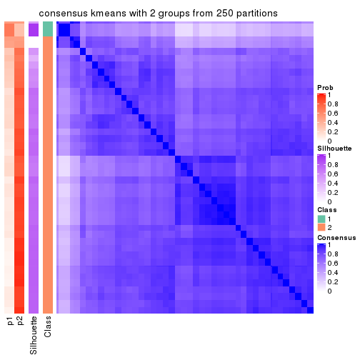</p>

</div>
<div id='tab-MAD-kmeans-consensus-heatmap-2'>
<pre><code class="r">consensus_heatmap(res, k = 3)
</code></pre>

<p>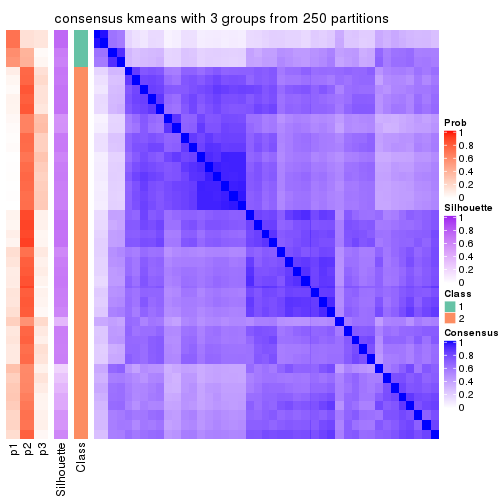</p>

</div>
<div id='tab-MAD-kmeans-consensus-heatmap-3'>
<pre><code class="r">consensus_heatmap(res, k = 4)
</code></pre>

<p>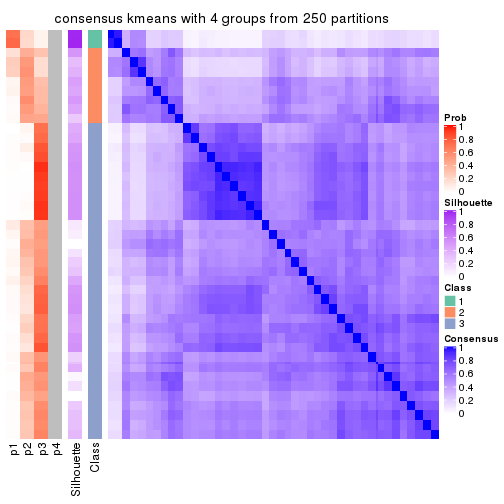</p>

</div>
<div id='tab-MAD-kmeans-consensus-heatmap-4'>
<pre><code class="r">consensus_heatmap(res, k = 5)
</code></pre>

<p>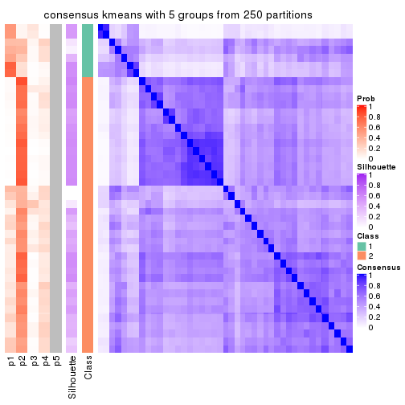</p>

</div>
<div id='tab-MAD-kmeans-consensus-heatmap-5'>
<pre><code class="r">consensus_heatmap(res, k = 6)
</code></pre>

<p>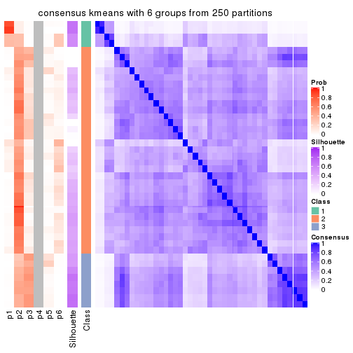</p>

</div>
</div>

Heatmaps for the membership of samples in all partitions to see how consistent they are:


<script>
$( function() {
	$( '#tabs-MAD-kmeans-membership-heatmap' ).tabs();
} );
</script>
<div id='tabs-MAD-kmeans-membership-heatmap'>
<ul>
<li><a href='#tab-MAD-kmeans-membership-heatmap-1'>k = 2</a></li>
<li><a href='#tab-MAD-kmeans-membership-heatmap-2'>k = 3</a></li>
<li><a href='#tab-MAD-kmeans-membership-heatmap-3'>k = 4</a></li>
<li><a href='#tab-MAD-kmeans-membership-heatmap-4'>k = 5</a></li>
<li><a href='#tab-MAD-kmeans-membership-heatmap-5'>k = 6</a></li>
</ul>
<div id='tab-MAD-kmeans-membership-heatmap-1'>
<pre><code class="r">membership_heatmap(res, k = 2)
</code></pre>

<p>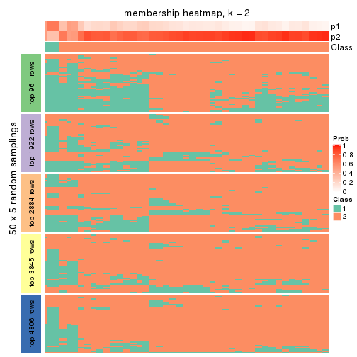</p>

</div>
<div id='tab-MAD-kmeans-membership-heatmap-2'>
<pre><code class="r">membership_heatmap(res, k = 3)
</code></pre>

<p>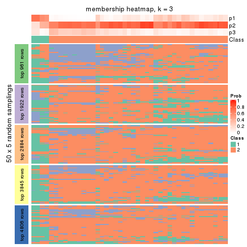</p>

</div>
<div id='tab-MAD-kmeans-membership-heatmap-3'>
<pre><code class="r">membership_heatmap(res, k = 4)
</code></pre>

<p>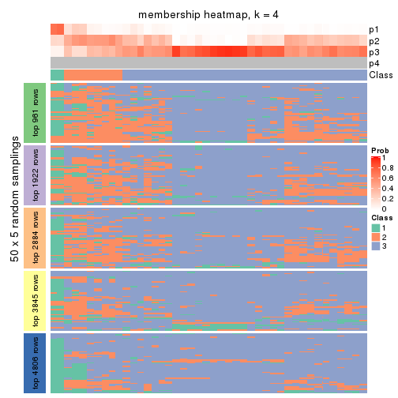</p>

</div>
<div id='tab-MAD-kmeans-membership-heatmap-4'>
<pre><code class="r">membership_heatmap(res, k = 5)
</code></pre>

<p>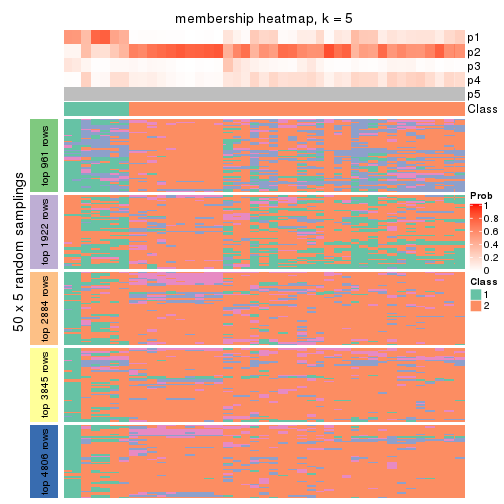</p>

</div>
<div id='tab-MAD-kmeans-membership-heatmap-5'>
<pre><code class="r">membership_heatmap(res, k = 6)
</code></pre>

<p>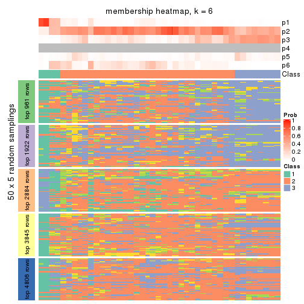</p>

</div>
</div>

As soon as we have had the classes for columns, we can look for signatures
which are significantly different between classes which can be candidate marks
for certain classes. Following are the heatmaps for signatures.


Signature heatmaps where rows are scaled:


<script>
$( function() {
	$( '#tabs-MAD-kmeans-get-signatures' ).tabs();
} );
</script>
<div id='tabs-MAD-kmeans-get-signatures'>
<ul>
<li><a href='#tab-MAD-kmeans-get-signatures-1'>k = 2</a></li>
<li><a href='#tab-MAD-kmeans-get-signatures-2'>k = 3</a></li>
<li><a href='#tab-MAD-kmeans-get-signatures-3'>k = 4</a></li>
<li><a href='#tab-MAD-kmeans-get-signatures-4'>k = 5</a></li>
<li><a href='#tab-MAD-kmeans-get-signatures-5'>k = 6</a></li>
</ul>
<div id='tab-MAD-kmeans-get-signatures-1'>
<pre><code class="r">get_signatures(res, k = 2)
</code></pre>

<p>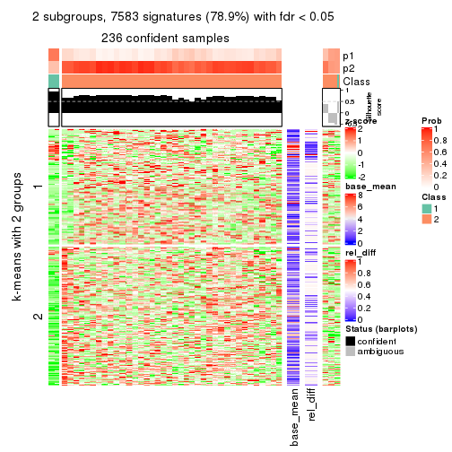</p>

</div>
<div id='tab-MAD-kmeans-get-signatures-2'>
<pre><code class="r">get_signatures(res, k = 3)
</code></pre>

<p>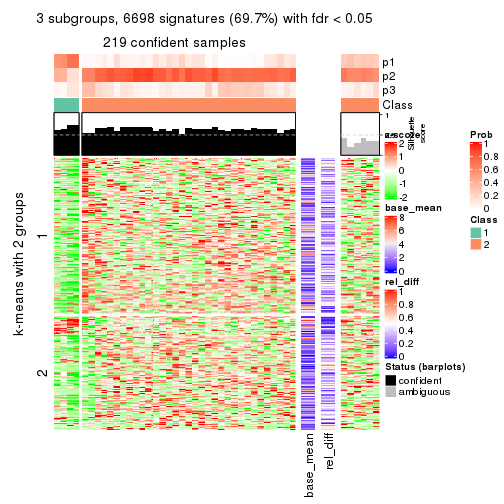</p>

</div>
<div id='tab-MAD-kmeans-get-signatures-3'>
<pre><code class="r">get_signatures(res, k = 4)
</code></pre>

<p>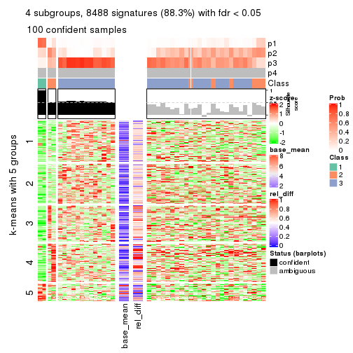</p>

</div>
<div id='tab-MAD-kmeans-get-signatures-4'>
<pre><code class="r">get_signatures(res, k = 5)
</code></pre>

<p>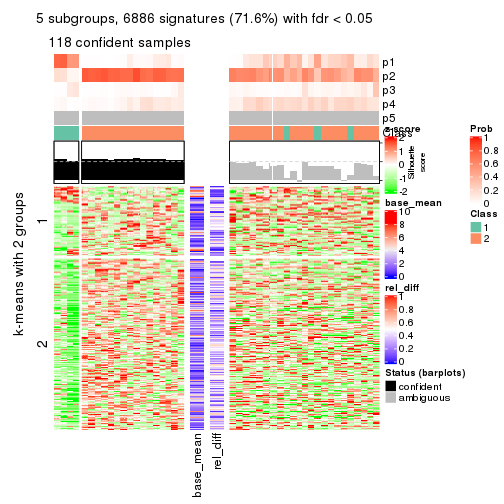</p>

</div>
<div id='tab-MAD-kmeans-get-signatures-5'>
<pre><code class="r">get_signatures(res, k = 6)
</code></pre>

<p>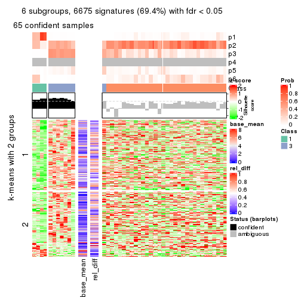</p>

</div>
</div>


Signature heatmaps where rows are not scaled:


<script>
$( function() {
	$( '#tabs-MAD-kmeans-get-signatures-no-scale' ).tabs();
} );
</script>
<div id='tabs-MAD-kmeans-get-signatures-no-scale'>
<ul>
<li><a href='#tab-MAD-kmeans-get-signatures-no-scale-1'>k = 2</a></li>
<li><a href='#tab-MAD-kmeans-get-signatures-no-scale-2'>k = 3</a></li>
<li><a href='#tab-MAD-kmeans-get-signatures-no-scale-3'>k = 4</a></li>
<li><a href='#tab-MAD-kmeans-get-signatures-no-scale-4'>k = 5</a></li>
<li><a href='#tab-MAD-kmeans-get-signatures-no-scale-5'>k = 6</a></li>
</ul>
<div id='tab-MAD-kmeans-get-signatures-no-scale-1'>
<pre><code class="r">get_signatures(res, k = 2, scale_rows = FALSE)
</code></pre>

<p>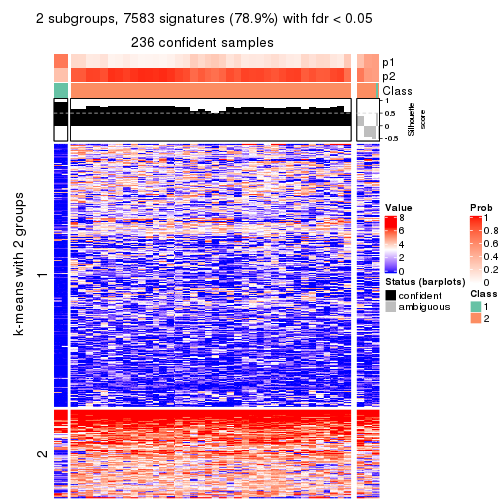</p>

</div>
<div id='tab-MAD-kmeans-get-signatures-no-scale-2'>
<pre><code class="r">get_signatures(res, k = 3, scale_rows = FALSE)
</code></pre>

<p>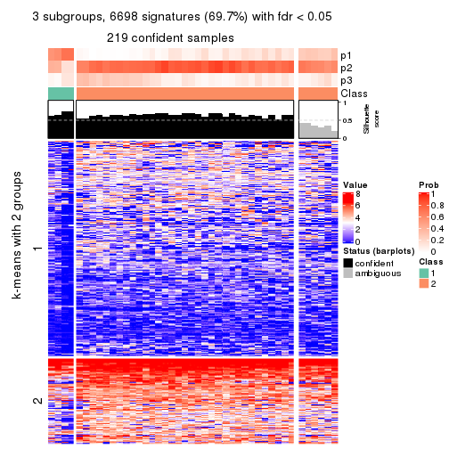</p>

</div>
<div id='tab-MAD-kmeans-get-signatures-no-scale-3'>
<pre><code class="r">get_signatures(res, k = 4, scale_rows = FALSE)
</code></pre>

<p>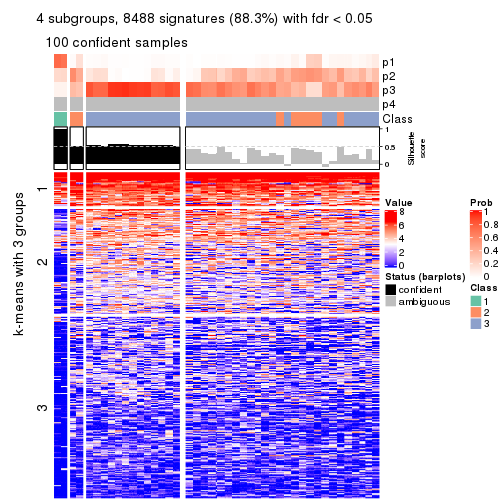</p>

</div>
<div id='tab-MAD-kmeans-get-signatures-no-scale-4'>
<pre><code class="r">get_signatures(res, k = 5, scale_rows = FALSE)
</code></pre>

<p>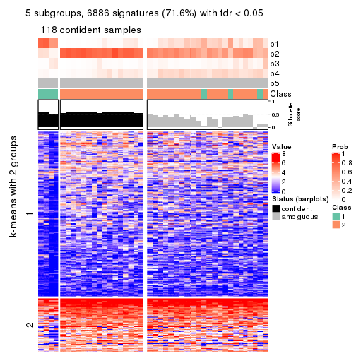</p>

</div>
<div id='tab-MAD-kmeans-get-signatures-no-scale-5'>
<pre><code class="r">get_signatures(res, k = 6, scale_rows = FALSE)
</code></pre>

<p>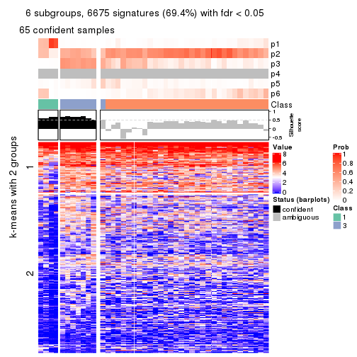</p>

</div>
</div>


Compare the overlap of signatures from different k:

```r
compare_signatures(res)
```

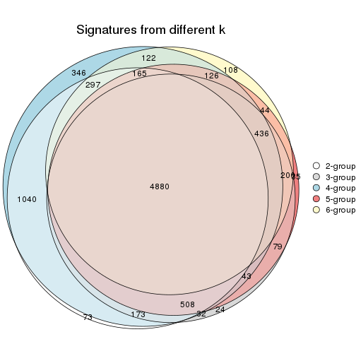

`get_signature()` returns a data frame invisibly. TO get the list of signatures, the function
call should be assigned to a variable explicitly. In following code, if `plot` argument is set
to `FALSE`, no heatmap is plotted while only the differential analysis is performed.

```r
# code only for demonstration
tb = get_signature(res, k = ..., plot = FALSE)
```

An example of the output of `tb` is:

```
#>   which_row         fdr    mean_1    mean_2 scaled_mean_1 scaled_mean_2 km
#> 1        38 0.042760348  8.373488  9.131774    -0.5533452     0.5164555  1
#> 2        40 0.018707592  7.106213  8.469186    -0.6173731     0.5762149  1
#> 3        55 0.019134737 10.221463 11.207825    -0.6159697     0.5749050  1
#> 4        59 0.006059896  5.921854  7.869574    -0.6899429     0.6439467  1
#> 5        60 0.018055526  8.928898 10.211722    -0.6204761     0.5791110  1
#> 6        98 0.009384629 15.714769 14.887706     0.6635654    -0.6193277  2
...
```

The columns in `tb` are:

1. `which_row`: row indices corresponding to the input matrix.
2. `fdr`: FDR for the differential test. 
3. `mean_x`: The mean value in group x.
4. `scaled_mean_x`: The mean value in group x after rows are scaled.
5. `km`: Row groups if k-means clustering is applied to rows.


UMAP plot which shows how samples are separated.


<script>
$( function() {
	$( '#tabs-MAD-kmeans-dimension-reduction' ).tabs();
} );
</script>
<div id='tabs-MAD-kmeans-dimension-reduction'>
<ul>
<li><a href='#tab-MAD-kmeans-dimension-reduction-1'>k = 2</a></li>
<li><a href='#tab-MAD-kmeans-dimension-reduction-2'>k = 3</a></li>
<li><a href='#tab-MAD-kmeans-dimension-reduction-3'>k = 4</a></li>
<li><a href='#tab-MAD-kmeans-dimension-reduction-4'>k = 5</a></li>
<li><a href='#tab-MAD-kmeans-dimension-reduction-5'>k = 6</a></li>
</ul>
<div id='tab-MAD-kmeans-dimension-reduction-1'>
<pre><code class="r">dimension_reduction(res, k = 2, method = &quot;UMAP&quot;)
</code></pre>

<p>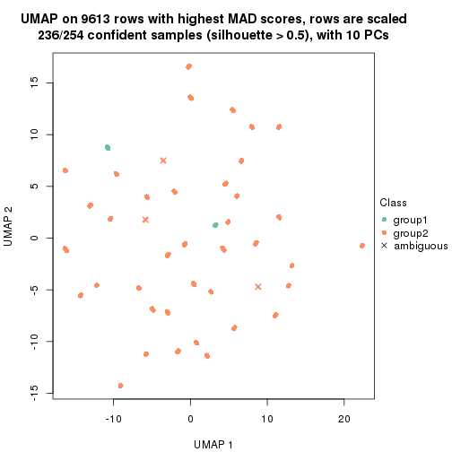</p>

</div>
<div id='tab-MAD-kmeans-dimension-reduction-2'>
<pre><code class="r">dimension_reduction(res, k = 3, method = &quot;UMAP&quot;)
</code></pre>

<p>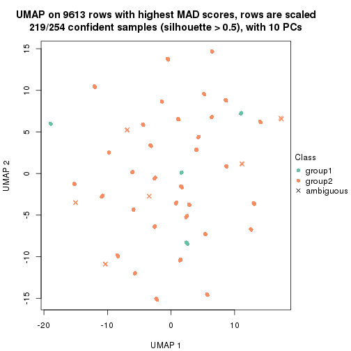</p>

</div>
<div id='tab-MAD-kmeans-dimension-reduction-3'>
<pre><code class="r">dimension_reduction(res, k = 4, method = &quot;UMAP&quot;)
</code></pre>

<p>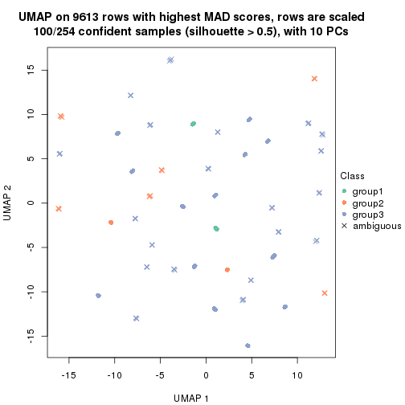</p>

</div>
<div id='tab-MAD-kmeans-dimension-reduction-4'>
<pre><code class="r">dimension_reduction(res, k = 5, method = &quot;UMAP&quot;)
</code></pre>

<p>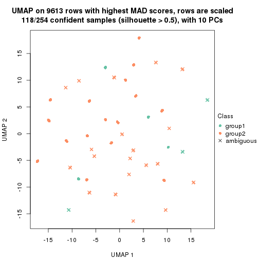</p>

</div>
<div id='tab-MAD-kmeans-dimension-reduction-5'>
<pre><code class="r">dimension_reduction(res, k = 6, method = &quot;UMAP&quot;)
</code></pre>

<p>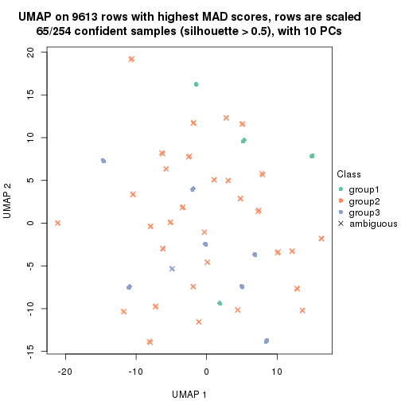</p>

</div>
</div>


Following heatmap shows how subgroups are split when increasing `k`:

```r
collect_classes(res)
```

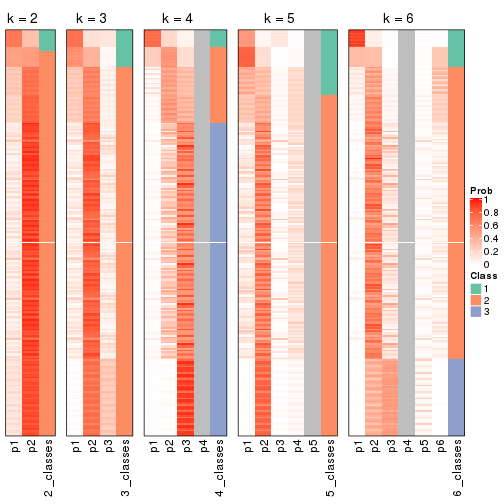


If matrix rows can be associated to genes, consider to use `GO_Enrichment(res,
...)` to perform function enrichment for the signature genes.


 

---------------------------------------------------


### MAD:skmeans


The object with results only for a single top-value method and a single partition method 
can be extracted as:

```r
res = res_list["MAD", "skmeans"]
# you can also extract it by
# res = res_list["MAD:skmeans"]
```

A summary of `res` and all the functions that can be applied to it:

```r
res
```

```
#> A 'ConsensusPartition' object with k = 2, 3, 4, 5, 6.
#>   On a matrix with 9613 rows and 254 columns.
#>   Top rows (961, 1922, 2884, 3845, 4806) are extracted by 'MAD' method.
#>   Subgroups are detected by 'skmeans' method.
#>   Performed in total 1250 partitions by row resampling.
#>   Best k for subgroups seems to be 2.
#> 
#> Following methods can be applied to this 'ConsensusPartition' object:
#>  [1] "cola_report"             "collect_classes"         "collect_plots"          
#>  [4] "collect_stats"           "colnames"                "compare_signatures"     
#>  [7] "consensus_heatmap"       "dimension_reduction"     "functional_enrichment"  
#> [10] "get_anno_col"            "get_anno"                "get_classes"            
#> [13] "get_consensus"           "get_matrix"              "get_membership"         
#> [16] "get_param"               "get_signatures"          "get_stats"              
#> [19] "is_best_k"               "is_stable_k"             "membership_heatmap"     
#> [22] "ncol"                    "nrow"                    "plot_ecdf"              
#> [25] "rownames"                "select_partition_number" "show"                   
#> [28] "suggest_best_k"          "test_to_known_factors"
```

`collect_plots()` function collects all the plots made from `res` for all `k` (number of partitions)
into one single page to provide an easy and fast comparison between different `k`.

```r
collect_plots(res)
```

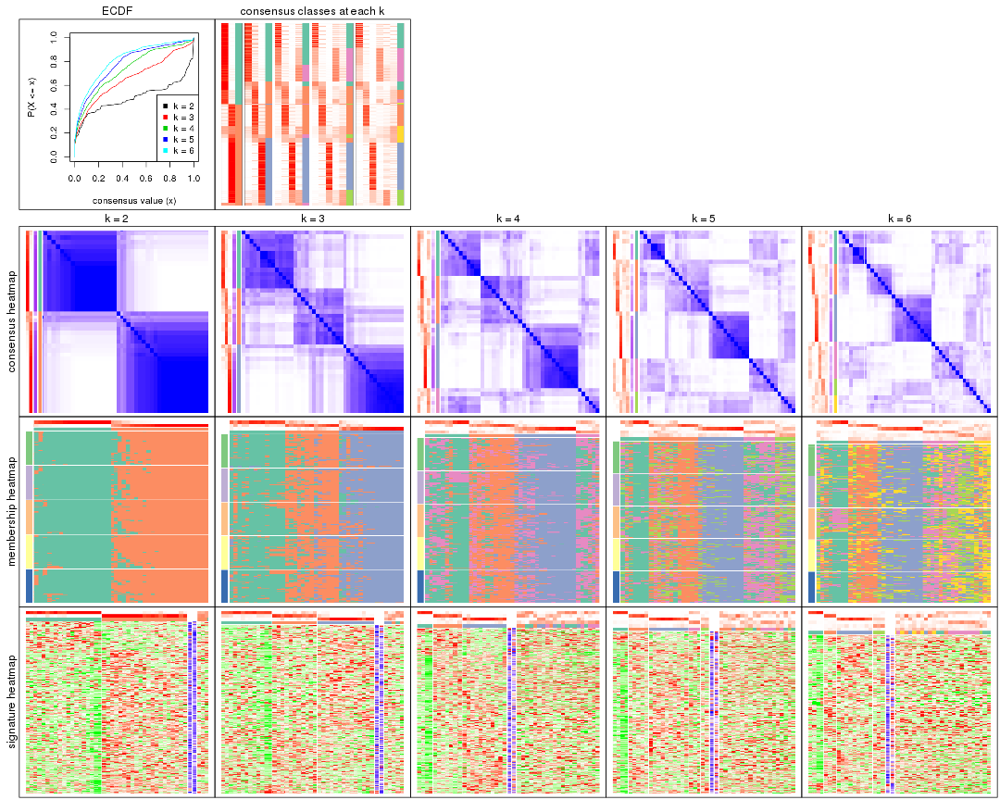

The plots are:

- The first row: a plot of the ECDF (Empirical cumulative distribution
  function) curves of the consensus matrix for each `k` and the heatmap of
  predicted classes for each `k`.
- The second row: heatmaps of the consensus matrix for each `k`.
- The third row: heatmaps of the membership matrix for each `k`.
- The fouth row: heatmaps of the signatures for each `k`.

All the plots in panels can be made by individual functions and they are
plotted later in this section.

`select_partition_number()` produces several plots showing different
statistics for choosing "optimized" `k`. There are following statistics:

- ECDF curves of the consensus matrix for each `k`;
- 1-PAC. [The PAC
  score](https://en.wikipedia.org/wiki/Consensus_clustering#Over-interpretation_potential_of_consensus_clustering)
  measures the proportion of the ambiguous subgrouping.
- Mean silhouette score.
- Concordance. The mean probability of fiting the consensus class ids in all
  partitions.
- Area increased. Denote $A_k$ as the area under the ECDF curve for current
  `k`, the area increased is defined as $A_k - A_{k-1}$.
- Rand index. The percent of pairs of samples that are both in a same cluster
  or both are not in a same cluster in the partition of k and k-1.
- Jaccard index. The ratio of pairs of samples are both in a same cluster in
  the partition of k and k-1 and the pairs of samples are both in a same
  cluster in the partition k or k-1.

The detailed explanations of these statistics can be found in [the cola
vignette](http://bioconductor.org/packages/devel/bioc/vignettes/cola/inst/doc/cola.html#toc_13).

Generally speaking, lower PAC score, higher mean silhouette score or higher
concordance corresponds to better partition. Rand index and Jaccard index
measure how similar the current partition is compared to partition with `k-1`.
If they are too similar, we won't accept `k` is better than `k-1`.

```r
select_partition_number(res)
```

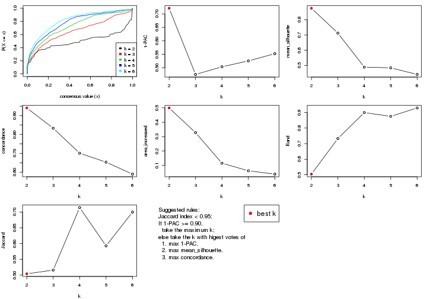

The numeric values for all these statistics can be obtained by `get_stats()`.

```r
get_stats(res)
```

```
#>   k 1-PAC mean_silhouette concordance area_increased  Rand Jaccard
#> 2 2 0.721           0.875       0.941         0.4992 0.504   0.504
#> 3 3 0.475           0.712       0.833         0.3281 0.733   0.516
#> 4 4 0.504           0.489       0.701         0.1156 0.899   0.714
#> 5 5 0.525           0.485       0.653         0.0631 0.875   0.593
#> 6 6 0.552           0.441       0.590         0.0400 0.929   0.700
```

`suggest_best_k()` suggests the best $k$ based on these statistics. The rules are as follows:

- All $k$ with Jaccard index larger than 0.95 are removed because the increase of
  the partition number does not provides enough extra information. If all $k$ are removed,
  the best $k$ is assigned by `NA`.
- For $k$ with 1-PAC larger than 0.9, the maximal $k$ is taken as the "best k". Other $k$ is called "optional k".
- If it does not fit the second rule. The $k$ with the highest vote of highest
  1-PAC, mean silhouette and concordance is taken as the "best k".

```r
suggest_best_k(res)
```

```
#> [1] 2
```


Following shows the table of the partitions (You need to click the **show/hide
code output** link to see it). The membership matrix (columns with name `p*`)
is inferred by
[`clue::cl_consensus()`](https://www.rdocumentation.org/link/cl_consensus?package=clue)
function with the `SE` method. Basically the value in the membership matrix
represents the probability to belong to a certain group. The finall class
label for an item is determined with the group with highest probability it
belongs to.

In `get_classes()` function, the entropy is calculated from the membership
matrix and the silhouette score is calculated from the consensus matrix.


<script>
$( function() {
	$( '#tabs-MAD-skmeans-get-classes' ).tabs();
} );
</script>
<div id='tabs-MAD-skmeans-get-classes'>
<ul>
<li><a href='#tab-MAD-skmeans-get-classes-1'>k = 2</a></li>
<li><a href='#tab-MAD-skmeans-get-classes-2'>k = 3</a></li>
<li><a href='#tab-MAD-skmeans-get-classes-3'>k = 4</a></li>
<li><a href='#tab-MAD-skmeans-get-classes-4'>k = 5</a></li>
<li><a href='#tab-MAD-skmeans-get-classes-5'>k = 6</a></li>
</ul>

<div id='tab-MAD-skmeans-get-classes-1'>
<p><a id='tab-MAD-skmeans-get-classes-1-a' style='color:#0366d6' href='#'>show/hide code output</a></p>
<pre><code class="r">cbind(get_classes(res, k = 2), get_membership(res, k = 2))
</code></pre>

<pre><code>#&gt;           class entropy silhouette    p1    p2
#&gt; DRR024803     1  0.0000     0.9624 1.000 0.000
#&gt; DRR024804     2  0.2423     0.9036 0.040 0.960
#&gt; DRR024805     2  0.3431     0.8925 0.064 0.936
#&gt; DRR024806     2  0.4690     0.8694 0.100 0.900
#&gt; DRR024807     2  0.0000     0.9170 0.000 1.000
#&gt; DRR024808     2  0.0000     0.9170 0.000 1.000
#&gt; DRR024809     2  0.7602     0.7497 0.220 0.780
#&gt; DRR024810     1  0.0000     0.9624 1.000 0.000
#&gt; DRR024811     2  0.0000     0.9170 0.000 1.000
#&gt; DRR024812     1  0.4815     0.8812 0.896 0.104
#&gt; DRR024813     2  0.0000     0.9170 0.000 1.000
#&gt; DRR024814     1  0.3879     0.9147 0.924 0.076
#&gt; DRR024815     1  0.0672     0.9600 0.992 0.008
#&gt; DRR024816     1  0.0000     0.9624 1.000 0.000
#&gt; DRR024817     1  0.2603     0.9432 0.956 0.044
#&gt; DRR024818     2  0.0376     0.9161 0.004 0.996
#&gt; DRR024819     1  0.0000     0.9624 1.000 0.000
#&gt; DRR024820     1  0.2043     0.9498 0.968 0.032
#&gt; DRR024821     2  0.0000     0.9170 0.000 1.000
#&gt; DRR024822     2  0.3431     0.8934 0.064 0.936
#&gt; DRR024824     1  0.6623     0.7944 0.828 0.172
#&gt; DRR024825     2  0.0000     0.9170 0.000 1.000
#&gt; DRR024826     2  0.0000     0.9170 0.000 1.000
#&gt; DRR024827     2  0.2948     0.8938 0.052 0.948
#&gt; DRR024828     2  0.0000     0.9170 0.000 1.000
#&gt; DRR024829     1  0.0000     0.9624 1.000 0.000
#&gt; DRR024830     2  0.9686     0.4313 0.396 0.604
#&gt; DRR024831     2  0.0000     0.9170 0.000 1.000
#&gt; DRR024832     2  0.0000     0.9170 0.000 1.000
#&gt; DRR024833     2  0.0000     0.9170 0.000 1.000
#&gt; DRR024834     1  0.0000     0.9624 1.000 0.000
#&gt; DRR024835     1  0.4022     0.9159 0.920 0.080
#&gt; DRR024836     2  0.0000     0.9170 0.000 1.000
#&gt; DRR024837     1  0.0000     0.9624 1.000 0.000
#&gt; DRR024838     1  0.0000     0.9624 1.000 0.000
#&gt; DRR024839     2  0.7528     0.7414 0.216 0.784
#&gt; DRR024840     2  0.1633     0.9088 0.024 0.976
#&gt; DRR024841     1  0.0000     0.9624 1.000 0.000
#&gt; DRR024842     1  0.4690     0.8895 0.900 0.100
#&gt; DRR024843     1  0.0000     0.9624 1.000 0.000
#&gt; DRR024844     2  0.2423     0.9036 0.040 0.960
#&gt; DRR024845     2  0.3431     0.8925 0.064 0.936
#&gt; DRR024846     2  0.4690     0.8694 0.100 0.900
#&gt; DRR024847     2  0.0000     0.9170 0.000 1.000
#&gt; DRR024848     1  0.0000     0.9624 1.000 0.000
#&gt; DRR024849     2  0.0000     0.9170 0.000 1.000
#&gt; DRR024850     2  0.9866     0.3013 0.432 0.568
#&gt; DRR024851     2  0.7602     0.7497 0.220 0.780
#&gt; DRR024852     1  0.0000     0.9624 1.000 0.000
#&gt; DRR024853     2  0.0000     0.9170 0.000 1.000
#&gt; DRR024854     1  0.4815     0.8812 0.896 0.104
#&gt; DRR024855     2  0.0000     0.9170 0.000 1.000
#&gt; DRR024856     1  0.3879     0.9147 0.924 0.076
#&gt; DRR024857     1  0.0672     0.9600 0.992 0.008
#&gt; DRR024858     1  0.0000     0.9624 1.000 0.000
#&gt; DRR024859     1  0.2603     0.9432 0.956 0.044
#&gt; DRR024860     2  0.0376     0.9161 0.004 0.996
#&gt; DRR024861     1  0.0000     0.9624 1.000 0.000
#&gt; DRR024862     1  0.2043     0.9498 0.968 0.032
#&gt; DRR024863     2  0.0000     0.9170 0.000 1.000
#&gt; DRR024864     2  0.3431     0.8934 0.064 0.936
#&gt; DRR024865     1  0.0000     0.9624 1.000 0.000
#&gt; DRR024866     1  0.6623     0.7944 0.828 0.172
#&gt; DRR024867     2  0.0000     0.9170 0.000 1.000
#&gt; DRR024868     2  0.0000     0.9170 0.000 1.000
#&gt; DRR024869     2  0.2948     0.8938 0.052 0.948
#&gt; DRR024870     2  0.0000     0.9170 0.000 1.000
#&gt; DRR024871     1  0.0000     0.9624 1.000 0.000
#&gt; DRR024872     2  0.9686     0.4313 0.396 0.604
#&gt; DRR024873     2  0.0000     0.9170 0.000 1.000
#&gt; DRR024874     2  0.0000     0.9170 0.000 1.000
#&gt; DRR024875     2  0.0000     0.9170 0.000 1.000
#&gt; DRR024876     1  0.0000     0.9624 1.000 0.000
#&gt; DRR024877     1  0.4022     0.9159 0.920 0.080
#&gt; DRR024878     2  0.0000     0.9170 0.000 1.000
#&gt; DRR024879     1  0.0000     0.9624 1.000 0.000
#&gt; DRR024880     1  0.0000     0.9624 1.000 0.000
#&gt; DRR024881     2  0.7528     0.7414 0.216 0.784
#&gt; DRR024882     2  0.1633     0.9088 0.024 0.976
#&gt; DRR024883     1  0.0000     0.9624 1.000 0.000
#&gt; DRR024884     1  0.2043     0.9496 0.968 0.032
#&gt; DRR024885     2  1.0000     0.0555 0.500 0.500
#&gt; DRR024886     1  0.0000     0.9624 1.000 0.000
#&gt; DRR024887     2  0.2423     0.9036 0.040 0.960
#&gt; DRR024888     2  0.3431     0.8925 0.064 0.936
#&gt; DRR024889     2  0.4690     0.8694 0.100 0.900
#&gt; DRR024890     2  0.0000     0.9170 0.000 1.000
#&gt; DRR024891     1  0.0000     0.9624 1.000 0.000
#&gt; DRR024892     2  0.0000     0.9170 0.000 1.000
#&gt; DRR024893     2  0.9866     0.3013 0.432 0.568
#&gt; DRR024894     2  0.7602     0.7497 0.220 0.780
#&gt; DRR024895     1  0.0000     0.9624 1.000 0.000
#&gt; DRR024896     2  0.0000     0.9170 0.000 1.000
#&gt; DRR024897     1  0.4815     0.8812 0.896 0.104
#&gt; DRR024898     2  0.0000     0.9170 0.000 1.000
#&gt; DRR024899     1  0.3879     0.9147 0.924 0.076
#&gt; DRR024900     1  0.0672     0.9600 0.992 0.008
#&gt; DRR024901     1  0.0000     0.9624 1.000 0.000
#&gt; DRR024902     1  0.2603     0.9432 0.956 0.044
#&gt; DRR024903     2  0.0376     0.9161 0.004 0.996
#&gt; DRR024904     1  0.0000     0.9624 1.000 0.000
#&gt; DRR024905     1  0.2043     0.9498 0.968 0.032
#&gt; DRR024906     2  0.0000     0.9170 0.000 1.000
#&gt; DRR024907     2  0.3431     0.8934 0.064 0.936
#&gt; DRR024908     1  0.0000     0.9624 1.000 0.000
#&gt; DRR024909     1  0.6623     0.7944 0.828 0.172
#&gt; DRR024910     2  0.0000     0.9170 0.000 1.000
#&gt; DRR024911     2  0.0000     0.9170 0.000 1.000
#&gt; DRR024912     2  0.2948     0.8938 0.052 0.948
#&gt; DRR024913     2  0.0000     0.9170 0.000 1.000
#&gt; DRR024914     1  0.0000     0.9624 1.000 0.000
#&gt; DRR024915     2  0.9686     0.4313 0.396 0.604
#&gt; DRR024916     2  0.0000     0.9170 0.000 1.000
#&gt; DRR024917     2  0.0000     0.9170 0.000 1.000
#&gt; DRR024918     2  0.0000     0.9170 0.000 1.000
#&gt; DRR024919     1  0.0000     0.9624 1.000 0.000
#&gt; DRR024920     1  0.4022     0.9159 0.920 0.080
#&gt; DRR024921     2  0.0000     0.9170 0.000 1.000
#&gt; DRR024922     1  0.0000     0.9624 1.000 0.000
#&gt; DRR024923     1  0.0000     0.9624 1.000 0.000
#&gt; DRR024924     2  0.7528     0.7414 0.216 0.784
#&gt; DRR024925     2  0.1633     0.9088 0.024 0.976
#&gt; DRR024926     1  0.0000     0.9624 1.000 0.000
#&gt; DRR024927     1  0.2043     0.9496 0.968 0.032
#&gt; DRR024928     1  1.0000    -0.0705 0.500 0.500
#&gt; DRR024929     1  0.0000     0.9624 1.000 0.000
#&gt; DRR024930     2  0.2423     0.9036 0.040 0.960
#&gt; DRR024931     2  0.3431     0.8925 0.064 0.936
#&gt; DRR024932     2  0.4690     0.8694 0.100 0.900
#&gt; DRR024933     2  0.0000     0.9170 0.000 1.000
#&gt; DRR024934     1  0.0000     0.9624 1.000 0.000
#&gt; DRR024935     2  0.0000     0.9170 0.000 1.000
#&gt; DRR024936     2  0.9866     0.3013 0.432 0.568
#&gt; DRR024937     2  0.7602     0.7497 0.220 0.780
#&gt; DRR024938     1  0.0000     0.9624 1.000 0.000
#&gt; DRR024939     2  0.0000     0.9170 0.000 1.000
#&gt; DRR024940     1  0.4815     0.8812 0.896 0.104
#&gt; DRR024941     2  0.0000     0.9170 0.000 1.000
#&gt; DRR024942     1  0.3879     0.9147 0.924 0.076
#&gt; DRR024943     1  0.0672     0.9600 0.992 0.008
#&gt; DRR024944     1  0.0000     0.9624 1.000 0.000
#&gt; DRR024945     1  0.2603     0.9432 0.956 0.044
#&gt; DRR024946     2  0.0376     0.9161 0.004 0.996
#&gt; DRR024947     1  0.0000     0.9624 1.000 0.000
#&gt; DRR024948     1  0.2043     0.9498 0.968 0.032
#&gt; DRR024949     2  0.0000     0.9170 0.000 1.000
#&gt; DRR024950     2  0.3431     0.8934 0.064 0.936
#&gt; DRR024951     1  0.0000     0.9624 1.000 0.000
#&gt; DRR024952     1  0.6623     0.7944 0.828 0.172
#&gt; DRR024953     2  0.0000     0.9170 0.000 1.000
#&gt; DRR024954     2  0.0000     0.9170 0.000 1.000
#&gt; DRR024955     2  0.2948     0.8938 0.052 0.948
#&gt; DRR024956     2  0.0000     0.9170 0.000 1.000
#&gt; DRR024957     1  0.0000     0.9624 1.000 0.000
#&gt; DRR024958     2  0.9686     0.4313 0.396 0.604
#&gt; DRR024959     2  0.0000     0.9170 0.000 1.000
#&gt; DRR024960     2  0.0000     0.9170 0.000 1.000
#&gt; DRR024961     2  0.0000     0.9170 0.000 1.000
#&gt; DRR024962     1  0.0000     0.9624 1.000 0.000
#&gt; DRR024963     1  0.4022     0.9159 0.920 0.080
#&gt; DRR024964     2  0.0000     0.9170 0.000 1.000
#&gt; DRR024965     1  0.0000     0.9624 1.000 0.000
#&gt; DRR024966     1  0.0000     0.9624 1.000 0.000
#&gt; DRR024967     2  0.7528     0.7414 0.216 0.784
#&gt; DRR024968     2  0.1633     0.9088 0.024 0.976
#&gt; DRR024969     1  0.0000     0.9624 1.000 0.000
#&gt; DRR024970     1  0.2043     0.9496 0.968 0.032
#&gt; DRR024971     2  1.0000     0.0555 0.500 0.500
#&gt; DRR024972     1  0.0000     0.9624 1.000 0.000
#&gt; DRR024973     2  0.2423     0.9036 0.040 0.960
#&gt; DRR024974     2  0.3431     0.8925 0.064 0.936
#&gt; DRR024975     2  0.4690     0.8694 0.100 0.900
#&gt; DRR024976     2  0.0000     0.9170 0.000 1.000
#&gt; DRR024977     1  0.0000     0.9624 1.000 0.000
#&gt; DRR024978     2  0.0000     0.9170 0.000 1.000
#&gt; DRR024979     2  0.9866     0.3013 0.432 0.568
#&gt; DRR024980     2  0.7602     0.7497 0.220 0.780
#&gt; DRR024981     1  0.0000     0.9624 1.000 0.000
#&gt; DRR024982     2  0.0000     0.9170 0.000 1.000
#&gt; DRR024983     1  0.4815     0.8812 0.896 0.104
#&gt; DRR024984     2  0.0000     0.9170 0.000 1.000
#&gt; DRR024985     1  0.3879     0.9147 0.924 0.076
#&gt; DRR024986     1  0.0672     0.9600 0.992 0.008
#&gt; DRR024987     1  0.0000     0.9624 1.000 0.000
#&gt; DRR024988     1  0.2603     0.9432 0.956 0.044
#&gt; DRR024989     2  0.0376     0.9161 0.004 0.996
#&gt; DRR024990     1  0.0000     0.9624 1.000 0.000
#&gt; DRR024991     1  0.2043     0.9498 0.968 0.032
#&gt; DRR024992     2  0.0000     0.9170 0.000 1.000
#&gt; DRR024993     2  0.3431     0.8934 0.064 0.936
#&gt; DRR024994     1  0.0000     0.9624 1.000 0.000
#&gt; DRR024995     1  0.6623     0.7944 0.828 0.172
#&gt; DRR024996     2  0.0000     0.9170 0.000 1.000
#&gt; DRR024997     2  0.0000     0.9170 0.000 1.000
#&gt; DRR024998     2  0.2948     0.8938 0.052 0.948
#&gt; DRR024999     2  0.0000     0.9170 0.000 1.000
#&gt; DRR025000     1  0.0000     0.9624 1.000 0.000
#&gt; DRR025001     2  0.9686     0.4313 0.396 0.604
#&gt; DRR025002     2  0.0000     0.9170 0.000 1.000
#&gt; DRR025003     2  0.0000     0.9170 0.000 1.000
#&gt; DRR025004     2  0.0000     0.9170 0.000 1.000
#&gt; DRR025005     1  0.0000     0.9624 1.000 0.000
#&gt; DRR025006     1  0.4022     0.9159 0.920 0.080
#&gt; DRR025007     2  0.0000     0.9170 0.000 1.000
#&gt; DRR025008     1  0.0000     0.9624 1.000 0.000
#&gt; DRR025009     1  0.0000     0.9624 1.000 0.000
#&gt; DRR025010     2  0.7528     0.7414 0.216 0.784
#&gt; DRR025011     2  0.1633     0.9088 0.024 0.976
#&gt; DRR025012     1  0.0000     0.9624 1.000 0.000
#&gt; DRR025013     1  0.2043     0.9496 0.968 0.032
#&gt; DRR025014     2  1.0000     0.0555 0.500 0.500
#&gt; DRR025015     1  0.0000     0.9624 1.000 0.000
#&gt; DRR025016     2  0.2423     0.9036 0.040 0.960
#&gt; DRR025017     2  0.3431     0.8925 0.064 0.936
#&gt; DRR025018     2  0.4690     0.8694 0.100 0.900
#&gt; DRR025019     2  0.0000     0.9170 0.000 1.000
#&gt; DRR025020     1  0.0000     0.9624 1.000 0.000
#&gt; DRR025021     2  0.0000     0.9170 0.000 1.000
#&gt; DRR025022     2  0.9866     0.3013 0.432 0.568
#&gt; DRR025023     2  0.7602     0.7497 0.220 0.780
#&gt; DRR025024     1  0.0000     0.9624 1.000 0.000
#&gt; DRR025025     2  0.0000     0.9170 0.000 1.000
#&gt; DRR025026     1  0.4815     0.8812 0.896 0.104
#&gt; DRR025027     2  0.0000     0.9170 0.000 1.000
#&gt; DRR025028     1  0.3879     0.9147 0.924 0.076
#&gt; DRR025029     1  0.0672     0.9600 0.992 0.008
#&gt; DRR025030     1  0.0000     0.9624 1.000 0.000
#&gt; DRR025031     1  0.2603     0.9432 0.956 0.044
#&gt; DRR025032     2  0.0376     0.9161 0.004 0.996
#&gt; DRR025033     1  0.0000     0.9624 1.000 0.000
#&gt; DRR025034     1  0.2043     0.9498 0.968 0.032
#&gt; DRR025035     2  0.0000     0.9170 0.000 1.000
#&gt; DRR025036     2  0.3431     0.8934 0.064 0.936
#&gt; DRR025037     1  0.0000     0.9624 1.000 0.000
#&gt; DRR025038     1  0.6623     0.7944 0.828 0.172
#&gt; DRR025039     2  0.0000     0.9170 0.000 1.000
#&gt; DRR025040     2  0.0000     0.9170 0.000 1.000
#&gt; DRR025041     2  0.2948     0.8938 0.052 0.948
#&gt; DRR025042     2  0.0000     0.9170 0.000 1.000
#&gt; DRR025043     1  0.0000     0.9624 1.000 0.000
#&gt; DRR025044     2  0.9686     0.4313 0.396 0.604
#&gt; DRR025045     2  0.0000     0.9170 0.000 1.000
#&gt; DRR025046     2  0.0000     0.9170 0.000 1.000
#&gt; DRR025047     2  0.0000     0.9170 0.000 1.000
#&gt; DRR025048     1  0.0000     0.9624 1.000 0.000
#&gt; DRR025049     1  0.4022     0.9159 0.920 0.080
#&gt; DRR025050     2  0.0000     0.9170 0.000 1.000
#&gt; DRR025051     1  0.0000     0.9624 1.000 0.000
#&gt; DRR025052     1  0.0000     0.9624 1.000 0.000
#&gt; DRR025053     2  0.7528     0.7414 0.216 0.784
#&gt; DRR025054     2  0.1633     0.9088 0.024 0.976
#&gt; DRR025055     1  0.0000     0.9624 1.000 0.000
#&gt; DRR025056     1  0.2043     0.9496 0.968 0.032
#&gt; DRR025057     2  1.0000     0.0555 0.500 0.500
</code></pre>

<script>
$('#tab-MAD-skmeans-get-classes-1-a').parent().next().next().hide();
$('#tab-MAD-skmeans-get-classes-1-a').click(function(){
  $('#tab-MAD-skmeans-get-classes-1-a').parent().next().next().toggle();
  return(false);
});
</script>
</div>

<div id='tab-MAD-skmeans-get-classes-2'>
<p><a id='tab-MAD-skmeans-get-classes-2-a' style='color:#0366d6' href='#'>show/hide code output</a></p>
<pre><code class="r">cbind(get_classes(res, k = 3), get_membership(res, k = 3))
</code></pre>

<pre><code>#&gt;           class entropy silhouette    p1    p2    p3
#&gt; DRR024803     1  0.3038      0.826 0.896 0.104 0.000
#&gt; DRR024804     3  0.7710      0.348 0.056 0.368 0.576
#&gt; DRR024805     2  0.4883      0.699 0.004 0.788 0.208
#&gt; DRR024806     2  0.2584      0.748 0.008 0.928 0.064
#&gt; DRR024807     3  0.1163      0.864 0.000 0.028 0.972
#&gt; DRR024808     3  0.0237      0.869 0.000 0.004 0.996
#&gt; DRR024809     2  0.2339      0.746 0.012 0.940 0.048
#&gt; DRR024810     2  0.5650      0.511 0.312 0.688 0.000
#&gt; DRR024811     3  0.0237      0.869 0.000 0.004 0.996
#&gt; DRR024812     2  0.2959      0.717 0.100 0.900 0.000
#&gt; DRR024813     3  0.5138      0.661 0.000 0.252 0.748
#&gt; DRR024814     2  0.5529      0.538 0.296 0.704 0.000
#&gt; DRR024815     1  0.1636      0.835 0.964 0.020 0.016
#&gt; DRR024816     2  0.6225      0.229 0.432 0.568 0.000
#&gt; DRR024817     1  0.3472      0.814 0.904 0.056 0.040
#&gt; DRR024818     3  0.2434      0.853 0.024 0.036 0.940
#&gt; DRR024819     1  0.4887      0.718 0.772 0.228 0.000
#&gt; DRR024820     1  0.2031      0.832 0.952 0.032 0.016
#&gt; DRR024821     3  0.0661      0.868 0.008 0.004 0.988
#&gt; DRR024822     2  0.3375      0.747 0.008 0.892 0.100
#&gt; DRR024824     2  0.5061      0.639 0.208 0.784 0.008
#&gt; DRR024825     3  0.0424      0.869 0.000 0.008 0.992
#&gt; DRR024826     3  0.5408      0.792 0.052 0.136 0.812
#&gt; DRR024827     3  0.6775      0.702 0.164 0.096 0.740
#&gt; DRR024828     3  0.1643      0.856 0.000 0.044 0.956
#&gt; DRR024829     1  0.1411      0.837 0.964 0.036 0.000
#&gt; DRR024830     2  0.5889      0.727 0.108 0.796 0.096
#&gt; DRR024831     3  0.0237      0.869 0.000 0.004 0.996
#&gt; DRR024832     3  0.0424      0.869 0.000 0.008 0.992
#&gt; DRR024833     3  0.5222      0.794 0.040 0.144 0.816
#&gt; DRR024834     1  0.3686      0.814 0.860 0.140 0.000
#&gt; DRR024835     1  0.5961      0.705 0.792 0.112 0.096
#&gt; DRR024836     3  0.0000      0.868 0.000 0.000 1.000
#&gt; DRR024837     1  0.3941      0.805 0.844 0.156 0.000
#&gt; DRR024838     1  0.4178      0.801 0.828 0.172 0.000
#&gt; DRR024839     2  0.8887      0.311 0.128 0.504 0.368
#&gt; DRR024840     2  0.5363      0.602 0.000 0.724 0.276
#&gt; DRR024841     1  0.6460      0.272 0.556 0.440 0.004
#&gt; DRR024842     2  0.3116      0.710 0.108 0.892 0.000
#&gt; DRR024843     1  0.3038      0.826 0.896 0.104 0.000
#&gt; DRR024844     3  0.7710      0.348 0.056 0.368 0.576
#&gt; DRR024845     2  0.4883      0.699 0.004 0.788 0.208
#&gt; DRR024846     2  0.2584      0.748 0.008 0.928 0.064
#&gt; DRR024847     3  0.1163      0.864 0.000 0.028 0.972
#&gt; DRR024848     1  0.3038      0.826 0.896 0.104 0.000
#&gt; DRR024849     3  0.0237      0.869 0.000 0.004 0.996
#&gt; DRR024850     2  0.8112      0.600 0.192 0.648 0.160
#&gt; DRR024851     2  0.2339      0.746 0.012 0.940 0.048
#&gt; DRR024852     2  0.5650      0.511 0.312 0.688 0.000
#&gt; DRR024853     3  0.0237      0.869 0.000 0.004 0.996
#&gt; DRR024854     2  0.2959      0.717 0.100 0.900 0.000
#&gt; DRR024855     3  0.5138      0.661 0.000 0.252 0.748
#&gt; DRR024856     2  0.5529      0.538 0.296 0.704 0.000
#&gt; DRR024857     1  0.1636      0.835 0.964 0.020 0.016
#&gt; DRR024858     2  0.6225      0.229 0.432 0.568 0.000
#&gt; DRR024859     1  0.3472      0.814 0.904 0.056 0.040
#&gt; DRR024860     3  0.2434      0.853 0.024 0.036 0.940
#&gt; DRR024861     1  0.4887      0.718 0.772 0.228 0.000
#&gt; DRR024862     1  0.2031      0.832 0.952 0.032 0.016
#&gt; DRR024863     3  0.0661      0.868 0.008 0.004 0.988
#&gt; DRR024864     2  0.3375      0.747 0.008 0.892 0.100
#&gt; DRR024865     1  0.4887      0.752 0.772 0.228 0.000
#&gt; DRR024866     2  0.5061      0.639 0.208 0.784 0.008
#&gt; DRR024867     3  0.0424      0.869 0.000 0.008 0.992
#&gt; DRR024868     3  0.5408      0.792 0.052 0.136 0.812
#&gt; DRR024869     3  0.6775      0.702 0.164 0.096 0.740
#&gt; DRR024870     3  0.1643      0.856 0.000 0.044 0.956
#&gt; DRR024871     1  0.1411      0.837 0.964 0.036 0.000
#&gt; DRR024872     2  0.5889      0.727 0.108 0.796 0.096
#&gt; DRR024873     3  0.0237      0.869 0.000 0.004 0.996
#&gt; DRR024874     3  0.0424      0.869 0.000 0.008 0.992
#&gt; DRR024875     3  0.5222      0.794 0.040 0.144 0.816
#&gt; DRR024876     1  0.3686      0.814 0.860 0.140 0.000
#&gt; DRR024877     1  0.5961      0.705 0.792 0.112 0.096
#&gt; DRR024878     3  0.0000      0.868 0.000 0.000 1.000
#&gt; DRR024879     1  0.3941      0.805 0.844 0.156 0.000
#&gt; DRR024880     1  0.4178      0.801 0.828 0.172 0.000
#&gt; DRR024881     2  0.8887      0.311 0.128 0.504 0.368
#&gt; DRR024882     2  0.5363      0.602 0.000 0.724 0.276
#&gt; DRR024883     1  0.6460      0.272 0.556 0.440 0.004
#&gt; DRR024884     1  0.2486      0.828 0.932 0.060 0.008
#&gt; DRR024885     3  0.9491      0.125 0.396 0.184 0.420
#&gt; DRR024886     1  0.3038      0.826 0.896 0.104 0.000
#&gt; DRR024887     3  0.7710      0.348 0.056 0.368 0.576
#&gt; DRR024888     2  0.4883      0.699 0.004 0.788 0.208
#&gt; DRR024889     2  0.2584      0.748 0.008 0.928 0.064
#&gt; DRR024890     3  0.1163      0.864 0.000 0.028 0.972
#&gt; DRR024891     1  0.3038      0.826 0.896 0.104 0.000
#&gt; DRR024892     3  0.0237      0.869 0.000 0.004 0.996
#&gt; DRR024893     2  0.8112      0.600 0.192 0.648 0.160
#&gt; DRR024894     2  0.2339      0.746 0.012 0.940 0.048
#&gt; DRR024895     2  0.5650      0.511 0.312 0.688 0.000
#&gt; DRR024896     3  0.0237      0.869 0.000 0.004 0.996
#&gt; DRR024897     2  0.2959      0.717 0.100 0.900 0.000
#&gt; DRR024898     3  0.5138      0.661 0.000 0.252 0.748
#&gt; DRR024899     2  0.5529      0.538 0.296 0.704 0.000
#&gt; DRR024900     1  0.1636      0.835 0.964 0.020 0.016
#&gt; DRR024901     2  0.6225      0.229 0.432 0.568 0.000
#&gt; DRR024902     1  0.3472      0.814 0.904 0.056 0.040
#&gt; DRR024903     3  0.2434      0.853 0.024 0.036 0.940
#&gt; DRR024904     1  0.4887      0.718 0.772 0.228 0.000
#&gt; DRR024905     1  0.2031      0.832 0.952 0.032 0.016
#&gt; DRR024906     3  0.0661      0.868 0.008 0.004 0.988
#&gt; DRR024907     2  0.3375      0.747 0.008 0.892 0.100
#&gt; DRR024908     1  0.4887      0.752 0.772 0.228 0.000
#&gt; DRR024909     2  0.5061      0.639 0.208 0.784 0.008
#&gt; DRR024910     3  0.0424      0.869 0.000 0.008 0.992
#&gt; DRR024911     3  0.5408      0.792 0.052 0.136 0.812
#&gt; DRR024912     3  0.6775      0.702 0.164 0.096 0.740
#&gt; DRR024913     3  0.1643      0.856 0.000 0.044 0.956
#&gt; DRR024914     1  0.1411      0.837 0.964 0.036 0.000
#&gt; DRR024915     2  0.5889      0.727 0.108 0.796 0.096
#&gt; DRR024916     3  0.0237      0.869 0.000 0.004 0.996
#&gt; DRR024917     3  0.0424      0.869 0.000 0.008 0.992
#&gt; DRR024918     3  0.5222      0.794 0.040 0.144 0.816
#&gt; DRR024919     1  0.3686      0.814 0.860 0.140 0.000
#&gt; DRR024920     1  0.5961      0.705 0.792 0.112 0.096
#&gt; DRR024921     3  0.0000      0.868 0.000 0.000 1.000
#&gt; DRR024922     1  0.3941      0.805 0.844 0.156 0.000
#&gt; DRR024923     1  0.4178      0.801 0.828 0.172 0.000
#&gt; DRR024924     2  0.8887      0.311 0.128 0.504 0.368
#&gt; DRR024925     2  0.5363      0.602 0.000 0.724 0.276
#&gt; DRR024926     1  0.6460      0.272 0.556 0.440 0.004
#&gt; DRR024927     1  0.2486      0.828 0.932 0.060 0.008
#&gt; DRR024928     3  0.9491      0.125 0.396 0.184 0.420
#&gt; DRR024929     1  0.3038      0.826 0.896 0.104 0.000
#&gt; DRR024930     3  0.7710      0.348 0.056 0.368 0.576
#&gt; DRR024931     2  0.4883      0.699 0.004 0.788 0.208
#&gt; DRR024932     2  0.2584      0.748 0.008 0.928 0.064
#&gt; DRR024933     3  0.1163      0.864 0.000 0.028 0.972
#&gt; DRR024934     1  0.3038      0.826 0.896 0.104 0.000
#&gt; DRR024935     3  0.0237      0.869 0.000 0.004 0.996
#&gt; DRR024936     2  0.8112      0.600 0.192 0.648 0.160
#&gt; DRR024937     2  0.2339      0.746 0.012 0.940 0.048
#&gt; DRR024938     2  0.5650      0.511 0.312 0.688 0.000
#&gt; DRR024939     3  0.0237      0.869 0.000 0.004 0.996
#&gt; DRR024940     2  0.2959      0.717 0.100 0.900 0.000
#&gt; DRR024941     3  0.5138      0.661 0.000 0.252 0.748
#&gt; DRR024942     2  0.5529      0.538 0.296 0.704 0.000
#&gt; DRR024943     1  0.1636      0.835 0.964 0.020 0.016
#&gt; DRR024944     2  0.6225      0.229 0.432 0.568 0.000
#&gt; DRR024945     1  0.3472      0.814 0.904 0.056 0.040
#&gt; DRR024946     3  0.2434      0.853 0.024 0.036 0.940
#&gt; DRR024947     1  0.4887      0.718 0.772 0.228 0.000
#&gt; DRR024948     1  0.2031      0.832 0.952 0.032 0.016
#&gt; DRR024949     3  0.0661      0.868 0.008 0.004 0.988
#&gt; DRR024950     2  0.3375      0.747 0.008 0.892 0.100
#&gt; DRR024951     1  0.4887      0.752 0.772 0.228 0.000
#&gt; DRR024952     2  0.5061      0.639 0.208 0.784 0.008
#&gt; DRR024953     3  0.0424      0.869 0.000 0.008 0.992
#&gt; DRR024954     3  0.5408      0.792 0.052 0.136 0.812
#&gt; DRR024955     3  0.6775      0.702 0.164 0.096 0.740
#&gt; DRR024956     3  0.1643      0.856 0.000 0.044 0.956
#&gt; DRR024957     1  0.1411      0.837 0.964 0.036 0.000
#&gt; DRR024958     2  0.5889      0.727 0.108 0.796 0.096
#&gt; DRR024959     3  0.0237      0.869 0.000 0.004 0.996
#&gt; DRR024960     3  0.0424      0.869 0.000 0.008 0.992
#&gt; DRR024961     3  0.5222      0.794 0.040 0.144 0.816
#&gt; DRR024962     1  0.3686      0.814 0.860 0.140 0.000
#&gt; DRR024963     1  0.5961      0.705 0.792 0.112 0.096
#&gt; DRR024964     3  0.0000      0.868 0.000 0.000 1.000
#&gt; DRR024965     1  0.3941      0.805 0.844 0.156 0.000
#&gt; DRR024966     1  0.4178      0.801 0.828 0.172 0.000
#&gt; DRR024967     2  0.8887      0.311 0.128 0.504 0.368
#&gt; DRR024968     2  0.5363      0.602 0.000 0.724 0.276
#&gt; DRR024969     1  0.6460      0.272 0.556 0.440 0.004
#&gt; DRR024970     1  0.2486      0.828 0.932 0.060 0.008
#&gt; DRR024971     3  0.9491      0.125 0.396 0.184 0.420
#&gt; DRR024972     1  0.3038      0.826 0.896 0.104 0.000
#&gt; DRR024973     3  0.7710      0.348 0.056 0.368 0.576
#&gt; DRR024974     2  0.4883      0.699 0.004 0.788 0.208
#&gt; DRR024975     2  0.2584      0.748 0.008 0.928 0.064
#&gt; DRR024976     3  0.1163      0.864 0.000 0.028 0.972
#&gt; DRR024977     1  0.3038      0.826 0.896 0.104 0.000
#&gt; DRR024978     3  0.0237      0.869 0.000 0.004 0.996
#&gt; DRR024979     2  0.8112      0.600 0.192 0.648 0.160
#&gt; DRR024980     2  0.2339      0.746 0.012 0.940 0.048
#&gt; DRR024981     2  0.5650      0.511 0.312 0.688 0.000
#&gt; DRR024982     3  0.0237      0.869 0.000 0.004 0.996
#&gt; DRR024983     2  0.2959      0.717 0.100 0.900 0.000
#&gt; DRR024984     3  0.5138      0.661 0.000 0.252 0.748
#&gt; DRR024985     2  0.5529      0.538 0.296 0.704 0.000
#&gt; DRR024986     1  0.1636      0.835 0.964 0.020 0.016
#&gt; DRR024987     2  0.6225      0.229 0.432 0.568 0.000
#&gt; DRR024988     1  0.3472      0.814 0.904 0.056 0.040
#&gt; DRR024989     3  0.2434      0.853 0.024 0.036 0.940
#&gt; DRR024990     1  0.4887      0.718 0.772 0.228 0.000
#&gt; DRR024991     1  0.2031      0.832 0.952 0.032 0.016
#&gt; DRR024992     3  0.0661      0.868 0.008 0.004 0.988
#&gt; DRR024993     2  0.3375      0.747 0.008 0.892 0.100
#&gt; DRR024994     1  0.4887      0.752 0.772 0.228 0.000
#&gt; DRR024995     2  0.5061      0.639 0.208 0.784 0.008
#&gt; DRR024996     3  0.0424      0.869 0.000 0.008 0.992
#&gt; DRR024997     3  0.5408      0.792 0.052 0.136 0.812
#&gt; DRR024998     3  0.6775      0.702 0.164 0.096 0.740
#&gt; DRR024999     3  0.1643      0.856 0.000 0.044 0.956
#&gt; DRR025000     1  0.1411      0.837 0.964 0.036 0.000
#&gt; DRR025001     2  0.5889      0.727 0.108 0.796 0.096
#&gt; DRR025002     3  0.0237      0.869 0.000 0.004 0.996
#&gt; DRR025003     3  0.0424      0.869 0.000 0.008 0.992
#&gt; DRR025004     3  0.5222      0.794 0.040 0.144 0.816
#&gt; DRR025005     1  0.3686      0.814 0.860 0.140 0.000
#&gt; DRR025006     1  0.5961      0.705 0.792 0.112 0.096
#&gt; DRR025007     3  0.0000      0.868 0.000 0.000 1.000
#&gt; DRR025008     1  0.3941      0.805 0.844 0.156 0.000
#&gt; DRR025009     1  0.4178      0.801 0.828 0.172 0.000
#&gt; DRR025010     2  0.8887      0.311 0.128 0.504 0.368
#&gt; DRR025011     2  0.5363      0.602 0.000 0.724 0.276
#&gt; DRR025012     1  0.6460      0.272 0.556 0.440 0.004
#&gt; DRR025013     1  0.2486      0.828 0.932 0.060 0.008
#&gt; DRR025014     3  0.9491      0.125 0.396 0.184 0.420
#&gt; DRR025015     1  0.3038      0.826 0.896 0.104 0.000
#&gt; DRR025016     3  0.7710      0.348 0.056 0.368 0.576
#&gt; DRR025017     2  0.4883      0.699 0.004 0.788 0.208
#&gt; DRR025018     2  0.2584      0.748 0.008 0.928 0.064
#&gt; DRR025019     3  0.1163      0.864 0.000 0.028 0.972
#&gt; DRR025020     1  0.3038      0.826 0.896 0.104 0.000
#&gt; DRR025021     3  0.0237      0.869 0.000 0.004 0.996
#&gt; DRR025022     2  0.8112      0.600 0.192 0.648 0.160
#&gt; DRR025023     2  0.2339      0.746 0.012 0.940 0.048
#&gt; DRR025024     2  0.5650      0.511 0.312 0.688 0.000
#&gt; DRR025025     3  0.0237      0.869 0.000 0.004 0.996
#&gt; DRR025026     2  0.2959      0.717 0.100 0.900 0.000
#&gt; DRR025027     3  0.5138      0.661 0.000 0.252 0.748
#&gt; DRR025028     2  0.5529      0.538 0.296 0.704 0.000
#&gt; DRR025029     1  0.1636      0.835 0.964 0.020 0.016
#&gt; DRR025030     2  0.6225      0.229 0.432 0.568 0.000
#&gt; DRR025031     1  0.3472      0.814 0.904 0.056 0.040
#&gt; DRR025032     3  0.2434      0.853 0.024 0.036 0.940
#&gt; DRR025033     1  0.4887      0.718 0.772 0.228 0.000
#&gt; DRR025034     1  0.2031      0.832 0.952 0.032 0.016
#&gt; DRR025035     3  0.0661      0.868 0.008 0.004 0.988
#&gt; DRR025036     2  0.3375      0.747 0.008 0.892 0.100
#&gt; DRR025037     1  0.4887      0.752 0.772 0.228 0.000
#&gt; DRR025038     2  0.5061      0.639 0.208 0.784 0.008
#&gt; DRR025039     3  0.0424      0.869 0.000 0.008 0.992
#&gt; DRR025040     3  0.5408      0.792 0.052 0.136 0.812
#&gt; DRR025041     3  0.6775      0.702 0.164 0.096 0.740
#&gt; DRR025042     3  0.1643      0.856 0.000 0.044 0.956
#&gt; DRR025043     1  0.1411      0.837 0.964 0.036 0.000
#&gt; DRR025044     2  0.5889      0.727 0.108 0.796 0.096
#&gt; DRR025045     3  0.0237      0.869 0.000 0.004 0.996
#&gt; DRR025046     3  0.0424      0.869 0.000 0.008 0.992
#&gt; DRR025047     3  0.5222      0.794 0.040 0.144 0.816
#&gt; DRR025048     1  0.3686      0.814 0.860 0.140 0.000
#&gt; DRR025049     1  0.5961      0.705 0.792 0.112 0.096
#&gt; DRR025050     3  0.0000      0.868 0.000 0.000 1.000
#&gt; DRR025051     1  0.3941      0.805 0.844 0.156 0.000
#&gt; DRR025052     1  0.4178      0.801 0.828 0.172 0.000
#&gt; DRR025053     2  0.8887      0.311 0.128 0.504 0.368
#&gt; DRR025054     2  0.5363      0.602 0.000 0.724 0.276
#&gt; DRR025055     1  0.6460      0.272 0.556 0.440 0.004
#&gt; DRR025056     1  0.2486      0.828 0.932 0.060 0.008
#&gt; DRR025057     3  0.9491      0.125 0.396 0.184 0.420
</code></pre>

<script>
$('#tab-MAD-skmeans-get-classes-2-a').parent().next().next().hide();
$('#tab-MAD-skmeans-get-classes-2-a').click(function(){
  $('#tab-MAD-skmeans-get-classes-2-a').parent().next().next().toggle();
  return(false);
});
</script>
</div>

<div id='tab-MAD-skmeans-get-classes-3'>
<p><a id='tab-MAD-skmeans-get-classes-3-a' style='color:#0366d6' href='#'>show/hide code output</a></p>
<pre><code class="r">cbind(get_classes(res, k = 4), get_membership(res, k = 4))
</code></pre>

<pre><code>#&gt;           class entropy silhouette    p1    p2    p3    p4
#&gt; DRR024803     1  0.1004     0.5719 0.972 0.004 0.000 0.024
#&gt; DRR024804     3  0.8442     0.1065 0.024 0.324 0.396 0.256
#&gt; DRR024805     2  0.4304     0.6652 0.008 0.828 0.108 0.056
#&gt; DRR024806     2  0.2845     0.6912 0.032 0.912 0.028 0.028
#&gt; DRR024807     3  0.2124     0.7881 0.000 0.040 0.932 0.028
#&gt; DRR024808     3  0.0921     0.7977 0.000 0.000 0.972 0.028
#&gt; DRR024809     2  0.2910     0.6897 0.044 0.908 0.020 0.028
#&gt; DRR024810     2  0.6337     0.3678 0.360 0.568 0.000 0.072
#&gt; DRR024811     3  0.0336     0.7979 0.000 0.000 0.992 0.008
#&gt; DRR024812     2  0.5803     0.6362 0.148 0.720 0.004 0.128
#&gt; DRR024813     3  0.6741     0.5677 0.004 0.236 0.620 0.140
#&gt; DRR024814     2  0.7140     0.1884 0.132 0.464 0.000 0.404
#&gt; DRR024815     1  0.5835     0.2274 0.588 0.040 0.000 0.372
#&gt; DRR024816     1  0.5508     0.1379 0.572 0.408 0.000 0.020
#&gt; DRR024817     4  0.6547     0.1686 0.452 0.032 0.024 0.492
#&gt; DRR024818     3  0.4365     0.7226 0.012 0.028 0.812 0.148
#&gt; DRR024819     4  0.7452     0.1493 0.352 0.144 0.008 0.496
#&gt; DRR024820     1  0.5369     0.2643 0.652 0.004 0.020 0.324
#&gt; DRR024821     3  0.1978     0.7933 0.000 0.004 0.928 0.068
#&gt; DRR024822     2  0.3993     0.6761 0.004 0.844 0.092 0.060
#&gt; DRR024824     2  0.7394     0.4892 0.224 0.560 0.008 0.208
#&gt; DRR024825     3  0.2125     0.7872 0.000 0.004 0.920 0.076
#&gt; DRR024826     3  0.6954     0.4985 0.012 0.088 0.548 0.352
#&gt; DRR024827     3  0.7872     0.2432 0.088 0.052 0.460 0.400
#&gt; DRR024828     3  0.2489     0.7771 0.000 0.068 0.912 0.020
#&gt; DRR024829     1  0.5322     0.3560 0.660 0.028 0.000 0.312
#&gt; DRR024830     2  0.7210     0.5668 0.104 0.648 0.060 0.188
#&gt; DRR024831     3  0.0188     0.7981 0.000 0.000 0.996 0.004
#&gt; DRR024832     3  0.0707     0.7988 0.000 0.000 0.980 0.020
#&gt; DRR024833     3  0.6644     0.4798 0.004 0.076 0.532 0.388
#&gt; DRR024834     1  0.0672     0.5760 0.984 0.008 0.000 0.008
#&gt; DRR024835     4  0.6137     0.3854 0.296 0.020 0.040 0.644
#&gt; DRR024836     3  0.0188     0.7986 0.004 0.000 0.996 0.000
#&gt; DRR024837     1  0.2124     0.5684 0.932 0.028 0.000 0.040
#&gt; DRR024838     1  0.5947     0.3532 0.628 0.060 0.000 0.312
#&gt; DRR024839     4  0.8616     0.0175 0.052 0.312 0.192 0.444
#&gt; DRR024840     2  0.4800     0.6034 0.000 0.760 0.196 0.044
#&gt; DRR024841     1  0.7641     0.1847 0.452 0.324 0.000 0.224
#&gt; DRR024842     2  0.5047     0.5570 0.016 0.668 0.000 0.316
#&gt; DRR024843     1  0.1004     0.5719 0.972 0.004 0.000 0.024
#&gt; DRR024844     3  0.8442     0.1065 0.024 0.324 0.396 0.256
#&gt; DRR024845     2  0.4304     0.6652 0.008 0.828 0.108 0.056
#&gt; DRR024846     2  0.2845     0.6912 0.032 0.912 0.028 0.028
#&gt; DRR024847     3  0.2124     0.7881 0.000 0.040 0.932 0.028
#&gt; DRR024848     1  0.1004     0.5719 0.972 0.004 0.000 0.024
#&gt; DRR024849     3  0.0921     0.7977 0.000 0.000 0.972 0.028
#&gt; DRR024850     2  0.7381     0.3000 0.064 0.468 0.040 0.428
#&gt; DRR024851     2  0.2910     0.6897 0.044 0.908 0.020 0.028
#&gt; DRR024852     2  0.6337     0.3678 0.360 0.568 0.000 0.072
#&gt; DRR024853     3  0.0336     0.7979 0.000 0.000 0.992 0.008
#&gt; DRR024854     2  0.5803     0.6362 0.148 0.720 0.004 0.128
#&gt; DRR024855     3  0.6741     0.5677 0.004 0.236 0.620 0.140
#&gt; DRR024856     2  0.7140     0.1884 0.132 0.464 0.000 0.404
#&gt; DRR024857     1  0.5835     0.2274 0.588 0.040 0.000 0.372
#&gt; DRR024858     1  0.5508     0.1379 0.572 0.408 0.000 0.020
#&gt; DRR024859     4  0.6547     0.1686 0.452 0.032 0.024 0.492
#&gt; DRR024860     3  0.4365     0.7226 0.012 0.028 0.812 0.148
#&gt; DRR024861     4  0.7452     0.1493 0.352 0.144 0.008 0.496
#&gt; DRR024862     1  0.5369     0.2643 0.652 0.004 0.020 0.324
#&gt; DRR024863     3  0.1978     0.7933 0.000 0.004 0.928 0.068
#&gt; DRR024864     2  0.3993     0.6761 0.004 0.844 0.092 0.060
#&gt; DRR024865     1  0.7153     0.2512 0.532 0.160 0.000 0.308
#&gt; DRR024866     2  0.7394     0.4892 0.224 0.560 0.008 0.208
#&gt; DRR024867     3  0.2125     0.7872 0.000 0.004 0.920 0.076
#&gt; DRR024868     3  0.6954     0.4985 0.012 0.088 0.548 0.352
#&gt; DRR024869     3  0.7872     0.2432 0.088 0.052 0.460 0.400
#&gt; DRR024870     3  0.2489     0.7771 0.000 0.068 0.912 0.020
#&gt; DRR024871     1  0.5322     0.3560 0.660 0.028 0.000 0.312
#&gt; DRR024872     2  0.7210     0.5668 0.104 0.648 0.060 0.188
#&gt; DRR024873     3  0.0188     0.7981 0.000 0.000 0.996 0.004
#&gt; DRR024874     3  0.0707     0.7988 0.000 0.000 0.980 0.020
#&gt; DRR024875     3  0.6644     0.4798 0.004 0.076 0.532 0.388
#&gt; DRR024876     1  0.0672     0.5760 0.984 0.008 0.000 0.008
#&gt; DRR024877     4  0.6137     0.3854 0.296 0.020 0.040 0.644
#&gt; DRR024878     3  0.0188     0.7986 0.004 0.000 0.996 0.000
#&gt; DRR024879     1  0.2124     0.5684 0.932 0.028 0.000 0.040
#&gt; DRR024880     1  0.5947     0.3532 0.628 0.060 0.000 0.312
#&gt; DRR024881     4  0.8616     0.0175 0.052 0.312 0.192 0.444
#&gt; DRR024882     2  0.4800     0.6034 0.000 0.760 0.196 0.044
#&gt; DRR024883     1  0.7641     0.1847 0.452 0.324 0.000 0.224
#&gt; DRR024884     4  0.5864     0.1159 0.484 0.024 0.004 0.488
#&gt; DRR024885     4  0.8915     0.3576 0.188 0.120 0.196 0.496
#&gt; DRR024886     1  0.1004     0.5719 0.972 0.004 0.000 0.024
#&gt; DRR024887     3  0.8442     0.1065 0.024 0.324 0.396 0.256
#&gt; DRR024888     2  0.4304     0.6652 0.008 0.828 0.108 0.056
#&gt; DRR024889     2  0.2845     0.6912 0.032 0.912 0.028 0.028
#&gt; DRR024890     3  0.2124     0.7881 0.000 0.040 0.932 0.028
#&gt; DRR024891     1  0.1004     0.5719 0.972 0.004 0.000 0.024
#&gt; DRR024892     3  0.0921     0.7977 0.000 0.000 0.972 0.028
#&gt; DRR024893     2  0.7381     0.3000 0.064 0.468 0.040 0.428
#&gt; DRR024894     2  0.2910     0.6897 0.044 0.908 0.020 0.028
#&gt; DRR024895     2  0.6337     0.3678 0.360 0.568 0.000 0.072
#&gt; DRR024896     3  0.0336     0.7979 0.000 0.000 0.992 0.008
#&gt; DRR024897     2  0.5803     0.6362 0.148 0.720 0.004 0.128
#&gt; DRR024898     3  0.6741     0.5677 0.004 0.236 0.620 0.140
#&gt; DRR024899     2  0.7140     0.1884 0.132 0.464 0.000 0.404
#&gt; DRR024900     1  0.5835     0.2274 0.588 0.040 0.000 0.372
#&gt; DRR024901     1  0.5508     0.1379 0.572 0.408 0.000 0.020
#&gt; DRR024902     4  0.6547     0.1686 0.452 0.032 0.024 0.492
#&gt; DRR024903     3  0.4365     0.7226 0.012 0.028 0.812 0.148
#&gt; DRR024904     4  0.7452     0.1493 0.352 0.144 0.008 0.496
#&gt; DRR024905     1  0.5369     0.2643 0.652 0.004 0.020 0.324
#&gt; DRR024906     3  0.1978     0.7933 0.000 0.004 0.928 0.068
#&gt; DRR024907     2  0.3993     0.6761 0.004 0.844 0.092 0.060
#&gt; DRR024908     1  0.7153     0.2512 0.532 0.160 0.000 0.308
#&gt; DRR024909     2  0.7394     0.4892 0.224 0.560 0.008 0.208
#&gt; DRR024910     3  0.2125     0.7872 0.000 0.004 0.920 0.076
#&gt; DRR024911     3  0.6954     0.4985 0.012 0.088 0.548 0.352
#&gt; DRR024912     3  0.7872     0.2432 0.088 0.052 0.460 0.400
#&gt; DRR024913     3  0.2489     0.7771 0.000 0.068 0.912 0.020
#&gt; DRR024914     1  0.5322     0.3560 0.660 0.028 0.000 0.312
#&gt; DRR024915     2  0.7210     0.5668 0.104 0.648 0.060 0.188
#&gt; DRR024916     3  0.0188     0.7981 0.000 0.000 0.996 0.004
#&gt; DRR024917     3  0.0707     0.7988 0.000 0.000 0.980 0.020
#&gt; DRR024918     3  0.6644     0.4798 0.004 0.076 0.532 0.388
#&gt; DRR024919     1  0.0672     0.5760 0.984 0.008 0.000 0.008
#&gt; DRR024920     4  0.6137     0.3854 0.296 0.020 0.040 0.644
#&gt; DRR024921     3  0.0188     0.7986 0.004 0.000 0.996 0.000
#&gt; DRR024922     1  0.2124     0.5684 0.932 0.028 0.000 0.040
#&gt; DRR024923     1  0.5947     0.3532 0.628 0.060 0.000 0.312
#&gt; DRR024924     4  0.8616     0.0175 0.052 0.312 0.192 0.444
#&gt; DRR024925     2  0.4800     0.6034 0.000 0.760 0.196 0.044
#&gt; DRR024926     1  0.7641     0.1847 0.452 0.324 0.000 0.224
#&gt; DRR024927     4  0.5864     0.1159 0.484 0.024 0.004 0.488
#&gt; DRR024928     4  0.8915     0.3576 0.188 0.120 0.196 0.496
#&gt; DRR024929     1  0.1004     0.5719 0.972 0.004 0.000 0.024
#&gt; DRR024930     3  0.8442     0.1065 0.024 0.324 0.396 0.256
#&gt; DRR024931     2  0.4304     0.6652 0.008 0.828 0.108 0.056
#&gt; DRR024932     2  0.2845     0.6912 0.032 0.912 0.028 0.028
#&gt; DRR024933     3  0.2124     0.7881 0.000 0.040 0.932 0.028
#&gt; DRR024934     1  0.1004     0.5719 0.972 0.004 0.000 0.024
#&gt; DRR024935     3  0.0921     0.7977 0.000 0.000 0.972 0.028
#&gt; DRR024936     2  0.7381     0.3000 0.064 0.468 0.040 0.428
#&gt; DRR024937     2  0.2910     0.6897 0.044 0.908 0.020 0.028
#&gt; DRR024938     2  0.6337     0.3678 0.360 0.568 0.000 0.072
#&gt; DRR024939     3  0.0336     0.7979 0.000 0.000 0.992 0.008
#&gt; DRR024940     2  0.5803     0.6362 0.148 0.720 0.004 0.128
#&gt; DRR024941     3  0.6741     0.5677 0.004 0.236 0.620 0.140
#&gt; DRR024942     2  0.7140     0.1884 0.132 0.464 0.000 0.404
#&gt; DRR024943     1  0.5835     0.2274 0.588 0.040 0.000 0.372
#&gt; DRR024944     1  0.5508     0.1379 0.572 0.408 0.000 0.020
#&gt; DRR024945     4  0.6547     0.1686 0.452 0.032 0.024 0.492
#&gt; DRR024946     3  0.4365     0.7226 0.012 0.028 0.812 0.148
#&gt; DRR024947     4  0.7452     0.1493 0.352 0.144 0.008 0.496
#&gt; DRR024948     1  0.5369     0.2643 0.652 0.004 0.020 0.324
#&gt; DRR024949     3  0.1978     0.7933 0.000 0.004 0.928 0.068
#&gt; DRR024950     2  0.3993     0.6761 0.004 0.844 0.092 0.060
#&gt; DRR024951     1  0.7153     0.2512 0.532 0.160 0.000 0.308
#&gt; DRR024952     2  0.7394     0.4892 0.224 0.560 0.008 0.208
#&gt; DRR024953     3  0.2125     0.7872 0.000 0.004 0.920 0.076
#&gt; DRR024954     3  0.6954     0.4985 0.012 0.088 0.548 0.352
#&gt; DRR024955     3  0.7872     0.2432 0.088 0.052 0.460 0.400
#&gt; DRR024956     3  0.2489     0.7771 0.000 0.068 0.912 0.020
#&gt; DRR024957     1  0.5322     0.3560 0.660 0.028 0.000 0.312
#&gt; DRR024958     2  0.7210     0.5668 0.104 0.648 0.060 0.188
#&gt; DRR024959     3  0.0188     0.7981 0.000 0.000 0.996 0.004
#&gt; DRR024960     3  0.0707     0.7988 0.000 0.000 0.980 0.020
#&gt; DRR024961     3  0.6644     0.4798 0.004 0.076 0.532 0.388
#&gt; DRR024962     1  0.0672     0.5760 0.984 0.008 0.000 0.008
#&gt; DRR024963     4  0.6137     0.3854 0.296 0.020 0.040 0.644
#&gt; DRR024964     3  0.0188     0.7986 0.004 0.000 0.996 0.000
#&gt; DRR024965     1  0.2124     0.5684 0.932 0.028 0.000 0.040
#&gt; DRR024966     1  0.5947     0.3532 0.628 0.060 0.000 0.312
#&gt; DRR024967     4  0.8616     0.0175 0.052 0.312 0.192 0.444
#&gt; DRR024968     2  0.4800     0.6034 0.000 0.760 0.196 0.044
#&gt; DRR024969     1  0.7641     0.1847 0.452 0.324 0.000 0.224
#&gt; DRR024970     4  0.5864     0.1159 0.484 0.024 0.004 0.488
#&gt; DRR024971     4  0.8915     0.3576 0.188 0.120 0.196 0.496
#&gt; DRR024972     1  0.1004     0.5719 0.972 0.004 0.000 0.024
#&gt; DRR024973     3  0.8442     0.1065 0.024 0.324 0.396 0.256
#&gt; DRR024974     2  0.4304     0.6652 0.008 0.828 0.108 0.056
#&gt; DRR024975     2  0.2845     0.6912 0.032 0.912 0.028 0.028
#&gt; DRR024976     3  0.2124     0.7881 0.000 0.040 0.932 0.028
#&gt; DRR024977     1  0.1004     0.5719 0.972 0.004 0.000 0.024
#&gt; DRR024978     3  0.0921     0.7977 0.000 0.000 0.972 0.028
#&gt; DRR024979     2  0.7381     0.3000 0.064 0.468 0.040 0.428
#&gt; DRR024980     2  0.2910     0.6897 0.044 0.908 0.020 0.028
#&gt; DRR024981     2  0.6337     0.3678 0.360 0.568 0.000 0.072
#&gt; DRR024982     3  0.0336     0.7979 0.000 0.000 0.992 0.008
#&gt; DRR024983     2  0.5803     0.6362 0.148 0.720 0.004 0.128
#&gt; DRR024984     3  0.6741     0.5677 0.004 0.236 0.620 0.140
#&gt; DRR024985     2  0.7140     0.1884 0.132 0.464 0.000 0.404
#&gt; DRR024986     1  0.5835     0.2274 0.588 0.040 0.000 0.372
#&gt; DRR024987     1  0.5508     0.1379 0.572 0.408 0.000 0.020
#&gt; DRR024988     4  0.6547     0.1686 0.452 0.032 0.024 0.492
#&gt; DRR024989     3  0.4365     0.7226 0.012 0.028 0.812 0.148
#&gt; DRR024990     4  0.7452     0.1493 0.352 0.144 0.008 0.496
#&gt; DRR024991     1  0.5369     0.2643 0.652 0.004 0.020 0.324
#&gt; DRR024992     3  0.1978     0.7933 0.000 0.004 0.928 0.068
#&gt; DRR024993     2  0.3993     0.6761 0.004 0.844 0.092 0.060
#&gt; DRR024994     1  0.7153     0.2512 0.532 0.160 0.000 0.308
#&gt; DRR024995     2  0.7394     0.4892 0.224 0.560 0.008 0.208
#&gt; DRR024996     3  0.2125     0.7872 0.000 0.004 0.920 0.076
#&gt; DRR024997     3  0.6954     0.4985 0.012 0.088 0.548 0.352
#&gt; DRR024998     3  0.7872     0.2432 0.088 0.052 0.460 0.400
#&gt; DRR024999     3  0.2489     0.7771 0.000 0.068 0.912 0.020
#&gt; DRR025000     1  0.5322     0.3560 0.660 0.028 0.000 0.312
#&gt; DRR025001     2  0.7210     0.5668 0.104 0.648 0.060 0.188
#&gt; DRR025002     3  0.0188     0.7981 0.000 0.000 0.996 0.004
#&gt; DRR025003     3  0.0707     0.7988 0.000 0.000 0.980 0.020
#&gt; DRR025004     3  0.6644     0.4798 0.004 0.076 0.532 0.388
#&gt; DRR025005     1  0.0672     0.5760 0.984 0.008 0.000 0.008
#&gt; DRR025006     4  0.6137     0.3854 0.296 0.020 0.040 0.644
#&gt; DRR025007     3  0.0188     0.7986 0.004 0.000 0.996 0.000
#&gt; DRR025008     1  0.2124     0.5684 0.932 0.028 0.000 0.040
#&gt; DRR025009     1  0.5947     0.3532 0.628 0.060 0.000 0.312
#&gt; DRR025010     4  0.8616     0.0175 0.052 0.312 0.192 0.444
#&gt; DRR025011     2  0.4800     0.6034 0.000 0.760 0.196 0.044
#&gt; DRR025012     1  0.7641     0.1847 0.452 0.324 0.000 0.224
#&gt; DRR025013     4  0.5864     0.1159 0.484 0.024 0.004 0.488
#&gt; DRR025014     4  0.8915     0.3576 0.188 0.120 0.196 0.496
#&gt; DRR025015     1  0.1004     0.5719 0.972 0.004 0.000 0.024
#&gt; DRR025016     3  0.8442     0.1065 0.024 0.324 0.396 0.256
#&gt; DRR025017     2  0.4304     0.6652 0.008 0.828 0.108 0.056
#&gt; DRR025018     2  0.2845     0.6912 0.032 0.912 0.028 0.028
#&gt; DRR025019     3  0.2124     0.7881 0.000 0.040 0.932 0.028
#&gt; DRR025020     1  0.1004     0.5719 0.972 0.004 0.000 0.024
#&gt; DRR025021     3  0.0921     0.7977 0.000 0.000 0.972 0.028
#&gt; DRR025022     2  0.7381     0.3000 0.064 0.468 0.040 0.428
#&gt; DRR025023     2  0.2910     0.6897 0.044 0.908 0.020 0.028
#&gt; DRR025024     2  0.6337     0.3678 0.360 0.568 0.000 0.072
#&gt; DRR025025     3  0.0336     0.7979 0.000 0.000 0.992 0.008
#&gt; DRR025026     2  0.5803     0.6362 0.148 0.720 0.004 0.128
#&gt; DRR025027     3  0.6741     0.5677 0.004 0.236 0.620 0.140
#&gt; DRR025028     2  0.7140     0.1884 0.132 0.464 0.000 0.404
#&gt; DRR025029     1  0.5835     0.2274 0.588 0.040 0.000 0.372
#&gt; DRR025030     1  0.5508     0.1379 0.572 0.408 0.000 0.020
#&gt; DRR025031     4  0.6547     0.1686 0.452 0.032 0.024 0.492
#&gt; DRR025032     3  0.4365     0.7226 0.012 0.028 0.812 0.148
#&gt; DRR025033     4  0.7452     0.1493 0.352 0.144 0.008 0.496
#&gt; DRR025034     1  0.5369     0.2643 0.652 0.004 0.020 0.324
#&gt; DRR025035     3  0.1978     0.7933 0.000 0.004 0.928 0.068
#&gt; DRR025036     2  0.3993     0.6761 0.004 0.844 0.092 0.060
#&gt; DRR025037     1  0.7153     0.2512 0.532 0.160 0.000 0.308
#&gt; DRR025038     2  0.7394     0.4892 0.224 0.560 0.008 0.208
#&gt; DRR025039     3  0.2125     0.7872 0.000 0.004 0.920 0.076
#&gt; DRR025040     3  0.6954     0.4985 0.012 0.088 0.548 0.352
#&gt; DRR025041     3  0.7872     0.2432 0.088 0.052 0.460 0.400
#&gt; DRR025042     3  0.2489     0.7771 0.000 0.068 0.912 0.020
#&gt; DRR025043     1  0.5322     0.3560 0.660 0.028 0.000 0.312
#&gt; DRR025044     2  0.7210     0.5668 0.104 0.648 0.060 0.188
#&gt; DRR025045     3  0.0188     0.7981 0.000 0.000 0.996 0.004
#&gt; DRR025046     3  0.0707     0.7988 0.000 0.000 0.980 0.020
#&gt; DRR025047     3  0.6644     0.4798 0.004 0.076 0.532 0.388
#&gt; DRR025048     1  0.0672     0.5760 0.984 0.008 0.000 0.008
#&gt; DRR025049     4  0.6137     0.3854 0.296 0.020 0.040 0.644
#&gt; DRR025050     3  0.0188     0.7986 0.004 0.000 0.996 0.000
#&gt; DRR025051     1  0.2124     0.5684 0.932 0.028 0.000 0.040
#&gt; DRR025052     1  0.5947     0.3532 0.628 0.060 0.000 0.312
#&gt; DRR025053     4  0.8616     0.0175 0.052 0.312 0.192 0.444
#&gt; DRR025054     2  0.4800     0.6034 0.000 0.760 0.196 0.044
#&gt; DRR025055     1  0.7641     0.1847 0.452 0.324 0.000 0.224
#&gt; DRR025056     4  0.5864     0.1159 0.484 0.024 0.004 0.488
#&gt; DRR025057     4  0.8915     0.3576 0.188 0.120 0.196 0.496
</code></pre>

<script>
$('#tab-MAD-skmeans-get-classes-3-a').parent().next().next().hide();
$('#tab-MAD-skmeans-get-classes-3-a').click(function(){
  $('#tab-MAD-skmeans-get-classes-3-a').parent().next().next().toggle();
  return(false);
});
</script>
</div>

<div id='tab-MAD-skmeans-get-classes-4'>
<p><a id='tab-MAD-skmeans-get-classes-4-a' style='color:#0366d6' href='#'>show/hide code output</a></p>
<pre><code class="r">cbind(get_classes(res, k = 5), get_membership(res, k = 5))
</code></pre>

<pre><code>#&gt;           class entropy silhouette    p1    p2    p3    p4    p5
#&gt; DRR024803     1  0.1444    0.56196 0.948 0.000 0.000 0.040 0.012
#&gt; DRR024804     2  0.8436   -0.00228 0.004 0.304 0.292 0.124 0.276
#&gt; DRR024805     2  0.5252    0.55638 0.008 0.740 0.060 0.040 0.152
#&gt; DRR024806     2  0.3725    0.58424 0.020 0.844 0.012 0.028 0.096
#&gt; DRR024807     3  0.3558    0.72406 0.000 0.036 0.824 0.004 0.136
#&gt; DRR024808     3  0.1430    0.79437 0.000 0.004 0.944 0.000 0.052
#&gt; DRR024809     2  0.2862    0.59595 0.016 0.896 0.008 0.040 0.040
#&gt; DRR024810     2  0.7620    0.14688 0.340 0.420 0.000 0.160 0.080
#&gt; DRR024811     3  0.1059    0.80315 0.000 0.008 0.968 0.004 0.020
#&gt; DRR024812     2  0.6368    0.52145 0.148 0.648 0.000 0.080 0.124
#&gt; DRR024813     3  0.7069    0.00194 0.000 0.272 0.456 0.020 0.252
#&gt; DRR024814     2  0.7488    0.24815 0.076 0.400 0.000 0.384 0.140
#&gt; DRR024815     4  0.5784    0.47158 0.368 0.008 0.004 0.556 0.064
#&gt; DRR024816     1  0.5866    0.35566 0.584 0.332 0.000 0.032 0.052
#&gt; DRR024817     4  0.5650    0.52106 0.292 0.012 0.012 0.632 0.052
#&gt; DRR024818     3  0.5126    0.59449 0.012 0.016 0.732 0.060 0.180
#&gt; DRR024819     4  0.7336    0.47624 0.264 0.068 0.000 0.500 0.168
#&gt; DRR024820     1  0.6618    0.03445 0.524 0.000 0.012 0.264 0.200
#&gt; DRR024821     3  0.3085    0.74739 0.000 0.000 0.852 0.032 0.116
#&gt; DRR024822     2  0.4302    0.57979 0.012 0.816 0.052 0.028 0.092
#&gt; DRR024824     2  0.8290    0.39463 0.208 0.452 0.016 0.128 0.196
#&gt; DRR024825     3  0.3067    0.72724 0.000 0.004 0.844 0.012 0.140
#&gt; DRR024826     5  0.7033    0.49082 0.008 0.028 0.376 0.132 0.456
#&gt; DRR024827     5  0.7275    0.52144 0.036 0.000 0.372 0.192 0.400
#&gt; DRR024828     3  0.3531    0.72773 0.004 0.056 0.844 0.004 0.092
#&gt; DRR024829     4  0.5428    0.51564 0.400 0.004 0.000 0.544 0.052
#&gt; DRR024830     2  0.8234    0.37782 0.064 0.448 0.076 0.100 0.312
#&gt; DRR024831     3  0.0451    0.80233 0.000 0.008 0.988 0.000 0.004
#&gt; DRR024832     3  0.2136    0.78285 0.000 0.000 0.904 0.008 0.088
#&gt; DRR024833     5  0.7210    0.52892 0.000 0.072 0.340 0.116 0.472
#&gt; DRR024834     1  0.1280    0.56653 0.960 0.008 0.000 0.024 0.008
#&gt; DRR024835     4  0.6842    0.43836 0.192 0.012 0.016 0.552 0.228
#&gt; DRR024836     3  0.0566    0.80235 0.000 0.012 0.984 0.000 0.004
#&gt; DRR024837     1  0.2312    0.54814 0.912 0.016 0.000 0.060 0.012
#&gt; DRR024838     4  0.6682    0.41051 0.424 0.024 0.000 0.428 0.124
#&gt; DRR024839     5  0.9142    0.11022 0.036 0.268 0.160 0.260 0.276
#&gt; DRR024840     2  0.4767    0.48480 0.004 0.736 0.196 0.008 0.056
#&gt; DRR024841     1  0.8356    0.08001 0.328 0.292 0.000 0.236 0.144
#&gt; DRR024842     2  0.6752    0.49594 0.036 0.556 0.000 0.244 0.164
#&gt; DRR024843     1  0.1444    0.56196 0.948 0.000 0.000 0.040 0.012
#&gt; DRR024844     2  0.8436   -0.00228 0.004 0.304 0.292 0.124 0.276
#&gt; DRR024845     2  0.5252    0.55638 0.008 0.740 0.060 0.040 0.152
#&gt; DRR024846     2  0.3725    0.58424 0.020 0.844 0.012 0.028 0.096
#&gt; DRR024847     3  0.3558    0.72406 0.000 0.036 0.824 0.004 0.136
#&gt; DRR024848     1  0.1444    0.56196 0.948 0.000 0.000 0.040 0.012
#&gt; DRR024849     3  0.1430    0.79437 0.000 0.004 0.944 0.000 0.052
#&gt; DRR024850     2  0.8760    0.22630 0.064 0.336 0.056 0.248 0.296
#&gt; DRR024851     2  0.2862    0.59595 0.016 0.896 0.008 0.040 0.040
#&gt; DRR024852     2  0.7620    0.14688 0.340 0.420 0.000 0.160 0.080
#&gt; DRR024853     3  0.1059    0.80315 0.000 0.008 0.968 0.004 0.020
#&gt; DRR024854     2  0.6368    0.52145 0.148 0.648 0.000 0.080 0.124
#&gt; DRR024855     3  0.7069    0.00194 0.000 0.272 0.456 0.020 0.252
#&gt; DRR024856     2  0.7488    0.24815 0.076 0.400 0.000 0.384 0.140
#&gt; DRR024857     4  0.5784    0.47158 0.368 0.008 0.004 0.556 0.064
#&gt; DRR024858     1  0.5866    0.35566 0.584 0.332 0.000 0.032 0.052
#&gt; DRR024859     4  0.5650    0.52106 0.292 0.012 0.012 0.632 0.052
#&gt; DRR024860     3  0.5126    0.59449 0.012 0.016 0.732 0.060 0.180
#&gt; DRR024861     4  0.7336    0.47624 0.264 0.068 0.000 0.500 0.168
#&gt; DRR024862     1  0.6618    0.03445 0.524 0.000 0.012 0.264 0.200
#&gt; DRR024863     3  0.3085    0.74739 0.000 0.000 0.852 0.032 0.116
#&gt; DRR024864     2  0.4302    0.57979 0.012 0.816 0.052 0.028 0.092
#&gt; DRR024865     4  0.7033    0.42483 0.328 0.072 0.000 0.500 0.100
#&gt; DRR024866     2  0.8290    0.39463 0.208 0.452 0.016 0.128 0.196
#&gt; DRR024867     3  0.3067    0.72724 0.000 0.004 0.844 0.012 0.140
#&gt; DRR024868     5  0.7033    0.49082 0.008 0.028 0.376 0.132 0.456
#&gt; DRR024869     5  0.7275    0.52144 0.036 0.000 0.372 0.192 0.400
#&gt; DRR024870     3  0.3531    0.72773 0.004 0.056 0.844 0.004 0.092
#&gt; DRR024871     4  0.5428    0.51564 0.400 0.004 0.000 0.544 0.052
#&gt; DRR024872     2  0.8234    0.37782 0.064 0.448 0.076 0.100 0.312
#&gt; DRR024873     3  0.0451    0.80233 0.000 0.008 0.988 0.000 0.004
#&gt; DRR024874     3  0.2136    0.78285 0.000 0.000 0.904 0.008 0.088
#&gt; DRR024875     5  0.7210    0.52892 0.000 0.072 0.340 0.116 0.472
#&gt; DRR024876     1  0.1280    0.56653 0.960 0.008 0.000 0.024 0.008
#&gt; DRR024877     4  0.6842    0.43836 0.192 0.012 0.016 0.552 0.228
#&gt; DRR024878     3  0.0566    0.80235 0.000 0.012 0.984 0.000 0.004
#&gt; DRR024879     1  0.2312    0.54814 0.912 0.016 0.000 0.060 0.012
#&gt; DRR024880     4  0.6682    0.41051 0.424 0.024 0.000 0.428 0.124
#&gt; DRR024881     5  0.9142    0.11022 0.036 0.268 0.160 0.260 0.276
#&gt; DRR024882     2  0.4767    0.48480 0.004 0.736 0.196 0.008 0.056
#&gt; DRR024883     1  0.8356    0.08001 0.328 0.292 0.000 0.236 0.144
#&gt; DRR024884     4  0.5532    0.54699 0.288 0.012 0.004 0.636 0.060
#&gt; DRR024885     5  0.8286    0.40598 0.080 0.060 0.132 0.244 0.484
#&gt; DRR024886     1  0.1444    0.56196 0.948 0.000 0.000 0.040 0.012
#&gt; DRR024887     2  0.8436   -0.00228 0.004 0.304 0.292 0.124 0.276
#&gt; DRR024888     2  0.5252    0.55638 0.008 0.740 0.060 0.040 0.152
#&gt; DRR024889     2  0.3725    0.58424 0.020 0.844 0.012 0.028 0.096
#&gt; DRR024890     3  0.3558    0.72406 0.000 0.036 0.824 0.004 0.136
#&gt; DRR024891     1  0.1444    0.56196 0.948 0.000 0.000 0.040 0.012
#&gt; DRR024892     3  0.1430    0.79437 0.000 0.004 0.944 0.000 0.052
#&gt; DRR024893     2  0.8760    0.22630 0.064 0.336 0.056 0.248 0.296
#&gt; DRR024894     2  0.2862    0.59595 0.016 0.896 0.008 0.040 0.040
#&gt; DRR024895     2  0.7620    0.14688 0.340 0.420 0.000 0.160 0.080
#&gt; DRR024896     3  0.1059    0.80315 0.000 0.008 0.968 0.004 0.020
#&gt; DRR024897     2  0.6368    0.52145 0.148 0.648 0.000 0.080 0.124
#&gt; DRR024898     3  0.7069    0.00194 0.000 0.272 0.456 0.020 0.252
#&gt; DRR024899     2  0.7488    0.24815 0.076 0.400 0.000 0.384 0.140
#&gt; DRR024900     4  0.5784    0.47158 0.368 0.008 0.004 0.556 0.064
#&gt; DRR024901     1  0.5866    0.35566 0.584 0.332 0.000 0.032 0.052
#&gt; DRR024902     4  0.5650    0.52106 0.292 0.012 0.012 0.632 0.052
#&gt; DRR024903     3  0.5126    0.59449 0.012 0.016 0.732 0.060 0.180
#&gt; DRR024904     4  0.7336    0.47624 0.264 0.068 0.000 0.500 0.168
#&gt; DRR024905     1  0.6618    0.03445 0.524 0.000 0.012 0.264 0.200
#&gt; DRR024906     3  0.3085    0.74739 0.000 0.000 0.852 0.032 0.116
#&gt; DRR024907     2  0.4302    0.57979 0.012 0.816 0.052 0.028 0.092
#&gt; DRR024908     4  0.7033    0.42483 0.328 0.072 0.000 0.500 0.100
#&gt; DRR024909     2  0.8290    0.39463 0.208 0.452 0.016 0.128 0.196
#&gt; DRR024910     3  0.3067    0.72724 0.000 0.004 0.844 0.012 0.140
#&gt; DRR024911     5  0.7033    0.49082 0.008 0.028 0.376 0.132 0.456
#&gt; DRR024912     5  0.7275    0.52144 0.036 0.000 0.372 0.192 0.400
#&gt; DRR024913     3  0.3531    0.72773 0.004 0.056 0.844 0.004 0.092
#&gt; DRR024914     4  0.5428    0.51564 0.400 0.004 0.000 0.544 0.052
#&gt; DRR024915     2  0.8234    0.37782 0.064 0.448 0.076 0.100 0.312
#&gt; DRR024916     3  0.0451    0.80233 0.000 0.008 0.988 0.000 0.004
#&gt; DRR024917     3  0.2136    0.78285 0.000 0.000 0.904 0.008 0.088
#&gt; DRR024918     5  0.7210    0.52892 0.000 0.072 0.340 0.116 0.472
#&gt; DRR024919     1  0.1280    0.56653 0.960 0.008 0.000 0.024 0.008
#&gt; DRR024920     4  0.6842    0.43836 0.192 0.012 0.016 0.552 0.228
#&gt; DRR024921     3  0.0566    0.80235 0.000 0.012 0.984 0.000 0.004
#&gt; DRR024922     1  0.2312    0.54814 0.912 0.016 0.000 0.060 0.012
#&gt; DRR024923     4  0.6682    0.41051 0.424 0.024 0.000 0.428 0.124
#&gt; DRR024924     5  0.9142    0.11022 0.036 0.268 0.160 0.260 0.276
#&gt; DRR024925     2  0.4767    0.48480 0.004 0.736 0.196 0.008 0.056
#&gt; DRR024926     1  0.8356    0.08001 0.328 0.292 0.000 0.236 0.144
#&gt; DRR024927     4  0.5532    0.54699 0.288 0.012 0.004 0.636 0.060
#&gt; DRR024928     5  0.8286    0.40598 0.080 0.060 0.132 0.244 0.484
#&gt; DRR024929     1  0.1444    0.56196 0.948 0.000 0.000 0.040 0.012
#&gt; DRR024930     2  0.8436   -0.00228 0.004 0.304 0.292 0.124 0.276
#&gt; DRR024931     2  0.5252    0.55638 0.008 0.740 0.060 0.040 0.152
#&gt; DRR024932     2  0.3725    0.58424 0.020 0.844 0.012 0.028 0.096
#&gt; DRR024933     3  0.3558    0.72406 0.000 0.036 0.824 0.004 0.136
#&gt; DRR024934     1  0.1444    0.56196 0.948 0.000 0.000 0.040 0.012
#&gt; DRR024935     3  0.1430    0.79437 0.000 0.004 0.944 0.000 0.052
#&gt; DRR024936     2  0.8760    0.22630 0.064 0.336 0.056 0.248 0.296
#&gt; DRR024937     2  0.2862    0.59595 0.016 0.896 0.008 0.040 0.040
#&gt; DRR024938     2  0.7620    0.14688 0.340 0.420 0.000 0.160 0.080
#&gt; DRR024939     3  0.1059    0.80315 0.000 0.008 0.968 0.004 0.020
#&gt; DRR024940     2  0.6368    0.52145 0.148 0.648 0.000 0.080 0.124
#&gt; DRR024941     3  0.7069    0.00194 0.000 0.272 0.456 0.020 0.252
#&gt; DRR024942     2  0.7488    0.24815 0.076 0.400 0.000 0.384 0.140
#&gt; DRR024943     4  0.5784    0.47158 0.368 0.008 0.004 0.556 0.064
#&gt; DRR024944     1  0.5866    0.35566 0.584 0.332 0.000 0.032 0.052
#&gt; DRR024945     4  0.5650    0.52106 0.292 0.012 0.012 0.632 0.052
#&gt; DRR024946     3  0.5126    0.59449 0.012 0.016 0.732 0.060 0.180
#&gt; DRR024947     4  0.7336    0.47624 0.264 0.068 0.000 0.500 0.168
#&gt; DRR024948     1  0.6618    0.03445 0.524 0.000 0.012 0.264 0.200
#&gt; DRR024949     3  0.3085    0.74739 0.000 0.000 0.852 0.032 0.116
#&gt; DRR024950     2  0.4302    0.57979 0.012 0.816 0.052 0.028 0.092
#&gt; DRR024951     4  0.7033    0.42483 0.328 0.072 0.000 0.500 0.100
#&gt; DRR024952     2  0.8290    0.39463 0.208 0.452 0.016 0.128 0.196
#&gt; DRR024953     3  0.3067    0.72724 0.000 0.004 0.844 0.012 0.140
#&gt; DRR024954     5  0.7033    0.49082 0.008 0.028 0.376 0.132 0.456
#&gt; DRR024955     5  0.7275    0.52144 0.036 0.000 0.372 0.192 0.400
#&gt; DRR024956     3  0.3531    0.72773 0.004 0.056 0.844 0.004 0.092
#&gt; DRR024957     4  0.5428    0.51564 0.400 0.004 0.000 0.544 0.052
#&gt; DRR024958     2  0.8234    0.37782 0.064 0.448 0.076 0.100 0.312
#&gt; DRR024959     3  0.0451    0.80233 0.000 0.008 0.988 0.000 0.004
#&gt; DRR024960     3  0.2136    0.78285 0.000 0.000 0.904 0.008 0.088
#&gt; DRR024961     5  0.7210    0.52892 0.000 0.072 0.340 0.116 0.472
#&gt; DRR024962     1  0.1280    0.56653 0.960 0.008 0.000 0.024 0.008
#&gt; DRR024963     4  0.6842    0.43836 0.192 0.012 0.016 0.552 0.228
#&gt; DRR024964     3  0.0566    0.80235 0.000 0.012 0.984 0.000 0.004
#&gt; DRR024965     1  0.2312    0.54814 0.912 0.016 0.000 0.060 0.012
#&gt; DRR024966     4  0.6682    0.41051 0.424 0.024 0.000 0.428 0.124
#&gt; DRR024967     5  0.9142    0.11022 0.036 0.268 0.160 0.260 0.276
#&gt; DRR024968     2  0.4767    0.48480 0.004 0.736 0.196 0.008 0.056
#&gt; DRR024969     1  0.8356    0.08001 0.328 0.292 0.000 0.236 0.144
#&gt; DRR024970     4  0.5532    0.54699 0.288 0.012 0.004 0.636 0.060
#&gt; DRR024971     5  0.8286    0.40598 0.080 0.060 0.132 0.244 0.484
#&gt; DRR024972     1  0.1444    0.56196 0.948 0.000 0.000 0.040 0.012
#&gt; DRR024973     2  0.8436   -0.00228 0.004 0.304 0.292 0.124 0.276
#&gt; DRR024974     2  0.5252    0.55638 0.008 0.740 0.060 0.040 0.152
#&gt; DRR024975     2  0.3725    0.58424 0.020 0.844 0.012 0.028 0.096
#&gt; DRR024976     3  0.3558    0.72406 0.000 0.036 0.824 0.004 0.136
#&gt; DRR024977     1  0.1444    0.56196 0.948 0.000 0.000 0.040 0.012
#&gt; DRR024978     3  0.1430    0.79437 0.000 0.004 0.944 0.000 0.052
#&gt; DRR024979     2  0.8760    0.22630 0.064 0.336 0.056 0.248 0.296
#&gt; DRR024980     2  0.2862    0.59595 0.016 0.896 0.008 0.040 0.040
#&gt; DRR024981     2  0.7620    0.14688 0.340 0.420 0.000 0.160 0.080
#&gt; DRR024982     3  0.1059    0.80315 0.000 0.008 0.968 0.004 0.020
#&gt; DRR024983     2  0.6368    0.52145 0.148 0.648 0.000 0.080 0.124
#&gt; DRR024984     3  0.7069    0.00194 0.000 0.272 0.456 0.020 0.252
#&gt; DRR024985     2  0.7488    0.24815 0.076 0.400 0.000 0.384 0.140
#&gt; DRR024986     4  0.5784    0.47158 0.368 0.008 0.004 0.556 0.064
#&gt; DRR024987     1  0.5866    0.35566 0.584 0.332 0.000 0.032 0.052
#&gt; DRR024988     4  0.5650    0.52106 0.292 0.012 0.012 0.632 0.052
#&gt; DRR024989     3  0.5126    0.59449 0.012 0.016 0.732 0.060 0.180
#&gt; DRR024990     4  0.7336    0.47624 0.264 0.068 0.000 0.500 0.168
#&gt; DRR024991     1  0.6618    0.03445 0.524 0.000 0.012 0.264 0.200
#&gt; DRR024992     3  0.3085    0.74739 0.000 0.000 0.852 0.032 0.116
#&gt; DRR024993     2  0.4302    0.57979 0.012 0.816 0.052 0.028 0.092
#&gt; DRR024994     4  0.7033    0.42483 0.328 0.072 0.000 0.500 0.100
#&gt; DRR024995     2  0.8290    0.39463 0.208 0.452 0.016 0.128 0.196
#&gt; DRR024996     3  0.3067    0.72724 0.000 0.004 0.844 0.012 0.140
#&gt; DRR024997     5  0.7033    0.49082 0.008 0.028 0.376 0.132 0.456
#&gt; DRR024998     5  0.7275    0.52144 0.036 0.000 0.372 0.192 0.400
#&gt; DRR024999     3  0.3531    0.72773 0.004 0.056 0.844 0.004 0.092
#&gt; DRR025000     4  0.5428    0.51564 0.400 0.004 0.000 0.544 0.052
#&gt; DRR025001     2  0.8234    0.37782 0.064 0.448 0.076 0.100 0.312
#&gt; DRR025002     3  0.0451    0.80233 0.000 0.008 0.988 0.000 0.004
#&gt; DRR025003     3  0.2136    0.78285 0.000 0.000 0.904 0.008 0.088
#&gt; DRR025004     5  0.7210    0.52892 0.000 0.072 0.340 0.116 0.472
#&gt; DRR025005     1  0.1280    0.56653 0.960 0.008 0.000 0.024 0.008
#&gt; DRR025006     4  0.6842    0.43836 0.192 0.012 0.016 0.552 0.228
#&gt; DRR025007     3  0.0566    0.80235 0.000 0.012 0.984 0.000 0.004
#&gt; DRR025008     1  0.2312    0.54814 0.912 0.016 0.000 0.060 0.012
#&gt; DRR025009     4  0.6682    0.41051 0.424 0.024 0.000 0.428 0.124
#&gt; DRR025010     5  0.9142    0.11022 0.036 0.268 0.160 0.260 0.276
#&gt; DRR025011     2  0.4767    0.48480 0.004 0.736 0.196 0.008 0.056
#&gt; DRR025012     1  0.8356    0.08001 0.328 0.292 0.000 0.236 0.144
#&gt; DRR025013     4  0.5532    0.54699 0.288 0.012 0.004 0.636 0.060
#&gt; DRR025014     5  0.8286    0.40598 0.080 0.060 0.132 0.244 0.484
#&gt; DRR025015     1  0.1444    0.56196 0.948 0.000 0.000 0.040 0.012
#&gt; DRR025016     2  0.8436   -0.00228 0.004 0.304 0.292 0.124 0.276
#&gt; DRR025017     2  0.5252    0.55638 0.008 0.740 0.060 0.040 0.152
#&gt; DRR025018     2  0.3725    0.58424 0.020 0.844 0.012 0.028 0.096
#&gt; DRR025019     3  0.3558    0.72406 0.000 0.036 0.824 0.004 0.136
#&gt; DRR025020     1  0.1444    0.56196 0.948 0.000 0.000 0.040 0.012
#&gt; DRR025021     3  0.1430    0.79437 0.000 0.004 0.944 0.000 0.052
#&gt; DRR025022     2  0.8760    0.22630 0.064 0.336 0.056 0.248 0.296
#&gt; DRR025023     2  0.2862    0.59595 0.016 0.896 0.008 0.040 0.040
#&gt; DRR025024     2  0.7620    0.14688 0.340 0.420 0.000 0.160 0.080
#&gt; DRR025025     3  0.1059    0.80315 0.000 0.008 0.968 0.004 0.020
#&gt; DRR025026     2  0.6368    0.52145 0.148 0.648 0.000 0.080 0.124
#&gt; DRR025027     3  0.7069    0.00194 0.000 0.272 0.456 0.020 0.252
#&gt; DRR025028     2  0.7488    0.24815 0.076 0.400 0.000 0.384 0.140
#&gt; DRR025029     4  0.5784    0.47158 0.368 0.008 0.004 0.556 0.064
#&gt; DRR025030     1  0.5866    0.35566 0.584 0.332 0.000 0.032 0.052
#&gt; DRR025031     4  0.5650    0.52106 0.292 0.012 0.012 0.632 0.052
#&gt; DRR025032     3  0.5126    0.59449 0.012 0.016 0.732 0.060 0.180
#&gt; DRR025033     4  0.7336    0.47624 0.264 0.068 0.000 0.500 0.168
#&gt; DRR025034     1  0.6618    0.03445 0.524 0.000 0.012 0.264 0.200
#&gt; DRR025035     3  0.3085    0.74739 0.000 0.000 0.852 0.032 0.116
#&gt; DRR025036     2  0.4302    0.57979 0.012 0.816 0.052 0.028 0.092
#&gt; DRR025037     4  0.7033    0.42483 0.328 0.072 0.000 0.500 0.100
#&gt; DRR025038     2  0.8290    0.39463 0.208 0.452 0.016 0.128 0.196
#&gt; DRR025039     3  0.3067    0.72724 0.000 0.004 0.844 0.012 0.140
#&gt; DRR025040     5  0.7033    0.49082 0.008 0.028 0.376 0.132 0.456
#&gt; DRR025041     5  0.7275    0.52144 0.036 0.000 0.372 0.192 0.400
#&gt; DRR025042     3  0.3531    0.72773 0.004 0.056 0.844 0.004 0.092
#&gt; DRR025043     4  0.5428    0.51564 0.400 0.004 0.000 0.544 0.052
#&gt; DRR025044     2  0.8234    0.37782 0.064 0.448 0.076 0.100 0.312
#&gt; DRR025045     3  0.0451    0.80233 0.000 0.008 0.988 0.000 0.004
#&gt; DRR025046     3  0.2136    0.78285 0.000 0.000 0.904 0.008 0.088
#&gt; DRR025047     5  0.7210    0.52892 0.000 0.072 0.340 0.116 0.472
#&gt; DRR025048     1  0.1280    0.56653 0.960 0.008 0.000 0.024 0.008
#&gt; DRR025049     4  0.6842    0.43836 0.192 0.012 0.016 0.552 0.228
#&gt; DRR025050     3  0.0566    0.80235 0.000 0.012 0.984 0.000 0.004
#&gt; DRR025051     1  0.2312    0.54814 0.912 0.016 0.000 0.060 0.012
#&gt; DRR025052     4  0.6682    0.41051 0.424 0.024 0.000 0.428 0.124
#&gt; DRR025053     5  0.9142    0.11022 0.036 0.268 0.160 0.260 0.276
#&gt; DRR025054     2  0.4767    0.48480 0.004 0.736 0.196 0.008 0.056
#&gt; DRR025055     1  0.8356    0.08001 0.328 0.292 0.000 0.236 0.144
#&gt; DRR025056     4  0.5532    0.54699 0.288 0.012 0.004 0.636 0.060
#&gt; DRR025057     5  0.8286    0.40598 0.080 0.060 0.132 0.244 0.484
</code></pre>

<script>
$('#tab-MAD-skmeans-get-classes-4-a').parent().next().next().hide();
$('#tab-MAD-skmeans-get-classes-4-a').click(function(){
  $('#tab-MAD-skmeans-get-classes-4-a').parent().next().next().toggle();
  return(false);
});
</script>
</div>

<div id='tab-MAD-skmeans-get-classes-5'>
<p><a id='tab-MAD-skmeans-get-classes-5-a' style='color:#0366d6' href='#'>show/hide code output</a></p>
<pre><code class="r">cbind(get_classes(res, k = 6), get_membership(res, k = 6))
</code></pre>

<pre><code>#&gt;           class entropy silhouette    p1    p2    p3    p4    p5    p6
#&gt; DRR024803     1  0.0508     0.5407 0.984 0.000 0.000 0.012 0.004 0.000
#&gt; DRR024804     6  0.8603     0.2654 0.028 0.132 0.248 0.072 0.136 0.384
#&gt; DRR024805     2  0.5819     0.4336 0.004 0.640 0.032 0.028 0.072 0.224
#&gt; DRR024806     2  0.4444     0.5900 0.040 0.796 0.004 0.036 0.068 0.056
#&gt; DRR024807     3  0.5077     0.5894 0.004 0.028 0.716 0.012 0.080 0.160
#&gt; DRR024808     3  0.2044     0.7294 0.000 0.004 0.908 0.004 0.076 0.008
#&gt; DRR024809     2  0.3730     0.5891 0.008 0.820 0.004 0.032 0.024 0.112
#&gt; DRR024810     1  0.7391     0.2033 0.396 0.332 0.000 0.116 0.016 0.140
#&gt; DRR024811     3  0.1933     0.7367 0.000 0.012 0.924 0.000 0.032 0.032
#&gt; DRR024812     2  0.6280     0.4139 0.088 0.572 0.000 0.040 0.032 0.268
#&gt; DRR024813     3  0.7587     0.0579 0.000 0.192 0.436 0.016 0.180 0.176
#&gt; DRR024814     4  0.8033     0.0301 0.076 0.292 0.000 0.328 0.064 0.240
#&gt; DRR024815     4  0.6809     0.3500 0.340 0.016 0.012 0.484 0.060 0.088
#&gt; DRR024816     1  0.5834     0.3792 0.568 0.320 0.000 0.036 0.020 0.056
#&gt; DRR024817     4  0.6822     0.4117 0.240 0.008 0.008 0.536 0.120 0.088
#&gt; DRR024818     3  0.5825     0.4834 0.020 0.000 0.648 0.040 0.176 0.116
#&gt; DRR024819     4  0.7550     0.4160 0.180 0.052 0.004 0.508 0.144 0.112
#&gt; DRR024820     1  0.6546    -0.0265 0.456 0.000 0.004 0.220 0.292 0.028
#&gt; DRR024821     3  0.4154     0.6569 0.004 0.008 0.780 0.020 0.148 0.040
#&gt; DRR024822     2  0.3890     0.5937 0.020 0.836 0.048 0.016 0.036 0.044
#&gt; DRR024824     2  0.8458     0.2418 0.168 0.364 0.004 0.116 0.100 0.248
#&gt; DRR024825     3  0.3971     0.6384 0.000 0.016 0.780 0.008 0.160 0.036
#&gt; DRR024826     5  0.7602     0.5559 0.008 0.036 0.276 0.112 0.456 0.112
#&gt; DRR024827     5  0.6294     0.5782 0.040 0.008 0.268 0.080 0.580 0.024
#&gt; DRR024828     3  0.4931     0.6018 0.004 0.040 0.732 0.012 0.056 0.156
#&gt; DRR024829     4  0.5294     0.4070 0.316 0.012 0.000 0.604 0.044 0.024
#&gt; DRR024830     6  0.8400     0.1412 0.036 0.320 0.068 0.096 0.112 0.368
#&gt; DRR024831     3  0.0767     0.7397 0.000 0.004 0.976 0.000 0.008 0.012
#&gt; DRR024832     3  0.3087     0.7082 0.004 0.008 0.860 0.008 0.088 0.032
#&gt; DRR024833     5  0.6713     0.5608 0.000 0.056 0.268 0.076 0.544 0.056
#&gt; DRR024834     1  0.2099     0.5300 0.904 0.004 0.000 0.080 0.004 0.008
#&gt; DRR024835     4  0.7301     0.3158 0.164 0.004 0.000 0.416 0.284 0.132
#&gt; DRR024836     3  0.1442     0.7381 0.000 0.004 0.944 0.000 0.040 0.012
#&gt; DRR024837     1  0.2732     0.5351 0.880 0.012 0.000 0.076 0.008 0.024
#&gt; DRR024838     4  0.6846     0.3146 0.344 0.028 0.000 0.468 0.080 0.080
#&gt; DRR024839     6  0.8611     0.3525 0.012 0.140 0.080 0.176 0.232 0.360
#&gt; DRR024840     2  0.4954     0.4997 0.000 0.724 0.104 0.004 0.044 0.124
#&gt; DRR024841     1  0.8342     0.0957 0.316 0.196 0.000 0.180 0.052 0.256
#&gt; DRR024842     6  0.6697    -0.0882 0.008 0.392 0.000 0.108 0.072 0.420
#&gt; DRR024843     1  0.0508     0.5407 0.984 0.000 0.000 0.012 0.004 0.000
#&gt; DRR024844     6  0.8603     0.2654 0.028 0.132 0.248 0.072 0.136 0.384
#&gt; DRR024845     2  0.5819     0.4336 0.004 0.640 0.032 0.028 0.072 0.224
#&gt; DRR024846     2  0.4444     0.5900 0.040 0.796 0.004 0.036 0.068 0.056
#&gt; DRR024847     3  0.5077     0.5894 0.004 0.028 0.716 0.012 0.080 0.160
#&gt; DRR024848     1  0.0508     0.5407 0.984 0.000 0.000 0.012 0.004 0.000
#&gt; DRR024849     3  0.2044     0.7294 0.000 0.004 0.908 0.004 0.076 0.008
#&gt; DRR024850     6  0.8200     0.3413 0.052 0.212 0.016 0.112 0.184 0.424
#&gt; DRR024851     2  0.3730     0.5891 0.008 0.820 0.004 0.032 0.024 0.112
#&gt; DRR024852     1  0.7391     0.2033 0.396 0.332 0.000 0.116 0.016 0.140
#&gt; DRR024853     3  0.1933     0.7367 0.000 0.012 0.924 0.000 0.032 0.032
#&gt; DRR024854     2  0.6280     0.4139 0.088 0.572 0.000 0.040 0.032 0.268
#&gt; DRR024855     3  0.7587     0.0579 0.000 0.192 0.436 0.016 0.180 0.176
#&gt; DRR024856     4  0.8033     0.0301 0.076 0.292 0.000 0.328 0.064 0.240
#&gt; DRR024857     4  0.6809     0.3500 0.340 0.016 0.012 0.484 0.060 0.088
#&gt; DRR024858     1  0.5834     0.3792 0.568 0.320 0.000 0.036 0.020 0.056
#&gt; DRR024859     4  0.6822     0.4117 0.240 0.008 0.008 0.536 0.120 0.088
#&gt; DRR024860     3  0.5825     0.4834 0.020 0.000 0.648 0.040 0.176 0.116
#&gt; DRR024861     4  0.7550     0.4160 0.180 0.052 0.004 0.508 0.144 0.112
#&gt; DRR024862     1  0.6546    -0.0265 0.456 0.000 0.004 0.220 0.292 0.028
#&gt; DRR024863     3  0.4154     0.6569 0.004 0.008 0.780 0.020 0.148 0.040
#&gt; DRR024864     2  0.3890     0.5937 0.020 0.836 0.048 0.016 0.036 0.044
#&gt; DRR024865     4  0.7484     0.2977 0.280 0.096 0.000 0.452 0.044 0.128
#&gt; DRR024866     2  0.8458     0.2418 0.168 0.364 0.004 0.116 0.100 0.248
#&gt; DRR024867     3  0.3971     0.6384 0.000 0.016 0.780 0.008 0.160 0.036
#&gt; DRR024868     5  0.7602     0.5559 0.008 0.036 0.276 0.112 0.456 0.112
#&gt; DRR024869     5  0.6294     0.5782 0.040 0.008 0.268 0.080 0.580 0.024
#&gt; DRR024870     3  0.4931     0.6018 0.004 0.040 0.732 0.012 0.056 0.156
#&gt; DRR024871     4  0.5294     0.4070 0.316 0.012 0.000 0.604 0.044 0.024
#&gt; DRR024872     6  0.8400     0.1412 0.036 0.320 0.068 0.096 0.112 0.368
#&gt; DRR024873     3  0.0767     0.7397 0.000 0.004 0.976 0.000 0.008 0.012
#&gt; DRR024874     3  0.3087     0.7082 0.004 0.008 0.860 0.008 0.088 0.032
#&gt; DRR024875     5  0.6713     0.5608 0.000 0.056 0.268 0.076 0.544 0.056
#&gt; DRR024876     1  0.2099     0.5300 0.904 0.004 0.000 0.080 0.004 0.008
#&gt; DRR024877     4  0.7301     0.3158 0.164 0.004 0.000 0.416 0.284 0.132
#&gt; DRR024878     3  0.1442     0.7381 0.000 0.004 0.944 0.000 0.040 0.012
#&gt; DRR024879     1  0.2732     0.5351 0.880 0.012 0.000 0.076 0.008 0.024
#&gt; DRR024880     4  0.6846     0.3146 0.344 0.028 0.000 0.468 0.080 0.080
#&gt; DRR024881     6  0.8611     0.3525 0.012 0.140 0.080 0.176 0.232 0.360
#&gt; DRR024882     2  0.4954     0.4997 0.000 0.724 0.104 0.004 0.044 0.124
#&gt; DRR024883     1  0.8342     0.0957 0.316 0.196 0.000 0.180 0.052 0.256
#&gt; DRR024884     4  0.6575     0.4184 0.148 0.020 0.000 0.592 0.136 0.104
#&gt; DRR024885     5  0.7722     0.4277 0.080 0.036 0.104 0.172 0.536 0.072
#&gt; DRR024886     1  0.0508     0.5407 0.984 0.000 0.000 0.012 0.004 0.000
#&gt; DRR024887     6  0.8603     0.2654 0.028 0.132 0.248 0.072 0.136 0.384
#&gt; DRR024888     2  0.5819     0.4336 0.004 0.640 0.032 0.028 0.072 0.224
#&gt; DRR024889     2  0.4444     0.5900 0.040 0.796 0.004 0.036 0.068 0.056
#&gt; DRR024890     3  0.5077     0.5894 0.004 0.028 0.716 0.012 0.080 0.160
#&gt; DRR024891     1  0.0508     0.5407 0.984 0.000 0.000 0.012 0.004 0.000
#&gt; DRR024892     3  0.2044     0.7294 0.000 0.004 0.908 0.004 0.076 0.008
#&gt; DRR024893     6  0.8200     0.3413 0.052 0.212 0.016 0.112 0.184 0.424
#&gt; DRR024894     2  0.3730     0.5891 0.008 0.820 0.004 0.032 0.024 0.112
#&gt; DRR024895     1  0.7391     0.2033 0.396 0.332 0.000 0.116 0.016 0.140
#&gt; DRR024896     3  0.1933     0.7367 0.000 0.012 0.924 0.000 0.032 0.032
#&gt; DRR024897     2  0.6280     0.4139 0.088 0.572 0.000 0.040 0.032 0.268
#&gt; DRR024898     3  0.7587     0.0579 0.000 0.192 0.436 0.016 0.180 0.176
#&gt; DRR024899     4  0.8033     0.0301 0.076 0.292 0.000 0.328 0.064 0.240
#&gt; DRR024900     4  0.6809     0.3500 0.340 0.016 0.012 0.484 0.060 0.088
#&gt; DRR024901     1  0.5834     0.3792 0.568 0.320 0.000 0.036 0.020 0.056
#&gt; DRR024902     4  0.6822     0.4117 0.240 0.008 0.008 0.536 0.120 0.088
#&gt; DRR024903     3  0.5825     0.4834 0.020 0.000 0.648 0.040 0.176 0.116
#&gt; DRR024904     4  0.7550     0.4160 0.180 0.052 0.004 0.508 0.144 0.112
#&gt; DRR024905     1  0.6546    -0.0265 0.456 0.000 0.004 0.220 0.292 0.028
#&gt; DRR024906     3  0.4154     0.6569 0.004 0.008 0.780 0.020 0.148 0.040
#&gt; DRR024907     2  0.3890     0.5937 0.020 0.836 0.048 0.016 0.036 0.044
#&gt; DRR024908     4  0.7484     0.2977 0.280 0.096 0.000 0.452 0.044 0.128
#&gt; DRR024909     2  0.8458     0.2418 0.168 0.364 0.004 0.116 0.100 0.248
#&gt; DRR024910     3  0.3971     0.6384 0.000 0.016 0.780 0.008 0.160 0.036
#&gt; DRR024911     5  0.7602     0.5559 0.008 0.036 0.276 0.112 0.456 0.112
#&gt; DRR024912     5  0.6294     0.5782 0.040 0.008 0.268 0.080 0.580 0.024
#&gt; DRR024913     3  0.4931     0.6018 0.004 0.040 0.732 0.012 0.056 0.156
#&gt; DRR024914     4  0.5294     0.4070 0.316 0.012 0.000 0.604 0.044 0.024
#&gt; DRR024915     6  0.8400     0.1412 0.036 0.320 0.068 0.096 0.112 0.368
#&gt; DRR024916     3  0.0767     0.7397 0.000 0.004 0.976 0.000 0.008 0.012
#&gt; DRR024917     3  0.3087     0.7082 0.004 0.008 0.860 0.008 0.088 0.032
#&gt; DRR024918     5  0.6713     0.5608 0.000 0.056 0.268 0.076 0.544 0.056
#&gt; DRR024919     1  0.2099     0.5300 0.904 0.004 0.000 0.080 0.004 0.008
#&gt; DRR024920     4  0.7301     0.3158 0.164 0.004 0.000 0.416 0.284 0.132
#&gt; DRR024921     3  0.1442     0.7381 0.000 0.004 0.944 0.000 0.040 0.012
#&gt; DRR024922     1  0.2732     0.5351 0.880 0.012 0.000 0.076 0.008 0.024
#&gt; DRR024923     4  0.6846     0.3146 0.344 0.028 0.000 0.468 0.080 0.080
#&gt; DRR024924     6  0.8611     0.3525 0.012 0.140 0.080 0.176 0.232 0.360
#&gt; DRR024925     2  0.4954     0.4997 0.000 0.724 0.104 0.004 0.044 0.124
#&gt; DRR024926     1  0.8342     0.0957 0.316 0.196 0.000 0.180 0.052 0.256
#&gt; DRR024927     4  0.6575     0.4184 0.148 0.020 0.000 0.592 0.136 0.104
#&gt; DRR024928     5  0.7722     0.4277 0.080 0.036 0.104 0.172 0.536 0.072
#&gt; DRR024929     1  0.0508     0.5407 0.984 0.000 0.000 0.012 0.004 0.000
#&gt; DRR024930     6  0.8603     0.2654 0.028 0.132 0.248 0.072 0.136 0.384
#&gt; DRR024931     2  0.5819     0.4336 0.004 0.640 0.032 0.028 0.072 0.224
#&gt; DRR024932     2  0.4444     0.5900 0.040 0.796 0.004 0.036 0.068 0.056
#&gt; DRR024933     3  0.5077     0.5894 0.004 0.028 0.716 0.012 0.080 0.160
#&gt; DRR024934     1  0.0508     0.5407 0.984 0.000 0.000 0.012 0.004 0.000
#&gt; DRR024935     3  0.2044     0.7294 0.000 0.004 0.908 0.004 0.076 0.008
#&gt; DRR024936     6  0.8200     0.3413 0.052 0.212 0.016 0.112 0.184 0.424
#&gt; DRR024937     2  0.3730     0.5891 0.008 0.820 0.004 0.032 0.024 0.112
#&gt; DRR024938     1  0.7391     0.2033 0.396 0.332 0.000 0.116 0.016 0.140
#&gt; DRR024939     3  0.1933     0.7367 0.000 0.012 0.924 0.000 0.032 0.032
#&gt; DRR024940     2  0.6280     0.4139 0.088 0.572 0.000 0.040 0.032 0.268
#&gt; DRR024941     3  0.7587     0.0579 0.000 0.192 0.436 0.016 0.180 0.176
#&gt; DRR024942     4  0.8033     0.0301 0.076 0.292 0.000 0.328 0.064 0.240
#&gt; DRR024943     4  0.6809     0.3500 0.340 0.016 0.012 0.484 0.060 0.088
#&gt; DRR024944     1  0.5834     0.3792 0.568 0.320 0.000 0.036 0.020 0.056
#&gt; DRR024945     4  0.6822     0.4117 0.240 0.008 0.008 0.536 0.120 0.088
#&gt; DRR024946     3  0.5825     0.4834 0.020 0.000 0.648 0.040 0.176 0.116
#&gt; DRR024947     4  0.7550     0.4160 0.180 0.052 0.004 0.508 0.144 0.112
#&gt; DRR024948     1  0.6546    -0.0265 0.456 0.000 0.004 0.220 0.292 0.028
#&gt; DRR024949     3  0.4154     0.6569 0.004 0.008 0.780 0.020 0.148 0.040
#&gt; DRR024950     2  0.3890     0.5937 0.020 0.836 0.048 0.016 0.036 0.044
#&gt; DRR024951     4  0.7484     0.2977 0.280 0.096 0.000 0.452 0.044 0.128
#&gt; DRR024952     2  0.8458     0.2418 0.168 0.364 0.004 0.116 0.100 0.248
#&gt; DRR024953     3  0.3971     0.6384 0.000 0.016 0.780 0.008 0.160 0.036
#&gt; DRR024954     5  0.7602     0.5559 0.008 0.036 0.276 0.112 0.456 0.112
#&gt; DRR024955     5  0.6294     0.5782 0.040 0.008 0.268 0.080 0.580 0.024
#&gt; DRR024956     3  0.4931     0.6018 0.004 0.040 0.732 0.012 0.056 0.156
#&gt; DRR024957     4  0.5294     0.4070 0.316 0.012 0.000 0.604 0.044 0.024
#&gt; DRR024958     6  0.8400     0.1412 0.036 0.320 0.068 0.096 0.112 0.368
#&gt; DRR024959     3  0.0767     0.7397 0.000 0.004 0.976 0.000 0.008 0.012
#&gt; DRR024960     3  0.3087     0.7082 0.004 0.008 0.860 0.008 0.088 0.032
#&gt; DRR024961     5  0.6713     0.5608 0.000 0.056 0.268 0.076 0.544 0.056
#&gt; DRR024962     1  0.2099     0.5300 0.904 0.004 0.000 0.080 0.004 0.008
#&gt; DRR024963     4  0.7301     0.3158 0.164 0.004 0.000 0.416 0.284 0.132
#&gt; DRR024964     3  0.1442     0.7381 0.000 0.004 0.944 0.000 0.040 0.012
#&gt; DRR024965     1  0.2732     0.5351 0.880 0.012 0.000 0.076 0.008 0.024
#&gt; DRR024966     4  0.6846     0.3146 0.344 0.028 0.000 0.468 0.080 0.080
#&gt; DRR024967     6  0.8611     0.3525 0.012 0.140 0.080 0.176 0.232 0.360
#&gt; DRR024968     2  0.4954     0.4997 0.000 0.724 0.104 0.004 0.044 0.124
#&gt; DRR024969     1  0.8342     0.0957 0.316 0.196 0.000 0.180 0.052 0.256
#&gt; DRR024970     4  0.6575     0.4184 0.148 0.020 0.000 0.592 0.136 0.104
#&gt; DRR024971     5  0.7722     0.4277 0.080 0.036 0.104 0.172 0.536 0.072
#&gt; DRR024972     1  0.0508     0.5407 0.984 0.000 0.000 0.012 0.004 0.000
#&gt; DRR024973     6  0.8603     0.2654 0.028 0.132 0.248 0.072 0.136 0.384
#&gt; DRR024974     2  0.5819     0.4336 0.004 0.640 0.032 0.028 0.072 0.224
#&gt; DRR024975     2  0.4444     0.5900 0.040 0.796 0.004 0.036 0.068 0.056
#&gt; DRR024976     3  0.5077     0.5894 0.004 0.028 0.716 0.012 0.080 0.160
#&gt; DRR024977     1  0.0508     0.5407 0.984 0.000 0.000 0.012 0.004 0.000
#&gt; DRR024978     3  0.2044     0.7294 0.000 0.004 0.908 0.004 0.076 0.008
#&gt; DRR024979     6  0.8200     0.3413 0.052 0.212 0.016 0.112 0.184 0.424
#&gt; DRR024980     2  0.3730     0.5891 0.008 0.820 0.004 0.032 0.024 0.112
#&gt; DRR024981     1  0.7391     0.2033 0.396 0.332 0.000 0.116 0.016 0.140
#&gt; DRR024982     3  0.1933     0.7367 0.000 0.012 0.924 0.000 0.032 0.032
#&gt; DRR024983     2  0.6280     0.4139 0.088 0.572 0.000 0.040 0.032 0.268
#&gt; DRR024984     3  0.7587     0.0579 0.000 0.192 0.436 0.016 0.180 0.176
#&gt; DRR024985     4  0.8033     0.0301 0.076 0.292 0.000 0.328 0.064 0.240
#&gt; DRR024986     4  0.6809     0.3500 0.340 0.016 0.012 0.484 0.060 0.088
#&gt; DRR024987     1  0.5834     0.3792 0.568 0.320 0.000 0.036 0.020 0.056
#&gt; DRR024988     4  0.6822     0.4117 0.240 0.008 0.008 0.536 0.120 0.088
#&gt; DRR024989     3  0.5825     0.4834 0.020 0.000 0.648 0.040 0.176 0.116
#&gt; DRR024990     4  0.7550     0.4160 0.180 0.052 0.004 0.508 0.144 0.112
#&gt; DRR024991     1  0.6546    -0.0265 0.456 0.000 0.004 0.220 0.292 0.028
#&gt; DRR024992     3  0.4154     0.6569 0.004 0.008 0.780 0.020 0.148 0.040
#&gt; DRR024993     2  0.3890     0.5937 0.020 0.836 0.048 0.016 0.036 0.044
#&gt; DRR024994     4  0.7484     0.2977 0.280 0.096 0.000 0.452 0.044 0.128
#&gt; DRR024995     2  0.8458     0.2418 0.168 0.364 0.004 0.116 0.100 0.248
#&gt; DRR024996     3  0.3971     0.6384 0.000 0.016 0.780 0.008 0.160 0.036
#&gt; DRR024997     5  0.7602     0.5559 0.008 0.036 0.276 0.112 0.456 0.112
#&gt; DRR024998     5  0.6294     0.5782 0.040 0.008 0.268 0.080 0.580 0.024
#&gt; DRR024999     3  0.4931     0.6018 0.004 0.040 0.732 0.012 0.056 0.156
#&gt; DRR025000     4  0.5294     0.4070 0.316 0.012 0.000 0.604 0.044 0.024
#&gt; DRR025001     6  0.8400     0.1412 0.036 0.320 0.068 0.096 0.112 0.368
#&gt; DRR025002     3  0.0767     0.7397 0.000 0.004 0.976 0.000 0.008 0.012
#&gt; DRR025003     3  0.3087     0.7082 0.004 0.008 0.860 0.008 0.088 0.032
#&gt; DRR025004     5  0.6713     0.5608 0.000 0.056 0.268 0.076 0.544 0.056
#&gt; DRR025005     1  0.2099     0.5300 0.904 0.004 0.000 0.080 0.004 0.008
#&gt; DRR025006     4  0.7301     0.3158 0.164 0.004 0.000 0.416 0.284 0.132
#&gt; DRR025007     3  0.1442     0.7381 0.000 0.004 0.944 0.000 0.040 0.012
#&gt; DRR025008     1  0.2732     0.5351 0.880 0.012 0.000 0.076 0.008 0.024
#&gt; DRR025009     4  0.6846     0.3146 0.344 0.028 0.000 0.468 0.080 0.080
#&gt; DRR025010     6  0.8611     0.3525 0.012 0.140 0.080 0.176 0.232 0.360
#&gt; DRR025011     2  0.4954     0.4997 0.000 0.724 0.104 0.004 0.044 0.124
#&gt; DRR025012     1  0.8342     0.0957 0.316 0.196 0.000 0.180 0.052 0.256
#&gt; DRR025013     4  0.6575     0.4184 0.148 0.020 0.000 0.592 0.136 0.104
#&gt; DRR025014     5  0.7722     0.4277 0.080 0.036 0.104 0.172 0.536 0.072
#&gt; DRR025015     1  0.0508     0.5407 0.984 0.000 0.000 0.012 0.004 0.000
#&gt; DRR025016     6  0.8603     0.2654 0.028 0.132 0.248 0.072 0.136 0.384
#&gt; DRR025017     2  0.5819     0.4336 0.004 0.640 0.032 0.028 0.072 0.224
#&gt; DRR025018     2  0.4444     0.5900 0.040 0.796 0.004 0.036 0.068 0.056
#&gt; DRR025019     3  0.5077     0.5894 0.004 0.028 0.716 0.012 0.080 0.160
#&gt; DRR025020     1  0.0508     0.5407 0.984 0.000 0.000 0.012 0.004 0.000
#&gt; DRR025021     3  0.2044     0.7294 0.000 0.004 0.908 0.004 0.076 0.008
#&gt; DRR025022     6  0.8200     0.3413 0.052 0.212 0.016 0.112 0.184 0.424
#&gt; DRR025023     2  0.3730     0.5891 0.008 0.820 0.004 0.032 0.024 0.112
#&gt; DRR025024     1  0.7391     0.2033 0.396 0.332 0.000 0.116 0.016 0.140
#&gt; DRR025025     3  0.1933     0.7367 0.000 0.012 0.924 0.000 0.032 0.032
#&gt; DRR025026     2  0.6280     0.4139 0.088 0.572 0.000 0.040 0.032 0.268
#&gt; DRR025027     3  0.7587     0.0579 0.000 0.192 0.436 0.016 0.180 0.176
#&gt; DRR025028     4  0.8033     0.0301 0.076 0.292 0.000 0.328 0.064 0.240
#&gt; DRR025029     4  0.6809     0.3500 0.340 0.016 0.012 0.484 0.060 0.088
#&gt; DRR025030     1  0.5834     0.3792 0.568 0.320 0.000 0.036 0.020 0.056
#&gt; DRR025031     4  0.6822     0.4117 0.240 0.008 0.008 0.536 0.120 0.088
#&gt; DRR025032     3  0.5825     0.4834 0.020 0.000 0.648 0.040 0.176 0.116
#&gt; DRR025033     4  0.7550     0.4160 0.180 0.052 0.004 0.508 0.144 0.112
#&gt; DRR025034     1  0.6546    -0.0265 0.456 0.000 0.004 0.220 0.292 0.028
#&gt; DRR025035     3  0.4154     0.6569 0.004 0.008 0.780 0.020 0.148 0.040
#&gt; DRR025036     2  0.3890     0.5937 0.020 0.836 0.048 0.016 0.036 0.044
#&gt; DRR025037     4  0.7484     0.2977 0.280 0.096 0.000 0.452 0.044 0.128
#&gt; DRR025038     2  0.8458     0.2418 0.168 0.364 0.004 0.116 0.100 0.248
#&gt; DRR025039     3  0.3971     0.6384 0.000 0.016 0.780 0.008 0.160 0.036
#&gt; DRR025040     5  0.7602     0.5559 0.008 0.036 0.276 0.112 0.456 0.112
#&gt; DRR025041     5  0.6294     0.5782 0.040 0.008 0.268 0.080 0.580 0.024
#&gt; DRR025042     3  0.4931     0.6018 0.004 0.040 0.732 0.012 0.056 0.156
#&gt; DRR025043     4  0.5294     0.4070 0.316 0.012 0.000 0.604 0.044 0.024
#&gt; DRR025044     6  0.8400     0.1412 0.036 0.320 0.068 0.096 0.112 0.368
#&gt; DRR025045     3  0.0767     0.7397 0.000 0.004 0.976 0.000 0.008 0.012
#&gt; DRR025046     3  0.3087     0.7082 0.004 0.008 0.860 0.008 0.088 0.032
#&gt; DRR025047     5  0.6713     0.5608 0.000 0.056 0.268 0.076 0.544 0.056
#&gt; DRR025048     1  0.2099     0.5300 0.904 0.004 0.000 0.080 0.004 0.008
#&gt; DRR025049     4  0.7301     0.3158 0.164 0.004 0.000 0.416 0.284 0.132
#&gt; DRR025050     3  0.1442     0.7381 0.000 0.004 0.944 0.000 0.040 0.012
#&gt; DRR025051     1  0.2732     0.5351 0.880 0.012 0.000 0.076 0.008 0.024
#&gt; DRR025052     4  0.6846     0.3146 0.344 0.028 0.000 0.468 0.080 0.080
#&gt; DRR025053     6  0.8611     0.3525 0.012 0.140 0.080 0.176 0.232 0.360
#&gt; DRR025054     2  0.4954     0.4997 0.000 0.724 0.104 0.004 0.044 0.124
#&gt; DRR025055     1  0.8342     0.0957 0.316 0.196 0.000 0.180 0.052 0.256
#&gt; DRR025056     4  0.6575     0.4184 0.148 0.020 0.000 0.592 0.136 0.104
#&gt; DRR025057     5  0.7722     0.4277 0.080 0.036 0.104 0.172 0.536 0.072
</code></pre>

<script>
$('#tab-MAD-skmeans-get-classes-5-a').parent().next().next().hide();
$('#tab-MAD-skmeans-get-classes-5-a').click(function(){
  $('#tab-MAD-skmeans-get-classes-5-a').parent().next().next().toggle();
  return(false);
});
</script>
</div>
</div>

Heatmaps for the consensus matrix. It visualizes the probability of two
samples to be in a same group.


<script>
$( function() {
	$( '#tabs-MAD-skmeans-consensus-heatmap' ).tabs();
} );
</script>
<div id='tabs-MAD-skmeans-consensus-heatmap'>
<ul>
<li><a href='#tab-MAD-skmeans-consensus-heatmap-1'>k = 2</a></li>
<li><a href='#tab-MAD-skmeans-consensus-heatmap-2'>k = 3</a></li>
<li><a href='#tab-MAD-skmeans-consensus-heatmap-3'>k = 4</a></li>
<li><a href='#tab-MAD-skmeans-consensus-heatmap-4'>k = 5</a></li>
<li><a href='#tab-MAD-skmeans-consensus-heatmap-5'>k = 6</a></li>
</ul>
<div id='tab-MAD-skmeans-consensus-heatmap-1'>
<pre><code class="r">consensus_heatmap(res, k = 2)
</code></pre>

<p>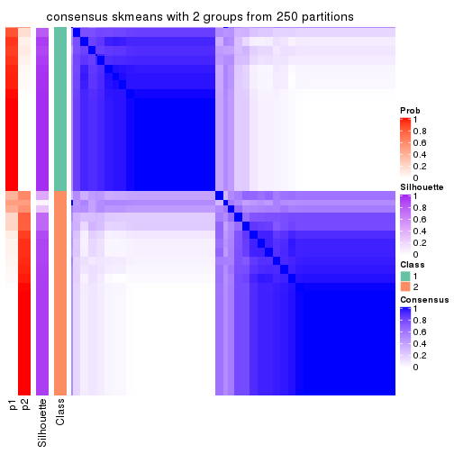</p>

</div>
<div id='tab-MAD-skmeans-consensus-heatmap-2'>
<pre><code class="r">consensus_heatmap(res, k = 3)
</code></pre>

<p>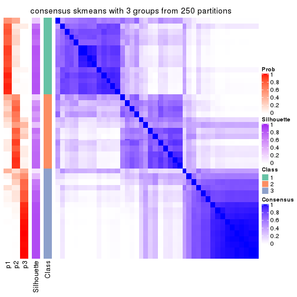</p>

</div>
<div id='tab-MAD-skmeans-consensus-heatmap-3'>
<pre><code class="r">consensus_heatmap(res, k = 4)
</code></pre>

<p>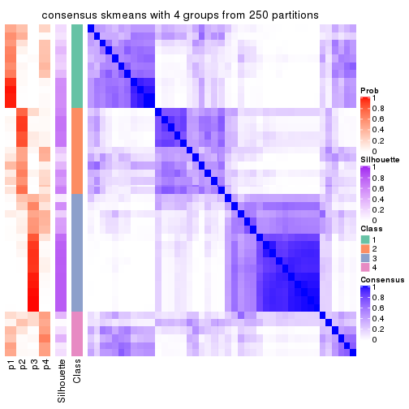</p>

</div>
<div id='tab-MAD-skmeans-consensus-heatmap-4'>
<pre><code class="r">consensus_heatmap(res, k = 5)
</code></pre>

<p>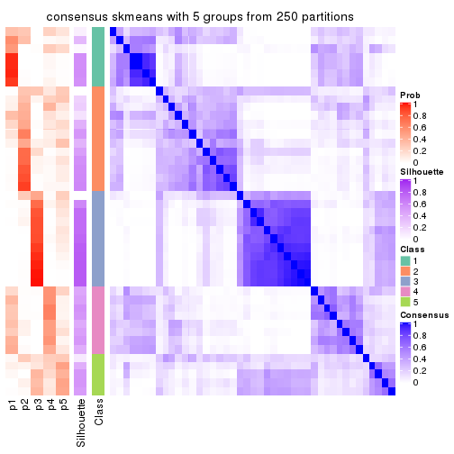</p>

</div>
<div id='tab-MAD-skmeans-consensus-heatmap-5'>
<pre><code class="r">consensus_heatmap(res, k = 6)
</code></pre>

<p>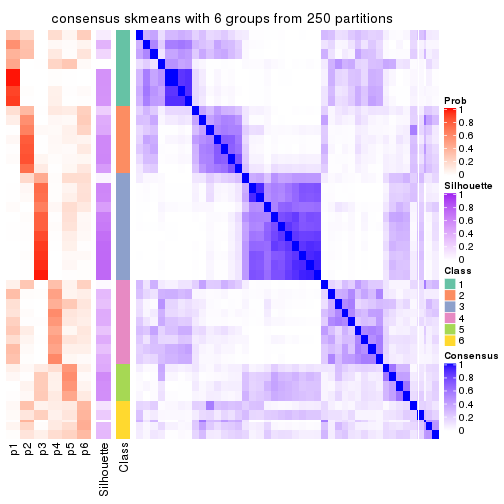</p>

</div>
</div>

Heatmaps for the membership of samples in all partitions to see how consistent they are:


<script>
$( function() {
	$( '#tabs-MAD-skmeans-membership-heatmap' ).tabs();
} );
</script>
<div id='tabs-MAD-skmeans-membership-heatmap'>
<ul>
<li><a href='#tab-MAD-skmeans-membership-heatmap-1'>k = 2</a></li>
<li><a href='#tab-MAD-skmeans-membership-heatmap-2'>k = 3</a></li>
<li><a href='#tab-MAD-skmeans-membership-heatmap-3'>k = 4</a></li>
<li><a href='#tab-MAD-skmeans-membership-heatmap-4'>k = 5</a></li>
<li><a href='#tab-MAD-skmeans-membership-heatmap-5'>k = 6</a></li>
</ul>
<div id='tab-MAD-skmeans-membership-heatmap-1'>
<pre><code class="r">membership_heatmap(res, k = 2)
</code></pre>

<p>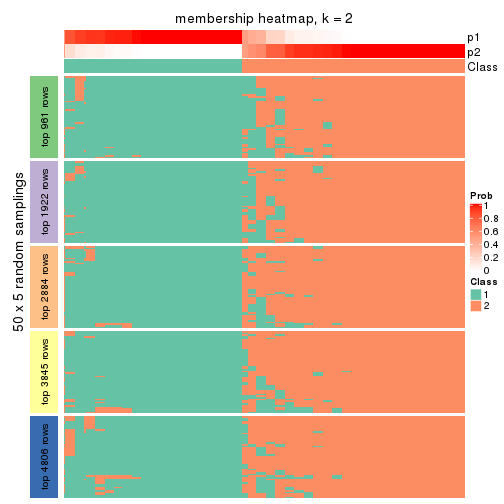</p>

</div>
<div id='tab-MAD-skmeans-membership-heatmap-2'>
<pre><code class="r">membership_heatmap(res, k = 3)
</code></pre>

<p>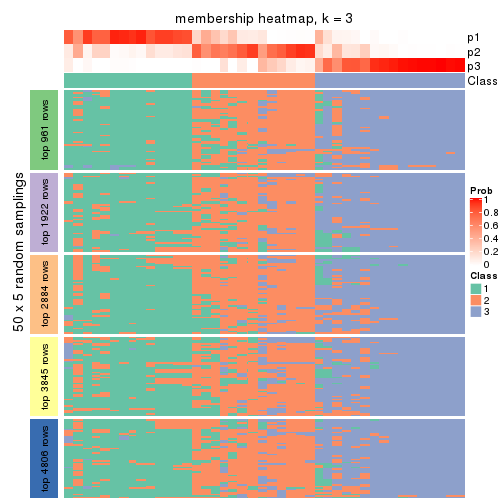</p>

</div>
<div id='tab-MAD-skmeans-membership-heatmap-3'>
<pre><code class="r">membership_heatmap(res, k = 4)
</code></pre>

<p>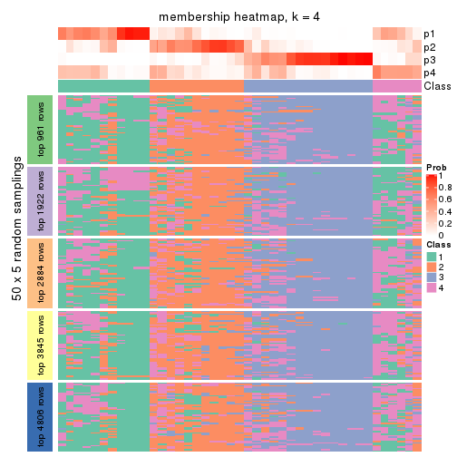</p>

</div>
<div id='tab-MAD-skmeans-membership-heatmap-4'>
<pre><code class="r">membership_heatmap(res, k = 5)
</code></pre>

<p>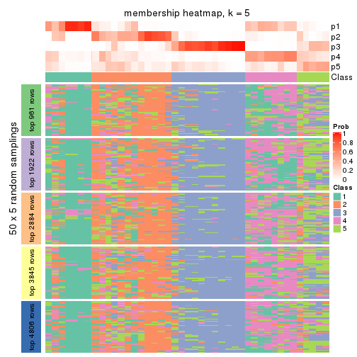</p>

</div>
<div id='tab-MAD-skmeans-membership-heatmap-5'>
<pre><code class="r">membership_heatmap(res, k = 6)
</code></pre>

<p>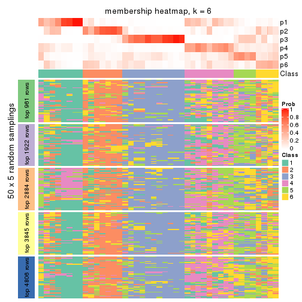</p>

</div>
</div>

As soon as we have had the classes for columns, we can look for signatures
which are significantly different between classes which can be candidate marks
for certain classes. Following are the heatmaps for signatures.


Signature heatmaps where rows are scaled:


<script>
$( function() {
	$( '#tabs-MAD-skmeans-get-signatures' ).tabs();
} );
</script>
<div id='tabs-MAD-skmeans-get-signatures'>
<ul>
<li><a href='#tab-MAD-skmeans-get-signatures-1'>k = 2</a></li>
<li><a href='#tab-MAD-skmeans-get-signatures-2'>k = 3</a></li>
<li><a href='#tab-MAD-skmeans-get-signatures-3'>k = 4</a></li>
<li><a href='#tab-MAD-skmeans-get-signatures-4'>k = 5</a></li>
<li><a href='#tab-MAD-skmeans-get-signatures-5'>k = 6</a></li>
</ul>
<div id='tab-MAD-skmeans-get-signatures-1'>
<pre><code class="r">get_signatures(res, k = 2)
</code></pre>

<p>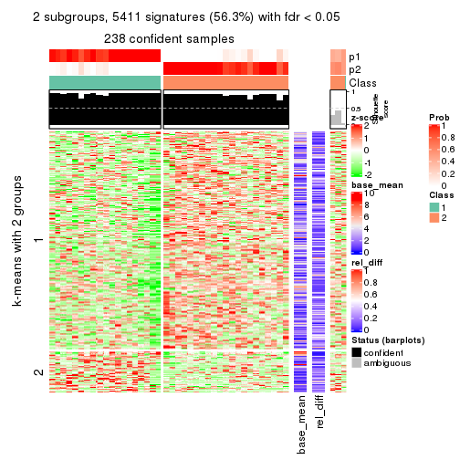</p>

</div>
<div id='tab-MAD-skmeans-get-signatures-2'>
<pre><code class="r">get_signatures(res, k = 3)
</code></pre>

<p>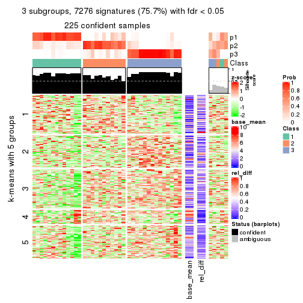</p>

</div>
<div id='tab-MAD-skmeans-get-signatures-3'>
<pre><code class="r">get_signatures(res, k = 4)
</code></pre>

<p>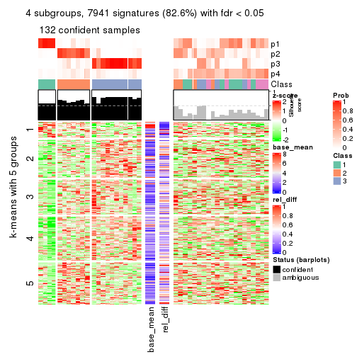</p>

</div>
<div id='tab-MAD-skmeans-get-signatures-4'>
<pre><code class="r">get_signatures(res, k = 5)
</code></pre>

<p>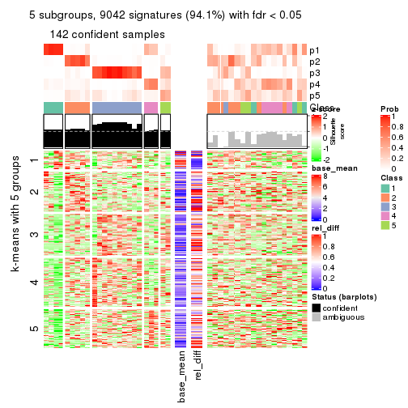</p>

</div>
<div id='tab-MAD-skmeans-get-signatures-5'>
<pre><code class="r">get_signatures(res, k = 6)
</code></pre>

<p>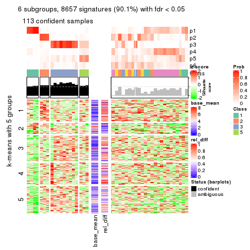</p>

</div>
</div>


Signature heatmaps where rows are not scaled:


<script>
$( function() {
	$( '#tabs-MAD-skmeans-get-signatures-no-scale' ).tabs();
} );
</script>
<div id='tabs-MAD-skmeans-get-signatures-no-scale'>
<ul>
<li><a href='#tab-MAD-skmeans-get-signatures-no-scale-1'>k = 2</a></li>
<li><a href='#tab-MAD-skmeans-get-signatures-no-scale-2'>k = 3</a></li>
<li><a href='#tab-MAD-skmeans-get-signatures-no-scale-3'>k = 4</a></li>
<li><a href='#tab-MAD-skmeans-get-signatures-no-scale-4'>k = 5</a></li>
<li><a href='#tab-MAD-skmeans-get-signatures-no-scale-5'>k = 6</a></li>
</ul>
<div id='tab-MAD-skmeans-get-signatures-no-scale-1'>
<pre><code class="r">get_signatures(res, k = 2, scale_rows = FALSE)
</code></pre>

<p>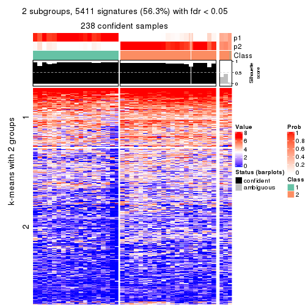</p>

</div>
<div id='tab-MAD-skmeans-get-signatures-no-scale-2'>
<pre><code class="r">get_signatures(res, k = 3, scale_rows = FALSE)
</code></pre>

<p>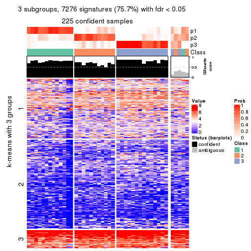</p>

</div>
<div id='tab-MAD-skmeans-get-signatures-no-scale-3'>
<pre><code class="r">get_signatures(res, k = 4, scale_rows = FALSE)
</code></pre>

<p>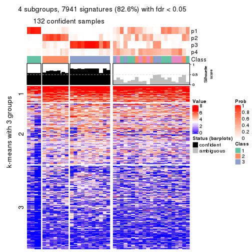</p>

</div>
<div id='tab-MAD-skmeans-get-signatures-no-scale-4'>
<pre><code class="r">get_signatures(res, k = 5, scale_rows = FALSE)
</code></pre>

<p>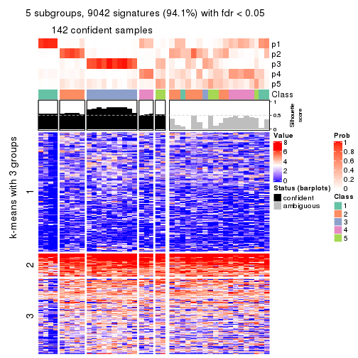</p>

</div>
<div id='tab-MAD-skmeans-get-signatures-no-scale-5'>
<pre><code class="r">get_signatures(res, k = 6, scale_rows = FALSE)
</code></pre>

<p>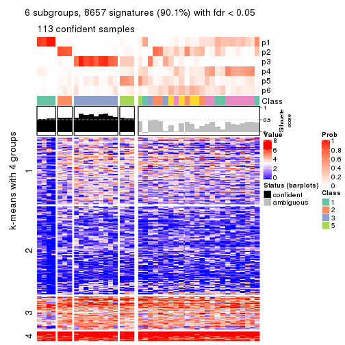</p>

</div>
</div>


Compare the overlap of signatures from different k:

```r
compare_signatures(res)
```

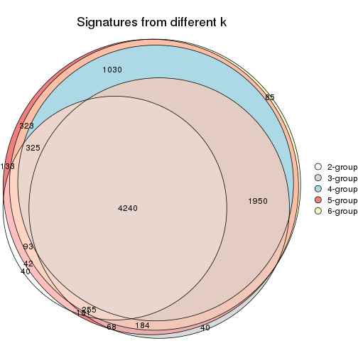

`get_signature()` returns a data frame invisibly. TO get the list of signatures, the function
call should be assigned to a variable explicitly. In following code, if `plot` argument is set
to `FALSE`, no heatmap is plotted while only the differential analysis is performed.

```r
# code only for demonstration
tb = get_signature(res, k = ..., plot = FALSE)
```

An example of the output of `tb` is:

```
#>   which_row         fdr    mean_1    mean_2 scaled_mean_1 scaled_mean_2 km
#> 1        38 0.042760348  8.373488  9.131774    -0.5533452     0.5164555  1
#> 2        40 0.018707592  7.106213  8.469186    -0.6173731     0.5762149  1
#> 3        55 0.019134737 10.221463 11.207825    -0.6159697     0.5749050  1
#> 4        59 0.006059896  5.921854  7.869574    -0.6899429     0.6439467  1
#> 5        60 0.018055526  8.928898 10.211722    -0.6204761     0.5791110  1
#> 6        98 0.009384629 15.714769 14.887706     0.6635654    -0.6193277  2
...
```

The columns in `tb` are:

1. `which_row`: row indices corresponding to the input matrix.
2. `fdr`: FDR for the differential test. 
3. `mean_x`: The mean value in group x.
4. `scaled_mean_x`: The mean value in group x after rows are scaled.
5. `km`: Row groups if k-means clustering is applied to rows.


UMAP plot which shows how samples are separated.


<script>
$( function() {
	$( '#tabs-MAD-skmeans-dimension-reduction' ).tabs();
} );
</script>
<div id='tabs-MAD-skmeans-dimension-reduction'>
<ul>
<li><a href='#tab-MAD-skmeans-dimension-reduction-1'>k = 2</a></li>
<li><a href='#tab-MAD-skmeans-dimension-reduction-2'>k = 3</a></li>
<li><a href='#tab-MAD-skmeans-dimension-reduction-3'>k = 4</a></li>
<li><a href='#tab-MAD-skmeans-dimension-reduction-4'>k = 5</a></li>
<li><a href='#tab-MAD-skmeans-dimension-reduction-5'>k = 6</a></li>
</ul>
<div id='tab-MAD-skmeans-dimension-reduction-1'>
<pre><code class="r">dimension_reduction(res, k = 2, method = &quot;UMAP&quot;)
</code></pre>

<p>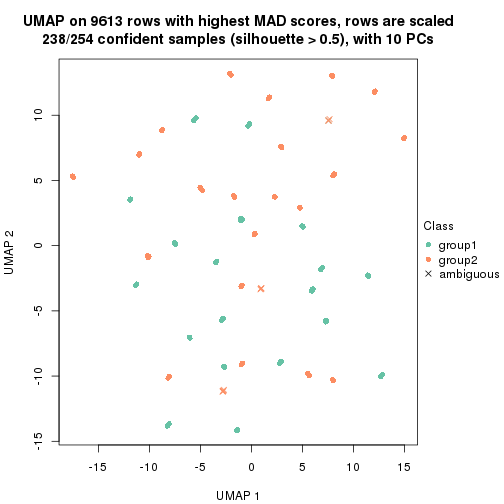</p>

</div>
<div id='tab-MAD-skmeans-dimension-reduction-2'>
<pre><code class="r">dimension_reduction(res, k = 3, method = &quot;UMAP&quot;)
</code></pre>

<p>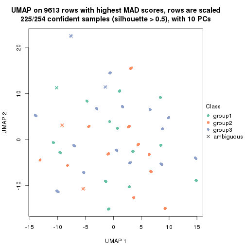</p>

</div>
<div id='tab-MAD-skmeans-dimension-reduction-3'>
<pre><code class="r">dimension_reduction(res, k = 4, method = &quot;UMAP&quot;)
</code></pre>

<p>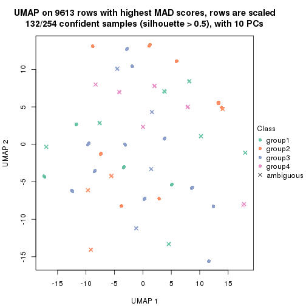</p>

</div>
<div id='tab-MAD-skmeans-dimension-reduction-4'>
<pre><code class="r">dimension_reduction(res, k = 5, method = &quot;UMAP&quot;)
</code></pre>

<p></p>

</div>
<div id='tab-MAD-skmeans-dimension-reduction-5'>
<pre><code class="r">dimension_reduction(res, k = 6, method = &quot;UMAP&quot;)
</code></pre>

<p>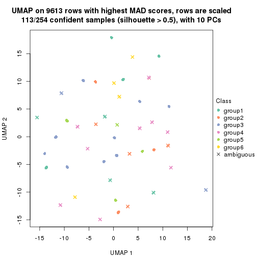</p>

</div>
</div>


Following heatmap shows how subgroups are split when increasing `k`:

```r
collect_classes(res)
```

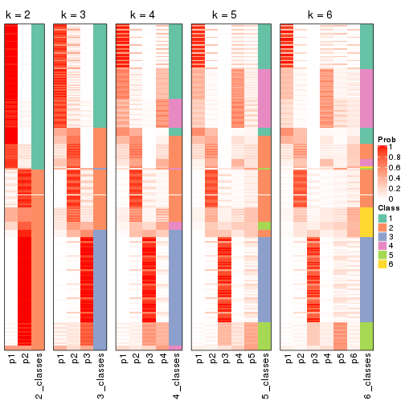


If matrix rows can be associated to genes, consider to use `GO_Enrichment(res,
...)` to perform function enrichment for the signature genes.


 

---------------------------------------------------


### MAD:pam


The object with results only for a single top-value method and a single partition method 
can be extracted as:

```r
res = res_list["MAD", "pam"]
# you can also extract it by
# res = res_list["MAD:pam"]
```

A summary of `res` and all the functions that can be applied to it:

```r
res
```

```
#> A 'ConsensusPartition' object with k = 2, 3, 4, 5, 6.
#>   On a matrix with 9613 rows and 254 columns.
#>   Top rows (961, 1922, 2884, 3845, 4806) are extracted by 'MAD' method.
#>   Subgroups are detected by 'pam' method.
#>   Performed in total 1250 partitions by row resampling.
#>   Best k for subgroups seems to be 3.
#> 
#> Following methods can be applied to this 'ConsensusPartition' object:
#>  [1] "cola_report"             "collect_classes"         "collect_plots"          
#>  [4] "collect_stats"           "colnames"                "compare_signatures"     
#>  [7] "consensus_heatmap"       "dimension_reduction"     "functional_enrichment"  
#> [10] "get_anno_col"            "get_anno"                "get_classes"            
#> [13] "get_consensus"           "get_matrix"              "get_membership"         
#> [16] "get_param"               "get_signatures"          "get_stats"              
#> [19] "is_best_k"               "is_stable_k"             "membership_heatmap"     
#> [22] "ncol"                    "nrow"                    "plot_ecdf"              
#> [25] "rownames"                "select_partition_number" "show"                   
#> [28] "suggest_best_k"          "test_to_known_factors"
```

`collect_plots()` function collects all the plots made from `res` for all `k` (number of partitions)
into one single page to provide an easy and fast comparison between different `k`.

```r
collect_plots(res)
```

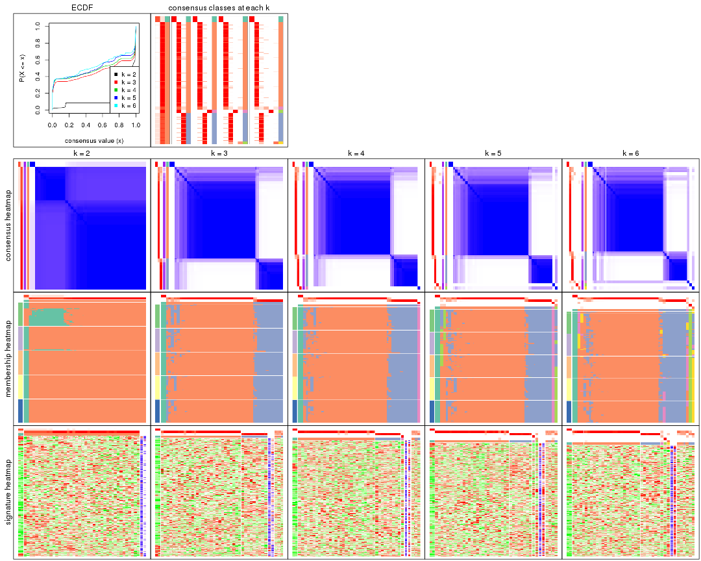

The plots are:

- The first row: a plot of the ECDF (Empirical cumulative distribution
  function) curves of the consensus matrix for each `k` and the heatmap of
  predicted classes for each `k`.
- The second row: heatmaps of the consensus matrix for each `k`.
- The third row: heatmaps of the membership matrix for each `k`.
- The fouth row: heatmaps of the signatures for each `k`.

All the plots in panels can be made by individual functions and they are
plotted later in this section.

`select_partition_number()` produces several plots showing different
statistics for choosing "optimized" `k`. There are following statistics:

- ECDF curves of the consensus matrix for each `k`;
- 1-PAC. [The PAC
  score](https://en.wikipedia.org/wiki/Consensus_clustering#Over-interpretation_potential_of_consensus_clustering)
  measures the proportion of the ambiguous subgrouping.
- Mean silhouette score.
- Concordance. The mean probability of fiting the consensus class ids in all
  partitions.
- Area increased. Denote $A_k$ as the area under the ECDF curve for current
  `k`, the area increased is defined as $A_k - A_{k-1}$.
- Rand index. The percent of pairs of samples that are both in a same cluster
  or both are not in a same cluster in the partition of k and k-1.
- Jaccard index. The ratio of pairs of samples are both in a same cluster in
  the partition of k and k-1 and the pairs of samples are both in a same
  cluster in the partition k or k-1.

The detailed explanations of these statistics can be found in [the cola
vignette](http://bioconductor.org/packages/devel/bioc/vignettes/cola/inst/doc/cola.html#toc_13).

Generally speaking, lower PAC score, higher mean silhouette score or higher
concordance corresponds to better partition. Rand index and Jaccard index
measure how similar the current partition is compared to partition with `k-1`.
If they are too similar, we won't accept `k` is better than `k-1`.

```r
select_partition_number(res)
```

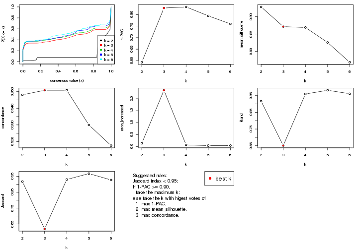

The numeric values for all these statistics can be obtained by `get_stats()`.

```r
get_stats(res)
```

```
#>   k 1-PAC mean_silhouette concordance area_increased  Rand Jaccard
#> 2 2 0.593           0.928       0.948         0.1348 0.917   0.917
#> 3 3 0.828           0.872       0.951         2.3539 0.651   0.619
#> 4 4 0.833           0.869       0.951         0.0698 0.960   0.930
#> 5 5 0.794           0.826       0.930         0.0406 0.982   0.967
#> 6 6 0.760           0.769       0.918         0.0418 0.961   0.927
```

`suggest_best_k()` suggests the best $k$ based on these statistics. The rules are as follows:

- All $k$ with Jaccard index larger than 0.95 are removed because the increase of
  the partition number does not provides enough extra information. If all $k$ are removed,
  the best $k$ is assigned by `NA`.
- For $k$ with 1-PAC larger than 0.9, the maximal $k$ is taken as the "best k". Other $k$ is called "optional k".
- If it does not fit the second rule. The $k$ with the highest vote of highest
  1-PAC, mean silhouette and concordance is taken as the "best k".

```r
suggest_best_k(res)
```

```
#> [1] 3
```


Following shows the table of the partitions (You need to click the **show/hide
code output** link to see it). The membership matrix (columns with name `p*`)
is inferred by
[`clue::cl_consensus()`](https://www.rdocumentation.org/link/cl_consensus?package=clue)
function with the `SE` method. Basically the value in the membership matrix
represents the probability to belong to a certain group. The finall class
label for an item is determined with the group with highest probability it
belongs to.

In `get_classes()` function, the entropy is calculated from the membership
matrix and the silhouette score is calculated from the consensus matrix.


<script>
$( function() {
	$( '#tabs-MAD-pam-get-classes' ).tabs();
} );
</script>
<div id='tabs-MAD-pam-get-classes'>
<ul>
<li><a href='#tab-MAD-pam-get-classes-1'>k = 2</a></li>
<li><a href='#tab-MAD-pam-get-classes-2'>k = 3</a></li>
<li><a href='#tab-MAD-pam-get-classes-3'>k = 4</a></li>
<li><a href='#tab-MAD-pam-get-classes-4'>k = 5</a></li>
<li><a href='#tab-MAD-pam-get-classes-5'>k = 6</a></li>
</ul>

<div id='tab-MAD-pam-get-classes-1'>
<p><a id='tab-MAD-pam-get-classes-1-a' style='color:#0366d6' href='#'>show/hide code output</a></p>
<pre><code class="r">cbind(get_classes(res, k = 2), get_membership(res, k = 2))
</code></pre>

<pre><code>#&gt;           class entropy silhouette    p1    p2
#&gt; DRR024803     1  0.6247      1.000 0.844 0.156
#&gt; DRR024804     2  0.0376      0.946 0.004 0.996
#&gt; DRR024805     2  0.0000      0.947 0.000 1.000
#&gt; DRR024806     2  0.0000      0.947 0.000 1.000
#&gt; DRR024807     2  0.6048      0.877 0.148 0.852
#&gt; DRR024808     2  0.6247      0.872 0.156 0.844
#&gt; DRR024809     2  0.0000      0.947 0.000 1.000
#&gt; DRR024810     2  0.0000      0.947 0.000 1.000
#&gt; DRR024811     2  0.6247      0.872 0.156 0.844
#&gt; DRR024812     2  0.0000      0.947 0.000 1.000
#&gt; DRR024813     2  0.5842      0.883 0.140 0.860
#&gt; DRR024814     2  0.0000      0.947 0.000 1.000
#&gt; DRR024815     2  0.5946      0.880 0.144 0.856
#&gt; DRR024816     2  0.0000      0.947 0.000 1.000
#&gt; DRR024817     2  0.0376      0.946 0.004 0.996
#&gt; DRR024818     2  0.4562      0.906 0.096 0.904
#&gt; DRR024819     2  0.0000      0.947 0.000 1.000
#&gt; DRR024820     2  0.0000      0.947 0.000 1.000
#&gt; DRR024821     2  0.6247      0.872 0.156 0.844
#&gt; DRR024822     2  0.0000      0.947 0.000 1.000
#&gt; DRR024824     2  0.0000      0.947 0.000 1.000
#&gt; DRR024825     2  0.6247      0.872 0.156 0.844
#&gt; DRR024826     2  0.0000      0.947 0.000 1.000
#&gt; DRR024827     2  0.1843      0.939 0.028 0.972
#&gt; DRR024828     2  0.6148      0.874 0.152 0.848
#&gt; DRR024829     2  0.0000      0.947 0.000 1.000
#&gt; DRR024830     2  0.0376      0.946 0.004 0.996
#&gt; DRR024831     2  0.6247      0.872 0.156 0.844
#&gt; DRR024832     2  0.6247      0.872 0.156 0.844
#&gt; DRR024833     2  0.2948      0.928 0.052 0.948
#&gt; DRR024834     2  0.0000      0.947 0.000 1.000
#&gt; DRR024835     2  0.2043      0.937 0.032 0.968
#&gt; DRR024836     2  0.6247      0.872 0.156 0.844
#&gt; DRR024837     2  0.0000      0.947 0.000 1.000
#&gt; DRR024838     2  0.0000      0.947 0.000 1.000
#&gt; DRR024839     2  0.0000      0.947 0.000 1.000
#&gt; DRR024840     2  0.0000      0.947 0.000 1.000
#&gt; DRR024841     2  0.0000      0.947 0.000 1.000
#&gt; DRR024842     2  0.0000      0.947 0.000 1.000
#&gt; DRR024843     1  0.6247      1.000 0.844 0.156
#&gt; DRR024844     2  0.0672      0.945 0.008 0.992
#&gt; DRR024845     2  0.0000      0.947 0.000 1.000
#&gt; DRR024846     2  0.0000      0.947 0.000 1.000
#&gt; DRR024847     2  0.6048      0.877 0.148 0.852
#&gt; DRR024848     1  0.6247      1.000 0.844 0.156
#&gt; DRR024849     2  0.6247      0.872 0.156 0.844
#&gt; DRR024850     2  0.0000      0.947 0.000 1.000
#&gt; DRR024851     2  0.0000      0.947 0.000 1.000
#&gt; DRR024852     2  0.0000      0.947 0.000 1.000
#&gt; DRR024853     2  0.6247      0.872 0.156 0.844
#&gt; DRR024854     2  0.0000      0.947 0.000 1.000
#&gt; DRR024855     2  0.5946      0.879 0.144 0.856
#&gt; DRR024856     2  0.0000      0.947 0.000 1.000
#&gt; DRR024857     2  0.5842      0.882 0.140 0.860
#&gt; DRR024858     2  0.0000      0.947 0.000 1.000
#&gt; DRR024859     2  0.0376      0.946 0.004 0.996
#&gt; DRR024860     2  0.4431      0.908 0.092 0.908
#&gt; DRR024861     2  0.0000      0.947 0.000 1.000
#&gt; DRR024862     2  0.0000      0.947 0.000 1.000
#&gt; DRR024863     2  0.6247      0.872 0.156 0.844
#&gt; DRR024864     2  0.0000      0.947 0.000 1.000
#&gt; DRR024865     2  0.0000      0.947 0.000 1.000
#&gt; DRR024866     2  0.0000      0.947 0.000 1.000
#&gt; DRR024867     2  0.6247      0.872 0.156 0.844
#&gt; DRR024868     2  0.0000      0.947 0.000 1.000
#&gt; DRR024869     2  0.2236      0.936 0.036 0.964
#&gt; DRR024870     2  0.6148      0.874 0.152 0.848
#&gt; DRR024871     2  0.0000      0.947 0.000 1.000
#&gt; DRR024872     2  0.0376      0.946 0.004 0.996
#&gt; DRR024873     2  0.6247      0.872 0.156 0.844
#&gt; DRR024874     2  0.6247      0.872 0.156 0.844
#&gt; DRR024875     2  0.3733      0.919 0.072 0.928
#&gt; DRR024876     2  0.0000      0.947 0.000 1.000
#&gt; DRR024877     2  0.1633      0.940 0.024 0.976
#&gt; DRR024878     2  0.6247      0.872 0.156 0.844
#&gt; DRR024879     2  0.0000      0.947 0.000 1.000
#&gt; DRR024880     2  0.0000      0.947 0.000 1.000
#&gt; DRR024881     2  0.0000      0.947 0.000 1.000
#&gt; DRR024882     2  0.0000      0.947 0.000 1.000
#&gt; DRR024883     2  0.0000      0.947 0.000 1.000
#&gt; DRR024884     2  0.0672      0.945 0.008 0.992
#&gt; DRR024885     2  0.0000      0.947 0.000 1.000
#&gt; DRR024886     1  0.6247      1.000 0.844 0.156
#&gt; DRR024887     2  0.0376      0.946 0.004 0.996
#&gt; DRR024888     2  0.0000      0.947 0.000 1.000
#&gt; DRR024889     2  0.0000      0.947 0.000 1.000
#&gt; DRR024890     2  0.6048      0.877 0.148 0.852
#&gt; DRR024891     1  0.6247      1.000 0.844 0.156
#&gt; DRR024892     2  0.6247      0.872 0.156 0.844
#&gt; DRR024893     2  0.0000      0.947 0.000 1.000
#&gt; DRR024894     2  0.0000      0.947 0.000 1.000
#&gt; DRR024895     2  0.0000      0.947 0.000 1.000
#&gt; DRR024896     2  0.6247      0.872 0.156 0.844
#&gt; DRR024897     2  0.0000      0.947 0.000 1.000
#&gt; DRR024898     2  0.5737      0.885 0.136 0.864
#&gt; DRR024899     2  0.0000      0.947 0.000 1.000
#&gt; DRR024900     2  0.5842      0.882 0.140 0.860
#&gt; DRR024901     2  0.0000      0.947 0.000 1.000
#&gt; DRR024902     2  0.0376      0.946 0.004 0.996
#&gt; DRR024903     2  0.4690      0.904 0.100 0.900
#&gt; DRR024904     2  0.0000      0.947 0.000 1.000
#&gt; DRR024905     2  0.0000      0.947 0.000 1.000
#&gt; DRR024906     2  0.6247      0.872 0.156 0.844
#&gt; DRR024907     2  0.0000      0.947 0.000 1.000
#&gt; DRR024908     2  0.0000      0.947 0.000 1.000
#&gt; DRR024909     2  0.0000      0.947 0.000 1.000
#&gt; DRR024910     2  0.6247      0.872 0.156 0.844
#&gt; DRR024911     2  0.0000      0.947 0.000 1.000
#&gt; DRR024912     2  0.2043      0.937 0.032 0.968
#&gt; DRR024913     2  0.6148      0.874 0.152 0.848
#&gt; DRR024914     2  0.0000      0.947 0.000 1.000
#&gt; DRR024915     2  0.0376      0.946 0.004 0.996
#&gt; DRR024916     2  0.6247      0.872 0.156 0.844
#&gt; DRR024917     2  0.6247      0.872 0.156 0.844
#&gt; DRR024918     2  0.3274      0.924 0.060 0.940
#&gt; DRR024919     2  0.0000      0.947 0.000 1.000
#&gt; DRR024920     2  0.2236      0.936 0.036 0.964
#&gt; DRR024921     2  0.6247      0.872 0.156 0.844
#&gt; DRR024922     2  0.0000      0.947 0.000 1.000
#&gt; DRR024923     2  0.0000      0.947 0.000 1.000
#&gt; DRR024924     2  0.0000      0.947 0.000 1.000
#&gt; DRR024925     2  0.0000      0.947 0.000 1.000
#&gt; DRR024926     2  0.0000      0.947 0.000 1.000
#&gt; DRR024927     2  0.0672      0.945 0.008 0.992
#&gt; DRR024928     2  0.0376      0.946 0.004 0.996
#&gt; DRR024929     1  0.6247      1.000 0.844 0.156
#&gt; DRR024930     2  0.0938      0.944 0.012 0.988
#&gt; DRR024931     2  0.0000      0.947 0.000 1.000
#&gt; DRR024932     2  0.0000      0.947 0.000 1.000
#&gt; DRR024933     2  0.6048      0.877 0.148 0.852
#&gt; DRR024934     1  0.6247      1.000 0.844 0.156
#&gt; DRR024935     2  0.6247      0.872 0.156 0.844
#&gt; DRR024936     2  0.0000      0.947 0.000 1.000
#&gt; DRR024937     2  0.0000      0.947 0.000 1.000
#&gt; DRR024938     2  0.0000      0.947 0.000 1.000
#&gt; DRR024939     2  0.6247      0.872 0.156 0.844
#&gt; DRR024940     2  0.0000      0.947 0.000 1.000
#&gt; DRR024941     2  0.5946      0.879 0.144 0.856
#&gt; DRR024942     2  0.0000      0.947 0.000 1.000
#&gt; DRR024943     2  0.5842      0.882 0.140 0.860
#&gt; DRR024944     2  0.0000      0.947 0.000 1.000
#&gt; DRR024945     2  0.0376      0.946 0.004 0.996
#&gt; DRR024946     2  0.4161      0.912 0.084 0.916
#&gt; DRR024947     2  0.0000      0.947 0.000 1.000
#&gt; DRR024948     2  0.0000      0.947 0.000 1.000
#&gt; DRR024949     2  0.6247      0.872 0.156 0.844
#&gt; DRR024950     2  0.0000      0.947 0.000 1.000
#&gt; DRR024951     2  0.0000      0.947 0.000 1.000
#&gt; DRR024952     2  0.0000      0.947 0.000 1.000
#&gt; DRR024953     2  0.6247      0.872 0.156 0.844
#&gt; DRR024954     2  0.0000      0.947 0.000 1.000
#&gt; DRR024955     2  0.2043      0.937 0.032 0.968
#&gt; DRR024956     2  0.6148      0.874 0.152 0.848
#&gt; DRR024957     2  0.0000      0.947 0.000 1.000
#&gt; DRR024958     2  0.0376      0.946 0.004 0.996
#&gt; DRR024959     2  0.6247      0.872 0.156 0.844
#&gt; DRR024960     2  0.6247      0.872 0.156 0.844
#&gt; DRR024961     2  0.2948      0.928 0.052 0.948
#&gt; DRR024962     2  0.0000      0.947 0.000 1.000
#&gt; DRR024963     2  0.2043      0.937 0.032 0.968
#&gt; DRR024964     2  0.6247      0.872 0.156 0.844
#&gt; DRR024965     2  0.0000      0.947 0.000 1.000
#&gt; DRR024966     2  0.0000      0.947 0.000 1.000
#&gt; DRR024967     2  0.0000      0.947 0.000 1.000
#&gt; DRR024968     2  0.0000      0.947 0.000 1.000
#&gt; DRR024969     2  0.0000      0.947 0.000 1.000
#&gt; DRR024970     2  0.0672      0.945 0.008 0.992
#&gt; DRR024971     2  0.0000      0.947 0.000 1.000
#&gt; DRR024972     1  0.6247      1.000 0.844 0.156
#&gt; DRR024973     2  0.0672      0.945 0.008 0.992
#&gt; DRR024974     2  0.0000      0.947 0.000 1.000
#&gt; DRR024975     2  0.0000      0.947 0.000 1.000
#&gt; DRR024976     2  0.6048      0.877 0.148 0.852
#&gt; DRR024977     1  0.6247      1.000 0.844 0.156
#&gt; DRR024978     2  0.6247      0.872 0.156 0.844
#&gt; DRR024979     2  0.0000      0.947 0.000 1.000
#&gt; DRR024980     2  0.0000      0.947 0.000 1.000
#&gt; DRR024981     2  0.0000      0.947 0.000 1.000
#&gt; DRR024982     2  0.6247      0.872 0.156 0.844
#&gt; DRR024983     2  0.0000      0.947 0.000 1.000
#&gt; DRR024984     2  0.5946      0.879 0.144 0.856
#&gt; DRR024985     2  0.0000      0.947 0.000 1.000
#&gt; DRR024986     2  0.5842      0.882 0.140 0.860
#&gt; DRR024987     2  0.0000      0.947 0.000 1.000
#&gt; DRR024988     2  0.0376      0.946 0.004 0.996
#&gt; DRR024989     2  0.4431      0.908 0.092 0.908
#&gt; DRR024990     2  0.0000      0.947 0.000 1.000
#&gt; DRR024991     2  0.0000      0.947 0.000 1.000
#&gt; DRR024992     2  0.6247      0.872 0.156 0.844
#&gt; DRR024993     2  0.0000      0.947 0.000 1.000
#&gt; DRR024994     2  0.0000      0.947 0.000 1.000
#&gt; DRR024995     2  0.0000      0.947 0.000 1.000
#&gt; DRR024996     2  0.6247      0.872 0.156 0.844
#&gt; DRR024997     2  0.0000      0.947 0.000 1.000
#&gt; DRR024998     2  0.2236      0.936 0.036 0.964
#&gt; DRR024999     2  0.6148      0.874 0.152 0.848
#&gt; DRR025000     2  0.0000      0.947 0.000 1.000
#&gt; DRR025001     2  0.0376      0.946 0.004 0.996
#&gt; DRR025002     2  0.6247      0.872 0.156 0.844
#&gt; DRR025003     2  0.6247      0.872 0.156 0.844
#&gt; DRR025004     2  0.3114      0.926 0.056 0.944
#&gt; DRR025005     2  0.0000      0.947 0.000 1.000
#&gt; DRR025006     2  0.2043      0.937 0.032 0.968
#&gt; DRR025007     2  0.6247      0.872 0.156 0.844
#&gt; DRR025008     2  0.0000      0.947 0.000 1.000
#&gt; DRR025009     2  0.0000      0.947 0.000 1.000
#&gt; DRR025010     2  0.0000      0.947 0.000 1.000
#&gt; DRR025011     2  0.0000      0.947 0.000 1.000
#&gt; DRR025012     2  0.0000      0.947 0.000 1.000
#&gt; DRR025013     2  0.0672      0.945 0.008 0.992
#&gt; DRR025014     2  0.0000      0.947 0.000 1.000
#&gt; DRR025015     1  0.6247      1.000 0.844 0.156
#&gt; DRR025016     2  0.0376      0.946 0.004 0.996
#&gt; DRR025017     2  0.0000      0.947 0.000 1.000
#&gt; DRR025018     2  0.0000      0.947 0.000 1.000
#&gt; DRR025019     2  0.6048      0.877 0.148 0.852
#&gt; DRR025020     1  0.6247      1.000 0.844 0.156
#&gt; DRR025021     2  0.6247      0.872 0.156 0.844
#&gt; DRR025022     2  0.0000      0.947 0.000 1.000
#&gt; DRR025023     2  0.0000      0.947 0.000 1.000
#&gt; DRR025024     2  0.0000      0.947 0.000 1.000
#&gt; DRR025025     2  0.6247      0.872 0.156 0.844
#&gt; DRR025026     2  0.0000      0.947 0.000 1.000
#&gt; DRR025027     2  0.5629      0.887 0.132 0.868
#&gt; DRR025028     2  0.0000      0.947 0.000 1.000
#&gt; DRR025029     2  0.5842      0.882 0.140 0.860
#&gt; DRR025030     2  0.0000      0.947 0.000 1.000
#&gt; DRR025031     2  0.0376      0.946 0.004 0.996
#&gt; DRR025032     2  0.4298      0.910 0.088 0.912
#&gt; DRR025033     2  0.0000      0.947 0.000 1.000
#&gt; DRR025034     2  0.0000      0.947 0.000 1.000
#&gt; DRR025035     2  0.6247      0.872 0.156 0.844
#&gt; DRR025036     2  0.0000      0.947 0.000 1.000
#&gt; DRR025037     2  0.0000      0.947 0.000 1.000
#&gt; DRR025038     2  0.0000      0.947 0.000 1.000
#&gt; DRR025039     2  0.6247      0.872 0.156 0.844
#&gt; DRR025040     2  0.0000      0.947 0.000 1.000
#&gt; DRR025041     2  0.2236      0.936 0.036 0.964
#&gt; DRR025042     2  0.6148      0.874 0.152 0.848
#&gt; DRR025043     2  0.0000      0.947 0.000 1.000
#&gt; DRR025044     2  0.0376      0.946 0.004 0.996
#&gt; DRR025045     2  0.6247      0.872 0.156 0.844
#&gt; DRR025046     2  0.6247      0.872 0.156 0.844
#&gt; DRR025047     2  0.3584      0.921 0.068 0.932
#&gt; DRR025048     2  0.0000      0.947 0.000 1.000
#&gt; DRR025049     2  0.2043      0.937 0.032 0.968
#&gt; DRR025050     2  0.6247      0.872 0.156 0.844
#&gt; DRR025051     2  0.0000      0.947 0.000 1.000
#&gt; DRR025052     2  0.0000      0.947 0.000 1.000
#&gt; DRR025053     2  0.0000      0.947 0.000 1.000
#&gt; DRR025054     2  0.0000      0.947 0.000 1.000
#&gt; DRR025055     2  0.0000      0.947 0.000 1.000
#&gt; DRR025056     2  0.0672      0.945 0.008 0.992
#&gt; DRR025057     2  0.0000      0.947 0.000 1.000
</code></pre>

<script>
$('#tab-MAD-pam-get-classes-1-a').parent().next().next().hide();
$('#tab-MAD-pam-get-classes-1-a').click(function(){
  $('#tab-MAD-pam-get-classes-1-a').parent().next().next().toggle();
  return(false);
});
</script>
</div>

<div id='tab-MAD-pam-get-classes-2'>
<p><a id='tab-MAD-pam-get-classes-2-a' style='color:#0366d6' href='#'>show/hide code output</a></p>
<pre><code class="r">cbind(get_classes(res, k = 3), get_membership(res, k = 3))
</code></pre>

<pre><code>#&gt;           class entropy silhouette p1    p2    p3
#&gt; DRR024803     1  0.0000     1.0000  1 0.000 0.000
#&gt; DRR024804     2  0.0747     0.9343  0 0.984 0.016
#&gt; DRR024805     2  0.0000     0.9439  0 1.000 0.000
#&gt; DRR024806     2  0.0000     0.9439  0 1.000 0.000
#&gt; DRR024807     3  0.1163     0.8871  0 0.028 0.972
#&gt; DRR024808     3  0.0000     0.9068  0 0.000 1.000
#&gt; DRR024809     2  0.0000     0.9439  0 1.000 0.000
#&gt; DRR024810     2  0.0000     0.9439  0 1.000 0.000
#&gt; DRR024811     3  0.0424     0.9045  0 0.008 0.992
#&gt; DRR024812     2  0.0000     0.9439  0 1.000 0.000
#&gt; DRR024813     2  0.6180     0.3144  0 0.584 0.416
#&gt; DRR024814     2  0.0000     0.9439  0 1.000 0.000
#&gt; DRR024815     2  0.5138     0.6719  0 0.748 0.252
#&gt; DRR024816     2  0.0000     0.9439  0 1.000 0.000
#&gt; DRR024817     2  0.0237     0.9416  0 0.996 0.004
#&gt; DRR024818     3  0.5529     0.5064  0 0.296 0.704
#&gt; DRR024819     2  0.0237     0.9415  0 0.996 0.004
#&gt; DRR024820     2  0.0000     0.9439  0 1.000 0.000
#&gt; DRR024821     3  0.0000     0.9068  0 0.000 1.000
#&gt; DRR024822     2  0.0000     0.9439  0 1.000 0.000
#&gt; DRR024824     2  0.0000     0.9439  0 1.000 0.000
#&gt; DRR024825     3  0.0237     0.9058  0 0.004 0.996
#&gt; DRR024826     2  0.0237     0.9417  0 0.996 0.004
#&gt; DRR024827     2  0.6111     0.3655  0 0.604 0.396
#&gt; DRR024828     3  0.0592     0.9023  0 0.012 0.988
#&gt; DRR024829     2  0.0000     0.9439  0 1.000 0.000
#&gt; DRR024830     2  0.0237     0.9418  0 0.996 0.004
#&gt; DRR024831     3  0.0000     0.9068  0 0.000 1.000
#&gt; DRR024832     3  0.0000     0.9068  0 0.000 1.000
#&gt; DRR024833     3  0.6260     0.1914  0 0.448 0.552
#&gt; DRR024834     2  0.0000     0.9439  0 1.000 0.000
#&gt; DRR024835     2  0.5327     0.6325  0 0.728 0.272
#&gt; DRR024836     3  0.0000     0.9068  0 0.000 1.000
#&gt; DRR024837     2  0.0000     0.9439  0 1.000 0.000
#&gt; DRR024838     2  0.0000     0.9439  0 1.000 0.000
#&gt; DRR024839     2  0.0000     0.9439  0 1.000 0.000
#&gt; DRR024840     2  0.0000     0.9439  0 1.000 0.000
#&gt; DRR024841     2  0.0000     0.9439  0 1.000 0.000
#&gt; DRR024842     2  0.0000     0.9439  0 1.000 0.000
#&gt; DRR024843     1  0.0000     1.0000  1 0.000 0.000
#&gt; DRR024844     2  0.1031     0.9286  0 0.976 0.024
#&gt; DRR024845     2  0.0000     0.9439  0 1.000 0.000
#&gt; DRR024846     2  0.0000     0.9439  0 1.000 0.000
#&gt; DRR024847     3  0.1289     0.8823  0 0.032 0.968
#&gt; DRR024848     1  0.0000     1.0000  1 0.000 0.000
#&gt; DRR024849     3  0.0000     0.9068  0 0.000 1.000
#&gt; DRR024850     2  0.0000     0.9439  0 1.000 0.000
#&gt; DRR024851     2  0.0000     0.9439  0 1.000 0.000
#&gt; DRR024852     2  0.0000     0.9439  0 1.000 0.000
#&gt; DRR024853     3  0.0424     0.9045  0 0.008 0.992
#&gt; DRR024854     2  0.0000     0.9439  0 1.000 0.000
#&gt; DRR024855     2  0.6291     0.1444  0 0.532 0.468
#&gt; DRR024856     2  0.0000     0.9439  0 1.000 0.000
#&gt; DRR024857     2  0.4842     0.7132  0 0.776 0.224
#&gt; DRR024858     2  0.0000     0.9439  0 1.000 0.000
#&gt; DRR024859     2  0.0237     0.9416  0 0.996 0.004
#&gt; DRR024860     3  0.5810     0.4532  0 0.336 0.664
#&gt; DRR024861     2  0.0000     0.9439  0 1.000 0.000
#&gt; DRR024862     2  0.0000     0.9439  0 1.000 0.000
#&gt; DRR024863     3  0.0000     0.9068  0 0.000 1.000
#&gt; DRR024864     2  0.0000     0.9439  0 1.000 0.000
#&gt; DRR024865     2  0.0000     0.9439  0 1.000 0.000
#&gt; DRR024866     2  0.0000     0.9439  0 1.000 0.000
#&gt; DRR024867     3  0.0237     0.9058  0 0.004 0.996
#&gt; DRR024868     2  0.0892     0.9315  0 0.980 0.020
#&gt; DRR024869     2  0.4750     0.7289  0 0.784 0.216
#&gt; DRR024870     3  0.0592     0.9023  0 0.012 0.988
#&gt; DRR024871     2  0.0000     0.9439  0 1.000 0.000
#&gt; DRR024872     2  0.0237     0.9418  0 0.996 0.004
#&gt; DRR024873     3  0.0000     0.9068  0 0.000 1.000
#&gt; DRR024874     3  0.0000     0.9068  0 0.000 1.000
#&gt; DRR024875     2  0.6309    -0.0121  0 0.500 0.500
#&gt; DRR024876     2  0.0000     0.9439  0 1.000 0.000
#&gt; DRR024877     2  0.4974     0.6894  0 0.764 0.236
#&gt; DRR024878     3  0.0000     0.9068  0 0.000 1.000
#&gt; DRR024879     2  0.0000     0.9439  0 1.000 0.000
#&gt; DRR024880     2  0.0000     0.9439  0 1.000 0.000
#&gt; DRR024881     2  0.0000     0.9439  0 1.000 0.000
#&gt; DRR024882     2  0.0000     0.9439  0 1.000 0.000
#&gt; DRR024883     2  0.0000     0.9439  0 1.000 0.000
#&gt; DRR024884     2  0.1411     0.9194  0 0.964 0.036
#&gt; DRR024885     2  0.0424     0.9389  0 0.992 0.008
#&gt; DRR024886     1  0.0000     1.0000  1 0.000 0.000
#&gt; DRR024887     2  0.0747     0.9343  0 0.984 0.016
#&gt; DRR024888     2  0.0000     0.9439  0 1.000 0.000
#&gt; DRR024889     2  0.0000     0.9439  0 1.000 0.000
#&gt; DRR024890     3  0.1163     0.8871  0 0.028 0.972
#&gt; DRR024891     1  0.0000     1.0000  1 0.000 0.000
#&gt; DRR024892     3  0.0000     0.9068  0 0.000 1.000
#&gt; DRR024893     2  0.0000     0.9439  0 1.000 0.000
#&gt; DRR024894     2  0.0000     0.9439  0 1.000 0.000
#&gt; DRR024895     2  0.0000     0.9439  0 1.000 0.000
#&gt; DRR024896     3  0.0424     0.9045  0 0.008 0.992
#&gt; DRR024897     2  0.0000     0.9439  0 1.000 0.000
#&gt; DRR024898     2  0.6111     0.3669  0 0.604 0.396
#&gt; DRR024899     2  0.0000     0.9439  0 1.000 0.000
#&gt; DRR024900     2  0.4750     0.7249  0 0.784 0.216
#&gt; DRR024901     2  0.0000     0.9439  0 1.000 0.000
#&gt; DRR024902     2  0.0237     0.9416  0 0.996 0.004
#&gt; DRR024903     3  0.5678     0.4804  0 0.316 0.684
#&gt; DRR024904     2  0.0000     0.9439  0 1.000 0.000
#&gt; DRR024905     2  0.0000     0.9439  0 1.000 0.000
#&gt; DRR024906     3  0.0000     0.9068  0 0.000 1.000
#&gt; DRR024907     2  0.0000     0.9439  0 1.000 0.000
#&gt; DRR024908     2  0.0000     0.9439  0 1.000 0.000
#&gt; DRR024909     2  0.0000     0.9439  0 1.000 0.000
#&gt; DRR024910     3  0.0237     0.9058  0 0.004 0.996
#&gt; DRR024911     2  0.0592     0.9367  0 0.988 0.012
#&gt; DRR024912     2  0.4178     0.7864  0 0.828 0.172
#&gt; DRR024913     3  0.0592     0.9023  0 0.012 0.988
#&gt; DRR024914     2  0.0000     0.9439  0 1.000 0.000
#&gt; DRR024915     2  0.0237     0.9418  0 0.996 0.004
#&gt; DRR024916     3  0.0000     0.9068  0 0.000 1.000
#&gt; DRR024917     3  0.0000     0.9068  0 0.000 1.000
#&gt; DRR024918     2  0.6204     0.2656  0 0.576 0.424
#&gt; DRR024919     2  0.0000     0.9439  0 1.000 0.000
#&gt; DRR024920     2  0.5621     0.5653  0 0.692 0.308
#&gt; DRR024921     3  0.0000     0.9068  0 0.000 1.000
#&gt; DRR024922     2  0.0000     0.9439  0 1.000 0.000
#&gt; DRR024923     2  0.0000     0.9439  0 1.000 0.000
#&gt; DRR024924     2  0.0000     0.9439  0 1.000 0.000
#&gt; DRR024925     2  0.0000     0.9439  0 1.000 0.000
#&gt; DRR024926     2  0.0000     0.9439  0 1.000 0.000
#&gt; DRR024927     2  0.1411     0.9194  0 0.964 0.036
#&gt; DRR024928     2  0.0592     0.9366  0 0.988 0.012
#&gt; DRR024929     1  0.0000     1.0000  1 0.000 0.000
#&gt; DRR024930     2  0.1031     0.9286  0 0.976 0.024
#&gt; DRR024931     2  0.0000     0.9439  0 1.000 0.000
#&gt; DRR024932     2  0.0000     0.9439  0 1.000 0.000
#&gt; DRR024933     3  0.1411     0.8772  0 0.036 0.964
#&gt; DRR024934     1  0.0000     1.0000  1 0.000 0.000
#&gt; DRR024935     3  0.0000     0.9068  0 0.000 1.000
#&gt; DRR024936     2  0.0000     0.9439  0 1.000 0.000
#&gt; DRR024937     2  0.0000     0.9439  0 1.000 0.000
#&gt; DRR024938     2  0.0000     0.9439  0 1.000 0.000
#&gt; DRR024939     3  0.0424     0.9045  0 0.008 0.992
#&gt; DRR024940     2  0.0000     0.9439  0 1.000 0.000
#&gt; DRR024941     2  0.6274     0.1842  0 0.544 0.456
#&gt; DRR024942     2  0.0000     0.9439  0 1.000 0.000
#&gt; DRR024943     2  0.4796     0.7191  0 0.780 0.220
#&gt; DRR024944     2  0.0000     0.9439  0 1.000 0.000
#&gt; DRR024945     2  0.0237     0.9416  0 0.996 0.004
#&gt; DRR024946     3  0.6045     0.3917  0 0.380 0.620
#&gt; DRR024947     2  0.0000     0.9439  0 1.000 0.000
#&gt; DRR024948     2  0.0000     0.9439  0 1.000 0.000
#&gt; DRR024949     3  0.0000     0.9068  0 0.000 1.000
#&gt; DRR024950     2  0.0000     0.9439  0 1.000 0.000
#&gt; DRR024951     2  0.0000     0.9439  0 1.000 0.000
#&gt; DRR024952     2  0.0000     0.9439  0 1.000 0.000
#&gt; DRR024953     3  0.0424     0.9030  0 0.008 0.992
#&gt; DRR024954     2  0.0747     0.9339  0 0.984 0.016
#&gt; DRR024955     2  0.4399     0.7666  0 0.812 0.188
#&gt; DRR024956     3  0.0592     0.9023  0 0.012 0.988
#&gt; DRR024957     2  0.0000     0.9439  0 1.000 0.000
#&gt; DRR024958     2  0.0237     0.9418  0 0.996 0.004
#&gt; DRR024959     3  0.0000     0.9068  0 0.000 1.000
#&gt; DRR024960     3  0.0000     0.9068  0 0.000 1.000
#&gt; DRR024961     2  0.5988     0.4196  0 0.632 0.368
#&gt; DRR024962     2  0.0000     0.9439  0 1.000 0.000
#&gt; DRR024963     2  0.5397     0.6183  0 0.720 0.280
#&gt; DRR024964     3  0.0000     0.9068  0 0.000 1.000
#&gt; DRR024965     2  0.0000     0.9439  0 1.000 0.000
#&gt; DRR024966     2  0.0000     0.9439  0 1.000 0.000
#&gt; DRR024967     2  0.0000     0.9439  0 1.000 0.000
#&gt; DRR024968     2  0.0000     0.9439  0 1.000 0.000
#&gt; DRR024969     2  0.0000     0.9439  0 1.000 0.000
#&gt; DRR024970     2  0.1643     0.9129  0 0.956 0.044
#&gt; DRR024971     2  0.0424     0.9389  0 0.992 0.008
#&gt; DRR024972     1  0.0000     1.0000  1 0.000 0.000
#&gt; DRR024973     2  0.0892     0.9314  0 0.980 0.020
#&gt; DRR024974     2  0.0000     0.9439  0 1.000 0.000
#&gt; DRR024975     2  0.0000     0.9439  0 1.000 0.000
#&gt; DRR024976     3  0.1163     0.8871  0 0.028 0.972
#&gt; DRR024977     1  0.0000     1.0000  1 0.000 0.000
#&gt; DRR024978     3  0.0000     0.9068  0 0.000 1.000
#&gt; DRR024979     2  0.0000     0.9439  0 1.000 0.000
#&gt; DRR024980     2  0.0000     0.9439  0 1.000 0.000
#&gt; DRR024981     2  0.0000     0.9439  0 1.000 0.000
#&gt; DRR024982     3  0.0424     0.9045  0 0.008 0.992
#&gt; DRR024983     2  0.0000     0.9439  0 1.000 0.000
#&gt; DRR024984     2  0.6291     0.1433  0 0.532 0.468
#&gt; DRR024985     2  0.0000     0.9439  0 1.000 0.000
#&gt; DRR024986     2  0.4702     0.7304  0 0.788 0.212
#&gt; DRR024987     2  0.0000     0.9439  0 1.000 0.000
#&gt; DRR024988     2  0.0237     0.9416  0 0.996 0.004
#&gt; DRR024989     3  0.5733     0.4692  0 0.324 0.676
#&gt; DRR024990     2  0.0000     0.9439  0 1.000 0.000
#&gt; DRR024991     2  0.0000     0.9439  0 1.000 0.000
#&gt; DRR024992     3  0.0000     0.9068  0 0.000 1.000
#&gt; DRR024993     2  0.0000     0.9439  0 1.000 0.000
#&gt; DRR024994     2  0.0000     0.9439  0 1.000 0.000
#&gt; DRR024995     2  0.0000     0.9439  0 1.000 0.000
#&gt; DRR024996     3  0.0237     0.9058  0 0.004 0.996
#&gt; DRR024997     2  0.0747     0.9345  0 0.984 0.016
#&gt; DRR024998     2  0.4346     0.7720  0 0.816 0.184
#&gt; DRR024999     3  0.0592     0.9023  0 0.012 0.988
#&gt; DRR025000     2  0.0000     0.9439  0 1.000 0.000
#&gt; DRR025001     2  0.0237     0.9418  0 0.996 0.004
#&gt; DRR025002     3  0.0000     0.9068  0 0.000 1.000
#&gt; DRR025003     3  0.0000     0.9068  0 0.000 1.000
#&gt; DRR025004     2  0.6244     0.2135  0 0.560 0.440
#&gt; DRR025005     2  0.0000     0.9439  0 1.000 0.000
#&gt; DRR025006     2  0.5178     0.6581  0 0.744 0.256
#&gt; DRR025007     3  0.0000     0.9068  0 0.000 1.000
#&gt; DRR025008     2  0.0000     0.9439  0 1.000 0.000
#&gt; DRR025009     2  0.0000     0.9439  0 1.000 0.000
#&gt; DRR025010     2  0.0000     0.9439  0 1.000 0.000
#&gt; DRR025011     2  0.0000     0.9439  0 1.000 0.000
#&gt; DRR025012     2  0.0000     0.9439  0 1.000 0.000
#&gt; DRR025013     2  0.1753     0.9094  0 0.952 0.048
#&gt; DRR025014     2  0.0424     0.9389  0 0.992 0.008
#&gt; DRR025015     1  0.0000     1.0000  1 0.000 0.000
#&gt; DRR025016     2  0.0892     0.9316  0 0.980 0.020
#&gt; DRR025017     2  0.0000     0.9439  0 1.000 0.000
#&gt; DRR025018     2  0.0000     0.9439  0 1.000 0.000
#&gt; DRR025019     3  0.1289     0.8823  0 0.032 0.968
#&gt; DRR025020     1  0.0000     1.0000  1 0.000 0.000
#&gt; DRR025021     3  0.0000     0.9068  0 0.000 1.000
#&gt; DRR025022     2  0.0000     0.9439  0 1.000 0.000
#&gt; DRR025023     2  0.0000     0.9439  0 1.000 0.000
#&gt; DRR025024     2  0.0000     0.9439  0 1.000 0.000
#&gt; DRR025025     3  0.0424     0.9045  0 0.008 0.992
#&gt; DRR025026     2  0.0000     0.9439  0 1.000 0.000
#&gt; DRR025027     2  0.6235     0.2500  0 0.564 0.436
#&gt; DRR025028     2  0.0000     0.9439  0 1.000 0.000
#&gt; DRR025029     2  0.4796     0.7191  0 0.780 0.220
#&gt; DRR025030     2  0.0000     0.9439  0 1.000 0.000
#&gt; DRR025031     2  0.0237     0.9416  0 0.996 0.004
#&gt; DRR025032     3  0.5968     0.4143  0 0.364 0.636
#&gt; DRR025033     2  0.0000     0.9439  0 1.000 0.000
#&gt; DRR025034     2  0.0000     0.9439  0 1.000 0.000
#&gt; DRR025035     3  0.0000     0.9068  0 0.000 1.000
#&gt; DRR025036     2  0.0000     0.9439  0 1.000 0.000
#&gt; DRR025037     2  0.0000     0.9439  0 1.000 0.000
#&gt; DRR025038     2  0.0000     0.9439  0 1.000 0.000
#&gt; DRR025039     3  0.0237     0.9058  0 0.004 0.996
#&gt; DRR025040     2  0.0747     0.9345  0 0.984 0.016
#&gt; DRR025041     2  0.4702     0.7347  0 0.788 0.212
#&gt; DRR025042     3  0.0592     0.9023  0 0.012 0.988
#&gt; DRR025043     2  0.0000     0.9439  0 1.000 0.000
#&gt; DRR025044     2  0.0237     0.9418  0 0.996 0.004
#&gt; DRR025045     3  0.0000     0.9068  0 0.000 1.000
#&gt; DRR025046     3  0.0000     0.9068  0 0.000 1.000
#&gt; DRR025047     3  0.6305     0.0587  0 0.484 0.516
#&gt; DRR025048     2  0.0000     0.9439  0 1.000 0.000
#&gt; DRR025049     2  0.5216     0.6515  0 0.740 0.260
#&gt; DRR025050     3  0.0000     0.9068  0 0.000 1.000
#&gt; DRR025051     2  0.0000     0.9439  0 1.000 0.000
#&gt; DRR025052     2  0.0000     0.9439  0 1.000 0.000
#&gt; DRR025053     2  0.0000     0.9439  0 1.000 0.000
#&gt; DRR025054     2  0.0000     0.9439  0 1.000 0.000
#&gt; DRR025055     2  0.0000     0.9439  0 1.000 0.000
#&gt; DRR025056     2  0.1860     0.9061  0 0.948 0.052
#&gt; DRR025057     2  0.0424     0.9389  0 0.992 0.008
</code></pre>

<script>
$('#tab-MAD-pam-get-classes-2-a').parent().next().next().hide();
$('#tab-MAD-pam-get-classes-2-a').click(function(){
  $('#tab-MAD-pam-get-classes-2-a').parent().next().next().toggle();
  return(false);
});
</script>
</div>

<div id='tab-MAD-pam-get-classes-3'>
<p><a id='tab-MAD-pam-get-classes-3-a' style='color:#0366d6' href='#'>show/hide code output</a></p>
<pre><code class="r">cbind(get_classes(res, k = 4), get_membership(res, k = 4))
</code></pre>

<pre><code>#&gt;           class entropy silhouette p1    p2    p3 p4
#&gt; DRR024803     1  0.0000    1.00000  1 0.000 0.000  0
#&gt; DRR024804     2  0.0592    0.93418  0 0.984 0.016  0
#&gt; DRR024805     2  0.0000    0.94379  0 1.000 0.000  0
#&gt; DRR024806     2  0.0000    0.94379  0 1.000 0.000  0
#&gt; DRR024807     3  0.0921    0.87244  0 0.028 0.972  0
#&gt; DRR024808     3  0.0000    0.89180  0 0.000 1.000  0
#&gt; DRR024809     2  0.0000    0.94379  0 1.000 0.000  0
#&gt; DRR024810     2  0.0000    0.94379  0 1.000 0.000  0
#&gt; DRR024811     3  0.0336    0.88967  0 0.008 0.992  0
#&gt; DRR024812     2  0.0000    0.94379  0 1.000 0.000  0
#&gt; DRR024813     2  0.4898    0.30703  0 0.584 0.416  0
#&gt; DRR024814     2  0.0000    0.94379  0 1.000 0.000  0
#&gt; DRR024815     2  0.4072    0.67015  0 0.748 0.252  0
#&gt; DRR024816     2  0.0000    0.94379  0 1.000 0.000  0
#&gt; DRR024817     2  0.0188    0.94153  0 0.996 0.004  0
#&gt; DRR024818     3  0.4382    0.49164  0 0.296 0.704  0
#&gt; DRR024819     2  0.0188    0.94144  0 0.996 0.004  0
#&gt; DRR024820     4  0.0000    1.00000  0 0.000 0.000  1
#&gt; DRR024821     3  0.0000    0.89180  0 0.000 1.000  0
#&gt; DRR024822     2  0.0000    0.94379  0 1.000 0.000  0
#&gt; DRR024824     2  0.0000    0.94379  0 1.000 0.000  0
#&gt; DRR024825     3  0.0188    0.89082  0 0.004 0.996  0
#&gt; DRR024826     2  0.0188    0.94166  0 0.996 0.004  0
#&gt; DRR024827     2  0.4843    0.35796  0 0.604 0.396  0
#&gt; DRR024828     3  0.0469    0.88745  0 0.012 0.988  0
#&gt; DRR024829     2  0.0000    0.94379  0 1.000 0.000  0
#&gt; DRR024830     2  0.0188    0.94173  0 0.996 0.004  0
#&gt; DRR024831     3  0.0000    0.89180  0 0.000 1.000  0
#&gt; DRR024832     3  0.0000    0.89180  0 0.000 1.000  0
#&gt; DRR024833     3  0.4961    0.20409  0 0.448 0.552  0
#&gt; DRR024834     2  0.0000    0.94379  0 1.000 0.000  0
#&gt; DRR024835     2  0.4222    0.62966  0 0.728 0.272  0
#&gt; DRR024836     3  0.0000    0.89180  0 0.000 1.000  0
#&gt; DRR024837     2  0.0000    0.94379  0 1.000 0.000  0
#&gt; DRR024838     2  0.0000    0.94379  0 1.000 0.000  0
#&gt; DRR024839     2  0.0000    0.94379  0 1.000 0.000  0
#&gt; DRR024840     2  0.0000    0.94379  0 1.000 0.000  0
#&gt; DRR024841     2  0.0000    0.94379  0 1.000 0.000  0
#&gt; DRR024842     2  0.0000    0.94379  0 1.000 0.000  0
#&gt; DRR024843     1  0.0000    1.00000  1 0.000 0.000  0
#&gt; DRR024844     2  0.0817    0.92845  0 0.976 0.024  0
#&gt; DRR024845     2  0.0000    0.94379  0 1.000 0.000  0
#&gt; DRR024846     2  0.0000    0.94379  0 1.000 0.000  0
#&gt; DRR024847     3  0.1022    0.86770  0 0.032 0.968  0
#&gt; DRR024848     1  0.0000    1.00000  1 0.000 0.000  0
#&gt; DRR024849     3  0.0000    0.89180  0 0.000 1.000  0
#&gt; DRR024850     2  0.0000    0.94379  0 1.000 0.000  0
#&gt; DRR024851     2  0.0000    0.94379  0 1.000 0.000  0
#&gt; DRR024852     2  0.0000    0.94379  0 1.000 0.000  0
#&gt; DRR024853     3  0.0336    0.88967  0 0.008 0.992  0
#&gt; DRR024854     2  0.0000    0.94379  0 1.000 0.000  0
#&gt; DRR024855     2  0.4985    0.13444  0 0.532 0.468  0
#&gt; DRR024856     2  0.0000    0.94379  0 1.000 0.000  0
#&gt; DRR024857     2  0.3837    0.71195  0 0.776 0.224  0
#&gt; DRR024858     2  0.0000    0.94379  0 1.000 0.000  0
#&gt; DRR024859     2  0.0188    0.94153  0 0.996 0.004  0
#&gt; DRR024860     3  0.4605    0.43860  0 0.336 0.664  0
#&gt; DRR024861     2  0.0000    0.94379  0 1.000 0.000  0
#&gt; DRR024862     4  0.0000    1.00000  0 0.000 0.000  1
#&gt; DRR024863     3  0.0000    0.89180  0 0.000 1.000  0
#&gt; DRR024864     2  0.0000    0.94379  0 1.000 0.000  0
#&gt; DRR024865     2  0.0000    0.94379  0 1.000 0.000  0
#&gt; DRR024866     2  0.0000    0.94379  0 1.000 0.000  0
#&gt; DRR024867     3  0.0188    0.89082  0 0.004 0.996  0
#&gt; DRR024868     2  0.0707    0.93135  0 0.980 0.020  0
#&gt; DRR024869     2  0.3764    0.72773  0 0.784 0.216  0
#&gt; DRR024870     3  0.0469    0.88745  0 0.012 0.988  0
#&gt; DRR024871     2  0.0000    0.94379  0 1.000 0.000  0
#&gt; DRR024872     2  0.0188    0.94173  0 0.996 0.004  0
#&gt; DRR024873     3  0.0000    0.89180  0 0.000 1.000  0
#&gt; DRR024874     3  0.0000    0.89180  0 0.000 1.000  0
#&gt; DRR024875     3  0.5000    0.00884  0 0.500 0.500  0
#&gt; DRR024876     2  0.0000    0.94379  0 1.000 0.000  0
#&gt; DRR024877     2  0.3942    0.68735  0 0.764 0.236  0
#&gt; DRR024878     3  0.0000    0.89180  0 0.000 1.000  0
#&gt; DRR024879     2  0.0000    0.94379  0 1.000 0.000  0
#&gt; DRR024880     2  0.0000    0.94379  0 1.000 0.000  0
#&gt; DRR024881     2  0.0000    0.94379  0 1.000 0.000  0
#&gt; DRR024882     2  0.0000    0.94379  0 1.000 0.000  0
#&gt; DRR024883     2  0.0000    0.94379  0 1.000 0.000  0
#&gt; DRR024884     2  0.1118    0.91913  0 0.964 0.036  0
#&gt; DRR024885     2  0.0336    0.93883  0 0.992 0.008  0
#&gt; DRR024886     1  0.0000    1.00000  1 0.000 0.000  0
#&gt; DRR024887     2  0.0592    0.93418  0 0.984 0.016  0
#&gt; DRR024888     2  0.0000    0.94379  0 1.000 0.000  0
#&gt; DRR024889     2  0.0000    0.94379  0 1.000 0.000  0
#&gt; DRR024890     3  0.0921    0.87244  0 0.028 0.972  0
#&gt; DRR024891     1  0.0000    1.00000  1 0.000 0.000  0
#&gt; DRR024892     3  0.0000    0.89180  0 0.000 1.000  0
#&gt; DRR024893     2  0.0000    0.94379  0 1.000 0.000  0
#&gt; DRR024894     2  0.0000    0.94379  0 1.000 0.000  0
#&gt; DRR024895     2  0.0000    0.94379  0 1.000 0.000  0
#&gt; DRR024896     3  0.0336    0.88967  0 0.008 0.992  0
#&gt; DRR024897     2  0.0000    0.94379  0 1.000 0.000  0
#&gt; DRR024898     2  0.4843    0.36027  0 0.604 0.396  0
#&gt; DRR024899     2  0.0000    0.94379  0 1.000 0.000  0
#&gt; DRR024900     2  0.3764    0.72377  0 0.784 0.216  0
#&gt; DRR024901     2  0.0000    0.94379  0 1.000 0.000  0
#&gt; DRR024902     2  0.0188    0.94153  0 0.996 0.004  0
#&gt; DRR024903     3  0.4500    0.46569  0 0.316 0.684  0
#&gt; DRR024904     2  0.0000    0.94379  0 1.000 0.000  0
#&gt; DRR024905     4  0.0000    1.00000  0 0.000 0.000  1
#&gt; DRR024906     3  0.0000    0.89180  0 0.000 1.000  0
#&gt; DRR024907     2  0.0000    0.94379  0 1.000 0.000  0
#&gt; DRR024908     2  0.0000    0.94379  0 1.000 0.000  0
#&gt; DRR024909     2  0.0000    0.94379  0 1.000 0.000  0
#&gt; DRR024910     3  0.0188    0.89082  0 0.004 0.996  0
#&gt; DRR024911     2  0.0469    0.93656  0 0.988 0.012  0
#&gt; DRR024912     2  0.3311    0.78558  0 0.828 0.172  0
#&gt; DRR024913     3  0.0469    0.88745  0 0.012 0.988  0
#&gt; DRR024914     2  0.0000    0.94379  0 1.000 0.000  0
#&gt; DRR024915     2  0.0188    0.94173  0 0.996 0.004  0
#&gt; DRR024916     3  0.0000    0.89180  0 0.000 1.000  0
#&gt; DRR024917     3  0.0000    0.89180  0 0.000 1.000  0
#&gt; DRR024918     2  0.4916    0.25442  0 0.576 0.424  0
#&gt; DRR024919     2  0.0000    0.94379  0 1.000 0.000  0
#&gt; DRR024920     2  0.4454    0.56137  0 0.692 0.308  0
#&gt; DRR024921     3  0.0000    0.89180  0 0.000 1.000  0
#&gt; DRR024922     2  0.0000    0.94379  0 1.000 0.000  0
#&gt; DRR024923     2  0.0000    0.94379  0 1.000 0.000  0
#&gt; DRR024924     2  0.0000    0.94379  0 1.000 0.000  0
#&gt; DRR024925     2  0.0000    0.94379  0 1.000 0.000  0
#&gt; DRR024926     2  0.0000    0.94379  0 1.000 0.000  0
#&gt; DRR024927     2  0.1118    0.91913  0 0.964 0.036  0
#&gt; DRR024928     2  0.0469    0.93653  0 0.988 0.012  0
#&gt; DRR024929     1  0.0000    1.00000  1 0.000 0.000  0
#&gt; DRR024930     2  0.0817    0.92844  0 0.976 0.024  0
#&gt; DRR024931     2  0.0000    0.94379  0 1.000 0.000  0
#&gt; DRR024932     2  0.0000    0.94379  0 1.000 0.000  0
#&gt; DRR024933     3  0.1118    0.86262  0 0.036 0.964  0
#&gt; DRR024934     1  0.0000    1.00000  1 0.000 0.000  0
#&gt; DRR024935     3  0.0000    0.89180  0 0.000 1.000  0
#&gt; DRR024936     2  0.0000    0.94379  0 1.000 0.000  0
#&gt; DRR024937     2  0.0000    0.94379  0 1.000 0.000  0
#&gt; DRR024938     2  0.0000    0.94379  0 1.000 0.000  0
#&gt; DRR024939     3  0.0336    0.88967  0 0.008 0.992  0
#&gt; DRR024940     2  0.0000    0.94379  0 1.000 0.000  0
#&gt; DRR024941     2  0.4972    0.17480  0 0.544 0.456  0
#&gt; DRR024942     2  0.0000    0.94379  0 1.000 0.000  0
#&gt; DRR024943     2  0.3801    0.71788  0 0.780 0.220  0
#&gt; DRR024944     2  0.0000    0.94379  0 1.000 0.000  0
#&gt; DRR024945     2  0.0188    0.94153  0 0.996 0.004  0
#&gt; DRR024946     3  0.4790    0.37721  0 0.380 0.620  0
#&gt; DRR024947     2  0.0000    0.94379  0 1.000 0.000  0
#&gt; DRR024948     4  0.0000    1.00000  0 0.000 0.000  1
#&gt; DRR024949     3  0.0000    0.89180  0 0.000 1.000  0
#&gt; DRR024950     2  0.0000    0.94379  0 1.000 0.000  0
#&gt; DRR024951     2  0.0000    0.94379  0 1.000 0.000  0
#&gt; DRR024952     2  0.0000    0.94379  0 1.000 0.000  0
#&gt; DRR024953     3  0.0336    0.88807  0 0.008 0.992  0
#&gt; DRR024954     2  0.0592    0.93374  0 0.984 0.016  0
#&gt; DRR024955     2  0.3486    0.76594  0 0.812 0.188  0
#&gt; DRR024956     3  0.0469    0.88745  0 0.012 0.988  0
#&gt; DRR024957     2  0.0000    0.94379  0 1.000 0.000  0
#&gt; DRR024958     2  0.0188    0.94173  0 0.996 0.004  0
#&gt; DRR024959     3  0.0000    0.89180  0 0.000 1.000  0
#&gt; DRR024960     3  0.0000    0.89180  0 0.000 1.000  0
#&gt; DRR024961     2  0.4746    0.41209  0 0.632 0.368  0
#&gt; DRR024962     2  0.0000    0.94379  0 1.000 0.000  0
#&gt; DRR024963     2  0.4277    0.61531  0 0.720 0.280  0
#&gt; DRR024964     3  0.0000    0.89180  0 0.000 1.000  0
#&gt; DRR024965     2  0.0000    0.94379  0 1.000 0.000  0
#&gt; DRR024966     2  0.0000    0.94379  0 1.000 0.000  0
#&gt; DRR024967     2  0.0000    0.94379  0 1.000 0.000  0
#&gt; DRR024968     2  0.0000    0.94379  0 1.000 0.000  0
#&gt; DRR024969     2  0.0000    0.94379  0 1.000 0.000  0
#&gt; DRR024970     2  0.1302    0.91247  0 0.956 0.044  0
#&gt; DRR024971     2  0.0336    0.93883  0 0.992 0.008  0
#&gt; DRR024972     1  0.0000    1.00000  1 0.000 0.000  0
#&gt; DRR024973     2  0.0707    0.93130  0 0.980 0.020  0
#&gt; DRR024974     2  0.0000    0.94379  0 1.000 0.000  0
#&gt; DRR024975     2  0.0000    0.94379  0 1.000 0.000  0
#&gt; DRR024976     3  0.0921    0.87244  0 0.028 0.972  0
#&gt; DRR024977     1  0.0000    1.00000  1 0.000 0.000  0
#&gt; DRR024978     3  0.0000    0.89180  0 0.000 1.000  0
#&gt; DRR024979     2  0.0000    0.94379  0 1.000 0.000  0
#&gt; DRR024980     2  0.0000    0.94379  0 1.000 0.000  0
#&gt; DRR024981     2  0.0000    0.94379  0 1.000 0.000  0
#&gt; DRR024982     3  0.0336    0.88967  0 0.008 0.992  0
#&gt; DRR024983     2  0.0000    0.94379  0 1.000 0.000  0
#&gt; DRR024984     2  0.4985    0.13341  0 0.532 0.468  0
#&gt; DRR024985     2  0.0000    0.94379  0 1.000 0.000  0
#&gt; DRR024986     2  0.3726    0.72930  0 0.788 0.212  0
#&gt; DRR024987     2  0.0000    0.94379  0 1.000 0.000  0
#&gt; DRR024988     2  0.0188    0.94153  0 0.996 0.004  0
#&gt; DRR024989     3  0.4543    0.45452  0 0.324 0.676  0
#&gt; DRR024990     2  0.0000    0.94379  0 1.000 0.000  0
#&gt; DRR024991     4  0.0000    1.00000  0 0.000 0.000  1
#&gt; DRR024992     3  0.0000    0.89180  0 0.000 1.000  0
#&gt; DRR024993     2  0.0000    0.94379  0 1.000 0.000  0
#&gt; DRR024994     2  0.0000    0.94379  0 1.000 0.000  0
#&gt; DRR024995     2  0.0000    0.94379  0 1.000 0.000  0
#&gt; DRR024996     3  0.0188    0.89082  0 0.004 0.996  0
#&gt; DRR024997     2  0.0592    0.93436  0 0.984 0.016  0
#&gt; DRR024998     2  0.3444    0.77144  0 0.816 0.184  0
#&gt; DRR024999     3  0.0469    0.88745  0 0.012 0.988  0
#&gt; DRR025000     2  0.0000    0.94379  0 1.000 0.000  0
#&gt; DRR025001     2  0.0188    0.94173  0 0.996 0.004  0
#&gt; DRR025002     3  0.0000    0.89180  0 0.000 1.000  0
#&gt; DRR025003     3  0.0000    0.89180  0 0.000 1.000  0
#&gt; DRR025004     2  0.4948    0.20095  0 0.560 0.440  0
#&gt; DRR025005     2  0.0000    0.94379  0 1.000 0.000  0
#&gt; DRR025006     2  0.4103    0.65559  0 0.744 0.256  0
#&gt; DRR025007     3  0.0000    0.89180  0 0.000 1.000  0
#&gt; DRR025008     2  0.0000    0.94379  0 1.000 0.000  0
#&gt; DRR025009     2  0.0000    0.94379  0 1.000 0.000  0
#&gt; DRR025010     2  0.0000    0.94379  0 1.000 0.000  0
#&gt; DRR025011     2  0.0000    0.94379  0 1.000 0.000  0
#&gt; DRR025012     2  0.0000    0.94379  0 1.000 0.000  0
#&gt; DRR025013     2  0.1389    0.90891  0 0.952 0.048  0
#&gt; DRR025014     2  0.0336    0.93883  0 0.992 0.008  0
#&gt; DRR025015     1  0.0000    1.00000  1 0.000 0.000  0
#&gt; DRR025016     2  0.0707    0.93148  0 0.980 0.020  0
#&gt; DRR025017     2  0.0000    0.94379  0 1.000 0.000  0
#&gt; DRR025018     2  0.0000    0.94379  0 1.000 0.000  0
#&gt; DRR025019     3  0.1022    0.86770  0 0.032 0.968  0
#&gt; DRR025020     1  0.0000    1.00000  1 0.000 0.000  0
#&gt; DRR025021     3  0.0000    0.89180  0 0.000 1.000  0
#&gt; DRR025022     2  0.0000    0.94379  0 1.000 0.000  0
#&gt; DRR025023     2  0.0000    0.94379  0 1.000 0.000  0
#&gt; DRR025024     2  0.0000    0.94379  0 1.000 0.000  0
#&gt; DRR025025     3  0.0336    0.88967  0 0.008 0.992  0
#&gt; DRR025026     2  0.0000    0.94379  0 1.000 0.000  0
#&gt; DRR025027     2  0.4941    0.24158  0 0.564 0.436  0
#&gt; DRR025028     2  0.0000    0.94379  0 1.000 0.000  0
#&gt; DRR025029     2  0.3801    0.71788  0 0.780 0.220  0
#&gt; DRR025030     2  0.0000    0.94379  0 1.000 0.000  0
#&gt; DRR025031     2  0.0188    0.94153  0 0.996 0.004  0
#&gt; DRR025032     3  0.4730    0.39977  0 0.364 0.636  0
#&gt; DRR025033     2  0.0000    0.94379  0 1.000 0.000  0
#&gt; DRR025034     4  0.0000    1.00000  0 0.000 0.000  1
#&gt; DRR025035     3  0.0000    0.89180  0 0.000 1.000  0
#&gt; DRR025036     2  0.0000    0.94379  0 1.000 0.000  0
#&gt; DRR025037     2  0.0000    0.94379  0 1.000 0.000  0
#&gt; DRR025038     2  0.0000    0.94379  0 1.000 0.000  0
#&gt; DRR025039     3  0.0188    0.89082  0 0.004 0.996  0
#&gt; DRR025040     2  0.0592    0.93436  0 0.984 0.016  0
#&gt; DRR025041     2  0.3726    0.73362  0 0.788 0.212  0
#&gt; DRR025042     3  0.0469    0.88745  0 0.012 0.988  0
#&gt; DRR025043     2  0.0000    0.94379  0 1.000 0.000  0
#&gt; DRR025044     2  0.0188    0.94173  0 0.996 0.004  0
#&gt; DRR025045     3  0.0000    0.89180  0 0.000 1.000  0
#&gt; DRR025046     3  0.0000    0.89180  0 0.000 1.000  0
#&gt; DRR025047     3  0.4996    0.07528  0 0.484 0.516  0
#&gt; DRR025048     2  0.0000    0.94379  0 1.000 0.000  0
#&gt; DRR025049     2  0.4134    0.64892  0 0.740 0.260  0
#&gt; DRR025050     3  0.0000    0.89180  0 0.000 1.000  0
#&gt; DRR025051     2  0.0000    0.94379  0 1.000 0.000  0
#&gt; DRR025052     2  0.0000    0.94379  0 1.000 0.000  0
#&gt; DRR025053     2  0.0000    0.94379  0 1.000 0.000  0
#&gt; DRR025054     2  0.0000    0.94379  0 1.000 0.000  0
#&gt; DRR025055     2  0.0000    0.94379  0 1.000 0.000  0
#&gt; DRR025056     2  0.1474    0.90554  0 0.948 0.052  0
#&gt; DRR025057     2  0.0336    0.93883  0 0.992 0.008  0
</code></pre>

<script>
$('#tab-MAD-pam-get-classes-3-a').parent().next().next().hide();
$('#tab-MAD-pam-get-classes-3-a').click(function(){
  $('#tab-MAD-pam-get-classes-3-a').parent().next().next().toggle();
  return(false);
});
</script>
</div>

<div id='tab-MAD-pam-get-classes-4'>
<p><a id='tab-MAD-pam-get-classes-4-a' style='color:#0366d6' href='#'>show/hide code output</a></p>
<pre><code class="r">cbind(get_classes(res, k = 5), get_membership(res, k = 5))
</code></pre>

<pre><code>#&gt;           class entropy silhouette p1    p2    p3 p4    p5
#&gt; DRR024803     1  0.0000   1.000000  1 0.000 0.000  0 0.000
#&gt; DRR024804     2  0.0510   0.918060  0 0.984 0.016  0 0.000
#&gt; DRR024805     2  0.0000   0.926692  0 1.000 0.000  0 0.000
#&gt; DRR024806     2  0.0000   0.926692  0 1.000 0.000  0 0.000
#&gt; DRR024807     5  0.4811   0.989134  0 0.020 0.452  0 0.528
#&gt; DRR024808     3  0.0000   0.808640  0 0.000 1.000  0 0.000
#&gt; DRR024809     2  0.0000   0.926692  0 1.000 0.000  0 0.000
#&gt; DRR024810     2  0.0000   0.926692  0 1.000 0.000  0 0.000
#&gt; DRR024811     3  0.0404   0.794923  0 0.012 0.988  0 0.000
#&gt; DRR024812     2  0.0000   0.926692  0 1.000 0.000  0 0.000
#&gt; DRR024813     2  0.4219   0.304458  0 0.584 0.416  0 0.000
#&gt; DRR024814     2  0.0000   0.926692  0 1.000 0.000  0 0.000
#&gt; DRR024815     2  0.5950   0.403554  0 0.592 0.188  0 0.220
#&gt; DRR024816     2  0.0000   0.926692  0 1.000 0.000  0 0.000
#&gt; DRR024817     2  0.3579   0.704358  0 0.756 0.004  0 0.240
#&gt; DRR024818     3  0.3796   0.192391  0 0.300 0.700  0 0.000
#&gt; DRR024819     2  0.0162   0.924636  0 0.996 0.004  0 0.000
#&gt; DRR024820     4  0.0000   1.000000  0 0.000 0.000  1 0.000
#&gt; DRR024821     3  0.0000   0.808640  0 0.000 1.000  0 0.000
#&gt; DRR024822     2  0.0000   0.926692  0 1.000 0.000  0 0.000
#&gt; DRR024824     2  0.0000   0.926692  0 1.000 0.000  0 0.000
#&gt; DRR024825     3  0.0162   0.804910  0 0.004 0.996  0 0.000
#&gt; DRR024826     2  0.0162   0.924780  0 0.996 0.004  0 0.000
#&gt; DRR024827     2  0.4171   0.361994  0 0.604 0.396  0 0.000
#&gt; DRR024828     3  0.0693   0.789773  0 0.012 0.980  0 0.008
#&gt; DRR024829     2  0.0290   0.923174  0 0.992 0.000  0 0.008
#&gt; DRR024830     2  0.0162   0.924835  0 0.996 0.004  0 0.000
#&gt; DRR024831     3  0.0000   0.808640  0 0.000 1.000  0 0.000
#&gt; DRR024832     3  0.0000   0.808640  0 0.000 1.000  0 0.000
#&gt; DRR024833     3  0.4273   0.052388  0 0.448 0.552  0 0.000
#&gt; DRR024834     2  0.0000   0.926692  0 1.000 0.000  0 0.000
#&gt; DRR024835     2  0.3636   0.621458  0 0.728 0.272  0 0.000
#&gt; DRR024836     3  0.0000   0.808640  0 0.000 1.000  0 0.000
#&gt; DRR024837     2  0.0000   0.926692  0 1.000 0.000  0 0.000
#&gt; DRR024838     2  0.0000   0.926692  0 1.000 0.000  0 0.000
#&gt; DRR024839     2  0.0000   0.926692  0 1.000 0.000  0 0.000
#&gt; DRR024840     2  0.0000   0.926692  0 1.000 0.000  0 0.000
#&gt; DRR024841     2  0.0000   0.926692  0 1.000 0.000  0 0.000
#&gt; DRR024842     2  0.0000   0.926692  0 1.000 0.000  0 0.000
#&gt; DRR024843     1  0.0000   1.000000  1 0.000 0.000  0 0.000
#&gt; DRR024844     2  0.0703   0.912742  0 0.976 0.024  0 0.000
#&gt; DRR024845     2  0.0000   0.926692  0 1.000 0.000  0 0.000
#&gt; DRR024846     2  0.0000   0.926692  0 1.000 0.000  0 0.000
#&gt; DRR024847     5  0.4886   0.988931  0 0.024 0.448  0 0.528
#&gt; DRR024848     1  0.0000   1.000000  1 0.000 0.000  0 0.000
#&gt; DRR024849     3  0.0000   0.808640  0 0.000 1.000  0 0.000
#&gt; DRR024850     2  0.0000   0.926692  0 1.000 0.000  0 0.000
#&gt; DRR024851     2  0.0000   0.926692  0 1.000 0.000  0 0.000
#&gt; DRR024852     2  0.0000   0.926692  0 1.000 0.000  0 0.000
#&gt; DRR024853     3  0.0404   0.794923  0 0.012 0.988  0 0.000
#&gt; DRR024854     2  0.0000   0.926692  0 1.000 0.000  0 0.000
#&gt; DRR024855     2  0.4287   0.165818  0 0.540 0.460  0 0.000
#&gt; DRR024856     2  0.0000   0.926692  0 1.000 0.000  0 0.000
#&gt; DRR024857     2  0.5892   0.420693  0 0.600 0.180  0 0.220
#&gt; DRR024858     2  0.0000   0.926692  0 1.000 0.000  0 0.000
#&gt; DRR024859     2  0.3579   0.704358  0 0.756 0.004  0 0.240
#&gt; DRR024860     3  0.3983   0.151719  0 0.340 0.660  0 0.000
#&gt; DRR024861     2  0.0000   0.926692  0 1.000 0.000  0 0.000
#&gt; DRR024862     4  0.0000   1.000000  0 0.000 0.000  1 0.000
#&gt; DRR024863     3  0.0000   0.808640  0 0.000 1.000  0 0.000
#&gt; DRR024864     2  0.0000   0.926692  0 1.000 0.000  0 0.000
#&gt; DRR024865     2  0.0000   0.926692  0 1.000 0.000  0 0.000
#&gt; DRR024866     2  0.0000   0.926692  0 1.000 0.000  0 0.000
#&gt; DRR024867     3  0.0162   0.804910  0 0.004 0.996  0 0.000
#&gt; DRR024868     2  0.0609   0.915326  0 0.980 0.020  0 0.000
#&gt; DRR024869     2  0.3242   0.713154  0 0.784 0.216  0 0.000
#&gt; DRR024870     3  0.0693   0.789773  0 0.012 0.980  0 0.008
#&gt; DRR024871     2  0.0290   0.923174  0 0.992 0.000  0 0.008
#&gt; DRR024872     2  0.0162   0.924835  0 0.996 0.004  0 0.000
#&gt; DRR024873     3  0.0000   0.808640  0 0.000 1.000  0 0.000
#&gt; DRR024874     3  0.0000   0.808640  0 0.000 1.000  0 0.000
#&gt; DRR024875     2  0.4307   0.000803  0 0.500 0.500  0 0.000
#&gt; DRR024876     2  0.0000   0.926692  0 1.000 0.000  0 0.000
#&gt; DRR024877     2  0.3395   0.676567  0 0.764 0.236  0 0.000
#&gt; DRR024878     3  0.0000   0.808640  0 0.000 1.000  0 0.000
#&gt; DRR024879     2  0.0000   0.926692  0 1.000 0.000  0 0.000
#&gt; DRR024880     2  0.0000   0.926692  0 1.000 0.000  0 0.000
#&gt; DRR024881     2  0.0000   0.926692  0 1.000 0.000  0 0.000
#&gt; DRR024882     2  0.0000   0.926692  0 1.000 0.000  0 0.000
#&gt; DRR024883     2  0.0000   0.926692  0 1.000 0.000  0 0.000
#&gt; DRR024884     2  0.0963   0.903752  0 0.964 0.036  0 0.000
#&gt; DRR024885     2  0.0404   0.919829  0 0.988 0.012  0 0.000
#&gt; DRR024886     1  0.0000   1.000000  1 0.000 0.000  0 0.000
#&gt; DRR024887     2  0.0510   0.918060  0 0.984 0.016  0 0.000
#&gt; DRR024888     2  0.0000   0.926692  0 1.000 0.000  0 0.000
#&gt; DRR024889     2  0.0000   0.926692  0 1.000 0.000  0 0.000
#&gt; DRR024890     5  0.4811   0.989134  0 0.020 0.452  0 0.528
#&gt; DRR024891     1  0.0000   1.000000  1 0.000 0.000  0 0.000
#&gt; DRR024892     3  0.0000   0.808640  0 0.000 1.000  0 0.000
#&gt; DRR024893     2  0.0000   0.926692  0 1.000 0.000  0 0.000
#&gt; DRR024894     2  0.0000   0.926692  0 1.000 0.000  0 0.000
#&gt; DRR024895     2  0.0000   0.926692  0 1.000 0.000  0 0.000
#&gt; DRR024896     3  0.0404   0.794923  0 0.012 0.988  0 0.000
#&gt; DRR024897     2  0.0000   0.926692  0 1.000 0.000  0 0.000
#&gt; DRR024898     2  0.4161   0.366015  0 0.608 0.392  0 0.000
#&gt; DRR024899     2  0.0000   0.926692  0 1.000 0.000  0 0.000
#&gt; DRR024900     2  0.5892   0.420693  0 0.600 0.180  0 0.220
#&gt; DRR024901     2  0.0000   0.926692  0 1.000 0.000  0 0.000
#&gt; DRR024902     2  0.3579   0.704358  0 0.756 0.004  0 0.240
#&gt; DRR024903     3  0.3895   0.172594  0 0.320 0.680  0 0.000
#&gt; DRR024904     2  0.0000   0.926692  0 1.000 0.000  0 0.000
#&gt; DRR024905     4  0.0000   1.000000  0 0.000 0.000  1 0.000
#&gt; DRR024906     3  0.0000   0.808640  0 0.000 1.000  0 0.000
#&gt; DRR024907     2  0.0000   0.926692  0 1.000 0.000  0 0.000
#&gt; DRR024908     2  0.0000   0.926692  0 1.000 0.000  0 0.000
#&gt; DRR024909     2  0.0000   0.926692  0 1.000 0.000  0 0.000
#&gt; DRR024910     3  0.0162   0.804910  0 0.004 0.996  0 0.000
#&gt; DRR024911     2  0.0404   0.920234  0 0.988 0.012  0 0.000
#&gt; DRR024912     2  0.2891   0.765294  0 0.824 0.176  0 0.000
#&gt; DRR024913     3  0.0693   0.789773  0 0.012 0.980  0 0.008
#&gt; DRR024914     2  0.0290   0.923174  0 0.992 0.000  0 0.008
#&gt; DRR024915     2  0.0162   0.924835  0 0.996 0.004  0 0.000
#&gt; DRR024916     3  0.0000   0.808640  0 0.000 1.000  0 0.000
#&gt; DRR024917     3  0.0000   0.808640  0 0.000 1.000  0 0.000
#&gt; DRR024918     2  0.4235   0.274113  0 0.576 0.424  0 0.000
#&gt; DRR024919     2  0.0000   0.926692  0 1.000 0.000  0 0.000
#&gt; DRR024920     2  0.3837   0.556367  0 0.692 0.308  0 0.000
#&gt; DRR024921     3  0.0000   0.808640  0 0.000 1.000  0 0.000
#&gt; DRR024922     2  0.0000   0.926692  0 1.000 0.000  0 0.000
#&gt; DRR024923     2  0.0000   0.926692  0 1.000 0.000  0 0.000
#&gt; DRR024924     2  0.0000   0.926692  0 1.000 0.000  0 0.000
#&gt; DRR024925     2  0.0000   0.926692  0 1.000 0.000  0 0.000
#&gt; DRR024926     2  0.0000   0.926692  0 1.000 0.000  0 0.000
#&gt; DRR024927     2  0.0963   0.903752  0 0.964 0.036  0 0.000
#&gt; DRR024928     2  0.0510   0.917852  0 0.984 0.016  0 0.000
#&gt; DRR024929     1  0.0000   1.000000  1 0.000 0.000  0 0.000
#&gt; DRR024930     2  0.0703   0.912692  0 0.976 0.024  0 0.000
#&gt; DRR024931     2  0.0000   0.926692  0 1.000 0.000  0 0.000
#&gt; DRR024932     2  0.0000   0.926692  0 1.000 0.000  0 0.000
#&gt; DRR024933     5  0.4957   0.978634  0 0.028 0.444  0 0.528
#&gt; DRR024934     1  0.0000   1.000000  1 0.000 0.000  0 0.000
#&gt; DRR024935     3  0.0000   0.808640  0 0.000 1.000  0 0.000
#&gt; DRR024936     2  0.0000   0.926692  0 1.000 0.000  0 0.000
#&gt; DRR024937     2  0.0000   0.926692  0 1.000 0.000  0 0.000
#&gt; DRR024938     2  0.0000   0.926692  0 1.000 0.000  0 0.000
#&gt; DRR024939     3  0.0404   0.794923  0 0.012 0.988  0 0.000
#&gt; DRR024940     2  0.0000   0.926692  0 1.000 0.000  0 0.000
#&gt; DRR024941     2  0.4278   0.189580  0 0.548 0.452  0 0.000
#&gt; DRR024942     2  0.0000   0.926692  0 1.000 0.000  0 0.000
#&gt; DRR024943     2  0.5892   0.420693  0 0.600 0.180  0 0.220
#&gt; DRR024944     2  0.0000   0.926692  0 1.000 0.000  0 0.000
#&gt; DRR024945     2  0.3579   0.704358  0 0.756 0.004  0 0.240
#&gt; DRR024946     3  0.4138   0.110075  0 0.384 0.616  0 0.000
#&gt; DRR024947     2  0.0000   0.926692  0 1.000 0.000  0 0.000
#&gt; DRR024948     4  0.0000   1.000000  0 0.000 0.000  1 0.000
#&gt; DRR024949     3  0.0000   0.808640  0 0.000 1.000  0 0.000
#&gt; DRR024950     2  0.0000   0.926692  0 1.000 0.000  0 0.000
#&gt; DRR024951     2  0.0000   0.926692  0 1.000 0.000  0 0.000
#&gt; DRR024952     2  0.0000   0.926692  0 1.000 0.000  0 0.000
#&gt; DRR024953     3  0.0290   0.798045  0 0.008 0.992  0 0.000
#&gt; DRR024954     2  0.0510   0.917632  0 0.984 0.016  0 0.000
#&gt; DRR024955     2  0.3003   0.750373  0 0.812 0.188  0 0.000
#&gt; DRR024956     3  0.0693   0.789773  0 0.012 0.980  0 0.008
#&gt; DRR024957     2  0.0290   0.923174  0 0.992 0.000  0 0.008
#&gt; DRR024958     2  0.0162   0.924835  0 0.996 0.004  0 0.000
#&gt; DRR024959     3  0.0000   0.808640  0 0.000 1.000  0 0.000
#&gt; DRR024960     3  0.0000   0.808640  0 0.000 1.000  0 0.000
#&gt; DRR024961     2  0.4101   0.411920  0 0.628 0.372  0 0.000
#&gt; DRR024962     2  0.0000   0.926692  0 1.000 0.000  0 0.000
#&gt; DRR024963     2  0.3684   0.607677  0 0.720 0.280  0 0.000
#&gt; DRR024964     3  0.0000   0.808640  0 0.000 1.000  0 0.000
#&gt; DRR024965     2  0.0000   0.926692  0 1.000 0.000  0 0.000
#&gt; DRR024966     2  0.0000   0.926692  0 1.000 0.000  0 0.000
#&gt; DRR024967     2  0.0000   0.926692  0 1.000 0.000  0 0.000
#&gt; DRR024968     2  0.0000   0.926692  0 1.000 0.000  0 0.000
#&gt; DRR024969     2  0.0000   0.926692  0 1.000 0.000  0 0.000
#&gt; DRR024970     2  0.1121   0.897447  0 0.956 0.044  0 0.000
#&gt; DRR024971     2  0.0404   0.919829  0 0.988 0.012  0 0.000
#&gt; DRR024972     1  0.0000   1.000000  1 0.000 0.000  0 0.000
#&gt; DRR024973     2  0.0609   0.915338  0 0.980 0.020  0 0.000
#&gt; DRR024974     2  0.0000   0.926692  0 1.000 0.000  0 0.000
#&gt; DRR024975     2  0.0000   0.926692  0 1.000 0.000  0 0.000
#&gt; DRR024976     5  0.4811   0.989134  0 0.020 0.452  0 0.528
#&gt; DRR024977     1  0.0000   1.000000  1 0.000 0.000  0 0.000
#&gt; DRR024978     3  0.0000   0.808640  0 0.000 1.000  0 0.000
#&gt; DRR024979     2  0.0000   0.926692  0 1.000 0.000  0 0.000
#&gt; DRR024980     2  0.0000   0.926692  0 1.000 0.000  0 0.000
#&gt; DRR024981     2  0.0000   0.926692  0 1.000 0.000  0 0.000
#&gt; DRR024982     3  0.0404   0.794923  0 0.012 0.988  0 0.000
#&gt; DRR024983     2  0.0000   0.926692  0 1.000 0.000  0 0.000
#&gt; DRR024984     2  0.4287   0.164300  0 0.540 0.460  0 0.000
#&gt; DRR024985     2  0.0000   0.926692  0 1.000 0.000  0 0.000
#&gt; DRR024986     2  0.5862   0.429502  0 0.604 0.176  0 0.220
#&gt; DRR024987     2  0.0000   0.926692  0 1.000 0.000  0 0.000
#&gt; DRR024988     2  0.3579   0.704358  0 0.756 0.004  0 0.240
#&gt; DRR024989     3  0.3932   0.166071  0 0.328 0.672  0 0.000
#&gt; DRR024990     2  0.0000   0.926692  0 1.000 0.000  0 0.000
#&gt; DRR024991     4  0.0000   1.000000  0 0.000 0.000  1 0.000
#&gt; DRR024992     3  0.0000   0.808640  0 0.000 1.000  0 0.000
#&gt; DRR024993     2  0.0000   0.926692  0 1.000 0.000  0 0.000
#&gt; DRR024994     2  0.0000   0.926692  0 1.000 0.000  0 0.000
#&gt; DRR024995     2  0.0000   0.926692  0 1.000 0.000  0 0.000
#&gt; DRR024996     3  0.0162   0.804910  0 0.004 0.996  0 0.000
#&gt; DRR024997     2  0.0510   0.918169  0 0.984 0.016  0 0.000
#&gt; DRR024998     2  0.3003   0.750429  0 0.812 0.188  0 0.000
#&gt; DRR024999     3  0.0693   0.789773  0 0.012 0.980  0 0.008
#&gt; DRR025000     2  0.0290   0.923174  0 0.992 0.000  0 0.008
#&gt; DRR025001     2  0.0162   0.924835  0 0.996 0.004  0 0.000
#&gt; DRR025002     3  0.0000   0.808640  0 0.000 1.000  0 0.000
#&gt; DRR025003     3  0.0000   0.808640  0 0.000 1.000  0 0.000
#&gt; DRR025004     2  0.4262   0.222975  0 0.560 0.440  0 0.000
#&gt; DRR025005     2  0.0000   0.926692  0 1.000 0.000  0 0.000
#&gt; DRR025006     2  0.3534   0.646460  0 0.744 0.256  0 0.000
#&gt; DRR025007     3  0.0000   0.808640  0 0.000 1.000  0 0.000
#&gt; DRR025008     2  0.0000   0.926692  0 1.000 0.000  0 0.000
#&gt; DRR025009     2  0.0000   0.926692  0 1.000 0.000  0 0.000
#&gt; DRR025010     2  0.0000   0.926692  0 1.000 0.000  0 0.000
#&gt; DRR025011     2  0.0000   0.926692  0 1.000 0.000  0 0.000
#&gt; DRR025012     2  0.0000   0.926692  0 1.000 0.000  0 0.000
#&gt; DRR025013     2  0.1197   0.893969  0 0.952 0.048  0 0.000
#&gt; DRR025014     2  0.0404   0.919829  0 0.988 0.012  0 0.000
#&gt; DRR025015     1  0.0000   1.000000  1 0.000 0.000  0 0.000
#&gt; DRR025016     2  0.0609   0.915613  0 0.980 0.020  0 0.000
#&gt; DRR025017     2  0.0000   0.926692  0 1.000 0.000  0 0.000
#&gt; DRR025018     2  0.0000   0.926692  0 1.000 0.000  0 0.000
#&gt; DRR025019     5  0.4886   0.988931  0 0.024 0.448  0 0.528
#&gt; DRR025020     1  0.0000   1.000000  1 0.000 0.000  0 0.000
#&gt; DRR025021     3  0.0000   0.808640  0 0.000 1.000  0 0.000
#&gt; DRR025022     2  0.0000   0.926692  0 1.000 0.000  0 0.000
#&gt; DRR025023     2  0.0000   0.926692  0 1.000 0.000  0 0.000
#&gt; DRR025024     2  0.0000   0.926692  0 1.000 0.000  0 0.000
#&gt; DRR025025     3  0.0404   0.794923  0 0.012 0.988  0 0.000
#&gt; DRR025026     2  0.0000   0.926692  0 1.000 0.000  0 0.000
#&gt; DRR025027     2  0.4249   0.253158  0 0.568 0.432  0 0.000
#&gt; DRR025028     2  0.0000   0.926692  0 1.000 0.000  0 0.000
#&gt; DRR025029     2  0.5892   0.420693  0 0.600 0.180  0 0.220
#&gt; DRR025030     2  0.0000   0.926692  0 1.000 0.000  0 0.000
#&gt; DRR025031     2  0.3579   0.704358  0 0.756 0.004  0 0.240
#&gt; DRR025032     3  0.4088   0.124170  0 0.368 0.632  0 0.000
#&gt; DRR025033     2  0.0000   0.926692  0 1.000 0.000  0 0.000
#&gt; DRR025034     4  0.0000   1.000000  0 0.000 0.000  1 0.000
#&gt; DRR025035     3  0.0000   0.808640  0 0.000 1.000  0 0.000
#&gt; DRR025036     2  0.0000   0.926692  0 1.000 0.000  0 0.000
#&gt; DRR025037     2  0.0000   0.926692  0 1.000 0.000  0 0.000
#&gt; DRR025038     2  0.0000   0.926692  0 1.000 0.000  0 0.000
#&gt; DRR025039     3  0.0162   0.804910  0 0.004 0.996  0 0.000
#&gt; DRR025040     2  0.0510   0.918169  0 0.984 0.016  0 0.000
#&gt; DRR025041     2  0.3242   0.713440  0 0.784 0.216  0 0.000
#&gt; DRR025042     3  0.0693   0.789773  0 0.012 0.980  0 0.008
#&gt; DRR025043     2  0.0290   0.923174  0 0.992 0.000  0 0.008
#&gt; DRR025044     2  0.0162   0.924835  0 0.996 0.004  0 0.000
#&gt; DRR025045     3  0.0000   0.808640  0 0.000 1.000  0 0.000
#&gt; DRR025046     3  0.0000   0.808640  0 0.000 1.000  0 0.000
#&gt; DRR025047     3  0.4304   0.033867  0 0.484 0.516  0 0.000
#&gt; DRR025048     2  0.0000   0.926692  0 1.000 0.000  0 0.000
#&gt; DRR025049     2  0.3561   0.640047  0 0.740 0.260  0 0.000
#&gt; DRR025050     3  0.0000   0.808640  0 0.000 1.000  0 0.000
#&gt; DRR025051     2  0.0000   0.926692  0 1.000 0.000  0 0.000
#&gt; DRR025052     2  0.0000   0.926692  0 1.000 0.000  0 0.000
#&gt; DRR025053     2  0.0000   0.926692  0 1.000 0.000  0 0.000
#&gt; DRR025054     2  0.0000   0.926692  0 1.000 0.000  0 0.000
#&gt; DRR025055     2  0.0000   0.926692  0 1.000 0.000  0 0.000
#&gt; DRR025056     2  0.1270   0.890785  0 0.948 0.052  0 0.000
#&gt; DRR025057     2  0.0404   0.919829  0 0.988 0.012  0 0.000
</code></pre>

<script>
$('#tab-MAD-pam-get-classes-4-a').parent().next().next().hide();
$('#tab-MAD-pam-get-classes-4-a').click(function(){
  $('#tab-MAD-pam-get-classes-4-a').parent().next().next().toggle();
  return(false);
});
</script>
</div>

<div id='tab-MAD-pam-get-classes-5'>
<p><a id='tab-MAD-pam-get-classes-5-a' style='color:#0366d6' href='#'>show/hide code output</a></p>
<pre><code class="r">cbind(get_classes(res, k = 6), get_membership(res, k = 6))
</code></pre>

<pre><code>#&gt;           class entropy silhouette p1    p2    p3    p4 p5    p6
#&gt; DRR024803     1  0.0000     1.0000  1 0.000 0.000 0.000  0 0.000
#&gt; DRR024804     2  0.0458     0.8901  0 0.984 0.016 0.000  0 0.000
#&gt; DRR024805     2  0.0000     0.9032  0 1.000 0.000 0.000  0 0.000
#&gt; DRR024806     2  0.0000     0.9032  0 1.000 0.000 0.000  0 0.000
#&gt; DRR024807     6  0.3797     1.0000  0 0.016 0.292 0.000  0 0.692
#&gt; DRR024808     3  0.0000     0.7871  0 0.000 1.000 0.000  0 0.000
#&gt; DRR024809     2  0.0000     0.9032  0 1.000 0.000 0.000  0 0.000
#&gt; DRR024810     2  0.0000     0.9032  0 1.000 0.000 0.000  0 0.000
#&gt; DRR024811     3  0.0547     0.7638  0 0.020 0.980 0.000  0 0.000
#&gt; DRR024812     2  0.0000     0.9032  0 1.000 0.000 0.000  0 0.000
#&gt; DRR024813     2  0.3774    -0.0967  0 0.592 0.408 0.000  0 0.000
#&gt; DRR024814     2  0.0000     0.9032  0 1.000 0.000 0.000  0 0.000
#&gt; DRR024815     4  0.7147     0.9975  0 0.316 0.136 0.404  0 0.144
#&gt; DRR024816     2  0.0000     0.9032  0 1.000 0.000 0.000  0 0.000
#&gt; DRR024817     2  0.3668     0.2448  0 0.668 0.004 0.328  0 0.000
#&gt; DRR024818     3  0.4271     0.1761  0 0.300 0.664 0.004  0 0.032
#&gt; DRR024819     2  0.0260     0.8967  0 0.992 0.008 0.000  0 0.000
#&gt; DRR024820     5  0.0000     1.0000  0 0.000 0.000 0.000  1 0.000
#&gt; DRR024821     3  0.0000     0.7871  0 0.000 1.000 0.000  0 0.000
#&gt; DRR024822     2  0.0000     0.9032  0 1.000 0.000 0.000  0 0.000
#&gt; DRR024824     2  0.0000     0.9032  0 1.000 0.000 0.000  0 0.000
#&gt; DRR024825     3  0.0146     0.7841  0 0.004 0.996 0.000  0 0.000
#&gt; DRR024826     2  0.0146     0.9001  0 0.996 0.004 0.000  0 0.000
#&gt; DRR024827     2  0.3765    -0.0478  0 0.596 0.404 0.000  0 0.000
#&gt; DRR024828     3  0.3560     0.4028  0 0.004 0.732 0.256  0 0.008
#&gt; DRR024829     2  0.2257     0.7567  0 0.876 0.000 0.008  0 0.116
#&gt; DRR024830     2  0.0146     0.9002  0 0.996 0.004 0.000  0 0.000
#&gt; DRR024831     3  0.0000     0.7871  0 0.000 1.000 0.000  0 0.000
#&gt; DRR024832     3  0.0000     0.7871  0 0.000 1.000 0.000  0 0.000
#&gt; DRR024833     3  0.3838    -0.1984  0 0.448 0.552 0.000  0 0.000
#&gt; DRR024834     2  0.0000     0.9032  0 1.000 0.000 0.000  0 0.000
#&gt; DRR024835     2  0.3586     0.3821  0 0.720 0.268 0.000  0 0.012
#&gt; DRR024836     3  0.0000     0.7871  0 0.000 1.000 0.000  0 0.000
#&gt; DRR024837     2  0.0000     0.9032  0 1.000 0.000 0.000  0 0.000
#&gt; DRR024838     2  0.0000     0.9032  0 1.000 0.000 0.000  0 0.000
#&gt; DRR024839     2  0.0000     0.9032  0 1.000 0.000 0.000  0 0.000
#&gt; DRR024840     2  0.0000     0.9032  0 1.000 0.000 0.000  0 0.000
#&gt; DRR024841     2  0.0000     0.9032  0 1.000 0.000 0.000  0 0.000
#&gt; DRR024842     2  0.0000     0.9032  0 1.000 0.000 0.000  0 0.000
#&gt; DRR024843     1  0.0000     1.0000  1 0.000 0.000 0.000  0 0.000
#&gt; DRR024844     2  0.0547     0.8864  0 0.980 0.020 0.000  0 0.000
#&gt; DRR024845     2  0.0000     0.9032  0 1.000 0.000 0.000  0 0.000
#&gt; DRR024846     2  0.0000     0.9032  0 1.000 0.000 0.000  0 0.000
#&gt; DRR024847     6  0.3797     1.0000  0 0.016 0.292 0.000  0 0.692
#&gt; DRR024848     1  0.0000     1.0000  1 0.000 0.000 0.000  0 0.000
#&gt; DRR024849     3  0.0000     0.7871  0 0.000 1.000 0.000  0 0.000
#&gt; DRR024850     2  0.0000     0.9032  0 1.000 0.000 0.000  0 0.000
#&gt; DRR024851     2  0.0000     0.9032  0 1.000 0.000 0.000  0 0.000
#&gt; DRR024852     2  0.0000     0.9032  0 1.000 0.000 0.000  0 0.000
#&gt; DRR024853     3  0.0547     0.7638  0 0.020 0.980 0.000  0 0.000
#&gt; DRR024854     2  0.0000     0.9032  0 1.000 0.000 0.000  0 0.000
#&gt; DRR024855     2  0.3851    -0.2477  0 0.540 0.460 0.000  0 0.000
#&gt; DRR024856     2  0.0000     0.9032  0 1.000 0.000 0.000  0 0.000
#&gt; DRR024857     4  0.7147     0.9975  0 0.316 0.136 0.404  0 0.144
#&gt; DRR024858     2  0.0000     0.9032  0 1.000 0.000 0.000  0 0.000
#&gt; DRR024859     2  0.3668     0.2448  0 0.668 0.004 0.328  0 0.000
#&gt; DRR024860     3  0.4428     0.0503  0 0.340 0.624 0.004  0 0.032
#&gt; DRR024861     2  0.0000     0.9032  0 1.000 0.000 0.000  0 0.000
#&gt; DRR024862     5  0.0000     1.0000  0 0.000 0.000 0.000  1 0.000
#&gt; DRR024863     3  0.0000     0.7871  0 0.000 1.000 0.000  0 0.000
#&gt; DRR024864     2  0.0000     0.9032  0 1.000 0.000 0.000  0 0.000
#&gt; DRR024865     2  0.0000     0.9032  0 1.000 0.000 0.000  0 0.000
#&gt; DRR024866     2  0.0000     0.9032  0 1.000 0.000 0.000  0 0.000
#&gt; DRR024867     3  0.0146     0.7841  0 0.004 0.996 0.000  0 0.000
#&gt; DRR024868     2  0.0547     0.8861  0 0.980 0.020 0.000  0 0.000
#&gt; DRR024869     2  0.2996     0.5256  0 0.772 0.228 0.000  0 0.000
#&gt; DRR024870     3  0.3560     0.4028  0 0.004 0.732 0.256  0 0.008
#&gt; DRR024871     2  0.2257     0.7567  0 0.876 0.000 0.008  0 0.116
#&gt; DRR024872     2  0.0146     0.9002  0 0.996 0.004 0.000  0 0.000
#&gt; DRR024873     3  0.0000     0.7871  0 0.000 1.000 0.000  0 0.000
#&gt; DRR024874     3  0.0000     0.7871  0 0.000 1.000 0.000  0 0.000
#&gt; DRR024875     3  0.3869    -0.2737  0 0.500 0.500 0.000  0 0.000
#&gt; DRR024876     2  0.0000     0.9032  0 1.000 0.000 0.000  0 0.000
#&gt; DRR024877     2  0.3368     0.4806  0 0.756 0.232 0.000  0 0.012
#&gt; DRR024878     3  0.0000     0.7871  0 0.000 1.000 0.000  0 0.000
#&gt; DRR024879     2  0.0000     0.9032  0 1.000 0.000 0.000  0 0.000
#&gt; DRR024880     2  0.0000     0.9032  0 1.000 0.000 0.000  0 0.000
#&gt; DRR024881     2  0.0000     0.9032  0 1.000 0.000 0.000  0 0.000
#&gt; DRR024882     2  0.0000     0.9032  0 1.000 0.000 0.000  0 0.000
#&gt; DRR024883     2  0.0000     0.9032  0 1.000 0.000 0.000  0 0.000
#&gt; DRR024884     2  0.0790     0.8734  0 0.968 0.032 0.000  0 0.000
#&gt; DRR024885     2  0.0790     0.8716  0 0.968 0.032 0.000  0 0.000
#&gt; DRR024886     1  0.0000     1.0000  1 0.000 0.000 0.000  0 0.000
#&gt; DRR024887     2  0.0458     0.8901  0 0.984 0.016 0.000  0 0.000
#&gt; DRR024888     2  0.0000     0.9032  0 1.000 0.000 0.000  0 0.000
#&gt; DRR024889     2  0.0000     0.9032  0 1.000 0.000 0.000  0 0.000
#&gt; DRR024890     6  0.3797     1.0000  0 0.016 0.292 0.000  0 0.692
#&gt; DRR024891     1  0.0000     1.0000  1 0.000 0.000 0.000  0 0.000
#&gt; DRR024892     3  0.0000     0.7871  0 0.000 1.000 0.000  0 0.000
#&gt; DRR024893     2  0.0000     0.9032  0 1.000 0.000 0.000  0 0.000
#&gt; DRR024894     2  0.0000     0.9032  0 1.000 0.000 0.000  0 0.000
#&gt; DRR024895     2  0.0000     0.9032  0 1.000 0.000 0.000  0 0.000
#&gt; DRR024896     3  0.0458     0.7700  0 0.016 0.984 0.000  0 0.000
#&gt; DRR024897     2  0.0000     0.9032  0 1.000 0.000 0.000  0 0.000
#&gt; DRR024898     2  0.3727    -0.0239  0 0.612 0.388 0.000  0 0.000
#&gt; DRR024899     2  0.0000     0.9032  0 1.000 0.000 0.000  0 0.000
#&gt; DRR024900     4  0.7147     0.9975  0 0.316 0.136 0.404  0 0.144
#&gt; DRR024901     2  0.0000     0.9032  0 1.000 0.000 0.000  0 0.000
#&gt; DRR024902     2  0.3668     0.2448  0 0.668 0.004 0.328  0 0.000
#&gt; DRR024903     3  0.4370     0.1019  0 0.324 0.640 0.004  0 0.032
#&gt; DRR024904     2  0.0000     0.9032  0 1.000 0.000 0.000  0 0.000
#&gt; DRR024905     5  0.0000     1.0000  0 0.000 0.000 0.000  1 0.000
#&gt; DRR024906     3  0.0000     0.7871  0 0.000 1.000 0.000  0 0.000
#&gt; DRR024907     2  0.0000     0.9032  0 1.000 0.000 0.000  0 0.000
#&gt; DRR024908     2  0.0000     0.9032  0 1.000 0.000 0.000  0 0.000
#&gt; DRR024909     2  0.0000     0.9032  0 1.000 0.000 0.000  0 0.000
#&gt; DRR024910     3  0.0146     0.7841  0 0.004 0.996 0.000  0 0.000
#&gt; DRR024911     2  0.0363     0.8933  0 0.988 0.012 0.000  0 0.000
#&gt; DRR024912     2  0.2697     0.6185  0 0.812 0.188 0.000  0 0.000
#&gt; DRR024913     3  0.3560     0.4028  0 0.004 0.732 0.256  0 0.008
#&gt; DRR024914     2  0.2257     0.7567  0 0.876 0.000 0.008  0 0.116
#&gt; DRR024915     2  0.0146     0.9002  0 0.996 0.004 0.000  0 0.000
#&gt; DRR024916     3  0.0000     0.7871  0 0.000 1.000 0.000  0 0.000
#&gt; DRR024917     3  0.0000     0.7871  0 0.000 1.000 0.000  0 0.000
#&gt; DRR024918     2  0.3804    -0.1032  0 0.576 0.424 0.000  0 0.000
#&gt; DRR024919     2  0.0000     0.9032  0 1.000 0.000 0.000  0 0.000
#&gt; DRR024920     2  0.3766     0.2695  0 0.684 0.304 0.000  0 0.012
#&gt; DRR024921     3  0.0000     0.7871  0 0.000 1.000 0.000  0 0.000
#&gt; DRR024922     2  0.0000     0.9032  0 1.000 0.000 0.000  0 0.000
#&gt; DRR024923     2  0.0000     0.9032  0 1.000 0.000 0.000  0 0.000
#&gt; DRR024924     2  0.0000     0.9032  0 1.000 0.000 0.000  0 0.000
#&gt; DRR024925     2  0.0000     0.9032  0 1.000 0.000 0.000  0 0.000
#&gt; DRR024926     2  0.0000     0.9032  0 1.000 0.000 0.000  0 0.000
#&gt; DRR024927     2  0.0790     0.8734  0 0.968 0.032 0.000  0 0.000
#&gt; DRR024928     2  0.0865     0.8680  0 0.964 0.036 0.000  0 0.000
#&gt; DRR024929     1  0.0000     1.0000  1 0.000 0.000 0.000  0 0.000
#&gt; DRR024930     2  0.0547     0.8865  0 0.980 0.020 0.000  0 0.000
#&gt; DRR024931     2  0.0000     0.9032  0 1.000 0.000 0.000  0 0.000
#&gt; DRR024932     2  0.0000     0.9032  0 1.000 0.000 0.000  0 0.000
#&gt; DRR024933     6  0.3797     1.0000  0 0.016 0.292 0.000  0 0.692
#&gt; DRR024934     1  0.0000     1.0000  1 0.000 0.000 0.000  0 0.000
#&gt; DRR024935     3  0.0000     0.7871  0 0.000 1.000 0.000  0 0.000
#&gt; DRR024936     2  0.0000     0.9032  0 1.000 0.000 0.000  0 0.000
#&gt; DRR024937     2  0.0000     0.9032  0 1.000 0.000 0.000  0 0.000
#&gt; DRR024938     2  0.0000     0.9032  0 1.000 0.000 0.000  0 0.000
#&gt; DRR024939     3  0.0458     0.7700  0 0.016 0.984 0.000  0 0.000
#&gt; DRR024940     2  0.0000     0.9032  0 1.000 0.000 0.000  0 0.000
#&gt; DRR024941     2  0.3838    -0.2225  0 0.552 0.448 0.000  0 0.000
#&gt; DRR024942     2  0.0000     0.9032  0 1.000 0.000 0.000  0 0.000
#&gt; DRR024943     4  0.7147     0.9975  0 0.316 0.136 0.404  0 0.144
#&gt; DRR024944     2  0.0000     0.9032  0 1.000 0.000 0.000  0 0.000
#&gt; DRR024945     2  0.3668     0.2448  0 0.668 0.004 0.328  0 0.000
#&gt; DRR024946     3  0.4553    -0.0880  0 0.384 0.580 0.004  0 0.032
#&gt; DRR024947     2  0.0000     0.9032  0 1.000 0.000 0.000  0 0.000
#&gt; DRR024948     5  0.0000     1.0000  0 0.000 0.000 0.000  1 0.000
#&gt; DRR024949     3  0.0000     0.7871  0 0.000 1.000 0.000  0 0.000
#&gt; DRR024950     2  0.0000     0.9032  0 1.000 0.000 0.000  0 0.000
#&gt; DRR024951     2  0.0000     0.9032  0 1.000 0.000 0.000  0 0.000
#&gt; DRR024952     2  0.0000     0.9032  0 1.000 0.000 0.000  0 0.000
#&gt; DRR024953     3  0.0260     0.7789  0 0.008 0.992 0.000  0 0.000
#&gt; DRR024954     2  0.0458     0.8896  0 0.984 0.016 0.000  0 0.000
#&gt; DRR024955     2  0.2793     0.5926  0 0.800 0.200 0.000  0 0.000
#&gt; DRR024956     3  0.3560     0.4028  0 0.004 0.732 0.256  0 0.008
#&gt; DRR024957     2  0.2257     0.7567  0 0.876 0.000 0.008  0 0.116
#&gt; DRR024958     2  0.0146     0.9002  0 0.996 0.004 0.000  0 0.000
#&gt; DRR024959     3  0.0000     0.7871  0 0.000 1.000 0.000  0 0.000
#&gt; DRR024960     3  0.0000     0.7871  0 0.000 1.000 0.000  0 0.000
#&gt; DRR024961     2  0.3684     0.0720  0 0.628 0.372 0.000  0 0.000
#&gt; DRR024962     2  0.0000     0.9032  0 1.000 0.000 0.000  0 0.000
#&gt; DRR024963     2  0.3629     0.3586  0 0.712 0.276 0.000  0 0.012
#&gt; DRR024964     3  0.0000     0.7871  0 0.000 1.000 0.000  0 0.000
#&gt; DRR024965     2  0.0000     0.9032  0 1.000 0.000 0.000  0 0.000
#&gt; DRR024966     2  0.0000     0.9032  0 1.000 0.000 0.000  0 0.000
#&gt; DRR024967     2  0.0000     0.9032  0 1.000 0.000 0.000  0 0.000
#&gt; DRR024968     2  0.0000     0.9032  0 1.000 0.000 0.000  0 0.000
#&gt; DRR024969     2  0.0000     0.9032  0 1.000 0.000 0.000  0 0.000
#&gt; DRR024970     2  0.0937     0.8639  0 0.960 0.040 0.000  0 0.000
#&gt; DRR024971     2  0.0713     0.8764  0 0.972 0.028 0.000  0 0.000
#&gt; DRR024972     1  0.0000     1.0000  1 0.000 0.000 0.000  0 0.000
#&gt; DRR024973     2  0.0458     0.8901  0 0.984 0.016 0.000  0 0.000
#&gt; DRR024974     2  0.0000     0.9032  0 1.000 0.000 0.000  0 0.000
#&gt; DRR024975     2  0.0000     0.9032  0 1.000 0.000 0.000  0 0.000
#&gt; DRR024976     6  0.3797     1.0000  0 0.016 0.292 0.000  0 0.692
#&gt; DRR024977     1  0.0000     1.0000  1 0.000 0.000 0.000  0 0.000
#&gt; DRR024978     3  0.0000     0.7871  0 0.000 1.000 0.000  0 0.000
#&gt; DRR024979     2  0.0000     0.9032  0 1.000 0.000 0.000  0 0.000
#&gt; DRR024980     2  0.0000     0.9032  0 1.000 0.000 0.000  0 0.000
#&gt; DRR024981     2  0.0000     0.9032  0 1.000 0.000 0.000  0 0.000
#&gt; DRR024982     3  0.0363     0.7749  0 0.012 0.988 0.000  0 0.000
#&gt; DRR024983     2  0.0000     0.9032  0 1.000 0.000 0.000  0 0.000
#&gt; DRR024984     2  0.3851    -0.2499  0 0.540 0.460 0.000  0 0.000
#&gt; DRR024985     2  0.0000     0.9032  0 1.000 0.000 0.000  0 0.000
#&gt; DRR024986     4  0.7128     0.9878  0 0.320 0.132 0.404  0 0.144
#&gt; DRR024987     2  0.0000     0.9032  0 1.000 0.000 0.000  0 0.000
#&gt; DRR024988     2  0.3668     0.2448  0 0.668 0.004 0.328  0 0.000
#&gt; DRR024989     3  0.4385     0.0912  0 0.328 0.636 0.004  0 0.032
#&gt; DRR024990     2  0.0000     0.9032  0 1.000 0.000 0.000  0 0.000
#&gt; DRR024991     5  0.0000     1.0000  0 0.000 0.000 0.000  1 0.000
#&gt; DRR024992     3  0.0000     0.7871  0 0.000 1.000 0.000  0 0.000
#&gt; DRR024993     2  0.0000     0.9032  0 1.000 0.000 0.000  0 0.000
#&gt; DRR024994     2  0.0000     0.9032  0 1.000 0.000 0.000  0 0.000
#&gt; DRR024995     2  0.0000     0.9032  0 1.000 0.000 0.000  0 0.000
#&gt; DRR024996     3  0.0146     0.7841  0 0.004 0.996 0.000  0 0.000
#&gt; DRR024997     2  0.0458     0.8902  0 0.984 0.016 0.000  0 0.000
#&gt; DRR024998     2  0.2793     0.5920  0 0.800 0.200 0.000  0 0.000
#&gt; DRR024999     3  0.3560     0.4028  0 0.004 0.732 0.256  0 0.008
#&gt; DRR025000     2  0.2257     0.7567  0 0.876 0.000 0.008  0 0.116
#&gt; DRR025001     2  0.0146     0.9002  0 0.996 0.004 0.000  0 0.000
#&gt; DRR025002     3  0.0000     0.7871  0 0.000 1.000 0.000  0 0.000
#&gt; DRR025003     3  0.0000     0.7871  0 0.000 1.000 0.000  0 0.000
#&gt; DRR025004     2  0.3828    -0.1468  0 0.560 0.440 0.000  0 0.000
#&gt; DRR025005     2  0.0000     0.9032  0 1.000 0.000 0.000  0 0.000
#&gt; DRR025006     2  0.3494     0.4277  0 0.736 0.252 0.000  0 0.012
#&gt; DRR025007     3  0.0000     0.7871  0 0.000 1.000 0.000  0 0.000
#&gt; DRR025008     2  0.0000     0.9032  0 1.000 0.000 0.000  0 0.000
#&gt; DRR025009     2  0.0000     0.9032  0 1.000 0.000 0.000  0 0.000
#&gt; DRR025010     2  0.0000     0.9032  0 1.000 0.000 0.000  0 0.000
#&gt; DRR025011     2  0.0000     0.9032  0 1.000 0.000 0.000  0 0.000
#&gt; DRR025012     2  0.0000     0.9032  0 1.000 0.000 0.000  0 0.000
#&gt; DRR025013     2  0.1007     0.8588  0 0.956 0.044 0.000  0 0.000
#&gt; DRR025014     2  0.0713     0.8764  0 0.972 0.028 0.000  0 0.000
#&gt; DRR025015     1  0.0000     1.0000  1 0.000 0.000 0.000  0 0.000
#&gt; DRR025016     2  0.0547     0.8864  0 0.980 0.020 0.000  0 0.000
#&gt; DRR025017     2  0.0000     0.9032  0 1.000 0.000 0.000  0 0.000
#&gt; DRR025018     2  0.0000     0.9032  0 1.000 0.000 0.000  0 0.000
#&gt; DRR025019     6  0.3797     1.0000  0 0.016 0.292 0.000  0 0.692
#&gt; DRR025020     1  0.0000     1.0000  1 0.000 0.000 0.000  0 0.000
#&gt; DRR025021     3  0.0000     0.7871  0 0.000 1.000 0.000  0 0.000
#&gt; DRR025022     2  0.0000     0.9032  0 1.000 0.000 0.000  0 0.000
#&gt; DRR025023     2  0.0000     0.9032  0 1.000 0.000 0.000  0 0.000
#&gt; DRR025024     2  0.0000     0.9032  0 1.000 0.000 0.000  0 0.000
#&gt; DRR025025     3  0.0458     0.7700  0 0.016 0.984 0.000  0 0.000
#&gt; DRR025026     2  0.0000     0.9032  0 1.000 0.000 0.000  0 0.000
#&gt; DRR025027     2  0.3817    -0.1715  0 0.568 0.432 0.000  0 0.000
#&gt; DRR025028     2  0.0000     0.9032  0 1.000 0.000 0.000  0 0.000
#&gt; DRR025029     4  0.7147     0.9975  0 0.316 0.136 0.404  0 0.144
#&gt; DRR025030     2  0.0000     0.9032  0 1.000 0.000 0.000  0 0.000
#&gt; DRR025031     2  0.3668     0.2448  0 0.668 0.004 0.328  0 0.000
#&gt; DRR025032     3  0.4513    -0.0442  0 0.368 0.596 0.004  0 0.032
#&gt; DRR025033     2  0.0146     0.9000  0 0.996 0.004 0.000  0 0.000
#&gt; DRR025034     5  0.0000     1.0000  0 0.000 0.000 0.000  1 0.000
#&gt; DRR025035     3  0.0000     0.7871  0 0.000 1.000 0.000  0 0.000
#&gt; DRR025036     2  0.0000     0.9032  0 1.000 0.000 0.000  0 0.000
#&gt; DRR025037     2  0.0000     0.9032  0 1.000 0.000 0.000  0 0.000
#&gt; DRR025038     2  0.0000     0.9032  0 1.000 0.000 0.000  0 0.000
#&gt; DRR025039     3  0.0146     0.7841  0 0.004 0.996 0.000  0 0.000
#&gt; DRR025040     2  0.0458     0.8902  0 0.984 0.016 0.000  0 0.000
#&gt; DRR025041     2  0.2996     0.5263  0 0.772 0.228 0.000  0 0.000
#&gt; DRR025042     3  0.3560     0.4028  0 0.004 0.732 0.256  0 0.008
#&gt; DRR025043     2  0.2257     0.7567  0 0.876 0.000 0.008  0 0.116
#&gt; DRR025044     2  0.0146     0.9002  0 0.996 0.004 0.000  0 0.000
#&gt; DRR025045     3  0.0000     0.7871  0 0.000 1.000 0.000  0 0.000
#&gt; DRR025046     3  0.0000     0.7871  0 0.000 1.000 0.000  0 0.000
#&gt; DRR025047     3  0.3866    -0.2538  0 0.484 0.516 0.000  0 0.000
#&gt; DRR025048     2  0.0000     0.9032  0 1.000 0.000 0.000  0 0.000
#&gt; DRR025049     2  0.3518     0.4161  0 0.732 0.256 0.000  0 0.012
#&gt; DRR025050     3  0.0000     0.7871  0 0.000 1.000 0.000  0 0.000
#&gt; DRR025051     2  0.0000     0.9032  0 1.000 0.000 0.000  0 0.000
#&gt; DRR025052     2  0.0000     0.9032  0 1.000 0.000 0.000  0 0.000
#&gt; DRR025053     2  0.0000     0.9032  0 1.000 0.000 0.000  0 0.000
#&gt; DRR025054     2  0.0000     0.9032  0 1.000 0.000 0.000  0 0.000
#&gt; DRR025055     2  0.0000     0.9032  0 1.000 0.000 0.000  0 0.000
#&gt; DRR025056     2  0.1075     0.8538  0 0.952 0.048 0.000  0 0.000
#&gt; DRR025057     2  0.0790     0.8716  0 0.968 0.032 0.000  0 0.000
</code></pre>

<script>
$('#tab-MAD-pam-get-classes-5-a').parent().next().next().hide();
$('#tab-MAD-pam-get-classes-5-a').click(function(){
  $('#tab-MAD-pam-get-classes-5-a').parent().next().next().toggle();
  return(false);
});
</script>
</div>
</div>

Heatmaps for the consensus matrix. It visualizes the probability of two
samples to be in a same group.


<script>
$( function() {
	$( '#tabs-MAD-pam-consensus-heatmap' ).tabs();
} );
</script>
<div id='tabs-MAD-pam-consensus-heatmap'>
<ul>
<li><a href='#tab-MAD-pam-consensus-heatmap-1'>k = 2</a></li>
<li><a href='#tab-MAD-pam-consensus-heatmap-2'>k = 3</a></li>
<li><a href='#tab-MAD-pam-consensus-heatmap-3'>k = 4</a></li>
<li><a href='#tab-MAD-pam-consensus-heatmap-4'>k = 5</a></li>
<li><a href='#tab-MAD-pam-consensus-heatmap-5'>k = 6</a></li>
</ul>
<div id='tab-MAD-pam-consensus-heatmap-1'>
<pre><code class="r">consensus_heatmap(res, k = 2)
</code></pre>

<p>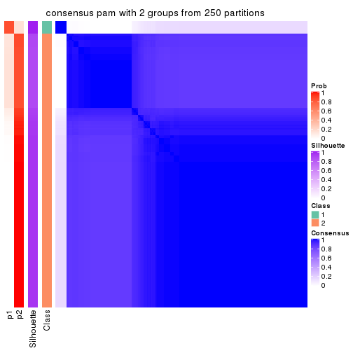</p>

</div>
<div id='tab-MAD-pam-consensus-heatmap-2'>
<pre><code class="r">consensus_heatmap(res, k = 3)
</code></pre>

<p>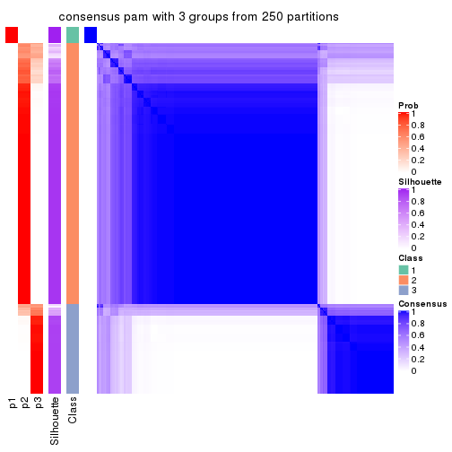</p>

</div>
<div id='tab-MAD-pam-consensus-heatmap-3'>
<pre><code class="r">consensus_heatmap(res, k = 4)
</code></pre>

<p>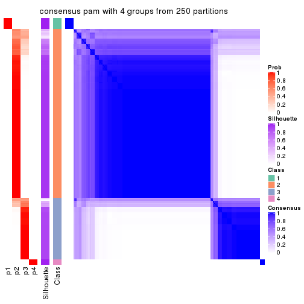</p>

</div>
<div id='tab-MAD-pam-consensus-heatmap-4'>
<pre><code class="r">consensus_heatmap(res, k = 5)
</code></pre>

<p>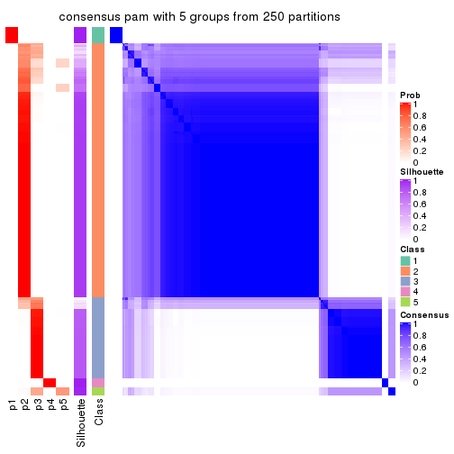</p>

</div>
<div id='tab-MAD-pam-consensus-heatmap-5'>
<pre><code class="r">consensus_heatmap(res, k = 6)
</code></pre>

<p>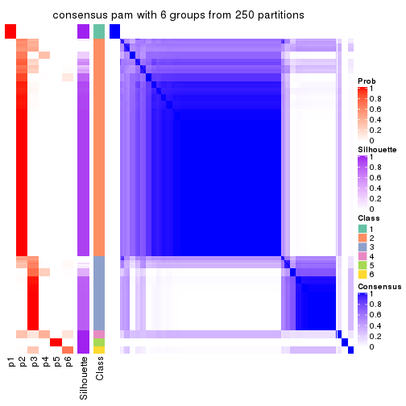</p>

</div>
</div>

Heatmaps for the membership of samples in all partitions to see how consistent they are:


<script>
$( function() {
	$( '#tabs-MAD-pam-membership-heatmap' ).tabs();
} );
</script>
<div id='tabs-MAD-pam-membership-heatmap'>
<ul>
<li><a href='#tab-MAD-pam-membership-heatmap-1'>k = 2</a></li>
<li><a href='#tab-MAD-pam-membership-heatmap-2'>k = 3</a></li>
<li><a href='#tab-MAD-pam-membership-heatmap-3'>k = 4</a></li>
<li><a href='#tab-MAD-pam-membership-heatmap-4'>k = 5</a></li>
<li><a href='#tab-MAD-pam-membership-heatmap-5'>k = 6</a></li>
</ul>
<div id='tab-MAD-pam-membership-heatmap-1'>
<pre><code class="r">membership_heatmap(res, k = 2)
</code></pre>

<p>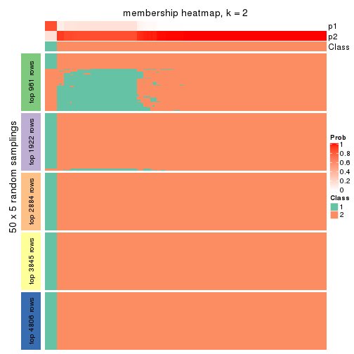</p>

</div>
<div id='tab-MAD-pam-membership-heatmap-2'>
<pre><code class="r">membership_heatmap(res, k = 3)
</code></pre>

<p>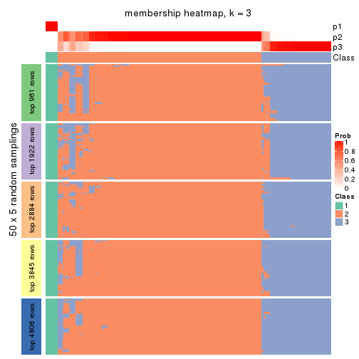</p>

</div>
<div id='tab-MAD-pam-membership-heatmap-3'>
<pre><code class="r">membership_heatmap(res, k = 4)
</code></pre>

<p>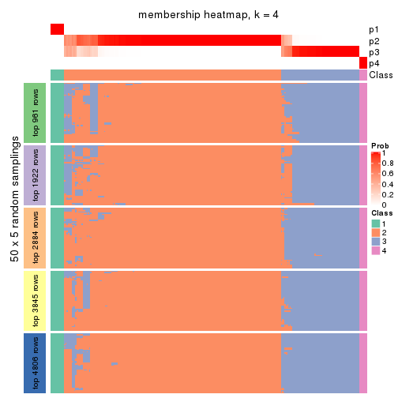</p>

</div>
<div id='tab-MAD-pam-membership-heatmap-4'>
<pre><code class="r">membership_heatmap(res, k = 5)
</code></pre>

<p>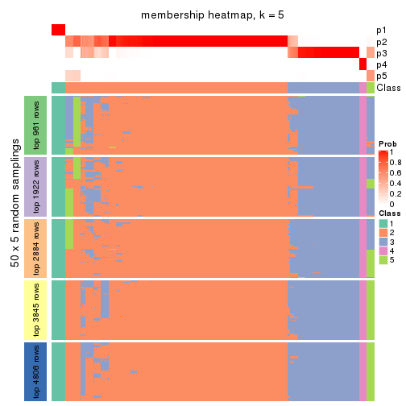</p>

</div>
<div id='tab-MAD-pam-membership-heatmap-5'>
<pre><code class="r">membership_heatmap(res, k = 6)
</code></pre>

<p>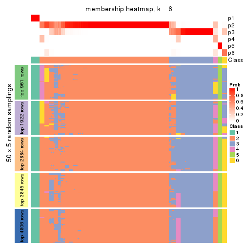</p>

</div>
</div>

As soon as we have had the classes for columns, we can look for signatures
which are significantly different between classes which can be candidate marks
for certain classes. Following are the heatmaps for signatures.


Signature heatmaps where rows are scaled:


<script>
$( function() {
	$( '#tabs-MAD-pam-get-signatures' ).tabs();
} );
</script>
<div id='tabs-MAD-pam-get-signatures'>
<ul>
<li><a href='#tab-MAD-pam-get-signatures-1'>k = 2</a></li>
<li><a href='#tab-MAD-pam-get-signatures-2'>k = 3</a></li>
<li><a href='#tab-MAD-pam-get-signatures-3'>k = 4</a></li>
<li><a href='#tab-MAD-pam-get-signatures-4'>k = 5</a></li>
<li><a href='#tab-MAD-pam-get-signatures-5'>k = 6</a></li>
</ul>
<div id='tab-MAD-pam-get-signatures-1'>
<pre><code class="r">get_signatures(res, k = 2)
</code></pre>

<p>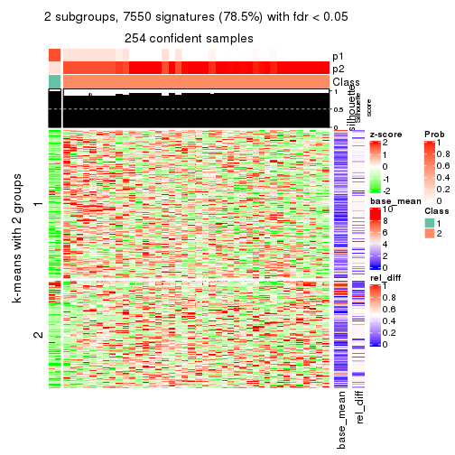</p>

</div>
<div id='tab-MAD-pam-get-signatures-2'>
<pre><code class="r">get_signatures(res, k = 3)
</code></pre>

<p>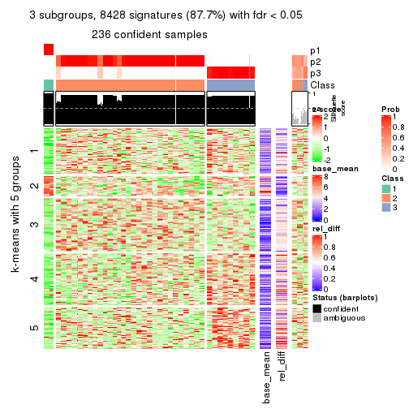</p>

</div>
<div id='tab-MAD-pam-get-signatures-3'>
<pre><code class="r">get_signatures(res, k = 4)
</code></pre>

<p>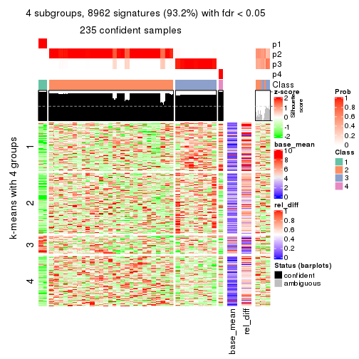</p>

</div>
<div id='tab-MAD-pam-get-signatures-4'>
<pre><code class="r">get_signatures(res, k = 5)
</code></pre>

<p>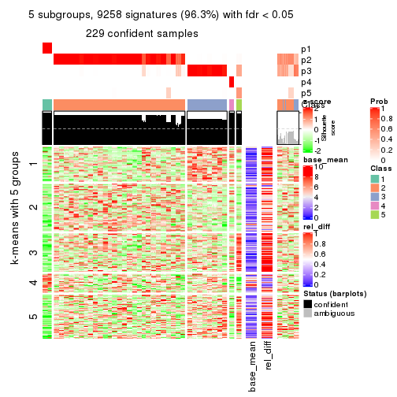</p>

</div>
<div id='tab-MAD-pam-get-signatures-5'>
<pre><code class="r">get_signatures(res, k = 6)
</code></pre>

<p>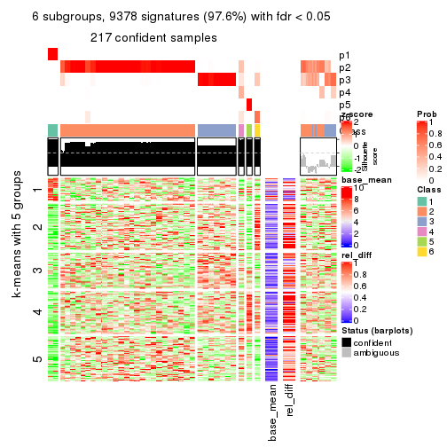</p>

</div>
</div>


Signature heatmaps where rows are not scaled:


<script>
$( function() {
	$( '#tabs-MAD-pam-get-signatures-no-scale' ).tabs();
} );
</script>
<div id='tabs-MAD-pam-get-signatures-no-scale'>
<ul>
<li><a href='#tab-MAD-pam-get-signatures-no-scale-1'>k = 2</a></li>
<li><a href='#tab-MAD-pam-get-signatures-no-scale-2'>k = 3</a></li>
<li><a href='#tab-MAD-pam-get-signatures-no-scale-3'>k = 4</a></li>
<li><a href='#tab-MAD-pam-get-signatures-no-scale-4'>k = 5</a></li>
<li><a href='#tab-MAD-pam-get-signatures-no-scale-5'>k = 6</a></li>
</ul>
<div id='tab-MAD-pam-get-signatures-no-scale-1'>
<pre><code class="r">get_signatures(res, k = 2, scale_rows = FALSE)
</code></pre>

<p>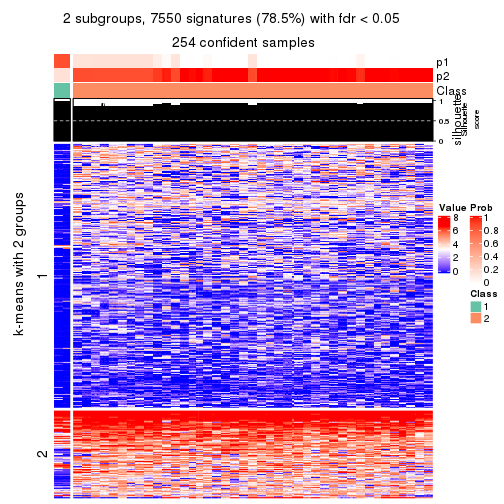</p>

</div>
<div id='tab-MAD-pam-get-signatures-no-scale-2'>
<pre><code class="r">get_signatures(res, k = 3, scale_rows = FALSE)
</code></pre>

<p>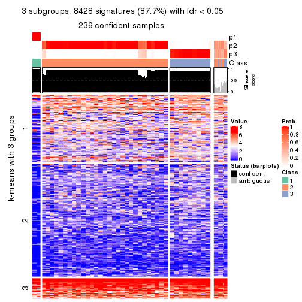</p>

</div>
<div id='tab-MAD-pam-get-signatures-no-scale-3'>
<pre><code class="r">get_signatures(res, k = 4, scale_rows = FALSE)
</code></pre>

<p>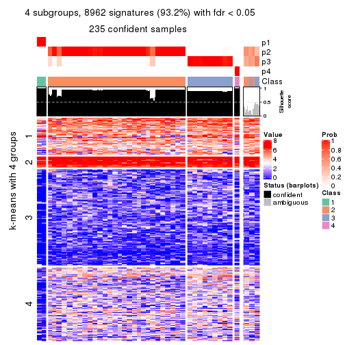</p>

</div>
<div id='tab-MAD-pam-get-signatures-no-scale-4'>
<pre><code class="r">get_signatures(res, k = 5, scale_rows = FALSE)
</code></pre>

<p>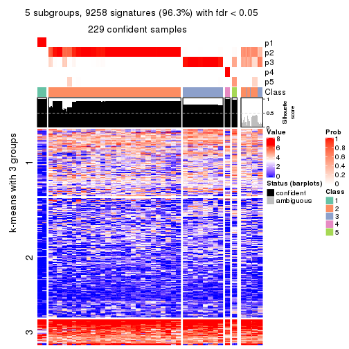</p>

</div>
<div id='tab-MAD-pam-get-signatures-no-scale-5'>
<pre><code class="r">get_signatures(res, k = 6, scale_rows = FALSE)
</code></pre>

<p>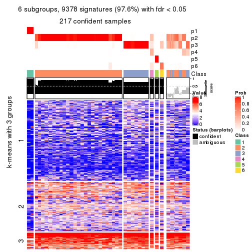</p>

</div>
</div>


Compare the overlap of signatures from different k:

```r
compare_signatures(res)
```

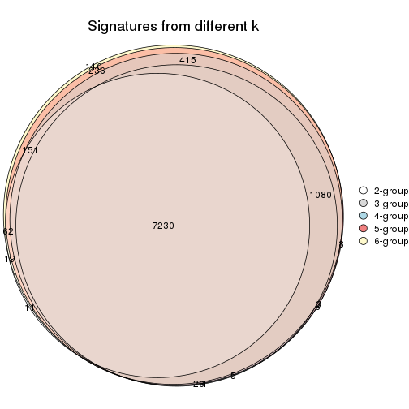

`get_signature()` returns a data frame invisibly. TO get the list of signatures, the function
call should be assigned to a variable explicitly. In following code, if `plot` argument is set
to `FALSE`, no heatmap is plotted while only the differential analysis is performed.

```r
# code only for demonstration
tb = get_signature(res, k = ..., plot = FALSE)
```

An example of the output of `tb` is:

```
#>   which_row         fdr    mean_1    mean_2 scaled_mean_1 scaled_mean_2 km
#> 1        38 0.042760348  8.373488  9.131774    -0.5533452     0.5164555  1
#> 2        40 0.018707592  7.106213  8.469186    -0.6173731     0.5762149  1
#> 3        55 0.019134737 10.221463 11.207825    -0.6159697     0.5749050  1
#> 4        59 0.006059896  5.921854  7.869574    -0.6899429     0.6439467  1
#> 5        60 0.018055526  8.928898 10.211722    -0.6204761     0.5791110  1
#> 6        98 0.009384629 15.714769 14.887706     0.6635654    -0.6193277  2
...
```

The columns in `tb` are:

1. `which_row`: row indices corresponding to the input matrix.
2. `fdr`: FDR for the differential test. 
3. `mean_x`: The mean value in group x.
4. `scaled_mean_x`: The mean value in group x after rows are scaled.
5. `km`: Row groups if k-means clustering is applied to rows.


UMAP plot which shows how samples are separated.


<script>
$( function() {
	$( '#tabs-MAD-pam-dimension-reduction' ).tabs();
} );
</script>
<div id='tabs-MAD-pam-dimension-reduction'>
<ul>
<li><a href='#tab-MAD-pam-dimension-reduction-1'>k = 2</a></li>
<li><a href='#tab-MAD-pam-dimension-reduction-2'>k = 3</a></li>
<li><a href='#tab-MAD-pam-dimension-reduction-3'>k = 4</a></li>
<li><a href='#tab-MAD-pam-dimension-reduction-4'>k = 5</a></li>
<li><a href='#tab-MAD-pam-dimension-reduction-5'>k = 6</a></li>
</ul>
<div id='tab-MAD-pam-dimension-reduction-1'>
<pre><code class="r">dimension_reduction(res, k = 2, method = &quot;UMAP&quot;)
</code></pre>

<p>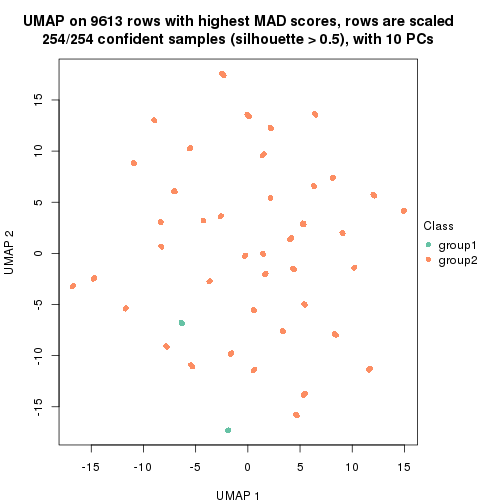</p>

</div>
<div id='tab-MAD-pam-dimension-reduction-2'>
<pre><code class="r">dimension_reduction(res, k = 3, method = &quot;UMAP&quot;)
</code></pre>

<p>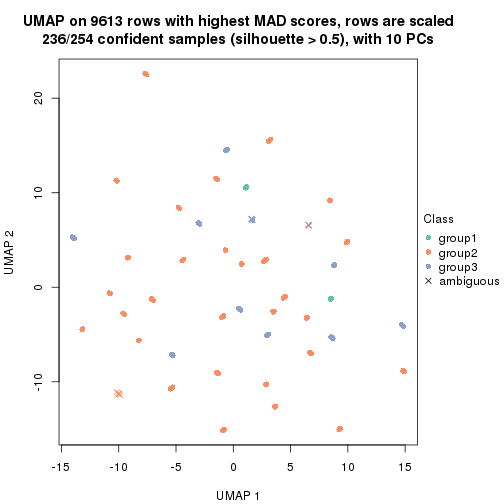</p>

</div>
<div id='tab-MAD-pam-dimension-reduction-3'>
<pre><code class="r">dimension_reduction(res, k = 4, method = &quot;UMAP&quot;)
</code></pre>

<p>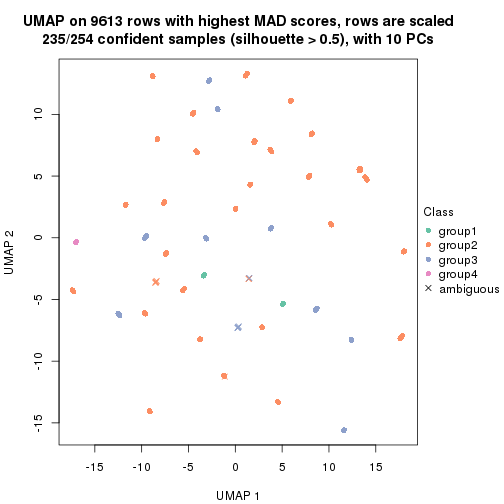</p>

</div>
<div id='tab-MAD-pam-dimension-reduction-4'>
<pre><code class="r">dimension_reduction(res, k = 5, method = &quot;UMAP&quot;)
</code></pre>

<p>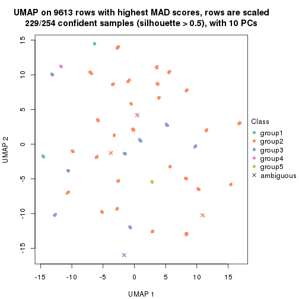</p>

</div>
<div id='tab-MAD-pam-dimension-reduction-5'>
<pre><code class="r">dimension_reduction(res, k = 6, method = &quot;UMAP&quot;)
</code></pre>

<p>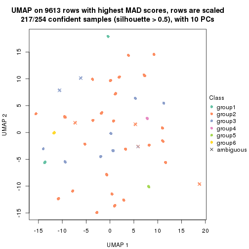</p>

</div>
</div>


Following heatmap shows how subgroups are split when increasing `k`:

```r
collect_classes(res)
```

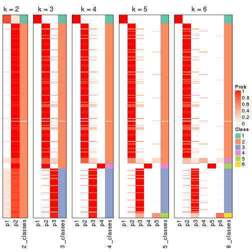


If matrix rows can be associated to genes, consider to use `GO_Enrichment(res,
...)` to perform function enrichment for the signature genes.


 

---------------------------------------------------


### MAD:mclust


The object with results only for a single top-value method and a single partition method 
can be extracted as:

```r
res = res_list["MAD", "mclust"]
# you can also extract it by
# res = res_list["MAD:mclust"]
```

A summary of `res` and all the functions that can be applied to it:

```r
res
```

```
#> A 'ConsensusPartition' object with k = 2, 3, 4, 5, 6.
#>   On a matrix with 9613 rows and 254 columns.
#>   Top rows (961, 1922, 2884, 3845, 4806) are extracted by 'MAD' method.
#>   Subgroups are detected by 'mclust' method.
#>   Performed in total 1250 partitions by row resampling.
#>   Best k for subgroups seems to be 3.
#> 
#> Following methods can be applied to this 'ConsensusPartition' object:
#>  [1] "cola_report"             "collect_classes"         "collect_plots"          
#>  [4] "collect_stats"           "colnames"                "compare_signatures"     
#>  [7] "consensus_heatmap"       "dimension_reduction"     "functional_enrichment"  
#> [10] "get_anno_col"            "get_anno"                "get_classes"            
#> [13] "get_consensus"           "get_matrix"              "get_membership"         
#> [16] "get_param"               "get_signatures"          "get_stats"              
#> [19] "is_best_k"               "is_stable_k"             "membership_heatmap"     
#> [22] "ncol"                    "nrow"                    "plot_ecdf"              
#> [25] "rownames"                "select_partition_number" "show"                   
#> [28] "suggest_best_k"          "test_to_known_factors"
```

`collect_plots()` function collects all the plots made from `res` for all `k` (number of partitions)
into one single page to provide an easy and fast comparison between different `k`.

```r
collect_plots(res)
```

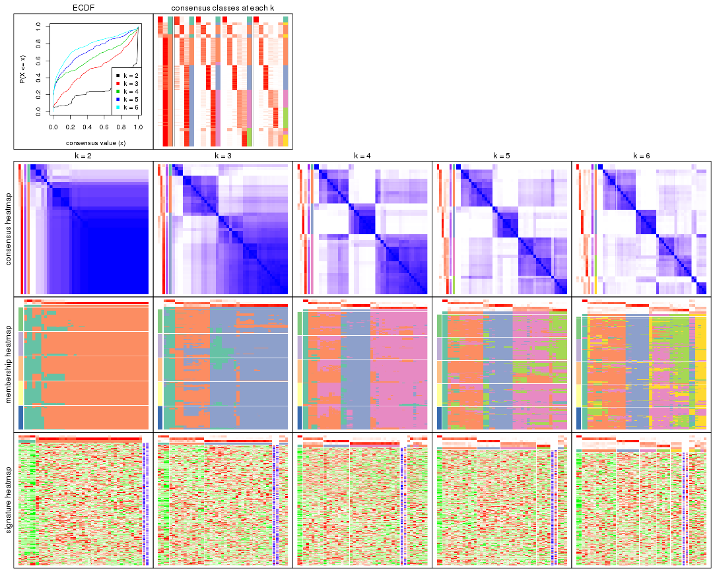

The plots are:

- The first row: a plot of the ECDF (Empirical cumulative distribution
  function) curves of the consensus matrix for each `k` and the heatmap of
  predicted classes for each `k`.
- The second row: heatmaps of the consensus matrix for each `k`.
- The third row: heatmaps of the membership matrix for each `k`.
- The fouth row: heatmaps of the signatures for each `k`.

All the plots in panels can be made by individual functions and they are
plotted later in this section.

`select_partition_number()` produces several plots showing different
statistics for choosing "optimized" `k`. There are following statistics:

- ECDF curves of the consensus matrix for each `k`;
- 1-PAC. [The PAC
  score](https://en.wikipedia.org/wiki/Consensus_clustering#Over-interpretation_potential_of_consensus_clustering)
  measures the proportion of the ambiguous subgrouping.
- Mean silhouette score.
- Concordance. The mean probability of fiting the consensus class ids in all
  partitions.
- Area increased. Denote $A_k$ as the area under the ECDF curve for current
  `k`, the area increased is defined as $A_k - A_{k-1}$.
- Rand index. The percent of pairs of samples that are both in a same cluster
  or both are not in a same cluster in the partition of k and k-1.
- Jaccard index. The ratio of pairs of samples are both in a same cluster in
  the partition of k and k-1 and the pairs of samples are both in a same
  cluster in the partition k or k-1.

The detailed explanations of these statistics can be found in [the cola
vignette](http://bioconductor.org/packages/devel/bioc/vignettes/cola/inst/doc/cola.html#toc_13).

Generally speaking, lower PAC score, higher mean silhouette score or higher
concordance corresponds to better partition. Rand index and Jaccard index
measure how similar the current partition is compared to partition with `k-1`.
If they are too similar, we won't accept `k` is better than `k-1`.

```r
select_partition_number(res)
```

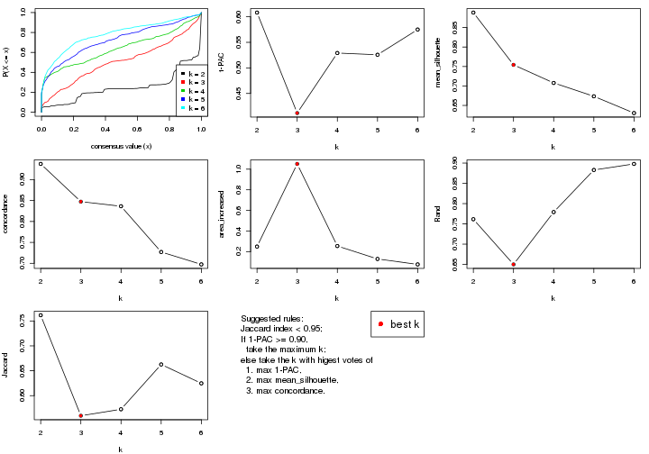

The numeric values for all these statistics can be obtained by `get_stats()`.

```r
get_stats(res)
```

```
#>   k 1-PAC mean_silhouette concordance area_increased  Rand Jaccard
#> 2 2 0.608           0.888       0.938         0.2502 0.761   0.761
#> 3 3 0.412           0.754       0.847         1.0509 0.650   0.560
#> 4 4 0.529           0.708       0.836         0.2553 0.779   0.573
#> 5 5 0.526           0.673       0.727         0.1301 0.883   0.663
#> 6 6 0.575           0.630       0.697         0.0775 0.898   0.625
```

`suggest_best_k()` suggests the best $k$ based on these statistics. The rules are as follows:

- All $k$ with Jaccard index larger than 0.95 are removed because the increase of
  the partition number does not provides enough extra information. If all $k$ are removed,
  the best $k$ is assigned by `NA`.
- For $k$ with 1-PAC larger than 0.9, the maximal $k$ is taken as the "best k". Other $k$ is called "optional k".
- If it does not fit the second rule. The $k$ with the highest vote of highest
  1-PAC, mean silhouette and concordance is taken as the "best k".

```r
suggest_best_k(res)
```

```
#> [1] 3
```


Following shows the table of the partitions (You need to click the **show/hide
code output** link to see it). The membership matrix (columns with name `p*`)
is inferred by
[`clue::cl_consensus()`](https://www.rdocumentation.org/link/cl_consensus?package=clue)
function with the `SE` method. Basically the value in the membership matrix
represents the probability to belong to a certain group. The finall class
label for an item is determined with the group with highest probability it
belongs to.

In `get_classes()` function, the entropy is calculated from the membership
matrix and the silhouette score is calculated from the consensus matrix.


<script>
$( function() {
	$( '#tabs-MAD-mclust-get-classes' ).tabs();
} );
</script>
<div id='tabs-MAD-mclust-get-classes'>
<ul>
<li><a href='#tab-MAD-mclust-get-classes-1'>k = 2</a></li>
<li><a href='#tab-MAD-mclust-get-classes-2'>k = 3</a></li>
<li><a href='#tab-MAD-mclust-get-classes-3'>k = 4</a></li>
<li><a href='#tab-MAD-mclust-get-classes-4'>k = 5</a></li>
<li><a href='#tab-MAD-mclust-get-classes-5'>k = 6</a></li>
</ul>

<div id='tab-MAD-mclust-get-classes-1'>
<p><a id='tab-MAD-mclust-get-classes-1-a' style='color:#0366d6' href='#'>show/hide code output</a></p>
<pre><code class="r">cbind(get_classes(res, k = 2), get_membership(res, k = 2))
</code></pre>

<pre><code>#&gt;           class entropy silhouette    p1    p2
#&gt; DRR024803     1  0.0000      0.803 1.000 0.000
#&gt; DRR024804     2  0.0000      0.947 0.000 1.000
#&gt; DRR024805     2  0.0376      0.945 0.004 0.996
#&gt; DRR024806     2  0.0376      0.945 0.004 0.996
#&gt; DRR024807     2  0.9170      0.505 0.332 0.668
#&gt; DRR024808     2  0.5737      0.837 0.136 0.864
#&gt; DRR024809     2  0.0000      0.947 0.000 1.000
#&gt; DRR024810     2  0.0938      0.940 0.012 0.988
#&gt; DRR024811     2  0.3114      0.909 0.056 0.944
#&gt; DRR024812     2  0.0000      0.947 0.000 1.000
#&gt; DRR024813     2  0.0000      0.947 0.000 1.000
#&gt; DRR024814     2  0.0000      0.947 0.000 1.000
#&gt; DRR024815     2  0.0000      0.947 0.000 1.000
#&gt; DRR024816     1  0.9661      0.659 0.608 0.392
#&gt; DRR024817     2  0.0000      0.947 0.000 1.000
#&gt; DRR024818     2  0.6531      0.802 0.168 0.832
#&gt; DRR024819     2  0.0000      0.947 0.000 1.000
#&gt; DRR024820     2  0.6623      0.775 0.172 0.828
#&gt; DRR024821     2  0.5737      0.837 0.136 0.864
#&gt; DRR024822     2  0.0000      0.947 0.000 1.000
#&gt; DRR024824     2  0.0000      0.947 0.000 1.000
#&gt; DRR024825     2  0.0672      0.943 0.008 0.992
#&gt; DRR024826     2  0.0000      0.947 0.000 1.000
#&gt; DRR024827     2  0.0000      0.947 0.000 1.000
#&gt; DRR024828     1  0.8081      0.741 0.752 0.248
#&gt; DRR024829     2  0.0000      0.947 0.000 1.000
#&gt; DRR024830     2  0.1414      0.933 0.020 0.980
#&gt; DRR024831     2  0.6623      0.797 0.172 0.828
#&gt; DRR024832     2  0.5842      0.833 0.140 0.860
#&gt; DRR024833     2  0.0000      0.947 0.000 1.000
#&gt; DRR024834     1  0.7602      0.828 0.780 0.220
#&gt; DRR024835     2  0.0000      0.947 0.000 1.000
#&gt; DRR024836     2  0.6623      0.797 0.172 0.828
#&gt; DRR024837     1  0.7602      0.828 0.780 0.220
#&gt; DRR024838     2  0.0000      0.947 0.000 1.000
#&gt; DRR024839     2  0.0000      0.947 0.000 1.000
#&gt; DRR024840     2  0.0000      0.947 0.000 1.000
#&gt; DRR024841     2  0.0000      0.947 0.000 1.000
#&gt; DRR024842     2  0.0000      0.947 0.000 1.000
#&gt; DRR024843     1  0.0000      0.803 1.000 0.000
#&gt; DRR024844     2  0.0000      0.947 0.000 1.000
#&gt; DRR024845     2  0.0376      0.945 0.004 0.996
#&gt; DRR024846     2  0.0376      0.945 0.004 0.996
#&gt; DRR024847     2  0.9170      0.505 0.332 0.668
#&gt; DRR024848     1  0.0000      0.803 1.000 0.000
#&gt; DRR024849     2  0.5737      0.837 0.136 0.864
#&gt; DRR024850     2  0.0000      0.947 0.000 1.000
#&gt; DRR024851     2  0.0000      0.947 0.000 1.000
#&gt; DRR024852     2  0.1414      0.933 0.020 0.980
#&gt; DRR024853     2  0.3114      0.909 0.056 0.944
#&gt; DRR024854     2  0.0000      0.947 0.000 1.000
#&gt; DRR024855     2  0.0000      0.947 0.000 1.000
#&gt; DRR024856     2  0.0000      0.947 0.000 1.000
#&gt; DRR024857     2  0.0000      0.947 0.000 1.000
#&gt; DRR024858     1  0.9661      0.659 0.608 0.392
#&gt; DRR024859     2  0.0376      0.945 0.004 0.996
#&gt; DRR024860     2  0.6623      0.797 0.172 0.828
#&gt; DRR024861     2  0.0000      0.947 0.000 1.000
#&gt; DRR024862     2  0.7056      0.752 0.192 0.808
#&gt; DRR024863     2  0.5842      0.833 0.140 0.860
#&gt; DRR024864     2  0.0000      0.947 0.000 1.000
#&gt; DRR024865     2  0.0000      0.947 0.000 1.000
#&gt; DRR024866     2  0.0000      0.947 0.000 1.000
#&gt; DRR024867     2  0.1184      0.938 0.016 0.984
#&gt; DRR024868     2  0.0000      0.947 0.000 1.000
#&gt; DRR024869     2  0.0000      0.947 0.000 1.000
#&gt; DRR024870     1  0.8081      0.741 0.752 0.248
#&gt; DRR024871     2  0.0000      0.947 0.000 1.000
#&gt; DRR024872     2  0.0938      0.940 0.012 0.988
#&gt; DRR024873     2  0.6623      0.797 0.172 0.828
#&gt; DRR024874     2  0.5842      0.833 0.140 0.860
#&gt; DRR024875     2  0.0000      0.947 0.000 1.000
#&gt; DRR024876     1  0.7602      0.828 0.780 0.220
#&gt; DRR024877     2  0.0000      0.947 0.000 1.000
#&gt; DRR024878     2  0.6623      0.797 0.172 0.828
#&gt; DRR024879     1  0.7602      0.828 0.780 0.220
#&gt; DRR024880     2  0.0000      0.947 0.000 1.000
#&gt; DRR024881     2  0.0000      0.947 0.000 1.000
#&gt; DRR024882     2  0.0000      0.947 0.000 1.000
#&gt; DRR024883     2  0.0000      0.947 0.000 1.000
#&gt; DRR024884     2  0.0000      0.947 0.000 1.000
#&gt; DRR024885     2  0.0000      0.947 0.000 1.000
#&gt; DRR024886     1  0.0000      0.803 1.000 0.000
#&gt; DRR024887     2  0.0000      0.947 0.000 1.000
#&gt; DRR024888     2  0.0376      0.945 0.004 0.996
#&gt; DRR024889     2  0.0376      0.945 0.004 0.996
#&gt; DRR024890     2  0.9170      0.505 0.332 0.668
#&gt; DRR024891     1  0.0000      0.803 1.000 0.000
#&gt; DRR024892     2  0.5737      0.837 0.136 0.864
#&gt; DRR024893     2  0.0000      0.947 0.000 1.000
#&gt; DRR024894     2  0.0000      0.947 0.000 1.000
#&gt; DRR024895     2  0.1414      0.933 0.020 0.980
#&gt; DRR024896     2  0.3114      0.909 0.056 0.944
#&gt; DRR024897     2  0.0000      0.947 0.000 1.000
#&gt; DRR024898     2  0.0000      0.947 0.000 1.000
#&gt; DRR024899     2  0.0000      0.947 0.000 1.000
#&gt; DRR024900     2  0.0000      0.947 0.000 1.000
#&gt; DRR024901     1  0.9661      0.659 0.608 0.392
#&gt; DRR024902     2  0.0376      0.945 0.004 0.996
#&gt; DRR024903     2  0.6531      0.802 0.168 0.832
#&gt; DRR024904     2  0.0000      0.947 0.000 1.000
#&gt; DRR024905     2  0.6887      0.760 0.184 0.816
#&gt; DRR024906     2  0.5842      0.833 0.140 0.860
#&gt; DRR024907     2  0.0000      0.947 0.000 1.000
#&gt; DRR024908     2  0.0000      0.947 0.000 1.000
#&gt; DRR024909     2  0.0000      0.947 0.000 1.000
#&gt; DRR024910     2  0.1184      0.938 0.016 0.984
#&gt; DRR024911     2  0.0000      0.947 0.000 1.000
#&gt; DRR024912     2  0.0000      0.947 0.000 1.000
#&gt; DRR024913     1  0.8081      0.741 0.752 0.248
#&gt; DRR024914     2  0.0000      0.947 0.000 1.000
#&gt; DRR024915     2  0.0938      0.940 0.012 0.988
#&gt; DRR024916     2  0.6623      0.797 0.172 0.828
#&gt; DRR024917     2  0.5842      0.833 0.140 0.860
#&gt; DRR024918     2  0.0000      0.947 0.000 1.000
#&gt; DRR024919     1  0.7602      0.828 0.780 0.220
#&gt; DRR024920     2  0.0000      0.947 0.000 1.000
#&gt; DRR024921     2  0.6623      0.797 0.172 0.828
#&gt; DRR024922     1  0.7602      0.828 0.780 0.220
#&gt; DRR024923     2  0.0000      0.947 0.000 1.000
#&gt; DRR024924     2  0.0000      0.947 0.000 1.000
#&gt; DRR024925     2  0.0000      0.947 0.000 1.000
#&gt; DRR024926     2  0.0000      0.947 0.000 1.000
#&gt; DRR024927     2  0.0000      0.947 0.000 1.000
#&gt; DRR024928     2  0.0000      0.947 0.000 1.000
#&gt; DRR024929     1  0.0000      0.803 1.000 0.000
#&gt; DRR024930     2  0.0000      0.947 0.000 1.000
#&gt; DRR024931     2  0.0376      0.945 0.004 0.996
#&gt; DRR024932     2  0.0376      0.945 0.004 0.996
#&gt; DRR024933     2  0.9170      0.505 0.332 0.668
#&gt; DRR024934     1  0.0000      0.803 1.000 0.000
#&gt; DRR024935     2  0.5737      0.837 0.136 0.864
#&gt; DRR024936     2  0.0000      0.947 0.000 1.000
#&gt; DRR024937     2  0.0000      0.947 0.000 1.000
#&gt; DRR024938     2  0.1414      0.933 0.020 0.980
#&gt; DRR024939     2  0.3114      0.909 0.056 0.944
#&gt; DRR024940     2  0.0000      0.947 0.000 1.000
#&gt; DRR024941     2  0.0000      0.947 0.000 1.000
#&gt; DRR024942     2  0.0000      0.947 0.000 1.000
#&gt; DRR024943     2  0.0000      0.947 0.000 1.000
#&gt; DRR024944     1  0.9661      0.659 0.608 0.392
#&gt; DRR024945     2  0.0376      0.945 0.004 0.996
#&gt; DRR024946     2  0.6531      0.802 0.168 0.832
#&gt; DRR024947     2  0.0000      0.947 0.000 1.000
#&gt; DRR024948     2  0.6973      0.756 0.188 0.812
#&gt; DRR024949     2  0.5842      0.833 0.140 0.860
#&gt; DRR024950     2  0.0000      0.947 0.000 1.000
#&gt; DRR024951     2  0.0000      0.947 0.000 1.000
#&gt; DRR024952     2  0.0000      0.947 0.000 1.000
#&gt; DRR024953     2  0.1184      0.938 0.016 0.984
#&gt; DRR024954     2  0.0000      0.947 0.000 1.000
#&gt; DRR024955     2  0.0000      0.947 0.000 1.000
#&gt; DRR024956     1  0.8081      0.741 0.752 0.248
#&gt; DRR024957     2  0.0000      0.947 0.000 1.000
#&gt; DRR024958     2  0.1184      0.937 0.016 0.984
#&gt; DRR024959     2  0.6623      0.797 0.172 0.828
#&gt; DRR024960     2  0.5842      0.833 0.140 0.860
#&gt; DRR024961     2  0.0000      0.947 0.000 1.000
#&gt; DRR024962     1  0.7602      0.828 0.780 0.220
#&gt; DRR024963     2  0.0000      0.947 0.000 1.000
#&gt; DRR024964     2  0.6623      0.797 0.172 0.828
#&gt; DRR024965     1  0.7602      0.828 0.780 0.220
#&gt; DRR024966     2  0.0000      0.947 0.000 1.000
#&gt; DRR024967     2  0.0000      0.947 0.000 1.000
#&gt; DRR024968     2  0.0000      0.947 0.000 1.000
#&gt; DRR024969     2  0.0000      0.947 0.000 1.000
#&gt; DRR024970     2  0.0000      0.947 0.000 1.000
#&gt; DRR024971     2  0.0000      0.947 0.000 1.000
#&gt; DRR024972     1  0.0000      0.803 1.000 0.000
#&gt; DRR024973     2  0.0000      0.947 0.000 1.000
#&gt; DRR024974     2  0.0376      0.945 0.004 0.996
#&gt; DRR024975     2  0.0376      0.945 0.004 0.996
#&gt; DRR024976     2  0.9170      0.505 0.332 0.668
#&gt; DRR024977     1  0.0000      0.803 1.000 0.000
#&gt; DRR024978     2  0.5737      0.837 0.136 0.864
#&gt; DRR024979     2  0.0000      0.947 0.000 1.000
#&gt; DRR024980     2  0.0000      0.947 0.000 1.000
#&gt; DRR024981     2  0.1414      0.933 0.020 0.980
#&gt; DRR024982     2  0.3114      0.909 0.056 0.944
#&gt; DRR024983     2  0.0000      0.947 0.000 1.000
#&gt; DRR024984     2  0.0000      0.947 0.000 1.000
#&gt; DRR024985     2  0.0000      0.947 0.000 1.000
#&gt; DRR024986     2  0.0000      0.947 0.000 1.000
#&gt; DRR024987     1  0.9661      0.659 0.608 0.392
#&gt; DRR024988     2  0.0376      0.945 0.004 0.996
#&gt; DRR024989     2  0.6531      0.802 0.168 0.832
#&gt; DRR024990     2  0.0000      0.947 0.000 1.000
#&gt; DRR024991     2  0.6973      0.756 0.188 0.812
#&gt; DRR024992     2  0.5842      0.833 0.140 0.860
#&gt; DRR024993     2  0.0000      0.947 0.000 1.000
#&gt; DRR024994     2  0.0000      0.947 0.000 1.000
#&gt; DRR024995     2  0.0000      0.947 0.000 1.000
#&gt; DRR024996     2  0.1184      0.938 0.016 0.984
#&gt; DRR024997     2  0.0000      0.947 0.000 1.000
#&gt; DRR024998     2  0.0000      0.947 0.000 1.000
#&gt; DRR024999     1  0.8081      0.741 0.752 0.248
#&gt; DRR025000     2  0.0000      0.947 0.000 1.000
#&gt; DRR025001     2  0.1184      0.937 0.016 0.984
#&gt; DRR025002     2  0.6623      0.797 0.172 0.828
#&gt; DRR025003     2  0.5842      0.833 0.140 0.860
#&gt; DRR025004     2  0.0000      0.947 0.000 1.000
#&gt; DRR025005     1  0.7602      0.828 0.780 0.220
#&gt; DRR025006     2  0.0000      0.947 0.000 1.000
#&gt; DRR025007     2  0.6623      0.797 0.172 0.828
#&gt; DRR025008     1  0.7602      0.828 0.780 0.220
#&gt; DRR025009     2  0.0000      0.947 0.000 1.000
#&gt; DRR025010     2  0.0000      0.947 0.000 1.000
#&gt; DRR025011     2  0.0000      0.947 0.000 1.000
#&gt; DRR025012     2  0.0000      0.947 0.000 1.000
#&gt; DRR025013     2  0.0000      0.947 0.000 1.000
#&gt; DRR025014     2  0.0000      0.947 0.000 1.000
#&gt; DRR025015     1  0.0000      0.803 1.000 0.000
#&gt; DRR025016     2  0.0000      0.947 0.000 1.000
#&gt; DRR025017     2  0.0376      0.945 0.004 0.996
#&gt; DRR025018     2  0.0376      0.945 0.004 0.996
#&gt; DRR025019     2  0.9170      0.505 0.332 0.668
#&gt; DRR025020     1  0.0000      0.803 1.000 0.000
#&gt; DRR025021     2  0.5737      0.837 0.136 0.864
#&gt; DRR025022     2  0.0000      0.947 0.000 1.000
#&gt; DRR025023     2  0.0000      0.947 0.000 1.000
#&gt; DRR025024     2  0.1414      0.933 0.020 0.980
#&gt; DRR025025     2  0.3114      0.909 0.056 0.944
#&gt; DRR025026     2  0.0000      0.947 0.000 1.000
#&gt; DRR025027     2  0.0000      0.947 0.000 1.000
#&gt; DRR025028     2  0.0000      0.947 0.000 1.000
#&gt; DRR025029     2  0.0000      0.947 0.000 1.000
#&gt; DRR025030     1  0.9661      0.659 0.608 0.392
#&gt; DRR025031     2  0.0376      0.945 0.004 0.996
#&gt; DRR025032     2  0.6623      0.797 0.172 0.828
#&gt; DRR025033     2  0.0000      0.947 0.000 1.000
#&gt; DRR025034     2  0.6973      0.756 0.188 0.812
#&gt; DRR025035     2  0.5842      0.833 0.140 0.860
#&gt; DRR025036     2  0.0000      0.947 0.000 1.000
#&gt; DRR025037     2  0.0000      0.947 0.000 1.000
#&gt; DRR025038     2  0.0000      0.947 0.000 1.000
#&gt; DRR025039     2  0.1184      0.938 0.016 0.984
#&gt; DRR025040     2  0.0000      0.947 0.000 1.000
#&gt; DRR025041     2  0.0000      0.947 0.000 1.000
#&gt; DRR025042     1  0.8081      0.741 0.752 0.248
#&gt; DRR025043     2  0.0000      0.947 0.000 1.000
#&gt; DRR025044     2  0.1414      0.933 0.020 0.980
#&gt; DRR025045     2  0.6623      0.797 0.172 0.828
#&gt; DRR025046     2  0.5842      0.833 0.140 0.860
#&gt; DRR025047     2  0.0000      0.947 0.000 1.000
#&gt; DRR025048     1  0.7602      0.828 0.780 0.220
#&gt; DRR025049     2  0.0000      0.947 0.000 1.000
#&gt; DRR025050     2  0.6623      0.797 0.172 0.828
#&gt; DRR025051     1  0.7602      0.828 0.780 0.220
#&gt; DRR025052     2  0.0000      0.947 0.000 1.000
#&gt; DRR025053     2  0.0000      0.947 0.000 1.000
#&gt; DRR025054     2  0.0000      0.947 0.000 1.000
#&gt; DRR025055     2  0.0000      0.947 0.000 1.000
#&gt; DRR025056     2  0.0000      0.947 0.000 1.000
#&gt; DRR025057     2  0.0000      0.947 0.000 1.000
</code></pre>

<script>
$('#tab-MAD-mclust-get-classes-1-a').parent().next().next().hide();
$('#tab-MAD-mclust-get-classes-1-a').click(function(){
  $('#tab-MAD-mclust-get-classes-1-a').parent().next().next().toggle();
  return(false);
});
</script>
</div>

<div id='tab-MAD-mclust-get-classes-2'>
<p><a id='tab-MAD-mclust-get-classes-2-a' style='color:#0366d6' href='#'>show/hide code output</a></p>
<pre><code class="r">cbind(get_classes(res, k = 3), get_membership(res, k = 3))
</code></pre>

<pre><code>#&gt;           class entropy silhouette    p1    p2    p3
#&gt; DRR024803     1  0.2711     0.8666 0.912 0.088 0.000
#&gt; DRR024804     3  0.1411     0.8460 0.000 0.036 0.964
#&gt; DRR024805     2  0.5760     0.7898 0.000 0.672 0.328
#&gt; DRR024806     2  0.4654     0.8088 0.000 0.792 0.208
#&gt; DRR024807     1  0.5774     0.7121 0.748 0.020 0.232
#&gt; DRR024808     3  0.4874     0.7671 0.144 0.028 0.828
#&gt; DRR024809     2  0.6111     0.7030 0.000 0.604 0.396
#&gt; DRR024810     2  0.6735     0.6494 0.012 0.564 0.424
#&gt; DRR024811     3  0.3415     0.8162 0.080 0.020 0.900
#&gt; DRR024812     2  0.4291     0.7925 0.000 0.820 0.180
#&gt; DRR024813     3  0.0747     0.8531 0.000 0.016 0.984
#&gt; DRR024814     3  0.2356     0.8189 0.000 0.072 0.928
#&gt; DRR024815     3  0.0592     0.8535 0.000 0.012 0.988
#&gt; DRR024816     2  0.3764     0.6610 0.068 0.892 0.040
#&gt; DRR024817     3  0.0829     0.8531 0.004 0.012 0.984
#&gt; DRR024818     3  0.7067     0.4478 0.376 0.028 0.596
#&gt; DRR024819     3  0.1753     0.8357 0.000 0.048 0.952
#&gt; DRR024820     3  0.5764     0.7366 0.124 0.076 0.800
#&gt; DRR024821     3  0.6226     0.6555 0.252 0.028 0.720
#&gt; DRR024822     2  0.5733     0.7953 0.000 0.676 0.324
#&gt; DRR024824     2  0.5785     0.7808 0.000 0.668 0.332
#&gt; DRR024825     3  0.3499     0.8150 0.072 0.028 0.900
#&gt; DRR024826     3  0.0424     0.8532 0.000 0.008 0.992
#&gt; DRR024827     3  0.1267     0.8527 0.004 0.024 0.972
#&gt; DRR024828     1  0.2681     0.8611 0.932 0.028 0.040
#&gt; DRR024829     3  0.2066     0.8296 0.000 0.060 0.940
#&gt; DRR024830     2  0.4399     0.8034 0.000 0.812 0.188
#&gt; DRR024831     3  0.6264     0.6510 0.256 0.028 0.716
#&gt; DRR024832     3  0.4744     0.7737 0.136 0.028 0.836
#&gt; DRR024833     3  0.0237     0.8534 0.000 0.004 0.996
#&gt; DRR024834     2  0.3669     0.6582 0.064 0.896 0.040
#&gt; DRR024835     3  0.0829     0.8537 0.004 0.012 0.984
#&gt; DRR024836     3  0.7114     0.4228 0.388 0.028 0.584
#&gt; DRR024837     2  0.3669     0.6582 0.064 0.896 0.040
#&gt; DRR024838     3  0.2448     0.8154 0.000 0.076 0.924
#&gt; DRR024839     3  0.1031     0.8518 0.000 0.024 0.976
#&gt; DRR024840     2  0.5678     0.8006 0.000 0.684 0.316
#&gt; DRR024841     3  0.6111    -0.0924 0.000 0.396 0.604
#&gt; DRR024842     3  0.2066     0.8322 0.000 0.060 0.940
#&gt; DRR024843     1  0.2711     0.8666 0.912 0.088 0.000
#&gt; DRR024844     3  0.1411     0.8460 0.000 0.036 0.964
#&gt; DRR024845     2  0.5785     0.7862 0.000 0.668 0.332
#&gt; DRR024846     2  0.4178     0.7940 0.000 0.828 0.172
#&gt; DRR024847     1  0.5774     0.7121 0.748 0.020 0.232
#&gt; DRR024848     1  0.2711     0.8666 0.912 0.088 0.000
#&gt; DRR024849     3  0.4874     0.7671 0.144 0.028 0.828
#&gt; DRR024850     3  0.1753     0.8421 0.000 0.048 0.952
#&gt; DRR024851     2  0.5988     0.7454 0.000 0.632 0.368
#&gt; DRR024852     2  0.6859     0.6556 0.016 0.564 0.420
#&gt; DRR024853     3  0.3415     0.8162 0.080 0.020 0.900
#&gt; DRR024854     2  0.4555     0.8014 0.000 0.800 0.200
#&gt; DRR024855     3  0.0747     0.8531 0.000 0.016 0.984
#&gt; DRR024856     3  0.2356     0.8189 0.000 0.072 0.928
#&gt; DRR024857     3  0.0592     0.8535 0.000 0.012 0.988
#&gt; DRR024858     2  0.3764     0.6610 0.068 0.892 0.040
#&gt; DRR024859     3  0.0983     0.8524 0.004 0.016 0.980
#&gt; DRR024860     3  0.7083     0.4396 0.380 0.028 0.592
#&gt; DRR024861     3  0.1753     0.8357 0.000 0.048 0.952
#&gt; DRR024862     3  0.5677     0.7360 0.124 0.072 0.804
#&gt; DRR024863     3  0.6407     0.6290 0.272 0.028 0.700
#&gt; DRR024864     2  0.5650     0.8025 0.000 0.688 0.312
#&gt; DRR024865     3  0.2448     0.8155 0.000 0.076 0.924
#&gt; DRR024866     2  0.5291     0.8067 0.000 0.732 0.268
#&gt; DRR024867     3  0.3499     0.8150 0.072 0.028 0.900
#&gt; DRR024868     3  0.0424     0.8532 0.000 0.008 0.992
#&gt; DRR024869     3  0.1267     0.8527 0.004 0.024 0.972
#&gt; DRR024870     1  0.2681     0.8611 0.932 0.028 0.040
#&gt; DRR024871     3  0.2066     0.8296 0.000 0.060 0.940
#&gt; DRR024872     2  0.4555     0.8077 0.000 0.800 0.200
#&gt; DRR024873     3  0.6148     0.6665 0.244 0.028 0.728
#&gt; DRR024874     3  0.4810     0.7705 0.140 0.028 0.832
#&gt; DRR024875     3  0.0237     0.8534 0.000 0.004 0.996
#&gt; DRR024876     2  0.3669     0.6582 0.064 0.896 0.040
#&gt; DRR024877     3  0.0829     0.8537 0.004 0.012 0.984
#&gt; DRR024878     3  0.7114     0.4228 0.388 0.028 0.584
#&gt; DRR024879     2  0.3669     0.6582 0.064 0.896 0.040
#&gt; DRR024880     3  0.2448     0.8154 0.000 0.076 0.924
#&gt; DRR024881     3  0.0892     0.8517 0.000 0.020 0.980
#&gt; DRR024882     2  0.5650     0.8020 0.000 0.688 0.312
#&gt; DRR024883     3  0.6192    -0.1976 0.000 0.420 0.580
#&gt; DRR024884     3  0.0424     0.8532 0.000 0.008 0.992
#&gt; DRR024885     3  0.0592     0.8535 0.000 0.012 0.988
#&gt; DRR024886     1  0.2711     0.8666 0.912 0.088 0.000
#&gt; DRR024887     3  0.1289     0.8479 0.000 0.032 0.968
#&gt; DRR024888     2  0.5785     0.7862 0.000 0.668 0.332
#&gt; DRR024889     2  0.4178     0.7940 0.000 0.828 0.172
#&gt; DRR024890     1  0.5774     0.7121 0.748 0.020 0.232
#&gt; DRR024891     1  0.2711     0.8666 0.912 0.088 0.000
#&gt; DRR024892     3  0.4874     0.7671 0.144 0.028 0.828
#&gt; DRR024893     3  0.1753     0.8421 0.000 0.048 0.952
#&gt; DRR024894     2  0.5988     0.7454 0.000 0.632 0.368
#&gt; DRR024895     2  0.6859     0.6556 0.016 0.564 0.420
#&gt; DRR024896     3  0.3415     0.8162 0.080 0.020 0.900
#&gt; DRR024897     2  0.4452     0.7995 0.000 0.808 0.192
#&gt; DRR024898     3  0.0747     0.8531 0.000 0.016 0.984
#&gt; DRR024899     3  0.2356     0.8189 0.000 0.072 0.928
#&gt; DRR024900     3  0.0592     0.8535 0.000 0.012 0.988
#&gt; DRR024901     2  0.3764     0.6610 0.068 0.892 0.040
#&gt; DRR024902     3  0.0983     0.8524 0.004 0.016 0.980
#&gt; DRR024903     3  0.7083     0.4396 0.380 0.028 0.592
#&gt; DRR024904     3  0.1753     0.8357 0.000 0.048 0.952
#&gt; DRR024905     3  0.5677     0.7360 0.124 0.072 0.804
#&gt; DRR024906     3  0.6407     0.6290 0.272 0.028 0.700
#&gt; DRR024907     2  0.5706     0.7979 0.000 0.680 0.320
#&gt; DRR024908     3  0.2448     0.8155 0.000 0.076 0.924
#&gt; DRR024909     2  0.5178     0.8064 0.000 0.744 0.256
#&gt; DRR024910     3  0.3499     0.8150 0.072 0.028 0.900
#&gt; DRR024911     3  0.0424     0.8532 0.000 0.008 0.992
#&gt; DRR024912     3  0.1267     0.8527 0.004 0.024 0.972
#&gt; DRR024913     1  0.2681     0.8611 0.932 0.028 0.040
#&gt; DRR024914     3  0.2066     0.8296 0.000 0.060 0.940
#&gt; DRR024915     2  0.4555     0.8077 0.000 0.800 0.200
#&gt; DRR024916     3  0.6108     0.6716 0.240 0.028 0.732
#&gt; DRR024917     3  0.4744     0.7737 0.136 0.028 0.836
#&gt; DRR024918     3  0.0237     0.8534 0.000 0.004 0.996
#&gt; DRR024919     2  0.3669     0.6582 0.064 0.896 0.040
#&gt; DRR024920     3  0.0829     0.8537 0.004 0.012 0.984
#&gt; DRR024921     3  0.7114     0.4228 0.388 0.028 0.584
#&gt; DRR024922     2  0.3669     0.6582 0.064 0.896 0.040
#&gt; DRR024923     3  0.2448     0.8154 0.000 0.076 0.924
#&gt; DRR024924     3  0.1031     0.8518 0.000 0.024 0.976
#&gt; DRR024925     2  0.5650     0.8020 0.000 0.688 0.312
#&gt; DRR024926     3  0.6192    -0.1976 0.000 0.420 0.580
#&gt; DRR024927     3  0.0424     0.8532 0.000 0.008 0.992
#&gt; DRR024928     3  0.0592     0.8535 0.000 0.012 0.988
#&gt; DRR024929     1  0.2711     0.8666 0.912 0.088 0.000
#&gt; DRR024930     3  0.1411     0.8460 0.000 0.036 0.964
#&gt; DRR024931     2  0.5785     0.7862 0.000 0.668 0.332
#&gt; DRR024932     2  0.4178     0.7940 0.000 0.828 0.172
#&gt; DRR024933     1  0.5774     0.7121 0.748 0.020 0.232
#&gt; DRR024934     1  0.2711     0.8666 0.912 0.088 0.000
#&gt; DRR024935     3  0.4874     0.7671 0.144 0.028 0.828
#&gt; DRR024936     3  0.1860     0.8396 0.000 0.052 0.948
#&gt; DRR024937     2  0.6008     0.7398 0.000 0.628 0.372
#&gt; DRR024938     2  0.6859     0.6556 0.016 0.564 0.420
#&gt; DRR024939     3  0.3415     0.8162 0.080 0.020 0.900
#&gt; DRR024940     2  0.4504     0.8012 0.000 0.804 0.196
#&gt; DRR024941     3  0.0747     0.8531 0.000 0.016 0.984
#&gt; DRR024942     3  0.2356     0.8189 0.000 0.072 0.928
#&gt; DRR024943     3  0.0592     0.8535 0.000 0.012 0.988
#&gt; DRR024944     2  0.3764     0.6610 0.068 0.892 0.040
#&gt; DRR024945     3  0.1129     0.8513 0.004 0.020 0.976
#&gt; DRR024946     3  0.7083     0.4396 0.380 0.028 0.592
#&gt; DRR024947     3  0.1753     0.8357 0.000 0.048 0.952
#&gt; DRR024948     3  0.5677     0.7360 0.124 0.072 0.804
#&gt; DRR024949     3  0.6373     0.6348 0.268 0.028 0.704
#&gt; DRR024950     2  0.5706     0.7979 0.000 0.680 0.320
#&gt; DRR024951     3  0.2448     0.8155 0.000 0.076 0.924
#&gt; DRR024952     2  0.5216     0.8066 0.000 0.740 0.260
#&gt; DRR024953     3  0.3499     0.8150 0.072 0.028 0.900
#&gt; DRR024954     3  0.0424     0.8532 0.000 0.008 0.992
#&gt; DRR024955     3  0.1267     0.8527 0.004 0.024 0.972
#&gt; DRR024956     1  0.2681     0.8611 0.932 0.028 0.040
#&gt; DRR024957     3  0.2066     0.8296 0.000 0.060 0.940
#&gt; DRR024958     2  0.4504     0.8064 0.000 0.804 0.196
#&gt; DRR024959     3  0.6226     0.6564 0.252 0.028 0.720
#&gt; DRR024960     3  0.4810     0.7705 0.140 0.028 0.832
#&gt; DRR024961     3  0.0237     0.8534 0.000 0.004 0.996
#&gt; DRR024962     2  0.3669     0.6582 0.064 0.896 0.040
#&gt; DRR024963     3  0.0829     0.8537 0.004 0.012 0.984
#&gt; DRR024964     3  0.7114     0.4228 0.388 0.028 0.584
#&gt; DRR024965     2  0.3669     0.6582 0.064 0.896 0.040
#&gt; DRR024966     3  0.2448     0.8154 0.000 0.076 0.924
#&gt; DRR024967     3  0.0892     0.8517 0.000 0.020 0.980
#&gt; DRR024968     2  0.5650     0.8020 0.000 0.688 0.312
#&gt; DRR024969     3  0.6204    -0.2150 0.000 0.424 0.576
#&gt; DRR024970     3  0.0424     0.8532 0.000 0.008 0.992
#&gt; DRR024971     3  0.0592     0.8535 0.000 0.012 0.988
#&gt; DRR024972     1  0.2711     0.8666 0.912 0.088 0.000
#&gt; DRR024973     3  0.1411     0.8460 0.000 0.036 0.964
#&gt; DRR024974     2  0.5760     0.7898 0.000 0.672 0.328
#&gt; DRR024975     2  0.4178     0.7940 0.000 0.828 0.172
#&gt; DRR024976     1  0.5774     0.7121 0.748 0.020 0.232
#&gt; DRR024977     1  0.2711     0.8666 0.912 0.088 0.000
#&gt; DRR024978     3  0.4874     0.7671 0.144 0.028 0.828
#&gt; DRR024979     3  0.1860     0.8396 0.000 0.052 0.948
#&gt; DRR024980     2  0.6062     0.7207 0.000 0.616 0.384
#&gt; DRR024981     2  0.6859     0.6556 0.016 0.564 0.420
#&gt; DRR024982     3  0.3415     0.8162 0.080 0.020 0.900
#&gt; DRR024983     2  0.4555     0.8014 0.000 0.800 0.200
#&gt; DRR024984     3  0.0747     0.8531 0.000 0.016 0.984
#&gt; DRR024985     3  0.2356     0.8189 0.000 0.072 0.928
#&gt; DRR024986     3  0.0592     0.8535 0.000 0.012 0.988
#&gt; DRR024987     2  0.3764     0.6610 0.068 0.892 0.040
#&gt; DRR024988     3  0.0983     0.8524 0.004 0.016 0.980
#&gt; DRR024989     3  0.7083     0.4396 0.380 0.028 0.592
#&gt; DRR024990     3  0.1753     0.8357 0.000 0.048 0.952
#&gt; DRR024991     3  0.5677     0.7360 0.124 0.072 0.804
#&gt; DRR024992     3  0.6373     0.6348 0.268 0.028 0.704
#&gt; DRR024993     2  0.5733     0.7949 0.000 0.676 0.324
#&gt; DRR024994     3  0.2448     0.8155 0.000 0.076 0.924
#&gt; DRR024995     2  0.5254     0.8048 0.000 0.736 0.264
#&gt; DRR024996     3  0.3499     0.8150 0.072 0.028 0.900
#&gt; DRR024997     3  0.0424     0.8532 0.000 0.008 0.992
#&gt; DRR024998     3  0.1267     0.8527 0.004 0.024 0.972
#&gt; DRR024999     1  0.2681     0.8611 0.932 0.028 0.040
#&gt; DRR025000     3  0.2066     0.8296 0.000 0.060 0.940
#&gt; DRR025001     2  0.4504     0.8064 0.000 0.804 0.196
#&gt; DRR025002     3  0.6108     0.6716 0.240 0.028 0.732
#&gt; DRR025003     3  0.4744     0.7737 0.136 0.028 0.836
#&gt; DRR025004     3  0.0237     0.8534 0.000 0.004 0.996
#&gt; DRR025005     2  0.3669     0.6582 0.064 0.896 0.040
#&gt; DRR025006     3  0.0829     0.8537 0.004 0.012 0.984
#&gt; DRR025007     3  0.7114     0.4228 0.388 0.028 0.584
#&gt; DRR025008     2  0.3669     0.6582 0.064 0.896 0.040
#&gt; DRR025009     3  0.2448     0.8154 0.000 0.076 0.924
#&gt; DRR025010     3  0.0892     0.8517 0.000 0.020 0.980
#&gt; DRR025011     2  0.5650     0.8020 0.000 0.688 0.312
#&gt; DRR025012     3  0.6168    -0.1656 0.000 0.412 0.588
#&gt; DRR025013     3  0.0424     0.8532 0.000 0.008 0.992
#&gt; DRR025014     3  0.0592     0.8535 0.000 0.012 0.988
#&gt; DRR025015     1  0.2711     0.8666 0.912 0.088 0.000
#&gt; DRR025016     3  0.1411     0.8460 0.000 0.036 0.964
#&gt; DRR025017     2  0.5760     0.7898 0.000 0.672 0.328
#&gt; DRR025018     2  0.4235     0.7963 0.000 0.824 0.176
#&gt; DRR025019     1  0.5774     0.7121 0.748 0.020 0.232
#&gt; DRR025020     1  0.2711     0.8666 0.912 0.088 0.000
#&gt; DRR025021     3  0.4874     0.7671 0.144 0.028 0.828
#&gt; DRR025022     3  0.1753     0.8421 0.000 0.048 0.952
#&gt; DRR025023     2  0.5988     0.7454 0.000 0.632 0.368
#&gt; DRR025024     2  0.6859     0.6556 0.016 0.564 0.420
#&gt; DRR025025     3  0.3415     0.8162 0.080 0.020 0.900
#&gt; DRR025026     2  0.4452     0.7995 0.000 0.808 0.192
#&gt; DRR025027     3  0.0747     0.8531 0.000 0.016 0.984
#&gt; DRR025028     3  0.2356     0.8189 0.000 0.072 0.928
#&gt; DRR025029     3  0.0592     0.8535 0.000 0.012 0.988
#&gt; DRR025030     2  0.3764     0.6610 0.068 0.892 0.040
#&gt; DRR025031     3  0.0983     0.8524 0.004 0.016 0.980
#&gt; DRR025032     3  0.7083     0.4396 0.380 0.028 0.592
#&gt; DRR025033     3  0.1753     0.8357 0.000 0.048 0.952
#&gt; DRR025034     3  0.5677     0.7360 0.124 0.072 0.804
#&gt; DRR025035     3  0.6373     0.6348 0.268 0.028 0.704
#&gt; DRR025036     2  0.5678     0.8008 0.000 0.684 0.316
#&gt; DRR025037     3  0.2448     0.8155 0.000 0.076 0.924
#&gt; DRR025038     2  0.5254     0.8066 0.000 0.736 0.264
#&gt; DRR025039     3  0.3499     0.8150 0.072 0.028 0.900
#&gt; DRR025040     3  0.0424     0.8532 0.000 0.008 0.992
#&gt; DRR025041     3  0.1267     0.8527 0.004 0.024 0.972
#&gt; DRR025042     1  0.2681     0.8611 0.932 0.028 0.040
#&gt; DRR025043     3  0.2066     0.8296 0.000 0.060 0.940
#&gt; DRR025044     2  0.4504     0.8064 0.000 0.804 0.196
#&gt; DRR025045     3  0.6187     0.6614 0.248 0.028 0.724
#&gt; DRR025046     3  0.4744     0.7737 0.136 0.028 0.836
#&gt; DRR025047     3  0.0237     0.8534 0.000 0.004 0.996
#&gt; DRR025048     2  0.3669     0.6582 0.064 0.896 0.040
#&gt; DRR025049     3  0.0829     0.8537 0.004 0.012 0.984
#&gt; DRR025050     3  0.7114     0.4228 0.388 0.028 0.584
#&gt; DRR025051     2  0.3669     0.6582 0.064 0.896 0.040
#&gt; DRR025052     3  0.2448     0.8154 0.000 0.076 0.924
#&gt; DRR025053     3  0.1031     0.8518 0.000 0.024 0.976
#&gt; DRR025054     2  0.5621     0.8029 0.000 0.692 0.308
#&gt; DRR025055     3  0.6168    -0.1647 0.000 0.412 0.588
#&gt; DRR025056     3  0.0424     0.8532 0.000 0.008 0.992
#&gt; DRR025057     3  0.0592     0.8535 0.000 0.012 0.988
</code></pre>

<script>
$('#tab-MAD-mclust-get-classes-2-a').parent().next().next().hide();
$('#tab-MAD-mclust-get-classes-2-a').click(function(){
  $('#tab-MAD-mclust-get-classes-2-a').parent().next().next().toggle();
  return(false);
});
</script>
</div>

<div id='tab-MAD-mclust-get-classes-3'>
<p><a id='tab-MAD-mclust-get-classes-3-a' style='color:#0366d6' href='#'>show/hide code output</a></p>
<pre><code class="r">cbind(get_classes(res, k = 4), get_membership(res, k = 4))
</code></pre>

<pre><code>#&gt;           class entropy silhouette    p1    p2    p3    p4
#&gt; DRR024803     1  0.0188      1.000 0.996 0.004 0.000 0.000
#&gt; DRR024804     4  0.2345      0.814 0.000 0.100 0.000 0.900
#&gt; DRR024805     2  0.4776      0.654 0.000 0.624 0.000 0.376
#&gt; DRR024806     2  0.4699      0.711 0.004 0.676 0.000 0.320
#&gt; DRR024807     3  0.5315      0.637 0.244 0.040 0.712 0.004
#&gt; DRR024808     3  0.0188      0.877 0.000 0.000 0.996 0.004
#&gt; DRR024809     4  0.4989     -0.255 0.000 0.472 0.000 0.528
#&gt; DRR024810     2  0.5928      0.392 0.036 0.508 0.000 0.456
#&gt; DRR024811     3  0.3052      0.778 0.000 0.004 0.860 0.136
#&gt; DRR024812     2  0.4040      0.718 0.000 0.752 0.000 0.248
#&gt; DRR024813     4  0.2281      0.806 0.000 0.096 0.000 0.904
#&gt; DRR024814     4  0.2999      0.787 0.004 0.132 0.000 0.864
#&gt; DRR024815     4  0.0469      0.829 0.000 0.012 0.000 0.988
#&gt; DRR024816     2  0.2048      0.487 0.064 0.928 0.000 0.008
#&gt; DRR024817     4  0.0937      0.824 0.000 0.012 0.012 0.976
#&gt; DRR024818     3  0.0336      0.877 0.000 0.000 0.992 0.008
#&gt; DRR024819     4  0.2081      0.816 0.000 0.084 0.000 0.916
#&gt; DRR024820     4  0.3990      0.650 0.004 0.012 0.176 0.808
#&gt; DRR024821     3  0.0592      0.875 0.000 0.000 0.984 0.016
#&gt; DRR024822     2  0.4925      0.565 0.000 0.572 0.000 0.428
#&gt; DRR024824     2  0.4837      0.690 0.004 0.648 0.000 0.348
#&gt; DRR024825     3  0.2918      0.790 0.000 0.008 0.876 0.116
#&gt; DRR024826     4  0.1890      0.825 0.000 0.056 0.008 0.936
#&gt; DRR024827     4  0.5256      0.612 0.000 0.064 0.204 0.732
#&gt; DRR024828     3  0.6079      0.349 0.408 0.048 0.544 0.000
#&gt; DRR024829     4  0.2589      0.798 0.000 0.116 0.000 0.884
#&gt; DRR024830     2  0.4431      0.720 0.000 0.696 0.000 0.304
#&gt; DRR024831     3  0.0188      0.877 0.000 0.000 0.996 0.004
#&gt; DRR024832     3  0.0592      0.873 0.000 0.000 0.984 0.016
#&gt; DRR024833     4  0.1902      0.825 0.000 0.064 0.004 0.932
#&gt; DRR024834     2  0.3764      0.375 0.172 0.816 0.000 0.012
#&gt; DRR024835     4  0.1661      0.815 0.000 0.004 0.052 0.944
#&gt; DRR024836     3  0.0000      0.875 0.000 0.000 1.000 0.000
#&gt; DRR024837     2  0.3718      0.378 0.168 0.820 0.000 0.012
#&gt; DRR024838     4  0.2647      0.797 0.000 0.120 0.000 0.880
#&gt; DRR024839     4  0.1867      0.826 0.000 0.072 0.000 0.928
#&gt; DRR024840     2  0.4804      0.653 0.000 0.616 0.000 0.384
#&gt; DRR024841     4  0.4872      0.328 0.004 0.356 0.000 0.640
#&gt; DRR024842     4  0.2081      0.822 0.000 0.084 0.000 0.916
#&gt; DRR024843     1  0.0188      1.000 0.996 0.004 0.000 0.000
#&gt; DRR024844     4  0.2281      0.815 0.000 0.096 0.000 0.904
#&gt; DRR024845     2  0.4776      0.654 0.000 0.624 0.000 0.376
#&gt; DRR024846     2  0.4560      0.723 0.004 0.700 0.000 0.296
#&gt; DRR024847     3  0.5315      0.637 0.244 0.040 0.712 0.004
#&gt; DRR024848     1  0.0188      1.000 0.996 0.004 0.000 0.000
#&gt; DRR024849     3  0.0188      0.877 0.000 0.000 0.996 0.004
#&gt; DRR024850     4  0.2647      0.796 0.000 0.120 0.000 0.880
#&gt; DRR024851     4  0.4992     -0.268 0.000 0.476 0.000 0.524
#&gt; DRR024852     2  0.5917      0.425 0.036 0.520 0.000 0.444
#&gt; DRR024853     3  0.2999      0.783 0.000 0.004 0.864 0.132
#&gt; DRR024854     2  0.4193      0.718 0.000 0.732 0.000 0.268
#&gt; DRR024855     4  0.2281      0.806 0.000 0.096 0.000 0.904
#&gt; DRR024856     4  0.2999      0.787 0.004 0.132 0.000 0.864
#&gt; DRR024857     4  0.0469      0.829 0.000 0.012 0.000 0.988
#&gt; DRR024858     2  0.2048      0.487 0.064 0.928 0.000 0.008
#&gt; DRR024859     4  0.1362      0.820 0.004 0.020 0.012 0.964
#&gt; DRR024860     3  0.0336      0.877 0.000 0.000 0.992 0.008
#&gt; DRR024861     4  0.2011      0.818 0.000 0.080 0.000 0.920
#&gt; DRR024862     4  0.3990      0.650 0.004 0.012 0.176 0.808
#&gt; DRR024863     3  0.0592      0.875 0.000 0.000 0.984 0.016
#&gt; DRR024864     2  0.4916      0.575 0.000 0.576 0.000 0.424
#&gt; DRR024865     4  0.2760      0.793 0.000 0.128 0.000 0.872
#&gt; DRR024866     2  0.4560      0.720 0.004 0.700 0.000 0.296
#&gt; DRR024867     3  0.2799      0.800 0.000 0.008 0.884 0.108
#&gt; DRR024868     4  0.1890      0.825 0.000 0.056 0.008 0.936
#&gt; DRR024869     4  0.4996      0.641 0.000 0.056 0.192 0.752
#&gt; DRR024870     3  0.6079      0.349 0.408 0.048 0.544 0.000
#&gt; DRR024871     4  0.2589      0.798 0.000 0.116 0.000 0.884
#&gt; DRR024872     2  0.4356      0.725 0.000 0.708 0.000 0.292
#&gt; DRR024873     3  0.0188      0.877 0.000 0.000 0.996 0.004
#&gt; DRR024874     3  0.0188      0.877 0.000 0.000 0.996 0.004
#&gt; DRR024875     4  0.1902      0.825 0.000 0.064 0.004 0.932
#&gt; DRR024876     2  0.3808      0.369 0.176 0.812 0.000 0.012
#&gt; DRR024877     4  0.1661      0.815 0.000 0.004 0.052 0.944
#&gt; DRR024878     3  0.0000      0.875 0.000 0.000 1.000 0.000
#&gt; DRR024879     2  0.3718      0.378 0.168 0.820 0.000 0.012
#&gt; DRR024880     4  0.2647      0.797 0.000 0.120 0.000 0.880
#&gt; DRR024881     4  0.1867      0.826 0.000 0.072 0.000 0.928
#&gt; DRR024882     2  0.4804      0.653 0.000 0.616 0.000 0.384
#&gt; DRR024883     4  0.5070      0.257 0.008 0.372 0.000 0.620
#&gt; DRR024884     4  0.0592      0.830 0.000 0.016 0.000 0.984
#&gt; DRR024885     4  0.1389      0.828 0.000 0.048 0.000 0.952
#&gt; DRR024886     1  0.0188      1.000 0.996 0.004 0.000 0.000
#&gt; DRR024887     4  0.2216      0.817 0.000 0.092 0.000 0.908
#&gt; DRR024888     2  0.4776      0.654 0.000 0.624 0.000 0.376
#&gt; DRR024889     2  0.4560      0.723 0.004 0.700 0.000 0.296
#&gt; DRR024890     3  0.5315      0.637 0.244 0.040 0.712 0.004
#&gt; DRR024891     1  0.0188      1.000 0.996 0.004 0.000 0.000
#&gt; DRR024892     3  0.0188      0.877 0.000 0.000 0.996 0.004
#&gt; DRR024893     4  0.2647      0.796 0.000 0.120 0.000 0.880
#&gt; DRR024894     4  0.4992     -0.268 0.000 0.476 0.000 0.524
#&gt; DRR024895     2  0.5917      0.425 0.036 0.520 0.000 0.444
#&gt; DRR024896     3  0.2999      0.783 0.000 0.004 0.864 0.132
#&gt; DRR024897     2  0.4134      0.718 0.000 0.740 0.000 0.260
#&gt; DRR024898     4  0.2281      0.806 0.000 0.096 0.000 0.904
#&gt; DRR024899     4  0.2999      0.787 0.004 0.132 0.000 0.864
#&gt; DRR024900     4  0.0469      0.829 0.000 0.012 0.000 0.988
#&gt; DRR024901     2  0.2048      0.487 0.064 0.928 0.000 0.008
#&gt; DRR024902     4  0.1362      0.820 0.004 0.020 0.012 0.964
#&gt; DRR024903     3  0.0336      0.877 0.000 0.000 0.992 0.008
#&gt; DRR024904     4  0.2011      0.818 0.000 0.080 0.000 0.920
#&gt; DRR024905     4  0.3990      0.650 0.004 0.012 0.176 0.808
#&gt; DRR024906     3  0.0592      0.875 0.000 0.000 0.984 0.016
#&gt; DRR024907     2  0.4916      0.575 0.000 0.576 0.000 0.424
#&gt; DRR024908     4  0.2760      0.793 0.000 0.128 0.000 0.872
#&gt; DRR024909     2  0.4560      0.720 0.004 0.700 0.000 0.296
#&gt; DRR024910     3  0.2799      0.800 0.000 0.008 0.884 0.108
#&gt; DRR024911     4  0.1890      0.825 0.000 0.056 0.008 0.936
#&gt; DRR024912     4  0.5035      0.631 0.000 0.056 0.196 0.748
#&gt; DRR024913     3  0.6079      0.349 0.408 0.048 0.544 0.000
#&gt; DRR024914     4  0.2589      0.798 0.000 0.116 0.000 0.884
#&gt; DRR024915     2  0.4331      0.725 0.000 0.712 0.000 0.288
#&gt; DRR024916     3  0.0188      0.877 0.000 0.000 0.996 0.004
#&gt; DRR024917     3  0.0188      0.877 0.000 0.000 0.996 0.004
#&gt; DRR024918     4  0.1902      0.825 0.000 0.064 0.004 0.932
#&gt; DRR024919     2  0.3808      0.369 0.176 0.812 0.000 0.012
#&gt; DRR024920     4  0.1661      0.815 0.000 0.004 0.052 0.944
#&gt; DRR024921     3  0.0000      0.875 0.000 0.000 1.000 0.000
#&gt; DRR024922     2  0.3718      0.378 0.168 0.820 0.000 0.012
#&gt; DRR024923     4  0.2647      0.797 0.000 0.120 0.000 0.880
#&gt; DRR024924     4  0.1867      0.826 0.000 0.072 0.000 0.928
#&gt; DRR024925     2  0.4817      0.646 0.000 0.612 0.000 0.388
#&gt; DRR024926     4  0.5085      0.254 0.008 0.376 0.000 0.616
#&gt; DRR024927     4  0.0592      0.830 0.000 0.016 0.000 0.984
#&gt; DRR024928     4  0.1389      0.828 0.000 0.048 0.000 0.952
#&gt; DRR024929     1  0.0188      1.000 0.996 0.004 0.000 0.000
#&gt; DRR024930     4  0.2281      0.815 0.000 0.096 0.000 0.904
#&gt; DRR024931     2  0.4776      0.654 0.000 0.624 0.000 0.376
#&gt; DRR024932     2  0.4535      0.725 0.004 0.704 0.000 0.292
#&gt; DRR024933     3  0.5315      0.637 0.244 0.040 0.712 0.004
#&gt; DRR024934     1  0.0188      1.000 0.996 0.004 0.000 0.000
#&gt; DRR024935     3  0.0188      0.877 0.000 0.000 0.996 0.004
#&gt; DRR024936     4  0.2704      0.794 0.000 0.124 0.000 0.876
#&gt; DRR024937     4  0.4989     -0.252 0.000 0.472 0.000 0.528
#&gt; DRR024938     2  0.5917      0.425 0.036 0.520 0.000 0.444
#&gt; DRR024939     3  0.2999      0.783 0.000 0.004 0.864 0.132
#&gt; DRR024940     2  0.4134      0.718 0.000 0.740 0.000 0.260
#&gt; DRR024941     4  0.2281      0.806 0.000 0.096 0.000 0.904
#&gt; DRR024942     4  0.2999      0.787 0.004 0.132 0.000 0.864
#&gt; DRR024943     4  0.0469      0.829 0.000 0.012 0.000 0.988
#&gt; DRR024944     2  0.2048      0.487 0.064 0.928 0.000 0.008
#&gt; DRR024945     4  0.1362      0.820 0.004 0.020 0.012 0.964
#&gt; DRR024946     3  0.0336      0.877 0.000 0.000 0.992 0.008
#&gt; DRR024947     4  0.2011      0.818 0.000 0.080 0.000 0.920
#&gt; DRR024948     4  0.3990      0.650 0.004 0.012 0.176 0.808
#&gt; DRR024949     3  0.0592      0.875 0.000 0.000 0.984 0.016
#&gt; DRR024950     2  0.4916      0.575 0.000 0.576 0.000 0.424
#&gt; DRR024951     4  0.2760      0.793 0.000 0.128 0.000 0.872
#&gt; DRR024952     2  0.4560      0.720 0.004 0.700 0.000 0.296
#&gt; DRR024953     3  0.2799      0.800 0.000 0.008 0.884 0.108
#&gt; DRR024954     4  0.1890      0.825 0.000 0.056 0.008 0.936
#&gt; DRR024955     4  0.4956      0.643 0.000 0.056 0.188 0.756
#&gt; DRR024956     3  0.6079      0.349 0.408 0.048 0.544 0.000
#&gt; DRR024957     4  0.2589      0.798 0.000 0.116 0.000 0.884
#&gt; DRR024958     2  0.4356      0.725 0.000 0.708 0.000 0.292
#&gt; DRR024959     3  0.0188      0.877 0.000 0.000 0.996 0.004
#&gt; DRR024960     3  0.0188      0.877 0.000 0.000 0.996 0.004
#&gt; DRR024961     4  0.1902      0.825 0.000 0.064 0.004 0.932
#&gt; DRR024962     2  0.3808      0.369 0.176 0.812 0.000 0.012
#&gt; DRR024963     4  0.1661      0.815 0.000 0.004 0.052 0.944
#&gt; DRR024964     3  0.0000      0.875 0.000 0.000 1.000 0.000
#&gt; DRR024965     2  0.3718      0.378 0.168 0.820 0.000 0.012
#&gt; DRR024966     4  0.2647      0.797 0.000 0.120 0.000 0.880
#&gt; DRR024967     4  0.1867      0.826 0.000 0.072 0.000 0.928
#&gt; DRR024968     2  0.4776      0.663 0.000 0.624 0.000 0.376
#&gt; DRR024969     4  0.5085      0.254 0.008 0.376 0.000 0.616
#&gt; DRR024970     4  0.0592      0.830 0.000 0.016 0.000 0.984
#&gt; DRR024971     4  0.1389      0.828 0.000 0.048 0.000 0.952
#&gt; DRR024972     1  0.0188      1.000 0.996 0.004 0.000 0.000
#&gt; DRR024973     4  0.2281      0.815 0.000 0.096 0.000 0.904
#&gt; DRR024974     2  0.4776      0.654 0.000 0.624 0.000 0.376
#&gt; DRR024975     2  0.4535      0.725 0.004 0.704 0.000 0.292
#&gt; DRR024976     3  0.5315      0.637 0.244 0.040 0.712 0.004
#&gt; DRR024977     1  0.0188      1.000 0.996 0.004 0.000 0.000
#&gt; DRR024978     3  0.0188      0.877 0.000 0.000 0.996 0.004
#&gt; DRR024979     4  0.2647      0.796 0.000 0.120 0.000 0.880
#&gt; DRR024980     4  0.4989     -0.252 0.000 0.472 0.000 0.528
#&gt; DRR024981     2  0.5917      0.425 0.036 0.520 0.000 0.444
#&gt; DRR024982     3  0.2999      0.783 0.000 0.004 0.864 0.132
#&gt; DRR024983     2  0.4164      0.718 0.000 0.736 0.000 0.264
#&gt; DRR024984     4  0.2281      0.806 0.000 0.096 0.000 0.904
#&gt; DRR024985     4  0.2999      0.787 0.004 0.132 0.000 0.864
#&gt; DRR024986     4  0.0469      0.829 0.000 0.012 0.000 0.988
#&gt; DRR024987     2  0.2048      0.487 0.064 0.928 0.000 0.008
#&gt; DRR024988     4  0.1362      0.820 0.004 0.020 0.012 0.964
#&gt; DRR024989     3  0.0336      0.877 0.000 0.000 0.992 0.008
#&gt; DRR024990     4  0.2011      0.818 0.000 0.080 0.000 0.920
#&gt; DRR024991     4  0.3990      0.650 0.004 0.012 0.176 0.808
#&gt; DRR024992     3  0.0592      0.875 0.000 0.000 0.984 0.016
#&gt; DRR024993     2  0.4925      0.567 0.000 0.572 0.000 0.428
#&gt; DRR024994     4  0.2760      0.793 0.000 0.128 0.000 0.872
#&gt; DRR024995     2  0.4584      0.718 0.004 0.696 0.000 0.300
#&gt; DRR024996     3  0.2799      0.800 0.000 0.008 0.884 0.108
#&gt; DRR024997     4  0.1890      0.825 0.000 0.056 0.008 0.936
#&gt; DRR024998     4  0.5073      0.628 0.000 0.056 0.200 0.744
#&gt; DRR024999     3  0.6079      0.349 0.408 0.048 0.544 0.000
#&gt; DRR025000     4  0.2589      0.798 0.000 0.116 0.000 0.884
#&gt; DRR025001     2  0.4331      0.725 0.000 0.712 0.000 0.288
#&gt; DRR025002     3  0.0188      0.877 0.000 0.000 0.996 0.004
#&gt; DRR025003     3  0.0188      0.877 0.000 0.000 0.996 0.004
#&gt; DRR025004     4  0.1902      0.825 0.000 0.064 0.004 0.932
#&gt; DRR025005     2  0.3808      0.369 0.176 0.812 0.000 0.012
#&gt; DRR025006     4  0.1661      0.815 0.000 0.004 0.052 0.944
#&gt; DRR025007     3  0.0000      0.875 0.000 0.000 1.000 0.000
#&gt; DRR025008     2  0.3718      0.378 0.168 0.820 0.000 0.012
#&gt; DRR025009     4  0.2647      0.797 0.000 0.120 0.000 0.880
#&gt; DRR025010     4  0.1867      0.826 0.000 0.072 0.000 0.928
#&gt; DRR025011     2  0.4776      0.663 0.000 0.624 0.000 0.376
#&gt; DRR025012     4  0.5085      0.254 0.008 0.376 0.000 0.616
#&gt; DRR025013     4  0.0592      0.830 0.000 0.016 0.000 0.984
#&gt; DRR025014     4  0.1389      0.828 0.000 0.048 0.000 0.952
#&gt; DRR025015     1  0.0188      1.000 0.996 0.004 0.000 0.000
#&gt; DRR025016     4  0.2345      0.814 0.000 0.100 0.000 0.900
#&gt; DRR025017     2  0.4776      0.654 0.000 0.624 0.000 0.376
#&gt; DRR025018     2  0.4584      0.722 0.004 0.696 0.000 0.300
#&gt; DRR025019     3  0.5315      0.637 0.244 0.040 0.712 0.004
#&gt; DRR025020     1  0.0188      1.000 0.996 0.004 0.000 0.000
#&gt; DRR025021     3  0.0188      0.877 0.000 0.000 0.996 0.004
#&gt; DRR025022     4  0.2647      0.796 0.000 0.120 0.000 0.880
#&gt; DRR025023     4  0.4992     -0.268 0.000 0.476 0.000 0.524
#&gt; DRR025024     2  0.5917      0.425 0.036 0.520 0.000 0.444
#&gt; DRR025025     3  0.2999      0.783 0.000 0.004 0.864 0.132
#&gt; DRR025026     2  0.4164      0.719 0.000 0.736 0.000 0.264
#&gt; DRR025027     4  0.2281      0.806 0.000 0.096 0.000 0.904
#&gt; DRR025028     4  0.2999      0.787 0.004 0.132 0.000 0.864
#&gt; DRR025029     4  0.0469      0.829 0.000 0.012 0.000 0.988
#&gt; DRR025030     2  0.2048      0.487 0.064 0.928 0.000 0.008
#&gt; DRR025031     4  0.1362      0.820 0.004 0.020 0.012 0.964
#&gt; DRR025032     3  0.0336      0.877 0.000 0.000 0.992 0.008
#&gt; DRR025033     4  0.2011      0.818 0.000 0.080 0.000 0.920
#&gt; DRR025034     4  0.3990      0.650 0.004 0.012 0.176 0.808
#&gt; DRR025035     3  0.0592      0.875 0.000 0.000 0.984 0.016
#&gt; DRR025036     2  0.4916      0.576 0.000 0.576 0.000 0.424
#&gt; DRR025037     4  0.2760      0.793 0.000 0.128 0.000 0.872
#&gt; DRR025038     2  0.4560      0.720 0.004 0.700 0.000 0.296
#&gt; DRR025039     3  0.2799      0.800 0.000 0.008 0.884 0.108
#&gt; DRR025040     4  0.1890      0.825 0.000 0.056 0.008 0.936
#&gt; DRR025041     4  0.4996      0.641 0.000 0.056 0.192 0.752
#&gt; DRR025042     3  0.6079      0.349 0.408 0.048 0.544 0.000
#&gt; DRR025043     4  0.2589      0.798 0.000 0.116 0.000 0.884
#&gt; DRR025044     2  0.4356      0.725 0.000 0.708 0.000 0.292
#&gt; DRR025045     3  0.0188      0.877 0.000 0.000 0.996 0.004
#&gt; DRR025046     3  0.0336      0.877 0.000 0.000 0.992 0.008
#&gt; DRR025047     4  0.1902      0.825 0.000 0.064 0.004 0.932
#&gt; DRR025048     2  0.3808      0.369 0.176 0.812 0.000 0.012
#&gt; DRR025049     4  0.1661      0.815 0.000 0.004 0.052 0.944
#&gt; DRR025050     3  0.0000      0.875 0.000 0.000 1.000 0.000
#&gt; DRR025051     2  0.3718      0.378 0.168 0.820 0.000 0.012
#&gt; DRR025052     4  0.2647      0.797 0.000 0.120 0.000 0.880
#&gt; DRR025053     4  0.1867      0.826 0.000 0.072 0.000 0.928
#&gt; DRR025054     2  0.4804      0.653 0.000 0.616 0.000 0.384
#&gt; DRR025055     4  0.5085      0.254 0.008 0.376 0.000 0.616
#&gt; DRR025056     4  0.0592      0.830 0.000 0.016 0.000 0.984
#&gt; DRR025057     4  0.1389      0.828 0.000 0.048 0.000 0.952
</code></pre>

<script>
$('#tab-MAD-mclust-get-classes-3-a').parent().next().next().hide();
$('#tab-MAD-mclust-get-classes-3-a').click(function(){
  $('#tab-MAD-mclust-get-classes-3-a').parent().next().next().toggle();
  return(false);
});
</script>
</div>

<div id='tab-MAD-mclust-get-classes-4'>
<p><a id='tab-MAD-mclust-get-classes-4-a' style='color:#0366d6' href='#'>show/hide code output</a></p>
<pre><code class="r">cbind(get_classes(res, k = 5), get_membership(res, k = 5))
</code></pre>

<pre><code>#&gt;           class entropy silhouette    p1    p2    p3    p4    p5
#&gt; DRR024803     1  0.0162     1.0000 0.996 0.004 0.000 0.000 0.000
#&gt; DRR024804     4  0.5182     0.6623 0.000 0.044 0.000 0.544 0.412
#&gt; DRR024805     2  0.5463     0.7556 0.004 0.644 0.000 0.256 0.096
#&gt; DRR024806     2  0.4620     0.7840 0.004 0.732 0.000 0.204 0.060
#&gt; DRR024807     3  0.7992     0.3435 0.176 0.064 0.496 0.228 0.036
#&gt; DRR024808     3  0.1991     0.8167 0.000 0.004 0.916 0.004 0.076
#&gt; DRR024809     2  0.5240     0.7510 0.000 0.672 0.000 0.216 0.112
#&gt; DRR024810     2  0.6165     0.6437 0.032 0.628 0.000 0.124 0.216
#&gt; DRR024811     3  0.3888     0.7385 0.000 0.000 0.796 0.056 0.148
#&gt; DRR024812     2  0.4869     0.7620 0.000 0.712 0.000 0.192 0.096
#&gt; DRR024813     4  0.4949     0.6853 0.000 0.032 0.000 0.572 0.396
#&gt; DRR024814     5  0.2074     0.6997 0.000 0.044 0.000 0.036 0.920
#&gt; DRR024815     4  0.4302     0.6456 0.000 0.000 0.000 0.520 0.480
#&gt; DRR024816     2  0.3463     0.6172 0.056 0.860 0.000 0.040 0.044
#&gt; DRR024817     4  0.4549     0.6162 0.000 0.000 0.008 0.528 0.464
#&gt; DRR024818     3  0.0613     0.8193 0.004 0.000 0.984 0.004 0.008
#&gt; DRR024819     5  0.2411     0.5736 0.000 0.008 0.000 0.108 0.884
#&gt; DRR024820     4  0.5291     0.5767 0.000 0.000 0.048 0.496 0.456
#&gt; DRR024821     3  0.0613     0.8193 0.004 0.000 0.984 0.004 0.008
#&gt; DRR024822     2  0.5142     0.7585 0.000 0.668 0.000 0.244 0.088
#&gt; DRR024824     2  0.5396     0.7612 0.000 0.656 0.000 0.220 0.124
#&gt; DRR024825     3  0.3476     0.7683 0.000 0.000 0.836 0.076 0.088
#&gt; DRR024826     4  0.4341     0.6954 0.000 0.004 0.000 0.592 0.404
#&gt; DRR024827     4  0.6724     0.5431 0.000 0.016 0.192 0.512 0.280
#&gt; DRR024828     3  0.7949     0.1371 0.300 0.064 0.400 0.228 0.008
#&gt; DRR024829     5  0.1216     0.7244 0.000 0.020 0.000 0.020 0.960
#&gt; DRR024830     2  0.4555     0.7828 0.000 0.720 0.000 0.224 0.056
#&gt; DRR024831     3  0.1121     0.8230 0.000 0.000 0.956 0.000 0.044
#&gt; DRR024832     3  0.1731     0.8209 0.000 0.004 0.932 0.004 0.060
#&gt; DRR024833     4  0.4789     0.7004 0.000 0.016 0.004 0.580 0.400
#&gt; DRR024834     2  0.4639     0.5489 0.140 0.772 0.000 0.032 0.056
#&gt; DRR024835     4  0.5594     0.6371 0.000 0.004 0.064 0.532 0.400
#&gt; DRR024836     3  0.0162     0.8163 0.004 0.000 0.996 0.000 0.000
#&gt; DRR024837     2  0.4586     0.5605 0.128 0.780 0.000 0.036 0.056
#&gt; DRR024838     5  0.1106     0.7315 0.000 0.024 0.000 0.012 0.964
#&gt; DRR024839     4  0.5036     0.6459 0.000 0.032 0.000 0.516 0.452
#&gt; DRR024840     2  0.5067     0.7446 0.000 0.648 0.000 0.288 0.064
#&gt; DRR024841     5  0.6270     0.0219 0.004 0.364 0.000 0.136 0.496
#&gt; DRR024842     5  0.5856    -0.4715 0.000 0.100 0.000 0.396 0.504
#&gt; DRR024843     1  0.0162     1.0000 0.996 0.004 0.000 0.000 0.000
#&gt; DRR024844     4  0.5125     0.6594 0.000 0.040 0.000 0.544 0.416
#&gt; DRR024845     2  0.5440     0.7577 0.004 0.648 0.000 0.252 0.096
#&gt; DRR024846     2  0.4325     0.7827 0.004 0.756 0.000 0.192 0.048
#&gt; DRR024847     3  0.7992     0.3435 0.176 0.064 0.496 0.228 0.036
#&gt; DRR024848     1  0.0162     1.0000 0.996 0.004 0.000 0.000 0.000
#&gt; DRR024849     3  0.2052     0.8157 0.000 0.004 0.912 0.004 0.080
#&gt; DRR024850     4  0.5322     0.6500 0.000 0.056 0.000 0.552 0.392
#&gt; DRR024851     2  0.5240     0.7510 0.000 0.672 0.000 0.216 0.112
#&gt; DRR024852     2  0.6266     0.6407 0.040 0.624 0.000 0.120 0.216
#&gt; DRR024853     3  0.3803     0.7438 0.000 0.000 0.804 0.056 0.140
#&gt; DRR024854     2  0.4918     0.7623 0.000 0.708 0.000 0.192 0.100
#&gt; DRR024855     4  0.4876     0.6888 0.000 0.028 0.000 0.576 0.396
#&gt; DRR024856     5  0.2074     0.6997 0.000 0.044 0.000 0.036 0.920
#&gt; DRR024857     4  0.4294     0.6527 0.000 0.000 0.000 0.532 0.468
#&gt; DRR024858     2  0.3463     0.6172 0.056 0.860 0.000 0.040 0.044
#&gt; DRR024859     4  0.4549     0.6162 0.000 0.000 0.008 0.528 0.464
#&gt; DRR024860     3  0.0613     0.8193 0.004 0.000 0.984 0.004 0.008
#&gt; DRR024861     5  0.2358     0.5749 0.000 0.008 0.000 0.104 0.888
#&gt; DRR024862     4  0.5291     0.5767 0.000 0.000 0.048 0.496 0.456
#&gt; DRR024863     3  0.0613     0.8193 0.004 0.000 0.984 0.004 0.008
#&gt; DRR024864     2  0.5191     0.7540 0.000 0.660 0.000 0.252 0.088
#&gt; DRR024865     5  0.1168     0.7320 0.000 0.032 0.000 0.008 0.960
#&gt; DRR024866     2  0.5060     0.7678 0.000 0.692 0.000 0.204 0.104
#&gt; DRR024867     3  0.3420     0.7698 0.000 0.000 0.840 0.076 0.084
#&gt; DRR024868     4  0.4331     0.6984 0.000 0.004 0.000 0.596 0.400
#&gt; DRR024869     4  0.6724     0.5431 0.000 0.016 0.192 0.512 0.280
#&gt; DRR024870     3  0.7949     0.1371 0.300 0.064 0.400 0.228 0.008
#&gt; DRR024871     5  0.1216     0.7244 0.000 0.020 0.000 0.020 0.960
#&gt; DRR024872     2  0.4617     0.7823 0.000 0.716 0.000 0.224 0.060
#&gt; DRR024873     3  0.1282     0.8232 0.000 0.000 0.952 0.004 0.044
#&gt; DRR024874     3  0.1662     0.8220 0.000 0.004 0.936 0.004 0.056
#&gt; DRR024875     4  0.4759     0.7024 0.000 0.016 0.004 0.592 0.388
#&gt; DRR024876     2  0.4681     0.5469 0.144 0.768 0.000 0.032 0.056
#&gt; DRR024877     4  0.5594     0.6371 0.000 0.004 0.064 0.532 0.400
#&gt; DRR024878     3  0.0162     0.8163 0.004 0.000 0.996 0.000 0.000
#&gt; DRR024879     2  0.4552     0.5584 0.132 0.780 0.000 0.032 0.056
#&gt; DRR024880     5  0.1106     0.7315 0.000 0.024 0.000 0.012 0.964
#&gt; DRR024881     4  0.5036     0.6459 0.000 0.032 0.000 0.516 0.452
#&gt; DRR024882     2  0.5139     0.7474 0.000 0.648 0.000 0.280 0.072
#&gt; DRR024883     5  0.6291    -0.0166 0.004 0.376 0.000 0.136 0.484
#&gt; DRR024884     4  0.4304     0.6107 0.000 0.000 0.000 0.516 0.484
#&gt; DRR024885     4  0.4644     0.7055 0.000 0.012 0.004 0.604 0.380
#&gt; DRR024886     1  0.0162     1.0000 0.996 0.004 0.000 0.000 0.000
#&gt; DRR024887     4  0.5125     0.6594 0.000 0.040 0.000 0.544 0.416
#&gt; DRR024888     2  0.5487     0.7546 0.004 0.644 0.000 0.252 0.100
#&gt; DRR024889     2  0.4290     0.7830 0.004 0.756 0.000 0.196 0.044
#&gt; DRR024890     3  0.7992     0.3435 0.176 0.064 0.496 0.228 0.036
#&gt; DRR024891     1  0.0162     1.0000 0.996 0.004 0.000 0.000 0.000
#&gt; DRR024892     3  0.2052     0.8157 0.000 0.004 0.912 0.004 0.080
#&gt; DRR024893     4  0.5322     0.6500 0.000 0.056 0.000 0.552 0.392
#&gt; DRR024894     2  0.5240     0.7510 0.000 0.672 0.000 0.216 0.112
#&gt; DRR024895     2  0.6307     0.6417 0.040 0.620 0.000 0.124 0.216
#&gt; DRR024896     3  0.3960     0.7424 0.000 0.004 0.800 0.056 0.140
#&gt; DRR024897     2  0.4918     0.7623 0.000 0.708 0.000 0.192 0.100
#&gt; DRR024898     4  0.4958     0.6861 0.000 0.032 0.000 0.568 0.400
#&gt; DRR024899     5  0.2074     0.6997 0.000 0.044 0.000 0.036 0.920
#&gt; DRR024900     4  0.4294     0.6527 0.000 0.000 0.000 0.532 0.468
#&gt; DRR024901     2  0.3463     0.6172 0.056 0.860 0.000 0.040 0.044
#&gt; DRR024902     4  0.4552     0.6107 0.000 0.000 0.008 0.524 0.468
#&gt; DRR024903     3  0.0613     0.8193 0.004 0.000 0.984 0.004 0.008
#&gt; DRR024904     5  0.2358     0.5749 0.000 0.008 0.000 0.104 0.888
#&gt; DRR024905     4  0.5348     0.5763 0.000 0.000 0.052 0.492 0.456
#&gt; DRR024906     3  0.0613     0.8193 0.004 0.000 0.984 0.004 0.008
#&gt; DRR024907     2  0.5191     0.7540 0.000 0.660 0.000 0.252 0.088
#&gt; DRR024908     5  0.1168     0.7320 0.000 0.032 0.000 0.008 0.960
#&gt; DRR024909     2  0.5060     0.7678 0.000 0.692 0.000 0.204 0.104
#&gt; DRR024910     3  0.3420     0.7698 0.000 0.000 0.840 0.076 0.084
#&gt; DRR024911     4  0.4331     0.6984 0.000 0.004 0.000 0.596 0.400
#&gt; DRR024912     4  0.6724     0.5431 0.000 0.016 0.192 0.512 0.280
#&gt; DRR024913     3  0.7949     0.1371 0.300 0.064 0.400 0.228 0.008
#&gt; DRR024914     5  0.1216     0.7244 0.000 0.020 0.000 0.020 0.960
#&gt; DRR024915     2  0.4649     0.7828 0.000 0.716 0.000 0.220 0.064
#&gt; DRR024916     3  0.1282     0.8232 0.000 0.000 0.952 0.004 0.044
#&gt; DRR024917     3  0.1662     0.8220 0.000 0.004 0.936 0.004 0.056
#&gt; DRR024918     4  0.4846     0.7028 0.000 0.020 0.004 0.588 0.388
#&gt; DRR024919     2  0.4681     0.5469 0.144 0.768 0.000 0.032 0.056
#&gt; DRR024920     4  0.5594     0.6371 0.000 0.004 0.064 0.532 0.400
#&gt; DRR024921     3  0.0162     0.8163 0.004 0.000 0.996 0.000 0.000
#&gt; DRR024922     2  0.4552     0.5584 0.132 0.780 0.000 0.032 0.056
#&gt; DRR024923     5  0.1106     0.7315 0.000 0.024 0.000 0.012 0.964
#&gt; DRR024924     4  0.5036     0.6459 0.000 0.032 0.000 0.516 0.452
#&gt; DRR024925     2  0.5159     0.7434 0.000 0.644 0.000 0.284 0.072
#&gt; DRR024926     5  0.6297    -0.0303 0.004 0.380 0.000 0.136 0.480
#&gt; DRR024927     4  0.4304     0.6107 0.000 0.000 0.000 0.516 0.484
#&gt; DRR024928     4  0.4644     0.7055 0.000 0.012 0.004 0.604 0.380
#&gt; DRR024929     1  0.0162     1.0000 0.996 0.004 0.000 0.000 0.000
#&gt; DRR024930     4  0.5125     0.6594 0.000 0.040 0.000 0.544 0.416
#&gt; DRR024931     2  0.5487     0.7546 0.004 0.644 0.000 0.252 0.100
#&gt; DRR024932     2  0.4325     0.7827 0.004 0.756 0.000 0.192 0.048
#&gt; DRR024933     3  0.7992     0.3435 0.176 0.064 0.496 0.228 0.036
#&gt; DRR024934     1  0.0162     1.0000 0.996 0.004 0.000 0.000 0.000
#&gt; DRR024935     3  0.2052     0.8157 0.000 0.004 0.912 0.004 0.080
#&gt; DRR024936     4  0.5322     0.6500 0.000 0.056 0.000 0.552 0.392
#&gt; DRR024937     2  0.5240     0.7510 0.000 0.672 0.000 0.216 0.112
#&gt; DRR024938     2  0.6307     0.6417 0.040 0.620 0.000 0.124 0.216
#&gt; DRR024939     3  0.3803     0.7438 0.000 0.000 0.804 0.056 0.140
#&gt; DRR024940     2  0.4918     0.7623 0.000 0.708 0.000 0.192 0.100
#&gt; DRR024941     4  0.4885     0.6870 0.000 0.028 0.000 0.572 0.400
#&gt; DRR024942     5  0.2074     0.6997 0.000 0.044 0.000 0.036 0.920
#&gt; DRR024943     4  0.4294     0.6527 0.000 0.000 0.000 0.532 0.468
#&gt; DRR024944     2  0.3463     0.6172 0.056 0.860 0.000 0.040 0.044
#&gt; DRR024945     4  0.4549     0.6162 0.000 0.000 0.008 0.528 0.464
#&gt; DRR024946     3  0.0613     0.8193 0.004 0.000 0.984 0.004 0.008
#&gt; DRR024947     5  0.2358     0.5749 0.000 0.008 0.000 0.104 0.888
#&gt; DRR024948     4  0.5291     0.5767 0.000 0.000 0.048 0.496 0.456
#&gt; DRR024949     3  0.0613     0.8193 0.004 0.000 0.984 0.004 0.008
#&gt; DRR024950     2  0.5191     0.7540 0.000 0.660 0.000 0.252 0.088
#&gt; DRR024951     5  0.1168     0.7320 0.000 0.032 0.000 0.008 0.960
#&gt; DRR024952     2  0.5060     0.7678 0.000 0.692 0.000 0.204 0.104
#&gt; DRR024953     3  0.3420     0.7698 0.000 0.000 0.840 0.076 0.084
#&gt; DRR024954     4  0.4331     0.6984 0.000 0.004 0.000 0.596 0.400
#&gt; DRR024955     4  0.6724     0.5431 0.000 0.016 0.192 0.512 0.280
#&gt; DRR024956     3  0.7949     0.1371 0.300 0.064 0.400 0.228 0.008
#&gt; DRR024957     5  0.1216     0.7244 0.000 0.020 0.000 0.020 0.960
#&gt; DRR024958     2  0.4588     0.7831 0.000 0.720 0.000 0.220 0.060
#&gt; DRR024959     3  0.1282     0.8232 0.000 0.000 0.952 0.004 0.044
#&gt; DRR024960     3  0.1662     0.8220 0.000 0.004 0.936 0.004 0.056
#&gt; DRR024961     4  0.4759     0.7024 0.000 0.016 0.004 0.592 0.388
#&gt; DRR024962     2  0.4681     0.5469 0.144 0.768 0.000 0.032 0.056
#&gt; DRR024963     4  0.5594     0.6371 0.000 0.004 0.064 0.532 0.400
#&gt; DRR024964     3  0.0162     0.8163 0.004 0.000 0.996 0.000 0.000
#&gt; DRR024965     2  0.4552     0.5584 0.132 0.780 0.000 0.032 0.056
#&gt; DRR024966     5  0.1195     0.7316 0.000 0.028 0.000 0.012 0.960
#&gt; DRR024967     4  0.5039     0.6424 0.000 0.032 0.000 0.512 0.456
#&gt; DRR024968     2  0.5104     0.7470 0.000 0.648 0.000 0.284 0.068
#&gt; DRR024969     5  0.6297    -0.0303 0.004 0.380 0.000 0.136 0.480
#&gt; DRR024970     4  0.4304     0.6107 0.000 0.000 0.000 0.516 0.484
#&gt; DRR024971     4  0.4644     0.7055 0.000 0.012 0.004 0.604 0.380
#&gt; DRR024972     1  0.0162     1.0000 0.996 0.004 0.000 0.000 0.000
#&gt; DRR024973     4  0.5125     0.6594 0.000 0.040 0.000 0.544 0.416
#&gt; DRR024974     2  0.5440     0.7577 0.004 0.648 0.000 0.252 0.096
#&gt; DRR024975     2  0.4393     0.7834 0.004 0.752 0.000 0.192 0.052
#&gt; DRR024976     3  0.7992     0.3435 0.176 0.064 0.496 0.228 0.036
#&gt; DRR024977     1  0.0162     1.0000 0.996 0.004 0.000 0.000 0.000
#&gt; DRR024978     3  0.2052     0.8157 0.000 0.004 0.912 0.004 0.080
#&gt; DRR024979     4  0.5322     0.6500 0.000 0.056 0.000 0.552 0.392
#&gt; DRR024980     2  0.5240     0.7510 0.000 0.672 0.000 0.216 0.112
#&gt; DRR024981     2  0.6266     0.6407 0.040 0.624 0.000 0.120 0.216
#&gt; DRR024982     3  0.3803     0.7438 0.000 0.000 0.804 0.056 0.140
#&gt; DRR024983     2  0.4918     0.7623 0.000 0.708 0.000 0.192 0.100
#&gt; DRR024984     4  0.4958     0.6861 0.000 0.032 0.000 0.568 0.400
#&gt; DRR024985     5  0.2074     0.6997 0.000 0.044 0.000 0.036 0.920
#&gt; DRR024986     4  0.4297     0.6526 0.000 0.000 0.000 0.528 0.472
#&gt; DRR024987     2  0.3463     0.6172 0.056 0.860 0.000 0.040 0.044
#&gt; DRR024988     4  0.4552     0.6107 0.000 0.000 0.008 0.524 0.468
#&gt; DRR024989     3  0.0613     0.8193 0.004 0.000 0.984 0.004 0.008
#&gt; DRR024990     5  0.2358     0.5749 0.000 0.008 0.000 0.104 0.888
#&gt; DRR024991     4  0.5291     0.5767 0.000 0.000 0.048 0.496 0.456
#&gt; DRR024992     3  0.0613     0.8193 0.004 0.000 0.984 0.004 0.008
#&gt; DRR024993     2  0.5191     0.7540 0.000 0.660 0.000 0.252 0.088
#&gt; DRR024994     5  0.1168     0.7320 0.000 0.032 0.000 0.008 0.960
#&gt; DRR024995     2  0.5137     0.7667 0.000 0.684 0.000 0.208 0.108
#&gt; DRR024996     3  0.3420     0.7698 0.000 0.000 0.840 0.076 0.084
#&gt; DRR024997     4  0.4331     0.6984 0.000 0.004 0.000 0.596 0.400
#&gt; DRR024998     4  0.6724     0.5431 0.000 0.016 0.192 0.512 0.280
#&gt; DRR024999     3  0.7949     0.1371 0.300 0.064 0.400 0.228 0.008
#&gt; DRR025000     5  0.1216     0.7244 0.000 0.020 0.000 0.020 0.960
#&gt; DRR025001     2  0.4588     0.7839 0.000 0.720 0.000 0.220 0.060
#&gt; DRR025002     3  0.1282     0.8232 0.000 0.000 0.952 0.004 0.044
#&gt; DRR025003     3  0.1662     0.8220 0.000 0.004 0.936 0.004 0.056
#&gt; DRR025004     4  0.4759     0.7024 0.000 0.016 0.004 0.592 0.388
#&gt; DRR025005     2  0.4681     0.5469 0.144 0.768 0.000 0.032 0.056
#&gt; DRR025006     4  0.5594     0.6371 0.000 0.004 0.064 0.532 0.400
#&gt; DRR025007     3  0.0162     0.8163 0.004 0.000 0.996 0.000 0.000
#&gt; DRR025008     2  0.4552     0.5584 0.132 0.780 0.000 0.032 0.056
#&gt; DRR025009     5  0.1106     0.7315 0.000 0.024 0.000 0.012 0.964
#&gt; DRR025010     4  0.5032     0.6520 0.000 0.032 0.000 0.520 0.448
#&gt; DRR025011     2  0.5104     0.7470 0.000 0.648 0.000 0.284 0.068
#&gt; DRR025012     5  0.6297    -0.0303 0.004 0.380 0.000 0.136 0.480
#&gt; DRR025013     4  0.4304     0.6107 0.000 0.000 0.000 0.516 0.484
#&gt; DRR025014     4  0.4644     0.7055 0.000 0.012 0.004 0.604 0.380
#&gt; DRR025015     1  0.0162     1.0000 0.996 0.004 0.000 0.000 0.000
#&gt; DRR025016     4  0.5125     0.6594 0.000 0.040 0.000 0.544 0.416
#&gt; DRR025017     2  0.5440     0.7577 0.004 0.648 0.000 0.252 0.096
#&gt; DRR025018     2  0.4325     0.7827 0.004 0.756 0.000 0.192 0.048
#&gt; DRR025019     3  0.7992     0.3435 0.176 0.064 0.496 0.228 0.036
#&gt; DRR025020     1  0.0162     1.0000 0.996 0.004 0.000 0.000 0.000
#&gt; DRR025021     3  0.2052     0.8157 0.000 0.004 0.912 0.004 0.080
#&gt; DRR025022     4  0.5322     0.6500 0.000 0.056 0.000 0.552 0.392
#&gt; DRR025023     2  0.5240     0.7510 0.000 0.672 0.000 0.216 0.112
#&gt; DRR025024     2  0.6307     0.6417 0.040 0.620 0.000 0.124 0.216
#&gt; DRR025025     3  0.3803     0.7438 0.000 0.000 0.804 0.056 0.140
#&gt; DRR025026     2  0.4918     0.7623 0.000 0.708 0.000 0.192 0.100
#&gt; DRR025027     4  0.4958     0.6861 0.000 0.032 0.000 0.568 0.400
#&gt; DRR025028     5  0.2074     0.6997 0.000 0.044 0.000 0.036 0.920
#&gt; DRR025029     4  0.4294     0.6527 0.000 0.000 0.000 0.532 0.468
#&gt; DRR025030     2  0.3463     0.6172 0.056 0.860 0.000 0.040 0.044
#&gt; DRR025031     4  0.4549     0.6162 0.000 0.000 0.008 0.528 0.464
#&gt; DRR025032     3  0.0613     0.8193 0.004 0.000 0.984 0.004 0.008
#&gt; DRR025033     5  0.2411     0.5630 0.000 0.008 0.000 0.108 0.884
#&gt; DRR025034     4  0.5291     0.5767 0.000 0.000 0.048 0.496 0.456
#&gt; DRR025035     3  0.0613     0.8193 0.004 0.000 0.984 0.004 0.008
#&gt; DRR025036     2  0.5191     0.7540 0.000 0.660 0.000 0.252 0.088
#&gt; DRR025037     5  0.1168     0.7320 0.000 0.032 0.000 0.008 0.960
#&gt; DRR025038     2  0.5030     0.7679 0.000 0.696 0.000 0.200 0.104
#&gt; DRR025039     3  0.3420     0.7698 0.000 0.000 0.840 0.076 0.084
#&gt; DRR025040     4  0.4331     0.6984 0.000 0.004 0.000 0.596 0.400
#&gt; DRR025041     4  0.6724     0.5431 0.000 0.016 0.192 0.512 0.280
#&gt; DRR025042     3  0.7949     0.1371 0.300 0.064 0.400 0.228 0.008
#&gt; DRR025043     5  0.1216     0.7244 0.000 0.020 0.000 0.020 0.960
#&gt; DRR025044     2  0.4617     0.7823 0.000 0.716 0.000 0.224 0.060
#&gt; DRR025045     3  0.1282     0.8232 0.000 0.000 0.952 0.004 0.044
#&gt; DRR025046     3  0.1662     0.8220 0.000 0.004 0.936 0.004 0.056
#&gt; DRR025047     4  0.4759     0.7024 0.000 0.016 0.004 0.592 0.388
#&gt; DRR025048     2  0.4681     0.5469 0.144 0.768 0.000 0.032 0.056
#&gt; DRR025049     4  0.5594     0.6371 0.000 0.004 0.064 0.532 0.400
#&gt; DRR025050     3  0.0162     0.8163 0.004 0.000 0.996 0.000 0.000
#&gt; DRR025051     2  0.4552     0.5584 0.132 0.780 0.000 0.032 0.056
#&gt; DRR025052     5  0.1106     0.7315 0.000 0.024 0.000 0.012 0.964
#&gt; DRR025053     4  0.5032     0.6520 0.000 0.032 0.000 0.520 0.448
#&gt; DRR025054     2  0.5144     0.7429 0.000 0.640 0.000 0.292 0.068
#&gt; DRR025055     5  0.6291    -0.0182 0.004 0.376 0.000 0.136 0.484
#&gt; DRR025056     4  0.4304     0.6107 0.000 0.000 0.000 0.516 0.484
#&gt; DRR025057     4  0.4644     0.7055 0.000 0.012 0.004 0.604 0.380
</code></pre>

<script>
$('#tab-MAD-mclust-get-classes-4-a').parent().next().next().hide();
$('#tab-MAD-mclust-get-classes-4-a').click(function(){
  $('#tab-MAD-mclust-get-classes-4-a').parent().next().next().toggle();
  return(false);
});
</script>
</div>

<div id='tab-MAD-mclust-get-classes-5'>
<p><a id='tab-MAD-mclust-get-classes-5-a' style='color:#0366d6' href='#'>show/hide code output</a></p>
<pre><code class="r">cbind(get_classes(res, k = 6), get_membership(res, k = 6))
</code></pre>

<pre><code>#&gt;           class entropy silhouette    p1    p2    p3    p4    p5    p6
#&gt; DRR024803     1  0.0000     1.0000 1.000 0.000 0.000 0.000 0.000 0.000
#&gt; DRR024804     4  0.5171     0.6452 0.000 0.076 0.004 0.600 0.312 0.008
#&gt; DRR024805     2  0.3939     0.7360 0.000 0.788 0.000 0.116 0.080 0.016
#&gt; DRR024806     2  0.3146     0.7504 0.000 0.848 0.000 0.080 0.060 0.012
#&gt; DRR024807     6  0.6445    -0.0151 0.148 0.020 0.368 0.016 0.000 0.448
#&gt; DRR024808     3  0.1409     0.9123 0.000 0.000 0.948 0.032 0.008 0.012
#&gt; DRR024809     2  0.3774     0.7428 0.000 0.808 0.000 0.072 0.096 0.024
#&gt; DRR024810     2  0.6315     0.6701 0.012 0.588 0.004 0.216 0.048 0.132
#&gt; DRR024811     3  0.4221     0.7715 0.000 0.012 0.764 0.168 0.020 0.036
#&gt; DRR024812     2  0.5113     0.7274 0.000 0.704 0.000 0.140 0.096 0.060
#&gt; DRR024813     4  0.5614     0.6268 0.000 0.072 0.012 0.548 0.352 0.016
#&gt; DRR024814     6  0.6341     0.5075 0.000 0.012 0.016 0.348 0.160 0.464
#&gt; DRR024815     5  0.4240     0.6134 0.000 0.012 0.008 0.120 0.772 0.088
#&gt; DRR024816     2  0.4970     0.6473 0.036 0.708 0.000 0.128 0.000 0.128
#&gt; DRR024817     5  0.1553     0.7291 0.000 0.004 0.012 0.008 0.944 0.032
#&gt; DRR024818     3  0.0405     0.9188 0.000 0.000 0.988 0.004 0.000 0.008
#&gt; DRR024819     4  0.6544    -0.3208 0.000 0.004 0.016 0.384 0.260 0.336
#&gt; DRR024820     5  0.0891     0.7251 0.000 0.000 0.024 0.000 0.968 0.008
#&gt; DRR024821     3  0.0551     0.9189 0.000 0.000 0.984 0.004 0.004 0.008
#&gt; DRR024822     2  0.3625     0.7356 0.000 0.804 0.000 0.052 0.132 0.012
#&gt; DRR024824     2  0.4915     0.7218 0.000 0.716 0.000 0.144 0.096 0.044
#&gt; DRR024825     3  0.3670     0.8034 0.000 0.000 0.796 0.152 0.024 0.028
#&gt; DRR024826     4  0.4810     0.5957 0.000 0.024 0.012 0.540 0.420 0.004
#&gt; DRR024827     5  0.6310     0.3330 0.000 0.028 0.216 0.180 0.560 0.016
#&gt; DRR024828     6  0.6498    -0.1028 0.252 0.012 0.288 0.004 0.004 0.440
#&gt; DRR024829     6  0.6150     0.5006 0.000 0.004 0.016 0.344 0.160 0.476
#&gt; DRR024830     2  0.3176     0.7539 0.000 0.840 0.000 0.100 0.052 0.008
#&gt; DRR024831     3  0.1124     0.9143 0.000 0.000 0.956 0.008 0.000 0.036
#&gt; DRR024832     3  0.0881     0.9181 0.000 0.000 0.972 0.008 0.008 0.012
#&gt; DRR024833     4  0.5226     0.5795 0.000 0.032 0.028 0.524 0.412 0.004
#&gt; DRR024834     2  0.6049     0.5940 0.104 0.616 0.000 0.148 0.000 0.132
#&gt; DRR024835     5  0.2577     0.7092 0.000 0.004 0.064 0.036 0.888 0.008
#&gt; DRR024836     3  0.0790     0.9086 0.000 0.000 0.968 0.000 0.000 0.032
#&gt; DRR024837     2  0.6015     0.5968 0.104 0.620 0.000 0.148 0.000 0.128
#&gt; DRR024838     6  0.5931     0.5126 0.000 0.004 0.012 0.372 0.132 0.480
#&gt; DRR024839     4  0.5195     0.6042 0.000 0.060 0.000 0.552 0.372 0.016
#&gt; DRR024840     2  0.4082     0.6965 0.000 0.756 0.000 0.084 0.156 0.004
#&gt; DRR024841     2  0.7173     0.3400 0.000 0.360 0.000 0.320 0.088 0.232
#&gt; DRR024842     5  0.6675    -0.2700 0.000 0.200 0.000 0.324 0.428 0.048
#&gt; DRR024843     1  0.0000     1.0000 1.000 0.000 0.000 0.000 0.000 0.000
#&gt; DRR024844     4  0.5124     0.6461 0.000 0.072 0.004 0.604 0.312 0.008
#&gt; DRR024845     2  0.4024     0.7347 0.000 0.784 0.000 0.116 0.080 0.020
#&gt; DRR024846     2  0.2984     0.7525 0.000 0.860 0.000 0.064 0.064 0.012
#&gt; DRR024847     6  0.6445    -0.0151 0.148 0.020 0.368 0.016 0.000 0.448
#&gt; DRR024848     1  0.0000     1.0000 1.000 0.000 0.000 0.000 0.000 0.000
#&gt; DRR024849     3  0.1332     0.9140 0.000 0.000 0.952 0.028 0.008 0.012
#&gt; DRR024850     4  0.5697     0.5189 0.000 0.112 0.000 0.456 0.420 0.012
#&gt; DRR024851     2  0.3831     0.7431 0.000 0.804 0.000 0.080 0.092 0.024
#&gt; DRR024852     2  0.6315     0.6701 0.012 0.588 0.004 0.216 0.048 0.132
#&gt; DRR024853     3  0.4185     0.7716 0.000 0.012 0.764 0.172 0.020 0.032
#&gt; DRR024854     2  0.5270     0.7189 0.000 0.688 0.000 0.148 0.104 0.060
#&gt; DRR024855     4  0.5614     0.6280 0.000 0.072 0.012 0.548 0.352 0.016
#&gt; DRR024856     6  0.6357     0.5082 0.000 0.012 0.016 0.344 0.164 0.464
#&gt; DRR024857     5  0.4245     0.6205 0.000 0.016 0.008 0.112 0.776 0.088
#&gt; DRR024858     2  0.4970     0.6473 0.036 0.708 0.000 0.128 0.000 0.128
#&gt; DRR024859     5  0.1251     0.7293 0.000 0.000 0.012 0.008 0.956 0.024
#&gt; DRR024860     3  0.0405     0.9188 0.000 0.000 0.988 0.004 0.000 0.008
#&gt; DRR024861     4  0.6336    -0.3065 0.000 0.000 0.012 0.396 0.256 0.336
#&gt; DRR024862     5  0.0891     0.7251 0.000 0.000 0.024 0.000 0.968 0.008
#&gt; DRR024863     3  0.0551     0.9189 0.000 0.000 0.984 0.004 0.004 0.008
#&gt; DRR024864     2  0.3645     0.7356 0.000 0.804 0.000 0.056 0.128 0.012
#&gt; DRR024865     6  0.5916     0.5189 0.000 0.008 0.008 0.356 0.132 0.496
#&gt; DRR024866     2  0.4833     0.7283 0.000 0.728 0.000 0.132 0.088 0.052
#&gt; DRR024867     3  0.3670     0.8034 0.000 0.000 0.796 0.152 0.024 0.028
#&gt; DRR024868     4  0.4901     0.5817 0.000 0.024 0.004 0.528 0.428 0.016
#&gt; DRR024869     5  0.6289     0.3397 0.000 0.028 0.212 0.180 0.564 0.016
#&gt; DRR024870     6  0.6498    -0.1028 0.252 0.012 0.288 0.004 0.004 0.440
#&gt; DRR024871     6  0.6216     0.5039 0.000 0.004 0.020 0.340 0.160 0.476
#&gt; DRR024872     2  0.3128     0.7550 0.000 0.844 0.000 0.096 0.052 0.008
#&gt; DRR024873     3  0.1124     0.9143 0.000 0.000 0.956 0.008 0.000 0.036
#&gt; DRR024874     3  0.0984     0.9176 0.000 0.000 0.968 0.012 0.008 0.012
#&gt; DRR024875     4  0.5214     0.5826 0.000 0.036 0.024 0.528 0.408 0.004
#&gt; DRR024876     2  0.6089     0.5926 0.108 0.612 0.000 0.148 0.000 0.132
#&gt; DRR024877     5  0.2577     0.7092 0.000 0.004 0.064 0.036 0.888 0.008
#&gt; DRR024878     3  0.0790     0.9086 0.000 0.000 0.968 0.000 0.000 0.032
#&gt; DRR024879     2  0.6015     0.5968 0.104 0.620 0.000 0.148 0.000 0.128
#&gt; DRR024880     6  0.5931     0.5126 0.000 0.004 0.012 0.372 0.132 0.480
#&gt; DRR024881     4  0.5204     0.6042 0.000 0.060 0.000 0.548 0.376 0.016
#&gt; DRR024882     2  0.4070     0.7003 0.000 0.760 0.000 0.092 0.144 0.004
#&gt; DRR024883     2  0.7177     0.3347 0.000 0.352 0.000 0.328 0.088 0.232
#&gt; DRR024884     5  0.2437     0.7038 0.000 0.004 0.000 0.072 0.888 0.036
#&gt; DRR024885     5  0.4399     0.4774 0.000 0.024 0.012 0.180 0.748 0.036
#&gt; DRR024886     1  0.0000     1.0000 1.000 0.000 0.000 0.000 0.000 0.000
#&gt; DRR024887     4  0.5156     0.6464 0.000 0.076 0.004 0.604 0.308 0.008
#&gt; DRR024888     2  0.4024     0.7347 0.000 0.784 0.000 0.116 0.080 0.020
#&gt; DRR024889     2  0.2984     0.7525 0.000 0.860 0.000 0.064 0.064 0.012
#&gt; DRR024890     6  0.6445    -0.0151 0.148 0.020 0.368 0.016 0.000 0.448
#&gt; DRR024891     1  0.0000     1.0000 1.000 0.000 0.000 0.000 0.000 0.000
#&gt; DRR024892     3  0.1332     0.9140 0.000 0.000 0.952 0.028 0.008 0.012
#&gt; DRR024893     4  0.5697     0.5189 0.000 0.112 0.000 0.456 0.420 0.012
#&gt; DRR024894     2  0.3831     0.7431 0.000 0.804 0.000 0.080 0.092 0.024
#&gt; DRR024895     2  0.6315     0.6701 0.012 0.588 0.004 0.216 0.048 0.132
#&gt; DRR024896     3  0.4185     0.7716 0.000 0.012 0.764 0.172 0.020 0.032
#&gt; DRR024897     2  0.5270     0.7189 0.000 0.688 0.000 0.148 0.104 0.060
#&gt; DRR024898     4  0.5532     0.6307 0.000 0.072 0.012 0.552 0.352 0.012
#&gt; DRR024899     6  0.6380     0.5075 0.000 0.012 0.016 0.344 0.168 0.460
#&gt; DRR024900     5  0.4245     0.6205 0.000 0.016 0.008 0.112 0.776 0.088
#&gt; DRR024901     2  0.4970     0.6473 0.036 0.708 0.000 0.128 0.000 0.128
#&gt; DRR024902     5  0.1251     0.7293 0.000 0.000 0.012 0.008 0.956 0.024
#&gt; DRR024903     3  0.0405     0.9188 0.000 0.000 0.988 0.004 0.000 0.008
#&gt; DRR024904     4  0.6336    -0.3065 0.000 0.000 0.012 0.396 0.256 0.336
#&gt; DRR024905     5  0.0891     0.7251 0.000 0.000 0.024 0.000 0.968 0.008
#&gt; DRR024906     3  0.0551     0.9189 0.000 0.000 0.984 0.004 0.004 0.008
#&gt; DRR024907     2  0.3645     0.7356 0.000 0.804 0.000 0.056 0.128 0.012
#&gt; DRR024908     6  0.5916     0.5189 0.000 0.008 0.008 0.356 0.132 0.496
#&gt; DRR024909     2  0.4833     0.7283 0.000 0.728 0.000 0.132 0.088 0.052
#&gt; DRR024910     3  0.3670     0.8034 0.000 0.000 0.796 0.152 0.024 0.028
#&gt; DRR024911     4  0.4964     0.5857 0.000 0.028 0.004 0.528 0.424 0.016
#&gt; DRR024912     5  0.6289     0.3397 0.000 0.028 0.212 0.180 0.564 0.016
#&gt; DRR024913     6  0.6498    -0.1028 0.252 0.012 0.288 0.004 0.004 0.440
#&gt; DRR024914     6  0.6216     0.5039 0.000 0.004 0.020 0.340 0.160 0.476
#&gt; DRR024915     2  0.3176     0.7543 0.000 0.840 0.000 0.100 0.052 0.008
#&gt; DRR024916     3  0.1124     0.9143 0.000 0.000 0.956 0.008 0.000 0.036
#&gt; DRR024917     3  0.0984     0.9176 0.000 0.000 0.968 0.012 0.008 0.012
#&gt; DRR024918     4  0.5214     0.5826 0.000 0.036 0.024 0.528 0.408 0.004
#&gt; DRR024919     2  0.6089     0.5926 0.108 0.612 0.000 0.148 0.000 0.132
#&gt; DRR024920     5  0.2577     0.7092 0.000 0.004 0.064 0.036 0.888 0.008
#&gt; DRR024921     3  0.0790     0.9086 0.000 0.000 0.968 0.000 0.000 0.032
#&gt; DRR024922     2  0.6015     0.5968 0.104 0.620 0.000 0.148 0.000 0.128
#&gt; DRR024923     6  0.5931     0.5126 0.000 0.004 0.012 0.372 0.132 0.480
#&gt; DRR024924     4  0.5122     0.6059 0.000 0.060 0.000 0.552 0.376 0.012
#&gt; DRR024925     2  0.4095     0.6992 0.000 0.756 0.000 0.088 0.152 0.004
#&gt; DRR024926     2  0.7153     0.3389 0.000 0.356 0.000 0.324 0.084 0.236
#&gt; DRR024927     5  0.2580     0.7040 0.000 0.004 0.004 0.072 0.884 0.036
#&gt; DRR024928     5  0.4487     0.4777 0.000 0.024 0.016 0.180 0.744 0.036
#&gt; DRR024929     1  0.0000     1.0000 1.000 0.000 0.000 0.000 0.000 0.000
#&gt; DRR024930     4  0.5156     0.6447 0.000 0.076 0.004 0.604 0.308 0.008
#&gt; DRR024931     2  0.4024     0.7347 0.000 0.784 0.000 0.116 0.080 0.020
#&gt; DRR024932     2  0.2925     0.7537 0.000 0.864 0.000 0.060 0.064 0.012
#&gt; DRR024933     6  0.6445    -0.0151 0.148 0.020 0.368 0.016 0.000 0.448
#&gt; DRR024934     1  0.0000     1.0000 1.000 0.000 0.000 0.000 0.000 0.000
#&gt; DRR024935     3  0.1332     0.9140 0.000 0.000 0.952 0.028 0.008 0.012
#&gt; DRR024936     4  0.5697     0.5189 0.000 0.112 0.000 0.456 0.420 0.012
#&gt; DRR024937     2  0.3831     0.7431 0.000 0.804 0.000 0.080 0.092 0.024
#&gt; DRR024938     2  0.6315     0.6701 0.012 0.588 0.004 0.216 0.048 0.132
#&gt; DRR024939     3  0.4185     0.7716 0.000 0.012 0.764 0.172 0.020 0.032
#&gt; DRR024940     2  0.5227     0.7213 0.000 0.692 0.000 0.148 0.100 0.060
#&gt; DRR024941     4  0.5532     0.6307 0.000 0.072 0.012 0.552 0.352 0.012
#&gt; DRR024942     6  0.6380     0.5075 0.000 0.012 0.016 0.344 0.168 0.460
#&gt; DRR024943     5  0.4245     0.6205 0.000 0.016 0.008 0.112 0.776 0.088
#&gt; DRR024944     2  0.4970     0.6473 0.036 0.708 0.000 0.128 0.000 0.128
#&gt; DRR024945     5  0.1251     0.7293 0.000 0.000 0.012 0.008 0.956 0.024
#&gt; DRR024946     3  0.0405     0.9188 0.000 0.000 0.988 0.004 0.000 0.008
#&gt; DRR024947     4  0.6336    -0.3065 0.000 0.000 0.012 0.396 0.256 0.336
#&gt; DRR024948     5  0.0891     0.7251 0.000 0.000 0.024 0.000 0.968 0.008
#&gt; DRR024949     3  0.0551     0.9189 0.000 0.000 0.984 0.004 0.004 0.008
#&gt; DRR024950     2  0.3645     0.7356 0.000 0.804 0.000 0.056 0.128 0.012
#&gt; DRR024951     6  0.5916     0.5189 0.000 0.008 0.008 0.356 0.132 0.496
#&gt; DRR024952     2  0.4833     0.7283 0.000 0.728 0.000 0.132 0.088 0.052
#&gt; DRR024953     3  0.3670     0.8034 0.000 0.000 0.796 0.152 0.024 0.028
#&gt; DRR024954     4  0.4968     0.5799 0.000 0.028 0.004 0.524 0.428 0.016
#&gt; DRR024955     5  0.6289     0.3397 0.000 0.028 0.212 0.180 0.564 0.016
#&gt; DRR024956     6  0.6498    -0.1028 0.252 0.012 0.288 0.004 0.004 0.440
#&gt; DRR024957     6  0.6216     0.5039 0.000 0.004 0.020 0.340 0.160 0.476
#&gt; DRR024958     2  0.3128     0.7550 0.000 0.844 0.000 0.096 0.052 0.008
#&gt; DRR024959     3  0.1124     0.9143 0.000 0.000 0.956 0.008 0.000 0.036
#&gt; DRR024960     3  0.0984     0.9176 0.000 0.000 0.968 0.012 0.008 0.012
#&gt; DRR024961     4  0.5314     0.5791 0.000 0.036 0.024 0.524 0.408 0.008
#&gt; DRR024962     2  0.6089     0.5926 0.108 0.612 0.000 0.148 0.000 0.132
#&gt; DRR024963     5  0.2577     0.7092 0.000 0.004 0.064 0.036 0.888 0.008
#&gt; DRR024964     3  0.0790     0.9086 0.000 0.000 0.968 0.000 0.000 0.032
#&gt; DRR024965     2  0.6015     0.5968 0.104 0.620 0.000 0.148 0.000 0.128
#&gt; DRR024966     6  0.5931     0.5126 0.000 0.004 0.012 0.372 0.132 0.480
#&gt; DRR024967     4  0.5204     0.6042 0.000 0.060 0.000 0.548 0.376 0.016
#&gt; DRR024968     2  0.4107     0.6995 0.000 0.756 0.000 0.092 0.148 0.004
#&gt; DRR024969     2  0.7185     0.3363 0.000 0.352 0.000 0.324 0.088 0.236
#&gt; DRR024970     5  0.2437     0.7038 0.000 0.004 0.000 0.072 0.888 0.036
#&gt; DRR024971     5  0.4366     0.4831 0.000 0.024 0.012 0.176 0.752 0.036
#&gt; DRR024972     1  0.0000     1.0000 1.000 0.000 0.000 0.000 0.000 0.000
#&gt; DRR024973     4  0.5186     0.6446 0.000 0.080 0.004 0.604 0.304 0.008
#&gt; DRR024974     2  0.4024     0.7347 0.000 0.784 0.000 0.116 0.080 0.020
#&gt; DRR024975     2  0.2925     0.7537 0.000 0.864 0.000 0.060 0.064 0.012
#&gt; DRR024976     6  0.6445    -0.0151 0.148 0.020 0.368 0.016 0.000 0.448
#&gt; DRR024977     1  0.0000     1.0000 1.000 0.000 0.000 0.000 0.000 0.000
#&gt; DRR024978     3  0.1332     0.9140 0.000 0.000 0.952 0.028 0.008 0.012
#&gt; DRR024979     4  0.5697     0.5189 0.000 0.112 0.000 0.456 0.420 0.012
#&gt; DRR024980     2  0.3831     0.7431 0.000 0.804 0.000 0.080 0.092 0.024
#&gt; DRR024981     2  0.6315     0.6701 0.012 0.588 0.004 0.216 0.048 0.132
#&gt; DRR024982     3  0.4185     0.7716 0.000 0.012 0.764 0.172 0.020 0.032
#&gt; DRR024983     2  0.5270     0.7189 0.000 0.688 0.000 0.148 0.104 0.060
#&gt; DRR024984     4  0.5532     0.6307 0.000 0.072 0.012 0.552 0.352 0.012
#&gt; DRR024985     6  0.6380     0.5075 0.000 0.012 0.016 0.344 0.168 0.460
#&gt; DRR024986     5  0.4245     0.6205 0.000 0.016 0.008 0.112 0.776 0.088
#&gt; DRR024987     2  0.4970     0.6473 0.036 0.708 0.000 0.128 0.000 0.128
#&gt; DRR024988     5  0.1251     0.7293 0.000 0.000 0.012 0.008 0.956 0.024
#&gt; DRR024989     3  0.0405     0.9188 0.000 0.000 0.988 0.004 0.000 0.008
#&gt; DRR024990     4  0.6336    -0.3065 0.000 0.000 0.012 0.396 0.256 0.336
#&gt; DRR024991     5  0.0891     0.7251 0.000 0.000 0.024 0.000 0.968 0.008
#&gt; DRR024992     3  0.0551     0.9189 0.000 0.000 0.984 0.004 0.004 0.008
#&gt; DRR024993     2  0.3645     0.7356 0.000 0.804 0.000 0.056 0.128 0.012
#&gt; DRR024994     6  0.5916     0.5189 0.000 0.008 0.008 0.356 0.132 0.496
#&gt; DRR024995     2  0.4833     0.7283 0.000 0.728 0.000 0.132 0.088 0.052
#&gt; DRR024996     3  0.3670     0.8034 0.000 0.000 0.796 0.152 0.024 0.028
#&gt; DRR024997     4  0.4968     0.5799 0.000 0.028 0.004 0.524 0.428 0.016
#&gt; DRR024998     5  0.6289     0.3397 0.000 0.028 0.212 0.180 0.564 0.016
#&gt; DRR024999     6  0.6498    -0.1028 0.252 0.012 0.288 0.004 0.004 0.440
#&gt; DRR025000     6  0.6216     0.5039 0.000 0.004 0.020 0.340 0.160 0.476
#&gt; DRR025001     2  0.3176     0.7543 0.000 0.840 0.000 0.100 0.052 0.008
#&gt; DRR025002     3  0.1124     0.9143 0.000 0.000 0.956 0.008 0.000 0.036
#&gt; DRR025003     3  0.0984     0.9176 0.000 0.000 0.968 0.012 0.008 0.012
#&gt; DRR025004     4  0.5214     0.5826 0.000 0.036 0.024 0.528 0.408 0.004
#&gt; DRR025005     2  0.6089     0.5926 0.108 0.612 0.000 0.148 0.000 0.132
#&gt; DRR025006     5  0.2577     0.7092 0.000 0.004 0.064 0.036 0.888 0.008
#&gt; DRR025007     3  0.0790     0.9086 0.000 0.000 0.968 0.000 0.000 0.032
#&gt; DRR025008     2  0.6015     0.5968 0.104 0.620 0.000 0.148 0.000 0.128
#&gt; DRR025009     6  0.5925     0.5151 0.000 0.004 0.012 0.368 0.132 0.484
#&gt; DRR025010     4  0.5032     0.6072 0.000 0.060 0.000 0.556 0.376 0.008
#&gt; DRR025011     2  0.4059     0.7011 0.000 0.760 0.000 0.088 0.148 0.004
#&gt; DRR025012     2  0.7146     0.3401 0.000 0.356 0.000 0.328 0.084 0.232
#&gt; DRR025013     5  0.2507     0.7025 0.000 0.004 0.000 0.072 0.884 0.040
#&gt; DRR025014     5  0.4366     0.4831 0.000 0.024 0.012 0.176 0.752 0.036
#&gt; DRR025015     1  0.0000     1.0000 1.000 0.000 0.000 0.000 0.000 0.000
#&gt; DRR025016     4  0.5138     0.6466 0.000 0.072 0.004 0.600 0.316 0.008
#&gt; DRR025017     2  0.4024     0.7347 0.000 0.784 0.000 0.116 0.080 0.020
#&gt; DRR025018     2  0.2984     0.7525 0.000 0.860 0.000 0.064 0.064 0.012
#&gt; DRR025019     6  0.6445    -0.0151 0.148 0.020 0.368 0.016 0.000 0.448
#&gt; DRR025020     1  0.0000     1.0000 1.000 0.000 0.000 0.000 0.000 0.000
#&gt; DRR025021     3  0.1332     0.9140 0.000 0.000 0.952 0.028 0.008 0.012
#&gt; DRR025022     4  0.5697     0.5189 0.000 0.112 0.000 0.456 0.420 0.012
#&gt; DRR025023     2  0.3831     0.7431 0.000 0.804 0.000 0.080 0.092 0.024
#&gt; DRR025024     2  0.6315     0.6701 0.012 0.588 0.004 0.216 0.048 0.132
#&gt; DRR025025     3  0.4221     0.7727 0.000 0.012 0.764 0.168 0.020 0.036
#&gt; DRR025026     2  0.5184     0.7234 0.000 0.696 0.000 0.148 0.096 0.060
#&gt; DRR025027     4  0.5532     0.6307 0.000 0.072 0.012 0.552 0.352 0.012
#&gt; DRR025028     6  0.6380     0.5075 0.000 0.012 0.016 0.344 0.168 0.460
#&gt; DRR025029     5  0.4245     0.6205 0.000 0.016 0.008 0.112 0.776 0.088
#&gt; DRR025030     2  0.4970     0.6473 0.036 0.708 0.000 0.128 0.000 0.128
#&gt; DRR025031     5  0.1396     0.7291 0.000 0.004 0.012 0.008 0.952 0.024
#&gt; DRR025032     3  0.0405     0.9188 0.000 0.000 0.988 0.004 0.000 0.008
#&gt; DRR025033     4  0.6336    -0.3065 0.000 0.000 0.012 0.396 0.256 0.336
#&gt; DRR025034     5  0.0891     0.7251 0.000 0.000 0.024 0.000 0.968 0.008
#&gt; DRR025035     3  0.0551     0.9189 0.000 0.000 0.984 0.004 0.004 0.008
#&gt; DRR025036     2  0.3645     0.7356 0.000 0.804 0.000 0.056 0.128 0.012
#&gt; DRR025037     6  0.5916     0.5189 0.000 0.008 0.008 0.356 0.132 0.496
#&gt; DRR025038     2  0.4833     0.7283 0.000 0.728 0.000 0.132 0.088 0.052
#&gt; DRR025039     3  0.3670     0.8034 0.000 0.000 0.796 0.152 0.024 0.028
#&gt; DRR025040     4  0.5039     0.5769 0.000 0.028 0.004 0.524 0.424 0.020
#&gt; DRR025041     5  0.6289     0.3397 0.000 0.028 0.212 0.180 0.564 0.016
#&gt; DRR025042     6  0.6498    -0.1028 0.252 0.012 0.288 0.004 0.004 0.440
#&gt; DRR025043     6  0.6216     0.5039 0.000 0.004 0.020 0.340 0.160 0.476
#&gt; DRR025044     2  0.3128     0.7550 0.000 0.844 0.000 0.096 0.052 0.008
#&gt; DRR025045     3  0.1124     0.9143 0.000 0.000 0.956 0.008 0.000 0.036
#&gt; DRR025046     3  0.0984     0.9176 0.000 0.000 0.968 0.012 0.008 0.012
#&gt; DRR025047     4  0.5214     0.5826 0.000 0.036 0.024 0.528 0.408 0.004
#&gt; DRR025048     2  0.6089     0.5926 0.108 0.612 0.000 0.148 0.000 0.132
#&gt; DRR025049     5  0.2577     0.7092 0.000 0.004 0.064 0.036 0.888 0.008
#&gt; DRR025050     3  0.0790     0.9086 0.000 0.000 0.968 0.000 0.000 0.032
#&gt; DRR025051     2  0.6015     0.5968 0.104 0.620 0.000 0.148 0.000 0.128
#&gt; DRR025052     6  0.5925     0.5151 0.000 0.004 0.012 0.368 0.132 0.484
#&gt; DRR025053     4  0.5040     0.6053 0.000 0.060 0.000 0.552 0.380 0.008
#&gt; DRR025054     2  0.4095     0.7000 0.000 0.756 0.000 0.088 0.152 0.004
#&gt; DRR025055     2  0.7191     0.3352 0.000 0.352 0.000 0.320 0.088 0.240
#&gt; DRR025056     5  0.2437     0.7038 0.000 0.004 0.000 0.072 0.888 0.036
#&gt; DRR025057     5  0.4366     0.4831 0.000 0.024 0.012 0.176 0.752 0.036
</code></pre>

<script>
$('#tab-MAD-mclust-get-classes-5-a').parent().next().next().hide();
$('#tab-MAD-mclust-get-classes-5-a').click(function(){
  $('#tab-MAD-mclust-get-classes-5-a').parent().next().next().toggle();
  return(false);
});
</script>
</div>
</div>

Heatmaps for the consensus matrix. It visualizes the probability of two
samples to be in a same group.


<script>
$( function() {
	$( '#tabs-MAD-mclust-consensus-heatmap' ).tabs();
} );
</script>
<div id='tabs-MAD-mclust-consensus-heatmap'>
<ul>
<li><a href='#tab-MAD-mclust-consensus-heatmap-1'>k = 2</a></li>
<li><a href='#tab-MAD-mclust-consensus-heatmap-2'>k = 3</a></li>
<li><a href='#tab-MAD-mclust-consensus-heatmap-3'>k = 4</a></li>
<li><a href='#tab-MAD-mclust-consensus-heatmap-4'>k = 5</a></li>
<li><a href='#tab-MAD-mclust-consensus-heatmap-5'>k = 6</a></li>
</ul>
<div id='tab-MAD-mclust-consensus-heatmap-1'>
<pre><code class="r">consensus_heatmap(res, k = 2)
</code></pre>

<p>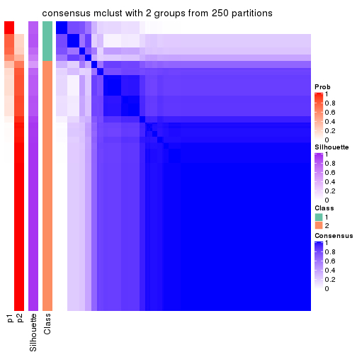</p>

</div>
<div id='tab-MAD-mclust-consensus-heatmap-2'>
<pre><code class="r">consensus_heatmap(res, k = 3)
</code></pre>

<p>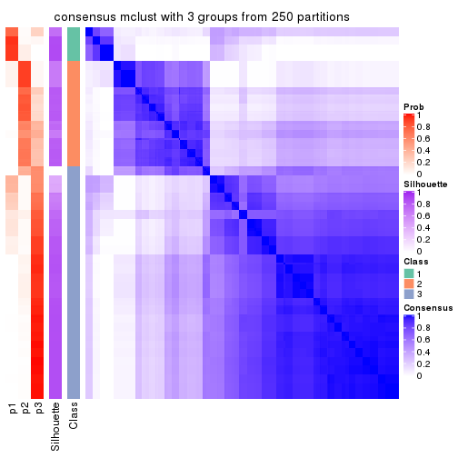</p>

</div>
<div id='tab-MAD-mclust-consensus-heatmap-3'>
<pre><code class="r">consensus_heatmap(res, k = 4)
</code></pre>

<p>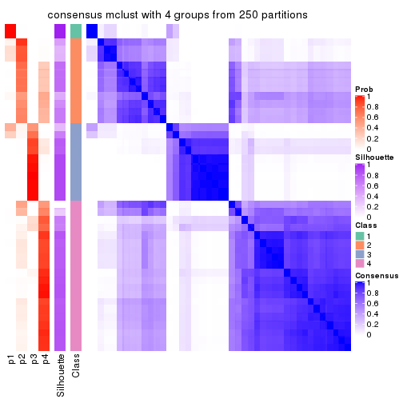</p>

</div>
<div id='tab-MAD-mclust-consensus-heatmap-4'>
<pre><code class="r">consensus_heatmap(res, k = 5)
</code></pre>

<p>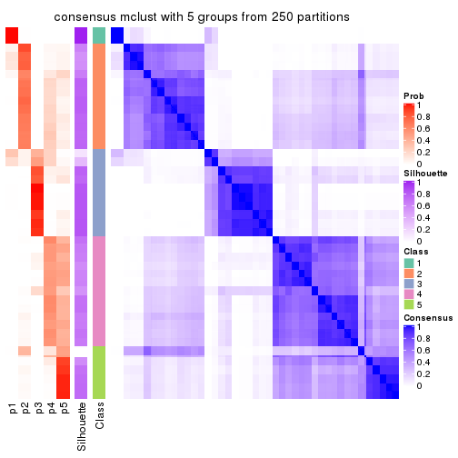</p>

</div>
<div id='tab-MAD-mclust-consensus-heatmap-5'>
<pre><code class="r">consensus_heatmap(res, k = 6)
</code></pre>

<p>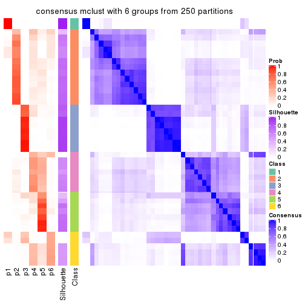</p>

</div>
</div>

Heatmaps for the membership of samples in all partitions to see how consistent they are:


<script>
$( function() {
	$( '#tabs-MAD-mclust-membership-heatmap' ).tabs();
} );
</script>
<div id='tabs-MAD-mclust-membership-heatmap'>
<ul>
<li><a href='#tab-MAD-mclust-membership-heatmap-1'>k = 2</a></li>
<li><a href='#tab-MAD-mclust-membership-heatmap-2'>k = 3</a></li>
<li><a href='#tab-MAD-mclust-membership-heatmap-3'>k = 4</a></li>
<li><a href='#tab-MAD-mclust-membership-heatmap-4'>k = 5</a></li>
<li><a href='#tab-MAD-mclust-membership-heatmap-5'>k = 6</a></li>
</ul>
<div id='tab-MAD-mclust-membership-heatmap-1'>
<pre><code class="r">membership_heatmap(res, k = 2)
</code></pre>

<p>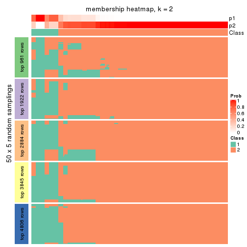</p>

</div>
<div id='tab-MAD-mclust-membership-heatmap-2'>
<pre><code class="r">membership_heatmap(res, k = 3)
</code></pre>

<p>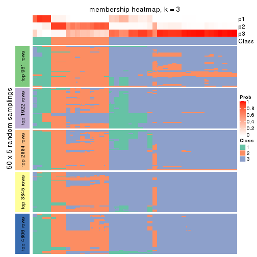</p>

</div>
<div id='tab-MAD-mclust-membership-heatmap-3'>
<pre><code class="r">membership_heatmap(res, k = 4)
</code></pre>

<p>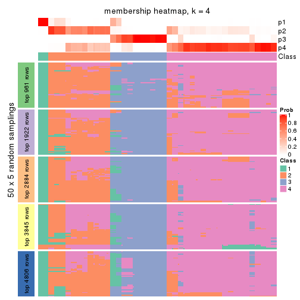</p>

</div>
<div id='tab-MAD-mclust-membership-heatmap-4'>
<pre><code class="r">membership_heatmap(res, k = 5)
</code></pre>

<p>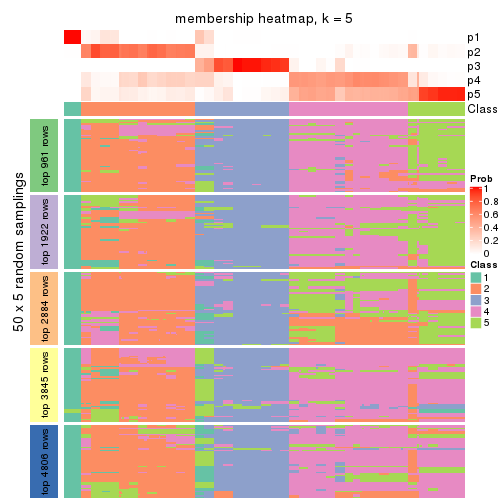</p>

</div>
<div id='tab-MAD-mclust-membership-heatmap-5'>
<pre><code class="r">membership_heatmap(res, k = 6)
</code></pre>

<p>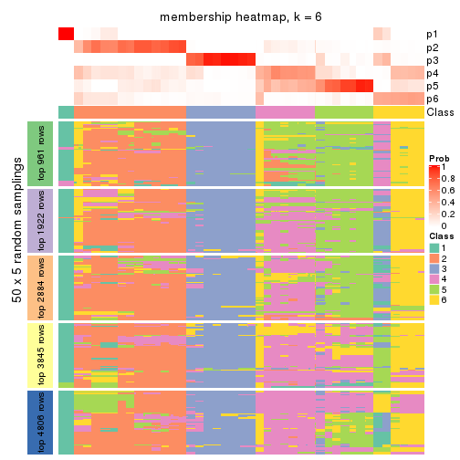</p>

</div>
</div>

As soon as we have had the classes for columns, we can look for signatures
which are significantly different between classes which can be candidate marks
for certain classes. Following are the heatmaps for signatures.


Signature heatmaps where rows are scaled:


<script>
$( function() {
	$( '#tabs-MAD-mclust-get-signatures' ).tabs();
} );
</script>
<div id='tabs-MAD-mclust-get-signatures'>
<ul>
<li><a href='#tab-MAD-mclust-get-signatures-1'>k = 2</a></li>
<li><a href='#tab-MAD-mclust-get-signatures-2'>k = 3</a></li>
<li><a href='#tab-MAD-mclust-get-signatures-3'>k = 4</a></li>
<li><a href='#tab-MAD-mclust-get-signatures-4'>k = 5</a></li>
<li><a href='#tab-MAD-mclust-get-signatures-5'>k = 6</a></li>
</ul>
<div id='tab-MAD-mclust-get-signatures-1'>
<pre><code class="r">get_signatures(res, k = 2)
</code></pre>

<p>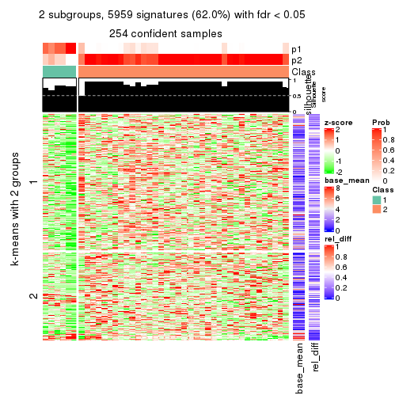</p>

</div>
<div id='tab-MAD-mclust-get-signatures-2'>
<pre><code class="r">get_signatures(res, k = 3)
</code></pre>

<p>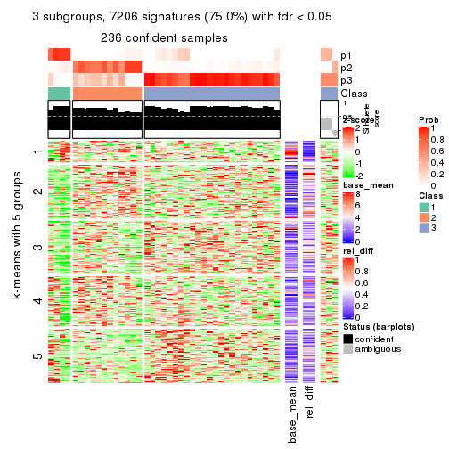</p>

</div>
<div id='tab-MAD-mclust-get-signatures-3'>
<pre><code class="r">get_signatures(res, k = 4)
</code></pre>

<p>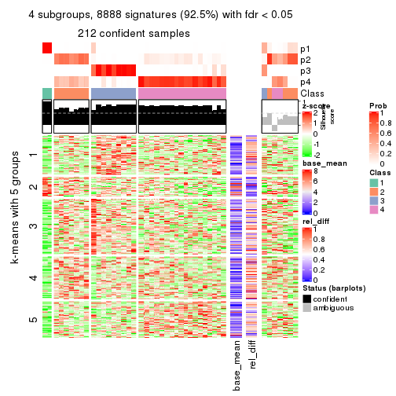</p>

</div>
<div id='tab-MAD-mclust-get-signatures-4'>
<pre><code class="r">get_signatures(res, k = 5)
</code></pre>

<p>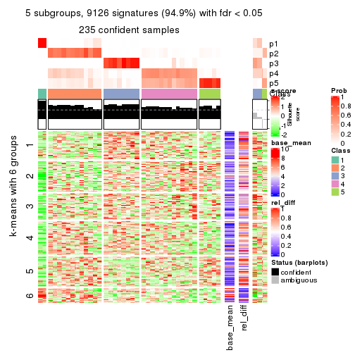</p>

</div>
<div id='tab-MAD-mclust-get-signatures-5'>
<pre><code class="r">get_signatures(res, k = 6)
</code></pre>

<p>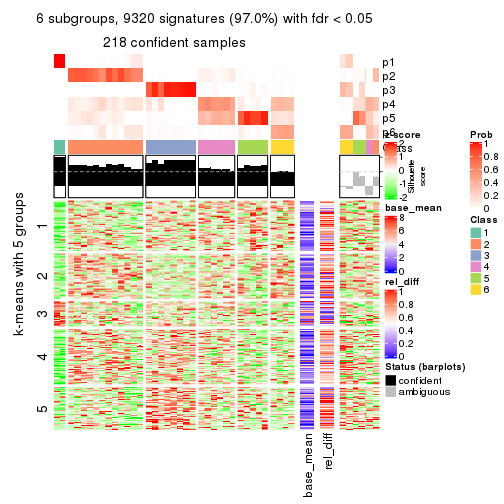</p>

</div>
</div>


Signature heatmaps where rows are not scaled:


<script>
$( function() {
	$( '#tabs-MAD-mclust-get-signatures-no-scale' ).tabs();
} );
</script>
<div id='tabs-MAD-mclust-get-signatures-no-scale'>
<ul>
<li><a href='#tab-MAD-mclust-get-signatures-no-scale-1'>k = 2</a></li>
<li><a href='#tab-MAD-mclust-get-signatures-no-scale-2'>k = 3</a></li>
<li><a href='#tab-MAD-mclust-get-signatures-no-scale-3'>k = 4</a></li>
<li><a href='#tab-MAD-mclust-get-signatures-no-scale-4'>k = 5</a></li>
<li><a href='#tab-MAD-mclust-get-signatures-no-scale-5'>k = 6</a></li>
</ul>
<div id='tab-MAD-mclust-get-signatures-no-scale-1'>
<pre><code class="r">get_signatures(res, k = 2, scale_rows = FALSE)
</code></pre>

<p>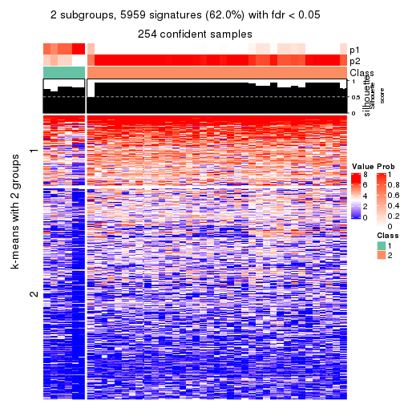</p>

</div>
<div id='tab-MAD-mclust-get-signatures-no-scale-2'>
<pre><code class="r">get_signatures(res, k = 3, scale_rows = FALSE)
</code></pre>

<p>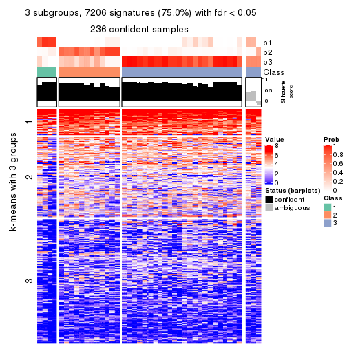</p>

</div>
<div id='tab-MAD-mclust-get-signatures-no-scale-3'>
<pre><code class="r">get_signatures(res, k = 4, scale_rows = FALSE)
</code></pre>

<p>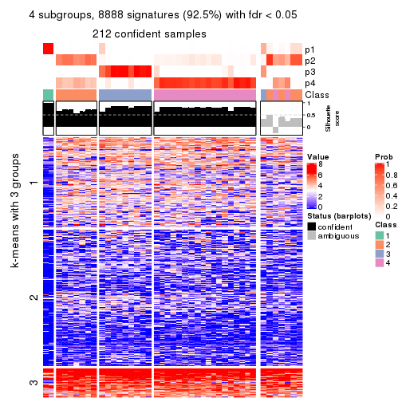</p>

</div>
<div id='tab-MAD-mclust-get-signatures-no-scale-4'>
<pre><code class="r">get_signatures(res, k = 5, scale_rows = FALSE)
</code></pre>

<p>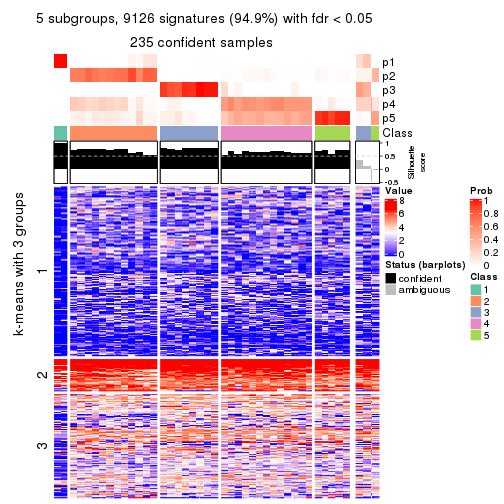</p>

</div>
<div id='tab-MAD-mclust-get-signatures-no-scale-5'>
<pre><code class="r">get_signatures(res, k = 6, scale_rows = FALSE)
</code></pre>

<p>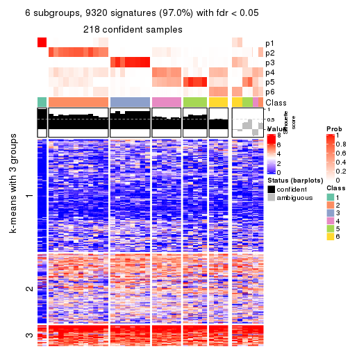</p>

</div>
</div>


Compare the overlap of signatures from different k:

```r
compare_signatures(res)
```

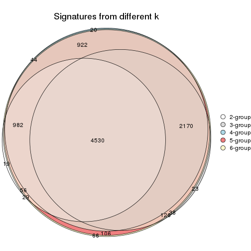

`get_signature()` returns a data frame invisibly. TO get the list of signatures, the function
call should be assigned to a variable explicitly. In following code, if `plot` argument is set
to `FALSE`, no heatmap is plotted while only the differential analysis is performed.

```r
# code only for demonstration
tb = get_signature(res, k = ..., plot = FALSE)
```

An example of the output of `tb` is:

```
#>   which_row         fdr    mean_1    mean_2 scaled_mean_1 scaled_mean_2 km
#> 1        38 0.042760348  8.373488  9.131774    -0.5533452     0.5164555  1
#> 2        40 0.018707592  7.106213  8.469186    -0.6173731     0.5762149  1
#> 3        55 0.019134737 10.221463 11.207825    -0.6159697     0.5749050  1
#> 4        59 0.006059896  5.921854  7.869574    -0.6899429     0.6439467  1
#> 5        60 0.018055526  8.928898 10.211722    -0.6204761     0.5791110  1
#> 6        98 0.009384629 15.714769 14.887706     0.6635654    -0.6193277  2
...
```

The columns in `tb` are:

1. `which_row`: row indices corresponding to the input matrix.
2. `fdr`: FDR for the differential test. 
3. `mean_x`: The mean value in group x.
4. `scaled_mean_x`: The mean value in group x after rows are scaled.
5. `km`: Row groups if k-means clustering is applied to rows.


UMAP plot which shows how samples are separated.


<script>
$( function() {
	$( '#tabs-MAD-mclust-dimension-reduction' ).tabs();
} );
</script>
<div id='tabs-MAD-mclust-dimension-reduction'>
<ul>
<li><a href='#tab-MAD-mclust-dimension-reduction-1'>k = 2</a></li>
<li><a href='#tab-MAD-mclust-dimension-reduction-2'>k = 3</a></li>
<li><a href='#tab-MAD-mclust-dimension-reduction-3'>k = 4</a></li>
<li><a href='#tab-MAD-mclust-dimension-reduction-4'>k = 5</a></li>
<li><a href='#tab-MAD-mclust-dimension-reduction-5'>k = 6</a></li>
</ul>
<div id='tab-MAD-mclust-dimension-reduction-1'>
<pre><code class="r">dimension_reduction(res, k = 2, method = &quot;UMAP&quot;)
</code></pre>

<p>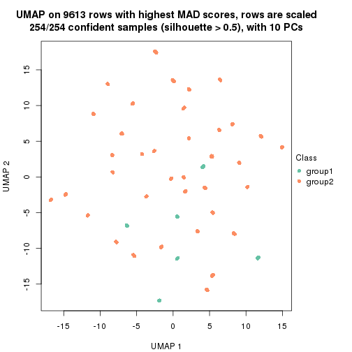</p>

</div>
<div id='tab-MAD-mclust-dimension-reduction-2'>
<pre><code class="r">dimension_reduction(res, k = 3, method = &quot;UMAP&quot;)
</code></pre>

<p>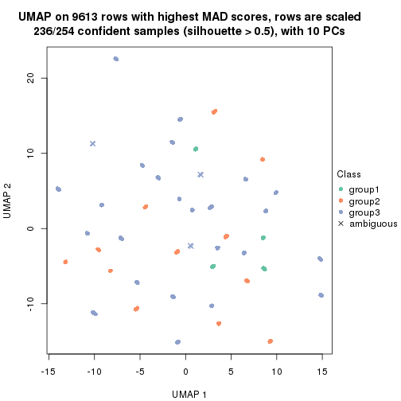</p>

</div>
<div id='tab-MAD-mclust-dimension-reduction-3'>
<pre><code class="r">dimension_reduction(res, k = 4, method = &quot;UMAP&quot;)
</code></pre>

<p>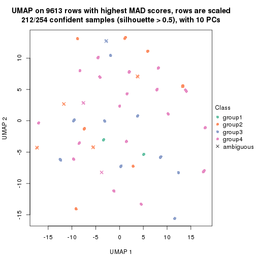</p>

</div>
<div id='tab-MAD-mclust-dimension-reduction-4'>
<pre><code class="r">dimension_reduction(res, k = 5, method = &quot;UMAP&quot;)
</code></pre>

<p>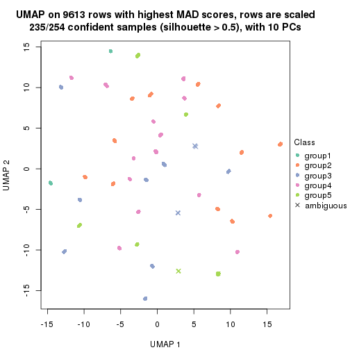</p>

</div>
<div id='tab-MAD-mclust-dimension-reduction-5'>
<pre><code class="r">dimension_reduction(res, k = 6, method = &quot;UMAP&quot;)
</code></pre>

<p>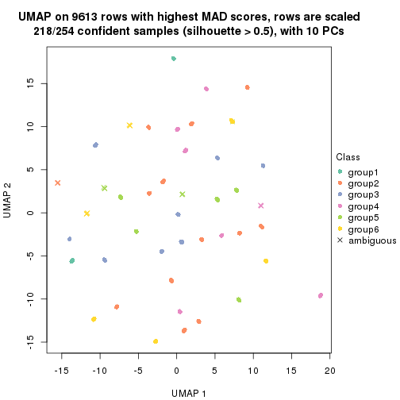</p>

</div>
</div>


Following heatmap shows how subgroups are split when increasing `k`:

```r
collect_classes(res)
```

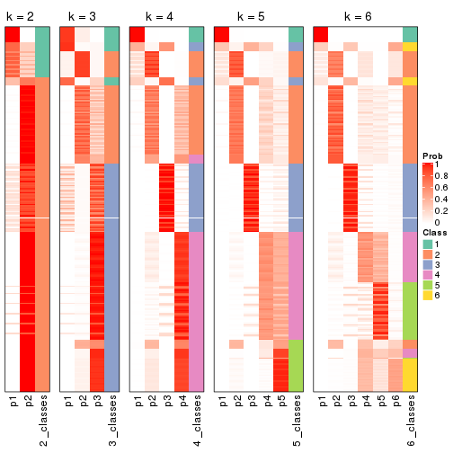


If matrix rows can be associated to genes, consider to use `GO_Enrichment(res,
...)` to perform function enrichment for the signature genes.


 

---------------------------------------------------


### MAD:NMF


The object with results only for a single top-value method and a single partition method 
can be extracted as:

```r
res = res_list["MAD", "NMF"]
# you can also extract it by
# res = res_list["MAD:NMF"]
```

A summary of `res` and all the functions that can be applied to it:

```r
res
```

```
#> A 'ConsensusPartition' object with k = 2, 3, 4, 5, 6.
#>   On a matrix with 9613 rows and 254 columns.
#>   Top rows (961, 1922, 2884, 3845, 4806) are extracted by 'MAD' method.
#>   Subgroups are detected by 'NMF' method.
#>   Performed in total 1250 partitions by row resampling.
#>   Best k for subgroups seems to be 4.
#> 
#> Following methods can be applied to this 'ConsensusPartition' object:
#>  [1] "cola_report"             "collect_classes"         "collect_plots"          
#>  [4] "collect_stats"           "colnames"                "compare_signatures"     
#>  [7] "consensus_heatmap"       "dimension_reduction"     "functional_enrichment"  
#> [10] "get_anno_col"            "get_anno"                "get_classes"            
#> [13] "get_consensus"           "get_matrix"              "get_membership"         
#> [16] "get_param"               "get_signatures"          "get_stats"              
#> [19] "is_best_k"               "is_stable_k"             "membership_heatmap"     
#> [22] "ncol"                    "nrow"                    "plot_ecdf"              
#> [25] "rownames"                "select_partition_number" "show"                   
#> [28] "suggest_best_k"          "test_to_known_factors"
```

`collect_plots()` function collects all the plots made from `res` for all `k` (number of partitions)
into one single page to provide an easy and fast comparison between different `k`.

```r
collect_plots(res)
```

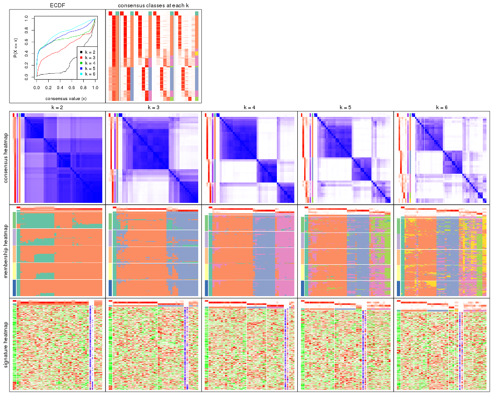

The plots are:

- The first row: a plot of the ECDF (Empirical cumulative distribution
  function) curves of the consensus matrix for each `k` and the heatmap of
  predicted classes for each `k`.
- The second row: heatmaps of the consensus matrix for each `k`.
- The third row: heatmaps of the membership matrix for each `k`.
- The fouth row: heatmaps of the signatures for each `k`.

All the plots in panels can be made by individual functions and they are
plotted later in this section.

`select_partition_number()` produces several plots showing different
statistics for choosing "optimized" `k`. There are following statistics:

- ECDF curves of the consensus matrix for each `k`;
- 1-PAC. [The PAC
  score](https://en.wikipedia.org/wiki/Consensus_clustering#Over-interpretation_potential_of_consensus_clustering)
  measures the proportion of the ambiguous subgrouping.
- Mean silhouette score.
- Concordance. The mean probability of fiting the consensus class ids in all
  partitions.
- Area increased. Denote $A_k$ as the area under the ECDF curve for current
  `k`, the area increased is defined as $A_k - A_{k-1}$.
- Rand index. The percent of pairs of samples that are both in a same cluster
  or both are not in a same cluster in the partition of k and k-1.
- Jaccard index. The ratio of pairs of samples are both in a same cluster in
  the partition of k and k-1 and the pairs of samples are both in a same
  cluster in the partition k or k-1.

The detailed explanations of these statistics can be found in [the cola
vignette](http://bioconductor.org/packages/devel/bioc/vignettes/cola/inst/doc/cola.html#toc_13).

Generally speaking, lower PAC score, higher mean silhouette score or higher
concordance corresponds to better partition. Rand index and Jaccard index
measure how similar the current partition is compared to partition with `k-1`.
If they are too similar, we won't accept `k` is better than `k-1`.

```r
select_partition_number(res)
```

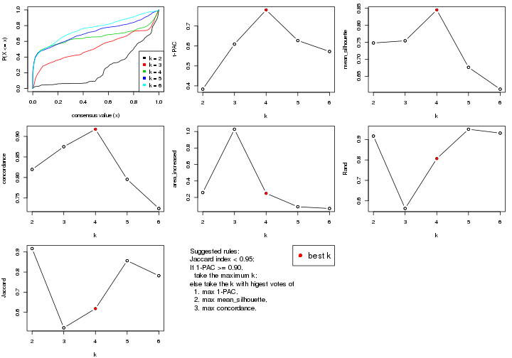

The numeric values for all these statistics can be obtained by `get_stats()`.

```r
get_stats(res)
```

```
#>   k 1-PAC mean_silhouette concordance area_increased  Rand Jaccard
#> 2 2 0.384           0.748       0.820          0.260 0.917   0.917
#> 3 3 0.609           0.754       0.875          1.028 0.562   0.523
#> 4 4 0.781           0.845       0.917          0.250 0.807   0.618
#> 5 5 0.627           0.676       0.795          0.087 0.950   0.856
#> 6 6 0.572           0.612       0.725          0.066 0.931   0.782
```

`suggest_best_k()` suggests the best $k$ based on these statistics. The rules are as follows:

- All $k$ with Jaccard index larger than 0.95 are removed because the increase of
  the partition number does not provides enough extra information. If all $k$ are removed,
  the best $k$ is assigned by `NA`.
- For $k$ with 1-PAC larger than 0.9, the maximal $k$ is taken as the "best k". Other $k$ is called "optional k".
- If it does not fit the second rule. The $k$ with the highest vote of highest
  1-PAC, mean silhouette and concordance is taken as the "best k".

```r
suggest_best_k(res)
```

```
#> [1] 4
```


Following shows the table of the partitions (You need to click the **show/hide
code output** link to see it). The membership matrix (columns with name `p*`)
is inferred by
[`clue::cl_consensus()`](https://www.rdocumentation.org/link/cl_consensus?package=clue)
function with the `SE` method. Basically the value in the membership matrix
represents the probability to belong to a certain group. The finall class
label for an item is determined with the group with highest probability it
belongs to.

In `get_classes()` function, the entropy is calculated from the membership
matrix and the silhouette score is calculated from the consensus matrix.


<script>
$( function() {
	$( '#tabs-MAD-NMF-get-classes' ).tabs();
} );
</script>
<div id='tabs-MAD-NMF-get-classes'>
<ul>
<li><a href='#tab-MAD-NMF-get-classes-1'>k = 2</a></li>
<li><a href='#tab-MAD-NMF-get-classes-2'>k = 3</a></li>
<li><a href='#tab-MAD-NMF-get-classes-3'>k = 4</a></li>
<li><a href='#tab-MAD-NMF-get-classes-4'>k = 5</a></li>
<li><a href='#tab-MAD-NMF-get-classes-5'>k = 6</a></li>
</ul>

<div id='tab-MAD-NMF-get-classes-1'>
<p><a id='tab-MAD-NMF-get-classes-1-a' style='color:#0366d6' href='#'>show/hide code output</a></p>
<pre><code class="r">cbind(get_classes(res, k = 2), get_membership(res, k = 2))
</code></pre>

<pre><code>#&gt;           class entropy silhouette    p1    p2
#&gt; DRR024803     1  0.0376      0.997 0.996 0.004
#&gt; DRR024804     2  0.2236      0.823 0.036 0.964
#&gt; DRR024805     2  0.0000      0.825 0.000 1.000
#&gt; DRR024806     2  0.0376      0.825 0.004 0.996
#&gt; DRR024807     2  0.9833      0.520 0.424 0.576
#&gt; DRR024808     2  0.9896      0.492 0.440 0.560
#&gt; DRR024809     2  0.0672      0.824 0.008 0.992
#&gt; DRR024810     2  0.2948      0.807 0.052 0.948
#&gt; DRR024811     2  0.9580      0.582 0.380 0.620
#&gt; DRR024812     2  0.0000      0.825 0.000 1.000
#&gt; DRR024813     2  0.6343      0.783 0.160 0.840
#&gt; DRR024814     2  0.3114      0.805 0.056 0.944
#&gt; DRR024815     2  0.2948      0.824 0.052 0.948
#&gt; DRR024816     2  0.0672      0.824 0.008 0.992
#&gt; DRR024817     2  0.7056      0.767 0.192 0.808
#&gt; DRR024818     2  0.9661      0.567 0.392 0.608
#&gt; DRR024819     2  0.3274      0.802 0.060 0.940
#&gt; DRR024820     2  0.7602      0.758 0.220 0.780
#&gt; DRR024821     2  0.9850      0.514 0.428 0.572
#&gt; DRR024822     2  0.0376      0.824 0.004 0.996
#&gt; DRR024824     2  0.0000      0.825 0.000 1.000
#&gt; DRR024825     2  0.8909      0.667 0.308 0.692
#&gt; DRR024826     2  0.6801      0.773 0.180 0.820
#&gt; DRR024827     2  0.7139      0.768 0.196 0.804
#&gt; DRR024828     2  0.9866      0.507 0.432 0.568
#&gt; DRR024829     2  0.3274      0.802 0.060 0.940
#&gt; DRR024830     2  0.0000      0.825 0.000 1.000
#&gt; DRR024831     2  0.9881      0.500 0.436 0.564
#&gt; DRR024832     2  0.9896      0.492 0.440 0.560
#&gt; DRR024833     2  0.6623      0.777 0.172 0.828
#&gt; DRR024834     2  0.3114      0.805 0.056 0.944
#&gt; DRR024835     2  0.4562      0.815 0.096 0.904
#&gt; DRR024836     2  0.9896      0.492 0.440 0.560
#&gt; DRR024837     2  0.4815      0.767 0.104 0.896
#&gt; DRR024838     2  0.3274      0.802 0.060 0.940
#&gt; DRR024839     2  0.0376      0.824 0.004 0.996
#&gt; DRR024840     2  0.0000      0.825 0.000 1.000
#&gt; DRR024841     2  0.1843      0.818 0.028 0.972
#&gt; DRR024842     2  0.0376      0.824 0.004 0.996
#&gt; DRR024843     1  0.0376      0.997 0.996 0.004
#&gt; DRR024844     2  0.2778      0.821 0.048 0.952
#&gt; DRR024845     2  0.0000      0.825 0.000 1.000
#&gt; DRR024846     2  0.0376      0.825 0.004 0.996
#&gt; DRR024847     2  0.9850      0.513 0.428 0.572
#&gt; DRR024848     1  0.0000      0.997 1.000 0.000
#&gt; DRR024849     2  0.9896      0.492 0.440 0.560
#&gt; DRR024850     2  0.1414      0.825 0.020 0.980
#&gt; DRR024851     2  0.0672      0.824 0.008 0.992
#&gt; DRR024852     2  0.2948      0.807 0.052 0.948
#&gt; DRR024853     2  0.9710      0.556 0.400 0.600
#&gt; DRR024854     2  0.0000      0.825 0.000 1.000
#&gt; DRR024855     2  0.6623      0.778 0.172 0.828
#&gt; DRR024856     2  0.2948      0.807 0.052 0.948
#&gt; DRR024857     2  0.3114      0.824 0.056 0.944
#&gt; DRR024858     2  0.0672      0.824 0.008 0.992
#&gt; DRR024859     2  0.7139      0.764 0.196 0.804
#&gt; DRR024860     2  0.9754      0.545 0.408 0.592
#&gt; DRR024861     2  0.3274      0.802 0.060 0.940
#&gt; DRR024862     2  0.7745      0.753 0.228 0.772
#&gt; DRR024863     2  0.9881      0.500 0.436 0.564
#&gt; DRR024864     2  0.0376      0.824 0.004 0.996
#&gt; DRR024865     2  0.1843      0.818 0.028 0.972
#&gt; DRR024866     2  0.0000      0.825 0.000 1.000
#&gt; DRR024867     2  0.8955      0.663 0.312 0.688
#&gt; DRR024868     2  0.6887      0.771 0.184 0.816
#&gt; DRR024869     2  0.7139      0.768 0.196 0.804
#&gt; DRR024870     2  0.9866      0.507 0.432 0.568
#&gt; DRR024871     2  0.3274      0.802 0.060 0.940
#&gt; DRR024872     2  0.0000      0.825 0.000 1.000
#&gt; DRR024873     2  0.9881      0.500 0.436 0.564
#&gt; DRR024874     2  0.9896      0.492 0.440 0.560
#&gt; DRR024875     2  0.6801      0.773 0.180 0.820
#&gt; DRR024876     2  0.3274      0.803 0.060 0.940
#&gt; DRR024877     2  0.4939      0.811 0.108 0.892
#&gt; DRR024878     2  0.9896      0.492 0.440 0.560
#&gt; DRR024879     2  0.5294      0.751 0.120 0.880
#&gt; DRR024880     2  0.3274      0.802 0.060 0.940
#&gt; DRR024881     2  0.0376      0.824 0.004 0.996
#&gt; DRR024882     2  0.0000      0.825 0.000 1.000
#&gt; DRR024883     2  0.1843      0.818 0.028 0.972
#&gt; DRR024884     2  0.1414      0.825 0.020 0.980
#&gt; DRR024885     2  0.6438      0.786 0.164 0.836
#&gt; DRR024886     1  0.0376      0.997 0.996 0.004
#&gt; DRR024887     2  0.2778      0.821 0.048 0.952
#&gt; DRR024888     2  0.0000      0.825 0.000 1.000
#&gt; DRR024889     2  0.0376      0.825 0.004 0.996
#&gt; DRR024890     2  0.9850      0.513 0.428 0.572
#&gt; DRR024891     1  0.0000      0.997 1.000 0.000
#&gt; DRR024892     2  0.9896      0.492 0.440 0.560
#&gt; DRR024893     2  0.1414      0.825 0.020 0.980
#&gt; DRR024894     2  0.0672      0.824 0.008 0.992
#&gt; DRR024895     2  0.2948      0.807 0.052 0.948
#&gt; DRR024896     2  0.9686      0.561 0.396 0.604
#&gt; DRR024897     2  0.0000      0.825 0.000 1.000
#&gt; DRR024898     2  0.6623      0.778 0.172 0.828
#&gt; DRR024899     2  0.3114      0.805 0.056 0.944
#&gt; DRR024900     2  0.3431      0.822 0.064 0.936
#&gt; DRR024901     2  0.0672      0.824 0.008 0.992
#&gt; DRR024902     2  0.7139      0.764 0.196 0.804
#&gt; DRR024903     2  0.9710      0.556 0.400 0.600
#&gt; DRR024904     2  0.3274      0.802 0.060 0.940
#&gt; DRR024905     2  0.7674      0.756 0.224 0.776
#&gt; DRR024906     2  0.9866      0.507 0.432 0.568
#&gt; DRR024907     2  0.0672      0.824 0.008 0.992
#&gt; DRR024908     2  0.1843      0.818 0.028 0.972
#&gt; DRR024909     2  0.0000      0.825 0.000 1.000
#&gt; DRR024910     2  0.8955      0.663 0.312 0.688
#&gt; DRR024911     2  0.6887      0.771 0.184 0.816
#&gt; DRR024912     2  0.7219      0.766 0.200 0.800
#&gt; DRR024913     2  0.9866      0.507 0.432 0.568
#&gt; DRR024914     2  0.3274      0.802 0.060 0.940
#&gt; DRR024915     2  0.0000      0.825 0.000 1.000
#&gt; DRR024916     2  0.9881      0.500 0.436 0.564
#&gt; DRR024917     2  0.9896      0.492 0.440 0.560
#&gt; DRR024918     2  0.6801      0.773 0.180 0.820
#&gt; DRR024919     2  0.3274      0.803 0.060 0.940
#&gt; DRR024920     2  0.4939      0.811 0.108 0.892
#&gt; DRR024921     2  0.9896      0.492 0.440 0.560
#&gt; DRR024922     2  0.5294      0.751 0.120 0.880
#&gt; DRR024923     2  0.3274      0.802 0.060 0.940
#&gt; DRR024924     2  0.0376      0.824 0.004 0.996
#&gt; DRR024925     2  0.0000      0.825 0.000 1.000
#&gt; DRR024926     2  0.1843      0.818 0.028 0.972
#&gt; DRR024927     2  0.1414      0.825 0.020 0.980
#&gt; DRR024928     2  0.6623      0.782 0.172 0.828
#&gt; DRR024929     1  0.0376      0.997 0.996 0.004
#&gt; DRR024930     2  0.2778      0.821 0.048 0.952
#&gt; DRR024931     2  0.0000      0.825 0.000 1.000
#&gt; DRR024932     2  0.0376      0.825 0.004 0.996
#&gt; DRR024933     2  0.9850      0.513 0.428 0.572
#&gt; DRR024934     1  0.0000      0.997 1.000 0.000
#&gt; DRR024935     2  0.9896      0.492 0.440 0.560
#&gt; DRR024936     2  0.1184      0.825 0.016 0.984
#&gt; DRR024937     2  0.0672      0.824 0.008 0.992
#&gt; DRR024938     2  0.2948      0.807 0.052 0.948
#&gt; DRR024939     2  0.9732      0.550 0.404 0.596
#&gt; DRR024940     2  0.0000      0.825 0.000 1.000
#&gt; DRR024941     2  0.6623      0.778 0.172 0.828
#&gt; DRR024942     2  0.3114      0.805 0.056 0.944
#&gt; DRR024943     2  0.3274      0.823 0.060 0.940
#&gt; DRR024944     2  0.0672      0.824 0.008 0.992
#&gt; DRR024945     2  0.7139      0.764 0.196 0.804
#&gt; DRR024946     2  0.9710      0.556 0.400 0.600
#&gt; DRR024947     2  0.3274      0.802 0.060 0.940
#&gt; DRR024948     2  0.7745      0.753 0.228 0.772
#&gt; DRR024949     2  0.9866      0.507 0.432 0.568
#&gt; DRR024950     2  0.0672      0.824 0.008 0.992
#&gt; DRR024951     2  0.1843      0.818 0.028 0.972
#&gt; DRR024952     2  0.0000      0.825 0.000 1.000
#&gt; DRR024953     2  0.8955      0.663 0.312 0.688
#&gt; DRR024954     2  0.6973      0.769 0.188 0.812
#&gt; DRR024955     2  0.7219      0.766 0.200 0.800
#&gt; DRR024956     2  0.9866      0.507 0.432 0.568
#&gt; DRR024957     2  0.3274      0.802 0.060 0.940
#&gt; DRR024958     2  0.0000      0.825 0.000 1.000
#&gt; DRR024959     2  0.9881      0.500 0.436 0.564
#&gt; DRR024960     2  0.9896      0.492 0.440 0.560
#&gt; DRR024961     2  0.6801      0.773 0.180 0.820
#&gt; DRR024962     2  0.3431      0.800 0.064 0.936
#&gt; DRR024963     2  0.5059      0.810 0.112 0.888
#&gt; DRR024964     2  0.9896      0.492 0.440 0.560
#&gt; DRR024965     2  0.5294      0.751 0.120 0.880
#&gt; DRR024966     2  0.3274      0.802 0.060 0.940
#&gt; DRR024967     2  0.0376      0.824 0.004 0.996
#&gt; DRR024968     2  0.0000      0.825 0.000 1.000
#&gt; DRR024969     2  0.1633      0.819 0.024 0.976
#&gt; DRR024970     2  0.1414      0.825 0.020 0.980
#&gt; DRR024971     2  0.6438      0.786 0.164 0.836
#&gt; DRR024972     1  0.0376      0.997 0.996 0.004
#&gt; DRR024973     2  0.2778      0.821 0.048 0.952
#&gt; DRR024974     2  0.0000      0.825 0.000 1.000
#&gt; DRR024975     2  0.0376      0.825 0.004 0.996
#&gt; DRR024976     2  0.9850      0.513 0.428 0.572
#&gt; DRR024977     1  0.0000      0.997 1.000 0.000
#&gt; DRR024978     2  0.9896      0.492 0.440 0.560
#&gt; DRR024979     2  0.1414      0.825 0.020 0.980
#&gt; DRR024980     2  0.0672      0.824 0.008 0.992
#&gt; DRR024981     2  0.2948      0.807 0.052 0.948
#&gt; DRR024982     2  0.9661      0.567 0.392 0.608
#&gt; DRR024983     2  0.0000      0.825 0.000 1.000
#&gt; DRR024984     2  0.6623      0.778 0.172 0.828
#&gt; DRR024985     2  0.3114      0.805 0.056 0.944
#&gt; DRR024986     2  0.3114      0.824 0.056 0.944
#&gt; DRR024987     2  0.0672      0.824 0.008 0.992
#&gt; DRR024988     2  0.7139      0.764 0.196 0.804
#&gt; DRR024989     2  0.9710      0.556 0.400 0.600
#&gt; DRR024990     2  0.3274      0.802 0.060 0.940
#&gt; DRR024991     2  0.7745      0.753 0.228 0.772
#&gt; DRR024992     2  0.9866      0.507 0.432 0.568
#&gt; DRR024993     2  0.0376      0.824 0.004 0.996
#&gt; DRR024994     2  0.1843      0.818 0.028 0.972
#&gt; DRR024995     2  0.0000      0.825 0.000 1.000
#&gt; DRR024996     2  0.8955      0.663 0.312 0.688
#&gt; DRR024997     2  0.7056      0.766 0.192 0.808
#&gt; DRR024998     2  0.7219      0.766 0.200 0.800
#&gt; DRR024999     2  0.9866      0.507 0.432 0.568
#&gt; DRR025000     2  0.3274      0.802 0.060 0.940
#&gt; DRR025001     2  0.0000      0.825 0.000 1.000
#&gt; DRR025002     2  0.9881      0.500 0.436 0.564
#&gt; DRR025003     2  0.9896      0.492 0.440 0.560
#&gt; DRR025004     2  0.6801      0.773 0.180 0.820
#&gt; DRR025005     2  0.3431      0.800 0.064 0.936
#&gt; DRR025006     2  0.4690      0.813 0.100 0.900
#&gt; DRR025007     2  0.9896      0.492 0.440 0.560
#&gt; DRR025008     2  0.5294      0.751 0.120 0.880
#&gt; DRR025009     2  0.3274      0.802 0.060 0.940
#&gt; DRR025010     2  0.0376      0.824 0.004 0.996
#&gt; DRR025011     2  0.0000      0.825 0.000 1.000
#&gt; DRR025012     2  0.1843      0.818 0.028 0.972
#&gt; DRR025013     2  0.1414      0.825 0.020 0.980
#&gt; DRR025014     2  0.6531      0.784 0.168 0.832
#&gt; DRR025015     1  0.0376      0.997 0.996 0.004
#&gt; DRR025016     2  0.2603      0.822 0.044 0.956
#&gt; DRR025017     2  0.0000      0.825 0.000 1.000
#&gt; DRR025018     2  0.0376      0.825 0.004 0.996
#&gt; DRR025019     2  0.9850      0.513 0.428 0.572
#&gt; DRR025020     1  0.0000      0.997 1.000 0.000
#&gt; DRR025021     2  0.9896      0.492 0.440 0.560
#&gt; DRR025022     2  0.1414      0.825 0.020 0.980
#&gt; DRR025023     2  0.0672      0.824 0.008 0.992
#&gt; DRR025024     2  0.2948      0.807 0.052 0.948
#&gt; DRR025025     2  0.9635      0.572 0.388 0.612
#&gt; DRR025026     2  0.0000      0.825 0.000 1.000
#&gt; DRR025027     2  0.6531      0.780 0.168 0.832
#&gt; DRR025028     2  0.3114      0.805 0.056 0.944
#&gt; DRR025029     2  0.3584      0.822 0.068 0.932
#&gt; DRR025030     2  0.0672      0.824 0.008 0.992
#&gt; DRR025031     2  0.7139      0.764 0.196 0.804
#&gt; DRR025032     2  0.9710      0.556 0.400 0.600
#&gt; DRR025033     2  0.3274      0.802 0.060 0.940
#&gt; DRR025034     2  0.7745      0.753 0.228 0.772
#&gt; DRR025035     2  0.9866      0.507 0.432 0.568
#&gt; DRR025036     2  0.0376      0.824 0.004 0.996
#&gt; DRR025037     2  0.1843      0.818 0.028 0.972
#&gt; DRR025038     2  0.0000      0.825 0.000 1.000
#&gt; DRR025039     2  0.8955      0.663 0.312 0.688
#&gt; DRR025040     2  0.6973      0.769 0.188 0.812
#&gt; DRR025041     2  0.7219      0.766 0.200 0.800
#&gt; DRR025042     2  0.9866      0.507 0.432 0.568
#&gt; DRR025043     2  0.3274      0.802 0.060 0.940
#&gt; DRR025044     2  0.0000      0.825 0.000 1.000
#&gt; DRR025045     2  0.9881      0.500 0.436 0.564
#&gt; DRR025046     2  0.9896      0.492 0.440 0.560
#&gt; DRR025047     2  0.6801      0.773 0.180 0.820
#&gt; DRR025048     2  0.3431      0.800 0.064 0.936
#&gt; DRR025049     2  0.4939      0.812 0.108 0.892
#&gt; DRR025050     2  0.9896      0.492 0.440 0.560
#&gt; DRR025051     2  0.5294      0.751 0.120 0.880
#&gt; DRR025052     2  0.3274      0.802 0.060 0.940
#&gt; DRR025053     2  0.0376      0.824 0.004 0.996
#&gt; DRR025054     2  0.0000      0.825 0.000 1.000
#&gt; DRR025055     2  0.1633      0.819 0.024 0.976
#&gt; DRR025056     2  0.1414      0.825 0.020 0.980
#&gt; DRR025057     2  0.6531      0.786 0.168 0.832
</code></pre>

<script>
$('#tab-MAD-NMF-get-classes-1-a').parent().next().next().hide();
$('#tab-MAD-NMF-get-classes-1-a').click(function(){
  $('#tab-MAD-NMF-get-classes-1-a').parent().next().next().toggle();
  return(false);
});
</script>
</div>

<div id='tab-MAD-NMF-get-classes-2'>
<p><a id='tab-MAD-NMF-get-classes-2-a' style='color:#0366d6' href='#'>show/hide code output</a></p>
<pre><code class="r">cbind(get_classes(res, k = 3), get_membership(res, k = 3))
</code></pre>

<pre><code>#&gt;           class entropy silhouette    p1    p2    p3
#&gt; DRR024803     1  0.1289     0.9960 0.968 0.000 0.032
#&gt; DRR024804     2  0.5244     0.6571 0.004 0.756 0.240
#&gt; DRR024805     2  0.1765     0.8859 0.004 0.956 0.040
#&gt; DRR024806     2  0.1267     0.8924 0.004 0.972 0.024
#&gt; DRR024807     3  0.3148     0.7537 0.036 0.048 0.916
#&gt; DRR024808     3  0.2050     0.7599 0.020 0.028 0.952
#&gt; DRR024809     2  0.0424     0.8986 0.008 0.992 0.000
#&gt; DRR024810     2  0.0892     0.8978 0.020 0.980 0.000
#&gt; DRR024811     3  0.3028     0.7557 0.032 0.048 0.920
#&gt; DRR024812     2  0.0237     0.8983 0.004 0.996 0.000
#&gt; DRR024813     2  0.6944    -0.0615 0.016 0.516 0.468
#&gt; DRR024814     2  0.1337     0.8959 0.016 0.972 0.012
#&gt; DRR024815     2  0.6023     0.7623 0.092 0.788 0.120
#&gt; DRR024816     2  0.0237     0.8983 0.004 0.996 0.000
#&gt; DRR024817     3  0.8652     0.2338 0.104 0.404 0.492
#&gt; DRR024818     3  0.1620     0.7563 0.012 0.024 0.964
#&gt; DRR024819     2  0.1482     0.8957 0.012 0.968 0.020
#&gt; DRR024820     3  0.8303     0.5307 0.172 0.196 0.632
#&gt; DRR024821     3  0.1482     0.7526 0.020 0.012 0.968
#&gt; DRR024822     2  0.0661     0.8977 0.004 0.988 0.008
#&gt; DRR024824     2  0.0747     0.8971 0.000 0.984 0.016
#&gt; DRR024825     3  0.1620     0.7454 0.024 0.012 0.964
#&gt; DRR024826     3  0.7065     0.5578 0.048 0.288 0.664
#&gt; DRR024827     3  0.7273     0.5909 0.156 0.132 0.712
#&gt; DRR024828     3  0.3263     0.7513 0.040 0.048 0.912
#&gt; DRR024829     2  0.2229     0.8844 0.012 0.944 0.044
#&gt; DRR024830     2  0.2066     0.8678 0.000 0.940 0.060
#&gt; DRR024831     3  0.3155     0.7518 0.040 0.044 0.916
#&gt; DRR024832     3  0.1919     0.7578 0.024 0.020 0.956
#&gt; DRR024833     3  0.7566     0.2080 0.040 0.448 0.512
#&gt; DRR024834     2  0.0892     0.8973 0.020 0.980 0.000
#&gt; DRR024835     2  0.8546     0.4230 0.132 0.584 0.284
#&gt; DRR024836     3  0.2806     0.7537 0.040 0.032 0.928
#&gt; DRR024837     2  0.1031     0.8971 0.024 0.976 0.000
#&gt; DRR024838     2  0.1905     0.8906 0.016 0.956 0.028
#&gt; DRR024839     2  0.1411     0.8908 0.000 0.964 0.036
#&gt; DRR024840     2  0.1399     0.8931 0.004 0.968 0.028
#&gt; DRR024841     2  0.0592     0.8986 0.012 0.988 0.000
#&gt; DRR024842     2  0.0000     0.8983 0.000 1.000 0.000
#&gt; DRR024843     1  0.1289     0.9960 0.968 0.000 0.032
#&gt; DRR024844     2  0.6113     0.5301 0.012 0.688 0.300
#&gt; DRR024845     2  0.1765     0.8859 0.004 0.956 0.040
#&gt; DRR024846     2  0.1267     0.8924 0.004 0.972 0.024
#&gt; DRR024847     3  0.3148     0.7537 0.036 0.048 0.916
#&gt; DRR024848     1  0.1289     0.9952 0.968 0.000 0.032
#&gt; DRR024849     3  0.2187     0.7592 0.024 0.028 0.948
#&gt; DRR024850     2  0.5406     0.7271 0.020 0.780 0.200
#&gt; DRR024851     2  0.0424     0.8986 0.008 0.992 0.000
#&gt; DRR024852     2  0.0892     0.8978 0.020 0.980 0.000
#&gt; DRR024853     3  0.3028     0.7557 0.032 0.048 0.920
#&gt; DRR024854     2  0.0237     0.8986 0.000 0.996 0.004
#&gt; DRR024855     3  0.6952     0.1894 0.016 0.480 0.504
#&gt; DRR024856     2  0.1337     0.8959 0.016 0.972 0.012
#&gt; DRR024857     2  0.6234     0.7491 0.096 0.776 0.128
#&gt; DRR024858     2  0.0237     0.8983 0.004 0.996 0.000
#&gt; DRR024859     3  0.8618     0.2854 0.104 0.388 0.508
#&gt; DRR024860     3  0.1453     0.7572 0.008 0.024 0.968
#&gt; DRR024861     2  0.1482     0.8957 0.012 0.968 0.020
#&gt; DRR024862     3  0.8125     0.5439 0.172 0.180 0.648
#&gt; DRR024863     3  0.1877     0.7517 0.032 0.012 0.956
#&gt; DRR024864     2  0.0661     0.8977 0.004 0.988 0.008
#&gt; DRR024865     2  0.1315     0.8961 0.008 0.972 0.020
#&gt; DRR024866     2  0.0892     0.8959 0.000 0.980 0.020
#&gt; DRR024867     3  0.1774     0.7485 0.024 0.016 0.960
#&gt; DRR024868     3  0.6646     0.6013 0.048 0.240 0.712
#&gt; DRR024869     3  0.7202     0.5918 0.160 0.124 0.716
#&gt; DRR024870     3  0.3263     0.7513 0.040 0.048 0.912
#&gt; DRR024871     2  0.2229     0.8844 0.012 0.944 0.044
#&gt; DRR024872     2  0.1529     0.8850 0.000 0.960 0.040
#&gt; DRR024873     3  0.3155     0.7518 0.040 0.044 0.916
#&gt; DRR024874     3  0.1919     0.7578 0.024 0.020 0.956
#&gt; DRR024875     3  0.7442     0.4296 0.044 0.368 0.588
#&gt; DRR024876     2  0.0892     0.8973 0.020 0.980 0.000
#&gt; DRR024877     2  0.8962     0.3225 0.156 0.540 0.304
#&gt; DRR024878     3  0.2806     0.7537 0.040 0.032 0.928
#&gt; DRR024879     2  0.1031     0.8971 0.024 0.976 0.000
#&gt; DRR024880     2  0.1905     0.8906 0.016 0.956 0.028
#&gt; DRR024881     2  0.1964     0.8814 0.000 0.944 0.056
#&gt; DRR024882     2  0.1525     0.8908 0.004 0.964 0.032
#&gt; DRR024883     2  0.0592     0.8986 0.012 0.988 0.000
#&gt; DRR024884     2  0.6059     0.7232 0.048 0.764 0.188
#&gt; DRR024885     2  0.9142     0.2488 0.164 0.512 0.324
#&gt; DRR024886     1  0.1289     0.9960 0.968 0.000 0.032
#&gt; DRR024887     2  0.6082     0.5349 0.012 0.692 0.296
#&gt; DRR024888     2  0.1765     0.8859 0.004 0.956 0.040
#&gt; DRR024889     2  0.1267     0.8924 0.004 0.972 0.024
#&gt; DRR024890     3  0.3148     0.7537 0.036 0.048 0.916
#&gt; DRR024891     1  0.1289     0.9952 0.968 0.000 0.032
#&gt; DRR024892     3  0.2050     0.7599 0.020 0.028 0.952
#&gt; DRR024893     2  0.5062     0.7508 0.016 0.800 0.184
#&gt; DRR024894     2  0.0424     0.8986 0.008 0.992 0.000
#&gt; DRR024895     2  0.0892     0.8978 0.020 0.980 0.000
#&gt; DRR024896     3  0.3028     0.7557 0.032 0.048 0.920
#&gt; DRR024897     2  0.0237     0.8986 0.000 0.996 0.004
#&gt; DRR024898     3  0.6952     0.1903 0.016 0.480 0.504
#&gt; DRR024899     2  0.1337     0.8959 0.016 0.972 0.012
#&gt; DRR024900     2  0.6309     0.7450 0.100 0.772 0.128
#&gt; DRR024901     2  0.0237     0.8983 0.004 0.996 0.000
#&gt; DRR024902     3  0.8559     0.2905 0.100 0.388 0.512
#&gt; DRR024903     3  0.1453     0.7572 0.008 0.024 0.968
#&gt; DRR024904     2  0.1482     0.8957 0.012 0.968 0.020
#&gt; DRR024905     3  0.8125     0.5439 0.172 0.180 0.648
#&gt; DRR024906     3  0.1751     0.7525 0.028 0.012 0.960
#&gt; DRR024907     2  0.0661     0.8977 0.004 0.988 0.008
#&gt; DRR024908     2  0.1315     0.8961 0.008 0.972 0.020
#&gt; DRR024909     2  0.0892     0.8959 0.000 0.980 0.020
#&gt; DRR024910     3  0.1620     0.7454 0.024 0.012 0.964
#&gt; DRR024911     3  0.6565     0.6082 0.048 0.232 0.720
#&gt; DRR024912     3  0.6809     0.6062 0.156 0.104 0.740
#&gt; DRR024913     3  0.3263     0.7513 0.040 0.048 0.912
#&gt; DRR024914     2  0.2229     0.8844 0.012 0.944 0.044
#&gt; DRR024915     2  0.1529     0.8850 0.000 0.960 0.040
#&gt; DRR024916     3  0.3155     0.7518 0.040 0.044 0.916
#&gt; DRR024917     3  0.1636     0.7582 0.016 0.020 0.964
#&gt; DRR024918     3  0.7517     0.2975 0.040 0.420 0.540
#&gt; DRR024919     2  0.0892     0.8973 0.020 0.980 0.000
#&gt; DRR024920     2  0.8941     0.3495 0.160 0.548 0.292
#&gt; DRR024921     3  0.2806     0.7537 0.040 0.032 0.928
#&gt; DRR024922     2  0.1031     0.8971 0.024 0.976 0.000
#&gt; DRR024923     2  0.2050     0.8893 0.020 0.952 0.028
#&gt; DRR024924     2  0.1529     0.8891 0.000 0.960 0.040
#&gt; DRR024925     2  0.1399     0.8931 0.004 0.968 0.028
#&gt; DRR024926     2  0.0592     0.8986 0.012 0.988 0.000
#&gt; DRR024927     2  0.6109     0.7198 0.048 0.760 0.192
#&gt; DRR024928     2  0.9203     0.1932 0.164 0.496 0.340
#&gt; DRR024929     1  0.1289     0.9960 0.968 0.000 0.032
#&gt; DRR024930     2  0.6143     0.5241 0.012 0.684 0.304
#&gt; DRR024931     2  0.2096     0.8768 0.004 0.944 0.052
#&gt; DRR024932     2  0.1129     0.8935 0.004 0.976 0.020
#&gt; DRR024933     3  0.3148     0.7537 0.036 0.048 0.916
#&gt; DRR024934     1  0.1289     0.9952 0.968 0.000 0.032
#&gt; DRR024935     3  0.2187     0.7592 0.024 0.028 0.948
#&gt; DRR024936     2  0.5115     0.7453 0.016 0.796 0.188
#&gt; DRR024937     2  0.0424     0.8986 0.008 0.992 0.000
#&gt; DRR024938     2  0.0892     0.8978 0.020 0.980 0.000
#&gt; DRR024939     3  0.3028     0.7557 0.032 0.048 0.920
#&gt; DRR024940     2  0.0237     0.8986 0.000 0.996 0.004
#&gt; DRR024941     3  0.6944     0.2283 0.016 0.468 0.516
#&gt; DRR024942     2  0.1337     0.8959 0.016 0.972 0.012
#&gt; DRR024943     2  0.6299     0.7444 0.096 0.772 0.132
#&gt; DRR024944     2  0.0237     0.8983 0.004 0.996 0.000
#&gt; DRR024945     3  0.8559     0.2896 0.100 0.388 0.512
#&gt; DRR024946     3  0.1453     0.7572 0.008 0.024 0.968
#&gt; DRR024947     2  0.1482     0.8957 0.012 0.968 0.020
#&gt; DRR024948     3  0.8125     0.5439 0.172 0.180 0.648
#&gt; DRR024949     3  0.1482     0.7526 0.020 0.012 0.968
#&gt; DRR024950     2  0.0475     0.8977 0.004 0.992 0.004
#&gt; DRR024951     2  0.1315     0.8961 0.008 0.972 0.020
#&gt; DRR024952     2  0.1031     0.8948 0.000 0.976 0.024
#&gt; DRR024953     3  0.1774     0.7485 0.024 0.016 0.960
#&gt; DRR024954     3  0.6523     0.6114 0.048 0.228 0.724
#&gt; DRR024955     3  0.7016     0.6004 0.156 0.116 0.728
#&gt; DRR024956     3  0.3263     0.7513 0.040 0.048 0.912
#&gt; DRR024957     2  0.2229     0.8844 0.012 0.944 0.044
#&gt; DRR024958     2  0.1529     0.8850 0.000 0.960 0.040
#&gt; DRR024959     3  0.3155     0.7518 0.040 0.044 0.916
#&gt; DRR024960     3  0.1636     0.7582 0.016 0.020 0.964
#&gt; DRR024961     3  0.7438     0.3777 0.040 0.392 0.568
#&gt; DRR024962     2  0.0892     0.8973 0.020 0.980 0.000
#&gt; DRR024963     2  0.8941     0.3345 0.156 0.544 0.300
#&gt; DRR024964     3  0.2681     0.7540 0.040 0.028 0.932
#&gt; DRR024965     2  0.1031     0.8971 0.024 0.976 0.000
#&gt; DRR024966     2  0.1905     0.8906 0.016 0.956 0.028
#&gt; DRR024967     2  0.1643     0.8879 0.000 0.956 0.044
#&gt; DRR024968     2  0.1399     0.8922 0.004 0.968 0.028
#&gt; DRR024969     2  0.0592     0.8986 0.012 0.988 0.000
#&gt; DRR024970     2  0.6109     0.7198 0.048 0.760 0.192
#&gt; DRR024971     2  0.9174     0.2216 0.164 0.504 0.332
#&gt; DRR024972     1  0.1289     0.9960 0.968 0.000 0.032
#&gt; DRR024973     2  0.5896     0.5531 0.008 0.700 0.292
#&gt; DRR024974     2  0.1989     0.8800 0.004 0.948 0.048
#&gt; DRR024975     2  0.1267     0.8924 0.004 0.972 0.024
#&gt; DRR024976     3  0.3148     0.7537 0.036 0.048 0.916
#&gt; DRR024977     1  0.1289     0.9952 0.968 0.000 0.032
#&gt; DRR024978     3  0.2050     0.7599 0.020 0.028 0.952
#&gt; DRR024979     2  0.5318     0.7249 0.016 0.780 0.204
#&gt; DRR024980     2  0.0424     0.8986 0.008 0.992 0.000
#&gt; DRR024981     2  0.0892     0.8978 0.020 0.980 0.000
#&gt; DRR024982     3  0.3028     0.7557 0.032 0.048 0.920
#&gt; DRR024983     2  0.0237     0.8986 0.000 0.996 0.004
#&gt; DRR024984     3  0.6950     0.2041 0.016 0.476 0.508
#&gt; DRR024985     2  0.1337     0.8959 0.016 0.972 0.012
#&gt; DRR024986     2  0.6234     0.7491 0.096 0.776 0.128
#&gt; DRR024987     2  0.0237     0.8983 0.004 0.996 0.000
#&gt; DRR024988     3  0.8652     0.2338 0.104 0.404 0.492
#&gt; DRR024989     3  0.1453     0.7572 0.008 0.024 0.968
#&gt; DRR024990     2  0.1482     0.8957 0.012 0.968 0.020
#&gt; DRR024991     3  0.8125     0.5439 0.172 0.180 0.648
#&gt; DRR024992     3  0.1751     0.7524 0.028 0.012 0.960
#&gt; DRR024993     2  0.0661     0.8977 0.004 0.988 0.008
#&gt; DRR024994     2  0.1315     0.8961 0.008 0.972 0.020
#&gt; DRR024995     2  0.0747     0.8971 0.000 0.984 0.016
#&gt; DRR024996     3  0.1620     0.7454 0.024 0.012 0.964
#&gt; DRR024997     3  0.6437     0.6176 0.048 0.220 0.732
#&gt; DRR024998     3  0.6936     0.6008 0.160 0.108 0.732
#&gt; DRR024999     3  0.3263     0.7513 0.040 0.048 0.912
#&gt; DRR025000     2  0.2229     0.8844 0.012 0.944 0.044
#&gt; DRR025001     2  0.1529     0.8850 0.000 0.960 0.040
#&gt; DRR025002     3  0.3155     0.7518 0.040 0.044 0.916
#&gt; DRR025003     3  0.1636     0.7582 0.016 0.020 0.964
#&gt; DRR025004     3  0.7519     0.3843 0.044 0.388 0.568
#&gt; DRR025005     2  0.0892     0.8973 0.020 0.980 0.000
#&gt; DRR025006     2  0.8957     0.3060 0.152 0.536 0.312
#&gt; DRR025007     3  0.2806     0.7537 0.040 0.032 0.928
#&gt; DRR025008     2  0.1031     0.8971 0.024 0.976 0.000
#&gt; DRR025009     2  0.2050     0.8893 0.020 0.952 0.028
#&gt; DRR025010     2  0.1753     0.8860 0.000 0.952 0.048
#&gt; DRR025011     2  0.1267     0.8941 0.004 0.972 0.024
#&gt; DRR025012     2  0.0592     0.8986 0.012 0.988 0.000
#&gt; DRR025013     2  0.6007     0.7288 0.048 0.768 0.184
#&gt; DRR025014     2  0.9174     0.2216 0.164 0.504 0.332
#&gt; DRR025015     1  0.1289     0.9960 0.968 0.000 0.032
#&gt; DRR025016     2  0.5619     0.6375 0.012 0.744 0.244
#&gt; DRR025017     2  0.1765     0.8859 0.004 0.956 0.040
#&gt; DRR025018     2  0.1267     0.8924 0.004 0.972 0.024
#&gt; DRR025019     3  0.3148     0.7537 0.036 0.048 0.916
#&gt; DRR025020     1  0.1289     0.9952 0.968 0.000 0.032
#&gt; DRR025021     3  0.2050     0.7599 0.020 0.028 0.952
#&gt; DRR025022     2  0.5219     0.7307 0.016 0.788 0.196
#&gt; DRR025023     2  0.0424     0.8986 0.008 0.992 0.000
#&gt; DRR025024     2  0.0892     0.8978 0.020 0.980 0.000
#&gt; DRR025025     3  0.3028     0.7557 0.032 0.048 0.920
#&gt; DRR025026     2  0.0237     0.8983 0.004 0.996 0.000
#&gt; DRR025027     3  0.6952     0.1891 0.016 0.480 0.504
#&gt; DRR025028     2  0.1337     0.8959 0.016 0.972 0.012
#&gt; DRR025029     2  0.6374     0.7402 0.100 0.768 0.132
#&gt; DRR025030     2  0.0237     0.8983 0.004 0.996 0.000
#&gt; DRR025031     3  0.8608     0.2974 0.104 0.384 0.512
#&gt; DRR025032     3  0.1453     0.7572 0.008 0.024 0.968
#&gt; DRR025033     2  0.1636     0.8951 0.016 0.964 0.020
#&gt; DRR025034     3  0.8125     0.5439 0.172 0.180 0.648
#&gt; DRR025035     3  0.1620     0.7528 0.024 0.012 0.964
#&gt; DRR025036     2  0.0661     0.8977 0.004 0.988 0.008
#&gt; DRR025037     2  0.1315     0.8961 0.008 0.972 0.020
#&gt; DRR025038     2  0.0747     0.8971 0.000 0.984 0.016
#&gt; DRR025039     3  0.1620     0.7454 0.024 0.012 0.964
#&gt; DRR025040     3  0.6646     0.6014 0.048 0.240 0.712
#&gt; DRR025041     3  0.7082     0.5985 0.156 0.120 0.724
#&gt; DRR025042     3  0.3263     0.7513 0.040 0.048 0.912
#&gt; DRR025043     2  0.2229     0.8844 0.012 0.944 0.044
#&gt; DRR025044     2  0.1753     0.8788 0.000 0.952 0.048
#&gt; DRR025045     3  0.3155     0.7518 0.040 0.044 0.916
#&gt; DRR025046     3  0.1781     0.7581 0.020 0.020 0.960
#&gt; DRR025047     3  0.7410     0.3957 0.040 0.384 0.576
#&gt; DRR025048     2  0.0892     0.8973 0.020 0.980 0.000
#&gt; DRR025049     2  0.8872     0.3682 0.156 0.556 0.288
#&gt; DRR025050     3  0.2681     0.7540 0.040 0.028 0.932
#&gt; DRR025051     2  0.1031     0.8971 0.024 0.976 0.000
#&gt; DRR025052     2  0.1905     0.8906 0.016 0.956 0.028
#&gt; DRR025053     2  0.1860     0.8836 0.000 0.948 0.052
#&gt; DRR025054     2  0.1399     0.8931 0.004 0.968 0.028
#&gt; DRR025055     2  0.0592     0.8986 0.012 0.988 0.000
#&gt; DRR025056     2  0.6059     0.7232 0.048 0.764 0.188
#&gt; DRR025057     2  0.9142     0.2488 0.164 0.512 0.324
</code></pre>

<script>
$('#tab-MAD-NMF-get-classes-2-a').parent().next().next().hide();
$('#tab-MAD-NMF-get-classes-2-a').click(function(){
  $('#tab-MAD-NMF-get-classes-2-a').parent().next().next().toggle();
  return(false);
});
</script>
</div>

<div id='tab-MAD-NMF-get-classes-3'>
<p><a id='tab-MAD-NMF-get-classes-3-a' style='color:#0366d6' href='#'>show/hide code output</a></p>
<pre><code class="r">cbind(get_classes(res, k = 4), get_membership(res, k = 4))
</code></pre>

<pre><code>#&gt;           class entropy silhouette    p1    p2    p3    p4
#&gt; DRR024803     1  0.1124      0.987 0.972 0.012 0.004 0.012
#&gt; DRR024804     2  0.6441      0.555 0.004 0.652 0.124 0.220
#&gt; DRR024805     2  0.0779      0.927 0.004 0.980 0.016 0.000
#&gt; DRR024806     2  0.0672      0.927 0.008 0.984 0.008 0.000
#&gt; DRR024807     3  0.0376      0.889 0.004 0.004 0.992 0.000
#&gt; DRR024808     3  0.1022      0.898 0.000 0.000 0.968 0.032
#&gt; DRR024809     2  0.0657      0.928 0.012 0.984 0.004 0.000
#&gt; DRR024810     2  0.0188      0.928 0.000 0.996 0.000 0.004
#&gt; DRR024811     3  0.0336      0.895 0.000 0.000 0.992 0.008
#&gt; DRR024812     2  0.0376      0.928 0.004 0.992 0.004 0.000
#&gt; DRR024813     3  0.5823      0.373 0.004 0.344 0.616 0.036
#&gt; DRR024814     2  0.1474      0.916 0.000 0.948 0.000 0.052
#&gt; DRR024815     4  0.4718      0.573 0.000 0.280 0.012 0.708
#&gt; DRR024816     2  0.0672      0.927 0.008 0.984 0.008 0.000
#&gt; DRR024817     4  0.1639      0.850 0.004 0.008 0.036 0.952
#&gt; DRR024818     3  0.2345      0.868 0.000 0.000 0.900 0.100
#&gt; DRR024819     2  0.3208      0.842 0.004 0.848 0.000 0.148
#&gt; DRR024820     4  0.1452      0.835 0.036 0.000 0.008 0.956
#&gt; DRR024821     3  0.2011      0.883 0.000 0.000 0.920 0.080
#&gt; DRR024822     2  0.0188      0.929 0.000 0.996 0.004 0.000
#&gt; DRR024824     2  0.1721      0.919 0.008 0.952 0.028 0.012
#&gt; DRR024825     3  0.4304      0.660 0.000 0.000 0.716 0.284
#&gt; DRR024826     4  0.2546      0.821 0.000 0.008 0.092 0.900
#&gt; DRR024827     4  0.1151      0.847 0.008 0.000 0.024 0.968
#&gt; DRR024828     3  0.0469      0.884 0.000 0.012 0.988 0.000
#&gt; DRR024829     2  0.4155      0.725 0.004 0.756 0.000 0.240
#&gt; DRR024830     2  0.1296      0.924 0.004 0.964 0.028 0.004
#&gt; DRR024831     3  0.0469      0.897 0.000 0.000 0.988 0.012
#&gt; DRR024832     3  0.1637      0.892 0.000 0.000 0.940 0.060
#&gt; DRR024833     4  0.2473      0.828 0.000 0.012 0.080 0.908
#&gt; DRR024834     2  0.0469      0.928 0.000 0.988 0.000 0.012
#&gt; DRR024835     4  0.1247      0.852 0.004 0.012 0.016 0.968
#&gt; DRR024836     3  0.0592      0.898 0.000 0.000 0.984 0.016
#&gt; DRR024837     2  0.0657      0.927 0.012 0.984 0.000 0.004
#&gt; DRR024838     2  0.2271      0.902 0.008 0.916 0.000 0.076
#&gt; DRR024839     2  0.3016      0.860 0.004 0.872 0.004 0.120
#&gt; DRR024840     2  0.1042      0.924 0.008 0.972 0.020 0.000
#&gt; DRR024841     2  0.0469      0.928 0.000 0.988 0.000 0.012
#&gt; DRR024842     2  0.1211      0.921 0.000 0.960 0.000 0.040
#&gt; DRR024843     1  0.1124      0.987 0.972 0.012 0.004 0.012
#&gt; DRR024844     2  0.7138      0.379 0.004 0.568 0.160 0.268
#&gt; DRR024845     2  0.0895      0.927 0.004 0.976 0.020 0.000
#&gt; DRR024846     2  0.0672      0.927 0.008 0.984 0.008 0.000
#&gt; DRR024847     3  0.0376      0.889 0.004 0.004 0.992 0.000
#&gt; DRR024848     1  0.1151      0.984 0.968 0.000 0.008 0.024
#&gt; DRR024849     3  0.1022      0.898 0.000 0.000 0.968 0.032
#&gt; DRR024850     4  0.6044      0.277 0.004 0.416 0.036 0.544
#&gt; DRR024851     2  0.0657      0.928 0.012 0.984 0.004 0.000
#&gt; DRR024852     2  0.0188      0.928 0.000 0.996 0.000 0.004
#&gt; DRR024853     3  0.0592      0.898 0.000 0.000 0.984 0.016
#&gt; DRR024854     2  0.0188      0.928 0.000 0.996 0.004 0.000
#&gt; DRR024855     3  0.5844      0.442 0.004 0.300 0.648 0.048
#&gt; DRR024856     2  0.1557      0.914 0.000 0.944 0.000 0.056
#&gt; DRR024857     4  0.4776      0.585 0.000 0.272 0.016 0.712
#&gt; DRR024858     2  0.0672      0.927 0.008 0.984 0.008 0.000
#&gt; DRR024859     4  0.1786      0.850 0.008 0.008 0.036 0.948
#&gt; DRR024860     3  0.2408      0.866 0.000 0.000 0.896 0.104
#&gt; DRR024861     2  0.3306      0.835 0.004 0.840 0.000 0.156
#&gt; DRR024862     4  0.1452      0.835 0.036 0.000 0.008 0.956
#&gt; DRR024863     3  0.1867      0.887 0.000 0.000 0.928 0.072
#&gt; DRR024864     2  0.0188      0.929 0.000 0.996 0.004 0.000
#&gt; DRR024865     2  0.1474      0.916 0.000 0.948 0.000 0.052
#&gt; DRR024866     2  0.1821      0.916 0.008 0.948 0.032 0.012
#&gt; DRR024867     3  0.3764      0.753 0.000 0.000 0.784 0.216
#&gt; DRR024868     4  0.2675      0.814 0.000 0.008 0.100 0.892
#&gt; DRR024869     4  0.1151      0.847 0.008 0.000 0.024 0.968
#&gt; DRR024870     3  0.0469      0.884 0.000 0.012 0.988 0.000
#&gt; DRR024871     2  0.4220      0.713 0.004 0.748 0.000 0.248
#&gt; DRR024872     2  0.1191      0.926 0.004 0.968 0.024 0.004
#&gt; DRR024873     3  0.0592      0.898 0.000 0.000 0.984 0.016
#&gt; DRR024874     3  0.1637      0.892 0.000 0.000 0.940 0.060
#&gt; DRR024875     4  0.3048      0.802 0.000 0.016 0.108 0.876
#&gt; DRR024876     2  0.0469      0.928 0.000 0.988 0.000 0.012
#&gt; DRR024877     4  0.1247      0.852 0.004 0.012 0.016 0.968
#&gt; DRR024878     3  0.0592      0.898 0.000 0.000 0.984 0.016
#&gt; DRR024879     2  0.0657      0.927 0.012 0.984 0.000 0.004
#&gt; DRR024880     2  0.2342      0.899 0.008 0.912 0.000 0.080
#&gt; DRR024881     2  0.3765      0.795 0.004 0.812 0.004 0.180
#&gt; DRR024882     2  0.1151      0.923 0.008 0.968 0.024 0.000
#&gt; DRR024883     2  0.0469      0.928 0.000 0.988 0.000 0.012
#&gt; DRR024884     4  0.1247      0.852 0.004 0.012 0.016 0.968
#&gt; DRR024885     4  0.1339      0.842 0.024 0.004 0.008 0.964
#&gt; DRR024886     1  0.1124      0.987 0.972 0.012 0.004 0.012
#&gt; DRR024887     2  0.7209      0.362 0.004 0.560 0.168 0.268
#&gt; DRR024888     2  0.0779      0.927 0.004 0.980 0.016 0.000
#&gt; DRR024889     2  0.0672      0.927 0.008 0.984 0.008 0.000
#&gt; DRR024890     3  0.0376      0.889 0.004 0.004 0.992 0.000
#&gt; DRR024891     1  0.1151      0.984 0.968 0.000 0.008 0.024
#&gt; DRR024892     3  0.1022      0.898 0.000 0.000 0.968 0.032
#&gt; DRR024893     4  0.5895      0.265 0.004 0.424 0.028 0.544
#&gt; DRR024894     2  0.0657      0.928 0.012 0.984 0.004 0.000
#&gt; DRR024895     2  0.0188      0.928 0.000 0.996 0.000 0.004
#&gt; DRR024896     3  0.0592      0.898 0.000 0.000 0.984 0.016
#&gt; DRR024897     2  0.0188      0.928 0.000 0.996 0.004 0.000
#&gt; DRR024898     3  0.5796      0.490 0.004 0.268 0.672 0.056
#&gt; DRR024899     2  0.1474      0.916 0.000 0.948 0.000 0.052
#&gt; DRR024900     4  0.4661      0.604 0.000 0.256 0.016 0.728
#&gt; DRR024901     2  0.0672      0.927 0.008 0.984 0.008 0.000
#&gt; DRR024902     4  0.1732      0.848 0.004 0.008 0.040 0.948
#&gt; DRR024903     3  0.2469      0.863 0.000 0.000 0.892 0.108
#&gt; DRR024904     2  0.3306      0.835 0.004 0.840 0.000 0.156
#&gt; DRR024905     4  0.1452      0.835 0.036 0.000 0.008 0.956
#&gt; DRR024906     3  0.2011      0.883 0.000 0.000 0.920 0.080
#&gt; DRR024907     2  0.0188      0.929 0.000 0.996 0.004 0.000
#&gt; DRR024908     2  0.1474      0.916 0.000 0.948 0.000 0.052
#&gt; DRR024909     2  0.1821      0.916 0.008 0.948 0.032 0.012
#&gt; DRR024910     3  0.4040      0.713 0.000 0.000 0.752 0.248
#&gt; DRR024911     4  0.2737      0.810 0.000 0.008 0.104 0.888
#&gt; DRR024912     4  0.1151      0.847 0.008 0.000 0.024 0.968
#&gt; DRR024913     3  0.0469      0.884 0.000 0.012 0.988 0.000
#&gt; DRR024914     2  0.4252      0.707 0.004 0.744 0.000 0.252
#&gt; DRR024915     2  0.1191      0.926 0.004 0.968 0.024 0.004
#&gt; DRR024916     3  0.0592      0.898 0.000 0.000 0.984 0.016
#&gt; DRR024917     3  0.1637      0.892 0.000 0.000 0.940 0.060
#&gt; DRR024918     4  0.2861      0.815 0.000 0.016 0.096 0.888
#&gt; DRR024919     2  0.0469      0.928 0.000 0.988 0.000 0.012
#&gt; DRR024920     4  0.1247      0.852 0.004 0.012 0.016 0.968
#&gt; DRR024921     3  0.0592      0.898 0.000 0.000 0.984 0.016
#&gt; DRR024922     2  0.0657      0.927 0.012 0.984 0.000 0.004
#&gt; DRR024923     2  0.2342      0.899 0.008 0.912 0.000 0.080
#&gt; DRR024924     2  0.3490      0.822 0.004 0.836 0.004 0.156
#&gt; DRR024925     2  0.1042      0.924 0.008 0.972 0.020 0.000
#&gt; DRR024926     2  0.0469      0.928 0.000 0.988 0.000 0.012
#&gt; DRR024927     4  0.1484      0.849 0.004 0.020 0.016 0.960
#&gt; DRR024928     4  0.1339      0.842 0.024 0.004 0.008 0.964
#&gt; DRR024929     1  0.1124      0.987 0.972 0.012 0.004 0.012
#&gt; DRR024930     2  0.7243      0.354 0.004 0.556 0.172 0.268
#&gt; DRR024931     2  0.0779      0.927 0.004 0.980 0.016 0.000
#&gt; DRR024932     2  0.0672      0.927 0.008 0.984 0.008 0.000
#&gt; DRR024933     3  0.0376      0.889 0.004 0.004 0.992 0.000
#&gt; DRR024934     1  0.1151      0.984 0.968 0.000 0.008 0.024
#&gt; DRR024935     3  0.1022      0.898 0.000 0.000 0.968 0.032
#&gt; DRR024936     4  0.6051      0.264 0.004 0.420 0.036 0.540
#&gt; DRR024937     2  0.0657      0.928 0.012 0.984 0.004 0.000
#&gt; DRR024938     2  0.0188      0.928 0.000 0.996 0.000 0.004
#&gt; DRR024939     3  0.0592      0.898 0.000 0.000 0.984 0.016
#&gt; DRR024940     2  0.0188      0.928 0.000 0.996 0.004 0.000
#&gt; DRR024941     3  0.5696      0.499 0.004 0.264 0.680 0.052
#&gt; DRR024942     2  0.1557      0.914 0.000 0.944 0.000 0.056
#&gt; DRR024943     4  0.4748      0.590 0.000 0.268 0.016 0.716
#&gt; DRR024944     2  0.0672      0.927 0.008 0.984 0.008 0.000
#&gt; DRR024945     4  0.1786      0.850 0.008 0.008 0.036 0.948
#&gt; DRR024946     3  0.2530      0.859 0.000 0.000 0.888 0.112
#&gt; DRR024947     2  0.3257      0.839 0.004 0.844 0.000 0.152
#&gt; DRR024948     4  0.1452      0.835 0.036 0.000 0.008 0.956
#&gt; DRR024949     3  0.2011      0.883 0.000 0.000 0.920 0.080
#&gt; DRR024950     2  0.0188      0.929 0.000 0.996 0.004 0.000
#&gt; DRR024951     2  0.1474      0.916 0.000 0.948 0.000 0.052
#&gt; DRR024952     2  0.1821      0.916 0.008 0.948 0.032 0.012
#&gt; DRR024953     3  0.3726      0.758 0.000 0.000 0.788 0.212
#&gt; DRR024954     4  0.2334      0.823 0.000 0.004 0.088 0.908
#&gt; DRR024955     4  0.1284      0.847 0.012 0.000 0.024 0.964
#&gt; DRR024956     3  0.0469      0.884 0.000 0.012 0.988 0.000
#&gt; DRR024957     2  0.4188      0.719 0.004 0.752 0.000 0.244
#&gt; DRR024958     2  0.1191      0.926 0.004 0.968 0.024 0.004
#&gt; DRR024959     3  0.0592      0.898 0.000 0.000 0.984 0.016
#&gt; DRR024960     3  0.1637      0.892 0.000 0.000 0.940 0.060
#&gt; DRR024961     4  0.2730      0.822 0.000 0.016 0.088 0.896
#&gt; DRR024962     2  0.0469      0.928 0.000 0.988 0.000 0.012
#&gt; DRR024963     4  0.1247      0.852 0.004 0.012 0.016 0.968
#&gt; DRR024964     3  0.0707      0.898 0.000 0.000 0.980 0.020
#&gt; DRR024965     2  0.0657      0.927 0.012 0.984 0.000 0.004
#&gt; DRR024966     2  0.2342      0.899 0.008 0.912 0.000 0.080
#&gt; DRR024967     2  0.3631      0.809 0.004 0.824 0.004 0.168
#&gt; DRR024968     2  0.1151      0.923 0.008 0.968 0.024 0.000
#&gt; DRR024969     2  0.0469      0.928 0.000 0.988 0.000 0.012
#&gt; DRR024970     4  0.1247      0.852 0.004 0.012 0.016 0.968
#&gt; DRR024971     4  0.1443      0.841 0.028 0.004 0.008 0.960
#&gt; DRR024972     1  0.1124      0.987 0.972 0.012 0.004 0.012
#&gt; DRR024973     2  0.7165      0.384 0.004 0.568 0.168 0.260
#&gt; DRR024974     2  0.0779      0.927 0.004 0.980 0.016 0.000
#&gt; DRR024975     2  0.0672      0.927 0.008 0.984 0.008 0.000
#&gt; DRR024976     3  0.0376      0.889 0.004 0.004 0.992 0.000
#&gt; DRR024977     1  0.1151      0.984 0.968 0.000 0.008 0.024
#&gt; DRR024978     3  0.1302      0.896 0.000 0.000 0.956 0.044
#&gt; DRR024979     4  0.6036      0.289 0.004 0.412 0.036 0.548
#&gt; DRR024980     2  0.0657      0.928 0.012 0.984 0.004 0.000
#&gt; DRR024981     2  0.0188      0.928 0.000 0.996 0.000 0.004
#&gt; DRR024982     3  0.0592      0.898 0.000 0.000 0.984 0.016
#&gt; DRR024983     2  0.0188      0.928 0.000 0.996 0.004 0.000
#&gt; DRR024984     3  0.5986      0.468 0.004 0.276 0.656 0.064
#&gt; DRR024985     2  0.1557      0.914 0.000 0.944 0.000 0.056
#&gt; DRR024986     4  0.4776      0.585 0.000 0.272 0.016 0.712
#&gt; DRR024987     2  0.0672      0.927 0.008 0.984 0.008 0.000
#&gt; DRR024988     4  0.1639      0.850 0.004 0.008 0.036 0.952
#&gt; DRR024989     3  0.2589      0.856 0.000 0.000 0.884 0.116
#&gt; DRR024990     2  0.3306      0.835 0.004 0.840 0.000 0.156
#&gt; DRR024991     4  0.1452      0.835 0.036 0.000 0.008 0.956
#&gt; DRR024992     3  0.1867      0.887 0.000 0.000 0.928 0.072
#&gt; DRR024993     2  0.0188      0.929 0.000 0.996 0.004 0.000
#&gt; DRR024994     2  0.1474      0.916 0.000 0.948 0.000 0.052
#&gt; DRR024995     2  0.1721      0.919 0.008 0.952 0.028 0.012
#&gt; DRR024996     3  0.4008      0.718 0.000 0.000 0.756 0.244
#&gt; DRR024997     4  0.2334      0.823 0.000 0.004 0.088 0.908
#&gt; DRR024998     4  0.1151      0.847 0.008 0.000 0.024 0.968
#&gt; DRR024999     3  0.0469      0.884 0.000 0.012 0.988 0.000
#&gt; DRR025000     2  0.4188      0.720 0.004 0.752 0.000 0.244
#&gt; DRR025001     2  0.1191      0.926 0.004 0.968 0.024 0.004
#&gt; DRR025002     3  0.0469      0.897 0.000 0.000 0.988 0.012
#&gt; DRR025003     3  0.1637      0.892 0.000 0.000 0.940 0.060
#&gt; DRR025004     4  0.2542      0.825 0.000 0.012 0.084 0.904
#&gt; DRR025005     2  0.0469      0.928 0.000 0.988 0.000 0.012
#&gt; DRR025006     4  0.1247      0.852 0.004 0.012 0.016 0.968
#&gt; DRR025007     3  0.0707      0.898 0.000 0.000 0.980 0.020
#&gt; DRR025008     2  0.0657      0.927 0.012 0.984 0.000 0.004
#&gt; DRR025009     2  0.2342      0.899 0.008 0.912 0.000 0.080
#&gt; DRR025010     2  0.3676      0.805 0.004 0.820 0.004 0.172
#&gt; DRR025011     2  0.1151      0.923 0.008 0.968 0.024 0.000
#&gt; DRR025012     2  0.0469      0.928 0.000 0.988 0.000 0.012
#&gt; DRR025013     4  0.1369      0.851 0.004 0.016 0.016 0.964
#&gt; DRR025014     4  0.1443      0.841 0.028 0.004 0.008 0.960
#&gt; DRR025015     1  0.1124      0.987 0.972 0.012 0.004 0.012
#&gt; DRR025016     2  0.6878      0.396 0.004 0.584 0.124 0.288
#&gt; DRR025017     2  0.0779      0.927 0.004 0.980 0.016 0.000
#&gt; DRR025018     2  0.0672      0.927 0.008 0.984 0.008 0.000
#&gt; DRR025019     3  0.0376      0.889 0.004 0.004 0.992 0.000
#&gt; DRR025020     1  0.1151      0.984 0.968 0.000 0.008 0.024
#&gt; DRR025021     3  0.1118      0.898 0.000 0.000 0.964 0.036
#&gt; DRR025022     4  0.6044      0.277 0.004 0.416 0.036 0.544
#&gt; DRR025023     2  0.0657      0.928 0.012 0.984 0.004 0.000
#&gt; DRR025024     2  0.0188      0.928 0.000 0.996 0.000 0.004
#&gt; DRR025025     3  0.0469      0.897 0.000 0.000 0.988 0.012
#&gt; DRR025026     2  0.0336      0.928 0.000 0.992 0.008 0.000
#&gt; DRR025027     3  0.5750      0.486 0.004 0.272 0.672 0.052
#&gt; DRR025028     2  0.1474      0.916 0.000 0.948 0.000 0.052
#&gt; DRR025029     4  0.4661      0.604 0.000 0.256 0.016 0.728
#&gt; DRR025030     2  0.0672      0.927 0.008 0.984 0.008 0.000
#&gt; DRR025031     4  0.1639      0.850 0.004 0.008 0.036 0.952
#&gt; DRR025032     3  0.2469      0.862 0.000 0.000 0.892 0.108
#&gt; DRR025033     2  0.3448      0.823 0.004 0.828 0.000 0.168
#&gt; DRR025034     4  0.1452      0.835 0.036 0.000 0.008 0.956
#&gt; DRR025035     3  0.1867      0.887 0.000 0.000 0.928 0.072
#&gt; DRR025036     2  0.0188      0.929 0.000 0.996 0.004 0.000
#&gt; DRR025037     2  0.1474      0.916 0.000 0.948 0.000 0.052
#&gt; DRR025038     2  0.1821      0.916 0.008 0.948 0.032 0.012
#&gt; DRR025039     3  0.4134      0.697 0.000 0.000 0.740 0.260
#&gt; DRR025040     4  0.2480      0.823 0.000 0.008 0.088 0.904
#&gt; DRR025041     4  0.1151      0.847 0.008 0.000 0.024 0.968
#&gt; DRR025042     3  0.0469      0.884 0.000 0.012 0.988 0.000
#&gt; DRR025043     2  0.4122      0.731 0.004 0.760 0.000 0.236
#&gt; DRR025044     2  0.1191      0.926 0.004 0.968 0.024 0.004
#&gt; DRR025045     3  0.0469      0.897 0.000 0.000 0.988 0.012
#&gt; DRR025046     3  0.1637      0.892 0.000 0.000 0.940 0.060
#&gt; DRR025047     4  0.2924      0.811 0.000 0.016 0.100 0.884
#&gt; DRR025048     2  0.0469      0.928 0.000 0.988 0.000 0.012
#&gt; DRR025049     4  0.1247      0.852 0.004 0.012 0.016 0.968
#&gt; DRR025050     3  0.0592      0.898 0.000 0.000 0.984 0.016
#&gt; DRR025051     2  0.0657      0.927 0.012 0.984 0.000 0.004
#&gt; DRR025052     2  0.2197      0.900 0.004 0.916 0.000 0.080
#&gt; DRR025053     2  0.3765      0.794 0.004 0.812 0.004 0.180
#&gt; DRR025054     2  0.1004      0.925 0.004 0.972 0.024 0.000
#&gt; DRR025055     2  0.0469      0.928 0.000 0.988 0.000 0.012
#&gt; DRR025056     4  0.1369      0.851 0.004 0.016 0.016 0.964
#&gt; DRR025057     4  0.1443      0.841 0.028 0.004 0.008 0.960
</code></pre>

<script>
$('#tab-MAD-NMF-get-classes-3-a').parent().next().next().hide();
$('#tab-MAD-NMF-get-classes-3-a').click(function(){
  $('#tab-MAD-NMF-get-classes-3-a').parent().next().next().toggle();
  return(false);
});
</script>
</div>

<div id='tab-MAD-NMF-get-classes-4'>
<p><a id='tab-MAD-NMF-get-classes-4-a' style='color:#0366d6' href='#'>show/hide code output</a></p>
<pre><code class="r">cbind(get_classes(res, k = 5), get_membership(res, k = 5))
</code></pre>

<pre><code>#&gt;           class entropy silhouette    p1    p2    p3    p4    p5
#&gt; DRR024803     1  0.1408     0.9632 0.948 0.000 0.008 0.000 0.044
#&gt; DRR024804     2  0.6705     0.1911 0.000 0.512 0.148 0.316 0.024
#&gt; DRR024805     2  0.1442     0.8335 0.000 0.952 0.012 0.004 0.032
#&gt; DRR024806     2  0.2074     0.8239 0.008 0.924 0.008 0.004 0.056
#&gt; DRR024807     3  0.1891     0.8305 0.004 0.004 0.928 0.004 0.060
#&gt; DRR024808     3  0.1757     0.8571 0.004 0.000 0.936 0.048 0.012
#&gt; DRR024809     2  0.0404     0.8325 0.000 0.988 0.000 0.000 0.012
#&gt; DRR024810     2  0.0898     0.8336 0.000 0.972 0.000 0.008 0.020
#&gt; DRR024811     3  0.0912     0.8547 0.000 0.000 0.972 0.016 0.012
#&gt; DRR024812     2  0.0703     0.8345 0.000 0.976 0.000 0.000 0.024
#&gt; DRR024813     3  0.5517     0.3820 0.004 0.328 0.612 0.032 0.024
#&gt; DRR024814     2  0.2409     0.8122 0.000 0.900 0.000 0.068 0.032
#&gt; DRR024815     4  0.5593     0.4193 0.012 0.120 0.012 0.700 0.156
#&gt; DRR024816     2  0.1901     0.8248 0.012 0.928 0.000 0.004 0.056
#&gt; DRR024817     4  0.3474     0.4092 0.008 0.000 0.028 0.832 0.132
#&gt; DRR024818     3  0.4316     0.7722 0.004 0.000 0.748 0.208 0.040
#&gt; DRR024819     2  0.6390     0.1644 0.008 0.468 0.000 0.392 0.132
#&gt; DRR024820     5  0.3730     0.8985 0.000 0.000 0.000 0.288 0.712
#&gt; DRR024821     3  0.4221     0.8011 0.016 0.000 0.780 0.168 0.036
#&gt; DRR024822     2  0.0880     0.8323 0.000 0.968 0.000 0.000 0.032
#&gt; DRR024824     2  0.4127     0.7737 0.008 0.820 0.016 0.068 0.088
#&gt; DRR024825     3  0.4727     0.7069 0.008 0.000 0.696 0.260 0.036
#&gt; DRR024826     4  0.5932     0.2882 0.004 0.008 0.168 0.640 0.180
#&gt; DRR024827     5  0.4537     0.8154 0.000 0.000 0.012 0.396 0.592
#&gt; DRR024828     3  0.1730     0.8313 0.008 0.004 0.940 0.004 0.044
#&gt; DRR024829     4  0.6640     0.2983 0.008 0.320 0.000 0.484 0.188
#&gt; DRR024830     2  0.2721     0.8188 0.000 0.896 0.016 0.052 0.036
#&gt; DRR024831     3  0.0451     0.8538 0.004 0.000 0.988 0.008 0.000
#&gt; DRR024832     3  0.3642     0.8220 0.016 0.000 0.820 0.144 0.020
#&gt; DRR024833     4  0.5081     0.3950 0.016 0.008 0.144 0.744 0.088
#&gt; DRR024834     2  0.2424     0.8234 0.008 0.908 0.000 0.032 0.052
#&gt; DRR024835     4  0.3642     0.2186 0.000 0.000 0.008 0.760 0.232
#&gt; DRR024836     3  0.1393     0.8561 0.012 0.000 0.956 0.024 0.008
#&gt; DRR024837     2  0.1547     0.8314 0.004 0.948 0.000 0.016 0.032
#&gt; DRR024838     2  0.6195     0.4315 0.016 0.564 0.000 0.308 0.112
#&gt; DRR024839     2  0.5723     0.3672 0.000 0.568 0.020 0.360 0.052
#&gt; DRR024840     2  0.1243     0.8330 0.008 0.960 0.004 0.000 0.028
#&gt; DRR024841     2  0.1668     0.8340 0.000 0.940 0.000 0.032 0.028
#&gt; DRR024842     2  0.2650     0.8173 0.004 0.892 0.000 0.068 0.036
#&gt; DRR024843     1  0.1408     0.9632 0.948 0.000 0.008 0.000 0.044
#&gt; DRR024844     2  0.7288    -0.0895 0.000 0.420 0.200 0.344 0.036
#&gt; DRR024845     2  0.1646     0.8315 0.000 0.944 0.020 0.004 0.032
#&gt; DRR024846     2  0.2074     0.8239 0.008 0.924 0.008 0.004 0.056
#&gt; DRR024847     3  0.1891     0.8305 0.004 0.004 0.928 0.004 0.060
#&gt; DRR024848     1  0.1651     0.9559 0.944 0.000 0.008 0.036 0.012
#&gt; DRR024849     3  0.1644     0.8564 0.004 0.000 0.940 0.048 0.008
#&gt; DRR024850     4  0.7941     0.2693 0.004 0.264 0.084 0.428 0.220
#&gt; DRR024851     2  0.0510     0.8332 0.000 0.984 0.000 0.000 0.016
#&gt; DRR024852     2  0.0898     0.8336 0.000 0.972 0.000 0.008 0.020
#&gt; DRR024853     3  0.0912     0.8547 0.000 0.000 0.972 0.016 0.012
#&gt; DRR024854     2  0.1082     0.8354 0.000 0.964 0.000 0.008 0.028
#&gt; DRR024855     3  0.5290     0.5272 0.004 0.252 0.680 0.036 0.028
#&gt; DRR024856     2  0.2473     0.8097 0.000 0.896 0.000 0.072 0.032
#&gt; DRR024857     4  0.5530     0.4220 0.012 0.108 0.012 0.704 0.164
#&gt; DRR024858     2  0.1901     0.8248 0.012 0.928 0.000 0.004 0.056
#&gt; DRR024859     4  0.3474     0.4092 0.008 0.000 0.028 0.832 0.132
#&gt; DRR024860     3  0.4316     0.7722 0.004 0.000 0.748 0.208 0.040
#&gt; DRR024861     2  0.6428     0.1323 0.008 0.456 0.000 0.400 0.136
#&gt; DRR024862     5  0.3730     0.8985 0.000 0.000 0.000 0.288 0.712
#&gt; DRR024863     3  0.4143     0.8055 0.016 0.000 0.788 0.160 0.036
#&gt; DRR024864     2  0.0880     0.8323 0.000 0.968 0.000 0.000 0.032
#&gt; DRR024865     2  0.4106     0.7439 0.004 0.792 0.000 0.136 0.068
#&gt; DRR024866     2  0.4159     0.7696 0.008 0.820 0.020 0.064 0.088
#&gt; DRR024867     3  0.4625     0.7286 0.008 0.000 0.712 0.244 0.036
#&gt; DRR024868     4  0.5791     0.2698 0.004 0.000 0.188 0.632 0.176
#&gt; DRR024869     5  0.4527     0.8207 0.000 0.000 0.012 0.392 0.596
#&gt; DRR024870     3  0.1730     0.8313 0.008 0.004 0.940 0.004 0.044
#&gt; DRR024871     4  0.6607     0.3162 0.008 0.308 0.000 0.496 0.188
#&gt; DRR024872     2  0.2618     0.8200 0.000 0.900 0.012 0.052 0.036
#&gt; DRR024873     3  0.0451     0.8538 0.004 0.000 0.988 0.008 0.000
#&gt; DRR024874     3  0.3599     0.8236 0.016 0.000 0.824 0.140 0.020
#&gt; DRR024875     4  0.5258     0.3722 0.016 0.004 0.164 0.720 0.096
#&gt; DRR024876     2  0.2506     0.8221 0.008 0.904 0.000 0.036 0.052
#&gt; DRR024877     4  0.3642     0.2067 0.000 0.000 0.008 0.760 0.232
#&gt; DRR024878     3  0.1393     0.8561 0.012 0.000 0.956 0.024 0.008
#&gt; DRR024879     2  0.1646     0.8311 0.004 0.944 0.000 0.020 0.032
#&gt; DRR024880     2  0.6264     0.4072 0.016 0.552 0.000 0.316 0.116
#&gt; DRR024881     2  0.5899     0.2536 0.000 0.520 0.024 0.404 0.052
#&gt; DRR024882     2  0.1243     0.8330 0.008 0.960 0.004 0.000 0.028
#&gt; DRR024883     2  0.1753     0.8341 0.000 0.936 0.000 0.032 0.032
#&gt; DRR024884     4  0.2414     0.4336 0.008 0.000 0.012 0.900 0.080
#&gt; DRR024885     5  0.4240     0.8952 0.008 0.004 0.000 0.304 0.684
#&gt; DRR024886     1  0.1408     0.9632 0.948 0.000 0.008 0.000 0.044
#&gt; DRR024887     2  0.7202    -0.0333 0.000 0.440 0.184 0.340 0.036
#&gt; DRR024888     2  0.1517     0.8334 0.004 0.952 0.012 0.004 0.028
#&gt; DRR024889     2  0.2074     0.8239 0.008 0.924 0.008 0.004 0.056
#&gt; DRR024890     3  0.1891     0.8305 0.004 0.004 0.928 0.004 0.060
#&gt; DRR024891     1  0.1651     0.9559 0.944 0.000 0.008 0.036 0.012
#&gt; DRR024892     3  0.1717     0.8561 0.004 0.000 0.936 0.052 0.008
#&gt; DRR024893     4  0.7744     0.2743 0.004 0.284 0.064 0.436 0.212
#&gt; DRR024894     2  0.0510     0.8332 0.000 0.984 0.000 0.000 0.016
#&gt; DRR024895     2  0.0898     0.8336 0.000 0.972 0.000 0.008 0.020
#&gt; DRR024896     3  0.0912     0.8547 0.000 0.000 0.972 0.016 0.012
#&gt; DRR024897     2  0.0955     0.8349 0.000 0.968 0.000 0.004 0.028
#&gt; DRR024898     3  0.5197     0.5815 0.004 0.216 0.708 0.040 0.032
#&gt; DRR024899     2  0.2409     0.8122 0.000 0.900 0.000 0.068 0.032
#&gt; DRR024900     4  0.5519     0.4204 0.012 0.104 0.012 0.704 0.168
#&gt; DRR024901     2  0.1901     0.8248 0.012 0.928 0.000 0.004 0.056
#&gt; DRR024902     4  0.3474     0.4092 0.008 0.000 0.028 0.832 0.132
#&gt; DRR024903     3  0.4378     0.7646 0.004 0.000 0.740 0.216 0.040
#&gt; DRR024904     2  0.6428     0.1323 0.008 0.456 0.000 0.400 0.136
#&gt; DRR024905     5  0.3730     0.8985 0.000 0.000 0.000 0.288 0.712
#&gt; DRR024906     3  0.4065     0.8083 0.016 0.000 0.792 0.160 0.032
#&gt; DRR024907     2  0.0880     0.8323 0.000 0.968 0.000 0.000 0.032
#&gt; DRR024908     2  0.4000     0.7507 0.004 0.800 0.000 0.132 0.064
#&gt; DRR024909     2  0.4159     0.7696 0.008 0.820 0.020 0.064 0.088
#&gt; DRR024910     3  0.4775     0.7084 0.008 0.000 0.696 0.256 0.040
#&gt; DRR024911     4  0.5761     0.2765 0.004 0.000 0.180 0.636 0.180
#&gt; DRR024912     5  0.4537     0.8212 0.000 0.000 0.012 0.396 0.592
#&gt; DRR024913     3  0.1730     0.8313 0.008 0.004 0.940 0.004 0.044
#&gt; DRR024914     4  0.6595     0.3179 0.008 0.304 0.000 0.500 0.188
#&gt; DRR024915     2  0.2644     0.8168 0.000 0.896 0.008 0.060 0.036
#&gt; DRR024916     3  0.0451     0.8538 0.004 0.000 0.988 0.008 0.000
#&gt; DRR024917     3  0.3642     0.8216 0.016 0.000 0.820 0.144 0.020
#&gt; DRR024918     4  0.5170     0.3802 0.016 0.004 0.160 0.728 0.092
#&gt; DRR024919     2  0.2506     0.8221 0.008 0.904 0.000 0.036 0.052
#&gt; DRR024920     4  0.3671     0.2097 0.000 0.000 0.008 0.756 0.236
#&gt; DRR024921     3  0.1393     0.8561 0.012 0.000 0.956 0.024 0.008
#&gt; DRR024922     2  0.1646     0.8311 0.004 0.944 0.000 0.020 0.032
#&gt; DRR024923     2  0.6264     0.4072 0.016 0.552 0.000 0.316 0.116
#&gt; DRR024924     2  0.5871     0.2952 0.000 0.536 0.024 0.388 0.052
#&gt; DRR024925     2  0.1243     0.8330 0.008 0.960 0.004 0.000 0.028
#&gt; DRR024926     2  0.1836     0.8338 0.000 0.932 0.000 0.032 0.036
#&gt; DRR024927     4  0.2513     0.4350 0.008 0.004 0.012 0.900 0.076
#&gt; DRR024928     5  0.4220     0.8964 0.008 0.004 0.000 0.300 0.688
#&gt; DRR024929     1  0.1408     0.9632 0.948 0.000 0.008 0.000 0.044
#&gt; DRR024930     2  0.7390    -0.1070 0.000 0.412 0.212 0.336 0.040
#&gt; DRR024931     2  0.1646     0.8315 0.000 0.944 0.020 0.004 0.032
#&gt; DRR024932     2  0.2074     0.8239 0.008 0.924 0.008 0.004 0.056
#&gt; DRR024933     3  0.1891     0.8305 0.004 0.004 0.928 0.004 0.060
#&gt; DRR024934     1  0.1651     0.9559 0.944 0.000 0.008 0.036 0.012
#&gt; DRR024935     3  0.1644     0.8564 0.004 0.000 0.940 0.048 0.008
#&gt; DRR024936     4  0.7829     0.2700 0.004 0.296 0.072 0.424 0.204
#&gt; DRR024937     2  0.0510     0.8332 0.000 0.984 0.000 0.000 0.016
#&gt; DRR024938     2  0.0898     0.8336 0.000 0.972 0.000 0.008 0.020
#&gt; DRR024939     3  0.0912     0.8547 0.000 0.000 0.972 0.016 0.012
#&gt; DRR024940     2  0.0955     0.8354 0.000 0.968 0.000 0.004 0.028
#&gt; DRR024941     3  0.5057     0.5756 0.004 0.228 0.708 0.032 0.028
#&gt; DRR024942     2  0.2409     0.8122 0.000 0.900 0.000 0.068 0.032
#&gt; DRR024943     4  0.5530     0.4198 0.012 0.108 0.012 0.704 0.164
#&gt; DRR024944     2  0.1901     0.8248 0.012 0.928 0.000 0.004 0.056
#&gt; DRR024945     4  0.3341     0.4147 0.008 0.000 0.024 0.840 0.128
#&gt; DRR024946     3  0.4347     0.7683 0.004 0.000 0.744 0.212 0.040
#&gt; DRR024947     2  0.6428     0.1323 0.008 0.456 0.000 0.400 0.136
#&gt; DRR024948     5  0.3730     0.8985 0.000 0.000 0.000 0.288 0.712
#&gt; DRR024949     3  0.4182     0.8031 0.016 0.000 0.784 0.164 0.036
#&gt; DRR024950     2  0.0880     0.8323 0.000 0.968 0.000 0.000 0.032
#&gt; DRR024951     2  0.4210     0.7368 0.004 0.784 0.000 0.140 0.072
#&gt; DRR024952     2  0.4119     0.7705 0.008 0.820 0.016 0.064 0.092
#&gt; DRR024953     3  0.4625     0.7286 0.008 0.000 0.712 0.244 0.036
#&gt; DRR024954     4  0.5847     0.2449 0.004 0.000 0.172 0.624 0.200
#&gt; DRR024955     5  0.4537     0.8154 0.000 0.000 0.012 0.396 0.592
#&gt; DRR024956     3  0.1730     0.8313 0.008 0.004 0.940 0.004 0.044
#&gt; DRR024957     4  0.6619     0.3176 0.008 0.304 0.000 0.496 0.192
#&gt; DRR024958     2  0.2606     0.8187 0.000 0.900 0.012 0.056 0.032
#&gt; DRR024959     3  0.0451     0.8538 0.004 0.000 0.988 0.008 0.000
#&gt; DRR024960     3  0.3775     0.8181 0.016 0.000 0.812 0.148 0.024
#&gt; DRR024961     4  0.5118     0.3829 0.016 0.004 0.160 0.732 0.088
#&gt; DRR024962     2  0.2506     0.8221 0.008 0.904 0.000 0.036 0.052
#&gt; DRR024963     4  0.3551     0.2198 0.000 0.000 0.008 0.772 0.220
#&gt; DRR024964     3  0.1483     0.8566 0.012 0.000 0.952 0.028 0.008
#&gt; DRR024965     2  0.1646     0.8311 0.004 0.944 0.000 0.020 0.032
#&gt; DRR024966     2  0.6264     0.4087 0.016 0.552 0.000 0.316 0.116
#&gt; DRR024967     2  0.5935     0.2836 0.000 0.528 0.024 0.392 0.056
#&gt; DRR024968     2  0.1243     0.8330 0.008 0.960 0.004 0.000 0.028
#&gt; DRR024969     2  0.1753     0.8341 0.000 0.936 0.000 0.032 0.032
#&gt; DRR024970     4  0.2414     0.4337 0.008 0.000 0.012 0.900 0.080
#&gt; DRR024971     5  0.4240     0.8952 0.008 0.004 0.000 0.304 0.684
#&gt; DRR024972     1  0.1408     0.9632 0.948 0.000 0.008 0.000 0.044
#&gt; DRR024973     2  0.7264    -0.0645 0.000 0.428 0.196 0.340 0.036
#&gt; DRR024974     2  0.1708     0.8323 0.004 0.944 0.016 0.004 0.032
#&gt; DRR024975     2  0.2074     0.8239 0.008 0.924 0.008 0.004 0.056
#&gt; DRR024976     3  0.1891     0.8305 0.004 0.004 0.928 0.004 0.060
#&gt; DRR024977     1  0.1651     0.9559 0.944 0.000 0.008 0.036 0.012
#&gt; DRR024978     3  0.1717     0.8559 0.004 0.000 0.936 0.052 0.008
#&gt; DRR024979     4  0.7944     0.2695 0.004 0.284 0.084 0.420 0.208
#&gt; DRR024980     2  0.0510     0.8332 0.000 0.984 0.000 0.000 0.016
#&gt; DRR024981     2  0.0898     0.8336 0.000 0.972 0.000 0.008 0.020
#&gt; DRR024982     3  0.0912     0.8547 0.000 0.000 0.972 0.016 0.012
#&gt; DRR024983     2  0.0865     0.8352 0.000 0.972 0.000 0.004 0.024
#&gt; DRR024984     3  0.5238     0.5851 0.004 0.212 0.708 0.044 0.032
#&gt; DRR024985     2  0.2473     0.8097 0.000 0.896 0.000 0.072 0.032
#&gt; DRR024986     4  0.5530     0.4198 0.012 0.108 0.012 0.704 0.164
#&gt; DRR024987     2  0.1901     0.8248 0.012 0.928 0.000 0.004 0.056
#&gt; DRR024988     4  0.3341     0.4147 0.008 0.000 0.024 0.840 0.128
#&gt; DRR024989     3  0.4316     0.7722 0.004 0.000 0.748 0.208 0.040
#&gt; DRR024990     2  0.6428     0.1323 0.008 0.456 0.000 0.400 0.136
#&gt; DRR024991     5  0.3730     0.8985 0.000 0.000 0.000 0.288 0.712
#&gt; DRR024992     3  0.4182     0.8031 0.016 0.000 0.784 0.164 0.036
#&gt; DRR024993     2  0.0880     0.8323 0.000 0.968 0.000 0.000 0.032
#&gt; DRR024994     2  0.4252     0.7327 0.004 0.780 0.000 0.144 0.072
#&gt; DRR024995     2  0.4095     0.7729 0.008 0.824 0.020 0.060 0.088
#&gt; DRR024996     3  0.4602     0.7203 0.008 0.000 0.708 0.252 0.032
#&gt; DRR024997     4  0.5823     0.2583 0.004 0.000 0.184 0.628 0.184
#&gt; DRR024998     5  0.4547     0.8155 0.000 0.000 0.012 0.400 0.588
#&gt; DRR024999     3  0.1730     0.8313 0.008 0.004 0.940 0.004 0.044
#&gt; DRR025000     4  0.6630     0.3183 0.008 0.300 0.000 0.496 0.196
#&gt; DRR025001     2  0.2688     0.8182 0.000 0.896 0.012 0.056 0.036
#&gt; DRR025002     3  0.0451     0.8538 0.004 0.000 0.988 0.008 0.000
#&gt; DRR025003     3  0.3775     0.8180 0.016 0.000 0.812 0.148 0.024
#&gt; DRR025004     4  0.5183     0.3803 0.016 0.004 0.156 0.728 0.096
#&gt; DRR025005     2  0.2424     0.8234 0.008 0.908 0.000 0.032 0.052
#&gt; DRR025006     4  0.3521     0.1934 0.000 0.000 0.004 0.764 0.232
#&gt; DRR025007     3  0.1483     0.8566 0.012 0.000 0.952 0.028 0.008
#&gt; DRR025008     2  0.1646     0.8311 0.004 0.944 0.000 0.020 0.032
#&gt; DRR025009     2  0.6264     0.4072 0.016 0.552 0.000 0.316 0.116
#&gt; DRR025010     2  0.5886     0.2723 0.000 0.528 0.024 0.396 0.052
#&gt; DRR025011     2  0.1243     0.8330 0.008 0.960 0.004 0.000 0.028
#&gt; DRR025012     2  0.1753     0.8341 0.000 0.936 0.000 0.032 0.032
#&gt; DRR025013     4  0.2414     0.4337 0.008 0.000 0.012 0.900 0.080
#&gt; DRR025014     5  0.4220     0.8964 0.008 0.004 0.000 0.300 0.688
#&gt; DRR025015     1  0.1408     0.9632 0.948 0.000 0.008 0.000 0.044
#&gt; DRR025016     2  0.7046    -0.0113 0.000 0.448 0.164 0.356 0.032
#&gt; DRR025017     2  0.1708     0.8323 0.004 0.944 0.016 0.004 0.032
#&gt; DRR025018     2  0.2074     0.8239 0.008 0.924 0.008 0.004 0.056
#&gt; DRR025019     3  0.1891     0.8305 0.004 0.004 0.928 0.004 0.060
#&gt; DRR025020     1  0.1651     0.9559 0.944 0.000 0.008 0.036 0.012
#&gt; DRR025021     3  0.1717     0.8563 0.004 0.000 0.936 0.052 0.008
#&gt; DRR025022     4  0.8049     0.2652 0.004 0.280 0.096 0.412 0.208
#&gt; DRR025023     2  0.0510     0.8332 0.000 0.984 0.000 0.000 0.016
#&gt; DRR025024     2  0.0898     0.8336 0.000 0.972 0.000 0.008 0.020
#&gt; DRR025025     3  0.0912     0.8547 0.000 0.000 0.972 0.016 0.012
#&gt; DRR025026     2  0.0794     0.8346 0.000 0.972 0.000 0.000 0.028
#&gt; DRR025027     3  0.5292     0.5470 0.004 0.240 0.688 0.036 0.032
#&gt; DRR025028     2  0.2409     0.8122 0.000 0.900 0.000 0.068 0.032
#&gt; DRR025029     4  0.5483     0.4198 0.012 0.104 0.012 0.708 0.164
#&gt; DRR025030     2  0.1901     0.8248 0.012 0.928 0.000 0.004 0.056
#&gt; DRR025031     4  0.3427     0.4118 0.008 0.000 0.028 0.836 0.128
#&gt; DRR025032     3  0.4419     0.7685 0.004 0.000 0.740 0.212 0.044
#&gt; DRR025033     2  0.6431     0.1189 0.008 0.452 0.000 0.404 0.136
#&gt; DRR025034     5  0.3730     0.8985 0.000 0.000 0.000 0.288 0.712
#&gt; DRR025035     3  0.4182     0.8031 0.016 0.000 0.784 0.164 0.036
#&gt; DRR025036     2  0.0880     0.8323 0.000 0.968 0.000 0.000 0.032
#&gt; DRR025037     2  0.4210     0.7368 0.004 0.784 0.000 0.140 0.072
#&gt; DRR025038     2  0.4159     0.7696 0.008 0.820 0.020 0.064 0.088
#&gt; DRR025039     3  0.4880     0.7045 0.012 0.000 0.692 0.256 0.040
#&gt; DRR025040     4  0.5747     0.2513 0.004 0.000 0.160 0.636 0.200
#&gt; DRR025041     5  0.4547     0.8155 0.000 0.000 0.012 0.400 0.588
#&gt; DRR025042     3  0.1730     0.8313 0.008 0.004 0.940 0.004 0.044
#&gt; DRR025043     4  0.6619     0.3176 0.008 0.304 0.000 0.496 0.192
#&gt; DRR025044     2  0.2536     0.8204 0.000 0.904 0.012 0.052 0.032
#&gt; DRR025045     3  0.0451     0.8538 0.004 0.000 0.988 0.008 0.000
#&gt; DRR025046     3  0.3689     0.8222 0.016 0.000 0.820 0.140 0.024
#&gt; DRR025047     4  0.5155     0.3803 0.016 0.004 0.164 0.728 0.088
#&gt; DRR025048     2  0.2506     0.8221 0.008 0.904 0.000 0.036 0.052
#&gt; DRR025049     4  0.3612     0.2044 0.000 0.000 0.008 0.764 0.228
#&gt; DRR025050     3  0.1483     0.8566 0.012 0.000 0.952 0.028 0.008
#&gt; DRR025051     2  0.1646     0.8311 0.004 0.944 0.000 0.020 0.032
#&gt; DRR025052     2  0.6249     0.4163 0.016 0.556 0.000 0.312 0.116
#&gt; DRR025053     2  0.6121     0.1878 0.004 0.496 0.024 0.420 0.056
#&gt; DRR025054     2  0.1404     0.8334 0.008 0.956 0.004 0.004 0.028
#&gt; DRR025055     2  0.1753     0.8341 0.000 0.936 0.000 0.032 0.032
#&gt; DRR025056     4  0.2291     0.4340 0.008 0.000 0.012 0.908 0.072
#&gt; DRR025057     5  0.4240     0.8952 0.008 0.004 0.000 0.304 0.684
</code></pre>

<script>
$('#tab-MAD-NMF-get-classes-4-a').parent().next().next().hide();
$('#tab-MAD-NMF-get-classes-4-a').click(function(){
  $('#tab-MAD-NMF-get-classes-4-a').parent().next().next().toggle();
  return(false);
});
</script>
</div>

<div id='tab-MAD-NMF-get-classes-5'>
<p><a id='tab-MAD-NMF-get-classes-5-a' style='color:#0366d6' href='#'>show/hide code output</a></p>
<pre><code class="r">cbind(get_classes(res, k = 6), get_membership(res, k = 6))
</code></pre>

<pre><code>#&gt;           class entropy silhouette    p1    p2    p3    p4    p5    p6
#&gt; DRR024803     1  0.1067     0.9749 0.964 0.004 0.004 0.000 0.024 0.004
#&gt; DRR024804     2  0.7142    -0.0266 0.000 0.448 0.128 0.328 0.044 0.052
#&gt; DRR024805     2  0.2316     0.7615 0.000 0.904 0.040 0.016 0.000 0.040
#&gt; DRR024806     2  0.2691     0.7374 0.004 0.872 0.016 0.004 0.004 0.100
#&gt; DRR024807     3  0.3178     0.7723 0.008 0.000 0.856 0.024 0.028 0.084
#&gt; DRR024808     3  0.1858     0.8087 0.000 0.000 0.912 0.076 0.012 0.000
#&gt; DRR024809     2  0.1573     0.7635 0.004 0.936 0.004 0.004 0.000 0.052
#&gt; DRR024810     2  0.2170     0.7452 0.000 0.888 0.000 0.012 0.000 0.100
#&gt; DRR024811     3  0.0909     0.8123 0.000 0.000 0.968 0.012 0.000 0.020
#&gt; DRR024812     2  0.1781     0.7667 0.000 0.924 0.008 0.008 0.000 0.060
#&gt; DRR024813     3  0.5977     0.4834 0.004 0.224 0.620 0.068 0.008 0.076
#&gt; DRR024814     2  0.4108     0.6601 0.000 0.756 0.000 0.060 0.012 0.172
#&gt; DRR024815     4  0.6040     0.2122 0.004 0.044 0.008 0.592 0.096 0.256
#&gt; DRR024816     2  0.2710     0.7403 0.004 0.872 0.008 0.012 0.004 0.100
#&gt; DRR024817     4  0.4852     0.4481 0.016 0.000 0.036 0.740 0.136 0.072
#&gt; DRR024818     3  0.5054     0.6467 0.000 0.000 0.632 0.288 0.036 0.044
#&gt; DRR024819     6  0.6294     0.8558 0.000 0.244 0.000 0.288 0.016 0.452
#&gt; DRR024820     5  0.1364     0.9124 0.000 0.000 0.004 0.048 0.944 0.004
#&gt; DRR024821     3  0.4833     0.7016 0.004 0.000 0.688 0.232 0.032 0.044
#&gt; DRR024822     2  0.1897     0.7602 0.000 0.908 0.000 0.004 0.004 0.084
#&gt; DRR024824     2  0.5431     0.5131 0.008 0.644 0.016 0.080 0.008 0.244
#&gt; DRR024825     3  0.4996     0.6605 0.004 0.000 0.660 0.236 0.092 0.008
#&gt; DRR024826     4  0.7041     0.3282 0.004 0.004 0.180 0.476 0.252 0.084
#&gt; DRR024827     5  0.3277     0.8760 0.000 0.000 0.020 0.128 0.828 0.024
#&gt; DRR024828     3  0.2405     0.7800 0.008 0.000 0.892 0.016 0.004 0.080
#&gt; DRR024829     4  0.6836    -0.4310 0.004 0.144 0.000 0.400 0.072 0.380
#&gt; DRR024830     2  0.5591     0.5012 0.004 0.652 0.120 0.032 0.004 0.188
#&gt; DRR024831     3  0.0862     0.8089 0.000 0.000 0.972 0.008 0.004 0.016
#&gt; DRR024832     3  0.4022     0.7557 0.000 0.000 0.764 0.176 0.024 0.036
#&gt; DRR024833     4  0.6823     0.3919 0.000 0.004 0.168 0.532 0.156 0.140
#&gt; DRR024834     2  0.3284     0.6868 0.000 0.784 0.000 0.020 0.000 0.196
#&gt; DRR024835     4  0.4895     0.3871 0.008 0.000 0.020 0.684 0.232 0.056
#&gt; DRR024836     3  0.0891     0.8154 0.000 0.000 0.968 0.024 0.000 0.008
#&gt; DRR024837     2  0.2871     0.7060 0.000 0.804 0.000 0.004 0.000 0.192
#&gt; DRR024838     6  0.6502     0.8597 0.004 0.256 0.000 0.276 0.020 0.444
#&gt; DRR024839     4  0.7064    -0.0370 0.000 0.368 0.080 0.388 0.008 0.156
#&gt; DRR024840     2  0.1672     0.7660 0.000 0.932 0.016 0.004 0.000 0.048
#&gt; DRR024841     2  0.2928     0.7493 0.000 0.856 0.004 0.056 0.000 0.084
#&gt; DRR024842     2  0.3354     0.6941 0.000 0.796 0.000 0.036 0.000 0.168
#&gt; DRR024843     1  0.1067     0.9749 0.964 0.004 0.004 0.000 0.024 0.004
#&gt; DRR024844     2  0.7515    -0.2324 0.000 0.372 0.164 0.356 0.048 0.060
#&gt; DRR024845     2  0.2711     0.7558 0.000 0.880 0.048 0.016 0.000 0.056
#&gt; DRR024846     2  0.2739     0.7379 0.004 0.868 0.016 0.004 0.004 0.104
#&gt; DRR024847     3  0.3178     0.7723 0.008 0.000 0.856 0.024 0.028 0.084
#&gt; DRR024848     1  0.1425     0.9700 0.952 0.000 0.008 0.008 0.012 0.020
#&gt; DRR024849     3  0.1858     0.8087 0.000 0.000 0.912 0.076 0.012 0.000
#&gt; DRR024850     4  0.8343     0.2986 0.004 0.208 0.072 0.388 0.188 0.140
#&gt; DRR024851     2  0.1299     0.7660 0.004 0.952 0.004 0.004 0.000 0.036
#&gt; DRR024852     2  0.2020     0.7473 0.000 0.896 0.000 0.008 0.000 0.096
#&gt; DRR024853     3  0.1168     0.8162 0.000 0.000 0.956 0.028 0.000 0.016
#&gt; DRR024854     2  0.1942     0.7652 0.000 0.916 0.008 0.012 0.000 0.064
#&gt; DRR024855     3  0.5836     0.5581 0.004 0.180 0.656 0.072 0.012 0.076
#&gt; DRR024856     2  0.4152     0.6638 0.000 0.764 0.000 0.072 0.016 0.148
#&gt; DRR024857     4  0.6021     0.2216 0.004 0.044 0.008 0.596 0.096 0.252
#&gt; DRR024858     2  0.2758     0.7383 0.004 0.868 0.008 0.012 0.004 0.104
#&gt; DRR024859     4  0.4890     0.4472 0.016 0.000 0.036 0.736 0.140 0.072
#&gt; DRR024860     3  0.5037     0.6473 0.000 0.000 0.636 0.284 0.036 0.044
#&gt; DRR024861     6  0.6333     0.8605 0.000 0.232 0.000 0.292 0.020 0.456
#&gt; DRR024862     5  0.1364     0.9124 0.000 0.000 0.004 0.048 0.944 0.004
#&gt; DRR024863     3  0.4731     0.7203 0.004 0.000 0.704 0.216 0.032 0.044
#&gt; DRR024864     2  0.1897     0.7588 0.000 0.908 0.000 0.004 0.004 0.084
#&gt; DRR024865     2  0.5645    -0.1279 0.000 0.528 0.000 0.120 0.012 0.340
#&gt; DRR024866     2  0.5563     0.4899 0.008 0.628 0.016 0.088 0.008 0.252
#&gt; DRR024867     3  0.4805     0.6861 0.004 0.000 0.680 0.236 0.068 0.012
#&gt; DRR024868     4  0.6757     0.3147 0.000 0.004 0.172 0.488 0.268 0.068
#&gt; DRR024869     5  0.3269     0.8768 0.000 0.000 0.020 0.120 0.832 0.028
#&gt; DRR024870     3  0.2405     0.7800 0.008 0.000 0.892 0.016 0.004 0.080
#&gt; DRR024871     4  0.6836    -0.4310 0.004 0.144 0.000 0.400 0.072 0.380
#&gt; DRR024872     2  0.5459     0.5197 0.004 0.660 0.080 0.040 0.004 0.212
#&gt; DRR024873     3  0.0767     0.8100 0.000 0.000 0.976 0.008 0.004 0.012
#&gt; DRR024874     3  0.3985     0.7556 0.000 0.000 0.764 0.180 0.024 0.032
#&gt; DRR024875     4  0.6931     0.3835 0.000 0.004 0.176 0.516 0.156 0.148
#&gt; DRR024876     2  0.3315     0.6826 0.000 0.780 0.000 0.020 0.000 0.200
#&gt; DRR024877     4  0.5019     0.3731 0.008 0.000 0.020 0.668 0.244 0.060
#&gt; DRR024878     3  0.0806     0.8150 0.000 0.000 0.972 0.020 0.000 0.008
#&gt; DRR024879     2  0.2871     0.7060 0.000 0.804 0.000 0.004 0.000 0.192
#&gt; DRR024880     6  0.6497     0.8635 0.004 0.248 0.000 0.284 0.020 0.444
#&gt; DRR024881     4  0.7302     0.1060 0.000 0.284 0.080 0.436 0.020 0.180
#&gt; DRR024882     2  0.1801     0.7660 0.000 0.924 0.016 0.004 0.000 0.056
#&gt; DRR024883     2  0.3039     0.7481 0.000 0.848 0.004 0.060 0.000 0.088
#&gt; DRR024884     4  0.4935     0.4139 0.000 0.004 0.016 0.700 0.116 0.164
#&gt; DRR024885     5  0.2307     0.9093 0.000 0.000 0.004 0.068 0.896 0.032
#&gt; DRR024886     1  0.1067     0.9749 0.964 0.004 0.004 0.000 0.024 0.004
#&gt; DRR024887     2  0.7501    -0.2325 0.000 0.372 0.160 0.360 0.052 0.056
#&gt; DRR024888     2  0.2583     0.7571 0.000 0.888 0.044 0.016 0.000 0.052
#&gt; DRR024889     2  0.2739     0.7379 0.004 0.868 0.016 0.004 0.004 0.104
#&gt; DRR024890     3  0.3178     0.7723 0.008 0.000 0.856 0.024 0.028 0.084
#&gt; DRR024891     1  0.1425     0.9700 0.952 0.000 0.008 0.008 0.012 0.020
#&gt; DRR024892     3  0.1967     0.8069 0.000 0.000 0.904 0.084 0.012 0.000
#&gt; DRR024893     4  0.8228     0.2767 0.004 0.224 0.056 0.392 0.176 0.148
#&gt; DRR024894     2  0.1371     0.7666 0.004 0.948 0.004 0.004 0.000 0.040
#&gt; DRR024895     2  0.1970     0.7478 0.000 0.900 0.000 0.008 0.000 0.092
#&gt; DRR024896     3  0.1092     0.8146 0.000 0.000 0.960 0.020 0.000 0.020
#&gt; DRR024897     2  0.1942     0.7655 0.000 0.916 0.008 0.012 0.000 0.064
#&gt; DRR024898     3  0.5879     0.6102 0.008 0.136 0.680 0.076 0.024 0.076
#&gt; DRR024899     2  0.4117     0.6658 0.000 0.760 0.000 0.068 0.012 0.160
#&gt; DRR024900     4  0.6062     0.2299 0.004 0.044 0.008 0.592 0.100 0.252
#&gt; DRR024901     2  0.2758     0.7383 0.004 0.868 0.008 0.012 0.004 0.104
#&gt; DRR024902     4  0.4890     0.4472 0.016 0.000 0.036 0.736 0.140 0.072
#&gt; DRR024903     3  0.5054     0.6467 0.000 0.000 0.632 0.288 0.036 0.044
#&gt; DRR024904     6  0.6328     0.8559 0.000 0.228 0.000 0.296 0.020 0.456
#&gt; DRR024905     5  0.1364     0.9124 0.000 0.000 0.004 0.048 0.944 0.004
#&gt; DRR024906     3  0.4624     0.7220 0.004 0.000 0.708 0.220 0.028 0.040
#&gt; DRR024907     2  0.1897     0.7602 0.000 0.908 0.000 0.004 0.004 0.084
#&gt; DRR024908     2  0.5577    -0.0855 0.000 0.536 0.000 0.112 0.012 0.340
#&gt; DRR024909     2  0.5563     0.4899 0.008 0.628 0.016 0.088 0.008 0.252
#&gt; DRR024910     3  0.4953     0.6729 0.004 0.000 0.668 0.236 0.080 0.012
#&gt; DRR024911     4  0.6814     0.3378 0.004 0.004 0.172 0.504 0.248 0.068
#&gt; DRR024912     5  0.3192     0.8795 0.000 0.000 0.020 0.120 0.836 0.024
#&gt; DRR024913     3  0.2405     0.7800 0.008 0.000 0.892 0.016 0.004 0.080
#&gt; DRR024914     4  0.6836    -0.4310 0.004 0.144 0.000 0.400 0.072 0.380
#&gt; DRR024915     2  0.5255     0.5590 0.004 0.684 0.072 0.040 0.004 0.196
#&gt; DRR024916     3  0.0767     0.8100 0.000 0.000 0.976 0.008 0.004 0.012
#&gt; DRR024917     3  0.4086     0.7510 0.000 0.000 0.756 0.184 0.024 0.036
#&gt; DRR024918     4  0.6958     0.3837 0.000 0.004 0.176 0.512 0.156 0.152
#&gt; DRR024919     2  0.3284     0.6868 0.000 0.784 0.000 0.020 0.000 0.196
#&gt; DRR024920     4  0.4895     0.3863 0.008 0.000 0.020 0.684 0.232 0.056
#&gt; DRR024921     3  0.0692     0.8146 0.000 0.000 0.976 0.020 0.000 0.004
#&gt; DRR024922     2  0.2902     0.7075 0.000 0.800 0.000 0.004 0.000 0.196
#&gt; DRR024923     6  0.6487     0.8667 0.004 0.248 0.000 0.280 0.020 0.448
#&gt; DRR024924     4  0.7238     0.0831 0.000 0.300 0.076 0.436 0.020 0.168
#&gt; DRR024925     2  0.1738     0.7660 0.000 0.928 0.016 0.004 0.000 0.052
#&gt; DRR024926     2  0.2979     0.7488 0.000 0.852 0.004 0.056 0.000 0.088
#&gt; DRR024927     4  0.4895     0.4168 0.000 0.004 0.016 0.704 0.112 0.164
#&gt; DRR024928     5  0.2307     0.9093 0.000 0.000 0.004 0.068 0.896 0.032
#&gt; DRR024929     1  0.1067     0.9749 0.964 0.004 0.004 0.000 0.024 0.004
#&gt; DRR024930     4  0.7526     0.1440 0.000 0.356 0.176 0.364 0.048 0.056
#&gt; DRR024931     2  0.2862     0.7544 0.000 0.872 0.052 0.020 0.000 0.056
#&gt; DRR024932     2  0.2739     0.7379 0.004 0.868 0.016 0.004 0.004 0.104
#&gt; DRR024933     3  0.3178     0.7723 0.008 0.000 0.856 0.024 0.028 0.084
#&gt; DRR024934     1  0.1425     0.9700 0.952 0.000 0.008 0.008 0.012 0.020
#&gt; DRR024935     3  0.1858     0.8087 0.000 0.000 0.912 0.076 0.012 0.000
#&gt; DRR024936     4  0.8288     0.2648 0.004 0.228 0.060 0.384 0.168 0.156
#&gt; DRR024937     2  0.1508     0.7652 0.004 0.940 0.004 0.004 0.000 0.048
#&gt; DRR024938     2  0.2121     0.7464 0.000 0.892 0.000 0.012 0.000 0.096
#&gt; DRR024939     3  0.0914     0.8143 0.000 0.000 0.968 0.016 0.000 0.016
#&gt; DRR024940     2  0.1841     0.7672 0.000 0.920 0.008 0.008 0.000 0.064
#&gt; DRR024941     3  0.5587     0.6024 0.004 0.156 0.688 0.068 0.016 0.068
#&gt; DRR024942     2  0.4151     0.6595 0.000 0.760 0.000 0.076 0.012 0.152
#&gt; DRR024943     4  0.6062     0.2299 0.004 0.044 0.008 0.592 0.100 0.252
#&gt; DRR024944     2  0.2758     0.7383 0.004 0.868 0.008 0.012 0.004 0.104
#&gt; DRR024945     4  0.4866     0.4488 0.016 0.000 0.036 0.740 0.132 0.076
#&gt; DRR024946     3  0.5054     0.6467 0.000 0.000 0.632 0.288 0.036 0.044
#&gt; DRR024947     6  0.6276     0.8617 0.000 0.236 0.000 0.292 0.016 0.456
#&gt; DRR024948     5  0.1364     0.9124 0.000 0.000 0.004 0.048 0.944 0.004
#&gt; DRR024949     3  0.4837     0.7014 0.004 0.000 0.688 0.232 0.036 0.040
#&gt; DRR024950     2  0.1843     0.7598 0.000 0.912 0.000 0.004 0.004 0.080
#&gt; DRR024951     2  0.5664    -0.1676 0.000 0.520 0.000 0.120 0.012 0.348
#&gt; DRR024952     2  0.5539     0.4906 0.008 0.628 0.016 0.084 0.008 0.256
#&gt; DRR024953     3  0.4610     0.7006 0.004 0.000 0.696 0.228 0.064 0.008
#&gt; DRR024954     4  0.6845     0.2914 0.004 0.004 0.168 0.472 0.292 0.060
#&gt; DRR024955     5  0.3269     0.8768 0.000 0.000 0.020 0.120 0.832 0.028
#&gt; DRR024956     3  0.2405     0.7800 0.008 0.000 0.892 0.016 0.004 0.080
#&gt; DRR024957     4  0.6858    -0.4421 0.004 0.148 0.000 0.396 0.072 0.380
#&gt; DRR024958     2  0.5376     0.5372 0.004 0.672 0.096 0.032 0.004 0.192
#&gt; DRR024959     3  0.0622     0.8103 0.000 0.000 0.980 0.008 0.000 0.012
#&gt; DRR024960     3  0.4079     0.7487 0.000 0.000 0.752 0.192 0.024 0.032
#&gt; DRR024961     4  0.6875     0.3939 0.000 0.004 0.176 0.524 0.144 0.152
#&gt; DRR024962     2  0.3284     0.6868 0.000 0.784 0.000 0.020 0.000 0.196
#&gt; DRR024963     4  0.4885     0.3810 0.008 0.000 0.020 0.680 0.240 0.052
#&gt; DRR024964     3  0.0858     0.8148 0.000 0.000 0.968 0.028 0.000 0.004
#&gt; DRR024965     2  0.2902     0.7075 0.000 0.800 0.000 0.004 0.000 0.196
#&gt; DRR024966     6  0.6487     0.8667 0.004 0.248 0.000 0.280 0.020 0.448
#&gt; DRR024967     4  0.7197     0.0370 0.000 0.316 0.076 0.424 0.016 0.168
#&gt; DRR024968     2  0.1738     0.7661 0.000 0.928 0.016 0.004 0.000 0.052
#&gt; DRR024969     2  0.2979     0.7488 0.000 0.852 0.004 0.056 0.000 0.088
#&gt; DRR024970     4  0.5080     0.4179 0.000 0.004 0.020 0.688 0.116 0.172
#&gt; DRR024971     5  0.2307     0.9093 0.000 0.000 0.004 0.068 0.896 0.032
#&gt; DRR024972     1  0.1067     0.9749 0.964 0.004 0.004 0.000 0.024 0.004
#&gt; DRR024973     2  0.7421    -0.2288 0.000 0.372 0.172 0.360 0.044 0.052
#&gt; DRR024974     2  0.2583     0.7581 0.000 0.888 0.044 0.016 0.000 0.052
#&gt; DRR024975     2  0.2739     0.7379 0.004 0.868 0.016 0.004 0.004 0.104
#&gt; DRR024976     3  0.3178     0.7723 0.008 0.000 0.856 0.024 0.028 0.084
#&gt; DRR024977     1  0.1425     0.9700 0.952 0.000 0.008 0.008 0.012 0.020
#&gt; DRR024978     3  0.1913     0.8077 0.000 0.000 0.908 0.080 0.012 0.000
#&gt; DRR024979     4  0.8347     0.2879 0.004 0.216 0.068 0.384 0.176 0.152
#&gt; DRR024980     2  0.1508     0.7662 0.004 0.940 0.004 0.004 0.000 0.048
#&gt; DRR024981     2  0.2121     0.7464 0.000 0.892 0.000 0.012 0.000 0.096
#&gt; DRR024982     3  0.1088     0.8155 0.000 0.000 0.960 0.024 0.000 0.016
#&gt; DRR024983     2  0.1900     0.7662 0.000 0.916 0.008 0.008 0.000 0.068
#&gt; DRR024984     3  0.5868     0.5879 0.004 0.156 0.668 0.076 0.020 0.076
#&gt; DRR024985     2  0.4322     0.6456 0.000 0.744 0.000 0.084 0.012 0.160
#&gt; DRR024986     4  0.6062     0.2299 0.004 0.044 0.008 0.592 0.100 0.252
#&gt; DRR024987     2  0.2758     0.7383 0.004 0.868 0.008 0.012 0.004 0.104
#&gt; DRR024988     4  0.4852     0.4481 0.016 0.000 0.036 0.740 0.136 0.072
#&gt; DRR024989     3  0.5037     0.6473 0.000 0.000 0.636 0.284 0.036 0.044
#&gt; DRR024990     6  0.6261     0.8589 0.000 0.232 0.000 0.292 0.016 0.460
#&gt; DRR024991     5  0.1364     0.9124 0.000 0.000 0.004 0.048 0.944 0.004
#&gt; DRR024992     3  0.4748     0.7172 0.004 0.000 0.700 0.220 0.028 0.048
#&gt; DRR024993     2  0.1897     0.7602 0.000 0.908 0.000 0.004 0.004 0.084
#&gt; DRR024994     2  0.5759    -0.1640 0.000 0.520 0.000 0.124 0.016 0.340
#&gt; DRR024995     2  0.5543     0.4963 0.008 0.632 0.016 0.088 0.008 0.248
#&gt; DRR024996     3  0.4930     0.6762 0.004 0.000 0.672 0.232 0.080 0.012
#&gt; DRR024997     4  0.6615     0.2941 0.004 0.000 0.180 0.484 0.284 0.048
#&gt; DRR024998     5  0.3312     0.8758 0.000 0.000 0.020 0.124 0.828 0.028
#&gt; DRR024999     3  0.2405     0.7800 0.008 0.000 0.892 0.016 0.004 0.080
#&gt; DRR025000     4  0.6836    -0.4352 0.004 0.144 0.000 0.400 0.072 0.380
#&gt; DRR025001     2  0.5359     0.5399 0.004 0.672 0.076 0.040 0.004 0.204
#&gt; DRR025002     3  0.0951     0.8078 0.000 0.000 0.968 0.008 0.004 0.020
#&gt; DRR025003     3  0.4086     0.7517 0.000 0.000 0.756 0.184 0.024 0.036
#&gt; DRR025004     4  0.6822     0.3930 0.000 0.004 0.172 0.532 0.148 0.144
#&gt; DRR025005     2  0.3284     0.6868 0.000 0.784 0.000 0.020 0.000 0.196
#&gt; DRR025006     4  0.4931     0.3734 0.008 0.000 0.020 0.672 0.248 0.052
#&gt; DRR025007     3  0.0777     0.8148 0.000 0.000 0.972 0.024 0.000 0.004
#&gt; DRR025008     2  0.2871     0.7060 0.000 0.804 0.000 0.004 0.000 0.192
#&gt; DRR025009     6  0.6487     0.8667 0.004 0.248 0.000 0.280 0.020 0.448
#&gt; DRR025010     4  0.7144     0.0715 0.000 0.308 0.080 0.432 0.012 0.168
#&gt; DRR025011     2  0.1829     0.7667 0.000 0.920 0.012 0.004 0.000 0.064
#&gt; DRR025012     2  0.2866     0.7516 0.000 0.860 0.004 0.052 0.000 0.084
#&gt; DRR025013     4  0.4895     0.4154 0.000 0.004 0.016 0.704 0.112 0.164
#&gt; DRR025014     5  0.2307     0.9093 0.000 0.000 0.004 0.068 0.896 0.032
#&gt; DRR025015     1  0.1067     0.9749 0.964 0.004 0.004 0.000 0.024 0.004
#&gt; DRR025016     2  0.7540    -0.2226 0.000 0.380 0.136 0.360 0.056 0.068
#&gt; DRR025017     2  0.2519     0.7586 0.000 0.892 0.044 0.016 0.000 0.048
#&gt; DRR025018     2  0.2739     0.7379 0.004 0.868 0.016 0.004 0.004 0.104
#&gt; DRR025019     3  0.3178     0.7723 0.008 0.000 0.856 0.024 0.028 0.084
#&gt; DRR025020     1  0.1425     0.9700 0.952 0.000 0.008 0.008 0.012 0.020
#&gt; DRR025021     3  0.1858     0.8087 0.000 0.000 0.912 0.076 0.012 0.000
#&gt; DRR025022     4  0.8362     0.2802 0.004 0.220 0.068 0.380 0.172 0.156
#&gt; DRR025023     2  0.1440     0.7650 0.004 0.944 0.004 0.004 0.000 0.044
#&gt; DRR025024     2  0.1970     0.7478 0.000 0.900 0.000 0.008 0.000 0.092
#&gt; DRR025025     3  0.1405     0.8159 0.000 0.000 0.948 0.024 0.004 0.024
#&gt; DRR025026     2  0.1820     0.7664 0.000 0.924 0.008 0.012 0.000 0.056
#&gt; DRR025027     3  0.5989     0.5729 0.004 0.168 0.656 0.076 0.024 0.072
#&gt; DRR025028     2  0.4010     0.6725 0.000 0.772 0.000 0.068 0.012 0.148
#&gt; DRR025029     4  0.6101     0.2293 0.004 0.044 0.008 0.588 0.104 0.252
#&gt; DRR025030     2  0.2805     0.7377 0.004 0.864 0.008 0.012 0.004 0.108
#&gt; DRR025031     4  0.4852     0.4481 0.016 0.000 0.036 0.740 0.136 0.072
#&gt; DRR025032     3  0.5037     0.6473 0.000 0.000 0.636 0.284 0.036 0.044
#&gt; DRR025033     6  0.6395     0.8550 0.000 0.228 0.000 0.296 0.024 0.452
#&gt; DRR025034     5  0.1364     0.9124 0.000 0.000 0.004 0.048 0.944 0.004
#&gt; DRR025035     3  0.4851     0.7101 0.004 0.000 0.692 0.224 0.036 0.044
#&gt; DRR025036     2  0.1843     0.7594 0.000 0.912 0.000 0.004 0.004 0.080
#&gt; DRR025037     2  0.5655    -0.1334 0.000 0.524 0.000 0.120 0.012 0.344
#&gt; DRR025038     2  0.5583     0.4832 0.008 0.624 0.016 0.088 0.008 0.256
#&gt; DRR025039     3  0.5046     0.6625 0.004 0.000 0.660 0.236 0.088 0.012
#&gt; DRR025040     4  0.6820     0.3105 0.004 0.004 0.164 0.488 0.276 0.064
#&gt; DRR025041     5  0.3277     0.8760 0.000 0.000 0.020 0.128 0.828 0.024
#&gt; DRR025042     3  0.2405     0.7800 0.008 0.000 0.892 0.016 0.004 0.080
#&gt; DRR025043     4  0.6858    -0.4421 0.004 0.148 0.000 0.396 0.072 0.380
#&gt; DRR025044     2  0.5457     0.5248 0.004 0.660 0.096 0.032 0.004 0.204
#&gt; DRR025045     3  0.0862     0.8092 0.000 0.000 0.972 0.008 0.004 0.016
#&gt; DRR025046     3  0.4086     0.7510 0.000 0.000 0.756 0.184 0.024 0.036
#&gt; DRR025047     4  0.6904     0.3882 0.000 0.004 0.176 0.520 0.148 0.152
#&gt; DRR025048     2  0.3284     0.6868 0.000 0.784 0.000 0.020 0.000 0.196
#&gt; DRR025049     4  0.4953     0.3703 0.008 0.000 0.020 0.668 0.252 0.052
#&gt; DRR025050     3  0.0777     0.8148 0.000 0.000 0.972 0.024 0.000 0.004
#&gt; DRR025051     2  0.2871     0.7060 0.000 0.804 0.000 0.004 0.000 0.192
#&gt; DRR025052     6  0.6487     0.8667 0.004 0.248 0.000 0.280 0.020 0.448
#&gt; DRR025053     4  0.7277     0.1371 0.000 0.268 0.084 0.452 0.020 0.176
#&gt; DRR025054     2  0.1738     0.7657 0.000 0.928 0.016 0.004 0.000 0.052
#&gt; DRR025055     2  0.2988     0.7484 0.000 0.852 0.004 0.060 0.000 0.084
#&gt; DRR025056     4  0.4935     0.4166 0.000 0.004 0.016 0.700 0.116 0.164
#&gt; DRR025057     5  0.2333     0.9061 0.000 0.004 0.004 0.060 0.900 0.032
</code></pre>

<script>
$('#tab-MAD-NMF-get-classes-5-a').parent().next().next().hide();
$('#tab-MAD-NMF-get-classes-5-a').click(function(){
  $('#tab-MAD-NMF-get-classes-5-a').parent().next().next().toggle();
  return(false);
});
</script>
</div>
</div>

Heatmaps for the consensus matrix. It visualizes the probability of two
samples to be in a same group.


<script>
$( function() {
	$( '#tabs-MAD-NMF-consensus-heatmap' ).tabs();
} );
</script>
<div id='tabs-MAD-NMF-consensus-heatmap'>
<ul>
<li><a href='#tab-MAD-NMF-consensus-heatmap-1'>k = 2</a></li>
<li><a href='#tab-MAD-NMF-consensus-heatmap-2'>k = 3</a></li>
<li><a href='#tab-MAD-NMF-consensus-heatmap-3'>k = 4</a></li>
<li><a href='#tab-MAD-NMF-consensus-heatmap-4'>k = 5</a></li>
<li><a href='#tab-MAD-NMF-consensus-heatmap-5'>k = 6</a></li>
</ul>
<div id='tab-MAD-NMF-consensus-heatmap-1'>
<pre><code class="r">consensus_heatmap(res, k = 2)
</code></pre>

<p>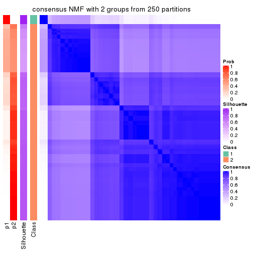</p>

</div>
<div id='tab-MAD-NMF-consensus-heatmap-2'>
<pre><code class="r">consensus_heatmap(res, k = 3)
</code></pre>

<p>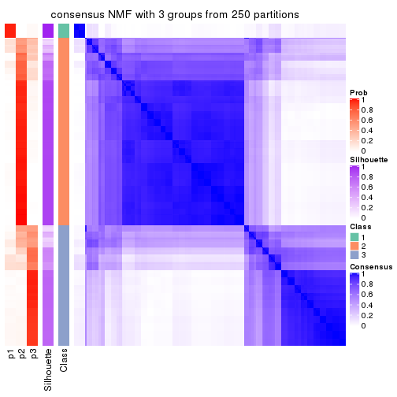</p>

</div>
<div id='tab-MAD-NMF-consensus-heatmap-3'>
<pre><code class="r">consensus_heatmap(res, k = 4)
</code></pre>

<p>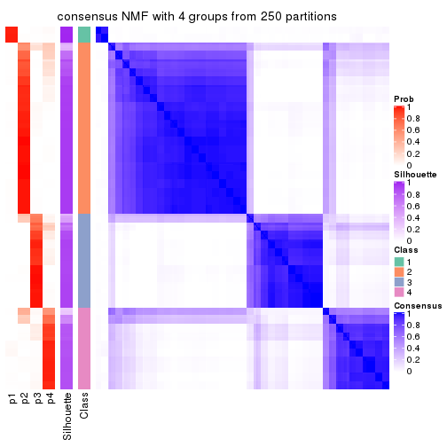</p>

</div>
<div id='tab-MAD-NMF-consensus-heatmap-4'>
<pre><code class="r">consensus_heatmap(res, k = 5)
</code></pre>

<p>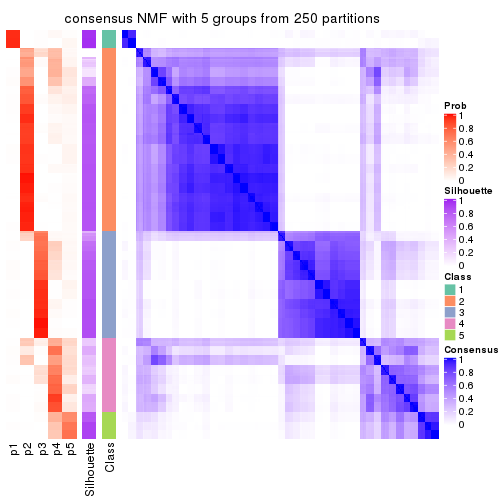</p>

</div>
<div id='tab-MAD-NMF-consensus-heatmap-5'>
<pre><code class="r">consensus_heatmap(res, k = 6)
</code></pre>

<p>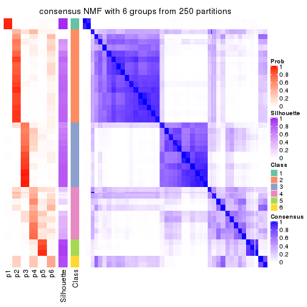</p>

</div>
</div>

Heatmaps for the membership of samples in all partitions to see how consistent they are:


<script>
$( function() {
	$( '#tabs-MAD-NMF-membership-heatmap' ).tabs();
} );
</script>
<div id='tabs-MAD-NMF-membership-heatmap'>
<ul>
<li><a href='#tab-MAD-NMF-membership-heatmap-1'>k = 2</a></li>
<li><a href='#tab-MAD-NMF-membership-heatmap-2'>k = 3</a></li>
<li><a href='#tab-MAD-NMF-membership-heatmap-3'>k = 4</a></li>
<li><a href='#tab-MAD-NMF-membership-heatmap-4'>k = 5</a></li>
<li><a href='#tab-MAD-NMF-membership-heatmap-5'>k = 6</a></li>
</ul>
<div id='tab-MAD-NMF-membership-heatmap-1'>
<pre><code class="r">membership_heatmap(res, k = 2)
</code></pre>

<p>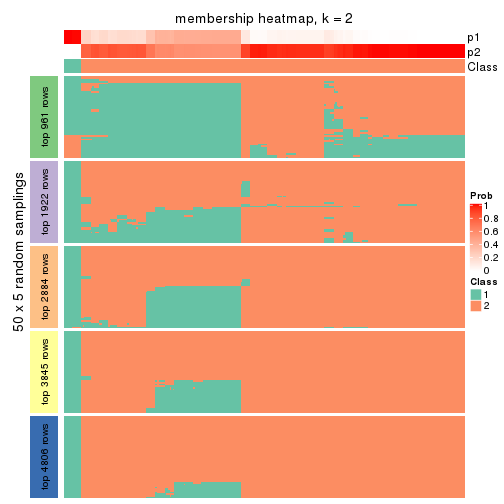</p>

</div>
<div id='tab-MAD-NMF-membership-heatmap-2'>
<pre><code class="r">membership_heatmap(res, k = 3)
</code></pre>

<p>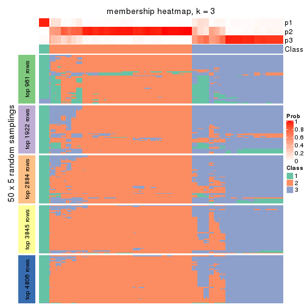</p>

</div>
<div id='tab-MAD-NMF-membership-heatmap-3'>
<pre><code class="r">membership_heatmap(res, k = 4)
</code></pre>

<p>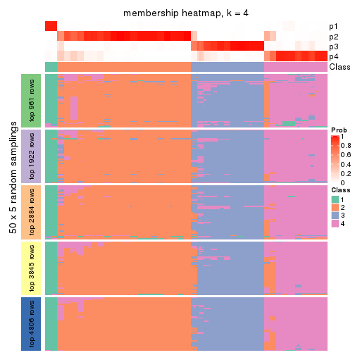</p>

</div>
<div id='tab-MAD-NMF-membership-heatmap-4'>
<pre><code class="r">membership_heatmap(res, k = 5)
</code></pre>

<p>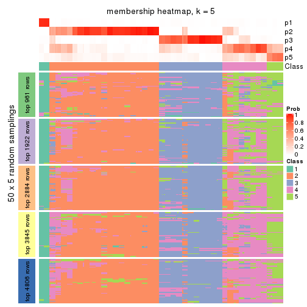</p>

</div>
<div id='tab-MAD-NMF-membership-heatmap-5'>
<pre><code class="r">membership_heatmap(res, k = 6)
</code></pre>

<p>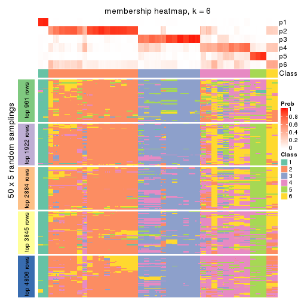</p>

</div>
</div>

As soon as we have had the classes for columns, we can look for signatures
which are significantly different between classes which can be candidate marks
for certain classes. Following are the heatmaps for signatures.


Signature heatmaps where rows are scaled:


<script>
$( function() {
	$( '#tabs-MAD-NMF-get-signatures' ).tabs();
} );
</script>
<div id='tabs-MAD-NMF-get-signatures'>
<ul>
<li><a href='#tab-MAD-NMF-get-signatures-1'>k = 2</a></li>
<li><a href='#tab-MAD-NMF-get-signatures-2'>k = 3</a></li>
<li><a href='#tab-MAD-NMF-get-signatures-3'>k = 4</a></li>
<li><a href='#tab-MAD-NMF-get-signatures-4'>k = 5</a></li>
<li><a href='#tab-MAD-NMF-get-signatures-5'>k = 6</a></li>
</ul>
<div id='tab-MAD-NMF-get-signatures-1'>
<pre><code class="r">get_signatures(res, k = 2)
</code></pre>

<p>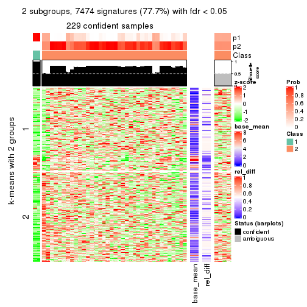</p>

</div>
<div id='tab-MAD-NMF-get-signatures-2'>
<pre><code class="r">get_signatures(res, k = 3)
</code></pre>

<p>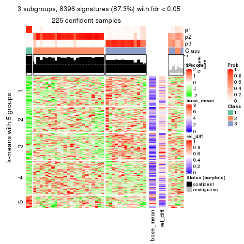</p>

</div>
<div id='tab-MAD-NMF-get-signatures-3'>
<pre><code class="r">get_signatures(res, k = 4)
</code></pre>

<p>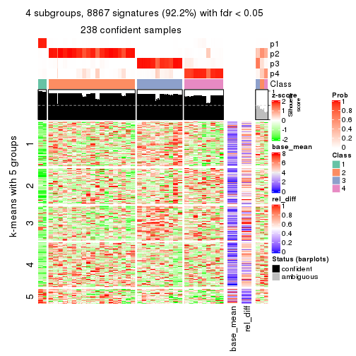</p>

</div>
<div id='tab-MAD-NMF-get-signatures-4'>
<pre><code class="r">get_signatures(res, k = 5)
</code></pre>

<p>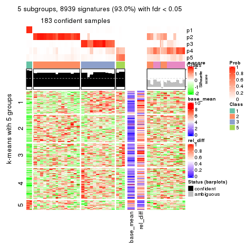</p>

</div>
<div id='tab-MAD-NMF-get-signatures-5'>
<pre><code class="r">get_signatures(res, k = 6)
</code></pre>

<p>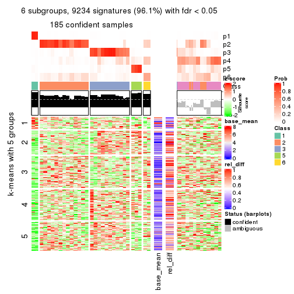</p>

</div>
</div>


Signature heatmaps where rows are not scaled:


<script>
$( function() {
	$( '#tabs-MAD-NMF-get-signatures-no-scale' ).tabs();
} );
</script>
<div id='tabs-MAD-NMF-get-signatures-no-scale'>
<ul>
<li><a href='#tab-MAD-NMF-get-signatures-no-scale-1'>k = 2</a></li>
<li><a href='#tab-MAD-NMF-get-signatures-no-scale-2'>k = 3</a></li>
<li><a href='#tab-MAD-NMF-get-signatures-no-scale-3'>k = 4</a></li>
<li><a href='#tab-MAD-NMF-get-signatures-no-scale-4'>k = 5</a></li>
<li><a href='#tab-MAD-NMF-get-signatures-no-scale-5'>k = 6</a></li>
</ul>
<div id='tab-MAD-NMF-get-signatures-no-scale-1'>
<pre><code class="r">get_signatures(res, k = 2, scale_rows = FALSE)
</code></pre>

<p>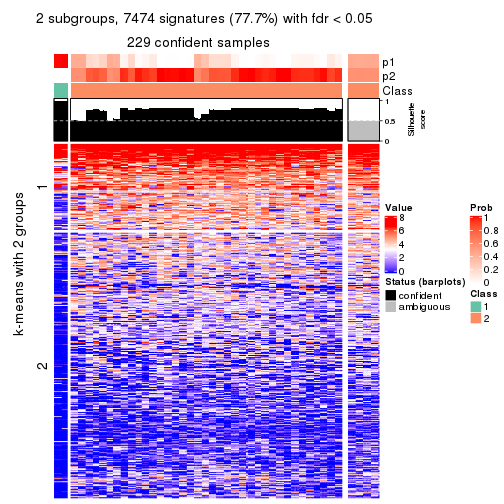</p>

</div>
<div id='tab-MAD-NMF-get-signatures-no-scale-2'>
<pre><code class="r">get_signatures(res, k = 3, scale_rows = FALSE)
</code></pre>

<p>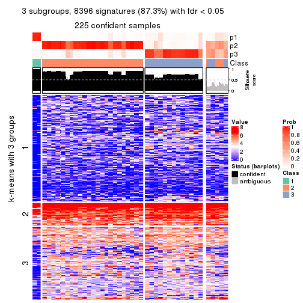</p>

</div>
<div id='tab-MAD-NMF-get-signatures-no-scale-3'>
<pre><code class="r">get_signatures(res, k = 4, scale_rows = FALSE)
</code></pre>

<p>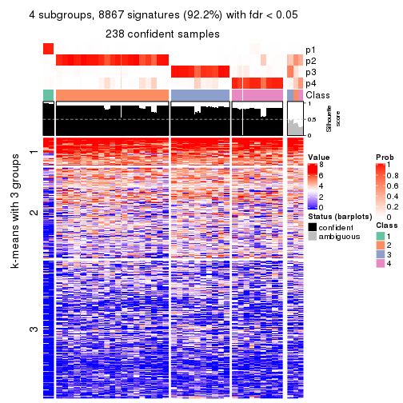</p>

</div>
<div id='tab-MAD-NMF-get-signatures-no-scale-4'>
<pre><code class="r">get_signatures(res, k = 5, scale_rows = FALSE)
</code></pre>

<p>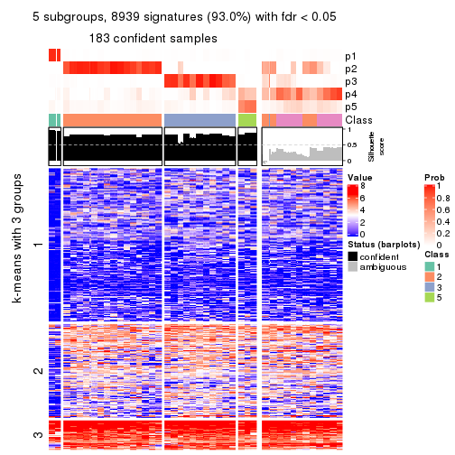</p>

</div>
<div id='tab-MAD-NMF-get-signatures-no-scale-5'>
<pre><code class="r">get_signatures(res, k = 6, scale_rows = FALSE)
</code></pre>

<p>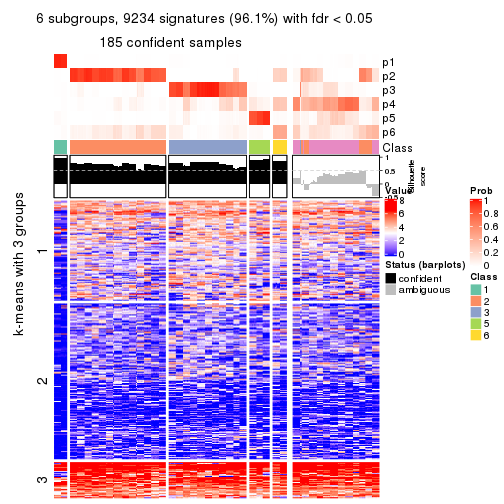</p>

</div>
</div>


Compare the overlap of signatures from different k:

```r
compare_signatures(res)
```

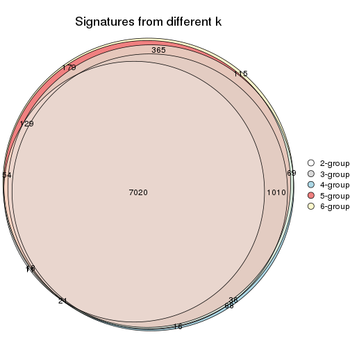

`get_signature()` returns a data frame invisibly. TO get the list of signatures, the function
call should be assigned to a variable explicitly. In following code, if `plot` argument is set
to `FALSE`, no heatmap is plotted while only the differential analysis is performed.

```r
# code only for demonstration
tb = get_signature(res, k = ..., plot = FALSE)
```

An example of the output of `tb` is:

```
#>   which_row         fdr    mean_1    mean_2 scaled_mean_1 scaled_mean_2 km
#> 1        38 0.042760348  8.373488  9.131774    -0.5533452     0.5164555  1
#> 2        40 0.018707592  7.106213  8.469186    -0.6173731     0.5762149  1
#> 3        55 0.019134737 10.221463 11.207825    -0.6159697     0.5749050  1
#> 4        59 0.006059896  5.921854  7.869574    -0.6899429     0.6439467  1
#> 5        60 0.018055526  8.928898 10.211722    -0.6204761     0.5791110  1
#> 6        98 0.009384629 15.714769 14.887706     0.6635654    -0.6193277  2
...
```

The columns in `tb` are:

1. `which_row`: row indices corresponding to the input matrix.
2. `fdr`: FDR for the differential test. 
3. `mean_x`: The mean value in group x.
4. `scaled_mean_x`: The mean value in group x after rows are scaled.
5. `km`: Row groups if k-means clustering is applied to rows.


UMAP plot which shows how samples are separated.


<script>
$( function() {
	$( '#tabs-MAD-NMF-dimension-reduction' ).tabs();
} );
</script>
<div id='tabs-MAD-NMF-dimension-reduction'>
<ul>
<li><a href='#tab-MAD-NMF-dimension-reduction-1'>k = 2</a></li>
<li><a href='#tab-MAD-NMF-dimension-reduction-2'>k = 3</a></li>
<li><a href='#tab-MAD-NMF-dimension-reduction-3'>k = 4</a></li>
<li><a href='#tab-MAD-NMF-dimension-reduction-4'>k = 5</a></li>
<li><a href='#tab-MAD-NMF-dimension-reduction-5'>k = 6</a></li>
</ul>
<div id='tab-MAD-NMF-dimension-reduction-1'>
<pre><code class="r">dimension_reduction(res, k = 2, method = &quot;UMAP&quot;)
</code></pre>

<p>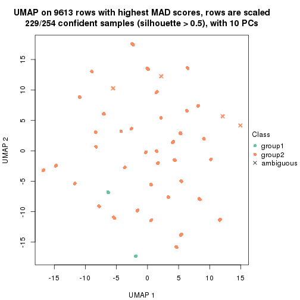</p>

</div>
<div id='tab-MAD-NMF-dimension-reduction-2'>
<pre><code class="r">dimension_reduction(res, k = 3, method = &quot;UMAP&quot;)
</code></pre>

<p>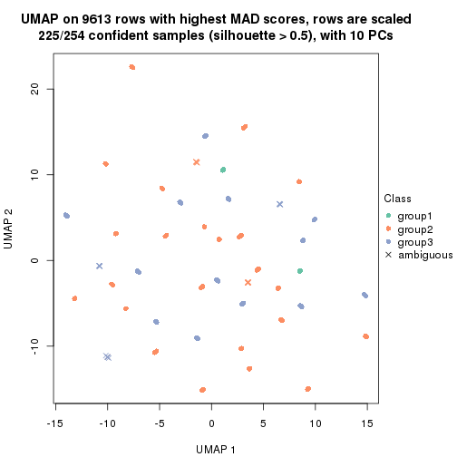</p>

</div>
<div id='tab-MAD-NMF-dimension-reduction-3'>
<pre><code class="r">dimension_reduction(res, k = 4, method = &quot;UMAP&quot;)
</code></pre>

<p>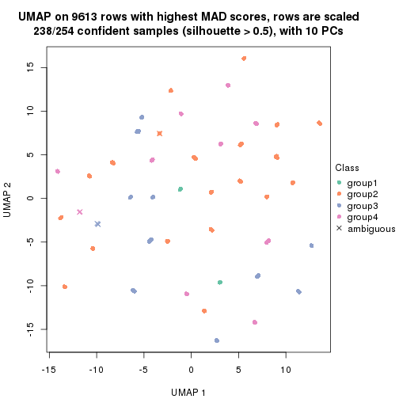</p>

</div>
<div id='tab-MAD-NMF-dimension-reduction-4'>
<pre><code class="r">dimension_reduction(res, k = 5, method = &quot;UMAP&quot;)
</code></pre>

<p>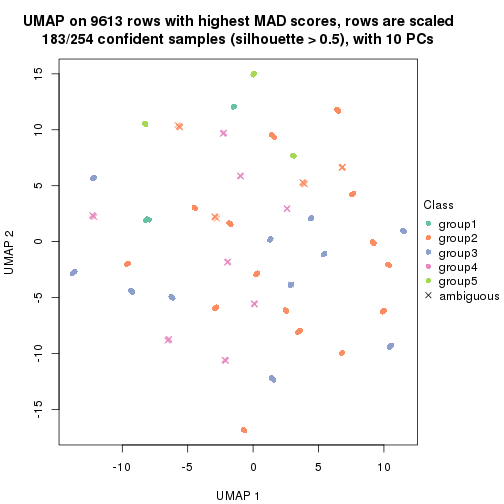</p>

</div>
<div id='tab-MAD-NMF-dimension-reduction-5'>
<pre><code class="r">dimension_reduction(res, k = 6, method = &quot;UMAP&quot;)
</code></pre>

<p>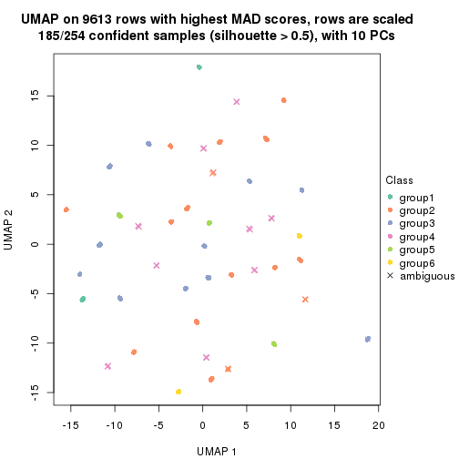</p>

</div>
</div>


Following heatmap shows how subgroups are split when increasing `k`:

```r
collect_classes(res)
```

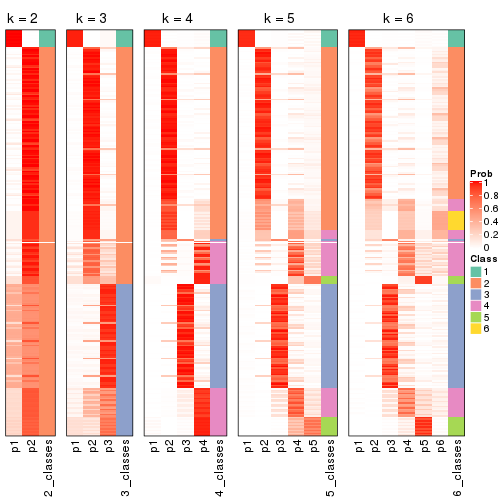


If matrix rows can be associated to genes, consider to use `GO_Enrichment(res,
...)` to perform function enrichment for the signature genes.


 

---------------------------------------------------


### ATC:hclust**


The object with results only for a single top-value method and a single partition method 
can be extracted as:

```r
res = res_list["ATC", "hclust"]
# you can also extract it by
# res = res_list["ATC:hclust"]
```

A summary of `res` and all the functions that can be applied to it:

```r
res
```

```
#> A 'ConsensusPartition' object with k = 2, 3, 4, 5, 6.
#>   On a matrix with 9613 rows and 254 columns.
#>   Top rows (961, 1922, 2884, 3845, 4806) are extracted by 'ATC' method.
#>   Subgroups are detected by 'hclust' method.
#>   Performed in total 1250 partitions by row resampling.
#>   Best k for subgroups seems to be 2.
#> 
#> Following methods can be applied to this 'ConsensusPartition' object:
#>  [1] "cola_report"             "collect_classes"         "collect_plots"          
#>  [4] "collect_stats"           "colnames"                "compare_signatures"     
#>  [7] "consensus_heatmap"       "dimension_reduction"     "functional_enrichment"  
#> [10] "get_anno_col"            "get_anno"                "get_classes"            
#> [13] "get_consensus"           "get_matrix"              "get_membership"         
#> [16] "get_param"               "get_signatures"          "get_stats"              
#> [19] "is_best_k"               "is_stable_k"             "membership_heatmap"     
#> [22] "ncol"                    "nrow"                    "plot_ecdf"              
#> [25] "rownames"                "select_partition_number" "show"                   
#> [28] "suggest_best_k"          "test_to_known_factors"
```

`collect_plots()` function collects all the plots made from `res` for all `k` (number of partitions)
into one single page to provide an easy and fast comparison between different `k`.

```r
collect_plots(res)
```

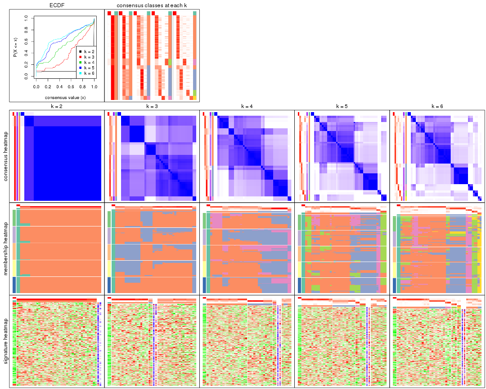

The plots are:

- The first row: a plot of the ECDF (Empirical cumulative distribution
  function) curves of the consensus matrix for each `k` and the heatmap of
  predicted classes for each `k`.
- The second row: heatmaps of the consensus matrix for each `k`.
- The third row: heatmaps of the membership matrix for each `k`.
- The fouth row: heatmaps of the signatures for each `k`.

All the plots in panels can be made by individual functions and they are
plotted later in this section.

`select_partition_number()` produces several plots showing different
statistics for choosing "optimized" `k`. There are following statistics:

- ECDF curves of the consensus matrix for each `k`;
- 1-PAC. [The PAC
  score](https://en.wikipedia.org/wiki/Consensus_clustering#Over-interpretation_potential_of_consensus_clustering)
  measures the proportion of the ambiguous subgrouping.
- Mean silhouette score.
- Concordance. The mean probability of fiting the consensus class ids in all
  partitions.
- Area increased. Denote $A_k$ as the area under the ECDF curve for current
  `k`, the area increased is defined as $A_k - A_{k-1}$.
- Rand index. The percent of pairs of samples that are both in a same cluster
  or both are not in a same cluster in the partition of k and k-1.
- Jaccard index. The ratio of pairs of samples are both in a same cluster in
  the partition of k and k-1 and the pairs of samples are both in a same
  cluster in the partition k or k-1.

The detailed explanations of these statistics can be found in [the cola
vignette](http://bioconductor.org/packages/devel/bioc/vignettes/cola/inst/doc/cola.html#toc_13).

Generally speaking, lower PAC score, higher mean silhouette score or higher
concordance corresponds to better partition. Rand index and Jaccard index
measure how similar the current partition is compared to partition with `k-1`.
If they are too similar, we won't accept `k` is better than `k-1`.

```r
select_partition_number(res)
```


The numeric values for all these statistics can be obtained by `get_stats()`.

```r
get_stats(res)
```

```
#>   k 1-PAC mean_silhouette concordance area_increased  Rand Jaccard
#> 2 2 1.000           0.980       0.989         0.1010 0.917   0.917
#> 3 3 0.305           0.336       0.730         2.8078 0.914   0.906
#> 4 4 0.378           0.654       0.723         0.3899 0.608   0.528
#> 5 5 0.386           0.637       0.766         0.1922 0.879   0.742
#> 6 6 0.441           0.696       0.777         0.0538 0.943   0.856
```

`suggest_best_k()` suggests the best $k$ based on these statistics. The rules are as follows:

- All $k$ with Jaccard index larger than 0.95 are removed because the increase of
  the partition number does not provides enough extra information. If all $k$ are removed,
  the best $k$ is assigned by `NA`.
- For $k$ with 1-PAC larger than 0.9, the maximal $k$ is taken as the "best k". Other $k$ is called "optional k".
- If it does not fit the second rule. The $k$ with the highest vote of highest
  1-PAC, mean silhouette and concordance is taken as the "best k".

```r
suggest_best_k(res)
```

```
#> [1] 2
```


Following shows the table of the partitions (You need to click the **show/hide
code output** link to see it). The membership matrix (columns with name `p*`)
is inferred by
[`clue::cl_consensus()`](https://www.rdocumentation.org/link/cl_consensus?package=clue)
function with the `SE` method. Basically the value in the membership matrix
represents the probability to belong to a certain group. The finall class
label for an item is determined with the group with highest probability it
belongs to.

In `get_classes()` function, the entropy is calculated from the membership
matrix and the silhouette score is calculated from the consensus matrix.


<script>
$( function() {
	$( '#tabs-ATC-hclust-get-classes' ).tabs();
} );
</script>
<div id='tabs-ATC-hclust-get-classes'>
<ul>
<li><a href='#tab-ATC-hclust-get-classes-1'>k = 2</a></li>
<li><a href='#tab-ATC-hclust-get-classes-2'>k = 3</a></li>
<li><a href='#tab-ATC-hclust-get-classes-3'>k = 4</a></li>
<li><a href='#tab-ATC-hclust-get-classes-4'>k = 5</a></li>
<li><a href='#tab-ATC-hclust-get-classes-5'>k = 6</a></li>
</ul>

<div id='tab-ATC-hclust-get-classes-1'>
<p><a id='tab-ATC-hclust-get-classes-1-a' style='color:#0366d6' href='#'>show/hide code output</a></p>
<pre><code class="r">cbind(get_classes(res, k = 2), get_membership(res, k = 2))
</code></pre>

<pre><code>#&gt;           class entropy silhouette    p1    p2
#&gt; DRR024803     1   0.000      1.000 1.000 0.000
#&gt; DRR024804     2   0.000      0.989 0.000 1.000
#&gt; DRR024805     2   0.000      0.989 0.000 1.000
#&gt; DRR024806     2   0.000      0.989 0.000 1.000
#&gt; DRR024807     2   0.000      0.989 0.000 1.000
#&gt; DRR024808     2   0.000      0.989 0.000 1.000
#&gt; DRR024809     2   0.000      0.989 0.000 1.000
#&gt; DRR024810     2   0.443      0.911 0.092 0.908
#&gt; DRR024811     2   0.000      0.989 0.000 1.000
#&gt; DRR024812     2   0.000      0.989 0.000 1.000
#&gt; DRR024813     2   0.000      0.989 0.000 1.000
#&gt; DRR024814     2   0.000      0.989 0.000 1.000
#&gt; DRR024815     2   0.000      0.989 0.000 1.000
#&gt; DRR024816     2   0.443      0.911 0.092 0.908
#&gt; DRR024817     2   0.000      0.989 0.000 1.000
#&gt; DRR024818     2   0.000      0.989 0.000 1.000
#&gt; DRR024819     2   0.000      0.989 0.000 1.000
#&gt; DRR024820     2   0.000      0.989 0.000 1.000
#&gt; DRR024821     2   0.000      0.989 0.000 1.000
#&gt; DRR024822     2   0.000      0.989 0.000 1.000
#&gt; DRR024824     2   0.000      0.989 0.000 1.000
#&gt; DRR024825     2   0.000      0.989 0.000 1.000
#&gt; DRR024826     2   0.000      0.989 0.000 1.000
#&gt; DRR024827     2   0.000      0.989 0.000 1.000
#&gt; DRR024828     2   0.000      0.989 0.000 1.000
#&gt; DRR024829     2   0.000      0.989 0.000 1.000
#&gt; DRR024830     2   0.000      0.989 0.000 1.000
#&gt; DRR024831     2   0.000      0.989 0.000 1.000
#&gt; DRR024832     2   0.000      0.989 0.000 1.000
#&gt; DRR024833     2   0.000      0.989 0.000 1.000
#&gt; DRR024834     2   0.443      0.911 0.092 0.908
#&gt; DRR024835     2   0.000      0.989 0.000 1.000
#&gt; DRR024836     2   0.000      0.989 0.000 1.000
#&gt; DRR024837     2   0.443      0.911 0.092 0.908
#&gt; DRR024838     2   0.000      0.989 0.000 1.000
#&gt; DRR024839     2   0.000      0.989 0.000 1.000
#&gt; DRR024840     2   0.000      0.989 0.000 1.000
#&gt; DRR024841     2   0.416      0.918 0.084 0.916
#&gt; DRR024842     2   0.000      0.989 0.000 1.000
#&gt; DRR024843     1   0.000      1.000 1.000 0.000
#&gt; DRR024844     2   0.000      0.989 0.000 1.000
#&gt; DRR024845     2   0.000      0.989 0.000 1.000
#&gt; DRR024846     2   0.000      0.989 0.000 1.000
#&gt; DRR024847     2   0.000      0.989 0.000 1.000
#&gt; DRR024848     1   0.000      1.000 1.000 0.000
#&gt; DRR024849     2   0.000      0.989 0.000 1.000
#&gt; DRR024850     2   0.000      0.989 0.000 1.000
#&gt; DRR024851     2   0.000      0.989 0.000 1.000
#&gt; DRR024852     2   0.443      0.911 0.092 0.908
#&gt; DRR024853     2   0.000      0.989 0.000 1.000
#&gt; DRR024854     2   0.000      0.989 0.000 1.000
#&gt; DRR024855     2   0.000      0.989 0.000 1.000
#&gt; DRR024856     2   0.000      0.989 0.000 1.000
#&gt; DRR024857     2   0.000      0.989 0.000 1.000
#&gt; DRR024858     2   0.443      0.911 0.092 0.908
#&gt; DRR024859     2   0.000      0.989 0.000 1.000
#&gt; DRR024860     2   0.000      0.989 0.000 1.000
#&gt; DRR024861     2   0.000      0.989 0.000 1.000
#&gt; DRR024862     2   0.000      0.989 0.000 1.000
#&gt; DRR024863     2   0.000      0.989 0.000 1.000
#&gt; DRR024864     2   0.000      0.989 0.000 1.000
#&gt; DRR024865     2   0.000      0.989 0.000 1.000
#&gt; DRR024866     2   0.000      0.989 0.000 1.000
#&gt; DRR024867     2   0.000      0.989 0.000 1.000
#&gt; DRR024868     2   0.000      0.989 0.000 1.000
#&gt; DRR024869     2   0.000      0.989 0.000 1.000
#&gt; DRR024870     2   0.000      0.989 0.000 1.000
#&gt; DRR024871     2   0.000      0.989 0.000 1.000
#&gt; DRR024872     2   0.000      0.989 0.000 1.000
#&gt; DRR024873     2   0.000      0.989 0.000 1.000
#&gt; DRR024874     2   0.000      0.989 0.000 1.000
#&gt; DRR024875     2   0.000      0.989 0.000 1.000
#&gt; DRR024876     2   0.443      0.911 0.092 0.908
#&gt; DRR024877     2   0.000      0.989 0.000 1.000
#&gt; DRR024878     2   0.000      0.989 0.000 1.000
#&gt; DRR024879     2   0.443      0.911 0.092 0.908
#&gt; DRR024880     2   0.000      0.989 0.000 1.000
#&gt; DRR024881     2   0.000      0.989 0.000 1.000
#&gt; DRR024882     2   0.000      0.989 0.000 1.000
#&gt; DRR024883     2   0.416      0.918 0.084 0.916
#&gt; DRR024884     2   0.000      0.989 0.000 1.000
#&gt; DRR024885     2   0.000      0.989 0.000 1.000
#&gt; DRR024886     1   0.000      1.000 1.000 0.000
#&gt; DRR024887     2   0.000      0.989 0.000 1.000
#&gt; DRR024888     2   0.000      0.989 0.000 1.000
#&gt; DRR024889     2   0.000      0.989 0.000 1.000
#&gt; DRR024890     2   0.000      0.989 0.000 1.000
#&gt; DRR024891     1   0.000      1.000 1.000 0.000
#&gt; DRR024892     2   0.000      0.989 0.000 1.000
#&gt; DRR024893     2   0.000      0.989 0.000 1.000
#&gt; DRR024894     2   0.000      0.989 0.000 1.000
#&gt; DRR024895     2   0.443      0.911 0.092 0.908
#&gt; DRR024896     2   0.000      0.989 0.000 1.000
#&gt; DRR024897     2   0.000      0.989 0.000 1.000
#&gt; DRR024898     2   0.000      0.989 0.000 1.000
#&gt; DRR024899     2   0.000      0.989 0.000 1.000
#&gt; DRR024900     2   0.000      0.989 0.000 1.000
#&gt; DRR024901     2   0.443      0.911 0.092 0.908
#&gt; DRR024902     2   0.000      0.989 0.000 1.000
#&gt; DRR024903     2   0.000      0.989 0.000 1.000
#&gt; DRR024904     2   0.000      0.989 0.000 1.000
#&gt; DRR024905     2   0.000      0.989 0.000 1.000
#&gt; DRR024906     2   0.000      0.989 0.000 1.000
#&gt; DRR024907     2   0.000      0.989 0.000 1.000
#&gt; DRR024908     2   0.000      0.989 0.000 1.000
#&gt; DRR024909     2   0.000      0.989 0.000 1.000
#&gt; DRR024910     2   0.000      0.989 0.000 1.000
#&gt; DRR024911     2   0.000      0.989 0.000 1.000
#&gt; DRR024912     2   0.000      0.989 0.000 1.000
#&gt; DRR024913     2   0.000      0.989 0.000 1.000
#&gt; DRR024914     2   0.000      0.989 0.000 1.000
#&gt; DRR024915     2   0.000      0.989 0.000 1.000
#&gt; DRR024916     2   0.000      0.989 0.000 1.000
#&gt; DRR024917     2   0.000      0.989 0.000 1.000
#&gt; DRR024918     2   0.000      0.989 0.000 1.000
#&gt; DRR024919     2   0.443      0.911 0.092 0.908
#&gt; DRR024920     2   0.000      0.989 0.000 1.000
#&gt; DRR024921     2   0.000      0.989 0.000 1.000
#&gt; DRR024922     2   0.443      0.911 0.092 0.908
#&gt; DRR024923     2   0.000      0.989 0.000 1.000
#&gt; DRR024924     2   0.000      0.989 0.000 1.000
#&gt; DRR024925     2   0.000      0.989 0.000 1.000
#&gt; DRR024926     2   0.416      0.918 0.084 0.916
#&gt; DRR024927     2   0.000      0.989 0.000 1.000
#&gt; DRR024928     2   0.000      0.989 0.000 1.000
#&gt; DRR024929     1   0.000      1.000 1.000 0.000
#&gt; DRR024930     2   0.000      0.989 0.000 1.000
#&gt; DRR024931     2   0.000      0.989 0.000 1.000
#&gt; DRR024932     2   0.000      0.989 0.000 1.000
#&gt; DRR024933     2   0.000      0.989 0.000 1.000
#&gt; DRR024934     1   0.000      1.000 1.000 0.000
#&gt; DRR024935     2   0.000      0.989 0.000 1.000
#&gt; DRR024936     2   0.000      0.989 0.000 1.000
#&gt; DRR024937     2   0.000      0.989 0.000 1.000
#&gt; DRR024938     2   0.443      0.911 0.092 0.908
#&gt; DRR024939     2   0.000      0.989 0.000 1.000
#&gt; DRR024940     2   0.000      0.989 0.000 1.000
#&gt; DRR024941     2   0.000      0.989 0.000 1.000
#&gt; DRR024942     2   0.000      0.989 0.000 1.000
#&gt; DRR024943     2   0.000      0.989 0.000 1.000
#&gt; DRR024944     2   0.443      0.911 0.092 0.908
#&gt; DRR024945     2   0.000      0.989 0.000 1.000
#&gt; DRR024946     2   0.000      0.989 0.000 1.000
#&gt; DRR024947     2   0.000      0.989 0.000 1.000
#&gt; DRR024948     2   0.000      0.989 0.000 1.000
#&gt; DRR024949     2   0.000      0.989 0.000 1.000
#&gt; DRR024950     2   0.000      0.989 0.000 1.000
#&gt; DRR024951     2   0.000      0.989 0.000 1.000
#&gt; DRR024952     2   0.000      0.989 0.000 1.000
#&gt; DRR024953     2   0.000      0.989 0.000 1.000
#&gt; DRR024954     2   0.000      0.989 0.000 1.000
#&gt; DRR024955     2   0.000      0.989 0.000 1.000
#&gt; DRR024956     2   0.000      0.989 0.000 1.000
#&gt; DRR024957     2   0.000      0.989 0.000 1.000
#&gt; DRR024958     2   0.000      0.989 0.000 1.000
#&gt; DRR024959     2   0.000      0.989 0.000 1.000
#&gt; DRR024960     2   0.000      0.989 0.000 1.000
#&gt; DRR024961     2   0.000      0.989 0.000 1.000
#&gt; DRR024962     2   0.443      0.911 0.092 0.908
#&gt; DRR024963     2   0.000      0.989 0.000 1.000
#&gt; DRR024964     2   0.000      0.989 0.000 1.000
#&gt; DRR024965     2   0.443      0.911 0.092 0.908
#&gt; DRR024966     2   0.000      0.989 0.000 1.000
#&gt; DRR024967     2   0.000      0.989 0.000 1.000
#&gt; DRR024968     2   0.000      0.989 0.000 1.000
#&gt; DRR024969     2   0.416      0.918 0.084 0.916
#&gt; DRR024970     2   0.000      0.989 0.000 1.000
#&gt; DRR024971     2   0.000      0.989 0.000 1.000
#&gt; DRR024972     1   0.000      1.000 1.000 0.000
#&gt; DRR024973     2   0.000      0.989 0.000 1.000
#&gt; DRR024974     2   0.000      0.989 0.000 1.000
#&gt; DRR024975     2   0.000      0.989 0.000 1.000
#&gt; DRR024976     2   0.000      0.989 0.000 1.000
#&gt; DRR024977     1   0.000      1.000 1.000 0.000
#&gt; DRR024978     2   0.000      0.989 0.000 1.000
#&gt; DRR024979     2   0.000      0.989 0.000 1.000
#&gt; DRR024980     2   0.000      0.989 0.000 1.000
#&gt; DRR024981     2   0.443      0.911 0.092 0.908
#&gt; DRR024982     2   0.000      0.989 0.000 1.000
#&gt; DRR024983     2   0.000      0.989 0.000 1.000
#&gt; DRR024984     2   0.000      0.989 0.000 1.000
#&gt; DRR024985     2   0.000      0.989 0.000 1.000
#&gt; DRR024986     2   0.000      0.989 0.000 1.000
#&gt; DRR024987     2   0.443      0.911 0.092 0.908
#&gt; DRR024988     2   0.000      0.989 0.000 1.000
#&gt; DRR024989     2   0.000      0.989 0.000 1.000
#&gt; DRR024990     2   0.000      0.989 0.000 1.000
#&gt; DRR024991     2   0.000      0.989 0.000 1.000
#&gt; DRR024992     2   0.000      0.989 0.000 1.000
#&gt; DRR024993     2   0.000      0.989 0.000 1.000
#&gt; DRR024994     2   0.000      0.989 0.000 1.000
#&gt; DRR024995     2   0.000      0.989 0.000 1.000
#&gt; DRR024996     2   0.000      0.989 0.000 1.000
#&gt; DRR024997     2   0.000      0.989 0.000 1.000
#&gt; DRR024998     2   0.000      0.989 0.000 1.000
#&gt; DRR024999     2   0.000      0.989 0.000 1.000
#&gt; DRR025000     2   0.000      0.989 0.000 1.000
#&gt; DRR025001     2   0.000      0.989 0.000 1.000
#&gt; DRR025002     2   0.000      0.989 0.000 1.000
#&gt; DRR025003     2   0.000      0.989 0.000 1.000
#&gt; DRR025004     2   0.000      0.989 0.000 1.000
#&gt; DRR025005     2   0.443      0.911 0.092 0.908
#&gt; DRR025006     2   0.000      0.989 0.000 1.000
#&gt; DRR025007     2   0.000      0.989 0.000 1.000
#&gt; DRR025008     2   0.443      0.911 0.092 0.908
#&gt; DRR025009     2   0.000      0.989 0.000 1.000
#&gt; DRR025010     2   0.000      0.989 0.000 1.000
#&gt; DRR025011     2   0.000      0.989 0.000 1.000
#&gt; DRR025012     2   0.416      0.918 0.084 0.916
#&gt; DRR025013     2   0.000      0.989 0.000 1.000
#&gt; DRR025014     2   0.000      0.989 0.000 1.000
#&gt; DRR025015     1   0.000      1.000 1.000 0.000
#&gt; DRR025016     2   0.000      0.989 0.000 1.000
#&gt; DRR025017     2   0.000      0.989 0.000 1.000
#&gt; DRR025018     2   0.000      0.989 0.000 1.000
#&gt; DRR025019     2   0.000      0.989 0.000 1.000
#&gt; DRR025020     1   0.000      1.000 1.000 0.000
#&gt; DRR025021     2   0.000      0.989 0.000 1.000
#&gt; DRR025022     2   0.000      0.989 0.000 1.000
#&gt; DRR025023     2   0.000      0.989 0.000 1.000
#&gt; DRR025024     2   0.443      0.911 0.092 0.908
#&gt; DRR025025     2   0.000      0.989 0.000 1.000
#&gt; DRR025026     2   0.000      0.989 0.000 1.000
#&gt; DRR025027     2   0.000      0.989 0.000 1.000
#&gt; DRR025028     2   0.000      0.989 0.000 1.000
#&gt; DRR025029     2   0.000      0.989 0.000 1.000
#&gt; DRR025030     2   0.443      0.911 0.092 0.908
#&gt; DRR025031     2   0.000      0.989 0.000 1.000
#&gt; DRR025032     2   0.000      0.989 0.000 1.000
#&gt; DRR025033     2   0.000      0.989 0.000 1.000
#&gt; DRR025034     2   0.000      0.989 0.000 1.000
#&gt; DRR025035     2   0.000      0.989 0.000 1.000
#&gt; DRR025036     2   0.000      0.989 0.000 1.000
#&gt; DRR025037     2   0.000      0.989 0.000 1.000
#&gt; DRR025038     2   0.000      0.989 0.000 1.000
#&gt; DRR025039     2   0.000      0.989 0.000 1.000
#&gt; DRR025040     2   0.000      0.989 0.000 1.000
#&gt; DRR025041     2   0.000      0.989 0.000 1.000
#&gt; DRR025042     2   0.000      0.989 0.000 1.000
#&gt; DRR025043     2   0.000      0.989 0.000 1.000
#&gt; DRR025044     2   0.000      0.989 0.000 1.000
#&gt; DRR025045     2   0.000      0.989 0.000 1.000
#&gt; DRR025046     2   0.000      0.989 0.000 1.000
#&gt; DRR025047     2   0.000      0.989 0.000 1.000
#&gt; DRR025048     2   0.443      0.911 0.092 0.908
#&gt; DRR025049     2   0.000      0.989 0.000 1.000
#&gt; DRR025050     2   0.000      0.989 0.000 1.000
#&gt; DRR025051     2   0.443      0.911 0.092 0.908
#&gt; DRR025052     2   0.000      0.989 0.000 1.000
#&gt; DRR025053     2   0.000      0.989 0.000 1.000
#&gt; DRR025054     2   0.000      0.989 0.000 1.000
#&gt; DRR025055     2   0.416      0.918 0.084 0.916
#&gt; DRR025056     2   0.000      0.989 0.000 1.000
#&gt; DRR025057     2   0.000      0.989 0.000 1.000
</code></pre>

<script>
$('#tab-ATC-hclust-get-classes-1-a').parent().next().next().hide();
$('#tab-ATC-hclust-get-classes-1-a').click(function(){
  $('#tab-ATC-hclust-get-classes-1-a').parent().next().next().toggle();
  return(false);
});
</script>
</div>

<div id='tab-ATC-hclust-get-classes-2'>
<p><a id='tab-ATC-hclust-get-classes-2-a' style='color:#0366d6' href='#'>show/hide code output</a></p>
<pre><code class="r">cbind(get_classes(res, k = 3), get_membership(res, k = 3))
</code></pre>

<pre><code>#&gt;           class entropy silhouette p1    p2    p3
#&gt; DRR024803     1  0.0000      1.000  1 0.000 0.000
#&gt; DRR024804     2  0.0747      0.607  0 0.984 0.016
#&gt; DRR024805     2  0.2356      0.596  0 0.928 0.072
#&gt; DRR024806     2  0.3267      0.574  0 0.884 0.116
#&gt; DRR024807     3  0.6095      1.000  0 0.392 0.608
#&gt; DRR024808     2  0.6286     -0.550  0 0.536 0.464
#&gt; DRR024809     2  0.5216      0.473  0 0.740 0.260
#&gt; DRR024810     2  0.6095      0.378  0 0.608 0.392
#&gt; DRR024811     2  0.6286     -0.550  0 0.536 0.464
#&gt; DRR024812     2  0.1860      0.603  0 0.948 0.052
#&gt; DRR024813     2  0.0892      0.604  0 0.980 0.020
#&gt; DRR024814     2  0.0892      0.606  0 0.980 0.020
#&gt; DRR024815     2  0.1643      0.597  0 0.956 0.044
#&gt; DRR024816     2  0.6095      0.378  0 0.608 0.392
#&gt; DRR024817     2  0.3941      0.469  0 0.844 0.156
#&gt; DRR024818     2  0.6286     -0.550  0 0.536 0.464
#&gt; DRR024819     2  0.2625      0.566  0 0.916 0.084
#&gt; DRR024820     2  0.5529      0.153  0 0.704 0.296
#&gt; DRR024821     2  0.6286     -0.550  0 0.536 0.464
#&gt; DRR024822     2  0.2625      0.591  0 0.916 0.084
#&gt; DRR024824     2  0.3116      0.579  0 0.892 0.108
#&gt; DRR024825     2  0.6286     -0.550  0 0.536 0.464
#&gt; DRR024826     2  0.0892      0.604  0 0.980 0.020
#&gt; DRR024827     2  0.5497      0.152  0 0.708 0.292
#&gt; DRR024828     3  0.6095      1.000  0 0.392 0.608
#&gt; DRR024829     2  0.1753      0.595  0 0.952 0.048
#&gt; DRR024830     2  0.0592      0.606  0 0.988 0.012
#&gt; DRR024831     2  0.6286     -0.550  0 0.536 0.464
#&gt; DRR024832     2  0.6286     -0.550  0 0.536 0.464
#&gt; DRR024833     2  0.0892      0.604  0 0.980 0.020
#&gt; DRR024834     2  0.6095      0.378  0 0.608 0.392
#&gt; DRR024835     2  0.5497      0.166  0 0.708 0.292
#&gt; DRR024836     2  0.6286     -0.550  0 0.536 0.464
#&gt; DRR024837     2  0.6095      0.378  0 0.608 0.392
#&gt; DRR024838     2  0.1753      0.595  0 0.952 0.048
#&gt; DRR024839     2  0.0892      0.606  0 0.980 0.020
#&gt; DRR024840     2  0.2537      0.593  0 0.920 0.080
#&gt; DRR024841     2  0.6062      0.384  0 0.616 0.384
#&gt; DRR024842     2  0.0892      0.606  0 0.980 0.020
#&gt; DRR024843     1  0.0000      1.000  1 0.000 0.000
#&gt; DRR024844     2  0.0747      0.607  0 0.984 0.016
#&gt; DRR024845     2  0.2356      0.596  0 0.928 0.072
#&gt; DRR024846     2  0.3267      0.574  0 0.884 0.116
#&gt; DRR024847     3  0.6095      1.000  0 0.392 0.608
#&gt; DRR024848     1  0.0000      1.000  1 0.000 0.000
#&gt; DRR024849     2  0.6286     -0.550  0 0.536 0.464
#&gt; DRR024850     2  0.0747      0.605  0 0.984 0.016
#&gt; DRR024851     2  0.5216      0.473  0 0.740 0.260
#&gt; DRR024852     2  0.6095      0.378  0 0.608 0.392
#&gt; DRR024853     2  0.6286     -0.550  0 0.536 0.464
#&gt; DRR024854     2  0.1860      0.603  0 0.948 0.052
#&gt; DRR024855     2  0.0892      0.604  0 0.980 0.020
#&gt; DRR024856     2  0.0892      0.606  0 0.980 0.020
#&gt; DRR024857     2  0.1643      0.597  0 0.956 0.044
#&gt; DRR024858     2  0.6095      0.378  0 0.608 0.392
#&gt; DRR024859     2  0.3941      0.469  0 0.844 0.156
#&gt; DRR024860     2  0.6286     -0.550  0 0.536 0.464
#&gt; DRR024861     2  0.2625      0.566  0 0.916 0.084
#&gt; DRR024862     2  0.5529      0.153  0 0.704 0.296
#&gt; DRR024863     2  0.6286     -0.550  0 0.536 0.464
#&gt; DRR024864     2  0.2625      0.591  0 0.916 0.084
#&gt; DRR024865     2  0.2066      0.602  0 0.940 0.060
#&gt; DRR024866     2  0.3116      0.579  0 0.892 0.108
#&gt; DRR024867     2  0.6286     -0.550  0 0.536 0.464
#&gt; DRR024868     2  0.0892      0.604  0 0.980 0.020
#&gt; DRR024869     2  0.5497      0.152  0 0.708 0.292
#&gt; DRR024870     3  0.6095      1.000  0 0.392 0.608
#&gt; DRR024871     2  0.1753      0.595  0 0.952 0.048
#&gt; DRR024872     2  0.0592      0.606  0 0.988 0.012
#&gt; DRR024873     2  0.6286     -0.550  0 0.536 0.464
#&gt; DRR024874     2  0.6286     -0.550  0 0.536 0.464
#&gt; DRR024875     2  0.0892      0.604  0 0.980 0.020
#&gt; DRR024876     2  0.6095      0.378  0 0.608 0.392
#&gt; DRR024877     2  0.5497      0.166  0 0.708 0.292
#&gt; DRR024878     2  0.6286     -0.550  0 0.536 0.464
#&gt; DRR024879     2  0.6095      0.378  0 0.608 0.392
#&gt; DRR024880     2  0.1753      0.595  0 0.952 0.048
#&gt; DRR024881     2  0.0892      0.606  0 0.980 0.020
#&gt; DRR024882     2  0.2537      0.593  0 0.920 0.080
#&gt; DRR024883     2  0.6062      0.384  0 0.616 0.384
#&gt; DRR024884     2  0.5529      0.153  0 0.704 0.296
#&gt; DRR024885     2  0.5497      0.152  0 0.708 0.292
#&gt; DRR024886     1  0.0000      1.000  1 0.000 0.000
#&gt; DRR024887     2  0.0747      0.607  0 0.984 0.016
#&gt; DRR024888     2  0.2356      0.596  0 0.928 0.072
#&gt; DRR024889     2  0.3267      0.574  0 0.884 0.116
#&gt; DRR024890     3  0.6095      1.000  0 0.392 0.608
#&gt; DRR024891     1  0.0000      1.000  1 0.000 0.000
#&gt; DRR024892     2  0.6286     -0.550  0 0.536 0.464
#&gt; DRR024893     2  0.0747      0.605  0 0.984 0.016
#&gt; DRR024894     2  0.5216      0.473  0 0.740 0.260
#&gt; DRR024895     2  0.6095      0.378  0 0.608 0.392
#&gt; DRR024896     2  0.6286     -0.550  0 0.536 0.464
#&gt; DRR024897     2  0.1860      0.603  0 0.948 0.052
#&gt; DRR024898     2  0.0892      0.604  0 0.980 0.020
#&gt; DRR024899     2  0.0892      0.606  0 0.980 0.020
#&gt; DRR024900     2  0.1643      0.597  0 0.956 0.044
#&gt; DRR024901     2  0.6095      0.378  0 0.608 0.392
#&gt; DRR024902     2  0.3941      0.469  0 0.844 0.156
#&gt; DRR024903     2  0.6286     -0.550  0 0.536 0.464
#&gt; DRR024904     2  0.2625      0.566  0 0.916 0.084
#&gt; DRR024905     2  0.5529      0.153  0 0.704 0.296
#&gt; DRR024906     2  0.6286     -0.550  0 0.536 0.464
#&gt; DRR024907     2  0.2625      0.591  0 0.916 0.084
#&gt; DRR024908     2  0.2066      0.602  0 0.940 0.060
#&gt; DRR024909     2  0.3116      0.579  0 0.892 0.108
#&gt; DRR024910     2  0.6286     -0.550  0 0.536 0.464
#&gt; DRR024911     2  0.0892      0.604  0 0.980 0.020
#&gt; DRR024912     2  0.5497      0.152  0 0.708 0.292
#&gt; DRR024913     3  0.6095      1.000  0 0.392 0.608
#&gt; DRR024914     2  0.1753      0.595  0 0.952 0.048
#&gt; DRR024915     2  0.0592      0.606  0 0.988 0.012
#&gt; DRR024916     2  0.6286     -0.550  0 0.536 0.464
#&gt; DRR024917     2  0.6286     -0.550  0 0.536 0.464
#&gt; DRR024918     2  0.0892      0.604  0 0.980 0.020
#&gt; DRR024919     2  0.6095      0.378  0 0.608 0.392
#&gt; DRR024920     2  0.5497      0.166  0 0.708 0.292
#&gt; DRR024921     2  0.6286     -0.550  0 0.536 0.464
#&gt; DRR024922     2  0.6095      0.378  0 0.608 0.392
#&gt; DRR024923     2  0.1753      0.595  0 0.952 0.048
#&gt; DRR024924     2  0.0892      0.606  0 0.980 0.020
#&gt; DRR024925     2  0.2537      0.593  0 0.920 0.080
#&gt; DRR024926     2  0.6062      0.384  0 0.616 0.384
#&gt; DRR024927     2  0.5529      0.153  0 0.704 0.296
#&gt; DRR024928     2  0.5497      0.152  0 0.708 0.292
#&gt; DRR024929     1  0.0000      1.000  1 0.000 0.000
#&gt; DRR024930     2  0.0747      0.607  0 0.984 0.016
#&gt; DRR024931     2  0.2356      0.596  0 0.928 0.072
#&gt; DRR024932     2  0.3267      0.574  0 0.884 0.116
#&gt; DRR024933     3  0.6095      1.000  0 0.392 0.608
#&gt; DRR024934     1  0.0000      1.000  1 0.000 0.000
#&gt; DRR024935     2  0.6286     -0.550  0 0.536 0.464
#&gt; DRR024936     2  0.0747      0.605  0 0.984 0.016
#&gt; DRR024937     2  0.5216      0.473  0 0.740 0.260
#&gt; DRR024938     2  0.6095      0.378  0 0.608 0.392
#&gt; DRR024939     2  0.6286     -0.550  0 0.536 0.464
#&gt; DRR024940     2  0.1860      0.603  0 0.948 0.052
#&gt; DRR024941     2  0.0892      0.604  0 0.980 0.020
#&gt; DRR024942     2  0.0892      0.606  0 0.980 0.020
#&gt; DRR024943     2  0.1643      0.597  0 0.956 0.044
#&gt; DRR024944     2  0.6095      0.378  0 0.608 0.392
#&gt; DRR024945     2  0.3941      0.469  0 0.844 0.156
#&gt; DRR024946     2  0.6286     -0.550  0 0.536 0.464
#&gt; DRR024947     2  0.2625      0.566  0 0.916 0.084
#&gt; DRR024948     2  0.5529      0.153  0 0.704 0.296
#&gt; DRR024949     2  0.6286     -0.550  0 0.536 0.464
#&gt; DRR024950     2  0.2625      0.591  0 0.916 0.084
#&gt; DRR024951     2  0.2066      0.602  0 0.940 0.060
#&gt; DRR024952     2  0.3116      0.579  0 0.892 0.108
#&gt; DRR024953     2  0.6286     -0.550  0 0.536 0.464
#&gt; DRR024954     2  0.0892      0.604  0 0.980 0.020
#&gt; DRR024955     2  0.5497      0.152  0 0.708 0.292
#&gt; DRR024956     3  0.6095      1.000  0 0.392 0.608
#&gt; DRR024957     2  0.1753      0.595  0 0.952 0.048
#&gt; DRR024958     2  0.0592      0.606  0 0.988 0.012
#&gt; DRR024959     2  0.6286     -0.550  0 0.536 0.464
#&gt; DRR024960     2  0.6286     -0.550  0 0.536 0.464
#&gt; DRR024961     2  0.0892      0.604  0 0.980 0.020
#&gt; DRR024962     2  0.6095      0.378  0 0.608 0.392
#&gt; DRR024963     2  0.5497      0.166  0 0.708 0.292
#&gt; DRR024964     2  0.6286     -0.550  0 0.536 0.464
#&gt; DRR024965     2  0.6095      0.378  0 0.608 0.392
#&gt; DRR024966     2  0.1753      0.595  0 0.952 0.048
#&gt; DRR024967     2  0.0892      0.606  0 0.980 0.020
#&gt; DRR024968     2  0.2537      0.593  0 0.920 0.080
#&gt; DRR024969     2  0.6062      0.384  0 0.616 0.384
#&gt; DRR024970     2  0.5529      0.153  0 0.704 0.296
#&gt; DRR024971     2  0.5497      0.152  0 0.708 0.292
#&gt; DRR024972     1  0.0000      1.000  1 0.000 0.000
#&gt; DRR024973     2  0.0747      0.607  0 0.984 0.016
#&gt; DRR024974     2  0.2356      0.596  0 0.928 0.072
#&gt; DRR024975     2  0.3267      0.574  0 0.884 0.116
#&gt; DRR024976     3  0.6095      1.000  0 0.392 0.608
#&gt; DRR024977     1  0.0000      1.000  1 0.000 0.000
#&gt; DRR024978     2  0.6286     -0.550  0 0.536 0.464
#&gt; DRR024979     2  0.0747      0.605  0 0.984 0.016
#&gt; DRR024980     2  0.5216      0.473  0 0.740 0.260
#&gt; DRR024981     2  0.6095      0.378  0 0.608 0.392
#&gt; DRR024982     2  0.6286     -0.550  0 0.536 0.464
#&gt; DRR024983     2  0.1860      0.603  0 0.948 0.052
#&gt; DRR024984     2  0.0892      0.604  0 0.980 0.020
#&gt; DRR024985     2  0.0892      0.606  0 0.980 0.020
#&gt; DRR024986     2  0.1643      0.597  0 0.956 0.044
#&gt; DRR024987     2  0.6095      0.378  0 0.608 0.392
#&gt; DRR024988     2  0.3941      0.469  0 0.844 0.156
#&gt; DRR024989     2  0.6286     -0.550  0 0.536 0.464
#&gt; DRR024990     2  0.2625      0.566  0 0.916 0.084
#&gt; DRR024991     2  0.5529      0.153  0 0.704 0.296
#&gt; DRR024992     2  0.6286     -0.550  0 0.536 0.464
#&gt; DRR024993     2  0.2625      0.591  0 0.916 0.084
#&gt; DRR024994     2  0.2066      0.602  0 0.940 0.060
#&gt; DRR024995     2  0.3116      0.579  0 0.892 0.108
#&gt; DRR024996     2  0.6286     -0.550  0 0.536 0.464
#&gt; DRR024997     2  0.0892      0.604  0 0.980 0.020
#&gt; DRR024998     2  0.5497      0.152  0 0.708 0.292
#&gt; DRR024999     3  0.6095      1.000  0 0.392 0.608
#&gt; DRR025000     2  0.1753      0.595  0 0.952 0.048
#&gt; DRR025001     2  0.0592      0.606  0 0.988 0.012
#&gt; DRR025002     2  0.6286     -0.550  0 0.536 0.464
#&gt; DRR025003     2  0.6286     -0.550  0 0.536 0.464
#&gt; DRR025004     2  0.0892      0.604  0 0.980 0.020
#&gt; DRR025005     2  0.6095      0.378  0 0.608 0.392
#&gt; DRR025006     2  0.5497      0.166  0 0.708 0.292
#&gt; DRR025007     2  0.6286     -0.550  0 0.536 0.464
#&gt; DRR025008     2  0.6095      0.378  0 0.608 0.392
#&gt; DRR025009     2  0.1753      0.595  0 0.952 0.048
#&gt; DRR025010     2  0.0892      0.606  0 0.980 0.020
#&gt; DRR025011     2  0.2537      0.593  0 0.920 0.080
#&gt; DRR025012     2  0.6062      0.384  0 0.616 0.384
#&gt; DRR025013     2  0.5529      0.153  0 0.704 0.296
#&gt; DRR025014     2  0.5497      0.152  0 0.708 0.292
#&gt; DRR025015     1  0.0000      1.000  1 0.000 0.000
#&gt; DRR025016     2  0.0747      0.607  0 0.984 0.016
#&gt; DRR025017     2  0.2356      0.596  0 0.928 0.072
#&gt; DRR025018     2  0.3267      0.574  0 0.884 0.116
#&gt; DRR025019     3  0.6095      1.000  0 0.392 0.608
#&gt; DRR025020     1  0.0000      1.000  1 0.000 0.000
#&gt; DRR025021     2  0.6286     -0.550  0 0.536 0.464
#&gt; DRR025022     2  0.0747      0.605  0 0.984 0.016
#&gt; DRR025023     2  0.5216      0.473  0 0.740 0.260
#&gt; DRR025024     2  0.6095      0.378  0 0.608 0.392
#&gt; DRR025025     2  0.6286     -0.550  0 0.536 0.464
#&gt; DRR025026     2  0.1860      0.603  0 0.948 0.052
#&gt; DRR025027     2  0.0892      0.604  0 0.980 0.020
#&gt; DRR025028     2  0.0892      0.606  0 0.980 0.020
#&gt; DRR025029     2  0.1643      0.597  0 0.956 0.044
#&gt; DRR025030     2  0.6095      0.378  0 0.608 0.392
#&gt; DRR025031     2  0.3941      0.469  0 0.844 0.156
#&gt; DRR025032     2  0.6286     -0.550  0 0.536 0.464
#&gt; DRR025033     2  0.2625      0.566  0 0.916 0.084
#&gt; DRR025034     2  0.5529      0.153  0 0.704 0.296
#&gt; DRR025035     2  0.6286     -0.550  0 0.536 0.464
#&gt; DRR025036     2  0.2625      0.591  0 0.916 0.084
#&gt; DRR025037     2  0.2066      0.602  0 0.940 0.060
#&gt; DRR025038     2  0.3116      0.579  0 0.892 0.108
#&gt; DRR025039     2  0.6286     -0.550  0 0.536 0.464
#&gt; DRR025040     2  0.0892      0.604  0 0.980 0.020
#&gt; DRR025041     2  0.5497      0.152  0 0.708 0.292
#&gt; DRR025042     3  0.6095      1.000  0 0.392 0.608
#&gt; DRR025043     2  0.1753      0.595  0 0.952 0.048
#&gt; DRR025044     2  0.0592      0.606  0 0.988 0.012
#&gt; DRR025045     2  0.6286     -0.550  0 0.536 0.464
#&gt; DRR025046     2  0.6286     -0.550  0 0.536 0.464
#&gt; DRR025047     2  0.0892      0.604  0 0.980 0.020
#&gt; DRR025048     2  0.6095      0.378  0 0.608 0.392
#&gt; DRR025049     2  0.5497      0.166  0 0.708 0.292
#&gt; DRR025050     2  0.6286     -0.550  0 0.536 0.464
#&gt; DRR025051     2  0.6095      0.378  0 0.608 0.392
#&gt; DRR025052     2  0.1753      0.595  0 0.952 0.048
#&gt; DRR025053     2  0.0892      0.606  0 0.980 0.020
#&gt; DRR025054     2  0.2537      0.593  0 0.920 0.080
#&gt; DRR025055     2  0.6062      0.384  0 0.616 0.384
#&gt; DRR025056     2  0.5529      0.153  0 0.704 0.296
#&gt; DRR025057     2  0.5497      0.152  0 0.708 0.292
</code></pre>

<script>
$('#tab-ATC-hclust-get-classes-2-a').parent().next().next().hide();
$('#tab-ATC-hclust-get-classes-2-a').click(function(){
  $('#tab-ATC-hclust-get-classes-2-a').parent().next().next().toggle();
  return(false);
});
</script>
</div>

<div id='tab-ATC-hclust-get-classes-3'>
<p><a id='tab-ATC-hclust-get-classes-3-a' style='color:#0366d6' href='#'>show/hide code output</a></p>
<pre><code class="r">cbind(get_classes(res, k = 4), get_membership(res, k = 4))
</code></pre>

<pre><code>#&gt;           class entropy silhouette p1    p2    p3    p4
#&gt; DRR024803     1  0.0000      1.000  1 0.000 0.000 0.000
#&gt; DRR024804     2  0.5847      0.696  0 0.628 0.320 0.052
#&gt; DRR024805     2  0.4391      0.719  0 0.740 0.252 0.008
#&gt; DRR024806     2  0.4137      0.704  0 0.780 0.208 0.012
#&gt; DRR024807     4  0.4454      0.959  0 0.000 0.308 0.692
#&gt; DRR024808     3  0.0188      0.747  0 0.000 0.996 0.004
#&gt; DRR024809     2  0.4261      0.630  0 0.820 0.112 0.068
#&gt; DRR024810     2  0.2988      0.522  0 0.876 0.012 0.112
#&gt; DRR024811     3  0.0469      0.748  0 0.012 0.988 0.000
#&gt; DRR024812     2  0.5282      0.716  0 0.688 0.276 0.036
#&gt; DRR024813     2  0.5903      0.690  0 0.616 0.332 0.052
#&gt; DRR024814     2  0.5866      0.694  0 0.624 0.324 0.052
#&gt; DRR024815     2  0.7374      0.390  0 0.456 0.380 0.164
#&gt; DRR024816     2  0.2530      0.507  0 0.888 0.000 0.112
#&gt; DRR024817     3  0.7172      0.214  0 0.304 0.532 0.164
#&gt; DRR024818     3  0.0188      0.747  0 0.000 0.996 0.004
#&gt; DRR024819     3  0.7451     -0.257  0 0.408 0.420 0.172
#&gt; DRR024820     3  0.5457      0.709  0 0.088 0.728 0.184
#&gt; DRR024821     3  0.0336      0.747  0 0.008 0.992 0.000
#&gt; DRR024822     2  0.3975      0.717  0 0.760 0.240 0.000
#&gt; DRR024824     2  0.4364      0.707  0 0.764 0.220 0.016
#&gt; DRR024825     3  0.0188      0.747  0 0.000 0.996 0.004
#&gt; DRR024826     2  0.5903      0.690  0 0.616 0.332 0.052
#&gt; DRR024827     3  0.5417      0.711  0 0.088 0.732 0.180
#&gt; DRR024828     4  0.4983      0.958  0 0.024 0.272 0.704
#&gt; DRR024829     2  0.7436      0.363  0 0.444 0.384 0.172
#&gt; DRR024830     2  0.5793      0.695  0 0.628 0.324 0.048
#&gt; DRR024831     3  0.0188      0.747  0 0.000 0.996 0.004
#&gt; DRR024832     3  0.0188      0.747  0 0.000 0.996 0.004
#&gt; DRR024833     2  0.5903      0.690  0 0.616 0.332 0.052
#&gt; DRR024834     2  0.2530      0.507  0 0.888 0.000 0.112
#&gt; DRR024835     3  0.5576      0.701  0 0.096 0.720 0.184
#&gt; DRR024836     3  0.0336      0.747  0 0.008 0.992 0.000
#&gt; DRR024837     2  0.2530      0.507  0 0.888 0.000 0.112
#&gt; DRR024838     2  0.7436      0.363  0 0.444 0.384 0.172
#&gt; DRR024839     2  0.5866      0.694  0 0.624 0.324 0.052
#&gt; DRR024840     2  0.4008      0.717  0 0.756 0.244 0.000
#&gt; DRR024841     2  0.3219      0.532  0 0.868 0.020 0.112
#&gt; DRR024842     2  0.5866      0.694  0 0.624 0.324 0.052
#&gt; DRR024843     1  0.0000      1.000  1 0.000 0.000 0.000
#&gt; DRR024844     2  0.5847      0.696  0 0.628 0.320 0.052
#&gt; DRR024845     2  0.4391      0.719  0 0.740 0.252 0.008
#&gt; DRR024846     2  0.4137      0.704  0 0.780 0.208 0.012
#&gt; DRR024847     4  0.4454      0.959  0 0.000 0.308 0.692
#&gt; DRR024848     1  0.0000      1.000  1 0.000 0.000 0.000
#&gt; DRR024849     3  0.0188      0.747  0 0.000 0.996 0.004
#&gt; DRR024850     2  0.5884      0.690  0 0.620 0.328 0.052
#&gt; DRR024851     2  0.4261      0.630  0 0.820 0.112 0.068
#&gt; DRR024852     2  0.2988      0.522  0 0.876 0.012 0.112
#&gt; DRR024853     3  0.0469      0.748  0 0.012 0.988 0.000
#&gt; DRR024854     2  0.5282      0.716  0 0.688 0.276 0.036
#&gt; DRR024855     2  0.5903      0.690  0 0.616 0.332 0.052
#&gt; DRR024856     2  0.5866      0.694  0 0.624 0.324 0.052
#&gt; DRR024857     2  0.7374      0.390  0 0.456 0.380 0.164
#&gt; DRR024858     2  0.2530      0.507  0 0.888 0.000 0.112
#&gt; DRR024859     3  0.7172      0.214  0 0.304 0.532 0.164
#&gt; DRR024860     3  0.0188      0.747  0 0.000 0.996 0.004
#&gt; DRR024861     3  0.7451     -0.257  0 0.408 0.420 0.172
#&gt; DRR024862     3  0.5457      0.709  0 0.088 0.728 0.184
#&gt; DRR024863     3  0.0336      0.747  0 0.008 0.992 0.000
#&gt; DRR024864     2  0.3975      0.717  0 0.760 0.240 0.000
#&gt; DRR024865     2  0.5810      0.689  0 0.660 0.276 0.064
#&gt; DRR024866     2  0.4364      0.707  0 0.764 0.220 0.016
#&gt; DRR024867     3  0.0188      0.747  0 0.000 0.996 0.004
#&gt; DRR024868     2  0.5903      0.690  0 0.616 0.332 0.052
#&gt; DRR024869     3  0.5417      0.711  0 0.088 0.732 0.180
#&gt; DRR024870     4  0.4983      0.958  0 0.024 0.272 0.704
#&gt; DRR024871     2  0.7436      0.363  0 0.444 0.384 0.172
#&gt; DRR024872     2  0.5793      0.695  0 0.628 0.324 0.048
#&gt; DRR024873     3  0.0188      0.747  0 0.000 0.996 0.004
#&gt; DRR024874     3  0.0188      0.747  0 0.000 0.996 0.004
#&gt; DRR024875     2  0.5903      0.690  0 0.616 0.332 0.052
#&gt; DRR024876     2  0.2530      0.507  0 0.888 0.000 0.112
#&gt; DRR024877     3  0.5576      0.701  0 0.096 0.720 0.184
#&gt; DRR024878     3  0.0336      0.747  0 0.008 0.992 0.000
#&gt; DRR024879     2  0.2530      0.507  0 0.888 0.000 0.112
#&gt; DRR024880     2  0.7436      0.363  0 0.444 0.384 0.172
#&gt; DRR024881     2  0.5866      0.694  0 0.624 0.324 0.052
#&gt; DRR024882     2  0.4008      0.717  0 0.756 0.244 0.000
#&gt; DRR024883     2  0.3219      0.532  0 0.868 0.020 0.112
#&gt; DRR024884     3  0.5457      0.709  0 0.088 0.728 0.184
#&gt; DRR024885     3  0.5417      0.711  0 0.088 0.732 0.180
#&gt; DRR024886     1  0.0000      1.000  1 0.000 0.000 0.000
#&gt; DRR024887     2  0.5847      0.696  0 0.628 0.320 0.052
#&gt; DRR024888     2  0.4391      0.719  0 0.740 0.252 0.008
#&gt; DRR024889     2  0.4137      0.704  0 0.780 0.208 0.012
#&gt; DRR024890     4  0.4454      0.959  0 0.000 0.308 0.692
#&gt; DRR024891     1  0.0000      1.000  1 0.000 0.000 0.000
#&gt; DRR024892     3  0.0188      0.747  0 0.000 0.996 0.004
#&gt; DRR024893     2  0.5884      0.690  0 0.620 0.328 0.052
#&gt; DRR024894     2  0.4261      0.630  0 0.820 0.112 0.068
#&gt; DRR024895     2  0.2988      0.522  0 0.876 0.012 0.112
#&gt; DRR024896     3  0.0469      0.748  0 0.012 0.988 0.000
#&gt; DRR024897     2  0.5282      0.716  0 0.688 0.276 0.036
#&gt; DRR024898     2  0.5903      0.690  0 0.616 0.332 0.052
#&gt; DRR024899     2  0.5866      0.694  0 0.624 0.324 0.052
#&gt; DRR024900     2  0.7374      0.390  0 0.456 0.380 0.164
#&gt; DRR024901     2  0.2530      0.507  0 0.888 0.000 0.112
#&gt; DRR024902     3  0.7172      0.214  0 0.304 0.532 0.164
#&gt; DRR024903     3  0.0188      0.747  0 0.000 0.996 0.004
#&gt; DRR024904     3  0.7451     -0.257  0 0.408 0.420 0.172
#&gt; DRR024905     3  0.5457      0.709  0 0.088 0.728 0.184
#&gt; DRR024906     3  0.0336      0.747  0 0.008 0.992 0.000
#&gt; DRR024907     2  0.3975      0.717  0 0.760 0.240 0.000
#&gt; DRR024908     2  0.5810      0.689  0 0.660 0.276 0.064
#&gt; DRR024909     2  0.4364      0.707  0 0.764 0.220 0.016
#&gt; DRR024910     3  0.0188      0.747  0 0.000 0.996 0.004
#&gt; DRR024911     2  0.5903      0.690  0 0.616 0.332 0.052
#&gt; DRR024912     3  0.5417      0.711  0 0.088 0.732 0.180
#&gt; DRR024913     4  0.4983      0.958  0 0.024 0.272 0.704
#&gt; DRR024914     2  0.7436      0.363  0 0.444 0.384 0.172
#&gt; DRR024915     2  0.5793      0.695  0 0.628 0.324 0.048
#&gt; DRR024916     3  0.0188      0.747  0 0.000 0.996 0.004
#&gt; DRR024917     3  0.0188      0.747  0 0.000 0.996 0.004
#&gt; DRR024918     2  0.5903      0.690  0 0.616 0.332 0.052
#&gt; DRR024919     2  0.2530      0.507  0 0.888 0.000 0.112
#&gt; DRR024920     3  0.5576      0.701  0 0.096 0.720 0.184
#&gt; DRR024921     3  0.0336      0.747  0 0.008 0.992 0.000
#&gt; DRR024922     2  0.2530      0.507  0 0.888 0.000 0.112
#&gt; DRR024923     2  0.7436      0.363  0 0.444 0.384 0.172
#&gt; DRR024924     2  0.5866      0.694  0 0.624 0.324 0.052
#&gt; DRR024925     2  0.4008      0.717  0 0.756 0.244 0.000
#&gt; DRR024926     2  0.3219      0.532  0 0.868 0.020 0.112
#&gt; DRR024927     3  0.5457      0.709  0 0.088 0.728 0.184
#&gt; DRR024928     3  0.5417      0.711  0 0.088 0.732 0.180
#&gt; DRR024929     1  0.0000      1.000  1 0.000 0.000 0.000
#&gt; DRR024930     2  0.5847      0.696  0 0.628 0.320 0.052
#&gt; DRR024931     2  0.4391      0.719  0 0.740 0.252 0.008
#&gt; DRR024932     2  0.4137      0.704  0 0.780 0.208 0.012
#&gt; DRR024933     4  0.4454      0.959  0 0.000 0.308 0.692
#&gt; DRR024934     1  0.0000      1.000  1 0.000 0.000 0.000
#&gt; DRR024935     3  0.0188      0.747  0 0.000 0.996 0.004
#&gt; DRR024936     2  0.5884      0.690  0 0.620 0.328 0.052
#&gt; DRR024937     2  0.4261      0.630  0 0.820 0.112 0.068
#&gt; DRR024938     2  0.2988      0.522  0 0.876 0.012 0.112
#&gt; DRR024939     3  0.0469      0.748  0 0.012 0.988 0.000
#&gt; DRR024940     2  0.5282      0.716  0 0.688 0.276 0.036
#&gt; DRR024941     2  0.5903      0.690  0 0.616 0.332 0.052
#&gt; DRR024942     2  0.5866      0.694  0 0.624 0.324 0.052
#&gt; DRR024943     2  0.7374      0.390  0 0.456 0.380 0.164
#&gt; DRR024944     2  0.2530      0.507  0 0.888 0.000 0.112
#&gt; DRR024945     3  0.7172      0.214  0 0.304 0.532 0.164
#&gt; DRR024946     3  0.0188      0.747  0 0.000 0.996 0.004
#&gt; DRR024947     3  0.7451     -0.257  0 0.408 0.420 0.172
#&gt; DRR024948     3  0.5457      0.709  0 0.088 0.728 0.184
#&gt; DRR024949     3  0.0336      0.747  0 0.008 0.992 0.000
#&gt; DRR024950     2  0.3975      0.717  0 0.760 0.240 0.000
#&gt; DRR024951     2  0.5810      0.689  0 0.660 0.276 0.064
#&gt; DRR024952     2  0.4364      0.707  0 0.764 0.220 0.016
#&gt; DRR024953     3  0.0188      0.747  0 0.000 0.996 0.004
#&gt; DRR024954     2  0.5903      0.690  0 0.616 0.332 0.052
#&gt; DRR024955     3  0.5417      0.711  0 0.088 0.732 0.180
#&gt; DRR024956     4  0.4983      0.958  0 0.024 0.272 0.704
#&gt; DRR024957     2  0.7436      0.363  0 0.444 0.384 0.172
#&gt; DRR024958     2  0.5793      0.695  0 0.628 0.324 0.048
#&gt; DRR024959     3  0.0188      0.747  0 0.000 0.996 0.004
#&gt; DRR024960     3  0.0188      0.747  0 0.000 0.996 0.004
#&gt; DRR024961     2  0.5903      0.690  0 0.616 0.332 0.052
#&gt; DRR024962     2  0.2530      0.507  0 0.888 0.000 0.112
#&gt; DRR024963     3  0.5576      0.701  0 0.096 0.720 0.184
#&gt; DRR024964     3  0.0336      0.747  0 0.008 0.992 0.000
#&gt; DRR024965     2  0.2530      0.507  0 0.888 0.000 0.112
#&gt; DRR024966     2  0.7436      0.363  0 0.444 0.384 0.172
#&gt; DRR024967     2  0.5866      0.694  0 0.624 0.324 0.052
#&gt; DRR024968     2  0.4008      0.717  0 0.756 0.244 0.000
#&gt; DRR024969     2  0.3219      0.532  0 0.868 0.020 0.112
#&gt; DRR024970     3  0.5457      0.709  0 0.088 0.728 0.184
#&gt; DRR024971     3  0.5417      0.711  0 0.088 0.732 0.180
#&gt; DRR024972     1  0.0000      1.000  1 0.000 0.000 0.000
#&gt; DRR024973     2  0.5847      0.696  0 0.628 0.320 0.052
#&gt; DRR024974     2  0.4391      0.719  0 0.740 0.252 0.008
#&gt; DRR024975     2  0.4137      0.704  0 0.780 0.208 0.012
#&gt; DRR024976     4  0.4454      0.959  0 0.000 0.308 0.692
#&gt; DRR024977     1  0.0000      1.000  1 0.000 0.000 0.000
#&gt; DRR024978     3  0.0188      0.747  0 0.000 0.996 0.004
#&gt; DRR024979     2  0.5884      0.690  0 0.620 0.328 0.052
#&gt; DRR024980     2  0.4261      0.630  0 0.820 0.112 0.068
#&gt; DRR024981     2  0.2988      0.522  0 0.876 0.012 0.112
#&gt; DRR024982     3  0.0469      0.748  0 0.012 0.988 0.000
#&gt; DRR024983     2  0.5282      0.716  0 0.688 0.276 0.036
#&gt; DRR024984     2  0.5903      0.690  0 0.616 0.332 0.052
#&gt; DRR024985     2  0.5866      0.694  0 0.624 0.324 0.052
#&gt; DRR024986     2  0.7374      0.390  0 0.456 0.380 0.164
#&gt; DRR024987     2  0.2530      0.507  0 0.888 0.000 0.112
#&gt; DRR024988     3  0.7172      0.214  0 0.304 0.532 0.164
#&gt; DRR024989     3  0.0188      0.747  0 0.000 0.996 0.004
#&gt; DRR024990     3  0.7451     -0.257  0 0.408 0.420 0.172
#&gt; DRR024991     3  0.5457      0.709  0 0.088 0.728 0.184
#&gt; DRR024992     3  0.0336      0.747  0 0.008 0.992 0.000
#&gt; DRR024993     2  0.3975      0.717  0 0.760 0.240 0.000
#&gt; DRR024994     2  0.5810      0.689  0 0.660 0.276 0.064
#&gt; DRR024995     2  0.4364      0.707  0 0.764 0.220 0.016
#&gt; DRR024996     3  0.0188      0.747  0 0.000 0.996 0.004
#&gt; DRR024997     2  0.5903      0.690  0 0.616 0.332 0.052
#&gt; DRR024998     3  0.5417      0.711  0 0.088 0.732 0.180
#&gt; DRR024999     4  0.4983      0.958  0 0.024 0.272 0.704
#&gt; DRR025000     2  0.7436      0.363  0 0.444 0.384 0.172
#&gt; DRR025001     2  0.5793      0.695  0 0.628 0.324 0.048
#&gt; DRR025002     3  0.0188      0.747  0 0.000 0.996 0.004
#&gt; DRR025003     3  0.0188      0.747  0 0.000 0.996 0.004
#&gt; DRR025004     2  0.5903      0.690  0 0.616 0.332 0.052
#&gt; DRR025005     2  0.2530      0.507  0 0.888 0.000 0.112
#&gt; DRR025006     3  0.5576      0.701  0 0.096 0.720 0.184
#&gt; DRR025007     3  0.0336      0.747  0 0.008 0.992 0.000
#&gt; DRR025008     2  0.2530      0.507  0 0.888 0.000 0.112
#&gt; DRR025009     2  0.7436      0.363  0 0.444 0.384 0.172
#&gt; DRR025010     2  0.5866      0.694  0 0.624 0.324 0.052
#&gt; DRR025011     2  0.4008      0.717  0 0.756 0.244 0.000
#&gt; DRR025012     2  0.3219      0.532  0 0.868 0.020 0.112
#&gt; DRR025013     3  0.5457      0.709  0 0.088 0.728 0.184
#&gt; DRR025014     3  0.5417      0.711  0 0.088 0.732 0.180
#&gt; DRR025015     1  0.0000      1.000  1 0.000 0.000 0.000
#&gt; DRR025016     2  0.5847      0.696  0 0.628 0.320 0.052
#&gt; DRR025017     2  0.4391      0.719  0 0.740 0.252 0.008
#&gt; DRR025018     2  0.4137      0.704  0 0.780 0.208 0.012
#&gt; DRR025019     4  0.4454      0.959  0 0.000 0.308 0.692
#&gt; DRR025020     1  0.0000      1.000  1 0.000 0.000 0.000
#&gt; DRR025021     3  0.0188      0.747  0 0.000 0.996 0.004
#&gt; DRR025022     2  0.5884      0.690  0 0.620 0.328 0.052
#&gt; DRR025023     2  0.4261      0.630  0 0.820 0.112 0.068
#&gt; DRR025024     2  0.2988      0.522  0 0.876 0.012 0.112
#&gt; DRR025025     3  0.0469      0.748  0 0.012 0.988 0.000
#&gt; DRR025026     2  0.5282      0.716  0 0.688 0.276 0.036
#&gt; DRR025027     2  0.5903      0.690  0 0.616 0.332 0.052
#&gt; DRR025028     2  0.5866      0.694  0 0.624 0.324 0.052
#&gt; DRR025029     2  0.7374      0.390  0 0.456 0.380 0.164
#&gt; DRR025030     2  0.2530      0.507  0 0.888 0.000 0.112
#&gt; DRR025031     3  0.7172      0.214  0 0.304 0.532 0.164
#&gt; DRR025032     3  0.0188      0.747  0 0.000 0.996 0.004
#&gt; DRR025033     3  0.7451     -0.257  0 0.408 0.420 0.172
#&gt; DRR025034     3  0.5457      0.709  0 0.088 0.728 0.184
#&gt; DRR025035     3  0.0336      0.747  0 0.008 0.992 0.000
#&gt; DRR025036     2  0.3975      0.717  0 0.760 0.240 0.000
#&gt; DRR025037     2  0.5810      0.689  0 0.660 0.276 0.064
#&gt; DRR025038     2  0.4364      0.707  0 0.764 0.220 0.016
#&gt; DRR025039     3  0.0188      0.747  0 0.000 0.996 0.004
#&gt; DRR025040     2  0.5903      0.690  0 0.616 0.332 0.052
#&gt; DRR025041     3  0.5417      0.711  0 0.088 0.732 0.180
#&gt; DRR025042     4  0.4983      0.958  0 0.024 0.272 0.704
#&gt; DRR025043     2  0.7436      0.363  0 0.444 0.384 0.172
#&gt; DRR025044     2  0.5793      0.695  0 0.628 0.324 0.048
#&gt; DRR025045     3  0.0188      0.747  0 0.000 0.996 0.004
#&gt; DRR025046     3  0.0188      0.747  0 0.000 0.996 0.004
#&gt; DRR025047     2  0.5903      0.690  0 0.616 0.332 0.052
#&gt; DRR025048     2  0.2530      0.507  0 0.888 0.000 0.112
#&gt; DRR025049     3  0.5576      0.701  0 0.096 0.720 0.184
#&gt; DRR025050     3  0.0336      0.747  0 0.008 0.992 0.000
#&gt; DRR025051     2  0.2530      0.507  0 0.888 0.000 0.112
#&gt; DRR025052     2  0.7436      0.363  0 0.444 0.384 0.172
#&gt; DRR025053     2  0.5866      0.694  0 0.624 0.324 0.052
#&gt; DRR025054     2  0.4008      0.717  0 0.756 0.244 0.000
#&gt; DRR025055     2  0.3219      0.532  0 0.868 0.020 0.112
#&gt; DRR025056     3  0.5457      0.709  0 0.088 0.728 0.184
#&gt; DRR025057     3  0.5417      0.711  0 0.088 0.732 0.180
</code></pre>

<script>
$('#tab-ATC-hclust-get-classes-3-a').parent().next().next().hide();
$('#tab-ATC-hclust-get-classes-3-a').click(function(){
  $('#tab-ATC-hclust-get-classes-3-a').parent().next().next().toggle();
  return(false);
});
</script>
</div>

<div id='tab-ATC-hclust-get-classes-4'>
<p><a id='tab-ATC-hclust-get-classes-4-a' style='color:#0366d6' href='#'>show/hide code output</a></p>
<pre><code class="r">cbind(get_classes(res, k = 5), get_membership(res, k = 5))
</code></pre>

<pre><code>#&gt;           class entropy silhouette p1    p2    p3    p4    p5
#&gt; DRR024803     1   0.000      1.000  1 0.000 0.000 0.000 0.000
#&gt; DRR024804     2   0.154      0.747  0 0.932 0.068 0.000 0.000
#&gt; DRR024805     2   0.247      0.697  0 0.896 0.032 0.000 0.072
#&gt; DRR024806     2   0.311      0.623  0 0.840 0.020 0.000 0.140
#&gt; DRR024807     4   0.319      0.888  0 0.000 0.028 0.840 0.132
#&gt; DRR024808     3   0.605      0.727  0 0.172 0.568 0.260 0.000
#&gt; DRR024809     2   0.434      0.362  0 0.684 0.020 0.000 0.296
#&gt; DRR024810     2   0.431     -0.275  0 0.504 0.000 0.000 0.496
#&gt; DRR024811     3   0.611      0.723  0 0.192 0.564 0.244 0.000
#&gt; DRR024812     2   0.158      0.733  0 0.944 0.028 0.000 0.028
#&gt; DRR024813     2   0.179      0.745  0 0.916 0.084 0.000 0.000
#&gt; DRR024814     2   0.161      0.747  0 0.928 0.072 0.000 0.000
#&gt; DRR024815     2   0.417      0.512  0 0.648 0.348 0.000 0.004
#&gt; DRR024816     5   0.327      0.939  0 0.220 0.000 0.000 0.780
#&gt; DRR024817     3   0.456     -0.135  0 0.496 0.496 0.000 0.008
#&gt; DRR024818     3   0.605      0.727  0 0.172 0.568 0.260 0.000
#&gt; DRR024819     2   0.456      0.299  0 0.512 0.480 0.000 0.008
#&gt; DRR024820     3   0.263      0.497  0 0.072 0.888 0.000 0.040
#&gt; DRR024821     3   0.608      0.725  0 0.184 0.568 0.248 0.000
#&gt; DRR024822     2   0.239      0.679  0 0.896 0.020 0.000 0.084
#&gt; DRR024824     2   0.297      0.639  0 0.852 0.020 0.000 0.128
#&gt; DRR024825     3   0.605      0.727  0 0.172 0.568 0.260 0.000
#&gt; DRR024826     2   0.173      0.746  0 0.920 0.080 0.000 0.000
#&gt; DRR024827     3   0.348      0.556  0 0.144 0.824 0.004 0.028
#&gt; DRR024828     4   0.223      0.893  0 0.032 0.036 0.920 0.012
#&gt; DRR024829     2   0.444      0.448  0 0.596 0.396 0.000 0.008
#&gt; DRR024830     2   0.195      0.743  0 0.912 0.084 0.000 0.004
#&gt; DRR024831     3   0.605      0.727  0 0.172 0.568 0.260 0.000
#&gt; DRR024832     3   0.605      0.727  0 0.172 0.568 0.260 0.000
#&gt; DRR024833     2   0.173      0.746  0 0.920 0.080 0.000 0.000
#&gt; DRR024834     5   0.362      0.969  0 0.172 0.008 0.016 0.804
#&gt; DRR024835     3   0.345      0.558  0 0.208 0.784 0.000 0.008
#&gt; DRR024836     3   0.611      0.725  0 0.188 0.564 0.248 0.000
#&gt; DRR024837     5   0.362      0.969  0 0.172 0.008 0.016 0.804
#&gt; DRR024838     2   0.437      0.477  0 0.620 0.372 0.000 0.008
#&gt; DRR024839     2   0.161      0.747  0 0.928 0.072 0.000 0.000
#&gt; DRR024840     2   0.257      0.684  0 0.888 0.028 0.000 0.084
#&gt; DRR024841     2   0.430     -0.235  0 0.516 0.000 0.000 0.484
#&gt; DRR024842     2   0.161      0.747  0 0.928 0.072 0.000 0.000
#&gt; DRR024843     1   0.000      1.000  1 0.000 0.000 0.000 0.000
#&gt; DRR024844     2   0.154      0.747  0 0.932 0.068 0.000 0.000
#&gt; DRR024845     2   0.247      0.697  0 0.896 0.032 0.000 0.072
#&gt; DRR024846     2   0.311      0.623  0 0.840 0.020 0.000 0.140
#&gt; DRR024847     4   0.319      0.888  0 0.000 0.028 0.840 0.132
#&gt; DRR024848     1   0.000      1.000  1 0.000 0.000 0.000 0.000
#&gt; DRR024849     3   0.605      0.727  0 0.172 0.568 0.260 0.000
#&gt; DRR024850     2   0.167      0.746  0 0.924 0.076 0.000 0.000
#&gt; DRR024851     2   0.434      0.362  0 0.684 0.020 0.000 0.296
#&gt; DRR024852     2   0.431     -0.275  0 0.504 0.000 0.000 0.496
#&gt; DRR024853     3   0.611      0.723  0 0.192 0.564 0.244 0.000
#&gt; DRR024854     2   0.158      0.733  0 0.944 0.028 0.000 0.028
#&gt; DRR024855     2   0.179      0.745  0 0.916 0.084 0.000 0.000
#&gt; DRR024856     2   0.161      0.747  0 0.928 0.072 0.000 0.000
#&gt; DRR024857     2   0.417      0.512  0 0.648 0.348 0.000 0.004
#&gt; DRR024858     5   0.327      0.939  0 0.220 0.000 0.000 0.780
#&gt; DRR024859     3   0.456     -0.135  0 0.496 0.496 0.000 0.008
#&gt; DRR024860     3   0.605      0.727  0 0.172 0.568 0.260 0.000
#&gt; DRR024861     2   0.456      0.299  0 0.512 0.480 0.000 0.008
#&gt; DRR024862     3   0.263      0.497  0 0.072 0.888 0.000 0.040
#&gt; DRR024863     3   0.608      0.725  0 0.184 0.568 0.248 0.000
#&gt; DRR024864     2   0.239      0.679  0 0.896 0.020 0.000 0.084
#&gt; DRR024865     2   0.473      0.640  0 0.724 0.188 0.000 0.088
#&gt; DRR024866     2   0.297      0.639  0 0.852 0.020 0.000 0.128
#&gt; DRR024867     3   0.605      0.727  0 0.172 0.568 0.260 0.000
#&gt; DRR024868     2   0.173      0.746  0 0.920 0.080 0.000 0.000
#&gt; DRR024869     3   0.348      0.556  0 0.144 0.824 0.004 0.028
#&gt; DRR024870     4   0.223      0.893  0 0.032 0.036 0.920 0.012
#&gt; DRR024871     2   0.444      0.448  0 0.596 0.396 0.000 0.008
#&gt; DRR024872     2   0.195      0.743  0 0.912 0.084 0.000 0.004
#&gt; DRR024873     3   0.605      0.727  0 0.172 0.568 0.260 0.000
#&gt; DRR024874     3   0.605      0.727  0 0.172 0.568 0.260 0.000
#&gt; DRR024875     2   0.173      0.746  0 0.920 0.080 0.000 0.000
#&gt; DRR024876     5   0.362      0.969  0 0.172 0.008 0.016 0.804
#&gt; DRR024877     3   0.345      0.558  0 0.208 0.784 0.000 0.008
#&gt; DRR024878     3   0.611      0.725  0 0.188 0.564 0.248 0.000
#&gt; DRR024879     5   0.362      0.969  0 0.172 0.008 0.016 0.804
#&gt; DRR024880     2   0.437      0.477  0 0.620 0.372 0.000 0.008
#&gt; DRR024881     2   0.161      0.747  0 0.928 0.072 0.000 0.000
#&gt; DRR024882     2   0.257      0.684  0 0.888 0.028 0.000 0.084
#&gt; DRR024883     2   0.430     -0.235  0 0.516 0.000 0.000 0.484
#&gt; DRR024884     3   0.289      0.577  0 0.148 0.844 0.000 0.008
#&gt; DRR024885     3   0.333      0.555  0 0.144 0.828 0.000 0.028
#&gt; DRR024886     1   0.000      1.000  1 0.000 0.000 0.000 0.000
#&gt; DRR024887     2   0.154      0.747  0 0.932 0.068 0.000 0.000
#&gt; DRR024888     2   0.247      0.697  0 0.896 0.032 0.000 0.072
#&gt; DRR024889     2   0.311      0.623  0 0.840 0.020 0.000 0.140
#&gt; DRR024890     4   0.319      0.888  0 0.000 0.028 0.840 0.132
#&gt; DRR024891     1   0.000      1.000  1 0.000 0.000 0.000 0.000
#&gt; DRR024892     3   0.605      0.727  0 0.172 0.568 0.260 0.000
#&gt; DRR024893     2   0.167      0.746  0 0.924 0.076 0.000 0.000
#&gt; DRR024894     2   0.434      0.362  0 0.684 0.020 0.000 0.296
#&gt; DRR024895     2   0.431     -0.275  0 0.504 0.000 0.000 0.496
#&gt; DRR024896     3   0.611      0.723  0 0.192 0.564 0.244 0.000
#&gt; DRR024897     2   0.158      0.733  0 0.944 0.028 0.000 0.028
#&gt; DRR024898     2   0.179      0.745  0 0.916 0.084 0.000 0.000
#&gt; DRR024899     2   0.161      0.747  0 0.928 0.072 0.000 0.000
#&gt; DRR024900     2   0.417      0.512  0 0.648 0.348 0.000 0.004
#&gt; DRR024901     5   0.327      0.939  0 0.220 0.000 0.000 0.780
#&gt; DRR024902     2   0.456      0.118  0 0.496 0.496 0.000 0.008
#&gt; DRR024903     3   0.605      0.727  0 0.172 0.568 0.260 0.000
#&gt; DRR024904     2   0.456      0.299  0 0.512 0.480 0.000 0.008
#&gt; DRR024905     3   0.263      0.497  0 0.072 0.888 0.000 0.040
#&gt; DRR024906     3   0.608      0.725  0 0.184 0.568 0.248 0.000
#&gt; DRR024907     2   0.239      0.679  0 0.896 0.020 0.000 0.084
#&gt; DRR024908     2   0.473      0.640  0 0.724 0.188 0.000 0.088
#&gt; DRR024909     2   0.297      0.639  0 0.852 0.020 0.000 0.128
#&gt; DRR024910     3   0.605      0.727  0 0.172 0.568 0.260 0.000
#&gt; DRR024911     2   0.173      0.746  0 0.920 0.080 0.000 0.000
#&gt; DRR024912     3   0.348      0.556  0 0.144 0.824 0.004 0.028
#&gt; DRR024913     4   0.223      0.893  0 0.032 0.036 0.920 0.012
#&gt; DRR024914     2   0.444      0.448  0 0.596 0.396 0.000 0.008
#&gt; DRR024915     2   0.195      0.743  0 0.912 0.084 0.000 0.004
#&gt; DRR024916     3   0.605      0.727  0 0.172 0.568 0.260 0.000
#&gt; DRR024917     3   0.605      0.727  0 0.172 0.568 0.260 0.000
#&gt; DRR024918     2   0.173      0.746  0 0.920 0.080 0.000 0.000
#&gt; DRR024919     5   0.362      0.969  0 0.172 0.008 0.016 0.804
#&gt; DRR024920     3   0.345      0.558  0 0.208 0.784 0.000 0.008
#&gt; DRR024921     3   0.611      0.725  0 0.188 0.564 0.248 0.000
#&gt; DRR024922     5   0.362      0.969  0 0.172 0.008 0.016 0.804
#&gt; DRR024923     2   0.437      0.477  0 0.620 0.372 0.000 0.008
#&gt; DRR024924     2   0.161      0.747  0 0.928 0.072 0.000 0.000
#&gt; DRR024925     2   0.257      0.684  0 0.888 0.028 0.000 0.084
#&gt; DRR024926     2   0.430     -0.235  0 0.516 0.000 0.000 0.484
#&gt; DRR024927     3   0.289      0.577  0 0.148 0.844 0.000 0.008
#&gt; DRR024928     3   0.333      0.555  0 0.144 0.828 0.000 0.028
#&gt; DRR024929     1   0.000      1.000  1 0.000 0.000 0.000 0.000
#&gt; DRR024930     2   0.154      0.747  0 0.932 0.068 0.000 0.000
#&gt; DRR024931     2   0.247      0.697  0 0.896 0.032 0.000 0.072
#&gt; DRR024932     2   0.311      0.623  0 0.840 0.020 0.000 0.140
#&gt; DRR024933     4   0.319      0.888  0 0.000 0.028 0.840 0.132
#&gt; DRR024934     1   0.000      1.000  1 0.000 0.000 0.000 0.000
#&gt; DRR024935     3   0.605      0.727  0 0.172 0.568 0.260 0.000
#&gt; DRR024936     2   0.167      0.746  0 0.924 0.076 0.000 0.000
#&gt; DRR024937     2   0.434      0.362  0 0.684 0.020 0.000 0.296
#&gt; DRR024938     2   0.431     -0.275  0 0.504 0.000 0.000 0.496
#&gt; DRR024939     3   0.611      0.723  0 0.192 0.564 0.244 0.000
#&gt; DRR024940     2   0.158      0.733  0 0.944 0.028 0.000 0.028
#&gt; DRR024941     2   0.179      0.745  0 0.916 0.084 0.000 0.000
#&gt; DRR024942     2   0.161      0.747  0 0.928 0.072 0.000 0.000
#&gt; DRR024943     2   0.417      0.512  0 0.648 0.348 0.000 0.004
#&gt; DRR024944     5   0.327      0.939  0 0.220 0.000 0.000 0.780
#&gt; DRR024945     3   0.456     -0.135  0 0.496 0.496 0.000 0.008
#&gt; DRR024946     3   0.605      0.727  0 0.172 0.568 0.260 0.000
#&gt; DRR024947     2   0.456      0.299  0 0.512 0.480 0.000 0.008
#&gt; DRR024948     3   0.263      0.497  0 0.072 0.888 0.000 0.040
#&gt; DRR024949     3   0.608      0.725  0 0.184 0.568 0.248 0.000
#&gt; DRR024950     2   0.239      0.679  0 0.896 0.020 0.000 0.084
#&gt; DRR024951     2   0.473      0.640  0 0.724 0.188 0.000 0.088
#&gt; DRR024952     2   0.297      0.639  0 0.852 0.020 0.000 0.128
#&gt; DRR024953     3   0.605      0.727  0 0.172 0.568 0.260 0.000
#&gt; DRR024954     2   0.173      0.746  0 0.920 0.080 0.000 0.000
#&gt; DRR024955     3   0.348      0.556  0 0.144 0.824 0.004 0.028
#&gt; DRR024956     4   0.223      0.893  0 0.032 0.036 0.920 0.012
#&gt; DRR024957     2   0.444      0.448  0 0.596 0.396 0.000 0.008
#&gt; DRR024958     2   0.195      0.743  0 0.912 0.084 0.000 0.004
#&gt; DRR024959     3   0.605      0.727  0 0.172 0.568 0.260 0.000
#&gt; DRR024960     3   0.605      0.727  0 0.172 0.568 0.260 0.000
#&gt; DRR024961     2   0.173      0.746  0 0.920 0.080 0.000 0.000
#&gt; DRR024962     5   0.362      0.969  0 0.172 0.008 0.016 0.804
#&gt; DRR024963     3   0.345      0.558  0 0.208 0.784 0.000 0.008
#&gt; DRR024964     3   0.611      0.725  0 0.188 0.564 0.248 0.000
#&gt; DRR024965     5   0.362      0.969  0 0.172 0.008 0.016 0.804
#&gt; DRR024966     2   0.437      0.477  0 0.620 0.372 0.000 0.008
#&gt; DRR024967     2   0.161      0.747  0 0.928 0.072 0.000 0.000
#&gt; DRR024968     2   0.257      0.684  0 0.888 0.028 0.000 0.084
#&gt; DRR024969     2   0.430     -0.235  0 0.516 0.000 0.000 0.484
#&gt; DRR024970     3   0.289      0.577  0 0.148 0.844 0.000 0.008
#&gt; DRR024971     3   0.333      0.555  0 0.144 0.828 0.000 0.028
#&gt; DRR024972     1   0.000      1.000  1 0.000 0.000 0.000 0.000
#&gt; DRR024973     2   0.154      0.747  0 0.932 0.068 0.000 0.000
#&gt; DRR024974     2   0.247      0.697  0 0.896 0.032 0.000 0.072
#&gt; DRR024975     2   0.311      0.623  0 0.840 0.020 0.000 0.140
#&gt; DRR024976     4   0.319      0.888  0 0.000 0.028 0.840 0.132
#&gt; DRR024977     1   0.000      1.000  1 0.000 0.000 0.000 0.000
#&gt; DRR024978     3   0.605      0.727  0 0.172 0.568 0.260 0.000
#&gt; DRR024979     2   0.167      0.746  0 0.924 0.076 0.000 0.000
#&gt; DRR024980     2   0.434      0.362  0 0.684 0.020 0.000 0.296
#&gt; DRR024981     2   0.431     -0.275  0 0.504 0.000 0.000 0.496
#&gt; DRR024982     3   0.611      0.723  0 0.192 0.564 0.244 0.000
#&gt; DRR024983     2   0.158      0.733  0 0.944 0.028 0.000 0.028
#&gt; DRR024984     2   0.179      0.745  0 0.916 0.084 0.000 0.000
#&gt; DRR024985     2   0.161      0.747  0 0.928 0.072 0.000 0.000
#&gt; DRR024986     2   0.417      0.512  0 0.648 0.348 0.000 0.004
#&gt; DRR024987     5   0.327      0.939  0 0.220 0.000 0.000 0.780
#&gt; DRR024988     2   0.456      0.118  0 0.496 0.496 0.000 0.008
#&gt; DRR024989     3   0.605      0.727  0 0.172 0.568 0.260 0.000
#&gt; DRR024990     2   0.456      0.299  0 0.512 0.480 0.000 0.008
#&gt; DRR024991     3   0.263      0.497  0 0.072 0.888 0.000 0.040
#&gt; DRR024992     3   0.608      0.725  0 0.184 0.568 0.248 0.000
#&gt; DRR024993     2   0.239      0.679  0 0.896 0.020 0.000 0.084
#&gt; DRR024994     2   0.473      0.640  0 0.724 0.188 0.000 0.088
#&gt; DRR024995     2   0.297      0.639  0 0.852 0.020 0.000 0.128
#&gt; DRR024996     3   0.605      0.727  0 0.172 0.568 0.260 0.000
#&gt; DRR024997     2   0.173      0.746  0 0.920 0.080 0.000 0.000
#&gt; DRR024998     3   0.348      0.556  0 0.144 0.824 0.004 0.028
#&gt; DRR024999     4   0.223      0.893  0 0.032 0.036 0.920 0.012
#&gt; DRR025000     2   0.444      0.448  0 0.596 0.396 0.000 0.008
#&gt; DRR025001     2   0.195      0.743  0 0.912 0.084 0.000 0.004
#&gt; DRR025002     3   0.605      0.727  0 0.172 0.568 0.260 0.000
#&gt; DRR025003     3   0.605      0.727  0 0.172 0.568 0.260 0.000
#&gt; DRR025004     2   0.173      0.746  0 0.920 0.080 0.000 0.000
#&gt; DRR025005     5   0.362      0.969  0 0.172 0.008 0.016 0.804
#&gt; DRR025006     3   0.345      0.558  0 0.208 0.784 0.000 0.008
#&gt; DRR025007     3   0.611      0.725  0 0.188 0.564 0.248 0.000
#&gt; DRR025008     5   0.362      0.969  0 0.172 0.008 0.016 0.804
#&gt; DRR025009     2   0.437      0.477  0 0.620 0.372 0.000 0.008
#&gt; DRR025010     2   0.161      0.747  0 0.928 0.072 0.000 0.000
#&gt; DRR025011     2   0.257      0.684  0 0.888 0.028 0.000 0.084
#&gt; DRR025012     2   0.430     -0.235  0 0.516 0.000 0.000 0.484
#&gt; DRR025013     3   0.289      0.577  0 0.148 0.844 0.000 0.008
#&gt; DRR025014     3   0.333      0.555  0 0.144 0.828 0.000 0.028
#&gt; DRR025015     1   0.000      1.000  1 0.000 0.000 0.000 0.000
#&gt; DRR025016     2   0.154      0.747  0 0.932 0.068 0.000 0.000
#&gt; DRR025017     2   0.247      0.697  0 0.896 0.032 0.000 0.072
#&gt; DRR025018     2   0.311      0.623  0 0.840 0.020 0.000 0.140
#&gt; DRR025019     4   0.319      0.888  0 0.000 0.028 0.840 0.132
#&gt; DRR025020     1   0.000      1.000  1 0.000 0.000 0.000 0.000
#&gt; DRR025021     3   0.605      0.727  0 0.172 0.568 0.260 0.000
#&gt; DRR025022     2   0.167      0.746  0 0.924 0.076 0.000 0.000
#&gt; DRR025023     2   0.434      0.362  0 0.684 0.020 0.000 0.296
#&gt; DRR025024     2   0.431     -0.275  0 0.504 0.000 0.000 0.496
#&gt; DRR025025     3   0.611      0.723  0 0.192 0.564 0.244 0.000
#&gt; DRR025026     2   0.158      0.733  0 0.944 0.028 0.000 0.028
#&gt; DRR025027     2   0.179      0.745  0 0.916 0.084 0.000 0.000
#&gt; DRR025028     2   0.161      0.747  0 0.928 0.072 0.000 0.000
#&gt; DRR025029     2   0.417      0.512  0 0.648 0.348 0.000 0.004
#&gt; DRR025030     5   0.327      0.939  0 0.220 0.000 0.000 0.780
#&gt; DRR025031     3   0.456     -0.135  0 0.496 0.496 0.000 0.008
#&gt; DRR025032     3   0.605      0.727  0 0.172 0.568 0.260 0.000
#&gt; DRR025033     2   0.456      0.299  0 0.512 0.480 0.000 0.008
#&gt; DRR025034     3   0.263      0.497  0 0.072 0.888 0.000 0.040
#&gt; DRR025035     3   0.608      0.725  0 0.184 0.568 0.248 0.000
#&gt; DRR025036     2   0.239      0.679  0 0.896 0.020 0.000 0.084
#&gt; DRR025037     2   0.473      0.640  0 0.724 0.188 0.000 0.088
#&gt; DRR025038     2   0.297      0.639  0 0.852 0.020 0.000 0.128
#&gt; DRR025039     3   0.605      0.727  0 0.172 0.568 0.260 0.000
#&gt; DRR025040     2   0.173      0.746  0 0.920 0.080 0.000 0.000
#&gt; DRR025041     3   0.348      0.556  0 0.144 0.824 0.004 0.028
#&gt; DRR025042     4   0.223      0.893  0 0.032 0.036 0.920 0.012
#&gt; DRR025043     2   0.444      0.448  0 0.596 0.396 0.000 0.008
#&gt; DRR025044     2   0.195      0.743  0 0.912 0.084 0.000 0.004
#&gt; DRR025045     3   0.605      0.727  0 0.172 0.568 0.260 0.000
#&gt; DRR025046     3   0.605      0.727  0 0.172 0.568 0.260 0.000
#&gt; DRR025047     2   0.173      0.746  0 0.920 0.080 0.000 0.000
#&gt; DRR025048     5   0.362      0.969  0 0.172 0.008 0.016 0.804
#&gt; DRR025049     3   0.345      0.558  0 0.208 0.784 0.000 0.008
#&gt; DRR025050     3   0.611      0.725  0 0.188 0.564 0.248 0.000
#&gt; DRR025051     5   0.362      0.969  0 0.172 0.008 0.016 0.804
#&gt; DRR025052     2   0.437      0.477  0 0.620 0.372 0.000 0.008
#&gt; DRR025053     2   0.161      0.747  0 0.928 0.072 0.000 0.000
#&gt; DRR025054     2   0.257      0.684  0 0.888 0.028 0.000 0.084
#&gt; DRR025055     2   0.430     -0.235  0 0.516 0.000 0.000 0.484
#&gt; DRR025056     3   0.289      0.577  0 0.148 0.844 0.000 0.008
#&gt; DRR025057     3   0.333      0.555  0 0.144 0.828 0.000 0.028
</code></pre>

<script>
$('#tab-ATC-hclust-get-classes-4-a').parent().next().next().hide();
$('#tab-ATC-hclust-get-classes-4-a').click(function(){
  $('#tab-ATC-hclust-get-classes-4-a').parent().next().next().toggle();
  return(false);
});
</script>
</div>

<div id='tab-ATC-hclust-get-classes-5'>
<p><a id='tab-ATC-hclust-get-classes-5-a' style='color:#0366d6' href='#'>show/hide code output</a></p>
<pre><code class="r">cbind(get_classes(res, k = 6), get_membership(res, k = 6))
</code></pre>

<pre><code>#&gt;           class entropy silhouette p1    p2    p3    p4    p5    p6
#&gt; DRR024803     1   0.000    1.00000  1 0.000 0.000 0.000 0.000 0.000
#&gt; DRR024804     2   0.147    0.76271  0 0.932 0.064 0.000 0.004 0.000
#&gt; DRR024805     2   0.276    0.72653  0 0.888 0.040 0.040 0.016 0.016
#&gt; DRR024806     2   0.367    0.67360  0 0.840 0.044 0.052 0.028 0.036
#&gt; DRR024807     6   0.491    0.83246  0 0.000 0.208 0.044 0.056 0.692
#&gt; DRR024808     3   0.209    0.86336  0 0.124 0.876 0.000 0.000 0.000
#&gt; DRR024809     2   0.539    0.48101  0 0.684 0.052 0.192 0.024 0.048
#&gt; DRR024810     2   0.615   -0.00448  0 0.504 0.032 0.372 0.032 0.060
#&gt; DRR024811     3   0.230    0.85336  0 0.144 0.856 0.000 0.000 0.000
#&gt; DRR024812     2   0.195    0.75445  0 0.928 0.032 0.020 0.008 0.012
#&gt; DRR024813     2   0.170    0.75952  0 0.916 0.080 0.000 0.004 0.000
#&gt; DRR024814     2   0.153    0.76249  0 0.928 0.068 0.000 0.004 0.000
#&gt; DRR024815     2   0.597    0.54043  0 0.644 0.120 0.048 0.164 0.024
#&gt; DRR024816     4   0.517    0.84851  0 0.140 0.032 0.724 0.044 0.060
#&gt; DRR024817     2   0.686    0.27603  0 0.488 0.276 0.048 0.168 0.020
#&gt; DRR024818     3   0.209    0.86336  0 0.124 0.876 0.000 0.000 0.000
#&gt; DRR024819     2   0.702    0.33766  0 0.500 0.200 0.048 0.220 0.032
#&gt; DRR024820     5   0.215    0.81101  0 0.020 0.084 0.000 0.896 0.000
#&gt; DRR024821     3   0.222    0.85924  0 0.136 0.864 0.000 0.000 0.000
#&gt; DRR024822     2   0.264    0.71289  0 0.896 0.020 0.040 0.020 0.024
#&gt; DRR024824     2   0.354    0.68054  0 0.848 0.040 0.048 0.028 0.036
#&gt; DRR024825     3   0.209    0.86336  0 0.124 0.876 0.000 0.000 0.000
#&gt; DRR024826     2   0.164    0.76094  0 0.920 0.076 0.000 0.004 0.000
#&gt; DRR024827     5   0.420    0.89927  0 0.100 0.164 0.000 0.736 0.000
#&gt; DRR024828     6   0.348    0.83575  0 0.032 0.192 0.000 0.000 0.776
#&gt; DRR024829     2   0.641    0.47045  0 0.592 0.124 0.048 0.204 0.032
#&gt; DRR024830     2   0.195    0.76171  0 0.912 0.072 0.004 0.012 0.000
#&gt; DRR024831     3   0.209    0.86336  0 0.124 0.876 0.000 0.000 0.000
#&gt; DRR024832     3   0.209    0.86336  0 0.124 0.876 0.000 0.000 0.000
#&gt; DRR024833     2   0.164    0.76094  0 0.920 0.076 0.000 0.004 0.000
#&gt; DRR024834     4   0.171    0.92163  0 0.092 0.000 0.908 0.000 0.000
#&gt; DRR024835     3   0.699    0.17399  0 0.188 0.504 0.048 0.228 0.032
#&gt; DRR024836     3   0.226    0.85692  0 0.140 0.860 0.000 0.000 0.000
#&gt; DRR024837     4   0.171    0.92163  0 0.092 0.000 0.908 0.000 0.000
#&gt; DRR024838     2   0.625    0.50111  0 0.616 0.120 0.048 0.184 0.032
#&gt; DRR024839     2   0.153    0.76249  0 0.928 0.068 0.000 0.004 0.000
#&gt; DRR024840     2   0.280    0.71652  0 0.888 0.028 0.040 0.020 0.024
#&gt; DRR024841     2   0.613    0.04033  0 0.516 0.032 0.360 0.032 0.060
#&gt; DRR024842     2   0.153    0.76249  0 0.928 0.068 0.000 0.004 0.000
#&gt; DRR024843     1   0.000    1.00000  1 0.000 0.000 0.000 0.000 0.000
#&gt; DRR024844     2   0.147    0.76271  0 0.932 0.064 0.000 0.004 0.000
#&gt; DRR024845     2   0.276    0.72653  0 0.888 0.040 0.040 0.016 0.016
#&gt; DRR024846     2   0.367    0.67360  0 0.840 0.044 0.052 0.028 0.036
#&gt; DRR024847     6   0.491    0.83246  0 0.000 0.208 0.044 0.056 0.692
#&gt; DRR024848     1   0.000    1.00000  1 0.000 0.000 0.000 0.000 0.000
#&gt; DRR024849     3   0.209    0.86336  0 0.124 0.876 0.000 0.000 0.000
#&gt; DRR024850     2   0.159    0.76138  0 0.924 0.072 0.000 0.004 0.000
#&gt; DRR024851     2   0.539    0.48101  0 0.684 0.052 0.192 0.024 0.048
#&gt; DRR024852     2   0.615   -0.00448  0 0.504 0.032 0.372 0.032 0.060
#&gt; DRR024853     3   0.230    0.85336  0 0.144 0.856 0.000 0.000 0.000
#&gt; DRR024854     2   0.195    0.75445  0 0.928 0.032 0.020 0.008 0.012
#&gt; DRR024855     2   0.170    0.75952  0 0.916 0.080 0.000 0.004 0.000
#&gt; DRR024856     2   0.153    0.76249  0 0.928 0.068 0.000 0.004 0.000
#&gt; DRR024857     2   0.597    0.54043  0 0.644 0.120 0.048 0.164 0.024
#&gt; DRR024858     4   0.517    0.84851  0 0.140 0.032 0.724 0.044 0.060
#&gt; DRR024859     2   0.686    0.27603  0 0.488 0.276 0.048 0.168 0.020
#&gt; DRR024860     3   0.209    0.86336  0 0.124 0.876 0.000 0.000 0.000
#&gt; DRR024861     2   0.702    0.33766  0 0.500 0.200 0.048 0.220 0.032
#&gt; DRR024862     5   0.215    0.81101  0 0.020 0.084 0.000 0.896 0.000
#&gt; DRR024863     3   0.222    0.85924  0 0.136 0.864 0.000 0.000 0.000
#&gt; DRR024864     2   0.264    0.71289  0 0.896 0.020 0.040 0.020 0.024
#&gt; DRR024865     2   0.489    0.67387  0 0.760 0.068 0.068 0.068 0.036
#&gt; DRR024866     2   0.354    0.68054  0 0.848 0.040 0.048 0.028 0.036
#&gt; DRR024867     3   0.209    0.86336  0 0.124 0.876 0.000 0.000 0.000
#&gt; DRR024868     2   0.164    0.76094  0 0.920 0.076 0.000 0.004 0.000
#&gt; DRR024869     5   0.420    0.89927  0 0.100 0.164 0.000 0.736 0.000
#&gt; DRR024870     6   0.348    0.83575  0 0.032 0.192 0.000 0.000 0.776
#&gt; DRR024871     2   0.641    0.47045  0 0.592 0.124 0.048 0.204 0.032
#&gt; DRR024872     2   0.195    0.76171  0 0.912 0.072 0.004 0.012 0.000
#&gt; DRR024873     3   0.209    0.86336  0 0.124 0.876 0.000 0.000 0.000
#&gt; DRR024874     3   0.209    0.86336  0 0.124 0.876 0.000 0.000 0.000
#&gt; DRR024875     2   0.164    0.76094  0 0.920 0.076 0.000 0.004 0.000
#&gt; DRR024876     4   0.171    0.92163  0 0.092 0.000 0.908 0.000 0.000
#&gt; DRR024877     3   0.699    0.17399  0 0.188 0.504 0.048 0.228 0.032
#&gt; DRR024878     3   0.226    0.85692  0 0.140 0.860 0.000 0.000 0.000
#&gt; DRR024879     4   0.171    0.92163  0 0.092 0.000 0.908 0.000 0.000
#&gt; DRR024880     2   0.625    0.50111  0 0.616 0.120 0.048 0.184 0.032
#&gt; DRR024881     2   0.153    0.76249  0 0.928 0.068 0.000 0.004 0.000
#&gt; DRR024882     2   0.280    0.71652  0 0.888 0.028 0.040 0.020 0.024
#&gt; DRR024883     2   0.613    0.04033  0 0.516 0.032 0.360 0.032 0.060
#&gt; DRR024884     3   0.668    0.20313  0 0.128 0.544 0.048 0.248 0.032
#&gt; DRR024885     5   0.417    0.90003  0 0.100 0.160 0.000 0.740 0.000
#&gt; DRR024886     1   0.000    1.00000  1 0.000 0.000 0.000 0.000 0.000
#&gt; DRR024887     2   0.147    0.76271  0 0.932 0.064 0.000 0.004 0.000
#&gt; DRR024888     2   0.276    0.72653  0 0.888 0.040 0.040 0.016 0.016
#&gt; DRR024889     2   0.367    0.67360  0 0.840 0.044 0.052 0.028 0.036
#&gt; DRR024890     6   0.491    0.83246  0 0.000 0.208 0.044 0.056 0.692
#&gt; DRR024891     1   0.000    1.00000  1 0.000 0.000 0.000 0.000 0.000
#&gt; DRR024892     3   0.209    0.86336  0 0.124 0.876 0.000 0.000 0.000
#&gt; DRR024893     2   0.159    0.76138  0 0.924 0.072 0.000 0.004 0.000
#&gt; DRR024894     2   0.539    0.48101  0 0.684 0.052 0.192 0.024 0.048
#&gt; DRR024895     2   0.615   -0.00448  0 0.504 0.032 0.372 0.032 0.060
#&gt; DRR024896     3   0.230    0.85336  0 0.144 0.856 0.000 0.000 0.000
#&gt; DRR024897     2   0.195    0.75445  0 0.928 0.032 0.020 0.008 0.012
#&gt; DRR024898     2   0.170    0.75952  0 0.916 0.080 0.000 0.004 0.000
#&gt; DRR024899     2   0.153    0.76249  0 0.928 0.068 0.000 0.004 0.000
#&gt; DRR024900     2   0.597    0.54043  0 0.644 0.120 0.048 0.164 0.024
#&gt; DRR024901     4   0.517    0.84851  0 0.140 0.032 0.724 0.044 0.060
#&gt; DRR024902     2   0.686    0.27603  0 0.488 0.276 0.048 0.168 0.020
#&gt; DRR024903     3   0.209    0.86336  0 0.124 0.876 0.000 0.000 0.000
#&gt; DRR024904     2   0.702    0.33766  0 0.500 0.200 0.048 0.220 0.032
#&gt; DRR024905     5   0.215    0.81101  0 0.020 0.084 0.000 0.896 0.000
#&gt; DRR024906     3   0.222    0.85924  0 0.136 0.864 0.000 0.000 0.000
#&gt; DRR024907     2   0.264    0.71289  0 0.896 0.020 0.040 0.020 0.024
#&gt; DRR024908     2   0.489    0.67387  0 0.760 0.068 0.068 0.068 0.036
#&gt; DRR024909     2   0.354    0.68054  0 0.848 0.040 0.048 0.028 0.036
#&gt; DRR024910     3   0.209    0.86336  0 0.124 0.876 0.000 0.000 0.000
#&gt; DRR024911     2   0.164    0.76094  0 0.920 0.076 0.000 0.004 0.000
#&gt; DRR024912     5   0.420    0.89927  0 0.100 0.164 0.000 0.736 0.000
#&gt; DRR024913     6   0.348    0.83575  0 0.032 0.192 0.000 0.000 0.776
#&gt; DRR024914     2   0.641    0.47045  0 0.592 0.124 0.048 0.204 0.032
#&gt; DRR024915     2   0.195    0.76171  0 0.912 0.072 0.004 0.012 0.000
#&gt; DRR024916     3   0.209    0.86336  0 0.124 0.876 0.000 0.000 0.000
#&gt; DRR024917     3   0.209    0.86336  0 0.124 0.876 0.000 0.000 0.000
#&gt; DRR024918     2   0.164    0.76094  0 0.920 0.076 0.000 0.004 0.000
#&gt; DRR024919     4   0.171    0.92163  0 0.092 0.000 0.908 0.000 0.000
#&gt; DRR024920     3   0.699    0.17399  0 0.188 0.504 0.048 0.228 0.032
#&gt; DRR024921     3   0.226    0.85692  0 0.140 0.860 0.000 0.000 0.000
#&gt; DRR024922     4   0.171    0.92163  0 0.092 0.000 0.908 0.000 0.000
#&gt; DRR024923     2   0.625    0.50111  0 0.616 0.120 0.048 0.184 0.032
#&gt; DRR024924     2   0.153    0.76249  0 0.928 0.068 0.000 0.004 0.000
#&gt; DRR024925     2   0.280    0.71652  0 0.888 0.028 0.040 0.020 0.024
#&gt; DRR024926     2   0.613    0.04033  0 0.516 0.032 0.360 0.032 0.060
#&gt; DRR024927     3   0.668    0.20313  0 0.128 0.544 0.048 0.248 0.032
#&gt; DRR024928     5   0.417    0.90003  0 0.100 0.160 0.000 0.740 0.000
#&gt; DRR024929     1   0.000    1.00000  1 0.000 0.000 0.000 0.000 0.000
#&gt; DRR024930     2   0.147    0.76271  0 0.932 0.064 0.000 0.004 0.000
#&gt; DRR024931     2   0.276    0.72653  0 0.888 0.040 0.040 0.016 0.016
#&gt; DRR024932     2   0.367    0.67360  0 0.840 0.044 0.052 0.028 0.036
#&gt; DRR024933     6   0.491    0.83246  0 0.000 0.208 0.044 0.056 0.692
#&gt; DRR024934     1   0.000    1.00000  1 0.000 0.000 0.000 0.000 0.000
#&gt; DRR024935     3   0.209    0.86336  0 0.124 0.876 0.000 0.000 0.000
#&gt; DRR024936     2   0.159    0.76138  0 0.924 0.072 0.000 0.004 0.000
#&gt; DRR024937     2   0.539    0.48101  0 0.684 0.052 0.192 0.024 0.048
#&gt; DRR024938     2   0.615   -0.00448  0 0.504 0.032 0.372 0.032 0.060
#&gt; DRR024939     3   0.230    0.85336  0 0.144 0.856 0.000 0.000 0.000
#&gt; DRR024940     2   0.195    0.75445  0 0.928 0.032 0.020 0.008 0.012
#&gt; DRR024941     2   0.170    0.75952  0 0.916 0.080 0.000 0.004 0.000
#&gt; DRR024942     2   0.153    0.76249  0 0.928 0.068 0.000 0.004 0.000
#&gt; DRR024943     2   0.597    0.54043  0 0.644 0.120 0.048 0.164 0.024
#&gt; DRR024944     4   0.517    0.84851  0 0.140 0.032 0.724 0.044 0.060
#&gt; DRR024945     2   0.686    0.27603  0 0.488 0.276 0.048 0.168 0.020
#&gt; DRR024946     3   0.209    0.86336  0 0.124 0.876 0.000 0.000 0.000
#&gt; DRR024947     2   0.702    0.33766  0 0.500 0.200 0.048 0.220 0.032
#&gt; DRR024948     5   0.215    0.81101  0 0.020 0.084 0.000 0.896 0.000
#&gt; DRR024949     3   0.222    0.85924  0 0.136 0.864 0.000 0.000 0.000
#&gt; DRR024950     2   0.264    0.71289  0 0.896 0.020 0.040 0.020 0.024
#&gt; DRR024951     2   0.489    0.67387  0 0.760 0.068 0.068 0.068 0.036
#&gt; DRR024952     2   0.354    0.68054  0 0.848 0.040 0.048 0.028 0.036
#&gt; DRR024953     3   0.209    0.86336  0 0.124 0.876 0.000 0.000 0.000
#&gt; DRR024954     2   0.164    0.76094  0 0.920 0.076 0.000 0.004 0.000
#&gt; DRR024955     5   0.420    0.89927  0 0.100 0.164 0.000 0.736 0.000
#&gt; DRR024956     6   0.348    0.83575  0 0.032 0.192 0.000 0.000 0.776
#&gt; DRR024957     2   0.641    0.47045  0 0.592 0.124 0.048 0.204 0.032
#&gt; DRR024958     2   0.195    0.76171  0 0.912 0.072 0.004 0.012 0.000
#&gt; DRR024959     3   0.209    0.86336  0 0.124 0.876 0.000 0.000 0.000
#&gt; DRR024960     3   0.209    0.86336  0 0.124 0.876 0.000 0.000 0.000
#&gt; DRR024961     2   0.164    0.76094  0 0.920 0.076 0.000 0.004 0.000
#&gt; DRR024962     4   0.171    0.92163  0 0.092 0.000 0.908 0.000 0.000
#&gt; DRR024963     3   0.699    0.17399  0 0.188 0.504 0.048 0.228 0.032
#&gt; DRR024964     3   0.226    0.85692  0 0.140 0.860 0.000 0.000 0.000
#&gt; DRR024965     4   0.171    0.92163  0 0.092 0.000 0.908 0.000 0.000
#&gt; DRR024966     2   0.625    0.50111  0 0.616 0.120 0.048 0.184 0.032
#&gt; DRR024967     2   0.153    0.76249  0 0.928 0.068 0.000 0.004 0.000
#&gt; DRR024968     2   0.280    0.71652  0 0.888 0.028 0.040 0.020 0.024
#&gt; DRR024969     2   0.613    0.04033  0 0.516 0.032 0.360 0.032 0.060
#&gt; DRR024970     3   0.668    0.20313  0 0.128 0.544 0.048 0.248 0.032
#&gt; DRR024971     5   0.417    0.90003  0 0.100 0.160 0.000 0.740 0.000
#&gt; DRR024972     1   0.000    1.00000  1 0.000 0.000 0.000 0.000 0.000
#&gt; DRR024973     2   0.147    0.76271  0 0.932 0.064 0.000 0.004 0.000
#&gt; DRR024974     2   0.276    0.72653  0 0.888 0.040 0.040 0.016 0.016
#&gt; DRR024975     2   0.367    0.67360  0 0.840 0.044 0.052 0.028 0.036
#&gt; DRR024976     6   0.491    0.83246  0 0.000 0.208 0.044 0.056 0.692
#&gt; DRR024977     1   0.000    1.00000  1 0.000 0.000 0.000 0.000 0.000
#&gt; DRR024978     3   0.209    0.86336  0 0.124 0.876 0.000 0.000 0.000
#&gt; DRR024979     2   0.159    0.76138  0 0.924 0.072 0.000 0.004 0.000
#&gt; DRR024980     2   0.539    0.48101  0 0.684 0.052 0.192 0.024 0.048
#&gt; DRR024981     2   0.615   -0.00448  0 0.504 0.032 0.372 0.032 0.060
#&gt; DRR024982     3   0.230    0.85336  0 0.144 0.856 0.000 0.000 0.000
#&gt; DRR024983     2   0.195    0.75445  0 0.928 0.032 0.020 0.008 0.012
#&gt; DRR024984     2   0.170    0.75952  0 0.916 0.080 0.000 0.004 0.000
#&gt; DRR024985     2   0.153    0.76249  0 0.928 0.068 0.000 0.004 0.000
#&gt; DRR024986     2   0.597    0.54043  0 0.644 0.120 0.048 0.164 0.024
#&gt; DRR024987     4   0.517    0.84851  0 0.140 0.032 0.724 0.044 0.060
#&gt; DRR024988     2   0.686    0.27603  0 0.488 0.276 0.048 0.168 0.020
#&gt; DRR024989     3   0.209    0.86336  0 0.124 0.876 0.000 0.000 0.000
#&gt; DRR024990     2   0.702    0.33766  0 0.500 0.200 0.048 0.220 0.032
#&gt; DRR024991     5   0.215    0.81101  0 0.020 0.084 0.000 0.896 0.000
#&gt; DRR024992     3   0.222    0.85924  0 0.136 0.864 0.000 0.000 0.000
#&gt; DRR024993     2   0.264    0.71289  0 0.896 0.020 0.040 0.020 0.024
#&gt; DRR024994     2   0.489    0.67387  0 0.760 0.068 0.068 0.068 0.036
#&gt; DRR024995     2   0.354    0.68054  0 0.848 0.040 0.048 0.028 0.036
#&gt; DRR024996     3   0.209    0.86336  0 0.124 0.876 0.000 0.000 0.000
#&gt; DRR024997     2   0.164    0.76094  0 0.920 0.076 0.000 0.004 0.000
#&gt; DRR024998     5   0.420    0.89927  0 0.100 0.164 0.000 0.736 0.000
#&gt; DRR024999     6   0.348    0.83575  0 0.032 0.192 0.000 0.000 0.776
#&gt; DRR025000     2   0.641    0.47045  0 0.592 0.124 0.048 0.204 0.032
#&gt; DRR025001     2   0.195    0.76171  0 0.912 0.072 0.004 0.012 0.000
#&gt; DRR025002     3   0.209    0.86336  0 0.124 0.876 0.000 0.000 0.000
#&gt; DRR025003     3   0.209    0.86336  0 0.124 0.876 0.000 0.000 0.000
#&gt; DRR025004     2   0.164    0.76094  0 0.920 0.076 0.000 0.004 0.000
#&gt; DRR025005     4   0.171    0.92163  0 0.092 0.000 0.908 0.000 0.000
#&gt; DRR025006     3   0.699    0.17399  0 0.188 0.504 0.048 0.228 0.032
#&gt; DRR025007     3   0.226    0.85692  0 0.140 0.860 0.000 0.000 0.000
#&gt; DRR025008     4   0.171    0.92163  0 0.092 0.000 0.908 0.000 0.000
#&gt; DRR025009     2   0.625    0.50111  0 0.616 0.120 0.048 0.184 0.032
#&gt; DRR025010     2   0.153    0.76249  0 0.928 0.068 0.000 0.004 0.000
#&gt; DRR025011     2   0.280    0.71652  0 0.888 0.028 0.040 0.020 0.024
#&gt; DRR025012     2   0.613    0.04033  0 0.516 0.032 0.360 0.032 0.060
#&gt; DRR025013     3   0.668    0.20313  0 0.128 0.544 0.048 0.248 0.032
#&gt; DRR025014     5   0.417    0.90003  0 0.100 0.160 0.000 0.740 0.000
#&gt; DRR025015     1   0.000    1.00000  1 0.000 0.000 0.000 0.000 0.000
#&gt; DRR025016     2   0.147    0.76271  0 0.932 0.064 0.000 0.004 0.000
#&gt; DRR025017     2   0.276    0.72653  0 0.888 0.040 0.040 0.016 0.016
#&gt; DRR025018     2   0.367    0.67360  0 0.840 0.044 0.052 0.028 0.036
#&gt; DRR025019     6   0.491    0.83246  0 0.000 0.208 0.044 0.056 0.692
#&gt; DRR025020     1   0.000    1.00000  1 0.000 0.000 0.000 0.000 0.000
#&gt; DRR025021     3   0.209    0.86336  0 0.124 0.876 0.000 0.000 0.000
#&gt; DRR025022     2   0.159    0.76138  0 0.924 0.072 0.000 0.004 0.000
#&gt; DRR025023     2   0.539    0.48101  0 0.684 0.052 0.192 0.024 0.048
#&gt; DRR025024     2   0.615   -0.00448  0 0.504 0.032 0.372 0.032 0.060
#&gt; DRR025025     3   0.230    0.85336  0 0.144 0.856 0.000 0.000 0.000
#&gt; DRR025026     2   0.195    0.75445  0 0.928 0.032 0.020 0.008 0.012
#&gt; DRR025027     2   0.170    0.75952  0 0.916 0.080 0.000 0.004 0.000
#&gt; DRR025028     2   0.153    0.76249  0 0.928 0.068 0.000 0.004 0.000
#&gt; DRR025029     2   0.597    0.54043  0 0.644 0.120 0.048 0.164 0.024
#&gt; DRR025030     4   0.517    0.84851  0 0.140 0.032 0.724 0.044 0.060
#&gt; DRR025031     2   0.686    0.27603  0 0.488 0.276 0.048 0.168 0.020
#&gt; DRR025032     3   0.209    0.86336  0 0.124 0.876 0.000 0.000 0.000
#&gt; DRR025033     2   0.702    0.33766  0 0.500 0.200 0.048 0.220 0.032
#&gt; DRR025034     5   0.215    0.81101  0 0.020 0.084 0.000 0.896 0.000
#&gt; DRR025035     3   0.222    0.85924  0 0.136 0.864 0.000 0.000 0.000
#&gt; DRR025036     2   0.264    0.71289  0 0.896 0.020 0.040 0.020 0.024
#&gt; DRR025037     2   0.489    0.67387  0 0.760 0.068 0.068 0.068 0.036
#&gt; DRR025038     2   0.354    0.68054  0 0.848 0.040 0.048 0.028 0.036
#&gt; DRR025039     3   0.209    0.86336  0 0.124 0.876 0.000 0.000 0.000
#&gt; DRR025040     2   0.164    0.76094  0 0.920 0.076 0.000 0.004 0.000
#&gt; DRR025041     5   0.420    0.89927  0 0.100 0.164 0.000 0.736 0.000
#&gt; DRR025042     6   0.348    0.83575  0 0.032 0.192 0.000 0.000 0.776
#&gt; DRR025043     2   0.641    0.47045  0 0.592 0.124 0.048 0.204 0.032
#&gt; DRR025044     2   0.195    0.76171  0 0.912 0.072 0.004 0.012 0.000
#&gt; DRR025045     3   0.209    0.86336  0 0.124 0.876 0.000 0.000 0.000
#&gt; DRR025046     3   0.209    0.86336  0 0.124 0.876 0.000 0.000 0.000
#&gt; DRR025047     2   0.164    0.76094  0 0.920 0.076 0.000 0.004 0.000
#&gt; DRR025048     4   0.171    0.92163  0 0.092 0.000 0.908 0.000 0.000
#&gt; DRR025049     3   0.699    0.17399  0 0.188 0.504 0.048 0.228 0.032
#&gt; DRR025050     3   0.226    0.85692  0 0.140 0.860 0.000 0.000 0.000
#&gt; DRR025051     4   0.171    0.92163  0 0.092 0.000 0.908 0.000 0.000
#&gt; DRR025052     2   0.625    0.50111  0 0.616 0.120 0.048 0.184 0.032
#&gt; DRR025053     2   0.153    0.76249  0 0.928 0.068 0.000 0.004 0.000
#&gt; DRR025054     2   0.280    0.71652  0 0.888 0.028 0.040 0.020 0.024
#&gt; DRR025055     2   0.613    0.04033  0 0.516 0.032 0.360 0.032 0.060
#&gt; DRR025056     3   0.668    0.20313  0 0.128 0.544 0.048 0.248 0.032
#&gt; DRR025057     5   0.417    0.90003  0 0.100 0.160 0.000 0.740 0.000
</code></pre>

<script>
$('#tab-ATC-hclust-get-classes-5-a').parent().next().next().hide();
$('#tab-ATC-hclust-get-classes-5-a').click(function(){
  $('#tab-ATC-hclust-get-classes-5-a').parent().next().next().toggle();
  return(false);
});
</script>
</div>
</div>

Heatmaps for the consensus matrix. It visualizes the probability of two
samples to be in a same group.


<script>
$( function() {
	$( '#tabs-ATC-hclust-consensus-heatmap' ).tabs();
} );
</script>
<div id='tabs-ATC-hclust-consensus-heatmap'>
<ul>
<li><a href='#tab-ATC-hclust-consensus-heatmap-1'>k = 2</a></li>
<li><a href='#tab-ATC-hclust-consensus-heatmap-2'>k = 3</a></li>
<li><a href='#tab-ATC-hclust-consensus-heatmap-3'>k = 4</a></li>
<li><a href='#tab-ATC-hclust-consensus-heatmap-4'>k = 5</a></li>
<li><a href='#tab-ATC-hclust-consensus-heatmap-5'>k = 6</a></li>
</ul>
<div id='tab-ATC-hclust-consensus-heatmap-1'>
<pre><code class="r">consensus_heatmap(res, k = 2)
</code></pre>

<p>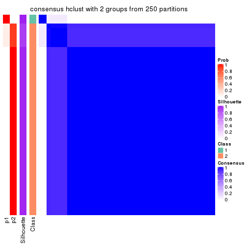</p>

</div>
<div id='tab-ATC-hclust-consensus-heatmap-2'>
<pre><code class="r">consensus_heatmap(res, k = 3)
</code></pre>

<p>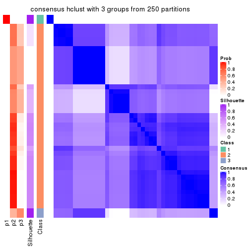</p>

</div>
<div id='tab-ATC-hclust-consensus-heatmap-3'>
<pre><code class="r">consensus_heatmap(res, k = 4)
</code></pre>

<p>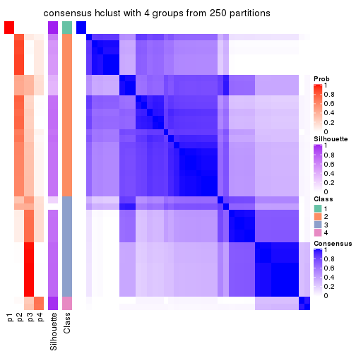</p>

</div>
<div id='tab-ATC-hclust-consensus-heatmap-4'>
<pre><code class="r">consensus_heatmap(res, k = 5)
</code></pre>

<p>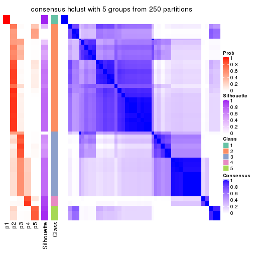</p>

</div>
<div id='tab-ATC-hclust-consensus-heatmap-5'>
<pre><code class="r">consensus_heatmap(res, k = 6)
</code></pre>

<p>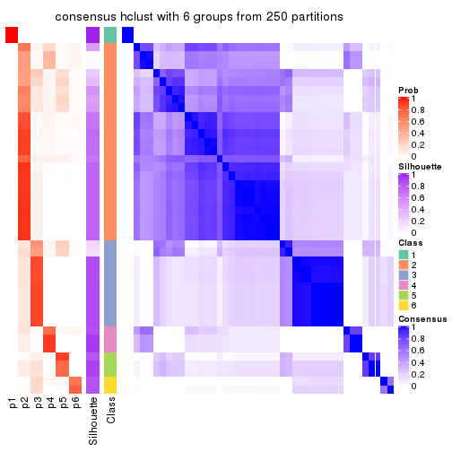</p>

</div>
</div>

Heatmaps for the membership of samples in all partitions to see how consistent they are:


<script>
$( function() {
	$( '#tabs-ATC-hclust-membership-heatmap' ).tabs();
} );
</script>
<div id='tabs-ATC-hclust-membership-heatmap'>
<ul>
<li><a href='#tab-ATC-hclust-membership-heatmap-1'>k = 2</a></li>
<li><a href='#tab-ATC-hclust-membership-heatmap-2'>k = 3</a></li>
<li><a href='#tab-ATC-hclust-membership-heatmap-3'>k = 4</a></li>
<li><a href='#tab-ATC-hclust-membership-heatmap-4'>k = 5</a></li>
<li><a href='#tab-ATC-hclust-membership-heatmap-5'>k = 6</a></li>
</ul>
<div id='tab-ATC-hclust-membership-heatmap-1'>
<pre><code class="r">membership_heatmap(res, k = 2)
</code></pre>

<p>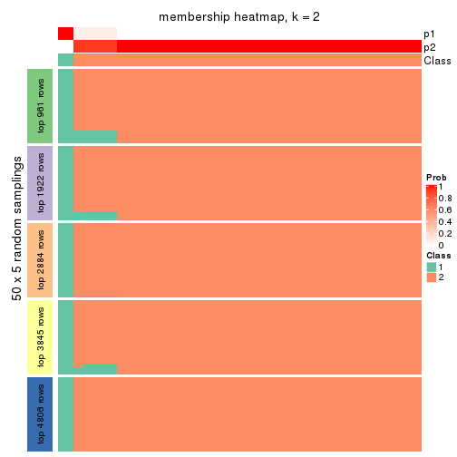</p>

</div>
<div id='tab-ATC-hclust-membership-heatmap-2'>
<pre><code class="r">membership_heatmap(res, k = 3)
</code></pre>

<p>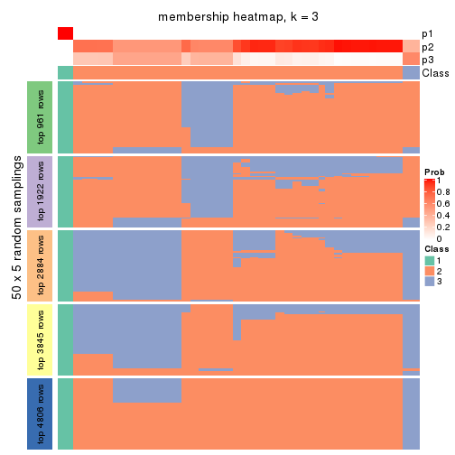</p>

</div>
<div id='tab-ATC-hclust-membership-heatmap-3'>
<pre><code class="r">membership_heatmap(res, k = 4)
</code></pre>

<p>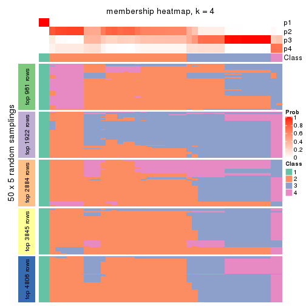</p>

</div>
<div id='tab-ATC-hclust-membership-heatmap-4'>
<pre><code class="r">membership_heatmap(res, k = 5)
</code></pre>

<p>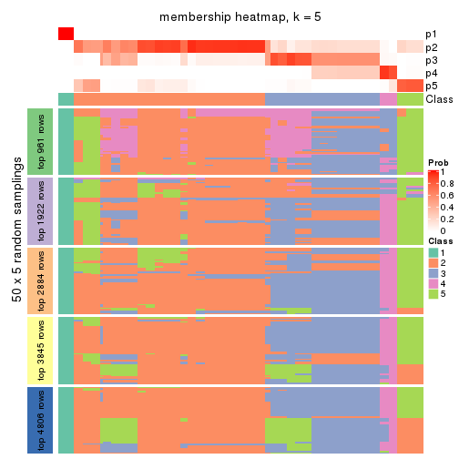</p>

</div>
<div id='tab-ATC-hclust-membership-heatmap-5'>
<pre><code class="r">membership_heatmap(res, k = 6)
</code></pre>

<p>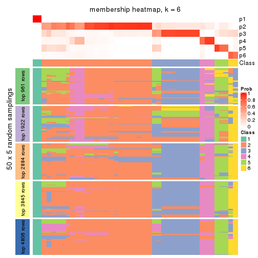</p>

</div>
</div>

As soon as we have had the classes for columns, we can look for signatures
which are significantly different between classes which can be candidate marks
for certain classes. Following are the heatmaps for signatures.


Signature heatmaps where rows are scaled:


<script>
$( function() {
	$( '#tabs-ATC-hclust-get-signatures' ).tabs();
} );
</script>
<div id='tabs-ATC-hclust-get-signatures'>
<ul>
<li><a href='#tab-ATC-hclust-get-signatures-1'>k = 2</a></li>
<li><a href='#tab-ATC-hclust-get-signatures-2'>k = 3</a></li>
<li><a href='#tab-ATC-hclust-get-signatures-3'>k = 4</a></li>
<li><a href='#tab-ATC-hclust-get-signatures-4'>k = 5</a></li>
<li><a href='#tab-ATC-hclust-get-signatures-5'>k = 6</a></li>
</ul>
<div id='tab-ATC-hclust-get-signatures-1'>
<pre><code class="r">get_signatures(res, k = 2)
</code></pre>

<p>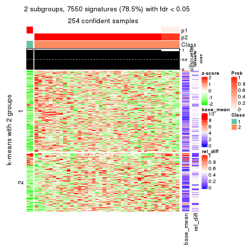</p>

</div>
<div id='tab-ATC-hclust-get-signatures-2'>
<pre><code class="r">get_signatures(res, k = 3)
</code></pre>

<p>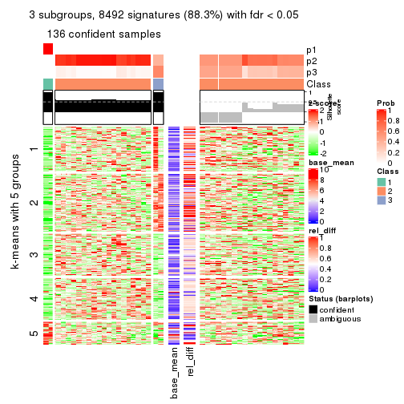</p>

</div>
<div id='tab-ATC-hclust-get-signatures-3'>
<pre><code class="r">get_signatures(res, k = 4)
</code></pre>

<p>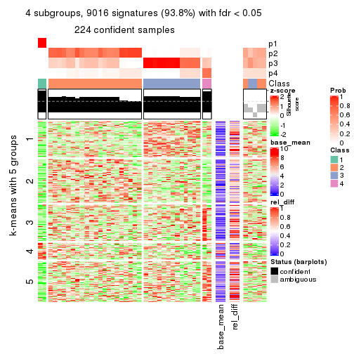</p>

</div>
<div id='tab-ATC-hclust-get-signatures-4'>
<pre><code class="r">get_signatures(res, k = 5)
</code></pre>

<p>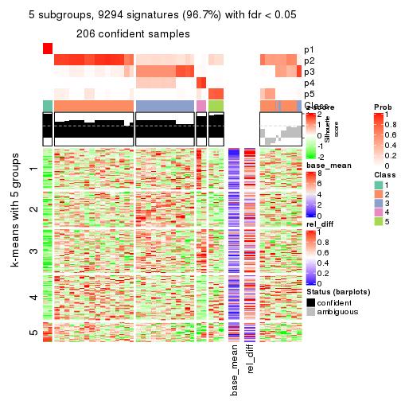</p>

</div>
<div id='tab-ATC-hclust-get-signatures-5'>
<pre><code class="r">get_signatures(res, k = 6)
</code></pre>

<p>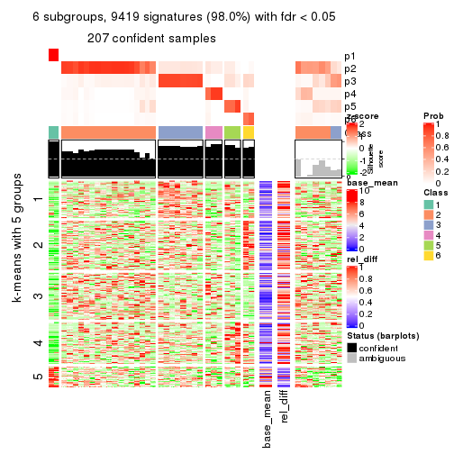</p>

</div>
</div>


Signature heatmaps where rows are not scaled:


<script>
$( function() {
	$( '#tabs-ATC-hclust-get-signatures-no-scale' ).tabs();
} );
</script>
<div id='tabs-ATC-hclust-get-signatures-no-scale'>
<ul>
<li><a href='#tab-ATC-hclust-get-signatures-no-scale-1'>k = 2</a></li>
<li><a href='#tab-ATC-hclust-get-signatures-no-scale-2'>k = 3</a></li>
<li><a href='#tab-ATC-hclust-get-signatures-no-scale-3'>k = 4</a></li>
<li><a href='#tab-ATC-hclust-get-signatures-no-scale-4'>k = 5</a></li>
<li><a href='#tab-ATC-hclust-get-signatures-no-scale-5'>k = 6</a></li>
</ul>
<div id='tab-ATC-hclust-get-signatures-no-scale-1'>
<pre><code class="r">get_signatures(res, k = 2, scale_rows = FALSE)
</code></pre>

<p>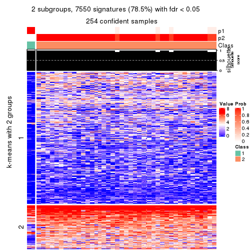</p>

</div>
<div id='tab-ATC-hclust-get-signatures-no-scale-2'>
<pre><code class="r">get_signatures(res, k = 3, scale_rows = FALSE)
</code></pre>

<p>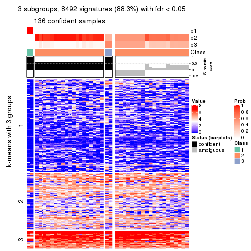</p>

</div>
<div id='tab-ATC-hclust-get-signatures-no-scale-3'>
<pre><code class="r">get_signatures(res, k = 4, scale_rows = FALSE)
</code></pre>

<p>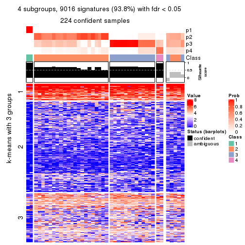</p>

</div>
<div id='tab-ATC-hclust-get-signatures-no-scale-4'>
<pre><code class="r">get_signatures(res, k = 5, scale_rows = FALSE)
</code></pre>

<p>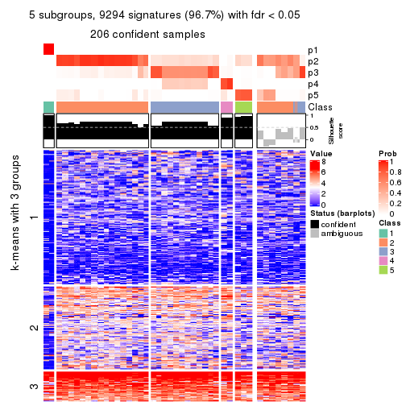</p>

</div>
<div id='tab-ATC-hclust-get-signatures-no-scale-5'>
<pre><code class="r">get_signatures(res, k = 6, scale_rows = FALSE)
</code></pre>

<p>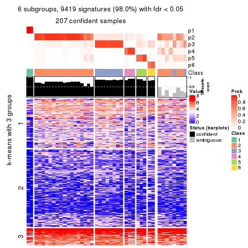</p>

</div>
</div>


Compare the overlap of signatures from different k:

```r
compare_signatures(res)
```

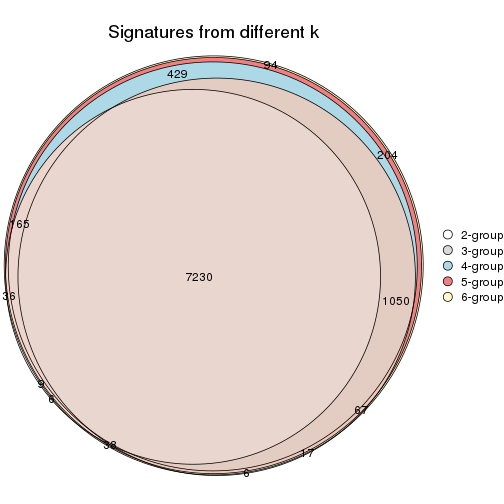

`get_signature()` returns a data frame invisibly. TO get the list of signatures, the function
call should be assigned to a variable explicitly. In following code, if `plot` argument is set
to `FALSE`, no heatmap is plotted while only the differential analysis is performed.

```r
# code only for demonstration
tb = get_signature(res, k = ..., plot = FALSE)
```

An example of the output of `tb` is:

```
#>   which_row         fdr    mean_1    mean_2 scaled_mean_1 scaled_mean_2 km
#> 1        38 0.042760348  8.373488  9.131774    -0.5533452     0.5164555  1
#> 2        40 0.018707592  7.106213  8.469186    -0.6173731     0.5762149  1
#> 3        55 0.019134737 10.221463 11.207825    -0.6159697     0.5749050  1
#> 4        59 0.006059896  5.921854  7.869574    -0.6899429     0.6439467  1
#> 5        60 0.018055526  8.928898 10.211722    -0.6204761     0.5791110  1
#> 6        98 0.009384629 15.714769 14.887706     0.6635654    -0.6193277  2
...
```

The columns in `tb` are:

1. `which_row`: row indices corresponding to the input matrix.
2. `fdr`: FDR for the differential test. 
3. `mean_x`: The mean value in group x.
4. `scaled_mean_x`: The mean value in group x after rows are scaled.
5. `km`: Row groups if k-means clustering is applied to rows.


UMAP plot which shows how samples are separated.


<script>
$( function() {
	$( '#tabs-ATC-hclust-dimension-reduction' ).tabs();
} );
</script>
<div id='tabs-ATC-hclust-dimension-reduction'>
<ul>
<li><a href='#tab-ATC-hclust-dimension-reduction-1'>k = 2</a></li>
<li><a href='#tab-ATC-hclust-dimension-reduction-2'>k = 3</a></li>
<li><a href='#tab-ATC-hclust-dimension-reduction-3'>k = 4</a></li>
<li><a href='#tab-ATC-hclust-dimension-reduction-4'>k = 5</a></li>
<li><a href='#tab-ATC-hclust-dimension-reduction-5'>k = 6</a></li>
</ul>
<div id='tab-ATC-hclust-dimension-reduction-1'>
<pre><code class="r">dimension_reduction(res, k = 2, method = &quot;UMAP&quot;)
</code></pre>

<p>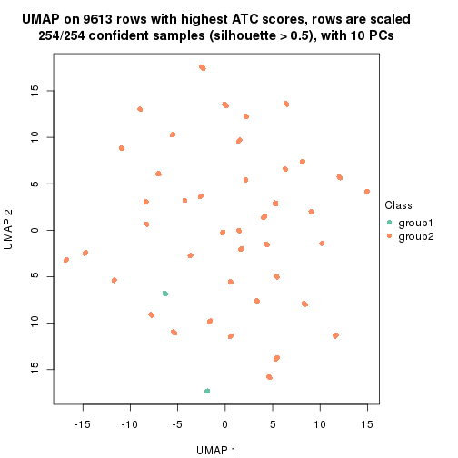</p>

</div>
<div id='tab-ATC-hclust-dimension-reduction-2'>
<pre><code class="r">dimension_reduction(res, k = 3, method = &quot;UMAP&quot;)
</code></pre>

<p>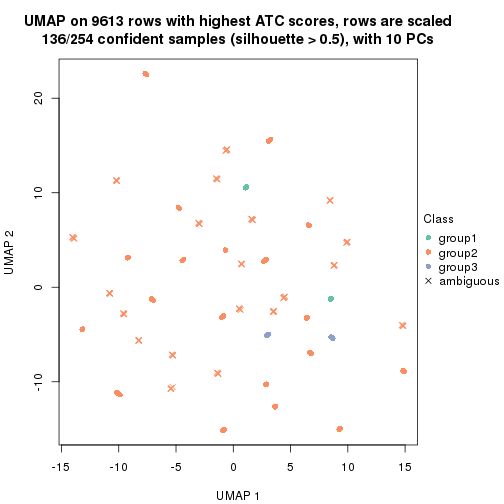</p>

</div>
<div id='tab-ATC-hclust-dimension-reduction-3'>
<pre><code class="r">dimension_reduction(res, k = 4, method = &quot;UMAP&quot;)
</code></pre>

<p>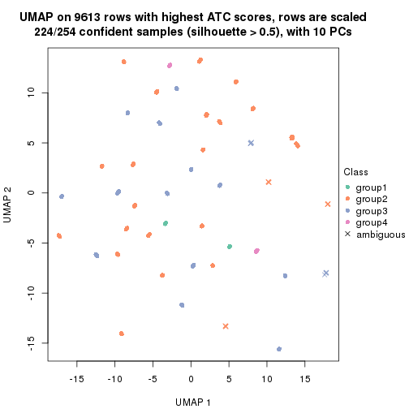</p>

</div>
<div id='tab-ATC-hclust-dimension-reduction-4'>
<pre><code class="r">dimension_reduction(res, k = 5, method = &quot;UMAP&quot;)
</code></pre>

<p>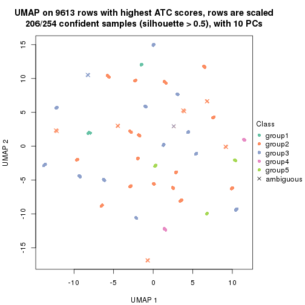</p>

</div>
<div id='tab-ATC-hclust-dimension-reduction-5'>
<pre><code class="r">dimension_reduction(res, k = 6, method = &quot;UMAP&quot;)
</code></pre>

<p>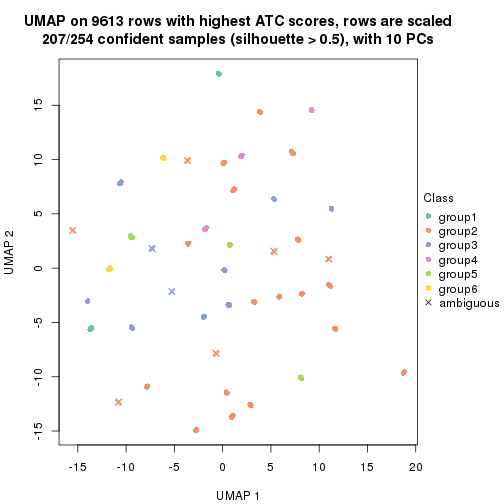</p>

</div>
</div>


Following heatmap shows how subgroups are split when increasing `k`:

```r
collect_classes(res)
```

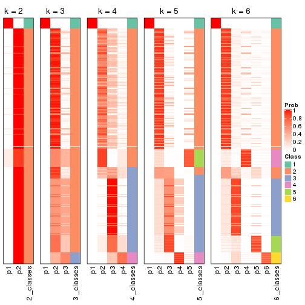


If matrix rows can be associated to genes, consider to use `GO_Enrichment(res,
...)` to perform function enrichment for the signature genes.


 

---------------------------------------------------


### ATC:kmeans


The object with results only for a single top-value method and a single partition method 
can be extracted as:

```r
res = res_list["ATC", "kmeans"]
# you can also extract it by
# res = res_list["ATC:kmeans"]
```

A summary of `res` and all the functions that can be applied to it:

```r
res
```

```
#> A 'ConsensusPartition' object with k = 2, 3, 4, 5, 6.
#>   On a matrix with 9613 rows and 254 columns.
#>   Top rows (961, 1922, 2884, 3845, 4806) are extracted by 'ATC' method.
#>   Subgroups are detected by 'kmeans' method.
#>   Performed in total 1250 partitions by row resampling.
#>   Best k for subgroups seems to be 2.
#> 
#> Following methods can be applied to this 'ConsensusPartition' object:
#>  [1] "cola_report"             "collect_classes"         "collect_plots"          
#>  [4] "collect_stats"           "colnames"                "compare_signatures"     
#>  [7] "consensus_heatmap"       "dimension_reduction"     "functional_enrichment"  
#> [10] "get_anno_col"            "get_anno"                "get_classes"            
#> [13] "get_consensus"           "get_matrix"              "get_membership"         
#> [16] "get_param"               "get_signatures"          "get_stats"              
#> [19] "is_best_k"               "is_stable_k"             "membership_heatmap"     
#> [22] "ncol"                    "nrow"                    "plot_ecdf"              
#> [25] "rownames"                "select_partition_number" "show"                   
#> [28] "suggest_best_k"          "test_to_known_factors"
```

`collect_plots()` function collects all the plots made from `res` for all `k` (number of partitions)
into one single page to provide an easy and fast comparison between different `k`.

```r
collect_plots(res)
```

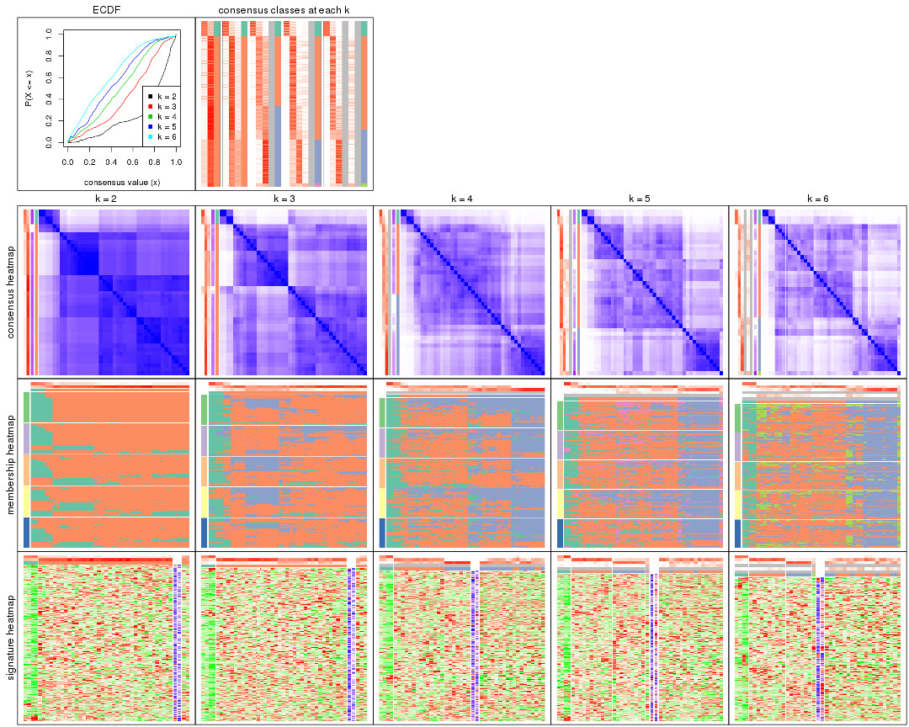

The plots are:

- The first row: a plot of the ECDF (Empirical cumulative distribution
  function) curves of the consensus matrix for each `k` and the heatmap of
  predicted classes for each `k`.
- The second row: heatmaps of the consensus matrix for each `k`.
- The third row: heatmaps of the membership matrix for each `k`.
- The fouth row: heatmaps of the signatures for each `k`.

All the plots in panels can be made by individual functions and they are
plotted later in this section.

`select_partition_number()` produces several plots showing different
statistics for choosing "optimized" `k`. There are following statistics:

- ECDF curves of the consensus matrix for each `k`;
- 1-PAC. [The PAC
  score](https://en.wikipedia.org/wiki/Consensus_clustering#Over-interpretation_potential_of_consensus_clustering)
  measures the proportion of the ambiguous subgrouping.
- Mean silhouette score.
- Concordance. The mean probability of fiting the consensus class ids in all
  partitions.
- Area increased. Denote $A_k$ as the area under the ECDF curve for current
  `k`, the area increased is defined as $A_k - A_{k-1}$.
- Rand index. The percent of pairs of samples that are both in a same cluster
  or both are not in a same cluster in the partition of k and k-1.
- Jaccard index. The ratio of pairs of samples are both in a same cluster in
  the partition of k and k-1 and the pairs of samples are both in a same
  cluster in the partition k or k-1.

The detailed explanations of these statistics can be found in [the cola
vignette](http://bioconductor.org/packages/devel/bioc/vignettes/cola/inst/doc/cola.html#toc_13).

Generally speaking, lower PAC score, higher mean silhouette score or higher
concordance corresponds to better partition. Rand index and Jaccard index
measure how similar the current partition is compared to partition with `k-1`.
If they are too similar, we won't accept `k` is better than `k-1`.

```r
select_partition_number(res)
```

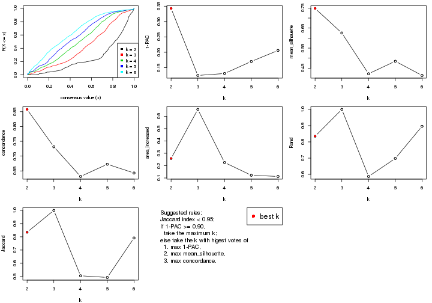

The numeric values for all these statistics can be obtained by `get_stats()`.

```r
get_stats(res)
```

```
#>   k 1-PAC mean_silhouette concordance area_increased  Rand Jaccard
#> 2 2 0.343           0.748       0.858          0.258 0.835   0.835
#> 3 3 0.125           0.625       0.731          0.656 1.000   1.000
#> 4 4 0.131           0.422       0.631          0.225 0.587   0.505
#> 5 5 0.170           0.485       0.673          0.122 0.698   0.492
#> 6 6 0.206           0.414       0.643          0.112 0.896   0.791
```

`suggest_best_k()` suggests the best $k$ based on these statistics. The rules are as follows:

- All $k$ with Jaccard index larger than 0.95 are removed because the increase of
  the partition number does not provides enough extra information. If all $k$ are removed,
  the best $k$ is assigned by `NA`.
- For $k$ with 1-PAC larger than 0.9, the maximal $k$ is taken as the "best k". Other $k$ is called "optional k".
- If it does not fit the second rule. The $k$ with the highest vote of highest
  1-PAC, mean silhouette and concordance is taken as the "best k".

```r
suggest_best_k(res)
```

```
#> [1] 2
```


Following shows the table of the partitions (You need to click the **show/hide
code output** link to see it). The membership matrix (columns with name `p*`)
is inferred by
[`clue::cl_consensus()`](https://www.rdocumentation.org/link/cl_consensus?package=clue)
function with the `SE` method. Basically the value in the membership matrix
represents the probability to belong to a certain group. The finall class
label for an item is determined with the group with highest probability it
belongs to.

In `get_classes()` function, the entropy is calculated from the membership
matrix and the silhouette score is calculated from the consensus matrix.


<script>
$( function() {
	$( '#tabs-ATC-kmeans-get-classes' ).tabs();
} );
</script>
<div id='tabs-ATC-kmeans-get-classes'>
<ul>
<li><a href='#tab-ATC-kmeans-get-classes-1'>k = 2</a></li>
<li><a href='#tab-ATC-kmeans-get-classes-2'>k = 3</a></li>
<li><a href='#tab-ATC-kmeans-get-classes-3'>k = 4</a></li>
<li><a href='#tab-ATC-kmeans-get-classes-4'>k = 5</a></li>
<li><a href='#tab-ATC-kmeans-get-classes-5'>k = 6</a></li>
</ul>

<div id='tab-ATC-kmeans-get-classes-1'>
<p><a id='tab-ATC-kmeans-get-classes-1-a' style='color:#0366d6' href='#'>show/hide code output</a></p>
<pre><code class="r">cbind(get_classes(res, k = 2), get_membership(res, k = 2))
</code></pre>

<pre><code>#&gt;           class entropy silhouette    p1    p2
#&gt; DRR024803     1  0.8661      0.933 0.712 0.288
#&gt; DRR024804     2  0.0938      0.828 0.012 0.988
#&gt; DRR024805     2  0.2948      0.818 0.052 0.948
#&gt; DRR024806     2  0.4022      0.802 0.080 0.920
#&gt; DRR024807     2  0.8081      0.680 0.248 0.752
#&gt; DRR024808     2  0.6973      0.747 0.188 0.812
#&gt; DRR024809     2  0.4562      0.792 0.096 0.904
#&gt; DRR024810     2  0.9732     -0.208 0.404 0.596
#&gt; DRR024811     2  0.7056      0.744 0.192 0.808
#&gt; DRR024812     2  0.4815      0.782 0.104 0.896
#&gt; DRR024813     2  0.2778      0.822 0.048 0.952
#&gt; DRR024814     2  0.3584      0.809 0.068 0.932
#&gt; DRR024815     2  0.3584      0.816 0.068 0.932
#&gt; DRR024816     2  0.9988     -0.511 0.480 0.520
#&gt; DRR024817     2  0.3114      0.823 0.056 0.944
#&gt; DRR024818     2  0.5842      0.781 0.140 0.860
#&gt; DRR024819     2  0.4431      0.819 0.092 0.908
#&gt; DRR024820     2  0.5294      0.810 0.120 0.880
#&gt; DRR024821     2  0.6973      0.747 0.188 0.812
#&gt; DRR024822     2  0.2948      0.817 0.052 0.948
#&gt; DRR024824     2  0.4815      0.789 0.104 0.896
#&gt; DRR024825     2  0.6887      0.749 0.184 0.816
#&gt; DRR024826     2  0.2603      0.822 0.044 0.956
#&gt; DRR024827     2  0.6247      0.772 0.156 0.844
#&gt; DRR024828     2  0.7745      0.711 0.228 0.772
#&gt; DRR024829     2  0.4815      0.786 0.104 0.896
#&gt; DRR024830     2  0.4161      0.808 0.084 0.916
#&gt; DRR024831     2  0.7376      0.728 0.208 0.792
#&gt; DRR024832     2  0.6973      0.747 0.188 0.812
#&gt; DRR024833     2  0.2423      0.823 0.040 0.960
#&gt; DRR024834     1  0.9491      0.921 0.632 0.368
#&gt; DRR024835     2  0.3431      0.828 0.064 0.936
#&gt; DRR024836     2  0.6973      0.747 0.188 0.812
#&gt; DRR024837     1  0.9393      0.931 0.644 0.356
#&gt; DRR024838     2  0.4562      0.794 0.096 0.904
#&gt; DRR024839     2  0.0376      0.827 0.004 0.996
#&gt; DRR024840     2  0.2043      0.825 0.032 0.968
#&gt; DRR024841     2  0.4939      0.782 0.108 0.892
#&gt; DRR024842     2  0.1184      0.826 0.016 0.984
#&gt; DRR024843     1  0.8661      0.933 0.712 0.288
#&gt; DRR024844     2  0.0938      0.828 0.012 0.988
#&gt; DRR024845     2  0.2948      0.818 0.052 0.948
#&gt; DRR024846     2  0.4022      0.802 0.080 0.920
#&gt; DRR024847     2  0.8081      0.680 0.248 0.752
#&gt; DRR024848     1  0.8661      0.933 0.712 0.288
#&gt; DRR024849     2  0.6973      0.747 0.188 0.812
#&gt; DRR024850     2  0.0938      0.828 0.012 0.988
#&gt; DRR024851     2  0.4562      0.792 0.096 0.904
#&gt; DRR024852     2  0.9732     -0.208 0.404 0.596
#&gt; DRR024853     2  0.7056      0.744 0.192 0.808
#&gt; DRR024854     2  0.4815      0.782 0.104 0.896
#&gt; DRR024855     2  0.2778      0.822 0.048 0.952
#&gt; DRR024856     2  0.3584      0.809 0.068 0.932
#&gt; DRR024857     2  0.3584      0.816 0.068 0.932
#&gt; DRR024858     2  0.9988     -0.511 0.480 0.520
#&gt; DRR024859     2  0.3114      0.823 0.056 0.944
#&gt; DRR024860     2  0.5842      0.781 0.140 0.860
#&gt; DRR024861     2  0.4431      0.819 0.092 0.908
#&gt; DRR024862     2  0.5294      0.810 0.120 0.880
#&gt; DRR024863     2  0.6973      0.747 0.188 0.812
#&gt; DRR024864     2  0.2948      0.817 0.052 0.948
#&gt; DRR024865     2  0.5059      0.776 0.112 0.888
#&gt; DRR024866     2  0.4815      0.789 0.104 0.896
#&gt; DRR024867     2  0.6887      0.749 0.184 0.816
#&gt; DRR024868     2  0.2603      0.822 0.044 0.956
#&gt; DRR024869     2  0.6247      0.772 0.156 0.844
#&gt; DRR024870     2  0.7745      0.711 0.228 0.772
#&gt; DRR024871     2  0.4815      0.786 0.104 0.896
#&gt; DRR024872     2  0.4298      0.810 0.088 0.912
#&gt; DRR024873     2  0.7376      0.728 0.208 0.792
#&gt; DRR024874     2  0.6973      0.747 0.188 0.812
#&gt; DRR024875     2  0.2423      0.823 0.040 0.960
#&gt; DRR024876     1  0.9491      0.921 0.632 0.368
#&gt; DRR024877     2  0.3431      0.828 0.064 0.936
#&gt; DRR024878     2  0.6973      0.747 0.188 0.812
#&gt; DRR024879     1  0.9393      0.931 0.644 0.356
#&gt; DRR024880     2  0.4562      0.794 0.096 0.904
#&gt; DRR024881     2  0.0376      0.827 0.004 0.996
#&gt; DRR024882     2  0.2043      0.825 0.032 0.968
#&gt; DRR024883     2  0.4939      0.782 0.108 0.892
#&gt; DRR024884     2  0.4161      0.823 0.084 0.916
#&gt; DRR024885     2  0.3114      0.825 0.056 0.944
#&gt; DRR024886     1  0.8661      0.933 0.712 0.288
#&gt; DRR024887     2  0.0938      0.828 0.012 0.988
#&gt; DRR024888     2  0.2948      0.818 0.052 0.948
#&gt; DRR024889     2  0.4022      0.802 0.080 0.920
#&gt; DRR024890     2  0.8081      0.680 0.248 0.752
#&gt; DRR024891     1  0.8661      0.933 0.712 0.288
#&gt; DRR024892     2  0.6973      0.747 0.188 0.812
#&gt; DRR024893     2  0.0938      0.828 0.012 0.988
#&gt; DRR024894     2  0.4562      0.792 0.096 0.904
#&gt; DRR024895     2  0.9732     -0.208 0.404 0.596
#&gt; DRR024896     2  0.7056      0.744 0.192 0.808
#&gt; DRR024897     2  0.4815      0.782 0.104 0.896
#&gt; DRR024898     2  0.2778      0.822 0.048 0.952
#&gt; DRR024899     2  0.3584      0.809 0.068 0.932
#&gt; DRR024900     2  0.3584      0.816 0.068 0.932
#&gt; DRR024901     2  0.9988     -0.511 0.480 0.520
#&gt; DRR024902     2  0.3114      0.823 0.056 0.944
#&gt; DRR024903     2  0.5842      0.781 0.140 0.860
#&gt; DRR024904     2  0.4431      0.819 0.092 0.908
#&gt; DRR024905     2  0.5294      0.810 0.120 0.880
#&gt; DRR024906     2  0.6973      0.747 0.188 0.812
#&gt; DRR024907     2  0.2948      0.817 0.052 0.948
#&gt; DRR024908     2  0.5059      0.776 0.112 0.888
#&gt; DRR024909     2  0.4815      0.789 0.104 0.896
#&gt; DRR024910     2  0.6887      0.749 0.184 0.816
#&gt; DRR024911     2  0.2603      0.822 0.044 0.956
#&gt; DRR024912     2  0.6247      0.772 0.156 0.844
#&gt; DRR024913     2  0.7745      0.711 0.228 0.772
#&gt; DRR024914     2  0.4815      0.786 0.104 0.896
#&gt; DRR024915     2  0.4298      0.810 0.088 0.912
#&gt; DRR024916     2  0.7376      0.728 0.208 0.792
#&gt; DRR024917     2  0.6973      0.747 0.188 0.812
#&gt; DRR024918     2  0.2423      0.823 0.040 0.960
#&gt; DRR024919     1  0.9491      0.921 0.632 0.368
#&gt; DRR024920     2  0.3431      0.828 0.064 0.936
#&gt; DRR024921     2  0.6973      0.747 0.188 0.812
#&gt; DRR024922     1  0.9393      0.931 0.644 0.356
#&gt; DRR024923     2  0.4562      0.794 0.096 0.904
#&gt; DRR024924     2  0.0376      0.827 0.004 0.996
#&gt; DRR024925     2  0.2043      0.825 0.032 0.968
#&gt; DRR024926     2  0.4939      0.782 0.108 0.892
#&gt; DRR024927     2  0.4161      0.823 0.084 0.916
#&gt; DRR024928     2  0.3114      0.825 0.056 0.944
#&gt; DRR024929     1  0.8661      0.933 0.712 0.288
#&gt; DRR024930     2  0.0938      0.828 0.012 0.988
#&gt; DRR024931     2  0.2948      0.818 0.052 0.948
#&gt; DRR024932     2  0.4022      0.802 0.080 0.920
#&gt; DRR024933     2  0.8081      0.680 0.248 0.752
#&gt; DRR024934     1  0.8661      0.933 0.712 0.288
#&gt; DRR024935     2  0.6973      0.747 0.188 0.812
#&gt; DRR024936     2  0.0938      0.828 0.012 0.988
#&gt; DRR024937     2  0.4562      0.792 0.096 0.904
#&gt; DRR024938     2  0.9732     -0.208 0.404 0.596
#&gt; DRR024939     2  0.7056      0.744 0.192 0.808
#&gt; DRR024940     2  0.4815      0.782 0.104 0.896
#&gt; DRR024941     2  0.2778      0.822 0.048 0.952
#&gt; DRR024942     2  0.3584      0.809 0.068 0.932
#&gt; DRR024943     2  0.3584      0.816 0.068 0.932
#&gt; DRR024944     2  0.9988     -0.511 0.480 0.520
#&gt; DRR024945     2  0.3114      0.823 0.056 0.944
#&gt; DRR024946     2  0.5842      0.781 0.140 0.860
#&gt; DRR024947     2  0.4431      0.819 0.092 0.908
#&gt; DRR024948     2  0.5294      0.810 0.120 0.880
#&gt; DRR024949     2  0.6973      0.747 0.188 0.812
#&gt; DRR024950     2  0.2948      0.817 0.052 0.948
#&gt; DRR024951     2  0.5059      0.776 0.112 0.888
#&gt; DRR024952     2  0.4815      0.789 0.104 0.896
#&gt; DRR024953     2  0.6887      0.749 0.184 0.816
#&gt; DRR024954     2  0.2603      0.822 0.044 0.956
#&gt; DRR024955     2  0.6247      0.772 0.156 0.844
#&gt; DRR024956     2  0.7745      0.711 0.228 0.772
#&gt; DRR024957     2  0.4815      0.786 0.104 0.896
#&gt; DRR024958     2  0.4298      0.810 0.088 0.912
#&gt; DRR024959     2  0.7376      0.728 0.208 0.792
#&gt; DRR024960     2  0.6973      0.747 0.188 0.812
#&gt; DRR024961     2  0.2423      0.823 0.040 0.960
#&gt; DRR024962     1  0.9491      0.921 0.632 0.368
#&gt; DRR024963     2  0.3431      0.828 0.064 0.936
#&gt; DRR024964     2  0.6973      0.747 0.188 0.812
#&gt; DRR024965     1  0.9393      0.931 0.644 0.356
#&gt; DRR024966     2  0.4562      0.794 0.096 0.904
#&gt; DRR024967     2  0.0376      0.827 0.004 0.996
#&gt; DRR024968     2  0.2043      0.825 0.032 0.968
#&gt; DRR024969     2  0.4939      0.782 0.108 0.892
#&gt; DRR024970     2  0.4161      0.823 0.084 0.916
#&gt; DRR024971     2  0.3114      0.825 0.056 0.944
#&gt; DRR024972     1  0.8661      0.933 0.712 0.288
#&gt; DRR024973     2  0.0938      0.828 0.012 0.988
#&gt; DRR024974     2  0.2948      0.818 0.052 0.948
#&gt; DRR024975     2  0.4022      0.802 0.080 0.920
#&gt; DRR024976     2  0.8081      0.680 0.248 0.752
#&gt; DRR024977     1  0.8661      0.933 0.712 0.288
#&gt; DRR024978     2  0.6973      0.747 0.188 0.812
#&gt; DRR024979     2  0.0938      0.828 0.012 0.988
#&gt; DRR024980     2  0.4562      0.792 0.096 0.904
#&gt; DRR024981     2  0.9732     -0.208 0.404 0.596
#&gt; DRR024982     2  0.7056      0.744 0.192 0.808
#&gt; DRR024983     2  0.4815      0.782 0.104 0.896
#&gt; DRR024984     2  0.2778      0.822 0.048 0.952
#&gt; DRR024985     2  0.3584      0.809 0.068 0.932
#&gt; DRR024986     2  0.3584      0.816 0.068 0.932
#&gt; DRR024987     2  0.9988     -0.511 0.480 0.520
#&gt; DRR024988     2  0.3114      0.823 0.056 0.944
#&gt; DRR024989     2  0.5842      0.781 0.140 0.860
#&gt; DRR024990     2  0.4431      0.819 0.092 0.908
#&gt; DRR024991     2  0.5294      0.810 0.120 0.880
#&gt; DRR024992     2  0.6973      0.747 0.188 0.812
#&gt; DRR024993     2  0.2948      0.817 0.052 0.948
#&gt; DRR024994     2  0.5059      0.776 0.112 0.888
#&gt; DRR024995     2  0.4815      0.789 0.104 0.896
#&gt; DRR024996     2  0.6887      0.749 0.184 0.816
#&gt; DRR024997     2  0.2603      0.822 0.044 0.956
#&gt; DRR024998     2  0.6247      0.772 0.156 0.844
#&gt; DRR024999     2  0.7745      0.711 0.228 0.772
#&gt; DRR025000     2  0.4815      0.786 0.104 0.896
#&gt; DRR025001     2  0.4298      0.810 0.088 0.912
#&gt; DRR025002     2  0.7376      0.728 0.208 0.792
#&gt; DRR025003     2  0.6973      0.747 0.188 0.812
#&gt; DRR025004     2  0.2423      0.823 0.040 0.960
#&gt; DRR025005     1  0.9491      0.921 0.632 0.368
#&gt; DRR025006     2  0.3431      0.828 0.064 0.936
#&gt; DRR025007     2  0.6973      0.747 0.188 0.812
#&gt; DRR025008     1  0.9393      0.931 0.644 0.356
#&gt; DRR025009     2  0.4562      0.794 0.096 0.904
#&gt; DRR025010     2  0.0376      0.827 0.004 0.996
#&gt; DRR025011     2  0.2043      0.825 0.032 0.968
#&gt; DRR025012     2  0.4939      0.782 0.108 0.892
#&gt; DRR025013     2  0.4161      0.823 0.084 0.916
#&gt; DRR025014     2  0.3114      0.825 0.056 0.944
#&gt; DRR025015     1  0.8661      0.933 0.712 0.288
#&gt; DRR025016     2  0.0938      0.828 0.012 0.988
#&gt; DRR025017     2  0.2948      0.818 0.052 0.948
#&gt; DRR025018     2  0.4022      0.802 0.080 0.920
#&gt; DRR025019     2  0.8081      0.680 0.248 0.752
#&gt; DRR025020     1  0.8661      0.933 0.712 0.288
#&gt; DRR025021     2  0.6973      0.747 0.188 0.812
#&gt; DRR025022     2  0.0938      0.828 0.012 0.988
#&gt; DRR025023     2  0.4562      0.792 0.096 0.904
#&gt; DRR025024     2  0.9732     -0.208 0.404 0.596
#&gt; DRR025025     2  0.7056      0.744 0.192 0.808
#&gt; DRR025026     2  0.4815      0.782 0.104 0.896
#&gt; DRR025027     2  0.2778      0.822 0.048 0.952
#&gt; DRR025028     2  0.3584      0.809 0.068 0.932
#&gt; DRR025029     2  0.3584      0.816 0.068 0.932
#&gt; DRR025030     2  0.9988     -0.511 0.480 0.520
#&gt; DRR025031     2  0.3114      0.823 0.056 0.944
#&gt; DRR025032     2  0.5842      0.781 0.140 0.860
#&gt; DRR025033     2  0.4431      0.819 0.092 0.908
#&gt; DRR025034     2  0.5294      0.810 0.120 0.880
#&gt; DRR025035     2  0.6973      0.747 0.188 0.812
#&gt; DRR025036     2  0.2948      0.817 0.052 0.948
#&gt; DRR025037     2  0.5059      0.776 0.112 0.888
#&gt; DRR025038     2  0.4815      0.789 0.104 0.896
#&gt; DRR025039     2  0.6887      0.749 0.184 0.816
#&gt; DRR025040     2  0.2603      0.822 0.044 0.956
#&gt; DRR025041     2  0.6247      0.772 0.156 0.844
#&gt; DRR025042     2  0.7745      0.711 0.228 0.772
#&gt; DRR025043     2  0.4815      0.786 0.104 0.896
#&gt; DRR025044     2  0.4298      0.810 0.088 0.912
#&gt; DRR025045     2  0.7376      0.728 0.208 0.792
#&gt; DRR025046     2  0.6973      0.747 0.188 0.812
#&gt; DRR025047     2  0.2423      0.823 0.040 0.960
#&gt; DRR025048     1  0.9491      0.921 0.632 0.368
#&gt; DRR025049     2  0.3431      0.828 0.064 0.936
#&gt; DRR025050     2  0.6973      0.747 0.188 0.812
#&gt; DRR025051     1  0.9393      0.931 0.644 0.356
#&gt; DRR025052     2  0.4562      0.794 0.096 0.904
#&gt; DRR025053     2  0.0376      0.827 0.004 0.996
#&gt; DRR025054     2  0.2043      0.825 0.032 0.968
#&gt; DRR025055     2  0.4939      0.782 0.108 0.892
#&gt; DRR025056     2  0.4161      0.823 0.084 0.916
#&gt; DRR025057     2  0.3114      0.825 0.056 0.944
</code></pre>

<script>
$('#tab-ATC-kmeans-get-classes-1-a').parent().next().next().hide();
$('#tab-ATC-kmeans-get-classes-1-a').click(function(){
  $('#tab-ATC-kmeans-get-classes-1-a').parent().next().next().toggle();
  return(false);
});
</script>
</div>

<div id='tab-ATC-kmeans-get-classes-2'>
<p><a id='tab-ATC-kmeans-get-classes-2-a' style='color:#0366d6' href='#'>show/hide code output</a></p>
<pre><code class="r">cbind(get_classes(res, k = 3), get_membership(res, k = 3))
</code></pre>

<pre><code>#&gt;           class entropy silhouette    p1    p2    p3
#&gt; DRR024803     1   0.375     0.8689 0.856 0.144 0.000
#&gt; DRR024804     2   0.263     0.7097 0.000 0.916 0.084
#&gt; DRR024805     2   0.304     0.6926 0.008 0.908 0.084
#&gt; DRR024806     2   0.454     0.6546 0.028 0.848 0.124
#&gt; DRR024807     2   0.776     0.4994 0.048 0.488 0.464
#&gt; DRR024808     2   0.645     0.5713 0.004 0.560 0.436
#&gt; DRR024809     2   0.493     0.6089 0.032 0.828 0.140
#&gt; DRR024810     2   0.844     0.1832 0.224 0.616 0.160
#&gt; DRR024811     2   0.628     0.6013 0.004 0.612 0.384
#&gt; DRR024812     2   0.550     0.5868 0.048 0.804 0.148
#&gt; DRR024813     2   0.406     0.7030 0.000 0.836 0.164
#&gt; DRR024814     2   0.290     0.6800 0.016 0.920 0.064
#&gt; DRR024815     2   0.404     0.6777 0.040 0.880 0.080
#&gt; DRR024816     2   0.887    -0.0904 0.288 0.556 0.156
#&gt; DRR024817     2   0.462     0.6969 0.024 0.840 0.136
#&gt; DRR024818     2   0.617     0.6500 0.012 0.680 0.308
#&gt; DRR024819     2   0.681     0.6189 0.064 0.716 0.220
#&gt; DRR024820     2   0.749     0.5137 0.044 0.576 0.380
#&gt; DRR024821     2   0.658     0.6044 0.012 0.608 0.380
#&gt; DRR024822     2   0.321     0.6825 0.008 0.900 0.092
#&gt; DRR024824     2   0.461     0.6370 0.028 0.844 0.128
#&gt; DRR024825     2   0.622     0.5788 0.000 0.568 0.432
#&gt; DRR024826     2   0.478     0.6992 0.004 0.796 0.200
#&gt; DRR024827     2   0.696     0.5932 0.020 0.568 0.412
#&gt; DRR024828     2   0.767     0.5081 0.044 0.500 0.456
#&gt; DRR024829     2   0.573     0.6171 0.060 0.796 0.144
#&gt; DRR024830     2   0.353     0.6854 0.016 0.892 0.092
#&gt; DRR024831     2   0.705     0.5341 0.020 0.524 0.456
#&gt; DRR024832     2   0.636     0.5900 0.004 0.592 0.404
#&gt; DRR024833     2   0.441     0.7001 0.004 0.824 0.172
#&gt; DRR024834     1   0.814     0.8569 0.616 0.276 0.108
#&gt; DRR024835     2   0.529     0.6802 0.040 0.812 0.148
#&gt; DRR024836     2   0.680     0.5825 0.016 0.584 0.400
#&gt; DRR024837     1   0.817     0.8599 0.616 0.272 0.112
#&gt; DRR024838     2   0.597     0.6048 0.060 0.780 0.160
#&gt; DRR024839     2   0.265     0.7108 0.012 0.928 0.060
#&gt; DRR024840     2   0.313     0.6973 0.008 0.904 0.088
#&gt; DRR024841     2   0.511     0.6010 0.036 0.820 0.144
#&gt; DRR024842     2   0.210     0.6887 0.004 0.944 0.052
#&gt; DRR024843     1   0.375     0.8689 0.856 0.144 0.000
#&gt; DRR024844     2   0.263     0.7097 0.000 0.916 0.084
#&gt; DRR024845     2   0.304     0.6926 0.008 0.908 0.084
#&gt; DRR024846     2   0.454     0.6546 0.028 0.848 0.124
#&gt; DRR024847     2   0.776     0.4994 0.048 0.488 0.464
#&gt; DRR024848     1   0.398     0.8688 0.852 0.144 0.004
#&gt; DRR024849     2   0.645     0.5713 0.004 0.560 0.436
#&gt; DRR024850     2   0.271     0.7116 0.000 0.912 0.088
#&gt; DRR024851     2   0.493     0.6089 0.032 0.828 0.140
#&gt; DRR024852     2   0.844     0.1832 0.224 0.616 0.160
#&gt; DRR024853     2   0.630     0.6003 0.004 0.608 0.388
#&gt; DRR024854     2   0.482     0.6263 0.040 0.840 0.120
#&gt; DRR024855     2   0.435     0.6998 0.000 0.816 0.184
#&gt; DRR024856     2   0.280     0.6813 0.016 0.924 0.060
#&gt; DRR024857     2   0.404     0.6777 0.040 0.880 0.080
#&gt; DRR024858     2   0.887    -0.0904 0.288 0.556 0.156
#&gt; DRR024859     2   0.462     0.6969 0.024 0.840 0.136
#&gt; DRR024860     2   0.617     0.6500 0.012 0.680 0.308
#&gt; DRR024861     2   0.681     0.6189 0.064 0.716 0.220
#&gt; DRR024862     2   0.749     0.5137 0.044 0.576 0.380
#&gt; DRR024863     2   0.658     0.6044 0.012 0.608 0.380
#&gt; DRR024864     2   0.321     0.6825 0.008 0.900 0.092
#&gt; DRR024865     2   0.634     0.5653 0.064 0.756 0.180
#&gt; DRR024866     2   0.461     0.6370 0.028 0.844 0.128
#&gt; DRR024867     2   0.623     0.5790 0.000 0.564 0.436
#&gt; DRR024868     2   0.483     0.6981 0.004 0.792 0.204
#&gt; DRR024869     2   0.696     0.5932 0.020 0.568 0.412
#&gt; DRR024870     2   0.767     0.5081 0.044 0.500 0.456
#&gt; DRR024871     2   0.579     0.6185 0.060 0.792 0.148
#&gt; DRR024872     2   0.377     0.6907 0.016 0.880 0.104
#&gt; DRR024873     2   0.705     0.5341 0.020 0.524 0.456
#&gt; DRR024874     2   0.636     0.5900 0.004 0.592 0.404
#&gt; DRR024875     2   0.447     0.6993 0.004 0.820 0.176
#&gt; DRR024876     1   0.814     0.8569 0.616 0.276 0.108
#&gt; DRR024877     2   0.529     0.6802 0.040 0.812 0.148
#&gt; DRR024878     2   0.680     0.5825 0.016 0.584 0.400
#&gt; DRR024879     1   0.817     0.8599 0.616 0.272 0.112
#&gt; DRR024880     2   0.603     0.6061 0.060 0.776 0.164
#&gt; DRR024881     2   0.265     0.7108 0.012 0.928 0.060
#&gt; DRR024882     2   0.313     0.7011 0.008 0.904 0.088
#&gt; DRR024883     2   0.511     0.6010 0.036 0.820 0.144
#&gt; DRR024884     2   0.635     0.6533 0.048 0.740 0.212
#&gt; DRR024885     2   0.645     0.6507 0.024 0.684 0.292
#&gt; DRR024886     1   0.375     0.8689 0.856 0.144 0.000
#&gt; DRR024887     2   0.263     0.7097 0.000 0.916 0.084
#&gt; DRR024888     2   0.304     0.6926 0.008 0.908 0.084
#&gt; DRR024889     2   0.454     0.6546 0.028 0.848 0.124
#&gt; DRR024890     2   0.776     0.4994 0.048 0.488 0.464
#&gt; DRR024891     1   0.398     0.8688 0.852 0.144 0.004
#&gt; DRR024892     2   0.645     0.5713 0.004 0.560 0.436
#&gt; DRR024893     2   0.271     0.7116 0.000 0.912 0.088
#&gt; DRR024894     2   0.493     0.6089 0.032 0.828 0.140
#&gt; DRR024895     2   0.844     0.1832 0.224 0.616 0.160
#&gt; DRR024896     2   0.630     0.6003 0.004 0.608 0.388
#&gt; DRR024897     2   0.482     0.6263 0.040 0.840 0.120
#&gt; DRR024898     2   0.435     0.6998 0.000 0.816 0.184
#&gt; DRR024899     2   0.280     0.6813 0.016 0.924 0.060
#&gt; DRR024900     2   0.404     0.6777 0.040 0.880 0.080
#&gt; DRR024901     2   0.887    -0.0904 0.288 0.556 0.156
#&gt; DRR024902     2   0.462     0.6969 0.024 0.840 0.136
#&gt; DRR024903     2   0.617     0.6500 0.012 0.680 0.308
#&gt; DRR024904     2   0.681     0.6189 0.064 0.716 0.220
#&gt; DRR024905     2   0.749     0.5137 0.044 0.576 0.380
#&gt; DRR024906     2   0.658     0.6044 0.012 0.608 0.380
#&gt; DRR024907     2   0.321     0.6825 0.008 0.900 0.092
#&gt; DRR024908     2   0.634     0.5653 0.064 0.756 0.180
#&gt; DRR024909     2   0.461     0.6370 0.028 0.844 0.128
#&gt; DRR024910     2   0.623     0.5790 0.000 0.564 0.436
#&gt; DRR024911     2   0.483     0.6981 0.004 0.792 0.204
#&gt; DRR024912     2   0.696     0.5932 0.020 0.568 0.412
#&gt; DRR024913     2   0.767     0.5081 0.044 0.500 0.456
#&gt; DRR024914     2   0.579     0.6185 0.060 0.792 0.148
#&gt; DRR024915     2   0.377     0.6907 0.016 0.880 0.104
#&gt; DRR024916     2   0.705     0.5341 0.020 0.524 0.456
#&gt; DRR024917     2   0.636     0.5900 0.004 0.592 0.404
#&gt; DRR024918     2   0.447     0.6993 0.004 0.820 0.176
#&gt; DRR024919     1   0.814     0.8569 0.616 0.276 0.108
#&gt; DRR024920     2   0.529     0.6802 0.040 0.812 0.148
#&gt; DRR024921     2   0.680     0.5825 0.016 0.584 0.400
#&gt; DRR024922     1   0.817     0.8599 0.616 0.272 0.112
#&gt; DRR024923     2   0.603     0.6061 0.060 0.776 0.164
#&gt; DRR024924     2   0.265     0.7108 0.012 0.928 0.060
#&gt; DRR024925     2   0.313     0.7011 0.008 0.904 0.088
#&gt; DRR024926     2   0.511     0.6010 0.036 0.820 0.144
#&gt; DRR024927     2   0.635     0.6533 0.048 0.740 0.212
#&gt; DRR024928     2   0.645     0.6507 0.024 0.684 0.292
#&gt; DRR024929     1   0.375     0.8689 0.856 0.144 0.000
#&gt; DRR024930     2   0.263     0.7097 0.000 0.916 0.084
#&gt; DRR024931     2   0.304     0.6926 0.008 0.908 0.084
#&gt; DRR024932     2   0.454     0.6546 0.028 0.848 0.124
#&gt; DRR024933     2   0.776     0.4994 0.048 0.488 0.464
#&gt; DRR024934     1   0.398     0.8688 0.852 0.144 0.004
#&gt; DRR024935     2   0.645     0.5713 0.004 0.560 0.436
#&gt; DRR024936     2   0.271     0.7116 0.000 0.912 0.088
#&gt; DRR024937     2   0.493     0.6089 0.032 0.828 0.140
#&gt; DRR024938     2   0.844     0.1832 0.224 0.616 0.160
#&gt; DRR024939     2   0.630     0.6003 0.004 0.608 0.388
#&gt; DRR024940     2   0.482     0.6263 0.040 0.840 0.120
#&gt; DRR024941     2   0.435     0.6998 0.000 0.816 0.184
#&gt; DRR024942     2   0.280     0.6813 0.016 0.924 0.060
#&gt; DRR024943     2   0.404     0.6777 0.040 0.880 0.080
#&gt; DRR024944     2   0.887    -0.0904 0.288 0.556 0.156
#&gt; DRR024945     2   0.462     0.6969 0.024 0.840 0.136
#&gt; DRR024946     2   0.617     0.6500 0.012 0.680 0.308
#&gt; DRR024947     2   0.681     0.6189 0.064 0.716 0.220
#&gt; DRR024948     2   0.749     0.5137 0.044 0.576 0.380
#&gt; DRR024949     2   0.658     0.6044 0.012 0.608 0.380
#&gt; DRR024950     2   0.321     0.6825 0.008 0.900 0.092
#&gt; DRR024951     2   0.634     0.5653 0.064 0.756 0.180
#&gt; DRR024952     2   0.461     0.6370 0.028 0.844 0.128
#&gt; DRR024953     2   0.623     0.5790 0.000 0.564 0.436
#&gt; DRR024954     2   0.483     0.6981 0.004 0.792 0.204
#&gt; DRR024955     2   0.696     0.5932 0.020 0.568 0.412
#&gt; DRR024956     2   0.767     0.5081 0.044 0.500 0.456
#&gt; DRR024957     2   0.579     0.6185 0.060 0.792 0.148
#&gt; DRR024958     2   0.377     0.6907 0.016 0.880 0.104
#&gt; DRR024959     2   0.705     0.5341 0.020 0.524 0.456
#&gt; DRR024960     2   0.636     0.5900 0.004 0.592 0.404
#&gt; DRR024961     2   0.447     0.6993 0.004 0.820 0.176
#&gt; DRR024962     1   0.814     0.8569 0.616 0.276 0.108
#&gt; DRR024963     2   0.529     0.6802 0.040 0.812 0.148
#&gt; DRR024964     2   0.680     0.5825 0.016 0.584 0.400
#&gt; DRR024965     1   0.817     0.8599 0.616 0.272 0.112
#&gt; DRR024966     2   0.603     0.6061 0.060 0.776 0.164
#&gt; DRR024967     2   0.265     0.7108 0.012 0.928 0.060
#&gt; DRR024968     2   0.313     0.7011 0.008 0.904 0.088
#&gt; DRR024969     2   0.511     0.6010 0.036 0.820 0.144
#&gt; DRR024970     2   0.635     0.6533 0.048 0.740 0.212
#&gt; DRR024971     2   0.645     0.6507 0.024 0.684 0.292
#&gt; DRR024972     1   0.375     0.8689 0.856 0.144 0.000
#&gt; DRR024973     2   0.263     0.7097 0.000 0.916 0.084
#&gt; DRR024974     2   0.304     0.6926 0.008 0.908 0.084
#&gt; DRR024975     2   0.454     0.6546 0.028 0.848 0.124
#&gt; DRR024976     2   0.776     0.4994 0.048 0.488 0.464
#&gt; DRR024977     1   0.398     0.8688 0.852 0.144 0.004
#&gt; DRR024978     2   0.645     0.5713 0.004 0.560 0.436
#&gt; DRR024979     2   0.271     0.7116 0.000 0.912 0.088
#&gt; DRR024980     2   0.493     0.6089 0.032 0.828 0.140
#&gt; DRR024981     2   0.844     0.1832 0.224 0.616 0.160
#&gt; DRR024982     2   0.630     0.6003 0.004 0.608 0.388
#&gt; DRR024983     2   0.482     0.6263 0.040 0.840 0.120
#&gt; DRR024984     2   0.435     0.6998 0.000 0.816 0.184
#&gt; DRR024985     2   0.280     0.6813 0.016 0.924 0.060
#&gt; DRR024986     2   0.404     0.6777 0.040 0.880 0.080
#&gt; DRR024987     2   0.887    -0.0904 0.288 0.556 0.156
#&gt; DRR024988     2   0.462     0.6969 0.024 0.840 0.136
#&gt; DRR024989     2   0.617     0.6500 0.012 0.680 0.308
#&gt; DRR024990     2   0.681     0.6189 0.064 0.716 0.220
#&gt; DRR024991     2   0.749     0.5137 0.044 0.576 0.380
#&gt; DRR024992     2   0.658     0.6044 0.012 0.608 0.380
#&gt; DRR024993     2   0.321     0.6825 0.008 0.900 0.092
#&gt; DRR024994     2   0.634     0.5653 0.064 0.756 0.180
#&gt; DRR024995     2   0.461     0.6370 0.028 0.844 0.128
#&gt; DRR024996     2   0.623     0.5790 0.000 0.564 0.436
#&gt; DRR024997     2   0.483     0.6981 0.004 0.792 0.204
#&gt; DRR024998     2   0.696     0.5932 0.020 0.568 0.412
#&gt; DRR024999     2   0.767     0.5081 0.044 0.500 0.456
#&gt; DRR025000     2   0.579     0.6185 0.060 0.792 0.148
#&gt; DRR025001     2   0.377     0.6907 0.016 0.880 0.104
#&gt; DRR025002     2   0.705     0.5341 0.020 0.524 0.456
#&gt; DRR025003     2   0.636     0.5900 0.004 0.592 0.404
#&gt; DRR025004     2   0.447     0.6993 0.004 0.820 0.176
#&gt; DRR025005     1   0.814     0.8569 0.616 0.276 0.108
#&gt; DRR025006     2   0.529     0.6802 0.040 0.812 0.148
#&gt; DRR025007     2   0.680     0.5825 0.016 0.584 0.400
#&gt; DRR025008     1   0.817     0.8599 0.616 0.272 0.112
#&gt; DRR025009     2   0.603     0.6061 0.060 0.776 0.164
#&gt; DRR025010     2   0.265     0.7108 0.012 0.928 0.060
#&gt; DRR025011     2   0.313     0.7011 0.008 0.904 0.088
#&gt; DRR025012     2   0.511     0.6010 0.036 0.820 0.144
#&gt; DRR025013     2   0.635     0.6533 0.048 0.740 0.212
#&gt; DRR025014     2   0.645     0.6507 0.024 0.684 0.292
#&gt; DRR025015     1   0.375     0.8689 0.856 0.144 0.000
#&gt; DRR025016     2   0.263     0.7097 0.000 0.916 0.084
#&gt; DRR025017     2   0.304     0.6926 0.008 0.908 0.084
#&gt; DRR025018     2   0.454     0.6546 0.028 0.848 0.124
#&gt; DRR025019     2   0.776     0.4994 0.048 0.488 0.464
#&gt; DRR025020     1   0.398     0.8688 0.852 0.144 0.004
#&gt; DRR025021     2   0.645     0.5713 0.004 0.560 0.436
#&gt; DRR025022     2   0.271     0.7116 0.000 0.912 0.088
#&gt; DRR025023     2   0.493     0.6089 0.032 0.828 0.140
#&gt; DRR025024     2   0.844     0.1832 0.224 0.616 0.160
#&gt; DRR025025     2   0.630     0.6003 0.004 0.608 0.388
#&gt; DRR025026     2   0.482     0.6263 0.040 0.840 0.120
#&gt; DRR025027     2   0.435     0.6998 0.000 0.816 0.184
#&gt; DRR025028     2   0.280     0.6813 0.016 0.924 0.060
#&gt; DRR025029     2   0.404     0.6777 0.040 0.880 0.080
#&gt; DRR025030     2   0.887    -0.0904 0.288 0.556 0.156
#&gt; DRR025031     2   0.462     0.6969 0.024 0.840 0.136
#&gt; DRR025032     2   0.617     0.6500 0.012 0.680 0.308
#&gt; DRR025033     2   0.681     0.6189 0.064 0.716 0.220
#&gt; DRR025034     2   0.749     0.5137 0.044 0.576 0.380
#&gt; DRR025035     2   0.658     0.6044 0.012 0.608 0.380
#&gt; DRR025036     2   0.321     0.6825 0.008 0.900 0.092
#&gt; DRR025037     2   0.634     0.5653 0.064 0.756 0.180
#&gt; DRR025038     2   0.461     0.6370 0.028 0.844 0.128
#&gt; DRR025039     2   0.623     0.5790 0.000 0.564 0.436
#&gt; DRR025040     2   0.483     0.6981 0.004 0.792 0.204
#&gt; DRR025041     2   0.696     0.5932 0.020 0.568 0.412
#&gt; DRR025042     2   0.767     0.5081 0.044 0.500 0.456
#&gt; DRR025043     2   0.579     0.6185 0.060 0.792 0.148
#&gt; DRR025044     2   0.377     0.6907 0.016 0.880 0.104
#&gt; DRR025045     2   0.705     0.5341 0.020 0.524 0.456
#&gt; DRR025046     2   0.636     0.5900 0.004 0.592 0.404
#&gt; DRR025047     2   0.447     0.6993 0.004 0.820 0.176
#&gt; DRR025048     1   0.814     0.8569 0.616 0.276 0.108
#&gt; DRR025049     2   0.529     0.6802 0.040 0.812 0.148
#&gt; DRR025050     2   0.680     0.5825 0.016 0.584 0.400
#&gt; DRR025051     1   0.817     0.8599 0.616 0.272 0.112
#&gt; DRR025052     2   0.603     0.6061 0.060 0.776 0.164
#&gt; DRR025053     2   0.265     0.7108 0.012 0.928 0.060
#&gt; DRR025054     2   0.313     0.7011 0.008 0.904 0.088
#&gt; DRR025055     2   0.511     0.6010 0.036 0.820 0.144
#&gt; DRR025056     2   0.635     0.6533 0.048 0.740 0.212
#&gt; DRR025057     2   0.645     0.6507 0.024 0.684 0.292
</code></pre>

<script>
$('#tab-ATC-kmeans-get-classes-2-a').parent().next().next().hide();
$('#tab-ATC-kmeans-get-classes-2-a').click(function(){
  $('#tab-ATC-kmeans-get-classes-2-a').parent().next().next().toggle();
  return(false);
});
</script>
</div>

<div id='tab-ATC-kmeans-get-classes-3'>
<p><a id='tab-ATC-kmeans-get-classes-3-a' style='color:#0366d6' href='#'>show/hide code output</a></p>
<pre><code class="r">cbind(get_classes(res, k = 4), get_membership(res, k = 4))
</code></pre>

<pre><code>#&gt;           class entropy silhouette    p1    p2    p3 p4
#&gt; DRR024803     1   0.299     0.8430 0.876 0.112 0.012 NA
#&gt; DRR024804     3   0.571    -0.1740 0.000 0.416 0.556 NA
#&gt; DRR024805     2   0.657     0.5131 0.020 0.520 0.420 NA
#&gt; DRR024806     2   0.637     0.5644 0.008 0.580 0.356 NA
#&gt; DRR024807     3   0.523     0.4406 0.016 0.028 0.736 NA
#&gt; DRR024808     3   0.172     0.5559 0.000 0.000 0.936 NA
#&gt; DRR024809     2   0.587     0.6141 0.004 0.632 0.320 NA
#&gt; DRR024810     2   0.690     0.5479 0.080 0.680 0.164 NA
#&gt; DRR024811     3   0.200     0.5539 0.000 0.044 0.936 NA
#&gt; DRR024812     2   0.554     0.6354 0.008 0.704 0.244 NA
#&gt; DRR024813     3   0.535     0.1182 0.000 0.336 0.640 NA
#&gt; DRR024814     2   0.613     0.5783 0.008 0.584 0.368 NA
#&gt; DRR024815     2   0.744     0.5428 0.024 0.508 0.368 NA
#&gt; DRR024816     2   0.779     0.3180 0.172 0.612 0.128 NA
#&gt; DRR024817     3   0.737    -0.2878 0.024 0.412 0.476 NA
#&gt; DRR024818     3   0.531     0.4875 0.020 0.124 0.776 NA
#&gt; DRR024819     2   0.813     0.3676 0.032 0.472 0.332 NA
#&gt; DRR024820     3   0.834     0.0674 0.016 0.288 0.380 NA
#&gt; DRR024821     3   0.231     0.5561 0.004 0.040 0.928 NA
#&gt; DRR024822     2   0.578     0.5146 0.000 0.556 0.412 NA
#&gt; DRR024824     2   0.638     0.5965 0.008 0.604 0.324 NA
#&gt; DRR024825     3   0.149     0.5581 0.000 0.004 0.952 NA
#&gt; DRR024826     3   0.542     0.2705 0.000 0.272 0.684 NA
#&gt; DRR024827     3   0.638     0.4007 0.000 0.152 0.652 NA
#&gt; DRR024828     3   0.552     0.4667 0.016 0.084 0.756 NA
#&gt; DRR024829     2   0.743     0.5889 0.044 0.580 0.284 NA
#&gt; DRR024830     2   0.631     0.5601 0.000 0.560 0.372 NA
#&gt; DRR024831     3   0.277     0.5309 0.004 0.000 0.880 NA
#&gt; DRR024832     3   0.182     0.5602 0.000 0.020 0.944 NA
#&gt; DRR024833     3   0.530     0.2438 0.000 0.292 0.676 NA
#&gt; DRR024834     1   0.659     0.8121 0.556 0.376 0.016 NA
#&gt; DRR024835     2   0.771     0.3815 0.020 0.436 0.416 NA
#&gt; DRR024836     3   0.193     0.5607 0.000 0.024 0.940 NA
#&gt; DRR024837     1   0.647     0.8256 0.576 0.360 0.016 NA
#&gt; DRR024838     2   0.762     0.5494 0.036 0.576 0.252 NA
#&gt; DRR024839     3   0.584    -0.2289 0.004 0.448 0.524 NA
#&gt; DRR024840     3   0.586    -0.3896 0.000 0.484 0.484 NA
#&gt; DRR024841     2   0.594     0.6329 0.020 0.676 0.264 NA
#&gt; DRR024842     2   0.555     0.4855 0.000 0.552 0.428 NA
#&gt; DRR024843     1   0.299     0.8430 0.876 0.112 0.012 NA
#&gt; DRR024844     3   0.570    -0.1583 0.000 0.412 0.560 NA
#&gt; DRR024845     2   0.658     0.5067 0.020 0.516 0.424 NA
#&gt; DRR024846     2   0.637     0.5644 0.008 0.580 0.356 NA
#&gt; DRR024847     3   0.523     0.4406 0.016 0.028 0.736 NA
#&gt; DRR024848     1   0.345     0.8429 0.864 0.112 0.012 NA
#&gt; DRR024849     3   0.172     0.5559 0.000 0.000 0.936 NA
#&gt; DRR024850     3   0.622    -0.2540 0.004 0.432 0.520 NA
#&gt; DRR024851     2   0.587     0.6141 0.004 0.632 0.320 NA
#&gt; DRR024852     2   0.690     0.5479 0.080 0.680 0.164 NA
#&gt; DRR024853     3   0.200     0.5539 0.000 0.044 0.936 NA
#&gt; DRR024854     2   0.547     0.6436 0.008 0.680 0.284 NA
#&gt; DRR024855     3   0.545     0.1589 0.000 0.320 0.648 NA
#&gt; DRR024856     2   0.615     0.5666 0.008 0.576 0.376 NA
#&gt; DRR024857     2   0.744     0.5428 0.024 0.508 0.368 NA
#&gt; DRR024858     2   0.779     0.3180 0.172 0.612 0.128 NA
#&gt; DRR024859     3   0.737    -0.2878 0.024 0.412 0.476 NA
#&gt; DRR024860     3   0.531     0.4875 0.020 0.124 0.776 NA
#&gt; DRR024861     2   0.813     0.3676 0.032 0.472 0.332 NA
#&gt; DRR024862     3   0.834     0.0674 0.016 0.288 0.380 NA
#&gt; DRR024863     3   0.231     0.5561 0.004 0.040 0.928 NA
#&gt; DRR024864     2   0.578     0.5146 0.000 0.556 0.412 NA
#&gt; DRR024865     2   0.619     0.6330 0.020 0.688 0.220 NA
#&gt; DRR024866     2   0.638     0.5965 0.008 0.604 0.324 NA
#&gt; DRR024867     3   0.158     0.5573 0.000 0.004 0.948 NA
#&gt; DRR024868     3   0.542     0.2777 0.000 0.272 0.684 NA
#&gt; DRR024869     3   0.638     0.4007 0.000 0.152 0.652 NA
#&gt; DRR024870     3   0.552     0.4667 0.016 0.084 0.756 NA
#&gt; DRR024871     2   0.743     0.5889 0.044 0.580 0.284 NA
#&gt; DRR024872     2   0.639     0.5480 0.000 0.552 0.376 NA
#&gt; DRR024873     3   0.283     0.5295 0.004 0.000 0.876 NA
#&gt; DRR024874     3   0.191     0.5608 0.000 0.020 0.940 NA
#&gt; DRR024875     3   0.527     0.2476 0.000 0.288 0.680 NA
#&gt; DRR024876     1   0.659     0.8121 0.556 0.376 0.016 NA
#&gt; DRR024877     2   0.771     0.3815 0.020 0.436 0.416 NA
#&gt; DRR024878     3   0.193     0.5607 0.000 0.024 0.940 NA
#&gt; DRR024879     1   0.647     0.8256 0.576 0.360 0.016 NA
#&gt; DRR024880     2   0.764     0.5467 0.036 0.572 0.256 NA
#&gt; DRR024881     3   0.584    -0.2289 0.004 0.448 0.524 NA
#&gt; DRR024882     3   0.586    -0.3797 0.000 0.480 0.488 NA
#&gt; DRR024883     2   0.594     0.6329 0.020 0.676 0.264 NA
#&gt; DRR024884     2   0.812     0.3483 0.020 0.428 0.360 NA
#&gt; DRR024885     3   0.735     0.1865 0.004 0.276 0.540 NA
#&gt; DRR024886     1   0.299     0.8430 0.876 0.112 0.012 NA
#&gt; DRR024887     3   0.570    -0.1583 0.000 0.412 0.560 NA
#&gt; DRR024888     2   0.658     0.5067 0.020 0.516 0.424 NA
#&gt; DRR024889     2   0.637     0.5644 0.008 0.580 0.356 NA
#&gt; DRR024890     3   0.523     0.4406 0.016 0.028 0.736 NA
#&gt; DRR024891     1   0.345     0.8429 0.864 0.112 0.012 NA
#&gt; DRR024892     3   0.172     0.5559 0.000 0.000 0.936 NA
#&gt; DRR024893     3   0.622    -0.2540 0.004 0.432 0.520 NA
#&gt; DRR024894     2   0.587     0.6141 0.004 0.632 0.320 NA
#&gt; DRR024895     2   0.690     0.5479 0.080 0.680 0.164 NA
#&gt; DRR024896     3   0.200     0.5539 0.000 0.044 0.936 NA
#&gt; DRR024897     2   0.547     0.6436 0.008 0.680 0.284 NA
#&gt; DRR024898     3   0.545     0.1589 0.000 0.320 0.648 NA
#&gt; DRR024899     2   0.615     0.5666 0.008 0.576 0.376 NA
#&gt; DRR024900     2   0.744     0.5428 0.024 0.508 0.368 NA
#&gt; DRR024901     2   0.779     0.3180 0.172 0.612 0.128 NA
#&gt; DRR024902     3   0.737    -0.2878 0.024 0.412 0.476 NA
#&gt; DRR024903     3   0.531     0.4875 0.020 0.124 0.776 NA
#&gt; DRR024904     2   0.813     0.3676 0.032 0.472 0.332 NA
#&gt; DRR024905     3   0.834     0.0674 0.016 0.288 0.380 NA
#&gt; DRR024906     3   0.231     0.5561 0.004 0.040 0.928 NA
#&gt; DRR024907     2   0.578     0.5146 0.000 0.556 0.412 NA
#&gt; DRR024908     2   0.619     0.6330 0.020 0.688 0.220 NA
#&gt; DRR024909     2   0.638     0.5965 0.008 0.604 0.324 NA
#&gt; DRR024910     3   0.158     0.5573 0.000 0.004 0.948 NA
#&gt; DRR024911     3   0.542     0.2777 0.000 0.272 0.684 NA
#&gt; DRR024912     3   0.638     0.4007 0.000 0.152 0.652 NA
#&gt; DRR024913     3   0.552     0.4667 0.016 0.084 0.756 NA
#&gt; DRR024914     2   0.743     0.5889 0.044 0.580 0.284 NA
#&gt; DRR024915     2   0.639     0.5480 0.000 0.552 0.376 NA
#&gt; DRR024916     3   0.283     0.5295 0.004 0.000 0.876 NA
#&gt; DRR024917     3   0.191     0.5608 0.000 0.020 0.940 NA
#&gt; DRR024918     3   0.527     0.2476 0.000 0.288 0.680 NA
#&gt; DRR024919     1   0.659     0.8121 0.556 0.376 0.016 NA
#&gt; DRR024920     2   0.771     0.3815 0.020 0.436 0.416 NA
#&gt; DRR024921     3   0.193     0.5607 0.000 0.024 0.940 NA
#&gt; DRR024922     1   0.647     0.8256 0.576 0.360 0.016 NA
#&gt; DRR024923     2   0.764     0.5467 0.036 0.572 0.256 NA
#&gt; DRR024924     3   0.584    -0.2289 0.004 0.448 0.524 NA
#&gt; DRR024925     3   0.586    -0.3797 0.000 0.480 0.488 NA
#&gt; DRR024926     2   0.594     0.6329 0.020 0.676 0.264 NA
#&gt; DRR024927     2   0.812     0.3483 0.020 0.428 0.360 NA
#&gt; DRR024928     3   0.735     0.1865 0.004 0.276 0.540 NA
#&gt; DRR024929     1   0.299     0.8430 0.876 0.112 0.012 NA
#&gt; DRR024930     3   0.570    -0.1583 0.000 0.412 0.560 NA
#&gt; DRR024931     2   0.658     0.5067 0.020 0.516 0.424 NA
#&gt; DRR024932     2   0.637     0.5644 0.008 0.580 0.356 NA
#&gt; DRR024933     3   0.523     0.4406 0.016 0.028 0.736 NA
#&gt; DRR024934     1   0.345     0.8429 0.864 0.112 0.012 NA
#&gt; DRR024935     3   0.172     0.5559 0.000 0.000 0.936 NA
#&gt; DRR024936     3   0.622    -0.2540 0.004 0.432 0.520 NA
#&gt; DRR024937     2   0.587     0.6141 0.004 0.632 0.320 NA
#&gt; DRR024938     2   0.690     0.5479 0.080 0.680 0.164 NA
#&gt; DRR024939     3   0.200     0.5539 0.000 0.044 0.936 NA
#&gt; DRR024940     2   0.547     0.6436 0.008 0.680 0.284 NA
#&gt; DRR024941     3   0.545     0.1589 0.000 0.320 0.648 NA
#&gt; DRR024942     2   0.615     0.5666 0.008 0.576 0.376 NA
#&gt; DRR024943     2   0.744     0.5428 0.024 0.508 0.368 NA
#&gt; DRR024944     2   0.779     0.3180 0.172 0.612 0.128 NA
#&gt; DRR024945     3   0.737    -0.2878 0.024 0.412 0.476 NA
#&gt; DRR024946     3   0.531     0.4875 0.020 0.124 0.776 NA
#&gt; DRR024947     2   0.813     0.3676 0.032 0.472 0.332 NA
#&gt; DRR024948     3   0.834     0.0674 0.016 0.288 0.380 NA
#&gt; DRR024949     3   0.231     0.5561 0.004 0.040 0.928 NA
#&gt; DRR024950     2   0.578     0.5146 0.000 0.556 0.412 NA
#&gt; DRR024951     2   0.619     0.6330 0.020 0.688 0.220 NA
#&gt; DRR024952     2   0.638     0.5965 0.008 0.604 0.324 NA
#&gt; DRR024953     3   0.158     0.5573 0.000 0.004 0.948 NA
#&gt; DRR024954     3   0.542     0.2777 0.000 0.272 0.684 NA
#&gt; DRR024955     3   0.638     0.4007 0.000 0.152 0.652 NA
#&gt; DRR024956     3   0.552     0.4667 0.016 0.084 0.756 NA
#&gt; DRR024957     2   0.743     0.5889 0.044 0.580 0.284 NA
#&gt; DRR024958     2   0.639     0.5480 0.000 0.552 0.376 NA
#&gt; DRR024959     3   0.283     0.5295 0.004 0.000 0.876 NA
#&gt; DRR024960     3   0.191     0.5608 0.000 0.020 0.940 NA
#&gt; DRR024961     3   0.527     0.2476 0.000 0.288 0.680 NA
#&gt; DRR024962     1   0.659     0.8121 0.556 0.376 0.016 NA
#&gt; DRR024963     2   0.771     0.3815 0.020 0.436 0.416 NA
#&gt; DRR024964     3   0.193     0.5607 0.000 0.024 0.940 NA
#&gt; DRR024965     1   0.647     0.8256 0.576 0.360 0.016 NA
#&gt; DRR024966     2   0.764     0.5467 0.036 0.572 0.256 NA
#&gt; DRR024967     3   0.584    -0.2289 0.004 0.448 0.524 NA
#&gt; DRR024968     3   0.586    -0.3797 0.000 0.480 0.488 NA
#&gt; DRR024969     2   0.594     0.6329 0.020 0.676 0.264 NA
#&gt; DRR024970     2   0.812     0.3483 0.020 0.428 0.360 NA
#&gt; DRR024971     3   0.735     0.1865 0.004 0.276 0.540 NA
#&gt; DRR024972     1   0.299     0.8430 0.876 0.112 0.012 NA
#&gt; DRR024973     3   0.570    -0.1583 0.000 0.412 0.560 NA
#&gt; DRR024974     2   0.658     0.5067 0.020 0.516 0.424 NA
#&gt; DRR024975     2   0.637     0.5644 0.008 0.580 0.356 NA
#&gt; DRR024976     3   0.523     0.4406 0.016 0.028 0.736 NA
#&gt; DRR024977     1   0.345     0.8429 0.864 0.112 0.012 NA
#&gt; DRR024978     3   0.172     0.5559 0.000 0.000 0.936 NA
#&gt; DRR024979     3   0.622    -0.2540 0.004 0.432 0.520 NA
#&gt; DRR024980     2   0.587     0.6141 0.004 0.632 0.320 NA
#&gt; DRR024981     2   0.690     0.5479 0.080 0.680 0.164 NA
#&gt; DRR024982     3   0.200     0.5539 0.000 0.044 0.936 NA
#&gt; DRR024983     2   0.547     0.6436 0.008 0.680 0.284 NA
#&gt; DRR024984     3   0.545     0.1589 0.000 0.320 0.648 NA
#&gt; DRR024985     2   0.615     0.5666 0.008 0.576 0.376 NA
#&gt; DRR024986     2   0.744     0.5428 0.024 0.508 0.368 NA
#&gt; DRR024987     2   0.779     0.3180 0.172 0.612 0.128 NA
#&gt; DRR024988     3   0.737    -0.2878 0.024 0.412 0.476 NA
#&gt; DRR024989     3   0.531     0.4875 0.020 0.124 0.776 NA
#&gt; DRR024990     2   0.813     0.3676 0.032 0.472 0.332 NA
#&gt; DRR024991     3   0.834     0.0674 0.016 0.288 0.380 NA
#&gt; DRR024992     3   0.231     0.5561 0.004 0.040 0.928 NA
#&gt; DRR024993     2   0.578     0.5146 0.000 0.556 0.412 NA
#&gt; DRR024994     2   0.619     0.6330 0.020 0.688 0.220 NA
#&gt; DRR024995     2   0.638     0.5965 0.008 0.604 0.324 NA
#&gt; DRR024996     3   0.158     0.5573 0.000 0.004 0.948 NA
#&gt; DRR024997     3   0.542     0.2777 0.000 0.272 0.684 NA
#&gt; DRR024998     3   0.638     0.4007 0.000 0.152 0.652 NA
#&gt; DRR024999     3   0.552     0.4667 0.016 0.084 0.756 NA
#&gt; DRR025000     2   0.743     0.5889 0.044 0.580 0.284 NA
#&gt; DRR025001     2   0.639     0.5480 0.000 0.552 0.376 NA
#&gt; DRR025002     3   0.283     0.5295 0.004 0.000 0.876 NA
#&gt; DRR025003     3   0.191     0.5608 0.000 0.020 0.940 NA
#&gt; DRR025004     3   0.527     0.2476 0.000 0.288 0.680 NA
#&gt; DRR025005     1   0.659     0.8121 0.556 0.376 0.016 NA
#&gt; DRR025006     2   0.771     0.3815 0.020 0.436 0.416 NA
#&gt; DRR025007     3   0.193     0.5607 0.000 0.024 0.940 NA
#&gt; DRR025008     1   0.647     0.8256 0.576 0.360 0.016 NA
#&gt; DRR025009     2   0.764     0.5467 0.036 0.572 0.256 NA
#&gt; DRR025010     3   0.584    -0.2289 0.004 0.448 0.524 NA
#&gt; DRR025011     3   0.586    -0.3797 0.000 0.480 0.488 NA
#&gt; DRR025012     2   0.594     0.6329 0.020 0.676 0.264 NA
#&gt; DRR025013     2   0.812     0.3483 0.020 0.428 0.360 NA
#&gt; DRR025014     3   0.735     0.1865 0.004 0.276 0.540 NA
#&gt; DRR025015     1   0.299     0.8430 0.876 0.112 0.012 NA
#&gt; DRR025016     3   0.570    -0.1583 0.000 0.412 0.560 NA
#&gt; DRR025017     2   0.658     0.5067 0.020 0.516 0.424 NA
#&gt; DRR025018     2   0.637     0.5644 0.008 0.580 0.356 NA
#&gt; DRR025019     3   0.523     0.4406 0.016 0.028 0.736 NA
#&gt; DRR025020     1   0.345     0.8429 0.864 0.112 0.012 NA
#&gt; DRR025021     3   0.172     0.5559 0.000 0.000 0.936 NA
#&gt; DRR025022     3   0.622    -0.2540 0.004 0.432 0.520 NA
#&gt; DRR025023     2   0.587     0.6141 0.004 0.632 0.320 NA
#&gt; DRR025024     2   0.690     0.5479 0.080 0.680 0.164 NA
#&gt; DRR025025     3   0.200     0.5539 0.000 0.044 0.936 NA
#&gt; DRR025026     2   0.547     0.6436 0.008 0.680 0.284 NA
#&gt; DRR025027     3   0.545     0.1589 0.000 0.320 0.648 NA
#&gt; DRR025028     2   0.615     0.5666 0.008 0.576 0.376 NA
#&gt; DRR025029     2   0.744     0.5428 0.024 0.508 0.368 NA
#&gt; DRR025030     2   0.779     0.3180 0.172 0.612 0.128 NA
#&gt; DRR025031     3   0.737    -0.2878 0.024 0.412 0.476 NA
#&gt; DRR025032     3   0.531     0.4875 0.020 0.124 0.776 NA
#&gt; DRR025033     2   0.813     0.3676 0.032 0.472 0.332 NA
#&gt; DRR025034     3   0.834     0.0674 0.016 0.288 0.380 NA
#&gt; DRR025035     3   0.231     0.5561 0.004 0.040 0.928 NA
#&gt; DRR025036     2   0.578     0.5146 0.000 0.556 0.412 NA
#&gt; DRR025037     2   0.619     0.6330 0.020 0.688 0.220 NA
#&gt; DRR025038     2   0.638     0.5965 0.008 0.604 0.324 NA
#&gt; DRR025039     3   0.158     0.5573 0.000 0.004 0.948 NA
#&gt; DRR025040     3   0.542     0.2777 0.000 0.272 0.684 NA
#&gt; DRR025041     3   0.638     0.4007 0.000 0.152 0.652 NA
#&gt; DRR025042     3   0.552     0.4667 0.016 0.084 0.756 NA
#&gt; DRR025043     2   0.743     0.5889 0.044 0.580 0.284 NA
#&gt; DRR025044     2   0.639     0.5480 0.000 0.552 0.376 NA
#&gt; DRR025045     3   0.283     0.5295 0.004 0.000 0.876 NA
#&gt; DRR025046     3   0.191     0.5608 0.000 0.020 0.940 NA
#&gt; DRR025047     3   0.527     0.2476 0.000 0.288 0.680 NA
#&gt; DRR025048     1   0.659     0.8121 0.556 0.376 0.016 NA
#&gt; DRR025049     2   0.771     0.3815 0.020 0.436 0.416 NA
#&gt; DRR025050     3   0.193     0.5607 0.000 0.024 0.940 NA
#&gt; DRR025051     1   0.647     0.8256 0.576 0.360 0.016 NA
#&gt; DRR025052     2   0.764     0.5467 0.036 0.572 0.256 NA
#&gt; DRR025053     3   0.584    -0.2289 0.004 0.448 0.524 NA
#&gt; DRR025054     3   0.586    -0.3797 0.000 0.480 0.488 NA
#&gt; DRR025055     2   0.594     0.6329 0.020 0.676 0.264 NA
#&gt; DRR025056     2   0.812     0.3483 0.020 0.428 0.360 NA
#&gt; DRR025057     3   0.735     0.1865 0.004 0.276 0.540 NA
</code></pre>

<script>
$('#tab-ATC-kmeans-get-classes-3-a').parent().next().next().hide();
$('#tab-ATC-kmeans-get-classes-3-a').click(function(){
  $('#tab-ATC-kmeans-get-classes-3-a').parent().next().next().toggle();
  return(false);
});
</script>
</div>

<div id='tab-ATC-kmeans-get-classes-4'>
<p><a id='tab-ATC-kmeans-get-classes-4-a' style='color:#0366d6' href='#'>show/hide code output</a></p>
<pre><code class="r">cbind(get_classes(res, k = 5), get_membership(res, k = 5))
</code></pre>

<pre><code>#&gt;           class entropy silhouette    p1    p2    p3    p4 p5
#&gt; DRR024803     1   0.167      0.730 0.924 0.076 0.000 0.000 NA
#&gt; DRR024804     2   0.468      0.506 0.004 0.736 0.212 0.016 NA
#&gt; DRR024805     2   0.503      0.547 0.008 0.764 0.104 0.032 NA
#&gt; DRR024806     2   0.464      0.528 0.012 0.772 0.044 0.016 NA
#&gt; DRR024807     3   0.598      0.548 0.000 0.140 0.684 0.088 NA
#&gt; DRR024808     3   0.402      0.781 0.000 0.204 0.768 0.016 NA
#&gt; DRR024809     2   0.435      0.504 0.020 0.776 0.028 0.004 NA
#&gt; DRR024810     2   0.573      0.370 0.088 0.692 0.012 0.024 NA
#&gt; DRR024811     3   0.454      0.771 0.000 0.264 0.704 0.016 NA
#&gt; DRR024812     2   0.365      0.523 0.020 0.840 0.020 0.008 NA
#&gt; DRR024813     2   0.560      0.374 0.000 0.624 0.300 0.048 NA
#&gt; DRR024814     2   0.298      0.555 0.004 0.880 0.060 0.052 NA
#&gt; DRR024815     2   0.583      0.486 0.032 0.732 0.080 0.080 NA
#&gt; DRR024816     2   0.636      0.232 0.104 0.576 0.024 0.004 NA
#&gt; DRR024817     2   0.661      0.404 0.024 0.636 0.164 0.144 NA
#&gt; DRR024818     3   0.694      0.483 0.008 0.332 0.516 0.096 NA
#&gt; DRR024819     2   0.717     -0.218 0.012 0.496 0.172 0.296 NA
#&gt; DRR024820     4   0.778      1.000 0.008 0.308 0.232 0.404 NA
#&gt; DRR024821     3   0.533      0.762 0.000 0.248 0.676 0.032 NA
#&gt; DRR024822     2   0.387      0.559 0.008 0.828 0.052 0.008 NA
#&gt; DRR024824     2   0.499      0.514 0.012 0.740 0.044 0.020 NA
#&gt; DRR024825     3   0.391      0.782 0.000 0.208 0.768 0.020 NA
#&gt; DRR024826     2   0.590      0.247 0.000 0.576 0.324 0.088 NA
#&gt; DRR024827     3   0.715     -0.167 0.004 0.288 0.448 0.244 NA
#&gt; DRR024828     3   0.620      0.675 0.012 0.212 0.648 0.032 NA
#&gt; DRR024829     2   0.613      0.396 0.040 0.672 0.044 0.204 NA
#&gt; DRR024830     2   0.519      0.522 0.004 0.752 0.068 0.120 NA
#&gt; DRR024831     3   0.433      0.767 0.000 0.188 0.764 0.016 NA
#&gt; DRR024832     3   0.445      0.787 0.000 0.236 0.728 0.020 NA
#&gt; DRR024833     2   0.592      0.293 0.000 0.584 0.320 0.076 NA
#&gt; DRR024834     1   0.745      0.714 0.476 0.292 0.000 0.076 NA
#&gt; DRR024835     2   0.734      0.229 0.032 0.564 0.196 0.168 NA
#&gt; DRR024836     3   0.388      0.788 0.000 0.236 0.748 0.000 NA
#&gt; DRR024837     1   0.757      0.712 0.472 0.296 0.004 0.076 NA
#&gt; DRR024838     2   0.603      0.302 0.028 0.624 0.052 0.280 NA
#&gt; DRR024839     2   0.485      0.473 0.000 0.732 0.192 0.060 NA
#&gt; DRR024840     2   0.433      0.555 0.008 0.796 0.120 0.008 NA
#&gt; DRR024841     2   0.496      0.503 0.032 0.764 0.032 0.024 NA
#&gt; DRR024842     2   0.264      0.555 0.000 0.896 0.060 0.036 NA
#&gt; DRR024843     1   0.167      0.730 0.924 0.076 0.000 0.000 NA
#&gt; DRR024844     2   0.471      0.503 0.004 0.732 0.216 0.016 NA
#&gt; DRR024845     2   0.503      0.547 0.008 0.764 0.104 0.032 NA
#&gt; DRR024846     2   0.464      0.528 0.012 0.772 0.044 0.016 NA
#&gt; DRR024847     3   0.598      0.548 0.000 0.140 0.684 0.092 NA
#&gt; DRR024848     1   0.252      0.730 0.896 0.076 0.000 0.004 NA
#&gt; DRR024849     3   0.402      0.781 0.000 0.204 0.768 0.016 NA
#&gt; DRR024850     2   0.541      0.495 0.008 0.724 0.168 0.056 NA
#&gt; DRR024851     2   0.435      0.504 0.020 0.776 0.028 0.004 NA
#&gt; DRR024852     2   0.573      0.370 0.088 0.692 0.012 0.024 NA
#&gt; DRR024853     3   0.452      0.773 0.000 0.260 0.708 0.016 NA
#&gt; DRR024854     2   0.251      0.559 0.020 0.916 0.020 0.020 NA
#&gt; DRR024855     2   0.570      0.346 0.000 0.608 0.312 0.056 NA
#&gt; DRR024856     2   0.337      0.544 0.004 0.856 0.072 0.064 NA
#&gt; DRR024857     2   0.583      0.486 0.032 0.732 0.080 0.080 NA
#&gt; DRR024858     2   0.636      0.232 0.104 0.576 0.024 0.004 NA
#&gt; DRR024859     2   0.661      0.404 0.024 0.636 0.164 0.144 NA
#&gt; DRR024860     3   0.694      0.483 0.008 0.332 0.516 0.096 NA
#&gt; DRR024861     2   0.717     -0.218 0.012 0.496 0.172 0.296 NA
#&gt; DRR024862     4   0.778      1.000 0.008 0.308 0.232 0.404 NA
#&gt; DRR024863     3   0.533      0.762 0.000 0.248 0.676 0.032 NA
#&gt; DRR024864     2   0.387      0.559 0.008 0.828 0.052 0.008 NA
#&gt; DRR024865     2   0.505      0.495 0.036 0.772 0.016 0.096 NA
#&gt; DRR024866     2   0.499      0.514 0.012 0.740 0.044 0.020 NA
#&gt; DRR024867     3   0.391      0.782 0.000 0.208 0.768 0.020 NA
#&gt; DRR024868     2   0.592      0.243 0.000 0.572 0.328 0.088 NA
#&gt; DRR024869     3   0.715     -0.167 0.004 0.288 0.448 0.244 NA
#&gt; DRR024870     3   0.620      0.675 0.012 0.212 0.648 0.032 NA
#&gt; DRR024871     2   0.613      0.396 0.040 0.672 0.044 0.204 NA
#&gt; DRR024872     2   0.551      0.504 0.004 0.728 0.088 0.124 NA
#&gt; DRR024873     3   0.433      0.767 0.000 0.188 0.764 0.016 NA
#&gt; DRR024874     3   0.445      0.787 0.000 0.236 0.728 0.020 NA
#&gt; DRR024875     2   0.597      0.285 0.000 0.580 0.320 0.080 NA
#&gt; DRR024876     1   0.743      0.718 0.480 0.288 0.000 0.076 NA
#&gt; DRR024877     2   0.734      0.229 0.032 0.564 0.196 0.168 NA
#&gt; DRR024878     3   0.388      0.788 0.000 0.236 0.748 0.000 NA
#&gt; DRR024879     1   0.757      0.712 0.472 0.296 0.004 0.076 NA
#&gt; DRR024880     2   0.605      0.291 0.028 0.620 0.052 0.284 NA
#&gt; DRR024881     2   0.485      0.473 0.000 0.732 0.192 0.060 NA
#&gt; DRR024882     2   0.446      0.551 0.008 0.784 0.132 0.008 NA
#&gt; DRR024883     2   0.496      0.503 0.032 0.764 0.032 0.024 NA
#&gt; DRR024884     2   0.767     -0.166 0.024 0.484 0.156 0.288 NA
#&gt; DRR024885     2   0.710     -0.450 0.000 0.448 0.272 0.260 NA
#&gt; DRR024886     1   0.167      0.730 0.924 0.076 0.000 0.000 NA
#&gt; DRR024887     2   0.471      0.503 0.004 0.732 0.216 0.016 NA
#&gt; DRR024888     2   0.503      0.547 0.008 0.764 0.104 0.032 NA
#&gt; DRR024889     2   0.464      0.528 0.012 0.772 0.044 0.016 NA
#&gt; DRR024890     3   0.598      0.548 0.000 0.140 0.684 0.092 NA
#&gt; DRR024891     1   0.252      0.730 0.896 0.076 0.000 0.004 NA
#&gt; DRR024892     3   0.402      0.781 0.000 0.204 0.768 0.016 NA
#&gt; DRR024893     2   0.541      0.495 0.008 0.724 0.168 0.056 NA
#&gt; DRR024894     2   0.435      0.504 0.020 0.776 0.028 0.004 NA
#&gt; DRR024895     2   0.573      0.370 0.088 0.692 0.012 0.024 NA
#&gt; DRR024896     3   0.452      0.773 0.000 0.260 0.708 0.016 NA
#&gt; DRR024897     2   0.251      0.559 0.020 0.916 0.020 0.020 NA
#&gt; DRR024898     2   0.570      0.346 0.000 0.608 0.312 0.056 NA
#&gt; DRR024899     2   0.337      0.544 0.004 0.856 0.072 0.064 NA
#&gt; DRR024900     2   0.583      0.486 0.032 0.732 0.080 0.080 NA
#&gt; DRR024901     2   0.636      0.232 0.104 0.576 0.024 0.004 NA
#&gt; DRR024902     2   0.661      0.404 0.024 0.636 0.164 0.144 NA
#&gt; DRR024903     3   0.694      0.483 0.008 0.332 0.516 0.096 NA
#&gt; DRR024904     2   0.717     -0.218 0.012 0.496 0.172 0.296 NA
#&gt; DRR024905     4   0.778      1.000 0.008 0.308 0.232 0.404 NA
#&gt; DRR024906     3   0.533      0.762 0.000 0.248 0.676 0.032 NA
#&gt; DRR024907     2   0.387      0.559 0.008 0.828 0.052 0.008 NA
#&gt; DRR024908     2   0.505      0.495 0.036 0.772 0.016 0.096 NA
#&gt; DRR024909     2   0.499      0.514 0.012 0.740 0.044 0.020 NA
#&gt; DRR024910     3   0.391      0.782 0.000 0.208 0.768 0.020 NA
#&gt; DRR024911     2   0.592      0.243 0.000 0.572 0.328 0.088 NA
#&gt; DRR024912     3   0.715     -0.167 0.004 0.288 0.448 0.244 NA
#&gt; DRR024913     3   0.620      0.675 0.012 0.212 0.648 0.032 NA
#&gt; DRR024914     2   0.613      0.396 0.040 0.672 0.044 0.204 NA
#&gt; DRR024915     2   0.551      0.504 0.004 0.728 0.088 0.124 NA
#&gt; DRR024916     3   0.433      0.767 0.000 0.188 0.764 0.016 NA
#&gt; DRR024917     3   0.445      0.787 0.000 0.236 0.728 0.020 NA
#&gt; DRR024918     2   0.597      0.285 0.000 0.580 0.320 0.080 NA
#&gt; DRR024919     1   0.743      0.718 0.480 0.288 0.000 0.076 NA
#&gt; DRR024920     2   0.734      0.229 0.032 0.564 0.196 0.168 NA
#&gt; DRR024921     3   0.388      0.788 0.000 0.236 0.748 0.000 NA
#&gt; DRR024922     1   0.757      0.712 0.472 0.296 0.004 0.076 NA
#&gt; DRR024923     2   0.605      0.291 0.028 0.620 0.052 0.284 NA
#&gt; DRR024924     2   0.485      0.473 0.000 0.732 0.192 0.060 NA
#&gt; DRR024925     2   0.446      0.551 0.008 0.784 0.132 0.008 NA
#&gt; DRR024926     2   0.496      0.503 0.032 0.764 0.032 0.024 NA
#&gt; DRR024927     2   0.767     -0.166 0.024 0.484 0.156 0.288 NA
#&gt; DRR024928     2   0.710     -0.450 0.000 0.448 0.272 0.260 NA
#&gt; DRR024929     1   0.167      0.730 0.924 0.076 0.000 0.000 NA
#&gt; DRR024930     2   0.471      0.503 0.004 0.732 0.216 0.016 NA
#&gt; DRR024931     2   0.503      0.547 0.008 0.764 0.104 0.032 NA
#&gt; DRR024932     2   0.464      0.528 0.012 0.772 0.044 0.016 NA
#&gt; DRR024933     3   0.598      0.548 0.000 0.140 0.684 0.092 NA
#&gt; DRR024934     1   0.255      0.730 0.896 0.076 0.000 0.008 NA
#&gt; DRR024935     3   0.402      0.781 0.000 0.204 0.768 0.016 NA
#&gt; DRR024936     2   0.541      0.495 0.008 0.724 0.168 0.056 NA
#&gt; DRR024937     2   0.435      0.504 0.020 0.776 0.028 0.004 NA
#&gt; DRR024938     2   0.573      0.370 0.088 0.692 0.012 0.024 NA
#&gt; DRR024939     3   0.452      0.773 0.000 0.260 0.708 0.016 NA
#&gt; DRR024940     2   0.251      0.559 0.020 0.916 0.020 0.020 NA
#&gt; DRR024941     2   0.570      0.346 0.000 0.608 0.312 0.056 NA
#&gt; DRR024942     2   0.337      0.544 0.004 0.856 0.072 0.064 NA
#&gt; DRR024943     2   0.583      0.486 0.032 0.732 0.080 0.080 NA
#&gt; DRR024944     2   0.636      0.232 0.104 0.576 0.024 0.004 NA
#&gt; DRR024945     2   0.661      0.404 0.024 0.636 0.164 0.144 NA
#&gt; DRR024946     3   0.694      0.483 0.008 0.332 0.516 0.096 NA
#&gt; DRR024947     2   0.717     -0.218 0.012 0.496 0.172 0.296 NA
#&gt; DRR024948     4   0.778      1.000 0.008 0.308 0.232 0.404 NA
#&gt; DRR024949     3   0.533      0.762 0.000 0.248 0.676 0.032 NA
#&gt; DRR024950     2   0.387      0.559 0.008 0.828 0.052 0.008 NA
#&gt; DRR024951     2   0.505      0.495 0.036 0.772 0.016 0.096 NA
#&gt; DRR024952     2   0.499      0.514 0.012 0.740 0.044 0.020 NA
#&gt; DRR024953     3   0.391      0.782 0.000 0.208 0.768 0.020 NA
#&gt; DRR024954     2   0.592      0.243 0.000 0.572 0.328 0.088 NA
#&gt; DRR024955     3   0.715     -0.167 0.004 0.288 0.448 0.244 NA
#&gt; DRR024956     3   0.620      0.675 0.012 0.212 0.648 0.032 NA
#&gt; DRR024957     2   0.613      0.396 0.040 0.672 0.044 0.204 NA
#&gt; DRR024958     2   0.551      0.504 0.004 0.728 0.088 0.124 NA
#&gt; DRR024959     3   0.433      0.767 0.000 0.188 0.764 0.016 NA
#&gt; DRR024960     3   0.445      0.787 0.000 0.236 0.728 0.020 NA
#&gt; DRR024961     2   0.597      0.285 0.000 0.580 0.320 0.080 NA
#&gt; DRR024962     1   0.743      0.718 0.480 0.288 0.000 0.076 NA
#&gt; DRR024963     2   0.734      0.229 0.032 0.564 0.196 0.168 NA
#&gt; DRR024964     3   0.388      0.788 0.000 0.236 0.748 0.000 NA
#&gt; DRR024965     1   0.757      0.712 0.472 0.296 0.004 0.076 NA
#&gt; DRR024966     2   0.605      0.291 0.028 0.620 0.052 0.284 NA
#&gt; DRR024967     2   0.485      0.473 0.000 0.732 0.192 0.060 NA
#&gt; DRR024968     2   0.446      0.551 0.008 0.784 0.132 0.008 NA
#&gt; DRR024969     2   0.496      0.503 0.032 0.764 0.032 0.024 NA
#&gt; DRR024970     2   0.767     -0.166 0.024 0.484 0.156 0.288 NA
#&gt; DRR024971     2   0.710     -0.450 0.000 0.448 0.272 0.260 NA
#&gt; DRR024972     1   0.167      0.730 0.924 0.076 0.000 0.000 NA
#&gt; DRR024973     2   0.471      0.503 0.004 0.732 0.216 0.016 NA
#&gt; DRR024974     2   0.503      0.547 0.008 0.764 0.104 0.032 NA
#&gt; DRR024975     2   0.464      0.528 0.012 0.772 0.044 0.016 NA
#&gt; DRR024976     3   0.598      0.548 0.000 0.140 0.684 0.092 NA
#&gt; DRR024977     1   0.252      0.730 0.896 0.076 0.000 0.004 NA
#&gt; DRR024978     3   0.402      0.781 0.000 0.204 0.768 0.016 NA
#&gt; DRR024979     2   0.541      0.495 0.008 0.724 0.168 0.056 NA
#&gt; DRR024980     2   0.435      0.504 0.020 0.776 0.028 0.004 NA
#&gt; DRR024981     2   0.573      0.370 0.088 0.692 0.012 0.024 NA
#&gt; DRR024982     3   0.452      0.773 0.000 0.260 0.708 0.016 NA
#&gt; DRR024983     2   0.251      0.559 0.020 0.916 0.020 0.020 NA
#&gt; DRR024984     2   0.570      0.346 0.000 0.608 0.312 0.056 NA
#&gt; DRR024985     2   0.337      0.544 0.004 0.856 0.072 0.064 NA
#&gt; DRR024986     2   0.583      0.486 0.032 0.732 0.080 0.080 NA
#&gt; DRR024987     2   0.636      0.232 0.104 0.576 0.024 0.004 NA
#&gt; DRR024988     2   0.661      0.404 0.024 0.636 0.164 0.144 NA
#&gt; DRR024989     3   0.694      0.483 0.008 0.332 0.516 0.096 NA
#&gt; DRR024990     2   0.717     -0.218 0.012 0.496 0.172 0.296 NA
#&gt; DRR024991     4   0.778      1.000 0.008 0.308 0.232 0.404 NA
#&gt; DRR024992     3   0.533      0.762 0.000 0.248 0.676 0.032 NA
#&gt; DRR024993     2   0.387      0.559 0.008 0.828 0.052 0.008 NA
#&gt; DRR024994     2   0.505      0.495 0.036 0.772 0.016 0.096 NA
#&gt; DRR024995     2   0.499      0.514 0.012 0.740 0.044 0.020 NA
#&gt; DRR024996     3   0.391      0.782 0.000 0.208 0.768 0.020 NA
#&gt; DRR024997     2   0.592      0.243 0.000 0.572 0.328 0.088 NA
#&gt; DRR024998     3   0.715     -0.167 0.004 0.288 0.448 0.244 NA
#&gt; DRR024999     3   0.620      0.675 0.012 0.212 0.648 0.032 NA
#&gt; DRR025000     2   0.613      0.396 0.040 0.672 0.044 0.204 NA
#&gt; DRR025001     2   0.551      0.504 0.004 0.728 0.088 0.124 NA
#&gt; DRR025002     3   0.433      0.767 0.000 0.188 0.764 0.016 NA
#&gt; DRR025003     3   0.445      0.787 0.000 0.236 0.728 0.020 NA
#&gt; DRR025004     2   0.597      0.285 0.000 0.580 0.320 0.080 NA
#&gt; DRR025005     1   0.743      0.718 0.480 0.288 0.000 0.076 NA
#&gt; DRR025006     2   0.734      0.229 0.032 0.564 0.196 0.168 NA
#&gt; DRR025007     3   0.388      0.788 0.000 0.236 0.748 0.000 NA
#&gt; DRR025008     1   0.757      0.712 0.472 0.296 0.004 0.076 NA
#&gt; DRR025009     2   0.605      0.291 0.028 0.620 0.052 0.284 NA
#&gt; DRR025010     2   0.485      0.473 0.000 0.732 0.192 0.060 NA
#&gt; DRR025011     2   0.446      0.551 0.008 0.784 0.132 0.008 NA
#&gt; DRR025012     2   0.496      0.503 0.032 0.764 0.032 0.024 NA
#&gt; DRR025013     2   0.767     -0.166 0.024 0.484 0.156 0.288 NA
#&gt; DRR025014     2   0.710     -0.450 0.000 0.448 0.272 0.260 NA
#&gt; DRR025015     1   0.167      0.730 0.924 0.076 0.000 0.000 NA
#&gt; DRR025016     2   0.471      0.503 0.004 0.732 0.216 0.016 NA
#&gt; DRR025017     2   0.503      0.547 0.008 0.764 0.104 0.032 NA
#&gt; DRR025018     2   0.464      0.528 0.012 0.772 0.044 0.016 NA
#&gt; DRR025019     3   0.598      0.548 0.000 0.140 0.684 0.092 NA
#&gt; DRR025020     1   0.255      0.730 0.896 0.076 0.000 0.008 NA
#&gt; DRR025021     3   0.402      0.781 0.000 0.204 0.768 0.016 NA
#&gt; DRR025022     2   0.541      0.495 0.008 0.724 0.168 0.056 NA
#&gt; DRR025023     2   0.435      0.504 0.020 0.776 0.028 0.004 NA
#&gt; DRR025024     2   0.573      0.370 0.088 0.692 0.012 0.024 NA
#&gt; DRR025025     3   0.452      0.773 0.000 0.260 0.708 0.016 NA
#&gt; DRR025026     2   0.251      0.559 0.020 0.916 0.020 0.020 NA
#&gt; DRR025027     2   0.570      0.346 0.000 0.608 0.312 0.056 NA
#&gt; DRR025028     2   0.337      0.544 0.004 0.856 0.072 0.064 NA
#&gt; DRR025029     2   0.583      0.486 0.032 0.732 0.080 0.080 NA
#&gt; DRR025030     2   0.636      0.232 0.104 0.576 0.024 0.004 NA
#&gt; DRR025031     2   0.661      0.404 0.024 0.636 0.164 0.144 NA
#&gt; DRR025032     3   0.694      0.483 0.008 0.332 0.516 0.096 NA
#&gt; DRR025033     2   0.717     -0.218 0.012 0.496 0.172 0.296 NA
#&gt; DRR025034     4   0.778      1.000 0.008 0.308 0.232 0.404 NA
#&gt; DRR025035     3   0.533      0.762 0.000 0.248 0.676 0.032 NA
#&gt; DRR025036     2   0.387      0.559 0.008 0.828 0.052 0.008 NA
#&gt; DRR025037     2   0.505      0.495 0.036 0.772 0.016 0.096 NA
#&gt; DRR025038     2   0.499      0.514 0.012 0.740 0.044 0.020 NA
#&gt; DRR025039     3   0.391      0.782 0.000 0.208 0.768 0.020 NA
#&gt; DRR025040     2   0.592      0.243 0.000 0.572 0.328 0.088 NA
#&gt; DRR025041     3   0.715     -0.167 0.004 0.288 0.448 0.244 NA
#&gt; DRR025042     3   0.620      0.675 0.012 0.212 0.648 0.032 NA
#&gt; DRR025043     2   0.613      0.396 0.040 0.672 0.044 0.204 NA
#&gt; DRR025044     2   0.551      0.504 0.004 0.728 0.088 0.124 NA
#&gt; DRR025045     3   0.433      0.767 0.000 0.188 0.764 0.016 NA
#&gt; DRR025046     3   0.445      0.787 0.000 0.236 0.728 0.020 NA
#&gt; DRR025047     2   0.597      0.285 0.000 0.580 0.320 0.080 NA
#&gt; DRR025048     1   0.743      0.718 0.480 0.288 0.000 0.076 NA
#&gt; DRR025049     2   0.734      0.229 0.032 0.564 0.196 0.168 NA
#&gt; DRR025050     3   0.388      0.788 0.000 0.236 0.748 0.000 NA
#&gt; DRR025051     1   0.757      0.712 0.472 0.296 0.004 0.076 NA
#&gt; DRR025052     2   0.605      0.291 0.028 0.620 0.052 0.284 NA
#&gt; DRR025053     2   0.485      0.473 0.000 0.732 0.192 0.060 NA
#&gt; DRR025054     2   0.446      0.551 0.008 0.784 0.132 0.008 NA
#&gt; DRR025055     2   0.496      0.503 0.032 0.764 0.032 0.024 NA
#&gt; DRR025056     2   0.767     -0.166 0.024 0.484 0.156 0.288 NA
#&gt; DRR025057     2   0.710     -0.450 0.000 0.448 0.272 0.260 NA
</code></pre>

<script>
$('#tab-ATC-kmeans-get-classes-4-a').parent().next().next().hide();
$('#tab-ATC-kmeans-get-classes-4-a').click(function(){
  $('#tab-ATC-kmeans-get-classes-4-a').parent().next().next().toggle();
  return(false);
});
</script>
</div>

<div id='tab-ATC-kmeans-get-classes-5'>
<p><a id='tab-ATC-kmeans-get-classes-5-a' style='color:#0366d6' href='#'>show/hide code output</a></p>
<pre><code class="r">cbind(get_classes(res, k = 6), get_membership(res, k = 6))
</code></pre>

<pre><code>#&gt;           class entropy silhouette    p1    p2    p3 p4    p5 p6
#&gt; DRR024803     1   0.403    0.74882 0.724 0.052 0.000 NA 0.000 NA
#&gt; DRR024804     2   0.536    0.43310 0.004 0.612 0.292 NA 0.072 NA
#&gt; DRR024805     2   0.537    0.54734 0.012 0.724 0.128 NA 0.040 NA
#&gt; DRR024806     2   0.471    0.53365 0.008 0.764 0.084 NA 0.040 NA
#&gt; DRR024807     3   0.540    0.31570 0.000 0.040 0.624 NA 0.060 NA
#&gt; DRR024808     3   0.308    0.59012 0.000 0.076 0.860 NA 0.016 NA
#&gt; DRR024809     2   0.396    0.52708 0.044 0.824 0.032 NA 0.012 NA
#&gt; DRR024810     2   0.485    0.45860 0.136 0.744 0.004 NA 0.028 NA
#&gt; DRR024811     3   0.365    0.59625 0.000 0.132 0.812 NA 0.020 NA
#&gt; DRR024812     2   0.316    0.54749 0.032 0.872 0.016 NA 0.036 NA
#&gt; DRR024813     2   0.624    0.22120 0.000 0.468 0.380 NA 0.116 NA
#&gt; DRR024814     2   0.489    0.53484 0.008 0.724 0.096 NA 0.152 NA
#&gt; DRR024815     2   0.665    0.43180 0.008 0.572 0.132 NA 0.204 NA
#&gt; DRR024816     2   0.615    0.34414 0.124 0.628 0.012 NA 0.036 NA
#&gt; DRR024817     2   0.765    0.27536 0.012 0.472 0.200 NA 0.208 NA
#&gt; DRR024818     3   0.723    0.29854 0.004 0.184 0.552 NA 0.088 NA
#&gt; DRR024819     2   0.731   -0.13497 0.016 0.396 0.156 NA 0.368 NA
#&gt; DRR024820     5   0.802    1.00000 0.008 0.192 0.248 NA 0.376 NA
#&gt; DRR024821     3   0.474    0.56767 0.004 0.108 0.768 NA 0.032 NA
#&gt; DRR024822     2   0.424    0.55431 0.004 0.784 0.132 NA 0.024 NA
#&gt; DRR024824     2   0.502    0.52343 0.008 0.756 0.056 NA 0.060 NA
#&gt; DRR024825     3   0.329    0.59016 0.000 0.084 0.844 NA 0.032 NA
#&gt; DRR024826     3   0.668    0.00868 0.000 0.364 0.416 NA 0.180 NA
#&gt; DRR024827     3   0.715   -0.33448 0.004 0.144 0.448 NA 0.324 NA
#&gt; DRR024828     3   0.569    0.46486 0.000 0.144 0.648 NA 0.012 NA
#&gt; DRR024829     2   0.640    0.37523 0.008 0.536 0.076 NA 0.308 NA
#&gt; DRR024830     2   0.714    0.40391 0.020 0.564 0.076 NA 0.180 NA
#&gt; DRR024831     3   0.394    0.54416 0.000 0.060 0.796 NA 0.020 NA
#&gt; DRR024832     3   0.301    0.60679 0.000 0.104 0.852 NA 0.000 NA
#&gt; DRR024833     2   0.650    0.06528 0.000 0.404 0.400 NA 0.160 NA
#&gt; DRR024834     1   0.435    0.73179 0.716 0.228 0.000 NA 0.040 NA
#&gt; DRR024835     2   0.803    0.12730 0.012 0.420 0.172 NA 0.236 NA
#&gt; DRR024836     3   0.311    0.60375 0.000 0.104 0.852 NA 0.016 NA
#&gt; DRR024837     1   0.422    0.74394 0.720 0.232 0.000 NA 0.036 NA
#&gt; DRR024838     2   0.654    0.22308 0.020 0.476 0.068 NA 0.384 NA
#&gt; DRR024839     2   0.569    0.46049 0.004 0.620 0.228 NA 0.124 NA
#&gt; DRR024840     2   0.460    0.52698 0.000 0.724 0.196 NA 0.036 NA
#&gt; DRR024841     2   0.466    0.52391 0.056 0.784 0.020 NA 0.060 NA
#&gt; DRR024842     2   0.432    0.53830 0.000 0.748 0.120 NA 0.124 NA
#&gt; DRR024843     1   0.403    0.74882 0.724 0.052 0.000 NA 0.000 NA
#&gt; DRR024844     2   0.539    0.42270 0.004 0.604 0.300 NA 0.072 NA
#&gt; DRR024845     2   0.537    0.54734 0.012 0.724 0.128 NA 0.040 NA
#&gt; DRR024846     2   0.471    0.53365 0.008 0.764 0.084 NA 0.040 NA
#&gt; DRR024847     3   0.529    0.31570 0.000 0.040 0.624 NA 0.060 NA
#&gt; DRR024848     1   0.433    0.74912 0.700 0.056 0.000 NA 0.000 NA
#&gt; DRR024849     3   0.308    0.59012 0.000 0.076 0.860 NA 0.016 NA
#&gt; DRR024850     2   0.606    0.48674 0.008 0.632 0.184 NA 0.120 NA
#&gt; DRR024851     2   0.396    0.52708 0.044 0.824 0.032 NA 0.012 NA
#&gt; DRR024852     2   0.485    0.45860 0.136 0.744 0.004 NA 0.028 NA
#&gt; DRR024853     3   0.361    0.59816 0.000 0.128 0.816 NA 0.020 NA
#&gt; DRR024854     2   0.357    0.57086 0.012 0.840 0.036 NA 0.084 NA
#&gt; DRR024855     2   0.644    0.12296 0.000 0.428 0.404 NA 0.124 NA
#&gt; DRR024856     2   0.497    0.52950 0.008 0.716 0.100 NA 0.156 NA
#&gt; DRR024857     2   0.665    0.43180 0.008 0.572 0.132 NA 0.204 NA
#&gt; DRR024858     2   0.615    0.34414 0.124 0.628 0.012 NA 0.036 NA
#&gt; DRR024859     2   0.765    0.27536 0.012 0.472 0.200 NA 0.208 NA
#&gt; DRR024860     3   0.723    0.29854 0.004 0.184 0.552 NA 0.088 NA
#&gt; DRR024861     2   0.731   -0.13497 0.016 0.396 0.156 NA 0.368 NA
#&gt; DRR024862     5   0.802    1.00000 0.008 0.192 0.248 NA 0.376 NA
#&gt; DRR024863     3   0.474    0.56767 0.004 0.108 0.768 NA 0.032 NA
#&gt; DRR024864     2   0.424    0.55431 0.004 0.784 0.132 NA 0.024 NA
#&gt; DRR024865     2   0.495    0.51416 0.032 0.740 0.020 NA 0.156 NA
#&gt; DRR024866     2   0.502    0.52343 0.008 0.756 0.056 NA 0.060 NA
#&gt; DRR024867     3   0.329    0.59016 0.000 0.084 0.844 NA 0.032 NA
#&gt; DRR024868     3   0.668    0.01286 0.000 0.360 0.420 NA 0.180 NA
#&gt; DRR024869     3   0.715   -0.33448 0.004 0.144 0.448 NA 0.324 NA
#&gt; DRR024870     3   0.569    0.46486 0.000 0.144 0.648 NA 0.012 NA
#&gt; DRR024871     2   0.640    0.37523 0.008 0.536 0.076 NA 0.308 NA
#&gt; DRR024872     2   0.716    0.40028 0.020 0.560 0.076 NA 0.184 NA
#&gt; DRR024873     3   0.394    0.54416 0.000 0.060 0.796 NA 0.020 NA
#&gt; DRR024874     3   0.301    0.60679 0.000 0.104 0.852 NA 0.000 NA
#&gt; DRR024875     3   0.662   -0.02220 0.000 0.380 0.412 NA 0.168 NA
#&gt; DRR024876     1   0.435    0.73179 0.716 0.228 0.000 NA 0.040 NA
#&gt; DRR024877     2   0.805    0.11380 0.012 0.416 0.172 NA 0.240 NA
#&gt; DRR024878     3   0.311    0.60375 0.000 0.104 0.852 NA 0.016 NA
#&gt; DRR024879     1   0.422    0.74394 0.720 0.232 0.000 NA 0.036 NA
#&gt; DRR024880     2   0.654    0.22308 0.020 0.476 0.068 NA 0.384 NA
#&gt; DRR024881     2   0.569    0.46049 0.004 0.620 0.228 NA 0.124 NA
#&gt; DRR024882     2   0.465    0.52227 0.000 0.716 0.204 NA 0.040 NA
#&gt; DRR024883     2   0.466    0.52391 0.056 0.784 0.020 NA 0.060 NA
#&gt; DRR024884     2   0.795   -0.06294 0.020 0.368 0.164 NA 0.340 NA
#&gt; DRR024885     3   0.785   -0.49048 0.008 0.264 0.316 NA 0.312 NA
#&gt; DRR024886     1   0.403    0.74882 0.724 0.052 0.000 NA 0.000 NA
#&gt; DRR024887     2   0.539    0.42270 0.004 0.604 0.300 NA 0.072 NA
#&gt; DRR024888     2   0.537    0.54734 0.012 0.724 0.128 NA 0.040 NA
#&gt; DRR024889     2   0.471    0.53365 0.008 0.764 0.084 NA 0.040 NA
#&gt; DRR024890     3   0.529    0.31570 0.000 0.040 0.624 NA 0.060 NA
#&gt; DRR024891     1   0.433    0.74912 0.700 0.056 0.000 NA 0.000 NA
#&gt; DRR024892     3   0.308    0.59012 0.000 0.076 0.860 NA 0.016 NA
#&gt; DRR024893     2   0.606    0.48674 0.008 0.632 0.184 NA 0.120 NA
#&gt; DRR024894     2   0.396    0.52708 0.044 0.824 0.032 NA 0.012 NA
#&gt; DRR024895     2   0.485    0.45860 0.136 0.744 0.004 NA 0.028 NA
#&gt; DRR024896     3   0.361    0.59816 0.000 0.128 0.816 NA 0.020 NA
#&gt; DRR024897     2   0.357    0.57086 0.012 0.840 0.036 NA 0.084 NA
#&gt; DRR024898     2   0.644    0.12296 0.000 0.428 0.404 NA 0.124 NA
#&gt; DRR024899     2   0.497    0.52950 0.008 0.716 0.100 NA 0.156 NA
#&gt; DRR024900     2   0.665    0.43180 0.008 0.572 0.132 NA 0.204 NA
#&gt; DRR024901     2   0.615    0.34414 0.124 0.628 0.012 NA 0.036 NA
#&gt; DRR024902     2   0.765    0.27536 0.012 0.472 0.200 NA 0.208 NA
#&gt; DRR024903     3   0.723    0.29854 0.004 0.184 0.552 NA 0.088 NA
#&gt; DRR024904     2   0.731   -0.13497 0.016 0.396 0.156 NA 0.368 NA
#&gt; DRR024905     5   0.802    1.00000 0.008 0.192 0.248 NA 0.376 NA
#&gt; DRR024906     3   0.474    0.56767 0.004 0.108 0.768 NA 0.032 NA
#&gt; DRR024907     2   0.424    0.55431 0.004 0.784 0.132 NA 0.024 NA
#&gt; DRR024908     2   0.495    0.51416 0.032 0.740 0.020 NA 0.156 NA
#&gt; DRR024909     2   0.502    0.52343 0.008 0.756 0.056 NA 0.060 NA
#&gt; DRR024910     3   0.329    0.59016 0.000 0.084 0.844 NA 0.032 NA
#&gt; DRR024911     3   0.668    0.01286 0.000 0.360 0.420 NA 0.180 NA
#&gt; DRR024912     3   0.715   -0.33448 0.004 0.144 0.448 NA 0.324 NA
#&gt; DRR024913     3   0.569    0.46486 0.000 0.144 0.648 NA 0.012 NA
#&gt; DRR024914     2   0.640    0.37523 0.008 0.536 0.076 NA 0.308 NA
#&gt; DRR024915     2   0.716    0.40028 0.020 0.560 0.076 NA 0.184 NA
#&gt; DRR024916     3   0.394    0.54416 0.000 0.060 0.796 NA 0.020 NA
#&gt; DRR024917     3   0.301    0.60679 0.000 0.104 0.852 NA 0.000 NA
#&gt; DRR024918     3   0.662   -0.02220 0.000 0.380 0.412 NA 0.168 NA
#&gt; DRR024919     1   0.435    0.73179 0.716 0.228 0.000 NA 0.040 NA
#&gt; DRR024920     2   0.805    0.11380 0.012 0.416 0.172 NA 0.240 NA
#&gt; DRR024921     3   0.311    0.60375 0.000 0.104 0.852 NA 0.016 NA
#&gt; DRR024922     1   0.422    0.74394 0.720 0.232 0.000 NA 0.036 NA
#&gt; DRR024923     2   0.654    0.22308 0.020 0.476 0.068 NA 0.384 NA
#&gt; DRR024924     2   0.569    0.46049 0.004 0.620 0.228 NA 0.124 NA
#&gt; DRR024925     2   0.465    0.52227 0.000 0.716 0.204 NA 0.040 NA
#&gt; DRR024926     2   0.466    0.52391 0.056 0.784 0.020 NA 0.060 NA
#&gt; DRR024927     2   0.795   -0.06294 0.020 0.368 0.164 NA 0.340 NA
#&gt; DRR024928     3   0.785   -0.49048 0.008 0.264 0.316 NA 0.312 NA
#&gt; DRR024929     1   0.403    0.74882 0.724 0.052 0.000 NA 0.000 NA
#&gt; DRR024930     2   0.539    0.42270 0.004 0.604 0.300 NA 0.072 NA
#&gt; DRR024931     2   0.537    0.54734 0.012 0.724 0.128 NA 0.040 NA
#&gt; DRR024932     2   0.471    0.53365 0.008 0.764 0.084 NA 0.040 NA
#&gt; DRR024933     3   0.529    0.31570 0.000 0.040 0.624 NA 0.060 NA
#&gt; DRR024934     1   0.433    0.74912 0.700 0.056 0.000 NA 0.000 NA
#&gt; DRR024935     3   0.308    0.59012 0.000 0.076 0.860 NA 0.016 NA
#&gt; DRR024936     2   0.606    0.48674 0.008 0.632 0.184 NA 0.120 NA
#&gt; DRR024937     2   0.396    0.52708 0.044 0.824 0.032 NA 0.012 NA
#&gt; DRR024938     2   0.485    0.45860 0.136 0.744 0.004 NA 0.028 NA
#&gt; DRR024939     3   0.361    0.59816 0.000 0.128 0.816 NA 0.020 NA
#&gt; DRR024940     2   0.357    0.57086 0.012 0.840 0.036 NA 0.084 NA
#&gt; DRR024941     2   0.644    0.12296 0.000 0.428 0.404 NA 0.124 NA
#&gt; DRR024942     2   0.497    0.52950 0.008 0.716 0.100 NA 0.156 NA
#&gt; DRR024943     2   0.665    0.43180 0.008 0.572 0.132 NA 0.204 NA
#&gt; DRR024944     2   0.615    0.34414 0.124 0.628 0.012 NA 0.036 NA
#&gt; DRR024945     2   0.765    0.27536 0.012 0.472 0.200 NA 0.208 NA
#&gt; DRR024946     3   0.723    0.29854 0.004 0.184 0.552 NA 0.088 NA
#&gt; DRR024947     2   0.731   -0.13497 0.016 0.396 0.156 NA 0.368 NA
#&gt; DRR024948     5   0.802    1.00000 0.008 0.192 0.248 NA 0.376 NA
#&gt; DRR024949     3   0.474    0.56767 0.004 0.108 0.768 NA 0.032 NA
#&gt; DRR024950     2   0.424    0.55431 0.004 0.784 0.132 NA 0.024 NA
#&gt; DRR024951     2   0.495    0.51416 0.032 0.740 0.020 NA 0.156 NA
#&gt; DRR024952     2   0.502    0.52343 0.008 0.756 0.056 NA 0.060 NA
#&gt; DRR024953     3   0.329    0.59016 0.000 0.084 0.844 NA 0.032 NA
#&gt; DRR024954     3   0.668    0.01286 0.000 0.360 0.420 NA 0.180 NA
#&gt; DRR024955     3   0.715   -0.33448 0.004 0.144 0.448 NA 0.324 NA
#&gt; DRR024956     3   0.569    0.46486 0.000 0.144 0.648 NA 0.012 NA
#&gt; DRR024957     2   0.640    0.37523 0.008 0.536 0.076 NA 0.308 NA
#&gt; DRR024958     2   0.716    0.40028 0.020 0.560 0.076 NA 0.184 NA
#&gt; DRR024959     3   0.394    0.54416 0.000 0.060 0.796 NA 0.020 NA
#&gt; DRR024960     3   0.301    0.60679 0.000 0.104 0.852 NA 0.000 NA
#&gt; DRR024961     3   0.662   -0.02220 0.000 0.380 0.412 NA 0.168 NA
#&gt; DRR024962     1   0.435    0.73179 0.716 0.228 0.000 NA 0.040 NA
#&gt; DRR024963     2   0.805    0.11380 0.012 0.416 0.172 NA 0.240 NA
#&gt; DRR024964     3   0.311    0.60375 0.000 0.104 0.852 NA 0.016 NA
#&gt; DRR024965     1   0.422    0.74394 0.720 0.232 0.000 NA 0.036 NA
#&gt; DRR024966     2   0.654    0.22308 0.020 0.476 0.068 NA 0.384 NA
#&gt; DRR024967     2   0.569    0.46049 0.004 0.620 0.228 NA 0.124 NA
#&gt; DRR024968     2   0.465    0.52227 0.000 0.716 0.204 NA 0.040 NA
#&gt; DRR024969     2   0.466    0.52391 0.056 0.784 0.020 NA 0.060 NA
#&gt; DRR024970     2   0.795   -0.06294 0.020 0.368 0.164 NA 0.340 NA
#&gt; DRR024971     3   0.785   -0.49048 0.008 0.264 0.316 NA 0.312 NA
#&gt; DRR024972     1   0.403    0.74882 0.724 0.052 0.000 NA 0.000 NA
#&gt; DRR024973     2   0.539    0.42270 0.004 0.604 0.300 NA 0.072 NA
#&gt; DRR024974     2   0.537    0.54734 0.012 0.724 0.128 NA 0.040 NA
#&gt; DRR024975     2   0.471    0.53365 0.008 0.764 0.084 NA 0.040 NA
#&gt; DRR024976     3   0.529    0.31570 0.000 0.040 0.624 NA 0.060 NA
#&gt; DRR024977     1   0.433    0.74912 0.700 0.056 0.000 NA 0.000 NA
#&gt; DRR024978     3   0.308    0.59012 0.000 0.076 0.860 NA 0.016 NA
#&gt; DRR024979     2   0.606    0.48674 0.008 0.632 0.184 NA 0.120 NA
#&gt; DRR024980     2   0.396    0.52708 0.044 0.824 0.032 NA 0.012 NA
#&gt; DRR024981     2   0.485    0.45860 0.136 0.744 0.004 NA 0.028 NA
#&gt; DRR024982     3   0.361    0.59816 0.000 0.128 0.816 NA 0.020 NA
#&gt; DRR024983     2   0.357    0.57086 0.012 0.840 0.036 NA 0.084 NA
#&gt; DRR024984     2   0.644    0.12296 0.000 0.428 0.404 NA 0.124 NA
#&gt; DRR024985     2   0.497    0.52950 0.008 0.716 0.100 NA 0.156 NA
#&gt; DRR024986     2   0.665    0.43180 0.008 0.572 0.132 NA 0.204 NA
#&gt; DRR024987     2   0.615    0.34414 0.124 0.628 0.012 NA 0.036 NA
#&gt; DRR024988     2   0.765    0.27536 0.012 0.472 0.200 NA 0.208 NA
#&gt; DRR024989     3   0.723    0.29854 0.004 0.184 0.552 NA 0.088 NA
#&gt; DRR024990     2   0.731   -0.13497 0.016 0.396 0.156 NA 0.368 NA
#&gt; DRR024991     5   0.802    1.00000 0.008 0.192 0.248 NA 0.376 NA
#&gt; DRR024992     3   0.474    0.56767 0.004 0.108 0.768 NA 0.032 NA
#&gt; DRR024993     2   0.424    0.55431 0.004 0.784 0.132 NA 0.024 NA
#&gt; DRR024994     2   0.495    0.51416 0.032 0.740 0.020 NA 0.156 NA
#&gt; DRR024995     2   0.502    0.52343 0.008 0.756 0.056 NA 0.060 NA
#&gt; DRR024996     3   0.329    0.59016 0.000 0.084 0.844 NA 0.032 NA
#&gt; DRR024997     3   0.668    0.01286 0.000 0.360 0.420 NA 0.180 NA
#&gt; DRR024998     3   0.715   -0.33448 0.004 0.144 0.448 NA 0.324 NA
#&gt; DRR024999     3   0.569    0.46486 0.000 0.144 0.648 NA 0.012 NA
#&gt; DRR025000     2   0.640    0.37523 0.008 0.536 0.076 NA 0.308 NA
#&gt; DRR025001     2   0.716    0.40028 0.020 0.560 0.076 NA 0.184 NA
#&gt; DRR025002     3   0.394    0.54416 0.000 0.060 0.796 NA 0.020 NA
#&gt; DRR025003     3   0.301    0.60679 0.000 0.104 0.852 NA 0.000 NA
#&gt; DRR025004     3   0.662   -0.02220 0.000 0.380 0.412 NA 0.168 NA
#&gt; DRR025005     1   0.435    0.73179 0.716 0.228 0.000 NA 0.040 NA
#&gt; DRR025006     2   0.805    0.11380 0.012 0.416 0.172 NA 0.240 NA
#&gt; DRR025007     3   0.311    0.60375 0.000 0.104 0.852 NA 0.016 NA
#&gt; DRR025008     1   0.422    0.74394 0.720 0.232 0.000 NA 0.036 NA
#&gt; DRR025009     2   0.654    0.22308 0.020 0.476 0.068 NA 0.384 NA
#&gt; DRR025010     2   0.569    0.46049 0.004 0.620 0.228 NA 0.124 NA
#&gt; DRR025011     2   0.465    0.52227 0.000 0.716 0.204 NA 0.040 NA
#&gt; DRR025012     2   0.466    0.52391 0.056 0.784 0.020 NA 0.060 NA
#&gt; DRR025013     2   0.795   -0.06294 0.020 0.368 0.164 NA 0.340 NA
#&gt; DRR025014     3   0.785   -0.49048 0.008 0.264 0.316 NA 0.312 NA
#&gt; DRR025015     1   0.403    0.74882 0.724 0.052 0.000 NA 0.000 NA
#&gt; DRR025016     2   0.539    0.42270 0.004 0.604 0.300 NA 0.072 NA
#&gt; DRR025017     2   0.537    0.54734 0.012 0.724 0.128 NA 0.040 NA
#&gt; DRR025018     2   0.471    0.53365 0.008 0.764 0.084 NA 0.040 NA
#&gt; DRR025019     3   0.529    0.31570 0.000 0.040 0.624 NA 0.060 NA
#&gt; DRR025020     1   0.433    0.74912 0.700 0.056 0.000 NA 0.000 NA
#&gt; DRR025021     3   0.308    0.59012 0.000 0.076 0.860 NA 0.016 NA
#&gt; DRR025022     2   0.606    0.48674 0.008 0.632 0.184 NA 0.120 NA
#&gt; DRR025023     2   0.396    0.52708 0.044 0.824 0.032 NA 0.012 NA
#&gt; DRR025024     2   0.485    0.45860 0.136 0.744 0.004 NA 0.028 NA
#&gt; DRR025025     3   0.361    0.59816 0.000 0.128 0.816 NA 0.020 NA
#&gt; DRR025026     2   0.357    0.57086 0.012 0.840 0.036 NA 0.084 NA
#&gt; DRR025027     2   0.644    0.12296 0.000 0.428 0.404 NA 0.124 NA
#&gt; DRR025028     2   0.497    0.52950 0.008 0.716 0.100 NA 0.156 NA
#&gt; DRR025029     2   0.665    0.43180 0.008 0.572 0.132 NA 0.204 NA
#&gt; DRR025030     2   0.615    0.34414 0.124 0.628 0.012 NA 0.036 NA
#&gt; DRR025031     2   0.765    0.27536 0.012 0.472 0.200 NA 0.208 NA
#&gt; DRR025032     3   0.723    0.29854 0.004 0.184 0.552 NA 0.088 NA
#&gt; DRR025033     2   0.731   -0.13497 0.016 0.396 0.156 NA 0.368 NA
#&gt; DRR025034     5   0.802    1.00000 0.008 0.192 0.248 NA 0.376 NA
#&gt; DRR025035     3   0.474    0.56767 0.004 0.108 0.768 NA 0.032 NA
#&gt; DRR025036     2   0.424    0.55431 0.004 0.784 0.132 NA 0.024 NA
#&gt; DRR025037     2   0.495    0.51416 0.032 0.740 0.020 NA 0.156 NA
#&gt; DRR025038     2   0.502    0.52343 0.008 0.756 0.056 NA 0.060 NA
#&gt; DRR025039     3   0.329    0.59016 0.000 0.084 0.844 NA 0.032 NA
#&gt; DRR025040     3   0.668    0.01286 0.000 0.360 0.420 NA 0.180 NA
#&gt; DRR025041     3   0.715   -0.33448 0.004 0.144 0.448 NA 0.324 NA
#&gt; DRR025042     3   0.569    0.46486 0.000 0.144 0.648 NA 0.012 NA
#&gt; DRR025043     2   0.640    0.37523 0.008 0.536 0.076 NA 0.308 NA
#&gt; DRR025044     2   0.716    0.40028 0.020 0.560 0.076 NA 0.184 NA
#&gt; DRR025045     3   0.394    0.54416 0.000 0.060 0.796 NA 0.020 NA
#&gt; DRR025046     3   0.301    0.60679 0.000 0.104 0.852 NA 0.000 NA
#&gt; DRR025047     3   0.662   -0.02220 0.000 0.380 0.412 NA 0.168 NA
#&gt; DRR025048     1   0.435    0.73179 0.716 0.228 0.000 NA 0.040 NA
#&gt; DRR025049     2   0.805    0.11380 0.012 0.416 0.172 NA 0.240 NA
#&gt; DRR025050     3   0.311    0.60375 0.000 0.104 0.852 NA 0.016 NA
#&gt; DRR025051     1   0.422    0.74394 0.720 0.232 0.000 NA 0.036 NA
#&gt; DRR025052     2   0.654    0.22308 0.020 0.476 0.068 NA 0.384 NA
#&gt; DRR025053     2   0.569    0.46049 0.004 0.620 0.228 NA 0.124 NA
#&gt; DRR025054     2   0.465    0.52227 0.000 0.716 0.204 NA 0.040 NA
#&gt; DRR025055     2   0.466    0.52391 0.056 0.784 0.020 NA 0.060 NA
#&gt; DRR025056     2   0.795   -0.06294 0.020 0.368 0.164 NA 0.340 NA
#&gt; DRR025057     3   0.785   -0.49048 0.008 0.264 0.316 NA 0.312 NA
</code></pre>

<script>
$('#tab-ATC-kmeans-get-classes-5-a').parent().next().next().hide();
$('#tab-ATC-kmeans-get-classes-5-a').click(function(){
  $('#tab-ATC-kmeans-get-classes-5-a').parent().next().next().toggle();
  return(false);
});
</script>
</div>
</div>

Heatmaps for the consensus matrix. It visualizes the probability of two
samples to be in a same group.


<script>
$( function() {
	$( '#tabs-ATC-kmeans-consensus-heatmap' ).tabs();
} );
</script>
<div id='tabs-ATC-kmeans-consensus-heatmap'>
<ul>
<li><a href='#tab-ATC-kmeans-consensus-heatmap-1'>k = 2</a></li>
<li><a href='#tab-ATC-kmeans-consensus-heatmap-2'>k = 3</a></li>
<li><a href='#tab-ATC-kmeans-consensus-heatmap-3'>k = 4</a></li>
<li><a href='#tab-ATC-kmeans-consensus-heatmap-4'>k = 5</a></li>
<li><a href='#tab-ATC-kmeans-consensus-heatmap-5'>k = 6</a></li>
</ul>
<div id='tab-ATC-kmeans-consensus-heatmap-1'>
<pre><code class="r">consensus_heatmap(res, k = 2)
</code></pre>

<p>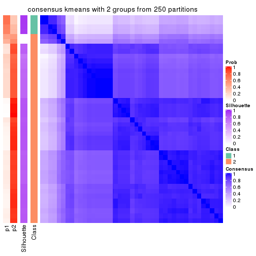</p>

</div>
<div id='tab-ATC-kmeans-consensus-heatmap-2'>
<pre><code class="r">consensus_heatmap(res, k = 3)
</code></pre>

<p>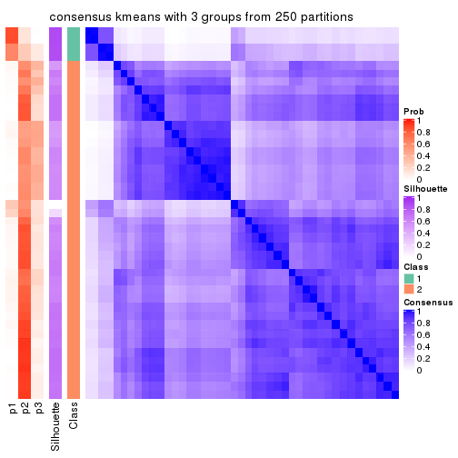</p>

</div>
<div id='tab-ATC-kmeans-consensus-heatmap-3'>
<pre><code class="r">consensus_heatmap(res, k = 4)
</code></pre>

<p>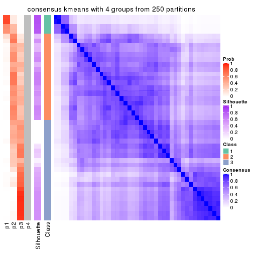</p>

</div>
<div id='tab-ATC-kmeans-consensus-heatmap-4'>
<pre><code class="r">consensus_heatmap(res, k = 5)
</code></pre>

<p>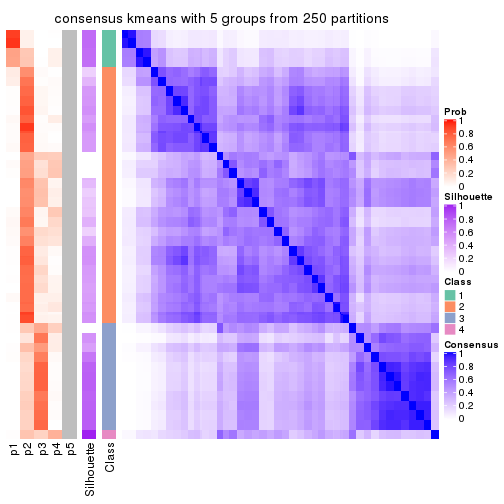</p>

</div>
<div id='tab-ATC-kmeans-consensus-heatmap-5'>
<pre><code class="r">consensus_heatmap(res, k = 6)
</code></pre>

<p>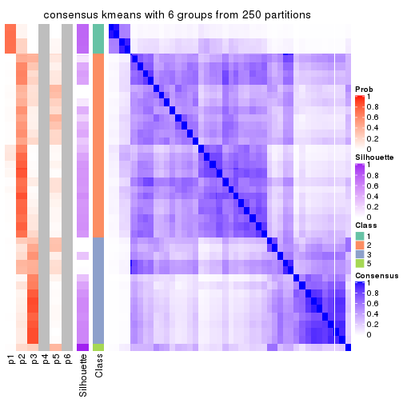</p>

</div>
</div>

Heatmaps for the membership of samples in all partitions to see how consistent they are:


<script>
$( function() {
	$( '#tabs-ATC-kmeans-membership-heatmap' ).tabs();
} );
</script>
<div id='tabs-ATC-kmeans-membership-heatmap'>
<ul>
<li><a href='#tab-ATC-kmeans-membership-heatmap-1'>k = 2</a></li>
<li><a href='#tab-ATC-kmeans-membership-heatmap-2'>k = 3</a></li>
<li><a href='#tab-ATC-kmeans-membership-heatmap-3'>k = 4</a></li>
<li><a href='#tab-ATC-kmeans-membership-heatmap-4'>k = 5</a></li>
<li><a href='#tab-ATC-kmeans-membership-heatmap-5'>k = 6</a></li>
</ul>
<div id='tab-ATC-kmeans-membership-heatmap-1'>
<pre><code class="r">membership_heatmap(res, k = 2)
</code></pre>

<p>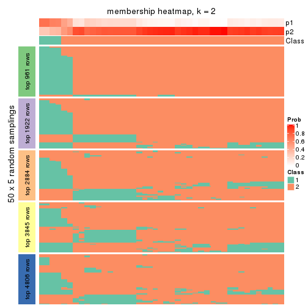</p>

</div>
<div id='tab-ATC-kmeans-membership-heatmap-2'>
<pre><code class="r">membership_heatmap(res, k = 3)
</code></pre>

<p></p>

</div>
<div id='tab-ATC-kmeans-membership-heatmap-3'>
<pre><code class="r">membership_heatmap(res, k = 4)
</code></pre>

<p>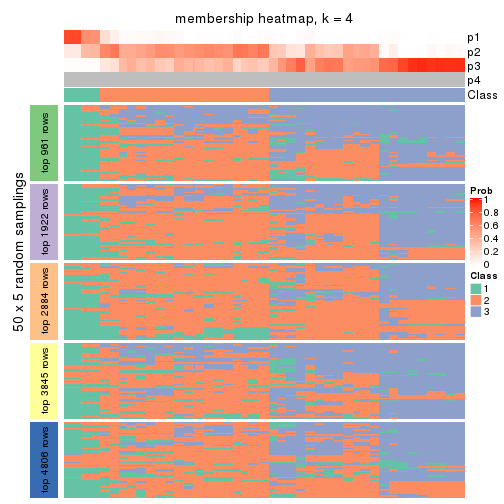</p>

</div>
<div id='tab-ATC-kmeans-membership-heatmap-4'>
<pre><code class="r">membership_heatmap(res, k = 5)
</code></pre>

<p>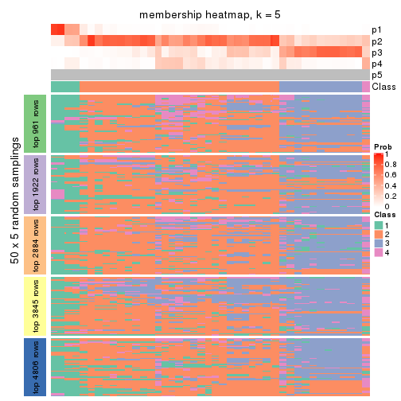</p>

</div>
<div id='tab-ATC-kmeans-membership-heatmap-5'>
<pre><code class="r">membership_heatmap(res, k = 6)
</code></pre>

<p>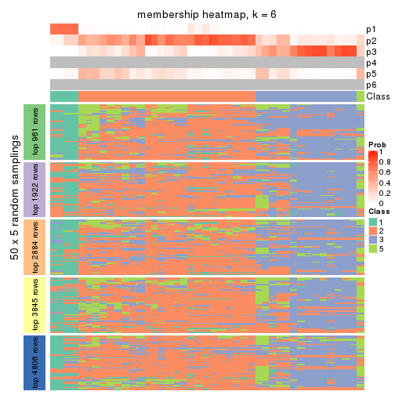</p>

</div>
</div>

As soon as we have had the classes for columns, we can look for signatures
which are significantly different between classes which can be candidate marks
for certain classes. Following are the heatmaps for signatures.


Signature heatmaps where rows are scaled:


<script>
$( function() {
	$( '#tabs-ATC-kmeans-get-signatures' ).tabs();
} );
</script>
<div id='tabs-ATC-kmeans-get-signatures'>
<ul>
<li><a href='#tab-ATC-kmeans-get-signatures-1'>k = 2</a></li>
<li><a href='#tab-ATC-kmeans-get-signatures-2'>k = 3</a></li>
<li><a href='#tab-ATC-kmeans-get-signatures-3'>k = 4</a></li>
<li><a href='#tab-ATC-kmeans-get-signatures-4'>k = 5</a></li>
<li><a href='#tab-ATC-kmeans-get-signatures-5'>k = 6</a></li>
</ul>
<div id='tab-ATC-kmeans-get-signatures-1'>
<pre><code class="r">get_signatures(res, k = 2)
</code></pre>

<p>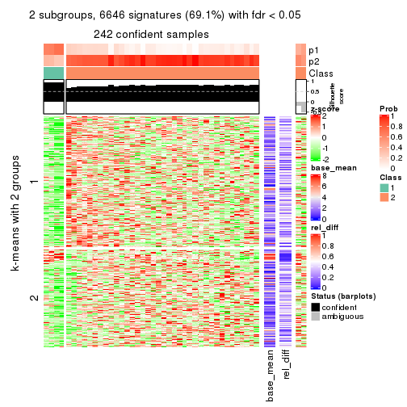</p>

</div>
<div id='tab-ATC-kmeans-get-signatures-2'>
<pre><code class="r">get_signatures(res, k = 3)
</code></pre>

<p>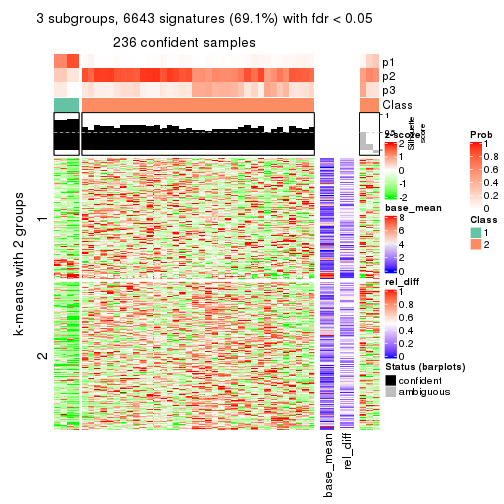</p>

</div>
<div id='tab-ATC-kmeans-get-signatures-3'>
<pre><code class="r">get_signatures(res, k = 4)
</code></pre>

<p>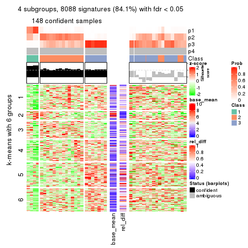</p>

</div>
<div id='tab-ATC-kmeans-get-signatures-4'>
<pre><code class="r">get_signatures(res, k = 5)
</code></pre>

<p>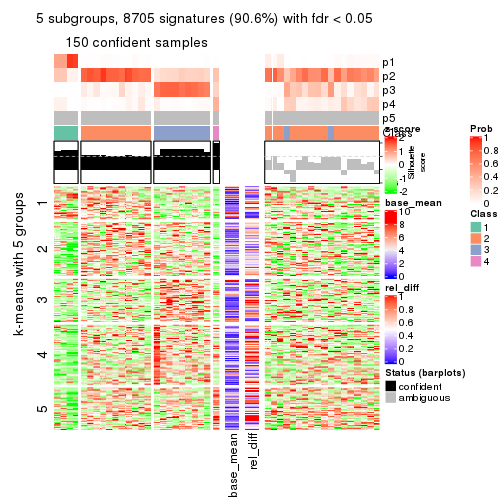</p>

</div>
<div id='tab-ATC-kmeans-get-signatures-5'>
<pre><code class="r">get_signatures(res, k = 6)
</code></pre>

<p>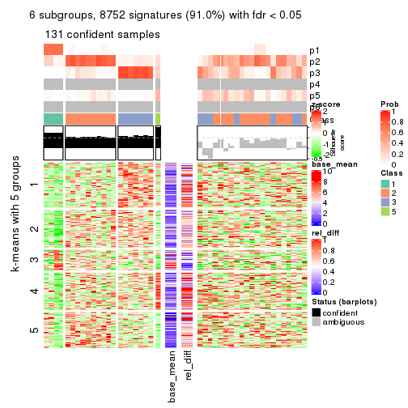</p>

</div>
</div>


Signature heatmaps where rows are not scaled:


<script>
$( function() {
	$( '#tabs-ATC-kmeans-get-signatures-no-scale' ).tabs();
} );
</script>
<div id='tabs-ATC-kmeans-get-signatures-no-scale'>
<ul>
<li><a href='#tab-ATC-kmeans-get-signatures-no-scale-1'>k = 2</a></li>
<li><a href='#tab-ATC-kmeans-get-signatures-no-scale-2'>k = 3</a></li>
<li><a href='#tab-ATC-kmeans-get-signatures-no-scale-3'>k = 4</a></li>
<li><a href='#tab-ATC-kmeans-get-signatures-no-scale-4'>k = 5</a></li>
<li><a href='#tab-ATC-kmeans-get-signatures-no-scale-5'>k = 6</a></li>
</ul>
<div id='tab-ATC-kmeans-get-signatures-no-scale-1'>
<pre><code class="r">get_signatures(res, k = 2, scale_rows = FALSE)
</code></pre>

<p>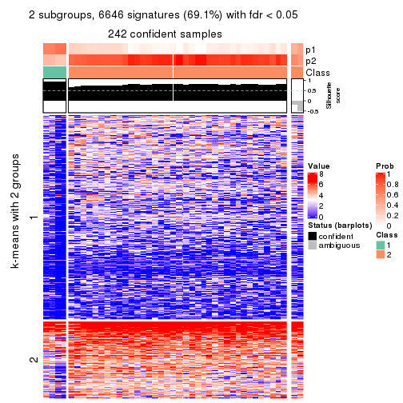</p>

</div>
<div id='tab-ATC-kmeans-get-signatures-no-scale-2'>
<pre><code class="r">get_signatures(res, k = 3, scale_rows = FALSE)
</code></pre>

<p>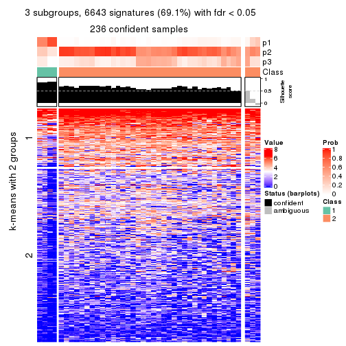</p>

</div>
<div id='tab-ATC-kmeans-get-signatures-no-scale-3'>
<pre><code class="r">get_signatures(res, k = 4, scale_rows = FALSE)
</code></pre>

<p>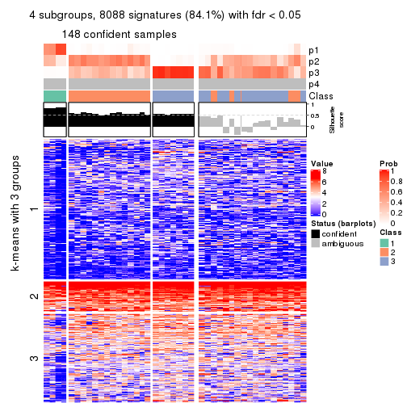</p>

</div>
<div id='tab-ATC-kmeans-get-signatures-no-scale-4'>
<pre><code class="r">get_signatures(res, k = 5, scale_rows = FALSE)
</code></pre>

<p>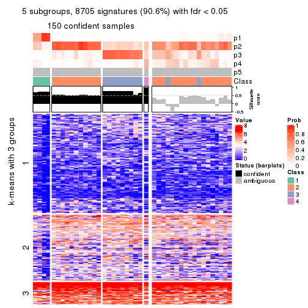</p>

</div>
<div id='tab-ATC-kmeans-get-signatures-no-scale-5'>
<pre><code class="r">get_signatures(res, k = 6, scale_rows = FALSE)
</code></pre>

<p>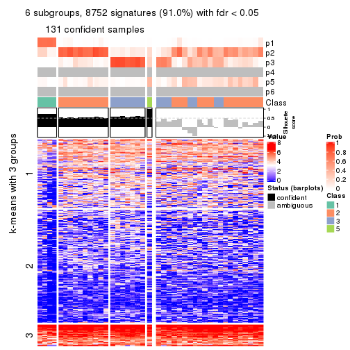</p>

</div>
</div>


Compare the overlap of signatures from different k:

```r
compare_signatures(res)
```

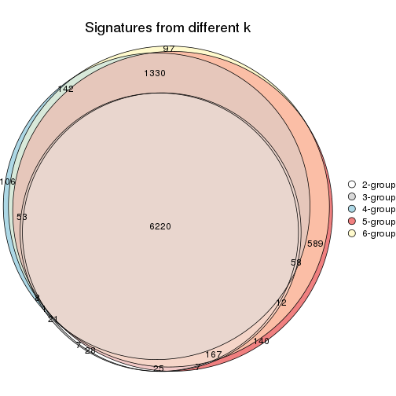

`get_signature()` returns a data frame invisibly. TO get the list of signatures, the function
call should be assigned to a variable explicitly. In following code, if `plot` argument is set
to `FALSE`, no heatmap is plotted while only the differential analysis is performed.

```r
# code only for demonstration
tb = get_signature(res, k = ..., plot = FALSE)
```

An example of the output of `tb` is:

```
#>   which_row         fdr    mean_1    mean_2 scaled_mean_1 scaled_mean_2 km
#> 1        38 0.042760348  8.373488  9.131774    -0.5533452     0.5164555  1
#> 2        40 0.018707592  7.106213  8.469186    -0.6173731     0.5762149  1
#> 3        55 0.019134737 10.221463 11.207825    -0.6159697     0.5749050  1
#> 4        59 0.006059896  5.921854  7.869574    -0.6899429     0.6439467  1
#> 5        60 0.018055526  8.928898 10.211722    -0.6204761     0.5791110  1
#> 6        98 0.009384629 15.714769 14.887706     0.6635654    -0.6193277  2
...
```

The columns in `tb` are:

1. `which_row`: row indices corresponding to the input matrix.
2. `fdr`: FDR for the differential test. 
3. `mean_x`: The mean value in group x.
4. `scaled_mean_x`: The mean value in group x after rows are scaled.
5. `km`: Row groups if k-means clustering is applied to rows.


UMAP plot which shows how samples are separated.


<script>
$( function() {
	$( '#tabs-ATC-kmeans-dimension-reduction' ).tabs();
} );
</script>
<div id='tabs-ATC-kmeans-dimension-reduction'>
<ul>
<li><a href='#tab-ATC-kmeans-dimension-reduction-1'>k = 2</a></li>
<li><a href='#tab-ATC-kmeans-dimension-reduction-2'>k = 3</a></li>
<li><a href='#tab-ATC-kmeans-dimension-reduction-3'>k = 4</a></li>
<li><a href='#tab-ATC-kmeans-dimension-reduction-4'>k = 5</a></li>
<li><a href='#tab-ATC-kmeans-dimension-reduction-5'>k = 6</a></li>
</ul>
<div id='tab-ATC-kmeans-dimension-reduction-1'>
<pre><code class="r">dimension_reduction(res, k = 2, method = &quot;UMAP&quot;)
</code></pre>

<p>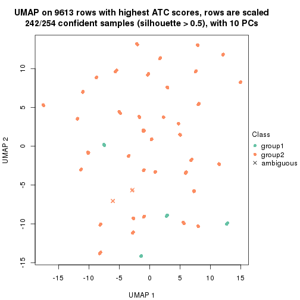</p>

</div>
<div id='tab-ATC-kmeans-dimension-reduction-2'>
<pre><code class="r">dimension_reduction(res, k = 3, method = &quot;UMAP&quot;)
</code></pre>

<p>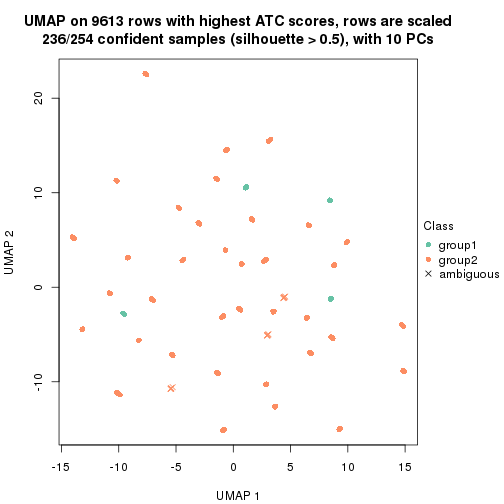</p>

</div>
<div id='tab-ATC-kmeans-dimension-reduction-3'>
<pre><code class="r">dimension_reduction(res, k = 4, method = &quot;UMAP&quot;)
</code></pre>

<p>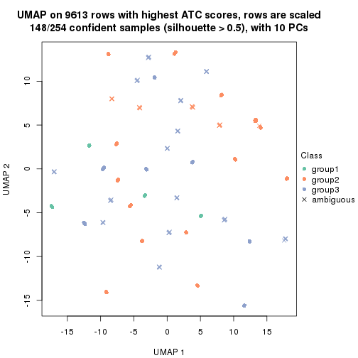</p>

</div>
<div id='tab-ATC-kmeans-dimension-reduction-4'>
<pre><code class="r">dimension_reduction(res, k = 5, method = &quot;UMAP&quot;)
</code></pre>

<p>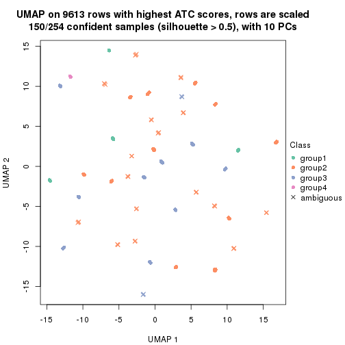</p>

</div>
<div id='tab-ATC-kmeans-dimension-reduction-5'>
<pre><code class="r">dimension_reduction(res, k = 6, method = &quot;UMAP&quot;)
</code></pre>

<p>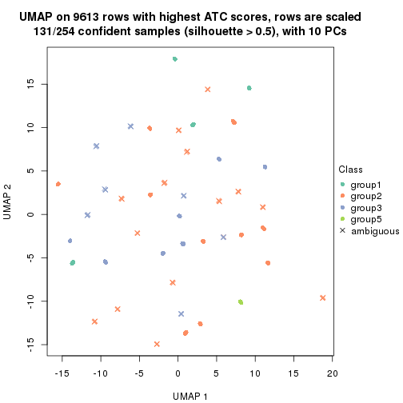</p>

</div>
</div>


Following heatmap shows how subgroups are split when increasing `k`:

```r
collect_classes(res)
```

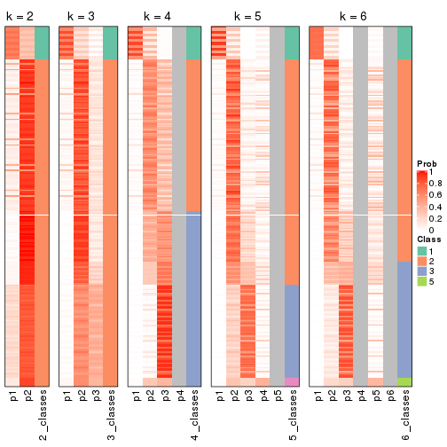


If matrix rows can be associated to genes, consider to use `GO_Enrichment(res,
...)` to perform function enrichment for the signature genes.


 

---------------------------------------------------


### ATC:skmeans


The object with results only for a single top-value method and a single partition method 
can be extracted as:

```r
res = res_list["ATC", "skmeans"]
# you can also extract it by
# res = res_list["ATC:skmeans"]
```

A summary of `res` and all the functions that can be applied to it:

```r
res
```

```
#> A 'ConsensusPartition' object with k = 2, 3, 4, 5, 6.
#>   On a matrix with 9613 rows and 254 columns.
#>   Top rows (961, 1922, 2884, 3845, 4806) are extracted by 'ATC' method.
#>   Subgroups are detected by 'skmeans' method.
#>   Performed in total 1250 partitions by row resampling.
#>   Best k for subgroups seems to be 2.
#> 
#> Following methods can be applied to this 'ConsensusPartition' object:
#>  [1] "cola_report"             "collect_classes"         "collect_plots"          
#>  [4] "collect_stats"           "colnames"                "compare_signatures"     
#>  [7] "consensus_heatmap"       "dimension_reduction"     "functional_enrichment"  
#> [10] "get_anno_col"            "get_anno"                "get_classes"            
#> [13] "get_consensus"           "get_matrix"              "get_membership"         
#> [16] "get_param"               "get_signatures"          "get_stats"              
#> [19] "is_best_k"               "is_stable_k"             "membership_heatmap"     
#> [22] "ncol"                    "nrow"                    "plot_ecdf"              
#> [25] "rownames"                "select_partition_number" "show"                   
#> [28] "suggest_best_k"          "test_to_known_factors"
```

`collect_plots()` function collects all the plots made from `res` for all `k` (number of partitions)
into one single page to provide an easy and fast comparison between different `k`.

```r
collect_plots(res)
```

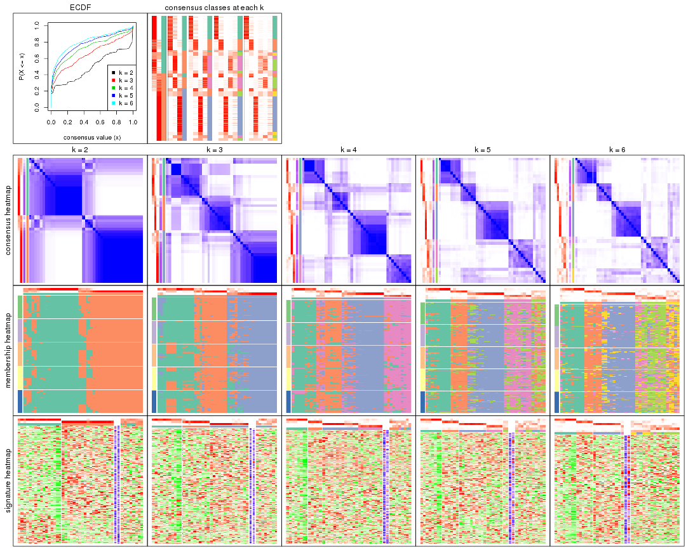

The plots are:

- The first row: a plot of the ECDF (Empirical cumulative distribution
  function) curves of the consensus matrix for each `k` and the heatmap of
  predicted classes for each `k`.
- The second row: heatmaps of the consensus matrix for each `k`.
- The third row: heatmaps of the membership matrix for each `k`.
- The fouth row: heatmaps of the signatures for each `k`.

All the plots in panels can be made by individual functions and they are
plotted later in this section.

`select_partition_number()` produces several plots showing different
statistics for choosing "optimized" `k`. There are following statistics:

- ECDF curves of the consensus matrix for each `k`;
- 1-PAC. [The PAC
  score](https://en.wikipedia.org/wiki/Consensus_clustering#Over-interpretation_potential_of_consensus_clustering)
  measures the proportion of the ambiguous subgrouping.
- Mean silhouette score.
- Concordance. The mean probability of fiting the consensus class ids in all
  partitions.
- Area increased. Denote $A_k$ as the area under the ECDF curve for current
  `k`, the area increased is defined as $A_k - A_{k-1}$.
- Rand index. The percent of pairs of samples that are both in a same cluster
  or both are not in a same cluster in the partition of k and k-1.
- Jaccard index. The ratio of pairs of samples are both in a same cluster in
  the partition of k and k-1 and the pairs of samples are both in a same
  cluster in the partition k or k-1.

The detailed explanations of these statistics can be found in [the cola
vignette](http://bioconductor.org/packages/devel/bioc/vignettes/cola/inst/doc/cola.html#toc_13).

Generally speaking, lower PAC score, higher mean silhouette score or higher
concordance corresponds to better partition. Rand index and Jaccard index
measure how similar the current partition is compared to partition with `k-1`.
If they are too similar, we won't accept `k` is better than `k-1`.

```r
select_partition_number(res)
```

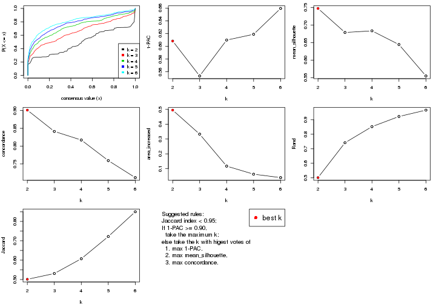

The numeric values for all these statistics can be obtained by `get_stats()`.

```r
get_stats(res)
```

```
#>   k 1-PAC mean_silhouette concordance area_increased  Rand Jaccard
#> 2 2 0.608           0.747       0.901         0.4951 0.501   0.501
#> 3 3 0.553           0.679       0.841         0.3330 0.741   0.531
#> 4 4 0.610           0.683       0.817         0.1171 0.852   0.607
#> 5 5 0.619           0.644       0.759         0.0627 0.922   0.722
#> 6 6 0.659           0.555       0.712         0.0395 0.966   0.850
```

`suggest_best_k()` suggests the best $k$ based on these statistics. The rules are as follows:

- All $k$ with Jaccard index larger than 0.95 are removed because the increase of
  the partition number does not provides enough extra information. If all $k$ are removed,
  the best $k$ is assigned by `NA`.
- For $k$ with 1-PAC larger than 0.9, the maximal $k$ is taken as the "best k". Other $k$ is called "optional k".
- If it does not fit the second rule. The $k$ with the highest vote of highest
  1-PAC, mean silhouette and concordance is taken as the "best k".

```r
suggest_best_k(res)
```

```
#> [1] 2
```


Following shows the table of the partitions (You need to click the **show/hide
code output** link to see it). The membership matrix (columns with name `p*`)
is inferred by
[`clue::cl_consensus()`](https://www.rdocumentation.org/link/cl_consensus?package=clue)
function with the `SE` method. Basically the value in the membership matrix
represents the probability to belong to a certain group. The finall class
label for an item is determined with the group with highest probability it
belongs to.

In `get_classes()` function, the entropy is calculated from the membership
matrix and the silhouette score is calculated from the consensus matrix.


<script>
$( function() {
	$( '#tabs-ATC-skmeans-get-classes' ).tabs();
} );
</script>
<div id='tabs-ATC-skmeans-get-classes'>
<ul>
<li><a href='#tab-ATC-skmeans-get-classes-1'>k = 2</a></li>
<li><a href='#tab-ATC-skmeans-get-classes-2'>k = 3</a></li>
<li><a href='#tab-ATC-skmeans-get-classes-3'>k = 4</a></li>
<li><a href='#tab-ATC-skmeans-get-classes-4'>k = 5</a></li>
<li><a href='#tab-ATC-skmeans-get-classes-5'>k = 6</a></li>
</ul>

<div id='tab-ATC-skmeans-get-classes-1'>
<p><a id='tab-ATC-skmeans-get-classes-1-a' style='color:#0366d6' href='#'>show/hide code output</a></p>
<pre><code class="r">cbind(get_classes(res, k = 2), get_membership(res, k = 2))
</code></pre>

<pre><code>#&gt;           class entropy silhouette    p1    p2
#&gt; DRR024803     1  0.0000     0.8657 1.000 0.000
#&gt; DRR024804     2  0.0000     0.8956 0.000 1.000
#&gt; DRR024805     2  0.9460     0.3553 0.364 0.636
#&gt; DRR024806     1  0.8713     0.5661 0.708 0.292
#&gt; DRR024807     2  0.0000     0.8956 0.000 1.000
#&gt; DRR024808     2  0.0000     0.8956 0.000 1.000
#&gt; DRR024809     1  0.2043     0.8531 0.968 0.032
#&gt; DRR024810     1  0.0000     0.8657 1.000 0.000
#&gt; DRR024811     2  0.0000     0.8956 0.000 1.000
#&gt; DRR024812     1  0.0000     0.8657 1.000 0.000
#&gt; DRR024813     2  0.0000     0.8956 0.000 1.000
#&gt; DRR024814     1  0.6801     0.7358 0.820 0.180
#&gt; DRR024815     1  0.1633     0.8567 0.976 0.024
#&gt; DRR024816     1  0.0000     0.8657 1.000 0.000
#&gt; DRR024817     1  0.9754     0.3191 0.592 0.408
#&gt; DRR024818     2  0.0000     0.8956 0.000 1.000
#&gt; DRR024819     1  0.9491     0.4306 0.632 0.368
#&gt; DRR024820     2  0.9209     0.4434 0.336 0.664
#&gt; DRR024821     2  0.0000     0.8956 0.000 1.000
#&gt; DRR024822     1  1.0000     0.0667 0.500 0.500
#&gt; DRR024824     1  0.2423     0.8481 0.960 0.040
#&gt; DRR024825     2  0.0000     0.8956 0.000 1.000
#&gt; DRR024826     2  0.0000     0.8956 0.000 1.000
#&gt; DRR024827     2  0.0000     0.8956 0.000 1.000
#&gt; DRR024828     2  0.0000     0.8956 0.000 1.000
#&gt; DRR024829     1  0.0000     0.8657 1.000 0.000
#&gt; DRR024830     1  0.9896     0.2693 0.560 0.440
#&gt; DRR024831     2  0.0000     0.8956 0.000 1.000
#&gt; DRR024832     2  0.0000     0.8956 0.000 1.000
#&gt; DRR024833     2  0.0000     0.8956 0.000 1.000
#&gt; DRR024834     1  0.0000     0.8657 1.000 0.000
#&gt; DRR024835     2  0.9993     0.0290 0.484 0.516
#&gt; DRR024836     2  0.0000     0.8956 0.000 1.000
#&gt; DRR024837     1  0.0000     0.8657 1.000 0.000
#&gt; DRR024838     1  0.0376     0.8644 0.996 0.004
#&gt; DRR024839     2  0.1414     0.8817 0.020 0.980
#&gt; DRR024840     2  0.7139     0.6832 0.196 0.804
#&gt; DRR024841     1  0.0000     0.8657 1.000 0.000
#&gt; DRR024842     1  0.9954     0.2166 0.540 0.460
#&gt; DRR024843     1  0.0000     0.8657 1.000 0.000
#&gt; DRR024844     2  0.0000     0.8956 0.000 1.000
#&gt; DRR024845     2  0.9460     0.3553 0.364 0.636
#&gt; DRR024846     1  0.8713     0.5661 0.708 0.292
#&gt; DRR024847     2  0.0000     0.8956 0.000 1.000
#&gt; DRR024848     1  0.0000     0.8657 1.000 0.000
#&gt; DRR024849     2  0.0000     0.8956 0.000 1.000
#&gt; DRR024850     2  0.0672     0.8907 0.008 0.992
#&gt; DRR024851     1  0.2043     0.8531 0.968 0.032
#&gt; DRR024852     1  0.0000     0.8657 1.000 0.000
#&gt; DRR024853     2  0.0000     0.8956 0.000 1.000
#&gt; DRR024854     1  0.0000     0.8657 1.000 0.000
#&gt; DRR024855     2  0.0000     0.8956 0.000 1.000
#&gt; DRR024856     1  0.7056     0.7232 0.808 0.192
#&gt; DRR024857     1  0.1633     0.8567 0.976 0.024
#&gt; DRR024858     1  0.0000     0.8657 1.000 0.000
#&gt; DRR024859     1  0.9754     0.3191 0.592 0.408
#&gt; DRR024860     2  0.0000     0.8956 0.000 1.000
#&gt; DRR024861     1  0.9491     0.4306 0.632 0.368
#&gt; DRR024862     2  0.9209     0.4434 0.336 0.664
#&gt; DRR024863     2  0.0000     0.8956 0.000 1.000
#&gt; DRR024864     1  1.0000     0.0667 0.500 0.500
#&gt; DRR024865     1  0.0000     0.8657 1.000 0.000
#&gt; DRR024866     1  0.2423     0.8481 0.960 0.040
#&gt; DRR024867     2  0.0000     0.8956 0.000 1.000
#&gt; DRR024868     2  0.0000     0.8956 0.000 1.000
#&gt; DRR024869     2  0.0000     0.8956 0.000 1.000
#&gt; DRR024870     2  0.0000     0.8956 0.000 1.000
#&gt; DRR024871     1  0.0000     0.8657 1.000 0.000
#&gt; DRR024872     1  0.9977     0.1773 0.528 0.472
#&gt; DRR024873     2  0.0000     0.8956 0.000 1.000
#&gt; DRR024874     2  0.0000     0.8956 0.000 1.000
#&gt; DRR024875     2  0.0000     0.8956 0.000 1.000
#&gt; DRR024876     1  0.0000     0.8657 1.000 0.000
#&gt; DRR024877     2  0.9993     0.0290 0.484 0.516
#&gt; DRR024878     2  0.0000     0.8956 0.000 1.000
#&gt; DRR024879     1  0.0000     0.8657 1.000 0.000
#&gt; DRR024880     1  0.1633     0.8576 0.976 0.024
#&gt; DRR024881     2  0.1414     0.8817 0.020 0.980
#&gt; DRR024882     2  0.7056     0.6882 0.192 0.808
#&gt; DRR024883     1  0.0000     0.8657 1.000 0.000
#&gt; DRR024884     2  0.9635     0.3211 0.388 0.612
#&gt; DRR024885     2  0.2778     0.8590 0.048 0.952
#&gt; DRR024886     1  0.0000     0.8657 1.000 0.000
#&gt; DRR024887     2  0.0000     0.8956 0.000 1.000
#&gt; DRR024888     2  0.9460     0.3553 0.364 0.636
#&gt; DRR024889     1  0.8713     0.5661 0.708 0.292
#&gt; DRR024890     2  0.0000     0.8956 0.000 1.000
#&gt; DRR024891     1  0.0000     0.8657 1.000 0.000
#&gt; DRR024892     2  0.0000     0.8956 0.000 1.000
#&gt; DRR024893     2  0.0672     0.8907 0.008 0.992
#&gt; DRR024894     1  0.2043     0.8531 0.968 0.032
#&gt; DRR024895     1  0.0000     0.8657 1.000 0.000
#&gt; DRR024896     2  0.0000     0.8956 0.000 1.000
#&gt; DRR024897     1  0.0000     0.8657 1.000 0.000
#&gt; DRR024898     2  0.0000     0.8956 0.000 1.000
#&gt; DRR024899     1  0.7056     0.7232 0.808 0.192
#&gt; DRR024900     1  0.1633     0.8567 0.976 0.024
#&gt; DRR024901     1  0.0000     0.8657 1.000 0.000
#&gt; DRR024902     1  0.9754     0.3191 0.592 0.408
#&gt; DRR024903     2  0.0000     0.8956 0.000 1.000
#&gt; DRR024904     1  0.9491     0.4306 0.632 0.368
#&gt; DRR024905     2  0.9209     0.4434 0.336 0.664
#&gt; DRR024906     2  0.0000     0.8956 0.000 1.000
#&gt; DRR024907     1  1.0000     0.0667 0.500 0.500
#&gt; DRR024908     1  0.0000     0.8657 1.000 0.000
#&gt; DRR024909     1  0.2423     0.8481 0.960 0.040
#&gt; DRR024910     2  0.0000     0.8956 0.000 1.000
#&gt; DRR024911     2  0.0000     0.8956 0.000 1.000
#&gt; DRR024912     2  0.0000     0.8956 0.000 1.000
#&gt; DRR024913     2  0.0000     0.8956 0.000 1.000
#&gt; DRR024914     1  0.0000     0.8657 1.000 0.000
#&gt; DRR024915     1  0.9977     0.1773 0.528 0.472
#&gt; DRR024916     2  0.0000     0.8956 0.000 1.000
#&gt; DRR024917     2  0.0000     0.8956 0.000 1.000
#&gt; DRR024918     2  0.0000     0.8956 0.000 1.000
#&gt; DRR024919     1  0.0000     0.8657 1.000 0.000
#&gt; DRR024920     2  0.9993     0.0290 0.484 0.516
#&gt; DRR024921     2  0.0000     0.8956 0.000 1.000
#&gt; DRR024922     1  0.0000     0.8657 1.000 0.000
#&gt; DRR024923     1  0.1633     0.8576 0.976 0.024
#&gt; DRR024924     2  0.1414     0.8817 0.020 0.980
#&gt; DRR024925     2  0.7056     0.6882 0.192 0.808
#&gt; DRR024926     1  0.0000     0.8657 1.000 0.000
#&gt; DRR024927     2  0.9635     0.3211 0.388 0.612
#&gt; DRR024928     2  0.2778     0.8590 0.048 0.952
#&gt; DRR024929     1  0.0000     0.8657 1.000 0.000
#&gt; DRR024930     2  0.0000     0.8956 0.000 1.000
#&gt; DRR024931     2  0.9460     0.3553 0.364 0.636
#&gt; DRR024932     1  0.8713     0.5661 0.708 0.292
#&gt; DRR024933     2  0.0000     0.8956 0.000 1.000
#&gt; DRR024934     1  0.0000     0.8657 1.000 0.000
#&gt; DRR024935     2  0.0000     0.8956 0.000 1.000
#&gt; DRR024936     2  0.0672     0.8907 0.008 0.992
#&gt; DRR024937     1  0.2043     0.8531 0.968 0.032
#&gt; DRR024938     1  0.0000     0.8657 1.000 0.000
#&gt; DRR024939     2  0.0000     0.8956 0.000 1.000
#&gt; DRR024940     1  0.0000     0.8657 1.000 0.000
#&gt; DRR024941     2  0.0000     0.8956 0.000 1.000
#&gt; DRR024942     1  0.7056     0.7232 0.808 0.192
#&gt; DRR024943     1  0.1633     0.8567 0.976 0.024
#&gt; DRR024944     1  0.0000     0.8657 1.000 0.000
#&gt; DRR024945     1  0.9754     0.3191 0.592 0.408
#&gt; DRR024946     2  0.0000     0.8956 0.000 1.000
#&gt; DRR024947     1  0.9491     0.4306 0.632 0.368
#&gt; DRR024948     2  0.9209     0.4434 0.336 0.664
#&gt; DRR024949     2  0.0000     0.8956 0.000 1.000
#&gt; DRR024950     1  1.0000     0.0667 0.500 0.500
#&gt; DRR024951     1  0.0000     0.8657 1.000 0.000
#&gt; DRR024952     1  0.2423     0.8481 0.960 0.040
#&gt; DRR024953     2  0.0000     0.8956 0.000 1.000
#&gt; DRR024954     2  0.0000     0.8956 0.000 1.000
#&gt; DRR024955     2  0.0000     0.8956 0.000 1.000
#&gt; DRR024956     2  0.0000     0.8956 0.000 1.000
#&gt; DRR024957     1  0.0000     0.8657 1.000 0.000
#&gt; DRR024958     1  0.9977     0.1773 0.528 0.472
#&gt; DRR024959     2  0.0000     0.8956 0.000 1.000
#&gt; DRR024960     2  0.0000     0.8956 0.000 1.000
#&gt; DRR024961     2  0.0000     0.8956 0.000 1.000
#&gt; DRR024962     1  0.0000     0.8657 1.000 0.000
#&gt; DRR024963     2  0.9993     0.0290 0.484 0.516
#&gt; DRR024964     2  0.0000     0.8956 0.000 1.000
#&gt; DRR024965     1  0.0000     0.8657 1.000 0.000
#&gt; DRR024966     1  0.1633     0.8576 0.976 0.024
#&gt; DRR024967     2  0.1414     0.8817 0.020 0.980
#&gt; DRR024968     2  0.7056     0.6882 0.192 0.808
#&gt; DRR024969     1  0.0000     0.8657 1.000 0.000
#&gt; DRR024970     2  0.9635     0.3211 0.388 0.612
#&gt; DRR024971     2  0.2778     0.8590 0.048 0.952
#&gt; DRR024972     1  0.0000     0.8657 1.000 0.000
#&gt; DRR024973     2  0.0000     0.8956 0.000 1.000
#&gt; DRR024974     2  0.9460     0.3553 0.364 0.636
#&gt; DRR024975     1  0.8713     0.5661 0.708 0.292
#&gt; DRR024976     2  0.0000     0.8956 0.000 1.000
#&gt; DRR024977     1  0.0000     0.8657 1.000 0.000
#&gt; DRR024978     2  0.0000     0.8956 0.000 1.000
#&gt; DRR024979     2  0.0672     0.8907 0.008 0.992
#&gt; DRR024980     1  0.2043     0.8531 0.968 0.032
#&gt; DRR024981     1  0.0000     0.8657 1.000 0.000
#&gt; DRR024982     2  0.0000     0.8956 0.000 1.000
#&gt; DRR024983     1  0.0000     0.8657 1.000 0.000
#&gt; DRR024984     2  0.0000     0.8956 0.000 1.000
#&gt; DRR024985     1  0.7056     0.7232 0.808 0.192
#&gt; DRR024986     1  0.1633     0.8567 0.976 0.024
#&gt; DRR024987     1  0.0000     0.8657 1.000 0.000
#&gt; DRR024988     1  0.9754     0.3191 0.592 0.408
#&gt; DRR024989     2  0.0000     0.8956 0.000 1.000
#&gt; DRR024990     1  0.9491     0.4306 0.632 0.368
#&gt; DRR024991     2  0.9209     0.4434 0.336 0.664
#&gt; DRR024992     2  0.0000     0.8956 0.000 1.000
#&gt; DRR024993     2  1.0000    -0.0814 0.500 0.500
#&gt; DRR024994     1  0.0000     0.8657 1.000 0.000
#&gt; DRR024995     1  0.2423     0.8481 0.960 0.040
#&gt; DRR024996     2  0.0000     0.8956 0.000 1.000
#&gt; DRR024997     2  0.0000     0.8956 0.000 1.000
#&gt; DRR024998     2  0.0000     0.8956 0.000 1.000
#&gt; DRR024999     2  0.0000     0.8956 0.000 1.000
#&gt; DRR025000     1  0.0000     0.8657 1.000 0.000
#&gt; DRR025001     1  0.9977     0.1773 0.528 0.472
#&gt; DRR025002     2  0.0000     0.8956 0.000 1.000
#&gt; DRR025003     2  0.0000     0.8956 0.000 1.000
#&gt; DRR025004     2  0.0000     0.8956 0.000 1.000
#&gt; DRR025005     1  0.0000     0.8657 1.000 0.000
#&gt; DRR025006     2  0.9993     0.0290 0.484 0.516
#&gt; DRR025007     2  0.0000     0.8956 0.000 1.000
#&gt; DRR025008     1  0.0000     0.8657 1.000 0.000
#&gt; DRR025009     1  0.1633     0.8576 0.976 0.024
#&gt; DRR025010     2  0.1414     0.8817 0.020 0.980
#&gt; DRR025011     2  0.7056     0.6882 0.192 0.808
#&gt; DRR025012     1  0.0000     0.8657 1.000 0.000
#&gt; DRR025013     2  0.9635     0.3211 0.388 0.612
#&gt; DRR025014     2  0.2778     0.8590 0.048 0.952
#&gt; DRR025015     1  0.0000     0.8657 1.000 0.000
#&gt; DRR025016     2  0.0000     0.8956 0.000 1.000
#&gt; DRR025017     2  0.9460     0.3553 0.364 0.636
#&gt; DRR025018     1  0.8713     0.5661 0.708 0.292
#&gt; DRR025019     2  0.0000     0.8956 0.000 1.000
#&gt; DRR025020     1  0.0000     0.8657 1.000 0.000
#&gt; DRR025021     2  0.0000     0.8956 0.000 1.000
#&gt; DRR025022     2  0.0672     0.8907 0.008 0.992
#&gt; DRR025023     1  0.2043     0.8531 0.968 0.032
#&gt; DRR025024     1  0.0000     0.8657 1.000 0.000
#&gt; DRR025025     2  0.0000     0.8956 0.000 1.000
#&gt; DRR025026     1  0.0000     0.8657 1.000 0.000
#&gt; DRR025027     2  0.0000     0.8956 0.000 1.000
#&gt; DRR025028     1  0.7056     0.7232 0.808 0.192
#&gt; DRR025029     1  0.1633     0.8567 0.976 0.024
#&gt; DRR025030     1  0.0000     0.8657 1.000 0.000
#&gt; DRR025031     1  0.9754     0.3191 0.592 0.408
#&gt; DRR025032     2  0.0000     0.8956 0.000 1.000
#&gt; DRR025033     1  0.9491     0.4306 0.632 0.368
#&gt; DRR025034     2  0.9209     0.4434 0.336 0.664
#&gt; DRR025035     2  0.0000     0.8956 0.000 1.000
#&gt; DRR025036     2  1.0000    -0.0814 0.500 0.500
#&gt; DRR025037     1  0.0000     0.8657 1.000 0.000
#&gt; DRR025038     1  0.2423     0.8481 0.960 0.040
#&gt; DRR025039     2  0.0000     0.8956 0.000 1.000
#&gt; DRR025040     2  0.0000     0.8956 0.000 1.000
#&gt; DRR025041     2  0.0000     0.8956 0.000 1.000
#&gt; DRR025042     2  0.0000     0.8956 0.000 1.000
#&gt; DRR025043     1  0.0000     0.8657 1.000 0.000
#&gt; DRR025044     1  0.9977     0.1773 0.528 0.472
#&gt; DRR025045     2  0.0000     0.8956 0.000 1.000
#&gt; DRR025046     2  0.0000     0.8956 0.000 1.000
#&gt; DRR025047     2  0.0000     0.8956 0.000 1.000
#&gt; DRR025048     1  0.0000     0.8657 1.000 0.000
#&gt; DRR025049     2  0.9993     0.0290 0.484 0.516
#&gt; DRR025050     2  0.0000     0.8956 0.000 1.000
#&gt; DRR025051     1  0.0000     0.8657 1.000 0.000
#&gt; DRR025052     1  0.1633     0.8576 0.976 0.024
#&gt; DRR025053     2  0.1414     0.8817 0.020 0.980
#&gt; DRR025054     2  0.7056     0.6882 0.192 0.808
#&gt; DRR025055     1  0.0000     0.8657 1.000 0.000
#&gt; DRR025056     2  0.9635     0.3211 0.388 0.612
#&gt; DRR025057     2  0.2778     0.8590 0.048 0.952
</code></pre>

<script>
$('#tab-ATC-skmeans-get-classes-1-a').parent().next().next().hide();
$('#tab-ATC-skmeans-get-classes-1-a').click(function(){
  $('#tab-ATC-skmeans-get-classes-1-a').parent().next().next().toggle();
  return(false);
});
</script>
</div>

<div id='tab-ATC-skmeans-get-classes-2'>
<p><a id='tab-ATC-skmeans-get-classes-2-a' style='color:#0366d6' href='#'>show/hide code output</a></p>
<pre><code class="r">cbind(get_classes(res, k = 3), get_membership(res, k = 3))
</code></pre>

<pre><code>#&gt;           class entropy silhouette    p1    p2    p3
#&gt; DRR024803     1  0.5785     0.6061 0.668 0.332 0.000
#&gt; DRR024804     3  0.6004     0.7311 0.156 0.064 0.780
#&gt; DRR024805     1  0.7591     0.0708 0.544 0.044 0.412
#&gt; DRR024806     1  0.2845     0.7027 0.920 0.012 0.068
#&gt; DRR024807     3  0.0000     0.8555 0.000 0.000 1.000
#&gt; DRR024808     3  0.0000     0.8555 0.000 0.000 1.000
#&gt; DRR024809     1  0.0237     0.7369 0.996 0.004 0.000
#&gt; DRR024810     1  0.2959     0.7554 0.900 0.100 0.000
#&gt; DRR024811     3  0.0000     0.8555 0.000 0.000 1.000
#&gt; DRR024812     1  0.2537     0.7561 0.920 0.080 0.000
#&gt; DRR024813     3  0.4339     0.8098 0.084 0.048 0.868
#&gt; DRR024814     2  0.5618     0.6227 0.260 0.732 0.008
#&gt; DRR024815     2  0.2261     0.7855 0.068 0.932 0.000
#&gt; DRR024816     1  0.2261     0.7554 0.932 0.068 0.000
#&gt; DRR024817     2  0.1781     0.8196 0.020 0.960 0.020
#&gt; DRR024818     3  0.1289     0.8438 0.000 0.032 0.968
#&gt; DRR024819     2  0.1015     0.8246 0.008 0.980 0.012
#&gt; DRR024820     2  0.2486     0.8050 0.008 0.932 0.060
#&gt; DRR024821     3  0.0000     0.8555 0.000 0.000 1.000
#&gt; DRR024822     1  0.6027     0.4688 0.712 0.016 0.272
#&gt; DRR024824     1  0.0747     0.7337 0.984 0.016 0.000
#&gt; DRR024825     3  0.0000     0.8555 0.000 0.000 1.000
#&gt; DRR024826     3  0.4475     0.7785 0.016 0.144 0.840
#&gt; DRR024827     3  0.6305     0.1100 0.000 0.484 0.516
#&gt; DRR024828     3  0.0237     0.8539 0.004 0.000 0.996
#&gt; DRR024829     2  0.0592     0.8220 0.012 0.988 0.000
#&gt; DRR024830     2  0.8577     0.3999 0.356 0.536 0.108
#&gt; DRR024831     3  0.0000     0.8555 0.000 0.000 1.000
#&gt; DRR024832     3  0.0000     0.8555 0.000 0.000 1.000
#&gt; DRR024833     3  0.3722     0.8141 0.024 0.088 0.888
#&gt; DRR024834     1  0.5785     0.6061 0.668 0.332 0.000
#&gt; DRR024835     2  0.0983     0.8240 0.004 0.980 0.016
#&gt; DRR024836     3  0.0000     0.8555 0.000 0.000 1.000
#&gt; DRR024837     1  0.5785     0.6061 0.668 0.332 0.000
#&gt; DRR024838     2  0.0424     0.8211 0.008 0.992 0.000
#&gt; DRR024839     3  0.9588     0.3106 0.216 0.324 0.460
#&gt; DRR024840     3  0.6513     0.4193 0.400 0.008 0.592
#&gt; DRR024841     1  0.3192     0.7529 0.888 0.112 0.000
#&gt; DRR024842     2  0.6205     0.5278 0.336 0.656 0.008
#&gt; DRR024843     1  0.5785     0.6061 0.668 0.332 0.000
#&gt; DRR024844     3  0.6004     0.7311 0.156 0.064 0.780
#&gt; DRR024845     1  0.7591     0.0708 0.544 0.044 0.412
#&gt; DRR024846     1  0.2845     0.7027 0.920 0.012 0.068
#&gt; DRR024847     3  0.0000     0.8555 0.000 0.000 1.000
#&gt; DRR024848     1  0.5785     0.6061 0.668 0.332 0.000
#&gt; DRR024849     3  0.0000     0.8555 0.000 0.000 1.000
#&gt; DRR024850     3  0.9347     0.3966 0.204 0.288 0.508
#&gt; DRR024851     1  0.0237     0.7369 0.996 0.004 0.000
#&gt; DRR024852     1  0.2959     0.7554 0.900 0.100 0.000
#&gt; DRR024853     3  0.0000     0.8555 0.000 0.000 1.000
#&gt; DRR024854     1  0.3267     0.7514 0.884 0.116 0.000
#&gt; DRR024855     3  0.4339     0.8098 0.084 0.048 0.868
#&gt; DRR024856     2  0.5618     0.6227 0.260 0.732 0.008
#&gt; DRR024857     2  0.2261     0.7855 0.068 0.932 0.000
#&gt; DRR024858     1  0.2261     0.7554 0.932 0.068 0.000
#&gt; DRR024859     2  0.1781     0.8196 0.020 0.960 0.020
#&gt; DRR024860     3  0.1289     0.8438 0.000 0.032 0.968
#&gt; DRR024861     2  0.1015     0.8246 0.008 0.980 0.012
#&gt; DRR024862     2  0.2486     0.8050 0.008 0.932 0.060
#&gt; DRR024863     3  0.0000     0.8555 0.000 0.000 1.000
#&gt; DRR024864     1  0.6027     0.4688 0.712 0.016 0.272
#&gt; DRR024865     2  0.6309    -0.1753 0.496 0.504 0.000
#&gt; DRR024866     1  0.0747     0.7337 0.984 0.016 0.000
#&gt; DRR024867     3  0.0000     0.8555 0.000 0.000 1.000
#&gt; DRR024868     3  0.4663     0.7674 0.016 0.156 0.828
#&gt; DRR024869     3  0.6305     0.1100 0.000 0.484 0.516
#&gt; DRR024870     3  0.0237     0.8539 0.004 0.000 0.996
#&gt; DRR024871     2  0.0592     0.8220 0.012 0.988 0.000
#&gt; DRR024872     2  0.8620     0.4015 0.352 0.536 0.112
#&gt; DRR024873     3  0.0000     0.8555 0.000 0.000 1.000
#&gt; DRR024874     3  0.0000     0.8555 0.000 0.000 1.000
#&gt; DRR024875     3  0.3886     0.8090 0.024 0.096 0.880
#&gt; DRR024876     1  0.5785     0.6061 0.668 0.332 0.000
#&gt; DRR024877     2  0.0983     0.8240 0.004 0.980 0.016
#&gt; DRR024878     3  0.0000     0.8555 0.000 0.000 1.000
#&gt; DRR024879     1  0.5785     0.6061 0.668 0.332 0.000
#&gt; DRR024880     2  0.0424     0.8211 0.008 0.992 0.000
#&gt; DRR024881     3  0.9588     0.3106 0.216 0.324 0.460
#&gt; DRR024882     3  0.6513     0.4193 0.400 0.008 0.592
#&gt; DRR024883     1  0.3192     0.7529 0.888 0.112 0.000
#&gt; DRR024884     2  0.0829     0.8246 0.004 0.984 0.012
#&gt; DRR024885     2  0.5254     0.5901 0.000 0.736 0.264
#&gt; DRR024886     1  0.5785     0.6061 0.668 0.332 0.000
#&gt; DRR024887     3  0.6004     0.7311 0.156 0.064 0.780
#&gt; DRR024888     1  0.7591     0.0708 0.544 0.044 0.412
#&gt; DRR024889     1  0.2845     0.7027 0.920 0.012 0.068
#&gt; DRR024890     3  0.0000     0.8555 0.000 0.000 1.000
#&gt; DRR024891     1  0.5785     0.6061 0.668 0.332 0.000
#&gt; DRR024892     3  0.0000     0.8555 0.000 0.000 1.000
#&gt; DRR024893     3  0.9347     0.3966 0.204 0.288 0.508
#&gt; DRR024894     1  0.0237     0.7369 0.996 0.004 0.000
#&gt; DRR024895     1  0.2959     0.7554 0.900 0.100 0.000
#&gt; DRR024896     3  0.0000     0.8555 0.000 0.000 1.000
#&gt; DRR024897     1  0.3267     0.7514 0.884 0.116 0.000
#&gt; DRR024898     3  0.4339     0.8098 0.084 0.048 0.868
#&gt; DRR024899     2  0.5618     0.6227 0.260 0.732 0.008
#&gt; DRR024900     2  0.2261     0.7855 0.068 0.932 0.000
#&gt; DRR024901     1  0.2261     0.7554 0.932 0.068 0.000
#&gt; DRR024902     2  0.1781     0.8196 0.020 0.960 0.020
#&gt; DRR024903     3  0.1289     0.8438 0.000 0.032 0.968
#&gt; DRR024904     2  0.1015     0.8246 0.008 0.980 0.012
#&gt; DRR024905     2  0.2486     0.8050 0.008 0.932 0.060
#&gt; DRR024906     3  0.0000     0.8555 0.000 0.000 1.000
#&gt; DRR024907     1  0.6027     0.4688 0.712 0.016 0.272
#&gt; DRR024908     2  0.6309    -0.1753 0.496 0.504 0.000
#&gt; DRR024909     1  0.0747     0.7337 0.984 0.016 0.000
#&gt; DRR024910     3  0.0000     0.8555 0.000 0.000 1.000
#&gt; DRR024911     3  0.4663     0.7674 0.016 0.156 0.828
#&gt; DRR024912     3  0.6305     0.1100 0.000 0.484 0.516
#&gt; DRR024913     3  0.0237     0.8539 0.004 0.000 0.996
#&gt; DRR024914     2  0.0592     0.8220 0.012 0.988 0.000
#&gt; DRR024915     2  0.8620     0.4015 0.352 0.536 0.112
#&gt; DRR024916     3  0.0000     0.8555 0.000 0.000 1.000
#&gt; DRR024917     3  0.0000     0.8555 0.000 0.000 1.000
#&gt; DRR024918     3  0.3886     0.8090 0.024 0.096 0.880
#&gt; DRR024919     1  0.5785     0.6061 0.668 0.332 0.000
#&gt; DRR024920     2  0.0983     0.8240 0.004 0.980 0.016
#&gt; DRR024921     3  0.0000     0.8555 0.000 0.000 1.000
#&gt; DRR024922     1  0.5785     0.6061 0.668 0.332 0.000
#&gt; DRR024923     2  0.0424     0.8211 0.008 0.992 0.000
#&gt; DRR024924     3  0.9588     0.3106 0.216 0.324 0.460
#&gt; DRR024925     3  0.6513     0.4193 0.400 0.008 0.592
#&gt; DRR024926     1  0.3192     0.7529 0.888 0.112 0.000
#&gt; DRR024927     2  0.0829     0.8246 0.004 0.984 0.012
#&gt; DRR024928     2  0.5254     0.5901 0.000 0.736 0.264
#&gt; DRR024929     1  0.5785     0.6061 0.668 0.332 0.000
#&gt; DRR024930     3  0.6004     0.7311 0.156 0.064 0.780
#&gt; DRR024931     1  0.7591     0.0708 0.544 0.044 0.412
#&gt; DRR024932     1  0.2845     0.7027 0.920 0.012 0.068
#&gt; DRR024933     3  0.0000     0.8555 0.000 0.000 1.000
#&gt; DRR024934     1  0.5785     0.6061 0.668 0.332 0.000
#&gt; DRR024935     3  0.0000     0.8555 0.000 0.000 1.000
#&gt; DRR024936     3  0.9347     0.3966 0.204 0.288 0.508
#&gt; DRR024937     1  0.0237     0.7369 0.996 0.004 0.000
#&gt; DRR024938     1  0.2959     0.7554 0.900 0.100 0.000
#&gt; DRR024939     3  0.0000     0.8555 0.000 0.000 1.000
#&gt; DRR024940     1  0.3267     0.7514 0.884 0.116 0.000
#&gt; DRR024941     3  0.4339     0.8098 0.084 0.048 0.868
#&gt; DRR024942     2  0.5618     0.6227 0.260 0.732 0.008
#&gt; DRR024943     2  0.2261     0.7855 0.068 0.932 0.000
#&gt; DRR024944     1  0.2261     0.7554 0.932 0.068 0.000
#&gt; DRR024945     2  0.1781     0.8196 0.020 0.960 0.020
#&gt; DRR024946     3  0.1289     0.8438 0.000 0.032 0.968
#&gt; DRR024947     2  0.1015     0.8246 0.008 0.980 0.012
#&gt; DRR024948     2  0.2486     0.8050 0.008 0.932 0.060
#&gt; DRR024949     3  0.0000     0.8555 0.000 0.000 1.000
#&gt; DRR024950     1  0.6027     0.4688 0.712 0.016 0.272
#&gt; DRR024951     2  0.6309    -0.1753 0.496 0.504 0.000
#&gt; DRR024952     1  0.0747     0.7337 0.984 0.016 0.000
#&gt; DRR024953     3  0.0000     0.8555 0.000 0.000 1.000
#&gt; DRR024954     3  0.4663     0.7674 0.016 0.156 0.828
#&gt; DRR024955     3  0.6305     0.1100 0.000 0.484 0.516
#&gt; DRR024956     3  0.0237     0.8539 0.004 0.000 0.996
#&gt; DRR024957     2  0.0592     0.8220 0.012 0.988 0.000
#&gt; DRR024958     2  0.8620     0.4015 0.352 0.536 0.112
#&gt; DRR024959     3  0.0000     0.8555 0.000 0.000 1.000
#&gt; DRR024960     3  0.0000     0.8555 0.000 0.000 1.000
#&gt; DRR024961     3  0.3886     0.8090 0.024 0.096 0.880
#&gt; DRR024962     1  0.5785     0.6061 0.668 0.332 0.000
#&gt; DRR024963     2  0.0983     0.8240 0.004 0.980 0.016
#&gt; DRR024964     3  0.0000     0.8555 0.000 0.000 1.000
#&gt; DRR024965     1  0.5785     0.6061 0.668 0.332 0.000
#&gt; DRR024966     2  0.0424     0.8211 0.008 0.992 0.000
#&gt; DRR024967     3  0.9588     0.3106 0.216 0.324 0.460
#&gt; DRR024968     3  0.6513     0.4193 0.400 0.008 0.592
#&gt; DRR024969     1  0.3192     0.7529 0.888 0.112 0.000
#&gt; DRR024970     2  0.0829     0.8246 0.004 0.984 0.012
#&gt; DRR024971     2  0.5254     0.5901 0.000 0.736 0.264
#&gt; DRR024972     1  0.5785     0.6061 0.668 0.332 0.000
#&gt; DRR024973     3  0.6004     0.7311 0.156 0.064 0.780
#&gt; DRR024974     1  0.7591     0.0708 0.544 0.044 0.412
#&gt; DRR024975     1  0.2845     0.7027 0.920 0.012 0.068
#&gt; DRR024976     3  0.0000     0.8555 0.000 0.000 1.000
#&gt; DRR024977     1  0.5785     0.6061 0.668 0.332 0.000
#&gt; DRR024978     3  0.0000     0.8555 0.000 0.000 1.000
#&gt; DRR024979     3  0.9347     0.3966 0.204 0.288 0.508
#&gt; DRR024980     1  0.0237     0.7369 0.996 0.004 0.000
#&gt; DRR024981     1  0.2959     0.7554 0.900 0.100 0.000
#&gt; DRR024982     3  0.0000     0.8555 0.000 0.000 1.000
#&gt; DRR024983     1  0.3267     0.7514 0.884 0.116 0.000
#&gt; DRR024984     3  0.4339     0.8098 0.084 0.048 0.868
#&gt; DRR024985     2  0.5618     0.6227 0.260 0.732 0.008
#&gt; DRR024986     2  0.2261     0.7855 0.068 0.932 0.000
#&gt; DRR024987     1  0.2261     0.7554 0.932 0.068 0.000
#&gt; DRR024988     2  0.1781     0.8196 0.020 0.960 0.020
#&gt; DRR024989     3  0.1289     0.8438 0.000 0.032 0.968
#&gt; DRR024990     2  0.1015     0.8246 0.008 0.980 0.012
#&gt; DRR024991     2  0.2486     0.8050 0.008 0.932 0.060
#&gt; DRR024992     3  0.0000     0.8555 0.000 0.000 1.000
#&gt; DRR024993     1  0.6027     0.4688 0.712 0.016 0.272
#&gt; DRR024994     2  0.6309    -0.1753 0.496 0.504 0.000
#&gt; DRR024995     1  0.0747     0.7337 0.984 0.016 0.000
#&gt; DRR024996     3  0.0000     0.8555 0.000 0.000 1.000
#&gt; DRR024997     3  0.4663     0.7674 0.016 0.156 0.828
#&gt; DRR024998     3  0.6305     0.1100 0.000 0.484 0.516
#&gt; DRR024999     3  0.0237     0.8539 0.004 0.000 0.996
#&gt; DRR025000     2  0.0592     0.8220 0.012 0.988 0.000
#&gt; DRR025001     2  0.8620     0.4015 0.352 0.536 0.112
#&gt; DRR025002     3  0.0000     0.8555 0.000 0.000 1.000
#&gt; DRR025003     3  0.0000     0.8555 0.000 0.000 1.000
#&gt; DRR025004     3  0.3886     0.8090 0.024 0.096 0.880
#&gt; DRR025005     1  0.5785     0.6061 0.668 0.332 0.000
#&gt; DRR025006     2  0.0983     0.8240 0.004 0.980 0.016
#&gt; DRR025007     3  0.0000     0.8555 0.000 0.000 1.000
#&gt; DRR025008     1  0.5785     0.6061 0.668 0.332 0.000
#&gt; DRR025009     2  0.0424     0.8211 0.008 0.992 0.000
#&gt; DRR025010     3  0.9588     0.3106 0.216 0.324 0.460
#&gt; DRR025011     3  0.6513     0.4193 0.400 0.008 0.592
#&gt; DRR025012     1  0.3192     0.7529 0.888 0.112 0.000
#&gt; DRR025013     2  0.0829     0.8246 0.004 0.984 0.012
#&gt; DRR025014     2  0.5254     0.5901 0.000 0.736 0.264
#&gt; DRR025015     1  0.5785     0.6061 0.668 0.332 0.000
#&gt; DRR025016     3  0.6004     0.7311 0.156 0.064 0.780
#&gt; DRR025017     1  0.7591     0.0708 0.544 0.044 0.412
#&gt; DRR025018     1  0.2845     0.7027 0.920 0.012 0.068
#&gt; DRR025019     3  0.0000     0.8555 0.000 0.000 1.000
#&gt; DRR025020     1  0.5785     0.6061 0.668 0.332 0.000
#&gt; DRR025021     3  0.0000     0.8555 0.000 0.000 1.000
#&gt; DRR025022     3  0.9347     0.3966 0.204 0.288 0.508
#&gt; DRR025023     1  0.0237     0.7369 0.996 0.004 0.000
#&gt; DRR025024     1  0.2959     0.7554 0.900 0.100 0.000
#&gt; DRR025025     3  0.0000     0.8555 0.000 0.000 1.000
#&gt; DRR025026     1  0.3267     0.7514 0.884 0.116 0.000
#&gt; DRR025027     3  0.4339     0.8098 0.084 0.048 0.868
#&gt; DRR025028     2  0.5618     0.6227 0.260 0.732 0.008
#&gt; DRR025029     2  0.2261     0.7855 0.068 0.932 0.000
#&gt; DRR025030     1  0.2261     0.7554 0.932 0.068 0.000
#&gt; DRR025031     2  0.1781     0.8196 0.020 0.960 0.020
#&gt; DRR025032     3  0.1289     0.8438 0.000 0.032 0.968
#&gt; DRR025033     2  0.1015     0.8246 0.008 0.980 0.012
#&gt; DRR025034     2  0.2486     0.8050 0.008 0.932 0.060
#&gt; DRR025035     3  0.0000     0.8555 0.000 0.000 1.000
#&gt; DRR025036     1  0.6027     0.4688 0.712 0.016 0.272
#&gt; DRR025037     2  0.6309    -0.1753 0.496 0.504 0.000
#&gt; DRR025038     1  0.0747     0.7337 0.984 0.016 0.000
#&gt; DRR025039     3  0.0000     0.8555 0.000 0.000 1.000
#&gt; DRR025040     3  0.4663     0.7674 0.016 0.156 0.828
#&gt; DRR025041     3  0.6305     0.1100 0.000 0.484 0.516
#&gt; DRR025042     3  0.0237     0.8539 0.004 0.000 0.996
#&gt; DRR025043     2  0.0592     0.8220 0.012 0.988 0.000
#&gt; DRR025044     2  0.8620     0.4015 0.352 0.536 0.112
#&gt; DRR025045     3  0.0000     0.8555 0.000 0.000 1.000
#&gt; DRR025046     3  0.0000     0.8555 0.000 0.000 1.000
#&gt; DRR025047     3  0.3886     0.8090 0.024 0.096 0.880
#&gt; DRR025048     1  0.5785     0.6061 0.668 0.332 0.000
#&gt; DRR025049     2  0.0983     0.8240 0.004 0.980 0.016
#&gt; DRR025050     3  0.0000     0.8555 0.000 0.000 1.000
#&gt; DRR025051     1  0.5785     0.6061 0.668 0.332 0.000
#&gt; DRR025052     2  0.0424     0.8211 0.008 0.992 0.000
#&gt; DRR025053     3  0.9588     0.3106 0.216 0.324 0.460
#&gt; DRR025054     3  0.6513     0.4193 0.400 0.008 0.592
#&gt; DRR025055     1  0.3192     0.7529 0.888 0.112 0.000
#&gt; DRR025056     2  0.0829     0.8246 0.004 0.984 0.012
#&gt; DRR025057     2  0.5254     0.5901 0.000 0.736 0.264
</code></pre>

<script>
$('#tab-ATC-skmeans-get-classes-2-a').parent().next().next().hide();
$('#tab-ATC-skmeans-get-classes-2-a').click(function(){
  $('#tab-ATC-skmeans-get-classes-2-a').parent().next().next().toggle();
  return(false);
});
</script>
</div>

<div id='tab-ATC-skmeans-get-classes-3'>
<p><a id='tab-ATC-skmeans-get-classes-3-a' style='color:#0366d6' href='#'>show/hide code output</a></p>
<pre><code class="r">cbind(get_classes(res, k = 4), get_membership(res, k = 4))
</code></pre>

<pre><code>#&gt;           class entropy silhouette    p1    p2    p3    p4
#&gt; DRR024803     1  0.0817     0.8396 0.976 0.000 0.000 0.024
#&gt; DRR024804     3  0.7940     0.0825 0.036 0.396 0.448 0.120
#&gt; DRR024805     2  0.1837     0.6935 0.028 0.944 0.028 0.000
#&gt; DRR024806     2  0.2469     0.6684 0.108 0.892 0.000 0.000
#&gt; DRR024807     3  0.1059     0.8467 0.000 0.012 0.972 0.016
#&gt; DRR024808     3  0.0000     0.8510 0.000 0.000 1.000 0.000
#&gt; DRR024809     2  0.4304     0.4520 0.284 0.716 0.000 0.000
#&gt; DRR024810     1  0.3074     0.8097 0.848 0.152 0.000 0.000
#&gt; DRR024811     3  0.0336     0.8502 0.000 0.008 0.992 0.000
#&gt; DRR024812     1  0.3444     0.7852 0.816 0.184 0.000 0.000
#&gt; DRR024813     3  0.5659     0.6331 0.008 0.240 0.700 0.052
#&gt; DRR024814     4  0.5970     0.4091 0.052 0.348 0.000 0.600
#&gt; DRR024815     4  0.5690     0.7189 0.216 0.084 0.000 0.700
#&gt; DRR024816     1  0.4343     0.7145 0.732 0.264 0.000 0.004
#&gt; DRR024817     4  0.5224     0.7698 0.120 0.072 0.024 0.784
#&gt; DRR024818     3  0.1854     0.8332 0.000 0.012 0.940 0.048
#&gt; DRR024819     4  0.2781     0.8178 0.072 0.016 0.008 0.904
#&gt; DRR024820     4  0.4046     0.7914 0.072 0.016 0.060 0.852
#&gt; DRR024821     3  0.0188     0.8509 0.000 0.004 0.996 0.000
#&gt; DRR024822     2  0.2101     0.6884 0.060 0.928 0.012 0.000
#&gt; DRR024824     2  0.3625     0.6285 0.160 0.828 0.000 0.012
#&gt; DRR024825     3  0.0000     0.8510 0.000 0.000 1.000 0.000
#&gt; DRR024826     3  0.6184     0.6650 0.016 0.092 0.696 0.196
#&gt; DRR024827     3  0.6116     0.1084 0.016 0.020 0.488 0.476
#&gt; DRR024828     3  0.1557     0.8276 0.000 0.056 0.944 0.000
#&gt; DRR024829     4  0.4290     0.7968 0.164 0.036 0.000 0.800
#&gt; DRR024830     2  0.7056     0.4002 0.068 0.572 0.032 0.328
#&gt; DRR024831     3  0.0000     0.8510 0.000 0.000 1.000 0.000
#&gt; DRR024832     3  0.0188     0.8509 0.000 0.004 0.996 0.000
#&gt; DRR024833     3  0.6123     0.6836 0.016 0.152 0.712 0.120
#&gt; DRR024834     1  0.0817     0.8396 0.976 0.000 0.000 0.024
#&gt; DRR024835     4  0.2032     0.8104 0.036 0.028 0.000 0.936
#&gt; DRR024836     3  0.0188     0.8509 0.000 0.004 0.996 0.000
#&gt; DRR024837     1  0.0817     0.8396 0.976 0.000 0.000 0.024
#&gt; DRR024838     4  0.3485     0.8160 0.116 0.028 0.000 0.856
#&gt; DRR024839     2  0.8310     0.2159 0.020 0.392 0.232 0.356
#&gt; DRR024840     2  0.2530     0.6766 0.004 0.896 0.100 0.000
#&gt; DRR024841     1  0.4059     0.7748 0.788 0.200 0.000 0.012
#&gt; DRR024842     2  0.5452     0.1650 0.016 0.556 0.000 0.428
#&gt; DRR024843     1  0.0817     0.8396 0.976 0.000 0.000 0.024
#&gt; DRR024844     3  0.7940     0.0825 0.036 0.396 0.448 0.120
#&gt; DRR024845     2  0.1837     0.6935 0.028 0.944 0.028 0.000
#&gt; DRR024846     2  0.2469     0.6684 0.108 0.892 0.000 0.000
#&gt; DRR024847     3  0.1059     0.8467 0.000 0.012 0.972 0.016
#&gt; DRR024848     1  0.0817     0.8396 0.976 0.000 0.000 0.024
#&gt; DRR024849     3  0.0000     0.8510 0.000 0.000 1.000 0.000
#&gt; DRR024850     2  0.8538     0.2198 0.024 0.352 0.304 0.320
#&gt; DRR024851     2  0.4304     0.4520 0.284 0.716 0.000 0.000
#&gt; DRR024852     1  0.3074     0.8097 0.848 0.152 0.000 0.000
#&gt; DRR024853     3  0.0336     0.8502 0.000 0.008 0.992 0.000
#&gt; DRR024854     1  0.4163     0.7751 0.792 0.188 0.000 0.020
#&gt; DRR024855     3  0.5710     0.6419 0.008 0.228 0.704 0.060
#&gt; DRR024856     4  0.5937     0.4258 0.052 0.340 0.000 0.608
#&gt; DRR024857     4  0.5690     0.7189 0.216 0.084 0.000 0.700
#&gt; DRR024858     1  0.4343     0.7145 0.732 0.264 0.000 0.004
#&gt; DRR024859     4  0.5224     0.7698 0.120 0.072 0.024 0.784
#&gt; DRR024860     3  0.1854     0.8332 0.000 0.012 0.940 0.048
#&gt; DRR024861     4  0.2781     0.8178 0.072 0.016 0.008 0.904
#&gt; DRR024862     4  0.4046     0.7914 0.072 0.016 0.060 0.852
#&gt; DRR024863     3  0.0188     0.8509 0.000 0.004 0.996 0.000
#&gt; DRR024864     2  0.2101     0.6884 0.060 0.928 0.012 0.000
#&gt; DRR024865     1  0.7121     0.3912 0.540 0.160 0.000 0.300
#&gt; DRR024866     2  0.3625     0.6285 0.160 0.828 0.000 0.012
#&gt; DRR024867     3  0.0000     0.8510 0.000 0.000 1.000 0.000
#&gt; DRR024868     3  0.6161     0.6643 0.016 0.088 0.696 0.200
#&gt; DRR024869     3  0.6116     0.1084 0.016 0.020 0.488 0.476
#&gt; DRR024870     3  0.1557     0.8276 0.000 0.056 0.944 0.000
#&gt; DRR024871     4  0.4290     0.7968 0.164 0.036 0.000 0.800
#&gt; DRR024872     2  0.7360     0.3574 0.068 0.540 0.044 0.348
#&gt; DRR024873     3  0.0000     0.8510 0.000 0.000 1.000 0.000
#&gt; DRR024874     3  0.0188     0.8509 0.000 0.004 0.996 0.000
#&gt; DRR024875     3  0.6182     0.6821 0.016 0.144 0.708 0.132
#&gt; DRR024876     1  0.0817     0.8396 0.976 0.000 0.000 0.024
#&gt; DRR024877     4  0.2032     0.8104 0.036 0.028 0.000 0.936
#&gt; DRR024878     3  0.0188     0.8509 0.000 0.004 0.996 0.000
#&gt; DRR024879     1  0.0817     0.8396 0.976 0.000 0.000 0.024
#&gt; DRR024880     4  0.3485     0.8160 0.116 0.028 0.000 0.856
#&gt; DRR024881     2  0.8310     0.2159 0.020 0.392 0.232 0.356
#&gt; DRR024882     2  0.2714     0.6724 0.004 0.884 0.112 0.000
#&gt; DRR024883     1  0.4059     0.7748 0.788 0.200 0.000 0.012
#&gt; DRR024884     4  0.1059     0.8071 0.016 0.012 0.000 0.972
#&gt; DRR024885     4  0.6414     0.5439 0.052 0.028 0.272 0.648
#&gt; DRR024886     1  0.0817     0.8396 0.976 0.000 0.000 0.024
#&gt; DRR024887     3  0.7940     0.0825 0.036 0.396 0.448 0.120
#&gt; DRR024888     2  0.1837     0.6935 0.028 0.944 0.028 0.000
#&gt; DRR024889     2  0.2469     0.6684 0.108 0.892 0.000 0.000
#&gt; DRR024890     3  0.1059     0.8467 0.000 0.012 0.972 0.016
#&gt; DRR024891     1  0.0817     0.8396 0.976 0.000 0.000 0.024
#&gt; DRR024892     3  0.0000     0.8510 0.000 0.000 1.000 0.000
#&gt; DRR024893     2  0.8538     0.2198 0.024 0.352 0.304 0.320
#&gt; DRR024894     2  0.4304     0.4520 0.284 0.716 0.000 0.000
#&gt; DRR024895     1  0.3074     0.8097 0.848 0.152 0.000 0.000
#&gt; DRR024896     3  0.0336     0.8502 0.000 0.008 0.992 0.000
#&gt; DRR024897     1  0.4163     0.7751 0.792 0.188 0.000 0.020
#&gt; DRR024898     3  0.5710     0.6419 0.008 0.228 0.704 0.060
#&gt; DRR024899     4  0.5937     0.4258 0.052 0.340 0.000 0.608
#&gt; DRR024900     4  0.5690     0.7189 0.216 0.084 0.000 0.700
#&gt; DRR024901     1  0.4343     0.7145 0.732 0.264 0.000 0.004
#&gt; DRR024902     4  0.5224     0.7698 0.120 0.072 0.024 0.784
#&gt; DRR024903     3  0.1854     0.8332 0.000 0.012 0.940 0.048
#&gt; DRR024904     4  0.2781     0.8178 0.072 0.016 0.008 0.904
#&gt; DRR024905     4  0.4046     0.7914 0.072 0.016 0.060 0.852
#&gt; DRR024906     3  0.0188     0.8509 0.000 0.004 0.996 0.000
#&gt; DRR024907     2  0.2101     0.6884 0.060 0.928 0.012 0.000
#&gt; DRR024908     1  0.7121     0.3912 0.540 0.160 0.000 0.300
#&gt; DRR024909     2  0.3625     0.6285 0.160 0.828 0.000 0.012
#&gt; DRR024910     3  0.0000     0.8510 0.000 0.000 1.000 0.000
#&gt; DRR024911     3  0.6161     0.6643 0.016 0.088 0.696 0.200
#&gt; DRR024912     3  0.6116     0.1084 0.016 0.020 0.488 0.476
#&gt; DRR024913     3  0.1557     0.8276 0.000 0.056 0.944 0.000
#&gt; DRR024914     4  0.4290     0.7968 0.164 0.036 0.000 0.800
#&gt; DRR024915     2  0.7360     0.3574 0.068 0.540 0.044 0.348
#&gt; DRR024916     3  0.0000     0.8510 0.000 0.000 1.000 0.000
#&gt; DRR024917     3  0.0188     0.8509 0.000 0.004 0.996 0.000
#&gt; DRR024918     3  0.6182     0.6821 0.016 0.144 0.708 0.132
#&gt; DRR024919     1  0.0817     0.8396 0.976 0.000 0.000 0.024
#&gt; DRR024920     4  0.2032     0.8104 0.036 0.028 0.000 0.936
#&gt; DRR024921     3  0.0188     0.8509 0.000 0.004 0.996 0.000
#&gt; DRR024922     1  0.0817     0.8396 0.976 0.000 0.000 0.024
#&gt; DRR024923     4  0.3485     0.8160 0.116 0.028 0.000 0.856
#&gt; DRR024924     2  0.8310     0.2159 0.020 0.392 0.232 0.356
#&gt; DRR024925     2  0.2714     0.6724 0.004 0.884 0.112 0.000
#&gt; DRR024926     1  0.4059     0.7748 0.788 0.200 0.000 0.012
#&gt; DRR024927     4  0.1059     0.8071 0.016 0.012 0.000 0.972
#&gt; DRR024928     4  0.6414     0.5439 0.052 0.028 0.272 0.648
#&gt; DRR024929     1  0.0817     0.8396 0.976 0.000 0.000 0.024
#&gt; DRR024930     3  0.7940     0.0825 0.036 0.396 0.448 0.120
#&gt; DRR024931     2  0.1837     0.6935 0.028 0.944 0.028 0.000
#&gt; DRR024932     2  0.2469     0.6684 0.108 0.892 0.000 0.000
#&gt; DRR024933     3  0.1059     0.8467 0.000 0.012 0.972 0.016
#&gt; DRR024934     1  0.0817     0.8396 0.976 0.000 0.000 0.024
#&gt; DRR024935     3  0.0000     0.8510 0.000 0.000 1.000 0.000
#&gt; DRR024936     2  0.8538     0.2198 0.024 0.352 0.304 0.320
#&gt; DRR024937     2  0.4304     0.4520 0.284 0.716 0.000 0.000
#&gt; DRR024938     1  0.3074     0.8097 0.848 0.152 0.000 0.000
#&gt; DRR024939     3  0.0336     0.8502 0.000 0.008 0.992 0.000
#&gt; DRR024940     1  0.4163     0.7751 0.792 0.188 0.000 0.020
#&gt; DRR024941     3  0.5710     0.6419 0.008 0.228 0.704 0.060
#&gt; DRR024942     4  0.5937     0.4258 0.052 0.340 0.000 0.608
#&gt; DRR024943     4  0.5690     0.7189 0.216 0.084 0.000 0.700
#&gt; DRR024944     1  0.4343     0.7145 0.732 0.264 0.000 0.004
#&gt; DRR024945     4  0.5224     0.7698 0.120 0.072 0.024 0.784
#&gt; DRR024946     3  0.1854     0.8332 0.000 0.012 0.940 0.048
#&gt; DRR024947     4  0.2781     0.8178 0.072 0.016 0.008 0.904
#&gt; DRR024948     4  0.4046     0.7914 0.072 0.016 0.060 0.852
#&gt; DRR024949     3  0.0188     0.8509 0.000 0.004 0.996 0.000
#&gt; DRR024950     2  0.2101     0.6884 0.060 0.928 0.012 0.000
#&gt; DRR024951     1  0.7121     0.3912 0.540 0.160 0.000 0.300
#&gt; DRR024952     2  0.3625     0.6285 0.160 0.828 0.000 0.012
#&gt; DRR024953     3  0.0000     0.8510 0.000 0.000 1.000 0.000
#&gt; DRR024954     3  0.6161     0.6643 0.016 0.088 0.696 0.200
#&gt; DRR024955     3  0.6116     0.1084 0.016 0.020 0.488 0.476
#&gt; DRR024956     3  0.1557     0.8276 0.000 0.056 0.944 0.000
#&gt; DRR024957     4  0.4290     0.7968 0.164 0.036 0.000 0.800
#&gt; DRR024958     2  0.7360     0.3574 0.068 0.540 0.044 0.348
#&gt; DRR024959     3  0.0000     0.8510 0.000 0.000 1.000 0.000
#&gt; DRR024960     3  0.0188     0.8509 0.000 0.004 0.996 0.000
#&gt; DRR024961     3  0.6182     0.6821 0.016 0.144 0.708 0.132
#&gt; DRR024962     1  0.0817     0.8396 0.976 0.000 0.000 0.024
#&gt; DRR024963     4  0.2032     0.8104 0.036 0.028 0.000 0.936
#&gt; DRR024964     3  0.0188     0.8509 0.000 0.004 0.996 0.000
#&gt; DRR024965     1  0.0817     0.8396 0.976 0.000 0.000 0.024
#&gt; DRR024966     4  0.3485     0.8160 0.116 0.028 0.000 0.856
#&gt; DRR024967     2  0.8310     0.2159 0.020 0.392 0.232 0.356
#&gt; DRR024968     2  0.2714     0.6724 0.004 0.884 0.112 0.000
#&gt; DRR024969     1  0.4059     0.7748 0.788 0.200 0.000 0.012
#&gt; DRR024970     4  0.1059     0.8071 0.016 0.012 0.000 0.972
#&gt; DRR024971     4  0.6414     0.5439 0.052 0.028 0.272 0.648
#&gt; DRR024972     1  0.0817     0.8396 0.976 0.000 0.000 0.024
#&gt; DRR024973     3  0.7940     0.0825 0.036 0.396 0.448 0.120
#&gt; DRR024974     2  0.1837     0.6935 0.028 0.944 0.028 0.000
#&gt; DRR024975     2  0.2469     0.6684 0.108 0.892 0.000 0.000
#&gt; DRR024976     3  0.1059     0.8467 0.000 0.012 0.972 0.016
#&gt; DRR024977     1  0.0817     0.8396 0.976 0.000 0.000 0.024
#&gt; DRR024978     3  0.0000     0.8510 0.000 0.000 1.000 0.000
#&gt; DRR024979     2  0.8538     0.2198 0.024 0.352 0.304 0.320
#&gt; DRR024980     2  0.4304     0.4520 0.284 0.716 0.000 0.000
#&gt; DRR024981     1  0.3074     0.8097 0.848 0.152 0.000 0.000
#&gt; DRR024982     3  0.0336     0.8502 0.000 0.008 0.992 0.000
#&gt; DRR024983     1  0.4163     0.7751 0.792 0.188 0.000 0.020
#&gt; DRR024984     3  0.5710     0.6419 0.008 0.228 0.704 0.060
#&gt; DRR024985     4  0.5937     0.4258 0.052 0.340 0.000 0.608
#&gt; DRR024986     4  0.5690     0.7189 0.216 0.084 0.000 0.700
#&gt; DRR024987     1  0.4343     0.7145 0.732 0.264 0.000 0.004
#&gt; DRR024988     4  0.5224     0.7698 0.120 0.072 0.024 0.784
#&gt; DRR024989     3  0.1854     0.8332 0.000 0.012 0.940 0.048
#&gt; DRR024990     4  0.2781     0.8178 0.072 0.016 0.008 0.904
#&gt; DRR024991     4  0.4046     0.7914 0.072 0.016 0.060 0.852
#&gt; DRR024992     3  0.0188     0.8509 0.000 0.004 0.996 0.000
#&gt; DRR024993     2  0.2101     0.6884 0.060 0.928 0.012 0.000
#&gt; DRR024994     1  0.7121     0.3912 0.540 0.160 0.000 0.300
#&gt; DRR024995     2  0.3625     0.6285 0.160 0.828 0.000 0.012
#&gt; DRR024996     3  0.0000     0.8510 0.000 0.000 1.000 0.000
#&gt; DRR024997     3  0.6161     0.6643 0.016 0.088 0.696 0.200
#&gt; DRR024998     3  0.6116     0.1084 0.016 0.020 0.488 0.476
#&gt; DRR024999     3  0.1557     0.8276 0.000 0.056 0.944 0.000
#&gt; DRR025000     4  0.4290     0.7968 0.164 0.036 0.000 0.800
#&gt; DRR025001     2  0.7360     0.3574 0.068 0.540 0.044 0.348
#&gt; DRR025002     3  0.0000     0.8510 0.000 0.000 1.000 0.000
#&gt; DRR025003     3  0.0188     0.8509 0.000 0.004 0.996 0.000
#&gt; DRR025004     3  0.6182     0.6821 0.016 0.144 0.708 0.132
#&gt; DRR025005     1  0.0817     0.8396 0.976 0.000 0.000 0.024
#&gt; DRR025006     4  0.2032     0.8104 0.036 0.028 0.000 0.936
#&gt; DRR025007     3  0.0188     0.8509 0.000 0.004 0.996 0.000
#&gt; DRR025008     1  0.0817     0.8396 0.976 0.000 0.000 0.024
#&gt; DRR025009     4  0.3485     0.8160 0.116 0.028 0.000 0.856
#&gt; DRR025010     2  0.8310     0.2159 0.020 0.392 0.232 0.356
#&gt; DRR025011     2  0.2714     0.6724 0.004 0.884 0.112 0.000
#&gt; DRR025012     1  0.4059     0.7748 0.788 0.200 0.000 0.012
#&gt; DRR025013     4  0.1059     0.8071 0.016 0.012 0.000 0.972
#&gt; DRR025014     4  0.6414     0.5439 0.052 0.028 0.272 0.648
#&gt; DRR025015     1  0.0817     0.8396 0.976 0.000 0.000 0.024
#&gt; DRR025016     3  0.7940     0.0825 0.036 0.396 0.448 0.120
#&gt; DRR025017     2  0.1837     0.6935 0.028 0.944 0.028 0.000
#&gt; DRR025018     2  0.2469     0.6684 0.108 0.892 0.000 0.000
#&gt; DRR025019     3  0.1059     0.8467 0.000 0.012 0.972 0.016
#&gt; DRR025020     1  0.0817     0.8396 0.976 0.000 0.000 0.024
#&gt; DRR025021     3  0.0000     0.8510 0.000 0.000 1.000 0.000
#&gt; DRR025022     2  0.8538     0.2198 0.024 0.352 0.304 0.320
#&gt; DRR025023     2  0.4304     0.4520 0.284 0.716 0.000 0.000
#&gt; DRR025024     1  0.3074     0.8097 0.848 0.152 0.000 0.000
#&gt; DRR025025     3  0.0336     0.8502 0.000 0.008 0.992 0.000
#&gt; DRR025026     1  0.4163     0.7751 0.792 0.188 0.000 0.020
#&gt; DRR025027     3  0.5710     0.6419 0.008 0.228 0.704 0.060
#&gt; DRR025028     4  0.5937     0.4258 0.052 0.340 0.000 0.608
#&gt; DRR025029     4  0.5690     0.7189 0.216 0.084 0.000 0.700
#&gt; DRR025030     1  0.4343     0.7145 0.732 0.264 0.000 0.004
#&gt; DRR025031     4  0.5224     0.7698 0.120 0.072 0.024 0.784
#&gt; DRR025032     3  0.1854     0.8332 0.000 0.012 0.940 0.048
#&gt; DRR025033     4  0.2781     0.8178 0.072 0.016 0.008 0.904
#&gt; DRR025034     4  0.4046     0.7914 0.072 0.016 0.060 0.852
#&gt; DRR025035     3  0.0188     0.8509 0.000 0.004 0.996 0.000
#&gt; DRR025036     2  0.2101     0.6884 0.060 0.928 0.012 0.000
#&gt; DRR025037     1  0.7121     0.3912 0.540 0.160 0.000 0.300
#&gt; DRR025038     2  0.3625     0.6285 0.160 0.828 0.000 0.012
#&gt; DRR025039     3  0.0000     0.8510 0.000 0.000 1.000 0.000
#&gt; DRR025040     3  0.6161     0.6643 0.016 0.088 0.696 0.200
#&gt; DRR025041     3  0.6116     0.1084 0.016 0.020 0.488 0.476
#&gt; DRR025042     3  0.1557     0.8276 0.000 0.056 0.944 0.000
#&gt; DRR025043     4  0.4290     0.7968 0.164 0.036 0.000 0.800
#&gt; DRR025044     2  0.7360     0.3574 0.068 0.540 0.044 0.348
#&gt; DRR025045     3  0.0000     0.8510 0.000 0.000 1.000 0.000
#&gt; DRR025046     3  0.0188     0.8509 0.000 0.004 0.996 0.000
#&gt; DRR025047     3  0.6182     0.6821 0.016 0.144 0.708 0.132
#&gt; DRR025048     1  0.0817     0.8396 0.976 0.000 0.000 0.024
#&gt; DRR025049     4  0.2032     0.8104 0.036 0.028 0.000 0.936
#&gt; DRR025050     3  0.0188     0.8509 0.000 0.004 0.996 0.000
#&gt; DRR025051     1  0.0817     0.8396 0.976 0.000 0.000 0.024
#&gt; DRR025052     4  0.3485     0.8160 0.116 0.028 0.000 0.856
#&gt; DRR025053     2  0.8310     0.2159 0.020 0.392 0.232 0.356
#&gt; DRR025054     2  0.2714     0.6724 0.004 0.884 0.112 0.000
#&gt; DRR025055     1  0.4059     0.7748 0.788 0.200 0.000 0.012
#&gt; DRR025056     4  0.1059     0.8071 0.016 0.012 0.000 0.972
#&gt; DRR025057     4  0.6414     0.5439 0.052 0.028 0.272 0.648
</code></pre>

<script>
$('#tab-ATC-skmeans-get-classes-3-a').parent().next().next().hide();
$('#tab-ATC-skmeans-get-classes-3-a').click(function(){
  $('#tab-ATC-skmeans-get-classes-3-a').parent().next().next().toggle();
  return(false);
});
</script>
</div>

<div id='tab-ATC-skmeans-get-classes-4'>
<p><a id='tab-ATC-skmeans-get-classes-4-a' style='color:#0366d6' href='#'>show/hide code output</a></p>
<pre><code class="r">cbind(get_classes(res, k = 5), get_membership(res, k = 5))
</code></pre>

<pre><code>#&gt;           class entropy silhouette    p1    p2    p3    p4    p5
#&gt; DRR024803     1  0.0451      0.845 0.988 0.000 0.000 0.008 0.004
#&gt; DRR024804     5  0.7767      0.324 0.004 0.300 0.304 0.044 0.348
#&gt; DRR024805     2  0.3224      0.721 0.000 0.824 0.016 0.000 0.160
#&gt; DRR024806     2  0.1787      0.794 0.016 0.936 0.004 0.000 0.044
#&gt; DRR024807     3  0.2569      0.807 0.000 0.012 0.896 0.016 0.076
#&gt; DRR024808     3  0.0404      0.838 0.000 0.000 0.988 0.000 0.012
#&gt; DRR024809     2  0.5010      0.572 0.248 0.676 0.000 0.000 0.076
#&gt; DRR024810     1  0.3584      0.812 0.832 0.108 0.000 0.004 0.056
#&gt; DRR024811     3  0.1018      0.838 0.000 0.016 0.968 0.000 0.016
#&gt; DRR024812     1  0.3543      0.808 0.828 0.112 0.000 0.000 0.060
#&gt; DRR024813     3  0.6940      0.297 0.000 0.220 0.524 0.032 0.224
#&gt; DRR024814     5  0.6786      0.289 0.004 0.244 0.000 0.316 0.436
#&gt; DRR024815     4  0.6928      0.458 0.148 0.056 0.004 0.576 0.216
#&gt; DRR024816     1  0.3686      0.751 0.780 0.204 0.000 0.004 0.012
#&gt; DRR024817     4  0.6961      0.401 0.064 0.040 0.032 0.524 0.340
#&gt; DRR024818     3  0.3878      0.744 0.000 0.012 0.808 0.036 0.144
#&gt; DRR024819     4  0.2597      0.629 0.024 0.000 0.000 0.884 0.092
#&gt; DRR024820     4  0.3783      0.613 0.040 0.000 0.016 0.824 0.120
#&gt; DRR024821     3  0.1195      0.839 0.000 0.012 0.960 0.000 0.028
#&gt; DRR024822     2  0.1790      0.795 0.016 0.940 0.004 0.004 0.036
#&gt; DRR024824     2  0.3504      0.760 0.064 0.840 0.000 0.004 0.092
#&gt; DRR024825     3  0.0880      0.836 0.000 0.000 0.968 0.000 0.032
#&gt; DRR024826     3  0.6387      0.436 0.000 0.048 0.564 0.076 0.312
#&gt; DRR024827     4  0.6545      0.206 0.004 0.000 0.336 0.476 0.184
#&gt; DRR024828     3  0.2819      0.798 0.000 0.052 0.884 0.004 0.060
#&gt; DRR024829     4  0.4997      0.601 0.080 0.024 0.000 0.740 0.156
#&gt; DRR024830     5  0.7781      0.370 0.016 0.348 0.032 0.236 0.368
#&gt; DRR024831     3  0.0162      0.839 0.000 0.000 0.996 0.000 0.004
#&gt; DRR024832     3  0.0671      0.838 0.000 0.004 0.980 0.000 0.016
#&gt; DRR024833     3  0.6889      0.359 0.000 0.120 0.524 0.052 0.304
#&gt; DRR024834     1  0.0162      0.846 0.996 0.000 0.000 0.004 0.000
#&gt; DRR024835     4  0.4602      0.572 0.032 0.008 0.000 0.708 0.252
#&gt; DRR024836     3  0.0566      0.839 0.000 0.012 0.984 0.000 0.004
#&gt; DRR024837     1  0.0162      0.846 0.996 0.000 0.000 0.004 0.000
#&gt; DRR024838     4  0.4390      0.617 0.052 0.016 0.000 0.776 0.156
#&gt; DRR024839     5  0.7846      0.541 0.000 0.240 0.120 0.180 0.460
#&gt; DRR024840     2  0.3702      0.725 0.008 0.832 0.080 0.000 0.080
#&gt; DRR024841     1  0.4921      0.736 0.724 0.184 0.000 0.008 0.084
#&gt; DRR024842     5  0.6497      0.434 0.004 0.308 0.000 0.188 0.500
#&gt; DRR024843     1  0.0451      0.845 0.988 0.000 0.000 0.008 0.004
#&gt; DRR024844     5  0.7767      0.324 0.004 0.300 0.304 0.044 0.348
#&gt; DRR024845     2  0.3224      0.721 0.000 0.824 0.016 0.000 0.160
#&gt; DRR024846     2  0.1787      0.794 0.016 0.936 0.004 0.000 0.044
#&gt; DRR024847     3  0.2569      0.807 0.000 0.012 0.896 0.016 0.076
#&gt; DRR024848     1  0.0451      0.845 0.988 0.000 0.000 0.008 0.004
#&gt; DRR024849     3  0.0404      0.838 0.000 0.000 0.988 0.000 0.012
#&gt; DRR024850     5  0.7612      0.520 0.000 0.232 0.160 0.112 0.496
#&gt; DRR024851     2  0.5010      0.572 0.248 0.676 0.000 0.000 0.076
#&gt; DRR024852     1  0.3584      0.812 0.832 0.108 0.000 0.004 0.056
#&gt; DRR024853     3  0.1018      0.838 0.000 0.016 0.968 0.000 0.016
#&gt; DRR024854     1  0.4130      0.797 0.804 0.108 0.000 0.012 0.076
#&gt; DRR024855     3  0.6940      0.297 0.000 0.220 0.524 0.032 0.224
#&gt; DRR024856     5  0.6794      0.283 0.004 0.244 0.000 0.320 0.432
#&gt; DRR024857     4  0.6928      0.458 0.148 0.056 0.004 0.576 0.216
#&gt; DRR024858     1  0.3686      0.751 0.780 0.204 0.000 0.004 0.012
#&gt; DRR024859     4  0.6961      0.401 0.064 0.040 0.032 0.524 0.340
#&gt; DRR024860     3  0.3878      0.744 0.000 0.012 0.808 0.036 0.144
#&gt; DRR024861     4  0.2597      0.629 0.024 0.000 0.000 0.884 0.092
#&gt; DRR024862     4  0.3783      0.613 0.040 0.000 0.016 0.824 0.120
#&gt; DRR024863     3  0.1195      0.839 0.000 0.012 0.960 0.000 0.028
#&gt; DRR024864     2  0.1790      0.795 0.016 0.940 0.004 0.004 0.036
#&gt; DRR024865     1  0.8120      0.291 0.432 0.188 0.000 0.204 0.176
#&gt; DRR024866     2  0.3504      0.760 0.064 0.840 0.000 0.004 0.092
#&gt; DRR024867     3  0.0880      0.836 0.000 0.000 0.968 0.000 0.032
#&gt; DRR024868     3  0.6387      0.436 0.000 0.048 0.564 0.076 0.312
#&gt; DRR024869     4  0.6545      0.206 0.004 0.000 0.336 0.476 0.184
#&gt; DRR024870     3  0.2819      0.798 0.000 0.052 0.884 0.004 0.060
#&gt; DRR024871     4  0.4997      0.601 0.080 0.024 0.000 0.740 0.156
#&gt; DRR024872     5  0.7848      0.379 0.016 0.340 0.036 0.240 0.368
#&gt; DRR024873     3  0.0162      0.839 0.000 0.000 0.996 0.000 0.004
#&gt; DRR024874     3  0.0671      0.838 0.000 0.004 0.980 0.000 0.016
#&gt; DRR024875     3  0.6889      0.359 0.000 0.120 0.524 0.052 0.304
#&gt; DRR024876     1  0.0162      0.846 0.996 0.000 0.000 0.004 0.000
#&gt; DRR024877     4  0.4602      0.572 0.032 0.008 0.000 0.708 0.252
#&gt; DRR024878     3  0.0566      0.839 0.000 0.012 0.984 0.000 0.004
#&gt; DRR024879     1  0.0162      0.846 0.996 0.000 0.000 0.004 0.000
#&gt; DRR024880     4  0.4390      0.617 0.052 0.016 0.000 0.776 0.156
#&gt; DRR024881     5  0.7846      0.541 0.000 0.240 0.120 0.180 0.460
#&gt; DRR024882     2  0.3759      0.719 0.008 0.828 0.084 0.000 0.080
#&gt; DRR024883     1  0.4921      0.736 0.724 0.184 0.000 0.008 0.084
#&gt; DRR024884     4  0.2971      0.615 0.008 0.000 0.000 0.836 0.156
#&gt; DRR024885     4  0.6037      0.459 0.020 0.000 0.144 0.632 0.204
#&gt; DRR024886     1  0.0451      0.845 0.988 0.000 0.000 0.008 0.004
#&gt; DRR024887     5  0.7767      0.324 0.004 0.300 0.304 0.044 0.348
#&gt; DRR024888     2  0.3224      0.721 0.000 0.824 0.016 0.000 0.160
#&gt; DRR024889     2  0.1787      0.794 0.016 0.936 0.004 0.000 0.044
#&gt; DRR024890     3  0.2569      0.807 0.000 0.012 0.896 0.016 0.076
#&gt; DRR024891     1  0.0451      0.845 0.988 0.000 0.000 0.008 0.004
#&gt; DRR024892     3  0.0404      0.838 0.000 0.000 0.988 0.000 0.012
#&gt; DRR024893     5  0.7612      0.520 0.000 0.232 0.160 0.112 0.496
#&gt; DRR024894     2  0.5010      0.572 0.248 0.676 0.000 0.000 0.076
#&gt; DRR024895     1  0.3584      0.812 0.832 0.108 0.000 0.004 0.056
#&gt; DRR024896     3  0.1018      0.838 0.000 0.016 0.968 0.000 0.016
#&gt; DRR024897     1  0.4130      0.797 0.804 0.108 0.000 0.012 0.076
#&gt; DRR024898     3  0.6940      0.297 0.000 0.220 0.524 0.032 0.224
#&gt; DRR024899     5  0.6794      0.283 0.004 0.244 0.000 0.320 0.432
#&gt; DRR024900     4  0.6928      0.458 0.148 0.056 0.004 0.576 0.216
#&gt; DRR024901     1  0.3686      0.751 0.780 0.204 0.000 0.004 0.012
#&gt; DRR024902     4  0.6961      0.401 0.064 0.040 0.032 0.524 0.340
#&gt; DRR024903     3  0.3878      0.744 0.000 0.012 0.808 0.036 0.144
#&gt; DRR024904     4  0.2597      0.629 0.024 0.000 0.000 0.884 0.092
#&gt; DRR024905     4  0.3783      0.613 0.040 0.000 0.016 0.824 0.120
#&gt; DRR024906     3  0.1195      0.839 0.000 0.012 0.960 0.000 0.028
#&gt; DRR024907     2  0.1790      0.795 0.016 0.940 0.004 0.004 0.036
#&gt; DRR024908     1  0.8120      0.291 0.432 0.188 0.000 0.204 0.176
#&gt; DRR024909     2  0.3504      0.760 0.064 0.840 0.000 0.004 0.092
#&gt; DRR024910     3  0.0880      0.836 0.000 0.000 0.968 0.000 0.032
#&gt; DRR024911     3  0.6387      0.436 0.000 0.048 0.564 0.076 0.312
#&gt; DRR024912     4  0.6545      0.206 0.004 0.000 0.336 0.476 0.184
#&gt; DRR024913     3  0.2819      0.798 0.000 0.052 0.884 0.004 0.060
#&gt; DRR024914     4  0.4997      0.601 0.080 0.024 0.000 0.740 0.156
#&gt; DRR024915     5  0.7848      0.379 0.016 0.340 0.036 0.240 0.368
#&gt; DRR024916     3  0.0162      0.839 0.000 0.000 0.996 0.000 0.004
#&gt; DRR024917     3  0.0671      0.838 0.000 0.004 0.980 0.000 0.016
#&gt; DRR024918     3  0.6889      0.359 0.000 0.120 0.524 0.052 0.304
#&gt; DRR024919     1  0.0162      0.846 0.996 0.000 0.000 0.004 0.000
#&gt; DRR024920     4  0.4602      0.572 0.032 0.008 0.000 0.708 0.252
#&gt; DRR024921     3  0.0566      0.839 0.000 0.012 0.984 0.000 0.004
#&gt; DRR024922     1  0.0162      0.846 0.996 0.000 0.000 0.004 0.000
#&gt; DRR024923     4  0.4390      0.617 0.052 0.016 0.000 0.776 0.156
#&gt; DRR024924     5  0.7846      0.541 0.000 0.240 0.120 0.180 0.460
#&gt; DRR024925     2  0.3759      0.719 0.008 0.828 0.084 0.000 0.080
#&gt; DRR024926     1  0.4921      0.736 0.724 0.184 0.000 0.008 0.084
#&gt; DRR024927     4  0.2971      0.615 0.008 0.000 0.000 0.836 0.156
#&gt; DRR024928     4  0.6037      0.459 0.020 0.000 0.144 0.632 0.204
#&gt; DRR024929     1  0.0451      0.845 0.988 0.000 0.000 0.008 0.004
#&gt; DRR024930     5  0.7767      0.324 0.004 0.300 0.304 0.044 0.348
#&gt; DRR024931     2  0.3224      0.721 0.000 0.824 0.016 0.000 0.160
#&gt; DRR024932     2  0.1787      0.794 0.016 0.936 0.004 0.000 0.044
#&gt; DRR024933     3  0.2569      0.807 0.000 0.012 0.896 0.016 0.076
#&gt; DRR024934     1  0.0451      0.845 0.988 0.000 0.000 0.008 0.004
#&gt; DRR024935     3  0.0404      0.838 0.000 0.000 0.988 0.000 0.012
#&gt; DRR024936     5  0.7612      0.520 0.000 0.232 0.160 0.112 0.496
#&gt; DRR024937     2  0.5010      0.572 0.248 0.676 0.000 0.000 0.076
#&gt; DRR024938     1  0.3584      0.812 0.832 0.108 0.000 0.004 0.056
#&gt; DRR024939     3  0.1018      0.838 0.000 0.016 0.968 0.000 0.016
#&gt; DRR024940     1  0.4130      0.797 0.804 0.108 0.000 0.012 0.076
#&gt; DRR024941     3  0.6940      0.297 0.000 0.220 0.524 0.032 0.224
#&gt; DRR024942     5  0.6794      0.283 0.004 0.244 0.000 0.320 0.432
#&gt; DRR024943     4  0.6928      0.458 0.148 0.056 0.004 0.576 0.216
#&gt; DRR024944     1  0.3686      0.751 0.780 0.204 0.000 0.004 0.012
#&gt; DRR024945     4  0.6961      0.401 0.064 0.040 0.032 0.524 0.340
#&gt; DRR024946     3  0.3878      0.744 0.000 0.012 0.808 0.036 0.144
#&gt; DRR024947     4  0.2597      0.629 0.024 0.000 0.000 0.884 0.092
#&gt; DRR024948     4  0.3783      0.613 0.040 0.000 0.016 0.824 0.120
#&gt; DRR024949     3  0.1195      0.839 0.000 0.012 0.960 0.000 0.028
#&gt; DRR024950     2  0.1790      0.795 0.016 0.940 0.004 0.004 0.036
#&gt; DRR024951     1  0.8120      0.291 0.432 0.188 0.000 0.204 0.176
#&gt; DRR024952     2  0.3504      0.760 0.064 0.840 0.000 0.004 0.092
#&gt; DRR024953     3  0.0880      0.836 0.000 0.000 0.968 0.000 0.032
#&gt; DRR024954     3  0.6387      0.436 0.000 0.048 0.564 0.076 0.312
#&gt; DRR024955     4  0.6545      0.206 0.004 0.000 0.336 0.476 0.184
#&gt; DRR024956     3  0.2819      0.798 0.000 0.052 0.884 0.004 0.060
#&gt; DRR024957     4  0.4997      0.601 0.080 0.024 0.000 0.740 0.156
#&gt; DRR024958     5  0.7848      0.379 0.016 0.340 0.036 0.240 0.368
#&gt; DRR024959     3  0.0162      0.839 0.000 0.000 0.996 0.000 0.004
#&gt; DRR024960     3  0.0671      0.838 0.000 0.004 0.980 0.000 0.016
#&gt; DRR024961     3  0.6889      0.359 0.000 0.120 0.524 0.052 0.304
#&gt; DRR024962     1  0.0162      0.846 0.996 0.000 0.000 0.004 0.000
#&gt; DRR024963     4  0.4602      0.572 0.032 0.008 0.000 0.708 0.252
#&gt; DRR024964     3  0.0566      0.839 0.000 0.012 0.984 0.000 0.004
#&gt; DRR024965     1  0.0162      0.846 0.996 0.000 0.000 0.004 0.000
#&gt; DRR024966     4  0.4390      0.617 0.052 0.016 0.000 0.776 0.156
#&gt; DRR024967     5  0.7846      0.541 0.000 0.240 0.120 0.180 0.460
#&gt; DRR024968     2  0.3759      0.719 0.008 0.828 0.084 0.000 0.080
#&gt; DRR024969     1  0.4921      0.736 0.724 0.184 0.000 0.008 0.084
#&gt; DRR024970     4  0.2971      0.615 0.008 0.000 0.000 0.836 0.156
#&gt; DRR024971     4  0.6037      0.459 0.020 0.000 0.144 0.632 0.204
#&gt; DRR024972     1  0.0451      0.845 0.988 0.000 0.000 0.008 0.004
#&gt; DRR024973     5  0.7767      0.324 0.004 0.300 0.304 0.044 0.348
#&gt; DRR024974     2  0.3224      0.721 0.000 0.824 0.016 0.000 0.160
#&gt; DRR024975     2  0.1787      0.794 0.016 0.936 0.004 0.000 0.044
#&gt; DRR024976     3  0.2569      0.807 0.000 0.012 0.896 0.016 0.076
#&gt; DRR024977     1  0.0451      0.845 0.988 0.000 0.000 0.008 0.004
#&gt; DRR024978     3  0.0404      0.838 0.000 0.000 0.988 0.000 0.012
#&gt; DRR024979     5  0.7612      0.520 0.000 0.232 0.160 0.112 0.496
#&gt; DRR024980     2  0.5010      0.572 0.248 0.676 0.000 0.000 0.076
#&gt; DRR024981     1  0.3584      0.812 0.832 0.108 0.000 0.004 0.056
#&gt; DRR024982     3  0.1018      0.838 0.000 0.016 0.968 0.000 0.016
#&gt; DRR024983     1  0.4130      0.797 0.804 0.108 0.000 0.012 0.076
#&gt; DRR024984     3  0.6940      0.297 0.000 0.220 0.524 0.032 0.224
#&gt; DRR024985     5  0.6794      0.283 0.004 0.244 0.000 0.320 0.432
#&gt; DRR024986     4  0.6928      0.458 0.148 0.056 0.004 0.576 0.216
#&gt; DRR024987     1  0.3686      0.751 0.780 0.204 0.000 0.004 0.012
#&gt; DRR024988     4  0.6961      0.401 0.064 0.040 0.032 0.524 0.340
#&gt; DRR024989     3  0.3878      0.744 0.000 0.012 0.808 0.036 0.144
#&gt; DRR024990     4  0.2597      0.629 0.024 0.000 0.000 0.884 0.092
#&gt; DRR024991     4  0.3783      0.613 0.040 0.000 0.016 0.824 0.120
#&gt; DRR024992     3  0.1195      0.839 0.000 0.012 0.960 0.000 0.028
#&gt; DRR024993     2  0.1790      0.795 0.016 0.940 0.004 0.004 0.036
#&gt; DRR024994     1  0.8120      0.291 0.432 0.188 0.000 0.204 0.176
#&gt; DRR024995     2  0.3504      0.760 0.064 0.840 0.000 0.004 0.092
#&gt; DRR024996     3  0.0880      0.836 0.000 0.000 0.968 0.000 0.032
#&gt; DRR024997     3  0.6387      0.436 0.000 0.048 0.564 0.076 0.312
#&gt; DRR024998     4  0.6545      0.206 0.004 0.000 0.336 0.476 0.184
#&gt; DRR024999     3  0.2819      0.798 0.000 0.052 0.884 0.004 0.060
#&gt; DRR025000     4  0.4997      0.601 0.080 0.024 0.000 0.740 0.156
#&gt; DRR025001     5  0.7848      0.379 0.016 0.340 0.036 0.240 0.368
#&gt; DRR025002     3  0.0162      0.839 0.000 0.000 0.996 0.000 0.004
#&gt; DRR025003     3  0.0671      0.838 0.000 0.004 0.980 0.000 0.016
#&gt; DRR025004     3  0.6889      0.359 0.000 0.120 0.524 0.052 0.304
#&gt; DRR025005     1  0.0162      0.846 0.996 0.000 0.000 0.004 0.000
#&gt; DRR025006     4  0.4602      0.572 0.032 0.008 0.000 0.708 0.252
#&gt; DRR025007     3  0.0566      0.839 0.000 0.012 0.984 0.000 0.004
#&gt; DRR025008     1  0.0162      0.846 0.996 0.000 0.000 0.004 0.000
#&gt; DRR025009     4  0.4390      0.617 0.052 0.016 0.000 0.776 0.156
#&gt; DRR025010     5  0.7846      0.541 0.000 0.240 0.120 0.180 0.460
#&gt; DRR025011     2  0.3759      0.719 0.008 0.828 0.084 0.000 0.080
#&gt; DRR025012     1  0.4921      0.736 0.724 0.184 0.000 0.008 0.084
#&gt; DRR025013     4  0.2971      0.615 0.008 0.000 0.000 0.836 0.156
#&gt; DRR025014     4  0.6037      0.459 0.020 0.000 0.144 0.632 0.204
#&gt; DRR025015     1  0.0451      0.845 0.988 0.000 0.000 0.008 0.004
#&gt; DRR025016     5  0.7767      0.324 0.004 0.300 0.304 0.044 0.348
#&gt; DRR025017     2  0.3224      0.721 0.000 0.824 0.016 0.000 0.160
#&gt; DRR025018     2  0.1787      0.794 0.016 0.936 0.004 0.000 0.044
#&gt; DRR025019     3  0.2569      0.807 0.000 0.012 0.896 0.016 0.076
#&gt; DRR025020     1  0.0451      0.845 0.988 0.000 0.000 0.008 0.004
#&gt; DRR025021     3  0.0404      0.838 0.000 0.000 0.988 0.000 0.012
#&gt; DRR025022     5  0.7612      0.520 0.000 0.232 0.160 0.112 0.496
#&gt; DRR025023     2  0.5010      0.572 0.248 0.676 0.000 0.000 0.076
#&gt; DRR025024     1  0.3584      0.812 0.832 0.108 0.000 0.004 0.056
#&gt; DRR025025     3  0.1018      0.838 0.000 0.016 0.968 0.000 0.016
#&gt; DRR025026     1  0.4130      0.797 0.804 0.108 0.000 0.012 0.076
#&gt; DRR025027     3  0.6940      0.297 0.000 0.220 0.524 0.032 0.224
#&gt; DRR025028     5  0.6794      0.283 0.004 0.244 0.000 0.320 0.432
#&gt; DRR025029     4  0.6928      0.458 0.148 0.056 0.004 0.576 0.216
#&gt; DRR025030     1  0.3686      0.751 0.780 0.204 0.000 0.004 0.012
#&gt; DRR025031     4  0.6961      0.401 0.064 0.040 0.032 0.524 0.340
#&gt; DRR025032     3  0.3878      0.744 0.000 0.012 0.808 0.036 0.144
#&gt; DRR025033     4  0.2597      0.629 0.024 0.000 0.000 0.884 0.092
#&gt; DRR025034     4  0.3783      0.613 0.040 0.000 0.016 0.824 0.120
#&gt; DRR025035     3  0.1195      0.839 0.000 0.012 0.960 0.000 0.028
#&gt; DRR025036     2  0.1790      0.795 0.016 0.940 0.004 0.004 0.036
#&gt; DRR025037     1  0.8120      0.291 0.432 0.188 0.000 0.204 0.176
#&gt; DRR025038     2  0.3504      0.760 0.064 0.840 0.000 0.004 0.092
#&gt; DRR025039     3  0.0880      0.836 0.000 0.000 0.968 0.000 0.032
#&gt; DRR025040     3  0.6387      0.436 0.000 0.048 0.564 0.076 0.312
#&gt; DRR025041     4  0.6545      0.206 0.004 0.000 0.336 0.476 0.184
#&gt; DRR025042     3  0.2819      0.798 0.000 0.052 0.884 0.004 0.060
#&gt; DRR025043     4  0.4997      0.601 0.080 0.024 0.000 0.740 0.156
#&gt; DRR025044     5  0.7848      0.379 0.016 0.340 0.036 0.240 0.368
#&gt; DRR025045     3  0.0162      0.839 0.000 0.000 0.996 0.000 0.004
#&gt; DRR025046     3  0.0671      0.838 0.000 0.004 0.980 0.000 0.016
#&gt; DRR025047     3  0.6889      0.359 0.000 0.120 0.524 0.052 0.304
#&gt; DRR025048     1  0.0162      0.846 0.996 0.000 0.000 0.004 0.000
#&gt; DRR025049     4  0.4602      0.572 0.032 0.008 0.000 0.708 0.252
#&gt; DRR025050     3  0.0566      0.839 0.000 0.012 0.984 0.000 0.004
#&gt; DRR025051     1  0.0162      0.846 0.996 0.000 0.000 0.004 0.000
#&gt; DRR025052     4  0.4390      0.617 0.052 0.016 0.000 0.776 0.156
#&gt; DRR025053     5  0.7846      0.541 0.000 0.240 0.120 0.180 0.460
#&gt; DRR025054     2  0.3759      0.719 0.008 0.828 0.084 0.000 0.080
#&gt; DRR025055     1  0.4921      0.736 0.724 0.184 0.000 0.008 0.084
#&gt; DRR025056     4  0.2971      0.615 0.008 0.000 0.000 0.836 0.156
#&gt; DRR025057     4  0.6037      0.459 0.020 0.000 0.144 0.632 0.204
</code></pre>

<script>
$('#tab-ATC-skmeans-get-classes-4-a').parent().next().next().hide();
$('#tab-ATC-skmeans-get-classes-4-a').click(function(){
  $('#tab-ATC-skmeans-get-classes-4-a').parent().next().next().toggle();
  return(false);
});
</script>
</div>

<div id='tab-ATC-skmeans-get-classes-5'>
<p><a id='tab-ATC-skmeans-get-classes-5-a' style='color:#0366d6' href='#'>show/hide code output</a></p>
<pre><code class="r">cbind(get_classes(res, k = 6), get_membership(res, k = 6))
</code></pre>

<pre><code>#&gt;           class entropy silhouette    p1    p2    p3    p4    p5    p6
#&gt; DRR024803     1  0.0767     0.8252 0.976 0.004 0.000 0.008 0.012 0.000
#&gt; DRR024804     6  0.7748     0.3165 0.000 0.248 0.200 0.188 0.008 0.356
#&gt; DRR024805     2  0.4088     0.6612 0.000 0.716 0.004 0.040 0.000 0.240
#&gt; DRR024806     2  0.2371     0.7859 0.020 0.908 0.000 0.032 0.008 0.032
#&gt; DRR024807     3  0.3393     0.7470 0.000 0.004 0.824 0.032 0.012 0.128
#&gt; DRR024808     3  0.0767     0.8113 0.000 0.000 0.976 0.004 0.012 0.008
#&gt; DRR024809     2  0.5272     0.6526 0.164 0.684 0.000 0.060 0.000 0.092
#&gt; DRR024810     1  0.3244     0.7978 0.848 0.080 0.000 0.036 0.000 0.036
#&gt; DRR024811     3  0.1728     0.8057 0.000 0.004 0.924 0.008 0.000 0.064
#&gt; DRR024812     1  0.3742     0.7874 0.824 0.072 0.000 0.048 0.004 0.052
#&gt; DRR024813     6  0.6475     0.1413 0.000 0.096 0.420 0.020 0.040 0.424
#&gt; DRR024814     4  0.6954     0.6058 0.012 0.092 0.000 0.512 0.168 0.216
#&gt; DRR024815     5  0.6773     0.1239 0.072 0.036 0.000 0.388 0.440 0.064
#&gt; DRR024816     1  0.3583     0.6680 0.728 0.260 0.000 0.004 0.000 0.008
#&gt; DRR024817     4  0.6019     0.4438 0.024 0.012 0.008 0.548 0.328 0.080
#&gt; DRR024818     3  0.3884     0.7282 0.000 0.004 0.792 0.060 0.012 0.132
#&gt; DRR024819     5  0.3089     0.4890 0.028 0.000 0.000 0.104 0.848 0.020
#&gt; DRR024820     5  0.2843     0.4787 0.012 0.004 0.020 0.060 0.884 0.020
#&gt; DRR024821     3  0.2113     0.8032 0.000 0.004 0.908 0.028 0.000 0.060
#&gt; DRR024822     2  0.2319     0.7852 0.008 0.904 0.008 0.020 0.000 0.060
#&gt; DRR024824     2  0.4175     0.7456 0.072 0.788 0.000 0.080 0.000 0.060
#&gt; DRR024825     3  0.1991     0.7976 0.000 0.000 0.920 0.012 0.024 0.044
#&gt; DRR024826     3  0.6610     0.1632 0.000 0.020 0.448 0.116 0.040 0.376
#&gt; DRR024827     5  0.5657     0.3312 0.000 0.004 0.224 0.040 0.628 0.104
#&gt; DRR024828     3  0.3664     0.7445 0.000 0.044 0.812 0.028 0.000 0.116
#&gt; DRR024829     5  0.5523     0.2152 0.084 0.000 0.000 0.412 0.488 0.016
#&gt; DRR024830     6  0.7220     0.2746 0.004 0.188 0.008 0.168 0.136 0.496
#&gt; DRR024831     3  0.1124     0.8111 0.000 0.000 0.956 0.008 0.000 0.036
#&gt; DRR024832     3  0.0858     0.8133 0.000 0.000 0.968 0.004 0.000 0.028
#&gt; DRR024833     3  0.6890     0.0997 0.000 0.064 0.424 0.084 0.036 0.392
#&gt; DRR024834     1  0.0291     0.8254 0.992 0.000 0.000 0.004 0.004 0.000
#&gt; DRR024835     5  0.5691     0.0316 0.016 0.000 0.000 0.396 0.484 0.104
#&gt; DRR024836     3  0.0922     0.8117 0.000 0.004 0.968 0.004 0.000 0.024
#&gt; DRR024837     1  0.0436     0.8251 0.988 0.000 0.000 0.004 0.004 0.004
#&gt; DRR024838     5  0.5036     0.3608 0.036 0.004 0.000 0.296 0.632 0.032
#&gt; DRR024839     6  0.7884     0.2388 0.000 0.220 0.052 0.260 0.084 0.384
#&gt; DRR024840     2  0.3230     0.7519 0.000 0.836 0.024 0.024 0.000 0.116
#&gt; DRR024841     1  0.5657     0.6404 0.644 0.188 0.000 0.080 0.000 0.088
#&gt; DRR024842     4  0.6832     0.2128 0.000 0.196 0.000 0.452 0.072 0.280
#&gt; DRR024843     1  0.0767     0.8252 0.976 0.004 0.000 0.008 0.012 0.000
#&gt; DRR024844     6  0.7752     0.3225 0.000 0.244 0.204 0.188 0.008 0.356
#&gt; DRR024845     2  0.4088     0.6612 0.000 0.716 0.004 0.040 0.000 0.240
#&gt; DRR024846     2  0.2371     0.7859 0.020 0.908 0.000 0.032 0.008 0.032
#&gt; DRR024847     3  0.3393     0.7470 0.000 0.004 0.824 0.032 0.012 0.128
#&gt; DRR024848     1  0.0767     0.8252 0.976 0.004 0.000 0.008 0.012 0.000
#&gt; DRR024849     3  0.0767     0.8113 0.000 0.000 0.976 0.004 0.012 0.008
#&gt; DRR024850     6  0.7900     0.1454 0.000 0.120 0.076 0.308 0.104 0.392
#&gt; DRR024851     2  0.5272     0.6526 0.164 0.684 0.000 0.060 0.000 0.092
#&gt; DRR024852     1  0.3244     0.7978 0.848 0.080 0.000 0.036 0.000 0.036
#&gt; DRR024853     3  0.1728     0.8057 0.000 0.004 0.924 0.008 0.000 0.064
#&gt; DRR024854     1  0.4202     0.7750 0.796 0.072 0.000 0.072 0.008 0.052
#&gt; DRR024855     6  0.6475     0.1413 0.000 0.096 0.420 0.020 0.040 0.424
#&gt; DRR024856     4  0.6954     0.6058 0.012 0.092 0.000 0.512 0.168 0.216
#&gt; DRR024857     5  0.6773     0.1239 0.072 0.036 0.000 0.388 0.440 0.064
#&gt; DRR024858     1  0.3583     0.6680 0.728 0.260 0.000 0.004 0.000 0.008
#&gt; DRR024859     4  0.6019     0.4438 0.024 0.012 0.008 0.548 0.328 0.080
#&gt; DRR024860     3  0.3884     0.7282 0.000 0.004 0.792 0.060 0.012 0.132
#&gt; DRR024861     5  0.3089     0.4890 0.028 0.000 0.000 0.104 0.848 0.020
#&gt; DRR024862     5  0.2843     0.4787 0.012 0.004 0.020 0.060 0.884 0.020
#&gt; DRR024863     3  0.2113     0.8032 0.000 0.004 0.908 0.028 0.000 0.060
#&gt; DRR024864     2  0.2319     0.7852 0.008 0.904 0.008 0.020 0.000 0.060
#&gt; DRR024865     1  0.7660     0.0583 0.400 0.112 0.000 0.324 0.116 0.048
#&gt; DRR024866     2  0.4175     0.7456 0.072 0.788 0.000 0.080 0.000 0.060
#&gt; DRR024867     3  0.1991     0.7976 0.000 0.000 0.920 0.012 0.024 0.044
#&gt; DRR024868     3  0.6610     0.1632 0.000 0.020 0.448 0.116 0.040 0.376
#&gt; DRR024869     5  0.5657     0.3312 0.000 0.004 0.224 0.040 0.628 0.104
#&gt; DRR024870     3  0.3664     0.7445 0.000 0.044 0.812 0.028 0.000 0.116
#&gt; DRR024871     5  0.5523     0.2152 0.084 0.000 0.000 0.412 0.488 0.016
#&gt; DRR024872     6  0.7220     0.2746 0.004 0.188 0.008 0.168 0.136 0.496
#&gt; DRR024873     3  0.1124     0.8111 0.000 0.000 0.956 0.008 0.000 0.036
#&gt; DRR024874     3  0.0858     0.8133 0.000 0.000 0.968 0.004 0.000 0.028
#&gt; DRR024875     3  0.6890     0.0997 0.000 0.064 0.424 0.084 0.036 0.392
#&gt; DRR024876     1  0.0291     0.8254 0.992 0.000 0.000 0.004 0.004 0.000
#&gt; DRR024877     5  0.5691     0.0316 0.016 0.000 0.000 0.396 0.484 0.104
#&gt; DRR024878     3  0.0922     0.8117 0.000 0.004 0.968 0.004 0.000 0.024
#&gt; DRR024879     1  0.0436     0.8251 0.988 0.000 0.000 0.004 0.004 0.004
#&gt; DRR024880     5  0.5036     0.3608 0.036 0.004 0.000 0.296 0.632 0.032
#&gt; DRR024881     6  0.7884     0.2388 0.000 0.220 0.052 0.260 0.084 0.384
#&gt; DRR024882     2  0.3230     0.7519 0.000 0.836 0.024 0.024 0.000 0.116
#&gt; DRR024883     1  0.5657     0.6404 0.644 0.188 0.000 0.080 0.000 0.088
#&gt; DRR024884     5  0.4822     0.3537 0.012 0.000 0.000 0.264 0.656 0.068
#&gt; DRR024885     5  0.4843     0.4357 0.004 0.008 0.104 0.056 0.752 0.076
#&gt; DRR024886     1  0.0767     0.8252 0.976 0.004 0.000 0.008 0.012 0.000
#&gt; DRR024887     6  0.7752     0.3225 0.000 0.244 0.204 0.188 0.008 0.356
#&gt; DRR024888     2  0.4088     0.6612 0.000 0.716 0.004 0.040 0.000 0.240
#&gt; DRR024889     2  0.2371     0.7859 0.020 0.908 0.000 0.032 0.008 0.032
#&gt; DRR024890     3  0.3393     0.7470 0.000 0.004 0.824 0.032 0.012 0.128
#&gt; DRR024891     1  0.0767     0.8252 0.976 0.004 0.000 0.008 0.012 0.000
#&gt; DRR024892     3  0.0767     0.8113 0.000 0.000 0.976 0.004 0.012 0.008
#&gt; DRR024893     6  0.7900     0.1454 0.000 0.120 0.076 0.308 0.104 0.392
#&gt; DRR024894     2  0.5272     0.6526 0.164 0.684 0.000 0.060 0.000 0.092
#&gt; DRR024895     1  0.3244     0.7978 0.848 0.080 0.000 0.036 0.000 0.036
#&gt; DRR024896     3  0.1728     0.8057 0.000 0.004 0.924 0.008 0.000 0.064
#&gt; DRR024897     1  0.4202     0.7750 0.796 0.072 0.000 0.072 0.008 0.052
#&gt; DRR024898     6  0.6475     0.1413 0.000 0.096 0.420 0.020 0.040 0.424
#&gt; DRR024899     4  0.6954     0.6058 0.012 0.092 0.000 0.512 0.168 0.216
#&gt; DRR024900     5  0.6773     0.1239 0.072 0.036 0.000 0.388 0.440 0.064
#&gt; DRR024901     1  0.3583     0.6680 0.728 0.260 0.000 0.004 0.000 0.008
#&gt; DRR024902     4  0.6019     0.4438 0.024 0.012 0.008 0.548 0.328 0.080
#&gt; DRR024903     3  0.3884     0.7282 0.000 0.004 0.792 0.060 0.012 0.132
#&gt; DRR024904     5  0.3089     0.4890 0.028 0.000 0.000 0.104 0.848 0.020
#&gt; DRR024905     5  0.2843     0.4787 0.012 0.004 0.020 0.060 0.884 0.020
#&gt; DRR024906     3  0.2113     0.8032 0.000 0.004 0.908 0.028 0.000 0.060
#&gt; DRR024907     2  0.2319     0.7852 0.008 0.904 0.008 0.020 0.000 0.060
#&gt; DRR024908     1  0.7660     0.0583 0.400 0.112 0.000 0.324 0.116 0.048
#&gt; DRR024909     2  0.4175     0.7456 0.072 0.788 0.000 0.080 0.000 0.060
#&gt; DRR024910     3  0.1991     0.7976 0.000 0.000 0.920 0.012 0.024 0.044
#&gt; DRR024911     3  0.6610     0.1632 0.000 0.020 0.448 0.116 0.040 0.376
#&gt; DRR024912     5  0.5657     0.3312 0.000 0.004 0.224 0.040 0.628 0.104
#&gt; DRR024913     3  0.3664     0.7445 0.000 0.044 0.812 0.028 0.000 0.116
#&gt; DRR024914     5  0.5523     0.2152 0.084 0.000 0.000 0.412 0.488 0.016
#&gt; DRR024915     6  0.7220     0.2746 0.004 0.188 0.008 0.168 0.136 0.496
#&gt; DRR024916     3  0.1124     0.8111 0.000 0.000 0.956 0.008 0.000 0.036
#&gt; DRR024917     3  0.0858     0.8133 0.000 0.000 0.968 0.004 0.000 0.028
#&gt; DRR024918     3  0.6890     0.0997 0.000 0.064 0.424 0.084 0.036 0.392
#&gt; DRR024919     1  0.0291     0.8254 0.992 0.000 0.000 0.004 0.004 0.000
#&gt; DRR024920     5  0.5691     0.0316 0.016 0.000 0.000 0.396 0.484 0.104
#&gt; DRR024921     3  0.0922     0.8117 0.000 0.004 0.968 0.004 0.000 0.024
#&gt; DRR024922     1  0.0436     0.8251 0.988 0.000 0.000 0.004 0.004 0.004
#&gt; DRR024923     5  0.5036     0.3608 0.036 0.004 0.000 0.296 0.632 0.032
#&gt; DRR024924     6  0.7884     0.2388 0.000 0.220 0.052 0.260 0.084 0.384
#&gt; DRR024925     2  0.3230     0.7519 0.000 0.836 0.024 0.024 0.000 0.116
#&gt; DRR024926     1  0.5657     0.6404 0.644 0.188 0.000 0.080 0.000 0.088
#&gt; DRR024927     5  0.4822     0.3537 0.012 0.000 0.000 0.264 0.656 0.068
#&gt; DRR024928     5  0.4843     0.4357 0.004 0.008 0.104 0.056 0.752 0.076
#&gt; DRR024929     1  0.0767     0.8252 0.976 0.004 0.000 0.008 0.012 0.000
#&gt; DRR024930     6  0.7752     0.3225 0.000 0.244 0.204 0.188 0.008 0.356
#&gt; DRR024931     2  0.4088     0.6612 0.000 0.716 0.004 0.040 0.000 0.240
#&gt; DRR024932     2  0.2371     0.7859 0.020 0.908 0.000 0.032 0.008 0.032
#&gt; DRR024933     3  0.3393     0.7470 0.000 0.004 0.824 0.032 0.012 0.128
#&gt; DRR024934     1  0.0767     0.8252 0.976 0.004 0.000 0.008 0.012 0.000
#&gt; DRR024935     3  0.0767     0.8113 0.000 0.000 0.976 0.004 0.012 0.008
#&gt; DRR024936     6  0.7900     0.1454 0.000 0.120 0.076 0.308 0.104 0.392
#&gt; DRR024937     2  0.5272     0.6526 0.164 0.684 0.000 0.060 0.000 0.092
#&gt; DRR024938     1  0.3244     0.7978 0.848 0.080 0.000 0.036 0.000 0.036
#&gt; DRR024939     3  0.1728     0.8057 0.000 0.004 0.924 0.008 0.000 0.064
#&gt; DRR024940     1  0.4202     0.7750 0.796 0.072 0.000 0.072 0.008 0.052
#&gt; DRR024941     6  0.6475     0.1413 0.000 0.096 0.420 0.020 0.040 0.424
#&gt; DRR024942     4  0.6954     0.6058 0.012 0.092 0.000 0.512 0.168 0.216
#&gt; DRR024943     5  0.6773     0.1239 0.072 0.036 0.000 0.388 0.440 0.064
#&gt; DRR024944     1  0.3583     0.6680 0.728 0.260 0.000 0.004 0.000 0.008
#&gt; DRR024945     4  0.6019     0.4438 0.024 0.012 0.008 0.548 0.328 0.080
#&gt; DRR024946     3  0.3884     0.7282 0.000 0.004 0.792 0.060 0.012 0.132
#&gt; DRR024947     5  0.3089     0.4890 0.028 0.000 0.000 0.104 0.848 0.020
#&gt; DRR024948     5  0.2843     0.4787 0.012 0.004 0.020 0.060 0.884 0.020
#&gt; DRR024949     3  0.2113     0.8032 0.000 0.004 0.908 0.028 0.000 0.060
#&gt; DRR024950     2  0.2319     0.7852 0.008 0.904 0.008 0.020 0.000 0.060
#&gt; DRR024951     1  0.7660     0.0583 0.400 0.112 0.000 0.324 0.116 0.048
#&gt; DRR024952     2  0.4175     0.7456 0.072 0.788 0.000 0.080 0.000 0.060
#&gt; DRR024953     3  0.1991     0.7976 0.000 0.000 0.920 0.012 0.024 0.044
#&gt; DRR024954     3  0.6610     0.1632 0.000 0.020 0.448 0.116 0.040 0.376
#&gt; DRR024955     5  0.5657     0.3312 0.000 0.004 0.224 0.040 0.628 0.104
#&gt; DRR024956     3  0.3664     0.7445 0.000 0.044 0.812 0.028 0.000 0.116
#&gt; DRR024957     5  0.5523     0.2152 0.084 0.000 0.000 0.412 0.488 0.016
#&gt; DRR024958     6  0.7220     0.2746 0.004 0.188 0.008 0.168 0.136 0.496
#&gt; DRR024959     3  0.1124     0.8111 0.000 0.000 0.956 0.008 0.000 0.036
#&gt; DRR024960     3  0.0858     0.8133 0.000 0.000 0.968 0.004 0.000 0.028
#&gt; DRR024961     3  0.6890     0.0997 0.000 0.064 0.424 0.084 0.036 0.392
#&gt; DRR024962     1  0.0291     0.8254 0.992 0.000 0.000 0.004 0.004 0.000
#&gt; DRR024963     5  0.5691     0.0316 0.016 0.000 0.000 0.396 0.484 0.104
#&gt; DRR024964     3  0.0922     0.8117 0.000 0.004 0.968 0.004 0.000 0.024
#&gt; DRR024965     1  0.0436     0.8251 0.988 0.000 0.000 0.004 0.004 0.004
#&gt; DRR024966     5  0.5036     0.3608 0.036 0.004 0.000 0.296 0.632 0.032
#&gt; DRR024967     6  0.7884     0.2388 0.000 0.220 0.052 0.260 0.084 0.384
#&gt; DRR024968     2  0.3230     0.7519 0.000 0.836 0.024 0.024 0.000 0.116
#&gt; DRR024969     1  0.5657     0.6404 0.644 0.188 0.000 0.080 0.000 0.088
#&gt; DRR024970     5  0.4822     0.3537 0.012 0.000 0.000 0.264 0.656 0.068
#&gt; DRR024971     5  0.4843     0.4357 0.004 0.008 0.104 0.056 0.752 0.076
#&gt; DRR024972     1  0.0767     0.8252 0.976 0.004 0.000 0.008 0.012 0.000
#&gt; DRR024973     6  0.7752     0.3225 0.000 0.244 0.204 0.188 0.008 0.356
#&gt; DRR024974     2  0.4088     0.6612 0.000 0.716 0.004 0.040 0.000 0.240
#&gt; DRR024975     2  0.2371     0.7859 0.020 0.908 0.000 0.032 0.008 0.032
#&gt; DRR024976     3  0.3393     0.7470 0.000 0.004 0.824 0.032 0.012 0.128
#&gt; DRR024977     1  0.0767     0.8252 0.976 0.004 0.000 0.008 0.012 0.000
#&gt; DRR024978     3  0.0767     0.8113 0.000 0.000 0.976 0.004 0.012 0.008
#&gt; DRR024979     6  0.7900     0.1454 0.000 0.120 0.076 0.308 0.104 0.392
#&gt; DRR024980     2  0.5272     0.6526 0.164 0.684 0.000 0.060 0.000 0.092
#&gt; DRR024981     1  0.3244     0.7978 0.848 0.080 0.000 0.036 0.000 0.036
#&gt; DRR024982     3  0.1728     0.8057 0.000 0.004 0.924 0.008 0.000 0.064
#&gt; DRR024983     1  0.4202     0.7750 0.796 0.072 0.000 0.072 0.008 0.052
#&gt; DRR024984     6  0.6475     0.1413 0.000 0.096 0.420 0.020 0.040 0.424
#&gt; DRR024985     4  0.6954     0.6058 0.012 0.092 0.000 0.512 0.168 0.216
#&gt; DRR024986     5  0.6773     0.1239 0.072 0.036 0.000 0.388 0.440 0.064
#&gt; DRR024987     1  0.3583     0.6680 0.728 0.260 0.000 0.004 0.000 0.008
#&gt; DRR024988     4  0.6019     0.4438 0.024 0.012 0.008 0.548 0.328 0.080
#&gt; DRR024989     3  0.3884     0.7282 0.000 0.004 0.792 0.060 0.012 0.132
#&gt; DRR024990     5  0.3089     0.4890 0.028 0.000 0.000 0.104 0.848 0.020
#&gt; DRR024991     5  0.2843     0.4787 0.012 0.004 0.020 0.060 0.884 0.020
#&gt; DRR024992     3  0.2113     0.8032 0.000 0.004 0.908 0.028 0.000 0.060
#&gt; DRR024993     2  0.2319     0.7852 0.008 0.904 0.008 0.020 0.000 0.060
#&gt; DRR024994     1  0.7660     0.0583 0.400 0.112 0.000 0.324 0.116 0.048
#&gt; DRR024995     2  0.4175     0.7456 0.072 0.788 0.000 0.080 0.000 0.060
#&gt; DRR024996     3  0.1991     0.7976 0.000 0.000 0.920 0.012 0.024 0.044
#&gt; DRR024997     3  0.6610     0.1632 0.000 0.020 0.448 0.116 0.040 0.376
#&gt; DRR024998     5  0.5657     0.3312 0.000 0.004 0.224 0.040 0.628 0.104
#&gt; DRR024999     3  0.3664     0.7445 0.000 0.044 0.812 0.028 0.000 0.116
#&gt; DRR025000     5  0.5523     0.2152 0.084 0.000 0.000 0.412 0.488 0.016
#&gt; DRR025001     6  0.7220     0.2746 0.004 0.188 0.008 0.168 0.136 0.496
#&gt; DRR025002     3  0.1124     0.8111 0.000 0.000 0.956 0.008 0.000 0.036
#&gt; DRR025003     3  0.0858     0.8133 0.000 0.000 0.968 0.004 0.000 0.028
#&gt; DRR025004     3  0.6890     0.0997 0.000 0.064 0.424 0.084 0.036 0.392
#&gt; DRR025005     1  0.0291     0.8254 0.992 0.000 0.000 0.004 0.004 0.000
#&gt; DRR025006     5  0.5691     0.0316 0.016 0.000 0.000 0.396 0.484 0.104
#&gt; DRR025007     3  0.0922     0.8117 0.000 0.004 0.968 0.004 0.000 0.024
#&gt; DRR025008     1  0.0436     0.8251 0.988 0.000 0.000 0.004 0.004 0.004
#&gt; DRR025009     5  0.5036     0.3608 0.036 0.004 0.000 0.296 0.632 0.032
#&gt; DRR025010     6  0.7884     0.2388 0.000 0.220 0.052 0.260 0.084 0.384
#&gt; DRR025011     2  0.3230     0.7519 0.000 0.836 0.024 0.024 0.000 0.116
#&gt; DRR025012     1  0.5657     0.6404 0.644 0.188 0.000 0.080 0.000 0.088
#&gt; DRR025013     5  0.4822     0.3537 0.012 0.000 0.000 0.264 0.656 0.068
#&gt; DRR025014     5  0.4843     0.4357 0.004 0.008 0.104 0.056 0.752 0.076
#&gt; DRR025015     1  0.0767     0.8252 0.976 0.004 0.000 0.008 0.012 0.000
#&gt; DRR025016     6  0.7752     0.3225 0.000 0.244 0.204 0.188 0.008 0.356
#&gt; DRR025017     2  0.4088     0.6612 0.000 0.716 0.004 0.040 0.000 0.240
#&gt; DRR025018     2  0.2371     0.7859 0.020 0.908 0.000 0.032 0.008 0.032
#&gt; DRR025019     3  0.3393     0.7470 0.000 0.004 0.824 0.032 0.012 0.128
#&gt; DRR025020     1  0.0767     0.8252 0.976 0.004 0.000 0.008 0.012 0.000
#&gt; DRR025021     3  0.0767     0.8113 0.000 0.000 0.976 0.004 0.012 0.008
#&gt; DRR025022     6  0.7900     0.1454 0.000 0.120 0.076 0.308 0.104 0.392
#&gt; DRR025023     2  0.5272     0.6526 0.164 0.684 0.000 0.060 0.000 0.092
#&gt; DRR025024     1  0.3244     0.7978 0.848 0.080 0.000 0.036 0.000 0.036
#&gt; DRR025025     3  0.1728     0.8057 0.000 0.004 0.924 0.008 0.000 0.064
#&gt; DRR025026     1  0.4202     0.7750 0.796 0.072 0.000 0.072 0.008 0.052
#&gt; DRR025027     6  0.6475     0.1413 0.000 0.096 0.420 0.020 0.040 0.424
#&gt; DRR025028     4  0.6954     0.6058 0.012 0.092 0.000 0.512 0.168 0.216
#&gt; DRR025029     5  0.6773     0.1239 0.072 0.036 0.000 0.388 0.440 0.064
#&gt; DRR025030     1  0.3583     0.6680 0.728 0.260 0.000 0.004 0.000 0.008
#&gt; DRR025031     4  0.6019     0.4438 0.024 0.012 0.008 0.548 0.328 0.080
#&gt; DRR025032     3  0.3884     0.7282 0.000 0.004 0.792 0.060 0.012 0.132
#&gt; DRR025033     5  0.3089     0.4890 0.028 0.000 0.000 0.104 0.848 0.020
#&gt; DRR025034     5  0.2843     0.4787 0.012 0.004 0.020 0.060 0.884 0.020
#&gt; DRR025035     3  0.2113     0.8032 0.000 0.004 0.908 0.028 0.000 0.060
#&gt; DRR025036     2  0.2319     0.7852 0.008 0.904 0.008 0.020 0.000 0.060
#&gt; DRR025037     1  0.7660     0.0583 0.400 0.112 0.000 0.324 0.116 0.048
#&gt; DRR025038     2  0.4175     0.7456 0.072 0.788 0.000 0.080 0.000 0.060
#&gt; DRR025039     3  0.1991     0.7976 0.000 0.000 0.920 0.012 0.024 0.044
#&gt; DRR025040     3  0.6610     0.1632 0.000 0.020 0.448 0.116 0.040 0.376
#&gt; DRR025041     5  0.5657     0.3312 0.000 0.004 0.224 0.040 0.628 0.104
#&gt; DRR025042     3  0.3664     0.7445 0.000 0.044 0.812 0.028 0.000 0.116
#&gt; DRR025043     5  0.5523     0.2152 0.084 0.000 0.000 0.412 0.488 0.016
#&gt; DRR025044     6  0.7220     0.2746 0.004 0.188 0.008 0.168 0.136 0.496
#&gt; DRR025045     3  0.1124     0.8111 0.000 0.000 0.956 0.008 0.000 0.036
#&gt; DRR025046     3  0.0858     0.8133 0.000 0.000 0.968 0.004 0.000 0.028
#&gt; DRR025047     3  0.6890     0.0997 0.000 0.064 0.424 0.084 0.036 0.392
#&gt; DRR025048     1  0.0291     0.8254 0.992 0.000 0.000 0.004 0.004 0.000
#&gt; DRR025049     5  0.5691     0.0316 0.016 0.000 0.000 0.396 0.484 0.104
#&gt; DRR025050     3  0.0922     0.8117 0.000 0.004 0.968 0.004 0.000 0.024
#&gt; DRR025051     1  0.0436     0.8251 0.988 0.000 0.000 0.004 0.004 0.004
#&gt; DRR025052     5  0.5036     0.3608 0.036 0.004 0.000 0.296 0.632 0.032
#&gt; DRR025053     6  0.7884     0.2388 0.000 0.220 0.052 0.260 0.084 0.384
#&gt; DRR025054     2  0.3230     0.7519 0.000 0.836 0.024 0.024 0.000 0.116
#&gt; DRR025055     1  0.5657     0.6404 0.644 0.188 0.000 0.080 0.000 0.088
#&gt; DRR025056     5  0.4822     0.3537 0.012 0.000 0.000 0.264 0.656 0.068
#&gt; DRR025057     5  0.4843     0.4357 0.004 0.008 0.104 0.056 0.752 0.076
</code></pre>

<script>
$('#tab-ATC-skmeans-get-classes-5-a').parent().next().next().hide();
$('#tab-ATC-skmeans-get-classes-5-a').click(function(){
  $('#tab-ATC-skmeans-get-classes-5-a').parent().next().next().toggle();
  return(false);
});
</script>
</div>
</div>

Heatmaps for the consensus matrix. It visualizes the probability of two
samples to be in a same group.


<script>
$( function() {
	$( '#tabs-ATC-skmeans-consensus-heatmap' ).tabs();
} );
</script>
<div id='tabs-ATC-skmeans-consensus-heatmap'>
<ul>
<li><a href='#tab-ATC-skmeans-consensus-heatmap-1'>k = 2</a></li>
<li><a href='#tab-ATC-skmeans-consensus-heatmap-2'>k = 3</a></li>
<li><a href='#tab-ATC-skmeans-consensus-heatmap-3'>k = 4</a></li>
<li><a href='#tab-ATC-skmeans-consensus-heatmap-4'>k = 5</a></li>
<li><a href='#tab-ATC-skmeans-consensus-heatmap-5'>k = 6</a></li>
</ul>
<div id='tab-ATC-skmeans-consensus-heatmap-1'>
<pre><code class="r">consensus_heatmap(res, k = 2)
</code></pre>

<p>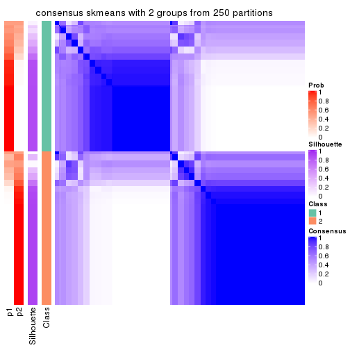</p>

</div>
<div id='tab-ATC-skmeans-consensus-heatmap-2'>
<pre><code class="r">consensus_heatmap(res, k = 3)
</code></pre>

<p>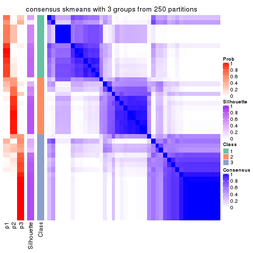</p>

</div>
<div id='tab-ATC-skmeans-consensus-heatmap-3'>
<pre><code class="r">consensus_heatmap(res, k = 4)
</code></pre>

<p>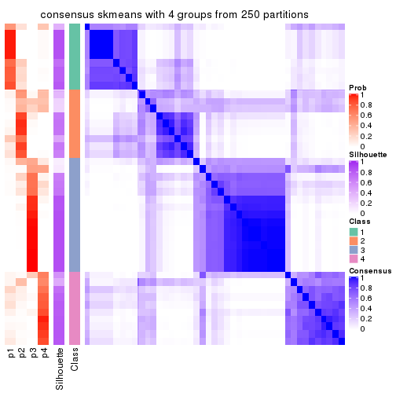</p>

</div>
<div id='tab-ATC-skmeans-consensus-heatmap-4'>
<pre><code class="r">consensus_heatmap(res, k = 5)
</code></pre>

<p>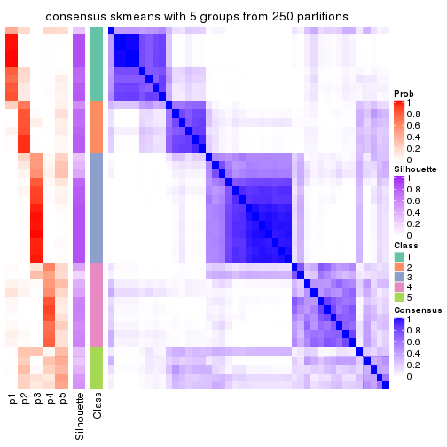</p>

</div>
<div id='tab-ATC-skmeans-consensus-heatmap-5'>
<pre><code class="r">consensus_heatmap(res, k = 6)
</code></pre>

<p>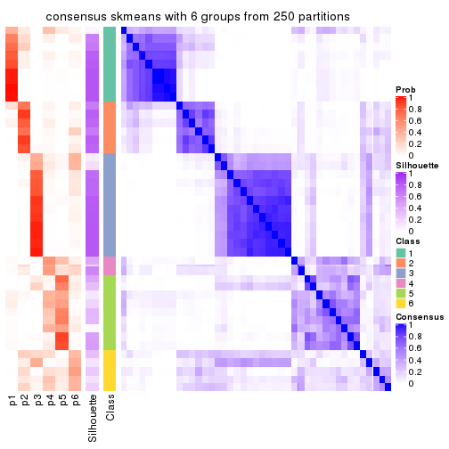</p>

</div>
</div>

Heatmaps for the membership of samples in all partitions to see how consistent they are:


<script>
$( function() {
	$( '#tabs-ATC-skmeans-membership-heatmap' ).tabs();
} );
</script>
<div id='tabs-ATC-skmeans-membership-heatmap'>
<ul>
<li><a href='#tab-ATC-skmeans-membership-heatmap-1'>k = 2</a></li>
<li><a href='#tab-ATC-skmeans-membership-heatmap-2'>k = 3</a></li>
<li><a href='#tab-ATC-skmeans-membership-heatmap-3'>k = 4</a></li>
<li><a href='#tab-ATC-skmeans-membership-heatmap-4'>k = 5</a></li>
<li><a href='#tab-ATC-skmeans-membership-heatmap-5'>k = 6</a></li>
</ul>
<div id='tab-ATC-skmeans-membership-heatmap-1'>
<pre><code class="r">membership_heatmap(res, k = 2)
</code></pre>

<p>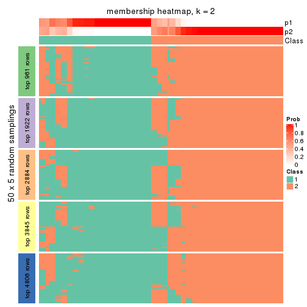</p>

</div>
<div id='tab-ATC-skmeans-membership-heatmap-2'>
<pre><code class="r">membership_heatmap(res, k = 3)
</code></pre>

<p>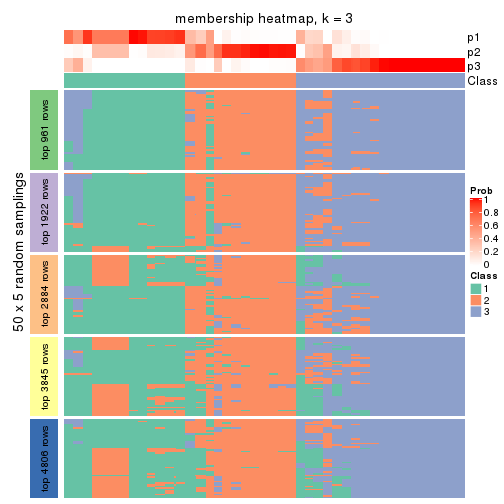</p>

</div>
<div id='tab-ATC-skmeans-membership-heatmap-3'>
<pre><code class="r">membership_heatmap(res, k = 4)
</code></pre>

<p>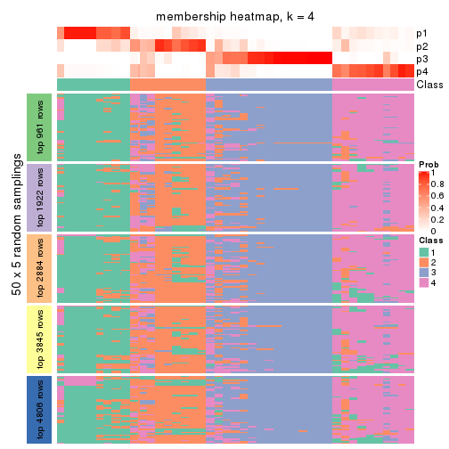</p>

</div>
<div id='tab-ATC-skmeans-membership-heatmap-4'>
<pre><code class="r">membership_heatmap(res, k = 5)
</code></pre>

<p>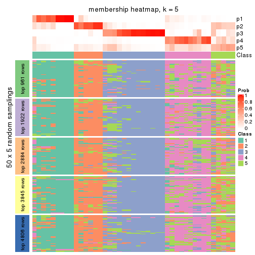</p>

</div>
<div id='tab-ATC-skmeans-membership-heatmap-5'>
<pre><code class="r">membership_heatmap(res, k = 6)
</code></pre>

<p>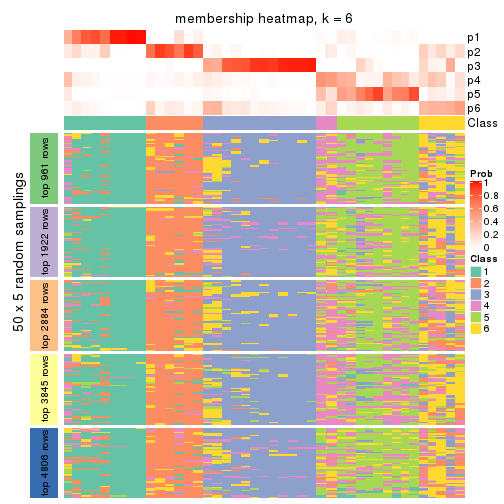</p>

</div>
</div>

As soon as we have had the classes for columns, we can look for signatures
which are significantly different between classes which can be candidate marks
for certain classes. Following are the heatmaps for signatures.


Signature heatmaps where rows are scaled:


<script>
$( function() {
	$( '#tabs-ATC-skmeans-get-signatures' ).tabs();
} );
</script>
<div id='tabs-ATC-skmeans-get-signatures'>
<ul>
<li><a href='#tab-ATC-skmeans-get-signatures-1'>k = 2</a></li>
<li><a href='#tab-ATC-skmeans-get-signatures-2'>k = 3</a></li>
<li><a href='#tab-ATC-skmeans-get-signatures-3'>k = 4</a></li>
<li><a href='#tab-ATC-skmeans-get-signatures-4'>k = 5</a></li>
<li><a href='#tab-ATC-skmeans-get-signatures-5'>k = 6</a></li>
</ul>
<div id='tab-ATC-skmeans-get-signatures-1'>
<pre><code class="r">get_signatures(res, k = 2)
</code></pre>

<p>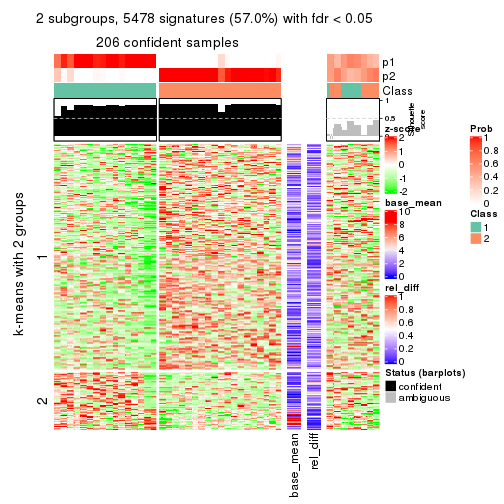</p>

</div>
<div id='tab-ATC-skmeans-get-signatures-2'>
<pre><code class="r">get_signatures(res, k = 3)
</code></pre>

<p>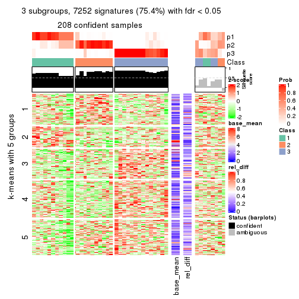</p>

</div>
<div id='tab-ATC-skmeans-get-signatures-3'>
<pre><code class="r">get_signatures(res, k = 4)
</code></pre>

<p>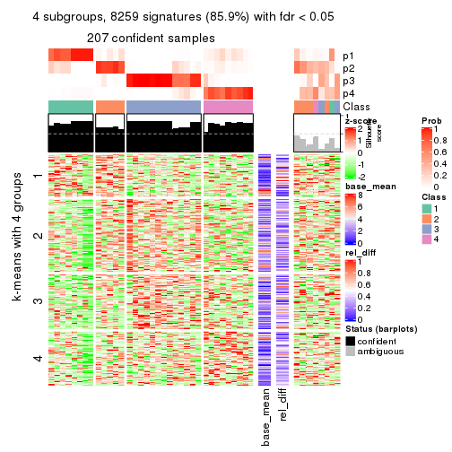</p>

</div>
<div id='tab-ATC-skmeans-get-signatures-4'>
<pre><code class="r">get_signatures(res, k = 5)
</code></pre>

<p>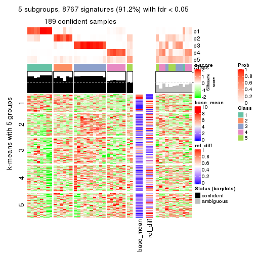</p>

</div>
<div id='tab-ATC-skmeans-get-signatures-5'>
<pre><code class="r">get_signatures(res, k = 6)
</code></pre>

<p>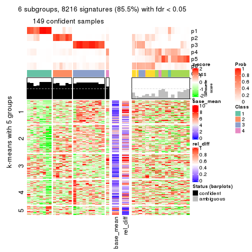</p>

</div>
</div>


Signature heatmaps where rows are not scaled:


<script>
$( function() {
	$( '#tabs-ATC-skmeans-get-signatures-no-scale' ).tabs();
} );
</script>
<div id='tabs-ATC-skmeans-get-signatures-no-scale'>
<ul>
<li><a href='#tab-ATC-skmeans-get-signatures-no-scale-1'>k = 2</a></li>
<li><a href='#tab-ATC-skmeans-get-signatures-no-scale-2'>k = 3</a></li>
<li><a href='#tab-ATC-skmeans-get-signatures-no-scale-3'>k = 4</a></li>
<li><a href='#tab-ATC-skmeans-get-signatures-no-scale-4'>k = 5</a></li>
<li><a href='#tab-ATC-skmeans-get-signatures-no-scale-5'>k = 6</a></li>
</ul>
<div id='tab-ATC-skmeans-get-signatures-no-scale-1'>
<pre><code class="r">get_signatures(res, k = 2, scale_rows = FALSE)
</code></pre>

<p>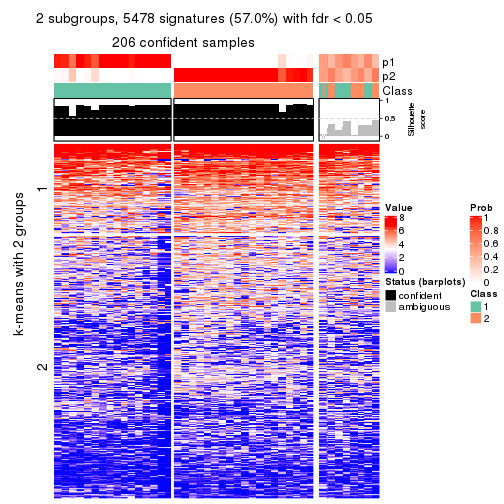</p>

</div>
<div id='tab-ATC-skmeans-get-signatures-no-scale-2'>
<pre><code class="r">get_signatures(res, k = 3, scale_rows = FALSE)
</code></pre>

<p>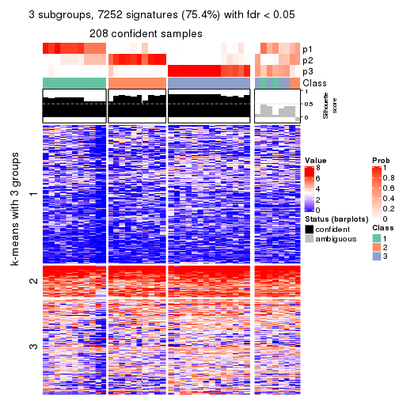</p>

</div>
<div id='tab-ATC-skmeans-get-signatures-no-scale-3'>
<pre><code class="r">get_signatures(res, k = 4, scale_rows = FALSE)
</code></pre>

<p>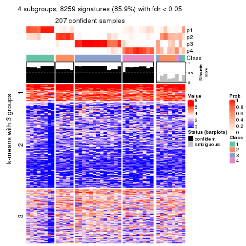</p>

</div>
<div id='tab-ATC-skmeans-get-signatures-no-scale-4'>
<pre><code class="r">get_signatures(res, k = 5, scale_rows = FALSE)
</code></pre>

<p>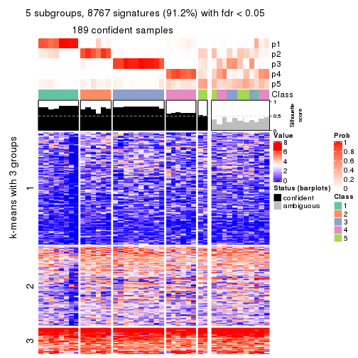</p>

</div>
<div id='tab-ATC-skmeans-get-signatures-no-scale-5'>
<pre><code class="r">get_signatures(res, k = 6, scale_rows = FALSE)
</code></pre>

<p>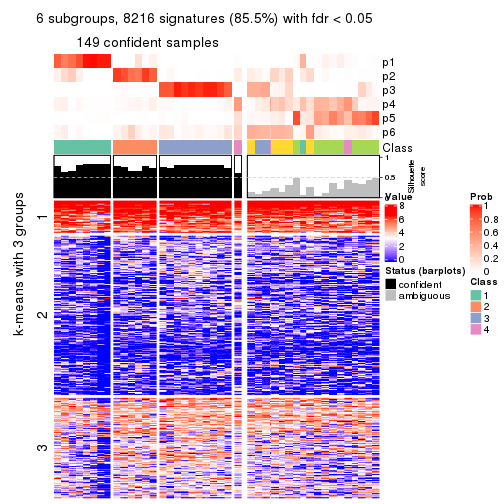</p>

</div>
</div>


Compare the overlap of signatures from different k:

```r
compare_signatures(res)
```

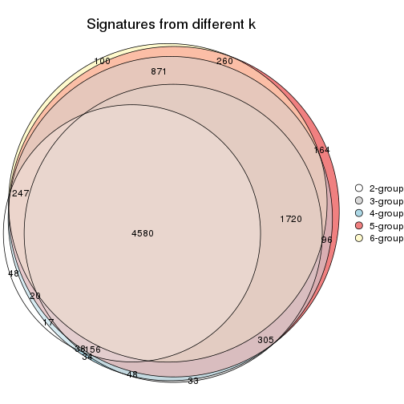

`get_signature()` returns a data frame invisibly. TO get the list of signatures, the function
call should be assigned to a variable explicitly. In following code, if `plot` argument is set
to `FALSE`, no heatmap is plotted while only the differential analysis is performed.

```r
# code only for demonstration
tb = get_signature(res, k = ..., plot = FALSE)
```

An example of the output of `tb` is:

```
#>   which_row         fdr    mean_1    mean_2 scaled_mean_1 scaled_mean_2 km
#> 1        38 0.042760348  8.373488  9.131774    -0.5533452     0.5164555  1
#> 2        40 0.018707592  7.106213  8.469186    -0.6173731     0.5762149  1
#> 3        55 0.019134737 10.221463 11.207825    -0.6159697     0.5749050  1
#> 4        59 0.006059896  5.921854  7.869574    -0.6899429     0.6439467  1
#> 5        60 0.018055526  8.928898 10.211722    -0.6204761     0.5791110  1
#> 6        98 0.009384629 15.714769 14.887706     0.6635654    -0.6193277  2
...
```

The columns in `tb` are:

1. `which_row`: row indices corresponding to the input matrix.
2. `fdr`: FDR for the differential test. 
3. `mean_x`: The mean value in group x.
4. `scaled_mean_x`: The mean value in group x after rows are scaled.
5. `km`: Row groups if k-means clustering is applied to rows.


UMAP plot which shows how samples are separated.


<script>
$( function() {
	$( '#tabs-ATC-skmeans-dimension-reduction' ).tabs();
} );
</script>
<div id='tabs-ATC-skmeans-dimension-reduction'>
<ul>
<li><a href='#tab-ATC-skmeans-dimension-reduction-1'>k = 2</a></li>
<li><a href='#tab-ATC-skmeans-dimension-reduction-2'>k = 3</a></li>
<li><a href='#tab-ATC-skmeans-dimension-reduction-3'>k = 4</a></li>
<li><a href='#tab-ATC-skmeans-dimension-reduction-4'>k = 5</a></li>
<li><a href='#tab-ATC-skmeans-dimension-reduction-5'>k = 6</a></li>
</ul>
<div id='tab-ATC-skmeans-dimension-reduction-1'>
<pre><code class="r">dimension_reduction(res, k = 2, method = &quot;UMAP&quot;)
</code></pre>

<p>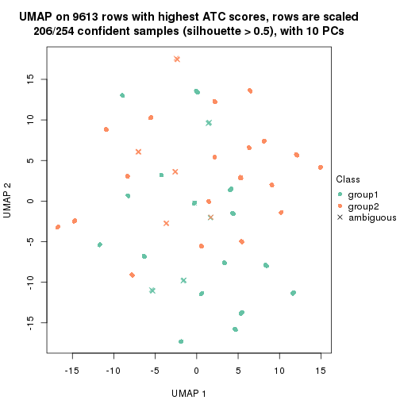</p>

</div>
<div id='tab-ATC-skmeans-dimension-reduction-2'>
<pre><code class="r">dimension_reduction(res, k = 3, method = &quot;UMAP&quot;)
</code></pre>

<p>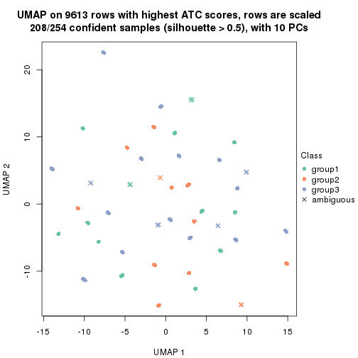</p>

</div>
<div id='tab-ATC-skmeans-dimension-reduction-3'>
<pre><code class="r">dimension_reduction(res, k = 4, method = &quot;UMAP&quot;)
</code></pre>

<p>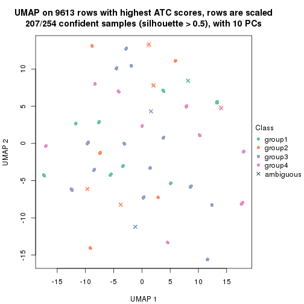</p>

</div>
<div id='tab-ATC-skmeans-dimension-reduction-4'>
<pre><code class="r">dimension_reduction(res, k = 5, method = &quot;UMAP&quot;)
</code></pre>

<p>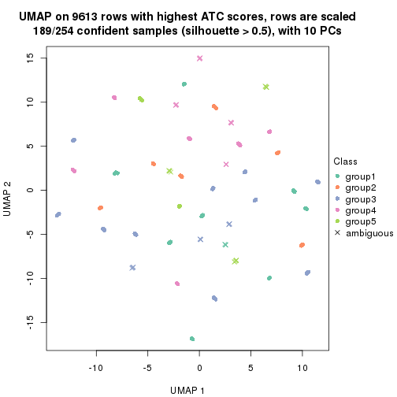</p>

</div>
<div id='tab-ATC-skmeans-dimension-reduction-5'>
<pre><code class="r">dimension_reduction(res, k = 6, method = &quot;UMAP&quot;)
</code></pre>

<p>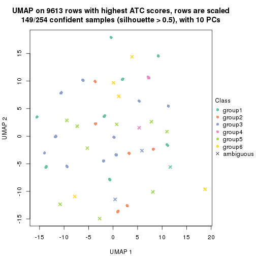</p>

</div>
</div>


Following heatmap shows how subgroups are split when increasing `k`:

```r
collect_classes(res)
```

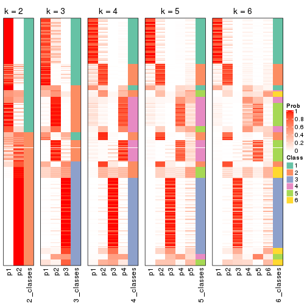


If matrix rows can be associated to genes, consider to use `GO_Enrichment(res,
...)` to perform function enrichment for the signature genes.


 

---------------------------------------------------


### ATC:pam


The object with results only for a single top-value method and a single partition method 
can be extracted as:

```r
res = res_list["ATC", "pam"]
# you can also extract it by
# res = res_list["ATC:pam"]
```

A summary of `res` and all the functions that can be applied to it:

```r
res
```

```
#> A 'ConsensusPartition' object with k = 2, 3, 4, 5, 6.
#>   On a matrix with 9613 rows and 254 columns.
#>   Top rows (961, 1922, 2884, 3845, 4806) are extracted by 'ATC' method.
#>   Subgroups are detected by 'pam' method.
#>   Performed in total 1250 partitions by row resampling.
#>   Best k for subgroups seems to be 3.
#> 
#> Following methods can be applied to this 'ConsensusPartition' object:
#>  [1] "cola_report"             "collect_classes"         "collect_plots"          
#>  [4] "collect_stats"           "colnames"                "compare_signatures"     
#>  [7] "consensus_heatmap"       "dimension_reduction"     "functional_enrichment"  
#> [10] "get_anno_col"            "get_anno"                "get_classes"            
#> [13] "get_consensus"           "get_matrix"              "get_membership"         
#> [16] "get_param"               "get_signatures"          "get_stats"              
#> [19] "is_best_k"               "is_stable_k"             "membership_heatmap"     
#> [22] "ncol"                    "nrow"                    "plot_ecdf"              
#> [25] "rownames"                "select_partition_number" "show"                   
#> [28] "suggest_best_k"          "test_to_known_factors"
```

`collect_plots()` function collects all the plots made from `res` for all `k` (number of partitions)
into one single page to provide an easy and fast comparison between different `k`.

```r
collect_plots(res)
```

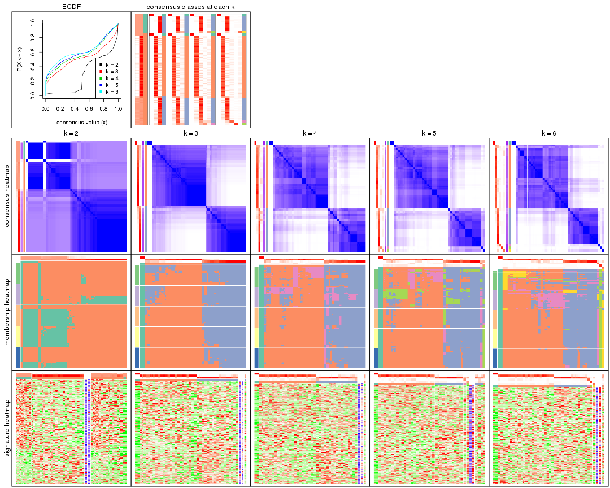

The plots are:

- The first row: a plot of the ECDF (Empirical cumulative distribution
  function) curves of the consensus matrix for each `k` and the heatmap of
  predicted classes for each `k`.
- The second row: heatmaps of the consensus matrix for each `k`.
- The third row: heatmaps of the membership matrix for each `k`.
- The fouth row: heatmaps of the signatures for each `k`.

All the plots in panels can be made by individual functions and they are
plotted later in this section.

`select_partition_number()` produces several plots showing different
statistics for choosing "optimized" `k`. There are following statistics:

- ECDF curves of the consensus matrix for each `k`;
- 1-PAC. [The PAC
  score](https://en.wikipedia.org/wiki/Consensus_clustering#Over-interpretation_potential_of_consensus_clustering)
  measures the proportion of the ambiguous subgrouping.
- Mean silhouette score.
- Concordance. The mean probability of fiting the consensus class ids in all
  partitions.
- Area increased. Denote $A_k$ as the area under the ECDF curve for current
  `k`, the area increased is defined as $A_k - A_{k-1}$.
- Rand index. The percent of pairs of samples that are both in a same cluster
  or both are not in a same cluster in the partition of k and k-1.
- Jaccard index. The ratio of pairs of samples are both in a same cluster in
  the partition of k and k-1 and the pairs of samples are both in a same
  cluster in the partition k or k-1.

The detailed explanations of these statistics can be found in [the cola
vignette](http://bioconductor.org/packages/devel/bioc/vignettes/cola/inst/doc/cola.html#toc_13).

Generally speaking, lower PAC score, higher mean silhouette score or higher
concordance corresponds to better partition. Rand index and Jaccard index
measure how similar the current partition is compared to partition with `k-1`.
If they are too similar, we won't accept `k` is better than `k-1`.

```r
select_partition_number(res)
```

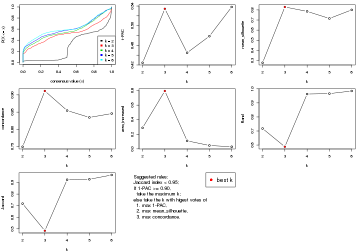

The numeric values for all these statistics can be obtained by `get_stats()`.

```r
get_stats(res)
```

```
#>   k 1-PAC mean_silhouette concordance area_increased  Rand Jaccard
#> 2 2 0.425           0.277       0.749         0.2889 0.718   0.718
#> 3 3 0.534           0.829       0.911         0.7941 0.588   0.483
#> 4 4 0.445           0.785       0.855         0.1103 0.963   0.924
#> 5 5 0.479           0.715       0.835         0.0466 0.966   0.928
#> 6 6 0.538           0.800       0.846         0.0291 0.985   0.965
```

`suggest_best_k()` suggests the best $k$ based on these statistics. The rules are as follows:

- All $k$ with Jaccard index larger than 0.95 are removed because the increase of
  the partition number does not provides enough extra information. If all $k$ are removed,
  the best $k$ is assigned by `NA`.
- For $k$ with 1-PAC larger than 0.9, the maximal $k$ is taken as the "best k". Other $k$ is called "optional k".
- If it does not fit the second rule. The $k$ with the highest vote of highest
  1-PAC, mean silhouette and concordance is taken as the "best k".

```r
suggest_best_k(res)
```

```
#> [1] 3
```


Following shows the table of the partitions (You need to click the **show/hide
code output** link to see it). The membership matrix (columns with name `p*`)
is inferred by
[`clue::cl_consensus()`](https://www.rdocumentation.org/link/cl_consensus?package=clue)
function with the `SE` method. Basically the value in the membership matrix
represents the probability to belong to a certain group. The finall class
label for an item is determined with the group with highest probability it
belongs to.

In `get_classes()` function, the entropy is calculated from the membership
matrix and the silhouette score is calculated from the consensus matrix.


<script>
$( function() {
	$( '#tabs-ATC-pam-get-classes' ).tabs();
} );
</script>
<div id='tabs-ATC-pam-get-classes'>
<ul>
<li><a href='#tab-ATC-pam-get-classes-1'>k = 2</a></li>
<li><a href='#tab-ATC-pam-get-classes-2'>k = 3</a></li>
<li><a href='#tab-ATC-pam-get-classes-3'>k = 4</a></li>
<li><a href='#tab-ATC-pam-get-classes-4'>k = 5</a></li>
<li><a href='#tab-ATC-pam-get-classes-5'>k = 6</a></li>
</ul>

<div id='tab-ATC-pam-get-classes-1'>
<p><a id='tab-ATC-pam-get-classes-1-a' style='color:#0366d6' href='#'>show/hide code output</a></p>
<pre><code class="r">cbind(get_classes(res, k = 2), get_membership(res, k = 2))
</code></pre>

<pre><code>#&gt;           class entropy silhouette    p1    p2
#&gt; DRR024803     1  1.0000    -0.1119 0.500 0.500
#&gt; DRR024804     2  0.2423     0.6141 0.040 0.960
#&gt; DRR024805     2  0.0000     0.6359 0.000 1.000
#&gt; DRR024806     2  0.0000     0.6359 0.000 1.000
#&gt; DRR024807     1  1.0000     0.7568 0.500 0.500
#&gt; DRR024808     2  1.0000    -0.7635 0.500 0.500
#&gt; DRR024809     2  0.0000     0.6359 0.000 1.000
#&gt; DRR024810     2  0.0000     0.6359 0.000 1.000
#&gt; DRR024811     2  1.0000    -0.7635 0.500 0.500
#&gt; DRR024812     2  0.0000     0.6359 0.000 1.000
#&gt; DRR024813     2  0.6801     0.4047 0.180 0.820
#&gt; DRR024814     2  0.0000     0.6359 0.000 1.000
#&gt; DRR024815     2  0.0000     0.6359 0.000 1.000
#&gt; DRR024816     2  0.0000     0.6359 0.000 1.000
#&gt; DRR024817     2  0.5519     0.5014 0.128 0.872
#&gt; DRR024818     1  1.0000     0.7568 0.500 0.500
#&gt; DRR024819     2  0.9815    -0.5420 0.420 0.580
#&gt; DRR024820     2  0.9954    -0.6419 0.460 0.540
#&gt; DRR024821     2  1.0000    -0.7635 0.500 0.500
#&gt; DRR024822     2  0.0000     0.6359 0.000 1.000
#&gt; DRR024824     2  0.0000     0.6359 0.000 1.000
#&gt; DRR024825     1  1.0000     0.7568 0.500 0.500
#&gt; DRR024826     2  0.9954    -0.6446 0.460 0.540
#&gt; DRR024827     2  1.0000    -0.7635 0.500 0.500
#&gt; DRR024828     2  0.9922    -0.5969 0.448 0.552
#&gt; DRR024829     2  0.0000     0.6359 0.000 1.000
#&gt; DRR024830     2  0.0000     0.6359 0.000 1.000
#&gt; DRR024831     2  1.0000    -0.7635 0.500 0.500
#&gt; DRR024832     1  1.0000     0.7568 0.500 0.500
#&gt; DRR024833     2  0.9963    -0.6547 0.464 0.536
#&gt; DRR024834     2  0.0000     0.6359 0.000 1.000
#&gt; DRR024835     2  0.4562     0.5584 0.096 0.904
#&gt; DRR024836     2  1.0000    -0.7635 0.500 0.500
#&gt; DRR024837     2  0.2236     0.6008 0.036 0.964
#&gt; DRR024838     2  0.0000     0.6359 0.000 1.000
#&gt; DRR024839     2  0.3584     0.5900 0.068 0.932
#&gt; DRR024840     2  0.0000     0.6359 0.000 1.000
#&gt; DRR024841     2  0.0000     0.6359 0.000 1.000
#&gt; DRR024842     2  0.1184     0.6293 0.016 0.984
#&gt; DRR024843     1  1.0000    -0.1119 0.500 0.500
#&gt; DRR024844     2  0.3431     0.5939 0.064 0.936
#&gt; DRR024845     2  0.0938     0.6316 0.012 0.988
#&gt; DRR024846     2  0.0000     0.6359 0.000 1.000
#&gt; DRR024847     1  1.0000     0.7568 0.500 0.500
#&gt; DRR024848     2  1.0000     0.0864 0.500 0.500
#&gt; DRR024849     1  1.0000     0.7568 0.500 0.500
#&gt; DRR024850     2  0.3114     0.6013 0.056 0.944
#&gt; DRR024851     2  0.0000     0.6359 0.000 1.000
#&gt; DRR024852     2  0.0000     0.6359 0.000 1.000
#&gt; DRR024853     1  1.0000     0.7568 0.500 0.500
#&gt; DRR024854     2  0.0000     0.6359 0.000 1.000
#&gt; DRR024855     2  0.9881    -0.5613 0.436 0.564
#&gt; DRR024856     2  0.1184     0.6298 0.016 0.984
#&gt; DRR024857     2  0.0000     0.6359 0.000 1.000
#&gt; DRR024858     2  0.0000     0.6359 0.000 1.000
#&gt; DRR024859     2  0.6148     0.4628 0.152 0.848
#&gt; DRR024860     1  1.0000     0.7568 0.500 0.500
#&gt; DRR024861     2  0.9732    -0.4903 0.404 0.596
#&gt; DRR024862     2  0.9954    -0.6419 0.460 0.540
#&gt; DRR024863     2  1.0000    -0.7635 0.500 0.500
#&gt; DRR024864     2  0.0000     0.6359 0.000 1.000
#&gt; DRR024865     2  0.0000     0.6359 0.000 1.000
#&gt; DRR024866     2  0.0000     0.6359 0.000 1.000
#&gt; DRR024867     2  1.0000    -0.7635 0.500 0.500
#&gt; DRR024868     2  0.9996    -0.7262 0.488 0.512
#&gt; DRR024869     1  1.0000     0.7568 0.500 0.500
#&gt; DRR024870     1  1.0000     0.7568 0.500 0.500
#&gt; DRR024871     2  0.0000     0.6359 0.000 1.000
#&gt; DRR024872     2  0.2043     0.6202 0.032 0.968
#&gt; DRR024873     1  1.0000     0.7568 0.500 0.500
#&gt; DRR024874     2  1.0000    -0.7635 0.500 0.500
#&gt; DRR024875     2  0.9996    -0.7262 0.488 0.512
#&gt; DRR024876     2  0.3431     0.5690 0.064 0.936
#&gt; DRR024877     2  0.6048     0.4775 0.148 0.852
#&gt; DRR024878     2  1.0000    -0.7635 0.500 0.500
#&gt; DRR024879     2  0.4431     0.5343 0.092 0.908
#&gt; DRR024880     2  0.0000     0.6359 0.000 1.000
#&gt; DRR024881     2  0.4161     0.5718 0.084 0.916
#&gt; DRR024882     2  0.1633     0.6257 0.024 0.976
#&gt; DRR024883     2  0.0000     0.6359 0.000 1.000
#&gt; DRR024884     2  0.8386     0.1443 0.268 0.732
#&gt; DRR024885     2  0.9944    -0.6325 0.456 0.544
#&gt; DRR024886     1  1.0000    -0.1119 0.500 0.500
#&gt; DRR024887     2  0.3274     0.5978 0.060 0.940
#&gt; DRR024888     2  0.0938     0.6316 0.012 0.988
#&gt; DRR024889     2  0.0000     0.6359 0.000 1.000
#&gt; DRR024890     1  1.0000     0.7568 0.500 0.500
#&gt; DRR024891     1  1.0000    -0.1119 0.500 0.500
#&gt; DRR024892     2  1.0000    -0.7635 0.500 0.500
#&gt; DRR024893     2  0.3114     0.6013 0.056 0.944
#&gt; DRR024894     2  0.0000     0.6359 0.000 1.000
#&gt; DRR024895     2  0.0000     0.6359 0.000 1.000
#&gt; DRR024896     2  1.0000    -0.7635 0.500 0.500
#&gt; DRR024897     2  0.0000     0.6359 0.000 1.000
#&gt; DRR024898     2  0.9933    -0.6147 0.452 0.548
#&gt; DRR024899     2  0.1184     0.6298 0.016 0.984
#&gt; DRR024900     2  0.0000     0.6359 0.000 1.000
#&gt; DRR024901     2  0.0000     0.6359 0.000 1.000
#&gt; DRR024902     2  0.5946     0.4783 0.144 0.856
#&gt; DRR024903     2  1.0000    -0.7635 0.500 0.500
#&gt; DRR024904     2  0.9775    -0.5164 0.412 0.588
#&gt; DRR024905     2  0.9954    -0.6419 0.460 0.540
#&gt; DRR024906     1  1.0000     0.7568 0.500 0.500
#&gt; DRR024907     2  0.0000     0.6359 0.000 1.000
#&gt; DRR024908     2  0.0000     0.6359 0.000 1.000
#&gt; DRR024909     2  0.0000     0.6359 0.000 1.000
#&gt; DRR024910     2  1.0000    -0.7635 0.500 0.500
#&gt; DRR024911     2  0.9996    -0.7262 0.488 0.512
#&gt; DRR024912     1  1.0000     0.7568 0.500 0.500
#&gt; DRR024913     2  1.0000    -0.7635 0.500 0.500
#&gt; DRR024914     2  0.0000     0.6359 0.000 1.000
#&gt; DRR024915     2  0.2236     0.6172 0.036 0.964
#&gt; DRR024916     1  1.0000     0.7568 0.500 0.500
#&gt; DRR024917     1  1.0000     0.7568 0.500 0.500
#&gt; DRR024918     2  0.9996    -0.7262 0.488 0.512
#&gt; DRR024919     2  0.3114     0.5784 0.056 0.944
#&gt; DRR024920     2  0.6048     0.4777 0.148 0.852
#&gt; DRR024921     2  1.0000    -0.7635 0.500 0.500
#&gt; DRR024922     2  0.4298     0.5394 0.088 0.912
#&gt; DRR024923     2  0.0000     0.6359 0.000 1.000
#&gt; DRR024924     2  0.4022     0.5766 0.080 0.920
#&gt; DRR024925     2  0.1633     0.6257 0.024 0.976
#&gt; DRR024926     2  0.0000     0.6359 0.000 1.000
#&gt; DRR024927     2  0.8555     0.0934 0.280 0.720
#&gt; DRR024928     2  0.9944    -0.6325 0.456 0.544
#&gt; DRR024929     1  1.0000    -0.1119 0.500 0.500
#&gt; DRR024930     2  0.3114     0.6014 0.056 0.944
#&gt; DRR024931     2  0.1633     0.6254 0.024 0.976
#&gt; DRR024932     2  0.0000     0.6359 0.000 1.000
#&gt; DRR024933     1  1.0000     0.7568 0.500 0.500
#&gt; DRR024934     2  1.0000     0.0864 0.500 0.500
#&gt; DRR024935     2  1.0000    -0.7635 0.500 0.500
#&gt; DRR024936     2  0.3114     0.6013 0.056 0.944
#&gt; DRR024937     2  0.0000     0.6359 0.000 1.000
#&gt; DRR024938     2  0.0000     0.6359 0.000 1.000
#&gt; DRR024939     2  1.0000    -0.7635 0.500 0.500
#&gt; DRR024940     2  0.0000     0.6359 0.000 1.000
#&gt; DRR024941     2  0.9909    -0.5882 0.444 0.556
#&gt; DRR024942     2  0.1184     0.6298 0.016 0.984
#&gt; DRR024943     2  0.0000     0.6359 0.000 1.000
#&gt; DRR024944     2  0.0000     0.6359 0.000 1.000
#&gt; DRR024945     2  0.6048     0.4689 0.148 0.852
#&gt; DRR024946     1  1.0000     0.7568 0.500 0.500
#&gt; DRR024947     2  0.9686    -0.4636 0.396 0.604
#&gt; DRR024948     2  0.9954    -0.6419 0.460 0.540
#&gt; DRR024949     2  1.0000    -0.7635 0.500 0.500
#&gt; DRR024950     2  0.0000     0.6359 0.000 1.000
#&gt; DRR024951     2  0.0000     0.6359 0.000 1.000
#&gt; DRR024952     2  0.0000     0.6359 0.000 1.000
#&gt; DRR024953     1  1.0000     0.7568 0.500 0.500
#&gt; DRR024954     2  0.9996    -0.7262 0.488 0.512
#&gt; DRR024955     1  1.0000     0.7568 0.500 0.500
#&gt; DRR024956     2  1.0000    -0.7635 0.500 0.500
#&gt; DRR024957     2  0.0000     0.6359 0.000 1.000
#&gt; DRR024958     2  0.2043     0.6202 0.032 0.968
#&gt; DRR024959     1  1.0000     0.7568 0.500 0.500
#&gt; DRR024960     1  1.0000     0.7568 0.500 0.500
#&gt; DRR024961     2  0.9996    -0.7262 0.488 0.512
#&gt; DRR024962     2  0.3584     0.5642 0.068 0.932
#&gt; DRR024963     2  0.5519     0.5118 0.128 0.872
#&gt; DRR024964     1  1.0000     0.7568 0.500 0.500
#&gt; DRR024965     2  0.4562     0.5292 0.096 0.904
#&gt; DRR024966     2  0.0000     0.6359 0.000 1.000
#&gt; DRR024967     2  0.4022     0.5766 0.080 0.920
#&gt; DRR024968     2  0.1633     0.6257 0.024 0.976
#&gt; DRR024969     2  0.0000     0.6359 0.000 1.000
#&gt; DRR024970     2  0.8499     0.1121 0.276 0.724
#&gt; DRR024971     2  0.9944    -0.6325 0.456 0.544
#&gt; DRR024972     2  1.0000     0.0864 0.500 0.500
#&gt; DRR024973     2  0.3274     0.5978 0.060 0.940
#&gt; DRR024974     2  0.0672     0.6332 0.008 0.992
#&gt; DRR024975     2  0.0000     0.6359 0.000 1.000
#&gt; DRR024976     1  1.0000     0.7568 0.500 0.500
#&gt; DRR024977     2  1.0000     0.0864 0.500 0.500
#&gt; DRR024978     1  1.0000     0.7568 0.500 0.500
#&gt; DRR024979     2  0.3114     0.6013 0.056 0.944
#&gt; DRR024980     2  0.0000     0.6359 0.000 1.000
#&gt; DRR024981     2  0.0000     0.6359 0.000 1.000
#&gt; DRR024982     1  1.0000     0.7568 0.500 0.500
#&gt; DRR024983     2  0.0000     0.6359 0.000 1.000
#&gt; DRR024984     2  0.9933    -0.6147 0.452 0.548
#&gt; DRR024985     2  0.1184     0.6298 0.016 0.984
#&gt; DRR024986     2  0.0000     0.6359 0.000 1.000
#&gt; DRR024987     2  0.0000     0.6359 0.000 1.000
#&gt; DRR024988     2  0.6048     0.4707 0.148 0.852
#&gt; DRR024989     2  1.0000    -0.7635 0.500 0.500
#&gt; DRR024990     2  0.9775    -0.5164 0.412 0.588
#&gt; DRR024991     2  0.9954    -0.6419 0.460 0.540
#&gt; DRR024992     1  1.0000     0.7568 0.500 0.500
#&gt; DRR024993     2  0.0000     0.6359 0.000 1.000
#&gt; DRR024994     2  0.0000     0.6359 0.000 1.000
#&gt; DRR024995     2  0.0000     0.6359 0.000 1.000
#&gt; DRR024996     1  1.0000     0.7568 0.500 0.500
#&gt; DRR024997     2  0.9996    -0.7262 0.488 0.512
#&gt; DRR024998     2  1.0000    -0.7635 0.500 0.500
#&gt; DRR024999     2  1.0000    -0.7635 0.500 0.500
#&gt; DRR025000     2  0.0000     0.6359 0.000 1.000
#&gt; DRR025001     2  0.2043     0.6202 0.032 0.968
#&gt; DRR025002     1  1.0000     0.7568 0.500 0.500
#&gt; DRR025003     1  1.0000     0.7568 0.500 0.500
#&gt; DRR025004     2  0.9996    -0.7262 0.488 0.512
#&gt; DRR025005     2  0.3274     0.5737 0.060 0.940
#&gt; DRR025006     2  0.6048     0.4775 0.148 0.852
#&gt; DRR025007     1  1.0000     0.7568 0.500 0.500
#&gt; DRR025008     2  0.4298     0.5394 0.088 0.912
#&gt; DRR025009     2  0.0000     0.6359 0.000 1.000
#&gt; DRR025010     2  0.4161     0.5718 0.084 0.916
#&gt; DRR025011     2  0.1633     0.6257 0.024 0.976
#&gt; DRR025012     2  0.0000     0.6359 0.000 1.000
#&gt; DRR025013     2  0.8443     0.1284 0.272 0.728
#&gt; DRR025014     2  0.9944    -0.6325 0.456 0.544
#&gt; DRR025015     2  1.0000     0.0864 0.500 0.500
#&gt; DRR025016     2  0.3584     0.5895 0.068 0.932
#&gt; DRR025017     2  0.0672     0.6332 0.008 0.992
#&gt; DRR025018     2  0.0000     0.6359 0.000 1.000
#&gt; DRR025019     2  1.0000    -0.7635 0.500 0.500
#&gt; DRR025020     2  1.0000     0.0864 0.500 0.500
#&gt; DRR025021     1  1.0000     0.7568 0.500 0.500
#&gt; DRR025022     2  0.3114     0.6013 0.056 0.944
#&gt; DRR025023     2  0.0000     0.6359 0.000 1.000
#&gt; DRR025024     2  0.0000     0.6359 0.000 1.000
#&gt; DRR025025     2  1.0000    -0.7635 0.500 0.500
#&gt; DRR025026     2  0.0000     0.6359 0.000 1.000
#&gt; DRR025027     2  0.9944    -0.6280 0.456 0.544
#&gt; DRR025028     2  0.0938     0.6316 0.012 0.988
#&gt; DRR025029     2  0.0000     0.6359 0.000 1.000
#&gt; DRR025030     2  0.0000     0.6359 0.000 1.000
#&gt; DRR025031     2  0.6438     0.4378 0.164 0.836
#&gt; DRR025032     1  1.0000     0.7568 0.500 0.500
#&gt; DRR025033     2  0.9775    -0.5164 0.412 0.588
#&gt; DRR025034     2  0.9954    -0.6419 0.460 0.540
#&gt; DRR025035     1  1.0000     0.7568 0.500 0.500
#&gt; DRR025036     2  0.0000     0.6359 0.000 1.000
#&gt; DRR025037     2  0.0000     0.6359 0.000 1.000
#&gt; DRR025038     2  0.0000     0.6359 0.000 1.000
#&gt; DRR025039     1  1.0000     0.7568 0.500 0.500
#&gt; DRR025040     2  0.9996    -0.7262 0.488 0.512
#&gt; DRR025041     1  1.0000     0.7568 0.500 0.500
#&gt; DRR025042     2  1.0000    -0.7635 0.500 0.500
#&gt; DRR025043     2  0.0000     0.6359 0.000 1.000
#&gt; DRR025044     2  0.2236     0.6172 0.036 0.964
#&gt; DRR025045     2  1.0000    -0.7635 0.500 0.500
#&gt; DRR025046     1  1.0000     0.7568 0.500 0.500
#&gt; DRR025047     2  0.9996    -0.7262 0.488 0.512
#&gt; DRR025048     2  0.2948     0.5830 0.052 0.948
#&gt; DRR025049     2  0.5946     0.4847 0.144 0.856
#&gt; DRR025050     1  1.0000     0.7568 0.500 0.500
#&gt; DRR025051     2  0.4815     0.5186 0.104 0.896
#&gt; DRR025052     2  0.0000     0.6359 0.000 1.000
#&gt; DRR025053     2  0.4161     0.5718 0.084 0.916
#&gt; DRR025054     2  0.1633     0.6257 0.024 0.976
#&gt; DRR025055     2  0.0000     0.6359 0.000 1.000
#&gt; DRR025056     2  0.8443     0.1284 0.272 0.728
#&gt; DRR025057     2  0.9944    -0.6325 0.456 0.544
</code></pre>

<script>
$('#tab-ATC-pam-get-classes-1-a').parent().next().next().hide();
$('#tab-ATC-pam-get-classes-1-a').click(function(){
  $('#tab-ATC-pam-get-classes-1-a').parent().next().next().toggle();
  return(false);
});
</script>
</div>

<div id='tab-ATC-pam-get-classes-2'>
<p><a id='tab-ATC-pam-get-classes-2-a' style='color:#0366d6' href='#'>show/hide code output</a></p>
<pre><code class="r">cbind(get_classes(res, k = 3), get_membership(res, k = 3))
</code></pre>

<pre><code>#&gt;           class entropy silhouette p1    p2    p3
#&gt; DRR024803     1  0.0000      1.000  1 0.000 0.000
#&gt; DRR024804     2  0.4062      0.824  0 0.836 0.164
#&gt; DRR024805     2  0.1411      0.883  0 0.964 0.036
#&gt; DRR024806     2  0.1289      0.885  0 0.968 0.032
#&gt; DRR024807     3  0.0000      0.878  0 0.000 1.000
#&gt; DRR024808     3  0.0000      0.878  0 0.000 1.000
#&gt; DRR024809     2  0.0892      0.887  0 0.980 0.020
#&gt; DRR024810     2  0.0000      0.886  0 1.000 0.000
#&gt; DRR024811     3  0.2066      0.852  0 0.060 0.940
#&gt; DRR024812     2  0.0000      0.886  0 1.000 0.000
#&gt; DRR024813     2  0.6026      0.508  0 0.624 0.376
#&gt; DRR024814     2  0.1753      0.886  0 0.952 0.048
#&gt; DRR024815     2  0.1411      0.889  0 0.964 0.036
#&gt; DRR024816     2  0.0000      0.886  0 1.000 0.000
#&gt; DRR024817     2  0.5497      0.671  0 0.708 0.292
#&gt; DRR024818     3  0.1529      0.876  0 0.040 0.960
#&gt; DRR024819     3  0.5497      0.671  0 0.292 0.708
#&gt; DRR024820     3  0.4178      0.805  0 0.172 0.828
#&gt; DRR024821     3  0.0000      0.878  0 0.000 1.000
#&gt; DRR024822     2  0.1163      0.889  0 0.972 0.028
#&gt; DRR024824     2  0.0000      0.886  0 1.000 0.000
#&gt; DRR024825     3  0.0000      0.878  0 0.000 1.000
#&gt; DRR024826     3  0.4974      0.721  0 0.236 0.764
#&gt; DRR024827     3  0.1964      0.871  0 0.056 0.944
#&gt; DRR024828     3  0.3038      0.823  0 0.104 0.896
#&gt; DRR024829     2  0.0424      0.887  0 0.992 0.008
#&gt; DRR024830     2  0.1031      0.886  0 0.976 0.024
#&gt; DRR024831     3  0.0000      0.878  0 0.000 1.000
#&gt; DRR024832     3  0.0000      0.878  0 0.000 1.000
#&gt; DRR024833     3  0.5363      0.649  0 0.276 0.724
#&gt; DRR024834     2  0.0000      0.886  0 1.000 0.000
#&gt; DRR024835     2  0.5431      0.700  0 0.716 0.284
#&gt; DRR024836     3  0.0000      0.878  0 0.000 1.000
#&gt; DRR024837     2  0.0000      0.886  0 1.000 0.000
#&gt; DRR024838     2  0.0237      0.887  0 0.996 0.004
#&gt; DRR024839     2  0.5098      0.745  0 0.752 0.248
#&gt; DRR024840     2  0.2261      0.880  0 0.932 0.068
#&gt; DRR024841     2  0.0000      0.886  0 1.000 0.000
#&gt; DRR024842     2  0.2165      0.881  0 0.936 0.064
#&gt; DRR024843     1  0.0000      1.000  1 0.000 0.000
#&gt; DRR024844     2  0.5058      0.751  0 0.756 0.244
#&gt; DRR024845     2  0.2959      0.866  0 0.900 0.100
#&gt; DRR024846     2  0.1163      0.885  0 0.972 0.028
#&gt; DRR024847     3  0.0000      0.878  0 0.000 1.000
#&gt; DRR024848     1  0.0000      1.000  1 0.000 0.000
#&gt; DRR024849     3  0.0000      0.878  0 0.000 1.000
#&gt; DRR024850     2  0.5363      0.706  0 0.724 0.276
#&gt; DRR024851     2  0.0592      0.887  0 0.988 0.012
#&gt; DRR024852     2  0.0000      0.886  0 1.000 0.000
#&gt; DRR024853     3  0.0237      0.877  0 0.004 0.996
#&gt; DRR024854     2  0.0000      0.886  0 1.000 0.000
#&gt; DRR024855     3  0.4974      0.705  0 0.236 0.764
#&gt; DRR024856     2  0.3340      0.859  0 0.880 0.120
#&gt; DRR024857     2  0.1643      0.886  0 0.956 0.044
#&gt; DRR024858     2  0.0000      0.886  0 1.000 0.000
#&gt; DRR024859     2  0.5785      0.598  0 0.668 0.332
#&gt; DRR024860     3  0.1289      0.876  0 0.032 0.968
#&gt; DRR024861     3  0.5621      0.648  0 0.308 0.692
#&gt; DRR024862     3  0.4452      0.789  0 0.192 0.808
#&gt; DRR024863     3  0.0000      0.878  0 0.000 1.000
#&gt; DRR024864     2  0.1411      0.887  0 0.964 0.036
#&gt; DRR024865     2  0.0000      0.886  0 1.000 0.000
#&gt; DRR024866     2  0.0000      0.886  0 1.000 0.000
#&gt; DRR024867     3  0.0000      0.878  0 0.000 1.000
#&gt; DRR024868     3  0.2878      0.852  0 0.096 0.904
#&gt; DRR024869     3  0.1753      0.873  0 0.048 0.952
#&gt; DRR024870     3  0.0424      0.877  0 0.008 0.992
#&gt; DRR024871     2  0.1289      0.888  0 0.968 0.032
#&gt; DRR024872     2  0.3752      0.842  0 0.856 0.144
#&gt; DRR024873     3  0.0000      0.878  0 0.000 1.000
#&gt; DRR024874     3  0.0000      0.878  0 0.000 1.000
#&gt; DRR024875     3  0.3038      0.848  0 0.104 0.896
#&gt; DRR024876     2  0.0000      0.886  0 1.000 0.000
#&gt; DRR024877     2  0.5948      0.558  0 0.640 0.360
#&gt; DRR024878     3  0.0000      0.878  0 0.000 1.000
#&gt; DRR024879     2  0.0000      0.886  0 1.000 0.000
#&gt; DRR024880     2  0.1860      0.884  0 0.948 0.052
#&gt; DRR024881     2  0.5254      0.724  0 0.736 0.264
#&gt; DRR024882     2  0.5216      0.731  0 0.740 0.260
#&gt; DRR024883     2  0.0000      0.886  0 1.000 0.000
#&gt; DRR024884     3  0.6291      0.111  0 0.468 0.532
#&gt; DRR024885     3  0.4002      0.814  0 0.160 0.840
#&gt; DRR024886     1  0.0000      1.000  1 0.000 0.000
#&gt; DRR024887     2  0.4974      0.760  0 0.764 0.236
#&gt; DRR024888     2  0.2878      0.868  0 0.904 0.096
#&gt; DRR024889     2  0.1163      0.885  0 0.972 0.028
#&gt; DRR024890     3  0.0000      0.878  0 0.000 1.000
#&gt; DRR024891     1  0.0000      1.000  1 0.000 0.000
#&gt; DRR024892     3  0.0000      0.878  0 0.000 1.000
#&gt; DRR024893     2  0.5397      0.701  0 0.720 0.280
#&gt; DRR024894     2  0.0424      0.887  0 0.992 0.008
#&gt; DRR024895     2  0.0000      0.886  0 1.000 0.000
#&gt; DRR024896     3  0.0000      0.878  0 0.000 1.000
#&gt; DRR024897     2  0.0000      0.886  0 1.000 0.000
#&gt; DRR024898     3  0.4702      0.744  0 0.212 0.788
#&gt; DRR024899     2  0.3482      0.854  0 0.872 0.128
#&gt; DRR024900     2  0.1529      0.887  0 0.960 0.040
#&gt; DRR024901     2  0.0000      0.886  0 1.000 0.000
#&gt; DRR024902     2  0.5706      0.623  0 0.680 0.320
#&gt; DRR024903     3  0.1411      0.876  0 0.036 0.964
#&gt; DRR024904     3  0.5529      0.667  0 0.296 0.704
#&gt; DRR024905     3  0.4452      0.789  0 0.192 0.808
#&gt; DRR024906     3  0.0000      0.878  0 0.000 1.000
#&gt; DRR024907     2  0.1411      0.888  0 0.964 0.036
#&gt; DRR024908     2  0.0000      0.886  0 1.000 0.000
#&gt; DRR024909     2  0.0000      0.886  0 1.000 0.000
#&gt; DRR024910     3  0.0000      0.878  0 0.000 1.000
#&gt; DRR024911     3  0.2878      0.852  0 0.096 0.904
#&gt; DRR024912     3  0.1753      0.873  0 0.048 0.952
#&gt; DRR024913     3  0.0892      0.875  0 0.020 0.980
#&gt; DRR024914     2  0.1163      0.889  0 0.972 0.028
#&gt; DRR024915     2  0.3941      0.833  0 0.844 0.156
#&gt; DRR024916     3  0.0000      0.878  0 0.000 1.000
#&gt; DRR024917     3  0.0000      0.878  0 0.000 1.000
#&gt; DRR024918     3  0.3038      0.849  0 0.104 0.896
#&gt; DRR024919     2  0.0000      0.886  0 1.000 0.000
#&gt; DRR024920     2  0.5926      0.566  0 0.644 0.356
#&gt; DRR024921     3  0.0000      0.878  0 0.000 1.000
#&gt; DRR024922     2  0.0000      0.886  0 1.000 0.000
#&gt; DRR024923     2  0.1860      0.884  0 0.948 0.052
#&gt; DRR024924     2  0.5178      0.735  0 0.744 0.256
#&gt; DRR024925     2  0.5216      0.731  0 0.740 0.260
#&gt; DRR024926     2  0.0000      0.886  0 1.000 0.000
#&gt; DRR024927     3  0.6267      0.176  0 0.452 0.548
#&gt; DRR024928     3  0.4002      0.814  0 0.160 0.840
#&gt; DRR024929     1  0.0000      1.000  1 0.000 0.000
#&gt; DRR024930     2  0.4931      0.765  0 0.768 0.232
#&gt; DRR024931     2  0.3192      0.860  0 0.888 0.112
#&gt; DRR024932     2  0.1163      0.885  0 0.972 0.028
#&gt; DRR024933     3  0.0000      0.878  0 0.000 1.000
#&gt; DRR024934     1  0.0000      1.000  1 0.000 0.000
#&gt; DRR024935     3  0.0000      0.878  0 0.000 1.000
#&gt; DRR024936     2  0.5363      0.708  0 0.724 0.276
#&gt; DRR024937     2  0.0747      0.887  0 0.984 0.016
#&gt; DRR024938     2  0.0000      0.886  0 1.000 0.000
#&gt; DRR024939     3  0.0237      0.877  0 0.004 0.996
#&gt; DRR024940     2  0.0000      0.886  0 1.000 0.000
#&gt; DRR024941     3  0.4887      0.719  0 0.228 0.772
#&gt; DRR024942     2  0.3482      0.854  0 0.872 0.128
#&gt; DRR024943     2  0.1753      0.885  0 0.952 0.048
#&gt; DRR024944     2  0.0000      0.886  0 1.000 0.000
#&gt; DRR024945     2  0.5733      0.613  0 0.676 0.324
#&gt; DRR024946     3  0.1411      0.876  0 0.036 0.964
#&gt; DRR024947     3  0.5678      0.634  0 0.316 0.684
#&gt; DRR024948     3  0.4399      0.792  0 0.188 0.812
#&gt; DRR024949     3  0.0000      0.878  0 0.000 1.000
#&gt; DRR024950     2  0.1753      0.884  0 0.952 0.048
#&gt; DRR024951     2  0.0000      0.886  0 1.000 0.000
#&gt; DRR024952     2  0.0000      0.886  0 1.000 0.000
#&gt; DRR024953     3  0.0000      0.878  0 0.000 1.000
#&gt; DRR024954     3  0.2796      0.854  0 0.092 0.908
#&gt; DRR024955     3  0.1753      0.873  0 0.048 0.952
#&gt; DRR024956     3  0.0747      0.876  0 0.016 0.984
#&gt; DRR024957     2  0.1163      0.889  0 0.972 0.028
#&gt; DRR024958     2  0.3752      0.842  0 0.856 0.144
#&gt; DRR024959     3  0.0000      0.878  0 0.000 1.000
#&gt; DRR024960     3  0.0000      0.878  0 0.000 1.000
#&gt; DRR024961     3  0.3038      0.849  0 0.104 0.896
#&gt; DRR024962     2  0.0000      0.886  0 1.000 0.000
#&gt; DRR024963     2  0.5810      0.609  0 0.664 0.336
#&gt; DRR024964     3  0.0000      0.878  0 0.000 1.000
#&gt; DRR024965     2  0.0000      0.886  0 1.000 0.000
#&gt; DRR024966     2  0.1860      0.884  0 0.948 0.052
#&gt; DRR024967     2  0.5178      0.734  0 0.744 0.256
#&gt; DRR024968     2  0.5058      0.751  0 0.756 0.244
#&gt; DRR024969     2  0.0000      0.886  0 1.000 0.000
#&gt; DRR024970     3  0.6280      0.145  0 0.460 0.540
#&gt; DRR024971     3  0.4062      0.812  0 0.164 0.836
#&gt; DRR024972     1  0.0000      1.000  1 0.000 0.000
#&gt; DRR024973     2  0.5016      0.756  0 0.760 0.240
#&gt; DRR024974     2  0.2711      0.871  0 0.912 0.088
#&gt; DRR024975     2  0.1031      0.886  0 0.976 0.024
#&gt; DRR024976     3  0.0000      0.878  0 0.000 1.000
#&gt; DRR024977     1  0.0000      1.000  1 0.000 0.000
#&gt; DRR024978     3  0.0000      0.878  0 0.000 1.000
#&gt; DRR024979     2  0.5178      0.733  0 0.744 0.256
#&gt; DRR024980     2  0.0424      0.887  0 0.992 0.008
#&gt; DRR024981     2  0.0000      0.886  0 1.000 0.000
#&gt; DRR024982     3  0.0237      0.877  0 0.004 0.996
#&gt; DRR024983     2  0.0000      0.886  0 1.000 0.000
#&gt; DRR024984     3  0.4702      0.744  0 0.212 0.788
#&gt; DRR024985     2  0.3412      0.857  0 0.876 0.124
#&gt; DRR024986     2  0.1643      0.886  0 0.956 0.044
#&gt; DRR024987     2  0.0000      0.886  0 1.000 0.000
#&gt; DRR024988     2  0.5760      0.607  0 0.672 0.328
#&gt; DRR024989     3  0.1411      0.876  0 0.036 0.964
#&gt; DRR024990     3  0.5560      0.662  0 0.300 0.700
#&gt; DRR024991     3  0.4504      0.785  0 0.196 0.804
#&gt; DRR024992     3  0.0000      0.878  0 0.000 1.000
#&gt; DRR024993     2  0.1163      0.888  0 0.972 0.028
#&gt; DRR024994     2  0.0000      0.886  0 1.000 0.000
#&gt; DRR024995     2  0.0000      0.886  0 1.000 0.000
#&gt; DRR024996     3  0.0000      0.878  0 0.000 1.000
#&gt; DRR024997     3  0.2878      0.852  0 0.096 0.904
#&gt; DRR024998     3  0.1753      0.873  0 0.048 0.952
#&gt; DRR024999     3  0.0892      0.875  0 0.020 0.980
#&gt; DRR025000     2  0.1289      0.888  0 0.968 0.032
#&gt; DRR025001     2  0.3619      0.848  0 0.864 0.136
#&gt; DRR025002     3  0.0000      0.878  0 0.000 1.000
#&gt; DRR025003     3  0.0000      0.878  0 0.000 1.000
#&gt; DRR025004     3  0.2959      0.851  0 0.100 0.900
#&gt; DRR025005     2  0.0000      0.886  0 1.000 0.000
#&gt; DRR025006     2  0.5948      0.557  0 0.640 0.360
#&gt; DRR025007     3  0.0000      0.878  0 0.000 1.000
#&gt; DRR025008     2  0.0000      0.886  0 1.000 0.000
#&gt; DRR025009     2  0.1860      0.884  0 0.948 0.052
#&gt; DRR025010     2  0.5216      0.729  0 0.740 0.260
#&gt; DRR025011     2  0.5254      0.726  0 0.736 0.264
#&gt; DRR025012     2  0.0000      0.886  0 1.000 0.000
#&gt; DRR025013     3  0.6280      0.145  0 0.460 0.540
#&gt; DRR025014     3  0.4002      0.814  0 0.160 0.840
#&gt; DRR025015     1  0.0000      1.000  1 0.000 0.000
#&gt; DRR025016     2  0.5098      0.746  0 0.752 0.248
#&gt; DRR025017     2  0.2959      0.866  0 0.900 0.100
#&gt; DRR025018     2  0.1163      0.885  0 0.972 0.028
#&gt; DRR025019     3  0.0000      0.878  0 0.000 1.000
#&gt; DRR025020     1  0.0000      1.000  1 0.000 0.000
#&gt; DRR025021     3  0.0000      0.878  0 0.000 1.000
#&gt; DRR025022     2  0.5327      0.712  0 0.728 0.272
#&gt; DRR025023     2  0.0592      0.887  0 0.988 0.012
#&gt; DRR025024     2  0.0000      0.886  0 1.000 0.000
#&gt; DRR025025     3  0.0237      0.877  0 0.004 0.996
#&gt; DRR025026     2  0.0000      0.886  0 1.000 0.000
#&gt; DRR025027     3  0.4605      0.756  0 0.204 0.796
#&gt; DRR025028     2  0.3267      0.862  0 0.884 0.116
#&gt; DRR025029     2  0.1753      0.885  0 0.952 0.048
#&gt; DRR025030     2  0.0000      0.886  0 1.000 0.000
#&gt; DRR025031     2  0.5859      0.571  0 0.656 0.344
#&gt; DRR025032     3  0.1411      0.876  0 0.036 0.964
#&gt; DRR025033     3  0.5529      0.667  0 0.296 0.704
#&gt; DRR025034     3  0.4291      0.799  0 0.180 0.820
#&gt; DRR025035     3  0.0000      0.878  0 0.000 1.000
#&gt; DRR025036     2  0.1411      0.888  0 0.964 0.036
#&gt; DRR025037     2  0.0000      0.886  0 1.000 0.000
#&gt; DRR025038     2  0.0000      0.886  0 1.000 0.000
#&gt; DRR025039     3  0.0000      0.878  0 0.000 1.000
#&gt; DRR025040     3  0.2959      0.851  0 0.100 0.900
#&gt; DRR025041     3  0.1753      0.873  0 0.048 0.952
#&gt; DRR025042     3  0.0424      0.877  0 0.008 0.992
#&gt; DRR025043     2  0.1031      0.889  0 0.976 0.024
#&gt; DRR025044     2  0.3941      0.833  0 0.844 0.156
#&gt; DRR025045     3  0.0000      0.878  0 0.000 1.000
#&gt; DRR025046     3  0.0000      0.878  0 0.000 1.000
#&gt; DRR025047     3  0.3038      0.848  0 0.104 0.896
#&gt; DRR025048     2  0.0000      0.886  0 1.000 0.000
#&gt; DRR025049     2  0.5905      0.575  0 0.648 0.352
#&gt; DRR025050     3  0.0000      0.878  0 0.000 1.000
#&gt; DRR025051     2  0.0000      0.886  0 1.000 0.000
#&gt; DRR025052     2  0.1860      0.884  0 0.948 0.052
#&gt; DRR025053     2  0.5216      0.728  0 0.740 0.260
#&gt; DRR025054     2  0.5254      0.726  0 0.736 0.264
#&gt; DRR025055     2  0.0000      0.886  0 1.000 0.000
#&gt; DRR025056     3  0.6280      0.141  0 0.460 0.540
#&gt; DRR025057     3  0.3941      0.816  0 0.156 0.844
</code></pre>

<script>
$('#tab-ATC-pam-get-classes-2-a').parent().next().next().hide();
$('#tab-ATC-pam-get-classes-2-a').click(function(){
  $('#tab-ATC-pam-get-classes-2-a').parent().next().next().toggle();
  return(false);
});
</script>
</div>

<div id='tab-ATC-pam-get-classes-3'>
<p><a id='tab-ATC-pam-get-classes-3-a' style='color:#0366d6' href='#'>show/hide code output</a></p>
<pre><code class="r">cbind(get_classes(res, k = 4), get_membership(res, k = 4))
</code></pre>

<pre><code>#&gt;           class entropy silhouette p1    p2    p3    p4
#&gt; DRR024803     1  0.0000      1.000  1 0.000 0.000 0.000
#&gt; DRR024804     2  0.4104      0.804  0 0.808 0.164 0.028
#&gt; DRR024805     2  0.2593      0.838  0 0.904 0.016 0.080
#&gt; DRR024806     2  0.0895      0.846  0 0.976 0.004 0.020
#&gt; DRR024807     3  0.4817      0.555  0 0.000 0.612 0.388
#&gt; DRR024808     3  0.1716      0.831  0 0.000 0.936 0.064
#&gt; DRR024809     2  0.2469      0.826  0 0.892 0.000 0.108
#&gt; DRR024810     2  0.2469      0.826  0 0.892 0.000 0.108
#&gt; DRR024811     3  0.1792      0.825  0 0.068 0.932 0.000
#&gt; DRR024812     2  0.2469      0.826  0 0.892 0.000 0.108
#&gt; DRR024813     2  0.5174      0.521  0 0.620 0.368 0.012
#&gt; DRR024814     2  0.2198      0.837  0 0.920 0.008 0.072
#&gt; DRR024815     2  0.2053      0.841  0 0.924 0.004 0.072
#&gt; DRR024816     2  0.2469      0.826  0 0.892 0.000 0.108
#&gt; DRR024817     2  0.4669      0.772  0 0.780 0.168 0.052
#&gt; DRR024818     3  0.2198      0.833  0 0.072 0.920 0.008
#&gt; DRR024819     3  0.6344      0.677  0 0.224 0.648 0.128
#&gt; DRR024820     3  0.6280      0.615  0 0.072 0.584 0.344
#&gt; DRR024821     3  0.0000      0.842  0 0.000 1.000 0.000
#&gt; DRR024822     2  0.1854      0.844  0 0.940 0.012 0.048
#&gt; DRR024824     2  0.1940      0.837  0 0.924 0.000 0.076
#&gt; DRR024825     3  0.1716      0.831  0 0.000 0.936 0.064
#&gt; DRR024826     3  0.4910      0.647  0 0.276 0.704 0.020
#&gt; DRR024827     3  0.3679      0.832  0 0.060 0.856 0.084
#&gt; DRR024828     3  0.5058      0.694  0 0.128 0.768 0.104
#&gt; DRR024829     2  0.1940      0.836  0 0.924 0.000 0.076
#&gt; DRR024830     2  0.0672      0.846  0 0.984 0.008 0.008
#&gt; DRR024831     3  0.1118      0.838  0 0.000 0.964 0.036
#&gt; DRR024832     3  0.0000      0.842  0 0.000 1.000 0.000
#&gt; DRR024833     3  0.4883      0.604  0 0.288 0.696 0.016
#&gt; DRR024834     2  0.3688      0.774  0 0.792 0.000 0.208
#&gt; DRR024835     2  0.4793      0.742  0 0.756 0.204 0.040
#&gt; DRR024836     3  0.0000      0.842  0 0.000 1.000 0.000
#&gt; DRR024837     2  0.3688      0.774  0 0.792 0.000 0.208
#&gt; DRR024838     2  0.1792      0.837  0 0.932 0.000 0.068
#&gt; DRR024839     2  0.4344      0.801  0 0.816 0.108 0.076
#&gt; DRR024840     2  0.2313      0.847  0 0.924 0.032 0.044
#&gt; DRR024841     2  0.2469      0.826  0 0.892 0.000 0.108
#&gt; DRR024842     2  0.1940      0.836  0 0.924 0.000 0.076
#&gt; DRR024843     1  0.0000      1.000  1 0.000 0.000 0.000
#&gt; DRR024844     2  0.4323      0.757  0 0.776 0.204 0.020
#&gt; DRR024845     2  0.2480      0.837  0 0.904 0.088 0.008
#&gt; DRR024846     2  0.0188      0.845  0 0.996 0.004 0.000
#&gt; DRR024847     3  0.4817      0.555  0 0.000 0.612 0.388
#&gt; DRR024848     1  0.0000      1.000  1 0.000 0.000 0.000
#&gt; DRR024849     3  0.1716      0.831  0 0.000 0.936 0.064
#&gt; DRR024850     2  0.5256      0.684  0 0.692 0.272 0.036
#&gt; DRR024851     2  0.2654      0.827  0 0.888 0.004 0.108
#&gt; DRR024852     2  0.2469      0.826  0 0.892 0.000 0.108
#&gt; DRR024853     3  0.0188      0.842  0 0.004 0.996 0.000
#&gt; DRR024854     2  0.2469      0.826  0 0.892 0.000 0.108
#&gt; DRR024855     3  0.4567      0.650  0 0.244 0.740 0.016
#&gt; DRR024856     2  0.3037      0.830  0 0.888 0.036 0.076
#&gt; DRR024857     2  0.1792      0.839  0 0.932 0.000 0.068
#&gt; DRR024858     2  0.2469      0.826  0 0.892 0.000 0.108
#&gt; DRR024859     2  0.5566      0.699  0 0.704 0.224 0.072
#&gt; DRR024860     3  0.1890      0.837  0 0.056 0.936 0.008
#&gt; DRR024861     3  0.6594      0.643  0 0.240 0.620 0.140
#&gt; DRR024862     3  0.6454      0.606  0 0.084 0.572 0.344
#&gt; DRR024863     3  0.0000      0.842  0 0.000 1.000 0.000
#&gt; DRR024864     2  0.2282      0.846  0 0.924 0.024 0.052
#&gt; DRR024865     2  0.1118      0.844  0 0.964 0.000 0.036
#&gt; DRR024866     2  0.1637      0.840  0 0.940 0.000 0.060
#&gt; DRR024867     3  0.1716      0.831  0 0.000 0.936 0.064
#&gt; DRR024868     3  0.3108      0.809  0 0.112 0.872 0.016
#&gt; DRR024869     3  0.3521      0.834  0 0.052 0.864 0.084
#&gt; DRR024870     3  0.3205      0.785  0 0.024 0.872 0.104
#&gt; DRR024871     2  0.2011      0.835  0 0.920 0.000 0.080
#&gt; DRR024872     2  0.3691      0.821  0 0.856 0.068 0.076
#&gt; DRR024873     3  0.1716      0.831  0 0.000 0.936 0.064
#&gt; DRR024874     3  0.0188      0.842  0 0.000 0.996 0.004
#&gt; DRR024875     3  0.3108      0.808  0 0.112 0.872 0.016
#&gt; DRR024876     2  0.3688      0.774  0 0.792 0.000 0.208
#&gt; DRR024877     2  0.5392      0.642  0 0.680 0.280 0.040
#&gt; DRR024878     3  0.0000      0.842  0 0.000 1.000 0.000
#&gt; DRR024879     2  0.3688      0.774  0 0.792 0.000 0.208
#&gt; DRR024880     2  0.2342      0.835  0 0.912 0.008 0.080
#&gt; DRR024881     2  0.4890      0.780  0 0.776 0.144 0.080
#&gt; DRR024882     2  0.4353      0.736  0 0.756 0.232 0.012
#&gt; DRR024883     2  0.2469      0.826  0 0.892 0.000 0.108
#&gt; DRR024884     2  0.6557      0.162  0 0.476 0.448 0.076
#&gt; DRR024885     3  0.5234      0.776  0 0.152 0.752 0.096
#&gt; DRR024886     1  0.0000      1.000  1 0.000 0.000 0.000
#&gt; DRR024887     2  0.4284      0.761  0 0.780 0.200 0.020
#&gt; DRR024888     2  0.2271      0.840  0 0.916 0.076 0.008
#&gt; DRR024889     2  0.0188      0.845  0 0.996 0.004 0.000
#&gt; DRR024890     3  0.4817      0.555  0 0.000 0.612 0.388
#&gt; DRR024891     1  0.0000      1.000  1 0.000 0.000 0.000
#&gt; DRR024892     3  0.1716      0.831  0 0.000 0.936 0.064
#&gt; DRR024893     2  0.5256      0.684  0 0.692 0.272 0.036
#&gt; DRR024894     2  0.2654      0.827  0 0.888 0.004 0.108
#&gt; DRR024895     2  0.2469      0.826  0 0.892 0.000 0.108
#&gt; DRR024896     3  0.0000      0.842  0 0.000 1.000 0.000
#&gt; DRR024897     2  0.2469      0.826  0 0.892 0.000 0.108
#&gt; DRR024898     3  0.4436      0.702  0 0.216 0.764 0.020
#&gt; DRR024899     2  0.3301      0.827  0 0.876 0.048 0.076
#&gt; DRR024900     2  0.1716      0.838  0 0.936 0.000 0.064
#&gt; DRR024901     2  0.2469      0.826  0 0.892 0.000 0.108
#&gt; DRR024902     2  0.5328      0.719  0 0.724 0.212 0.064
#&gt; DRR024903     3  0.2048      0.836  0 0.064 0.928 0.008
#&gt; DRR024904     3  0.6465      0.662  0 0.228 0.636 0.136
#&gt; DRR024905     3  0.6468      0.601  0 0.084 0.568 0.348
#&gt; DRR024906     3  0.0000      0.842  0 0.000 1.000 0.000
#&gt; DRR024907     2  0.2032      0.846  0 0.936 0.028 0.036
#&gt; DRR024908     2  0.1118      0.844  0 0.964 0.000 0.036
#&gt; DRR024909     2  0.1557      0.841  0 0.944 0.000 0.056
#&gt; DRR024910     3  0.1716      0.831  0 0.000 0.936 0.064
#&gt; DRR024911     3  0.3048      0.811  0 0.108 0.876 0.016
#&gt; DRR024912     3  0.3521      0.834  0 0.052 0.864 0.084
#&gt; DRR024913     3  0.3497      0.780  0 0.036 0.860 0.104
#&gt; DRR024914     2  0.2011      0.835  0 0.920 0.000 0.080
#&gt; DRR024915     2  0.3903      0.815  0 0.844 0.080 0.076
#&gt; DRR024916     3  0.1716      0.831  0 0.000 0.936 0.064
#&gt; DRR024917     3  0.0188      0.842  0 0.000 0.996 0.004
#&gt; DRR024918     3  0.3367      0.809  0 0.108 0.864 0.028
#&gt; DRR024919     2  0.3688      0.774  0 0.792 0.000 0.208
#&gt; DRR024920     2  0.5393      0.657  0 0.688 0.268 0.044
#&gt; DRR024921     3  0.0000      0.842  0 0.000 1.000 0.000
#&gt; DRR024922     2  0.3688      0.774  0 0.792 0.000 0.208
#&gt; DRR024923     2  0.2342      0.835  0 0.912 0.008 0.080
#&gt; DRR024924     2  0.4890      0.782  0 0.776 0.144 0.080
#&gt; DRR024925     2  0.4353      0.736  0 0.756 0.232 0.012
#&gt; DRR024926     2  0.2469      0.826  0 0.892 0.000 0.108
#&gt; DRR024927     2  0.6560      0.115  0 0.464 0.460 0.076
#&gt; DRR024928     3  0.5234      0.776  0 0.152 0.752 0.096
#&gt; DRR024929     1  0.0000      1.000  1 0.000 0.000 0.000
#&gt; DRR024930     2  0.4175      0.763  0 0.784 0.200 0.016
#&gt; DRR024931     2  0.2799      0.830  0 0.884 0.108 0.008
#&gt; DRR024932     2  0.0188      0.845  0 0.996 0.004 0.000
#&gt; DRR024933     3  0.4817      0.555  0 0.000 0.612 0.388
#&gt; DRR024934     1  0.0000      1.000  1 0.000 0.000 0.000
#&gt; DRR024935     3  0.1716      0.831  0 0.000 0.936 0.064
#&gt; DRR024936     2  0.5256      0.684  0 0.692 0.272 0.036
#&gt; DRR024937     2  0.2654      0.827  0 0.888 0.004 0.108
#&gt; DRR024938     2  0.2469      0.826  0 0.892 0.000 0.108
#&gt; DRR024939     3  0.0188      0.842  0 0.004 0.996 0.000
#&gt; DRR024940     2  0.2469      0.826  0 0.892 0.000 0.108
#&gt; DRR024941     3  0.4468      0.672  0 0.232 0.752 0.016
#&gt; DRR024942     2  0.3301      0.827  0 0.876 0.048 0.076
#&gt; DRR024943     2  0.2124      0.840  0 0.924 0.008 0.068
#&gt; DRR024944     2  0.2469      0.826  0 0.892 0.000 0.108
#&gt; DRR024945     2  0.5361      0.719  0 0.724 0.208 0.068
#&gt; DRR024946     3  0.1970      0.836  0 0.060 0.932 0.008
#&gt; DRR024947     3  0.6648      0.632  0 0.248 0.612 0.140
#&gt; DRR024948     3  0.6398      0.609  0 0.080 0.576 0.344
#&gt; DRR024949     3  0.0000      0.842  0 0.000 1.000 0.000
#&gt; DRR024950     2  0.2578      0.845  0 0.912 0.036 0.052
#&gt; DRR024951     2  0.0921      0.845  0 0.972 0.000 0.028
#&gt; DRR024952     2  0.1474      0.842  0 0.948 0.000 0.052
#&gt; DRR024953     3  0.1716      0.831  0 0.000 0.936 0.064
#&gt; DRR024954     3  0.3048      0.811  0 0.108 0.876 0.016
#&gt; DRR024955     3  0.3521      0.834  0 0.052 0.864 0.084
#&gt; DRR024956     3  0.3404      0.782  0 0.032 0.864 0.104
#&gt; DRR024957     2  0.2011      0.835  0 0.920 0.000 0.080
#&gt; DRR024958     2  0.3617      0.822  0 0.860 0.064 0.076
#&gt; DRR024959     3  0.1637      0.832  0 0.000 0.940 0.060
#&gt; DRR024960     3  0.0188      0.842  0 0.000 0.996 0.004
#&gt; DRR024961     3  0.3048      0.811  0 0.108 0.876 0.016
#&gt; DRR024962     2  0.3688      0.774  0 0.792 0.000 0.208
#&gt; DRR024963     2  0.5198      0.684  0 0.708 0.252 0.040
#&gt; DRR024964     3  0.0000      0.842  0 0.000 1.000 0.000
#&gt; DRR024965     2  0.3688      0.774  0 0.792 0.000 0.208
#&gt; DRR024966     2  0.2342      0.835  0 0.912 0.008 0.080
#&gt; DRR024967     2  0.4890      0.780  0 0.776 0.144 0.080
#&gt; DRR024968     2  0.4175      0.757  0 0.776 0.212 0.012
#&gt; DRR024969     2  0.2469      0.826  0 0.892 0.000 0.108
#&gt; DRR024970     2  0.6559      0.129  0 0.468 0.456 0.076
#&gt; DRR024971     3  0.5234      0.776  0 0.152 0.752 0.096
#&gt; DRR024972     1  0.0000      1.000  1 0.000 0.000 0.000
#&gt; DRR024973     2  0.4323      0.757  0 0.776 0.204 0.020
#&gt; DRR024974     2  0.1970      0.844  0 0.932 0.060 0.008
#&gt; DRR024975     2  0.0188      0.845  0 0.996 0.004 0.000
#&gt; DRR024976     3  0.4817      0.555  0 0.000 0.612 0.388
#&gt; DRR024977     1  0.0000      1.000  1 0.000 0.000 0.000
#&gt; DRR024978     3  0.1716      0.831  0 0.000 0.936 0.064
#&gt; DRR024979     2  0.5200      0.696  0 0.700 0.264 0.036
#&gt; DRR024980     2  0.2469      0.826  0 0.892 0.000 0.108
#&gt; DRR024981     2  0.2469      0.826  0 0.892 0.000 0.108
#&gt; DRR024982     3  0.0188      0.842  0 0.004 0.996 0.000
#&gt; DRR024983     2  0.2469      0.826  0 0.892 0.000 0.108
#&gt; DRR024984     3  0.4436      0.702  0 0.216 0.764 0.020
#&gt; DRR024985     2  0.3128      0.829  0 0.884 0.040 0.076
#&gt; DRR024986     2  0.1792      0.839  0 0.932 0.000 0.068
#&gt; DRR024987     2  0.2469      0.826  0 0.892 0.000 0.108
#&gt; DRR024988     2  0.5432      0.710  0 0.716 0.216 0.068
#&gt; DRR024989     3  0.2048      0.836  0 0.064 0.928 0.008
#&gt; DRR024990     3  0.6494      0.658  0 0.232 0.632 0.136
#&gt; DRR024991     3  0.6508      0.603  0 0.088 0.568 0.344
#&gt; DRR024992     3  0.0000      0.842  0 0.000 1.000 0.000
#&gt; DRR024993     2  0.2197      0.845  0 0.928 0.024 0.048
#&gt; DRR024994     2  0.1118      0.844  0 0.964 0.000 0.036
#&gt; DRR024995     2  0.1557      0.841  0 0.944 0.000 0.056
#&gt; DRR024996     3  0.1716      0.831  0 0.000 0.936 0.064
#&gt; DRR024997     3  0.2987      0.813  0 0.104 0.880 0.016
#&gt; DRR024998     3  0.3521      0.834  0 0.052 0.864 0.084
#&gt; DRR024999     3  0.3497      0.780  0 0.036 0.860 0.104
#&gt; DRR025000     2  0.2011      0.835  0 0.920 0.000 0.080
#&gt; DRR025001     2  0.3464      0.825  0 0.868 0.056 0.076
#&gt; DRR025002     3  0.1637      0.832  0 0.000 0.940 0.060
#&gt; DRR025003     3  0.0188      0.842  0 0.000 0.996 0.004
#&gt; DRR025004     3  0.2987      0.813  0 0.104 0.880 0.016
#&gt; DRR025005     2  0.3688      0.774  0 0.792 0.000 0.208
#&gt; DRR025006     2  0.5392      0.640  0 0.680 0.280 0.040
#&gt; DRR025007     3  0.0000      0.842  0 0.000 1.000 0.000
#&gt; DRR025008     2  0.3688      0.774  0 0.792 0.000 0.208
#&gt; DRR025009     2  0.2342      0.835  0 0.912 0.008 0.080
#&gt; DRR025010     2  0.4841      0.782  0 0.780 0.140 0.080
#&gt; DRR025011     2  0.4387      0.732  0 0.752 0.236 0.012
#&gt; DRR025012     2  0.2469      0.826  0 0.892 0.000 0.108
#&gt; DRR025013     2  0.6559      0.130  0 0.468 0.456 0.076
#&gt; DRR025014     3  0.5234      0.776  0 0.152 0.752 0.096
#&gt; DRR025015     1  0.0000      1.000  1 0.000 0.000 0.000
#&gt; DRR025016     2  0.4323      0.757  0 0.776 0.204 0.020
#&gt; DRR025017     2  0.2197      0.839  0 0.916 0.080 0.004
#&gt; DRR025018     2  0.0188      0.845  0 0.996 0.004 0.000
#&gt; DRR025019     3  0.4817      0.555  0 0.000 0.612 0.388
#&gt; DRR025020     1  0.0000      1.000  1 0.000 0.000 0.000
#&gt; DRR025021     3  0.1716      0.831  0 0.000 0.936 0.064
#&gt; DRR025022     2  0.5256      0.684  0 0.692 0.272 0.036
#&gt; DRR025023     2  0.2654      0.827  0 0.888 0.004 0.108
#&gt; DRR025024     2  0.2469      0.826  0 0.892 0.000 0.108
#&gt; DRR025025     3  0.0188      0.842  0 0.004 0.996 0.000
#&gt; DRR025026     2  0.2469      0.826  0 0.892 0.000 0.108
#&gt; DRR025027     3  0.4464      0.713  0 0.208 0.768 0.024
#&gt; DRR025028     2  0.3037      0.830  0 0.888 0.036 0.076
#&gt; DRR025029     2  0.2124      0.840  0 0.924 0.008 0.068
#&gt; DRR025030     2  0.2469      0.826  0 0.892 0.000 0.108
#&gt; DRR025031     2  0.5559      0.679  0 0.696 0.240 0.064
#&gt; DRR025032     3  0.2048      0.836  0 0.064 0.928 0.008
#&gt; DRR025033     3  0.6509      0.659  0 0.228 0.632 0.140
#&gt; DRR025034     3  0.6280      0.615  0 0.072 0.584 0.344
#&gt; DRR025035     3  0.0000      0.842  0 0.000 1.000 0.000
#&gt; DRR025036     2  0.2197      0.845  0 0.928 0.024 0.048
#&gt; DRR025037     2  0.0817      0.845  0 0.976 0.000 0.024
#&gt; DRR025038     2  0.1557      0.841  0 0.944 0.000 0.056
#&gt; DRR025039     3  0.1716      0.831  0 0.000 0.936 0.064
#&gt; DRR025040     3  0.3166      0.807  0 0.116 0.868 0.016
#&gt; DRR025041     3  0.3521      0.834  0 0.052 0.864 0.084
#&gt; DRR025042     3  0.3205      0.785  0 0.024 0.872 0.104
#&gt; DRR025043     2  0.2011      0.835  0 0.920 0.000 0.080
#&gt; DRR025044     2  0.4036      0.813  0 0.836 0.088 0.076
#&gt; DRR025045     3  0.1716      0.831  0 0.000 0.936 0.064
#&gt; DRR025046     3  0.0336      0.842  0 0.000 0.992 0.008
#&gt; DRR025047     3  0.3219      0.809  0 0.112 0.868 0.020
#&gt; DRR025048     2  0.3688      0.774  0 0.792 0.000 0.208
#&gt; DRR025049     2  0.5416      0.666  0 0.692 0.260 0.048
#&gt; DRR025050     3  0.0000      0.842  0 0.000 1.000 0.000
#&gt; DRR025051     2  0.3688      0.774  0 0.792 0.000 0.208
#&gt; DRR025052     2  0.2342      0.835  0 0.912 0.008 0.080
#&gt; DRR025053     2  0.4938      0.779  0 0.772 0.148 0.080
#&gt; DRR025054     2  0.4453      0.725  0 0.744 0.244 0.012
#&gt; DRR025055     2  0.2469      0.826  0 0.892 0.000 0.108
#&gt; DRR025056     2  0.6559      0.134  0 0.468 0.456 0.076
#&gt; DRR025057     3  0.5234      0.776  0 0.152 0.752 0.096
</code></pre>

<script>
$('#tab-ATC-pam-get-classes-3-a').parent().next().next().hide();
$('#tab-ATC-pam-get-classes-3-a').click(function(){
  $('#tab-ATC-pam-get-classes-3-a').parent().next().next().toggle();
  return(false);
});
</script>
</div>

<div id='tab-ATC-pam-get-classes-4'>
<p><a id='tab-ATC-pam-get-classes-4-a' style='color:#0366d6' href='#'>show/hide code output</a></p>
<pre><code class="r">cbind(get_classes(res, k = 5), get_membership(res, k = 5))
</code></pre>

<pre><code>#&gt;           class entropy silhouette p1    p2    p3    p4    p5
#&gt; DRR024803     1  0.0000      1.000  1 0.000 0.000 0.000 0.000
#&gt; DRR024804     2  0.3409      0.800  0 0.816 0.160 0.024 0.000
#&gt; DRR024805     2  0.2110      0.834  0 0.912 0.016 0.072 0.000
#&gt; DRR024806     2  0.0510      0.842  0 0.984 0.000 0.016 0.000
#&gt; DRR024807     5  0.4430      1.000  0 0.000 0.456 0.004 0.540
#&gt; DRR024808     3  0.1831      0.639  0 0.000 0.920 0.004 0.076
#&gt; DRR024809     2  0.2020      0.823  0 0.900 0.000 0.100 0.000
#&gt; DRR024810     2  0.2020      0.823  0 0.900 0.000 0.100 0.000
#&gt; DRR024811     3  0.1608      0.637  0 0.072 0.928 0.000 0.000
#&gt; DRR024812     2  0.2020      0.823  0 0.900 0.000 0.100 0.000
#&gt; DRR024813     2  0.4482      0.552  0 0.636 0.348 0.000 0.016
#&gt; DRR024814     2  0.2338      0.830  0 0.884 0.004 0.000 0.112
#&gt; DRR024815     2  0.2289      0.838  0 0.904 0.004 0.012 0.080
#&gt; DRR024816     2  0.2879      0.814  0 0.868 0.000 0.100 0.032
#&gt; DRR024817     2  0.4599      0.755  0 0.744 0.156 0.000 0.100
#&gt; DRR024818     3  0.2300      0.658  0 0.072 0.904 0.000 0.024
#&gt; DRR024819     3  0.5611      0.342  0 0.172 0.664 0.008 0.156
#&gt; DRR024820     4  0.5382      0.997  0 0.000 0.352 0.580 0.068
#&gt; DRR024821     3  0.0162      0.690  0 0.004 0.996 0.000 0.000
#&gt; DRR024822     2  0.1251      0.841  0 0.956 0.008 0.036 0.000
#&gt; DRR024824     2  0.1478      0.835  0 0.936 0.000 0.064 0.000
#&gt; DRR024825     3  0.1831      0.639  0 0.000 0.920 0.004 0.076
#&gt; DRR024826     3  0.4563      0.341  0 0.244 0.708 0.000 0.048
#&gt; DRR024827     3  0.3763      0.626  0 0.056 0.832 0.016 0.096
#&gt; DRR024828     3  0.7626     -0.292  0 0.076 0.464 0.216 0.244
#&gt; DRR024829     2  0.2329      0.826  0 0.876 0.000 0.000 0.124
#&gt; DRR024830     2  0.0833      0.844  0 0.976 0.004 0.004 0.016
#&gt; DRR024831     3  0.1571      0.654  0 0.000 0.936 0.004 0.060
#&gt; DRR024832     3  0.0000      0.689  0 0.000 1.000 0.000 0.000
#&gt; DRR024833     3  0.4801      0.261  0 0.284 0.668 0.000 0.048
#&gt; DRR024834     2  0.3812      0.763  0 0.772 0.000 0.204 0.024
#&gt; DRR024835     2  0.4627      0.729  0 0.732 0.188 0.000 0.080
#&gt; DRR024836     3  0.0000      0.689  0 0.000 1.000 0.000 0.000
#&gt; DRR024837     2  0.3812      0.763  0 0.772 0.000 0.204 0.024
#&gt; DRR024838     2  0.2020      0.832  0 0.900 0.000 0.000 0.100
#&gt; DRR024839     2  0.3657      0.807  0 0.820 0.064 0.000 0.116
#&gt; DRR024840     2  0.2227      0.840  0 0.916 0.048 0.032 0.004
#&gt; DRR024841     2  0.2020      0.823  0 0.900 0.000 0.100 0.000
#&gt; DRR024842     2  0.2230      0.829  0 0.884 0.000 0.000 0.116
#&gt; DRR024843     1  0.0000      1.000  1 0.000 0.000 0.000 0.000
#&gt; DRR024844     2  0.3710      0.762  0 0.784 0.192 0.000 0.024
#&gt; DRR024845     2  0.2284      0.830  0 0.896 0.096 0.004 0.004
#&gt; DRR024846     2  0.0000      0.842  0 1.000 0.000 0.000 0.000
#&gt; DRR024847     5  0.4430      1.000  0 0.000 0.456 0.004 0.540
#&gt; DRR024848     1  0.0000      1.000  1 0.000 0.000 0.000 0.000
#&gt; DRR024849     3  0.1831      0.639  0 0.000 0.920 0.004 0.076
#&gt; DRR024850     2  0.5058      0.713  0 0.692 0.224 0.004 0.080
#&gt; DRR024851     2  0.2179      0.824  0 0.896 0.004 0.100 0.000
#&gt; DRR024852     2  0.2179      0.824  0 0.896 0.000 0.100 0.004
#&gt; DRR024853     3  0.0162      0.689  0 0.004 0.996 0.000 0.000
#&gt; DRR024854     2  0.2179      0.824  0 0.896 0.000 0.100 0.004
#&gt; DRR024855     3  0.4148      0.373  0 0.216 0.752 0.004 0.028
#&gt; DRR024856     2  0.2921      0.822  0 0.856 0.020 0.000 0.124
#&gt; DRR024857     2  0.2011      0.835  0 0.908 0.000 0.004 0.088
#&gt; DRR024858     2  0.2879      0.814  0 0.868 0.000 0.100 0.032
#&gt; DRR024859     2  0.5104      0.708  0 0.692 0.192 0.000 0.116
#&gt; DRR024860     3  0.2104      0.667  0 0.060 0.916 0.000 0.024
#&gt; DRR024861     3  0.5770      0.294  0 0.192 0.644 0.008 0.156
#&gt; DRR024862     4  0.5382      0.997  0 0.000 0.352 0.580 0.068
#&gt; DRR024863     3  0.0000      0.689  0 0.000 1.000 0.000 0.000
#&gt; DRR024864     2  0.2036      0.843  0 0.928 0.028 0.036 0.008
#&gt; DRR024865     2  0.1582      0.842  0 0.944 0.000 0.028 0.028
#&gt; DRR024866     2  0.1430      0.839  0 0.944 0.000 0.052 0.004
#&gt; DRR024867     3  0.1831      0.639  0 0.000 0.920 0.004 0.076
#&gt; DRR024868     3  0.2554      0.654  0 0.072 0.892 0.000 0.036
#&gt; DRR024869     3  0.3625      0.634  0 0.048 0.840 0.016 0.096
#&gt; DRR024870     3  0.6873     -0.278  0 0.024 0.516 0.216 0.244
#&gt; DRR024871     2  0.2329      0.826  0 0.876 0.000 0.000 0.124
#&gt; DRR024872     2  0.3413      0.814  0 0.832 0.044 0.000 0.124
#&gt; DRR024873     3  0.1831      0.639  0 0.000 0.920 0.004 0.076
#&gt; DRR024874     3  0.0162      0.688  0 0.000 0.996 0.000 0.004
#&gt; DRR024875     3  0.2569      0.653  0 0.068 0.892 0.000 0.040
#&gt; DRR024876     2  0.3812      0.763  0 0.772 0.000 0.204 0.024
#&gt; DRR024877     2  0.5203      0.615  0 0.648 0.272 0.000 0.080
#&gt; DRR024878     3  0.0000      0.689  0 0.000 1.000 0.000 0.000
#&gt; DRR024879     2  0.3812      0.763  0 0.772 0.000 0.204 0.024
#&gt; DRR024880     2  0.2612      0.825  0 0.868 0.008 0.000 0.124
#&gt; DRR024881     2  0.4312      0.785  0 0.772 0.104 0.000 0.124
#&gt; DRR024882     2  0.3863      0.757  0 0.772 0.200 0.000 0.028
#&gt; DRR024883     2  0.2020      0.823  0 0.900 0.000 0.100 0.000
#&gt; DRR024884     2  0.6066      0.204  0 0.456 0.424 0.000 0.120
#&gt; DRR024885     3  0.4845      0.513  0 0.124 0.752 0.016 0.108
#&gt; DRR024886     1  0.0000      1.000  1 0.000 0.000 0.000 0.000
#&gt; DRR024887     2  0.3710      0.762  0 0.784 0.192 0.000 0.024
#&gt; DRR024888     2  0.2112      0.834  0 0.908 0.084 0.004 0.004
#&gt; DRR024889     2  0.0000      0.842  0 1.000 0.000 0.000 0.000
#&gt; DRR024890     5  0.4430      1.000  0 0.000 0.456 0.004 0.540
#&gt; DRR024891     1  0.0000      1.000  1 0.000 0.000 0.000 0.000
#&gt; DRR024892     3  0.1831      0.639  0 0.000 0.920 0.004 0.076
#&gt; DRR024893     2  0.5086      0.708  0 0.688 0.228 0.004 0.080
#&gt; DRR024894     2  0.2179      0.824  0 0.896 0.004 0.100 0.000
#&gt; DRR024895     2  0.2020      0.823  0 0.900 0.000 0.100 0.000
#&gt; DRR024896     3  0.0000      0.689  0 0.000 1.000 0.000 0.000
#&gt; DRR024897     2  0.2179      0.824  0 0.896 0.000 0.100 0.004
#&gt; DRR024898     3  0.4109      0.426  0 0.192 0.768 0.004 0.036
#&gt; DRR024899     2  0.3099      0.820  0 0.848 0.028 0.000 0.124
#&gt; DRR024900     2  0.1851      0.834  0 0.912 0.000 0.000 0.088
#&gt; DRR024901     2  0.2879      0.814  0 0.868 0.000 0.100 0.032
#&gt; DRR024902     2  0.4960      0.726  0 0.708 0.180 0.000 0.112
#&gt; DRR024903     3  0.2325      0.660  0 0.068 0.904 0.000 0.028
#&gt; DRR024904     3  0.5645      0.325  0 0.176 0.660 0.008 0.156
#&gt; DRR024905     4  0.5422      0.984  0 0.000 0.348 0.580 0.072
#&gt; DRR024906     3  0.0000      0.689  0 0.000 1.000 0.000 0.000
#&gt; DRR024907     2  0.1653      0.844  0 0.944 0.024 0.028 0.004
#&gt; DRR024908     2  0.1582      0.842  0 0.944 0.000 0.028 0.028
#&gt; DRR024909     2  0.1357      0.840  0 0.948 0.000 0.048 0.004
#&gt; DRR024910     3  0.1831      0.639  0 0.000 0.920 0.004 0.076
#&gt; DRR024911     3  0.2491      0.662  0 0.068 0.896 0.000 0.036
#&gt; DRR024912     3  0.3625      0.634  0 0.048 0.840 0.016 0.096
#&gt; DRR024913     3  0.7084     -0.281  0 0.036 0.504 0.216 0.244
#&gt; DRR024914     2  0.2329      0.826  0 0.876 0.000 0.000 0.124
#&gt; DRR024915     2  0.3555      0.810  0 0.824 0.052 0.000 0.124
#&gt; DRR024916     3  0.1831      0.639  0 0.000 0.920 0.004 0.076
#&gt; DRR024917     3  0.0162      0.688  0 0.000 0.996 0.000 0.004
#&gt; DRR024918     3  0.2569      0.653  0 0.068 0.892 0.000 0.040
#&gt; DRR024919     2  0.3812      0.763  0 0.772 0.000 0.204 0.024
#&gt; DRR024920     2  0.5191      0.639  0 0.660 0.252 0.000 0.088
#&gt; DRR024921     3  0.0000      0.689  0 0.000 1.000 0.000 0.000
#&gt; DRR024922     2  0.3812      0.763  0 0.772 0.000 0.204 0.024
#&gt; DRR024923     2  0.2612      0.825  0 0.868 0.008 0.000 0.124
#&gt; DRR024924     2  0.4262      0.789  0 0.776 0.100 0.000 0.124
#&gt; DRR024925     2  0.3863      0.757  0 0.772 0.200 0.000 0.028
#&gt; DRR024926     2  0.2020      0.823  0 0.900 0.000 0.100 0.000
#&gt; DRR024927     2  0.6101      0.158  0 0.444 0.432 0.000 0.124
#&gt; DRR024928     3  0.4845      0.513  0 0.124 0.752 0.016 0.108
#&gt; DRR024929     1  0.0000      1.000  1 0.000 0.000 0.000 0.000
#&gt; DRR024930     2  0.3427      0.768  0 0.796 0.192 0.000 0.012
#&gt; DRR024931     2  0.2497      0.824  0 0.880 0.112 0.004 0.004
#&gt; DRR024932     2  0.0000      0.842  0 1.000 0.000 0.000 0.000
#&gt; DRR024933     5  0.4430      1.000  0 0.000 0.456 0.004 0.540
#&gt; DRR024934     1  0.0000      1.000  1 0.000 0.000 0.000 0.000
#&gt; DRR024935     3  0.1831      0.639  0 0.000 0.920 0.004 0.076
#&gt; DRR024936     2  0.5059      0.705  0 0.688 0.232 0.004 0.076
#&gt; DRR024937     2  0.2179      0.824  0 0.896 0.004 0.100 0.000
#&gt; DRR024938     2  0.2020      0.823  0 0.900 0.000 0.100 0.000
#&gt; DRR024939     3  0.0162      0.689  0 0.004 0.996 0.000 0.000
#&gt; DRR024940     2  0.2179      0.824  0 0.896 0.000 0.100 0.004
#&gt; DRR024941     3  0.4273      0.378  0 0.212 0.748 0.004 0.036
#&gt; DRR024942     2  0.3099      0.820  0 0.848 0.028 0.000 0.124
#&gt; DRR024943     2  0.2237      0.836  0 0.904 0.008 0.004 0.084
#&gt; DRR024944     2  0.2879      0.814  0 0.868 0.000 0.100 0.032
#&gt; DRR024945     2  0.4926      0.726  0 0.712 0.176 0.000 0.112
#&gt; DRR024946     3  0.2171      0.664  0 0.064 0.912 0.000 0.024
#&gt; DRR024947     3  0.5829      0.275  0 0.200 0.636 0.008 0.156
#&gt; DRR024948     4  0.5382      0.997  0 0.000 0.352 0.580 0.068
#&gt; DRR024949     3  0.0000      0.689  0 0.000 1.000 0.000 0.000
#&gt; DRR024950     2  0.2338      0.842  0 0.916 0.032 0.036 0.016
#&gt; DRR024951     2  0.1399      0.843  0 0.952 0.000 0.020 0.028
#&gt; DRR024952     2  0.1357      0.840  0 0.948 0.000 0.048 0.004
#&gt; DRR024953     3  0.1831      0.639  0 0.000 0.920 0.004 0.076
#&gt; DRR024954     3  0.2554      0.660  0 0.072 0.892 0.000 0.036
#&gt; DRR024955     3  0.3625      0.634  0 0.048 0.840 0.016 0.096
#&gt; DRR024956     3  0.6947     -0.279  0 0.028 0.512 0.216 0.244
#&gt; DRR024957     2  0.2329      0.826  0 0.876 0.000 0.000 0.124
#&gt; DRR024958     2  0.3339      0.816  0 0.836 0.040 0.000 0.124
#&gt; DRR024959     3  0.1831      0.639  0 0.000 0.920 0.004 0.076
#&gt; DRR024960     3  0.0162      0.688  0 0.000 0.996 0.000 0.004
#&gt; DRR024961     3  0.2569      0.653  0 0.068 0.892 0.000 0.040
#&gt; DRR024962     2  0.3812      0.763  0 0.772 0.000 0.204 0.024
#&gt; DRR024963     2  0.5039      0.660  0 0.676 0.244 0.000 0.080
#&gt; DRR024964     3  0.0000      0.689  0 0.000 1.000 0.000 0.000
#&gt; DRR024965     2  0.3812      0.763  0 0.772 0.000 0.204 0.024
#&gt; DRR024966     2  0.2612      0.825  0 0.868 0.008 0.000 0.124
#&gt; DRR024967     2  0.4312      0.785  0 0.772 0.104 0.000 0.124
#&gt; DRR024968     2  0.3724      0.772  0 0.788 0.184 0.000 0.028
#&gt; DRR024969     2  0.2020      0.823  0 0.900 0.000 0.100 0.000
#&gt; DRR024970     2  0.6132      0.166  0 0.444 0.428 0.000 0.128
#&gt; DRR024971     3  0.4845      0.513  0 0.124 0.752 0.016 0.108
#&gt; DRR024972     1  0.0000      1.000  1 0.000 0.000 0.000 0.000
#&gt; DRR024973     2  0.3710      0.762  0 0.784 0.192 0.000 0.024
#&gt; DRR024974     2  0.1864      0.839  0 0.924 0.068 0.004 0.004
#&gt; DRR024975     2  0.0000      0.842  0 1.000 0.000 0.000 0.000
#&gt; DRR024976     5  0.4430      1.000  0 0.000 0.456 0.004 0.540
#&gt; DRR024977     1  0.0000      1.000  1 0.000 0.000 0.000 0.000
#&gt; DRR024978     3  0.1831      0.639  0 0.000 0.920 0.004 0.076
#&gt; DRR024979     2  0.5083      0.716  0 0.692 0.220 0.004 0.084
#&gt; DRR024980     2  0.2020      0.823  0 0.900 0.000 0.100 0.000
#&gt; DRR024981     2  0.2179      0.824  0 0.896 0.000 0.100 0.004
#&gt; DRR024982     3  0.0162      0.689  0 0.004 0.996 0.000 0.000
#&gt; DRR024983     2  0.2179      0.824  0 0.896 0.000 0.100 0.004
#&gt; DRR024984     3  0.4184      0.426  0 0.192 0.764 0.004 0.040
#&gt; DRR024985     2  0.3012      0.821  0 0.852 0.024 0.000 0.124
#&gt; DRR024986     2  0.1952      0.835  0 0.912 0.000 0.004 0.084
#&gt; DRR024987     2  0.2879      0.814  0 0.868 0.000 0.100 0.032
#&gt; DRR024988     2  0.5039      0.718  0 0.700 0.184 0.000 0.116
#&gt; DRR024989     3  0.2236      0.661  0 0.068 0.908 0.000 0.024
#&gt; DRR024990     3  0.5677      0.318  0 0.180 0.656 0.008 0.156
#&gt; DRR024991     4  0.5382      0.997  0 0.000 0.352 0.580 0.068
#&gt; DRR024992     3  0.0000      0.689  0 0.000 1.000 0.000 0.000
#&gt; DRR024993     2  0.1750      0.842  0 0.936 0.028 0.036 0.000
#&gt; DRR024994     2  0.1582      0.842  0 0.944 0.000 0.028 0.028
#&gt; DRR024995     2  0.1357      0.840  0 0.948 0.000 0.048 0.004
#&gt; DRR024996     3  0.1831      0.639  0 0.000 0.920 0.004 0.076
#&gt; DRR024997     3  0.2426      0.660  0 0.064 0.900 0.000 0.036
#&gt; DRR024998     3  0.3625      0.634  0 0.048 0.840 0.016 0.096
#&gt; DRR024999     3  0.7084     -0.281  0 0.036 0.504 0.216 0.244
#&gt; DRR025000     2  0.2329      0.826  0 0.876 0.000 0.000 0.124
#&gt; DRR025001     2  0.3182      0.819  0 0.844 0.032 0.000 0.124
#&gt; DRR025002     3  0.1831      0.639  0 0.000 0.920 0.004 0.076
#&gt; DRR025003     3  0.0162      0.688  0 0.000 0.996 0.000 0.004
#&gt; DRR025004     3  0.2504      0.657  0 0.064 0.896 0.000 0.040
#&gt; DRR025005     2  0.3812      0.763  0 0.772 0.000 0.204 0.024
#&gt; DRR025006     2  0.5210      0.622  0 0.652 0.264 0.000 0.084
#&gt; DRR025007     3  0.0000      0.689  0 0.000 1.000 0.000 0.000
#&gt; DRR025008     2  0.3812      0.763  0 0.772 0.000 0.204 0.024
#&gt; DRR025009     2  0.2612      0.825  0 0.868 0.008 0.000 0.124
#&gt; DRR025010     2  0.4210      0.789  0 0.780 0.096 0.000 0.124
#&gt; DRR025011     2  0.3897      0.753  0 0.768 0.204 0.000 0.028
#&gt; DRR025012     2  0.2020      0.823  0 0.900 0.000 0.100 0.000
#&gt; DRR025013     2  0.6129      0.195  0 0.452 0.420 0.000 0.128
#&gt; DRR025014     3  0.4845      0.513  0 0.124 0.752 0.016 0.108
#&gt; DRR025015     1  0.0000      1.000  1 0.000 0.000 0.000 0.000
#&gt; DRR025016     2  0.3795      0.761  0 0.780 0.192 0.000 0.028
#&gt; DRR025017     2  0.2011      0.833  0 0.908 0.088 0.000 0.004
#&gt; DRR025018     2  0.0000      0.842  0 1.000 0.000 0.000 0.000
#&gt; DRR025019     5  0.4430      1.000  0 0.000 0.456 0.004 0.540
#&gt; DRR025020     1  0.0000      1.000  1 0.000 0.000 0.000 0.000
#&gt; DRR025021     3  0.1831      0.639  0 0.000 0.920 0.004 0.076
#&gt; DRR025022     2  0.5058      0.713  0 0.692 0.224 0.004 0.080
#&gt; DRR025023     2  0.2179      0.824  0 0.896 0.004 0.100 0.000
#&gt; DRR025024     2  0.2020      0.823  0 0.900 0.000 0.100 0.000
#&gt; DRR025025     3  0.0162      0.689  0 0.004 0.996 0.000 0.000
#&gt; DRR025026     2  0.2179      0.824  0 0.896 0.000 0.100 0.004
#&gt; DRR025027     3  0.4003      0.456  0 0.180 0.780 0.004 0.036
#&gt; DRR025028     2  0.2921      0.822  0 0.856 0.020 0.000 0.124
#&gt; DRR025029     2  0.2295      0.836  0 0.900 0.008 0.004 0.088
#&gt; DRR025030     2  0.2879      0.814  0 0.868 0.000 0.100 0.032
#&gt; DRR025031     2  0.5153      0.693  0 0.684 0.204 0.000 0.112
#&gt; DRR025032     3  0.2236      0.661  0 0.068 0.908 0.000 0.024
#&gt; DRR025033     3  0.5645      0.325  0 0.176 0.660 0.008 0.156
#&gt; DRR025034     4  0.5382      0.997  0 0.000 0.352 0.580 0.068
#&gt; DRR025035     3  0.0000      0.689  0 0.000 1.000 0.000 0.000
#&gt; DRR025036     2  0.1750      0.842  0 0.936 0.028 0.036 0.000
#&gt; DRR025037     2  0.1300      0.843  0 0.956 0.000 0.016 0.028
#&gt; DRR025038     2  0.1357      0.840  0 0.948 0.000 0.048 0.004
#&gt; DRR025039     3  0.1831      0.639  0 0.000 0.920 0.004 0.076
#&gt; DRR025040     3  0.2554      0.654  0 0.072 0.892 0.000 0.036
#&gt; DRR025041     3  0.3625      0.634  0 0.048 0.840 0.016 0.096
#&gt; DRR025042     3  0.6873     -0.278  0 0.024 0.516 0.216 0.244
#&gt; DRR025043     2  0.2329      0.826  0 0.876 0.000 0.000 0.124
#&gt; DRR025044     2  0.3688      0.809  0 0.816 0.060 0.000 0.124
#&gt; DRR025045     3  0.1831      0.639  0 0.000 0.920 0.004 0.076
#&gt; DRR025046     3  0.0290      0.687  0 0.000 0.992 0.000 0.008
#&gt; DRR025047     3  0.2569      0.653  0 0.068 0.892 0.000 0.040
#&gt; DRR025048     2  0.3812      0.763  0 0.772 0.000 0.204 0.024
#&gt; DRR025049     2  0.5192      0.647  0 0.664 0.244 0.000 0.092
#&gt; DRR025050     3  0.0000      0.689  0 0.000 1.000 0.000 0.000
#&gt; DRR025051     2  0.3812      0.763  0 0.772 0.000 0.204 0.024
#&gt; DRR025052     2  0.2612      0.825  0 0.868 0.008 0.000 0.124
#&gt; DRR025053     2  0.4361      0.784  0 0.768 0.108 0.000 0.124
#&gt; DRR025054     2  0.3929      0.750  0 0.764 0.208 0.000 0.028
#&gt; DRR025055     2  0.2020      0.823  0 0.900 0.000 0.100 0.000
#&gt; DRR025056     2  0.6069      0.177  0 0.448 0.432 0.000 0.120
#&gt; DRR025057     3  0.4845      0.513  0 0.124 0.752 0.016 0.108
</code></pre>

<script>
$('#tab-ATC-pam-get-classes-4-a').parent().next().next().hide();
$('#tab-ATC-pam-get-classes-4-a').click(function(){
  $('#tab-ATC-pam-get-classes-4-a').parent().next().next().toggle();
  return(false);
});
</script>
</div>

<div id='tab-ATC-pam-get-classes-5'>
<p><a id='tab-ATC-pam-get-classes-5-a' style='color:#0366d6' href='#'>show/hide code output</a></p>
<pre><code class="r">cbind(get_classes(res, k = 6), get_membership(res, k = 6))
</code></pre>

<pre><code>#&gt;           class entropy silhouette p1    p2    p3    p4    p5    p6
#&gt; DRR024803     1  0.0000      1.000  1 0.000 0.000 0.000 0.000 0.000
#&gt; DRR024804     2  0.3118      0.788  0 0.820 0.156 0.012 0.000 0.012
#&gt; DRR024805     2  0.2039      0.825  0 0.916 0.020 0.012 0.000 0.052
#&gt; DRR024806     2  0.0820      0.831  0 0.972 0.000 0.012 0.000 0.016
#&gt; DRR024807     6  0.3743      1.000  0 0.000 0.252 0.000 0.024 0.724
#&gt; DRR024808     3  0.1341      0.820  0 0.000 0.948 0.000 0.024 0.028
#&gt; DRR024809     2  0.1719      0.818  0 0.924 0.000 0.016 0.000 0.060
#&gt; DRR024810     2  0.1719      0.818  0 0.924 0.000 0.016 0.000 0.060
#&gt; DRR024811     3  0.2214      0.775  0 0.092 0.892 0.012 0.000 0.004
#&gt; DRR024812     2  0.1719      0.818  0 0.924 0.000 0.016 0.000 0.060
#&gt; DRR024813     2  0.4273      0.555  0 0.628 0.348 0.012 0.000 0.012
#&gt; DRR024814     2  0.3308      0.812  0 0.828 0.004 0.096 0.000 0.072
#&gt; DRR024815     2  0.2803      0.825  0 0.864 0.004 0.084 0.000 0.048
#&gt; DRR024816     2  0.3478      0.783  0 0.836 0.000 0.064 0.040 0.060
#&gt; DRR024817     2  0.4878      0.736  0 0.716 0.160 0.076 0.000 0.048
#&gt; DRR024818     3  0.2279      0.807  0 0.056 0.904 0.016 0.000 0.024
#&gt; DRR024819     3  0.5564      0.603  0 0.136 0.692 0.096 0.028 0.048
#&gt; DRR024820     5  0.1141      1.000  0 0.000 0.052 0.000 0.948 0.000
#&gt; DRR024821     3  0.0725      0.831  0 0.012 0.976 0.012 0.000 0.000
#&gt; DRR024822     2  0.1307      0.829  0 0.952 0.008 0.008 0.000 0.032
#&gt; DRR024824     2  0.1196      0.826  0 0.952 0.000 0.008 0.000 0.040
#&gt; DRR024825     3  0.1341      0.820  0 0.000 0.948 0.000 0.024 0.028
#&gt; DRR024826     3  0.4371      0.541  0 0.236 0.708 0.020 0.000 0.036
#&gt; DRR024827     3  0.3508      0.795  0 0.028 0.848 0.060 0.036 0.028
#&gt; DRR024828     4  0.3171      0.988  0 0.012 0.204 0.784 0.000 0.000
#&gt; DRR024829     2  0.3307      0.807  0 0.820 0.000 0.108 0.000 0.072
#&gt; DRR024830     2  0.0964      0.836  0 0.968 0.004 0.016 0.000 0.012
#&gt; DRR024831     3  0.1261      0.822  0 0.000 0.952 0.000 0.024 0.024
#&gt; DRR024832     3  0.0146      0.834  0 0.000 0.996 0.004 0.000 0.000
#&gt; DRR024833     3  0.4595      0.440  0 0.280 0.664 0.016 0.000 0.040
#&gt; DRR024834     2  0.3517      0.748  0 0.772 0.000 0.012 0.012 0.204
#&gt; DRR024835     2  0.4354      0.767  0 0.756 0.144 0.028 0.000 0.072
#&gt; DRR024836     3  0.0146      0.834  0 0.000 0.996 0.004 0.000 0.000
#&gt; DRR024837     2  0.3517      0.748  0 0.772 0.000 0.012 0.012 0.204
#&gt; DRR024838     2  0.2985      0.815  0 0.844 0.000 0.100 0.000 0.056
#&gt; DRR024839     2  0.3796      0.806  0 0.808 0.028 0.096 0.000 0.068
#&gt; DRR024840     2  0.2351      0.825  0 0.900 0.052 0.012 0.000 0.036
#&gt; DRR024841     2  0.1719      0.818  0 0.924 0.000 0.016 0.000 0.060
#&gt; DRR024842     2  0.3006      0.817  0 0.844 0.000 0.092 0.000 0.064
#&gt; DRR024843     1  0.0000      1.000  1 0.000 0.000 0.000 0.000 0.000
#&gt; DRR024844     2  0.3749      0.766  0 0.776 0.180 0.016 0.000 0.028
#&gt; DRR024845     2  0.2473      0.814  0 0.876 0.104 0.012 0.000 0.008
#&gt; DRR024846     2  0.0363      0.832  0 0.988 0.000 0.012 0.000 0.000
#&gt; DRR024847     6  0.3743      1.000  0 0.000 0.252 0.000 0.024 0.724
#&gt; DRR024848     1  0.0000      1.000  1 0.000 0.000 0.000 0.000 0.000
#&gt; DRR024849     3  0.1341      0.820  0 0.000 0.948 0.000 0.024 0.028
#&gt; DRR024850     2  0.5038      0.723  0 0.680 0.212 0.040 0.000 0.068
#&gt; DRR024851     2  0.1863      0.818  0 0.920 0.004 0.016 0.000 0.060
#&gt; DRR024852     2  0.1807      0.819  0 0.920 0.000 0.020 0.000 0.060
#&gt; DRR024853     3  0.0291      0.833  0 0.004 0.992 0.004 0.000 0.000
#&gt; DRR024854     2  0.1584      0.827  0 0.928 0.000 0.008 0.000 0.064
#&gt; DRR024855     3  0.3616      0.545  0 0.232 0.748 0.008 0.000 0.012
#&gt; DRR024856     2  0.3656      0.805  0 0.808 0.012 0.108 0.000 0.072
#&gt; DRR024857     2  0.2608      0.821  0 0.872 0.000 0.080 0.000 0.048
#&gt; DRR024858     2  0.3478      0.783  0 0.836 0.000 0.064 0.040 0.060
#&gt; DRR024859     2  0.5459      0.702  0 0.668 0.168 0.092 0.000 0.072
#&gt; DRR024860     3  0.2068      0.814  0 0.048 0.916 0.016 0.000 0.020
#&gt; DRR024861     3  0.5774      0.558  0 0.152 0.672 0.092 0.028 0.056
#&gt; DRR024862     5  0.1141      1.000  0 0.000 0.052 0.000 0.948 0.000
#&gt; DRR024863     3  0.0146      0.834  0 0.000 0.996 0.004 0.000 0.000
#&gt; DRR024864     2  0.1973      0.830  0 0.924 0.028 0.008 0.004 0.036
#&gt; DRR024865     2  0.1572      0.834  0 0.936 0.000 0.028 0.000 0.036
#&gt; DRR024866     2  0.1082      0.830  0 0.956 0.000 0.004 0.000 0.040
#&gt; DRR024867     3  0.1341      0.820  0 0.000 0.948 0.000 0.024 0.028
#&gt; DRR024868     3  0.2610      0.792  0 0.088 0.880 0.016 0.004 0.012
#&gt; DRR024869     3  0.3430      0.797  0 0.024 0.852 0.060 0.036 0.028
#&gt; DRR024870     4  0.3103      0.994  0 0.008 0.208 0.784 0.000 0.000
#&gt; DRR024871     2  0.3307      0.807  0 0.820 0.000 0.108 0.000 0.072
#&gt; DRR024872     2  0.3912      0.802  0 0.796 0.024 0.108 0.000 0.072
#&gt; DRR024873     3  0.1341      0.820  0 0.000 0.948 0.000 0.024 0.028
#&gt; DRR024874     3  0.0291      0.833  0 0.000 0.992 0.004 0.000 0.004
#&gt; DRR024875     3  0.2780      0.779  0 0.092 0.868 0.016 0.000 0.024
#&gt; DRR024876     2  0.3517      0.748  0 0.772 0.000 0.012 0.012 0.204
#&gt; DRR024877     2  0.4957      0.699  0 0.684 0.212 0.032 0.000 0.072
#&gt; DRR024878     3  0.0146      0.834  0 0.000 0.996 0.004 0.000 0.000
#&gt; DRR024879     2  0.3517      0.748  0 0.772 0.000 0.012 0.012 0.204
#&gt; DRR024880     2  0.3493      0.806  0 0.812 0.004 0.112 0.000 0.072
#&gt; DRR024881     2  0.4447      0.790  0 0.764 0.056 0.108 0.000 0.072
#&gt; DRR024882     2  0.3834      0.747  0 0.760 0.200 0.020 0.000 0.020
#&gt; DRR024883     2  0.1719      0.818  0 0.924 0.000 0.016 0.000 0.060
#&gt; DRR024884     2  0.6657      0.365  0 0.472 0.344 0.104 0.012 0.068
#&gt; DRR024885     3  0.4180      0.775  0 0.056 0.808 0.064 0.036 0.036
#&gt; DRR024886     1  0.0000      1.000  1 0.000 0.000 0.000 0.000 0.000
#&gt; DRR024887     2  0.3659      0.767  0 0.780 0.180 0.012 0.000 0.028
#&gt; DRR024888     2  0.2326      0.819  0 0.888 0.092 0.012 0.000 0.008
#&gt; DRR024889     2  0.0363      0.832  0 0.988 0.000 0.012 0.000 0.000
#&gt; DRR024890     6  0.3743      1.000  0 0.000 0.252 0.000 0.024 0.724
#&gt; DRR024891     1  0.0000      1.000  1 0.000 0.000 0.000 0.000 0.000
#&gt; DRR024892     3  0.1341      0.820  0 0.000 0.948 0.000 0.024 0.028
#&gt; DRR024893     2  0.5100      0.721  0 0.676 0.212 0.044 0.000 0.068
#&gt; DRR024894     2  0.1863      0.818  0 0.920 0.004 0.016 0.000 0.060
#&gt; DRR024895     2  0.1719      0.818  0 0.924 0.000 0.016 0.000 0.060
#&gt; DRR024896     3  0.0146      0.834  0 0.000 0.996 0.004 0.000 0.000
#&gt; DRR024897     2  0.1584      0.827  0 0.928 0.000 0.008 0.000 0.064
#&gt; DRR024898     3  0.3589      0.594  0 0.208 0.768 0.008 0.004 0.012
#&gt; DRR024899     2  0.3747      0.804  0 0.804 0.016 0.108 0.000 0.072
#&gt; DRR024900     2  0.2608      0.821  0 0.872 0.000 0.080 0.000 0.048
#&gt; DRR024901     2  0.3478      0.783  0 0.836 0.000 0.064 0.040 0.060
#&gt; DRR024902     2  0.5332      0.714  0 0.680 0.164 0.088 0.000 0.068
#&gt; DRR024903     3  0.2133      0.812  0 0.052 0.912 0.016 0.000 0.020
#&gt; DRR024904     3  0.5635      0.589  0 0.136 0.688 0.092 0.028 0.056
#&gt; DRR024905     5  0.1141      1.000  0 0.000 0.052 0.000 0.948 0.000
#&gt; DRR024906     3  0.0146      0.834  0 0.000 0.996 0.004 0.000 0.000
#&gt; DRR024907     2  0.1434      0.832  0 0.948 0.020 0.008 0.000 0.024
#&gt; DRR024908     2  0.1498      0.834  0 0.940 0.000 0.028 0.000 0.032
#&gt; DRR024909     2  0.0865      0.831  0 0.964 0.000 0.000 0.000 0.036
#&gt; DRR024910     3  0.1341      0.820  0 0.000 0.948 0.000 0.024 0.028
#&gt; DRR024911     3  0.2722      0.794  0 0.088 0.876 0.016 0.008 0.012
#&gt; DRR024912     3  0.3430      0.797  0 0.024 0.852 0.060 0.036 0.028
#&gt; DRR024913     4  0.3103      0.994  0 0.008 0.208 0.784 0.000 0.000
#&gt; DRR024914     2  0.3307      0.807  0 0.820 0.000 0.108 0.000 0.072
#&gt; DRR024915     2  0.3988      0.800  0 0.792 0.028 0.108 0.000 0.072
#&gt; DRR024916     3  0.1341      0.820  0 0.000 0.948 0.000 0.024 0.028
#&gt; DRR024917     3  0.0291      0.833  0 0.000 0.992 0.004 0.000 0.004
#&gt; DRR024918     3  0.2807      0.781  0 0.088 0.868 0.016 0.000 0.028
#&gt; DRR024919     2  0.3517      0.748  0 0.772 0.000 0.012 0.012 0.204
#&gt; DRR024920     2  0.4952      0.715  0 0.696 0.192 0.040 0.000 0.072
#&gt; DRR024921     3  0.0146      0.834  0 0.000 0.996 0.004 0.000 0.000
#&gt; DRR024922     2  0.3517      0.748  0 0.772 0.000 0.012 0.012 0.204
#&gt; DRR024923     2  0.3493      0.806  0 0.812 0.004 0.112 0.000 0.072
#&gt; DRR024924     2  0.4344      0.795  0 0.772 0.052 0.104 0.000 0.072
#&gt; DRR024925     2  0.3834      0.747  0 0.760 0.200 0.020 0.000 0.020
#&gt; DRR024926     2  0.1719      0.818  0 0.924 0.000 0.016 0.000 0.060
#&gt; DRR024927     2  0.6718      0.316  0 0.456 0.356 0.104 0.012 0.072
#&gt; DRR024928     3  0.4180      0.775  0 0.056 0.808 0.064 0.036 0.036
#&gt; DRR024929     1  0.0000      1.000  1 0.000 0.000 0.000 0.000 0.000
#&gt; DRR024930     2  0.3509      0.769  0 0.788 0.180 0.016 0.000 0.016
#&gt; DRR024931     2  0.2711      0.809  0 0.860 0.116 0.012 0.000 0.012
#&gt; DRR024932     2  0.0363      0.832  0 0.988 0.000 0.012 0.000 0.000
#&gt; DRR024933     6  0.3743      1.000  0 0.000 0.252 0.000 0.024 0.724
#&gt; DRR024934     1  0.0000      1.000  1 0.000 0.000 0.000 0.000 0.000
#&gt; DRR024935     3  0.1341      0.820  0 0.000 0.948 0.000 0.024 0.028
#&gt; DRR024936     2  0.4938      0.712  0 0.676 0.228 0.028 0.000 0.068
#&gt; DRR024937     2  0.1863      0.818  0 0.920 0.004 0.016 0.000 0.060
#&gt; DRR024938     2  0.1719      0.818  0 0.924 0.000 0.016 0.000 0.060
#&gt; DRR024939     3  0.0291      0.833  0 0.004 0.992 0.004 0.000 0.000
#&gt; DRR024940     2  0.1686      0.828  0 0.924 0.000 0.012 0.000 0.064
#&gt; DRR024941     3  0.3735      0.547  0 0.232 0.744 0.004 0.004 0.016
#&gt; DRR024942     2  0.3747      0.804  0 0.804 0.016 0.108 0.000 0.072
#&gt; DRR024943     2  0.2808      0.823  0 0.868 0.008 0.076 0.000 0.048
#&gt; DRR024944     2  0.3478      0.783  0 0.836 0.000 0.064 0.040 0.060
#&gt; DRR024945     2  0.5300      0.714  0 0.684 0.160 0.088 0.000 0.068
#&gt; DRR024946     3  0.2133      0.812  0 0.052 0.912 0.016 0.000 0.020
#&gt; DRR024947     3  0.5839      0.542  0 0.160 0.664 0.092 0.028 0.056
#&gt; DRR024948     5  0.1141      1.000  0 0.000 0.052 0.000 0.948 0.000
#&gt; DRR024949     3  0.0146      0.834  0 0.000 0.996 0.004 0.000 0.000
#&gt; DRR024950     2  0.2157      0.830  0 0.916 0.028 0.008 0.008 0.040
#&gt; DRR024951     2  0.1498      0.834  0 0.940 0.000 0.028 0.000 0.032
#&gt; DRR024952     2  0.0865      0.831  0 0.964 0.000 0.000 0.000 0.036
#&gt; DRR024953     3  0.1341      0.820  0 0.000 0.948 0.000 0.024 0.028
#&gt; DRR024954     3  0.2722      0.794  0 0.088 0.876 0.016 0.008 0.012
#&gt; DRR024955     3  0.3430      0.797  0 0.024 0.852 0.060 0.036 0.028
#&gt; DRR024956     4  0.3103      0.994  0 0.008 0.208 0.784 0.000 0.000
#&gt; DRR024957     2  0.3307      0.807  0 0.820 0.000 0.108 0.000 0.072
#&gt; DRR024958     2  0.3912      0.802  0 0.796 0.024 0.108 0.000 0.072
#&gt; DRR024959     3  0.1341      0.820  0 0.000 0.948 0.000 0.024 0.028
#&gt; DRR024960     3  0.0291      0.833  0 0.000 0.992 0.004 0.000 0.004
#&gt; DRR024961     3  0.2729      0.783  0 0.088 0.872 0.016 0.000 0.024
#&gt; DRR024962     2  0.3517      0.748  0 0.772 0.000 0.012 0.012 0.204
#&gt; DRR024963     2  0.4790      0.728  0 0.708 0.188 0.032 0.000 0.072
#&gt; DRR024964     3  0.0146      0.834  0 0.000 0.996 0.004 0.000 0.000
#&gt; DRR024965     2  0.3517      0.748  0 0.772 0.000 0.012 0.012 0.204
#&gt; DRR024966     2  0.3493      0.806  0 0.812 0.004 0.112 0.000 0.072
#&gt; DRR024967     2  0.4447      0.790  0 0.764 0.056 0.108 0.000 0.072
#&gt; DRR024968     2  0.3678      0.764  0 0.780 0.180 0.020 0.000 0.020
#&gt; DRR024969     2  0.1719      0.818  0 0.924 0.000 0.016 0.000 0.060
#&gt; DRR024970     2  0.6732      0.345  0 0.464 0.344 0.108 0.012 0.072
#&gt; DRR024971     3  0.4180      0.775  0 0.056 0.808 0.064 0.036 0.036
#&gt; DRR024972     1  0.0000      1.000  1 0.000 0.000 0.000 0.000 0.000
#&gt; DRR024973     2  0.3749      0.766  0 0.776 0.180 0.016 0.000 0.028
#&gt; DRR024974     2  0.2169      0.823  0 0.900 0.080 0.012 0.000 0.008
#&gt; DRR024975     2  0.0363      0.832  0 0.988 0.000 0.012 0.000 0.000
#&gt; DRR024976     6  0.3743      1.000  0 0.000 0.252 0.000 0.024 0.724
#&gt; DRR024977     1  0.0000      1.000  1 0.000 0.000 0.000 0.000 0.000
#&gt; DRR024978     3  0.1341      0.820  0 0.000 0.948 0.000 0.024 0.028
#&gt; DRR024979     2  0.5074      0.726  0 0.680 0.208 0.044 0.000 0.068
#&gt; DRR024980     2  0.1719      0.818  0 0.924 0.000 0.016 0.000 0.060
#&gt; DRR024981     2  0.1807      0.819  0 0.920 0.000 0.020 0.000 0.060
#&gt; DRR024982     3  0.0291      0.833  0 0.004 0.992 0.004 0.000 0.000
#&gt; DRR024983     2  0.1686      0.826  0 0.924 0.000 0.012 0.000 0.064
#&gt; DRR024984     3  0.3589      0.594  0 0.208 0.768 0.008 0.004 0.012
#&gt; DRR024985     2  0.3747      0.804  0 0.804 0.016 0.108 0.000 0.072
#&gt; DRR024986     2  0.2554      0.822  0 0.876 0.000 0.076 0.000 0.048
#&gt; DRR024987     2  0.3478      0.783  0 0.836 0.000 0.064 0.040 0.060
#&gt; DRR024988     2  0.5409      0.705  0 0.672 0.168 0.092 0.000 0.068
#&gt; DRR024989     3  0.2133      0.812  0 0.052 0.912 0.016 0.000 0.020
#&gt; DRR024990     3  0.5671      0.582  0 0.140 0.684 0.092 0.028 0.056
#&gt; DRR024991     5  0.1141      1.000  0 0.000 0.052 0.000 0.948 0.000
#&gt; DRR024992     3  0.0146      0.834  0 0.000 0.996 0.004 0.000 0.000
#&gt; DRR024993     2  0.1819      0.829  0 0.932 0.024 0.008 0.004 0.032
#&gt; DRR024994     2  0.1498      0.834  0 0.940 0.000 0.028 0.000 0.032
#&gt; DRR024995     2  0.0865      0.831  0 0.964 0.000 0.000 0.000 0.036
#&gt; DRR024996     3  0.1341      0.820  0 0.000 0.948 0.000 0.024 0.028
#&gt; DRR024997     3  0.2651      0.793  0 0.084 0.880 0.016 0.004 0.016
#&gt; DRR024998     3  0.3430      0.797  0 0.024 0.852 0.060 0.036 0.028
#&gt; DRR024999     4  0.3171      0.988  0 0.012 0.204 0.784 0.000 0.000
#&gt; DRR025000     2  0.3307      0.807  0 0.820 0.000 0.108 0.000 0.072
#&gt; DRR025001     2  0.3832      0.804  0 0.800 0.020 0.108 0.000 0.072
#&gt; DRR025002     3  0.1341      0.820  0 0.000 0.948 0.000 0.024 0.028
#&gt; DRR025003     3  0.0291      0.833  0 0.000 0.992 0.004 0.000 0.004
#&gt; DRR025004     3  0.2677      0.788  0 0.084 0.876 0.016 0.000 0.024
#&gt; DRR025005     2  0.3517      0.748  0 0.772 0.000 0.012 0.012 0.204
#&gt; DRR025006     2  0.4971      0.704  0 0.688 0.204 0.036 0.000 0.072
#&gt; DRR025007     3  0.0146      0.834  0 0.000 0.996 0.004 0.000 0.000
#&gt; DRR025008     2  0.3517      0.748  0 0.772 0.000 0.012 0.012 0.204
#&gt; DRR025009     2  0.3493      0.806  0 0.812 0.004 0.112 0.000 0.072
#&gt; DRR025010     2  0.4283      0.795  0 0.776 0.048 0.104 0.000 0.072
#&gt; DRR025011     2  0.3834      0.747  0 0.760 0.200 0.020 0.000 0.020
#&gt; DRR025012     2  0.1719      0.818  0 0.924 0.000 0.016 0.000 0.060
#&gt; DRR025013     2  0.6725      0.358  0 0.468 0.340 0.108 0.012 0.072
#&gt; DRR025014     3  0.4180      0.775  0 0.056 0.808 0.064 0.036 0.036
#&gt; DRR025015     1  0.0000      1.000  1 0.000 0.000 0.000 0.000 0.000
#&gt; DRR025016     2  0.3732      0.765  0 0.776 0.180 0.012 0.000 0.032
#&gt; DRR025017     2  0.2468      0.818  0 0.880 0.096 0.016 0.000 0.008
#&gt; DRR025018     2  0.0363      0.832  0 0.988 0.000 0.012 0.000 0.000
#&gt; DRR025019     6  0.3743      1.000  0 0.000 0.252 0.000 0.024 0.724
#&gt; DRR025020     1  0.0000      1.000  1 0.000 0.000 0.000 0.000 0.000
#&gt; DRR025021     3  0.1341      0.820  0 0.000 0.948 0.000 0.024 0.028
#&gt; DRR025022     2  0.4999      0.722  0 0.680 0.216 0.036 0.000 0.068
#&gt; DRR025023     2  0.1863      0.818  0 0.920 0.004 0.016 0.000 0.060
#&gt; DRR025024     2  0.1719      0.818  0 0.924 0.000 0.016 0.000 0.060
#&gt; DRR025025     3  0.0291      0.833  0 0.004 0.992 0.004 0.000 0.000
#&gt; DRR025026     2  0.1584      0.827  0 0.928 0.000 0.008 0.000 0.064
#&gt; DRR025027     3  0.3451      0.608  0 0.204 0.776 0.004 0.004 0.012
#&gt; DRR025028     2  0.3656      0.805  0 0.808 0.012 0.108 0.000 0.072
#&gt; DRR025029     2  0.2914      0.823  0 0.860 0.008 0.084 0.000 0.048
#&gt; DRR025030     2  0.3478      0.783  0 0.836 0.000 0.064 0.040 0.060
#&gt; DRR025031     2  0.5493      0.680  0 0.656 0.192 0.084 0.000 0.068
#&gt; DRR025032     3  0.2133      0.812  0 0.052 0.912 0.016 0.000 0.020
#&gt; DRR025033     3  0.5635      0.589  0 0.136 0.688 0.092 0.028 0.056
#&gt; DRR025034     5  0.1141      1.000  0 0.000 0.052 0.000 0.948 0.000
#&gt; DRR025035     3  0.0146      0.834  0 0.000 0.996 0.004 0.000 0.000
#&gt; DRR025036     2  0.1819      0.829  0 0.932 0.024 0.008 0.004 0.032
#&gt; DRR025037     2  0.1498      0.834  0 0.940 0.000 0.028 0.000 0.032
#&gt; DRR025038     2  0.0865      0.831  0 0.964 0.000 0.000 0.000 0.036
#&gt; DRR025039     3  0.1341      0.820  0 0.000 0.948 0.000 0.024 0.028
#&gt; DRR025040     3  0.2697      0.792  0 0.088 0.876 0.020 0.004 0.012
#&gt; DRR025041     3  0.3430      0.797  0 0.024 0.852 0.060 0.036 0.028
#&gt; DRR025042     4  0.3103      0.994  0 0.008 0.208 0.784 0.000 0.000
#&gt; DRR025043     2  0.3307      0.807  0 0.820 0.000 0.108 0.000 0.072
#&gt; DRR025044     2  0.4087      0.800  0 0.788 0.036 0.104 0.000 0.072
#&gt; DRR025045     3  0.1341      0.820  0 0.000 0.948 0.000 0.024 0.028
#&gt; DRR025046     3  0.0291      0.833  0 0.000 0.992 0.004 0.000 0.004
#&gt; DRR025047     3  0.2780      0.779  0 0.092 0.868 0.016 0.000 0.024
#&gt; DRR025048     2  0.3517      0.748  0 0.772 0.000 0.012 0.012 0.204
#&gt; DRR025049     2  0.4956      0.722  0 0.700 0.184 0.044 0.000 0.072
#&gt; DRR025050     3  0.0146      0.834  0 0.000 0.996 0.004 0.000 0.000
#&gt; DRR025051     2  0.3517      0.748  0 0.772 0.000 0.012 0.012 0.204
#&gt; DRR025052     2  0.3493      0.806  0 0.812 0.004 0.112 0.000 0.072
#&gt; DRR025053     2  0.4505      0.790  0 0.760 0.060 0.108 0.000 0.072
#&gt; DRR025054     2  0.3863      0.744  0 0.756 0.204 0.020 0.000 0.020
#&gt; DRR025055     2  0.1719      0.818  0 0.924 0.000 0.016 0.000 0.060
#&gt; DRR025056     2  0.6670      0.344  0 0.464 0.352 0.104 0.012 0.068
#&gt; DRR025057     3  0.4180      0.775  0 0.056 0.808 0.064 0.036 0.036
</code></pre>

<script>
$('#tab-ATC-pam-get-classes-5-a').parent().next().next().hide();
$('#tab-ATC-pam-get-classes-5-a').click(function(){
  $('#tab-ATC-pam-get-classes-5-a').parent().next().next().toggle();
  return(false);
});
</script>
</div>
</div>

Heatmaps for the consensus matrix. It visualizes the probability of two
samples to be in a same group.


<script>
$( function() {
	$( '#tabs-ATC-pam-consensus-heatmap' ).tabs();
} );
</script>
<div id='tabs-ATC-pam-consensus-heatmap'>
<ul>
<li><a href='#tab-ATC-pam-consensus-heatmap-1'>k = 2</a></li>
<li><a href='#tab-ATC-pam-consensus-heatmap-2'>k = 3</a></li>
<li><a href='#tab-ATC-pam-consensus-heatmap-3'>k = 4</a></li>
<li><a href='#tab-ATC-pam-consensus-heatmap-4'>k = 5</a></li>
<li><a href='#tab-ATC-pam-consensus-heatmap-5'>k = 6</a></li>
</ul>
<div id='tab-ATC-pam-consensus-heatmap-1'>
<pre><code class="r">consensus_heatmap(res, k = 2)
</code></pre>

<p>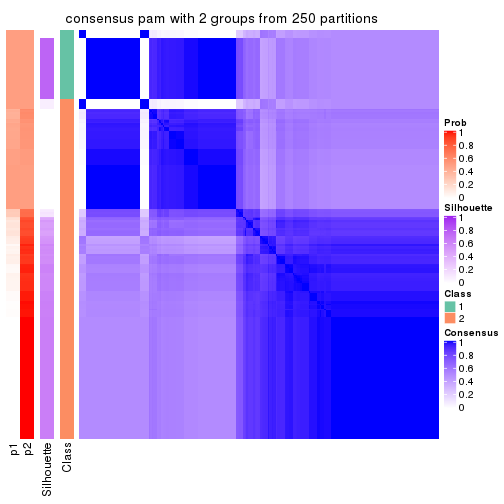</p>

</div>
<div id='tab-ATC-pam-consensus-heatmap-2'>
<pre><code class="r">consensus_heatmap(res, k = 3)
</code></pre>

<p>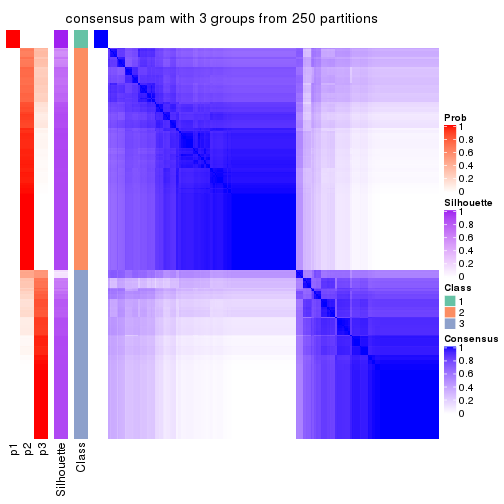</p>

</div>
<div id='tab-ATC-pam-consensus-heatmap-3'>
<pre><code class="r">consensus_heatmap(res, k = 4)
</code></pre>

<p>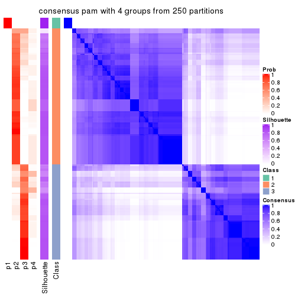</p>

</div>
<div id='tab-ATC-pam-consensus-heatmap-4'>
<pre><code class="r">consensus_heatmap(res, k = 5)
</code></pre>

<p>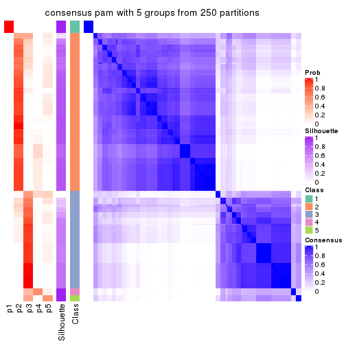</p>

</div>
<div id='tab-ATC-pam-consensus-heatmap-5'>
<pre><code class="r">consensus_heatmap(res, k = 6)
</code></pre>

<p>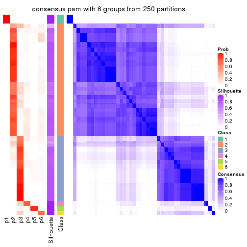</p>

</div>
</div>

Heatmaps for the membership of samples in all partitions to see how consistent they are:


<script>
$( function() {
	$( '#tabs-ATC-pam-membership-heatmap' ).tabs();
} );
</script>
<div id='tabs-ATC-pam-membership-heatmap'>
<ul>
<li><a href='#tab-ATC-pam-membership-heatmap-1'>k = 2</a></li>
<li><a href='#tab-ATC-pam-membership-heatmap-2'>k = 3</a></li>
<li><a href='#tab-ATC-pam-membership-heatmap-3'>k = 4</a></li>
<li><a href='#tab-ATC-pam-membership-heatmap-4'>k = 5</a></li>
<li><a href='#tab-ATC-pam-membership-heatmap-5'>k = 6</a></li>
</ul>
<div id='tab-ATC-pam-membership-heatmap-1'>
<pre><code class="r">membership_heatmap(res, k = 2)
</code></pre>

<p>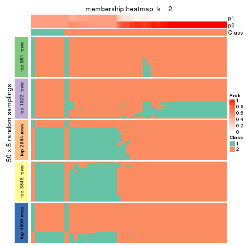</p>

</div>
<div id='tab-ATC-pam-membership-heatmap-2'>
<pre><code class="r">membership_heatmap(res, k = 3)
</code></pre>

<p>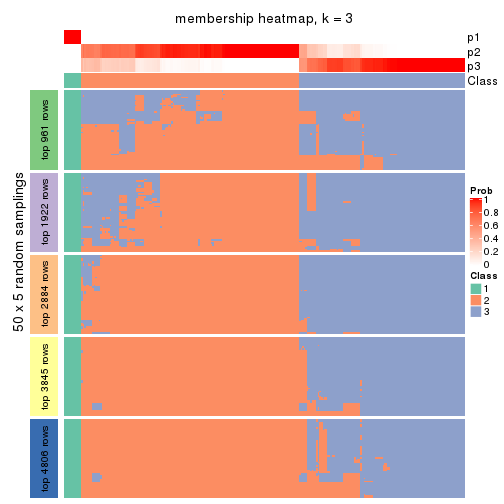</p>

</div>
<div id='tab-ATC-pam-membership-heatmap-3'>
<pre><code class="r">membership_heatmap(res, k = 4)
</code></pre>

<p>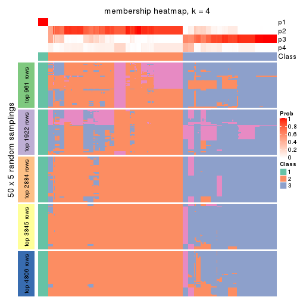</p>

</div>
<div id='tab-ATC-pam-membership-heatmap-4'>
<pre><code class="r">membership_heatmap(res, k = 5)
</code></pre>

<p>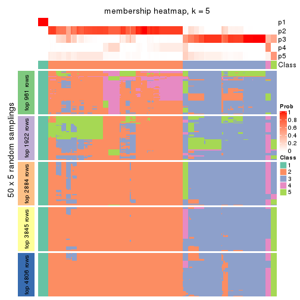</p>

</div>
<div id='tab-ATC-pam-membership-heatmap-5'>
<pre><code class="r">membership_heatmap(res, k = 6)
</code></pre>

<p>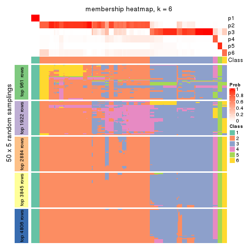</p>

</div>
</div>

As soon as we have had the classes for columns, we can look for signatures
which are significantly different between classes which can be candidate marks
for certain classes. Following are the heatmaps for signatures.


Signature heatmaps where rows are scaled:


<script>
$( function() {
	$( '#tabs-ATC-pam-get-signatures' ).tabs();
} );
</script>
<div id='tabs-ATC-pam-get-signatures'>
<ul>
<li><a href='#tab-ATC-pam-get-signatures-1'>k = 2</a></li>
<li><a href='#tab-ATC-pam-get-signatures-2'>k = 3</a></li>
<li><a href='#tab-ATC-pam-get-signatures-3'>k = 4</a></li>
<li><a href='#tab-ATC-pam-get-signatures-4'>k = 5</a></li>
<li><a href='#tab-ATC-pam-get-signatures-5'>k = 6</a></li>
</ul>
<div id='tab-ATC-pam-get-signatures-1'>
<pre><code class="r">get_signatures(res, k = 2)
</code></pre>

<p>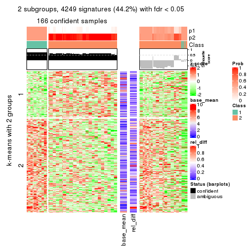</p>

</div>
<div id='tab-ATC-pam-get-signatures-2'>
<pre><code class="r">get_signatures(res, k = 3)
</code></pre>

<p>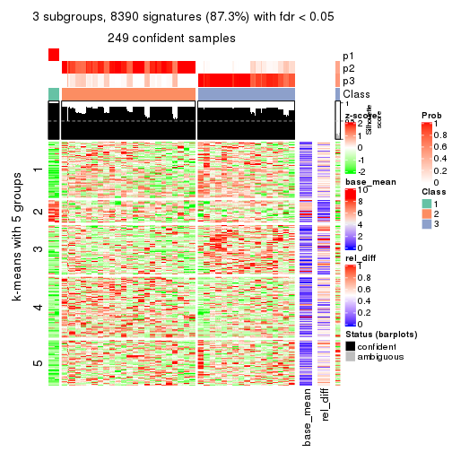</p>

</div>
<div id='tab-ATC-pam-get-signatures-3'>
<pre><code class="r">get_signatures(res, k = 4)
</code></pre>

<p>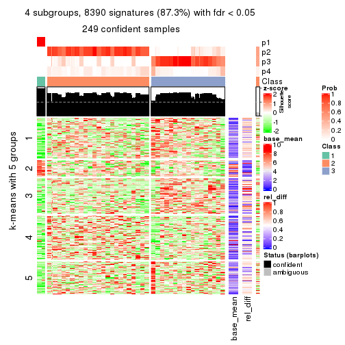</p>

</div>
<div id='tab-ATC-pam-get-signatures-4'>
<pre><code class="r">get_signatures(res, k = 5)
</code></pre>

<p>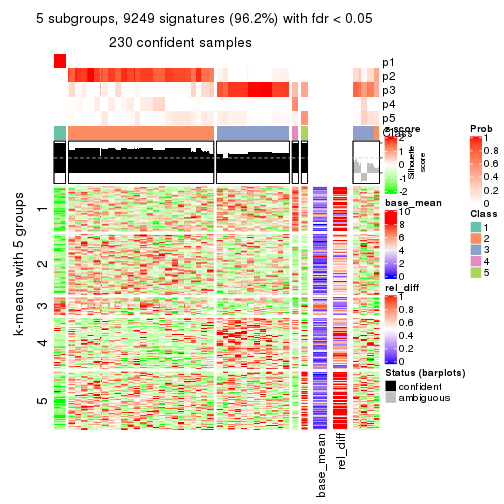</p>

</div>
<div id='tab-ATC-pam-get-signatures-5'>
<pre><code class="r">get_signatures(res, k = 6)
</code></pre>

<p>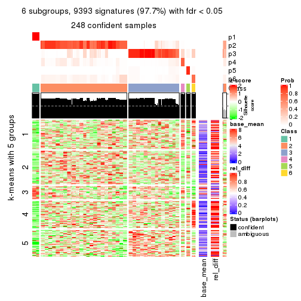</p>

</div>
</div>


Signature heatmaps where rows are not scaled:


<script>
$( function() {
	$( '#tabs-ATC-pam-get-signatures-no-scale' ).tabs();
} );
</script>
<div id='tabs-ATC-pam-get-signatures-no-scale'>
<ul>
<li><a href='#tab-ATC-pam-get-signatures-no-scale-1'>k = 2</a></li>
<li><a href='#tab-ATC-pam-get-signatures-no-scale-2'>k = 3</a></li>
<li><a href='#tab-ATC-pam-get-signatures-no-scale-3'>k = 4</a></li>
<li><a href='#tab-ATC-pam-get-signatures-no-scale-4'>k = 5</a></li>
<li><a href='#tab-ATC-pam-get-signatures-no-scale-5'>k = 6</a></li>
</ul>
<div id='tab-ATC-pam-get-signatures-no-scale-1'>
<pre><code class="r">get_signatures(res, k = 2, scale_rows = FALSE)
</code></pre>

<p>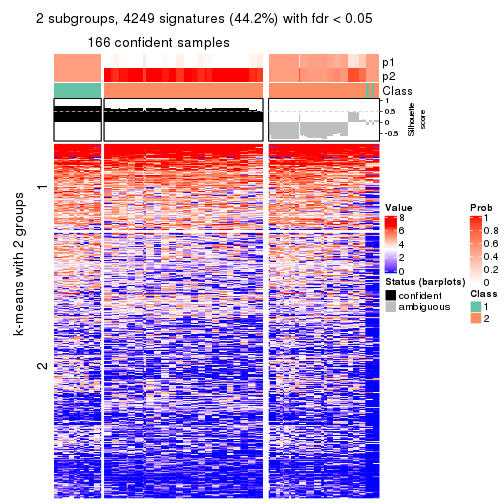</p>

</div>
<div id='tab-ATC-pam-get-signatures-no-scale-2'>
<pre><code class="r">get_signatures(res, k = 3, scale_rows = FALSE)
</code></pre>

<p>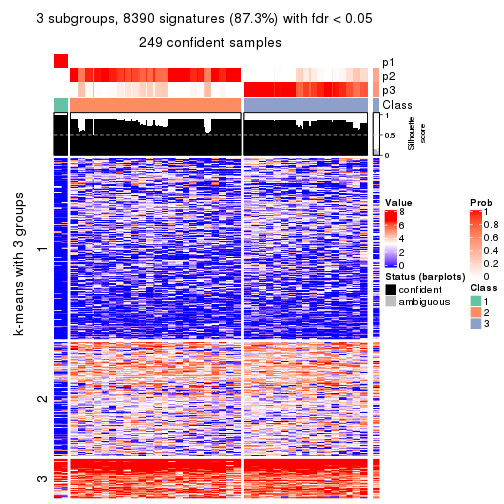</p>

</div>
<div id='tab-ATC-pam-get-signatures-no-scale-3'>
<pre><code class="r">get_signatures(res, k = 4, scale_rows = FALSE)
</code></pre>

<p>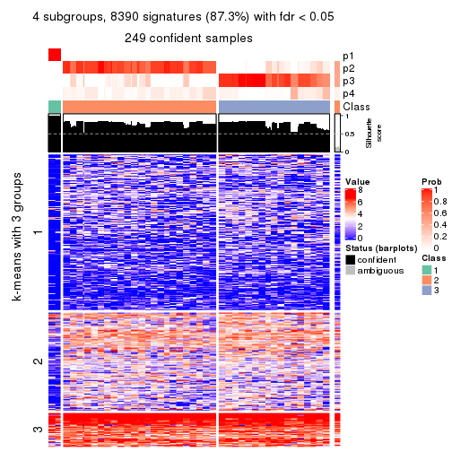</p>

</div>
<div id='tab-ATC-pam-get-signatures-no-scale-4'>
<pre><code class="r">get_signatures(res, k = 5, scale_rows = FALSE)
</code></pre>

<p>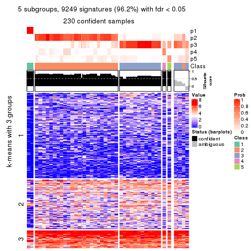</p>

</div>
<div id='tab-ATC-pam-get-signatures-no-scale-5'>
<pre><code class="r">get_signatures(res, k = 6, scale_rows = FALSE)
</code></pre>

<p>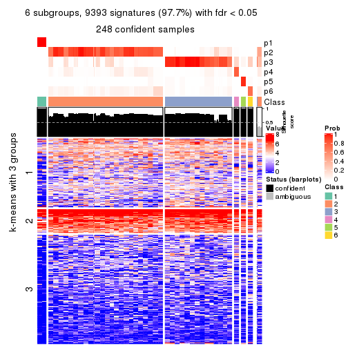</p>

</div>
</div>


Compare the overlap of signatures from different k:

```r
compare_signatures(res)
```

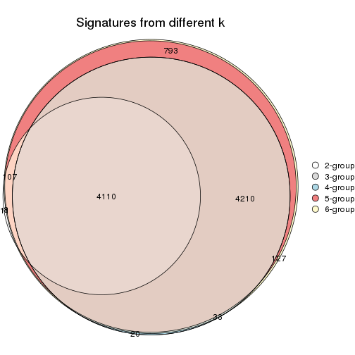

`get_signature()` returns a data frame invisibly. TO get the list of signatures, the function
call should be assigned to a variable explicitly. In following code, if `plot` argument is set
to `FALSE`, no heatmap is plotted while only the differential analysis is performed.

```r
# code only for demonstration
tb = get_signature(res, k = ..., plot = FALSE)
```

An example of the output of `tb` is:

```
#>   which_row         fdr    mean_1    mean_2 scaled_mean_1 scaled_mean_2 km
#> 1        38 0.042760348  8.373488  9.131774    -0.5533452     0.5164555  1
#> 2        40 0.018707592  7.106213  8.469186    -0.6173731     0.5762149  1
#> 3        55 0.019134737 10.221463 11.207825    -0.6159697     0.5749050  1
#> 4        59 0.006059896  5.921854  7.869574    -0.6899429     0.6439467  1
#> 5        60 0.018055526  8.928898 10.211722    -0.6204761     0.5791110  1
#> 6        98 0.009384629 15.714769 14.887706     0.6635654    -0.6193277  2
...
```

The columns in `tb` are:

1. `which_row`: row indices corresponding to the input matrix.
2. `fdr`: FDR for the differential test. 
3. `mean_x`: The mean value in group x.
4. `scaled_mean_x`: The mean value in group x after rows are scaled.
5. `km`: Row groups if k-means clustering is applied to rows.


UMAP plot which shows how samples are separated.


<script>
$( function() {
	$( '#tabs-ATC-pam-dimension-reduction' ).tabs();
} );
</script>
<div id='tabs-ATC-pam-dimension-reduction'>
<ul>
<li><a href='#tab-ATC-pam-dimension-reduction-1'>k = 2</a></li>
<li><a href='#tab-ATC-pam-dimension-reduction-2'>k = 3</a></li>
<li><a href='#tab-ATC-pam-dimension-reduction-3'>k = 4</a></li>
<li><a href='#tab-ATC-pam-dimension-reduction-4'>k = 5</a></li>
<li><a href='#tab-ATC-pam-dimension-reduction-5'>k = 6</a></li>
</ul>
<div id='tab-ATC-pam-dimension-reduction-1'>
<pre><code class="r">dimension_reduction(res, k = 2, method = &quot;UMAP&quot;)
</code></pre>

<p>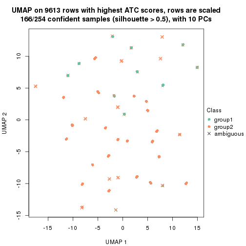</p>

</div>
<div id='tab-ATC-pam-dimension-reduction-2'>
<pre><code class="r">dimension_reduction(res, k = 3, method = &quot;UMAP&quot;)
</code></pre>

<p>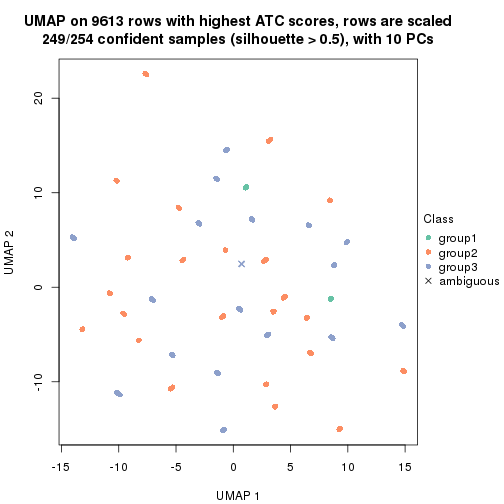</p>

</div>
<div id='tab-ATC-pam-dimension-reduction-3'>
<pre><code class="r">dimension_reduction(res, k = 4, method = &quot;UMAP&quot;)
</code></pre>

<p>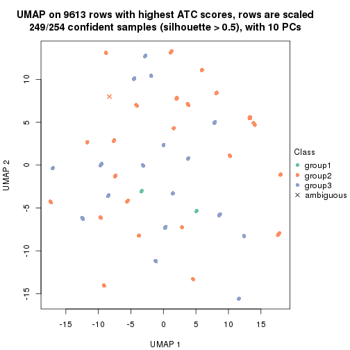</p>

</div>
<div id='tab-ATC-pam-dimension-reduction-4'>
<pre><code class="r">dimension_reduction(res, k = 5, method = &quot;UMAP&quot;)
</code></pre>

<p>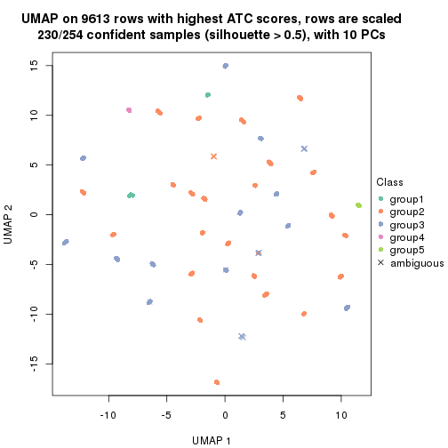</p>

</div>
<div id='tab-ATC-pam-dimension-reduction-5'>
<pre><code class="r">dimension_reduction(res, k = 6, method = &quot;UMAP&quot;)
</code></pre>

<p>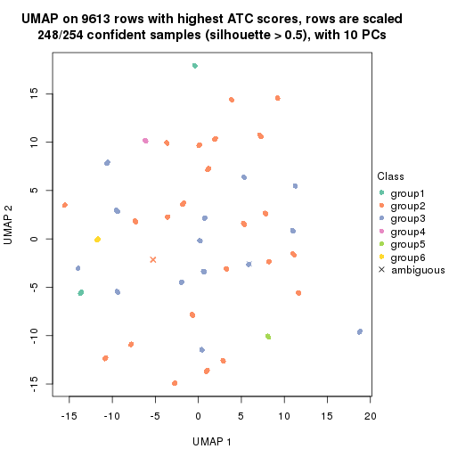</p>

</div>
</div>


Following heatmap shows how subgroups are split when increasing `k`:

```r
collect_classes(res)
```

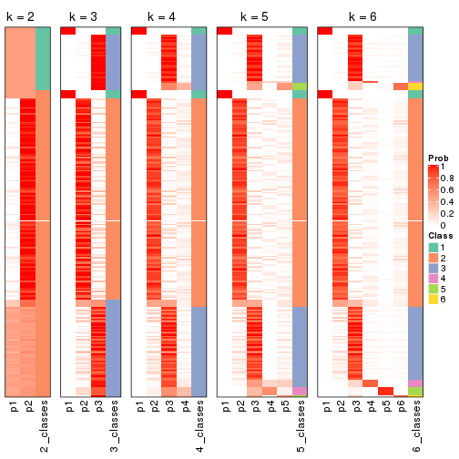


If matrix rows can be associated to genes, consider to use `GO_Enrichment(res,
...)` to perform function enrichment for the signature genes.


 

---------------------------------------------------


### ATC:mclust


The object with results only for a single top-value method and a single partition method 
can be extracted as:

```r
res = res_list["ATC", "mclust"]
# you can also extract it by
# res = res_list["ATC:mclust"]
```

A summary of `res` and all the functions that can be applied to it:

```r
res
```

```
#> A 'ConsensusPartition' object with k = 2, 3, 4, 5, 6.
#>   On a matrix with 9613 rows and 254 columns.
#>   Top rows (961, 1922, 2884, 3845, 4806) are extracted by 'ATC' method.
#>   Subgroups are detected by 'mclust' method.
#>   Performed in total 1250 partitions by row resampling.
#>   Best k for subgroups seems to be 5.
#> 
#> Following methods can be applied to this 'ConsensusPartition' object:
#>  [1] "cola_report"             "collect_classes"         "collect_plots"          
#>  [4] "collect_stats"           "colnames"                "compare_signatures"     
#>  [7] "consensus_heatmap"       "dimension_reduction"     "functional_enrichment"  
#> [10] "get_anno_col"            "get_anno"                "get_classes"            
#> [13] "get_consensus"           "get_matrix"              "get_membership"         
#> [16] "get_param"               "get_signatures"          "get_stats"              
#> [19] "is_best_k"               "is_stable_k"             "membership_heatmap"     
#> [22] "ncol"                    "nrow"                    "plot_ecdf"              
#> [25] "rownames"                "select_partition_number" "show"                   
#> [28] "suggest_best_k"          "test_to_known_factors"
```

`collect_plots()` function collects all the plots made from `res` for all `k` (number of partitions)
into one single page to provide an easy and fast comparison between different `k`.

```r
collect_plots(res)
```

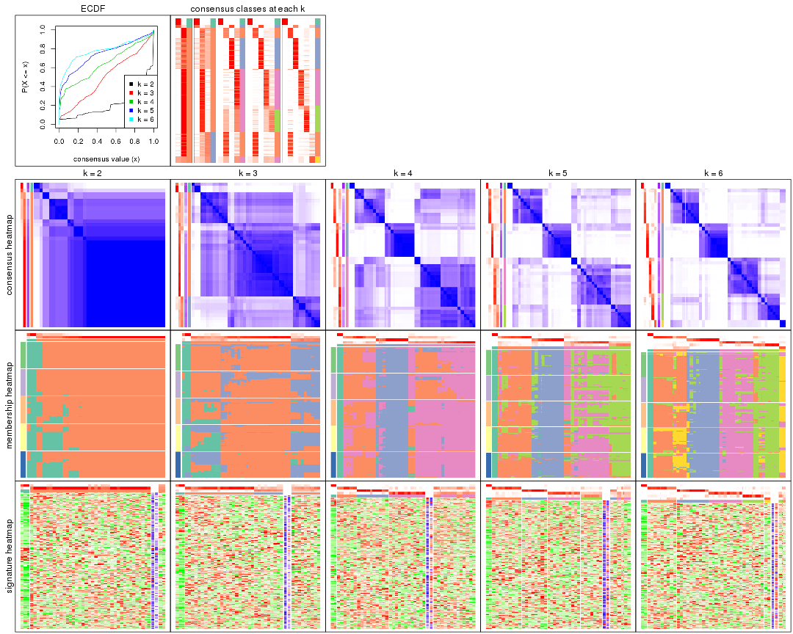

The plots are:

- The first row: a plot of the ECDF (Empirical cumulative distribution
  function) curves of the consensus matrix for each `k` and the heatmap of
  predicted classes for each `k`.
- The second row: heatmaps of the consensus matrix for each `k`.
- The third row: heatmaps of the membership matrix for each `k`.
- The fouth row: heatmaps of the signatures for each `k`.

All the plots in panels can be made by individual functions and they are
plotted later in this section.

`select_partition_number()` produces several plots showing different
statistics for choosing "optimized" `k`. There are following statistics:

- ECDF curves of the consensus matrix for each `k`;
- 1-PAC. [The PAC
  score](https://en.wikipedia.org/wiki/Consensus_clustering#Over-interpretation_potential_of_consensus_clustering)
  measures the proportion of the ambiguous subgrouping.
- Mean silhouette score.
- Concordance. The mean probability of fiting the consensus class ids in all
  partitions.
- Area increased. Denote $A_k$ as the area under the ECDF curve for current
  `k`, the area increased is defined as $A_k - A_{k-1}$.
- Rand index. The percent of pairs of samples that are both in a same cluster
  or both are not in a same cluster in the partition of k and k-1.
- Jaccard index. The ratio of pairs of samples are both in a same cluster in
  the partition of k and k-1 and the pairs of samples are both in a same
  cluster in the partition k or k-1.

The detailed explanations of these statistics can be found in [the cola
vignette](http://bioconductor.org/packages/devel/bioc/vignettes/cola/inst/doc/cola.html#toc_13).

Generally speaking, lower PAC score, higher mean silhouette score or higher
concordance corresponds to better partition. Rand index and Jaccard index
measure how similar the current partition is compared to partition with `k-1`.
If they are too similar, we won't accept `k` is better than `k-1`.

```r
select_partition_number(res)
```

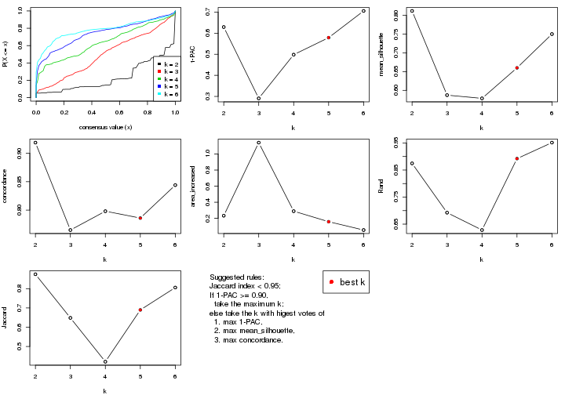

The numeric values for all these statistics can be obtained by `get_stats()`.

```r
get_stats(res)
```

```
#>   k 1-PAC mean_silhouette concordance area_increased  Rand Jaccard
#> 2 2 0.629           0.812       0.919         0.2327 0.875   0.875
#> 3 3 0.291           0.587       0.765         1.1412 0.692   0.648
#> 4 4 0.498           0.579       0.798         0.2891 0.628   0.421
#> 5 5 0.579           0.660       0.786         0.1582 0.892   0.690
#> 6 6 0.705           0.750       0.844         0.0546 0.951   0.806
```

`suggest_best_k()` suggests the best $k$ based on these statistics. The rules are as follows:

- All $k$ with Jaccard index larger than 0.95 are removed because the increase of
  the partition number does not provides enough extra information. If all $k$ are removed,
  the best $k$ is assigned by `NA`.
- For $k$ with 1-PAC larger than 0.9, the maximal $k$ is taken as the "best k". Other $k$ is called "optional k".
- If it does not fit the second rule. The $k$ with the highest vote of highest
  1-PAC, mean silhouette and concordance is taken as the "best k".

```r
suggest_best_k(res)
```

```
#> [1] 5
```


Following shows the table of the partitions (You need to click the **show/hide
code output** link to see it). The membership matrix (columns with name `p*`)
is inferred by
[`clue::cl_consensus()`](https://www.rdocumentation.org/link/cl_consensus?package=clue)
function with the `SE` method. Basically the value in the membership matrix
represents the probability to belong to a certain group. The finall class
label for an item is determined with the group with highest probability it
belongs to.

In `get_classes()` function, the entropy is calculated from the membership
matrix and the silhouette score is calculated from the consensus matrix.


<script>
$( function() {
	$( '#tabs-ATC-mclust-get-classes' ).tabs();
} );
</script>
<div id='tabs-ATC-mclust-get-classes'>
<ul>
<li><a href='#tab-ATC-mclust-get-classes-1'>k = 2</a></li>
<li><a href='#tab-ATC-mclust-get-classes-2'>k = 3</a></li>
<li><a href='#tab-ATC-mclust-get-classes-3'>k = 4</a></li>
<li><a href='#tab-ATC-mclust-get-classes-4'>k = 5</a></li>
<li><a href='#tab-ATC-mclust-get-classes-5'>k = 6</a></li>
</ul>

<div id='tab-ATC-mclust-get-classes-1'>
<p><a id='tab-ATC-mclust-get-classes-1-a' style='color:#0366d6' href='#'>show/hide code output</a></p>
<pre><code class="r">cbind(get_classes(res, k = 2), get_membership(res, k = 2))
</code></pre>

<pre><code>#&gt;           class entropy silhouette    p1    p2
#&gt; DRR024803     1   0.000      0.917 1.000 0.000
#&gt; DRR024804     2   0.000      0.903 0.000 1.000
#&gt; DRR024805     2   0.000      0.903 0.000 1.000
#&gt; DRR024806     2   0.000      0.903 0.000 1.000
#&gt; DRR024807     2   0.891      0.584 0.308 0.692
#&gt; DRR024808     2   0.886      0.591 0.304 0.696
#&gt; DRR024809     2   0.000      0.903 0.000 1.000
#&gt; DRR024810     2   0.430      0.834 0.088 0.912
#&gt; DRR024811     2   0.402      0.853 0.080 0.920
#&gt; DRR024812     2   0.118      0.893 0.016 0.984
#&gt; DRR024813     2   0.000      0.903 0.000 1.000
#&gt; DRR024814     2   0.000      0.903 0.000 1.000
#&gt; DRR024815     2   0.000      0.903 0.000 1.000
#&gt; DRR024816     2   0.662      0.744 0.172 0.828
#&gt; DRR024817     2   0.000      0.903 0.000 1.000
#&gt; DRR024818     2   0.402      0.853 0.080 0.920
#&gt; DRR024819     2   0.000      0.903 0.000 1.000
#&gt; DRR024820     2   0.204      0.884 0.032 0.968
#&gt; DRR024821     2   0.814      0.667 0.252 0.748
#&gt; DRR024822     2   0.000      0.903 0.000 1.000
#&gt; DRR024824     2   0.000      0.903 0.000 1.000
#&gt; DRR024825     2   0.402      0.853 0.080 0.920
#&gt; DRR024826     2   0.000      0.903 0.000 1.000
#&gt; DRR024827     2   0.000      0.903 0.000 1.000
#&gt; DRR024828     1   0.697      0.812 0.812 0.188
#&gt; DRR024829     2   0.000      0.903 0.000 1.000
#&gt; DRR024830     2   0.000      0.903 0.000 1.000
#&gt; DRR024831     2   0.891      0.584 0.308 0.692
#&gt; DRR024832     2   0.839      0.645 0.268 0.732
#&gt; DRR024833     2   0.000      0.903 0.000 1.000
#&gt; DRR024834     2   0.994      0.120 0.456 0.544
#&gt; DRR024835     2   0.000      0.903 0.000 1.000
#&gt; DRR024836     2   0.886      0.590 0.304 0.696
#&gt; DRR024837     2   0.994      0.120 0.456 0.544
#&gt; DRR024838     2   0.000      0.903 0.000 1.000
#&gt; DRR024839     2   0.000      0.903 0.000 1.000
#&gt; DRR024840     2   0.000      0.903 0.000 1.000
#&gt; DRR024841     2   0.000      0.903 0.000 1.000
#&gt; DRR024842     2   0.000      0.903 0.000 1.000
#&gt; DRR024843     1   0.000      0.917 1.000 0.000
#&gt; DRR024844     2   0.000      0.903 0.000 1.000
#&gt; DRR024845     2   0.000      0.903 0.000 1.000
#&gt; DRR024846     2   0.000      0.903 0.000 1.000
#&gt; DRR024847     2   0.895      0.578 0.312 0.688
#&gt; DRR024848     1   0.000      0.917 1.000 0.000
#&gt; DRR024849     2   0.891      0.584 0.308 0.692
#&gt; DRR024850     2   0.000      0.903 0.000 1.000
#&gt; DRR024851     2   0.000      0.903 0.000 1.000
#&gt; DRR024852     2   0.529      0.802 0.120 0.880
#&gt; DRR024853     2   0.402      0.853 0.080 0.920
#&gt; DRR024854     2   0.000      0.903 0.000 1.000
#&gt; DRR024855     2   0.000      0.903 0.000 1.000
#&gt; DRR024856     2   0.000      0.903 0.000 1.000
#&gt; DRR024857     2   0.000      0.903 0.000 1.000
#&gt; DRR024858     2   0.662      0.744 0.172 0.828
#&gt; DRR024859     2   0.000      0.903 0.000 1.000
#&gt; DRR024860     2   0.402      0.853 0.080 0.920
#&gt; DRR024861     2   0.000      0.903 0.000 1.000
#&gt; DRR024862     2   0.204      0.884 0.032 0.968
#&gt; DRR024863     2   0.844      0.640 0.272 0.728
#&gt; DRR024864     2   0.000      0.903 0.000 1.000
#&gt; DRR024865     2   0.000      0.903 0.000 1.000
#&gt; DRR024866     2   0.000      0.903 0.000 1.000
#&gt; DRR024867     2   0.402      0.853 0.080 0.920
#&gt; DRR024868     2   0.000      0.903 0.000 1.000
#&gt; DRR024869     2   0.000      0.903 0.000 1.000
#&gt; DRR024870     1   0.697      0.812 0.812 0.188
#&gt; DRR024871     2   0.000      0.903 0.000 1.000
#&gt; DRR024872     2   0.000      0.903 0.000 1.000
#&gt; DRR024873     2   0.891      0.584 0.308 0.692
#&gt; DRR024874     2   0.855      0.628 0.280 0.720
#&gt; DRR024875     2   0.000      0.903 0.000 1.000
#&gt; DRR024876     2   0.994      0.120 0.456 0.544
#&gt; DRR024877     2   0.000      0.903 0.000 1.000
#&gt; DRR024878     2   0.891      0.584 0.308 0.692
#&gt; DRR024879     2   0.994      0.120 0.456 0.544
#&gt; DRR024880     2   0.000      0.903 0.000 1.000
#&gt; DRR024881     2   0.000      0.903 0.000 1.000
#&gt; DRR024882     2   0.000      0.903 0.000 1.000
#&gt; DRR024883     2   0.000      0.903 0.000 1.000
#&gt; DRR024884     2   0.000      0.903 0.000 1.000
#&gt; DRR024885     2   0.000      0.903 0.000 1.000
#&gt; DRR024886     1   0.000      0.917 1.000 0.000
#&gt; DRR024887     2   0.000      0.903 0.000 1.000
#&gt; DRR024888     2   0.000      0.903 0.000 1.000
#&gt; DRR024889     2   0.000      0.903 0.000 1.000
#&gt; DRR024890     2   0.895      0.578 0.312 0.688
#&gt; DRR024891     1   0.000      0.917 1.000 0.000
#&gt; DRR024892     2   0.891      0.584 0.308 0.692
#&gt; DRR024893     2   0.000      0.903 0.000 1.000
#&gt; DRR024894     2   0.000      0.903 0.000 1.000
#&gt; DRR024895     2   0.529      0.802 0.120 0.880
#&gt; DRR024896     2   0.402      0.853 0.080 0.920
#&gt; DRR024897     2   0.000      0.903 0.000 1.000
#&gt; DRR024898     2   0.000      0.903 0.000 1.000
#&gt; DRR024899     2   0.000      0.903 0.000 1.000
#&gt; DRR024900     2   0.000      0.903 0.000 1.000
#&gt; DRR024901     2   0.662      0.744 0.172 0.828
#&gt; DRR024902     2   0.000      0.903 0.000 1.000
#&gt; DRR024903     2   0.402      0.853 0.080 0.920
#&gt; DRR024904     2   0.000      0.903 0.000 1.000
#&gt; DRR024905     2   0.204      0.884 0.032 0.968
#&gt; DRR024906     2   0.844      0.640 0.272 0.728
#&gt; DRR024907     2   0.000      0.903 0.000 1.000
#&gt; DRR024908     2   0.000      0.903 0.000 1.000
#&gt; DRR024909     2   0.000      0.903 0.000 1.000
#&gt; DRR024910     2   0.402      0.853 0.080 0.920
#&gt; DRR024911     2   0.000      0.903 0.000 1.000
#&gt; DRR024912     2   0.000      0.903 0.000 1.000
#&gt; DRR024913     1   0.697      0.812 0.812 0.188
#&gt; DRR024914     2   0.000      0.903 0.000 1.000
#&gt; DRR024915     2   0.000      0.903 0.000 1.000
#&gt; DRR024916     2   0.891      0.584 0.308 0.692
#&gt; DRR024917     2   0.855      0.628 0.280 0.720
#&gt; DRR024918     2   0.000      0.903 0.000 1.000
#&gt; DRR024919     2   0.994      0.120 0.456 0.544
#&gt; DRR024920     2   0.000      0.903 0.000 1.000
#&gt; DRR024921     2   0.891      0.584 0.308 0.692
#&gt; DRR024922     2   0.994      0.120 0.456 0.544
#&gt; DRR024923     2   0.000      0.903 0.000 1.000
#&gt; DRR024924     2   0.000      0.903 0.000 1.000
#&gt; DRR024925     2   0.000      0.903 0.000 1.000
#&gt; DRR024926     2   0.000      0.903 0.000 1.000
#&gt; DRR024927     2   0.000      0.903 0.000 1.000
#&gt; DRR024928     2   0.000      0.903 0.000 1.000
#&gt; DRR024929     1   0.000      0.917 1.000 0.000
#&gt; DRR024930     2   0.000      0.903 0.000 1.000
#&gt; DRR024931     2   0.000      0.903 0.000 1.000
#&gt; DRR024932     2   0.000      0.903 0.000 1.000
#&gt; DRR024933     2   0.895      0.578 0.312 0.688
#&gt; DRR024934     1   0.000      0.917 1.000 0.000
#&gt; DRR024935     2   0.891      0.584 0.308 0.692
#&gt; DRR024936     2   0.000      0.903 0.000 1.000
#&gt; DRR024937     2   0.000      0.903 0.000 1.000
#&gt; DRR024938     2   0.529      0.802 0.120 0.880
#&gt; DRR024939     2   0.402      0.853 0.080 0.920
#&gt; DRR024940     2   0.000      0.903 0.000 1.000
#&gt; DRR024941     2   0.000      0.903 0.000 1.000
#&gt; DRR024942     2   0.000      0.903 0.000 1.000
#&gt; DRR024943     2   0.000      0.903 0.000 1.000
#&gt; DRR024944     2   0.662      0.744 0.172 0.828
#&gt; DRR024945     2   0.000      0.903 0.000 1.000
#&gt; DRR024946     2   0.402      0.853 0.080 0.920
#&gt; DRR024947     2   0.000      0.903 0.000 1.000
#&gt; DRR024948     2   0.204      0.884 0.032 0.968
#&gt; DRR024949     2   0.844      0.640 0.272 0.728
#&gt; DRR024950     2   0.000      0.903 0.000 1.000
#&gt; DRR024951     2   0.000      0.903 0.000 1.000
#&gt; DRR024952     2   0.000      0.903 0.000 1.000
#&gt; DRR024953     2   0.402      0.853 0.080 0.920
#&gt; DRR024954     2   0.000      0.903 0.000 1.000
#&gt; DRR024955     2   0.000      0.903 0.000 1.000
#&gt; DRR024956     1   0.697      0.812 0.812 0.188
#&gt; DRR024957     2   0.000      0.903 0.000 1.000
#&gt; DRR024958     2   0.000      0.903 0.000 1.000
#&gt; DRR024959     2   0.891      0.584 0.308 0.692
#&gt; DRR024960     2   0.855      0.628 0.280 0.720
#&gt; DRR024961     2   0.000      0.903 0.000 1.000
#&gt; DRR024962     2   0.994      0.120 0.456 0.544
#&gt; DRR024963     2   0.000      0.903 0.000 1.000
#&gt; DRR024964     2   0.891      0.584 0.308 0.692
#&gt; DRR024965     2   0.994      0.120 0.456 0.544
#&gt; DRR024966     2   0.000      0.903 0.000 1.000
#&gt; DRR024967     2   0.000      0.903 0.000 1.000
#&gt; DRR024968     2   0.000      0.903 0.000 1.000
#&gt; DRR024969     2   0.000      0.903 0.000 1.000
#&gt; DRR024970     2   0.000      0.903 0.000 1.000
#&gt; DRR024971     2   0.000      0.903 0.000 1.000
#&gt; DRR024972     1   0.000      0.917 1.000 0.000
#&gt; DRR024973     2   0.000      0.903 0.000 1.000
#&gt; DRR024974     2   0.000      0.903 0.000 1.000
#&gt; DRR024975     2   0.000      0.903 0.000 1.000
#&gt; DRR024976     2   0.895      0.578 0.312 0.688
#&gt; DRR024977     1   0.000      0.917 1.000 0.000
#&gt; DRR024978     2   0.891      0.584 0.308 0.692
#&gt; DRR024979     2   0.000      0.903 0.000 1.000
#&gt; DRR024980     2   0.000      0.903 0.000 1.000
#&gt; DRR024981     2   0.518      0.806 0.116 0.884
#&gt; DRR024982     2   0.402      0.853 0.080 0.920
#&gt; DRR024983     2   0.000      0.903 0.000 1.000
#&gt; DRR024984     2   0.000      0.903 0.000 1.000
#&gt; DRR024985     2   0.000      0.903 0.000 1.000
#&gt; DRR024986     2   0.000      0.903 0.000 1.000
#&gt; DRR024987     2   0.662      0.744 0.172 0.828
#&gt; DRR024988     2   0.000      0.903 0.000 1.000
#&gt; DRR024989     2   0.402      0.853 0.080 0.920
#&gt; DRR024990     2   0.000      0.903 0.000 1.000
#&gt; DRR024991     2   0.204      0.884 0.032 0.968
#&gt; DRR024992     2   0.844      0.640 0.272 0.728
#&gt; DRR024993     2   0.000      0.903 0.000 1.000
#&gt; DRR024994     2   0.000      0.903 0.000 1.000
#&gt; DRR024995     2   0.000      0.903 0.000 1.000
#&gt; DRR024996     2   0.402      0.853 0.080 0.920
#&gt; DRR024997     2   0.000      0.903 0.000 1.000
#&gt; DRR024998     2   0.000      0.903 0.000 1.000
#&gt; DRR024999     1   0.697      0.812 0.812 0.188
#&gt; DRR025000     2   0.000      0.903 0.000 1.000
#&gt; DRR025001     2   0.000      0.903 0.000 1.000
#&gt; DRR025002     2   0.891      0.584 0.308 0.692
#&gt; DRR025003     2   0.855      0.628 0.280 0.720
#&gt; DRR025004     2   0.000      0.903 0.000 1.000
#&gt; DRR025005     2   0.994      0.120 0.456 0.544
#&gt; DRR025006     2   0.000      0.903 0.000 1.000
#&gt; DRR025007     2   0.891      0.584 0.308 0.692
#&gt; DRR025008     2   0.994      0.120 0.456 0.544
#&gt; DRR025009     2   0.000      0.903 0.000 1.000
#&gt; DRR025010     2   0.000      0.903 0.000 1.000
#&gt; DRR025011     2   0.000      0.903 0.000 1.000
#&gt; DRR025012     2   0.000      0.903 0.000 1.000
#&gt; DRR025013     2   0.000      0.903 0.000 1.000
#&gt; DRR025014     2   0.000      0.903 0.000 1.000
#&gt; DRR025015     1   0.000      0.917 1.000 0.000
#&gt; DRR025016     2   0.000      0.903 0.000 1.000
#&gt; DRR025017     2   0.000      0.903 0.000 1.000
#&gt; DRR025018     2   0.000      0.903 0.000 1.000
#&gt; DRR025019     2   0.895      0.578 0.312 0.688
#&gt; DRR025020     1   0.000      0.917 1.000 0.000
#&gt; DRR025021     2   0.891      0.584 0.308 0.692
#&gt; DRR025022     2   0.000      0.903 0.000 1.000
#&gt; DRR025023     2   0.000      0.903 0.000 1.000
#&gt; DRR025024     2   0.506      0.810 0.112 0.888
#&gt; DRR025025     2   0.402      0.853 0.080 0.920
#&gt; DRR025026     2   0.000      0.903 0.000 1.000
#&gt; DRR025027     2   0.000      0.903 0.000 1.000
#&gt; DRR025028     2   0.000      0.903 0.000 1.000
#&gt; DRR025029     2   0.000      0.903 0.000 1.000
#&gt; DRR025030     2   0.662      0.744 0.172 0.828
#&gt; DRR025031     2   0.000      0.903 0.000 1.000
#&gt; DRR025032     2   0.402      0.853 0.080 0.920
#&gt; DRR025033     2   0.000      0.903 0.000 1.000
#&gt; DRR025034     2   0.204      0.884 0.032 0.968
#&gt; DRR025035     2   0.844      0.640 0.272 0.728
#&gt; DRR025036     2   0.000      0.903 0.000 1.000
#&gt; DRR025037     2   0.000      0.903 0.000 1.000
#&gt; DRR025038     2   0.000      0.903 0.000 1.000
#&gt; DRR025039     2   0.402      0.853 0.080 0.920
#&gt; DRR025040     2   0.000      0.903 0.000 1.000
#&gt; DRR025041     2   0.000      0.903 0.000 1.000
#&gt; DRR025042     1   0.697      0.812 0.812 0.188
#&gt; DRR025043     2   0.000      0.903 0.000 1.000
#&gt; DRR025044     2   0.000      0.903 0.000 1.000
#&gt; DRR025045     2   0.891      0.584 0.308 0.692
#&gt; DRR025046     2   0.855      0.628 0.280 0.720
#&gt; DRR025047     2   0.000      0.903 0.000 1.000
#&gt; DRR025048     2   0.994      0.120 0.456 0.544
#&gt; DRR025049     2   0.000      0.903 0.000 1.000
#&gt; DRR025050     2   0.891      0.584 0.308 0.692
#&gt; DRR025051     2   0.994      0.120 0.456 0.544
#&gt; DRR025052     2   0.000      0.903 0.000 1.000
#&gt; DRR025053     2   0.000      0.903 0.000 1.000
#&gt; DRR025054     2   0.000      0.903 0.000 1.000
#&gt; DRR025055     2   0.000      0.903 0.000 1.000
#&gt; DRR025056     2   0.000      0.903 0.000 1.000
#&gt; DRR025057     2   0.000      0.903 0.000 1.000
</code></pre>

<script>
$('#tab-ATC-mclust-get-classes-1-a').parent().next().next().hide();
$('#tab-ATC-mclust-get-classes-1-a').click(function(){
  $('#tab-ATC-mclust-get-classes-1-a').parent().next().next().toggle();
  return(false);
});
</script>
</div>

<div id='tab-ATC-mclust-get-classes-2'>
<p><a id='tab-ATC-mclust-get-classes-2-a' style='color:#0366d6' href='#'>show/hide code output</a></p>
<pre><code class="r">cbind(get_classes(res, k = 3), get_membership(res, k = 3))
</code></pre>

<pre><code>#&gt;           class entropy silhouette    p1    p2    p3
#&gt; DRR024803     1  0.0000      0.887 1.000 0.000 0.000
#&gt; DRR024804     2  0.3816      0.567 0.000 0.852 0.148
#&gt; DRR024805     2  0.6280     -0.411 0.000 0.540 0.460
#&gt; DRR024806     3  0.5948      0.763 0.000 0.360 0.640
#&gt; DRR024807     2  0.9773      0.169 0.236 0.412 0.352
#&gt; DRR024808     2  0.8620      0.416 0.112 0.536 0.352
#&gt; DRR024809     3  0.5905      0.765 0.000 0.352 0.648
#&gt; DRR024810     3  0.8028      0.791 0.096 0.288 0.616
#&gt; DRR024811     2  0.5216      0.573 0.000 0.740 0.260
#&gt; DRR024812     3  0.6264      0.773 0.004 0.380 0.616
#&gt; DRR024813     2  0.2625      0.649 0.000 0.916 0.084
#&gt; DRR024814     2  0.1031      0.682 0.000 0.976 0.024
#&gt; DRR024815     2  0.0892      0.683 0.000 0.980 0.020
#&gt; DRR024816     3  0.7672      0.683 0.156 0.160 0.684
#&gt; DRR024817     2  0.3116      0.609 0.000 0.892 0.108
#&gt; DRR024818     2  0.5835      0.529 0.000 0.660 0.340
#&gt; DRR024819     2  0.0592      0.686 0.000 0.988 0.012
#&gt; DRR024820     2  0.5201      0.437 0.004 0.760 0.236
#&gt; DRR024821     2  0.9160      0.346 0.156 0.492 0.352
#&gt; DRR024822     2  0.6309     -0.529 0.000 0.500 0.500
#&gt; DRR024824     3  0.6126      0.743 0.000 0.400 0.600
#&gt; DRR024825     2  0.6717      0.509 0.020 0.628 0.352
#&gt; DRR024826     2  0.2066      0.669 0.000 0.940 0.060
#&gt; DRR024827     2  0.3272      0.664 0.016 0.904 0.080
#&gt; DRR024828     1  0.6546      0.790 0.716 0.044 0.240
#&gt; DRR024829     2  0.0475      0.687 0.004 0.992 0.004
#&gt; DRR024830     2  0.2625      0.645 0.000 0.916 0.084
#&gt; DRR024831     2  0.9074      0.358 0.148 0.500 0.352
#&gt; DRR024832     2  0.6954      0.504 0.028 0.620 0.352
#&gt; DRR024833     2  0.2066      0.669 0.000 0.940 0.060
#&gt; DRR024834     3  0.9007      0.700 0.180 0.268 0.552
#&gt; DRR024835     2  0.2261      0.664 0.000 0.932 0.068
#&gt; DRR024836     2  0.9280      0.324 0.168 0.480 0.352
#&gt; DRR024837     3  0.9007      0.700 0.180 0.268 0.552
#&gt; DRR024838     2  0.0475      0.687 0.004 0.992 0.004
#&gt; DRR024839     2  0.1753      0.673 0.000 0.952 0.048
#&gt; DRR024840     2  0.5327      0.275 0.000 0.728 0.272
#&gt; DRR024841     3  0.6045      0.780 0.000 0.380 0.620
#&gt; DRR024842     2  0.1031      0.682 0.000 0.976 0.024
#&gt; DRR024843     1  0.0000      0.887 1.000 0.000 0.000
#&gt; DRR024844     2  0.2711      0.645 0.000 0.912 0.088
#&gt; DRR024845     2  0.5560      0.227 0.000 0.700 0.300
#&gt; DRR024846     3  0.5968      0.761 0.000 0.364 0.636
#&gt; DRR024847     2  0.9773      0.169 0.236 0.412 0.352
#&gt; DRR024848     1  0.0000      0.887 1.000 0.000 0.000
#&gt; DRR024849     2  0.8620      0.416 0.112 0.536 0.352
#&gt; DRR024850     2  0.1860      0.671 0.000 0.948 0.052
#&gt; DRR024851     3  0.5926      0.764 0.000 0.356 0.644
#&gt; DRR024852     3  0.8203      0.780 0.116 0.268 0.616
#&gt; DRR024853     2  0.5591      0.550 0.000 0.696 0.304
#&gt; DRR024854     3  0.6225      0.719 0.000 0.432 0.568
#&gt; DRR024855     2  0.1964      0.671 0.000 0.944 0.056
#&gt; DRR024856     2  0.1031      0.682 0.000 0.976 0.024
#&gt; DRR024857     2  0.0747      0.684 0.000 0.984 0.016
#&gt; DRR024858     3  0.7672      0.683 0.156 0.160 0.684
#&gt; DRR024859     2  0.3686      0.552 0.000 0.860 0.140
#&gt; DRR024860     2  0.5810      0.531 0.000 0.664 0.336
#&gt; DRR024861     2  0.0592      0.686 0.000 0.988 0.012
#&gt; DRR024862     2  0.5201      0.437 0.004 0.760 0.236
#&gt; DRR024863     2  0.9241      0.331 0.164 0.484 0.352
#&gt; DRR024864     2  0.6305     -0.485 0.000 0.516 0.484
#&gt; DRR024865     2  0.0237      0.687 0.004 0.996 0.000
#&gt; DRR024866     3  0.6154      0.736 0.000 0.408 0.592
#&gt; DRR024867     2  0.7065      0.501 0.032 0.616 0.352
#&gt; DRR024868     2  0.1753      0.674 0.000 0.952 0.048
#&gt; DRR024869     2  0.3528      0.660 0.016 0.892 0.092
#&gt; DRR024870     1  0.6546      0.790 0.716 0.044 0.240
#&gt; DRR024871     2  0.0661      0.687 0.004 0.988 0.008
#&gt; DRR024872     2  0.1753      0.673 0.000 0.952 0.048
#&gt; DRR024873     2  0.9118      0.351 0.152 0.496 0.352
#&gt; DRR024874     2  0.7640      0.484 0.056 0.592 0.352
#&gt; DRR024875     2  0.2165      0.676 0.000 0.936 0.064
#&gt; DRR024876     3  0.9021      0.696 0.184 0.264 0.552
#&gt; DRR024877     2  0.2356      0.665 0.000 0.928 0.072
#&gt; DRR024878     2  0.9489      0.275 0.192 0.456 0.352
#&gt; DRR024879     3  0.9021      0.696 0.184 0.264 0.552
#&gt; DRR024880     2  0.0848      0.686 0.008 0.984 0.008
#&gt; DRR024881     2  0.1753      0.673 0.000 0.952 0.048
#&gt; DRR024882     2  0.3879      0.561 0.000 0.848 0.152
#&gt; DRR024883     3  0.6062      0.780 0.000 0.384 0.616
#&gt; DRR024884     2  0.0892      0.685 0.000 0.980 0.020
#&gt; DRR024885     2  0.3340      0.623 0.000 0.880 0.120
#&gt; DRR024886     1  0.0000      0.887 1.000 0.000 0.000
#&gt; DRR024887     2  0.2711      0.645 0.000 0.912 0.088
#&gt; DRR024888     2  0.5650      0.185 0.000 0.688 0.312
#&gt; DRR024889     3  0.5968      0.761 0.000 0.364 0.636
#&gt; DRR024890     2  0.9773      0.169 0.236 0.412 0.352
#&gt; DRR024891     1  0.0000      0.887 1.000 0.000 0.000
#&gt; DRR024892     2  0.8676      0.410 0.116 0.532 0.352
#&gt; DRR024893     2  0.1860      0.671 0.000 0.948 0.052
#&gt; DRR024894     3  0.5905      0.765 0.000 0.352 0.648
#&gt; DRR024895     3  0.8172      0.783 0.112 0.272 0.616
#&gt; DRR024896     2  0.5591      0.550 0.000 0.696 0.304
#&gt; DRR024897     3  0.6225      0.719 0.000 0.432 0.568
#&gt; DRR024898     2  0.1964      0.671 0.000 0.944 0.056
#&gt; DRR024899     2  0.1031      0.682 0.000 0.976 0.024
#&gt; DRR024900     2  0.0424      0.685 0.000 0.992 0.008
#&gt; DRR024901     3  0.7672      0.683 0.156 0.160 0.684
#&gt; DRR024902     2  0.3686      0.557 0.000 0.860 0.140
#&gt; DRR024903     2  0.5810      0.531 0.000 0.664 0.336
#&gt; DRR024904     2  0.0592      0.686 0.000 0.988 0.012
#&gt; DRR024905     2  0.5201      0.437 0.004 0.760 0.236
#&gt; DRR024906     2  0.9241      0.331 0.164 0.484 0.352
#&gt; DRR024907     2  0.6305     -0.485 0.000 0.516 0.484
#&gt; DRR024908     2  0.0237      0.687 0.004 0.996 0.000
#&gt; DRR024909     3  0.6154      0.736 0.000 0.408 0.592
#&gt; DRR024910     2  0.7065      0.501 0.032 0.616 0.352
#&gt; DRR024911     2  0.1753      0.674 0.000 0.952 0.048
#&gt; DRR024912     2  0.3445      0.662 0.016 0.896 0.088
#&gt; DRR024913     1  0.6546      0.790 0.716 0.044 0.240
#&gt; DRR024914     2  0.0661      0.687 0.004 0.988 0.008
#&gt; DRR024915     2  0.1753      0.673 0.000 0.952 0.048
#&gt; DRR024916     2  0.9118      0.351 0.152 0.496 0.352
#&gt; DRR024917     2  0.7640      0.484 0.056 0.592 0.352
#&gt; DRR024918     2  0.2066      0.674 0.000 0.940 0.060
#&gt; DRR024919     3  0.9021      0.696 0.184 0.264 0.552
#&gt; DRR024920     2  0.2356      0.665 0.000 0.928 0.072
#&gt; DRR024921     2  0.9489      0.275 0.192 0.456 0.352
#&gt; DRR024922     3  0.9021      0.696 0.184 0.264 0.552
#&gt; DRR024923     2  0.0848      0.686 0.008 0.984 0.008
#&gt; DRR024924     2  0.1753      0.673 0.000 0.952 0.048
#&gt; DRR024925     2  0.3941      0.554 0.000 0.844 0.156
#&gt; DRR024926     3  0.6062      0.780 0.000 0.384 0.616
#&gt; DRR024927     2  0.0892      0.685 0.000 0.980 0.020
#&gt; DRR024928     2  0.3340      0.623 0.000 0.880 0.120
#&gt; DRR024929     1  0.0000      0.887 1.000 0.000 0.000
#&gt; DRR024930     2  0.2711      0.645 0.000 0.912 0.088
#&gt; DRR024931     2  0.5650      0.185 0.000 0.688 0.312
#&gt; DRR024932     3  0.5968      0.761 0.000 0.364 0.636
#&gt; DRR024933     2  0.9773      0.169 0.236 0.412 0.352
#&gt; DRR024934     1  0.0000      0.887 1.000 0.000 0.000
#&gt; DRR024935     2  0.8620      0.416 0.112 0.536 0.352
#&gt; DRR024936     2  0.1860      0.671 0.000 0.948 0.052
#&gt; DRR024937     3  0.5926      0.764 0.000 0.356 0.644
#&gt; DRR024938     3  0.8203      0.780 0.116 0.268 0.616
#&gt; DRR024939     2  0.5591      0.550 0.000 0.696 0.304
#&gt; DRR024940     3  0.6225      0.719 0.000 0.432 0.568
#&gt; DRR024941     2  0.1964      0.671 0.000 0.944 0.056
#&gt; DRR024942     2  0.1031      0.682 0.000 0.976 0.024
#&gt; DRR024943     2  0.0747      0.684 0.000 0.984 0.016
#&gt; DRR024944     3  0.7672      0.683 0.156 0.160 0.684
#&gt; DRR024945     2  0.3941      0.532 0.000 0.844 0.156
#&gt; DRR024946     2  0.5810      0.531 0.000 0.664 0.336
#&gt; DRR024947     2  0.0592      0.686 0.000 0.988 0.012
#&gt; DRR024948     2  0.5201      0.437 0.004 0.760 0.236
#&gt; DRR024949     2  0.9241      0.331 0.164 0.484 0.352
#&gt; DRR024950     2  0.6295     -0.451 0.000 0.528 0.472
#&gt; DRR024951     2  0.0237      0.687 0.004 0.996 0.000
#&gt; DRR024952     3  0.6154      0.736 0.000 0.408 0.592
#&gt; DRR024953     2  0.7065      0.501 0.032 0.616 0.352
#&gt; DRR024954     2  0.1753      0.674 0.000 0.952 0.048
#&gt; DRR024955     2  0.3445      0.662 0.016 0.896 0.088
#&gt; DRR024956     1  0.6546      0.790 0.716 0.044 0.240
#&gt; DRR024957     2  0.0661      0.687 0.004 0.988 0.008
#&gt; DRR024958     2  0.1753      0.673 0.000 0.952 0.048
#&gt; DRR024959     2  0.9118      0.351 0.152 0.496 0.352
#&gt; DRR024960     2  0.7640      0.484 0.056 0.592 0.352
#&gt; DRR024961     2  0.2165      0.676 0.000 0.936 0.064
#&gt; DRR024962     3  0.9021      0.696 0.184 0.264 0.552
#&gt; DRR024963     2  0.2356      0.665 0.000 0.928 0.072
#&gt; DRR024964     2  0.9489      0.275 0.192 0.456 0.352
#&gt; DRR024965     3  0.9021      0.696 0.184 0.264 0.552
#&gt; DRR024966     2  0.0848      0.686 0.008 0.984 0.008
#&gt; DRR024967     2  0.1753      0.673 0.000 0.952 0.048
#&gt; DRR024968     2  0.3941      0.554 0.000 0.844 0.156
#&gt; DRR024969     3  0.6062      0.780 0.000 0.384 0.616
#&gt; DRR024970     2  0.0892      0.685 0.000 0.980 0.020
#&gt; DRR024971     2  0.3619      0.601 0.000 0.864 0.136
#&gt; DRR024972     1  0.0000      0.887 1.000 0.000 0.000
#&gt; DRR024973     2  0.2537      0.653 0.000 0.920 0.080
#&gt; DRR024974     2  0.5678      0.170 0.000 0.684 0.316
#&gt; DRR024975     3  0.5968      0.761 0.000 0.364 0.636
#&gt; DRR024976     2  0.9773      0.169 0.236 0.412 0.352
#&gt; DRR024977     1  0.0000      0.887 1.000 0.000 0.000
#&gt; DRR024978     2  0.8620      0.416 0.112 0.536 0.352
#&gt; DRR024979     2  0.1860      0.671 0.000 0.948 0.052
#&gt; DRR024980     3  0.5926      0.764 0.000 0.356 0.644
#&gt; DRR024981     3  0.8172      0.783 0.112 0.272 0.616
#&gt; DRR024982     2  0.5591      0.550 0.000 0.696 0.304
#&gt; DRR024983     3  0.6225      0.719 0.000 0.432 0.568
#&gt; DRR024984     2  0.1964      0.671 0.000 0.944 0.056
#&gt; DRR024985     2  0.1031      0.682 0.000 0.976 0.024
#&gt; DRR024986     2  0.0592      0.684 0.000 0.988 0.012
#&gt; DRR024987     3  0.7672      0.683 0.156 0.160 0.684
#&gt; DRR024988     2  0.3816      0.541 0.000 0.852 0.148
#&gt; DRR024989     2  0.5810      0.531 0.000 0.664 0.336
#&gt; DRR024990     2  0.0592      0.686 0.000 0.988 0.012
#&gt; DRR024991     2  0.5201      0.437 0.004 0.760 0.236
#&gt; DRR024992     2  0.9241      0.331 0.164 0.484 0.352
#&gt; DRR024993     2  0.6302     -0.474 0.000 0.520 0.480
#&gt; DRR024994     2  0.0237      0.687 0.004 0.996 0.000
#&gt; DRR024995     3  0.6192      0.718 0.000 0.420 0.580
#&gt; DRR024996     2  0.7065      0.501 0.032 0.616 0.352
#&gt; DRR024997     2  0.1753      0.674 0.000 0.952 0.048
#&gt; DRR024998     2  0.3445      0.662 0.016 0.896 0.088
#&gt; DRR024999     1  0.6546      0.790 0.716 0.044 0.240
#&gt; DRR025000     2  0.0661      0.687 0.004 0.988 0.008
#&gt; DRR025001     2  0.1753      0.673 0.000 0.952 0.048
#&gt; DRR025002     2  0.9118      0.351 0.152 0.496 0.352
#&gt; DRR025003     2  0.7640      0.484 0.056 0.592 0.352
#&gt; DRR025004     2  0.2066      0.674 0.000 0.940 0.060
#&gt; DRR025005     3  0.9021      0.696 0.184 0.264 0.552
#&gt; DRR025006     2  0.2356      0.665 0.000 0.928 0.072
#&gt; DRR025007     2  0.9489      0.275 0.192 0.456 0.352
#&gt; DRR025008     3  0.9021      0.696 0.184 0.264 0.552
#&gt; DRR025009     2  0.0848      0.686 0.008 0.984 0.008
#&gt; DRR025010     2  0.1753      0.673 0.000 0.952 0.048
#&gt; DRR025011     2  0.3879      0.561 0.000 0.848 0.152
#&gt; DRR025012     3  0.6062      0.780 0.000 0.384 0.616
#&gt; DRR025013     2  0.0892      0.685 0.000 0.980 0.020
#&gt; DRR025014     2  0.3412      0.617 0.000 0.876 0.124
#&gt; DRR025015     1  0.0000      0.887 1.000 0.000 0.000
#&gt; DRR025016     2  0.2625      0.649 0.000 0.916 0.084
#&gt; DRR025017     2  0.5621      0.199 0.000 0.692 0.308
#&gt; DRR025018     3  0.5968      0.761 0.000 0.364 0.636
#&gt; DRR025019     2  0.9773      0.169 0.236 0.412 0.352
#&gt; DRR025020     1  0.0000      0.887 1.000 0.000 0.000
#&gt; DRR025021     2  0.8620      0.416 0.112 0.536 0.352
#&gt; DRR025022     2  0.1860      0.671 0.000 0.948 0.052
#&gt; DRR025023     3  0.5926      0.764 0.000 0.356 0.644
#&gt; DRR025024     3  0.8172      0.783 0.112 0.272 0.616
#&gt; DRR025025     2  0.5591      0.550 0.000 0.696 0.304
#&gt; DRR025026     3  0.6225      0.719 0.000 0.432 0.568
#&gt; DRR025027     2  0.1964      0.671 0.000 0.944 0.056
#&gt; DRR025028     2  0.1031      0.682 0.000 0.976 0.024
#&gt; DRR025029     2  0.0424      0.685 0.000 0.992 0.008
#&gt; DRR025030     3  0.7672      0.683 0.156 0.160 0.684
#&gt; DRR025031     2  0.3686      0.557 0.000 0.860 0.140
#&gt; DRR025032     2  0.5810      0.531 0.000 0.664 0.336
#&gt; DRR025033     2  0.0592      0.686 0.000 0.988 0.012
#&gt; DRR025034     2  0.5201      0.437 0.004 0.760 0.236
#&gt; DRR025035     2  0.9241      0.331 0.164 0.484 0.352
#&gt; DRR025036     2  0.6299     -0.463 0.000 0.524 0.476
#&gt; DRR025037     2  0.0237      0.687 0.004 0.996 0.000
#&gt; DRR025038     3  0.6154      0.736 0.000 0.408 0.592
#&gt; DRR025039     2  0.7065      0.501 0.032 0.616 0.352
#&gt; DRR025040     2  0.1753      0.674 0.000 0.952 0.048
#&gt; DRR025041     2  0.3528      0.660 0.016 0.892 0.092
#&gt; DRR025042     1  0.6546      0.790 0.716 0.044 0.240
#&gt; DRR025043     2  0.0661      0.687 0.004 0.988 0.008
#&gt; DRR025044     2  0.1753      0.673 0.000 0.952 0.048
#&gt; DRR025045     2  0.9118      0.351 0.152 0.496 0.352
#&gt; DRR025046     2  0.7640      0.484 0.056 0.592 0.352
#&gt; DRR025047     2  0.2066      0.674 0.000 0.940 0.060
#&gt; DRR025048     3  0.9021      0.696 0.184 0.264 0.552
#&gt; DRR025049     2  0.2356      0.665 0.000 0.928 0.072
#&gt; DRR025050     2  0.9489      0.275 0.192 0.456 0.352
#&gt; DRR025051     3  0.9021      0.696 0.184 0.264 0.552
#&gt; DRR025052     2  0.0848      0.686 0.008 0.984 0.008
#&gt; DRR025053     2  0.1753      0.673 0.000 0.952 0.048
#&gt; DRR025054     2  0.3879      0.561 0.000 0.848 0.152
#&gt; DRR025055     3  0.6062      0.780 0.000 0.384 0.616
#&gt; DRR025056     2  0.0892      0.685 0.000 0.980 0.020
#&gt; DRR025057     2  0.3340      0.623 0.000 0.880 0.120
</code></pre>

<script>
$('#tab-ATC-mclust-get-classes-2-a').parent().next().next().hide();
$('#tab-ATC-mclust-get-classes-2-a').click(function(){
  $('#tab-ATC-mclust-get-classes-2-a').parent().next().next().toggle();
  return(false);
});
</script>
</div>

<div id='tab-ATC-mclust-get-classes-3'>
<p><a id='tab-ATC-mclust-get-classes-3-a' style='color:#0366d6' href='#'>show/hide code output</a></p>
<pre><code class="r">cbind(get_classes(res, k = 4), get_membership(res, k = 4))
</code></pre>

<pre><code>#&gt;           class entropy silhouette    p1    p2    p3    p4
#&gt; DRR024803     1  0.0000     1.0000 1.000 0.000 0.000 0.000
#&gt; DRR024804     4  0.4933     0.3531 0.000 0.432 0.000 0.568
#&gt; DRR024805     2  0.4431     0.3854 0.000 0.696 0.000 0.304
#&gt; DRR024806     2  0.1211     0.6317 0.000 0.960 0.000 0.040
#&gt; DRR024807     3  0.0188     0.8963 0.000 0.000 0.996 0.004
#&gt; DRR024808     3  0.0188     0.8963 0.000 0.000 0.996 0.004
#&gt; DRR024809     2  0.1474     0.6336 0.000 0.948 0.000 0.052
#&gt; DRR024810     2  0.4995     0.5240 0.004 0.648 0.004 0.344
#&gt; DRR024811     3  0.5372     0.1273 0.000 0.012 0.544 0.444
#&gt; DRR024812     2  0.4655     0.5597 0.000 0.684 0.004 0.312
#&gt; DRR024813     4  0.5508     0.3960 0.000 0.408 0.020 0.572
#&gt; DRR024814     4  0.4701     0.6016 0.000 0.164 0.056 0.780
#&gt; DRR024815     4  0.3325     0.6196 0.000 0.112 0.024 0.864
#&gt; DRR024816     2  0.3727     0.5857 0.008 0.824 0.004 0.164
#&gt; DRR024817     4  0.4136     0.5792 0.000 0.196 0.016 0.788
#&gt; DRR024818     3  0.5417     0.5745 0.000 0.056 0.704 0.240
#&gt; DRR024819     4  0.0469     0.6134 0.000 0.000 0.012 0.988
#&gt; DRR024820     4  0.0859     0.6052 0.004 0.008 0.008 0.980
#&gt; DRR024821     3  0.0188     0.8963 0.000 0.000 0.996 0.004
#&gt; DRR024822     2  0.4713     0.2898 0.000 0.640 0.000 0.360
#&gt; DRR024824     2  0.2469     0.6319 0.000 0.892 0.000 0.108
#&gt; DRR024825     3  0.1389     0.8586 0.000 0.000 0.952 0.048
#&gt; DRR024826     4  0.6042     0.4470 0.000 0.368 0.052 0.580
#&gt; DRR024827     4  0.6903     0.3443 0.000 0.184 0.224 0.592
#&gt; DRR024828     3  0.3222     0.8180 0.076 0.036 0.884 0.004
#&gt; DRR024829     4  0.0804     0.6178 0.000 0.008 0.012 0.980
#&gt; DRR024830     4  0.5823     0.4719 0.000 0.348 0.044 0.608
#&gt; DRR024831     3  0.0188     0.8963 0.000 0.000 0.996 0.004
#&gt; DRR024832     3  0.0469     0.8917 0.000 0.000 0.988 0.012
#&gt; DRR024833     4  0.5883     0.4228 0.000 0.388 0.040 0.572
#&gt; DRR024834     4  0.6977    -0.1210 0.096 0.364 0.008 0.532
#&gt; DRR024835     4  0.2741     0.6223 0.000 0.096 0.012 0.892
#&gt; DRR024836     3  0.0188     0.8963 0.000 0.000 0.996 0.004
#&gt; DRR024837     4  0.6977    -0.1210 0.096 0.364 0.008 0.532
#&gt; DRR024838     4  0.0524     0.6160 0.000 0.004 0.008 0.988
#&gt; DRR024839     4  0.6123     0.4775 0.000 0.336 0.064 0.600
#&gt; DRR024840     2  0.4855     0.1741 0.000 0.600 0.000 0.400
#&gt; DRR024841     2  0.4632     0.5632 0.000 0.688 0.004 0.308
#&gt; DRR024842     4  0.5565     0.5548 0.000 0.232 0.068 0.700
#&gt; DRR024843     1  0.0000     1.0000 1.000 0.000 0.000 0.000
#&gt; DRR024844     4  0.5417     0.3874 0.000 0.412 0.016 0.572
#&gt; DRR024845     2  0.4790     0.2281 0.000 0.620 0.000 0.380
#&gt; DRR024846     2  0.1211     0.6317 0.000 0.960 0.000 0.040
#&gt; DRR024847     3  0.0188     0.8963 0.000 0.000 0.996 0.004
#&gt; DRR024848     1  0.0000     1.0000 1.000 0.000 0.000 0.000
#&gt; DRR024849     3  0.0000     0.8951 0.000 0.000 1.000 0.000
#&gt; DRR024850     4  0.6069     0.4626 0.000 0.356 0.056 0.588
#&gt; DRR024851     2  0.1118     0.6312 0.000 0.964 0.000 0.036
#&gt; DRR024852     2  0.4819     0.5261 0.004 0.652 0.000 0.344
#&gt; DRR024853     3  0.4454     0.5452 0.000 0.000 0.692 0.308
#&gt; DRR024854     2  0.5313     0.4596 0.000 0.608 0.016 0.376
#&gt; DRR024855     4  0.6150     0.4541 0.000 0.360 0.060 0.580
#&gt; DRR024856     4  0.4875     0.5987 0.000 0.160 0.068 0.772
#&gt; DRR024857     4  0.3037     0.6226 0.000 0.100 0.020 0.880
#&gt; DRR024858     2  0.3545     0.5864 0.008 0.828 0.000 0.164
#&gt; DRR024859     4  0.4054     0.5824 0.000 0.188 0.016 0.796
#&gt; DRR024860     3  0.4731     0.6811 0.000 0.060 0.780 0.160
#&gt; DRR024861     4  0.0188     0.6090 0.000 0.000 0.004 0.996
#&gt; DRR024862     4  0.1139     0.5994 0.012 0.008 0.008 0.972
#&gt; DRR024863     3  0.0188     0.8963 0.000 0.000 0.996 0.004
#&gt; DRR024864     2  0.4543     0.3579 0.000 0.676 0.000 0.324
#&gt; DRR024865     4  0.1059     0.6196 0.000 0.012 0.016 0.972
#&gt; DRR024866     2  0.2589     0.6319 0.000 0.884 0.000 0.116
#&gt; DRR024867     3  0.0188     0.8925 0.000 0.000 0.996 0.004
#&gt; DRR024868     4  0.6136     0.4595 0.000 0.356 0.060 0.584
#&gt; DRR024869     4  0.6846     0.3588 0.000 0.184 0.216 0.600
#&gt; DRR024870     3  0.3222     0.8180 0.076 0.036 0.884 0.004
#&gt; DRR024871     4  0.0336     0.6142 0.000 0.000 0.008 0.992
#&gt; DRR024872     4  0.5883     0.5204 0.000 0.288 0.064 0.648
#&gt; DRR024873     3  0.0000     0.8951 0.000 0.000 1.000 0.000
#&gt; DRR024874     3  0.0188     0.8963 0.000 0.000 0.996 0.004
#&gt; DRR024875     4  0.6150     0.4541 0.000 0.360 0.060 0.580
#&gt; DRR024876     4  0.7015    -0.1173 0.100 0.360 0.008 0.532
#&gt; DRR024877     4  0.2198     0.6245 0.000 0.072 0.008 0.920
#&gt; DRR024878     3  0.0188     0.8963 0.000 0.000 0.996 0.004
#&gt; DRR024879     4  0.7015    -0.1173 0.100 0.360 0.008 0.532
#&gt; DRR024880     4  0.0469     0.6134 0.000 0.000 0.012 0.988
#&gt; DRR024881     4  0.6123     0.4775 0.000 0.336 0.064 0.600
#&gt; DRR024882     2  0.5105     0.0594 0.000 0.564 0.004 0.432
#&gt; DRR024883     2  0.4477     0.5613 0.000 0.688 0.000 0.312
#&gt; DRR024884     4  0.0376     0.6115 0.000 0.004 0.004 0.992
#&gt; DRR024885     4  0.3547     0.6066 0.000 0.144 0.016 0.840
#&gt; DRR024886     1  0.0000     1.0000 1.000 0.000 0.000 0.000
#&gt; DRR024887     4  0.5417     0.3874 0.000 0.412 0.016 0.572
#&gt; DRR024888     2  0.4746     0.2577 0.000 0.632 0.000 0.368
#&gt; DRR024889     2  0.1211     0.6317 0.000 0.960 0.000 0.040
#&gt; DRR024890     3  0.0188     0.8963 0.000 0.000 0.996 0.004
#&gt; DRR024891     1  0.0000     1.0000 1.000 0.000 0.000 0.000
#&gt; DRR024892     3  0.0000     0.8951 0.000 0.000 1.000 0.000
#&gt; DRR024893     4  0.6069     0.4626 0.000 0.356 0.056 0.588
#&gt; DRR024894     2  0.1118     0.6312 0.000 0.964 0.000 0.036
#&gt; DRR024895     2  0.4819     0.5261 0.004 0.652 0.000 0.344
#&gt; DRR024896     3  0.4477     0.5390 0.000 0.000 0.688 0.312
#&gt; DRR024897     2  0.5313     0.4596 0.000 0.608 0.016 0.376
#&gt; DRR024898     4  0.6150     0.4541 0.000 0.360 0.060 0.580
#&gt; DRR024899     4  0.4875     0.5987 0.000 0.160 0.068 0.772
#&gt; DRR024900     4  0.2973     0.6233 0.000 0.096 0.020 0.884
#&gt; DRR024901     2  0.3545     0.5864 0.008 0.828 0.000 0.164
#&gt; DRR024902     4  0.4095     0.5817 0.000 0.192 0.016 0.792
#&gt; DRR024903     3  0.4731     0.6819 0.000 0.060 0.780 0.160
#&gt; DRR024904     4  0.0188     0.6090 0.000 0.000 0.004 0.996
#&gt; DRR024905     4  0.1139     0.5994 0.012 0.008 0.008 0.972
#&gt; DRR024906     3  0.0188     0.8963 0.000 0.000 0.996 0.004
#&gt; DRR024907     2  0.4624     0.3270 0.000 0.660 0.000 0.340
#&gt; DRR024908     4  0.1059     0.6196 0.000 0.012 0.016 0.972
#&gt; DRR024909     2  0.2647     0.6306 0.000 0.880 0.000 0.120
#&gt; DRR024910     3  0.0188     0.8925 0.000 0.000 0.996 0.004
#&gt; DRR024911     4  0.6150     0.4541 0.000 0.360 0.060 0.580
#&gt; DRR024912     4  0.6846     0.3588 0.000 0.184 0.216 0.600
#&gt; DRR024913     3  0.3222     0.8180 0.076 0.036 0.884 0.004
#&gt; DRR024914     4  0.0336     0.6142 0.000 0.000 0.008 0.992
#&gt; DRR024915     4  0.5883     0.5204 0.000 0.288 0.064 0.648
#&gt; DRR024916     3  0.0000     0.8951 0.000 0.000 1.000 0.000
#&gt; DRR024917     3  0.0188     0.8963 0.000 0.000 0.996 0.004
#&gt; DRR024918     4  0.6150     0.4541 0.000 0.360 0.060 0.580
#&gt; DRR024919     4  0.7015    -0.1173 0.100 0.360 0.008 0.532
#&gt; DRR024920     4  0.2198     0.6245 0.000 0.072 0.008 0.920
#&gt; DRR024921     3  0.0188     0.8963 0.000 0.000 0.996 0.004
#&gt; DRR024922     4  0.7015    -0.1173 0.100 0.360 0.008 0.532
#&gt; DRR024923     4  0.0469     0.6134 0.000 0.000 0.012 0.988
#&gt; DRR024924     4  0.6123     0.4775 0.000 0.336 0.064 0.600
#&gt; DRR024925     2  0.5105     0.0594 0.000 0.564 0.004 0.432
#&gt; DRR024926     2  0.4477     0.5613 0.000 0.688 0.000 0.312
#&gt; DRR024927     4  0.0376     0.6115 0.000 0.004 0.004 0.992
#&gt; DRR024928     4  0.3547     0.6066 0.000 0.144 0.016 0.840
#&gt; DRR024929     1  0.0000     1.0000 1.000 0.000 0.000 0.000
#&gt; DRR024930     4  0.5417     0.3874 0.000 0.412 0.016 0.572
#&gt; DRR024931     2  0.4776     0.2396 0.000 0.624 0.000 0.376
#&gt; DRR024932     2  0.1211     0.6317 0.000 0.960 0.000 0.040
#&gt; DRR024933     3  0.0188     0.8963 0.000 0.000 0.996 0.004
#&gt; DRR024934     1  0.0000     1.0000 1.000 0.000 0.000 0.000
#&gt; DRR024935     3  0.0000     0.8951 0.000 0.000 1.000 0.000
#&gt; DRR024936     4  0.6069     0.4626 0.000 0.356 0.056 0.588
#&gt; DRR024937     2  0.1118     0.6312 0.000 0.964 0.000 0.036
#&gt; DRR024938     2  0.4819     0.5261 0.004 0.652 0.000 0.344
#&gt; DRR024939     3  0.4454     0.5452 0.000 0.000 0.692 0.308
#&gt; DRR024940     2  0.5298     0.4664 0.000 0.612 0.016 0.372
#&gt; DRR024941     4  0.6150     0.4541 0.000 0.360 0.060 0.580
#&gt; DRR024942     4  0.4875     0.5987 0.000 0.160 0.068 0.772
#&gt; DRR024943     4  0.3099     0.6217 0.000 0.104 0.020 0.876
#&gt; DRR024944     2  0.3545     0.5864 0.008 0.828 0.000 0.164
#&gt; DRR024945     4  0.4054     0.5824 0.000 0.188 0.016 0.796
#&gt; DRR024946     3  0.4541     0.7007 0.000 0.060 0.796 0.144
#&gt; DRR024947     4  0.0188     0.6090 0.000 0.000 0.004 0.996
#&gt; DRR024948     4  0.1139     0.5994 0.012 0.008 0.008 0.972
#&gt; DRR024949     3  0.0188     0.8963 0.000 0.000 0.996 0.004
#&gt; DRR024950     2  0.4679     0.3013 0.000 0.648 0.000 0.352
#&gt; DRR024951     4  0.1059     0.6196 0.000 0.012 0.016 0.972
#&gt; DRR024952     2  0.2647     0.6306 0.000 0.880 0.000 0.120
#&gt; DRR024953     3  0.0188     0.8925 0.000 0.000 0.996 0.004
#&gt; DRR024954     4  0.6136     0.4595 0.000 0.356 0.060 0.584
#&gt; DRR024955     4  0.6846     0.3588 0.000 0.184 0.216 0.600
#&gt; DRR024956     3  0.3222     0.8180 0.076 0.036 0.884 0.004
#&gt; DRR024957     4  0.0336     0.6142 0.000 0.000 0.008 0.992
#&gt; DRR024958     4  0.5883     0.5204 0.000 0.288 0.064 0.648
#&gt; DRR024959     3  0.0000     0.8951 0.000 0.000 1.000 0.000
#&gt; DRR024960     3  0.0188     0.8963 0.000 0.000 0.996 0.004
#&gt; DRR024961     4  0.6150     0.4541 0.000 0.360 0.060 0.580
#&gt; DRR024962     4  0.7015    -0.1173 0.100 0.360 0.008 0.532
#&gt; DRR024963     4  0.2198     0.6245 0.000 0.072 0.008 0.920
#&gt; DRR024964     3  0.0188     0.8963 0.000 0.000 0.996 0.004
#&gt; DRR024965     4  0.7015    -0.1173 0.100 0.360 0.008 0.532
#&gt; DRR024966     4  0.0469     0.6134 0.000 0.000 0.012 0.988
#&gt; DRR024967     4  0.6123     0.4775 0.000 0.336 0.064 0.600
#&gt; DRR024968     2  0.5097     0.0742 0.000 0.568 0.004 0.428
#&gt; DRR024969     2  0.4477     0.5613 0.000 0.688 0.000 0.312
#&gt; DRR024970     4  0.0376     0.6115 0.000 0.004 0.004 0.992
#&gt; DRR024971     4  0.3547     0.6066 0.000 0.144 0.016 0.840
#&gt; DRR024972     1  0.0000     1.0000 1.000 0.000 0.000 0.000
#&gt; DRR024973     4  0.5417     0.3874 0.000 0.412 0.016 0.572
#&gt; DRR024974     2  0.4761     0.2506 0.000 0.628 0.000 0.372
#&gt; DRR024975     2  0.1211     0.6317 0.000 0.960 0.000 0.040
#&gt; DRR024976     3  0.0188     0.8963 0.000 0.000 0.996 0.004
#&gt; DRR024977     1  0.0000     1.0000 1.000 0.000 0.000 0.000
#&gt; DRR024978     3  0.0000     0.8951 0.000 0.000 1.000 0.000
#&gt; DRR024979     4  0.6069     0.4626 0.000 0.356 0.056 0.588
#&gt; DRR024980     2  0.1118     0.6312 0.000 0.964 0.000 0.036
#&gt; DRR024981     2  0.4819     0.5261 0.004 0.652 0.000 0.344
#&gt; DRR024982     3  0.4454     0.5452 0.000 0.000 0.692 0.308
#&gt; DRR024983     2  0.5298     0.4664 0.000 0.612 0.016 0.372
#&gt; DRR024984     4  0.6150     0.4541 0.000 0.360 0.060 0.580
#&gt; DRR024985     4  0.4875     0.5987 0.000 0.160 0.068 0.772
#&gt; DRR024986     4  0.3099     0.6217 0.000 0.104 0.020 0.876
#&gt; DRR024987     2  0.3545     0.5864 0.008 0.828 0.000 0.164
#&gt; DRR024988     4  0.4054     0.5824 0.000 0.188 0.016 0.796
#&gt; DRR024989     3  0.4590     0.6963 0.000 0.060 0.792 0.148
#&gt; DRR024990     4  0.0188     0.6090 0.000 0.000 0.004 0.996
#&gt; DRR024991     4  0.1139     0.5994 0.012 0.008 0.008 0.972
#&gt; DRR024992     3  0.0188     0.8963 0.000 0.000 0.996 0.004
#&gt; DRR024993     2  0.4543     0.3579 0.000 0.676 0.000 0.324
#&gt; DRR024994     4  0.1059     0.6196 0.000 0.012 0.016 0.972
#&gt; DRR024995     2  0.2760     0.6269 0.000 0.872 0.000 0.128
#&gt; DRR024996     3  0.0188     0.8925 0.000 0.000 0.996 0.004
#&gt; DRR024997     4  0.6136     0.4595 0.000 0.356 0.060 0.584
#&gt; DRR024998     4  0.6846     0.3588 0.000 0.184 0.216 0.600
#&gt; DRR024999     3  0.3222     0.8180 0.076 0.036 0.884 0.004
#&gt; DRR025000     4  0.0336     0.6142 0.000 0.000 0.008 0.992
#&gt; DRR025001     4  0.5906     0.5168 0.000 0.292 0.064 0.644
#&gt; DRR025002     3  0.0000     0.8951 0.000 0.000 1.000 0.000
#&gt; DRR025003     3  0.0188     0.8963 0.000 0.000 0.996 0.004
#&gt; DRR025004     4  0.6150     0.4541 0.000 0.360 0.060 0.580
#&gt; DRR025005     4  0.7015    -0.1173 0.100 0.360 0.008 0.532
#&gt; DRR025006     4  0.2198     0.6245 0.000 0.072 0.008 0.920
#&gt; DRR025007     3  0.0188     0.8963 0.000 0.000 0.996 0.004
#&gt; DRR025008     4  0.7015    -0.1173 0.100 0.360 0.008 0.532
#&gt; DRR025009     4  0.0469     0.6134 0.000 0.000 0.012 0.988
#&gt; DRR025010     4  0.6123     0.4775 0.000 0.336 0.064 0.600
#&gt; DRR025011     2  0.5105     0.0594 0.000 0.564 0.004 0.432
#&gt; DRR025012     2  0.4477     0.5613 0.000 0.688 0.000 0.312
#&gt; DRR025013     4  0.0376     0.6115 0.000 0.004 0.004 0.992
#&gt; DRR025014     4  0.3547     0.6066 0.000 0.144 0.016 0.840
#&gt; DRR025015     1  0.0000     1.0000 1.000 0.000 0.000 0.000
#&gt; DRR025016     4  0.5417     0.3874 0.000 0.412 0.016 0.572
#&gt; DRR025017     2  0.4761     0.2506 0.000 0.628 0.000 0.372
#&gt; DRR025018     2  0.1211     0.6317 0.000 0.960 0.000 0.040
#&gt; DRR025019     3  0.0188     0.8963 0.000 0.000 0.996 0.004
#&gt; DRR025020     1  0.0000     1.0000 1.000 0.000 0.000 0.000
#&gt; DRR025021     3  0.0000     0.8951 0.000 0.000 1.000 0.000
#&gt; DRR025022     4  0.6069     0.4626 0.000 0.356 0.056 0.588
#&gt; DRR025023     2  0.1118     0.6312 0.000 0.964 0.000 0.036
#&gt; DRR025024     2  0.4819     0.5261 0.004 0.652 0.000 0.344
#&gt; DRR025025     3  0.4454     0.5452 0.000 0.000 0.692 0.308
#&gt; DRR025026     2  0.5313     0.4596 0.000 0.608 0.016 0.376
#&gt; DRR025027     4  0.6150     0.4541 0.000 0.360 0.060 0.580
#&gt; DRR025028     4  0.4875     0.5987 0.000 0.160 0.068 0.772
#&gt; DRR025029     4  0.3037     0.6226 0.000 0.100 0.020 0.880
#&gt; DRR025030     2  0.3545     0.5864 0.008 0.828 0.000 0.164
#&gt; DRR025031     4  0.4095     0.5817 0.000 0.192 0.016 0.792
#&gt; DRR025032     3  0.4590     0.6968 0.000 0.060 0.792 0.148
#&gt; DRR025033     4  0.0188     0.6090 0.000 0.000 0.004 0.996
#&gt; DRR025034     4  0.1139     0.5994 0.012 0.008 0.008 0.972
#&gt; DRR025035     3  0.0188     0.8963 0.000 0.000 0.996 0.004
#&gt; DRR025036     2  0.4643     0.3188 0.000 0.656 0.000 0.344
#&gt; DRR025037     4  0.1059     0.6196 0.000 0.012 0.016 0.972
#&gt; DRR025038     2  0.2589     0.6319 0.000 0.884 0.000 0.116
#&gt; DRR025039     3  0.0188     0.8925 0.000 0.000 0.996 0.004
#&gt; DRR025040     4  0.6136     0.4595 0.000 0.356 0.060 0.584
#&gt; DRR025041     4  0.6846     0.3588 0.000 0.184 0.216 0.600
#&gt; DRR025042     3  0.3222     0.8180 0.076 0.036 0.884 0.004
#&gt; DRR025043     4  0.0336     0.6142 0.000 0.000 0.008 0.992
#&gt; DRR025044     4  0.5906     0.5168 0.000 0.292 0.064 0.644
#&gt; DRR025045     3  0.0000     0.8951 0.000 0.000 1.000 0.000
#&gt; DRR025046     3  0.0188     0.8963 0.000 0.000 0.996 0.004
#&gt; DRR025047     4  0.6150     0.4541 0.000 0.360 0.060 0.580
#&gt; DRR025048     4  0.7015    -0.1173 0.100 0.360 0.008 0.532
#&gt; DRR025049     4  0.2198     0.6245 0.000 0.072 0.008 0.920
#&gt; DRR025050     3  0.0188     0.8963 0.000 0.000 0.996 0.004
#&gt; DRR025051     4  0.7015    -0.1173 0.100 0.360 0.008 0.532
#&gt; DRR025052     4  0.0469     0.6134 0.000 0.000 0.012 0.988
#&gt; DRR025053     4  0.6123     0.4775 0.000 0.336 0.064 0.600
#&gt; DRR025054     2  0.5112     0.0429 0.000 0.560 0.004 0.436
#&gt; DRR025055     2  0.4477     0.5613 0.000 0.688 0.000 0.312
#&gt; DRR025056     4  0.0376     0.6115 0.000 0.004 0.004 0.992
#&gt; DRR025057     4  0.3547     0.6066 0.000 0.144 0.016 0.840
</code></pre>

<script>
$('#tab-ATC-mclust-get-classes-3-a').parent().next().next().hide();
$('#tab-ATC-mclust-get-classes-3-a').click(function(){
  $('#tab-ATC-mclust-get-classes-3-a').parent().next().next().toggle();
  return(false);
});
</script>
</div>

<div id='tab-ATC-mclust-get-classes-4'>
<p><a id='tab-ATC-mclust-get-classes-4-a' style='color:#0366d6' href='#'>show/hide code output</a></p>
<pre><code class="r">cbind(get_classes(res, k = 5), get_membership(res, k = 5))
</code></pre>

<pre><code>#&gt;           class entropy silhouette  p1    p2    p3    p4    p5
#&gt; DRR024803     1  0.0000     1.0000 1.0 0.000 0.000 0.000 0.000
#&gt; DRR024804     5  0.6653     0.6042 0.0 0.328 0.000 0.240 0.432
#&gt; DRR024805     2  0.3427     0.7490 0.0 0.836 0.000 0.056 0.108
#&gt; DRR024806     2  0.1444     0.8159 0.0 0.948 0.000 0.012 0.040
#&gt; DRR024807     3  0.0324     0.8595 0.0 0.004 0.992 0.000 0.004
#&gt; DRR024808     3  0.0898     0.8593 0.0 0.008 0.972 0.000 0.020
#&gt; DRR024809     2  0.0992     0.8187 0.0 0.968 0.000 0.008 0.024
#&gt; DRR024810     2  0.3543     0.7765 0.0 0.828 0.000 0.112 0.060
#&gt; DRR024811     3  0.6102     0.4443 0.0 0.036 0.632 0.228 0.104
#&gt; DRR024812     2  0.2850     0.7920 0.0 0.872 0.000 0.092 0.036
#&gt; DRR024813     5  0.6585     0.7040 0.0 0.264 0.000 0.268 0.468
#&gt; DRR024814     4  0.5892    -0.2365 0.0 0.104 0.004 0.560 0.332
#&gt; DRR024815     4  0.3578     0.4669 0.0 0.008 0.004 0.784 0.204
#&gt; DRR024816     2  0.2514     0.7868 0.0 0.896 0.000 0.060 0.044
#&gt; DRR024817     4  0.4453     0.5680 0.0 0.064 0.008 0.764 0.164
#&gt; DRR024818     3  0.6101     0.3645 0.0 0.004 0.580 0.252 0.164
#&gt; DRR024819     4  0.2193     0.6416 0.0 0.000 0.008 0.900 0.092
#&gt; DRR024820     4  0.3611     0.5940 0.0 0.008 0.004 0.780 0.208
#&gt; DRR024821     3  0.0000     0.8591 0.0 0.000 1.000 0.000 0.000
#&gt; DRR024822     2  0.2505     0.7898 0.0 0.888 0.000 0.020 0.092
#&gt; DRR024824     2  0.1211     0.8200 0.0 0.960 0.000 0.016 0.024
#&gt; DRR024825     3  0.3908     0.7499 0.0 0.016 0.824 0.088 0.072
#&gt; DRR024826     5  0.6023     0.7945 0.0 0.168 0.000 0.260 0.572
#&gt; DRR024827     4  0.6486     0.5013 0.0 0.072 0.096 0.616 0.216
#&gt; DRR024828     3  0.3204     0.7667 0.1 0.024 0.860 0.000 0.016
#&gt; DRR024829     4  0.2233     0.5954 0.0 0.000 0.004 0.892 0.104
#&gt; DRR024830     2  0.6469    -0.0466 0.0 0.512 0.004 0.292 0.192
#&gt; DRR024831     3  0.1059     0.8588 0.0 0.008 0.968 0.004 0.020
#&gt; DRR024832     3  0.0960     0.8532 0.0 0.004 0.972 0.016 0.008
#&gt; DRR024833     5  0.6555     0.7114 0.0 0.256 0.000 0.268 0.476
#&gt; DRR024834     4  0.8273     0.0946 0.1 0.272 0.004 0.336 0.288
#&gt; DRR024835     4  0.1788     0.6391 0.0 0.008 0.004 0.932 0.056
#&gt; DRR024836     3  0.0000     0.8591 0.0 0.000 1.000 0.000 0.000
#&gt; DRR024837     4  0.8273     0.0946 0.1 0.272 0.004 0.336 0.288
#&gt; DRR024838     4  0.1952     0.6098 0.0 0.000 0.004 0.912 0.084
#&gt; DRR024839     5  0.5188     0.8257 0.0 0.048 0.008 0.308 0.636
#&gt; DRR024840     2  0.4020     0.7022 0.0 0.796 0.000 0.096 0.108
#&gt; DRR024841     2  0.3102     0.7878 0.0 0.860 0.000 0.084 0.056
#&gt; DRR024842     4  0.6177    -0.5182 0.0 0.116 0.004 0.452 0.428
#&gt; DRR024843     1  0.0000     1.0000 1.0 0.000 0.000 0.000 0.000
#&gt; DRR024844     5  0.6596     0.6883 0.0 0.280 0.000 0.256 0.464
#&gt; DRR024845     2  0.4317     0.6705 0.0 0.772 0.000 0.116 0.112
#&gt; DRR024846     2  0.1281     0.8179 0.0 0.956 0.000 0.012 0.032
#&gt; DRR024847     3  0.0324     0.8595 0.0 0.004 0.992 0.000 0.004
#&gt; DRR024848     1  0.0000     1.0000 1.0 0.000 0.000 0.000 0.000
#&gt; DRR024849     3  0.0898     0.8593 0.0 0.008 0.972 0.000 0.020
#&gt; DRR024850     5  0.5047     0.8481 0.0 0.064 0.000 0.284 0.652
#&gt; DRR024851     2  0.0898     0.8181 0.0 0.972 0.000 0.008 0.020
#&gt; DRR024852     2  0.3543     0.7765 0.0 0.828 0.000 0.112 0.060
#&gt; DRR024853     3  0.5728     0.4940 0.0 0.024 0.660 0.220 0.096
#&gt; DRR024854     2  0.6576     0.3541 0.0 0.496 0.004 0.284 0.216
#&gt; DRR024855     5  0.4865     0.8460 0.0 0.064 0.000 0.252 0.684
#&gt; DRR024856     4  0.5808    -0.3989 0.0 0.080 0.004 0.504 0.412
#&gt; DRR024857     4  0.3365     0.5195 0.0 0.008 0.004 0.808 0.180
#&gt; DRR024858     2  0.2514     0.7868 0.0 0.896 0.000 0.060 0.044
#&gt; DRR024859     4  0.4450     0.5443 0.0 0.044 0.004 0.736 0.216
#&gt; DRR024860     3  0.5883     0.4558 0.0 0.004 0.616 0.220 0.160
#&gt; DRR024861     4  0.2074     0.6391 0.0 0.000 0.000 0.896 0.104
#&gt; DRR024862     4  0.3611     0.5940 0.0 0.008 0.004 0.780 0.208
#&gt; DRR024863     3  0.0000     0.8591 0.0 0.000 1.000 0.000 0.000
#&gt; DRR024864     2  0.2505     0.7893 0.0 0.888 0.000 0.020 0.092
#&gt; DRR024865     4  0.2970     0.5265 0.0 0.000 0.004 0.828 0.168
#&gt; DRR024866     2  0.1012     0.8173 0.0 0.968 0.000 0.012 0.020
#&gt; DRR024867     3  0.2295     0.8186 0.0 0.004 0.900 0.008 0.088
#&gt; DRR024868     5  0.5257     0.8510 0.0 0.076 0.004 0.264 0.656
#&gt; DRR024869     4  0.6512     0.5006 0.0 0.072 0.096 0.612 0.220
#&gt; DRR024870     3  0.3204     0.7667 0.1 0.024 0.860 0.000 0.016
#&gt; DRR024871     4  0.2011     0.6074 0.0 0.000 0.004 0.908 0.088
#&gt; DRR024872     5  0.6463     0.6657 0.0 0.192 0.000 0.344 0.464
#&gt; DRR024873     3  0.1153     0.8576 0.0 0.008 0.964 0.004 0.024
#&gt; DRR024874     3  0.0162     0.8591 0.0 0.004 0.996 0.000 0.000
#&gt; DRR024875     5  0.5028     0.8526 0.0 0.072 0.000 0.260 0.668
#&gt; DRR024876     4  0.8273     0.0946 0.1 0.272 0.004 0.336 0.288
#&gt; DRR024877     4  0.1569     0.6441 0.0 0.008 0.004 0.944 0.044
#&gt; DRR024878     3  0.0000     0.8591 0.0 0.000 1.000 0.000 0.000
#&gt; DRR024879     4  0.8273     0.0946 0.1 0.272 0.004 0.336 0.288
#&gt; DRR024880     4  0.1638     0.6261 0.0 0.000 0.004 0.932 0.064
#&gt; DRR024881     5  0.4836     0.8308 0.0 0.044 0.000 0.304 0.652
#&gt; DRR024882     2  0.4844     0.5684 0.0 0.720 0.000 0.172 0.108
#&gt; DRR024883     2  0.3169     0.7863 0.0 0.856 0.000 0.084 0.060
#&gt; DRR024884     4  0.2068     0.6411 0.0 0.004 0.000 0.904 0.092
#&gt; DRR024885     4  0.3543     0.6302 0.0 0.036 0.008 0.832 0.124
#&gt; DRR024886     1  0.0000     1.0000 1.0 0.000 0.000 0.000 0.000
#&gt; DRR024887     5  0.6596     0.6883 0.0 0.280 0.000 0.256 0.464
#&gt; DRR024888     2  0.4317     0.6705 0.0 0.772 0.000 0.116 0.112
#&gt; DRR024889     2  0.1281     0.8179 0.0 0.956 0.000 0.012 0.032
#&gt; DRR024890     3  0.0324     0.8595 0.0 0.004 0.992 0.000 0.004
#&gt; DRR024891     1  0.0000     1.0000 1.0 0.000 0.000 0.000 0.000
#&gt; DRR024892     3  0.0898     0.8593 0.0 0.008 0.972 0.000 0.020
#&gt; DRR024893     5  0.5047     0.8481 0.0 0.064 0.000 0.284 0.652
#&gt; DRR024894     2  0.0898     0.8181 0.0 0.972 0.000 0.008 0.020
#&gt; DRR024895     2  0.3543     0.7765 0.0 0.828 0.000 0.112 0.060
#&gt; DRR024896     3  0.5728     0.4940 0.0 0.024 0.660 0.220 0.096
#&gt; DRR024897     2  0.6576     0.3541 0.0 0.496 0.004 0.284 0.216
#&gt; DRR024898     5  0.4898     0.8444 0.0 0.068 0.000 0.248 0.684
#&gt; DRR024899     4  0.5803    -0.3868 0.0 0.080 0.004 0.508 0.408
#&gt; DRR024900     4  0.3402     0.5141 0.0 0.008 0.004 0.804 0.184
#&gt; DRR024901     2  0.2514     0.7868 0.0 0.896 0.000 0.060 0.044
#&gt; DRR024902     4  0.4387     0.5420 0.0 0.044 0.004 0.744 0.208
#&gt; DRR024903     3  0.5883     0.4558 0.0 0.004 0.616 0.220 0.160
#&gt; DRR024904     4  0.2074     0.6391 0.0 0.000 0.000 0.896 0.104
#&gt; DRR024905     4  0.3611     0.5940 0.0 0.008 0.004 0.780 0.208
#&gt; DRR024906     3  0.0000     0.8591 0.0 0.000 1.000 0.000 0.000
#&gt; DRR024907     2  0.2561     0.7885 0.0 0.884 0.000 0.020 0.096
#&gt; DRR024908     4  0.2970     0.5265 0.0 0.000 0.004 0.828 0.168
#&gt; DRR024909     2  0.1117     0.8189 0.0 0.964 0.000 0.016 0.020
#&gt; DRR024910     3  0.2295     0.8186 0.0 0.004 0.900 0.008 0.088
#&gt; DRR024911     5  0.5257     0.8510 0.0 0.076 0.004 0.264 0.656
#&gt; DRR024912     4  0.6512     0.5006 0.0 0.072 0.096 0.612 0.220
#&gt; DRR024913     3  0.3204     0.7667 0.1 0.024 0.860 0.000 0.016
#&gt; DRR024914     4  0.2011     0.6074 0.0 0.000 0.004 0.908 0.088
#&gt; DRR024915     5  0.6463     0.6657 0.0 0.192 0.000 0.344 0.464
#&gt; DRR024916     3  0.1153     0.8576 0.0 0.008 0.964 0.004 0.024
#&gt; DRR024917     3  0.0162     0.8591 0.0 0.004 0.996 0.000 0.000
#&gt; DRR024918     5  0.5028     0.8526 0.0 0.072 0.000 0.260 0.668
#&gt; DRR024919     4  0.8273     0.0946 0.1 0.272 0.004 0.336 0.288
#&gt; DRR024920     4  0.1569     0.6441 0.0 0.008 0.004 0.944 0.044
#&gt; DRR024921     3  0.0000     0.8591 0.0 0.000 1.000 0.000 0.000
#&gt; DRR024922     4  0.8273     0.0946 0.1 0.272 0.004 0.336 0.288
#&gt; DRR024923     4  0.1638     0.6261 0.0 0.000 0.004 0.932 0.064
#&gt; DRR024924     5  0.4836     0.8308 0.0 0.044 0.000 0.304 0.652
#&gt; DRR024925     2  0.4808     0.5772 0.0 0.724 0.000 0.168 0.108
#&gt; DRR024926     2  0.3169     0.7863 0.0 0.856 0.000 0.084 0.060
#&gt; DRR024927     4  0.2068     0.6411 0.0 0.004 0.000 0.904 0.092
#&gt; DRR024928     4  0.3415     0.6325 0.0 0.032 0.008 0.840 0.120
#&gt; DRR024929     1  0.0000     1.0000 1.0 0.000 0.000 0.000 0.000
#&gt; DRR024930     5  0.6596     0.6883 0.0 0.280 0.000 0.256 0.464
#&gt; DRR024931     2  0.4270     0.6764 0.0 0.776 0.000 0.112 0.112
#&gt; DRR024932     2  0.1281     0.8179 0.0 0.956 0.000 0.012 0.032
#&gt; DRR024933     3  0.0324     0.8595 0.0 0.004 0.992 0.000 0.004
#&gt; DRR024934     1  0.0000     1.0000 1.0 0.000 0.000 0.000 0.000
#&gt; DRR024935     3  0.0898     0.8593 0.0 0.008 0.972 0.000 0.020
#&gt; DRR024936     5  0.5104     0.8492 0.0 0.068 0.000 0.284 0.648
#&gt; DRR024937     2  0.0898     0.8181 0.0 0.972 0.000 0.008 0.020
#&gt; DRR024938     2  0.3543     0.7765 0.0 0.828 0.000 0.112 0.060
#&gt; DRR024939     3  0.5728     0.4940 0.0 0.024 0.660 0.220 0.096
#&gt; DRR024940     2  0.6576     0.3541 0.0 0.496 0.004 0.284 0.216
#&gt; DRR024941     5  0.4840     0.8426 0.0 0.064 0.000 0.248 0.688
#&gt; DRR024942     4  0.5803    -0.3868 0.0 0.080 0.004 0.508 0.408
#&gt; DRR024943     4  0.3365     0.5195 0.0 0.008 0.004 0.808 0.180
#&gt; DRR024944     2  0.2514     0.7868 0.0 0.896 0.000 0.060 0.044
#&gt; DRR024945     4  0.4450     0.5443 0.0 0.044 0.004 0.736 0.216
#&gt; DRR024946     3  0.5883     0.4558 0.0 0.004 0.616 0.220 0.160
#&gt; DRR024947     4  0.2074     0.6391 0.0 0.000 0.000 0.896 0.104
#&gt; DRR024948     4  0.3611     0.5940 0.0 0.008 0.004 0.780 0.208
#&gt; DRR024949     3  0.0000     0.8591 0.0 0.000 1.000 0.000 0.000
#&gt; DRR024950     2  0.2653     0.7862 0.0 0.880 0.000 0.024 0.096
#&gt; DRR024951     4  0.2970     0.5265 0.0 0.000 0.004 0.828 0.168
#&gt; DRR024952     2  0.1117     0.8189 0.0 0.964 0.000 0.016 0.020
#&gt; DRR024953     3  0.2295     0.8186 0.0 0.004 0.900 0.008 0.088
#&gt; DRR024954     5  0.5234     0.8472 0.0 0.076 0.004 0.260 0.660
#&gt; DRR024955     4  0.6512     0.5006 0.0 0.072 0.096 0.612 0.220
#&gt; DRR024956     3  0.3204     0.7667 0.1 0.024 0.860 0.000 0.016
#&gt; DRR024957     4  0.2011     0.6074 0.0 0.000 0.004 0.908 0.088
#&gt; DRR024958     5  0.6463     0.6657 0.0 0.192 0.000 0.344 0.464
#&gt; DRR024959     3  0.1153     0.8576 0.0 0.008 0.964 0.004 0.024
#&gt; DRR024960     3  0.0162     0.8591 0.0 0.004 0.996 0.000 0.000
#&gt; DRR024961     5  0.4878     0.8502 0.0 0.060 0.000 0.264 0.676
#&gt; DRR024962     4  0.8273     0.0946 0.1 0.272 0.004 0.336 0.288
#&gt; DRR024963     4  0.1569     0.6441 0.0 0.008 0.004 0.944 0.044
#&gt; DRR024964     3  0.0000     0.8591 0.0 0.000 1.000 0.000 0.000
#&gt; DRR024965     4  0.8273     0.0946 0.1 0.272 0.004 0.336 0.288
#&gt; DRR024966     4  0.1638     0.6261 0.0 0.000 0.004 0.932 0.064
#&gt; DRR024967     5  0.4836     0.8308 0.0 0.044 0.000 0.304 0.652
#&gt; DRR024968     2  0.4808     0.5772 0.0 0.724 0.000 0.168 0.108
#&gt; DRR024969     2  0.3169     0.7863 0.0 0.856 0.000 0.084 0.060
#&gt; DRR024970     4  0.2068     0.6411 0.0 0.004 0.000 0.904 0.092
#&gt; DRR024971     4  0.3380     0.6338 0.0 0.028 0.008 0.840 0.124
#&gt; DRR024972     1  0.0000     1.0000 1.0 0.000 0.000 0.000 0.000
#&gt; DRR024973     5  0.6596     0.6883 0.0 0.280 0.000 0.256 0.464
#&gt; DRR024974     2  0.4221     0.6824 0.0 0.780 0.000 0.108 0.112
#&gt; DRR024975     2  0.1281     0.8179 0.0 0.956 0.000 0.012 0.032
#&gt; DRR024976     3  0.0324     0.8595 0.0 0.004 0.992 0.000 0.004
#&gt; DRR024977     1  0.0000     1.0000 1.0 0.000 0.000 0.000 0.000
#&gt; DRR024978     3  0.0898     0.8593 0.0 0.008 0.972 0.000 0.020
#&gt; DRR024979     5  0.5047     0.8481 0.0 0.064 0.000 0.284 0.652
#&gt; DRR024980     2  0.0898     0.8181 0.0 0.972 0.000 0.008 0.020
#&gt; DRR024981     2  0.3543     0.7765 0.0 0.828 0.000 0.112 0.060
#&gt; DRR024982     3  0.5728     0.4940 0.0 0.024 0.660 0.220 0.096
#&gt; DRR024983     2  0.6576     0.3541 0.0 0.496 0.004 0.284 0.216
#&gt; DRR024984     5  0.4898     0.8444 0.0 0.068 0.000 0.248 0.684
#&gt; DRR024985     4  0.5808    -0.3989 0.0 0.080 0.004 0.504 0.412
#&gt; DRR024986     4  0.3365     0.5195 0.0 0.008 0.004 0.808 0.180
#&gt; DRR024987     2  0.2514     0.7868 0.0 0.896 0.000 0.060 0.044
#&gt; DRR024988     4  0.4450     0.5443 0.0 0.044 0.004 0.736 0.216
#&gt; DRR024989     3  0.5883     0.4558 0.0 0.004 0.616 0.220 0.160
#&gt; DRR024990     4  0.2074     0.6391 0.0 0.000 0.000 0.896 0.104
#&gt; DRR024991     4  0.3611     0.5940 0.0 0.008 0.004 0.780 0.208
#&gt; DRR024992     3  0.0000     0.8591 0.0 0.000 1.000 0.000 0.000
#&gt; DRR024993     2  0.2505     0.7893 0.0 0.888 0.000 0.020 0.092
#&gt; DRR024994     4  0.2970     0.5265 0.0 0.000 0.004 0.828 0.168
#&gt; DRR024995     2  0.1216     0.8199 0.0 0.960 0.000 0.020 0.020
#&gt; DRR024996     3  0.2295     0.8186 0.0 0.004 0.900 0.008 0.088
#&gt; DRR024997     5  0.5203     0.8503 0.0 0.072 0.004 0.264 0.660
#&gt; DRR024998     4  0.6512     0.5006 0.0 0.072 0.096 0.612 0.220
#&gt; DRR024999     3  0.3204     0.7667 0.1 0.024 0.860 0.000 0.016
#&gt; DRR025000     4  0.2011     0.6074 0.0 0.000 0.004 0.908 0.088
#&gt; DRR025001     5  0.6491     0.6660 0.0 0.200 0.000 0.336 0.464
#&gt; DRR025002     3  0.1153     0.8576 0.0 0.008 0.964 0.004 0.024
#&gt; DRR025003     3  0.0162     0.8591 0.0 0.004 0.996 0.000 0.000
#&gt; DRR025004     5  0.5028     0.8526 0.0 0.072 0.000 0.260 0.668
#&gt; DRR025005     4  0.8273     0.0946 0.1 0.272 0.004 0.336 0.288
#&gt; DRR025006     4  0.1569     0.6441 0.0 0.008 0.004 0.944 0.044
#&gt; DRR025007     3  0.0000     0.8591 0.0 0.000 1.000 0.000 0.000
#&gt; DRR025008     4  0.8273     0.0946 0.1 0.272 0.004 0.336 0.288
#&gt; DRR025009     4  0.1638     0.6261 0.0 0.000 0.004 0.932 0.064
#&gt; DRR025010     5  0.4836     0.8308 0.0 0.044 0.000 0.304 0.652
#&gt; DRR025011     2  0.4808     0.5772 0.0 0.724 0.000 0.168 0.108
#&gt; DRR025012     2  0.3169     0.7863 0.0 0.856 0.000 0.084 0.060
#&gt; DRR025013     4  0.2068     0.6411 0.0 0.004 0.000 0.904 0.092
#&gt; DRR025014     4  0.3463     0.6318 0.0 0.032 0.008 0.836 0.124
#&gt; DRR025015     1  0.0000     1.0000 1.0 0.000 0.000 0.000 0.000
#&gt; DRR025016     5  0.6599     0.6974 0.0 0.272 0.000 0.264 0.464
#&gt; DRR025017     2  0.4270     0.6764 0.0 0.776 0.000 0.112 0.112
#&gt; DRR025018     2  0.1281     0.8179 0.0 0.956 0.000 0.012 0.032
#&gt; DRR025019     3  0.0324     0.8595 0.0 0.004 0.992 0.000 0.004
#&gt; DRR025020     1  0.0000     1.0000 1.0 0.000 0.000 0.000 0.000
#&gt; DRR025021     3  0.0898     0.8593 0.0 0.008 0.972 0.000 0.020
#&gt; DRR025022     5  0.5047     0.8481 0.0 0.064 0.000 0.284 0.652
#&gt; DRR025023     2  0.0898     0.8181 0.0 0.972 0.000 0.008 0.020
#&gt; DRR025024     2  0.3543     0.7765 0.0 0.828 0.000 0.112 0.060
#&gt; DRR025025     3  0.5728     0.4940 0.0 0.024 0.660 0.220 0.096
#&gt; DRR025026     2  0.6596     0.3484 0.0 0.492 0.004 0.284 0.220
#&gt; DRR025027     5  0.4840     0.8430 0.0 0.064 0.000 0.248 0.688
#&gt; DRR025028     4  0.5803    -0.3868 0.0 0.080 0.004 0.508 0.408
#&gt; DRR025029     4  0.3365     0.5195 0.0 0.008 0.004 0.808 0.180
#&gt; DRR025030     2  0.2514     0.7868 0.0 0.896 0.000 0.060 0.044
#&gt; DRR025031     4  0.4419     0.5432 0.0 0.044 0.004 0.740 0.212
#&gt; DRR025032     3  0.5883     0.4558 0.0 0.004 0.616 0.220 0.160
#&gt; DRR025033     4  0.2020     0.6393 0.0 0.000 0.000 0.900 0.100
#&gt; DRR025034     4  0.3611     0.5940 0.0 0.008 0.004 0.780 0.208
#&gt; DRR025035     3  0.0000     0.8591 0.0 0.000 1.000 0.000 0.000
#&gt; DRR025036     2  0.2505     0.7893 0.0 0.888 0.000 0.020 0.092
#&gt; DRR025037     4  0.2970     0.5265 0.0 0.000 0.004 0.828 0.168
#&gt; DRR025038     2  0.1106     0.8178 0.0 0.964 0.000 0.012 0.024
#&gt; DRR025039     3  0.2295     0.8186 0.0 0.004 0.900 0.008 0.088
#&gt; DRR025040     5  0.5203     0.8503 0.0 0.072 0.004 0.264 0.660
#&gt; DRR025041     4  0.6512     0.5006 0.0 0.072 0.096 0.612 0.220
#&gt; DRR025042     3  0.3204     0.7667 0.1 0.024 0.860 0.000 0.016
#&gt; DRR025043     4  0.2011     0.6074 0.0 0.000 0.004 0.908 0.088
#&gt; DRR025044     5  0.6463     0.6657 0.0 0.192 0.000 0.344 0.464
#&gt; DRR025045     3  0.1153     0.8576 0.0 0.008 0.964 0.004 0.024
#&gt; DRR025046     3  0.0162     0.8591 0.0 0.004 0.996 0.000 0.000
#&gt; DRR025047     5  0.5028     0.8526 0.0 0.072 0.000 0.260 0.668
#&gt; DRR025048     4  0.8273     0.0946 0.1 0.272 0.004 0.336 0.288
#&gt; DRR025049     4  0.1569     0.6441 0.0 0.008 0.004 0.944 0.044
#&gt; DRR025050     3  0.0000     0.8591 0.0 0.000 1.000 0.000 0.000
#&gt; DRR025051     4  0.8273     0.0946 0.1 0.272 0.004 0.336 0.288
#&gt; DRR025052     4  0.1638     0.6261 0.0 0.000 0.004 0.932 0.064
#&gt; DRR025053     5  0.4836     0.8308 0.0 0.044 0.000 0.304 0.652
#&gt; DRR025054     2  0.4844     0.5684 0.0 0.720 0.000 0.172 0.108
#&gt; DRR025055     2  0.3169     0.7863 0.0 0.856 0.000 0.084 0.060
#&gt; DRR025056     4  0.2068     0.6411 0.0 0.004 0.000 0.904 0.092
#&gt; DRR025057     4  0.3543     0.6302 0.0 0.036 0.008 0.832 0.124
</code></pre>

<script>
$('#tab-ATC-mclust-get-classes-4-a').parent().next().next().hide();
$('#tab-ATC-mclust-get-classes-4-a').click(function(){
  $('#tab-ATC-mclust-get-classes-4-a').parent().next().next().toggle();
  return(false);
});
</script>
</div>

<div id='tab-ATC-mclust-get-classes-5'>
<p><a id='tab-ATC-mclust-get-classes-5-a' style='color:#0366d6' href='#'>show/hide code output</a></p>
<pre><code class="r">cbind(get_classes(res, k = 6), get_membership(res, k = 6))
</code></pre>

<pre><code>#&gt;           class entropy silhouette    p1    p2    p3    p4    p5    p6
#&gt; DRR024803     1  0.0000     1.0000 1.000 0.000 0.000 0.000 0.000 0.000
#&gt; DRR024804     5  0.3945     0.2923 0.000 0.380 0.000 0.008 0.612 0.000
#&gt; DRR024805     2  0.1866     0.7641 0.000 0.908 0.000 0.008 0.084 0.000
#&gt; DRR024806     2  0.1226     0.7748 0.000 0.952 0.000 0.004 0.040 0.004
#&gt; DRR024807     3  0.0000     0.8828 0.000 0.000 1.000 0.000 0.000 0.000
#&gt; DRR024808     3  0.0260     0.8832 0.000 0.000 0.992 0.000 0.008 0.000
#&gt; DRR024809     2  0.1320     0.7747 0.000 0.948 0.000 0.000 0.036 0.016
#&gt; DRR024810     2  0.4528     0.6254 0.000 0.680 0.000 0.048 0.012 0.260
#&gt; DRR024811     3  0.2805     0.7520 0.000 0.000 0.812 0.004 0.184 0.000
#&gt; DRR024812     2  0.4966     0.5934 0.000 0.668 0.004 0.072 0.016 0.240
#&gt; DRR024813     5  0.3779     0.5480 0.000 0.276 0.000 0.008 0.708 0.008
#&gt; DRR024814     5  0.5441    -0.0139 0.000 0.028 0.000 0.428 0.488 0.056
#&gt; DRR024815     4  0.3903     0.6916 0.000 0.004 0.000 0.680 0.304 0.012
#&gt; DRR024816     2  0.4155     0.5784 0.012 0.648 0.000 0.004 0.004 0.332
#&gt; DRR024817     4  0.5238     0.5375 0.000 0.068 0.000 0.588 0.324 0.020
#&gt; DRR024818     3  0.4452     0.5140 0.000 0.000 0.636 0.048 0.316 0.000
#&gt; DRR024819     4  0.1349     0.8312 0.000 0.000 0.004 0.940 0.056 0.000
#&gt; DRR024820     4  0.0436     0.7973 0.000 0.004 0.004 0.988 0.000 0.004
#&gt; DRR024821     3  0.0146     0.8837 0.000 0.000 0.996 0.000 0.004 0.000
#&gt; DRR024822     2  0.1387     0.7720 0.000 0.932 0.000 0.000 0.068 0.000
#&gt; DRR024824     2  0.1789     0.7724 0.000 0.924 0.000 0.000 0.032 0.044
#&gt; DRR024825     3  0.1327     0.8585 0.000 0.000 0.936 0.000 0.064 0.000
#&gt; DRR024826     5  0.3058     0.7269 0.000 0.136 0.004 0.016 0.836 0.008
#&gt; DRR024827     4  0.2882     0.7272 0.000 0.004 0.076 0.860 0.060 0.000
#&gt; DRR024828     3  0.4688     0.5717 0.064 0.004 0.644 0.000 0.000 0.288
#&gt; DRR024829     4  0.2848     0.8293 0.000 0.000 0.000 0.816 0.176 0.008
#&gt; DRR024830     2  0.6453     0.1231 0.000 0.444 0.000 0.068 0.376 0.112
#&gt; DRR024831     3  0.0363     0.8822 0.000 0.000 0.988 0.000 0.012 0.000
#&gt; DRR024832     3  0.0865     0.8711 0.000 0.000 0.964 0.000 0.036 0.000
#&gt; DRR024833     5  0.3747     0.5945 0.000 0.248 0.004 0.012 0.732 0.004
#&gt; DRR024834     6  0.3563     0.9830 0.000 0.072 0.000 0.132 0.000 0.796
#&gt; DRR024835     4  0.2196     0.8465 0.000 0.004 0.000 0.884 0.108 0.004
#&gt; DRR024836     3  0.0146     0.8837 0.000 0.000 0.996 0.000 0.004 0.000
#&gt; DRR024837     6  0.3508     0.9881 0.000 0.068 0.000 0.132 0.000 0.800
#&gt; DRR024838     4  0.2669     0.8397 0.000 0.000 0.000 0.836 0.156 0.008
#&gt; DRR024839     5  0.1219     0.7953 0.000 0.000 0.004 0.048 0.948 0.000
#&gt; DRR024840     2  0.2070     0.7555 0.000 0.892 0.000 0.008 0.100 0.000
#&gt; DRR024841     2  0.4397     0.6161 0.000 0.672 0.000 0.032 0.012 0.284
#&gt; DRR024842     5  0.5171     0.5334 0.000 0.044 0.000 0.232 0.660 0.064
#&gt; DRR024843     1  0.0000     1.0000 1.000 0.000 0.000 0.000 0.000 0.000
#&gt; DRR024844     5  0.3840     0.5219 0.000 0.288 0.000 0.008 0.696 0.008
#&gt; DRR024845     2  0.2070     0.7555 0.000 0.892 0.000 0.008 0.100 0.000
#&gt; DRR024846     2  0.1226     0.7748 0.000 0.952 0.000 0.004 0.040 0.004
#&gt; DRR024847     3  0.0000     0.8828 0.000 0.000 1.000 0.000 0.000 0.000
#&gt; DRR024848     1  0.0000     1.0000 1.000 0.000 0.000 0.000 0.000 0.000
#&gt; DRR024849     3  0.0260     0.8832 0.000 0.000 0.992 0.000 0.008 0.000
#&gt; DRR024850     5  0.0692     0.8074 0.000 0.004 0.000 0.020 0.976 0.000
#&gt; DRR024851     2  0.1320     0.7747 0.000 0.948 0.000 0.000 0.036 0.016
#&gt; DRR024852     2  0.4528     0.6254 0.000 0.680 0.000 0.048 0.012 0.260
#&gt; DRR024853     3  0.2772     0.7562 0.000 0.000 0.816 0.004 0.180 0.000
#&gt; DRR024854     2  0.7203    -0.0557 0.000 0.376 0.000 0.128 0.160 0.336
#&gt; DRR024855     5  0.0405     0.8066 0.000 0.008 0.000 0.004 0.988 0.000
#&gt; DRR024856     5  0.5102     0.3820 0.000 0.024 0.000 0.308 0.612 0.056
#&gt; DRR024857     4  0.3895     0.7251 0.000 0.008 0.000 0.700 0.280 0.012
#&gt; DRR024858     2  0.4155     0.5784 0.012 0.648 0.000 0.004 0.004 0.332
#&gt; DRR024859     4  0.4977     0.5190 0.000 0.036 0.004 0.580 0.364 0.016
#&gt; DRR024860     3  0.4332     0.5692 0.000 0.000 0.664 0.048 0.288 0.000
#&gt; DRR024861     4  0.0632     0.8150 0.000 0.000 0.000 0.976 0.024 0.000
#&gt; DRR024862     4  0.0436     0.7973 0.000 0.004 0.004 0.988 0.000 0.004
#&gt; DRR024863     3  0.0146     0.8837 0.000 0.000 0.996 0.000 0.004 0.000
#&gt; DRR024864     2  0.1387     0.7720 0.000 0.932 0.000 0.000 0.068 0.000
#&gt; DRR024865     4  0.3596     0.7970 0.000 0.008 0.000 0.760 0.216 0.016
#&gt; DRR024866     2  0.1713     0.7714 0.000 0.928 0.000 0.000 0.028 0.044
#&gt; DRR024867     3  0.1610     0.8434 0.000 0.000 0.916 0.000 0.084 0.000
#&gt; DRR024868     5  0.0820     0.8077 0.000 0.016 0.000 0.012 0.972 0.000
#&gt; DRR024869     4  0.2882     0.7272 0.000 0.004 0.076 0.860 0.060 0.000
#&gt; DRR024870     3  0.4688     0.5717 0.064 0.004 0.644 0.000 0.000 0.288
#&gt; DRR024871     4  0.2631     0.8417 0.000 0.000 0.000 0.840 0.152 0.008
#&gt; DRR024872     5  0.5106     0.6475 0.000 0.088 0.000 0.112 0.712 0.088
#&gt; DRR024873     3  0.0260     0.8832 0.000 0.000 0.992 0.000 0.008 0.000
#&gt; DRR024874     3  0.0000     0.8828 0.000 0.000 1.000 0.000 0.000 0.000
#&gt; DRR024875     5  0.0405     0.8060 0.000 0.008 0.000 0.004 0.988 0.000
#&gt; DRR024876     6  0.3395     0.9972 0.000 0.060 0.000 0.132 0.000 0.808
#&gt; DRR024877     4  0.2101     0.8457 0.000 0.004 0.000 0.892 0.100 0.004
#&gt; DRR024878     3  0.0146     0.8837 0.000 0.000 0.996 0.000 0.004 0.000
#&gt; DRR024879     6  0.3395     0.9972 0.000 0.060 0.000 0.132 0.000 0.808
#&gt; DRR024880     4  0.2346     0.8469 0.000 0.000 0.000 0.868 0.124 0.008
#&gt; DRR024881     5  0.0547     0.8054 0.000 0.000 0.000 0.020 0.980 0.000
#&gt; DRR024882     2  0.2118     0.7544 0.000 0.888 0.000 0.008 0.104 0.000
#&gt; DRR024883     2  0.4483     0.6153 0.000 0.668 0.000 0.032 0.016 0.284
#&gt; DRR024884     4  0.0777     0.8140 0.000 0.000 0.000 0.972 0.024 0.004
#&gt; DRR024885     4  0.2654     0.8455 0.000 0.008 0.004 0.864 0.116 0.008
#&gt; DRR024886     1  0.0000     1.0000 1.000 0.000 0.000 0.000 0.000 0.000
#&gt; DRR024887     5  0.3840     0.5219 0.000 0.288 0.000 0.008 0.696 0.008
#&gt; DRR024888     2  0.2020     0.7585 0.000 0.896 0.000 0.008 0.096 0.000
#&gt; DRR024889     2  0.1226     0.7748 0.000 0.952 0.000 0.004 0.040 0.004
#&gt; DRR024890     3  0.0000     0.8828 0.000 0.000 1.000 0.000 0.000 0.000
#&gt; DRR024891     1  0.0000     1.0000 1.000 0.000 0.000 0.000 0.000 0.000
#&gt; DRR024892     3  0.0260     0.8832 0.000 0.000 0.992 0.000 0.008 0.000
#&gt; DRR024893     5  0.0692     0.8074 0.000 0.004 0.000 0.020 0.976 0.000
#&gt; DRR024894     2  0.1408     0.7745 0.000 0.944 0.000 0.000 0.036 0.020
#&gt; DRR024895     2  0.4528     0.6254 0.000 0.680 0.000 0.048 0.012 0.260
#&gt; DRR024896     3  0.2772     0.7562 0.000 0.000 0.816 0.004 0.180 0.000
#&gt; DRR024897     2  0.7203    -0.0557 0.000 0.376 0.000 0.128 0.160 0.336
#&gt; DRR024898     5  0.0260     0.8048 0.000 0.008 0.000 0.000 0.992 0.000
#&gt; DRR024899     5  0.5102     0.3820 0.000 0.024 0.000 0.308 0.612 0.056
#&gt; DRR024900     4  0.3895     0.7251 0.000 0.008 0.000 0.700 0.280 0.012
#&gt; DRR024901     2  0.4155     0.5784 0.012 0.648 0.000 0.004 0.004 0.332
#&gt; DRR024902     4  0.4977     0.5190 0.000 0.036 0.004 0.580 0.364 0.016
#&gt; DRR024903     3  0.4332     0.5692 0.000 0.000 0.664 0.048 0.288 0.000
#&gt; DRR024904     4  0.0632     0.8150 0.000 0.000 0.000 0.976 0.024 0.000
#&gt; DRR024905     4  0.0436     0.7973 0.000 0.004 0.004 0.988 0.000 0.004
#&gt; DRR024906     3  0.0146     0.8837 0.000 0.000 0.996 0.000 0.004 0.000
#&gt; DRR024907     2  0.1387     0.7720 0.000 0.932 0.000 0.000 0.068 0.000
#&gt; DRR024908     4  0.3596     0.7970 0.000 0.008 0.000 0.760 0.216 0.016
#&gt; DRR024909     2  0.1713     0.7714 0.000 0.928 0.000 0.000 0.028 0.044
#&gt; DRR024910     3  0.1663     0.8403 0.000 0.000 0.912 0.000 0.088 0.000
#&gt; DRR024911     5  0.0820     0.8077 0.000 0.016 0.000 0.012 0.972 0.000
#&gt; DRR024912     4  0.2882     0.7272 0.000 0.004 0.076 0.860 0.060 0.000
#&gt; DRR024913     3  0.4688     0.5717 0.064 0.004 0.644 0.000 0.000 0.288
#&gt; DRR024914     4  0.2631     0.8417 0.000 0.000 0.000 0.840 0.152 0.008
#&gt; DRR024915     5  0.5021     0.6518 0.000 0.088 0.000 0.104 0.720 0.088
#&gt; DRR024916     3  0.0260     0.8832 0.000 0.000 0.992 0.000 0.008 0.000
#&gt; DRR024917     3  0.0000     0.8828 0.000 0.000 1.000 0.000 0.000 0.000
#&gt; DRR024918     5  0.0405     0.8060 0.000 0.008 0.000 0.004 0.988 0.000
#&gt; DRR024919     6  0.3395     0.9972 0.000 0.060 0.000 0.132 0.000 0.808
#&gt; DRR024920     4  0.2101     0.8457 0.000 0.004 0.000 0.892 0.100 0.004
#&gt; DRR024921     3  0.0146     0.8837 0.000 0.000 0.996 0.000 0.004 0.000
#&gt; DRR024922     6  0.3395     0.9972 0.000 0.060 0.000 0.132 0.000 0.808
#&gt; DRR024923     4  0.2346     0.8469 0.000 0.000 0.000 0.868 0.124 0.008
#&gt; DRR024924     5  0.0547     0.8054 0.000 0.000 0.000 0.020 0.980 0.000
#&gt; DRR024925     2  0.2118     0.7544 0.000 0.888 0.000 0.008 0.104 0.000
#&gt; DRR024926     2  0.4483     0.6153 0.000 0.668 0.000 0.032 0.016 0.284
#&gt; DRR024927     4  0.0777     0.8140 0.000 0.000 0.000 0.972 0.024 0.004
#&gt; DRR024928     4  0.2654     0.8455 0.000 0.008 0.004 0.864 0.116 0.008
#&gt; DRR024929     1  0.0000     1.0000 1.000 0.000 0.000 0.000 0.000 0.000
#&gt; DRR024930     5  0.3859     0.5143 0.000 0.292 0.000 0.008 0.692 0.008
#&gt; DRR024931     2  0.2070     0.7555 0.000 0.892 0.000 0.008 0.100 0.000
#&gt; DRR024932     2  0.1226     0.7748 0.000 0.952 0.000 0.004 0.040 0.004
#&gt; DRR024933     3  0.0000     0.8828 0.000 0.000 1.000 0.000 0.000 0.000
#&gt; DRR024934     1  0.0000     1.0000 1.000 0.000 0.000 0.000 0.000 0.000
#&gt; DRR024935     3  0.0260     0.8832 0.000 0.000 0.992 0.000 0.008 0.000
#&gt; DRR024936     5  0.0692     0.8074 0.000 0.004 0.000 0.020 0.976 0.000
#&gt; DRR024937     2  0.1320     0.7747 0.000 0.948 0.000 0.000 0.036 0.016
#&gt; DRR024938     2  0.4528     0.6254 0.000 0.680 0.000 0.048 0.012 0.260
#&gt; DRR024939     3  0.2772     0.7562 0.000 0.000 0.816 0.004 0.180 0.000
#&gt; DRR024940     2  0.7203    -0.0557 0.000 0.376 0.000 0.128 0.160 0.336
#&gt; DRR024941     5  0.0260     0.8048 0.000 0.008 0.000 0.000 0.992 0.000
#&gt; DRR024942     5  0.5102     0.3820 0.000 0.024 0.000 0.308 0.612 0.056
#&gt; DRR024943     4  0.3874     0.7280 0.000 0.008 0.000 0.704 0.276 0.012
#&gt; DRR024944     2  0.4155     0.5784 0.012 0.648 0.000 0.004 0.004 0.332
#&gt; DRR024945     4  0.4977     0.5190 0.000 0.036 0.004 0.580 0.364 0.016
#&gt; DRR024946     3  0.4332     0.5692 0.000 0.000 0.664 0.048 0.288 0.000
#&gt; DRR024947     4  0.0632     0.8150 0.000 0.000 0.000 0.976 0.024 0.000
#&gt; DRR024948     4  0.0436     0.7973 0.000 0.004 0.004 0.988 0.000 0.004
#&gt; DRR024949     3  0.0146     0.8837 0.000 0.000 0.996 0.000 0.004 0.000
#&gt; DRR024950     2  0.1444     0.7710 0.000 0.928 0.000 0.000 0.072 0.000
#&gt; DRR024951     4  0.3596     0.7970 0.000 0.008 0.000 0.760 0.216 0.016
#&gt; DRR024952     2  0.1713     0.7714 0.000 0.928 0.000 0.000 0.028 0.044
#&gt; DRR024953     3  0.1610     0.8433 0.000 0.000 0.916 0.000 0.084 0.000
#&gt; DRR024954     5  0.0820     0.8077 0.000 0.016 0.000 0.012 0.972 0.000
#&gt; DRR024955     4  0.2882     0.7272 0.000 0.004 0.076 0.860 0.060 0.000
#&gt; DRR024956     3  0.4688     0.5717 0.064 0.004 0.644 0.000 0.000 0.288
#&gt; DRR024957     4  0.2631     0.8417 0.000 0.000 0.000 0.840 0.152 0.008
#&gt; DRR024958     5  0.5021     0.6518 0.000 0.088 0.000 0.104 0.720 0.088
#&gt; DRR024959     3  0.0260     0.8832 0.000 0.000 0.992 0.000 0.008 0.000
#&gt; DRR024960     3  0.0000     0.8828 0.000 0.000 1.000 0.000 0.000 0.000
#&gt; DRR024961     5  0.0405     0.8060 0.000 0.008 0.000 0.004 0.988 0.000
#&gt; DRR024962     6  0.3395     0.9972 0.000 0.060 0.000 0.132 0.000 0.808
#&gt; DRR024963     4  0.2101     0.8457 0.000 0.004 0.000 0.892 0.100 0.004
#&gt; DRR024964     3  0.0146     0.8837 0.000 0.000 0.996 0.000 0.004 0.000
#&gt; DRR024965     6  0.3395     0.9972 0.000 0.060 0.000 0.132 0.000 0.808
#&gt; DRR024966     4  0.2346     0.8469 0.000 0.000 0.000 0.868 0.124 0.008
#&gt; DRR024967     5  0.0547     0.8054 0.000 0.000 0.000 0.020 0.980 0.000
#&gt; DRR024968     2  0.2118     0.7544 0.000 0.888 0.000 0.008 0.104 0.000
#&gt; DRR024969     2  0.4483     0.6153 0.000 0.668 0.000 0.032 0.016 0.284
#&gt; DRR024970     4  0.0777     0.8140 0.000 0.000 0.000 0.972 0.024 0.004
#&gt; DRR024971     4  0.2654     0.8455 0.000 0.008 0.004 0.864 0.116 0.008
#&gt; DRR024972     1  0.0000     1.0000 1.000 0.000 0.000 0.000 0.000 0.000
#&gt; DRR024973     5  0.3840     0.5219 0.000 0.288 0.000 0.008 0.696 0.008
#&gt; DRR024974     2  0.2020     0.7585 0.000 0.896 0.000 0.008 0.096 0.000
#&gt; DRR024975     2  0.1226     0.7748 0.000 0.952 0.000 0.004 0.040 0.004
#&gt; DRR024976     3  0.0000     0.8828 0.000 0.000 1.000 0.000 0.000 0.000
#&gt; DRR024977     1  0.0000     1.0000 1.000 0.000 0.000 0.000 0.000 0.000
#&gt; DRR024978     3  0.0260     0.8832 0.000 0.000 0.992 0.000 0.008 0.000
#&gt; DRR024979     5  0.0692     0.8074 0.000 0.004 0.000 0.020 0.976 0.000
#&gt; DRR024980     2  0.1408     0.7745 0.000 0.944 0.000 0.000 0.036 0.020
#&gt; DRR024981     2  0.4528     0.6254 0.000 0.680 0.000 0.048 0.012 0.260
#&gt; DRR024982     3  0.2772     0.7562 0.000 0.000 0.816 0.004 0.180 0.000
#&gt; DRR024983     2  0.7203    -0.0557 0.000 0.376 0.000 0.128 0.160 0.336
#&gt; DRR024984     5  0.0363     0.8052 0.000 0.012 0.000 0.000 0.988 0.000
#&gt; DRR024985     5  0.5102     0.3820 0.000 0.024 0.000 0.308 0.612 0.056
#&gt; DRR024986     4  0.3895     0.7251 0.000 0.008 0.000 0.700 0.280 0.012
#&gt; DRR024987     2  0.4155     0.5784 0.012 0.648 0.000 0.004 0.004 0.332
#&gt; DRR024988     4  0.4977     0.5190 0.000 0.036 0.004 0.580 0.364 0.016
#&gt; DRR024989     3  0.4332     0.5692 0.000 0.000 0.664 0.048 0.288 0.000
#&gt; DRR024990     4  0.0632     0.8150 0.000 0.000 0.000 0.976 0.024 0.000
#&gt; DRR024991     4  0.0436     0.7973 0.000 0.004 0.004 0.988 0.000 0.004
#&gt; DRR024992     3  0.0146     0.8837 0.000 0.000 0.996 0.000 0.004 0.000
#&gt; DRR024993     2  0.1444     0.7710 0.000 0.928 0.000 0.000 0.072 0.000
#&gt; DRR024994     4  0.3596     0.7970 0.000 0.008 0.000 0.760 0.216 0.016
#&gt; DRR024995     2  0.1713     0.7714 0.000 0.928 0.000 0.000 0.028 0.044
#&gt; DRR024996     3  0.1556     0.8462 0.000 0.000 0.920 0.000 0.080 0.000
#&gt; DRR024997     5  0.0820     0.8077 0.000 0.016 0.000 0.012 0.972 0.000
#&gt; DRR024998     4  0.2882     0.7272 0.000 0.004 0.076 0.860 0.060 0.000
#&gt; DRR024999     3  0.4688     0.5717 0.064 0.004 0.644 0.000 0.000 0.288
#&gt; DRR025000     4  0.2631     0.8417 0.000 0.000 0.000 0.840 0.152 0.008
#&gt; DRR025001     5  0.5021     0.6518 0.000 0.088 0.000 0.104 0.720 0.088
#&gt; DRR025002     3  0.0260     0.8832 0.000 0.000 0.992 0.000 0.008 0.000
#&gt; DRR025003     3  0.0000     0.8828 0.000 0.000 1.000 0.000 0.000 0.000
#&gt; DRR025004     5  0.0405     0.8060 0.000 0.008 0.000 0.004 0.988 0.000
#&gt; DRR025005     6  0.3395     0.9972 0.000 0.060 0.000 0.132 0.000 0.808
#&gt; DRR025006     4  0.2101     0.8457 0.000 0.004 0.000 0.892 0.100 0.004
#&gt; DRR025007     3  0.0146     0.8837 0.000 0.000 0.996 0.000 0.004 0.000
#&gt; DRR025008     6  0.3395     0.9972 0.000 0.060 0.000 0.132 0.000 0.808
#&gt; DRR025009     4  0.2346     0.8469 0.000 0.000 0.000 0.868 0.124 0.008
#&gt; DRR025010     5  0.0547     0.8054 0.000 0.000 0.000 0.020 0.980 0.000
#&gt; DRR025011     2  0.2118     0.7544 0.000 0.888 0.000 0.008 0.104 0.000
#&gt; DRR025012     2  0.4483     0.6153 0.000 0.668 0.000 0.032 0.016 0.284
#&gt; DRR025013     4  0.0777     0.8140 0.000 0.000 0.000 0.972 0.024 0.004
#&gt; DRR025014     4  0.2654     0.8455 0.000 0.008 0.004 0.864 0.116 0.008
#&gt; DRR025015     1  0.0000     1.0000 1.000 0.000 0.000 0.000 0.000 0.000
#&gt; DRR025016     5  0.3820     0.5306 0.000 0.284 0.000 0.008 0.700 0.008
#&gt; DRR025017     2  0.2020     0.7585 0.000 0.896 0.000 0.008 0.096 0.000
#&gt; DRR025018     2  0.1226     0.7748 0.000 0.952 0.000 0.004 0.040 0.004
#&gt; DRR025019     3  0.0000     0.8828 0.000 0.000 1.000 0.000 0.000 0.000
#&gt; DRR025020     1  0.0000     1.0000 1.000 0.000 0.000 0.000 0.000 0.000
#&gt; DRR025021     3  0.0260     0.8832 0.000 0.000 0.992 0.000 0.008 0.000
#&gt; DRR025022     5  0.0692     0.8074 0.000 0.004 0.000 0.020 0.976 0.000
#&gt; DRR025023     2  0.1408     0.7745 0.000 0.944 0.000 0.000 0.036 0.020
#&gt; DRR025024     2  0.4528     0.6254 0.000 0.680 0.000 0.048 0.012 0.260
#&gt; DRR025025     3  0.2772     0.7562 0.000 0.000 0.816 0.004 0.180 0.000
#&gt; DRR025026     2  0.7178    -0.0408 0.000 0.380 0.000 0.124 0.160 0.336
#&gt; DRR025027     5  0.0508     0.8071 0.000 0.012 0.000 0.004 0.984 0.000
#&gt; DRR025028     5  0.5102     0.3820 0.000 0.024 0.000 0.308 0.612 0.056
#&gt; DRR025029     4  0.3895     0.7251 0.000 0.008 0.000 0.700 0.280 0.012
#&gt; DRR025030     2  0.4155     0.5784 0.012 0.648 0.000 0.004 0.004 0.332
#&gt; DRR025031     4  0.4977     0.5190 0.000 0.036 0.004 0.580 0.364 0.016
#&gt; DRR025032     3  0.4332     0.5692 0.000 0.000 0.664 0.048 0.288 0.000
#&gt; DRR025033     4  0.0632     0.8150 0.000 0.000 0.000 0.976 0.024 0.000
#&gt; DRR025034     4  0.0436     0.7973 0.000 0.004 0.004 0.988 0.000 0.004
#&gt; DRR025035     3  0.0146     0.8837 0.000 0.000 0.996 0.000 0.004 0.000
#&gt; DRR025036     2  0.1387     0.7720 0.000 0.932 0.000 0.000 0.068 0.000
#&gt; DRR025037     4  0.3596     0.7970 0.000 0.008 0.000 0.760 0.216 0.016
#&gt; DRR025038     2  0.1713     0.7714 0.000 0.928 0.000 0.000 0.028 0.044
#&gt; DRR025039     3  0.1556     0.8460 0.000 0.000 0.920 0.000 0.080 0.000
#&gt; DRR025040     5  0.0820     0.8077 0.000 0.016 0.000 0.012 0.972 0.000
#&gt; DRR025041     4  0.2882     0.7272 0.000 0.004 0.076 0.860 0.060 0.000
#&gt; DRR025042     3  0.4688     0.5717 0.064 0.004 0.644 0.000 0.000 0.288
#&gt; DRR025043     4  0.2631     0.8417 0.000 0.000 0.000 0.840 0.152 0.008
#&gt; DRR025044     5  0.5021     0.6518 0.000 0.088 0.000 0.104 0.720 0.088
#&gt; DRR025045     3  0.0260     0.8832 0.000 0.000 0.992 0.000 0.008 0.000
#&gt; DRR025046     3  0.0000     0.8828 0.000 0.000 1.000 0.000 0.000 0.000
#&gt; DRR025047     5  0.0405     0.8060 0.000 0.008 0.000 0.004 0.988 0.000
#&gt; DRR025048     6  0.3395     0.9972 0.000 0.060 0.000 0.132 0.000 0.808
#&gt; DRR025049     4  0.2101     0.8457 0.000 0.004 0.000 0.892 0.100 0.004
#&gt; DRR025050     3  0.0146     0.8837 0.000 0.000 0.996 0.000 0.004 0.000
#&gt; DRR025051     6  0.3395     0.9972 0.000 0.060 0.000 0.132 0.000 0.808
#&gt; DRR025052     4  0.2346     0.8469 0.000 0.000 0.000 0.868 0.124 0.008
#&gt; DRR025053     5  0.0547     0.8054 0.000 0.000 0.000 0.020 0.980 0.000
#&gt; DRR025054     2  0.2118     0.7544 0.000 0.888 0.000 0.008 0.104 0.000
#&gt; DRR025055     2  0.4483     0.6153 0.000 0.668 0.000 0.032 0.016 0.284
#&gt; DRR025056     4  0.0777     0.8140 0.000 0.000 0.000 0.972 0.024 0.004
#&gt; DRR025057     4  0.2654     0.8455 0.000 0.008 0.004 0.864 0.116 0.008
</code></pre>

<script>
$('#tab-ATC-mclust-get-classes-5-a').parent().next().next().hide();
$('#tab-ATC-mclust-get-classes-5-a').click(function(){
  $('#tab-ATC-mclust-get-classes-5-a').parent().next().next().toggle();
  return(false);
});
</script>
</div>
</div>

Heatmaps for the consensus matrix. It visualizes the probability of two
samples to be in a same group.


<script>
$( function() {
	$( '#tabs-ATC-mclust-consensus-heatmap' ).tabs();
} );
</script>
<div id='tabs-ATC-mclust-consensus-heatmap'>
<ul>
<li><a href='#tab-ATC-mclust-consensus-heatmap-1'>k = 2</a></li>
<li><a href='#tab-ATC-mclust-consensus-heatmap-2'>k = 3</a></li>
<li><a href='#tab-ATC-mclust-consensus-heatmap-3'>k = 4</a></li>
<li><a href='#tab-ATC-mclust-consensus-heatmap-4'>k = 5</a></li>
<li><a href='#tab-ATC-mclust-consensus-heatmap-5'>k = 6</a></li>
</ul>
<div id='tab-ATC-mclust-consensus-heatmap-1'>
<pre><code class="r">consensus_heatmap(res, k = 2)
</code></pre>

<p>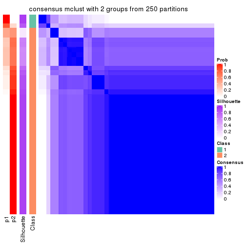</p>

</div>
<div id='tab-ATC-mclust-consensus-heatmap-2'>
<pre><code class="r">consensus_heatmap(res, k = 3)
</code></pre>

<p>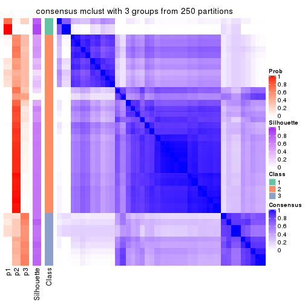</p>

</div>
<div id='tab-ATC-mclust-consensus-heatmap-3'>
<pre><code class="r">consensus_heatmap(res, k = 4)
</code></pre>

<p>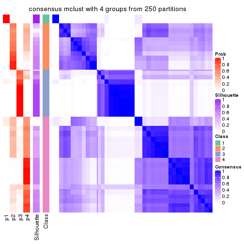</p>

</div>
<div id='tab-ATC-mclust-consensus-heatmap-4'>
<pre><code class="r">consensus_heatmap(res, k = 5)
</code></pre>

<p>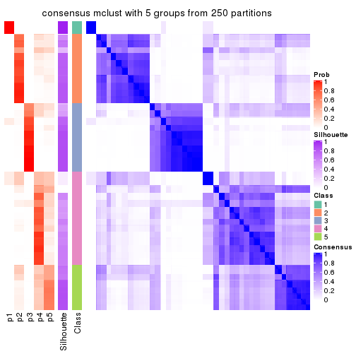</p>

</div>
<div id='tab-ATC-mclust-consensus-heatmap-5'>
<pre><code class="r">consensus_heatmap(res, k = 6)
</code></pre>

<p>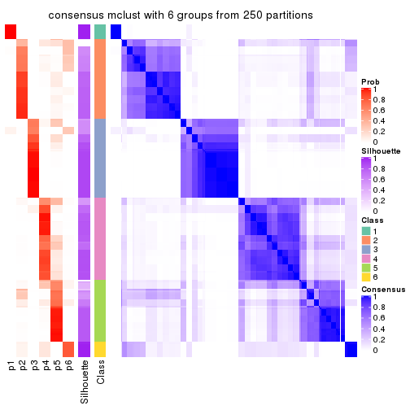</p>

</div>
</div>

Heatmaps for the membership of samples in all partitions to see how consistent they are:


<script>
$( function() {
	$( '#tabs-ATC-mclust-membership-heatmap' ).tabs();
} );
</script>
<div id='tabs-ATC-mclust-membership-heatmap'>
<ul>
<li><a href='#tab-ATC-mclust-membership-heatmap-1'>k = 2</a></li>
<li><a href='#tab-ATC-mclust-membership-heatmap-2'>k = 3</a></li>
<li><a href='#tab-ATC-mclust-membership-heatmap-3'>k = 4</a></li>
<li><a href='#tab-ATC-mclust-membership-heatmap-4'>k = 5</a></li>
<li><a href='#tab-ATC-mclust-membership-heatmap-5'>k = 6</a></li>
</ul>
<div id='tab-ATC-mclust-membership-heatmap-1'>
<pre><code class="r">membership_heatmap(res, k = 2)
</code></pre>

<p>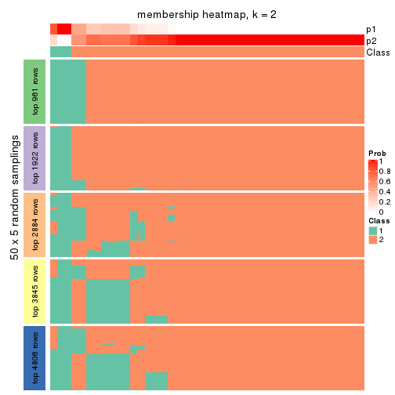</p>

</div>
<div id='tab-ATC-mclust-membership-heatmap-2'>
<pre><code class="r">membership_heatmap(res, k = 3)
</code></pre>

<p>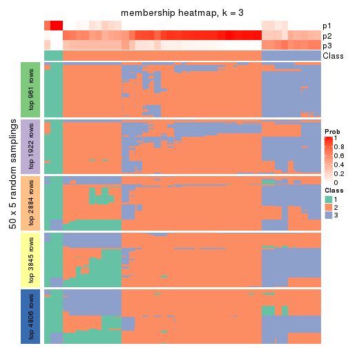</p>

</div>
<div id='tab-ATC-mclust-membership-heatmap-3'>
<pre><code class="r">membership_heatmap(res, k = 4)
</code></pre>

<p>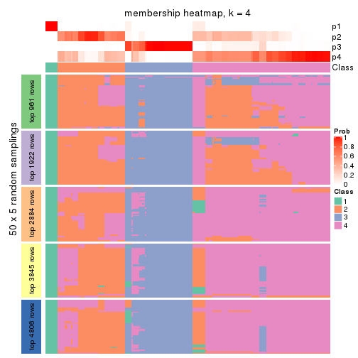</p>

</div>
<div id='tab-ATC-mclust-membership-heatmap-4'>
<pre><code class="r">membership_heatmap(res, k = 5)
</code></pre>

<p>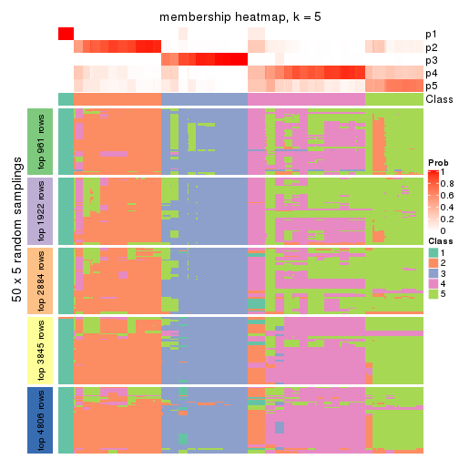</p>

</div>
<div id='tab-ATC-mclust-membership-heatmap-5'>
<pre><code class="r">membership_heatmap(res, k = 6)
</code></pre>

<p>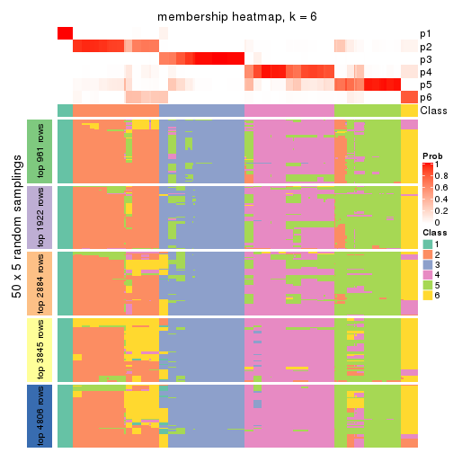</p>

</div>
</div>

As soon as we have had the classes for columns, we can look for signatures
which are significantly different between classes which can be candidate marks
for certain classes. Following are the heatmaps for signatures.


Signature heatmaps where rows are scaled:


<script>
$( function() {
	$( '#tabs-ATC-mclust-get-signatures' ).tabs();
} );
</script>
<div id='tabs-ATC-mclust-get-signatures'>
<ul>
<li><a href='#tab-ATC-mclust-get-signatures-1'>k = 2</a></li>
<li><a href='#tab-ATC-mclust-get-signatures-2'>k = 3</a></li>
<li><a href='#tab-ATC-mclust-get-signatures-3'>k = 4</a></li>
<li><a href='#tab-ATC-mclust-get-signatures-4'>k = 5</a></li>
<li><a href='#tab-ATC-mclust-get-signatures-5'>k = 6</a></li>
</ul>
<div id='tab-ATC-mclust-get-signatures-1'>
<pre><code class="r">get_signatures(res, k = 2)
</code></pre>

<p>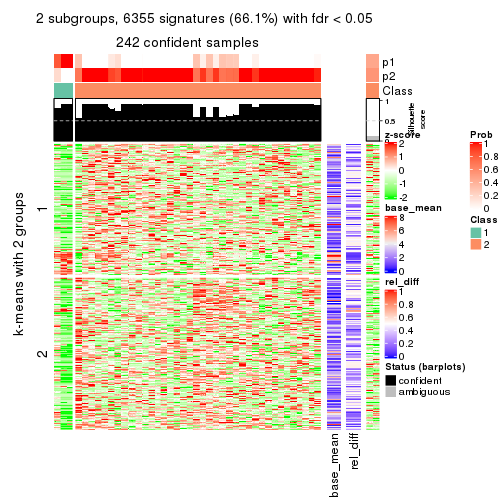</p>

</div>
<div id='tab-ATC-mclust-get-signatures-2'>
<pre><code class="r">get_signatures(res, k = 3)
</code></pre>

<p>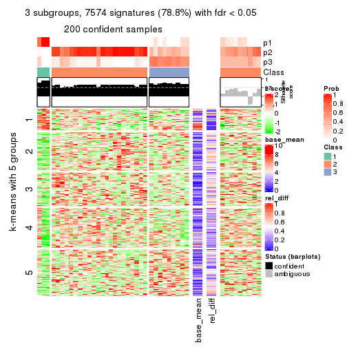</p>

</div>
<div id='tab-ATC-mclust-get-signatures-3'>
<pre><code class="r">get_signatures(res, k = 4)
</code></pre>

<p>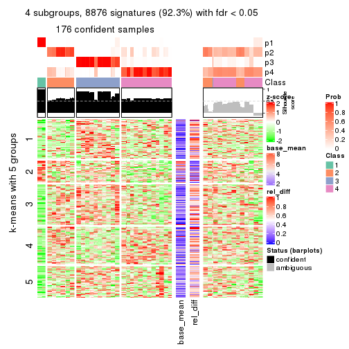</p>

</div>
<div id='tab-ATC-mclust-get-signatures-4'>
<pre><code class="r">get_signatures(res, k = 5)
</code></pre>

<p>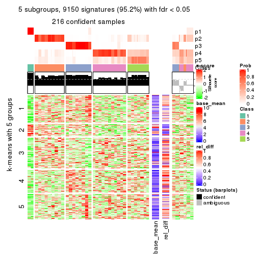</p>

</div>
<div id='tab-ATC-mclust-get-signatures-5'>
<pre><code class="r">get_signatures(res, k = 6)
</code></pre>

<p>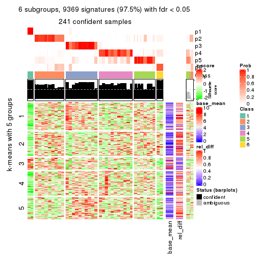</p>

</div>
</div>


Signature heatmaps where rows are not scaled:


<script>
$( function() {
	$( '#tabs-ATC-mclust-get-signatures-no-scale' ).tabs();
} );
</script>
<div id='tabs-ATC-mclust-get-signatures-no-scale'>
<ul>
<li><a href='#tab-ATC-mclust-get-signatures-no-scale-1'>k = 2</a></li>
<li><a href='#tab-ATC-mclust-get-signatures-no-scale-2'>k = 3</a></li>
<li><a href='#tab-ATC-mclust-get-signatures-no-scale-3'>k = 4</a></li>
<li><a href='#tab-ATC-mclust-get-signatures-no-scale-4'>k = 5</a></li>
<li><a href='#tab-ATC-mclust-get-signatures-no-scale-5'>k = 6</a></li>
</ul>
<div id='tab-ATC-mclust-get-signatures-no-scale-1'>
<pre><code class="r">get_signatures(res, k = 2, scale_rows = FALSE)
</code></pre>

<p>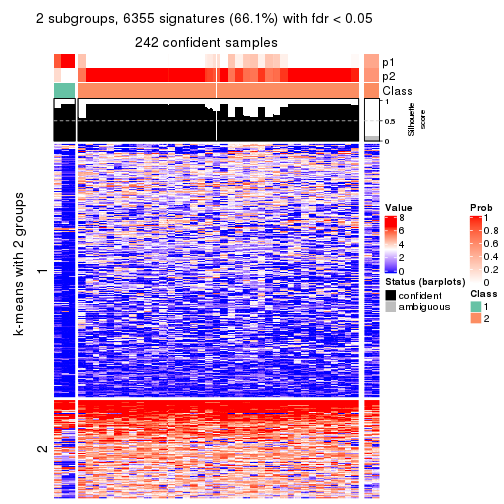</p>

</div>
<div id='tab-ATC-mclust-get-signatures-no-scale-2'>
<pre><code class="r">get_signatures(res, k = 3, scale_rows = FALSE)
</code></pre>

<p>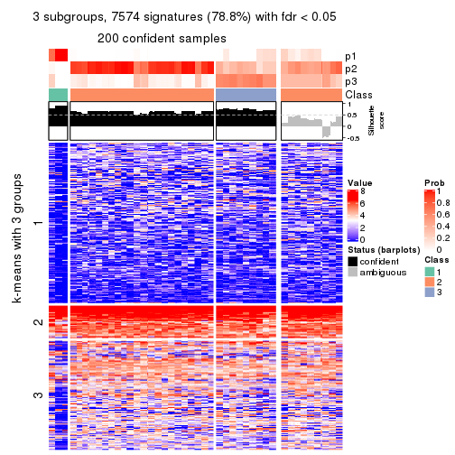</p>

</div>
<div id='tab-ATC-mclust-get-signatures-no-scale-3'>
<pre><code class="r">get_signatures(res, k = 4, scale_rows = FALSE)
</code></pre>

<p>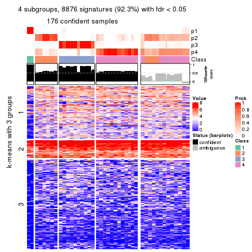</p>

</div>
<div id='tab-ATC-mclust-get-signatures-no-scale-4'>
<pre><code class="r">get_signatures(res, k = 5, scale_rows = FALSE)
</code></pre>

<p>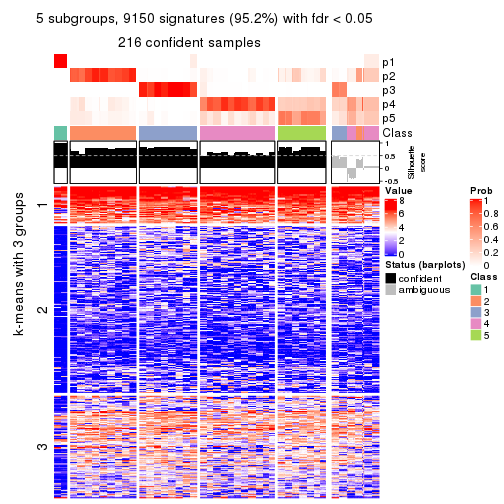</p>

</div>
<div id='tab-ATC-mclust-get-signatures-no-scale-5'>
<pre><code class="r">get_signatures(res, k = 6, scale_rows = FALSE)
</code></pre>

<p>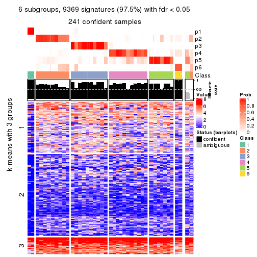</p>

</div>
</div>


Compare the overlap of signatures from different k:

```r
compare_signatures(res)
```

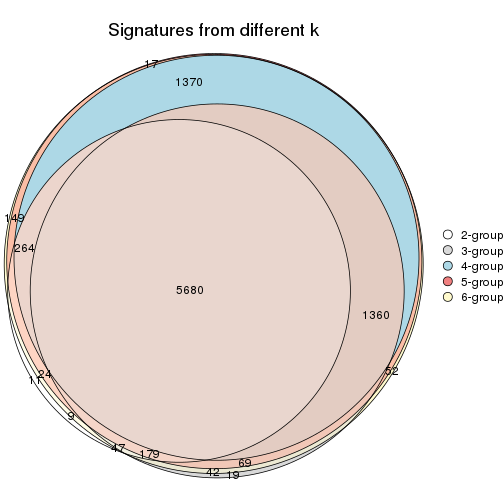

`get_signature()` returns a data frame invisibly. TO get the list of signatures, the function
call should be assigned to a variable explicitly. In following code, if `plot` argument is set
to `FALSE`, no heatmap is plotted while only the differential analysis is performed.

```r
# code only for demonstration
tb = get_signature(res, k = ..., plot = FALSE)
```

An example of the output of `tb` is:

```
#>   which_row         fdr    mean_1    mean_2 scaled_mean_1 scaled_mean_2 km
#> 1        38 0.042760348  8.373488  9.131774    -0.5533452     0.5164555  1
#> 2        40 0.018707592  7.106213  8.469186    -0.6173731     0.5762149  1
#> 3        55 0.019134737 10.221463 11.207825    -0.6159697     0.5749050  1
#> 4        59 0.006059896  5.921854  7.869574    -0.6899429     0.6439467  1
#> 5        60 0.018055526  8.928898 10.211722    -0.6204761     0.5791110  1
#> 6        98 0.009384629 15.714769 14.887706     0.6635654    -0.6193277  2
...
```

The columns in `tb` are:

1. `which_row`: row indices corresponding to the input matrix.
2. `fdr`: FDR for the differential test. 
3. `mean_x`: The mean value in group x.
4. `scaled_mean_x`: The mean value in group x after rows are scaled.
5. `km`: Row groups if k-means clustering is applied to rows.


UMAP plot which shows how samples are separated.


<script>
$( function() {
	$( '#tabs-ATC-mclust-dimension-reduction' ).tabs();
} );
</script>
<div id='tabs-ATC-mclust-dimension-reduction'>
<ul>
<li><a href='#tab-ATC-mclust-dimension-reduction-1'>k = 2</a></li>
<li><a href='#tab-ATC-mclust-dimension-reduction-2'>k = 3</a></li>
<li><a href='#tab-ATC-mclust-dimension-reduction-3'>k = 4</a></li>
<li><a href='#tab-ATC-mclust-dimension-reduction-4'>k = 5</a></li>
<li><a href='#tab-ATC-mclust-dimension-reduction-5'>k = 6</a></li>
</ul>
<div id='tab-ATC-mclust-dimension-reduction-1'>
<pre><code class="r">dimension_reduction(res, k = 2, method = &quot;UMAP&quot;)
</code></pre>

<p>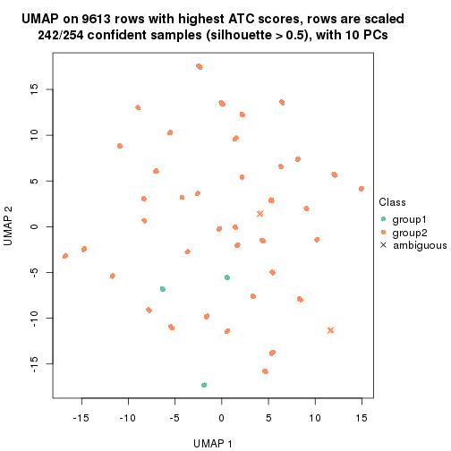</p>

</div>
<div id='tab-ATC-mclust-dimension-reduction-2'>
<pre><code class="r">dimension_reduction(res, k = 3, method = &quot;UMAP&quot;)
</code></pre>

<p>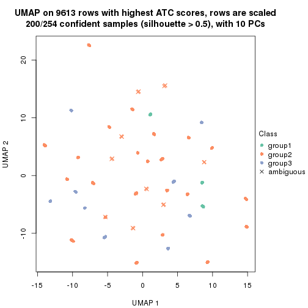</p>

</div>
<div id='tab-ATC-mclust-dimension-reduction-3'>
<pre><code class="r">dimension_reduction(res, k = 4, method = &quot;UMAP&quot;)
</code></pre>

<p>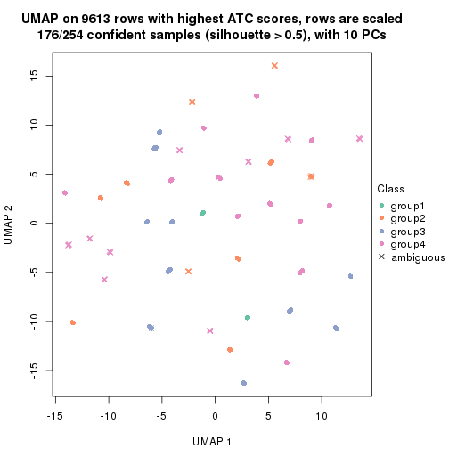</p>

</div>
<div id='tab-ATC-mclust-dimension-reduction-4'>
<pre><code class="r">dimension_reduction(res, k = 5, method = &quot;UMAP&quot;)
</code></pre>

<p>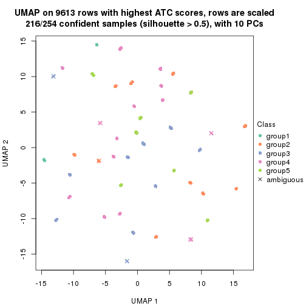</p>

</div>
<div id='tab-ATC-mclust-dimension-reduction-5'>
<pre><code class="r">dimension_reduction(res, k = 6, method = &quot;UMAP&quot;)
</code></pre>

<p>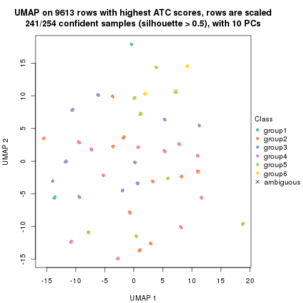</p>

</div>
</div>


Following heatmap shows how subgroups are split when increasing `k`:

```r
collect_classes(res)
```

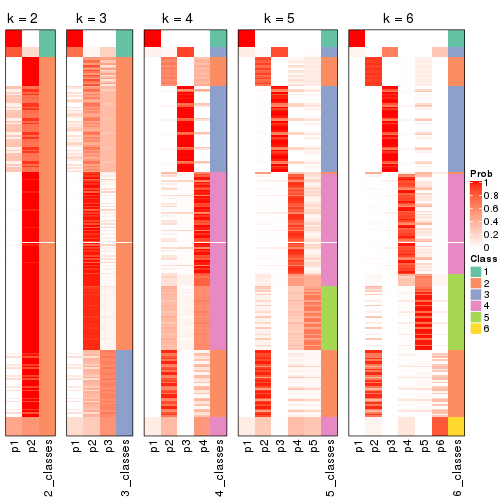


If matrix rows can be associated to genes, consider to use `GO_Enrichment(res,
...)` to perform function enrichment for the signature genes.


 

---------------------------------------------------


### ATC:NMF*


The object with results only for a single top-value method and a single partition method 
can be extracted as:

```r
res = res_list["ATC", "NMF"]
# you can also extract it by
# res = res_list["ATC:NMF"]
```

A summary of `res` and all the functions that can be applied to it:

```r
res
```

```
#> A 'ConsensusPartition' object with k = 2, 3, 4, 5, 6.
#>   On a matrix with 9613 rows and 254 columns.
#>   Top rows (961, 1922, 2884, 3845, 4806) are extracted by 'ATC' method.
#>   Subgroups are detected by 'NMF' method.
#>   Performed in total 1250 partitions by row resampling.
#>   Best k for subgroups seems to be 3.
#> 
#> Following methods can be applied to this 'ConsensusPartition' object:
#>  [1] "cola_report"             "collect_classes"         "collect_plots"          
#>  [4] "collect_stats"           "colnames"                "compare_signatures"     
#>  [7] "consensus_heatmap"       "dimension_reduction"     "functional_enrichment"  
#> [10] "get_anno_col"            "get_anno"                "get_classes"            
#> [13] "get_consensus"           "get_matrix"              "get_membership"         
#> [16] "get_param"               "get_signatures"          "get_stats"              
#> [19] "is_best_k"               "is_stable_k"             "membership_heatmap"     
#> [22] "ncol"                    "nrow"                    "plot_ecdf"              
#> [25] "rownames"                "select_partition_number" "show"                   
#> [28] "suggest_best_k"          "test_to_known_factors"
```

`collect_plots()` function collects all the plots made from `res` for all `k` (number of partitions)
into one single page to provide an easy and fast comparison between different `k`.

```r
collect_plots(res)
```

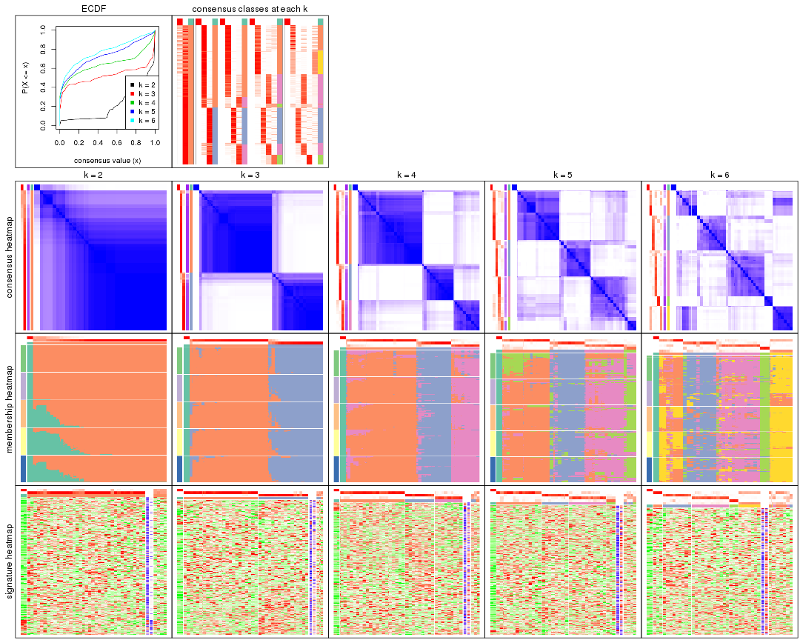

The plots are:

- The first row: a plot of the ECDF (Empirical cumulative distribution
  function) curves of the consensus matrix for each `k` and the heatmap of
  predicted classes for each `k`.
- The second row: heatmaps of the consensus matrix for each `k`.
- The third row: heatmaps of the membership matrix for each `k`.
- The fouth row: heatmaps of the signatures for each `k`.

All the plots in panels can be made by individual functions and they are
plotted later in this section.

`select_partition_number()` produces several plots showing different
statistics for choosing "optimized" `k`. There are following statistics:

- ECDF curves of the consensus matrix for each `k`;
- 1-PAC. [The PAC
  score](https://en.wikipedia.org/wiki/Consensus_clustering#Over-interpretation_potential_of_consensus_clustering)
  measures the proportion of the ambiguous subgrouping.
- Mean silhouette score.
- Concordance. The mean probability of fiting the consensus class ids in all
  partitions.
- Area increased. Denote $A_k$ as the area under the ECDF curve for current
  `k`, the area increased is defined as $A_k - A_{k-1}$.
- Rand index. The percent of pairs of samples that are both in a same cluster
  or both are not in a same cluster in the partition of k and k-1.
- Jaccard index. The ratio of pairs of samples are both in a same cluster in
  the partition of k and k-1 and the pairs of samples are both in a same
  cluster in the partition k or k-1.

The detailed explanations of these statistics can be found in [the cola
vignette](http://bioconductor.org/packages/devel/bioc/vignettes/cola/inst/doc/cola.html#toc_13).

Generally speaking, lower PAC score, higher mean silhouette score or higher
concordance corresponds to better partition. Rand index and Jaccard index
measure how similar the current partition is compared to partition with `k-1`.
If they are too similar, we won't accept `k` is better than `k-1`.

```r
select_partition_number(res)
```

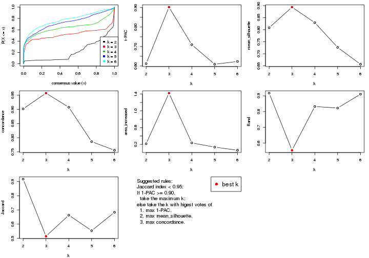

The numeric values for all these statistics can be obtained by `get_stats()`.

```r
get_stats(res)
```

```
#>   k 1-PAC mean_silhouette concordance area_increased  Rand Jaccard
#> 2 2 0.612           0.808       0.902         0.2157 0.917   0.917
#> 3 3 0.902           0.894       0.957         1.4222 0.555   0.515
#> 4 4 0.709           0.829       0.907         0.2355 0.832   0.663
#> 5 5 0.609           0.726       0.786         0.1357 0.823   0.554
#> 6 6 0.623           0.656       0.756         0.0608 0.910   0.683
```

`suggest_best_k()` suggests the best $k$ based on these statistics. The rules are as follows:

- All $k$ with Jaccard index larger than 0.95 are removed because the increase of
  the partition number does not provides enough extra information. If all $k$ are removed,
  the best $k$ is assigned by `NA`.
- For $k$ with 1-PAC larger than 0.9, the maximal $k$ is taken as the "best k". Other $k$ is called "optional k".
- If it does not fit the second rule. The $k$ with the highest vote of highest
  1-PAC, mean silhouette and concordance is taken as the "best k".

```r
suggest_best_k(res)
```

```
#> [1] 3
```


Following shows the table of the partitions (You need to click the **show/hide
code output** link to see it). The membership matrix (columns with name `p*`)
is inferred by
[`clue::cl_consensus()`](https://www.rdocumentation.org/link/cl_consensus?package=clue)
function with the `SE` method. Basically the value in the membership matrix
represents the probability to belong to a certain group. The finall class
label for an item is determined with the group with highest probability it
belongs to.

In `get_classes()` function, the entropy is calculated from the membership
matrix and the silhouette score is calculated from the consensus matrix.


<script>
$( function() {
	$( '#tabs-ATC-NMF-get-classes' ).tabs();
} );
</script>
<div id='tabs-ATC-NMF-get-classes'>
<ul>
<li><a href='#tab-ATC-NMF-get-classes-1'>k = 2</a></li>
<li><a href='#tab-ATC-NMF-get-classes-2'>k = 3</a></li>
<li><a href='#tab-ATC-NMF-get-classes-3'>k = 4</a></li>
<li><a href='#tab-ATC-NMF-get-classes-4'>k = 5</a></li>
<li><a href='#tab-ATC-NMF-get-classes-5'>k = 6</a></li>
</ul>

<div id='tab-ATC-NMF-get-classes-1'>
<p><a id='tab-ATC-NMF-get-classes-1-a' style='color:#0366d6' href='#'>show/hide code output</a></p>
<pre><code class="r">cbind(get_classes(res, k = 2), get_membership(res, k = 2))
</code></pre>

<pre><code>#&gt;           class entropy silhouette    p1    p2
#&gt; DRR024803     1  0.0000      1.000 1.000 0.000
#&gt; DRR024804     2  0.0376      0.891 0.004 0.996
#&gt; DRR024805     2  0.5842      0.821 0.140 0.860
#&gt; DRR024806     2  0.8955      0.646 0.312 0.688
#&gt; DRR024807     2  0.0376      0.892 0.004 0.996
#&gt; DRR024808     2  0.0376      0.892 0.004 0.996
#&gt; DRR024809     2  0.9460      0.570 0.364 0.636
#&gt; DRR024810     2  0.9815      0.469 0.420 0.580
#&gt; DRR024811     2  0.0376      0.892 0.004 0.996
#&gt; DRR024812     2  0.9248      0.607 0.340 0.660
#&gt; DRR024813     2  0.0376      0.891 0.004 0.996
#&gt; DRR024814     2  0.5294      0.834 0.120 0.880
#&gt; DRR024815     2  0.2043      0.881 0.032 0.968
#&gt; DRR024816     2  0.9998      0.301 0.492 0.508
#&gt; DRR024817     2  0.0376      0.891 0.004 0.996
#&gt; DRR024818     2  0.0376      0.892 0.004 0.996
#&gt; DRR024819     2  0.0000      0.891 0.000 1.000
#&gt; DRR024820     2  0.0376      0.892 0.004 0.996
#&gt; DRR024821     2  0.0376      0.892 0.004 0.996
#&gt; DRR024822     2  0.5629      0.826 0.132 0.868
#&gt; DRR024824     2  0.8016      0.725 0.244 0.756
#&gt; DRR024825     2  0.0376      0.892 0.004 0.996
#&gt; DRR024826     2  0.0376      0.892 0.004 0.996
#&gt; DRR024827     2  0.0376      0.892 0.004 0.996
#&gt; DRR024828     2  0.0376      0.892 0.004 0.996
#&gt; DRR024829     2  0.4939      0.842 0.108 0.892
#&gt; DRR024830     2  0.1633      0.885 0.024 0.976
#&gt; DRR024831     2  0.0376      0.892 0.004 0.996
#&gt; DRR024832     2  0.0376      0.892 0.004 0.996
#&gt; DRR024833     2  0.0000      0.891 0.000 1.000
#&gt; DRR024834     2  0.9977      0.353 0.472 0.528
#&gt; DRR024835     2  0.0376      0.892 0.004 0.996
#&gt; DRR024836     2  0.0376      0.892 0.004 0.996
#&gt; DRR024837     2  0.9998      0.301 0.492 0.508
#&gt; DRR024838     2  0.6712      0.791 0.176 0.824
#&gt; DRR024839     2  0.0376      0.891 0.004 0.996
#&gt; DRR024840     2  0.2236      0.880 0.036 0.964
#&gt; DRR024841     2  0.9608      0.536 0.384 0.616
#&gt; DRR024842     2  0.2603      0.876 0.044 0.956
#&gt; DRR024843     1  0.0000      1.000 1.000 0.000
#&gt; DRR024844     2  0.0376      0.891 0.004 0.996
#&gt; DRR024845     2  0.3879      0.861 0.076 0.924
#&gt; DRR024846     2  0.8909      0.651 0.308 0.692
#&gt; DRR024847     2  0.0376      0.892 0.004 0.996
#&gt; DRR024848     1  0.0000      1.000 1.000 0.000
#&gt; DRR024849     2  0.0376      0.892 0.004 0.996
#&gt; DRR024850     2  0.0000      0.891 0.000 1.000
#&gt; DRR024851     2  0.9209      0.613 0.336 0.664
#&gt; DRR024852     2  0.9896      0.427 0.440 0.560
#&gt; DRR024853     2  0.0376      0.892 0.004 0.996
#&gt; DRR024854     2  0.5946      0.817 0.144 0.856
#&gt; DRR024855     2  0.0000      0.891 0.000 1.000
#&gt; DRR024856     2  0.2778      0.874 0.048 0.952
#&gt; DRR024857     2  0.0938      0.889 0.012 0.988
#&gt; DRR024858     2  0.9998      0.301 0.492 0.508
#&gt; DRR024859     2  0.0376      0.891 0.004 0.996
#&gt; DRR024860     2  0.0376      0.892 0.004 0.996
#&gt; DRR024861     2  0.0000      0.891 0.000 1.000
#&gt; DRR024862     2  0.0376      0.892 0.004 0.996
#&gt; DRR024863     2  0.0376      0.892 0.004 0.996
#&gt; DRR024864     2  0.5408      0.831 0.124 0.876
#&gt; DRR024865     2  0.9044      0.635 0.320 0.680
#&gt; DRR024866     2  0.7376      0.762 0.208 0.792
#&gt; DRR024867     2  0.0376      0.892 0.004 0.996
#&gt; DRR024868     2  0.0376      0.892 0.004 0.996
#&gt; DRR024869     2  0.0376      0.892 0.004 0.996
#&gt; DRR024870     2  0.0376      0.892 0.004 0.996
#&gt; DRR024871     2  0.3879      0.861 0.076 0.924
#&gt; DRR024872     2  0.0376      0.891 0.004 0.996
#&gt; DRR024873     2  0.0376      0.892 0.004 0.996
#&gt; DRR024874     2  0.0376      0.892 0.004 0.996
#&gt; DRR024875     2  0.0376      0.892 0.004 0.996
#&gt; DRR024876     2  0.9993      0.323 0.484 0.516
#&gt; DRR024877     2  0.0376      0.892 0.004 0.996
#&gt; DRR024878     2  0.0376      0.892 0.004 0.996
#&gt; DRR024879     2  0.9998      0.301 0.492 0.508
#&gt; DRR024880     2  0.4298      0.854 0.088 0.912
#&gt; DRR024881     2  0.0376      0.891 0.004 0.996
#&gt; DRR024882     2  0.0376      0.891 0.004 0.996
#&gt; DRR024883     2  0.9552      0.550 0.376 0.624
#&gt; DRR024884     2  0.0376      0.892 0.004 0.996
#&gt; DRR024885     2  0.0376      0.892 0.004 0.996
#&gt; DRR024886     1  0.0000      1.000 1.000 0.000
#&gt; DRR024887     2  0.0376      0.891 0.004 0.996
#&gt; DRR024888     2  0.4298      0.855 0.088 0.912
#&gt; DRR024889     2  0.8813      0.661 0.300 0.700
#&gt; DRR024890     2  0.0376      0.892 0.004 0.996
#&gt; DRR024891     1  0.0000      1.000 1.000 0.000
#&gt; DRR024892     2  0.0376      0.892 0.004 0.996
#&gt; DRR024893     2  0.0000      0.891 0.000 1.000
#&gt; DRR024894     2  0.9209      0.613 0.336 0.664
#&gt; DRR024895     2  0.9833      0.461 0.424 0.576
#&gt; DRR024896     2  0.0376      0.892 0.004 0.996
#&gt; DRR024897     2  0.6148      0.810 0.152 0.848
#&gt; DRR024898     2  0.0000      0.891 0.000 1.000
#&gt; DRR024899     2  0.2778      0.874 0.048 0.952
#&gt; DRR024900     2  0.0938      0.889 0.012 0.988
#&gt; DRR024901     2  0.9998      0.301 0.492 0.508
#&gt; DRR024902     2  0.0376      0.891 0.004 0.996
#&gt; DRR024903     2  0.0376      0.892 0.004 0.996
#&gt; DRR024904     2  0.0000      0.891 0.000 1.000
#&gt; DRR024905     2  0.0376      0.892 0.004 0.996
#&gt; DRR024906     2  0.0376      0.892 0.004 0.996
#&gt; DRR024907     2  0.5519      0.828 0.128 0.872
#&gt; DRR024908     2  0.9044      0.635 0.320 0.680
#&gt; DRR024909     2  0.7376      0.762 0.208 0.792
#&gt; DRR024910     2  0.0376      0.892 0.004 0.996
#&gt; DRR024911     2  0.0376      0.892 0.004 0.996
#&gt; DRR024912     2  0.0376      0.892 0.004 0.996
#&gt; DRR024913     2  0.0376      0.892 0.004 0.996
#&gt; DRR024914     2  0.3879      0.861 0.076 0.924
#&gt; DRR024915     2  0.0672      0.890 0.008 0.992
#&gt; DRR024916     2  0.0376      0.892 0.004 0.996
#&gt; DRR024917     2  0.0376      0.892 0.004 0.996
#&gt; DRR024918     2  0.0376      0.892 0.004 0.996
#&gt; DRR024919     2  0.9988      0.333 0.480 0.520
#&gt; DRR024920     2  0.0376      0.892 0.004 0.996
#&gt; DRR024921     2  0.0376      0.892 0.004 0.996
#&gt; DRR024922     2  0.9998      0.301 0.492 0.508
#&gt; DRR024923     2  0.4022      0.859 0.080 0.920
#&gt; DRR024924     2  0.0376      0.891 0.004 0.996
#&gt; DRR024925     2  0.0376      0.891 0.004 0.996
#&gt; DRR024926     2  0.9580      0.543 0.380 0.620
#&gt; DRR024927     2  0.0376      0.892 0.004 0.996
#&gt; DRR024928     2  0.0376      0.892 0.004 0.996
#&gt; DRR024929     1  0.0000      1.000 1.000 0.000
#&gt; DRR024930     2  0.0376      0.891 0.004 0.996
#&gt; DRR024931     2  0.4161      0.857 0.084 0.916
#&gt; DRR024932     2  0.8909      0.651 0.308 0.692
#&gt; DRR024933     2  0.0376      0.892 0.004 0.996
#&gt; DRR024934     1  0.0000      1.000 1.000 0.000
#&gt; DRR024935     2  0.0376      0.892 0.004 0.996
#&gt; DRR024936     2  0.0000      0.891 0.000 1.000
#&gt; DRR024937     2  0.9209      0.613 0.336 0.664
#&gt; DRR024938     2  0.9866      0.444 0.432 0.568
#&gt; DRR024939     2  0.0376      0.892 0.004 0.996
#&gt; DRR024940     2  0.6048      0.814 0.148 0.852
#&gt; DRR024941     2  0.0000      0.891 0.000 1.000
#&gt; DRR024942     2  0.2778      0.874 0.048 0.952
#&gt; DRR024943     2  0.0938      0.889 0.012 0.988
#&gt; DRR024944     2  0.9998      0.301 0.492 0.508
#&gt; DRR024945     2  0.0376      0.891 0.004 0.996
#&gt; DRR024946     2  0.0376      0.892 0.004 0.996
#&gt; DRR024947     2  0.0000      0.891 0.000 1.000
#&gt; DRR024948     2  0.0376      0.892 0.004 0.996
#&gt; DRR024949     2  0.0376      0.892 0.004 0.996
#&gt; DRR024950     2  0.5408      0.831 0.124 0.876
#&gt; DRR024951     2  0.9044      0.635 0.320 0.680
#&gt; DRR024952     2  0.7376      0.762 0.208 0.792
#&gt; DRR024953     2  0.0376      0.892 0.004 0.996
#&gt; DRR024954     2  0.0376      0.892 0.004 0.996
#&gt; DRR024955     2  0.0376      0.892 0.004 0.996
#&gt; DRR024956     2  0.0376      0.892 0.004 0.996
#&gt; DRR024957     2  0.4022      0.859 0.080 0.920
#&gt; DRR024958     2  0.0672      0.890 0.008 0.992
#&gt; DRR024959     2  0.0376      0.892 0.004 0.996
#&gt; DRR024960     2  0.0376      0.892 0.004 0.996
#&gt; DRR024961     2  0.0376      0.892 0.004 0.996
#&gt; DRR024962     2  0.9988      0.333 0.480 0.520
#&gt; DRR024963     2  0.0376      0.892 0.004 0.996
#&gt; DRR024964     2  0.0376      0.892 0.004 0.996
#&gt; DRR024965     2  0.9998      0.301 0.492 0.508
#&gt; DRR024966     2  0.4022      0.859 0.080 0.920
#&gt; DRR024967     2  0.0376      0.891 0.004 0.996
#&gt; DRR024968     2  0.0672      0.890 0.008 0.992
#&gt; DRR024969     2  0.9552      0.550 0.376 0.624
#&gt; DRR024970     2  0.0376      0.892 0.004 0.996
#&gt; DRR024971     2  0.0376      0.892 0.004 0.996
#&gt; DRR024972     1  0.0000      1.000 1.000 0.000
#&gt; DRR024973     2  0.0376      0.891 0.004 0.996
#&gt; DRR024974     2  0.4562      0.850 0.096 0.904
#&gt; DRR024975     2  0.8909      0.651 0.308 0.692
#&gt; DRR024976     2  0.0376      0.892 0.004 0.996
#&gt; DRR024977     1  0.0000      1.000 1.000 0.000
#&gt; DRR024978     2  0.0376      0.892 0.004 0.996
#&gt; DRR024979     2  0.0000      0.891 0.000 1.000
#&gt; DRR024980     2  0.9209      0.613 0.336 0.664
#&gt; DRR024981     2  0.9896      0.427 0.440 0.560
#&gt; DRR024982     2  0.0376      0.892 0.004 0.996
#&gt; DRR024983     2  0.6048      0.814 0.148 0.852
#&gt; DRR024984     2  0.0000      0.891 0.000 1.000
#&gt; DRR024985     2  0.2603      0.876 0.044 0.956
#&gt; DRR024986     2  0.0938      0.889 0.012 0.988
#&gt; DRR024987     2  0.9998      0.301 0.492 0.508
#&gt; DRR024988     2  0.0376      0.891 0.004 0.996
#&gt; DRR024989     2  0.0376      0.892 0.004 0.996
#&gt; DRR024990     2  0.0000      0.891 0.000 1.000
#&gt; DRR024991     2  0.0376      0.892 0.004 0.996
#&gt; DRR024992     2  0.0376      0.892 0.004 0.996
#&gt; DRR024993     2  0.5519      0.828 0.128 0.872
#&gt; DRR024994     2  0.9044      0.635 0.320 0.680
#&gt; DRR024995     2  0.7376      0.762 0.208 0.792
#&gt; DRR024996     2  0.0376      0.892 0.004 0.996
#&gt; DRR024997     2  0.0376      0.892 0.004 0.996
#&gt; DRR024998     2  0.0376      0.892 0.004 0.996
#&gt; DRR024999     2  0.0376      0.892 0.004 0.996
#&gt; DRR025000     2  0.3879      0.861 0.076 0.924
#&gt; DRR025001     2  0.0672      0.890 0.008 0.992
#&gt; DRR025002     2  0.0376      0.892 0.004 0.996
#&gt; DRR025003     2  0.0376      0.892 0.004 0.996
#&gt; DRR025004     2  0.0376      0.892 0.004 0.996
#&gt; DRR025005     2  0.9993      0.323 0.484 0.516
#&gt; DRR025006     2  0.0376      0.892 0.004 0.996
#&gt; DRR025007     2  0.0376      0.892 0.004 0.996
#&gt; DRR025008     2  0.9998      0.301 0.492 0.508
#&gt; DRR025009     2  0.3733      0.863 0.072 0.928
#&gt; DRR025010     2  0.0000      0.891 0.000 1.000
#&gt; DRR025011     2  0.0672      0.890 0.008 0.992
#&gt; DRR025012     2  0.9522      0.557 0.372 0.628
#&gt; DRR025013     2  0.0376      0.892 0.004 0.996
#&gt; DRR025014     2  0.0376      0.892 0.004 0.996
#&gt; DRR025015     1  0.0000      1.000 1.000 0.000
#&gt; DRR025016     2  0.0376      0.891 0.004 0.996
#&gt; DRR025017     2  0.4161      0.857 0.084 0.916
#&gt; DRR025018     2  0.8861      0.656 0.304 0.696
#&gt; DRR025019     2  0.0376      0.892 0.004 0.996
#&gt; DRR025020     1  0.0000      1.000 1.000 0.000
#&gt; DRR025021     2  0.0376      0.892 0.004 0.996
#&gt; DRR025022     2  0.0000      0.891 0.000 1.000
#&gt; DRR025023     2  0.9209      0.613 0.336 0.664
#&gt; DRR025024     2  0.9833      0.461 0.424 0.576
#&gt; DRR025025     2  0.0376      0.892 0.004 0.996
#&gt; DRR025026     2  0.6148      0.810 0.152 0.848
#&gt; DRR025027     2  0.0000      0.891 0.000 1.000
#&gt; DRR025028     2  0.2778      0.874 0.048 0.952
#&gt; DRR025029     2  0.0938      0.889 0.012 0.988
#&gt; DRR025030     2  0.9998      0.301 0.492 0.508
#&gt; DRR025031     2  0.0376      0.891 0.004 0.996
#&gt; DRR025032     2  0.0376      0.892 0.004 0.996
#&gt; DRR025033     2  0.0000      0.891 0.000 1.000
#&gt; DRR025034     2  0.0376      0.892 0.004 0.996
#&gt; DRR025035     2  0.0376      0.892 0.004 0.996
#&gt; DRR025036     2  0.5519      0.828 0.128 0.872
#&gt; DRR025037     2  0.9044      0.635 0.320 0.680
#&gt; DRR025038     2  0.7376      0.762 0.208 0.792
#&gt; DRR025039     2  0.0376      0.892 0.004 0.996
#&gt; DRR025040     2  0.0376      0.892 0.004 0.996
#&gt; DRR025041     2  0.0376      0.892 0.004 0.996
#&gt; DRR025042     2  0.0376      0.892 0.004 0.996
#&gt; DRR025043     2  0.4022      0.859 0.080 0.920
#&gt; DRR025044     2  0.0672      0.890 0.008 0.992
#&gt; DRR025045     2  0.0376      0.892 0.004 0.996
#&gt; DRR025046     2  0.0376      0.892 0.004 0.996
#&gt; DRR025047     2  0.0376      0.892 0.004 0.996
#&gt; DRR025048     2  0.9993      0.323 0.484 0.516
#&gt; DRR025049     2  0.0376      0.892 0.004 0.996
#&gt; DRR025050     2  0.0376      0.892 0.004 0.996
#&gt; DRR025051     2  0.9998      0.301 0.492 0.508
#&gt; DRR025052     2  0.3733      0.863 0.072 0.928
#&gt; DRR025053     2  0.0376      0.891 0.004 0.996
#&gt; DRR025054     2  0.0376      0.891 0.004 0.996
#&gt; DRR025055     2  0.9522      0.557 0.372 0.628
#&gt; DRR025056     2  0.0376      0.892 0.004 0.996
#&gt; DRR025057     2  0.0376      0.892 0.004 0.996
</code></pre>

<script>
$('#tab-ATC-NMF-get-classes-1-a').parent().next().next().hide();
$('#tab-ATC-NMF-get-classes-1-a').click(function(){
  $('#tab-ATC-NMF-get-classes-1-a').parent().next().next().toggle();
  return(false);
});
</script>
</div>

<div id='tab-ATC-NMF-get-classes-2'>
<p><a id='tab-ATC-NMF-get-classes-2-a' style='color:#0366d6' href='#'>show/hide code output</a></p>
<pre><code class="r">cbind(get_classes(res, k = 3), get_membership(res, k = 3))
</code></pre>

<pre><code>#&gt;           class entropy silhouette p1    p2    p3
#&gt; DRR024803     1  0.0000     1.0000  1 0.000 0.000
#&gt; DRR024804     2  0.0237     0.9628  0 0.996 0.004
#&gt; DRR024805     2  0.0000     0.9639  0 1.000 0.000
#&gt; DRR024806     2  0.0000     0.9639  0 1.000 0.000
#&gt; DRR024807     3  0.1163     0.8920  0 0.028 0.972
#&gt; DRR024808     3  0.0000     0.9032  0 0.000 1.000
#&gt; DRR024809     2  0.0000     0.9639  0 1.000 0.000
#&gt; DRR024810     2  0.0000     0.9639  0 1.000 0.000
#&gt; DRR024811     3  0.0892     0.8958  0 0.020 0.980
#&gt; DRR024812     2  0.0000     0.9639  0 1.000 0.000
#&gt; DRR024813     2  0.4504     0.7459  0 0.804 0.196
#&gt; DRR024814     2  0.0237     0.9628  0 0.996 0.004
#&gt; DRR024815     2  0.0892     0.9559  0 0.980 0.020
#&gt; DRR024816     2  0.0000     0.9639  0 1.000 0.000
#&gt; DRR024817     2  0.2261     0.9206  0 0.932 0.068
#&gt; DRR024818     3  0.0424     0.9019  0 0.008 0.992
#&gt; DRR024819     2  0.1289     0.9486  0 0.968 0.032
#&gt; DRR024820     3  0.0237     0.9030  0 0.004 0.996
#&gt; DRR024821     3  0.0000     0.9032  0 0.000 1.000
#&gt; DRR024822     2  0.0000     0.9639  0 1.000 0.000
#&gt; DRR024824     2  0.0000     0.9639  0 1.000 0.000
#&gt; DRR024825     3  0.0000     0.9032  0 0.000 1.000
#&gt; DRR024826     3  0.4974     0.6478  0 0.236 0.764
#&gt; DRR024827     3  0.0237     0.9030  0 0.004 0.996
#&gt; DRR024828     3  0.1031     0.8941  0 0.024 0.976
#&gt; DRR024829     2  0.0747     0.9581  0 0.984 0.016
#&gt; DRR024830     2  0.0000     0.9639  0 1.000 0.000
#&gt; DRR024831     3  0.0424     0.9019  0 0.008 0.992
#&gt; DRR024832     3  0.0000     0.9032  0 0.000 1.000
#&gt; DRR024833     3  0.6309     0.0498  0 0.500 0.500
#&gt; DRR024834     2  0.0000     0.9639  0 1.000 0.000
#&gt; DRR024835     3  0.6244     0.2682  0 0.440 0.560
#&gt; DRR024836     3  0.0237     0.9023  0 0.004 0.996
#&gt; DRR024837     2  0.0000     0.9639  0 1.000 0.000
#&gt; DRR024838     2  0.0747     0.9581  0 0.984 0.016
#&gt; DRR024839     2  0.0237     0.9628  0 0.996 0.004
#&gt; DRR024840     2  0.0892     0.9531  0 0.980 0.020
#&gt; DRR024841     2  0.0000     0.9639  0 1.000 0.000
#&gt; DRR024842     2  0.0237     0.9628  0 0.996 0.004
#&gt; DRR024843     1  0.0000     1.0000  1 0.000 0.000
#&gt; DRR024844     2  0.1031     0.9524  0 0.976 0.024
#&gt; DRR024845     2  0.0000     0.9639  0 1.000 0.000
#&gt; DRR024846     2  0.0000     0.9639  0 1.000 0.000
#&gt; DRR024847     3  0.1163     0.8920  0 0.028 0.972
#&gt; DRR024848     1  0.0000     1.0000  1 0.000 0.000
#&gt; DRR024849     3  0.0000     0.9032  0 0.000 1.000
#&gt; DRR024850     2  0.1860     0.9311  0 0.948 0.052
#&gt; DRR024851     2  0.0000     0.9639  0 1.000 0.000
#&gt; DRR024852     2  0.0000     0.9639  0 1.000 0.000
#&gt; DRR024853     3  0.0747     0.8984  0 0.016 0.984
#&gt; DRR024854     2  0.0000     0.9639  0 1.000 0.000
#&gt; DRR024855     3  0.5948     0.4774  0 0.360 0.640
#&gt; DRR024856     2  0.0424     0.9617  0 0.992 0.008
#&gt; DRR024857     2  0.0892     0.9559  0 0.980 0.020
#&gt; DRR024858     2  0.0000     0.9639  0 1.000 0.000
#&gt; DRR024859     2  0.3038     0.8822  0 0.896 0.104
#&gt; DRR024860     3  0.0237     0.9032  0 0.004 0.996
#&gt; DRR024861     2  0.2448     0.9119  0 0.924 0.076
#&gt; DRR024862     3  0.0237     0.9030  0 0.004 0.996
#&gt; DRR024863     3  0.0000     0.9032  0 0.000 1.000
#&gt; DRR024864     2  0.0000     0.9639  0 1.000 0.000
#&gt; DRR024865     2  0.0237     0.9628  0 0.996 0.004
#&gt; DRR024866     2  0.0000     0.9639  0 1.000 0.000
#&gt; DRR024867     3  0.0000     0.9032  0 0.000 1.000
#&gt; DRR024868     3  0.1964     0.8631  0 0.056 0.944
#&gt; DRR024869     3  0.0000     0.9032  0 0.000 1.000
#&gt; DRR024870     3  0.1031     0.8941  0 0.024 0.976
#&gt; DRR024871     2  0.0892     0.9559  0 0.980 0.020
#&gt; DRR024872     2  0.0000     0.9639  0 1.000 0.000
#&gt; DRR024873     3  0.0424     0.9019  0 0.008 0.992
#&gt; DRR024874     3  0.0000     0.9032  0 0.000 1.000
#&gt; DRR024875     3  0.4235     0.7298  0 0.176 0.824
#&gt; DRR024876     2  0.0000     0.9639  0 1.000 0.000
#&gt; DRR024877     3  0.5760     0.5146  0 0.328 0.672
#&gt; DRR024878     3  0.0000     0.9032  0 0.000 1.000
#&gt; DRR024879     2  0.0000     0.9639  0 1.000 0.000
#&gt; DRR024880     2  0.0892     0.9559  0 0.980 0.020
#&gt; DRR024881     2  0.0747     0.9589  0 0.984 0.016
#&gt; DRR024882     2  0.2356     0.9021  0 0.928 0.072
#&gt; DRR024883     2  0.0000     0.9639  0 1.000 0.000
#&gt; DRR024884     2  0.6062     0.3566  0 0.616 0.384
#&gt; DRR024885     3  0.0424     0.9016  0 0.008 0.992
#&gt; DRR024886     1  0.0000     1.0000  1 0.000 0.000
#&gt; DRR024887     2  0.1031     0.9525  0 0.976 0.024
#&gt; DRR024888     2  0.0000     0.9639  0 1.000 0.000
#&gt; DRR024889     2  0.0000     0.9639  0 1.000 0.000
#&gt; DRR024890     3  0.1163     0.8920  0 0.028 0.972
#&gt; DRR024891     1  0.0000     1.0000  1 0.000 0.000
#&gt; DRR024892     3  0.0000     0.9032  0 0.000 1.000
#&gt; DRR024893     2  0.1964     0.9273  0 0.944 0.056
#&gt; DRR024894     2  0.0000     0.9639  0 1.000 0.000
#&gt; DRR024895     2  0.0000     0.9639  0 1.000 0.000
#&gt; DRR024896     3  0.0747     0.8984  0 0.016 0.984
#&gt; DRR024897     2  0.0000     0.9639  0 1.000 0.000
#&gt; DRR024898     3  0.6244     0.2879  0 0.440 0.560
#&gt; DRR024899     2  0.0424     0.9617  0 0.992 0.008
#&gt; DRR024900     2  0.0892     0.9559  0 0.980 0.020
#&gt; DRR024901     2  0.0000     0.9639  0 1.000 0.000
#&gt; DRR024902     2  0.2625     0.9044  0 0.916 0.084
#&gt; DRR024903     3  0.0237     0.9032  0 0.004 0.996
#&gt; DRR024904     2  0.2537     0.9077  0 0.920 0.080
#&gt; DRR024905     3  0.0237     0.9030  0 0.004 0.996
#&gt; DRR024906     3  0.0000     0.9032  0 0.000 1.000
#&gt; DRR024907     2  0.0000     0.9639  0 1.000 0.000
#&gt; DRR024908     2  0.0237     0.9628  0 0.996 0.004
#&gt; DRR024909     2  0.0000     0.9639  0 1.000 0.000
#&gt; DRR024910     3  0.0000     0.9032  0 0.000 1.000
#&gt; DRR024911     3  0.1860     0.8670  0 0.052 0.948
#&gt; DRR024912     3  0.0000     0.9032  0 0.000 1.000
#&gt; DRR024913     3  0.1031     0.8941  0 0.024 0.976
#&gt; DRR024914     2  0.0892     0.9559  0 0.980 0.020
#&gt; DRR024915     2  0.0000     0.9639  0 1.000 0.000
#&gt; DRR024916     3  0.0424     0.9019  0 0.008 0.992
#&gt; DRR024917     3  0.0000     0.9032  0 0.000 1.000
#&gt; DRR024918     3  0.4346     0.7192  0 0.184 0.816
#&gt; DRR024919     2  0.0000     0.9639  0 1.000 0.000
#&gt; DRR024920     3  0.5760     0.5144  0 0.328 0.672
#&gt; DRR024921     3  0.0000     0.9032  0 0.000 1.000
#&gt; DRR024922     2  0.0000     0.9639  0 1.000 0.000
#&gt; DRR024923     2  0.0892     0.9559  0 0.980 0.020
#&gt; DRR024924     2  0.0747     0.9589  0 0.984 0.016
#&gt; DRR024925     2  0.2165     0.9111  0 0.936 0.064
#&gt; DRR024926     2  0.0000     0.9639  0 1.000 0.000
#&gt; DRR024927     2  0.6079     0.3448  0 0.612 0.388
#&gt; DRR024928     3  0.0592     0.8999  0 0.012 0.988
#&gt; DRR024929     1  0.0000     1.0000  1 0.000 0.000
#&gt; DRR024930     2  0.0747     0.9574  0 0.984 0.016
#&gt; DRR024931     2  0.0000     0.9639  0 1.000 0.000
#&gt; DRR024932     2  0.0000     0.9639  0 1.000 0.000
#&gt; DRR024933     3  0.1163     0.8920  0 0.028 0.972
#&gt; DRR024934     1  0.0000     1.0000  1 0.000 0.000
#&gt; DRR024935     3  0.0000     0.9032  0 0.000 1.000
#&gt; DRR024936     2  0.1860     0.9312  0 0.948 0.052
#&gt; DRR024937     2  0.0000     0.9639  0 1.000 0.000
#&gt; DRR024938     2  0.0000     0.9639  0 1.000 0.000
#&gt; DRR024939     3  0.0747     0.8984  0 0.016 0.984
#&gt; DRR024940     2  0.0000     0.9639  0 1.000 0.000
#&gt; DRR024941     3  0.6235     0.3010  0 0.436 0.564
#&gt; DRR024942     2  0.0424     0.9617  0 0.992 0.008
#&gt; DRR024943     2  0.0892     0.9559  0 0.980 0.020
#&gt; DRR024944     2  0.0000     0.9639  0 1.000 0.000
#&gt; DRR024945     2  0.2878     0.8913  0 0.904 0.096
#&gt; DRR024946     3  0.0237     0.9032  0 0.004 0.996
#&gt; DRR024947     2  0.2711     0.8990  0 0.912 0.088
#&gt; DRR024948     3  0.0237     0.9030  0 0.004 0.996
#&gt; DRR024949     3  0.0000     0.9032  0 0.000 1.000
#&gt; DRR024950     2  0.0000     0.9639  0 1.000 0.000
#&gt; DRR024951     2  0.0237     0.9628  0 0.996 0.004
#&gt; DRR024952     2  0.0000     0.9639  0 1.000 0.000
#&gt; DRR024953     3  0.0000     0.9032  0 0.000 1.000
#&gt; DRR024954     3  0.1860     0.8670  0 0.052 0.948
#&gt; DRR024955     3  0.0000     0.9032  0 0.000 1.000
#&gt; DRR024956     3  0.1031     0.8941  0 0.024 0.976
#&gt; DRR024957     2  0.0892     0.9559  0 0.980 0.020
#&gt; DRR024958     2  0.0000     0.9639  0 1.000 0.000
#&gt; DRR024959     3  0.0424     0.9019  0 0.008 0.992
#&gt; DRR024960     3  0.0000     0.9032  0 0.000 1.000
#&gt; DRR024961     3  0.4002     0.7487  0 0.160 0.840
#&gt; DRR024962     2  0.0000     0.9639  0 1.000 0.000
#&gt; DRR024963     3  0.5760     0.5146  0 0.328 0.672
#&gt; DRR024964     3  0.0000     0.9032  0 0.000 1.000
#&gt; DRR024965     2  0.0000     0.9639  0 1.000 0.000
#&gt; DRR024966     2  0.0892     0.9559  0 0.980 0.020
#&gt; DRR024967     2  0.0747     0.9589  0 0.984 0.016
#&gt; DRR024968     2  0.1753     0.9280  0 0.952 0.048
#&gt; DRR024969     2  0.0000     0.9639  0 1.000 0.000
#&gt; DRR024970     2  0.6079     0.3448  0 0.612 0.388
#&gt; DRR024971     3  0.0592     0.8999  0 0.012 0.988
#&gt; DRR024972     1  0.0000     1.0000  1 0.000 0.000
#&gt; DRR024973     2  0.1163     0.9496  0 0.972 0.028
#&gt; DRR024974     2  0.0000     0.9639  0 1.000 0.000
#&gt; DRR024975     2  0.0000     0.9639  0 1.000 0.000
#&gt; DRR024976     3  0.1163     0.8920  0 0.028 0.972
#&gt; DRR024977     1  0.0000     1.0000  1 0.000 0.000
#&gt; DRR024978     3  0.0000     0.9032  0 0.000 1.000
#&gt; DRR024979     2  0.1753     0.9343  0 0.952 0.048
#&gt; DRR024980     2  0.0000     0.9639  0 1.000 0.000
#&gt; DRR024981     2  0.0000     0.9639  0 1.000 0.000
#&gt; DRR024982     3  0.0747     0.8984  0 0.016 0.984
#&gt; DRR024983     2  0.0000     0.9639  0 1.000 0.000
#&gt; DRR024984     3  0.6154     0.3785  0 0.408 0.592
#&gt; DRR024985     2  0.0424     0.9617  0 0.992 0.008
#&gt; DRR024986     2  0.0892     0.9559  0 0.980 0.020
#&gt; DRR024987     2  0.0000     0.9639  0 1.000 0.000
#&gt; DRR024988     2  0.2711     0.8999  0 0.912 0.088
#&gt; DRR024989     3  0.0237     0.9032  0 0.004 0.996
#&gt; DRR024990     2  0.2537     0.9074  0 0.920 0.080
#&gt; DRR024991     3  0.0237     0.9030  0 0.004 0.996
#&gt; DRR024992     3  0.0000     0.9032  0 0.000 1.000
#&gt; DRR024993     2  0.0000     0.9639  0 1.000 0.000
#&gt; DRR024994     2  0.0237     0.9628  0 0.996 0.004
#&gt; DRR024995     2  0.0000     0.9639  0 1.000 0.000
#&gt; DRR024996     3  0.0000     0.9032  0 0.000 1.000
#&gt; DRR024997     3  0.1860     0.8670  0 0.052 0.948
#&gt; DRR024998     3  0.0000     0.9032  0 0.000 1.000
#&gt; DRR024999     3  0.1031     0.8941  0 0.024 0.976
#&gt; DRR025000     2  0.0892     0.9559  0 0.980 0.020
#&gt; DRR025001     2  0.0000     0.9639  0 1.000 0.000
#&gt; DRR025002     3  0.0424     0.9019  0 0.008 0.992
#&gt; DRR025003     3  0.0000     0.9032  0 0.000 1.000
#&gt; DRR025004     3  0.4178     0.7345  0 0.172 0.828
#&gt; DRR025005     2  0.0000     0.9639  0 1.000 0.000
#&gt; DRR025006     3  0.5706     0.5262  0 0.320 0.680
#&gt; DRR025007     3  0.0000     0.9032  0 0.000 1.000
#&gt; DRR025008     2  0.0000     0.9639  0 1.000 0.000
#&gt; DRR025009     2  0.0892     0.9559  0 0.980 0.020
#&gt; DRR025010     2  0.0747     0.9589  0 0.984 0.016
#&gt; DRR025011     2  0.2165     0.9109  0 0.936 0.064
#&gt; DRR025012     2  0.0000     0.9639  0 1.000 0.000
#&gt; DRR025013     2  0.6111     0.3213  0 0.604 0.396
#&gt; DRR025014     3  0.0592     0.8999  0 0.012 0.988
#&gt; DRR025015     1  0.0000     1.0000  1 0.000 0.000
#&gt; DRR025016     2  0.1031     0.9524  0 0.976 0.024
#&gt; DRR025017     2  0.0000     0.9639  0 1.000 0.000
#&gt; DRR025018     2  0.0000     0.9639  0 1.000 0.000
#&gt; DRR025019     3  0.1163     0.8920  0 0.028 0.972
#&gt; DRR025020     1  0.0000     1.0000  1 0.000 0.000
#&gt; DRR025021     3  0.0000     0.9032  0 0.000 1.000
#&gt; DRR025022     2  0.1964     0.9273  0 0.944 0.056
#&gt; DRR025023     2  0.0000     0.9639  0 1.000 0.000
#&gt; DRR025024     2  0.0000     0.9639  0 1.000 0.000
#&gt; DRR025025     3  0.0747     0.8984  0 0.016 0.984
#&gt; DRR025026     2  0.0000     0.9639  0 1.000 0.000
#&gt; DRR025027     3  0.5948     0.4777  0 0.360 0.640
#&gt; DRR025028     2  0.0424     0.9617  0 0.992 0.008
#&gt; DRR025029     2  0.0892     0.9559  0 0.980 0.020
#&gt; DRR025030     2  0.0000     0.9639  0 1.000 0.000
#&gt; DRR025031     2  0.2878     0.8913  0 0.904 0.096
#&gt; DRR025032     3  0.0237     0.9032  0 0.004 0.996
#&gt; DRR025033     2  0.2625     0.9034  0 0.916 0.084
#&gt; DRR025034     3  0.0237     0.9030  0 0.004 0.996
#&gt; DRR025035     3  0.0000     0.9032  0 0.000 1.000
#&gt; DRR025036     2  0.0000     0.9639  0 1.000 0.000
#&gt; DRR025037     2  0.0237     0.9628  0 0.996 0.004
#&gt; DRR025038     2  0.0000     0.9639  0 1.000 0.000
#&gt; DRR025039     3  0.0000     0.9032  0 0.000 1.000
#&gt; DRR025040     3  0.2066     0.8593  0 0.060 0.940
#&gt; DRR025041     3  0.0000     0.9032  0 0.000 1.000
#&gt; DRR025042     3  0.1031     0.8941  0 0.024 0.976
#&gt; DRR025043     2  0.0892     0.9559  0 0.980 0.020
#&gt; DRR025044     2  0.0000     0.9639  0 1.000 0.000
#&gt; DRR025045     3  0.0424     0.9019  0 0.008 0.992
#&gt; DRR025046     3  0.0000     0.9032  0 0.000 1.000
#&gt; DRR025047     3  0.4178     0.7343  0 0.172 0.828
#&gt; DRR025048     2  0.0000     0.9639  0 1.000 0.000
#&gt; DRR025049     3  0.5733     0.5203  0 0.324 0.676
#&gt; DRR025050     3  0.0000     0.9032  0 0.000 1.000
#&gt; DRR025051     2  0.0000     0.9639  0 1.000 0.000
#&gt; DRR025052     2  0.0892     0.9559  0 0.980 0.020
#&gt; DRR025053     2  0.1031     0.9541  0 0.976 0.024
#&gt; DRR025054     2  0.2261     0.9065  0 0.932 0.068
#&gt; DRR025055     2  0.0000     0.9639  0 1.000 0.000
#&gt; DRR025056     2  0.6045     0.3675  0 0.620 0.380
#&gt; DRR025057     3  0.0592     0.8999  0 0.012 0.988
</code></pre>

<script>
$('#tab-ATC-NMF-get-classes-2-a').parent().next().next().hide();
$('#tab-ATC-NMF-get-classes-2-a').click(function(){
  $('#tab-ATC-NMF-get-classes-2-a').parent().next().next().toggle();
  return(false);
});
</script>
</div>

<div id='tab-ATC-NMF-get-classes-3'>
<p><a id='tab-ATC-NMF-get-classes-3-a' style='color:#0366d6' href='#'>show/hide code output</a></p>
<pre><code class="r">cbind(get_classes(res, k = 4), get_membership(res, k = 4))
</code></pre>

<pre><code>#&gt;           class entropy silhouette p1    p2    p3    p4
#&gt; DRR024803     1  0.0000   1.000000  1 0.000 0.000 0.000
#&gt; DRR024804     2  0.2125   0.891028  0 0.920 0.004 0.076
#&gt; DRR024805     2  0.0817   0.904267  0 0.976 0.000 0.024
#&gt; DRR024806     2  0.0817   0.904267  0 0.976 0.000 0.024
#&gt; DRR024807     3  0.0000   0.870719  0 0.000 1.000 0.000
#&gt; DRR024808     3  0.2011   0.857575  0 0.000 0.920 0.080
#&gt; DRR024809     2  0.0592   0.906731  0 0.984 0.000 0.016
#&gt; DRR024810     2  0.0336   0.909498  0 0.992 0.000 0.008
#&gt; DRR024811     3  0.0188   0.872916  0 0.000 0.996 0.004
#&gt; DRR024812     2  0.0188   0.909501  0 0.996 0.000 0.004
#&gt; DRR024813     2  0.3308   0.852219  0 0.872 0.092 0.036
#&gt; DRR024814     2  0.1557   0.897705  0 0.944 0.000 0.056
#&gt; DRR024815     2  0.4500   0.590089  0 0.684 0.000 0.316
#&gt; DRR024816     2  0.0817   0.904267  0 0.976 0.000 0.024
#&gt; DRR024817     4  0.2647   0.834810  0 0.120 0.000 0.880
#&gt; DRR024818     3  0.3123   0.798452  0 0.000 0.844 0.156
#&gt; DRR024819     4  0.4661   0.515541  0 0.348 0.000 0.652
#&gt; DRR024820     4  0.1059   0.860088  0 0.012 0.016 0.972
#&gt; DRR024821     3  0.1940   0.858889  0 0.000 0.924 0.076
#&gt; DRR024822     2  0.0817   0.904267  0 0.976 0.000 0.024
#&gt; DRR024824     2  0.0707   0.905483  0 0.980 0.000 0.020
#&gt; DRR024825     3  0.4866   0.420566  0 0.000 0.596 0.404
#&gt; DRR024826     4  0.3392   0.857617  0 0.072 0.056 0.872
#&gt; DRR024827     4  0.2011   0.832498  0 0.000 0.080 0.920
#&gt; DRR024828     3  0.0336   0.866008  0 0.000 0.992 0.008
#&gt; DRR024829     2  0.2814   0.854113  0 0.868 0.000 0.132
#&gt; DRR024830     2  0.0817   0.908731  0 0.976 0.000 0.024
#&gt; DRR024831     3  0.0188   0.872916  0 0.000 0.996 0.004
#&gt; DRR024832     3  0.0707   0.872991  0 0.000 0.980 0.020
#&gt; DRR024833     4  0.5968   0.658001  0 0.236 0.092 0.672
#&gt; DRR024834     2  0.0707   0.909281  0 0.980 0.000 0.020
#&gt; DRR024835     4  0.1489   0.864830  0 0.044 0.004 0.952
#&gt; DRR024836     3  0.0336   0.873611  0 0.000 0.992 0.008
#&gt; DRR024837     2  0.0469   0.909672  0 0.988 0.000 0.012
#&gt; DRR024838     2  0.2281   0.878020  0 0.904 0.000 0.096
#&gt; DRR024839     2  0.2469   0.872813  0 0.892 0.000 0.108
#&gt; DRR024840     2  0.1629   0.890801  0 0.952 0.024 0.024
#&gt; DRR024841     2  0.0188   0.909963  0 0.996 0.000 0.004
#&gt; DRR024842     2  0.1211   0.904023  0 0.960 0.000 0.040
#&gt; DRR024843     1  0.0000   1.000000  1 0.000 0.000 0.000
#&gt; DRR024844     2  0.3401   0.840361  0 0.840 0.008 0.152
#&gt; DRR024845     2  0.0817   0.904267  0 0.976 0.000 0.024
#&gt; DRR024846     2  0.0817   0.904267  0 0.976 0.000 0.024
#&gt; DRR024847     3  0.0000   0.870719  0 0.000 1.000 0.000
#&gt; DRR024848     1  0.0000   1.000000  1 0.000 0.000 0.000
#&gt; DRR024849     3  0.2149   0.853461  0 0.000 0.912 0.088
#&gt; DRR024850     2  0.3982   0.760877  0 0.776 0.004 0.220
#&gt; DRR024851     2  0.0592   0.906731  0 0.984 0.000 0.016
#&gt; DRR024852     2  0.0336   0.909498  0 0.992 0.000 0.008
#&gt; DRR024853     3  0.0188   0.872916  0 0.000 0.996 0.004
#&gt; DRR024854     2  0.0707   0.908672  0 0.980 0.000 0.020
#&gt; DRR024855     3  0.7756   0.032225  0 0.328 0.424 0.248
#&gt; DRR024856     2  0.1940   0.888552  0 0.924 0.000 0.076
#&gt; DRR024857     2  0.4888   0.351643  0 0.588 0.000 0.412
#&gt; DRR024858     2  0.0817   0.904267  0 0.976 0.000 0.024
#&gt; DRR024859     4  0.2266   0.855673  0 0.084 0.004 0.912
#&gt; DRR024860     3  0.2973   0.808731  0 0.000 0.856 0.144
#&gt; DRR024861     4  0.3975   0.709325  0 0.240 0.000 0.760
#&gt; DRR024862     4  0.1151   0.859637  0 0.008 0.024 0.968
#&gt; DRR024863     3  0.1867   0.860337  0 0.000 0.928 0.072
#&gt; DRR024864     2  0.0817   0.904267  0 0.976 0.000 0.024
#&gt; DRR024865     2  0.1211   0.903865  0 0.960 0.000 0.040
#&gt; DRR024866     2  0.0707   0.905483  0 0.980 0.000 0.020
#&gt; DRR024867     3  0.4933   0.356919  0 0.000 0.568 0.432
#&gt; DRR024868     4  0.2021   0.857065  0 0.012 0.056 0.932
#&gt; DRR024869     4  0.2011   0.832498  0 0.000 0.080 0.920
#&gt; DRR024870     3  0.0336   0.866008  0 0.000 0.992 0.008
#&gt; DRR024871     2  0.3400   0.811249  0 0.820 0.000 0.180
#&gt; DRR024872     2  0.0817   0.908731  0 0.976 0.000 0.024
#&gt; DRR024873     3  0.0188   0.872916  0 0.000 0.996 0.004
#&gt; DRR024874     3  0.0921   0.872177  0 0.000 0.972 0.028
#&gt; DRR024875     4  0.3885   0.845300  0 0.064 0.092 0.844
#&gt; DRR024876     2  0.0707   0.909281  0 0.980 0.000 0.020
#&gt; DRR024877     4  0.1489   0.864830  0 0.044 0.004 0.952
#&gt; DRR024878     3  0.0336   0.873611  0 0.000 0.992 0.008
#&gt; DRR024879     2  0.0469   0.909672  0 0.988 0.000 0.012
#&gt; DRR024880     2  0.3219   0.827621  0 0.836 0.000 0.164
#&gt; DRR024881     2  0.2973   0.849273  0 0.856 0.000 0.144
#&gt; DRR024882     2  0.2973   0.839012  0 0.884 0.096 0.020
#&gt; DRR024883     2  0.0188   0.909963  0 0.996 0.000 0.004
#&gt; DRR024884     4  0.3172   0.798623  0 0.160 0.000 0.840
#&gt; DRR024885     4  0.1792   0.840087  0 0.000 0.068 0.932
#&gt; DRR024886     1  0.0000   1.000000  1 0.000 0.000 0.000
#&gt; DRR024887     2  0.3351   0.843566  0 0.844 0.008 0.148
#&gt; DRR024888     2  0.0817   0.904267  0 0.976 0.000 0.024
#&gt; DRR024889     2  0.0817   0.904267  0 0.976 0.000 0.024
#&gt; DRR024890     3  0.0000   0.870719  0 0.000 1.000 0.000
#&gt; DRR024891     1  0.0000   1.000000  1 0.000 0.000 0.000
#&gt; DRR024892     3  0.2149   0.853461  0 0.000 0.912 0.088
#&gt; DRR024893     2  0.3945   0.766496  0 0.780 0.004 0.216
#&gt; DRR024894     2  0.0592   0.906731  0 0.984 0.000 0.016
#&gt; DRR024895     2  0.0336   0.909498  0 0.992 0.000 0.008
#&gt; DRR024896     3  0.0188   0.872916  0 0.000 0.996 0.004
#&gt; DRR024897     2  0.0707   0.908672  0 0.980 0.000 0.020
#&gt; DRR024898     2  0.7781  -0.000829  0 0.408 0.344 0.248
#&gt; DRR024899     2  0.1867   0.890408  0 0.928 0.000 0.072
#&gt; DRR024900     2  0.4898   0.339323  0 0.584 0.000 0.416
#&gt; DRR024901     2  0.0817   0.904267  0 0.976 0.000 0.024
#&gt; DRR024902     4  0.2216   0.851920  0 0.092 0.000 0.908
#&gt; DRR024903     3  0.2973   0.807973  0 0.000 0.856 0.144
#&gt; DRR024904     4  0.3907   0.720402  0 0.232 0.000 0.768
#&gt; DRR024905     4  0.1174   0.860129  0 0.012 0.020 0.968
#&gt; DRR024906     3  0.2216   0.850383  0 0.000 0.908 0.092
#&gt; DRR024907     2  0.0817   0.904267  0 0.976 0.000 0.024
#&gt; DRR024908     2  0.1211   0.903865  0 0.960 0.000 0.040
#&gt; DRR024909     2  0.0707   0.905483  0 0.980 0.000 0.020
#&gt; DRR024910     3  0.4955   0.323652  0 0.000 0.556 0.444
#&gt; DRR024911     4  0.1970   0.854409  0 0.008 0.060 0.932
#&gt; DRR024912     4  0.2011   0.832498  0 0.000 0.080 0.920
#&gt; DRR024913     3  0.0336   0.866008  0 0.000 0.992 0.008
#&gt; DRR024914     2  0.3400   0.811249  0 0.820 0.000 0.180
#&gt; DRR024915     2  0.0817   0.908731  0 0.976 0.000 0.024
#&gt; DRR024916     3  0.0188   0.872916  0 0.000 0.996 0.004
#&gt; DRR024917     3  0.0921   0.872177  0 0.000 0.972 0.028
#&gt; DRR024918     4  0.4130   0.835003  0 0.064 0.108 0.828
#&gt; DRR024919     2  0.0707   0.909281  0 0.980 0.000 0.020
#&gt; DRR024920     4  0.1489   0.864830  0 0.044 0.004 0.952
#&gt; DRR024921     3  0.0336   0.873611  0 0.000 0.992 0.008
#&gt; DRR024922     2  0.0469   0.909672  0 0.988 0.000 0.012
#&gt; DRR024923     2  0.3311   0.820475  0 0.828 0.000 0.172
#&gt; DRR024924     2  0.2973   0.848522  0 0.856 0.000 0.144
#&gt; DRR024925     2  0.2843   0.846936  0 0.892 0.088 0.020
#&gt; DRR024926     2  0.0188   0.909963  0 0.996 0.000 0.004
#&gt; DRR024927     4  0.3074   0.806099  0 0.152 0.000 0.848
#&gt; DRR024928     4  0.1792   0.840087  0 0.000 0.068 0.932
#&gt; DRR024929     1  0.0000   1.000000  1 0.000 0.000 0.000
#&gt; DRR024930     2  0.3249   0.850001  0 0.852 0.008 0.140
#&gt; DRR024931     2  0.0817   0.904267  0 0.976 0.000 0.024
#&gt; DRR024932     2  0.0817   0.904267  0 0.976 0.000 0.024
#&gt; DRR024933     3  0.0000   0.870719  0 0.000 1.000 0.000
#&gt; DRR024934     1  0.0000   1.000000  1 0.000 0.000 0.000
#&gt; DRR024935     3  0.2081   0.855029  0 0.000 0.916 0.084
#&gt; DRR024936     2  0.3982   0.760401  0 0.776 0.004 0.220
#&gt; DRR024937     2  0.0592   0.906731  0 0.984 0.000 0.016
#&gt; DRR024938     2  0.0336   0.909498  0 0.992 0.000 0.008
#&gt; DRR024939     3  0.0188   0.872916  0 0.000 0.996 0.004
#&gt; DRR024940     2  0.0707   0.908672  0 0.980 0.000 0.020
#&gt; DRR024941     2  0.7684  -0.024385  0 0.392 0.392 0.216
#&gt; DRR024942     2  0.1792   0.892375  0 0.932 0.000 0.068
#&gt; DRR024943     2  0.4898   0.339442  0 0.584 0.000 0.416
#&gt; DRR024944     2  0.0817   0.904267  0 0.976 0.000 0.024
#&gt; DRR024945     4  0.2281   0.849868  0 0.096 0.000 0.904
#&gt; DRR024946     3  0.2973   0.810015  0 0.000 0.856 0.144
#&gt; DRR024947     4  0.3942   0.715101  0 0.236 0.000 0.764
#&gt; DRR024948     4  0.1151   0.859637  0 0.008 0.024 0.968
#&gt; DRR024949     3  0.2081   0.855177  0 0.000 0.916 0.084
#&gt; DRR024950     2  0.0817   0.904267  0 0.976 0.000 0.024
#&gt; DRR024951     2  0.1211   0.903865  0 0.960 0.000 0.040
#&gt; DRR024952     2  0.0707   0.905483  0 0.980 0.000 0.020
#&gt; DRR024953     3  0.4941   0.346352  0 0.000 0.564 0.436
#&gt; DRR024954     4  0.2060   0.862104  0 0.016 0.052 0.932
#&gt; DRR024955     4  0.2081   0.828880  0 0.000 0.084 0.916
#&gt; DRR024956     3  0.0336   0.866008  0 0.000 0.992 0.008
#&gt; DRR024957     2  0.3400   0.811249  0 0.820 0.000 0.180
#&gt; DRR024958     2  0.0817   0.908731  0 0.976 0.000 0.024
#&gt; DRR024959     3  0.0188   0.872916  0 0.000 0.996 0.004
#&gt; DRR024960     3  0.1118   0.870752  0 0.000 0.964 0.036
#&gt; DRR024961     4  0.3958   0.834162  0 0.052 0.112 0.836
#&gt; DRR024962     2  0.0707   0.909281  0 0.980 0.000 0.020
#&gt; DRR024963     4  0.1489   0.864830  0 0.044 0.004 0.952
#&gt; DRR024964     3  0.0336   0.873611  0 0.000 0.992 0.008
#&gt; DRR024965     2  0.0469   0.909672  0 0.988 0.000 0.012
#&gt; DRR024966     2  0.3311   0.820475  0 0.828 0.000 0.172
#&gt; DRR024967     2  0.3400   0.818286  0 0.820 0.000 0.180
#&gt; DRR024968     2  0.2843   0.846936  0 0.892 0.088 0.020
#&gt; DRR024969     2  0.0188   0.909963  0 0.996 0.000 0.004
#&gt; DRR024970     4  0.3123   0.802810  0 0.156 0.000 0.844
#&gt; DRR024971     4  0.1792   0.840087  0 0.000 0.068 0.932
#&gt; DRR024972     1  0.0000   1.000000  1 0.000 0.000 0.000
#&gt; DRR024973     2  0.3300   0.846782  0 0.848 0.008 0.144
#&gt; DRR024974     2  0.0817   0.904267  0 0.976 0.000 0.024
#&gt; DRR024975     2  0.0817   0.904267  0 0.976 0.000 0.024
#&gt; DRR024976     3  0.0000   0.870719  0 0.000 1.000 0.000
#&gt; DRR024977     1  0.0000   1.000000  1 0.000 0.000 0.000
#&gt; DRR024978     3  0.2149   0.853461  0 0.000 0.912 0.088
#&gt; DRR024979     2  0.3831   0.781127  0 0.792 0.004 0.204
#&gt; DRR024980     2  0.0592   0.906731  0 0.984 0.000 0.016
#&gt; DRR024981     2  0.0336   0.909498  0 0.992 0.000 0.008
#&gt; DRR024982     3  0.0188   0.872916  0 0.000 0.996 0.004
#&gt; DRR024983     2  0.0707   0.908672  0 0.980 0.000 0.020
#&gt; DRR024984     3  0.7799  -0.033343  0 0.368 0.384 0.248
#&gt; DRR024985     2  0.1867   0.890408  0 0.928 0.000 0.072
#&gt; DRR024986     2  0.4907   0.326577  0 0.580 0.000 0.420
#&gt; DRR024987     2  0.0817   0.904267  0 0.976 0.000 0.024
#&gt; DRR024988     4  0.2216   0.851786  0 0.092 0.000 0.908
#&gt; DRR024989     3  0.3172   0.794649  0 0.000 0.840 0.160
#&gt; DRR024990     4  0.3907   0.719293  0 0.232 0.000 0.768
#&gt; DRR024991     4  0.1174   0.860129  0 0.012 0.020 0.968
#&gt; DRR024992     3  0.1867   0.860337  0 0.000 0.928 0.072
#&gt; DRR024993     2  0.0817   0.904267  0 0.976 0.000 0.024
#&gt; DRR024994     2  0.1211   0.903865  0 0.960 0.000 0.040
#&gt; DRR024995     2  0.0707   0.905483  0 0.980 0.000 0.020
#&gt; DRR024996     3  0.4925   0.362980  0 0.000 0.572 0.428
#&gt; DRR024997     4  0.2222   0.858585  0 0.016 0.060 0.924
#&gt; DRR024998     4  0.2081   0.828880  0 0.000 0.084 0.916
#&gt; DRR024999     3  0.0336   0.866008  0 0.000 0.992 0.008
#&gt; DRR025000     2  0.3444   0.806759  0 0.816 0.000 0.184
#&gt; DRR025001     2  0.0817   0.908731  0 0.976 0.000 0.024
#&gt; DRR025002     3  0.0188   0.872916  0 0.000 0.996 0.004
#&gt; DRR025003     3  0.1022   0.871641  0 0.000 0.968 0.032
#&gt; DRR025004     4  0.4071   0.837695  0 0.064 0.104 0.832
#&gt; DRR025005     2  0.0707   0.909281  0 0.980 0.000 0.020
#&gt; DRR025006     4  0.1398   0.863879  0 0.040 0.004 0.956
#&gt; DRR025007     3  0.0336   0.873611  0 0.000 0.992 0.008
#&gt; DRR025008     2  0.0469   0.909672  0 0.988 0.000 0.012
#&gt; DRR025009     2  0.3311   0.820475  0 0.828 0.000 0.172
#&gt; DRR025010     2  0.3172   0.836507  0 0.840 0.000 0.160
#&gt; DRR025011     2  0.3048   0.830357  0 0.876 0.108 0.016
#&gt; DRR025012     2  0.0188   0.909963  0 0.996 0.000 0.004
#&gt; DRR025013     4  0.3123   0.802593  0 0.156 0.000 0.844
#&gt; DRR025014     4  0.1792   0.840087  0 0.000 0.068 0.932
#&gt; DRR025015     1  0.0000   1.000000  1 0.000 0.000 0.000
#&gt; DRR025016     2  0.3498   0.833434  0 0.832 0.008 0.160
#&gt; DRR025017     2  0.0817   0.904267  0 0.976 0.000 0.024
#&gt; DRR025018     2  0.0817   0.904267  0 0.976 0.000 0.024
#&gt; DRR025019     3  0.0000   0.870719  0 0.000 1.000 0.000
#&gt; DRR025020     1  0.0000   1.000000  1 0.000 0.000 0.000
#&gt; DRR025021     3  0.2149   0.853461  0 0.000 0.912 0.088
#&gt; DRR025022     2  0.3831   0.779937  0 0.792 0.004 0.204
#&gt; DRR025023     2  0.0592   0.906731  0 0.984 0.000 0.016
#&gt; DRR025024     2  0.0336   0.909498  0 0.992 0.000 0.008
#&gt; DRR025025     3  0.0188   0.872916  0 0.000 0.996 0.004
#&gt; DRR025026     2  0.0707   0.908672  0 0.980 0.000 0.020
#&gt; DRR025027     3  0.7651   0.092672  0 0.320 0.452 0.228
#&gt; DRR025028     2  0.1867   0.890408  0 0.928 0.000 0.072
#&gt; DRR025029     2  0.4898   0.339421  0 0.584 0.000 0.416
#&gt; DRR025030     2  0.0817   0.904267  0 0.976 0.000 0.024
#&gt; DRR025031     4  0.2281   0.849868  0 0.096 0.000 0.904
#&gt; DRR025032     3  0.3172   0.793846  0 0.000 0.840 0.160
#&gt; DRR025033     4  0.3873   0.725368  0 0.228 0.000 0.772
#&gt; DRR025034     4  0.1151   0.859637  0 0.008 0.024 0.968
#&gt; DRR025035     3  0.1867   0.860337  0 0.000 0.928 0.072
#&gt; DRR025036     2  0.0817   0.904267  0 0.976 0.000 0.024
#&gt; DRR025037     2  0.1211   0.903865  0 0.960 0.000 0.040
#&gt; DRR025038     2  0.0817   0.904267  0 0.976 0.000 0.024
#&gt; DRR025039     3  0.4955   0.323652  0 0.000 0.556 0.444
#&gt; DRR025040     4  0.2089   0.865062  0 0.020 0.048 0.932
#&gt; DRR025041     4  0.2081   0.828880  0 0.000 0.084 0.916
#&gt; DRR025042     3  0.0336   0.866008  0 0.000 0.992 0.008
#&gt; DRR025043     2  0.3400   0.811249  0 0.820 0.000 0.180
#&gt; DRR025044     2  0.0817   0.908731  0 0.976 0.000 0.024
#&gt; DRR025045     3  0.0188   0.872916  0 0.000 0.996 0.004
#&gt; DRR025046     3  0.1022   0.871641  0 0.000 0.968 0.032
#&gt; DRR025047     4  0.4037   0.832676  0 0.056 0.112 0.832
#&gt; DRR025048     2  0.0707   0.909281  0 0.980 0.000 0.020
#&gt; DRR025049     4  0.1489   0.864830  0 0.044 0.004 0.952
#&gt; DRR025050     3  0.0336   0.873611  0 0.000 0.992 0.008
#&gt; DRR025051     2  0.0469   0.909672  0 0.988 0.000 0.012
#&gt; DRR025052     2  0.3311   0.820475  0 0.828 0.000 0.172
#&gt; DRR025053     2  0.3356   0.822116  0 0.824 0.000 0.176
#&gt; DRR025054     2  0.2909   0.844649  0 0.888 0.092 0.020
#&gt; DRR025055     2  0.0188   0.909963  0 0.996 0.000 0.004
#&gt; DRR025056     4  0.3074   0.806099  0 0.152 0.000 0.848
#&gt; DRR025057     4  0.1792   0.840087  0 0.000 0.068 0.932
</code></pre>

<script>
$('#tab-ATC-NMF-get-classes-3-a').parent().next().next().hide();
$('#tab-ATC-NMF-get-classes-3-a').click(function(){
  $('#tab-ATC-NMF-get-classes-3-a').parent().next().next().toggle();
  return(false);
});
</script>
</div>

<div id='tab-ATC-NMF-get-classes-4'>
<p><a id='tab-ATC-NMF-get-classes-4-a' style='color:#0366d6' href='#'>show/hide code output</a></p>
<pre><code class="r">cbind(get_classes(res, k = 5), get_membership(res, k = 5))
</code></pre>

<pre><code>#&gt;           class entropy silhouette p1    p2    p3    p4    p5
#&gt; DRR024803     1  0.0000     1.0000  1 0.000 0.000 0.000 0.000
#&gt; DRR024804     4  0.4166     0.5948  0 0.348 0.000 0.648 0.004
#&gt; DRR024805     2  0.0833     0.8615  0 0.976 0.004 0.016 0.004
#&gt; DRR024806     2  0.0727     0.8600  0 0.980 0.004 0.012 0.004
#&gt; DRR024807     3  0.1809     0.8015  0 0.000 0.928 0.012 0.060
#&gt; DRR024808     3  0.2813     0.7969  0 0.000 0.868 0.024 0.108
#&gt; DRR024809     2  0.1281     0.8635  0 0.956 0.000 0.012 0.032
#&gt; DRR024810     2  0.3954     0.8108  0 0.772 0.000 0.036 0.192
#&gt; DRR024811     3  0.2116     0.8211  0 0.004 0.912 0.076 0.008
#&gt; DRR024812     2  0.2628     0.8499  0 0.884 0.000 0.028 0.088
#&gt; DRR024813     2  0.6877     0.2777  0 0.504 0.240 0.236 0.020
#&gt; DRR024814     2  0.6064    -0.0705  0 0.460 0.000 0.420 0.120
#&gt; DRR024815     4  0.5836     0.5803  0 0.228 0.008 0.628 0.136
#&gt; DRR024816     2  0.0451     0.8603  0 0.988 0.000 0.008 0.004
#&gt; DRR024817     4  0.2011     0.6807  0 0.008 0.020 0.928 0.044
#&gt; DRR024818     3  0.4737     0.4964  0 0.004 0.600 0.380 0.016
#&gt; DRR024819     5  0.5765     0.2358  0 0.064 0.012 0.380 0.544
#&gt; DRR024820     5  0.3715     0.7757  0 0.000 0.004 0.260 0.736
#&gt; DRR024821     3  0.2793     0.8228  0 0.000 0.876 0.088 0.036
#&gt; DRR024822     2  0.0798     0.8609  0 0.976 0.008 0.016 0.000
#&gt; DRR024824     2  0.1026     0.8580  0 0.968 0.004 0.024 0.004
#&gt; DRR024825     3  0.5142     0.3947  0 0.000 0.564 0.044 0.392
#&gt; DRR024826     4  0.1885     0.6723  0 0.012 0.032 0.936 0.020
#&gt; DRR024827     5  0.4496     0.7721  0 0.000 0.056 0.216 0.728
#&gt; DRR024828     3  0.1597     0.8010  0 0.012 0.940 0.000 0.048
#&gt; DRR024829     4  0.4960     0.6913  0 0.180 0.000 0.708 0.112
#&gt; DRR024830     2  0.4521     0.7958  0 0.748 0.000 0.088 0.164
#&gt; DRR024831     3  0.0693     0.8262  0 0.000 0.980 0.012 0.008
#&gt; DRR024832     3  0.2388     0.8268  0 0.000 0.900 0.072 0.028
#&gt; DRR024833     4  0.3106     0.6560  0 0.028 0.080 0.872 0.020
#&gt; DRR024834     2  0.4096     0.8051  0 0.760 0.000 0.040 0.200
#&gt; DRR024835     4  0.1605     0.6680  0 0.004 0.012 0.944 0.040
#&gt; DRR024836     3  0.1386     0.8277  0 0.000 0.952 0.016 0.032
#&gt; DRR024837     2  0.4096     0.8051  0 0.760 0.000 0.040 0.200
#&gt; DRR024838     4  0.6010     0.5809  0 0.204 0.000 0.584 0.212
#&gt; DRR024839     4  0.4768     0.5931  0 0.304 0.000 0.656 0.040
#&gt; DRR024840     2  0.1443     0.8454  0 0.948 0.044 0.004 0.004
#&gt; DRR024841     2  0.2077     0.8594  0 0.920 0.000 0.040 0.040
#&gt; DRR024842     2  0.5628     0.6067  0 0.632 0.000 0.220 0.148
#&gt; DRR024843     1  0.0000     1.0000  1 0.000 0.000 0.000 0.000
#&gt; DRR024844     4  0.3561     0.6756  0 0.260 0.000 0.740 0.000
#&gt; DRR024845     2  0.1173     0.8599  0 0.964 0.012 0.020 0.004
#&gt; DRR024846     2  0.0727     0.8600  0 0.980 0.004 0.012 0.004
#&gt; DRR024847     3  0.1809     0.8015  0 0.000 0.928 0.012 0.060
#&gt; DRR024848     1  0.0000     1.0000  1 0.000 0.000 0.000 0.000
#&gt; DRR024849     3  0.2761     0.7988  0 0.000 0.872 0.024 0.104
#&gt; DRR024850     4  0.3400     0.7251  0 0.136 0.000 0.828 0.036
#&gt; DRR024851     2  0.0807     0.8632  0 0.976 0.000 0.012 0.012
#&gt; DRR024852     2  0.3954     0.8108  0 0.772 0.000 0.036 0.192
#&gt; DRR024853     3  0.2228     0.8180  0 0.004 0.900 0.092 0.004
#&gt; DRR024854     2  0.3201     0.8453  0 0.852 0.000 0.052 0.096
#&gt; DRR024855     3  0.6868     0.0466  0 0.156 0.456 0.364 0.024
#&gt; DRR024856     4  0.5568     0.5794  0 0.308 0.000 0.596 0.096
#&gt; DRR024857     4  0.5535     0.6243  0 0.188 0.012 0.676 0.124
#&gt; DRR024858     2  0.0451     0.8603  0 0.988 0.000 0.008 0.004
#&gt; DRR024859     4  0.1934     0.6786  0 0.008 0.020 0.932 0.040
#&gt; DRR024860     3  0.4726     0.5011  0 0.004 0.604 0.376 0.016
#&gt; DRR024861     5  0.5750     0.1175  0 0.056 0.012 0.448 0.484
#&gt; DRR024862     5  0.3715     0.7757  0 0.000 0.004 0.260 0.736
#&gt; DRR024863     3  0.2879     0.8184  0 0.000 0.868 0.100 0.032
#&gt; DRR024864     2  0.0798     0.8609  0 0.976 0.008 0.016 0.000
#&gt; DRR024865     2  0.5567     0.6730  0 0.644 0.000 0.160 0.196
#&gt; DRR024866     2  0.1026     0.8580  0 0.968 0.004 0.024 0.004
#&gt; DRR024867     3  0.5274     0.4130  0 0.000 0.572 0.056 0.372
#&gt; DRR024868     4  0.1743     0.6627  0 0.004 0.028 0.940 0.028
#&gt; DRR024869     5  0.4461     0.7740  0 0.000 0.052 0.220 0.728
#&gt; DRR024870     3  0.1597     0.8010  0 0.012 0.940 0.000 0.048
#&gt; DRR024871     4  0.4493     0.7065  0 0.136 0.000 0.756 0.108
#&gt; DRR024872     2  0.5841     0.6333  0 0.608 0.000 0.212 0.180
#&gt; DRR024873     3  0.0693     0.8262  0 0.000 0.980 0.012 0.008
#&gt; DRR024874     3  0.2388     0.8268  0 0.000 0.900 0.072 0.028
#&gt; DRR024875     4  0.2758     0.6448  0 0.012 0.076 0.888 0.024
#&gt; DRR024876     2  0.4096     0.8051  0 0.760 0.000 0.040 0.200
#&gt; DRR024877     4  0.1605     0.6680  0 0.004 0.012 0.944 0.040
#&gt; DRR024878     3  0.1386     0.8277  0 0.000 0.952 0.016 0.032
#&gt; DRR024879     2  0.4096     0.8051  0 0.760 0.000 0.040 0.200
#&gt; DRR024880     4  0.5243     0.6674  0 0.132 0.000 0.680 0.188
#&gt; DRR024881     4  0.4438     0.6780  0 0.224 0.004 0.732 0.040
#&gt; DRR024882     2  0.2497     0.7970  0 0.880 0.112 0.004 0.004
#&gt; DRR024883     2  0.1918     0.8607  0 0.928 0.000 0.036 0.036
#&gt; DRR024884     4  0.2570     0.6696  0 0.008 0.004 0.880 0.108
#&gt; DRR024885     5  0.4325     0.7787  0 0.000 0.044 0.220 0.736
#&gt; DRR024886     1  0.0000     1.0000  1 0.000 0.000 0.000 0.000
#&gt; DRR024887     4  0.3534     0.6783  0 0.256 0.000 0.744 0.000
#&gt; DRR024888     2  0.1173     0.8599  0 0.964 0.012 0.020 0.004
#&gt; DRR024889     2  0.0727     0.8600  0 0.980 0.004 0.012 0.004
#&gt; DRR024890     3  0.1809     0.8015  0 0.000 0.928 0.012 0.060
#&gt; DRR024891     1  0.0000     1.0000  1 0.000 0.000 0.000 0.000
#&gt; DRR024892     3  0.2761     0.7988  0 0.000 0.872 0.024 0.104
#&gt; DRR024893     4  0.3366     0.7239  0 0.140 0.000 0.828 0.032
#&gt; DRR024894     2  0.0807     0.8632  0 0.976 0.000 0.012 0.012
#&gt; DRR024895     2  0.3876     0.8124  0 0.776 0.000 0.032 0.192
#&gt; DRR024896     3  0.2228     0.8180  0 0.004 0.900 0.092 0.004
#&gt; DRR024897     2  0.3201     0.8453  0 0.852 0.000 0.052 0.096
#&gt; DRR024898     4  0.6939     0.2592  0 0.168 0.360 0.448 0.024
#&gt; DRR024899     4  0.5730     0.5634  0 0.316 0.000 0.576 0.108
#&gt; DRR024900     4  0.5427     0.6337  0 0.180 0.012 0.688 0.120
#&gt; DRR024901     2  0.0451     0.8603  0 0.988 0.000 0.008 0.004
#&gt; DRR024902     4  0.1934     0.6786  0 0.008 0.020 0.932 0.040
#&gt; DRR024903     3  0.4737     0.4964  0 0.004 0.600 0.380 0.016
#&gt; DRR024904     5  0.5785     0.1089  0 0.052 0.016 0.452 0.480
#&gt; DRR024905     5  0.3715     0.7757  0 0.000 0.004 0.260 0.736
#&gt; DRR024906     3  0.3037     0.8173  0 0.000 0.860 0.100 0.040
#&gt; DRR024907     2  0.0798     0.8609  0 0.976 0.008 0.016 0.000
#&gt; DRR024908     2  0.5597     0.6725  0 0.640 0.000 0.160 0.200
#&gt; DRR024909     2  0.1116     0.8563  0 0.964 0.004 0.028 0.004
#&gt; DRR024910     3  0.5294     0.4004  0 0.000 0.564 0.056 0.380
#&gt; DRR024911     4  0.1728     0.6633  0 0.004 0.036 0.940 0.020
#&gt; DRR024912     5  0.4496     0.7721  0 0.000 0.056 0.216 0.728
#&gt; DRR024913     3  0.1597     0.8010  0 0.012 0.940 0.000 0.048
#&gt; DRR024914     4  0.4493     0.7065  0 0.136 0.000 0.756 0.108
#&gt; DRR024915     2  0.5787     0.6477  0 0.616 0.000 0.204 0.180
#&gt; DRR024916     3  0.0693     0.8262  0 0.000 0.980 0.012 0.008
#&gt; DRR024917     3  0.2535     0.8265  0 0.000 0.892 0.076 0.032
#&gt; DRR024918     4  0.2786     0.6413  0 0.012 0.084 0.884 0.020
#&gt; DRR024919     2  0.4096     0.8051  0 0.760 0.000 0.040 0.200
#&gt; DRR024920     4  0.1605     0.6680  0 0.004 0.012 0.944 0.040
#&gt; DRR024921     3  0.1386     0.8277  0 0.000 0.952 0.016 0.032
#&gt; DRR024922     2  0.4096     0.8051  0 0.760 0.000 0.040 0.200
#&gt; DRR024923     4  0.5159     0.6719  0 0.124 0.000 0.688 0.188
#&gt; DRR024924     4  0.4438     0.6773  0 0.224 0.004 0.732 0.040
#&gt; DRR024925     2  0.2445     0.8009  0 0.884 0.108 0.004 0.004
#&gt; DRR024926     2  0.1918     0.8607  0 0.928 0.000 0.036 0.036
#&gt; DRR024927     4  0.2570     0.6696  0 0.008 0.004 0.880 0.108
#&gt; DRR024928     5  0.4325     0.7787  0 0.000 0.044 0.220 0.736
#&gt; DRR024929     1  0.0000     1.0000  1 0.000 0.000 0.000 0.000
#&gt; DRR024930     4  0.3612     0.6687  0 0.268 0.000 0.732 0.000
#&gt; DRR024931     2  0.1173     0.8599  0 0.964 0.012 0.020 0.004
#&gt; DRR024932     2  0.0833     0.8596  0 0.976 0.004 0.016 0.004
#&gt; DRR024933     3  0.1809     0.8015  0 0.000 0.928 0.012 0.060
#&gt; DRR024934     1  0.0000     1.0000  1 0.000 0.000 0.000 0.000
#&gt; DRR024935     3  0.2761     0.7988  0 0.000 0.872 0.024 0.104
#&gt; DRR024936     4  0.3445     0.7240  0 0.140 0.000 0.824 0.036
#&gt; DRR024937     2  0.0807     0.8632  0 0.976 0.000 0.012 0.012
#&gt; DRR024938     2  0.3954     0.8108  0 0.772 0.000 0.036 0.192
#&gt; DRR024939     3  0.2295     0.8183  0 0.004 0.900 0.088 0.008
#&gt; DRR024940     2  0.3255     0.8441  0 0.848 0.000 0.052 0.100
#&gt; DRR024941     3  0.6914    -0.0794  0 0.172 0.420 0.388 0.020
#&gt; DRR024942     4  0.5714     0.5658  0 0.312 0.000 0.580 0.108
#&gt; DRR024943     4  0.5460     0.6297  0 0.184 0.012 0.684 0.120
#&gt; DRR024944     2  0.0451     0.8603  0 0.988 0.000 0.008 0.004
#&gt; DRR024945     4  0.1934     0.6786  0 0.008 0.020 0.932 0.040
#&gt; DRR024946     3  0.4801     0.5023  0 0.004 0.604 0.372 0.020
#&gt; DRR024947     5  0.5645     0.0886  0 0.048 0.012 0.464 0.476
#&gt; DRR024948     5  0.3715     0.7757  0 0.000 0.004 0.260 0.736
#&gt; DRR024949     3  0.2905     0.8198  0 0.000 0.868 0.096 0.036
#&gt; DRR024950     2  0.0798     0.8609  0 0.976 0.008 0.016 0.000
#&gt; DRR024951     2  0.5597     0.6725  0 0.640 0.000 0.160 0.200
#&gt; DRR024952     2  0.1116     0.8563  0 0.964 0.004 0.028 0.004
#&gt; DRR024953     3  0.5313     0.3832  0 0.000 0.556 0.056 0.388
#&gt; DRR024954     4  0.1728     0.6633  0 0.004 0.036 0.940 0.020
#&gt; DRR024955     5  0.4496     0.7721  0 0.000 0.056 0.216 0.728
#&gt; DRR024956     3  0.1597     0.8010  0 0.012 0.940 0.000 0.048
#&gt; DRR024957     4  0.4493     0.7065  0 0.136 0.000 0.756 0.108
#&gt; DRR024958     2  0.5787     0.6478  0 0.616 0.000 0.204 0.180
#&gt; DRR024959     3  0.0693     0.8262  0 0.000 0.980 0.012 0.008
#&gt; DRR024960     3  0.2535     0.8265  0 0.000 0.892 0.076 0.032
#&gt; DRR024961     4  0.2766     0.6343  0 0.008 0.084 0.884 0.024
#&gt; DRR024962     2  0.4096     0.8051  0 0.760 0.000 0.040 0.200
#&gt; DRR024963     4  0.1605     0.6680  0 0.004 0.012 0.944 0.040
#&gt; DRR024964     3  0.1485     0.8286  0 0.000 0.948 0.020 0.032
#&gt; DRR024965     2  0.4096     0.8051  0 0.760 0.000 0.040 0.200
#&gt; DRR024966     4  0.5210     0.6700  0 0.132 0.000 0.684 0.184
#&gt; DRR024967     4  0.4323     0.6957  0 0.200 0.004 0.752 0.044
#&gt; DRR024968     2  0.2170     0.8143  0 0.904 0.088 0.004 0.004
#&gt; DRR024969     2  0.1997     0.8603  0 0.924 0.000 0.040 0.036
#&gt; DRR024970     4  0.2621     0.6666  0 0.008 0.004 0.876 0.112
#&gt; DRR024971     5  0.4325     0.7787  0 0.000 0.044 0.220 0.736
#&gt; DRR024972     1  0.0000     1.0000  1 0.000 0.000 0.000 0.000
#&gt; DRR024973     4  0.3715     0.6741  0 0.260 0.004 0.736 0.000
#&gt; DRR024974     2  0.1059     0.8609  0 0.968 0.008 0.020 0.004
#&gt; DRR024975     2  0.0727     0.8600  0 0.980 0.004 0.012 0.004
#&gt; DRR024976     3  0.1809     0.8015  0 0.000 0.928 0.012 0.060
#&gt; DRR024977     1  0.0000     1.0000  1 0.000 0.000 0.000 0.000
#&gt; DRR024978     3  0.2761     0.7988  0 0.000 0.872 0.024 0.104
#&gt; DRR024979     4  0.3445     0.7240  0 0.140 0.000 0.824 0.036
#&gt; DRR024980     2  0.0807     0.8632  0 0.976 0.000 0.012 0.012
#&gt; DRR024981     2  0.3954     0.8108  0 0.772 0.000 0.036 0.192
#&gt; DRR024982     3  0.2228     0.8180  0 0.004 0.900 0.092 0.004
#&gt; DRR024983     2  0.3146     0.8463  0 0.856 0.000 0.052 0.092
#&gt; DRR024984     4  0.6833     0.2236  0 0.160 0.376 0.444 0.020
#&gt; DRR024985     4  0.5649     0.5857  0 0.296 0.000 0.596 0.108
#&gt; DRR024986     4  0.5524     0.6216  0 0.192 0.012 0.676 0.120
#&gt; DRR024987     2  0.0451     0.8603  0 0.988 0.000 0.008 0.004
#&gt; DRR024988     4  0.1934     0.6786  0 0.008 0.020 0.932 0.040
#&gt; DRR024989     3  0.4824     0.4919  0 0.004 0.596 0.380 0.020
#&gt; DRR024990     5  0.5773     0.1708  0 0.052 0.016 0.432 0.500
#&gt; DRR024991     5  0.3715     0.7757  0 0.000 0.004 0.260 0.736
#&gt; DRR024992     3  0.2735     0.8241  0 0.000 0.880 0.084 0.036
#&gt; DRR024993     2  0.0798     0.8609  0 0.976 0.008 0.016 0.000
#&gt; DRR024994     2  0.5602     0.6662  0 0.640 0.000 0.164 0.196
#&gt; DRR024995     2  0.1026     0.8580  0 0.968 0.004 0.024 0.004
#&gt; DRR024996     3  0.5386     0.4048  0 0.000 0.564 0.064 0.372
#&gt; DRR024997     4  0.1728     0.6633  0 0.004 0.036 0.940 0.020
#&gt; DRR024998     5  0.4558     0.7690  0 0.000 0.060 0.216 0.724
#&gt; DRR024999     3  0.1597     0.8010  0 0.012 0.940 0.000 0.048
#&gt; DRR025000     4  0.4493     0.7065  0 0.136 0.000 0.756 0.108
#&gt; DRR025001     2  0.5759     0.6544  0 0.620 0.000 0.200 0.180
#&gt; DRR025002     3  0.0693     0.8262  0 0.000 0.980 0.012 0.008
#&gt; DRR025003     3  0.2535     0.8265  0 0.000 0.892 0.076 0.032
#&gt; DRR025004     4  0.2786     0.6388  0 0.012 0.084 0.884 0.020
#&gt; DRR025005     2  0.4096     0.8051  0 0.760 0.000 0.040 0.200
#&gt; DRR025006     4  0.1605     0.6680  0 0.004 0.012 0.944 0.040
#&gt; DRR025007     3  0.1386     0.8277  0 0.000 0.952 0.016 0.032
#&gt; DRR025008     2  0.4096     0.8051  0 0.760 0.000 0.040 0.200
#&gt; DRR025009     4  0.5201     0.6694  0 0.128 0.000 0.684 0.188
#&gt; DRR025010     4  0.4409     0.6833  0 0.220 0.004 0.736 0.040
#&gt; DRR025011     2  0.2445     0.8008  0 0.884 0.108 0.004 0.004
#&gt; DRR025012     2  0.1918     0.8607  0 0.928 0.000 0.036 0.036
#&gt; DRR025013     4  0.2570     0.6696  0 0.008 0.004 0.880 0.108
#&gt; DRR025014     5  0.4325     0.7787  0 0.000 0.044 0.220 0.736
#&gt; DRR025015     1  0.0000     1.0000  1 0.000 0.000 0.000 0.000
#&gt; DRR025016     4  0.3715     0.6726  0 0.260 0.004 0.736 0.000
#&gt; DRR025017     2  0.1173     0.8599  0 0.964 0.012 0.020 0.004
#&gt; DRR025018     2  0.0727     0.8600  0 0.980 0.004 0.012 0.004
#&gt; DRR025019     3  0.1809     0.8015  0 0.000 0.928 0.012 0.060
#&gt; DRR025020     1  0.0000     1.0000  1 0.000 0.000 0.000 0.000
#&gt; DRR025021     3  0.2813     0.7964  0 0.000 0.868 0.024 0.108
#&gt; DRR025022     4  0.3366     0.7239  0 0.140 0.000 0.828 0.032
#&gt; DRR025023     2  0.0912     0.8637  0 0.972 0.000 0.012 0.016
#&gt; DRR025024     2  0.3876     0.8124  0 0.776 0.000 0.032 0.192
#&gt; DRR025025     3  0.2228     0.8180  0 0.004 0.900 0.092 0.004
#&gt; DRR025026     2  0.3201     0.8454  0 0.852 0.000 0.052 0.096
#&gt; DRR025027     3  0.6816     0.1461  0 0.156 0.484 0.336 0.024
#&gt; DRR025028     4  0.5771     0.5586  0 0.316 0.000 0.572 0.112
#&gt; DRR025029     4  0.5460     0.6297  0 0.184 0.012 0.684 0.120
#&gt; DRR025030     2  0.0451     0.8603  0 0.988 0.000 0.008 0.004
#&gt; DRR025031     4  0.1934     0.6786  0 0.008 0.020 0.932 0.040
#&gt; DRR025032     3  0.4824     0.4919  0 0.004 0.596 0.380 0.020
#&gt; DRR025033     5  0.5753     0.1202  0 0.056 0.012 0.456 0.476
#&gt; DRR025034     5  0.3715     0.7757  0 0.000 0.004 0.260 0.736
#&gt; DRR025035     3  0.2850     0.8212  0 0.000 0.872 0.092 0.036
#&gt; DRR025036     2  0.0798     0.8609  0 0.976 0.008 0.016 0.000
#&gt; DRR025037     2  0.5631     0.6656  0 0.636 0.000 0.164 0.200
#&gt; DRR025038     2  0.1116     0.8563  0 0.964 0.004 0.028 0.004
#&gt; DRR025039     3  0.5341     0.4040  0 0.000 0.564 0.060 0.376
#&gt; DRR025040     4  0.1728     0.6633  0 0.004 0.036 0.940 0.020
#&gt; DRR025041     5  0.4496     0.7721  0 0.000 0.056 0.216 0.728
#&gt; DRR025042     3  0.1597     0.8010  0 0.012 0.940 0.000 0.048
#&gt; DRR025043     4  0.4493     0.7065  0 0.136 0.000 0.756 0.108
#&gt; DRR025044     2  0.5814     0.6408  0 0.612 0.000 0.208 0.180
#&gt; DRR025045     3  0.0693     0.8262  0 0.000 0.980 0.012 0.008
#&gt; DRR025046     3  0.2535     0.8265  0 0.000 0.892 0.076 0.032
#&gt; DRR025047     4  0.3038     0.6360  0 0.016 0.088 0.872 0.024
#&gt; DRR025048     2  0.4096     0.8051  0 0.760 0.000 0.040 0.200
#&gt; DRR025049     4  0.1605     0.6680  0 0.004 0.012 0.944 0.040
#&gt; DRR025050     3  0.1386     0.8277  0 0.000 0.952 0.016 0.032
#&gt; DRR025051     2  0.4096     0.8051  0 0.760 0.000 0.040 0.200
#&gt; DRR025052     4  0.5159     0.6719  0 0.124 0.000 0.688 0.188
#&gt; DRR025053     4  0.4459     0.6924  0 0.200 0.004 0.744 0.052
#&gt; DRR025054     2  0.2339     0.8067  0 0.892 0.100 0.004 0.004
#&gt; DRR025055     2  0.1918     0.8607  0 0.928 0.000 0.036 0.036
#&gt; DRR025056     4  0.2570     0.6696  0 0.008 0.004 0.880 0.108
#&gt; DRR025057     5  0.4325     0.7787  0 0.000 0.044 0.220 0.736
</code></pre>

<script>
$('#tab-ATC-NMF-get-classes-4-a').parent().next().next().hide();
$('#tab-ATC-NMF-get-classes-4-a').click(function(){
  $('#tab-ATC-NMF-get-classes-4-a').parent().next().next().toggle();
  return(false);
});
</script>
</div>

<div id='tab-ATC-NMF-get-classes-5'>
<p><a id='tab-ATC-NMF-get-classes-5-a' style='color:#0366d6' href='#'>show/hide code output</a></p>
<pre><code class="r">cbind(get_classes(res, k = 6), get_membership(res, k = 6))
</code></pre>

<pre><code>#&gt;           class entropy silhouette p1    p2    p3    p4    p5    p6
#&gt; DRR024803     1  0.0000    1.00000  1 0.000 0.000 0.000 0.000 0.000
#&gt; DRR024804     4  0.4635    0.68003  0 0.076 0.024 0.720 0.000 0.180
#&gt; DRR024805     6  0.4332    0.88686  0 0.416 0.004 0.016 0.000 0.564
#&gt; DRR024806     6  0.4479    0.88729  0 0.368 0.008 0.024 0.000 0.600
#&gt; DRR024807     3  0.4232    0.65307  0 0.004 0.708 0.020 0.016 0.252
#&gt; DRR024808     3  0.2678    0.77303  0 0.000 0.860 0.020 0.116 0.004
#&gt; DRR024809     2  0.4328   -0.71225  0 0.520 0.000 0.020 0.000 0.460
#&gt; DRR024810     2  0.0692    0.51798  0 0.976 0.000 0.004 0.000 0.020
#&gt; DRR024811     3  0.2263    0.79244  0 0.000 0.900 0.036 0.004 0.060
#&gt; DRR024812     2  0.3861   -0.36985  0 0.640 0.000 0.008 0.000 0.352
#&gt; DRR024813     6  0.7602   -0.08824  0 0.188 0.172 0.276 0.004 0.360
#&gt; DRR024814     4  0.4801    0.58535  0 0.244 0.000 0.672 0.016 0.068
#&gt; DRR024815     4  0.6487    0.66666  0 0.132 0.092 0.624 0.048 0.104
#&gt; DRR024816     6  0.4025    0.88662  0 0.416 0.000 0.008 0.000 0.576
#&gt; DRR024817     4  0.3896    0.76306  0 0.012 0.096 0.812 0.024 0.056
#&gt; DRR024818     3  0.5619    0.29263  0 0.000 0.516 0.376 0.024 0.084
#&gt; DRR024819     2  0.7639   -0.00296  0 0.424 0.072 0.260 0.196 0.048
#&gt; DRR024820     5  0.0858    0.96494  0 0.000 0.004 0.028 0.968 0.000
#&gt; DRR024821     3  0.3383    0.77741  0 0.000 0.840 0.076 0.032 0.052
#&gt; DRR024822     6  0.4249    0.89025  0 0.416 0.004 0.012 0.000 0.568
#&gt; DRR024824     6  0.4491    0.88368  0 0.388 0.000 0.036 0.000 0.576
#&gt; DRR024825     3  0.4076    0.51070  0 0.000 0.636 0.012 0.348 0.004
#&gt; DRR024826     4  0.2494    0.78930  0 0.004 0.028 0.900 0.032 0.036
#&gt; DRR024827     5  0.1010    0.96818  0 0.000 0.036 0.000 0.960 0.004
#&gt; DRR024828     3  0.3682    0.69704  0 0.004 0.752 0.004 0.016 0.224
#&gt; DRR024829     4  0.3601    0.75574  0 0.048 0.000 0.828 0.052 0.072
#&gt; DRR024830     2  0.5413    0.41176  0 0.592 0.004 0.160 0.000 0.244
#&gt; DRR024831     3  0.1765    0.78283  0 0.000 0.924 0.000 0.024 0.052
#&gt; DRR024832     3  0.2371    0.79402  0 0.000 0.900 0.052 0.016 0.032
#&gt; DRR024833     4  0.4133    0.74330  0 0.004 0.156 0.772 0.028 0.040
#&gt; DRR024834     2  0.0405    0.53020  0 0.988 0.000 0.008 0.004 0.000
#&gt; DRR024835     4  0.3238    0.76958  0 0.000 0.072 0.848 0.024 0.056
#&gt; DRR024836     3  0.2213    0.79442  0 0.000 0.908 0.012 0.048 0.032
#&gt; DRR024837     2  0.0291    0.52847  0 0.992 0.000 0.004 0.000 0.004
#&gt; DRR024838     4  0.4650    0.68894  0 0.168 0.000 0.728 0.036 0.068
#&gt; DRR024839     4  0.5665    0.60441  0 0.204 0.040 0.656 0.024 0.076
#&gt; DRR024840     6  0.4460    0.87850  0 0.404 0.024 0.004 0.000 0.568
#&gt; DRR024841     2  0.4433   -0.37600  0 0.616 0.000 0.040 0.000 0.344
#&gt; DRR024842     2  0.4378    0.30326  0 0.600 0.000 0.368 0.000 0.032
#&gt; DRR024843     1  0.0000    1.00000  1 0.000 0.000 0.000 0.000 0.000
#&gt; DRR024844     4  0.3252    0.76886  0 0.012 0.032 0.828 0.000 0.128
#&gt; DRR024845     6  0.4284    0.89285  0 0.392 0.004 0.016 0.000 0.588
#&gt; DRR024846     6  0.4479    0.88729  0 0.368 0.008 0.024 0.000 0.600
#&gt; DRR024847     3  0.4232    0.65307  0 0.004 0.708 0.020 0.016 0.252
#&gt; DRR024848     1  0.0000    1.00000  1 0.000 0.000 0.000 0.000 0.000
#&gt; DRR024849     3  0.2678    0.77303  0 0.000 0.860 0.020 0.116 0.004
#&gt; DRR024850     4  0.3807    0.78039  0 0.048 0.040 0.808 0.000 0.104
#&gt; DRR024851     6  0.4406    0.79430  0 0.476 0.000 0.024 0.000 0.500
#&gt; DRR024852     2  0.0692    0.51798  0 0.976 0.000 0.004 0.000 0.020
#&gt; DRR024853     3  0.2325    0.78969  0 0.000 0.892 0.048 0.000 0.060
#&gt; DRR024854     2  0.4928   -0.35651  0 0.572 0.000 0.076 0.000 0.352
#&gt; DRR024855     4  0.6789    0.39774  0 0.024 0.244 0.460 0.020 0.252
#&gt; DRR024856     4  0.4148    0.71009  0 0.128 0.000 0.772 0.020 0.080
#&gt; DRR024857     4  0.6290    0.68720  0 0.100 0.088 0.648 0.056 0.108
#&gt; DRR024858     6  0.4025    0.88662  0 0.416 0.000 0.008 0.000 0.576
#&gt; DRR024859     4  0.3875    0.76163  0 0.008 0.096 0.812 0.028 0.056
#&gt; DRR024860     3  0.5638    0.25665  0 0.000 0.504 0.388 0.024 0.084
#&gt; DRR024861     4  0.7919    0.06796  0 0.244 0.080 0.328 0.300 0.048
#&gt; DRR024862     5  0.0858    0.96494  0 0.000 0.004 0.028 0.968 0.000
#&gt; DRR024863     3  0.3455    0.77637  0 0.000 0.836 0.076 0.036 0.052
#&gt; DRR024864     6  0.4329    0.89552  0 0.404 0.008 0.012 0.000 0.576
#&gt; DRR024865     2  0.5096    0.36838  0 0.600 0.000 0.316 0.012 0.072
#&gt; DRR024866     6  0.4473    0.88458  0 0.380 0.000 0.036 0.000 0.584
#&gt; DRR024867     3  0.3988    0.54788  0 0.000 0.660 0.012 0.324 0.004
#&gt; DRR024868     4  0.2638    0.78886  0 0.000 0.044 0.888 0.032 0.036
#&gt; DRR024869     5  0.1010    0.96818  0 0.000 0.036 0.000 0.960 0.004
#&gt; DRR024870     3  0.3682    0.69704  0 0.004 0.752 0.004 0.016 0.224
#&gt; DRR024871     4  0.3278    0.76219  0 0.032 0.000 0.848 0.056 0.064
#&gt; DRR024872     2  0.6400    0.28974  0 0.400 0.008 0.304 0.004 0.284
#&gt; DRR024873     3  0.1682    0.78398  0 0.000 0.928 0.000 0.020 0.052
#&gt; DRR024874     3  0.2279    0.79269  0 0.000 0.904 0.056 0.016 0.024
#&gt; DRR024875     4  0.4175    0.74899  0 0.004 0.140 0.776 0.028 0.052
#&gt; DRR024876     2  0.0405    0.53020  0 0.988 0.000 0.008 0.004 0.000
#&gt; DRR024877     4  0.3238    0.76989  0 0.000 0.072 0.848 0.024 0.056
#&gt; DRR024878     3  0.2216    0.79408  0 0.000 0.908 0.016 0.052 0.024
#&gt; DRR024879     2  0.0291    0.52847  0 0.992 0.000 0.004 0.000 0.004
#&gt; DRR024880     4  0.3892    0.74259  0 0.092 0.000 0.804 0.036 0.068
#&gt; DRR024881     4  0.5018    0.73501  0 0.120 0.048 0.740 0.028 0.064
#&gt; DRR024882     6  0.4902    0.81614  0 0.364 0.060 0.004 0.000 0.572
#&gt; DRR024883     2  0.4658   -0.49460  0 0.568 0.000 0.048 0.000 0.384
#&gt; DRR024884     4  0.2893    0.77811  0 0.020 0.016 0.880 0.028 0.056
#&gt; DRR024885     5  0.0603    0.97314  0 0.000 0.016 0.004 0.980 0.000
#&gt; DRR024886     1  0.0000    1.00000  1 0.000 0.000 0.000 0.000 0.000
#&gt; DRR024887     4  0.3499    0.76673  0 0.012 0.044 0.812 0.000 0.132
#&gt; DRR024888     6  0.4353    0.89014  0 0.388 0.004 0.020 0.000 0.588
#&gt; DRR024889     6  0.4479    0.88729  0 0.368 0.008 0.024 0.000 0.600
#&gt; DRR024890     3  0.4232    0.65307  0 0.004 0.708 0.020 0.016 0.252
#&gt; DRR024891     1  0.0000    1.00000  1 0.000 0.000 0.000 0.000 0.000
#&gt; DRR024892     3  0.2678    0.77303  0 0.000 0.860 0.020 0.116 0.004
#&gt; DRR024893     4  0.3852    0.78111  0 0.048 0.040 0.804 0.000 0.108
#&gt; DRR024894     6  0.4407    0.77686  0 0.484 0.000 0.024 0.000 0.492
#&gt; DRR024895     2  0.0692    0.51798  0 0.976 0.000 0.004 0.000 0.020
#&gt; DRR024896     3  0.2571    0.78541  0 0.000 0.876 0.060 0.000 0.064
#&gt; DRR024897     2  0.4917   -0.34933  0 0.576 0.000 0.076 0.000 0.348
#&gt; DRR024898     4  0.6637    0.47719  0 0.028 0.204 0.508 0.020 0.240
#&gt; DRR024899     4  0.4148    0.71408  0 0.128 0.000 0.772 0.020 0.080
#&gt; DRR024900     4  0.6197    0.69460  0 0.100 0.092 0.656 0.052 0.100
#&gt; DRR024901     6  0.4025    0.88662  0 0.416 0.000 0.008 0.000 0.576
#&gt; DRR024902     4  0.3875    0.76163  0 0.008 0.096 0.812 0.028 0.056
#&gt; DRR024903     3  0.5632    0.26914  0 0.000 0.508 0.384 0.024 0.084
#&gt; DRR024904     4  0.8018    0.10871  0 0.244 0.096 0.336 0.276 0.048
#&gt; DRR024905     5  0.0858    0.96494  0 0.000 0.004 0.028 0.968 0.000
#&gt; DRR024906     3  0.3401    0.77819  0 0.000 0.840 0.072 0.036 0.052
#&gt; DRR024907     6  0.4242    0.89267  0 0.412 0.004 0.012 0.000 0.572
#&gt; DRR024908     2  0.5081    0.38141  0 0.604 0.000 0.312 0.012 0.072
#&gt; DRR024909     6  0.4473    0.88458  0 0.380 0.000 0.036 0.000 0.584
#&gt; DRR024910     3  0.4195    0.53633  0 0.000 0.648 0.016 0.328 0.008
#&gt; DRR024911     4  0.2693    0.78782  0 0.000 0.052 0.884 0.028 0.036
#&gt; DRR024912     5  0.1010    0.96818  0 0.000 0.036 0.000 0.960 0.004
#&gt; DRR024913     3  0.3682    0.69704  0 0.004 0.752 0.004 0.016 0.224
#&gt; DRR024914     4  0.3335    0.76136  0 0.032 0.000 0.844 0.056 0.068
#&gt; DRR024915     2  0.6400    0.28974  0 0.400 0.008 0.304 0.004 0.284
#&gt; DRR024916     3  0.1765    0.78283  0 0.000 0.924 0.000 0.024 0.052
#&gt; DRR024917     3  0.2279    0.79269  0 0.000 0.904 0.056 0.016 0.024
#&gt; DRR024918     4  0.4175    0.74899  0 0.004 0.140 0.776 0.028 0.052
#&gt; DRR024919     2  0.0405    0.53020  0 0.988 0.000 0.008 0.004 0.000
#&gt; DRR024920     4  0.3238    0.76989  0 0.000 0.072 0.848 0.024 0.056
#&gt; DRR024921     3  0.2137    0.79368  0 0.000 0.912 0.012 0.048 0.028
#&gt; DRR024922     2  0.0291    0.52847  0 0.992 0.000 0.004 0.000 0.004
#&gt; DRR024923     4  0.3892    0.74259  0 0.092 0.000 0.804 0.036 0.068
#&gt; DRR024924     4  0.4842    0.72863  0 0.124 0.044 0.748 0.020 0.064
#&gt; DRR024925     6  0.4981    0.82936  0 0.376 0.056 0.008 0.000 0.560
#&gt; DRR024926     2  0.4690   -0.54834  0 0.552 0.000 0.048 0.000 0.400
#&gt; DRR024927     4  0.2984    0.77982  0 0.020 0.024 0.876 0.024 0.056
#&gt; DRR024928     5  0.0692    0.97405  0 0.000 0.020 0.004 0.976 0.000
#&gt; DRR024929     1  0.0000    1.00000  1 0.000 0.000 0.000 0.000 0.000
#&gt; DRR024930     4  0.3433    0.76546  0 0.012 0.040 0.816 0.000 0.132
#&gt; DRR024931     6  0.4362    0.89267  0 0.392 0.004 0.020 0.000 0.584
#&gt; DRR024932     6  0.4479    0.88729  0 0.368 0.008 0.024 0.000 0.600
#&gt; DRR024933     3  0.4232    0.65307  0 0.004 0.708 0.020 0.016 0.252
#&gt; DRR024934     1  0.0000    1.00000  1 0.000 0.000 0.000 0.000 0.000
#&gt; DRR024935     3  0.2633    0.77478  0 0.000 0.864 0.020 0.112 0.004
#&gt; DRR024936     4  0.3869    0.78002  0 0.052 0.040 0.804 0.000 0.104
#&gt; DRR024937     6  0.4407    0.78585  0 0.480 0.000 0.024 0.000 0.496
#&gt; DRR024938     2  0.0603    0.52102  0 0.980 0.000 0.004 0.000 0.016
#&gt; DRR024939     3  0.2197    0.79200  0 0.000 0.900 0.044 0.000 0.056
#&gt; DRR024940     2  0.4938   -0.31627  0 0.580 0.000 0.080 0.000 0.340
#&gt; DRR024941     4  0.6731    0.42164  0 0.028 0.224 0.472 0.016 0.260
#&gt; DRR024942     4  0.4198    0.70621  0 0.128 0.000 0.768 0.020 0.084
#&gt; DRR024943     4  0.6182    0.68940  0 0.104 0.096 0.656 0.048 0.096
#&gt; DRR024944     6  0.4025    0.88662  0 0.416 0.000 0.008 0.000 0.576
#&gt; DRR024945     4  0.3826    0.76343  0 0.008 0.092 0.816 0.028 0.056
#&gt; DRR024946     3  0.5632    0.26987  0 0.000 0.508 0.384 0.024 0.084
#&gt; DRR024947     4  0.7930    0.10278  0 0.236 0.084 0.340 0.292 0.048
#&gt; DRR024948     5  0.0858    0.96494  0 0.000 0.004 0.028 0.968 0.000
#&gt; DRR024949     3  0.3329    0.77905  0 0.000 0.844 0.072 0.032 0.052
#&gt; DRR024950     6  0.4336    0.89447  0 0.408 0.008 0.012 0.000 0.572
#&gt; DRR024951     2  0.5110    0.36125  0 0.596 0.000 0.320 0.012 0.072
#&gt; DRR024952     6  0.4463    0.88159  0 0.376 0.000 0.036 0.000 0.588
#&gt; DRR024953     3  0.4089    0.49791  0 0.000 0.632 0.012 0.352 0.004
#&gt; DRR024954     4  0.2570    0.78890  0 0.000 0.040 0.892 0.032 0.036
#&gt; DRR024955     5  0.1010    0.96818  0 0.000 0.036 0.000 0.960 0.004
#&gt; DRR024956     3  0.3682    0.69704  0 0.004 0.752 0.004 0.016 0.224
#&gt; DRR024957     4  0.3216    0.76226  0 0.032 0.000 0.852 0.052 0.064
#&gt; DRR024958     2  0.6400    0.28865  0 0.400 0.008 0.304 0.004 0.284
#&gt; DRR024959     3  0.1682    0.78398  0 0.000 0.928 0.000 0.020 0.052
#&gt; DRR024960     3  0.2366    0.79180  0 0.000 0.900 0.056 0.020 0.024
#&gt; DRR024961     4  0.4212    0.74592  0 0.004 0.144 0.772 0.028 0.052
#&gt; DRR024962     2  0.0405    0.53020  0 0.988 0.000 0.008 0.004 0.000
#&gt; DRR024963     4  0.3316    0.76861  0 0.000 0.072 0.844 0.028 0.056
#&gt; DRR024964     3  0.2084    0.79483  0 0.000 0.916 0.016 0.044 0.024
#&gt; DRR024965     2  0.0291    0.52847  0 0.992 0.000 0.004 0.000 0.004
#&gt; DRR024966     4  0.3892    0.74259  0 0.092 0.000 0.804 0.036 0.068
#&gt; DRR024967     4  0.4888    0.74472  0 0.104 0.052 0.752 0.024 0.068
#&gt; DRR024968     6  0.4865    0.84100  0 0.372 0.048 0.008 0.000 0.572
#&gt; DRR024969     2  0.4666   -0.50666  0 0.564 0.000 0.048 0.000 0.388
#&gt; DRR024970     4  0.2893    0.77811  0 0.020 0.016 0.880 0.028 0.056
#&gt; DRR024971     5  0.0692    0.97405  0 0.000 0.020 0.004 0.976 0.000
#&gt; DRR024972     1  0.0000    1.00000  1 0.000 0.000 0.000 0.000 0.000
#&gt; DRR024973     4  0.3458    0.76777  0 0.012 0.044 0.816 0.000 0.128
#&gt; DRR024974     6  0.4209    0.89286  0 0.396 0.004 0.012 0.000 0.588
#&gt; DRR024975     6  0.4479    0.88729  0 0.368 0.008 0.024 0.000 0.600
#&gt; DRR024976     3  0.4232    0.65307  0 0.004 0.708 0.020 0.016 0.252
#&gt; DRR024977     1  0.0000    1.00000  1 0.000 0.000 0.000 0.000 0.000
#&gt; DRR024978     3  0.2633    0.77478  0 0.000 0.864 0.020 0.112 0.004
#&gt; DRR024979     4  0.3823    0.78061  0 0.052 0.040 0.808 0.000 0.100
#&gt; DRR024980     6  0.4406    0.79369  0 0.476 0.000 0.024 0.000 0.500
#&gt; DRR024981     2  0.0692    0.51798  0 0.976 0.000 0.004 0.000 0.020
#&gt; DRR024982     3  0.2511    0.78652  0 0.000 0.880 0.056 0.000 0.064
#&gt; DRR024983     2  0.4917   -0.34933  0 0.576 0.000 0.076 0.000 0.348
#&gt; DRR024984     4  0.6609    0.49308  0 0.024 0.208 0.516 0.024 0.228
#&gt; DRR024985     4  0.4066    0.71850  0 0.120 0.000 0.780 0.020 0.080
#&gt; DRR024986     4  0.6334    0.68348  0 0.100 0.092 0.644 0.056 0.108
#&gt; DRR024987     6  0.4025    0.88662  0 0.416 0.000 0.008 0.000 0.576
#&gt; DRR024988     4  0.3875    0.76163  0 0.008 0.096 0.812 0.028 0.056
#&gt; DRR024989     3  0.5626    0.28073  0 0.000 0.512 0.380 0.024 0.084
#&gt; DRR024990     4  0.7987    0.06087  0 0.252 0.088 0.320 0.292 0.048
#&gt; DRR024991     5  0.0858    0.96494  0 0.000 0.004 0.028 0.968 0.000
#&gt; DRR024992     3  0.3329    0.77905  0 0.000 0.844 0.072 0.032 0.052
#&gt; DRR024993     6  0.4242    0.89267  0 0.412 0.004 0.012 0.000 0.572
#&gt; DRR024994     2  0.5110    0.36181  0 0.596 0.000 0.320 0.012 0.072
#&gt; DRR024995     6  0.4463    0.88159  0 0.376 0.000 0.036 0.000 0.588
#&gt; DRR024996     3  0.4210    0.53050  0 0.000 0.644 0.016 0.332 0.008
#&gt; DRR024997     4  0.2769    0.78807  0 0.000 0.052 0.880 0.032 0.036
#&gt; DRR024998     5  0.1010    0.96818  0 0.000 0.036 0.000 0.960 0.004
#&gt; DRR024999     3  0.3682    0.69704  0 0.004 0.752 0.004 0.016 0.224
#&gt; DRR025000     4  0.3260    0.76214  0 0.028 0.000 0.848 0.056 0.068
#&gt; DRR025001     2  0.6393    0.29923  0 0.404 0.008 0.300 0.004 0.284
#&gt; DRR025002     3  0.1682    0.78398  0 0.000 0.928 0.000 0.020 0.052
#&gt; DRR025003     3  0.2340    0.79193  0 0.000 0.900 0.060 0.016 0.024
#&gt; DRR025004     4  0.4113    0.75118  0 0.004 0.140 0.780 0.028 0.048
#&gt; DRR025005     2  0.0405    0.53020  0 0.988 0.000 0.008 0.004 0.000
#&gt; DRR025006     4  0.3316    0.76861  0 0.000 0.072 0.844 0.028 0.056
#&gt; DRR025007     3  0.2071    0.79399  0 0.000 0.916 0.012 0.044 0.028
#&gt; DRR025008     2  0.0291    0.52847  0 0.992 0.000 0.004 0.000 0.004
#&gt; DRR025009     4  0.3892    0.74259  0 0.092 0.000 0.804 0.036 0.068
#&gt; DRR025010     4  0.4902    0.73570  0 0.116 0.048 0.748 0.024 0.064
#&gt; DRR025011     6  0.4912    0.81719  0 0.368 0.060 0.004 0.000 0.568
#&gt; DRR025012     2  0.4627   -0.53123  0 0.560 0.000 0.044 0.000 0.396
#&gt; DRR025013     4  0.2902    0.77901  0 0.020 0.020 0.880 0.024 0.056
#&gt; DRR025014     5  0.0692    0.97405  0 0.000 0.020 0.004 0.976 0.000
#&gt; DRR025015     1  0.0000    1.00000  1 0.000 0.000 0.000 0.000 0.000
#&gt; DRR025016     4  0.3458    0.76777  0 0.012 0.044 0.816 0.000 0.128
#&gt; DRR025017     6  0.4362    0.89267  0 0.392 0.004 0.020 0.000 0.584
#&gt; DRR025018     6  0.4479    0.88729  0 0.368 0.008 0.024 0.000 0.600
#&gt; DRR025019     3  0.4232    0.65307  0 0.004 0.708 0.020 0.016 0.252
#&gt; DRR025020     1  0.0000    1.00000  1 0.000 0.000 0.000 0.000 0.000
#&gt; DRR025021     3  0.2678    0.77320  0 0.000 0.860 0.020 0.116 0.004
#&gt; DRR025022     4  0.3852    0.78030  0 0.048 0.040 0.804 0.000 0.108
#&gt; DRR025023     6  0.4406    0.79369  0 0.476 0.000 0.024 0.000 0.500
#&gt; DRR025024     2  0.0692    0.51798  0 0.976 0.000 0.004 0.000 0.020
#&gt; DRR025025     3  0.2389    0.78907  0 0.000 0.888 0.052 0.000 0.060
#&gt; DRR025026     2  0.4928   -0.35651  0 0.572 0.000 0.076 0.000 0.352
#&gt; DRR025027     4  0.6894    0.39842  0 0.028 0.244 0.460 0.024 0.244
#&gt; DRR025028     4  0.4188    0.70912  0 0.132 0.000 0.768 0.020 0.080
#&gt; DRR025029     4  0.6322    0.68337  0 0.100 0.096 0.644 0.052 0.108
#&gt; DRR025030     6  0.4025    0.88662  0 0.416 0.000 0.008 0.000 0.576
#&gt; DRR025031     4  0.3826    0.76343  0 0.008 0.092 0.816 0.028 0.056
#&gt; DRR025032     3  0.5632    0.26987  0 0.000 0.508 0.384 0.024 0.084
#&gt; DRR025033     4  0.7890    0.08970  0 0.228 0.080 0.340 0.304 0.048
#&gt; DRR025034     5  0.0858    0.96494  0 0.000 0.004 0.028 0.968 0.000
#&gt; DRR025035     3  0.3455    0.77637  0 0.000 0.836 0.076 0.036 0.052
#&gt; DRR025036     6  0.4242    0.89267  0 0.412 0.004 0.012 0.000 0.572
#&gt; DRR025037     2  0.5110    0.36125  0 0.596 0.000 0.320 0.012 0.072
#&gt; DRR025038     6  0.4473    0.88458  0 0.380 0.000 0.036 0.000 0.584
#&gt; DRR025039     3  0.4004    0.54153  0 0.000 0.656 0.012 0.328 0.004
#&gt; DRR025040     4  0.2500    0.78876  0 0.000 0.032 0.896 0.036 0.036
#&gt; DRR025041     5  0.1082    0.96358  0 0.000 0.040 0.000 0.956 0.004
#&gt; DRR025042     3  0.3682    0.69704  0 0.004 0.752 0.004 0.016 0.224
#&gt; DRR025043     4  0.3278    0.76219  0 0.032 0.000 0.848 0.056 0.064
#&gt; DRR025044     2  0.6400    0.28974  0 0.400 0.008 0.304 0.004 0.284
#&gt; DRR025045     3  0.1682    0.78398  0 0.000 0.928 0.000 0.020 0.052
#&gt; DRR025046     3  0.2366    0.79180  0 0.000 0.900 0.056 0.020 0.024
#&gt; DRR025047     4  0.4212    0.74592  0 0.004 0.144 0.772 0.028 0.052
#&gt; DRR025048     2  0.0405    0.53020  0 0.988 0.000 0.008 0.004 0.000
#&gt; DRR025049     4  0.3316    0.76861  0 0.000 0.072 0.844 0.028 0.056
#&gt; DRR025050     3  0.2216    0.79354  0 0.000 0.908 0.016 0.052 0.024
#&gt; DRR025051     2  0.0291    0.52847  0 0.992 0.000 0.004 0.000 0.004
#&gt; DRR025052     4  0.3892    0.74259  0 0.092 0.000 0.804 0.036 0.068
#&gt; DRR025053     4  0.4657    0.75212  0 0.108 0.044 0.768 0.028 0.052
#&gt; DRR025054     6  0.4972    0.82946  0 0.372 0.056 0.008 0.000 0.564
#&gt; DRR025055     2  0.4640   -0.47089  0 0.576 0.000 0.048 0.000 0.376
#&gt; DRR025056     4  0.2893    0.77811  0 0.020 0.016 0.880 0.028 0.056
#&gt; DRR025057     5  0.0692    0.97405  0 0.000 0.020 0.004 0.976 0.000
</code></pre>

<script>
$('#tab-ATC-NMF-get-classes-5-a').parent().next().next().hide();
$('#tab-ATC-NMF-get-classes-5-a').click(function(){
  $('#tab-ATC-NMF-get-classes-5-a').parent().next().next().toggle();
  return(false);
});
</script>
</div>
</div>

Heatmaps for the consensus matrix. It visualizes the probability of two
samples to be in a same group.


<script>
$( function() {
	$( '#tabs-ATC-NMF-consensus-heatmap' ).tabs();
} );
</script>
<div id='tabs-ATC-NMF-consensus-heatmap'>
<ul>
<li><a href='#tab-ATC-NMF-consensus-heatmap-1'>k = 2</a></li>
<li><a href='#tab-ATC-NMF-consensus-heatmap-2'>k = 3</a></li>
<li><a href='#tab-ATC-NMF-consensus-heatmap-3'>k = 4</a></li>
<li><a href='#tab-ATC-NMF-consensus-heatmap-4'>k = 5</a></li>
<li><a href='#tab-ATC-NMF-consensus-heatmap-5'>k = 6</a></li>
</ul>
<div id='tab-ATC-NMF-consensus-heatmap-1'>
<pre><code class="r">consensus_heatmap(res, k = 2)
</code></pre>

<p>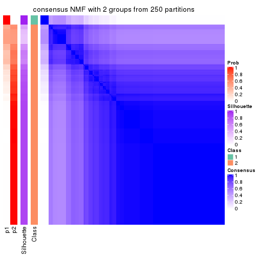</p>

</div>
<div id='tab-ATC-NMF-consensus-heatmap-2'>
<pre><code class="r">consensus_heatmap(res, k = 3)
</code></pre>

<p>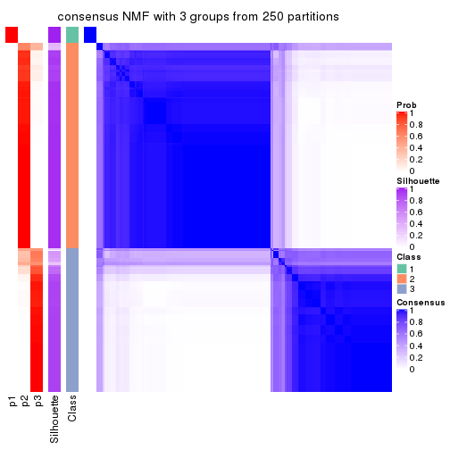</p>

</div>
<div id='tab-ATC-NMF-consensus-heatmap-3'>
<pre><code class="r">consensus_heatmap(res, k = 4)
</code></pre>

<p>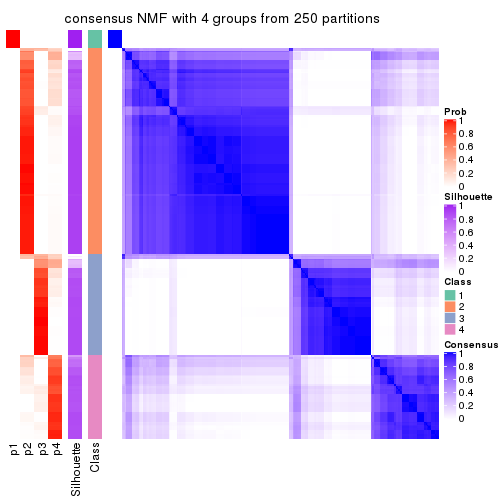</p>

</div>
<div id='tab-ATC-NMF-consensus-heatmap-4'>
<pre><code class="r">consensus_heatmap(res, k = 5)
</code></pre>

<p>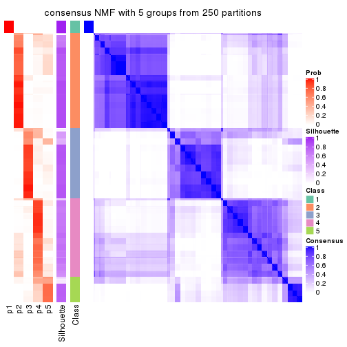</p>

</div>
<div id='tab-ATC-NMF-consensus-heatmap-5'>
<pre><code class="r">consensus_heatmap(res, k = 6)
</code></pre>

<p>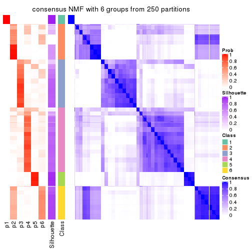</p>

</div>
</div>

Heatmaps for the membership of samples in all partitions to see how consistent they are:


<script>
$( function() {
	$( '#tabs-ATC-NMF-membership-heatmap' ).tabs();
} );
</script>
<div id='tabs-ATC-NMF-membership-heatmap'>
<ul>
<li><a href='#tab-ATC-NMF-membership-heatmap-1'>k = 2</a></li>
<li><a href='#tab-ATC-NMF-membership-heatmap-2'>k = 3</a></li>
<li><a href='#tab-ATC-NMF-membership-heatmap-3'>k = 4</a></li>
<li><a href='#tab-ATC-NMF-membership-heatmap-4'>k = 5</a></li>
<li><a href='#tab-ATC-NMF-membership-heatmap-5'>k = 6</a></li>
</ul>
<div id='tab-ATC-NMF-membership-heatmap-1'>
<pre><code class="r">membership_heatmap(res, k = 2)
</code></pre>

<p>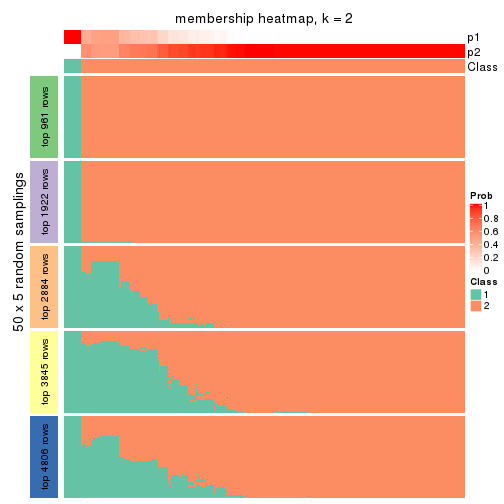</p>

</div>
<div id='tab-ATC-NMF-membership-heatmap-2'>
<pre><code class="r">membership_heatmap(res, k = 3)
</code></pre>

<p>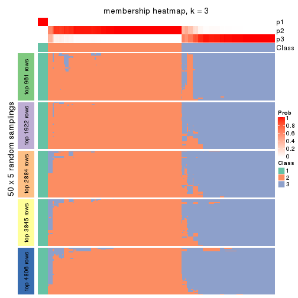</p>

</div>
<div id='tab-ATC-NMF-membership-heatmap-3'>
<pre><code class="r">membership_heatmap(res, k = 4)
</code></pre>

<p>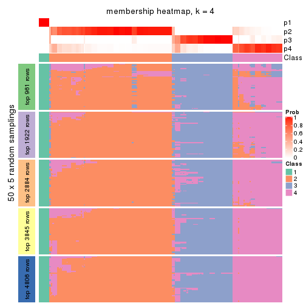</p>

</div>
<div id='tab-ATC-NMF-membership-heatmap-4'>
<pre><code class="r">membership_heatmap(res, k = 5)
</code></pre>

<p>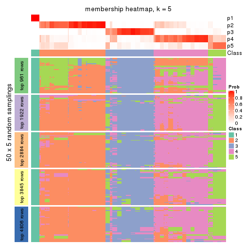</p>

</div>
<div id='tab-ATC-NMF-membership-heatmap-5'>
<pre><code class="r">membership_heatmap(res, k = 6)
</code></pre>

<p>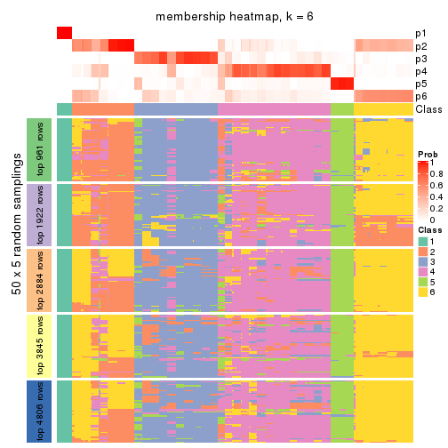</p>

</div>
</div>

As soon as we have had the classes for columns, we can look for signatures
which are significantly different between classes which can be candidate marks
for certain classes. Following are the heatmaps for signatures.


Signature heatmaps where rows are scaled:


<script>
$( function() {
	$( '#tabs-ATC-NMF-get-signatures' ).tabs();
} );
</script>
<div id='tabs-ATC-NMF-get-signatures'>
<ul>
<li><a href='#tab-ATC-NMF-get-signatures-1'>k = 2</a></li>
<li><a href='#tab-ATC-NMF-get-signatures-2'>k = 3</a></li>
<li><a href='#tab-ATC-NMF-get-signatures-3'>k = 4</a></li>
<li><a href='#tab-ATC-NMF-get-signatures-4'>k = 5</a></li>
<li><a href='#tab-ATC-NMF-get-signatures-5'>k = 6</a></li>
</ul>
<div id='tab-ATC-NMF-get-signatures-1'>
<pre><code class="r">get_signatures(res, k = 2)
</code></pre>

<p>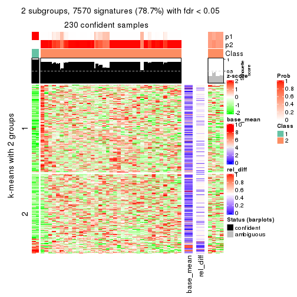</p>

</div>
<div id='tab-ATC-NMF-get-signatures-2'>
<pre><code class="r">get_signatures(res, k = 3)
</code></pre>

<p>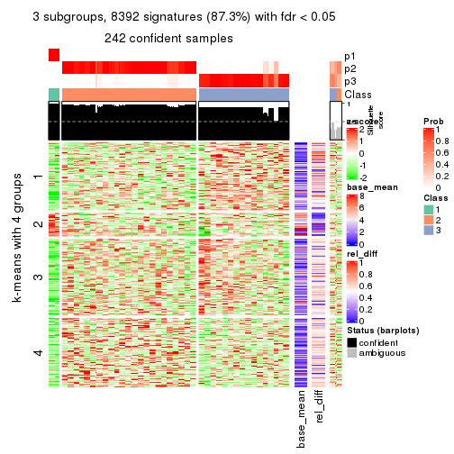</p>

</div>
<div id='tab-ATC-NMF-get-signatures-3'>
<pre><code class="r">get_signatures(res, k = 4)
</code></pre>

<p>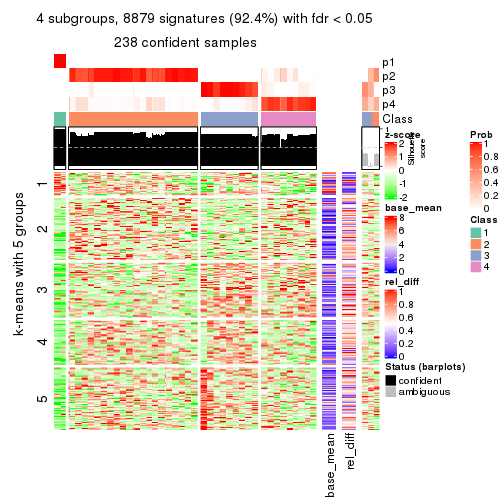</p>

</div>
<div id='tab-ATC-NMF-get-signatures-4'>
<pre><code class="r">get_signatures(res, k = 5)
</code></pre>

<p>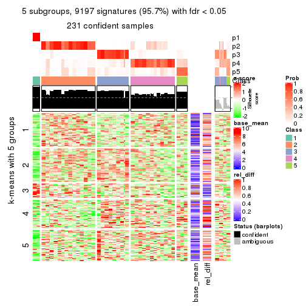</p>

</div>
<div id='tab-ATC-NMF-get-signatures-5'>
<pre><code class="r">get_signatures(res, k = 6)
</code></pre>

<p>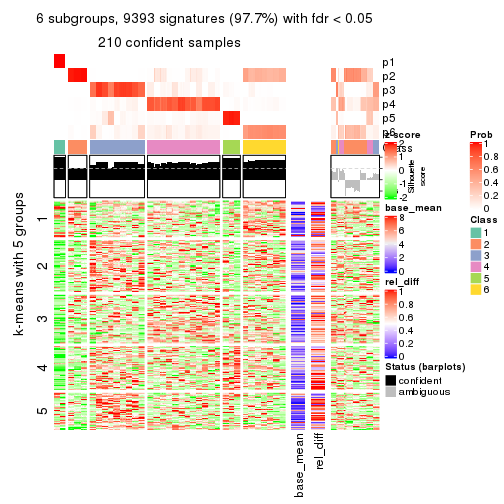</p>

</div>
</div>


Signature heatmaps where rows are not scaled:


<script>
$( function() {
	$( '#tabs-ATC-NMF-get-signatures-no-scale' ).tabs();
} );
</script>
<div id='tabs-ATC-NMF-get-signatures-no-scale'>
<ul>
<li><a href='#tab-ATC-NMF-get-signatures-no-scale-1'>k = 2</a></li>
<li><a href='#tab-ATC-NMF-get-signatures-no-scale-2'>k = 3</a></li>
<li><a href='#tab-ATC-NMF-get-signatures-no-scale-3'>k = 4</a></li>
<li><a href='#tab-ATC-NMF-get-signatures-no-scale-4'>k = 5</a></li>
<li><a href='#tab-ATC-NMF-get-signatures-no-scale-5'>k = 6</a></li>
</ul>
<div id='tab-ATC-NMF-get-signatures-no-scale-1'>
<pre><code class="r">get_signatures(res, k = 2, scale_rows = FALSE)
</code></pre>

<p>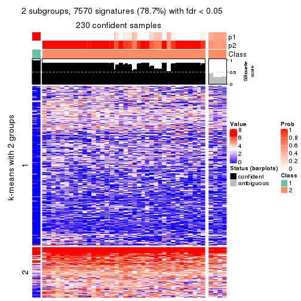</p>

</div>
<div id='tab-ATC-NMF-get-signatures-no-scale-2'>
<pre><code class="r">get_signatures(res, k = 3, scale_rows = FALSE)
</code></pre>

<p>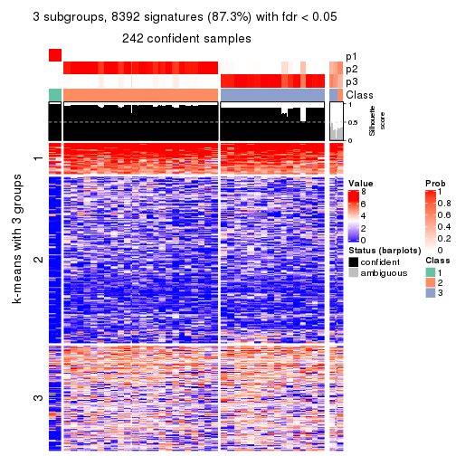</p>

</div>
<div id='tab-ATC-NMF-get-signatures-no-scale-3'>
<pre><code class="r">get_signatures(res, k = 4, scale_rows = FALSE)
</code></pre>

<p>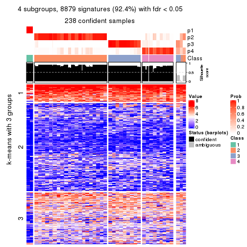</p>

</div>
<div id='tab-ATC-NMF-get-signatures-no-scale-4'>
<pre><code class="r">get_signatures(res, k = 5, scale_rows = FALSE)
</code></pre>

<p>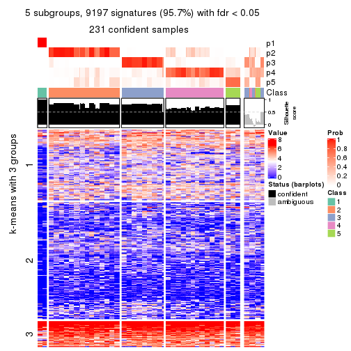</p>

</div>
<div id='tab-ATC-NMF-get-signatures-no-scale-5'>
<pre><code class="r">get_signatures(res, k = 6, scale_rows = FALSE)
</code></pre>

<p>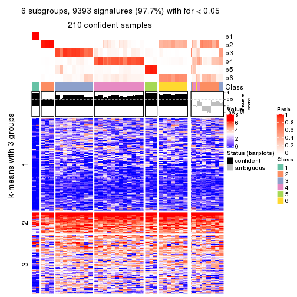</p>

</div>
</div>


Compare the overlap of signatures from different k:

```r
compare_signatures(res)
```

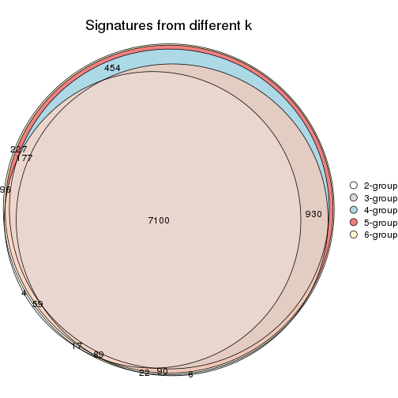

`get_signature()` returns a data frame invisibly. TO get the list of signatures, the function
call should be assigned to a variable explicitly. In following code, if `plot` argument is set
to `FALSE`, no heatmap is plotted while only the differential analysis is performed.

```r
# code only for demonstration
tb = get_signature(res, k = ..., plot = FALSE)
```

An example of the output of `tb` is:

```
#>   which_row         fdr    mean_1    mean_2 scaled_mean_1 scaled_mean_2 km
#> 1        38 0.042760348  8.373488  9.131774    -0.5533452     0.5164555  1
#> 2        40 0.018707592  7.106213  8.469186    -0.6173731     0.5762149  1
#> 3        55 0.019134737 10.221463 11.207825    -0.6159697     0.5749050  1
#> 4        59 0.006059896  5.921854  7.869574    -0.6899429     0.6439467  1
#> 5        60 0.018055526  8.928898 10.211722    -0.6204761     0.5791110  1
#> 6        98 0.009384629 15.714769 14.887706     0.6635654    -0.6193277  2
...
```

The columns in `tb` are:

1. `which_row`: row indices corresponding to the input matrix.
2. `fdr`: FDR for the differential test. 
3. `mean_x`: The mean value in group x.
4. `scaled_mean_x`: The mean value in group x after rows are scaled.
5. `km`: Row groups if k-means clustering is applied to rows.


UMAP plot which shows how samples are separated.


<script>
$( function() {
	$( '#tabs-ATC-NMF-dimension-reduction' ).tabs();
} );
</script>
<div id='tabs-ATC-NMF-dimension-reduction'>
<ul>
<li><a href='#tab-ATC-NMF-dimension-reduction-1'>k = 2</a></li>
<li><a href='#tab-ATC-NMF-dimension-reduction-2'>k = 3</a></li>
<li><a href='#tab-ATC-NMF-dimension-reduction-3'>k = 4</a></li>
<li><a href='#tab-ATC-NMF-dimension-reduction-4'>k = 5</a></li>
<li><a href='#tab-ATC-NMF-dimension-reduction-5'>k = 6</a></li>
</ul>
<div id='tab-ATC-NMF-dimension-reduction-1'>
<pre><code class="r">dimension_reduction(res, k = 2, method = &quot;UMAP&quot;)
</code></pre>

<p>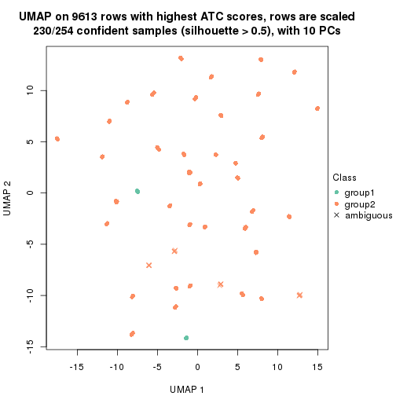</p>

</div>
<div id='tab-ATC-NMF-dimension-reduction-2'>
<pre><code class="r">dimension_reduction(res, k = 3, method = &quot;UMAP&quot;)
</code></pre>

<p>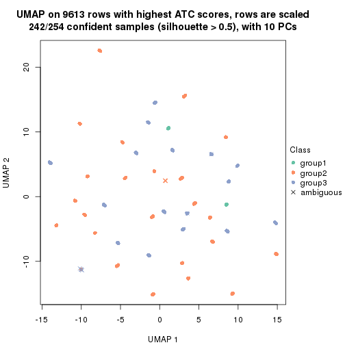</p>

</div>
<div id='tab-ATC-NMF-dimension-reduction-3'>
<pre><code class="r">dimension_reduction(res, k = 4, method = &quot;UMAP&quot;)
</code></pre>

<p>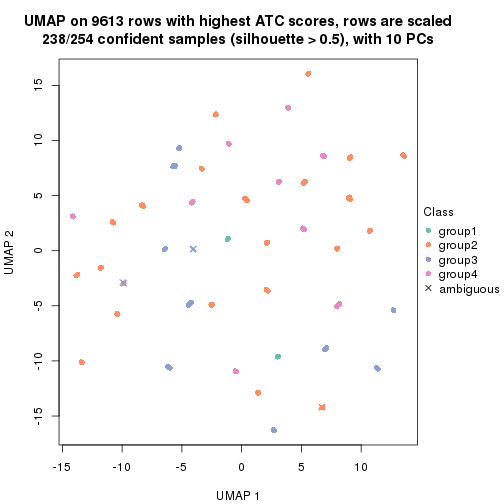</p>

</div>
<div id='tab-ATC-NMF-dimension-reduction-4'>
<pre><code class="r">dimension_reduction(res, k = 5, method = &quot;UMAP&quot;)
</code></pre>

<p>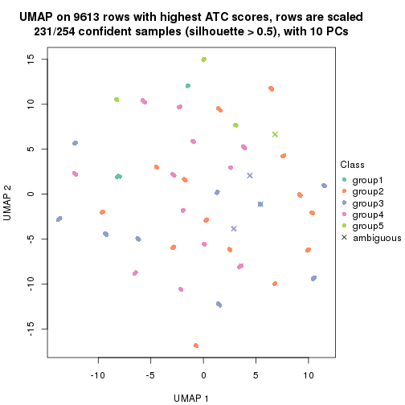</p>

</div>
<div id='tab-ATC-NMF-dimension-reduction-5'>
<pre><code class="r">dimension_reduction(res, k = 6, method = &quot;UMAP&quot;)
</code></pre>

<p>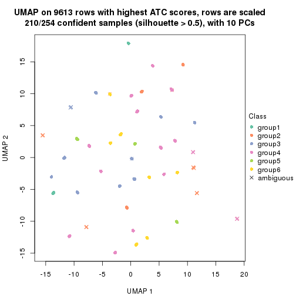</p>

</div>
</div>


Following heatmap shows how subgroups are split when increasing `k`:

```r
collect_classes(res)
```

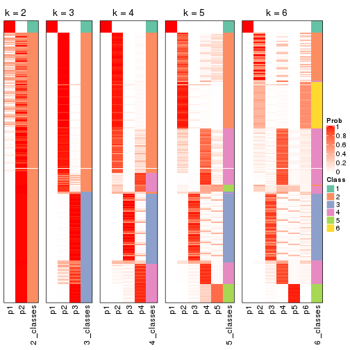


If matrix rows can be associated to genes, consider to use `GO_Enrichment(res,
...)` to perform function enrichment for the signature genes.


 

## Session info


```r
sessionInfo()
```

```
#> R version 3.6.0 (2019-04-26)
#> Platform: x86_64-pc-linux-gnu (64-bit)
#> Running under: CentOS Linux 7 (Core)
#> 
#> Matrix products: default
#> BLAS:   /usr/lib64/libblas.so.3.4.2
#> LAPACK: /usr/lib64/liblapack.so.3.4.2
#> 
#> locale:
#>  [1] LC_CTYPE=en_GB.UTF-8       LC_NUMERIC=C               LC_TIME=en_GB.UTF-8       
#>  [4] LC_COLLATE=en_GB.UTF-8     LC_MONETARY=en_GB.UTF-8    LC_MESSAGES=en_GB.UTF-8   
#>  [7] LC_PAPER=en_GB.UTF-8       LC_NAME=C                  LC_ADDRESS=C              
#> [10] LC_TELEPHONE=C             LC_MEASUREMENT=en_GB.UTF-8 LC_IDENTIFICATION=C       
#> 
#> attached base packages:
#>  [1] grid      parallel  stats4    stats     graphics  grDevices utils     datasets  methods  
#> [10] base     
#> 
#> other attached packages:
#>  [1] genefilter_1.66.0           ComplexHeatmap_2.1.1        markdown_1.1               
#>  [4] knitr_1.26                  cola_1.3.2                  SummarizedExperiment_1.14.1
#>  [7] DelayedArray_0.10.0         BiocParallel_1.18.1         matrixStats_0.55.0         
#> [10] Biobase_2.44.0              GenomicRanges_1.36.1        GenomeInfoDb_1.20.0        
#> [13] IRanges_2.18.3              S4Vectors_0.22.1            BiocGenerics_0.30.0        
#> [16] GetoptLong_0.1.7           
#> 
#> loaded via a namespace (and not attached):
#>  [1] bitops_1.0-6           bit64_0.9-7            doParallel_1.0.15      RColorBrewer_1.1-2    
#>  [5] httr_1.4.1             backports_1.1.5        tools_3.6.0            R6_2.4.1              
#>  [9] DBI_1.0.0              lazyeval_0.2.2         colorspace_1.4-1       withr_2.1.2           
#> [13] tidyselect_0.2.5       gridExtra_2.3          bit_1.1-14             compiler_3.6.0        
#> [17] xml2_1.2.2             microbenchmark_1.4-7   pkgmaker_0.28          slam_0.1-46           
#> [21] scales_1.1.0           NMF_0.23.6             stringr_1.4.0          digest_0.6.23         
#> [25] XVector_0.24.0         pkgconfig_2.0.3        bibtex_0.4.2           highr_0.8             
#> [29] rlang_0.4.2            GlobalOptions_0.1.1    RSQLite_2.1.2          impute_1.58.0         
#> [33] shape_1.4.4            mclust_5.4.5           dendextend_1.12.0      dplyr_0.8.3           
#> [37] RCurl_1.95-4.12        magrittr_1.5           GenomeInfoDbData_1.2.1 Matrix_1.2-17         
#> [41] Rcpp_1.0.3             munsell_0.5.0          viridis_0.5.1          lifecycle_0.1.0       
#> [45] stringi_1.4.3          zlibbioc_1.30.0        plyr_1.8.4             blob_1.2.0            
#> [49] crayon_1.3.4           lattice_0.20-38        splines_3.6.0          annotate_1.62.0       
#> [53] circlize_0.4.9         zeallot_0.1.0          pillar_1.4.2           rjson_0.2.20          
#> [57] rngtools_1.4           reshape2_1.4.3         codetools_0.2-16       XML_3.98-1.20         
#> [61] glue_1.3.1             evaluate_0.14          vctrs_0.2.0            png_0.1-7             
#> [65] foreach_1.4.7          polyclip_1.10-0        gtable_0.3.0           purrr_0.3.3           
#> [69] clue_0.3-57            assertthat_0.2.1       ggplot2_3.2.1          xfun_0.11             
#> [73] gridBase_0.4-7         eulerr_6.0.0           xtable_1.8-4           skmeans_0.2-11        
#> [77] survival_2.44-1.1      viridisLite_0.3.0      tibble_2.1.3           iterators_1.0.12      
#> [81] memoise_1.1.0          AnnotationDbi_1.46.1   registry_0.5-1         GTF_0.0.1             
#> [85] cluster_2.1.0          brew_1.0-6
```


